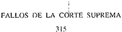

TOMO 315

Volumen 2

1992

"::,"

:.

i

## FAtLOS DE LA CORTE.:SUPREMA DE JUSTICIA DE LA NACION

,-

-

REPUBLICA

CORTE

ARGENTINA

## FALLOS

DE LA

SUPREMA

DE

JUSTICIA DE LA NA'CION

PUBLICA ClaN A CARGO DE LA SECRETARIA DE JURISPRUDENCIA DEL TRIBUNAL

TOMO 315 --VOLUMEN 2

JUNIO-SEPTIEMBRE

SERVICOP

C.lle 50 N° 742 - (1900) L. Plata - Buenos. Aires.

1992

/'

.,

Copyright (e)' 1995 by Corte Suprema de Justicia de la ,Naciór;¡ Queda heeno el depósito que previene la l.,ey 11.723 Impreso en la.Argentina . Printed in Argentina I.S.B~N. 950-9825-17-4

## AÑO 1992

## JUNIO-SEPTIEMBRE

ESCALAFON DEL PODER JUDICIAL.

17 -

En Buenos Aires, a los 16 días del mes de junio del año mil novecientos noventa y dos, reunidos en la Sala de Acuerdos del Tribunal, los señores Ministros que suscriben la presente,

Consideraron:

Que, como consecuencia del reordenamiento de las categorías de las dotaciones de los Anexos 2 y 3 que esta Corte dispusiera mediante la Acordada n° 7/92, corresponde modificar las actuales denominaciones de las categorías existentes para el personal administrativo y técnico, obrero y de maestranza y de servicio' de los citados anexos,

Por ello,

Acordaron:

1O)'Establecer a partir del 1° de julio de 1992 las modificaciones en la denominació~ de las actuales categorías del escalafón del Poder Judicial según el siguiente detalle:

ANEXO 2: (Personal Administrativo y técnico)

Denominación actual

Oficial Superior de 1a,

Oficial Superior de 7a.

Nueva denominación

Oficial

Escribiente

## ACUERDOS DELACORTESUPREMA

315

Auxilia'r Superior de la.

Auxiliar Superior de 7a.

Auxiliar Principal de 3a.

Escribiente auxiliar

Auxiliar

Auxiliar Administrativo

ANEXO 3: (Personal de Servicio, obrero y de maestranza)

Denominación actual

Oficial Superior de 7a.

Oficial Superior de 9a.

Auxiliar Principal

AUxiliar Principal de 2a.

Auxiliar Principal de 3a.

"Nueva denominación

Encargado de sección

Oficial de Servicio

Medio Oficial

Ayudante

Auxiliar de servicio

2°) Suprimir a partir del 1° de julio del corriente año las actuales denominaciones de las categorías de los Anexos 2 y 3 y hacer saber a todos los tribunales y organismos dependientes del Poder Judicialque deberán utilizar la nueva denominación dispuesta en la presente.

Todo lo cual dispusieron y mandaron, ordenando que se comunicase y registrase en el libro correspondiente, por ante mí, que doy fe.RICARDOLEVENE(H) - MARIANOAUGUSTO CAVAGNAMARTfNEZ- RODOLFOC. BARRA- CARLOSS. FAYT - AUGUSTOCÉSAR BELLUSCIOENRIQUESANTIAGOPETRACCHI- JULIO S. NAZARENO- EDUARDOMOLINÉ O'CONNOR Javier María Leal de /barra (Secretario).

## ESCALAFON DEL PODER JUDICIAL.

-w 18-

En Buenos "Aires, a los 16 días del mes de junio del año mil novecientos noventa y dos, reunidos en la Sala de Acuerdos del Tribunal, los señores Ministros que suscriben la presente, .

## Consideraron:

Que el reordenamiento de categorías de los Anexos 2 y 3, resuelto por esta Corte Suprema por la Acordada del 12 de marzo del corriente año, ha provocado dificultades en el encasillamiento de algunas categorías.

Que tan delicada cuestión permite apreciar a este Tribunal la necesidad de dejar parcialmente sin efect9 disposiciones que impiden un mejor aprovechamiento de los recursos humanos de que dispone el Poder Judicial.

Que no obstante lo expuesto resurta necesaria continuar con el estudio de aquellos casos de agentes que integran las dotaciones del Poder Judicial que'por diversas circunstancias no han sido incorporados en los respectivos escalafones.

Por ello,

Acordaron:

- 1°) Disponer que los agentes que prestaban servicios en cargos asignados como no escalafonados al 29 de febrero del corriente año y que por disposición de la Acordada 7/92 fueran reubicados en la categoría de oficial superior de 7a" deberán ser incorporados al cargo de oficial superior de la, con efectos al1 ° de marzo del corriente año.
- 2°) Encomendar a la Secretaría de Superintendencia Judicial a que examine las normas vigentes que regulan la situación de agentes no escalafonados, con el objeto de procurar un régimen reglamentario que satisfaga las necesidades de los tribunales y dependencias que de esta Corte dependan.
- 3°) Imputar el gasto de lo precedentemente dispuesto a las partidas que correspondan para el ejercicio financiero del año en curso.

Todo lo cual dispusieron y mandaron, ordenando que se comunicase y registrase en el libro correspondiente, por ante mí, que doy fe.RICARDO LEVEN E (H) - MARIANO AUGUSTO CAVAGNA MARTÍNEZ - RODOLFO C. BARRA - CARLOS S. FAYT- AUGUSTO CÉSAR BELLUSCIOENRIQUE SANTIAGOETRACCHIJULIO S. NAZARENOEDUARDO OLINÉ O'CONNOR - ANTONIO P --M BOGGIANO Javier María Leal de [barra (Secretario).

## TASAS JUDICIALES.

-w 19-

En Buenos Aires, a los 23 días del mes de junio del año mil novecientos noventa y dos, reunidos en la Sala de Acuerdos del Tribunal, los señores Ministros que suscriben la presente,

## Consideraron:

Que la reglamentación de los artículos 9, inc. h) y 11 de la ley 23.898 es atribución propia de esta Corte Suprema.

Por ello,

Acordaron:

1°) Lacédula de intimación ordenada por el artículo 9, inc. h), de la ley 23.898 será confeccionada de oficio y firmada por el Secretario del Tribunal que entendiere en el recurso y contendrá expresamente el monto de la tasa judicial que corresponda ingresar, bajo aper-

cibimiento de que, si dentro de los cinco (5) días siguientes a la notificación no se practicare el pago o no se manifestare oposición fundada a éste, se ap'licarán la multa, la actualización y los intereses previstos en el artículo 11., párrafo 2do., de la mencionada norma.

- 2°) En los recursos directos contra resoluciones de órg.anos administrativos o de personas jurídicas estatales o no estatales y en los recursos judiciales interpuestos respecto de actuaciones iniciadas ante organismos administrativos que -ejercen una actividad jurisdiccional, la tasa deberá abonarse en la oportunidad de ser recibidos por primera vez los autos en el Tribunal por quien promueva la actuación o requiera el servicio de justicia, dentro de los cinco (5' días de quedar notificado de la radicación de las actuaciones y de la intimación respectiva. Ello sin perjuicio del pago que pueda corresponder una vez concluido el proceso por un modo normal o anormal.
- 3°) La oposición fundada en difel'encias respecto del importe de.la tasa que se debe abonar,se tendrá por no presentada cuando se hubiere omitido acompañar la constancia del pagó de la parte adeudada que no ha sidocuestionaqa.
- 4°) Una vez terminado el trámite del proceso por un medio normal o anormal, no se dará curso a ninguna petición del obligado al pago de la tasa judicial o de su representante, si no abona el importe no cuestionado.
- 5°) El certificado de deuda será confeccionado por todos los tribunales,.conforme al siguiente modelo:

CERTIFICO: Teniendo a la vista los autos caratulados:

"

" que tramitan por

ante este Juzgado

de Primera Instancia

N°

,

cuya

Secretaría desempeño, sito en

,

Piso

,

que la parte

................

\_\_

con domicilio real en

y representada

por el Dr.

con domicilio constituido en

.

adeuda, en concepto de tasa judicial y multa la suma de pesos

.

conforme al siguiente detalle:

"Tasa Judicial de fs

,

$

\_

- Multa aplicada por auto de fs

$

\_

- TOTAL avalores del

,

/

./

$

\_

- Suma ajustada a la fecha

$

\_

-

Intereses

(

Meses)

$

\_

- TOTAL A LA FECHA

~

$

\_

## DEJUSTICIA DELANACION 315

- 6°) Una vez resuelta la "oposición fundada" a que S6 refiere el penúltimo párrafo del art. 11 de la ley 23.898, el secretario o prosecretario liquidará de oficio la deuda, emitiendo el certificado por el importe correspondiente a la tasa y su multa, el que será título habiJitante para que se proceda a su cobro, salvo que dentro de los cinco (5) días de notificada la resolución que ordena el pago de la tasa (primer pár.rafo del art. II de la ley) se hubiera depositado -en carácter de garantía, en efectivo y a la orden de la Corte Supremala totalidad del importe controvertido (Fuente: art. 183, ley 11.683 -t. o. 1978 y modif.-).
- 7°) El cobro compulsivo de Jos certificados se hará mediante el procedimiento establecido en el art. 92 de la ley 11.683 y las disposiciones a las que se remite.
- 8°) Se encomienda a la Dirección General Impositiva -por intermedio de los cobradores fiscales que asignela ejecución de los certificados de deuda emitidos.

Todo lo cual dispusieron y mandaron, ordenando que se comunicase y registrase en el libro correspondiente, por ante mí, que doy fe.RICARDOLEVENE (H) - MARIANO AUGUSTO CAVAGNAMARTfNEZ- RODOLFOC. BARRA- AUGUSTOCÉS¡R BELLUSCIO- ENRIQUESANTIAGO PETRACCHI- JULIO S. NAZARENO- EDUARDOMOLINÉ O'CONNOR - ANTONIOBOGGIANOHugo Luis Mauro Piacentino (Secretario).

TASAS JUDICIALES.

-w 20-

En Buenos Aires, a los 23.días del mes de junio del año mil novecientos noventa y dos, reunidos en la Sala de Acuerdos del Tribunal, los señores Mirfistros que suscriben la pre sente,

Consideraron:

Que la tasa de justicia regulada por dicha leyes uno de los recurs~s específicos, propios d~1 Poder Judicial de ia Nación conferidos por la ley 23.853 (art. 3°, inc. a), razón por lo cual corresponde a este Tribunal -en ejercicio de las facultades concedidas. por los artículos 8° y 9° de ésta últimaestablecer las disposiciones que favorezcan su más adecuada percepción.

Por ello,

Acordaron:

- 1°) El contribuyente no puede ser dispensado de acompañar la liquidación detallada de cada concepto que integra el monto imponible. Ante la omisión de este recaudo se intimará su presentación bajo apercibimiento de aplicar al responsable las.sanciones conminatorias establecidas en el art. 12 de la ley 23.898.

- 2°) En los procesos en los que la tasa a tributar sea el importe cobrado por la Dirección Nacional de la Propiedad Industrial para la solicitud del registro, el contribuyente acompañará la certificación correspondiente con la liquidación del tributo.
- 3°) Se entenderá satisfecha la certificación a que se refiere el último párrafo del artículo 10 con la constancia de expedición del certificado de deuda respectivo.
- 4°) La intimación a que alude la última parte del inciso d) del artículo 13 deberá otorgar un plazo de hasta cinco (5) días para el pago.
- 5°) En las oportunidades en que a los encargados de la percepción de la tasa se les faciliten en préstamo las causas principales, podrán retenerlas en su poder por un período que no supere los diez (10) días.
- 6°) En las notas de elevación de las causas a la Cámara para el trámite del recurso de apelación, el secretario o prosecretario administrativo deberá dejar constancia del pago de la tasa judicial.
- A su vez, las respectivas Cámaras de Apelaciones deberán controlar el cumplimiento de esta exigencia.
- 7°) Las Cámaras Nacionales yFederales deberán organizar cursos de capacitación para los funcionarios y empleados de los distintos fueros, tendientes a perfeccionar el sistema de trabajo en lo que concierne al control y fiscalización del pago de la tasa de justicia. La asistencia y puntaje de aprobación de tales cursos, serán computables a los fines del ascenso.
- 8°) En las causas no remitidas al Archivo que por cualquier motivo retornen a su letra y se verifique que obra pendiente el pago de la tasa judicial, se seguirá el procedimiento estipulado en la ley para su percepción.
- 9°) Los funcionarios a cargo del Archivo deberán facilitar a los encargados de la percepción de la tasa, designados de acuerdo al artículo ll,en las oportunidades en que ésto&gt;" lo soliciten, la compulsa de los expedientes, para controlar todo lo relativo al pago de la tasa judicial.
- 10) Los tribunales sólo deberán remitir los expedientes a los representantes del fisco de la Dirección General Impositiva en los casos previstos por los arts. 4, inc. d, 5, segundo párrafo, 11, cuarto párrafo, y 13, inc. a, de la ley 23.898 o en aquellos en que se presente alguna duda fundada que justifique contar con el dictamen de dicha repartición.

Todo lo cual dispusieron y mandaron, ordenando que se comunicase y registrase en el libro correspondiente, por ante mí, que doy fe.RICARDO LEVEN E (H) - MARIANO AUGUSTO CAVAGNA MARTfNEZ - RODOLFO. BARRA - AUGUSTOÉSAR BELLUSCIOENRIQUE SANTIAGO C C -PETRACCHI- JULIOS. NAZARENO -Hugo Luis Mauro Piacentino (Secretario).

## EMPLEADOS JUDICIALES. MEDIDAS DE ACCION DIRECTA.

21 -

En Buenos Aires, a los 23 días del mes de junio del año mil novecientos noventa y dos, reunidos en la Sala Je Acuerdos del Tribunal, los señores Ministros que suscriben -la presente,

## Consideraron:

Que ante la iniciación de medidas de acción directa por parte de la Unión de Empleados de la Justicia de la Nación, y teniendo en cuenta la alteración que producirán en la correcta prestación del servicio dejusticia, el Tribunal estima conveniente la adopción de medidas similares a las contenidas en la Acordada nO74/91.

Por lo expuesto y con el objeto de superar el conflicto que eS.de público conocimiento,

Acordaron:

- a) Abrir un período de concili-ación a partir del día de la fecha y hasta el 17 de julio del corriente año.
- b) Convocar a la Unión de Empleados de la Justicia de la Nación a una primera audiencia para el día 29 del corriente mes, a realizarse con los Secretarios de Superintendencia Judicial y Administrativa de la Corte Suprema.
- c) Declarar que, dura.nte el plazo señalado en el punto a), los agentes judiciales deberán abstenerse de adoptar toda medida de acción directa.

Todo lo cual dispusieron y mandaron, ordenando que se comunicase y registrase .en el libro correspondiente, por ante mí, que doy fe.RICARDOLEVENE (H) RODOLPOC. BARRA- CARLOSS. FAYT - AUGUSTOCÉSAR BELLUSCIO- ENRIQUE SANTIAGOPETRACCHI- JULIO S. NAZARENO- EDUARDOMOLINÉ O'CONNOR - ANTONIO BOGGIANOJavier María Leal de ¡barra (Secretario).

## TASAS JUDICIALES.

En Buenos Aires, a los 30 días del mes de junio del año mil novecientos noventa y dos, reunidos en la Sala de Acuerdos del Tribunal, los señores Ministros que suscriben la presente,

## Consideraron:

Que recientemente se dictó la ley 23.074, en cuyo anículo 35 se faculta al Podel~~j~.:cutivo Nacional para "disminuir las alícuotas de los siguientes gravámenes, cuando las condiciones de estabilidad económica así lo aconsejen: al tasas judiciales~ ..-".-----

Que corresponde interpretar esta norma, como una manifestación de la política económica diseñada por el legislador (plasmada en diversas leyes, entre las cuales se' cuenta la 23.928) y de la cual no corresponde sustraerse. Antes bien, esta Corte ha dado signos inequívocos que la muestran acompañando estos objetivos globales de estabilidad económica que, lejos de insertarse en una determinada política de la Administración Central, se adecuan a las metas que conducen al "bienestar general", según los términos del Preámbulo de la Carta Magna (fallo de esta Corte en V. 251 XXI: "Vega, Andrés R. y otro c/Instituto Nac. de Vitivinicultura s/acción de inconstitucionalidad -medida de no innovar).

Que corrobora las conclusiones accedidas respecto de los motivos que impulsaron al Jegislador a contemplar reducciones en las alícuotas de la tasa de justicia, el informe de la Comisión de Presupuesto y Hacienda de la Cámara de Diputados de la Nación, que precede la sanción de la ley 23.074, en cuanto allí se expresa que "se proponen modificaciones de algunos aspectos de la Ley del Impuesto al Valor Agregado, la Ley de Procedimientos Fiscales y otras disposiciones de menor entidad que en suma se enmarcan en la adecuación a lo expuesto y refuerzan las posibilidades de mantenimiento de las orientaciones de política económica global que se vienen impulsando".

Que esta decisión legislativa, obviamente dirigida al acotamiento de los recursos económicos provenientes de la tasa judicial (en la misma ley 23.074 se añaden nuevas exenciones a las dispuestas en la ley 23.898, ver arto 37, punto 2), conduce a una lectura en el contexto de la ley 23.853 -de autarquía financiera del Poder Judicial-. Y a partir de la regla hermenéutica con arreglo a la cual las leyes deben interpretarse "computando la totalidad de sus preceptos, evitando darles un sentido que ponga en pugna sus disposiciones, destruyendo las unas por las otras" (Fallos 304: 1733); cabe colegir que la reducción de uno de los recursos propios del Poder Judicial de la Nación (art. 3° inc. a), tiene su correlato con el incremento de la recaudación tributaria que conlleva la estabilidad económica y con la obligación que ha impuesto la ley de atender el presupuesto judicial con los recursos de rentas generales, que se conforman "con el equivalente del tres y medio por ciento (3,5%) de los recursos tributarios y no tributarios de la Administración Central..".

Por ello,

. Acordaron:

Suprimir los recaudos establecidos en el artículo 2° de la Acordada 77/90.

Lo dispuesto en la presente regirá a partir de su publicación en el Boletín Oficial.

Todo lo cual dispusieron y mandaron, ordenando que se comunicase y registrase en el libro correspondiente, por ante mí, que doy fe.RICARDOLEvENE (H) - MARIANOAUGUSTO CAVAGNAMARTÍNEZ- RODOLrO C. BARRA- CARLOSS. FAYT - ENRIQUESANTIAGOPETKACCHI 'c :1-IJ.L!~.S. NAZARENO- ANTONIOBOGGIANOJavier María Leal de ¡barra (Secretario).

-w 25-

En BlIt'1l0S A¡res, a los í 4 días del mes de julio del año mil novecientos noventa y dos, reunidos en la Sala de Acueruos del Tribunal, los señores ,Ministros que suscriben la presente.

## Consideraron:

Quc en los considerandos de la Acordada 22/92 se deslizó un error material consistente en mencionar la ley 23.074, cuando en realidad se debió expresar "ley 24.073". .

Por ello,

Acordaron:

Aclarar los considerandos de la Acordada citada, en el sentido de que en lugar de decir "ley 23.074" debe decir "ley 24.073".

Todo lo cual dispusieron y mandaron, ordenando que se comunicase y registrase en el libro correspondiente, por ante mí, que doy fe.RICARDOLEVENE (H) -MARIANO AUGUSTO CAVAGNAMARTfNEZ- RODOI.FOC. BARRA - CARLOS S. FAYT - JULIO S. NAZARENO- EDUARDO MOLlNÉ O'CONNOR Javier María Leal de/barra (Secretario).

## ESTUDIOS DE HISTOCOMPATIBILIDAD.

\_N° 23-

En Buenos Aires, a los 7 días del mes de juiiodel año mil novecientos noventa y dos, reunidos en la Sala de Acuerdos del Tribunal, los señores Ministros que suscriben lapresente,

## Consideraron.

Que la realización de los estudios de histocompatibilidad (técnica HLA) y de inmunogenética (técnica ADN) está siendo solventada por el Poder Judicial de la Nación, sin perjuicio de los reintegros procedentes con arreglo ala que en definitiva se resuelva en materia de costas en los respectivos juicios.

Que los elevados montos que insumen tales estudios y la cantidad creciente de caso~ en los cuales se requiere su realización, hacen aconsejable fijar el régimen al que debe. sujetarse.

Por ello,

Resolvieron:

- 1°) El Ppder Judicial de la Nación, por Intermedio de la Subsecretaría de Administración y con intervención previa de la Dirección General Pericial de la Justicia Nacional (Cuerpo Médico Forense), atenderá el pago -con carácter de anticipode los estudios de HLA y ADN cuando su realización fuere indispensable para el resultado del proceso y fuera consecuencia de una medida decretada de oficio por el juez de la causa o de un pedido de la parte que actuare con beneficio de litigar sin gastos.
- 2°) El importe anticipado, con más su actualización, deberá ser cargado a las costas del respectivo juicio, a cuyo efecto la mencionada Dirección remitirá al tribunal de origen copia certificada de la factura.
- 3°) En los supuestos no contemplados en el artículo 1°, el tribunal interviniente -ya sea en forma directa o por intermedio de la citada Direcciónsolicitará a la instirució,n que corresponda la realización de tales estudios, haciendo constar expresamente que su pago Íntegro correrá por cuenta del interesado, en la forma y condiciones que entre ellos se convenga, quedando liberado el Poder Judicial de la Nación de toda responsabilidad ulterior.
- 4°) Una vez que se encuentre firme la decisión sobre las costas se intimará a las partes por secretaría el depósito del respectivo importe -con la inclusión de la actualización que corresponda (ley 23.928)en el término de cinco (5) días, bajo apercibimiento de ejecución.

No se dará curso a ninguna petición de carácter patrimonial posterior a la sentencia, hasta tanto no se haya cumplido con el reintegro antedicho.

- 5°) Si al vencimiento del plazo a que se refiere el artículo anterior no se depositare el importe intimado, deberá confeccionarse por secretaría el correspondiente certificado de deuda que constituirá título habilitante para su ejecución, el cual deberá ser girado a la Secretaría de Superintendencia Administrativa de esta Corte con los datos completos del deudor y demás elementos de interés, a los fines de su remisión a la Procuración General de la Nación para promover la acción ejecutiva pertinente a través del fiscal que corresponda.
- 6°) Las sumas recuperadas como consecuencia de lo dispuesto en los artículos precedentes serán depositadas en la cuenta n° 1918/97 (Banco de la Nación Argentina) "Fondo Nacional de la Justicia -Subsecretaría de Administración de la Corte Suprema de Justicia de la Nación".
- 7°) Los tribunales deberán comunicar a la Secretaría de Superintendencia Administrativa de esta Corte las sentencias definitivas recaídas en aquellas causas en las cuales el Poder Judicial de la Nación hubiere atendido el pago de los estudios a que se refiere el artículo 1°.
- 8°) La Subdirección General de Fiscalización de Recursos llevará el control de los fondos pendientes de recupero, a cuyo efecto la Secretaría de Superintendencia Administrativa le hará llegar las'sentencias recaídas y copia de los certificados de deuda emitidos, y la Subsecretaría de Administración le remitirá fotocopia de las facturas abonadas y de' las boletas de depósito correspondientes a las devoluciones producidas. Dicha Subdirección General quedará facultada para requerir a los respectivos tribunales toda la información necesaria para el mejor desempeño de la función encomendada.
- 9°) El Juzgado Nacional en lo Criminal de Rogatorias' de la Capital dará curso a los estudios solicitados por los tribunales provinciales de jurisdicción no federal, cuando el requerimiento contenga los datos de individualización del responsable en afrontar ese gasto. Tal circunstancia deberá ponerse en conocimiento de la institución que fuere a practicar el

pertinente estudio, en las condici.ones a que se refiere el artículo 3°). Idéntico procedimiento se aplicará en 'aquellos casos en que los estudios de referencia fueren necesarios para llevar a cabo un peritaje autorizado a título de colaboración.

Todo lo cual dispusieron y mandaron, ordenando que se comunicase y registrase en el libro correspondiente, por ante mí, que doy fe.RICARDOLEVENE (H) - MARIANO AUGUSTO CAVAGNAMARTÍNEZ- RODOLFOC. BARRA - CARLOS S. FAYT - AUGUSTOCÉSAR BELLUSClOENRIQUESANTIAGOPETRACCHI- JULIOS. NAZARENO- EDUARDOMOLINÉO'CONNOR - ANTONIO BOGGIANOHugo. Luis Mauro Piacentino (Secretario).

## FERIA JUDICIAL DE JULIO. AUTORIDADES.

24 -

En Buenos Aires, a los 14 días del mes de julio del año mil novecientos noventa y dos, reunidos en la Sala de Acuúdos del Tribunal, los señores Ministros que suscriben la presente, y teniendo en cuenta la comunicación formulada por la Procuración General de la Nación,

Resolvieron:

- 1) Designar como autoridades de feria del mes de julio del corriente año:
- 1°) Al,doctor don Antonio Boggiano como juez de feria.
- 2°) A la doctora Cristina Alvarez de Magliano -1 a. semanay a los doctores don Jorge Migliore, don Hugo Piacentino y don Javier María Leal de '¡bana -1 a. y 2da. semanascomo secretarios del Tribunal.
- Il) Tener por designados, en la Procuración General de la Nación al doctor donOscar Luján Fappiano; y en la Defensoría ante la Corte Suprema de Justicia de la Nación y demás tribunales federales de la Capital al doctor don Carlos Alberto Tavares.
- '~In) Establecer el horario de atención al público de lunes a viernes, desde las 9 hasta las ']3 horas.

IV) El personal que preste funciones durante la feria judicial deberá acreditarlo mediante certificación otorgada por los señores secretarios de feria.

Todo lo cual dispusieron y mandaron, ordenando que se comunicase y registrase en el libro correspondiente, por ante mí, que doy fe.RICARDOLEVENE (H) - MARIANO AUGUSTO CAVAGNAMART1NEZ- RODOHO C. BARRA- CARLOSS. FAYT - AUGUSTOCf:SAR BELLUSClOJULIO S. NAZARENO- EDUARDOMOLlNÉ O'CONNOR Javier María Leal de ¡barra (Secretario).

## ACUERDOS DELACORTE SUPREMA

## CORTE SUPREMA. SECRETARIA DE INVESTIGACION DE DERECHO COMPARADO.

-w 26-

En Buenos Aires, a los 14 días del mes de julio del año mil novecientos noventa y dos, reunidos en la Sala de Acuerdos del Tribunal, los señores Ministros que suscriben la pre~ente,

Consideraron:

Que la complejidad de los asuntos que acceden a la Corte Suprema de Justicia de la Nación requiere la creación de una secretaría que investigue la jurisprudencia: doctrina y legislación de países extranjeros, y los coordine y sistematice para ponerlos a disposición de los magistrados y funcionarios del Poder Judicial de la Nación.

Por ello,

Acordaron:

- 1°) Crear la Secretaría de Investigación de Derecho Comparildo de la Corte SupreJílla de Justicia de la Nación. ·

2°) La secretaría creada entenderá:

- a) en la realización de un relevamiento de la información extranjera existente en el Poder Judicial de la Nación y en la información periódica a los Ministros de la Corte Suprema y a las Secretarías del Tribunal de la doctrina y jurisprudencia existente en el derecho comparado, vinculada con temas jurídicos de trascendencia para la Corte Suprema de Justicia de la Nación.

b) en la confección. dé las traducciones de leyes, sentenciasy trabajos de doctrina que le sean requeridas para la resolución de causas judiciales;

- c) en la publicación periódica de resúmenes de las principales sentencias de tribunales extranjeros;

d) en la elaboración de un archivo de los trabajos que realice;

- 3°) Para el cumplimiento de las funciones citadas, la Secretaría de Investigación de Derecho Comparado coordinará con las Secretarías de Jurisprudencia y Letrada de Informática y la Dirección General de Bibliotecas, la preparación de un Banco de datos sobre las materias de su competencia.

Todo lo cual dispusieron y mandaron, ordenando que se comunicase y registrase en el libro correspondiente. por ante mí, que doy fe.RICARDOLEVENE (H) -MARIANOAUGUSTO CAVAGNAMARTÍNEZ- RODOLFOC. BARRA- CARLOSS. FAYT - JULlO S. NAZARENO- EDUARDOMOLlNÉ O'CONNOR Javier María Leal de Ibarra(Secretario).

## CORTE SUPREMA. SECRETARIA DE JURISPRUDENCIA.

-w 27-

En Buenos Aires, a los 14 días del mes de julio del año mil novecientos noventa y dos, reunidos en la Sala de Acuerdos del Tribunal, los señores Ministros que suscriben la presente,

## Consideraron:

Que la actual estructura de la Corte Suprema de Justicia de la Nación requiere ampliar las funciones de la Secretaría Letrada de Jurisprudencia, extendiendo su misión propia de sistematizar científicamente y difundir la jurisprudencia del Tribunal a otras áreas afines en las que podrá desarrollar sus técnicas específicas en beneficio de la actividad del Poder Judicial.

Por ello,

Acordaron:

- 1°) Transformar la actual Secretaría Letrada de Jurisprudencia en Secretaría de Jurisprudencia de la Corte Suprema de Justicia de la Nación, que tendrá las siguientes funcioc nes:
- a) editar la colección de Fallos y Digestos de la Corte Suprema de Justiciade la Nación.
- b) dirigir y administrar el sistema de jurisprudencia, manteniéndolo actualizado con la incorporación de los nuevos sumarios 'correspondientes a las sen'tencias seleccionadas, y controlar el ingreso de las bases históricas (Colección de Digestos) .·
- c) preparar el boletín mensual de jurisprudencia de la Corte Suprema.
- d) colaborar con la Secretaría Letrada de Informática para incorporar la totalidad de los fallos en la base de datos.
- e) proponer las medidas necesarias para crear un Banco de datos federal.
- f) fiscalizar las copias de las sentel)cias y llevar adelante el archivo de VOtOS de los ministros, desarrollado en base 'alas sentencias seleccionadas desde mayo de 1990.
- g) verificar la coherencia de los proyectos de sentencias con los pronunciamientos anteriores, con apoyo en las citasde "Fallos" y legales.
- h) asistir al Tribunal y a los miembros del Poder Judicial de la Nación y de las provincias, como así también a los otros poderes e instituciones oficiales; en las consultas de jurisprudencia.

i) colaborar con los proyectos de difusión de la información a través de los nuevos medios tecnológicos -utilización del fax, ediciones en CD ROM (disco laser), distribución de las bases de datos por vía telemática, etc.

- j) coordinar con la Dirección General de Prensa la publicidad periódica del contenido de las sentencias más trascendentes de la Corte Suprema.

k) coordinar con la Dirección General de Bibliotecas del Tribunal la realización de proyectos comunes.

1) entender en las demás funciones que le asigne el Tribunal.

- 2°) Modificar, en lo pertinente, el arto 4° de la Acordada 27/85 (Fallos 307:28) y derogar el inciso d del ar!. 100 del Reglamento para la Justicia Nacional (Fallos 224:575).

Todo lo cual dispusieron y mandaron, ordenando que se comunicase y registrase en el libro correspondiente, por ante mí, que doy fe.RICARDOLEVENE(H) - MARIANOAUGUSTO CAVAGNAMARTINEZ- RODOLFOC. BARRA - CARLOSS. FAYT - JULIO S. NAZARENO- EDUARDOMOLINÉ O'CONNOR Javier María Leal de [barra (Secretario).

\_N° 65-

'-

En Buenos Aires, a los 20 días del mes de octubre del año mil novecientos noventa y dos, reunidos en la Sala de Acuerdos del Tribunal, los señores Ministros que suscriben la presente,

Consideraron:

Lo dispuesto por el arto 2° de la Acordada 27/92 ..

Acordaron:

Aclarar que la oficina de Confrontaciones y Copias depende de la Secretaría de Jurisprudencia.

Todo lo cual dispusieron y mandaron, ordenando que se comunicase y registrase en el libro correspondiente, por ante mí, que doy fe.RICARDOLEVENE (H) - MARIANOAUGUSTO CAVAGNAMARTINEZ- RODOLFOC. BARRA- CARLOSS. FAYT - JULIO S. NAZARENO- EDUARDOMOLINÉO'CONNOR - ANTONIOBOGGIANOClaudia Marcelo Kiper (Secretario).

## DEJUSTICIA DELANACION 315

## FERIA JUDICIAL DE JULIO.

-w 28-

En Buenos Aires, a los 17 días del mes de julio del año mil novecientos noventa y dos, reunidos en la Sala de Acuerdos del Tribunal, los señores Ministros que suscriben la presente,

## Acordaron:

Designar al doctor don Augusto César Belluscio para que reemplace al doctor don Antonio Boggiano en su carácter de juez de feria de la Corte Suprema de Justicia de la Nación, en caso de ausencia o impedimento.

Todo lo cual dispusieron y mandaron, ordenando que se comunicase y registrase en el libro correspondiente, por ante mí, que doy fe.RICARDOLEvENE (H) MARIANO AUGUSTO CAVAGNA MARTíNEZ - CARLOS S. FAYT - AUGUSTO CÉSAR BELLUSCIO - EDUARDO MOLINÉ O'CONNOR Javier María Leal de [barra (Secretario) ..

## CORTE SUPREMA. DESIGNACION DE SECRETARIO.

\_N° 29-

En Buenos Aires, a los 7 días del mes de agostó del año mil novecientos noventa y dos, reunidos en la Sala de Acuerdos del Tribunal, los señores Ministros que suscriben la presente,

## Consideraron:

Que con el objeto de poner en funcionamiento la Secretaría de Investigación de Derecho Comparado de la Corte Suprema, creada por la Acordada nO26/92,

## Acordaron:

Designar Secretario de la Corte Suprema de Justicia de la Nación, en cargo creado por la Resolución nO 1003/92, al doctor don JAVIER MARIA LEAL de !BARRA, quien se desempeñará en forma interina como titular de la dependencia creada.

Todo lo cual dispusieron y mandaron, ordenando que -se comunicase y registrase en el libro correspondiente, por ante mí, que doy fe.RICARDOLEVENE (H) MARIANO AUGUSTO CAVAGNAMARTíNEZ - RODOLFOC. BARRA - CARLOS S. FAYT - AUGUSTOCÉSAR BELLUSCIOJULIO S. NAZARENO- ANTONIOBOGGIANOClaudia Marcelo Kiper (Secretario).

1130

## CAMARA FEDERAL DE SAN MARTIN.

-w 31-

En Buenos Aires, a los 13días del mes de agosto del año ¡nil novecientos noventa y dos, reunidos en la Sala de Acuerdos del Tribunal, los señores Ministros que suscriben la presente,

## Consideraron:

Que mediante la ley 23.937 se ha creado una nueva Sala en la Cámara Federal de Apelaciones de San Martín y diversos tribunales en esa jurisdicción.

Que, como se ha puesto de manifiesto en distintas oportunidades, es propósito de esta Corte Suprema proveer lo necesario para asegurar la correcta prestación del servicio de justicia, por lo que la puesta en funcionamiento de los nuevos tribunales creados constituye una prioridad, sin perjuicio de las graves dificultades presupuestarias que obstaculicen su efectiva concreción (confr. Acordada nO65/90 entre otras). .

Que, en relación a lo precedentemente expuesto conviene recordar lo señalado por este Tribunal en los puntos Xl, XII YXIII de la Acordada 24/91 (presupuesto de gastos para el ejercicio 1992).

Que por la resolución n° 1055/92 se asignaron los cargos correspondientes a la dotación de personal, la Secretaría de Superintendencia Administrativa ha informado sobre la conclusión de las obras de infraestructura y el Poder Ejecutivo Nacional, mediante los decretos Nros. 1455/91, 1379/91, 1758/91, 1748/91 Y1761/91 Ylas resoluciones Nros. 554/ 91 Y559/91, ha efectuado las designaciones de .]os magistrados y funcionarios, por lo que corresponde ordenar su puesta en funcionamiento.

Por ello,

Acordaron:

Disponer, la habilitación de los tribunales creados por la ley 23.937 a partir del día 14 de septiembre de 1992 según el siguiente detalle:

- a) la Sala creada en la Cám~ra Federal de Apelaciones de San Martín (ar!. 1°).
- b) los Juzgados Federales de Primera Instanciá en lo Criminal y Correccional con asiento en esa ciudad (art. 2°).
- c) la Fiscalía y la Defensoría creadas para actuar ante los juzgados mencionados en el inciso anterior (art. 3°).
- d) el Juzgado Federal de Primera Instancia en lo Criminal y Correccional con asiento en la ciudad de San Isidro N° 2 (art. 6°). .
- e) el Juzgado Federal de Primera Instancia en lo Criminal y Correccional N° 3 con asiento en la ciudad de Morón (art. 7°).

- 2°) La Cámara Federal de Apelaciones de San Martín deberá disponer, en forma inmediata, la puesta en funcionamiento de la secretaría creada por el art. 5° para el Juzgado de Primera Instancia en lo Civil y Comercial y Contencioso Administrativo Federal N° 2 de San Martín.
- 3°) Los agentes que prestan servicios como contratados en los asientos en donde se crean nuevos tribunales deberán ser tenidos en cuenta para ocupar los cargos vacantes asignados a los nuevos juzgados y organismos creados.

Todo lo cual dispusieron y mandaron, ordenando que se comunicase y registrase en el libro correspondiente, por ante mí, que doy fe.RICARDOLEVENE (H) - MARIANOAUGUSTO CAVAGNAMARTÍNEZ RODOLFOC. BARRA - CARLOSS. FAYT - ENRIQUESANTIAGOPETRACCHI - JULIO S. NAZARENO- EDUARDOMOLlNÉ O'CONNOR - ANTONIOBOGGtANOCaludio Marcelo Kiper (Secretario).

CORTE SUPREMA. PRESUPUESTO.

\_N° 32-

En Buenos Aires, a los 19 días del mes de agosto del año mil novecientos noventa y dos, reunidos en la Sala de Acuerdos del Tribunal, los .señores Ministros que suscriben la presente,

## Consideraron:

- 1.Que de conformidad con lo prescripto por el Artículo 99 de la Constitución Nacional y teniendo en cuenta lo establecido en el Artículo 1° de la Ley N° 23.853, corresponde a la Corte Suprema de Justicia de la Nación dictar -para el año 1993el Presupuesto de Gastos y Recursos del Poder Judicial, para su remisión al Poder Ejecutivo y oportuna incorporación al proyecto del Presupuesto General de la Administración Nacional que será enviado al Honorable Congreso.
- 1I.Que, como ha venido siendo su constante anual, para la confección del presente cálculo presupuestario se ha tenido especial consideración a la situación general de la Nación que impone la limitación de los gastos, aunque renovando el esfuerzo de todos para ir superando las dificultades que la aquejan.
- Il1.Que el sistema financiero proporcionado al Poder Judicial de la Nación por la ley 23.853 ha mejorado su participación en la percepción de recursos, situación que ha comenc zado a aliviar en parte sus crónicas postergaciones. Sólo el ajuste anual que responda a las

necesidades surgidas del crecimiento natural del Poder y en la ocasión al que pueda corresponder a las exigencias de la ley 23.984 (nuevo Código de Procedimientos en lo Penal) y otros proyectos anunciados por el Poder Ejecutivo Nacional, garantizará el desenvolvimiento adecuado de su servicio.

- IV. Que este Tribunal viene tratando -dentro de sus posibilidades y atribucionesde sumar medios en tal sentido, para lo cual ha dictado disposiciones tendientes a generar fondos propios con la limitación y prudencia, claro está, de que ello no pese en el acceso a una justicia que debe estar al alcance de todos.
- V. Que en materia de remuneracjones el Tribunal, dentro del contexto de los salarios públicos, ha intentado resguardar la intangibilidad que consagra el artículo 96 de la Constitución Nacional, por la que seguirá velando y con especial cuidado en un cuadro retributario general que responda a la modalidades de la prestación de la actividad judicial.
- VI. Que el constante crecimiento de este Poder en una etapa en la que el Estado tiende a su achicamiento, le otorga características especiales que requieren -sin dudasun tratamiento presupuestario distinto. Más aún cuando tal crecimiento obedece a creaciones de tribunales generados por leyes de la Nación de obvio cumplimiento.
- VII. Que, por tales circunstancias no resulta posible ajustar el presupuesto del Poder Judicial a los límites de los "Lineamientos básicos de la política presupuestaria para el ejercicio fiscal 1993", elaborado por la Secretaría de Hacienda del Ministerio de Economía y de Obras y Servicios Públicos de la Nación ni serán suficientes los ingresos pertinentes estimados por dicha cartera de Estado.
- VIII. Que en lo que respecta al nuevo procedimiento penal oral (ley 23.984) no se cuenta, a la fecha, con su ley de implementación, lo que dificulta las estimaciones de los gastos necesarios para su funcionamiento, motivo por el cual esas previsiones se elevarán en cuanto se conozca el correspondiente texto legal.
- IX. Que en atención a las trascendencia económica que generalmente demandan las inversiones destinadas a la obtención de inmuebles imprescindibles para la instalación de nuevos tribunales, resulta necesario propiciar una modificación en el artículo 2° de la ley de autarquía de modo tal que permita que la adquisición de éstos seaafrontada con créditos y fondos de rentas generales. Ello obedece a que la experiencia indica que muchas veces resulta más conveniente -en costo y tiempola compra que la construcción.
- X. Que con relación a la cuenta especial "Fondo Nacional de la Justicia" se fijan los recursos propios en la suma de PESOS TREINTA Y SEIS MILLONES QUINIENTOS MIL ($ 36.500.000.-).

Por ello,

Acordaron:

1°) Fijar el presupuesto de gastos del Poder Judicial de la Nación para el ejercicio financiero 1993 en la suma de PESOS SEISCIENTOS CUARENTA Y CUATRO MILLONES SETECIENTOS VEINTITRES MIL ($ 644.723.000.-) conforme al siguiente detalle:

## 1) ADMINISTRACION CENTRAL

## 2) CUENT AS ESPECIALES

Inciso 1

Personal

$ 493.700.000.-

Inciso 2

Bienes.de consumo

$

9.386.000.-

Inciso 3

Servicios no personales

$

34.862.000.-

Inciso 4

Bienes de Uso

$ 60.762.000.-

Inciso 5

Transferencias

$ 9.513.000.-

$

608.223.000.-

Inciso 2

Bienes de consumo

$ 13.250.000.-

Inciso 3

Servicios no personales

$ 14.050.000 ..

Inciso 4

Bienes de uso

$ 9.200.000.-

$ 36.500.000.-

## TOT AL GENERAL

$ 664.723.000.-

- 2°) Aprobar las planillas de distribución de créditos correspondientes al Plan Analíti. ca de Trabajos Públicos elaborado por la Subsecretaría de Administración, que forma p.arte de esta Acordada y que serán suscriptas por el señor Secretario del Tribunal.
- 3°) Poner en conocimiento de los Poderes Ejecutivo y Legislativo que las cifras corres. pondientes a la justicia penal oral serán remitidas en oportunidad de contarse con la pertinente ley de implementación. .
- 4°) Propiciar la modificación del artículo 2° de la ley 23.853 con arreglo alo señalado en el considerando XI de la presente, por el siguiente texto "Los recursos de Rentas Generales se conformarán con el equivalente del tres y medio por ciento (3,5%) de los recursos tributarios y no tributarios de la Administración.Central, más el aporte que anualmente incluye el Poder Ejecutivo Nacional en el Presupuesto General de la Administración para los rubros construcciones y/o bienes preexistentes, de acuerdo al presupuesto preparado por la Corte Suprema de Justicia.

l:t34

Todo lo cual dispusieron y mandaran que 'se,camunicase y registrase en el libra carrespondiente'" por ante mí, que day fe.RICARDO,LEVENE (H) - MARIANO AUGUSTOCAVAGNA ,MART.ÍNEZ- RODOLFOC. BARRA- CARLOSS. Fft·. Y.T.--AuGUSTO CESAR BELLUSCIO- ENRIQUE SANT.IAGO'PETRACCHI - JULIO S. NAZARENO --EDUARDO M.oLlNE O'CONNOR -ANTONIO BOGGIANOHugO'Luis Mauro Piacelltillo (Secretaria), '

OFlCINA\ EJE ESTl\DlSTICAS DEL PODER, JUDICI.AL., ¡rnGLAMENTO.

-w

33-

En Buenas:A:ü'es;aJos: 19,días del mes de agosta del añO' ¡nil.nO'v.ecientas, noventa y das, reunidO's enJa\_Salalde Acuel:dos del Tribunal, las señares Ministr,Qs,q,ue;suscriben la presente,

## Cansideraron::

- 1°) Que en ejer,ciciO',de la Superintendencia esta CO'rte creó pOfT,esalución N° 451 de fecha 16 de abril próximO' pasadO', la Oficina, de Estadísticas del PO'der,Judicial, dependiente de la Secretaría de Superintendencia Judicial del Tribunal.
- 2°) Que canfO'rme a lo expuesto en los cansiderandos de dicha dispasición se hace conveniente dictar un O'rdenamientO' que determine en fO'rma precisa la narmativa, que regule su accionar.

Par ellO',

AéO'rdaran:

Aprobar el Reglamenta para la Oficina de Estadísticas del PO'der Judicial de la Nación cUYO'anexa fO'rma parte del presente acuerda.

TO'dO'la cual dispusieran y mandaran, O'rdenandO' que se cO'municase y registrase en el librO' carrespO'ndiente, pO'r ante mí, que day fe.RICARDOLEVENE(H) - MARIANOAUGUSTO CAVAGNAMARTÍNEZ- RODOLFOC. BARRA- CARLOSS. FAYT - AUGUSTOCESAR BELL~SCIOENRIQUESANTIAGOPETRACCHI- JULIO S. NAZARENO- EDUARDOMOLINE O'CONNOR - ANTONIOBOGGIANOCaludio Mareelo Kiper(Secretaria).

## REGLAMENTO DE LA OFICINA DE EST ADISTICAS DEL PODER JUDICIAL DE LA NACION.

## PARTE GENERAL

Artículo 1°: La Oficina de Estadísticas del Poder Judicial de la Nación, tiene por objetivo planificar, coordinar e implementar el Sistema de Estadísticas del Poder Judicial de la N~ción (SEPJ), en lo atinente al movimiento de expedientes y datos de sus recursos humanos.

Artículo 2°: Con el objeto de dar cumplimiento a lo establecido por el artículo anterior, la Ofi,cina de Estadísticas:.

- a) Recibirá, procesará, organizará y analizará los datos que genere el movimiento de expedientes, tanto de la Corte Suprema como de los diferentes fueros.
- b) Recibirá, procesará, organizará y analizará los datos que representan las variaciones de las características del recurso humano del Poder Judicial de la Nación.
- c) Organizará un banco de datos con la información generada por: 1) Corte Suprema, 2) Cámaras Nacionales y Federales, 3) Juzgados Nacionales, 4) Defensorías, 5) Fiscalías, 6) Asesorías de Menores e Incapaces, 7) Cuerpos Técnicos Periciales, 8) Archivo del Poder Judicial de la Nación, 9) Dirección General de Mandamientos y Notificaciones para la Justicia Nacional, 10) Subsecretaría de A.dministración, 11) Cámaras Federales del Interior del País y dependencias a su cargo.
- d) Será la fuente de información estadística oficial del Poder Judicial de la Nación, por medio de la cual se hará la difusión o publicación tanto interna como externa en la materia.
- e) Centralizará el procesamie.nto de los datos para generar información estadística estandar o la que especialmente se le requiera.
- f) Llevará un archivo de publicaciones, para slHmnsulta e intercambio con otros &lt;organismos.
- g) Contará con sistemas de COlf\putación Ypwgr.amas propios ..Pudiendo requerir-en ,caso necesario equipo, procesamiento.y programas de;computación del Departamento de Sistemas y Procedimientos.de la Secretaría.Letrada.de Informática de la Corte Suprema., ,Domo también asesoramiento en dichas áreas.
- Artículo 3°: Para haoer posible-el-cumplimiento de los artículos l° y 2° ,deesta.feglamentación, a la Oficina .de Estadísticas del Poder Judicial de la Nación, :se!la f.ac.ulta;para:
- a) Recoger los ,datos oOJ:Í.ginalescorrespondientes al movimienoo de ex;pedi.errtes:y.características del rec.ursohumano"contenido en los libros de mesa de entJJ::adas,.¡¡¡;gistros de oficina, legajos, ar.chiv.os ,C).cmilquiersoporte escrito o magnético.ilonéleseT-egistl;en.
- &amp;) Asesorare interv.enir -en'Ia mejora de los procedimientos pma la;generación, recolección y organización de Jos-datos, que tienen lugar en los organismos,que;los:producen.

1136

## ACUERDOS DE LA CORTE SUPREMA 315

c) Evaluar el grado de confiabilidad y redundancia de los datos generados, pudiendo implementar los mecanismos necesarios para corregir los desvíos que los afectan.

Artículo 4°: El organismo que genera la información designará un'funcionario para su confección; el cual será responsable de la exactitud de los datos consignados en las planillas, que certificará con su firma.

Artículo 5°: Los datos recibidos y procesados por la Oficina de Estadísticas se comunicarán mediante informes de carácter "público" o "confidencial", los informes "públicos" tienen difusión irrestricta y los "confidenciales" estarán dirigidos exclusivamente a ministros, camaristas, jueces o secretarios de Corte.

Artículo 6°: la inobserva'ncia de este reglamento dará lugar a la aplicación del artículo 16 del decreto-ley 1.285/58 con intervención del Secretario de Superintendencia Judicial de la Corte Suprema de Justicia de la Nación.

## PARTE ESPECIAL

## 1.- Planillas de Trámite

Artículo 7°: La Corte Suprema, Cámaras, Juzgados y dependencias a su cargo, Fiscalías, Defensorías, Asesorías de Menores e Incapaces, Cuerpos Técnicos Periciales, Archivo del Poder Judicial de la Nación, Dirección General de Mandamientos y Notificaciones. para la Justicia Nacional y Subsecretaría de Administración; remitirán mensualmente a partir del 1° de febrero de 1993, en la forma prevista en el artículo 8°, las planillas actualizadas con el ingreso y trámite de los expedientes cuyo formato general se presenta en los artículos siguientes.

Artículo 8°: Las planillas actualizadas con el ingreso y trámite de los expedientes se ajustarán al mes calendario y se remitirán previo control, por intermedio de las cámaras de apelaciones, a la Oficina de Estadísticas, dentro de los ocho primeros días del mes siguiente al que corresponda el informe.

Los secretarios judiciales de la Corte Suprema remitirán las respectivas planillas por intermedio de su Mesa General de Entradas.

Todos los datos contenidos en las planillas podrán ser informados en soporte de papel o registro magnético y éstos deberán ser compatibles con la capacidad de procesamiento y programas de la Oficina de Estadísticas.

Artículo 9°: Todas las planillas en líneas generales deberán contener:

a) Nombre del Tribunal, identificación de Sala, Secretaría u otra dependencia del Poder Judicial de la Nación, que genera la información y nombre de los titulares.

b) Fecha de emisión de los datos conforme al período que abarcan los mismos.

c) La enumeración de todas las causas en las que se haya dictado elllllmado de autos para sentencia.

- d) El número de cada causa, fecha de iniciación, objeto del proceso o incidencia, fecha en que quedó firme el llamado de autos para sentencia y, en su caso, fecha de la sentencia o ampliación del plazo para dictarla.
- e) Cualquier otra observación u aclaración que considere pertinente.
- Artículo 10°: Para relevar los datos en la planilla se tendrán en cuenta las siguientes reglas:
- a) Se incluirán como caus'as sentenciadas únicamente aquellas en las que el fallo se haya dictado en el mes a que corresponde el informe.
- b) Ninguna causa se eliminará de la planilla sin que, de acuerdo al informe del mes anterior, se haya concluido.
- c) Las causas pendientes de sentencia cuyo plazo haya sido suspendido por cualquier razón deberán continuar figurando en la planilla, con la anotación respectiva en aquélla de la fecha y motivo de dicha suspensión.
- d) Las causas acumuladas figurarán independientemente, con la correspondiente anotación, en la planilla del mes en que se realice la acumulación. En los próximos meses fi. gurará sólo la causa principal.
- e) Los jueces a quienes la Cámara ola Corte Suprema de Justicia, hayaconcedidoampliación del plazo para dictar sentencia,. harán constar en la planilla la'fecha de la.resolución y el plazo concedido ..
- Artículo, 11 b: En las planillas correspondientes a las Cámaras de Apelaciones se inclui.rán, las causas que se sorteen y voten los jueces. Además de los datos generales mencionados en el artículo 9,0 se especificará::
- a) Fecha de'entl'ada o sorteo de la.causa-en las Cámaras y fecha.de devolución al Tri .. bu na!.
- b}Cuando existan causas en estado de sentencia que no hayan sido sorteadas, se lo expresará en observaciones con los motivos quejustifiquen la excepción. '
- Las. cámaras que se hallen informatizadas adecuarán, de ser necesario,. las planillas ac". tualmente' vigentes a la presente' normati vaco
- Artículo 12°: En el caso de los Juzgados Penales, además de lo indicado en el artículo 9°, harán constar si hay querellante, procesado, si se encuentra detenido;. fecha de detención,calificación del delito y resolución recaída en cada caso.
- Artículo 13°: En las planillas que remitan'los tribunales del trabajo constará además de lo indicado en el artículo 9°, el' trámite de los expedientes existentes y recibidos en el mes conforme a la siguiente discriminación:

## a}Exhortos.

- b) Ejecuciones fiscales, de cajas de subsidios, otros procesos ejecutivos, medidas cautelares, conversión de multas, etc.
- c) Juicios ordinarios.

## d) Expedientes en ejecución.

## e) Duración.

Artículo 14°: en las planillas que remitan los tribunales comerciales, constará además de ll? indicado en el artículo 9° para el caso de procedimientos concursales, .fecha de su apertura, fecha y modo de conclusión.

## -n.Planillas de Movimiento de Expedientes

Artículo] 5°: Los secretarios judiciales de la Corte Suprema, cámaras de apelaciones y de los juzgados remitirán mensualmente a la Oficina de Estadísticas, conforme a lo dispuesto en el artículo 8° un resumen numérico de los expedientes iniciados y terminados de acuerdo a la forma de su conclusión y a la materia de la causa.

Artículo ]6°: Dichas planillas deberán ser remitidas dentro de los ocho primeros días' del mes siguiente al que corresponde el movimiento e informarán la cantidad total de expedientes iniciados en ese período y de los terminadQs en el mismo mes, cualquiera que fuere la fecha de iniciación de estos últimos.

Artículo 17°: Las planillas con los informes mensuales del Archivo General del Poder Judicial., Dirección General de Mandamientos y Notificaciones para la Justicia Nacional y Cuerpos Técnicos Periciales, se recibirán en la Oficina de Estadísticas por intermedio de las direcciones que centralicen dichas dependencias.

Artículo 18°: Los titulares de dichos organismos serán responsables de la entrega de las planillas a la Oficina de Estadísticas dentro del plazo especificado en el artículo 8°.

Artículo 19°: Los magistr.ados y funcionarios del Ministerio Público, observando lo .dispuesto en el artículo:8°, remitirán un informe mensual con indicación de los asuntos en los que hayan interv,eoido oorante el mes vencido y los que hayan quedado pendientes de .despacho.

Para los magistrndos:y funCionarios del Ministerio Público ante los fueros civil y comercial el informe descripto en el presente artículo será Illrimestral. ~

Artículo 20°: La$ubsecretaría de Administración -Departamento de Pers0I1alelevará una planilla IDensua:loen la cual deberá constar:

## 1) Cantida(;li;otal.de personal.

- 2) Plantape1Jmanente e interinos (IDllgistrados,fnncionarios, personal adll:Jinistratiw) y técnico, obrero(')y-de.rnaestranza y de servicio) especi:f.icando cargos., ;agrupáBdolos pm,categoría.
- 3) Contl'lttadosy suplentes (f\_cionarios, per;¡muiladministt.a:tiwo y téclUco, obreN&gt;'y de maestr&lt;m:zay &lt;de-servicio) espec,jficandoademáscdeJios,cargos y !la;a:gr.upación;por cate~rías:
- contr.altl0 (:fucha y eXllfll1'!üiiíri).
- l-(ilUl;ación del I
- 2-menovación del C(lI:tl1!1:aw,QfechalC'Xltensión). Y

4).Licencias extraordiWll'.i:as".non · .o sin gnue&lt;i:le'sueldO"lque's.uperenel mes, dmación y prÓl'1;0,gtl.

5) Títulas y cursas realJizadas afines ona con la tarea que desempeña.

## 6) Renuncias y jubilaciones (fechas).

7) Vacantes existentes arfinalizar cada mes en el Pader Judicial, especificadas par categadas y clase de persanal.

Artículo 2l o : La Oficina de Estadísticas, además de las planillas de Clllntral de trámite y de:mavimienta de expedientes, tenienda en cuenta las funciones y abligac1.@nesdescriptas en la.parte general de esta reglamentación, padrá reqnerir la elabaración de 'Otros infarmes par pru:te de las distintas 'Organismos del Pader J,udiciaL

Ar.tfculo 22°:.La Oficina de: Estadísticas deberá élIiseñar las planillas ade:G:lIladas para abtener.lia. infarmación de las distintos órganas ftKIiciaJ:es.

Artíeu.lo' 23": Las Cámaras dti;berán adecuar fare:glarn:entación interna p'ar.llila confección de:las.estarlísticas del fuera a liGliispuesta d em~l.prese:nt'e o,¡:denamienta.

ArtíCuJa, 2:4": El presente regl3JJreLtto camenzar.á, al:e:g:i:r a P&lt;:Iftir del 1~ de; f.el'mem de 1993, en hl.CQI:te: SlJ,lín:ema de JustfciQ¡ae la Nación\.en: los&gt;fue:ros criminal y corr.ecc1.onal, civil, en lo, penal =LU&lt;fi.IJILica, del trabaJO, y de la seg~riclarl social; en las cuerpas, técnicas periciales, .en.el! m:cltri;w&lt;ilJ l de Pader Júiliíciaili de la Nación,.clJiJ.c'ecci6n general de mancfumien. tas y natificaci(j)nes'¡jllUillilJajusticiamac.ional, en la subsecl:e1Jariá.de administracióil,wen:1a jurisdicción,fe.cJ.er.aJ;de;Soo¡ Martíri. '

Las restantes; &lt;fuP.:e.mll:mc:ias judiCiilleS' mantendrán ·.flUir aLrorn el sistema actualmente vigente (art. 34.de.l Re.gjamenta ' para,la,llislJiCia Nacianal)'y¡hasta. tanta estén en,candiCianes de adecuarse.:aJbs'rruev.{j)$. requeriinü:ntos,

Artícula 25P::!J.as,CJíinllras Naciarrales,de Apelaciones,enJa Criminal y Carreccional yen la Penal Ecan6inico¡,confeccionaráinpam el proeediinienta escrita salamente;las .plar niHas mencianadlls,en,los;arts, 15 y '1t;'¡elllfórma trimestral' y. semestral respectivamente, hasta tanta la Oficüra,de:Estadísticas ,cuente:can las .recursas necesarias para praeesar;en, su totalidad la infcll'macian;cmrespandiente;,

Artícula 26°: A"pruél:ianse;las planillás;qye se ag,eg;rn 'cama Anexas A, B, C; .o, E, F" GJ"R, r, J y K.

GAMARA'. DE o GA-SACION PENAL.

Eh Buenos Aires, a las ,19 dfás del mes de agasto del aña mil navecieiltos naven~:t y das, reunidb'S ellla Sala4le Acuerdós del Tribunal, las señores Ministras, que suscriben la pre. senlle,.

CQ!Dsiderm'on)

,

Que de acuerdo con lo dispuesto por el artículo 53 de la ley 24.050, la Corte Suprema de Justicia de la Nación está facultada para dictar las normas complementarias tendientes a la organización, integración y funcionamiento de los tribunales y organismos en ella comprendidos.

Por ello,

Acordaron:

- 1) Disp~ner que la Cámara Nacional de Casación Penal tendrá las facultades de superintendenciaque surgen de la acordada de Fallos 240: 107, artículo 118 del Reglamento para la Justicia Nacional y demás normas reglamentarias vigentes.
- 2) Delegar en el señor Presidente de la Corte Suprema de Justicia de la Nación la facultad de disponer el traslado de los tribunales actualmente existentes en la Capital Federal y en el interior del país, a las nuevas sedes habilitadas para su funcionamiento, en la fecha y oportunidad que estime necesario. Los'feriados judiciales y suspensiones de términos correspondientes deberán serrequeridos a este Tribunal.
- 3) Faculta al señor Presidente de la Corte Suprema de Justicia de la Nación para disponer, en la oportunidad que estime conveniente, las habilitaciones, en las sedes que corresponda, de la Cámara Nacional de Casación Penal, de los tribunales orales de la Capital Federal y del interior del país, como así también las de los juzgados de ejecución penal.

Todo lo cual dispusieron y mandaron, ordenando que se comunicase y registrase en el libro correspondiente, por ante mí, que doy fe.RICARDOLEVENE(H) - MARIANOAUGUSTO CAVAGNAMARTÍNEZ- RODOLFOC. BARRA - CARLOSS. FAYT - AUGUSTOCÉSAR BELLUSCIOENRIQUESANTIAGOPETRACCHI- JULIO S. NAZARENO- EDUARDOMOLINÉ O'CONNOR - ANTONIOBOGGIANOHugo Luis Mauro Piacemino (Secretario).

CORTE SUPREMA. PRORROGA DE LA VIGENCIA DE LA ACORDADA 48/90.

-w 36-

En Buenos Aires, a los 25 días del mes de agosto del año mil nov.ecientos noventa y dos, 'reunidos 'en la S:ala de Acuer,dos del Ta'ibunal, los señores 'Ministros ,~ue sus.criben la presente,

Consideraron:

Que el Tribunal esdma.conveniente prorrogar por un año más .Ia distrihoc'ión en zonas entre sus 'integrantés, dispuesta :por .acordada 48/90.

Por ello,

Acordaron:

1°) Prorrogar hasta agosto de 1993 la vigencia de la acordada 48/90, modificada por la acordada 25/9 J . .

Todo lo cual dispusieron y mandaron, ordenando que se comunicase.y registrase en el libro correspondiente, por ante mí, que doy fe.RICARDOLEVENE (H) MARIANOAUGUSTO CAVAGNAMARTÍNEZ- RODOl.FOC. BARRA - CARLOS S. FAYT - AUGUSTOCÉSAR BELLUSCIOENRIQUESANTIAGOPETRACCHI- JULIO S. NAZARENO- EDUARDOMtiLINÉ O'CONNOR - ANTONIOBOGGIANOClaudia Marcelo Kiper (Secretario).

## CAMARA DE CASACION PENAL.

-w 37-

En Buenos Aires, a los 25 días del mes de agosto del año mil novecientos noventa y dos, reunidos en la Sala de Acuerdos del Tribunal, los señores Ministros que suscriben la presente,

## Consideraron:

Que por las leyes 23.984 y 24.050 se han sancionado el nuevo Código Procesal Penal de la Nación y la Organización y Competencia de la Justicia Penal Nacional.

Que en el H. Congreso de la Nación se halla a estudio el proyecto de ley que implementa las instituciones a las que se refieren las disposiciones antes citadas. Hasta tanto sea sancionado, no pueden considerarse cumplidos los' requisitos establecidos por el artículo 539 del Código Procesal Penal de la Nación para su efectiva y plena vigencia. .

Que sin perjuicio de ello, el Tribunal considera necesario adoptar las medidas indispensables para pos~,?ilitar el funcionamiento inminente del sistema en su integridad.

Que en virtud de ello y de acuerdo con lo dispuesto por los artículos 1,2 Y 53 de la citada ley 24.050, corresponde que esta Corte Suprema de Justicia de la Nación dicte las normas complementarias tendientes a la organización, integración y funcionamiento de los tribunales y organismos en ella comprendidos.

Por ello,

Acordaron:

Integrar provisoriamente una Sala de la Cámara Nacional de Casación Penal con los doctores, Jorge Osvaldo Casanovas, Juan Carlos Rodríguez Basavilbaso y Juan Edgardo Fégoli quienes someterán a consideración de la Corte Suprema un proyecto sobre las normas reglamentarias que coadyuven a la organización del nuevo régimen procesal.

Todo lo cual dispusieron y mandaron, ordenando que se comunicase y registrase en el libro correspondiente, por ante mí, que doy fe.RICARDOLEVENE(H) - MARIANOAUGUSTO CAVAGNA MARTÍNEZ - RODOLFO C. BARRA - ENlnQUE SANTrAGO PETRACCHI - JULIO S. NAZARENO- EDUARDOMOLlNÉO'CONNOR- ANTONIOBOGGlANOClaudio Marcelo Kiper (Secretario).

## CORTE SUPREMA. SECRETARIOS PRIVADOS.

\_N° 39-

En Buenos Aires, a los 1 días del mes de septiembre del año mil novecientos noventa y dos, reunidos en la Sala de Acuerdos del Tribunal, los señores Ministros que suscriben la presente,

## CONSIDERARON:

Que eSla Corte, en su actual composición, estima necesario reglamentar la situación de quienes desempeñan las funciones de secretarios privados de los Ministros del T.ribunal.

En virtud de ello, y previo intercambio de opiniones,

## ACORDARON:

- JO) A los oficiales superiores de primera que se desempeñan como secretarios privados de los Ministros de la Corte Suprema, transcurridos cinco años desde su designación, y a propuesta del correspondiente ministro, el.cargo se les transformará en el de prosecretario administrativo.
- 2°) Cumplidos diez años desde esta última transformación, y también a propuesta del ministro de quien dependa, el cargo se convertirá en el de prosecrelario Jefe.
- 3°) A fin de evitar desigualdades -susceptibles de producirse respecto de quienes, con mayor antigüedad en el Poder Judicial, son designados luego como secretarios privadoslos plazos previstos en los puntos 2 y 3 se podrán completar computando cada dos años de antigüedad anteriores a la designación como secretario privado, como uno de antigüedad en el cargo.

4°) Si el personal comprendido en la presente acordada pasara a cumplir otras funciones, ingresará al escalafón con el cargo que en ese momento tuviera.

- 5°) La Secretaría de Superintendencia Judicial deberá efectuar las modificaciones de cargos correspondientes, para la aplicación de lo dispuesto.

6°) Deróganse las disposiciones anteriores en la materia (acordadas Nros. 35/74, 14/78 Y 62/83).

Todo lo cual dispusieron y mandaron, ordenando que se comunicase y registrase en el libro correspondiente, por ante mí, que doy fe.CARLOSS. FAYT - AUGUSTOCÉSAR BELLUSCl() ENRIQUE SANTIAGOPETRACCHI- Juuo S. NAZARENO- ANTONIOBOGGIANOe/audio Maree/o Kiper (Secretario).

## CAMARA DE CASAClON PENAL.

-N" 40-

En Buenos Aires, a los 2 días del mes de septiembre del año mil novecientos noventa y dos, reunidos en la Sala de Acuerdos del Tribunal, los señores Ministros que suscriben la presente,

## CONSIDERARON:

Que de acuerdo con lo dispuesto por los artículos 1, 2 Y 53 de la ley 24.050, corresponde a esta Corte Suprema de Justicia de la Nación el dictado de las normas complementarias tendientes a la organización, integración y funcionamiento de los tribunales y organismos en ella comprendidos.

Que en este orden de ideas, y hasta tanto se sancione el reglamento de la Cámara Nacional de Casación Penal, se hace necesario que esta Corte dicte las normas que permitan la puesta en funcionamiento del referido tribunal.

Par ello,

## ACORDARON:

l°) Que los magistrados designados para formar parte de la Cámara Nacional de CasaciÓn Penal en su primer integraciÓn, pre.starán juramento ante la Corte Suprema de Justicia de la Nación, con arreglo a las fórmulas establecidas en el arto 17 del Reglamento para la Justicia Nacional.

- 2°) Que el Presidente de la Cámara Nacional de Casación Penal, será elegido por simple mayoría de votos de los miembros que la componen, permaneciendo en dicho cargo hasta el 31 de diciembre de 1993. A partir de dicha fecha, los miembros del tribunal que se elijan para ejercer la presidencia, permanecerán en dicho cargo por el término de un año.
- 3°) Que los cargos de Vicepresidente 1° Y Vicepresidente 2° de la Cámara Nacional de Casación Penal serán elegidos por el procedimiento establecido en el artículo anterior.

- 4°) Que las Salas de la Cámara Nacional de Casación Penal serán numeradas del I al IV, y se integrarán siguiendo el orden de incorporación de sus miembros al tribunal o en su defecto, a la numeración de los decretos de designación respectivos.
- 5°) Que la Sala IV tendrá la competencia que le atribuye el ar1. 23 de la ley 23.984 y ar1. 7° de la ley 24.050, en los recursos previstos en el ar1. 445 bis del Código de Justicia Militar.
- 6°) Que el presidente de cada Sala será elegido por sus respectivos miembros, y en caso de no haber acuerdo entre los jueces de la Sala, la elección se efectuará por el procedimiento establecido en el artículo 2°.

Todo lo cual dispusieron y mandaron, ordenando que se comunicase y registrase en el libro correspondiente, por ante mí, que doy fe.RICARDOLEVENE (H) " MARIANOAUGUSTO CAVAGNAMARTiNEZ- RODOI\_FOC. BARRA-'CARLOS S. FAYT - AUGUSTOCÉSAR BELLUSCIOJULIO S. NAZARENO- EDUARDOMOLINÉ O'CONNOR - ANTONIOBOGGIANO. Claudia Mareelo Kiper (Secretario).

CORTE SUPREMA. DESIGNACION DE SECRETARIA.

\_N° 41-

En Buenos Aires, a los 8 días del mes de septiembre del año mil novecientos noventa y dos, reunidos.en la Sala de Acuerdos del Tribunal, los señores Min!stros que suscriben la presente,

## ACORDARON:

Designar SECRETARIO de la Corte Suprema de Justicia de la Nación a la doctora CRISTINA MARIA LUISA CARJUZAA, en cargo disponible por Resolución N" 1004/92, para desempeñarse como titular de la Secretaría de Jurisprudencia, creada por Acordada N° 27.

Todo lo cual dispusieron y mandaron, ordeilando que se comunica'se y registrase en el libro correspondiente, por ante mí, que doy fe.RICARDOLEVENE (H) -MARIANOAUGUSTO CAVAGNAMARTiNEZ- RODOLFOC.,BARRA - JULIOS. NAZARENo- EDUARDOMOLINÉO'CONNOR -ANTONIOBOGGIANO. Claudio Mareelo Kiper (Secretario).

## CUERPOS TECNICOS PERICIALES.

## -N" 42-

En Buenos Aires, a los 8 días del mes de septiembre del año mil novecientos noventa y dos, reunidos en la Sala de Acuerdos del Tribunal, los señores Ministros que suscriben la presente,

## CONSIDERARON:

Que podría resultar sumamente provechoso para las tareas que realizan los Cuerpos Técnicos Periciales (de médicos forenses, contadores y calfgrafos), contar con la colaboración no remunerada de graduados universitarios, que cumplan con determinados requisitos.

- Que ello, a su vez, constituirfa un incentivo para los profesionales interesados en perfeccionarse en la investigación y en la práctica del ejercicio profesional, como así también un adecuado complemento de la instrucción académica que se imparte en las universidades del país, beneficio que repercutirfa, en definitiva, en la sociedad.

Que establecer dicha colaboración en forma ad-honorem evitaría el obstáculo que representa la dificultad presupuestaria que atraviesa el Poder Judicial de la Nación.

Por ello,

## ACORDARON:

- 1°) Establecer un programa consistente en permitir a profesionales egresados de universidades nacionales y privadas debidamente reconocidas, desempeñarse en el Cuerpo Médico Forense, Cuerpo de Contadores Oficiales y Cuerpo de Calfgrafos Oficiales dependientes de la Corte Suprema, en forma no remunerada, para realizar tareas de investigación.
- 2°) Podrán incorporarse a dicho programa quienes acrediten título universitario.
- 3°) Fijar un cupo máximo de seis (6) personas por cuerpo, con la excepción del Cuerpo Médico Forense que podrá incorporar seis (6) profesionales más para cumplir tareas en la Morgue Judicial. La duración de sus tareas no podrá exceder el lapso de un (l) año, prorrogable por una sola vez por igual período.
- 4°) El Tribunal decidirá la incorporación de los candidatos, para lo cual se tendrán en cuenta los antecedentes presentados, la inclinación por la investigación, y una previa entrevista con el director general pericial y el decano del cuerpo pertinente.
- 5°) Los profesionales que se incorporen al programa que se instituye se desempeñarán bajo la supervisión del funcionario o los funcionarios del cuerpo técnico correspondiente, y deberán someterse a las condiciones que en materia de horario y rendimiento se les exija, quedando entendido que la Corte podrá prescindir de sus servicios en el caso de no re. sultar ellos satisfactorios, lo cual no implicará juicio sobre el desempeño profesional del graduado, sino sobre la conveniencia de su colaboración para el Tribunal.

- 6°) Crear a los fines de lo dispuesto en la presente acordada, un registro de aspirantes que será llevado por la Dirección General Pericial dependiente de la Secretaría de Superi ntendencia Judicial.
- 7°) Aclarar que el desarrollo del programa no implica ingreso en el Poder Judicial de la Nación, ni genera derecho alguno para los beneficiarios a ser designados en forma permanente ni interina.
- 8°) Autorizar al funcionario a cargo de la Dirección General Pericial para que organice y supervise el programa adoptado en la presente acordada.
- 9°) Hacer saber el contenido de la presente a la Facultad de Medicina de la Universidad Nacional de Buenos Aires, Facultad de Medicina de la Universidad del Salvador, Facultad de Medicina de La Plata, Federación Médica Gremial de la República Argentina, Federación Médica Gremial de la Capital Federal, Federación Médica de la Provincia de Buenos Aires, Asociación Médica Argentina, Confederación Médica de la República Argentina, Secretaría de Salud Pública de la Municipalidad de la Ciudad de Buenos Aires, Cuerpo Médico Forense para la Justicia Nacional, Sociedad de Medicina Legal y Toxicología, Colegio de Médicos Legistas de la Capital Federal, Cuerpo de Calígrafos Oficiales, Colegio de Calígrafos Públicos de la Ciudad de Buenos Aires, Colegio Profesional de Ciencias Económicas de la Capital Federal y Facultad de Ciencias Económicas.

Todo lo cual dispusieron y mandaron, ordenando que se comunicase y registrase en el libro correspondiente, por ante mí, que doy fe.Ricardo Levene (h) -Mariano Augusto Cavagna Martínez -Rodolfo C. Barra -Enrique Santiago Petracchi -Julio S. Nazareno -Eduardo Moliné O'Connor -Antonio Boggiano. Claudia Marc'elo Kiper (Secretario).

En la ciudad de Buenos Aires, a los 27 días del mes de octubre del año mil novecientos noventa y dos, reunidos en la Sala de Acuerdos del Tribunal, los señores Ministros que suscriben la presente,

## CONSIDERARON:

Los requerimientos formulados a fs. 526/527,528 Y 536/538 del expediente de Superintendencia Judicial S-28l/85 y la opinión favorable del titular de la Secretaría de Juicios Originarios del Tribunal (fs. 530 y 539),

## ACORDARON:

1°) Incluir en la nómina de especialidades que forma parte de la acordada n° 42/92 a las siguientes: ingenieros electrónicos, ingenieros en telecomunicaciones, especialistas en estadística y peritos en arte.

- 2°) Comunicar lo dispuesto a la Dirección General Pericial del Tribunal y dar a la presente la pertinente publicidad por intermedio de la Dirección de Prensa.

Todo lo cual dispusieron y mandaron, ordenando que se comunicase y registrase en el libro correspondiente, por ante mí, que doy fe.RICARDOLEVENE (H) -MARIANOAUGUSTO CAVAGNAMARTÍNE;!.- RODOLFOC. BARRA- CARLOS S. FAYT - AUGUSTOCÉSAR BELLUSCIOJULIO S. NAZARENO- EDUARDOMOLlNI; O'CONNOR - ANTONIOBOGGIANO. Claudio Man'elo Kiper (Secretario).

## JUZGADO FEDERAL W4 DE ROSARIO.

-W 43-

En Buenos Aires, a los 8 días del mes de septiembre del año mil novecientos noventa y dos, reunidos en la Sala de Acuerdos del Tribunal, los señores Ministros que suscriben la presente,

## CONSIDERARON:

Que la ley 23.869 crea un Juzgado Federal de Primera Instancia en la ciudad de Rosario, Provincia de Santa Fe al que se le designa el N° 4.

Que el Poder Ejecutivo Nacional ha designado al magistrado que se hará cargo del citado tribunal y la Cámara Federal de Apelaciones de Rosario ha propuesto la integración de las secretarías en la forma que dispone la ley citada. Este tribunal mediante la resolución N° 1278/92 ha dispuesto la creación del cargo respectivo.

Que es propósito de esta Corte Suprema proveer lo necesario para asegurar la correcta prestación del servicio de justicia, por lo que la puesta éil funcionamiento del nuevo tribunal constituye una prioridad insoslayable.

Por ello,

## ACORDARON:

Disponer la habilitación del Juzgado Federal de Primera Instancia N° 4 con asiento en lil ciudad de Rosario, provincia de Santa Fe, a partir de la fecha en que se le reciba el juramento de ley al doctor Santiago Miguel Harte, designado por decreto del P9der Ejecutivo Nacional W 1537/92.

Todo lo cual dispusieron y mandaron, ordenando que se comunicase y registrase en el libro correspondiente, por ante mí, que doy fe.RICARDOLEVENE (H) -MARIANOAUGUSTO CAVAGNAMARTÍNEZ- RODOLFOC. BARRA - JULIO S. NAZARENO- AUGUSTOCÉSAR BELLUSCIO- ANTONIOBOGGIANO. Claudio Marcelo Kiper (Secretario).

ARANCELES. ARCHIVO GENERAL DEL PODER JUDICIAL.

-W 46-

En Buenos Aires, a los 17 días del mes de septiembre del año mil novecientos noventa y dos, reunidos en la Sala de Acuerdos del Tribunal, los señores Ministros que suscriben la presente,

## CONSIDERARON:

- 1) Que este Tribunal en la acordada 15/91 dispuso arancelar determinados servicios y actividades administrativas a fin de que sean retribuidas por sus usuarios, entre ellos, los que presta el Archivo General del Poder Judicial de la Nación.
- 2) Que'en consecuencia, corresponde reglamentar la percepción de los servicios arancelados en dicha dependencia.

Por ello,

## ACORDARON:

Agregar al reglamento del Archivo General del Poder Judicial de la Nación (acordadas 34/81; 43/84 Y55/91) los siguientes artículos:

## DEL COBRO DE LOS SERVICIOS ARANCELADOS

## Art. 40: RECAUDAC10N:

Los pagos por el importe de bonos que corresponden a los servicios solicitados, se depositarán directamente en el Banco de la Nación Argentina por el usuario, mediante el modelo de formulario -por cuadruplicadoque se acompaña, en la cuenta corriente N° 53.972/ 50.

- -El original quedará en poder del Banco (Comprobante de Caja).
- -El duplicado quedará en poder del Banco (para su tramitación interna).
- -El triplicado será entregado por el cajero al depositante y éste a su vez, lo entregará al Archivo General para obtener los servicios que solicita.
- -El cuadruplicado será entregado por el cajero al depositante para su contabilidad personal.

## Art. 41: F1SCALIZACION:

- a) La Dirección General del Archivo remitirá del día 1 al día 10 de cada mes a la Subsecretaría de Administración los triplicados correspondientes a los depósitos efectuados el mes anterior, con una planilla de Recaudación de Aranceles, parciales y el total depositado en el Banco (según modelo adjunto).
- b) Paralelamente los Jefes a cargo de las Secciones y Departamentos que intervienen en la tramitación dentro del Archivo General controlarán que la documentación solicitada esté acompañada por el triplicado del formulario que acredite el depósito bancario y que su importe sea el correcto de acuerdo al valor vigente para cada bono y mensualmente remiti-' rán al Departamento Administrativo la Planilla de Recaudación y las boletas de los depósitos bancarios correspondientes a los servicios tramitados por cada Sección.

## Art. 42: ALCANCES DE LOS SERVICIOS DEL ARCHIVO GENERAL:

La consulta de los expedientes y solicitud de documentación podrá extenderse a los usuarios de toda la Nación mediante la intervención de los Encargados de Archivos de Cámaras y Juzgados Federales del interior del país, instruidos en cursos realizados por este

Archivo General, remitiendo la documentación por intermedio del Servicio de Correo de la Policía Federal.

Todo lo c~al dispusieron y mandaron, ordenando que se comunicase y registrase en el libro correspondiente, por ante mí, que doy fe.RICARDOLEVENE (H) - MARIANOAUGUSTO CAVAGNA MARTfNEZ - RODOLFO C. BARRA - ENRIQUE SANTIAGO PETRACCHI - JULIO S. NAZARENO- ANTONIOBOGGIANO. Claudia Marcelo Kiper (Secretario)

## TRIBUNALES NACIONALES EN LO CRIMINAL Y CORRECCIONAL.

-N" 47-

.En Buenos Aires, a los 17 días del mes de septiembre del año mil novecientos noventa y dos, reunidos en la Sala de Acuerdos del Tribunal, los señores Ministros que suscriben la presente,

## CONSIDERARON:

Que, visto lo dispuesto por la ley 24.121 en lo relativo a la denominación, integración y transformación de los Tribunales Nacionales en lo Criminal y Correccional.

Por ello,

## ACORDARON:

Capítulo I -Transformaciones -Transferencias.

l0) Transformar en Tribunales Orales en lo Criminal de la Capital Federal, las actuales Salas Il y nI de la Cámara Nacional de Apelaciones en lo Criminal y Correccional de la Capital Federal según la integración que surge del informe del señor Presidente de ese Tribunal del11 de septiembre del corriente año (art. 23, último párrafo, ley 24.121).

- 20) Transferir -con carácter provisoriolas secretarías de las Salas cuya transformación se dispone en el punto l°) (art. 37 de la ley citada), con la dotación que surge del informe citado precedentemente, y sin perjuicio de la planta de personal que esta Corte considere adecuado asignar en forma definitiva a los tribunales orales creados por la presente ley.

Capítulo l1 - Distribución de causas -feriado judicial.

30) Las causas en trámite ante las dos Salas transformadas precedentemente, se distribuirán en forma equitativa en las restantes Salas que continúan integrando la Cámara. Se delega en la Cámara la distribución de esas causas, la que deberá tener particularmente en cuenta su cantidad y complejidad.

A los fines expuestos, declarar feriado judicial para las Salas comprendidas por el término de 5 días hábiles sin peljuicio de la atención de los asuntos que por su naturaleza no admitan demora.

## Capítulo III - Juzgados Nacionales de Menores.

4°) Transformar en Juzgados Nacionales de Menores números 1 al 7 (art. 4S de la ley 24.121) a los actuales juzgados nacionales de primera instancia en lo criminal de sentencia letras "M" y "R", a los juzgados nacionales de primera instancia en lo criminal de ins'trucción números 1, 9 Y 16 Ya los juzgados en lo correccional letras "L" y "O".

- 5°) Transferir a los juzgados nacionales de menores precedentemente transformados las veintiún secretarías con su dotación completa estableciendo su nueva denominación numérica en forma correlativa del número I a121.

Turnos -Suspensión de términos

- 6°) Las causas en trámite ante los juzgados transformados precedentemente quedarán radicadas ante los nuevos juzgados nacionales de menores a partir del día siguiente a la publicación de la presente. En lo relativo a los juzgados números 1 y 2 concédese una prórroga para dictar sentencia de noventa días hábiles dentro de los cuales se dará prioridad a las causas con detenidos, en el caso de ser necesaria una nueva prórroga ésta deberá ser requerida en forma fundada a este Tribunal. Exceptuar a esos tribunales del turno, tanto para instrucción como para correccional, durante el término de noventa días corridos.

Los restantes juzgados transformados números 3 al 7 estarán de turno conforme al cuadro adjunto en el anexo Ir que forma parte integrante de la presente.

Capítulo IV - Juzgados de Sentencia -supresión transformación

7°) Transformar a los actuales Juzgados Nacionales en lo Criminal de Sentencia Letra: "B", "E", "F", "Ñ", "S", "T", "U", "Y", "CH" y "X", en los juzgados nacionales en lo Criminal de Instrucción números 1,9, 16,32 Y34 al 39, respectivamente.

Las causas en trámite ante los juzgados precedentemente señalados serán remitidas a los juzgados en lo criminal de sentencia Letras "A", "C", "D", "P", "Q", "LL", "V", "W", "K" y "Z", según el orden que se detalla en el cuadro adjunto en el anexo 1 de la presente.

## Capítulo VI - feriado judicial

- SO)Declarar feriado judicial para los juzgados mencionados en el primer párrafo del punto 7°) por el término de 15 días hábiles, con el propósito de facilitar las tareas de inventario de expedientes y efectos para su posterior remisión.

Declarar feriado judicial para los juzgados mencionados en párrafo segundo del punto 7° por el término de 10 días hábiles una vez vencido el plazo del feriado dispuesto en el párrafo anterior con el objeto de facilitar las tareas de recepción de causas.

Durante el feriado judicial dispuesto precedentemente, los titulares de los juzgados deberán atender los asuntos que, por su naturaleza, no admitan demora y será exigida la concurrencia de todo su personal.

- 9°) Transcurrido el plazo del feriado judicial dispuesto en el punto SO), primera parte, los señores jueces a cargo de los juzgados allí mencionados pasarán a desempeñarse como titulares de los juzgados nacionales en lo Criminal de Instrucción números: 1,9, 16,32,34 al39 respectivamente, a los que se les asignarán las secretarías de instrucción números 105, lOS, 111, 114, 117, 120, 123, 129, 132 Y 135.

A los fines expuestos encomiéndase a la Cámara en lo Criminal y Correccional que efectúe las modificaciones necesarias en el sistema de turnos vigente.

Concluido el feriado judicial dispuesto en el párrafo primero del punto 8°), los secretarios de los juzgados de sentencia transformados de las secretarías números 3, 4, 9, 10, 11, 12, 43, 44, 23, 24, 25, 26, 27, 28, 35, 36, 37, 38, 33 Y 34 pasarán a desempeñarse como secretarios de las Fiscalías Nacionales de Primera Instancia en lo Criminal y Correccional números 1 al 20.

Hasta tanto se integren la totalidad de los organismos creados y transformados por la ley 24.121, se autoriza a la Cámara del fuero a designar en las fiscalías restantes secretarios ad-hoc.

## Capítulo VII -Disposiciones complementarias

## a) Personal

El personal de los juzgados de sentencia disponibles en virtud de las transformaciones dispuestas, será asignado -con carácter transitoriopor la Cámara Nacional de Apelaciones en lo Criminal y Correccional a los juzgados de sentencia que continuarán funcionando, designando un agente con categoría de oficial por secretaría. El resto deberá ser distribuído entre los juzgados correccionales o los tribunales que la Cámara determine.

El tribunal de superintendencia de la citada cámara podrá suspender en forma transitoria las normas de su reglamento que obstaculicen las promociones de los agentes en condiciones similares a la de los otros fueros de la justicia penal, sin exceder las disposiciones generales contenidas en la acordada de Fallos 240:107 y el Reglamento para la Justicia Nacional, con el objeto de facilitar las promociones resultantes de las transformaciones y creaciones de nuevos tribunales.

## b) Efectos:

La presente acordada surtirá efectos a partir del día siguiente al de su publicación en el Boletín Oficial, a fin de posibilitar el conocimiento de los' interesados.

Todo lo cual dispusieron y mandaron, ordenando que se comunique, publique en el Boletín Oficial y se registre en el libro correspondiente, por ante mí, que doy fe.RICARDO LEVENE(H) - MARIANOAUGUSTOCAVAGNAMARTÍNEZ- RODOLFOC. BARRA- CARLOSS. FAYT \_ AUGUSTOCÉSARBELLUSCIO (según su voto) -ENRIQUESANTIAGOPETRACCHI (según su voto) -JULIO S. NAZARENO- ANTONIOBOGGIANO.

VOTO DELOSDOCTORES AUGUSTOCÉSARBELLUSCIO y ENRIQUESANTIAGOPETRACCHI

## CONSIDERARON:

1°) Que el ari. 539 del Código Procesal Penal de la Nación establece que "entrará en vigencia a partir del año de su promulgación, luego de que, efectuada la reforma de la ley orgánica pertinente, se establezcan los tribunales y demás órganos encargados de su aplicación" .

- 2°) Que al haber sido promulgada el4 de septiembre de 1991 la ley 23.984 y sancionada y promulgada la ley 24.050 de "organización y competencia de la Justicia Penal Nacional", se han cumplid0 los dos primeros requisitos para que el código establecido por la primera de esas leyes se considere vigente.
- 3°) Que, sin embargo, tanto o más importante que tales condiciones aparece la última, que exige el establecimiento de los tribunales y demás órganos encargados de la aplicación del código. Tendiente al cumplimiento de este último y trascendental requisito se ha sancionado y promulgado la ley 24.121 que, de acuerdo con la fecha de su publicación en el Boletín Oficial y lo dispuesto por el art. 2 del Código Civil entrará en vigor el 17 de septiembre de 1992. Esta norma legal crea los tribunales y demás órganos encargados de la aplicación de la nueva ley procesal penal nacional; empero, esa creación no significa, de ningún modo, el establecimiento real de tales órganos cuya habilitación que compete a esta Corte Suprema (art. 99 de la Constitución Nacional) y que debe ejecutarse cuando los magistrados que los integraren se encuentren nombrados o lo estén en número suficiente como para atender los asuntos con razonable eficacia y de una manera compatible, además, con la obligación del Tribunal de asegurar la continuidad de la administración de lajusticia'penal. Esta obligación no sería cabalmente asumida si se echase mano de las disposiciones que prevén la subrogación de los jueces, pues en tal caso lo único que se lograría es que los magistrados atendiesen unos casos y abandonasen inexorablemente la atención de otros, sin beneficio alguno para la continuidad y recto funcionamiento del sistema.

Por ello,

## ACORDARON:

- l°) El Código Procesal Penal de la Nación (ley 23.984) entrará en vigencia a partir de la fecha en que'esta Corte Suprema establezca, mediante la pertinente habilitación, los órganos jurisdiccionales necesarios para su aplicación.
- 2°) Hasta tanto ello no ocurra los procesos se sustanciarán de conformidad con las disposiciones del Código de Procedimientos en Materia Penal (ley 2372).
- 3°) Exhortar al Poder Ejecutivo Nacional para que a la brevedad p'osible suministre los recursos humanos y materiales necesarios para proceder a la habilitación de los órganos judiciales mínimos que aseguren el normal funcionamiento del nuevo sistema de enjuiciamiento penal.

Todo lo cual, dispusieron y mandaron, ordenando que se comunicase y registrase en el libro correspondiente, por ante mí, que doy fe.- AUGUSTOÉSAR BELLUSCIOENRIQUE SANC -TIAGO PETRACCHI. Claudia Marcelo Kiper (Secretario).

## EMPLEADOS JUDICIALES. MEDIDAS DE FUERZA.

\_N° 48-

En Buenos Aires, a los 28 días del mes de septiembre del año mil novecientos noventa y dos, reunidos en la Sala de Acuerdos del Tribunal, los señores Ministros que suscriben la presente,

## CONSIDERARON:

Que la reiteración de medidas de fuerza adoptadas por la Unión de Empleados de la Justicia de la Nación perturba gravemente el normal desenvolvimiento de la actividad de los tribunales y, consecuentemente, la prestación del servicio de justicia.

Que en virtud de ello, esta Corte considera necesario reiterar pronunciamientos anteriores y adoptar, además, una serie de medidas tendientes a normalizar el funcionamiento de los tribunales.

Por ello,

## ACORDARON:

- 1°) Recordar a las cámaras nacionales y federales de apelaciones y jUzgados de primera instancia de todo el país la vigencia de las acordadas Nros. 21,22 Y 56 de 1985, 12\90 Y 53\91.
- 2°) Requerirles que, en el plazo de 48 horas, informen directamente a la Secretaría de Superintendencia Judicial del Tribunal qué personal de sus respectivas dependencias concUlTió a cumplir con sus tareas en el día de la fecha, como así también el que no lo hizo por razones debidamente justificadas.
- 3°) Hacer saber a las citadas dependencias que por la vía que corresponda, se descontarán los haberes pertinentes a todos los agentes cuya asistencia no resulte debidamente probada mediante la certificación del titular.

Todo lo cual dispusieron y mandaron, ordenando que se comunicase y registrase en el libro correspondiente, por ante mí, que doy fe.MARIANOAUGUSTOCAVAGNAMARTÍNEZRODOLFOC. BARRA - CARLOS S. FAYT - JULIO S. NAZARENO- EDUARDOMoi..INÉ O'CONNOR. Rugo Luis Mauro Piacentino (Secretario).

## TRIBUNALES ORALES. FERIADO JUDICIAL.

-N" 50-

En Buenos Aires, a los 29 días del més de sepliembre del año mil novecientos noventa y dos, reunidos en la Sala de Acuerdos del Tribunal, los señores Ministros que suscriben la presente,

## CONSIDERARON:

1) Que esta Corte Suprema, en virtud de lo prescripto por la ley 24.121, dictó la acordada 47/92 por la que transformó en Tribunales Orales en lo Criminal de la Capital Federal a las Salas II y III de la Cámara Nacional de Apelaciones en lo Criminal y Correccional de la Capital Federal, a la vez que declaró feriado judicial para dichas Salas por el término de cinco días hábiles, sin perjuicio de la atención de los asuntos que por su naturaleza no admitan demora a fin de que las causas en trámile ante ellas se distribuyan en forma equitativa entre las restantes.

- 2) Que a fin de cumplir con dicha redistribución este Tribunal considera necesario que las Salas que proseguirán constituyendo la cámara cuenten con una feria de similar término, una vez concluída la anterior, a efectos de recibir y radicar los expedientes que continuarán tramitando ante ellas.

Por ello,

## ACORDARON:

Declarar feriado judicial para las Salas que constituyan la Cámara Nacional de Apelaciones en lo Criminal y Correccional de la Capital Federal por el término de' 5 (cinco) días hábiles, una vez concluída la declarada por acordada 47/92, sin perjuicio de la atención de los asuntos que por su naturaleza no admitan demora.

Todo lo cual dispusieron y mandaron, ordenando que se comunicase y registrase en el libro correspondiente, por ante mí, que doy fe.RICARDOLEVENE (H) - MARIANOAUGUSTO CAVAGNAMARTINEZ- CARLOSS. FAYT - ENRIQUESANTIAGOPETRACCHI- EDUARDOMOLINÉ O'CONNOR- RODOLFOC. BARRA- JULIOS. NAZARENO- ANTONIOBOGGIANO. Hugo Luis Mauro Piacelltillo (Secretario).

FALLOS

D E

LA

CORTE

JUNIO

ERRE-A S.A. y OTROS

RECURSO EXTRAORDINARIO: Requisitos propios. Cuestiones no federales. Sentencias arbitrarias. Procedencia del recurso. Apartamiento de constancias de la causa.

Corresponde dejar sin efecto la sentencia que, para declarar la prescripción de la acción penal por infracción a la ley 19.339', se fundó en que la resolución del Ban. co Central que había ordenado instruir el sumario carecía de validez a tal efecto por haber sido dictada a ese sólo fin, siendo que el desarrollo cronológico de la causa permite descalificar por infundada tal presunción. .

RECURSO EXTRAORDINARIO: Requisitos propios. Cuestiones no federales. Sentencias arbitrarias. Procedencia del recurso. Apartamiento de constancias de la causa.

Corresponde dejar sin efecto la sentencia que, para declarar la prescripción de la acción penal por infracción a la ley 19.359, se fundó en que la resolución del Banco Central que había ordenado instruir el sumario carecía de validez si la conjetura de que su fecha pudo haber sido alterada por algún agente del Banco Central constituye una afirmación dogmática, que no encuentra justificación en las constancias de la causa.

## FALLO DE LA CORTE SUPREMA

Buenos Aires, 2 de junio de 1992.

Vistos los autos: "Recurso de hecho deducido por Ricardo Juan Cavallero (Fiscal de Cámara en lo Penal Económico) en la causa ERREA S.A. Yotros si infr. ley 19.359 B.C.R.A. contra resolución n° 696 -Causa N° 28.4880", para decidir sobre su procedencia.

SUPREMA

3J5

## Considerando:

Que contra la sentencia de la Sala 1 de la Cámara Nacional de Apelaciones en lo Penal Económico, por la que se declaró la nulidad de la resolución N° 696 del Presidente del Banco Central de la República Argentina, y la prescripción de la acción penal en la causa, el Fiscal de Cámara dedujo el recurso extraordinario cuya denegación originó esta queja.

En autos se investiga la conducta de ERRE-A S.A. Yde los señores Natalio Esquinazi y Miguel Emilio Alfie, por la presunta comisión de las infracciones previstas por el artículo 10, incs. c, e y f, de la ley 19.359, integrados con las disposiciones de la Circular COPEX-], Capítulo 11, del Banco Central.

- 2°) Que para decidir de ese modo, el a qua tuvo en consideración que la resolución N° 696 del Banco Central que ordenó instruir sumario contra la sociedad y las personas físicas antes nombradas, y que es el primer acto al que cabe conferir fuerza i'nterruptiva de la prescripción de la acción penal, fue dictada el mismo día en que prescribía la acción del primer hecho imputado.

Consideró que "el auto de apertura del sumario debe responder a la convicción de que existen elementos suficientes para responsabilizar a determinada persona y/o firma, luego de practicarse un suficiente relevamiento encaminado a ello, y no un mero acto mecánico dirigido a evitar que se prescriba la acción, intempestivamente dictado, fuera de la progresividad normal de las actuaciones cumplidas. En tal caso, la invalidez de ese acto es evidente".

Con base en ese razonamiento, concluyó que la resolución cuestionada y las medidas que inmediatamente le precedieron, fueron realizadas con una celeridad desconocida hasta ese momento en el expediente, lo que permite inferir que fueron adoptadas con el solo objeto de impedir la prescripción. Agregó que la circunstancia de que la fecha de tal resolución fuese colocada con un sello fechador crea dudas respecto del día en que efectivamente fue firmada por el presidente del Banco Central, "puesto que tal sello pudo haber sido puesto por cualquier empleado ofuncionario de menor jerarquía con el solo objeto de guardar un orden cronológico".

Estas razones convencieron al a qua de que la resolución N° 696 es inoperante y carece de validez a los efectos de interrumpir la prescripción de la acción penal, pues fue dictada a e~e solo fin.

- 3°) Que el recurso extraordinario de fs. 131/136 plantea la arbitrariedad de esta sentencia.

En primer lugar, sostiene que existe una perfecta correlación de fechas entre el momento en que las constancias y documentos requeridos por la entidad instructora fueron aportados por los imputados, la formulación de cargos y el dictado de la resolución que ordena instruir el sumario según lo establecido por el artículo 8 del Régimen Penal Cambiario.

Considera que la resolución del a qua es arbitraria, dado que no tiene sostén en norma legal alguna, especialmente al no señalar por qué razón no era aplicable al caso el artículo 19 del Régimen Penal Cambiario. Del mismo modo, afirma que carece de sustento la duda sobre la fecha de la resolución anulada.

- 4°) Que esta Corte tiene dicho reiteradamente que la apreciación de las constancias de la causa constituye, por vía de principio, facultad de los jueces y no es susceptible de revisión en la instancia extraordinaria (Fallos: 264:301; 269:43; 279:171 y 312; 292:564; 294:331 y 425; 301:909, entre muchos otros).
- 5°) Que, sin embargo, esa regla no es óbice para que el Tribunal conozca en los casos cuyas particularidades hacen excepción a ella con base en la doctrina de la arbitrariedad, toda vez que con ésta se tiende a resguardar la garantía de la defensa en juicio y el debido proceso, exigiendo que las sentencias sean fundadas y constituyan una derivación razonada del derecho vigente con aplicación a las circunstancias comprobadas de la causa (M.705.XXI. "Martínez, Saturnino y otras si homicidio calificado", del 7 de junio de 1988, considerando 7°, y sus citas; B.168.XXII. "Borthagaray, Carlos Rubén si robo en concurso real con violación", y S.232.XXII. "Scalzone, Alberto si robo con armas", resueltas el 24 de noviembre y ellO de diciembre de 1988, respectivamente).
- 6°) Que el estudio de las constancias del proceso permite determinar que a fs. 16 (14 de abril de 1987) el Cuerpo de Inspectores de Cambio del Banco Central requirió informes sobre el hecho denunciado a la firma

ERRE-A S.A., Ya partir de ese momento sustanció una serie de medidas probatorias (fs. 17/53). A fs. 54/56 obra un dictamen del Supervisor de Inspecciones de Cambio (27 de junio de 1988); a fs. 58 se solicitaron informes sobre la existencia de antecedentes sumariales respecto de la firma y personas físicas investigadas (4 de agosto de 1988); a fs. 59/63, el Departamento de Formulación de Cargos dictaminó propiciando la apertura del sumario (lO de agosto de 1988) y finalmente, el 12 de agosto de 1988 se ordenó la instrucción del sumario mediante la cuestionada resolución N° 696 (fs. 63). A partir de entonces continuó el trámite normal de la instrucción.

El desarrollo cronológico dela causa permite descalificar por infundada la presunción del a qua en el sentido de que tal resolución fue dictada al solo efecto de interrumpir la prescripción, pues se ha apartado de las constancias del proceso que indican que antes y después de esa medida el expediente tuvo un trámite normal, dentro del cual la orden de instruir el sumario no aparece como intempestiva o infundada.

7°) Que, del mismo modo, la conjetura de que la fecha de tal resolución pudo haber sido alterada por algún agente del Banco Central-lo que significaría una imputación tanto al presidente del Banco Central como a su personalconstituye una afirmación dogmática que no encuentra justificación en las constancias de autos y descalifica al fallo como acto jurisdiccional en la medida en que adolece de una decidida carencia de fundamentación (Fallos: 301 :867; 310: 187, entre muchos otros).

Por ello, se hace lugar a la queja y Se revoca la resolución apelada. Acumúlese al principal, hágase saber y devuélvase, a fin de que por quien corresponda se dicte una nueva sentencia de conformidad con lo aquí expuesto (artículo 16 de la ley 48).

RICARDO LEVENE (H) -MARIANO AUGUSTO CAVAGNA MARTfNEZ -RODOLFO C. BARRA -CARLOS S. FAYT -AUGUSTO CÉSAR BELLUSCIO -JULIO S. NAZARENO.

## AMALIA GONZALEZ y OTROSv. JORGE A. SAINT GERMES y OTROS

RECURSO EXTRAORDINARIO: Requisitos propios. Cuestiones no federales. Interpretación de normas locales de procedimientos. Doble instancia y recursos.

El principio según el cualta determinación del alcance de las cuestiones comprendidas en la litis es materia privativa de los magistrados de la causa reconoce excepción cuando los tribunales de alzada exceden la jurisdicción que les acuerdan los recursos concedidos para ante ellos, pues al prescindir de esa limitación y resolver cuestiones ajenas a las pretendidas por las partes, quedan afectados los derechos de defensa enjuicio y de propiedad (1).

RECURSO EXTRAORDINARIO: Requisitos propios. Cuestiones no federales. Sentencias arbitrarias. Procedencia del recurso. Excesos u omisiones en el pronunciamiento.

Corresponde dejar sin efecto la sentencia de cámara que consideró que el reclamo de indemnización formulado en la ampliación de demanda era extemporáneo, soslayando que la demandada había consentido el rechazo de su defensa basada en la improcedencia de tal ampliación.

RECURSO EXTRAORDINARIO: Requisitos propios. Cuestiones no federales. Sellfencias arbitrarias. Procedencia del recurso. Excesos u omisiones en el pronunciamiento.

Corresponde dejar sin efecto la sentencia de cámara que desestimó la indemnización, no obstante que la condenada no había formulado objeciones sobre su admisibilidad en su ~xpresiónde agravios.

RECURSO EXTRAORDINARIO: Requisitos propios. Cuestiones no federales. Interpretación de normas y actos comunes.

La circunstancia de que la queja relativa a los gastos médicos y viáticos reclamados se refiera a temas de hecho, prueba y derecho común, no impide la apertura del recurso cuando el tratamiento de dichas cuestiones contiene defectos graves de fundamentación o de razonamiento que justifican su descalificación como acto jurisdiccional.

1160

315

RECURSO EXTRAORDINARIO: Requisitos propios. Cuestiones no federales. Sentencias arbitrarias. Procedencia del recurso. Falta de fundamentación suficiente.

Corresponde dejar sin efecto la sentencia que en su parte dispositiva desestimó los gastos médicos y viáticos reclamados, sin dar razón alguna para ello.

## RICARDO DANIEL STANCARELLI

RECURSO DE QUEJA: Depósito previo.

El beneficio de litigar sin gastos no es apto para obtener la exención del deber de integrar el depósito previsto por el art. 286 del Código Procesal Civil y Comercial de la Nación si no fue promovido y obtenido en la misma causa en que pretende hacérselo valer (art. 86, a contrario sensu, del mismo ordenamiento).

## FALLO DE LA CORTE SUPREMA

Buenos Aires, 2 de junio de 1992.

Autos y Vistos; Considerando:

Que lo manifestado por el recurrente a fs. 70 en el sentido de que ante la Justicia Nacional en lo Civil tramita un pedido de benefidio de litigar sin gastos, de lo cual no se acompaña atestación alguna, no es apto par¡;t obtener la exención del deber de integrar el depósito previsto por el arto 286 del Código Procesal Civil y Comercial de la Nación, pues a ese fin el beneficio debe haberse promovido y obtenido en la misma causa en que pretende hacérselo valer (art. 86, a contrario sensu, del Código Procesal Civil y Comercial de la Nación, y doctrina de Fallos: 274: 116).

Por ello, se desestima lo peticionado a fs. 70170 vta. Hágase saber y estése a lo resuelto a fs. 68.

RICARDOLEVENE (H) -CARLOS S. FAYTAUGUSTOCÉSARBELLUSCIO -ENRIQUE SANTIAGO PETRACCHI -JULIO S. NAZARENO.

## ASTILLEROS PRINCIPE y MENGHI S.A. v. BANCO NACIONAL DE DESARROLLO

## TEORIA DE LA IMPREVISION.

La protección que establece el art. 1198 del Código Civil a favor de la "parte perjudicada" por el factum no podría consistir en trasladar simplemente sobre la otra parte las consecuencias del desequilibrio que se pretende subsanar.

## ENTIDADES FINANCIERAS.

- No pueden separarse las operaciones por las que el banco viene a ser deudor de quienes le prestan, de aquellas otras por las cuales resulta acreedor respecto de los clientes a los que proporciona los recursos obtenidos.

## TEORIA DE LA IMPREVISION.

Dado que el contrato de préstamo local otorgado por un Banco estaba inescindiblemente vinculado a una operación financiera internacional en moneda extranjera, acoger la "excesiva onerosidad sobreviniente" causada por devaluaciones de nuestra moneda, importaría menguar drásticamente la acreencia de quien debe restituir ,esos fondos a quien se los proporcionó para "represtarlos", lo que no se compadece con el art. 1198 del Código Civil.

## BANCO NACIONAL DE DESARROLLO.

- Dado que el BANADE es una entidad autárquica que no está sometida a relación jerárquica con el poder central, no puede argumentarse que, dado que las gravosas con'secuencias para la prestataria tuvieron origen en devaluaciones ordenadas por . el Estado Nacional, resultaría absurdo que este último pudiera aprovechar las consecuencias de una situación sólo por él generada.

## COSTAS: Derecho, para litigar.

- Rechazada la demanda en la que se solicitaba la aplicación de la teoría de la imprevisión a un mutuo, la naturaleza y complejidad de las cuestiones planteadas hacen procedente que las costas de todas las instancias sean soportadas en el orden causado.

## COSTAS: Derecho para litigar.

Rechazada la demanda en la que se solicitaba la aplicación de la teoría de la imprevisión, corresponde imponer las costas en el orden causado (Disidencia parcial de los Dres. Ricardo Levene (h.), Augusto César Belluscio y Antonio Boggiano).

## FALLO DE LA CORTE SUPREMA

Buenos Aires, 10 de junio de 1992.

- Vistos los autos: "Astilleros Príncipe y Menghi S.A. cl Banco Nacional de Desarrollo sI ordinario".

Considerando:

- 10) Que la Sala 1de la Cámara Nacional de Apelaciones en lo Civil y Comercial Federal confirmó la sentencia de primera instancia en cuanto admitía la pretensión de reajuste de la deuda formulada por la actora y la revocó en lo atinente a la reconvención deducida por la demandada, a la que hizo lugar en los límites en que el crédito quedaba reajustado (fs. 11111 1117).
- 2°) Que contra ese pronunciamiento ambas partes dedujeron sendos recursos ordinarios de apelación (fs. 1120/1121). La cámara declaró formalmente procedente el de la demandada e inadmisible el de la actora, pues ésta omitió demostrar que el valor disputado en último término -o sea aquél por el que se pretendía la modificación de la condenafuera superior al mínimo legal vigente a la fecha de su interposición (fs. 1208/1208 vta.).
- 3°) Que Astilleros Príncipe y Menghi S.A. demandó al Banco Nacional de Desarrollo por revisión de contrato de mutuo con garantía real (£s. 209/249). Sostuvo que, como consecuencia de una serie de préstamos que le otorgó la demandada a partir de 1978, su deuda con aquélla se incrementó -por efecto de las cláusulas "indexatorias" pactadasen un grado desproporcionado con el monto al que habría ascendido de haberse aplicado otras pautas de ajuste. Fue así que en el año 1980 solicitó al BA.NA.DE. reconvertir en dólares estadounidenses todas las deudas contraídas con esa institución. El Banco accedió al pedido y acordó un préstamo por la suma de U$S 10.000.000 (resolución del 24 de diciembre de 1980), suma que debía amortizarse en siete cuotas, la primera de ellas con vencimiento al año de celebrado el "convenio de crédito" y las restantes cada seis meses, lo que importaba un plazo total de cuatro años. El interés se establecía en un 3,125% anu.a1 neto por encima de la cotización "Libor" vigente para préstamos a seis meses. El mentado "convenio de

crédito" quedó instrumentado en la escritura pública del 15 de enero de 1981, por la cual la actora gravó un inmueble de su propiedad en garantía de los U$S 10.000.000.

Según la demandante, los acontecimientos que a poco se desencadenaron (devaluaciones de febrero, abril y junio de 1981), alteraron profundamente la política cambiaria seguida hasta ese momento -basada en pautadas y graduales mini devaluaciones que permitían saber cuál sería la cotización del dólar con varios meses de antelacióny tornaron excesivamente onerosa la obligación a su cargo. Sobre esa base, ejerció la "acción de revisión o reajuste", que, a su juicio, autoriza una comprensión amplia del art. 1198 del Código Ci vil y, a través de la cual, buscó la recomposición de la relación contractual.

- 4°) Que el BA.NA.DE. solicitó el rechazo de la demanda, a cuyo fin sostuvo que la naturaleza de la deuda y las demás circunstancias del caso impedían aplicar la "teoría de la imprevisión" para alterar los términos de lo convenido, Además, reconvino a la actora por cobro de su crédito (fs. 410/428 vta.).
- 5°) Que la sentencia de primera instancia hizo lugar a la demanda de revisión de contrato, al que modificó en la forma que surge de su considerando 7°). Rechazó, en cambio, la reconvención interpuesta por el BA.NA.DE., por entender que la situación de la actora -que para ese entonces tramitaba su concurso preventivoobstaba a su progreso (fs. 1027/ 1036 vta.).

Apelada la decisión por ambas partes, la alzada resolvió: a) confirmar el fallo "en cuanto admitió la pretensión de reajuste"; b) revocarlo en lo relativo a la reconvención del BA.NA.DE., la que admitió "por la suma que resulte de la liquidación que oportunamente se deberá practicar según las pautas que, para el reajuste del crédito, determina la sentencia apelada" (fs. 1117).

Contra ese pronunciamiento el BA.NA.DE. interpuso el recurso ordinario que ahora debe ser considerado.

- 6°) Que el primer agravio de la demandada que, en orden lógico, se impone abordar, concierne a los efectos de cosa juzgada que atribuye a la resolución del juez del concurso de la actora, que, en su momento, decla-

ró admisible el crédito de que aquí se trata y que, según el BA.NA.DE., impediría el reajuste peticionado en este proceso (v. copia de fs. 881/882). La sola lectura de esa resolución -especialmente su considerando 1°) donde, al hacer suya la postura del síndico, se sostiene que "recaída la sentencia en el contradictorio" (obviamente este juicio) "procederá a la adecuación del crédito según sus pautas"revela lo infundado del agravio y lo acertado de la expresión del a qua, según la cual "la verificación del crédito fue practicada sin perjuicio de las eventuales modificaciones que se podrían configurar en el juicio por reajuste del contrato" (fs. I i 12).

7°) Que el agravio medular del BA.NA.DE. consiste en sostener que no se dan, en el sub examine, los presupuestos que permitan aplicar el arto 1198 del Código Civil (cláusula rebus sic stantibus). La alegada in aplicabilidad al sub lite de la "teoría de la imprevisión" provendría de estas circunstancias: A) El contrat9, por el cual la empresa habría recibido dólares, habría establecido a esa divisa como "moneda de pago" y no como "cláusula de reajuste"; B) Los hechos presentados por la demandante como "extraordinarios" e "imprevisibles" (art. 1198 cit.) no revestirían la condición de tales; C) El BA.NA.DE. habría intermediado entre un banco del exterior y la actora, contrayendo con aquél una deuda en dólares que, de admitirse una reducción en la de ésta, consagraría una violación del principio de que a todo activo en divisas le corresponde un pasivo de igual condición.

La naturaleza de este último agravio hace conveniente que se lo trate en primer término, pues la conclusión a que se arribe a su respecto, podría convertir en innecesario el tratamiento de los reseñados sub A) y sub B).

- 8°) Que cabe recordar, en primer lugar, que el instituto previsto en el arto 1198 del Código Ci vil está animado por la idea según la cual no puede estarse a la literalidad de lo pactado cuando la prestación se ha tornado, para una de las partes, excesivamente onerosa, como consecuencia de acontecimientos extraordinarios e imprevisibles, que desequilibran ostensiblemente la relación original.

A la luz de lo expuesto, es de toda lógica que la protección que la norma establece a favor de la "parte perjudicada" por el factum, no podría -en mérito, justamente, a la concepción que inspira a aquéllaconsistir en trasladar 'simplemente sobre la otra parte las consecuencias del desequilibrio que se pretende subsanar, pues de esa manera se habría be-

neficiado a una parte a través del sencillo e inequitativo expediente de crear una nueva situación "excesivamente onerosa", pero que -en esta hipótesisafectaría a quien primigeniamentf no se veía alcanzado por el evento desequilibran te.

Es decir, que la naturaleza misma de la "teoría de la imprevisión" impide que, so pretexto de amparar a una parte perjudicada, se proyecte sobre la otra los efectos gravosos del factum, originando así una situación análoga a la que se pretende dar remedio y creando un nuevo perjudicado en sustitución del primero, con el agra~ante de que su perjuicio ni siquiera encontraría causa en los "acontecimientos" mentados en el precepto legal -ajenos al ámbito de su prestaciónsino sólo en el arbitrio de quien decidiera la indebida traslación.

9°) Que desde esta perspectiva, una correcta aprehensión de los alcances del préstamo de U$S 10.000.000 solicitado por la actora y concedido por el BA.NA.DE. resulta esencial para dar adecuada solución al sub lite. A este respecto, hay que destacar que la resolución del 24 de diciembre de 1980 que lo otorga -y que la propia actora acompaña a su demanda, expresa que, a consecuencia de la operación, el BA.NA.DE. suscribirá convenio y "promissory notes" con el "financista que corresponda" (fs. 108), figura esta que aparece nuevamente en la cláusula "novena" de la escritura hipotecaria del 15 de enero de 1981, donde se estipula que "el presente contrato garantiza además de la obligación indicada, cualquiera otra que la deudora llegue a tener. .. por el cambio total o parcial de financista por préstamos directos o indirectos, gastos, intereses, comisiones y demás accesorios que sean derivados o se encuentren vinculados a la operación que el Banco Nacional de Desarrollo ha otorgado" (fs. 118 vta.).

Por ello, puesto que la solicitud de préstamo en dólares que la empresa formuló al BA.NA.DE. tuvo como finalidad -admitida por ambas partes"reconvertir" la deuda anterior, cancelándola y creando una nueva, esta vez en la mencionada divisa, fue necesario que el BA.NA.DE. solicitara, a ese fin, los U$S 10.000.000 a un banco del exterior (el "Taranta Dominion Bank" de Canadá), suma que, una vez facilitada a la actora, se aplicó inmediatamente a extinguir la deuda "vieja", quedando un remanente -pequeño en comparación al monto de la operaciónque se acreditó en la cuenta corriente de la compañía. De la cantidad principal -empleada a los fines cancelatorios indicadosparte fue afectada a satisfacer créditos de la "Banca Commerciale Italiana S.P.A." (que había cumplido, con re-

lación a préstamos pedidos por la empresa en 1979, un rol análogo al que ahora pasaba a desempeñar el "Toronto Dominion Bank") y el resto se destinó a extinguir otros créditos anteriores del BA.NA.DE., dando nacimiento a un nuevo vínculo (v. fs. 102, 110, peritaje de fs. 920/933 yexplicaciones del experto de fs. 953/956). Por cierto que debe entenderse que cuando se hab la de concreción del préstamo a la actora, debe entendérselo a la luz de la regulación impuesta por el Banco Central de la República Argentina que -ver peritaje de [s. 924- obligaba a ceder a su favor las posici.ones en divisas. Sobre esa base, el Banco Central de la República Argentina hacía acreditaciones a favor de la entidad que, a su turno, volvía a acreditar, esta vez a favor del cliente (en el sub lite, con los efectos ya destacados). Este procedimiento, vale subrayarlo, fue explícitamente consentido por la prestataria (fs. 931).

10) Que la necesidad que tuvo el HA.NA.DE. de obligarse con el banco canadiense, para, con esos fondos, "representar" a AstiIJeros Príncipe y Menghi S.A. (expresión usadas por el mismo "Toronto" en su nota del 3de noviembre de 1980), surge indubitable del peritaje ya citado y de los documentos que obran en el sobre agregado por cuerda (v. especialmente fs. 357, 360, 368, 370, 371, 378" 387, entre otros), algunos de los cuales fueron notificados a la demandante, como, por ejemplo, aquel por el cual se le informa, el 9 de febrero de 1981, la liquidación del préstamo otorgado. Ello explica el estricto paralelismo que existió -en cuanto a las fechas de vencimiento y sumas a abonarentre los dos préstamos: el del "Toronto Dominion Bank" al BA.NA.DE. y el de este último a la actora. Tanto es así que, con motivo del primer incumplimiento de Astilleros Príncipe y Menghi S.A. (servicio de intereses que vencía el 6 de agosto de 1-981),el BA.NA.DE. instruyó al "Swiss Bank ofNew York" para que abonara al. banco canadiense la suma correspondiente (fs. 931 vta.). Igual acaeció con el incumplimiento relativo a la primera cuota de amortización del capital y la segunda de intereses (fs. 931 vta.l932).

11) Que en este punto cabe recordar a Bolaffio, para quien toda operación bancaria es económicamente única, aunque resulte de dos contratos distintos: uno, el contrato con el cual el banco obtiene el crédito; el otro, aquel por el que lo concede. Esos "dos elementos" -como los calificase mantienen unidos por un vínculo subjetivo (la intención del agente bancario) y un vínculo objetivo (la efectiva disposición del crédito). De ahí que no puedan separarse las operaciones por las que el banco viene a ser deudor de quienes le prestan, de aquellas otras por las cuales resulta acree-

dor respecto de los clientes a los que proporciona los recursos obtenidos (Bolaffio-RoccoVivante, "Derecho Comercial", tomo 1, Parte General, volumen 1, Bs. As. 1947, págs. 451/452).

Estos conceptos, correlacionados con las constancias del sub examine, impiden apreciar a los vínculos anudados como consecuencia de los dos préstamos a que se ha hecho mención, como compartimientos estancos dotados de una total autonomía que, por su carácter ficticio, opacaría la función intermediadora del crédito, típica y esencial de la actividad bancaria, pues el contrato de préstamo local está inescindiblemente vinculado a una operación financiera internacional en moneda extranjera a los fines de considerar la alteración fundamental de sus prestaciones sinalagmáticas (art. 1198 del Código Civil).

- 12) Que la perspectiva global del intermediar bancario permite aprehender, en cambio, una realidad innegable: acoger la "excesiva onerosidad sobreviniente" como medio tuitivo de la actora importaría menguar drásticamente la acreencia de quien debe restituir esos fondos al que se los ha proporcionado con el fin de "represtarlos" a aquél.la y, en definitiva, haría soportar la carga a quien sólo se constituyó en la vía de canalización del aporte crediticio. En suma, se produciría la indebida traslación a que se aludió en el considerando 8°), lo que no se compadece con las razones que inspiran el arto 1198 del Código Civil.
- 13) Que no enerva la condusiónexpuesta el argumento del a quo según el cual, puesto que las gravosas consecuencias para la demandante han tenido origen en devaluaciones ordenadas por el Estado Nacional,resultarÍa "absurdo" que este último "pudier.a .aprovechar las .consecuencias de una situación sólo por él generada" (fs. 1113 vta.).

Resulta pertinente recordar que el BA.NA.DE. ,es un.a .entidad autárquica, con autonomía presupuestaria y administr,ativ,a {arto 1 ° de .laley 21.629), que "en sus financiamientos seguirá criterios ,técnicos, ,eoonómicos y financieros sanos, a fin de .asegurar una .eficiente asignación .de recursos y mantener la integridad de su capital" (art. 3°, inc. b, ,de 1a,citada ley) y que, por su naturaleza, en sus relaciones con e1podercentr-al no.e'stá sometida a la relación jerárquica, que es reemplazada por.el .oontl'o'1 .de 'legitimidad (confr. arts. 27 y sgtes ..de la ley 21.'629).

Esa fue la entidad que concedió un préstamo a la actora y fue demandada por ésta en el marco de la relación contractual que las vinculaba y sólo dentro de la cual encuentra sentido el instituto (cláusula rebus sic stantibus) que se pretendió aplicable. No se alegó -hubiera sido irrazonable hacerloque el BA.NA.DE. se confundiera con el Estado Nacional al momento de tomarse decisiones gubernamentales de política cambiaria, o que debiera responder por ellas. No es a través de la acción ejercida en estas actuaciones, ni respecto del aquí demandado, que tales reclamos podrían haberse canalizado. Estas breves razones son más que suficientes para descalificar lo argüido por el a quo.

- 14) Que lo expuesto lleva a dejar sin efecto el fallo apelado, en cuanto hizo lugar a la demanda. En lo atinente a la reconvención deducida por el BA.NA.DE. -a la que había hecho lugar el a quo aunque circunscripta a los límites a los que reduCÍa el créditoel acogimiento del recurso impone modificar el pronunciamiento en este último aspecto, eliminando toda modificación del quantum creditorio, atento la ya declarada improcedencia del "reajuste".

Cabe aclarar que la quiebra de la actora, decretada con posterioridad al pronunciamiento apelado (fs. 1203 y 1232), no obsta a lo resuelto, sin perjuicio de la posterior remisión de las actuaciones al juez que entiende en aquélla (doctrina de la Competencia N° 348.XXII "Instituto Provincial de la Vivienda y Desarrollo Urbano de Tucumán cl Tutor Cía. Sudamericana de Seguros S.A. si cumplimiento de contrato", sentencia del 28 de febrero de 1989). Esta remisión, que desde ahora se ordena, importa también suprimir del decisorio toda alusión a la ejecución de la condena.

- 15) Que la naturaleza y complejidad de las cuestiones planteadas en el sub lite hacen procedente que las costas de todas las instancias, incluida la presente, sean soportadas en el orden causado.

Por ello,' se resuelve: 1°) Revocar la sentencia apelada, rechazando la demanda y haciendo lugar a la reconvención con los alcances que resultan de este fallo; 2°) Imponer las costas de todas las instancias por su orden. Notifíquese y devuélvase.

RICARDO LEVENE (H) (en disidencia parcial) -MARIANO AUGUSTO CAVAGNA MARTÍNEZ -RODOLFO C. BARRA -CARLOS S. FAYT -AUGUSTO CÉSAR BELLUSCIO (en disidencia parcial) -ENRIQUE SANTIAGO PETRACCHI -JULIO S. NAZARENOANTONIO BOGGIANO (en disidencia parcial).

## DISIDENCIA PARCIAL DEL SEÑOR PRESIDENTE OOCTOR DON RICARDO LEVENE (H) Y DE LOS SEÑORES MINISTROS bocrORES DON AUGUSTO CÉSAR BELLUSCIO y DON ANTONIO BOGGIANO

## Considerando:

Que los suscriptos, con excepción de lo referente a las costas, comparten y hacen suyas las consideraciones vertidas en el voto que antecede, a las que se remiten por razones de brevedad.

Por ello, se resuelve: Revocar la sentencia apelada, rechazando la demanda y haciendo lugar a la reconvención con los alcances que resultan de este fallo. Con costas. Notifíquese y devuélvase.

RICARDO LEVENE (H) -AUGUSTO CÉSAR BELLUSCIO -ANTONIO BOGGIANO.

MUNICIPALIDAD DE LA PLATA v. EMPRESA NACIONAL DE TELECOMUNICACIONES

RECURSO ORDINARIO DE APELACION: Tercera instancia. Juicios en que la Nacián es parte.

Procede el recurso ordinario de apelación si el valor cuestion-ado, actualizado a la fecha de interposición, supera el mínimo establecido en el art. 24, inc. 6°, apartado a), del decreto-ley J 285/58.

RECURSO ORDINARIO DE APELACION: Tercera instancia. Sentencia definitiva. Resoluciones anteriores.

Procede el recurso ordinario de apelación en una ejecución fiscal, si la sentencia que pone fin a la controversia impide su continuación, privando al interesado de otros medios legales para la tutela de su derecho, atento a la limitación contenida en el art. 553, cuarto párrafo, del Código Procesal Civil y Comercial de la Nación.

IMPUESTO: Principios generales.

El arto ] ° de la ley 22.016, que derogó" ... todas las disposiciones de leyes nacionales ya sean generales, especiales o estatutarias, en cuanto eximen o permiten capi-

315

talizar el pago de tributos nacionales, provinciales y municipales ... " alcanza a las exenciones del art. 39 de la ley 19.798.

IMPUESTO: Facultades impositivas de la Nación, provincias y munirJipalidades.

No existe óbice, como principio, para que la Nación acepte que las provincias, y necesariamente sus municipalidades, ejerzan sus poderes concurrentes de imposición, porque ningún precepto constitucional acuerda, a quienes realicen actividades de interés nacional, una inmunidad fiscal oponible al gobierno central.

## LEY: Interpretación y aplicación.

Corresponde la consideración sistemática del régimen aplicable al caso -ejecución fiscal en la que se desestimó la excepción de inhabildad de título fundada en la exención establecida en la ley 22.016para lo cual ha de atenderse al contexto general de las leyes y a los fines que las informan.

LEY: Interpretación y aplicación.

Se debe privilegiar la interpretación más acorde con las normas constitucionales: con la forma federal adoptada por la Nación Argentina para so Gobierno (art. 10 de la Constitución Nacional) y con el régimen municipal, cuyo aseguramiento constituye un recaudo inexcusable de la garantía que la Nación asume en el art. 50 de la Ley Fundamental.

RECURSO ORDINARIO DE APELACION: Tercera instancia. Generalidades.

No pueden considerarse los agravios que aparecen como el fruto de una reflexión ta.rdía de la apelante, dado que no fueron propuestos a la decisión de los tribunales anteriüres.

COSTAS: Dereclw para litigar.

Cor,responde imponer las .costas por su orden en la ejecución fiscal en que se desestimó 'la excepción &lt;leinhabilidad de titulo'fundada en la exención impositiva estab'lecida por la ley 22.D16.

COSTAS: Derecho para .lit.igar.

Co,ües,ponde .imponer .lascostas .en la ,ejecución fiscal en que se desestimó la excepóón.de ;.nhabilidad .de tftu'lo fundada ,en la ,ex,ención impositiva establecida por la ley 22:01-6 (Disidencia parci.a'l.de los Dves. AUgllsto César Bellusciü, Enrique Santiago Petracchi, Eduardo Moliné{)'Connor y Antonio Boggiano).

## FALLO DE LA CORTE SUPREMA

Buenos Aires, 10 de junio de 1992.

Vistos los autos: "Municipalidad de La Plata cf E.N.Tel s/ ejecución fiscal".

## Considerando:

- la) Que la Sala 1de la Cámara Federal de Apelaciones. de La Plata, al revocar el pronunciamiento de la instancia anteri'or, cous.ideró que, POf encontrarse derogada en virtud de hi Iey 22.016-].a exención invocada por la Empresa Nacional de Telecomunicaciones, correspondía desestimar la excepción de inhabilidad de título opuesta por aquéHa y, en consecuencia, llevar adelante la ejecución promovida por la Municipalidad de La Plata, con respecto a las sumas adeudadas en concepto de derechos. de ocupación o uso de espacios públicos (arts. 122 y sgtes. de h Ordenanza Fiscal Municipal) correspondientes al año 1985.
- 2°} Que contra lo decidido., la Empresa Nacion al.de Telecomunicaciones interpuso recurso ordinario de apelación, que fue' cmicedido a fs. 61 y fundado a £s.. 86/93, y que es.procedente, en ater,.ción aqu.e' se lo deduj.o. en un juicio en el que la Nación es parte, y el valor cuestionado, actu.aJ.izado a la fecha de interposición, supera el mínimo establecido en el art. 24-, inc. 6°, ap. a}, del decreto-ley 1285/58. modificado por la.ley 2-1. 703, Yresolución de la Corte na 1577/90 ... La admi,sibilidad del remedio -no obstante tratarse en el sub lite de una ejecución fiscalresulta asimismo de las.normas citadas, y de la jurisprudencia. del Tribunal, conforme a la cual la ape~ lación en tercera instancia procede contra la sentencia que pone fin a.l'a. controversia o impide su continuación, privando al interesado de otros medios IegaJ.es para la tute}a. de. su derecho (Fallos: 305: 141; 312: 1O-l7', entre otros), requisito que se cumpken el caso, atento a la limitacióncol1~ tenida en el art. 553, cuarto párrafo, del Código Procesal Civil y ComerciaI de la Nación.
- 3°} Que los agravios de].a apelante se centran en los siguientes aspectos: a} errónea interpretación de. la ley nacional de telecomunicaciones ],9.798-,que derivó en laatrihucióndeun alcance, también indebido, a las. disposiciones, de la ley 22,01'6;. b} inconstitucionalidad de la ordenanza

tributaria local en la que la actora fundó la ejecución, por contravenir lo dispuesto por la ley 19.798, con vulneración de la jerarquía normati va establecida en el art. 31, y de las facultades que el art. 67, inciso 12, 13, 16 Y 27 de la Constitución Nacional confieren al gobierno federal; c) improcedencia del gravamen reclamado dado que -por tratarse de una tasaresulta exigible en términos de la jurisprudencia de esta Corte, que a su pago corresponda la concreta, efectiva e individualizada prestación de un servicio, requisito que no se hallaría cumplido en el caso.

- 4°) Que, al exponer el primero de los agrav'ios enumerados, sostiene la recurrente que no le son aplicables las prescripciones contenidas en la ley 22.016, la cual, asevera, ha eliminado sólo las franquicias de las que gozaban las empresas o sociedades del Estado por su calidad de tales, pero que en manera alguna ha derogado las exenciones que, como las del art. 39 de la ley 19.798, tienen carácter objetivo y han sido establecidas en virtud de preceptos constitucionales. Señala, en este orden de ideas, que esa ley regula una actividad que, por participar de las características del "comercio" o "transporte interprovincial" tiene una evidente raigambre constitucional que justifica la protección legal acordada, la que asume Una forma impersonal, sin aludir a la calidad del prestador, ya que las exenciones que de ella surgen son estipuladas en razón de la actividad misma, y cón miras a proteger un interés general superior.

Afirma, por ello, que la ley nacional de telecomunicaciones parte del principio fundamental según el cual el Estado retiene para sí el monopolio jurídico de la información a distancia en razón del interés nacional que tal actividad reviste, y que reclama que no sea obstruida de un modo innecesario por la legislación de los estados.

- 5°) Que al examinar el alcance de la ley 22.016 en un supuesto que guarda sustancial analogía con el de autos, esta Corte señaló que el art. 10, que derogó" ... todas las disposiciones de leyes nacionales ya sean generales, especiales o estatutarias, en cuanto eximen o permiten capitalizar el pago de tributos nacionales, provinciales y municipales (impuestos, tasas y contribuciones)", no permite inferir, por su contenido, la distinción que alega la recurrente. En tal sentido destacó que la nota que acompañó el proyecto de ley, al precisar los objetivos perseguidos y la conveniencia de las medidas propiciadas, menciona la desfavorable gravitación que sobre las finanzas locales tienen las que denomina "exenciones vigentes", expresión de suyo tan lata que no abona una interpretación como la sostenida por

315

la empresa apelante (Fallos: 310:1567, cons. 4°). En ese precedente se puso de relieve que la subsistencia de tales franquicias sólo podría justificarse de existir una manifestación suficientemente explícita en el mismo texto legal, habida cuenta de que un régimen de tal naturaleza impone la apreciación estricta de sus beneficios, ya que éstos -en la uniforme doctrina del Tribunaldeben surgir de la letra de la ley, de la indudable intención del legislador o de la necesaria implicancia de las normas que las establezcim (Fallos: 277:373; 279:247, entre otros).

6°) Que a tal criterio no obsta la invocación del innegable interés público que reviste la actividad desarrollada por la apelante, a cuya protección en el marco de las facultades constitucionales acordadas al gobierno nacional tendió el dictado de la legislación que regula la materia, ya que no existe óbice, como principio, para que la Nación acepte que las provincias -y necesariamente sus municipalidades, a las que la propia jurisprudencia de este Tribunal ha reconocido su calidad de organismos de gobierno de carácter esencial (Fallos: 154:25; M.574.XXII. "Municipalidad de la Ciudad de Rosario el Santa Fe, Provincia de s/ inconstitucionalidad", sentencia del 4 de junio de 1991)ejerzan sus poderes concurrentes de imposición, porque ningún precepto constitucional acuerda, a quienes realicen actividades de interés nacional, una inmunidad fiscal oponible al gobierno central; y en tanto' medie decisión del.legislador orientada a precisar los intereses nacionales, el sometimiento de ciertas empresas o a¿tividades del poder impositivo local no significa violación de cláusula constitucional alguna (Fallos: 305:1381; 306:1883; 310:1567).

Por el contrario, tal temperamento importa la compatibilización del aludido interés, sin menoscabo de las potestades constitucionales, con la distribución de competencias entre las provincias y el gobierno central por medio de un instrumento legal idóneo (considerando 8° y sus citas del fallo citado en último término).

- ]O) Que esta conclusión se alcanza acudiendo a criterios de hermenéutica que imponen la consideración sistemática del régimen aplicable al caso, para lo cual ha de atenderse al contextogeneral de las leyes ya los fines que las informan (Fallos: 265:256), así como al principio que aconseja priVIlegiar la interpretación más acorde con las normas constitucionales (Fallos: 253:204; 256:24; 261:89, entre otros) -en el caso, con la forma federal adoptada por la Nación Argentina para su gobierno (art. 1°, Constitución Naciona1)(Fallos: 292:575) y con el régimen municipal,

cuyo aseguramiento constituye un recaudo inexcusable de la garantía que la Nación asume en el artículo 5 de la Ley Fundamental.

- 8°) Que sentado lo que antecede, pierden eficacia los argumentos referentes a la inconstitucionalidad de la ordenanza tributaria local, en tanto se los formula con base en los beneficios legales cuya permanencia se descartó en los considerandos precedentes.
- 9°) Que en cuanto a los agravios a los que se alude en el puntoc) del considerando 3°, cabe advertir que ellos aparecen como el fruto de una reflexión tardía de la apelante, dado que no fueron propuestos a la decisión de los tribunales anteriores, lo que veda su consideración en esta instancia (Fallos: 310:2475 y sus citas, entre muchos otros).

Por ello, se declara procedente el recurso interpuesto en lo que atañe a los aspectos tratados en los considerandos 4° a 8° de este pronunciamiento, confirmándose la sentencia apelada, e improcedente en cuanto se viricula con los restantes agravios. Costas por su orden. Hágase saber y devuélvanse.

RICARDO LEVEN E (H) -MARIANO AUGUSTO CAVAGNA MARTíNEZ -RODOLFO C. BARRA -CARLOS S. FAYT - AUGUSTO CÉSAR BELLUSCIO (en disidencia parcial)ENRIQUE SANTIAGO PETRACCHI (en disidencia parcial) -JULIO S. NAZARENOEDUARDO MOLINÉ O'CONNOR (en disidencia parcial) -ANTONIO BOGGIANO (EN DISIDENCIA PARCIAL).

DISIDENCIA PARCIAL DE LOS SEÑORES MINISTROS DOCTORES DON AUGUSTO CÉSAR BELLUSCIO, DON ENRIQUE SANTIAGO PETRACCHI y DON ANTONIO BOGGIANO

## Considerando:

- 1°) Que la Sala 1 de la Cámara Federal de Apelaciones de La Plata, al revocar el pronunciamiento de la instancia anterior, consideró que, por encontrarse derogada en virtud de la ley 22.016 la exención invocada por la Empresa Nacional de Telecomunicaciones, correspondía desestimar la excepción de irihabilidad de título opuesta por aquélla y, en consecuencia, llevar adelante la ejecución promovida por la Municipalidad' de La Plata,

con respecto a las sumas adeudadas en concepto de derechos de ocupación o uso de espacios públicos (arts. 122 y sgtes. de la Ordenanza Fiscal Municipal) correspondientes al año 1985.

- 2°) Que contra lo decidido, la Empresa Nacional de Telecomunicaciones interpuso recurso ordinario de apelación, que fue concedido a fs. 61 y fundado a fs. 86/93, y que es procedente, en atención a que se lo dedujo en un juicio en el que la Nación es parte, y el valor cuestionado, actualizado a la fecha de interposición, supera el mínimó establecido en el art. 24, inc. 6°, ap. a), del decreto-ley 1285/58 modificado parla ley 21. 708, y resolución de la Corte n° 1577/90. La admisibilidad del remedio -no obstante tratarse en el sub lite de una ejecución fiscal-o resulta asimismo de las normas citadas y de lajurisprudencía del Tribunal, conforme a la cual la apelación en tercera instancia procede contra la sentencia que pone fin a la controversia o impide su continuación, privando al interesado de otros medios legales para la tutela de su derecho (Fallos: 305:141; 312:107; entre otros), requisito que se cumple en el caso, atento a la limitación contenida en el art. 553, cuarto párrafo, del Código Procesal Civil y Comercial de la Nación.
- 3°) Que los agravios de la apelante se centran en los siguientes aspectos: a) errónea interpretación de la ley nacional de telecomunis::aciones 19.798, que deri vó en la atribución de un alcance, también indebido, a las disposiciones de la ley 22.016; b) inconstitucionalidad de la ordenanza tributaria local en la que la actora fundó la ejecución, por contravenir lo dispuesto por la ley 19.798, con vulneración de la jerarquía normati va establecida en el art. 31, y de las facultades que el art. 67, incs. 12, 13, 16 Y 27 de la Constitución Nacional confieren al gobierno federal; c) improcedencia del gravamen reclamado, dado que -por tratarse de una tasaresulta exigible en términos de la jurisprudencia de esta Corte, que a su pago corresponda la concreta, efectiva e individualizada prestación de un servicio, requisito que no se hallaría cumplido en el caso.
- 4°) Que, al exponer el primero de los agravios enumerados, sostiene la recurrente que no le son aplicables las prescripciones contenidas en la ley 22.016, la cual, asevera, ha eliminado sólo las franquicias de las que gozaban las empresas o sociedades del Estado por su calidad de tales, pero que en manera alguna ha derogado las exenciones que, como las del art. 39 de la ley 19.798, tienen carácter objetivo y han sido establecidas en virtud de preceptos constitucionales. Señala, en este orden de ideas, que esa

ley regula una actividad que, por participar de las características del "comercio" o "transporte interprovincial" tiene una evidente raigambre constitucional que justifica la protección legal acordada, la que: asume una forma impersonal, sin aludir a la calidad del prestador, ya que las exenciones que de ella surgen son estipuladas en razón de la actividad misma, y con miras a: proteger un interés general superior.

Afirma, por ello, quela ley nacional de telecomunicaciones parte del principio fundamental según el cual el Estado retiene para sí el monopolio jurídico de la información a distancia en razón del interés nacional que tal actividad reviste, y que reclama que no sea obstruida de un modo innecesario por la legislación de los estados.

5°) Que al examinar el alcance de la ley 22.016 en un supuesto que guarda sustancial analogía con el de autos, esta Corte señaló que el arto 10, que derogó "... todas las disposiciones de leyes nacionales ya sean generales, especiales o estatutarias, en cuanto eximen o permiten capitalizar el pago de tributos nacionales, provinciales y municipales (impuestos, tasas y contribuciones)", no permite inferir, por su contenido, la distinción que alega la recurrente. En tal sentido destacó que la nota que acompañó al proyecto de ley, al precisar los objetivos perseguidos y la conveniencia de las medidas propiciadas, menciona la desfavorable gravitación que sobre las finanzas locales tienen las que denomjna "exenciones vigentes", expresión de suyo tan alta que no abona una interpretación como la so'stenida por la empresa apelante (Fallos: 310: 1567, cons. 4°). En ese precedente se puso de relieve que la subsistencia de tales franquicias sólo podría justificarse de existir una manifestación suficientemente explícita en el mismo texto legal, habida cuenta de que un régimen de tal naturaleza impone la apreciación estricta de sus beneficios, ya que éstos -en la uniforme doctrina del Tribunaldeben surgir de la letra de la ley, de la indudable intención del legislador o de la necesaria implicancia de las normas que las establezcan (Fallos: 277:373; 279:247, entre otros).

6°) Que a tal criterio no obsta la invocación del innegable interés público que reviste la actividad desarrollada por la apelante, a cuya protección en el marco de las facultades constitucionales acordadas al gobierno nacional tendió el dictado de la legislación que regula la materia, ya que no existe óbice, como principio, para que la Nación acepte que las provincias -y necesariamente sus municipalidades, a las que la propia jurisprudencia de este Tribunal ha reconocido su calidad de organismos de gobier-

no de carácter esencial (Fallos: 154:25; M.574.XXII. "Municipalidad de la Ciudad de Rosario cl Santa Fe, Provincia de si inconstitucionalidad", sentencia del 4 de junio de 1991)ejerzan sus poderes concurrentes de imposición, porque ningún precepto constitucional acUerda, a quienes realicen .actividades de interés nacional, una inmunidad fiscal oponible al gobierno central; y en tanto medie decisión del legislador orientada a precisar los intereses nacionales, el sometimiento de ciertas empresas o actividades al poder impositivo local no significa violación de cláusula constitucional alguna (Fallos: 305:1381; 306:1883; 310:1567).

Por el contrario, tal temperamento importa la compatibilización' del aludido interés, sin menoscabo de las potestades constitucionales, con la distribución de competencias entre las provincias y el gobierno central por medio de un instrumento legal idóneo (considerando 8° y sus citas del fallo citado en último término).

- 7°) Que esta conclusión se alcanza acudiendo a criterios de hermenéutica que imponen la consideración sistemática del régimen aplicable al caso, para locual ha de atenderse al contexto general de las leyes ya los fines que las informan (Fallos: 265:256), así como al principio que aconseja privilegiar la interpretación más acorde con las normas constitucionales (Fallos: 253:204; 256:24; 261:89, entre otros) -en el caso, con la forma federal adoptada por la Nación Argentina para su gobierno (art. 10, Constitución Nacional)(Fallos: 292:575) y con el régimen municipal, cuyo aseguramiento constituye un recaudo inexcusable de la garantía que la Nación asume en el artículo 5 de la Ley Fundamental.
- 8°) Que sentado lo que antecede, pierden eficacia los argumentos referentes a la inconstitucionalidad de la ordenanza tributaria local, en tanto se los formula con base en los beneficios legales cuya permanencia se descartó en los considerando s precedentes.
- 9°) Que en cuanto a los agravios a los que se alude en el punto c) del considerando 3°, cabe advertir que ellos aparecen como el fruto de una reflexión tardía de la apelante, dado que no fueron propuestos a la decisión de los tribunales anteriores, lo que veda su consideración en esta instancia (Fallos: 310:2475 y sus citas, e~tremuchos otros). '

Por ello, se declara procedente el recurso interpuesto en lo que atañe a los aspectos tratados en losconsiderandos 4° a 8° de este pronunciamiento,

1178

315

confirmándose la sentencia apelada, e improcedente en cuanto se vincula con los restantes agravios. Con costas. Hágase saber y devuélvanse.

AUGUSTO CÉSAR BELLUSCIO -ENRIQUE SANTIAGO PETRACCHI -EDUARDO MOLINÉ O'CONNOR -ANTONIO BOGGIANO.

## ELVINA PUGH DE RUIZ v. ARMADA ARGENTINA y OTRO

RECURSO. aRDINARIa DE APELACION: Tercera instancia. Juicios en que la Nación es parte .

.Procede el recurso ordinario de apelación, si el valor cuestionado, actualizado a la fecha de su interposición, supera el mínimo establecido en el art. 24, inc. 6°, apartado a), del decreto-ley 1285/58.

DAÑas y PERJUICIOS: Determinación de la indemnización. Dmio material.

Al interpretar el art. 1084 del Código Civil, si bien deben descartarse los criterios estrictamente matemáticos, no por ello deben desecharse totalmente los posibles ingresos de la víctima.

DAÑas y PERJUICIaS: Determinación de la indemnización. Dmio material.

La idea de "subsistencia" mencionada en el art. 1084 del Código Civil debe asemejarse a todo lo que la víctima ha podido representar para las personas a que se refiere, es decir, a todo lo que la ley supone que la víctima hubiera podido suministrar como sostén y efectiva ayuda, lo cual, en definitiva, queda reservado a una adecuada y prudente apreciación judicial.

DAÑas y PERJUICIOS: Determinación de la indemnización. Dmio material.

Para la determinación cuantitativa del daño por la muerte de una persona, no son de aplicación los porcentajes fijados en la ley de accidentes de trabajo, aunque pueden ser útiles como pauta genérica de referencia.

## FALLO DE LA CORTE SUPREMA

Buenos Aires, 10 de junio de 1992.

Vistos los autos: "Ruiz, Elvina Pugh de c/ Armada Argentina y/o quien resulta responsable".

Considerando:

- 10) Que la Cámara Federal de Apelaciones de Comodoro Rivadavia, al confirmar parcialmente el pronunciamiento de primera instancia, hizo lugar a la demanda y condenó al pago de la indemnización establecida por aquella decisión. Contra lo resuelto, la vencida interpuso el recurso ordinario de apelación a fs. 313/314, concedido a fs. 316 y fundado a fs. 320/ 322.
- 2°) Que el recurso es admisible, toda vez que se trata de una sentencia definitiva recaída en una causa en que es parte la Nación, y el valor cuestionado, actualizado a la fecha de interposición del recurso, supera el mínimo establecido por el art. 24, inc. 6°, apartado a, del decreto-ley 1285/ 58, sus modificaciones y demás disposiciones concordantes ..
- 3°) Que la actora promovió demanda -por sí yen representación de sus dos hijas menorescontra la Armada Argentina "y/o" quien resultara responsable, reclamando los daños y perjuicios producidos por la muerte de su esposo y padre de las niñas -Claudio Raúl Ruiz, militar de profesión-o Sostuvo, esencialmente, que su contraparte debía ser condenada pues obligó al difunto a someterse a una intervención quirúrgica -practicada con la finalidad de solucionar una dolencia menor-, sin poseer los medios necesarios para llevarla a cabo; porque se omitieron los cuidados más elementales; y, no se previeron las consecuencias del aludido proceder. Funda su derecho en los arts. 902,1069,1074,1077,1078,1081,1083,1085,1096, 1'109, 1113 Ydemás concordantes del Códig~ Civil.

Al contestar, la Armada Argentina niega que el deceso se hubiera producido por negligencia o culpa de ésta, y básicamente sostiene que se debió a una complicación cardíaca como consecuencia de la llamada "idiosincracia del paciente", hecho fortuito o imprevisible, y no imputable a alguna de las partes. Funda su derecho en los arts. 513, 514, 889, 893 y 1522 del Código Civil

La sentencia de primera instancia consideró probada la responsabilidad de los integrantes de la demandada en el acto quirúrgico a raíz del cual Ruiz perdió la vida -y esto permitió establecer la existencia del nexo de causalidad entre el deceso y la acción u omisión de aquéllos-, suceso que, además, se produjo en dependencias de la demandada. Estableció el monto de la indemnización, y condenó al pago (fs. 263/275). Contra este pronunciamiento la vencida interpuso (fs. 277) y fundó (fs. 300/303) t;l recurso de apelación.

La alzada sostuvo, fundamentalmente, que la intervención médica practicada a Ruiz, no se debió a un acto de servicio, y por ello procede una indemnización de conformidad con el Código Civil; cualquiera que hubiese sido el resultado de los exámenes previos efectuados al actor, ellos no tuvieron aptitud para determinar que el fallecido estaba expuesto al resultado ocurrido; la dem-anda pretende una condena con base en deficiencias del acto médico-quirúrgico, y por ello se puede determinar si la anestesia fue, o no, inconveniente; sin que importe cuál es la legislación aplicable con respecto a los requisitos que debe reunir el anestesista, la intervención de un paramédico fue altamente inconveniente, pues, en el caso, no se trató de una urgencia, sino de una operación programada con anterioridad; corresponde confirmar el monto de la indemnización, pues las pautas para fijarla dependen de circunstancias de hecho variables, y éstas fueron correctamente determinadas; la ley 9688 no es de aplicación analógica en el sub examine; el derecho a pensión de la reclamante es independiente del que ésta tiene a la reparación de 10\ daños por la muerte de su esposo; el art. 1068 del Código Civil contempla todos los casos de reparación patrimonial, salvo el de daño moral -legislado en el art. 1078 del mismo cuerpo normativo-; corresponde revocar la decisión apelada, en cuanto dispone fijar un plazo para abonar el importe de condena, y cabe intimar a 'la deudora para que, en el plazo de diez días, haga saber la fecha de cumplimiento; de lo contrario, lo hará el tribunal -art. 7, ley 3952-.

- 4°) Que en su primera crítica, la vencida sostiene, en lo esencial, lo siguiente: el a qua no estableció con claridad cuál fue la equivocación o violación de las disposiciones reglamentarias de la profesión médica que fueron causa eficiente del fallecimiento de Ruiz; la conveniencia o inconveniencia de la participación de un anestesista paramédico no es, en sí misma, un acto negligente o culpable, si no se establece con claridad la relación\de causa efecto entre aquélla y el infortunio; no se ha probado la falta médica de los dependientes de la demandada, ni el nexo de causalidad

entre el acto médico cuestionado y el daño. El agravio debe ser rechazado por distintos motivos: a) la Cámara sostuvo que los estudios preoperatorios -sin importar qué determinaronno tuvieron aptitud para indicar el resultado sufrido por Ruiz, y con esto se señala un error médico causante del deceso; pero, además, según surge de fs. 41/43 y 37/39 (historia clínica e informe médico, respectivamente, y prueba pericial médica a fs. 163/164), sólo se hizo un estudio o tratamiento preoperatorio de menor entidad y, obviamente, de importancia secundaria -el testimoqio del Dr. Capdeville no resulta suficientemente apto para desvirtuar esta prueba, pues éste dirigió el acto quirúrgico desencadenante de la muerte-; cabe agregar lo siguiente: en la demanda, a fs. 17, al decir la actora que el Dr. Rodríguez "...le entregó -a Ruiz-las órdenes de internación y los exámenes previos para operarse ... ", no está reconociendo que se le practicó al difunto algún otro estudio distinto del de fs. 41/43 y 37/39 y, por otra parte, se está refiriendo al Dr. Rodríguez, profesional no dependiente de la demandada, sino a otro a quien había consultado el fallecido y con el que éste deseaba ser asistido ~pero no pudo hacerlo por imposición de la Armada Argentina (confr. fs.. 187/188)-; b) la total inconveniencia de la participación de un anestesista paramédico surge no sólo de lo aseverado por el a qua -este personal sólo debería ser utilizado en casos de urgencia, supuesto distinto del sub lite pues en éste se trató de un~ operación programada con suficiente anticipación-, sino porque tanto la ley nacional 17.132 (arts. 22, 96,98 Y99), como la provincial de Chubut 989 (arts. 102 a 104) exigen que el anestesista sea médico; concuerda con esto el testimonio del Dr. Muñoz (fs. 183/185), cuya declaración es sumamente útil, dada su especialidad de médico anestesista -debe destacarse la contundencia de aquéllas-; c) la aplicación de anestesia general en una operación menor fue obviamente inadecuada; en tal sentido se expidió el perito médico a fs. 164/ 165 -calificó a este procedimiento de "excesivo", y destacó que desde larga data existen recursos que exponen menos al paciente-, en un informe no desvirtuado; también tiene criterio concordante el Dr. Jorge Ornar Rodríguez, cuyo testimonio reviste especial importancia pues es otro especialista (fs. 187/188); d) el acto quirúrgico se llevó a cabo en condiciones totalmente inadecuadas (confr. testimonios del Dr. Muñoz a fs. 183/ 185) ; e) la operación en la base naval le fue impuesta a Ruiz, quien deseaba ser intervenido en un establecimiento privado (confr. declaración de Rodríguez a fs. 1871188); esto incluso se infiere de la. declaración de Capdeville (fs. 238/239); f) las declaraciones del personal dependiente de la vencida no son aptas para desvirtuar lo que se acaba de expresar, debi~ do a la participación de aquél en los hechos. Todos estos motivos permi-

ten establecer la responsabilidad de la demandada, por las acciones u omisiones de sus dependientes.

5°) Que la vencida sostiene que los actores no han alegado ni demostrado todas las circunstancias vinculadas a la víctima y a aquéllos, para permitir determinar el daño. En cuanto concierne a la existencia de un daño cierto, en el sub lite la parte actora no necesita probarlo, porque se encuentra beneficiada con las presunciones legales estatuidas para el cónyuge y los hijos menores, según los arts. 1084 y 1085 del Código Civil (confr. B.683.XXI. "Bonadero Alberdi de Inaudi, Martha Angélica y otros cl Empresa Ferrocarriles Argentinos si sumario", del 16 de junio de 1988, considerando 12). Con respecto a la cuantía del resarcimiento, es menester computar tanto las circunstancias particulares de la víctima (capacidad productiva, edad, profesión, ingresos, posición económica), como las de los damnificados (asistencia recibida, cultura, edad, posición económica y social), todo lo cual debe ser apreciado por medio de la comprensión integral de los valores materiales y espiritúales (causa: "Bonadero" considerando 13 y su.s citas). En este sentido, las circunstancias personales del fallecido y de los peticionantes se encuentran acreditadas (Ruiz era cabo primero de la Armada Argentina, dato que indica su capacidad productiva -fs. 37,93,94,99, 10 l Y110 del expte. criminal agregado por cuerda-; al momento de su muerte tenía 33 años -fs. 12-; en esa fecha su esposa tenía 24 años y sus hijos menores 4 y 2 años, respectivamente -fs. 13, 14 Y 15-). En lo que concierne al daño moral, para fijar su monto debe tenerse en cuenta su carácter resarcitorio, la Índole del hecho generador de la responsabilidad, la entidad del sufrimiento causado a los familiares de la víctima -resultan privados de su esposo y padre-, y que no tiene necesariamente que guardar relación con el daño material, pues no se trata de un daño accesorio a éste (confr. "Bonadero", considerando 15 y sus citas).

El procedimiento utilizado por el juez de primera instancia (fs. 271 vta.! 273), confirmado por el a qua, es adecuado y concorde con la doctrina de esta Corte -al interpretar el art. 1084 del Código Ci vil se estableció que si bien debían descartarse los criterios estrictamente matemáticos (Fallos: 300: 1254), no por ello debían desecharse totalmente los posibles ingresos de la víctima, pues la idea de "subsistencia" mencionada en dicha norma debe asemejarse a todo lo que aquélla ha podido representar para las personas a que se refiere, es decir, a todo lo que la ley supone que la víctima hubiera podido suministrar como sostén y efectiva ayuda, 10 cual, en definitiva, queda reservado a una adecuada y prudente apreciación judicial

- (confr. "Bonadero", considerando 13 y sus citas)-. El juez de primera instancia, y la Cámara al confirmar la decisión de aquél, calcularon los montos ipdemnizatorios a valores de septiembre de 1986, con base en un ingreso estimado de Ruiz de A 500 mensuales. Este Tribunal considera excesivos aquellos importes -actualizados ~la fechay pOr" ello, con base en el art. 165 del Código Procesal Civil y Comerci al de la N ación, establece la base mensual adecUeadapara septiembre de 1986 en $ 0,028. Por ello, de acuerdo con el procedimiento expresado en las instancias anteriores; las indemnizaciones, actualizadas al 1 de abril de 1991 (art. 8° de la ley 23.928), serán las siguientes: en concepto de daño material para Elvina Pugh de Ruiz, de $ 80.458,11; para Estela Maris Ruiz, $ 32.424,36 Ypara Mónica Graciela Ruiz, $ 36.239; en concepto de daño moral, para cada una. de las damnificadas, $ 19.440,47.
- 6°) Que la demandada pretende la aplicación de la ley 9688 para la determinación cuantitativa del daño. Debe rechazarse el agravio pues -como este Tribunal ha expresado en casos análogos al sub lite-, no son de aplicación tos porcentajes fijados en la ley de accidentes de trabajo aunque puedan ser útiles como pauta genérica de referencia (confr. Fallos: 308:1109, considerando 7°).
- 7°) Que la vencida se agravia porque las actoras reciben una pensión militar cuya causa es el fallecimiento de Ruiz. Esta queja tampoco tendrá éxito. Por un lado, no se rebate debidamente 10 expresado en las instancias anteriores acerca de esta cuestión (fs. 273 y 308); por el otro, resulta aplicable, en lo pertinente, lo establecido por esta Corte en Fallos: 308: 1109 (considerandos 4° y 5°) y 1118 (considerandos 8°, 9°, 10 Y 11) Y sus citas; esencialmente esta doctrina expresó que los vocablos "retiro" y "pensión" no se asocian con la idea de resarcimiento, reparación o indemnización, sino que tienen una notoria resonancia previsional, referente tanto a quienes, sea por su edad o por incapacidad, deban abandonar el servicio, como a aquéllos a los que aquel ordenamiento confiere beneficios que nacen en su cabeza como secuela del fallecimiento de un pariente de los allí enumerados. Esto encuentra decidido apoyo, además, en el limitado monto del haber, lo que da una idea cabal de su carácter alimentario y asistencial; éste, obviamente, no puede cubrir los distintos aspectos a evaluarse para establecer la reparación, de conformidad con un adecuado enfoque de la responsabilidad emergente de los daños producidos.

- 8 0 ) Que la recurrente pretende la declaración de nulidad de la sentencia del a qua pues, según aquélla, la decisión apelada recepta un hecho no articulado por la parte actora en su demanda: la aplicación de anestesia general fue una negligencia, pues debió ser sólo local. Ello no es así pues es acertado el fundamento dado por el a qua: la demanda pretendió una condena basada -en generalen deficiencias producidas en un acto médicó-quirúrgico y la investigación de los hechos causantes de la muerte de Ruiz fue parte del proceso.

Por ello, se confirma parcialmente la sentencia recurrida, y se condena a la demandada a pagar, en concepto de daño material a Elvina Pugh de Ruiz, la suma de ochenta mil cuatrocientos cincuenta Y ocho pesos con once centavos ($ 80.458,11); a Estela Mari s Ruiz, la suma de treinta y dos mil cuatrocfentos veinticuatro pesos con treinta y seis centavos ($ 32.424,36) Y a Mónica Graciela Ruiz, la suma de treinta y seis mil doscientos treinta y nueve pesos ($ 36.239); Y por daño moral, la suma de diecinueve mil cuatrocientos cuarenta pesos con cuarenta y siete centavos ($ 19.440,47) a c~da una de las tres demandantes. Los montos de esta condena se encuentran actualizados al 1 0 de abril de 1991 (art. 8° de la ley 23.928). Los intereses se calcularán a la tasa del 6% anual desde la 'fecha de la sentencia de primera instancia ~fundamento de esta decisión que se encuentra firmehasta el 1 0 de abril de 1991, y desde esta fecha hasta el momento del efectivo pago, a la tasa de interés pasiva pr~medio mencionada en el arto 10 del decreto 941/41 (confr. Y.11.XXII "Yacimientos Petrolíferos Fiscales cl Corrientes, Provincia de y Banco de Corrientes si cobro de australes", sentencia del 3 de marzo de 1992). Con costas a la vencida en todas las instancias (art. 68, Código Procesal Civil y Comercial de la Nación). Notifíquese y remítase. .

RICARDO LEVENE (H) -MARIANO AUGUSTO CAVAGNA MARTÍNEZ -RODOLFO C. BARRA -JULIO S. NAZARENO -ANTONIO BOGGIANO.

## S.A.C.I.M.I.E.

RECURSO ORDINARIO DE APELACION: Tercera instancia. Juicios en que la Nación es parte.

Es formalmente procedente el recurso ordinario de apelación, si en la causa es indirectamente parte la Nación (1).

RECURSO ORDINARIO DE APELAClON: Tercera instancia. Juicios en que la Nación es parte.

Es formalmente procedente el recurso ordinario de apelación, si el valor cuestionado o monto del agravio, debidamente actualizado, supera el mínimo previsto por el art. 24, inc. 6°, apartado a), del decreto-ley 1285/58.

RECURSO ORDINARIO DE APELACION: Tercera instancia. Generalidades.

Debe desestimarse el recurso ordinario de apelación, si en el escrito de expresión de agravios el apelante no formula una crítica concreta y razonada de los fundamentos desarrollados por la cámara (2).

## RECURSO ORDINARIO DE APELACION: Tercera instancia. Generalidades.

Las razones expuestas en el memorial respectivo deben ser suficientes para refutar los argumentos de hecho y de derecho dados para llegar a la decisión impugnada, máxime cuando la carencia apuntada se traduce en ausencia de tratamiento de argumentos decisivos, que impiden que la Corte los examine, dado que su competencia ha quedado limitada a todo aquello que no fue consentido por el recurrente (3).

## RECURSO ORDINARIO DE APELACION: Tercera instancia. Generalidades.

Carece de interés jurídico una decisión dela Corte cuando la cuestión ha devenido abstracta (4).

- (1) 10 de junio.
- (2) Causa: "Markin, Jorge Leonardo cl Gas del Estado", del 26 de junio de 1991.
- (3) Fallos:

313:396.

- (4) Fallos:

303:504, 1418.

315

## ARAUCO S.A. v. S.I.R. S.A.

RECURSO EXTRAORDINARIO: Requisitos propios. Cuestiones no federales. Interpretación de normas locales de procedimientos. Doble instancia y recursos.

La circunstancia de que los agravios del apelante se vinculen con la improcedel\cia de los recursos extraordinarios en el orden provincial, no constituye óbice decisivo para invalidar lo resuelto cuando revela un exceso ritual susceptible de frustrar la garantía de la defensa enjuicio: art. 18 de la Constitución Nacional.

## JUICIO CIVIL.

El proceso civil no puede ser conducido en términos estrictamente formales, pues no se trata ciertamente del cumplimiento de ritos caprichosos, sino del desarrollo de procedimientos destinados al establecimiento de la verdad jurídica objetiva, que es su norte.

RECURSO EXTRAORDINARIO: Requisitos propios. Cuestiones no federales. Sentencias arbitrarias. Procedencia -del recurso. Exceso ritual manifiesto.

Resulta objetable, por evidenciar un excesivo rigor formal, la sentencia que prescindió de una prueba incorporada regularmente al proceso en la etapa oportuna, en virtud de atribuir a la falta de copias un alcance incompatible con la finalidad de su exigencia, sin tener en cuenta constancias relevantes deJa causa que relativizaban la omisión.

## ACTOS PROPIOS.

Si el tribunal de la causa tuvo presente, con idéntica precisión, el minucioso detalle de la documentación acompañada efectuado en la demanda, al excluir ulteriormente algunas piezas de ese contexto documental receptado sin observaciones, desvirtuó la firmeza de sus propios actos e incurrió en una renuncia a la verdadjurídica objetiva.

## RECURSO EXTRAORDINARIO: Trámite.

Debe declararse la nulidad de la concesión del recurso extraordinario fundado en la doctrina de la arbitrariedad, efectuada sin considerar el tribunal si esa razón era atendible (Disidencia de Jos Ores. Ricardo Levene (h.), Augusto César Belluscio y Enrique Santiago Petracchi).

## FALLO DE LA CORTE SUPREMA

Buenos Aires, 10 de junio de 1992.

Vistos los autos: "Arauco S.A. cl Empresa S.I.R. S.A. si rescisión de contrato".

## Considerando:

- 1°) Que contra el pronunciamiento del Tribunal Superior de Justicia de la Provincia de La Rioja que, al desestimar el recurso de casación, confirmó la sentencia dictada por la Cámara Cuarta en lo Civil, Comercial y de Minas que había rechazado la demanda, la actora interpuso el recurso extraordinario que fue concedido a fs. 113.
- 2°) Que, para así decidir, el a qua consideró que no existía una errónea apreciación de la prueba toda vez que la documentación invocada por el recurrente era una prueba "inexistente desde el punto de vista procesal" en tanto no habría sido incorporada efectivamente a los autos, conclusión sustentada en el hecho de que, aun cuando los originales fueron reservados en secretaría, no se dejó en el expediente la copia respectiva de uno de los recibos, infiriéndose además de la diÍ"igencia de notificación que tampoco se habría adjuntado la copia pertinente para el traslado de la demanda, circunstancia que obstaría al reconocimiento ficto derivado de la incontestación.
- 3°) Que los agravios del apelante suscitan cuestión federal bastante para habilitar la vía intentada, pues si bien es cierto que los aspectos vinculados con la improcedencia de los recursos extraordinarios en el orden provincial son ajenos -como regla y por su naturalezaal remedio federal del art. 14 de la ley 48, tal circunstarlcia no constituye óbice decisivo para invalidar lo res,uelto cuando revela un exceso ritual susceptible de frustrar la garantía de la defensa en juicio (art. 18 de la Constitución Nacional) (causa V.8S.XXII. "Van Lint, Franciscus S. cl Lidia S. Mendez Grau y otro", del 27 de octubre de 1988).
- 4°) Que, al respecto; cabe señalar que con arreglo a conocidajurisprudencia de esta Corte, el proceso civil no puede ser conducido en términos estrictamente formales, pues no se trata ciertamente del cumplimiento de ritos caprichosos, sino del desarrollo de procedimientos destinados al es-

,

tablecimiento de la verdad jurídica objetiva, que es su norte (Fallos: 238:550; 301:725). .

- 5°) Que, con tal comprensión, resulta objetable la decisión del Tribunal Superior de la provincia por evidenciar un excesivo rigor formal, en tanto prescindió de una prueba incorporada regularmente al proceso en la etapa oportuna -y que resultaba idónea para acreditar el cumplimiento alegado por la actoraen virtud de atribuir a la falta de copias un alcance incompatible con la finalidad de su exigencia, sin tener en cuenta constancias relevantes de la causa que relativizaban la omisión atribuible a la parte.
- 6°) Que, en este sentido, debe destacarse que en la demanda se había efectuado un minucioso detalle de la documental acompañada -enumeración que comprendía expresamente al recibo de marras-, lo que fue tenido presente con idéntica precisión por el tribunal, que incluso -al proveer la pruebaconsideró innecesaria la citación para reconocer firmas y documentos atento al reconocimiento ficto operado según el arto 220, ap. 2°, del Código Procesal local (fs. 39). De ahí que, al excluir ulteriormente algunas piezas de ese contexto documental receptado sin observaciones, el tribunal desvirtuó la firmeza de sus propios actos e incurrió en una renuncia a la verdad jurídica objetiva.
- 7°) Que, por lo demás, al limitar el alcance del reconocimiento circunscribiéndolo a aquella documentación cuya copia se glosó al expediente, el tribunal perdió de vista el sentido y finalidad de la exigencia de acompañar copias, carga que tiene contemplada sanciones específicas para el caso de incumplimiento -emplazamiento específico para subsanar o suspensión del plazo para contestar la demanda-, las que no fueron articuladas en las etapas oportunas.
- 8°) Que, en tales condiciones, la decisión del a quo no constituye una derivación razonada del derecho vigente con arreglo a las circunstancias del caso, de modo que al afectar en forma directa e inmediata las garantías constitucionales invocadas, corresponde descalificar el fallo en recurso.

Por ello, se declara procedente el recurso extraordin.ario y se deja sin efecto la sentencia. Con costas. Vuelvan los autos al tribunal de origen a

.

1189

fin de que, por medio de quien corresponda proceda a dictar un nuevo fallo con arreglo a lo expresado. Notifíquese y devuélvase.

RICARDO LEVENE (H) (en disidencia) -MARIANO AUGUSTO CAVAGNA MARTfNEZRODOLFO C. BARRA -CARLOS S. FAYT -AUGUSTO CÉSAR BELLUSCIO (en disidencia) -ENRIQUE SANTIAGO PETRACCHI (en disidencia) -EDUARDO MOLINÉ O'CONNOR -ANTONIO BOGGIANO.

DISIDENCIA DEL SEÑOR PRESIDENTE DOCTOR DON RICARDO LEVENE (H) Y DE LOS SEÑOREs MINISTROS DOCTORES DON AUGUSTO CÉSAR BELLUSCIO y DON ENRIQUE SANTIAGO PETRACCHI

Considerando:

- 1°) Que el Superior Tribunal de Justicia de la Provincia de La Rioja concedió el recurso extraordinario de fs. 931100, que dedujo la parte actora, con fundamento en la doctrina de este Tribunal sobre la arbitrariedad de sentencia, sin considerar si esa razón era atendible.
- 2°) Que, como este Tribunal señaló al resolver la causa de Fallos: 310: 1014, si bien incumbe exclusivamente a esta Corte juzgar sobre la existencia de dicho supuesto (Fallos: 215: 199), ello no exime a los órganos judiciales llamados a dictar pronunciamientos de la naturaleza antes indicada, de resolver circunstanciadamente si la apelación federal, prima Jacie valorada, cuenta respecto de cada uno de los agravios que la originan con fundamentos suficientes para dar sustento, a la luz de conocida doctrina de esta Corte, a la invocación de un caso de inequívoco carácter excepcional, como lo es el de arbitrariedad.
- 3°) Que tanto en este último aspecto como en el anteriormente tratado, de ser seguida una orientación opuesta, el Tribunal debería admitir que su jurisdicción extraordinaria se viese, en principio, habilitada o denegada sin razones que avalen uno y otro resultado, lo cual irroga un claro perjuicio al derecho de defensa de los litigantes y al adecuado servicio de justicia de la Corte.

1190

315

- 4°) Que, en tales condiciones, la concesión del remedio federal no aparece debidamente fundada, por lo que debe ser declarada su nulidad al no dar satisfacción a los requisitos idóneos para la obtención de la finalidad a la que se hallaba destinada (Fallos: 310:2122 y causa: F.154.XXIII, "Fiscal cl Cárcamo, Carlos si averiguación cOntrabando de importación", de fecha 25 de septiembre de 1990, entre otros).

Por ello, se declara la nulidad de la resolución por la que se concedió el recurso extraordinario, de manera que las actuaciones deberán ser devueltas al tribunal de origen a fin de que se dicte una nueva decisión sobre el punto con arreglo a la presente. Hágase saber y remítase.

RICARDO LEVENE (H) -AUGUSTO CÉSAR BELLUSCIO -ENRIQUE SANTIAGO PETRACCHI.

## EDUARDO FERNANDEZ v. T.A. LA ESTRELLA S.A.

RECURSO EXTRAORDINARIO: Requisitos propios. Cuestión federal. Cuestiones federales complejas. Inconstitucionalidad de normas y actos nacionales.

Existe cuestión federal, si se planteó la invalidez constitucional del art. 252 de la Ley de Contrato de Trabajo bajo la pretensión de ser contral'ia a los arts. 14 bis y 17 de la Constitución piacional, y la decisión fue adversa a los derechos que el recurrente fundó en dichas garantías.

## REGLAMENTACION DE LOS DERECHOS.

La determinación del ámbito de validez de normas reglamentarias de la Constitución Nacional no es necesariamente único.

## CONSTlTUCION NACIONAL: Derechos y garantías. Igualdad.

La garantía del art. 16 de la Constitución Nacional no impone una rígida igualdad, pues entrega a la discreción y sabiduría del Poder Legislativo una amplia latitud para ordenar y agrupar, distinguiendo y clasificando los objetos de la legislación, siempre

315

que las distinciones o clasificaciones se basen en diferencias razonables y no en, propósitos de hostilidad contra determinadas clases o personas.

## CONSTlTUCION NACIONAL: Derechos y garanr{as. Igualdad.

Las disposiciones que el legislador adopta para la organización de las instituciones quedan libradas a su razonable criterio. De acuerdo con ese principio, las distinciones que establezca entre supuestos que estime distintos son valederas en tanto no sean arbitrarias, es decir, no obedezcan a propósitos de injusta persecución o indebido beneficio sino motivadas en una diferenciación objetiva, así sea su fundamento opinable.

CONSTlTUCION NACIONAL: Derechos y garantías. Seguridad social.

No cabe argüir que el texto del ar!. 252 de la Ley de Contrato de Trabajo es violatorio de garantías constitucionales so pretexto de que el régimen previsional desprotege a.l trabajador y lo lleva a la indigencia.

CONSTITUCION NACIONAL: Derechos y garantías. Seguriqad social.

La garantía consagrada en el ar!. 14 bis de la Constitución Nacional sobre "jubilaciones y pensiones móviles" ha recibido adecuada tutela en los principios de obligada vigencia q.ue ha acuñado la Corte en sus fallos.

CONSTlTUCION NACIONAL: Derechos y garantías. Generalidades.

Los derechos que consagra la Constitución Nacional, incluso los establecidos en el artículo nuevo, no son absolutos y deben ejercerse conforme a las leyes que reglamentan su ejercicio, las que si no son irrazonables ni adolecen de iniquidad manifiesta no pueden ser impugnadas exitosamente como inconstitucionales.

CONSTlTUCION NACIONAL: Derechos y garantías. Protección contra el despido arbitrario.

En cumplimiento del deber constitucional del Estado de asegurar al trabajador su protección contra el despido arbitrario, corresponde al legislador establecer las bases jurídicas de las relaciones de trabajo y las consecuencias de la ruptura del contrato laboral, sin que los jueces se hallen facultados para decidir sobre el mérito y la conveniencia de tal legislación.

## PODER JUDICIAL.

El restablecimiento por el Poder Judicial de los derechos lesionados se sustenta en el orden jurídico, cuya abierta prescindencia no cabe reconocer sin incurrir en arbitrariedad.

1192

315

PODER JUDICIAL.

Es materia ajena a la órbita del Poder Judicial la imposición al empleador de cargas como las indemnizaciones por despido, expresamente excluidas.

PODER JUDICIAL.

No cabe a la Corte apartarse del principio primario de la sujeción de los jueces a la ley ni atribuirse el rol de legislador para crear excepciones no admitidas por éste.

## FALLO DE LA CORTE SUPREMA

Buenos Aires, 10 dejunio de 1992.

Vistos los autos: "Fernández, Eduardo cl T.A. La Estrella S.A. si despido".

## Considerando:

- 1°) Que la Sala III de la Cámara Nacional de Apelaciones del Trabajo confirmó la sentencia de primera instancia que había rechazado la demanda de indemnizaciones por despido y por omisión de preaviso. Se expresó como fundamento de esa decisión, que la empleadora ajustó su conducta a las disposiciones del art. 252 de la Ley de Contrato de Trabajo y que esa norma no vulneraba principio constitucional alguno.

Contra tal pronunciamiento el actor dedujo el recurso extraordinario, que fue concedido exclusivamente en cuanto se ha declarado la constitucionalidad del precepto legal mencionado.

- 2°) Que los agravios del apelante suscitan cuestión federal para su examen por la vía elegida, toda vez que se encuentra planteada la invalidez constitucional de una norma bajo la pretensión de ser contraria a lo dispuesto en los arts. 14 bis y 17 de la Constitución Nacional, y la decisión .es adversa a los derechos que el recurrente fundó en dichas garantías (art. 14, inc. 3°, de la ley 48; Rallos: 304:415, entre muchos otros).
- 3°) Que, en relación a los agravios traídos a conocimiento de esta Corte, resulta insostenible la objeción fundada en el "diferente y desigual trata-

miento que el legislador otorga al trabajador que está en condiciones de jubilarse" con relación a otros supuestos de extinción de la relación laboral. Ello es así, habida cuenta de que la determinación del ámbito de validez de normas reglamentarias -en el caso de la Constitución Nacionalno es necesariamente único y la garantía del arto 16 de la Ley Fundamental no impone una rígida igualdad, pues entrega a la discreción y sabiduría del. Poder Legislativo una amplia latitud para ordenar y agrupar, distinguiendo y clasificando los objetos de la legislación siempre que las distinciones o clasificaciones se basen en diferencias razonables y no en propósitos de hostilidad contra determinadas clases o personas (Fallos: 238:60 y sus citas, entre muchos otros).

Desde antiguo ha sostenido esta Corte que las disposiciones que e11egislador adopta para la organización de las instituciones quedan libradas a su razonable criterio. De acuerdo con ese principio, las distinciones que establezca entre supuestos que estime distintos son valederas en tanto no sean arbitrarias, es decir, no obedezcan a propósitos de injusta persecución o indebido beneficio sino motivadas en una diferenciación objetiva, así sea su fundamento opinable (Fallos: 237:334; 256:235 y 513; 260:83; 264:185; 271:124; 298:286; 299:181; 300:1049 y 1087; 303:964,1580; 304:390,684; 305:823; 306:533,1560 y 1844; 307:493, 582, 629 Y 1121, entre muchos otros). Aquellas circunstancias inicuas no se observan en el tratamiento diferenciado que la ley de contrato de trabajo, en su arto 252, da al trabajador que reúne "los requisitos exigidos para obtener el porcentaje máximo del haber de jubilación ordinaria" respecto de otras formas de extinción del contrato de trabajo, que -conviene señalartampoco están reguladas de manera uniforme.

- 4°) Que en lo que respecta a la impugnación que.se relaciona con la invocada crisis del sistema previsional, la cuestión no ha sido planteada en adecuados términos. No cabe argüir que el texto del art. 252 de la Ley de Contrato de Trabajo es violatorio de garantías constitucionales so pretexto de que el régimen previsional "desprotege (al trabajador) y lo lleva a la indigencia", pues tal interpretación conduciría a hacer recaer sobre el empleador una situación a la que resulta obviamente ajeno y cuya incidencia lesiva sobre el patrimonio del trabajador debería remediarse por otras vías. En tal sentido, ,cabe recordar que la garantía consagrada en el arto 14 bis de la Constitución Nacional sobre "jubilaciones y pensiones móviles" ha recibido adecuada tutela en los principios de obligada vigencia que ha acuñado este Tribunal en sus fallos.

5°) Que, por otra parte, es conveniente señalar que los derechos que consagra la Constitución Nacional, incluso los establecidos en el artículo nuevo, no son absolutos y deben ejercerse conforme a las leyes que reglamentan su ejercicio, las que si no son irrazonables ni adolecen de iniquidad manifiesta no pueden ser impugnadas exitosamente como inconstitucionales (Fallos: 307:582). Es por eso que, en cumplimiento del deber constitucional del Estado de asegurar al trabajador su protección contra el despido arbitrario, corresponde al legislador establecer las bases jurídicas de las relaciones de trabajo y las consecuencias de la ruptura del contrato laboral, sin que los jueces se hallen facultados para decidir sobre el mérito y la conveniencia de tal legislación (Fallos: 290:245; 306: 1964 y G.240.XXII, "Grosso, Bartolo cl San Sebastián S.A.C.I.F.I.A. si cobro de pesos", pronunciamiento del 4 de setiembre de 1990). En tal sentido, ha podido decir Cooley que "las conveniencias de lajusticia, u objeto político de la legislación, dentro de los límites de la Constitución, es exclusivamente al departamento legislativo al que le corresponde determinarlo, y en el momento en que una Corte se atreve a sustituir su propio criterio por el de la legislatura, sale de los límites de su legítima autoridad y entra en un campo en el que sería imposible fijar límites a su intervención, excepto aquéllos que su propia discreción les prescribiera" ("Principios generales de derecho constitucional", trad. castellana de Carrié, Buenos Aires, Peuser, 1898, p. 145).

Por lo demás, el restablecimiento por el Poder Judicial de los derechos lesionados se sustenta en el orden jurídico, cuya abierta prescindencia no cabe reconocer sin incurrir en arbitrariedad (Fallos: 308: 1848). De ello se sigue que es materia ajena a la órbita de ese Poder la imposición al empleador de cargas -como las indemnizaciones pretendidasexpresamente excluidas para supuestos como el del sub examine, ya que, como tiene dicho esta Corte, no cabe al tribunal apartarse del principio primario de la sujeción de los jueces a la ley ni .atribuirse el rol de legislador para crear excepciones no admitidas por éste (B.75 XXIII, "Ballvé, Horacio J. cl Administración Nacional de Aduanas si nulidad de resolución", sentencia del 9 de octubre de 1990).

En tales condiciones, la impugnación constitucional debe desecharse.

Por ello, se declara formalmente procedente el recurso extraordinario y se confirma la sentencia apelada. Con costas a la vencida (art. 68 del

Código Procesal Civil y Comercial de la Nación). Hágase saber y, oportunamente, remítase. .

RICARDO LEVENE (H) -RODOLFO C. BARRA -AUGUSTO CÉSAR BELLUSCIO -EDUARDO MOLINÉ O'CONNOR -ANTONIO BOGGIANO.

## CANTALICIO FRANCO v. PROVINCIA DEL CHACO

RECURSO EXTRAORDINARIO: Requisitos propios. Cuestiones no federales. Interpretación de normas y actos comunes.

Lo resuelto en materia de prescripción y cómputo de su plazo admite revisión en casos excepcionales, cuando se ha omitido la consideración de elementos esenciales para la correcta dilucidación de la litis de un modo notablemente lesivo de la garantía de la defensa enjuicio (art. 18 de la Constitución Nacional).

## ACCIDENTES DEL TRABAJO.

Por aplicación del art. 258 del Régimen de Contrato de Trabajo (t.o.) las acciones originadas en responsabilidad por accidentes de trabajo y enfermedades profesionales prescriben a los dos años a contar desde la determinación de la incapacidad o fallecimiento de la víctima, entendiendo tal "determinación" como la fijación de la minusvalía.

## ACCIDENTES DEL TRABAJO.

A los efectos de la prescripción de las acciones orig\padas en responsabilidad por accidentes de trabajo y enfermedades profesionales, sólo a pal'tir del conocimiento, por parte del trabajador interesado, del dictamen de la junta médica emitido en sede administrativa, queda determinada la incapacidad del reclamante.

RECURSO EXTRAORDINARIO: Requisitos propios. Cuestiones no federales. Sentencias arbitrarias. Procedencia del recurso. Defectos en la consideración de extremos conducentes.

Corresponde dejar sin efecto la sentencia que admitió la excepción de prescripción en un reclamo de indemnización por accidente del trabajo, omitiendo valorar, sobre la base de la doctrina de la Corte, si cabía asignar virtualidad a la opinión mé-

1196

dica emitida en sede administrativa, dado que el dictamen había sido declarado nulo y se había ordenado formar una nueva junta médica. ,

RECURSO EXTRAORDINARIO: Requisitos propios. Cuestiones 110 federales. Sentencias arbitrarias .. Procedencia del recurso. Defectos en la consideración de extremos conducentes.

Corresponde dejar sin efecto la sentencia que admitió la excepción de prescripción en un reclamo de indemnización por accidente del trabajo, omitiendo considerar si las reiteradas peticiones realizadas por la actora a la administración habrían producido, o no, al menos los efectos determinados en el art. 3986, segunda parte, del Código Civil.

## FALLO DE LA CORTE SUPREMA

Buenos Aires, 10 de junio de 1992.

Vistos los autos: "Franco, Cantalicio cl Pcia. del Chaco si demanda contenciosoadministrati va".

## Considerando:

- 10) Que contra la sentencia del Superior Tribunal de Justicia de la Provincia del Chaco en la que se admitió la excepción de prescripción y, en consecuencia, se rechazó la demanda contenciosoadministrativa de plena jurisdicción en la que se había reclamado la indemnización de la,ley 9688, la actora dedujo el recurso extraordinario con base en la doctrina de la arbitrariedad por violación de la garantía de la defensa en juicio, que le fue concedido.
- 2°) Que, en lo que interesa, el a qua expresó -en esenciaque la incapacidad absoluta y permanente del actor para la tarea policial fue determinada en lajunta médica del 14 de noviembre de 1978 y el consecuente pase a retiro obligatorio, el 3 de junio de 1979. Por lo tanto, desde este último momento el demandante habría conocido la afección'y el grado de incapacidad laboral -sin que obstara' a esta última conclusión que, en la junta médica realizada el 17 de febrero de 1982, se haya elevado el porcentaje de la minusvalía-o En consecuencia, al haber transcurrido más de dos años entre el 5 de junio de 1979 y la iniciación del reclamo administrativo -producida el 5 de octubre de 1983-, la acción estaría prescripta.

315

- 3°) Que las impugnaciones traídas a conocimiento de este Tribunal suscitan cuestión federal suficiente para su examen por la vía elegida, sin que obste a esto que las cuestiones debatidas -atinentes a la prescripción y al cómputo de su plazosean, como regla, ajenas al recurso federal (Fal1os: 308:661, entre muchos otros), pues lo resuelto sobre temas de esta índole admite revisión en casos excepcionales cuando -como sucede en el presentese ha omitido la consideración de elementos esenciales para la correcta dilucidación de la litis (Fal1os: 308:980 y 1075, entre muchos otros), de un modo notablemente lesivo de la garantía de la defensa en juicio (art. 18 de la Constitución Nacional).
- 4°) Que en primer término es menester puntualizar que en la sentencia recurrida se consideró aplicable el régimen de accidentes de trabajo legislado en la ley 9688 y sus modificatorias, a la relación de empleo público local que vinculó al actor -agente de policíacon el Estado provincial, según lo había decidido en casos anteriores el superior tribunal provincial; y, también, el art. 258 del Régimen de Contrato de Trabajo. A la vez, se examinó el art. 19 de la ley 9688 según lit reforma de la ley 23.643. Ninguno de estos fundamentos fue controvertido ante este Tribunal.
- 5°) Que esta Corte ya ha establecido de modo claro y expreso -con anterioridad a la reforma de la ley 23.643que por aplicación del art. 258 del Régimen de Contrato de Trabajo (t.o.) las acciones originadas en la responsabilidad por accidentes de trabajo y enfermedades profesionales prescriben a los dos años a contar desde la determinación de la incapacidad o fal1ecimiento de la víctima, entendiendo tal "determinación" como la fijación de la minusvalía;'y que sólo a partir del conocimiento -por parte del trabajador interesadodel dictamen de lajunta médica emitido en sede administrativa, queda determinada la incapacidad del reclamante (C.253.XXII. recurso de hecho "Contreras, Carlos Manuel cl Empresa Nacional de Correos y Telégrafos", sentencia del 3 de noviembre de 1988, cons. 3° Ysu cita).

Por lo tanto, al resolver como lo hizo, el a qua no valoró si, sobre la base de esta doctrina, cabía, o no, asignar virtualidad a la opinión médica emitida en sede administrativa el 14 de noviembre de 1978 (fs. 69 y 71 del expediente administrativo agregado por cuerda, cuya foliatura se mencionará en lo sucesivo salvo expresión contraria), dado que este dictamen había sido decJ-arado nulo por decreto del gobernador N° 1424 del 24 de diciembre de 1981 y, en esta disposición, también se había ordenado for~

mar una nueva junta médica (fs. 8/9 del expediente principal) la que una vez constituida, emitió opinión definitiva el 17 de febrero de 1982 (fs. 6 . del expediente principal).

- 6°) Que, en consecuencia, el tribunal anterior en grado tampoco tuvo en cuenta que si bien el retiro obligatorio del actor, motivado por la incapacidad,de éste para la función policial, tuvo lugar el 3 de julio de 1979 (confr. 1's. 67), la determinación de la minusvalía -en los términos de la doctrina de este Tribunal expresada en el considerando anteriorsólo se habría producido en lajunta médica del 17 de febrero de 1982,;ya que con anterioridad a esta fecha, al ignorar el interesado qué porcentaje de incapacidad se le había asignado de modo definitivo en el organismo administrativo, tampoco podía saber, con certeza, qué demandar concretamente.
- 7°) Que si el a qua, al examinar el art. 19 de la ley 9688 según el texto de la reforma determinada por la ley 23.643, también lo aplicó para dar fundamento a su sentencia, obviamente tergiversó palmariamente texto, espíritu y propósito del legislador.

En efecto: no es del casojuzgar la aplicación de esta reforma a un pleito iniciado con anterioridad a la sanción del mencionado ordenamiento, pues esto no ha sido materia de agravio en el sub lite y es sabido que el Tribunal se encuentra limitado en su jurisdicción al examen de las cuestiones que le hayan sido oportuna y concretamente planteadas. Por otra parte, la norma aludida es de derecho común y esto, como regla, no permite su interpretación por esta Corte.

No obstante, y con independencia de cualquier valoración que el nuevo art. 19 pueda merecer -cuestión que, en principio, es de política legislati va y, por lo tanto, ajena a la función judicial-, resulta por demás obvio que, si para resolver se hubiera aplicado esta disposición, el resultado de la decisión debería haber sido precisamente el opuesto al que se arribó en la máxima instancia local.

- 8°) Que sobre la base de los motivos expresados en los considerandos anteriores, la corte provincial también omitió considerar si las reiteradas peticiones realizadas por la actora a la administración (fs. 1/2 el 27/9/83, fs. 3 el 21/l 0/83, fs. 4 el 21/11/83 y fs. 5 el 6/2/84; foliatura del expediente principal) habrían producido, o no, al menos los efectos determinados en el art. 3986 segunda parte del Código Civil, pues con aquéllas quedaría

acreditada la insistente actividad promovida por el demandante, tanto en procura de la fijación concreta de su incapacidad, como en lo atinente al cobro efectivo de su indemnización, y esto impediría atribuir falta de actividad al actor, conducta que, en principio, permite sancionar con la prescripción al acreedor inactivo.

- 9°) Que por todas las razones expresadas cabe dejar sin efecto la sentencia apelada en lo que fue materia de agravio, pues se ha demostrado la relación directa e inmediata entre aquélla y las garantías constitucionales que se consideran vulneradas, en los términos y con los alcances del arto 15 de la ley.48.
- Por ello, se declara procedente el recurso extraordinario y se deja sin efecto la sentencia con los alcances indicados. Con costas (art. 68 del Código Procesal Civil y Comercial deJa Nación). Vuelvan los autos al tribunal de origen para que, por intermedio de quien corresponda, se dicte una nueva decisión con arreglo a lo expresado. Notifíquese y remítase.

RICARDO LEVENE (H) -MARIANO AUGUSTO CAVAGNA MARTÍNEZ -RODOLFO C. BARRA -CARLOS S. FA YT - ENRIQUE SANTIAGO PETRACCHI -JULIO S. NAZARENO -EDUARDO MOLINÉ O'CONNOR -ANTONIO BOGGIANO.

## ANGELA RUTH MARINO DE GALVAN y OTROS V. AERO CLUB CORRIENTES

RECURSO EXTRAORDINARIO: Requisitos propios. Cuestión federal. Cuestiones federales simples. Interpretación de las leyes federales. Leyes federales en general.

Existe cuestión federal si se halla en tela de juicio la interpretación de normas contenidas en el Código Aeronáutico y la decisión recaída en la causa ha sido adversa a las pretensiones que los apelantes fundaron en ellas.

## TRANSPORTE AEREO.

Tanto los usos y costumbres vigentes en el tráfico aéreo, como la naturaleza mercantil del contrato de transporte aéreo de personas, permiten presumir su carácter oneroso y la consecuente,aplicación como regla general, en caso de responsabili-

1200

315

dad del transportador, del art. 144 del Código Aeronáutico. Esta presunción sólo puede reputarse superada en aquellos supuestos en que mediante el contrato de transporte aéreo se asegure a la otra parte alguna ventaja con independencia de toda prestación de su parte.

## TRANSPORTE AEREO.

No es óbice para concluir en la condición onerosa del transporte aéreo, la existencia o inexistencia de beneficios materiales para el transportista y el destino final otorgado al importe percibido.

RECURSO EXTRAORDINARIO: Requisitos formales. Interposición dei recurso. Fundamento.

Debe desestimarse el recurso extraordinario que no refuta todos y cad; üno deJos fundamentos de la sentencia apelada.

## FALLO DE LA CORTE SUPREMA

Buenos Aires, 10 de junio de 1992.

Vistos los autos: "Galván, Angela Ruth Marino de y otros el Aero CIJ-lb Corrientes sI daños y perjuicios".

## Considerando:

- 1°) Que contra la sentencia de la Cámara Federal de Apelaciones de fs. 915/927 que -al confirmar parcialmente el pronunciamiento del Juez Federal de la ciudad de Corrientes de fs. 822/837condenó al "Aero Club Corrientes" a abonar a los actores una suma de dinero en concepto de daños y perjuicios causados como consecuencia del accid~nte aéreo sufrido por una aeronave de propiedad de la demandada, ambas partes interpusieron los recursos extraordinarios que obran a fs. 929/964, 965/969 Y 9701 971. El a qua concedió únicamente el recurso interpuesto por los actores en lo concerniente a la interpretación de los arts. 144 y 163 del Código Aeronáutico, controvertida en el sub examine (fs. 994 vta.).
- 2°) Que, en este aspecto, los agravios ProP4estos ante esta Corte suscitan cuestión federal suficiente para su tnitamiento por la vía intentada, pues se halla en tela de juicio la interpretación de normas de aquella na-

turaleza -las contenidas en el Código Aeronáutico (Fallos: 294:236)y la decisión recaída en la causa ha sido adversa a las pretensiones que los apelantes fundaron en ellas.

- 3°) Que la cuestión debatida en esta instancia se limita, en consecuencia, a determinar: a) el alcance que debe atribuirse a los términos transporte aéreo gratuito u oneroso 'utilizados por el Código Aeronáutico, a fin de establecer las normas aplicables en caso de responsabilidad del transportador, su extensión y la eventual posibilidad de que el transportador pueda verse eximido de responsabilidad (art. 163, in fine del Código Aeronáutico) en supuestos -como el del sub examineen que el único recibo extendido con motivo del transporte lo fue en concepto de "pago por reintegro de gastos por traslado"; y b) la fecha a tenerse en cuenta para la conversión de los argentinos oro a que se refieren los artículos 144 y 163 del citado cuerpo legal.
- 4°) Que, en lo que respecta a la primera cuestión debatida, cabe destacar que el Código Aeronáutico se refiere únicamente a la responsabilidad derivada del transporte gratuito, sin regularlo en forma orgánica o dar una definición de lo que debe entenderse por él. En esas condiciones, los usos y costumbres vigentes en el tráfico aéreo -cuya fuerza para resolver las cuestiones no previstas parece indiscutida (art. 2°, Código Aeronáutico) en tanto mediante ellos no se desconozca el sentido de las leyes vigentes en la materiaadquieren particular relevancia en la labor del intérprete ..
- 5°) Que tanto ellos como la naturaleza mercantil del contrato de trans" po~te aéreo de personas permi~en presumir su carácter oneroso y la consecuente aplicación como regla general -en caso de responsabilidad del transportadordel artículo 144 del Código Aeronáutico. Esta presunción sólo puede reputarse superada en aquellos supuestos en que mediante el contrato de transporte aéreo se asegure a la otra parte alguna ventaja con independencia de toda prestación de su parte.
- 6°) Que, en este aspecto, la condición onerosa del transporte de que da cuenta el sub examine aparece ratificada por el hecho de haber percibido el transportista una suma de dinero en razón del servicio, erogación sin la cual éste no se habría efectuado. No resulta óbice para arribar a esta conclusión la existencia o inexistencia de beneficios materiales para el transportista y el destino final otorgado al importe percibido. Desde esa perspectiva, escasa relevancia adquiere la calificación que podría atribuirse al

contrato por el uso por parte de la demandada de formularios impresos previamente. Máxime cuando se ha comprobado en la causa que el pago se efectuó al contado, por adelantado. '

- 7°) Que, por el contrario, los agravios formulados por el recurrente respecto a la fecha de conversión de los pesos argentinos oro -en cuanto materia de interpretacióh de la norma federaldeben ser desestimados ante la claridad de los términos utilizados a ese fin por el legislador al establecer que debe tenerse en cuenta su cotización a la época del hecho generador de la responsabilidad (arts. 144 y 163 del Código Aeronáutico), sin que ello obste a su actualización (Fallos: 297:445).

Por ello, se declara procedente el recurso extraordinario y se revoca parcialmente la sentencia apelada. Vuelvan los autos al tribunal de origen a fin de que, por quien corresponda, se dicte un nuevo pronunciamiento de conformidad a lo expuesto en el presente. Costas por su orden por la existencia de una cuestión jurídica dudosa, la falta de precedentes al respecto y la existencia de vencimientos mutuos. Notifíquese y remítase.

MARIANO AUGUSTO CAVAGNA MARTÍNEZ -RODOLFO C. BARRA -CARLOS S. FA YT (en disidencia) -AUGUSTO CÉSAR BELLUSCIO -JULIO S. NAZARENO -ANTONIO BOGGIANO.

DISIDENCIA DEL SEÑOR MINISTRO DOCTOR DON CARLOS S. FAYT

Considerando:

Que el recurso extraordinario no refuta todos y cada uno de los fundamentos de la sentencia apelada. .

Por ello, se desestima el recurso extraordinario, con costas (are 68 del Código Procesal Civil y Comercial de la Nación). Notifíquese y devuélvase.

CARLOS S. FAYT.

## FRANCISCO'GARCIA v. E.P.A.

RECURSO EXTRAORDINARIO: Requisitos propios. Cuestiones no federales. Interpretación de normas locales de procedimientos. Casos varios.

Lo resuelto con carácter definitivo respecto de una nulidad procesal admite revisión en supuestos excepcionales, cuando se ha prescindido de aplicar la norma adecuadapara la correcta solución del caso y se ha incurrido en un rigor formal lesivo de la garantía de la defensa en juicio (l).

RECURSO EXTRAORDINARIO: Requisitos propios. Cuestiones no federales. Sentencias arbitrarias. Procedencia del recurso. Defectos en la jilndamentación normativa.

Corresponde dejar sin efecto la sentencia que, al declarar la nulidad de lo actuado en el expediente a partir de la suspensión de los plazos otorgados por el juez de pri" mera instancia a pedido de ambas partes, desestimó el recurso de apelación de la demandada, pues sobre la base de una exégesis inadecuada de las normas procesales en juego, dio preeminencia al art. 53 de la ley 18.345, en desmedro de las que regulan tal deciaración en cuanto sujetan la declaración de oficio de la nulidad a que el vicio no haya sido previamente convalidado tácita o expresamente por las partes y que haya causado un perjuicio al litigante.

## JUICIO CIVIL.

El proceso civil en sentido amplio no puede ser conducido en términos estrictamente formales, pues no se trata ciertamente del cumplimiento de ritos caprichosos, sino del desarrollo de procedimientos destinados al establecimiento de la verdad jurídica objetiva, que es su norte (2).

RECURSO EXTRAORDINARIO: Requisitos propios. Cuestiones 110 federales. Sentencias arbitrarias. Procedencia del recurso. Exceso ritua~ manifiesto.

La sentencia que desestimó por extemporáneo el recurso de apelación de la demandada, al declarar la nulidad de lo actuado a partir de la suspensión de los plazos otorgados por el juez, fundada en que de acuerdo al art. 53 de la ley 18.345, los plazos procesales en materia laboral son improrrogables y perentorios, atribuyó a la norma citada un alcance impregnado de excesivo formalismo, si se considera la convalidación de la irregularidad por las partes, la inexistencia de perjuicio, que la suspensión fue acordada por el juez y se ha privado al litigante de una vía apta para el reconocimiento de sus derechos.

(1) 10 de junio. Fallos: 308:1377; 313:556.

(2) Fallos: 30 I :725; 314:629.

1204

315

## ROBERTO FELIX LAMANDIA v. SECRETARIA DE COMUNICACIONES DE LA NACION

RECURSO EXTRAORDINARIO: Requisitos propios. Cuestiones no federales. Interpretación de normas locales de procedimientos. Costas y honorarios. '

Existe cuestión federal, aunq\le los agravios del apelante remitan al examen de cuestiones de índole procesal, cuando la regulación de honorarios practicada al perito no constituye derivación razonada del derecho vigente con aplicación a las circunstancias de la causa, particularmente si la solución adoptada afecta el derecho a la justa retribución del experto y lo priva de derechos definitivos incorporados a su patrimonio como consecuencia de las tareas realizadas.

RECURSO EXTRAORDINARIO: Requisitos propios. Cuestiones no federales. Sentencias arbitrarias. Procedencia del recurso. Excesos u omisiones en el pronunciamiento.

Corresponde dejar sin efecto la resolución de la Cámara que reguló los honorarios al perito, si al desconocer al proceso una base regulatoria, excedió el límite de su competencia apelada, habida cuenta de que no mediaban agravios sobre la existencia de un monto del proceso.

CONSTITUCION NACIONAL: Derechos y garantías. Defe;lsa en juicio. Procedimiento y sentencia ..

La competencia de los tribunales de segunda instancia 'está limitada por el alcance de los recursos concedidos; si se prescinde de esa limitación y se resuelven cuestiones que han quedado firmes, se causa agravio a las garantías consagradas por los arts. 17 y 18 de la Constitución Nacional.

RECURSO EXTRAORDINARIO: Requisitos propios. Cuestiones no federales. Sentencias arbitrarias. Procedencia del recurso. Excesos u omisiones en el pronunciamiento.

Si la Cámara, no obstante afirmar que elevaba la retribución regulada a la experta, en los hechos, al definir numéricamente las pautas dadas por el sentenciante de la instancia anterior, la fijó en una suma ostensiblemente inferior a lo que surgía de aquellas pautas, colocó al único apelante en peor situación que la resultante de la sentencia apelada -reformatio in pejuslo que importa un menoscabo a las garantías constitucionales de la defensa en juicio y de la propiedad.

RECURSO EXTRAORDINARIO: Requisitos propios. Cuestiones no federales. Interpretación de normas locales de l;rocedimientos. Costas y honorarios.

Lo atinente a la determinación de las bases computables para la regulación de honorarios constituye materia ajena a la instancia extraordinaria, criterio del que no cabe apartarse en el caso en que la recurrente sólo expresa una postura diferente a

la admitida por la Cámara, sin que se advierta que esta última sea consecuencia de un acto irrazonable (Voto de los Ores. Mariano Augusto Cavagna Martínez, Rodolfo C. Barra y Carlos S. Fayt).

RECURSO EXTRAORDINARIO: Requisitos propios. Cuestiones no federales. Sentencias arbitrarias. Procedencia del recurso. Contradicción.

Incurre en autocontradicción la regulación de honorarios del perito que, no obstante afirmar que eleva la retribución del profesional, en los hechos, al definir numéricamente las pautas dadas por el juez de primera instancia, resulta que el honorario fijado por éste es ostensiblemente superior al fijado por la Cámara, circunstancia que importa un n'lenoscabo a las garantías constitucionales de la defensa en juicio y de la propiedad (Voto de los Ores. Mariano Augusto Cavagna Martínez, Rodal. fa C. Barra y Carlos S. Fayt).

## FALLO DE LA CORTE SUPREMA

Buenos Aires, 10 de junio de 1992.

VÍstos los autos: "Lamandia, Roberto Félix el Secretaría de Comunicaciones de la Nación".

## Considerando:

¡O) Que contra el pronunciamiento de la Sala VII de la Cámara Nacional de Apelaciones del Trabajo que reguló los honorarios a la perito contadora Sara Ana Leis, ésta interpuso el recurso extraordinario que fue concedido a fs. 299.

2°) Que los agravios de la apelante suscitan cuestión federal bastante para su consideración por la vía intentada, pues aunque remiten al examen de cuestiones de Índole procesal que son -como regla y por su naturalezaajenas a la instancia del art. 14 de la ley 48, ello no es óbice para invalidar lo resuelto cuando la regulación de honorarios practicada no constituye derivación razonada del derecho vigente con aplicación a las circllllstancias de la causa, particularmente si la solución adoptada afecta el derecho a lajusta retribución de la experta y la priva de derechos definitivos incorporados a su patrimonio como consecuencia de las tareas realizadas (confr. causa S.50.XXII "Siam Di TeIIa Limitada cl Coordinadora de Servicios' R.S.S.A. y otro" del 11 de mayo de 1989).

- 3°) Que, según consta en autos, veinte actore's promovieron demanda por cobro de diferencias de haberes, calculando el monto del proceso en la suma estimativa de A 800 por cada actor y sujetándola en definitiva a lo que surgiese de los cálculos que realizara el perito contador (ver fs. 2lf 25), con más intereses, actualización monetaria y costas del juicio.

En el trámite del proceso y después de la presentación del peritaje contable, catorce actores desistieron de la acción y del derecho, lo cual fue . debidamente homologado por el a qua. Con respecto a los restantes coactores, el juez de primera instancia rechazó la demanda y le reguló a la aquí recurrente el 3% de la totalidad de los montos consignados en los terceros renglones de cada cuadro de la columna sexta de los anexos 170!l72 del peritaje contable, debidamente actualizados desde niayo de 1988, de conformidad con los términos del art. 3° del decreto-ley 16.836/57.

- 4°) Que, apelada la sentencia solamente por la experta, el tribunal a quo consideró que en el sub lite se trataba de una demanda con monto indeter c minado y por ello la suma que surgía del peritaje no podía ser considerada como monto del juicio, pues aun cuando la perito hubiera practicado una minuciosa liquidación, era de incumbencia del tribunal decidir acerca de la viabilidad de cada rubro. Además, tras éonsiderar reducidos los emolumentos fijados por el juez de primera instancia, -y con fundamento en la calidad y extensión de la labor desarrollada por la apelante, lo dispuesto por el art. 38 de la ley 18.345, y los arts. 3° y 6° del decreto-ley 16.6381 57- manifestó que los elevaba a la suma actualizada de A 10.000.000.
- 5°) Que, en atención a lo que surge de lo expuesto en los considerandos precedentes, lo decidido por la alzada resulta descalificable de acuerdo con la doctrina de este Tribunal en materia de arbitrariedad. Ello es así pues, al desconocer al proceso una base regulatoria, la cámara excedió ellírnite de su competencia apelada, habida cuenta de que no mediaban agravios sobre la existencia de un monto del proceso, tema con relación al cual el juez de la instancia anterior había relacionado los porcentajes asignados a cada profesional, ya que la perito -que fue la única que apelósólo cuestionó el porcentaje aplicado y la omisión de considerar el monto reclamado por los coactores que habían desistido de la acción y del derecho (confr. causa T.269 XXII "Tustanoski, Aldo Antonio y otros cl Empresa Nacional de Correos y Telégrafos" del 20 de marzo de 1990, entre otros).

- 6°) Que al respecto ha resuelto este Tribunal que la competencia de los tribunales de segunda instancia está limitada por el alcance de los recursos concedidos; si se prescinde de esa limitación y se resuelven cuestiones que han quedado firmes, se causa agravio a las garantías consagradas por los arts. 17 y 18 de la Constitución Nacional (Fallos: 302:674; 304:355).
- 7°) Que, al apartarse del valor económico en juego y fijar u'na sumadiscrecional como remuneración por los servicios prestados por la perito, la alzada soslayó las disposiciones del arancel aplicable al caso -tanto en lo que hace al monto del juicio como a la proporción mínima obligatoria de la escala previstay particularmente el agravio relativo a la omisión del juez de primera instancia de regular los honorarios de la recurrente en relación al monto total que surge del peritaje con relación a los veinte actores; máxime cuando tal planteo debió ser objeto de una precisa respuesta en la medida en que ni con anterioridad a la sentencia de primera instancia ni en ésta se regularon los honorarios de la experta por el peritaje realizado respecto de los catorce actores que habían desistido del proceso -con posterioridad a haberse practicado aquéllo cual descalifica el fallo como acto judicial válido, pues carece de fundamentos suficientes.
- 8°) Que, sin perjuicio de lo expuesto, resulta conducente destacar que el a qua, no obstante afirmar que elevaba la retribución regulada a la experta, en los hechos, al definir numéricamente las pautas dadas por el sentenciante de la instancia anterior, la fijó en una suma ostensiblemente inferior a aquellas pautas, circunstancia ésta que coloca al únÍ&lt;;o apelante en peor situación que la resultante de la sentencia apelada -refarmatia in pejuslo que importa un menoscabo a las garantías constitucionales de la defensa en juicio y de la propiedad (Fallos: 307:948 y causa P.29.XXIlI "Promosur S.R.L. cl Universidad Nacional de Mar del Plata y otra si amparo" del 29 de marzo de 1990).
- 9°) Que, en tales condiciones, cabe atender a las objeciones señaladas a la luz de lo expresado pues en esa medida la sentencia guarda nexo directo e inmediato con las garantías constitucionales que se invocan como vulneradas (art. 15 de la ley 48 citada), circunstancia que hace procedente el acogimiento del recurso extraordinario.

Por ello, se declara procedente el recurso extraordinario y se deja sin efecto el pronunciamiento recurrido, con costas. Vuelvan los autos al tri-

bunal de origen a fin de que, por medio de quien corresponda proceda a dictar nuevo fallo. Notifíquese y devuélvase.

RICARDO LEVENE (H) -MARIANO AUGUSTO CAVAGNA MARTíNEZ (por su voto)RODOLFO C. BARRA (según su voto) -CARLOS S. FAYT (por su voto) -AUGUSTO CÉSAR BELLUSCIO -ENRIQUE SANTIAGO PETRACCHI -JULIO S. NAZARENO -EDUARDO MOLINÉ O'CONNOR -ANTONIO BOGGIANO.

VOTO DEL SEÑOR VICEPRESIDENTE PRIMERO DOCTOR DON MARIANO AUGUSTO CA VAGNA MARTÍNEZ, DEL SEÑOR VICEPRESIDENTE SEGUNDO DOCTOR DON RODOLFO C. BARRA y DEL SEÑOR MINISTRO DOCTOR DON CARLOS S. FAYT

## Considerando:

- 1°) Que contra la sentencia de la Sala VII de la Cámara Nacional de Apelaciones del Trabajo, que decidió a los efectos de la regulación de honorarios que el sub lite era de monto indeterminado, pero que aún así correspondía elevar la remuneración fijada por el juez de primera instancia a la perito contadora, ésta iriterpuso recurso extraordinario que fue concedido a fs. 299.
- 2°) Que los agravios de la profesional se basan en negar que la causa carezca dc monto, y que por el contrario el mismo surge del informe contable, siendo intrascendente para desechar esta postura que la demanda haya sido rcch~l/.ada. En cuanto a la decisión de elevar sus honorarios, sostiene que la C( )11,"1 usión del a qua consagró en la práctica una arbitrariedad, ya que la suma qlle fijó es inferior a la que se arriba conforme a prescripciones del juez de pri mera instancia.
- 3°) Que debe desestimarse el planteo sobre la existencia de monto del juicio, ya que es doctrina de esta Corte, que lo atinente a la determinación de las bases computables para la regulación de honorarios constituye materia ajena a la instancia extraordinaria, criterio del que no cabe apartarse en el caso en que la recurrente sólo expresa una postura diferente a la admitida por la cámara, sin que se advierta que esta última sea consecuencia de un acto irrazonable (doctrina de Fallos: 310:276).

Por el contrario, corresponde revocar el pronunciamiento en tanto incurre en autocontradicción por cuanto no obstante afirmar que eleva la retribución de la profesional, en los hechos, al definir numéricamente las pautas dadas por el juez de primera instancia, resulta que el honorario fijado por éste resulta ostensiblemente superior al fijado por la cámara, circunstancia que importa un menoscabo a las garantías constitucionales de la defensa en juicio yde la propiedad.

Por ello se revoca la sentencia apelada con el alcance indicado. Vuelvan los autos al tribunal de origen para que por quien corresponda, se dicte nuevo pronunciamiento con arreglo a lo expresado. Hágase saber, yoportunamente remítase.

MARIANO AUGUSTO CAVAGNA MMTíNEZ -RODOLFO C. BARRA -CARLOS S. FAYT.

ANTONIO MANUEL LOPEZ v. EXPLOTACION PESQUERA DE LA PATAGONIA S.A.

RECURSO EXTRAORDINARIO: Requisitos propios. Cuestión federal. Cuestiones federales simples. Interpretación de las leyes federales. Leyes federales en general.

Es formalmente procedente el recurso extraordinario contra la sentencia que dispuso que sobre el capital .actualizado el 10 de abril de 1991, se computen a partir de esa fecha, los intereses que resulten del promedio mensual de la tasa activa aplicada por el Banco de la Nación para' operaciones corrientes de des.cuentos comerciales.

RECURSO EXTRAORDINARIO: Requisitos propios. Cuestión federal. Cuestiones federales simples. Imerpretaciún de las leyes federales. Leyes federales en general.

Las normas de la ley 23.928, en tanto establecen el valor de la moneda y vedan, a partir del 10 de abril de 1991, el cómputo de la actualización monetaria, tienen indudable carácter federal.

RECURSO EXTRAORDINARIO: Requisitos propios. Cuestión federal. Cuestiones federales simples. Interpretación de las leyes federales. Leyes federales en general.

El decreto 941/91 reglamentario de la ley 23.928, participa de la naturaleza federal de esta ley.

RECURSO EXTRAORDINARIO: Resolución. Revocación de la sentencia apelada.

En tanto la determinación de la tasa de interés reviste significativa trascendencia para el desarrollo del crédito y la seguridad jurídica, corresponde que la Corte resuelva el fondo del asunto en uso de la facultad que le confiej'e el art. 16 de la ley 48, a fin de poner un necesario quietus en la evolución de las encontradas tendencias jurisprudenciales que conspiran contra la requerida certeza del tráfico en la materia: art. 280 del Código Procesal.

INTERESES: Liquidación. Tipo de intereses.

La "desindexación" perseguida por la Ley de Convertibilidad, mediante la supresión, en general, de los procedimientos de actualización sustentados en la utilización de indicadores, quedaría desvirtuada por la aplicación de la tasa de interés activa aplicada por el Banco de la Nación, ya que ésta, especialmente a partir de la vigencia de la nueva ley, ha superado sustancialmente a los índices de precios, por lo que no mantiene incólume el contenido económico sino que genera en el patrimonio del acreedor un enriquecimiento incausado.

## iEY: Interpretación y aplicación.

En tanto es indudable decisión de las autoridades políticas la contención de la inflación, corresponde que los jueces interpreten las disposiciof\es de aquellas autoridades de modo de dar pleno efecto a la intención del legislador.

## MONEDA.

.

No parecen aceptables pretensiones que, en nombre del mantenimiento de los valores, afectan medidas legislativas incluidas en una.política global que tiende entre sus objetivos explícitos a vincular el valor de la moneda nacional con una divisa por medio de la "convertibilidad" con el dólar estadounidense.

INTERESES: Liquidación. Tipo de intereses.

El carácter facultativo de la tasa de interéS prevista en el art. 10 del decreto 941/91, no es óbice a la descalificación de la sentencia que se aparta de ella, habida cuenta que es función de los jueces la realización efectiva del derecho en las situaciones reales que se les presentan, conjugando los enunciados normativos con los elementos fácticos del caso.

315

## FALLO DE LA CORTE SUPREMA

Buenos Aires, 10 de junio de 1992.

Vistos los autos: "López, Antonio Manuel cl Explotación Pesquera de la Patagonia S.A. sI accidente - acción civil".

## Considerando:

- 1°) Que contra la sentencia de la Sala VI de la Cámara Nacional de Apelaciones del Trabajo, en cuanto dispuso que sobre el capital actualizado elide abril de 1991 se computen a partir de esa fecha los intereses que resulten del promedio mensual de la tasa activa aplicada por el Banco de la Nación Argentina para operaciones corrientes de descuentos comerciales, la parte demandada interpuso recurso extraordinario, que fue concedido (fs. 135/141 y fs. 148).
- 2°) Que el recurso extraordinario es formalmente procedente toda vez que remite a la interpretación de la ley 23.928 y su reglamentación. Las normas de la ley citada, en tanto establecen el valor de la moneda y vedan -a partir del 1 de abril de 1991- el cómputo de la actuaIlzación monetaria, tienen indudable carácter federal, desde que han sido dictadas por el Congreso en uso de atribuciones previstas en el art. 67, inc. 10, de la Constitución Nacional (Fallos: 193:115; 245:455; 248:781; 308:2018; 310:722, entre otros). Igual conclusión corresponde sentar en lo que respecta al decreto 941/91, pues, al ser reglamentario de dicha ley, participa de su misma naturaleza (Fallos: 117:7; 189: 182 entre muchos otros).
- 3°) Que la determinación de la tasa reviste significativa trascendencia para el desarrollo del crédito y la seguridad jurídica y corresponde, en consecuencia, que esta Corte resuelva el fondo del asunto en uso de la facultad que le confiere el art. 16 de la ley 48 a fin de poner un necesario quietus en la evolución de las encontradas tendencias jurisprudenciales que conspiran contra la requerida certeza del tráfico en la materia (art. 280 del Código Procesal Civil y Comercial de la Nación).
- 4°) Que en la causa Y.11.xXII "Yacimientos Petrolíferos Fiscales cl Corrientes, Provincia de y Banco de Corrientes sI cobro de australes", del 3 de marzo de 1992, la decisión mayoritaria de esta Corte determinó la aplicación de la tasa de interés prevista en el art. 10 del decreto 941/91;

1211

esto es, la tasa pasiva promedio mensual que publica el Banco Central de la República Argentina.

- 5°) Que el Tribunal fundó principalmente esa decisión como directa derivación del examen que formuló de las normas federales ya aludidas y no sobre la base del estudio de disposiciones de derecho común. "En la solución del tema a resolver -dijo el tribunal-... han primado construcciones que derivan de la interpretación directa de normas constitucionales )' de leyes como la 23.928 dictadas en su consecuencia. Hajugado un papel principal, asimismo, una larga y penosa lucha del país contra perturbadores fenómenos monetarios profundamente enraizados en su seno. Cualquier decisión qu'e pretendiese sustentarse, exclusivamente, en normas de derecho privado como la del art. 622 del Código Civil, que ya reconoce jurisprudencia del Tribunal que en su momento debió dejarlo de lado ... no sólo perdería de vista esta circunstancia sino que confundiría la verdadera dimensión de la cuestión a resolver". (Causa cit. considerando 34). Ello, al margen de que "a igual solución se arribaría aún en el supuesto de fundar la decisión exclusivamente en lo regulado por el art. 622 del Código Civil". (Causa cit., considerando 35 y siguientes).
- 6°) Que un detenido examen de la cuestión permite advertir en ella una problemática que no se circunscribe y extingue en la mera determ~nación de la tasa de interés aplicable. Efectivamente, es "inadmisible ... admitir un instrumento en reemplazo de la 'indexación' que por vía de intereses desmedidos pudiera acentuar nuevamente el proceso inflacionario con grave daño parala comunidad. Máxime cuando al hacerlo se puede entorpecer a las autoridades políticas de la Nación en su decisión de solucionar de modo profundo, y no meramente sintomático, los problemas monetarios mediante el dictado de las normas pertinentes". (Causa cit., considerando 33).

r) Que, ello es así, pues "la 'desindexación' perseguida por la ley de convertibilidad mcdiante la supresión, en general, de los procedimientos de actualización sustentados en la utilización de indicadores, quedaría desvirtuada por la aplicación de la tasa de interés activa, ya que ésta, especialmente a partir de la vigencia de la nueva ley, ha superado sustancialmente a los índices de precios ... , por lo que no mantiene 'incólume el contenido económico' sino que genera en el patrimonio del acreedor un enriquecimiento incausado" (Causa cito considerando 32).

8°) Que no resulta óbice al desarrollo argumental expuesto el carácter facultativo de la tasa de interés previsto en el art. 10 del decreto 941/91, habida cuenta de que "es función de los jueces la realización efectiva del derecho en las situaciones reales que se le presentan, conjugando los enunciamientos normativos con los elementos fácticos del caso (Fallos: 302: 161 1), Yen la tarea de razonamiento que ejercitan para indagar el sentido que corresponde acordar a las normas deben atender a las consecuencias que normalmente derivan de sus fallos, lo que constituye uno de los índices más seguros para verificar la razonabilidad de su interpretación y su congruencia con el todo del ordenamiento jurídico (Fallos: 302: 1284). En tal sentido, la inflación ,-hecho económico que está en la raíz de la necesidad de una actualización de los valores nominales de la monedaha sido señalada como disvaliosa en reiteradas manifestaciones de los poderes de gobierno materializadas, en definitiva, en la ley 23.928, y su repudio por la doctrina económica es, con diferenciás de matices que no interesa indagar a nivel jurídico, prácticamente unánime. Ello permite asegurar que es indudable decisión de las autoridades políticas la contención de la inflación, y que en base a esa decisión corresponde que los jueces interpreten las disposiciones de aquellas autoridades, de modo de dar pleno efecto a la intención del legislador conforme lo indica conocida regla de interpretación (Fallos: 296:22; 297: 142; 299:93; 301 :460)". (causa cit., considerando 30).

9°) Que, en un diverso pero afín orden de ideas, cabe especialmente la evocación de los principios de hermenéutica reseñados por estar la materia de que se trata vinculada a la economía general del país, asunto en el cual median explícitas manifestaciones de los poderes políticos que permiten inferir la existencia sobre el particular de un programa de gobierno aprobado por el Congreso. En tal sentido, concretamente se alude, en los fundamentos que precedieron al decreto 2284/91, a un "proceso de estabilización de la economía iniciado con las leyes 23.696 y 23.697, profundizado por las leyes 23.928, 23.982 Y23.990 Ycompletado con el conjunto de disposiciones que impulsa el Gobierno de la República en todos los órdenes de la vida nacional...". Luego, en el marco de "un proceso de estabilización" conformado por un conjunto sucesivo de leyes, la afectación de los objetivos de una de esas leyes -probablemente la más inmediata en orden al propósito de "estabilización"importa evidentemente la afectación del "proceso" en su conjunto. .

- 10) Que no puede dejar de señalarse que una decisión diversa respecto de la cuestión de que aquí se trata no sólo postergaría disposiciones constitucionales expresas, como las del art. 67, inc. 10, de la Constitución Nacional, sino que causaría un daño profundo en la esfera de los derechos patrimoniales todos, al alimentar esá grave patología que tanto los afecta: la inflación.
- 11) Que tradicionalmente los Estados han procurado celosamente controlar la moneda en sus territorios, sea la acuñada en ellos, sea la que circula en virtud del tráfico internacional. Habitualmente también los particulares han opuesto a ese control del Estado diversos medios cuando los perjudicaba la evolución del valor de la moneda, en especial las cláusulas de ajuste -cuyo antecedente es la rebus sic stantibusque tienen como paradigma a la "cláusula oro", y que ya hace bastante tiempo ha tomado la forma de la vinculación de los valores con la evolución de índices de precios y, particularmente, con monedas extranjeras con categoría de divisas. Entre nosotros, no debe olvidarse que repetidamente diversos sectores sociales han solicitado la posibilidad de contrataren monedas extranjeras, con la obvia intención de mantener los valores reales.
- ,12) Que no parecen aceptables pretensiones que, en nombre del mantenimiento de los valores, afectan medidas legislativas incluidas en una política global que tiende entre sus objetivos explícitos a vincular el valor de la moneda nacional con una divisa por medio de la "convertibilidad" con el dólar estadounidense. Es de conocimiento público tanto el resultado -cuanto menos actualde esas medidas legislativas, traducido en una drástica reducción de la tasa de inflación, como el sacrificio que las políticas de ajuste significan para los más diversos sectores sociales -bien que los más indigentes resultan regularmente los principales perjudicados por el fenómeno inflacionario-, en aras del bien común que en este aspecto, es de esperar, sólo se alcanzará y consolidará con el tiempo. Empero, constituye una actitud de enfermiza contradicción social la de los acreedores que, frente a las distintas formas posibles de mantener en valores constantes sumas adeudadas, pretenden eximirse de los sacrificios de tal política y sólo aprovecharse de sus beneficios, contrariando así lo que durante períodos importantes fue reclamo generalizado -la vinculación de la moneda nacional con la divisa de mayor entidad para nuestra economía-, hoy atendido por el legislador nacional. Esa contradicción, en suma, se manifiesta cuando una sociedad estima que, a poco de tener vigencia un nuevo régimen legal destinado a la estabilización de la moneda, ya goza de una

315

suerte de "derecho adquirido" a esa estabilidad que de manera gratuita e instantánea le conferiría la ley, como si la historia de los pueblos -y particularmente la nuestrano fuera suficientemente demostrativa de que ese, como cualquier otro alto objetivo, no se consigue sin previamente sufrir algún costo o sacrificio en pos del cometido comunitario.

Por ello, se hace lugar al recurso extraordinario y se deja sin efecto la sentencia apelada, con el alcance que resulta de la presente. Con costas en el orden causado en virtud de tratarse de una cuestión jurídica novedosa. Agréguese copia del precedente citado en el considerando tercero. Vuelvan los autos al tribunal de origen para que, por quien corresponda, proceda a dictar nuevo fallo con arreglo al presente. Notifíquese.

RICARDO LEVENE (H) -MARIANO AUGUSTO CAVAGNA MARTÍNEZ -RODOLFO C. BARRA -CARLOS S. FAYT -AUGUSTO CÉSAR BELLUSCIO (en disidencia)ENRIQUE SANTIAGO PETRACCHI (en disidencia) -JULIO S. NAZARENO (en disidencia) -EDUARDO MOLINÉ O'~ONNOR (en disidencia) -ANTONIO BOGGIANO.

DISIDENCIA DE LOS SEÑORES MINISTROS DOCTORES DON AUGUSTO CÉSAR BELLUSCIO, DON ENRIQUE SANTIAGO PETRACCHI, DON JULIO S. NAZARENO y DON EDUARDO MOLINÉ O'CONNOR

Considerando:

- 1°) Que contra la sentencia de la Sala VI de la Cámara Nacional de Apelaciones del Trabajo que estableció como tasa de interés -a devengar desde elIde abril de 1991 sobre el capital actualizadoa la que resulte del promedio mensual de la tasa activa aplicada por el Banco de la Nación Argentina para operaciones corrientes de descuentos comerciales, la parte demandada interpuso el recurso extraordinario de fs. 135/141, que fue contestado a fs. 144/147 y concedido a fs. 148.
- 2°) Que los agravios de la apelante no constituyen una cuestión federal susceptible de habilitar la instancia intentada, pues remiten a la consideración de temas de derecho común que, por su naturaleza, son ajenos al recurso del art. 14 de la ley 48 y que han sido resueltos con fundamentos

1216

de igual naturaleza que, más allá de su acierto o error, revelan una razonable hermenéutica de los textos aplicables que es suficiente para excluir la arbitrariedad alegada.

- 3°) Que ello esasí, pues cuando el asunto remite a la interpretación de normas de derecho no federal, la jurisdicción extraordinaria de esta Corte con apoyo en la doctrina de la arbitrariedad queda reservada para los supuestos en que se efectúa una inteligencia de las normas en juego que prescinda de éstas o que las desvirtúe y vuelve inoperantes (Fallos: 294:363; 301:108 y 865; 303: 1151 y 1708; 304: 150 y 638; 306: 1421; 307: 1983, entre otros), vicios que no se verifican en el sub examine ya que la determinación de la tasa de interésa aplicar en los términos del art. 622 del Código Civil como consecuencia del régimen establecido por la ley 23.928, queda ubicada en el espacio de la razonable discreción de los jueces de la causa que interpretan dichos ordenamientos sin lesionar garantías constitucionales, en tanto sus normas no imponen una versión reglamentaria única del ámbito en cuestión (Fallos: 308:708).

Por ello se deGlara inadmisible el recurso extraordinario. Con costas (art. 68 del Código Procesal Civil y Comercial de la Nación). Notifíquese y devuélvase.

AUGUSTO CÉSAR BELLUSCIO -ENRIQUE SANTIAGO PETRACCHI -JULIO S. NAZARENO -EDUARDO MOLlNÉ O'CONNOR.

FRANCISCO GUILLERMO PERROTA v. FORD MOTOR ARGENTINA S.A.

CONSTlTUCION NACIONAL: COllstitucionalidad e inconstituci01wlidad. Leyes nacionales.

El art. II de la ley 21.400, en cuanto autorizaba al empleador de un trabajador puesto a disposición del Poder Ejecutivo Nacional (art. 23 de la Constitución Nacional) a "decidir el cese de la relación laboral" sin derecho a indemnización por éste, una vez transcurridos tres meses, afecta la protección contra el despido arbitrario (art. 14 nuevo dc la Constitución Nacional) y establece una irrazonable diferencia entre quienes se encuentran en situaciones análogas.

RECURSO EXTRAORDINARIO: Requisitos propios. C.uestiones 110 federales. Exclusión de las cuestiones de hecho. Reglas generales.

Es admisible el recurso extraordinario, no obstante que los agravios remitan al estudio de cuestiones de hecho, ,prueba y de derecho común, si existen motivos de entidad suficiente que justifican la apertura de esta excepcional instancia (Disidencia de los Ores. Augusto César Belluscio y Antonio Boggiano).

PRESCRIPCION: Principios generales.

Las dificultades o imposibilidad de hecho exigidas e~ el art. 3980 del Código Civil como impedimento temporal para el ejercicio de la acción deben ser apreciadas concretamente en relación con la persona del demandante y no por meras consideraciones de índole general relativas a la situación del país, a la existencia de autoridades de facto o a la aplicación de un régimen de terrorismo de Estado (Disidencia de los Ores. Augusto César Belluscio y Antonio Boggiano).

## PRESCRIPCION: Comienzo.

La alegad~ viole~cia o miedo, suficientes para viciar un acto, no imponen la postergación del comienzo del curso de la prescripción hasta que haya cesado el orden institucional durante cuya vigencia actuaron los funcionarios a quienes se les imputa tal acto (Disidencia de los Ores. Augusto César Belluscio y Antonio Boggiano).

PRESCRIPClON: Comienzo.

La pretensión de que 'un sistema de gobierno constituye in genere un aparato intimidatorio que hiciera aplicable el art. 4030 del Código Civil, de manera que el curso de la prescripción sólo comenzase con la caída de aquél, importaría un paréntesis en la vida argentina durante el cual el transcurso del tiempo sería inoper~nte para la tutela de la seguridad jurídica, conclusión que no resulta posible sin ley específica que lo imponga (Disidencia de los Ores. Augusto César Belluscio.y Antonio Boggiano).

## FALLO DE LA CORTE SUPREMA

Buenos Aires, 10 de junio de 1992.

Vistos los autos: "Perrota,Franeiseo Guillermo el Ford Motor Argentina S.A. si despido".

Considerando:

Que las cuestiones traídas a conocimiento de esta Corte son sustancialmente análogas a las resueltas en la causa C.720.XXI "Conti, J. C. cl Ford Motor Argentina S.A. si despido", sentencia del 29 de marzo de 1988, a cuyos fundamentos y conclusiones cabe remitirse en razon de brevedad.

Por ello, se confirma la sentencia apelada en lo ql}e fue materia de recurso, con costas. Notifíquese y devuélvase.

RICARDO LEVENE (H) -MARIANO AUGUSTO CAVAGNA MARTÍNEZ -CARLOS S. FAYT - AUGUSTO CÉSAR BELLUSCIO (en disidencia) -ENRIQUE SANTIAGO PETRACCHI -JULIO S. NAZARENO -EDUARDO MOLlNÉ O'CONNOR -ANTONIO BOGGIANO (en disidencia).

## DISIDENCIA DE LOS SEÑORES MINISTROS DOCTORES DON AUGUSTO CÉSAR BELLUSCIO y DON ANToNIO BOGGIANO

## Considerando:

- 1°) Que contra el pronunciamiento de la Suprema Corte de Justicia de la Provincia de Buenos Aires que -al revocar la sentencia del Tribunal del Trabajo nO 1 de San Isidrodesestimó la defensa de prescripción de la acción planteada; declaró la inconstitucionalidad del art. 11 de la ley 21.400 y; en consecuencia, condenó a Ford Motor Argentina S.A. a resarcir al actor los daños y perjuicios derivados del despido que ésta había dispuesto en ejercicio de la facultad contenida en dicho precepto, la vencida interpuso el recurso extraordinario que fue concedido únicamente por haberse cuestionado dicha declaración de invalidez constitucional. Frente a la denegación de la apelación deducida con fundamento en la arbitrariedad de lo resuelto sobre el tema de la prescripción, Ford Motor Argentina S.A. interpuso la queja que corre por cuerda y que será examinada en forma conjunta con el recurso concedido.
- 2°) Que los agravios sometidos a conocimiento de esta Corte mediante el recurso de queja, si bien remiten al estudio de cuestiones de hecho, prueba y de derecho común que, como regla, son ajenas al remedio previs-

.

to en el arto 14 de la ley 48, en el caso existen motivos de entidad suficiente que justifican la apertura de esta excepcional instancia .

- .3°) Que, en efecto, asiste razón a la recurrente en cuanto tacha de arbitrario el fallo por la aplicación que allí se hizo del arto 3980 del Código Civil, toda vez que, como señaló el Tribunal en la causa T.250;XX, "Troiani, Pedro Norberto cl Ford Motor Argentina S.A.", del 16 de agosto de 1988, las dificultades o imposibilidad de hecho exigidas en dicho artículo como impedimento temporal para el ejercicio de la acción deben ser apreciadas concretamente en relación con la persona del demandante y no por meras consideraciones de índole general relativas a la situación del país"a la existencia de autoridades de facto o a la aplicación de un régimen de terrorismo de estado.
- 4°) Que este tribunal ha sostenido en circunstancias similares a las aquí planteadas que la alegada violencia o miedo, suficientes para viciar un acto, no imponen la postergación del comienzo del curso de la prescripción hasta que haya cesado el orden institucional durante cuya vigencia actuaron los funcionarios a quienes se les imputa tal acto, y que la pretensión de que un sistema de gobierno constituye in genere un aparato intimidatorio que hiciera aplicable el arto 4030 infine del Código Civil, de manera que el curso de la prescripción sólo comenzase con la caída de aquél, importaría un paréntesis en la vida argentina durante el cual el transcurso del tiempo sería inoperante para la tutela de la seguridad jurídica, conclusión que no resulta posible sin ley específica que lo imponga (O.304.XXI, "Olivares, Jorge Abelardo cl Estado Nacional Argentino", de fecha 16 de agosto de 1988 y T.250.xX; "Troiani", anteriormente citada).
- 5°) Que, en"esas condiciones, y toda vez que las constancias de la causa resultan notoriamente insuficientes para demostrar la existencia de la situación invocada en relación con el actor, sin referencia concreta a lo sucedido respecto del contador Perrota con posterioridad al cese de la privación de su libertad personal ocurrido en el año 1977 -de particular trascendencia dado el lapso transcurrido entre éste y el comienzo de las gestiones administrativas denunciadas por él para emprender la acción judicial-, cabe concluir que la decisión recurrida en el sub examine no constituye una derivación razonada del derecho vigente con aplicación a las circunstancias comprobadas de la causa, defecto este que impone descalificar al pronunciamiento apelado como acto jurisdiccional válido (Fallos: 297: 100; 298:360; 299:226; 308:640, entre muchos otros).

1220

315

6°) Que de acuerdo al modo como se resuelve, no resulta necesario que esta Corte se pronuncie en torno de la validez constitucional del art.11 de la ley 21.400.

Por ello, se declara procedente el recurso extraordinario y se deja sin efecto la sentencia apelada. Vuelvan los autos al tribunal dé origen a fin de que, por quien corresponda, se dicte un nuevo fallo. Con costas. Reintégrese el depósito de fs. l. Agréguese la queja al principal, notifíquese y oportunamente remítase.

AUGUSTO ,CÉSAR BELLUSCIO -ANTONIO BOGGIANO.

JUAN CARLOS VILLAMAYOR v, PROVINCIA DE SALTA

RECURSO EXTRAORDINARIO: Requisitos propios. Cuestiones no federales, Sentencias arbitrarias, Procedencia del recurso, Defectos en la consideración de extremos conducentes,

Corresponde dejar sin efecto la sentencia que rechazó la demanda interpuesta con el objeto de que se declarara la nulidad de los decretos que ordenaron intervenir una caja de previsión, separar temporariamente a las autoridades de sus funciones y remover al actor de su cargo de presidente, si no contiene una apreciación crítica del planteo y pruebas esenciales para.la resolución de la litis,

## FALLO DE LA CORTE SUPREMA

Buenos Aires, 10 de junio de 1992.

Vistos los autos: "Contenciosoadministrativo; Villamayor, Juan Carlos cl Provincia de Salta".

Considerando:

] 0) Que la Corte deJusticia de la Provincia de Salta rechazó la demanda interpuesta por Juan Carlos Villamayor con el objeto de que se declarara

la nulidad del decreto 1475/86, que ordenó intervenir la Caja de Previsión Social de la Provincia de Salta y separar temporariamente a las autoridades de sus funciones, y la del decreto 3090/86, que dispuso remover al actor de su cargo de presidente. En aqueIla presentación el demandante peticionó, además, la indemnización de los daños y perjuicios causados por las decisiones administrativas aludidas y la nulidad de los decretos 3090/86 y 35/87, a los fines de hacer posible su reincorporación en el empleo.

- 2°) Que contra esa sentencia el actor interpuso recurso extraordinario con sustento en la doctrina de la arbitrariedad, que fue concedido.
- 3°) Que el recurrente aduce que la decisión apelada omitió el tratamiento de una cuestión oportunamente planteada y conducente para decidir el pleito, esto es, que los decretos 1475/86 y 3090/86 antes mencionados carecían de causa, o bien, que ella era falsa. En este orden de ideas, niega que haya cometido las irregularidades imputadas por la administración, todas eIlas referentes al irámite de la pensión solicitada por Irma Gareca. Concretamente, desmiente los siguientes hechos: a) haber dictado la resolución que concede el beneficio apartándose sin fundamento jurídico alguno del dictamen producido por la asesoría letrada; b) haber incumplido la reglamentación vigente por el hecho de dar trámite preferencial a aqueIla pensión y designar un funcionario ad hoc para refrendar la resolución del presidente; c) haber permitido que una empleada de la caja patrocinara, asesorara y representara intereses contrapuestos a los de ese organismo; y d) haber impedido el control de legalidad de actos administrativos por el hecho de dafIe curso a una presentación de la beneficiaria como si se tratara de un recurso de reconsideración cuando, en verdad, correspondía que se tramitara como recurso de alzada. Acepta, en cambio, que respecto de esa pensión no opuso la prescripción de la acción en favor del Estado pero, según sostiene, no cabía colegir -como 10 hizo la demandadaque tal actitud era equivalente a "disponer como propio el patrimonio de la caja".
- 4°) Que, además, endilga al faIlo haber ignorado que las circunstancias fácticas antes relatadas fueron evaluadas por la justicia penal, y que el magistrado que dispuso sobreseer la causa con relación a Juan Carlos Villamayor -entre otras personas-, se pronunció expresamente por la legitimidad de los hechos cuestionados.

Por lo hasta aquÍ reseñado, el apelante concluye que la C;:orte de Justicia provincial no ha examinado las causas de los decretos impugnados, limitándose a expresar en la sentencia que éstos contenían motivación, es decir, la explicitación de dichas causas.

- 5°) Que, por último, el actor sostiene que aquel tribunal ha dispensado un incorrecto tratamiento al vicio de desviación de poder enrostrado por aquél. Tal aseveración la funda en que mientras alegó y probó una sobrada cantidad de circunstancias que revelarían quela separación del cargo no se debió al mal desempeño en sus funciones sino al serio enfrentamiento que mantenía con el Gobernador de la Provincia, la decisión recurrida no sólo ignoró tales circunstancias sino que confundió aquel vicio con el de incompetencia, al expresar que el concreto ejercicio del control administrativoque incumbe al poder central.sobre las entidades autárquicas "no evidencia desviación de poder, o incompetencia como se aduce, sino vigencia de la atribución de contralof. .. ".
- 6°) Que la sentencia contiene las deficiencias que el apelante señala, pues ella desatiende argumentaciones decisivas para la solución de la causa. En efecto, cabe destacar que la alusión a que en el caso los actos administrativos cumplen con el recaudo de motivación, no suple la falta de consideración del pormenorizado planteo del actor, el cual no tenía por objeto cuestionar si la administración expuso o no en aquellos actos las causales que adujo para instruir el sumario, sino que tendía a comprobar que éstas no se habían configurado. Tampoco cabe inferir que constituya un tratamiento sobre el tópico, la mención de fs. 169 en el sentido de que no corresponde "atribuir patología alguna" a las conclusiones del sumario, o la de fs. 169 vta. referente a que tales conclusiones satisfacen los "parámetros legales ... , sin que quepa ... , merituar y aun disentir la interpretación de las causales comprobadas de mal desempeño", pues sólo se trata de aseveraciones que, además de dogmáticas, resultan impropias para contestar el agravio propuesto.
- 7°) Que, asimismo, el fallo no da adecuada respuesta al cuestionamiento del actor relativo a que los decretos impugnados padecen del vicio de desviación de poder, toda vez que a diferencia de lo juzgado a fs. 168/168vta., el tema sometido al conocimiento del tribunal provincial era determinar si la suspensión y posterior remoción del actor en sus funciones, obedeció al mal desempeño de éstas o -tal como lo alegó el demandantea una finalidad espuria.

- 8°) Que, en consecuencia, cabe concluir que median razones de entidad suficientes para descalificar la decisión de fs. 164/169 como acto jurisdiccional, pues no contiene una apreciación crítica de planteas y pruebas esenciales para la resolución de la litis (confr. doctrina de Fallos: 303: 1258, 1295, 1962; 308:2612, entre muchos otros).

Por ello, St.1 declara procedente el recurso extraordinario y se deja sin efecto el fallo apelado. Con costas. Vuelvan los autos al tribunal de origen para que, por quien corresponda, dicte nuevo pronunciarríiento. Notifíquese y devuélvase.

RICARDO LEVENE (H) -MARIANO AUGUSTO CAVAGNA MARTÍNEZ -RODOLFO C. BARRA -CARLOS S. FAYT -AUGUSTO CÉSAR BELLUSCrO -ENRIQUE SANTIAGO PETRACCHI -JULIO S. NAZARENO -EDUARDO MOLlNÉ O'CONNOR -ANTONIO BOGGIANO.

FISCAL v. JOSE CIPRIANO BENITEZ y OTRO

CONSTITUCION NACIONAL: Constitucionalidad e inconstitucionalidad. Leyes nacionales.

Es constitucional la ley 23.817 en cuanto modificó el art. 3°, inc. 5°, de la ley 48, excluyendo del ámbito de la justicia federal la simple tenencia de armas de guerra.

CONSTITUCION NACIONAL: Control de constitucionalidad. Facultades del Poder Judicial.

El planteo de si los jueces pueden declarar de oficio o a petición de parte interesada la inconstitucionalidad de las leyes deviene abstracto, si la cuestión debe ser resuelta, por su sustancial similitud, según el criterio sentado sobre el punto por la Corte en un antecedente, en el que resolvió que la ley 23.817 es constitucional.

CONSTITUCION NACIONAL: Control de constitucionalidad. Facultades del Poder Judicial.

Está vedado a los jueces declarar de oficio, sin previa petición de parte, la inconstitucionalidad de las leyes, principio que resulta aplicable aún cuando se trate de decidir cuestiones referentes a la competencia de aquellos (Voto de los Ores. Rodolfo C. Barra y Julio S. Nazareno).

JURISDICCfON y COMPETENCIA: Principios generales.

No admitiéndose la declaración de oficio de la inconstitucionalidad de la ley 23.817 efectuada por el juez provincial, corresponde, para evitar una efectiva privación dé justicia (ar!. 24, inc. r, última parte, del decreto-ley '1285/58) declarar que a él le corresponde seguir entendiendo en la causa (Voto del DI'. Rodolfo C. Barra).

## DICfAMEN DE LA PROCURADORA GENERAL SUSTITUfA

Suprema Corte:

-1-

A fs. 32, el señor Juez Federal de Mendoza a cargo del.Juzgado N° 3, declinó competencia en favor &amp;1 señor Juez titular del Sexto Juzgado de Instrucción de la 1° Circunscripción Judicial de aquella provincia, para conocer de la causa que, por tenencia ilegítima de arma de guerra, se sigue contra José Cipriano Benítez y otros.

A fs. 35/36, el magistrado provincial no aceptó la competencia atribuida, por considerar que la ley 23.817 es inconstitucional. Funda~ tal conclusión, en la circunstancia de que la investigación del ilícito de autos siempre fue de competencia de la Justicia Federal, por tratarse' de resguardar intereses de índole nacional. Sostiene que, la modificación legislativa produce un desdoblamiento jurisdiccional injustificado, toda vez que la "tenencia legítima" permanece dentro de la esfera de c;ompetencia: federal, habida cuenta de la respectiva autorización que debe r,equerirse al RENAR. Finalmente, agrega que el dictado de la nueva norma implica una invasión a la jurisdicción provincial, por su carácter inequívocamente procesal, dado que compete en forma exclusiva a los Estados locales la sanción de leyes procesales.

Con la insistencia, a fs. 37, por parte de la justicia de excepción, se da por trabada esta contienda.

Para poner alguna claridad en el análisis, cabe decir, en primer lugar, que es reiterada doctrina del Tribunal la de que los jueces no pueden declarar de oficio la inconstitucionalidad de las leyes nacionales.

Ello así, pues es prerrequisito para una declaración de ese alcance, el planteo hecho por una de las partes acerca de la existencia de una violación constitucional.

Ese aserto se apoya en lo declarado por V.E. en el sentido que "es condición esencial de la organización de la administración de justicia con la categoría de "poder" la que no le sea dado controlar por propia iniciativa de oficio los actos legislativos o los decretos de la administración ... sin una demanda judicial directa o indirecta relativa al acto en el cual las partes hayan al&lt;,?gadotal nulidad" (Fallos: 204:671; 234:335; 251 :279; 252:328; 254:201; 289: 177; 303: 1719; 304: 1935; 305:2046 y sentencia del 13 de septiembre de 1988, in re "Coppola, Rubén si su apelación", C. 262 L.XXII).

Asimismo, en Fallos: 261 :278; 284: lOO y 306:303 la Corte dejó establecido que la jurisprudencia antes citada es aplicable aún al caso en que se trate de decidir cuestiones referentes a su competencia.

Sin perjuicio de lo antes expuesto, V.E. tiene también dicho que "el análisis de la razonabilidad de las leyes en punto a su validez constitucional, no puede llevarse a cabo sino en el ámbito de las previsiones en ellas contenidas, y de modo alguno sobre la base de los resultados posibles de su aplicación, lo que importaría valorarlas en mérito a factores extraños a sus normas. Ello es así, en razón de que el control de constitucionalidad que incumbe a los tribunales no incluye el examen de la conveniencia o acierto del criterio adoptado por el legislador en el ámbito propio de sus atribuciones, pues el análisis de la eficacia de los medios arbitrados para alcanzar los fines que el legislador se ha propuesto es ajeno a la competencia de la Corte Suprema, a la que sólo incumbe pronunciarse acerca de la razonabilidad de los medios elegidos" (Fallos: 294:383; 304:737; 305 :519; 306:655, 1597; 307: 1983; 308: 1631, entre otros).

A su vez, cabe señalar que no obstante la generalidad de los términos de los arts. 67, inc. 17, 94 y 100 de la Constitución Nacional, estas disposiciones no se oponen a la exclusión de la competencia federal en caso de

no existir los propósitos que la informan, por la escasa importancia civil o penal de los asuntos, o por otros motivos, pues sólo deben reputarse de juri'sdicción federal exclusiva las causas sometidas originariamente a la Corte por el art. 10 1 de la Constitución. (Fallos: 289:39; 290: 116; 293:270, 621, 724; 294:328; 302: 155, entre otros).

Unido a ello; es dable agregar que la justicia federal es un fuero de excepción y, no dándose causal específica que lo haga surgir en el' caso, su conocimiento queda librado a las jurisdicciones locales, conforme a la reserva hecha en el inciso 11 del art. 67 de la Constitución Nacional. (Fallos: 296:432; 302: 1209, entre otros).

Ahora bien, el inc. 5°, del art. 3° de la ley 48, según la modificación introducida por la ley 23.817, excluyó del ámbito de la justicia federal "la simple tenencia de armas de guerra salvo que tuviera vinculación con otros delitos de competencia federal".

De los fundamentos de los autores del proyecto de ley, surge con claridad que la vinculación exigida por aquella norma está determinada por el hecho de que, para la comisión de un delito federal, se haya utilizado un arma de guerra (Conforme suplemento I del Diario de Sesiones de la Honorable Cámara de Diputados de 1989; pág. 751).

No es entendible entonces" la afirmación del juez local de que la ley 23.817 implique una invasión a lajurisdicción provincial, toda vez que precisamente, al no existir esos intereses por él llamados de "índole nacional" para hacer surtir la jurisdicción federal, la facultad legislativa nacional prevista por el art. 67, inc. 11, de la Ley Fundamental se está ejerciendo sin alterar las jurisdicciones locales.

Por el contrario; la norma cuestionada le está reconociendo, a la provincia, la competencia para conocer de aquellos hechos dolosos o culposos que sólo afecten la seguridad de las personas individualmente consideradas o de los bienes de éstas.

En atención a lo expuesto y, teniendo en cuenta los fundamentos esgrimidos por V.E. al fallar en la causa "Mare, Jorge Alberto y Romero, Juan Carlos" con fecha 23 de abril del corrieÍlte año, a los que me remito en honor a la brevedad, entiendo corresponde al señor Juez titular del Sexto Juzgado de Instrucción de la lera. Circunscripción Judicial de Mendoza,

,

conocer de la causa. Buenos Aires, 11 de septiembre de 1991. María Graciela Reiriz.

## FALLO DE LA CORTE SUPREMA

Buenos Aires, 10 de junio de 1992.

Autos y Vistos; Considerando:

1°) Que la presente contienda negativa de competencia se suscitó entre el titular del Juzgado Federal N° 3 de la Provincia de Mendoza y el juez a cargo del Sexto Juzgado de Instrucción de la Primera Circunscripción Judicial de la citada provincia, para conocer en la investigación del delito de tenencia ilegítima'de arma de guerra, que se le atribuye a José Cipriano Benítez Aguirre y Néstor Fabián Suárez Montivero.

- 2°) Que en su resolución de fs. 32/33, el magistrado federal declinó su intervención en la causa por cuanto a partir de la reforma introducida por la ley 23.817 a¡' arto 3 0, inciso 5°, de la ley 48, el delito previsto por el arto 189 bis, párrafo 30, del Código Penal -simple tenencia de un arma de guerraha dejado de ser de conocimiento de la justicia de excepción.
- 3°) Que el juez local declaró la inconstitucionalidad de aquella ley, que sustrae a la justicia federal su intervención en el hecho, de acuerdo a los argumentos expuestos a fs. 34/36.
- 4°) Que el juzgado nacional mantuvo, a fs. 37, su anterior resolución por lo que, al háberse trabado la cuestión de competencia con el juzgado provincial, dybe este Tribunal resolverla (art. 24, inc. 7°, del decreto-ley 1285/58).
- 5°) Que en el presente caso deviene abstraato el planteo de si los jueces pueden declarar de oficio o a petición de parte interesada la inconstitucioniilidad de las leyes, toda vez que esta Corte al fallar -en la Compet~ncia N° 562.XXIlI"Mare, Jorge Alberto y Romero, Juan Carlos sI infr. arto 189 bis del Código Penal" del 23 de abril de 1991, entendió que la ley 23.817 resurtaba constitucional. En consecuencia, la cuestión de competencia debe ser resuelta por su sustancial similitud según el criterio sentado

sobre el punto por esta Corte en el antecedente mencionado precedentemente, a cuyos términos y conclusiones cabe remitirse en raz6n de la brevedad.

Por ello, habiendo dictaminado la señora Procuradora Fiscal, se declara que corresponde seguir entendiendo en la causa en que se origin6 este incidente al Sexto Juzgado de Instnu;ci6n de la Primera Circunscripci6n Judicial de la Provincia de Mendoza, al que se le remitirá con copia de la decisi6n recaída en el expediente mencionado en el considerando 5°. Hágase saber al Juzgado Federal N° 3 de la misma provincia.

RICARDO LEVENE (H) -RODOLFO C. BARRA (según su voto) -AUGUSTO CÉSAR BELLUSCIO -ENRIQUE SANTIAGO PETRACCHIJULIO S. NAZARENO (según su voto) -EDUARDO MOLlNÉ O'CONNOR -ANTONIO BOGGIANO.

VOTO DEL SEÑOR VICEPRESIDENTE SEGUNDO DOCTOR DON ROOOLFO C. BARRA

Autos y Vistos; Considerando:

- 1°) Que el presente conflicto de competencia se suscita entre el titular del Juzgado Federal N° 3 de la Provincia de Mendoza y el juez a cargo del Sexto Juzgado de Instrucci6n de la Primera Circunscripci6n Judicial de la citada provincia, para conocer en la investigaci6n del delito de tenencia ilegítima de arma de guerra, que se le atribuye a José Cipriano Benítez Aguirre y Néstor Fabián Suárez Montivero.
- 2°) Que el magistrado federal, en su resoluci6n de fs. 32/33, declin6 su intervenci6n en la causa por cuanto, a partir de la reforma introducida por la ley 23.8 l 7 al arto 3°, inc. 5°, de la ley 48, el delito previsto por el arto 189 bis, párrafo 3°, del C6digo Penal -simple tenencia de un arma de guerraha dejado de ser de conocimiento de lajusticia de excepci6n.
- 3°) Que eljuez local declar6 de oficio la inconstitucionalidad de aquella ley, que sustrae a lajusticia federal su intervenci6n en el hecho, de acuerdo a los argumentos expuestos a fs. 34/36.
- 4°) Que el juzgado nacional mantuvo, a fs. 37, su anterior resoluci6n, suscitándose un conflicto de competencia.

- 5°) Que, de conformidad con antigua doctrina de esta Corte, está vedado a los jueces declarar de oficio, sin previa petición de parte, la inconstitucionalidad de las leyes (Fallos: 282:15; 289:715; 305:303 y 2047; 306:303 y sus citas, entre muchos otros), principio que resulta aplicable aun cuando se trate de decidir cuestiones referentes a la competencia de aquéllos.

Por ello, y para evitar una efectiva pri vación de justicia (art. 24, inc. 7°, última parte, decreto-ley 1285/58) se declara que corresponde seguir entendiendo al Sexto Juzgado de Instrucción de la Primera Circunscripción Judicial de la Provincia de Mendoza, al que se le remitirá la causa con copia de la decisión recaída en el expediente que se mencione en el considerando 7°. Hágase saber al Juzgado Federal N° 3 de la misma provincia.

RODOLFO C. BARRA.

VOTO DEL SEÑOR MINISTRO r:xX:TOR DON JULIO S. NAZARENO

Autos y Vistos: Considerando:

- 1°) Que la presente contienda negativa de competencia se suscitó entre el titular del Juzgado Federal N° 3 de la Provincia de Mendoza y el juez a cargo del Sexto Juzgado de Instrucción de la Primera Circunscripción Judicial de la citada provincia, para conocer en la investigación del delito de tenencia. i legítima de arma de guerra, que se le atribuye a Jos.é Cipriano Benítez Aguine y Néstor Fabián Su:árez Montiv,ero.
- 2°) Que el magistrado federal, en su resolución de fs. 32/33, declinó su intervención en la causa por cuanto, a partir de la reforma introducida por ley 23.817 al arto 3°, incis05°, de la ley 48, el delito previsto por el art. 189 bis, párrafo 3°, del Código Penal -simple tenencia de un arma de guerraha dejado de ser de conocimiento de lajusticiade excepción.
- 3°) Que el juez local declaró de,oficio la in constitucionalidad de aquella ley, que sustrae a la justicia federal su intervención en el hecho, de acuerdo a los argumentos expuestos a fs. 34/36.

- .4°) Que el juzgado nacional mantuvo, a fs. 37, su anterior resolución por lo que, al haberse trabado la cuestión de competencia con el juzgado provincial, debe este Tribunal resolveFla (art. 24, inc. 7°, decreto-ley 12851 58).
- SO) Que, de conformidad con antigua doctrina de esta Corte, está vedado a los jueces declarar de oficio, sin previa petición de parte, la inconstitucionalidad de las leyes (Fallos: 282:15; 289:89; 303:715; 305:303 y 2047; 306:303 y sus citas y 310.;1401 y C.245.XXII. "Coppola, Rubén Osvaldo sI arto 30 ley 23.8.14", resuelta el 13 de septiembre de 1988), principio que es aplicabfe aun al caso en que se trate de decidir cuestiones referentes a la competencia de aquéllos (Fallos: 261 :278; 284: 100 y 306:303 ya citado).

Por lo tanto, las objeciones relati vas a la constitucionalidad del arto 1° de la ley23 .817, en las que el juez ha fundado el rechazo de la declinatoria resultan incompatibles con los principios establecidos por el Tribunal a los que se ha hecho referencia precedentemente y no brindan por lo mismo sustento a 10 resuelto.

- 6°) Que al no admitirse el planteo del tribunal local queda pendiente la cuestión de competencia, que debe ser resuelta, en virtud de su sustancial similitud, según el criterio sentado sobre el punto por esta Corte al fallar en la Competencia N° 562.XXIII "Mare, Jorge Alberto y Romero, Juan Carlos sI infr. arto 189 bis del Código Penal", del 23 de abril de 1991, a cuyos términos y conclusiones cabe remitirse en razón de la brevedad.

Por ello, y 10 dictaminado en sentido concordante por la señora Procuradora Fiscal, se declara que corresponde seguir entendiendo en la causa en que se originó este incidente al Sexto Juzgado de Instrucdión de la Primera Circunscripción Judicial de la Provincia de Mendoza, al que se le rémitirá con copia de la decisión recaída en el expediente mencionado en el considerando 6°. Hágase saber ai Juzgado Federal N° 3 de la misma pro. vincia.

JULIO S. NAZARENO.

## DE JUSTICIA DE LA NACION

315

## CARLOS A. ISOIRD v. PROVINCIA DE BUENOS AIRES

JURISDICCION y COMPETENCIA: Competencia federal. Competencia originaria de la Corte Suprema. Causas en que es parte una provincia. Causas civiles. Causas regidas por el derecho común.

Es de la competencia originaria de la Corte la demanda por daños y perjuicios contra una provincia fundada en el art. 1112 del Código Civil y en que el personal policial que intervino en un accidente de tránsito omitió observar las reglas procedimentales. 10 que imposibilitó identificar al autor del daño (1).

JURISDICCION y COMPETENCIA: Competencia federal. Competencia originaria de la Corte Suprema. Causas en que es parte una provincia. Causas civiles. Causas que versan sobre normas locales y actos de las autoridades provinciales regidas por aquellas.

- No es de la competencia originaria de la Corte la demanda contra un Estado provincü¡1 por los perjuicios derivados de lo que se denuncm como acción defectuosa. en el desempeño de sus agentes. al cumplir funciones que les son propias, lo que se enrola dentro de la idea de la falta de servicio, y traduce la responsabilidad extracontractual del Estado por sús hechos ilícitos en el ámbito del dei'echo público local (Disidencia de los Dres. Carlos S. Fayt y Rodolfo C. Barra).

JURISDICCION y COMPETENCIA: Competencia federal. Competencia originaria de la Corte Suprema. Causas en que es parte una provincia. Generalidades.

La jurisdicción originaria de la Corte conferida por el art. 101 de la Constitución Nacional sólo procede en razón de las personas cuando a la condición de vecino de otra provincia se une el requisito de que el litigio posea el carácter de "causa civil" (Disidencia de los Ores. Carlos S. Fayt y Rodolfo C. Barra) (2).

JURISDICCION y COMPETENCIA: Competencia federal. Competencia originaria de la Corte Suprema. Causas en que es parte una provincia. Causas civiles. Causas regidas por el derecho común.

La eventual aplicación de normas de derecho privado con carácter meramente supletorio respecto de las circunstancias no previstas en las disposiciones locales no basta para convertir en causa civil la materia en debate (Disidencia de los Ores. Carlos S. Fayt y Rodolfo C. Barra) (3).

(l)

IQ de

junio.

Fallos:

310:1074.

(2)

Fallos:

310:1074.

(3) Fallos:

312:1297; 314:620.

315

## DlRECCION GENERAL DE RENTAS DE LA PROVINCIA DE SALTA v. FERROCARRILES ARGENTINOS

JUf([SDICC[ON y COMPETENCIA: Competencia/ederal. Competencia originaria de la Corre Suprema .. Generalidades.

Cuando litigan una provincia, con derecho a la competenciaoriginaria de la Corte Suprema, y una entidad autárql,lica nacional, con derecho al fuero federal, la única soIuci.ónque' permite satisfacer pIerrogativas es que la causa se ventile ante lacompetencia originaria de la Corte Suprema.

IMPUESTO': Facultades impositii'as de la Nación. proviilcias y municipalidades.

No corresponde el cobro a Ferrocarriles Argentinos del impuesto provincial a las cooperadoras asistenciales, por cuanto d gravamen no está incluido en la tarifa oficial del' servicio ..

## EJECUCION FISCAL.

No procede, en la ejecución fiscal, el tratamiento de los planteas relacionados con la causa. de la obligación, toda vez que excede el limitado marco cognoscitivo de unjuicio de tales características (Disidencia del Dr. Augusto César Belluscio).

## IMPUESTOS PROVINC/ALES.

La alegada.insuficienciade la tarifa, que no contempla los reales costos, así como el invocado fin perseguido con el servicio que presta Ferrocarriles Argentinos, no alcanzan para enervar el carácter oneroso de ese. servicio que autorice la exención del impuesto provincial a las cooperadoras asistenciales (Disidencia del Dr. Augusto César BeIluscio).

## IMPUESTOS PROVINCIALES.

Es inadmisible la impugnación al cobro del impuesto provincial a las cooperadoras asistenciales fundada en que la determinación de las tarifas de Ferrocarriles Argentinos por parte de la.autoridad nacional competente no tieneen cuenta, como elemento del costo, ese impuesto, pues tal falta de previsión no puede justificar un cercenamiento a las facultades impositivas del fisco provincial (Disidencia del DI'. Augusto César BeIluscio).

315

IMPUESTO: Facultades impositil!as de la Nación, provincias y municipalidades,

La interpretación del alcance del art. 67, inc, 12 de la Constitución Nacional ha de tender al desenvolvimiento armonioso de las autoridades federales y locales, de modo de lograr un razonable equilibdo con relación a otro principio que es el que resguarda la facultad de las provincias de, crear impuestos sobre las actividades ejercidas dentro de ellas y sobre los bienes que forman parte de lariqueza que se hal'la dentro de sus frontel'as (Disidencia del Dr. Augusto CésaI' Bdluscio).

## fMPUESTO: COllcurreITcia.

Cuando no existe la voluntadexpI'esao razonablemente imp.lícitade'l Congresüde' hacer uso de sus facultades (arts. 3-J y 67, incs .. 1,6 y 28: de la ConsÜtución Nacional} corresponde admitir que una potestad legislativa nacional y una, pro,vi ncia} en materia de impue'stos pueden ejercet'Se' con ju nta y si mul'táneamente', respetando. i'a-s. limitaciones de la Ley Fundamental' (Di'sidencra. del' Dr'. Augusto, César Bellu'scio) ..

## DICFAMEN DEL PROCURADOR GENERAL

S.uprema Corte:

-1-

La empresa Ferrocarriles Argentinas dedujo la presente excepción de incompetencia al progresa de la demanda aducienda en primer lugar que, la actara -Dirección General de Rentas de la Pr.a.vincia de Saltaes una entidad autárquica provincial can capacidad para actuar pública y privadamente y, por ende, na identificable can el estada lacal. En segund.o términa, afirma que, por ser la excepcionante una persana jurídica de derecho privado, na. resulta viable que V.E. canazcadel pleita, en f.orma .originaria ratione personae, en atención a.que. la materia del juici.o -la percepción de gravámenes lacaleses de derecho. pública lacal (art. l 04 de la Canstitución Nacianal}.

S.ubsidiariamente planteó, la excepción de falta de legitimación pasiva, por entender que na está .obligada al pago. del' Impuesta de Caaperadaras Asistenciales. -cuy.o' cobra. aqu-í se pretende'ya que na se encuentra

1234

comprendida en la situación prevista por el artículo 6 0 de la ley provincial 5535, que contempla el hecho imponible que da sustento al gravamen.

Asimismo, introdujo la inconstitucionalidad del artículo 38 del Código Fiscal de la Provincia de Salta por entender que debido a los porcentajes que establece en concepto de multa -entre el 20% y el 90% del importe adeudado actualizadoresulta inválido, por confiscatorio, f-rente al artículo 17 de la Constitución Nacional.

-II-

En cuanto a la excepción de incompetencia deducida, opino que los agravios de la excepcionante no modifican el criterio sustentado en mi anterior dictamen (fs. 9), donde me pronuncié por la competencia originaria de V.E.

Por un lado, las normas locales agregadas a fs. 100/1 06 autorizan a concluir que la Dirección General de Rentas de la Provincia de Salta depende de la Subsecretaría de Finanzas (artíc:ulo 3 0 del decreto 1227/85 -fs. 104-), con dependencia funcional y jerárquica de la Secretaría de Estado de Hacienda y Economía (art. 10 del mismo decreto), dependiente del Ministerio de Economía de esa provincia (artículo 10 del decreto 586/79 -fs. 100-). De ahí que no merezcan cabida las argumentaciones expuestas en sentido contrario por la demandada, más aun si se advierte que las citas jurisprudenciales que invoca, tendientes a: fundar la autarquía que alega, no resultan aplicables en autos por no referirse a la actora, sino a otro tipo de entidades provinciales.

Por otro lado, si bien asiste razón a Ferrocarriles Argentinos al sostener -aunque en otros términosque la pretensión de la provincia de hacer valer disposiciones de derecho público local en esta ejecución fiscal descalifica al pleito como causa civil, según criterio de reiterada doctrina del Tribunal al definir tal concepto in re E.134,L.XXII Originario "Entre Ríos, Pcia. de el Arenera Puerto Nuevo S.A. si ejecución fiscal", resuelta el 13 de diciembre de 1988), entiendo que son otros los motivos que surten la competencia en esta instancia.

En efecto, es criterio de V.E. que en supuestos como el de autos en que litigan una provincia -con derecho a la competencia originaria de la Cor-

.

Autos y Vistos:

315

te Supremay una entidad autárquica nacional-con d.erecho al fuero federal-la única solución que permite satisfacer ambas prerrogativasjurisdiccionales es que la causa se ventile en esta instancia (conf. Comp. 38, L.XXI "Torcivia de Navarro Nieto, Magna Rita y otra cl Dirección Nacional de Vialidad si daños y perjuicios", resuelta el23 de octubre de 1986 y sus citas).

-IH-

En lo que respecta a la excepción de falta de legitimación pasiva también deducida, toda vez que no reviste vinculación con la de incompetencia, resulta ajena a mi dictamen.

Por las mismas razones, considero prematuro emitir opinión sobre la tacha de invalidez introducida, más aún si se advierte que el interés de Ferrocarriles Argentinos en la declaración de inconstitucionalidad está supeditado a la decisión que, en definitiva, se adopte de la excepción de falta de legitimación.

-IV-

Opino, pues, que corresponde rechazar la excepción de incompetencia opuesta por Ferrocarriles Argentinos al progreso de la demanda. Buenos Aires, 28 de junio de 1989. Andrés José D'Alessio.

## FALLO DE LA CORTE SUPREMA

Buenos Aires, 10 de junio de 1992.

Para dictar sentencia.

Considerando:

Que la ejecutada opone, en primer lugar, la excepción de incompetencia.

En este aspecto, y a fin de evitar repeticiones innecesarias, el Tribunal se remite al dictamen del Procurador General de la Nación cuyas consideraciones y conclusiones comparte.

Que Ferrocarriles Argentinos igualmente opone la excepción de falta de legitimación pasiva en el ejecutado, con sustento en qu~, en primer lugar, la provincia ejecutante no ha acreditado la creación de las cooperadoras asistenciales en los lugares donde prestan servicio sus dependientes, a las que están destinados los aportes reclamados en autos. En segundo término alega que no presta servicio alguno a título oneroso, por lo cual corresponde encuadrarla en la excepción prevista por el art. 360 del Código Fiscal Provincial. Y, finalmente, señala que no corresponde abonar el tributo reclamado por cuanto el gravamen no está incluido en la tarifa oficial del servicio.

Este último extremo, que no ha sido negado poda ejecutante, es suficiente para admitir la defensa en estudio, pues resulta de aplicación el criterio establecido por este Tribunal en Fallos: 308:2153, a cuyos fundamentos y conclusiones corresponde remitir en razón de brevedad.

Por el1o, y de conformidad con lo dictaminado por el señor Procurador General, se resuelve: desestimar la defensa de incompetencia, y admitir la falta de legitimación para obrar. En consecuencia, se desestima la demanda, con costas por su orden (artículo 68, segundo párrafo, del Código Procesal Civil y Comercial de la Nación; confr. causa: B.684.XXl. "Buenos Aires, Provincia de cl Estado Nacional si cobro de australes", del4 de setiembre de 1990). Notifíquese.

,RICARDO LEVENE (H) -MARIANO AUGUSTO CAV AGNA MARTÍNEZ -RODOLFO C. BARRA -CARLOS S. FAYT-AUGUSTOCÉSAR BELLUSCIO (en disidencia) -ENR1QUE SANTIAGO PETRACCHI (en disidencia) -JULIO S. NAZARENO -EDUARDO MOLlNÉO'CONNOR (en disidencia).

## DISIDENCIA DEL SEÑOR MINISTRO DOCTOR DON AUGUSTO CÉSAR BELLUSCIO

## Considerando:

- 1°) Que en autos se persigue el cobro del impuesto de cooperadores asistenciales establecido en el artículo 357 del Código Fiscal de la Provincia de Salta, por los períodos consignados en el título de determinación de deuda obrante a fs. 4 con más los accesorios liquidados al 31 de octubre de 1988 y la multa impuesta en los términos del artículo 38 del citado cuerpo legal.
- 2°) Que la ejecutada opone, en primer lugar, la excepción de incompetencia prevista en el artículo 605 del Código Procesal Civil y Comercial de la Nación. En este aspecto corresponde hacer remisión -a fin de evitar innecesarias repeticionesal dictamen del Procurador General de la Nación, cuyas consideraciones y conclusiones se compa:rten y se dan por aquí reproducidas.
- 3°) Que opone, también, excepción de falta de legitimación pasi va, con sustento en que la provincia ejecutante no ha acreditado la creación de las cooperadoras asistenciales en los lugares donde prestan servicio sus dependientes, a las que están destinados los aportes reclamados en autos. Alega que no presta servicio alguno a título oneroso y que no desarrolla actividad privada, por la cual corresponde encuadrarla en la exención contemplada en el inciso 1° del artículo 360 del precitado código fiscal. Y, finalmente, señala que no debe abonar el tributo reclamado, por cuanto el gravamen no está incluido en la tarifa oficial del servicio y porque se configuraría un supuesto de doble imposición violatorio del artículo 9 de la ley 20.221 al establecerse un impuesto local sobre materia sujeta a imposición nacional coparticipable, en razón de que el ferrocarril vería gravado en forma directa su patrimonio al estar alcanzado por el tributo reclamado y el impuesto a las ganancias.
- 4°) Que, en primer lugar, debe destacarse que no procede el tratamiento de los planteos relacionados con la causa de la obligación, toda vez que exceden el limitado marco cognoscitivo de un juicio de las características del que aquí se tramita. Deberá, pues, la demandada ocurrir -a esos efectospor la vía que corresponda.

5°) Que en lo referente a la excención prevista en el precitado inciso 1° del artículo 360, la alegada insuficiencia de la tarifa que no contempla los reales costos, así como el invocado fin perseguido con el servicio que la empresa presta, no alcanzan para enervar el carácter de oneroso de ese servicio. que autoricen la pretendida exención.

Por lo demás, la entidad estatal descentralizada de que se trata, cuyo vínculo con el Estado Nacional se rige por normas de derecho público,. fue constituida -de acuerdo a su ley de creacióncomo sujeto de derecho, concendiéndosele la capacidad de las personas de derecho privado, con autarquía en el ejercicio de su gobierno administrativo (art. 10, ley 1&amp;.360), a fin de explotar los ferrocarriles de propiedad nacional.

6°) Que tampoco es admisible la impugnación que se sustenta en que en la determinación de las tarifas por parte de la autoridad nacional competente no se tiene en cuenta, como elemento del costo, al impuesto de cooperadoras asistenciales reclamado. Tal circunstancia no transforma su naturaleza ni significa que la actora, al reclamar el tributo local, interfiera en la actividad de la prestataria del servicio al punto de obstacuJi.zar la satisfacción de la finalidad de utilidad nacional. La falta de previsión de la autoridad competente al fijar las tarifas del servicio de transporte ferroviario de jurisdicción nacional sin tomar en consideración la incidencia del tributo local no puede justificar un cercenamienlo a las facultades impositivas del fisco provincial.

Esta Corte ha decidido que la Constitución Nacional no confiere al gobierno federal la potestad exclusiva de imposición sobre todas las actividades susceptibles de considerarse alcanzadas por la facultad del artículo 67 ,inciso 12 (Fallos: 307:367, considerando 9°), sino que la interpretación del alcance de tal precepto ha de tender al desenvolvimiento armonioso de las autoridades federales y locales, de modo de lograr un razonable equilibrio con relación a otro principio que es el que resguarda la facultad de las provincias de crear impuestos sobre las actividades ejercidas dentro de ellas y sobre los bienes que forman parte de la riqueza que se halla dentro de sus fronteras (Fallos: 306:516, considerando 5°).

Ello significa que, sin perjuicio de que la potestad impositiva de las provincias debe ceder frente a aquellos privilegios que el Gobierno Nacional otorgue en ejercicio de sus atribuciones (arts. 31 y 67, incisos 16 y 2&amp; de la Constitución Nacional), cuando no existe la voluntad expresa o ra-

zonablemente implícita del Congreso de hacer uso de tales facultades, corresponde admitir que una potestad legislativa nacional y una provincial puedan ejercerse conjunta y simultáneamente, sin que de esa circunstancia derive violación de principio o precepto jurídico alguno, siempre que ambas actúen respetando las limitaciones que la Ley Fundamental les impone (Fallos: 306:516, considerando 9°; 307:367, considerando 13).

- 7°) Que la ejecutada plantea, por último, la inconstitucionalidad del artículo 38 del Código Fiscal por entender que debido a los porcentajes que establece el concepto de multa -de entre el veinte por ciento y el noventa por ciento del importe adeudado sobre el capital actualizadoresulta inválido por confiscatorio frente al artículo 17 de la Constitución Nacional.

En este aspecto cabe reiterar lo expuesto en el cuarto considerando de la presente, a cuyos términos corresponde remitirse.

Por ello, y de' acuerdo con lo dictaminado por el señor Procurador General se resuelve: Rechazar las excepciones articuladas y ordenar que se lleve adelante esta ejecución iniciada por la Dirección General de Rentas de la Provincia de Salta contra Ferrocarriles Argentinos, hasta hacerse íntegro pago a la demandante del capital reclamado, con más el reajuste por depreciación monetaria, intereses y costas. Difiérese la regulación de honorarios de los profesionales intervinientes hasta que se practique liquidación definitiva. Notifíquese por Secretaría.

AUGUSTO CÉSAR BELLUSCJO.

DISIDENCJA DE LOS SEÑORES MINlSTROS DOCTORES DON ENRIQUE SANTIAGO PETRACCHI y DON EDUARDO MOLlNÉ O'CONNOR

Considerando:

Que la ejecutada opone, en primer lugar, la excepción de incompetencia.

En este aspecto, y a fin de evitar repetlciones innecesarias, el Tribunal se remite al dictamen del Procurador General de la Nación cuyas consideraciones y conclusiones comparte.

Que Ferrocarriles Argentinos igualmente opone la excepción de falta de legitimación pasiva en el ejecutado, con sustento en que, en primer lugar, la provincia ejecutante no ha acreditado la creación de las cooperadoras asistenciales en los lugares donde prestan servicios sus dependientes, a las que están destinados los aportes reclamados en autos. En segundo término alega que no presta servicio alguno a título oneroso, por lo cual corresponde encuadrarla en la excepción prevista por el arto 360 del Código Fiscal Provincial. Y, finalmente, señala que no corresponde abonar el tributo reclamado por cuanto el gravamen no está incluido en la taTifa oficial del servicio.

Este último extremo, que no ha sido negado por la ejecutante, es suficiente para admitir la defensa en estudio, pues resulta de aplicación el criterio establecido por este Tribunal en Fallos: 308:2153, a cuyos fundamentos y conclusiones corresponde remitir en razón de brevedad.

Por ello, y de conformidad con lo dictaminado por el seña, Procurador General, se resuelve: desestimar la defensa de incompetencia, y admitir la falta de legitimación para obrar. En consecuencia, se desestima la demanda, con costas (art. 558 del Código Procesal Civil y Comercial de la Nación).

Teniendo en cuenta la labor desarrollada en el principal y de conformidad con lo dispuesto en los arts. 6°, incs. a, b, c y d; 7°; 9°; 22: 37 y 40 de la ley 21.839, se regulan los honorarios del Dr. Joaquín María Cortina Fernández Vega en la suma de doscientos ochenta y dos mil pesos ($ 282.000). Notifíquese.

ENRIQUE SANTIAGO PETRACCHI - EDUARDO MOLlNÉ O'CONNOR.

## DE JUSTICIA DE LA NACION

315

## ENRIQUE PIERES y OTROSv. PROVINCIA DE BUENOS AIRES

JURISDICCION y COMPETENCIA: Competencia federal. Competencia originaria de la Corte Suprema. Causas en que es parte lIIW provincia. Causas civiles. Causas regidas por el dere,'tlO común.

Es de la competencia originaria de la Corte, la demanda contra una provincia por los daños y perjuicios causados por las obras de canalización en un campo (1).

DAÑOS Y PERJUICIOS: Determinación de la indemnización. Dml0 material.

Al determinar el lucro cesante integrante de la indemnización por daños y perjuicios causados por las obras de canalización realizadas por la provincia en un campo, se deben considerar los costos de producción y comercialización, ubicados en aproximadamente un 40% (2).

DAÑOS Y PERJUICIOS: Determinación de la indemnización. Daiío material.

Al determinar el lucro cesante integrante de la indemnización por daños y perjuicios causados por las obras de canalización realizadas por la provincia en un campo, es improcedente considerar parámetros de rentabilidad ideal, que no contemplen los riesgos propios de la actividad ganadera.

EXPROPlACION: Indemnización.

Si bien los daños directos que se reclaman en la demanda por daños y perjuicios encuadran entre los que se consideran consecuencia directa e inmediata de la expropiación, y el juez de este juicio podrá excluirlos en mérito a la defensa opuesta por la provincia demandada, razones de buena fe y economía procesal imponen el tratamiento del tema en el juicio de daños y perjuicios y la comunicación de lo decidido al juez de la expropiación.

DAÑOS Y PERJUICIOS: Determinación de la indemnización. Dwl0 material.

Al determinar la indemnización por los daños.y perjuicios causados por las obras de canalización realizadas por la provincia en un campo, debe reconocerse el aumento de los gastos de movilidad ocasionado por la mayor distancia que debe recorrerse para comunicar los sectores del campo divididos por el canal.

(1) 10 de junio.

(2) Fallos: 314: 1000.

JURISDICCION y COMPETENCIA: Competencia federal. Por la materia. Causas excluidas de .Ia competencia federal.

Corresponde entender a la justicia provincial tanto en los aspectos vinculados con la declaración de expropiación como en los referentes a la fijación de la. indemnización respectiva, sin que pueda sustraerse de la competencia de los tribunales locales el conocimiento de las causas en las que sólo esté en discusión la determinación de la indemnización correspondiente (Disidencia de los Dres. Ricardo Levene (h.), Rodolfo C. Barra y Carlos S. Fayt) (1).

## JUAN JACINTO ARAN DA v. BANCO DE LA NACION ARGENTINA

## LEY: Interpretación)' apli(;{{ción.

Las leyes deben ser interpretadas de manera que concuerden con los principios y gat:antías de la Constitución Nacional sin violencia sobre su letra y espíritu, en cuanto ello sea posible (2).

## LEY: Inrerpretación y aplicación.

Es propio de la interpretación indagar lo que las normas dicen jurídicamente, es decir, en conexión con las .demás normas que integran el ordenamiento general del país. En esta indagación no cabe prescindir, por cierto, de las palabras de la ley, pero tampoco, atenerse rigurosamente a ellas, cuando la interpretación razonable y sistemática así lo requiere (3).

RFCURSO EXTRAORDINARIO: Requisitos propios. Cuestiones no federales. Sentencias aruilrllrias. Procedencia del recurso. Defectos en la jimdamentación normativo.

Corresponde dejar sin efecto la sentencia que dispuso que el monto de la indemnización por incapacidad absoluta y permanente debida al cuadro psiquiátrico presentado por el actor se determinara según la reglamentación específica del Banco de la Nación Argentina, si el alcance asignado a las normas .que establecen las bases para efectuar su cálculo conduce a que el monto de la reparación resulte una suma

- (1) Fallos: 308:2564.
- (2) lO de Junio. Fallos: 200: 180; 235:548; 244: 129.
- (3) Fallos: 24 1:227.

315

desproporcionada, que desnaturaliza a la propia regla y la torna en su conjunto inoperante.

## SILVIA AINSA y Omo v. DIRECCION GENERAL IMPOSITIVA

RECURSO EXTRAORDINARIO: Requisitos propios. ClIestiones no federales. Sentencias arbitrarias. Procedencia del recurso. Varias.

Corresponde dejar sin efecto, la sentencia de cúma"ra que sostiene que la Corte, al revocar un anterior fallo no modificó lo relativo a la imposición de costas, pues da un alcance inadecuado a lo que fue materia de decisión por la Corte, ya que al haber revocado en cuanto al fondo la sentencia apelada, el tema accesorio de las costas no podía quedar subsistente (1).

## ELMA S.A. v. AGRICOLA PAREJA S.A.

I,FC{I/?.\I) nr QUEJA: Plazo.

COITesponde hacer lugar a la revocatoria, si se incurrió en error en el cómputo del plazll I'al"a la interposición del recurso (2).

NCCGK)() I,XTRAORDINARIO: Requisitos propios. Sentencia definitiva. Resoluciones (/fl/erim'es a /a senlellcia definitim. Varias.

Es admisible el recurso extraordinario contra el pronunciamiento que confirmó la declaración de caducidad de la primera instancia, si la situación pudiera encuadrarse; a los efectos de la prescripción, en el arl. 3987 del Código Civil (Disidencia de los Dres. Mariano Augusto Cavagna Martínez, Augusto César Belluscio, Eduardo Moliné O'Connor y Antonio Boggiano) (3),

- (1) 10 de junio, Fallos: 314:7 l.
- (2) 10 de junio.
- (3) Fallos: 306:861; 307:146,

RECURSO EXTRAORDINARIO: Requisitos propios. Cuestiones no federales. Interpretación de normas locales de procedimientos. Casos varios.

Es admisible el recurso extraordinario contra el pronunciamiento que confirmó la declaración de caducidad de la primera instancia, cuando lo resuelto importa un apartamiento de las constancias de la causa y un excesivo rigor formal, con evidente menoscabo del debido proceso del justiciable garantizado por el art. 18 de la Constitución Nacional (Disidencia de los Dres. Mariano Augusto Cavagna Martínez, Augusto César Belluscio, Eduardo Moliné O'Connor y Antonio Boggiano).

## CADUCIDAD DE lA INSTANCIA.

Por ser la caducidad de la instancia un modo anormal de terminación del proceso de indudable interpretación restrictiva, la aplicación que de ella se haga debe adecuarse a esas características sin llevar con excesivo ritualismo el criterto que la preside más allá de su ámbito propio; máxime cuando el trámite del juicio se encuentra bastante avanzado (Disidencia de los Ores. Mariano Augusto Cavagna Martínez, Augusto César Belluscio, Eduardo Moliné O'Connor y Antonio Boggiano) (l).

RECURSO EXTRAORDINARIO: Requisitos propios. Cuestiones no federales. Sentencias arbitrarias. Procedencia del recurso. Exceso ritual manifiesto.

.

Corresponde dejar sin efecto la decisión que, para negar eficacia interruptiva de la caducidad de la instancia a una presentación, considero que lo adecuado al estado del procedimiento era pedir la negligencia de la pi'ueba ofrecida, pues ha incurrido en un formalismo excesivo, toda vez que, al haber vencido con exceso el plazo de producción de la prueba, resultaba suficiente a los fines de impulsar el proceso el pedido de clausura del período probatorio y el que se pusieran los autos para dictar sentencia (Disidencia de los Ores. Mariano Augusto Cavagna Martínez, Augusto César Belluscio, Eduardo Molin,é O'Connor y Antonio Boggiano).

(l)

Fallos:

304:660, 950.

## FOTO PLUS S.A. v. 3M S.A.C.I.F.I.A.

RECURSO EXTRAORDINARIO: Principios generales.

Es inadmisible el recurso deducido contra el procedimiento que declaró la validez de un convenio: art: 280 del Código Procesal (1).

RECURSO DE QUEJA: Depósito previo.

Desestimada la queja, corresponde hacer saber al juez de la quiebra que la fallida adeuda el depósito previo (art. 286 del Código Procesal) el que deberá calcularse y hacerse efectivo en la oportunidad adecuada y de acuerdo a lo dispuesto en la Acordada N° 77/90.

RECURSO EXTRAORDINARIO: Requisitos propios. Cuestiones 110 federales. Sentencias arbitrarias. Procedencia del recurso. Defectos en la consideración de extremos conducentes.

Corresponde dejat sin efecto la sentencia que declaró la validez de un convenio, si posee una fundamentación sólo aparente, pues arriba a tal conclusión prescindiendo de analizar cuestiones de decisiva trascendencia para la solución de la causa, oportunamente introducidas por el recurrente y que constituyen el sustento medular de sus pretensiones (Disidencia de los Dres. Carlos S. Fayt y Eduardo Moliné O'Connor).

RECURSO EXTRAORDINARIO: Requisitos propios. Cuestiones no federales. Sentencias arbitrarias. Procedencia del recurso. Defectos en la consideración de extremos conducentes.

Corresponde deJar sin efecto la sentencia que, al declarar la razonabilidad del saldo establecido en un acuerdo, omitió hacerse cargo de las tempestivas objeciones expresadas por la actora en los alegatos presentados, aceptando la verosimilitud de las explicaciones brindadas por la demandada sin formular una apreciación crítica de las serias observaciones expuestas por la recurrente (Disidencia de los Dres. Carlos S. Fayt y Eduardo Moliné O'Connor).

RECURSO EXTRAORDINARIO: Requisitos propios. Cuestiones no federales. Sentencias arbitrarias. Procedencia del recurso. Valoración de circunstancias de hecho y prueba.

Corresponde dejar sin efecto la sentencia, si efectuó una fragmentaria apreciación de la prueba, en razón de que evaluó aisladas constancias de la causa sin relacionarlas con otras probanzas relativas a los mismos aspectos e interpretó el resulta-

(1) 10 de junio

do del dictamen de un experto en sentido contrario a sus propias consecuencias (Disidencia de los Ores. Carlos S. Fayt y Eduardo Moliné O'Connor).

## ALEJANDRO ESTEBAN JUAREZ v. HAPPENING S.A.

RECURSO EXTRAORDINARIO: Principios genera/es.

Es inadmisible el recurso extraordinario contra la sentencia que admitió el reclamo de diferencias salariales e indemnizatorias al incluir el rubro "propinas": art. 280 del Código Procesal (1).

RECURSO EXTRAORDINARIO: Requisitos propios. Cuestiones no .ter/era/es. Sen/encias arbitrarias. Procedencia de/ recurso. Falta de fundml1entaciúl1 suficiente.

- Corresponde dejar sin efecto la sentencia que admitió el reclamo por diferencias salariales e indemnizatorias al incluir el rubro "propinas", fundada en que desde la sanción de la Icy 22.310 se admite cualquiera de las modalidades remuneratorias previstas por la Ley de Contrato de Trabajo y que, de admitirse que esta ley dejó a salvo el art. 73 del Estatuto Anexo al Convenio Colectivo de Trabajo 174175, que prohibe las propinas, los trabajadores gastronómicos estarían peor que antes de dictarse el laudo de 1944, pues tales fundamentos no dan adecuada respuesta y se basan en pautas de excesiva latitud (Disidencia de los Ores. Mariano Augusto Cavagna Martínez, Rodolfo C. Barra y Augusto César Belluscio) (2).

(1)

10

de junio.

- (2) Causa: "Bariain, Narciso T. cl Mercedes Benz Argentina, S.A.", dc fecha 7 de octubre de J 986.

315

## OSCAR RODOLFO LAFONTAINE v. ELSA ESTHER LAFONTAINE DE MINTEGUIAGA y OTRO

IIECURSO EXTRAORDINARIO: Requisilos propios. Cuesliones no federales. Illlelprelacirin de norl/lliS yacIos comunes.

- Es admisible el recurso extraordinario contra la sentencia que rechazó la reconvención por resolución del contrato de locación, por entender que era inapliéable la teoría de la imprevisión, si se aparta de las constancias de la causa. no constituye derivación razonada del derecho vigente y omite el examen de cuestiones conducentes para la solución del litigio, todo lo cual redunda en menoscabo de las garantías constitucionales invocadas.

RECURSO EXTRAORDINARIO: Requisilos propios. Cuesliolles /10 federales. Senlencias arbilrarias. Procedencia del recurso. Varias.

Corresponde dejai' sin efecto la sentencia que rechazó la reconvención por resolución del contrato de locación fundada en la teoría de la imprevisión, si al estimar que se había admitido un desequilibrio inicial y utilizar ese argumento para sustentar el rechazo, la calificación sobre el modo como fue propuesta la contrademanda alteró y cercenó sus términos, injustificadamente y con notorio menoscabo de la posición procesal de los recurrentes.

RECURSO EXTRAORDINARIO: Requisitos propios. Cuesliones no federales. Senlencias arbilrarias. Procedencia del recurso. Varias.

Corresponde dejar sin efecto la sentencia que, con una remisión genérica al supuesto consentimiento de los recurrentes en relación a la alteración de las prestaciones, hizo valer una virtual renuncia a la teoría de la imprevisión, desatendiendo la directiva del art. 874 del Código CiviL

RECURSO EXTRAORDINARIO: Requisilos propios. Cuesliones no federales. Senlencias ariJilrarias. Procedencia del recurso. Defeclos en la consideracirin de extremos conducelJles.

Corresponde dejar sin efecto el fallo que rechazó la resolución del contrato de locación fundada en la teoría de la imprevisión, prescindiendo de examinar concretamentc si cl precio, acordado para un plazo de diez años y con un aumento del 10% anual desde enero de 1973. se convirtió en exiguo en razón de los acontecimienros alegados por el recurrente. y por la inflación desencadenacla en el año 1975 lo que era nccesario para precisar la razonabilidad dc la pretensión posteriormente planteada.

RECURSO EXTRAORDINARIO: Resolución. Revocación de la senlencia apelada.

Teniendo en cuenta el carácter de la acción instaurada, el largo tiempo transcurrido desde que ella se dedujo y los sucesivos pronunciamientos dictados en las instancias ordinarias, con los que no se ha logrado concluir el pleito, es apropiado que la Corte haga uso de la facultad que le acuerda el art. 16 de la ley 48 (Voto de los Ilres. Mariano Augusto Cavagna Martínez y Rodolfo C. Barra).

## TEORIA DE LA IMPREVISION

El fenómeno económico llamado "Rodrigazo" producido en el año 1975, fue inequívocamente un hecho de las características propias del caso fortuito para la economía y equilibrio de los contratos con prestaciones recíprocas, por 10 que corresponde el acogimiento del reclamo con fundamento en 10 dispuesto por el art. 1198 del Código Civil (Voto de los Dres. Mariano Augusto Cavagna Martínez y Rodolfo C. Barra).

## TEORIA DE LA IMPREVISION

La pretensión de reajuste sólo puede prosperar desde el momentoen que se notificó tal reclamo, sin alcanzai'los efectos ya cumplidos por los pagos practicados con anterioridad (Voto de los Dres. Mariano Aug~sto Cavagna Martínez y Rodolfo C. Barra).

## TEORIA DE LA IMPREVISION

Para la determinación del reajuste de las prestaciones debe tenerse en cuenta el valor del alquiler originariamente pactado, actualizado en función de los índices de desvalorización monetaria, con una reducción de equidad del 30%, ya que sólo se procura expurgar al negocio de la iniquidad manifiesta resultante del fenómeno inflacionario sobre la prestación a cargo del arrendatario (Voto de los Dres. Mariano Augusto Cavagna Martínez y Rodolfo C. Barra).

## FALLO DE LA CORTE SUPREMA

Buenos Aires, 10 de junio de 1992.

Vistos los autos: "Recurso de hecho deducido por Eisa Esther Lafontaine de Minteguiaga en la causa Lafontaine, Osear Rodolfo el Lafontaine de Minteguiaga, Eisa Esther y otro", para decidir sobre su procedencia.

## Considerando:

- 1°) Que contra la sentencia de la Sala D de la Cámara Nacional de Apelaciones en lo Civil que rechazó la reconvención por resolución del contrato de locación por entender que era inaplicable al caso la teoría de la imprevisión, los demandados interpusieron el recurso extraordinario cuya denegación origina la presente queja.
- 2°) Que, a tal efecto, el tribunal consideró que los apelantes habían consentido la existencia de un desequilibrio inicial en las prestaciones, por lo que estaban inhabilitados para remediar el perjuicio mediante la vía del artículo 1198 del Código Civil, sin que las consideraciones genéricas formuladas en la reconvención -plazo del contrato de locación, alucinante inflación y contínua suba de los avalúos fiscales del impuesto inmobiliario y de la tasa municipalfueran suficientes para ser consideradas acontecimientos extraordinarios e imprevisibles.
- 3°) Que la alzada sostuvo también que los apelantes habían admitido la alteración de las prestaciones como consecuencia del fenómeno denominado "Rodrigázo", al haber promovido la reconvención en ~I año 1979, de modo que no podían invocar ese hecho como causa de la resolución ni era susceptible de afectar los efectos del contrato ya cumplido, más allá de que la inflación posterior a ese reclamo hasta el vencimiento del plazo del alquiler había correspondido al álea propia del convenio de largo plazo y de tracto sucesivo.
- 4°) Que, en tal sentido, la Cámara consideró que para la aplicación de la teoría de la imprevisión era menester que los acontecimientos causantes de la excesiva onerosidad fueran generales y extraños al contrato mismo; de ahí que la alteración de las prestaciones en este juicio -resultante de la interpretación de las cláusulas del contrato acerca de la moneda en que debía pagarse el precio según fallo de la Sala IV de la Cámara Nacional de Apelaciones Especial en lo Civil y Comercialestaba marginada de la reparación por el remedio del citado artículo 1198.
- 5°) Que aun cuando las cuestiones traídas a conocimiento de esta Corte son de hecho, prueba y de derecho común, ajenas -en principioa su competencia extraordinaria, en el caso corresponde habilitar la instancia del artículo 14 de la ley 48, ya que la sentencia impugnada se aparta de las constancias de la causa, no constituye derivación razonada de' derecho

vigente y omite el examen de cuestiones conducentes para la solución del litigio, todo lo cual redunda en menoscabo de las garantías constitucionales invocadas.

- 6°) Que, en efecto, los reconvinientes expresaron que se había producido un desfase entre las prestaciones que había traído aparejada la ruptura del equilibrio querido por las partes (fs. 109, expediente principal), por lo que la excesiva onerosidad era producto de circunstancias que imprevisiblemente habían cambiado el sinalagma de las obligaciones recíprocas.
- ]O) Que al estimar que se había admitidoun desequilibrio inicial y utilizar en la sentencia apelada ese argumento para sustentar el rechazo de la resolución pretendida, la calificación del a qua sobre el modo como fue propuesta la contrademanda altera y cercena sus términos injustificadamente y con notorio menoscabo para la posición procesal de los recurrentes.
- 8°) Que, por otro lado, con una remisión genérica al supuesto consentimiento de los recurrentes en relación a la alteración de las prestaciones, la Cámara ha hecho valer una virtual renuncia a la teoría de la imprevisión desalcndicnJo la directiva del artículo 874 del Código Civil, con lo cual ha venido a imponer una suerte de castigo a quien -sin su culpa ni moraabsorbió las consecuencias de la onerosidad sobreviniente exigiendo la revisión del contrato sólo cuando le resultó intolerable mantenerlo en las condiciones estipuladas (Fallos: 303: 1533).
- 9°) Que, asimismo, la Cámara prescindió de examinar concretamente si el precio de la locación -acordado para un plazo de 10 años y con un aumento del 10% anual desde el 31 de enero de 1973se convirtió en exiguo en razón de los acontecimientos alegados por la recurrente y por la inflación desencadenada en el año 1975, lo que era necesario para precisar la razonabilidad de la pretensión posteriormente planteada, lo yue priva de sustento al fallo por ami tir el examen de una cuestión conducente para la solución deUitigio (Fallos: 300: 1131 Y302: 1007).
- 10) Que, al haber sido la decisión de la Sala IV de la Cámara Nacional de Apelaciones Especial en lo Civil y Comercial una mera interpretación acerca del tipo de moneda en que debía satisfacerse el precio del alquiler. no pudo el a qua entender -sin incurrir en serios defectos de argumenta-

L"ión-que ese fallo era el causante de los desequilibrios ocurridos sobre las prestaciones con prescindencia del circunstanciado estudio de los aconteci mientas invocados por los reconvinientes en relación al referido contrato.

I 1) Que, por el contrario, no resulta procedente el remedio federal respecto del rechazo de la hipotética conformación en el caso de un supuesto dI'&lt;lesión (artículo 954 del Código Civil) o de error en la propietaria contratante acerca de la disparidad de las prestaciones originarias, ya que no ha existido prueba corroborante de esas circunstancias, aparte de que en la sentencia apelada se ha formulado un estudio de la cuestión que no evidencia serios defectos de argumentación o de razonamiento.

12) Que, en consecuencia, corresponde admitir el recurso extraordinario e invalidar el fallo, pues media relación directa e inmediata entre lo resuelto y las garantías constitucionales que se dicen vulneradas, 10 que conduce a privarlo de su condición de acto jurisdiccional (causa: S.369.XXII. "S.A. La Razón E.E.F.I.C. y A. s/ concurso preventivo", del 22 de junio de 1989), sin que ello importe abrir juicio sobre el fondo del asunto, 10 cual queda reservado a los jueces de la causa.

Por ello, se declara procedente el recurso extraordinario y se deja sin efecto la sentencia apelada con el alcance indicado. Cón costas. Vuelvan los autos al tribunal de origen a fin de que, por medio de quien corresponda, proceda a dictar nueva sentencia con arreglo a lo expresado. Agréguese la queja al principal. Reintégrese el depósito de fs. 2. Notifíquese y remítase.

RICARDO LEVENE (H) -MARIANO AUGUSTO CAVAGNA MARTÍNEZ (por su voto)RODOLFO C. BARRA (por su voto) -CARLOS S. FAYT -AUGUSTO CÉSAR BELLUSCIO -EDUARDO MOLlNÉ O'CONNOR -ANTONIO BOGGIANO.

.

1252

VOTO DEL SEÑOR VICEPRESIDENTE PRIMERO DOCTOR DON MARIANo AUGUSTO CAVAGNA MARTINEZ y DEL SEÑOR VICEPRESIDENTE SEGUNDO DOCTOR DON RODOLFO C. BARRA

## Considerando:

- 1°) Que contra la sentencia de la Sala D de la Cámara Nacional de Apelaciones en lo Civil que rechazó la reconvención por resolución del contrato de locación por entender que era inaplicable al caso la teoría de la imprevisión, los demandados interpusieron el recurso extraordinario cuya denegación origina la presente queja.
- 2°) Que, a tal efecto, el tribunal consideró que los apelantes habían consentido la existencia de un desequilibrio inicial en las prestaciones, por lo que estaban inhabilitados para remediar el perjuicio mediante la vía del artículo 1198 del Código Civil, sin que las consideraciones genéricas formuladas en la reconvención -plazo del contrato de locación, alucinante inflación y contÍnua suba de los avalúos fiscales del impuesto inmobiliario y de la tasa municipalfueran suficientes para ser consideradas acontecimientos extraordinarios e imprevisibles.
- 3°) Que la alzada sostuvo también que los apelantes habían admitido la alteración de las prestaciones como consecuencia del fenómeno denominado "Rodrigazo", al haber promovido la reconvención en el año 1979, de modo que no p09Ían invocar ese hecho co~o causa de la resolución ni era susceptible de afectar los efectos del contrato ya cumplido, más allá de que la inflación posterior a ese reclamo hasta el vencimiento del plazo del alquiler había correspondido al álea propia del convenio de largo pl~zo y de tracto sucesivo.
- 4°) Que, en tal sentido, la Cámara consideró que para la aplicación de la teoría de la imprevisión era menester que los acontecimientos causantes de la excesiva onerosidad fueran generales y extraños al contrato mismo; de ahí que la alteración de las prestaciones en este juicio -resultante de la interpretación de las cláusulas.del contrato acerca de la moneda en que debía pagarse el precio según fallo de la Sala IV de la Cámara Nacional de Apelaciones Especial en lo Civil y Comercialestaba marginada de la reparación por el remedio del citado artículo 1198.

- 5°) Que aun cuando las cuestiones traídas a conocimiento de esta Corte son de hecho, prueba y de derecho común, ajenas -en principioa su competencia extraordinaria, en el caso corresponde habilitar la instancia del artículo 14 de la ley 4S, ya que la sentencia impugnada se aparta de las constancias de la causa, no constituye derivación razonada del derecho vigente y omite el examen de cuestiones conducentes para la solución del litigio, todo lo cual redunda en menoscabo de las garantías constitucionales invocadas.
- 6°) Que, en efecto, los reconvinientes expresaron que se había producido un desfase entre las prestaciones que había traído aparejada la ruptura del equilibrio querido por las partes (fs. 109, expediente principal), por lo que la excesi va onerosidad era producto de circunstancias que imprevisiblemente habían cambiado el sinalagma de las obligaciones recíprocas.
- 7°) Que al estimar que se había admitido un desequilibrio inicial y utilizar en la sentencia apelada ese argumento para sustentar el rechazo de la resolución pretendida, la calificación del a qua sobre el modo como fue propuesta la contrademanda altera y cercena sus términos injustificadamente y con notorio menoscabo para la posición procesal de los recurrentes.
- SO) Que, por otro lado, con una remisión genérica al supuesto consentimiento de los recurrentes en relación a la alteración de las prestaciones, la Cámara ha hecho valer una virtual renuncia a la teoría de la imprevisión desatendiendo la directiva del artículo 874 del Código Civil, con lo cual ha venido a imponer una suerte de castigo a quien -sin su culpa ni moraabsorbió las consecuencias de la onerosidad sobreviniente exigiendo la revisión del contrato sólo cuando le resultó intolerable mantenerlo en las condiciones estipuladas (Fallos: 303: 1533).
- 9°) Que, asimismo, la Cámara prescindió de examinar concretamente si el precio de la locación -acordado para un plazo de 10 años y con un aumento del 10% anual desde el 31 de enero de 1973se convirtió en exiguo en razón de los acontecimientos alegados por la recurrente y por la inflación desencadenada en el año 1975,10 que era necesario para precisar la razonabilidad de la pretensión posteriormente planteada, lo que priva de sustento al fallo por omitir el examen de una cuestión conducente para la solución del litigio (Fallos: 300: 1131 y 302: 1007).

- 10) Que, al haber sido la decisión de la Sala IV de la Cámara Nacional de Apelaciones Especial en lo Civil y Comercial una mera interpretación acerca del tipo de moneda en que debía satisfacerse el precio del alquiler, no pudo el a qua entender -sin recurrir en serios defectos de argumentaciónque ese fallo era el causante de los desequilibrios ocurridos sobre las prestaciones con prescindencia del circunstanciado estudio de los acontecimientos invocados por los reconvinientes en rélación al referido contrato.
- 11) Que, por el contrario, no resulta procedente el remedio federal respecto del rechazo de la hipotética conformación en el caso de un supuesto de lesión (artículo 954 del Código Civil) o de error en la propietaria contratante acerca de la disparidad de las prestaciones originarias, ya que no ha existido prueba corroborante de esas circunstancias, aparte de que en la sentencia apelada se ha formulado un estudio dela cuestión que no evidencia serios defectos de argumentación o de razonamiento.
- 12) Que, en consecuencia, corresponde admitir el recurso extraordinario e invalidar el fallo, pues media relación directa e inmediata entre lo resuelto y las garantías constitucionales que se dicen vulneradas, lo que conduce a privarlo de su condición de acto jurisdiccional (causa: S.369.XXII. "S.A. La Razón E.E.F.I.C. y A. sI concurso preventivo", del 22 de junio de 1989).
- 13) Que teniendo en cuenta el carácter de la acción instaurada, el largo tiempo transcurrido desde que ella se dedujo y los sucesivos pronunciamientos dictados en las instancias ordinarias con los que no se ha logrado concluir el pleito, el Tribunal estima apropiado hacer uso de la facultad que le acuerda el artículo 16 de la ley 48.
- 14) Que, al respecto, cabe señalar que el alquiler convenido entre las partes no mantuvo el primitivo equilibrio con la correlativa contraprestación, pues la inflación padecida por nuestro país durante la vigencia del contrato repercutió de tal modo que el precio originariamente estipulado quedóreducido a una suma ínfima para retribuir la ocupación dc un inmueble rural de las condiciones de] que aquí se trata.
- 15) Que, en tal sentido, el fenómeno económico llamado "Rodrigazo" producido en el año 1975 fue inequívocamente un hecho de las características propias del caso fortuito para la economía y equilibrio de los contratos con prestaciones recíprocas, por lo que corresponde el acogimiento del reclamo con fundamento en lo dispuesto por el artículo 1198 del Código Civil.

- . 16) Que la pretensión de los demandados sólo puede prosperar desde el momento en que se notificó su reclamo de reajuste formulado en la reconvención respectiva -sin alcanzar los efectos ya cumplidos por los pagos practicados con anterioridad (Fallos: 302: 1329)y sus consecuencias deberán ser proyectadas sobre el desenvolvimiento de la relación con posterioridad a esa fecha hasta el término del contrato.
- 17) Que tal conclusión no puede verse afectada por el hecho de haber prosperado la demanda de consignación de arriendos deducida por la actora, ya que al estar condicionado el progreso de esta petición a las resultas de la defensa principal fundada en la teoría de la imprevisión, aparece necesaria su adecuación a los términos en que quedó zanjado el precio del arrendamiento.
- 18) Que para la determinación del reajuste de las prestaciones a partir de la fecha indicada deberá tenerse en cuenta el valor del alquiler originariamente pactado, actualizado en función de los Índices de desvalorización monetaria, con una reducción de equidad del 30%, ya que sólo se procura expurgar al negocio de la iniquidad manifiesta resultante del fenómeno intlacionario sobre la prestación a cargo del arrendatario.
- 19) Que de tales cantidades deberán descontarse las porciones correspondientes al heredero inquilino, según las reglas propias que rigen la materia, y al hermano no demandado en autos. De modo que. en síntesis, la decisión respecto del recurso en lo atinente a la imprevisión del contrato lleva a la admisión de la reconvención y a reajustar el alquiler en los términos señalados.
- Por ello, se declara procedente el recurso extraordinario, se deja sin efecto la sentencia apelada y se hace lugar, con el alcance indicado, a la reconvención interpuesta a fs. 99/110. Con costas. Vuelvan los autos al tribunal de origen a fin de que, por medio de quien corresponda, proceda a dictar nueva sentencia con arreglo a lo expresado. Agréguese la queja al principal. Reintégrese el depósito de fs. 2. NotifÍquese y remítase.

MARIANO AUGUSTO CA YAGNA MARTÍNEZ -RODOLFO C. BARRA.

315

## ALBERTO ATlUO LODI v. NACION ARGENTINA (MINISTERIO DE DEFENSA -ESTADO MAYOR GENERAL DEL EJERCITO)

RECURSO EXTRAORDINARIO: Requisitos propios. Cuestión federal .. Cuestiones federales simples. Interpretación de las leyes federales. Leyes federales en general.

Es formalmente procedente el recurso extraordinario contra la sentencia que no hizo lugar al reclamo del haber de retiro contemplado en los arts. 77 y 78 de la ley 19.101.

LEY: Interpretación y aplicación.

La inconsecuencia o falta de previsión del legislador no se suponen.

LEY: Interpretación y aplicación.

Las leyes deben interpretarse conforme al sentido propio de las palabras, sin violentar su significado específico, máxime cuando aquel concuerda con la acepción corriente en el entendimiento común y la técnica legal empleada en el ordenamiento jurídico vigente.

## LEY: Interpretación y aplicación.

La ley debe interpretarse computando que los términos empleados no son superfluos, sino que han sido empleados con algún propósito, sea de ampliar, limitar o corregir los conceptos"

LEY: Interpretación y aplicación.

La primera fuente de interpretación de la leyes su letra, sin que sea admisible una inteligencia que equivalga a prescindir de ésta, pues la exégesis de la norma debe practicarse sin violación de su texto o de su espíritu.

## LEY: Interpretación y aplicación.

Aún cuando en materia de previsión social no debe llegarse al desconocimiento de derechos sino con extrema cautela, ello es así en tanto la norma aplicable permita un criterio amplio de interpretación, pues lo contrario puede desvirtuar la finalidad perseguida por el legislador y no corresponde a los jueces sustituirlos, sino aplicar la norma tal como éste,Ia concibió.

315

## RETIRO MILITAR.

No puede asimilarse la culpa grave que excluye la procedencia del retiro militar contemplado en los arts. 77 y 78 de la ley 19.10 I (art. 28, inc. 3°, de la reglamentación de la ley) al dolo, en cuanto a los supuestos de hecho que la configurarían.

## FALLO DE LA CORTE SUPREMA

Buenos Aires, 10 de junio de 1992.

Vistos los autos: "Recurso de hecho deducido por la actora en la causa Lodi, Alberto Atilio cl Estado Nacional (Ministerio de Defensa - Estado Mayor General del Ejército)", para decidir sobre su procedencia.

## Considerando:

- 1°) Que contra la sentencia de la Sala IV de la Cámara Nacional de Apelaciones en 10 Contencioso Administrativo Federal que revocó la de primera instancia y rechazó la demanda, la parte actora dedujo recurso extraordinario que fue concedido en cuanto se cuestionaba la interpretación de normas federales, y rechazado respecto de la arbitrariedad, lo cual motivó la deducción de la pertinente queja.
- 2°) Que el a qua desestimó el reclamo del actor consistente en el 9torgamiento del haber de retiro contemplado en los arts. 77 y 78 de la ley 19.101, pues entendió que había mediado culpa grave de su parte en la producción del accidente que originó la incapacidad que sustenta su reclamo, 10 que a tenor de lo dispuesto por el art. 28, inc. 3°, de la Reglamentación de la ley militar, excluye la procedencia del citado beneficio.
- 3°) Que el recurso extraordinario es formalmente procedente en cuanto se encuentra en tela de juicio la interpretación de una norma federal y la decisión apelada es contraria a los derechos que el peticionario fundó en ella.
- 4°) Que el apelante cuestiona la conclusión de la sentencia en punto a que en la especie ha existido culpa grave de su parte, pues sostiene que esta figura se asimila al dolo y que para que pueda considerársela configurada es necesario que exista intención de dañarse, que el sujeto se someta

voluntariamente a un riesgo innecesario, previendo el resultado dañoso y aun así desafiándolo.

- 5°) Que es doctrina de esta Corte que la inconsecuencia o falta de prcvisión del legislador no se suponen (Fallos: 306:721; 307:518) por lo cual las leyes deben interpretarse conforme al sentido propio de las palabras, sin violentar su significado específico, máxime cuando aquél concuerda con la acepción corriente en el entendimiento común y la técnica legal empleada en el ordenamiento jurídico vigente (Fallos: 295:376), y computando que los términos empleados en la norma no son superfluos sino que han sido empleados con algún propósito, sea de ampliar, limitar o corregir los conceptos (Fallos: 200: 165).
- 6°) Que, por otra parte, la primera fuente de interpretación de la leyes su letra, sin que sea admisible una inteligencia que equivalga a prescindir de ésta, pues la exégesis de la norma debe practicarse sin violación de su texto o de su espíritu (Fallos: 307:928). Y aun cuando en materia de previsión social no debe llegarse al desconocimiento de derechos sino con extrema cautela, ello es así en tanto la norma aplicable permita un criterio amplio de interpretación, pues lo contrario puede desvirtuar la finalidad perseguida por el legislador y no corresponde a los jueces sustituirlo, sino aplicar la norma tal como éste la concibió (Fallos: 301 :460).
- 7°) Que a la luz de estos principios no puede admitirse la postura que sustenta el recurrente que consiste en asimilar la culpa grave al dolo en cuanto a los supuestos de hecho que la configurarían. Ello importaría suponer que el legislador ha omitido ponderar la diferencia conceptual entre ambos términos cuyo significado no es unívoco en nuestro ordenamiento jurídico. Se prescindiría así del texto legal, extendiendo el beneficio jubilatorio a un supuesto específicamente excluido por el legislador.
- 8°) Que con respecto a la procedencia del recurso con apoyo enola arbitrariedad de lo resuelto sobre cuestiones de naturaleza fáctica y de derecho-procesal, el examen de los agravios remite a la consideración de temas ajenos a la instancia del art. 14 de la ley 48 que han sido decididos con fundamentos suficientes de igual naturaleza que bastan para excluir la tacha efectuada.

315

Por ello, se declara inadmisible el recurso de queja y se confirma la sentencia apelada, con costas (art. 68 del Código Procesal Civil y Comercial de la Nación). Notifíquese, archívese la queja y devuélvanse los aulaS principales.

RICARDO LEVENE (H) -RODOLFO C. BARRA -CARLOS S. FAYT -JULIO S. NAZARENO -EDUARDO MOLlNÉ O'CONNOR -ANTONIO BOGGIANO.

## L1SANDRO H. LLOVER AS v. AUTOPLAN CIRCULO DE AHORRO PARA FINES DETERM1NADOS

RECURSO EXTRAORDINARIO: Requisitos formales. Introducciún de la cuestión federal. Oportunidad. Generalidades.

Es inadmisible el recurso extraordinario, si la cuestión federal no fue introducida oportunamente en el proceso (l).

RECURSO EXTRAORDINARIO: Requisitos propios. CUestiones IlO federales. Exclusiún de las cuestiones de hecho. Varias.

La circunstancia de que los agravios remitan al examen de cuestiones de hecho, prueba y derecho común no obsta a la inadmisibilidad del recurso cuando el razonamiento argumentativo que sustenta el fallo lleva a prescindir absolutamente de las circunstancias y de las pruebas de la causa infringiendo," por un exceso ritual manifiesto, las reglas de la sana crítica judicial (Disidencia de los Dres. Mariano Augusto Cavagna Martínez, Augusto César Belluscio, Julio S. Nazareno y Eduardo Moliné O'Connor).

RECURSO EXTRAORDINARIO: Requisitos propios. Cuestiones no federales. Sentencias arbitrarias. Procedencia del recurso. 'Falta de fundamentación' suficiente.

Corresponde dejar sin efecto la sentencia que, luego de sostener que establecer si la administradora del plan de ahorro para la adquisición y adjudicación de automotores tiene la obligación de rendir cuentas depende de la conclusión del ciClo del

1260

3.15

negocio, omitió tratar este tema que, a su criterio, era el esencial para dilucidar los derechos en juego (Disidencia de los Ores. Mariano Augusto Cavagna Martínez. Augusto César Belluscio, Julio S. Nazareno y Edúardo Moliné O'Connor).

## MOVIMIENTOS DE SUELOS S.A. v. MOMENTOS S.A.A.G. y OTRO

RECURSO EXTRAORDINARIO: Requisitos propios. Cuestión federal. Cuestiones federales complejas. Inconstitucionalidad de normas y actos nacionales.

Corresponde admitir erre curso extraordinario fundado en que la sentencia de la Cámara es violatoria del ar!. 109 del Reglamento para la Justicia Nacional, al estar suscripta por sólo dos de los integrantes de la Sala, en virtud de la obligación que le cabe a la Corte de corregir la actuación de las Cámaras Nacionales de Apelaciones cuando aparezca realizada con tran'sgresión de los principios fundamentales inherentes a la mejor y más correcta administración de justicia.

## SENTENCIA.

Importa un grave quebrantamiento de las normas reglamentarias que determinan el modo en que deben "emitirse los fallos definitivos de las Cámaras Nacionales de Apelaciones, y causa agravio a la defensa en juicio, que la decisión sea suscripta por sólo dos de los integrantes de la sala, haciéndose alusión a la "ausencia circunstancial" del tercer miembro.

## SENTENCIA.

La circunstancia de que la resolución denegatoria del recurso extraordinario estuviese suscripta por los tres integrantes de la Sala de la Cámara de Apelaciones, no es idónea para otorgar validez a la sentencia definitiva suscrita por sólo dos de los magistrados.

## SENTENCIA.

La deliberación en acuerdo ante el secretario, con expresión personal del voto, no constituye una mera forma, ya que las sentencias de los tribunales colegiados no pueden concebirse como una colección de opiniones individuales y aisladas de sus " integrantes, sino como un producto de un intercambio racional de ideas entre ellos.

Esta manera de actuar es la propia del estado de derecho y de la forma republicana de gobierno.

## SENTENCIA.

La omisión de formalidades esenciales determina la inexistencia del acto como fallo de la cámara, violándoseasí el arto 18 de la Constitución Nacional.

RECURSO EXTRAORDINARIO: Principios generales.

- Es inadmisible el recurso extraordinario fundado en que la sentencia de la cámara es violatoria del art. 109 del Reglamento para la Justicia Nacional al estar suscripta por sólo dos de los integrantes de la sala: art. 280 del Código Procesal (Disidencia de los Ores. Rodolfo C. Barra, Enrique Santiago Petracchi, Julio S. Nazareno y Antonio Boggiano).

## FALLO DE LA CORTE SUPREMA

Buenos Aires, 10de junio de 1992.

Vistos los autos: "Recurso de hecho deducido por la .actora en la causa Movimientos de Suelos S.A.c/ Momentos S.A.A.G. y otro", para decidir sobre su procedencia.

## Considerando:

- 1°) Quecontra el pronunciam,i,ento .de la :Sala J.de la Cámara Nacional de Apelaciones en lo Civil,que modificó la sentencia .ape'lada, en cuanto redujo el monto de la suma a que fue condenada a abonar la codemandada Momentos S.A.A:G. y rechazó la' demanda entablada contra el otro codemandado señor Julio Iglesias, laactora interpuso recurso ,extraordinario, cuya denegación motiva la presente queja.
- 2°) Que elimpugnante considera, en primerlugar, que la sentencia ,recurrida es violatoria del art. 109 del Reglamento para la Justicia Nacional, pues sólo fue suscripta por dos de los integrantes de la Sala, sin ,que '!amera alusión a una "ausencia circunstancial" -como la que contiene-justificara la falta de intervención en el acuerdo, del tercer miembro.

Por otra parte, el apelante alega que la exclusión del codemandado 19l1" sias, así comola valoración aislada e irrazonable de la prueba rendida y el desconocimiento de una esencial descalifican, por arbitrario, el fallo atacado.

- 3°) Que el primer agravio del recurrente es idóneo para habilitar, a su respecto, la ins~ancia extraordinaria, en virtud de la obligación que le cabe al Tribunal de corregir la actuación de las cámaras nacionales de apelaciones cuando aparezca realizada con transgresión de los principios. fundamentales inherentes a la mej,or y más correcta administración de justicia, inclusive por la razón de que dichos tribunales se hallan bajo la superintendencia de la Coi"te Suprema, entre otros fines, a los del cumplimiento de las disposiciones legales y reglamentarias que regulan su constitución y funcionamiento (Fallos: 308:2188; voto del juez Petracchi).
- 4°) Que parece evidente que la irregularidad que se observa en la sentencia impugnada, de fs. 950/957, importa un grave quebrantamiento de las normas reglamentarias que determinan el modo en que deben emitirse los fallos definitivos de las cámaras nacionales de apelaciones y causa, por consiguiente, agravio a la det:ensa enjuicio (confr. causa: C.850.XXl. "Cademartori S.A. si quiebra cl Viviendas Suffern Maine y Cademartori S.A. y otro", fallada el 9 de febrero de 1989).
- 5°) Que ello es así en virtud de quela sentencia recurrida fue suscripta sólo por dos de los integrantes de la Sala 1, doctores Delfina M. Borda de Radaelli y Eduardo Leopoldo Fermé, sin que la constancia de la ausencia circunstancial del tercer miembro, DI'. Julio M. Ojea Quintana, alcance a configurar alguno de los supuestos que constituyen la excepción al funcionamiento ordinario de los tribunales colegiados, que supone la actuación de todos los miembros que lo componen, por 10 que ese proceder configura una clara violación del art. 109 del Reglamento para la Justicia Nacional.

Por otra parte, la circunstancia de que la resolución denegatoria del recurso extraordinario (fs. 1(52) estuviese suscripta por los tres integrantes de la Sala tampoco es idónea para otorgar validez a la sentencia apelada, pues la deliberación en acuerdo ante el secretario con expresión personal del voto no constituye una mera forma, ya que las sentencias de los trihunales colegiados no pueden concebirse como una colección de opinionc~ indlviduales y aisladas de sus integrantes, sino como un producto de un intercambio racional de ideas entre eUos. Esta manera de actuar es la pro-

pia del estado del derecho y de la forma republicana de gobierno (del citado voto del juez Petracchi en la causa "Iglesias", considerando 11).

Lo dicho es suficiente para invalidar el acto impugnado, pues se han omitido en él las formalidades sustanciales, lo que determina su inexistencia como fallo de la Cámara, violándose así el art. 18 de la Constitución Nacional (Fallos: 156:283; 223:486; 233: 111 y los votos de la mayoría de la mencionada causa "Iglesias").

Atento la solución a la que se acaba de arribar, resulta innecesario tratar los restantes agravios del apelante.

Por ello, se hace Jugar a la queja, se declara procedente el recurso extraordinario y se deja sin efecto la sentencia apelada, de manera que el expediente deberá ser devuelto para que se dicte, por quien corresponda, una nueva decisión en la causa, con arreglo a las formasdel derecho. Con costas, reintégrense los depósitos (fs. 285, 288 Y292). Agréguese al principal. Notifíquese y devuél vase.

RICARDO LEVENE (H) -MARIANO AUGUSTO CAVAGNA MARTíNEZ -RODOLFO C. BARRA (en disidencia) -CARLOS S. FAYT (por su voto) AUGUSTO CÉSAR BELLUSCIO -ENRIQUE SANTIAGO PETRACCHI (en disidencia) -JULIO S. NAZARENO (en disidencia) -EDUARDO MOLlNÉ O'CONNOR -ANTONIO BOGGIANO (en disidencia ).

VOTO DEL SEÑOR MINISTRO DOCTOR DON CARLOS S. FAYT

## Con si.deran do:

- 1°) Que la Sala 1de]a Cámara Nacional de Apelaciones en 10 Civil al modificar la sentencia de la instancia anterior redujo e] monto de la condena, y mchazó la demanda contra elcodemandado Julio Iglesias. Contra ese pronunciamiento, ]a actora dedujo recurso extraordinario, cuya denegación motiva la presente qu.eja.
- 2°) Que, en primer término corresponde considerar la qu.ej.a vinculada a -la v-'¡olación .del arto 109 del Reglamento para la Justicia Nacional,que

el apelante sustenta en que la mera alusión a una ausencia circunstancial de uno de los miembros del tribunal, no constituye justificación suficiente de su falta de intervención en el acuerdo.

- 3°) Que resultan de aplicación en la especie las consideraciones vertidas por esta Corte en la causa: C,850.xxI. "Cademartori S.A. si quiebra cl Viviendas Suffern Moine y Cademartori S.A.y otro", pronunciamiento del 9 de febrero de 1989, a las que corresponde remitir a fin de evitar repeticiones innecesarias.

Por ello, se hace lugar a la queja, se declara procedente el recurso extraordinario y se deja sin efecto la sentencia apelada, de manera que el expediente deberá ser devuelto para que se dicte, por quien. corresponda, una nueva decisión de la causa con arreglo a las formas del derecho. Reintégrense los depósitos y acompáñ,esecopia del pronunciamiento citado. Agréguese al principaL Notifíquese y devuélvase.

CARLOS. s.. FAYT.

DISIDENCIA DEL SEÑOR VICEPRESIDENTE SEGUNDO DOCTOR DON RODOLFO C. BARRA y DE LOS SEÑORES MINISTROS DocrORES DON ENRIQUE SANTIAGO PETRACCHI, DON JULIO S. NAZARENO y DON ANTONIO BOGGIANO

Considerando:

Que el recurso extraord'¡nario es inadmisible (art. 280 del Código Procesal Civil y Comercial de la Nación).

PoreHo, se desestima la queja. Decláranse perdidos los depósitos efectuados. Notifíquese y, previa devolución de los autos principales, archívesc~

RODOLFOC BARRA -ENRIQUE SANTIAGO PETRACCHI -JULIO S. NAZARENO -ANTONIO-HOGGIANO.

315

## PAPEL DEL TUCUMAN S.A. Y. DIRECCION GENERAL IMPOSITIVA

RECURSO EXTRAORDINARIO: Requisitos propios. Sentencia definitiva. Resoluciones anteriOl'es a la sentencia definitiva. Varias.

Es equiparable a una sentencia definitiva la decisión que desconoció personería a los letrados de la DiI'ección General Impositiva, y, en consecuencia, consideró firme la medida. de no innovar dictada en una acción de amparo pues le impide al Estado obtener la revisión judicial de una. medida que ha obstruido, durante un año y medio, el normal ejercicio de su poder de. fiscalización en materia impositiva.

RECURSO EXTRAORDINARIO: Requisitos propios. Cuestiones 110 federales. Intel71retación de normas locales de procedimientos. Casos varios.

Configuran cuestión federal. los agravios dirigidos contra la sentencia que desconoció personería a los letrados de la Di'rección General Impositiva.y, en consecuencia, consideró firme a la medida de no innovar dictada en una acción de amparo, si el tribunal ha incurrido en' un excesivo rigor formal con evidente menoscabo del derecho de defensa en juicio del recurrente.

RECURSO EXTRAORDINARiO,' Requisitos propios. Cuestiones no federales. Sentencias arbitrarias. Procedencia del recurso. Exceso ritual manifiesto.

Corresponde dejar sin efecto la sentencia que, sobre la base de un criterio excesivamente formal, desconoció un acto imprescindible para la constitución del proceso -el informe del arl. 8de I'a.ley J 6.986Yprivó a la demandada del recurso de apelación q'ue había. deducido contra una, medida de no innovar, consolidando una situación procesal cuyos efectos perjudiciales no podrían obtener una adecuada satisfacción ulterior.

## FALLO DE LA CORTE SUPREMA

Buenos Aires, 1Ode junio de 1992.

Vistos los autos: "Recurso de hecho deducido por la demandada en la causa Papel de}.Tucumán S.. A. cl Dirección General Impositiva", para deódir sobre su procedencia.

Considerando:

- 1°) Que la Cámara Federal de Apelaciones de Tucumán, al desestimar el recurso de hecho interpuesto por los representantes de la Dirección Gcneral Impositiva, dejó firme el pronunciamiento de primera instancia según el cual se había decidido no reconocer la personería invocada por aquéllos y tener por no contestado el informe previsto en el art. 8° de la ley 16.986. Contra esta resolución, el organismo demandado interpuso el recurso extraordinario cuya denegación origina la presente queja.
- 2°) Que la empresa Papel del Tucumán S.A. promovió en esta causa una acción de amparo tendiente a evitar que la demandada declare la caducidad de los beneficios impositivos del régimen de promoción industrial, que habían sido conferidos por el Estado Nacional mediante el contrato aprobado por decreto 2140/76. Dijo que la Dirección General Impositiva habría resuelto iniciarle el procedimiento previsto en los arts. 21 bis ó 129 bis de la ley 11.683 (incorporados por la ley 23.658), lo que además de .carecer de fundamento legal o convencional alguno, se hallaría en abierta contradicción con la cláusula décima de aquel contrato y con una conducta anterior de la propia Administración. Consideró competente al juez federal de Catamarca señalando que la presente causa tenía conexidad con otra radicada en su tribunal, y solicitó el dictado de una medida de no innovar.

El juez desestimó in ¡¡mine la excepción de incompetencia que había opuesto la demandada, y admitió la medida cautelar requerida por su contraria prohibiéndole a aquélla realizar cualquier acto tendientc a obtener el cobro de los impuestos afectados por el régimen de promoción, y a declarar unilateralmente el incumplimiento del contrato. Finalmente, y ante un requerimiento de la actora fundado en una supuesta insuficiencia del poder presentado en autos, resolvió desconocer la personería invocada por los dos representantes de la Dirección General Impositiva y tener por no .contestado el informe previsto en el art. 8° de la ley de amparo. Consideró que los poderes eran insuficientes, en un caso, por haber sido otorgado antes de que la ley 23.568 concediera al organismo las facultades de intervenj¡en regímenes promocionales; yen el otro, porque no confería una autorización expresa para actuar en juicios de amparo y porque las facuItadesallí dadas -en este caso, posteriores a la ley mencionadase limitaban a asuntos tributarios mas no promocionales.

- 3°) Que contra esta última decisión la demandada dedujo recurso dL' apelación y sostuvo, entre otras razones, que el poder era suficiente, ya que

las facultades establecidas por la ley 23.568 se vinculaban exclusivamente con los beneficios impositivos acordados, y no con el resto de las ventajas promocionales que se hubieran otorgado. Aun así. acompañó después una aclaración expresa del poder, emitida por el director de la D.G.l., que despejaba toda duda sobre l'os alcances de su repres,entación en autos Us. 255/256). El recurso fue denegado, por estimarse que la resolución no encuadraba en ninguno de los supuestos que el art. 15 de la ley 16.986 dedaraba apdables. Ello dio lugar a la pertinente quej,a ante la Cámara y a un nuevo pm.nunciamiento desfavorable pma la recurrente. En efecto., este tribunal, desestimó el recurso di,recto por considerar que en la acción de amparo se ha limitado "hasta el máximo. compatible con el ejercicio del derccho de defensa, las posibilidades de apelar los decisorios judiciales, de modo que sólo sean I:ecurribles aquellos que revi stan importancia trascendente en el proceso, para no facilitar la desnatural,i,zación de la vía de defensa de los dercchos. o garantías constitucionales".

- 4°) Que el aJ.udido pronunciamiento de la Cámara es equiparable a una sentencia definitiva en los términos del art. 14 de la ley 48', por haberse dedaradoaHí de modo expreso -último párrafo de los considerandos-, que el desconocimiento de la personería de los letrados de la demandada tornaba inoficioso pronunciarse sobre el recurso de apelación dirigido contra la medida de no innovar, la que en consecuencia y a criterio del a qua había quedado firme (fs. 44/44 vta. del expte. 31.567). La decisión objetada, en definitiva, impide al Estado obtener la revisión judicial de una medida que ha obstruido -por espacio hasta ese entonces de un año y medioel normal ejercicio de su poder de fiscalización en materia impositiva, y es susceptible de frustrar las eventuales acciones tendientes al cobro de impuestos con directa incidencia sobre 'la percepción de la renta pública, lo que permite dar por configurado en el sub lite un agravio de insuficiente o imposible reparación ulterior (Fallos: 312:409 y sus citas, y causa M.455.xXIU. "Mass.alín Particulares S.A. cl Resolución N° 37/90 de la Subsecretaría de Finanzas Públicas de la Nación si acción de amparo", del 16de abril de 1991).
- 5°) Que, además, existe en autos cuestión federal suficiente para su exanlen en la instancia extraordinaria, pues aunque los agravios de la apelante remiten al' estudi'Ü'de.temas procesales, que son ajenos como regla al recurso de]. art. 14 de la. rey 48, cabe hacer excepción a dicho pl'incipio cuando, como- ocurre en la especie, el tribunal ha incurrido en un exceso de ri.gor formal con evi'd'ente menoscabo, del derecho de defensa, enjuicio

de la recurrente (causa F.135.XXIII, "Federación Médica de la Provincia de Buenos Aires s/ amparo", del 2 de abril de 1991).

- 6°) Que el art. 15, primera parte, de la ley 16.986, al declarar apelables sólo a las sentencias definitivas, a los pronunciamientos que desestiman in limine la acción y a los que dispongan medidas de no innovar o la suspensión de los efectos del acto impugnado, expresa con claridad la intención del legislador de establecer, como regla, la inapelabilidad en el juicio de amparo salvo cuando la decisión pueda ocasionar un agravio irre-. parable o de insuficiente reparación posterior. Esta finalidad, que debe guiar al intérprete en su tarea, no ha sido respetada en autos. El tribunal de alzada, sobre la base de un criterio excesivamente formal, sostuvo que las únicas decisiones apelables eran las enumeradas en dicho artículo, descartando así toda otra hipótesis que pudiera suscitar un agravio de similar magnitud como sucede con la decisión recurrida en esta causa. En efecto, dicha resolución, en tanto implicó desconocer un acto imprescindible para la constitución del proceso -el informe del art. 8° de la ley de amparo-, y pri vó a la demandada del recurso d~ apelación que había deducido contra la medida de no innovar (fs. 2281229, consid. 7°), consolidó una situación procesal cuyos efectos perjudiciales no podrían obtener una adecuada satisfacción ulterior, ni aun en el supuesto de que se rechazara la acción promovida, a juzgar por las consecuencias de la medida cautelar dispuesta. Estas circunstancias conducían, sin esfuerzo interpretativo alguno, a reputarequivalente la decisión impugnada a las que el citado art. 15 declara apelables.

7°) Que, por 10demás, el criterio valorativo que presidió el proceder del tribunal a qua comporta una inadmisible autolimitación que, en los hechos, se traduce en una deliberada renuncia a examinar argumentos y circunstancias decisiv.as para una recta y eficaz soluci.ón de la controversia.

Por ello, se hace lugar a la queja, se declara pmcedente el recurso extraordinario y se deja sin .efecto el pronunciamiento apelado. Con costas. Vuelvan .Jos autos al tribunal de origen a fin de .que, por quien corresponda, se dicte uno nuevo. Agréguese la güeja .al principal, notifíquese y, oportunamente, remítase.

CARLOS S. FAYT -AUGUSTO'CÉSAR BELLUSCIO -JULIO S. NAZARENO -EDUARDO MOLINÉ-Q!CONNOR -ANTONIO BOGGIANO.

## ERNESTO TORCHIO y OTRA v. JOSE RUIZ

## DEPRECIACION MONETARIA: Imereses.

- La circunstancia de haberse pactado intereses, no obsta a que se practique el reajuste del crédi to (l).

## DEPRECIACION MONETARIA: Principios generales.

En la actualidad, la tardía introducción en el litigio de lo relativo al ajuste por depreciación monetaria constituye una omisión que compromete la debida y oportuna diligencia de los interesados y sus letrados (Disidencia de los Ores. Ricardo Levene (h.), Rodolfo C. Barra y Carlos S. Fayt).

## ACTOS PROPIOS.

La petición extemporánea del ajuste por depreciación monetaria no puede admitirse en situaciones en que la parte que la efectúa va contra sus propios actos y contradice 10 que ha sido su expresa y reiterada pretensión, descartando aquel ajuste mediante la convención de intereses, en su momento elevados (Disidencia de: los Ores. Ricardo Levene (h.), Rodolfo C. Barra y Carlos S. Fayt).

## VERDAD JURlDICA OBJETIVA.

Ni la invocación de la verdad jurídica objetiva, ni la del principio de la integralidad de la reparación debida, resultan atendibles para avalar pretensiones tardías en materia de derecho, que por su índole estrictamente patrimonial, son esencialmente renunciables (Disidencia de los Ores. Ricardo Levene (h.), Rodolfo C. Barra y Carlos S. Fayr) (2).

RECURSO EXTRAORDINARIO: Requisitos propios. Cuestiones no federales. Sentenci(lS arbitrarias. PrinCipios generales.

La doctrina de la arbitrariedad es excepcional y sólo sostenible ante graves deficiencias que afecten en definitiva derechos constitucionales, como que de otro modo no se compatibilizaría con la expresa reserva contenida en el art. 67, inc. 11, de la Constitución Nacional (Disidencia de los Ores. Ricardo. Levene (h.), Rodolfo C. Barra y Carlos S. Fayt).

- (1) 10 de junio. Fallos: 307:1073; 311:1249.
- (2) Fallos: 311:1181,1914.

RECURSO EXTRAORDINARIO: Requisitos propios. Cuestiones no federales. Sentencias arbitrarias. Principios generales.

No puede, sin peligro de desnaturalizarse la función de la Corte de intérprete y salvaguarda final de la Constitución Nacional, utilizar la instancia extraordinaria como un medio no ya de interpretar una cuestión que, aunque de derecho no federal, pueda interesar al funcionamiento dc las instituciones nacionales o tener una atendible repercusión social, sino de amparar un interés particular comprometido por las decisiones de la propia parte interesada (Disidencia de los Dres. Ricardo Levene (h.), Rodolfo C. Barra y Carlos S. Fayt).

## NORBERTO R. BASSI v. VICENTE O. CONTI y OTROS

RECURSO EXTRAORDINARIO: Principios generales.

El recurso extraordinario contra la decisión que desestim6 el reajuste monetario considerando que afectaba la autoridad de la cosa juzgada al apartarse, a raíz de un período hiperinflacionario, del sistema de actualización establecido por sentencia firme es inadmisible (art. 280 del Código Procesal Civil y Comercial de la Nación).

DEPRECIACION MONETARIA: lndices oficiales.

El empleo de índices con un mes de retraso sólo constituye un arbitrio tendiente a obtener un resultado que pondere objetivamente -en la mejor medida posibleuna realidad económica dada, mas cuando aquel, por la diferencia irrazonable entre el indicador del mes anterior al que nació el crédito y el de aquel en que se realizó el pago y que era desconocido al tiempo de practicarse la liquidación vuelve objetivamente injusto el resultado de esa actualización frente a la realidad económka vivida durante el período señalado; debe ser dejado de lado en tanto ésta debe prevalecer sobre abstractas y genéricas fórmulas matemáticas (Disidencia de los Dres. Augusto César Belluscio y Eduardo Moliné O'Connor).

DEPRECIACION MONETARIA: Cosa juzgada.

La adaptación del sistema de reajuste a la excepcional situación económica padecida cuando el fenómeno hiperinflacionario alcanzaba su mayor gravedad no compromete sino que preserva y reafirma la autoridad de la cosa juzgada emergente de!'

pronunciamiento, pues lo que busca amparar no es tanto el texto formal del fallo cuanto la solución real adoptada por el juez (Disidencia de los Ores. Augusto César Belluscio y Eduardo Moliné O'Connor).

DEPRECIACION MONETARIA: Indices oficiales.

La sentencia que, en un período hiperinflacionario de gravedad, actualiza el créditoponderando la variación operada entre los respectivos meses anteriores y sin tomar en cuenta el indicador del mes del efectivo pago consagra una solución inicua, incompatible con la misión que incumbe a los magistrados, en cuyo cumplimiento no cabe prescindir de la preocupación por realizar la justicia (Disidencia de los Ores. Augusto César Belluscio y Eduardo Moliné O'Connor).

## FALLO DE LA CORTE SUPREMA

Buenos Aires, 16 de junio de 1992.

Vistos los autos: "Bassi, Norberto R. cl Conti, Vicente O. y otros s/ordinario".

## Considerando:

Que el recurso extraordinario es inadmisible (art. 280 del Código Procesal Civil y Comercial de la Nación).

Por ello, se desestima el recurso extraordinario; con costas. Notifíquese y devuélvase.

RICARDO LEVEN E (H) -MARIANO AUGUSTO CA VAGNA MARTÍNEZ -RODOLFO t. BARRA -AUGUSTO CÉSAR BELLUSCIO (en disidencia) -ENRIQUE SANTIAGO PETRACCHIJULIO S. NAZARENO -EDUARDO MOLlNÉ O'CONNOR (en disidencia) -ANTONIO BOGGIANO.

## DlSIDENCIA DE LOS SEÑORES MINISTROS DOCTORES DON AUGUSTO CÉSAR BELLUSClO y DON EDUARDO MOLINÉ O'CONNOR

## Considerando:

- 1°) Que contra la resolución de la Sala E de la Cámara Nacional de Apelaciones en lo Comercial que, al revocar la de prime.ra instancia, desestimó el reajuste monetario que había solicitado la parte actora, ésta interpuso el recurso extraordinario que fue concedido a fs. 697.
- 2°) Que los agravios del apelante suscitan cuestión federal bastante para su consideración en la vía intentada, pues aunque lo atinente al aludido reajuste por depreciación monetaria remite al examen de cuestiones de hecho, prueba y derecho común, ajenas -como regla y por su naturalezaa la instancia extraórdinaria, ello no es óbice para invalidar lo resuelto cuando su ponderación se traduce en un evidente Hlenoscabo a la integridad del crédito del acreedor garantizado potel arto 17 de laConsÜtución Nacional (confL causa: W.20.xXI., "Williams, Alberto Adrián y otra cl Banco Hipotecario Nacional" del 1° de septiembre de 1987), amén de que, por su excesi va ritualismo, se extendió el valor de la cosaj,uzgada más aná de límites razonables, lo cual redunda en un evidente menoscabo de la garantía consagrada en el art. 18 de la Ley Fundamental (causa: V.67.XXII., "Viviendas Bancarias S.A.C.LC.LF. clLuis,. Carlüs y ütros.", del 14 de febrero de 1989).
- 3°) Que ello es así, pues el a qua consideró que, al haberse establecido un sistema de actualización en la sentencia firme -con arreglo a Ias,pautas sentadas in re "Ucello" su apartamiento -en virtud de resultar inadecuado para un período hiperinflacionarioafectaría Ia autoridad de la cosa juzgada y el derecho de propiedad en sentido lato, argumento aparente que no se compadece con el fundamento y finalidad de los mecanismos, indexatorios y con la esencia de la cosa juzgada comprometida en la especie.
- 4°) Que, con relación a los primeros, esta Corte ha expresadO' ¡.eiteradamente que el empleo de Índices con un mes de retraso sólo constituye un arbitrio tendiente a obtener un resultado que pondere objetivamente -en la mejor medida posibleuna realidad económica dada, mas cuando aquél, por la diferencia irrazonable entre el indicador del mes anterior al

que nació el crédito y el de aquél en que se realizó el pago y que era desconocido al tiempo de practicarse la liquidación, vuelve objetivamente injusto el resultado de esa actualización frente a la realidad económica vivida durante el período señalado, debe ser dejado de lado en tanto ésta debe prevalecer sobre abstractas y genéricas fórmulas matemáticas (confr. causa: P.325.XXII, "Pronar S.A.M.1. cl Buenos Aires, Provincia de si daños y perjuicios", del 13 de febrero de 1990; A.75.XXIII. "Ascovich, Eduardo y otra cl Palomares de Onorato, María", del 28 de agosto de 1990; A.239.XXIII, "Agostini, Silvia y otro cl Medicor S.A.", del 13 de noviembre de 1990).

- 5°) Que, por su parte, la adaptación del sistema de reajuste a la excepcional situación económica padecida en julio de 1989 -en que el fenómeno hiperinflacionario que por entonces padecía la economía había alcanzado su mayor gravedadno compromete sino que preserva y reafirma la autoridad de la cosa juzgada emergente del pronunciamiento, pues lo que busca amparar no es tanto el texto formal del fallo cuanto la solución real adoptada por el juez (causa: A.256.XXII. "Alancay, Irma Graciela y otros cl Romeo, Fabián R. y otros", del 23 de mayo de 1989) que resultaría frustrada para el caso de que no se adecuaran las pautas de actualización -concebidas para otras circunstanciasconforme a las exigencias del fenóme'no hiperinflacionario, de modo que pueda traducirse -con la mayor precisión posibleel deterioro experimentado en el valor del crédito.
- 6°) Que, de tal modo, al mantenerse el habitual procedimiento previsto en la sentencia de primera instancia -que ponderaba la variación operada entre los resp'ectivos meses anterioressin atender a que el depósito se había efectuado con fecha 24 de julio de 1989 y que el acreedor sólo pudo percibirlo -actuando con diligenciael día 27, se condujo en el caso a una solución notoriamente injusta en tanto aparejaba una quita substancial del crédito (Fallos: 302: 1284; 303: 1150; A.75.XXIII. "Ascovich, Eduardo y otra cl Palomares de Onorato, María", del 28 de agosto de 1990).
- 7°) Que este detrimento asciende aproximadamente a un 165%, porcentaje que deri va de comparar el monto resultante de la actualización del crédito por el método previsto en la sentencia y el que se obtendría por el cómputo de los indicadores propios del mes de base y del efectivo pago. Consentir que una contingencia excepcional, como la acontecida yn julio de 1989, deteriore el crédito del demandante en una medida superior a las que esta Corte ha estimado confiscatorias para otros supuestos (Fallos:

1274

315

306:848), importaría consagrar una solución inicua, incompatible con la misión que incumbe a los magistraqos, en cuyo cumplimiento no cabe prescindir de la preocupación por realizar la justicia (0.469.XXI, "Ordenes, Roberto cl Estado Nacional -Armada Argentinasi ordinario", del 20 de septiembre de 1988).

- 8°) Que en virtud de lo expuesto, atento a que lo decidido afecta en forma directa e inmediata las ,garantías constitucionales invocadas, corresponde admitir el recurso y descalificar,el fallo con fundamento en la doctrina de la arbitrariedad.

Por ello, se declara procedente elrecurso extraordinario y se deja sin efecto la sentencia apelada. Con costas. Vuelvan los autos al tribunal de origen a fin de que, por medio de.quiencorresponda, proceda a dictar un nuevo fa]lo con arreglo a lo expresado. Notifíquese y devuélvase.

AUGUSTO CÉSAR BELLUSCIO -EDUARDO MOUNÉ O'CONNOR.

NESTOR ENRIQUE CONSTANTINO v. NACION 1\RGENTINA (MINISTERIO DE DEFENSA -ESTADO MAYOR GENERAL DEL EJERCITO)

RETIRO MILITAR,

La sola circunstancia de que el Código Penal establezca, después de la reforma de la ley 21.338, que el oondenado a la,pena accesoria de inhabilitación únicamente sufrirá la suspensión de su haber previsional -civil o military que podrá recuperarlo después de determinado tiempo de observar buena conducta, no significa que estuviere en el ánimo del legislador modificar la ley 19.101 (art. 80) que prevé la pérdida absoluta del beneficio para 61 personal militar dado de baja.

LEY: Derogación.

La ley general no deroga a la ley especial anterior salvo expresa abrogación o manifiesta incompatibilidad.

315

RETIRO MILITAR.

La "suspensión" del goce de toda jubilación, pensión o retiro equiparando a civiles y militares según la reforma introducida por Ia-Iey 21.338 al Código Penal procede cuando un militar comete un delito sancionado por la ley común que no tiene aparej~da su baja en los términos de la ley 19.101 pero no cuando se trata de un delito tipificado por el Código Militar, extremo que implica la consiguiente aplicación de dicha ley específica, que establece la imposibilidad de percibir haber alguno como consecuencia de la "baja" o pérdida del estado militar.

## FUERZAS ARMADAS.

Las relaciones de los hombres que integran las filas militares entre sí, y con la Nación, se gobiernan por los respectivos reglamentos que al efecto se dicten por el Congreso, como así también en la medida y extensión en que éste lo establezca.

CONSTITUCION NACIONAL: Constitucionalidad e incol/stitucionalidad. Leyes nacionales.

No resulta violatorio de la Ley Fundamental ;0 dispuesto por el art. 80 de la ley 19.101 al imponer la pérdida absoluta del retiro'militar a quienes, teniendo a su cargo la defensa armada de la República, incurrieron en la comisión de delitos en la órbita militar.

## DICfAMEN DE LA PROCURADORA GENERAL SUSTITUTA

Suprema Corte:

-1-

A fs. 8/ l 1, el ex-Teniente Coron'el (R) Néstor Enrique Constantino promovió demanda contra el Estado Nacional (Ministerio de Defensa - Estado Mayor General del Ejército) a fin de obtener la restitución del ~aber de retiro de que gozó hasta el 22 de abril de 1982, cuando fue dado\de baja del Ejército Argentino por haber sido condenado en la causa 1828Y81.

Relató que, desde entonces, dicho haber fue percibido por su cónyuge, de la que se encontraba separado desde hacía varios años, situación que( implicó condenarlo a vivir en la indigencia, ante la imposibilidad laborati va deri vada de su edad. '

1276

Fundó su petición en el arto 14 bik de la Constitución Nacional, que consagra el derecho a la seguridad social; el arto 16, referido al derecho de igualdad y el arto 28, en -cuanto disp0f)e que tales garantías no pueden ser alteradas por las leyes que reglamentán su ejercicio.

-11+

El Estado Nacional contestó el traslado de la demanda a fs. 31/32.

Expresó -en lo sustancialque, del expediente AW 24148/3468 agregado, surge que el actor fue condenado el 22 de abril de 1982 a cumplir tres años de prisiónmayor como responsable del delito militar de "excepción dolosa al servicio militar" y que, importando la sanción disciplinaria de destitución la baja de las Fuerzas Armadas, perdió su derecho al haber de retiro, por aplicación del arto 80 de la ley i 19.10 l.

-II~-

El señor Juez Federal de primera instancia rechazó la demanda a fs. 64/ 65. :

A tal efecto, dijo que sólo con muy buena voluntad pueden sortearse los escollos formales para la procedencia de la acción judicial que denotan la ausencia de una crítica concreta y razonada de los fundamentos del acto administrati vo denegatorio, como así también el insuficiente planteo constitucional para invalidar la norma legal que se opone a su pretensión.

Sin perjuicio de ello, señaló que el art. 80 de la ley 19.101 -que estableceque el haber de retiro se pierde, indefectiblemente, cuando el militar, cualquiera sea su grado, situación,de revista y tiempo de servicios computados, es dado de baja (la cual, de coryformidad con lo establecido en el arto 20, inc. 6, se produce, para el personal del cuadro permanente y para el personal en situación de retiro, por destitución como pena'principal o accesoria)no afecta el derecho de p,ropiedad del causante, no traduce un exceso reglamentario, ni viola la gatantía de la igualdad, de conformidad con jurisprudencia de la Corte que citó.

-IV-

La Sala JI de la Cámara Nacional de Apelaciones en lo Contencioso Administrativo Federal, revocó dicha sentencia (fs. 1061111). En tales condiciones, dispuso que se pague al actor un haber igual al percibido hasta ese momento por su e~-cónyuge.

Consideraron sus integrantes, entre otros argumentos, que, a raíz de la reforma introducida por la ley 21.338, el Código Penal, en su art. 19, inciso 4°, pasó a establecer que "La inhabilitación absoluta importa: .. Ato.). La suspensión del goce de toda jubilación, pensión o retiro, civil o militar, cuyo importe será percibido por los parientes que tengan derecho a pensión ... "; y, a su vez, en el art. 20 ter, que "El condenado a inhabilitación absoluta puede ser restituido al goce de los derechos y capacidades de que fue pri vado, si se ha comportado correctamente durante la mitad del plazo de aquella, o durante diez años cuando la pena fuera perpetua y ha reparado los daños en la medida de lo posible ... ".

Por su lado, el ya mencionado art. 20 de la ley 19.101, prescribe en su inc. 4: "La baja que implica la pérdida del estado militar, se produce por las siguientes causas: ... 6) Para el personal del cuadro permanente y para el personal en 'situación de retiro por destitución como pena principal o accesoria. Además, por ser declarado en rebeldía o por condena emanada por tribunales comunes o federales, a penas equivalentes a las que en el orden militar lleven como accesoria la destitución".

La norma transcripta, opinaron, permite colegir que pone a determinado personal militar (del cuadro permanente y en situación de retiro) en igualdad de situación ya fuere condenado po'r tribunales militares o civiles, como asimismo que es dable interpretar, según el art. 19 del Código Penal reformado por I~ ley 21.338, que los condenados por tribunales civiles no podrán, en la peor de las situaciones para ellos, ser sancionados más allá de la suspensiQn del goce del retiro militar.

Dijeron que, por consiguiente, surge como resultado de una razonable interpretación, que la igualdad de situación prevista por el precitado art. 20, inc. 62, de la ley 19.10 1, unida a la posterior voluntad legislativa manifestada alpromulgar la ley 21.338 (ratificada por la ley 23.077) impOl'" ta trasladar, al régimen militar, una disposición punitiva más beneficiosa

para el sancionado. Y, con igual alcance, cabe tener por modificada la absoluta disposició~ del arto 80 de la ley 19.10 1.

Tal hermenéutica jurídica es la que mejor se ajusta -meritarona una apropiada inteligencia del reformado &lt;lrt.19 del Código Penal. Ello así, con el inequívoco alcance de preservar, sin duda, la subsistencia -como acontece en el casode todo beneficio de sustancia alimentaria más allá del alcance que se pueda dar al inc. 10 del antedicho art. 19 del Código Penal; alcance no susceptible de ser interpretado mediante privar de virtualidad a lo dispuesto por el nuevo contenidq del inc. 4 0 nacido, por lo demás, de una voluntad legislativa posterior -ley 21.338-; texto que, como tal, en el supuesto de colisión, debe privar.

-v-

El Estado Nacional dedujo recurso extraordinario a fs. 122/129.

Sostiene allí, en síntesis, con relación a la presunta modificación de la ley 19.101 por la 21.338, que de acuerdo con doctrina de la Corte, la condición castrense ha impuesto un trato diferencial en la materia.

Además, por aplicación de la teOl1Ía de los actos propios, entiende que el actor, al incorporarse como militar del cuadro permanente, se sometió voluntariamente a la normativa que habría de regir sus relaciones con el Ejército Argentino, sin posibilidad de modificarla, más allá de los comprensibles problemas que 10 aquejan en el plano familiar, que no pueden aceptarse desde el punto de vist~jurídico.

Sostiene que las normas del derecho común no son aplicables al campo militar y que, para el supuesto de considerarse así, el demandante tendría que ser rehabilitado para que perciba "la totalidad" de su haber militar, razón por la cual la sentencia es arbitraria y violatoria de la garantía de defensa en juicio y del debido proceso, consagrada por el art. 18 de la Constitución Nacional.

Finalmente, asegura que el decisorio también lesiona su derecho dt: propiedad, por cuanto la interpretación cuestionada daría pie para que los agentes en la condición del actor sean puestos en igualdad con los retirados obligatoriamente por una causal más leve, lo que constituye no sólo

una desigualdad injusta, sino un perjuicio desde el punto de vista patrimonial, al tener que oblar el 100% del haber correspondiente en lugar del 75% actual.

-VI-

A mi modo de ver, el recurso extraordinario intentado es formalmente viable, toda vez.que se discute si el.art. 80 de la ley federal 19.101 ha sido o no reformado por el art. 19 del Código Penal -según el texto introducido por la ley 21.338y, en consecuencia, si uno u otro régimen es el que debe aplicarse en el sub lite.

En cuanto al fondo del asunto, pienso que tiene razón el recurrente, toda vez que la circunstancia de que el Código Penal establezca que el condenado a la pena accesoria de irhabilitación, únicamente sufrirá la suspensión de su haber previsional -civil o military que podrá recuperarlo luego de determinado tiempo de observar buena conducta, no significa, sin más -como entendió el a quaque estuviere en el ánimo del legislador modi ficar la ley 19.101 (art. 80), que prevé la pérdida del haber para el personal dado de baja.

En este sentido, resulta aplicable aquella doctrina según la cual la ley general no deroga a la ley especial anterior, salvo expresa abrogación o manifiesta incompatibilidad que, a mi juicio, no se configura en la especIe.

En efecto, si bien las disposiciones de la ley penal común, como señaló el a qua, equiparan a civiles y militares en lo relativo a la "suspensión" del goce de todajubilación, pensión o retiro, cuyo importe será percibido por los parientes que tengan derecho a pensión, estimo que ello será así cuando un militar cometa un delito sancionado por la ley común que no tenga aparejada su baja, en los térmi nos de la ley 19.10 1, mas no cuando, como en el caso, se trate de un delito tipificado por el Código de Justicia Militar, extremo que implica la consiguiente aplicación de dicha ley específica, que establece la imposibilidad de percibir haber alguno como consecuencia de la "baja" o pérdida del estado militar.

1280

## -VIl-

Lo hasta aquí expuesto es suficiente, en mi concepto, para revocar lo decidido y, en consecuencia, al no ser necesaria mayor sustanciación, rechazar la demanda, pues de acuerdo con las disposiciones de la citada ley 19.10]. la única posibilidad para el actor de percibir nuevamente su haber de retiro, sería a través de su reincorporación a las filas del Ejército, posibilidad que, por otra parte, no se encuentra prevista para el supuesto sub examine.

Máxime cuando, aún de compartirse lo declarado por el a qua en orden a que el señor Constantino planteó ehel escrito de demanda la inconstitucionalidad del citado arto 80 de la ley 19.101, a mi modo de ver tal cuestionamiento sólo podría estar invQlucrado implícitamente en la cita de los artículos 14 bis, 16 y 28 de la Constitución Nacional y, en tales condiciones, sería. aplicable al caso la doctrina reiterada de la Corte, según la cual, para el correcto planteamiento de las cuestiones federales, resulta indispensable la mención concreta d~1 derecho de ese carácter invocado y de su conexión con la materia del pleito, lo que supone un mínimo de demostración de la inconstitucionalidaq alegada y su atinencia al caso (conf. Fallos: 305: 1694 y 306: 136, entre otros).

A lo que cabe agregar que, en mi concepto, no procede apartarse de dicha exigencia, cuando tan)bién es doctrina de V.E. que la déclaración de inconstitucionalidad de las leyes cdnstituye un acto de suma gravedad institucional que debe ser considerada como última ratio del ordeil j"urídico (conf. Fallos: 304:849,892, 1086 Y 307:531, 1656, entre muchos otros).

Opino, por tanto, que corresponde revocar la sentencia de fs. 1061111 en cuanto fue materia de recurso extraordinario y, por no ser necesaria mayor sustanciación, rechazar la demanda del sub lite. Buenos Aires, ] 6 de septiembre de 199]. María Graciela Reiriz.

I

## FALLO DE LA CORTE SUPREMA

Buenos Aires, 16de junio de 1992.

Vistos los autos: "Constantino, Néstor Enrique cl Estado Nacional (Mrio. de Defensa -Estado Mayor General del Ejército) si ordinario".

Considerando:

- 10) Que la Sala II de la Cámara Nacional de Apelaciones en lo Contencioso Administrativo Federal, revocó la sentencia del juez de primera instancia e hizo lugar a la acción instaurada por el ex teniente coronel (R) Néstor Enrique Constan(Íno contra el Estado Nacional. La demanda se fundó en normas de naturaleza común y persiguió el objeto de obtener la restitución del haber de retiro del que gozó el actor hasta el año 1982, en el que le fue suspendidó por habérselo hallado culpable del delito de "excepción dolosa al servicio militar". Contra aquella decisión la parte demandada interpuso el recurso extraordinario que le fue concedido a fs. 140.
- 2°) Que, para así decidir, el a qua sostuvo sustancialmente que a raíz de la reforma introducida por la ley 21.338 al Código Penal y en una interpretación armónica con el art. 20 de la ley 19.101, debía colegirse que el personal militar (del cuadro permanente y en situación de retiro) se halla en igualdad de condiciones de haber sido condenado por tribunales ,militares o civiles. En idéntico sentido expresó que la igualdad de situación prevista por la norma mencionada unida a la posterior voluntad legislativa manifestada al promulgarse la ley 23.077 importa trasladar, al régimen militar, una di,sposición punitiva más beneficiosa para el sancionado en sede militar.
- 3°) Que el recurso interpuesto resulta admisible, toda vez que se encuentran en tela de juicio los alcances de una ley de naturaleza federal -19.10 1- Y de una cláusula constitucional en cuya consecuencia se dictó aquélla, y la decisión de la causa ha sido contraria a las pretensiones que la recurrente fundó en tales disposiciones.
- 4°) Que cabe en primer término precisar que la sola circunstancia de que el Código Penal establezca, después de la reforma mencionada, que el condenado a la pena accesoria de inhabilitación, únicamente sufrirá la suspensión de su haber previsional -civil o military que podrá recuperarlo

después de determinado tiempo de observar buena conducta, no significa llanamente, como lo entendió el a qua, que estuviere en el ánimo del legislador modificar la ley 19.101 (art. 80) que prevé la pérdida absoluta del beneficio para el personal dado de baja. En este sentido, resulta aplicable aquella doctrina según la cual la ley general no deroga a la ley especial anterior, salvo expresa abrogación o manifiesta incompatibilidad, situación que no se configura en el caso. .

- 5°) Que las disposiciones de la ley penal común, como señaló el a qua, equiparan a civiles y militares en lo relativo a la "suspensión" del goce de toda jubilación, pensión o retiro, cuyo importe debe ser percibido por los parientes que tengan derecho a pensión. Ello debe interpretarse así, cuando un militar comete un delito sancionado por la ley común que no tiene aparejada su baja en los términos de la ley 19.10 1, mas no pueden interpretarse de ese modo las normas en juego cuando, como en el caso, se trata de un delito tipificado por el Código Militar, extremo que implica la consiguiente aplicación de dicha ley específica, que establece la imposibilidad de percibir haber alguno como consecuencia de la "baja" o pérdida del estado militar.
- 6°) Que es oportuno recordar que quien se incorpora a las Fuerzas Armadas -en el caso voluntariamente-, según las leyes dictadas en virtud del arto 67, inc. 23, de la Constitu~ión Nacional, queda sometido específicamente a las reglamentaciones y ordenanzas que rigen la actividad militar, las cuales desenvuelven sus principiQs propios en la órbita del derecho público, constitucional y administrativo. En tal sentido, tiene dicho esta Corte que las relaciones de los hombres que integran las filas militares entre sí, y con la Nación, se gobiernan por los respectivos reglamentos que al efecto se dicten por el Congreso, como así también en la medida y extensión en que éste lo establezca.
- ]O) Que no se configura, en el caso, el supuesto que autoriza la impugnación constitucional de la norma. Esto es así, toda vez que no resulta violatorio de la Ley Fundamental lo dispuesto en la norma inferior en cuanto impone ciertos efectos a quienes teniendo a su cargo la defensa armada de la República han incurrido en la comisión de delitos en la órbita militar. Tal previsión no resulta pues irrazonable si se observan las exigencias de buen funcionamiento de las Fuerzas Armadas y la solución ponderada en este caso resulta acorde con la naturaleza de las responsabilidades que le son confiadas.

.

Por ello, y lo dictaminado en igual sentido por el señor Procurador General, se revoca la sentencia de fs. 106/111 Yse rechaza la demanda (art. 16, segunda parte, de la ley 48). Costas por su orden atento a que el actor pudo creerse con derecho a litigar. Notifíquese y devuélvase.

R1CARDO LEVENE (H) -RODOLFO C. BARRA -CARLOS S. FAYT -AUGUSTO CÉSAR BELLUSClO -JULIO S. NAZARENO -ANTONIO BOGGIANO,

EMPRESA ANTON S.A. v. NAC10N ARGENTINA y OTRO

RECURSO EXTRAORDINARIO: Requisitos propios. Resolución contraria.

Resulta formalmente procedente el recurso extraordinario si media denegatoria del fuero federal (1).

RECURSO EXTRAORDINARIO: Requisitos propios. Resolución contraria.

Corresponde dejar sin efecto la sentencia que se expidió sobre la admisibilidad de la acción si lo que debía dilucidar era la cuestión de competencia, pudiendo expedirse sobre aquel tema, o sobre otra cuestión de fondo, solamente el tribunal que resultase competente (2).

(1) 16 de junio. Fallos: 300:839; 302:258.

(2) Fallos: 304:560; 306: 1125, 1720.

J284

## PARFUMS FRAJNCAIS S.R.L. I

IMPUESTO: Intelprelación de normas impositivas.

El alcance de las leyes impositivas de~e determinarse contemplando la totalidad de las normas que las integran para que el propósito de la ley se cumpla de acuerdo con las reglas de una razonáble y discreta Interpretación.

IMPUESTO: Intel7Jretación de normas imposi~iv(lS.

La interpretación de las leyes imposit,ívas debe atenerse al fin de las mismas y a su significación económica, a la verdad~ra naturaleza del hecho imponible y a la situación real de base, ~on prescindencia de las formas y estructuras elegidas por el contribuyente, a fin de lograr la necesaria prevalencia de la razón del derecho sobre el ritualismo jurídico formal, sustitutivo de la sustancia que define a la justicia, aprehendiendo la verdad jurídica objetiva.

I

## IMPUESTOS INTERNOS.

Si el propósito del impuesto interno alos artículos de tocador consiste en gravar la transferencia de determinados productos que se haga a cualquier título, resulta notorio que éste se ve frustrado si se admite que de la base económica sobre la que se computa el tributo se descuenten los valores con los que el vendedor compensa un servicio del comprador ajeno a la relación de transferencia del bien, como los concedidos con motivo de la estiba o acÓndicionamiento de sus productos en lugares preferentes para la vista del público.

## IMPUESTOS INTERNOS.

I

Las bonificaciones especiales concedidas con motivo de la estiba o acondicionamiento de los productos en lugares preferentes para la vista del público no importan una rebaja de preCio la los efectos del impuesto interno, ya que el hacer exigido al comprador no es otr~ cosa que un contravalor de la pretendida reducción del precio (Voto del DI'. Edu,ardo Moliné O'Connor).

I

## IMPUESTOS INTERNOS.

Si con el concepto que se le da vulgarmente en el uso comercial a la bonificación puede considerarse que una mera li~eralidad o una contraprestación a cargo del comprador puede absorber gran parte del valor corriente en plaza de una mercadería, ello es admisible en el contexto de la ley tributaria, porque vendría a disminuir indebidamente la materia imponibleial momento del expendio (arts. 71 a 74 de la ley 20.046 y ordenamientos posteriores) (Voto del DI'. Eduardo Moliné O'Connor).

LEY: Inle/prelación y aplicación,

Las leyes no deben interpretarse conforme a la desnuda literalidad de sus vocablos, ni según rígidas pautas gramaticales, sino computando su significado jurídico profundo, tenicndo en cuenta el contexto general de ellas y losfines que las informan (Voto del 01'. Eduardo Moliné O'Connor),

## IMPUESTOS INTERNOS.

Resulta errónea la interpretación que no consideró como bonificación a los fines del art, 73 de la ley de impuestos internos al descuento concedido a cambio de la exhibición preferencial de los productos por parte de la compradora, ya que la definición corriente del con'cepto de bonificación no requiere como característica definitoria que aquella sea general ni que no haya sido otorgada en carácter de contraprestación (Disidencia de los Ores, Augusto César Bellusci&lt;Yy Enrique Santiago Petracchi).

## FALLO DE LA CORTE SUPREMA

Buenos Aires, 16 de junio de 1992,

Vistos los autos: "Parfums Francais S.R.L. si recurso de apelación".

Considerando:

- 1°) Que la Sala 111 de la Cámara Nacional de Apelaciones en lo Contencioso Administrativo Federal confirmó la decisión del Tribunal Fiscal en cuanto convalidó -en lo que al presente recurso interesala determinación de la obligación tributaria de la actor a efectuada por la Dirección General Impositiva, luego de impugnar las declaraciones juradas presentadas por la firma recurrente referidas al impuesto interno aplicado a los artículos de tocador correspondiente a los períodos fiscales comprendidos desde octubre de 1976 a julio de 1981, ambos inclusive.
- 2°) Que al rechazar las pretensiones de la contribuyente la Cámara consideró, en primer término, que la actora no podía deducir del precio neto de ventá, las bonificaciones concedidas a ciertos compradores con motivo de la estiba o acondicionamiento de sus productos en lugares'prefer'entes para la vista del público, pues entendió que no tenían las características de la generalidad sino que, porelcontrario, retribuían una prestación

especial a cargo del comprador que beneficiaba a la marca y no disminuía el precio de venta. Tampoco admitió el tribunal a qua el recurso en lo referente a la no imposición de muestras y probadores, con el fundamento de que, en la especie, se transferían para su consumo o utilización en el mercado, lo que las incluía efl las disposiciones del art. 56 de la ley del gravamen (t.o. 1979).

- 3°) Que la apelante sostiene, en primer lugar, que la interpretación efectuada por la Cámara interviniente del concepto de bonificación empleado en la norma impo~itiva, fuerza el texto legal y 10 transgrede, pues a su criterio la posible deducción de las bonificaciones no ha sido sometida por el legislador a condicionamiento alguno y, en consecuencia, no resulta obstáculo para su procedencia la circunstancia de que carezcan de "generalidad". Señala que el significado que debe darse a la palabra es el del uso corriente en el comercio, según el cual ésta sería un medio destinado a facilitar una mayor venta o salida del producto, lo cual es, precisamente -diceel caso de autos. En lo que se refiere al segundo de los agravios planteados, expresa que la Cámara también se apartó de los textos legales al no tener en cuenta que, según el art. 56 de la ley del tributo (t.o. 1979), la aplicabilidad queda supeditada a que los productos se transfieran condicionados para la venta al público o en las condiciones en que habitualmente se ofrecen para el consumo y que en el caso de autos las "muestras y probadores" no cumplen dicho requisito puesto que se distribuyen para demostraciones en envases con características distintas.
- 4°) Que el primero de los agravios relatados es apto para habilitar la jurisdicción apelada de esta Corte, pues se ha cuestionado la inteligencia de una ley federal y el fallo definitivo del Tribunal Superior de la causa, ha sido contrario a la pretensión de la recurrente.
- 5°) Que, según se expresa en el recurso interpuesto y resulta de autos, para incentivar a algunos compradores a promover mayores ventas, la actora les otorga una "bonificación" que tiene como contrapartida la obligación por parte de éstos de exhibir en lugar preferencial los productos, es decir, les exigen que realicen en compensación la publicidad de la mercadería.
- 6°) Que el alcance de las leyes impositivas debe determinarse computando la totalidad de las normas que las integran para que el propósito de la ley se cumpla de acuerdo con las reglas de una razonable y discreta in-

terpretación (Fallos: 295 :755; 302:661; y 307 :871). En tal sentido, la interpretación de las leyes impositivas debe atenerse al fin de las mismas y a su significación económica, a la verdadera naturaleza del hecho imponible y a la situación real de base, con prescindencia de las formas y estructuras elegidas por el contribuyente, a fin de lograr la necesaria prevalencia de la razón del derecho sobre el ritualismo jurídico formal, sustituti va de la sustancia que define a la justicia, aprehendiendo la verdad jurídica objeti va (Fallos: 287 :408).

- r) Que en el caso de autos, la controversia no se reduce sólo al alcance que cabe otorgar al término "bonificación" sino a la recta interpretación del artículo 73 de la ley de impuestos internos (t.o. 1973 y sus modificaciones) en cuanto determina el modo en que se ha de liqu'idar el gravamen.
- 8°) Que para ello no puede olvidarse que el hecho imponible en el caso que se examina 10 constituye el expendio de la cosa gravada, entendiendo por talla "transferencia que de la misma se haga a cualquier título" (art. n).

El artículo 73 establece el modo en que habrá de computarse la base económica para la liquidación del impuesto, señalando que la alícuota del gravamen se aplicará sobre el "precio neto de la venta". El mismo artículo define el concepto entendiendo por tal el que resulte una vez deducidos del precio final "las bonificaciones y descuentos en efectivo hechos al. comprador por épocas de pago o concepto similar".

El artículo 74 completa el sistema disponiendo que, cuando "las facturas o documentos no expresen el valor normal de plaza, la Dirección podrá estimarlo de oficio".

Se advierte, en consecuencia, que las bonificaciones y descuentos deducibles para establecer el "precio neto de venta" son aquellos que se realicen en función de la modalidad en que se formalice el pago en una operación normal de compraventa por lo que corresponde excluir, cualquiera que sea el rótulo con que los registre, los beneficios que el vendedar otorgue al comprador por prestaciones accesorias -en el caso la publicidad del producto-o De lo contrario, el hecho imponible se vería indebi~ damente modificado y la facultad del artículo 74 resultaría imposible de ejercer por cuanto el concepto de "valor normal de plaza" carecería de sentido.

En síntesis, si el propósito del tributo consiste en gravar la transferencia de determinados productos que se haga a cualquier título, resulta notorio que éste se ve frustrado si se admite que de la base económica sobre la que se computa el impuesto se descuenten los valores con los que el vendedor compensa un servicio del cÓmprador ajeno a la relación de transferencia del bien, por lo que cabe concluir que resulta acertada la interpretación del tribunal a qua, la que se confirma.

9°) Que no procede, en cambio, que esta Corte examine el segundo de los agravios planteados por el recurrente por cuanto determinar si las "muestras y probadores" se entregan o no en las condiciones en que habitualmente se ofrecen los productos para el consumo en el mercado, constituye una cuestión de hecho y prueba, propia de los jueces de la causa y ajena en principio al recurso extraordinario (Fallos: 308:528 y sus citas, entre otros).

Por ello, se confirma la sentencia.recurrida con respecto al primero de los agravios y se declara inadmisible el recurso interpuesto por el restante. Con costas. Notifíquese y devuélvase.

RICARDO LEVENE (H) -MARIANO AUGUSTO CAVAGNA MARTÍNEZ -RODOLFO C. BARRA -CARLOS S. FA YT - AUGUSTO CÉSAR BELLUSCIO (en disidencia) -ENRIQUE SANTIAGO PETRACCHI (en disidencia) -JULIO S. NAZARENO -EDUARDO MOLINÉ O'CONNOR (por su voto) -ANTONIO BOGGIANO.

VOTO DEL SEÑOR MINISTRO DOCTOR DON EDUARDO MOLINÉ O'CONNOR

Considerando:

1°) Que la Sala JII de la Cámara Nacional de Apelaciones en lo Contencioso Administrativo Federal confirmó la decisión del Tribunal Fiscal en cuanto convalidó -en lo que al presente recurso interesaladeterminación de la obligación tributaria de I~aactora efectuada por la Dirección General Impositi va, luego de impugnar las declaraciones juradas presentadas por la firma recurrente referidas a] impuesto interno aplicado a los artículos dé tocador correspondiente a los períodos fiscales comprendidos desde octubre de 1976 ajulio de 198!1, ambos inclusive.

1289

- 2°) Que al rechazar las pretensiones de la contribuyente la Cámara consideró, en primer término, que la actara no podía deducir del precio neto 'de venta, las bonificaciones concedidas a ciertos compradores con motivo de la estiba o acondicionamiento de sus productos en lugares preferentes para la vista del público, pues entendió que no tenían las características de la generalidad sino que, por el contrario, retribuían una prestación especial a cargo del comprador que beneficiaba a la marca y no disminuía el precio de venta. Tampoco admitió el Tribunal a qua el recurso en lo referente a la no imposición de muestras y probadores, con el fundamento de que, en la especie, se transferían para su consumo o utilización en el mercado, lo que las incluía en las disposiciones del art. 56 de la ley del gravamen (t.o. 1979).
- 3°) Que la apelante sostiene, en primer lugar, que la interpretación efec c tuada por la Cámara interviniente del concepto de bonificación empleado en la norma impositiva, fuerza el texto legal y lo transgrede, pues a su criterio la posible deducción de las bonificaciones no ha sido sometida por el legislador a condicionamiento alguno y, en consecuencia, no resulta obstáculo para su procedencia la circunstancia de que carezcan de "generalidad". Señala que el significado que debe darse a la palabra es el del uso corriente en' el comercio, según el cual ésta sería un medio destinado a facilitar una mayor venta o salida del producto, lo cual' es, precisamente -diceel caso de autos. En lo que se refiere al segundo de los agravios planteados, expresa que la Cámara también se apartó de los textos legales al no tener en cuenta que, según el art. 56 de la ley del tributo (t.o. 1979), la aplicabilidad queda supeditada a que los productos se transfieran condicionados para la venta al público o en las condiciones en que habitualmente se ofrecen para el consumo y que en el caso de autos las "muestras y probadores" no cumplen dicho requisito puesto que se distribuyen para demostraciones en envases con características distintas.
- 4°) Que el primero de los agravios relatadoses apto para habilitar la jurisdicción apelada de esta Corte, pues se ha ,cuestionado la inteligencia de una ley federal y el fallo definitivo del Tribunal Superior de la causa, ha sido contrario a la pretensión de la recurrente. '
- 5°) Que según se expresa en el recurso interpuesto y resulta de autos, para incentivar a algunos compradores a promover mayores ventas, la actora les otorga una "bonificación" que tiene como contrapartida la obligación por parte de éstos de exhibir en lugar preferencial los productos, es

decir, les exige que realicen en compensación la publicidad de la mercadería. Esto no constituye "bonificación" en los términos del arL 73 de la ley de impuestos internos (LO. en 1973 y correlativos de ordenamientos posteriores), porque la contraprestación que impone como condición la actara desvirtúa el sentido de la ley, que se refiere a los descuentos efectuados sobre el "precio" de venta, para establecer el monto imponible en oportunidad del expendio, conforme a las características propias de los impuestos internos.

Contrariamente a lo sostenido por la accionante, las "bonificaciones especiales" que suponen lJrut prestación del comprador para tener derecho a ellas, no importa una rebaja del precio a los efectos del tributo en examen, puesto que el hacer exigido al comprador no es otra c}lsa que un contravalor de la pretendida reducción del precio.

Cierto es que el concepto de "bonificación" reviste en los usos prácticos un alcance muy amplio de acuerdo con la necesidad de competir y acuciar las ventas que requieren esas actividades comerciales y puede llegar a comprender aparentes rebajas del precio de venta de la mercadería en virtud de prestaciones que se ponen a cargo del comprador. Mas ese sentido lato del término bonificación descripto, no es el que se adecua a las características del hecho imponible en la ley de impuestos internos, que sólo tiene en cuenta para su deducción las bonificaciones que incidan en el elemento precio de la transferencia de bienes, sin extenderse a operaciones mixtas en las que el contravalor de las mercaderías esté constituido por una obligación de hacer, de dar, o de no hacer.

Si con el concepto que se le da vulgarmente en el uso comercial a la bonificación puede conceder que una mera liberalidad o una contraprestación a cargo del comprador pueda absorber gran parte del valor corriente en plaza de una mercadería, ello no es admisible en el contexto de la ley tributaria, parque vendría a disminuir indebidamente la materia imponible al momento del expendio (arts. 71 a 74 de la ley citada y ordenamientos posteriores). Es fácil advertir en este punto que la ley 20.046 (LO. 1972) suprimió del texto anterior la expresión "de acuerdo con las costumbres de plaza" con lo que no hizo más que ajustar la redacción de la norma tributaria a los alcances que venían definidos por su propia naturaleza.

Lo hasta aquí considerado resulta del principio hermenéutico con arreglo al cual las leyes no deben interpretarse conforme a la desnuda literalidad de sus vocablos, ni según rígidas pautas gramaticales, sino computando su significado jurídico profundo, teniendo en cuenta el contexto general de ellas y los fines que las informan (Fallos: 265:256).

Cabe concluir entonces que resulta acertada la interpretación del Tribunal a qua por lo que se la confirma.

- 6°) Que no procede, en cambio, que esta Corte examine el segundo de los agravios planteados por la recurrente por cuanto determinar si las "muestras y probadores" se entregan o no en las condiciones en que habitualmente se ofrecen los productos para el consumo en el mercado, constituye una cuestión de hecho y prueba, propia de los jueces de la causa y ajena en principio al recurso extraordinario (FalIos: 308:258 y sus citas, entre otros).

Por ello, se confirma la sentencia recurrida con respecto al primero de los agravios planteados y se declara inadmisible el recurso interpuesto en 10 restante. Con costas. Notifíquese y devuélvase.

EDUARDO MOLINÉ O'CONNOR.

DISIDENCIA' DE LOS SEÑORES MINISTROS DOCTORES DON AUGUSTO CÉSAR BELLUSCIO y DON ENRIQUE SANTIAGO. PETRACCHI

Considerando:

- 1°) Que la Cámara Nacional de Apelaciones en 10 Contencioso Administrativo Federal (Sala III) confirmó la decisión del Tribunal Fiscal de la Nación que, en lo que al presente recurso interesa, convalidó la determinación efectuada por el Fisco en cuanto al impuesto, actualización e intereses intimados a la empresa "Parfums Francais S.R.L.". Ello motivó el recurso extraordinario de dicha empresa, que fue concedido.
- 2°) Que, en el presente caso, la Dirección General Impositiva impugnó las declaraciones juradas de la firma correspondientes al impuesto in-

terno a los artículos de tocador, presentadas por ésta desde octubre de 1976 ajulio de 1981. El Fisco consideró que no correspondía la deducción realizada por la contribtIyente con base en el art. 73 de la Ley de Impuestos Internos, t.o. 1973 y sus modificaciones, que, en la parte pertinente dice: "... Se entiende por precio neto de venta el que resulte una vez deducidas las bonificaciones y descuentos en efectivo hechos al compradoF por épocas de pago u otro concepto similar, siempre que dichas bonificaciones y descuentos se efectúen sobre ventas sujetas al impuesto, se discriminen, contabilicen y facturen ... ". El organiSmo impositivo fundó su decisión en la circunstancia de que los descuentos concedidos por la recurrente a sus compradores habituales no constituían una "bonificación" en el sentido de la norma transcripta. Por otra parte, la D.G.!. sostuvo que tampoco constituía una deducción admitida por 1'\ ley la referente a las entregas, por parte de la empresa, de muestras y probadores de origen nacional e importados.

- 3°) Que, al rechazar las pretensiones del contribuyente, la Cámara consideró, en primer lugar, que no correspondía deducir del precio neto de venta las bonificaciones concedidas por la empresa a ciertos compradores con motivo de la estiba o acondicionamiento en lugares preferentes para la vista del público. En tal sentido, el a qua entendió que dichas bonificaciones no tenían el éarácter de generalidad sino que, por el contrario, retribuían una prestación especial a cargo del comprador que beneficiaba a la marca, de manera que no disminuían el precio de venta. Tampoco aceptó el a qua los planteos del apelante en lo referente a la imposición de muestras y probadores pues sostuvo que era innegable que aquéllos se transferían para su consumo o utilización en el mercado, lo cual los incluía en las disposiciones del art. 56 de la ley del gravamen (1. o. ] 979), según el cual "... Los impuestos de este título se apÜcarán sobre el expendio en todo el territorio de la Nación ... El expendio referido -con las excepciones previstas en este artículoes aquél en el q~e los productos se transfieren acondicionados para la venta al público o en las condiciones en que habitualmente se ofreci eren para el consumo ... ".
- 4°) Que el apelante sostiene; en primer lugar, que la interpretación efectuada porel a qua del concepto de "bonificación", empleado en la norma impositiva, fuerza el texto legal y lo ~ransgrede. Así, considera que la posible deducción de las bonificaciones no ,ha sido sometida por el legislador a condicionamiento alguno y, ert consecuenci a, no resultan obstáculos para su procedencia las circunsdncias de que carezcan de "generali-

dad" y de que hayan sido otorgadas en contraprestación de una exhibición preferencial. Para el recurrente, el significado que se le debe otorgara la palabra "bonificación" es el del uso lingüístico del comercio, según el cual aquélla sería un medio destinado a facilitar una mayor venta o salida del producto, lo cual estaría configurado en autos. En lo que respecta al segundo de sus agravios, opina que la Cámara también se apartó de los textos legales expresos al no tener en cuenta que, según el art.56 de la ley del tributo (t.o. 1979), la aplicabilidad de éste queda supeditada a que los productos se transfieran acondicionados para la venta al público o en las condiciones en que habitualmente se ofrecieren para el consumo. Afirma que las "muestras" y "probadores" no cumplen con dicho requisito legal toda vez que no se entregan acondicionados para la venta -lo son para demostracionesni en las .condiciones en que habitualmente se ofrecen los productos para consumo en el mercado. Cita en apoyo de su afirmación a la pericia contable de fs..60/63 en ,la cual se señalan las notorias diferencias que existirían .entre los envases destinados al público y los empleados como "muestras" 'y "probadores".

- 5°) Que el primero de los :;tgravios reseñados es apto para habilitar la jurisdicción .apeladade.esta Corte pues se ha cuestionado la inteligencia de una ley federal y 1adecisión ha. sido contraria al derecho fundado en .aquéHa(art. 14, inciso 3°, ley 48).
- 6°) Que, en cuanto al fondo del asunto, cabe señalar que el término "bonificación", cuyo alcance se discute en autos, suele ser entendido como una "rebaja o descuento sobre el precio de una mercancía, que se concedegeneralmente a: intermediario o a una persona relacionada con la entidad o el vendedor por algún concepto especial: socio, amigo, colega, etc." (G. Cabanellas, "Diccionario de Derecho Usual", Tomo 1, pág. 295, y en sentido sustancialmente idéntico, Francisco Cholvis, "Diccionario de Contabilidad", pág. 95).
- 7°) Que, como se advierte y contrariamente a lo afirmado por la D.G.!., la definición corriente del concepto de bonificación no requiere como característica definitoria que aquélla sea general y que no haya sido otorgada en carácter de contraprestación.

Además, no se advierte que el legislador haya querido otorgar a dicho concepto un significado diferente del que se acaba de señalar o que la circunstancia de que la bonificación constituya la contrapartida de una obli-

315

gación a cargo del comprador -en el caso, la exhibición preferencialfrustre los objetivos del tributo examinado.

Cabe concluir, entonces, queresuIta errónea la interpretación del a qua respecto del arto 73 de la Ley de Impuestos Internos (t.a.. 1973 y sus modificaciones) y, en consecuencia, corresponde hacer lugar a los planteas del apelante en ese punta..

- 8°) Que, en cambio, no procede que esta Corte examine el segundo de los agravi.os. del recurrente toda vez que- determinar si las. "'muestras" y "probadores" se entregan o no en las condiciones en que habitualmente se ofrecen los. productos para el consumo en el.mercado constituye una cuestión de hecho y prueba, propia de los jueces de la causa, y ajena, como principio, al recurso extraordinario (Fallos: 308.:258. y sus citas; entre muchos otros).

Por ello', se declara admisible el recurso extraordinario respecto del. primero de los agravios examinados, se deja sin efecto la sentencia apelada en ese punto, y se declara inadmisible el recurso en lo restante. Costas por su orden en atención a cómo ha sido resuelto el caso. Notifíquese y devuélvase a fin de que, por quien corresponda, se dicte un nuevo pronunciamiento en el cual se deberán resolver las restantes cuestiones planteadas por las partes respecto del punto examinado en el considerando 7° de la presente.

AUGUSTO CÉSAR BELLUSCIO -ENRIQUE SANTIAGO PETRACCHI.

ANTONIO RYBAR v. ROMULO GARCIA y/u OTROS

RECURSO EXTRAORDINARIO: Principios gel/erales.

El recurso extraordinario contra la sentencia que consideró que no era cuestión justiciable la aplicación de sanciones disciplinarias previstas en el Código de Derecho Canónico es inadmisihlc (arL 280 del Código Procesal Civil y Comercial de la Nación).

\

315

## RECURSO EXTRAORDINARIO: Requisitos comunes. Cuestión justiciable.

Las sanciones impuestas por la Iglesia Católica en el ámbito de su competencia no constituyen cuestión justiciable que habilite la vía extraordinaria del art. 14 de la ley 48 (Voto de los Dres. Augusto César Belluscio, Enrique Santiago Petracchi y Julio S. Nazareno).

## RECURSO EXTRAORDINARIO: Requisitos comunes. Cuestión justiciable.

La oonfiguración de las faltas en que incurrió.el recurrente en su carácter de sacerdote católico y las sanciones disciplinarias -previstas en el Código de Derecho Canónicoaplicadas por el obispo de Mar del Plata, constituyen decisiones privativas de la jurisdicción de la Iglesia (Voto de los Dres. Augusto César Belluscio, Enri.que Santiago Petracchi y Julio S. Nazareno) .

. RECURSO EXTRAORDINARIO: Requisitos comunes. Cuestión justiciable.

En la medida en que la aplicación del 'Código de Derecho Canónico no suscite cuestiones que interesen al orden público nacional o que lesionen principios consagrados por la Constitución Nacional no corresponde la intervención o tutela por parte del Poder Judicial de la Nación (Voto de los Dres. Augusto César Belluscio, Enri.que Santiago Petraochi y Julio'S. Nazareno).

## ,CELIBATO.

No puede deducirse válidamente de los arts. 530 y 531 del Código Civi.l, que sólo se refieren a obligaciones de carácter patrimonial, que la ley civil prohiba o repu.die el celibato (Voto de los Dres. Rodolfo C. Barra y Antonio Boggiano).

## CONSTITUCION NACIONAL: Derechos y garantías. Generalidades.

La norma .canónica referida al celibato no afecta las garantías y derechos.constitucionales (arts. 14 a 19 de la Constitución Nacional) ya que se trata de un.compromiso de carácter. estrictamente personal que no contraría ninguna tendencia naturaldel hombre, bien que la contiene en aras de un bien considerado mayor por quienes libremente deciden ordenarse sacerdotes (Voto de los Dres. Rodolfo C. Barra y Antonio Boggiano).

,15

## FALLO DE LA CORTE SUPREMA

Buenos.Aires, 16 de junio de 1992.

Vistos los autos: "Rybar, Antonio cl García,.Rómulo ylu Obispado de Mar del Plata ylo quien corresponda si juicio, sumarísimo (art. 321 del Código Pi"Ocesal Civil y Comercial de la Nación)".

Consideqmdo:

Que el recurso extraordinario es inadmisible (art. 280 del Código Procesal Civil y Comercial de la Nación).

Por ello; se desestima el recurso extraordinario interpuesto. Notifíquese y devuélvase.

RICARDO LEVENE (H) -RODOLFO C. BARRA (según su voto) -CARLOS S. FAYTAUGUSTO CÉSAR BELLUSCIO (según su voto) -ENRIQUE SANTIAGO PETRACCHI (según su voto) -JULIO S. NAZARENO (según su voto) -EDUARDO MOLlNÉ O'CONNOR -ANTONIO BOGGIANO (su voto).

VOTO DE LOS SEÑORES MINISTROS DOCTORES DON AUGUSTO CÉSAR BELLUSCIO, DON ENRIQUE SANTIAGO PETRACCHI y DON JULIO S. NAZARENO

Considerando:

- 1°) Que contra la sentencia de la Suprema Corte de la Provincia de Buenos Aires, que rechazó el recurso extraordinario de inaplicabilidad de ley interpuesto, por considerar que la materia en debate no constituíauna cuestión justiciable, el actor interpuso recurso extraordinario ante este Tribunal, que a fs. 124/124 vta. le fue concedido.
- 2°) Que no constituyen cuestión justiciable, que habilite la vía extraordinaria del arto 14 de la ley 48, las sanciones impuestas por la Iglesia Católica en el ámbito de su competencia.

JI';

La configuración de las faltas en que incurrió el apelante en su carácter de sacerdote católico y las. sanciones disciplinarias -previstas en el Código de Derecho Canónico~ aphcadas por el obispo de Mar del Plata, constituyen deci~iones privaüvas. de J.ajurisdicción de la Iglesia.

- 3°) Que el Acuerdo.entJ:e la Santa Sede y la RepúbhcaArgentina, aprobado por la ley 17.032,garanti.za aJ.a.Igles.iaCatóhcael hbre y p,lenoejercicio de su jurisdicción en e} ámbito, de. su competenci~

En la medida en que la.apEcación del Código. de Derecho Canónico no susci te cuestiones que interesen al orden púb.].i.con.aciona} o.que'les.ionen principios consagrados por la Constitución NaCional, no. corresponde' la intervención o la tutela por parte del Poder Judicial de la N'aCÍ'ón.Extre" mosque no se encuentran configurados en el sub. lite',

Por ello, concordemente con lo dictaminado por el señor Procurador General, se rechaza el recurso extraordinario interpuesto. Hágase'saber y, oportunamente, devuélvase.

AUGUSTO CÉSAR BELLUSCIO -ENRIQUE SANTIAGOPETRACCHI.

VOTO DEL SEÑOR VICEPRESIDENTE SEGUNDO DOCTOR DON RODOLFO C. BARRA,Y DEL SEÑOR MINISTRO DOCTOR DON ANTONIO BOOGIANO

Considerando:

- 1°) Que contra lá sentencia de la Suprema Corte de la Provincia de Buenos Aires, que rechazó el recurso extraordinario de inaplicabilidad de ley interpuesto, por considerar q.ue.la materia en debate no constituía una. cuestión justiciable, el actor interpuso recurso extraordinario ante este Tribunal, que a fs. 124/124 vta. le fue ~oncedido.
- 2°) Que no constituyen cuestión justiciable, que habilite la vía extraordinaria del art. 14 de la ley 48, las sanciones impuestas por la Iglesia Católica en el ámbito de su competencia.

.

315

3°) Que el Acuerdo entre la Santa Sede y la República Argentina, aprobado por ley 17.032, garantiza a la Iglesia Católica el libre y pleno ejerdcio de su jurisdicción en el ámbito de su competencia para la realización de sus fines específicos (art. 1°). Tal reconocimiento de jurisdicción implica la más plena referencia al ordenamiento jurídico canónico para regir las faltas y sanciones disciplinarias previstas en el mismo (confr.lo resuelto in re: "Lastra, Juan cl Obispado de Venado Tuerto sI recurso de hecho", sentencia del 22 de octubre de 1991).

4°) Que, por otra parte, no asiste razón al apelante al cuestionar la validez legal y constitucional de la norma canónica que prescribe el celibato para los sacerdotes de rito latino. En efecto, los arts. 530 y 531 del Código Civil, invocados en el recurso extraordinario, sólo se refiere'n a obligaciones de carácter patrimonial, como se infiere de la ubicación sistemática de esas normas en el Código, dentro del Libro II dedicado al derecho privado obligacional, de contenido eminentemente económico. Esta afirmación se ve corroborada por el inc. 3° del citado arto 531, que el actor omite considerar en su extenso escrito. En él se prohibe la condición de "casarse con determinada persona ... ". Sin embargo, no es posible entender que a través de esa norma el codificador cuestionó la validez del matrimonio. De la misma manera, tampoco puede deducirse válidamente del inc. 4° del arto 531 que la ley civil prohibe o repudia el celibato.

Tampoco se ven afectadas por la norma canónica referida al celibato las garantías y derechos constitucionales que .invoca (arts. 14 a 19 de la Constitución Nacional, en especial el párrafo final de este último). Así, el ,ordenamiento jurídico de la Iglesia, al cual Rybar se sometió voluntariamente al consentir su ordenación sacerdotal, no afecta ninguno de los derechos alegados. En efecto, a diferencia de la situación resuelta en autos C.474.xXIII. y C.526.XXIII. "Comunidad Homosexual Argentina cl Resolución Inspección General de Justicia sI personas jurídicas", del 22 de noviembre de 1991, el celibato sacerdotal importa un compromiso de carácter estrictamente personal que no contraría ninguna tendencia natural . del hombre, bien que In contiene en aras de un bien considerado mayor por quienes libremente deciden ordenarse sacerdotes. No se observa, por tanto, colisión alguna entre el ordenamiento canónico y 1a.Constitución Nacional.

315

Por ello, concordantemente con lo dictaminado por el señor Procurador General, se rechaza por improcedente el recurso extraordinario interpuesto. Hágase saber y, oportunamente, devuélvase.

RODOLFO C. BARRA -ANTONIO BOGGlANO.

## !'.OCK\VOOD .SA v. PROVINCIA DE LA PAMPA

MANDATO:

No puede sostenerse que hayan. nacido derechos subjeIivos irrevocables del contrato de obra públi'ca, celebrado por el mandatario de las autoridades provinciales, si su eficacia había. quedado sometidaa,.un hecho futuro e incierto que lo privaba de efectos jurídicos hasta que no mediara la ratificación necesaria.

## CONTRATOS ADMINISTRATIVOS.

Los contratos deben celebrarse, interpretarse y ejecutarse de buena fe y de acuerdo con lo que verosímilmente las partes entendieron o pudieron entender, obrando con cuidado y previsión, principios. aplicables al ámbito de los contratos administrativos.

EXCEPCIONES: Clases. Falta de legitimación para obrar

Resulta admisible la excepción, de. falta de legitimación pasiva opuesta por el mandatario de la entidad provincial en. virtud'de que no asumió la condición de comitente y sólo tuvo a su cargo la dirección de la.obra.

EXCEPCIONES: Clases. Falta de legitimación para obrar.

Resulta admisible la excepción de falta de legitimación pasiva opuesta por el mandatario de la entidad provincial' que no ha intervenido en la formación, ejecución y conclusión del contrato de obras. públicas.

315

## CONTRATO DE OBRAS PUBLICAS.

Corresponde rechazar la pretensión consistente en que se apruebe el contrato de obras públicas celebrado entre una empresa y el mandatario de las autoridades provinciales toda vez que carece de efecto vinculante respecto de los comitentes ya que su eficacia había quedado sometida a un' hecho futuro e incierto que lo privaba de efectos jurídicos hasta que no mediare la ratificación necesaria.

## FALLO DE LA CORTE SUPREMA

Buenos Aires, 16 de junio de 1992.

,

.

Vistos los autos: "Lockwood S.A. cl La Pampa, Provincia de si aprobación de contrato" de los que

Resulta:

1) A fs. 144/163 .. se presenta la empresa Lockwood y Cía. S.A.Le. e inicia demanda contra la Provincia de La Pampa, el Ente Provincial del Río Colorado y Agua y Energía Eléctrica S.E. para que "los entes demandados aprueben en definitiva el contrato celebrado entre Lockwood S.A. y los representantes de Agua y Energía Eléctrica y en consecuencia se devuelvaa la actora el importe de las multas correspondientes a 50 días de contrato que fue retenido como consecuencia del dictado .de la resolución 861 :SO del Ente Provincial del Río Color.ado".

Explica que el crédito reclamado se o.riginó ,como consecuencia de un ,contrato de obra pública ,ej,ecutado ,en la Provincia ,de La Pampa cuyo proceso de gestaáón eme nec.esar,io,destacaLEn ta'l'sentido, señala que a diferencia de lo .que es común ,a ,e'ste tipo ,de,contI:atos, el comitente estaba .constituido por tres pen¡.ona'S j'HT.id:i,cas ,diversas ,como lo son los entes demandados,ca,da uno ,de los ,cu.a'1es.asmnía una función distinta. Es así que si bien puede.clecif'scqueC'! ;Ente y 'l.aprov.j.ncia eran los dueños de la obra, 'l.ainterv,c'fl:óón ,dC'! ,o'rgaTI'i'sIDo nacional ' resultó sustancial a los efectos de 'l.aconformación.final ,de la figur.a dd.comitente, en tanto tuvo a su cargo, por 1m 'lado, la 'repr-esentaóÓ'n ,de '1aprovincia y por otro, llevó adelante la diTeoci'0n técnica.

Pasa luego a explicar las circunstancias que precedieron a la formación del contrato. Dice que el Ente Provincial del Río Colorado celebró el 30 de julio de 1974 un acuerdo con Agua y Energía en el cual le encomendó que, por su cuenta y orden, contratara todas las tareas inherentes a la reconstrucción de la Central Hidroeléctrica Los Divisaderos. Asimismo, se pactó que las obras serían costeadas por el Ente, el cual tendría a su cargo el pago de los certificados de obra y de mayores costos que emitiría la empresa nacional, la que debía someter a la aprobación de aquél toda eventual contratación conducente a la realización de los trabajos. También estaba a cargo de Agua y Energía la dirección técnica y la inspección de la obra y todo lo relacionado con el aspecto técnico-administrativo de la ejecución de los trabajos hasta su recepción definitiva. Este convenio fue aprobado por el gobierno de La Pampa mediante decreto 3162 del 10 de octubre de 1974.

Fue en uso de esas facultades que Agua y Energía abrió la licitación pública N° AC 36/76 que se adjudicó a la actora por resolución 14.056 del 16 de noviembre de 1976 y que posteriormente se sometió a la aprobación de la provincia. En tales condiciones aquélla celebró con Lockwood S.A. y por cuenta y orden del gobierno de La Pampa, un contrato de obra pública sujeto a la aprobación de este último, la que se prestó por nota del 16 de diciembre de 1976 y que también contó con la conformidad del Ente. Ese convenio tuvo diversas alternativas, y en lo que a este caso interesa, suscitó diferencias acerca de la aplicación de una multa impuesta a la actora como consecuencia de los atrasos en que incurrió y que cuestiona sobre la base de que no le son imputables. En ese sentido, destaca que durante la marcha de las obras se produjeron diversas modificaciones contractuales, entre las que señala los adicionales de obras que finalmente determinaron que por acuerdo entre la contratista y Agua y Energía el plazo de entrega se corriera hasta el 15 de diciembre de 1978, lo que también mereció la aprobación de la repartición provincial.

Finalmente, el 8 de junio de 1979, se otorgó la recepción provisional de las obras. Inmediatamente, Lockwood S.A. elevó a Agua y Energía una nota de fecha 30 de julio de ese año en la que daba cuenta de los inconvenientes que habían impedido poner término a las tareas en el plazo establecido en el acuerdo anteriormente citado, la que fue derivada por la empresa estatal al Ente. Las conclusiones determinaron un atraso de 175 días, de los cuales 82 no resultaban justificados por lo-que se le aplicaba una multa. Ese criterio fue reconocido por el gobierno pampeano y el Ente.

315

El 11 de agosto de 1980 se llevó a cabo la medición final de la obra, y el29 de ese mes la actora recurrió la resolución por la que se le aplicó la multa, La apelación efectuada ante el Ente no tuvo tratamiento y finalmente se dispuso que cualquier decisión al respectó debía ser tomada por Agua y Energía.

En esas condiciones, se llegó a un acuerdo con esta empresa de re,;ultas del cual en lugar de una multa por 82 días de atraso se redujo el retardo no justificado a 32 días. Este acuerdo transaccional nunca fue aceptado ni por el Ente ni por la Provincia de La Pampa. Ello motivó un intercambio de notas entre estos organismos y una carta documento dirigida por Lockwood a Agua y Energía, la que respondió que laresolución de lacuestión correspondía al Ente del Río Colorado ya que su"función en estas negociaciones había sido la de un mandatario.

Realiza consideraciones sobre la competencia originaria poñiendo de resalto el papel preponderante de la Provincia de La Pampa ya que el contrato es celebrado por cuenta y orden de la misma, su validez y la adjudicación de las obras sujeta al referendum de su gobierno y los certificados respectivos abonados por éste.

Expone Juego las razones que justifican su reclamo, reitera la competencia de Agua y Energía para resolver la cuestión y resta razonabilidad a la multa aplicada, señalando que "la prueba que se producirá demostrará que los días de atra'so estaban justificados y que la aplicación de la multa provino de una errónea interpretación inicial de la empresa naóonal de donde resulta que la no aprobación del convenio con ella celebrado y la no devolución de las multas, por ende, lesionan el derecho de propiedad de laactora". .

II) A fs. 227 se presenta el Ente Provincial del Río Colorado y opone excepción de incompetencia. A fs. 243/247 contesta demanda. En-primer' lugar sostiene el incumplimiento de los recaudos que imponen las leyes 13.064 y 19.549 Ypasa luego a cuestionar las conclusiones de la actora acerca de la improcedencia de la multa aplicada. Finalmente resta-validez a su respecto al acuerdo celebrado con intervención de Agua y Energía.

III) A fs. 250/255 la Provincia de La Pampa opone la excepción de incompetencia y la de falta de legitimación pasiva. Asimismo, plantea la

caducidad de la acción por incumplimiento de las normas procesales administrati vas.

A fs. 276/279 contesta demanda con argumentos similares a los utilizados por el Ente.

IV) A fs. 273/275 Agua y Energía Eléctrica plantea las excepciones de falta de legitimación pasiva y de defecto legal. .

A fs. 309/313 contesta la demanda. Expresa que es de toda evidencia que la intervención que le correspondió en el caso fue la de mandataria del Ente Provincial del Río Colorado tal como surge del contrato celebrado con la actora en el cual quedaba claro que intervenía por cuenta y orden de la Provincia de La Pampa y que el convenio se celebraba ad rejerendum de su aprobación por el gobierno de la Provincia de La Pampa-Ente Provincial del Río Co'lorado. No fue, por lo tanto, comitente de la obra sino tan sólo quien tuvo su dirección.

De tal manera sólo pudo, después de llegar a un acuerdo, sujeto por cláusulas contractuales a la aprobación del Ente provincial, elevarlo para que éste le diera ratificación o, en su defecto, lo rechazara. Por lo demás -agregael convenio que se pretende hacer valer fue firmado por funcionarios de Agua y Energía pero sometido a la conformidad de sus autoridades superiores. Esa condición de mandatario que asumió contractualmente fue conocida por la actora que ahota, maliciosamente, le atribuye el carácter de comitente.

V) A fs. 296/298 se rechazan las excepciones de incompetencia planteadas pord Ente Provinciai del Río Colorado y La Pampa, y la de defecto legal opuesta por Agua y Energía Elé.ctrica. Asimismo, se desestima la excepción &lt;le falta de legitimación activa opuesta por la provincia sobre la base.de considerar producida 1a caducidad de la acción conforme a lo que disponen ~os arts. 10 Y 25 de la ley 19.549 Y 55 de la ky 13.064 por conside'rar improcedentes los reclamos administ.ati vos como paso previo para demandar en esta instancia. Difiérese, en cambio, para el momento de dictar 'sentencia la decisiónacercaae la exce.pción de falta de kgitima-ción 'sustanC'Íal opuesta por La Pampa y la que ,dedujo Agua y Energía Eléctri.ca.

'ConsideraPYdo:

.

- 1°) Que este juicio es de la competencia originaria de la Corte Suprema (arts. 100 y 101 de la Constitución Nacional).
- 2°) Que la actora persigue mediante la presente demanda "que los entes demandados aprueben en definitiva el contrato celebrado entre Lockwood y los representantes de Agua y Energía Eléctrica S.E. el día 27 de agosto de 1981" Yque en consecuencia se le devuelva "el importe de las multas correspondientes a 50 días de contrato que fue retenido como consecuencia del dictado de la resolución 86/80 del Ente Provincial del Río Colorado" (fs. 144).

Ese convenio se firmó en el marco de la relación jurídica originada en un contrato de obra pública en el que la actora cree encontrar la existencia de un único comitente, integrado por el Ente Provincial del Río Colorado y la Provincia de La Pampa como dueños de la obra y Agua y Energía Eléctrica, que representó a la provincia en la celebración de aquel contrato y tuvo a su cargo la dirección de la obra.

El planteo de la actora es resistido por las demandadas por diversas razones. Así, por ejemplo, Agua y Energía y la Provincia de La Pampa oponen la defensa de falta de legitimación pasiva por entender, la primera, que no asumió la condición de comitente y que sólo tuvo a su cargo la dirección de la obra actuando como mandatario de la entidad provincial. A su vez, la provincia sostiene que no ha intervenido en la formación, ejecución y conclusión del contrato en que se sustenta la demanda. Para dilucidar el punto resultan ilustrativas las constancias de autos y de los expedientes administrativos agregados, así como las manifestaciones de la parte actora.

- 3°) Que en lo que atañe a la defensa del Estado provincial cabe señalar que el contrato suscripto entre la actora y Agua y Energía Eléctrica lo fue ad rejerendum de aquél (fs. 11/15, 18120 Y 146) como que los certificados de obra básicos y de reajuste requerían su aprobación y serían abonados por su cuenta. Por otro lado, las constancias de fs. 112 y en especial el acta de fs. 115/116 cuyo cumplimiento se reclama, son ilustrativasacerca de la intervención de la provincia que surge, asimismo y de manera relevante de fs. 129/131, donde el Ministerio de Obras. Públicas se expidió negativamente respecto de la aprobación del acuerdo mencionado. Tales antecedentes bastan para desestimar la defensa.

4°) Que en lo que respecta a Agua y Energía, es necesario tener en cuenta que el 30 de julio de 1974, el Ente Provincial del Río Colorado celebró ad referendum del gobierno de La Pampa, un convenio con Agua y Energía Eléctrica en el marco de las facultades otorgadas por la ley provincial de creación (ley 490 del 21 de diciembre de 1973) que en copia obra a fs. 8/9 y cuya autenticidad no ha sido discutida. En su art. 1° el Ente Provincial "prestó su formal conformidad para que por su cuenta y orden" la empresa nacional contratase todas las tareas inherentes -a la reconstrucción de la Central Hidroeléctrica "Los Di visaderos", conviniéndose en otras cláusulas que esas obras serían costeadas por el Ente, el cual tendría a su cargo "el pago de los certificados básicos de obra y de mayores costos que emitiere Agua y Energía" (art. 3°), que toda eventual contratación sería sometida por ésta a la aprobación del Ente (art. 4°) y que la dirección técnica e inspección de las obras y todo lo relacionado con el aspecto técnico-administrativo de su ejeéución estaría a cargo de aquella empresa (art. 5°). Otras cláusulas excluyeron la responsabilidad de Agua y Energía en cuanto a mayores costos y atrasos en los plazos de ejecución de los trabajos emergentes de la falta de pago de los certificados por el Ente (art. 6°) y establecieron que la directora de obra debía informar trimestralmente so. bre la marcha de las obras (art. ]O).

En el marco de ese convenio, Agua y Energía convocó a licitación pública para la adjudicación de los trabajos que fueron encomendados a Lockwood y Cía. S.A. El contrato suscripto el ] O de diciembre de 1976 señalaba que la intervención de aquella empresa 10era por cuenta y orden de la Provincia de La Pampa y que su celebración se efectuaba ad referendum de su aprobación por el gobierno de la provincia y el Ente Provincial del Río Colorado.

Se mencionaba como antecedente integrante del convenio a la resolución que adjudicaba la obra "supeditada a la aprobación del Ente Provincial" y se establecía que los certificados de obra y facturas -básicos y de reajusterequerían como condición previa a supago la aprobación por parte de la provincia (cláusulas 2a., 5a., 5.6).

El contrato mereció la aprobación del gobierno provincial (nota del 17 de diciembre de 1976) y del Ente (resolución 6/77), como surge de fs. 17/ 19. Sobre tales bases comenzaron a desarrollarse los trabajos cuyas alternativas surgen tanto del escrito de demanda como de las actuaciones administrativas.

Durante la marcha de los trabajos acaecieron circunstancias que impidieron su terminación en los plazos previstos, lo que determinó que debieran ejecutarse adicionales de obras que, en todo caso;-se sometieron a la aprobación de las autoridades provinciales (por ejemplo, resolución 16/78 del Ente) y que condujeron a la celebración de un acta acuerdo entre Agua y Energía, los representantes del Ente y la contratista el 26 de octubre de 1978. Ese acuerdo, que el Interventor del organismo provincial consideró celebrado ad rejerendum de su decisión, fue aprobado mediante resolución 150/78 (fs. 31).

El 30 de julio de ese año, Lockwood expuso las razones que, asu juicio, habían impedido la terminación de las obras en los plazos convenidos, las que fueron consideradas por Agua y Energía y puestas en conocimiento del Ente. La empresa nacional determinó que el contratista había incurrido en un retardo de 175 días, de los cuales 82 eran consecuencia de un incumplimiento injustificadoque la hacía pasible de la multa pactada contractualmente. La decisión final estuvo, como siempre, en manos de las autoridades provinciales, las que aprobaron el criterio propuesto por Agua y Energía (resoluciones 86/80 y 103/80, de fs. 52 y 50 respectivamente).

La actora cuestionó este criterio y en tanto se produjo la recepción definiti va de la obra. Finalmente el 27 de agosto de 1981 los reclamos se consideraron en un acta en cuya confección participaron representantes de Agua y Energía y Lockwood S.A., en la cual se propuso reducir el monto de la multa aplicada. Una copia de ese acta, cuyo cumplimiento la actora pretende y constituye la base sustancial de su reclamo, corre a fs. 115/116 sin que las partes discrepen respecto de sus alcances y autenticidad. Allí se dejó claramente establecido que se suscribía ad rejerendum de ]a superioridad. Los términos del convenio fueron comunicados a] Ente mediante una nota suscripta por e] vicepresidente y gerente general de la empresa nacional, en la,cual se requería del Ente ratificar los términos del acuerdo alcanzado (ve'r fs. 122/123). Aquel organismo negó esa ratificación e informó de su decisión a Agua y Energía por nota 108 de] 23 de mayo de ] 982 (1's. 133/134).

Larespuesta de la empresa resulta esclarecedora en punto a la participación que ]e cupo. El 27 de mayo afirmó que las cuestiones que podían suscitarse en torno al contrato eran propias de comitente y contratista, carácter que revestían el Ente y Lockwood S.A; respectivamente, y que su intervención había tenido lugar en su condición de mandataria y dentro de

las atribuciones del convenio de junio de 1974. De tal manera, al elevar a aquel organismo el acta suscripta el 27 de agosto de 1981, únicamente ponía a su consideración "los términos de un principio de acuerdo".

- 5°) Que de esta reseña de antecedentes surge que la participación que le cupo a Agua y Energía fue la propia de un director de obra, tal como se la definió contractualmente, y que su capacidad de decisión estaba limitada por los términos de lo convenido con las autoridades provinciales. En tal sentido, actuó como un mandatario, condición que expresamente le reconoció la actora en el pliego de posiciones que debía absolver el representante del Ente (ver fs. 437) lo que produce los efectos previstos en el arto 411, párrafo 2° del Código Procesal Civil y Comercial de la Nación. De tal modo, no puede sostenerse que del acuerdo en cuestión hayan nacido derechos subjetivos irrevocables para la actora, toda vez que al ser celebrado ad referendurn.. de las autoridades provinciales su eficacia quedaba sometida a un hecho futuro e incierto que lo privaba de efectos jurídicos hasta que no mediara la ratificación necesaria.
- 6°) Que la actora no desconocía el carácter de la intervención de Agua y Energía puesto que la condición de mandataria surgía del contrato de obra pública que aquélla celebró por cuenta y orden del gobierno de La Pampa y sujeto a su aprobación. De tal manera, y por aplicación del critetio ya consolidado del Tribunal que declara aplicable en el ámbito del derecho administrativo la regla de que los contratos deben celebrarse, interpretarse y ejecutarse de buena fe y de acuerdo con lo que verosímilmente las partes entendi~ron o pudieron entender obrando con cuidado y previsión (causa N.132.xXII "Necón S.A. cl Dirección Nacional de Vialidad si ordinario", sentencia del4 de junio de 1991 y sus citas), resulta admisible la defensa de falta de legitimación pasiva opuesta por Agua y Energía y La Pampa, e improcedente, a la par, la pretensión expuesta en la demanda consistente en que "los entes demandados aprueban en definitiva" el acuerdo que ilustra el acta en cuestión toda vez que, por lo expuesto, carece de efecto vinculante respecto de los comitentes de la obra.

## Por ello, se decide: Rechazar la demanda. Con costas.

Teniendo en cuenta la labor desarrollada en el principal y. de conformidad con lo dispuestos por los arts. 6°, incs. a, b, c y d; 7°, 9°, 11, 22, 37 Y 38 de la ley 21.839, se regulan los honorarios de los Dres. Alfredo Jorge

"

Gug-l-ielmotti, Luis J. Fernández Cronenbold y Angel Alberto Bianchi, en conjunto, en la suma de tres mil quinientos pesos ($ 3.500); los del Dr. Luis María Arguelles Yriondo en la de ochenta pesos ($ 80); los del Dr. Rolando Luis Codecá en la de mil seiscientos cincuenta pesos ($ 1.650); los del Dr. Oscar Víctor Desimoni en la de doscientos pesos ($ 200); los del Dr. Luis A. Bellini en la de novecientos pesos ($ 900); los del Dr. Ricardo Víctor Cheli en la de novecientos pesos ($ 900); los del Dr. Pedro Mario Zubillaga en la de sesenta pesos ($ 60); los del Dr. Francisco López Urcola en la de novecientos pesos ($ 900); los del Dr.Gerardo Amadeo Cante Grand en la de mil ocoocientos pesos ($ 1.800) Y los del Dr. Fernando J. Cante Grand en la de mil ochocientos pesos ($ 1.800).

En cuanto a la tarea cumplida en los incidentes resueltos a fs. 353 y 366 Y de acuerdo a lo establecido por el art. 33 de la ley citada, se regulan los honorarios de los Dres. Rolando Luis Codecá y Gerardo Amadeo Cante Grand en las sumas de cuatrocientos treinta pesos ($ 430) Y cuatrocientos treinta pesos ($ 430), respectivamente.

Finalmente, por los trabajos realizados a fs. 237/241, 281/287 Y 289/ 291, en virtud de los cuales resultó ganador en los incidentes planteados a fs. 227/232, 250/255 Y 273/275 (ver decisión del Tribunal obrante a fs. 296/298), se fija la retribución del Dr. Alfredo J. Guglielmotti en la suma de cuatrocientos treinta pesos ($ 430), ochocientos sesenta pesos ($ 860) Y cuatrocientos treinta pesos ($ 430), las que deberán ser abonadas por el Ente Provincial del Río Colorado, la Provincia de La Pampa y Agua y Energía Eléctrica S.E., respectivamente conforme a la imposición de costas recaída en la decisión aludida. Notifíquese y, oportunamente, archívese. \

.

RICARDO LEVEN E (H) -MARIANO AUGUSTO CAVAGNA MARTfNEZ -CARLOS S. FAYT - AUGUSTO CÉSAR BELLUSCIO -ENRIQUE SANTIAGO PETRACCHI -JULIO S. NAZARENO -EDUARDO MOLINÉ O'CONNOR -ANTONIO BOGGIANO.

## RICARDO FERNANDO BASLEZ v. GIORDANO RENATO BRAICOVICH

RECURSO EXTRAORDINARIO: Principios generales.

El recurso extraordinario contra la sentencia que rechazó el~'ecurso de queja deducido por la denegación del de casación local es inadmisible (art. 280 del Código ProcesalCivil y Comercial de la Nación) (1).

RECURSO EXTRAORDINARIO: Requisitos propios. Cuestiones no federales. Interpretación de normas locales de procedimientos. Doble instancia y recursos.

Si bien las decisiones que declaran la improcedencia de los recursos locales no justifican -como reglael otorgamiento de la apelación extraordinaria, el'lo no es óbice para invalidar lo resuelto cuando carece de sustento suficiente y la inteligencia asignada a las normas aplicables traduce un excesivo formalismo que frustra una vía apta para el reconocimiento de los derechos, con menoscabo de la garantía de la defensa en juicio (Disidencia de los Ores. Rodolfo C. Barra, Carlos S. Fayt y Eduardo Moliné O'Connor) (2).

RECURSO EXTRAORDINARIO: Requisitos propios. Cuestiones no federales. Sentencias arbitrarias. Procedencia del recurso. Excesos u omisiones en el pronunciamiento.

Corresponde dejar sin efecto la sentencia que rechazó el recurso de casación si los planteos de la recurrente trascendían de una subjetiva discrepancia en la valoración de las pruebas y revestían aptitud suficiente para modificar el resultado del pleito (Disidencia de los Dres. Rodolfo e.' Barra, Carlos S. Fayt y Eduardo Moliné O'Connor).

CAPELLUTO HNOS y CIA. S.C.A.

RECURSO EXTRAORDINARIO: Requisitos propios. Cuestiones no federales. Sentencias arbitrarias. Procedencia del recurso. Contradicción.

Corresponde dejar sin efecto la sentencia que, al hacer mérito de las conductas de las partes en desmedro del documento que acreditaba en forma fehaciente la libe-

(1)

16 de junio.

(2)

Fallos:

311: 1655;

313:215.

315

ración del deudor y del prfncipio interpretativo "favor debitoris" se sustentó en are gumentos sólo aparentes, ya que por una parte consideró inaceptable tener que presumir incongruencia en la conducta de la concursada al omitir invocar el pago frente a la segunda intimación de la caja a fin de tener la obligación por extinguida pero por la otra aceptó la incoherencia en el obrar de ésa para considerar subsistente la acreencia.

## RECURSO EXTRAORDINARIO: Principios generales.

El recurso extraordinario contra la sentencia que tuvo 129rsubsistente la acreencia concursal a favor de la Caja de Subsidios Familiares para el Personal de la Industria, es inadmisible (art. 280 del Código Procesal Civil y Comercial de la Nación (Disidencia de los Dres. Rodolfo C. Barra y Julio S. Nazareno).

## FALLO DE LA CORTE SUPREMA

## Buenos Aires, 16 de junio de 1992.

Vistos los autos: "Recurso de hecho deducido por la concursada en la causa Capelluto Hnos. y Cía. S.C.A. si concurso preventivo si incidente de apelación (C.A.S.F.P.I. -Caja de Subsidios Familiares para el Personal de la Industria)", para decidir sobre su procedencia.

## Considerando:

- 10) Que contra el pronunciamiento de la Sala C de la Cámara Nacional dy Apelaciones en lo Comercial que, al revocar el fallo de primera instanCia, tuvo por subsistente la acreencia concursal a favor de la Caja de Subsidios Familiares para el Personal de la Industria (C.A.S.F.PJ.), la concursada dedujo el recurso extraordinario cuya denegación origina la presente queja.
- 2°) Que tras la intimación efectuada a Capelluto Hnos. y Cía. S.C.A. para el pago de la segunda cuota concordataria, el apoderado de esa parte manifestó haber satisfecho el importe adeudado con más la actualización monetaria e intereses de la última cuota concursal y acompañó un escrito por medio del cual el Dr. Manuel Milberg -apoderado de C.A.S.F.P.I.señaló que había sido pagada la cuota quirografaria y que el organismo nada más tenía que reclamar a la concursada por los montos verificados en este

proceso. Dicha presentación motivó la providencia por la cual aquélla fue desinteresada.

- 3°) Que el organismo previsional efectuó otra intimación a Capelluto Hnos. y Cía. S.C.A. para que abonara el crédito con privllegio general y la primera cuota quirografaria. El ente acompañó la nota dirigida por la emplazada al organismo, que informaba que aun cuando se le había concedido la moratoria N° 375, sus términos superaban ampliamente sus posibilidades de cumplimiento, y peticionaba el acogimiento a una nueva moratoria -la N° 130más beneficiosa. Al contestar la intimación, la demandada admitió haberse acbgido a la moratoria N° 375 Ydijo que nunca se le había notificado la aceptación del acogimiento de la N° 130. Señaló, finalm.ente, en el otro sí, que "se comprometía a abonar la cuota que según moratoria correspondiera ... ".
- 4°) Que a la suspensión del trámite por 30 días, la concursada agregó otro elemento de juicio en cuanto señaló que dada la onerosidad de la moratoria N° 375 su parte había canc~l~do la deuda por el concurso y que la entidad previsional había manifestado su desinterés por lo que la nueva moratoria había sido peticionada por lo adéudado extracontractualmente. El fallo de primera instancia consideró "extinguida la deuda quirografaria y privilegiada verificada en el concurso a favor de C.A.S.F.P.l.".
- 5°) Que al revocar dicha sentencia la cámara estimó que a los fines de establecer si había mediado o no el hecho extintivo aducido por la concursada, la cuestión no podía resolverse acudiendo exclusivamente a la manifestación del apoderado de la caja, quien había extendido una carta de pago total, sino que era menester examinar la totalidad de los elementos de convicción emanados de ambas partes, pues el contenido del documento mencionado se contraponía frontalmente con expresiones de la propia concursada posteriores a dicho instrumento, de cuyo contexto surgiría la subsistencia del reclamo.
- 6°) Que, en tal sentido, señaló el a qua que la deudora, frente a la intimación de pago, adujo estar tramitando la aceptación de una nueva moratoria menos gravosa que la anterior ya otorgada y "reconocidamente incumplida", sin haber mencionado siquiera tangencialmente la existencia del pago, comportamiento que -según la .alzadaresultaba inexplicable si se tenía en cuenta que dicho pago habría sido anterior a dichas presen-

taciones. Frente a ello -continuó el tribunaly la aparente solidez que emanaba de la hermenéutica literal de la constancia liberatoria, cobrara verosimilitud la versión ofrecida por la acreedora acerca de que dicha constancia habría sido suscripta en el contexto del otorgamiento de la primera moratoria y como consecuencia de la negociación global en que quedó insertado el pago de la tercera cuota concordataria, habiendo estado así condicíonada su virtualidad a la observancia de los términos de dicha moratoi"ia; puesto que de otro modo tales manifestaciones carecerían de sentido y sólo serían atribuibles a incoherencia notoria.

- 7°) Que a la luz de 10 expuesto, agregó la cámara, cabía interpretar que el comportamiento de la concursada exteriorizado en el propio expediente judicial, constituía un elemento decisivo de juicio para la resolución de la controversia, en tanto trasuntaba un reconocimiento explícito de la verdad de los hechos esgrimidos por el ente previsional que debía prevalecer sobre la apariencia forl}1al emergente de la pieza que admitía el pago, habida cuenta "de la inaceptabilidad de tener que presumirse incongruencia en la conducta de la obligada pa..&amp;;.a admitÍr una conclusión diversa".
- 8°) Que los agnivios del apelante suscitan cuestiones federales para su examen por la vía elegida, pues si bien es cierto que se refieren a temas de hecho y de derecho común, ajenos -en principioal remedio del arto 14 de la ley 48, ello no resulta óbice decisivo para que esta Corte Suprema inte~venga, cuando lo resuelto no constituye una derivación razonada del derecho vigente con aplicación a los hechos comprobados de la causa (Fallos: 297:63 y 322; 298:214, entre muchos otros).
- 9°) Que, en efecto, al hacer mérito de las conductas de las partes en desmedro del documento que acreditaba en forma fehaciente la liberación del deudor y del principio interpretativo ''favor debitoris", el a quo ha sustentado su fallo con argumentos sólo aparentes, toda vez que por una parte consideró inaceptable tener que presumir incongruencia en la conducta de la concursada al omitir invocar el pago frente a la segunda intimación de la caja a fin de tener la obligación por extinguida, pero por la otra aceptó la incoherencia en el obrar de ésa para considerar subsistente la acreencia ya que señala "... de otro modo tales manifestaciones (carta de pago sin salvedad algun.a), carecerían de sentido y sólo serían atribuibles a incongruencia notoria".

10) Que en .tales condiciones, corresponde hacer lugar a la apelación por guardar lo resuelto y las garantías constitucionales que se dicen vulneradas, el nexo directo a que se refiere el art. 15 de la ley 48.

Por ello, se declara procedente el recur,so extraordinario y se deja sin efecto la sentencia con el alcance indicado. Con costas. Vuelvan los autos al tribunal de origen a fin de que, por medio de quien corresponda, proceda a dictar nuevo fallo con arreglo al presente. Reintégrese el depósito. Agréguese la queja al principal. Notifíquese y oportunamente, remítase.

RICARDO LEVENE (H) -MARIANO AUGUSTO CAVAGNA MARTÍNEZ -RODOLFO C. BARRA (en disidencia) -CARLOS S. FA YT - AUGUSTO CÉSAR BELLUSCIO -JULIO S. NAZARENO (en disidencia) -ANTONIO BOGGIANO.

DISIDENCIA DEL SEÑOR VICEPRESIDENTE SEGUNDO DOCTOR DON RODOLFO C. BARRA y DEL SEÑOR MINISTRO DOCTOR DON JULIO S. NAZARENO

## Considerando:

Que el recurso extraordinario, cuya denegación origina esta queja, es inadmisible (art. 280 del Código Procesal,Civil y Comercial de la Nación).

f.

Por ello, se d.esestima la queja. Declárase perdido el depósito efectuado. Hágase saber y, previa devolución de los autos principales, archívese.

RODOLFO C. BARRA -JULIO S. NAZARENO.

## RICARDO LEOPOLDO COSTA v. CAJA NACIONAL DE PREVISION DE LA INDUSTRIA, COMERCIO y ACTIVIDADES CIVILES

CONSTITUCION NACIONAL: Derechos y garantías. Defensa en juicio. Procedimiento y sentencia.

La negligencia procesal de la profesional interviniente, que no acreditó dentro del plazo otorgado por la sala la matriculación ante el Colegio Público de Abogados de la Capital Federal no puede jugar en contra del derecho del jubilado a contar con la revisión judicial suficiente de la resolución administrativa que no hizo lugar a lo peticionado (1).

## RECURSO EXTRAORDINARIO: Principios generales.

El recurso extraordinario ¿ontra la sentencia que tuvo por no presentado el reclamo jubilatorio por no haber acreditado la letrada patrocinan te su matriculación ante el Colegio Público de Abogados de la Capital Federal es inadmisible (art. 280 del Código Procesal Civil y Comercial de la Nación) (Disidencia de los Dres. Ricardo Levene (h.) y Rodolfo C. Barra).

HORACIO DAVID FREIGEDO v. CAJA NACIONAL DE PREVISION DE LA INDUSTRIA, COMERCIO y ACTIVIDADES CIVILES

CONSTITUCION NACIONAL: Derechos y garantías. Defensa en juicio. Procedimiento y sentencia.

La negligencia procesal del profesional interviniente, que no acreditó dentro del plazo otorgado pór la sala la representación que había aducido y el desorden administrativo que im:pidió que se agregaran a la causa las cartas poderes otorgadas oportunamente, no pueden jugar en contra del derecho del jubilado, máxime si se considera que el recurrente ratificó la actuación del abogado y el ente previsional no manifestó oposición.

RECURSO EXTRAORDINARIO: Principios generales.

Pese al aparente carácter potestativo del art. 280 del Código Procesal Civil y Co~ mercial de la Nación al imponer a la Corte el deber de seleccion'ar "según su sana discreción" las causas en que conocerá por recurso extraordinario, la obligación de hacer justicia por la vía del control de constitucionalidad torna imperativo desatender los planteos de cuestiones, aún federales, carentes de trascendencia (Disidencia de los Ores. Ricardo Leve-ne (h.), y Antonio Boggiano).

## SISTEMA REPUBLICANO.

Uno de los requisitos del sistema representativo republicano de gobierno es la fe en quieJlt)s tienen a su cargo la administración de justicia, eliminando, en el ámbito de su poder, todo lo que la afecte o disminuya y tal quiebra de confianza sobreviene con arbitrariedades que lesionen el servicio de una imparcial administración de justicia (art. 5° de la Constitución Nacional) (Disidencia de los Ores. Ricardo Levene (h.) y AntonioBoggiano).

RECURSO EXTRAORDINARIO: Requisitos propios. Cuestiones 110 federales. Sentencias arbitrarias. Principios generales.

No incumbe a la Corte revisar el acierto o error, la justicia o injusticia de las decisiones de los tribunales inferiores en las cuestiones de su competencia, tarea que sería prácticamente imposible en razón de su cuantiosa envergadura, impidiendo a la vez la apropiada consideración de las causas en las que se ventilan puntos inmediatamente regidos por normas de rango federal y constitucional (Disidencia'de los' Ores. Ricardo Levene (h.) y Antonio Boggiano).

## RECURSO EXTRAORDINARIO: Principios generales.

La desestimación de un recurso extraordinario con la sola invocación del art .. 280 del Código Procesal Civil y Comercial de la Nación no importa confirmar ni afirmar la justicia o ef acierto de la decisión recurrida sino que implica que la Corte decidió no pronunciarse sobre la presunta arbitrariedad invocada, por no haber hallado en la causa elementos que tornen manifiesta la frustración del derecho a la jurisdicción en debido proceso (Disidencia de los Ores. Ricardo Levene (h.) y Antonio Boggiano).

## RECURSO EXTRAORDINARIO: Principios generales.

El recurso extraordinario contra la sentencia que tuvo por no presentado al letrado por no haber acreditado la representación invocada dentro del plazo otorgado es inadmisible (art. 280 del Código Procesal Civil y Comercial de la Nación) (Disidencia de los Ores. Ricardo Levene (h.) y Antonio Boggiano).

## FALLO DE LA CORTE SUPREMA

Buenos Aires, 16 de junio de 1992.

Vistos los autos: "Recurso de hecho deducido por la actora en la causa Freigedo, Horacio David cl Caja Nacional de Previsión de hi Industria, Comercio y Actividades Civiles", para decidir sobre su procedencia.

## Considerando:

- 1°) Que la Sala III de la Cámara Nacíonal de Apelaciones de la Seguridad Social hizo efectivo el apercibimiento decretado a fs. 65 a raíz de que el letrado presentante, pese a haber sido notificado, no había acreditado la representación invocada dentro del plazo otorgado. En consecuencia, lo tuvo por no presentado.
- 2°) Que, contra ese pronunciamiento, la parte actora dedujo el recurso extraordinario cuya denegación dio origen a la presente queja en la que plantea agravios con entidad para habilitar la instancia de excepción, aun cuando se vinculan con el examen de cuestiones de índole fáctica y procesal, pues la decisión adoptada por el a qua conduce a la desestimación ritual de un reclamo que cuenta con amparo constitucional.
- 3°) Que, en efecto, la negligencia procesal del profesional interviniente, que no acreditó dentro del plazo otorgado por la sala la representación que había aducido y el desorden administrativo que impidió que se agregaran a la causa las cartas poderes otorgadas oportunamente, no pueden jugar en contra del derecho del jubilado, máxime si se considera que el actor ratificó la actuación del abogado y el ente previsional no manifestó oposición, tal como lo pone de manifiesto la falta de contestación al traslado conferido del recurso extraordinario (fs. 89).
- 4°) Que, en consecuencia, y sin perjuicio de que la cámara evalúe -según su criteriola conducta profesional que condujo al tema en cuestión, en razón de la índole de la materia en debate que impone mayor amplitud de criterio al examinar las cuestiones previsionales corresponde declarar procedentes los agravios, habida cuenta de que ponen de manifiesto la relación directa que existe entre lo decidido y las garantías constitucionales que se invocan como vulneradas.

Por ello, se declara procedente el recurso extraordinario y se deja sin efecto la sentencia. Vuelvan los autos al tribunal de origen para que, por quien corresponda, se dicte un nuevo pronunciamiento que examine el recurso de apelación de fs. 55/62. Agréguese la queja al principal. Notifíquese y remítase.

RICARDO LEVENE (H) (en disidencia) -MARIANO AUGUSTO CAVAGNA MARTÍNEZAUGUSTO CÉSAR BELLUSCIO -ENRIQUE SANTIAGO PETRACCHI -JULIO S. NAZARENO -EDUARDO MOLINÉ O'CONNOR -ANTONIO BOGGIANO (en disidencia).

## DiSIDENCIA DEL SEÑOR PRESIDENTE DOCTOR DON RIcARDO LEVENE (H) Y DEL SEÑOR MINISTRO DOCTOR DON ANTONIO BOOOIANO

## Considerando:

- 1°) Que la Sala III de la Cámara Nacional de Apelaciones de la Seguridad Social hizo efectivo el apercibimiento decretado a fs. 65 a raíz de que el letrado presentan te, pese a haber sido notificado, no había acreditado la presentación invocada dentro del plazo otorgado. En consecuencia, lo tuvo por no presentado. Contra ese pronunciamiento, la parte actora dedujo el recurso extraordinario cuya denegación dio origen a la presente queja.
- 2°) Que el arto 280 del Código Procesal Civil y Comercial de la Nación impone a esta Corte el deber de seleccionar "según su sana discreción" las causas en que conocerá por recurso extraordinario. Pese al aparente carácter potestativo de la norma, la obligación de hacer justicia por la vía del control de constitucionalidad torna imperativ,o desatender los planteos de cuestiones, aún federales, carentes de trascendencia.
- 3°) Que uno de los requisitos del sistema representativo republicano de gobierno es la fe en quienes tienen a su cargo la administración de justicia, eliminando, en el ámbito de su poder, todo lo que la afecte o disminuya (in re: A.609.XXIII. "Acción Chaqueña si oficialización lista de candidatos", sentencia del 29 de agosto de 1991). Tal quiebra de confianza sobreviene con arbitrad edades que lesionen el servicio de una imparcial administración de justicia (art. 5° de la Constitución Nacional).

- 4°) Que no incumbe a esta Corte revisar el acierto o error, lajusticia o injusticia de las decisiones de los tribunales inferiores en las cuestiones de su competencia, tarea que sería prácticamente imposible en razón de su cuantiosa envergadura, impidiendo a la vez la apropiada consideración de las causas en las que se ventilan puntos inmediatamente regidos pElr normas de rango federal y constitucional.
- 5°) Que, obviamente, la desestimación de un recurso extraordinario con la sola i.nvocación del arto 280 (código cit.) no importa confirmar ni afirmar la justicia o el acierto de la decisión recurrida. Implica, en cambio, que esta Corte ha decidido no pronunciarse sobre la presunta arbitrariedad in\_o vocada, por no haber hallado en la causa elementos que tornen manifiesta la frustración del derecho a la jurisdicción en debido proceso.
- 6°) Que en el caso, el recurso extraordinario es inadmisible (art. 280 del Código Procesal Civil y Comercial de la Nación).

Por ello, se desestima la queja. Con costas. Notifíquese y, previa devo"lución de los autos principales, archívese.

RICARDO LEVENE (H) -~NTONIO'BOGGIANO.

TERESA RAQUEL MORESI DE OLIVA v. RUBEN ARRIGHI y OTROS

RECURSO EXTRAORDINARIO: Principios generales.

Es inadmisible el recurso extraordinario (art. 280 del Código Procesal Civil y Comercial) deducido contra la sentencia que desestimó la indemnización de diversos rubros integrantes del daño emergente y la correspondiente a"un lucro cesante en un juicio derivado de un hecho ilícito (1).

RECURSO EXTRAORDINARIO: Requisitos propios. Cuestiones no federales. Sentencias arbitrarias. Procedencia del recurso. Defectos en la consideración de extremos conducentes.

Corresponde dejar sin efecto la sentencia que desestimó la indemnización de diversos rubros integrantes del daño emergente, si utilizó argumentos que sólo en apariencia sustentan lo resuelto ya que, mediante afirmaciones dogmáticas y exigencias ajenas a las reglas de la sana crítica, se ha privado de eficacia a un medio de prueba especialmente idóneo para formar la convicción del juzgador (DisidenCia de los Ores. Augusto César Belluscio y Eduardo Moliné O'Connor). ·

## VICTOR VIVAS v. PROVINCIA DE ENTRE RIOS

RECURSO EXTRAORDINARIO: Requisitos propios. Cuestiones no federales. Sentencias arbitrarias. Improcedencia del recurso.

No basta para configurar el vicio de arbitrariedad la sola mención de que lo decidido se aparta de la reiterada jurisprudencia de la Corte, ya que los tribunales de provincia pueden apartarse fundadamente de aquellos precedentes, si se ha debatido la legitimidad de la cesantía de un empleado de la administración. provincial a la luz de normas de derecho público local, en virtud del sistema federal adoptado por la Constitución Nacional (arts. 67, incs. 11,100,104 Y105).

RECURSO EXTRAORDINARIO: Requisitos propios. Cuestiones no federales. Sentencias arbitrarias. Procedencia del recurso. Defectos en la consideración de extremos conducentes.

Corresponde admitir el reparo acerca del reconocimiento al actor del pago de los salarios dejados de percibir desde la baja hasta su reincorporación, pues lo resuelto por el tribunal local satisface sólo de manera aparente la exigencia de constituir una derivación razonada del derecho vigente con aplicación a los hechos comprobados de la causa.

RECURSO EXTRAORDINARIO: Requisitos propios. Sentencia definitiva. Resoluciones anteriores a la sentencia definitiva. Varias.

Resulta anticipada la decisión de la corte local de conceder el pago de los salarios no percibidos en virtud de la sanción de cesantía si está pendiente la resolución del sumario por parte del organismo de vialidad local, a resultas del cual se va a decidir con carácter definitivo sobre las faltas imputadas al actor y, por lo tanto, acer. ca de la procedencia o improcedencia de la cesantía.

315

RECURSO EXTRAORDINARIO: Requisitos propios. Sentencia definitiva. Resoluciones anteriores a la sentencia definitiva. Varias.

Debe supeditarse el pago de los salarios dejados de percibir a la resolución definitiva que se adopte con relación a las causales de cesantía examinadas, pues si el sumario administrativo instruido por el órgano competente concluyó con la cesantía del agente, la indemnización acordada a éste devendría carente de causa.

## CORTE SUPREMA.

Compete a la Corte el deber de reconocer y hacer respetar el poder jurisdiccional que la misma Constitución ha otorgado a tribunales inferiores, en tanto lo ejerzan razonablemente y dentro de la esfera de sus respectivas competencias, aunque sus decisiones en materias que le son propias no concuerden con precedentes del Tribunal (Voto del DI'. Antonio Boggiano).

RECURSO EXTRAORDINARIO: Principios generales.

Es inadmisible el recurso extraordinario (art. 280 del Código Procesal"Ci~jl y Comercial) contra la sentencia que dejó sin efecto la sanción de cesantía del agente, dispuso su reincorporación al cargo y condenó a la provincia a abonarle los salarios dejados de percibir desde la fecha de la baja ilegítima hasta el efectivo reingreso (Disidencia del DI'. Eduardo Moliné O'Connor).

## FALLO DE LA CORTE SUPREMA

Buenos Aires, 16 dejunio de 1992.

Vistos los autos: "Recurso"'C!e hecho deducido por el Fiscal de Estado de la Provincia de Entre Ríos en la causa Vivas, Víctor cl Provincia de Entre Ríos", para decidir sobre su procedencia.

## Considerando:

1°) Que el Superior Tribunal de Justicia de Erttre Ríos dejó sin efecto la sanción de cesantía del agente, dispuso su reincorporación al cargo y condenó a la provincia demandada a abonarle los salarios dejados de percibir desde la fecha de la baja ilegítima hasta el efectivo reingreso. Contra este pronunciamiento la vencida interpuso el recurso extraordinario, cuya denegación dio origen a la presente queja.

- 2°) Que las agravias de la apelante se reducen a cuestianar la candena pecuniaria par las perjuicias que se habían ariginada can el cese, para la cual invocó el palmaria apartamiento. del a qua de la canocida dactrina de esta Carte, relativa a la improcedencia del paga de salarias caídas (Fallas: 307:1199,1215; 308:732; entre muchas atros).
- 3°) Que en cuanta a la sastenida par la recurrente, la sala mención de que la decidida en la sentencia se aparta de la reiterada jurisprudencia de este Tribunal na basta para canfigurar el vicia de arbitrariedad. Ella es así, pues en autas se ha debatida la legitimidad de la cesantía de un empleada de la administración pravincial a la luz de las narmas del derecha pública lacal. En tales circunstancias las tribunales de pravincia pueden i1partarse fundadamente de aquellas precedentes, en virtud del sistema federal adaptada par la Canstitución Nacianal (arts. 67 inc. 11; 100; 104 y 105).
- 4°) Que, sin e}1lbarga, en el sub examine carrespande admitir el reparo acerca del recanacimienta al actar del paga de las salarias dejadas de percibir desde la baja hasta su reincarparación, pues en este punta lo rest,Jelta par el tribunallacal satisface sólo. de manera aparente la exigencia de canstituir una derivación razonada del derecha vigente can aplicación a las hechas camprobadas de la causa.
- 5°) Que ella es así pues, na abstante que en el casa se resalvió lanulidad del acta de baja, par na ser el Pader Ejecutiva pravincial el órgano. campet.ente para su dictada, es menester destacar que las mativas determinantes de la cesantía na han quedada superadas. En efecto., una vez praducida la reincarparación del actar a la Dirección Provincial de Vialidad, será ésta cama autoridad campetente -par intermedia de su Directoria-, la que después de un nueva examen de la sustentada en el sumaria administrativa, se expedirá sabre las irregularidades que se le endilgan al agente y que dieron lugar a la sanción.
- 6°) Que, en estas candicianes, estando. pendiente la resalución del sumaria par parte del arganisma de vialidad lacal, a resultas del cual se va a decidir can carácter definitiva sabre las faltas imputadas al actar.y, par la tanta, acerca de la procedencia a impracedencia de la cesantía, resulta a tadas luces anticipada la decisión de la carte lacal de canceder el paga de las salarias na percibidas en virtud de la medida ilegal separativa. Ella es así parque si el sumaria administrativa instruida par el órgano. campetente cancluyera can la cesantía del agente, la indemnización acardada a

1322

éste devendría carente de causa. Parece razonable, en consecuencia, supeditar el pago de los salarios dejados de percibir a la resolución definitiva que se adopte con relación a las causales de cesantía examinadas en la investigación administrativa.

Por ello, se hace lugar a la queja, se declara procedente el recurso extraordinario y se deja sin efecto parcialmente la sentencia apelada con el alcance indicado en los considerandos 5 y 6. Con costas. Vuelvan los autos al tribunal de origen a fin de que se dicte un nuevo pronunciamiento por quien coi-responda. Devuélvase lo depositado en lo que exceda del mínimo establecido por la acordada 77/90. Notifíquese, agréguese la queja al principal y remítase ..

RICARDO LEVENE (H) -RODOLFO C. BARRA -CARLOS S. FAYT -JULIO S. NAZARENO -EDUARDO MOLINÉ O'CONNOR (en disidencia) -ANTONIO BOGGIANO (según su voto).

VOTO DEL SEÑOR MINISTRO DOCTOR DON ANTONIO BOGGIANO

## Considerando:

- 1°) Que el Superior Tribunal de Justicia de Entre Ríos dejó sin efecto la sanción de cesantía del agente, dispuso su reincorporación al cargo y condenó a la provincia demandada a abonarle los salarios dejados de percibir desde la fecha de la baja ilegítima hasta el efectivo reingreso. Contra este pronunciamiento la vencida interpuso el recurso extraordinario, cuya denegación dio origen a la presente queja.
- 2°) Que ios agravios de la apelante se reducen a cuestionar la condena pecuniaria por los perjuicios que se habían originado con el cese, para lo cual invocó el palmario apartamiento del a quo de la conocida doctrina de esta Corte, relativa a la improcedencia del pago de salarios caídos (Fallos: 307:1199,1215; 308:732; entre muchos otros).
- 3°) Que en {;uanto a.lo sostenido por la recurrente, la sola mención de que lo decidido en la sentencia se aparta de la reiterada jurisprudencia de este Tribunal no basta para configurar el vicio de arbitrariedad, habida

315

cuenta de que en autos se debatió la legitimidad de la cesantía de un empleado de la administración provincial a la luz de las normas del derecho público local. Los tribunales de provincia pueden apartarse fundadamente de aquellos precedentes, como consecuencia del sistema federal adoptado por la Constitución Nacional (arts. 67 iric. 11; 100; 104 Y 105). Precisamente a la Corte le compete el deber de reconocer y hacer respetar el poder jurisdiccional que la misma Constitución ha otorgado a tribunales inferiores, en tanto lo ejerzan razonablemente y dentro de la esfera de sus respectivas competencias, aunque sus decisiones en materias que le sen propias no concuerden con precedente de este Tribunal (Fallos: 304: 1459).

- 4°) Que, sin embargo, en el sub examine corresponde admitir el reparo acerca del reconocimiento al actor del pago de los salarios dejados de percibir desde la baja hasta su reincorporación, pues en este punto lo resuelto por el tribunal local satisface sólo de manera aparente la exigencia de constituir una derivación razonada del derecho vigente con aplicación a los hechos comprobados de la causa. .
- 5°) Que ello es así pues, no obstante que en el caso se resolvió la nulidad del acto de baja, por no ser el Poder Ejecutivo provincial el órgano competente para su dictado, es menester destacar que los motivos determinantes de la cesantía no han quedado superados. En efecto, una vez producida la reincorporación del actor a la Dirección Provincial de Vialidad, será ésta como auto6dad competente -por intermedio de su Directorio-, la que después de un nuevo examen de lo sustentado en el sumario administrativo, se expedirá sobre las irregularidades que se le endilgan al agente y que dieron lugar a la sanción.
- 6°) Que, en estas condiciones, estando pendiente la resolución del sumarÍa por parte del organismo de vialidad local, a resultas del cual se va a decidir con carácter definitivo sobre hlS faltas imputadas al actor y, por lo tanto, acerca de la procedencia o improcedencia de la cesantía, resulta a todas luces anticipada la decisión de la corte local de conceder el pago de los salarios no percibidos en virtud de la medida ilegal separativa. Ello es así porque si el sumario administrativo instruido por 'el órgano competente concluyera con la cesantía del agente, la indemnización acordada a éste devendría carente de causa. Parece razonable, en consecuencia, supeditar el pago de los salarios dejados de percibir a la resolución definitiva que se adopte con relación a las causales de cesantía examinadas en la investigación administrativa.

Por ello, se hace lugar a la queja, se declara procedente el recurso extraordinario y se deja sin efecto parcialmente la sentencia apelada con el alcance indicado en los considerandos 5 y 6. Con costas. Vuelvan los autos al tribunal de origen a fin de que se dicte un nuevo pronunciamiento por quien corresponda. Devuélvase lo depositado en lo que exceda del mínimo establecido por la acordada 77/90. Notifíquese, agréguese la queja al principal y remítase. .

ANTONIO BOGGIANOo

DISIDENCIA DEL SEÑOR MINISTRO DOCTOR DON EDUARDO MOLINÉ O'CONNOR

Considerando:

Que el recurso extraordinario, cuya denegación origina esta presentación directa, es inadmisible (art. 280 del Código Procesal Civil y Comercial de la Nación).

Por ello, se desestima la queja. Declárase perdido el depósito de fso 1. Notifíquese, devuélvanse los autos principales y, oportunamente, archívese.

EDUARDO MOLINÉ O'CONNOR.

CARLOS ENRIQUE SOQUET v O FERROCARRILES ARGENTINOS

RECURSO ORDINARIO DE APELACION: Tercera install(:ia. Juicios en que la Nación es parte.

Es formalmente procedente el recurso ordinario de apelación si se trata de una sentencia definitiva dictada en una causa en que la Nación es indirectamente parte, y el valor cuestionado, actualizado a la fecha de la interposición del recurso, supei'a

el mínimo previsto en el arto 24, inc. 6°, apartado a), del decreto-ley 1285/58, modificado por la ley 21.708 Yresolución N° 1458/89 de la Corte.

## DAÑOS Y PERJUICIOS: Culpa. Generalidades.

El sobreseimiento definitivo dictado en causa penal sólo descarta la imputación de que el acusado procedió con culpa capaz de fundar su condenación criminal pero no excluye que \levada, la cuestión a los estrados de la justicia civil, pueda indagarse -en la medida en que la culpa civil es distinta en grado y naturaleza de la penal-si no medió de su parte una falta que lo responsabilice pecuniariamente.

## DAÑOS Y PERJUICIOS: Culpa. Generalidades.

La circunstancia de que el accidente se debió al obrar imprudente del conductor del automóvil que embistió a una locomotora actúa como eximente de la eventual responsabilidad objetiva imputada por los recurrentes a la empresa Ferrocarriles Argentinos (art. 1113, 2° párrafo, in fine, del Código Civil) (Voto de la mayoría, al que no adhirió el Dr. Carlos S. Fayt).

## FALLO DE LA CORTE SUPREMA

Buenos Aires, 23 de junio de 1992.

Vistos los autos: "Soquet, Carlos Enrique cl Empresa Ferrocarriles Argentinos sI daños y perjuicios".

## Considerando:

10) Que contra la sentencia de la Sala B de la Cámara Federal de Apelaciones de Mendoza de fs. 403/407 que -al revocar el pronunciamiento del juez de primera instancia de fs. 364/368rechazó la demanda promovida por Carlos Enrique Soquet y Nelly Susana Gómez de Soquet a fin de que la Empresa Ferrocarriles Argentinos les abonara una suma de dinero en concepto de indemnización por los daños y perjuicios materiales y morales sufridos como consecuencia de un accidente ferroviario ocurrido en las cercanías de la Localidad de Lavaisse, Provincia de San Luis -en el que falleció Carolina Soquet Gómez, hija de los actores-los vencidos dedujeron el recurso ordinario de apelación (fs. 411), que fue concedido (fs. 4261 427) Yfundado (fs. 447/451) oportunamente ante este Tribunal.

- 2°) Que el recurso ordinario de apelación interpuesto resulta formalmente procedente, toda vez que se trata de una sentencia definitiva dicta~ da en una causa en que la Nación es indirectamente parte, y el valor cuestionado, actualizado a la fecha de la interposición del recurso, supera el mínimo previsto en el arto 24, inc. 6°, apartado a, del decreto-ley 1285/58, modificadoporla ley 21. 708, y resolución de esta Corte n.o 1458/89.
- 3°) QueelA.de agosto de 1980se produjo un accidente ferroviario en un paso a nivel existente sobre la ruta nacional n° 148.cercano a la Localidad de Lavaisse, Provincia de San Luis, en el que el automóvil Ford Ranchera, dominioD 024112, modelo 1976, conducido por Carlos E. Soquet embistió a una locomotora perteneciente a la empresa Ferrocarriles Argentinos conducida por el Sr. Vicente F. Lucero. Como consecuencia de él, tanto el conductor del automóvil como su esposa e hija menor de edad recibieron herid.asgraves que derivaron, posteriormente, en el fallecimiento de la menor.
- 4°) Que, al resolver en la causa, el a qua desestimó el principal argumento esbozado por el juez de primera instancia a fs. 364/368 para hacer lugar a la demanda, es decir que, frente al sobreseimiento definitivo de Carlos E. Soquet en sede penal (fs. 102 de la causa nO23.225 que corre agregada por cuerda), resultaba de aplicación el art. 1103 del Código Civil por lo que no podía atribuírsele la culpa del accidente. A tal efecto, la Cámara consideró -con cita de abundante doctrina y jurisprudenciaque el sobreseimiento dictado en el sumario penal no impide examinar la culpa del actor en el proceso civil posterior. En esas condiciones, y después de una exhaustiva evaluación de la prueba producida en el expediente, arribó a la conclusión de que se encontraba probada en el sub examine la culpa del conductor, razón por la cual debía considerarse superada la responsabilidad de la demandada por el riesgo de la cosa en los términos del arto 1113,2° párrafo injine, del Código Civil.
- 5°) Que en su presentación de fs. 447/451 los apelantes discrepan con la interpretación efectuada por el tribunal de grado respecto a la aplicación del arto 1103 del ordenamiento civil por considerar que el sobreseimiento definitivo resulta equiparable a la sentencia absolutoria a los efectos del proceso civil posterior. Afirman que ambas resoluciones llevan a la extinción del proceso penal y si bien reconocen que la posición del a qua resulta mayoritaria en la doctrina y jurisprudencia nacional, estiman que la regla no debe ser considerada absoluta y que debe reputarse aplicable únicap1en-

te a los supuestos de obrar doloso y no culposo en tanto en la valoración de la culpa en sede penal se aplicarían parámetros similares ,a los 'utilizados en sede civiL Señalan, a todo evento, que no puede atribuirse al Sr. Soquet culpa alguna en el accidente ya que las constancias de la causa acreditarían, por el contrario, que aquél fue consecuencia de un obrar negligente de la demandada,

- 6°) Que, en esas condiciones, corresponde determinar, en primer lugar, el alcance que debe atribuirse en el proceso civil posterior.al are 1103 del Código Civil frente a la sentencia que en sede penal dispone sobreseer definitivamente en la causa al imputado, para examinar posteriormente, si correspondiere, la incidencia del obrar del Sr. Soquet en la producción del accidente,
- r) Que con respecto a la influencia que el sobreseimiento definitivo dictado en la causa penal tiene sobre la responsabilidad civil del agente, esta Corte ha decidido que dicho pronunciamiento sólo descarta laimputación de que el acúsado ha procedido con culpa capaz de fundar su condenación criminal, pero no excluye que llevada la cuestión a lüsestrados de la justicia civil, pueda indagarse -en la medida en que la culpa civil es distinta en grado y naturaleza dela.penalsi no ha mediado de s~,parte una falta o culpa civil que lo responsabilice pecuniariamente (Fallos: '192:207; 205 :218; 254:356), situación que se verifica en autos en que la resolución del juez penal se ha basado en -la falta de culpa del procesado-(fs. 102 del expte, agregado)..
- 8°) Que, en esos términos, y aceptado que el declarado inoeente en un proceso penal para eximirlo de una condena criminal pueda ser posteriormente considerado culpable por el juez ci vil a los fines de reparar el daño que causó, o soportar el propio, corresponde examinar ,los argumentos expuestos por los recurrentes respecto a la ausencia de culpa del Sr. Soquet en el accidente.
- 9°) Que, en este aspecto, los agravios vertidos en el escrito de fs. 447/ 451 sólo constituyen consideraciones genéricas, dogmáticas y abstractas,' insuficientes para ser consideradas como la crítica concreta y razonada del pronunciamiento apelado que exige, al efecto, el ordenamiento procesal (are 280 del Código Procesal Civil y Comercial de la'Nación). Basta .advertir para ello que los recurrentes han omitido rebatir, por ejemplo, las siguientes circunstancias -expresadas en elfallo apelado sobre la base de

.

las constancias de la causadeterminantes para la producción del hecho generador del perjuicio cuya reparación se reclama: a) que el vehículo conducido por el Sr. Soquet circulaba con sol de frente en un día de buena visibilidad, con las ventanillas levantadas -lo que le impidió escuchar la bocina del treny a una velocidad cercana a los 100 km/hora (confr. escrito de demanda de fs. 23/31 y declaración del propio actor a la policía a fs. 25/26 de la causa penal que corre agregada por cuerda); b) que si bien el conductor advirtió la presencia del tren, debió abandonar momentáneamente el control del vehículo por haberse caído su bija de la falda de la madre (confr. declaración indagatoria del Sr. Soquet a fs. 65 del expediente penal mencionado; c) que la cruz de San Andrés existente a fin de señalar el cruce resultaba visible desde, al menos, una distancia de 400 mts, y que había carteles indicadores de la existencia del cruce a 200 metros de él (confr. inspección ocular de fs. 142).

10) Que, en esas condiciones, debe concluirse que el accidente ocurrido en fecha 4 de agosto de 1980 se debió al obrar imprudente del Sr. Soquet, circunstancia ésta que actúa como eximente de la eventual responsabilidad objetiva imputada por los actores a la Empresa Ferrocarriles Argentinos (art. 1113,2° párrafo, infine, del Código Civil).

Por ello, se confirma el pronunciamiento apelado, con costas. Notifíquese y devuélvase.

RICARDO LEVENE (H) -MARIANO AUGUSTO CAVAGNA MARTÍNEZ -RODOLFO C. BARRA -CARLOS S. FAYT(porsu voto) -AUGUSTO CÉSAR BELLUSCIO -ENRIQUE SANTIAGO PETRACCHI -JULIO S. NAZARENO -EDUARDO MOLINÉ O'CONNOR -ANTONIO BOGGIANO.

VOTO DEL SEÑOR MINISTRO DOCTOR DON CARLOS S. FAYT

Considerando:

1°) Que contra la sentencia de la Sala B de la Cámara Federal de Apelaciones de Mendoza de fs. 403/407 que -al revocar el pronunciamiento del juez de priméra instancia de fs. 364/368rechazó la demanda promovida por Carlos Enrique Soquet y Nelly Susana Gómez de Soquet a fin de que

la Empresa Ferrocarriles Argentinos les abonara una suma de dinero en concepto de indemnización por los daños y perjuicios materiales y morales sufridos corno consecuencia de un accidente ferroviario ocurrido en las cercanías de la Localidad de Lavaisse, Provincia de San Luis -en el que falleció Carolina Soquet Gómez, hija de los actoreslos vencidos dedujeron el recurso ordinario de apelación (fs. 411), que fue concedido (fs. 426/ 427) Yfundado (fs. 447/451) oportunamente ante este Tribunal.

- 2°) Que el recurso ordinario interpuesto por la parte actora resulta formalmente procedente, toda vez que se trata de una sentencia definitiva dictada en una causa en que la Nación es indirectamente parte, y el valor cuestionado, actualizado a la fecha de la interposición del recurso, supera el mínimo previsto en el arto24, inc. 6°, apartado a, del decreto-ley 1285/ 58, modificado por la ley 21.708, y la resolución de esta Corte N° 1458/ 89.
- 3°) Que el 4 de agosto de 1980 se produjo un accidente ferroviario en un paso"a nivel existente sobre la ruta nacional nO148 cercano a la localidad de Lavaisse, Provincia de S~n Luis, en el que el automóvil Ford Ranchera, dominio D 024112, modelo 1976, conducido por Carlos E. Soquet embistió a una locomotora perteneciente a la empresa Ferrocarriles Argentinos conducida por el Sr. Vicente F. Lucero. Como consecuencia de él, tanto el c.onductor del automóvil como su esposa e hija menor de edad, recibieron heridas graves que derivaron, posteriormente, en el fallecimiento de la menor.
- 4°) Que, al resolver en la causa, el a qua desestimó el principal argumento esbozado por el juez de primera instancia a fs. 364/368 para hacer lugar a la demanda, es decir que, frente al sobreseimiento definitivo de Carlos E. Soquet en sede penal (fs. 102 de la causa n° 23.225 que corre agregada por cuerda), resultaba de aplicación el arto 1103 del Código Civil por lo que no podía atribuírsele la culpa del accidente. A tal efecto, la Cámara consideró -con cita de abundante doctrina y jurisprudenciaque el sobreseimiento dictado en el sumario penal no impide examinar la culpa del actor en el proceso civil posterior. En esas condiciones, y después de una exhaustiva evaluación de la prueba producida en el expediente, arribó a la conclusión de que se encontraba probada en el sub examine la culpa del conductor, razón por la cual debía considerarse superada la responsabilidad de la demandada por el riesgo de la cosa en los términos del arto 1113,2° párrafo, injine, del Código Civil.

- 5°) Que en su presentación de fs. 447 /4511as apelantes discrepan can la interpretación efectuada par el tribunal de grada respecta a la aplicación del art. 1103 &lt;lel arden amiento. civil par cansiderar que el sabreseimienta definitiva resulta equiparable a la sentencia absalutaria a las efectas del procesa civil pasteriar. Afirman que ambas resalucianes llevan a la extinción del procesa penal y si bien recanacen que la posición esbazada par el a quo resulta mayaritaria en la dactrina y jurisprudencia nacianal, estiman que la regla na debe ser cansiderada absaluta y debe reputarse aplicable únicamente a las supuestas de abrar dalasa y na culpasa en tanta en la valaración de la culpa en sede penal se aplicarían parámetras similares a las utilizadas en sede civil. Señalan, a tada evento., que na puede atribuirse al Sr. Saquet culpa alguna en el accidente ya que las canstancias ,de la causa aCi'editarían, pare.]cantraria, que aquél fue cansecuencia de un abrar negligente de la demandada.
- 6°) Que, en esas candicianes, carrespande determinar, en primer lugar, el alcance que debe atribuirse en el pro.cesac.ivil pasterior al art. 1103 del Código. Civil frente.a la sentencia que en sede penal dispane sabreseer definitivamente en .Ia causa al imputad.o, para examinar pasteriarmente, si carrespandiere, la 'incidencia del abrar del Sr. Soquet en la pwducción del accidente. .
- r) Que can ,respecta a la influencia'que el sobreseimiento. definitiva dictada en la ,causa penal tiene sobre la respans,abilidad civ-il del agente, esta'Carte ha.decidida que dicho pronMnciamienta sólo. descarta la imputación de que,el.acusada ha prooedida'can culpa.capaz de fundar 'Su candenación criminal, pero no exduyeque llevada 'Ia cuestión a los-estradas de h justicia. civil, pueda indagarse -en la med.iua en que la culpa civil es ,distinta en grada y naturaleza de -lapenalsi no'ha mediado. desu.parte una falta a culpa civil que la responsabilice pecuniariamente (FaHas: '192:207"; 205:218; 254:356), situación que se verifica enautas en que laTesalución del juez penal se ha basada en la 'falta de culpa del pracesada (fs. 102 del expte. agregada).
- 8°) Que; en esas térml-Bas,y.aceptado que el declarada,i.nacente en.-un procesa penal paraeximir.la,de.una candena criminal pueda'ser,pasteriarmente cansiderada culpablepar.eljuez civil a las fines.de.reparar el daña 'qlle causó a sapartar d prapio,carresponde examinar 'las,al."gumento.s.expuestas par las recurrentes Tespecto a la ausencia de.ctilpa.del'Sr. Saquet en el accidente.

9°) Que, en este aspecto, Ios agravios vertidos en el escrito de fs. 447/ 451 sólo constituyen consideraciones genéricas, dogmáticas y abstractas, insuficientes para ser consideradas como la crítica concreta y razonada del pronunciamiento apelado que exige, al efecto, el ordenamiento procesal (art. 280 del Código Procesal CiviJ. y Comercial de la Nación). Bastaadvertir para ello que los reCUITentes.han omitido rebatir, por ejemplo, las siguientes circunstancias ~expresadas en el fallo apelado sobre la base de las constancias de la causadeterminantes para la producción del hecho, generador del perjuicio cuya reparación. se reclama: a) que el vehíCulo conducido. por el Sr. Soquet circulaba con sol de frente en un.día de.buena visibilidad, con las ventanillas levantadas -lo que le impidió escuchar la bocina deI treny a una velocidad cercana a los 100 km/hora(confr. escrito de demanda de fs. 23/31 y declaración del propio actor a la policía. a fs. 25/26-de lacausa penal que corre agregada por cuerda); b) que si bien el conductor advirtió la presencia del tren, debió abandonar momentáneamente el control del vehículo'por haberse caído su hija de la falda de la madre (confr. dedaración indagatoria.delSr. Soquet a fs. 65 del expediente penal mencionado); c) que la cruz de San Andrés existente a fin de señac lar el cruce resultaba visible desde; al.menos, una distancia de 400 mts. y , que habíacarteJes indicadores dela existencia del cruce a 200 mts. de él, (confr. inspección ocular de fs. 142). .

Por ello, se confirma el pronunciamiento apelado, con costas (art. 68 del Código Procesal Civil y Comercial de la Nación). Notifíquese y dev4élvase.

CARLOSS,FAYT,

## CRISTINA MERCEDES AGUIRRE y OTROS

RECURSO EXTRAORDINARIO: Requisitos formales. Interposición del' recurso. Fundamljnto.

El recurso no satisface adecuadamente los recaudos de fundamentación que impone el arto 15 de la ley'48, si el apelante no demostró que el lugar donde se hallaba estacionado el vehículo donde fueron encontrados los documentos ajenos por cuya

315

tenencia ilegítima se lo responsabiliza (art. 33, inc. c), de la ley 20.974) estaba comprendido en el concepto de domicilio del art. 18 de la Constitución Nacional).

## DICf AMEN DEL PROCURADOR GENERAL

Suprema Corte:

-I-

La Sala Segunda Penal de la Cámara Federal de Apelaciones de La Plata, con fecha 6 de marzo de 1991, confirmó la sentencia de primera instancia que condenó a Víctor Ignacio López a la pena de dos años de prisión, por considerarlo autor del delito previsto y reprimido en el artículo 33, inciso c, de la ley 20.974.

Contra dicho pronunciamiento el señor Defensor Oficial, doctor Ricardo Alberto González, interpuso recurso extraordinario~ que fue concedido a fs. 680.

-II-

Sostiene el recurrente en su presentación de fs. 653/659, que el procedimiento realizado en la cochera del hotel "Centro" de la ciudad de Tandil, Provincia de Buenos Aires, que culminó con el secuestro del documento nacional de identidad, cuya ilegítima tenencia se le atribuye a su defendido en el interior del rodado en el que éste se trasladaba, importó un menoscabo a la garantía que consagra el artículo 18 de la Constitución Nacional en cuanto a la inviólabilidad del domicilio. Ello es así pues, a su entender, la autoridad policial debió contar con la orQen previa del magistrado competente para allanar el lugar, al igual que para ingresar en la habitación que ocupaba el encausado. Precisamente, la diligencia practicada en ésta última sin cumplir con tal recaudo legal, provocó que el tribunal declarara su nulidad y el co~"secuente sobreseimiento que luce a fs. 497.

A ello agrega que, conforme la inteligencia que corresponde otorgar al concepto domicilio en su sentido más amplio, éste no se limita a la vivien-

1

da habitual, sino que comprende también las residencias ocasionales y sus dependencias, por lo que la cochera del hotel donde se llevó a cabo la diligencia gozaba de igual protección legal que la otorgada a las habitaciones. Apoyándose en este razonamiento y al no advertir en el caso la presencia de alguna de las causas de excepción previstas en el art. 189 del Código de Procedimientos en Materia Penal, el apelante invoca la ilegitimidad del secuestro y, en consecuencia, sostiene que no se puede tener por comprobado el cuerpo del delito. Todo ello, con base en la doctrina sentada por V.E. en el precedente de Fallos: 306: 1752.

-IlI-

Si bien en la medida que el agravio de la defensa se vincula, exclusivamente, con la interpretación y alcance de la garantía constitucional invocada, cabría admitir la procedencia formal del remedio federal deducido, tal como lo tiene establecido la Corte en numerosos precedentes (Fallos: 46:36; 177:390; 306:1752; 308:733; 310:85), entiendo que la apelación es improcedente por no cumplir con el requisito de adecuada fundamentación.

En este sentido creo oportuno señalar que para considerar comprend~da en el término "domicilio" a la cochera del hotel donde se hallaba el rodado en cuestión, el recurrente sostiene que" ... a nadie se le ocurriría clasificar y separar las distintas dependencias de una vivienda para luego decidir si necesita una orden sólo para el ingreso al dormitorio y no para el baño, la cocina o la cochera. Todo Funcionario Policial sabe que debe contar con orden previa para allanar un domicilio, aún para el caso de tener que registrar sólo la cochera, simplemente por cuanto constituye una parte más del todo ... " (fs. 658 vta.).

Sin embargo, las circunstancias fácticas en las que se apoya dicho razonamiento difieren sustancialmente con las del caso en examen, razón por la cual la tesis invocada por el quejoso aparece como una mera discrepancia con el criterio sustentado en el fallo impugnado, sin sustento en las constancias obrantes en autos.

En lo vinculado a este aspecto creo oportuno también recordar que, tal como lo expresara Joaquín V. González ("Manual dela Constitución Argentina", Bs. As., 1897, pág. 208) "... Si la persona es inviolable y está pro-

tegida tan ampliamente por la Constitución es porque ha sido considerada en toda la extensión de sus atributos; así comprende la conciencia, el cuerpo, la propiedad, la residencia u hogar de cada hombre. La palabra domicilio abraza esto dos últimos sentidos. Hogar es la vivienda, y, por excelencia, el centro de las acciones privadas, que la Constitución declara reservadas a Dios y exentas de la autoridad de los magistrados (art. 19), allí donde se realizan la soberanía del individuo y los actos sagrados de la vida de la familia; la residencia es quizá menos íntima, pero lleva el mismo sentido de independencia y caracteres menos fundamentales y permanentes ... ".

Conforme con esa autorizada doctrina, no resulta posible extender la protección que merecería el domicilio a la aludida cochera donde se llevara a cabo el procedimiento policial que se pretende cuestionar. Menos aún, puede prosperar, a mi entender, la equiparación que realiza la defensa. entre dicho ámbito y las distintas dependencias de una vivienda particular, toda vez que en el sub lite no puede afirmarse, ni tampoco la defensa ha intentado probarlo, que el encausado, como morador ocasional de la habitación que ocupaba con su consorte de causa, pueda ejercer el derecho de exclusión sobre un lugar destinado para los vehículos de los distintos clientes del hotel y, por ende, de acceso público, motivo por el cual, no integra la esfera de intimidad propia de cada individuo que ampara el artículo 18 de la Constitución Nacional.

En consecuencia, debo concluir, como ya lo adelantara, que el recurrente no ha demostrado de qué modo su tesis puede adecuarse a las circunstancias del caso, lo cual priva al recurso extraordinario interpuesto de la debida fundamentación que requiere el artículo 15 de la ley 48, doblemente exigible desde que lo pretendido era extender los alcances de un precepto constitucional.

-IV-

Por ello, opino que V.E. debe declarar improcedente el recurso extraor~ dinario interpuesto. Buenos Aires, 11 de noviembre de 1991. Aldo Luis Montesano Reban.

315

## FALLO DE LA CORTE SUPREMA

Buenos Aires, 23 de junio de 1992.

Vistos los autos: "Aguirre, Cristina Mercedes; Altamirano, Lidia Adriana y López, Víctor si falsificación de documento público reiterada".

## Considerando:

- 10) Que contra la sentencia de la Cámara Federal de Apelaciones de La Plata -Sala Segunda Penalque confirmó la que impuso a Víctor Ignacio López la pena de dos años de prisión, en calidad de autor responsable del delito previsto en el arto 33, inc. c), de la ley 20.974, interpuso recurso extraordinario el nombrado, el que fue fundamentado por el señor Defensor Oficial y concedido por dicho tribunal (fs. 609/611; 643; 653/659 y 680).
- 2°) Que los documentos ajenos por cuya tenencia ilegítima se responsabilizó a López fueron secuestrados por la policía del interior del baúl del automóvil robado que usaba, estacionado en la playa del hotel "Centro" de la ciudad de Tandil, en una de cuyas habitaciones se hospedaba juntamente con una coprocesada (confr. acta de fs. 6/8).
- 3°) Que el tribunal a qua desechó la alegada vulneración de la "garantía de inviolabilidad del domicilio (art. 1~ de la Constitución Nacional), por entender que los ámbitos requisados sin orden de allanamiento -cochera del local y automotorno se encontraban amparados por la citada garantía, de conformidad con lo que había resuelto en un caso anterior, que citó.

El apelante sostuvo, por su parte, que el concepto de domicilio no se restringe a la habitación ocupada por los pasajeros -lo que moti vó la anulación de los secuestros practicados en ese lugar y condujo a la absolución de los procesados de los delitos así comprobados-, sino que alcanza también a sus "dependencias, anexos y prolongaciones", entre los que se en"" cu~ntfa la cochera.

- 4°) Que, como lo ha dictaminado el señor Procurador General, el recurso extraordinario no está fundado en los términos del arto 15 de la ley 48" y la jurisprudencia de esta Corte, respecto de la alegada cuestión federal. ElIo es así porque, en la medida en que el automóvil no se hallaba estacio-'

1

nado en una cochera privada, resguardada bajo llave y funcionalmente anexada a la habitación del hotel, sino en una playa común para todos los clientes y para el acceso a la cual bastaba la conformidad del dueño del establecimiento, el recurrente debió demostrar que en tales condiciones igualmente ese lugar estaba comprendido en el concepto de domicilio del arto 18de la Constitución Nacional. Al respecto no basta la invocación -opuesta a la de la sentenciade que aquél está alcanzado por la protección, sobre todo cuando sólo se sustenta en la comparación de dicho lugar con las distintas dependencias de una casa-habitación, co'mparación de la que no es posible extraer consecuencia alguna por la diferencia notoria entre los lugares comparados.

Por ello, de conformidad con lo dictaminado por el señor Procurador General, se declara improcedente la apelación federal intentada. Hágase saber y devuélvase.

RICARDO LEVENE (H) -RODOLFO C. BARRA -AUGUSTO CÉSAR BELLUSCIO -JULIO S. NAZARENO -EDUARDO MOLINÉ O'CONNOR -ANTONIO BOGGIANO.

## MIGUEL ANGEL CASIER v. CORPORACION DEL MERCADO CENTRAL DE BUENOS AIRES

RECURSO EXTRAORDINARIO: Requisitos propios. Cuesti6n federal. Cuestiones federales siinples. Interpretación de las leyes federales. Leyes federales en general.

Es formalmente procedente el recurso extraordinario si la norma cuya invalidez fue decretada -art. 15 del estatuto del personal de la Corporación del Mercado Central de Bu~nos Airestiene carácter federal, al haber sido dictada por una entidad pública interestadual (art. 10 del convenio de creación) que realiza una actividad que fue declarada de interés nacional por el art. 34 de la ley 19.227.

## DELEGACION DE ATRIBUCIONES LEGISLATIVAS.

No existe impedimento constitucional para que el Congreso confiera cierta autoridad al Poder Ejecutivo o a un cuerpo administrativo a fin de reglar los pormenores

y detalles necesarios para la ejecución de la ley, siempre que la política legislativa haya sido claramente establecida por aquélla.

## CONSTITUCION NACIONAL: Constitucionalidad e inconstitucionalidad. Resoluciones administrativas.

Si la estabilidad propia fue claramente establecida como un principio legislativo general para los empleados públicos de la Nación, la Provincia de Buenos Aires y la Municipalidad de la Ciudad de Buenos Aires (art. 15, inc. a) y 'concs. de la ley nacional N° 22.140; 19 Yconcs. de la ley provincial N° 8721 y 8 y concs. de la Ordenanza Municipal N° 40.401), el directorio de la Corporación del Mercado Centnil de Buenos Aires, al sancionar el art. 15 del estatuto. del personal, que consagra con carácter permanente la posibilidad de disolver la relación de empleo público sin causa, se apartó claramente de la política legislativa fijada por las partes que suscribieron y aprobaron el convenio de creación, lo que determina la invalidez de la norma mencionada en razón de haberse alterado el orden de competencias previsto en la Constitución.

DEPRECIACION MONETARIA: Pautas legales.

Corresponde confirmar la decisión de aplicar analógicamente la ley 22.328 para actualizar los salarios caídos e indemnización percibidos por quien se desempeñaba en la Corporación del Mercado Central de Buenos Aires ya que el arto 26 del estatuto del personal -cuya aplicación pretende el recurrentese refiere a los casos en que el agente es deudor de dicha corporación.

CONSTITUCION NACIONAL: Derechos y garantías. Estabilidad del empleado público.

El derecho constitucional a la estabilidad en el empleo público no es absoluto, de modo que coloque a sus beneficiarios por encima del interés general al obligar a mantenerlos en actividad aunque sus servicios dejen de ser necesarios, sea por supresión del cargo, por motivos de economía o por otras causas igualmente razonables y justificadas, ya que la mencionada garantía no puede entenderse con un alcance que implique desconocer la atribución del Poder Legislativo para "suprimir empleos" y la del Poder Ejecutivo para remover "por sí solo" a los empleados de la administración (Disidencia de los Ores. Mariano Augusto Cavagna Martínez, Rodolfo C. Barra y Julio S. Nazareno).

CONSTITUCION NACIONAL: Derechos y garantías. Estabilidad del empleado público.

Existe una estabilidad denominada "propia" que obliga al respeto de la permanencia del empleado en la relación de empleo salvo la existencia de causa justificada de cese que, por parte de la Adnlinistración, sólo puede ser declarada previa audiencia del in1;eresado bajo el, habitual procedimiento sumarial, y una estabilidad "impropia" que, en cambio, admite el cese de la relación de empleo sin causa, mediando una adecuada indemnización siempre quena importe un acto discriminatorio o una

.

sanción encubierta o un juicio de valor que comporte una real descalificación del agente (Disidencia de los Dres. Mariano Augusto Cavagna Martínez, Rodolfo C. Barra y Julio S. Nazareno).

## CONSTITUCION NACIONAL: Derechos y garantías. Estabilidad del empleado público.

Tanto el Estado Nacional (ley 22.140) como la Provincia de Buenos Aires (ley 8721, reformada por ley 10.430) y la Municipalidad de Buenos Aires (ordenanza 40.401) adoptaron, en sus respectivas jurisdicciones, el sistema de la estabilidad "propia" pero, en todos los casos, separaron del régimen jurídico básico de la función pública a los entes descentralizados regidos por normas especiales (DisidenCia de los Dres. Mariano Augusto Cavagna Martínez, Rodolfo C. Barra y Julio S. Nazareno).

CONSTlTUCION NACIONAL: Derechos y garamías. Estabilidad del empleado público.

La orientación normativa en las jurisdicciones creadoras de la Corporación del Mercado Central-Estado Nacional, Provincia de Buenos Aires y Municipalidad de la Ciudad de Buenos Aireses excluir del régimen básico de la función o empleo público (que supone la estabilidad "propia") al personal de los entes descentralizados o al regido por convenciones colectivas de trabajo o al que presta servicios en entes sometidos a regímenes especiales por lo que es razonable interpretar que sI dicha Corporación hubiese sido creáda en, el ámbito exclusivo de cualquiera de esas jurisdicciones se le hubiera otorgado un régimen de personal similar al que posee (Disidencia de los Dres. Mariano Augusto Cavagna Martínez, Rodolfo C. Barra y Julio S. Nazareno).

## CORPORACION DEL MERCADO CENTRAL.

La lectura integrada de los arts. 3 0 y 34 de la ley 19.227 y el art. 10 del Estatuto de la Corporación del Mercado Central indica que .la misma es un ente descentralizado prestador de un servicio público de naturaleza comercial -por lo tanto, análogo o comparable con las empresas del Estado de la ley 13.653regido por una ley especial en la que las partes contratantes del convenio de creación quisieron exceptuarlo del régimen básico del empleo público (Disidencia de los Dres. Mariano Augusto Cavagna Martínez, Rodolfo C. Barra y Julio S. Nazareno).

## CORPORACION DEL MERCADO CENTRAL.

La regla indemnizatoria fijada en el art. 15 del Estatuto del Personal de la Corporación del Mercado Central no parece irrazonable o inadecuada, ya que sigue los criterios establecidos por el legislador en el art. 245 de la ley 20.774 y, por otra parte, el recurrente no demostró que la indemnización le irrogara un sacrificio especial ni que el despido sin causa tuviese una finalidad discriminatoria o importase una sanción o descalificación personal encubierta (Disidencia de los Dres. Mariano Augusto Cavagna Martínez, Rodolfo C. Barra y Julio S. Nazareno).

.

-

CONSTITUCION NACIONAL: Colltrol de constitucionalidad. Interés para impugnar la constitucionalidad.

Si a la fecha de ingreso del recurrente en la Corporación del Mercado Central ya se encontraba vigente su estatuto del personal,. al que aquél se sometió voluntariamente y sin impugnación o cuestionamiento alguno, su posterior pretensión de inconstitucionalidad del arto 15 del referido estatuto resulta inoportuna (Disidencia de los Dres. Mariano Augusto Cavagna Martínez, Rodolfo C. Barra y Julio S. Nazareno).

## FALLO DE LA CORTE SUPREMA

Buenos Aires, 23 de junio de 1992.

Vistos los autos: "Casier, Miguel Angel cl Corporación del Mercado Central de Buenos Aires si nulidad de acto administrati va".

Considerando:

- 10) Que, a fs. 1524, Miguel Angel Casier inició demanda contra la Corporación del Mercado Central de Buenos Aires con el objeto de que se declarara la nulidad del acto administrativo -resolución 54/85que dispuso disolver la relación de empleo público que el nombrado mantenía con la demandada. El actor solicitó, en dicha oportunidad, que se lo reincorporara al servicio de la demandada enla categoría escalafonaria en que se encontraba al momento del distracto y que se condenara a la ~orporación al pago de salarios que el actor había dejado de percibir hasta el momento en que se lo repusiera en el empleo. El demandante también requirió la declara&lt;;:ión de inconstitucionalidad del estatuto para el personal de la citada corporación, por ser contrario al art. 14 bis de la Constitución Nacional que garantiza la estabilidad del empleado público.
- 2°) Que la Cámara Nacional de Apelaciones en lo Contencioso Administrati va Federal (Sala 111)revocó el fallo de primera instancia que había rechazado la demanda.

En primer lugar, señaló el a qua que la Corporación del Mercado Central de Buenos Aires era, según su convenio de creación y su estatuto -ratificados por ley nacional N° 17.422, de la Provincia de Buenos Aires N° 7310, Y-por ordenanza de la Municipalidad de la Ciudad de Buenos Ai-

res N° 22.817-, una entidad pública interestadual, dirigida y administrada por un directorie compuesto de seis miembros.

La cámara agregó que el citado estatuto preveía que el directorio dic!aría el régimen de escalafón, estabilidad, incompatibilidades, servicios sociales del personal y reglamento de disciplina (art. 6, inc. d). En ejercicio de esa habilitación legal, se dictó el estatuto del personal, el cual en su art. 13 otorga el derecho a la estabilidad a los agentes de la Corporación. Por su parte, el art. 14 establece que la estabilidad" ... es el der~cho del agente permanente a conservar el empleo, lajerarquía y nivel alcanzado ... , una vez confirmado de acuerdo a 10 previsto en el art. 10... ". A su vez, el art. l5del estatuto dispone que: "la relación de empleo público del personal podrá ser disuelta por la Corporación, mediando preaviso ... ". El mismo art. establece que la Corporación abonará una indemnización en concepto de despido.

Después de reseñar lajurisprudencia del Tribunal acerca del. alcance del art. 14 bis de la Constitución, el a qua afirmó que el mencionado art. 6°" inc. d) del estatuto había delegado en el directorio la facultad de dictar el estatuto del personal, pero imponiéndole el respeto a la garantía de estabilidad, como expresamente lo establece. Por tal razón, la cámara concluyó que el citado art. 15 del estatuto del personal, al consagrar con carácter permanente la posibilidad de disolver l~ relación de empleo público sin causa, mediante el pago de una indemnización por despido, excedía los límites de las facultades que les habían sido delegadas al directorio, en violación del derecho constitucional y legal del actor.

En consecuencia, la cámara declaró la inconstitucionalidad del art. 15 del estatuto del personal, anuló la resolución 54/85, y resolvió que el actor debía ser reincorporado a su cargo y recibir el pago de los salarios caídos, conforme a lo que establece el art. 36 del estatuto del personal. Contra dicho pronunciamiento, el representante de la demandada interpuso recurso extraordinario, que fue concedido.

3°) Que, en primer lugar, el apelante sostiene que el art. 14 bis de la Ley Fundamental n.o otorga al empleado público un derecho absoluto a la estabili¡dad funcional, sino el derecho a un equitativo resarcimiento cuando el Poder Ejecutivo decide remover a un empleado sin culpa de éste. Por tal razón, el recurrente considera que el art. 15 del estatuto del personal no es contrario a la citada cláusula constitucional y tampoco constituye un ex-

ceso en relación al art. 6°, inc. d) del mismo cuerpo normativo, toda vez que reconoce al agente el derecho a una indemnización compensatoria.

- 4°) Que, en este punto, el recurso es formalmente procedente en los términos del art. 14, inc. 10, ley 48, pues la norma cuya invalidez fue decretada por el a qua -art. 15 del estatuto del personaltiene carácter federal, al haber sido dictada por una entidad pública interestadu¡l1 (art. 1° del convenio de creación) que realiza una actividad que ha sido declarada de interés nacional por el art. 34 de la ley 19.227. ,
- 5°) Que el agravio planteado por la demandada requiere que esta Corte determine si es correcta o no la decisión del a qua en cuanto resuelve que el citado art. 15 excedió los límites de las facultades que le fueron otorgadas, por el convenio de creación de la Corporación, al directorio de esa entidad.
- 6°) Que una conocida jurisprudencia del Tribunal tiene establecido que no existe impedimento constitucional para que el Congreso confiera cierta autoridad al Poder Ejecutivo o a un cuerpo administrativo a fin de reglar los pormenores y detalles necesarios para la ejecución de la ley, siempre que la política legislativa haya sido claramente establecida por aquélla (sentencia dictada in re: C.971.XX. "Conevial S.A.,Constructora Industrial, Comercial, Inmobiliaria y Financiera cl Estado Nacianal (A.N .A.) sI repetición", del 29 de octubre de 1987, considerando 5° y su cita; entre muchos otros).
- r) Que los lineamientos de la política legislativa en materia de estabilidad funcional, para los empleados de la Corporación del Mercado Central, no aparecen determinados en el estatuto de dicho organismo, que fue aprobado legislativamente por las partes intervinientes. En consecuencia, y con el objeto de conocer dichos lineamientos, corresponde remitirse a los respectivos regímenes sobre la función pública, adoptados por dichas par~ tes intervinientes, pues aquéllos constituyen la expresión de la política legislativa sobre el punto.
- 8°) Que el examen de las disposiciones en cuestión indica que la estabilidad propia ha sido claramente establecida como un principio legisla-. tivo general para los empleados públicos de la Nación, la Provincia de Buenos Aires y la Municipalidad de la Ciudad de Buenos Aires (confr. art.

15, inc. a) y concs. de la ley nacional N° 22.140; 19 y concs. de la ley provincial N° 8721 y 8 y cons. de la Ordenanza Municipal N° 40.401).

Ello significa que el directorio de la Corporación, al sancionar el art. 15 del estatuto del personal, lejos de limitarse a "reglar los pormenores y detalles necesarios para la ejecución de la ley" (doctrina Fallos: "Conevial", cit.), se apartó claramente de la política legislativa fijada por las partes que suscribieron y aprobaron el convenio de creación, lo que determina la invalidez de la norma mencionada en razón de haberse alterado el orden de competencia previsto en la Constitución.

Tal conclusión lleva a confirmar lo resuelto por el a qua en este punto y hace innecesario, además, examinar el agravio del apelante vinculado a la inteligencia del art. 14 bis de la Ley Fundamental en punto al tema de la estabilidad de los funcionarios públicos.

- 9°) Que, en forma subsidiaria, la demandada sostiene que también resulta errónea la decisión de la cámara de aplicar -con el objeto de actualizar los salarios caídos y la indemnización que le corresponden al actorla ley 22.328, que establece un régimen de actualización de importes en mora emergentes del contrato de empleo público, basado en la variación del índice de precios al consumidor. Según la Corporación, corresponde aplicar a tal fin el art. 26 del estatuto del personal que fija, para los supuestos en que el agente debe reintegrar indexada la indemnización percibida, un sistema de actualización basado en el índice del salario industrial de peones oficiales.

10) QU€ el "citado agravio resulta formalmente procedente toda vez que en el caso se cuestiona la inteligencia de una norma federal -art. 26 del estatuto del personaly la decisión ha sido contraria a la validez del título que se funda en dicha norma (art. 14, inc. 3°, ley 48).

- 11) Que, en cuanto al fondo del asunto, cabe señalar que el planteo de la Corporación no logra desvirtuar los fundamentos del pronunciamiento de cámara. En efecto, si bien el art. 10, segunda parte, de la ley 23.328 establece que las disposiciones de aquélla no son aplicables cuando existan regímenes especiales que prevean otros sistemas de actualización, no cabe aceptar que el citado art. 26 del estatuto haya creado el mencionado "régimen especial de actualización". Ello es así pues el estatuto se refiere en este punto -como ya se ha vistoa los casos en que el agente es deudor de

la Corporación y no, como en autos., a la situacicÓn prevista expresamente en la ley 22.328, en la cual el empleado público. resulta acreedor de la repartición estatal. En consecuencia, cabe resolver que, contrariamente a lo sostenido por el apelante, resulta correcta la deCÍosióndel a quo de aplicar analógicamente. al caso la ley 22.328 a los fines de actualizar los salarios caídos que le corresponden al actor y los importes recibidos por aquél en concepto de indemnización.

Por ello, se declara parcialmente procedente el recurso extraordinario' y se confirma la sentencia apelada. Con costas. Notifíquese y devuélvase.

RICARDO LEVENE (H) -MARIANO AUGUSTO CAVAGNAMARTÍNEZ (en disidencia)RODOLFO C. BARRA ( en disidencia) -CARLOSS. FAYT -A UGUSTO CESAR BELLUSCIO-ENRlQUE SANTIAGOPETRACCHI -JuuoS. NAZARENO (en disidencia) -EDUARDO MOLlNE O'CONNOR -ANTONIO BOGGIANO.

DISIDENCIA DEL SEÑOR VICEPRESIDENTE PRIMERO DOCTOR DON MARIANO AUGUSTO CA VAGNA MARTÍNEZ, DEL SEÑOR VICEPRESIDENTE SEGUNDO DOCTOR DON RODOLFO C. BARRA y DEL SEÑOR MINISTRO DOCTOR DON JULIO S. NAZARENO

## Considerando:

1°) Que, a fs. 15124, Miguel Angel Casier inició demanda contra la Corporación del Mercado Central de Buenos Aires con el objeto de que se declarara la nulidad del acto administrativo -resolución 54/85que dispuso disolver la relación de empleo público que el nombrado mantenía con la demandada. El actor solicitó, en dicha oportunidad, que se lo reincorporara al servicio de la demandada en la categoría escalafonaria en que se encontraba al momento del distracto y que se condenara a la Corporación al pago de salarios que el actor había dejado de percibir hasta el momento en que se lo repusiera en el empleo. El demandante también requirió la declaración de inconstitucionalidad del estatuto para el personal de lacitada corporación, por ser contrario al art. 14 bis de la Constitución Nacional que garantiza la estabilidad del empleado público.

1344

315

2°) Que la Cámara Nacional de Apelaciones en lo Contencioso Administrativo Federal (Sala nI) revocó el fallo de primera instancia que había rechazado la demanda.

En primer lugar, señaló el a qua que la Corporación del Mercado Central de Buenos Aires era, según su convenio de creación y su estatuto -ra" tificados por ley nacional N° 17.422, de la Provincia de Buenos Aires N° 7310 Ypor ordenanza de la Municipalidad de la Ciudad de Buenos Aires N° 22.817 - una entidad pública interestadual, dirigida y administrada por un directorio compuesto de seis miembros.

La cám'ara agregó que el citado estatuto preveía que el directorio dictaría el régimen de escalafón, estabilidad, incompatibilidades, servicios sociales del personal y reglamento de disciplina (art. 6°, inc. d). En ejercicio de esa habilitación legal, se dictó el estatuto del personal, el cual en su art. 13 otorga el derecho a la estabilidad a los agentes de la Corporación. Por su parte, el arto 14 establece que la estabilidad "... es el derecho del agente permanente a conservar el empleo, la jerarquía y nivel alcanzado ... , una vez confirmado de acuerdo a lo previsto en el art. 10 ... ". A su vez, el art. 15 del estatuto dispone que: "la relación de empleo público del personal podrá ser disuelta por la Corporación, mediante preaviso ... ". El mismo artículo establece que la Corporación abonará una indemnización en concepto de despido. .

Después de reseñar lajurisprudencia del Tribunal acerca del alcance del art. 14 bis de la Constitución, el a qua afirmó que el mencionado art. 6°, inc. d) del estatuto había delegado en el directorio la facultad de dictar el estatuto del personal, pero imponiéndole el respecto a la garantía de estabilidad, como expresamente lo establece. Por tal razón, la cámara concluyó que el citado art. 15 del estatuto del personal, al consagrar con oarácter permanente la posibilidad de disolver la relación de empleo público sin causa, mediante el pago de una indemnización por despido, excedía los límites de las facultades que les habían sido delegadas al directorio, en violación del derecho constitucional y legal del actor.

En consecuencia, la cámara declaró la inconstitucionalidad del art. 15 del estatuto del personal, anuló la resolución 54/85, y resolvió que el doctor debía ser reincorporado a su cargo y recibir el pago de los salarios caídos, conforme a lo que establece el art. 36 del estatuto del personal. Con~

tra dicho pronunciamiento, el representante de la demandada interpuso' recurso extraordinario, que fue concedido.

- 3°) Que, en primer lugar, el apelante sostiene que el art. 14 bis de la Ley Fundamental no otorga al empleado público un derecho absoluto a la estabilidad funcional, sino el derecho a un equitativo resarcimiento cuando el Poder Ejecutivo decide remover a un empléado sin culpa de éste. Por tal razón, el recurrente considera que el arto 15 del estatuto del personal no es contrario a la citada cláusula constitucional y tampoco constituye un exceso.en relación al art. 6°, inc. d) del mismo cuerpo normativo, toda vez que reconoce al agente el derecho a una indemnización compensatoria.
- 4°) Que, en este punto, el recurso es formalmente procedente en los términos del art. 14, inc. 1°, ley 48, pues la norma cuya invalidez fue decretada por el a qua -art. 15 del estatuto del personaltiene caráCter federal, al haber sido dictada por una entidad pública interestadual (art. 1° del convenio de creación) que realiza una actividad que ha sido declarada de interés nacional por el art. 34 de la ley 19.227.
- 5°) Que el agravio planteado por la demandada requiere que esta Corte determine si es correcta o no la decisión del a qua en cuanto resuelve que el citado art. 15 excedió los límites de las facultades qí:Ie le fueron otorgadas, por el convenio de creación de "la Corporación, al directorio de esa entidad.
- 6°) Que una conocida jurisprudencia del Tribunal tiene establecido que no existe impedimento constitucional para que el Congreso confiera cierta autoridad al Poder Ejecutivo o aun cuerpo administJ:ativo a fin de reglar los pormenores y detalles necesarios para la ejecución de la ley, Siempre que la política legislativa raya sido claramente establecida por aquélla (sentencia dictada in re: C.971.XX. "Conevial S.A., Constructora Industrial, Comercial, Inmobiliaria y Financiera cl Estado Nacional (A.N.A.) si repetición", del 29 de octubre de 1987, consid~rando 5° y su cita; entre muchos otros).
- 7°) Que, como se ha dicho, el art. 6°, inc. d) del estatuto de la demandada -estatuto debidamente ratificado pOr las normas pertinentes emana-, das de las partes que convinieron la creación de aquel enteimporta delegar en su directorio la competencia para el dictado de normas relativas a la regulación del régimen jurídico de su personal, estableciendo que com-

...

pete a dicho órgano "dictar el régimen de escalafón, estabilidad, incompatibilidades, servicios sociales del personal y el reglamento de disciplina".

La redacción de la norma transcripta muestra una amplia extensión en sus términos, por lo que corresponde examinar con mayor detenimiento si la norma creada por el delegado se ajusta a la finalidad querida por el delegante, en una adecuación de medio a fin razonablemente proporcionada. En este cometido interpretativo resulta necesario definir el sentido de los términos utilizados por el delegante, en particular el de "estabilidad", que es el que se encuentra enjuego en el caso de autos. Dado que dicho término jurídicamente puede tener más de un sentido, la revisión judicial de la construcción efectuada en la norma delegada debe ser deferente con la interpretación del órgano competente para efectuar la reglamentación, salvo si aquella con.strucción implicase un abuse de discreción que contradijera la inteligible intención del delegante expresada en la norma principal (ver Suprema Corte de Justicia U.S. Rust v. Sullivan, Scretary of health and human services, 89-1391, mayo 23 1991 YChevron U.S.A. lnc. v. Natural Resources Defense Council, lnc. 467 U.S. 837, 842-844).

8°) Que las partes contratantes en la creación de la Corporación del Mercado Central de Buenos Aires (Estado Nacional, Provincia de Buenos Aires y Municipalidad de la Ciudad de Buenos Aires) han creado un ente interjurisdiccional que, por su naturaleza de tal, no es susceptible de ser regido por las normas internas de cada jurisdicción contrayente (salvo en las eventuales expresas remisiones) requiriendo de su propio régimen de administración, lo que coincide, por lo demás, con su carácter de entidad descentralizada. Dentro del régimen de autarquía administrativa que caracteriza a las entidades descentralizadas -en especial interjurisdiccionalesle corresponde al ente definir su reglamento de personal, sin excederse de los límites del ordenamiento jurídico y los expresamente fijados por la, norma de creación. '

En el caso, la norma d~ creación (convenio y estatuto) ha establecido una limitación al utilizar el término "estabilidad" (en lo que al caso interesa) limitación que no existiría de haberse omitido tal expresión en la norma pertinente.

9°) Que en relación con la garantía establecida en el art. 14 bis de la Constitución Nacional, esta Corte ha establecido que el derecho constitucional a la estabilidad en el empleo público no es absoluto, de modo que

coloque a sus beneficiarios por encima del interés general al obligar a mantenerlos en actividad aunque sus servicios dejen de ser necesarios, ya sea por supresión'del cargo por motivos de economía o por otras causas igualmente razonables y justificadas (Fallos: 261 :361), pues la mencionada garantía de estabilidad no puede entenderse cOn un alcance que implique desconocerla atribución del Poder Legislativo para "suprimir empleos" y la del Poder Ejecutivo para remover "por sí sólo" a los empleados de la administración (arts. 67, inc. 17 y 86, inc. 10, de la Constitución Nacional; Fanos: 267:67).

De ahí, pues, que de ningún m9do pueda reputarse inconstitucional una remoción del cargo por el solo hecho de que responde a causas no imputables al funcionario y de que tampoco pueda objetarse con base constitucional el régimen que reglamenta la estabilidad reconociendo a sus titulares el derecho a una indemnización suficiente cuando, por razones que son de su exclusiva incumbencia, el Poder Legislativo decide suprimir un empleo o el Poder Ejecutivo resuelve remover a un empleado, sin culpa de este último. Se debe, por lo demás, recordar que la tutela de un derecho por la justicia no requiere necesariamente la preservación en especie de situaciones existentes (Fallos; 261 :336).

Existe así una estabilidad denominada "propia" y otra "impropia" o "relati va". La primera obliga al respecto de la permanencia del empleado en la relación de empleo salvo la existencia de causa justificada de cese que, por parte de la Administración, sólo puede ser declarada previa audiencia del interesado bajo el habitual procedimiento sumarial. Este es el sistema adoptado, en sus propios ámbitos, por las tres jurisdicciones contratantes. La estabilidad "impropia", en cambio, admite el cese de la relación de empleo sin causa, mediando una adecuada indemnización siempre que, en el caso de la relación de empleo público, ello no importe un acto discriminatorio, o una sanción encubierta, o un juicio de valor que comporte una real descalificación del agente (Fallos: 303: 1323; 304: 1636; 303: 1409; 303: 1594; 304: 1443; causa B.149.XXII, "Barrionuevo, Manuel Rubén y otros cl Estado NacionalMrio. de Bienestar Social sI ordinario", del 18 de abril de 1989; A.493.XXII, "Amaya, Carlos Alberto cl Superior Gobierno de la Provincia de Córdoba", del 19 de setiembre de 1989).

10) Que tanto el Estado Nacional (ley 22.140) como la Provincia de Buenos Aires (ley 8721, reformada por ley 10.430) y la Municipalidad de Buenos Aires (ordenanza 40.401) han adoptado, en sus respectivas juris-

dicciones, el sistema de la estabilidad "propia" pero, en todos los casos, han separado del régimen jurídico básico de la función pública a los entes descentralizados regidos por normas especiales. Así la ordenanza 40.401 en los incisos g), h), i), n), ñ), exceptuó de dicho estatuto al personal dependiente de distintos entes descentralizados, entre ellos a los "Funcionarios y personal del Mercado Central" (inc. n). El arto 2°, inc. c) de la ley 8721 excluye, entre otros, al personal "comprendido en el régimen de la ley nacional de contratos de trabajo 20.744 y su modificatoria 21.297 o las que las sustituyan" y "el regido por convenios colectivos de trabajo y el artístico" a los que la ley 10.430 agregó "el comprendido en leyes especiales". En cambio la ley nacional 22.140 incluye dentro de su normativa al personal de las entidades descentralizadas (art. 1°) aun cuando se refiere a los empleados regidos "por regímenes especiales, en todo lo que estos no previeran". Igualmente esta ley excluye al "personal comprendido en convenciones colectivas de trabajo" (art. 2°, inc. g).

Como se ve la orientación normativa en las jurisdicciones creadoras de la Corporación es excluir del régimen básico de la función o empleo público (que supone la estabilidad "propia") al personal de los entes descentralizados o al regido por convenciones colectivas de trabajo o al que presta servicios en entes sometidos a regímenes especiales. Tan es así que es razonable interpretar que si la Corporación del Mercado Central (u otro ente similar) hubiese sido creada en el ámbito exclusivo de cualquiera de esas jurisdicciones, se le hubiera otorgado un régimen de personal similar al que ahora posee.

Esta orientación legislativa es coincidente con la doctrina común en cuanto que realiza una calificación dual del personal de las empresas de propiedad estatal: el personal de conducción superior es considerado funcionario público, mientras que el personal de menor jerarquía es calificado como sujeto al derecho laboral común, con las excepciones propias que resulten de la naturaleza del ente (Fallos: 244:196; 245:271; 247:363; 250:234).

La lectura integrada de los arts. 3° y 34 de la ley 19.227 y el arto 1° del estatuto de la demandada indica que la Corporación del Mercado Central es un ente descentralizado prestador de un servicio público de naturaleza comercial -por tanto, análogo o comparable con las empresas del Estado de la ley 13.653regido por una ley especial en la que las partes contratantes del. convenio de creación han querido exceptuarlo del régimen bá-

sico del empleo público. De lo contrario, no hubieran otorgado tan amplias facultades al directorio de la Corporación (pudiendo utilizar, en cambio, la técnica de las remisiones o, limitar con mayor precisión lo relativo a las dos alternativas de estabilidad.consideradas) que llegan, como surge de la lectura del art. 6°, inc. d) del estatuto, a diseñar un régimen propio donde el delegante se ocupó de precisar los grandes temas que dicho régimen debía incorporar, pero dejando librado a la discrecionalidad del órgano delegado el contenido de la regulación en cada uno de esos grandes temas. Sin duda tal di screcionalidad se justifica frente a la acti vi dad comercial del ente y la experiencia y conocimiento especializado (propio de su función de gobierno) que el directorio posee en orden a determinar la política de personal adecuada a aquellos específicos cometidos comerciales.

Como ya se ha dicho la delegación (y la discrecionalidad misma del delegado) reconoce como límites propios los impuestos por el ordenamiento jurídico y la razonabilidad del medio empleado. Resulta, entonces, trascendente analizar si la indemnización es adecuada, si el despido sin causa oculta una descalificación personal y si el sistema en sí mismo es proporcionado a la obtención de los fines queridos por el legislador (en las tres jurisdicciones) al crear el ente descentralizado.

11) Que la regla indemnizatoria fijada en el art. 15 del Estatuto del Personal de la Corporación demandada no parece irrazonable o inadecuada, ya que sigue los criterios establecidos por ellegi'slador en el art. 245 de la ley 20.774. Por otra parte el accionante no ha demostrado que, en su caso, tal indemnización le irrogara un sacrificio especial que justificase en la Administración una obligación indemnizatoria mayor.

Tampoco ha alegado el actor que el despido sin causa tuviese una finalidad discriminatoria, o importase una sanción o descalificación personal encubierta.

En cuanto a la regla de la proporcionalidad, por último, resulta evidente que, tratándose de un ente cuya principal actividad ~s de tipo comercial empresaria, el adoptar un régimen de despido similar al utilizado en el derecho común como regla general para la relación de trabajo, aquél se adapta razonablemente al fin querido por el legislador, no correspondiendo a esta Corte avanzar más en el análisis de una reglamentación que es propia del ámbito de conocimiento y experiencia del órgano competente a tal efecto.

Finalmente cabe recordar que a la fecha de ingreso del actor en la Corporación del Mercado Central ya se encontraba vigente su estatuto de personal, al que aquél se sometió voluntariamente y sin impugnación o cuestionamiento alguno, por lo que la actual pretensión de inconstitucionalidad del arto 15 del Estatuto del Personal de la Corporación del Mercado Central resulta -amén de las otras razones ya expuestasa todas luces inoportuna.

- 12) Que los restantes agravios de la apelante, por la forma en que se resuelve, no precisan de consideración alguna.

Por ello se hace lugar al recurso extraordinario, se revoca la sentencia apelada y se rechaza la demanda promovida. Con costas (art. 68 del Código Procesal Civil y Comercial de la Nación). Notifíquese y devuélvase.

MARIANO AUGUSTO CAVAGNA MARTÍNEZ -RODOLFO C. BARRA -ANTONIO BOGGIANO.

## NICOLAS CORZO y OTROS v. FERROCARRILES ARGENTINOS

RECURSO EXTRAORDINARIO: Requisitos formales. Introducción de la cuestión federal. Oportunidad. Plallteamiento en el escrito de interposición del recurso extraordinario.

Resulta ser consecuencia de una reflexión tardía el agravio referente a la convocatoria a plenario y a la presunta violación del arto 302 del Código Procesal Civil y Comercial de la Nación si los apelantes fueron debidamente notificados y con posterioridad a la ampliación del temario, el apoderado de aquéllos estuvo presente en el acto del sorteo de integración del tribunal, pese a lo cual no formuló reparo alguno.

RECURSO EXTRAORDINARIO: Requisitos formales. Introducción de lá cuestión federal. Oportunidad. Planteamiento en el escrito de interposición del recurso extraordinario.

Son insusceptibles para habilitar la vía extraordinaria aquellas cuestiones que no fueron oportuna y debidamente plante¡¡.das a los' jueces de la causa.

RECURSO EXTRAORDINARIO: Principios generales ..

Es inadmisible el recurso extraordinario (ai.t.:280 del Código Procesal Civil y Comercial) deducido contra la sentencia que estableció que, en las acciones emergentes de la ley 21.850, resulta de aplicación .el plazo de prescripción bienal previsto en el art. 256 de la ley de contrato de trabajo (Voto de los Ores. Carlos S. Fayt y Julio S. Nazareno).

## FALLO DE LA CORTE SUPREMA

Buenos Aires, 23 de junio de 1992.

Vistos los autos: "Corzo, Nicolás y 'otros cl E.F.A. si ordinario (18.345)".

## Considerando:

- 1°) Que la Cámara Federal de Apelaciones de la Cuarta Circunscripción Judicial de la Provincia de Córdoba, reunida en Acuerdo Plenario estableció -por mayoría de votosque en la acciones emergentes de la ley 21.850 resulta de aplicación el plazo prescriptivo bienal previsto por el art. 256 de la Ley de Contrato de Trabajo. En consecuencia, declaró procedente la excepción de prescripción opuesta al reclamo tendiente al cobro de la actualización de las sumas percibidas por los actores en virtud de aquella ley, al haber sido apartados del servicio.
- 2°) Que para llegar a esa conclusión, el a qua consideró que los principios básicos e institucion,es que consagra la legislación del trabajo no han sido desplazados por las leyes de prescindibilidad; que las leyes de racionalización administrativa sustituyen el pago de resarcimientos pero mantienen inalterados los demás institutos que gobiernan la relación -entre ellos el de la prescripción-, y que las sumas percibidas revisten el carácter de una indemnización. Asimismo, puntualizó que, aun cuando la Corte Suprema estableció que la aplicación de las normas que autorizan la prescindibilidad debe regirse por los principios propios del derecho administrativo, posteriores pronunciamientos del Alto Tribunal -vgr. los que aceptaron el carácter preponderantemente alimentario del crédito o que en caso de pago insuficiente no rige el principio civilista de "reserva"auto-

rizaban a concebir una coexistencia entre el derecho administrativo y el laboral, en tanto el último no se oponga al primero. Por ende, nada obstaba a la aplicación del plazo de prescripción establecido por el art. 256 antes citado.

- 3°) Que 'contra dicho pronunciamiento dedujeron los demandantes el recurso extraordinario concedido a fs. 150/151. En él sostienen, en primer término, que era innecesaria la convocatoria del plenario, toda vez que no existía colisión doctrinaria respecto de la aplicac:ión de la citada norma, sino que se discutía el cómputo del plazo de cinco o diez años, según se considerara aplicable el arto 4027 o el arto 4023 del Código Civil.

Por otra parte, aducen que las leyes de prescindibilidad deben regirse por los principios propios del derecho administrativo y, debido a que en esta rama jurídica no existe una previsión expresa en materia de prescripción, debe acudirse a las previsiones del art. 4023 del Código Civil y no -como 10 hizo el a quoal art. 256 de la Ley de Contrato de Trabajo.

- 4°) Que el agravio referente a la convocatoria a plenario ya la presunta violación del art. 302 del Código Procesal Civil y Comercial de la Nación, no merece favorable trato, en tanto resulta ser consecuencia de una reflexión tardía. En efecto, según la~ constancias de autos, los apelantes fueron debidamente notificados; con posterioridad a la ampliación del temario, el apoderado de aquéllos estuvo presente en el acto de sorteo de integración del tribunal, pese a lo cual no formuló reparo alguno (confr. fs. 81, 86 Y 97). Ello obsta a su tratamiento en esta instancia, de conformidad con la doctrina de esta Corte según la cual son insusceptibles para habilitar la vía extraordinaria aquellas cuestiones que no fueron oportuna y debidamente planteadas a los jueces'" de la causa (Fallos: 305:406, entre otros).
- 5°) Que tampoco corresponde admitir el restante planteo reseñado en el considerando 3°) de la presente, pues aunque en el recurso extraordinario se alega que el tema en debate es de naturaleza federal, dicho cuestionamiento -en rigor, sólo constituye una mera discrepancia respecto de la aplicación de normas de derecho común, y a juicio de esta Corte no se advierte un caso de arbitrariedad que justifique su intervención en materias que, según el art. 14 de la ley 48, son ajenas a su competencia extraordinaria.

1353

Por ello, se declara improcedente la apelación extraordinaria. Con costas (art. 68 del Código Procesal Civil y Comercial de la Nación). Notifíquese y devuélvase.

RICARDO LEVENE (H) -MARIANO AUGUSTO CAVAGNA MARTÍNEZ -RODOLFO C. BARRA -CARLOS S. FAYT (por su voto) -AUGUSTO CÉSAR BELLUSCIO -ENRIQUE SANTIAGO PETRACCHI -JULIO S. NAZARENO (según su voto) -EDUARD&lt;t MOLINÉ O'CONNOR -ANTONIO BOGGIANO. .

VOTO DE LOS SEÑORES MINISTROS DOCTORES DON CARLOS S. FAYT y DON JULIO S. NAZARENO

Considerando:

Que el recurso extraordinario, es inadmisible (art. 280 del Código Procesal Civil y Comercial de la Nación).

Por eIlo, se declara improcedente el recurso extraordinario. Con costas (art. 68 del Código Procesal Civil y Comercial de la Nación). Notifíquese y devuélvase.

CARLOS S. FAYT -JULIO S. NAZARENO.

## FRIGORIFICO HUACA-RUCA S.A.

IMPUESTO: Interpretación de normas impositivas.

Prescinde del texto legal la sentencia que' liberó del pago de los intereses previstos en el arl. 42 de la ley 11.683 (1.0. 1978 Ymodif.) fundada en que, al no haberse cuestionado que se dejara de aplicar el nuevo régimen de cálculo de la tasa, importó consentir el ejercicio de las facultades de liberar del pago de la misma, pues estas

1354

quedaron derogadas por.la reforma introducida por el ar!. 41, punto 2), de la ley 23.549 (1).

## INVERSORES GANADEROS S.A. v. C. MARIA PINI DE BECCAR VARELA

## RECURSO EXTRAORDINARIO: Principios general~s.

Es inadmisible el recurso extraordinario interpuesto contra la sentencia que hizo lugar a la demanda de cobro de pesos (art. 280 del Código Procesal Civil y Comercial de la Nación) (2).

## SENTENCIA: Principios. generales.

Es inválida la sentencia de Cámara, si no existen dos opiniones sustancialmente coincidentes sobre el alcance con que se habilitó la instancia extraordinaria (Disidencia del DI'. Eduardo Moliné O'Connor) (3).

## SENTENCIA: Principios generales.

Es inválida la sentenc;:ia'de Cámara, si se presenta como una mera colección o sumatoria de opiniones individuales o aisladas de los integrantes del tribunal, ineficaz para conformar la voluntad mayoritaria del órgano colegiado (Disidencia del Dr. Eduardo Moliné O'Connor).

- (1) 23 de junio. Fallos: 285:353; 300:687; 301:958; 307:2153.
- (2) 23 de junio.
- (3) Fallos: 31I :2088.

## CASE SA v. PETROQUIMICA GENERAL MOSCONI SALC.

JURISDICCION y COMPETENCIA: Principios generales.

A fin de determinar la competencia, corresponde atender de modo principal a la exposición de los hechos efectuada por el actor en la demanda, y después, y sólo en la medida en que se adecue a ellos, al derecho que se invoca como fundamento de la pretensión (l).

JURISDICCION y COMPETENCIA: Competencia federal. Por la materia. Varias.

Es competente el fuero contenciosoadministrativo federal para conocer en la demanda contra Petroquímica General Mosconi SAle., si la solución del caso exige la interpretación de las cláusulas y condiciones generales y particulares del contrato y del pliego de condiciones de contratación, lo que excede el ámbito del derecho privado (2).

JURISDICCION y COMPETENCIA: Prórroga. Convenio de partes.

La competencia de los tribunales por razón de la materia no es susceptible de ser prorrogada por voluntad de los litigantes (3).

## MARIA TEGUI S.A.C.LM.A.C. v. PROVINCIA DEL NEUQUEN

JURISDICCION y COMPETENCIA: Competencia federal. Competencia originaria de la Corte Suprema. Causas en que es parte una provincia. Causas civiles. Causas regidas por el derecho común.

Se ha atribuido el carácter de causas civiles a aquéllas cuya decisión se ha de basar sustancialmente en la aplicación de normas del derecho común, entendido como tal el que se relaciona con la legislación atribuida al Congreso por el art. 67, inc. 11, de la Constitución Nacional.

(1) 23 de junio.

(2) Fallos: 313:971.

- (3) Fallos: 3 J 3:971.

1356

JURISDICCION y COMPETENCIA: ComIjetenciafederal. Competencia originaria de la Corte Suprema. Causas en que es parte una provincia. Causas civiles. Causas que versan sobre normas locales y actos de las autoridades provinciales regidas por aquellas.

Quedan excluidos del concepto de causa civil los supuestos cuya solución requiere la aplicación de normas de derecho público provincial, o el examen y revisión, en sentido estricto, de actos administrativos, legislativos o judiciales de carácter local.

JURISDICClON y COMPETENCIA: Competencia federal. Competencia originaria de la Corte Suprema. Causas en que es parte una provincia. Causlls civiles. Causas que versan sobre normas locales y actos de las autoridades provinciales regidas por aquellas.

No es causa civil aquélla en que, a pesar de demandarse restituciones, compensaciones o indemnizaciones de carácter civil, tienda al examen y revisión de aquel tipo de actos de las provincias en cuyo otorgamiento éstas hubiesen procedido dentro de las facultades propias reconocidas por el art. 104 Ysiguientes de la Constitución Nacional.

JURISDICCION y COMPETENCIA: Competencia federal. Competencia originaria de la Corte Suprema. Causas en que es parte una provincia. Causas civiles. Causas que versan sobre normas locales y actos de las autoridades provinciales regidas por aquellas.

No basta indagar la naturaleza de la acción a fin de determinar su carácter civil; es necesario, además, examinar el origen de dicha acción, así como también la relación de derecho existente entre las partes.

JURISDICCION y COMPETENCIA: Competencia federal. Competencia originaria de la Corte Suprema. Causas en que es parte una provincia. Causas civiles. Causas regidas por el derecho común.

El concepto de causa civil no puede ser tomado sobre la base exclusiva de los términos formales de la demanda, sino con relación a la efectiva naturaleza dellitigio.

JURISDICCION y COMPETENCIA: Competencia federal. Competencia originaria de la Corte Suprema. Causas en que es parte una provincia. Causas civiles. Causas que versan sobre normas locales y actos de las autoridades provinciales regidas por aquellas.

No es de competencia originaria de la Corte la demanda contra una provincia a fin de que se restablezca el equilibrio de un contrato de obra pública, pues lo relativo a su régimen de pago, incluso los accesorios debidos por la mora, son materias atribuidas a normas del derecho público que desplazan la aplicación del derecho privado, aún cuando se deba acudir supletoriamente a sus disposiciones.

'

JURISDICCION y COMPETENCIA: Competencia federal. Competencia originaria de la Corte Suprema. Causas en que es parte una provincia. Causas civiles. Causas que versan sobre normas locales.y actos de las autoridades provinciales regidas por aquellas.

Es ajena a la competencia originaria de la Corte la demanda contra una provincia a fin de que se restablezca el equilibrio de un contrato de obra pública, ya que el caso debería ser considerado a la luz de la ley local y sus reglamentaciones, interpretándolas en su espíritu y en los efectos que la autonomía local ha querido darles.

JURISDICCION y COMPETENCIA: Competencia federal. Competencia originaria de la Corte Suprema. Causas en que es parte una provincia. Causas civiles. Causas que versan sobre normas locales y actos de las autoridades provinciales regidas por aquel/as.

- La circunstancia de que, por hallarse regida por normas de derecho público local, la causa no sea de competencia originaria de la Corte no obsta a que las cuestiones federales que pueda comprender sean susceptibles de adecuada tutela por vía del recurso extraordinario.

JURISDICCION y COAtPETENCIA: Competencia federal. Competencia originaria de la Corte Suprema. Causas en que es parre una provincia. Generalidades.

Es requisito de la jurisdicción originaria de la Corte, cuando en la causa es parte una provincia, que en la demand'a no se planteen, además de las cuestiones federales, otras de orden local, porque estas últimas son esu'ictamente ajenas a su competencia.

JURISDICCION y COMPETENCIA: Competencia federal. Por las personas. Nación.

- La competencia federal establecida para los casos en que la Nación intervenga como tercero es renunciable a favor de lajusticia provincial, y los particulares carecen de interés jurídico para oponerse a ello, desde que se trata de un privilegio que sólo a aquélla concierne.

JURISDICCION y COMPETENCIA: Competencia federal. Por las personas. Generalidades.

Cuando el fuero federal está establecido "ratione personae" puede ser declinado y su renuncia puede ser explícita o surgir implícita de la postura que asuma en el proceso aquél a cuyo favor se establece.

COSTAS: Resultado del litigio.

- Si la intervención como tercero del Estado Nacional pudo hacer que la actora se considerase con razón fundada para radicar las actuaciones en la instancia originaria, corresponde imponer las costas por su orden, no obstante haberse hecho lugar a la excepción de incompetencia.

## FALLO DE LA CORTE SUPREMA

Buenos Aires, 23 de junio de 1992.

Vistos los autos: "Mariategui S.A.C.I.M.A.C. cl Neuquén~ Provincia del si ordinario".

Considerando:

- 10) Que a fs. 17/42 Mariategui S.A.C.I.M.A.C. inicia demanda contra la Provincia del Neuquén a fin de "restablecer el equilibrio" del contrato administrativo de obra pública mediante la adecuada liquidación de certificados de mayores costos de obra, de certificados de gastos improductivos básicos, mayores costos financieros por mora y daño emergente derivado del aducido incumplimiento. Funda la competencia de esta Corte en que la demandada es una provincia e intenta demostrar que el litigio asume el carácter de causa civil. Solicita también la citación como tercero del Estado Nacional. Este, por su parte, opone excepción de incompetencia en su presentación de fs. 57/73.
- 2°) Que se ha atribuido el carácter de causas civiles a aquéllas cuya decisión se ha de basar sustancialmente en la aplicación de normas del derecho común, entendido como tal el que se relaciona con la legislación atribuida al Congreso por el art. 67, inc. 11, de la Constitución Nacional. Por el contrario, quedan excluidos de ese concepto los supuestos cuya solución requiere la aplicación de normas de derecho público provincial, o el examen y revisión en sentido estricto de actos administrativos, legislativos o judiciales de carácter local. De acuerdo con tal doctrina -y con par: ticular atinencia al asunto de que se tratase ha sostenido que no es causa civil aquélla que, a pesar de demandarse restituciones, compensaciones o indemnizaciones de carácter civil, tienda al examen y revisión de aquel tipo de actos de las provincias en cuyo otorgamiento éstas hubiesen procedido dentro de las facultades propias reconocidas por los arts. 104 Y siguientes de la Constitución Nacional. Para la dilucidación del tema, entonces, no basta indagar la naturaleza de la acción a fin de determinar su carácter civil; es necesario, además, examinar el origen de dicha acción, así como también la relación de derecho existente entre las partes. En efecto, el concepto de causa civil no puede ser tomado sobre la base exclusiva de los términos formales de la demanda, sino con relación a la efectiva natu-

raleza del litigio (confr. D.50.XXII "Diarios y Noticias S.A. cl Formosa, Provincia de si cobro de australes y devolución de equipos", sentencia del 6 de septiembre de 1988, considerandos 2° y 3 0, y sus citas).

- 3°) Que de los propios términos de la demanda y dela documentación acompañada surge inequívoca la naturaleza administrativa de la relación jurídica que vinculó a la actora con la demandada. En efecto, se trata de un contrato de obra pública, el cual constituye un contrato administrativo típico. Su régimen de pago, incluso los accesorios debidos por la mora, así como los requisitos para que ésta se configure y los recaudos que debe Henar el reclamante para hacer viable su pretensión, son todas materias atribuidas a normas del derecho público que desplazan la aplicación del derecho priv\ldo, aun cuando se deba acudir supletoriamente a sus disposiciones (confr. doctrina D.286.XIX "Dycasa-Dragados y Construcciones Argentinas S.A. cl Provincia de Santa Cruz" del 10 de febrero de 1987).
- 4°) Que la cuestión planteada por la demandada obligaría al Tribunal a considerar «1 caso a la luz de la ley local y sus reglamentaciones, interpretándolas en su espíritu y en los efectos que la autonomía local ha querido darles. En efecto, sin perjuicio de la conclusión a la que se pudiera arribar al momento de dictar sentencia, no puede dejar de señalarse que al suscribirse el acuerdo de voluntades las partes convinieron su sujeción a la ley provincial 687 del año 1972, lo que torna ineludible su valoración. En su caso, las cuestiones federales -que también puede comprender este tipo de litigioson susceptibles de adecuada tutela por vía del recurso extraordinario (confr. C.88.XXII "Contipel Catamarca S.A. cl Salta, Provincia de si juicio ejecuti vo" del 13 de octubre de 1988).
- 5°) Que no es óbice a lo dicho en el considerando anterior que la actora sostenga que resulta aplicable la legislación nacional que regula la materia, porqUt~ -además de lo expuestoeHa misma ataca el decreto provincial 0937/83, por considerarlo violatorio de la ley provincial 1129 (fs. 30 vta.! 31), Y sabido es que resulta requisito de la jurisdicción originaria de la Corte -cuando en la causa es parte una provinciaque en la demanda no se phinteen, además de las cuestiones federales, otras de orden local, porque estas últimas son estrictamente ajenas a su competencia (FaHos: 249: 165; A.79.XXIII "Aquino, Virginia Clara cl Chaco, Provincia dely otro si eje-. cutivo" del 13 de agosto de 1991).

La eventual necesidad de hacer mérito de ella impide que este proceso resulte apto para instar la competencia originaria de este Tribunal (S.300.XXIII "Sideco Sudamericana S.A.C.LLF. cl Chubut, Provincia del si ejecutivo" del 18 de junio de 1991).

6°) Que si bien la intervención como tercero del Estado Nacional, puede abrir la competencia originaria de esta Corte ratione personae, es oportuno señalar que la competencia federal establecida para dichos casos es renunciable a favor de la justicia provincial y los particulares carecen de interés jurídico para oponerse a ello, desde que se trata de un privilegio que sólo a aquél concierne (confr. O.199.XXlI "Oazzi, Néstor Aníbal cl Petroquímica General Mosconi S.A.LC. si indemnización" del 28 de septiembre de 1989). Como así también es dable destacar que dicha renuncia puede ser explícita o surgir implícita de la postura que asuma en eLproceso aquél a cuyo favor se establece (confr. Comp. 645.XXIl "Municipalidad General E. Mosconi cl Y.P.F. si cobro tasas actividades varias A/88" del 26 de octubre de 1989; Comp. 14.XXIl "Stempels, Hugo J. el Fragua Suárez, Isaac si fijación y cobro de honorarios extrajudiciales" del 24 de mayo de 19~8). En el caso, la excepción de incompetencia interpucsta por el Estado Nacional tal como se plantea a fs. 63 vta. importa implícitamente la renuncia. al privilegio aludido.

Por ello se resuelve: Hacer lugar a la excepción de incompetencia. Costas por su orden porque la presencia como tercero del Estado Nacional pudo hacer que la actora se considerase con razón fundada para radicar las actuaciones en esta instancia originaria (art. 68, segundo párrafo y 69, Código Procesal Civil y Comercial de la Nación). Notifíquese.

RICARDO LEVENE (H) -MARIANO AUGUSTO CAVAGNA MARTÍNEZ -RODOLFO C. BARRA -CARLOS S. FAYT - AUGUSTO CÉSAR BELLUSCIO -ENRIQUE SANTIA&lt;;JO PETRACCHI -JULIO S. NAZARENO -EDUARDO MOLINÉ O'CONNOR -ANTONIO BOGGIANO.

## CONSEJO DE PRESIDENCIA DE LA DELEGACION BAHIA BLANCA DE LA ASAMBLEA PERMANENTE POR LOS DERECHOS HUMANOS

RECURSO EXTRAORDINARIO: Requisitos propios. Sentencia definitiva. Concepto y generalidades.

La sentencia que recae en un juicio de amparo es asimilable a definitiva cuando se demuestra que lo decidido causa un agravio de imposible o muy dificultosa reparación ulterior.

## DELEGACION DE ATRIBUCIONES LEGISLATIVAS.

Si bien en algunos supuestos el ordenamiento jurídico regula laactividad administrativa en todos sus aspectos, en otros el legislador autoriza a quien debe aplicar la norma en el caso concreto para que realice una estimación subjetiva que complete el cuadro legal y éondicione el ejercicio para ese supuesto de la potestad atribuida previamente o de su contenido particular al no imponerle por anticipado, la conducta qae necesariamente debe seguir.

## DELEGACION DE ATRIBUCIONES LEGISLATIVAS.

Superada la antigua identificación entre discrecionalidad y falta.de norma determinante o laguna legal -por considerarse que la libertad frente a la norma colisionaría con el principio de legalidadse ha admitido que la estimación subjetiva o discrecional por parte de los entes administrativos sólo puede resultar consecuencia de haber sido llamada expresamente por la ley que ha configurado una potestad y la ha atribuido a la administración con ese carácter, presentándola como libertad de apreciación legal, jamás extralegal o autónoma.

## ACTOS ADMINISTRATIVOS.

La esfera de discrecionalidad susceptible de perdurar en los entes administrativos no implica en absoluto que estos tengan un ámbito de actuación desvinculado del orden jurídico o que aquella no resulte fiscalizable.

## PODER JUDICIAL.

El control judicial de los actos denominados tradicionalmente discrecionales o de pura administración encuentra su ámbito de actuación en los elementos reglados de la decisió~, entre los que cabe encuadrar, esencialmente, a la competencia, la forma, la causa y la finalidad de.! acto, se traduce así en un típico control de legitimidad ajeno a los motivos de oportunidad, mérito o conveniencia.

RECURSO EXTRAORDINARIO: Requisitos propios. Cuestiones no federales. Sentencias arbitrarias. Procedencia del recurso. D~feclos en la consideración de extremos conducentes.

Corresponde dejar sin efecto la sentencia que hizo lugar a la acción de amparo interpuesta a fin de que se ordene reponer un espacio semanal utilizado por una entidad radial si otorgó a la ausencia de una negativa expresa por parte de ésta el efecto a que hace referencia el art. 356, inc. 1 0, del Código Procesal Civil y Comercial, toda vez que la carg'a que impone al Estado el art. 8° de la ley 16.986 es sustancialmente distinta a la de la contestación de la demanda.

ACCION DE AMPARO: Actos u omisiones de autoridades públicas. Requisitos. Ilegalidad o arbitrariedad manifiestas.

No procede la acción de amparo interpuesta a fin de que se ordene reponer un espacio semanal utilizado por una entidad radial pues no se ha acreditado en debida forma la arbitrariedad manifiesta exigida por el art. 1° de la ley 16.986, máxime cuando su apreciaeión debe resultar especialmente cuidadosa en supuestos en que el derecho cuya revocación se cuestiona fue otorgado a título precario y, como tal, resultaba susceptible de ser dejado sin efecto por razones de oportunidad, mérito o conveniencia (art. 18 dela ley 19.549).

## CONSTlTUCION NACIONAL: Derechos y garantías. Libertad de expresión.

El derecho constitucional a la libertad de expresión de las ideas sin censura previa (arts. 14 y 31 de la Constitución Nacional y 13 de la ley 23.054) implica la posibilidad con que cuentan todos los habitantes de la Nación de expresar libremente sus ideas -cualquiera sean ellassin restricciones irrazonables previas o posteriores y en igualdad de condiciones con Iqs restantes habitantes de la república.

## RECURSO EXTRAORDINARIO: Principios generales.

Es inadmisible el recurso extraordinario (art. 280 del Código Proc~sal Civil y Comercial) deducido contra la sentencia que hizo lugar a la acción de amparo int¡;rpuesta fin de que se ordene reponer un espacio semanal utilizado por una entidad radial (Disidencia de los Ores. Mariano Augusto Cavagna Martínez, Carlos S. Fayt y Enrique Santiago Petracchi).

## FALLO DE LA CORTE SUPREMA

Buenos Aires, 23 de junio de 1992.

Vistos los autos: "Recurso de hecho deducido por LRA 13 Radio Nacional Bahía Blanca en la causa Consejo de Presidencia de la Delegación de Bahía Blanca de la Asamblea Permanente por los Derechos Humanos sI acción de amparo", para decidir sobre su procedencia.

Considerando:

10) Que contra la sentencia de la sala 1 de la Cámara Federal de Apelaciones de Bahía Blanca de fs. 78/82 que -al revocar el pronunciamiento del juez de primera instancia de fs. 61/65hizo lugar a la acción de amparo interpuesta por el Consejo de Presidencia de la Delegación Bahía Blanca de la Asamblea Permanente por los Derecho's Humanos a fin de que se ordenara a LRA 13 Radio Nacional Bahía Blanca reponer el espacio radial semanal utilizado por la actora, LRA 13 Radio Nacional Bahía Blanca dedujo el recurso extraordinario de fs. 96/100 cuya denegación motiva la presente queja.

2°) Que en ocasión de pronunciarse sobre la apelación deducida contra el pronunciamiento de fs. 61/65, el a qua consideró acreditados en el sub examine los hechos denunciados por el Consejo de Presidencia de la Delegación Bahía Blanca de la Asamblea Permanente por los Derechos Humanos al señalar que "se encuentra probado en autos que la Delegación local de la Asamblea Permanente por los Derechos Humanos tenía un programa radial titulado 'Por la vida y la libertad' que se emitía por LRA 13 Radio Nacional Bahía Blanca los días sábado de 20,30 a 21, que fue levantado por decisión del director de la emisora sin expresión de causa ni aviso previo; que sólo el día 7 de abril del corriente año los encargados del programa tuvieron conocimiento de tal medida al concurrir a la emisora para emitirlo; y que el subsiguiente día 9 dicho funcionario les manifestó que había resuelto el levantamiento del programa porque consideraba llegado el momento de pacificar y el contenido del mismo resultaba irritativo para mucha gente (fs. 55 vta./56, declaración testimonial que corrobora la presunción emergente del silencio de la demandada, argo arto 356, inc. 1°, Código Procesal Civil y Comercial de la Nación" (fs. 78 vta.).

En esas condiciones, la cámara justificó la procedencia elegida por los actores al considerar que mediante una vía de hecho administrativa se había vulnerado el derecho constitucional a la libertad de expresión de las ideas sin censura previa (arts. 14 y 31 de la Constitución Nacional y 13 de la ley 23.054). Consideró finalmente, que la posterior invocación por parte de la dirección de la emisora de "razones de programación" que. no fueron explicitadas ni surgían de las constancias de la causa, demuestra la existencia -en el caso de que el acto administrativo se hubiera perfeccionadode falsa causa y desviación de poder, vicios estos que tornarían al acto nulo de nulidad absoluta (art. 17 de la ley 19.549)sin que obste para ello la circunstancia de que el espacio radial fuera concedido a título precario, en forma gratuita y sin plazo.

- 3'?) Que contra esa decisión se agravia la recurrente por considerar -al tachar de arbitrario al pronunciamiento impugnadoque: 1) no se tia demostrado la arbitrariedad imputada al obrar administrativo, circunstancia especialmente relevante por tratarse en el caso de la revoc~ión de un derecho acordado a título precario; 2) el carácter precario de ese derecho -reconocido por los propios actorespermitía su revocación en forma discrecional y sin necesidad de indemnización alguna por simples razones de oportunidad, mérito o conveniencia; 3) la decisión del tribunal a qua lleva al reconocimiento de un derecho mayor al otorgado originariamente, traduciéndose de ese modo en "una suerte de super derecho"; 4) el pronunciamiento recurrido encuentra sustento en afirmaciones con asidero esencialmente dogmático, desconociendo la presunción de legitimidad de que gozan los actos administrativos estatales (art. 12, ley 19.549), de 10 que resultaría que corresponde a la Administración demostrar la inexistencia de desviación de poder; 5) el acto administrativo impugnado es perfectamente válido en tanto no puede exigÍrsele un purismo técnico superior a aquél que revocó; 6) las razones de oportunidad, mérito y conveniencia no resultan revisables judicialmente; 7) se omitió considerar el problema de la falta de agotamiento de la instancia administrativa, aplicándose, por el contrario, la presunción del art. 356, inc. 1° del Código Procesal Civil y Comercial de la Nación al oficio a que hace referencia el arto 8° de la ley 16.986,10 que demostraría la existencia de una violación al principio de igualdad procesal entre las partes.
- 4°) Que si bien los agravios vertidos por la apelante remiten al examen de cuestiones de hecho y prueba ajenas, en principio, a esta instancia extraordinaria, corresponde hacer excepción a esa regla con base en la doc-

trina de la arbitrariedad cuando la decisión impugnada no constituye una d,erivación razonada del derecho vigente con aplicación a las circunstancias de la causa. No resulta óbice para ello el hecho de que aquélla haya recaído en un juicio de amparo toda vez que si bien los pronunciamientos relativos a procesos de esta 'naturaleza no revisten, como regla, el carácter de sentencia definitiva exigido por el art. 14 de la ley 48, cabe hacer, excepción a ese principio cuando se demuestra que lo decidido causa un agravio de imposible o muy dificultosa reparación ulterior (Fallos: 254:377; 310:324, considerando 8°, entre otros).

- 5°) Que, reconocida por ambas partes la naturaleza discrecional del acto impugnado, corresponde examinar brevemente los límites que presenta en tales supuestos el obrar administrativo a fin de evaluar, posteriormente, si ellos se han visto efectivamenteyiolados en el sub examine.
- 6°) Que se ha de recordar, en primer lugar, que mientras en algunos supuestos el ordenamiento jurídico regula la actividad administrativa en todos sus aspectos -reemplazando así el criterio del órgano estatal al predeterminar qué es lo más conveniente para el interés público y reducir sus actividad a la constatación del presupuesto fáctico definido por la norma en forma completa y la aplicación de la solución que la ley agotadoramente ha establecido (poderes reglados o de aplicación legal automática)-, en otras ocasiones el legislador autoflza a quien debe aplicar la norma en el caso concreto para que realice una estimación subjetiva que completará el cuadro legal y condicionará el ejercicio para ese supuesto de la potestad atribuida previamente o de su contenido particular al no imponerle, por anticipado, la conducta que debe necesariamente seguir (facultades o potestades de ejercicio discrecional).
- 7°) Que, superada en la actualidad la antigua identificación entre discrecionalidad y falta de norma determinante o laguna legal -por considerarse que la libertad frente a la norma colisionaría con el principio de legalidad-, se ha admitido hace ya largo tiempo que la estimación subjetiva o discrecional por parte de los entes administrativos sólo puede resultar consecuencia de haber sido llamada expresamente por la ley que ha configurado una potestad y la ha atribuido a la Administración con ese carácter, presentándose asÍ-en toda ocasión como libertad de apreciación legal, jamás extralegal o autónoma (confr. doctrina que emana del capítulo IV, apartado ;3 0, párrafo 6° de la exposición de moti vos de la ley reguladora de la jurisdicción contencioso administrativa española del 27 de diciembre de 1956).

8 0 ) Que la aceptación de esta idea -fundada esencialmente en el principio de legalidad anteriormente mencionadoha llevado, entre otras consecuencias, a que la tradicional distinción formulada por prestigiosos autores como Vivien y Serrigny entre potestades regladas y discrecionales pierda en importante medida su interés original ante el reconoCimiento de la existencia de elementos reglados aun en aquellos supuestos considerados tradicionalmente como actos no vinculados. A ello ha contribuido significativamente la comprensión de que la esfera de discrecionalidad susceptible de perdurar en los entes administrativos no implica en absoluto que éstos tengan un ámbito de actuación desvinculado del orden jurídico o que aquélla no resulte fiscalizable. En otras palabras, que aun en aquellos actos en los que se admite un núcleo de libertad no puede desconocerse una periferia de derecho toda vez que "la discrecionalidad otorgada a los entes administrativos no implica el conferirles el poder para girar los pulgares para abajo o para arriba" (D.M.K. Realty Copr. v. Gabel, 242 N.Y.S. 2d. 517, 519 (Sup. Ct. 1963), en tanto ello llevaría a consagrarcomo bien se ha señalado"una verdadera patente de corso en favor de los. despachos administrativos" (García de Enterría, Eduardo y Fernández, Tomás Ramón, "Curso de derecho administrativo", l. Civitas, Madrid, 4a ed., 1984, pág. 433).

9 0 ) Que, en ese sentido, se admitió -siguiendo las enseñ.anzas vertidas en Francia por Edouard e Laferriere (Traité de la jurisdiction administrative et des recours contentieux, 2eme edition, Berger-Levrauet et Cie., París, 1888/1896, vol. II, pág. 424) Y recogidas por el Consejo de Estado galo a partir de la decisión emitida en el caso "Grazietti" el&gt; 31 de enen~ de 1902el abandono de la idea del acto administrativo reglado o discrecional en bloque, el consecuente reconocimiento de la existencia de elementos reglados en todo acto administrativo, y la fiscalización de aquellos considterados anteriormente como discreciomiJes mediante el examen de sus elementos reglados (confr. voto del juez Belluscio en la caus.a L.268. XXII "Leiva, Amelia Sesto de cl Poder Ejecutivo de la Provincia de Catamarca", sentencia del 19 de septiembre de 1989).

1O) Que, en esas condiciones, y frente al reconocimiento de que no existen actos reglados ni discrecionales cualitativamente diferenciables, sino únicamente actos en los que la discrecionalidad se encuentra cuantitativamente más acentuada que la regulación y a la inversa (Tribunal Supremo español, sentencia del 24 de octubre de 1962) al no poder hablarse hoy en día de dos categorías contradictorias y absolutas como si

315

se tratara de dos sectores autónomos y opuestos sino más bien de una cuestión de grados, no cabe duda de que el control judicial de los actos denominados tradicionalmente discrecionales o de pura administración encuentra su ámbito de actuación en los elementos reglados de la decisidn, entre los que cabe encuadrar, esencialmente, a la competencia, la forma, la causa y la finalidad del acto. La revisión judicial de aquellos aspectos normativamente reglados s&lt;,? raduce t así en un típico control de legitimidad -imperativo para los. órganos judiciales en sistemas judicialistas como el argentino-., ajeno a los motivos de oportunidad, mérito o conveniencia tenidos en mira a fin de dictar el acto (Rive¡;o, lean, Droit admmistratif, 12a ed., Dalloz, París, 1987, pág. 98).

- 11) Que, admitido el control de los elementos reglados en actos donde se ejercitan potestades discreci0nales, tal como ocurre con aquel frente al que se persigue la protección judicial en el sub examine, cabe examinar si -como señala el a quose ha acreditado debidamente la existencia de los vicios de causa y "desviación de poder" (defecto en la finalidad del acto administrati va) denunciados por los actores.
- 12) Que un examen exhaustivo de las constancias de la causa no permite concluir que los extremos mencionados hayan sido debidamente constatados en el sub examine. Ello es así pues no se ha acreditado en el expediente que el levantamiento del programa radial titulado "Por la vida y la libertad" se haya debido a razones distintas a las de programación invocadas o que semejante medida haya respondido a una finalidad -pública o privadadiferente de la proclamada, vicios estos cuya presencia resultaba imprescindible demostrar a fin de desvirtuar la presunción de legitimidad que reconoce al acto impugnado el art. 12 de la ley de procedimiento administrativo federal.
- 13) Que, en este aspecto, resulta imprescindible recordar que la naturaleza eminentemente subjetiva del vicio de desviación de poder exige un esfuerzo para su acreditación, admisible, sin embargo, aun por vía de presunciones en tanto condicionamientos mayores se traducirían, dada la naturaleza del defecto referido, en una verdadera "prueba diabólica", ausente en el sub examine. Ello es .asÍ, pues la gravedad del vicio invocado -cuya acreditación se ve dificultada en procedimientos tales como la acción de amparo ante el limitado debate y prueba permitido en élÍmpide considerarlo configurado únicamente sobre la base de la declaración de un testigo ligado profesionalmente a la actora" como ocurre en el caso del escribano González Rouco (fs. 55 vta./56}.

14) Que, a ese fin, también resulta manifiestamente inadmisible el razonamiento efectuado por el tribunal a qua al haber otorgado a la ausencia de una negativa expresa a cada uno de los hechos por parte de LRA 13 Radio Nacional Bahía Blanca el efecto a que hace referencia el art. 356, inc. 1°, del Código Procesal Civil y Comercial de la Nación. Ello es así toda vez que la única obligación impuesta en ese aspecto al Estado por la ley 16.986 -cuya aplicación resulta indiscutida en el sub examinees la de emitir "un informe circunstanciado acerca de los antecedentes y fundamentos de la medida impugnada" (art. 8° de la mencionada ley), carga sustancialmente distinta -tanto en sus formas como en sus efectosde la contestación de demanda a que alude en el Libro 11, Título II,Capítulo IV, el Código Procesal Civil y Comercial de la Nación.

15) Que, en esas condiciones, asiste razón a la recurrente en cuanto afirma que no se ha acreditado en debida forma la arbitrariedad manifiesta exigida en el obrar administrati va por el arto 1° de la ley 16.986 para la procedencia de la acción de amparo. Máxime cuando su apreciación debe resultar especialmente cuidadosa en supuesto en que -como en el presenteel derecho cuya revocación se cuestiona fue otorgado a título precario -sin contraprestación alguna ni duración convenida previamentey, como tal, resultaba susceptible de ser dejado sin efecto por razones de oportunidad, mérito o conveniencia (art. 18 de la ley 19.549). Lo contrario llevaría a reconocer en 11'&gt;sctores a la existencia de un derecho mayor del atribuido originariamente, conclusión carente de respaldo en las normas constitucionales y legales que regulan el obrar administrativo.

16) Que, por último y frente a la presunta violación del derecho constitucional á la libertad de expresión de las ideas sin censura previa (arts. 14 y 31 de la Constitución Nacional y 13 de la ley 23.054) invocada por los demandantes, cabe señalar que resulta imposible deducir de él la existencia de un derecho adquirido a un espacio periodístico -cuyo costo debía, en el caso, solventar el Estadoen tanto ello obligaría a garantizar a todas aquellas personas o asociaciones con cometidos sociales, políticos, jurídicos o religiosos un espacio equivalente al reclamado en el sub examine por el Consejo de Presidencia de la Delegación Bahía Blanca de la Asamblea Permanetlte por los Dúechos Humanos, pretensión esta que -por más loable que fuera la labor de la persona o entidad solicitantere~ sultaría materialmente imposible de satisfacer.

La garantía constitucional invocada -propia y esencial en sociedades democráticas como la argentinaimplica, por el contrario, la posibilidad

con que cuentan todos los habitantes de la Nación de expresar libremente sus ideas -cualesquiera que sean ellassin restricciones irrazonables previas o posteriores y en igualdad de condiciones con los restantes habitantes de la República. Y, en este aspecto, el Tribunal no observa que se haya producido enel sub examine lesión alguna a la garantía constitucional señalada que merezca la protección judicial perseguida.

Por ello, se declara procedente el recurso extraordinario interpuesto, se revoca la sentencia apelada y se rechaza la acción de amparo deducida (art. 16, 2a. parte de la ley 48). Con costas. Agréguese la queja a los autos principales. Notifíquese y devuélvase.

RICARDO LEVENE (H) -MARIANO AUGUSTO CAVAGNA MARTÍNEZ (en disidencia) -RODOLFO C. BARRA -CARLOS S. FAYT (en disid'incia) -AUGUSTO CÉSAR BELLUSCIO -ENRIQUE SANTIAGO PETRACCHI (en disidencia) -JULIO S. NAZARENO -EDUARDO MOLINÉ O'CONNOR -ANTONIO BOGGIANO.

DISIDENCIA DEL 'SEÑOR VICEPRESIDENTE PRIMERO DOCTOR DON MARIANO AUGUSTO CAVAGNA MARTÍNEZ y DE LOS SEÑORES MINISTROS DCX:TORESDON CARLOS S. FAYT y DON ENRIQUE SANTIAGO PETRACCHI

Considerando:

Que el recurso extraordinario es inadmisible (art. 280 del Código Procesal Civil y Comercial de la Nación).

Por ello, se desestima la queja. Notifíquese y archívese, previa devolución de los autos principales al tribunal de origen.

MARIANO AUGUSTO CAVAGNA MARTÍNEZ -CARLOS S. FA YT - ENRIQUE SANTIAGO PETRACCHI.

1370

## JORGE CARLOS CORSICO v. CaNDAR S.A. y OTROS

## NOTIFlCACION.

La adecuada notificación de las distintas etapas fundamentales del proceso, máxime tratándose del recurso extraordinario federal, tiene por objeto conceder a los litigantes la oportunidad de ejercer sus defensas con la amplitud que exige el debido proceso y plantear las cuestiones que crean conducentes para la correcta solución del litigio (1).

## RECURSO EXTRAORDINARIO: Trámite.

.

Corresponde suspend'er la tramitación de la quej~ y devolver los autos principales al tribunal de origen, si la Cámara denegó el recurso extraordinario sin 'haber dado cumplimiento, en forma previa, al traslado que determina el art. 257, segundo páITafo, del Código Procesal Civil y Comercial de la Nación.

## COLEGIO DE ESCRIBANOS

RECURSO EXTRAORDINARIO: Requisitos propios. Cuestión federal. Cuestiones federales complejas. Inconstitucionalidad de normas y actos nacionales.

La presunta colisión entre preceptos constitucionales y una norma local que integra el ordenamiento legal del notariado, constituye cuestión federal basufnte en los 'términos del art. 14 de la ley 48.

## ESCRIBANO.

La reglamentación a que puede someterse el ejercicio de las profesiones liberales, ofrece aspecto esencial tratándose de los escribanos, porque la facultad que se les atribuye de dar fe a los actos que celebren conforme a las leyes, constituye una con-

- (1) 23 de junio. Fallos: 313:848. Causas: "Martínez, Agustín y otros" y "Castillo, Francisco cl Corporación Sudamericana de Construcciones S.A.", del 10 de marzo de 1992.

cesión del Estado acordada por la calidad de. funcionario o de oficial público que corresponde a los escribanos de registro.

## ESCRIBANO.

La atribución o concesión de delicadas facultades a los escribanos tiene su necesario correlato en las exigencias y sanciones que la reglamentación contiene, en el sentido de revocar aquel atributo cuando sil conducta se aparte de los parámetros que la ley establece para tutelar el interés público comprometido; no es, entonces, el Estado quien a su capricho puede retirar la facultad asignada, sino el sujeto quien voluntariamente se margina al dejar de cumplir los deberes a su cargo.

## ESCRIBANO.

La sanción de destitución del cargo a que pueden ser sometidos los escribanos en virtud del art. 52, inc. f), de la ley 12.990, lejos de ser arbitraria o desnaturalizar el derecho constitucional de trabajar, guarda adecuada proporción con la necesidad de tutelar el interés público comprometido.

RECURSO EXTRAORDINARIO: Requisitos propios. Cuestiones no federales. Sentencias arbitrarias. Procedencia del recurso. Defectos en la consideración de extremos conducentes.

Corresponde dejar sin efecto la sentencia que aplicó la sanciÓn de destituc.ión prevista en el arto 52, inc. f), de la ley 12.990 si, tratándose de la pena más grave.contemplada en esta ley, prescindió de la debida consideración de la conducta reprochada al escribano, de sus antecedentes personales y profesionales y de las concretas implicaciones que las faltas cometidas tuvieron sobre el tráfico jurídico que la función notarial tiene en mira asegurar.

## ESCRIBANO.

Por configurar la pena de destitución la de mayor gravedad contemplada en la ley 12.990, su aplicación necesariamente debe limitarse a aquellos casos en que la gravedad de la infracción realizada no genere disyuntiva posible, con respecto a que el sumario carece de las exigencias éticas y profesiGnales necesarias para cumplir con la función de fedatario público.

RECURSO EXTRAORDINARIO: Requisitos propios. Cuestiones no federales. Sentencias arbitrarias. Procedencia del recurso. Defectos en la consideración de extremos conducentes.

Corresponde dejar sin efecto la sentencia que aplicó la sanción de destitución prevista en el art. 52, inc. f), de la ley 12.990, si.prescindió de ponderar la ausencia de antecedentes disciplinarios por parte del escribano con el argumento de que su respons.abi~idad era de naturaleza objetiva, apartándose de los principios que sus ten-

tan el derecho disciplinario, entre los que secuenta un factor subjetivo para que un determinado hecho pueda ser atribuido a la esfera de responsabilidad del sujeto (Voto de la mayoría al que no adhirieron los Ores. Mariano Augusto Cavagna Martínez y Rodolfo C. Barra).

RECURSO EXTRAORDINARIO: Requisitos propi{)s. Cuestiones 110 federales. Sentencias arbitrarias. Procedencia del recurso. Falta de fundamentación suficiente.

Carece de fundamentación suficiente la sentencia que, al aplicar a un escribano la sanción de destitución prevista en el art. 52, inc. f), de la ley 12.990, se fundó en un precedente de la Corte, sin advertir que las circunstancias fácticas de una y otra causa resultaban notoriamente disímiles.

## TRIBUNAL DE SUPERINTENDENCIA DEL NOTARIADO.

El tribunal de Superintendencia.del Notariado se compone de magistrados integrantes de la Cámara Nacional de Apelaciones en lo Civil, es decir, por jueces designados mediante el procedimiento previsto en la Constitución Nacional, que gozan de las correspondientes garantías de inamovilidad funcional e intangibilidad salarial (arts. 86, inc. 5° y 96 de la Constitución Nacional) (Voto de los Ores. Ricardo Levene (h.), Augusto César Belluscio y Antonio Boggiano).

RECURSO EXTRAORDINARIO: Requisitos propios. Tribunal superior.

El recurso extraordinario ha sido interpuesto contra la sentencia definitiva del superior tribunal de la causa, si se impugnó un pronunciamiento del Tribunal de Superintendencia del Notariado que había aplicado a un escribano la sanción de destitución prevista en el art. 52, inc. f), de la ley 12.990, pues, al no admitir otra instancia de apelación, causa al recurrente un gravamen irreparable (Voto de los Ores. Ricardo Levene (h.), Augusto César Belluscio y Antonio Boggiano).

## ESCRIBANO.

La sanción de destitución a que pueden ser sometidos los escribanos (arts. 52, inc . . f), de la ley 12.990), no vulnera los principios constitucionales de legalidad y reserva, pues la exigencia de una descripción previa de la conducta prohibida no es aplicable, en el ámbito disciplinario, con el rigor que es menester en el campo del .derecho penal, en tanto se trata de una regulación diferente caracterizada por la ,existencia de una potestad jerárquica en la áutoriqad concedente, y destinada a tutelar bienes jurídicos distintos (Voto de los Dres. Ricardo Levene (h.), Augusto César Belluscio y Antonio Boggiano).

## SANCIONES DISCIPLINARIAS.

Si se trata de la sanción de destitución a que pueden ser sometidos los escribanos en virtud del art. 52, inc. D, de la ley 12.990, resulta aplicable la doctrina referente al régimen de empleo público, según la cual las correcciones disciplinarias no importan el ejercicio de la jurisdicción criminal propiamente dicha ni el poder ordinario de imponer penas, razón por la cual no se aplican a su resp.ecto los principios generales del Código Penal (Voto de los Dres. Ricardo Levene (h.), Augusto César Belluscio y.Antonio Boggiano).

RECURSO EXTRAORDIN1RIO: Requisitos projlios. Cuestiol¡es 110 federales. Exclus¡6n de las cuestiones de hecho. Varias.

Los agravios atinentes a la supuesta desproporción de la sanción de destitución aplicada a un escribano por el Tribunal de Superintendencia del Notariado remiten al estudio de cuestiones fácticas que, como regla, son ajenas al reCurso extraordinario (Voto de los Dres. Ricardo Levene (h.), Augusto César Belluscio y Antonio Boggiano).

## TRIBUNAL DE SUPERINTENDENCIA DEL NOTARIADO.

El Tribunal de Superintendencia del Notariado no es un órgano judicial (Voto del Dr. Carlos S. Fayt).

RECURSO EXTRAORDINARIO: Requisitos propios. Tribunal superior.

El Tribunal de Superintendencia del Notariado no es el tribunal superior de la causa (Voto del Dr. Carlos S. Fayt).

RECURSO EXTRAORDINARIO: Requisitos propios. Tribunal superior.

A los efectos de evitar una denegación de justicia, dado que el recurrente se guió por una anterior doctrina de la Corte, que ahora se rectifica, y ante el vencimiento de los términos respectivos para adoptar otra solución, corresponde que la Corte se avoque, en el caso especial, al conocimiento de la cuestión planteada no obstante que la resolución del Tribunal de Superintendencia del Notariado no constituya la decisión del superior tribunal de la causa (Voto del Dr. Carlos S. Fayt).

## ESCRIBANO.

No parece inazonable que el Tribunal de Superintendencia del Notariado pueda resolver la destitución de un escribano, una vez acreditados incumplimientos de extrema gravedad (Voto del Dr. Carlos S. Fayt).

## Suprema Corte:

-1-

El Tribunal de Superintendencia del Notariado de Capital Federal, resolvió aplicar al recurrente, adscripto al Registro Notarial N° 512, la sanción de destitución prevista en el art. 52, inc. f), de la ley 12.990. Previo sumario sustanciado en el Colegio de Escribanos, el a quo encontró probadasen las actuaciones diferencias en las firmas estampadas en los formularios "08" de transferencia de automotores y en los respectivos Libros de Requerjmientos, las que no habían sido efectuadas por la misma mano; irregularidades que se reiteraron en 19 casos. Destacó que el escribano no había controvertido ni impugnado esas probanzas, lo que demostraba acabadamente la falsedad de las actas notariales examinadas.

Pasó luego a ocuparse de diversas defensas ensayadas por el sumariado, las que desestimó. Finalmente, en lo que hace a la inconstitucionalidad de la sanción de destitución, alegada por el profesional, consideró que las disposiciones de la ley 12.990 están encaminadas a regular las funciones de los escribanos en jurisdicción nacional, lo que importa la reglamentación del derecho de trabajar, consagrado en la Ley Suprema, para quienes ejercen la profesión de escribanos. En tal sentido, estableció que el art. 52 de la ley tiene por finalidad separar, del ejercicio profesional, a los notarios que hubieran desempeñado incorrectamente la función, finalidad que no puede considerarse irrazonable, pues está destinada a proteger un valor jurídico preeminente, como es la fe pública, en cuyo desarrollo se encuentran comprometidos objetivos básicos de la convivencia social.

Agregó que, permitir al profesional que siga ejerciendo su .actividad! importaría conculcar la garantía que los particulares buscan cuando recurren a un notario; razón por la cual no resulta irrazonable y caprichoso apartar, a los escribanos que atentan contra el prestigio de la delicada función fedataria, pues debido al carácter de funcionarios públicos que ostentan, deben estar al margen de toda actitud irregular o sospechosa. Por dichas razones, estimó que no se podía considerar afectadas las garantías constitucionales invocadas y que la aplicación de la norma no importaba

## Dlcr AMEN DE LA PROCURADORA FiSCAL

un exceso reglamentario de la ley, que alterara esos derechos constitucionales.

-11-

Contra ese pronunciamiento, planteó el sancionado recurso extraordinario, que le fue denegado, por lo que intentó la presente queja.

En la apelación federal, adujo el interesado la arbitrariedad del fallo porque:

- a) No hubo peligro para la seguridad negocial, emergente de la comisión de los hechos cuestionados, toda vez que las certificaci~mes de firmas se refieren a negocios jurídicos que fueron enteramente perfeccionados y se encuentran agotados;
- b) Los libros en los que se asentaron las firmas falsas no constituyen instrumentos públicos, dado que no fueron creados por ley del Congreso, ni se pueden considerar incluidos en el arto 979, inc. 2°, del Código Civil;
- c) La sentencia parte de la base de una exigencia formal imposible, como es que todo lo actuado por el escribano sea hecho en forma personal;
- d) Se basa en una responsabilidad objetiva por el quehacer notarial, desechando toda la construcción jurídica acerca de la inexistencia de pena sin culpa;
- e) No se ha merituado suficientemente la falta de antecedentes desfavorables anteriores, ni los precedentes citados en su descargo en que se aplicaron sanciones de menor gravedad;
- f) No resulta aplicable a estos autos el antecedente de V.E. que citó el a qua, pues difieren las circunstancias de hecho (se refiere a la sentencia del 31 de diciembre de 1987, en autos:" "Recurso de Hecho deducido por T.M., A.e.", registrado en el Libro de Sentencias, T. 201; f. 8049).

Por otra parte, el escribano apelante planteó la inconstitucionalidad de las penas de destitución y suspensión por tiempo indeterminado, aducien-

.

do que resultan arbitrarías 'por desproporcionadas, toda vez que anulan para siempre el ejercicio de los derechos de trabajar y el de propiedad, y se convierten así, no en una regulacion de esos derechos sino en limitaciones absolutas y eternas. Además, consid&lt;:¡róque se han violado los principios constitucionales de reserva y legalidad, al establecer gravísimas sanciones, mediante tipos penales abiertos. Finalmente, tflmbién impugnó la constitucionalidad de las normas contenidas en el arto 52, incisos d, e y f, de la ley 12.990, por no tener previsto un plazo de prescripción de las penas.

-I1I-

Me parece conveniente recordar que, como ha .señalado reiteradamente V.E., la doctrina de la arbitrariedad no tiene por objeto convertir a la Corte en un tribunal de tercera instancia ordinaria, ni corregir fallos equivocados o que se reputen tales, sino que atiende a cubrir casos de carácter excepcional en los que, deficiencias lógicas del razonamiento o una total ausencia de fundamento normativo, impiden considerar el pronunciamiento de los jueces ordinarios canto la "sentencia fundada en ley" a que hacen referencia los artículos 17 y 18 de la Constitución Nac.ional (Fallos: 307:257; entre muchos otros).

Sobre la base de la doctrina así expuesta, encuentro que los agravios del . apelante, orientados a acreditar la arbitrariedad del fallo, no constituyen más que su discrepancia con cuestiones de hecho, prueba y derecho común, resueltas por el a quo en el ámbito de su c()mpetencia y ajenas, por principio, al recurso extraordinario; por lo que no son idóneos para decidir la descalificación de la sentencia como acto jurisdiccional.

-IV-

En lo que hace al planteamiento de inconstitucionalidad de la norma sobre la que se basó la sanción impuesta (art. 52, inc. f) de la ley 12.990, modif. por la ley 22.986), estimo que el recurso extraordinario es formalmente procedente, de acuerdo con lo establecido en el arto 14, inc. 3, de la ley 48, en tanto que el apelante basa sus agravios en la presunta violación de sus derechos de trabajo y de propiedad (art. l4y 17 C.N.), así como en los de legalidad y reserva (art. 16, 18y 19 injine). En cambio, con,sidero

improcedente la cuestión vinculada con los agravios constitucionales que suscitan -al recurrentelos otros dos tipos de sanción, vale decir, la suspensión por tiempo indeterminado y la privación del ejercicio de la profesión, toda vez que estas penas no fueron aplicadas por el a qua; razón por' la cual, a mi juicio, carece de interés suficiente en la declaración de inconstitucionalidad de los incisos d y e, del arto 52, de la ley que regula el ejercicio del notariádo en jurisdicción nacional. .

-v-

En cuanto al foodo del asunto destaco, en primer término, ql.le contrariamente a lo afirmado por el recurrente, la sanción aplicada por el a qua no cercena de modo absoluto su derecho a trabajar, aún limitando el concepto a lo que es propio de su actividad profesional.

En efecto, la imposibilidad de ejercer la función que se deriva del acto recurrido tiene dos restricciones importantes. En primer lugar, el ámbito de aplicación de la ley 12.990'no alcanza a los regímenes análogos que, de acuerdo co~ la competencia constitucionalmente atribuida (art ..104), pueden estatuir las provincias. Por ende, no existe limitación derivada de la ley 12.990 que opere en el orden local.

Por otra parte, la destitución del cargo que le fue aplicada al recurrente (art. 52, inc. f), trae como consecuencia la cancelación de la matrícula, la vacancia del registro y el secuestro de 10s protocolos (art. 56, inc. c); pero en modo alguno impide que el profesional utilice los conocimientos que ha adquirido y que acredita con el título universitario que se le confirió, en empleos públicos o privados, donde se encuentre campo para aplicarlos. Lo que le está impedido, como consecuencia de la sanción, es solo el ejercicio del notariado (art. 10, inc. e), arts. 5, 7,8,9 y concordantes de la ley 12.990).

Con relación a este último aspecto, V.E. ha precisado que la actividad del escribano de registro importa el ejercicio de una profesión, dotada del atributo de la fe pública y sometida a una particular relación con el Estado, que se manifiesta a través del acto de la investidura, el control ylas facultades disciplinarias. Luego de desechar la figura del funcionario público para caracterizar el estatuto jurídico del notariado, sostuvo que se 10 puede definir como un profesional del derecho afectado a una actividad

privada, pero con atributos que en parte lo equiparan a la gestión pública, cuyos actos, vinculados al comercio jurídico privado, dan fe de esas relaciones privadas y no expresan la voluntad del Estado, como éste normalmente la exterioriza a través de sus órganos. En el mismo orden de ideas, destacó el Tribunal que hl función fedataria, aún considerada con la más trascendente de las que realiza el notario, no agota su actividad, pues concurre con otras que no ostentan ese carácter y que son propias de su condición de profesional independiente. (Fallos: 306:2030, en especial, cons. 8,10,11 Y 13).

Finalmente, esta Corte, en el precedente citado, recordó también la doctrina del Tribunal respecto del particular status del escribano de registro, señalan'do que la reglamentación a que puede someterse el ejercicio de las profesionales liberales, ofrece un aspecto esencial tratándose de los escribanos, porque la facultad que se les atribuye de dar fe a los actos y contratos que celebren conforme a las leyes, constituye una concesión del Estado acordada por la calidad de "funcionario",o de "oficial público" que corresponde a los escribanos de Registro (id., cons. 14).

De la lectura de las disposiciones contenidas en las varias veces mencionada ley 12.990, así como de la doctrina del Tribunal, se désprende que la norma se limita a regular una, si bien quizás la más trascendente, de las funciones que puede llevar a cabo un escribano, como not~rio que da fe pública de determinados actos y negocios de particulares. De ello se concluye que la destitución del cargo de escribano de registro y la pérdida de la matrícula del colegio profesional, no traen necesariamente aparejadas la imposibilidad de realizar otros trabajos, que no se vinculen con la actividad fedataria, y que son propios de la capacitación profesional adquirida por el apelante.

Desde otro punto de vista, destaco que esa especie de concesión estatal que constituye el ejercicio del notariado no es un derecho que puede reclamar para sí todo aquel al que se le ha otorgado el título universitario de escribano, sino que requiere además que se le haya discernido el cargode escribano de registro (art. 10), profesional al que le está reservada la autorización de escrituras públicas y demás actos (art. 12, primer párrafo). La creación y cancelación de los registros, así como la designación de sus titulares y adscriptos corresponde al Poder Ejecutivo Nacional, quien dentro del número habilitado por la norma escoge a los titulares, a partir de una selección y propuesta del Colegio de Escribanos (arts. 17 y 19); y

a los adscriptos, a propuesta del titular y previo informe de la corporación (art. 21).

Dentro del marco de esta peculiar vinculación con el Estado, que supone la design~ción de escribanos de registro, no parece irrazonable que la autoridad indicada por la ley -en el caso, el a quopueda resolver la destitución, uná vez acreditados incumplimientos de extrema gravedad, como los probados en el sub lite; reveladores de la transgresión a un estatuto, al que el recurre'nte se sometió voluntariamente cuando accedió a la adscripción del registro.

En lo que hace al carácter permanente de I'a sanción, estimo que no se ha probado debidamente, toda vez que el impugnante no ha dado razones suficientes que permitan concluir en la imposibilidad sine die de volver a ejercer funciones notariales. En efecto, si bien el arto 4° de la ley 12.990 veda el acceso a los que, por inconducta o graves motivos de orden personal o prof~sional fueran descalificados para el ejercicio del notariado (inc. f), nb hay elementos suficientes que petmitan concluir que el Colegio de Escribanos, frente a las disposiciones indicadas, no meritúe la conducta del recurrente, en el futuro, y estime superadas con el tiempo transcurrido las causales de inhabilidad para ejercer funciones fedatarias; toda vez que el régimen no trae una disposición expresa que impida absolutamente el reingreso (v.g. arto 57).

Por ello, considero sin andamiento los agravios relacionados con la desproporción de la sanción y la inexistencia de un plazo de prescripción de la pena. No me parecen atendibles, desde otro punto de vista, los ale" gados vicios de la legislación vinculados al principio de reserva y legalidad.

Ello así, porque es menester tener presente que el régimen establecido por la ley 12.990 no constituye una manifestación de la atribución constitucional contenida en el arto 67, inc. 11 en cuanto legislación represiva que se pueda subsumir dentro del Código Penal, respecto de la cual los principios invocados cobran especial vigencia por imperio de lo dispuesto en el arto 18 de laLey Fundamental.

Por el contrario, las disposiciones de la ley 12.'lj¡90 constituyen un estatuto jurídico destinado a reglamentar el ejercicio de las funciones notariales, en el marco de esa especial vinculación con el Estado, a que ya he

hecho referencia. De allí que el régimen distinga perfectamente entre los distintos tipos de responsabilidad imputables a un escribano por mal desempeño de sus funciones profesionales, clasificándolas en administrativa, civil, penal y profesional (art. 28). Esta última, que es definida por la norma como la emergente del incumplimiento de la propia ley, o del reglamento notarial, o de las disposiciones dictadas para su mejor observancia, o de las normas de t!tica profesional, es una expresión del sistema disciplinario que tiende al cumplimiento regular de las obligaciones puestas a cargo de los escribanos, dentro de la concesión que otorga el Estado.

La responsabilidad profesional se hace efectiva cada vez que, las transgresiones de los escribanos, deriven en perjuicio de la institución notarial, de los servicios que le son propios, o del decoro del cuerpo (art. 32).

Por tratarse, entonces, de un régimen disciplinario destinado a preservar el cumplimiento. adecuado del cometido estatal, que ha sido puesto en manos del profesional privado, no observo menoscabo alguno de las garantías invocadas por el recurrente. Ello así, porque en el campo del ilícito administrativo caracterizado, como en este caso, por la presencia de una potestad jerárquica en la autoridad concedente, es dable admitir la existencia de tipos normativos -como el art. 32 ya citado-, que dan lugar a la configuración de una falta administrativa cada vez que el infractor viole el plexo normativo, instituído para mantener el buen orden del servicio prestado por los notarios.

En consecuencia, median sensibles diferencias entre los bienes jurídicos tutelados por los regímenes represivos, englobados dentro deÍ Código Penal (art. 67, inc. 11), donde es necesario tutelar con marcada intensidad el principio de legalidad de las penas; y por el estatuto implementado por la ley 12.990, régimen disciplinario administrativo en el que ellegislador ha previsto las sanciones a aplicar, pero deja a la prudencia de. la autoridad escoger la pena que mejor se adecue a la entidad de la infracción.

Por las razones expuestas, encuentro aplicable a la especie la doctrina de V.E., acuñada respecto de regímenes de empleo público que guardan analogía con el presente, según la cual las correcciones disciplinarias no importan el ejercicio. de la juri sdicción criminal propiamente dicha ni del poder ordinario de imponer penas y, en consecuencia, no se aplican a su respecto los principios generales del Código Penal ni las disposiciones del mismo en materia de prescripción (Fallos: 256:97, sus citas; y sentencia

del 17.de febrero de 1987, in re "Pereiro de Buodo, María Mercedes cl resolución 948 M.A.S. ").

-VII-

En virtud de lo expuesto, opino que corresponde hacer lugar al recurso extraordinario con el alcance supra indicado y confirmar la sentencia apelada; rechazando la queja en las restantes cuestiones propuestas. Buenos Aires, 30 de octubre de 1989. María Graciela Reiriz.

## FALLO DE LA CORTE SUPREMA

Buenos Aires, 23 de junio de 1992.

Vistos los autos: "Recurso de hecho deducido por Enrique José Ignacio Garrido en la causa Colegio de Escribanos si verificación de libros de requerimientos de firmas del escribano Enrique José Ignacio Garrido", para decidir sobre su procedencia.

## Considerando:

- 10) Que contra el pronunciamiento del Tribunal de Superintendencia del Notariado que decidió aplicar al escripano adscripto al registro notarial n° 512 de la Capital Federal, la sanción de destitución prevista en el artículo 52, inc. f), de la ley 12.990, el afectado interpuso el recurso extraordinario cuya denegación origina la presente queja.
- 2°) Que para arribar a esa conclusión sostuvo el tribunal que estaban debidamente acreditadas las faltas cometidas por el sumariado, consistentes en que las rúbricas estampadas en los formularios "08" qe transferencias de automotores no habían sido efectuadas por las mismas personas que sus correlativas que figuraban en los libros de Requerimientos y en la discordancia entre las actas mencionadas en las fojas de certificaciones de firmas y las que en realidad obraban en el libro aludido, ádemás que éstas no guardaban un orden cronológico. Agregó que dichas irregularidades importaron una seria inconducta profesional que vulneró el principio de la fe pública sobre el que se asienta la actuación notarial, y atentó contra la

seguridad negocial, por lo que se imponía la aplicación de una sanción ejemplar ya que no resultaban atendibles las circunstancias invocadas como atenuantes de responsabilidad.

Por todo ello y después de afirmar que en todos casos similares suspendió por tiempo indeterminado a los sumariados, el tribunal a quo aplicÓla sanción de destitución sobre la base de lo resuelto por esta Corte en la causa que menciona, para lo cual rechazó el planteo de inconstitucionalidad del artículo 52, inc. f) de la ley 12.990 por considerar que esta disposición no puede considerarse irrazonable en tanto tiende a separar del ejercicio profesional a quienes no están en condiciones de proteger un valor jurídico preeminente -la fe públicaen cuyo desarrollo se encuentran comprometidos objetivos básicos de la convivencia social.

- 3°) Que el recurrente tacha de inconstitucional la norma en que el tribunal fundó la sanción, por entender que la privación sin límite de tiempo del ejercicio de la profesión resulta irrazonable, vulnera el art. 14 de la Constitución Nacional y el espíritu de ésta respecto de las penas, que deben posibilitar la enmienda de la culpa y la consiguiente rehabilitación. Asimismo, objeta el fallo porque -a su entenderaplica mecánicamente la norma sancionatoria sin atender a la índole de la falta cometida ni a los argumentos expresados para disminuir la trascendencia de las irregularidades en cuestión.
- 4°) Que los agravios del apelante resultan eficaces para habilitar la instancia extraordinaria en cuanto la presunta colisión entre preceptos constitucionales y una norma local que integra el ordenamiento legal del notariado constituye cuestión federal bastante en los términos del art. 14 de la ley 48 (Fallos: 303: 1796 y citas efectuadas; causa: T.204.XXI "Tilli Maza, Angel Claudio s/ Registro de la Prop. Automotor -sec3ra. Cap. Fed." fallada el31 de diciembre de 1987; Fallos: 308:844).
- 5°) Que, respecto de la validez constitucional del art. 52, inc. f), de la ley 12.990, corresponde confirmar la sentencia apelada, toda vez que esta Corte ha señalado en el antecedente de Fallos: 235:445 al juzgar sobre el particular status del escribano, que la reglamentación a que puede someterse ei ejercicio de las profesiones liberales, ofrece aspecto esencial tratándose de los escribanos, porque la facultad que se les atribuye de dar fe a los actos que celebren conforme a las leyes, constituye una concesión del

Estado acordada por la calidad de funcionario ode oficial público que corresponde a los escribanos de registro.

De ahí, pues, que la atribución o concesión de facultades tan delicadas tiene su necesario correlato en las exigencias y sanciones que la reglamentación contiene, en el sentido de revocar aquel atributo cuando la conducta del escribano se aparte de los parámetros que la ley establece para tutelar el interés público comprometido. No es, entonces, el Estado quien a su capricho puede retirar la facultad asignada sino el sujeto quien voluntariamente se margina al dejar de cumplir los deberes a su cargo (causa: E.325.XXI "Estrada, Juan Héctor (Tit. Reg. n° 3) si Expte. Supo Not. n° 950 bis/86" fallada el14 de abril de 1988 y sus citas).

- 6°) Que, de igual modo, el derecho de trabajar que invoca el apelante no sufre menoscabo alguno por esta clase de sanción, pues tal derecho se encuentra sujeto a las leyes que reglamentan su ejercicio, y no se altera por la imposición de condiciones que, lejos de ser arbitrarias o desnaturalizarlo, guardan adecuada proporción con la necesidad de tutelar el interés público comprometido con el ejercicio de ciertas profesiones (FaIlos: 214:612; 292:517 y sus citas).
- 7°) Que la constitucionalidad decidida del texto legal impugnada y la consiguiente confirmación del fallo sobre dicho aspecto no lleva al rechazo del recurso extraordinario, toda vez que el afectado también objetó el pronunciamiento con apoyo en la doctrina de la arbitrariedad, en tanto ha alegado que, al aplicar la sanción de destitución, el tribunal ha adoptado una decisión irrazonable que prescinde de apreciar la índole de la falta cometida y las demás circunstancias oportunamente alegadas para limitar la responsabilidad asignada.
- 8°) Que, al respecto, los agravios suscitan cuestión federal para su consideración en la vía intentada, pues no obstante que la imputación de irregularidades a los escribanos en el ejercicio de la función notarial remite a cuestiones de hecho y de derecho local y común que, como regla, son ajenas a la instancia del artículo 14 de la ley 48, ello no impide la apertura del recurso federal cuando el tribunal a qua ha fundado insuficientemente su decisión y tal inobservancia afecta de modo directo e inmediato garantías que ouentan con amparo constitucional (causa: D.140.XVIII "Direc. Nac. de Registros Nac. de la Prop. del Automotor y Créd. Prendarios si comu-

nica situación en certificados de firmas Sigili, María Cristina", fallada el 16 de diciembre de 1980).

- 9°) Que, en efecto, si bien es cierto que no está ya en tela de juicio la constitucionalidad de la pena de destitución y que el tribunal estuvo habilitado para aplicar dicha sanción, no cabe prescindir para ello de la debida consideración de la conducta reprochada al escribano, de sus antecedentes personales y profesionales y de las concretas implicaciones que las faltas cometidas tuvieron sobre el tráfico jurídico que la función notarial tiene en mira asegurar, toda vez que por configurar la pena en cuestión la de mayor gravedad contemplada en la ley 12.990, su aplicación necesariamente debe limitarse a aquellos casos en que la gravedad de la infracción realizada no genere disyuntiva posible con respecto a que el sumariado carece de las exigencias éticas y profesionales necesarias para cumplir con la función de fedatario público.
- 10) Que, con tal comprensión, si bien no cabe controvertir la materialidad de las faltas cometidas, el tribunal a quo no ha apreciado suficientemente que las rúbricas cuestionadas no correspondían a las estampadas en los formularios de transferencia de automotor sino a las obrantes en el libro de requerimientos, con lo cual la infracCión, y sin que ello implique mitigar su entidad en cuanto a la afectación de la fe pqblica, no proyectó influencia alguna sobre el tráfico jurídico, toda vez que las transmisiones que motivaron la actuación notarial correspondieron a negocios jurídicos reales y lícitos como lo puntualiza el propio pronunciamiento apelado.

De igual modo, y aceptado que las irregularidades fueron realizadas por un dependiente del escribano, el tribunal ha prescindido de ponderar la ausencia de antecedentes disciplinarios por parte de dicho profesional con el argumento de que su responsabilidad era de naturaleza objetiva, afirmación que, además de ser expresada en forma dogmáticá y más allá de que la consumación de la falta no requiera un resultado dañoso, revela.un claro apartamiento de los principios que sustentan el derecho disciplinario, en- . tre lo que se cuenta la concurrencia de' un factor subjetivo para que determinado hecho pueda ser atribuido a la esfera de responsabilidad del sujeto.

- 11) Que, por último, resulta igualmente ineficaz el restante argumento utilizado por el tribunal para destituir al recurrente, fundado en que di-

cha sanción fue aplicada en un caso análogo por esta Corte, toda vez que las circunstancias de hecho que subyacen en una y otra causa resultan notoriamente disímiles, lo que torna'inaplicable el precedente aludido en la medida en que, obviamente, su autoridad institucional requiere un mismo soporte fáctico que el juzgado por esta Corte (Fallos 307: 1096).

En efecto, el fallo dictado en la causa: T.204.XXI citado en el considerando 4° de este voto, puso de relieve una circunstancia fundamental que, ciertamente, no concurre en la especie: el escribano sumariado había sigo condenado en sede penal por el delito de falsedad ideológica en documento público, de modo que la sanción de que fue objeto no estuvo fundada en el art. 52, inc. f), sino en el art. 4, inc. d), de la ley 12.990, según el cual los "condenados" con motivo de la comisión de delitos de acción pública "no pueden ejercer funciones notariales", enfantizándose que éste fue el precepto aplicado y no la pena de destitución.

De ahí, que el reenvío efectuado por el tribunal al precedente indicado carece de la premisá necesaria para sustentar tal traslación, pues se desvirtúa el sentido jurídico de la decisión de esta Corte al aplicarla a un caso en que las faltas cometidas no configuraron delitos de naturaleza penal, no fueron dolosas, no causaron perjuicio, correspondieron a negocios jurídicos reales y lícitos, y en que el sumariado no obró personalmente y carecía de antecedentes disciplinarios.

12) Que, en tales condiciones y sin desconocer que las sanciones disciplinarias son, por la finalidad perseguida, de distinta naturaleza de las penales, la destitución decidida por el tribunal a qua carece de fundamentación suficiente y revela una ostensible afectación de garantías constitucionales que asisten al sumariado, fundadas en los artículos 28 y 33 de la Ley Fundamental, a ser sancionado con una pena cuya gravedad sea proporcionada a la de la falta cometida y al bien jurídico afectado, por lo que corresponde descalificar este aspecto del fallo con arreglo a la doctrina de esta Corte en materia de sentencias arbitrarias.

Por ello y oída la Sra. Procuradora Fiscal, se declara procedente el recurso extraordinario, se confirma la sentencia apelada en cuanto a la constitucionalidad del art. 52, inc. f), de la ley 12.990 y se la deja sin efecto en cuanto aplic.ó al sumariado la pena de destitución. Con costas por su orden en atención al modo en que se resuelve la cuestión. Vuelvan los autos al tribunal de origen a efectos de que, por medio de quien corresponda, pro-

1386

ceda a dictar un nuevo fall,o con arreglo a lo resuelto. Reintégrese el depósito. Agréguese la queja al principal. Notifíquese y devuélvanse.

RICARDO LEVENE (H) (según su voto) -MARIANO AUGUSTO CAVAGNA MARTÍNEZ (según su voto) -RODOLFO C. BARRA (según su voto) -CARLOS S. FAYT (según su voto) -AUGUSTO CÉSAR BELLUSCIO (según su voto) -ENRTQUE SANTIAGO PETRACCHI -JULIO S. NAZARENO -EDUARDO MOLINÉ O'CONNOR -ANTONIO BOGGIANO (según su voto).

VOTO DEL SEÑOR VICEPRESIDENTE PRIMERO DOCTOR DON MARiANo AUGUSTO CAVAGNA MARTÍNEZ y DEL SEÑOR VICEPRESIDENTE SEGUNDO DOCTOR DON RODOLFO C. BARRA

Los doctores Cavagna Martínez y Barra comparten el voto que anteceden con excepción del segundo párrafo del considerando la.

- Por ello y oída la Sra. Procuradora Fiscal, se dt?clara procedente el recurso extraordinario, se confirma la sentencia apelada en cuanto a la constitucionalidad del art. 52, inc. f), de la ley 12.990 y se la deja sin efecto en cuanto aplicó al sumariado la pena de destitución. Con costas por su orden en atención al modo en que se resuelve la cuestión. Vuelvan los autos al tribunal de origen a efectos de que, por medio de quien corresponda, proceda a dictar un nuevo fallo con arreglo a lo resuelto. Reintégrese el depósito. Agréguese la queja al principal. Notifíquese y devuélvase.

MARIANO AUGUSTO CA VAGNA MARTÍNEZ -RODOLFO C. BARRA.

Voro DEL SEÑOR PRESIDENTE DOC1DR DON RICARDO LEVENE (H) Y DE LOS SEÑORES MINISTROS DOCTORES DON AUGUSTO CÉSAR BELLÚSCIO y DON ANTONIO BOGGIANO

Considerando:

1°) Que contra el pronunciamiento del Tribunal de Superintendencia del Notariado, que aplicó al escribano adscripto al registro n° 512 de la

Capital Federal la -sanción de destitución prevista en el art. 52, inc. f), de la ley 12.990, el afectado interpuso el recurso extraordinario cuya denegación origina la presente queja.

- 2°) Que para arribár a esa conclusión, el tribunal sostuvo que se había comprobado que diecinueve firmas insertas en distintos formularios "08" de transferencia de automotores diferían de aquellas que, según constancia notarial del sumariado, habrían sido efectuadas por las mismas personas en los respectivos Libros de Requerimientos. Señaló, además, que se advirtieron discordancias entre los verdaderos números de las actas y Libros de Requerimientos con los mencionados en las fojas de certificacÍones, aparte de que tales actas no guardaban un orden cronológico, transgrediéndose así las normas de los arts. 12 y 13 de la circular 668171, y 7 Y 17 del Reglamento de Certificaciones de Firmas e Impresiones Digitales. Agregó que dichas irregularidades pusieron de relieve una conducta desaprensi va en el cumplimiento de lQ~ deberes que rigen la función del notariado, con evidente menoscabo de la fe pública y de la seguridad negocial, por lo que se imponía 1;1 aplicación de una sanción ejemplar ya que no resultaban atendibles las circunstancias invocadas como atenuantes de responsabilidad.

Por todo ello, y después de afirmar que en dos casos similares decidió aplicar la sanción de suspensión por tiempo indeterminado, el a quo concluyó por destituir al escribano sobre la base de lo resuelto por esta Corte en el precedente de Fallos: 310:2946; señalando, parlo demás, que tal criterio era similar al que motivó anteriores pronunciamientos de ese mismo tribunal aunque con otra composición. Asimismo, rochazó el planteo de inconstitucionalidad del art. 52, inc. f), de la ley 12.990 por considerar que esta disposición dista de ser irrazonable en tanto tiende a separar del ejercicio pr~fesional a quienes no están en condiciones de proteger un valor jurídicopreeminente -la fe pública-, en cuyo desarrollo se encuentran comprometidos objetivos básicos de la convivencia social.

- 3°) Que el recurrente tacha de inconstitucional la norma en que el tribunal fundó la sanción, por dos motivos: a) por entender que la privación sin límite de tiempo del ejercicio de la profesión resulta desproporcionado, afectando de ese modo los derechos de trabajar y el de propiedad (arts. 14 y 17 de la Constitución Nacional); y b) porque dicha norma y SllS concordantes vulneran los principios de legalidad penal y reserva (arts. 18 y 19), ya que consagran un tipo penal tan amplio que n,o permite conocer

con exactitud cuáles son las conductas sujetas a semejante sanción. Asimismo, objeta el fallo por aplicar mecánicamente la norma sancionatoria sin atender a la índole de la falta cometida ni a los argumentos expresados con el fin de demostrar la intrascendencia de las irreg)Jlaridades en cuestión.

- 4°) Que el pronunciamiento impugnado proviene de un tribunal integrado por magistrados de la Cámara Nacional de Apelaciones en lo Civil, es decir, por jueces designados mediante el procedimiento previsto en la Con9ltitución Nacional, que gozan de las correspondientes garantías de inamovilidad funcional e intangibilidad salarial (arts. 86, inc. 5° y 96), Y que, en el caso, ejercieron la función de juzgar después del procedimiento previsto por la ley para garantizar un adecuado debate entre el imputado y el organismo que requiere la sanción. Por lo tanto, se recurre una sentencia definitiva que al no admitir otra instancia de apelación, causa un gravamen irreparable y convierte al tribunal que la dicta en el superior tribunal de la causa que exige el art. 14 de la ley 48.
- 5°) Que, además, el remedio federal es formalmente admisible por haberse puesto en tela de juicio la validez de normas locales que integran el ordenamiento legal del notariado, bajo la pretensión de ser repugnantes a la Constitución Nacional, y la decisión ha sido favorable a la validez de aquéllas (Fallos: 311 :506 y sus citas).
- 6°) Que esta Corte ha señalado en el antecedente de Fallos: 235:445 al juzgar sobre el particular status del escribano, que la reglamentación a que puede someterse el ejercicio de las profesiones liberales, ofrece aspecto esencial tratándose de los escribanos, porque la facultad que se les atribuye de dar fe a los actos que celebren conforme a las leyes, constituye una concesión del Estado acordada por la calidad de "funcionario" o de "oficial público" que corresponde a los escribanos de registro.

De ahí, pues, que la atribución o concesión de facultades tan delicadas tiene su necesario correlato en las exigencias y sanciones que la reglamentación contiene, en el sentido de revocar aquel atributo cuando la conducta del escribano se aparte de los parámetros que la ley establece para tutelar el interés público comprometido. No es, entonces, el Estado quien a su capricho puede retirar la facultad asignada sino el sujeto quien voluntariamente se margina al dejar de cumplir los deberes a su cargo(confr. Fallos: 308:839).

DE

JUSTICIA

DE

LA

NACION

315

7°) Que, en tales condiciones, los derechos de propiedad y de trabajar que invoca el apelante no sufren menoscabo alguno por esta clase de sanción, pués tales derechos se encuentran sujetos a las leyes que 'reglamentan su ejercicio, y no se alteran por la imposición de condiciones que, lejos de ser arbitrarias o desnaturalizarlos, guardan adecuada proporción con la necesidad de tutelar el interés público comprometido con el ejercicio de ciertas profesiones (Fallos: 214:612; 292:517 y sus citas).

8°) Que tampoco se advierte violación alguna a los principios dekgalidad y reserva invocados por el recurrente. El art. 32 de la ley 12.990, que define la responsabilidad profesional como la emergente del incumplimiento de la propia ley, del reglamento notarial, de las disposiciones que se dicten para su mejor observancia o de los principios de la ética profesional, constituye la expresión del sistema disciplinario que tiende al cumplimiento regular de las obligaciones puestas a cargo de los escribanos dentro de la concesión que les otorga el Estado. Tal responsabilidad se "hace efectiva, según dispone la norma, cada vez que dichas transgresiones deriven en perjuicio de la institución notarial, de los servicios que le son propios o del decoro del cuerpo.

Las normas aplicables al caso no configuran una manifestación legislativa que sea consecuencia de la atribución prevista en el art. 67, inc. 11, de la Constitución Nacional, en cuanto régimen jurídico encuadrable dentro del Código Penal, respecto del cual cobran particular vigencia aquellos principios constitucionales. Se trata de una regulación distinta, caracterizada.por la existencia de una potestad jerárquica en la autoridad concedente, y destinada a tutelar bienes jurídicos diferentes de los contemplados por las normas de naturaleza penal. Tales circunstancias hacen que la exigencia de una descripción previa de la conducta prohibida -que resulta del principio de legalidad establecido en el art. 18 de la Constitución Nacional-, no sea aplicable en el ámbito disciplinario con el rigor que es menester en el campo del derecho penal. En el caso, las previsiones con~ tenidas en el art. 32 de la citada ley 12.990 son suficientes a los fines de aqueIia exigencia, y por 10 tanto permiten descartar las objeciones constitucionales vertidas al respectQ.

9°) Que, en definitiva, y en lo que atañe a este aspecto de la controversia, resulta aplicable la doctrina del Tribunal referente a regímenes de empleo público que guardan analogía con e! presente caso, según la cual las correcciones disciplinarias no importan el ejercicio de la jurisdicción

criminal propiamente dicha ni el poder ordinario de imponer penas, y en consecuencia, no se aplican a su respecto los principios generales del Código Penal (Fallos: 251:343; 310:316y 1092).

10) Que, por todo lo expuesto, debe confirmarse la sentencia apelada, sin que a dicha solución se oponga lo argüido por el recurrente sobre la supuesta desproporción de la sanción aplicada, pues tales objeciones remiten al estudio de cuestiones fácticas que, como regla, son ajenas al recurso interpuesto y en relación a las cuales no se advierte un caso de arbitrariedad que justifique su tratamiento en está instancia.

Por ello, y oída la señora Procuradora Fiscal, se hace lugar a la queja, se declara procedente el recurso extraordinario y se confirma la sentencia en cuanto atañe a las cuestiones vinculadas a la validez constitucional de las normas (considerandos 6°, 7°, 8° Y9°). Agréguese la queja al principal, notifíquese y, oportunamente, remítase.

RICARDO LEVENE (H) -AUGUSTO CÉSAR BELLUSCIO -ANTONIO BOGGlANO.

VOTO DEL SEÑOR MINISTRO DOCTOR DON CARLOS S. FAYT

## Considerando.:

- 1°) Que el Tribunal de Superintendencia del Notariado de la Capital Federal resolvió aplicar al escribano Enrique José Ignacio Garrido, adscripto al Registro Notarial N° 512, la sanción de destitución (art. 52" inc. f), de la ley 12.990 y art. 59, inc. c), del decreto 26.655/51). Contra dicho pronunciamiento el nombrado interpuso recurso extraordinario, cuya denegación motivó la presente queja.
- 2°) Que esta Corte ha reiterado, conforme a su constante doctrina, que el citado Tribunal de Superintendencia no constituía un órgano judicial, lo cual no impedía, sin embargo, la interposición del recurso extraordinario contra sus decisiones en razón de que no estaba prevista de manera expresa a su respecto una instancia de apelación en sede judicial (sentencia dictada en la causa: "Tilli Maza, Angel Claudio s/ Registro de la Prop. Automotor -sec.3ra. Cap. Fed.", T.204.xXI, del3l de diciembre de 1987). Es

que la naturaleza administrativa -y por lo tanto no jurisdiccionalde las funciones que la ley 12.990 asigna al mencionado organismo surgen claramente de los propios términos de la norma. AsÍ, hacen al -"gobierno y disciplina del notariado" (&lt;'!.r.L35), y, especialmente, se relacionan con el ejercicio de la "dirección y vigilancia sobre los escribanos, Colegios de Escribanos, y todo cuanto tenga relación con el notariado y con el cumplimiento de la presente ley, a cuyo efecto ejercerá su acción por intermedio del Colegio de Escribanos, sin perjuicio de su intervención directa toda vez que 10 estimare conveniente" (art. 35).

- 3°) Que no hay razones para apartarse\_de la jurisprudencia de esta Corte que considera al Tribunal de Superintendencia del Notariado un órgano no judicial. En efecto, así como en ocasiones pudieron detr-aerse del conocimiento del Poder Judicial cuestiones propias de él en el orden regular de las instituciones (Fallos 241:674 y sus citas), es sabido que se ha podido encomendar ajueces el cumplimiento de tareas de Índole no judicial, co'mo es su participación en la constitución de juntas electorales. La propia Constitución Nacional encomienda a la Corte Suprema una función que excede el marco más estrecho de su actuación judicial como es dirigir las quejas interprovinciales, colocando en sus manos el evitar que se recurra entre aquellas componentes de una misma unidad nacional a la ratio ultima principum.
- 4 ') Que las características de inamovilidad, intangibilidad de haberes' y olr." de las que gozan quienes forman el referido tribunal no las poseen a título de miembros de él, sino como jueces de la Cámara Nacional de Apcl.lciones en lo Civil. Por otra parte, y ello es una cuestión esencial, la intc~ ración del tribunal no tiene la permanencia propia de los tribunales de justicia, de donde sus miembros no mantienen su condición de tales con forme al arto 96, primera parte, de la Constitución Nacional.
- 5°) Que sentado que el a qua no es un tribunal de justicia, cabe preguntarse si es admisible respecto de sus decisiones el recurso extraordinario.
- 6°) Que, a fin de responder ese interrogante, liminarmente corresponde señalar que el arto 101 de la Constitución Nacional distingue dos modos de ejercicio de la jurisdicción de esta Corte: por apelación y de modo originario y exclusivo.

La segunda forma, según surge con claridad del texto del artículo referido, y es pacíficamente aceptado por la jurisprudencia de esta Corte y la doctrina, tiene un alcance, en cuanto a los supuestos en que se suscita, limitado por la propia cláusula constitucional de una manera taxativa, que {lO puede ampliarse ni restringirse por disposiciones infraconstitucionales.

7°) Que, efectivamente, vale señalar en apoyo de esta afirmación 10 expuesto por este mismo Tribunal hace más de un siglo en el recordado precedente "Soja" (Fallos: 32: 120). Allí se dijo que: "la misión que incumbe a la Suprema Corte de mantener a los diversos poderes tanto nacionales como provinciales en la esfera de las facultades trazadas por la Constitución, la obliga a ella misma a absoluta estrictez para no extralimitar la suya, como la mayor garantía que puede ofrecer a los derechos individuales", toda vez que "no es dado a persona o poder alguno, ampliar o extender los casos en que la C~fte ejerce jurisdicción exclusiva y originaria por mandato imperativo de la Constitución Nacional.

"La Constitución Argentina y la de Estados Unidos, concuerdan en las disposiciones que fundan la jurisdicción de la Suprema Corte, y los fallos de la de los Estados Unidos, así como las opiniones de sus más reputados expositores están contestes en que no puede darse caso ni por la ley del Congreso que altere la jurisdicción originaria de la Corte extendiéndola a otros casos que a los que la Constitución imperativamente la ha limitado, de tal modo que la ley y el auto que en transgresión se dictase, no sería de efecto alguno".

"La redacción de los textos de la Constitución Nacional y de la americana en los artículos de la referencia, que no difieren sino en el orden metódico de sus incisos, es en la Argentina más clara respecto a la limitación de los casos en que ambas preceptúan que debe entender la Corte originariamente".

En esos casos (los de jurisdicción federal establecidos por el artículo anterior), dice el artículo ciento uno, de la Corte Suprema ejercerá su jurisdicción por apelación según las reglas y excepciones que prescriba el Congreso, pero en todos los asuntos concernientes a embajadores, ministros y cónsules extranjeros y en los que alguna provincia fuera parte, la ejercerá originaria y exclusivamente".

"De ambos textos resulta, si bien con mayor claridad en el texto argentino, que el Congreso puede establecer excepciones y dictar reglamentos a la jurisdicción de apelación, lo que importa decir distribuir la justicia entre los tribunales inferiores y la Corte que siempre es de apelación, con excepción de los casos en que la ley hubiese limitado el recurso o en que la jurisdicción es originaria y exclusi va, vocablo que no está en la Constitución americana y que hace más terminante el precepto si aún pudiera serlo más".

. "La jurisdicción originaria y exclusiva de la Corte, no está sujeta a las excepciones que pueda establecer el Congreso; limitada como lo está, no puede ser ampliada ni restringida; la que está sujeta a reglamentación, es la juri sdicción apelada, que puede ser ampliada y restringida por la ley, según la organización y reglamentación de los tribunales inferiores, tanto respecto de las cuestiones de hecho como de derecho"

8°) Que el sentido del término "apelación" en la Constitución Nacional, debe establecerse de un modo coherente con restantes disposiciones suyas. Así, del juego de los arts. 100 y 101, surge que la existencia de "tribunales inferiores de la Nación" es necesaria, pues sólo ellos pueden inicialmente conocer la de las materias rese,'vadas a la justicia federal no comprendidas en la competencia originaria de la Corte. Por otra parte la Constitución impone en su art. 5° a las provincias asegurar la administración de justicia, imposición que como debe realizarse respetando el sistema republicano de gobierno y los principios, declaraciones y garantías establecidas por aquélla, sólo puede cumplirse adecuadamente mediante tribunales de justicia; coincidiendo con lo expuesto, el att. 67, inc. 11 dela Constitución Nacional da por supuesta la existencia de "tribunales" provinciales. Análoga obligación cabe, por lógica derivación de lo expuesto, al Congreso Nacional como legislatura local de la Capital Federal, conforme al art. 67, inc. 27. -

El alcance constitucional del término "apelación" puede determinarse por contraposición a la jurisdicción originaria y exclusiva de la Corte. Y si bien esa jurisdicción se ejerce de acuerdo a la primera parte del art. 101 de la Constitución "según las reglas y excepciones que prescribe el Congreso", este órgano se encuentra limitado por el mismo art. 101 en cuanto veda la posibilidad de que por la ley se amplíe o limite la competencia originaria del Tribunal.

- 9°) Que la Constitución, asimismo, establece una jerarquía de órganos judiciales, integrada por un Tribunal Supremo Federal, por tribunales inferiores en el orden nacional y por tribunales de provincia, sometidos al control de esta Corte Suprema con el alcance que surge de su arto 31. Tal jerarquía sólo puede asegurarse, precisamente par la apelación a que ella misma se refiere. Coherentemente, es sólo respecto de decisiones de tales tribunales de justicia que cabe emplear el término "apelación".
- 10) Que, por lo tanto, el arto 101 de la Ley Fundamental exige que la revisión judicial de decisiones del tipo de la impugnada deba hacer.se previamente por los "tribunales inferiores de la Nación", los de la Capital Federal, o provinciales mentados. Si la hiciera directamente la Corte misma, actuaría como el órgano judicial que primero conoce en la cuestión, esto es, realizaría una actividad que como judicial sería originaria, al no tener como antecedente otra decisión de esa Índole para rever "por apelación"
- 11) Que esta Corte admitió que se detrajera del conocimiento de los jueces-el conocimiento de algunas causas propias de ellos, producido por la necesidad de dar respuesta eficaz a determinadas cuestiones planteadas por la evolución y'complejidad de ciertos problemas (Fallos: 193:408 y sus citas); pero también aclaró que no es CDmpatiblecon nuestro sistema constitucional que tales decisiones puedan quedar al margen de una revisión judicial suficiente (Fallos: 244:548.; 245:531; 247;646 y 249:715). Esa revisión judicial suficiente, en rigor, resulta imprescindible por imposición del arto lü 1 de la Constitución Nacional (confr. considerandos 6° a 10).
- 12) Que frente a la distorsión ,de su.competenciaextraordinaria, producida por la ,elevación ante ,ella de ,causas de las quena debía conocer, esta Corte ha podido estableoer la dootrina adecuada o indicar a los justiciables ,cuál debe ser su conducta, ü conminar al tribunal correspondiente para que resuelva la cuestión, o, finalmente, resolver excepcionalmente el propio Tribunal la causa (confr. Fallos: 308:490 y 552; causas: "Christou", del 19 ,de febrero de 1987; "Di MasciO""del 1 de diciembre de 1988 y "Albuin", del 3 de mayo de 1989).
- 13) Que, en el sub examine, :guiado el recurrente por una anterior doctrinadel tribunal que aquí se rectifica, y ante el vencimiento de los términos respectivos para adoptar otra solución, cabe, a los efectos de evitar una denegación de justicia, que la Corte debe evitar, por encima de todo óbice

315

de técnica procesal -también por mandato constitucionalque ella se avoque en este. especial caso al conocimiento de la cuestión planteada (Fallos: 308:552).

- 14) Que tal cuestión de fondo es adecuadamente tratada en el dictamen de la señora Procuradora Fiscal al que cabe remitirse.

Por ello, y lo concordemente dictaminado por la señora Procuradora Fi scal se declara procedente el recurso extraordi narío y se confirma la sentencia apelada. Notifíquese. y devuélvanse, previa acumulación de los au-. tos principales.

## CARLOS S. FAYT.

INTERNOS S.R.L.

CADUCIDAD DE LA INSTANCIA.

Resulta prematuro el pronunciamiento que declaró la caducidad de la instancia en el recurso de queja, si no ha transcurrido el plazo previsto.por el art. 310, inc. 2°, del Código Procesal Civil y Comercial de la Nación para tenerla por operada, computado a partir del último acto impulsorio.

## CADUCIDAD DE LA INSTANCIA.

Sólo el cumplimiento íntegro de la providencia que exigen la presentación de di. versos recaudos interrumpe el plaz.o de perención de la queja (Disidencia de los Dres. Augusto César Belluscio y Enrique Santiago Petracchi).

## FALLO DE LA CORTE SUPREMA

Buenos Aires, 23 de junio de 1992.

Autos y Vistos; Considerando:

Que contra el pronunciamiento del Tribunal que declaró la caducidad de la instancia en la presente queja, el recurrente interpuso revocatoria.

Que a la fecha de la providencia de fs. 62 (3 de diciembre de 1991) no había transcurrido el plazo previsto por el arto 310, inc. 2°, del Código Procesal Civil y Comercial de la Nación para tenerla por operada, computado a partir del último acto impulsorio obran te a fs. 61 (17 de septiembre de 1991); resulta, en consecuencia, prematuro el pronunciamiento que declaró la caducidad de la instancia.

Por ello, se revoca la resolución de fs. 62. Y con las copias acompañadas, por cumplido el requerimiento de fs. 57.

RICARDO LEVENE (H) -MARIANO AUGUSTO CAVAGNA MARTÍNEZ -RODOLFO C. BARRA -AUGUSTO CÉSAR BELLUSCIO (en disidencia) -EN¡&lt;IQUE SANTIAGO PETRACCHI (en disidencia) -EDUARDO MOLINÉ O'C0r:!NOR -ANTONIO BOGGIANO.

DISIDENCIA DE LOS SEÑORES M1NISTROS DOCTORES DON AUGUSTO CÉSAR BELLUSCIO y DON ENRIQUE SANTIAGO PETRACCHI

## Considerando:

Que contra el pronunciamiento del Tribunal que declaró la caducidad de la instancia en la presente queja, el recurrente interpuso reposición . .

Que tal remedio no resulta procedente toda vez que sólo el cumplimiento íntegro de la providencia que exige la presentación de diversos recaudos interrumpe el plazo de perención de la queja (Fallos: 301 :419; causa: R.295.XXII. "Ríos, Salvador Mateo cl Ferrocarriles Argentinos", fallada el 28 de septiembre de 1989, entre otros).

Por ello, se desestima el pedido de fs. 79/80. Notifíquese y archívese como fue ordenado a fs. 62.

AUGUSTO CÉSAR BELLUSCIO -ENRIQUE SANTIAGO PETRACCHI.

## DANIEL.ERNESTO lARES v. GASCARBO S.A.

RECURSO EXTRAORDINARIO: Principios genem/es.

Es inadmisible el recurso extraordinario interpuesto contra la sentencia que consideró extinguido el derecho a deducir 1" "L'ción de nulidad de asamblea, por no habersido ejercitado en cl pla/l1 prc"¡,111 L'n d arl. 251 de la ley 19.550 (art. 280 del Código Procesal Civil y ('l1lllcrcial de la Nación) (1).

RECURSO EXTRAORDINARIO: Requisitos propios. Cuestiones/lO federales. Sentencias arbitrarias. Procede/lcia del recurso. Ercl'sos u omisiones im el pronunciamiento.

- Corresponde dejar sin efecto la sentencia que consideró extinguido el derecho a deducir la acción de nulidad de asamblea por no haberlo ejercitado en el plazo previsto en el art. 251 de la ley 19.550, si omitió tratar la cuestión propuesta relativa a la aplicabilidad del plazo de gracia establecido en el art. 124 del Código Procesal Civil y Comercial de la Nación (Disidencia de los Ores. Mariano Augusto Cavagna Martínez, Eduardo Moliné O'Connor y Antonio Boggiano).

## PLAZO.

La norma del art. 124 del Código Procesal Civil y Comercial de la Nación no constituye un intento de modificación de las leyes de fondo o de forma que fijan plazos para el ejercicio de un derecho, sino un modo de regular las situaciones en que el interesado se ve en la imposibilidad de utilizar todo el tiempo apto del que legalmente dispone, debido a la hora de cierre de las oficinas judiciales (Disidencia de los Ores. Mariano Augusto Cavagna Martínez, Eduardo Moliné O'Connor y Antonio Boggiano) (2).

(1)

23

de

junio.

(2) Fallos: 300: 1070.

1398

PLAZO.

El art. 124 del Código Procesal Civil y Comercial de la Nación no amplía ni altera el sistema del Código Civil (arts. 27 y 28), sino que se limita a proporcionar una compensación del plazo de que se ha visto privado el litigante por la hora de cierre de las oficinas judiciales (Disidencia de los Dres. Mariano Augusto C;avagna Martínez, Eduardo Moliné O'Connor y Antonio Boggiano) (1).

RECURSO. EXTRAaRDINARla: Requisitos propios. Cuestiones no federales. Sentencias arbitrarias. Procedencia del recurso. Falta de .fúndamentacióll suficiente.

Es descaJificable la sentencia que consideró extinguido el derecho a deducir la acción de nulidad de asamblea por no haberlo ejercitado en el plazo previsto en el art. 251 de la ley 19.550, pues, al desconocer infundadamente los efectos del plazo previsto en el arto 124 del Código Procesal Civil y Comercial, incurre en graves defectos de fundamentación (Disidencia de los Dres. Mariano Augusto Cavagna Martínez, Eduardo Moliné O'Connor y Antonio Boggiano) (2).

## oseAR ERNESTO LOMBARDI v. INDlAN CARPET S.A.

RECURSO. EXTRAaRDINARla: Requisitos propios. Cuestiones no federales. Sellfellcias arbitrarias. Procedencia del recurso. Defectos en la consideración de extremos conducentes.

Es arbitraria la sentencia que hizo lugar a la indemnización por clientela como viajante de comercio si, pese a haber admitido la aplicación al caso del arto 14 de la ley 14.546, no verificó el cumplimiento de la condición que dicha norma establece en cuanto a que, una vez disuelto el vínculo, el viajante resulta acreedor a tal resarcimiento sólo si ha transcurrido un año de vigencia del contrato (3).

(1) Fallos:

296:92.

(2) Fallos: 307:530; 308: 1075; 3] ] :2571.

(3) 23 de junio

315

## PARTIDO OBRERO DISTRITO CAPITAL

## PARTIDOS POLlTICOS.

Resulta razonable que el reconocimiento y mantenimiento de la personalidad de los partidos políticos se encuentren directamente relacionados con la existencia de un volumen electoral identificado con sus objetivos (arts. 7, inc. a), y 50, inc. c), de la ley 23.298) ya que de lo contrario se transformarían en estructuras vacías de contenido e ineptas para cumplir con la función que les es propia.

## CONSTITUCION NACIONAL: Derechos y garantías. Igualdad.

Una interpretación que permitiera la subsistencia de un partido de distrito que no hubiera obtenido voto alguno por el solo hecho de conformar un partido nacional que en otro distrito hubiera alcanzado el porcentaje mínimo y de aquél que, actuando exclusivamente como partido de distrito estuviere en idéntica situación u obtuviera votos en número inferior al previsto legalmente, resultaría francamente violatoria de la garantía de la igualdad ante la ley.

## PARTIDOS. POUTICOS.

La exigencia contenida en el arto 50, inc. c), de la ley 23.298, para decretar la caducidad de la personalidad política del partido cuando no alcance el porcentaje allí fijado en ningún distrito se refiere solamente al partido nacional y no al de distrito, en cuyo caso sólo debe tenerse en cuenta los resultados obtenidos en el distrito del que se trate.

## RECURSO EXTRAORDINARIO: Requisitos formales. Interposición del recurso. Fundamento.

El cuestionamiento constitucional del art. 50, inc. cl, de la ley 23.298 carece del fundamento concreto y circunstanciado que es menester para h'abilitar la instancia del art. 14 de la ley 48, máxime cuando lo que se pretende es una declaración que constituye la última ratio del ordenamiento jurídico.

## PARTIDOS POLITICOS.

No puede sostenerse que medie un conflicto entre el art. 50, i'nc. c), de la ley 23.298 y el art. 23, incs. I -b Y2, de la Convención Americana sobre Derechos Humanos ya que lo establecido por esta última disposición son "derechos y oportunidades" políticos correspondientes a los "ciudadanos" mientras que la primera reglamenta los requisitos que deben reunir los "partidos políticos", no los "hombres políticos" (Disidencia parcial del DI'. Enrique Santiago Petracchi).

## SISTEMA REPRESENTATIVO.

En el sistema representativo de gobierno consagrado por el art. 10 de la Constitución Nacional, el pueblo es la fuente originaria de la soberanía, y tino de los modos de ponerla en ejercicio es el voto de los ciudadanos a efectos de constituir directa o índirectamente a las autoridades de la Nación. Así, todo lo concerniente a los procesos electorales es.tosa singularmente grave, y, a la par, arquitectónica, para la democracia ya que no la salud, sino la supervivencia misma de aquélla depende de la virtud y transparencia de dichos procesos, .sa!vo que la expresión democracia representativa no sugiera mucho más que la etiqlJeta acerca del contenido de una pompa (Disidencia parcial del DI'. Enrique Santi~go Petracchi).

## PARTIDOS POLlTlCOS.

Si se reconoce que los partidos políticos son intermediarios entre el gobierno y las fuerzas sociales y encarnación de los intereses y opiniones que dividen a la comunidad, no puede verse, en'principio, como atentat.orioal régimen democrático, que su personalidad política pueda estar supeditad.a a la existencia de un determinado volumen electoral identificadoc011 sus objetivos (Disidencia parcial del Dr. Enrique Santiago Petracchi).

## CONSTITUCION NACIONAL: Cdiltrol de constitucionalidad. Facultades del Poder Judicial.

La afirinación de que ningún recaudo relativo al caudal de votos que haya obtenido el partido PQI1ticoen elec,:iories anteriores debería condicionar su actuación en las futttras;nada dice en contra de la constitucionalidad de la ley 23.298 sino .que traduce, en el mejor deJos casos, un juicio sobre la conveniencia de que los reglamentos se ajusten al Criterio que se propicia (Disidencia parcial del DI'. Enrique Santi ago .Petracéhi).

## CONSTITUCION NACIONAL: Control de constitucionalidad. Principios generales.

Sólo confrontando el art. 50, inc. c, de la ley 23.298 con material probatorio demostrativo del preciso aquí y ahora de la realidad de los partidos políticos a la que aquella norma es aplicable podría.sopesarse adecuadamente su constitucionalidad (Disidencia parcial del Dr. Enrique Santiago Petracchi).

## FALLO DE LA CORTE SUPREMA

Buenos Aires, 26 de junio de 1992.

Vistos los autos: "Recurso de hecho deducido por el Apoderado del Partido Obrero en la causa Partido Obrero Distrito Capital si caducidad de personería jurídico-política", para decidir sobre su procedencia.

## Considerando:

. Que las cuestiones planteadas respecto de la interpretación del art. 50, inc. c), de la ley 23.298 son análogas a las resueltas por esta Corte en la causa P.233.XXIII "Partido Obrero si art. 50, inc. c), de la ley 23.298, expte. n° 1661/90 C.N.E. Neuquén", del 17 de marzo de 1992, a cuyas consideraciones corresponde remitir a fin de evitar repeticiones innecesarias.

Que, por otro lado, el cuestionamiento constitucional de la norma citada carece de fundamento concreto y circunstanciado que, con arreglo a reiterada y conocida doctrina de esta Corte, es menester para habilitar la instancia del art. 14 de la ley 48, máxime cuando lo que se pretende es una declaración que constituye la última ratio del ordenamiento jurídico.

Por ello, se hace lugar parcialmente a la queja, se declara procedente el recurso extraordinario y se confirma la sentencia apelada con los alcances indicados. Agréguese al principal. Notifíquese y devuélvase.

RICARDO LEVENE (H) -MARIANO AUGUSTO CAVAGNA MARTÍNEZ -RODOLFO C. BARRA -CARLOS S. FA YT - ENRIQUE SANTIAGO PETRACCHI (en disidencia parcial) -JULIO S. NAZARENO -EDUARDO MOLINÉ O'CONNOR.

## DISIDENCIA PARCIAL DEL SEÑOR MINISTRO DOCTOR DON ENRIQUE SANTIAGO PETRACCHI

## Considerando:

- l°) Que el Partido Obrero -distrito de la Capital Federalinterpone recurso extraordinario contra la sentencia de la Cámara Nacional Electoral que, confirmando la de la anterior instancia, declaró la caducidad de la personalidad política de dicha agrupación, por no haber alcanzado en dos elecciones sucesivas el dos por ciento del padrón electoral del mencionado distrito (art. 50, inc. c, de la ley 23.298). Denegada la apelación, la vencida dedujo la presente queja.
- 2°) Que el primer agravio, vinculado con la interpretación de la norma últimamente citada, debe ser rechazado in [imine, con arreglo a conocida y reiterada doctrina del Tribunal, toda vez que no exhibe crítica alguna de las diversas razones en las que se sustentó el a quo con base en un precedente de esta Corte.
- 3°) Que el segundo cuestionamiento atañe a la constitucionalidad del recordado precepto legal, aspecto en el que se advierte análoga falta de fundamentación que en el anteriormente reseñado, máxime si se repara en que, por ser la declaración de inconstitucionalidad una última ratio del ordenamiento jurídico, exige a quien la requiera una concreta, precisa y circunstanciada motivación.
- 4°) Que, sin peljuicio de ello, cabe igualmente exponer dos breves consideraciones.

En primer término, es de puntualizar que mal puede sostenerse que medie un conflicto entre el mencionado artículo 50, inc. c, de la ley 23.298 y el arto 23, incs. 1 -bY2, de la Convención Americana sobre Derechos Humanos, llamada Pacto de San José de Costa Rica: "1. Todos los ciudadanos deben gozar de los siguientes derechos y oportunidades ... b) votar y ser elegidos ... 2. La ley puede reglamentar el ejercicio de los derechos y oportunidades a que se refiere el inciso anterior, exclusivamente por razones de ... ".

Como claramente se infiere de la disposición transcripta, así como del contexto de dicho instrumento internacional, lo allí establecido son "derechos y oportunidades" políticos correspondientes a los "ciudadanos": "votar y ser elegido", y limitaciones a la reglamentación legal de tales derechos y oportunidades. Pero, no es precisamente ese el problema planteado, que radica en las condiciones bajo las cuales puede caducar la personalidad política de un "partido político". El sub examine entraña una controversia acerca de la reglamentación de los requisitos que deben reunir los "partidos políticos", no los "hombres políticos" (ciudadanos que pretendan ser elegidos).

- 5°) Que la segunda consideración atañe a que la impugnación constitucional basada en el derecho de igualdad (art. 16 de la Constitución Nacional), nose encuentra seguida de una argumentación concreta que la respalde, a punto tal que no se invoca situación alguna en la cual la ley haya tratado el caso de la apelante de un modo diferente del que lo hiciera respecto de otro partido en igualdad de circunstancias (Fallos: 95:327; 101:401; 132: 198; 199:268 y 300: 1084, entre muchísimos otros).
- 6°) Que, todavía, se impone una última reflexión. En el sistema representativo de gobierno consagrado por el art. 1 ° de la Constitucjón Nacional, el pueblo es la fuente originaria de la soberanía, y uno de los modos de ponerla en ejercicio es el voto de los ciudadanos a efectos de constituir directa o indirectamente a las autoridades de la Nación. Luego, todo lo concerniente a los procesos electorales es cosa singularmente grave, y, a la par, arquitectónica, para la democracia. No la salud, sino la supervivencia misma de aquélla depende de la virtud y transparencia de dichos procesos, salvo que la expresión democracia representativa no sugiera mucho más que la etiqueta acerca del contenido de una pompa.

Es, asimismo, notoria la importancia capital de los partidos políticos para el mantenimiento y desarrollo de la democracia representativa de nuestros días.

Más aún, el ejercicio de la soberanía del pueblo al elegir a sus representantes es, hoy, impracticable sin la intervención de esos partidos (art. 2° de la citada ley 23.298).

De ahí que, como de dichos procesos y partidos depende en gran medida lo que ha de ser, en los hechos, la democracia del país, el cuidado de

aquéllos a cargo del Estado democrático, corresponde el de las piezas principales y más sensibles de su complejo mecanismo vital.

Síguese de esto que, la reglamentación de los partidos políticos, atributo constitucional que posee el legislador, es reglamentación de uno de los instrumentos de los que se habrá de valer la ciudadanía para expresarse como soberana, en la elección de las auteridades.

Ahora bien, en paráfrasis de los conceptos expuestos en Fallos: 310:819 y 842, puede entenderse que si se trata de requisitos para el mantenimiento de la personalidad política de un partido, necesaria para su participación en la liza electoral, se enfrentan dos valores: la libertad y la claridad. Aun cuando la multiplicidad de partidos respeta el primero de esos valores, ella no siempre ayuda a la claridad en cuanto intervienen en los procesos eleccionarios.

Es por ello que, si ha de reconocerse que tales agrupaciones son intermediarios entre el gobierno y las fuerzas sociales y encarnación de los intereses y opiniones que dividen a la comunidad, no puede verse, en principio, como atentatorio al régimen democrático, que su personalidad política pueda estar supeditada a la existencia de un determinado volumen electoralid~ntificado con sus objetivos.

Por ende, la validez de la legislación, desde el punto de vista constitucional, dependerá, en lo que al caso interesa, de si los requerimientos del legislador hacia los partidos políticos, tendientes a alcanzar la mencionada "elaridad", son conciliables o no con la necesidad de que, por medio de tales recaudos, no se frustre o impida la manifestación electoral, ordenada a través de los partidos, de la pluralidad de pensamientos, ideas, doctrinas o preferencias presentes en el cuerpo electoral, el soberano ("libertad").

Es relevante subrayar que el recaudo en estudio no es aplicable a efectos de obtener el reconocimiento de la mentada personalidad, pues para ello es exigida la adhesión de un número de electores no inferior al 4 por mil' del total de los inscriptos en el registro electoral del distrito correspondiente (art. 7°, inc. a, de la citada ley 23.298). Sí lo es para evitar la caducidad de tal personería. El mantenimiento de ésta, a los presentes fines, está sujeto no al número de adherentes iniciaLes de la agrupación, pero sí a la respuesta electoral que haya obtenido en dos elecciones sucesivas. Se ad-

vierte, en consecuencia, que la ley puesta en debate ha escogido un medio, para nada novedoso en nuestros antecedentes legislativos, para preservar la claridad del trámite eleccionario.

Ahora bien, cabe preguntar, puede predicarse del art. 50, inc. c, de la ley 23.298, que resulta una disposición que conspira contra tales premisas, por el hecho de producir la caducidad de la personalidad de todo partido político que no haya alcanzado, en dos elecciones sucesivas, el 2% del padrón electoral del distrito. Máxime cuando tal personalidad puede ser solicitada nuevamente después de celebrada la primera elección, cumpliendo con los requisitos ordinarios para todo reconocimiento de aquélla (art. 53 de la ley 23.298). Impone, acaso, un volumen electoral, por el que puede optar el legislador de acuerdo con lo antes señalado, que so color de aclarar las justas electorales viole de una manera cQnsistente el valor libertad. ¿Es esto así cuando los derechos aquí debatidos no son absolutos y resultan susceptibles de una razonable reglamentación?

7°) Que todo cuanto puede decirse en este juicio es que la recurrente no ha invocado prueba alguna que avale una respuesta afirmativa a los interrogantes formulados. En cuanto a sus alegaciones, fuera de las ya examinadas, se reducirían a sostener, sin mayores fundamentos, que ningún recaudo relativo al caudal de votos que haya obtenido en elecciones anteriores debería condicionar su actuación en las futuras.

Empero, tal afirmación por sí misma nada dice en contra de la constitucionalidad de la ley objetada. Podrá traducir, en el mejor de los casos, un juicio sobre la conveniencia de que los reglamentos se ajusten al criterio que propicia. Mas, de esto a la aludida invalidez del precepto que siga un criterio opuesto, hay un paso, un grande y delicado paso, que no puede ser saltado sin quebrantar el régimen de división de poderes que establece la Constitución. No es el Judicial, por cierto, el departamento encargado de arbitrar sobre lo conveniente o inconveniente de las normas legislativas; sí de su oposición o compatibilidad con la Ley Fundamental. Y, en este sentido no se advierte que la circunstancia que origina la presente caducidad de la personalidad política, pueda entenderse por sí sola, esto es, sin, apoyo en prueba o demostración alguna, como contraria al funcionamiento de tales asociaciones en cuanto instrumentos del régimen de elección de los gobernantes, finalidad en juego en la presente causa.

Pretensiones que exhiben la trascendencia de la presente requieren, con necesidad, de quienes las proponen, una actividad probatoria proporcionada a dicha importancia. La sustancia de esta causa no entraña, desde luego, una cuestión de puro derecho. La invalidez de un requisito como el censurado, está supeditada a la comprobación y conocimiento de circunstancias y pormenores no pocos. Lejos de ser descartable, se impone la siguiente conclusión: sólo confrontando la norma con un material probatorio demostrativo del preciso aquí y ahora de la realidad de los partidos políticos a la que aquélla le es aplicable, podrá sopesarse adecuadamente su constitucionalidad.

Por ello, se desestima la queja. Hágase saber, devuélvase el expediente principal y oportunamente, archívese.

ENRIQUE SANTIAGO PETRACCHI.

NACION ARGENTINA -MINISTERIO DE ECONOMIASECRETARIA DE INTERESES MARITIMOS v. PRUDENCIA COMPAÑIA ARGENTINA DE SEGUROS GENERALES S.A.

## SEGURO.

El objeto principal del seguro de caución es el de garantizar en favor de un tercero, el beneficiario, las consecuencias de los posibles incumplimientos del tomador, vinculado con el beneficiario por un contrato anterior a la caución y del cual ésta resulta accesoria.

## SEGURO.

- En el seguro de caución no existe un verdadero riesgo asegUl'able, -un hecho ajeno ala voluntad de las partessino que lo que se "asegura" es, por el contrario. el incumpl,imiento imputable al lomador con relación a sus obligaciones frente al beneficiario.

315

SEGURO.

El negocio jurídico del seguro de caudón aparece COIllO UIl \ l" d,,,lno contrato de garantía bajo la forma y modalidades del contrato de ,cgur,'

## SEGURO.

Al seguro de caución le son aplicables las regulaciones y principios propios del contrato de seguro en todo aquello que no contradiga a la ese'ncia de la relación jurídica, que consiste en la celebración de un contrato de garantía.

## SEGURO.

El seguro de caución, como todo contrato de garantía, es accesorio del contrato principal o garantizado.

## SEGURO.

Es inexcusable deber de la aseguradora, en el contrato de seguro de caución, realizar todas las gestiones hábiles tendientes a obtener una acabada información previa a la manifestación de su voluntad contractual.

SEGURO.

Si los incumplimientos invocados no habían generado responsabilidad del tomador del seguro de caución frente al beneficiario del seguro, la falta de comunicación de tales hechos a la aseguradora en el término previsto en las condiciones generales, no produjo la caducidad de la póliza.

## SEGURO.

Si existió una relación principal en el seguro de caución (beneficiario-tomador-asegurador) con relaciones accesorias y subsidiarias en las que se encuentran vinculadas compañías ca-aseguradoras, ellas no alteraron la obligación única y total asumida por la primera de garantizar el cumplimiento de las obligaciones del tomador frente al beneficiario.

## CONTRATO DE OBRAS PUBLICAS.

El denominado "fondo de reparos" es una verdadera garantía contractual, con todas las obligaciones del contrato, salvo expreso pacto en contrario.

SEGURO.

El seguro de caución que responde al "fondo de reparos" garantiza todas las obligaciones del contrato de obra pública.

## FALLO DE LA CORTE SUPREMA

Buenos Aires, 30 de junio de ] 992.

Vistos los autos: "Estado Nacional (Mrio. de Economía -Secretaría de Intereses Marítimos) cl Prudencia Cía. Argentina de Seguros Generales S.A. si cobro".

## Considerando:

1°) Que contra la sentencia de la Sala I de la Cámara Nacional de Apelaciones en ]0 Civil y Comercial Federal que resolvió confirmar la sentencia de primera instancia, en lo principal que decidióy modificarla en cuanto: a) condenar a las coaseguradoras Argos, Patria, del Interior, Arcadia y La In~obiliaria a pagar a la demandada, las sumas mencionadas en el capítulo 16 del acuerdo, apartados a y b, con más los intereses proporcionales y las costas respectivas, en los porcentajes establecidos en el último párrafo del mismo capítulo;b) imponer las costas de la relación principal a la demandada, las derivadas de la intervención de las coaseguradoras, a éstas y las correspondientes a la intervención de Toba S.A., a eIla; y c) imponer his costas de la alzada a la demandada y por su orden a las coaseguradoras; la parte demandada dedujo recurso ordinario de apelación, que fue concedido, fundado y respondido por la contraria (confr. fs. 1777/1792; 19021 ]924; ]945/1945 vta., 1947; ]958/1975 Y 1981/199] vta.).

2°) Que el recurso ordinario interpuesto es formalmente admisible toda vez que se trata de una sentencia definitiva, recaída en una causa en que es parte en forma directa la Nación Argentina (ex Secretaría de Estado de Intereses Marítimos) y en la cual e] valor cuestionado, actualizado a la fecha de la articulación del recurso, supera el mínimo legal establecido por el art. 24, inc. 6°, ap. a), del decreto-ley 1285/58; modificado por la ley 21.708, art. 254, del Código Procesal Civil y Comercial de la N ación (ley

17.434, modificada por ley 22.454) y resolución de la Corte Suprema de Justicia de la Nación N° 1458/89.

- 3°) Que, en cuanto al análisis detallado de los agravios de la demandada, el primero de ellos se refiere a la caducidad del contrato de seguro de caución, debido a las modificaciones int"roducidas al contrato principal de las cuales no tuvo conocimiento por no haberles sido comunicados por el tomador los incumplimientos que las generaron. Afirma que se ha acreditado en autos, en el expediente administrativo y en la pericia practicada, que aquella parte no conoció el evento acaecido en virtud de las antes mencionadas.modificaciones ni intervino en él.
- 4°) Que el segundo de los agravios de la recurrente consiste en que se la ha condenado a pagar una suma superior a aquella por la que se obligó, esto es, el importe por el cual se contrató el seguro. Ello, por cuanto afirma que se la pretende condenar por el total por el que se hizo prosperar la acción, sin tener en cuenta los contratos de seguros que ligaban a todas las intervinientes en autos (específicamente las que vinculan a la aseguradora principal con las coaseguradoras).
- 5°) Que el tercer agravio de la apelante está vinculado con la situación procesal de las coaseguradoras y fundado en una errónea aplicación de las reglas dellitisconsorcio necesario, creado en autos en forma pasiva, resultando aquéllas también, parte demandada.
- 6°) Que otro de los agravios está dirigido a que no se hayan desafectado las pólizas al producirse la recepción. del buque, toda vez que se incluye en la condena, la totalidad de las pólizas emitidas en garantía del contrato principal, al no haberse excluido las otorgadas con anterioridad a la recepción provisional, sin que, por el contrario y como entiende la demandada que correspondía, se desafectaran las pólizas de cumplimiento de contrato por haberse satisfecho la estipulación que en ese convenio, así 10 imponía.
- 7°) Que, además, la demandada se agravia de la inclusión en la condena de las pólizas de seguro por "fondo de reparo", por estimar que dos pólizas aseguran el mismo riesgo al mismo tiempo, estableciéndose una suerte de derecho de retención.

- 8°) Que el siguiente agravio lo constituye la alegación de que el fallo apelado no ha desafectado, en la condena, los montos asegurados en proporción al porcentaje de obra realizado, buscando apoyo para su invocación en que entiende evidente que la intención de las partes -en el caso, asegurador y aseguradoha sido la de operar una desafectación parcial en proporción, según su interpretación, a la cantidad de obra cumplida.

9°) Que, porúltimo, la demandada.pretende que la condena se ajuste al tipo de moneda (dólar) en que se emitieron casi todas las pólizas; -pero ello circunscripto exclusivamente, según ya lo había manifestado en la expresión de agravios ante la cámara a qua, a la fecha a tomar en cuenta para el inicio del cómputo de la depreciación monetaria10 que no le impidió a la apelante intentar volver sobre lo sustancial de este aspecto, esto es, en qué moneda deberá efectuarse el pago, cuando por medio de los nuevos agravios ahora vertidos, intenta que se revea lo que se decidió y consintió en primera instancia y no fue objeto de tratamiento, por lo tanto, en la anterior instancia.

10) Que antes de entrar en el examen de los agravios planteados por el recurrente, corresponde analizar -ya que es una cuestión de indudable trascendencia para la resolución de la causala naturaleza jurídica de los denominados "seguros de caución", de gran utilización en contratos de locación de obra pública y privada.

Si bien este contrato reúne alguno de los requisitos y formalidades propias del contrato de seguro, no puede dejar de ser advertido que su objeto principal es el de garantizar en favor de un tercero -el beneficiariolas consecuencias de los posibles incumplimientos del tomador, vinculado con el beneficiario por un contrato anterior a la caución y del cual ésta resulta accesoria. Se destaca así la inexistencia de un verdadero riesgo asegurable -un hecho ajeno a la voluntad de las partessino que lo que se "asegura" es, por el contrario, el incumplimiento imputable al tomador con relación a sus obligaciones frente al beneficiario. El negocio jurídico aparece así como un verdadero contrato de garantía bajo la forma y modalidades del contrato de seguro, donde el asegurador garantiza, como ya se dijo, el cumplimiento de las obligaciones del tomador frente al beneficiario. Todo ello sin perjuicio de la aplicación de regulaciones y principios propios del contrato de seguro, porque así es la voluntad de las partes, en todo aquello que no contradiga a la esencia de la relación jurídica que, se reitera, consiste en la celebración de un contrato de garantía.

En consecuencia, como todo contrato de garantía, es accesorio del contrato pri ncipal o garantizado, aspecto este importante de tener en cuenta a la hora de valorar la situación litigiosa traída a conocimiento de esta Corte.

I 1) Que corresponde entonces analizar el primero de los agravios de la demandada, relativo a la caducidad del contrato de seguro de caución debido a modificaciones i.ntroducidasen el contrato principal que no habrían sido de conocimiento, ni por tanto consentidas por la aseguradora. Estas modificaciones, según la recurrente, fueron consecuencia de anteriores incumplimientos del tomador que no le habrían sido comunicados a laaseguradora.

Para dilucidar esta cuestión debe tenerse en cuenta 'que no ha sido planteado en la fundamentación del recurso que, de existir tales incumplimientos, ellos tuvieran la característica de ser insusceptibles de ser reparados o purgados con anterioridad a la recepción definitiva de la obra. Por el contrario, las modificaciones introducidas en el contrato revelan que, en la voluntad del beneficiario, tales incumplimientos no generaban, todavía, responsabilidad en el tomador, valoración seguramente compartida por la propia aseguradora confo'rme con su conducta posterior, al ampliar su obligación de garantía por la emisión de las pólizas 101.877 a 10 1.881, la primera de las cuales, además, se vincula indudable y expresamente a la ampliación pactada en el cOntrato principal. Hay aquí una manifiesta voluntad del garante de continuar con su obligación de garantía, sin que pueda alegar desconocimiento con relación a las circunstancias del contrato garantizado, por cuanto, como ya fue dicho, a posteriori de la fecha en que los supuestos incumplimientos se habrían consumado, realizó inequívocos actos -mucho más, expresó su voluntad contractualdemostrativos de su decisión de continuar vinculada por la garantía, especialmente c!Jando la emisión de tales pólizas fueron actos de contenido oneroso propios del giro comercial de la aseguradora. Sin perjuicio de ello, no puede dejar de ser destacado que frente a contrataciones de esta naturaleza -tanto del contrato principal como del accesorio de garantíaes un inexcusable deber del interesado realizar todas las gestiones hábiles tendientes a obtener una acabada información previa a la manifestación de su voluntad contractual. Sobre el particular la apelante no ha alegado ni probado que, en especial en lo que se refiere a la actora, haya habido una conducta positiva tendiente al ocultamiento de las circunstancias del contrato principal, máxime cuando se trata de la administración pública, para quien sus tramitaciones tie-

nen también el carácter de públicas -salvo una expresa decisión de reserva (art. 2°, ap. c, dela ley 19.549)lo que garantiza el acceso del interesado a las actuaciones con la mera, de ser necesaria, presentación del pedido de vista (art. 38 del decreto 1759/72). La omisión de la aseguradora en cumplir con estos recaudos, tratándose de un verdadero contrato de garantía, es, en todo caso, una actitud negligente que no puede ser invocada en su favor. En razón de que, como se dijo supra, los incumplimientos invocados por la recurrente no habían generado responsabilidad del tomador frente al beneficiario del seguro, puesto que gozaba todavía de un plazo para satisfacer las obligaciones pendientes, la falta de comunicación de tales hechos dentro del término previsto en la cláusula sexta de las condiciones generales, no produjo la caducidad de la póliza según lo previsto en el art. 47 de la ley 17.418, como lo alega la demandada, por lo que tal agravio tampoco ha de prosperar. .

12) Que se agravia también la demandada por cuanto el a qua la habría, según sostiene, condenado a pagar una suma superior a aquella por la cual se obligó. Tal situación se origina en el hecho de que el seguro de caución otorgado a través de distintas pólizas, involucraba a distintas compañías aseguradoras, y por distintos porcentajes~ actuando la demandada en calidad de empresa "piloto".

No le asiste razón a la recurrente por cuanto, a falta de disposición expresa en contrario en los instrumentos de la caución, su papel aparece como el del obligado principal frente al asegurado o beneficiario, sin perjuicio de su derecho a repetir lo q~e corresponda de las otras aseguradoras.

No se trata aquí, como erróneamente lo sostiene la demandada, de un problema vinculado con la figura de la solidaridad frente al beneficiario, solidaridad que, ciertamente, no se presume. Simplemente, como lo indican los textos de las respectivas pólizas, éstas fueron libradas por la demandada, sin perjuicio de indicar, en los casos correspondientes, la presencia de otra aseguradora. Pero el contrato aparece suscripto por la demandada (en todos los casos su redacción indica que "Prudencia ... asegura a... " sin mención expresa de la coaseguradora, que sólo aparece citada en una documentación que forma parte del cuerpo interior de la póliza), y en él se incorpora la presencia de otra compañía aunque sin indicar, por ello o a pesar de ello, ninguna limitación de responsabilidad para la emisora de la póliza. En estas condiciones no se presentan elementos que puedan lle-

315

val' a concluir que en la voluntad de los contratantes (actora y demandada) hubiese existido la intención de distribuir la garantía en distintos sujetos obligados, sin perjuicio de que cabría interpretar que, por vía de hipótesis, las restantes aseguradoras hubiesen asumido, por el monto fijado en cada caso, una obligación subsidiaria de garantía para el supuesto de insolvencia o imposibilidad de cumplimiento de la totalidad de las obligaciones a cargo de Prudencia, cuestión ajena al presente caso aunque pertinente de ser mencionada en tanto que ayuda a la interpretación de la relación contractual sujeta a examen. Se trata de una relación principal (beneficiario-tomador-asegurador) con relaciones accesorias y subsidiarias en las que se encuentran vinculadas las compañías coaseguradoras, pero sin alterar la obligación única y total asumida -en este casopor la denominada "compañía piloto", que garantiza el cumplimiento de las obligaciones del tomador frente al beneficiario.

- 13) Que en relación con el agravio vinculado a la situación procesal de las denominadas coaseguradoras, independientemente de la calificación y situación jurídica que ya que ha quedado definida (fs. 275), cabe aclarar que el pronunciamiento pedido no habría de mejorar la situación de la apelante, ya que, como se expresó en el considerando 12, responde en forma exclusiva frente al beneficiario del seguro, lo que determina la improcedencia de que se condene en idénticos términos a las coaseguradoras. Por otra parte, y atendiendo a la situación que se configura con lo resuelto, no existe perjuicio para la demandada derivado de la sentencia recurrida, ya que en ésta se ha arribado a una solución que la favorece, particularizada conforme a las circunstancias del caso, por la que se ha determinado la responsabilidad de las coaseguradoras frente a la obligada principal. No se advierte cuál es el perjuicio sobre el cual la demandada puede fundar su actividad recursiva, toda vez que en la sentencia apelada -y, como lo destaca, a través de "una solución en especie" o particularizada frente a las circunstancias procesales del casose ha determinado el grado de responsabilidad de aquéllas frente al obligado principal, solución coherente con lo decidido por el Tribunal a qua con respecto a la naturaleza de la relación jurídica entre las partes y con lo sostenido en el anterior considerando de esta sentencia.
- 14) Que otro de los agravios planteados se refiere a la improcedencia de incluir en la condena la totalidad de las pólizas emitidas en garantía del contrato principal, sin excluir a aquellas otorgadas con anterioridad a lo

que la demandada denomina recepción provisional, lo que ha,bría ocurrido con la botadura del barco,

Tampoco puede.admitirse la apelación en este punto, La conducta de las partes indica que si bien a lo largo de la relación contractual se fueron emitiendo diversas pólizas, todas ellas se encontraban ligad~s a una sola realidad obligacional, tal cual fue la de garantizar el contrato principal en beneficio, en definitiva, de la aquí parte actora. Se trata de las mismas partes contratantes, la misma base causal, el mismo objeto, es decir, una única relación jurídica que, es importante señalarlo, no se cumplía por partes o por etapas sino sólo integralmente.

Es cierto que el contrato garantizado no previó una recepción en dos etapas, provisional o definitiva"pero también lo es que la relación contractual garantizada por la aseguradora continuaba después de la botadura del buque (a la que la misma demandada denomina recepción provisional). Si es así, y salvo pacto expreso en contrario, la obligación accesoria sigue la suerte de la principal, lo que quedó ratificado por la conducta de las partes, al emitirse nuevas pólizas después de la botadura, sin cancelación de las anteriores.

En definitiva, es cierto que la botadura del buque tiene, en el caso, los efectos de la recepción provisional. Se mantiene a partir de allí la obligación del constructor relativa a los vicios ocultos y faltantes, es decir, se mantiene la relación contractual. Por ello, la obligación del garante también subsiste (sigue la suerte del principal) m.áxime que, como fue dicho, las partes siguieron una conducta que, a faIta de otro elemento de interpretación, sólo puede indicar que se consideraban aún ligadas por la relación contractual original.

15) Que otro agravio planteado por la demandada es el relativo a la inclusión en la condena de las pólizas vinculadas con el denominado "fondo de reparos". La recurrente funda su disconformidad, en el punto, con la sentencia del inferior en cuanto dichas pólizas habrían asegurado un riesgo específico, sin abarcar el genérico de cumplimiento contractual. Sin embargo, no se trata aquí, como lo afirma el apelante, de que dos pólizas aseguren el mismo riesgo al mismo tiempo, ya que el art. 25.2 del contrato de obra (que la recurrente expresamente cita y transcribe en lo que interesa) estableció que de existir obligaciones pendientes por parte del astillero "la garantía de reparo se mantendrá vigente en todo o en parte has-

ta que ellas sean satisfechas". Esta disposición contractual no está haciendo referencia, como pretende la demandada, a una suerte de derecho de retención, que, así planteado, carecería de verdadera utilidad garantizadora, tal como es dable interpretar que fue la voluntad de las partes. Por el contrario, responde a la verdadera naturaleza del "seguro de caución" (contrato de garantía) responder por las obligaciones contraídas por las partes vinculadas en el contrato principal. En éste, y para el caso planteado, se previó expresamente la modalidad y los alcances del "fondo de reparos" en un sentido conforme al interpretado en la sentencia apelada. Esta es, por lo demás, la práctica usual en materia de "fondo de reparos" en el contrato de obra pública (de indudable analogía con el presente) donde esta garantía se suma (no se superpone, como lo quiere hacer ver la apelante) a la garantía de contrato, ajustándose al procedimiento certificatorio por avance de obra y por variación de costos (no esencialmente diferente al establecido en el contrato de autos) y garantizando a la administración comitente por todas las obligaciones de la contratista. El denominado "fondo de reparos" es una verdadera garantía contractual, por todas las obligaciones del contrato, salvo expreso pacto en contrario. En consecuencia, dado que lo accesorio sigue la suerte de lo principal, igual alcance debe asignarse a las pólizas de caución que responden a tal "fondo de reparos" y que, precisamente, fueron constituidas en su sustitución.

- 16) Que consideraciones similares merece el siguiente agravio de la demandada, relativo a la no desafectación parcial de las pólizas de caución en proporción al grado de cumplimiento del contrato principal. Tal criterio está vedado por el ya citado art. 25.2 del contrato de obra y por la naturaleza del seguro de caución. Nótese, además, que la verdadera desproporción (en contra de lo que opina la recurrente) se produciría de seguirse el criterio sostenido en la apelación, ya que ninguna relación guardaría el monto o valor de la parte incumplida con el remanente de las garantías, ciertamente mínimas si se toma sólo la relación porcentual antes aludida.

Por las mismas razones cabe rechazar el agravio referente a la "nulidad de las pólizas", amén de lo expresado en el considerando 1 1 de este pronunciamiento.

- 17) Que, en lo que hace al último agravio, la demandada sostiene que la condena debería haberse ajustado al tipo de moneda (dólares estadounidenses) en la que se emitieron la casi totalidad de las pólizas del caso.

Sin embargo, en este"punto, la sentencia apelada confirma lo d~cidido por el juez de primera instancia, sobre lo cual la demandada sólo se agravió (ver fs. 1883 vta.) por la fecha adoptada como inicio del cómputo de la depreciación monetaria, calculada sobre australes y de acuerdo a índices locales. Es decir que la demandada aceptó el criterio de "australizar" el monto de la demanda, por lo cual el planteo contrario es, en esta instancia, totalmente inoportuno.

Por todo ello corresponde rechazar el recurso ordinariO intentado y confirmar la sentencia apelada en cuanto ha sido materia de recurso, con costas a la vencida (arts. 68 y 69 del Código Procesal Civil y Comercial de la Nación). Notifíquese y devuélvanse.

RICARDOLEYENE (H) -RODOLFO C. BARRACARLOS S. FAYTAUGUSTO CÉSAR BELLUSCIO -ENRIQuE SANTIAGO PETRACCHI -JULIO S. NAZARENO -EDUARDO MOLINÉ O'CONNOR -ANTONIO BOGGIANO.

SUPERCEMENTO SALe. y OTRA v. COMISION MIXTA ARGENTINA-BRASILERA PARALA CONSTRUCCION DE UN PUENTE SOBREEL RIO IGUAZU "COMIX"

RECURSO ORDINARIO DE APELACION: Tercera ifl6tancia. Juicios en que la Nación es parte.

Si las costas no recayeron sobre la Nación, las cuestiones sobre honorarios no son de su interés, lo que excluye su calidad de parte a los fines del recurso fundado en el art. 24, inc. 6°, apartado a), del decreto-ley 1285/58 (1).

315

## LABORATORIOS ENTES A S.A. v. BAGLEY S.A.

RECURSO EXTRAORDINARIO: Requisitos formales. Introducción de la cuestión federal. Oportunidad. Generalidades.

Es inadmisible el recurso extraordinario si la cuestión federal no ha sido introducida oportunamente en el proceso (1).

RECURSO EXTRAORDINARIO: Requisitos propios. Cuestión federal. Cuestiones federales simples. Interpretación de las leyes federales. Leyes federales de carácter procesal.

Los agravios fundados en la discrepancia sobre el momento en que quedó trabada la litis remiten, no obstante tratarse la ley de marcas de una norma de naturaleza federal, al examen de cuestiones de derecho procesal,. lo cual, salvo omisiones o desaciertos de gravedad extr.ema, resulta ineficaz para habilitar la vía excepcional del art. 14 de la ley 48 (Voto del Dr. Augusto César Belluscio) (2).

RECURSO EXTRAORDINARIO: Requisitos propios. Cuestiones no federales. Interpretación de normas y actos comunes.

Los agravios fundados en la discrepancia con los efectos atribuidos a la cesión de derechos marcaríos remiten, no obstante tratarse la ley de marcas de una norma de naturaleza federal, al examen de cuestiones de derecho común, lo cual, salvo ómisiones o desaciertos de gravedad extrema, resulta ineficaz para habilitar la vía excepcional del art. 14 de la ley 48 (Voto del Dr. Augusto César Belluscio) (3).

RECURSO EXTRAORDINARIO: Principios generales.

Es inadmisible el recurso extraordinario contra la sentencia que hizo lugar a la excepción de falta de legitimación activa en razón de la cesión hecha por la actora de sus derechos sobre la solicitud de registro de una marca: art. 280 del Código Procesal (Voto del Dr. Julio S. Nazareno).

(1) 30 de junio.

(2) Fallos: 281 :312; 303:620.

(3) Fallos: 281:312; 303:620.

## LA PROVEEDORA INDUSTRIAL S.A. v. MUNICIPALIDAD DE LA PLATA

RECURSO EXTRAORDINARIO: Requisitos propios. Cuestiones no federales. Interpretaciún de normas y ({ctos locales en general.

La circunstancia de que los agravios conduzcan al examen de cuestiones de derecho procesal y público local, no es Óbice a la admisibilidad del recurso extraordinario cuando la sentencia impugnada incurre en una interpretación literal y formalista de las reglas en juego que las torna inoperantes, con claro cercenamiento de la garantía constitucional del debido proceso.

RECURSO EXTRAORDINARIO: Requisitos propios. Cuestiones no federales. Sentencias arbitrarias. Procedencia del recurso. Exceso ritual manifiesto.

La intei.pretación meramente literal del arto 3° del Código de Procedimientos en lo Contencioso Administrativo de Buenos Aires, que prescinde de la intención del legislador y de la coordinación que tal norma debe guardar con el espíritu de la totalidad del ordenamiento jurídico, es descalificable por injusta y ritualista.

CONSTITUCIÓN NACIONAL: Derechos y garantías. Defensa en juicio. Procedimiento y sentencia.

- La garantía del arto 18 de la Constitución Nacional requiere, por sobre todas las cosas, que no se prive a nadie arbitrariamente de la oportuna tutela de los derechos que pudieran eventualmente asistirle sino por medio de un proceso conducido en legal forma y que concluya con el dictado de una sentencia fundada.

RECURSO EXTRAORDINARIO: Requisitos propios. Cuestiones no federales. Sentencias arbitrarias. Procedencia del recurso. Exceso ritual manifiesto.

- Corresponde dejar sin efecto la sentencia que rechazó la demanda con fundamento en que la cuestión planteada no encuadraba en ninguno de los supuestos contemplados por el ar!. 3° del Código de Procedimientos en lo Contencioso Administrativo de Buenos Aires, incurriendo en una interpretación meramente literal de la norma.

RECURSO EXTRAORDINARIO: Requisitos propios. Cuestiones no federales. bzterpretación de .normas y actos locales en general.

No obstante que lo resuelto conduzca al examen de cuestiones de derecho público local, existe cuestión federal suficiente, si la resolución incurre en Uf! notable cercenamiento de la garantía constitucional del debido proceso con la consiguiénte afectación del derecho de propiedad (Voto del Dr. Rodolfo C. Barra).

315

## CONTRATO DE OBRAS PUBLICAS.

El restablecimiento de la ecuación económico-financiera del contrato de obra pública, lejos de pretender cambiarlo, lo que tiene en mira y precisamente desea es mantenerlo (Voto del Dr. Rodolfo C. Barra).

RECURSO EXTRAORDINARIO: Requisitos propios. Cuestiones 110 federales. Sentencias arbitrarias. Procedencia del recurso. Falta de fundamentación suficiente.

Corresponde dejar sin efecto la sentencia que asevera, sin dar fundamentos, que la pretensión de la demandante constituye un intento de modificación del contrato de obra pública, siendo que la posibilidad de reclamo encuentra sustento en la ley 8781 -modificatoria de la ley 6021de Buenos Aires y en la reglamentación de aquélla (Voto del Dr. Rodolfo C. Barra).

LEY: Interpretación y aplicación.

Al hallarse en juego la inteligencia de una norma procesal, es aplicable el principio con arreglo al cual las leyes deben interpretarse teniendo en cuenta el contexto general, los fines que las informan y la manera que mejor se compadezca con los principios y garantías constitucionales, en tanto con ello no se fuerce indebidamente la letra o el espíritu del precepto que rige el caso (Voto del Dr. Rodolfo C. Barra).

LEY: Inrerprelación y aplicación.

Es regla que en la interporetación de las leyes debe darse pleno efecto a la intención del legislador, computando la totalidad de los preceptos contenidos en aquélla, de manera que éstos se compadezcan con el ordenamiento jurídico restante (Voto del Dr. Rodolfo C. Barra).

RECURSO EXTRAORDINARIO: Requisitos propios. Cuestiones no federales. Sentencias arbitrarias. Procedencia del recur.\(). Defectos en la fundamentación nurmativa.

Es descalificable la sentencia, si la pretensión de interpretar los hechos de la causa y la aplicación a ellos del arto 3° del Código de Procedimientos en lo Contencioso Administrativo de Buenos Aires en sentido denegatorio, implicó prescindir de la legislación aplicable al caso (Vllto del Dr. Rodolfo C. Barra).

## FALLO DE LA CORTE SUPREMA

Buenos Aires, 30 de junio de 1992~

Vistos los autos: "La Proveedora Industrial S.A. el Municipalidad de La Plata si demanda contenciosoadministrativa".

## Considerando:

- 10) Que la Suprema Corte de Justicia de la Provincia de Buenos Aires declaró improcedente la demanda deducida por La Proveedora Industrial S.A. contra la Municipalidad de La Plata por impugnación del decreto n° 18.636 -y de los actos posteriores que desestimaron los recursos intentados contra esa primitiva decisiónque había rechazado el reclamo por cobro de diferencias por mayores costos surgidas durante la ejecución de un contrato de obra pública celebrado entre las partes. Contra ese pronunciamiento, !a actora interpuso el recurso extraordinario que fue concedido mediante la resolución de fs. 185.
- 2°) Que el voto que obtuvo la mayoría fundamentó la decisión desestimatoria en los siguientes argumentos: a) no se configuraba en el sub judice uno de los presupuestos esenciales de procedencia de la acción contenciosoadministrativa provincial, a saber, que la decisión administrativa impugnada conculcase un derecho de carácter administrativo reconocido previamente en favor del reclamante; b) la pretensión de sustituir el régimen pactado en el pliego base de la licitación para medir la variación de los precios entre el momento de la oferta y el de la ejecución de la obra, excedía el marco contemplado en la norma procesal específica que determinaba la competencia del tribunal -arto 3° del Código de Procedimientos en lo Contencioso Administrativopues los decretos impugnados no interpretaban ni rescindían ni modificaban el contrato sino que se oponían a la pretensión de la actora de alterar lo pactado; c) si bien 10 habitual era resolver liminarmente -en la ocasión prevista en el arto 36 del Código de Procedimientos en lo Contencioso Administrativorespecto de la admisibilidad formal de la acción deducida, se justificaba la decisión en oportunidad de dictar la sentencia definitiva cuando el problema procesal estaba íntimamente vinculado con el derecho material debatido.

- 3°) Que si bien los agravios de la recurrente conducen al examen de cuestiones de derecho procesal y público local, materia propia del tribunal de la causa y ajena por su naturaleza a la instancia excepcional del arto 14 de la ley 48 (Fallos: 275: 133; 305:465; 306:975; 308:551 entre otros muchos), ello no es óbice para apartarse de tal principio general cuando, como sucede en autos, la sentencia impugnada incurre en una interpretación literal y formalista de las reglas en juego que las torna inoperantes, como claro cercenamiento de la garantía constitucional del debido proceso (art. 18 de la Constitución Nacional), lo cual justifica su descalificación como acto jurisdiccional sobre la base de la doctrina de la arbitrariedad.
- 4°) Que, en efecto, este Tribunal ha resuelto en el prccedente S.696.XXI. "Sorsa S.A. c/Provincia de Buenos Aires (Dirección de Vialidad) s/demanda contenciosoadministrativa", del 27 de junio de 1989, quela interpretación meramente literal del arto 3° del Código de Procedimientos en lo Contencioso Administrativo de la Provincia de Buenos Aires, que prescinde de la intención del legislador y de la coordinación que tal norma debe guardar con el espíritu de la totalidad del ordenamiento jurídico, es descalificable por injusta y ritualista habida cuenta de las circunstancias que el legislador pudo prever a comienzos de siglo como incidencias que resultaren de un contrato administrativo, aptas para suscitar una "causa contenciosoadministrativa" en el sentido del arto 1° del Código de Procedimientos en lo Contencioso Administrativo, a los efectos de la jurisdicción acordada por el arto 149, inc. 3°, de la Constitución provincial. Este criterio, que fue explicitado en los considerandos 5°,6° Y7° de la causa: S.696.XXI. "Sorsa", citada precedentemente, a cuyos fundamentos cabe remitirse por razones de brevedad, fue compartido por el superior tribunal provincial con anterioridad a la sentencia recaída en la causa BA9.873 "Hormigonera Testa Hnos. S.A. c/ Municipalidad de La Matanza", fallada el 11 de noviembre de 1986 (tal el caso, por ejemplo, de los fallos registrados en Acuerdos y Sentencias de la Suprema Corte de la Provincia de Buenos Aires, serie 18, t. IX, pág. 101; serie 20, t. VII, pág. 543, en los que se interpretó con amplitud el artículo 3° del código que se examina).

Por lo demás, es el criterio que concilia las atribuciones propias de las provincias con el respeto a la garantía consagrada en el arto 18 de la Constitución Nacional, que requiere, por sobre todaslas cosas, que no se prive a nadie arbitrariamente de la oportuna tutela de los derechos que pudieran eventualmente asistirle sino por medio de un proceso conducido en

legal forma y qu.econduya con el dictado de una sentencia fundada. Máxime si se considera que el art .. 26 del Código de Procedimientos en lo Contencioso AdminislFati va. pro.vincial, establece que "en todala.provinciadc Buenos Aires na.cxistc más tribunal de lo contenciosoadmini'strativo lJuc la Suprema Corte de Justicia, la que deberá resolver todas las causas de csta juri'sdicción con la mayoría. de sus. miembros".

- SO) Que aun cuando el tribuna.[:a'quo incluye'en el considerando tercero algunas referencias indirectas a la cuestión de. fondo controvertid;!. ello ha sido-al solo efecto de justificar eltratamientodel presupuesto procesal de adm.i.sibilidad -la lesión de un derecho administrativoen oportunidad del d,i'ctado de la sentencia defi nitiva. La conclusión nosati sface', pues, la exigCllcia de debida fundamentación que exigía un planteo que reviste la seriedad,del. deducido en autos, atinente a una supuesta ruptura del equi librio cconómico-financierodel contrato original.

Por dIo, se declara procedente' el recur.so extraordinario y se deja sin efecto l'a,sentencia de fs. 157/163 vta., sin.que ello.signifique abrir juicio sobre el fondo de la cuestión debatida. Vuelvan. los autos al tribunal de origen a.fin de que; por quien corresponda, se dicte un nuevo.pronunciamiento con arreglo al presente. Con costas. Devuélvase lo depositado en lo que excede del mínimo establecido por la acordada 77/90. Notifíquesc y oportunamente, remítase.

RICARDO LEVEN E (H) -RODOLFb C. BARRA (según su voto) -AUGUSTO CÉSAR BELLUSCIO -ENRIQUE SANTIAGO PETRACCHI -JULIO S. NAZARENO -EDUARDO MOLlNÉ O'CONNOR -ANTONIO BOGGIANO.

VOTO DEL SEÑOR VICEPRESIDENTE SEGUNDO DOCTOR DON RODOLFO C. BARRA

## Considerando:

- 1°) Que contra la decisión de la Suprema Corte de Justicia de la Provincia de Buenos Aires (fs. 157/163 vta.) que rechazó la demanda contenciosoadministrati va interpuesta por la actora, ésta dedujo el recurso extraordinario federal (fs. 174/177 vta., que luego de ser respondido por la demandada (fs. 180/183 vta.), fue cOllcedido por el a qua a fs. 18S/ 185 vta.

- 2°) Que para así decidir, la Suprema Corte de la Provincia de Buenos Aires fundó su pronunciamiento en la circunstancia de considerar que la cuestión planteada no encuadra -a su criterioen ninguno de los supuestos contemplados por el art. 3° del Código de Procedimientos en lo Contencioso Administrativo provincial. Así decidió que resultaba improcedente la pretensión de la reclamante de solicitar la modificación de los términos del contrato de obra pública suscripto oportunamente entre las partes, que se vincula con la obra denominada: "La Plata 179", según consta en el expediente administrativo N° 66. 17 l/8 l. Por último, el a quo impuso las costas del pleito por su orden, difiriendo la regulación de los honorarios que correspondan, para la oportunidad en que ello resulte pertinente.
- 3°) Que el voto de la mayoría del tribunal a quo basó el pronunciamiento que es materia del excepcional remedio federal intentado por la accionante, en numerosos antecedt:;ntes suyos que extensamente cita en aquel fallo, de los cuales cabe destacar los casos: "B.49.406-Alfaro" y "B.49.873Hormigonera Testa"; precedentes que han conducido a que el a quo concluyera que debía desecharse el planteo esgrimido por quien aquí acciona, por cuanto pretender -como se afirma que la actora lo hacesustituir el régimen que conforma la relación jurídica que vincula a las partes, importa intentar modificar lo pactado, comprometiendo principios básicos sustanciales ,e inmutables del mecanismo de selección que es guía y mentor de los procedimientos que deben observarse en materia de licitaciones públicas en general, y de lasque se refieren ,a obras ptiblicas ,en parücular.
- 4°) Que la actora funda su recurso extraordinario en la.circunstanci,a de ,considerar ,que, ensu ,caso, se ha ,dictado a su respecto una sente¡;¡ciaque puede calificarse de arbitraria. Ello, por cuanto, no solamente tal aserto 'se basa en la.doctrinaelaborada por e'sta Corte sobre la materia, sino;además \_y primordialmente,porque estima que en la especie se han violado los derechos y garantías ,que consagran -entre ,otroslos arts. 17 y 18 ,de la Constitución Nacional.
- 5°) Que se encuentra ,acFeditado que .la interesada reclamó ,de la .autoridad administrativa{Municipalidad deta,Ciudad de La,P.lata),.e],reconocimientoy pago de la diferencia existente entre los valores resultantes de aplicar la fórmula,contractual para determinados materiales de insumo, necesarios para I~l'fealización de la obra y su transporte;y los valOFesque corresponden aI mercado real interno de plaza, con más -suactuaJización

por depreciación monetaria e intereses. Dicha solicitud fue formulada reiteradamente por la accionante en sede administrativa y respondida por la autoridad competente, en forma negativa, mediante el dictado de los decretos municipales Nros.: 18.636/83, 19.20l/83, 950/84 Y984/84. Dicha denegatoria trajo como consecuencia que quedara agotada la vía administrativa, lo que posibilitó que la reclamante promoviera la demanda contenciosoadministrativa, cuyo rechazo por el a qua dio lugar a la interposición del recurso extraordinario deducido por aquella parte.

- 6°) Que si bien, en principio, lo resuelto conduce al examen de cuestiones de derecho público local, ajenas como regla general a esta instancia extraordinaria (Fallos: 275: 133; entre otros), en virtud del respeto debido a las atribuciones de las provincias de darse sus propias instituciones y de regirse por ellas (art. 105 de 1a Con stitución Nacional) (Fallos: 305: 112; entre otros), en el caso existe cuestión federal suficiente para apartarse de dieha regla, pues la resolución que es objefo del remedio federal incurre en un notable cercenamiento de la garantía constitucional del debido proceso (art. 18 de la Constitución Nacional), con la consiguiente afectación de otro derecho también consagrado por nuestra Ley Fundamental, como lo es el de propiedad, tutelado por el art. 17 de la Ley Suprema.
- r) Que de la lectura de la demanda se extrae que la accionante no pretende la modificación del contrato (como elíptica y equivocadamente sostiene la decisión del a qua aquí impugnada) sino que, por el contrario, aquélla persigue el mantenimiento de las estipulaciones del mentado acuerdo de partes, algunas de cuyas cláusulas aparecen supuestamente alteradas. En ese orden de ideas, la actor a explica (fs. 10 vta.) que lo que constituye el motivo del reclamo, no estriba en pequeñas diferencias de cotización con los precios entonces oficiales; sino a) en la enorme y gravísima diferencia existente entre los valores de licitación, comparados con los valores que resultan de aplicar la fórmula (polinómica) contractual, y b) seguidamente, la de comparar aquellos valores, con los realmente vigentes en plaza. Concordemente con lo precedentemente explicitado, la actora concluye su escrito de inicio, peticionando: a) se dejen sin efecto todos los decretos municipales cuestionados, y b) se condene a la demandada a abonar a la reclamante, la diferencia que surja de la pericia -a practicarcorrespondiente a la diferencia existente entre las variaciones de costos reconocidas por la obra de referencia aplicando la fórmula contractual y las reales del mercado interno, con más su actualización monetaria desde la

fecha a que corresponde cada diferencia mensual, hasta su efectivo pago. Asimismo pide intereses y costas.

- 8°) Que la actora funda su pretenS1G .. \_.. 10 estatuido por la ley provincial de obras públicas N° 6021, su modificatoria N° 8781, su decreto reglamentario N° 5488/59 (art. 55) y decreto 6769/58 (art. 149) norma orgánica de las municipalidades de la Provincia de Buenos Aires en cuanto prevé que, respecto de las obras públicas municipalesóeben aplicarse las mismas reglas que rigen para las obras públicas provinciales. Asimismo, el citado arto 55 del decreto reglamentario N° 5488/59 establece -entre otras prescripcionesun precepto, por vía de principio, que es el que fija cuáles deben ser los elementos que deben tenerse en cuenta para el cálculo de las variaciones de coúos, cuestión ésta que constituye el meollo de lo solicitado por la actora en su demanda.
- 9°) Que luego de lo expuesto, cabe recordar que esta Corte ha sentado doctrina de la cual se infiere, que él restablecimiento de la ecuación económico-financiera del contrato de obra pública, lejos de pretender cambiarlo, lo que tiene en mira y precis"a"mente desea es -se reiteramantenerlo (confr. Fallos: 31 i: 1181, considerando 6°~ 1576).
- 10) Que en el caso, la posibilidad de"!reclamo de la recurrente encuentra 'sustento en la ley provincial 878 1; modificatoria de la ley 6021 yen la regl'amentación de aquélla; normativa esta última que fue sancionada éSpe\íficamenú~, para atender situaciones como la de autos, tal como ya ha sido puntualizado en el considerando 8°) de e"ste fallo.

Por ello, al aseverar la sentencia recurrida -sin dar fundamento que respalde esa afirmaciónque la pretensión de la demandante constituye un intento de modificación por cuanto -según se expresa en dicho pronunciamiento"pretender la sustitución del régimen es pretender modificar lo pactado"; implica la formulación de una afirmación dogmática por parte del a qua, que se aparta arbitrariamente de las constancias de la causa (Fallos: 297:389; 298:484; 300: 1276;" entre muchos otros). Por tal motivo, cabe descalificar la sentencia por cuanto no constituye una derivación razonada del derecho vigente, y por ende, no configura un acto jurisdiccional válido, al haberse caído en flagrante arbitrariedad.

- 11) Que, por otra parte, esta Corte ha establecido que, al hallarse en juego la inteligencia de una norma procesal, es aplicable el principio con

arreglo al cual las leyes deben interpretarse teniendo en cuenta el contexto general, los fines que las informan (Fallos: 284:293; 301:1149; entre otros) y la manera que mejor se compadezca con los principios y garantías constitucionales, en tanto con ello no se fuerce indebidamente la letra o el espíritu del precepto que rigen el caso (Fallos: 256:24, considerando 4°) y sus citas; entre muchos otros). Al aplicar esta doctrina surge que cuando el tribunal a qua sostiene que el reclamo de la demandante no encuadra en los supuestos del art. 3° del Código de Procedimientos en lo Contencioso Administrativo de la Provincia de Buenos Aires; interpreta la norma de un modo no valioso, ya que no tiene en consideración el sentido que debe darse a la ley según la época en que es interpretada, ni las circunstancias del caso.

12) Que sobre el tema bajo exégesis, esta Corte ha tenido oportunidad de pronunciarse extensa y profundamente, en la causa -que guarda ceñida analogía con la presenteS.696.XXI. "Sorsa S.A. cl Provincia de Buenos Aires (Dirección de Vialidad) si demanda contenciosoadministrativa", sentencia del 27 de junio de [989; fallo al que precisamente se ha referido el a qua (confr.: considerando IV) expresando que la doctrina expuesta por esta Corte en el mencionado pronunciamiento "se aparta claramente de lo dispuesto en las normas locales".

La circunstancia que acaba de ponerse de man,ifiesto torna necesario recordar una vez más, la conveniencia de la aplicación de la doctrina elaborada por este Tribunal, en el sentido de considerar .que es regIa que en [a interpI'ctación de las 'leyes debe darse pkno efecto a Ia intención del legislador, computando la totalidad de los preceptos -contenidos en aquéllas de maner,a que éstos se.compadezcan con el ordenami,ento jurídico restan.te. En eJ.caso.,e-!aTL '149, ,inc. 3°, y arL 151 de laConstituóón Provincial, las leyessustancia'],escitadas Nros. 602 '1 "8781 ysu reglamentación y arts. [°,3°,4°,26, 28y 29,de,[-Códi-go de P,rooedimientos Contencioso Administrativo .. A mayor abundamiento 'Y\_a'[,o'sfines -de una mejor economía 'procesa.\, ,cabe remitirse ,a los fundamentos dd ya citado,easo "Sorsa", con sentencia de'127.dejunio de '1'989. comosc apuntara.

- '13) -Que p¡;etende'r inter,pretar ,[os hec,hosde.la causa y la aplicación a ,e'['los del.art. 3°,deola-ley derito-en.e,1 sent,idodene,gatorio como lo hace el a q.ua, 'ÍJ.npl,ica,presüindiT obviamente-de la 'legislación ,aplicable al caso; -todo -Io-oual 'pone de resalto que-en el s,ub'{ ite ha -habido un flagrante apartamiento ,de las normas, en e'l que ha incurrido la sentencia recurrida

(confr.: art. 26 de la ley ritual). Por todo ello, a la luz de la doctrina establecida por este TribunaJ (confr.: caso "Sorsa" y sus citas), y sin perjuicio. de la conclusión alcanzada en el considerando lO,)del pres.ente decisorio;. corresponde establecer que, también por este último motivo, la sentencia apelada resulta igualmente arbitraria (FalJos: 279:355; 283.:86 y 415; entre muchos otros).

Por eHo, se. declara procedente el recursoextraof'dinario, y se dej,a sin. efecto la sentenciarecurri.da. Con costas,. VU.elvan los. aBtos. al.tribunal, de origen para q.ue, por medio- de q.uien,corresponda, se di.cte un nu.evo faHo. con arreglo a las. pautas estah1'ecidas enl'a presente. Devudvase' lo. depositado en lo que exceda del mínimo establecido por la acordada 77/90. Notifíquese y oportunamente,remíta.se' ..

## RODOLFO C. BARRA

JUAN GABRIEL RODRIGUEZ v. CAJA NACIONAL DE AHORRO.y SEGURO

RECURSO EXTRAO/\/JINAR10: Reqllisi/os propios. Cues/ión federal. Clles/iones fedemles. complejas. ln(,ol/.l:liIIlClo/}alidad de .normas yacIos nacionales.

Es procedente el recurso extraordinario contra la sentencia que rechazó la deman" da por cobro de la actualización monetaria de los capitales correspondientes a los Seguros de Vida del Personal del Estado y Seguro de Vida Obligatorio para el per" sonal en relación de dependencia, toda vez que el apelante lo ha basado en la ga" rantia inherente a la protección de la propiedad, y la decisión ha sido contraria a sus pretensiones.

## SEGURO DE VIDA.

El Seguro Colectivo de Vida para el personal al servicio del Estado y el Seguro de Vida Obligatorio para el personal en relación de dependencia, instituidos por la ley l ~.OO~ y el decreto 1",67/74. tienen carácter de alimentario.

DEPRECIACION MONETARIA: Principios generales.

Dado que el reajuste de los créditos de naturaleza alimentaria responde a un claro imperativo de justicia ya garantizar debidamente el derecho de propiedad del actor, carece de relevancia que el pago haya sido percibido sin reservas, pues el pago insuficiente de esta clase de obligaciones debe considerarse como entrega a cuenta del total adeudado, quedando expedita al acreedor la acción para reclamar la diferencia dentro del límite del término de la prescripción.

SEGURO DE VIDA.

Carece de relevancia que el pago del seguro de vida haya sido percibido sin reserva de reclamar el reajuste por depreciación monetaria, pues dado que constituye una obligación de naturaleza alimentaria y que el pago insuficiente de esta clase de obligaciones debe considerarse como entrega a cuenta del total adeudado, queda expedita al acreedor la acción para reclamar la diferencia dentro del término de la prescripción.

## RECURSO EXTRAORDINARIO: Principios generale5

Es inadmisible el recurso extraordinario contra la sentencia que no hizo lugar a la demanda de reajuste por depreciación monetaria del capital del seguro de vida: arl. 280 del Código Procesal (Disidencia de los Ores. Rodolfo C. Barra, Augusto César Belluscio y Julio S. Nazareno).

## FALLO DE LA CORTE SUPREMA

Buenos Aires, 30 de junio de 1992.

Vistos los autos: "Rodríguez, Juan Gabriel cl Caja Nacional de Ahorro y Seguro si cobro".

## Considerando:

1°) Que la Sala II de la Cámara Nacional de Apelaciones en lo Civil y Comercial Federal, al revocar la sente'ncia del juez de primera instancia, rechazó la demanda por cobro de la actualización monetaria de los capitales asegurados -correspondientes a los seguros de vida del Personal del Estado y "Social Obligatorio"que la demandada le había abonado al momento de jubilarse. Contra dicho pronunciamiento la actora interpuso el recurso extraordinario que fue parcialmente concedido y es procedente toda vez queel apelante lo ha basado en la garantía inherente a la protec-

ción de la propiedad y la decisión del a qua ha sido contraria a sus pretensiones.

- 2°) Que para así decidir, el a qua juzgó que el reclamo presentado por la actora, seis años después de la fecha del cobro, era inoportuno. En consecuencia, al reputar como total el pago efectuado por la demandada, le asignó efecto liberatorio. Sostuvo que no cabía admitir que el acreedor dispusiera de todo el tiempo previsto por la prescripción para reclamar su crédito y que razones de seguridad jurídica aconsejaban adoptar esta solución.
- 3°) Que la recurrente invoca lesión a su derecho de propiedad por cuanto, al atribuir efecto cancelatorio total a los pagos efectuados a valores históricos, el a qua ha omitido valorar la naturaleza eminentemente alimentaria del crédito.
- 4°) Que según surge de los antecedentes y del debate parlamentario previo a la sanción de la ley 13.003, que implantó el Seguro Colectivo de Vida para el personal al servicio del Estado, la prestac.ión patrimonial allí prevista fue instituida con un fin asistencial, como complemento a las leyes de jubilaciones y pensiones que amparan al personal del Estado, y con el objeto de permitir "a los familiares del agente, en caso de desaparición o incapacidad de éste, contar con los medios económicos necesarios para superar las dificultades transitorias más apremiantes" (Diario de Sesiones de la Cámara de Diputados del 12 de junio de 1947, p. 617). Además, la circunstancia de tratarse de un seguro colectivo y obligatorio, con una prima mensual equivalente al 0,75% del salario del agente y con un capital asegurado cuyo monto no puede superar el equivalente a diez sueldos, confirma la naturaleza alimentaria del crédito.
- 5°) Que el valor de la prima a abonar por el tomador (art. 2° de la resolución 11.883/74 de la Superintendencia de Seguros de la Nación), la cuantía del capital asegurado (fs. 79 vta.) y el carácter forzoso del Seguro de Vida Obligatorio para el Personal en relación de dependencia -instituido por decreto 1567/74 y erróneamente denominado en estos autos Seguro Social Obligatoriohacen que el razonamiento expresado en el considerando anterior sea válido a su respecto.
- 6°) Que es doctrina de esta Corte que el reajuste de los créditos de naturaleza alimentaria responde a un claro imperati va de justicia y agarantizar debidamente el derecho de propiedad del acreedor (Fallos: 307:815; 295:937). Carece de relevancia que dicho pago haya sido percibido sin re-

315

servas, pues el pago insuficiente de esta clase de obligaciones debe considerarse como entrega a cuenta del total adeudado (in re: "Suárez cl Superior Gobierno de la Provincia de Córdoba", sentencia del21 de marzo de 1989), quedando expedita al acreedor la acción para reclamar la diferencia dentro del término de la prescripción.

Por ello, se declara procedente el recurso extraordinario y se deja sin efecto la sentencia apelada. Vuelvan los autos al tribunal de origen para que, por quien corresponda, se dicte nuevo pronunciamiento. Con costas. Notifíquese y remítase.

RICARDO LEVENE (H) -MARIANO AUGUSTO CAVAGNA MARTÍNEZ -RODOLFO C. BARRA (en disidencia) -CARLOS S. FAYT ~ AUGUSTO CÉSAR BELLUSCIO (en disidencia) -JULIO S. NAZARENO (en disidencia) -ANTONIO BOGGIANO.

DISIDENCIA DEL SEÑOR VICEPRESIDENTE SEGUNDO DOCTOR DON RODOLFO C. BARRA y DE LOS SEÑORES MINISTROS DOCTORES DON AUGUSTO CÉSAR BELLUSClO y DON .JULIO S. NAZARENO

Considerando:

Que el recurso extraordinario es inadmisible (art. 280 del Código Procesal Civil y Comercial de la Nación).

Por ello, se desestima el recurso extraordinario, con costas. Notifíquese y remítase. .

RODOLFO C. BARRA -AUGUSTO CÉSAR BELLUSCIO -JULIO S. NAZARENO.

315

## ELBA ARGENTINA SUAREZ QUIROGA DE FIGUEROA v. DlRECCION GENERAL DE FABRICACIONES MILITARES

JURISDICCION y COMPETENCIA: Competencia federal. Por las personas. Entidades .autárquicas nacionales.

Es competente la justicia federal para conocer en la demanda por cobro de la indemnización por incapacidad absoluta (art. 8°, ine. b, de la ley 9688) contra la Dirección General de Fabricaciones Militares (1).

## PROVINCIA DE LA RIOJA v. NACION ARGENTINA

## SENTENCIA DE LA CORTE SUPREMA.

Cuando se incurre en situaciones serias e inequívocas, que demuestren con nitidez manifiesta el error que se pretende subsanar, cabe hacer excepción a la regla según 'la cual las sentencias de la Corte no son susceptibleS de ser revisadas.

## SENTENCIA DE LA CORTE SUPREMA.

Corresponde revocar la anterior decisión de la Corte, si se incurrió en un error al fijar los honorarios profesionales, estableciéndolos en cifras muy inferiores al mínimo que contempla la ley arancelaria sin que mediara al respecto planteo ni argumento alguno.

## FALLO DE LA CORTE SUPREMA

Buenos Aires, 30 de junio de 1992.

Autos y Vistos; Considerando:

Que las sentencias de esta Corte no son susceptibles de ser revisadas por vía del recurso de reconsideración, revocatoria o nulidad (Fallos: 302: 1319), mas este principio reconoce excepciones en supuestos que presenten caracteres en verdad extraordinarios (Fallos: 136:244; 212:324; 216:55; 217:544; 296:241; 303:1072 y 1348; 310:858 y otros muchos). Cabe hacer excepción a esa regla cuando se incurre en situaciones serias e inequívocas que demuestren con nitidez manifiesta el error que se pretende subsanar (A.698.XXIl "Alberto Luis Lucchini S.A.C.Í.F. cl Macrosa Crothers Maquinarias S.A.C.I.F.I.A. si cobro de pesos", pronunciamiento del 18 de diciembre de 1990).

Así sucede en el caso. En efecto, revisados los cálculos correspondientes este Tribunal advierte que se ha incurrido en un error al fijar los honorarios de los profesionales que ejercieron la dirección letrada y representación de la actora. Aquéllos fueron establecidos en cifras muy inferiores al mínimo que contempla la ley arancelaria (Fallos: 306: 1265), sin que mediara al respecto planteo ni argumento alguno.

Que, en tales condiciones, teniendo en cuenta el monto del proceso, la naturaleza y mérito de la labor cumplida y lo dispuesto por los arts. 6°, incs. a, b, c y d; 7°, 9°, 22, 37 Y 38 de la ley 21.839, corresponde revocar la sentencia del 24 de marzo de 1992 y fijar los honorarios de los doctores Joaquín R. Gaset y Enrique H. Destaville, en conjunto, por sus trabajos en la 1ra. etapa del proceso en la suma de treinta y ocho mil setecientos ochenta pesos ($ 38.780) a valores vigentes all de abril de 1991 (art. 8° de la ley 23.928).

Por ello se resuelve: Hacer lugar a los planteos de fs. 59/60, revocar la sentencia de fs. 48 y fijar los honorarios de los doctores Joaquín R. Gaset y Enrique H. Destaville, en conjunto, en la suma de treinta y ocho mil setecientos ochenta pesos ($ 38.780). Notifíquese.

MARIANO AUGUSTO CAVAGNA MARTíNEZ -AUGUSTO CÉSAR BELLUSCIOENRIQUE SANTIAGO PETRACCHI -EDUARDO MOLINÉ O'CONNO,R e ANTONIO BOGGIANO.

## ADRIAN ERNESTO CONTRERAS

RECURSO DE QUEJA: Trámite.

Corresponde paralizar las actuaciones en la queja hasta que el procesado, cuya captura se ordenó, se presente o sea habido.

## FALLO DE LA CORTE SUPREMA

Buenos Aires, 30 de junio de 1992.

Autos y Vistos; Considerando:

Que según resulta dé l.) 111 t (,rlllado a fs. 25, se ha ordenado la captura dé Adrián Ernesto Conlréra~. él1 la l:ausa en la cual se interpuso la apelal:iÚI1extraordinaria, cuya denegación motivó la presente queja.

Que la circunstancia apuntada se produjo cuando la presentación directa se hallaba ya en trámite, razón por la cual corresponde paralizar las actuaciones hasta tanto el nombrado se presente o sea habido (confr. L.312.XVIII. "Laboureau, Gabriel", del 2 de marzo de 1982, F.139.XXIII. "Falcón Olivera, Mario", del 11 de diciembre de 1990 y F.64.XXIV. "Froman, Ricardo Félix", del 21 de abril de 1992).

Por ello, se resuelve: reservar las actuaciones hasta que el procesado comparezca a estar a derecho. Hágase saber al Juzgado Nacional de Primera Instancia en lo Criminal de Sentencia Letra. "U" para que, en el caso de que Adrián Ernesto Contreras comparezca o sea habido, lo comunique al Tribunal. Notifíquese.

RICARDO LEVENE (H) -AUGUSTO CÉSAR BELLUSCIO -ENRIQUE SANTIAGO PETRACCHI -JULIO S. NAZARENO -EDUARDO MOLINÉ O'CONNOR.

## CREDlTO INTEGRADO

RECURSO EXTRAORDINARIO: Requisitos propios. Cuestión federal. Cuestiones federales simples. Interpretación de la Constitución Nacional.

Existe cuestión federal, toda vez que, al reputarse el acto de la Inspección General de Justicia como contrario a las cláusulas de la Constitución Nacional que regulan el reparto de competencias entre las provincias y la Nación, en orden a autorizar y fiscalizar el funcionamiento de las sociedades anónimas que tienen por objeto actividades de capitalización y ahorro, ello requiere interpretar el ~ntido y alcance de tales cláusulas, así como la inteligencia de las diversas disposiciones de carácter federal que rigen la materia (1).

## INSPECCJON GENERAL DE JUSTICIA.

Lo atinente a la autorización y control de la actividad de las sociedades que tienen por objeto la capitalización y ahorro, es materia que atañe al estado federal, y se halla especialmente reglamentada por normas de ese carácter, que la someten a la autoridad de la Inspección General de Justicia de la Nación en todo el territorio de la República. Ello no importa menoscabo de las potestades de control atribuidas en el orden,provincial a los organismos locales, las cuales quedan circunscritas a los aspectos estrictamente societarios (2).

## VICTOR J. KAMENSZEIN

RECURSO EXTRAORDINARIO: Requisitos propios. Cuestiones no federales. Interpretación de normas locales de procedimientos. Casos varios.

No existe óbice para que la Corte conozca respecta de la apreciación de la prueba en los casos excepcionales, con base en la doctrina de la arbitrariedad.

- (1) 30 de junio. Fallos: 307: 198.
- (2) Fallos: 314:1279. Causa: "Estado Nacional cl Provincia de Entre Ríos", del 15 de octubre de 1991.

RECURSO EXTRAORDINARIO: Requisitos propios. Cuestiones no federales. InterpretacilÍn de normas y actos comunes.

No existe óbice para que la Corte conozca respecto de la interpretación del derecho común en los casos excepcionales, con base en la doctrina de la,arbitrariedad.

RECURSO EXTRAORDINARIO: Requisitos propios. Cuestiones no federales. Sentencias arbitrarias. Principios generales.

Con la doctrina de la arbitrariedad se tiende a resguardar la garantía de la defensa cn juicio y el debido proceso, exigicn'do que las sentencias sean fundadas y constituyan una derivación razonada del derecho vigente con aplicación a las circunstancias comprobadas de la causa.

RECURSO EXTRAORDINARIO: Requisitos propios. Cuestiones no federales. Sentencias arbitrarias. Procedencia del recurso. Varias.

Corresponde dejar sin efecto la sentencia que sobreseyó definitivamente en orden a los delitos de adulteración de documento público, uso de documento adulterado y estafa procesal, pues carece de fundamentó la aducida prejudicialidad del pleito civil respecto de la eventual configuración de los delitos imputados.

RECURSO EXTRAORDINARIO: Requisitos propios. Cuestiones no federales. Sentencias arbitrarias. Procedencia del recurso. Defectos en la consideración de extremos conducentes.

Corresponde dejar sin efecto la sentencia que sobreseyó definitivamente en orden al delito de falsificación de documento público, descartando el petjuicio configurado con la supuesta falsedad, sin hacerse cargo del agravio vinculado con el hecho de que, tratándose de un instrumento público, el perjuicio a la fe pública existe con la propia inserción de datos falsos en el documento.

RECURSO EXTRAORDINARIO: Requisitos propios. Cuestiones no federales. Sentencias arbitrarias. Procedencia del recurso. Falta de fundamentación suficiente.

Corresponde dejar sin efecto la sentencia que descartó la existencia de estafa procesal sobre la base de que el peculio del querellante no estuvo en peligro de sufrir un desmedro patrimonial, sino tan solo de perturbar el cobro de un crédito, pues afirma dogmáticamente que un crédito no forma parte del patrimonio del querellante.

RECURSO EXTRAORDINARIO: Requisitos propios. Cuestiones no federales. Sentencias arlJitrarias. Procedencia del recurso. Falta de fitndamentacilÍll .H(ticiellte.

Corresponde dejar sin efecto la sentencia que rechaza la eventual comisión del delito previsto en el art. 173, inc. 6°, del Código Penal, si carece de fundamentos que

315

permitan rebatir las alegaciones del querellante y al mismo tiempo dar cumplimiento al principio republicano que exige que las sentencias expliquen suficientemente sus motivaciones.

## Dlcr AMEN DEL PROCURADOR FISCAL

## Suprema Corte:

La Sala IV de la Cámara Nacional de Apelaciones en 16 Criminal y Correccional de la Capital Federal, resolvió confirmar el auto por el que, en primera instancia, se sobresee definitivamente a los imputados Moisés Kostzer y MaurÍcio Teodoro Goldring., en orden a los. delitos por los que fueran procesados.

Contra esta resolución, el querellante interpuso recurso extraordinario, que denegado, motiva la queja en examen.

Entiende el querellante en su presentación directa, que la sentencia.en crisis resulta violatoria de las garantías establecidas en los arts. 17 y 18 de la Constitución Nacional por "carecer de fundamentos serios" (fs. 77 v.), ya que como tales ha acudido a "meras expresiones dogmáticas ,de total latitud como único sustento noda!" (fs. 52 v.), prescindiendo, además, de "un análisis real del material probatorio" (fs. 52 v.), haciéndose por ello aplicable al caso, la doctrina de la arbitrariedad de sentencias.

-1-

Víctor Kamenszein, inició querella criminal en contra de Mauricio 'Teodoro Goldring y Moisés Kostzer acusándolos de haber efectuado una serie de actos simulados con el fin de aparentar una reducción del patrimonio de Goldring, de quien sería acreed,or de suma de dinero, con el propósito final de frustrar la percepción del Crédito. De tal forma y contando con la complicidad de otras personas contra quienes también se dirige la acción "... preconstituyeron una serie de instrumentos y escrituras públicas ideológicamente falsas ... " (fs. 541/542), que luego utilizaron como prueba en el proceso civil "Kamenszein, Víctor J. y otros s/simulación", con la finalidad de inducir a error al magistrado interviniente.

-II-

La conducta relatada, en cada uno de los sucesivos estadios que recorre, es analizada desde el punto de vista de su encuadramiento típico, tanto por el tribunal de primera instancia como por la Cámara en la resolución en crisis.

y tal análisis según mi forma de ver, se efectúa partiendo de un asentamiento fáctico .conformado sobre la prueba, sin que la selección de la valorada expresamente, involucre un desconocimiento de alguna otra, que hipotéticamente incluida en el silogismo resolutorio, permita una conclusión diferente.

De igual modo, el razonamiento que excluye a la conducta efectivamente acreditada, de los tipos penales propuestos por la querella, tampoco afecta, a mi entender, norma alguna.

- En definitiva, la solución propuesta por el tribunal. encuentra fundamento en cuestiones de hecho, prueba y derecho común que bastan a mi juicio, para sustentar el pronunciamiento poniéndolo a debido resguardo de la tacha que contra él se trae.

Toda otra consideración sería avanzar más allá de los límites sobre los que se ha estructurado la doctrina de la arbitrariedad de sentencias.

Sobre dichas bases, estimo que V.E. no debe hacer lugar a la queja. Buenos Aires, 11 de febrero de 1992. Luis Santiago González Warcalde.

## FALLO DE LA CORTE SUPREMA

Buenos Aires, 30 de junio de 1992.

Vistos los autos: "Recurso de hecho deducido pcrr la querella en la causa Kamenszein, Víctor J. si querella -causa nO38.265-", para decidir sobre su procedencia.

## Considerando:

- 1°) Que contra la sentencia de la Sala IV de la Cámara Nacional de Apelaciones en lo Criminal y Correccional por la que se sobreseyó definitivamente a Moisés Kotzer y Mauricio Teodoro Goldring, en orden a los delitos de adulteración de documento público, uso de documento adulterado y estafa procesal por los que fueron procesados, se interpuso el recurso extraordinario cuya denegación originó esta queja.

Se imputó a los nombrados haber preconstituido instrumentos y escrituras ideológicamente falsos, tendientes a acreditar falsamente el cambio de titularidad de un inmueble a los efectos de colocar al procesado Goldring en situación de insolvencia frente a una deuda garantizada con ese bien.

- 2°) Que para así decidir, la Cámara entendió, en primer lugar, que la imputación de falsedad ideológica está supeditada al resultado del juicio de simulación que tramita en sede civil. Sin perjuicio de ello, agregó que no se observa que la aducida adulteración contenga en el caso la probabilidad de ocasionar un perjuicio, y que, desechada por ese motivo la falsedad, tampoco es posible reprochar el uso de tales documentos.
- También descartó la estafa procesal, sosteniendo que la sola afirmación o silencio contrarios a la verdad, integrantes de una petición injusta, no configuraban engaño. Agregó que, en todo caso, las presentaciones de los querellados no habrían tenido por finalidad obtener una disposición patrimonial disvaliosa por parte del querellante, -cuyo peculio no estuvo en peligro de sufrir un desmedro por tal motivosino tan sólo perturbar el cobro de un crédito.

Por último, respecto de la figura del artículo 173, inciso 6°, del Código Penal, el a qua entendió que "sin que sea menester ahondar en las caracterizaciones alternativas sobre las que discurre la doctrina al punto, y rescatando la línea de pensamiento del microanálisis precedente, habrá de estimarse que tampoco aparece en este supuesto hipotizado (sic) por la querella, la adecuación de los sedicentes hechos atribuidos al esquema general de la defraudación ... ". '

- 3°) Que el recurso extraordinario plantea la arbitrariedad de esta sentencia, sosteniendo que se asienta sobre meras afirmaciones dogmáticas

carentes de sustento en el derecho vigente ni en las constancias de la causa.

- 4°) Que esta Corte Suprema tiene dicho reiteradamente que la apreciación de la prueba y la interpretación del derecho común constituyen, por vía de principio, facultad de los jueces de la causa y no son susceptibles de revisión en la instancia extraordinaria (Fallos: 264:301; 269:43; 279: 171 y 312; 292:564; 294;331 y 425; 30 1:909, entre muchos otros).
- 5°) Que, sin embargo, esa regla no es óbice para que el Tribunal conozca en los casos cuyas particularidades hacen excepción a ella con base en la doctrina de la arbitrariedad, toda vez que con ésta se tiende a resguardar la garantía de la defensa en juicio y el debido proceso, exigiendo que las sentencias sean fundadas y constituyan una derivación razonada del derecho vigente con aplicación a las circunstancias comprobadas de la causa (M.705.XXI, "Martínez, Saturnino y otras si homicidio calificado", del7 de junio de 1988, considerando 7°, y sus citas; B.168.XXIII, "Borthagaray, Carlos Rubén si robo en concurso real con violación", y S.232.XXII, "Scalzone, Alberto si robo con armas", resueltas el 24 de noviembre y ellO de diciembre de 1988, respectivamente).
- 6°) Que el estudio de los autos principales permite deducir, en primer lugar, que carece de fundamento la aducida prejudiciabilidad del pleito civil respecto de la eventual configuración de los delitos imputados a los querellados, no sólo porque no existe una relación directa entre ambas cuestiones que justifique tal solución sino porque, además, la mentada prejudiciabilidad no podría haber dado lugar a una decisión de carácter definitivo como la que ahora se recurre, adoptada, para mayor confusión, sobre la base de un giro gramatical potencial.
- 7°) Que, en segundo lugar, al descartar el perjuicio configurado con la supuesta falsedad, el a qua no se ha hecho cargo del agravio vinculado con el hecho de que, tratándose de un instrumento público, el perjuicio a la fe pública existe con la propia inserción de datos falsos en el documento. El rechazo de la existencia de perjuicio configura, por eIlo, una afirmación dogmática que quita sustento a la sentencia en este punto.

Lo mismo cabe concluir respecto de la imputación del uso de documento falso que fue rechazada como consecuencia del fundamento tratado en el considerando anterior.

8°) Que, por otra parte, cuando considera que el peculio del querellante no estuvo en peligro de sufrir un desmedro patrimonial, sino tan sólo de perturbar el cobro de un crédito -y sobre esta base descartó la estafa procesalla sentencia recurrida afirma dogmáticamente que un crédito no forma parte del patrimonio del querellante, lo que constituye un nuevo motivo de arbitranedad.

Finalmente, el párrafo destinado a rechazar la eventual comisión del delito previsto por el artículo 173, inciso 6°, del Código Penal, carece de fundamentos que permitan rebatir las alegaciones del querellante y al mismo tiempo dar cumplimiento al principio republicano que exige que las sentencias expliquen suficientemente sus motivaciones (confr. causa G.153.XXIII, "Guzmán, Rodolfo Eduardo si homicidio agravado - inconstitucionalidad", resuelta el 23 de abril de 1991, considerando 10).

9°) Que, en consecuencia, y contrariamente a lo sostenido por el a qua, la resolución' recurrida no ha dado respuesta bastante al impugnante particular, por lo que corresponde anularla, por aplicación de la doctrina del Tribunal sobre arbitrariedad de sentencias (Fallos: 308: 1892,2805, y sus citas; causa: C.l 054.xXII, "Cúneo Libarona, Mariano sldenuncia", del 19 de diciembre de 1989, entre otras).

Por ello, habiendo dictaminado el señor Procurador General, se hace lugar a la queja y se revoca la sentencia apelada. Hágase saber, acumúlese al principal, y devuélvase, a fin de que por quien corresponda se dicte una nueva sentencia de acuerdo a derecho (art. 16 de la ley 48).

RICARDO LEVEN E (H) -RODOLFO C. BARRA -CARLOS S. FA YT - AUGUSTO CÉSAR BELLUSCIO -JULIO S. NAZARENO -ANTONIO BOGGIANO.

## AURELIO PASCUAL PELAIA v. SOCIEDAD ARGENTINA DE AUTORES y COMPOSITORES DE MUSICA

RECURSO EXTRAORDINARIO: Requisitos propios. Cuestiones no federales. Interpretación de normas y actos comunes.

Es admisible el recurso extraordinario contra la sentencia que declaró la nulidad del despido del causante y condenó a la demandada al pago de los salarios caídos hasta el fallecimiento del actor y al de la indemnización dispuesta por el art. 248 de la Ley de Contrato de Trabajo, si se ha omitido la consideración de argumentos conducentes para la solución del caso.

RECURSO EXTRAORDINARIO: Requisitos propios. Cuestiones 110 federales. Sentencias arbitrarias. Procedencia del recurso. Defectos en la consideración de extremos conducentes.

Corresponde dejar sin efecto la sentencia que declaró la nuiidad del despido y condenó al pago de los salarios caídos hasta el fallecimiento del actor y al de la indemnización dispuesta por el art. 248 de la Ley de Contrato de Trabajo, omitiendo considerar el argumento central en debate, cual es si resultan o no violatorias de las garantías constitucionales de la propiedad las cláusulas de la convención colectiva en las que se dispone el pago al trabajador, en caso.de ruptura de la estabilidad propia por decisión patronal, de una suma equivalente a todas las remuneraciones que se hubieran devengado hasta el "período jubilatorio" sin que existiera contraprestación de tareas.

## DESPIDO.

Dado que fue voluntad inequívoca del empleador prescindir de los servicios del actor, no cabe presumir la continuación del vínculo laboral más allá del momento hasta el cual la ley garantiza la estabilidad del empleado, es decir, hasta la oportunidad en que éste pudo obtener la jubilación (Voto de los Dres. Mariano Augusto Cavagna Martínez, Rodolfo C. Barra y Eduardo Moliné O'Connor).

## DESPIDO.

Resulta a todas luces exorbitante, falto de razonabilidad y lesivo de las garantías constitucionales, que el despido injustificado de un empleado pueda acarrear para el empleador que no se aviene a reincorporarlo, la obligación de pagarle, de por vida, todos los sueldos que hubiesen podido corresponderle hasta el momento en que alcance el derecho a la jubilación (Voto de los Dres. Mariano Augusto Cavagna Martínez, Rodolfo C. Barra y Eduardo Moliné O'Connor).

1442

J 15

## DESPIDO.

Todo el sistema establecido por los arts. 51 y siguientes del convenio 84/75, está destinado a lograr la reincorporación del trabajador a su empleo (Yoto de los Dres. Mariano Augusto Cavagna Martínez, Rodolfo C. Barra y Eduardo Moliné O'Connor).

## DESPIDO.

Las cláusulas de estabilidad del convenio 84/75 tenían como finalidad asegurar al trabajador una fuente de ingresos hasta que estuviese en condiciones de acceder a la jubilación y, en ese caso, podría percibir una gratificación especial; pero nada autoriza a considerar que, superado aquel plazo de estabilidad deba reincorporárselo, en una suerte de acumulación del derecho al empleo, y, también, a la jubilación (Y oto de los Ores. Mariano Augusto Cavagna Martínez, Rodolfo C. Barra y Eduardo Moliné O'Connor).

## DESPIDO.

En las situaciones en que el empleador debe abonar remuneraciones aún cuando el empleado no preste servicios, no solamente existe una expectativa cierta de continuación de las prestaciones, sino que se mantienen incólumes otras obligaciones recíprocas; en cambio es diferente la situación del empleado despedido y no reincOl'porado o cuya reincorporación podrá resultar optativa para su ex principal, en cuyo caso el pago de tales remuneraciones, e" cuanto tales, no encuentra justificación jurídica (Voto de los Ores. Mariano Augusto Cavagna Martínez, Rodolfo C. Barra y Eduardo Moliné O'Connor).

## DESPIDO.

Constituye un exceso en la interpretación del instituto de la estabilidad relativa propia (arts. 51 y siguientes del convenio colectivo 84/75), extender sus alcances más allá del período necesario para acceder a los beneficios jubilatorios (Yoto de los Ores. Mariano Augusto Cavagna Martínez, Rodolfo C. Barra y Eduardo Moliné O'Connor).

## DESPIDO.

Grava irrazonable y confiscatoriamente a la empleadora, la interpretación del convenio 84/75 que extiende los alcances de la estabilidad relativa propia (arts. 51 y siguientes del convenio colectivo 84/75) más allá del período necesario para acceder a los beneficios jubilatorios (Voto de los Dres. Mariano Augusto Cavagna Martínez, Rodolfo C. Barra y Eduardo Moliné O'Connor).

## FALLO DE LA CORTE SUPREMA

Buenos Aires, 30 de junio de 1992.

Vistos los autos: "Recurso de hecho deducido por la demandada en la causa Pe1aia, Aure1io Pascual cl Sociedad Argentina de Autores y Compositores de Música", para decidir sobre su procedencia.

## Considerando:

- 10) Que contra la sentencia de la Sala 111 de la Cámara Nacional de Apelaciones del Trabajo en la que, al revocarse la de primera instancia -por la que se había rechazado la demandase declaró la nulidad del despido del causante y se condenó a la demandada al pago de los salarios caídos hasta la fecha de fallecimiento del actor, y al de la indemnización dispuesta en el art. 248 de la Ley de Contrato de Trabajo, S.A.D.A.I.C. interpuso el recurso extraordinario con base en la doctrina de la arbitrariedad, cuya denegación motivó esta queja.
- 2°) Que, al resolver, .. 1 e a qua expresó -en síntesis y en 10 que interesaque la doctrina que este Tribunal -en una integración anteriorhabía establecido en el caso "Figueroa" (Fallos: 306: 1208) -en el que se había rechazado el pago de remuneraciones posteriores al cese del contrato de trabajo dispuesto por el empleador, pretendidas con base en la garantía de estabilidad propia determinada en una convención colectivano era aplicable al sub examine, pues en aquella causa no se había previsto sanción en el convenio; en cambio, en la convención aplicable en el sub lite, sí se había dispuesto como pena el pago de salarios " ... hasta el período jubilatorio ... " y "... durante la sustanciación del proceso ... ", sanción que el a qua consideró aplicable pues previamente había declarado la nulidad del despido determinado por la demandada.
- 3°) Que existe cuestión federal bastante para habilitar esta vía de excepción, pues si bien los temas debatidos son de hecho, prueba y derecho común y, como regla, ajenos al recurso del art. 14 de la ley 48, tal principio admite excepción cuando -como sucede en el sub litese ha omitido la consideración de argumentos conducentes para la solución del caso.
- 4°) Que, en efecto, el tribunal anterior en grado no tuvo en cuenta que con el motivo que expresó para considerar inaplicable a esta causa el pre-

cedente de Fallos: 306: 1208, se estaba remitiendo tan sólo al fundamento de aquella sentencia en el que se establecía judicialmente (dada la ausencia de previsión en el convenio examinado en aquel caso) la existencia y la cuantía de una indemnización frente al despido injusto.

- 5°) Que, al resolver de este modo, el a qua omitió considerar el argumento central en debate, cual es si -con independencia de las peculiaridades del ya citado caso "Figueroa"resultan, o no, violatorias de la garantía constitucional de la propiedad, las cláusulas de la convención colectiva examinada en el sub lite -de las denominadas "de empresa"en las que se dispone el pago por el empleador al trabajador, en caso de ruptura de la estabilidad propia por decisión patronal, de una suma equivalente a todas las remuneraciones que se hubieran devengado hasta el "período jubilatorio", sin que existiera contraprestación de tareas.

Por ello, se declaran procedentes la queja y el recurso extraordinario y se deja sin efecto la sentencia recurrida, con el alcance de la presente y sin perjuicio de lo que resolverá oportunamente el tribunal anterior en grado con respecto a la cuestión de fondo debatida en el sub lite. Con costas (art. 68, Código Procesal Civil y Comercial de la Nación). Agréguese la queja al principal, devuélvase el depósito de fs. 1, notifíquese y remítase.

RICARDO LEVEN E (H) -MARIANO AUGUSTO CAVAGNA MARTíNEZ (por su voto)RODOLFO C. BARRA (según su voto) -CARLOS S. FAYT - AUGUSTO CÉSAR BELLUSCIO -ENRIQUE SANTIAGO PETRACCHI -JULIO S. NAZARENO -EDUARDO MOLINÉ O'CONNOR (según su voto) -ANTONIO BOGGIANO.

VOTO DEL SEÑOR VICEPRESIDENTE PRIMERO DOCTOR DON MARIANO AUGUSTO CAVAGNA MARTÍNEZ, DEL SEÑOR VICEPRESIDENTE SEGUNDO DOCTOR DON RODOLFO C. BARRA y DEL SEÑOR MINISTRO DOCTOR' DON EDUARDO MOLINÉ O'CONNOR

## Considerando:

- 1°) Que contra la sentencia de la Sala 111 de la Cámara Nacional de Apelaciones del Trabajo que, al revocar la de primera instancia que había rechazado la demanda, declaró la nulidad del despido del causante y condenó a la demandada al pago de los salarios caídos hasta la fecha de faJle-

cimiento del actor con más la indemnización establecida en el artículo 248 de la Ley de Contrato de Trabajo, la vencida dedujo el (ecurso extraordinario federal cuya denegación dio origen a la queja en examen.

2°) Que para así decidir, el a qua consideró -en primer términoque el sumario instruido al actor por habérsele imputado la comisión de actos irregulares en el desempeño de su función, se había extendido por un lapso superior al establecido en el convenio colectivo, razón que justificaba la declaración de su nulidad en atención a que por ello "el acto no puede cumplir la finalidad que le es propia y es nulo ya sea porque 'fuese prohibido el objeto principal del acto' (decidir fuera del plazo) o porque no tuviese la forma exclusivamente ordenada por la ley (que dispone que debe concluir dentro de un plazo determinado)". Entendió también que entre la falta y la sanción no había mediado contemporaneidad, aunque reconoció que habían sido las autoridades que dispusieron la sustanciación del sumario las que habían conocido las infracciones después de tomar posesión de sus cargos. Examinó posteriormente la entidad de la falta, para concluir que no presentaba la gravedad que se le atribuía, para lo cual tuvo en cuenta la declaración de un testigo.

Por último, trató el planteo de inconstitucionalidad de la cláusula de la convención colectiva por la que, en el año 1975, se estableció el sistema de estabilidad, aunque lo hizo sólo tangencialmente después de haber arribado a la solución del caso. Dijo allí que "la Corte Suprema al decidir la causa 'Figueroa' incurrió, según entiendo, en los mismos errores de concepto que de la Fuente señala cuando una Corte anterior resolvió la causa 'De Luca' en relación al instituto denominado 'estabilidad relativa propia' en el empleo". Pero, en su opinión, la doctrina del caso "Figueroa" no es aplicable en la especie, habida cuenta de que el convenio colectivo de trabajo cuestionado prevé una sanción para el caso de incumplimiento, consistente en el pago de todos los salarios que le correspondieren al trabajador hasta el "pedido jubilatorio" y los devengados durante la tramitación del pleito. Como el actor falleció en el transcurso de ese lapso, ordenó el pago hasta la fecha de defunción y, al haberse reputado subsistente el contrato también hasta esa fecha, las'indemnizaciones por fallecimiento establecidas en la Ley de Contrato de Trabajo.

3°) Que la demandada sostiene, en síntesis, que la denominada estabilidad propia es inconstitucional, de acuerdo con la doctrina sentada por esta Corte en varios precedentes. Si bien se reconoce que por el despido

injusto cabe repara'~ 61 perjuicio sufrido mediante una indemnización razonablemente proporcional al daño, la carga de seguir abonando remuneraciones es una consecuencia de la declaración de nulidad del despido y no una sanción. Esa misma carga es lesiva de la garantía de propiedad, en tanto obliga a pagar remuneraciones que no corresponden a contraprestación de trabajo alguno, ni pueden considerarse indemnizatorias de daños por falta de trabajo, máxime en el caso, ya que se acumula una indemnización establecida por la Ley de Contrato de Trabajo (art. 248) a la del pago de salarios desde el distracto hasta el fallecimiento. Dada la naturaleza de las cuestiones traídas a conocimiento de esta Corte, el recurso extraordinario es formalmente procedente.

- 4°) Que resulta conveniente señalar, para una mejor comprensión del caso, sus características y los verdaderos alcances de la sentencia impugnada, a la luz de las constancias de la causa y del convenio también impugnado, en tanto su artículo 51 dispone que los empleados tienen derecho a ser mantenidos dentro de la carrera administrativa "hasta que estuvieren en condiciones de acogerse a la jubilación ordinaria" (art. cit., primer párrafo).

De acuerdo con los autos consignados en la demanda, el actor tenía a la fecha del distracto setenta y un años de edad y alrededor de veinticuatro de antigüedad en la empresa con un períodQ de interrupción (entre 1941 y 1963) de veintidós años. Al ser ello así, ya en aquella fecha estaba en condiciones de acceder al beneficio jubilatorio, por lo que el posible mandato de reincorporación habría carecido de todo efecto. Resulta lógico, en consecúencia, que al iniciar el juicio haya manifestado que si la demandada no cumplía esa intimación, "es obvio que en (su) caso, y dada (su) edad, (sus) expectativas laborales no se prolongan demasiado, por lo cual considero que deberá condenarse a la demandada al pago de una indemnización agravada, atento a que se ha violentado la garantía de estabilidad propia en el empleo y tal conducta antijurídica debe merecer una condigna sanción. A todo evento y si así no se interpretare, la indemnización a abonar no podrá ser inferior a la que la Ley de Contrato de Trabajo establece para los supuestos de despido arbitrario y omisión de preaviso" (confr. fs. 5). Tal petición fue reiterada en su expresión de agravios ante la cámara, al sostener que "subsidiariamente, corresponde acoger la acción por indemnización, considerando que el actor pretendió, como monto mínimo, el establecido en la Ley de Contrato de Trabajo para el supuesto de despido incausado, todo ello con costas" (confr. fs. 304 vta.).

5°) Que se presenta en el caso una situación análoga a la que motivó el dictamen del señor Procurador General Eduardo H. Marquardt en la causa "Caputi Ferreyra, José M. cl Banco Español del Río de la Plata si cobro de.pesos", publicado en Fallos: 273:88. Se dijo allí, en consideraciones aplicables a la especie, que dado que fue voluntad inequívoca del empleador prescindir de los servicios del actor, no-cabe presumir la continuación del vínculo laboral más allá del momento hasta el cual la ley garantiza la estabilidad del empleado, es decir, hasta la oportunidad en que éste pudo obtener la jubilación. .

Por tanto, es indudable que, desde el propio punto de vista del fallo recurrido, la relación entre el demandante y la entidad podía tenerse por definitivamente concluida cuando el primero alcanzó aquella condición.

6°) Que, a partir del caso de Fallos: 273:87, al referirse al sistema de estabilidad para los empleados bancarios, esta Corte ha sostenido que resulta a todas luces exorbitante, falto de razonabilidad y lesivo de la garantía invocada, que el despido injustificado de un empleado perteneciente a cualquiera de las instituciones sometidas a dicho régimen pueda acarrear para el empleador que no se aviene a reincorporado la obligación de pagarle, de por vida, todos los sueldos que hubieren podido corresponderle hasta el momento en que alcance el derecho a la jubilación (considerando 5°).

Tal doctrina fue reiterada en el caso de Fallos: 280:254, respecto de los empleados de compañías de seguros, reaseguros, capitalización y ahorro. Como en su precedente se reconoció, sin embargo, el derecho a reclamar una indemnización -razonablemente proporcionada al perjuicio sufrido (considerando 8°).

Por su parte, en Fallos: 281 :223, al examinar los agravios vertidos en relación a un sistema que. los actores habían considerado establecido en un convenio colectivo -en concreto, el aplicable al personal de los establecimientos de cerveceros y malterosesta Corte estimó que no sustentaba el derecho a la reincorporación, ratificó su anterior doctrina con respecto a la condena al pago de los salarios caídos desde el despido hasta la reincorporación, con la misma salvedad acerca del derecho a una indemnización razonable (confr. considerandos 3° y 4°).

Al desestimar los agravios expuestos por el demandado en el caso de Fallos: 283:201, ya sea en relación a la aplicación del precedente "De Luca", como a la necesidad de sustanciar un sumario previo a la desvinculación (considerandos 2° y 3°), este Tribunal confirmó la sentencia que había declarado admisible la demanda de consignación entablada por la compañía de seguros, ratificando así una vez más aquella doctrina.

Idéntico criterio se expresó en Fallos: 302:319 respecto de una cláusula contenida en el convenio colectivo nO 160/75. Los tres argumentos centrales alrededor de los cuales giró la decisión de esta Corte resultan ser sustancialmente análogos a los ya expuestos: interpretación del convenio que lesiona las garantías de los artículos 14 y 17 de la Constitución Nacional en tanto sllprime el poder discrecional que es imprescindible reconocer a los empleadores en lo concerniente a la integración de su personal; obligación del pago de salarios que no corresponden a contraprestación alguna, y derecho a un resarcimiento proporcional al perjuicio sufrido como consecuencia de la disolución del vínculo laboral. Dicho convenio, a su vez, fue motivo de pronunciamiento en el caso de Fallos: 302: 1486, también en el año 1980; en Fallos: 303:266, sentencia del 24 de febrero de 1981 y Fallos: 304:335, sentencia del 16 de marzo de 1982.

En la causa "Figueroa, Oscar Félix y otro cl Loma Negra C.LA.S.A. si cobro de pesos-inconstitucionalidad y casación" (Fallos: 306: 1208), sentencia del 4 de setiembre de 1984 que se integró con las consideraciones efectuadas por el señor Procurador Fiscal, se mantuvo tal criterio. La circunstancia que marcó una diferencia con los casos de estabilidad propia fundada en una ley, consistente en que en ese supuesto, como en el sub examine, su fuente es una convención colectiva de trabajo, motivó reflexiones como la relacionada a la prudente estimación del tema y al posible exceso del marco del Régimen del Contrato de Trabajo, ya que ese cuerpo normativo no veda al empleador disponer la ruptura del vínculo sin que responda a injuria del dependiente, bajo la condición de que se cumpla con lo ya señalado acerca del derecho al resarcimiento, que se debe respetar en tales supuestos.

r) Que las particularidades del sub lite inducen, a su vez, a formular otras consideraciones. En efecto, la carga que la sentencia impuso a la entidad demandada deriva del reconocimiento expreso de la continuidad ininterrumpida del vínculo laboral hasta el fallecimiento del empleado, sobre la base de la declaración de nulidad (efectuada por el a qua con pos-

terioridad al año de acaecida la muerte del dependiente y tres y medio después del despido) de las actuaciones sustanciadas en el sumario y, consecuentemente, del acto de rescisión del contrato.

Pero es del caso señalar que todo el sistema establecido por los artículos 51 y siguientes del convenio 84/75, está destinado a lograr la reincorporación del trabajador a su empleo; la ratio juris de la declaración de nulidad del acto rescisorio no aparece vinculada en absoluto a razones de interés generala bien común, sino al exclusivo del empleado. Ello es así pues -además de las cláusulas que se examinarán más adelantees el apartado b), del inc. 5°, del art. 53, el que dispone que si no existe causa válida de rescisión, el despido será tenido por nulo y consecuentemente surgirá "su derecho a obtener la reinstalación en su empleo" y es en ese supuesto en el que se prevé el pago de salarios caídos. Todo ello sujeto a la condición, implícita, de que el contrato pudiera prolongarse hasta el "período jubilatorio" (apartado e; no "pedido jubilatorio" como consignó el a qua) aun cuando el empleado no tuviese la obligación de reincorporarse por el ofrecimiento de reinstalación efectuado tardíamente por la empleadora (ídem, cláusula citada).

Como ya quedó dicho, esa condición era de cumplimiento imposible debido a la simple razón de que al momento del distracto, el actor había cumplido los requisitos para acceder a aquel derecho. En estas condiciones, la inteligencia asignada por el a qua a las cláusulas en cuestión las transformó en un beneficio accesorio a los de la seguridad social y, posiblemente, como un seguro de por vida.

8°) Que ello es contrario a los términos en que -desde la óptica del fallo cuestionadofue concertado el convenio colectivo. En efecto, según el ya citado artículo 51, después del breve período de seis meses de permanencia en el empleo la cesantía del personal sólo podrá ser resuelta cuando mediare alguna de las siguientes causales: a) condena judicial por delitos dolosos contra S.A.D.A.I.C.; b) malversación de fondos en provecho propio o de terceros; c) intervención directa en las actividades políticas de la entidad; d) negligencias graves, abandono del trabajo reiterado, indisciplinas graves reitcradas y percepción de beneficios ilícitos como consecuencia de sus funciones. Sin embargo, previamente, en su art. 46, el citado convenio establece que a partir de los sesenta años de edad o cuando el empleado se encuentre en condiciones de acogerse a los beneficios del régimen jubilatorio, al momento de la desvinculación tendrá

derecho a percibir una contribución extraordinaria equivalente a seis meses de sus remuneraciones mensuales.

Resulta así claro que las cláusulas de estabilidad tendrían como finalidad asegurar al trabajador una fuente de ingresos hasta que estuviese en condiciones de acceder a la jubilación y, en ese caso, podría percibir una gratificación especial. Pero, por ello mismo, nada autoriza a considerar que superado aquel plazo de estabilidad deba reincorporárselo, en una suerte de acumulación del derecho al empleo y, también, a la jubilación.

- 9°) Que es en este aspecto en el que la impugnación deducida con apoyo en la garantía constitucional del derecho de propiedad deberá ser examinada, habida cuenta de que del modo antes indicado, se superaría la protección que -según tan variadas como polémicas opiniones doctrinariasjustifica el instituto mismo, y de las normas (hoy derogadas) que motivaron el ya citado pronunciamiento de esta Corte en el caso "De Luca" y de los que le sucedieron.

En efecto, el argumento de que, declarada la nulidad del sumario, deben retrotraerse los efectos de la relación jurídica al momento anterior a la suspensión, parecería -en principiosuficiente, puesto que las fallas del procedimiento o la invocación de una causa que después se reputa inexistente no resultarían ser más que la consecuencia de la actividad de la empleadora en pleno ejercicio de su voluntad.

Pero, a poco que se lo examine más allá de esta apariencia, se advierten dos óbices para su confirmación: la carga del pago por servicios no prestados y el exceso en la finalidad misma del instituto.

En relación al primero, resulta obvio que en muchas situaciones regladas por la Ley de Contrato de Trabajo, convenios colectivos o estatutos especiales, el empleador debe abonar remuneraciones aun cuando el empleado no preste servicios. Tales las previsiones de los arts. ISO y sgtes., 165 y sgts., Y208, entre otras, del Régimen de Contrato de Trabajo. En todos estos casos de suspensión de ciertos efectos del contrato -normalmente breves-, no solamente existe una expectativa cierta de continuación de las prestaciones, sino que se mantienen incólumes otras obligaciones recíprocas como las enunciadas en sus artículos 62 y 63, pues aquellas cargas impuestas al empleador reconocen su origen generalmente en principios de organización y solidaridad social.

En cambio, es diferente la situación del empleado despedido y no reincorporado o cuya reincorporación podrá -en el mejor de los casosresultar optativa para su ex principal. No hay, ni podría haberla, puesta a dis-. posición del patrono; la utilización de su tiempo libre es plena, no integra ni lo hará en el futuro la organización instrumental de medios personales, materiales e inmateriales, ordenados para el logro de los fines que menciona el art. 5° de la Ley de Contrato de Trabajo. De tal modo, el pago de las remuneraciones aludidas, en cuanto tales, no encuentra justificación jurídica pues no existe vínculo que obligue al dependiente a conducta alguna.

Adviértase que hasta en el caso de los empleados públicos -a cuyo res-o pecto los alcances de la cláusula constitucional, como se verá luego, son diferentesesta Corte, a partir del caso de Fallos: 297 :427, considerandos 8° y 9°, con cita de los precedentes de Fallos: 172:396 y 192:294, ha mantenido invariablemente la doctrina de que no procede el pago de los sueldos por funciones no desempeñadas correspondientes al lapso entre la separación del cargo del agente y su reincorporación si se ha optado por la acción ordinaria, pues, de no ser así, qued~ría al arbitrio de los agentes determinar el lapso de percepción de los haberes caídos con la consiguiente posibilidad de un indebido enriquecimiento y sin que la administración disponga de medios procesales para acreditar esa circunstancia, dejándose siempre a salvo la invocación y prueba pertinente de los daños que pudo efecti vamente causarle la ilegítima medida de cesantía. Tal aserto ha sido reiterado en los votos concurrentes de Fallos: 307: 1199, y sus citas de Fallos: 144:158; 172:396; 192:436; 255:9; 291:406; 295:318; 297:427; 299:72 y 73; 302:786 y 1544; 304: 199 y 1459.

Podrá tal vez argüirse que no revisten el carácter de salarios, sino que ante el incumplimiento de ciertas obligaciones contractuales, aquel pago responde al concepto de una sanción que compense al trabajador de los perjuicios que le irroga la pérdida del empleo. Sin embargo, en esta argumentación se centra, precisamente, la desproporción e irrazonabilidad a que conduce. En el caso concreto que se examina, los supuestos perjuicios para el actor habfían consistido en una expectati va muy corta (como se señaló en la demanda) cuando no nula, de reinserción en el mercado laboral, ya que dadas sus condiciones personales, podía obtener el beneficio jubilatorio. Por ser ello así, el posible monto de la reparación era a todas luces hipotético.

En cuanto al exceso en la interpretación del instituto mismo de la estabilidad relativa propia, ha quedado dicho ya que se concreta, en el caso, al extender sus alcances más allá del período necesario para acceder a los beneficios jubi latorios.

10) Que esta conclusión se refuerza todavía más, si se atiende a los alcances de las cláusulas constitucionales incorporadas a partir de 1957. El Diario de Sesiones de la Convención Nacional Constituyente, en especial a partir del día 21 de octubre, es ilustrativo acerca de las corrientes de pensamiento que inspiraron la sanción del artículo 14 nuevo. El informe del despacho de la Comisión Redactora (que entendió que era preferible especificar y determinar con precisión los denominados "derechos sociales") diferenció claramente la garantía de "protección contra el despido arbitrario" y la "estabilidad del empleado público": la protección contra el despido arbitrario, "consiste en el amparo jurídico que se asegura con el fin de otorgar la permanencia en el empleo". La estabilidad puede obtenerse imponiendo la obligación de indemnizar; "salvo pocas excepciones, está tipificada en el caso de los empleados públicos, ya que puede ser considerada como un elemento natural de la relación entre ellos y la administración". "En algunos países donde la estabilidad está asegurada por ley, la cesantía del empleado público arbitrariamente dispuesta es nula, no produce efecto alguno; el empleado arbitrariamente alejado tiene el derecho de reincorporarse a su puesto, aun cuando esto no sea del agrado de sus superiores, los que deben acatar la decisión del tribunal administrativo al cual recurrió el empleado". "En el campo de las relaciones del derecho privado, la situación es distinta. El poder discrecional, quc constituye la excepción en la administración pública, representa en este call1ro la regla . . ~ Resulta muy difícil obligar a un empleador a readmitir enel 1lH.:alde su empresa, para reincorporarlo al empleo, al trabajador cuyos sen'ieios desea no utilizar más, y no se trata en el caso de una dificultad meramente jurídica que puede ser salvada mediante condenas conminatorias o compulsivas, tan comunes en el derecho angloamericano, y que en casos aislados han tenido aplicación en nuestro país, sino la imposibilidad lógica y humana, casos del comerciante y del banquero, empleados de gran confianza, etc.". Más adelante se dijo que, al perseguirse la. conservación del empleo, "no se tiene en cuenta un solo fin: primero, se le asegura al trabajador la obtención de los salarios necesarios para su subsistencia y la de sus familiares, y segundo, se le facilita la adquisición del derecho a la jubilación" (confr. informe de los miembros informantes registrados en págs. 121/1220; 1125/1227; en sentido concordante, págs. 1243, 1254y 1345).

Por su parte, el legislador tuvo en cuenta idéntica diferenciación al discutir y sancionar después el artículo 266 de la ley 20..744. Así lo demuestran las consideraciones registradas en los Diarios de Sesiones de la Cámara de Diputados y Senadores (días 4 y 5 de setiembre de 1974 y día I 1 de setiembre, respectivamente).

11) Que, con relación a los sistemas de protección contra el despido arbitrario, a partir del caso de Fallos: 252: 158 esta Corte sostuvo que "luego de la reforma de 1957, el régimen constitucional ha cambiado. La materia sobre la que versa el litigio no constituye, ahora, sino la manifestación parcial del gran tema a que está referido uno de los deberes inexcusables del Congreso: el de asegurar al trabajador un conjunto de derechos inviolables, entre los que figura, de manera conspicua, el de tener 'protección contrae] despido arbitrario''', cuestiones "cuya excepcional significación, dentro de las relaciones económico-sociales existentes en la sociedad contemporánea, hizo posible y justo que se les destinara la parte más relevante de una reforma constitucional" (confr. considerandos 3° y r)f

Sin embargo, se ratifioó entonces la doctrina que desde antiguo ha 'sido invariablemente sostenida por este Tribunal, en cuanto.a qu.e la razonabilidacl es también una de las condiciones a que ha de someterse toda reglamentación .de prestaciones patronales, de tal modo que I.ascargas que se le impongan no graven su patrimonio de manera ex,poliator-ia .0 exorbitante.; puesto .que .al tratarse de cargas proporcionadas .al 'fin perseguido, rige el pr.incipio según el cual el cumplimiento de las obl(gac.iones .del empleador no se 'supedita al éxito de la empresa, cuyo manteni'miento de n'ingún modo podría hacerse depender, jurídicamente,.de la subsistenciade 'un fégimen inequitativo de despidos apbitrari(')s (FaH0s': 189:234; 240.:30; 25o.:46,.entre muchos otros). No se trata, 'pue-s,tde..establecer simples pautas de equidad o de la pretensión de imponer la,uniformidad en la'reglamentación de ciertos derechos, puesto que la conveniencia de quela naturaleza y medida de la defensa reconocida a ,10s trabajadores pueda establecerse en normas uniformes o la imposibilidad de que ,elJose consiga porque las peculiaridades de la actividad laboral:no.permiten esa unidad, constituyen enfoques cuya desventaja o acierto. escapa a'la consideración de los magistrados (confr. votos concurrentes de 'Fallos: 30.8: 1361 )'sino de examinar si -de conformidad con los principios,enunciadosla interpretación efectuada por el a qua grava irrazonable y confiscatoriamente a la empleadora.

12) Que, a la luz de los antecedentes reseñados, la respuesta no puede ser sino afirmativa.

A ello no empece la defensa intentada por la actora al contestar el recurso extraordinario,. en el sentido de que se trata de la aplicación de un convenio de empresa que, por sus características, permitió a esta última limitar su derecho de dirección. Sin dudas, no existe en el sistema constitucional y legal argentino impedimento alguno para que la empresa, individualmente considerada, pueda someterse al régimen de organización de sus relaciones industriales que considere más conveniente.

Pero en el caso, los propios términos de la convención, del sistema de controles allí establecido y la imposibilidad, acreditada en la causa, de llevarlos a cabo, son demostrativos de que ese sometimiento no existió.

En efecto, la representación sindical era, a la fecha de celebración del convenio (17 de julio de 1975, expediente 579.861/75) reconocida como único interlocutor válido en el sistema de participación que se instrumentaba, a punto tal que por su artículo 60 se reconoció al Sindicato Unico de Trabajadores del Espectáculo Público como "única entidad representativa de sus trabajadores". Sin embargo, de las constancias de la causa se desprende que tanto la empleadora -que fue intervenida en más de una oportunidadcomo la entidad sindical -que fue desplazada en su personería gremial por otra, sobre la base de un pedido judicial que motivó sentencia firmeno pudieron mantener una relación estable a lo largo de los diez años que transcurrieron desde aquella fecha.

Tanto es ello así, que actora y demandada reconocieron expresamente -y la última mantuvo esa argumentación en todas las etapas procesales del litigioque la designación en los distintos cargos que el demandante ocupó en la empresa no se ajustó al procedimiento dispuesto por la citada convención, esto es, con intervención de la representación sindical según el ya mencionado sistema participativo en la conducción que se intentó crear mediante un sistema concertado, como tampoco pudo serlo el acto rescisorio.

En estas condiciones, es claro que no pueden fraccionarse las cláusulas de un reglamento según la parte que lo invoca, de tal suerte que todo el provecho sea para una y el perjuicio para la otra: ascensos sin concurso ,de antecedentes y oposición, estabilidad más allá del período necesa-

,

315

rio para acceder a la jubilación, falta de constitución de la comisión paritaria interna por ausencia de representación, más indemnizaciones por aplicación del régimen común de contrato de trabajo y pago de salarios caídos.

La interpretación efectuada por el a qua, en consecuencia, aparece, desde cualquier ángulo que se la examine, como irrazonable, de manera que no cabe poner a la 'sentencia impugnada bajo el amparo de la doctrina de esta Corte según la cual las cuestiones que se relacionan con la rup~ tura del contrato de trabajo y las prestaciones que a ellas pudieren dar lugar son ajenas a su competencia extraordinaria, pues en el caso la violación de la garantía del artículo 17 de la Constitución Nacional aparece manifiesta e incompatible con un adecuado servicio de justicia.

Por ello, sin perjuicio del derecho de los causahabientes del actor a percibir las indemnizaciones a que legítimamente hubiere lugar, se hace lugar a la queja y al recurso extraordinario y se deja sin efecto la sentencia. Vuelvan los autos al tribunal de origen para que, por quien corresponda, se dicte nuevo pronunciamiento con arreglo a lo expresado. Con costas. Hágase saber, reintégrese el depósito de fs. 1 y, oportunamente, remítase. Acumúlese la queja al principal.

MARIANO AUGUSTOCAVAGNA MARTíNEZRODOLFO C. BARRA -EDUARDO MOLINÉ O'CONNOR.

## HOJA COMPLEMENTARIA

Hoja incorporada a los efectos de permitir la búsqueda por página dentro del Volumen.

JULIO

## MARIA TERES:A CMBOZO ]¡lE TERFIN V'. ANZIZ"AR S;.A.

## CONCURSOS:

La pr.opuestmdeli (¡{¡¡llcur.9ad~l'QI¡IIl' xc e luye'la\re.cumj!Osii:i'6n: del, delerier.o,de la,m"Q"&gt;neda por los efectos, de: la inflaGión durante' un' eXTem;o'período; disminuye sensi~. blemente a valores cOllstantes;lu!suma.a pemibiFporlos;acreedores, y no-constituiye un ofi'ecimientode' pag(j)\en' los términos, dej' art: 5S; de'laJey: 1:9.551, sino, una quita o remisión, parcia'¡' de.lu,deuda" que no pudo. se~'aprobada por la mayoría.de' capital que'seobtuvo.en.lajunta,de ac~eedores, dado'que:la posición favorable.ala. aprobación del' acuerdGr no alcanzó a representadas dos; terceras partes ni las treS'&gt; cuartas partesdel'capitai'computable(art. 56; ley'l'9"551').

RECURSO EXTRAORDINARIO: Requisitos propios. Cuestiones, no federales, Sentencias' arbitrarias. procedencia del recurso. Falta de fundamentaciónsuficiente.

No constituye derivación razonada del derecho vigente con arreglo a l'as circunstancias comprobadas de la causa el pronunciamiento que mantuvo la homologación de un acuerdo preve'nlivo -logrado sin alcanzar la representación de las dos terceras partes ni las tres cuartas partes del capital computable (art. 56 de la ley 19.551) que no constituyó un ofrecimiento de pago en los ~érminos del art. 55 de la ley 19.551, sino una quita o remisión parcial de la deuda.

## FALLO DE LA CORTE SUPREMA

Buenos Aires, 7 de julio de 1992.

Vistos los autos: "Cardozo de TerfÍn, María Teresa el Anzizar S.A. si concurso si incidente de impugnación".

Considerando:

- 1°) Que la sentencia de la Suprema Corte de la Provincia de Buenos Aires, por mayoría, consideró fundado el recurso extraordinario local de inaplicabilidad de ley interpuesto por la concursada Anzizar S.A. y, consecuentemente, casó el fallo de cámara y mantuvo lo decidido en la primera instancia respecto de la homologación del acuerdo preventivo celebrado en la junta de acreedores del 24 de marzo de 1988. Contra ese pronunciamiento, los incidentistas (art. 59, ley 19.551) dedujeron el recurso extraordinario federal que fue concedido a fs. 210.
- 2°) Que la propuesta efectuada por la concursada consistió en el pago del 100% del capital verificado (A 1.816.776,20 a valores de marzo de 1987), sin intereses y sin actualización por depreciación monetaria, en el plazo de un año a contar desde la fecha de la celebración de la junta de acreedores (es decir, con vencimiento en marzo de 1989); y en la constitución de una garantía real de cumplimiento. De los cincuenta y cuatro acreedores presentes con derecho a voto, cuarenta y tres votaron por la aceptación de la propuesta y once acreedores por su rechazo. Respecto del capital, la posición favorable a la aprobación del acuerdo representaba un 62,53% del total.
- 3°) Que la cuestión sometida a conocimiento del Tribunal es sustancialmente análoga a la resuelta in re: L.325.XXI "Lavié, Mario Alberto si concurso preventivo", fallada el 11 de agosto de 1987 (Fallos: 310: 1544), a cuyos fundamentos cabe remi tirse por razones de brevedad.
- En efecto, la propuesta efectuada por la concursada, al excluir la recomposición del deterioro de la moneda por los efectos de la inf1ación durante un extenso período, disminuye sensiblemente a valores constantes la suma a percibir por los acreedores, de modo que no constituye un ofrecimiento de pago en los términos del arto 55 de la ley 19.551, sino una quita o remisión parcial de la deuda. En tales condiciones, la propuesta no pudo ser aprobada por la mayoría de capital que se obtuvo en lajunta del 24 de marzo de 1988, dado que la posición favorable a la aprobación del acuerdo no alcanzó a'fepresentar las dos terceras partes ni las tres cuartas partes del capital computable (art. 56, ley 19.551).
- 4°) Que en razón de lo expuesto, corresponde descalificar la sentencia apelada con fundamento en la doctrina de la arbitrariedad, pues lo decidido no constituye una derivación razonada del derecho vigente con arreglo a las circunstancias comprobadas de la causa y guarda relación directa e in-

mediata con la lesión a las garantías constitucionales que invocan los recurrentes (artículos 17 y 18 de la Constitución Nacional).

Por ello, se declara procedente el recurso extraordinario y se deja sin efecto la sentencia de fs. 180/182 vta. Con costas. Vuelvan los autos al tribunal de origen a fin de que por quien corresponda se dicte un nuevo pronunciamiento. Dasen por perdidos los depósitos efectuados. Notifíquese y oportunamente remítase.

MARIANO AUGUSTO CAVAGNA MARTÍNEZ -RODOLFO C. BARRA -AUGUSTO CÉSAR BELLUSCIO -JULIO S. NAZARENO -EDUARDO MOLlNÉ O'CONNOR -ANTONIO BOGGIANO.

FRANCISCO ANTONIO PIRES v. ADMINISTRACION NACIONAL DE ADUANAS

RECURSO EXTRAORDINARIO: Requisitos propios. Cuestión federal. Cuestiones federales simples. Imel]Jretación de las leyes federales. Leyes federales en generdl.

Procede el recurso extraordinario cuando se controvierte el alcance de una norma de naturaleza federal -art. 167 de la ley de Aduanas (t.o. 1962, reformado por la ley 17.138)Yla sentencia definitiva del superior tribunal de la causa es contraria a las pretensiones que la apelante sustenta en ellas.

ADUANA: Infi'acciOlles. Manit'estación inexacta.

La conducta del importador que manifestó un valor que no puede reputarse falso o inexacto, conforme a los requisitos expresamente exigidos por las normas vigentes al tiempo de producirse tal declaración, no resulta alcanzada por el arto 167 de la ley de Aduanas (1.0. 1962, reformado por la ley 17.138) ni es susceptible de sanción.

ADUANA: [¡lfracciolies. Manifestación inexacta.

De acuerdo con lo dispuesto por los arts. 3° y 7° de la ley 17.352 Y3° de la resolución 8152/68 de la Administración Nacional de Aduanas, cabe considerar que, con anterioridad al dictado de la resolución 3878/69, los importadores que revestían el carácter de distribuidores exclusivos de las mercaderías enajenadas por los

exportadores extranjeros debían poner de manifiesto tal calidad, en virtud de que correspondía declarar aquellas circunstancias que influyeran en la operación, en grado tal que no pudiera reputársela celebrada en términos de libre competencia, a fin de que el organismo fiscal determinara si dichas particularidades incidían en el valor de los bienes.

## ADUANA: Infracciones. Manifestación inexacta.

Si hasta el dictado de la resolución 3878/69 de la Administración Nacional de Aduanas no se había dispuesto una forma específica de satisfacer la exigencia de declarar aquellas circunstancias comerciales que pudieran influir en el precio de la operación, cabe considerar que la verificación del cumplimiento de dicho deber no puede efectuarse sobre la base dc una regla de aplicación general -como lo requería la resolución 8152/68destinada solamente a completar la individualización y valoración de la mercadería.

## ADUANA: Penalidades.

Los principios de la ley penal operan, como regla, sobre las disposiciones represivas aduaneras.

ADUANA: lnfraccirm.es. Manifestación inexacta.

Debe entenderse 'que el valor manifestado es falso toda vez que, por las característ'icas.de la operación por la cual in,gr,esaba la mercadería y la naturaleza de ésta, no ,res.ultaba posible establecer un valor .normal en los términos del art. 3 de la ley 17.352 'o"eventualmente, efectuar los reajustes de losarts. 8 y 9dedicha ley, sino .que.exigía para su determinaciónal,guno.de los procedimientos dispuestos en el art. 16., .para lo cual era imprescindible la manifestación .exigída por el art. 2, párrafo '\-.,.del,decreto'8942/69 y laTewlución 81:52168 (Disidencia delos Ores .. Carlos S, FaytyJu'lio'S.. Nazareno) ..

ADUANA-: .Infracciones. Manifelitación inexacta.

'Es.descalificablee'l pl'onunciamiento.queconsideró inaplicable la sanción establecida,por elart. .167 de ,la ley de Aduanas (t,o. 1962, reformado por ley 17.138) ante .el incumplimiento del ,deber de manifestar las circunstancias de la operación por el 's010 hecho de haber denunciado .un v.alor supuesto de la mercadería, en lugar de .atender a'las,particularidadesdel.caso'en el cual el valor denunciado se refiere a un 'pl'ecioineX'i:stente.de,la'mercadería'y 'Iacircunstancia que se omitió declarar constituye un'.elemento indispensabie'paradeterminar el valor de aduana (Disidencia de 'losDres ..CadosS. Fayt y Julio S.. Nazareno).

315

ADUANA: Infracciones. Manifestación inexacta.

La infracción descripta en el art. '167 de la ley de Aduanas es susceptible de tipificarse, tanto si se declara que en la operación no existe vínculo comercial alguno que pueda influir sobre el carácter de compra en condiciones de libre competencia, como si nada se dice al respecto sabiendo del inequívoco sentido de tal omisión, ya que ambas actitudes encuadran sin dificultad alguna en la expresión empleada por el legislador (Disidencia de los Dres. Rodolfo C. Barra y Antonio Boggiano).

## FALLO DE LA CORTE SUPREMA

Buenos Aires, 7 de julio de 1992.

Vistos los autos: "Pires, Francisco Antonio cl Aduana de la Nación si recurso de apelación".

## Considerando:

- 10) Que la Sala 11de la Cámara Nacional de Apelaciones en lo Contencioso Administrativo Federal confirmó la decisión de la instancia anterior, que había revocado la multa impuesta al recurrente con sustento en el artículo 167 de la ley de Aduanas (t.o. 1962 reformado por la ley 17.138).
- 2°) Que, para así resolver, el tribunal a qua interpretó que la falsa manifestación imputada a la declaración de las operaciones de importación, por la omisión de referencias a las circunstancias comerciales en que se verificaron dichas operaCiones, no configura una infracción en los términos del precepto legal mencionado, en tanto no involucre un valor susceptible de ser considerado falso. '
- 3°) Que contra dicho pronunciamiento, la Administración Nacional de Aduanas interpuso recurso extraordinario que fue concedido y es procedente, en razón de que está controvertido el alcance de una norma de naturaleza federal y la sentencia definitiva del superior tribunal de la causa es contraria a las pretensiones que la apelante sustenta en ellas.
- 4°) Que el arL 167 de la ley citada vigente, a la fecha de la solicitud de despacho de la mercadería importada por la accionante (LO. en 1962, reformadopor la ley 17.138), sólo reprimía las declaraciones falsas o inexac-

tas sobre la cantidad, valor, naturaleza, calidad o especie de la mercadería introducida.

- 5°) Que sobre el particular, esta Corte consideró que, con anterioridad al dictado de la resolución 3878/69, los importadores que revestían el carácter de distribuidores exclusivos de las mercaderías enajenadas por los exportadores extranjeros debían poner de manifiesto tal calidad, en virtud de que correspondía declarar aquellas circunstancias que influyeran en la operación, en grado tal que no pudiera reputársela celebrada'en términos de libre competencia, a fin de que el organismo fiscal determinara si dichas particularidades incidían en el valor de los bienes.

Para arribar a tal solución, se basó en lo dispuesto por los arts. 3° y 7° de la ley 17.352 Yen el art. 3° de la resolución 8152/68 de la Administración Nacional de Aduanas, que después de precisar los elementos constitutivos de la manifestación sobre la mercadería importada, dejaba a salvo que su denuncia lo era sin perjuicio de las declaraciones complementarias que el interesado debía añadir para la individualización y valoración de la mercadería (Fallos: 303: 145; 305: 1513).

- 6°) Que en virtud de que hasta el dictado de la resolución 3878/69 de la Administración Nacional de Aduanas no se había dispuesto una forma específica de satisfacer la exigencia de declarar aquellas circunstancias comerciales que pudieran influir en el precio de la operación; cabe considerar que la verificación del cumplimiento de dicho deber no puede efectuarse sobre la base de una regla de aplicación general destinada solamente a complementar la individualización y valoración de la mercadería -como lo requería la resolución 8152/68y que, además, en el sub examine no se advirtió manifestación incorrecta alguna.
- 7°) Que, en tales condiciones, cabe tener en cuenta que los principios de la ley penal operan, por vía de principio, sobre las disposiciones represivas aduaneras (Fallos: 293:670), las cuales requieren para la viabilidad de la sanción que prevén, la configuración de una declaración inexacta o falsa manifestación relativa a las distintas operaciones o destinaciones de importación o exportación, cuyo alcance no resulta susceptible de extender a otras inexactitudes o manifestaciones que en su integración material no resultan punibles dada la descripción literal del precepto, pues lo contrario vulneraría los principios generales del derecho penal que resultan

aplicables en virtud de la naturaleza de la sanción aplicada (Fallos: 310:1822).

Al ser ello así, la conducta del importador que manifestó un valor que no puede reputarse falso o inexacto, conforme a los requisitos eXpresamente exigidos por las normas vigentes al tiempo de producirse tal declaración, no resulta alcanzada por la norma examinada ni es susceptible de sanción.

Por ello, se confirma la Sentencia apelada. Las costas de esta instancia se imponen a la vencida. Notifíquese y devuélvase.

RICARDO LEVENE (H) -MARIANO AUGUSTO CAVAGNA MARTÍNEZ -RODOLFO C. BARRA (en disidencia) -CARLOS S. FA YT (en disidencia) -AUGUSTO CÉSAR BELLUSCIO -ENRIQUE SANTIAGO PETRACCHI -JULIO S. NAZARENO (en disidencia) -EDUARDO MOLINÉ O'CONNOR -ANTONIO BOGGIANO (en disidencia).

DISIDENCIA DE LOS SEÑORES MINISTROS DOCTORES DON CARLOS S. FAYT y DON JULIO S. NAZARENO

## Considerando:

- 1°) Que contra la sentencia de la Sala 11de la Cámara Nacional de Apelaciones en lo Contencioso Administrativo Federal que, al confirmar lo resuelto por el Tribunal Fiscal de la Nación, dejó sin efecto la multa impuesta a Warner Bros Seven Arts (South) lnc. por la Administración Nacional de Aduanas, interpuso ésta el recurso extraordinario que le fue concedido.
- 2°) Que la apelante se agravia de la interpretación que realizó la Cámara del artículo 167 de la ley de Aduanas (t.o. 1961, ref ..ley 17.138) Ypor la cual consideró excluida de sus previsiones la conducta del importador que, con anterioridad a la resolución 3878/69 de la Dirección Nacional de Aduanas, se limitó a declarar un valor supuesto de la mercadería ingresada y omitió denunciar su condición de distribuidor de la empresa internacional.

- 3°) Que si bien es cierto que ha habido en autos un pronunciamiento expreso y ya firme respecto del deber del importador de poner en conocimiento de la Aduana su condición de distribuidor, conviene recordar que esta Corte ha señalado reiteradamente que la obligación de declarar aquellas circunstancias que puedan influir para que el valor denunciado no pueda ser considerado como resultado de una operación celebrada en condiciones de libre competencia, a partir de la ley 17.352, surgía del artículo 2°, párrafo 1° del decreto 8942/65 y de la resolución 8152/68, no obstando a ello la circunstancia de que el primero se encontrara vigente con anterioridad a la ley, por tratarse de una norma reglamentaria del despacho de importación, cuya operatividad no se hallaba vinculada directamente con un determinado régimen de valoración (Fallos: 303: 145, 456; 304:650; 305:453,1981 Y306:1143).
- 4°) Que en consecuencia, la circunstancia de que hasta el dictado de la resolución 3878/69 la Aduana no hubiera establecido las formalidades que debía revestir el cumplimiento de dicho deber de manifestación no influye en la determinación de su existencia sino que impide la verificación de su cumplimiento sobre la base de una regla de aplicación general, exigiendo, en cada caso, la valoración de las particularidades que presentó a fin de establecer qué formalidades se imponían adoptar (Fallos: 304:650 y 305:453).

En este sentido, el Tribunal entendió que no incurría en la conducta sancionada por el arto 167 de la Ley de Aduanas (t.o. 1962, ref. ley 17.138) quien, habiendo dado a conocer un valor no susceptible de ser tachado de falso, omitía declarar ciertas particularidades que podían llevar al organismo fiscal a efectuar a aquél determinados ajustes impuestos por la legislación de aduanas -arts. 8 y 9 de la Ley 17.352(Fallos: 305:1513,1981; 306:1143 y 307:928).

- 5°) Que, como se advierte, el alcance que el Tribunal estableció para la inteligencia de la norma citada debe entenderse a la luz de la doctrina de Fallos: 304:650. Con ese criterio y como resultado de la valoración allí exigida, esta Corte pudo considerar libre de sanción la omisión al deber de declarar cuando se había manifestado un valor que no podía ser tachado de falso.
- 6°) Que en el sub lite, ha quedado demostrado que el valor manifestado es falso toda vez que porlas características de la operación por la cual

ingresaba la mercadería y la naturaleza de ésta, no resultaba posible establecer un valor normal en los términos del arto 3 de la ley 17.352 o, eventualmente, efectuar los reajustes de los arts. 8 y 9 de dicha ley, sino que exigía para su determinación alguno de los procedimientos dispuestos en el art. 16, para lo cual era imprescindible la manifestación exigida por el artículo 2°, párrafo 1°, del decreto 8942/65 y la resolución 8152/68.

r) Que, en consecuencia, resulta descalificable la interpretación efectuada por el a qua respecto del art. 167 de la Ley de Aduanas (t.o. 1962, ref. ley 17.138) en cuanto considera que no es aplicable la sanción ante el incumplimiento del deber de manifestar las circunstancias de la operación por el sólo hecho de haber denunciado un valor supuesto de la mercadería, en lugar de atender a las particularidades del caso en el cual, el valor denunciado se refiere a un precio inexistente de la mercadería yIa circunstancia que se omitió declarar constituye un elemento indispensable para determinar el valor de aduana.

Por ello, se hace lugar al recurso extraordinario y se revoca la sentencia apelada. Notifíquese y devuélvase.

CARLOS S. FAYT -JULIO S. NAZARENO.

DISIDENCIA DEL SEÑOR VICEPRESIDENTE SEGUNDO DOCTOR DON RODOLFO C. BARRA y DEL SEÑOR MINISTRO DOCTOR DON ANTONIO BOGGIANO

## Considerando:

- 1°) Que la Sala II de la Cámara Nacional de Apelaciones en lo Contencioso Administrativo Federal, al confirmar el pronunciamiento dictado por el Tribunal Fiscal de la Nación, revocó la multa impuesta por la Administración Nacional de Aduanas a la firma Warner Bros Seven Arts (South) Incoo Contra esta decisión, el organismo estatal interpuso el recurso extraordinario que fue concedido.
- 2°) Que la presente causa se originó como consecuencia de la declaración formalizada ante la Aduana por la aludida empresa en ocasión de introducir al país una determinada cantidad de copias de películas para su

posterior comercialización. Tal declaración, concerniente al valor de dichas mercaderías, se hizo sobre la base del precio de factura -que incluía, según la empresa, el costo de la materia prima y del trabajo de laboratorio necesario para el procesamiento de las copias-, y se calcularon los derechos aduaneros tomando como referencia el arancel correspondiente a la importación de copias de películas positivas de largo metraje.

Al advertirse que la explotación comercial de las películas generaría el pago al exportador extranjero de ciertas regalías y que tal circunstancia no había sido comunicada por la importadora en las pertinentes declaraciones, el organismo aduanero inició la investigación administrativa que culminó con la aplicación de una multa por infracción al arto 167 de la Ley de Aduanas (t.o. en 1962, modificado por ley 17.138).

3°) Que para así resolver, la Administración sostuvo que era obligación del importador dar a conocer todos aquellos elementos que sean necesarios para que la Aduana pueda hacer una correcta apreciación del valor de las mercaderías, y determinar así la base de cálculo de los respectivos derechos a ingresar. Señaló que tal obligación surgía de los arts. 3° y 9° de la ley 17.352, y con mayor precisión aún, del arto 3° de la resolución 8152/ 68 (D.N.A.), que establecía que los importadores debían efectuar las declaraciones complementarias atinentes al valor normal de las mercaderías, condiciones comerciales pactadas y todas las que resultasen suficientes y necesarias para identificarlas, clasificarlas y evaluarlas. Destacó que la existencia de las regalías estipuladas en favor del vendedor extranjefoo no permitía tener como "valor normal en aduana" al declarado por 'la empresa, ya que. dicho valor supone que el precio de factura constituye la única prestación efecti va del comprador, sin que parte alguna del producido .de la venta, utilización o cesión ulterior de las mercaderías pudiera retornar, directa o indirectamente, al vendedor (art. 9°, incs. Ha" y "c" de la ley citada). Concluyó, en consecuencia, que la omisión de comunicar la existencia de tales regalías encuadraba en la prohibición del arto 167 de la Ley de Aduanas, por configurar una falsa manifestación en declaraciones exigibles.

- 4°) Que en la sentencia apelada se sostuvo que en autos había quedado firme y consentido que sobre la importadora pesaba la obligación de declarar la existencia de las regalías, y que aquélla no la había respetado -tal como se expuso en su momento al revocar el primer pronunciamiento dictado en la causa por el Tribunal Fiscal-, razón por la cual se indicó

que la única cuestión a resolver consistía en determinar si la omisión de la importadora configuraba o no la infracción al art. 167 de la Ley de Aduanas..

Con sustento en el precedente de Fallos: 305: 1513 el a qua concluyó que no, expresando que dicho precepto sólo reprimía las declaraciones falsas. Ü' inexactas sobre la cantidad, valor, naturaleza, calidad o especie de la mercadería introducida, es decir, únicamente, el acto consistente en una manifestación positi va incorrecta. En tales condiciones, acotó, no pudo fundarse en esa norma la sanción aplicada a quien habiendo dado a conocer un valor no susceptible de ser tachado de falso, omitió declarar ciertas particularidades que podían llevar al organismo fiscal a efectuar a aquél determinados ajustes impuestos por la legislación de aduana.

- 5°) Que el recurso extraordinario es formalmente admisible pues se ha controvertido la inteligencia de una norma federal, como es el art. 167 de la Ley de Aduanas (t.o. en 1962, modificado por la ley 17.138), y la sentencia definitiva del superior tribunal de la causa es contraria a la pretensión que el apelante fundó en ella (art. 14, inc. 3°, de la ley 48).
- 6°) Que la norma cuya inteligencia se cuestiona sanciona: "Las diferencias resultantes de las declaraciones comprometidas para mercaderías documentadas en copia de factura a depósitos, despacho a plaza o cualquier otra falsa manifestación que se comprobare en declaraciones o documentación exigibles respecto de mercaderías que tramiten su nacionalizaciqn o admisión temporal o involucradas en operaciones de reembarco, tran'~~ bordo o tránsito ... ".

El tema a resolver en esta instancia es similar al que precisó el tribunal a qua en la decisión apelada, esto es, determinar si la infracción a dicha norma era susceptible de cometerse por la simple omisión de declarar.

- 7°) Que, según ha quedado resuelto en autos, existía un deber legal a cargo de la importadora de denunciar la existencia de regalías. En la primer sentencia recaída en esta causa -por la que se revocó la decisión del Tribunal Fiscal de la Nación que había dejado sin efecto la multa-, se dijo, con cita de Fallos: 303: 145, que de una interpretación armónica de los arts. 3°,8° y 9° de la ley 17.352, y 3° de la resolución 8152/68, se infería que los importadores debían declarar las circunstancias que no permitieran reputar a la operación como celebrada en términos de libre competencia

-es decir, que no permitieran adoptar el precio de factura como exclusiva base de cálculo o "valor normal en aduana"-; conclusión que no se alteraba por el hecho de que con posterioridad se haya dictado la resolución 3878/69, que dispuso la obligación de utilizar el formulario O.M. 890 en el cual el importador debía declarar las "circunstancias comerciales que concurren en la importación" (sentencia de fs. 183/184).

- 8°) Que de tal doctrina se sigue que en el supuesto de presentarse relaciones comerciales como la del sub lite, era un deber del importador efectuar una manifestación de voluntad en concreto poniendo en conocimiento de la autoridad aduanera dicha circunstancia, aún cuando el formulario empleado para el despacho en esa época no exigiera expresamente una contestación positiva o negativa sobre el punto.

Se desprende, asimismo, como lógica derivación, que la obligación de poner en conocimiento la existencia de relaciones comerciales que pudieran influir para que el precio consignado no se considerara como el producto de una transacción celebrada en condiciones de libre competencia, sólo regía para los casos en que tal circunstancia de hecho se produjera, es decir, no existía, por el contrario, un deber de manifestar a la autoridad de control la ausencia de tales presupuestos.

- 9°) Que este último aspecto de la cuestión resulta relevante para comprender cuáles son las consecuencias que deben atribuirse al silencio del importador. En efecto, si éste tenía el deber de expresarse únicamente en sentido positivo, su silencio no debía tomarse como mera omisión, sino como una declaración de voluntad en el sentido de la inexistencia de aquellas circunstancias de hecho; conducta que, por lo tanto, era susceptible de encuadrar en la figura contemplada por el art. 167 de la Ley de Aduanas, en tanto allí se reprimía la "falsa manifestación que se comprobare en declaraciones (... ) exigibles".

Ello es así, pues no es razonable interpretar el concepto de "falsa manifestación" como limitado a aquellas conductas que sólo exteriorizan una voluntad expresa de parte de los obligados, dejando de lado así actitudes tácitas pero de inequívoco sentido de acuerdo a la reglamentación aplicable. La infracción es susceptible de tipificarse, tanto si se declara que en la operación no existe vínculo comercial alguno que pueda influir sobre el carácter de compra en condiciones de libre competencia, como si nada se dice al respecto sabiendo del inequívoco sentido de tal omisión, ya que

ambas actitudes encuadran sin dificultad alguna en la expresión empleada por el legislador.

10) Que, en tales condiciones, y sin que ello implique abrir juicio sobre la existencia de los restantes requisitos exigidos por la norma. para dar por configurada la infracción, corresponde admitir el recurso y revocar la sentencia con el alcance indicado.

Por ello, se hace lugar al recurso extraordinario y se revoca la sentencia. Devuélvanse los autos al tribunal de origen a fin de que, por qu.ien corresponda, se dicte un nuevo fallo. Notifíquese y, oportunamente, remítanse.

RODOLFO C. BARRA -ANTONIO BOGGIANO.

## ADELA TOTAH DE LABATON v. KATYE S.A: y OTROS

RECURSO EXTRAORDINARIO: Requisitos propios. Cuestiones no federales. Sentencias arbitrarias. Procedencia del recurso. Excesos u omisiones en el pronunciamiento.

Corresponde dejar sin efecto la sentencia que redujo los honorarios regulados a un perito si omitió la debida consideración de cuestiones relativas a.las disposiciones arancelarias que le fueron oportunamente planteadas (1).

RECURSO EXTRAORDINARIO: Requisitos propios. Cuestiones 110 federales. Sentencias arbitrarias. Procedencia del recurso. Falla de fundamentación suficiente.

Corresponde dejar sin efecto la sentencia que redujo los honorarios regulados a un perito si carece de fundamentación suficiente en la determinación de normas aplicables a la solución del caso.

315

RECURSO EXTRAORDINARIO: Requisitos propios. Cuestiones no federales. Sentencias ,arbitraria,\. ProL'edencia del recurso. Defectos en la fundamentación normativa.

Corresponde dejars'in efecto la sentencia que redujo los honorarios regulados a un perito -si no tuvo en cuenta -a pesar de la oportuna alegación del expertolas previsiones de los art-s. 77 y concordantes del decreto-ley 7887/55. en cuya virtud los porcentajes de la ley deben aplicarse "sobre el monto que el profesional establezca CDmo valor de la cosa tasada" normativa que, por su carácter específico debe prev¡¡.iecer sobre las pauta's genéricas del art. 6° (Voto del DI'. Eduardo Moliné O'Connor).

## RECURSO EXTRAORDINARIO: Principios generales.

Es inadmisible el recurso extraordinario (art. 280 del Código Procesal Civil y Comercial) interpuesto contra la sentencia que redujo los honorarios de un perito (Disidencia del DI'. Enrique Santiago Petracchi).

## EDUARDO VARELACID

## INMUNIDADES PARLAMENTARIAS.

Tratándose de expresiones emitidas como "opiniones o discursos" enel desempeño de la función de legislador o con motivo de un informe, una resolución, un voto emitido en ejecución de los deberes y responsabilidades del empleo para el que se ha recibido mandato popular, sean estos trabajos en el seno de una comisión u otras actividades intralegislativas, resulta de estricta observancia lo dispuesto en el art. 60 de la Constitución Nacional, que determina que esos concretos hechos no puedan ser enjuiciados ante los tribunales de justicia y sólo pueden ser pasibles de las sanciones por abuso o desorden de conducta previstas en el art. 58 de la Constitución Nacional.

## INMUNIDADES PARLAMENTARIAS.

Las previsiones del art. 60 de la Constitución Nacional tienen una elevada significaciÓn, pues su finalidad no es la de proteger a un miembro del parlamento para su propio beneficio, sino que están destinadas a garantizar la independencia funcional de las cámaras legislativas, habilitando a los representantes del pueblo a cumplir sus funciones sin temor a acciones civiles o criminales.

315

## INMUNIDADES PARLAMENTARIAS.

La inmunidad parlamentaria debe interpretarse en el sentido más amplio y absoluto; pues si hubiera un medio de violarla impunemente se lo emplearía con frecuencia por los que intentasen coartar la libertad de los legisladores, dejando burlado su privilegio, y frustrada la Constitución en una de sus más sustanciales disposiciones.

JURISDICCION y COMPETENCIA: Competencia ordinaria. Por la materia. Cuestiones penales. Delitos en particular. Desacato. .

Tratándose de expresiones vertidas por el imputado antes de asumir el cargo de legislador nacional, corresponde que la causa por el delito de desacato prosiga ante el juez nacional en lo correcciomll, a los efectos legales y constitucionales pertinentes .

.lURISDICCION y COMPETENCIA: Competencia federal. Por las personas. Generalidades.

En los casos que involucran a un legislador nacional, la competencia federal sólo se halla justificada cuando los hechos aparecen vinculados al desempeño de sus funciones como tal (Disidencia delDr. Ricardo Levene (h.)).

JURISDICCION y COMPETENCIA: Competencia federal. Por las personas. Generalidades.

Si algunas de las manifestaciones atribuidas al imputado del delito de desacato han sido realizadas cuando todavía no (:ra legislador, y otras con motivo de su actuación con posterioridad a asumir su cargo, de estos último surge la competencia federal (Disidencia del Dr. Ricardo Levene (h.)).

DlCfAMEN DEL PROCURADOR GENERAL

Suprema Corte:

-1-

La presente contienda de competencia, suscitada entre la Cámara Nacional de Apelaciones en lo Criminal y Correccional y el titular del Juzgado Federal N° 6, se inició con motivo de la querella promovida por el entonces señor Juez Nacional de Primera Instancia en lo Criminal de Instrucción, doctor Luis Jorge Cevasco.

1472

.115

Este último conforme surge de las actuaciones remitidas, imputó al Diputado Nacional Eduardo Yarela Cid la presunta comisión del delito dc desacato calificado, en virtud de ciertas expresiones formuladas por aquél en distintos medios de comunicación relacionadas con la actuación funcional de dicho magistrado en causas sometidas a su juzga!Jliento.

El señor Juez en lo Correccional que previno en el sumario, doctor Hugo J. Martín Yalerga, declinó su competencia en favor de lajusticia de excepción (fs. 1/2), al sostener el carácter incuestionablemente federal del cargo que ejerce el sujeto activo del delito que se denuncia. Este temperamento fue confirmado por la alzada (Sala 1), al sostener que las expresiones ofensivas atribuidas al querellado no respondían a una motivación estrictamente particular (fs. 27).

Por su parte, la justicia federal no aceptó su competencia, pues consideró que los fundamentos que se esgrimieron para asignársela no resultac ban determinantes para establecer su intervención, conforme la doctrina sentada por Y.E. en los precedentes que se cita en la resolución de fs. 37/ 38.

En efecto, luego de destacar que el querellado no revestía la calidad de legislador nacional al momento de emitir los comentarios que dieran origen a la presente investigación, el doctor Miguel G. Pons sostuvo que ésta debe ser la situación que debe tomarse en cuenta para resolver el conflicto planteado, y no las expresiones vertidas por aquél posteriormente al fundamentar un pedido de juicio político coqtra el mencionado juez de instrucción.

Con la insistencia de la Cámara del crimen, se da por trabada esta contienda (fs.42).

-11-

Cabe destacar, en primer término, que los tribunales entre los que se suscita el presente conflicto de competencia, coinciden en sostener que los comentarios que inicialmente se le reprochan al imputado habrían sido vertidos cuando éste ostentaba la calidad de diputado electo y no al encontrarse ya en ejercicio de su cargo. Esta circunstancia, no permite vincular la presunta conducta ilícita que se le endilga con el desempeño de sus fun-

éiones como legislador nacional, por lo que no procede la intervención de la justicia federal, conforme el criterio establecido por esa Corte Suprema en Fallos: 308:2467.

No obstante ello, advierto, además, que las constancias que tengo a la vista resultan insuficientes para evaluar, a la luz de la citada doctrina, las expresiones ofensivas que reiterara el querellado en ocasión de fundar el referido pedido de juicio político contra el doctor Cevasco.

-I1I-

En este contexto atributivo de competencia no puedo dejar de señalar que, a mi juicio, no existe para el magistrado correccional impedimento alguno para juzgar acerca de la cOnducta'del querellado en ejercicio de sus funciones federales, toda vez que en el sub lite la contienda se trabó entre jueces de esta Capital Federal que, por lo tanto, tienen una misma naturaleza constitucional. Más aún, la competencia de los tribunales nacionales cuando actúan en territorio federal se halla sujeta a la distribución que entre ellos haga el Congreso a los efectos de una mejor administración de justicia (Fallos: 236:8 y 276), Yen el caso, respecto a la intervención que le corresponde al fuero federal, ha sido fijada con el alcance que V.E. estableció en el precedente mencionado en el apartado 11.

Por las razones expuestas, opino que debe continuar entendiendo el señor Juez en lo Correccional que previno en la causa. Buenos Aires, 11 de noviembre de 1991. Aldo Luis Montesano Rebon.

## FALLO DE LA CORTE SUPREMA

Buenos Aires, 7 de julio de 1992.

Autos y Vistos: Considerando:

1°) Que el señor juez a cargo del Juzgado Nacional de Primera Instancia en lo Correccional Letra "H" declinó su intervención en la causa que se sigue por el delito de desacato agravado -arto 244, segundo apartado, del Código Penala Eduardo Varela Cid, en la que el juez nacional Luis Jor-

ge Cevasco ha sido legitimado como querellante. Dicho magistrado fundó su decisión en el hecho de que algunas de las acciones por las que se querella al imputado están relacionadas con su desempeño como miembro de la HonorableCámara de Diputados de la Nación, al suscribir un proyecto de resolución para someter al querellante ajuicio político (confr. fs. 1/ 2 vta.).

Este pronunciamiento, por el que confirió la competencia al fuero federal, fue confirmado por la Sala 1de la Cámara Nacional de Apelaciones en lo Criminal y Correccional (confr. fs. 27).

- 2°) Que el señor juez titular del Juzgado Nacional de Primera Instancia en lo Criminal y Correccional Federal N° 6 no aceptó la competencia asignada, devolviendo las actuaciones a la sala mencionada. Sostuvo que en la medida en que el querellado no era legislador nacional al momento de la realización del hecho que se le imputa en el escrito que dio inicio a las actuaciones -tal es la situación que a su juicio se debe considerar para discernir la competencia y no la acaecida posteriormenteno procede la intervención del fuero de excepción. A ello agregó que debía establecerse, además, si las ulteriores expresiones del querellado, efectuadas fuera del recinto, a medios masivos de comunicación, se encuentran abarcadas por la inmunidad constitucional (confr. 37/38).
- 3°) Que con la insistencia por parte del tribunal de alzada deljuez que previno (confr. fs. 42) se dio por trabada la contienda de competencia que debe decidir esta Corte, de acuerdo a lo prescripto por el arto 24, inc. 7°, del decreto-ley 1285/58.
- 4°) Que, tal como lo han observado los magistrados intervinientes, existe una multiplicidad de manifestaciones atribuidas a Eduardo Yarela Cid que han motivado el inicio de acciones penales: por una parte, las que se le imputan como cometida!&gt; con anterioridad a asumir su función de legislador; y, por la otra, las realizadas con posterioridad a hacerse cargo de la banca de diputado de la Nación. Entre estas últimas, algunas corresponden a sus actuaciones en la Comisión de Juicio Político de la cámara respectiva.
- 5°) Que la distinción efectuada en el considerando precedente es relevante a fin de resolver la presente contienda de competencia, pues respecto de las expresiones emitidas por Eduardo Yarela Cid como "opiniones o

discursos" en el desempeño de su función de legislador o con motivo de un informe, una resolución, un voto emitido en ejecución de los deberes y responsabilidades del empleo para el que ha recibido mandato popular -sean éstos sus trabajos en el seno de la Comisión de Juicio Político u otras actividades intralegislati vas-, resulta de estricta observancia lo dispuesto en el art. .60 de la Constitución Nacional que, en el caso, determina que esos concretos hechos no pueden ser enjuiciados ante los tribunales de justicia y sólo pueden ser pasibles de las sanciones ppr abuso o desorden de conducta previstas en el art. 58 de la Constitución Nacional.

6°) Que, en efecto, las previsiones del art. 60 de la Constitución Nacional -que reconoce su fuente inmediata en el art. 27 de la Constitución de 1819 y éste, a su vez, en la Sección VI, artículo 10, in fine, de la Constitución de los Estados Unidos de Américatienen una elevada significación pues su finalidad no es la de proteger a un miembro del parlamento para su propio beneficio, sino que están destinadas a garantizar la independencia funcional de las cámaras legislativas, habilitando a los representantes del pueblo a cumplir sus funciones sin temor a acciones civiles o criminales.

Tal como resolvió este Tribunal en el importante precedente publicado en Fallos: 248:462, los constituyentes de 1853 tuvieron el designio de garantizar la integridad de uno de los tres poderes del Estado y aun su existencia misma en cuanto órgano gubernamental creado por la Constitución. Por ello incluso se apartaron del modelo que principalmente habían tenido en vista y les reconocieron a estas inmunidades -arts. 61 a 62 de la Ley Fundamentaluna más acentuada eficacia protectora, "por razones peculiares de nuestra propia sociabilidad y motivos de alta política" (considerando 6° y doctrina tle Fallos: 54:432, esp. 460); "... esta inmunidad debe interpretarse en el sentido más amplio y absoluto; porque si hubiera un medio de violarla impunemente se emplearía él con frecuencia por los que intentasen coartar la libertad de los legisladores, dejando burlado su privilegio, y frustrada la Constitución en una de sus más substanciales disposiciones" (Fallos: 1:297, esp. 300). Tal axioma, que tiene su origen en el "common law", pierde importancia en los sistemas políticos en los que el gobierno es una mera emanación de la asamblea, pero recobra su sentido esencial en las formas de gobierno de ejecutivo presidencial, en donde se hallan en juego las bases del sistema representativo.

7°) Que en atención a que las manifestaciones vertidas por Eduardo Varela Cid en el desempeño de la función de legislador se encuentran comprendidas en la inmunidad -amplia y absolutadel art. 60 de la Constitución Nacional, la contienda debe resolverse sobre la base de los hechos que se imputaron al quereJlado en el escrito inicial, es decir, las expresiones anteriores a asumir el cargo de legislador de la Nación. Al respecto, corresponde que la causa prosiga su curso ante el juez que previno -Juzgado Nacional de Primera Instancia en lo Correccional Letra "H"a los efectos legales y constitucionales pertinentes.

En cuanto a conductas que habrían sido observadas por el legislador cuando ya había asumido sus funciones pero que se invocan como extralimitaciones ajenas a su mandato, cabe concluir que en esta etapa de la investigación, aparecen como meras conjeturas que no son idóneas para modificar la decisión de la presente contienda o competencia. EJlo sin perjuicio de compartir las consideraciones que formula el señor Procurador General enel apartado III de su dictamen.

Por eJlo, habiendo dictaminado el señor Procurador General, se declara que corresponde seguir entendiendo en la causa en la que se originó este incidente al Juzgado Nacional de Primera Instancia en lo Correccional Letra "H", al que se remitirá.

Hágase saber a la Cámara Nacional de Apelaciones en lo Criminal y Correccional Federal y, por su intermedio, al Juzgado Nacional de Primera Instancia en lo Criminal y Correccional Federal N° 6.

RICARDO LEVENE (H) (en disidencia) -CARLOS S. FAYT - AUGUSTO CÉSAR BELLUSCIO -ENRIQUE SANTIAGO PETRACCHI -JULIO S. NAZARENO -EDUARDO MOLINÉ O'CONNOR.

DISIDENCIA DEL SEÑOR PRESIDENTE DOCTOR DON RICARDO LEVENE (H)

Considerando:

1°) Que el señor juez a cargo del Juzgado Nacional de Primera Instancia en lo Correccional letra H declinó su intervención en la causa que se sigue

por el delito de desacato agravado -art. 244, segundo apartado, del Código Penala Eduardo Yarela Cid, en la que el juez nacional Luis Jorge Cevasco ha sido legitimado como querellante. Dicho magistrado fundó su decisión en el hecho de que algunas de las acciones por las que se querella al imputado están relacionadas con su desempeño como miembro de la Honorable Cámara de Diputados de la Nac.ión, al suscribir un proyecto de resolución para someter al querellante ajuicio político (confr. fs. 1/2 vta.).

Ese pronunciamiento, por el que confirió la competencia al fuero federal, fue confirmado por la Sala I de la Cámara Nacional de Apelaciones en lo Criminal y Correccional (confr. fs. 27).

- 2°) Que el señor juez titular del Juzgado Nacional de Primera Instancia en lo Criminal y Correccional Federal N° 6 no aceptó la competencia asignada devolviendo las actuaciones a la sala mencionada. Sostuvo que en la medida en que el querellado no era legislador nacional al momento de la realización del hecho que se le imputa en el escrito que dio inicio a las actuaciones -tal es la situación que a su juicio se debe considerar para discernir la competencia y no la acaecida posteriormenteno procede la intervención del fuero de excepción. A ello agregó que debía establecerse, además, si las ulteriores expresiones del querellado, efectuadas fuera del recinto, a medios masivos de comunicación, se encuentran abarcadas por la inmunidad constitucional (confr. 37/38).
- 3°) Que con la insistencia por parte del tribunal de alzada del juez que previno (confr. fs. 42) se dio por trabada la contienda de competencia que debe decidir esta Corte, de acuerdo a lo prescripto por el art. 24, inc. ]O, del decreto-ley 1285/58.
- 4°) Que es doctrina de esta Corte que en los casos que involucran a un legislador nacional la competencia federal sólo se halla justificada cuando los hechos aparecen vinculados al desempeño de sus funciones como tal (Fallos: 250:391; 291 :272; 297:139 y 308:2467).
- 5°) Que, como lo observan acertadamente los magistrados que se han pronunciado en los autos sobre su respectiva competencia, existe una multiplicidad de manifestaciones atribuidas a Eduardo Yarela Cid, que se han sucedido temporalmente; unas han sido realizadas cuando todavía no era legislador y otras tuvieron lugar con posterioridad a asumir su cargo. Alguna de estas últimas, según las resoluciones judiciales dictadas en el

incidente, se originaron con motivo de su actuación en la Comisión de Juicio Político.

De esto último surge necesariamente la competencia del fuero federal, de acuerdo con la jurisprudencia del tribunal sobre la materia reseñada en el considerando 4°, al menos en lo relati vo a esos hechos.

- 6°) Que de acuerdo con el principio del arto 39 del Código de Procedimientos en Materia Penal corresponde asignar a un único magistrado el conocimiento de toda la causa, máxime cuando las particularidades del caso tornan inconveniente aplicar la excepción que prevé el arto 40 del mismo texto legal.

Por ello, habiendo dictaminado el señor Procurador General, se declara que corresponde seguir entendiendo en la causa en la que se originó este incidente al Juzgado Nacional de Primera Instancia en lo Criminal y Correccional Federal N° 6, al que se remitirá. Hágase saber a la Sala I de la Cámara Nacional de Apelaciones en lo Criminal y Correccional y, por su intermedio, al Juzgado Correccjonalletra H.

RICARDO LEVENE (H).

ALDO ANlBAL SANTAMARIA y OTROS v. MARIA BEATRIZ FRANCINELLI y OTROS

JURISDICCION y COMPETENCIA: Competenciajederal. Competencia originaria de la Corte Suprema. Causas en que es parte una provincia. Causas civiles. Distillta vecindad.

No es de la competencia originaria de la Corte la causa iniciada por los vecinos de la Capital Federal y de una provincia a fin de obtener una reparación por los daños y peljuicios derivados de la actividad ilícita atribuida a un órgano de ese estado local (1 ).

JURISDICCION y COMPETENCIA: Competencia federal. Competencia ori¡;inaria de la Corte Suprema. Causas en que es parte una provincia. Causas civiles. Distinta vecindad.

Toda vez que se configura un litisconsorcio activo facultativo (art. 88 del Código Procesal C.ivil y Comercial) resulta exigible, a los fines de habilitar la competencia originaria de la Corte, que todos los actores se avecinen en jurisdicción territorial ajena a la del estado local del demandado (1).

## MUNICIPALIDAD DE PROFESOR SALVADOR MAZZA v. FERROCARRILES ARGENTINOS

JURISDICCION y COMPETENCIA: Cuestiones de competencia. Intervención de la Corte Suprema.

Corresponde a la Corte dirimir el conflicto de competencia, por aplicación del art. 24, inc. 7°, del decreto-ley 1285/58, si el magistrado de naturaleza comunal que interviene ejerce funciones jurisdiccionales (2).

JURISDICCION y COMPETENCIA: Competencia federal. Por la materia. Causas regidas por nlmnas federales.

Es competente la justicia federal, si lo medular de la disputa remite a desentrañar la inteligencia de normas constitucionales que regulan las órbitas de competencia entre los poderes del gobierno federal y los de fos estados locales (3).

JURISDICCION y COMPETENCIA: Prórroga. Extensión de .la prúrrofW

La eventual actividad negligente de los representantes de las empresas del Estado no puede irrogar un perjuicio a la Nación frente a la improrrogabilidad de la competencia federal "ratione materiae" (4).

(J) Fallos: 313:936; Causa: "Aguilar, Nora Graciela y otro cl Provincia de Buenos Aires", del 13 de noviembre de 1990.

(2) 7 de julio. Fallos: 312:2010.

(3) Fallos: 311:919; 314:1076.

(4) Fallos: 311:919; 314:1076.

1480

115

## JULIO MARTIN VILLALBA y OTRA v. IGNACIO LEOPOLDO ACUÑA y OTRO

JURISDICCION y COMPETENCIA: Competencia federal. Competencia originaria de la Corte Suprema. Causas en que es parte una provincia. Generalidades.

Es de la competencia originaria de la Corte el reclamo de daños y perjuicios derivados de la responsabilidad objetiva que se atribuye a una provincia por su carác-. ter de propietaria del automotor que había intervenido en el accidente automovilístico, en atención al "carácter civil" que cabe atribuir a la materia del pleito (1).

JURISDICCION y COMPETENCIA: Competencia federal. Competencia originaria de la Corte Suprema. Causas en que es parte una provincia. Generalidades.

No obsta a la competencia originaria de la Corte la circunstancia de que intervengan personas no aforadas toda vez que se configura en la especie el supuesto contemplado en el ar!. 88 del Código Procesal Civil y Comercial de la Nación.

EMILIO VACA y OTRA v. PROVINCIA DE LA RIOJA

PODER DE POLICIA.

No parece razonable que el ejercicio del poder de policía pueda llegar a involucrar la responsabilidad estatal en las consecuencias dañosas que se produzcan con ITIOtivo de hechos extraños a su intervención directa.

DAÑOS Y PERJUICIOS: Responsabilidad del Estado. Casos varios.

No es responsable la provincia por el fallecimiento causado por la ingestión de alimentos con botulismo, por negligencia en el ejercicio del poder de policía sanitaria, si el departamento de bromatología provincial se limitó, en las etapas previas al episodio, a comprobar la aptitud del producto, sin que pueda establecerse un vínculo causal de esa actuación con el deceso.

(1 )

7 de julio.

## FALLO DE LA CORTE SUPREMA

Buenos Aires, 7 de julio de 1992.

Vistos los autos: "Vaca, Emilio y otra cl La Rioja, Provincia de si daños y perjuicios", de los que

## Resulta:

1) A fs. 6120 se presentan por medio de apoderado Emilio Vaca y Aurora Rosa Fernández de Vaca e inician demanda por daños y perjuicios contra la Provincia de La Rioja.

Dicen que el 7 de febrero de 1986 Roberto Lorenzo Favro compró un frasco de vizcacha en escabeche marca "Santa Rita", elaborada en Chepes, localidad de aquella provincia. En la noche de ese día, Favro invitó a comer al hijo de los actores, Gerardo Gustavo Vaca Fernández, quien aceptó la invitación y entre ambos consumieron una porción del escabeche.

Al día siguiente -agregansu hijo comenzó a sentirse mal y se lotrasladó al Hospital Rawson de San Juan, donde obtuvo cierto alivio. De vuelta a su domicilio se agravó notoriamente, lo que determinó su regreso al hospital, al que también concurrió Favro con un cuadro clínico similar. El estudio médico indicó que ambos pacientes habían sufrido las consecuencias de la ingestión de un alimento en mal estado, que no era otro que el escabeche de vizcacha. La situación generó la intervención de la Secretaría de Salud Pública de la provincia, la que, ante la sospecha de un caso de botulismo, alertó a la población por diversos medios sobre los riesgos del consumo del producto. Finalmente, ante la creciepte gravedad de los enfermos, se los trasladó a un centro especializado en la ciudad de Mendoza, donde fallecieron.

En el sumario policial levantado pudo comprobarse -según afirmanque el producto fue librado al consumo con total inescrupulosidad pues lo elaboraba Alfonso Ornar Fonseca en instalaciones precarias de su domicilio particular, carentes de los menores elementos de seguridad desde el punto de vista de la higiene y la sanidad bromatológica.

Estos antecedentes no ofrecen dudas 'acerca de la causa de la muerte, que es atribuible a intoxicación por botulismo debido a la in gesta del pro-

dueto elaborado por Fonseca y envasado en condiciones deficientes, toda vez que no se indica fecha de envase ni número de partida. Ello -sostienenconduce a atribuir responsabilidad a la provincia por las razones que invocan y que surgen de los antecedentes administrativos y sumariales.

En ese sentido indican que el 7 de julio de 1983, el señor Intendente de Chepes se dirigió al Jefe de Bromatología provincial acompañando un frasco de vizcacha en escabeche y solicitando que se llevara a cabo el estudio bromatológico del producto, el cual, de ser favorable, permitiría inscribirlo como producto regional y habilitar el negocio. Los trámites pertinentes incluyeron una nota del propietario del establecimiento en la que solicitaba la inscripción del artículo como producto alimenticio cuyo proceso de elaboración se informaba, destacando las deficiencias del plano del local cuya habilitación se gestionaba y del acta aprobatoria. Mencionan, asimismo, el análisis n° 2027 emanado del Departamento de Bromatología de la provincia y la autorización dado por este organismo para comercializar el producto, y reseñan las actuaciones administrativas llevadas a cabo una vez producido el hecho que causó la muerte de Favro y su hijo. Estiman el monto de los daños reclamados. Finalmente, piden que se haga lugar a la demanda, con intereses y costas.

## II) A fs. 54/61 se presenta el Fiscal de Estado de la Provincia de La Rioja.

En primer término, opone la excepción de falta de legitimación pasiva por entender que la provincia no es titular de la relación jurídica en que se funda la pretensión y que, en todo caso, la demanda debió iniciarse contra la Municipalidad del Departamento Rosario Vera Pe'ñaloza cuya citación como tercero excluyente solicita.

Pasa luego a contestar la demanda. Sostiene que de modo alguno la provincia demandada es responsable y hace consideraciones sobre el régimen legal de responsabilidad por daños que puedan sufrir los consumidores de productos elaborados, aduciendo a la vez que no ha quedado acreditada la causa de la muerte de Vaca y que la narración de los hechos resulta insuficiente puesto que no se consideran las distintas condiciones que pudieron gravitar en el caso.

Refuta por último los argumentos sobre los cuales se basan los actores para atribuir responsabilidad a la provincia, para destacar que el comercio

donde se fabricaba el producto era inspeccionado, que mediaba autorización de las autoridades bromatológicas y que se habían cumplido las exigencia legales. De tal manera, al no haber mediado negligencia de las dependencias oficiales que gravitara en el decqo de Vaca, no existe la relación causal necesaria que responsabilice a su mandante.

111)A fs. 102 se admite la participación como tercero obligado de Alfonso Ornar Fonseca quien no comparece pese a estar notificado.

## y Considerando:

- 1°) Que este juicio es de la competencia originaria de la Corte Suprema (artículos 100 y 101 de la Constitución Nacional).
- 2°) Que corresponde en primer lugar tratar la defen.sa de falta de legitimación pasiva opuesta por la provincia demandada basada en que no es titular de la relación jurídica sustancial en la que la actora funda su pretensión, la que sostiene, debió dirigirse contra la municipalidad del Departamento Rosario Vera Peñaloza. Pero tal defensa resulta infundada a poco que se advierta que la parte actora alega en apoyo de su demanda la participación que atribuye al Departamento de Bromatología, dependiente de la Secretaría de Estado de Salud Pública de la provincia que resulta de los antecedentes incorporados al juicio. Ello basta para desestimar el planteo (causa: N.59.XXI "Neuquén T.V. S.A. y otros cl Río Negro, Prov.incia de y otra", resolución del 20 de diciembre de 1988).
- 3°) Que no se encuentra controvertido e'n autos que el deceso de Gerardo Gustavo Vaca Fernández se produjo como consecli~ncia de la ingestión de carne de vizcacha adquirida en la Provincia de San Juan, donde residía. El producto era elaborado en la Localidad 'de Chepes, Provincia de La Rioja, por Alfonso Ornar Fonseca, bajo la marca "Santa Rita". El fallecimiento se produjo por botulismo y los actores atribuyen responsabilidad a la demandada por la negligencia administrativa en que habrían incurrido sus organismos específicos al no cumplir con el adecuado ejercicio del poder de policía sanitaria que le compete al Departamento de Bromatología mencionado.
- 4°) Que en atención a las circunstancias del caso, resulta necesario comprobar si medió relación causal entre el comportamiento de la admi-

nistración provincial y el fallecimiento de Vaca, extremo este fundamental para admitir el reclamo y cuya acreditación corresponde a quien la invoca en apoyo de su pretensión.

- 5°) Que según surge de los antecedentes reseñados en la demanda y de los antecedentes administrativos, el Intendente de Chepes, Departamento Rosario Vera Peñaloza, remitió el 7 de julio de 1983 a la dependencia provincial competente "un frasco conteniendo escabeche de vizcacha y un proyecto de rotulación para su aprobación, de ser apto, para el consumo humano" y solicitó que en caso de cumplirse esta condición se lo inscribiera como producto regional y se "envíe a esta comuna el resultado de los mismos para ,efectuar la correspondiente habilitación del local" (fs. 540). El Departamento de Bromatología autorizó la inscripción y asignó identificación al producto y al establecimiento (fs. 538) sobre la base del análisis n° 2027. Allí se declaró apto al producto, con la advertencia de que. una vez abierto el envase debía conservarse en frío (fs. 53). El acta de inspección por la cual se habilitaba el local por parte de la entidad municipal obra en copia a fs. 31.
- 6°) Que, como lo ponen de manifiesto los antecedentes citados, el Departamento de Bromatología provincial se limitó en las etapas previas al episodio que dio origen al pleito, a comprobar la aptitud del producto. Ni esa actuación, ni el material probatorio producido en esta causa, resultan suficientes para establecer un vínculo causal con el deceso de Vaca por el cual deba civilmente responder, salvo que se arguya que provenga de una interpretación genérica del poder de policía. Pero en ese sentido no parece razonable, como lo ha dicho esta Corte, que el ejercicio de tal poder pueda llegar a involucrar la responsabilidad estatal en las consecuencias dañosas que se produzcan con motivo de hechos extraños a su intervención directa (causa: R.397.XX. "Ruiz Mirtha, Edith y otros cl Buenos Aires, Provincia de sI daños y perjuicios", del 7 de noviembre de 1989). Al respecto, no es ocioso señalar que en ninguno de los frascos del producto secuestrado al producirse los hechos que dieron origen al deceso, se comprobaron deficiencias desde el punto de vista sanitario (fs. 50 l vta., 504 y 505 vta.). '

. Por ello, se decide: Rechazar la demanda seguida por Emilio Vaca y Aurora Rosa Fernández de Vaca contra la Provincia de La Rioja. Con cos-

las. Notifíquese y devuélvanse las actuaciones administrativas. Oportunamente, archívese.

RICARDO LEVENE (H) -MARIANO AUGUSTO CAVAGNA MARTÍNEZ -RODOLFO C. BARRA -CARLOS S. FAYT - AUGUSTO CÉSAR BELLUSCIO -ENRIQUE SANTIAGO PETRACCHI -JULIO S. NAZARENO -EDUARDO MOLINÉ O'CONNOR -ANTONIO BOGGIANO.

## YSMAEL ALDO DEL CANTO y OTRO v. NACION ARGENTINA (MINISTERIO DE TRABAJO y SEGURIDAD SOCIAL)

RECURSO EXTRAORDINARIO: Requisitos propios. Cuestión federal. Cuestiones federales complejas. Incollstitucionalidad de normas y actos nacionales.

Es formalmente procedente el recurso extraordinario contra la sentencia que anuló la resolución del Ministerio de Trabajo y Seguridad Social que reconoció como autoridades de un sindicato a los integrantes de una de las listas intervinientes en las elecciones pues se ha cuestionado la validez de una autoridad ejercida en nombre de la Nación y la inteligencia de normas federales y la decisión ha sido contraria a la validez de la primera y al derecho invocado por el recurrente.

## RECURSO EXTRAORDINARIO: Trámite.

Si el recurso extraordinario fue concedido en cuanto se había declarado la invalidez de una autoridad ejercida en nombre de la Nación y denegado en cuanto se fundaba en la arbitrariedad de la sentencia, corresponde que la Corte atienda los agravios con la amplitud que exige la garantía de la defensa en juicio, en tanto ambos aspectos aparecen inescindiblemente ligados entre sí.

## ELECCIONES.

Si bien es obvio que la ley electoral tutela la pureza del acto comicial, de ello no se sigue que no lo haga respecto del mero resultado matemático de la elección ni que este último sea ajeno al examen de razonabilidad de las causas ,de la impugnación.

## ELECCIONES,

L.a anuLación de la eLección realizada en una mes.a es un acto de. extl:ema gravedad y. t¡¡-ascendencia. pDl'l'o que el Código Electo-raJ' ha limitado severamente' la pos.ibi. li.dadde que ello ocurra aJ s.entar el principio. contenido en el' aJ:t. t 1.3-.

## ACT05. PFWF'IOS;

Si, 1:a.Junta Electoral, constit1Li.da con la confomJidad.de todas. las. hstas. S uSCt:i.b-i.6la. remi,s.i6n: de. las. actuaciones, aJ,Ministerio de Ti:abaj,o\.las. postet:iores. impugnaciones ap(lJ'ecen. con;¡o, d fruto, de: una reflexión, tm:día.,. q,ue' pone' a. q,U.i,enes.l.as.efec.tuaron en contl:a, de: su. conducta,aJJ,t'Cl:iOl:; deliberada,.j,UJ:ídicament.e'relevante y plenamente eficaZ',. q.u.e'importóaquiescencia. o acatami,ento de la j,uJ:isdi.cci.ón' administrativa. para.l'a.reso!uóóll, de. los di,ferendos producidos.dumnte'e-I' proceso eleccionario.

ACCION: D£ AMPARO,' Actos u omisiones: de autoridádes, públicas, Requisitos. l/egalidad o arbitrariedad' manifiestas,

- L-a.acción,de'.amparo,c.ontra actos,de I,a autoridad.pública es. inadmisible cuando no mediam:bitrariedad.o' ilegaJ.idad, manifiestas y la,determinación,de la eventual invalidezde!o acto'req.uiel:e;una mayor amplitudde'debate'o de. prueba o la declaración.de. inconst~tucionaIidad, de. leyes,. decretos. y ordenam:as.

ACCION DE AMPARO:. Actos. u' omisiones de autoridades, públicas. Principios generales.

La razón,de ser de. la. vía excepcional no es someter a la vigilancia judicial el desempeño.delos funcionarios.y organismos administrativos, ni el control del acierto con el,que la administración,desempeña.sus funciones.

ACCION DE AMPARO:. Actos u omisiones de autoridades públicas. Requisitos. Inexistencia de otras, vías.

1:.a acción de ampllroes un remedio excepcional que no tiene por objeto obviar los trámites legales ni'alterar las jurisdicciones vigentes.

## FALLO DE LA CORTE SUPREMA..

Buenos Aires, 7 de julio de 1992.

Vistos los autos: "Recurso de hecho deducido por Nicanor Wildo Roa en la causa Del Canto, Ysmael Aldo y otro el Ministerio de Trabajo y Seguridad Social", para decidir sobre su procedencia.

Considerando:

- la) Que en el Centro de Empleados de Comercio de Lanús y Avellaneda (C.E.C.LA.) se llevaron a cabo elecciones de dirigentes sindicales en diciembre del año 1988. Convocadas en el marco de la ley de regularización sindical na 23.071 por el delegado electoral del Ministerio de Trabajo, participaron en aquéllas distintas agrupaciones, cuyos representantes -a su vezintegraron la Junta Electoral. Dos de las listas obtuvieron la mayor parte de los votos; la diferencia entre ambás fue de veintinueve sufragios en favor de la "celeste". Después del recuento definitivo el representante de la agrupación "granate" impugnó la elección realizada en dos mesas, ya que en una de ellas se había agregado un padrón manuscrito yen otra habían votado cuatro afiliados más que los empleados de la empr,esa donde fue colocada la urna. Mediante decisión de la Junta Electoral y del representante del Ministerio de Trabajo se elevaron las actuaciones al citado ministerio; no obstante, por .acta suplementariasin la partici pación dei delegado electoralse resolvió aprobar .el escrutinio definitivo después de anular la eJ.ección en una de las mesas y "proclamar ganadora de las .elecciones" a ,la lista que, según el mcuen1!O .anterior, había.obtenido menor,cantidad de votos., .poniendoen posesión ,de los car.gos.a sus -representantes, quienes notificaron .al Mjnisterio. La D.ir.ección Naciona,¡.de Relaciones ProfesÍona.les re-s,olvió las ,impugnac'i.ones al comici,o mediante el ,acto administrativo del21 de diciembr.e de ,aquel año -sobr.e la basedeat:gumentos que 'se Tesefiará más ,ade,lantepor.el ,cual rechazó el .pedido de nulidad y, al ,de'&amp;oontar los votüs ,0b:serv.adosd.e1 tota,1 ,obtenido parla lista "'.oeleste"sin,c.¡ue 'se,aJte.mr.ad:r.esu.Jtado,de -ladeoción, proC'larnó 'venoedora ,a ,di,cha ,agrJ:lp.ac.iém,a ,cuy.os inte,gr.ante's puso ,en ,posesi,án ,de losca~gos.
- 2°) 'Que, .además ,de Jos ,anteo.edente-s ,dél heoho 'relatados por e,lDe,partamento Técnico Lé:ga,l"e.1.acto,admin.i'str.ativo,de.1a Direoción Naci,crna.J.de Asociaciones .Sindicales tu vo en cuenta 'que 'según las ,ciis,posicionesde 'la ley 23.,071, la Junta Electoral debió ,decidir ,las ,imp~gnaciones for.muladas y el 'Ministerio.actuar,oomo órgaFlo.Ge apelación;.que.al -resultar.empatadas las ,opi'niones de 'los inté:gr.an'tes ,de'!,órgano de la .asociación,:l.a 'remisión ,de ,los antecedentes habilitó 'su,oompetencia respecto de laso'bservaciones a -las elecciones ,en una ,de .las mesas -la otra fue rechazada 'unánimemente-;,que se agr.é:garon al'padrón por decisión de las autoridades de la mesa '1-6afiliados,-ouya habi,lidad'para votar no fue motivo de observaciones; que el acta de \_apertura y ,cierre de los comicios de esa mesa fue

suscripta por todos los fiscales sin observaciones, discrepancias o reservas; que la Junta Electoral había decidido -por unanimidad y con la conformidad de todas las listas con anterioridad a la celebración del acto eleccionarioutilizar los padrones provisorios debido a la existencia de dificultades en la confección de los definitivos; que ello evidenciaba la razonabilidad de la decisión de la Junta al permitirel voto de afiliados que no figuraban en los padrones por establecimiento pero sí en los alfabéticos, habilitados para votar; que igual criterio merecía la conducta de las autoridades de la mesa en cuanto había adoptado -sin discrepanciassimilar criterio; que el agravio de la lista impugnante se tornaba inconsistente en cuanto no se expresaba que se hubiera dispensado un tratamiento discriminatorio, máxime cuando el número de votantes no modificaba el resultado de los comicios. Todo ello condujo a la autoridad de aplicación a sostener que no había razones de ningún tipo que avalaran la decisión de anular la urna n° 4, ya que no se presentaba en el caso el supuesto contemplado por el art. 114 del Código Electoral Nacional.

- 3°) Que por considerar que la administración había actuado con arbitrariedad e ilegalidad manifiestas, los representantes de la lista vencida interpusieron el amparo que dio origen al sub examine. Su rechazo en primera instancia motivó la decisión de la Sala 111 de la Cámara Nacional de Apelaciones del Trabajo que revocó la sentencia, declaró la nulidad de la resolución del Ministerio, reconoció como autoridades del sindicato a los integrantes de la Lista Granate, ordenó a la autoridad administrativa abstenerse "de dictar o ejecutoriar resoluciones sobre los comicios de tal asociación sindical" y otorgar "la certificación de autoridades a la comisión directiva presidida por" el actor, "bajo apercibimiento del art. 513, ap. 1° del C.P.C.C.N.". Tanto el Ministerio de Trabajo como el secretario general de la Lista Celeste y del Centro de Empleados de Comercio de Lanús "estos últimos en calidad de terceros interesados, que mantuvieron durante toda la tramitación de la causadedujeron los recursos extraordinarios de fs. 392/407 y 408/415, concedidos "en tanto en el caso de autos se ha declarado la invalidez de un acto del Ministerio de Trabajo de la Nación" y denegados "en cuanto se fundan en la arbitrariedad de la sentencia de fs. 381". Por su parte, contra esa denegatoria, el tercero Nicanor Wildo Roa interpuso la queja agregada por cuerda.
- 4°) Que, en síntesis, los recurrentes impugnan la sentencia apelada por considerar que la vía elegida es inadmisible, que al declarar la nulidad del acto administrativo el a qua se basó en una interpretación que vuelve la

norma inoperante, en afirmaciones dogmáticas, no tuvo en cuenta las constancias de la causa y aplicó analógicamente una ley (el Código Electoral) sin razones válidas a supuestos que además no están contemplados por ella (art. 114 del citado código). Invocan la doctrina de los actos propios, entre otras razones que justifican la competencia de la autoridad de aplicación, y aducen la existencia de fundamentos de hecho y derecho en la decisión administrativa que, de haber sido tenidos en cuenta por el a qua, hubiesen impedido su descalificación.

- 5°) Que la apelación es procedente desde el punto de vista formal, toda vez que se ha cuestionado la validez de una autoridad ejercida en nombre de la Nación, así como la inteligencia de normas federales, y la decisión adoptada por el Tribunal ha sido contraria a la validez de la primera y contraria al derecho invocado por el recurrente (Fallos: 307: 1572, en muchos otros). Asimismo, si bien el recurso fue concedido sólo parcialmente, conforme con la doctrina de Fallos: 301: 1194 y 307:493, corresponde que la Corte atienda los agravios con la amplitud que exige la garantía de defensa enjuicio, en tanto ambos aspectos del recurso -validez de la resolución y arbitrariedadaparecen inescindiblemente ligados entre sÍ.
- 6°) Que los antecedentes de hecho del acto administrativo de que da cuenta la constancia de fs 986/990 guardan total coherencia con lo actuado en ese expediente administrativo, agregado a estos autos por cuerda. Tal como se destacó en las consideraciones efectuadas, los inconvenientes suscitados durante la regularización de la actividad del gremio, que parecen ser el resultado de un prolongado proceso de intervenciones sucesivas, se tradujeron en notorias dificultades en la confección de los padrones, a punto tal que -de común acuerdo entre todas las listas participantesse decidió utilizar los provisorios con los agregados que correspondieran, procedimiento que se observó durante los comicios sin que se formularan observaciones. De tal modo, no se advierte' que la autoridad de aplicación hubiese sustentado su decisión en hechos y antecedentes ajenos a la causa, ni que las declaraciones del testigo citado por el a qua (candidato de una de las listas y firmante -entre otrasdel acta de escrutinio definitivo) sean hábiles para desvirtuar las constancias del citado expediente administrativo.
- r) Que a idénticas conclusiones conduce la sustentación en derecho del acto administrativo. En efecto, es obvio que la ley electoral "tutela la pureza del acto comicial", como expresa el a qua, Pero de ello no se sigue

.

que no lo haga respecto del "mero resultado matemático de la elección", ni que este último sea ajeno, en el caso, al examen de razonabilidad de las causas de la impugnación. Si a lo dicho se agrega que ella no importó cuestionar la calidad de electores de los votantes, el carácter de afiliados ni su inclusión en el padrón alfabético, ni menos aún que el acta (agregada a fs. 833) consignara mayor número de sufragantes que los que efectivamente emitieron su voto, las conclusiones del a qua en cuanto entendió que era aplicable al sub judice lo dispuesto por el inc. 3 del art. 114 del Código Electoral, devienen, por lo menos, apresuradas. Ello es así, ya que al efectuar una aplicación analógica de las normas en cuestión, en la sentencia impugnada se prescindió de realizar un examen acerca de la compatibilidad entre las disposiciones citadas y la ley 23.071 -de normalización sindicalbajo cuyo régimen se dispuso la celebración de elecciones en el gremio. Ello era necesario a fin de lograr una aplicación racional de la ley, que guardara coherencia con el fin perseguido y respetara, de tal modo, los. derechos de las partes en litigio. Al respecto, cabe poner de relieve que la anulación de la elección realizada en una mesa es un acto de extrema gravedad y trascendencia, por lo que el Código Electoral ha limitado severamente la posibilidad de que ello ocurra al sentar el principio contenido en su art. 1I3, el que ni siquiera fue mencionado por el a qua, como tampoco 10fue, en el punto examinado, el régimen específico de la ya citada ley 23.. 0Q7L

SO) Que tampoco resultan suficientes, a la luz de lo establecido por la .citada .ley y de las constancias de la causa, las consideraciones efectuadas por .el.a quoen .relación a la falta de .competencia de la Junta Electoral y .cld Ministerio de Tr.abaJo para decidir .como lo hicieron. En primer término, la .ar,gumenta.clón contenida en la sentencia no tuvo en cuenta, sin dar Tazones ,par.adio, qu.e el .órg.ano de la asociación se constituyó con la conform,j.dad .de tod.as ,las I.istas y .actuó vá1:idameote durante todo el denominado ,p,I'oceso .de 1100rrn.aIoizaci.ón. l A ser ello .así y al haber suscripto todos SH'S .iutt&lt;gr:ante's'l.aremls,j.ón de las actuaciones aI Ministerio de Trabajo, las ,¡ mpll.gnaóone.s .qLl.e se f.ormularon en el sub .examine aparecen como el fm.to .de U'D.a 'f&lt;efl.exi-ó'n ar.cl'Í.a, ,que t pone .aqui.enes tas efectuaron en contra dc su .oon dl1,cta,a;rrteor,i'0rie,¡,jber,ada, jurid'¡'camente ,c t'eoJ,eante v y plen amente e fi ,caz, que oimpo'rtó .aqu'¡.esoencia.o .acatami.ento de ,la jU'fisdic.ción administrativa .pa'f.a{a 'res0'¡uóó'n ,de 10s difer.endos producidos durante el procc'soe'leOC'i,onaTi,o{oo'l1fr. fs. 300112,75206'1,7'6'8/771,795, 845/S50, 971/ 975, 985"e'X'ptes. T.'!. 151 :925 y 1'82,247). 'Eno ,asumió .el ,carácter de ulla ineq uí voca admi'siún y v.alidación .de la habilidad de la administraci ón, de

donde resulta que son ineficaces -a los fines de la nulidad del acto administrativo-las cuestiones vinculadas con la alegada incompetencia, máxime cuando estaba a disposición de los interesados la posibilidad de posterior revisión judicial (confr. cntre muchos otros. Fallos: 300:480, cons. 5°. Asimismo, confr. recurso de [s. 703 expte. 841.239, par el cual uno de los aquí actores solicitó al Ministerio de Trabajo la aplicaci.ón de la ley 23.551, Y[s. 301, en la que insistió "en la imperiosa necesidad citeque el Ministerio que Ud. representa se haga cargo del CECLA en forma totaL .. "}. Inexplicablemente tales antecedentes no fueron examinados. por el a qua.

9°) Que, en esas condkiones,. no se advierte que en d caso. se pres:eúten los extremos requeridos po.].a ley l 6.9&amp;6 pava la procedencia de la VÚl. excepcional del amparo. De acuerdo. conco-noódas pautas, sentadas p0F esta Corte y los arts, 1° Y 2° de la citada ley,. la acción de ampa.ro, cOBtI:a. actos de la autoridad pública es inadmi,sibl'e CU2.11do no, medi.a arbitraFie'dad o ilegalidad manifiestas y Ia.deteI:minación de la eventual, i.nval,i,dez del, 'acto requiere una mayor amplitud de' debate o' de pmeba o,].a dedaración de inconsütucionahdad de I'eyes" decretos y orden.anzas,. S.i,bj'en, en el SUD' examine se ha extendido. desFFlesu.mdarne'J'ltte ].a traJ'nitaci,ón de I'a causa (adviértase q.ue d escri,to' inici,a1-fue pre'sentado, elil, di'ci,em.brc' de 1,9'8;8, y l'a. sentenci,a apdada se dictó el 29' de mayo, de ].99'1')- PCl'Tl'lj,ti'éndoseI'ajnterc vención procesal, am.pJ'i,a, de. klS. repr.esentaH.tes, de. la li,sta ganador.a, en, I'as e.l,ecciones, que se. cue'süonan', e-J.J.o, o- supone' n q.u.c'para I'a.procedencia de I.ademanda de' amparo. pueda presci.ndi'rs~ de ex i'giu;la dem05~ración de las tachas, mencionadas, pue's, la razón. de ser de l'a.vÍoa. ex,cepciofla1-no. es, someter a la vigi.Janci,a j,u.dióal el, de'sempeñ.o. de 1'05; fu.ncionari05 y organi.smos administrativos, ni eI- co,¡;¡,tro.¡''C1- aci,erto, d co{o},,ue.l'a. aclmi,nj'straciánq desempeñ.a su.s.funciones .. Adem,ás, cabe exigir I'a demo6traci.ón, de' la, ca~ rencia de otras vías, o' procedi.mi,entos aptos. para, sol uci.on-ar el, conf\ti'Cto, y, en su caso., S,H ineficacia para contran;estaI"el' daño,concreto,y grave; pues, se trata de un remedi'o, ex.cepc ional' que. no' tiene' por objeto, ob",i.ar' los trá~ mites, legales, ni al'te¡:ar las, juJ'i-sdi,cciones vigentes (confr: entre muchos otros, "Juárez, RubénFaustino y otro c/Mrio. de Trabajo, y Segurid'adSoci,a]. (Dircc, Nac. de. Asoc. S,i-ndi'cal'es) si acción. de amparo". J.63'.XXH, sentencia del 1'0 de' ab-ri,l'de 1990; considerandos 3°y 4. 0 Ysus,citas}.

En el casa., no, se advi,erte q.u.ese haya. demostrado la, ikgal-idad, o. arbitrariedad maniJi,es.tadel' acto. administrativo, sino que -a.todo'eventose ha i'u-tentado. descal'ifj'caI: 1'a. actu.aCÍ'ón de l'aadmi,n,istración,y'd'e' sus rüncionar1'O-s,.si a como.l'a, de.l'a,s, representantes de las. distintas. agm,¡:;&gt;aciones del

gremio durante todo el proceso de "normalización" en una suerte de complicado pleito ordinario. No otro sentido puede reconocerse a las circunstancias relatadas en la demanda en apoyo de la pretensión (confr. fs. 38 vta.l40) y a las manifestaciones del a qua de fs. 383 vta., más relacionadas con el "proceso electoral" que con la valoración del acto administrativo cuestionado. Igual consideración cabe efectuar respecto de las aclaraciones del juez que se adhirió al voto anterior a fs. 384.

- 10) Que, en esas condiciones corresponde declarar procedentes el recurso extraordinario concedido y la queja; dejar sin efecto el fallo apelado y rechazar la demanda. En cuanto a las costas, corresponde que sean impuestas a la vencida (arts. 68 y 279 del Código Procesal Civil y Comercial de la Nación).

Por ello, se declaran procedentes el recurso extraordinario y la queja interpuestos, se deja sin efecto la sentencia apelada y se rechaza la demanda. Las costas se imponen a la vencida. Hágase saber, agréguese la queja al principal, reintégrese el depósito de fs. 99 y, oportunamente, remítase.

RICARDO LEVEN E (H) -MARIANO AUGUSTO CAVAGNA MARTÍNEZ -RODOLFO C. BARRA -AUGUSTO CÉSAR BELLUSCIO -JULIO S. NAZARENO -EDUARDO MOLlNÉ O'CONNOR -ANTONIO BOGGIANO.

MIGUEL ANGEL EKMEKDJIAN v. GERARDO SOFOVICH y OTROS

RECURSO EXTRAORDINARIO: Requisitos propios. Cuestión federal. Cuestiones federales simples. Interpretación de las leyes federales. Leyes federales en general.

Cuando se trata del alcance que cabe asignar a normas de derecho federal, la Corte Suprema no se encuentra limitada en su decisión por los argumentos de las partes o del a quo, sino que le incumbe realizar una declaratoria sobre el punto disputa.do.

## DERECHO DE REPLICA.

En el caso en que se rechazó el amparo fundado en el derecho de réplica no está en juego la libertad de prensa -en su acepción constitucionalsino que la cuestión a decidir radica en la tensión entre la protección del ámbito privado de la persona, de cuanto lesione el respeto a su dignidad, honor e intimidad, y el derecho de expresar libremente las ideas, ejercido por medio de la prensa, la radio y la televisión.

## DERECHO DE REPLICA.

En el análisis valorativo del denominado derecho de respuesta, no sólo se encuentra en juego la tutela de la libertad de expresión o el derecho de imprimir sin censura previa, sino también la adecuada protección de la dignidad, la honra, los sentimientos y la intimidad del común de los hombres y la garantía jurisdiccional para el sostenimiento de estos valores de la personalidad, garantía que puede encontrar un medio apto de ejercicio a través de la rectificación, respuesta o procedimientos que se aproximen a ese objeto.

## DERECHO DE REPLICA.

Con la respuesta se trata de asegurar el derecho natural, primario, elemental, a la legítima defensa de la dignidad, la honra y la intimidad.

## CONSTITUCJON. NACIONAL: Derechos y garantías. Libertad de prensa.

El acrecentamiento de influencia que detentan los medios de información tiene como contrapartida una mayor responsabilidad por parte de los diarios, empresas editoriales, estaciones y cadenas de radio y televisión, las que se han convertido en .colosales empresas comerciales frente al individuo, pues si grande es la libertad, grande también debe ser la responsabilidad.

CONSTITUCION NACIONAL: Derechos y garantías. Libertad de prensa.

La prensa debe ser objeto de la máxima protección jurisdiccional en todo cuanto se relacione con su finalidad de servir leal y honradamente a la información y a la formación de la opinión pública, pero ese especial reconocimiento constitucional no significa impunidad ni elimina la responsabilidad por los delitos y daños cometidos, pues en la Constitución no existe el propósito de asegurar la impunidad de la prensa.

1494

315

## CONSTlTUCION NACIONAL: Derechos y garantías. Libertad de prensa.

Entre las técnicas de prevención y de seguridad para evitar, atenuar y reparar los abusos y excesos en que incurren los medios de comunicación se encuentra el ejercicio de los derechos de respuesta y de rectificación.

## DERECHO DE REPLICA.

En nuestro ordenamiento jurídico el derecho de respuesta o rectificación ha. sido establecido en el art. 14 del Pacto de San José de Costa Rica que, al ser aprobado por ley 23.054 y ratificado por nuestro país, es ley suprema de la Nación conforme al arto 31 de la Constitución Nacional.

## TRATADOS.

La violación de un tratado internacional puede acaecer tanto por el establecimiento de normas internas que prescriban una conducta manifiestamente contraria, cuanto por la omisión de establecer disposiciones que hagan posible su cumplimiento.

## TRATADOS.

La derogación de un tratado internacional por una ley del congreso constituida un avance inconstitucional del Poder Legislativo Nacional sobre alrinuciones del Poder Ejecutivo Nacional, que es quien conduce, exclusiva y cxetll\cntemente, fas relaciones exteriores de la Nación (art. 86, inc. ]4, de laConstiruc 1, 'rt Nacional).

## TRATADOS.

La prioridad de rangos del derecho internacional convencional sobIe el derecho interno integra el ordenamiento jurídico argentino en virtud de la Convención de Viena sobre el Derecho de los Tratados aprobada pOI ley 19.865, mtificada por el Poder Ejecutivo Nacional el 5 de diciembre de 1972 y en vigor desde el27 de enero de 1980. .

## TRATADOS.

La necesaria aplicación del art. 27 de la Convención de Viena impone a los órganos del Estado argentino asignar primacía al tratado ante un eventual conflicto con cualquier norma interna contraria o con la omisión de dictar disposiciones que, en sus efectos equivalgan al incumplimiento del tratado internacional en los términos del ci tado art. 27.

315

## TRATADOS.

La Corte debe velar porque las relaciones exteriores de la Nación no resulten afectadas a causa de actos y omisiones oriundas del derecho argentino que, de producir aqllel efecto hacen cuestión federal trascendente.

## TRATADOS.

La Convención de Viena sobre el derecho de los tratados -aprobada por ley 19.865, ratificada por el Poder Ejecutivo Nacional el 5 de diciembre de 197-2 y en vigor desde el 27 de enero de 1980confiere primacía al derecho convencional internacional sobre el derecho interno.

## TRATADOS.

Cuando la Nación ratifica un tratado que firmó con otro Estado, se obliga internacionalmente a que sus órganos administrativos y jurisdiccionales lo apliquen a los supuestos que ese tratado contemple, siempre que contenga descripciones lo suficientemente concretas de tales supuestos de hecho que hagan posible suaplicación inmediata.

## PACTO DE SAN JOSE DE COSTA RICA.

La interpretación del Pacto de San José de Costa Rica debe guiarse por lajurisprudencia de la Corte Interamericana de Derechos Humanos.

## DERECHO DE REPLICA.

Entre las medidas necesarias en el orden jurídico interno para cumplir con el Pacto de San José de Costa Rica respecto del derecho de rectificación o respuesta, deben considerarse comprendidos las sentencias judiciales.

## TRATADOS.

Una norma es operativa cuando está dirigida a una situación de la realidad en la que puede operar inmediatamente, sin necesidad de instituciones que deba establecer el Congreso.

## DERECHO DE REPLICA.

La redacción del ar!. 14.1 del Pacto de San José de Costa Rica aprobado por ley 23.054 es clara y terminante en cuanto otorga, en las situaciones que allí se describen, el derecho de rectificación o respuesta, aunque remitiendo a la ley aquellas particularidades concernientes a su reglamentación.

1496

315

## DERECHO DE REPLICA.

El derecho de respuesta o rectificación tiene por finalidad la declaración, gratuita e inmediata frente a informaciones que causen daño a la dignidad, honra e intimidad de una persona en los medios de comunicación social que los difundieron.

## DERECHO DE REPLICA.

Así como todos los habitantes tienen el derecho de expresar y difundir, sin censura previa, su pensamiento -ideas, opiniones, críticaspor cualquier medio de comunicación; así también todo habitante -que por causa de una información inexacta o agraviante sufra un daño en su personalidadtiene derecho a obtener mediante trámite sumarísimo una sentencia que le permita defenderse del agravo moral mediante la respuesta o rectificación, sin perjuicio del ejercicio de las restantes acciones civiles y penales que le pudieran corresponder.

## JUECES.

Cualquiera fuera el nombre asignado a la acción, por aplicación del principio "iura novit curia", la Corte esta facultada para superar óbices formales cuando se trata de una persona que se ha sentido mortificada en sus sentimientos más profundos por expresiones ínsitamente agraviantes para su sistema de creencias, considerando la presencia de un acto ilícito o de un abuso'del derecho.

## DERECHO DE REPLICA.

A diferencia de quien ejerce la rectificación o respuesta en defensa de un derecho propio y exclusivo, en los casos en que quien replica asume una suerte de representación colectiva, que lleva a cabo en virtud de una preferencia temporal-previo reclamo al órgano emisor de la ofensa-, el efecto reparador alcanza al conjunto de quienes pudieron sentirse con igual intensidad ofendidos por el mismo agravio y determina que el medio de información pueda excepcionarse de cumplir con otras pretensiones de igualo semejante naturaleza acreditando la difusión de la respuesta.

CONSTITUCION NACIONAL: Derechos y garantías. Derecho de profesar su culto.

La defensa de los sentimientos religiosos, a través del ejercicio del derecho de respuesta, forma parte del sistema pluralista que en materia de cultos adoptó nuestra Constitución.

CONSTITUCION NACIONAL: Derechos y garantías. Libertad de prensa.

La importancia que los medios de comunicación social tienen en la sociedad contemporánea, y la situación estratégica que se reconoce a la prensa escrita dentrb del sistema constitucional argentino, los obliga moral y materialmente a cumplir can

.

315

responsabi.lidacj sus funciones, para beneficio de los mismos y de la comunidad, y evitar, corregir y reparar los abusos y excesos que pudieren cometer.

## DERECHO DE REPLICA.

La respuesta o reotificación tutela bienes de naturaleza civil, no política ni electoral. La mayoría de las noticias contestables no son ilícitas y la respuesta es sólo un modo de ejercicio de la misma libertad de prensa, que presupone la aclaración razonablémente inmediata y gratuita en el mismo medio que publicó la información considerada ofensiva, en trámite simple y expeditivo, sin perjuicio del ejercicio de las acciones civiles o penales que pudieran corresponder al afectado.

ACCION DE AMPARO: Actos u omisiones de autoridades públicas. Principios generales.

Ante la negativa del requerido de difundir la respuesta, la vía sumarísima del amparo resulta adecuada frente a la naturaleza del derecho de ser protegido judicialmente; ya que las garantías individuales existen y protegen a los individuos por el sólo hecho de estar consagradas en la Constitución e independientemente de las leyes reglamentarias.

## DERECHO DE REPLICA.

El espacio destinado a ia respuesta no debe exceder del adecuado a su finalidad, tampoco debe ser necesariamente de igual extensión y ubicación que el que tuvo la publicación inicial, dentro de un contexto de razonabilidad y buena fe, pero evitando una interpretación extensiva del instituto que lo torne jurídicamente indefendible y ponga en peligro el regular ejercicio del derecho de información, pilar básico de las instituciones republicanas.

## RECURSO EXTRAORDINARIO: Principios generales.

La finalidad más significativa del nuevo texto del art. 280 del Código Procesal Civil y Comercial de la Nación, introducido por la ley 23.774, es la de destacar el emplazamiento'que la Corte Suprema posee en el orden de las instituciones que gobiernan la Nación, posibilitando que -de una manera realistasu labor pueda concentrarse en aquellas cuestiones vinculadas con la custodia y salvaguarda de la supremacía de la Constitución Nacional (Disidencia de los Dres. Enrique Santiago Petracchi y Eduardo Moliné O'Connor).

RECURSO EXTRAORDINARIO: Principios generales.

El recurso extraordinario ha sido instituid'o como el instrumento genérico para el ejercicio de la función jurisdiccional más alta de la Corte, la que se satisface cabalmente cuando están en juego problemas de singular gravedad (Disidencia de los Ores. Enrique Santiago Petracchi y Eduardo Moliné O'Connor).

## RECURSO EXTRAORDINARIO: Principio,~ generales.

El recurso extraordinario es un medio excepcional cuyo alcance debe limitarse de un modo severo, para no desnaturalizar su función y convertirlo en una nueva instancia orúinaria de todos los pleitos que se tramitan ante los tribunales del país (Disidencia de los Ores. Enrique Santiago Petracchi y Eduardo Moliné O'Connor).

## RECURSO EXTRAORDINARIO: Principios generales.

El art. 280 del Código Procesal Civil y Comercial de la Nación no debe ser entendidó como un medio que sólo consienta la desestimación de los recursos que no superen sus estándares (Disidencia de los Ores. Enrique Santiago Petracchi y Eduardo Moliné O'Connor).

## RECURSO EXTRAORDINARIO: Principios generales.

El art. 280 del Código Procesal Civil y Comercial de la Nación constituye una herramienta de selección dirigida a que la Corte posea un marco adjetivo que le haga posible un acabado y concentrado desarrollo de su papel institucional. Esa disposición también habilita a considerar admisibles las apelaciones que entrañen claramente cuestiones de trascendencia (Disidencia de los Ores. Enrique Santiago Petracchi y Eduardo Moliné O'Connor).

## RECURSO EXTRAORDINARIO: Principios generales.

Así como la Corte se encuentra habilitada par desestimar los asuntos que carezcan de trascendencia, también lo está para intervenir cuando de un modo claro aparezca dicha trascendencia aunque el recaudo de fundamentación .no se encuentre suficientemente cumplido. Así ocurre en el caso en que se halla en debate la interpretación de la Constitución Nacional y del Pacto de San José de Costa Rica, en 10 que atañe al derecho de réplica, rectificación o respuesta (Disidencia de los Ores. Enrique Santiago Petracchi y Eduardo Moliné O'Connor).

RECURSO EXTRAORDINARIO: Requisitos propios. Cuestión federal. Cuestiones federales simples. Interpretación de las leyes federales. Leyes federales en general.

Procede el recurso extraordinario en el caso en que se cuestiona la inteligencia del arto 33 de la Constitución Nacional y del art. 14 del Pacto de San José de Costa Rica y la decisiqn impugnada resulta contraria al derecho que el apelante pretende fundar en esas' normas (Disidencia de los Ores. Enrique Santiago Petracchi, Eduardo Moliné O'Connor y Ricardo Levene (h.)). .

## DERECHO DE REPLICA.

Excluida su consagración expresa por la Constitución, el derecho de réplica, rectificación o respuesta tampoco se encuentra contenido entre los implícitos que reconoce el art. 33 de aquélla (Disidencia de los Ores. Enrique Santiago Petracchi, Ricardo Levene (h.) y Augusto César Belluscio).

## TRATADOS.

J ndependientemente del carácter operativo o programático de sus normas, el Pacto de San José de Costa Rica integra el ordenamiento jurídico argentino (art. 31 Constitución Nacional) (Disidencia de los Dres. Enrique Santiago Petracchi y Eduardo Moliné O'Connor).

## DERECHOS HUMANOS.

Los tratados sobre derechos humanos no son tln medio para equilibrar recíprocamente intereses entre los estados, sino qu.e, por el contrario, buscan establecer un orden público común cuyos destinatarios no son los estados, sino los seres humanos que pueblan sus territorios (Dis.idencia de los Dres.'Enrique Santiago Petracchi y Eduardo Moliné O'Connor).

## DERECHOS HUMANOS.

La particularidad de los derechos reconocidos en los tratados sobre derechos humanos y su indudable jerarquía, determina que los estados puedan ser objeto de reproche ante instancias internacionales de protección, aun por iniciativa de sus propios nacionales (Disidencia de los Dres .. Enrique Santiago Petracchi y Eduardo Moliné O'Connor).

## DERECHOS HUMANOS.

Las normas contenidas en los tratados internacionales sobre derechos humanos establecen derechos que, se presume, pueden ser invocados, ejercidos y amparados sin el complemento de disposición legislativa alguna. Ello se funda en el deber de respetar los derechos del hombre, axioma central del Derecho Internacional de los Derechos Humanos (Disidencia de los Dres. Enrique Santiago Petracchi y Eduardo Moliné O'Connor).

## D£RECHOS HUMANOS.

La presunción de que las normas pontenidas en los tratados internacionales sobre . derechos humanos establecen derechos que pueden ser invocados, ejercidos y am"

315

parados sin el complemento de disposición legislativa alguna, cede cuando la norma bajo examen reviste un carácter nítidamente programático (Disidencia de los Ores. Enrique Santiago Petracchi y Eduardo Moliné O'Connor).

## PACTO DE SAN JOSE DE COSTA RICA.

Al Pacto de San José de Costa Rica le resulta aplicable la presunción de operatividad de sus normas, sin necesidad de disposición legislativa alguna (Disidencia de los Ores. Enrique Santiago Petracchi y Eduardo Moliné O'Connor).

## DERECHO DE REPL{CA.

La norma del Pacto de San José de Costa Rica que regula el derecho de rectificación o respuesta, es operativa (Disidencia de los Ores. Enrique Santiago Petracchi y Eduardo Moliné O'Connor).

## REGLAMENTACION DE LA LEY.

Si por hipótesis se afirmara que el ar!. 14 del Pacto de San José de Costa Rica es programático y que sólo el Congreso Nacional puede reglamentarIo, parece evidente que dicha reglamentación debe ser hecha en un plazo razonable (Disidencia de los Ores. Enrique Santiago Petracchi y Eduardo MoJiné O'Connor).

## DERECHOS HUMANOS.

La Corte, como poder del Estado, en su rol de supremo custodio de los derechos individuales, no puede permanecer inmóvil ante la demora del Congreso Nacional en otorgar eficacia a un derecho internacionalmente exigible, contenido en un tratado sobre derechos humanos (Disidencia de los Ores. Enrique Santiago Petracchi y Eduardo Moliné O'Connor).

## DERECHO DE REPLICA.

El derecho de rectificación o respuesta procede frente a informaciones inexactas o agraviantes que, además, causen un peljuicio actual y concreto a la persona aludida (Disidencia de los Ores. Enrique Santiago Petracchi y Eduardo Moliné O'Connor).

## DERECHO DE REPLICA.

El tipo de información que da origen al derecho de rectificación o respuesta es aquél que se refiere directamente al presunto afectado o, al menos, lo alude de modo tal que resulte fácil su individualización (Disidencia de los Ores. Enrique Santiago Petracchi y Eduardo MoJiné O'Connor);'

## DERECHO DE REPLICA.

Para hacer lugar al derecho de rectificación Orespuesta resulta imprescindible que la persona esté directamente aludida en la noticia que, de ese modo, pone en cuestión la mismidad intransferible de aquélla (Disid.encia de los Dres. Enrique Santiago Petracchi y Eduardo Moliné O'Connor).

## DERECHO DE REPLICA.

Es palmaria la ausencia de legitimación para ejercer el derecho de rectificación o respuesta en quien expresa que se ha sentido dolido como consecuencia de expresiones vertidas en un programa de televisión que habrían sido lesivas para la fe católica (Disidencia de los Dres. Enrique Santiago Petracchi y Eduardo Moliné O'ConnOr).

## DERECHO DE REPLlC/¡.

El carácter del derecho de réplica, rectificación o respuesta, como derecho esencial de la persona, tendiente a proteger su honra y dignidad, le confiere a éste una naturaleza distinta de otros derechos de índole económica o social, que hacen necesaria una tutela más intensa y una interpretación siempre favorable a su existencia (Disidencia del 9r. Ricardo Levene (h.)).

## DERECHO DE REPLICA.

El derecho de réplica, rectificación o respuesta contenido en el art. ¡4.1. de la Conven,ción Americana de los Derechos Humanos, como parte integrante de la ley 23.054 que la incorporó al ordenamiento jurídic~ vigente en nuestro país, constituye un derecho suficientemente definido como para merecer la tutela de la Corte, a quien la Constitución ha constituido en custodio final de ese ordenamiento (Disidencia del Dr. Ricardo Levene (h.)).

## DERECHO DE REPLICA.

Corresponde reconocer y amparar el derecho de réplica, rectificación o respuesta contenido en el art. 14.1. de la Convendón Americana de los Derechos Humanos, aun a falta de reglamentación legal sobre aspectos vinculados a su ejercicio (Disidencia del Dr. Ricardo Levene (h.)).

## LEY: Vigencia.

Mediante la competencia implícita que emana de la Constitución Nacional no sólo se le ha conferido a la Corte la facultad de reconocer la existencia de los derechos fundamentales del hombre sino que también se le ha otorgado la prerrogativa de,

JUECES.

JUECES.

No puede la acción u omisión de los restantes órganos del Estado impedir que el judicial cumpla con el mandato impuesto por la propia Constitución, pues los jueces, como realizadores de la justicia, poseen a su alcance las prerrogativas y facultades necesarias para que la totalidad del ordenamiento jurídico vigente sea de efectiva realización evitando la existencia nominal de derechos impedidos de concreción (Disidencia del DI'. Ricardo Levene (h.)).

## DERECHO DE REPLICA.

En principio, en la medida en que el reconocimiento del derecho de réplica, rectificación o respuesta, puede llegar a colisionar con el ejercicio de la libertad de prensa, toda interpretación que del art. 14.1 del Pacto de San José de Costa Rica se efectúe, ha de serlo con carácter restrictivo (Disidencia del Dr. Ricardo Levene (h.)).

## DERECHO DE REPLICA.

El arto 14.1. de la Convención Americana de los Derechos Humanos ha fijado los límites del ejercicio del derecho de réplica, rectificación o respuesta, mediante la enumeración de dos condiciones indispensables: a) la afectación debe provenir de informaciones inexactas o agraviantes, y b) esa afectación debe causar al agraviado un perjuicio (Disidencia del DI'. Ricardo Levene (h.)).

## DERECHO DE REPLICA.

Extender el derecho de réplica al campo de las opiniones, críticas o ideas, importaría una interpretación extensiva de] mismo que 10haría jurídicamente indefinible y colisionaría con los principios sobre libertad de prensa consagrados en nuestra Constitución Nacional (Disidencia del DI'. Ricardo Levene (h.)).

315

actuando con suma prudencia, establecer los medios por los cuales aquéllos han de cobrar efectiva vigencia (Disidencia del Dr. RicardoLevene (h.)).

El control del órgano jurisdiccional no sólo atiende a la protección de los derechos individuales sino al proceso jurídico político en sí, que forma parte integrante del bien jurídico tutelado por dicho control (Disidencia del DI'. Ricardo Levene (h.)).

315

## DERECHO DE REPLICA.

No puede encontrarse operatividad directa al derecho de réplica, rectificación o respuesta, en el marco de la Convención Interamericana de Derechos Humanos, pues ella lo remite a "las condiciones que establezca la ley" (art. 14.1.) de manera que mientras tal ley no sea dictada, no podrá adquirir operatividad (Disidencia del DI'. Augusto César Belluscio).

## DERECHO DE REPLICA.

De lo que se trata es de permitir la respuesta o'rectificación al directamente aludido, y no debe abrir un debate en el cual cada habitante de la Nación pueda rebatir las ideas expuestas por otro en un medio de difusión (Disidencia del DI'. Augusto César Belluscio).

## FALLO DE LA CORTE SUPREMA

Buenos Aires, 7 dejulio de 1992.

Vistos los autos: "Recurso de hecho deducido por Miguel Angel Ekmekdjián en la causa Ekmekdjián, Miguel Angel cl Sofovich, Gerardo y otros", para decidir sobre su procedencia.

## Considerando:

- 1°) Que la Sala H de la Cámara Nacional de Apelaciones en lo Civil rechazó el amparo interpuesto por Miguel Angel Ekmekdjián, en ejercicio del derecho de réplica, contra Gerardo Sofovich. Contra dicho pronunciamiento el actor dedujo recurso extraordinario, cuya denegación motiva la presente queja.
- 2°) Que de acuerdo a lo expuesto por el recurrente, lesionado profundamente en sus sentimientos religiosos, a fs. 84/85 promovió demanda de amparo contra Gerardo Sofovich, para que se lo condenara a leer en el programa "La Noche del Sábado", -que se emitía por el canal 2 de televisión-, una carta documento que le remitiera contestando a Dalmiro Sáenz, quién expresó frases que consideraba agraviantes en relación a Jesucristo y a la Virgen María, en la audición del Sábado 11 de junio de 1988. Que, como la carta no fue leída, debió iniciar juicio de amparo, fundado en el derecho de réplica que, según su criterio, le concede el art. 33 de la Constitución

Nacional y el arto 14.1. del Pacto de San José de Costa Rica aprobado por ley 23.054 y vigente para la República Argentina desde el depósito del instrumento de ratificación el 5 de septiembre de 1984.

- 3°) Que el fundamento central utilizado por el a qua para rechazar las pretensiones del actor consiste en considerar que el arto 14.1 del Pacto de San José de Costa Rica consagra el derecho de respuesta "en las condiciones que establezca la ley", razón por ía cual el propio tratado inhibe la autofuncionalidad de la respuesta normada en él mientras no se reglamenten sus requisitos sustanciales y se regule procesalmente su ejercicio. Considera, en consecuencia, que el derecho de respuesta no tiene carácter operativo, como lo resolviera esta Corte en el caso E.60.XXlI "Ekmekdjian, Miguel Angel cl Neustadt, Bernardo y otros si amparo", el l de diciembre de 1988. A este fundamento el a qua agrega que el propio actor reconoció no ser titular de un derecho subjetivo a la respuesta que reclama sino que tiene un interés de carácter difuso, lo que obsta a su legitimación, pues conforme a la Índole del derecho de respuesta o rectificación, éste sería un derecho de la personalidad o personalísimo, lo que involucra en su titularidad a un determinado sujeto -persona físicay excluye a los de carácter difuso o colectivo, concluyendo que el actor no está habilitado para obtener una sentencia estimatoria.
- 4°) Que en el caso existe cuestión federal que habilita la instancia extraordinaria del Tribunal, toda vez que se ha cuestionado la inteligencia de cláusulas de la Constitución Nacional ydel Pacto de San José de Costa Rica y la decisión impugnada resulta contraria al derecho que el recurrente pretende sustentar en aquellas (arts. 31 y 33 de la Constitución Nacional y 14 del Pacto de San José de Costa Rica).
- 5°) Que, por otra parte, al encontrarse en discusión el alcance que cabe asignar a normas de derecho federal, la Corte Suprema no se encuentra limitada en su decisión por los argumentos de las partes o del a qua, sino que le incumbe realizar una declaratoria sobre el punto disputado (Fallos: 308:647, cons. 5° y sus citas).
- 6°) Que, de manera preliminar, cabe dejar claramente sentado que en esta causa no se encuentra en tela de juicio que la libertad de prensa, en su acepción constitucional, es condición necesaria para la existencia de un gobierno libre y el medio idóneo para orientar y aun formar una opinión pública vigorosa, atenta a la actividad de los poderes públicos. En tal ca-

rácter es un adecuado instrumento de ordenación política y moral en la Nación. Este pensamiento responde en última instancia al fundamento republicano de la libertad de imprenta, ya que no basta q(Íe un gobierno dé cuenta al pueblo de sus actos; sólo por medio de la más amplia libertad de prensa puede conocerse la verdad e importancia de ellos y determinarse el mérito o responsabilidad de las autoridades intervinientes. Dentro de ese marco, las empresas periodísticas configuran el ejercicio privado de funciones de interés social, ya que su actividad está dirigida al bien de la sociedad y por tanto de todos y cada uno de sus miembros. En tal sentido, esta Corte ha dicho que "entre las libertades que la Constitución Nacional consagra, la de la prensa es una de las que poseen mayor entidad, al extremo de que sin su debido resguardo existiría tan solo una democracia desmedrada o puramente nominal. Incluso no sería aventurado afirmar que, aun cuando el art. 14 enuncie derechos meramente individuales, está claro que la Constitución, al legislar sobre la libertad de prensa, protege fundamentalmente su propia esencia democrática contra toda posible desviación tiránica" (Fallos: 248:291).

r) Que en este caso, por el contrario, el núcleo de la cuestión a decidir radica en la tensión entre la protección del ámbito privado de la persona en cuanto lesiona el respeto a su dignidad, honor e intimidad; y el derecho de expresar libremente las ideas ejercido por medio de la prensa, la radio y la televisión. Es decir, se trata del equilibrio y armonía entre derechos de jerarquía constitucional, y en definitiva, de la tutela de la dignidad humana, en tanto se vea afectada por el ejercicio abusivo de la información. En particular, corresponde decidir si el denominado "derecho de réplica o respuesta" integra nuestro ordenamiento jurídico como un remedio legal in. mediato a la situación de indefensión en que se encuentra el común de los hombres frente a las agresiones a su dignidad, honor e intimidad cuando son llevadas a cabo a través de los medios de comunicación social.

8°) Que a 10 largo de los siglos XVII YXVIII Yhasta fines del siglo XIX la cuestión de pensar y expresar el pensamiento se resolvía en la lucha de los individuos frente al Estado por la conquista de la libertad de expresión y la consagración del derecho de prensa. Estas reivindicaciones individuales, verdaderas conquistas del liberalismo, se encuentran consagradas en el art. 11 de la Declaración de los Derechos del Hombre: "la libre comunicación de pensamientos y expresiones es uno de los derechos más preciosos del hombre; todo individuo puede escribir, hablar, imprimir libremente". Pero en nuestro tiempo, -se aducepor obra y gracia de la revo-

.

1

lución técnica, los contendientes en la lucha por el dominio y control de los medios de comunicación han cambiado. El individuo como sujeto activo está virtualmente eliminado. Quienes se enfrentan son el Estado y los grupos; y los grupos entre sí.

No siempre se movilizan las pasiones por la reivindicación de un derecho. Se lucha por los más eficaces y poderosos medios técnicos de formación del pensamiento, las actitudes y comportamientos humanos. Las nuevas técnicas suponen financiamiento, gastos y costos que están fuera de las posibilidades del común de los hombres. A estos les queda la posibilidad de elegir el diario, la estación de radio, o el canal de televisión cuyas palabras e imágenes habrán de incorporarse al mundo de sus representaciones, condicionarán sus opiniones, formarán sus hábitos y comportamientos. Del derecho activo de publicar sus ideas por la prensa sin censura previa, es decir, del derecho de información, poco le queda al hombre de nuestro tiempo; le resta el derecho pasivo a saber, a conocer, a que le digan lo más verazmente posible lo que ocurre, es decir, el derecho social a la información.

En consecuencia ¿qué derecho tiene .el común de los hombres cuando es ofendido y difamado, por el ejercicio abusivo, inexacto o agraviante de la información periodística, radial o televisiva? Ya no están a su alcance -se afirmalos medios con que contaba en los siglos XVIII Y XIX. Las salas de los directores de las empresas periodísticas, de radio o televisión están fuera de su acceso; y en ellas se reúnen los que tienen en su mano irrumpir.en su destino individual, difamarlo o ridiculizarlo o exponer su intimidad a lá mirada de todo el mundo. Son seres distantes, que manejan un poder inconmensurable en una civilización audiovisual que tiene como accesorio a la letra impresa (Rivera, J., Le Statut des techniques le formatión de I'opinion, I'opinion publique, Presses Universitaires de France, 1957, p. 113 y sgts.). Se manifiesta así un injusto reparto de los poderes sociales que exige ser corregido a través de mecanismos razonables y apropiados.

9°) Que estos cambios, que han modificado la situación de la prensa, han sido reconocidos por la Corte Suprema de los Estados Unidos de Norte América. En Miami Herald Publishing Col., Division of Knight Newspapers, Inc. v. Tornillo (418 U.S. 241 -1974-), la Corte Suprema de los Estados Unidos dijo: ".. .la prensa de hoyes en verdad muy diferente de aquélla que existió en los primeros años de nuestra existe~cia nacional".

"En la última mitad del siglo una revolución de las comunicaciones permitió la introducción de la radio y la televisión en nuestras vidas. La promesa de una comu.nidad global cobró realidad a través del uso de los satélites de comunicación, y el espectro de una nación 'cableada' a través de la expansiva red de cables de televisión. La prensa impresa, se dice, no ha escapado a los efectos (le esta revolución. Los periódicos se han transformado en grandes empresas y son ahora muchos menos para servir a una mucho más grande poblaciónalfabeta. Cadenas de periódicos, periódicos nacionales, cables nacionales, servicios de noticias y periódicos únicos en un pueblo, son las características dominantes de una prensa que se ha transformado en no competiüva y enormemente poderosa; influye en su capacidad para manipular la opinión popular y cambiar el curso de los acontecimientos" .

"La eliminación de la competencia entre periódicos es mayor en las grandes ciudades, y la concentración del control de los medios que resulta de que el único periódico pertenece a los mismos intereses que también posee una estación de radio y televisión, son componentes en este camino hacia la concentración de la información. El resultado de estos grandes cambios ha sido el colocar en pocas manos el poder de informar a la población americana y de formar la opinión pública. Muchas de las opiniones vertidas en editoriales y comentarios que se imprimen, provienen de estas redes nacionales de información, y como resultado, en temas nacionales y mundiales tiende a haber una homogeneidad de estas opiniones. Los abusos de estos reportajes manipulados, se dice que son el resultado de la gran acumulación de poder irrevisable de estos modernos imperios de comunicación".

"En efecto, se aduce, el público ha perdido la capacidad de responder o contribuir de una manera significativa en el debate de los distintos temas. El monopolio de los medios de comunicación permite poco o casi ningún análisis crítico, excepto en las publicaciones de profesionales, que tienen un limitado número de lectores". "Esta concentración de organizaciones de noticias a nivel nacional-como otras grandes institucionesse ha transformado en algo muy remoto y algo irresponsable frente al basamento popular de que depende, y que a su vez depende de él". "La solución obvia, que era accesible a los disidentes en l,ma época temprana, cuando ingresar al negocio de la publicación era relativamente barato, hoy en día sería la de tener periódicos adicionales. Pero los mismos factores económicos que han provocado la desaparición de un vasto número de periódi-

cos metropolitanos, han hecho que el ingreso a ese mercado de ideas que se sirve de la prensa, resulte algo casi imposible. Se dice que el reclamo de los diarios de ser "subrogantes del público" acarrea con ello una obligación fiduciaria concomitante de estar a la altura de dicho mandato. Desde esta premisa se razona que el único modo efectivo de asegurar justicia, certeza y de otorgar responsabilídad, es que el gobierno intervenga positivamente. El fin de la Primera Enmienda de que el público sea informado, está hoy en peligro porque 'ese mercado de ideas' es ahora un monopolio controlado por los dueños del mercado"

10) Que, como ya se señalara, en el análisis valorativo del denominado "derecho de respuesta", no sólo se encuentra en juego la tutela de la libertad de expresión o el derecho de imprimir sin censura previa, sino también la adecuada protección de la dignidad, la honra, los sentimientos y la intimidad del común de los hombres y por consiguiente la garantía jurisdiccional para el sostenimiento de estos valores de la personalidad, garantía que puede encontrar un medio apto de ejercicio a través de la rectificación, respuesta o procedimientos que se aproximen a ese objeto. Ambos valores deben ser debidamente sopesados, sin perder de vista que, con la respuesta, se trata de asegurar el derecho natural, primario, elemental a la legítima defensa de la dignidad, la honra y la intimidad. A que la vida del común de los hombres no sea convertidil en materia de escándalo por el periodista, el comentarista o el locutor de turno. A que su vida, su privacidad, su honra siga siendo suya; a seguir respetándose a sí mismo.

11) Que está fuera de discusión que los que manejan los medios de comunicación social -los medios técnicos de información-, ejercen influencia sobre la opinión pública y que el extraordinario poder de sugestión de esas técnicas en la elaboración de estructuras mentales, condiciona la vida humana.

Por otra parte, nadie puede negar ni desconocer la influencia enorme de signo positivo que han ejercido y ejercen los medios de información y la comunicación colectiva. La humanidad ha entrado en una nueva era iluminada, precisamente, por los progresos técnicos y científicos.

La información colectiva pone el mundo a disposición de todo el mundo. La universalidad e instantaneidad de la noticia, de lo que sucede a los hombres en el mundo entero y en el orden nacional o local, ese flujo dia-

rio ininterrumpido de cuantó acontecimiento ha ocurrido y pueda interesar a la vida humana, amplía el horizonte social y cultural poniendo a disposición de todos, sin distinción objetiva de ninguna especie, el conocimiento del ritmo del acontecer humano. Ha creado lazos de solidaridad esencial en escala mundial. El hombre se hahabituado a ver el mundo como cosa propia, pues la comunicación colectiva lo ha reducido a los términos de una comarca. Los límites geográficos han perdido significación y sentido. Una nueva dimensión tiene su soporte en este hecho incontrastable: lo universal tiene cabida en la mente humana como un dominio propio.

12) Que todo lo expuesto permite una mayor comprensión del derecho de prensa. El acrecentamiento de influencia que detentan los medios de información tiene como contrapartida una mayor responsabilidad por parte de los diarios, empresas editoriales, estaciones y cadenas de radio y televisión, las que se han convertido en colosales empresas comerciales frente al individuo, pues "si grande la libertad, grande también debe ser la responsabilidad" (Fallos: 310:508).

La prensa de nuestro país debe ser objeto de la máxima protección jurisdiccional en todo cuanto se relacione con su finalidad de servir legal y honradamente a la información y a la formac.ión de la opinión pública, es decir, a la función que le compete en servicio de la comunidad.

No obstante, ese especial reconocimiento constitucional no significa impunidad (Fallos: 310:508) ni elimina la responsabilidad ante la justicia por los delitos y daños cometidos, pues en nuestra Constitución no ha existido el propósito de asegurar la impunidad de la prensa. Si la publicación es de carácter perjudicial y si con ella se difama o injuria a una persona, se hacela apología del crimen, se incita a la rebelión o la sedición, no pueden existir dudas acerca del derecho del Estado para reprimir o castigar tales publicaciones (Fallos: 167: 138).

Así entonces, frente a los avances y al uso que se dé a los medios de comunicación no parece inapropiado considerar que el porvenir de la sociedad contemporánea depende del equilibrio entre el poder de los medios y la aptitud de cada individuo de reaccionar ante cualquier intento de manipulación.

13) Que entre las técnicas de prevención y de seguridad para evitar, atenuar y reparar los abusos y excesos en que incurren los medios de comunicación se encuentra el ejercicio de los derechos de respuesta y de rectificación. En este sentido, resulta un antecedente relevante de la creación normativa de este derecho, el proyecto de Código'de Honor de periodistas de las Naciones Unidas, admitido por una comisión de la Asamblea General de 1952, que estableció en su arto 2° que "la buena fe con respecto al público constituye el fundamento de todo periodismo auténtico. Cualquier información que, una vez hecha pública se revelase incorrecta o nociva, deberá ser recti ficada espontáneamente y sin demora. Las opiniones y las noticias no confirmadas serán presentadas como tales y tratadas en consecuencia". El Código de Etica del Círculo de Antioquía de 1970, en su art. 3° establece como obligación del periodista el "poner todo su empeño en buscar la verdad y, cuando haya incurrido en error, toda su capacidad en enmendarlo". La Carta del Periodista de Francia en 1965, categoriza las faltas profesionales y considera como las de máxima gravedad "la calumnia, las acusaciones no probadas, la alteración de documentos, la deformación de los hechos". La Carta de Chile (1969) amplía el contenido de la réplica, bastando con que la persona afectada crea necesario dar una respuesta o aclarar una situación como para que nazca el derecho y pueda ser ejercido. La Unión Europea de Radiodifusión (1969) recomendó a sus asociados que trasmitieran rectificaciones. La Sociedad Suiza de Radiodifusión &lt; 1981) dio directi vas sobre las condiciones y formas de las respuestas.

Asimismo, además del agraviado, también gozan de este derecho los parientes en Bélgica (ley de 1961), Dinamarca (ley 330 de 1976), Francia (le droit de réponse de 1881), Uruguay (art. 7 de la ley 16.099). Otras legislaciones lo otorgan a las personas..morales: Austria (1981), Suiza (ley 1937), Chile (ley 15.479), Uruguay y Francia. La Convención sobre Derecho de Rectificación de las Naciones Unidas de 1952, lo instituye para los Estados.

Pero hay coincidencia universal, de que el mismo no puede ser reconocido a partidos o ideologías políticas, para evitar que paralice la función esencial que cabe a la prensa, en un país que comulga con ideales democráticos.

14) Que, en ese orden de ideas, el derecho de respuesta o rectificación se encuentra incorporado en varias constituciones provinciales; así en la

de Catamarca, art. 15; en la de Formosa, art. 12; en la de Jujuy, art. 23; en la de La Pampa, art. 8; en la de Neuquén, art. 22; en la de Salta, art. 23; en la de San Juan, art. 25; en la de San Luis, art. 21; en la de Santa Cruz, art. 15; en la deSanta Fe; art. 11; en la de Santiago del Estero, art. 20 y en la de Tierra del Fuego, art. 47. Actualmente ha sido reconocido, con excepción de Cuba, en la mayor parte de los países de América Latina y también en Europa Occidental.

En el ámbito nacional, a su vez, existen procedimientos que se correlacionan con el derecho de respuesta. El derecho a la intimidad y al honor tienen una estructura tutelar en el artículo 1071 bis del Código Civil, que establece que "el que arbitrariamente se entrometiere en la vida ajena publicando retratos, difundiendo correspondencia, mortificando a otro en sus costumbres o sentimientos, o perturbando de cualquier modo su intimidad y el hecho no fuere un delito penal", podrá pedir al juez, "de acuerdo con las circunstancias, la publicación de la sentencia en un diario o periódico del lugar, si esta medida fuese procedente para una adecuada reparación". Esto se complementa, en cuanto al honor, con lo dispuesto por el arto 114 del Código Penal, que determina que "cuando la injuria o calumnia se hubiere propagado por medio de la prensa ... el juez o tribunal ordenará, si lo pidiere el ofendido, que los editores inserten en los respectivos impresos periódicos, a costa del culpable, la sentencia o satisfacción".

15) Que, en nuestro ordenamiento jurídico, el derecho de respuesta, o rectificación ha sido establecido en el artículo 14 del Pacto de San José de costa Rica que, al ser aprobado por ley 23.054 y ratificado por nuestro país el5 de septiembre de 1984, es ley suprema de la Nación conforme a lo dispuesto por el art. 31 de la Constitución Nacional. Cabe, entonces, examinar si -como afirma el recurrenteaquella disposición resulta directamente operativa en nuestro derecho interno o si, por el contrario, es menester su comp1ementación legislativa.

16) Que, en tal sentido, la violación de un tratado internacional puede acaecer tanto por el establecimiento de normas internas que prescriban una conducta manifiestamente contraria, cuanto por la omisión de establecer disposiciones que hagan posible su cumplimiento. Ambas situaciones resultarían contradictorias con la previa rati ricación internacional del tratado; dicho de otro modo, significarían el incumplimiento o repulsa del tratado, con las consecuencias perjudiciales que de ello pudieran derivarse.

17) Que un tratado internacional constitucionalmente celebrado, incluyendo su ratificación internacional, es orgánicamente federal, pues el Poder Ejecutivo concluye y firma tratados (art. 86, inc. 14, Constitución Nacional), el Congreso Nacional los. desecha o aprueba mediante leyes federales (art. 67, inc. 19 Constitución Nacional) y el Poder Ejecutivo Nacional ratifica los tratados aprobados por ley, emitiendo un acto federal de autoridad nacional. La derogación de un tratado internacional por una ley del Congreso violenta la distribución de competencias impuesta por la misma Constitución Nacional, porque mediante una ley se podría derogar el acto complejo federal de la celebración de un tratado. Constituiría un..avance inconstitucional del Poder Legislativo Nacional sobre atribuciones del Poder Ejecutivo Nacional, que es quien conduce, exclusiva y excluyentemente, las relaciones exteriores de [3; Nación (art. 86, inc. 14 Constitución Nacional).

18) Que la Convención de Viena sobre el Derecho de los Tratados -aprobada por ley 19.865, ratificada por el Poder Ejecutivo Nacional el 5 de diciembre de 1972 y en vigor desde el 27 de enero de 1980confiere primacía al derecho internacional convencional sobre el derecho interno. Ahora esta prioridad de rango integra el ordenamiento jurídico argentino. La convención es un tratado internacional, constitucionalmente válido, que asigna prioridad a los tratados internacionales frente a la ley interna en el ámbito del derecho interno, esto es, un reconocimiento de la primacía del derecho internacional por el propio derecho interno.

Esta convención ha alterado la situación del ordenamiento jurídico argentino contemplada en los precedentes de Fallos: 257:99 y 271:7, pues ya no es exacta la proposición jurídica según la cual "no existe fundamento normativo para acordar prioridad". al tratado frente a la ley. Tal fundamen.1'0 normativo radica en el art. 17 de la Convención de Viena, según el cual "Una parte no podrá invocar las disposiciones desu derecho interno como justificación del incumplimiento de un tratado".

19) Que la necesaria aplicación del art. 27 de la Convención de Viena impone a los órganos del Estado argentino asignar primacía al tratado ante un eventual conflicto con cualquier norma interna contraria o con la omisión de dictar disposiciones que, en sus efectos, equivalgan al incumplimiento del tratado internacional en los términos del citado art. 27.

Lo expuesto en los considerandos precedentes resulta acorde con las exigencias de cooperación, armonización e integración internacionales que la República Argentina reconoce, y previene la eventual responsabilidad del Estado por los actos de sus órganos internos, cuestión a la que no es ajena la jurisdicción de esta Corte en cuanto pueda constitucionalmente evitarla. En este sentido, el Tribunal debe velar porque las relaciones exteriores de la Nación no resulten afectadas a causa de actOs u omisiones oriundas del derecho argentino que, de producir aquel efecto, hacen cuestión federal trascendente.

20) Que en el mismo orden de ideas, debe tenerse presente que cuando la Nación ratifica un tratado que firmó con otro Estado, se obliga internacionalmente a que sus órganos administrativos y jurisdiccionales lo apliquen a los supuestos que ese tratado contemple, siempre que contenga descripciones lo suficientemente concretas de tales supuestos de hecho que hagan posible su aplicación inmediata. Una norma es operativa cuando está dirigida a una situación de la realidad en la que puede operar inme~ diatamente, sin necesidad de instituciones que deba establecer el Congreso.

En el supuesto del arto 14.1 su redacción es clara y terminante en cuanto otorga, en las situaciones que aHí se describen, el derecho de rectificación o respuesta, aunque remitiendo a la ley aquellas particularidades concernientes a su reglamentación. La norma expresa: 1. "Toda persona afectada por informaciones inexactas o agraviantes emitidas en su perjuicio a través de medios de difusión legalmente reglamentados y que se dirijan al público en general, tiene derecho a efectuar por el mismo órgano de difusión su rectificación o respuesta en las condiciones que establezca la ley". 2. "En ningún caso la rectificación o la respuesta eximirán de las otras responsabilidades legales en que se hubiere incurrido". 3. "Para la efectiva protección de la honra y la reputación, toda publicación o empresa periodística, cinematográfica, de radio o televisión tendrá una persona responsable que no esté protegida por inmunidades ni disponga de fuero especial" .

La interpretación textual según la cual toda persona "tiene derecho a... " despeja la duda sobre la existencia de la alegada operatividad. No sucede lo mismo en otros artículos en los que se establece que "la ley debe reconocer" Cart. 17) o "estará prohibido por la ley" Cart. 13,5).

21) Que la interpretación del Pacto debe, además, guiarse por lajurisprudencia de la Corte Interamericana de Derechos Humanos -uno de cuyos objetivos es la interpretación del Pacto de San José (Estatuto, arto 1). Ante la consulta hecha a dicho tribunal acerca de si cuando el art. 14.1 dispone que el derecho de rectificación o respuesta se ejercerá "en las condiciones que establezca la ley", quiere decir que dicho derecho sólo es exigible una vez que se emita una ley formal que establezca las condiciones en que el mismo puede ser concretamente ejerciCIO, contestó rechazando este argumento y afirmando que allí se consagra un derecho de rectificación o respuesta en favor de toda persona, ya que "el sistema mismo de la Convención está dirigido a reconocer derechos y libertades a las personas y no a facultar a los Esta'dos para hacerlo" (Opinión Consultiva OC-7/86, "Exigibilidad del derecho de rectificación o respuesta" (arts. 14.1, 1.1 y2),SerieA,N°7,pág.13,par.14).LIegóalaopiniónunánime en el sentido de que el arto 14.1, "reconoce un derecho de rectificación o respuesta internacionalmente exigible" (Ibídem, p. 19, letra A) y que la frase "en las condiciones que establece la ley" se refiere a cuestiones tales como "si los afectados tienen derecho a responder en espacio igualo mayor, cuándo debe publicarse la respuesta una vez recibida, en qué lapso puede ejercerse el derecho, qué terminología es admisible, etc." (Ibídem, p. 14, par. 27), pero que "el hecho de que los Estados partes puedan fijar las condiciones del ejercicio del derecho de rectificación o respuesta, no impide la exigibilidad conforme al derecho internacional de las obligaciones que aquéllos han contraído conforme al artículo 1.1

OO' En consecuencia, si por cualquier circunstancia, el derecho de rectificación o respuesta no pudiera ser ejercido por "toda persona" sujeta a la jurisdicción de un Estado parte, ello constituiría una violación de la Convención" (p. 15, par. 28).

22) Que en dicha Opinión Consultiva la Corte Interamericana sostuvo que "todo Estado Parte que no haya ya garantizado el libre y pleno ejercicio del derecho de rectificación o respuesta, está en la obligación de lograr ese resultado, sea por medio de legislación o cualesquiera otras medidas que fueren necesarias según su ordenamiento jurídico interno para cumplir ese f . " In .

Que las palabras "en las condiciones que establezca la ley" se refieren a los diversos temas jl!rídicos internos, integrados también por las sentencias de sus órganos jurisdiccionales, pues tanto la tarea judicial como le-

gislativa persiguen el fin común de las soluciones valiosas (confr. Fallos: 302: 1284, entre otros). .

Esta Corte considera que entre las medidas necesarias en el orden jurídico interno para cumplir el fin del Pacto deben considerarse comprendidas las sentencias judiciales. En este sentido, puede el tribunal determinar las características con que ese derecho, ya concedido por el tratado, se ejercitará en el caso concreto.

23) Que, el derecho de respuesta o rectificación tiene por finalidad la aclaración, gratuita e inmediata frente a informaciones que causen daño a la dignidad, honra e intimidad de una persona en los medios de comunicación social que los difundieron. En cuanto a su encuadre jurídico, no se reduce a los delitos contra el honor ni requiere el ánimo de calumniar o de injuriar, ni el presupuesto de la criminalidad delictiva. No se trata de la querella por calumnias o injurias, ni la acción por reconocimiento de daños y perjuicios.

La información difundida puede afectar la dignidad, la honra o la reputación de una persona y sus más profundas convicciones y la justicia tie-\_ ne el deber de permitirle defenderse con inmediatez y eficacia. Se trata de una garantía para la efectiva protección de la dignidad humana, de la que forman parte la honra, la reputación y la privacidad afectadas por informaciones !nexactas o agraviantes emitidas a través de una publicación o empresa periodística, cinematográfica, de radio o televisión (art. 14, l y 3 del Pacto de San José de Costa Rica). Este también es el carácterque le asigna la Comisión Lüchinger, en Suiza, para la que "el derecho de respuesta es la expresión y la consecuencia de los derechos de la personalidad en general. Toda persona debe poder justificarse a los ojos de la opinión pública, cuando los medios han divulgado, a su respecto, alegaciones que atentan contra sus intereses personales" ("Commission d'expert pour l'examen de la protection de la personalité en droit civil", Ra'pport final, Berna, 1974, p. 21).

Es decir, que así como todos los habitantes tienen el derecho de expresar y difundir, sin censura previa, su pensamiento -ideas, opiniones, críticaspor cualquier medio de comunicación; así también todo habitante -que por causa de una información inexacta o agraviante sufra un daño en su personalidadtiene derecho a obtener mediante trámite sumarísimo una sentencia que le permita defenderse del agravio moral mediante la respues-

ta O rectificación, sin perjuicio del ejercicio de las restantes acciones civiles y penales que le pudieren corresponder.

24) Que corresponde ahora tratar el tema de la legitimación del actor. Parece obvio señalar que una respuesta afirmativa a la cuestión constituye condición esencial para que el Tribunal pudiera haber afrontado la trascendente temática desarrollada en este pronunciamiento. Efectivamente, en un orden lógico de la decisión, ante el señalamiento del a qua de negar legitimación al demandante, si la Corte compartiera ese razonamiento debería desestimar sin más el recurso. De 10 contrario, las reflexiones del Tribunal acerca del derecho de rectificación o respuesta, no tendrían la autoridad de un "fallo o sentencia" (arg. art. 2 de la ley 27). Empero, ho es menos cierto que la falta de legislación en el orden nacional sobre la materia, el carácter de primer pronunciamiento sobre el asunto, y la trascendenciajurídica e institucional de la cuestión, proporciona a los fundamentos de la legitimación del demandante carácter provisional, susceptible de sufrir mutaciones de acuerdo a la evolución del Instituto.

- 25) Que cualquiera sea el nombre que se le hubiese asignado a la acción intentada en estos autos, por aplicación del principio iura curia novit, esta Corte está facultada a superar óbices formales cuando se trata, como en el sub examine, de una persona ,que se ha sentido mortificada en sus sentimientos más profundos por expresiones ínsitamente agraviantes para su sistema de creencias, considerando la presencia de un acto ilícito o en su caso, de un abuso del derecho. En sentido estricto, Dalmiro Sáenz con sus expresiones vertidas en la audición de Gerardo Sofovich -quien posibilitó el uso del medio-, interfirió en el ámbito privado del señor Miguel Angel Ekmekdjián, conmoviendo sus convicciones más profundas. Esta conducta -reconocida por el demandado a fs. 102/105ha interferido arbitrariamente en la vida ajena, mortificando sus sentimientos, lo que implica un verdadero agravio a un derecho subjetivo tutelado por el legislador.

Así, en el derecho norteamericano, a los efectos de considerar la habilitación de la revisión judicial se distinguen los intereses "materiales", los "ideológicos". y los que se refieren a la vigencia efectiva de la ley (Richard B. Steart, "The Reformation of American Administrative Law", Harvard Law Review, Vol. 88 N° 8,junio de 1975 pág. 1669). Se destacan aquí los denomiriados "intereses ideológicos", que son aquellos que buscan "la afirmación de principios morales o religiosos" (pág. 1734) Yaunque prima

facie no deben ser acogidos a los efectos de la revisión judicial ("standing", pág. 1638) si son triviales o insustanciales, esto no supone una exclusión absoluta cuando dicho interés alcanza suficiente fuerza y compromiso en la persona que la invoca. Nótese que esta admisión (si bien por vía de excepción) del "interés ideológico" como habilitante de la tutela judicial lo es, en el derecho comentado, para accionar en orden a revisar la acción u omisión de las agencias administrativas. Cuanto más entonces cuando, como en el caso, se trata simplemente de admitir la "réplica" en reparación de un fuerte sentimiento religioso ofendido, sentimiento que encuentra en nuestra sociedad sustanciales raíces culturales e institucionales.

Debe advertirse -con relación al caso planteadoque se trata de un derecho subjetivo de carácter especial y reconocimiento excepcional, que requiere -para habilitar el ejercicio del derecho de rectificación o respuestauna ofensa de gravedad sustancial, es decir, no una mera opinión disidente con la sostenida por el afectado, sino una verdadera ofensa generada en una superficial afirmación sin siquiera razonable apariencia de sustento argumental. En estas condiciones, la afirmación que provoca la rectificación () respuesta invade, como ya se dijo, los sentimientos más Íntimos del afectado, convirtiéndose así -y tratándose de un sentimiento o creencia de sustancial valoración para el derechoen un agravio al derecho subjetivo de sostener tales valores trascendentales frente a quienes, sin razón alguna, los difaman hasta llegar al nivel del insulto soez, con grave perjuicio para la libertad religiosa. Estos extremos quedarán sujetos a la severa valoración del juez de la causa, aunque no cabe duda de que, en tales condiciones, la ofensa afecta la honra personal, por tanto a uno de los derechos subjetivos que mayor protección debe recibir por parte del ordenamiento jurídico.

Ejercido este derecho de responder a los dichos del ofensor, su efecto reparador alcanza, sin duda, al conjunto de quienes pudieron sentirse con igual intensidad ofendidos por el mismo agravio, en las condiciones que el legislador establezca -o el juez, frente a la omisión del legislador, estime prudente considerara los efectos de evitar que el derecho que aquÍ se reconoce se convierta en un multiplicador de respuestas interminables.

A diferencia de quiyn ejerce la rectificación o respuesta en defensa de un derecho propio y exclusivo, en los casos como el presente quien replica asume una suerte de representación colectiva, que lleva a cabo en virtud de una preferencia temporal, previo reclamo al órgano emisor de la

ofensa, quien podrá excepcionarse de cumplir con o,tras, pretensiones de igualo semejante naturaleza simplemente con la acreditación de la difusión de la respuesta reparadora.

Así entonces, se lügra armonizar la indudable di.mensión personal de la ofens.a a las profundas creencias, sentimientos o valores reconocidos como, sustan.ciales, con la practicidad de un sistema que no está dirigido a complicar, en. un ni,vel de absurdo, el ejercicio de la libertad de prensa y de lo.s.derechos. del sujeto propietario del órgano de comunicación masiva de donde partió la ofensa.

26). Que en los autos "Ekmekdjián, Miguel Angel c/'Neustadt, Bernardo y otros. sI amparo", esta Corte por voto mayoritario reiteró el criterio expuesto en la,sentencia dictada in re "Costa, Héctor Rubén cl Municipalidad de la Ciudad de Buenos Aires y otros", C.752 XIX y C.753 XIX, del 12 de marzo de 1987, según el cual"el derecho a rectificación o respuesta, contenido en el art. 14. l. de la Convención Americana sobre Derechos Humano.s no ha sido objeto aún de reglamentación legal para ser tenido como derecho positivo interno" y que toda restricción a la prensa "debía estar prevista expresamente en una norma jurídica sancionada por el órgano legislativo" (in re "Sánchez Abelenda, Raúl cl Ediciones de la Urraca S.A. y otros", Fallos: 311 :2553, Considerandos 9° y lO Ysus citas). Si bien por las razones expuestas fundamentalmente en los anteriores considerandos 15 a 20, en su actual composición este Tribunal no comparte los precedentes citados, resulta útil señalar que aquéllos guardan sólo analogía formal con el presente. En efecto, en el primero de ellos, el actor trataba de obtener un espacio para replicar opiniones emitidas por el ex Presidente Dr. Arturo Frondizi. En cambio, en el sub examine, el recurrente en su carácter de católico militante, se sintió agraviado en lo profundo de su personalidad y de sus convicciones por las expresiones vertidas sobre Jesucristo y la Virgen María, por Dalmiro Sáenz, en la.audición del demandado y remitió la carta que obra a fs. 61/67 solicitando su lectura en ejercicio del derecho de respuesta. No se trata pues de una cuestión vinculada con juicios públicos sobre materias controvertibles propias de las opiniones, sino de la ofensa a los sentimientos religiosos de una persona que afectan lo más profundo de su personalidad por su conexión con su sistema de creencias.

27) Ql1e la defensa de los sentimientos.religiosos,en el caso a través del ejercicioo. del derecho de respu.esta, forma. parte del sistema pluralista que

en materia de cultos adoptó nuestra Constitución en su art. 14. Es fácil advertir que, ante la injuria, burla o ridícula presentación -a través de los medios de difusiónde las personas, símbolos o dogmas que nutren la fe de las personas, éstas pueden sentirse moralmente coaccionadas en la libre y pública profesión de su religión, por un razonable temor de sentirse también objeto de aquel ridículo, difundido en extraordinaria multiplicación por el poder actual de los medios de comunicación masi va.

Por ello las sociedades que más se destacan en la protección del pluralismo religioso, no han dejado de atender a esta delicada cuestión, estableciendo regulaciones apropiadas a aquella finalidad. Así en el Código de la Televisión, de los Estados Unidos, en el capítulo referido a "Normas generales para los programas" punto 5 se expresó que "no están permitidos los ataques contra la religión y las creencias religiosas ... El oficio de pastor, sacerdote o rabino no debe ser presentado de tal suerte que ridiculice o menoscabe su dignidad". También el código de la Radio de la Asociación Nacional de Radiodifusoras señaló, en su capítulo referido a Religión y Programas Religiosos, punto 2 que "deben evitarse los ataques contra las confesiones religiosas". El Código de Autorregulación -Asociación Cinec matográfica de Norteaméricaprevé que "se debe respetar y defender la dignidad y valores básicos de la vida humana". "La religión no debe ser degradada. Las palabras o símbolos que desprecien a grupos raciales, religiosos o nacionales no deben ser utilizados para instigar el fanatismo o el odio ... " (Confr. Rivers W. y Schramm W., "Responsabilidad y Comunicación de Masas", 1973).

En distintos ordenamientos jurídicos, por lo demás, se ha otorgado especial protección al sentimiento religioso "en su aspecto de valor, de un bien de tal importancia para ciertos sujetos que una lesión en el mismo puede comportar para el afectado una grave pérdida y aflicción" (confr. Vitale, ~ntonio, "Corso di Diritto Ecclasiastico", Milán, 1992, pág. 393 ss.).

"Nuestro ordenamiento -continúa el autor citado refiriéndose a la legislación italianaconsidera tan importante a aquel bien, y tan graves ciertas lesiones que puede recibir de determinados comportamientos sociales, que interviene sobre estos comportamientos lesi vos a través de sanciones drásticas y aflictivas, en cuanto directa o indirectamente inciden sobre la libertad personal, tal cual son las sanciones penales".

"El bien a proteger es identificado con el sentimiento religioso: el título IV del segundo libro del Código Penal está dedicado a los delitos contra el sentimiento religioso ... que es en sustancia, aquel sentimiento de intenso respeto y de veneración que cada fiel nutre por la doctrina, los símbolos y las personas de la propia religión, de manera que una ofensa a aquellos provoca en el fiel un profundo sufrimiento por el hecho de ver dañado un bien al que considera de gran valor, y que la Corte Constitucional considera como 'entre los bienes constitucionalmente relevantes' (Corte Cost. 8dejuliode 1975n.188,Giur.Cost.1975.p.1508ss.)".

Por otra parte, la House of Lords sostuvo una decisión de la Court of Appeals que, en el caso "R. v. Gay News" (1979) 1 QB 10 consideró delito de blasfemia a una publicación de contenido "desdeñoso, vituperante, grosero o ridiculizante en materias relativas a Dios, Jesucristo, la Biblia, o la Iglesia de Inglaterra ... ". Sin embargo se aclaró que "no es blasfemar hablar o publicar opiniones hostiles a la religión cristiana, o negar la existencia de Dios, si la publicación es expresada en un lenguaje decente y temperado. El test a ser aplicado se vincula a la manera en la cual la doctrina es sostenida y no a la sustancia de la doctrina en sí misma. Todo aquél que publique un documento blasfemo es culpable del delito de publicar un libelo blasfemo. Todo aquél que se expresa en un lenguaje blasfemo es culpable del delito de blasfemia" (Lord Denning, "Landmarks in the law", pág. 298 s.s. esp. p. 304).

28) Que resta, por fin, formular algunas precisiones sobre la forma de ejercicio del derecho de respuesta. En tal sentido, se reitera que la importancia que los medios de comunicación social tienen en la sociedad contemporánea, y la situación estratégica que se reconoce a la prensa escrita dentro del sistema constitucional argentino, los obliga moral y materialmente a cumplir con responsabilidad sus funciones, para beneficio de los mismos y de la comunidad; y evitar, corregir y reparar los abusos y excesos que pudieren cometer. En particular, cuando la información afecta la reputación, la honra y el honor de las personas violando el derecho que todo hombre tiene a su intimidad, fama y estima, toda vez que no puede quedar la personalidad humana a merced del poder de los medios. Esto los obliga a tomar conciencia de que la conciencia de la propia dignidad no se silencia ni satisface con indemnizaciones pecuniarias ni con publicaciones extemporáneas dispuestas por sentencias inocuas por tardías. "La cruda noción anglosajona de vindicar el honor 'by getting cash' ha llegado a ser insatisfactoria para mucha gente decente. Esta quiere un proceso menos

sórdido y más conveniente, que enfoque su atención en 10que más importa: los errores de las declaraciones de los demandados" (Chafee Jr., Zacharie, Government a~d Mass Communications, Chicago, The University of Chicago Press, 1947,1-145).

29) Que, asimismo, la respuesta o rectificación tutela bienes de naturaleza civil, no política ni electoral. La mayoría de las noticias contesta~ bIes no son ilícitas y la respuesta es sólo un modo de ejercicio de la misma libertad de prensa, que presupone la aclaración razonablemente inmediata y gratuita en el mismo medio que publicó la información considerada ofensiva, en trámite simple y expeditivo, sin perjUicio del ejercicio de las acciones civiles o penales que pudieran corresponder al afectado.

30) Que, en efecto, no cabe confundir las.consecuencias de una condena criminal sus.tentada en el artículo 114 del Código Penal-que presupone la tramitación de todo un proceso judicial ordinario con amplitud ~e debate y pruebacon el ejercicio del derecho de rectificación o respuesta. Aquella disposición tiende a que se repare el honor en la misma forma, modo o semejanza que la confeTida por el ofensor en los casos en que la ofensa hubiere sido propalada por la prens.a. Es así que, en tal supuesto, la reparación deberá hacerse en el mismo periódico, en el mismo lugar y con los mismos caracteres que la noticia injuriosa. Más aún, si la sola publicación del escrito de retractación fuera insuficiente para reparar el honor de!' ofendido, se ha considerado nec-esario.que sea precedido por el comentario injurioso y que la declaración se refiera a él.

- 31) Que la vía sumarísima del amparo elegida por el accionante, ante la negativa del requerido de difundir la respuesta, resulta adecuada frente ala naturaleza del derecho que busca ser protegido judicialmente. En tal sentido, corresponde una vez más evocar que esta Corte estableció "que las garantías individuales existen y protegen a los individuos por el sólo hecho de estar consagradas en la Consütución e independientemente de las leyes reglamentarias' ("Siri, Angel" Fallos: 239:459).

32} Que, por tal razón, y por su propia naturaleza, el espacio que ocupará la respuesta no debe exceder del adecuado a su finalidad, y en modo alguno debe ser necesariamente de igual extensión y ubicación que el que tuvo la publicaóón ini'cial;. ellO', des.de luego. en un contexto de razonabili'dad y buena fe, pern evitando. una interpn:taci¡')n extensiva del instituto que lo' to'me jurídicamente indefendible y ponga en peligro el re-

guIar ejercicio del derecho de información, pilar básico de las instituciones republicanas (Fallos: 311 :2553). En el caso, resulta suficiente con la lectura de la primera hoja de la carta del actor obran te a fs. 61.

Por ello, se hace lugar a la queja, se declara procedente el recurso extraordinario y se revoca la sentencia apelada. Se condena al demandado, señor Gerardo Sofovich, a dar lectura únicamente a la primera hoja de la carta del actor obrante a fs. 61, en la primera de las audiciones que con ese nombre u otro similar actualmente conduzca el demandado (art. 16, segunda parte, de la ley 48). Costas por su orden en razón de la complejidad de la causa. Agréguese la queja al principal y remítase.

RICARDO LEVENE (H) (en disidencia) -MARIANO AUGUSTO CAVAGNA MARTÍNEZRODOLFO C. BARRA -CARLOS S. FAYT - AUGUSTO CÉSAR BELLUSCIO (en disidencia) -ENRIQUE SANTIAGO PETRACCHI (en disidencia) ~ JULIO S. NAZARENOEDUARDO MOLlNÉ O'CONNOR (en disidencia) -ANTONIO BOGGIANO.

DISIDENCIA DE LOS SEÑORES MINISTROS DOCTORES DON ENRIQUE SANTIAGO PETRACCHI y DON EDUARDO MOLINÉ O'CONNOR

## Considerando:

1°) Que el actor promovió demanda contra Gerardo Sofovich y "Canal 2 de Televisión", con el objeto de que s"elos condenara a la lectura de una carta documento en el programa "La noche del sábado", que emitía el mencionado canal bajo la producción y dirección del señor Sofovich. Señaló que el 11 de junio de 1988 el señor Dalmiro Sáenz, en el aludido programa, "se expresó con una serie de frases agraviantes que el respeto y el buen gusto me impiden repetir, en relación a Nuestro Señor Jesucristo y a su Santísima Madre" (fs. 84/84 vta., de los autos principales). Destacó, además, que el4 de julio de 1988 había remitido a los codemandados la citada carta documento, solicitando su lectura en "La noche del sábado". Al no obtener respuesta alguna de aquéllos, el actor dedujo la presente demanda. Fundó su petición en que lo dicho por Dalmiro Sáenz lesionaba profundamente su "sentimiento de católico y cristiano" y en el "derecho de réplica" que, a su entender, le asistía (fs. 84 vta.).

- 2°) Que Gerardo Sofovich contestó la demanda ([s. 102/106 vta., de acuerdo a la nueva foliatura ordenada a fs. 180), ya [s. 1081114 hizo lo propio "Radiodifusora El Carmen S.A.", en su carácter de licenciataria de LS86 TV Canal 2 de La Plata, quienes pidieron el rechazo de aquélla.

El juez de primera instancia desestimó la demanda (fs. 1&amp;1/1&amp;3- vta.), decisión que fue confirmada por la Sala Rde la Cámara Nacional de Apelaciones en lo Civil (fs. 2001202). Contra este último pronunciami.ento el actor interpuso el recurso extraordinario (fs.. 206/218), cuya denegación dio. mo.tivo a la presente queja.

- 3-0)Que si bien es cierto que este recurso de hecho no cumple con el requisito de fundamentación autónoma, las particularidades del caso autorizan a prescindir de dicho recaudo.

La ley 23.774 ha introducido una importante modificación en el ámbito del recmso extraordinario. Tal es la reforma del art. 280 del Código Procesal Civil y Comercial de la Nación: "La Corte, según su sana discreción, y con la sola invocación d&lt;? esta norma, podrá rechazar el recurso extraordinario., por falta de agravio federal suficiente o cuando las cuestiones planteadas resultaren insustanciales o carentes de trascendencia".

La finalidad más significati va del nuevo texto es la de destacar el emplazamiento.que esta Corte posee en el orden de las instituciones que gobiernan a la Nación, posibilitando que -de una manera realistasu labor polle.da concentrarse en aquellas. cuestiones vinculadas con la custodia y sal'vaguarda de la supremacía de la Constitución NaCional. Cometido éste que, desde temprana hora, el Tribunal ha reconocido como el más propio de su elevado, mi.nisterio (Fallos: 1:340, del 17 de octubre de 1864).

La reforma tiende, pues, a reforzar el criterio de especialidad que orienta a las. funcione's de.este Tribunal, al hacerle posible ahondar en los graves probJ.emas. constitucionales y federales que se encuentran entrañablemente ¡i.gados.a su naturaleza institucional.

EHo" a su vez,. tributa a la vertiente jurisprudencial según la cual el recurso extraordrnario ha sido instituido como el instrumento genérico para el' ejercióü de Ia función jurisdiccional más alta de la Corte, la que se satis.face cabal1rnente cuando están en juego problemas de singular gravedad. Es.to es. as.í en razón de que el fallo del Tribunal es precisamente el fin de

la jurisdicción eminente que le ha sido conferida, aun cuando su ejercicio puede promoverse en cuestiones entre particulares (Fallos: 248:61, considerando 4°; 248: 189, considerando 3°).

Por su propósito y su índole, traducidos en su nombre, dicha apelación es un medio excepcional cuyo alcance debe delimitarse de un modo severo, para no desnaturalizar su función y convertirlo en una nueva instancia ordinaria de todos los pleitos que se tramitan ante los tribunales del país (Fallos: 48:71; 97:285; 179:5, entre otros).

- 4°) Que, consecuentemente, más que una inteligencia pormenorizada de cada uno de los términos expresados en la norma (falta de agravio federal suficiente, cuestiones insustanciales o carentes de trascendencia), debe rescatarse el carácter análogo de éstos y su convergencia en una misma finalidad: la de preservar a esta Corte a fin de que, "según su sana discreción", pueda centrar su tarea en los asuntos que pongan en juego su relevante función.
- 5°) Que el mencionado criterio se compadece, además, con el establecido en el derecho comparado respecto de tribunales de similares características y parejos problemas.

Así, luego de un detenido estudio e investigación sobre diversos altos tribunales del mundo, y al tratar la "corte suprema ideal", sostiene André Tunc que, para dichos órganos, la selección de los asuntos que examinarán atentamente y sobre los que pronunciarán una decisión motivada, parece imponerse necesariamente. "Si uno se esfuerza en despojarse de sus hábitos para observar objetivamente el problema de trabajo de esos tribu~ nales, parece que resulta irresistiblemente llevado a la idea de selección. Al aceptar, dentro de un espíritu de dar -quizásuna mejor justicia, el examen de todos los casos que le son planteados, la Corte se impide a sí misma ejercer en buenas condiciones su misión 'que le incumbe en interés de todos -no de todos los litigantes, sino de todos los ciudadanos-" (La Cour Judiciaire Supreme, une enquete comparative, París, 1978, págs. 440 y 443).

- 6°) Que, en procura de tal finalidad, el rumbo trazado por el nue,-:o texto legal se vincula estrechamente, aunque con modalidades propias, con el que rigen la competencia de la Suprema Corte de los Estados Unidos, tal como se desprende del Mensaje que acompañó al proyecto del Poder Eje-

cutivo, hoy ley 23.774. En efecto, aUf se califica al citado art. 280 como una "innovaci6n" que tlse apoya en el Proyecto de Reformas a la ley N° 48 elaborado por la Comisi6n creada por resoluci6n del Ministerio de Educa­ ción y Justicia N° 772, del 9 de abril de 1984" (Mensaje N° 771, párrafo penúltimo). el cual preveía un precepto análogo al ahora vigente. con el expreso señalamiento de que entrañaba "la innovaci6n de mayor trascen­ dencia", y que "sin duda" consist(a "en la incorporación al derecho posi­ tivo argentino del'writ o" certiorari' del derecho norteamericano' (Expo­ sición de Motivos del Proyecto de Reformas, cit.. VI, c. 2), conclusión, respecto de este instituto. que corroboran los debates parlamentarios.

y, desde esta perspectiva, es apropiado recordar la Regla 17 dictada por ese Alto Tribunal sobre el writ 01' certiorari: la revisi6n por ese medio. "no es una obligación legal. sino materia del sano arbitrio judicial Uudicial discretion), y solamente sen\ otorgada cuando existan para ello razones especiales e importantes... ".

Con base en ello, ha sido expresado que esa Corte no se reúne plra sa­ tisfacer un interés académico ni tampoco para el henelicio parlicular de los litigantes. Razones especiales e importantes mueven a resolver un proble­ ma que va más allá de lo académico o episódico -Justicia Frankfurtcr. en Rice v. Sioux City Cemenlery, 349 U.S. 70. 74 (1954).

Es asimismo reveladora la reforma al Unitcd States Codeo aprohada el 27 de junio de 1988, ,tendienle a conferir a la mencionada Suprema Corte un mayor grado de diserecionalidad en la selección de los litigios (Public Law. 100-352).

7°) Que, en esta tesitura, corresponde precisar que el art. 280 cit.. no debe ser entendido como un medio que s610 consienta la desestimación de los recursos que no superen sus estándares. Si, como ha quedado asenta­ do. aquél constituye una herramienta de selecci6n dirigida a que la Corte posea un marco adjetivo que le haga posible un acabado y concentrado desarrollo de su papel institucional. deherá reconocerse. al unísono, que esa disposici6n también habilita a considerar admisibles las apelaciones que entrañen claramente cuestiones de trascendencia. no ohslanle la inobservancia de determinados recaudos formales, a efectos de que el rilO de los procedimientos no se vuelva un elemento frustratorio de la eficin cia con que dicho rol debe desenvolverse.

Este aserto, por lo demás, se entronca con una consolidada tradición jurisprudencial tendiente a no impedir el esclarecimiento de relevantes lemas constitucionales y federales por los eventuales "ápices procesales" que puedan obstaculizarlos (Fallos: 167:423; 182:293; 185: 188; 188:286; 194:284; 197:426; 243:496; 247:601; 248:612 y 664; 250:699; 251 :218; 253:344; 256:62, 94, 491 Y 517; 257: ) 32; 260:204; 261 :36; 262: 168; 264:415; 265: 155; 266:81; 286:257; 295:95 y 296:747).

- 8°) Que, desde luego, fórmulas como las escogidas por el Congreso no son susceptibles de resumirse en definiciones exhaustivas que. por 10 de­ más, son propias de la doctrina y ajenas a la función judicial.

Sin perjuicio de ello. es innegable que el Tribunal tiene hoy la grave autoridad de seleccionar por imperio de la ya citada norma, los asuntos que tratará sustancialmente. Ello deberá ser cumplido antes que con una ilimi­ lada discrecionalidad, con arreglo a la "sana" discreción que la norma le impone y que la razonabilidad leexige sin olvidar los arts. 14 y 15 de la ley 48, y 6 de la ley 4055, y las pautas o estándares del arl. 280 cil.

- 9°) Que. por consiguiente, así como la Corte se encuentra habilitada para desestimar los asuntos que carezca'n de trascendencia, así también lo está para intervenir cuando de un modo claro aparezca dicha trascenden­ cia aunque, como ocurre en el sub lite, el recaudo de fundamentación no se encuentre suficientemente cumplido.

10) Que lo trascendente del caso resulta manifiesto por hallarse en de­ hale la inlerprelación de )a Constitución Nacional y del Pacto de San José dc Costa Ricu (en .ldelante. 'el Pacto' o 'la Convención'), en lo que atañe al derecho de réplica. rectificación o respuesta. De tal manera, la solución de este caso repercutirá, por un lado, en la comunidad nacional Y. por el olro, cn la comunidad internacional puesto que se encuentra en juego el cumplimiento dc buena re de obligaciones internacionales asumidas por la Argentina.

- 11) Que estas circunstancias dcterminan la.existencia de cuestión fe­ deral que habilita la instancia extraordinaria oel Tribunal, pues ha sido cuestionada la inlcligcnchl del arlículo 33 de la Constitución Nacional y del artículo 14 del Pacto y la decisión impugnada resulta contraria al de­ recho que el apelanle pretende fundar en esas normas (Fallos: 165: 144; 189:375 y 216:395).

- 12) Que, en cuanto al fondo del asunto, la primera advertencia a formular es que excluida su consagración expresa por la Constitución, el derecho de réplica, rectificación o respuesta, tampoco se éncuentra contenido entre los implícitos que reconoce el arto 33de aquélla (confr. sentencia del 1 de diciembre de 1988, in re S.454.XXI. "Sánchez Abelenda, Raúl cl Ediciones de la Urraca S.A. y otro" y E.60.XXII. "Ekmekdjián, Miguel Angel cl Neustadt, Bernardo y otros sI amparo").
- 13) Que, en segundo término; cabe señalar que el Pacto de San José de Costa Rica integra el ordenamiento jurídico argentino (art. 31 de la Constituci,ón Nacional), puesto que se trata de una convención vigente de la que Argentina se ha hecho parte mediante el oportuno depósito del instrumento de ratificación el 5 de septiembre de 1984 (art. 74.2 de la Convención). Ello es así, independientemente del carácter operativo o programático de las normas que integran el Pacto.

Lo expuesto en el párrafo precedente modifica el criterio expresado por este Tribunal en los casos "Costa, Héctor Rubén cl Municipalidad de la Ciudad de Buenos Aires y otros", registrado en Fallos: 310:508, considerando 16, primera parte, "Eusebio, Felipe Enrique", publicado en Fallos: 310: 1080, en particular la doctrina que surge de páginas 1087 /l 088 Yen las sentencias in re: "Sánchez Abelenda, Raúl cl Ediciones de la Urraca S.A. y otro", cit., considerando 7° y "Ekmekdjián, Miguel Angel cl Neustadt, Bernardo y otros sI a~paro", cit. considerando 3°.

- 14) Que, en consecuencia, descartados los aspectos aludidos, debe ahora examinarse si la norma que prevé el derecho de rectificación o respuesta (art. 14 del Pacto) exhibe naturaleza operativa o programática.

La Corte considera que esta cuestión se esclarece si se la estudia desde la perspectiva del Derecho Internacional de los Derechos Humanos. En efecto, una de las características de ese derecho establece la necesidad de distinguir los tratados internacionales sobre derechos humanos de los tratados de otra especie. El fundamento jurídico de esta posición reside en que los tratados sobre derechos humanos no son un medio para equilibrar recíprocamente intereses entre los Estados sino que, por el contrario, buscan establecer un orden público común cuyos destinatarios no son los estados, sino los seres humanos que pueblan sus territorios. Esta posición jurídica es compartida en Europa y América. Efectivamente, la Comisión Europea de Derechos Humanos ha expresado en el caso Austria vs. Italia "que las

obligaciones asumidas por las Altas Partes Contratantes enla Convención (Europea de Derechos Humanos) son esencialmente de carácter objetivo, diseñadas para proteger los derechos fundamentales de los seres humanos de violaciones de parte de las Altas Partes Contratantes en vez de crear derechos subjetivos y recíprocos entre las AltasPartes Contratantes" (confr. Application numo 788/60 European Yearbook of Human Rights -1961-, vol. 4, pág. 140; ver, en igual sentido, Caneado Trindade, Antonio Augusto, "A evoluc;ao doutrinária e jurisprudencial da prorec;ao internacional dos direitos humanos nos planos global e regional: as primeiras cuatro décadas", Brasilia, Revista de Informaciones Legislativas, Senado Federal, ed. Técnica, año 19, núm. 73, enero-marzo, 1982, pág. 262, segundo párrafo). Asimismo, la Corte Internacional de Justicia ha dicho que en los tratados sobre Derechos Humanos "no puede hablarse de ventajas o desventajas individuales de los Estados, ni de mantener un equilibrio contractual exacto entre derechos y deberes. La consideración de los fines superiores de la Convención (sobre el Genocidio) es, en virtud de la voluntad común de las partes, el fundamento y la medida de todas sus disposiciones" (confr. Reservations to the Convention on the Prevention arrd Punishment ofthe Crime and Genocide, Advisory opinion del 28 de mayo de 1951, J.CJ., pág. 12 infine). De igual manera, la Corte Interamericana de Derechos Humanos, ha sostenido que los tratados sobre Derechos Humanos no son tratados multilaterales del tipo tradicional, concluidos en función de un intercambio recíproco de derechos para el beneficio mutuo de los estados contratantes. Su objeto y su fin son la protección de tos derechos fundamentales de los seres humanos, independientemente de su nacionalidad, tanto frente a su propio Estado como frente a los otros Es-, tados contratantes. Al vincularse mediante estos tratados sobre Derechos Humanos, los Estados se someten a un orden legal en el cual ellos, por el bien común, asumen varias obligaciones, no en relación con otros Estados, sino hacia los individuos bajo su jurisdicción (confr. opinión consultiva -en adelante, 'OC'numo 2/82, "El efecto de las reservas sobre la entrada en vigencia de la Convención Americana sobre Derechos Humanos -arts. 74 y 75-" serie A y B, núm. 2, del 24 de Septiembre de 1982, párrafo 29 y, en si milar sentido, OC-l/81, "Otros tratados, Objeto de la función consultiva de la Corte -art. 64 de la Convención Americana sobre Derechos Humanos", serie A y B, núm. 1, párrafo 24). La particularidad de esos derechos y su indudable jerarquía, determinan que los Estados puedan ser objeto de reproche ante instancias internacionales de protección, aún por iniciati va de sus propios nacionales. A mayor abundamiento, es ilustrativo señalar que el carácter especial de los aludidos tratados, también ha sido

.

reconocido por las Constituciones de Perú del 18 de Julio de 1979 (art. 105) Yde Guatemala del 31 de Mayo de 1985 (art. 46).

- 15) Que, sentada la diferencia entre las dos categorías de tratados citados, corresponde señalar que es consecuencia de esta distinción la presunción de operatividad de las normas contenidas en los tratados internacionales sobre Derechos Humanos. En otros términos, el Tribunal considera que las normas aludidas establecen derechos que -se presumepueden ser invocados, ejercidos y amparados sin el complemento de disposición legislativa alguna. Ello se funda en el deber de respetar los derechos del hombre, axioma central del Derecho Internacional de los Derechos Humanos.

Sin embargo, es importante advertir que la mencionada presunción cede cuando la norma bajo examen revista un carácter nítidamente programático (ver, en similar sentido, Haba, Enrique P., "Tratado básico de Derechos Humanos", San José de Costa Rica, ed. Juricentro, 1986, 1° edición, tomo I, pág. 458 in fine); carácter este que, a título de ejemplo, tienen los derechos económicos, sociales y culturales, a cuyo desarrollo progresivo se comprometen los Estados, entre otras circunstancias, "en la medida de los recursos disponibles, por vía legislativa u otros medios apropiados" (art. 26 de la Convención).

- 16) Que, toda vez que el Pacto de San José de Costa Rica es un tratado internacional sobre Derechos Humanos, le resulta aplicable la citada presunción de operatividad.

Cabe agregar a las razones enunciadas en tal sentido, el pronunciamiento de la Corte Interamericana de Derechos Humanos en el que se sostuvo que "el sistema mismo de la Convención está dirigido a reconocer derechos y libertades a las personas y no a facultar a los Estados para hacerlo" (confr. OC-7/86, "Exigibilidad del derecho de rectificación o respuestaarts. 14.1, l. J Y2-", del 29 de agosto de 1986, serie A, número 7, párrafo 24; OC-2/82, cit., párrafo 33; y, con simi lar alcance, ver el preámbulo del Pacto, 2° párrafo).

- 17) Que el aludido marco conceptual es útil para esclarecer el interrogante planteado en el considerando 14 sobre la modalidad con la que ha sido incorporado a nuestro ordenamiento el derecho previsto en el art. 14 del Pacto.

En efecto, esta Corte entiende que la norma que regula el derecho de rectificación o respuesta es operativa puesto que a la presunción en tal sentido debe sumarse una serie de fundamentos. Por un lado el art. 14 del Pacto es una norma de la cual es posible derivar en forma directa el mencionado derecho, ya que sus perfiles centrales se encuentran limpiamente establecidos (confr. infra considerando 19).

Por otro lado, de una interpretación gramatical del texto del art. 14.1 también se arriba a la conclusión de que esta norma es operativa. Efectivamente, el art. 14.1 expresa "Toda persona ( ... ) tiene derecho a (... )", y . posteriormente, se señala "( ... ) en las condiciones que establezca la ley".

De la primera parte transcripta, se observa que el tiempo verbal elegido es presente indicativo -"tiene derecho"y no futuro imperfecto -"tendrá derecho"-. Ello es un indicio de que su "ser (... ) no está condicionado a la existencia de normas pertinentes en el derecho interno de los estados partes" (confr. OC-7/8fJ, cit., opinión separada del juez Gros Espiell, párrafo 6, segunda parte).

En cuanto a la segunda parte transcripta -"( ... ) en las condiciones que establezca la ley"-, la Corte Interamericana de Derechos Humanos ha dicho que tal expresión comprende a "( ... ) todas las disposiciones internas que sean adecuadas, según el sistema jurídico de que se trate, para garantizar el libre y pleno ejercicio del derecho" de rectificación o respuesta (OC-7/86, cit., opinión vertida en el punto C; el subrayado no es del original). Asimismo sostuvo que "la tesis deque la frase 'en las condiciones que establezca la ley' utilizada en el art. 14.1 solamente facultaría a los Estados Parte a crear por ley el derecho de rectificación o respuesta, sin obligarlos a garantizarlo mientras su ordenamientojurídico interno no lo regule, no se compadece ni con el 'sentido corriente' de los términos empleados ni con el 'contexto' de la convención" (OC-7/86, cit., párrafo 23).

En consecuencia, la expresión "ley" es utilizada en sentido amplio y tiene por finalidad establecer las condiciones de menor entidad re1acionadas con el ejercicio del derecho en cuestión. Ello se debe a que los requisi tos de mayor entidad, se encuentran ya previstos en el art. 14 del Pacto (confr. infra considerando 19).

18) Que esta Corte no ignora los argumentos -algunos, muy atendiblesen sustento de la programaticidad de la norma que establece el derecho de

réplica. Sin embargo, dicha posición es ya insostenible. Se ha tornado injusta. Efectivamente, si por hipótesis se afirmara que el art. 14 del Pacto es programático y que sólo el Congreso Nacional puede reglamentario, parece evidente que dicha reglamentación debe ser hecha en un plazo razonable, pues de lo contrario no se habría incorporado a nuestro ordenamiento un derecho, sino su perdurable sombra.

Desde este enfoque, no es dudoso sostener que el aludido plazo razonable ha sido largamente excedido, pues desde que el Pacto integra el ordenamiento jurídico han transcurrido más de siete años sin que el Congreso Nacional haya reglamentado el derecho de réplica.

Al examinar el problema desde esta perspectiva, el Tribunal entiende que corresponde aplicar el citado derecho, siempre que concurran los precisos requisitos previstos en el art. 14 del Pacto. Ello se funda en las razones aludidas y en que esta Corte, como poder del estado -en su rol de supremo custodio de los derechos individuales-, no puede permanecer inmóvil ante la demora del Congreso Nacional en otorgar eficacia a un derecho internacionalmente exigible, contenido en un tratado sobre Derechos Humanos (confr. doctrina de la resolución de la Sala I del Tribunal Federal de Constitucionalidad de la República Federal en Alemania -1BvR26166-, del 29 de enero de 1969, registrada en EVerfGE, tomo 25, entrega 2°, pág. 167 Y siguientes. Ver, asimismo, Zeidler, Wolfgang, "Cour Constitutionnelle Fédérale Allemande", publicada en el Annuaire International de Justice Constitutionnelle, III, 1987, en especial, pág. 44 Ysiguientes, Presses Universitaires d'Aix - Mairselle, 1989).

19) Que, como ya fuera indicado, es posible derivar en forma directa del art. 14 del Pacto el derecho de rectificación o respuesta, puesto que se trata de una norma que establece con nitidez sus perfiles principales. En efecto, el art. 14.1. dispone que "Toda persona afectada por informaciones inexactas o agraviantes emitidas en su perjuicio a través de medios de difusión legalmente reglamentados y que se dirijan al público en general, tienen derecho a efectuar por el mismo órgano de difusión su rectificación o respuesta en las condiciones que establezca la ley".

Al interpretar de buena fe el texto transcripto, conforme al sentido corriente que haya de atribuirse a los términos del Pacto en el contexto de éstos y teniendo en cuenta su objeto y fin (confr. art. 31.1. de la Convención de Viena sobre el Derecho delos Tratados), parece evidente que este

derecho procede frente a informaciones inexactas o agraviantes que, además. causen un perjuicio actual y concreto a la persona aludida.

De lo expuesto se desprende que el tipo de información que da origen al derecho de rectificación o respuesta es aquél que se refiere directamente al presunto afectado o, al menos, lo alude de modo tal que resulte fácil su individualización. El fundamento de esta posición reside en que si -por vía de hipótesisse reconociera este derecho sin el mencionado 'requisito de individualización', se abriría la posibilidad de infinitos cuestionamientos a expresiones ideológicas o conceptuales que, en definitiva, afectarían a la libertad de prensa. Libertad cuyo especial resguardo ha asumido la Corte al grado tal de efectuar cuidadosas precisiones -entre ellasla establecida en el caso Costa, cit., considerando 12.

Con base en todo lo dicho, los precisos términos del Pacto en modo alguno sustentan la posición del recurrente. Ello es así en razón de que éste en ningún momento fue aludido en el programa "La noche del sábado", de modo tal que pudiera ser individualizado por los telespectadores (confr. i nfra considerando 24).

- 20) Que, asimismo, cabe puntualizar que el apelante no ha comprendido lo que es el derecho de réplica, pues le asigna un alcance que no encuentra apoyo, ni en la Convención (como se ha visto), ni en el derecho comparado ni en las Constituciones de varios estados provinciales (confr. infra considerandos 21,22 Y23). Efectivamente, su institución no ha tenido el propósito de crear un foro al que pueda abordar todo aquel que crea ver atacados valores, figuras o convicciones a los que adhiera. Aunque sea muy comprensible el disgusto (o aun la conmoción) que tales ataques -a veces desaprensivospuedan producir, lo cierto es que lo que este derecho procura instituir es un modo de proteger ámbitos concernientes al honor, identidad e intimidad de personas que han sido aludidas en algún medio de comunicación, permitiéndoles acceder gratuitamente a ellos para dar su propia versión de los hechos.
- 21) Que, sin que ello implique agotar el tema, pueden reseñarse algunos casos de regulaciones de la mencionada naturaleza. Así, por ejemplo, el droit de réponse consagrado por el artículo 13 de la ley francesa del 29 de julio de 1881, permite a toda persona, nombrada o designada en un periódico, reclamar al responsable de éste, la.inserción de su respuesta (gratuita, en ciertas condiciones), en el mismo lugar y caracteres que tenían el

artículo que la provocó (Barbier, Georges, "Code expliqué de la presse", París, 1887, tomo 1, pág. 117 Y ss.). Es considerado como uno de los modos de protección de las personas contra la alteración pública de su personalidad. Si bien es cierto que también se lo otorga a los herederos, esposos o legatarios universales de quien ha fallecido, 10 es a condición de que este último haya sido difamado o injuriado, no resultando suficiente que sólo se lo haya cuestionado. El legislador no ha querido trabar la libertad del historiador por la amenaza del derecho de respuesta (confr. Kayser, Pierre, "La protection de la vie privée", París, 1984, tomo 1, pág. 85). Las personas morales pueden invocar este derecho, pero a condición de haber sido nombradas o designadas. No sería suficiente que sea designada una categoría de personas entre las cuales una asociación recluta sus miembros (Pinto, Roger, "La liberté d'opinion et d'information", París, 1955, pág. 167).

El derecho de respuesta, en la radio y en la televisión, ha sido reglado en Francia tratando de adaptarlo a un público que se cuenta por millones, en tanto que el de la prensa lo es por millares (Debbasch, Charles, "Les émissions de radiodiffusion et les droits des tiers: a propos de l'obligation de conservation des émissions", citado por Kayser, Pierre, op. cit., pág. 86). En el ámbito de la comunicación audiovisual, el droit de réponse sólo existe cuando han mediado imputaciones susceptibles de lesionar el honor o la reputación de una persona (concepto más restringido que la mise en cause de la ley de prensa). Si muere la persona difamada, el derecho sólo puede ser ejercido por sus herederos en línea directa o por su cónyuge (confr. Kayser, Pierre, op. cit., págs. 86/89).

En Alemania el derecho a la contra-exposición (Gegenan-stellung) también es interpretado como un modo de protección de la persona, una manera de garantizar el "Audiatur et altera pars" (Weitnaur, H., "Problemes de droit civil relatifs a la protection de la personnalité", cit. en Kayser, Pierre, op. cit., pág. 85). La República Federal de Alemania había reglado el punto en el tratado interestatal que creó el segundo canal de televisión: cabe señalar que la obligación de difundir la respuesta del afectado por una emisión, existe sólo en tanto aquél tenga un "interés legítimo" (Debbasch, Charles, "Le droit de la radio et de la télévision", pág. 103). Es oportuno subrayar que el tema del "interés legítimo" también aparece en la Resolución 74-26 por la cual el Comité de Ministros del Consejo de Europa recomienda la adopción de reglas mínimas relativas al derecho de respuesta. Esas reglas apuntan a proteger al individuo contra las

I

ingerencias en su vida privada los atentados a su dignidad, honor o reputación y, desde esa óptica, autorizan a las leyes nacionales a prever que los medios de comunicación podrán negarse a publicar la respuesta en seis supuestos, el último de los cuales, es, justamente, el caso en el que el individuo aludido no justifique la existencia de un "interés legítimo" (Pinto, Roger, "La liberté d'information et d'opinion en droit international", París, 1984, pág. 183. La resolución mencionada es "On the right ofreply -Position of the individual in relation to the press ", 1974, registrada en European Convention on Human Rights, Volumen I1, 1982).

Italia legisló sobre las risposte e rettifiehe en el artículo 8° de la ley 47 sobre stampa (8 de febrero de 1948), texto sustituido por el artículo 42 de la ley 416 (5 de agosto de 1981). Según dicha norma, el director o responsable está obligado a insertar gratuitamente en el periódico las declaraciones o las rectificaciones de los sujetos de los cuales se hubieran publicado imágenes o atribuido actos o pensamientos o afirmaciones que ellos estiman lesivos a su dignidad o contrarios a la verdad, aunque las declaraciones o las rectificaciones no tengan contenido susceptibles de incriminación penal.

La ley española nO841 (27 de marzo de 1984), acuerda a toda persona "el derecho a rectificar la información difundida por cualquier medio de comunicación social, de hechos que aludan, que considere inexactos y cuya divulgación pueda causarle perjuicio" (art. 1°).

En la U.R.S.S. se contemplaba que el ciudadano o la organización perjudicados pudieran reclamar "la refutación de las versiones que denigren su honor o dignidad, si quien difundió tales versiones no demuestra que ellas corresponden a la realidad". La parte responsable tiene la obligación de desmentir las versiones agraviantes. "Si éstas hubieran sido difundidas a través de la prensa, también por intermedio de la misma, siempre que no correspondan a la realidad, deben ser refutadas" (Gribanov, Kornnev y otros, en "Derecho Ci vil Soviético", La Habana, 1987, tomo 1, págs. 145/ 147).

22) Que, en nuestro continente, la constitución peruana de 1979 dispone en su art. 2°, apartado 5°: "Toda persona afectada por afirmaciones inexactas o agraviada en su honor por publicaciones en cualquier medio de comunicación social, tiene derecho de rectificación en forma gratuita, sin perjuicio de la responsabilidad de ley".

La ley brasileña n° 5250 (9 de febrero de 1967) establecía en su artículo 29 del derecho de respuesta para toda persona acusada u ofendida por publicaciones periodísticas o transmisiones radiofónicas o respecto de la cual los medios de información o divulgación difundieran hechos no \ L' rídicos o erróneos. A su vez, en el año 1964, se sancionó en Chile la ley 1,,:476, que sustituyó el artículo 8° del decreto-ley 425/25, por el sigu IL'I1te: "Todo diario, revista, escrito periódico o radiodifusora o televisora, está obligado a insertar o difundir gratuitamente las aclaraciones o rectificaciones que les sean dirigidas por cualquier persona material o jurídica ofendida o infundadamente aludida por alguna información publicada, radiodifundida o televisada ... ".

Por fin, la República Oriental del Uruguay regló el tema en el decretoley 15.672 (año 1984), cuyo artículo]O otorgaba a "toda persona física o jurídica, de derecho público o privado" el "derecho de responder a una publicación o cualesquiera otros medios de comunicación pública, que la haya aludido o mencionado". Posteriormente, la ley 16.099 derogó el mencionado decreto-ley e instituyó un nuevo régimen. El artículo 7° de la actualley dispone: "Toda persona física o jurídica de derecho público o privado puede ejercer ante el Juzgado competente el derecho de responder a una publicación o cualesquiera otros medios de comunicación pública que la haya afectado por informaciones inexactas o agraviantes ... ". Es interesante destacar que el informe de la Comisión de Constitución, Códigos, Legislación General y Administración, que elevó a la Cámara de Representantes el proyecto de ley, manifestó: "El nuevo texto del artículo ]O ajusta la normativa actualmente vigente en materia de derecho de respuesta en una forma que a todos los integrantes de la Comisión nos ha parecido sumamente positiva. En efecto, mientras la normativa vigente establece que la sola mención o referencia a una persona genera un derecho a que se publique una respuesta en un medio de prens'a, en el nuevo texto que ahora se pone a consideración de la Cámara se establece que solamente se generará el derecho de respuesta cuando la mención a una persona se haga en perjuicio de la misma o a través de la mención de hechos falsos. Quiere decir que, sin eliminarse el derecho de respuesta, éste se ha restringido" (Preza Restuccia, Dardo, "Comentarios a la nueva ley de prensa", República Oriental del Uruguay, ed. Universidad, 1990, pág. 118).

23) Que las normas que en varias provincias regulan el tema -sin que esto importe abrir juicio sobre la competencia con que han sido dictadastraslucen un enfoque que no difiere sustancialmente del que resulta de

compulsar la legislación extranjera. AsÍ, por ejemplo, otorgan la acción cuando una persona fuere afectada en su reputación, las constituciones de 1986 de Santiago del Estero (art. 20), de 1957 de.Neuquén (art. 22), de 1960 de La Pampa (art. 8), de 1991 de Formosa (art. 12), de 1957 de Chubut (art. 15) y de 1987 de San Luis (art. 21). La Constitución de 1986 de Jujuy la consagra cuando exista afección en la intimidad, honra y dignidad, por informaciones "inexactas o agraviantes" (art. 23, apartado 4°). Este tipo de informaciones da lugar a la rectificación o respuesta cuando cause peljuicio al afectado, según las constituciones de 1986 de Salta (art. 23), del mismo año de San Juan (art. 25) y de 1991 de la nueva provincia de Tierra del Fuego, Antártida e Islas del Atlántico Sur (art. 47). En parecidos términos se pronuncia la Constitución de 1988 de Río Negro (art. 27).

La ley 302 de Santa Cruz (año 1961) menciona a la persona "señalada o notoriamente aludida con un hecho difamatorio, injurioso u ofensivo" (art. 1°).

24) Que lo reseñado resulta suficiente para concluir que también en el derecho comparado y en las legislaciones provinciales examinadas, por regla se exige -como requ.sito mínimoque éstas contengan la alusión o mención a una persona que, justamente por ello, es facultada a "responder" o "rectificar".

Resulta, entonces, imprescindible que la persona esté directamente aludida en la noticia, que, de ese modo, pone en cuestión la mismidad intransferible de aquélla. Se advierte fácilmente que esto hace al meollo del remedio que se otorga, al que se sacaría de su quicio si se permitiera su utilización para refutar ataques genéricos a creencias o a valores, con el único requisito de que alguien adhiriera a ellos.

No valdría alegar que, al atacarlos, se afecta profundamente a la per-, sana adherente. Esta afirmación sólo es verdadera si se limita a traducir los explicables sentimientos que invaden al hombre cuando se impugna 10 que ama, pero no lo habilita a considerar lesionado el núcleo de su personalidad toda vez que, genérica e indeterminadamente, se embiste contra las convicciones que profesa. En todo puede el ser humano depositar sus efectos. Nada hay -en ese sentidoque le sea ajeno. Pero esa constatación no puede justificar la artificiosa utilización de un instrumento al que diversos ordenamientos conciben como un remedio singular para situaciones bien

determinadas, en las que lo específico de cada individualidad resulta comprometido. Por consiguiente, si lo estricta y directamente personal no ha sido puesto en juego, el interesado deberá obtener satisfacción por otros medios.

En el sub lite el actor expresa que se ha sentido dolido como consecuencia de expresiones vertidas en un programa de televisión que habrían sido lesivas para la fe católica. Esta sería, en verdad, la eventual atacada. No lo ha sido, en cambio, el recurrente: éste no alega que se lo haya mencionado o aludido en el mencionado programa. En consecuencia, es palmaria la ausencia de legitimación del actor para ejercer el derecho de rectificación o respuesta en el presente caso.

Resultan aplicable, mutatis mutandis, las aJirmaciones del Tribunal Superior de España en la causa en la cual una superviviente de un campo de concentración reclamó daños y perjuicios contra un ex-oficial nazi, a raíz de las manifestaciones realizadas por éste en la revista "Tiempo" yen la Televisión Española, El tribunal negó legitimación a la demandante "aun comprendiendo el impacto moral, la indignación e incluso irritación'que hayan podido producir a quienes como la actora padeció personalmente los desatinos de una época como a la que se refiere la demanda", En efecto, el demandado se había pronunciado "sobre unos hechos que hoy son historia", en ejercicio "del derecho fundamental a la libre expresión de pensamientos, ideas y opiniones que consagra el art. 20.1, a) de la Constitución", por lo cual sus manifestaciones "desafortunadas como se ha dicho mas no ofensivas para el honor de ninguna persona" no podían dar origen a condena alguna (STS 5 de diciembre de 1989 en "Anuario de Derecho Civil", ed. Centro de Publicaciones, Madrid, tomo XLIII, Fascículo IV, año 1990, pág. 1337),

25) Que el olvido de los señalados principIOs en materia de legitimación para rectificar o responder, se traducirá en una inevitable mengua de la libertad de expresión que tutela la Cons~itución Nacional. En efecto, si se admitiese que cualquiera pueda exigir el acceso gratuito a los medios de comunicación con el único propósito de refutar los hipotéticos agravios inferidos a las figuras a las que adhiere o a las opiniones que sustenta, es razonable prever que innumerables replicadores, más o menos autorizados, se sentirán llamados a dar su versión sobre un sinfín de aspectos del caudal informativo que -en un sentido psicológico, mas no jurídico- los afectarán.

Un periódico o una emisora no son una plaza pública en donde cuale quiera puede levantar su tribuna. Lo decisivo es que los responsables de los medios de difusión son los que determinan el contenido de las informaciones, noticias o programas que publican o emiten. A este principio sólo hacen excepción motivos de orden público o institutos como el derecho de rectificáción o respuesta, este último con los alcances que se han expuesto supra.

Por el contrario, si se obligara a los medios a costear toda opinión adversa a lo que han difundido, se llegaría rápidamente al absurdo de que sólo sería posible expresarse libremente a través de aquéllos, a condición de poder financiar igual posibilidad a todos los eventuales contradictores. Parece innecesario abundar en la sinrazón de la postura. Impracticable económicamente e incoherente del punto de vista lógico, tal pretensión importaría un cIaro menoscabo al derecho de libre expresión. La realidad desmentiría a la utopía: no habría muchas voces, habría silencio.

- 26) Que lo hasta aquí expuesto resulta suficiente para resolver el sub examine y hace innecesario abordar los restantes temas propuestos por el apelante en su recurso.

Asimismo, toda vez que no se encuentra en cuestión un conflicto entre la Convención Americana sobre Derechos Humanos y una ley nacional (por hipótesis, contraria a aquélla), tampoco es necesario abordar el punto relativo a cuál de los dos ordenamientos prima sobre el otro.

Parella, se hace lugar a la queja, se declara admisible el recurso extraordinario y se confirma la sentencia apelada. Agrégllese la queja al principal. Notifíquese y, oportunamente, devuélvase.

ENRIQUE SANTIAGO PETRACCHI -EDUARDO MOLINÉ O'CONNOR.

## DISIDENCIA DEL SEÑOR PRESIDENTEI:&gt;CCfOR DON RICARDO LEYENE (H)

## Considerando:

- 1°) Que la Sala H de la Cámara Nacional de Apelaciones en lo Civil rechazó la demanda interpuesta por Miguel Angel Ekmekdjián, en ejercicio del derecho de réplica, contra Gerardo Sofovich y Canal 2 de Televisión, respecto del cual posteriormente desistió. Contra ese pronunciamiento el actor dedujo el recurso extraordinario cuya denegación dio origen a la presente queja.
- 2°) Que el demandante solicitó que se condenara a los codemandados a la lectura de una carta documento en el programa "La noche del sábado" que emitía el mencionado canal bajo la producción y dirección del señor Sofovich. Señaló que el 11 de junio de 1988 el señor Dalmiro Sáenz, en el aludido programa, "se expresó con una serie de frases agraviantes que el respeto y el buen gusto me impiden repetir, con relación a Nuestro Señor Jesucristo y a su Santísima Madre" (fs. 84/84 vta. de los autos principales). Destacó, además, que el 4 de julio de 1988 remitió a los codemandados la citada carta documento, solicitando su lectura en "La noche del sábado" y al no obtener respuesta de aquéllos, dedujo la presente demanda. Fundó su pretensión en que lo dicho por Dalmiro Sáenz demostraba su intención de agraviar los sentimientos de quienes -como el presentantepertenecían a la Iglesia Católica e incluso a los de los cristianos no católicos (fs. 84 vta.) y en el derecho a réplica que, a su entender, le asistía; a lo que agregó que sintió profundamente lesionado su "sentimientos de católico y cristiano".
- 3°) Que el a qua, al confirmar el fallo dictado en la instancia anterior que rechazó la demanda, consideró que el derecho a réplica no puede considerarse comprendido entre los derechos implícitos consagrados en el art. 33 de la Constitución Nacional. Asimismo, estimó que el art. 14: l del Pacto de San José de Costa Rica carece de operatividad por no haber sido reglamentado por ley del Congreso, con cita del precedente de este Tribunal recaído en los autos E.60.XXII "Ekmekdjián, Miguel Angel cl Neustadt, Bernardo y otros", con fecha 1 de diciembre de 1988. Por último, sostuvo que el actor no está legitimado para intentar la acción iniciada pues, como él mismo lo advirtió no poseía un derecho subjetivo a la respuesta y sólo tenía un interés de carácter difuso; lo cual era insuficiente para obrar

como lo hizo, ya que de acuerdo con la naturaleza del derecho de respuesta o rectificación, de carácter personalísimo, éste involucra en su titularidad a un determinado sujeto persona física y excluye a los intereses de carácter difuso o colectivo.

- 4°) Que en estos autos existe cuestión federal que habilita la instancia extraordinaria del Tribunal, pues ha sido cuestionada la inteligencia del arto 33 de la Constitución Nacional y el art. 14.1 del Pacto de San José de Costa Rica, ratificado por ley 23.054, y la decisió~ impugnada resulta contraria al derecho que el apelante pretende fundar en esas normas (Fallos: 256:424; 257:99 y 127); entre otros).
- 5°) Que esta Corte en su actual integración mantiene el criterio sostenido en sus sentencias del 1 de diciembre de 1988, in re: S.454.XXI "Sánchez Abelenda, Raúl cl Ediciones de la Urraca S.A. y otro" y E.60.XXII. "Ekmekdjián, Miguel Angel"cl Neustadt, Bernardo y otros si amparo", según el cual el derecho a réplica, rectificación o respuesta, no se encuentra comprendido entre los implícitos que reconoce el art. 33 de la Constitución Nacional, a cuyos fundamentos sobre el punto cabe remitirse por razones de brevedad.
- 6°) Que la ley 23.054 dispuso en su arto l° "Apruébase la Convención americana sobre derechos humanos, llamada Pacto de San José de Costa Rita, firmada en la Ciudad de San José, Costa Rica, el 22 de noviembre de 1969, cuyo texto forma parte de la presente ley", con lo cual incorporó al derecho positivo de nuestro país el texto íntegro de la Convención, que había sido firmada sin reservas por el Estado Argentino, (art. 31 de la Constitución Nacional), y que cobró vigencia en nuestro medio a partir del depósito del instrumento de ratificación efectuado el 5 de septiembre de 1984 (art. 74.2 del Pacto).
- 7°) Que aceptada la vigencia del citado Tratado en nuestro ordenamiento jurídico se hace necesario analizar si el derecho de recti ficación o respuesta contenido en el art .. 14.1 de aquél, se encuentra en condiciones de ser tutelado por esta Corte pese a la ausencia de reglamentación legislativa, para lo cual han de tenerse en cuenta los distintos elementos de juicio que, valorados armónicamente en su conjunto, permitan llegar a una solución justa y compatible con la naturaleza del derecho invocado.

8°) Que, en ese sentido, corresponde destacar que la primera de las pautas a tener en cuenta es si la norma en cuestión contiene una descripción suficientemente concreta de los supuestos de hechos en ella contemplados, como para que este Tribunal pueda reconocer, dentro de límites precisos, el derecho en que el demandante ha fundado su pretensión.

Al respecto cabe señalar que la redacción del art. 14.1 es clara y sencilla, en cuanto otorga a quienes se encuentren en las situaciones allí previstas, el derecho &lt;;le rectificación o respuesta, aunque sujetándoloa la ley que establezca la reglamentación. En efecto, la norma aludida expresa "Toda persona afectada por informaciones inexactas o agraviantes emitidas en su perjuicio a través de medios de difusión, legalmente reglamentados y que se dirijan al público en general, tiene derecho a efectuar por el mismo órgano de difusión su rectificación o respuesta, en las condiciones que establezca la ley".

No hay duda pues que tanto el tiempo verbal utilizado por la cláusula del tratado, hoy convertido en ley de la Nación, así como la descripción de las prerrogativas concedidas a las personas que allí se indican, importan una determinación del derecho reconocido en forma suficientemente definida.

9°) Que dicha conclusión se concilia con lo establecido en el Preámbulo de la Convención, en cuanto allí se afirma "su propósito de consolidar en este continente, dentro del cuadro de las instituciones democráticas, un régimen de libertad personal y de justicia social fundado, en el respeto de los derechos esenciales del hombre", reconociéndose que éstos "no nacen del hecho de ser nacional de un determinado estado, sino que tienen como fundamento los atributos de la persona humana, razón por la cual justifican una protección internacional, de naturaleza convencional coadyuvante o complementaria de la que ofrece el derecho interno de los Estados americanos", postulados éstos que han sido aceptados por el legislador al incorporar el texto completo de la convención al derecho nacional, como surge del debate parlamentario de la ley.

Por ello la Corte lnteramericana de Derechos Humanos ha señalado.que la Convención Americana constituye un instrumento o marco jurídico multilateral que capacita a los Estados para comprometerse, unilateralmente, a no violar los derechos humanos de los individuos bajo su jurisdicción y que dichos instrumentos no son tratados multilaterales de tipo tradicional, concluídos en función de un intercambio recíproco de

derechos, para el beneficio mutuo de los Estados contratantes. Su objeto y fin son la protección de los derechos fundamentales de los seres humanos, independientemente de su nacionalidad, tanto frente a su propio Estado como frente a los otros Estados contratantes. Al aprobar estos tratados sobre derechos humanos, los Estados se someten a un orden legal dentro del cual ellos, por el bien común, asumen varias obligaciones, no en relación con otros Estados, sino hacia los individuos bajo su jurisdicción. (Pedro Nikken, "La protección internacional de los derechos humanos", Instituto Interamericano de Derechos Humanos, Civitas, pág. 91/92).

Así cabe concluir, que el carácter del derecho de réplica, rectificación o respuesta, comó derecho esencial de la persona, tendiente a proteger su honra y dignidad, le confiere a éste una naturaleza distinta de otros derechos de índole económica o social que hacen necesaria una tutela más intensa y una interpretación siempre favorable (l su existencia.

10) Que, asimismo, la citada Corte, entre cuyas funciones se encuentra la interpretación del Pacto, ante una consulta que se le hiciera acerca de si cuando el arto 14.1 dispone que el derecho de rectificación o respuesta se ejercerá "en las condiciones que establezca la ley", quiere decir que dicho derecho sólo es exigible una vez que se emita una ley formal que establezca las condiciones en que el mismo puede ser concretamente ejercido, contestó rechazando este argumento y afirmando que allí se consagra un derecho de rectificación o respuesta en favor de toda persona, ya que "el sistema mismo de la Convención está dirigido a reconocer derechos y libertades a las personas y no a facultar a los Estados para hacerlo" (Opinión Consultati va OC 7/86, exigibilidad del derecho de rectificación o respuesta (arts. 14.1 1.1 t 1.2), serie A, n° 7, pág. 13, párrafo 14). Asimismo, llegó a la conclusión de que el arto 14.1 "reconoce un derecho exigible internacionalmente" (Ibidem, p.19, letra A) y que la frase "en las condiciones que establece la Ley" se re.fiere a cuestiones tales como "si los afectados tienen derecho a responder en espacio igualo mayor, cuándo debe publicarse la respuesta una vez recibida, en qué lapso puede ejercerse el derecho, qué terminología es admisible, etc." (Ibídem, p. 14, párrafo 27), pero que "el hecho de que los Estados partes puedan fijar las condiciones del ejercicio del derecho de rectificación o respuesta, no impide la exigibilidad conforme al derecho internacional de las obligaciones que aquellos han contraído conforme con el arto 1.1.".

- 11) Que de todo lo expuesto se desprende que el derecho de réplica, rectificación o respuesta contenido en el art. 14.1 de la Convención Americana de los Derechos Humanos, como parte integrante de la ley 23.054 que la incorporó al ordenamiento jurídico vigente de nuestro país, constituye un derecho suficientemente definido como para merecer la tutela de este Tribunal a quien la Constitución ha constituído en custodio final de ese ordenamiento. A ello cabe agregar que por la esencia de derecho inherente a la persona que el propio legislador le ha otorgado al ratificar en su totalidad el Pacto y por los antecedentes jurisprudenciales delos organismos internacionales antes transcriptos, que refuerzan la convicción de este Tribunal acerca de su vigencia, no cabe otra solución que reconocer y amparar el citado derecho, aún a falta de reglamentación legal sobre aspectos vinculados a su ejercicio, pues como ya lo decía Van Ihering "el verdadero valor del derecho descansa por completo en el conocimiento de sus funciones, es decir, en la posibilidad de su realización práctica ... La función del derecho, en general, es la de realizarse: lo que no es realizable, nunca podrá ser derecho".
- 12) Que para lograr la vigencia efectiva de ese derecho reconocido, única solución valiosa que r,esulta compatible con el bien común cuya realización concierne al órgano judicial como integrante del Estado, este Tribunal se ve en la obligación de ejercer su competencia implícita que emana de la Constitución Nacional, mediante la cual no sólo se le ha conferido la facultad de reconocer la existencia de los derechos fundamentales del hombre sino que también se le ha otorgado la prerrogativa de, actuando con suma prudencia, establecer los medios por los cuales aquellos han de cobrar efectiva vigencia.
- 13) Que ya en el precedente de Fallos: 239: 459, esta Corte sostuvo que la sola circunstancia de la comprobación inmediata de que una garantía constitucional ha sido violada basta para que sea restablecida por los jueces en su integridad, sin que pueda alegarse en contrario la inexistencia de ' una ley que la reglamente: las garantías individuales existen y protegen a los individuos por el solo hecho de estar consagradas en la Constitución e independientemente de las leyes reglamentarias ... A lo que agregó recordando palabras de Joaquín V. González: "no son, como puede creerse, las "declaraciones, derechos y garantías", simples fórmulas teóricas" cada uno de los artículos y cláusulas que las contienen poseen fuerza obligatoria para los individuos, para las autoridades y para toda la Nación. Los jueces deben aplicarla en la plenitud de su sentido, sin alterar o debilitar con va-

gas interpretaciones o ambigüedades la expresa significación de su texto. Porque son la defensa personal, el patrimonio inalterable que hace de cada hombre, ciudadano o no, un ser libre e independiente dentro de la Nación Argentina" (Manual de la Constitución Argentina, en Obras Completas, vol. 111, Buenos Aires, 1935, n° 82; confr., además, n° 89 y 90).

14) Que a su vez en el recordado caso "Kot" (Fallos: 241: 291) se sostuvo que nada hay, en la letra ni en el espíritu de la Constitución, que permita afirmar que la protección de los llamados "derechos humanos" -porque son esenciales del hombreesté circunscripta a los ataques que provengan sólo de la autoridad ... Intentar construcciones excesivamente técnicas para justificar este distingo, importa interpretar la Constitución de modo que aparezca ella amparando realmente, no los derechos esenciales, sino las violaciones manifiestas de esos derechos".

- 15) Que si bien en los casos citados se trató de reconocer una garantía a los efectos de tutelar de manera efectiva derechos reconocidos en la Constitución Nacional, tal doctrina resulta aplicable al sub litl'f porque aquí, como en esos precedentes estaban en juego derechos humanos provenientes de la propia naturaleza de la persona y el Poder Judicial como órgano máximo de protección de esos derechos posee la inclaudicable misión de tutelados en forma concreta y efectiva, supliendo si fuere necesario la omisión legislativa reglamentaria.

y ello es así pues el control del órgano jurisdiccional no sólo ati-ende a la protección de los derechos individuales sino al proceso jurídico político en sí, que forma parte integrante del bien jurídico tutelado por dicho control. Los ideales básicos de la Constitución son la libertad y la dignidad del hombre y el sistema democrático el mejor medio para hacer efectivos esos principios, propósito este último reafirmado en el primer apartado del Preámbulo de la Convención Americana de Derechos Humanos que consagró como derecho personalísimo el derecho a réplica, rectificación o respuesta.

No puede la acción u omisión de los restantes órganos del Estado impedir que el judicial cumpla con el mandato impuesto por la propia Constitución, pues los jueces como realizadores de lajusticia poseen a su alcance las prerrogativas y facultades necesarias para que la totalidad del ordenamiento jurídico vigente sea de efectiva realización evitando la existencia nominal de derechos impedidos de concreción.

16) Que a partir de que se ha reconocido la posibilidad de que el demandante apoyara su pretensión en el derecho de réplica, respuesta o rectificación del contenido en el art. 14.1 del Pacto, resta analizar si, además se encontraba legitimado para ello, lo cual requería necesariamente el estudio previo de la vigencia de la norma invocada.

17) Que, en principio; en la medida en que el reconocimiento del derecho de réplica, rectificación o respuesta, puede llegar a colisionar con el ejercicio de la libertad de: prensa, toda interpretación que del art. 14.1 del Pacto se efectúe ha de serIo con carácter restricti va. Y eIlo es así porque los artículos 14 y 32 de nuestro texto constitucional, así como la Enmienda I de la Constitución de los Estados Unidos, han jerarquizado la libertad de prensa otorgándole el carácter de derecho preferido, que además de su condición de derecho individual ampliamente protegido por lasgarantías constitucionales que genéricamente amparan a todos los derechos de ese carácter, le confiere el empinado rango inherente a una "libertad institucional" que hace a la esencia del sistema representativo y republicano.

18) Que en ese sentido esta Corte ha dicho en Fallos: 248: 291 que" ... entre las libertades que la Constitución Nacional consagra, la de prensa es una de las que posee en mayor entidad, al extremo de que sin su debido resguardo existiría tan sólo una democracia desmembrada o puramente nominal. Incluso no sería aventurado afirmar que, aún cuando el art. 14 enuncie derechos meramente individuales, está claro que la Constitución al legislar sobre la libertad de prensa, protege fundamentalmente su propia esencia democrática contra toda posible desviación tiránica (considerando 25). Por otra parte, el Tribunal ha sostenido que la libertad constitucional de prensa tiene sentido más amplio que la mera exclusión de la censura previa y que, por tanto, la protección constitucional debe imponer un manejo especialmente cuidadoso de las normas y circunstancias relevantes para impedir la obstrucción o entorpecimiento de la prensa libre y sus funciones esenciales (Fallos: 257: 313, considerandos 8° y 10).

19) Que sobre la base de ese criterio restricti va, impuesto por nuestra Carta Magna, cabe señalar que el art. 14.1 de la Convención, cuando establece "Toda persona afectada por informaciones inexactas o agraviantes emitidas en su perjuicio ... tiene derecho a efectuar. .. su rectificación o respuesta ... ", ha fijado los límites del ejercicio de ese derecho mediante la enumeración de dos condiciones indispensables: a) la afectación debe pro-

1546

315

venir de informaciones inexactas o agraviantes, y b) esa afectación debe causar al afectado un perjuicio.

- 20) Que de acuerdo a los antecedentes obran te s en autos y que fueran expuestos en el considerando 2°) de la presente, en el caso no se han vertido informaciones sino expresiones que más allá de la intencionalidad con que las mismas fueron expuestas en modo alguno pueden caracterizarse como informaciones y, menos aún, respecto del recurrente, quien ni siquiera fue aludido durante la emisión del citado programa.
- 21) Que, por lo demás, en la medida en que el instituto de derecho de réplica o rectificación ha sido concebido como un medio para la protección del honor, la dignidad y la intimidad de las personas, el perjuicio que autorice a demandar con fundamento en él, debe provenir de un ataque directo a esos derechos personalísimos, sin que las aflicciones o sentimientos que produzcan las expresiones ideológicas, políticas o religiosas vertidas públicamente, puedan considerarse como tales cuando no están dirigidas a persona determinada sino contra el patrimonio com~n de un grupo que, por más respetable que sea, escapa a la tutela del derecho de respuesta.
- 22) Que a la luz de lo expuesto ha de concluirse en la falta de legitimación del actor para interponer la presente demanda, pues extender el derecho de réplica al campo de las opiniones, criticas o ideas, importaría una interpretación extensiva del mismo que lo haría jurídicamente indefinible y colisionaría con los principios sobre libertad de prensa consagrados en nuestra Constitución Nacional.

Por todo lo expuesto, se hace lugar a la queja, se declara procedente el recurso extraordinario y se confirma la sentencia apelada. Costas en el orden causado en atención a la naturaleza y complejidad del tema debatido. Agréguese la queja al principal. Notifíquesey devuélvase.-

RICARDO LEVENE eH)

## DISIDENCIA DEL SEÑOR M1NISTRO DOCTOR DON AUGUSTO CÉSAR BELLUSCIO

Considerando:

1°) Que el actor promovió demanda contra Gerardo Sofovich y "Canal 2 de Televisión", en la cual solicitó que se los condenara a leer -en el programa "La Noche del Sábado" que emitía el mencionado canal y dirigía el otro codemandadola carta documento que acompañó. A tal efecto, señaló que el 11 de junio de 1988 el señor Dalmiro Sáenz, durante el programa dirigido por Sofovich, se había expresado con una serie de fra'ses agraviantes "en relación a Nuestro Señor Jesucristo y a su SantÍs'¡ma Madre" (fs. 84/84 vta., de los autos principales). Días después, el 4 de julio de 1988, el reclamante remitió a los codemandados la aludid!1 carta documento, solicitando su lectura en el programa citado. Fundó su petición en que las expresiones de Sáenz "agraviaban profundamente" sus "sentimientos de católico y cristiano" y en el derecho de réplica que, a su entender, le asistía (fs. 84 vta.). Al no haber sido leída la misiva ni tener noticia alguna de los codemandados, el actor dedujo la presente demanda.

2°) Que Gerardo Sofovich contestó la demanda a fs. 102/106 de acuerdo a la nueva foliatura ordenada a fs. 180 y a fs. 108/1 14 lo hizo Radiodifusora El Carmen S.A., en su carácter de licenciataria de LS 86 TV Canal 2 de La Plata, quienes pidieron su rechazo. El juez de primera instancia desestimó la demanda (a fs. 181/183 vta.), decisión que fue confirmada por la Sala H de la Cámara Nacional de Apelaciones en lo Civil (fs. 200/202). Contra ese último pronunciamiento, el actor interpuso recurso extraordinario (fs. 2061218), cuya denegación dió motivo a la presente queja.

- 3°) Que existe en autos cuestión federal que habilita la instancia extraordinaria, pues se ha cuestionado la inteligencia del arL 33 de la Constitución Nacional y ,del artículo 14 de la Convención Interamericana de Derechos Humanos (Pacto de San José de Costa Rica) y la decisión impugnada resulta contraria al derecho que el apelante pretende fundar en esas normas (arL 14, inc. 3, de la ley 48).
- 4°) Que en las causas S.454 XXI "Sánchez Abelenda, Raúl e/Ediciones de la Urraca S.A. y otro" y E.60.XXII "Ekmekdjián, Miguel Angel e/ Neustadt, Bernardo y otros s/ amparo", del I de diciembre de 1988, cuyos

fundamentos comparte esta Corte en su actual composición, se ha dejado establecido que el derecho de réplica, rectificación o respuesta no tiene consagración expresa en la Constitución ni se encuentra entre los implícitos que reconoce su art. 3.3.

- 5°) Que, descartado que el mencionado derecho pueda ser considerado como una de las garantías comprendidas en elart. 33 de la Constitución, no puede encontrársele operatividad directa en el marco de la£itada convención -que integra el derecho argentinopues ella lo remite a "las condiciones que establezca la ley (art. 14.1), de manera que mientras tal ley no sea dictada no podrá adquirir operatividad. En tanto ello no ocurra -cuestión ésta de política legislativa, ajena a los órganos jurisdiccionales-, rige el principio de reserva consagrado por el art. 19 de la Constitución, según el cual nadie está obligado a hacer laque la ley no manda" (voto del juez Belluscio en la causa: E.60 citada, considerando 4°) .
- . 6°) Que, por otra parte, en el caso lo que se pretende va mucho más allá que el derecho reconocido por la convención internacional. En efecto, su ya mencionado art. 14.1 reconoce el derecho de rectificación o respuesta a "toda persona afectada por informaciones inexactas o agraviantes emitidas en su perjuicio", y es evidente que no es tal el caso de autos, pues el actor no ha sido aludido, agraviado ni directamente afectado por las expresiones impugnadas, requisito de aplicación del derecho invocado que no sólo resulta del Pacto sino que también ha sido establecido en las constituciones provinciales argentinas que regulan la institución. La circunstancia de que todo cristiano haya podido sentirse molesto o agraviado por expresiones hirientes para los valores que alienta su fe religiosa no significa que pueda abrirse una acción ejercitable indistintamente por cualquier persona que profese el cristianismo, pues de lo que se trata es de permitir la respuesta o rectificación al directamente aludido y no de abrir un debate en el cual cada habitante de la Nación pueda rebatir lasideas expuestas por otro en un medio de difusión. Una comprensión diferente del derecho de réplica no sólo se apartaría inequívocamente de los términos en que lo reconoce la convención internacional sino que lesionaría gravemente -además de la reserva consagrada por el arto 19- la libertad de expresión y el derecho de propiedad consagrados por los art. 14 y 17 de la Constitución, pues obligaría a todo propietario de un medio de difusión a admitir un debate abierto sobre cualquier tema que se hubiera hecho público mediante su utilización, anulando de ese modo su propia libertad de expresión o la de quienes con su consentimiento utilizan su medio, y poniendo

su propiedad individual al servicio de cualquier miembro de la comunidad. La pretensión deducida resulta, pues, desde todo punto de vista inaceptáble.

Por ello, se hace lugar a la queja. se declara admisible el recurso extraordinario y se confirma la sentencia apelada. Agréguese la queja al principal. Notifíquese y, oporlunamente, devuélvase.

AUGUSTO CÉSAR BELLUSCIO.

JOSE MANUEL FRIAS v. ESTEX S.A.C.LE 1.

CADUCIDAD DE LA INSTANCIA.

Opera la caducidad, de la instancia en la queja interpuesta en una causa laboral.

CADUCIDAD DE LA INSTANCIA.

El criterio restrictivo en materia de caducidad de la instancia s.ólo .conduce a desCal"tar su procedencia en supuestos de duda.

## FALLO DE LA CORTE SUPREMA

Buenos Aires, 7 dejuhode '1992.

Autos y Vistos: La revocatori.a presentada por el recurrente:a fs. -64/67;

Consi,derando::

- 1°) Que contr,ael pronunciamiento de fs. 60 que .dec,laróde -oficio -La caducidad ,de la instancia ,en .esta .queja, el apelaNte dedujo recurso ,del'eposición, que resuha forma,lmente procedente (art. 317 del Códi.go Procesal Civil y Comer.ciai ,de la Nación).

- 2°) Que, con arreglo a conocida jurisprudencia de este Tribunal, la invocada naturaleza laboral del procedimiento reglado por la Ley 18.345 no ohsta para que se opere la caducidad en las quejas que por denegación del recurso extraordinario tramitan ante esta Corte, ante la cual el procedimiento no varía por razón de las particularidades del fuero del trabajo (confr. entre muchos otros, "Domínguez Nimo, Santiago cl Selva SA", 29' de octubre de 1956, publicado en Fallos: 236: 170; causas: D.393.XXI, "Duarte, Juan cl Mastellone Hnos. S.A." y A.10.XXII, "Andrade, Ricardo Mario cl Empresa Nacional de Telecomunicaciones", sentencias del 19 de mayo y 28 de julio de 1988, respectivamente).
- 3°) Que por la providencia de [s. 59 -dictada por la funcionaria a cargo de la Secretaría n° 6,en uso de atribuciones que le confirió esta Corte (causa 1.64. XXIll, "Ingalmet S.A.cl Trillo, Manuel y otros", fallo del 11 de junio de 1991, entre otros)-, se requirió al recurrente que manifestara la fecha en la que se le había denegado el recurso extraordinario. Al respecto cabe señalar -lejos de ser superfluoese requerimiento tuvo por finalidad determinar si la presentación directa se había efectuado en término; lo que se vincula con el indispensable control de los requisitos de admisibilidad del recurso de hecho, toda vez que el escrito de fs. 55158 no contiene mención alguna sobre dicha fecha y la copia simple que se agregó a fs. 54, como se advierte mediante su simple lectura, no resulta eficaz para suplir tal omisión.
- 4°) Que el recurrente quedó notificado por ministerio de la ley (Fallos: 310: 1475; 311:513; causa L.2I.XXIl, "La Promotora del Plata S.C.A. cl Taberna, Raúl Adolfo", sentencia del 20 de septiembre de 1989 y sus citas, entre muchos otros) sin que cumpliera lo allí ordenado. En tales condiciones, resulta inatendible el planteo que formula con apoyo en que la información obtenida en Mesa General de Entradas se hallaba circunscripta a la exigencia de acompañar copias, ya que -aún a esos finesel peticionario tuvo la causa a su disposición, lo que le permitió adquirir un adecuado conocimiento de los alcances del requerimiento. Medió en el caso, de tal modo, una omisión del interesado que excluye el alegado exceso ritual (Fallos: 301: 1067; 1154).
- SO) Que, en consecuencia, toda vez que el plazo previsto por el artículo 310, inc. 2°, del Código Procesal Civil y Comercial de la Nación se encontraba cumplido al decretarse la perención de la instancia, corresponde desestimar la revocatoria planteada, sin que sea obstáculo para ello que

aquel instituto deba aplicarse en forma restrictiva, en tanto dicho criterio sólo conduce a descartar la procedencia de ese modo anormal de terminación del proceso en supuestos de duda, lo que no sucede en el presente.

Por ello, se desestima lo solicitado. Estése a lo resuelto a fs. 60.

MARIANO AUGUSTO CAVAGNA MARTÍNEZ -RODOLFO C. BARRA -AUGUSTO CÉSAR BELLUSCIO -ENRIQUE SANTIAGO PETRACCHI -EDUARDO MOLlNÉ O'CONNOR.

## MARIO MORSUCCI y OTRO v. NACION ARGENTINA (DIRECCION GENERAL IMPOSITIV A)

RECURSO EXTRAORDlNARlO: Requisitos propios. 'Sentencia .definitiva. Concepto y.genenalidades.

Es sentencia definitiva del &amp;uperior tribunal de la causa el fallo del juez de primera instancia que revocó la resolución que había impuesto la sanción de clausu.ra por infracción del art. 44 de la ley 11.683 (1.0. 1978 Ysus modificaciones) .

.RECURSO EXTRAORDlNARlO: Requisitos propios. Tribunal superior.

Constituye el superior tribunaLde la.causa.el juez de primera instancia que .revocó la resolúción que había impuesto la sanción de clausura por infracción al att. 14 de la ley 11.683 (1.0. 1978 Ysus modificaciones).

RECURSO .EXTRAORDlNARlO: Requisitos formales. lntroducción de la cuestión federal. Quiénes pueden hacerlo.

Corresponde sustanciar en la forma dispuesta por el art. 257del'Código Procesal el recurso extraordinario interpuesto por la Dirección General Impositiva.contra el fallo de primera instancia. que revocó la resolución que había impuesto ia sanción de clausura por infracción al art,,44 de la ley 11.683 (1.0. 1978 Ysus modificaciones).

)552

## 315

CONSTlTUCION NACIONAL: Derechos y garantías. Defensa en juicio. Principios Renero/es.

La garantía del art. 18 de la Constitución Nacional ampara a toda persona a quicn la ley reconoce legitimación para actuar en juicio en defensa de sus derechos, sea que asuma el carácter de querellado o acusado, aClor o demandado, pues no justifica un tratamiento distinto a quien postula el reconocimiento de un derecho, así fuet'e el de obtener la imposición de una pena o el de quien se opone a ello.

## FALLO DE LA CORTE SUPREMA

Buenos Aires, 1de julio de 1992.

Vistos los. autos.: "Recurso de hechodeducidnpor el FiscoNacional en I'a causa Morsucci, Mario y otro cl Dirección General Impositiva", para decidir sobre su procedencia.

Considerando.:

- 10) Que el Juzgado Federal n02 de Mendo.zaadmitió el recurso de apelación. promovido por el contribu.yente y revoc6 la resolución de la Dirección General Impositiva que impuso la sanción de tres días de clausura al establecimiento comercial de su propiedad', por infracción al arL 44 de la ley 11.683 (LO. 1978 y sus modif.). Contra d'icho-pronunciamiento el mencionado organismo interpuso recurso extraordinario, que fue rechazado in limine, sobre la base d'e sostener que aquél "no es parte legítima en el proceso recursivo ... ".
- 2°) Que cabe considerar que en la tramitación de las presentes actuaciones se había llamado a audiencia, a la cual concurrió la representante de la Dirección General Impositiva, acompañando certificado de personería, y en su mérito fue tenida por presentad-a, y con el, domicilio legal constituido en el carácter invocado.

Sin perjuicio de ello, por auto del 29 de mayo.de 1,991 se ordenó el desglose del memorial que acompañó, invocándose que dicho Organismo no era parte en las presentes actuaciones y, posteri.ormente, le fue notificado el pronunciamiento del 2 de julio de 1991.

:l15

- 3°) Que, no obstante ello, resulta procedente sustanciar dicho recurso en la forma dispuesta por el art. 257 del Código Procesal Civil y Comercial de la Nación, atento a que en el sub examine, la decisión recaída constituye la sentencia definitiva del superior tribunal de la causa, y causa agravio al Fisco Nacional.
- 4°) Que ello es así toda vez que esta Corte entendió que la garantía consagrada por el art. 18 de la Constitución Nacional ampara atoda persona a quien la ley reconoce legitimación para actuar en juicio en defensa de sus derechos, sea que asuma el carácter de querellado o acusado,. actor o demandado, pues no se justifica un tratamiento distinto a gui,en po.stuta el reconocimiento de un derecho, así fuere el de obtener la imposición de una pena o el de quien se opone a ellO'(FaIl'O's:26:8:266; 299:1'7, entre otros) ..

Por ello, se deja sin efecto la resnluóón por la que se denegó eI remediO' federal intentado. Notifíquese, y devué1'vase a Io.s efectos de s.u sustanciación.

RI.CARDOLEVENE (H)RODOLFOC. BARRACARLOSS. FAYT - AUGUSTO.CÉSAR BELLUSClO - ENRIQUE SANTIAGO PET~CCH'I' -JtJLIO.s.. NAZARENOEDUARDO MOUNÉ O'CONNOR.

## MARI'A SOL .. EDAf:). MORA1-ES.

RECURSO' EXTRAORDINARIO': Requisitos comWles. Subsi,~tel1(;i{l de los requisitos.

No.corresponde que l'a.Corte' e m-i,t a pronunci.amiento alguno, si. pendiente de'resolución el reCUJ'so contra el auto. de. procesamiento y pfi.sión, prevent.i,va., se declaró su invalidez.

RECURSO' EXTRAORDINARIO:' Requisitos comunes. Subsistencia dé los requisitos.

Las sentencias. de.l'a. Corte' h,an, de. ceñirse a las.circunstancioas.existentescuando se .di'cran',. au'nque' sean. sobl'evin.ienl'es.

315

## JUICIO CRIMINAL.

La finalidad última del proceso penal consiste en conducir las actuaciones del modo más rápido posible, que brinde a la acusación la vía para obtener una condena y para el imputado conseguir su sobreseimiento o absolución, en armonía con el deber de preservar la libertad de quien durante su curso goza de la presunción de inocencia.

## PRIVACION DE JUSTICIA.

La utilización de los poderes de la Corte destinados a salvaguardar el correcto y eficaz ejercicio de la función jurisdiccional por parte de los magistrados intervinientes, constituye un imperativo cat~górico cuando las alternativas que se suscitan en el curso del proceso penal pueden conducir a una efectiva privación de justicia, que podría configurarse mediante la postergación indefinida de la eleva~ ción a juicio.

CONSTITUCION NACIONAL: Derechos y gamntías. Defensa en juicio. Procedimiento y sentencia.

Si los tribunales pudieran .dilatar sin término de decisión referente al caso controvertido, los derechos podrían quedar indefinidamente sin su debida aplicación, con grave e injustificado perjuicio de quienes lo invocan y vulneración de la garantía de la.defensa enjuicio.

CONSTITUCION NACIONAL' Derechos y ,gam/ltías. Defensa en juicio. Procedimiento )' sentencia.

La necesidad de "afianzar la justicia" impone a la Corte, como intérprete último de la Constitución, la exigencia de encauzar las actuaciones de modo que ambas partes puedan alcanzar rápidamente el objetivo que persiguen mediante su actuación en el proceso, por lo que corresponde urgir a los magistrados de las instancias anteriores para que, a la mayor brevedad que les esté permitido, definan la situación procesal del recunente, evitando el dictado de providencias que hagan retrotraer nuevament.e el proceso a et.apas "Super.adas.

CONSTITUC10N NACIONAL: Derechos y garantías. Defensa en juicio. Procedimiento y sentencia.

La garantía constitucional de .Jndefensa en juicio incluye el derecho de todo imput.ado a obt.ener.un pron'unciamiento.que, definiendo su posición frente a la ley y a la sociedad, ponga término del modo más breve, a la situación de incertidumbre y de restricción de la libert.ad que comporta el enjuiciamient.o penal.

## JUICIO CRIMINAL.

El principio de progresividad impide que el juicio criminal se retrotraiga a etapas superadas, pues los actos procesales se precluyen cuando han sido cumplidos observando las formas legales (Disidencia de los Ores. Enrique Santiago Petracchi" Julio S. Nazareno y Antonio Boggiano).

## JUICIO CRIMINAL.

La anulación del segundo auto de procesamiento y la orden de dictar un tercero, originada en la invocación de vicios procesales, que'podrían ser subsanados en etapas posteriores, atenta contra la seguri'dad jurídica y la necesidad de lograr una administración de justicia rápida dentro de lo razonable, evitando así que los procesos'se prolonguen indefinidamente, y especialmente contra la ex,igencia consustancial con el respeto debido a la dignidad del hombre, cual esel reconocimiento de su derecho a liberarse del estado de sospecha que' importa la acusación de haber cometido un delito, nlediante una sentencia que establezca de una vez pata siempre, su situación frente a la ley penal (Disidenci"a de los Ores. Enrique Santiago Petracchi, Julio S. Nazareno y Antonio Boggiano).

## FALLO DE LA CORTE SUPREMA

## Buenos Aires, 7 de julio de 1992.

Vistos los autos: "Recurso de hecho deducido por la defensa de Guillermo Daniel Luque en la causa Morales, María Soledad si sumario iniciado a raíz de su muerte", para decidir sobre su procedcncia.

## Considerando:

- 1°) Que contra la resolución de la Corte de Justicia dc ('.llalllarCa que confirmó el segundo auto de procesamiento y prisión prl'\ l'lltiva dictado respecto de Guillermo Luque, interpuso el defensor recurso extraordinario, cuya denegación dio origen a esta queja.
- 2°) Que, pendiente de resolución ante esta Corte dicha apelación, en primera instancia se hizo lugar a la petición de la representante del actor civil y se declaró la nulidad de la necropsia de fs. 2235/2336, fundada en la violación de la defensa en juicio de aquella parte. Como consecuencia de lo expuesto, se invalidó el auto de procesamiento y prisión preventiva a fs. 3140, la resolución de la Cámara de fs. 3192 y todos los actos conexos y consecutivos posteriores que de la resolución anulada dependieron.

- 3°) Que la defensa del procesado Luque dedujo recurso de apelación y nulidad contra el auto que decretó la nulidad de la necropsia forense y el segundo auto de procesamiento, pero ante el vencimiento de los plazos procesales para mantener la impugnación, se declaró el recurso, con lo cual la resolución quedó firme (fs. 21 y 38 del incidente de nulidad de la necropsia de fs. 2235).
- 4°) Que en esas condiciones no corresponde que el Tribunal emita pronunciamiento alguno, dado que las sentencias de la Corte Suprema han de ceñirse a las circunstancias existentes cuando se dicta, aunque sean sobrevinientes (Fallos: 248:683; 292:377; 308: 1489, entre muchos otros,) y más aún cuando existen otros recursos o acciones primafacie aptos para obtener la tutela inmediata de la libertad personal en los términos del arto 214 del Código Procesal Penal de Catamarca. Por ello debe declararse inoficioso todo pronunciamiento.
- 5°) Que, no obstante lo expuesto, atendiendo a las características que singularizan gravemente las actuaciones cumplidas en la causa, esta Corte encuentra necesario en el caso hacer uso de sus poderes destinados a sal vaguardar el correcto y eficaz ejercicio de la función jurisdiccional por parte de los magistrados intervinientes y, en su caso, de esta Corte, en cuanto le pudiera corresponder.
- 6°) Que ello es así porque no pueden dejar de advertirse los reiterados avances y retrocesos del procedimiento desarrollado ante los tribunales locales, frustratorios de la finalidad última del proceso penal, que consiste en conducir las actuaciones del modo más rápido posible que brinde a la acusación la vía para obtener una condena, y para el imputado, conseguir su sobreseimiento o absolución, en armonía con el deber de preservar la libertad de quien durante su curso goza de la presunción de inocencia.
- 7°) Que Ja utilización de los poderes mencionados constituye un imper.ativocategórico cuando las .alternativas que se suscitan en el curso del proceso penal pueden üonducir a una ,efectiva privación de justicia, que podría oonfi,gurars,e ,en,este caso mediante la postergación indefinida de la ,elevaci,ón ,aju,icio (arto 35.0 cid Código Procesal Penal de la Provincia de 'Catamarca). No puede -olvid.arse que si los tribunales pudieran dilatar sin término la ,decisión referente al caso c-ontmvertid-o, los derechos podrían quedar indefinidamente 's,in su debid.a ,aplic.ación, con grave e injustifica-

do perjuicio de quienes los invocan y vulneración de la garantía de la defensa en juicio (Fallos: 508:694 y sus citas).

- 8°) Que por ello, la necesidad de "afianzar la justicia" que la Constitución Nacional establece en su Preámbulo impone a esta Corte como su intérprete último la exigencia de encausar las actuaciones de modo que ambas partes puedan alcanzar rápidamente el objetivo que persiguen mediante su actuación en el proceso, por lo que corresponde urgir a los magistrados de las instancias anteriores para que -a la mayor brevedad que les esté permitido-, definan la situación procesal del recurrente, evitando el dictado de providencias que hagan retrotraer nuevamente el proceso a etapas superadas. Ello así, porque la garantía constitucional de la defensa en juicio incluye el derecho de todo imputado a obtener un pronunciamiento que, definiendo su posición frente aja ley y a la sociedad, ponga término del modo más breve, a la situación deincertidumbre y de restricción de la libertad que comporta el enjuiciamiento penal (Fallos: 272: 188).

Por todo lo expuesto, se declara actualmente inoficioso el pronunciamiento del Tribunal en la causa, lo que determina la desestimación de la queja y se urge a los magistrados de las instancias anteriores que adecuen el procedimiento de conformidad con lo indicado en el considerando 8°. Hágase saber, comuníquese al tribunal de origen y previa de,volución de los autos principales, archívese.

RICARDO LEVENE (H) -MARIANO AUGUSTO CAVAGNA MARTÍNEZ -RODOLFO C. BARRA -CARLOS S. FAYTAUGUSTO CÉSAR BELLUSCIO -ENRIQUE SANTIAGO PETRACCHI (en disidencia) -JULIO S. NAZARENO (en disidencia) -EDUARDO MOLINÉ O'CONNOR -ANTONIO BOGGIANO (en disidencia).

DISIDENCIA DE LOS SEÑORES MINISTROS DOCTORES DON ENRIQUE SANTIAGO PETRACCHI, DON JULIO S.NAZARENO y DON ANTONIO BOGGIANO.

## Considerando:

- 1°) Que a fs. 3231/3240 de los autos principales, la Corte deJusticia de Catan'larca confirmó la resolución de fs. 3192/3214 por la que se decretó el auto de procesamiento y prisión preventiva dictado respecto de

Guillermo Daniel Luque, calificando provisionalmente su conducta en la figura prevista por el artículo 13 de la ley 23.737, en función del artículo 79 del Código Penal.

Contra esta resolución se interpuso el recurso extraordinario cuya denegación originó esta queja.

- 2°) Que el mencionado recurso plantea la arbitrariedad de la sentencia, en tanto atribuye primajacie la responsabilidad por el hecho investigado a Luque, sin que existan elementos de prueba suficientes a tal fin. Sostiene que se han cometido graves irregularidades en el desarrollo del sumario que harían procedente el recurso en virtud de su gravedad institucional.
- 3°) Que, por otra parte, aun cuando no está explícitamente formulado en el recurso, de sus términos puede deducirse con suficiente autonomía el agravio relativo a que a través de distintos autos revocatorios y la declaración de nulidad de actos. procesales, fueron repuestos términos que ya habían transcurrido, en perjuicio del detenido Luque.

Este segundo planteo de la defensa se ve reforzado por las presentaciones de fs. 32/33 y 6J/88, con motiyación de las decisiones posteriores a la interposición del recurso extraordinario.

- 4°) Que, solicitados los autos principales a fs. 35 de esta queja, en su interÍn el Juez de Instrucción del Juzgado n° 2 de la ciudad de Catamarca declaró la nulidad de la necropsia de fs. 2235/2336, y la del auto de procesamiento y prisión preventiva aquí recurrido, así como de todos los actos conexos y consecutivos posteriores que de ellos dependan.

El origen de tal declaración de nulidad fue una petición de la representante del actor civil a fs. 3367/3375 vta., replanteada a fs. 3893/3895, fundada en presuntos vicios en los trámites procesales previo a la necropsia.

Poco antes, a fs. 3430/3431 vta., la Cámara en lo Criminal de Segunda Nominación de Catamarca declaró la nulidad del auto de fs. 3315 que corre vista al Fiscal, del requerimiento de elevación a juicio obrante a fs. 3310/3321 Ydel auto de elevación a juicio de fs. 3362/3366. Para así decidir, el tribunal entendió que el desglose de las actuaciones para la continuación de la instrucción respecto del coprocesado Luis Raúl Tula es contraria a las normas procesales vigentes y lesiona sus derechos.

5°) Que los alcances de las resoluciones mencionadas en el considerando anterior, dictadas con posterioridad a la interposición del recurso extraordinario, tornan aplicable la doctrina según la cual las sentencias de esta Corte deben atender a las circunstancias existentes al momento de la decisión, aunque sean sobrey,lnientes ala interposición del recurso (causa: M. 114.XXI, "Maffrand. Clara 1., Barrili, Jorge A., Rinaldi, Néstor L. si querella por calumnias e injurias s/rec. de inconst.", fallada el 15 de octubre de 1987, entre muchas otras).

Tal criterio se robustece en el caso de autos, toda vez que las sucesivas resoluciones y anulaciones producidas a lo largo del proceso han sido uno de los motivos de agravio por el recurrente.

6°) Que esta Corte ha dicho reiteradamente que la garantía constitucional de la defensa en juicio incluye el derecho de todo imputado a obtener un pronunciamiento que definiendo su posición frente a la ley y a la sociedad, ponga término del modo más breve a la situación de incertidumbre y la restricción de la libertad que comporta el enjuiciamiento penal. En este sentido, el principio de progresividad impide que el juicio criminal se retrotraiga a etapas ya superadas, pues los actos procesales se precluyuen cuando han sido cumplidos observando las formas legales (Fallos: 272: 188; 297:48; 298:50 y 312; 300:226 y 1102; 305: 913; 306: 1705, entre muchos otros).

7°) Que en el caso de autos, la anulación de este segundo auto de procesamiento y la orden de dictar un tercero, originada en la invocación de ciertos vicios procesales que de existir podrían ser subsanados en etapas posteriores, atenta contra la seguridad jurídica y la necesidad de lograr una administración de justicia rápida dentro de lo razonable, evitando así que los procesos se prolonguen indefinidamente, y especialmente, contra la exigencia consustancial con el respeto debido a la dignidad dei homhre, cual es el reconocimiento de su derecho a liberarse del estado de sospecha que importa la acusación de haber cometido un delito, mediante una sentencia que establezca de una vez y para siempre, su situación frente a la ley penal (Fallos: 272: 188, cons. 10).

- 8°) Que, en este sentido, los agravios con base en los cuales se solicitó la declaración de nulidad de la ~ecropsia -que fue uno de los elementos en los que se fundó el auto de procesamiento, y que el actor civil no

cuestionó entonces-, pueden hallar respuesta en la etapa del debate sin mengua para las garantías constitucionales del interesado ..

Lo mismo puede decirse del auto que retrotrajo las actuaciones a la etapa sumarial, cuando no es posible advertir un gravamen insalvable que justifique esa medida lesiva para los derechos del procesado Luque a acceder a una nueva etapa en el juicio al que es sometido. .

- 9°) Que, en tales circunstancias, corresponde que elTribunal haga uso de las facultades que excepcionalmente empleara en casos similares, y revoque las resoluciones defs, 3430/3431 vta. y 21/25 vta. del "Incidente de nulidad interpuesto porla Dra. Zafe cl necropsia de fs. 2235/2336 de la Causa Expte. 630/90 -Sumario instruido a raíz de la muerte de María Soledad Morales" (Fallos: 229: 803; 240: 149; 255: 135;285:434; 300:251; 302: 1380; 303: 1765; 305: 1575; 308: 1972, entre otros); debiendo en con~cuencia los autos continuar su trámite en la etapa deljuicio.
- 10) Que, finalmente, los agravios del recurrente que tienden a impugnar los fundamentos del auto de procesamiento no se dirigen contra una sentencia definiti'va o equiparable a tal; sin que se advierta un caso de gravedad institucional.
- 11) Que, atento a lo resuelto en los considerandos precedentes, no corresponde que la Cortese pronuncie sobre el pedido de libertad del procesado Luque planteado a fs. 84/88, el que deberá tramitar por los carriles procesales previstos en el ordenamiento local.

Por ello, se resuelve: I} hacer lugar parcialmente a la queja y anular las resoluciones de fs. 3430/3431 vta. de los autos principales, y 21/25 vta. del "Incidente de nulidad interpuesta por la Dra. Lila Zafe cl necropsia de fs. 2235/2336 de la Causa Expte. 630/90 -Sumario instruÍdo a raíz de la muerte de María Soledad Morales".

- II) No hacer lugar a la queja respecto de la impugnación del auto de fs. 3231/3240.

III) No hacer lugar a lo pedido a fS.84/88.

Acumúlese al principal, hágase saber y devuélvase, con la indicación de que .los magistrados delas instancias inferiores deberán evitar en el fu-

turo el dictado de providencias que retrotraigan el proceso a etapas superadas.

ENRIQUE SANTIAGO PETRACCHI - JULIOS. NAZARENO - ANTONIO BOGGIANO.

## RAFFOy MAZIERESS.A.

RECURSO EXTRAORDINARIO: Requisitos propios. Cuestiones 110 federales. Sentencias arbitrarias. Procedencia del recurso. Defectos en la consideración de extremas conducentes.

Es descalificable la sentencia que consideró que una resolución significaba la adjudicacionde una licitación, pues dado que en ella se resolvió preadjudicar la ejecución de la obra, ha tergiversado de manera evidente su contenido.

## LICITACJON PUBLICA.

En tanto la preadjudicación es una etapa que tiene por fin posibilitar el control de los restantes oferentes en orden a la obtención de la oferta más cOIlveniente, no existe obstáculo en que un mismo órgano intervenga en ambos momentos.

## CONTRATO DE OBRAS PUBLICAS.

Mal puede reputarse que el demandante ha dado comienzo a la ejecución del contrato cuando el mismo nunca fue suscripto.

## FALLO DE LA CORTE SUPREMA

.Buenos Aires, 7 de julio de 1992.

Vistos los autos: "Recurso de hecho deducido por José Carlos Grimaux (Fiscal de Estado de la Provincia de La Rioja en la causa Raffo y Mazieres S.A. si Contencioso Administrativo de plenajurisdicción e ilegitimidad", para decidir sobre su procedencia.

315

## Considerando:

- 1°) Que contra la sentencia del Tribunal Superior de Justicia de La Rioja que hizo lugar a la demanda promovida por la empresa Raffo y Mazieres S.A., el Fiscal de Estado interpuso el recurso extraordinario cuya denegación originó esta queja.
- 2°) Que en el sub judice el a quo consideró que la resolución n° 89 l/85 dictada por el Instituto Provincial de la Vi vienda y Urbanismo signi ficó la adjudicación en favor de la actora de la licitación en que había participado y que, por tratarse de un acto administrativo regular qúe reconoció derechos subjetivos y fue notificado al interesado, no pudo ser revocado por la resolución n° 343/86 del mismo organismo. En consecuencia, condenó a la demandada al pago de las ganancias que hubiera obtenido con la ejecución de la obra y de los gastos de mantenimiento de plantel, equipo e infraestructura.
- 3°) Que si bien es cierto que los agravios del apelante se refieren a cuestiones de hecho, prueba y derecho público local, ello no configura óbice decisivo para habilitar la vía del art. 14 de la ley 48 cuando, como en el caso, el tribunal prescinde del alcance que surge, claramente, de las constancias del expediente administrativo agregado como prueba.
- 4°) Que la resolución n° 891/85, cuya inteligencia se controvierte, resolvió en su artículo 1° aprobar el llamado a licitación pública realizado y preadjudicar a la empresa actora la ejecución de la obra concursada (v. fs. 5 l/53 expte. administ. n° 04318/85).

El a quo, al considerar -no obstante 10 que literalmente consagran sus términosque dicho acto constituyó la adjudicación de aquélla, ha tergiversado de manera evidente el contenido.

- 5°) Que en ~ste sentido corresponde señalar que ni las alusiones conIcnidas en el fallo sobre la imposibilidad de que el mencionado instituto sea el encargado de efectuar la preadjudicación y la elección de la propuesta más conveniente, ni las vinculadas con la presentación por parte de la aclora del plan de trabajos que fue considerada como un acto de ejecución ,k I contrato, consti tuyen elementos que sustenten la naturaleza jurídica que el Tribunal Superior le ha asignado a la decisión del ente provincial. Ello es así, en el primer caso, porque -en tanto la preadjudicación es una

etapa que tiene por fin posibilitar el control de los restantes oferentes en orden a la obten.ción de la oferta más conveniente -no existe obstáculo en que un mismo órgano intervenga en ambos momentos y, en el otro, pues mal puede reputarse que la demandante haya dado comienzo a la ejecución del contrato cuando el mismo nunca fue suscripto.

- 6°) Que en tales condiciones, el pronunciamiento cuestionado no constituye una derivación razonada del derecho vigente con arreglo a las circunstancias de la causa, por lo que al afectar en forma directa e inmediata las garantías constitucionales invocadas, corresponde admitir el recurso y descalificar el fallo.

Por ello, se declara procedente el recurso extraordinario y se deja sin efecto la sentencia apelada. Con costas. Vuelvan los autos al Tribunal de origen a fin de que, por medio de quien corresponda, proceda a dictar un nuevo fallo con arreglo a lo expresado. Reintégrese el depósito de fs. 68 en lo que exceda del mínimo establecido por la acordada 77/90. Notifíquese, agréguese la queja al principal y remítase.

RICARDO LEVENE (H) -MARIANO AUGUSTO CA VAGNA MARTÍNEZ -RODOLFO C. BARRA -CARLOS S. FAYT -AUGUSTO CÉSAR BELLUSCIO -ENRIQUE SANTIAGO PETRACCHI -EDUARDO MOLINÉ O'CONNOR -ANTONIO BOGGIANO.

CARLOS SOLIVEREZ y OTRA v. MANDAMUS

RECURSO EXTRAORDINARIO: Principios gellem/es.

Es inadmisible el recurso extraordinario contra la sentencia que ordenó a un concejo deliberante designar como presidente al concejal de la lista más votada, conforme a la constitución provincial: art. 180 del Código Procesal.

RECURSO EXTRAORDINARIO: Requisitos propios. Cuestiones /lO federales. Inte/7Jretaciún de normas y actos locales en general.

El principio según el cual los órganos jurisdiccionales provinciales son los naturales intérpretes de las normas de derecho público local encuentra excepción en los supuestos de un evidente y ostensible apartamiento del inequívoco sentido que corresponde atribuirles que lesionen instituciones fundamentales de los ordenamientos provinciales que hacen al sistema representativo y republicano que las provincias se han obligado a asegurar (Voto del Dr. Rodolfo C. Barra).

RECURSO EXTRAORDINARIO: Requisitos, propios. Cuestiones no federales. SentenCÍas arbitrarias. Improcedencia del recurso.

No incurre en arbitrariedad la sentencia cuya interpretación no excede el marco de posibilidades que las normas brindan (Voto del DI'. Rodolfo C. Barra).

## CONCEJO DELIBERANTE

"

No se percibe la lesión efectiva o la amenaza que se cierne sobre el régimen republicano de gobierno por el mecanismo de designación del presidente del concejo deiiberante que no tiene vocación sucesoria reconocida para casos de acefalía en el ejecutivo municipal y no dispone de voto calificado para los supuestos en que el concejo delibera,nte proceda por mayoría de dos tercios a revocar el mandato del Intendente o de los integrantes del tribunal de cuentas municipal (Voto del Dr. Rodaifa C. Barra).

CONSTlTUCJON NACIONAL: Control de constitucionalidad. Principios generales.

La presunción de validez de las leyes sólo debe ceder ante una prueba tan clara y precisa como sea posible de la transgresión constitucional que se les imputa (Voto del Dr. Rodolfo C. Barra).

RECURSO EXTRAORDINARIO: Requisitos propios. Cuestiún federal. Cuestiones federales complejas. Inconslitucionalidad de normas y actos provinciales.,

Tratándose de una norma de derecho público local que ha sido interpretada por el máximo tribunal de la provincia en un sentido favorable a su validez constitucional federal, la Corte se encuentra limitada por la concreta alegación de la parte, a la que le incumbe la plena prueba de la precisa oposición que media entre ambas prescripciones (Voto del Dr. Rodolfo C. Barra).

315

## FALLO DELACORTE SUPREMA

Buenos Aires, 7 de julio de 1992.

Vistos los autos: "Recurso de hecho deducido por César Miguel en la causa Soli verez, Carlos y otra cl Mandamus", para decidir sobre su procedencia.

## Considerando:

Que \&lt;1 recurso extraordinario, cuya denegación motivó la presente queja, es inadmisible (art. 280 del Código Procesal Civil y Comercial de la Nación).

Por ello, se desestima esta presentación directa. Notifíquese y archívese.

RICARDO LEVENE (H) -MARIANO AUGUSTO CAVAGNA MARTÍNEZ -RODOLFO C. BARRA (según su voto) -CARLOS S. FAYT -AUGUSTO CÉSAR BELLUSCIO -ENRIQUE SANTIAGO PETRACCHI -JULIO S. NAZARENO -EDUARDO MOLlNÉ O'CONNOR -ANTONIO BOOGIANO.

VOTO DEL SEÑOR VICEPRESIDENTE SEGUNDO DOCTOR DON RODOLFO C. BARRA.

## Considerando:

1°) Que contra la decisión del Superior Tribunal de Justicia de la Provincia de Río Negro que hizo lugar a la acción promovida por el Sr. Carlos Solí verez -en su condición de concejal de la Unión Cívica Radicaly ordenó al Concejo Municipal de San Carlos de Bariloche cumplir con lo prescripto en el art. 18 de las "Disposiciones Complementarias Yn.ansitorias del Régimen Municipal" -anexas a la Constitución de la Provinciadesignando como presidente de ese cuerpo deliberativo al concejal de la lista partidaria más votada en las elecciones del 11 de agosto de 1991, el Sr. César Miguel -en su condición de concejal del Partido Justicialísta y presidente en ejercicio del Concejointerpuso el recurso extraordinario federal cuya denegación motiva la queja.

156';

2°) Que para así resolver, el a qua valora que la designación del Sr. Cé,;lr Miguel, acaecida en la sesión preparatoria del 3 de diciembre de 1991, contiene los siguientes vicios que afectan su legitimidad: a) No toma en consideración el citado art. 18 de las normas complementarias de la constitución provincial, al que erróneamente considera de vigencia transitoria -hasta que las convenciones municipales sancionen sus respectivas cartas orgánicascuando, en realidad, dicho precepto sostiene un principio que excede largamente la "materia específicamente comunal" -a la que la constitución local concede un ámbito de prevalencia (art. 225, segundo párrafo)y no puede reconocer límite temporal alguno porque mantiene . vinculación. directa con el régimen de los "Derechos, garantías y responsabilidades" que el constituyente ha consagrado en la sección segunda, capítulo segundo, de la carta magna provincial. El arto 18 de las normas complementarias -afirma el fallo recurridoconsagra el respeto de la voluntad popular expresada en el apoyo a los partidos, en tanto vehículos del .. pluralismo ideológico y de la representación política del pueblo rionegrino. b) No toma en cuenta que la carta orgánica municipal, sancionada por una convención convocada al efecto y elegidos sus miembros por el voto del pueblo según el sistema de representación proporcional -por lo tanto, máxima expresión de la autonomía municipal que la constitución consagra-, nada dice sobre el procedimiento concreto que se ha de seguir para la designación del presidente del concejo municipal; limitándose a prescribir su elección anual (arts. 225 y 228 de la constitución provincial yart. 15 de la carta orgánica municipal de Bariloche). c) Cuando el concejo deliberante en su sesión preparatoria del día 3 de diciembre de 1991, procede a la elección de sus autoridades con apego a los arts. 8 y 9 de su reglamento interno -ordenanza n° 020/88-, es decir, por mayoría de votos de los concejales allí reunidos según las reglas de quórum imperantes -mayoría simple de sus miembros-, hace prevalecer una norma de inferior rango en detrimento de una disposición constitucional que, sin perjuicio de regular aspectos formales, sostiene que se ha de respetar la preferencia ciudadana expresada en el partido más votado.

3°) Que el recurso extraordinario en examen invoca el arto 14 de la ley 48, no se hace cargo de la necesidad de discernir la norma federal cuya inteligencia se halla en cuestión, por lo que la materia descripta, en razón de su naturaleza, encuadra dentro de las facultades reservadas a las autoridades proyinciales. En efecto, según surge del arto 105 de la Constitución Nacional, las provincias "se dan sus propias instituciones locales y se rigen por ellas. Eligen sus gobernadores, sus legisladores y demás funcio-

narios de provincia, sin intervención del Gobierno Federal". Lo que en consonancia con el art. 104 de la Constitución Nacional, que reserva a las provincias todo el poder no delegado a la Nación, funda la reiteradajurisprudencia de esta Corte según la cual los órganos jurisdiccionales provinciales son los naturales intérpretes de las normas de derecho público local (doctrina de Fallos: 298:321; 302:1662; 306:285 y 614; 307:919; A. 609.XXIlI. "Acción Chaqueña s/ oficialización lista de candidatos", del 25 de setiembre de 1991, y sus citas, entre otros).

.

- 4°) Que lo expresado encuentra excepción en los supuestos l.le lll1 c\ ¡-dente y ostensible apartamiento del inequívoco sentido que corresponde atribuir a las normas de derecho público local, que lesionen instituciones fundamentales de los ordenamientos provinciales que hacen al sistema representativo y republicano que las provincias se han obligado a asegurar (art. 5° de la Constitución Nacional), (doctrina de Fallos: 310:804; E.31.xXIV. "Electores y apoderados de los partidos Justicialistas, U.C.R . . y Democracia Cristiana s/ nulidad de elección de gobernador y vicegobernador", del 26 de diciembre de 1991 y sus citas, entre otros muchos).

Este agravio, alegado por el recurrente, no logra -emperotraspasar el límite de una mera discrepancia con la interpretación de. las normas que resultan aplicables a las circunstancias probadas de la causa. Del fundamento central del fallo recurrido que el apelante no acierta a conmover -el carácter no transitorio ni específicamente municipal del precepto contenido en el art. 18 de las normas complementarias de la constitución provincialse puede decir, cuando menos, que se trata de una interpretación que no excede el marco de posibilidades que las normas brindan; por lo que la sentencia impugnada no incurre en arbitrariedad (Fallos: 304:948 y 1826; 307: 1803, entre muchos otros).

Por lo demás, al margen de lo expuesto, no se percibe la lesión efectiva o la amenaza que se cierne sobre el régimen republicano de gobierno, por el mecanismo de designación de un funcionario que no tiene vocación sucesoria reconocida para casos de acefalía en el ejecutivo municipal, ni dispone de voto calificado para los supuestos en que el concejo deliherante pruceda por mayoría de dos tercios a revocar el mandato del intendente o de los integrantes del tribunal de cuentas de la municipalidad (arts. 22, 17, inc. 1°.9,36,37 Y38 de la Carta Orgánica Municipal).

1568

5°) Que corno esta Corte ha sostenido'en reiteradas oportunidades, la presunción de validez de las leyes sólo debe ceder ante una prueba tan clara y precisa corno sea posible de la transgresión constitucional que se les imputa. Con aneglo a esta doctrina, debe rechazarse por falta de fundamentación suficiente la impugnación de inconstitucionalidad que el .recurrente formula contra la tramitación de la acción llamada "mandamus", por no habérsele efectuado traslado ni vista de las actuaciones labradas hasta el momento mismo de la decisión recurrida, con ostensible afectación -afirmadel principio constitucional de la defensa en juicio de sus derechos. Ocurre que la referida acción ha sido consagrada por el art. 44 de la constitución provincial bajo el título de "mandamiento de ejecución", y prevé que en caso de que un funcionario o ente público administrativo incumpla un. deber Concreto de su función, emanado de una norma local, el juez puede exigirle su ejecución a pedido de parte afectada, con el sólo expediente previo de una "comprobación sumaria de los hechos denunciados". Tratándose de una norma de derecho público local que ha sido interpretada por el máximo tribunal de la provincia en un sentido favorable a su validez constitucional federal, la Corte Suprema de Justicia se encuentra limitada por la concreta alegación de la parte, a la que le incumbe la plena prueba de la precisa oposición que media entre ambas prescripciones -incluida la oposición que pudiera provenir menos de la norma local en sÍ, que de la defectuosa hermenéutica realizada sobre ella por el tribunal a quo-, y la demostración de la entidad que ella reviste, como para justificar su abrogación en desmedro de la seguridad jurÍdica.(doctrina de Fallos: 102:219; 209:200; 226:688; 302: 961; 306:655 y 307:2430)

Por todo lo cual se rechaza la queja. Notifíquese y archÍvese.

RODOLFO C .BARRA.

315

## ORLANDO ALBERTO ALFREDO SOMMER v. RUBEN HORACIO GONZALEZ y OTRO

RECURSO EXTRAORDINARIO: Principios generales,

Es inadmisible el recurso extraordinario (ar!. 280 del Código Procesal Civil y Comercial de la Nación) deducido contra la sentencia que no hizo lugar a los daños y perjuicios derivados de un accidente de tránsito (1).

RECURSO EXTRAORDINARIO: Requisitos propios. Cuestiones IW federales. Sentencias arbitrarias. Procedencia del recurso. Valoración de circunstancias de hecho y prueba .

.corresponde dejar sin efecto la sentencia que no hizo lugar a los d.años y perjuicios derivados de un accidente de .tránsito, haciendo prevalecer indebidamente las afirmaciones del demandado y la declaración testimonial respecto del cuadro indiciario reunido a partir de las circunstancias del tiempo, lugar y modo en las cuales se produjeron, máxime cuando el comportamiento del conductor del vehículo durante los hechos y después de ellos, no puéde interpretarse como el de alguien ajeno a su comisión (Disiden~ia del Dr. Eduardo Moliné O"Connor).

RECURSO EXTRAORDINARIO: Requisitos propios. Cuestiones 110 federales. Selltencias arbitrarios. Procedencia del recurso. Valoración de circullStancias de hecho y prueba.

Corresponde dejar sin efecto la sentencia que no hizo lugar a Jos daños y perjuicios derivados de un accidente de tránsito si se limitó a realizar un examen parcial de la prueba pericial y testifical, sin integrarlas ni armonizarIas debidamente en el conjunto, lo que redunda en menoscabo de la verdad material y de los derechos de la actora (Disidencia del Dr. Eduardo Moliné O'Connor) (2).

RECURSO EXTRAORDINARIO: Reqriisitos propios. Cuestione.~ no federales. Sentencias arbitrarias. Procedencia del recurso. Valoración de circunstancias de hecho y prueba.

Corresponde dejar sin efecto la sentencia que no hizo lugar a los daños y perjuicios derivados de un accidente de tránsito por considerar que no existía prueba !llguna sobre la relación de causalidad entre las lesiones sufridas por el actor y el accidente, toda vez que no luvo en cuenta el informe del perito médico, incurriendo así en un excesivo rigor crítico y desconociendo la existencia de elementos e indicios que lo hacen verosímil.

(1)

.

7

de

julio.

(2)

Fallos:

314:174.

## MARIA TOMASSETTI DE BONICELLl y OTRA v. FERROCARRILES ARGENTINOS

RECURSO EXTRAORDINARIO: Requisitos propios. Cuestiones no federales. Interpretación de l/orillas y actos comunes.

Es admisible el recurso extraordinario contra la sentencia que resolvió la responsabilidad de la demandada en un accidente en virtud del carác¡er benévolo deltransporte, si la confusión conceptual en que ha incurrido condujo a crear una causal de exención de responsabilidad no contemplada en las normas vigentes.

## DAÑOS Y PERJUICIOS: Culpa. Extracontractual.

Tratándose de un caso de responsabilidad aquiliana la aceptación de los riesgos normales de un viaje': por la víctima, no es causal de supresión ni de disminución de la responsabilidad, por aplicación de los principios que emanan de los arts. 1109 Y 11 11 del Código Civil.

## DAÑOS Y PERJUICIOS: Culpa. Generalidades.

El riesgo que asume el transportado benévolamente no alcanza al de perder la integridad o la vida o a menos que, debido a las particulares circunstancias de hecho del caso concreto, esa consecuencia hubiera podido habitual y razonablemente sobrevenir, lo cual permitiría entonces una asimilación de culpa.

## FALLO DE LA CORTE SUPREMA

Buenos Aires, 7 de julio de 1992.

Vistos los autos: "Recurso de hec~o deducido por la actora en la causa Tomassetti de Bonicelli, María y otra cl Ferrocarriles Argentinos", para decidir sobre su procedencia.

## Considerando:

10) Que contra la sentencia de la Sala B de la Cámara Federal de Apelaciones de Méndoza que, al revocar parcialmente 10 resuelto en la instancia anterior, disminuyó la responsabilidad atribuida a la demandada y redujo el monto de las indemnizaciones reconocidas en favor de María Tomassetti de Bonicelli, madre del menor fallecido, la parte aClora inter-

r llSO el recurso extraordinario cuya denegación por el auto de fs. 127/127 \la. de los autos principales, dio motivo a la presente queja.

- 2°) Que para la mejor comprensión del caso conviene señalar que María Tomassetti de BOIÚcelli -por sí y por su hija menor Oriana Bonicellipromovió demanda contra la empresa Ferrocarriles Argentinos por cobro de la indemnización correspondiente a los daños materiales y morales resultantes del fallecimiento de su hijo Gustavo Adolfo Bonicelli, de 15 años de edad, en el accidente acaecido el 25 de septiembre de 1986 en la ruta nacional n° 40 a la altura del km. 99, en el departamento de San Carlos, Provincia de Mendoza. En ese suceso, una camioneta de la empresa demandada conducida por Angel Donato Palmisano -que transportaba, además del menor, a su padre Antonio Bonicelli y a Arcadio Herran, empleado y supervisor de la demandada, respecti vamentechocó contra un camión que venía en. la dirección opuesta, provocando la muerte de los cuatro ocupantes.

La sentencia de primera instancia hizo lugar a la demanda salvo en lo atinente al daño moral reclamado por la hermana del menor, que encontró improcedente.

Interpuestos recursos de apelación por ambas partes, la alzada modificó la atribución de la"responsabilidad a la demandada -que disminuyó en un 50%-, redujo los montos indemnizatorios e impuso las costas de ambas instancias en el orden causado.

- 3°) Que, para así resolver, la cámara -por mayorÍaestimó que si bien no cabían dudas sobre la responsabilidad extracontractual de la demandada en atención a la culpa en la producción del siniestro del conductor, dependiente de la empresa Ferrocarriles Argentinos, propietaria por lo demás del vehículo, correspondía atenuar esa responsabilidad habida cuenta del carácter benévolo del transporte del menor, no autorizado a viajar con los dependientes de la demandada, quienes realizaban una comisión de servicio. Tal circunstancia determinaba, a juicio del a qua, una exención parcial de la responsabilidad de Ferrocarriles Argentinos por la concurrencia de la culpa de quien pretendió aprovecharse del transporte benévolo.
- 4°) Que los agravios de la apelante relativos a la causal de liberación "parcial de la demandada, suscitan cuestión federal bastante para su tratamiento por la vía intentada pues, si bien remiten al estudio de cuestiones

de hecho, prueba y de derecho común propias de los jueces de la causa y ajenas, como regla y por su naturales a la instancia extraordinaria (Fallos 302: I 095 entre otros muchos), corresponde apartarse de tal principio cuando, como en el caso, la confusión conceptual en que ha incurrido el a quo conduce a crear una causal de exención de responsabilidad no contemplada en las normas vigentes, lo cual descalifica el marco jurídico que sustenta el pronunciamiento.

SO) Que, en efecto, el mero aprovechamiento por parte del menor de un transporte benévolo -en circunstancias que, por lo demás, no pudieron esclarecerse habida cuenta del fallecimiento de los protagonistasno puede en modo alguno asimilarse a una "culpa" a los efectos de constituir causa o concausa adecuada en la producción del daño. En el sub lite ha quedado fuera de controversia la cuestión de la culpa exclusiva del conductor del vehículo en,el acaecimiento del choque que provocó la propia muerte del -chofer así como de todos los transportados.

En el encuadramiento jurídico dado por el (l quo -responsabilidad aquiliana contemplada en el art. 1109 del Código Civily que no ha sido materia de agravio, la aceptación de los riesgos normales del viaje por el menor -o por su padre, que coloca a su hijo en situación de riesgo, según la expresión del juez Eduardo Mestre Brizuela a fs. 94infineno es causal de supresión ni de disminución de la responsabilidad por aplicación de los principios que emanan de los artículos 1109 y 1111 del Código Civil.

El riesgo que asume el transportado benévolamente -o el padre que permite el viajeno alcanza al de perder la integridad física o la vida a menos que, debido a las particulares circunstancias de hecho del caso concreto -que no se advierten en el sub judiceesa consecuencia hubiera podido habitual y razonablemente sobrevenir, lo cual permitiría entonces una asimilación a la culpa.En las circunstancias del presente caso la conclusión del a quo, que equipara en el reproche de las conductas, ladel conductor y la de la víctimao de su padre, no constituye una derivación razonada del derecho vigente, lo cual justifica la descalificación del pronunciamiento sobre la base de la doctrina de la arbitrariedad.

6°) Que también debe hacerse lugar a los agravios de la parte actora en lo que se refiere a la decisión del a quo de reducir al límite del agravio de la parte demandada (fs. 61 y fs. 92 vta.) el monto de la indemnización reconocida en favor de la madre de la víctima en concepto de daño material,

con el fundamento de que la establecida en otro juicio por la muerte de Antonio Bonicelli cubre las necesidades económicas que eventualmente hubiera satisfecho en el futuro el hijo adolescente. La aserción resulta dogmática pues en este expediente, de lo que se trata es de reparar el'perjuicio económico que para los sobrevivientes acarrea la muerte del joven Gustavo Adolfo. Negar su procedencia con el solo argumento de que la reparación del daño material por la muerte del padre ejerza una suerte de función sustitutiva, importa tanto como afirmar que su supervivencia hubiera constituído un obstáculo para el resarcimiento perseguido, sin ponderar que éste debe medirse en función de la ayuda económica futura que, de todas formas, hubiera significado el hijo varón.

- 7°) Que, en cambio, resulta opinable -y por tanto, ajena a la vía del recurso extraordinario federalla decisión relativa a la indemnización del daño moral sufrido por la madre de la víctima. En efecto, la reducción incluso significativa respecto de lo resulto sobre esta cuestión por el juez de la primera instancia no justifica la tacha de arbitrariedad, en tanto no se advierte que los valores establecidos por el a qua -equivalentes a U$S 10.000 al 30 de abril de 1991constituyan montos meramente simbólicos o irrisorios.
- 8°) Que, finalmente, no corresponde pronunciamiento alguno sobre el agravio atinente a las costas pues el tribunal a qua deberá adecuar la imposición de los gastos causídicos al contenido del nuevo pronunciamiento que dictará con ajuste a este fallo.

Por ello, se hace lugar parcialmente a la queja, se declara procedente el recurso extraordinario y se deja sin efecto la sentencia ge fs. 84/96 en cuanto fue materia de recurso (considerandos 4° y 6°). Las costas de esta instancia se distribuyen, un 90% a cargo de la parte demandada y un 10% a cargo de la actora, en razón del modo en que han prosperado los agravios. Vuelvan los autos al tribunal de origen a fin de que, por quien corresponda, se dicte un nuevo pronunciamiento con arreglo a lo resuelto. Notifíquese, agréguese la queja al principal y, oportunamente, remítase.

RICARDO LEVEN E (H) -MARIANO AUGUSTO CAVAGNA MARTíNEZ -CARLOS S. FA YT - AUGUSTO CÉSAR BELLUSCIO -ENRIQUE SANTIAGO PETRACCHI -JULIO S. NAZARENO -EDUARDO MOLINÉ O'CONNOR -ANTONIO BOGGIANO.

## GUSTAVO CESAR VALLEJO y OTRO

RECURSO EXTRAORDINARIO .. Requisitos propios. Cuestiones no federales. Interpretación de normas y ([ctos comunes.

Es admisible, con base en la doctrina sobre arbitrariedad, el recurso extraordinario contra la sentencia que no hizo lugar al pedido de rehabilitación de quien fuera condenado por infracción al art. 1°, inc. b), de la ley 19.359.

RECURSO EXTRAORDINARIO: Requisitos propios: Cuestiones no federales. Interpretación de normas y actos comunes.

La regla según la cual, tanto la apreciación de la prueba como la interpretación y aplicación de normas de derecho común constituyen facultad de los jueces de la causa, no es óbice para que la Corte conozca en los casos cuyas particularidades hacen excepción a ella, con base en la doctrina de la arbit1'ariedad.

RECURSO EXTRAORDINARIO .. Requisitos propios. Cuestiones no federales. Sentencias arbitrarias. Principios generales.

Con la doctrina de la arbitrariedad se tiende a resguardar la garantía eje la defensa en juicio y el debido proceso, exigiendo que las sentencias sean fundadas y constituyan una derivación razonada del derecho vigente con aplicación a las circunstancias comprobadas de la causa.

RECURSO EXTRAORDINARIO: Requisitos propios. Cuestiones no federales. Sentencias arbitrarias. Procedencia del tecurso. Falta de jillldamentación suficiente.

Corresponde dejar sin efecto la sentencia que no hizo lugar al pedido de rehabilitación de quien fuera condenado por infracción al art. 1°, inc. b), de la ley 19.359 fundada en una genérica referencia a la dificultad para verificar los presupuestos exigidos por el art. 20 ter del Código Penal y la necesidad de extremar los recaudos para adoptar dicha medida, lo que supone invertir la carga de la prueba en perjuicio del proce.sado y prescindir de la disposición legal que regula el punto.

## FALLO DE LA CORTE SUPREMA

Buenos Aires, 7 de julio de 1992.

Vistos los autos: " Recurso de hecho deducido por Fernando "Jorge Vallejo en la causa Vallejo, Gustavo César y otro s/ infracción ley 19.359", para decidir sobre su procedencia .

## .•Considerando:

1°) Que a fs. 1701/1702 vta. de los autos principales, la Sala III de la Cámara Nacional de Apelaciones en lo Penal Económico confirmó la resolución del Banco Central de la República Argentina por la que no se hizo lugar al pedido de rehabilitación solicitada por Fernando Jorge Vallejo, respecto de la pena de inhabilitación impuesta por dicho organismo.

A fs. 1578/1626, por resolución n° 315 del 15 de junio de 1984, el Banco Central había aplicado al ahora recurrente la pena de multa de $a 1.000 por la comisión de la infracción prevista en el artículo 1°, inciso b) de la ley 10.359, en grado de coautor. Asimismo, se lo inhabilitó para actuar como importador, exportador, corredor de cambio o titular ó mandatario de casa, agencia u oficina de cambio por el término de diez años a partir de la fecha en que el Banco tomase conocimiento de que dicha resolución quedara firme.

2°) Que a fs. 1670/1671 vta .. Fernando Jorge Vallejo solicitó su rehabilitación, en los términos del artículo 20 ter del Código Penal. Sostuvo en esa oportunidad que ya había superado con holgura la mitad de la pena, que había pagado la totalidad de la multa a la que fue condenado y su comportamiento desde entonces había sido correcto, como 10 demostraba la falta de antecedentes. Avaló su petición con cita juri sprudencial de esta Corte en el sentido de que las disposiciones generales del Código Penal se aplican a los delitos previstos en leyes especiales, en cuanto éstas no dispongan lo contrario.

3°) Que a fs. 1679/1680, el Banco Central de la República Argentina no hizo lugar a la rehabilitación solicitada, entendiendo que, si bien las oficinas de Registroy Control, y Formulación de Cargos en lo Cambiario, informaron que el peticionante carece de todo antecedente, ello no es suficiente para acreditar su comportamiento correcto, sino que es sólo un

indicio. Entendió que la comprobación del "comportamiento correcto" al que se refiere la norma implica un control de la conducta del sujeto que no puede llevarse a cabo en debida forma en el ámbito de los delitos cambiarios, en los que no recae pena privativa de la libertad ni se produce un seguimiento del infractor que permita una verificación en tal sentido.

Sostuvo que el artículo 20 ter exige que el inculpado haya remediado su incompetencia y que no sea de temer que incurra en nuevos abusos. Estos presupuestos son de difícil verificación en el caso, pues para ello habría que emitir por anticipado una opinión respecto de actos que temporalmente se ubican en un futuro imprevisible, ya que no existen pautas precisas que permitan ajustadamente determinar al presente que se ha superado la incompetencia o que no existe peligro de que se cometan nuevos hecho ilícitos. .

Concluyó la resolución del Banco Central que dado el carácter meramente facultativo de la rehabilitación, queda a criterio de la autoridad competente el levantamiento de la medida antes de su vencimiento.

- 4°) Que, apelada esta resolución a fs. 1685/1689 vta., fue confirmada por la Sala III Qe la Cámara Nacional de Apelaciones en lo Penal Económico a fs. 1701/1701 vta ..

Sostuvo el tribunal a qua que, si bien el apelante no ha cometido nuevos delitos, la gravedad del hecho imputado lleva a "extremar los recaudos para adoptar medidas corno la solicitada que implicarían, de ser acogidas favorablemente, que el apelante pudiese dedicarse a las actividades señaladas que siendo limitadas en cuanto a su concesión exigen el mayor celo, cuidado y honestidad".

Contra esta sentencia se dedujo el recurso extraordinario de fs. 1704/ ! 70.8 vta., cuya denegación originó esta queja.

- SO) Que esta Corte tiene dicho reiteradamente que tanto la apreciación de las pruebas como la interpretación y aplicación de normas de derecho común constituyen, por vía de principio, facultad de los jueces de la causa y no son susceptibles de revisión en la instancia extraordinaria (Fallos: 264:301~ 269:43; 279:171 y 312; 292: 564; 294:331 y 425; 301: 909, entre muchos otros).

6°) Que, sin embargo, esta regla no es óbice para que el Tribunal conozca en los casos cuyas particularidades hacen excepción a ella con base en la doctrina de la arbitrariedad, toda vez que con ésta se tiende a resguar~ dar la garantía de la defensa en juicio y el debido proceso, exigiendo que las sentencias sean fundadas y constituyan una derivación razonada del derecho vigente con aplicación a las circunstancias comprobadas de la causa (M. 705, XXI, "Martínez, Saturnino", B. 168, XXII, "Borthagaray, Carlos Rubén", S. 232, XXII, "Scalzone, Alberto", del 7 de junio, 24 de noviembre y 1 ° de diciembre de 1988, resp~ctivamente, y sus citas, entre otras).

r) Que el presente es uno de esos casos, toda vez que tanto el Banco Central de la República Argentina, como la Cámara Nacional de Apelaciones en lo Penal Económico denegaron la rehabilitación solicitada sobre la base de una genérica referencia a la dificultad para verificar los presupuestos exigidos por la ley y la necesidad de extremar los recaudos para adoptar dicha medida (vid. const. 3° y 4°), lo que supone invertir la carga de la prueba en perjuicio del procesado (Fallo: 292:561; 311 :444) y resolver la cuestión con prescindencia de lo preceptuado en la disposición legal que regula el punto, frustrando de manera directa de inmediata concretas garantías constitucionales (Fallos: 289:344; 292:503, entre muchos otros).

Por ello, se hace lugar a la queja y se revoca la resolución recurrida. Restitúyase el depósito de fs. 1, acumúlese al principal, hágase saber y devuélvase, a fin de que por quien corresponda se dicte un nuevo pronunciamiento de conformidad con lo aquí expuesto (artículo 16 de la ley 48).

RICARDO LEVENE (H) -RODOLFO C. BARRA -CARLOS S. FA YT - AUGUSTO CÉSAR BELLUSCIO -JULIO S. NAZARENO -EDUARDO MOLINÉ O'CONNOR -ANTONIO BOGGIANO.

1578

## JUAN CARLOS ZACHARCZUK v. MEDICUS S.A.

RECURSO EXTRAORDINARIO: Requisitos propios. Cues/loJles JlOjálerales. Interpretación de nomws y actos comunes.

Es inadn'lisible el recurso extraordinario contra la sentencia que hizo lugar a la demanda de indemnización por despido, si el pronunciamiento exhihe defectos graves de fundamentación y omite el tratamiento de extre¡nosconducentes para la solución de las cuestiones propuestas.

RECURSO EXTRAORDINARIO: Requisitos propios. Cuestiones no federales. Sentencias arbitrarias. Procedencia del recurso. Falta de fundwnentaófm suficiente.

Corresponde dejar sin efecto la sentencia que hizo lugar a la demanda de indemnización por despido, si la cámara se limitó a sostener dogmáticamente que lo afirmado POl' el actor no había sido desvirtuado por prueba en contrario, a citar un fallo plenario y ~ remitirse a los fundamentos expuestos por el juez de primera instancia, sin valorar los elementos' probatorios concretamente mencionados por la recurrente, ni formular ninguna consideración particular sobre los agravios llevados a su conocimiento.

## FALLO DE LA CORTE SUPREMA

Buenos Aires, 7 de.julio de 1992.

Vistos 1~ autos: "Recurso de hecho deducido por la demandada en la causa Zacharczuk, Juan Carlos cl Médicus S.A.", para decidir sobre su procedencia.

Considerando:

- 1°) Que contra la sentencia de la Sala VIII de la Cámara Nacional de Apelaciones del Trabajo que, al confirmar el fallo de la instancia anterior, hizo lugar a la demanda de indemnizaciones agravadas por despido y otros créditos provenientes de la relación laboral, la demandada interpuso el recurso extraordinario cuya denegación motivó la presente queja.
- 2°) Que para arribar a esa conclusión, el a qua consideró que el actor había afirmado en la demanda que el empleador invocó como motivo del distracto el matrimonio del demandante, aseveración que por no hahcr sido

desvirtuada por prueba en contrario debía tenerse por cierta. Asimismo, sostu va el tribunal que lo decidido se ajustaba a la doctrina del fallo plenario n° 272 de la misma Cámara y, finalmente, afirmó que "por los fundamentos expuestos y los propios del fallo apelado", correspondía confirmar este pronunciamiento en lo sustancia!.

Con fundamento en la doctrina de la arbitrariedad, la recurrente se agravia. por considerar que el a quo omitió el tratamiento de las cuestiones de hecho y derecho debidamente introducidas y exhaustivamente desarrolladas en su presentación de fs. 1951203, las que resultaban conducentes para la resolución de la causa.

- 3°) Que, como lo ha sostenido en forma reiterada esta Corte, si bien en principio es improcedente el recurso extraordinario que se dirige contra la sentencia que ha resuelto cuestiones de hecho y derecho éomún y procesal, privativas de los jueces de la causa, cabe apartarse de tal regla cuando el pronunciamiento exhibe defectos graves de fundamentación yomite el tratamiento de extremos conducentes para la solución de las cuestiones propuestas, deficiencias que lo descalifican como acto jurisdiccional válidD (Fallos: 305:54, 72, 343; 306: 178, entre muchos otros).
- 4°) Que ello ocurre en el presente caso, pues en el memorial de agravios de fs. 195/203 se mantuvo una apelación deducida durante la sustanciación de la causa y además se expresaron extensos argumentos por los cuales se intentó demostrar que las pruebas aportadas desvirtuaban por completo las afirmaciones efectuadas en la demanda y, por el contrario, acreditaban las circunstancias expuestas en la contestación, entre ellas: la instrumental reconocida, la pericial contable, las solicitudes de licencias y permisos, certificados medicas, las declaraciones de los testigos y los telegramas. También se expresaron argumentos relacionados con el derecho aplicable y se señaló el erróneo -en opinión del recurrenteenfoque de la cuestión litigiosa ya que no se había discutido la procedencia de las indemnizaciones por despido en los términos del art. 242 de la LL'\ de Contrato de Trabajo sino la aplicación de las prescripciones del arlo 1l)2 del citado cuerpo lega!. Ninguno de esos argumentos fue examinado adecuadamente por el a quo, que se limitó a sostener dogmáticamente que lo afirmado por el actor no había sido desvirtuado por prueba en contrario, a citar un fallo plenario y a remitirse a los fundamentos expuestos por la juez de pri mera instancia, sin valorar los elementos probatorios concretamen-

.te mencionados por la recurrente, ni formular ninguna L'onsideración particular sobre los agravios llevados a su conocimiento.

6°) Que, en tales condiciones, la sentencia ha omitido el adecuado tratamiento de argumentaciones serias de una de las partes, en principio conducentes para la solución del pleito, lo que hace necesario admitir los agravios propuestos para obtener, a través de un nuevo pronunciamiento, una decisión en la que se juzgue suficiente y adecuadamente los aspeCtos omitidos.

La conclusión a que se arriba vuelve insustancial el examen del planteo formulado a fs. 229/231 vta. Asimismo, corresponde advertir que lo ex~ puesto no implica pronunciamiento sobre la solución que, en definitiva, merezca el litigio (art. 16, primera parte, de la ley 48).

Por ello, se declaran procedentes la queja y el recurso extraordinario y se deja sin efecto la sentencia. Con costas (art. 68 del Código Procesal Civil y Comercial de la Nación). Vuelvan los autos al tribunal de origen a fin de que, por quién corresponda, proceda a dictar nuevo fallo con arregloa lo expresado. Acumúlese la queja al principal. Reintégrese el depósito de fs. l. Notifíquese y devuélvase.

RICARDO LEVENE (H) -MARIANO AUGUSTO CAYAGNA MART[NEZ -RODOLFO C. BARRA -AUGUSTO CÉSAR BELLUSCIO -EDUARDO MOLlNÉ O'CONNOR -ANTONIO BOGGIANO.

## BLAS J. GU[CHANDUT y OTROS

RECURSO EXTRAORDINARIO: Requisitos propios. Cuestiones no federales. 'Sentencias arbitrarias. Principios generales.

Si bien incumbe exclusivamente a la Corte juzgar sobre la existencia o no de un supuesto de arbitrariedad, ello no exime a los órganos judiciales llamados a dictar pronunciamiento de resolver circunstanciadamente si la apelación federal, prim(/ facie valorada, cuenta respecto de cada uno de los agravios que la originan, con fundamento suficientes para dar sustento, a la luz de la doctrina del Tribunal, a la

invocación de un caso de inequívoco carácter excepcional, como lo es el de arbitrariedad.

## RLCURSO EXTRAORDINARIO: Trámite.

Si la Corte Suprema admitiera que su jurisdicción extraordinaria se viese, en principio, habilitada o denegada sin razones que avalen uno u otro resultado, se irrogaría un claro perjuicio al derecho de defensa de los litigantes y al adecuado servicio de justicia del Tribunal.

## RECURSO EXTRAORDINARIO: Trámite.

Corresponde declarar la nulidad de.la resolución por la cual se concedió el recurso extraordinario, con fundamento en la doctrina de a¡:bitrariedad, admitiendo que no sería de aplicación al caso dicha doctrina, no obstante lo cual, contradictoi'iamente, sostuvo la admisibilidad de que en un escrito muy posterior al que contiene la apelación federal -presentado por uno de los recurrentes-, se denuncien hechos a investigar que, de ser ciertos, podrían desvirtuar los fundamentos del fallo recurrido.

## FALLO DE LA CORTE SUPREMA

Buenos Aires, 14 de julio de 1992.

Vistos los autos: "Guichandut, BIas J. y otros pI circunvención de incapaz" ..

## Considerando:

1°) Que la Cámara Nacional de Apelaciones en lo Criminal y Correccional, por Su Sala VII, concédió el recurso extraordinario de fs. 195/206, con fundamento en la doctrina de este Tribunal sobre la arbitrariedad de sentencias, admitiendo que no sería de aplicación al caso dicha doctrina, no obstante lo cual, contradictoriamente, sostuvo la admisibilidad de que en un escrito muy posterior al que contiene la apelación federal -también presentado por uno de los recurrentes-, se denuncien hechos a investigar que, de ser ciertos, podrían desvirtuar los fundamentos del fallo recurrido.

- 2°) Que, como este Tribunal señaló al resolver la causa: S.345.XXI., "Santillán, Juan E. y otros cl c.G.Z." el 28 de mayo de 1987, si bien incumbe exclusivamente a esta Corte juzgar sobre la existencia de dicho supuesto (Fallos: 215: 199), ello no exime a los órganos judiciales llamados a dictar pronunciamientos de la naturaleza antes indicada, de resolver circunstanciadamente si la apelación federal, primafaeie valorada, cuenta respecto de cada uno de los agravios que la originan con fundamentos suficientes para dar sustento, a la luz de conocida doctrina de esta Corte, a la invocación de un caso de inequívoco carácter excepcional, como lo es el de arbitrariedad.
- 3°) Que tanto en este último aspecto como en el anteriormente tratado, de ser seguida una orientación opuesta, el Tribunal debería admitir que su jurisdicción extraordinaria se viese, en principio, habilitada o denegada sin razones que avalen uno y otro resultado, lo cual irroga un claro perjuicio al derecho de defensa de los litigantes y al adecuado servicio de justicia de la Corte.
- 4°) Que, en tajes condiciones, la concesión del remedio federal.no aparece debidamente fundada, por lo que debe ser declarada su nulidad al no dar satisfacción a los requisitos idóneos para la obtención de la finalidad a la que se hallaba destinada (causa: S.487.XXI., "Spada, Osear y otros cl Díaz Perera, E.A. y otros si ejecución de honorarios", del 20 de octubre de 1987, Ysus citas).

Por ello, se declara la nulidad de la resolución por la que se concedió el recurso extraordinario, de manera que las actuaciones deberán ser devueltas al tribunal de origen a fin de que se dicte una nueva decisión sobre el punto con arreglo a la presente. Hágase saber y remítase.

RICARDO LEVENE (H) -RODOLFO C. BARRA -AUGUSTO CÉSAR BELLUSCIO -JULIO S. NAZARENO -EDUARDO MOLlNÉ O'CONNOR.

## JORGE AUGUSTO BETBEZE

.IUF&lt;ISDICCION y COMPETENCIA: Competénciafederal. Competencia o,.i~il1l/,.ia de la Corte Suprema. Estados extranjeros.

Los estados extranjeros no revisten calidad de aforados a los efecIos del art. 101 de la Constitución Nacional.

## DICTAMEN DEL PROCURADOR GENERAL

Suprema Corte:

La presente q~ereIIa criminal ha sido iniciada por el Encargado de Negocios de la Embajada de Rumania en la República Argentina contra Jorge Augusto Betbeze, a quien le atribuye la comisión del delito de estafa.

Relata que el ardid o engaño desplegado por el acusado motivó que suscribiera, en representación de esa legación, el contrato de compraventa que, en fotocopia, obra a fs. 11/13, con el consiguiente perjuicio, según da cuenta en el escrito de iniciación de fs. 112.

Cabe recordar que los estados extranjeros y sus representaciones diplomáticas no revisten la calidad de aforados, en los términos de los artículos lOOy 101 de la Constitución Nacional y 24, inciso 1°, del decretoley 1285/58 que los reglamenta (Fallos: 297: 157; 305: 1148 y 1872; 308: 1673, entre muchos otros).

En autos, sería precisamente la Embajada de Rumania quien resultaría damnificada a raíz de los hechos que aquí se denuncian, según surge del escrito de querella antes citado y de los términos del referido contrato, siendo que la participación que, en su celebración, le cupo a quien se ha presentado como parte en este proceso lo fue en representación de esa legación y no a títu lo personal.

Por lo demás, de las constancias de autos nD surge que el hecho que damnifica a la Embajada de Rumania haya afectado el desempeñD de sus

1584

actividades propias ni las de sus funcionarios (confr. fs. 1/2, fs. 15 y doctrina de Fallos: 311:916, 1197 y 2125, y suscitas entre muchos otros).

, Opino, pues, que V.E. es incompetente para conocer, en forma originaria, de estas actuaciones, por lo que corresponde rechazar la declinatoria' de competencia dispuesta a fs. 16 por el titular del Juzgado Nacional de Primera Instancia en lo Criminal de Instrucción n° 25. Buenos, Aires, 23 de junio de 1992.Osear Luján Fappiano.

## FALLO DE LA CORTE SUPREMA

Buenos Aires 14 de julio de 1992.

Autos y Vistos; Considerando:

Que a fs. 16 el Juzgado Nacional de Primera Instancia en lo Criminal de Instrucción n° 25 desestimó por incompetencia la denuncia radicada por Vasile Ciuca en representación de la Embajada de Rumania, en orden al delito de estafa que habría sido cometido en perjuicio de dicha representación diplomática.

Que es doctrina de esta Corte que los estados extranjeros no revisten calidad de aforados a los efectos del artículo 101 de la Constitución Nacional (Fallos: 304: 1496; 305:72, 1148, 1872; 308: 1673; 310:783, entre muchos otros).

Por ello, y de conformidad con lo dictaminado por el señor Procurador General, se resuelve que deberá continuar con la sustanciación de estos autos el Juzgado Nacional de Primera Instancia en lo Criminal de Instrucción n° 25, al que se remitirán.

RICARDO LEVEN E (H) -RODOLFO C. BARRA -AUGUSTO CÉSAR BELLUSCIO -JULIO S. NAZARENO -EDUARDO MOLlNÉ O'CONNOR.

## VICTOR HUGO BENATTI v. PROVINCIA DE CORDOBA

RECURSO EXTRAORDINARIO: Requi.,itos propios. Cuestio/les /la federales. Intel1¡retaciún de l10rmas y actos locales en general.

- Los agravios dirigidos a controvertir la legitimidad de los actos administrativos dictados poi' la demandada -resoluciones que dejaron sin efecto la adjudicación de una obra pública y rechazaron los recursos de reconsideraciónremiten al análisis de cuestiones de hecho y de derecho público local, materia propia de los jueces de la causa y ajena a la instancia del arto 14 de la ley 48, máxime cuando la decisión exhibe fundamentos que excluyen la tacha de arbitrariedad (1).

RECURSO EXTRAORDINARIO: Requisitos propios. Cuestiones 110 federales. Interpretación de normas locales de procedimientos. Costas y honorarios.

- Si bien la determinación del monto del litigio, la apreciación de los trabajos profesionales cumplidos y la aplicación e interpretación de las normas arancelarias son, en virtud de su carácter fáctico y procesal, cuestiones ajenas a la instancia extraordinaria, cabe hacer una excepción en el caso en que la regulación efectuada no guarda estricta relación con la cuantía de los intereses económicos debatidos en la causa (2).

RECURSO EXTRAORDINARIO: Requisitos propios. Cuestiones 110 federales. Sentencias arbitrarias. Procedencia del recurso. Falta de fundamentación suficiente.

Es'arbitraria la regulación que ha tomado como base una suma que no mantiene correspondencia con el valor real de la pretensión incoada, toda vez que, si bien el actor solicitó que se condenara a la demandada a suscribir el resp'ectivo contrato de obra pública, los intereses en litigio no coinciden con su precio total -como dogmáticamente sostuvo el aquo'puesto que no se han tenido en cuenta los gastos que su ejecución repré'sentaría para la contratista.

(1)

14

de julio.

Fallos:

303:801;

306:90;

307:1926.

(2)

Fallos:

302:253;

325:334

y

1135;

306:479.

15~6

## R1CARDO PSEVOZNIK y OTROS

RECURSO EXTRAORDINARIO: Re,!"isil"S fiml1{/!es. In/oposición de! recurso. Término.

La perentoriedad de los plazos procesales (art. 155 del Código PI"l'l'c,,,l Ci,.il : Comercial de la Nación), aplicable al recurso extraordinario, aun l:n las causas penales, no incluye la posibilidad de suspensión cuando mediare acuerdo de las partes o declaración judicial en los supuestos de fuerza mayor o causas graves que hicieren imposible la realización del acto pendiente (art. 157 del Código Procesal Civil y Comercial de la Nación).

## RECURSO EXTRAORDINARIO: Trámite.

Puesto que el reourso extraordinario se sustancia ante el superior tribunal de la causa -quien deberá concederlo o denegarloese órgano es, en principio, el competente para suspender el plazo del art. 257 del Código Procesal Civil y Comercial de la Nación, primer párrafo.

## RECURSO EXTRAORDINARIO: Trámi/e.

Atento a que el recurso de hecho se tramita ante la Corte Suprema, toda cuestión relativa a la suspensión del término para deducirlo deberá ser resuelta por el tribunal.

RECURSO EXTRAORDINARIO: Requisitos j(¡rmales. Interposición del recurso. Fundamento.

Es improcedente el recurso extraordinario que no contiene un relato -siquiera mínimode los hechos de la causa cuya calificación cuestiona.

## FALLO DE LA CORTE SUPREMA

Buenos Aires, 14 dejulio deJ992.

Vistos los autos: "Recurso de hecho deducido porel Fiscal de la Cámara FcJcral de Apelaciones de Tucumán en la causa Psevoznik, Ricardo y otros si infr. ley n° 20.771 e infr. art. 189 del CMigo Penal -Causa n° 31.3X5-", para decidir sobre su procedencia.

Considerando:

- 1°) Que la Cámara Federal de Apelaciones de Tucumán, con fecha 30 de julio de 1990, condenó a Ricardo Psevoznik como "autor responsable del delito de almacenamiento de estupefacientes" a las penas de 3 años de prisión y 5.000 australes de multa, absolviéndolo en cuanto al delito de tentativa de transporte de estupefacientes.
- 2°) Que estando en curso el plazo para interponer recurso extraordinario, el señor Procurador Fiscal de Cámara manifestó ante el a qua su voluntad de deducir aquél y la imposibilidad de hacerlo, atento a que los autos -cuya consulta le era imprescindiblehabían sido remitidos al Juzgado Federal de Salta. Por ello, solicitó la suspensión del mencionado término hasta tanto el expediente fuera devuelto, lo que fue proveído favorablemente.
- 3°) Que reanudado el curso del aludido plazo, el funcionario mencionado en el considerando precedente interpuso recurso extraordinario y, a su vez, la defensa de Ricardo Psevoznik dedujo recurso de reposición contra la decisión del a qua que había hecho lugar a la suspensión.
- 4°) Que la Cámara Federal de Apelaciones de Tucumán rechazó el último de los mencionados recursos sobre la base de considerar -en cuanto aquí interesaque el tribunal había actuado con fundamento en lo dispuesto' por el tercer párrafo del art. 157 del Código Procesal Ci vi l y Comercial de la Nación. Desde esta perspectiva, señaló que el envío "de la causa obedeció al propósito de no obstaculizar la probable concesión de la "libertad condicional por parte del Juez de Primera Instancia" y que, en lo relati va al remedio federal, "ningún letrado debe desconocer que para interponer un recurso del carácter del extraordinario debe contarse con el proceso".
- 5°) Que en lo concerniente al recurso extraordinario interpuesto por el Fiscal de Cámara, éste fue rechazado por entender el a qua que no se hallaban configuradas la arbitr.ariedad ni la gravedad institucional alegadas, lo que motivó la deducción del presente recurso de queja.
- 6°) Que la perentoriedad de los plazos procesales (art. 155 del Código Procesal Civil y Comercial de la Nación) aplicable al recurso extraordinario aun en las causas penales, no excluye la posibilidad de suspensión cuando mediare acuerdo de las partes o declaración judicial en los supuestos de fuerza mayor o causas graves que hicieren imposible la realización

del acto pendiente (confr. art. 157 del Código Procesal Civil y Comercial de la Nación y Fallos: 310: 10 13, considerando 3°).

- 7°) Que, puesto que el recurso extraordinario se sustancia ante el superior tribunal de la causa -quien deberá concederlo o denegarloese órgano es, en principio, el competente para suspender el plazo del art. 257 del Código Procesal Civil y Comercial de la Nación, primer párrafo, en cualquiera de las hipótesis referidas en el considerando precedente. Por análogas razones, atento a que el recurso de hecho se tramita ante este Tribunal, toda cuestión relativa a la suspensión del término para deducirlo deberá ser resuelta por esta Corte (Fallos: 246:37 y sentencia del 9 de octubre de 1990 in re: P.94.XXIII "Procelli, Héctor Osear y Deleo de ProceIli, Cecilia del Carmen sI encubrimientos reiterados-causa n° 23.589").
- 8°) Que, en este sentido, la suspensión del término para deducir el recurso extraordinario decidida por el a qua, con fundamento en el tercer párrafo del art. 157 del Código Procesal Civil y Comercial de la Nación, se adecua a lo señalado en el considerando 7°) de la presente y, además, no resulta arbitraria, razones por las cuales cabe concluir que el remedio federal ha sido deducido en tiempo oportuno.
- 9°) Que, sin perjuicio de lo expuesto, toda vez que el recurso extraordinario interpuesto por el señor Procurador Fiscal de Cámara no contiene un relato -siquiera mínimode los hechos de la causa cuya calificación cuestiona, corresponde declarar su improcedencia por no cumplir con el requisito de fundamentación autónoma.

Por ello, se desestima el recurso de hecho. Notifíquese, archívese la queja y devuélvanse los autos principales.

RICARDO LEVENE (H) -.RODOLFO C. BARRA -CARLOS S. FAYT -AUGUSTO CÉSAR BELLUSCIO -JULlO S. NAZARENO -EDUARDO MOLINÉ O'CONNOR.

## MAMERTO MORALES v. PROVINCIA DE SALTA

RECURSO EXTRAORDINARIO: Requisitos propios. Sentencia definitiva. Resoluciones posTeriores a la sentencia.

- En atención a que la sentencia apelada se integra con la aclaratoria posterior, y que ésta no fue objeto de impugnación en tanto el actor no dedujo un nuevo recurso extraordinario, sus agravios resultan extemporáneos por prematuros (1).

## MIRCO BOZINOVIC v. SANTIAGO ABRAHAM y OTRO

## RECURSO EXTRAORDINARIO: Trámite.

Es. nula la resolución que concedió el recurso extraordinario sin adecuada fundamentación de la cuestión federal que estimó configurada.

RECURSO EXTR.AORDlNARIO: Trámite.

Es nula la resolución por la cual se concedió el recurso extraordinario, si el a quo ponderó los nuevos elementos de juicio acompañados por la ejecutada sin haber dado traslado a la..:ontraria a los efectos de que ésta pudiera ejercer válidamente su derecho de defensa en juicio.

- (1) 6 de agosto. Fallos: 302:271; 304: 1953; 308: 1200; Causa: "Criado, Eladio O. y otros cl Empresa Nacional de Telecomunicaciones si recurso de hecho", del 3 de marzo de 1992.

## FALLO DE LA CORTE SUPREMA.

Buenos Aires, 13 de agosto de 1992.

Vistos los autos: "Bozinovic, Mirco cl Abraham, Santiago y otro sI ejecutivo".

## Considerando:

- 1°) Que, según surge de autos, con posterioridad a la sustanciación del recurso extraordinario, la recurrente adjuntó fotocopia certificada de un informe pericial confeccionado en sede penal, del cual resultaría que la firma inserta en el documento ejecutado en autos no le pertenece.
- 2°) Que, a fs. 329 la Sala E de la Cámara Nacional de Apelaciones en lo Comercialconcedió el recurso extraordinario interpuesto a fs. 301/306 por entender, sobre la base de la documentación acompañada, que las circunstancias sobrevinientes podrían afectar la justa solución del caso.
- 3°) Que, sin que ello implique abrir juicio sobre la admisibilidad de la incorporación de la prueba en la etapa en que se produjo, corresponde declarada nulidad de la resolución que concedió el recurso extraordinario sin adecuada fundamentación de la cuestión federal que estimó configurada y sobre la base de los nuevos elementos de juicio acompañados por la ejecutivada, que el a qua ponderó sin haber dado traslado a la contraria a efectos de que ésta pudiera ejercer válidamente su derecho de ,defensa enjuicio.

Por ello, se declara la nulidad de la resolución por la que se concedió el recurso extraordinario, de manera que las actuaciones deberán ser devueltas al tribunal de origen a fin de que se proceda de conformidad con lo dispuesto en los considerandos 3° de la presente. Notifíquese y devuélvanse,

CARLOS S. FAYT - AUGUSTO CÉSAR BELLUSCIO -ENRIQUE SANTIAGO PETRACCHIEDUARDO MOLINÉ O'CONNOR -ANTONIO BOGGlANO.

\

## C'RISTOBAL BECERRA y OTROSv. DELFOR C. MONTE y OTROS

.1.1 I,LUACIUN MUNLJARIA: Principios generales.

Para ciar una adecuada respuesta a la cuestión relativa al punto inicial del reajuste t" '1 ,lcjJlCclaCI(111onetaria m no'cabe soslayar el momento en el cual los demandante, l11('n&lt;uraronla indemnización otorgada, bajo el riesgo de fallar en transgresión .t' jJllllCljJWprocesal de congruencia, que tiene raigambre constitucional.

RRCURS() EXTRA ()RDINARIO: Requisitos propios. Cuestiones no federales. Sentencias urúururw.\. l'rucedel/ciu del recurso. Falta de fundamentación suficiente.

Corresponde dejar sin efecto la sentencia que dispuso que el reajuste por depreciación monetaria de las sumas fijadas por daño moral se haga efectivo a partir de la fecha del accidente si ha sustentado su decisión en fundamentos sólo aparentes, con prescindencia de una adecuada valoración de las constancias de la causa.

RECURSO EXTRAORDINARIO: Principios generales.

Es admisible el recurso extraordinario (art. 280 del Código Procesal Civil y Comercial) deducido contra la sentencia que dispuso que el reajuste por depreciación monetaria de las sumas fijadas por daño moral se haga efectivo a partir de la fecha del accidente (Disidencia de los Ores. Enrique Santiago Petracchi y Antonio Boggiano).

## FALLO DE LA CORTE SUPREMA

Buenos Aires, 13 de agosto de 1992.

Vistos los autos: "Becerra, Cristóbal y otros el Monte Delfor C. y otros si daños y perjuicios".

## Considerando:

1°) Que contra la sentencia de la Suprema Corte de la Provincia de Buenos Aires que hizo lugar parcialmente al recurso extraordinario de inaplicabilidad de ley interpuesto por la actora, estableció que las sumas fijadas en concepto de daño moral debían ser reajustadas a partir de la fecha del hecho que dio origen al pleito, e impuso las costas de la alzada a

los demandados, éstos dedujeron el recurso extraordinario que fue concedido a fs. 2476/2476 vta. .

- 2°) Que los apelantes sostienen que la decisión del a quo de reajustar el importe fijado por la Cámara de Apelaciones en concepto de daño moral desde el mes de mayo de 1981 y no desde marzo de 1984 arroja -sobre la base de fundamentos dogmáticos y contradictoriosuna indemnización por este rubro totalmente desproporcionada, arbitraria y desvinculada de los antecedentes de la causa.
- 3°) Que las impugnaciones traídas a conocimiento de este Tribunal suscitan cuestión federal para su examen por la vía elegida, sin que obste a ello que los temas debatidos sean de hecho y derecho común y, como regla, ajenos al recurso del art. 14 de la ley 48, toda vez que lo resuelto sobre aspectos de esa índole admite revisión en supuestos excepcionales cuando, como en el presente, la sentencia cuestionada se funda en motivaciones que no se adecuan a las concretas circunstancias de la causa, con grave lesión de los derechos y garantías establecidos por la Constitución Nacional (Fallos: 300.:1112, entre muchos 0tros).
- 4°) Que, en efecto, más allá del 'acierto o error del genérico criterio jurisprudencial invocado por el tribunal a qua como fundamento de su decisión, para dar una adecuada respuesta a la cuestión relativa al punto inicial del reajuste por depreciación monetaria no corresponde una mecánica aplicación de dicho principio, toda vez que no cabe soslayar el momento en el cual los demandantes mensuraron la indemnización otorgada, bajo riesgo de fallar en transgresión al principio procesal de congruencia, que tiene raigambre constitucional (Fallos: 237:327; 284:47; 301: lO4 y 308: 1087).
- 5°) Que, en el sub judice, el reclamo por daño moral se realizó "a valores estimados a la fecha", según la expresa mención contenida en el escrito de inicio presentado el 30 de diciembre de 1983 (v. fs. 57 y 58 vta.), pretensión Íntegramente admitida en la sentencia de primera instancia (v. fs. 2235/2247, esp. considerando JI, acápite A-lO, B-3° YC-l 0), y si bien las sumas fijadas por este rubro fueron objeto de disminución en el fallo de la cámara, de ninguno de sus inequívocos términos resulta posible extraer que la reparación reconocida en esa instanciase hubiera referido a una época anterior (v. fs. 2326/2342, esp. considerando VJII- lO y X, Yfs. 2345 -rechazo de la aclaratoda solicitada-).

.

6°) Que, en tales condiciones, corresponde dejar sin efecto la sentencia, ya que al: disponer que el reajuste por depreciación monetaria de las sumas fijadas por daño moral se haga efectivo a partir de la fecha del accidente, el a quo ha sustentado su decisión en fundamentos sólo aparentes, con prescindencia de una adecuada valoración de las constancias de la causa. De tal modo, debe admitirse el recurso extraordinario pues media relación directa e inmediata entre lo decidido y las garantías constitucionales que se dicen vulneradas en los términos del art. 15 de la citada ley 48.

Por ello, se declara procedente el recurso extraordinario interpuesto y se deja sin efecto - en lo pertinente-la sentencia recurrida. Con costas (art. 68 del Código Procesal Civil y Comercial de la Nación). Vuelvan los autos al tribunal de origen para que, por intermedio de quien corresponda, se dicte una nueva sentencia con arreglo a lo expresado.

RICARDO LEVENE (H) -RODOLFO C. BARRA -CARLOS S. FAYTAUGUSTO CÉSAR BELLUSCIO -ENRIQUE SANTIAGO PETRACCHI (en disidencia) -JULIO S. NAZARENO -EDUARDO MOLINÉ O'CONNOR -ANTONIO BOGGIANO (en disidencia).

DISIDENCIA DE LOS SEÑORES MINISTROS DOCTORES DON ENRIQUE SANTIAGO PETRACCHI y DON ANTONIO BOGGIANO.

## Considerando:

Que el recurso extraordinario es inadmisible (art. 280 del Código Procesal Civil y Comercial de la Nación).

Por dIo, se desestima el recurso extraordinario con costas. Notifíquese y remítase.

ENRIQUE SANTIAGO PETRACCHI -ANTONIO BOGGIANO.

## SIRO CUZZONI v. NACION ARGENTINA (ESTADO MAYOR GENERAL DE LA ARMADA)

## RETIRO MILITAR.

El uso de las facultades del Comando en Jefe de la Armada mediante el dictado de la resolución 455/84 "R" fijando el procedimiento para la restitución de la antigüedad debida del personal a su cargo no implicó en modo alguno el compromiso de promover a quien no cumplía con los requisitos mínimos exigidos por estar en SItuación de retiro.

## CONSTITUCION NACIONAL: Derechos y garantías. Igualdad.

La garantía que emerge del arto 16 de la Constitución no impone una rígida igualdad sino que entrega a la discreción de los gobiernos una amplia latitud para ordenar y agrupar distinguiendo y clasificando los objetos de la legislación.

CONSTITUCION NACIONAL: Derechos y garantías. Igualdad.

El mero hecho de la distinción no basta por si sólo para declarar 'que una disposición viola lo preceptuado por la Ley Fundamental sino que es indispensable, ade,más, que las diferentes repercusiones de la norma se basen en una diferencia irrazonable o arbitraria.

## RECURSO EXTRAORDINARIO: Principios generales.

El recurso extraordinario contra la sentencia que rechazó la demanda iniciada por un Cabo de la Armada Argentina en situación de retiro tendiente a obtener un ascenso por. aplicación de la resolución 455/84 "R" es inadmisible (art. 280 del Código Procesal Civil y Comercial de la Nación) (Disidencia de los Dres. Enrique Santiago Petracchi y Antonio Boggiano).

## FALLO DE LA CORTE SUPREMA

Buenos Aires, 13 de agosto de 1992.

Vistos los autos: "Cuzzoni, Siro el Estado Nacional (Estado Mayor General de la Armada) si cobro de haberes".

Con siderando:

- 1°) Que contra la sentencia de la Cámara Nacional de Apelaciones en lo Contencioso Administrativo Federal -Sala 11-, que revocó el pronunciamiento de primera instancia y rechazó la demanda iniciada por el Cabo Principal (R) de la Annada Argentina, Siro Cuzzoni -tendiente a obtener su ascenso al grado inmediato superior por -aplicación de la Resolución 455/84 "R" Y el pago de las diferencias resultantes de sus habercs previsionalesla actora interpuso el recurso extraordinario de fs. 88N2. que le fue concedido parcialmente a fs. 109.
- 2°) Que, para arribar a la solución que se impugna, el a quo expresó quc el solo dictado de la resolución cuya aplicación pretende el actor no significó, por parte de la Armada, la decisión de promover en forma automática a todos aquellos que se encontraban relegados en sus ascensos, más aún cuando, como en el caso, el agente se hallaba en situación de retiro diez años antes de sancionada la norma. En tal sentido expuso que la sola intención de retrotraer en dos años la antigüedad del personal que había sido injustificadamente relegado por igual período a partir del año 1956, no constituye por sí sola condición suficiente para la promoción de un integrante de la fuerza. En efecto, obstaría a ello, dada la situación de retiro ya mencionada, la materialmente imposible intervención de la Junta de Calificaciones, cuy.o dictamen resultaría ineludible para la promoción pretendida.
- 3°) Que el recurso extraordinario intentado es formalmente procedente, toda vez que se controvierte la interpretación de normas de carácter federal y la sentencia definitiva es contraria a la pretensión que el apelante funda en ellas. .

4°) Que conforme a conocida jurisprudencia del tribunal, resulta ineludible propender a una interpretación integral del precepto cuya aplicación se debate; en tal cometido, corresponde encuadrarlo dentro de los fines que ha perseguido en el contexto de su relación con el plexo normativo que regula la función de los dependientes de las Fuerzas Armadas. En tal sentido, cabe mencionar que la resolución 455/84 "R" identificó con nombre, apellido y número de legajo a todos lós suboficiales a los que se haría aplicable. El personal alcanzado se hallaba, sin excepciones, en actividad, y en su artículo quinto la resolución dispuso textualmente "Pasar por Junta de Calificaciones del Personal Militar Subalterno, a los mencionados en los artículos precedentes, ascendiendo a la jerarquía inmediata superior, con los tiempos normales que establece el Anexo 8 de la ley para el Per-

•

sonal Militar 19.10 1, a aquéllos que resulten aptos" (conforme fs. 7/8 del trámite administrativo adjunto).

- 5°) Que, por lo tanto, no es razonable ,concluir, como pretende el apelante, que se haya querido disponer una excepción al régimen general de ascensos, hecho poco probable a poco que se repare la diferenciajerárquica de las normas en conflicto. Resulta elIo a tal puntoevideIÍte que la resolución remitió en forma expresa a las previsiones del régimen general, las que no contemplan la posibilidad de una promoción dentro del escalafón de las Fuerzas Armadas sin la intervención del órgano de evaluación mencionado (ans. 44 a 47 de la ley 19. 101).
- 6°) Que el uso de las facultades del Comando en Jefe de la Armada mediante el dictado de la resolución invocada fijando el procedimiento para la restitución de la antigüedad debida del personal a su cargo no implicaba. en modo alguno, el compromiso de promover a quien no cumplía con los requisitos mínimos exigidos a ese fin. El objetivo manifiesto de la resolución de que se trata no se vincula con el otorgamiento de beneficios pecuniarios que van más allá del reconocimiento del tiempo de servicios prestados, desde que las consecuencias patrimoniales surgidas de los posibles ascensos no aparecen como un elemento independiente sino sólo como una consecuencia del acto reparador. El objetivo buscado con el dictado de la disposición, es subsanar o restituir una situación ordinaria, no conceder privilegios que coloquen al personal contemplado en la previsión normati va en una posición mejor a la que hubieran tenido de no haber sido afectados por los acontecimientos que afectaron su carrera militar.
- r) Que la garantía que emerge del art. 16 de la Constitución Nacional, no impone una rígida igualdad, entrega, al contrario, a la discreción de los gobiernos una amplia latitud para ordenar y agrupar distinguiendo y clasificando los objetivos de la legislación. El mero hecho de la distinción -en el caso de los efectos que produce para el actor estar en situación de retiro o actividadno basta por sí solo para declarar que una disposición ha violado Jo preceptuado por nuestra Ley Fundamental, es indispensable, además que las diferentes repercusiones de la norma se basen en una diferencia irrazonable o arbitraria, circunstancia que no se presenta en autos.

Por ello, se declara admisible el recurso extraordinario interpuesto y se confirma el pronunciamiento apelado. Con costas. Notifíquese y archívese.

RICARDO LEVENE (H) -MARIANO AUGUSTO CAVAGNA MARTÍNEZ. RODOLFO C. BARRA -CARLOS S. FAYT -ENRIQUE SANTIAGO PETRACCHI (en disidencia) -JULIO S. NAZARENO -EDUARDO MOLINÉ O'CONNOR -ANTONIO BOGGIANO (en disidencia).

DISIDENCIA DE LOS SEÑORES MINISTROS DOCTORES DON ENRIQUE SANTIAGO PETRACCHI y DON ANTONIO BOGGIANO.

## Considerando:

Que el recurso extraordinario es inadmisible (art. 280 del Código Procesal Civil y Comercial de la Nación).

Por ello, se desestima el recurso extraordinario, con costas. Notifíquese y remítase.

ENRIQUE SANTIAGO PETRACCHI -ANTON[O BOGGIANO.

VICTOR E. CASTOLDI v. CAJA DE RETIROS, JUBILACIÓNES y PENSIONES DE LA POLlqA DE LA PROVINCIA DE BUENOS AIRES

## RECIPROCIDAD JUBILATORIA.

La incorporación de los Estados locales al Régimen de Reciprocidad Jubilatoria (Decreto 9316/46) y sus efectos, subsisten en tanto no medie formal denuncia del mismo por parte del gobierno provincial, en el sentido de considerarse desvinculado del régimen (1).

(1) 13 de agosto. Fallos: 312:532.

## RECIPROCIDAD JUBlLATORIA.

El art. 80 de la ley 18.037 (t.o. 1976) no aparece como violatorio de derechos conservados por la provincia (art. 104 de la Constitución Nacional) por tratarse de un precepto correspondiente a materia cuya regulación ha sido delegada al Gobierno Federal (art. 67, inc. 11, de la Ley Fundamental) que debe prevalecer sobre el derecho provincial (1).

## RECIPROCIDAD JUBlLATORIA.

Una vez incorporada al Régimen de Reciprocidad Jubilatoria (decreto 9316/46) la provincia no pierde por ello el derecho de modificar su régimen jubilatorio sin intervención de la autoridad nacional, pero las variaciones que introduzca en sus leyes de previsión no pueden alterar en lo esencial y por decisión suya unilateral, los términos de su adhesión al sistema nacional; esta limitación juega en el caso en que las modificaciones afecten al régimen de las prestaciones por servidos mixtos (2).

## RECIPROCIDAD JUBILA TORIA.

Las disposiciones del Régimen de Reciprocidad Jubilatoria (decreto 9316/46) tuvieron por objeto establecer un régimen de reconocimiento y reciprocidad en la computación de servicios nacionales, provinciales y municipales (considerando 4°, decreto-ley 9316/46); o sea que persiguieron la finalidad esencial de resolver los problemas a que dicha reciprocidad y computación de servicios mixtos podría dar lugar, y sus normas alcanzaban a aquellos supuestos en que se trata de situaciones jurídicas integradas por elementos supra o extraprovinciales, como acontece, por ejemplo, con los servicios mixtos o bien con el goce simultáneo de una jubilación nacional y de un sueldo provincial (3).

RECURSO EXTRAORDINARIO: Requisitos propios. Cuestión federal. Cuestiones federales simples. Interpretación de las leyes federales, Leyes federales en general.

Es aclmisible el recurso extraordinario si la cuestión sometida a juzgamiento pasa por desentrañar la aplicación del régimen de"reciprocidad instituído por decreto-ley nacional 9316/46 (ratificado por ley 12.921), al que se adhirió la Provincia de Buenos Aires por la ley local 5157 y la decisión definitiva del superior tribunal de la causa fue contraria a las pretensiones que el recurrente fundó en el citado régimen (Voto de los Ores. Augusto César Belluscio, Enrique Santiago Petracchi y Antonio Boggiano) (4).

(1) Fallos: 312: 532.

(2) Fallos: 312:532.

(3) Fallos: 312:532.

(4) Fallos: 242:141; 295:413.

## HECTOR PERES PICARO S.A.

ADUANA: Infracciones. Manifestación inexacta.

Desde la vigencia del Código Aduanero, que tipificó las conductas fiscales susceptibles de configurar las infracciones previstas en el arto 954, inc. a), no cabe admitir la omisión del deber de declarar aquellos hechos, condiciones y circunstancias que concurren a perfeccionar las compraventas con los exportadorestextranjeros, valoración adecuada de la mercadería a los fines aduaneros, puesto que compromete originaria y decisivamente la responsabilidad del declarante.

## ADUANA:

Penalidades.

Los principios de la ley penal operan, corno regla, sobre las disposiciones represivas aduaneras (Voto de los Dres. Augusto César Belluscio y Enrique Santiago Petracchi).

ADUANA: Infracciones. Manifestación inexacta.

Las disposiciones represivas aduaneras requieren, para la viabilidad de la sanción que prevén, la configuración de una declaración inexacta o falsa manifestación relativa a las distintas operaciones o destinaciones de importación, cuyo alcance no resulta susceptible de extender a otras inexactitudes o manifestaciones que en su integración material no resultan punibles dada la descripción literal del precepto, pues lo contrario vulneraría los principios generales del derecho penal que resultarían aplicables en virtud de la naturaleza de la sanción (Voto de los Dres. Augusto César Belluscio y Enrique Santiago Petracchi).

ADUANA: Infracciones. Manifestación inexacta.

Debe entenderse que el valor manifestado es falso toda vez que por las características de la operación por la cual ingresaba la mercadería y la naturaleza de ésta, no resultaba posible establecer un valor normal en los términos del ar1. 3 de 1" ley 17 .352 o, eventualmente, efectuar los reajustes de los arts. 8 y 9 de dicha ley, sino que exigía para su determinación alguno de los procedimientos dispuestos en el arto 16, para lo cual era imprescindible la manifestación exigida por el ar1. 2°, párrafo 10, del decreto 8942/69 y la resolución 8152/68 (Voto del Dr. Carlos S. Fayt).

ADUANA: Infracciones. Manifestación inexacta.

Es descalificable el pronunciamiento que consideró inaplicable la sanción establecida por el ar1. 167 de la ley de Aduana (1.0: 1962, reformado por ley 17.138) ante el incumplimiento del deber de manifestar las circunstancias de la operación por el solo hecho de haber denunciado un valor supuesto de la mercadería, en lugar de

1600

315

atender a las particularidades del caso en el cual el valor denunciado se refiere a un precio inexistente de la mercadería y la circunstancia que se omitió declarar constitaye un elemento indispensable para determinar el valor de aduana (Voto del Dr. Carlos S. Fayt).

RECURSO EXTRAORDINARIO: Principios generales.

Es inadmisible el recurso extraordinario (ar!. 280 del Código Procesal Civil y Comercial) deducido contra la sentencia que había confirmado parcialmente la multa aplicada a la actora en virtud de lo dispuesto por el ar!. 954, inc. a), del Código Aduanero (Disidencia de los Ores. Ricardo Levene (h), Rodolfo C. Barra, Julio S. Nazareno y Antonio Boggiano).

## FALLO DE LA CORTE SUPREMA

Buenos Aires, 13 de agosto de 1992.

Vistos los autos: "Héctor Peres Pícaro S.A. si recurso de apelación".

Considerando:

- 1°) Que la Sala IV de la Cámara Nacional de Apelaciones en lo Contenciosoadministrativo Federal mantuvo la resolución del Tribunal Fiscal de la Nación, que había confirmado pqrcialmente la multa aplicada a la actora en virtud de lo dispuesto por el art. 954, inc. a), del Código Aduanero, cuyo importe resultará de la liquidación que oportunamente se practique .
- . 2°) Que para así resolver, el tribunal a qua consideró que la declaración de la recurrente era inexacta, toda vez que manifeStó que la operación de importación efectuada tuvo el carácter de una compraventa celebrada en términos de libre competencia, cuando en realidad quedó acreditado que el pago del precio de las mercaderías no constituía la única prestación a su cargo (art. 8° de la ley 17.352 según el texto de la ley 19.890). Ello en razón de haberse comprobado que existían otras prestaciones, además de las pecuniarias a las cuales se obligó frente a la vendedora y que influían en el precio definitivo adeudado a las exportadoras extranjeras.
- 3°) Que contra dicho pronunciamiento la actora interpuso recurso extniordinario que es formalmente procedente, en razón de que se encuen-

tra controvertida la interpretación de normas de naturaleza federal, y la sentencia definitiva del Superior Tribunal de la causa, es contraria a las pretensiones que la recurrente sustenta en ellas (art. 14, inc. 3°, de la ley 48).

- 4°) Que de acuerdo a reiterada doctrina de esta Corte (Fallos: 303: 145, 456; 304:650: 305: 1987; 306: 1143), los importadores que revestían el carácter de distribuidores exclusivos de las mercaderías enajenadas por los exportadores extranjeros, debían poner de manifiesto tal calidad en r'azón de que correspondía declarar aquellas circunstancias que influyeran en la operación en grado tal que no pudiera reputársela celebrada en términos de libre competencia, a fin de que el organismo fiscal determinara si dichas particularidades incidían en el valor de los bienes.

Para arribara tal conclusión, se basó en lo dispuesto en los arts. 3° y 7° de la ley 17.352 y en el artículo 3° de la resolución 8152/68 de la Administración Nacional de Aduanas, que después de precisar los elementos constitutivos de la manifestación sobre la mercadería importada, dejaba a salvo que su denuncia lo era sin perjuicio de las declaraciones complementarias que el interesado debía añadir para la individualización y valoración de la mercadería.

- 5°) Que hasta el dictado de la resolución 3878/69 de la Administración General de Aduanas no se había dispuesto una forma específica de satisfacer la exigencia de declarar aquellas circunstancias comerciales que pudieran influir en el precio de la operación; se consideró que la verificación del cumplimiento de dicho deber no puede efectuarse sobre la base de una regla y aplicación general destinada solamente a complementar la individualización y la valoración de la mercadería (P.265.xXIl. "Pires, Francisco Antonio cl Aduana de la Nación si recurso de apelación", de la fecha 7/7/92).
- 6°) Que con posterioridad a la resolución 3878/68, las declaraciones respectivas debían ajustarse a los preceptos legales mencionados, y desde la vigencia del Código Aduanero que tipificó las conductas fiscales susceptibles de configurar las infracciones previstas en el art.954, inc. a), tampoco cabe admitir la omisión del deber de declarar aquellos hechos, condiciones y circunstancias que concurren a perfeccionar las compraventas con los exportadores extranjeros, que resulten relevantes por la incidencia que determinan en la valoración adecuada de la mercadería a los fines

aduaneros, puesto que compromete originaria y decisivamente la responsabilidad del declarante.

7°) Que, en tales condiciones, deviene inconducente la consideración de los demás agravios expuestos.

Por ello, se declara procedente el recurso extraordinario y se confirma el pronunciamiento apelado en cuanto fue materia del recurso concedido a fs. 456. Las costas de esta instancia se imponen a la vencida (art. 68 del Código.Procesal Civil y Comercial de la Nación). Notifíquese y devuélvase.

RICARDO LEVEN E (H) (en disidencia) -MARIANO AUGUSTO CAVAGNA MARTÍNEzRODOLFO C. BARRA (en disidencia) -CARLOS S. FA YT (según su voto) -AUGUSTO CÉSAR BELLUSCIO (según su voto) -ENRIQUE SANTIAGO PETRACCHI (según su voto) JULIO S. NAZARENO (en disidencia) -EDUARDO MOLlNÉ O'CONNORANTONIO BOGGlANO (en disidencia).

VOTO DE LOS SEÑORES MINISTROS DOCTORES DON AUGUSTO CÉSAR BELLUSCIO y DON ENRIQUE SANTIAGO PETRACCHI.

## Considerando:

Que la cuestión planteada en el sub examine guarda sustancial analogía con la resuelta por esta Corte, el 7/7/92 en los autos: P.265.XXII. "Pires, Francisco Antonio cl Aduana de la Nación si recurso de apelación" (voto de los señores ministros doctores don Augusto César Belluscio y don Enrique Santiago Petracchi), a cuyos fundamentos y conclusiones cabe remitirse en razón de brevedad.

Por ello, se declara procedente el recurso extraordinario y se confirma el pronunciamiento apelado en cuanto fue materia del recurso concedido a [s. 456. Las costas de esta instancia se imponen a la vencida (art. 68 del Código Procesal Civil y Comercial de la Nación). Notifíquese y devuélvase.

AUGUSTO CÉSAR BELLUSCIO -ENRIQUE SANTIAGO PETRACCHI

315

VOTO DEL SEÑOR MINISTRO JX)CfOR DON CARLOS S. FAYT.

## Considerando:

Que la cuestión planteada en el sub examine guarda sustancial analogía con la resuelta por esta Corte, el 7/7/92, en los autos: P.265.XXII. "Pires, Francisco Antonio cl Aduana de la Nación si recurso de apelación" (voto de los señores ministros doctores don Carlos S. Fayt y don Julio S. Nazareno), a cuyos fundamentos y conclusiones cabe remitirse en razón de brevedad.

Por ello, se declara procedente el recurso extraordinario y se confirma el pronunciamiento apelado en cuanto fue materia del recurso concedido a fs. 456. Las costas de esta instancia se imponen a la vencida (art. 68 del Código Procesal Civil y Comercial de la Nación). Notifíquese y devuélvase.

CARLOS S. FAYT.

DISIDENCIA DEL SEÑOR PRESIDENTE JX)CfOR DON RICARDO LEVENE (H), DEL SEÑOR VICE;PRESIDENTESEGUNDO DOCTOR DON RODOl.FO C. BARRA y DE LOS SEÑORES MINISTROS DOCTORES DON JULIO S. NAZARENO y DON ANTONIO BOGGIANO.

## Considerando:

Que el recurso extraordinario es inadmisible (art. 280 del Código Procesal Civil y Comercial de la Nación).

Por ello, se declara improcedente el recurso extraordinario. Con costas. Hágase saber y, oportunamente, remítase.

RICARDO LEVENE (H) RODOLFO C. BARRA -JULIO S. NAZARENO -ANTONIO BOGGIANO.

## ALICIA BEATRIZ LA VORGNA v. ALBERTO FERREYRA

RECURSO EXTRAORDINARIO: Requisitos propios. Cuestiones no federales. Interpretación de normas locales de procedimientos. Doble instancia y recursos.

Si bien las decisiones que declaran la improcedencia de los recursos deducidos ante los tribunales de la causa no son revisables -como reglapor la vía del art. 14 de la ley 48, corresponde apartarse de tal principio cuando el temperamento adoptado por la alzada se funda en una afirmación dogmática que, de modo manifiesto, no se compadece con las constancias de la causa (1).

RECURSO EXTRAORDINARIO: Requisitos propios. Cuestiones /10 federales. Sentencias arbitrarias. Procedencia del recurso. Apartamiento de constancias de la causa.

Corresponde dejar sin efecto la sentencia que rechazó los recursos de apelación interpuestos cqntra la sentencia de primera instancia si el valor cuestionado excede ampliamente la suma, debidamente actualizada, prevista en el texto vigente del art. 242 del Código' Procesal Civil y Comercial de la Nación.

## LUCRECIO LEYES

LEY: Interpretación y aplicación.

Corresponde dejar sin efecto la sentencia que desestimó el mandamiento de ejecución (art. 22 de la Constitución de la Pro v . del Ch,aco y ley 3183) si al sostener que el interesado debía formular el "requerimierito fehaciente" administrativo (art. 20 de dicha ley) en un plazo perentorio no contemplado por la ley reglamentaria, excedió el Hmite de sus potestades hermenéuticas y efectuó-una interpretación irrazonable de la norma que la desvirtúa y la torna inoperante (2).

(1) 13 de agosto. Fallos: 310:190 y causa "Santoro, Ernesto y otra cl Santa Ana, Tesandro y otro" del 31 de marzo de 1991.

(2) 13 de agosto.

315

RECU1?SO EXTRAORDINARIO: Requisitos propios. Cuestiones ¡JO federales. Sentencias arbitrarias. Procedencia del. recurso. Exceso ritual manifiesto.

Corresponde dejar sin efecto la sentencia que desestimó el mandamiento de ejecución (art. 22 de la Constitución de la Prov. del Chaco y ley 3183) si al exigir un plazo perentorio no contemplado por la ley reglamentaria para formular el "requerimiento fehaciente" administrativo (art. 2° de dicha ley) incurre en un injustificado ritualismo en una materia en la que rige el principio de informalismo en favor del administrado (art. 60 del Código de Procedimientos Administrativos local).

RECURSO EXTRAORDINARIO: Requisitos propios. Cuestiones no federales. Sentencias arbitrarias. Procedencia del recurso. ApartamielÍto de constancias de la causa.

Es arbitraria la sentencia que deseStimó el mandamiento de ejecución (art. 22 de la Constitución de la Provincia del Chaco y ley 3183) si incurrió en un inequívoco apartamiento de las constancias de la causa, de lasque no podía inferirse que el administrado hubiera perseguido otro fin que obtener un pronunciamiento positivo y concreto respecto de su pretensión, conducta que se compadece con la opción por la vía judicial que prevé la Constitución de la Provincia.

## ALFREDO JOSE REYES

RECURSO EXTRAORDINARIO: Requisit!)s formales. Interposición del recurso. Fundamento.

La mera alusión acerca de la existencia de una cuestión federal resulta insuficiente.

RECURSO EXTRAORDINARIO: Requisitos propios., Cuestión federal. Cuestiones federales simples. Interpretación de otras normas)' actos federales.

La resolución que designa un encargado titular de una delegación del Reg.istro Nacional de la Propiedad Automotor no constituye "Comisión ejercida en nombre de la autoridad nacional" en el sentido que le otorga el inco' 3° del arto 14 de la ley 48 (Disidencia de los Dres. Rodolfo C. Barr.a y Carlos S. Fayt)

1606

RECURSO EXTRAORDINARIO .. Requisitos propios. Cuestión federal. Cuestiones federales simples. IllIel]Jretación de las leyes federales. Leyes federales en general.

Es admisible el recurso extraordinario, si se halla comprometida la interpretación del art. II de la ley 19.549 (Disidencia de los Ores. Rodolfo C. Barra y Carlos S. Fayt).

ACCION DE AMPARO .. Actos u omisiones de autoridades públicas. Trámite.

Tiene el carácter de sentencia definitiva el pronunciamiento que desestimó el amparo si decidió, con los atributos de la cosa juzgada, si el actor poseía {) no la estabilidad en el cargo que invoca, lo que no podría ser replanteado en un eventual juicio ordinario posterior (Disidencia de los Ores. Rodolfo C. Barra y Carlos S. Fayt).

## PROCEDIMIENTO ADMINISTRATIVO.

Efectuada la comunicación del acto por medios distintos al previsto en el art. 11 de la ley 19.549 de 'Procedimientos Administrativos, y puesto el interesado en real y efectivo conocimiento de éste, no parece razonable la exigencia de medios rituales a fin de dar por completados los elementos que hacen a su eficacia (Disidencia de los Ores. Rodolfo c: Barra y Carlos S.. Fayt).

DICTAMEN DEL PROCURADOR GENERAL

## Suprema Corte:

Alfredo José Reyes, invocando su condición de Encargado Titular de la Delegación Luján del Registro Nacional de la Propiedad Automotor, inició la presente acción de amparo contra la Dirección Nacional del Registro de la Propiedad Automotor (Sub-Secretaría de Justicia) reclamando se respete su estabilidad laboral y funcional, en los términos del arto 40 del Dec. Ley 6582/58.

Narró que en el mes de julio de 1988, en virtud de la disposición n° 361 del día 22 de dicho mes, fue puesto en el cargo de Interventor en la mencionada Delegación, desempeñando sus funciones en ese carácter hasta que, con hecha 2~ de junio de 1989, por resolución n° 423/89, fue designado Encargado Titular, a partir de lo cual pasó a tener la calidad de funcionario público con la estabilidad que establece el arto 14 bis de la Cons-

titución Nacional. Consideró que una vez efectuado, por la mentada resolución, su nombramiento como titular, al encontrarse ya en posesión del cargo como Interventor, pasó a revistar el nuevo rol permanente desde que tomó conocimiento de esta última designación.

Tras desarrollar sus funciones como titular por casi un año, tomó conocimiento -dijode que con fecha 13 de junio de 1990 se le había mandado un veedor -el inspector Alejandro Pisanoa la par que mediante un aviso telefónico recibido el13 de junio mismo, le fue informado que en los primeros días de la semana entrante sería reemplazado por un interventor.

Consideró -por endeque se encontraba amenazado por la inminente violación de sus derechos, a través de un procedimiento ilegal y arbitrario, por cuanto no había cometido infracción alguna, ni se le había instruído sumario, tal como está previsto en el arto 40 del ya citado Dec. Ley 6582/58, lesionándose específicamente su derecho a la estabilidad, así como el de propiedad en razón de los consecuentes perjuicios económicos.

-11-

El tribunal a quo, a fs. 213/228, confirmó la sentencia de primera instancia del Juzgado Federal de Mercedes, que rechazó la acción de amparo incoada.

Expresó, ante todo, que la acción excepcional de que se trata, como 10 sostiene su propia jurisprudencia, requiere para su admisión el cumpli. miento de tres supuestos: que el acto de autoridad pública esté viciado de arbitrariedad o ilegalidad manifiesta; que no existan otras vías idóneas para proteger el derecho cuya afectación se invoca; y que la eventual invalidez del acto no requiera una mayor amplitud de debate o de prueba, o la declaración de inconstitucionalidad de leyes, decretos u ordenanzas.

Esto es -agregóque la impertinencia y el exceso constitucional del acto que se impugna sean manifiestos y restrinjan ilegítimamente los derechos constitucionales alegados.

Dentro de tal contexto, advirtió que la Resolución 423/89, por la cual se nombró al actor como Encargado titular, se traba en 10 que hace a su eficacia por la falta de notificación y el condicionamiento de la ejecución

a la discrecionalidad de la Dirección Nacional de Registros, conforme lo consagra el art. 11 de la Ley Nacional de Procedimientos Administrativos, que se enrola -agregóen la teoría que considera a la notificación como un requisito que hace a la eficacia del acto, destacando que el segundo párrafo del citado art. 11 determina que los administrados pueden pedir el cumplimiento del acto en la medida que no perjudique el derecho de terceros, extremo que-destacó el juzgadorno fue utilizado por el accionante.

Tampoco obsta a lo expuesto -dijo el a quoel supuesto ejercicio del actor como Encargado Titular, ya que ello no surge de manera fehaciente y su pretensión de que fue así se contrapone con el hecho de que en la inspección de fecha 13 de octubre de 1989 el acta está firmada por el accionante como Interventor.

En consecuencia -concluyóeste último mantiene dicha calidad de Interventor, por lo que su continuidad queda sujeta a la discrecionalidad de los órganos competentes para decidirlo.

-IlI-

Contra este pronunciamiento dedujo recurso extraordinario el actor a fs. 217/225.

Tras reseñar los antecedentes de la causa y los fallos respecti vos de ambas instancias, pasa, en el Capítulo IlI, a efectuar concretamente la crítica de la sentencia apelada. En tal sentido, en lo principal; expresa:

- 1) que el objeto sustancial del Derecho Administrativo, así como del Constitucional, es ponerle límite a la actividad estatal y ofrecerle, en consecuencia, garantías a los administrados, tratando de evitar que se use el poder en perjuicio de quien tiene circunstancialmente intereses encontrados con el Estado.
- 2) de allí que la exigencia de la notificación para la eficacia del acto administrativo, apunta a que el Estado no pueda ejecutar actos que afecten intereses de los particulares, sin que éstos tengan conocimiento de los mismos.

3) por esa razón, el arto 41 de la Ley de Procedimientos Administrativos dice que las notificaciones serán válidas por acceso directo del interesado o por su presentación espontánea, de la que resulta estar en conocimiento del acto respectivo. Quien conoce la existencia del acto y lo invoca, ya está notificado, según doctrina que cita.

4) que ha acompañado a la demanda numerosas notas que demuestran que el propio Estado lo reconoce en su calidad de Encargado Titular y que demostró haber tenido perfecto conocimiento del acto administrativo de su designación.

5) que el arto 13 de la Resolución 423/89 facultó a la Dirección Nacional a establecer la fecha en que se la deberá cumplir, mediante la puesta en funciones de los funcionarios designados, aspecto ya cumplimentado por la referida Dirección Nacional respecto de todos los nombrados que no se encontraban -como no era su casoya en cumplimiento de funciones corno Interventores.

6) durante su gestión invocó el carácter de Encargado Titular, firmó. corno tal y, corno queda dicho, la Dirección le mandó numerosas notas en ese carácter.

7) que encontrándose funcionalmente en posesión del cargo y pleiteando para mantenerse en él, no puede decirse con seriedad que no haya efectuado gestión administrativa o judicial alguna.

- 8) que la inspección del 13 de octubre de 1989 a que alude el fallo del a qua, ocurrió ocho meses antes de la iniciación de este amparo, entre cuyas fechas números as veces invocó la calidad de Encargado Titular y ejerció dicho rol en forma ininterrumpida.

-IV-

Debo advertir, ante todo, que el tribunal a qua pareció, en principio, en consonancia: con el juez de primera instancia, enfocar el tema de la viabilidad de la acción excepcional ejercida en elsub judice, señalando que no se daba, en rigor, un supuesto de manifiesta ilegalidad corno para permitir su sustanciaciÓn. Sin embargo, de la lectura de los términos de su sentencia, surge que ha venido a decidir, con los atributos de la cosa juzga-

da, que el actor careció -a su criteriode estabilidad, al no poder demostrar que el acto de designación reunía todos los requisitos que resultan menester para su plena eficacia, desde que no había sido notificado en los términos del arto 11 de la ley de procedimientos administrativos. En consecuencia, toda vez que lo así decidido no podría ser replanteado por el accionante en su eventual juicio ordinario posterior, es que cabe concluir que la desestimación de este amparo irroga al interesado un perjuicio irreparable y que, por tanto, no estamos ante la ausencia de la sentencia definitiva a que se refiere el arto 14 de la ley 48 como ocurre por regla cuando se desestima un amparo en virtud de la falta de verificación de los requisitos que exige para su admisión la ley 16.986.

Por lo expuesto, procede avocarse en el sub lite al análisis del argumento central del juzgador, esto es, si el actor carecía de un acto de designación eficaz que tornó legalmente posible su relevamiento mediante la designación de un interventor.

En lo que hace a dicho aspecto, toda vez que en esta causa intervino el Ministerio Público en representación de la accionada, sostengo sus ~rgumentas expuestos a fs. 277/278 y opino que cabe rechazar el recurso deducido por el actor. Buenos Aires, 4 de diciembre de 1990. Osear Eduardo Roger.

## FALLO DE LA CORTE SUPREMA

Buenos Aires, 13 de agosto de 1992.

Vistos los autos: "Reyes, Alfredo José sI acción de amparo".

## Considerando:

Que el recurso extraordinario ha sido mal concedido toda vez que la mera alusión acerca de la existencia de una cuestión federal resulta insuficiente para fundar el recurso previsto por el arto 14 de la ley 48, máxime cuando el apelante no refuta adecuadamente todos y cada uno de los fundamentos en que se apoya el pronunciamiento recurrido. En el caso, las alegaciones del recurrente se centran en señalar la irrelevancia de la falta de notificación formal de la resolución 423 para considerarlo como ti-

tular de la sección del registro de propiedad automotor de que se trata, pero omite toda consideración acerca del segundo fundamento de la sentencia, esto es, que la citada resolución quedaba sujeta para su cumplimiento a las facultades que en tal sentido otorgaba a la Dirección Nacional.

Por ello, y oído el señor Procurador General, se declara improcedente el recurso extraordinario. Con costas. Notifíquese y remítase.

RICARDO LEVENE (H) -MARIANO AUGUSTO CAVAGNA MARTÍNEZ -RODOLFO C. BARRA (en disidencia) -CARLOS S. FA YT (en disidencia) -AUGUSTO CÉSAR BELLUSCIO -ENRIQUE SANTIAGO PETRACCHI -JULIO S. NAZARENO -EDUARDO MOLlNÉ O'CONNOR -ANTONIO BOGGIANO.

DISIDENCIA DEL SEÑOR VICEPRESIDENTE SEGUNDO DOCTOR DON ROI:iOLFO C. BARRA y DEL SEÑOR MINISTRO DOCTOR DON CARLOS S. FAYT.

## Considerando:

- 1°) Que la Cámara Federal de San Martín confirmó la sentencia de primera instancia que rechazó la acción de amp'aro promovida por Alfredo José Reyes contra la Dirección Nacional de Registro de la Propiedad Automotor -Sub-Secretaría de Justicia-, con el objeto de que se respete su estabilidad laboral y funcional. Contra dicha resolución, la actora interpuso recurso extraordinario, que fue concedido a fs. 230/230 vta.
- 2°) Que la recurrente sostiene que el objeto substancial del Derecho Administrativo y Constitucional es ponerle límites a la actividad estatal, ofreciéndole en consecuencia garantías a los administrados. De allí, entiende se sigue la exigencia de notificación para la eficacia del acto administrativo. Es por ello, sostiene, que el art. 41 del Reglamento de la Ley de Procedimientos Administrativos, prescribe que las notificaciones serán válidas por acceso directo del interesado o por su presentación espontánea, de la que resulta estar en conocimiento respectivo. Con igual sentido, la actora pretende probar que se halló funcionalmente en el cargo que dice ostentar, firmó como tal, y la demandada le reconoció en innumerables oportunidades su investidura.

- . 3°) Que el recurso fue concedido por el a qua con fundamento en que se había controvertido en el caso "una disposición de naturaleza federal, cual es la resolución 423/89 de la entonces Secretaría de Justicia de la Nación, particularmente sus artículos 3 y 13". Esta resolución no constituye "Comisión ejercida en nombre de la autoridad nacional", en el sentido que le otorga la ley 48, art. 14, inc. 3°, sino un mero acto de ejercicio de facultades conferidas en normas nacionale.s cuya inteligencia es 10 que en definitiva cuestiona la recurrente. Sin embargo se halla en estos autos comprometida la interpretación del art.ll de la ley 19.549, cuyo carácter federal en el caso, dada su inescindible relación con la garantía de la defensa en juicio, habilita la instancia extraordinaria (confr. Fallos: 244:235 y 425; 245:311, entre otros).
- 4°) Que la alzada, para concluir del modo en que lo hizo, sostuvo ante todo que el medio procesal intentado reviste carácter excepcional y que para su admisión se exige el cumplimiento de tres elementos; que el acto de autoridad pública esté viciado de arbitrariedad o ilegalidad manifiesta; que no existan otras vías idóneas para proteger el derecho conculcado y que la eventual invalidez del acto no requiera una mayor amplitud de debate y prueba. Extremos que a su entender, no se dan en autos.

Dentro de tal contexto, advirtió que la resolución por la cual se nombró a la actora encargada titular de la delegación Luján del Registro de la Propiedad Automotor, donde ya revistaba como interventora con anterioridad, carecía de,eficacia dada la falta de notificación de la misma. Sostuvo, en tal sentido, que el art. 11 de la Ley Nacional de Procedimientos Administrativos se enrola en la teoría que considera a la notificación como un requisito que hace a la eficacia del acto. En consecuencia, según concluye el pronunciamiento, el actor mantuvo siempre la calidad de interventor, por lo que su continuidad en funciones, queda sujeta a la discrecionalidad de los órganos competentes para decidirlo.

- 5°) Que el aquo no se ha limitado a evaluar la situación de hecho necesaria para la procedencia de la vía de excepción intentada, sino que ha venido a decidir, con los atributos de la cosa juzgada, si el actor poseía o no la estabilidad en el cargo que invoca. Esto es así, toda vez que evaluó si el acto desu designación reunía todos los requisitos que resultan menester para que surta efectos. En consecuencia, lo decidido no podría ser replanteado por la accionante en un eventual juicio ordinario posterior. Cabe concluir que la desestimación de este amparo irrogaría al interesa-

do un perjuicio irreparable y que por lo tanto es inevitable avocarse al argumento central del pronunciamiento aquí recurrido, esto es, si la actora careCÍa de un acto de designación eficaz que tornó legalmente posible su relevamiento mediante la designación de un interventor en dicha dependencia.

- 6°) Que el objetivo primordial de la notificación reside: en otorgar al acto administrativo eficacia y estabilidad en los términos de la ley 19.549, como así también su fehaciente puesta en conocimiento del administrado del acto que posee gravitación sobre sus derechos a fin de asegurarle la posibilidad de impugnación. Efectuada la comunicación del acto por medios distintos al previsto en el arto 11 de laLey de Procedimientos Administrativos y puesto el interesado en real y efectivo conocimiento de éste, cuestión resuelta en las instancias ordinarias e irrevisable por vía del recurso extraordinario, no parece razonable la exigencia de medios rituales a fin de dar por completados los elementos que hacen a su eficacia.

Parella, oído el señor Procurador General, se hace lugar al recurso extraordinario interpuesto y se deja sin efecto la sentenda apelada. Con costas. Vuelvan los autos al tribunal de procedencia a efectos que por quien corresponda se dicte una nueva. Notifíquese.

RODOLFOC. BARRA -CARLOS S. FAYT.

CARLOS PEDRO RIOS -EN REPRESENTACION ,BANCO HIPOTECAR'!O NAClONAL

JURISDICClON Y COMPETENCIA: Competencia federal. Causas penales. Delitos en perjuicio de los .bienes y rentas de la Nación y de sus entidades autárquicas.

No es de competencia federal ,la causa iniciada con motivo de .la ocupación de viviendas correspondientes a ,un complejo habitacional, en .tanto el delito no afecta al patrimonio.del Banco Hipotecario Nacional, que únicamente ostenta .Ia calidad de acreedor hipotecario, sino que damnifica a la firma constl'llctora, 'propietaria.de las viviendas.usurpadas.

1614

315,

JUR/SD/CC/ON y COMPETENCIk Competencia federal. Causas penales. Delitos contra el orden público, seguridad de la Nación,. poderes públicos y orden constitucional.

Es competente el juez provincial ¡Jara (;;onocer en la causa iniciada a raíz de la ocupación de viviendas correspondientes,a. un complejo habitacional, en tanto el delito investigado no ha afectado directamente a alguno de los poderes nacionales constituidos, circunstancia que debe ocurrir pam habilitar la intervención del fuero federal.

## DICTAMEN DEL PROCURADOR:GENERAL

## Suprema Corte:

La presente contienda de competencia se ha suscita@o entre el señor Juez a cargo del Juzgado en lo Criminal n° 1de la segunda circunscripción judicial de San Luis, y el señor Juez Federal de aquella ciudad.

Reconoce como antecedente, según denuncia obran te a fs., l/S, la ocupación masiva de viviendas construídas en Justo Daract por la empresa constructora del Ingeniero Alberto Jakubson.

A fs. 45, el magistrado provincial declinó su competencia en favor de. la justicia federal sobre la base de que, al haber sido el Banco Hipotecario Nacional el que habría otorgado a la empresa constructora el préstamo para financiar la obra, la usurpación efectuada ocasionaría un perjuicio para la entidad nacional.

Por su parte, la justicia de excepción al considerar que las viviendas ocupadas corresponden a un proyecto ejecutado con fines de lucro por la firma "Empresa Constructora Ingeniero Alberto Jakubson", concluyó en el rechazo de la competencia atribuída habida cuenta de que el caso de autos no guarda relación directa con el Estado Nacional.

Con la insistencia de lajusticia provincial quedó trabada esta contiellda (fs. 54).

De la denuncia efectuada por el señor Carlos de Jesús Ríos, en representación del Banco Hipotecario Nacional se desprende que, efectivamente fue aquella institución la que otorgó un préstamo a la empresa Jakubson.

Sin embargo de dicha presentación también surge que ella obedece a un poder especial que la constructora otorgara en favor del banco, que de ese modo trata, en su carácter de acreedor-hipotecario, de actuar en defensa de su crédito, ante la inactividad del propietario del predio.

Según V.E. ha establecido a través de reiterada jurisprudencia la consideración de las consecuencias patrimoniales derivadas de la comisión de delito, no puede determinar por sí sola la procedencia del fuero federal, en la medida en que el hecho, por su naturaleza, no afecte efectiva y directamente el patrimonio de la Nación o de alguna de sus reparticiones (Fallos: 307:2443 y sentencia del 1 de diciembre de 1988 in re "Banco Central de la República Argentina si denuncia" Comp. n° 87). Por ello, opino que corresponde al señor Juez en lo Criminal de San Luis conocer de la causa, ya que solo la empresa constructora en su condición de propietaria del inmueble sería perjudicada en forma directa por el delito objeto de proceso. Buenos Aires, 6 de marzo de 1992. AMa Luis Montesano Reban.

## FALLO DE LA CORTE SUPREMA

Buenos Aires, 13 de agosto de 1992.

Autos y Vistos; Consider.ando:

1°) Que la presente 'contienda negati va de competencia se trabó en:t:re el Juzgado en lo Criminal n° 1, de la Segunda CircunscripCión Judicialode San Luis, y el señor juez federal de esa ciudad, en la causa iniciada con motivo de la ocupación de viviendas que se hallaban en construcción JiroC intermedio de unaüperatoria del Banco Hipotecario Nacional.

- 2°) Que el magistrado provincial sostuvo que por secel Banco Hipotecario Nacional, entidad de inequívoco carácter federal, uno de los p01enciales damnificados en este caso, le correspondía:a la justicia federal el conocimiento de la causa (conf. fs. 45/51). El juez nacional rechazó laatr'ibución de competencia con el argumento de que esos inmuebles estaban

siendo construídos por una empresa privada, sin relación directa con el Estado Nacional, razón por la cual el hecho no encuadraba en las previsiones contempladas en la ley 48 (confr. fs. 53).

- 3°) Que de los términos de la denuncia formulada por el gerente de la sucursal Villa Mercedes de la entidad oficial, surge que las viviendas usurpadas le pertenecen en propiedad a la Empresa Constructora Ingeniero Alberto E. Jakubson, y que ese banco, que financió el proyecto mediante el otorgamiento de un préstamo, únicamente ostenta la calidad de acreedor hipotecario (confr. f&amp;.l/S).
- 4°} Que, en consecuencia, el delito investigado no afecta de modo efectivo y di-recto al patrimonio de aquel órgano estatal, sino que damnifica &lt;\ la firma constructora, por lo que en el caso no cabe la intervención de la justici-a de excepción (Competencia n° 179.XXIII "Moya, César cl Hersec", del 12 de junio de 1990 y. sus citas).
- 5°) Que, por otra parte, no se advierte que la ocupación de aquel complejo habitacional-, por un grupo de personas, haya afectado directamente a alguno de los poderes nacionales constituí dos, de manera que por esta vía tampoco se encuentra habilitada la intervención del fuero federal (Competencia n° 161.XXIII, "Instituto de la Vivienda de la Provincia de Buenos Aires -denuncia usurpación de propiedad", resuelta el9 de octubre de 1990). -

Por ello, de conformidad con lo dictaminado por el señor Procurador General, se declara que debe seguir entendiendo en la causa, en la que se originó el presente incidente, el Juzgado en lo-Criminal n° 1de la Segund'a Circunscripción Judicial de San Luis, al que se le remitirá. Hágase saber aljuzgado federal de la misma ciudad.

R1CARDO LEVENE (H) AUGUSTO CÉSAR BELLUSCJO -ENRIQUE SANTIAGO PETRACCHI -JULIO S. NAZARENO -EDUARDO MOLlNÉ O'CONNOR.

## JUAN CARLOS CEJAS

JURISDICCION y COMPETENCIA: Competencia ordinaria. Por la materia. Cuestiones penales. Delitos en particular. Encubrimiento.

Si no resulta con absoluta nitidez que los imputados por el delito de encubrimiento han sido ajenos a la comisión del delito encubierto, es conveniente que entienda el juez nacional que inrervino en las- actuaciones por la sustracción del vehículo, en razón de la \:elación de al ternatividad existente entre ambas. infracciones (¡').

JURISDICCION y COMPETENCIA.: Competencia ordinaria: Por la materia. Cuestiones penales. Pluralidad de delitos.

La regla de conexidad prevista en el. arto 37, inc. B}, del Código de Procedimientos cn Materia Penal sólo es aplicable a los casos sometidos a decisión de jueces nacionales (2).

JURISDICCION y COMPETENCIA.: Competencia ordinaria. Por la materia. Cuestiones penales. Pluralidad de delitos.

La di.stribución de competenci-as judicial'es entre las provincias o entre el.J.as y la Nación (arts. 102 y 67, inc. JI-, de. la Constitución Nacional} escapa aJas regu la.ciones.localcs y no.pucde ser alterada POI; ]-as,razones de mero orden, y economía. procesal que inspiran la,s regl-asde'acumulación por conexidad'(3).

## J-ULlO RICARDO, TABORDA v. BOlcSAPEtS.A.

EXCEPCIONES: Cla:~es. Liti.\]Jendencia.

Corresponde admitir la excepción,de litispendencia, por conexidad de las acciones iniciadas, una con fund'amento en la ley 9688., y ]-a.otra, en.el art. 1113 del Código

- (l-) 13- de agosto .. Fallos: 308: 1677; 31.2':],890 y causas: "Burquez Rosas, J osé Pedro" y "Tristán" Mal'celo Daniel,s/ causa, n? 1293" del 3 de octubre de 1990,
- (2) FaHos: 29'],:438,; 294: H3; 302: 1-082'; 306,925, y 308: 1248.
- (3) Fallos: 261: 20; 302: 1'082; 305,:70:7": 306d'024 ...

1618

## FALLOS DE LA CORTE SUPREMA

315

ri,i l. Ydisponer su trámite ante el mismo juez, pues si bien es cierto que el trabaJador está r('cl;lIl1al1do, por aplicación de distintos regímenes legales, una indemn;'/:I ! "j"" 'u eventtlal illc',apa.:idaJ laboral no cabe duda que guardan entre sí una ".uJación (',Ir" 1.1. lI11crrelacionándose las indemnizaciones reclamadas en los exrw'l' .. ' ,"1 cndee! '" "1,, de incapacidad (1).

CAPITAL COMPAÑIA DE SEGUROS v. PROVINCIA DE SANTIAGO DEL ESTERO

HONORARIOS.'

Regulación,

A fin de establecer la base regulatoria no deben acumularse los intereses al capital (2),

HONORARIOS:

RegulaciólL

El arto 20 de la ley 21.839 sólo rige para aquellos procesos que continúan su trámite y su aplicación permite regular los honorarios de los profesionales que dejan de intervenir, tomando como monto del juicio la mitad de la suma reclamada, cuando aun no se conoce quién será vencedor o perdedor.

(TI)

'13

,de ;a;gosto.

(:2D

13 .me;agosto.. Eallos: 31 1: Hli'.B.

## ADHEMAR JOSE ROSSI v. JOSE LUIS VERTEDOR y OTRO (PROVINCIA DE BUENOS AIRES)

DAÑOS Y PERJUICIOS: Principios generales.

En caso de colis.íones entre dos o más vehfcu:los., resulta aplicable lo' dispuresto. pOI' el arto 1113, segundo párrafo, del CódigoCívíL (l).

## ACCIDENTES DE TRANSITO.

Si bien la documentación acompañada para ¡c¡¡:reditrur lal cl'lI:t&lt;lición de: pUQpi!etuJii:a,el d vehículo es insufi'ciente,:c11JFre'sp0[,)jde reconOC'eF los; ga:st0S: de rep.araci'6n deFÍ'vad\Ds de un accidente de tránsito, a la. ]:UiZ: GJ.c.lo. disp:ll'est0'l¡¡or'e\: art. ¡;¡ ro dd; Código. C'i;vil, toda! vez que s.u re'ulrz'u'Cióm !'l,a: sj.id'o'compUlilbaGl'm:y:- ll Sl IDumtoljustificado ...

## ACCEDENTES D£ TRANSITO.,

La pérdida del valor vena,l' diel' veiTúml(i) deriva1ila,lie UJl'ae¡¡:id\mte de Il'ánsito" s61'0' puede ser solicitada por qU'ien' es' s,u Rl'opietaúo', tNTERESES::. Li'q,1It!i:dar:i611: TTIW de iil'rer,ese,~:,

A par.tirdellode abri,l de 1'.'99\1 y h'asta el efectivlitprrgo',.I\¡¡s,intereses deben liquí' .. darse' según I'a.tusa; pa,sjva promedio merlliUa,l que publiea'el Banco Central (2),

INTERESES" Li'q,uida.:iolV., Tipo' dé' illtt!reses;,

A partir'd'e'! ID' de abril, d'e-I'9,9 r y: hasta el efectivo pag0, lbs intereses. deben liqui-, darse según la'. tasa que percibe' el Banco de la Nación' Argentina en sus operacio-, nes.OI:din:arias.de'deseuento'.~Disidencia parcial de los Dres, Augusto Cesar Belluseio,.Enrique SantiagoPetraed\i y Eduardo MoHné O'Connor) (3).

- el) 13, de agosto" Causas:: "Rapelli, Carlos Alberto y otra cl Darse Maine,. Jorge Luis: y. otra"',. "Radziwill, Carlos Jerónimo el Racco, Nicolás. y QtJ:os" y.' "Provincia de Buen0s. Aires cl Línea de' Transpor-. tes nO 2~1"" del 2'4: de' agosto de 1989,.26 de marzo de 199:1 y 7 de abril de 1992', respectivamente,

(2)y(3) Causa "Yacimie.nt0s. Petrolíferos Fiscales cl Provincia de CQrrientes y. B'anco de' Corrientes; sI c.0bl'O de australes." del 3 de' marzo de 1992.

## JOSE SIDERMAN y OTROS v. NACION ARGENTINA y PROVINCIA DE TUCUMAN

HONORARIOS: Regulación.

A fin de efectuar la regulación, no deben acumularse los intereses al capital, sino que debe practicarse exclusivamente sobre el quanturTI de este último.

HONORARIOS:

Regulación.

A fin de efectuar la regulación de honorarios no deben acumularse los intereses al capital, sino que debe practicarse sobre el quantum de este último pues aquéllos no deben ser considerados en los casos en los que ha sido rechazada la demanda (Voto del Dr. Eduardo Moliné O'Connor).

HONORARIOS:

Regulación.

A fin de efectuar la regulación de honorarios, deben computarse los intereses al capital cuando se admit", la acción, pues de lo contrario no se resguardan los derechos y garantías constitucionales, en la medida que se excluye el beneficio económico Dbtenido por el vencedor merced a la intervención de quien le proporcionó asistencia letrada (Voto del Dr. Eduardo Moliné O'Connor).

HONORARIOS: Regulación.

La regul.ación no depende .exclusivamente del monto del juiciD Dde las escalas pertinentes, s.ino.de wdo un &lt;:onjunto de pautas previstas en los regímenes respectivos, .que pueden ser evaluadas pOI' los jueces con un amplio ma.rgendediscrecionalidad, entre las .que -seencuentran la naturakza:y comp-l.ejidad del aStlntD, el méi-ito de la -eau-s.a,la .c.aHdad, eficacia y -laextensión del trabajo (Disidencia del Dr. Cal'!Ds S. Fayt).

## FALLO DE LA CORTE SUPREMA

Buenos A1·. es, j 3 de agosto de 1992.

Autos y Vistos; Co.nsi.derando:

- .1 O)-Que.a .fs. ",,6/,]7, ,]'8/,19,24/26 Y.42/42 vota. Jos ,letrados de ia Pmvfncia de lucumán y .de.]Estado Naciona,1 s.o'hátan se r.eguien sus honorarios y sostienen .que-el monto .de'!jl:licioes .el establecido a fs. n95 de losau-

tos principales por la representante del fisco. La parte actora a fs. 21/23 manifiesta su disconformidad con la estimación realizada sobre la base de considerar que los codemandados triplican incorrectamente el monto demandado.

- 2°) Que el monto del presente proceso está constituido no sólo por los daños expresamente determinados en el punto XII de la demanda-debidamente actualizadossino que igualmente debe considerarse la indemnización reclamada a fs. 98 vta., 1° Y2° párrafo, en concepto de inversiones futuras y que la actora estimó en tres veces su capital. No obstante ello cabe señalar que ese cálculo debe efectuarse sobre el rubro lucro cesante -ganancias dejadas de percibiry no sobre el patrimonio en su totalidad -como se planteó sin fundamento alguno en el escrito inicial-o Tampoco sobre el total reclamado ya que, de seguirse tal criterio, se excedería por completo la finalidad del ítem en cuestión.

No corresponde incluir enel monto del juicio, la suma de A 2.000.000 denunciada a fs. 332 a poco que se repare que, en esa oportunidad, la actora se reservó el derecho de ampliar la demanda. Dicha ampliación no se concretó con posterioridad y no fue objeto de defensa por parte de los letrados de los codemandados.

- 3°) Que a fin de practicar la regulación, y como reiteradamente ha sostenido esta Corte, no deben acumularse los intereses al capital, sino que debe practicarse la regulación exclusivamente sobre el quantum de este último (confr. P.276.XX. "Pasquinelli, Atilio y otros cl Caja de Retiros, Jubilaciones y Pensiones de la Policía Federal", pronunciamiento del 6 de marzo de 1986).
- 4°) Que en atención al modo en que se resuelve la cuestión, por haber vencimiento parcial y mutuo, las costas de esta incidencia deben imponerse en el orden causado (art. 71 del Código Procesal Civil y Comercial de la Nación).

Por ello, teniendo en cuenta la labor desarro11ada en el principal y de conformidad con 10 dispuesto por los arts. 6°, incs. a, b, c y d; 7°, 9°, 11, 22,37 Y38 de la ley 21.389, se regulan los honorarios del Dr. Jorge V. Miguel en la suma de ochocientos trece mil pesos ($ 813.000); los del Dr. Emilio E. Ferrer en la de ciento sesenta y dos mil setecientos pesos ($ 162.700); los del Dr. Máximo Padilla en la de setecientos treinta y un mil

ochocientos pesos ($ 73] .800); los del Dr. Oscar Arias en la de quinienloS pesos ($ 500) Ylos de los Dres. Rubén Daría Bianchi y Na'zareno Picolotti, en conjunto, en la de un millón quinientos veintidós mil trescientos pesos ($ 1.522.300).

En cuanto a la tarea cumplida en el incidente de beneficio de litigar sin gastos, se regulan los honorarios de los Dres. Jorge V. Miguel, Emilio E. Ferrer, Máximo Padilla y Ricardo Cichero en las sumas de seis mil novecientos pesos ($ 6.900), mil cien pesos ($1.] 00), seis mil novecientos pesos ($ 6.900) Ytrescientos sesenta pesos ($ 360), respectivamente y los de los Dres. Rubén Daría Bianchi y Nazareno Picolotti, en conjunto en la de doce mil ochocientos pesos ($ 12.800) (arts. 33 y 39 Yconc. de la ley citada).

Asimismo, regúlanse los honorarios del DI'. Máximo Padilla en la suma de tres mil doscientos pesos ($ 3.200),. por los incidentes resueltos afs. 91, 137 Y769/779; los del DI'. Emilio E. Ferrer en la de seiscientos cuarenta pesos ($ 640), por el incidente resuelto a fs. 91; los del DI'. Rubén Dado Bianchi en la de tres mil doscientos pes.os($ 3.200), por los inciden~es resueltos a fs. 137,352/352 vta. y ]006n006 vta. y los dd Dr. Naza'Feno' Picolotti en la de seiscientos cuarenta pesos ($ 640), por el inciden~e de fs. 352/352 vta. Notifíquese.

MARIANO AUGUSTO CAVAGNA MARTíNEZ -ROEJOlFO.CBARRA.CARLOS S'. FA YT (en disidencia) -AUGUSTO CÉSAR BELLUSCIO -ENRIQUE SANTIAGO,PETRACCHIEDUARDO MOLINÉ O'CONNOR (por mi voto) -AmONIO,Bo&lt;'JGIANO'

VOTO DEL SEÑOR MINISTRO DOCTOR IXlN EDUARDO MOLlNÉO'CONNOR'

## Considerando'::

1°}Que af.s.. 1611,7',1.8/],9',24/26 Y42/42 vta. los letrados de la,Provincia de Tucumán y del, Estado. Nacional solicitan se regulen,sus honorarios y sostienen, que el' monto deJo juicio es el establecido a fs. 1395 de los autos principales ponl'a, representante del fisco. La parte actora, a fs. 21/23 manifiesta,su disconformidad'con la estimación realizada.sobre la.base de

considerar que los codemandados triplican incorrectamente el monto demandado.

- 2°) Que el monto del presente proceso está constituÍdo no sólo por los daños expresamente determinados en el punto XII de la demanda -debidamente actualizadossino que igualmente debe considerarse la indemnización reclamada a fs. 98 vta., 1° Y 2° párrafo, en concepto de inversiones futuras y que la actora estimó en tres veces su capital. No obstante ello cabe señalar que ese cálCulo debe efectuarse sobre el rubro lucro cesante -ganancias dejadas de percibiry no sobre el patrimonio en su totalidad -como se planteó sin fundamento alguno en el escrito inicial-o Tampoco sobre el total reclamado ya que, de seguirse tal criterio, se excedería por completo la finalidad del Ítem en cuestión.

No corresponde incluir en el monto del juicio, la suma de A 2.000.000 denunciada a fs. 332 a poco que se repare que, en esa oportunidad, la actora se reservó el derecho de ampliar la demanda. Dicha ampliación no se concretó con posterioridad y no fue objeto de defensa por parte de los letrados de los codemandados.

- 3°) Que a fin de practicar la regulación de honorarios no deben acumularse los intereses al capital, sino que debe practicarse la regulación sobre el quantum de este último. Ello es así porque aquéllos no deben ser considerados en los casos en los que -como sucede en la especieha sido rechazada la demanda. Sí corresponde computarlos cuando se admite la acción, pues de lo contrario no se resguardan los derechos y garantías constitucionales, en la medida que se excluye el beneficio económico obtenido por el vencedor merced a la intervención de quien le proporcionó asistencia letrada (confr. disidencia de los señores jueces doctores Rodolfo Barra y Eduardo Moliné O'Connor en la causa C. 236.xXIlI "Castillo de Montenegro, Jorge Roianqo y otros cl Tecniser S.R.L. y Gas del Estado -Sociedad del Estado si demanda laboral" del 22 de octubre de 1991).
- 4°) Que en atenci,ón al modo en que se resuelve la cuestión, por haber vencimiento parcial y mutuo, las costas'de esta incidencia deben imponerse en el orden causado (art. 71 ,del Código Procesal Civil y Comercial de 1a N ación)\_

PoreHo, teniell1do en cuenta la labor desarrollada en el principal y de c011'foTiffi,i,dad con 'lo dispuesto por los :a:rts. 6°, incs. a, b, e y d; 7°, 9°, 11,

22,37 Y38 de la ley 21.839, se regulan los honorarios del Dr. Jorge V. Miguel en la suma de ochocientos trece mil pesos ($ 813.000); los del Dr. Emilio E. Ferrer en la de ciento sesenta y dos mil setecientos pesos ($ 162.700); los del Dr. Máximo Padilla en la de setecientos treinta y un mil ochocientos pesos ($ 731.800); los del Dr. Oscar Arias en la de quinientos pesos ($ 500) Ylos de los Dres. Rubén Daría Bianchi y Nazareno Picolotti, en conjunto, en la de un millón quinientos veintidós mil trescientos pesos ($ 1.522.300).

En cuanto a la tarea cumplida en el incidente de beneficio de litigar sin gastos, se regulan los honorarios de los Dres. Jorge V. Miguel, Emilio E. Ferrer, Máximo Padilla y RÍcardo Cichero en las sumas de seis mil novecientos pesos ($ 6.900), mil cien pesos ($ l. l 00), seis mil novecientos pesos ($ 6.900) Ytrescientos sesenta pesos ($ 360), respectivamente y los de los Dres. Rubén Darío Bianchi y Nazareno Picolotti, en conjunto, en la de doce mil ochocientos pesos ($ 12.800) ( arts. 33,39 Yconc. de la ley citada).

Asimismo, regúlanse los honorarios del Dr. Máximo Padilla en la suma de tres mil doscientos pesos ($ 3.200), por los incidentes resueltos a fso 91, 137 Y769/779; los del Dr. Emilio E. Ferrer en la de seiscientos cuarenta pesos ($ 640), por el incidente resuelto a fs. 91; los del Dr. Rubén Daría Bianchi en la de tres mil doscientos pesos ($3.200), por los incidentes resueltos a fso 137,352/352 vta. y 100611006 vta. y los del Dr. Nazareno Picolotti en la de seiscientos cuarenta pesos ($ 640), por el incidente de fs. 352/352 vta .. Notifíqueseo

EDUARDO MOLINÉ O'CONNOR.

DISIDENCIA DEL SEÑOR MlNISTRO DOCTOR DON CARLOS S. FATI.

Considerando:

1°) Que a fs. 16/17, 181l 9,24/26 Y42/42 vta. los letrados de la Provincia de Tucumán y del Estado Nacional solicitan se regulen sus honorarios y sostienen que el monto del juicio es el establecido a [s. 1395 d~ los autos principales por la representante del fisco. La parte actora, a fs. 21/23

manifiesta su disconformidad con la estimación realizada sobre la base de considerar que los codemandados triplican incorrectamente el monto demandado.

- 2°) Que el monto del presente proceso está constituÍdo no solo por los daños expresamente determinados en el punto XII de la demanda -debidamente actualizadosino que igualmente debe considerarse la indemnización reclamada a fs. 98 vta., 1° Y 2° párrafo, en concepto de inversiones futuras y que la actora estimó en tres veces su capital. No obstante ello cabe señalar que ese cálculo debe efectuarse sobre el rubro lucro cesante -ganancias dejadas de percibiry no sobre el patrimonio en su totalidad -como se planteó sin fundamento alguno en el escrito inicial-o Tampoco sobre el total reclamado ya que, de seguirse tal criterio, se excedería por completo la finalidad del Ítem en cuestión.

No corresponde incluir en el monto del juicio, la suma de A 2.000.000 denunciada a fs. 332 a poco que se repare que, en esa oportunidad, la actora se reservó el derecho de ampliar la demanda. Dicha ampliación no se concretó con posterioridad y no fue objeto de defensa por parte de los letrados de los codemandados.

- 3°) Que a fin de practicar la regulación, y como reiteradamente ha sostenido esta Corte, no deben acumularse los intereses al capital, sino que debe practicarse la regulación exclusivamente sobre el quantum de este último (confr. P.276.XX. "Pasquinelli, Atilio y otros cl Caja de Retiros, Jubilaciones y Pensiones de la Policía Federal", pronunciamiento de16 de marzo de 1986).
- 4°) Que la remuneración a fijarse debe atender a las tareas concretamente realizadas, que no tuvieron una dificultad que exceda de la ordinaria. Este temperamento se adecua al criterio tradicional dejado de lado por la mayoría a partir del caso de Fallos: 306:1265, que esta Corte Suprema -en su actual integraciónestima conveniente retomar para utilizarlo en el sub examine, con arreglo al cual no aparecen como razonables los honorarios reclamados sobre la base de aplicar el monto del juicio y las escalas pretendidas por los interesados, toda vez que de ese modo resultarían emolumentos desproporcionados con la índole y extensión de la labor profesional cumplida en la causa.

- SO) Que es del caso recordar que la Corte vino haciendo uso de tal criterio desde 1879, cuando devolvió una causa al juez de grado para que redujera los honorarios de un tasador, toda vez que "el honorario del perito que según la ley de arancel fija el juez de sección, debe regularse con arreglo al trabajo del perito y no al valor de la cosa evaluada" (Fallos 21 :521, tomo duodécimo de la segunda serie).

Tan sencillo y razonable argumento permite que en este c.aso se arribe a una solución justa, que no afecta garantías constitucionales -porque el enorme valor de los montos involucrados en el juicio no ha dado lugar a una tarea profesional de complejidad y extensión tales que guarden relación con aquély encuentra su justificación en que el empleo de las tasas porcentuales pretendidas arrojan valores absolutos exagerados (doctrinas de fallos: 242:519; 257:157; 260:14; 261:223; 300:299); al tiempo que retribuiría desmesuradamente la labor que no tuvo una dificultad fuera de lo común, con menoscabo del derecho de propiedad de los obligados al pago (Fallos: 253:456).

- 6°) Que, en consecuencia, el Tribunal estima de pertinente aplicación la doctrina que surge de la Consideración vertida en fallos 239: 123; 251 :516; 256:232; y 302: 1452) y, por lo tanto, entiende que frente a sumas .de la magnitud del monto del juicio pretendido también debe ponderarse la índole y extensión de la labor profesional cumplida en la causa para así acordar una solución justa y mesurada, que concilie tales principios y que .además tenga en cuenta que la regulación no depende exclusivamente de dicho monto o de las escalas pertinentes, sino de todo un conjunto de pautas previstas en los regímenes respectivos, que puedan ser evaluadas por los jueces - en situaciones.extremas como la presentecon un amplio margen de discrecionalidad, entre las que se encuentran la naturaleza y complejidad del asunto, el mérito de la causa, la calidad, eficacia y la extensión del trabajo (Fallos: 257:142; 296:124; 302:534, y sus citas).

r) Que en atención al modo en que se resuelve la cuestión, por haber vencimiento parcial y mutuo, las costas de esta incidencia deben imponerse en el orden causado (art. 71 del Código Procesal Civil y Comercial de la Nación).

Por ello, teniendo en cuenta la labor desarrollada en el principal y de conformidad con lo dispuesto por los art. (jO ¡IlCS.a. h. e y d; 7°,9°,11,22, 37 Y38 de la ley 21.839, se regulan los h(lllor:llim del Dr. Jorge V. Miguel

en la suma de cuatrocientos seis mil quinientos pesos ($ 406.500}, los del Dr. Emilio E. Ferrer en la de ochenta y un mil trescientos cincuenta pesos. ($ 81.350), los del Dr. Máximo Padilla en la de trescientos sesenta y cinco mil novecientos pesos ($ 365.900), los del Dr. Osear Arias en la de doscientos cincuenta pesos ($ 250) Ylos de los Dres. Rubén Daría Bianchi y Nazareno Picolotti, en conjunto, en la de setecientos sesenta y un mil ciento cincuenta pesos ($ 761.150).

En cuanto a la tarea cumplida en el incidente de beneficio de litigar sin gastos, se regulan los honorarios de los Dres. Jorge V. Miguel, Emilio.E. Ferrer, Máximo Padilla y Ricardo Cichero en las sumas de tres mil cuatrocientos cincuenta pesos ($ 3.450), quinientos cincuenta pesos ($ 550), tres mil cuatrocientos cincuenta pesos ($ 3.450) Yciento ochenta pesos ($ 180), respectivamente y los de los Dres. Rubén Daría Bianchi y Nazareno Picolotti, en conjunto, en la de seis mil cuatrocientos pesos ($ 6.400}(arts. 33,39 Yconc. de la ley citada).

Asimismo, regúlanse los honorarios del Dr. Máximo Padilla en la suma de mil seiscientos pesos ($ 1.600), por los incidentes resueltos a fs. 91" H7 y 769/79; los del Dr. Emilio E. Ferreren la de trescientos veinte pesos ($. 320), por el incidente resuelto a fs. 91; los del Dr. Rubén Daría Bianchi en la de mil seiscientos pesos ($ 1.600), por los incidentes resueltos a fs. ] 37, 352/352 vta. y 1006/1 006 vta. y los de] Dr. Nazareno Picolotti en la de trescientos veinte pesos ($ 320), por el incidepte de fs. 352/352 vta. Notifíquese.

ROBERTO DANIEL ALONSO y OTROS v. DIRECCION NACIONAL DE VIALIDAD

RICCURSO EXTRAORDINARIO: Requisitos propios. Cuestiones 110 federales. Exclusión de las cuestiones Lle hecho. Reglas generales.

Lo resuelto sobre temas de hecho, prueba y derecho. común, admite revisión en supuestos excepcionales, cuando se ha prescindido de considerar las concretas cir-

1628

315

cunstancias de la causa para arribar a una concreta solución del caso con grave ksión de los derechos y garantías establecidos en la Constitución Nacional (1).

RECURSO EXTRAORDINARIO: Requisitos propios. Cuestiones no federales. Sentencias arbitrarias. ,Procedencia del recurso. Defectos en la fundamentación normativa.

Corresponde dejar sin efecto la sentencia que se aparta de jurisprudencia plenaria, de aplicación obligatoria, sin expresar fundamentos acordes con la índole y complejidad de las cuestiones debatidas (2).

RECURSO EXTRAORDINARIO: Requisitos propios. Cuestiones no federales. Sentencias arbitrarias. Procedencia del recurso. Apartamiento de constancias de la causa.

Corresponde dejar sin efecto la sentencia que efectúa una interpretación incompleta del acta acuerdo celebrada por la demandada con una entidad gremial, mediante un examen aislado de su contenido.

## PETRONA CELVA ARANDA DE MOREL v. GALARDON S.A.

RECURSO EXTRAORDINARIO: Requisitos propios. Cuestiones 110 federales. Sentencias arbitrarias. Procedencia del recurso. Excesos u omisiones en el pronunciamiento.

Corresponde dejar sin efecto la sentencia que consideró que, si bien el origen de la afección era extralaboral, existía responsabilidad indemnizatoria de la empleadora en atención a la insatisfacción de un deber contractual (ar!. 75 del Régimen de Contrato de Trabajo) ya que omitió explicar las razones que habrían existido para inferir que un "cambio de tareas" o un "diagnóstico precoz" podrían haber incidido en la evolución de la dolencia (3).

(1)

13 de

agosto.

(2)

Fallos:

307:1957.

(3)

13 de

agosto.

Fallos:

274:135

y

215;

279:355;

284:119.

315

## NELIDA CARPINE-TIDE GOICOCHEA

RECURSO EiXTRAORDINARIO: Requisitos propios. Cuestiones no federales. Interpret{/citíl/ de normas locales de procedimientos. Doble instancia y recursos.

Procede el recurso extraordinario contra el pronunciamiento que declaró mal concedidos los recursos locales de nulidad y de inaplicabilidad de ley, si tal decisión frustra la vía intentada por el justiciable sin fundamentación idónea suficiente, lo que se traduce en una violación de la garantía del debido proceso consagrada en el art. 18 de la Constitución Nacional.

RECURSO EXTRAORDINARIO: Requisitos propios. Cuestiones no federales. Sentencias arbitrarias. Procedencia del recurso. Defectos en la consideración de extremos conducentes.

Corresponde dejar sin efecto el pronunciamiento que declaró mal concedidos los recursos locales de nulidad y de inaplicabilidad de ley sobre la base del carácter no definitivo del fallo recaído en un incidente de verificación, sin hacerse cargo de lo expuesto por la apelante en cuanto a que la decisión impugnada cerraba la instancia ordinaria afectando la garantía de la defensa en juicio de modo irreparable.

RECURSO EXTRAORDINARIO: Requisitos propios. Sentencia definitiva. Resoluciones anteriores a la sentencia definitiva. Varias.

Ca,rece de significación, para negar el carácter de sentencia definitiva, la circunstancia de que se trate de un incidente tramitado en el contexto de un proceso concursal, pues ello no priva de singularidad a la contienda cuya resolución produce los efectos de la cosa juzgada en lo concerniente al crédito en discusión (art. 38, ley 19.551), con prescindencia de las alternativas del proceso concursal.

CONSTITUCION NACIONAL: Control de constitucionalidad. Principios generales.

El carácter supremo que la Ley Fundamental ha concedido a la Corte, determina que la doctrina que ésta elabore, con base en la Constitución, resulte el paradigma del control de constitucionalidad en cuanto a la modalidad y alcances de su ejercicio (Voto del Dr. Carlos S. Fayt).

## FALLO DE LA CORTE SUPREMA

Buenos Aires, 13 de agosto de 1992.

Vistos los autos: "Recurso de hecho deducido por Noelli Ana Grill (la acreedora hipotecaria) en la causa Carpineti de Goicochea, Nélida si quiebra", para decidir sobre su procedencia.

## Considerando:

- 1°) Que contra el pronunciamiento de la Suprema Corte de Justicia de la Provincia de Buenos Aires que, al declarar mal concedidos los recursos extraordinarios de nulidad y de inaplicabilidad de ley, dejó firme el fallo de la Sala Il de la Cámara Primera de Apelación Civil y Comercial del Departamento Judicial de Bahía Blanca, la acreedora interpuso el recurso extraordinario cuya denegación origina la presente queja.
- 2°) Que si bien, como regla, las decisiones que declaran la improcedencia de los recursos planteados por ante los tribunales locales no justifican el otorgamiento de la apelación extraordinaria -en virtud del carácter fáctico y procesal de las cuestiones que suscitan-, cabe hacer excepción a ese principio cuando la sentencia frustra la vía utilizada por el justiciable sin fundamentación idónea suficiente, lo que se traduce en una violación de la garantía del debido proceso consagrada en el arto 18 de la Constitución Nacional.
- 3°) Que tal situación se ha configurado en el sub lite cuando la Corte provincial desestimó los recursos locales sobre la base del carácter no definitivo del fallo sin hacerse cargo de lo expuesto por la apelante en cuanto a que la. decisión impugnada cerraba la instancia ordinaria afectando la garantía de la defensa en juicio de modo irreparable.
- 4°) Que, por otra parte, cabe señalar que la presente controversia respecto a los accesorios del crédito fue sustanciada y resuelta con el alcance de un verdadero proceso dc verificación, suscitando, de tal manera, cuestiones sustancialmente análogas a las decididas por esta Corte in ré: E, I I O.XX "Escarain, Pedro si concurso civil", fallada el 19 de agosto de 1986, en la cual, por remisión al dictamen del señor Procurador General, se señaló que "carece de significación la circunstancia de que se trate de un incidente tramitado en el contexto de un proceso concursal, pues ello

.

no priva de singularidad a la contienda cuya resolución produce los efectos de la cosa juzgada en 10 concerniente al crédito en discusión (art. 38, ley 19.551), con prescindencia de las alternativas del proceso universal".

En el mismo sentido se ha resuelto en las causas: C.826.XIX. "Casa Paletta S.A. s/ quiebra" y A.573.XXL "Ascensores Volta - José G. Muggeri S.A.LC.r. s/ concurso preventivo", falladas el27 dejunio de 1985 ye124 de diciembre de 1987, respectivamente, y en forma más reciente en J. 85.XXII. "Jelpa S.A. s/ concurso preventivo s/ incidente de revisión por Tamburrini, Aurora" y C.47.XXIIII. "Compañía de Transporte Vecinal S.A. s/ pedido de quiebra, incidente de verificación por A.P.S." falladas el I O de abril de 1990 y el 30 de octubre de 1990, respectivamente.

- 5°) Que, en tales condiciones, corresponde declarar procedente el recurso extraordinario e invalidar 10 decidido, pues media relación directa e inmediata entre lo resuelto y las garantías constitucionales que se dicen vulneradas (art. 15, ley 48).

Por ello, se hace lugar a la queja, se declara admisible el recurso extraordinario y se deja 'sin efecto la sentencia con el alcance indicado. Con costas. Vuelvan los autos al tribunal de origena fin de que, por medio de quien corresponda, proceda a dictar un núevo fallo con arreglo a lo expresado. Agréguese la queja al principal. Hágase saber que el depósito efectuado quedará a disposición de esta Corte de acuerdo a lo dispuesto en la. acordada n° 77/90. Notifíquese y remítase.

RICARDO LEVENE (H) -RODOLFO C. BARRA -CARLOS S. FAYT -(por su voto)AUGUSTO CÉSAR BELLUSC10 -JULIO S. NAZARENO -EDUARDO MOLlNÉ O'CONNOR -ANTONIO BOGG1ANO.

VOTO DEL SEÑOR MINISTRO DOCTOR DON CARLOS S. FAYT.

## Considerando:

- 1°) Que contra el pronunciamiento de la Suprema Corte de Justicia ue la Provincia de Buenos Aires que, al declarar mal concedidos los recursos extraordinarios de nulidad y de in aplicabilidad de ley, dejó firme el falh

de la Sala 11 de la Cámara Primera de Apelación Civil y Comercial del Departamento Judicial de Bahía Blanca, la acreedora interpuso el recurso extraordinario cuya denegación origina la presente queja.

- 2°) Que si bien, como regla, las decisiones que declaran la improcedencia de los recursos planteados por ante los tribunales locales no justifican el otorgamiento de la apelación extraordinaria -en virtud del carácter fáctico y procesal de las cuestiones que suscitan-, cabe hacer excepción a ese principio cuando la sentencia frustra la vía utilizada por el justiciable sin fundamentación idónea suficiente, lo que se traduce en una violación de la garantía del debido proceso consagrada en el arto 18 de la Constitución Nacional.
- 3°) Que tal situación se ha configurado en el sub lite cuando la Corte provincial desestimó los recursos locales sobre la base del carácter no definitivo del fallo sin hacerse cargo de lo expuesto por la apelante en cuanto a que la decisión impugnada cerraba la instancia ordinaria afectando la garantía de la defensa en juicio de modo irreparable.
- 4°) Que, por otra parte, cabe señalar que la presente controversia respecto a los accesorios del crédito fue sustanciada y resuelta con el alcance de un verdadero proceso de verificación, suscitando, de tal manera, cuestiones sustancialmente análogas a las decididas por esta Corte in re: E.IIO.XX "Escarain, Pedro si concurso civil", fallada el 19 de agosto de 1986, en la cual, por remisión al dictamen del señor Procurador General, se señaló que "carece de significación la circunstancia de que se trate de un incidente tramitado en el contexto de un proceso concursal, pues ello no priva de singularidad a la contienda cuya resolución produce los efectos de la cosa juzgada en lo concerniente al crédito en discusión (art. 38, ley 19.551), con prescindencia de las alternativas del proceso universal".

En el mismo sentido se ha resuelto en las causas: C.826.XIX. "Casa Paletta S.A. si quiebra" y AS.573.XXI. "Ascensores Volta -José G. Muggeri S.A.LC.L si concurso preventivo", falladas el 27 de junio de 1985 y el 24 de diciembre de 1987, respectivamente. Yen forma más reciente en J.85.XXII. "Jelpa S.A. si concurso preventivo si incidente de revisión por Tamburrini, Aurora" y C.47.XXIIL "Compañia de Transporte Vecinal S.A. si pedido de quiebra, incidente de verificación por A.P.S." falladas el l O de abril de 1990 y el 30 de octubre de 1990, respectivamente.

.

5°) Que cabe remitirse a la doctrina sentada en Fallos: 310:324 en cuanto allí se estableció que cuestiones como la presente se hallan inexcusablemente comprendidas en el ámbito cognoscitivo propio de los tribunales provinciales investidos del poder y del deber de aplicar con preeminencia la Constitución y las leyes de la Nación (conforme el art. 31 de la Constitución Nacional), lo que constituye el fin supremo y fundamental de la acti vidad jurisdiccional.

6°) Que, en orden al razonamiento expresado, la eficacia y uniformidad del control de constitucionalidad ejercida por los jueces también requiere la existencia de un tribunal supremo encargado de revisar las decisiones dictadas al respecto. En el régimen de la Constitución, tal órgano no es otro que la Corte Suprema de Justicia de la Nación. Por consiguiente, el carácter supremo que la Ley Fundamental ha concedido al Tribunal, determina que la doctrina que éste elabore con base en la Constitución, resulte el paradigma del control de constitucionalidad en cuanto a la modalidad y alcances de su ejercicio, (conforme lo establecido in re: D. 309. XXI "Di Mascio, Juan R. interpone recurso de revisión en expediente nO 40.779", del l de diciembre de 1988).

7°) Que, en tales condiciones, corresponde declarar procedente el recurso extraordinario e invalidar lo decidido, pues media relación directa e inmediata entre lo resuelto y las garantías constitucionales que se dicen vulneradas (art. 15, ley 48).

Por ello, se hace lugar a la queja, se declara admisible el recurso extraordinario y se deja sin efecto la sentencia con el alcance indicado. Con . costas. Vuelvan los autos al tribunal de origen a fin que, por medio de quien corresponda, proceda a dictar un nuevo fallo con arreglo a 10 expresado. Agréguese la queja al principal. Hágase saber que el depósito efectuado quedará a disposición de esta Corte de acuerdo a lo dispuesto en la acordada n° 77/90. Notifíquese y remítase.

CARLOS S. FAYT.

1634

31,

## COLEGIO DE ESCRIBANOS

RECURSO EXTRAORDINARIO: Requisitos propios. Cuestión federal. Cuestiones federales complejas. Inconstitucionalidad de normas y aelOs nacionales.

La presunta colisión entre preéeptos constitucionales y normas locales que integran el ordenamiento legal del notariado constituye cuestión federal bastante.

## ESCRIBANOS.

Los.límites y estrictas exigencias de la reglamentación del ejercicio profesional notarial se justifican por su especial naturaleza, porque las facultades que se atribuyen a los escribanos de dar fe a los actos y contratos constituye una concesión del Estado otorgada por la calidad de funcionario público y, lejos de ser arbitrarias o desnaturalizar el derecho constitucional de trabajar, guardan adecuada proporción con la necesidad de tutelar el interés público comprometido.

RECURSO EXTRAORDINARIO: Principios. generales.

Es inadmisible el recurso extraordinario contra la sentencia del Tribunal de Superintendencia del Notariado que aplicó una sanción a un escribano: art. 280 del Código Procesal (Disidencia del Dr. Mariano Augusto Cavagna Martínez).

## DlcrAMEN DE LA PROCURADORA FISCAL

## Suprema Corte:

- 1 -

El Tribunal de Superintendencia del Notariado de Capital Federal, a fs. I 25/127 vta. de los autos principales Calos que corresponderán las siguientes citas) resolvió aplicar al escribano Norman J. Astuena, a cargo del Registro Notarial n° 323, la sanción de seis meses de suspensión, prevista en el art. 52, ¡ne. c), de la ley I 2.990, reglamentada en el art. 59, inc. e), del decreto 26.655/51.

Consideró probado el hallazgo de folios en blanco correspondientes a las escrituras n° 121, 172 Y286, incluídas en la declaración jurada de impuesto de sellos.

Expresó que el sumariado reconoció las irregularidades que se le imputan, esgrimiendo defensas tales como que los folios en blanco estaban previstos para el otorgamiento de poderes, los que no pudieron concretarse por incomparecencia de las partes y que la Oficial de la escribanía había olvidado pasar las escrituras que debían quedar sin efecto.

Las circunstancias apuntadas -añadióponen de manifiesto la negligencia del profesional que lleva el protocolo a su cargo, con olvido de las disposiciones del Código Civil y la ley 12.990.

Agregó también que la foliatura en el protocolo fue impuesta desde muy antiguo por las leyes y que el legislador tendió a evitar los fraudes, particularmente el de falsear los hechos; que los folios en blanco son un modo de infringir la regla, ya que permitirían intercalar documentos o manifestaciones de fecha posterior, pero antedatados, al eludir el orden cronológico que deben guardar los escribanos y que las fojas en blanco son la comprobación fehaciente de una negligencia o maniobra irregular, ya que debieron ser inutilizados inmediatamente por el responsable del Registro.

Con respecto al aviso anterior a la inspección, que según el escribano qebió hacerse con treinta días de antelación, conforme al art. 5 del Reglamento del Departamento de Inspección de Protocolos, entendió el tribunal que significa, de alguna manera, una prevención para recomponer los protocolos; por lo que el aviso previo, en realidad, desvirtúa el sentido mismo de la inspección.

Por otra parte, los dichos del recurrente, en cuanto a que él no maneja personalmente el protocol0, traslucen -a su juiciouna delegación de la función notarial que debe ser ejercida en forma directa y exclusiva por el escribano. Conforme a este criterio, el inc. a) del art. lI de la ley reguladora del notariado, dispone que es deber esencial del escribano la conservación y custodia en perfecto estado de los actos y contratos que autorice. así como de los protocolos respectivos mientras se hallen en su poder.

En relación a la falta de perjuicio que aduce el recurrente, señaló que el tribunal tiene decidido que sólo se refiere al campo de la responsabilidad civil o penal del escribano, pero que carece de relevancia en materia profesional o disciplinaria, donde sólo se analiza su correcto ejercicio. ,

Por último, agregó que cabe descartar la aducida violación de los arts. 16 y 18 de la Constitución Nacional sobre la base de que la ley notarial vigente deja librado, al arbitrio del Tribunal de Superintendencia, la aplicación de sanciones que superen el mes de suspensión, conforme el arto 59, inc. c), del decreto reglamentario 26.655/51, que da las pautas para aplicar las medidas disciplinarias a que se refiere el arto 52 la ley 12.990, por lo que es una sanción disciplinaria y no la mentada violación a la Ley Fundamental.

-IJ -

Contra tal pronunciamiento, el Escribano Astuena dedujo recurso extraordinario a fs. 132/142.

Sostuvo allí, que, contrariamente a lo declarado por el tribunal, el derecho disciplinario se fundamenta en normas expresas de la Constitución Nacional (arts. 14, 14 bis, 16, 18 Y 28) que protegen al justiciable de la arbitrariedad de las sanciones que se le pueden imponer y, por lo tanto, que es requisito esencial que las causas de aquellas se encuentren claramente establecidas, admitiéndose excepcionalmente que ello no suceda con relación a las faltas "leves".

Luego de citar algunas disposiciones de la ley 12.990 y de su decreto reglamentario 26.655, agregó que el artículo 59 de éste introduce por primera vez el concepto de falta "leve" o "grave", de donde colige que se trata' de un régimen "abierto" que deJiberádamente contiene referencias meramente ejemplificativaso totalmente vagas, indefinidas o equívocas, tendientes a alcanzar "cualquier acción" y, por ende, son violatorias del princ,ipio de la defensa en juicio y del debido proceso. En consecuencia, requiere que se declare la inconstitucionalidad de la ley 12.990, en lo concerniente a su régimen disciplinario (arts. 32 y 52) Ydel decreto 26.655 (art. 59), por agraviar los arts. 16, 18.28 Y33 de la Constitución Nacional.

Subsidiariamente, para el supuesto de que V.E. no compartiera la inconstitucionalidad planteada, adujo que la sentencia es arbitraria, porque de su pro'pio texto se desprende la "subjetividad" y la falta de sustento legal en el análisis de los hechos, su calificación y sanción.

Dijo que el tribunal no consideró la ilegalidad de la inspección cumplida a su registro, en abierta violación del artículo 44, inciso b), de la ley 12.990 y del Reglamento que rige la Inspección de Protocolos, asimilando la actuación a un verdadero "allanamiento" ilegítimo.

Tampoco se respetaron el sistema de la prueba legal tasada y las reglas de la sana crítica, violadas a través de interpretaciones subjetivas que descansan en conceptos doctrinarios y deducciones acerca de la intención que se tuvo al dejar los foljos en blanco, aludiendo a un fraude que sólo existe en la mente del juzgador y "se empece con las propias comunicaciones cursadas al Colegio y la D.G.l., reconocidas por el propio. sentenciante".

No es feliz -señalóla cita que efectúa el tribunal para interpretar que lo ordenado a la Oficial de la escribanírr constituye una "delegación de funciones" impropias de un escribano, pero guarda silencio cuando se le indica que el propio Colegio de Escribanos autoriza tal procedimiento. conforme al comunicado del 4 de abril de 1989. Asimismo, el fallo adolece de falta de sustento legal, porque el art. 11 de la ley del notariado no prohibe que le encomiende a su Oficial funciones administrativas, sino que le exige la conservación y custodia de los protocolos.

Afirmó luego que su conducta debe juzgarse como una "negligencia leve" y graduarse la sanción en el marco del decreto 26.655, pero no del inciso "c" del arto 59, dado que, al no establecerse cuáles son faltas graves y cuáles leves, la conducta reprochada debe considerarse negligencia profesionalleve, al no haberse afectado interés de terceros o de la institución notarial y al carecer de antecedentes.

Ello, por cuanto ningún elemento de prueba directo o presuncional, grave, preciso y concordante, indica lo contrario y, en todos los casos debe regir el principio de inocencia.

Adujo gue el tribunal no tomó en cuenta que las comunicaciones que envió al Colegio de Escribanos detallando las escrituras otorgadas obstan al fraude imputado, y que el a qua se vale del gran margen de arbitrarie-

dad que le acuerda el artículo 59 del decreto 26.655 para aplicarle una sanción desmesurada.

Concluyó que existe una desproporción evidente entre la gravedad de la sanción y la escasa entidad de la falta, producto no sólo del error humano sino, además, de la violación de normas específicas en materia de inspección de protocolos, que incidió en que no se pudiese subsanar un error material.

-I1I-

La denegación de dicho recurso, a fs. 156, moti vó la deducción de esta presentación directa.

Debo señalar, en primer término, que los agravios del apelante resultan eficaces para habilitar la instancia extraordinaria en cuanto la presunta colisión entre preceptos constitucionales y normas locales que integran el ordenamiento legal del notariado constituyen cuestión federal bastante en los términos del artículo 14 de la ley 48 (conf. sentencia del 14 de abril de 1988, in re E. 325. L.XXI, "Recurso de hecho, Estrada, Juan Héctor (Tit. Reg. n° 3) si Expte. Supo Not. n° 950 bis/86" y sus citas).

Por tal motivo, cabe concluir que la apelación federal fue mal denegada por el a qua en este aspecto.

Sin embargo, pienso que no es dable exigir -como sostiene el recurrenteque los principios del derecho penal sean aplicables sin cortapisas en materia disciplinaria notarial y, por lo tanto, que las normas que establecen sanciones por mal desempeño de los escribanos deban tipificar expresamente las conductas pasibles de aquéllas para no ser susceptibles de la tacha de inconstitucionalidad.

Ello así, de acuerdo con doctrina de la Corte, según la cual las correcciones disciplinarias no importan el ejercicio de la jurisdicción criminal propiamente dicha, ni del poder ordinario de imponer penas, en virtud de la distinta naturaleza que reviste la acti vidad sancionatoria en cada uno de dichos supuestos (conf. doctrina de Fallos: 261: 118 y 305:2261).

Pienso que dicho principio es aplicable al sub lite, dado que V.E. también tiene dicho, en lo que específicamente atañe al poder sancionatorio

que el Tribunal de Superintendencia Notarial tiene sobre los escribanos a raíz de su mal desempeño en la función, que las sanciones disciplinarias son de distinta naturaleza que las penales, ya que el pronunciamiento administrativo es independiente del penal en razón de ser distintas las finalidades perseguidas y los bienes jurídicos tutelados en cada uno de ellos (conf. Fallos: 306: 1566, considerando 6°).

Es más, ha declarado la Corte que los límites y estrictas exigencias de la reglamentación del ejercicio profesional notarial se justifican por su especial naturaleza, porque las facultades que se atribuyen a los escribanos de dar fe a los actos y contratos constituyen una concesión del Estado otorgada por la calidad de funcionario público y, lejos de ser arbitrarias o desnaturalizar el derecho constitucional de trabajar, guardan adecuada proporción con la- necesidad de tutelar el interés público comprometido (conf. causa E.325, supra citada).

Vale la pena aclarar que, en dicho precedente, se cuestionaba la pena de destitución, de alcances más graves, obviamente, que la suspensión aplicada al escribano Astuena.

En lo que hace a los restantes agravios del recurrente, debe destacarse, en cambio, que la imputación de irregularidades a los escribanos en el ejercicio de la función notarial remite a cuestiones de hecho y de derecho común y local, propias de los jueces de la causa y extrañas, como regla, a la instancia del art. 14 de la ley 48, las que, en el caso, han sido, desde mi óptica, resueltas con fundamentos de igual naturaleza que, más allá de su acierto o error, bastan para sustentar el pronunciamiento como acto jurisdiccional válido y descartar la tacha de arbitrariedad formulada (conf. Fallos: 257: 158; 262:509; 274:350; 281: 140 y 306: 1566, entre otros).

En este sentido, cabe poner de resalto que el escribano apelante reconoce haber cometido irregularidades que dan lugar a la imposición de las sanciones previstas en la ley 12.990 y su reglamentación, pues el meollo de su planteo consiste en tratar de demostrar que el "error material" que cometió debe encuadrarse entre las faltas "leves", y no entre las "graves" a que alude tal ordenamiento, como 10 hizo el tribunal interviniente.

Por lo tanto, es mi convicción que los argumentos expuestos revisten, a 10 sumo, el carácter de discrepancias con lo declarado por el a qua acerca de las mencionadas cuestiones no federales.

En efecto, admitida la falta, deviene a mi criterio intrascendente, para cuestionar una inspección ya realizada, invocar normas reglamentarias que habrían dispuesto notificar al Escribano Astuena con determinada antelación a su efectivización.

Del mismo modo, el hecho de "autorizar" el Colegio de Escribanos cierta delegación de funciones que no especifica el recurrente, o de "no prohibir" el art. 1 I de la ley del notariado que encomiende a su Oficial "funciones administrativas", no constituyen argumentos idóneos para demostrar, como pretende dicha parte, que en lo relativo a las tareas llevadas a cabo por su dependiente, se le hubiera dispensado de su obligación legal de conservar y custodiar los protocolos, extremo que es el que importa en el sub lite, de acuerdo con la interpretación que le otorgaron los jueces de la causa y que -como ya expreséno encuentro arbitraria.

Finalmente, en parejo sentido, tampoco obsta a la solución atacada la aducida inexistencia de fraude, toda vez que ella no basta para demostrar que no se infringieron, de todas maneras, las normas que regulan la función notarial, según la ya mencionada inteligencia efectuada por el juzgador.

En tales condiciones, opino que las cláusulas constitucionales invocadas no guardan relación directa ni inmediata con lo resuelto y, por lo tanto, que el remedio federal intentado a fs. 132/142 es improcedente, circunstancia que impone, a su vez, rechazar esta presentación directa. Buenos Aires, 20 de febrero de 1990. María Graciela Reiriz.

## FALLO DE LA CORTE SUPREMA

Buenos Aires, 13 de agosto de 1992.

Vistos los autos: "Recurso de hecho deducido por Norman J. Astuena en la causa Colegio de Escribanos si Inspección del Protocolo del Registro Notarial n° 323", para decidir sobre su procedencia.

Considerando:

- 1°) Que contra el pronunciamiento del Tribunal de Superintendencia del Notariado que decidió aplicar la sanción de seis meses de suspensión al escribano titular del Registro Notarial n° 323, éste interpuso el recurso extraordinario cuya denegación motiva la presente queja.
- 2°) Que los agravios del apelante vinculados con la presunta colisión entre preceptos constitucionales y normas locales que integran el ordenamiento legal del notariado, em:uentran adecuada apreciación en los fundamentos del dictamen de la señora Procuradora Fiscal, que esta Corte comparte y a los que se remite por razón de brevedad.
- 3°) Que los restantes agravios del recurrente no suscitan, ajuicio de este Tribunal, un caso de arbitrariedad que justifique su intervención en materias que, según el art. 14' de l}lley 48, son ajenas a su competenc;a extraordi naria.

Por ello, y de conformidad con lo dictaminado por la señora Procuradora FjscaI, se hace Jugar a la queja, se declara :,rocedenteeI recurso extraordinario con el alcance indicado y se confirma el pronunc,iamiecto 1 co. 1 " 1 . t · · 1"" . 1 CPOSItO. ,: ape,a I\greguese a quep al pnnClpa . KClntegresc el Q Notifíquese y devuélvase.

RICARDO LEVENE (H) (según su vNO) MARIANO AUGUSTO CAVAGNA MARTÍNEZ (en disidencia) -RODOLFO C.HARRA -CARLOS S.FAYT (por su voto) -AUGUSTO CÉSAR BELLUSCIO (según su voto) -ENRIQUE SANTIAGO PETRACCH!JULIO S. NAZARENO -ANTONIO BOGGíANO.

VOTO DEL SEr\:OR PRESIDENTE DOCTOR OON RICAROO LEVENE (H) y DEL SEÑOR MINISTRO DOCTOROON CARLOS S. FAYT.

## Considerando:

- 1°) Que contra el pronunciamiento del Tribunal de Superintendencia del Notariado que decidió aplicar la sanción de seis meses de suspensión al escribano Norman J. Astuena, titular del Registro Notarial n° 323, el nombrado dedujo el recurso extraordinario cuya denegación motiva la presente queja.

- 2°) Que resulta aplicable al caso los arguméntos y conclusiones expuestos en los considerandos 2° a 13 de la sentencia dictada el 23 de junio dc 1991, en los autos C.882.XXII. "Colegio de Escribanos si verificación de libros de requerimiento de firmas del Escribano Enrique José Ignacio Garrido", los que se dan por reproducidos en razón de brevedad.
- 3°) Que en cuanto a los agravios del apelante vinculados con la presunta colisión entre preceptos constitucionales y normas legales que integran el ordenamiento legal del notariado, ellos encuentran adecuada apreciación en los fundamentos del dictamen de la señora Procuradora Fiscal, que esta Corte comparte y a los que se remite por razón de brevedad.
- 4°) Que los restantes planteos del recurrente no suscitan, ajuicio de este Tribunal, un caso de arbitrariedad que justifique su intervención en materias que, según el art. 14 de la ley 48, son ajenas a su competencia extraordinaria.

Por eIJo, y de conformidad con lo dictaminado por la señora Procuradora Fiscal, se hace lugar a la queja, se declara procedente el recurso extraordinario con el alcance indicado y se confirma el pronunciamiento apelado. Agréguese la queja al principal. Reintégrese el depósito. Notifíquese y devuélvase.

RICARDO LEVENE (H) -CARLOS S. FA YT

VOTO DEL SEÑOR MINISTRO DOCTOR DON AUGUSTO CÉSAR BELLUSClO.

## Considerando:

- 1°) Que contra el pronunciamiento del Tribunal de Superintendencia del Notariado que decidió aplicar la sanción de seis meses de suspensión al escribano Norman J. Astuena, titular del Registro Notarial n° 323, el nombrado dedujo el recurso extraordinario cuya denegación moti va la presente queja.
- 2°) Que de acuerdo con lo resuelto el 23 de junio de 1992 en el expediente C.882.XXII. "Colegio de Escribanos si verificación de libros de

requerimiento de firmas del Esc. Enrique José Ignacio Garrido", corresponde admitir el carácter de órgano judicial del Tribunal de Superintendencia del Notariado.

- 3°) Que en cuando a los agravios del apelante vinculados con la presunta colisión entre preceptos constitucionales y normas locales que integran el ordenamiento legal del notariado, ellos encuentran adecuada apreciación en los fundamentos del dictamen de la señora Procuradora Fiscal, que esta Corte comparte y a los que se remite por razón de brevedad.
- 4°) Que los restantes planteas del recurrente no suscitan, ajuicio de este Tribunal, un caso de arbitrariedad que justifique su intervención en materias que, según el art. 14 de la ley 48, son ajenas a su competencia extraordinaria.

Por ello, y de conformidad con lo dictaminado por la señora Procuradora Fiscal, se hace lugar a la queja, se declara procedente el recurso extraordinario con el alcance indicado y se confirma el pronunciamiento apelado. Agréguese la queja al principal. Reintégrese el depósito. Notifíquese y devuélvase.

AUGUSTO CÉSAR BELLUSCIO.

DISIDENCIA DEL SEÑOR VICEPRESIDENTE PRIMERO DOCTOR DON MARIANO AUGUSTO CA VAGNA MARTÍNEZ.

## Considerando:

Que el recurso extraordinario, cuya denegación origina esta queja, es inadmisible (art. 280 del Código Procesal Civil y Comercial de la Nación).

Por ello, se desestima la queja y se da por perdido el depósito. Notifíquese y, previa devolución de los autos principales, archívese.-

MARIANO AUGUSTO CA VAGNA MARTÍNEZ.

## JULIO JaSE DE LA MOTA v. GOBIERNO DE LA PROVINCIA DE SAN LUIS

RECURSO EXTRAORDINARIO: Requisitos propios. Cuestiones 120 federales. Exclusión de las cuestiones de hecho. Reglas generales.

Procede el recurso extraordinario contra la sentencia que desestimó la nulidad del decreto que dio de baja al actor, pues ha omitido valorar elementos conducentes para la solución del litigio, lo cual hace descalificable lo resuelto con arreglo a la doctrina sobre arbitrariedad (l).

RECURSO EXTRAORDINARIO: Requisitos propios. Cuestiones no federales. Sentencias arbitrarias. Procedencia del recurso. Defectos en la consideración de extremos conducentes.

Corresponde dejar sin efecto la sentencia que desestimó la nulidad del decreto que dio de baja al actor, si no verificó la existencia efectiva de las razones de servicio en que se apoyó la medida adoptada, para lo cual era necesario un previo examen de la conducta de la Administración (2).

RECURSO EXTRAORDINARIO: Requisitos propios. Cuestiones 110 federales. Interpretación de normas locales de procedimientos. Casos varios.

No procede el recurso extraordinario contrá la sentencia que rechazó la acción de inconstitucionalidad respecto de un decreto local, toda vez que determinar el contenido y,extensión de las diferentes acciones previstas en la legislación local, constituye un tema propio de los jueces de la causa y ajeno a la instancia que consagra el art. 14 de la ley 48 (3).

(1)

13 de

agosto.

(2)

Fallós:

312: ¡ 722.

(3)

Fallos:

31! :1148.

## ALFREDO FERNANDEZ BRAVO v. MUNICIPALIDAD DE LA CIUDAD DE BUENOS AIRES

RECURSO EXTRAORDINARIO: Requisitos propios. Cuestiones 110 federales. Intel]Jretación de normas locales de procedimientos. Casos varios.

La determinación del thema decidendum y el alcance de las peticiones de las pm:tes son cuestiones propias de los jueces de la causa y no habilitan la vía del art. 14 de la ley 48.

RECURSO EXTRAORDINARIO: Requisitos propios. Cuestiones no federales. Sentencias arbitrarias. Procedencia del recurso. Defectos en la fundamentación nonnativa.

Corresponde dejar sin efecto la sentencia que estableció que el decreto municipal que dispuso la limitación de funciones de un agente, era inválido por apartarse de lo prescripto en el art. 9° de la ordenanza 33. 640 Yretrogradado en la posición escalafonaria constituye una afirmación dogmática, sólo fundada de modo aparente.

RECURSO EXTRAORDINARIO: Requisitos propios. Cuestiones no federales. Sentencias arbitrarias. Procedencia del recurso. Defectos en la fundamentación normativa.

Corresponde declarar la invalidez del fallo que resolvió anular un acto administrativo dictado en el ejercicio de facultades legales y con respecto a las normas vigentes, pues no constituye una derivación razonada del derecho vigente con arreglo a las circunstancias particulares de la causa.

## FALLO DE LA CORTE SUPREMA

Buenos Aires, 13 de agosto de 1992.

Vistos los autos: "Recurso de hecho deduCido por la demandada en la causa Fernández, Bravo Alfredo cl Municipalidad de la Ciudad de Buenos Aires", para decidir sobre su procedencia.

## Considerando:

1°) Que en estos mismos autos la Corte revocó el pronunciamiento de la Sala II de la Cámara Nacional de Apelaciones en lo Civil, que había declarado la nulidad del decreto municipal 2023/84 (limitación de la función del agente como Jefe de División "Procedimiento Movimiento

Mortuorio") por falta de motivación del acto. En aquella oportunidad, sostuvo el Tribunal que la cuestión debatida era sustancialmente análoga a la resuelta en las causas "Piaggio d'e Va],ero" y "Mangione", ambas del 7 de julio de 1988.

- 2°).Que el nuevo pronunciamiento. -de la Sala "J" de la Cámara Naciona]. de Apelaciones en lo Civil-, al modificar parcialmente la sentencia apelada, declaró la invalidez del decreto, 2023/84 por haber privado al agente de la "categoría de conducción" q,ue correspondía al cargo del cual era titu,l.ar, con los consiguientes perjuicios económicos. Basó su conclusiónen. l,acircunstancia de que el acto era contrario a lo previsto en el art. 9 de l'a.ordenanza 33.640. Contra este decisorio, la comuna interpuso el recurso,extraürdinario, cuya denegación moti.va la presente queja.
- 3°) Que lo.s agravios de la recurrente atinentes. a la violación del principio de congruencia no habilitan la vía del art. l4.de la ley 48, por cuantoes doctrina de esta Corte que, como principio, Ia determinación del themu'deeidendum y del alcance de las peticiones de las, partes son cuestiones propias de los jueces de la causa (Fallos: 302: 175). Máxime cuando, enel'sublite, el actor denunció la retrogradación. en su escrito inicial y ésta fue negada por la municipalidad en el responde de la demanda.
- 4°) Que, en cambio, las impugnaciones relativas al apartamiento de las constancias de la causa suscitan cuestión federal suficiente' para su examen en la instancia extraordinaria, pues el fallo se sustenta en afirmaciones dogmáticas que constituyen un fundamento sólo aparente, particularidad que justifica su descalificación como acto jurisdiccional (Fallos: 306:647, entre muchos otros).
- SO) Que, en efecto, al concluir que el decreto 2023/84 es inválido por apartarse de 10 prescripto en el art. 9° de la ordenanza 33.640 y retrogradar al agente en la posición es.calafonaria, el tribunal desvirtúa los hechos demostrados en la causa, de los que resulta que el señor Fernández Bravo retuvo la categoría alcanzada (S. 34) como surge del decreto 2023/84, si bien cesó en el ejercicio de la función de conducción, en la cual no gozaba de estabilidad. La consecuencia patrimonial de tal limitación, de conformidad con el régimen aplicable -art. 9° in fine de la ordenanza 33.640fue la pérdida del adicional correspondiente al respectivo nivel, que no se hallaba incorporado en forma definitiva al patrimonio del titular.

.115

6°) Que, en tales condiciones, el fallo de la cámara que resuelve anular un acto administrativo dictado en el ejercicio de facultades legales y con respeto a las normas vigentes, no constituye una derivación razonada del derecho vigente con arreglo a las circunstancias particulares de la causa, por lo que corresponde declarar su invalidez (causa U.12.XXIII. "Uribe, GerardoDomingo cl Municipalidad de la Ciudad de Buenos Aires", fallada el 24.9.91).

Por ello, se hace lugar a la queja, se declara procedente el recurso extraordinario y se deja sin efecto el fallo apelado. Con costas. Vuelvan los autos ai tribunal de origen a fin de que, por quien corresponda, se dicte un nuev,o :pronunciamiento. Exímese a la Municipalidad de Buenos Aires de efectuar el depósito correspondiente, cuyo pago 'S'eencuentra diferido de acuerdo con lo dispuesto en la Acordada nO 66/90. Notifíquese, agréguese .al ;principal y remítase.

MARIANO AUGUSTO CAV AGNA MARTÍNEZ -RODOL~O C. BARRA -CARLOS S. FA YT -AUGUSTO CÉSAR BELLUSCIO -ENRIQUE SANY'IAGO PETRACCHI -JULIO S. NAZARENO -ANTONIO BOGGIANO .

IRMA ROSA GUlDO DE DE ZANv. OMAR FRANCISCO DE ZAN

RECURSO EXTRAORDINARIO: P.r:incipios generales.

Es inadmisible e1,'ec.urso.extraordinario (art. 280 del Código Procesal.Ci:v.i I yGomercial) contra la sentencia que hizo lugar ala caducidad de la instancia.

CADUCIDAD DE LA INSTANCIA.

Del art. 31 J, primeraparte, del Código Procesal Civil y Comercial de la Nación. puede inferirseque para interrumpir el curso de la perención dela instancia basta con que el acto procesal tenga aptitud para impulsar el procedimiento con prescindencia del resultado o eficacia de dicha actuación oon la sola limitación de q).lCella debe ajustarse al estadio procesal del juicio y que la ineficacia no haya sido

causada por quien realizó el acto procesal (Disidencia de los Dres. Mariano Augusto Cavagna Martínez, Carlos S. Fayt, Augusto César Belluscio y Eduardo Moliné O'Connor).

## CADUCIDAD DE LA INSTANCIA:

Por ser la caducidad de la instancia un modo anormal de terminación del proceso de interpretación restrictiva, la aplicacióri que de ella se haga debe adecuarse a esas características sin llevar con excesivo formalismo el criterio que la preside más allá de su ámbito propio, máxime cuando el trámite del juicio se encuentra en estado avanzado y los justiciables lo han instado durante años (Disidencia de los Dres. Mariano Augusto Cavagna Martínez, Carlos S. Fayt, Augusto César Bellusci'oy Eduardo Moliné O'Connor).

RECURSO EXTRAORDINARIO: Requisitos propios. Cuestiones no federales. Sentencias arbitrarias. Procedencia del recurso. Exceso ritual manifiesto.

Corresponde dejar sin efecto la sentencia que hizo lugar a la caducidad de la instancia pues, al no advertir que la falta de diligenciamiento no era imputable a la demandante, carece de un análisis crítico de los elementos relevantes para la solución del planteo y por aplicación del criterio que preside dicho instituto procesal que va más allá del ámbito que le es propio culmina enla frustración del derecho de la recurrente a obtener una sentencia que se pronuncie sobre el fondo de su preten-. sión con grave lesión en el derecho de defensa en juicio. (Disidencia de los Dres. Mariano Augusto Cavagna Martínez, Carlos S. Fayt, Augusto César Belluscio y Eduardo Moliné O'Connor).

## FALLO DE LA CORTE SUPREMA

Buenos Aires, 13 de agosto de 1992.

Vistos los autos: "Recurso de hecho deducido por Tarcisio De Zan en la causa Guido de De Zan, Irma Rosa cl De Zan, Ornar Francisco", para decidir sobre su procedencia.

## Considerando:

Que el recurso extraordinario, cuya denegación originó la presente queja, es inadmisible (are 280 del Código Procesal Civil y Comercial de la Nación).

Por ello, se desestima la queja. Notifíquese, devuélvanse 'los autos principales y archívese.

RICARDO LEVENE (H) -MARIANO AUGUSTO CAVAGNA MARTÍNEZ (en disidencia)RODOLFO C. BARRA -CARLOS S. FAYT (en disidencia) -AUGUSTO CÉSAR BELLUSCIO (en disidencia) -ENRIQUE SANTIAGO PETRACCHI -JULIO S. NAZARENOEDUARDO MOLlNÉ O'CONNOR (en disidencia) -ANTONIO BOGGlANO.

DISIDENCIA DEL SEÑOR VICEPRESIDENTE PRIMERO DOCTOR DON MARIANO AUGUSTO CAVAGNA MARTlNEz y DE LOS SEÑORES,M1N1STROSoocrORES DON CARLOS S. FATI, DON AUGUSTO CÉSAR BELLUSCIO y DON EDUARDO Mm.INÉ QlCONNOR.

## Considerando:

- 1°) Que contra el pronunciamiento, de Ia Sala E de la Cámara Nacional de Apelaciones en lo.Civ¡I que.,.aI confirmar el faHo de la instancia anterior, hizo Iugar a la caducidad de Ia instancia acusada por el demandado, Ia actora interpuso el recurso. extraordinario cuya denegación motiva esta preseHtación directa.
- 2°) Que los agravios pvopuestos suscitan cuestión federal bastante para su tratamiento por la vía intentada, pues si bien es cierto que el tema a que s.e refiere el' recurso remite al examen de cuestiones de Índole fáctica y proces.al, extrañas -en principioalainstancia del art. 14 de la ley 48, cabe hacer excepción a la regla mencionada' cuando -como en el casolo decidido trasunta un injustificado rigor formal en la apreciación de las constanóas de lacaus.a, con agravio insusceptible de reparación ulterior y con evidente meno,scabo, de la garantía del debido proceso consagrado en el art. l'g.de la Consti,tución Nacional.
- 3°} Que en el sub lite la declaración de la caducidad de la instancia tuvo por sustento el Iapso.deinactividadprocesal evidenciado desde la presentación deI escrito en el cual la actora había solicitado la caducidad del incidente de nulidad de una audiencia, hasta el pedido de dicha declaración, habiéndose desconocido-virtualidad y eficacia interruptiva a la cédula confeccionada por l'a apelante por la que. se notificaba el traslado de aque 1I a peti'ción (ver fs. 7l6) sobre la base de que ese acto'procesal de comunica-

ción no había sido eficaz por error inexcusable de la parte interesada, consistente en no haber acompañado con la cédula las copias del escrito respectivo y no haber subsanado tal deficiencia en tiempo propio.

- 4°) Que la interpretación realizada por el Tribunal se aparta inequívocamente de las constancias de la causa y está impregnada de un exceso ritual manifiesto, ya que -según surge del contenido de la cédula y del cargo puesto al pie del escrito que no quiso notificar-, las copias correspondientes fueron acompañadas con el respectivo escrito. De ahí que no se advierte que la falta de su diligenciamiento sea imputable a la demandante. Por el contrario, se pretende hacer recaer sobre la parte la omisión de la Secretaría de agregar a la cédula las copias oportunamente presentadas con grave desmedro del buen funcionamiento de la administración de justicia.
- 5°) Que, asimismo, carece de entidad el argumento relativo a que la actora no subsanó la deficiencia en tiempo pmpio, habida cuenta de que aquella estaba esperando que se cumpliera con el trámite respectivo, y que si bien es cierto que la cédula con la constancia de su no diligenciamiento por falta de copias se agregó a autos, no surge en qué fecha fue incorporada, por lo que en mérito a la naturaleza y alcance del instituto de la caducidad de la instancia debe optarse por ei criterio que tiende a la continuación deI proceso.
- 6°) Que sobre la base de tales premisas erróneas la cámara r.estó eficacia interruptiva a la cédula de fs. 7,]6 por no haber cumplido con su comctido, argumento este que sólo traduce 'una fundamentación aparente del fallo toda vez que ello no es lo que sUl:ge de los términos del art. 31 1, primera parte,.del Código Procesa! Civi,1 y Comercial de la Nación.

En efecto, de la norma citada se,pucde inferir que para:interrumpir el ,cursodela perención de la instancia basta con que el acto \_procesal tenga apt,itud,para impulsar el pmcedimicnto con prescindencia-del resultado o efi.cacia,de dicha actuaci,ón, con -la soja limitación de-ql:le ella debe ajustarseal,estadio procc~a,l-delj,u.icio y que la ineficacia 'no 'haya sido causada por-quién realizó d~I,cto ~)roccsaI.

- ]O} Que este Trihlma,¡ 'ha 'resuelto en reiteradas-oportunidades que, per serIa caducidad de la instrrncia'un modo anormal ,de'terminación del pr,oGeso-de indudable interpretación restrictiva, '1.a ap'licación que de eUa -se 'haga debe adecuaT'se.a.esas,características sln Hevarcon excesivo forma-

Iismo el criterio que la preside Hl.áS, allá de su ámbito propio. (Fallos: 304:660 y 308:2219), máxime cuando el trámite del juicio se encuentra en estado avanzado y los justiciables lo, han instado durante años (Fallos: 310: 1009), como acontece en el presente caso (ver fs. 713 y 713 vta.).

8°) Que, en, tales condiciones, la sentenóa apelada carece de un,análisis crítico de los, elementos relevantes paraJa solución del planteo sUD'examine y, por aphcación de un criterio del: instituto procesal en examen,que va más allá de1-álnbito que le es propio;,culmina en la frustración del, derecho de la recunente jl,obtener una se,ntencia que se pronuncie sobre el fondo de su pretensióri", con grave lesión a,]'derecho de defensa en juicio" lo que impone su de'scahficación como 'acto j,udidal válido (Fallos: 297:389; 310: 109'1-,entJTeotros).

Por ello, se hace' lugar a la queja, se declara pl'Oce'dente el recurso exc traordinario y se deja, sin efecto la sentencia,apelad.a. Con costas (art. 68 del. Código Procesal'Civil y Comercial de la Nación} Vuelvan los autos al' tri.bunal de origen par,a,que" por quien corresponda, se.dj.cte nuevo pronuncj.am~ento con arreglo,aJo,expresado. Agréguese la queja al principal, hágase saber y, oportu namente, remítase.

MI'\RIANO AUGUSTO CAV AGNA.MARTíNEZ -CARLOS S: FA YT - AUGUSTO CÉSAR BELl:.USCIOEDUARDO MbuNÉ-O!CONNOR.

## JUJI1N ANDRES GUERRERO y OTRA v, FERROCARRILES 'ARGENTINOS

RECURSO EXTRAORDINARIO: Principios ¡;enerales,

El reCUTSOextraordinario contra,l,a sentencia que atribuyó el 50% 'de la responsabilidad,del hecho a Ferrocarriles Argentinos al considerar como fuerza mayor o caso fortuito el hecho de que la víctima haya resbalado cuando intentó ascender al va. gón,es inadmisible (art. 280 del Código Procesal Civil y Comercial de la Nación) (J).

(1) J3. de agosto.

315

I&lt;ECURSO EXTRAORDINARIO: Requisitos propios. Cuestiones no federales. Sentencias arbitrarias. Procedencia del recurso. Valoración de circunstancias de hecho y prueba.

Si el guarda autorizó la partida del tren sin advertir que la víctima había resbalado al intentar subir al vagón, la calificación de este hecho con la noción de "fuerza mayor o caso fortuito", con los caracteres de imprevisibilidad e inevitabilidad que entrañan tales conceptos constituye un absurdo encuadramiento jurídico del material fáctico de la causa, que conduce a una desproporcionada limitación de la pretensión resarcitoria y justifica la descalificación como acto jurisdiccional de lo resuelto pues implica un menoscabo de la garantía contemplada en el art. 18 de la Constitución Nacional (Disidencia de los Ores. Mariano Augusto Cavagna Martínez, Augusto César Belluscio, Enrique Santiago Petracchi y Eduardo Moliné O'Connor).

## NELlDA ESTER GONZALEZ v. MIGUEL ANGEL SOPRANO y OTRO

RECURSO EXTRAORDINARIO: Principios generales.

Es inadmisible el recurso extraordinario (art. 280 del Código Procesal Civil y Comercial) interpuesto contra la sentencia que hizo lugar al reclamo deducido con apoyo en las disposiciones de la ley 9688 (1).

RECURSO EXTRAORDINARIO: Requisitos propios. Cuestiones no federales. Sentencias arbitrarias. Procedencia del recurso. Valoración de circunstancias de hecho y prueba.

Corresponde dejar sin efecto la sentencia qúe hizo 'lugar al reclamo 'deducido con apoyo en las disposiciones de la ley 9688 si efectuó un examen parcial de las declaraciones testificales mediante consideraciones genéricas y carentes de rigor, con renuncia a la apreciación de circunstancias decisivas para juzgar acerca de su valor probatorio (Disidencia de los Ores. Augusto César Belluscio, Eduardo Moliné O'Connor y Antonio Boggiano) (2).

## ACCIDENTES DE TRABAJO.

Si bien la ley 9688 presume la responsabilidad del empleador por todo accidente de trabajo, salvo que se configure alguno de los supuestos de excepción previstos

(l) 13 de agosto.

(2) PalIos: 295:&amp;46~ 301:&lt;:í97; 303:1258; 304:1510; 314:180.

en su art. 4°, ello no exime al trabajador de la carga de la prueba de conformidad con los términos de la litis y una razonable interpretación de los principios del "onus probandi" cuando se ha negado en forma expresa la producción del infortunio (Disidencia de los Ores. Augusto César Belluscio, Eduardo Moliné O'Connor y Antonio Boggiano). .

PRUEBA: Principios generales.

La arbitraria prescindencia de la carga probatoria lesiona la gai.antía de la defensa en juicio y el debido proceso (Disidencia de los Ores. Augusto César Belluscio, Eduardo Moliné O'Connor y Antonio Boggiano).

## LUIS ALBERTO ODDONE y CÍA. ASESORES FiNANCIEROS S.A.

RECURSO EXTRAORDINARIO: Requisitos propios. Cue,itiones no federales. Sentencias arbitrarias. Procedencia del recurso. Excesos u omisiones en el pronunciamiento.

Los tribunales de alzada no pueden exceder la jurisdicción que les acuerdan los recursos concedidos para ante ellds, pues si se prescinde de esa limitación resolviendo cuestiones ajenas al recurso, se afectan las garantías constitucionales de la defensa en juicio y de la propiedad.

RECURSO EXTRAORDINARIO: Requisitos propios. Cuestiones no federales. Sentencias arbitrarias. Procedencia del recurso. Excesos u omisiones en el pronunciamiento.

Es arbitraria la sentencia que dejó sin efecto la regulación practicada en primera instancia, incurriendo en exceso jurisdiccional, puesto que no se había cuestionado la procedencia de los emolumentos fijados sino que sólo se los apeló por altos .

## . FALLO DE LA CORTE SUPREMA

Buenos Aires, 13 de agosto de 1992.

Vistos los autos: "Recurso de hecho deducido por Julián Esteban Anastasia en la causa Luis Alberto Oddone y Compañía Asesores Finan-

- cieros S.A. (s/ quiebra) s/ incidente de verificación de crédito por INFICOR Sociedad de Ahorro y Préstamo para la Vivienda y otros Inmuebles S;A.", para decidir sobre su procedencia.

## Considerando:

- 1°) Que contra el pronunciamiento de la Sala E de la Cámara Nacional de Apelaciones en lo Comercial que, al revocar el fallo de la instancia anterior, dejó sin efecto la regulación practicada a fs. 46 en favor del DI'. Julián Anastasia, éste dedujo el recurso extraordinario cuya denegación origina la presente queja.
- 2°) Que la letrada apoderada del Banco Central de la República Argentina, liquidador de "Inficor Sociedad de Ahorro y Préstamo para la Vivienda y otros Inmuebles S.A.", promovió incidente de verificación por el cobro del crédito que dicha sociedad tenía contra la fallida "Luis Alberto Odone y Cía. Asesores Financieros S.A.", cuya quiebra se encontraba en trámite. A fs. 33 la síndico de la quiebra demandada, con el patrocinio letrado del DI'. Anastasio y. de la Dra. Bauer, aconsejó la verificación de la acreencia con carácter de quirografaria. El juez de primera instancia practicó la regulación en favor de los letrados intervinientes, entre ellos los profesionales patrocinantes de la sindicatura en forma conjunta.
- 3°) Que, a fs. 60/63, y ~n lo que aquí concierne, la letrada de la incidentista planteó un recurso de revocatoria en cuanto se habían calculado los honorarios en forma conjunta de los Dres. Anastasia y Bauer, pues consideró que sólo procedía regular al primerode los nombrados' por su actuación de fs. 33. Asimismo, se apelaron dichos emolumentos por altos.
- 4°) Que al revocar el fallo de primera instancia el a qua consideró que las cuestiones debatidas no habían excedido la competencia propia de la sindicatura -como lo indicaba la presentación de fs. 33y que, por ende, c¡uien se había desempeñado como letrado de ésta, no había cumplido tareas de asistencia jurídica útiles en favor del concurso. En tales condiciones, no correspondía que sus honorarios fueran impuestos a cargo de la masa, sin perjuicio del derecho que asistía al profesional de requerir la satisfacción de sus servicios a su cliente. Agregó a fs. 131, al resolver una aclaratoria, que la circunstancia de que las cuotas fueran soportadas por la inciJentista no variaba la perspectiva de evaluación en orden a determinar

31, la pertinencia del asesoramiento letrado de la sindicatura, por lo que no cabía practicar la regulación pretendida.

- 5°) Que los tribunales de alzada no pueden exceder lajurisdicción que les acuerdan los recursos concedidos para ante ellos, pues si se prescinde de esa limitación resolviendo cuestiones ajenas al recurso, se afectan las garantías constitucionales de la defensa enjuicio y de la propiedad (Fallos: 300:800; 301 :104 y 925, y otros).
- 6°) Que, al dejar sin efecto la regulación practicada en primera instancia respecto del Dr. Anastasia, la cámara incurrió en el exceso jurisdiccional mencionado, desde el momento que, conforme con la expresión de agravios, la parte incidentista no había cuestionado la procedencia de los emolumentos fijados sino tan sólo se había limitado a apelarIos por altos.
- r) Que, en tales condiciones, el pronunciamiento impugnado resulta arbitrario en el sentido de la doctrina de esta Corte por lesionar las garantías constitucionales mencronadas, por lo que corresponde su descalificación como acto judicial válido.

Por ello, se declara procedente el recurso extraordinario y se deja sin efecto la sentencia con el alcance indicado. Con costas. Vuelvan los autos al tribunal de origen a fin de que, por medio de quien corresponda, proced,a a dictar nuevo fallo con arreglo a la presente. Reintégrese el depósito. Agréguese la queja al principal. Notifíquese y oportunamente, remítase.

RICARDO LEVENE (H) -MARIANO AUGUSTO CAVAGNA MARTÍNEZ -RODOLFO C. BARRA -AUGUSTO CÉSAR BELl.USClO -ENRIQUE SANTIAGO PETRACCHI -JULIO S. NAZARENO -EDUARDO MOLINÉ O'CONNOR.

## FLORENTiNO MARTINEZ v. MUNICIPALIDAD DE LA CIUDAD DE BUENOS AIRES

RECURSO EXTRAORDINARIO: Requisitos propios. Cuestiones 110 federales. Interpretación de normas y actos locales en general.

El agravio relativo a la validez sustancial del decreto municipal que dispone la limitación de funciones de un agente, suscita cuestión federal bastante si la cámara ha prescindido de la solución normativa aplicable al caso (1).

RECURSO EXTRAORDINARIO: Requisitos propios. Cuestiones no federales. Sentencias arbitrarias. Procedencia del recurso. De(ectos en la jimdamentación normativa.

Corresponde dejar sin efecto la sentencia si su afirmación en el sentido de que el agente fue retrogradado por no haber sido reencasillado conservando la función de conducción que desempeñaba, constituye un afirmación dogmática, sólo fundada de modo aparente, que prescinde del juego de las normas aplicables.

## ADELA SHULZ v. VICTORIO NETO o VICTORIANO y/o HEREDEROS

RECURSO EXTRAORDINARIO: Principios generales.

Es inadmisible el recurso extraordinario (art. 280 del Código Piocesal Civil y Comercial) deducido contra la sentencia que rechazó el recurso de inaplicabilidad interpuesto contra la que había hecho lugar a la demanda que perseguía la adquisición del dominio de un inmueble por usucapión (2).

RECURSO EXTRAORDINARIO: Requisitos propios. Cuestiones no federales. Sentencias arbitrarias. Procedencia del recurso. Valoración de circunstancia de hecho y prueba.

Corresponde dejar sin efecto la sentencia que rechazó el recurso de inaplic"bilidad de ley interpuesto contra la decisión que había hecho lugar a la demanda que perseguía la adquisición del dominio de un inmueble por usucapión, toda vez que trató de inferir de pruebas insuficientes la realización de los actos comprendidos en

- (1) 13 de agosto.
- (2) 13 de agosto.

315

el art. 2373 del Código Civil y su constante ejercicio, sin advertii' quede tales pruebas no surgía que la posesión del inmueble hubiese tenido Jugar de manera insospechable, clara y convincente (Disidencia de los Ores. Carlos S. Fayt y Augusto César Belluscio) ..

## PRESCRIPCION ADQUISITIVA.

Debido al carácter excepcional que reviste la adquisición del dominio por el medio previsto en el art. 2524, ¡nc. 7°, del Código Civil, la realización de los actos comprendidos en el art. 2373 de dicho text'? legal y el constante ejercicio de esa posesión deben haber tenido lugar de manera insospechable, clara y convincente (Disidencia de los Ores. Carlos S. Fayt y Augustq César Belluscio) (1).

## ARTURO ANIBAL SOSA v. CARTONTECNICA S.R.L.

RECURSO EXTRAORDINARIO: Principius generales.

Es inadmisible el recurso extraordinario interpuesto contra la sentencia que elevó el monto de la indemnización por accidente de trabajo (art. 280 de] Código Procesal Civil y Comercial de la Nación) (2).

RECURSO EXTRAORDINARIO: Requisitos propius. Cuestiones 110 federales. Sentencias arbitrarias. Procedencia del recurso. Excesos u omisiones en el pronunciamiel1to.

- Es descalificable la sentencia que elevó el monto de la indemnización por accidente de trabajo, y se expidió respecto de una pretensión no deducida (Disidencia de los Ores. Rodolfo C. Barra, Augusto César Belluscio y Eduardo Moliné O'Connor) (3).

RECURSO EXTRAORDINARIO: Requisitos propius. Cuestiones no federales. Sen ten !'Íos arbitrarias. Procedencia del recurso. Excesus u omisiones en el pronunciamiento.

Corresponde dejar sin efecto la sentencia que, al fijar el resarcimiento por accidenle de trabajo, consideró que se debía indemnizar el daño psíquico, si en la demanda

(l) Fallos: 308: ]699.

(2) 13 de agosto.

(3) Fallos: 290:204; 301:104, 850; 303:543; 306:604; 307: 520 y 1173.

1658

315

no se alegó: en forma concreta, la existencia de neurosis reactiva, ni queella originara una minusvalía indemnizable (Disidencia de los Ores. Rodolfo C. Barra, Augusto César Belluscio y Eduardo Moliné O'Connor).

DAÑOS Y PERJUICIOS: Principios generales.

Si bien la acción fundada en el ar!. 1113 del Código Civil da derecho a una reparación íntegra, esa circunstancia no autoriza a atribuir a la demanda un sentido diverso del que posee ni a introducir una cuestiÓn ajena al debate con manifiesto apartamiento de la relación procesal; como tampoco a incluii' en la condena una pretensión no formulada (Disidencia de los Ores. Rodolfo C. Barra, Augusto César Belluscio y Eduardo Moliné O'Connor).

RECURSO EXTRAORDINARIO: Requisitos propios. Cuestiones 1/0 federales. Sentencias arbitrarias. Procedencia del recurso. Excesos' u omisiones en el pronunciamiento.

Si bien la determinación del alcance de las cuestiones comprendidas en la litis es materia privativa de los magistrados que en ella entienden, tal principio reconoce excepción cuando lo decidido acuerda a una de las partes derechos no debatidos, en forma incompatible con el ar!. 18 de la Constitución Nacional (Disidencia de los Ores. Rodolfo C. Barra, Augusto César Belluscio y Eduardo Moliné O'Connor) (l).

## LIA ALEJANDRA VIÑAS y OTRAS

RECURSO EXTRAORDINARIO: Requisitos propios. Cuestiones no federales. Interpretación de normas y actos comunes.

Si bien el ejercicio por los magistrados de sus facultades para graduar las sanciones dentro de los límites ofrecidos para ello por las leyes respectivas no suscila, en principio, cuestiones que quepa decidir en la instancia del ar!. 14 de la ley 48, cabe

(1)

Fallos:

301:104;

310;:2305.

apartarse de dicha regla cuando las circunstancias atenuantes no fueron tratadas por el a qua en detrimento de la defensa en juicio.

RECURSO EXTRAORDINARIO: Requisitos propios. Cuestiones no federales. Sentencias arbitrarias. Procedencia del recurso. Apartamiento de constancias de la causa.

Corresponde dejar sin efecto la sentencia que sólo explicó el incremento de la pena sobre la base de pautas objetivas, s(n fundar cuáles serían las subjetivas que, en conjunta valoración con las anteriores justificasen el aumento y omitió considerar la gran cantidad de elementos de juicio favorables respecto de la personalidad de la pl'ocesada.

DICTAMEN DEL PROCURADOR GENERAL

Suprema Corte:

La Cámara Nacional de Apelaciones en lo Criminal y Correccional de esta Capital, Sala 1, en su sentencia del 16 del abril de 1991, condenó a Elena Beatriz David ya Elizabeth Beatriz Zárate a la pena de tres años de prisión, cuyo cumplimiento dejó en suspenso, y costas, como coautoras de robo agravado por haber sido cometido en lugar poblado y en banda; y a Lía Alejandra Viñas, a la pena de tres años y seis meses de prisión, accesorias legales, y costas, como coautora del mismo delito en concurso real con el de estafa en grado de tentativa. Asimismo impuso a la nombrada Viñas la pena única de cinco años de prisión comprensiva de la condena antes mencionada y de la de tres años de la misma especie, de cumplimiento suspensivo, aplicada por sentencia firme del 3 de septiembre de 1987, en la causa n° 14.057 del Juzgado Nacional de Primera Instancia en 10 Criminal y Correccional n° 2 de esta Ciudad, por el delito de adulteración de instrumento público destinado a acreditar la identidad de personas.

Contra ese pronunciamiento la defensa de las procesadas David y Viñas interpuso recurso extraordinario, cuya denegatoria dio origen a la presente queja.

Sostiene el recurrente que el fallo es arbitrario pues, según su criterio. el tribunal que lo dictó omitió considerar adecuadamente elementos dc juicio esenciales para la correcta solución del pleito.

Respecto a la procesada Viñas también atribuye ese defecto al pronunciamiento en cuanto en él se aumentó la sanción impuesta en primera instancia sin que los jueces tomaran en cuenta circunstancias que la ley expresamente contempla para la mensuración de las penas divisibles y, frente a las cuales, tanto la condena recaída como su unificación resultarían irrazonables, especialmente en cuanto obligan a que la condenada se reintegre al régimen penitenciario luego de haber permanecido excarcelada durante cinco años.

Advierto que los agravios relativos a las omisiones en que habría incurrido el a qua en la apreciación de la prueba y en la inteligencia asignada a normas de derecho común no alcanzan a demostrar la arbitrariedad que se alega.

En 10 vinculado a este aspecto creo oportuno recordar que la queja de la defensa se refiere fundamentalmente a la eficacia incriminante que se otorga a las declaraciones de la damnificada pese a las circunstancias que, según su tesis, afectarían su credibilidad.

Sin embargo, tanto en el fallo impugnado como el pronunciamiento de primera instancia, a cuyo contenido aquel remite, el juicio condenatorio no se apoyó exclusivamente en ese testimonio, sino que también los jueces tuvieron en cuenta otros elementos corroborantes tales como el hallazgo en poder de Viñas de buena parte de los objetos sustraídos y el reconocimiento que todas las encausadas hicieron al ser oídas de haber permanecido juntas durante la noche del hecho y en lugar próximo a donde aquél ocurrió, fundamentos éstos que no fueron suficientemente rebatidos en el recurso. Por lo tanto, en lo relativo a este aspecto el escrito 'qu'e lo introduce no cumple con el requisito de adecuada fundamentación que exige el artículo 15 de la ley 48 pues, tal como tiene establecido el Tribunal a través de rei terada jurisprudencia, para ello es preciso contestar, mediante una crítica concreta y razonada, todos y cada uno de los argumentos expuestos en la sentencia impugnada (Fallos: 303:109; 304:1048; 305:301; 306: 143 y 231; 307: 1735 y 2462).

Por otra parte, tampoco advierto que el a qua haya omitido considerar la defensa relativa a la veracidad de la versión de la víctima, pues tanto el pronunciamiento apelado como la sentencia de primera instancia contiene, en lo sustancial, el análisis de ese aspecto.

A ello cabe agregar que los jueces no están obligados a ponderar todas las constancias de la causa, sino sólo aquellas que estimen conducentes para fundar sus conclusiones (Fallos: 303: 135, 1303 Y 2091; 304:451; 306:444,1669 Y 1724).

Siendo así, estimo que los agravios del recurrente en lo relativo a este punto sólo traducen su discrepancia con el criterio seguido por los jueces en la selección y valoración de las pruebas, que no justifica la tacha de arbitrariedad (Fallos: 303:550; 304: 175 y 1154; 306: 430).

Tampoco advierto que la Cámara haya incurrido en ese defecto al modificar la calificación jurídica asignada en primera instancia al hecho cometido por la procesada Viñas en perjuicio del comercio "Star", ya que se trata de una cuestión relativa a la inteligencia de normas de derecho común que ha sido resuelta por los jueces con fundamentos suficientes que, más allá de su acierto o error, dan adecuado sustento al pronunciamiento.

En este sentido cabe destacar que la idoneidad del ardid en el delito de estafa es un tema debatido tanto en doctrina como en jurisprudencia y que, dentro de ese contexto, la solución aplicada por los jueces es una más entre otras posibles, especialmente si se repara en que aquellos también apoyaron su decisión en ciertas circunstancias de hecho que entendieron vinculadas al caso. En efecto, el vocal que votó en primer término, cuya opinión en lo relativo a este aspecto fue compartida por los demás integrantes del tribunal, consideró no sólo si la verificación de la tarjeta de crédito constituía un requisito obligatorio para el comerciante antes de aceptar un pago por ese medio, sino que también tuvo en cuenta la experiencia común acerca de la falta habitual de esa práctica.

Creo, pues, que también respecto de este agravio la queja de la defensa solo traduce una mera discrepancia con el criterio seguido por el a quo en la interpretación de normas de derecho común, lo cual, como ya quedara expuesto, no es susceptible de la tacha de arbitrariedad.

En este sentido estimo oportuno señalar que, tal como tiene establecido esa Corte, la doctrina de la arbitrariedad no tiene por objeto corregir fallos equivocados o que se consideren tales, sino que atiende solamente a supuestos de excepción en los que, fallas del razonamiento lógico en que se sustenta la sentencia, o una manificst'" carencia de fundamentación nor-

mativa, impiden considerar el pronunciamiento apelado como un acto jurisdiccional válido (Fallos: 304:375,1074 y L057; 306:94 y 307:2420).

También se agravia el recurrente por la modificación de la condena impuesta a la procesada Viñas en primera instancia. En lo vinculado a este aspecto creo conveniente recordar que la Cámara, por decisión unánime de sus miembros, elevó la pena de tres años de prisión, en suspenso, a tres años y seis meses de la misma especie, obviamente de efectivo cumplimiento. Además, según la opinión mayoritaria de los jueces que votaron en segundo y tercer término, la pena única de tres años de prisión en suspenso, comprensiva de la impuesta en esa causa y de similar sanción recaída en el proceso que, por adulteración de documento público destinado a acreditar la identidad de las personas, tramitó ante la justicia federal, fue elevada a cinco años de prisión, con más accesorias legales y costas.

Según tiene establecido el Tribunal el ejercicio de los magistrados de sus facultades para graduar las sanciones dentro de los límites ofrecidos para ello por las leyes respectivas no suscita cuestión que quepa decidir en la instancia extraordinaria (Fallos: 304: 1626), y que' a ello no obsta la existencia supuesta de contradicciones en los fundamentos del sentenciante para graduar el quantum de la sanción primitiva, de acuerdo con las pautas que a tal fin establecen los artículos 40 y 41 del Código Penal, si se tiene en cuenta que las disposiciones aludidas no contienen bases taxativas de fijación sino que dejan librada ésta, dentro del marco normativo, a la apreciación discrecional del magistrado en el caso concreto (Fallos: 303:449). En el mismo sentido también ha entendido esa Corte que el beneficio que contempla el artículo 26 del Código Penal constituye una cuestión de hecho, prueba y derecho común propia de los jueces de la causa y ajena, en principio al ámbito de la apelación federal (Fallos: 293 :218 y D. 398, L.XXI "De Pablo, Rubén Arnaldo y otro si robo de automotor", sentencia del 30 de agosto de 1988).

Opino, sin embargo, que esa regla no constituye en el presente obstáculo para la procedencia del recurso con base en la doctrina de la arbitrariedad, especialmente si se repara en que los agravios del apelante no se hallan dirigidos a cuestionar la justicia de la pena finalmente impuesta, sino que se apoyan en la omisión en que incurriera el a qua al dejar de considerar determinadas circunstancias que, frente a las características excepcionales del caso, podrían haber incidido de modo favorable a la acusada.

En efecto, se queja la defensa porque la Cámara elevó tanto la pena como su unificación de modo que necesariamente convirtió en efectivo su cumplimiento, sin tener en cuenta que, luego de permanecer en prisión preventiva durante nueve meses, Viñas fue excarcelada en mayo de 1986 y que desde ese entonces constituyó una pareja estable de la que nacieron dos hijos que, junto a la hija que ya tenía, constituyen actualmente su núcleo familiar.

Advierto que asiste razón al recurrente en cuanto sostiene que la Cámara no consideró en modo alguno esas circunstancias pues, más allá de una genérica referencia a los índices de mensuración previstos por los artículos 40 y 41 del Código Penal, no se advierte entre los fundamentos del fallo ninguna mención que permita al menos presumir que los jueces repararon en aquellos aspectos.

En este sentido debo destacar que, al emitir su opinión acerca de cuál debía ser el monto de la sanción, quienes votaron en primer y segundo término sólo consideraron la gravedad del hecho y la extensión del daño causado, mientras que quien lo hizo en terccr lugar adhirió al juicio de quien lo precedió.

Estimo que esa omisión descalifica al fallo como acto jurisdiccional válido en lo vinculado a la mensuración de la pena, pues no haber ponderado en él cuestiones con aptitud para modificar el resultado del juicio en ese aspecto, importa una seria lesión al derecho de defensa.

No paso por alto que tanto la pena impuesta en esta causa como su unificación con la recaída en sede federal no resultan, en principio, excesivas si se repara en que la primera de ellas supera sólo en seis meses el mínimo legal mientras que la segunda dista en buena medida de una suma aritmética, y que entonces, desde ese punto de vista, perdería relevancia el agravio del recurrente. Sin embargo, estimo que en este caso la omisión apuntada adquiere trascendencia cuando se advierte que la elevación de la pena importa necesariamente su efectivo cumplimiento, obligando a la acusada a volver al régimen carcelario una vez que ya había reencausado su vida social y familiar. No pasará inadvertido sin duda para V.E. la seria lesión que ella pueda provocar en aquellos aspectos positivos de su personalidad que constan a fs. 10/16 del respecti va legajo que corre por cuerda a los autos principales y que, precisamente, son aquellos cuya consideración se ha omitido. Esta última circunstancia determina, a mi modo

de ver, que el incremento de la condena, aún cuando no parezca excesi vo. adquiera en este caso significativa gravedad.

Debo aclarar, aunque pueda resultar ocioso, que lo hasta aquí expuesto no importa emitir opinión acerca de cuál debe ser la pena que corresponde imponer a Viñas, pues ese aspecto escapa a la competencia de V.S. cuando conoce por la vía extraordinaria .

. Por otra parte tampoco podría abrir juicio en tal sentido, pues tampoco ignoro que, tal como quedara establecido en el ya citado caso de Fallos 303:449, las disposiciones contenidas en los artículos 40 y 41 del Código Penal no contienen bases taxativas de fijación sino que ésta queda librada, dentro del marco normativo, a la apreciación discrecional del magistrado.

Sin embargo, opino que esa facultad, si bien no sujeta a pautas rígidas, no exime a los jueces de la necesaria ponderación de las circunstancias relevantes a ese fin y que surgen de las constancias de autos pues, de lo contrario, sus conclusiones no constituirían derivación razonada del derecho vigente aplicado a los hechos comprobados de la causa.

En este sentido creo necesario destacar que si tal como claramente expresa el art. 10 del Decreto Ley 412/58, la ejecución de las penas privativas de libertad tiene por objeto la readaptación social del condenado, la consideración de aquellas constancias de autos que indicarían que esa finalidad ya se encuentra cumplida resulta particularmente exigible.

Estimo, además, que la evaluación de esos extremos resultaba aún más necesaria si se repara en que la Cámara modificó en ese aspecto lo decidido por la señora Juez de primera instancia, quien en su sentencia hizo especial mérito de las condiciones personales de la encausada para imponer el mínimo de la pena que hiciera posible la ejecución condicional (doctr. de Fallos: 259:369; 261 :407; 291 :475; 301 :867 y 310: 187).

Por otra parte también debo señalar que conforme surge de fs. 22 del respectivo incidente de excarcelación, fue la misma Sala de la Cámara, si bien con otra integración, la que oportunamente dispuso su soltura bajo caución juratoria sobre la base de que, en virtud de lo dispuesto por los artículos 55, 56 Y58 del Código Penal, aún en caso de recaer condena por

los tres delitos que se le imputaban, podría concedérsele el beneficio de la. condicionalidad. '

Si bien ese pronunciamiento no resulta vinculante para el tribunal al momento de dictar sentencia definiti va, considero que frente a las demás circunstancias antes expuestas, también imponía la necesidad de que un cambio de criterio sobre ese aspecto se hallara precedido de una adecuada fundamentación, pues de lo contrario ambas decisiones pueden parecer inconsecuentes; tanto más cuando a la fecha del fallo ya habían transcurrido casi cinco años desde que la procesada fuera puesta en libertad, lapso durante el cual se convirtió en una mujer útil para la sociedad.

Opino, pues, que V.E. debe desestimar la queja en cuanto se refiere a la situación de Elena Beatriz David, y declararla procedente, con el alcance antes indicado, con relación a Lía Alejandra Viñas, respecto de quien deberá anularse el fallo y disponer que se dicte otro con arreglo a derecho. Buenos Aires, 25 de febrero de 1992. Aldo Luis Montesano Rebon.

## FALLO DE LA CORTE SUPREMA

Buenos Aires, 13 de agosto de 1992.

Vistos los autos: "Recurso de hecho deducido por la defensa de Lía Alejandra Viñas y Elena Beatriz David en la causa Viñas, Lía Alejandra y otras slrobo calificado -Causa n° 12.107-", para decidir sobre su procedencia.

## Considerando:

1°) Que contra la sentencia de la Sala 1 de la Cámara Naciona1 de Apelaciones en lo Criminal y Correccional, que confirmó la condena de tres años de prisión, de ejecución condicional, impuesta a Elena Beatriz David, en calidad de coautora del delito de robo calificado por su comisión en poblado y en banda; y la condenación de Lía Alejandra Viñas, en la que se modificó la calificación legal por la de coautoría en el delito de robo en poblado y en banda; en concurso real con el de estafa en grado de tentativa -este último en calidad de autora-, así como se elevó la pena de tres años y seis meses de prisión, accesorias legales y costas, incrementándose, en

1666

.

consecuencia, la pena única comprensiva de esta condena y de la de tres años de prisión en suspenso aplicada por la justicia federal el 3 de setiembre de 1987 por el delito de adulteración de documento público destinado a acreditar la identidad de las personas que fue fijada en cinco años de prisión, accesorias legales y costas, interpuso recurso extraordinario la defensa y su denegación motivó la presente queja.

- 2°) Que respecto de los agravios expresados en el remedio federal denegado, vinculados con la arbitrariedad con que, según el apelante, se habría valorado la prueba e interpretado normas de derecho común, dicho recurso es inadmisible (art. 280 del Código Procesal Civil y Comercial de la Nación).
- 3°) Que, en cambio, media cuestión federal bastante con relación al restante agravio, sustentado en la doctrina de la arbitrariedad, referente a la individualización de la pena en el caso de la aplicada a LÍa Alejandra Viñas. Es cierto que de acuerdo con la doctrina del Tribunal, el ejercicio por los magistrados de sus facultades para graduar las sanciones dentro de los límites ofrecidos para ello por las leyes respectivas no suscita, en principio, cuestiones que quepa decidir en la instancia del arto 14 de la ley 48 (Fallos: 264:414; 306:1669; causas: G.416.XXII. "Gómez Dávalos, Sinforiano sI pedido"; S.487.XXIlI. "Fiscal cl Santander, Eduardo B. y otros sI ley 20.771", resueltas el 26 de octubre de 1989 y el 19 de diciembre de 1991, entre otros). Pero también 10 es que cabe apartarse de dicha regla cuándo las circunstancias atenuantes no han sido tratadas por el a qua, en detrimento de la defensa en juicio (causa: L.58.XIX. "Littarelli, Carlos Carmelo", resuelta el 14 de setiembre de 1982).
- 4°) Que esto último es lo que ha ocurrido en el caso presente. En primera instancia se había condenado a LÍa Alejandra Viñas a tres años de prisión en suspenso 'Ycompuesto esta pena con una condena anterior del mismo monto también en tres años de prisión de ejecución condicional. Para ello se tuvo en cuenta no sólo la naturaleza y modalidad de los hechos -se trató del arrebato de una cartera, de la adulteración del documento nacional de identidad de su dueña, y del uso de este último y de la tarjeta de crédito de la víctima para adquirir un par de botas-, sino fundamentalmente la personalidad de la acusada (su juventud, su integración en un núcleo familiar propio cohesionado, ambición de estudio, buena inserción social y excelente impresiÓn causada al juez en la audiencia de conocimiento personal y directo) y la colaboración prestada para el trámite del proceso

La cámara, al elevar la pena impuesta por los hechos imputados en la presente causa a tres años y seis meses de prisión, y la pena única a cinco; SÓ¡'otuvo en cuenta -voto del doctor Tozzini"que las conductas ... conllevan I1n Ilfayor injusto y un más severo daño patrimonial y social que el que '-'.mtienen los hechos de sus coprocesados, a quienes, no obstante lo cual, el a quoaplicó el mismo quantum punitivo ... "; y que esa.pena "se ajusta a los índices de mensuración del art. 41 del Código Penal" (voto del doctor Ouviña). .

De tal modo, el tribunal de la jnstancia anterior sólo explicó el incremento de la sanción sobre la base de pautas objetivas, sin fundar cuáles serían las subjetivas que, en conjunta valoración con las anteriores, justificasen el aumento. Yen el caso, tal necesidad de fundamentación resultaba insosl&lt;\yable-si es que el pronunciamiento debía quedar a salvo de la tacha de arbitrariedad por violación del art. 18 de la Constitución Nacionalcuando del expediente surge que: a) la procesada estuvo encarcelada preventivamente nuev~ meses y la misma cámara le concedió la eXcarcelación el 27 de mayo de 1986 al tener en cuenta que de recaer condena por todos los delitos que se le atribuían -los juzgados ante el fuero común y el investigado en el federalpodría decretarse la ejecución condicional de la pena; b) que a la fecha del fa]]o final el proceso había durado casi seis años -cuatro más que el límite máximo establecido por el Código de Procedimientos en Materia Penal-o y que hacía cinco años que la procesada se hallaba excarcelada y por ello limitada en su libertad locomotiva por las condiciones impuestas al otorgarle la libertad provisoria; c) que en tan largo tiempo no incurrió en infracción alguna y se mantuvo sometida a la jurisdicción; y, d) q~e del amplio y detallado informe socioambiental agregado al legajo de personalidad que corre por cuerda separada resulta que se trata de una persona joven e inexperta que ha delinquido ocasionalmente y que es plenamente recuperable.

5°) Que en estas condiciones asiste razón al recurrente en el sentido de que no se trata de cuestionar las facultades del juez para fijar el monto de la pena dentro de los límites legales, sino que se advierte una omisión de considerar la gran cantidad de elementos de juicio favorables respecto de la personalidad de la procesada que habían sido tomados en cuenta por el juez dé primera instancia para resolver de manera distinta.

Por ello, de conformidad con lo dictaminado por el señor Procurador General, se hace lugar a la queja y al recurso extraordinario sólo en lo

atinente al agravio que se refiere a la pena impuesta a Lía Alejandra Viñas, desestimándosela en cuanto a los restantes agravios. Hágase saber, agréguese aLprincipal con copia de la presente y del referido dictamen y devuélvase éste a su origen para que se dicte un nuevo fallo conforme a .derecho respecto del punto dejado sin efecto. Intímese a Elena Beatriz David -cuyos datos de identidad y domicilio real serán extraídos del expediente principala que dentro del quinto día, y conforme a las pautas establecidas por la acordada n° 54/86, efectúe el depósito que dispone el art. 286 del Código Procesal Civil y Comercial de la Nación, en el Banco de la Ciudad de Buenos Aires, a la orden de esta Corte y bajo apercibimiento de ejecución. Oportunamente, archívese.

RICARDO LEVEN E (H) -MARIANO AUGUSTO CA VAGNA MARTfNEZ -RODOLFO C. BARRA -CARLOS S. FAYT -AUGUSTO CÉSAR BELLUSCIO -JULIO S. NAZARENOEDUARDO MOLINÉ O'CONNOR -ANTONIO BOGGIANO.

## AMALIA CLAUDIA VITALE v. ISABEL BRIGlDA FERRO y OTROS

RECURSO EXTRAORDINARIO: Requisitos propios. Cuestiones no federales. Sentencias a;rbitrarias. Procedencia del recurso. Falta de fundamentación suficiente.

Corresponde dejar sin efecto la decisión que impuso una multa a los demandados y a su letrado, considerando que habían dilatado sin justificación la libre disponibilidad del inmueble por parte de la locadora, si sus fundamentos carecen de sustento fáctico.

## SANCIONES DISCIPLINARIAS.

El órgano con facultades para sancionar debe demostrar la imputación que sustenta la medida que decrete, lo contrario importaría admitir, como único fundamento de la sanción, la absoluta discrecionalidad de aquél.

315

RECURSO EXTRAORDINARIO: Requisitos propios. Cuestiones no federales. Sentencias arbitrarias. Procedencia del recurso. Falta de fundamentación suficiente.

Carece de fundamentación suficiente la sentencia que impuso una multa a los demandados ya su letrado si, descartada la malicia y la intención manifiesta de dilatar el proceso, lo resuelto implica, prácticamente, un reproche por haber apelado la sentencia.

## FALLO DE LA CORTE SUPREMA

Buenos Aires, 13 de agosto de 1992.

Visto los autos: "Recurso de hecho deducido por la demandada en la causa Vitale, Amalia Claudia c/Ferro, Isabel Brígida y otros", para decidir sobre su procedencia.

## Considerando:

- 10) Que contra el pronunciamiento de la Sala I de la Cámara Nacional de Apelaciones en lo Civil que calificó de maliciosa la conducta de los demandados y de su letrado, imponjéndoles una multa de quince millones de australes, en forma solidaria, y, a su vez, confirmó la sentencia de primera instancia, se interpuso recurso extraordinario que rechazado, motiva la presente queja.
- 2°) Que la Cámara a qua fundamentó su decisión en que la apelación de los demandados -contra la sentencia que disponía la entrega definitiva del inmueble a la locadorasolamente expresaba agravios respecto de la imposición de costas, "dilatando así sin justificación alguna la libre disponibilidad del bien por parte de la actora", lo que autorizaba a sancionar por malicia a esta parte y a su letrado, conforme con el art. 34, inc. 6° del CÓ" digo Procesal Civil y Comercial de la Nación.
- 3°) Que los agravios de los recurrentes respecto a la sanción aplicada suscitan materia federal para su consideración por la vía intentada, por cuanto los fundamentos de aquélla -el haber dilatado sin justificación la libre disponibilidad del inmueblecarecen de sustento fáctico, atento a que los apelantes no cuestionaron el derecho de la actora a la tenencia definitiva del bien. Circunstancia que determinó que quedara firme la sentencia

apelada respecto a la entrega del inmueble. Asin¡jsl11o, en los autos principales quedó acreditada la entrega de las llaves a la actora al mismo tiempo que la tenencia provisoria (ver diligencia de fs. 43/43 vta.)

- 4°) Que es doctrina de este Tribunal que el6rgano con facultades para sancionar debe demostrar la imputación que sustentala medida que decre-. te. Lo contrario importaría admitir, como único fundamento de la sanción, la absoluta discrecionalidad de aquél (sentencia del día 5 de mayo de 1992, in re: E.175.XXIIII. " Espinosa, Néstor René cl Inter Rutas S.A.").

En tal sentido, el a qua no demostró la existencia del elemento subjetivo (dolo) requerido para constituir en maliciosa la conducta del apelante (confr. Fallos: 304: 1172 y doctrina de la sentencia del día 18 de septiembre de 1990 in re: T.29.XXIII. "Transportes Automotores Riachuelo S.A. cl Millad Juri", considerando SO). Por lo que, descartada la malicia y la intención manifiesta de dilatar el proceso, el pronunciamiento carece de fundamentación suficiente puesto que lo resuelto implica, prácticamente, un reproche por haber apelado la sentencia (doctrina de la sentencia del día 12 de mayo de 1988 in re: N.II.XXII. "Naya PublicidadS.R,L. cl Nicenboim, Alberto Daniel").

- 5°) Que respecto a los agravios sobre la imposición de costas, el recurso es inadmisible por constituir la materia una cuestión de naturaleza fáctica y procesal reservada a los magistrados de la causa, y ajena, como principió, al recurso extraordinario (confr. Fal1os: 303:682, 802; 304: 672, 1494, 1661; 306: ISO, 357, 1110, 1978; 307: 1296, 1487), siendo que la sentencia de cámara cuenta con fundamentos suficientes que la sustentan como acto jurisdiccional válido, lo que obsta a la tacha de arbitrariedad.

Por ello, se declara admisible la queja y procedente parcialmente el recurso extraordinario, dejándose sin efecto la sanción aplicada. Agréguese la queja al principal. Reintégrese el depósito de fs. l. Notifíquese y, oportunamente, devuélvase.

RICARDO LEVENE (H) -MARIANO AUGUSTO CAVAGNA MARTÍNEZ -RODOLFO C. BARRA -CARLOS S. FAYT -AUGUSTO CÉSAR BELLUSCIO -ENRIQUE SANTIAGO PFTRACCHI -JULIO S. NAZARENO -EDUARDO MOLINÉ O'CONNOR -ANTONIO BOGGIANO.

## JUECES.

No procede reajustar el porcentaje de haber de retiro calculándolo año por año, ya que no se trata de una jubilación sino de una concesión especialmente otorgada a quienes no estaban en condiciones de jubilarse al momento del cese en el cargo.

## JUBILACION DE MAGISTRADOS Y DIPLOMATlCOS.

El porcentaje del haber de retiro se fija en el momento del cese en el cargo y no es móvil.

## JUBILACJON DE MAGISTRADOS Y DIPLOMATlCOS.

La movilidad a que alude el art. 17 de la ley 22.940 se refiere a la variación que se producirá en el haber de retin) cada vez que varíe la remuneración que se tuvo en cuenta para determinarlo; y el conjunto "ficto" de los años de su percepción como "tiempo de servicio" es al sólo efecto jubilatorio.

## JUBILACJON y PENSION.

La inteligencia que cabe asignar a las normas que consagran beneficios previsionales de excepción no se aviene con las reglas amplias de interpretación respecto de los sistemas jubilatorios ordenados, pues median obvias razones de justicia que impiden evaluar ambos regímenes por las mismas pautas.

## RESOLUCIÓN DE LA CORTE SUPREMA

Buenos Aires, 13 de agosto de 1992.

Visto el expediente S-711/92 caratulado "TSCHOPP, Guillermo y Otros si incremento por porcentajes (Haber de retiro)",

## y Considerando:

1°) Que los doctores Gui Ilermo Ernesto Tschopp, Néstor Valentín Roibon y Pedro Alberto Ramón Tiscornia, por los fundamentos vertidos en la presentación de fs. 2/3, solicitan la actualización deJos porcentajes

315

## GUILLERMO TSCHOPP y OTROS

que constituyen la basede cálculo del haber de retiro que oportunamente les fue otorgado.

Aducen que desde la fecha de concesión del beneficio -1/10/84han transcurrido más de 7 años y efectuado los pertinentes aportes jubilatorios. Consecuentemente -entiendenhan "mejorado" (sic) en 7 puntos la edad tenida y en 7 puntos los años de servicios necesarios para acogerse a la jubilación, "o sea que existe en cada uno de los suscriptos (sic) una mejora de 14 puntos (14% sobre el haber general) sobre los porcentajes tenidos en cuenta al otorgar los referidos haberes de retiro" (fs. 3).

Agregan que la solicitud se aviene al espíritu de la ley 22.940 (t.o. según decreto 2700/83), que presenta en esta materia un vacío legislativo que cabe suplir analógicamente con el texto del art. 23 infine de la ley 24.018 (fs. cit.).

- 2°) Que como lo puntualizó el Tribunal en el expediente S-885/91 CDE. 1 "BRIEBA", no procede reajustar el porcentaje del haber calculándolo "año por año", ya que no se trata de una jubilación sino de una concesión especialmente otorgada 'a quienes no estaban en condiciones de jubilarse al momento del cese'.

El porcentaje del haber de retiro se fija en el momento del cese en el cargo y no es móvil: la movilidad a la cual. alude el art. 17 de la ley se refiere a la variación que se produ&lt;;irá en el haber de retiro (como suma) cada vez que varíe la remuneración que se tuvo en cuenta para determinarlo (esto es el aumento de sueldo de los activos); y el cómputo "ficto" de los años de su percepción como "tiempo de servicio" es al solo efecto jubilatorio (para permitir la transformación del haber de retiro en jubilación ordinaria, conf. art. 3) (Conf. doctr. res. n° 1813/91; fs. 10).

- 3°) Que la correcta inteligencia que cabe asignar a las normas que consagran beneficios previsionales de excepción no se aviene con las reglas amplias de interpretación respecto de los sistemasjubilatorios ordinarios, pues median obvias razones de justicia que impiden evaluar ambos regímenes por las mismas pautas (Conf. doctr. Fallos 301: 1173».

Por esa razón, es improcedente invocar por analogía el texto de otra ley, que consagra beneficios de naturaleza previsional a legisladores y funcionarios ajenos al Poder Judicial, en diferentes condiciones.

Por ello,

Se Resuelve:

No hacer lugar al requerimiento formulado por los doctores Guillermo Ernesto Tschopp, Néstor Valentín Roibon y Pedro Alberto Ramón Tiscornia.

Regístrese, hágase saber y archívese.

RODOLFO C. BARRA -CARLOS S. FA YT - AUGUSTO CÉSAR BELLUSCIO -ENRIQUE SANTIAGO PETRACCHIJULIO S. NAZARENO.

## PRESIDENTE DEL SUPERIOR TRIBUNAL DE JUSTICIA DE LA PROVINCIA DE CORRIENTES

ACCION DE AMPARO: Actos u omisiones de autoridades públicas. Principios generales.

Corresponde no hacer lugar a lo peticionado por quien, invocando la representación del Presidente del Superior Tribunal de Corrientes, en mérito del art. 48 del Código Procesal, interpone una acción de amparo a fin de impugnar la competencia del Presidente de la Nación para intervenir el Poder Judicial de la Provincia y solicita una medida cautelar a fin de que se mantenga la situación institucional existente al momento de la presentación.

ACClON DE AMPARO: Actos u omisiones de autoridades públicas. Principios generales.

En atención a las razones de urgenci~ alegadas, corresponde tener como parte a quien, invocando la representación del Presidente del Superior Tribunal de Corrientes, en mérito del art. 48 del Código Procesal, interpone una acción de amparo a fin de impugnar la competencia del Presidente de la Nación para intervenir el Poder Judicial de la Provincia y solicita una medida cautelar a fin de que se mantenga la situación institucional existente al momento de la presentación (Disidencia de los Dres. Augusto César Belluscio y Enrique Santiago Petracchi).

1673

## INTERVENCION FEDERAL..

No constituye un supuesto de las llamadas "cuestiones políticas no justiciables" la acción de amparo por la que se impugna la competencia del Presidente de la Nación, y se solicita se resuelva en el sentido de que el Congreso de la Nación tiene facultades excluyentes de intervención federal a los poderes legislativo y judicial de una provincia (Disidencia de los Dres. Augusto César Belluscio y Enrique Santiago Petracchi y del Dr. Carlos S. Fayt).

JURISDICClON y COMPETENCIA: Competencia federal. Competencia originaria de la Corte Suprema. Causas en que es parte una provincia. Generalidades.

La acción de amparo interpuesta por el Presidente del Superior Tribunal de Corrientes a fin de impugnar la competencia del Presigente de la Nación para intervenir el Poder Judicial de la Provincia, es de la competencia originaria de la Corte, pues encontrándose intervenido el Poder Ejecutivo de la Provincia, no puede entenderse que el interventor federal sea el legitimado p~ra controvertir la validez del acto impugnado (Disidencia de los Dres. Augusto César Belluscio y Enrique Santiago Petracchi y del Dr. Carlos S. Fayt).

## MEDIDA DE NO INNOVAR.

Interpuesta una acción de amparo a fin de impugnar la competencia del Presidente de la Nación para intervenir el Poder Judicial de una provincia y solicitada una medida cautelar a fin de que se mantenga la situación institucional existente al momento de la presentación, debe considerarse satisfecho el requisito de la verosimilitud del derecho en la medida que la pretensión encontraría sustento en un precedente de la Corte en el que se sostuvo que el poder del gobierno federal para intervenir en el territorio de las provincias ha sido implícitamente conferido al Congreso (Disidencia de los Dres. Augusto César Belluscio y Enrique Santiago Petracchi y del Dr. Carlos S. Fayt).

## MEDIDA DE NO INNOVAR.

Interpuesta una acción de amparo a fin de impugnar la competencia del Presidente de la Nación para intervenir el Poder Judicial de una provincia y solicitada una medida cautelar a fin de que se mantenga la situación institucional existente al momento de la presentación, debe considerarse que resulta manifiesto que la grave alteración del orden institucionalloc.al que produciría el cumplimiento del decreto de intervención, irrogaría perjuicios que podrían tornar ineficaz o insuficiente un eventual acogimiento de la demanda (Disidencia de los Dres. Augusto César Belluscio y Enrique Santiago Petracchi).

315

ACCION DE AMPARO: Actos u omisiones de autoridades públicas. Principios generales.

Si, invocando la representación del presidente del Superior Tribunal de Corrientes en mérito del art. 48 del Código Procesal, se interpone una acción de amparo a fin de impugnar la competencia del Presidente de la Nación para intervenir el Poder Judicial de la Provincia, dada la naturaleza de la cuestión, su tratamiento no puede verse impedido por apreciaciones meramente formales resultantes de una interpretación rígida de las disposiciones rituales (Disidencia del Dr. Carlos S. Fayt).

JURISDICCION y COMPETENCIA: Competenciafederal. Competencia originaria de la Corte Suprema. Generalidades.

La aplicación de disposiciones rituales no puede frustrar el ejercicio de la competencia originaria de la Corte, que resulta de expresas normas constitucionales (Disidencia del DI'. Carlos S. Fayt).

CONSTlTUCION NACIONAL: Principios generales.

La supremacía constitucional no seha de considerar subordinada a las leyes ordinarias ni a la acción u omisión legislativas (Disidencia del DI'. Carlos S. Fayt).

## CONSTlTUCION NACIONAL: Principios generales.

Todas las construcciones técnicas, todas las doctrinas generales no impuestas por la Constitución, valen en la Corte Suprema sólo en principio. Todo en la Corte es en principio, salvo la Constitución misma que ella sí, y solo ella, por cierto, vale absolutamente (Disidencia del DI'. Carlos S. Fayt).

## CORTE SUPREMA.

En momentos críticos dela vida de la República, la Corte se encuentra inexcusablemente obligada a intervenir a fin.de establecer el derecho que una de las provincias contI'ovierte (Disidencia del DI'. Carlos S. Fayt),

## MEDIDA DE NO INNOVAR.

El principio según el cual las medidas de no innovar no proceden respecto de actos administrativos o legislativos, tanto nacionales como provinciales, habida cuenta de la presunción de validez que ostentan, debe ceder cuando se los impugna sobre bases primafúcie verosímiles (Disidencia del DI'. Carlos S. Fayt).

1676

315

ACCION DE AMPARO: Actos u omisiones de autoridades públicas. Principios generales.

El hecho de que la intervención federal al Poder Judicial de una provincia no se hubiera dispuesto al tiempo de interponer la acción de amparo y solicitarse la prohibición de innovar, no constituye un obstáculo para la procedencia del amparo ni de la medida cautelar, pues a esos fines resulta suficiente la existencia de una amenaza de lesión cierta, ~ctual e inminente (Disidencia del DI'. Carlos S. Fayt).

## FALLO DE LA CORTE SUPREMA

Buenos Aires, 14 de agosto de 1992.

## Visto y Considerando:

Que la presente acción ha sido iniciada con una copia simple de un acuerdo extraordinario del Superior Tribunal de Provincia de la provincia de Corrientes, compuesto por cinco jueces, y que sólo reproduce dos firmas de sus integrantes, los doctores Víctor Rugo Maidana y César Guillermo Dansey, invocándose la representación del presidente de ese tribunal en mérito del artículo 48 del Código Procesal Civil y Comercial de la Nación.

Que cuestiones como las que se proponen en estos actuados, por la evidente trascendencia que pueden alcanzar en la vida institucional de la República las decisiones a las que en ellas se aspiran, deben ser planteadas satisfaciendo los requisitos que se formulan.

Que a mayor abundamiento, el artículo 48 del mencionado código exige, para admitir la actuación judicial por apoderado de quien no adjunta mandato en regla, la existencia de "hechos y circunstancias que impidan la actuación de la parte que ha de cumplirlos", recaudos que de ninguna manera se cumple en la presentación sub examine pues no se menciona ningún impedimento que haya podido obstar a la suscripción del escrito inicial por el representado.

La pieza telegráfica recibida con posterioridad, no sanea la falenéia apuntada del documento base de la pretensión.

315

Por ello, no se hace lugar a lo peticionado a fs. 3 y 4 vta.

RICARDO LEVENE (H) -MARIANO AUGUSTO CAVAGNA MARTfNEz -RODOLFOC. BARRA -CARLOS S. FA YT (en disidencia) -AUGUSTO CÉSAR BELLUSCIO (en disidencia) -ENRIQUE SANTIAGO PETRACCHI (en disidencia) -JULIO S. NAZARENO -EDUARDO MOLlNÉ O'CONNOR -ANTONIO BOGOIANO.

DISIDENCIA DE LOS SEÑORES MINISTROS DOCTORES DON AUGUSTO CÉSAR BELLUSCIO y DON ENRIQUE SANTIAGO PETRACCHl.

## Considerando:

- 1°) Que en la presente acción de amparo, deduCÍda "por expresa encomienda del señor Presidente del Superior Tribunal de Justicia de la Provincia de Corrientes, autoridad representativa del Poder Judicial del citado estado provincial", y que tiene por objeto impugnar la 'competencia del Presidente de la Nación para disponer la intervención de dicho Poder Judicial, se solicita que sea dictada una medida cautelar a fin de que se mantenga la situación institucional existente al momento de la presentación.
- 2°) Que en atención a las razones de urgencia alegadas, correspond~ tener al presentante del escrito antes reseñado, Dr. Miguel Angel Pérez, como parte, de acuerdo con lo previsto en el arL 48 del Código Procesal Civil y Comercial de la Nación. Además, ha sido recibido un telegrama suscripto por el Dr. Víctor Hugo Maidana que expresa: "en mi carácter de presidente subrogante y Ministro del Superior Tribunal de Justicia de l,a Provincia de Corrientes ratifico la presentación hecha como gestor procesal por el Dr. Miguel Angel Pérez peticionando se decrete medida cautelar solicitada y se expida sobre el fondo de la cuestión en la acción de amparo deducida por ante esa Corte Suprema en el sentido de que el Congreso de la Nación tiene facultades excluyentes de intervención federal a los poderes legislativo y judicial de la Provincia de Corrientes".
- 3°) Que, inicialmente, debe advertirse que bajo ningún co'ncept-o puede considerarse que el caso constituya un supuesto'de las llamadas ",cuestiones políticas no justiciables". En primer lugar pues, como lo observ,ó ,el justice Brennan, no entraña una de esas hipótesis el mero hecho de queen

el pleito se intente proteger un derecho político: "semejante objeción es poco más que un juego de palabras" (Baker vs. Carr, 369 U.S. 186,209).

Asimismo, y en lo que resulta fundamental, la doctrina de la no justiciabilidad de las cuestiones atinentes a la intervención federal de las provincias, muestra un origen y sentido totalmente claros. En efecto, lo que en aquel.la se ha tenido en consideración, es la eventual limitación que pueda pesar sobre los órganos judiciales para revisar los moti vos que hubiesen llevado al Gobierno Federal a declarar una medida semejante. En otras palabras, a lo que tal elaboración jurisprudencial ha apuntado, es a no admitir el examen judicial respecto de la compatibilidad con la Ley Fundamental, de las razones invocadas para disponer una intervención. Esta conclusión se infiere nítidamente del pronunciamiento de esta Corte in re "Cullen cl Llerena" (Fallos 53:420) como de su antecedente estadounidense Luther vs. Borden (7 How 1 -1849), así como de los pronunciamientos que los siguieron (v., entre otros: 223 U.S. 118: 300 U.S. 608).

En cambio, la presente cuestión es del todo extraña a tales problemas, ya que de lo único que aquí se trata es de determinar si el órgano que dispuso la intervención es o no competente para ello, a la luz de la Constitución Nacional. Puestas las cosas bajo esta perspectiva, el sub lite no difiere en nada con infinidad de causas en las que el Tribunal ha tenido que resolver, y ha resuelto, si el Poder Ejecutivo tenía atribuciones para expedir determinadas normas. Por citar ejemplos sólo recientes y hallados por el Tribunal en su actual composición, cuadra recordar el caso "Peralta" (P. 137. XXIII., sentencia del 27 de diciembre de 1990) en el que se discutía si el Poder Ejecutivo nacional poseía o no atribuciones para dictar, mediante los denominados "decretos de necesidad y urgencia", normas del resorte del Congreso de la Nación. En ningún momento la Corte mostró la más mínima duda de que decidir si el Presidente contaba o no con esa competencia, constituía un tema justiciable. De ahí que, admitida la justiciabilidad del tema, no constituyó óbice alguno para su juzgamiento, que aquél entrañase una seria repercusión en el plano de la política económica trazada por el Gobierno. Tampoco tradujo impedimento alguno la naturaleza compleja y polémica de la validez de los mencionadosdecretos de necesidad y urgencia. Seguramente, el Tribunal estimó que la Constitución brindaba pautas lo suficientemente consistentes para su concreción judicial, lo cual resulta un estándar adecuado a los fines de determinar si la cuestión es o no justiciable (v. Baker vs. Carro cit.).

Síguese de lo expuesto que el caso es ajeno a la doctrina de la no justiciabilidad de las cuestiones de intervención federal; y que su trascendencia y complejidad no lo excluyen del ámbito de los estrados judiciales, mayormente cuando, respecto de esta última, la Ley Fundamental brinda pautas judicialmente manejables (idem paréntesis anterior). Luego, el demandante tiene derecho a un juicio y a una sentencia.

- 4°) Que en orden a la competencia de esta Corte para conocer originariamente en el caso, cuadra advertir que éste exhibe circunstancias diferentes de las que rodearon al precedente "Marresse" (Fallos 307: 2249), en el cual se consideró que sólo el gobernador de una provincia era identificable con ésta a fines de fundar la competencia originaria prevista en el art. 101 de la Constitución. Esto es así, por cuanto en el sub examine este último órgano local se encuentra intervenido, conforme con el decreto 241, del 4 de febrero de 1992, de tal suerte que mal podría entenderse que el interventor federal en ese poder ejecutivo estuviese legitimado para controvertir la validez del acto aquí impugnado, ya que ha sido expedido por quien es su representado: el interventor, ha dicho esta Corte, es sólo un representante directo del Presidente de la República (Fallos: 54:550). Luego, ha de concluirse que, con base en las singulares características apuntadas, la presentación en estudio, realizada por uno de los órganos que gobiernan la provincia, determina que sea ésta la que está en juicio según el citado art. 101.
- 5°) Que el Presidente de la Nación, mediante el decreto 1447, del 12 de agosto último, amplió la intervención federal ordenada por el decreto 241 cit., "a los efectos de la reorganización del Poder Judicial de Corrientes, cuyos integrantes se declaran en comisión", facultando al interventor a remover y designar a los magistrados, funcionarios y empleados de aquél.
- 6°) Que la apreciación de la verosimilitud del derecho, requisito para la procedencia de la medida señalada, no entraña más que un juzgamiento acerca de la probabilidad de-la existencia del derecho debatido, toda vez que su definitivo esclarecimiento no puede sino ser materia de la sentencia de fondo. Con tales alcances, cabe entender satisfecho ese recaudo en la medida en que la pretensión encontraría sustento en el precedente de esta Corte in re: "Orfila", en el que se dijo que" .... este poder del gobierno federal para intervenir en el territor"io de las provincias ha sido implícitamente conferido al Congreso ... " (Fallos 154: 192.p. 199).

1680

- 7°) Que súmas.e a ello, el hecho de ser manifiesto que la grave alteración del orden inhituci&lt;:mallocal que produciría el cumplimiento del decreto de intervención, irrogaría perjuicios que podrían tornar ineficaz o insuficiente un eventual acogimiento de la demanda.
- 8°) Queen tales condiciones y, cabe reiterarlo, sin que con ello se abra juicilo sobre el resüJtado final que deba recibir la causa, corresponde hacer lugar a la petición fo¡mulada .
- . Por ello, se re sud ve suspender cautelarmente la ejecución del decreto 1441., del 12de agoi'&gt;to de 1992, dictado por el Presidente de la Nación. Not;ifíquei'&gt;e en la forma de estilo y, fecho, pase en vista el expediente al Sr. Pr-ocllrador: General.

AUGUSTO CéSAR BELlLUSctO -ENRIQUE SANTIAGO PETRACCHl.

DISIDENCIA DEL SEÑOR MINISTRO DOCTOR DON CARLOS S. FAYT.

Considerando:

- 1°) Que en atención a las razones de urgencia invocadas, corresponde tener al peticionante por presentado y parte en el carácter invocado, con arreglo a 10,dispuesto en el art. 48 del Código Procesal Civil y Comercial de la Nación,
- La natu~aleza de la cuestión traída a conocimiento de esta Corte impone uria liminar consideración, Su tratamiento no puede verse impedido por apreciaciones meramente formales resultantes de una interpretación rígida de las disposicione's rituales, cuya aplicación, por otra parte, no puede frustrar el ejercicio de la. competencia originaria de esta Corte, que resulta de expresas normas constitucionales.

Ello es particularmente así, cuando, como en el presente, se trata de un proceso de amparo, destinado a resguardar garantías constitucionales. Debe recordarse que, con. anterioridad a su regulación legal (ley 16.986) la Corte admitió su procedencia (casos "Siri" y "Kot") pues entendióque

la ausencia de regulación legal no podía dejar sin tutela a aquellas garantías.

Por otra parte, no es la formalidad ritual la característica de este proceso. Antes bien, los proyectos que precedieron la ley 16.986 reconocían . la posibilidad de interponerlo por escrito, verbalmente o por telegrama (proyectos Pastro, Aquino, Pozzio, Sanmartino y Weidmann}.

Asimismo, las razones de urgencia qne en el caso autorizan la aplicación del arto 48 del Código Procesal no sólo resultan del relato de lOoshechos cOontenidOo .en la demanda sinOoque se derivan de la prop¡a materia del conflicto que es de conocimientOo público.

.

.

Por lo demás, sería hacer prevaJe'cer en UiIJoicio ju entre la provi'llcia y la Nación, normas meramente procedimentales. por ni más ni meuc}s que la Constitución Nacional. En ejercicio de su alto, mi,niisterio en unjuicioo entre una provincia y la Nación, la Corte no puede verse restringi.da po,r normas procesaJes cuya aplicación pudiem resul1tar frustrato.ria de I'a misión que la Constitución le asignla (causa "'La Pampa cf Mendo.za"',. del 3; de diciembre de 1987}. Esa índole de consitd'eracrones. lile la que llevó a este Tribunal a dej.ar de lado ),as ,eglas del Códi'go Ptoees:a!¡ e.o:materia de. imposición de costas en ]tosjllicic}s entre 'las pro.vinci-as, y I'a N ación" o entre aquellas entre sí, y a afirmar en eJ caso, "Pe-ralta" que "la supremacía constitucional no se ha de considerar slilbordinada a las.leye's ordiNarias". ni a la acción u.omisión legislativas ..Estas leyes y I'ascons.tl'uccione-s técnicas edificadas sobre eUas, tÍ'enen sOoI'am,e-nte'n a valor rdativo, esto es, presuponen las reservas necesarias para que: sU'aphca-ci'Ó-!'lno. menoscabe o ponga en peligro los fi,nes esenóales deJa Ley Suprema. Todas las construcciones técni'cas, todas 1asd'oc:trrnas. gene-rale's no. i'1Upuestas. por la Constitución, valen en la Corte Sup.rema s61'0 en pri:ncipi'o ... 1:üdo en la Corte es en principio, sal'vo l'a CüIJosútución, mi's.J1'1.a,.e qu eUa sí,. ysólo ella, por cierto vale &lt;ibso-lutament:e" .

Esa misma línea jurispl'udeJJ,ci'al, se puede advertÍ'r en lajurispruden-. cia norteamericana. Antes. que fijm reglas detalladas deporocedimiento respecto de los juicios concerniente's. a su competencia origi,naria" tradicionalmente la Suprema Corte procedió hásicamente' ad' hoc'; verNew Jersey v. NewYork, 30 U.s .. (5 Pet.) 284 o83,t}"en el' quedij.oel aJ'totribunal que. "La Corte considera la práctica de' l'asco,rtes "King"s BeI'l,c11J.,andhancery" C en InglatelTa, como la que proporciona hneamiento.s; para la prácüca de

esta Corte; y que tales pautas podrán, de tiempo en tiempo, ser modificadas como las circunstancias puedan requerirlo necesario" . Durante mucho tiempo esta amplia regla sirvió de guía básica para el procedi miento en los juicios originarios, estableciendo "reglas" según las específicas cuestiones que surgiesen, pero siempre reservándose cuidadosamente el derecho de apartarse de aquellas mismas reglas según otras circunstancias pudieran exigirlo como condición de posibilidad para la adecuada solución del caso; ver Grayson v. Virginia, 3 U.S. (3 Dall,) 320 (1796). Este principio anunciado en Grayson v. Virginia fue reiterado en Cal(fornia v. Southern Paco CO., 157 U. S. 229, 249 (1895), en el que el tribunal manifestó que "La Corte no está obligada a seguir su práctica anterior cuando ello complicara el caso con tecnicismos innecesarios o anulase propósitos de justicia". Esta flexibilidad fue cuidadosamente preservada hasta hoy, como una característica distintiva de los procedimientos en los juicios originarios; así tanto la regla 9 de 1980 y la 17 de 1990 establecen que las reglas federales de procedimiento civil -que cumplen en los Estados Unidos una función similar a nuestro Código Procesalsólo revisten la condición de una "guía" de la que la Corte puede apartarse cuando lo considere conveniente. Ambas disposiciones también establecen que en determinada etapa del pleito pasa a ser directamente el Tribunal quien dirige discrecionalmente el desarrollo procesal de la causa.

- 2°) Que, sentado ello, el Presidente del Superior Tribunal de la Provincia de Corrientes inicia -en su carácter de representante del Poder Judicial de ese estadoesta acción de amparo con sustento en la ley 16.986. Requiere en su pretensión, en síntesis, que este Tribunal determine que corresponde al Congreso de la Nación el ejercicio de los poderes de intervención federal previstos en el art. 6 de la Constitución. Solicita, asimismo, que se decrete una medida cautelar que disponga "no innovar respecto de la situación institucional existente a la fecha" de la demanda.
- 3°) Que, en primer lugar, debe advertirse que bajo ningún concepto puede considerarse que el caso constituya un supuesto de las llamadas "cuestiones políticas no justiciables". La Corte Suprema Argentina rehusó conocer durante muchos años toda la gama de las cuestiones que denominaba genéricamente políticas y de las que significaban su actuación en controversias que involucraban a poderes provinciales en conflictos de aquella índole.

Esta postura no fue mantenida. La amplia y vaga extensión dada por el Tribunal al término "cuestiones políticas" condujo a que el desmantelamiento de la doctrina anterior se hiciera a través de pronunciamientos dictados en temas muy diversos. Así ejemplos de la anterior doctrina, que la Corte debió dejar de lado, son el principio de que las decisiones de las juntas electorales no son justiciables (Fallos: 128:314; 148:215), como tampoco las de los jueces con competencia electoral (Fallos: 189: I 15; 203:342), ni los conflictos internos de los partidos -aunque la ley encargue a los jueces conocerlos (Fallos: 257: 155; 263:246)-, entendiendo en estas materias que las funciones cumplidas por jueces no revestían el carácter de justiciables (Fallos: 248:61). Ya establecía la Corte excepciones, bajo el imperio de su anterior doctrina, cuando la formulada era un controversia estrictamente jurídica que exigía una resolución en derecho (Fallos: 285:4\ O), o, especialmente, cuando encontraba en estas materias actuaciones en que se había desconocido. la supremacía sentada en el art. 3 Jo de la Constitución Nacional (PaIlas: 285:410; 287:31).

4°) Que, más adelante, en canlbio" con orientación de sustancial difeJ:encia, lisa y llanamente entró a conocer en. causas que se referían al desenvolvimiento de la vidade los partidos políticos (Fallos: 307: 1774; causa "Claro, Jorge Eduardo y otro" del 3 de agosto de 1988), trató el tema de si era admisible la presentación de u.ncandidato independiente para diputado nacional (causa "Ríos, Antonio Jesús" del 24 de abri I de 1987), revisó resultados electorales y dejó si.o.efectO' resoluciones de juntas electorales provinciales (Fallos: 308: ],747), rechazó recursos sobre esta materia, pero no por no ser ella justici able, si.nO' por faltar el requisito de "superior tribunal" del que debía emanar la sentencia apelada para ser admisible su revisión por la Corte (causa: "Abuin, Alfredo Angel", del 3 de mayo de 198.9; "Albarracín, Rubén Héctor" del 13 de febrero de 1990 Y sus citas).

5°) Que en temas como los que presenta el sub lite, donde confluyen cuestiones políticas con otras que afectan a instituciones provinciales, es donde se produjeron las mayores innovaciones. Así, a partir de la causa "Sueldo de Posleman" del 22 de abril de 1987, admitió terciar en conflictos de poderes provinciales cuando de ellos resultaba afectada la garantía del juez natural; en casos siguientes concluyó por sentar la teoría que se resumía. en la cláusula "que los enjuici'amientos de magistrados provinciales no constituyen, en principio, ámbitos. vedados al conocimiento de la Corte, en la-medida en que se acredite lesi'ón a la garantía del debido proceso, hipótesis en la-cual el' agravio-encontrará Sl:l' reparación en el ejercicio de laju-

risdicción apelada.del art. 14 de la ley 48 (causa "Jaef, Jorge y otro" del 10 de noviembre de 1988 y sus citas) .

- . 6°) Que análoga evolución puede observarse en la jurisprudencia de la Suprema Corte de los Estados Unidos. Es bien sabido que en los últimos tiempos ha prevalecido en el mencionado Tribunal una tendencia inclinada a restringir el número de los asuntos calificados como political questions. Este criterio tuvo sin duda un apoyo determinante en el recordado leading case Baker vs. Carr (369 U. S. 186). En lo que interesa, el juez Brennan comenzó estableciendo en su voto la tesis de que el simple hecho que en el juicio se buscara protección para un derecho político, no implicaba que ello entrañase una cuestión política. Una objeción semejante, dijo, sería "un simple juego de palabras".
- JO) Que, asimismo, y es lo que resulta fundamental, la doctrina de la no justiciabilidad de las cuestiones atinentes a la intervención federal en las provincjas, müestra un origen y sentido totalmente claros. En efecto, lo que en aquella se ha tenido en consideración , es laeventuallimitación que pueda pesar sobre los Ói-ganosjudiciales para revisar los motivos que hubiesen llevado al Góbierno Federal a declarar una medida semejante. En otras palabras,'a lo que tal elaboración jurisprudencial ha apuntado, es a no admitIr el examen judicial respecto de la compatibilidad con la Ley Fundamental, de las razones invocadas para disponer una intervención. Esta conclusión se infiere nítidamente del pronunciamiento de esta Corte in re "Cullen el Llerena" (Fallos: 53:420) como de su antecedente estadounidense Luther vs. Borden (7 de How 1-1849), así como de los pronunciamientos que los siguieron (v., entre otros: 223 U.S, 118; 300 U. S. 608).

,

,

- 8°) Que, en cambio, la presente cuestión es del todo extraña a tales problemas, ya qúede lo único que aquí se trat~ es de determinar si el órgano que dispuso la intervención es o no 'tompetente para ello, a la luz de la Constitución Nacional. Puestas las cosas bajo esta perspectiva, el sub lite no difier,e en nada con infinidad de causasenlas que el Tribunal ha teni-, . do que .resolver -y ha resueltosi el PoderEjecutivo tenía atribuciones para expedir determinadas nonrias.,

Por óur ejemplos sólo recientes y fallados por el Tri bu nal en su actual .composiáón-que se suman a la Hneajurisprudencial mencionada en los .oonsiderandos 3° y 5 0 \_ cuadra recordar el caso "Peralta" (P. 137.XXnI:, 'sent,enóa del 27 de noviembre de 1990) en el que se discutía si el Poder

Ejecutivo nacional poseía o no atribuciones para dictar, mediante los denominados "decretos de necesidad y urgencia", normas de resorte del Congreso de la Nación, En ningún momento la Corte mostró la más mínima duda de que determinar si el Presidente poseía o no esa competencia constituía un tema justiciable. De ahí que, admitida lajusticiabilidad del tema, no constituyó obice alguno para su juzgamiento, que aquel entrañase una seria repercusión en el plano de la política económica trazada por el Gobierno. Tampoco tradujo impedimento alguno la naturaleza compleja y polémica de la validez de los mencionados decretos de necesidad y urgencia. Seguramente, el Tribunal estimó que la Constitución brindaba pautas lo suficientemente consistentes para su concreción judicial, lo cual constituye un parámetro adecuado a los fines de determinar si la cHestión resulta o no justiciable (v. Baker vs. Carr, cit.).

Síguese de lo expuesto que el caso es ajeno a la doctrina de la no justiciabilidad de las cuestiones sobre intervención federal; y que su trascendencia y complejidad no lo excluyen del ámbito de los estrados judiciales, mayormente cuando, respecto a esta última, la Ley Fundamental brinda pautas judicialmente manejables (v. Baker vs. Carr, cit.). Luego, el demandante tiene derecho a un juicio ya una sentencia.

9°) Que un análisis inicial respecto de la competencia originaria del Tribunal revela que el presente caso exhibe circunstancias diferentes de las que rodearon el precedente "Marrese" (Fallos 307: 2249), en el cual se consideró que sólo el gobernador de una provincia era identificable con ésta a fines de fundar la competencia originaria prevista en el art. 101 de la Constitución. Por empezar, los fallos que atribuyeron esa representación al Gobernadot tuvieron como objeti va zanjar diferencia respecto de problemas fundamentalmente relacionados con el derecho local frente a atribuciones o cuestionamientos formulados por fiscales de estado de las provincias (Fallos: 31: 148; 56:271; 100:65). En segundo lugar, en el sub examine no'existe la figura del Gobernador a poco que se repare en que ese órgano local se encuentra intervenido, conforme con el decreto 241 del4 de febrero de 1992, de tal suerte que mal podría entenderse que el interventor federal en ese poder ejecuti va estuviese legitimado para controvertir la validez del acto aquí cuestionado, ya que ha sido expedido por quien es su representado; el interventor, ha dicho esta Corte, es solo un representante directo del Presidente de la República (Fallos: 54:550). Luego, ha de concluirse en que, con base en las singulares características apuntadas, la presentación en estudio, realizada por uno de los órganos que gobiernan

.

la provincia, determina que sea ésta la que está en juicio según el citado art. 10 l.

j O) Que, en el mismo orden de ideas, con arreglo a conocidajurisprudencia de la COo-te,aquella jurisdicción se suscita en las causas que vinculan a una provincia con la Nación, y, como sostuvieron los jueces Bermejo, Figueroa Aleona, González del Solar y Palacio en el precedente de FaIJos: 127:91, "una provincia (pese a la intervención federaj) como persona jurídica de existencia necesaria no puede carecer de representante para estar en juicio y la falta del Gobernador..\_ no puede privarla del amparo del Poder Judicial de la Nación", máxime cuando es indudable que los actos de un órgano de poder local no pueden sino imputarse o atribuirse al estado provincial.

Por último, cabe señalar que en esta Corte, que debe su creación a la voluntad de los estados provinciales, esos mismos estados contemporáneamente han depositado su confianza para la solución de los conflictos en los que se vieran involucrados; luego, en momentos críticos de la vida de la República que afecten a aquellos estados, este Tribunal se encuentra inexcusablemente obligado a intervenir a fin de establecer el derecho que una de aqueIJas provincias controvierte.

- 11)Que, centrando ahora la atención en el problema de la medida cautelar, si bien es doctrina de esta Corte que, por vía de principio, medidas como la peticionada no proceden respecto de actos administrativos o legislativos -tanto nacionales como provincialeshabida cuenta de la presunción de validez que ostentan, tal doctrina debe ceder cuando, como en la especie, se los impugna sobre bases prima facie verosímiles (Fallos 250: 154; 251 :336; 307: 1702, entre muchos otros).
- 12) Que la naturaleza de medidas como la solicitada, en efecto, no exige un examen de certeza sobre la existencia del derecho pretendido, antes bien, solo resulta exigible el fumus bonis juris. pues, como el Tribunal lo señaló en Fallos 306:206, el juicio de verdad en esta materia se encuentra en oposición a la finalidad del instituto cautelar, que no es otra que atender a aquello que no excede del marco de lo hipotético, dentro del cual, asimismo, agota su virtualidad. El cumplimiento de este requisito se encuentra configurado por aplicación del precedente "Orfila", publicado en Fallos: 154: 192, especialmente página 199, cuya doctrina no ha sido modificada hasta el presente.

13) Que el hecho de que la intervención no se hubiera dispuesto al tiempo de solicitarse la medida en cuestión no constituye un obstáculo para la procedencia del amparo ni de la medida cautelar, pues, a esos fines, resulta suficiente la existencia de una amenaza de lesión cierta, actual e inminente (doctrina de Fallos 245:86 y arto 1 de la ley 16.986). En el caso confirmada, a la postre, por el decreto 1447 del Poder Ejecutivo Nacional se procedió a ampliar la intervención federal dispuesta por decreto 241/92. extendiéndola esta vez tamhién al Poder Judicial de la Provincia de COITientes, cuyos integrantes se declaran en comisión (art. 1).

14) Que esta última circunstancia permite advertir en forma objeti va la existencia del peligro en la demora; en atención a los efectos institucionales e imposible reparación por la sentencia definitiva que podría provocar su aplicación (causa: P.34.XXIV "Provincia de Jujuy y otro c/ Estado Nacional", pronunciamiento del 3 de diciembre de 1991 y sus citas).

Por ello, se resuelve: 1.Tener al peticionan te por presentado, parte en el carácter invocado y eon el domicilio constituído. Dése cumplimiento a lo dispuesto por el art. 48 del Código Procesal Civil y Comercial de la Nación en el plazo y bajo el apercibimiento allí previsto. Il.Decretar la prohibición de innovar con relación a aquellas medidas que importen la ejecución del decreto 1447/92 del Poder Ejecutivo Nacional. IIl.Dése vista al Señor Procurador General. Notifíquese.-

CARLOS S. FAYT.

## FLUVIALCO NAVEGAClON S.A.C. v. RICHCO CEREALES S.A.

RECURSO EXTRAORDINARIO: Resoluciúll. Límires del prollLll1ciwlliel1fo.

Si la interesada no dedujo recurso de queja en relación a los fundamentos fácticos de la sentencia, respecto a los cuales no se concedió el recurso extraordinario, la jurisdicción de la Corte quedó abierta en la medida en que la otorgó la alzada.

RECURSO EXTRAORDINARIO: Requisitos propios. Relación directa.

Si la recurrente consintió los fundamentos fácticos en los que se sustenta el fallo, la interpretación de normas federales que pretende queda sin sustento, ya que su tratamiento en nada variaría su situación.

## FALLO DE LA CORTE SUPREMA

Buenos Aires, 19 de agosto de 1992.

Vistos los autos: "Fluvialco Navegación S.A.c. cl Richco Cereales S.A. si cobro de u$s 545.816,42".

Considerando:

1°) Que la Sala III de la Cámara Nacional de Apelaciones en lo Civil y Comercial Federal confirmó el fallo de la primera instancia que había decidido rechazar la demanda deducida por Fluvialco Navegación S.A.C. por considerar que la demandada carecía de legitimación pasiva respecto de la obligación de contribuir en avería gruesa debido al siniestro ocurrido el 4 de agosto de 1986 y de responder por los gastos de sobreestadÍas producidos por la demora en retirar la carga de la barcaza de propiedad de la actora. Contra ese pronunciamiento, la demandante interpuso el recurso extraordinario federal que fue concedido parcialmente mediante el auto defs. 1008.

2°) Que la apelante reclamó la apertura de la vía extraordinaria contemplada en el art. 14 de la ley 48 con fundamento en el alcance dado por la cámara a los artículos 248 y 404 de la ley 20.094 y por entender que los jueces de la causa no habÍ~n valorado correctamente las pruebas atinentes a la calidad en que Richco Cereales S.A. había intervenido en la operación controvertida. El tribunal a qua concedió el recurso exclusivamente en cuanto se hallaba en tela de juicio la interpretación y el alcance de normas de c.arácter federal, sin que la interesada haya deducido recurso de queja con respecto a los fundamentos fácticos de la sentencia. De ahí que lajurisdicción de esta Corte ha quedado abierta en la medida en que la ha otorgado la alzada (causas: D.432.XXIl "Dorsay Industria Farmacéutica Ltda. el Disprovent S.A.C.I.F. y M. Yotras si oposición registro marca" del 26 de diciembre de 1989; L.164.XXIl "Lacoste, Leda y Nélida cl Caja de

.

Retiros y Jubilaciones de la Policía Federal" del 18 de diciembre de 1990, entre otras).

- 3 0 ) Que las cuestiones que la apelante alega como de naturaleza federal no guardan relación directa e inmediata con lo resuelto, toda vez que el fallo se sustenta en conclusiones relativas a que la demandada no reviste el carácter de consignataria, agente marítimo, representante o simple interesada en la expedición deia mercadería a los efectos de la obligación de contribuir en la ~veríagruesa, que los jueces de la causa infieren de la prueba documental y pericial producida en autos. En atención a que la recurrente ha consentido .esos fundamentos fácticos, la interpretación de normas que pretende queda sin sustento, ya que su tratamiento en nada variaría su situación.

Por ello, se declara inadmisible el recurso extraordinario que fue concedido a fs. 1008. Con costas. Notifíquese y devuélvase.

MARIANO AUGUSTO CAVAGNA MARTÍNEZRODOLFO C. BARRA -CARLOS S. FAYT -AUGUSTO CÉSAR B¡:LLUSCIO -ENRIQUE SANTIAGO PETRACCHI.

LUISA GREGORIA LOPEZ DE LOPEZ v. INSTITUTO DE PREVISION SOCIAL DE LA PROVINCIA DEL CHACO

RECURSO EXTRAORDINARIO: Requisitos propios. Sentencia definitiva. Resoluciones anteriores a la sentencia definitiva. Cuestiones. de competencia.

Reviste el carácter de definitiva la sentencia que hizo lugar a la excepción de incompetencia, si la acción judicial se dirigió contra la denegación tácita del recurso jerárquico para ante el poder ejecutivo provincial, última instancia administrativa.

RECURSO EXTRAORDiNARIO: Requisitos propios. Cuestiones no federales. Sentencias arbitrarias. Procedencia del recurso. Exceso ritual manifiesto.

Corresponde dejar sin efecto la sentencia que hizo lugar a la excepción de incompetencia, incurriendo en un excesivo rigorismo formal, al negar virtualidad a los recursos interpuestos, partiendo del presupuesto de que la recurrida no constituía

1690

re,olución final, para encuadrarla como simple nota, no impugnable en los 1ér'1I1, nos del art. 82 del Código de Procedimiento Administrativo (ley 1140 dcl Ch"c\l),

## FALLO DE LA CORTE SUPREMA

Buenos Aires, 19 de agosto de 1992.

Vistos los autos: "López de López,Luisa Gregaria cl Instituto de Previsión Social de la Provincia del Chaco si demanda contenciosoadministrativa".

## Considerando:

- 10) Que contra la sentencia del Superior Tribunal de Justicia del Chaco -fs. 119/124que hizo lugar a la excepción del incompetencia (art. 37, inc. a) del Código Contencioso Administrativo) deducida por la demandada, la vencida interpuso el recurso extraordinario -fs. 128/145que fue concedidoafs.15J/153.
- 2°) Que, para así decidir, el tribunal consideró que en el caso no había recaído decisión administrativa impugnable en los términos del arto 82 del Código de Procedimiento Administrativo (Ley 1140), toda vez que esa decisión no constituía resolución final susceptible de ser recurrida. Al ser ello así, carecían de virtualidad los recursos administrativos intentados y, consecuentemente, la denegación lácita operada en la vía recursiva no habilitaba la instanciajudiciaJ.
- 3°) Que la sentencia del superior tribunal local reviste el carácter de definitiva en los términos del arl. 14 de la ley 48, pues la acción judicial se dirigió contra la denegación tácita del recurso jerárquico deducido el 26 de octubre de 1988 para ante el Poder Ejecutivo provincial -ver fs. 10/16-; última instancia administrativa. Las objeciones formales que, a criterio de la autoridad administrativa, -señaladas por la Asesoría del Instituto previsional a fs. 1 16 del expediente que corre por cuerdaimpedían su intervención, debieron ser expresadas explícitamente para evitar los efectos del silencio, que juega en favor del administrado (art. 98 Código de Procedimiento Administrativo).

En efecto, la nota que la Dirección de Servicios Previsionales cursó a la recurrente -por la que el organismo rechazó su petición sin disponer la continuación del trámite administrativo mediante la producción de pruebas, tal como había sugerido el dictamen jurídico previoimplicó para ella una lesión definitiva a sus derechos, conforme a las exigencias del art. 82 de la ley I 140 antes citado, y justificó la vía recursiva que, prolija y diligentemente, siguió la jubilada.

- 4°) Que negar -como lo hace el a qua, al efectuar el juicio de admisibilidad formalvirtualidad a los recursos interpuestos, partiendo del presupuesto de que la recurrida no constituía decisión final por encuadrarla como simple nota no impugnable en los términos del precitado art. 82, revela un excesivo rigorismo formal que autoriza la descalificación del fallo de acuerdo con la doctrina de la arbitrariedad, toda vez que dicho precepto admite la impugnación de "... toda decisión administrativa final inter!ocutoria o de mero trámite que lesione un derecho o interés legítimo de un administrado ... " ; con el agravante de que dicho ordenamiento establece, para la denegación del recurso de reconsideración, que ante la duda sobre si la recurrida es de las previstas en el art. 82 infine, debe estarse a favor de su admisión (art. 93).
- 5°) Que, en ese orden de ideas, la decisión del tribunal provincial implica someter la causa a una nueva actividad administrativa y judicial dispendiosa, visto la postura contraria al progreso de la pretensión asumida por el Instituto de Previsión, lo que revela la innecesariedad de provocar la decisión del Directorio del órgano. y por último, debe atenderse -asimismoa que se trata de un reclamo previsional en el que toda dilación o dispendio jurisdiccional pone en riesgo el derecho de defensa del jubi lauo.

Por ello, se declara procedente el recurso extraordinario y se deja sin efecto el fallo impugnado. Vuelva al Tribunal de origen, a fin de que -por donde correspondase dicte un nuevo pronunciamiento. Con costas. Notifíquese.

RICARDO LEVENE (H) - MARIANO AUGUSTO CAVAGNA MARTíNEZ - RODOLFO C. BARRA - AUGUSTO CÉSAR BELLUSCIO - ENRIQUE SANTIAGO PETRACCHI - JULIO S. NAZARENO - EDUARDO MOUNÉ O'CONNOR - ANTONIO BOGGIANO.

## RAUL CESAR ALE

JURISDICCION y COMPETENCIA: COl11petenciafederal. Causas penales. Delitos en perjuicio de los bienes y rentas de la Nación y .de sus entidades autárquicas.

De la circunstancia de que el automotor sustraído estuviese en depósito judicial no se deriva que integrase el patrimonio del Estado, por lo que la causa no resulta de competencia de la justicia federal (1).

## DEPOSITO JUDICIAL

La asignación de la custodia de un.bien aun empleado del juzgado aparece ausente de toda fundamentación e incumple con laley 20.785.

## ERVIN ORLANDA y OTROS

JURISDICCION y COMPETENCIA: Competencia ordinaria. Por el territorio. Lugar del delito.

,Sólo en orden a un delito conc'reto es que cabe pronunciarse acerca del lugar de su comisión y sobre tal base, respecto del juez a quien compete investigarlo (2).

JURISDICCION y COMPETENCIA: Competencia ordinaria. Por el territorio. Lugar del delito.

Si los tribunales entre los cuales se ha planteado la cuestión discrepan en la calificación del caso, corresponde que la Corte, en la medida en que resulta estrictamente necesario para la decisión del conflicto. Adopte aquella que prima facie aparezca procedente (3).

## DEFRAUDACION.

Si el imputado tenía la custodia de los bienes, que le habían sido confiados para su transporte, fuera del ámbito de control de su empleadora, parece razonable concluir

- (1) 19 de agosto.
- (2) 19 de agosto. Fallos: 304:1656; 305:435; 306:393, 925, 1997; 307:1340.
- (3) Fallos: 307:650.

que su apropiación configura el delito de defraudación por retención indebida previsto en el arto 173, inc. 2°, del Código Penal.

JURISDICCION y COMPETENCIA: Competencia ordinaria. Por el territorio. Lugar del delito.

El delito él'eapropiación indebida debe reputarse cometido en el lugar en que la obligación debía ser cumplida o sea allí donde debía efectuarse la correspondiente entrega (1).

JURISDICCION y COMPETENCIA: Cuestiones de competencia. Gener.alidades.

Corresponde atribuirle el tratamiento de la causa al juzgado competente, aunque no haya sido parte en la contienda (2).

JURISDICCION y COMPETENCIA: Competencia ordinaria. Por el territorio. Lugar del delito.

Las manifestaciones anteriores del animus rem sibi habendi son irrelevantes para el tipo de defraudación por retención indebida (3).

## ARTURO PINTAR y OTRA

JURISDICCION y COMPETENCIA: Cuestiones de competencia. Generalidades.

Razones de economía procesal autorizan a dejar de lado reparos procedimentales para dirimir la contienda y evitar mayores demoras.

## PRENDA CON REGISTRO.

La omisión del deudor de poner el bien gravado a disposición del juez interviniente en la ejecución encuadra, en principio, en el delito de defraudación.

- (1) Fallos: 234:71; 240:264; 252:57; 254:245; 289:286; 292:379; 306:1275.
- (2) Fallos: 303: 1763; 307:1523.
- (3) Fallos: 289:286; 292:379.

## DESOBEDIENCiA.

La omisión del deudor de poner el bien gravado II disposición de! juez interviniente en la ejecución prendaria no configura desobediencia.

## DESOBEDIENCIA.

No incurre en el delito de desobediencia quien incumple órdenes relativas a ;;1tereses personales de índole patrimonial.

JURISDICCION y COMPé/ENCJA: Competencia ordinaria. Por la materia. Cuestiones penales. Principios generales.

Para decidir sobre la competencia se ha de atender a las circunstancias de hecho de las actuaciones, con prescindencia de las tipificaciones intentadas.

JURISDICCION y COMPETENCIA: Competencia ordinaria. Por el territorio. Lugar del delito.

Resulta relevante para decidir sobre la competencia en el delito de defraudación prendaria, el lugar en el que se dispuso del bien gravado, sustrayéndolo, sin conocimiento del acreedor, de su esfera de control y, en ausencia de prueba concreta en ese sentido, se .debe presumír por tal el domicil io del deudor.

JURISDICCION y COMPETENCIA: CompeTencia ordinaria. Por el territorio. Lugardel delito.

En tanto de la investigación no surja otra circunsta:Jcia, conesponde al juez del domicilio del deudor conocer en la defraudación pren¿arill, pues allí seguramente se encontrarán los elementos de prueba y porque se fac:!itará la defensa del imputado.

D!CfAMEN DEL PROCURADOR GENERAL.

## Suprema Corte:

Tanto el señor Juez Nacional de Primera Instancia en lo Criminal de Instrucción a cargo del Juzgado n° 12 como el señor Juez titular del Juzgado en lo Criminal n° 4 de San Isidro, rechazan su intervención en la cau~&lt;l en la que se investiga la conducta del deudor consistente en no haber puesto a disposición del Juzgado Nacional de Primera Instancia en lo Co-

Incrcial n° 15 un bien prendado cuyo secuestro había solicitado el acreedor.

El magistrado nacional fundamenta su postura en la circunstancia de que "el animus rem sibi habendi, como así también la firma de la prenda tuvieron lugar en la Provincia de Buenos Aires".

Por su parte el Juez Provincial, sobre la base de que el hecho ilícito en análisis configuraría el delito de desobediencia, devolvió las actuaciones al magistrado de la Capital.

A fs. 4, el Juez de Instrucción remite la presente a la señora Juez en lo Criminal y Correccional a cargo del Juzgado letra N, quien la eleva directamente a V.E ..

Estimo que el trámite dado no es correcto desde que lo resuelto a fs. 4 por el señor Juez de Instrucción importa aceptar el criterio del magistrado provincial.

Por ello la Justicia Correccional debió haber puesto su rechazo en conocimiento del juez de provincia y, sólo en caso de posterior insistencia por parte de éste, se habría suscitado una contienda que, en su caso, cabría a esta Corte re&lt;;olver.

En caso de que V.E., por razones de economía procesal, decidiera prescindir de los reparos procedimentales que merece la forma en que se planteó la contienda y dirimir la cuestión de competencia sin más trámite, me pronunciaré sobre el fondo de la cuestión.

Al respecto V.E.,en reiteradas ocasiones, señaló que la omisión del deudor de poner el bien gravado a disposición del juez interviniente sólo configuraría, en principio, el delito de defraudación mas no el de desobediencia, aunquc se pretenda que éste concurre formalmente con aquél, ya que no obstante mediar una orden concreta y escrita, no incurre en él quien incumple órdenes relativas a intereses personales de índole patrimonial (Fallos: 306: 1570 cons. 3° y 4°, y sentencia del 4 de septiembre de 1990 in re "Alonso López, Manuel por art. 239 del Código Penal" Comp. 214; L. XXIII).

.

A tal conclusión no empece la calificación que a los hechos atribuycn las partes o los tribunales intervinientes, toda vez que es doctrina reiterada del Tribunal que para decidir la competencia se ha de atender a las circunstancias de hecho con prescindencia de las tipificaciones intentadas (Fallos: 310:2755, consid. 12, y sus citas).

Por lo expuesto, dado que el hecho podría constituir uno de aquellos previstos en la figura del art. 44 de'l decreto-ley 15.348/46, ratificado por la ley 12.962, y teniendo en cuenta lo resuelto por esta Corte a partir de fallos 310:2265, estimo que corresponde al señor Juez Provincial conocer de la causa, por ser en su jurisdicción donde debió estar localizado el bien. Buenos Aires, 18 de marzo de 1992. Aldo Luis Montesano Rebon.

## FALLO DE LA CORTE SUPREMA

Buenos Aires, 19 de agosto de 1992.

Autos y Vistos; Considerando:

- 1°) Que tanto el Juzgado en lo Criminal n° 4 del Departamento Judicial de San Isidro, Provincia de Buenos Aires, como el Juzgado Nacional de Primera Instancia en lo Correccional Letra Ñ, rechazaron su intervención en la causa. En ésta se investigan las conductas de ArturoPintar y Ana Cuevas, consistentes en no haber puesto a disposición del Juzgado Nacional de Primera Instancia en lo Comercial n° 15 un bien prendado, cuyo secuestro solicitó el acreedor de conformidad con lo que dispone la Ley 12.962.
- 2°) Que el juzgado provincial sostuvo, para remitir las actuaciones al tribunal de la Capital Federal -aunque sin hacer mención a que éste fuese el lugar de comisión-, que el hecho podría configurar el delito de desobediencia, de competencia de la justicia correccional (confr. fs. 3). Ese criterio no fue aceptado por el juzgado nacional que envió la causa a esta Corte Suprema para que resuelva la cuestión de competencia (confr. fs; 5).
- 3°) Que si bien es cierto, como lo señala el señor Procurador General. que existen objeciones en cuanto al modo como se trabó la contienda, razones de economía procesal autorizan a dejar de lado esos reparos

procedimientales para dirimir la contienda y evitar mayores demoras (Fallos: 221 :210; 276:89; 289:56 y 303:328).

- 4°) Que esta Corte Suprema tiene resuelto que la omisión del deudor de poner el bien gravado a disposición del juez interviniente encuadraría, en principio, en el delito de defraudación; no así en el de desobediencia ya que, a pesar de mediar una orden concreta y escrita, no incurre en él quien incumple órdenes relativas a intereses personales de índole patrimonial (Fallos: 306: I 570, considerandos 3° y 4°). A esa conclusión no empece la calificación que a los hechos atribuyen las partes o los tribunales intervinientes toda vez que este Tribunal tiene dicho que para decidir sobre la competencia se ha de atender a las circunstancias de hecho de las actuaciones con prescindencia de las tipificaciones intentadas (Fallos: 227:81; 242:529 y 255:303, entre otros).
- 5°) Que, sentado lo expuesto, cabe estimar que el hecho podría constituir una defraudación prendaria. En esa hipótesis esta Corte Suprema ha establecido que resulta relevante para decidir la cuestión de competencia, el lugar en el que se dispuso del bien gravado, sustrayéndolo, sin conocimiento del acreedor, de su esfera de control y que, en ausencia de prueba concreta en ese sentido, se debe presumir por tal el domicilio del deudor (Fallos: 310:2265 y Competencias n° 24.xXII., "Alonso López, Manuel sI art. 239 del Código Penal" y n° 153.XXIV., "Muzzio, Ricardo L. sI defraudación prendaria", resueltas el 4 de septiembre de 1990 y el 7 de abril de 1992).
- 6°) Que, con los antecedentes de autos, no es posible saber si Pintar y Cuevas enajenaron el bien. Por lo tanto cabe atenerse, para asignar la competencia, a la segunda alternativa enunciada, esto es, al lugar donde residirían según el contrato copiado a fs. 4 del expediente comercial que corre por cuerda.

Por otra parte, y en tanto de la investigación a practicarse no surja otra circunstancia, esa solución aparece como la más conveniente en atención a que allí seguramente se encontrarán los elementos de prueba y porque, además, se facilitará la defensa de los imputados (Fallos: 15 I :67 y 261 :20).

Por ello, y de conformidad con lo dictaminado por el señor Procurador General, se declara que corresponde seguir entendiendo en las actuaciones al Juzgado en lo Criminal n° 4 del Departamento Judicial de San Isi-

1698

dro, Provincia de Buenos Aires, al que se le remitirá. Hágase saber al Juzgado Nacional de Primera Instancia en lo Correccional Letra Ñ.

RICARDO LEVENE (H) -CARLOS S. FAYT - AUGL'STO U,SAR B¡';LLUSCIO -ENRIQUE SANTIAGO PETRACCHI -EDUARDO MOl ,I,\il~ (re'( )NNOR

## EDGARDO MARIO ARTAL

## FALSIFICACJON DE DOCUMENTOS.

El delito previsto por el art. 296 del Código Penal no puede ser cometido por quien participó en la confección del documento público falso, que utilizó posteriormente (1).

JURISDICCION y COMPETENCIA: COl1lpelencia ordinaria. Por el territorio. Lugar del delito.

No pudiéndose acreditar el lugar de creación del instrumento público falso, ha de estarse al lugar donde fue usado (2).

- (1) 19 de agosto. Fallos: 277:272; 305: 1439.
- (2) Fallos: 277:272; 300:533; 306:1387; 247:360; 280:379; 305:1499.
- Causa: "Actuaciúnes iniciadas de oficio por supuestos ilícitos penales" de fecha 23 ,de abril de 1991.

31

## GUILLERMO LOMBARDI

JUR!SDICClON y COMPETENCfA: C{//npetel1ciafeaerai. Ccusas lJel,tdes. Delitos en perjuicio d(! íos bienes y rentas de la lVaCÚ;¡¡ y de sus entidades autárquicas.

De~e.conocer el fuero fede:.al en los bechos consistentes en haber descontado el Banco de la Nación Argentina pagarés con firmas apócrifas del librador (1).

## HORACIO ANTONIO CHE\1I)i

JURISDICClON y COMPETENCIA: Cq1l1petencia (//~din{!ria. Per el territorio. Lugar del delito.

Resulta relevante para decidir sobre la competencia en el delito de defraudación prendaria, el lugar en el que se dispuso del bien gravado, sl:strayéndolo, sin conocimiento del acreedor, de su esfera de control y, en ausencia de prueb&lt;l concreta en esc sentido, se debe presumir por tal el domicilio del deudor (2).

## FLAVIO AR!STlDES TAVARES

RECURSO EXTRAORDINARIO: Requisitos IW)pios. Relaciól1 directa. Normas extrw1as al juicio. Varias.

Si lo discu:ido es. un tema de hecho, p'.ueba y de la incerpretación que los jueces de la causa efectuaron, por compa:'ación entre ~os :ex\os.conside:'ados injuriosos y la versión del testigo de una causa que ccnstituyó la fuente informativa, no se ha pues-

- (1) 1 Y de agosto, Fallos: 300:583: 30 I:477: 306:20 ¡; 307:.J 83 1-
- (2) 19 de agosto. Fallos: 3!0:2295; 313:824, Causa: "Guama; Eduardo Enrique", del 22 de octubre de 1991.

:115

to en tela de juicio ni el sentido ni el alcance de la garantía de la libertad de prensa consagrada por la Constitución y tratados internacionales, la que no guarda, por lo tanto, relación directa e inmediata con lo decidido.

RECURSO EXTRAORDINARIO: Requisitos formales. Interposición del recurso. Fundamento ..

La tacha de arbitrariedad no aparece debidamente fundada, si no se han relacionado contextualmente todos y cada uno de los fundamentos del fallo recurrido, por lo que no es posible conocer si el carácter dogmático atribuido a alguno de sus párrafos, que si se trascriben, es realmente tal, o si media el empleo de argumentos aparentes para sustentar otros dogmáticos o si se ha prescindido de prueba decisiva.

RECURSO EXTRAORDINARIO: Requisitos formales. Interposición del recurso. Fundamento.

La invocación genérica y esquemática de agravios no e~ suficiente para satisfacer el requisito de fundamentación autónoma.

RECURSO EXTRAORDINARIO: Gravedad institucional.

No se configura gravedad institucional cuando no se encuentran afectados principios de orden social vinculados con instituciones básicas del derecho, y la intei'vención de la Corte no tendría otro objeto que revisar -eventualmenteintereses particulares.

RECURSO EXTRAORDINARIO: Requisitos propios. Cuestiones no federales. Interpretación de normas y actos comunes.

El ejercicio por los magistrados de sus facultades para graduar las sanciones dentro de los límites ofrecidos para ello por las leyes respectivas, no suscita cuestiones que quepa decidir en la instancia del art. 14 de la ley 48.

RECURSO EXTRAORDINARIO: Requisitos propios. Cuestiones IlO federales. Sentencias arbitrarias. Procedencia del recurso. Falta de fundamentación' ,Iuficiente.

Es arbitrario el fallo que condena por el delito de injurias y, sin la pertinente fundamentación, dispone la publicación.de la sentencia en el diario que indique el querellante, pues los magistrados debieron dar las razones por las cuales, frente al actual texto del art. 114 del Código Penal, concedieron al querellante la elección del órgano de prensa encargado de la publicación.

INJURIAS.

La publicación de la sentencia que condena por el delito de injurias constituye una manera especial de reparación del honor y no una pena, por lo que no puede exi,. tir infracción alguna al principio de legalidad de la pena.

## 315

RECURSO EXTRAORDINARIO: Requisitos propios. CuestIOnes no federales. Sentencias arbitrarias. 'Procedenci{l del recurso. Falta de jillldalllentación sf(ficiente.

Resulta irrazonable el fallo que pone en cabeza del periodista procesado por el deJito de injurias, la obligación de comprobar fehacientemente el dato para luego informarlo, exigencia que inhibiría de informar a quien se propusiera hacer la crónica de un juicio, hasta tanto pudiera verificar la veracidad de lo atestiguado (Disidencia de los Ores. Mariano Augusto Cavagna Martínez y Enrique Santiago Petracclli).

RECURSO EXTRAORDINARIO: Requisitos propios. Cuestiones no federales. Sentencias arbitrarias. Procedencia del recurso. Falta de fundamentación suficiente.

Corresponde dejar sin efecto la sentencia que condena por el delito de injurias, si no contiene ni el más mínimo cotejo entre los textos publicados.y la declaración testimonial que, según el periodista, le sirvió de fuente, lo que resultaba imprescindible para sustentar la existencia de los agregados que el fallo le atribuye al procesado (Disidencia de los Ores. Mariano Augusto Cavagna Martínez y Enrique Santiago Petracchi).

RECURSO EXTRAORDINARIO: Requisitos propios. Cuestiones 120 federales. Sentencias arbitrarias. Procedencia del recurso, Falta de jillldamentación sujiciente.

Corresponde dejar sin efecto la sentencia que condena por el delito de injurias, fundada en una afirmación que no encuentra apoyo en otras precisiones de la propia sentencia ni remite a constancias ciertas de la causa por lo que está dotada de fundamento sólo aparente (Disidencia de los Ores. Rodolfo C. Barra y Carlos S. Fayt).

## INJURIAS.

La información surgida de la transcripción fiel de las expresiones del testigo, bajo juramento de decir verdad en una causa judicial, y que nunca fuera tachadó de mendaz, no puede comprometer la responsabilidad de quien exclusivamente las reproduce con el objeto de cumplir con la misión de informar (Disidencia de los Ores. Rodolfo C. Barra y Carlos S. Fayt).

CONSTlTUCJON NACIONAL: Derechos y garantías. Libertad de prensa.

Los límites del ejercicio no abusivo o legítimo del derecho a informar por medio de la prensa están dados por la publicación de una información con conocimiento de su falsedad o el temerario desinterés acerca de su verdad o falsedad (Disidencia de los Ores. Rodolfo C. Barra, Carlos S, Fayt y Enrique Santiago Petracchi).

## CONSTlTUCION NACIONAL: Derechos y garantías. Liber/ild de prensa.

A mayor gravedad de la imputáción vertida, ¡nayar ~erá la diligencia que h~.:,rá que exigir a quien la formula amparado en la libertad de inrOr;l1a~' y pt:b:icar :deas por la prensa (Disidencia del DI'. Rodolfo C. Barra).

## CONSTlTUClON NACIONAL: Derechos y garantías. Libertad de prensu.

Cuando el órgano de prensa se limita a informar sobre los ~echos como ocurrieron, las oudas que eventualmente pudieran generarse en la opinión pública sobre la conducta de sus protagonistas han de reputarse como consecuencias inmediatas y directas de los hechos propios y no de la acción de informar (Disidencias de los Ores. Rodolfo C. D[¡rrn y Carlos S. Fayt).

## CONSTITUCION NACIONAL: Derechos v garantías. Libertad de prensa.

En principio, si la crónica debe ser veraz, la opin'ón es libre, en tanto de su ejercicio no resulte ]a cOI~lisión de delitos. Ello supone indagar si el empleo de ciertas palabras, por su carga semántica ha podido constituir figura que reprime la ley penal (Disideacia de les Dres. Rodolfo C. Barra y Carlos S. Fayt).

CONSTlTUCION NACIONAL: Derechos y garantías. Libertad de prensa.

La libertad de prensr. tutela el derecho de publicar con impunidad, veraéidad, buenos' motivos y fines justificables, aunque lo publicado afecte al gobierno, la magistI.atura o los individuos (Disidencia del DI'. Rodolfo C.Barra).

CONSTlTUCION NACIONAL: Derechos v gar{lluías. Libertad de prensa.

El libre intercambio de ideas, concepciones y críticas no es bastante para alimentar el proceso democrático de toma de decisiones; ese intercambio y circulación debe ir acompañado de información acerca de los hechos que afectan al conjunto social o a algunas de las partes (Disidencia del Dr. Rodolfo C. Barra).

CONSTlTUCION NACIONAL: Derechos y gamllt[as. Libertad de prensa.

La libertad cons,itucional de prensa, al tener un sentido mas amplio que la mera exclusión de h' censura previa. ha de imponer un manejo especialJtlente cllidadoso de las normas y c:rcunstancias relevantes que impida la obstrucción o entorpcci, miento de sus funciones esenciales (Disidencia de los Ores. Roclolfo C. Barra y Carlos S. Fayt).

CONSTITUClON NACIONAL: Derec!lOs y garalllías. Libcrlad de prcnSCI.

La ponderación de bienes necesaria para resolver el conflicto entre los derechos protegidos por el art.14 de la Constitución Nacional y el derecho al honor, debe resolverse en favor de los primeros, cada vez que, sin incurrir en excesos verbales demostrativos de un propósito de injuriar, se traten con apego a la verdad de los hechos que afectan al interés general (Disidencia de los Dres. Rodolfo C. Barra y Carlos S. FayI).

RECURSO EXTRAORDINARIO: Reqllisilos propios. ClIeslión federal. ClIesliones federales simples. Interpretación de la COlIsliruciólI Naciollal.

Es admisible el recurso extraordinario, si se encuentran en tela de juicio las garantías que la Constitución Nacional otorga a la libertad de prensa y la aplicación de tratados internacionales de los cuales la Nación es parte (Disidencia del 01'. Carlos S. Fayt).

## DICTAMEN DEL PROCURADOR GENERAL

Suprema Corte:

- 1-

La sala 1 de la Cámara Nacional de Apelaciones en lo Criminal y Correccional, con fecha 27 de marzo de 1990, resolvió revocar la sentencia de primera instancia y condenar a Flavio Arístides Freitas Tavares a la pena de un año de prisión en suspenso en orden al delito de injurias, con costas. Consecuentemente, dispuso la publicación del fallo, a su costa, en el diario capitalinoque indicara la querella.

Contra dicha decisión la defensa interpuso recurso extraordinario, cuya denegatoria a fs. 612/3 originó la articulación de la presente queja.

-II-

Las actuaciones se iniciaron con motivo de la querella que entabló Enrique Jara contra el nombrado Freitas Tavares, en relación al contenido de un artículo de éste publicado en el ejemplar del diario "A folha de Sao

Paulo", del 26 de mayo de 1985, Yde las declaraciones volcadas luego de una rueda de periodistas, publicado en el número 40 de la revista "El Periodista de Buenos Aires", circunstancias en las que se habrían emitido -sobre la única y exclusiva base del testimonio brindado oportunamente por Jacobo Timerman en el juicio oral y público seguido contra las ex-Juntas Militaresimputaciones falsas y lesivas al honor del querellante respecto a su conducta en ocasión de producirse la detención ilegal y las posteriores torturas sufridas por el mencionado Timerman, en el año 1977, testimonio éste que no ha tachado de mendaz y que el Tribunal ante quien se brindó lo tuvo como plena prueba.

-1Il-

Sostiene el recurrente que el fallo del a qua lesionó directamente los derechos de libertad de información, crónica, críticas, opinión, expresión y prensa (arts. 14 y 33 de la Constitución Nacional) y lo dispuesto en el art. 13 del Pacto de San José de Costa Rica, ratificado por ley 23.054, al considerar que la conducta asumida por Freitas Tavares en las dos publicaciones en cuestión se hallaba encuadrada objetiva y subjetivamente en el delito previsto y reprimido en el art. 110 del Código Penal.

Sucintamente, el apelante sintetiza el agravio constitucional que invoca en el siguiente párrafo de su recurso extraordinario que a continuación se transcribe: "El dilema es éste: (a) o no hubo dolo y tipicidad subjetiva; (b) o si hubo injuria, estájustificada.No es menester profundizar el punto en cualesquiera de sus opciones para rescatar el enlace con la libertad de información, de crónica y de expresión, con el derecho a ejercerla y con el.cumplimiento de un deber profesional jurídicamente tutelado, que configuran el meollo constitucional del caso federal ... " (v. fs. 20 vta.)

En apoyo de tal postura, alega que el contenido de las referidas publicaciones no difieren objetivamente del testimonio brindado por Timerman ante la Cámara Federal de Apelaciones en ocasión de llevarse a cabo el mencionado juicio. Además, la fuente de la información surge claramente citada al aludirse al "Tribunal que juzga a las ex-Juntas militares oo." y "a los testimonios de los treinta pri meros días del juzgamientooo.". Insi ste sobre este último aspecto, al afirmar que tratándose de un proceso judicial oral y público y no hallándose controvertida la versión de Jacobo Timerman -a punto tal, afirma, que fue valorada como plena prueba por la

propia Cámara Federal-, resulta incuestionable que en el caso de autos no sólo surge con claridad la cita de la fuente de información como uno de los eximentes de responsabilidad periodística que V.E. invocó en el caso "Campillay, Julio César cl La Razón y otros" (Fallos: 308:789), sino también su veracjdad.

También encuentra el rccurrente legitimado el accionar de Freitas Tavares, al advertir quc la~ Ilotas periodísticas no contienen valoraciones ni comentarios subjetivoSTcspecto de Jara que excedan el marco de la fuente aludida. Más aún, refiere que las alusiones a otros civiles demuestra la ausencia de dolo de desacreditar o deshonrar al querellante.

Por otra parte, apoyándose en la opinión doctrinaria que cita al efecto (v. fs. 17 vta./18), la defensa cuestiona la valoración realizada por el a qua de los artículos perjodísticos, con prescindencia del contexto temporal e institucional existentes al momento en que fueron realizados por Freitas Tavares, en estricto cumplimiento de su deber profesional de transmitir objetivamente informaciones extraídas de una fuente "fiel y oficial".

- IV -

- Atribuye también el quejoso arbitrariedad al fallo en detrimento de los principios constitucionales del debido proceso y defensa en juicio (art. 18 Constitución Nacional). Los agravios sustentados en tal sentido que, ajuicio de la defensa, adolece la decisión apelada, se dirigen a demostrar:
- a) la prescindencia en la valoración de la prueba ofrecida por la defensa, decisiva para la solución del caso.
- b) la invocación de afirmaciones dogmáticas sustentadas en fundamentos sólo aparentes.
- c) al proceder el a qua a la graduación de la pena, incurrió en autocontradicción, pues los argumentos invocados a tal efecto no se compadecen con la pena privativa de libertad que en definitiva se impuso (la mas grave prevista para el ilícito por el que se lo condenó).

d) se aparta totalmente del texto legal -art. 114 Código Penalsin razón alguna, al condenarse a Freitas Tavares a la publicación de la sentencia en el diario capitalino que indique el querellante.

- V -

Entiendo que corresponde abrir el remedio federal respecto de alguno de los agravios que se introducen para atacar la validez del fallo impugnado, con base en la doctrina de la arbitrariedad.

En efecto, ciertos los razonamientos que sustentan la sentencia para atribuirle dolo a la conducta del querellado, no se apoyan en constancias fácticas legítimamente incorporadas a la causa, apareciendo más bien como afirmaciones dogmáticas surgidas sólo de la voluntad del juzgador.

Así ocurre, en mi opinión, al afirmar el a qua que Freitas Tavares agregó un "... algo más ... " (punto l del Fallo) y "... cosas de su propia cosecha ... " (punto 3) a la declaración testimonial de Timerman, sin señalar siquiera los términos o frases de los artículos publicados que sustentan dicho juicio de valor. Entiendo que tal falencia no se halla cubierta con la mera transcripción textual en el fallo de las notas periodísticas cuestionadas.

Continuando con el orden de ideas expuesto, la referencia a supuestos "problemas personales" (punto 2.2.2) con el querellante de autos, efectuada en el voto de vocal preopinante para demostrar en el caso concreto la existencia de un dolo específico -que considera innecesario para el tipo penal de la injuria-, no se encuentra avalada por ninguna constancia de la causa, circunstancia que autoriza la descalificación del pronunciamiento en los términos de la doctrina de la arbitrariedad.

En resumen, partiendo de la base que los defectos apuntados en los párrafos precedentes, surgen de la referencia del Tribunal a qua al testimonio que Jacobo Timerman efectuara oportunamente ante la Cámara Nacional de Apelaciones en lo Criminal y Correccional Federal en el aludido juicio a los exJuntas Militares, su confrontación con las versiones publicadas por el inculpado para encuadrar la conducta de éste en el ilícito penal que se le reprocha, no permite apreciar en el caso qué términos se

reputan injuriosos y, consecuentemente, sobre qué pruebas la Cámara arriba a un pronunciamiento condenatorio:

Estimo conveniente destacar, que sr bien las cuestiones que se refieren a la apreciación de hechos, pr&lt;ieba y derecho común constituyen, en principio, una materia propia de los jueces de la causa y, por ende, no susceptible de revisión en esta instancia extraordinaria (Fallos: 284: 189; 300:346, entre muchos otros), ello no es óbice para que V.E. pueda conocer en casos como el presente, cuyas particularidades autoricen la excepción a esa regla con base en la doctrina de la arbitrariedad, toda vez que con ésta se procura asegurar la garantía de defensa en juicio y debido proceso, exigiendo que los fallos judiciales no sean producto de la sola voluntad de los jueces o que no contengan más base que la afirmación dogmática de quienes los suscriben (conf. Fallos: 298:317; 303: 1295).

Más aún, encuentro justificada la intervención de la Corte y para revisar los aspectos señalados, pues hallándose en juego la responsabilidad que pudiera derivar del ejercicio de la libertad de expresión por parte del encausado, derecho indispensable de todo ciudadano para la salud del sistema republicano de gobierno, resulta imperioso obrar para su acreditación con particular cautela, tal como lo tiene dicho V. E. en Fallos: 308:289, consid.5°.

De manera tal que, admitida la procedencia del remedio federal en el sentido indicado, considero prematuro el tratamiento de los agravios referidos al alcance de la condena impuesta (puntos 5° y 10° del fallo), así como también deviene inoficioso el análisis de la supuesta "gravedad institucional" invocada por el apelante. Igual teniperamento cabe seguir respecto de la pretendida cuestión constitucional alegada por la asistencia técnica de Freitas Tavares (v. apartado III).

- VI -

Por todo lo expuesto, soy de opinión que V.E. debe hacer lugar a la 'lueja y declarar procedente el recurso extraordinario deducido, de conformidad con los argumentos reseñados en el apartado V, dejándose sin efecto la sentencia de fs. 558/567 para que, por intermedio de quien corres-

315

panda, seqicte la nueva con arreglo a derecho. Buenos Aires, 27 de septiembre d~ 1990. Osear Eduardo Roger.

## FALLO DE LA CORTE SUPREMA

Buenos Aires, 19 de agosto de 1992.

Vistos los autos: "Recurso de hecho deducido por Flavio Arístides Tavares en la causa Tavares, Flavio Arístides si calumnias e injurias - Causa n° 36.091-", para decidir sobre su procedencia.

Considerando:

- 1°) Que contra la sentencia de la Cámara Nacional de Apelaciones en lo Criminal y Correccional -Sala 1- que, al revocar la de primera instancia, condenó a Flavio Arístides Freitas Tavares a lapena de un año de prisión en suspenso y costas, a pagar un austral en concepto de reparación del daño moral y a publicar el faJJo en el diario de la Capital Federal que indique el quereJJante, por considerarlo autor responsable del delito de injurias, interpuso la defensa el recurso extraordinario, cuya denegación motivó ia presente queja.
- 2°) Que en el escrito que contiene la apelación federal denegada se han expresado agravios con sustento en la presunta violación a la libertad de información, crónica, critica, opinión, expresión y prensa que prevén los arts. 14 y 33 de la Constitución Nacional, y de los convenios internacionales incorporados al derecho interno conocidos como Pacto de San José de Costa Rica y Pacto Internacional de Derechos Civiles y Políticos de la O.N.U.; y en la doctrina sobre arbitrariedad de sentencias.
- 3°) Que, en verdad, la mayor parte de los agravios expuestos con tales fundamentos conducen a cuestionar la manera como fue resuelto, exclusivamente, el siguiente punto: si publicar -como lo hizo el procesadoque el periodista quereJJante colaboró en la represión ilegítima de presuntos subversivos y terroristas denunciando a un colega como tal y asistiendo a las torturas que a este último se le infligieran, para después alcanzar la dirección de una importante agencia noticiosa extranjera es respetar

acabadamente lo que surgía de su fuente de información -lo dicho en juicio, en calidad de testigo, por la vÍctimaen el sentido de que, mientras esta última y el querellante se encontraban privados ilegalmente de la libertad y la primera era sometida a tormentos, escuchaba por altoparlante la voz del segundo, proveniente de otra habitación, quien ante el interrogatorio a que era sometido, formulaba denuncias acerca de las vinculaciones del otro con el comunismo, acusaciones que habría reproducido en conferencia de prensa al recuperar la libertad.

4°) Que, como se advierte sin dificultad, lo que se ha puesto en discusión es un tema de hecho, prueba y de la interpretación que los jueces de la instancia anterior efectuaron, por comparación, entre los textos publicados que consideraron injuriosos para el querellante y la versión suministrada enjuicio por un testigo que constituyó lafuente informativa que sustentó lo publicado. En consecuencia, no se ha puesto en tela de juicio para resolver ni la inteligencia, ni el sentido, ni el alcance de la garantía de la libertad de prensa tal cual la consagran la Constitución Nacional y los tratados invocados, razón por la cual dicha garantía no guarda relación directa e inmediata con lo decidido. Además, no existe cuestiÓn en autos relativa a si en el caso se ha respetado, en la propalación de los juicios estimados injuriosos, la fuente de información pertinente según el criterio fijado por esta Corte en Fallos: 308:789. La planteada, como se ha visto, se reduce al tema fáctico y probatorio de si los textos enjuiciados se corresponden .con los que se han servido ,de hontanar:

SO) Que la tacha de arbitrariedad dirigida contr.a la resolución ,de cuestiones tales .como lapresenciaen los textos publicados dedemasías injuriosas respecto de ,los agravios contenidos en la fuente informativa, el dolo del procesado o la justificación de su conducta con base en el art. 34, inc. 4, del Código Penal, no aparece debidamente fundada .. Ello es así, por cuanto al no haberse procedido en el recurso a relacionar contextualmente todos y cada uno de los fundamentos del fallo recurrido, no es posible conocer si el carácter dogmático atribuido a algunos desus párrafos, que si se transcriben, es realmente tal. O si media el empleo de argumentos aparentes para sustentar otros dogmáticos o, en definitiva, si ha existido la prescindencia de pruebas decisivas denunciada, puesto que sobre este tópico no se ha individualizado cuáles 'serÍan esas pruebas ni se ha indicado de qué manera influirían para alcanzar una solución del juicio diversa a la establecida en la sentencia (Fallos: 297:291; 30 1:969 y otros). Al res-

pecto no es ocioso recordar que el Tribunal ha señalado reiteradamente que la invocación genérica y esquemática de agravios no es suficiente para satisfacer el requisito de fundamentación autónoma del recurso extraordinario (Fallos: 296:639; 300: 1063 y muchos otros).

Por lo demás, esos óbices no pueden ser superados con base en la alegada gravedad institucional del caso, pues esta Corte advierte que se encuentren afectados principios de orden social vinculados con instituciones básicas del derecho, ni que la intervención del Tribunal tenga otro objeto que el de revisar -eventualmenteintereses particulares (M.457. XXI. "Manubens, Dolores s/ excarcelación", del 3 de mayo de 1988 y sus citas).

6°) Que en cuanto a la presunta arbitrariedad en la individualización de la pena privativa de libertad, no se ha demostrado la mediación de circunstancias excepcionales que autoricen a apartarse de la doctrina según la cual el ejercicio parlas magistrados de sus facultades para graduar las sanciones dentro de los límites ofrecidos para ello por las leyes respectivas, no suscita cuestiones que quepa decidir en la instancia del art. 14 de la ley 48 (Fallos: 304:1626; 305:293; 306:1669; 308:2547; L.366. XX. "Lombardo, Héctor R." del 4 de setiembre de 1984; P.l OI.XXII. "Poblete Aguilera, Norberto", del 6 de diciembre de 1988; A.599. XXII. "Alias, Alberto y otro", del 29 de agosto de 1989 G. 416.XXII. "Gómez Dávalos, Sinforiano", del 26 de octubre de 1989, entre otros).

r) Que, en cambio, asiste razón a la parte apelante en cuanto sostiene que resulta arbitrario el punto dispositivo VI del fallo recurrido, en la medida en que, sin estar precedido de la pertinente fundamentación, dispone la publicación de la sentencia en el diario capitalino que indique el querellante. Ello es así porque, si bien se trata de una manera especial de reparación del honor y no de una pena -con lo que se deja en claro que no pucde existir infracción alguna al principio de legalidad de la pena-, en el caso los magistrados debieron dar las razones por las cuales, frente al actual texto del art. 114 del Código Penal, accedieron a la pretensión del querellante en tal sentido y fundamentalmente argumentar -si es que consideraban procedente a aquélla sobre la base de su inteligencia de esa norma de derecho comúncuál es el sustento de su resolución de conceder al querellante la elección del órgano de prensa encargado de la publicación.

Por ello, habiendo dictaminado el señor Procurador General, se hace lugar a la queja y se deja sin efecto la sentencia apelada con el limitado alcance establecido en el considerando 7°. Hágase saber, incorpórese al principal, reintégrese el depósito de fs. I y vuelva al tribunal de origen para que, por intermedio de quien corresponda, se dicte nuevo fallo con arre: glo a derecho respecto del punto indicado en el mencionado considerando.

RICARDO LEVEN E (H) -MARIANO AUGUSTO CAVAGNA MARTÍNEZ (en disidencia) -RODOLFO C. BARRA (en disidencia) -CARLOS S. FAYT (en disidencia) -AUGUSTO CÉSAR BELLUSCIO -ENRIQUE SANTIAGO PETRACCHI (en disidencia) -JULIO S. NAZARENO -EDUARDO MOLINÉ O'CONNOR -ANTONIO BOGGIANO.

## DISIDENCIA DEL SEÑOR VICEPRESIDENTE PRIMERO DOCTOR DON MARIANO AUGUSTO CAV AGNA MARTÍNEZ

## Considerando:

1°) Que la sentencia de la Sala lde la Cámara Nacional de Apelaciones en lo Criminal y Correccional de la Capital Federal, al revocar la de primera instancia, condenó a Flavio ArÍstides Freitas Tavares como autor penalmente responsable del delito de injurias y le impuso la pena de un año de prisión en suspenso, así como el pago de un austral en concepto de reparación del daño moral ocasionado a la publicación del fallo en el diario de la Capital Federal que el querellante indique. Contra dicho pronunciamiento, la defensa del procesado interpuso recurso extraordinario, cuya denegación motiva la presente queja.

2°) Que las presentes actuaciones se originaron en la querella promovida por Luis Enrique Jara contra el antes nombrado Tavares, por los delitos de calumnias y, subsidiariamente, injurias, a raíz del artículo publicado por el último, en el diario "A Folha de Sao Paulo" y de sus declaraciones contenidas en la revista "El periodista de Buenos Aires". Según el querellante, dichas publicaciones -referentes al trámite cumplido antc la Cámara que juzgó a los integrantes de las juntas militareseran lesivas de su honor puesto que cuestionaban su conducta durante la detención yapremios ilegales sufridos por Jacobo Timerman.

- 3°) Que el apelante en su presentación de fs. 575/591, atacó la decisión del a qua con un doble orden de razones. Por una parte, consideró que la sentencia se sustentaba en fundamentos sólo aparentes. También endilgó al fallo haber incurrido en autocontradicción y prescindir tanto de pruebas decisivas para la solución del caso, cuanto del texto legal, sin dar razón plausible alguna. Por otra parte estimó que se violaba la "liqertad de información, crónica,. crítica, opinión, ex.presión y prensa", tutelada por los arts. 14 y 33 de la Constitución Nacional y diversos tratados internacionales (fs. 575).
- 4°) Que,. en 10 que interesa, el a qua concluyó en que Tavares habría obrado antijurídicamente sobre la base de dos argumentos. Primeramente, sostuvo que "no aparece como justificada la conducta de quien ofende a otra persona, en su honor, basa90 en datos que el mismo procesado conoció por un testigo y, podían no ser ciertos. El sólo dicho de un testigo en un proceso no alcanza para que Tavares diga eso como cierto" (fs.563 vta. y 564). "Si quería hacerlo objetivamente, debió darlo, en el mejor de los casos, como un dicho de Timerman y no, como en las notas periodísticas aparecidas, como. una verdad incontrastable" (fs. 562).

En segundo término, mantuvo que Tavares había agregado -en las publicacionesimpugnadasa la declaración de Timerman "un algo más", que convirti6en antijurídica su conducta (fs. 559). Habría adicionado "cosas de su propia cosecha" (fs. 564) que revelarían que el querellado aprovechó "la ocasión objetiva del proceso a los comandantes para atacar a un colega, por problemas obviamente personales" (fs. 563).

- 5°) Que en cuanto a la primera afirmación del a qua, ésta resulta arbitraria, pues del contenido del artículo publicado en "A Folha de Sao Paulo" surge que éste tuvo el objeto de dara conocer a los leqores 10 que "comienza a aparecer en el tribunal que juzga a las ex juntas militares" (fs. 116), con especial referencia a "los testimonios de los treinta primeros días del juzgamiento" (loc. cit.) y no el de examinar si tales testimonios eran ciertos o no. Dicha nota reseña -inclusoalgunos pormenores sucedidos durante el desarrollo de las aludidas audiencias (fs. 116 vta. y 117). En otras palabras, el reproche que el a qua le formula a Tavares, en el sentido de que los dichos de un testigo -en el caso, Timerman"podían no ser ciertos", desconoce el aludido objeto -cumplido o node la nota periodística. Además, el fallo se revela irrazonable al poner en cabeza del procesado la obligación de "comprobar fehacientemente el dato para luego informarlo"

- (fs. 561 vta. y 562), exigencia que inhibiría de informar a quien se propusiera hacer la crónica del juicio a los comandantes, hasta tanto pudiera verificarla veracidad de lo atestiguado.
- 6°) Que en cuanto a los agregados que el a qua atribuye al procesado (ver supra considerando 4°, segundo pálTafo), el pronunciamiento adolece de vaguedad y dogmatismo puesto que en éste no existe el más mínimo cotejo entre los textos publicados y la declaración testimonial que, según el periodista, le sirvió de fuente, confrontación que -por ciertoresultaba imprescindible para sustentar aquel aserto. En efecto, la falencia apuntada impide conocer qué términos, en el concepto de la Cámara, son injuriosos, lo que basta descalificar a la decisión como acto jurisdiccional, a la luz de la doctrina de la Corte sobre arbitrariedad de sentencia.

]O) Que lo hasta aquí expuesto, hace innecesario el tratamiento de los restantes agravios traídos por el apelante a conocimiento del Tribunal.

Por ello, y lo concordemente dictaminado por el señor Procurador General se hace lugar a la queja, se declara procedente e] recurso extraordinario y se deja sin efecto ]a sentencia apelada, con costas. Vuelvan los autos a] tribunal de origen para que, por quien corresponda, dicte un nuevo pronunciamiento con arreglo al presente. Agréguese la queja al principal y reintégrese e] depósito de fs. l. Notifíquese y, oportunamente, devuélvase.

MARIANO AUGUSTO CA VAGNA MARTÍNEZ~

DISIDENCIA DEL SEÑOR VICEPRESIDENTE SEGUNDO DOCTOR DON ROOOLFO C. BARRA.

## Con sideran do:

1°) Que contra la sentencia de la Sala 1 de la Cámara Nacional de Apelaciones en ]0 Criminal y Correccional de la Capital Federal, que al revocar la de primera instancia condenó a Flavio Arístides Freitas Tavares como autorpenalmente responsable de] delito de injurias y ]e impuso ]a pena de un año de prisión en suspenso, con costas, asícomo el pago de un austral en concepto de reparación del daño mora] ocasionado y la pub]i-

caclOn del fallo en el diario de la Capital Federal que el querellante indique, la defensa del querellado interpuso el recurso extraordinario cuya denegación motiva la presente queja.

2°) Que ajuicio de la Cámara, lo publicado por Tavares en la nota editorial de "A Folha de Sao Paulo" del día 26 de mayo de 1985 y sus posteriores expresiones aparecidas en el n° 40 del semanario "El Periodista de Buen'os Aires", se adecuan al tipo delictivo del art. 110 del Código Penal, toda vez que esos artículos periodísticos "basados en parte de verdad", logran vulnerar la reputación de Enrique Jara con laidea de desacreditarlo; aunque simultáneamente admite que el ilícito de mención no requiere un especial ánimo ele injuriar y basta la conciencia del autor sobre el signifi-cado agraviante de su conducta.

Para el a quo, asi mismo, el derecho de informar y expresarse no actúa como causa de justificación de la acción típica, porque su reconocimiento en la constitución yen diferentes instrumentos internacionales de tutela de los derechos del hombre -especialmente en el art. 13 del pacto de San José de Costa Rica, en tanto parte del orden jurídico interno de nuestro paísestá supeditado a su ejercicio en forma legítima; circunstancia que no se produce cuando al querellado afirma que luego de los testimonios presentados en los primeros treinta días de juzgamiento a las ex-juntas militares, se percibe que la connivencia de importantes sectores de la sociedad civil con la denominada "guerra sucia" en la Argentina, no solo incluyó la complicidad del silencio sino también la delación para escalar posiciones, subir en la vida, o integrarse a un sistema de poder que no se había fijado plazo, "como el caso del periodista Enrique Jara -otrora subdirector del diario "La Opinión" y hoy titular en Buenos Aires de la agencia Reuter de noticiasque denunció al director de su propio diario como subversivo y agente comunista internacional y que asistió, inclusive, a las torturas de la víctima, el periodista J acabo Timerman". Lo expuesto no constituye para la Sala 1 de la Cámara de Apelaciones en 10 Criminal y Correccional de la Capital, una conducta justi ficada por el derecho de informar sobre el "proceso a los Comandantes", sino el aprovechamiento por Tavares de su condición de periodista para imputar a un colega "por proble~as obviamente personales", acciones más que disvaliosas en el contexto social, sin comprobar fehacientemente el dato antes de proceder a su publicación o sin dejar a salvo que se trataba de los dichos de Timerman y no de una verdad incontrastable (fs. 558/567 del principal).

3°) Que los agravios que dan sustento al recurso extraordinario cuya denegación origina la presente queja, se refieren a la violación por la sentencia en crisis de los derechos de información, crónica y expresión, consagrados por los arls. 14 y 33 de la Constitución Nacional y por instrumentos internacionales protectores de derechos humanos que el país ha ratificado, como son los arts. 18 y 19 del Pacto Internacional de Derechos Civiles y Políticos de la O.N.U. y el art. 13 del Pacto de San José de Costa Rica.

Sustancialmente aducen que Flavio Arístides Freitas Tavares, en su condición de corresponsal en Buenos Aires de "A Folha de Sao Paulo", trasmitió fielmente informaciones tomadas por él mismo de una fuente oficial inobjetable y expresamente citada -como es el juicio penal oral y público a las ex-juntas militaresen un marco de interés público e institucional por el clesalTollo del juicio y su desenlace, y en un clima de expectativa sqcial interna e internacional por sus noticias y pormenores, a los que dio respuesta sin incorporar agravios personales, con el celo y la proporciÓn informativa que la magnitud de los acontecimientos exigían, y con la conciencia no sólo de los derechos sino también de las obligaciones que recaen sobre la prensa en una sociedad democrática: informar con rigor y libertad, para que los demás ejerzan su propia libertad de opinión en todos los campos del pensamiento. Por todo ello concluyen que la acción de Tavares o bien no tuvo dolo y por lo tanto carece de tipicidad subjetiva, o bien su acción con efectos desacreditantes sobre el honor de Enrique Jara, está justificada por el legítimo ejercicio del derecho de información, crónica y expresión; lo que configura el meollo constitucional del caso federal sometido a esta Corte.

Simultáneamente se expresaoagravios porque la sentencia en cuestión contiene afirmaciones dogmáticas, incurre en autocontradicción, y prescinde de considerar pruebas decisivas y textos legales sin dar razón plausible alguna; por lo que incurre en arbitrariedad y constituye una franca transgresión al servicio de la administración de justicia y a la garantía de la defensa en juicio (fs. 575/591 vta. del principal).

Otorgada vista al señor Procurador Fiscal del recurso de queja interpuesto, éste en lo esencial coincide con los planteas defensistas de los recurrentes y solicita se deje sin efecto la sentencia impugnada, para que, por intermedio de quien corresponda, se dicte una nueva con arreglo a derecho (fs. 45/48 vta.).

- 4°) Que procede habilitar la instancia extraordinaria, toda vez que la cuestión federal ha sido oportunamente introducida por los representantes del querellado, invocando en favor de éste las garantías que la Constitución Nacional otorga a la Jibertad de información, crónica y prensa, así como el reconocimiento de tales derechos por tratados internacionales que el país ha ratificado (arts. 14 y 31 de la Constitución Nacional; art. 14, inc. 3°, ley 48).

En tal sentido, llevan razón los recurrentes cuando en la queja sostienen (fs. 31/41 vta.), que la discusión en torno a la procedencia o no del amparo de esas normas sobre el libelo de Tavares, es inseparable del examen de su defensa sobre la ausencia de dolo en la acción desplegada, o sobre la justificación de ésta por no traspasar los límites del derecho a recoger y difundir información (art. 28 de la Constitución Nacional y art. 34, inc. 4°, del Código Penal).

En suma, que el caso federal está necesariamente adosado a cuestiones de hecho, prueba y derecho común resueltas por el a qua; las que simultáneamente se impugnan con base en la doctrina de la Corte sobre arbitrariedad.

- 5°) Que para la sentencia en examen, la lesión del bien jurídico se produce por una combinación de acciones aptas para vulnerar la reputación del querellante: de una parte, Tavares "hace públicas acciones disvaliosas de Jara" (fs. 560) -lo que se presume es la "parte de verdad" que el a qua admite en sus publicaciones-; de otra, aquél "aprovecha la ocasión objetiva del proceso a los comandantes" y su condición de periodista, para agregar" algo más", para adicional "cosas de su propia cosecha" con las que ataca el honor de un colega "por problemas obviamente personales" (fs. 559, 563 Y564). Esta última afirmación no encuentra apoyo en otras precisiones de la propia sentencia ni remite a constancias ciertas de la causa, por lo que estando dotada de fundamento sólo aparente debe ser desestimada en orden a establecer con su concurso, el tipo objetivo del delito de injurias por el que ha sido condenado el periodista Flavio Tavares.
- 6°) Que confrontado el testimonio de Timerman ante la Cámara Nacional de Apelaciones en lo Criminal y Correccional Federal, en la:audiencia celebrada el 3 de mayo de 1985 (fs. 217/230 Yfs. 334 Yss.), con el artículo publicado por Tavares en "A Fohlade Sao Paulo" el 26 de mayo dc

1985, (fs. 116/118), se verifica la correspondencia que éste guarda con los contenidos esenciales de aquél.

ASÍ, el núcleo de la mencionada pieza procesal es que Timerman fue detenido por grupos operativos, que el 15 de abril de 1977 llegaron a su casa y traían consigo al subdirector del diario La Opinión, señor Enrique Jara; que fue secuestrado y que en alguna oportunidad mientras padecía apremios y era interrogado, oía las denuncias que simultáneamente le hacía el Sr. Jara, que este último recuperó poco después su libertad y más tarde pasó a ocupar un cargo ejecutivo en la agencia Reuter de Buenos Aires. Esto es reproducido por Tavares con la técnica propia de la noticia escueta, y lo dice de la manera que se transcribe en el considerando 2°).

r) Que la información surgida de la transcripción fiel de las expresiones de un testigo, bajo juramento de decir verdad en causa judicial, y que nunca fuera tachado de mendaz, no puede comprometer la responsabilidad de quien exclusivamente las reproduce con el objeto de cumplir con la misión de informar. En tal sentido, cabe señalar que es doctrina de la Corte Suprema de los Estados Unidos que: "En la medida que la Primera Enmienda incluye el derecho a acceder a un juicio criminal, ha de asegurarse que la 'discusión de los asuntos públicos' constitucionalmente protegida, sea una discusión informada. El derecho ¡¡ acceder las audiencias de los juicios criminales, en particular, recibe una adecuada protección de la Primera Enmienda tanto porque esos juicios han estado históricamente abiertos a la prensa y al público, como porque ese derecho al acceso juega un rol particularmente importante en el funcionamiento del proceso judicial y del gobierno como un todo" ("Globe Newspaper Co. vs. Superior Court for the Country of Norfolk", U. S. 457, 596, 1981).

8°) Que en punto a la información suministrada por Tavares, cabe concluir que sólo utiliza expresiones necesarias para cumplir con ese fin, indica la fuente de donde procede -"el tribunal que juzga a las ex juntas militares" (fs. 116)-, y no distorsiona la realidad, representada en el caso por los contenidos de un juicio hecho bajo juramento de decir la verdad. Por lo tanto, se trata de un modo de ejercicio de las funciones esenciales de la prensa cuya obstrucción o entorpecimiento debe evitarse, ya que su desenvolvimiento resulta veraz, prudente y compatible con el resguardo de la dignidad individual de los ciudadanos, no propalando imputaciones falsas que puedan dañarla injustificadamente (doctrina de Fallos: 310:510).

9°) Que es manifiesta la preocupación del querellado por obtener directa y personalmente una noticia euya confiabilidad -emanada de su condición de pieza procesal tenida en cuenta por los jueces como elemento de convicciónfue respetada al volcarla al público sin distorsiones. Lo que le permite cumplir holgadamente con los criterios sostenidos recientemente por esta Corte en la causa: V.91.xXIIl. "Vago, Jorge Antonio cl Ediciones de La Urraca S.A. Y otros", del 19 de noviembre de 1991, votos de los Dres. Fayt y Barra, cuando en aplicación de la doctrina de la "real malicia" elaborada por la Corte Suprema de los Estados Unidos, se establecen los límites del ejercicio no abusivo o legítimo del derecho a informar por medio de la prensa, así como adaptarse con facilidad a las importantes precisiones que ese tribunal efectúa sobre sus contenidos, en el reciente voto por la mayoría del Juez Kennedy: "La real malicia bajo el New York Times standard no debería ser confundida con el concepto de malicia como un intento dañino o un motivo originado en el despecho o en la mala voluntad ... Hemos usado el término real malicia como una ~íntesis para describir la protección de la Primera Enmienda para declaraciones injuriosas a la reputación ... Pero el término puede confundir tanto como iluminar. En este respecto, la frase podría ser infortunada. En lugar del término real malicia, es mejor práctica ... (referirse) a la publicación de una afirmación con conocimiento de su falsedad o el temerario desinterés acerca de su verdad o falsedad" ("Jeffrey M. Masson v. New Yorker Magazine", 501 U.S. , 115 L. Ed. 2da. 447, lII S. Cl., decidido el20 de junio de 199 1). En estas condiciones, el problema queda reducido a la carga de la prueba en cabeza del accionante y a la prudencia del juez; quien deberá sopesar que a mayor gravedad de la imputación vertida, mayor será la diligencia que habrá que exigir a quien la formula amparado en la libertad de informar y publicar ideas por la prensa, y que en tanto elementos subjetivos, grandes serán las dificultades de los afectados para probar, de manera fehaciente, el conocimiento por el imputado de la falsedad de la información propalada o su temeraria despreocupación por averiguar el grado de su certeza, lo que amplía el juego de la actividad probatoria de ambas partes y el grado de aprovechamiento judicial de la prueba indiciaria. En tal sentido, el querellante no logra conmover con pruebas de signo contrario, el celo que el querellado acredita haber tenido para suministrar una información veraz.

10) Que sentado lo expuesto, corresponde sostener como principio que cuando el órgano de prensa se limita a informar sobre los hechos como ocurrieron, según acontece en el sub examine dada la transcripción poco

mcnos que Iiter&lt;\l del testimonio del señor Timerman, las dudas que eventualmente pudieran generarse en la opinión publica sobre la conducta dc sus protagonistas han de reputarse como consecuencias inmediatas y directas de los hechos propios y no de la acción de informar.

l 1) Que 10 antes señalado sólo deja subsistente como causa posible de agravio al querellante las opiniones vertidas por el redactor de la noticia acerca de su persona; opiniones que se emitieron, según cabe recordar, en la oportunidad de intentarse una explicación al por qué de la colaboración prestada por ciertos estratos de la sociedad argentina al gobierno de facto iniciado en el año 1976. En situaciones que guardan sustancial analogía con la que se presenta en autos, esta Corte tu vo ocasión de expresar in re: I.186.XXII, "Itzigsohn de Márquez, Martha Paulina y Cascioli, Andrés si arts. 109 y 110 del Código Penal", que: "En principio, si la crónica debe ser veraz, la opinión es libre, en tanto de su ejercicio no resulte la comisión de delitos. Ello supone indagar si el empleo de ciertas palabras, por su carga semántica ha podido constituir figura que reprima la ley penal", supuestos que no se presentan en autos. Esto es así, toda vez que las concisas informaciones referidas a Enrique Jara se insertan en un artículo de mediana extensión en el que Tavares hurga y opina -en los términos que se reproducen en el considerando 2°\_ sobre lo que considera la trama civil de los excesos que habrían sido cometidos por fuerzas militares y de seguridad durante los años de la denominada guerra antisubversiva en la Argentina. Lo hace en su condición de corresponsal de prensa extranjera que como tantos otros asiste a un hecho singular -el juicio penal, oral y público de quienes habían sido las máximas autoridades de la Nación durante siete añospara recabar y difundir una información sin duda esperada dentro y fuera del país. Para ello, no emplea términos vejatorios del. honor ajeno, innecesarios para expresar juicios que por otra parte no pueden dejar de ser punzantes, porque así lo impone la realidad a la que ellos se refieren sin apartarse de las fuentes fiables de información. La Corte ha dicho que "la libertad de prensa tutela el derecho de publicar con impunidad, veracidad, buenos motivos y fines justificables, aunque lo publicado afecte al gobierno, la magistratura, o los individuos" (Fallos: 257:308).

12) Que las citadas expresiones de Flavio Tavares, evocan no sólo su derecho a formar la opinión pública sobre sucesos cargados de trascendencia social, sino el derecho de la comunidad a recibir sin tapujos las noticias y juicios que la afectan y necesita -en un sistema democrático y participativopara mejor diseñar y construir la sociedad en la que aspir~1

vivir. El libre intercambio de ideas, concepciones y críticas no es bastante para alimentar el proceso democrático de toma de decisiones; ese intercambio y circulación debe ir acompañado de información acerca de los hechos que afectan al conjunto social o a algun.as de las partes (Fallos: 306: 1892, especialmente los. votos de los doctores CabaIlero y Belluscio y del doctor Petracchi).

Por ello y porque la libertad constitucional de prensa, al tener un sentido más amplio que la mera exclusión de la censura previa, ha de imponer un manejo especialmente cuidadoso de las normas y circunstancias relevantes que impida la obstrucción o entorpecimiento de sus funciones esenciales (eS.I.N. S. 454. XXI. "Abelenda cl Ediciones de la Urraca S.A." del 1/12/88), es preciso conclui~r que la ponderación de bienes necesaria para resolver el conflicto entre los derechos protegidos por el art. 14 de la e N. y el derecho al honor (art. 34 inc. 4° C. P.), debe resolverse en favor de los primeros, cada vez que sin incurrir en excesos verbales demostrativos de un propósito de injuriar, se traten con apego a la verdad hechos que son noticiables porque afectan al interés general (Fallos: 257:308; y doctrina de Fallos: 310:510).

Por todo lo expuesto, se declara procedente la queja, se hace lugar al recurso extraordinario y se revoca la sentencia apelada. Con costas. Vuelva la causa al tribunal de origen para que, por medio de quien corresponda, se dicte nueva sentencia con arreglo a derecho. Agréguese la queja al principal. Notifíquese y devuélvase.

RODOLFO C. BARRA.

DISIDENCIA DEL SEÑOR MINISTRO DOCTOR DON CARLOS S. FAYr

## Considerando:

1°) Que contra la sentencia de la Sala 1 de la Cámara Nacional de Apelaciones en lo Criminal y Correccional de la Capital Federal, que al revocar la de primera instancia condenó a Flavio Arístides Freitas Tavares como autor penalmente responsable del delito de injurias y le impuso la pena de un año de prisión en suspenso, con costas, así como el pago de un

austral en concepto de reparación del daño moral ocasionado y lapublicación del fallo en el diario de la Capital Federal que el querellante indique, la defensa del procesado interpuso el recurso extraordinario cuya denegación motiva la presente queja.

- 2°) Que a juicio del a qua, lo publicado por Tavares en la nota editorial de "A Folha de Sao Paulo" del día 26 de mayo de 1985 y sus posteriores expresiones aparecidas en el n° 40 del semanario "El Periodista de Buenos Aires", se adecuan al tipo delictivo del art. 110 del Código Penal, toda vez que esas notas periodísticas "basadas en parte de verdad" según expresa, logran vulnerar la reputación de Enrique Jara con la idea de desacreditarlo; aunque simultáneamente admite que el ilícito de mención no requiere un especial ánimo de injuriar y basta la conciencia del autor sobre el significado agraviante de su conduct~l.
- Según se expresó en la sentencia recurrida, el derecho de informar y expresarse no actúa como causa de justificación de la acción típica, porque su reconocimiento en la Constitución Nacional y en diferentes instrumentos internacionales de tutela de los derechos del hombre -especialmente en el art. 13 del Pacto de San José de Costa Rica, en tanto parte del orden jurídico interno de nuestro paísestá supeditado a su ejercicio en forma legítima; circunstancia que no se produce cuando el querellado afirma que luego de los testimonios presentados en los primeros treinta días de juzgamiento a las ex juntas militares, se percibe que la connivencia de importantes sectores de la sociedad civil con la denominada "guerra sucia" en la Argentina, no sólo incluyó la complicidad del silencio sino también la delación para escalar posiciones, subir en la vida, o integrarse a un sistema de poder que no se había fijado plazo, "como el caso del periodista Enriqúe Jara -otrora subdirector del diario "La Opinión" y hoy titular en Buenos Aires de la agencia Reuter de noticias~ que denunció al director de su propio diario como subversivo y agente comunista internacional y que asistió, inclusive, a las torturas de la víctima, el periodista Jacobo Timerman". Lo expuesto no constituye para la Sala 1de la Cámara de Apelaciones en lo Criminal y Correccional de la Capital, una conducta justificada por el derecho de informar sobre el "proceso a los Comandantes", sino el aprovechamiento por Tavares de su condición de periodista para imputar a un colega "por problemas obviamente personales", acciones más que disvaliosas en el contexto social, sin comprobar fehacientemente el dato antes de proceder a su publicación o sin dejar a salvo que se trataba

de los dichos de Timerman y no de una verdad incontrastable (fs. 558/567 del principal). .

- 3°) Que los agravios que dan sustento al recurso extraordinario cuya denegación origina la presente queja, se refieren a la violación por la sentencia apelada de los derechos de información, crónica y expresión, consagrados por los arts. 14 y 33 de la Ley Fundamental y por instrumentos internacionales protectores de los derechos humanos ratificados, como son los arts. 18 y 19 del Pacto Internacional de Derechos Civiles y Políticos de la O.N.U. y el art. 13 del Pacto de San José de Costa Rica.

Sustancialmente aducen que Flavio Arístides Freitas Tavares, en su condición de corresponsal en Buenos Aires de "A Folha de Sao Paulo", trasmitió fielmente informaciones tomadas por él mismo de una fuente oficial inobjetable y expresamente citada -como es el juicio penal oral y público a las ex juntas militaresen un marco de interés público e institucional por el desarrollo del juicio y su desenlace, y en un clima de expectativa social interna e internacional por sus motivos y pormenores, a los que dio respuesta sin incorporar agravios personales, con el celo y la proporción informativa que la magnitud de los acontecimientos exigían, y con la conciencia no sólo de los derechos sino también de las obligaciones que recaen sobre la prensa en una sociedad democrática: informar con rigor y libertad, para que los demás ejerzan su propia libertad de opinión en todos los campos del pensamiento. Por todo ello concluyen que la acción de Tavares o bien no tuvo dolo y por lo tanto carece de tipicidad subjetiva, o bien su acción con efectos desacreditantes sobre el honor de Enrique Jara, está justificada por el legítimo ejercicio del derecho de información, crónica y expresión; lo que configura el meollo constitucional del caso federal sometido a esta Corte.

- Simultáneamente se expresan agravios con base en la supuesta existencia en la sentencia en cuestión de afirmaciones dogmáticas, autocontradicciones, y prescindencia de pruebas decisivas y textos legales sin dar razón plausible alguna; por lo que incurriría en arbitrariedad y constituiría una franca transgresión a un debido servicio de justicia y en particular a la garantía de la.defensa en juicio (fs. 575/591 vta. del principal).
- 4°) Que procede habilitar la instancia extraordinaria, toda vez que se encuentran en tela de juicio las garantías que la Constitución Nacional

otorga a la libertad de prensa y la aplicación de tratados internacionales de los cuales la Nación es parte.

- 5°) Que para la sentencia en examen, la lesión del bien jurídico se produce por una combinación de acciones aptas para vulnerar la reputación del querellante: de una parte, Tavares "hace públicas acciones disvaliosas de Jara" (fs. 560) -lo que se presume esla "parte de verdad" que el a qua admite-; de otra, aquel "aprovecha la ocasión objetiva del proceso a los comandantes" y su condición de periodista, para agregar "algo más", para adicionar "cosas de su propia cosecha" con las que ataca el honor de un colega "por problemas obviamente personales" (fs. 559, 563 Y564).
- 6°) Que esta última afirmación no encuentra apoyo en otras precisiones de la propia sentencia ni remite a constancias ciertas de la causa, por lo que se halla fundada sólo en apariencia y debe ser desestimada con apoyo en conocida jurisprudencia del Tribunal sobre arbitrariedad de sentencia. Ello acarrea como derivación lógica la falta de sustento del argumento del a qua sobre cuya base concluyó en la existencia del tipo objetivo del delito de injurias, por el que ha sido condenado el periodista.
- 7°) Que confrontado el testimonio de Timerman ante la Cámara Nacionalde Apelaciones en lo Criminal y Correccional Federal, en la audiencia celebrada el 3 de mayo de 1985 (fs. 217/230) (y fs. 334 Ysigs.), con el artículo publicado por Tavares en "A Folha de Sao Paulo" el 25 de mayo de 1985, (fs. 116/118), se verifica la correspondencia que éste guarda con los contenidos esenciales de aquél.

Así, el núcleo de la mencionada pieza procesal es que Timerman fue detenido por grupos operativos que el 15 de abril de 1977 llegaron a su casa y traían consigo al subdirector del diario La Opinión, señor Enrique Jara; que fue secuestrado y que en alguna oportunidad mientras padecía apremios y era interrogado, oía las denuncias que simultáneamente le hada el Sr. Jara; que este último recuperó poco después su libertad y más tarde pasó a ocupar un cargo ejecuti va en la agencia Reuter de Buenos Aires, conforme se ha transcripto en el considerando 2°.

- gO) Que la información surgida de la transcripción fiel de las expresiones de un testigo bajo juramento de decir verdad en causa judicial, y que nunca fuera tachado de mendaz, no puede comprometer la responsabilidad de quien exclusi vamente las reproduce con el objeto de cumpl ir con la fun-

ción de informar. En tal sentido, cabe señalar que es doctrina de la Corte Suprema de los Estados Unidos que: "En la medida en que la Primera Enmienda incluye el derecho a acceder a un juicio criminal, ha de asegurarse que la "discusión de los asuntos públicos" constitucionalmente protegida, sea una discusión informada. El derecho a acceder a las audiencias de los juicios criminales, en particular, recibe una adecuada protección de la Primera Enmienda tanto porque esos juicios han estado históricamente abiertos a la prensa y al público, como porque ese derecho al acceso juega un rol particularmente importante en el funcionamiento del proceso judicial y del gobierno como un todo" ("Globe Newspaper Ca. vs. Superior Court for the Country of Norfolk" U. S. 457,596, 1981).

9°) Que sentado lo expuesto, corresponde sostener como principio que cuando el órgano de prensa se limita a informar sobre los hechos como ocurrieron, según acontece en el sub examine dada la transcripción poco menos que literal del testimonio del Sr. Timerman, las dudas que eventualmente pudieron generarse en la opinión pública sobre la conducta de sus protagonistas han de reputarse como consecuencias inmediatas y directas de los hechos propios y no de la acción de informar.

10) Que lo antes señalado sólo deja subsistente como causa posible de agravio al querellante las opiniones vertidas por el redactor de la noticia acerca de su persona; opiniones que se emitieron, según cabe recordar, en la oportunidad de intentarse una explicación al por qué de la colaboración prestada por ciertos estratos de la sociedad argentina al gobierno de facto iniciado en el año 1976. En situaciones que guardan substancial analogía con la que se presenta en autos, esta Corte tuvo ocasión de expresar in re: 1.186.xXII "Itzigsohn de Márquez, Martha Paulina y Cascioli, Andrés si arts. 109 y 110 del Código Penal", que: "En principio, si la crónica debe ser veraz, la opinión es libre, en tanto de su ejercicio no resulte la comisión de delitos. Ello supone pues indagar si el empleo de ciertas palabras, por su carga semántica, ha podido constituir figura que reprima la ley penal", supuesto que no se presenta en autos. Esto es así, toda vez que las concisas informaciones referidas a Enrique Jara se insertan en un artículo de mediana extensión en el que Tavares hurga y opina sobre lo que considera la trama civil de los excesos que habrían sido cometidos por fuerzas mi litares y de seguridad durante los años de la denominada guerra antisubversiva en la Argentina. Lo hace en su condición de corresponsal de prensa extranjera que como tantos otros asiste a un hecho singular -el juicio penal, oral y público de quienes habían sido las máximas autorida-

des de la Nación durante siete añospara recabar y difundir una información sin duda esperada dentro y fuera del país. No se aprecia el uso de términos vejatorios del, honor ajeno, innecesarios para expresar juicios que por otra parte no pueden dejar de ser agudos, habida cuenta de la realidad a la que ellos se refieren, sin apartarse de las fuentes fiables de información. Las expresiones que se utilizan no resultan desapropiadas para cumplir con el fin de informar, indican la fuente de donde proceden -"el tribunal que juzga a las ex juntas militares" (fs. 116)-, y no distorsionan la realidad representada en el caso por los contenidos de un testimonio. Por lo tanto, se trata de un ejercicio razonable de las funciones esenciales de la prensa, cuya obstrucción o entorpecimiento debe evitarse, ya que su desenvolvimiento en el caso resulta veraz y compatible con el resguardo de la dignidad individual de los ciudadanos, no propalando imputaciones falsas que pueden dañarla injustificadamente (doctrina de Fallos: 310:510).

11) Que esta Corte en la causa V.91.XXIV "Vago, Jorge Antonio cl Ediciones La Urraca S.A. y otros" (voto de los Dres. Barra y Fayt) ha incorporado el concepto de "real malicia" desarrollado por la Suprema Corte de los Estados Unidos en la causa "New York Times v. Sullivan" (376 U.S. 255), posteriormente perfeccionado en el fallo "Jeffrey M. Masson v. New YorkerMagazinelnc. Alfred KnopfInc. y JannetMalcolm" (501 U.S., 115 L. Ed. 2d. 447, 11 1, E cl., recaído el 20 de junio de 1991) donde se sostuvo que "puesto que el concepto antes acuñado puede resultar confuso, es de mejor técnica no utilizar la expresión mencionada sino como la actitud de publicar una declaración con conocimiento de su falsedad o con temerario desinterés de la verdad o falsedad". En aquella sentencia, se precisó también que no se considerará falsa una declaración a menos que "haya tenido un efecto sobre la mente del lector diferente a aquel que hubiera producido la verdad defendida", doctrina que, por demás está decirlo, no resulta de aplicación al sub lite. Ello, a poco que se repare en que contrariamente a los supuestos examinados en esos casos, el sustento de las publicaciones que dieron origen a este conflicto distan de constituir "falsas imputaciones" o emitidas con temerario desinterés acerca de su grado de veracidad, elemento axial para la aplicación en la referida doctrina.

12) Que la libertad que la Constitución Nacional otorga a la prensa, al tener un sentido más amplio que la mera exclusión de la censura previa, ha de imponer un manejo especialmente cuidadoso de las normas y circunstancias relevantes que impida la obstrucción o entorpecimiento de sus funciones esenciales. Por tanto, es preciso concluir que la ponderación de

bienes necesaria para resol ver el conflicto entre los derechos protegidos porel art. 14 de la Constitución Nacional y el derecho al honor (art. 34, inc. 4", del Código Penal), debe resolverse en favor de los primeros, cada vez que sin incurrir en excesos verbales demostrativos de un propósito de injuriar, se traten con apego a la verdad los hechos que afectan al interés general (Fallos: 257:308).

Parella, de acuerdo con lo dictaminado por el señor Procurador General de la Nación, se declara procedente la queja, se hace lugar al recurso extraordinario y se revoca la sentencia apelada ..Con costas. Vuelva la causa al tribunal de origen para que, por medio de quien corresponda, se dicte un nuevo pronunciamiento con arreglo al presente. Agréguese la queja al principal. Notifíquese y remítase.

CARLOS S. FAYT.

DISIDENCIA DEL SEÑOR MINISTRO DOCTOR DON ENRIQUE SANTIAGO PETRACCHI

## Considerando:

1°) Que la sentencia de la Sala 1de la Cámara Nacional de Apelaciones en lo Criminal y Correccional de la Capital Federal, al revocar la de primer.a instancia, condenó aFlavio Arístides Freitas Tavares como autor penal mente responsable del delito de injurias y le impuso la pena de un año de prisj,ón .en suspenso., así como el pago de un austral en concepto de reparación del daíio moral ocasionado a la publicación del fallo en el diario de la Capital Federal que el querellante indique. Contra dicho pronunciami,ento, la defensa del procesado interpuso recurso extraordinario, cuya denegación motiva la presente queja.

2'~) Que las presentes actuaciones se originaron en la querellaproIllo.id;1 por Luis Enrique Jara contra el antes nombrado Tavares, por los de-':!,,, de calumniasy, subsidiariamente, injurias, a raíz del artículo publiCI,ln por el último en el diario "A Folha de Sao Paulo" y de sus declara,~"nes contenidas en la revista "El periodista de Buenos Aires". Según el .11Ic'rellante, dichas publicaciones -referentes al trámite cumplido ante la \ ':í mara que juzgó a los integrantes de las juntas militareseran lesi vas de . I1 honor puesto que cuestionaban su conducta durante la detención yapremios ilegales sufridos por Jacobo Timerman.

- 3°) Que el apelante en su presentación de fs. 575/591, atacó la decisión del a qua con un doble orden de razones. Por una parte, consideró que I~l sentencia se sustentaba en fundamentos sólo aparentes. También endilgó el fallo haber incurrido en autocontradicción y prescindir tanto de pruebas decisivas para la solución del caso, cuanto del texto legal, sin dar razón plausible alguna. Por otra parte estimó que se violaba la "libertad de información, crónica, crítica, opinión, expresión y prensa", tutelada por los arts. 14 y 33 de la Constitución Nacional y diversos tratados internacionales (fs. 575).'
- 4°) Que, en lo que interesa, el a qua concluyó en que Tavares habría obrado antijurídicamente sobre la base de dos argumentos. Primeramente, sostuvo que "no aparece como justificada la conducta de quien ofende a otra persona, en su honor, basado en datos que el mismo procesado conoció por un testigo y, podían no ser ciertos. El sólo dicho de un testigo en un proceso no alcanza para que Tavares diga eso como cierto" (fs. 563 vta. y 564). "Si quería hacerlo objetivamente, debió darlo, en el mejor de los casos, como un dicho de Timerman y no, como en las notas periodísticas aparecidas, como una verdad incontrastable" (fs. 562).

En segundo término, mantuvo que Tavares había agregado -en las publicaciones impugnadasa la declaración de Timerman "un algo más", que convirtió en antijurídica su conducta (fs. 559). Habría adicionado "cosas de su propia cosecha" (fs. 564) que revelarían que el querellado aprovechó "la ocasión objetiva del proceso a los comandantes para atacar a un colega, por problemas obviamente personales" (fs. 563).

- SO) Que en cuanto a la primera afirmación del a qua, ésta resulta arbitraria, pues del contenido del artículo publicado en "A Folha de Sao Paulo" surge que éste tuvo el objeto de dar a conocer a los lectores lo que "comienza a aparecer en el tribunal que juzga a las ex juntas militares" (fs. 1] 6), con especial referencia a "los testimonios de los treinta primeros días del juzgamiento" (loc. cit.) y no el de examinar si tales testimonios eran ciertos o no. Dicha nota reseña -inclusoalgunos pormenores sucedidos durante el desarrollo de las aludidas audiencias (fs. 116 vta. y 1(7). En otras palabras, el reproche que el a qua le formula a Tavares, en el sentido de que los dichos de un testigo -en el caso, Timerman"podían no ser ciertos", desconoce el aludido objeto -cumplido o node la nota periodística. Además, el fallo se revela irrazonable al poner en cabeza del procesado la obligación de "comprobar fehacientemente el dato para luego informarlQ"

- (fs. 561 vta. y 562), exigencia que inhibiría de informar a quien se propusiera hacer la crónica del juicio a los comandantes, hasta tanto pudiera verificar la veracidad de lo atestiguado.
- 6°) Que en cuanto a los agregados que el a quo atribuye al procesado (ver supra considerando 4°, segundo párrafo), el pronunciamiento adolece de vaguedad y dogmatismo puesto que en éste no existe el más mínimo cotejo entre los textos publicados y la declaración testimonial que, según el periodista, le sirvió de fuente, confrontación que -por ciertoresultaba imprescindible para sustentar aquél aserto. En efecto, la falencia apuntada impide conocer qué términos, en el concepto de la Cámara, son injuriosos, lo que basta para descalificar a la decisión como acto jurisdiccional, a la luz de la doctrina de la Corte sobre arbitrariedad de sentencia.
- r) Q.ue lo hasta aquí expuesto, hace innecesario el tratamiento de los restantes agravios traídos por el apelante a conocimiento del Tribunal.
- 8°) Que, sin perjuicio de lo expresado, atento a los términos de los votos que se refieren, en la presente causa, al standard del caso New York Times Co. v. Sullivan, 376 U.S. 254 (1964), corresponde efectuar las siguientes precisiones.

El standard del mencionado caso, dictado por la Corte norteamericana, ha sido adoptado -en lo sustancialen el precedente "Costa cl Municipalidad de la Ciudad de Buenos Aires y otros", del 12 de mayo de 1987, registrado en Fallos: 310:508, especialmente considerandos 10 a 14. Dicho criterio distingue dos clases de protección al Honor de las personas. Una :'rigurosa" y otra "atenuada". La primera, aplicable al ciudadano común; la segunda, a los funcionarios, figuras públicas y, en algunos supuestos, a los particulares que se vean envueltos en controversias públicas (confr. Gertz v. Robert WeIch, Inc. 418 U.S. 323,345, 351 - 1973-, Hill, Alfred, "Defamation and privacy under the first amendment", Columbia Law Review, Vol. 76, nO8, diciembre de 1976, pág. 1213, primer párrafo y Lawhorne, Clifton O., "The Supreme Court and Libel", serie New Horizons in Journalisme", Southern Illinois University Press, 1981, pág. 43, segundo párrafo y pág. 46, párrafo único).

En el ámbito de lo resarcitorio (donde juegan la casi totalidad de los precedentes norteamericanos, referentes a la "acción de difamación"), la diferencia se traduce de la siguiente manera.

A) Protección "atenuada ": sólo procede la indemnización si se acredita que la información fue difundida con conocimiento de su falsedad -nuestro doloo con temerario desinterés (reckless disregard) acerca de si dicha información era verdadera o no. Podría preguntarse a qué categoría del derecho de raíz continental equivale la mencionada reckless disregard, pero, sin duda, en este sector de la protección atenuada "la mera negligencia no resulta suficiente" para hacer lugar al resarcimiento (la última frase entre comillas, pertenece al juez Kennedy al exponer la opinión de la Corte en leffrey M. Mason v. New Yorker Magazine lnc., Alfred A. Knopf lnc. v. lanet Malcolm, fallo del 20 de junio de 1991 -115 L Ed 2d, pág. 468-).

B) Protección "rigurosa ": procede la reparación si se prueba la "simple culpa", por leve que sea (ver sentencia in re "Costa", consider. l'I).

En el área de lo penal, el aludido standard es también utilizable (confr. "Garrison VS. Lousiana" 379 U. S. 64,74 -1974). Tal sería el caso, por ejemplo, en que fuera preciso examinar la compatibilidad de ciertos elementos subjetivos del tipo penal de un delito, con el aludido criterio constitucional. O, desde otra óptica, que procediera aplicar cuáles exigencias impone el standard al mencionado tipo penal, para que la interpretación de éste se corresponda con la Carta Magna.

- 9°) Que, en términos que pueden ser aplicados a esta última cuestión, el ya mencionado juez Kennedy expresó que "La real malicia conforme al criterio del New York Times no debe ser confundida con el concepto de malicia como mala intención (evil illtellt) o como móvil originado en el rencor (spite)" o mala voluntad (ill will). Ver Greebelt Cooperative Publishing Assn., lnc. vs. Bresler, 398 U. S. 6, 26 L Ed 6,90 S Ct 1537 (1970). Hemos usado el término real malicia como una forma abreviada de describir la protección de la Primera Enmienda a la expresión que resulte injuriosa para la reputación y continuamos haciéndolo aquí. Pero el término puede tanto confundir como aclarar. A este respecto, la frase puede ser desafortunada. Ver. Harte-Hanks Comunications, Inc. v. Connaughaton (491 U.S. 657,666, n. 7,107 L Ed 2d 562,109 S Ct.2678 (1989). En lugar de utilizar la expresión real malicia, es de mejor técnica que las instrucciones al jurado hagan referencia a la publicación de una declaración con conocimiento de su falsedad o con temerario desinterés (reckless disregard) de la verdad o falsedad de dicha declaración" (Masson v. New Yorker Magazine, lnc. cit., pág. 468 a 469).

- 10) Que, en consecuencia, el mencionado standard impide considerar que el animus injllriandi integre, por requerimiento constitucional, el tipo penal del delito de injurias, pues aquél no circunscribe el reproche a los casos en que seha actuado con ese efecti va "animus".

Por ello, y 10 concordemente dictaminado por el señor Procurador General, se hace lugar a la queja, se declara procedente el recurso extraordinario y se deja sin efecto la sentencia apelada, con costas. Vuelvan los autos al tribunal de origen para que, por quien corresponda, se dicte un nuevo pronunciamiento con arreglo al presente. Agréguese la queja al principal y reintégrese el depósito de fs. l. Notifíquese y, oportunamente, devuélvase.

ENRIQUE SANTIAGO PETRACCHI

## ANTONIO SCHAMMAS

## RECURSO EXTRAORDINARIO: Trámite.

Los litigantes que c'omparecen ante la Corte Suprema en virtud del recurso extraordinario no tienen derecho para producir prueba alguna (art. 280 del Código Procesal Civil y Comercial de la Nación) (1).

## RECURSO EXTRAORDINARIO: TrlÍmite.

.

No cabe admitir como hecho nuevo el pronunciamiento del tribunal de enjuiciamien, to que la recurrente conocía al momento de dictarse y que, si bien fue posterior a la interposición del recurso extraordinario, fue dictado diez meses antes de su concesión.

## RUBEN VALENZUELA v. NACION ARGENTINA (ESTADO MAYOR DEL EJERCITO)

## FUERZAS ARMADAS.

Las relaciones de los hombres que integran las filas militares entre sí, y con la Nación, se gobiernan por los respecti vos reglamentos que al efecto se dicten por el Congreso y en la medida y extensión que éste lo establezca.

DAÑOS Y PERJUICIOS: Responsabilidad del Estado. Generalidades.

Los integrantes de las Fuerzas Armadas -sea formando parte de su "cuerpo permanente" o de la denominada "reserva incorporada"no pueden reclamar la indemnización de daños sufridos en actos de servicio por la vía del derecho civil.

## DAÑOS Y PERJUICIOS: Principios generales.

La improcedencia del reclamo de indemnización de daños sufridos en actos'de servicio por la vía del derecho civil guarda aún más atinencia en hipótesis en las que el peticionante está obligado a la prestación de los actos de servicio por su sometimiento voluntario ala carrera militar que en los reclamos formulados por conscriptos, ya que no puede invocarse el cumplimiento de una carga pública sino que se trata de la aplicación de las normas reglamentariás alas que el damnificado se adhirió sin reservas, las cuales resarcen el daño acaecido mediante un régimen específico que excluye el común que consagra el derecho civil.

COSTAS: Derecho para litigar.

Corresponde imponer las costas por su orden si precedentes del Tribunal, que su nueva integración no comparte, pudieron hacer creer al actor con sustento para formular el reclamo.

## DAÑOS Y PERJUICIOS: Principios generales.

El rechazo de la demanda de indemnización de daños sufridos en actos de servicio por la vía del derecho civil por quien se sometió voluntariamente a la carrera militar no importa abrir juicio sobre la procedencia de similares reclamos formulados por conscriptos (Voto del DI'. Eduardo Moliné O'Connor) ..

## RETlRO MILITAR.

Los vocablos "retiro" y "pensión" no se asocian con la idea de resarcimiento, reparación o indemnización, sino que poseen una.notoria resonancia previsional, referida tanto a quienes, sea por su edad o por incapacidad, deban abandonar el ser-

17.'2

vicio, como aquellos a los que el ordenamiento confiere beneficios que nacen en su cabeza como secuela del fallecimiento de un pariente de los allí enumerados (Disidencia de los Ores. Augusto César Belluscio y Antonio ,Boggiano).

DAÑOS Y PERJUICIOS: Principios generales.

La responsabilidád que fijan los arts. 1109 Y 1113 del Código Civil sólo consagra el principio general establecido en el art. 19 de la Constitución Nacional que prohibe a los "hombres" perjudicar los derechos c;le un tercero (Disidencia de los Ores. Augusto César Belluscio y Antonio Boggiano).

DAÑOS Y PERJUICIOS: Principios generales.

El principio de alterum nonlaedere, entrañablemente vinculado a la idea de reparación, tiene raíz constitucional y la reglamentación que hace el Código Civil en cuanto a las personas y las responsabilidades consecuentes no las arraiga con carácter exclusivo y excluyente en el derecho privado, sino que expresa un principio general que regula cualquier disciplina jurídica (Disidencia de los Ores. Augusto César Belluscio y Antonio Boggiano).

DAÑOS Y PERJUICIOS: Responsabilidad del Estado. Generalidades.

Los integrantes de las Fuerzas Armadas pueden reclamar la indemnización de daños sufridos en actos de servicio por la vía del derecho civil (Disidencia de los Ores. Augusto César Belluscio y Antonio Boggiano).

## FAúLO DE LA CORTE SUPREMA

Buenos Aires, 25 de agosto de 1992.

Vistos los autos: "Valenzuela, Rubén cl la Nación (estado Mayor del Ejército) si daños y pe"rjuicios".

Con siderando:

1°) Que in~ocando normas del derecho común el Sargento Ayudante Rubén Valenzuela demandó al Estado Nacional (Ejército Argentino) a fin de obtener resarcimiento por la incapacidad deri vada de un accidente, que fue calificado por la autoridad administrativa militar como "acto de servicio". La sentencia de la Sala II de la Cámara Nacional de Apelaciones en

lo Civil y Comercial Federal confirmó la decisión de la instancia anterior e hizo lugar a la demanda. Contra aquella sentencia, el Estado Nacional interpuso el recurso extraordinario que fue concedido por el a qua.

- 2°) Que el recurso interpuesto resulta admisible, toda vez que se encuentran en tela de juicio los alcances de una ley federal -tal carácter reviste la ley 19.101y, de una cláusula constitucional en cuya consecuencia se dictó aquélla, y la decisión de la causa ha sido contraria a las pretensiones que la recurrente fundó en. tales disposiciones.
- 3°) Que, en cumplimiento de uno de los fines esenciales del Estado como es el de "proveer a la defensa común" según se expresa en el Preámbulo de la Constitución Nacional, ésta dispone que corresponde al Congreso "fijar la fuerza de línea de tierra y de mar, en tiempos de paz y de guerra; y formar reglamentos y ordenanzas para el gobierno de dichos ejércitos" (art. 67, inc. 23).
- 4°) Que quien se incorporaa las Fuerzas Armadas -en el caso voluntariamente-, según las leyes dictadas en virtud del citado art. 67, inc. 23, queda sometido específicamente a las reglamentaciones y ordenanzas que rigen la actividad militar, las cuales desenvuelven sus principios propios en la órbita del derecho público, constitucional y administrativo. En ese sentido, tiene dicho esta Corte que las relaciones de los hombres que integran las filas militares entre sí, y con la Nación, se gobiernan por los respectivos reglamentos que al efecto se dicten por el Congreso y en la medida y extensión que éste lo establezca.
- 5°) Que, sobre la base de tal jurisprudencia -publicada en Fallos: 184:378; 204:428; 207: 176 y 291 :280, entre otros-; corresponde concluir como se hizo en esos precedentes en que los integrantes de las Fuerzas Armadas -sea formando parte de su "cuerpo permanente" o de la denominada "reserva incorporada" - no pueden reclamar la indemnización de daños sufridos en actos de servicio por la vía del derecho civil.
- 6°) Que, si cabe, la doctrina hasta aquí expuesta guarda aún más atinencia en hipótesis corno la de autos -en la que el actor estaba obligado a la prestación de los actos de servicio por su sometimiento voluntario a la carrera militarque en los supuestos en que similares reclamos son formulados por conscriptos. En efecto, en el caso ni siquiera puede invocarse que media el cumplimiento de una carga pública; antes bien, se

trata lisa y llanamente de la aplicación de las normas reglamentarias pertinentes a las que el actor se adhirió sin reservas, las cuales resarcen el daño acaecido mediante un régimen específico que excluye el común que consagra el derecho civil (confr. en tal sentido, dictamen del entonces Procurador General en Fallos: 308: 1109).

]O) Que, finalmente, no sedebe, so color de suplir eventuales omisiones de los "reglamentos u ordenanzas" a que alude la Constitución, transportar el caso al campo del derecho.privado al que la normativa militar es esencialmente ajena, circunstancia que regularmente aventa toda posibilidad de aplicación de sus normas por vía de integración analógica (confr., asimismo, disidencia de Fallos: 308: 1118, considerandos 5° a 8°).

Por ello, se hace lugar al recurso extraordinario interpuesto y se deja sin efecto, con el alcance que surge de la presente, el pronunciamiento apelado. Vuelvan los autos al tribunal de origen a fin de que, por quien corresponda, se dicte uno nuevo con arreglo a derecho. Con costas por su orden, habida cuenta de.que precedentes del Tribunal (Fallos: 308: 1109 Yotros) que su nueva integración no comparte, pudieron hacer creer al actor con sustento para formular el reclamo. Notifíquese y remítase.

RlCARDOLEVENE (H) -RODOLFO C. BARRA -CARLOS S. FAYTAUGUSTO CÉSAR BELLUSClO (en disidencia) -JULIO S. NAZARENO -EDUARDO MOLINÉ O'CONNOR (segúll mi voto) ANTONIO BOGGIANO (en disidencia).

VOTO DEL SEÑOR MINISTRO DOCTOR DON EDUARDO MOUNÉ O'CONNOR.

## Considerando:

1°) Que invocando normas del derecho cómún el Sargento Ayudante Rubén Valen zuela demandó al Estado Nacional (Ejército Argentino) a fin de oh tener resarcimiento por la incapacidad deri vada de un accidente, que fue calificado por la autoridad administrativa militar como "acto de servicio". La sentencia de la Sala II de la Cámara Nacional de Apelaciones en lo Civil y Comercial Federal confirmó la decisión de la instancia anterior

- e hizo lugar a la demanda. Contra aquella sentencia, el Estado Nacional interpuso el recurso extraordinario que fue concedido por el a qua.
- 2°) Que el recurso interpuesto resulta admisible, toda vez que se encuentran en tela de juicio los alcances de una ley federal -tal carácter reviste la 19.101Yde una cláusula constitucional en cuya consecuencia se dictó aquella, y la decisión de la causa ha sido contraria a las pretensiones que la recurrente fundó en tales disposiciones.
- 3°) Que, en cumplimiento de uno de los fines esenciales del Estado como es el de "proveer a la defensa común" según se expresa en el Preámbulo de la Constitución Nacional, ésta dispone que corresponde al Congreso "fijar la fuerza de línea de tierra y de mar, en tiempos de paz y de guerra ; yfonnar reglamentos)' ordenanzas para el gobierno de dichos ejércitos" (art. 67, inc. 23).
- 4°) Que quien se incorpora a las Fuerzas Armadas -en el caso voluntariamente-, según las leyes dictadas en virtud del citado artículo 67, inc. 23, queda sometido específicamente a las reglamentaciones y ordenanzas que rigen la actividad militar, las cuales desenvuelven sus principios propios en la órbita del derecho público, constitucional y administrativo. En ese sentido, ha dicho este Tribunal en anteriores composiciones que las relaciones de los hombres que integran las filas militares entre sÍ, y con la Nación, se gobiernan por los respectivos reglamentos que al efecto se dicten por el Congreso y en la medida y extensión que éste lo establezca.
- 5°) Que, sobre la base de tal jurisprudencia -publicada en Fallos: 184:378; 204:428; 207: 176 y 291 :280se concluyó en esos precedentes que los integrantes de las Fuerzas Armadas -sea formando parte de su "cuerpo permanente" o de la denominada "reserva incorporada"no pueden reclamar la indemnización de daños sufridos en actos de servicios por la vía del derecho civil.
- 6°) Que sin que ello importe abrir juicio sobre la procedencia de similares reclamos formulados por quienes, a diferencia de lo que ocurre en estos autos, no se han sometido voluntariamente a la carrera militar, esta Corte -en su actual integraciónconsidera que la doctrina antes expuesta, limitando su aÍcance al supuesto que presenta el caso, resulta ajustada pues se trata lisa y llanamente de la aplicación de las normas reglamentarias pertinentes a las que el actor se adhirió sin reservas, las cuales resar-

:115

cen el daño acaecido en actos de servicio mediante un régimen específico que excluye el común que consagra el derecho civil (confr., en tal sentido, dictamen del entonces Procurador General en Fallos: 308: 1109).

Por ello, se hace lugar al recurso extraordinario interpuesto y se deja sin efecto, con el alcance que surge de la presente, el pronunciamiento apelado. Vuelvan los autos al tribunal de origen a fin de que, por quien corresponda, se dicte uno nuevo con arreglo a lo expuesto. Con costas por su orden, habida cuenta de que precedentes del Tribunal (especialmente el publicado en Fallos: 308: 1109), que su actual integración no comparte, pudieron hacer creer al actor con sustento para formular el reclamo. Notifíquese y remítase.

EDUARDO MOLINÉ O'CONNOR.

## DISIDENCIA DE LOS SEÑORES MINISlROS DOCTORES DON AUGUSTO CÉSAR BELLUSCIO y ANToNIO BOGGIANO

## Considerando:

Que la cuestión debatida en el-sub examine encuentra adecuada respuesta en lo resuelto por esta Corte en Fallos: 308: 1109 y 1118, a cuyos argumentos y conclusiones cabe remitirse por razones de brevedad.

Por ello, se declara improcedente el recurso extraordinario deducido a fs. 103/105. Con costas. Notifíquese ydevuélvase.

AUGUSTO CÉSAR BELLUSCIO -ANTONIO BOGGIANO.

315

## LORENZO RAMON SAN MARTIN

JURISDICCION y COMPETENCIA: Competencia ordinaria. Por el territorio. Lugar del delito.

Para fijar el lugar de comisión del delito de falsificación de instrumento privado se debe estar a aquél donde se hubiera hecho uso de tal documento (1).

## DANTE OMAR BORRE

JURISDICCION y COMPETENCIA: Competenciá ordinaria. Por el territorio. Lugar del delito.

Si no es posible descartar que la imputada haya actuado con voluntad defraudatoria al momento de encargar la tarea a la empresa de mudanzas, el comienzo de la ta'Tea de transporte significa el inicio de la disposición patrimonial perjudicial y, en tanto el resultado del delito se verificó en más de una jurisdicción, la elección de aquella a la cual le corresponde investigarlo se debe hacer en función de las exigencias planteadas por la economía procesal y la necesidad de favorecer el servicio de justicia (2).

JURISDICCION y COMPETENCIA: Competencia ordinaria. Por la materia. Cuestiones penales. Delitos en particuLar. Cheque sin fondos.

Debe seguir entendiendo en la causa el juez del lugar donde tiene su asiento el banco contra el cual se libró el cheque si, en caso de desecharse la hipótesis de la estafa, la figura penal subsidiaria es la del art. 302, inc. 2°, del Código Penal (3).

(1) 25 de agosto. Fallos: 300: 1112; 306: 178 y 307 :452.

- (2) 25 de agosto. Fallos: 303:934; 304: 1322; 305: 1993 Y 307: 1029.
- (3) Fallos: 303:903 y 305:1109.

## i\ACION ARGENTINA (MINISTERIO DE ECONOMIA) v. JUZGADO FEDERAL DE LA PROVINCIA DE CATAMARCA

JURISDICCION y COMPETENCIA: Cuestiones de competencia. IlÍtervención de la Corte Suprema.

Corresponde que la Co¡:te, en los términos del art. 24, inc. 7), del decreto-ley 12851 58, dirima las cuestiones que se suscitan entre tribunales del país que no tengan un órgano superior jerárquico común.

## JURISDICCION y COMPETENCIA: Principios gel/erales.

Si bien el juicio de amparo no es un proceso ordinario sino uno especial, ello no impide, a los tribunales requeridos al respecto, juzgar la procedencia de su intervención con arreglo a las normas sobre competencia por razón de la materia, o del lugar, cuando existe el peligro que sobrc un mismo punto distintos magistrados dicten pronunciamientos contradictorios.

## JURISDICCION y COMPETENCIA: PrincljJios generales.

De acuerdo con lo previsto en el art. 4° de la ley 16.986, para la radicación de un amparo, debe estarse en primer término al lugar efectivo de la exteriorización o efectos del acto impugnado, y sólo en segundo término aquél en el que pudiera tener efectos, los cuales solo resultarán operativos cuando no pudiera comprobarse el lugar de producción de los primeros. ·

## JURISDICCION y COMPETENCIA: Competencia federal. Por el lugar.

Lo atinente a la revisión en sede contenciosa de actos administrativos adoptados por autoridades nacionales, debe tramitar ante los tribunales del lugar de la autoridad de la que emanan.

## JURISDICCION y COMPETENCIA: Prórroga. Convenio de partes.

- Toda vez que la jurisdicciónterritorial es prorrogable (art. 2° del Código Procesal Civil y Comercial) a los fines de la dilucidación de la controversia ha de estarse a la competencia por razón del lugar convenido por los contratantes.

## ACTOS PROPIOS.

Si la actora funda el derecho que invoca para incoar la acción de amparo en el contrato en virtud del cual sostuvo haberse incorporado como inversionista de una de las partes contratantes, no puede pretender desconocer la cláusula relativa a la pró-

rroga de jurisdicción pues importaría ponerse en contradicción con los propios actos, conducta incompatible con su posición anterior, deliberada, jurídicamente relevante y plenamente eficaz.

JURISlJICCION y COMPETENCIA: Cuestiones de competencia. Inhibitorio. Planteamiento y tramite.

Si el juez provi ncial fue formalmente anoticiado de la atribución de competencia a la justicia de la capital con anterioridad al dictado de la sentencia y no dio cumplimiento a 10 dispuesto por el arto 10 del Código Procesal Ci vil y Comercial de la Nación, dicha circunstancia vicia de nulidad 10 actuado con posterioridad al pedido de inhibitoria por el juez provincial.

JURISDICCION y COMPETENCIA: Cuestiones de competencia. Genemlidadei

La medida cautelar ordenada por un juez incompetente no prorroga su competencia (Disidencia de los Dres. Augusto César Belluscio, Enrique Santiago Petracchi. Eduardo Moliné O'Connor y Antonio Boggiano).

LEY: lnterpretacián y aplicación.

Al hallarse en juego la interprelación de normas procesales, es aplicable el principio con arreglo al cual las leyes deben interpretarse teniendo en cuenta el contexto gencral y los fines que las informan y de manera que mejor se compadezca con los principios y garantías constilucionales (Voto de los Dres. Augusto César Bclluscio, Enrique Santiago Pelracchi, Eduardo Moliné O'Connor y Antonio Boggiano):

JURISlJICCION Y COMPETENCIA: Cuestiones de competencia. fnhibitoria. Plwlleamiento y trámite.

Si, promovida oportunamente la inhibitoria por el juez nacional en lo contenciosoadministrativo, el juez exhortado no dio cumplimiento a 10 dispuesto por el art. 12 del Código Procesal Civil y Comercial y dictó sentencia sobre el fondo del asunto, corresponde anular todo 10 actuado desde que se recibió el exhorto inhibitorio-pues de lo contrario se violaría el principio de celeridad que subyace en la acción de amparo (Voto de los Dres. Augusto César Belluscio, Enrique Santiago Petracchi, Eduardo Moliné O'Connor y Antonio Boggiano).

Suprema Corte:

- 1-

A fin de lograr un adecuado esclarecimiento de las cuestiones que llegan a conocimiento del suscripto se torna necesaria una reseña de los hechos e incidencias conducentes en la materia controvertida.

Se impone observar, primero, en cuanto al objeto de la acción, que tal como surge de los autos agregados "El ZapalJar cl Estado Nacional sI amparo" -a los que me referiré en lo sucesivo salvo indicación en contrario-, la allí actora dedujo acción de amparo contra el Estado Nacional con el objeto de que se declare la nulidad o subsidiariamente la inoponibilidad, inaplicabilidad o cesación de efectos de la Resolución del Ministerio de Economía na 977 del 13 de octubre de 1988, dictada en el expediente na 20381/88.-

Sostuvo encontrarse legitimada para la demanda, -dado su carácter de inversionista de Papel Tucumán S.A. por aportes de capital y acciones suscriptas-, con fundamento en los beneficios otorgados a esta ultima sociedad por:

## 1) Ley 20.560 (de promoción industrial).

- 2) Contrato de promoción industrial aprobado por decreto na 2140/76 del Poder Ejecutivo Nacional.

## 3) Otras disposiciones del Ministerio de Economía.

Agregó que la resolución atacada importaría dejar sin efecto beneficios impositivos especiales que le fueron otorgados por el Estado Nacional.

Destacó la afectación de su derecho de defensa desde que nunca,fue citada ni oída en el expediente tramitado en el Ministerio de Economía en el que se adoptó la decisión de referencia. Tampoco se dio intervención a los funcionarios que oportunamente la incluyeron en el régimen promocional respectivo.

## DICTAMEN DEL PROCURADOR GENERAL

Asimismo de la presentación denunciando hecho nuevo de fs. 367/368 y constancias adjuntas surge que la empresa Papel Tucumán dedujo una demanda ordinaria por daños y perjuicios y nulidad -autos "Papel Tucumán S.A. el Estado Nacional (Ministerio de Economía si nulidad de acto administrativo)" Expediente n° 136/86-, en sustanciación ante el Juzgado Nacional en lo Contencioso Administrativo Federal n° 6.

-II-

El día 15 de agosto de 1989 el magistrado de primera instancia dictó sentencia final en el amparo (v. fs. 749/752).

Indicó, a fin de sostener su jurisdicción en la litis, tema que aquí nos interesa en orden a lo que expondré en los puntos tercero y siguientes, que el acto atacado puede tener efectos en esa provincia -artículo 4° de la ley 16.986desde que la a~tora destacó ser propietaria de un establecimiento en el departamento de La Paz sobre el que podría ejecutarse la pretensión fiscal del Estado Nacional.

Ello así, observó, la jurisdicción de los tribunales de la Capital Federal convenida por los interesados en el contrato de promoción correspondiente no descalifica la posibilidad de optar por jurisdicciones alternativas según la ley de amparo.

Luego se expidió en cuanto al fondo de la cuestión, haciendo lugaral amparo incoado.

Esta decisión fue apelada por ~1Estado Nacional que solicitó se declarara la nulidad de la"sentencia por haber ~ido dictada cuando mediaba un planteamiento de inhibitoria admitido por un juez contenciosoadministrativo de esta Capital Federal. Se remitió a lo establecido por los artículos 10 y 12 del Código Procesal y Civil y Comercial de la Nación.

Por otra parte, puso de manifiesto que de acuerdo con lo dispuesto por la ley de amparo, el juez con competencia en la cuestión es el de lugar de exteriorización del acto -Capital Federal-.

Finalmente se remitió a la cláusula de prórroga de jurisdicción convenida por las partes que, según estima, resulta aplicable al caso (v. fs. 755/ 761 ).

Por su parte, el Tribunal de Alzada desestimó la nulidad articulada con fundamento en la falta de invocación por el apelante del perjuicio que tornaría procedente esa nulidad.

Resaltó que la resolución de competencia de 1"s. 127 había quedado consenti.da y la causa radicada en Catamarca.

En cuanto al fondo confirmó la sentencia sobre la base central que la administración podía modificar sus anteriores decisiones solamente por la vía judicial (v. fs. 787/789).

Contra esa decisión el Estado Nacional dedujo el recurso extraordinario de fs. 791/ 807 el que fue concedido a fs. 833/834.

-III-

Resulta asimismo conducente poner de manifiesto que de estos autos "ESTADO NACIONAL C/JUZGADO FEDERAL SIINHIBITORIA" Comp. 222, surge:

- A) Mientras se encontraba en curso de sustanciación la causa reseñada en el punto I y con anterioridad a ser notificado el Ministerio de Economía del informe requerido en los términos del artículo 8° de la Ley 16.986 (v. asimismo fs. 254 de los autos principales), el Estado Nacional interpuso una inhibitoria ante el Juzgado de Primera Instancia en lo Contenciosoadministrativo Federal n° 5 de la Capital, con fundamento en lajurisdicción ratione territoriae convenida en la cláusula décima del convenio en el que se funda la demanda y en el lugar de exteriorización del acto atacado -Capital Federal-.

El juez de pri mera i ns tanci a hizo 1 ugar a la inhibi toria (v. fs. 3 I de ésta) y comunicó dicha circunstancia al señor juez de Catamarca mediante oficio que fue recepcionado por ese magistrado ellO de diciembre de 1988 (v.fs. 23 vta. de la causa agregada n° 655/88).

315

Frente a dicho requerimiento el Juez de Catamarca dispuso el 23/12/88 la ~L1spensión del trámite de competencia por haber sido elevados los autos a la Cámara Federal de Apelaciones de Tucumán (v. fs. 27 de la causa 655/88).

Asimismo a fs. 38 de esta última. el fiscal federal solicitó e19 de marzo de 1989 en mérito de la inhibitoria planteada, la suspensión del incidente de los autos principales sobre amparo, requerimiento que también fue desestimado, así como la revocatoria y la apelación subsidiaria incoadas (v. fs. 40 - causa 655/88), continuándose consecuentemente el impulso de los autos principales de acuerdo con 10 expuesto en el punto n.

Por otra parte, en la causa Competencia 222, se desestimó una nulidad que articulara "El Zapallar S.A.C.!." contra la decisión que admitió la inhibitoria (v. fs. 95/96 de la causa Comp. 222).

Además a fs. 160/161 la Sala Il de la Cámara Nacional de Apelaciones en lo Contencioso Administrativo Federal confirmó la decisión de fs. 95/ 96 que había desestimado dicha nulidad y declaró mal concedido a fs. 95/ 96 el recurso de apelación interpuesto a fs. 55/60.

Contra dicha deci sión "El Zapallar S.A." dedujo recurso de aclaratoria de fs. 166/168, que fue desestimado a fs. 169 y el extraordinario de fs. 195/ 257.

En oportunidad de elevarse los autos a la Cámara del fuero ésta interpretó que en realidad había quedado planteada una contienda de competencia entre la Cámara Federal de Tucumán y la Cámara en lo Contencioso Administrativo de la Capital (v. fs. 246/247 de esta inhibitoria), y dispuso la elevación del juicio a la Corte.

- IV -

La reseña formulada evidencia distintos problemas a dilucidar. Un primer punto es el relativo a la vía idónea para proceder a la consideración del asunto que me llega a conocimiento. En mi parecer desde que al mediar pronunciamientos contradjctorios de ,dos tribunales nacionales federélles -Cámara Federal de Apelaciones de Tucumán y Cámara en lo Contcncioso Administrativo Federal de la Capitalen materia de jurisdic-ciún

,

y por revestir ese tema el carácter de una cuestión preliminar, corresponde tener por configurada una contienda de competencia entre ambas alzadas. Consecuentemente, a mi juicio, resulta aconsejable su consideración por la Corte y por la vía admitida en el artículo 24, inciso r, del decreto-ley 1285/58, que atribuye al Tribunal el conocimiento de las cuestiones de esa naturaleza planteadas, como ocurre en el sub lite entre tribunales del país que no tengan un órgano superior jerárquico común.

Establecido ello un segundo aspecto a resolver se vincula, en mi opinión, con la posibilidad efectiva de plantear cuestiones de competencia en juicios de amparo.

Sobre el particular ha establecido la Corte Suprema de Justicia de la Nación, que si bien el juicio de amparo no~s indudablemente, un proceso ordinario sino uno especial ello no impide -sin perjuicio de la prohibición del respectivo régimen legal de articular cuestiones de competencia que tiende a evitar el planteamiento de defensas o excepciones previas que obstaculicen la celeridad del trámite que debe imprimirse a las acciones de amparo-, a los tribunales requeridos al respecto, juzgar la procedencia de su intervención con arreglo a las normas sobre competencia por razón de la materia o del lugar, en especial, cuando, como ocurre en el caso, existe el peligro que sobre un mismo punto distintos magistrados dicten pronunciamientos contradictorios (Fallos: 270:346; v. sentencia del 15 de setiembre de 1987, Competencia n° 462, Libro XXI "Consejo Departamental del Partido Justicialista c/Unión Popular s/ acción de amparo" y jurisprudencia allí citada).

Dicho peligro se configura precisamente en el caso desde que según lo expuesto en distintos juzgados de esta Capital -en lo Contencioso Administrativoy de Catamarca, se encuentran en tramite juicios en los que se ataca con similares fundamentos una misma resolución del Ministerio de Economía impugnada en el amparo.

Las particulares circunstancias del caso y la posibilidad de decisiones contradictorias sobre el punto tornarían entonces viable la revisión de la jurisdicción, sin perjuicio de la naturaleza abreviada del trámite del amparo.

Un tercer aspecto a dilucidar es el relativo a ¿qué juez es competente para entender en juicios de amparo?

Según el artículo 4° de la ley 16.986 - de Amparo-, es competente para entender en este tipo de juicios el juez del lugar en que el acto se exteriorice o tuviere o pudtere tener efectos (v. asimismo sobre el particular doctrina de la sentencia del 11 de junio de 1987 Competencia n° 244, Libro XXI "Alonso, Favio Adalberto cl Estado Nacional sI acción de amparo", que remite al dictamen de esta Procuración General).

En el caso desde que la decisión atacada emana del Ministerio de Economía (v. fs. 37/38 de los autos principales) y ha sido comunicada a la. D.G.!. y a Papel Tucumán S. A- respecto de la cual la actora invoca su cae rácter de inversionista-, todos ellos con sede en esta Capital (v. fs. 266, 629/88 Yfs..495/496 de la causa nO634/88 "Papel de Tucumán S.A. cl Estado Nacion al- Ministerio de Economía" sI Acción de Amparo), es mi parecer que, el acto cuestionado ha sido exteriorizado en forma inmediata y produce efectos directos cn esta ciudad.

En tales circunstancias cabe otorgar prevalencia a los fines de la radicación del juicio a dichos efectos inmediatos dado su concreción actual,. por sobre los eventuales relativos a la posibilidad de ejecución del acto atacado en otra jurisdicción, que por su propio carácter inactual no resultan concluyentes, como es obvio, para radicar un juicio.

Esta conclusión se impone ni bien se advierte que el propio texto legal respectivo en su articulo 4° considera, en primer término, parala radicación de un amparo, al lugar efectivo de la exteriorización o efectos del acto impugnado, y sólo en segundo término aquel en el que pudiera. tener efectos.. Estos últimos, en mi opinión, sólo resultarían operativos cuando no pudiera comprobarse el lugar de producción de los primeros.

Advierto que las diligencias referidas precedentemente resultan oponibles a "El Zapa llar" dado el carácter de inversionista que, invoca de la referida empresa (v. fs. 418 del amparo n° 629/88, v. asimismo lo expuesto en el punto sexto).

Un cuarto aspecto, que debo poner de resalto es que la solución aquí p,mpiciada, se ve confirmada con el criterio expuesto por es.ta Corte en su ' ...

315

sentencia del 19 de noviembre de 1987 Competencia n° 425, L. XXI "Unión Obrera Metalúrgica Rep. Arg. si interposición de recurso jerárquico cl Res. M.T. n° 448/85" en la medida que el Tribunal también estableció que lo atinente a la revisión en sede contenciosa de actos administrativos adoptados por autoridades nacionales, debe tramitar ante los tribunales del lugar de la autoridad de la que emanan.

Un quinto aspecto conducente es el relati vo a cómo incide en el problema la cláusula décima del contrato aprobado por decreto del Poder Ejecutivo Nacional -celebrado entre Papel Tucumán S. A. y el Estado Nacionalen el que se funda la demanda.

Observo sobre el particular que en dicha relación jurídica, los contratantes acordaron que cualquier duda, controversia o divergencia acerca de la interpretación o aplicación de ese contrato, "debería resolverse de común acuerdo entre las partes yen su defecto someterse a la decisión de la jurisdicción federal competente en la Capital Federal, con renuncia expresa a todo otro fuero o jurisdicción".

Ahora bien, toda vez que la jurisdicción territorial es prorrogable (artículo 2° del Código Procesal Civil y Comercial de la Nación; v. asimismo sentencia del 14 de febrero de 1989, Competencia n° 353, L. XXII "Emecé S. A. cl MartÍnez, Delia Araceli y otros si ordinario") aún en el supuesto improbable de admitirse que el conocimiento del juicio pudiera corresponder a la jurisdicción territorial de Catamarca, cabe concluir que a los fines de la dilucidación de la controversia ha de estarse a la competencia por razón del lugar convenida por los contratantes.

Un sexto aspecto, no ajeno a este estudio es el vinculado a la oponibilidad a los inversionistas de dicho acuerdo.

Advierto sobre el particular que si bien el contrato en cuestión fue suscripto por Papel Tucumán S. A. sociedad respecto de la cual "El Zapallar" reviste el carácter de inversionista, dicha cláusula le es plenamente oponible pues:

"El ZapaBar" funda el derecho que invoca para incoar la acción en las c,l.áu'Sulas y condiciones incluidas en el co'ntrato de marras. Es en virtud de dicho contrato que sostuvo haberse incorporado a Papel Tucumán S.A ..

315

,

Por lo tanto, no podía desconocer el contenido sobre el particular de una de'dichas cláusulas relativas al interés societario -y consecuentemente oponible a eJla-, en la medida que dicha prórroga fue incluida por la sociedad que ella integra. Pretender hacer efectivo un desconocimiento sól0' en dicho punto, importaría ponerse en c0'ntradicci&lt;?n con sus pr0'pios act0's, c0'nducta incompatible con su posición anteri0'r, deliberada, jurídicamente relevante y plenamente eficaz (v. Fall0's: 307: 1602, entre 0'tros).

La séptima y última cuestión a c0'nsiderar en aut0's es la relativa a si el dictado de la sentencia en los aut0's principales impide el ac0'gimiento de la cuestión de competencia planteada p0'r el Juez Federal de esta Capital.

Esa circunstancia n0' 0'bsta en mi parecer, a la admisi.ón del requerimiento p0'r él formulado. Ell0' es así por cuantO' según surge de 10'expuest0' en l0's punt0's que anteceden el magistrad0' de Catamarca fue formalmente anotici.ado de la atribución de competencia a lajusticia de la Capital, con anteri0'ridad al dictado de aquel pronunciamientO' (v. doctrina de Fallos: 181 :39; 223:436 y 302: 102 Yprecedentes citados en la nota n° 1).

ElI0' así debió haber dado cumplimiento a lo dispuesto por el artículo 10 del Código Procesal Civil y Comercial de la Nación, est0' es, manteniendO'su jurisdicción, evitar, sin otra sustanciación, las actuaci.ones al tribunal que debía dirimir la contienda.

En tal situación, la competencia de la justicia de esta Capital Federal para entender en el asunto vicia de nulidad lo actuado con posterioridad al pedido de inhibitoria por eljuez de Catamarca (v. d0'ctrina de la sentencia del 29 de marzo de 1988 Competencia nO630, L. XXI" "Soldimar S.A. sI c0'ncurso preventivo que remite al dictamen de esta Pr0'curación General punto IV y precedentes allí citados).

No puedo en último término dejar de señalar que dada la íntima vinculación entre este amparo y el juicio en trámite según lo indiqué en otro juzgad0' de esta Capital. po'r razones de conexidad -a las que no son ajenas principios de seguridad celeridad y ec0'nomía procesalresultaría aconsejable concentrarlos ante un mism0' juez (artículo 188 del Código Procesal Ci.vil y Comercial de la Nación).

De acuerdo con lo expuesto y siendo el asunto de jurisdicción territorial de esta Capital Federal cabe considerar la posibilidad de concentrar ante un mismo tribunal también este juicio.

Creo oportuno resaltar que de ninguna manera puede sostenerse que la sentencia del Juez de Catamarca admitiendo su jurisdicción en la litis haya quedado consentida por el demandado desde que el mismo con anterioridad habría interpuesto, de acuerdo 'con 10 dicho, la correspondiente inhibitoria.

La solución que propicio precedentemente torna innecesario el tratamiento de los demás aspectos de fondo que son objeto de agravio por la vía recursiva intentada ~or la demandada.

Por ello soy de opinión que corresponde hacer lugar a la inhibitoria planteada por el señor Juez a cargo del Juzgado Nacionalde Primera Instancia en lo Contencioso Administrativo Federal n° 5 de esta Capital debiendo remitirse los autos principales ajurisdicción de la Justicia Federal en 10 Contencioso Administrativo de esta Capital con el alcance indicado en lbs cuatro últimos párrafos de mi dictamen. Buenos Aires, 6 de mayo de 1991. Osear Eduardo Roger.

## FALLO DE LA CORTE SUPREMA

Buenos Aires, 25 de agosto de 1992.

Autos y Vistos; Considerando:

Que esta Corte comparte los fundameñtos y conclusiones del dictamen del señor Procurador General, cuyos tér~inos se dan por reproducidos en razón de brevedad, tanto en cuanto afirma que se halla configurado un conflicto de competencia que no ha sido resuelto -lo que debe hacerse en esta sentencia, hecho que obsta al"tratamiento de las cuestiones de fondo planteadascomo en el sentido en que.tal conflicto debe resolverse.

Por ello, se declara que el Juzgado Federal de Catamarca fue incompetente para entender en la cltusa,se hace l1,lgara la inhibitoria planteada, y se resuelve que el conocimIento de la causa debe continuar ante la Justi-

cia Nacional en lo Contencioso Administrativo Federal de la Capital Federal. Remítanse los autos al señor juez a cargo del Juzgado Nacional de Primera Instancia en lo Contencioso Administrativo Federal n° 5 de la Capital Federal. Hágase saber en la forma de estilo a la Cámara Federal de Apelaciones de Tucumán.

RICARDO LEVENE (H) -MARIANO AUGUSTO CAVAGNA MARTÍNEZ -CARLOS S. FAYT -AUGUSTO CÉSAR BELLUSCIO (según su voto) -ENRIQUE SANTIAGO PETRACCHI (según su voto) -JULIO S. NAZARENO -EDUARDO MOLINÉ O'CONNOR (según su voto) -ANTONIO BOGGIANO (según su voto).

VOTO DE LOS SEÑORES MINISTROS DOCTORES DON AUGUSTO CÉSAR BELLUSCIO, ENRIQUE SArmAGO PETRACCHI, EDUARDO MOLINÉ O'CONNOR y ANTONIO BOGGIANO.

## Considerando:

1°) Que esta Corte comparte los fundamentos y conclusiones del dictamen del señor Procurador General, cuyos términos se dan por reproducidos en razón de brevedad, tanto en cuanto afirma que se halla configurado un conflicto de competencia que no ha sido resuelto -lo que debe hacerse en esta sentencia, hecho que obsta al tratamiento de las cuestiones de fondo planteadascomo en el sentido de que tal conflicto debe resolverse.

2°) Que, además, resulta conveniente destacar que el Estado Nacional no consintió la competencia declarada por el Juzgado Federal de Catamarca, pues, según surge de las constancias de la causa, aquella se resolvió el 14 de noviembre de 1988 y fue notificada, conjuntamente con el emplazamiento a que presente el informe del art. 8° de la ley 16.986, el 25 del mismo mes y año (ver fs. 127 y 233 de los autos "Establecimiento Agropecuario "El Zapallar" S.A.A.F.I.C. cl Estado Nacional -Ministerio de Economía si amparo") y este último fue presentado el 12 de mayo de 1989, en término -según providencia de fs. 264 de los autos citados-, mientras que el planteo de inhibitoria ante el juez de la Capital Federal se había realizado el 25 de noviembre de 1988, es decir, antes de que se trabara la litis y de que se consintiera la competencia del juzgado exhortado.

- 3°) Que no obsta a lQ expresado que el juez haya hecho lugar a la medida cautelar solicitada por el actor y que ésta hubiese sido n'otificada el 16 de noviembre de 1988, pues en ella no se hizo alusión alguna acerca de la competencia de ese juzgado para entender en la acción de amparo; de ahí que al apelar tal resolución el 22 de noviembre de 1988 -en forma extemporáneaal incidentista sólo le quedaba la posibilidad de dejar las reservas del caso, como lo hizo a fs. 141 de los autos citados (confr. doctrina de Fallos: 310: 136, considerando V in fine del dictamen del Procurador Fiscal). Corrobora lo expuesto que el arto 196 del Código Procesal Civil y Comercial de la Nación determina que la medida cautelar ordenada por un juez incompetente no prorroga su competencia.
- 4°) Que, por otro lado, la interpretación que realiza la Cámara Federal de Tucumán en el sentido de que la competencia quedó consentida por no haber apelado la demandada en tiempo y forma la declaración de competencia realizada el 14 de noviembre de 1988, no concuerda con los términos del arto 15 de la ley de amparo, pues lo que correspondía era plantear la declinatoria o la inhibitoria, como hizo el demandado.
- 5°) Que este Tribunal ha resuelto en reiteradas oportunidades que'al hallarse en juego la interpretación de normas procesales, es aplicable el principio con arreglo al cual las leyes deben interpretarse teniendo en cuenta el contexto general y los fines que las informan y de la manera que mejor se compadezca con los principios y garantías constitucionales (Fallos: 310:933).
- 6°) Que, por otro lado, al haber mediado en esta contienda positiva de competencia un concreto pedido de inhibitoria formulado por el señor juyz nacional en lo Contencioso Administrativo Federal a cargo del Juzgado nOS (ver. fs, 23 de los autos agregados por cuerda "Juez Nacional en lo Contencioso Administrativo solicita remisión de expte. 629/88 y 634/88 por inhibitoria"), por aplicación del arto 12 del Código Procesal Civil y Comercial de la Nación, el juez exhortado debió haberle dado el trámite correspondiente y abstenerse de dictar sentencia sobre el fondo del asunto, pues este último proceder, en lugar de satisfacer el principio de celeridad que subyace en la acción de amparo, conspira contra él, dadO que, como sucede en el sub judice, se deberá anular todo lo actuado desde que se recibió el exhorto inhibitorio. De ahí que la resolución de fs. 787/789 del expediente agregado por cuerda carece de validez legal y corresponde declarar su nulidad, conforme a lo dictaminado por el señor Procurador General (Fa-

'

315

Has: 259:313; Competencia n° 536.xXI, "Recurso de amparo interpuesto por Walter R. Machin y otros en autos 'Cantos, José María cl Luis Arnaldo Lucena si cumplimiento de contrato -daños y perjuicios'" del 13 de septiembre de 1988 y sus citas).

Por ello, de conformidad con lo dictaminado por el señor Procurador General, se declara que el Juzgado Federal de Catam~rca fue incompetente para entender en la causa, se hace lugar a la inhibitoria planteada, y se resuelve que debe continuar entendiendo en la causa el Juzgado Nacional en lo Contencioso Administrativo Federal nO5 de la Capital Federal. Hágase saber en la forma de estilo a la Cámara Federal de Apelaciones de Tucumán.

AUGUSTO CÉSAR BELLUSCIO -ENRIQUE SANTIAGO PETRACCHI -EDUARDO MOLINÉ O'CONNOR -ANTONIO BOGGIANO.

## VICENTE PRIOLO

## DEFRAUDACION.

El delito de incendio concurre materialmente con la posible tentativa de estafa que pueda configurarse por la pretensión de hacer valer comprobantes falsos para acreditar el monto del perjuicio ante el asegurador (1).

JURISDICCiON y COMPETENCIA: Competencia ordinaria. Por el territorio. Lugar del delito.

Es competente la Justicia Nacional en lo Criminal de Instrucción para conocer en la causa en la que se investiga la estafa cometida en perjuicio de una compañía de seguros, si el delito debe entenderse consumado en la Capital Federal, donde tienen su sede la compañía de seguros y la asegurada y además se efectuó la disposición patrimonial.

## MIGUEL ALBERTO SEGOVIA

JURISDICCION y COMPETENCIA: Competencia federal. Por la materia. Causas excluidas de la competencia federal.

Corresponde a la justicia provincial entender en las presuntas irregularidades denunciadas en relación con el manejo y destino de fondos, pues si bien ninguno de los magistrados intervinientes en el conflicto ha encuadrado el hecho en una figura penal determinada, no se advierte que en la especie se encuentre afectado el patrimonio nacional, o comprometida la actuación de empleado nacional alguno (1).

## AGUA y ENERGIA ELECTRICA -SOCIEDAD DEL ESTADO v. PROVINCIA DE CATAMARCA

DEPRECIACION MONETARIA: !lulices oficiales.

Los índices publicados por el Instituto Nacional de Estadística y Censos debl}n ser utilizados con el propósito de obtener un resultado que refleje adecuadamente una realidad económica dada, la que debe privar sobre procedimientos basados en abstractas fórmulas matemáticas que arrojen un resultado no demostrativo de la situación que se intenta recomponer.

## DEPRECIACION MONETARIA: Honorarios.

Los honorarios regulados el28 de diciembre de 1989 deben ser actualizados tomando como punto de partida el índice correspondiente al mes de noviembre, pues de tomarse el índice de diciembre se arribaría, en la especie, a un resultado inadmisible.

## DEPRECIACION MONETARIA: Honorarios.

Los honorarios regulados el 28 de diciembre de 1989 deben ser actualizados tomando como punto de partida el índice correspondiente al mes de noviembre, pues una solución distinta traería aparejado que los honorarios regulados se redujeran en un

\

(1)

25

de agosto.

48,6%, afectándose la integridad del crédito reconocido y en consecuencia el derecho de propiedad resguardado por el art. 17 de la Constitución Nacional.

## FALLO DE LA CORTE SUPREMA

Buenos Aires, 25 de agosto de 1992.

Autps y Vistos; Considerando:

- 1°) Que a fs. 269/270 la actora, condenada en costas, impugna la liquidación practicada a fs. 262/263. Sostiene que los honorarios regulados el 28 de diciembre de 1989 deben ser actualizados al 1° de abril de 1991, tomando como punto de partida el Índice correspondiente a diciembre de 1989 -mes de la regulacióny no el de noviembre que utiliza la acreedora.

En dicho orden de ideas afirma que una vez conocidos los Índices no existe razón para acudir á los de los meses previos como lo hace.1a cuentadante.

- 2°) Que los Índices publicados por el Instituto Nacional de Estadística y Censos deben ser utilizados con el propósito de obtener un resultado que refleje adecuadamente a una realidad económica dada, la que debe privar sobre procedimientos basados en abstractas fórmulas matemáticas que arrojen un resultado no demostrativo de la situación que se intenta recomponer (arg. causa P.325.XXIJ "Promar S.A.M.1. y C. cl Buenos Aires, Prov. de si daños y perjuicios", sentencia del 13 de febrero de 1990).
- 3°) Que la impugnación debe ser desestimada, ya que su admisión conduciría en la especie a un resultado inadmisible, pues se dejaría de ponderar el nivel inflacionario del mes de diciembre, que sólo puede ser determinado tomando como base el Índice del mes de noviembre de 1989.

Una solución distinta traería aparejado -como 10 sostienen los acreedoresque los honorarios regulados se redujeran en un 48,6%, ya que dicho porcentaje es el que refleja la desvalorización monetaria acaecida en el período considerado, no contemplado en la regulación aludida por carecerse del indicador a la fecha de su fijación. Tal reducción afectaría la

integridad del crédito reconocido y en consecuenCia el derecho de propiedad resguardado por el art. 17 de la Constitución Nacional, razón por la cual la impugnación no debe prosperar.

- 4 0 ) Que en virtud de que la actualización se practica hasta ello de abril de 1991 ( art. 8 de la ley 23.928), corresponde tomar como último índice el del mes de marzo de dicho año, a fin de contemplar la desvalorización de la moneda habida desde ellO de marzo hasta dicha oportunidad.

Por ello, se resuelve: Rechazar la impugnación de fs. 269/270 y aprobar la cuenta de fs. 262/263. Con costas por su orden, en virtud de que la fecha en que se practicó la regulación pudo generar dudas sobre el procedimiento a seguir (arts. 68, segundo párrafo, y 69 del Código Procesal Civil y Comercial de la Nación). Notifíquese.

RODOLFO C. BARRA -CARLOS S. FAYT - AUGUSTO CÉSAR BELLUSCIO -ENRIQUE SANTIAGO PETRACCHI -EDUARDO MOLINÉ O'CONNOR.

SOCIEDAD COOPERATIVA TRANSPORTE AUTOMOTOR LITORAL LIDA. (S.C.T.A.L.L.) v. PROVINCIA DE BUENOS AIRES y OTROS

CADUCIDAD DE LA INST~NCIA .

.Corresponde declarar la caducidad de la instancia en la causa que tramita ante la Corte como consecuencia del arto 101 de la Constitución Nacional, pues una norma local como la ley de la Provincia de Buenos Aires que ordenó la paralización de los juicios en que dicho estado es demandado, no puede interferir en la jurisdicción originaria del Tribunal,

315

## FALLO DE LA CORTE SUPREMA

Buenos Aires, 25 de agosto de 1992.

Autos y Vistos; Considerando:

- 1°) Que la parte demandada acusa caducidad de instancia por haber transcurrido el plazo legal sin que la actora haya impulsado el"procedimiento. A dicho planteo se opone la contraria, quien sostiene que la falta de impulso encontró fundamento en la ley dictada por la Provincia de Buenos Aires en virtud de la Gual el Estado provincial ordenó paralizar los juicios en los que era demandado. Asimismo sostiene que se vio impedida de realizar actos impulsorios porque la resolución de fs. 352 -por la cual este Tribunal se declaró competente-le fue notificada incorrectamente.
- 2°) Que en el caso se ha operado la perención de instancia, pues ha transcurrido el plazo de tres meses fijado en el art. 310, inciso 2°, del Código Procesal Civil y Comercial de la Nación, por lo que el incidente debe prosperar. En efecto, la última actuación que tuvo la virtud de impulsar el procedimiento se llevó a cabo ellO de setiembre de 1990, y desde allí hasta el 23ile abril de 1992 no se realizó acto alguno al que pueda otorgársele efectos interruptivos.
- 3°) Que no empecen a lo expuesto las disposiciones provinciales que ordenaban la suspensión de los procedimientos toda vez que no pueden alterar el estado procesal de las causas que tramitan ante esta Corte como consecuencia del art. 101 de la Constitución Nacional. En efecto, lajurisdicción originaria contemplada en dicha norma no puede ser interferida por normas de orden local como lo ha resuelto este Tribunal en pronunciamiento al que cabe remitirse en razón de brevedad (confr. C.777.XXI. "Cavaco E. e/Provincia de Santa Cruz y/o Ministerio de Asuntos Sociales y/o quien resulte propietario de la camioneta Ford F 100 s/ daños y perjuicios", sentencia del 20 de agosto de 1991). Por lo demás, la circunstancia en examen no fue alegada por el Estado provincial en este proceso.
- 4°) Que no asiste, tampoco, razón a la actora cuando sostiene que por no habérsele notificado debidamente la resolución de fs. 352, no pudo realizar actos impulsorios del proceso. Ello es así toda yez que -según surge del art. 485 del Código Procesal Civil y Comercial de la Nación, el que

establece qu'e sólo la sentencia definitiva en juicio ordinario debe ser notificada de oficioa la demandante le correspondía cumplir con la carga de notificarse y hacer conocer esa resolución a la contraparte.

Por ello, se resuelve: Decretar la caducidad de la instancia. Con costas (art. 69 del Código Procesal Civil y Comercial de la Nación). Notifíquese.

MARIANO AUGUSTO CAVAGNA MARTfNEZ -RODOLFO C. BARRA -CARLOS S. FA YT -AUGUSTO CÉSAR BELLUSCIO -ENRIQUE SANTIAGO PETRACCHI.

## ABELlNO CARLOS GATlUS v. EL PULPO S.A.

RECURSO EXTRAORDINAl?lO' 1'1'''/' //'io.l' generales.

Es inadmisible el recurso extraordinario contra la sentencia que confirmó la caducidad de la primera insl"nci,,: "1'1. 280 del Código Procesal.

RECURSO EXTRAORDINARIO: Requisitos propios. Cuestiones 110 federales. Interpretación de normas locales de procedimientos. Cl/SOS varios.

La circunstancia de que los agravios remitan al examen de cuestiones fácticas y de procedimiento no resulta óbice decisivo para abrir el recurso cuando lo resuelto satisface sólo de manera aparente la exigencia de constituir una derivación razonada del derecho vigente con aplicación a los hechos de la causa y se proyecta en menoscabo de las garantías que tutelan los arts. 17 y 18 de la Constitución Nacional (Disidencia de los Ores. Mariano Augusto Cavagna Martínez y Eduardo Moliné O'Connor).

RECURSO EXTRAORDINARIO: Requisitos propios. CUe.Ytiones no federales. Interpretación de normas locales de procedimientos. Casos varios.

Es admisible el recurso extraordinario contra la sentencia que confirmó la caducidad de la primera instancia, si satisface sólo de manera aparente la exigencia de constituir una derivación razonada del derecho vigente con aplicación a los hechos

315

de la causa (Disidencia de los Dres. Mariano Augusto Cavagna Martínez y Eduardo Moliné O'Connor).

RECURSO EXTRAORDINARIO: Requisitos propios. Sentencia definitiva. Resoluciones anteriores a la sentencia definitiva. Varias.

Es sentencia definitiva la decisión que confirmó la caducidad de la primera instancia, si la situación podría encuadrarse, a los efectos de la prescripción, en el art. 3987 del Código Civil (Disidencia de los Dres. Mariano Augusto Cavagna Martínez y Eduardo Moliné O'Connor).

## CADUCIDAD DE LA INSTANCIA.

En materia de caducidad de la instancia la interpretación de los actos correspondientes debe ser restrictiva (Disidencia de los Dres. Mariano Augusto Cavagna Martínez y Eduardo Moliné O'Connor).

RECURSO EXTRAORDINARIO: Requisitos propios. Cuestiones no federales. Sentencias arbitrarias. Procedencia del recurso. Exceso ritual manifiesto.

Incurre en un exceso ritual manifiesto la sentencia que negó efecto interruptivo del curso de la perención al retiro y posterior devolución del expediente por el perito por no haberse presentado el peritaje en forma contemporánea, siendo que el juzgado había díspuesto facilitar la medida probatoria mediante la entrega de los autos (Disidencia de los Dres. Mariano Augusto Cavagna Martínez y Eduardo Moliné O'Connor).

## FALLO DE LA CORTE SUPREMA

Buenos Aires, 25 de agosto de 1992.

Vistos los autos: "Recurso de hecho deducido por Abelino Carlos Gatius enla causa Gatius, Abelino Carlos cl El Pulpo S.A.", para decidir sobre su procedencia.

Considerando:

Que el recurso extraordinario, cuya denegación origina la presente queja, es inadmisible (art. 280 del Código Procesal Civil y Comercial de la Nación).

Por ello, se desestima esta presentación directa. Notifíquese y, previa devolución de los autos principales,.archívese.

MARIANO AUGUSTO CA VAGNA MARTÍNEZ (en disidencia) -CARLOS S. FA YT AUGUSTO CÉSAR BELLUSCIO -ENRIQUE SANTIAGO PETRACCHI -JULIO S. NAZARENO -EDUARDO MOLINÉ O'CONNOR (en disidencia) -ANTONIO BOGGIANO.

DISIDENCIA DEL SEÑOR VICEPRESIDENTE PRIMERO DOCTOR DON MARIANO AUGUSTO CAVAGNA MARTÍNEZ y DEL SEÑOR MINISTRO DOCTOR DON EDUARDO MOLINÉ

O'CONNOR.

Considerando:

- 1°) Que contra el pronunciamiento de la Sala D de la Cámara Nacional de Apelaciones en lo Civil que confirmó la resolución de primera instan.cia que había declarado la caducidad de la instancia de estas actuaciones, la parte actora dedujo el recurso extraordinario que, denegado, dio motiVD a esta presentación directa.
- 2°) Que el caso en examen es de aquellos en que puede ocasionarse un agravio de imposible o insuficiente reparación ulterior; pues la situación podría encuadrarse, a los efectos de la prescripción, en lo dispuesto por el art. 3987 del Código Civil, con lo cual la recurrente perdería la posibilidad de reiterar eficazmente su reclamo en las instancias ordinarias (Fallos: 3Q6:851). '.
- 3°) Que, en cuanto al fondo del asunto, los agravios del recurrente suscitan cuestión federal para su consideración en la vía intentada, pues aun'que femitén al examen de cuestiones fácticas y de derecho procesal, tal circunstancia no resulta óbice decisivo para abrir el recurso cuando lo resuelto satisface sólo de manera aparente la exigencia de constituir una derivación razonada del derecho vigente con aplicación a los hechos de la causa y se proyecta en menoscabo de las garantías que tutelan los arts. 17 y 18 de la ConstltuciónNidOnal. . ,',,'

- 4°) Que ello es así pues sin tener en cuenta que en materia de caducidad de la instancia la interpretación de los actos correspondientes debe ser restrictiva, el tribunal negó todo efecto interruptivo del curso de la perención al retiro y posterior devolución del expediente por parte del perito, a pesar de que con anterioridad y por auto expreso había ordenado el préstamo de la causa a dicho profesional.
- 5°) Que por tratarse de actuaciones cumplidas en vista a la concreción de una medida probatoria respecto de la cual el juzgado había dispuesto facilitarla mediante la entrega de los autos, su retiro y posterior devolución por el experto configuran actos necesarios realizados en mira a la consecución de otro necesario para la conclusión de la causa, por lo que la exigencia de presentación del peritaje en forma contemporánea a la devolu"-ción del expediente o en breve término;no sólo no tiene fuente legal sino que evidencia un excesivo rigor formal, impropio de la materia de que se trata.
- 6°) Que, por el contrario, el agravio que cuestiona que se hayan imputado los días declarados inhábiles a raíz de las huelgas de los empleados judiciales no suscita materia para su consideración por el Tribunal, pues no sólo se refiere al examen de cuestiones ajenas al ámbito del recurso federal, sino que el a qua ha expresado razones suficientes en apoyo de su decisión que, más allá de su acierto o error, permiten excluir la tacha de arbitrariedad.
- 7°) Que, en tales condiciones, las garantías constitucionales que se invocan como vulneradas guardan relación directa e inmediata con lo resuelto (art. 15 de la ley 48), por lo que corresponde descalificar la sentencia y mandar que se dicte una nueva con arreglo a lo expresado.

Por ello, se declara procedente el recurso extraordinario y se deja sin efecto la decisión apelada. Con costas. Vuelvan los autos al tribunal de origen a fin de que, por medio de quien corresponda, proceda a dictar un nuevo fallo con arreglo a lo expresado. Agréguese la queja al principal. Notifíquese y devuélvase.

MARIANO AUGUSTO CA VAGNA MARTíNEZ -EDUARDO MOLINÉ O'CONNOR.

## JOSE ANTONIO MONTES y OTRAv. MUNICIPALIDAD DE QUILMES

RECURSO EXTRAORDINARIO: Requisitos propios. Cuestiones no federales. Sentencias arbitrarias. Procedencia del recurso. Varias.

Es arbitraria la sentencia que estimó que resultaba ilegítimo el proceder del municipio de postergar la liquidación del honorario profesional emergente de una labor efectuada a entera satisfacción del comitente, amparándose en el carácter potestativo de la cláusula de pago que aparece en el contrato suscripto, pues se aparta de una estipulación esencial del mismo, que es ley para las partes.

## HONORARIOS DE INGENIEROS.

El art. II del título VIII del arancel de honorarios de los profesiones de la ingeniería de la Provincia de Buenos Aires contempla el supuesto de que se hubiere incurrido en "demora en comenzar la obra" lo cual supone la estipulación de un plazo de inicio.

## HONORARIOS DE INGENIEROS.

No obsta a la validez de lo pactado la prohibición contenida en el art. 20 del decreto 6964/65, pues no se trata de una renuncia al cobro de honorarios sino simplemente de un acuerdo de voluntades relativo a la forma de su pago.

RECURSO EXTRAORDINARIO: Requisitos propios. Cuestiones no federales. Sentencias arbitrarias. Procedencia del recurso. Varias.

Corresponde dejar sin efecto la sentencia que condenó a la municipalidad a pagar. el porcentaje establecido contractualmente en concepto de honorarios profesionales si se apartó del marco legal que rige a las relaciones de los litigantes, con-menoscabo del derecho constitucional de defensa en juicio (art. 18 de la Constitución Nacional).

## CONTRATOS ADMINISTRATIVOS.

El alcance de la cláusula contractual por la que se difiere el pago de los honorarios correspondientes hasta la ejecución de la obra, debe ser definido por los jueces de' la causa de modo razonable y compatible con las garantías constitucionales (Voto del Dr. Julio S. Nazareno).

Nlo"CURSO EXTRAORDINARIO: Principios generales.

Es ad\nisible el recurso extraordinario (art. 280 del Código Procesal Civil y Comercial) deducido contra la sentencia que condenó a la municipalidad a pagar el porcentaje establecido contractualmente en concepto de honorarios profesionales (Disidencia del Dr. Enrique Santiago Petracchi).

## FALLO DE LA CORTE SUPREMA

Buenos Aires, 25 de agosto de 1992.

Vistos los autos: "Recurso de hecho deducido por la Dirección General de Servicios Sanitarios en la causa: "Montes, José Antonio y Empresa Hidráulica Argentina (lNHAR) c/ Municipalidad de Quilmes", para decidir sobre su procedencia.

## Considerando:

- 10) Que contra la sentencia de la Suprema Corte de Justicia de la Provincia de Buenos Aires que hizo lugar parcialmente ala demanda y condenó a la Municipalidad de Quilmes a pagar a la actora el porcentaje establecido contractualmente en concepto de honorarios profesionales, la demandada interpuso el recurso extraordinario, cuya denegación dio origen a la presente queja.
- 2°) Que, según consta en autos, con anterioridad al llamado a concurso profesional para la confección del anteproyecto que serviría de base para los pliegos destinados a la contratación de la obra Cloacas de Ezpeleta Oeste, la Dirección General de Servicios Sanitarios de la Municipalidad de Quilmes, solicitó y obtuvo autorización del Consejo Profesional de Ingeniería de la Provincia de Buenos Aires (fs. 260/265), a fin de diferir el pago de los honorarios correspondientes hasta la ejecución de las obras.

Esta condición fue incluida en el art. 3 del Pliego de Bases y Condiciones (fs. 3 del expte. 3042/81 original), fue reiterada en el art. 3 de la Resolución 206/82 -por la que se asignó a José A. Montes y a Ingeniería Hidráulica Argentina INHAR S.C.A. la realización del proyectoy aparece en la cláusula 4a. del contrato suscripto el 15.4.82 (fs. 44 Y50/53 del expediente administrativo).

- 3°) Que el superior tribunal local, al interpretar los alcances de la modalidad de pago establecida en el contrato, estimó que resultaba ilegítimo el proceder del municipio de postergar la liquidación del honorario profesional emergente de una labor efectuada a entera satisfacCión del comitente, amparándose.en el carácter potestativo de la cláusula de pago citada.
- El a qua señaló que la retribución del actor se hallaba tutelada en el caso concreto por el arto 11, título VIII del decreto 6964/65 de la Provincia de Buenos Aires, que contempla el supuesto en que la obra proyectada tarda en comenzarse o no se realiza y confiere al profesional el derecho al cobro inmediato del honorario, una vez transcurrido un plazo de tres meses. Consecuentemente, consideró exigible la obligación a los tres meses de la aprobación del proyecto y tuvo por configurada la mora de la demandada en la fecha de la presentación del reclamo administrativo del 22.3.83 (fs. 320 vta.)
- 4°) Que si bien es cierto que es doctrina de esta Corte que las cuestiones de derecho común y público local-cuales son la interpretación de cláusulas contractuales y la aplicación de leyes localesconstituyen materias que, en principio, son ajenas a la vía extraordinaria federal, corresponde hacer excepción a dicha regla cuando, como en el caso, el fallo recurrido es arbitrario por apartarse de una estipulación esencial del contrato, que es ley para las partes (Fallos: 308:618, entre otros).
- 5°) Que, en efecto, la condición de diferir el pago de los honorarios profesionales a la oportunidad de ejecución de los trabajos cloacales, para ser abonados proporcionalmente a] importe de cada certificado de obra, constituyó un elemento esencial de la voluntad dél municipio, sin el cual no hubiera asignado la realización del proyecto a los actores. Ello resulta claramente de la consulta previa sobre este modo de pago efectuada por la comuna al Consejo Profesional de Ingeniería (fs. 250/262), donde invoca la necesidad de recurrir al aporte económico de los vecinos frentistas para costear el proyecto.

Tal voluntad de la Administración -confrontar, asimismo, el informe de la asesoría letrada a fs. 13 del expediente 3042quedó plasmada en el art. 3 del Pliego de Bases y Condiciones y así lo entendieron las firmas Urbeconsult S.A. y ENE -I-Ingeniería, las cuales, precisamente -por no

aceptar esta cláusula, quedaron al margen del concurso (fs. 15/16 y 40/42 del expte. administrativo).

- 6°) Que cabe concluir que se trata de una cláusula inseparable de la voluntad contractual, establecida a priori por el comitente, conocida por el oferente y aceptada por éste al suscribir el contrato del 15 de abril de 1982. La actora tuvo necesariamente que tomarla en consideración al momento de efectuar el juicio de conveniencia respecto del llamado a concurso y asumió el riesgo de sus consecuencias al obligarse por el contrato.
- r) Que la condición estipulada -que obedece a razones de interés general pues, de otro modo, la carencia de medios económicos suficientes obstaría al emprendimiento por la Administración de esta obra cloacalno entra en colisión con el art. 11 del título VIII del arancel de honorarios de los profesionales de la ingeniería de la Provincia de Buenos Aires. En efecto, esta norma contempla el supuesto de que se hubiese incurrido en "demora en comenzar la obra", lo cual supone la estipulación de un plazo de inicio, situación que no fue prevista en el sub judice. Tampoco obsta a la validez de lo pactado la prohibición contenida en el art. 20 del decreto 6964/65 pues no se trata de una renuncia al cobro de honorarios sino simplemente de un acuerdo de voluntades relativo a la forma de su pago.
- 8°) Que las consideraciones precedentes no significan aceptar que la Administración prolongue indefinidamente la retribución del profesional. Por el contrario, las mismas estipulaciones contractuales (ver arto 6° del Pliego de bases y Condiciones correspondiente al llamado a consulta de profesionales con respecto a la realización de un anteproyecto para obras cloacales en la zona de Ezpeleta Oeste confr. fs. 2/6.del expediente administrativo n° 3042-D. 1981 que corre agregado por cuerda separada, sin acumular) establecieron la vía de solución de situaciones como la presente, al definir que: "El anteproyecto de los sectores de opra no iniciados dentro de los 5 años de la aprobación, podrán pasar a propiedad de la Dirección General de Servicios Sanitarios abonando previamente los honórarios adeudados". Por consiguiente, nada obsta a que, de acuerdo con la vía que corresponda conforme con lo regulado por el derecho público local, las partes definan su situación litigiosa según lo pactado y sin alterar las bases de la licitación, habida cuenta de la situación en que quedaron otros concursantes, según lo relatado en el considerando 5°) , in fine, de esta sentencia.

- 9°) Que, en virtud de lo expuesto, cabe concluir que la sentencia apelada, se aparta del marco legal que rige las relaciones de los litigantes, con menoscabo del derecho constitucional de la defensa en juicio (art. 18 de la Ley Fundamental), por lo que corresponde declarar su invalidez como acto judicial.

Por ello, se hace lugar a la queja, se declara procedente el recurso extraordinario y se deja sin efecto el fallo de fs. 309/316. Con costas. Vuelvan los autos al tribunal de origen a fin de que, por quien corresponda, se dicte nuevo pronunciamiento. Reintégrese el depósito de fs. l. Notifíquese, agréguese la queja al principal y remítase.

RICARDO LEVEN E (H) -RODOLFO C. BARRA -CARLOS S. FA YT - AUGUSTO CÉSAR BELLUSCIO -ENRIQUE SANTIAGO PETRACCHI (en disidencia) -JULIO S. NAZARENO (por su voto) -EDUARDO MOLINÉ O'CONNOR.

VOTO DEL SEÑOR MlNISTRO DOCTOR DON JULIO S. NAZARENO.

## Considerando:

- 1°) Que contra la sentencia de la Suprema Corte de Justicia de la Provincia de Buenos Aires que hizo rugar parcialmente a la demanda y condenó a la Municipalidad de Quilmes a pagar a la actora el porcentaje establecido contractualmente en concepto de honorarios profesionales, la demandada interpuso el recurso extraordinario, cuya denegación dio origen a la presente queja. .
- 2°) Que, según consta en autos, con anterioridad al llamado a concurso profesional para la confección del anteproyecto que serviría de base para los pliegos destinados a la contratación de la obra Cloacas de Ezpeleta Oeste, la Dirección General de Servicios Sanitarios de la Municipalidad de Quilmes, solicitó y obtuvo autorización del Consejo Profesional de Ingeniería de la Provincia de Buenos Aires (fs. 260/265), a fin de diferir el pago de los honorarios correspondientes hasta la ejecución de las obras.

Esta condición fue incluida, en el arto 3 del Pliego de Bases y Condiciones (fs. 3 del expte. 3042/81 origina]), fue reiterada en el arto 3 de la

Resolución 206/82 -por la que se asignó a José A. Montes y a Ingeniería Hidráulica Argentina INHAR S.C.A. la realización del proyectoy aparece en la cláusula 4a. del contrato suscripto el 15.4.82 (fs. 44 y 50/53 del expediente administrativo).

- 3°) Que el superior tribunal local, al interpretar los alcances de la modalidad de pago establecida en el contrato, estimó que resultaba ilegítimo el proceder del municipio de postergar la liquidación del honorario profesional emergente de una labor efectuada a entera satisfacción del comitente, amparándose en el carácter potestativo de la cláusula de pago citada.

El a qua señaló que la retribución del actor se hallaba tutelada en el caso concreto por el art. 11, título VIII, del decreto 6954/65 de la Provincia de Buenos Aires, que contempla el supuesto en que la obra proyectada tarda en comenzarse o no se realiza y confiere al profesional el derecho de cobro inmediato del honorario, una vez transcurrido un plazo de tres meses. Consecuentemente, consideró exigible la obligación a los tres meses de la aprobación del proyecto y tuvo por configurada la mora de la demandada en la fecha de la presentación del reclamo administrativo del 22.3.83 (fs. 320 vta.)

- 4°) Que si bien es cierto que es doctrina de esta Corte que las cuestiones de derecho común y público local -cuales son la interpretación de cláusulas contractuales y la aplicación de leyes localesconstituyen materias que, en principio, son ajenas a la vía extraordinaria federal, corresponde hacer excepción a dicha regla cuando, como en el caso, el fallo recurrido es arbitrario por apartarse de una estipulación esencial del contrato, que es ley para las partes (Fallos: 308:618, entre otros).
- 5°) Que, en efecto, la condición de diferir el pago de los honorarios profesionales a la oportunidad de ejecución de los trabajos cloacales, para ser abonados proporcionalmente al importe de cada certificado de obra, constituyó un elemento esencial de la voluntad del municipio, sin el cual no hubiera asignado la realización del proyecto a los actores. Ello resulta claramente de la consulta previa sobre este modo de pago efectuada por la comuna del Consejo Profesional de Ingeniería (fs. 259/262), donde invoca la necesidad de recurrir al aporte económico de los vecinos frentistas para costear el proyecto.

Tal voluntad de la Administración -confrontar, asimismo, el informe de la asesoría letrada a fs. 13 del expediente 3042quedó plasmada en el art. 3 del 'Pliego de Bases y Condiciones y así lo entendieron las firmas Urbe consult S,A. y ENE-I-Ingeniería, las cuales, precisamente por no aceptar esta cláusula, quedaron al margen del concurso (fs. 15/16 y 40/42 del expte. administrati va).

- 6°) Que cabe concluir que se trata de una cláusula inseparable de la. voluntad contractual, establecida a priori por el comitente, conocida por el oferente y aceptada por éste al suscribir el contrato del 15 de abril de 1982.

La actoratuvo necesariamen,te que tomarla en consideración al momento de efectuar el juicio de conveniencia respecto del llamado a concurso y asumió el riesgo de sus consecuencias al obligarse por el contrato.

- 7°) Que la condición estipulada -que obedece a razones de interés general pues, de otro modo, la carencia de medios económicos suficientes obstaría al emprendimiento por la Administración de esta obra cloacal-no entra en colisión con el art. 11 del título VIII del arancel de honorarios de los profesionales tle la ingeniería de la Provincia de Buenos Aires. En efecto, esta norma contempla el supuesto de que se hubiese incurrido en "demora en comenzar la obra", lo cual supone la estipulación de un plazo de inicio, situación que no fue prevista en el subjudice. Tampoco obsta a la validez de lo pactado la prohibición contenida en el art. 20 del decreto 6964/65 pues no se trata de un renuncia al cobro de honorarios sino simplemente de un acuerdo de voluntades relativo a la forma de su pago.
- 8°) Que las consideraciones precedentes no significan aceptar que la Administración prolongue indefinidamente la retribución del profesional, al punto de configurar una situación equivalente a la pérdida del honorario, pues el alcance de la cláusula en cuestión debe ser definido por los jueces de la causa de modo razonable y compatible con las garantías constitucionales.
- 9°) Que, en virtud de lo expuesto, cabe concluir que la sentencia apelada, se aparta del marco legal que rige las relaciones de los litigantes, con menoscabo del derecho constitucional de la defensa en juicio (art. 18 de la Ley Fundamental), por lo que corresponde declarar su invalidez como acto judicial.

Por ello, se hace lugar a la queja, se declara procedente el recurso extraordinario y se deja sin efecto el fallo de fs. 309/316. Con costas. Vuelvan los autos al tribunal de origen a fin de que, por quien corresponda, se dicte nuevo 'pronunciamiento. Reintégrese el depósito de fs. l. Notifíquese, agréguese la queja al principal y remítase.

JULIO S. NAZARENO.

DISIDENCIA. DEL SEÑOR MINISTRO DOCTOR DON ENRIQUE SANTIAGO PErRACCHI

Considerando:

Que el recurso extraordinario, cuya denegación origina esta presentación directa, es inadmisible (art. 280 del Código Procesal Civil y Comercial de la Nación).

Por ello, se desestima la queja. Reintégrese el depósito de fs. 1 por no corresponder. Notifíquese, devuélvanse los autos principales y, oportunamente, archívese.-

ENRIQUE SANTIAGO PETRACCHI.

ANGEL ANTONIO MARASSA v. MUNICIPALIDAD DE LA CIUDAD DE BUENOS AIRES

RECURSO EXTRAORDINARIO: Requisitos propios. Cuestiones no federales. Sentencias arbitrarias. Procedencia del recurso. Defectos en la fundamentación normativa.

Corresponde dejar sin efecto la sentencia que declaró la nulidad del decreto municipal que dispuso la limitación de funciones de un agente y condenó a la Municipalidad de la Ciudad de Buenos Aires a abonarle las diferencias salariales de las que se vio privado, si se ha prescindido de la solución normativa aplicable al caso, lo cual descalifica lo resuelto como derivacfón razonada del derecho vigente con arreglo a las cuestiones comprobadas de la causa. .

315

RECURSO EXTRAORDINARIO: Requisitos propios. Cuestiones no federales. Sentencias arbitrarias. Procedencia del recurso. Defectos en la jillldamentación normativa.

Corresponde dejar sin efecto la sentencia que -al establecer que el agente fue retrogradado por no haber probado la comuna que la categoría que se le había asignado era la que le correspondíaestá sustentada en un argumento dogmático, solo fundado de modo aparente, que prescinde del juego armónico de las normas aplicables al caso.

## FALLO DE LA CORTE SUPREMA

Buenos Aires, 25 de agosto de 1992.

Vistos los autos: "Recurso de hecho deducido por la demandada en la causa Marassa, Angel Antonio cl Municipalidad de la Ciudad de Buenos Aires", para decidir sobre su procedencia.

## Considerando:

- 10) Que la Sala "L" de la Cámara Nacional de Apelaciones en lo Civil, al revocar lo decidido en la instancia anterior, declaró la nulidad del decreto 1765/77 y condenó a la Municipalidad de la Ciudad de BuenosAires a abonar al actor las diferencias salariales de las que se vio privado con motivo de la limitación de funciones, más un importe que fijó en concepto de daño moral. Contra este pronunciamiento, la demandada interpuso el recurso extraordinario, cuya denegación dio origen a la presente queja.
- 2°) Que, según consta en !tutos, el actor fue designado como capataz de 3a. -Grupo "F"en el Hospital Municipal Alvear. El decreto 1765 del 17 de mayo de 1977 dispuso su cese en la citada función de conducción y le asignó una nueva partida presupuestaria, encasillándolo como foguista de caldera en el escalafón aprobado por la Ordenanza 33 .651 (categoría 02).
- 3°) Que los agravios de la recurrente relacionados con la notificación del decreto 1765/77 y su consentimiento por el actor, sólo suscitan el examen de problemas de hecho y derecho público local, ajenos por su naturaleza a la instancia de e~cepción.

4°) Que, en cambio, asiste razón a la demandada cuando afirma que el a quo ha basado sus conclusiones en fundamentos aparentes que prescinden de la solución normativa aplicable al caso, lo cual descalifica lo resuelto como derivación razonada del derecho vigente con arreglo a las cuestiones comprobadas de la causa según la conocida doctrina del Tribunal sobre arbitrariedad de sentencia (causa U.12.XXIII. "Uribe, Gerardo Domingo cl Municipalidad de la Ciudad de Buenos Aires", fallada el 24 de setiembre de 1991).

5°) Que, en efecto, el a quo omite ponderar que el estatuto de estabilidad vigente al tiempo de la designación del actor en la función de conducción -ordenanza 5782establecía en su articulo 10: "El derecho a la carrera administrativa se refiere siempre a la especialidad y categoría del agente y no a la función que eventual y limitadamente se le haya asignado". Cabe destacar que, según el escalafón vigente en aquel momento -ordenanza 31.420-, no existía relación entre el desempeño de un cargo de conducción y la situación escalafonaria del agente (párrafo 3.4.8 del cap. I1I), razón por la cual no tiene' sustento legal el pretender estabilidad en el cargo de conducción, como reclamó el actor.

El tribunal de la causa prescinde de evaluar que la ordenanza 33.381 -coincidente con el decreto nacional 1624/77suspendió la vigencia del estatuto y del escalafón ya mencionados puso en comisión al personal designado en funciones jerárquicas. Aquella norma regulaba un procedimiento para la reubicación de quienes, como el actor, revistaban al 31.12.76 en las categorías de 1.01 al. 09 y no eran designados en el nuevo escalafón en jefaturas similares. De acuerdo con la tabla de conversión del art. 5, la categoría 1.03 del escalafón aprobado por la ordenanza 31.420 era equivalente, a los fines del reencasillamiento, a la categoría 02 del escalafón estatuído por ordenanza 33.651, que fue precisamente la asignada al actor por el decreto 1765/77.

6°) Que frente a lo sostenido por la cámara en orden a que el personal de la comuna sería encasillado de acuerdo con la antigüedad municipal que registrara al 31.12.76, cabe destacar que el fallo no considera que el nuevo escalafón -ordepanza 33.651ratificó el sistema de encasillamiento previsto en el decreto nacional 1624/77 para el supuesto de los agentes que desempeñaban funciones de conducción y que el estatuto -aprobado por la ordenanza 33.640estableció que la estabilidad alcanzaba sólo al grupo y categoría de revista con excepción de la función de conducción (art.

- 9°). Es decir que, tanto en el régimen vigente al tiempo de la designación del agente, como al tiempo de la limitación que se impugna en este juicio, aquel podía ser privado de la función de conducción, siempre y cuando se respetara el escalafonamiento de la categoría que, en la nueva estructura, sustituyera a la antigua posición J.03.
- 7°) Que en tales condiciones, la afirmación del a qua en el sentido de que la comuna no aprobó que la categoría que se había asignado era la que correspondía al agente y que por lo tanto se lo retrogradó, constituye un argumento dogmático, sólo fundado de modo aparente, que prescinde del juego armónico de las normas aplicables al caso cuya inconstitucionalidad, por lo demás, no declaró.
- 8°) Que en relación a la ordenanza 40.401 -que reconoció la garantía de estabilidad no sólo a la categoría de revista sino también a la función-, es menester poner de relieve que sus soluciones resultan inaplicables a la situación que en autos se controvierte, por no ser éste el régimen de estabilidad vigente en oportunidad del acto de limitación.

Por ello, se hace lugar a la queja, se declara procedente el recurso extraordinario y se deja sin efecto el fallo apelado. Con costas. Vuelvan los autos al tribunal de origen a fin de que, por quien corresponda, se dicte nuevo pronunciamiento. Exímese a la Municipalidad de la Ciudad de Buenos Aires de efectuar el depósito pertinente (ver fs. 34 vta.). Notifíquese, agréguese la queja al principal y remítase.-

MARIANO AUGUSTO CAVAGNA MARTÍNEZ -RODOLFO C. BARRA -CARLOS S. FAYT -AUGUSTO CÉSAR BELLUSCIO -ENRIQUE SANTIAGO PETRACCHI -JULIOS. NAZARENO -ANTONIO BOGGIANO.

## MOISES ELlAS RAPHAEL

RECURSO EXTRAORDINARIO: Requisitos propios. Cuestiones no federales. Sentencias arbitrarias. Procedencia del recurso. Falta de fundamentación suficiente.

Carece de todo fundamento la afirmación de que la ley 22.383 hizo perder vi gencia al fallo plenario que estableció en qué casos el querellante en causa penal queda excluido del carácter de parte vencida en el jüiéio aun c.u-andoel procesado no fuera condenado ya que el texto introducido por dicha ley al art. 144 del Código de Procedimientos en Materia Penal nada agrega respecto del carácter de parte vencida sino que otorga al juez la facultad de morigerar la condena en costas.

RECURSO EXTRAORDINARIO: Requisitos propios. Cuestiones 110 federales. Sentencias arbitrarias. Procedencia del recurso. Falta de fundamentación suficiente.

La interpretación del art. 144 del Código de Procedimientos en Materia Penal efectuada por la cámara en un fallo plenario posee el carácter obligatorio que le otorga el art. 27 del decreto-ley 1285/58, por lo que corresponde descalificar el pronunciamiento que expresamente se apartó de él sin dar fundamento válido para ello ..

## FALLO DE LA CORTE SUPREMA

Buenos Aires, 25 de agosto de 1992.

\;'istos los autos: "Recurso de hecho deducido por Viscaino, José en la causa Raphael, Moisés EIías s/ defraudación", para decidir sobre su procedencia.

## Considerando:

1°) Que contra la sentencia de la Sala III de la Cámara Nacional de Apelaciones en lo Criminal y Correccional de la Capital Federal que, al confirmar la absolución dictada en primera instancia, impuso parcialmente las costas al querellante y fijó los honorarios de la defensa tomando como base el reclamo económico efectuado por el acusador particular, interpuso el querellante el recurso previsto por el artículo 14 de la ley 48, cuya denegación originó esta queja ..

- 2°) Que dos son los agravios que el recurrente trae a este Trihunal. ambos con fundamento en la doctrina de la arbitrariedad.

El primero de eIlos se refiere a la imposición parcial de costas que, a su juicio, constituye un apartamiento infundado de la doctrina sentada por la cámara en el faIlo plenario "Pomarés, Daniel y otro".

El segundo de los agravios, se vincula con la determinación de los honorarios de la defensa, tomando como base para su regulación el monto del reclamo civil cuya procedencia no pudo ser tratada en virtud de haberse dictado una sentencia absolutoria.

- 3°) Que en el faIlo plenario "Pomarés, Daniel y otro" se interpretó el artículo 144 del Código de Procedimientos en Materia Penal, y se estableció en qué casos el quereIlante en causa penal queda excluido del carácter de parte vencida en el juicio, aun cuando. el procesado no sea condenado.
- 4°) Que el párrafo introducido por la ley 22.383 en el mencionado artículo se limita a autorizar al juez para eximir, parcial o totalmente, del pago de costas a la parte vencida cuando ésta haya podido considerarse razonablemente con derecho.alitigar. En consecuencia, la afirmación del tribunal a qua respecto de que la sanción de la ley 22.383 hizo perder vigencia al faIlo plenario, carece de todo fundamento toda vez que el texto introducido nada agrega respecto del carácter de parte vencida sino ql,le otorga al juez la facultad de morigerar la condena en costas.
- 5°) Que la interpretación del artículo 144 del Código de Procedimientos en Materia Penal efectuada por la cámara en un fallo plenario posee el carácterobligatorio que le otorga el artículo 27 del decreto-ley 1285/58, por 10 que corresponde descalificar el pronunciamiento que expresamente se apartó de él sin dar un fundamento válido para ello.

Esto es así por cuanto al resolver, el tribunal a qua expresamente se apartó de la interpretación fijada en el fallo plenario sin aludir a la índole y complejidad de las cuestiones debatidas sino fundándose en argumentos que un año y medio antes habían sido desoídos por la cámara cuando dictó el Plenario n° 57 en el que ratificó la vigencia del fallo "Pomarés, Daniel y otro".

6°) Que al resolver la descalificación del fallo apelado en cuanto impone parcialmente las costas al querellante, no corresponde tratar el agravio referente a los honorarios fijados para los defensores puesto que la cuestión carece de interés actual para el recurrente.

Por ello, se hace lugar a la queja y parcialmente al recurso extraordinario, y se deja sin efecto la sentencia apelada en cuanto a la imposición de costas. Hágase saber, reintégrense los depósitos de fs. 28 y 32, agréguese la queja a los autos principales y devuélvase para que, por quien corresponda, se dicte un nuevo pronunciamiento.

RICARDO LEVENE (H) -RODOLFO C. BARRA -CARLOS S. FAYT -ENRIQUE SANTIAGO PETRACCHI -JULIO S. NAZARENO -ED1:JARDO MOLlNÉ O'CONNOR -ANTONIO BOGGIANO.

## JORGE ARGÜELLO VARELA v. NACION ARGENTINA

## SUPERINTENDENCIA.

Corresponde reservar las actuaciones iniciadas por ex magistrados y funcionarios, que solicitan el reconocimiento del porcentaje del suplemento otorgado por las acordadas 56/91 y 75/91 a los magistrados y funcionarios en actividad, hasta tanto se resuelvan los amparos planteados ante la Cámara Federal en lo Contencioso Administrativo.

## JUBILACION DE MAGISTRADOS Y DIPLOMATICOS.

El suplemento mensual establecido por el arto 2° de la Acordada 56/91, modificada por la Acordada 75/91, está sujeto a los aportes previsionales establecidos en los. arts. 15 y 31 de la ley 24.018 (Disidencia de los Ores. Augusto César Belluscio y Enrique Santiago Petracchi).

\774

315

## RESOLUCIÓN DE LA CORTE SUPREMA

Buenos Aires, 31 de agosto de 1992.

Habiéndose iniciado numerosos juicios entre los que se hallan para resolver en la Cámara Nacional de Apelaciones en lo Contencioso Administrativo, Sala IU, los autos "Argüello Varela, Jorge cl Estado Nacional si amparo" y "Luque del Mármol Jorge y otros cl Corte Suprema de Justicia (Ministerio de Justicia) si amparo", resérvense las actuaciones.

Sin perjuicio de ello hágase saber a los señores presentantes que los reclamos atinentes a la aplicación del art. 34 de la ley 24.018, deberán encaminarse por la vía que corresponda.

Regístrese y, con oficio de estilo, notifíquese por Ujiería a los sres. interesados, a su domicilio constituido.

RICARDO LEVENE (H) -MARIANO AUGUSTO CAVAGNA MARTÍNEZ -RODOLFO C. BARR\o\ - CARLOS S. FA YT - AUGUSTO CÉSAR BELLUSCJO (en disidencia) -ENRIQUE SANTIAGO PETRACCHI (en disidencia) -JULIO S. NAZARENO -EDUARDO MOLlNÉ O'CONNOR.

DISIDENCIA DE LOS SEÑORES JUECES DEL TRIBUNAL DOCTORES DON ENRIQUE SANTIAGO PETRACCHI y DON AUGUSTO CÉSAR BELLUSCIO.

Consideraron:

Que la Asociación de Magistrados y Funcionarios de la Justicia Nacional, en razórl de la vigencia de la ley 24.018 y de lo dispuesto en sus artículos 15 y 31, ha solicitado que a partir del mes de enero de 1992 el descuento sobre el haber mensual que corresponde practicar en concepto de aportes jubila~orios, sea efectuado tomando en cuenta, a esos efectos, el suplemento creado por la Acordada 56/91, modificadapor la 75/91.

Que, en numerosas presentaciones, ex Magistrados y Funcionarios de la Justicia Nacional acogidos a la jubilación solicitan que ese suplemento sea computado para el cálculo de los haberes de retiro, al tiempo que en

algunas de dichas presentaciones, son asimismo cuestionadas liquidaciones que condujeron a una reducción de los beneficios previsionales a partir del 10 de enero del corriente año, con motivo de la vigencia de la citada ley 24.018.

Que por expte. 3632/91 la Subsecretaría de Administración solicitó instrucciones acerca de la aplicabilidad del suplemento del que se trata en el régimen de asignaeiones vitalicias correspondientes a los señores ex Magistrados de este Tribunal, que regulaba la Ley 19.939, actuaciones a{}uellas que, previa opinión negativa de la Delegación del Tribunal de Cuentas de la Nación ante el Poder Judicial, fueron transitoriamente resueItas en sentido acorde con ese dictamen hasta tanto se expidieran al respecto los Ministerios de Economía y Justicia de la Nación, habida cuenta, además, de la derogación de la ci~ada ley 19.939, y de la ley 18.464, sus modificatorias y complementarias a partir del 31 de diciembre de 1991, dispuesta en el artículo 11 de la ley 23.996, y del propósito dellegislador, explicitado en el artículo 12 de esta última ley, de establecer antes de aquella fecha un nuevo régimen general de jubilaciones y pensiones.

Que a raíz del acuerdo instrumentado en el Acta del 20 de agosto de 1991, suscripta por los señores Ministros de Justicia y de Economía de la Nación, y dentro de una coyuntura económica que imponía la limitación de los gastos conforme fue consignado en el texto respectivo, quedó posibilitada una recomposición salarial que se estimó compatible con la intangibilidad remuneratoria establecida en el artículo 96 de la Constitución Nacional, propósito para el que se consideró apropiada una compensación funcional no remunerativa para quienes se hallaren en el desempeño de cargos de "alta responsabilidad". En mérito a ello, el Poder Ejecutivo Nacional procuró solucionar el conflicto planteado en sede judicial, mediante el incremento de sueldo y la retroactividad, hasta la vigencia de la autarquía. Consecuentemente, estimándose ajena a la ponderación del Tribunalla vía elegida, el suplemento mensual creado en ámbito del Poder Judicial por la Acordada 56/91, modificada por la 75/91, fue, en consonancia, otorgado con carácter no remunerativo ni bonificable.

Que, sin embargo, a partir del 10 de enero del año en curso, fecha de vigencia del nuevo régimen de jubilaciones, pensiones y asignaciones vitalicias establecido por ley 24.018 (art. 35), el indicado carácter del suplemento mensual de las Acordadas 56/91 Y75/91 no es obstáculo para su cómputo relativamente al pago de los aportes jubilatorios que debenefec-

tuar los magistrados y funcionarios que en actividad lo perciben, como tampoco lo es a los efectos de la liquidación de aquellos beneficios previsionales, según así resulta de los artículos 15 y 31 de aquella ley respecto de lo primero, y de los artículos 3, 10 Y 27 con relación a lo segundo.

Que la conclusión alcanzada en el considerando inmediato anterior no prescinde de lo normado en el artículo 24 de la Ley de Presupuesto n° 24.061 para el ejercicio 1992, más toma en cuenta que las "funciones ejecutivas" a las que allí se alude no es concepto que sea dable entender comprensivo de aquellas otras funciones cuyo ejercicio concreta la división constitucional de los Poderes, esto es, la legislativa y la jurisdiccional, ambas contempladas, con disposiciones específicas, en el sistema jubilatorio puesto en vigor mediante la citada ley 24.018.

Que, en consecuencia, esta Corte entiende necesario, para el adecuado ejercicio de las facultades administrativas que le competen, yen el estricto marco de ellas, declarar que el suplemento otorgado por las Acordadas 56/91 y 75/91 está sujeto al pago de aportes previsionales previstos en los artículos 15 y 31 de la ley 24.018.

Que, por ello, deberá procederse a la retención de los aportes correspondientes que establece la citada ley a los señores Magistrados y Funcionarios de la Justicia Nacional en actividad, y reajustar los haberes jubilatorios del personal en situación de retiro, de acuerdo con las disposiciones en vigencia. En igual sentido corresponde resolver con relación a la consulta de la Subsecretaría de Administración atinente a los señores ex Ministros del Tribunal. Los aportes previsionales mencionados precedentemente deberán ser regularizados con retroactividad al 10 de enero de 1992, fecha de entrada en vigencia de la ley 24.018.

Que, asimismo, corresponde reiterar una vez mas el criterio sentado de la Acordada 24/91 y las resoluciones 735/91 y/( 219/91, en orden a señalar la pertinencia de que el Poder Ejecutivo Nacional continúe aportando los fondos para el pago de los haberes jubilatorios, en tanto es, a través del sistema específico, el destinatario de los aportes retenidos por el Poder Judicial.

,15

## Por ello, ACORDARON:

- 1°) Declárar que el suplemento mensual establecido por el arto 2° de la Acordada 56/91, modificada por la Acordada 75/91, está sujeto a los aportes previsionales establecidos en los artículos 15 y 31 de la ley 24.0l8, instruyendo a la Subsecretaría de Administración para que instrumente las. retenciones que corresponda al personal en actividad, y los reajustes consiguientes al que se halla en situación de retiro, en orden a las normas legales de aplicación.

Las medidas precedentemente enunc~adas tendrán vigencia a partir del 1° de enero de }992.

- 2°) Solicitar al Poder Ejecutivo Nacional que arbitre los. medios necesarios para posibilitar e. financiamiento y aplicación de la presente.
- 3°) Hacer saber a ros señores jubí lados. y pensionados que aquellos reclamos que no naBeo satisfacción a través de lo dís,pues.to en el punto 1°) de esta Acordada deberán ser hechos val'er por la vía...quecorresponda.

AUGUSTO CÉSAR BELLUSCIO ENRIQUE SANTIAGO PETRACCHl.

## HOJA COMPLEMENTARIA

Hoja incorporada a los efectos de permitir la búsqueda por página dentro del Volumen.

## SEPTIEMBRE

## COMPAÑIA ARENERA DEL RJO LUJAN S.A. v. FRANCISCO DE CASTRO y OTROS

RECURSO' EXTI?AO'RDINARIO': Requisitos propios. Cuestión federaL Cuestiones federales simples. Interpretación de los: tratados.

Procede el recurso extraordinario. contra Ia sentencia que admitió la inmunidad de j.urisdicción planteada por el capitán de un buque de guerra extranjero, en razón de haHarse en tela de juicio la inteligencia de cláusulas de tratados internacionales y haber sido, la decisión recaída en la caus.a, contraria al derecho que en ellas funda el apelante (art. 14, inc. 3°, de la ley 48). .

RECURSO' EXTRAO'RDINARIO': Réquisitos propios. Sentencia definitiva. Concepto y generalidades.

Es sentencia definitiva la que admitió la inmunidad de jurisdicción planteada por el capitán de un buque de guerra extranj.ero, pues, por su índole y consecuencias, puede llegar a frustrar el derecho federal invocado, acarreando perjuicios de imposible o tardía reparación ulterior.

## RECURSO' EXTRAO'RDINARIO': Requisitos propios. Resolución contraria.

Procede el recurso extraordinario deducido contra la sentencia que admitió la inmunidad de jurisdicción planteada por el capitán de un buque de guerra extranjero, ya que media denegatoria del fuero.

## BUQUE DE GUERRA.

La inmunidad de los buques de guerra está. vinculada a la inmunidad jurisdiccional de los. Estados, porque aquélloS son parte de las fuerzas armadas de la Nación y actúan bajo el mando directo e inmediato del soberano, quien los emplea para el cumpHmiento de objetivos nacionales.

## BUQUE DE GUERRA.

El carácter de los buques de guerra de órganos del Estado de su pabellón no resulta alterado por el hecho de que la nave pública se encuentre en aguas nacionales o extranjeras, o en alta mar, siempre que esté tripulada y bajo el mando de un comandante responsable, y se halle, además, al servicio del Estado.

## BUQUE DE GUERRA.

Las naves públicas al servicio de las autoridades de policía y de aduanas, las naves privadas fletadas por el Estado para el transporte de tropas y material de guerra y los buques que trasportan al Jefe del Estado y su séquito son tratadas, a todos los efectos jurídicos, como si fueran buques de guerra.

## INMUNIDAD DE JURISDICCION.

La inmunidad de jurisdicción no cubre a los buques de propiedad de los Estado~ o explotados poé ellos que no estén afectados, en el momento del nacimiento del crédito, a un servicio público ajeno al comercio.

## ESTADO EXTRANJERO.

La manifestación del embajador del Estado extranjero en el sentido de que el accionar del capitán del buque de guerra de su país constitl¡yó "acto de servicio" en carácter de agente de su Estado, debe tomarse como la declaración formal y solemne de este Estado no sujeta a revisión, ni controversia ante la Corte.

## INMUNIDAD DE JURISDICCION.

La resolución que admitió la inmunidad de jurisdicción planteada por el capitán de un buque de guerra extranjero no ha negado la validez de tratados internacionales ni ha omitido la aplicación de las Reglas comunes de competencia territorial contenidas en los tratados de Derecho Procesal Internacional y de Derecho Civillnternacional de Montevideo de 1940 (arts. 1° y 38 respectivamente), por cuanto no se ha dirimido una cuestión de competencia (Voto de los Dres. Cavagna Martínez, Barra y Nazareno).

## ABORDAJE.

La norma del art. 5 del Tratado de Derecho de Navegación Comerciallnternacionalde Montevideo de 1940, que fija la ley y la jurisdicción aplicables en materia de abordajes, no se aplica al caso en el que no ha existido "Choque entre dos navíos en el curso de la navegación", sino sólo un acto de autoridad o de imperio de un Estado extranjero, que mal podría calificarse como un "abordaje".

315

RECURSO EXTRAORDINARIO: Requisitos propios. Cuestiones no federaleS. Exclusión de las cuesfiones de hecho. Varias.

Por tratarse de una cuestión de hecho, no es revisable por la vía del recurso extraordinario la decisión que estimó configurado un supuesto de acto de servicio de un buque de guerra extranjero, en ejercicio de actividades de vigilancia, sin abrir juicio sobre su licitud.

## INMUNIDAD DE JURISDICCION.

Aun realizando actos ilícitos, el buque de guerra extranjero está amparado por la inmunidad de jurisdicción:

## ESTADO EXTRANJERO.

La legitimidad del acto no es el elemento primordial para decidir si la conducta del capitán de un buque de guerra extranjero es o no un acto estatal por haber emanado de un órgano suyo, sino que debe atenderse únicamente ala apariencia externa del acto o hecho, a su reconocibilidad exterior como un hecho o acto propio de la función atribuida al órgano, haya sido ella ejercida regular o irregularmente.

## INMUNIDAD DE JURISDICCION.

El examen y el juzgamiento de los actos de los órganos de un Estado no puede ser realizado por los tribunales de otro, sin el consentimiento de aquél.

RECURSO EXTRAORDINARIO: Requisitos formales. Introducción de la cuestión federal. Oportunidad. Planteamiento en el escrito de ilJlerposición del recurso extraordinario.

Resulta extemporáneo y tardío el planteo de inconstitucionalidad del art. 24, inc. 1°, del decreto-ley 1285/58, si fue introducido,recién en oportunidad de deducir el recurso extraordinario contra la sentencia del tribunal de alzada que confirmó la del inferior con fundamentos coincidentes, sin haberse planteado debidamente dicha cuestión en oportunidad de impugnarse ese primer pronunciamiento.

RECURSO EXTRAORDINARIO: Requisitos propios. Sentencia definitiva. Concepto y generalidades.

Tiene carácter definitivo la sentencia que admite la inmunidad de jurisdicción planteada por el capitán de un buque de guerra extranjero, no por tratarse de un supuesto de denegatoria del fuero federal, sino por privar de la jurisdicción de los tribunales nacionales y de obtener el eventual acceso a la instancia federal por agravios constitucionales (Votos de los Dres. Mariano Augusto Cavagna Martínez, Rodolfo C. Barra y Julio S. Nazareno y del Dr. Carlos S. Fayt).

## BUQUE DE GUERRA.

Los buques de guerra son asimilados a los órganos del Estado de su pabellón, siempre que se encuentren al servicio del Estado y al mando de un capitán responsable, cuyos actos de servicio son un modo de expresión de la soberanía del Estado al cual sirven, y están exentos, en principio, de la jurisdicción de otro Estado, ya que no pueden e.scindirse de la inmunidad de que gozan el buque de guerra y el Estado al cual pertenece (Voto de los Dres. Mariano Augusto Cavagna Martínez, Rodolfo C.' Barra y Julio S. Nazareno).

RECURSO EXTRAORDINARIO: Requisitos propios. Cuestión federal. Cuestiones federales simples. Illte'7)retacióll de las leyes federales. Leyes federales en general.

Cuando se encuentra en discusión el alcance que cabe asignar a una norma de derecho federal, la Corte no se encuentra limitada en su decisión por los argumentos de las partes o del a quo, sino que le incumbe realizar una declaratoria sobre el punto disputado (Voto del Dr. Carlos S. Fayt).

CONSTITUCION NACIONAL: Control de cOllstitucionalidad. Facultades del Poder Judicial.

El control de constitucionalidad de las leyes que compete genéricamente a todos los jueces, y de manera especial, a la Corte Suprema, en los. casos concretos sometidos a su conocimiento, no se limita a la función de descalificar una norma por lesionar principios de la Ley Fundamental, sino que se extiende a la tarea de interpretar las leyes con fecundo y auténtico sentido constitucional en tanto la letra o el espíritu de aquéllas lo permitan (Voto del Dr. Carlos S. Fayt).

RECURSO EXTRAORDINARIO: Requisitos formales. Introducción de' la cuestión federal. Oportunidad. Generalidades.

La exigencia del planteo del caso federal, no rige en el supuesLO'de-la.discus-iónd!el l alcance de normas federales. si la sentencia apelada l'esuelve'el' caso'segú¡n l'a.inteligencia que les asigna (Voto del Dr; Carlos S. Fayt).

## INMUNIDAD DE JURISDICCION.

Un Estado extranjero no.puedie' sel'compelido. a aceptar la jurisdicción de.los.tl,ibuc' Flales de CíltroEstado sobelTano',. sin, pelTj&gt;u,i.cio e1el derecho que le asiste para intervenir, por acto espolltáneo~ cOlllo.actol"o.acu'sa.dor, ante aquellos tribunales (V:oto dell ID'lT.CarlotoS. Fay~').

JURISDICCION y COMPETENCIA: Competencia federal. Por las personas. Estados extranjeros.

El art. 100 de la Constitución Nacional, al establecer la jurisdicción federal en las causas entre una provincia y sus vecinos contra un Estado extranjero, sobreentiende como condición implícita la limitaciÓn que nace del principio de inmunidad de los Estados extranjeros (Voto del Dr. Carlos S. Fayt).

## INMUNIDAD DE JURISDICCION.

El principio consagrado en el art. 24, inc. 10, del decreto-ley 1285/58 comporta la positivización de la regla -vigente en el derecho internacionalcon arreglo a la cual un Estado soberano no puede ser sometido contra su voluntad a la potestad jurisdiccional de los tribunales de otro (Voto del Dr. Carlos'S. Fayt).

RECURSO EXTRAORDINARIO: Requisitos cOll1unes. Gravamen.

El planteo de inconstituciorialidad del art. 24, inc. 1°, del decreto-ley 1285/58, resulta insustancial, en tanto establece un principio del derecho internacional público de aceptación generalizada, tanto jurisprudencial como legalmente (Voto del Dr. Carlos S. Fayt).

## CONSTlTUCION NACIONAL: Derechos y garantías. Igualdad.

La garantía de la igualdad ante la ley I'adica en consagrar un trato legal igualitario a quienes se' hallan en una razonable igualdad de circunstancias, por lo que tal garantía no impide que el legislador contemple en forma distinta situaciones que consi&lt;lere diferentes, en tanto dichas distinciones no se formulen con criterios arbitrarios, de indebido favor ° disfavor, privilegio o inferioridad personal o de clase, o de ilegítima persecución (Voto del Dr. Carlos S. Fayt).

CONSTITUClON NACIONAL: Derechos y garantías. Igualdad.

El al'!. 24, ioc. 1°, del decreto-ley 1285/58, que otorga a los Estados extranjeros el bellCficio de inmunidad -de jurisdicción del que carecen oeIresto de los justiciables, no viola el :art. 16 de I'a Constitución Nacional, en,tanto una causa objetiva funda elidiferente tratamiento{) (Voto del DI'. Carlos S. Fayt).

CvXNSTI1YCION iliJACIONAL: Derechos y gar.antías. Defensa en juicio. Principios generales.

La garafitía constit&lt;ucional de la defensa en juicio, .consagrada por d art. 18 de la Constitución NaciÍlnal, supone la posibilidad de ocuTlir ante algún órgano jurisdic,cional YlObtenertde'ellos sentencia ,útil relativa &lt;a los &lt;CIerechosde los litigantes (Voto 'del Dr.earlos S.lfiayt).

CONSTlTUCION NACIONAL: Derechos y garantías. Defensa en juicio. Procedimiento y sentencia.

La garantía constitucional de la defensa en juicio y el debido proceso no se agota en el cumplimiento formal de los trámites previstos en las leyes adjetivas, sino que se extiende a la necesidad de obtener una rápida y eficaz decisión judicial que ponga fin a los conflictos y situaciones de. incertidumbre, evitando, dentro de los límites de lo razonable y conforme a las circunstancias de cada caso, una dispendiosa y eventualmente inútil actividad jurisdiccional (Voto del DI". Carlos S. Fayt).

## INMUNIDAD DE JURISDICCION.

La sola circunstancia de que los Estados extranjeros puedan invocar su inmunidad de jurisdicción cuando son demandados por los particulares, no resulta violatoria del derecho a la jurisdicción, pues les queda la posibilidad de ocurrir ante los órganos jurisdiccionales de ese país, en procura de justicia (Voto del DI". Carlos S. Fayt).

## INTERPRETACION DE LA CONSTlTUCION.

La interpretación de la Constitución Nacional no debe efectuarse de tal modo que queden frente a frente sus disposiciones destruy~ndose recíprocamente; antes bien, debe procurarse su armonía; cada una de sus partes ha de entenderse a la luz de las disposiciones de todas las demás, de tal modo de respetar la unidad sistemática de la Carta Fundamental (Voto del DI". Carlos S. Fayt).

## INTERPRETACION DE LA CONSTlTUCION.

Si el significado de un texto constitucional es en sí mismo de interpretación controvertida, es posible que la solución se aclare cuando se lo considere en relación con otras disposiciones constitucionales (Voto del DI". Carlos S. Fayt).

## DIVlSION DE LOS PODERES.

.

El ejercicio de la facultad de dirigir -strictu sensulas relaciones internacionales es algo muy distinto del clJ'l1trol de constitucionalidad de las consecuencias de dicho ejercicio en un caso judicial. Tan exclusivo de la Legislatura y del Ejecutivo es el primero, como del Poder Judicial el segundo (Voto del DI". Carlos S. Fayt).

Suprema Corte~

-1-

La actora entabló demanda de daños y perjuicios que, originariamente, dirigió contra el Estado Nacional de la República Oriental del Uruguay y contra el capitán del buque de la Armada de ese país "R.O.U. Río Negro", don Francisco De Castro.

Sostuvo, como base de su pretensión resarcitoria, que el buque de bandera argentina "Pato Bragado", del que la actora es propietaria-armadora, fue interceptado, abordado, apresado y conducido a puerto uruguayo por el citado buque de guerra del vecino país mientras se encontraba operando en aguas argentinas del Río Uruguay. Aduciéndose que el buque de su propiedad se encontraría extrayendo materiales del lecho del río en jurisdicción uruguaya, -relatóse instruyó sumario criminal y juicio contencioso-aduanero ante un juzgado letrado de la ciudad de Río Negro (R.O.U.). Como consecuencia del hecho y en el curso de ambos procesos, fue decretada la prisión preventiva del patrón del "Pato Bragado", la que se prolongó por quince días, así como la retención del buque mismo en puerto uruguayo, sin poder operar, a lo largo de siete meses. Finalmente, se clausuraron los procedimientos, tres años después, -agregóal reconocerse lo absolutamente infundado de los cargos; resolución definitiva y firme, que se dictó con la conformidad de la Armada del Uruguay, pero que dejó sin resarcir los perjuicios morales y materiales sufridos. Reclamó, entonces, la indemnización de rubros que detalla, en concepto de daño emergente y lucro cesante, generados por tales hechos que estimó ilegítimos.

Recuerda la conformidad del Estado extranjero para ser sometido ajuicio, por aplicación del art. 24, inc. l°, del Decreto-Ley 1285/58, la representación diplomática respectiva hizo saber que la República Oriental del Uruguay "no renuncia a la inmunidad de jurisdicción de que goza, en virtud de un principio de independencia y de igualdad de los Estados, reconocido u~iversalmente" (fs. 42). En consecuencia, la actora -haciendo reserva de su derecho de reclamar el objeto de su demanda contra dicho Estado extranjerorenunció a su pretensión de traerlo al presente proceso.

## Dlcr AMEN DE LA PROCURADORA FISCAL

Se notificó, por exhorto diplomático, el traslado de la demanda al coaccionado, Francisco De Castro, domiciliado en la ciudad de Montevideo, quien hizo saber al magistrado que no compareceria en autos, por habérselo ordenado su superioridad, atento la inmunidad de jurisdicción de que :goza como capitán de navío de guerra uruguayo, en ejercicio de actos de servicio, tales como los que dieron origen a la pretensión resarcitoria deducida por el actor.

Asimismo, la Embajada del Uruguay, por intermedio del Ministerio de Relaciones Exteriores y Culto, sostuvo la inmunidad de jurisdicción de que goza el Estado de su representación, así como sus agentes. Con fundamento en las normas del Tratado de Navegación Comercial Internacional de Montevideo de 1940, Convención de Bruselas de 1926 y Protocolo Adicional de Bruselas de 1934, todos ratificados por la Argentina, así como en doctrina que cita, afirmó dicha embajada que los buques de guerra, su oficialidad y sus tripulaciones están exentos de la jurisdicción de cualesquiera de otros Estados excepto el propio, aunque se encontrasen en aguas jurisdiccionales o internas ajenas y se produjesen reclamaciones por actos pretendidamente realizados en ellas. Inclusive en tierra extranjera-agrególa oficialidad y la tripulación en misión oficial, están sólo sometidas a jurisdicción nacional.

Por otra parte, resaltó que el demandado, siendo capitán de una nave de guerra, actuó en su carácter de agente del Estado uruguayo, en ejercicio de actos de servicio, por lo que resulta inmune de la jurisdicción argentina, a no ser que el Uruguay renunciase expresamente a esa inmunidad, lo que no se ha dado en el presente caso.

La accionante peticionó la declaración de rebeldía del ca-demandado De Castro, pues sostuvo que, pese aestar notificado, no contestó la demanda ni compareció a estar a derecho y que no cabía interpretar extensivamente las normas y principios internacionales en materia de inmunidad dejurisdicción de buques de Estado, atento que el demandado no ha contradicho la circunstancia de que el hecho generador de los daños reclamados en autos, se produjo en aguas jurisdiccionales argentinas.

Agregó, citando doctrina, que el criterio dominante en el moderno Derecho Internacional es que la inmunidad se limite a hechos y actos jurídicos internos de la nave, aunque se produzcan en territorio de otro Estado y aunque eventualmente dañen a personas de otro Estado; pero no, cuan-

do la acción en sí está dirigida en contra de personas del Estado donde se produce. Asimismo, adujo" que los Tratados Internacionales de Montevideo, es decir, las normas convencionales que vinculan al derecho argentino con el uruguayo, determinan la jurisdicciónexclusi va argentina sobre el codemandado renuente en su comparecencia (art. 1° del Tratado de De'recho Procesal;art. 38" del Derecho' Civil; art. 5° y 36, del de Navegación Comercial).

-I1-

La Sala JI de la Cámara Nacional de Apelaciones en lo Civil y Comercial Federal confirmó -a fs. 131~ lo resuelto por eljuez federal de primera instancia, que había admitido lainmunidad de jurisdicción planteada P9r el demandado Francisco De Castro Zulía y desestimado, por ende, la declaración de su rebeldía.

## Para así decidir, el a qua tomó en consideración:

a) que los buques de guerra extranjeros, las cosas y las personas a su bordo están -como principiosometidos a la jurisdicción del Estado de su bandera y exentos de todo acto de autoridad por parte del Estado local (conf. arts. 35 y 36 del Tratado de Derecho de Navegación Comercial Internacional, Montevideo, 1940, -decretoley 7771/56; art.3° de la Convención Internacional para la unificación de ciertas reglas relativas a las inmunidades de los buques de Estado, Bruselas, 1926, - ley 15.787);

b) que al demandado se le imputa responsabilidad por actos realizados con motivo de prestar los específicos servicios de vigilancia asignados al buque de guerra bajo su comando, conducta que ha sido calificada por el Estado extranjero como un acto de servicio (fs. 86/89), por lo que no se trata de un accionar a título puramente personal, sometido a jurisdicción local;

- c) que la actora debe promover las acciones correspondientes ante la jurisdicción del pabellón del buque de guerra.

-III-

Contra tal decisión, dedujo la actora recurso extraordinario (fs. 135/ 142), el que fue concedido por el a qua a fs. 160, por plantearse -dijocues-

tión federal bastante para su examen en la instancia prevista por el art. 14 de la ley 48 (incisos 1° y 3°).

Fundó el recurrente, la apelación federal, con los siguientes argumentos:

- 1.la sentencia del a qua, a su entender, es arbitraria por cuanto se ha fallado sin sustento en los hechos del proceso, admitiendo que el Estado extranjero califique, como acto de servicio, el que ha sido ejercido -por el accionadodentro del territorio soberano argentino. Distinto habría sido el enfoque y la situación -dijo el apelantesi el acto hubiera ocurrido a bordo del buque de guerra extranjero, como dentro de la sede de la representación diplomática extranjera en territorio argentino, por aplicación de la doctrina de la extraterritorialidad de tales navíos y sedes diplomáticas.
- 2.la sentencia configura caso federal -sostuvo el recurrentepor negar validez a tratados internacionales que constituyen suprema legislación, vinculante de la Argentina y el Uruguay. Interpretó, en tal sentido, que el art. 10 del Tratado de Derecho Procesal Internacional de Montevideo determina la competencia de los jueces argentinos y que, por ende los tribunales uruguayos ante los cuales la senten,cia manda promover la demanda, resultan incompetentes en razón del territorio, en virtud del lugar donde ocurrió el hecho.

A igual solución se arriba, según el apelante, por aplicación del art. 38 del Tratado de Derecho Civil Internacional, de Montevideo, que determina que "las obligaciones que nacen sin convención se rigen por la ley del lugar don\le se produjo el hecho lícito o ilícito de que proceden"; así como por el art. 50 del Tratado de Navegación Comercial que estatuye que "los abordajes se rigen por la ley del Estado en cuyas aguas jurisdiccionales se producen,y quedan sometidos a la jurisdicción de los tribunales del mismo", regla que alcanza -dijoa los buques de guerra o Estado (art. 36).

- 3.la providencia recurrida hace incidental aplicación del decreto-ley 1285/58, cuya constitucionalidad cuestiona el recurrente, tanto por su ilegitimidad de origen, por tratarse de una norma legislativa emanada del Poder Ejecutivo de facto, cuanto por contradecir tratados internacionales vigentes y vulnerar las garantías constitucionales de igualdad ante la ley y de defensa en juicio.

## -IV-

Como primera cuestión, debe atenderse lo relativo a la procedencia formal del recurso intentado.

Estimo, en coincidencia con el a quo, que el recurso extraordinario es admisible en razón de hallarse en tela de juicio la inteligencia de cláusulas de tratados internacionales -en concreto, los Tratados de Derecho Procesal y de Derecho Civil Internacional y el de Navegación Comercial Internacional de Montevideo, de 1940, ratificados por Decreto-Ley 7771/56, y la Convención Internacional para la unificación de ciertas reglas relativas a las inmunidades de los buques de Estado, Bruselas, 1926, ratificada por ley 15.787y haber sido, la decisiÓn recaída en la causa, contraria al derecho que en ellas funda el apelante (art. 14, inc. 3°, de la ley 48).

No obsta a la procedencia del remedio federal intentado -a mi entenderla circunstancia de que la resolución de fs. 131 y vuelta no revestiría el carácter de sentencia definitiva, con arreglo a lo prescripto por el art. 14 de la ley 48, en cuanto no se pronuncia, de modo final, sobre los derechos pretendidos dando término al pleito. Sin embargo, a los fines del recurso extraordinario, es un concepto jurisprudencial desde antiguo consagrado por V.E. que las sentencias definitivas no son sólo las que concluyen el pleito, sino también aquellos pronunciamientos que, por su índole y consecuencias, puedan llegar a frustrar el derecho federal' invocado, acarreando perjuicios de imposible o tardía reparación ulterior (Fallos: 300: 1273; 298:50, entre muchos otros). Asíocurre en el caso, en que la sentencia del a quo confirmó la del magistrado de primera instancia que admitió la inmunidad de jurisdicción planteada por el demandado, por lo que el apelante "debe promover las acciones correspondientes ante la jurisdicción del pabellón" (considerando 2°, fs. 131). Media así, en la especie, denegatoria del fuero federal en los términos de la jurisprudencia de la Corte que autoriza la apertura del recurso extraordinario.

Habida cuenta de lo expuesto, pienso que están reunidos los requisitos necesarios para la procedencia formal del recurso federal deducido.

-v-

Estimo que la inteligencia propuesta por el a quo, en torno de los alcances de la inmunidad de jurisdicción de los buques de guerra extranjeros, las cosas y las personas a su bordo, es correcta.

La inmunidad de los buques de guerra es un aspecto del tema de la inmunidad jurisdiccional de los Estados, citándose en su apoyo las palabras del Chief Justice Marshall, en el conocido caso del "Schooner Exchange"; "El buque de guerra constituye una parte de las fuerzas armadas de la Nación; actúa bajo el inmediato y directo mando del soberano, que lo emplea para el cumplimicnto de objetivos nacionales. El soberano tiene muchos y poderosos motivos para rrcservar, esos objetivos, de la interferencia de un Estado extranjero. Tal interferencia no puede tener lugar sin afectar su poder y su dignidad." (Thc Schooner Exchange v. Mc. Faddon (1812), 7 Cranch, 116, en "A Digest of International Law", by John Bassett Moore, V. II, Washington, 1906 pág. 575 Yss).

De ahí que la doctrina internacional les reconozca el carácter de órganos del Estado de su pabellón, carácter que no resulta alterado por el hecho de que la nave pública se encuentre en aguas nacionales o en aguas territoriales extranjeras, o en alta mar; siempre que esté tripulada y bajo el mando de un comandante responsable, y se halle, además, al servicio del Estado. .

Las naves públicas al servicio de las autoridades de policía y de aduanas, las naves privadas fletadas por el Estado para el transporte de tropas y material de guerra y los buques que transportan al jefe del Estado y su séquito son tratadas, a todos los efectos jurídicos, como si fueran buques de guerra (Oppenheim, M.A., "Tratado de Derecho Internacional Público", trad. López Olivan y Castro-Rial, Tomo 1, vol II, pág. 439 Yss. Ed. Bosch, Barcelona, 196 1).

La tesis precedente alcanzó consagración internacional al ser volcada en la Convención de Bruselas de 1926, cuyos principios recogió, a su vez, el Tratado de Derecho de Navegación Comercial Internacional de Montevideo, de 1940; ambos ordenamientos, de vinculación obligatoria entre nuestro país y la República Oriental del Uruguay.

Así, el art. 3° de la "Convención Internacional para la Unificación de ciertas reglas relativas a las inmunidades de los buques de Estado" consagra la inmunidad de los buques de guerra, yates de Estado, buques de vigilancia, buques-hospitales, buques auxiliares, buques de abastecimiento y otras embarcaciones pertenecientes a un Estado o por él explotados y afectados exclusivamente, en el momento de originarse el crédito, a un servicio gubernamental y no comercial. En similares términos consagra, dicha inmunidad, el art. 35 del Tratado de Montevideo citado supra.

Dado que la inmunidad de jurisdicción no cubre, en cambio, a los buques de propiedad de los Estados o explotados por ellos que no estén afectados, en el momento del nacimiento del crédito, a un servicio público ajeno al comercio, ambos tratados establecen que, en caso de duda sobre la naturaleza del servicio que presta el navío, o su carga, produce plena prueba la atestación del Estado del pabellón, suscripta por su representante diplomático (art. 5 de la Convención de Bruselas y art. 40 del Tratado de Montevideo).

-VI-

Cabe señalar que, de la propia narración de los hechos de la demanda, surge que la actora procura el resarcimiento de los perjuicios derivados de un procedimiento de vigilancia que efectuara un buque de guerra uruguayo al comando del ca-accionado Francisco De Castro (fs. 1/2, 34 vta. y' 58 vta.).

Por su parte, tanto el capitán del navío (fs. 78) como el Embajador de la R.O. del Uruguay (fs. 86/89) declaran que el accionar del ca-demandado De Castro constituyó un "acto de servicio", en su carácter de agente del Estado uruguayo. Esta última manifestación debe tomarse como la declaración formal y solemne del Estado extranjero, no sujeta a revisión ni controversia ante V. E. (Fallos: 178: 173).

A partir de estos antecedentes de la causa, considero que no asiste razón a la apelante en sus agravios, en cuanto sostiene que la sentencia del a qua ha negado validez a tratados internacionales que constituyen suprema legislación de la Nación (art. 31, C. N.).

Ello así, por cuanto se agravia de que no se hayan tomado en cuenta las reglas comunes de competencia contenidas en el art. 1° del Tratado de Derecho Civil Internacional (Montevideo, 1940), que determinan la competencia de los jueces argentinos en razón del lugar donde ocurrieron los hechos en que funda su acción, esto es, aguas jurisdiccionales argentinas.

Pero yerra la apelante en el enfoque jurídico del problema, el que tal como lo señalara -con aciertoel juez de grado a fs. 95, no consiste en una cuestión de competencia, sino "en el beneficio de la inmunidad de jurisdicción propuesto, por un integrante de la fuerza armada de un país extranjero, con motivo de la ejecución de un acto de servicio y en el carácter de comandante de una nave de guerra". Tan válida es esta interpretación que los magistrados argentinos no se han declarado incompetentes, sino que han considerado de ineludible aplicación los principios y normas convencionales internacionales que se reseñaron supra en el capítulo V, admitiendo la inmunidad de jurisdicción planteada.

Por otra parte, tampoco le asiste razón a la accionante, cuando se agravia por el hecho de que el a quo no haya desestimado el beneficio de la inmunidad de jurisdicción en base a lo dispuesto por el art. 5° del Tratado de Derecho de Navegación Comercial Internacional de Montevideo, 1940, en materia de "abordajes", los que se rigen por la ley del Estado en cuyas aguas se producen y quedan sometidos a lajurisdicción de los tribunales del mismo; regla que alcanza a los buques de guerra de conformidad con el art. 36, inc. 1°, del mismo tratado.

El agravio carece de consistencia, por cuanto no pasa de ser una mera afirmación dogmática de la apelante, no sustentada en los hechos de la causa. Del relato de la demanda surge que el barco de propiedad de la actora fue interceptado, apresado y conducido a puerto uruguayo, imputándosele operar ilegalmente en aguas del vecino país, en la extracción de materiales. Por ello, la acción del navío de guerra uruguayo aparece formalmente como un acto de autoridad o de imperio, que mal podría calificarse como un "abordaje" entendiéndose por tal "el choque de dos navíos en el curso de la navegación" (Ripert, Droit Maritime, T. I1I, N° 2068, pág. 13, ed. 1923).

Los jueces de ambas instancias ordinarias, a través de la apreciación de diversas constancias del expediente pero, principalmente, considerando la manifestación oficial del embajador del Estado extranjero, estimaron con-

figurado en el sub lite un supuesto de acto de servicio en ejercicio de actividades de vigilancia, amparadas por la soberanía del Estado del pabellón, sin abrir juicio sobre su licitud.

Ello así, la solución discernida por dichos magistrados deviene inconmovible, toda vez que reconoce fundamentos que no son, en principio, revisables por la vía del recurso extraordinario, ya que los argumentos de la apelante conducen al campo fáctico exento del conocimiento de V.E..

A todo evento, aun supuesto el carácter ilícito del acto del capitán del buque de guerra "R.O.U., Río Negro" esa circunstancia no .alteraría las reglas reseñadas supra en materia de inmunidad de jurisdicción. Como advierte Oppenheim "las naves de guerra en aguas extranjeras no puedan realizar actos arbitrarios. Se espera de ellas que se atengan voluntariamente a las leyes del Estado litoral relativas al orden y disciplina dentro del puerto, a los fondeaderos, a las medidas sanitarias y de cuarentena, aduaneras y demás análogas. El buque de guerra que rehusare hacerlo, puede ser expulsado, y si cometiere, con tal motivo, o cualquier otro, actos de violencia contra los funcionarios del Estado litoral o contra otros buques podrían adoptarse las medidas oportunas para impedirle la realización de ulteriores actos de violencia. Pero, aún en ese caso, el buque de guerra no cae bajo la jurisdicción del Estado litoral (op. cit., pág. 443).

Finalmente, no considero ocioso destacar que los jueces de grado han resuelto, en el sub discussio, extender al comandante demandado el beneficio de inmunidad de jurisdicción ql}e ampara al Estado extranjero y al buque de guerra, eH la inteligencia de que se trata de conceptos inescindibles, toda vez que el Estado extranjero -como persona jurídicase vale de las personas físicas para llevar a cabo hechos y actos correspondientes a él. Son los "órganos personas" u "órganos individuos", a través de los cuales expresan su voluntad las personas jurídicas estatales. Pues bien, tal afirmación no resulta materia del recurso bajo examen, dado que no ha sido refutada por la apelante, quien se limita a sostener su agravio con el argumento de que el acto que dio origen a su acción resarcitoria fue un acto ilícito y que, por ende, no puede ser calificado como el acto de servicio de un órgano del Estado extranjero.

Basta, para rechazar el agravio de la apelante, remitirnos a la manifestación expresa del Embajador de la R.O. del Uruguay (fs. 86/89) que, se-

gún jurisprudencia de la Corte, no está sujeta á revisión por V. E.. Y aun cuando no se contara con el reconocimiento explícito del gobierno extranjero, cabría aplicar la doctrina del derecho público que considera que la legitimidad del acto no es el elemento primordial para decidir si él es o no un acto estatal por haber emanado de un órgano suyo; se entiende, en cambio, que debe atenderse únicamente a la apariencia externa del acto o hecho, a su reconocibilidad exterior como un hecho o acto propio de la función atribuida al órgano, haya sido ella ejercida regular o irregularmente. Como señala Alessi, basta "que la determinación volitiva del órgano esté dirigida, al menos por lo que resulta de su apariencia exterior, a un fin propio del ente" (ALESSI, Renato "La responsabilitá della Pubblica Amministrazione", 3° ed., Milán, 1955, pág. 50 Y 51).

No se trata, reitero una vez más, de calificar ahora los cuestionados actos de los órganos del Estado extranjero, sino de puntualizar que su examen y juzgamiento no puede ser realizado por los tribunales argentinos, sin el consentimiento de aquél.

Como tiene dicho V.E., en el ya citado precedente de Fallos: 178: 173, "verificar el examen de los actos de un estado soberano por los tribunales de otro y acaso declarar su invalidez mediante una sentencia contra la voluntad del primero llevaría sin duda a poner en peligro las amistosas relaciones entre los gobiernos y turbaría la paz de las naciones -246 U.S. 304; 246 U.S., 297; 168 U.S. 250".

-VII-

En la pieza recursiva, invoca el apelante la violación de garantías constitucionales de igualdad ante la ley y de defensa en juicio por la aplicación incidental que hiciera el a qua, del arto 24, inc. l°, del Decreto-Ley 1285/ 58, pidiendo que V.E. declare inconstitucional la norma de marras:

Estimo que los agravios de la recurrente, en este aspecto, no pueden te" ner acogida en la instancia de excepción, toda vez que no fueron propuestos oportunamente ante los jueces de grado, resultando así el fruto de una reflexión tardía sobre el punto.

Adviértase que la propia accionante, a fojas 34, solicitó -como medida previa al traslado de la demanda incoada -se requiriese por vía diplomáti-

ca la conformidad del Estado Nacional uruguayo para ser sometido a juicio, por aplicación de la norma que ahora tacha de inconstitucional. Es más, cuando la representación diplomática respecti va hizo saber que la R.O. del Uruguay no declinaba su inmunidad de jurisdicción (ver fojas 42), la actora renunció a su pretensión de traer a juicio al Estado extranjero y pidió que se prosiguiese las actuaciones respecto de los co-demandados (fojas 44).

Recién en el memorial con que fundó la apelación contra la sentencia de fojas 94/96, la actora alude a "una norma de dudosa inconstitucionalidad (el decreto-ley 1285/58), sustentada en arcaicos principios de cortesía internacional", sin que tales expresiones puedan configurar una formal impugnaciótl, careciendo del desarrollo mínimo que la gravedad de una cuestión de tal naturaleza reclama para su atención. En esa inteligencia el a qua no se pronunció sino en respuesta "a otras argumentaciones de dicha parte", descartando la supuesta dudosa inconstitucionalidad de la nOrma en cuestión, con remisión ala jurisprudencia de V.E. citada en el dictamen del Fiscal de Cámara, a fs. 129, doctrina que la recurrente ni siquiera ha intentado rebatir.

Por lo expuesto, es mi parecer que resulta tardío y extemporáneo el planteamiento de inconstitucionalidad introducido recién en forma explícita en oportunidad de deducir el recurso extraordinario contra la sentencia del tribunal de alzada que confirmó la del inferior con fundamentos coincidentes, sin que la recurrente haya planteado debidamente dicha cuestión en el memoi-ial en que impugnó ese primer pronunciamiento (Fallos: 302:588, entre mu~hos otros). .

## -VIII-

Opino, en virtud de las consideraciones vertidas supra en los capítulos V,VI, YVII, que corresponde rechazar el recurso extraordinario deducido en autos y confirmar la sentencia apelada. Buenos Aires, 10 de marzo de 1989. Ma.ría Graciela Reiriz.

## FALLO DE LA CORTE SUPREMA

Buenos Aires, 1 de setiembre de 1992.

Vistos los autos: "Compañía Arenera del Río Luján S.A. cl De Castro, Francisco y otros si indemnización".

## Considerando:

Que esta Corte comparte los argumentos y conclusiones del precedente dictamen de la señora Procuradora Fiscal, a los que se remite brevitatis causae.

Por ello, se declara admisible el recurso extraordinario y se confirma la sentencia apelada. Notifíquese y devuélvase.

RICARDO LEVENE eH) - MARIANO AUGUSTO CAVAGNA MARTfNEZ (por su voto) -RODOLFO C. BARRA (por su voto) -CARLOS S. FAYT (por su voto) -AUGUSTO CÉSAR BELLUSCIO -ENRIQUE SANTIAGO PETRACCHI -JULIO S. NAZARENO (por su voto) -EDUARDO MOLINÉ O'CONNOR -ANTONIO BOGGIANO.

VOTO DEL SEÑOR VICEPRESIDENTE PRIMERO DOCTOR DON MARIANO AUGUSTO CA VAGNA MARTÍNEZ, DEL SEÑOR VICEPRESIDENTE SEGUNDO DOCTOR DON RODOLFO C. BARRA y DEL SEÑOR MINISTRO DOCTOR DON JULIO S. NAZARENO.

## Considerando:

- 1°) Que el rec'urso extraordinario resulta formalmente procedente pues se han puesto en tela de juicio distintas disposiciones de naturaleza federal, y la decisión recaída en la causa ha sido contraria al derecho que en aquéllas fundó el apelante (art. 14, inc. 3, de la ley 48).
- , 2°) Que en lo concerniente al carácter final de la decisión recurrida, reiterada doctrina de esta Corte ha señalado que, a los efectos del recurso extraordinario, sentencia definitiva no es únicamente la que concluye el pleito, sino también aquel pronunciamiento con consecuencias frustratorias del derecho federal invocado por su imposible o tardía reparación ulterior.

3°) Que este último criterio resulta aplicable al caso, mas no porque se trate de un supuesto de denegatoria del fuero federal (Fallos: 178: 173); antes bien, corresponde atribuir alcance definitivo a la resolución impugnada en virtud de que ella importa privar a la apelante de la jurisdicción de los tribunales argentinos para hacer valer sus derechos y, por consiguiente, de obtener el eventual acceso a la instancia federal por agravios de naturaleza constitucional (confr. causa N.27 .XX. "N arbaitz, Guillermo y Narbaitz Hnos. y Cía. S.C.A. cl Citibank N.A.", sentencia del 17 de setiembre de 1987).

4°) Que el apelante sostiene que la sentencia recurrida es arbitraria por calificar la conducta del capitán del buque de guerra uruguayo - a su juicio lesiva de derechos y garantías constitucionalescomo "acto de servicio" y, además, por configurar denegación de justicia al privarlo de lajurisdicción argentina y remitirlo a los tribunales uruguayos, los cuales se declararían incompetentes para entender en un hecho ocurrido fuera de su territorio, conforme a los tratados internacionales vigentes en la materia, cuya aplicación omitió efectuar el a quo. Asimismo, cuestiona la constitucionalidad del decreto-ley 1285/58, tanto por su origen -al haber sido dictado por un gobierno de factocomo por su contenido, al contradecir tratados internacionales y vulnerar los principios de igualdad ante la ley y de defensa en juicio en cuanto otorgan un privilegio -inmunidad de jurisdiccióna favor de los estados extranjeros, del que carecen las demás personas.

5°) Que la inmunidad de los buques de guerra, contemplada en el art. 3° de la Convención Internacional de Bruselas de 1926 para la Unificación de Ciertas Reglas Relativas a las Inmunidades de los Buques de Estado a la cual adhirió la República Argentina mediante ley 15.787 y en el art. 35 del Tratado de Navegación Comerci-al Internacional de Montevideo de 1940, ratificado por decreto-ley 777 l/56, está vinculada a la inmunidad jurisdiccional de los estados, porque aquéllos son parte de las fuerzas armadas de la Nación y actúan bajo el mando directo e inmediato del soberano, quien los emplea para el cumplimiento de objetivos nacionales. Por ello, se los asimila a los órganos del estado de su pabellón, sin que esa condición se altere por la situación del buque en aguas nacionales o extranjeras, o en alta mar, siempre que se encuentre al servicio del estado y al mando de un capitán responsable, cuyos actos de servicio son un modo de expresión de la soberanía del estado al cual sirven y están exentos -en principiode la jurisdicción de otro estado cualquiera, ya que no pueden escindirse de la inmunidad de que goza el buque de guerra y el estado al cual pertenece.

- 6°) Que, sobre el aspecto señalado, el propio recurrente ha sostenido -fs. 43 vta. y 58 vta.que los perjuicios cuya reparación pretende derivaron de un procedimiento llevado a cabo por el buque de guerra uruguayo, con la correspondiente instrucción del sumario criminal, en tanto que el capitán de dicho buque sostuvo -fs. 78que su conducta constituyó un acto de servicio, aseveración que es confirmada por el embajador uruguayo en una declaración posterior -fs. 86/89de carácter formal y solemne que no es susceptible de controversia (Fallos: 178: 173).
- 7°) Que, asimismo, para determinar si la conducta del capitán del buque de guerra uruguayo configuró un acto de servicio debe atenderse a la apariencia del acto, esto es, a que éste resulte reconocible como acto propio de la función atribuida al órgano, por cumplir -al menos desde el punto de vista de su exteriorizacióncon el fin propio del ente, sin que el ejercicio regular o irregular de dicho acto influya en la calificación del "acto de servicio" en sí, pues su examen y juzgamiento no pueden Ilevarse acabo por los tribunales argentinos sin el consentimiento del estado del pabellón del buque.
- 8°) Que, por otro lado, la resolución recurrida no ha negado la validez de tratados internacionales ni ha omitido la aplicación de las reglas comunes de competencia territorial contenidas en los tratados de Derecho Procesal Internacional de Derecho Civil de Montevideo -de 1940, arts. 10 y 38 respectivamenteconforme las cuales resultarían competentes para entender en el presente caso los jueces argentinos por ser los del lugar donde ocurrió el hecho en que se funda la acción, por cuanto en autos no se ha dirimido una cuestión de competencia sino que se ha planteado y admitido la inmunidad de jurisdicción invocada por el capitán del buque en su favor y reiterada por la embajada del estado uruguayo al expresar que aquél obró en cumplimiento de un acto de servicio. Esta consideración no se ve afectada por la norma del art. SO del Tratado de Derecho de Navegación Comercial Internacional de,Montevideo -1940invocada por el recurrente, que fija la ley y jurisdicción aplicables en materia de abordajes y conforme a la cual, resultan competentes los jueces del Estado en cuyas aguas se produce el abordaje, aún en caso de tratarse de buques de guerra (art. 36 inc. 1° del tratado), por cuanto dicha norma no se aplica al presente caso en la medida en que no ha existido "choque entre dos navíos en el curso de la navegación", sino sólo un acto de autoridad o imperio al que mal podría aplicársele la definición transcripta de abordaje.

[799

3 [5

9°) Que, por último, resulta extemporáneo el planteo de inconstitucionalidad del arto 24, inc. 1 ° del decreto-ley 1285/58, dado que el propio recurrente -fs. 34solicitó como medida previa al traslado de la demanda, el cumplimiento de dicha norma al requerir por vía diplomática la conformidad del estado uruguayo para ser sometido a juicio, y únicamente ante la respuesta dada por la embajada uruguaya en el sentido de que ese país no declinaba su inmunidad de jurisdicción -fs. 42-, la actora renunció a su pretensión de traerlo a juicio. .

De lo expuesto, surge que el planteo de inconstitucionalidad de la norma citada -que sólo se introduce en oportunidad de deducir el recurso extraordinarioresulta tardío y no puede ser considerado por esta Corte, en la medida en que el agravio que en tal aspecto se sustenta ()bedece a la propia conducta discrecional del apelante.

Por ello, se declara admisible el recurso extraordinario y se confirma la sentencia apelada.Notifíquese y devuélvase.

MARIANO AUGUSTO CAVAGNA MARTÍNEZ -RODOLFO C. BARRA -JULIO S. NAZARENO.

VOTO DEL SEÑOR MINISTRO DOCTOR DON CARLOS S. FAYT

## Considerando:

1°) Que el recurso extraordinario resulta formalmente procedente, pues se han puesto en tela de juicio distintas disposiciones de naturaleza federal, y la decisión recaída en la causa ha sido contraria al derecho que en aquéllas fundó el apelante (art. 14, inc. 3°, de la ley 48).

En cuanto al carácter final de la decisión recurrida, reiterada doctrina de esta Corte ha señalado que, a los efectos del recurso extraordinario, sentencia definitiva no es únicamente la que concluye el pleito, sino también aquel pronunciamiento con consecuencias frustratorias del derecho federalinvocado por su imposible o tardía reparación ulterior.

.

Este último criterio resulta aplicable al caso, mas no porque se trate de un supuesto de denegatori.a del fuero federal (Fallos: 178: 173); antes bien, corresponde atribuir alcance definitivo a la resolución impugnada a los fines del art. 14 de la ley 48, habida cuenta de que ella importa privar a la apelante de la jurisdicción de los tribunales argentinos para hacer valer sus derechos y, por consiguiente, de obtener el eventual acceso a la instancia federal por agravios de naturaleza constitucional (confr. causa N.27 .XX. "Narbaitz, Guillermo y Narbaitz Hnos. y Cía. S.C.A. cl Citibank N.A.", sentencia del 17 de setiembre de 1987).

Sentado lo expuesto, en los aspectos restantes esta Corte-comparte los argumentos desarrollados por la señora Procuradora Fiscal en los capítulos 1 a VI de su dictamen de fs. 163/171, a cuyos fundamentos y conclusiones cabe remitir en razón de brevedad.

2°) Que, en cuanto concierne al desarrollo argumental que se realizará a partir de este considerando, el apelante sostiene que el art. 24, inc. 1°, del decreto-ley 1285158 es inconstitucional tanto por su forma -desde que fue dictado por un gobierno de factocomo por su contenido. En este último aspecto, aduce que viola el art. 16 de la Constitución Nacional pues, a su juicio, es repugnante a esa norma que se otorgue a un estado extranjero un privilegio, como el de la inmunidad, del que carecen el resto de los justiciables. Asimismo, vulnera -también a su criterioel derecho a la jurisdicción protegido por el art. 18 de la Ley Fundamental, puesto que al quedar sin juzgamiento el hecho ilícito que dio lugar a estas actuaciones su parte se vería privada de justicia, entre otras razones, porque, en su momento, los tribunales uruguayos se declararían incompetentes en razón del territorio.

3°) Que, no obstante los términos de los agravios expuestos cabe recordar nuevamente que en tanto se encuentra errdiscusión el alcance que cabe asignar a una norma de derecho federal -tal carácter reviste, en efecto, el art. 24, inc. 1°, párrafos, 2° y 3°, del decreto-ley 1285158-, el Tribunal no se enc~entra limitado en su decisión por los argumentos de las partes o del a qua, sino que le incumbe realizar una declaratoria sobre el punto disputado (confr. Fallos: 308:647, cons. 5°, y sus citas). Por otra parte, el control de constitucionalidad de las leyes que compete genéricamente a todos los jueces y, de manera especial, a la Corte Suprema, en los casos concretos sometidos a su conocimiento en causa judicial, no se limita a la función en cierta forma negativa, de descalificar una norma por lesionar principios

de la Ley Fundamental, sino que se extiende positivamente a la tarea de interpretar las leyes con fecundo y auténtico sentido constitucional en tanto la letra o el espíritu de aquéllas lo permita (confr. Fallos: 308:647, cons. 8° y sus citas). Finalmente, la exigencia del planteo del caso federal no rige en el supuesto de la discusión del alcance de normas federales si la sentencia apelada "resuelve el caso según la inteligencia que les asigna" (confr. Fallos: 268:20; 300:902; 302:904; 307: 1257).

- 4°) Que una de las consecuencias de la igualdad de los estados es que ninguno de ellos puede pretender ejercer jurisdicción sobre otro. Ya en su Tractatus Represaliarum Quaestio 1/3 ,'parág. 10, Bartola de Saxoferrato había expresado que "Non enim una civitas'potest lacere Legem super alteram, quia par in parem non habet imperiúm" (Un Estado no puede establecer una ley sobre otro porque no tiene imperio sobre quien es su par), .. afirmación que también se conoce reducida en el brocárdico "par in parem non habet imperium" (ver Alfred Verdross, Derecho Internacional Público, pág. 284, Aguilar, Madrid 1955).
- 5°) Que hace bastante tiempo que esta Corte ha reconocido que es un principio elemental de la ley de las naciones el que indica que un Estado soberano no puede ser sometido a la potestad jurisdiccional de los estados extranjeros. El principio de inmunidad de los estados extranjeros, fue implícitamente invocado en Fallos: 123:58 y, ya en forma explícita, en Fallos: 125:40. Pero es quizás en Fallos: 178: 173 donde se desarrolló por primera vez con cierta profundidad el asunto. Allí el Tribunal sostuvo "que no existe propiamente denegación del fuero federal para el recurrente ... "pues "el a quo se ha limitado a aplicar el principio elemental de la ley de las naciones, con arreglo al cual un Estado extranjero no puede ser compelido a aceptar la jurisdicción de los tribunales de otro Estado soberano sin perjuicio del derecho que le asiste para intervenir, por acto espontáneo, como actor o acusador ante aquellos Tribunales ... Paschal, Constitución anotada, p. 449, Story, Traducción Calvo, n° 929; Willoughby, On the Constitution, ed. 1910, n° 610 y n° 611 ". También en ese precedente se dijo "que la sabiduría y previsión" de ello "es incuestionable". "Verificar el examen de los actos de un Estado soberan.o por los Tribunales de otro, y acaso declarar su invalidez mediante una sentencia contra la voluntad del primero, llevaría sin duda a poner en peligro las amistosas relaciones entre los gobiernos y turbaría la paz de las naciones", y que "el arto 100 de la Constitución cuando establece la jurisdicción federa] en las causas 'entre una provincia y sus vecinos contra un Estado o ciudadano extranjero' lo hace

sobreentendiendo como condición la de que cuando se trata de naciones extranjeras, es implícita la limitación que nace de los principios de derecho internacional público expuestos .... Aludiendo a la cláusula equivalente de la Constitución Americana, decía Madison 'no concibo que una controver:. sia pueda ser decidida en estos tribunales entre en Estado americano y un país extranjero sin el consentimiento de las partes' ". En Fallos: 292:461 se rechazó un formal planteo de inconstitucionalidad del art. 24, inc. 1°, del decreto-ley 1285/58 sobre la base de la insuficiencia de los argumentos del apelante, y de que no era ocioso agregar -dijo el Tribunalque "el principio que la norma consagraba encuentra su fundamento en el derecho internacional... y comporta la positivización, ya establecida anteriormente por el art. 24 de la ley 13.998 del principio, vigente en dicho derecho, con arreglo al cual un estado soberano no puede ser sometido contra su voluntad a la potestad jurisdiccional de los tribunales de otro, regla que con anterioridad a su sanción legislativa fue aplicada desde antiguo y en forma reiterada por esta Corte". Parecidos argumentos sustentó posteriormente el Tribunal en Fallos: 295: 176 y 185, y, finalmente, en Fallos: 305:2150, aunque, conviene señalar, que no se demandaba en ese caso a un estado extranjero, sino a la Comisión Técnica Mixta de Salto Grande, a quien se calificó de organismo internacional intergubernamental.

6°) Que análogo respeto por el principio que se está considerando se observá en la jurisprudencia de la Corte Suprema de los Estados Unidos. En efecto, basta para sentar tal conclusión con recordar que el reconocimiento de la doctrina de la inmunidad soberana en los Estados Unidos tiene un claro origen pretoriano. En efecto, la evolución de la doctrina cuestionada comienza a perfilarse nítidamente en la sentencia recaída en el caso "The Schooner Exchange vs. Mac. Faddon" - United States (7 cranch) 116 (1812)-, Yha sido respetada en posteriores precedentes, cuanto menos con uniformidad bastante en lo que respecta a los actos iure imperii de los estados extranjeros (confr. 271 US 562 (1926); 304 US 126, 134 (1938); 308 US 68 (1938); 318 US 578 (1945); 324 US 30 y 35 (1945); 348 US 356 y 358 (1955); 404 US 485 (1971). En fecha reciente, el tribunal americano ha ratificado la doctrina -bien que contando esta vez con el texto legal de 1976 aludido en el considerando 8° de esta sentenciapor medio de la decisión dictada el 23 de enero de 1989 en la causa "Argentine República V. Amerada Hess Shipping Corporation" (875. S.ct.1372-1989-).

7°) Que respecto de la inmunidad de los estados extranjeros se han adoptado, esencialmente, dos posturas. La primera, que puede denominarse clá-

sica, absoluta, o incondicional proclama la aplicación de la inmunidad con independencia de la naturaleza o del objeto de los actos que los estados pudieran realizar. La segunda, a la que puede calificarse como condicional o restrictiva; distingue entre actos iure imperii e iure gestionis, reservando la inmunidad sólo para los actos iure imperii.

Sin embargo, a pesar de que la distinción entre actos iure imperii y actos iure gestionis no es simple, en la actualidad es difícil sostener que la inmunidad absoluta de jurisdicción de los Estados pueda ser considerada como un principio generalmente aceptado por la naciones civilizadas, una costumbre, o un principio general del derecho internacional. Prueba de ello resultaría de antecedentes jurisprudenciales fácilmente encontrables, por ejemplo, en los Estados Unidos y en los países de Europa Occidental, pero fundamentalmente de textos legislativos modernos que denotan una clara admisión de los postulados de la teoría restrictiva: la "Convención Europea sobre Inmunidad de los Estados" de 1972, la "Savereign Inmunities Act" estadounidense de 1976, y la ley británica en materia de inmunidad soberana de 1978. A su vez, dentro del marco de la teoría condicional se han formulado otras distinciones, como la que diferencia a la inmunidad de jurisdicción de la de ejecución (ver Clunet 1985, págs. 865 y ssgtes., "Quelques réfléxions sur l'inmunité d'exécution de l'Etat étranger", por Hervé Synvet).

8°) Que a pesar de lo expuesto, y de que en algún precedente aislado de este Tribunal se haya sostenido sobre la cuestión -bien que en un obiter dictum pues se trataba de una discusión sobre competencia y la demandada ya se había sometido a lajurisdicción argentina"que ha quedado reconocido el carácter de persona jurídica extranjera de la parte demandada y con ella la capacidad para adquirir derechos y contraer obligaciones, lo que importa que puede ser llevada ajuicio por acciones civiles, y... que sea o no departamento oficial de los gobiernos extranjeros para la adquisición de trigos argentinos, es secundario desde que obra no en el carácter de 'estado' iure imperii en ejercicio de su soberanía política, sino de 'estado' iure gestionis en ejercicio de su carácter administrativo" (confr. Fallos: 135:267), lo cierto es que la República Argentina se adheriría a la teoría clásica o absoluta en materia de inmunidad de jurisdicción, desconociendo la distinción propuesta por la tesis restrictiva o condicional. Ello pareciera surgir de la redacción sin distingos de los arts. 24 de la ley 13.998 y decreto-ley 1285/58, y de los precedentes posteriores y an,teriores de este Tribunal a que se hizo referencia en el considerando 5°. Además, el Poder

Ejecutivo Nacional tampoco la ha admitido cuando le ha tocado actuar en el extranjero, Así lo indica el origen del decreto-ley 9015/63, que se motivó en la sumisión de que fue víctima el Estado Argentino a algunos tribunales de Milán, Italia, en el recordado caso "Franco Gronda", sobre cuyas alternativas puede ser consultado Werner Goldschmidt, quien intervino personalmente en el asunto, alcanzando un acuerdo llamado "acuerdo Mónaco-Goldschmidt" (confr. Goldschmidt, Derecho Internacional Privado, 4° ed., 1982, N° 339,348,413 Y ssgtes., Y 439). En este orden de ideas, en los considerandos del citado decreto-ley 9015/63 se dijo: "que aunque la República siempre ha observado escrupulosamente las reglas del derecho internacional no sería prudente ignorar que tal actitud no podría ser mantenida sin merma de su dignidad y de la defensa de sus intereses, si tropezase con una continua infracción de las disposiciones internacionales por parte de otro país en perjuicio de la Nación".

De alguna manera, relacionada con esa conducta se puede también mencionar al decreto 10082-M-808, del año 1965, por el cual el Poder Ejecutivo Nacional facultó a la Procuración del Tesoro de la Nación para promover, por medio de la Procuración Fiscal Federal, la declaración de inexistencia, nulidad o inconstitucionalidad de la sentencia dictada en la causa "Suárez de Solares, Yudit cl Estado de Turquía sI desalojo", que había sometido a Turquía a lajurisdicción argentina. Debe, no obstante, destacarse que en esa oportunidad se llegó a una transacción de la contienda sin que fueran resueltas tales pretensiones del Estado Nacional.

9°) Que, con todo, no es estala ocasión en que esta Corte deba rectificar o ratificar si nuestro país, a la luz de las normas vigentes, adhiere a la teoría que se ha dado en llamar clásica, absoluta o incondicional o por el contrario, a la condicional o restrictiva, ni menos aún se trata de un problema de reciprocidad. Ello es así, a poco que se repare en que en esta causa se ha puesto en tela de juicio un acto iure imperií de la República Oriental del Uruguay y no un acto iure gestionis, razón por la cual los postulados y distinciones formulados por la tesis restrictiva no son aplicables en la especie. En efecto, corrio señala la señora Procuradora Fiscal, de la propia narración de hechos de la demanda surge que la actora procura el resarcimiento de los perjuicios derivados de un procedimiento de vigilancia que efectuaba un buque de guerra uruguayo al comando del codemandado Francisco De Castro (fs. 1/2,34 vta. y 58 vta.). Por su parte, tanto el capitán del navío (fs. 78) como el Embajador de la República Oriental del Uruguay (fs. 86/89) declaran que el accionar del codemandado De Castro constituyó un

"acto de servicio", en su carácter de agente del Estado uruguayo. Esta última manifestación debe tomarse como la declaración formal y solemne del Estado extranjero, no sujeta a revisión ni controversia ante esta Corte (Fallos: 178: 173).

- 1O) Que, sentado ello, corresponde ocuparse ahora con mayor detenimiento de la recepción legal que ha merecido en nuestro país la inmunidad jurisdiccional de los estados extranjeros.

No existen tratados internacionales referentes a la demandabilidad de los Estados extranjeros, a diferencia de lo que ocurre respecto de determinados agentes diplomáticos, cuya situación jurídica sobre el particular ha sido tratada por la Convención de Viena sobre Relaciones Diplomáticas de 1961 y por la Convención de Viena sobre Relaciones Consulares de 1963, aprobadas por nuestro país por los decretos-Ieyes.7672/63 y 17081/67, respectivamente. Asimismo, por la primera disposición citada, se aprobó también la Convención sobre Prerrogativas e Inmunidades de los Organismos Especializados, adoptada por la Asamblea General de las Naciones Unidas por resolución 179 de121 de novieJTIbre de 1947.

La carencia de tratados internacionales sobre la materia no fue óbice, sin embargo, para que se dictaran disposiciones sobre el tema. Es así que el art. 24, inc. 1°, párrafo 2°, del decreto-ley 1285/58, reprodujo similar disposición existente en el art. 24 de la ley 13.988, en los siguientes términos: "No se dará curso a la demanda contra un Estado extranjero sin requerir previamente de su representante diplomático, por intermedio del Ministerio de Relaciones Exteriores y Culto, la conformidad de aquel país para ser sometido ajui.cio". Tal norma fue después ratificada por la ley 14.467. Posteriormente, por decreto-ley 9015/63, se dispuso agregar en el art. 24 aludido que: "Sin embargo, el Poder Ejecutivo puede declarar con respecto a un país determinado la falta de reciprocidad a los efectos consignados en esta disposición, por decreto debidamente fundado. En este caso, el estado extranjero, con respecto al cual se ha hecho tal declaración, queda sometido a la jurisdicción argentina. Si la declaración del Poder Ejecutivo limita la falta de reciprocidad a determinados aspectos, la sumisión del país extranjero a lajurisdicciÓn argentina se limitará también a los mismos aspectos. El Poder Ejecutivo declarará el establecimiento de la reciprocidad, cuando el país extranjero modificase sus normas al efecto".

- 11) Que frente a la reseña de antecedentes realizada demostrativa de una aceptación generalizada, tanto jurisprudencial como legalmente, del principio del derecho internacional público examinado, el planteo de inconstitucionalidaddel decreto-ley 1285/58 con sustento en su origen espurio por provenir de un gobierno de facto, resulta francamente; insustancial. No sólo el art. 24, inc. 1°, de ese decreto se ha limitado a establecer aquel principio que ya había sido. recibido por la jurisprudencia de esta Corte, sino que también reiteró lo. que con anterioridad había establecido laley 13-.998 sobre el particular. Por lo. demás, el decreto-ley 1285/58 fue -en forma contraria a lo sostenido por el recurrenteposteriormente ratificado parla ley 14.467. En suma, no se presentan a su respecto las circunstancias pondeTadas por esta Corte para dejar sin efecto disposiciones de gobiernos de facto por la única razón de su. origen (confr. Fallos: 306: 174; 307:338; 309':4; entre otros).
- 12) Que el planteo.de la recurrente relacionado con la violación de.l art. 16 de la Constitución Nacional, hace necesario recordar que, como en todo tiempo fue interpretada, por el Tribunal, la garantía de la igualdad ante la Iey radica en consagranm trato legal igualitario a quienes se hallan en una razonable igualdad de circunstancias (Fallos: 7: 118; 95:327; 117:22; 123:106; 126:280; 127:1.67; 1302:19'8,; 137:105; 138:313; 143:379; 149:417;. 151:359; 182:355; 199:268,;, 270d74; 286:97; 300: 1084; 306: 1560; entre otros), por lo que tal garantía no impide que el legislador contemple en forma distinta situaciones quecoJ1sidere diferentes (Fallos: 182:399; 236: 168; 2'38:60; 251:21, 53; 263:54.5; 264:185; 282:230; 286:187; 288:275; 2'8.9:I 97; 290:245, 356; 292: 160;294:1 19; 295:585; 301: 1185; 306: 1560; y otros), en tanto dichas distinciones. no se formulen con criterios arbitrarios,. de indebido favor o disfavor, privilegio o inferioridad personal o de clase, o de ilegítima persecución (Fallos: 181:203; 182:355; 199:268; 238.:60; 246:70, 350; 247:4.14; 249':596; 254:204; 263:545; 264:185; 286:166,187; 288:224,275,325; 289:197; 294:]]9, 343; 295:138, 455, 563,585; 298:256; 299: 146, 18,]; 300: 1049, 1087; 301 :1185; 302: 192,457; 306: 1560).

Respecto de la hipótesis de autos, el apelante no ha demostrado que se configure alguno de los supuestOos que esta COorteha reputado violatOorios del art. 16 de la Constitución NaciOonal. POorOotro lado, mal pOodríahaber fOormulada tal demOostración desde que se está en presencia de una causa Oobjetiva que funda el diferente tratamiento y cuya validez ha sidOo invariablemente sostenida por este Tribunal y que más genéricamente, recOonOoce

apoyatura a título de principio o costumbre del derecho internacional, cuanto menos en lo concerniente a los actos iure imperii, como el que motiva este litigio. Ciertamente, no parece imprescindible acudir a innecesarias fundamentaciones -razones atinentes a la preservación de las buenas relaciones internacionales medianite- para justificar por qué una persona, en este caso un estado extranjero, goza de un beneficio como el de la inmunidad de jurisdicción que no es común a todos los justiciables.'

13) Que corresponde .ahora examinar el asunto en relación al derecho a la jurisdicción. El ,defecho a la jurisdicción, esto es, la posibilidad ,de poder ocurrir a un órganojurisdiccional en procura de justicia, tieneraigambre constitucional. En tal sentido, tiene repetidamente dicho esta Corte que la garantía constitucional de la defensa en juicio, consagrada por el art, 18 de la Constitución Nacional, supone elementalmente la posibihdad de ocurrir ante algún ,órgano jurisdiccional y obtener de ellos sentencia útil relativa a los derechos de los litigantes (confr. Fallos: 1'93: 135; 199:618; 246:87~ 305:2J50 y, más recientemente y entre muéhos .otros, causas A.482.XXL '''Arbonés, Mariano Francisco Juan el U.N:C. 'slamparo", del 3 de marwde 1988, y M.639.XX. "Moriña, Luis Rodolfos/ Hábeas Corpus interpuesto a su favor", del 10 de mayo de 1988).. Ampliando esos con,oeptos, esta Corte incluso ha precisado que la garantía,oonstitucional de la defensa.en juicio y el debido proceso no se agotan ,eneJ.cumplimiento formal de los trámites previstos en las reyes adjetiv:as, sino que se extiende a la necesidad de obtener una rápida y eficaz decisión judicial que ponga fin a los conflictos y situaciones de incertidumbre, evitando, dentro de los límites de lo razonable y conforme a las circunstancias de cada caso, una dispendiosa y eventualmente inútil actividadjurisdiccional . Así lo exige, por lo demás, el propósito de "afianzar lajusticia",enunciado en el Preámbulo de la Constitución Nacional (confr.Fal,los: 302:299, entre otros).

14) Que este derecho a lajurisdicción¡¡eoonoce raíces universales. La Carta de las Naciones Unidas dispone que la organización promoverá ",el respeto universal a los derechos humanos y a las libertades fundamentales de todos, sin hacer distinción por motivos de raza, sexo, idioma o religión, y la efectividad de tales derechos y libertades (art. 55)". La Declaración Universal de Derechos Humanos, en forma más concreta, establece en su art. 10 el derecho de toda persona "en condiciones de plena igualdad, a ser oída públicamente y con justicia por un tribunal independiente o imp.arcial para la determinación de sus derechos y obligaciones". El Pacto Internacional de Derechos Civiles y Políticos, por su parte, determina en su arto 3° que

"cada uno de los Estados partes ... se compromete a garantizar que: a) toda persona cuyos derechos o libertades reconocidos en el presente pacto hayan sido violados podrá interponer un recurso efectivo ... ; b) la autoridad competente, judicial, administrativa o legislativa, o cualquiera otra autoridad prevista por el sistema legal del Estado, decidirá sobre los derechos de toda persona que interponga tal recurso, y a desarrollar las posibilidades de recurso judicial". El art. 14 dice: "Todas las personas son iguales ante los tribunales y cortes de justicia. Toda persona tendrá derecho a ser oída públicamente y con debidas garantías por un tribunal competente, independiente e imparcial, establecido por la ley ... para la determinación de sus dereehos u obligaciones de carácter civil". Esta vez en el ámbito regional, la Declaración Americana de los Derechos y Deberes del Hombre de 1948, trae en su arto 18 una norma que dispone que toda persona puede ocurrir a los tribunales para hacer valer sus derechos. Por otro lado, la Convención Americana sobre derechos humanos de San José de Costa Rica, señala en su art. 8° que "toda persona tiene derecho a ser oída con las debidas garantías y dentro de un plazo razonable, por el juez o tribunal competente, independiente e imparcial, establecido con autoridad por ley ... para la determinación de sus derechoS y obligaciones de orden civil, laboral, fiscal o de cualquier otro carácter".

- 15) Que no es posible negar que los particulares que demandan a países extranjeros se hallan en una situaCión poco envidiable cuando los estados extranjeros invocan su inmunidad de jurisdicción. A pesar de ello, puede afirmarse que, como regla, esa sola circunstancia no por cierta resulta violatoria del derecho a la jurisdicción. En efecto, queda la posibilidad para el particular interesado de ocurrir ante los órganos jurisdiccionales del país extranjero que opuso su inmunidad en procura de justicia. Por lo demás, esas dificultades se presentan de manera más o menos habitual, en las hipótesis en las que se intenta una acción ante tribunal argentino y éste déclara carecer de jurisdicción internacional por entender que, conforme al derecho internacional privado, esa jurisdicción está radicada en un estado extranjero.

16) Que, en un diverso pero afín orden de ideas, una interpretación del art. 18 de la Constitución Nacional de la que resultare el rechazo sin distingos de la inmunidad de jurisdicción, con sustento en las eventuales dificultades de orden práctico que pudiese acarrear ese tipo de acciones, sería contradictoria en líneas generales con los postulados del art. 86, inc. 14, de la Constitución Nacional. La paz y las buenas relaciones de la Re-

pública son temas de delicado tratamiento y prudente cuidado, y el desconocimiento de principios que rigen aquellas relaciones podría aparejar, según el caso, hasta la peligrosa consecuencia de un aislamiento de nliestr6 país dentro del concierto de las Naciones.

17) Que, en suma, la Constitución Nacional es una estructura coherente. La interpretación del ordenamiento fundamental que nos rige no debe, pues, efectuarse de tal modo que queden frente a frente sus disposiciones destruyéndose recíprocamente. Antes bien, debe procurarse su armonía; cada una de sus partes ha de entenderse a la luz de las disposiciones de todas las demás, de tal modo de respetar la unidad sistemática de la Carta Fundamental (Fallos: 167:121; 171:360; 181:343; 199:483; 240:318; 242:353; 246:345; 251 :86; 253: 133,;255:253; 258:267; 264:294; 272:99 y 231; 276:265; 280:311; 289:200; 360:596 y 301 :771, entre mu.chos otros).

De ahí que, si es posible' que el significado de un texto constitucional sea en sí nllsmo de interpretación controvertida, la solución se aclare cuando se lo considere en relación con otras disposiciones constitucionales (González,Joaquín V., "Obras Completas", V. N° 31, sgtes.; Willoughby, The ConstrtuÜonal Law of the United States; 2a. Ed., 1 p. 40; Fallos: 240:318)

18) Que de los, varios artículos de la Constitución Nacional sobre relaciones internacionales, -verarts. 27; 31; 67, incs. 14 y 19; 86 incs. 10 y 14; 100 y 108- se deducen estas reglas: 1) que es una obligación permanente del Gobiemo Federal mantener relaciones amistosas con las potencias extranjeras,; y 2} que -latu sensulos tres poderes intervienen en los actos que trasuntan su ejercicio,; el Legislativo, al sancionarlos definitivamente; el Ejecutivo, en su ejercicio inmediato y efectivo; y el Judicial, al aplicar a los casos contenciosos las, reglas concertadas entre la Nación Argentina y las extranjeras (confr., en tal sentido, González, Joaquín V. "Manual de la Constitución Argel1tina" , Bs. As. 1980, Ed. Estrada, págs. 482 y sgtes.).

}9} Que" desde luego, no compete al Poder Judicial inmi scuirse en el manejo -strictu: sensU'de las relaciones internacionales, puesto que los incisos aludidos, de l'os arts. 67 y 86 ya citados no ofrecen dudas al respecto. Al tratarse de una atribución conferida a otros poderes de igual jerarquía que el Judicial, no es del resorte de éste, por de pronto, juzgar acerca del mérito, acierto o conveniencia con que la legislatura ha usado de su potestad. Median para tal' impedimento razones constitutivas del principio de

3J5

separación de poderes cuyo quebrantamiento conllevaría el del propio régimen republicano de gobierno. Empero, cuando ante los estrados de la justicia se impugnan las disposiciones expedidas en el ejercicio de tal atribución, con fundamento en que ellas se encuentran en pugnacol1la Constitución invocándose un perjuicio concreto al derecho que asiste a quien legítimamente lo alega, se configura una causa judicial atinente al control de constitucionalidad de preceptos legales infraconstitucionales cuya decisión es propia del Poder Judicial.

20) Que en lo expresado precedentemente no hay contradicción alguna, antes bien, el sencillo obrar del mencionado principio de separación de poderes. El ejercicio de la facultad de dirigir -strictu sensulas relaciones internacionales es algo muy distinto del control de constitucionalidad de las consecuencias de dicho ejercicio en un caso judicial. Tan exclusivo de la Legislatura y del Ejecutivo es el primero, como del Poder Judicial el segundo. No hay en esto interferencias ni supremacías entre los poderes, sino cumplido acatamiento del principiÍ'Übásico del sistema que rige en la República, según el cual, la.organización política, social y económica del país reposa en la ley (Fallos: 234:82 y otros). Y es precisamente de ésta -en su más alto significadode la que surgen los dos ámbitas diferenciados de funciones que han 'sido !puntualizadas.

21) Que, de'Sdeese punto de vista, es propio de esta Corte conjurar los agravios que pueda inferir al~usticiable el hecho de tener que dirigirse a otro país en pr.oOl:1ra..ctesguardar r sus derechos. En.ml sentido, este Tribunal no comparte, en .su actual. composición, la afirmación que sin más s.ostiene que .el dereche.a la jurisdicción permanece inoólume por lJlayoTes dificultades que .existan -y gravosas que ellas sean!para ocurrir ante Tiribunaies extranjer.os ,cuando mIes estados oponen Sil inmunidad de junos.dicción. Admitir sin.distingoialguno esa !Cioc1T,ina porta im la admis.ióll.de un idealismojurídico impropio de quien It.¡.ene 'la .elevada misión de .administrarjusticia pues,.en. definitiva, los derectlas&lt;Jonsagrados en ¡a Constitución Nacional !requieren. un ejercicio efectiv.(')ipara '110 quedar redtuciclos .a'sim'PIes ,-deolaraciones,de deseos.

- 22) 'Que, .empero,' no es del caso IpFonunoiarse aceFca (de olas¡posibles sal ucionesjurídicas,que otorguelllU1il,oontenido real al lciel\6Cho ,a Ilajuris,dicción,ouando éste se vuelve ilu'Sol'io. 'BHo.es;así, pl!I.es,aquí'se'trata,de la .demanda.deluna empresa por UII !fmpOFtante'monto contr:a.umpafslimítro'fe-Uruguay-, ante. cuyos tribunales 'ya 'litigó a'prop6sitolde1un:asuntope-

nal y otro contencioso ad\lanero relacionados con los hechos que dieron lugar a este reclamo, por lo que su derecho a la jurisdicción resulta efectivo. Por otro lado, la actora más bien sostiene la violación de aquel derecho en que, conforme a la legislación de derecho internacional que cita, los jue~ ces uruguayos son ircompetentes y, como tales, se declararían en su momento; tal agravio, sin embargo, resulta sólo, conjetural, desde que esa decisión, por de pronto, todavía no fue adoptada" y porque en su momento, los jueces del vecino país seguramente valorarán,que los.j,ueces argentinos no han declinado su jurisdicción pór una cuestión de competencia, sino en virtud del beneficio de la inmunidad de jurisdicción articul'ado.

Por ello. se confirma la sentencia apelada. NÍ¡),tifíquese y devuélvase.

CARII..OS S. FAYT.

## ¡'f&lt;I~AR'lü&lt;RAMON GONZAiEZ (CABO PRIM.ERO)

CONST/TUCI(,)N' NA'ClONAC: J!J"e17echos}' Jj£/!l'wl'ffas. Defensa en' jüicio!. Hroced;;niento' )' sentencia.

Ei.pr,¡ ncipio'según el ,cuaL una sentencia,de primera instancia $in,acusaciónlresul ta, desprov-ista,de soporte:legaH. reconoce jerarquía constituciOl'laI!.

## JVSTICIA ,MiIJITA.'R:.

En el 'procedimiento milita:r\la,acusacián se formaliza en el acto procesaLprevisto por losarts, 360 a 362 'deliCódigo,de Justicia. Militar, realizado con las fórmalida. des dispuestas por el art: 361 \entre.las ,que se' encuentran aquellas'exigeneias rela. cionadas con.la exposici6I'\lde 'los,hechos, que son los elementos esenciales que permiten tener por manifestada,la,voluntad del' Estado'en perseguir un delito concreto imputado a una persona específica.

## JUSTICIA, MIUTAR.

El dictamen del auditor general al ¡que se refieren los arts. 329 y 330 del Código de Justicia Militar, así ~omo el auto de elevaciíSfiI a plenario no pueden tener por manifestada la voluntad.tielEstado enperseguÍJ:un delito concreto imputado a una per-

1812

315

son a específica, toda vez que su función no es manifestar una pretensión determinada, máxime cuando no se formulan cargos concretos contra el procesado y no cumplen con los requisitos formales establecidos por los arts. 360 a 362 del Código de Justicia Militar.

CONSTlTUCION NACIONAL: Derechos y garallt{as. Defensa en- juicio. Procedimiento y .sentencia.

La garantía del debido proceso y la defensa en juicio exigen que la acusación describa con precisión la conducta imputada, a los efectos de que el procesado pueda ejercer en plenitud su derecho de ser oído y producir prueba en su descargo, así como también el de hacer valer todos los medios conducentes a su defensa.

## JUSTICIA MILITAR.

La apelación obligatoria dispuesta por los arts. 56 bis y 445 bis del Código de J usticia Militar no puede ser considerada como una excepción al principio constitucional según.el cual una sentencia de primera instancia sin acusación resulta desprovista de soporte legal.

## JUSTICIA MILITAR.

El art. 445 bis inc. 8, impide que una vez llegados los autos a la cámara el proceso pueda retrotraerse a etapas anteriores, y permite que sea el propio tribunal judicial el que dicte sentencia enmendando los vicios que pudiera .contener el trámite en sede militar.

## Dlcr AMEN DEL PROCURADOR GENERAL

## Suprema C-orte:

La Cámara Federal de Apelaciones de Comodoro Rivadavia, en su sentencia del 6 de junio de 1991, confirmó lo resuelto por el Consejo de Guerra Permanente para el Personal Subalterno del Ejército "Buenos Aires", en cuanto absolvió al Cabo Primero de la Gendarmería Nacional Hilario Ramón González, del delito militar de vías de hecho contra el superior, por ausencia de acusación fiscal.

Contra ese pronunciamiento el señor Fiscal de Cámara interpuso recurso extraordinario, el que fue ~oncedido a fs. 298.

Consideró el a quoque al haber pedido el fiscal militar se absolviera al procesado no existe acusación y que, por ende, tampoco puede desarrollarse válidamente un proceso ni imponerse condena. Sobre esa misma base concluyó que el señor Fiscal de Cámara careCÍa de agravio y, por ello, rechazó el recurso que aquél interpuso de acuerdo a las previsiones del artículo 445 bis del Código de Justicia Militar.

El apelante sostiene, por su parte, que lo decidido importa otorgar al fiscal militar la libre disponibilidad de la acción disciplinaria, lo que no resulta admisible pues, de ese modo, su voluntad se podría imponer a la del comando representado, en el caso, por el Consejo de Guerra.

Entiende que ello es así porque la elevación de la causa a plenario no depende de la decisión de la fiscalía sino de las autoridades que menciona el artículo 332 del Código de Justicia Militar. A ello agrega que el pedido de absolución formulado por el fiscal no libera al defensor del deber de evacuar la vista del artículo 363 del mismo código y que, por lo tanto, tampoco exime al tribunal de cumplir con el procedimiento contemplado en sus artículos 377 a 395.

Si bien la cuestión se refiere a la inteligencia de normas de carácter p'rocesallas que, aun cuando fueran de naturaleza federal, constituyen materia ajena a la instancia extraordinaria (Fallos: 302:884; 303: 169; 304:1401 y 306: 1462), considero que en este caso resulta procedente el recurso previsto por el artículo 14 de la ley 48 pues de ella depende la amplitud de la revisión judicial de los pronunciamientos castrenses. Ello es así ya que, al haberse admitido el carácter administrativo de los tribunales militares (Fallos: 306:655; 307: 1018 Y309: 1689), su validez constitucional queda, por tanto, subordinada al control suficiente de sus decisiones en sede judicial (Fallos: 247:646).

Sobre esas mismas bases, se ha establecido que el principio según el cual las cuestiones de orden procesal, aunque estén regidas por normas federales, son ajenas a la instancia extraordinaria, reconoce excepc'ión cuando, por aplicación de disposiciones de esa naturaleza, se frustra de modo irreparable el acceso del recurrente a la revisión judicial de una decisión adoptada en sede administrativa (doctr. de Fallos: 310:2159).

Comparto, además, la tesis del recurrente en cuanto sostiene que el caso reviste interés institucional, pues él tiene incidencia sobre las facultades de los representantes de este Ministerio para intervenir en procesos de esa naturaleza y, asegurar de ese modo, su adecuada revisión judicial.

A los fundamentos desarrollados por el apelante deseo agregar que lo afirmado por el a qua acerca deque aquél carecía de interés para recurrir el fallo del Consejo de Guerra ante el pedido de absolución formulado por el fiscal militar, supone afirmar identidad orgánica entre ambos que, según mi modo de ver, no existe, desde que aquél no integra este Ministerio PÚblico, ni media entre dichos fiscales relación funcional alguna como la que establecen los artículos l 16 Y 117 del Código de Procedimientos en Materia Penal.

Por otra parte creo oportuno recordar que a partir del ya citado precedente de Fallos: 247:646 y, sobre la base del caso de Fallos: 244:548, el Tribunal ha establecido,.a través de reiterada jurisprudencia, que el alcance que dich() control judicial de las resoluciones jurisdiccionales de órganos administrativos necesita poseer, para que sea legítimo tenerlo por verdaderamente suficiente, no depende de reglas generales u omnicompr~nsivas, sino que ha de ser más o menos extenso y profundo según las modalidades de cada situación jurídica, lo que obliga a examinar en cada caso los aspectos específicos que singularizan a la concreta materia litigiosa (Fallos: 305: 129; 310:2159; 311 :49 y 334; y O. 87, L. XXIII "Ortíz, Dante Gabriel p.s.a. de insubordinación", sentencia del 2 de octubre de 1990).

También ha establecido V.E. que dicho control importa, entre otras consecuencias, negación a los tribunales administrativos de la potestad de dictar resoluciones "finales" en cuanto a los hechos y al derecho controvertidos (Fallos: 247:646, considerando 19). Y si ello es válido respecto de una situación jurídica que supone litigio entre particulares atinente a sus derechos subjetivos privados, con mayor razón lo es, a mi juicio, cuando lo que está en juego es, como en el caso de autos, la libertad individual.

De acuerdo con ese criterio también se ha declarado que uno de los fines sustanciales de la ley 23.049 fue dotar al procedimiento militar de un recurso judicial amplio para la revisión de todas las sentencias dictadas en ese ámbito (Fallos: 307: 1018 Y309: 1689, considerando ¡ 1).

Ese propósito surge, asimismo, de la propia letra del artículo 7° de dicha norma, en cuanto allí se prevé un recurso ante la justicia federal, pero al que no se denomina como "apelación" ni con ninguna de las designaciones propias de los medios que la ley procesal contempla para impugnar lo decidido por un órgano jurisdiccional ante otro superior. En mi opinión, ello no es casual sino que refleja la idea de que entre el tribunal militar y el civil no existe una relación de grado como la que liga a las distintas instancias judiciales, pues uno y otro integran un mismo poder.

No cumpliría fielmente el deber de evacuar el dictamen que V.E. ha requerido si omitiera mencionar que siempre consideré que sohre ese criterio debía fijarse los alcances del control judicialde los pronunciamientos castrenses y así lo expuse al intervenir como Diputado Nacional en ocasión del debate de la ley luego promulgada bajo el N° 23:049.

En este sentido, pienso que no resulta ocioso recordar que el proyecto al ser originariamente sancionado por la cámara baja denominaba a esta vía recursiva como "apelación", y que fue durante su trámite en el Senado que -presumo al recogerse mis observaciones sobre este aspectoquedó suprimido ese. término propio del ámbito forense. La trascendencia de esa modificación y su significado no pasaron inadvertidos para la Cámara de Diputados al revisar las enmiendas introducidas, pues fue especialmente destacado durante mi discurso y consentido luego con la aprobación por parte de dicho cuerpo (ver Diario de Sesiones de la Cámara de Diputados, reunión 6°, enero 5 de 1984, pág. 437 Yss; reunión 14°, febrero 9 de 1984, pág. 1274 Yss).

De ese modo, así como lo actuado y resuelto en sede castrense no resulta vinculante ni limita el marco decisorio de los jueces, las pretensiones deducidas por el fiscal no restringen ni enervan las que pueda ejercer el Ministerio Público.

A partir de esos fundamentos coincido con la opinión sustentada por mi antecesor en el cargo, doctor Andrés D'Alessio, al dictaminar con fecha 30 de diciembre de 1987, en que el sistema particularmente riguroso que impone le artículo 56 bis del ordenamiento castrense, según el cual el fiscal militar debe recurrir obligatoriamente del fallo ante la justicia federal, sin que aquel adquiera fuerza de cosa juzgada mientras no se cumpla con ese requisito, tiene por objeto evitar que los pronunciamientos de los tribunales militares queden al margen de dicho control por voluntad de sus inte-

grantes y de sus fiscales. En este sentido debo destacar, además, que ni siquiera los fiscales de cámara pueden impedir a su arbitrio esa revisión, pues para ello deben hacerlo mediante dictamen fundado, lo que significa que, aún en ese caso " sean los magistrados del Poder Judicial quienes, en definitiva, examinen el proceso.'

Forzoso es concluir, pues, que ese sistema creado legalmente para asegurar la revisión judicial de causas de índole administrativa, quedaría desvirtuado de admitirse el criterio "enque se apoya la sentencia impugnada.

Por último, y aún a riesgo de ser reiterativo, creo oportuno insistir en que , si el recurso estatuido por el artículo 56 bis del ordenamiento castrense no es de apelación, sino que su fin es hacer efectivo el necesario control judicial, su procedencia no puede hallarse condicionada a la existencia de agravio alguno.

Por ello, y los demás fundamentos expuestos por el señor Fiscal de Cámara, mantengo el recurso extraordinario interpuesto a fs, 291/294. Buenos Aires; II de junio de 1992. Osear Luján Fappiano.

## FALLO DE LA CORTE SUPREMA

Buenos Aires, 10 de septiembre de 1992 ..

Vistos los autos: "González, Hilario Ramón, cabo primero (GE) sI vías de hecho contra el superior".

## Considerando:

1O) Que a fs. 187 de las presentes actuaciones, en lasque se procesa al cabo primero Hilario Ramón González en orden al delito de vías de hecho contra el superior, el Auditor General de las Fuerzas Armadas dictaminó que, sin abrir juicio sobre la calificación legal de los hechos, corresponde la elevación de las actuaciones a plenario por hallarse terminada y resultar de sus constancias que los hechos investigados constituyen una infracción cuyo juzgamiento es de competencia de los tribunales castrenses.

Concordemente con este dictamen; a fs. 193, el Director Nacional de Gendarmería dispuso la elevación de la causa a plenario.

- 2°) Que, corrido traslado al fiscal para la acusación, éste solicitó la absolución del procesado, por considerar que el hecho no había sido probado legalmente (fs. 235/252).

A fs. 255/256 vta., la defensa requirió igualmente la absolución de González .

- .3°) Que, a fs. 263/265, el Consejo de Guerra Permanente para el Personal Subalterno del Ejército "Buenos Aires", atento a la falta de acusación fiscal, dispuso la absolución del procesado.
- A fs. 269, en cumplimiento de lo dispuesto por el artículo 56 bis del Código deJusticia Militar, el fiscal promovió el recurso previsto por el artículo 445 bis de dicho código, que fue remitido a la Cámara Federal de Apelaciones de Comodoro Rivadavia.
- 4°) Que, corrido traslado al fiscal de cámara a fs. 272, éste entendió que el requerimiento absolutorio del acusador militar no empece a la condena, y que tal circunstancia tampoco exime al Consejo del tratamiento de las cuestiones óe hecho y su prueba.

Agregó que el fiscal militar aplicó erróneamente el artículo 306 del Código de Procedimientos en Materia Penal, cuando en realidad el régimen de prueba en el proceso militar responde al sistema de las libres convicciones, según lo establecido por el artículo 392, segundo párrafo, del Código de Justicia Militar.

Entendió que el fiscal militar no tiene hl disponibilidad de la acción penal, y que el pedido de absolución no priva al Consejo de la facultad de sentenciar, derivada del ejercicio del mando, en interés de salvaguardar la disciplina de la fuerza.

Afirmó que la pretensión punitiva del Estado derivaba de la elevación a plenario que hizo el juez militar, donde las partes materializaron su interés, y el del fiscal puede ser o no cargoso, según lo prevé el artículo 331, incs. 5° y 6°, del Código de Justicia Militar.

Finalmente, concluyó que la omisión por parte del Consejo de tratar las cuestiones de hecho causa la nulidad de la sentencia, al impedir a la instanciajudicial abrir el recurso y atender a los agravios antes expuestos. Por ello solicitó que se decretara la nulidad del fallo apelado (fs.274/275).

- 5°) Que, a fs. 289/289 vta., la Cámara Federal de Comodoro Rivadavia rechazó el recurso, afirmando que la falta de acusación fiscal impide la condena, sin que este principio se vea alterado por la apelación obligatoria dispuesta por el artículo 56 bis del Código de Justicia Militar.

Contra esta sentencia se dedujo el recurso extraordinario de fs. 29 l/294 vta., concedido a fs. 298.

- 6°) Que es doctrina de esta Corte que el principio según el cual una sentencia de primera instancia sin acusación resulta desprovista de soporte legal, reconoce jerarquía constitucional (Fallos: 255:79; 310:396 y sus citas, entre otras).
- r) Que en el procedimiento militar, la acusación se formaliza en el acto procesal previsto por los artículos 360 a 362 del Código de Justicia Militar, realizado con las formalidades dispuestas por el artículo 361, entre las que se encuentran aquellas exigencias relacionadas con la exposición de los hechos, su calificación legal y la concreta petición de pena, que son los elementos esenciales que permiten tener por manifestada la voluntad del Estado en perseguir un delito concreto imputado a una persona específica.
- 8°) Que el dictamen del auditor general al que se refieren los artículos 329 y 330 de dicho código, así como el auto de elevación a plenario, no pueden cumplir la finalidad antes mencionada, toda vez que su función no es manifestar una pretensión determinada, y mucho menos en el caso de autos, en el que tanto el dictamen de fs. 187 como el auto de fs.. 193 no formulan cargos concretos contra el procesado, ni siquiera cumplen con los requisitos formales establecidos por la ley.

En este sentido, cabe recordar que las garantías del debido proceso y la defensa en juicio exigen que la acusación describa con precisión la conducta imputada, a los efectos de que el procesado pueda ejercer en plenitud su derecho de ser oído y producir prueba en su descargo, así como también el de hacer valer todos los medios conducentes a su defensa (Fallos: 290:293; 297: 134; 298:308; 306:467, entre otros).

- 9°) Que, tomo consecuencia de lo expuesto, al usar el fiscal militar la atribución conferida por el artículo 361, inc. 6°, y solicitar la absolución del procesado, ha quedado sin sustento la facultad jurisdiccional del órgano militar para imponer una pena.

- 10) Que a lo expuesto no empece el mecanismo de control judicial de las decisiones del Consejo establecido por los artículos 56 bis y 445 bis del Código de Justicia Militar, toda vez que la apelación obligatoria dispuesta por ellos no puede ser considerada como una excepción a un principio que, como se sostuvo, reconoce jerarquía constitucional.
- 11) Que el recurso establecido por el artículo 445 bis podrá motivarse en la inobservancia o errónea aplicación de la ley, o de las formas esenciales prescriptas por la ley para el proceso.

El inciso 8° de ese artículo faculta al tribunal a confirmar, anular o revocar la sentencia recurrida, y en estos últimos dos casos dictará nueva sentencia, la cual, si fuere condenatoria, contendrá la calificación legal delo de los hechos y la pena aplicada.

- 12) Que, en estas condiciones, la propia ley impide que una vez llegados los autos a la Cámara el proceso pueda retrotraerse a etapas anteriores, y permite que sea el propio tribunal judicial el que, eventualmente, dicte sentencia enmendando los vicios que pudiera contener el trámite en sede militar.
- 13) Que, si ello es así, en la audiencia prevista por el propio artÍctllo 445 bis, el fiscal de cámara ha tenido oportunidad de plantear los defectos advertidos en la intervención del fiscal militar, y en tal caso debió formular la correspondiente acusación y solicitar que la Cámara, en uso de las facultades antes señaladas, tratara las cuestiones de hecho para poder dictar sentencia.

La imposibilidad de retrotraer el proceso a etapas ya superadas, que también reconoce jerarquía constitucional (Fallos: 272: 188), hace que su pedido de nulidad resulte improcedente, y en estas condiciones la sentencia de Cámara ha resuelto el caso de acuerdo a derecho.

Por ello, habiendo dictaminado el señor Procurador General, se confirma la sentencia recurrida. Hágase saber y devuélvase.

RICARDO LEVENE (H) -CARLOS S. FAYT -AUGUSTO CÉSAR BELLUSCIO -JULIO S. NAZARENO -EDUARDO MOLINÉ O'CONNOR -ANTONIO BOGGIANO.

1820

315

## PROPULSORA SIDERURGICA SAI.e.

RECURSO EXTRAORDINARIO: Requisitos propios. Cuestión federal. Cuestiones federales simples. Interpretación de las leyes federales. Leyes federales en general.

Procede el recurso extraordinario contra la sentencia que había rechazado el reclamo de repetición en concepto de derecho de exportación toda vez que el recurrente ha cuestionado la inteligencia de una norma federal y la decisión ha sido contraria al derecho fundado en ella (art. 14, inc. 3°, de la ley 48).

ADUANA: Principios generales.

La enumeración de las facultades otorgadas al Poder Ejecutivo por el art. 755 del Código Aduanero no es taxativa.

ADUANA: Importación. En general.

Ejecutar una política legislativa determinada implica también el poder de dictar normas adaptadas a las cambiantes circunstancias, sobre todo en una materia que, por hallarse sujeta a variaciones como la que trata la ley 20.545, se estimó conveniente dejar librada al prudente arbitrio del Poder Ejecutivo, en vez de someterla a las dilaciones propias del tramite parlamentario.

## CUESTION POLlTlCA.

No corresponde a la Corte expedirse sobre cuestiones de política económica que son privativas de los otros poderes del Estado.

ADUANA: Importación. En general.

El decreto reglamentario 751/74 facultó al Ministerio de Economía para .efectuar, con el asesoramiento de los organismos técnicos competentes, las modificaciones de la nomenclatura arancelaria y de derechos de importación y exportación referidos en el art. 3° de la ley 20.545.

## DELEGACION DE ATRIBUCIONES LEGISLATIVAS.

El reconocimiento legal de atribuciones libradas al arbitrio raionable del órgano ejecutivo es a condición de que la política legislativa haya sido claramente establecida (Voto de la mayoría al que no adhirieron los Dres. Rodolfo C. Barra, Julio S. Nazareno, Eduardo Moliné O'Connor y Antonio Boggiano).

## DELEGACION DE ATRIBUCIONES LEGISLATIVAS,

Existe una distinción fundamental entre la delegación del poder para regular aspectos reservados a la ley y aquella para'establecer los límites dentro de los cuales el Poder Ejecutivo o sus órganos subordinados deberán reglar los pormenores y detalles necesarios para la ejecución de la ley respectiva (Voto de la mayoría, al que no adhirieron los Dres. Rodolfo C. Barra, Julio S. Nazareno, Eduardo Moliné O'Connor y Antonio Boggiano).

## FALLO DE LA CORTE SUPREMA

## Buenos Aires, 10de septiembre de 1992.

Vistos los autos: "Propulsora Siderúrgica S.A.Le. si recurso de apelación -A.N.A.".

## Considerando:

10) Que la Cámara Nacional de Apelaciones en la Contencioso Administrativo Federal (Sala Il) confirmó el pronunciamiento del Tribunal Fiscal de la Nación que, al confirmar la resolución del Administrador Nacional de Aduanas, había rechazado el reclamo de repetición en concepto de derechos de exportación formulado por Propulsora Siderúrgica S.A.LC .. Contra el fallo de Cámara, el representante de la citada empresa interpuso recurso extraordinario, que fue concedido a fs. 77.

2°) Que, conforme a las propias manifestaciones del recurrente, la actora era exportadora de chapa laminada en frío de distintos espesores y de flejes laminados en frío. Según lo dispuesto por la resolución 249 (B.O. del 26 de abril de 1985), dictada por el Ministerio de Economía, la exportación de dichos productos se beneficiaba con un reembolso del 10%, con excepción de los bienes destinados a los Estados Unidos y a los países miembros de la Comunidad Europea -situación ésta en la que se encontraban las mercaderías exportadas por la actora-, para las cuales seguía rigiendo un reembolso del 4% (art. 4). Con posterioridad, el citado ministerio dictó la resolución 475 (B.O. del 12/6/85), la cual modificó los reembolsos vigentes según úna escala establecida, e impuso para los bienes que gozaban de un reembolso del 4% -caso de autosun tratamiento tributario del 6% de derechos de exportación (art. 3° ).

- 3°) Que el apelante sostiene, al reiterar los planteas formulados en las instancias anteriores, que la citada resolución 475 contiene una discriminación en el tratamiento tributario, de acuerdo al país de destino de la exportación, que en el caso de autos resultan ser los Estados Unidos y las naciones de la Comunidad Europea. En opinión del recurrente, dicha discriminación es ilegítima toda vez que el artículo 755 del Código Aduanero, SI bien otorga al Poder Ejecutivo la facultad de crear, eliminar y modificar, con carácter general, los derechos de exportación, no lo faculta a discriminar dentro de una misma posición aduanera según el destino de los productos, tal como habría ocurrido en autos. El apelante considera, en apoyo de su postura, que, cuando el legislador ha querido otorgar al Poder Ejecutivo la facultad de discriminar en razón del destino de la mercadería, lo ha hecho expresamente, tal como ocurre en el artículo 829, inciso e, del Código Aduanero, queregula el régimen de reintegros y de reembolsos. Por tal razón, afirma el representante de la actora, al no estar prevista expresamente dicha facultad en materia de derechos de exportación, cabe concluir que el Poder Ejecutivo no se encuentra autorizado para efectuar la discriminación cuestionada. El recurrente sostiene, además, que las razones que existirían para justificar - en el caso de los reembolsos y de los reintegrosla discriminación en razón del destino de la mercadería, no se configurarían en el supuesto de los derechos de exportación.
- 4°) Que los agravios reseñados son formalmente procedentes a los fines del recurso extraordinario toda vez que el recurrente ha cuestionado la inteligencia otorgada por el a qua a normas federales y la decisión ha sido contraria al derecho fundado en ellas (artículo 14, inc. 30, ley 48).
- 50) Que el artículo 755 del Código Aduanero faculta al Poder Ejecutivo a adoptar las siguientes medidas:
- "a) gravar con derecho de exportación la exportación para consumo de mercadería que no estuviere gravada con este tributo;
- b) desgravar del derecho de exportación la exportación para consumo de mercadería gravada con este tributo; y
- c) modificar el derecho de exportación establecido.

- 2. Salvo lo que dispusieren leyes especiales, las facultades otorgadas en el apartado 1 únicamente podrán ejercerse con el objeto de cumplir alguna de las siguientes finalidades:
- a) asegurar el máximo posible de valor agregado en el país con el fin de obtener un adecuado ingreso para el trabajo nacional;
- b) ejecutarla política monetaria, cambiaria o de comercio exterior;
- c) promover, proteger o conservar las actividades nacionales productivas de bienes o servicios, así como dichos bienes y servicios, los recursos naturales o las especies animales o vegetales;
- d) estabilizar los precios internos a niveles convenientes o mantener un volumen de ofertas adecuado a las necesidades de abastecimiento del mercado interno;
- e) atender las necesidades de las finanzas públicas."

En la exposición de motivos, se señala que esta norma constituye un régimen de base, "que habrá de funcionar como supletorio de las disposiciones que al respecto se establecieren".

- 6°) Que, por su parte, el Ministerio de Economía, al dictar la resolución 475, fundó dicha norma en la necesidad de "adoptar medidas transitorias y complementarias con la modificación dispuesta en la fecha para las cotizaciones del mercado único de cambios" y de "estC!bilizar a niveles adecuados la evolución de los precios internos".
- 7°) Que, de los amplios términos de la citada norma aduanera y de la propia exposición de motivos, es razonable afirmar que la enumeración de las facultades otorgada por aquélla al Poder Ejecutivo en modo alguno puede ser considerada taxativa, lo cual permite concluir, contrariamente a lo sostenido por el recurrente, que la potestad de aplicar el criterio que surge de la resolución cuestionada encuadra sindificultad en el ámbito del mencionado artículo 755 del Código Aduanero.
- 8°) Que, por otra parte, el planteo del apelante, según el cual la medida impugnada no sería idónea para satisfacer interés público alguno, llevaría necesariamente a resolver cuestiones de política económica que son priva-

tivas de los otros poderes del Estado, por lo cual no corresponde al Tribunal expedirse sobre el punto (confr. Fallos: 308: 1631, considerando 6° y sus citas, entre muchos otros).

9°) Que las conclusiones que anteceden resultan acordes con la doctrina sustentada -desde antes de la vigencia de la ley 22.415 (Código Aduanero)al examinar el régimen normativo específico, en lo atinente a la legitimidad de la delegación de atribuciones vinculadas con la determinación del tratamiento fiscal de ciertas obligaciones generadas con motivo de operaciones de importación y exportación, como de la razonabilidad de los actos dictados en su consecuencia.

En efecto, esta Corte interpretó que el propósito de proteger el trabajo y la producción nacional plasmado en el arto 1 ° de la ley 20.545 sealcanzaría a través de la Nomenclatura Arancelaria y de Derechos de Importación y de Exportación (N.A.D.!.; N.A.D.E.), así como de la fijación de los derechos respectivos, entre otros medios (art. 2°). Con ese objetivo, se autorizó al Poder Ejecuti vo a fijar los derechos de importación y exportación, y además a efectuar modificaciones de la Nomenclatura mencionada, conforme a los criterios que dicho régimen establece, entre los que cabe destacar "el cálculo técnico" de la protección efectiva que el bien específico requiere, teniendo en cuenta su grado de competencia con los restantes bienes protegidos, los requerimientos socioeconómicos del país y las metas de planificación" (art. 3°, inc. b), pudiendo aquél delegar el ejercicio de dichas facultades en los ministerios correspondientes, conforme a pautas concretas establecidas en el mismo artículo en lo concerniente a la elevación y fijación de derechos, suspensión de la importación de determinados bienes, definición de aquellos cuya protección se dispusiera, e inclusión en la N.A.D.!. de los precios oficiales mínimos de importación aplicables en correspondencia con la posición arancelaria respectiva.

Entre las pautas a las que el Poder Ejecutivo debería conformar su actuación, la ley estableció que los derechos respectivos que se fijara.n en virtud de la dispuesto no podrían exceder el triple del más alto derecho existente en ese momento en la referida Nomenclatura, y dispuso, asimismo, que el Poder Ejecutivo debería informar al Congreso de la Nación, al finalizar cada trimestre, sobre el uso de las facultades que le eran conferidas (Fallos: 306:788, cons. 4°).

10) Que, conforme al texto de la ley 20.545, ejecutar una política legislativa determinada implica también el poder de dictar normas adaptadas a las cambiantes circunstancias, sobre todo en una materia que por hallarse sujeta a variaciones como la examinada, se estimóconveniente dejar librada al prudente arbitrio del Poder Ejecutivo, en vez de someterla a las dilaciones propias del trámite parlamentario.

- 11) Que con base en tales disposiciones, el decreto reglamentario 751/ 74 facultó al Ministerio de Economía para efectuar, con el asesoramiento de los organismos técnicos competentes, las modificaciones de la Nomenclatura Arancelaria y de Derechos de Importación y de Exportación refetidos en el arto 3° de la ley citada (doctrina de Fallos: 310:2 (93).
- 12) Que esta Corte ha señalado que al admitir la validez del reconocimiento legal de atribuciones libradas al arbitrio razonable del órgano ejecutivo, lo hizo a condición de que la política legislativa haya sido claramente establecida. Ello habida cuenta que en tales supuestos, el órgano ejecutivo no recibe una delegación, sino, al contrario, se encuentra habilitado para el ejercicio de la potestad reglamentaria que le es propia (art. 86, inc. 2, de la Constitución Nacional), cuya mayor o menor extensión depende del uso de la misma potestad que haya hecho el Poder Legislativo (Fallos: 246:345 y sus citas). Ello en virtud de que cabe reconocer que existe una distinción fundamental entre la delegación de poder para regular aspectos reservados a la ley, y aquélla para establecer los límites dentro de los cuales el Poder Ejecutivo o sus órganos subordinados deberán reglar los pormenores y detalles necesarios para la ejecución de la ley respectiva (sentencia del 16 de abril de 1991 in re: M. 455. XXIII. "Massalín Particulares S.A. el Resolución N° 37/90 de la Subsecretaría de finanzas Públicas de la Nación si acción de amparo".

Por ello, se confirma la sentencia apelada. Con costas.

RICARDO LEVENE (H)MARIANO AUGUSTO CAVAGNA MARTíNEZ -RODOLFO C. BARRA (según su voto) -CARLOS S. FA YT - AUGUSTO CÉSAR BELLUSCJO -ENRIQUE SANTIAGO PETRACCHI -JULIO S. NAZARENO (por su voto) -EDUARDO MOLINÉ O'CONNOR (según su voto) -ANTONIO BOGGIANO (según su voto).

VOTO Da SEÑOR VICEPRESIDENTE SEGUNDO.DOCTOR DON RODOLFO C. BARRA y DE LOS SEÑORES MINISTROS DOCTORES DON JULIO S. NAZARENO, DON EDUARDO MOUNÉ O'CONNOR y DON ANTONIO BOGGlANo.

## Considerando:

1°) Que la Cámara Nacional de Apelaciones en lo Contencioso Administrativo Federal (Sala I1) confirmó el pronunciamiento del Tribunal Fiscal de la Nación que, al confirmar la resolución del Administrador Nacional de Aduanas, había rechazado el reclamo de repetición en concepto de derechos de exportación formulado por Propulsora Siderúrgica S.A.LC .. Contra el fallo de Cámara, el representante de la citada empresa interpuso recurso extraordinario, que fue concedido a fs. 77.

2°) Que, conforme a las propias manifestaciones del recurrente, la actora era exportadora de chapa laminada en frío de distintos espesores y de flejes laminados en frío. Según lo dispuesto por la resolución 249 (B.O. del 25 de abril de 1985), dictada por el Ministerio de Economía, la exportación de dichos productos se beneficiaba con un reembolso del 10%, con excepción de los bienes destinados a los Estados Unidos y a los países miembros de la Comunidad Europea -situación ésta en la que se encontraban las mercaderías exportadas por la actora-, para las cuales seguía rigiendo un reembolso del 14% (art. 4). Con posterioridad, el citado ministerio dictó la resolución 475 (B.O. del 12/6/85), la cual modificó los reembolsos vigentes según una escala establecida, e impuso para los bienes que gozaban de un reembolso del 4% -caso de autosun tratamiento tributario del 6% de derechos de exportación (art. 3°).

3°) Que el apelante sostiene, al reiterar los planteos formulados en las instancias anteriores, que la citada resolución 475 contiene una discriminación en el tratamiento tributario, de acuerdo al país de destino de la exportación, que en el caso de autos resultan ser los Estados Unidos y las naciones de la Comunidad Europea. En opinión del recurrente, dicha discriminación es ilegítima toda vez que el artículo 755 del Código Aduanero, si bien otorga al Poder Ejecutivo la facultad de crear, eliminar y modificar, con carácter general, los derechos de exportación, no lo faculta a discriminar dentro de una misma posición aduanera según el destino de los productos, tal como habría ocurrido en autos. El apelante considera, en apoyo de su postura, que, cuando el legislador ha querido otorgar al Poder Ejecuti-

vo la facultad de discriminar en razón del destino de la mercadería, lo ha hecho expresamente, tal como ocurre en el artículo 829, inciso e, del Código Aduanero, que regula el régimen de reintegros y de reembolsos. Por tal razón, afirma el representante de la actora, al no estar prevista expresamente dicha facultad en materia de derechos de exportación, cabe concluir que el Poder Ejecutivo no se encuentra autorizado para efectuar la discriminación cuestionada. El recurrente sostiene, además, que las razones que existirían para justificar -en el caso de los reembolsos y de los reintegrosla discriminación en razón del destino de la mercadería, no se configurarían en el supuesto de los derechos de exportación.

- 4°) Que los agravios reseñados son formalmente procedentes a los fines del recurso extraordinario toda vez que el recurrente ha cuestionado la inteligencia otorgada por el a qua a normas federales y la decisión ha sido contraria al derecho fundado en ellas (artículo 14, inc. 3°, ley 48).
- 5°) Que el artículo 755 del Código Aduanero faculta al Poder Ejecutivo a adoptar las siguientes medidas:
- "a) gravar con derecho de exportación la exportación para consumo de mercadería que no estuviere gravada con este tributo;
- b) desgravar del derecho de exportación la exportación para consumo de mercadería gravada con este tributo; y
- c) modificar el derecho de exportación establecido.
- 2. Salvo]o que dispusieren leyes especiales, las facultades otorgadas en el apartado 1 únicamente podrán ejercerse con el objeto de cumplir alguna de las siguientes finalidades:
- a) asegurar el máximo posible de valor agregado en el país con el fin de obtener un adecuado ingreso para el trabajo nacional;

,

- b) ejecutar la política monetaria, cambiaria o de comercio exterior;
- c) promover, proteger o conservar las actividades nacionales productivas de bienes o servicios, así como dichos bienes y servicios, los recursos naturales o las especies animales o vegetales;

- d) estabilizar los precios internos a niveles convenientes o mantener un volumen de ofertas adecuado a las necesidades de abastecimiento del mercado interno;
- e) atender las necesidades de las finanzas públicas."

En la exposición de moti vos, se señala que esta norma constituye un régimen de base, "que habrá de funcionar como supletorio de las disposiciones que al respecto se establecieren".

- 6°) Que, por su parte, el Ministerio de Economía, al dictar la resolución 475, fundó dicha norma en la necesidad de "adoptar medidas transitorias y complementarias con la modificación dispuesta en la fecha para las cotizaciones del mercado único de cambios" y de "estabilizar a niveles adecuados la evolución de los precios internos".
- r) Que, de los amplios términos de la citada norma aduanera y de la propia exposición de motivos, es razonable afirmar que la enumeración de las facultades otorgada por aquélla al Poder Ejecutivo en modo alguno puede ser considerada taxativa, lo cual permite concluir, contrariamente a-lo sostenido por el recurrente, que la potestad de aplicar el criterio que surge de la resolución cuestionada encuadra sin dificultad en el ámbito del mencionado artículo 755 del Código Aduanero.
- 8°) Que, por otra parte, el planteo del apelante, según el cual la medida impugnada no sería idónea para satisfacer interés público alguno, llevaría necesariamente a resolver cuestiones de política económica que son privativas de los otros poderes del Estado, por lo cual no corresponde al Tribunal expedirse sobre el punto (confr. Fallos: 308: 1631, consider"ando 6° y sus citas, entre muchos otros).
- "90) Que las conclusiones que anteceden resultan acordes con la doctrina sustentada -desde antes de la vigencia de la ley 22.415 (Código Aduanero)al examinar el régimen normativo específico, en lo atinente a la legitimidad de la delegación de atribuciones vinculadas con la determinación del tratamiento fiscal de ciertas obligaciones generadas con motivo de operaciones de importación y exportación, como de la razonabilidad de los actos dictados en su consecuencia.

En efecto, esta Corte interpretó que el propósito de proteger el trabajo y la producción nacional plasmado en el art. 1° de la ley 20.545 se alcanzaría a través de la Nomenclatura Arancelaria y de Derechos de Importación y de Exportación (N.A.D.!.; N.A.D.E.), así como de la fijación de los derechos respectivos, entre otros medios (art. 2°). Con ese objetivo, se autorizó al Poder Ejecutivo a fijar los derechos de importación y exportación, y ademása efectuar modificaciones de la Nomenclatura mencionada, conforme a los criterios que dicho régimen establece, entre los que cabe destacar "el cálculo técnico" de la protección efectiva que el bien específico requiere, teniendo en cueRta su grado de competencia con los restantes bienes protegidos, los requerimientos socioeconómicos del país y las metas de planificación" (art. 3°, inc. b), pudiendo aquél delegar el ejercicio de dichas facultades en los ministerios correspondientes, conforme a pautas concretas establecidas en el mismo artículo en lo concerniente a la elevación y fijación de derechos, suspensión de la importación de determinados bienes, definición de aquellos cuya protección se dispusiera, e inclusión en la N.A.D.!. de los precios oficiales mínimos de importación aplicables en correspondencia con la posición arancelaria respectiva.

Entre las pautas a las que el Poder Ejecutivo debería conformar su actuación, la ley estableció que los derechos respectivos que se fijaran en virtud de la dispuesto no podrían exceder el triple del más alto derecho existente en ese momento en la referida Nomenclatura, y dispuso, asimismo, que el Poder Ejecutivo debería informar al Congreso de la Nación, id finalizar cada trimestre, sobre el uso de las facultades que le eran conferidas (Fallos: 306:788, cons. 4°).

- 10) Que, conforme al texto de la ley 20.545, ejecutar una polít1Ga legislativa determinada implica también el poder de dictar normas adaptadas a las cambiantes circunstancias, sobre todo en una materia que por hallarse sujeta a variaciones como la examinada, se estimó conveniente dejar librada al prudente arbitrio del Poder Ejecutivo, en vez de someterla a las dilaciones propias del trámite parlamentario.
- 11) Que con base en tales disposiciones, el decreto reglamentario 751/ 74 facultó al Ministerio de Economía para efectuar, con el asesoramiento de los organismos téc.nicos competentes, las modificaciones de la Nomenclatura Arancelaria y de Derechos de Importación y de Exportación referidos en el art. 3° de la ley citada (doctrina de Fallos: 310:2193).

.

Por ello, se confirma la sentencia apelada. Con costas. Notifíquese y devuélvase.

RODOLFO C. BARRA -JULIO S. NAZARENO -EDUARDO MOLlNÉ O'CONNORANTONIO BOGGlANO.

## COLEGIO PUBLICO DE ABOGADOS DE CAPITAL FEDERAL v. BENJAMIN MARTINEZ ECHENIQUE

## COLEGIO PUBLICO DE ABOGADOS DE LA CAPITAL FEDERAL.

El Colegio Público de Abogados de la Capital Federal funciona con el carácter, derechos y obligaciones de las personas de derecho público, cumpliendo un cometido administrativo para el que lo habilita su ley de creación, actuar que se rige por esa norma y supletoriamente por la Ley de Procedimientos Administrativos 19.549 (art. 17 de la ley 23.187).

## COLEGIO PUBLICO DE ABOGADOS DE LA CAPITAL FEDERAL.

El Colegio Público de Abogados no es una asociación (art. 14 de la Constitución Nacional) que se integra con la adhesión libre y espontánea de cada componente, sino una entidad destinada a cumplir fines públicos que originariamente pertenecen al Estado y que éste, por delegación circunstanciada normativamente, transfiere a la institución que crea para el gobierno de la matrícula y el régimen disciplinario de todos los abogados de la Capital Federal, como auxiliares de la administración de justicia.

JURISDlCCION y COMPETENCIA: Competencia federal. Por la materia. Causas regidas por nOrl1UlSfederales.

La acción intentada por el Colegio Público de Abogados de la Capital Federal persiguiendo la ejecución de cuotas anuales debe considerarse comprendida entre las causas contenciosoadministrativas a que se refiere el art. 45, inc. a), de la ley J 3.998, ya que el art. 17 de la ley 23.187 atribuye naturaleza administrativa a los actos o decisiones de dicha entidad.

315

JURISDICCION y COMPETENCIA: Principios generales.

Las normas que atribuyen competencia a determinados tribunales para entender en ciertas materias cuando de recursos se trata, son indicativas de una especialización que el ordenamiento les reconoce y que constituye una relevante circunstancia a tener en cuenta a falta de disposiciones legales que impongan una atribución distinta.

JURISDICCION y COMPETENCIA: Competencia federal. Por la materia. Causas regidas por normas" federales.

Al determinar el juez competente para entender en la causa en la que se persigue el cobro de cuotas anuales por parte del Colegio Público de Abogados de la Capital Federal, corresponde tener en cuenta que la ley 23.187 atribuyó -sin perjuicio del carácter local de la entidad. que creabaa la Cámara Federal de Apelaciones en lo Contencioso Administrativo el conocimiento de los recursos contra las sanciones de suspensión y exclusión, medida disciplinaria ésta que puede derivarse de la falta de pago de dichas cuotas.

## DrCfAMEN DEL PROCURADOR GENERAL

## Suprema Corte:

A fs. 5 el Colegio Públieo de Abogados de la Capital Federal, por intermedio de mandatario inició ante el Juzgado Nacional en lo Contencioso Administrativo Federal N° 3 demanda ejecutiva por cobro de cuotas adeudadas por el demandado correspondientes al período 1986/1989.

La entidad actara sostuvo la competencia de dicho fuero para entender en la litis, con fundamento en el carácter de persona jurídica de derecho público que atribuyó a esa entidad (art. 17 de la Ley 23.187).

A fs. 10 el señor Juez a cargo del Juzgado en lo Contencioso Administrativo Federal N° 3, se declaró incompetente para conocer en el juicio, sobre la base centralmente de que la entidad actara es unorganismo local ajeno a la Administración Pública Nacional.

Dicha decisión -apelada por el Colegio Público de Abogadosfue confirmada por la Sala nt de la Cámara Nacional de Apelaciones en lo Contencioso Administrativo Federal, que dispuso la remisión del juicio a la Justicia Nacional en lo Civil, de la Capital Federal (v. [s. 21).

Recibidos los autos el señor juez Nacional interinamente a cargo del Juzgado Nacional en lo Civil N° 1, se declaró incompetente para intervenir en las presentes actuaciones, en virtud, primero, del carácter de persona jurídica de derecho público, que atribuyó al mencionado Colegio de Abogados; y segundo, por ser el actor una entidad que aplica normas de derecho administrativo, ya que se rige supletoriamente por la ley 19.549.-

En tales condiciones, quedó planteado un conflicto que corresponde dirimir al Tribunal en los términos del artículo 24, inciso r, del decretoley 1285/58.

En primer término, en cuanto al fondo del asunto cabe poner de resalto que el Colegio Público de Abogados de la Capital Federal funciona con el carácter, derechos y obligaciones de las personas de derecho público, cumpliendo un cometido administrativo para el que lo habilita su ley de creación, actuar que se rige por esa norma y supletoriamente por la Ley de Procedimientos Administrativos 19.549 (art. 17 de la ley 23.187).

En segundo término, partiendo del marco legal de desenvolvimiento de dicha entidad, creo propicio, indicar que tiene dicho el Tribunal que, en definitiva el Colegio Público de Abogados no es una asociación (artículo 14 de la Constitución Nacional) que se integra con la adhesión libre y espontánea de cada componente, sino una entidad destinada a cumplir fines públicos que originariamente pertenecen al Estado y, que éste por delegación circunstanciada normativamente, transfiere a la institución que crea para el gobierno de la matrícula y el régimen disciplinario de todos los abogados de la Capital Federal, como auxiliares de la administración de justicia. (v. sentencia del 26 de junio de 1986 F. 446 L. XX "Ferrari, Alejandro Melitón cl Estado Nacional (P.E.N.) si amparo" considerando décimo primero).

Advierto, que en autos se persigue la ejecución de cuotas anuales previstas en los artículos 51, inciso a), y 53 de la citada ley 23.187, contribución que resulta indispensable para la subsistencia del ente y el cumplimiento de sus citados fines (v. doctrina de la sentencia del 3 de marzo de 1987 B. 624 "Beveraggi de la Rúa y otros cl Estado Nacional (Ministerio de Educación y Justicia) si amparo y medida precautoria").

'En dicho contexto, soy de opinión en orden a la situación jurídica ya la naturaleza de la función desarrollada por el ente actor, que éste ejerce facultades que primafaeie pueden ser encuadradas en el marco de las rela-

315

ciones del derecho público, máxime teniendo en cuenta los objetivos de carácter público que cumple dicha entidad.

En tales condicioI;1es, de acuerdo con la citada índole de las prestaciones reclamadas en el juicio, soy de parccer que la acción intentada ha de considerarse en principio comprendida entre las causas contenciosoadministrativas a que se refiere el arto 45, inciso a), de la ley 13.998, desde que el mencionado art. 17 de la ley 23.187 atribuye naturaleza administrativa a los actos o decisiones de dicha entidad actora -v. doctrina de la sentencia del 19 de noviembre de 1985, Comp. N° 545, L. XX "Parodi de Villanueva, Beatriz Norma cl Inst. de Servicios Socialcs para .el Personal de Seguros Reaseg., Cap. y Ahorro y Préstamo para la Vivienda si sumario" (v. Fallos: 307:2199 ap. a contrario sensu)-.

Creo, asimismo, oportuno poner de resalto que V.E. ha decidido en circunstancias análogas que las normas que atribuyen competencia a determinados tribunales para entender en ciertas materias cuando deTecursos se trata, son indicativas de una especialización que el ordenamiento les reconoce y que constituye una relevante circunstancia a tener en cuenta a falta de disposiciones legales que impongan una atribución distinta (v. sobre el particular sentencias del 27 de diciembre de 1990Competencia N° 427 XXIII "Prada, José Luis clInspección General de Justicia s/amparo"y del 19 de diciembre de 1991, Comp. N° 856 XXIII "Caputo, José Luis y otros cl Estado Nacional (Ministerio de Trabajo y Seguridad Social) si regulación de honorarios" que remiten a los dictámenes de esta Procuración General y precedentes allí citados).

Observo sobre el punto que la citada ley 23.187 atribuyó -sin perjuicio del carácter local de la entidad que creabaa la Cámara Federal de Apelaciones en lo Contencioso Administrativo el conocimiento de los recursos contra las sanciones de suspensión -y exclusiónmedida disciplinaria ésta que, entre otros aspectos, puede derivarse de la falta de pago de las cuotas en cuestión (v. art. 53).

Desde la perspectiva de esas disposiciones legales y de su especialización por razón de la materia contencioso administrativa, resulta a mi juicio adecuado considerar que la naturaleza local de la entidad actora no constituye un obstáculo para que siga entendiendo en la causa la Justicia en lo Contencioso AdministrativO de esta Capital.

Por ello, soy de opinión, que corresponde dirimir la contienda disponiendo que compete a la Justicia Nacional en lo Contencioso Administra-

1834

tivo Federal de esta Capital seguir conociendo en eljuicio, por intermedio de su Juzgado N° 3. Buenos Aires, 16 de junio de 1992.Osear Luján Fappiano.

## FALLO DE LA CORTE SUPREMA

Buenos Aires, 1° de septiembre de 1992.

Autos y Vistos:

De conformidad con el dictamen del señor Procurador General, a cuyos términos corresponde remitirse en razón de brevedad, y jurisprudencia del tribunal que cita, declárase la competencia para seguir conociendo en las actuaciones, del señor juez a cargo del Juzgado Nacional de Primera Instancia en lo Contencioso Administrativo Federal N° 3, al que se le remitirán. Hágase saber al Juzgado Nacional de Primera Instancia en lo Civil N°] ya la Sala III de la Cámara Nacional de Apelaciones en lo Contencioso Administrativo Federal.

MARIANO AUGUSTO CAVAGNA MARTÍNEZ -RODOLFO C. BARRA -CARLOS S. FA YT -ENRIQUE SANTIAGO PETRACCHI -ANTONIO BOGGIANO.

NORBERTO JOSE C'AFFARO y OTROSV. PROVINCIA DE BUENOS AIRES

## HONORARIOS DE ABOGADOS Y PROCURADORES.

Si tanlO el lucro cesante como el reclamo por pérdida de peso de los animales componen el monto económico del juicio iniciado a raíz de los perjuicios sufridos como consecuencia de las inundaciones no existe razón para descontar el último ítem a los fines de la regulación de honorarios (1).

(1) 10 de septiembre.

315

## HONORARIOS DE ABOGADOS Y PROCURADORES.

La falta de determinación del daño moral debida al modo anormal de conclusión del proceso no impide su consideración a los fines regulatorios como un rubro de monto indeterminado.

## AUTOMOTORES SAN PEDRO S.A. v. FORD MOTORS ARGENTINA S.A.

RECURSO EXTRAORDINARIO: Requisitos propios. Cuestiones no federales. Sentencias arbitrarias. Procedencia del recurso. Falta de fundamentación suficiente.

- Corresponde dejar sin efecto la sentencia que redujo los honorarios del perito contador si media una variación sustancial entre las regulaciones de primera y segunda instancia y el fallo final carece de fundamentación suficiente pues al no expresar qué disposiciones consideró aplicables no puede inferirse cuál ha sido la pauta porcentual sobre la que se sustentó su determinación.

## FALLO DE LA CORTE SUPREMA

Buenos Aires, 1 ° de septiembre de 1992.

Vistos los autos: "Recurso de hecho deducido por Miguel Angel Tregob en la causa Automotores San Pedro S.A. cl Ford Motors Argentina S.A.", para decidir sobre su procedencia.

## Considerando:

- 1°) Que contra el pronunciamiento de la Sala B de la Cámara Nadonal de Apelaciones en lo Comercial que redujo los honorarios del perito contador, éste interpuso el recurso extraordinario cuya denegación motiva esta queja.
- 2°) Que los agravios del apelante suscitan cuestión federal suficiente para habilitar la vía intentada, pues aunque remiten a temas de hecho y de

derecho común, materia ajena -como regla y por su naturalezaal remedio del arto 14 de la ley 48, tal circunstancia no constituye óbice decisivo para invalidar lo resuelto cuando, como ocurre en el caso, ha mediado una variación sustancial entre las regulaciones de primera y de segunda instancia y el fallo final carece de fundamentación suficiente que la sustente.

- 3°) Que, en efecto, el a qua -más allá de las apreciaciones que formulóno trató los agravios que le fueron planteados, ni expresó qué disposiciones consideró aplicables al caso, de modo tal quena puede inferirse cuál ha sido la pauta porcentual sobre la que sustentó su determinación.
- 4°) Que, en tales condiciones, corresponde declarar procedente el recurso extraordinario e invalidar lo rt?suelto, pues media relación directa e inmediata entre lo resuelto y las garantías constitucionales que se dicen vulneradas (art. 15 de la ley 48).

Parella, con el alcance indicado, se declara procedente el recurso extraordinario y se deja sin efecto la sentencia, en cuanto fue materia de apelación. Con costas. Vuelvan los autos al tribunal de origen a fin de que, por medio de quien corresponda, dicte pronunciamiento con arreglo a lo expuesto (art. 16, primera parte, de la ley 48). Reintégrese el depósito. Hágase saber, agréguese la queja al principal y remítase.

RICARDO LEVENE (H) -MARIANO AUGUSTO CAVAGNA MARTÍNEZ -AUGUSTO CÉSAR BELLUSCIO -ENRIQUE SANTIAGO PETRACCHI -JULIO S. NAZARENOEDUARDO MOLINÉ O'CONNOR -ANTONIO BOGGIANO.

BANCO POPULAR DE ROSARIO S.A. v. CHACO T.v. CABLE COLOR S.R.L.

SENTENCIA: Principios generales.

Los errores aritméticos o de cálculo en que incurra una decisión deben ser rectificados por los jueces sea a pedido ele pai-te o "ex officio".

315

COSA JUZGADA.

La cosa juzgada, de inequívoca raigambre constitucional, busca amparar, más que el texto formal del fallo, la solución prevista en él.

## A.CLARA TORIA.

Si los jueces, al descubrir un error aritmético o de cálculo no lo modificasen, incurrirían con la omisión en grave falta, pues estarían tolerando que se generara o lesionara un derecho que sólo reconocería, como causa, el error.

## ACLARATORIA.

Exigir que la cámara, por estricta aplicación del plazo para interponer aclaratoria, se vea impedida de corregir un mero defecto numérico de su pronunciamiento importaría tanto como desconocer la unidad de las sentencias judiciales, así como amparar el predominio de una solución formal, que contradiría sustancialmente el claro resultado a que se arribó en la senter¡cia.

RECURSO EXTRAORDINARIO: Requisitos propios. Sentencia definitiva. Resoluciones anteriores a la sentencia definitiva.

No procede el recurso extraordinario contra el pronunciamiento que, al desestimar los recursos de inconstitucionalidad locales fijó los honorarios a todos los profesionalesintervinientes, pues no se dirige contra una sentencia defi'nitiva o equiparable a tal (art. 14 de la ley 48) (Disidencia de los .ores. Ricardo Levene (h.), Augusto César Belluscio y Enrique Santiag'Ü Petracchi).

## FALLO DE LA CORTE SUPREMA

Buenos Aires, ¡Ode septiembre de 1992.

Vistos los .autos: "Banco Popular de Rosario S.A. el Chaco T.V:C:ible Color S.R.L. si ejecutivo".

## Considerando;

JO)Que contra la s-entencia del Superior Tribunal de Justicia.de la Provincia del Chaco que al desestimar los recursos de inconstitucionalidad local, fijó los hono.rarios de todos los profesionales intervi.nientes, .e;1

incidentista dedujo el recurso extraordinario federal que fue concedido a fS.242.

- 2") Que el propio tribunal a qua al resolver circunstanciadamente si la apelación federal, primajacie valorada, contaba.con fundamentación suficiente, admitió haber "incurrido en un error de carácter material" al fijar la regulación que se impugna por arbitraria.
- 3") Que es de la tradición judicial argentina el principio según el cual los errores aritméticos o de cálculo en que incurra una decisión deben ser neces.ariamente rectificados por los jueces, sea a pedido de parte o ex affieia. En efecto, en el actual art. 166, inc. 1", último párrafo, del Código Civil y Comercial de la Provincia del Chaco -aplicable al sub examine-, así como en otros ordenamientos rituales nacionales y provi.nciales, puede reconocerse la impronta de un criterio que, entre las fuentes positi vas nacionales, fue ya acuñado en las leyes de Partidas, al disponer que un "juyzio" susceptible del reproche en estudio: "non deue valer. .. en lo demás que fue acrecido por yerro de cuenta" (Partida 3a,título XXII, ley 19; asimismo: título XXIV, ley 4 de igual Partida), regla ésta a laque se ajustó el Tribunal en temprana hora (Fallos: 34:65; asimismo: doctrina de Fallos: 24:290).
- 4") Que esta constante orientación se sustenta en el hecho de que el cumplimiento de una sentencia informada por vicios semejantes, lejos de preservar, conspira y destruye la institución de la cosa juzgada, de inequívoca raigambre constitucional, pues aquélla busca amparar, más que el texto formal del fallo, la solución prevista en él (doctrina de Fallos: 308:755).
- 5") Que, al respecto, esta Corte ha precisado que "si los jueces, al descubrir un error de esa naturaleza no lo modificasen, incurrirían con la omisión en grave falta, pues estarían tolerando que se generara o lesionara un derecho que sólo reconocería, como causa el error" (Fallos: 286:291, considerando 18° ). Y también, que exigir que la Cámara, por estricta aplicación del plazo para interponer aclaratoria, se vea impedida de corregir un mero defecto numérico de su pronunciamiento importaría tanto como desconocer la unidad de las sentencias judiciales, así como amparar el predominio de una solución formal, que contradiría sustancialmente el claro resultado a que se arribó en la sentencia (Fallos: 302:82; 308:755).
- 6") Que en este orden de ideas, atento a que el a qua reconoció habcr consignado erróneamente el importe de los honorario-s, del recurrente, cuyo

.

quantum es inferior al que resultaría de la proporción mínima establecida en el art. 7° del arancel provincial (ley 2011), corresponde descalificar lo resuelto como acto jurisdiccional válido.

Por ello, se declara procedente el recurso extraordinario, y se deja sin efecto la sentencia con el alcance señalado. Costas por su orden. Vuelvan los autos al tribunal de origen para que, por quien corresponda, se dicte un nuevo pronunciamiento con arreglo a la presente. Notifíquese y devuélvase.

RICARDO LEVENE (H) (en disidencia) -MARIANO AUGUSTO CAVAGNA MARTÍNEZRODOLFO C. BARRA -CARLOS S. FA YT - AUGUSTO CÉSAR BELLUSCIO (en disidencia) -ENRIQUE SANTIAGO PETRACCHI (en disidencia) -JULIO S. NAZARENOEDUARDO MOLlNÉ O'CONNOR -ANTONIO BOGGIANO.

DISIDENCIA DEL SEÑOR PRESiDENTE DOCTOR DON RICARDO LEVENE (H) y DE LOS SEÑORES MINISTROS DOCTQRES DON AUGUSTO CÉSAR BELLUSCIO y DON ENRIQUE SANTIAGO PETRACCHI

Considerando:

Que el recurso extraordinario no se dirige contra una sentencia defini6va oequiparable a tal (art. 14 de la ley 48).

Por ello, se deses6mael remedio federal. Notifíquese y devuélvase.

RICARDO LEVENE (H) -AUGUSTO CÉSAR BELLUSCIO -ENRIQUE SANTIAGO PETRACCHI.

## ELVIRA CASANOVA S DE GARINO v. ZULEMA RUBIO

RECURSO EXTRAORDINARIO: Requisitos formales. Introducción de la cuestión federal. Oportunidad. Planteamiento en el escrito de iJiterposidón del recursO' extraordinario.

No procede el recu.¡'so. extl'aord'inario. contra l'a sentencia que dejó sin efecto el pronunciamiento que había admitido una demanda. por desalojo poda causal de venómiento del plazo. contractual, ya que la cue'sti6n federal alegada en e1 recurso no ha sido introducida. oportunamente en e1 proceso. ( l.}.

RECURSO EXTRAORDINARIO;" Requisitos propios: Cuestiones. no federales. Sentencias arbitrarias .. Procedencia del recurso: Exceso ritual' manifiesto:

Corresponde' dejar sin efecto. la sentencia que no hizo lugar a la demanda de desalojo.por considerar que lacausal.de vencimiento. del plazo de locación no había sido. invocada en la demanda pues incurre enun exceso. ritual qu.e-redunda enmenoscabo de los derech~s constitucionales de propiedad y defensa en jui'cio.(arts. 17 y IR de la Constitución Nacional) (Disidencia de los Dres. Mariano Augusto Cavagna Martínez y Eduardo,Moliné O'Connor)(2).

## JORGE CHEBEKDJAN v. MUNICIPALIDAD DE LA CIUDAD DE BUENOS AlRES

RECURSO EXTRAORDINARIO: Requisitos propios. Cuestiones 110 federales. Sentencias arbitrarias. Procedencia del recurso. Apartamiento de constancias de la causa.

Corresponde dejar sin efecto la sentencia que no revalorizó homogéneamente las cantidades que el actor debe reintegrar a la comuna a raíz de la restitución del inmueble expropiado compensadas con la suma establecida en primera instancia para atender a las reparaciones necesarias para reacondicionar la propiedad.

- (l) 10 de. septiembre.
- (2) Fallos: 298:420; 300:1185; 302:131 y 358.

## FALLO DE LA CORTE SUPREMA

Buenos Aires, 1° de septiembre de 1992.

Vistos los autos: "Recurso de hecho deducido por la demandada en la causa Chebekdjan, Jorge cl Municipahdad de la Ciudad de Buenos Aires", para decidir sobre su procedencia.

Considerando:

- l°) Que la Sala K de la Cámara Nacional de Apelacion.es en lo Civü confirmó la condena que ordenó a Ia Muni'cipalidad de la Ciudad de Buenos Aires restituir el inmueble expropiado, y dispuso además, reducir aA 46.776.988, a valores del mes de j.unio de 1989, la suma que debe reintegrar el demandante. Contra lo.asÍ&lt; resuelto, la comuna interpuso el recurso, extraordinario cuyadenegaóón origina la presente queja.
- 2°} Que, para de.cidir como lo hizo respecto de la restitución del inmueble, el tribunal' de' alzada se fund6 -en esenciaen la circunstancia de que la propiedad en cuestión fue desafectada del fin públ ico que había jus.tificado la expropiaóón, pues la traza de la autopista designada como,AU3 fue dejada sin efecto. En. cuanto a la disminución de la cuantía del reintegro a cargo del actor, la cámaFa señ,aló que las diversas cantidades recibidas de la comuna a cuenta de.l.a i.ndemnización oportunamente acordada, actualizadas de acuerdo con eJ.Índice de precios del mes anterior a la fecha de cada pago y el Índice de precios. cOffespondiente al mes anterior al pro" nunóamiento de primera instancia -es. decir; junio de 1989-, totalizaron la suma de A 66.797.978, Yprecisó q.ue.este importe debía compensarse con la suma de A 20.000.000',. establecido. en primera instancia para atender a la reparaciones que-se estimaron necesarias para reacondicionar la propiedad.
- 3°} Que los agraviosde l'a parte demandada, referentes a la procedencia de la restitución del inmueble,. así como sus objeciones en cuanto. al plazo concedido al actor para efectual' el indicado reintegro y a la imposición de las costas del proce-so., remi,ten al' examen de cuestiones de hecho y de derecho públ'ico local', que' en l'a, especi'e han sido, resueltas con fundamentos de ese mismo carácter que. re'stl,ltan sufi-cientes para descartar la tacha de arbitrariedad aducida.

315

4°) Que, en cambio, cabe admitir el reparo formulado por el municipio en cuanto al modo en que la cámara dispuso compensar las cantidades recibidas por el actor, con el importe fijado a efectos de atender la reparación del inmueble. Ello es así, pues la naturaleza de la cuestión no constituye obstáculo para su consideración en esta instancia, toda vez que el tribunal a qua ha resuelto el punto incurriendo en un notorio apartamiento de las constancias de la causa y con prescindencia de extremos conducentes para la adecuada solución del caso.

5°) Que, en efecto, si bien la sentencia cuestionada explicitó las pautas adoptadas para actualizar las diversas cantidades entregadas por la comuna al demandante, omitió, sin embargo, dar razón acerca de cuáles fueron el procedimiento seguido y la oportunidad hasta la cual procedió a la revalorización del importe estimado para atender la reparación de la propiedad.

En este último aspecto, el pronunciamiento recurrido se limitó a reproducir la suma asignada a dicho rubro en primera instancia -A 20.000.000-, prescindiendo de tomar en consideración que tal importe fue establecido sobre la base de lo informado por el perito arquitecto -A 205.800-, a valores del mes de junio de 1988y que el juez de grado lo actualizó ponderando iriclusive la depreciación monetaria operada durante el mes de julio de 1989, aunque sin atenerse estrictamente a ella~

6°) Que, en consecuencia, resulta que las cantidades objeto de compensación no fueron revalorizadas homogéneamente, por lo que corresponde descalificar en tal aspecto el fallo, con arreglo a la reiterada doctrina de esta Corte en materia de arbitrariedad de sentencia.

Por ello, se hace lugar a la queja, se declara procedente el recurso ex. traordinario y se deja sin efecto la sentencia, con el alcance señalado en el último considerando. Costas por su orden, en atención al modo en que se decide. Vuelvan los autos al tribunal de origen a fin de que, por quien corresponda, se dicte un nuevo pronunciamiento con arreglo a lo dispuesto. Notifíquese, agréguese la queja al principal y remítase.

RICARDO LEVENE (H) -MARIANO AUGUSTO CAVAGNA MARTÍNEZ -RODOLFO C. BARRA -AUGUSTO CÉSAR BELLUSCIO -ENRIQUE SANTIAGO PETRACCHI -JULIO S. NAZARENO -EDUARDO MOLINÉ O'CONNOR -ANTONIO BOGGIANO.

## COMPAÑIA DE INTERCAMBIO REGIONAL SACA

RECURSO EXTRAORDINARIO: Requisitos propios. Cuestiones no federales. Sentencias arbitrarias. Procedencia del recurso. Falta de .fimdwilentación suficiente.

Con-esponde dejar s.in efecto la s.enlencia que declaró velificado el crédito a favor del Banco de la Nación Argentina en la s.uma pretendida por dicha entidad, si se sustentó en al'gumentos s.ólo aparentes., toda vez que por una parte invocó la necesidad de examinar lo convenido a la luz de los. principios. emergentes. de los arts. 95:&gt; y 1071 del Código Civil, pero por la otra convaJidó la aplicación. de un.a tasa ex.or-bitante\_

## FALLO DE LA CORTE SUPREMA

Buenos. Aires, 1°de septiembre de 1992.

Vistos los. autos: "Recurso de hecho deducido por la actora en la causa Compañía de Intercambio Regional S.A.C.A. si concurso preventivo - incidente de revisión por el Banco Central de la República Argentina", para decidir sobre su procedencia.

## Considerando:

- 10) Que contra el pronunciamiento de la Sala E de la Cámara Nacional de Apelaciones en lo Comercial que, al revocar el fallo de primera instancia, declaró verificado el crédito a favor del Banco de la Nación Argentina en la suma pretendida por dicha entidad, la concursada dedujo el recurso extraordinario, cuya denegación origina la presente queja.
- 2°) Que el crédito se había originado en los dos préstamos con garantía hipotecaria otorgados por el Banco de la Nación Argentina a la demandada por un total de A 55.000 a valores de agosto de 1985. En octubre de 1988, el banco presentó su pedido de verificación por A 3.341.385,02 conforme a la actualización que practicó a esa fecha, con intereses compensatorios y punitorios tal como lo habían pactados las partes. El juez de primera instancia verificó la aCI-eencia por un monto menor CA 1.659.475,81 a octubre de 198$) que provenía de ajustar el capital original por el Índice de precios mayoristas nivel general, con más un interés del J 5% anual sobre el capital actualizado,. para lo,cual había tenido en cuen-

ta el informe de la sindicatura obran te a fs. 186. Contra esta resolución el banco promovió un incidente de revisión que resultó rechazado en primera instancia.

- 3°) Que, al revocar dicha sentencia, la alzada estimó que el precio del dinero era la tasa de interés y ese precio no necesariamente experimentaba un aumento equiparable al que registran otros bienes. Éncambio, los índices del LNoD.EoC. reflejaban la variación de precios de diversos artículos y bienes de acuerdo a las condiciones de mercado; de ahí que puntualizó el a qua que no resultaba equiparable la preservación de la sustancia del capital prestado y la obtención de un beneficio, mediante la actualización por índices de precios, respecto de las pautas acordadas entre las partes.
- 4°) Que, agregó el tribunal, correspondía analizar si en el caso lo pactado violaba disposiciones de orden público que impusieran su morigeración a favor de la deudora. En tal sentido, tras los argumentos que expuso, subrayó que no se configuraba en la especie tal violación.
- 5°) Que los agravios del apelante suscitan materia federal para su examen por la vía elegida, pues si bien es cierto que se refi"eren a cuestiones de hecho y de derecho común, ajenas - en principioal remedio del arto 14 de la ley 48, ello no resulta óbice decisivo, cuando lo resuelto no constituye una deri vación razonada del derecho vigente con aplicación a los hechos comprobados de la causa (Fallos: 297:63 y 322; 298:214 entre muchos otros).
- 6°) Que, en efecto, al verificar el crédito de la suma exigida por la entidad bancaria el a qua ha sustentado su fallo con argumentos sólo aparentes, toda vez que por una parte invocó la necesidad de examinar lo convenido a la luz de los principios emergentes de los urtso 953 y 1071 del Código Civil, pero por la otra convalidó la aplicación de una tasa exorbitante. Ello es así, ya que tal comO surge de comparar las liquidaciones efectuadas por el banco a fso 204 con el informe emanado de la sindicatura de fs. 1:86,la aetma estaría aplicando una tasa anual nominal del 60% sobre el ,capital.actualizado, que no se ajusta a los prinópios invocados por el triblmal.
- 7°) Que, en ta,les ,condici,ones, oorr.esponde hacer lugar a la apelación por guardar 101'esuelto y las garantías constitucionales que se dicen vulneradas, el nex.o directo ,aque se refi.ere el .art.. 15 de la ley 48.

Por ello, se declara procedente el recurso extraordinario y se deja sin efecto la sentencia con el alcance indicado. Con costas. Vuelvan los autos al tribunal de origen a fin de que, por medio de quien corresponda, proceda a dictar nuevo fallo con arreglo al presente. Reintégrese el depósito. Agréguese la queja al principal. Notifíquese y, oportunamente, remítase.

RICARDO LEVENE (H) -MARIANO AUGUSTO CAVAGNA MARTfNEZ -RODOLFO C. BARI&lt;A - CARLOS S. FA YT - AUGUSTO CÉSAR BELLUSCIO -ENRIQUE SANTIAGO PETRACCHI -JULIO S. NAZARENO -EDUARDO MOLlNÉ O'CONNOR -ANTONIO BOGGIANO.

## RICARDO RAMON GALVALlSI v. ELlO JAVIER MERCORELLI

RECURSO EXTRAORDINARIO: Requisitos propios. Cuestiones no federales. InterpreracilÍn de normas y actos comunes.

Es admisible el recurso extraordinario contra la resolución que desestimó el reajuste del crédito durante el trámite de ejecución de sentencia cuando la falta de adecuada fundamentación se traduce en un menoscabo de la integridad del crédito del acreedor (art. 17 de la Constitución Nacional).

DEPREClACION MONETARIA: Principios generales.

La actualización del importe de la condena fijado en el fallo no compromete sino que preserva la autoridad de la cosa juzgada, pues lo que busca fijar definitivamente no es tanto el texto formal del pronunciamiento cuanto la solución real adoptada por e1juez en la sentencia, lo cual resultaría frustrado de no efectuarse el reajuste cuando, por culpa del deudor, aquél no es cumplido a su debido tiempo.

## ACTOS PROPIOS,

La teoría'de los propios actos no resulta el sustento adecuado del fallo que desestimó el pedido de reajuste del crédito, ya que el método contractual previsto para cubrir el desfase económico, ajustado a la realidad de su origen y al tiempo de entablar la ejecución, fue desbordado en términos que importan un aniquilamiento del crédito y la afectación de la cosa juzgada,

1846

315

## ACTOS PROPIOS.

La teoría de los propios actos no resulta el sustento adecuado del fallo que desestimó el pedido de reajuste del crédito por el lapso posterior a su dictado cuando no lesiona el principio de la buena fe y la solución contraria quebranta el equilibrio del negocio con claro beneficio para el deudor.

## FALLO DE LA CORTE SUPREMA

Buenos Aires, JOde setiembre de 1992.

Vistos los autos: "Recurso de hecho deducido por Ricardo Ramón Galvalisi en la causa Galvalisi, Ricardo Ramón cl Mercorelli, Elio Javier", para decidir sobre su procedencia.

## Considerando:

- 1°) Que contra el pronunciamiento de la Sala K de la Cámara Nacional de Apelaciones en lo Civil que confirmó la resolución de primera instancia que había desestimado el pedido de reajuste del crédito durante el trámite de ejecución de la sentencia, la actora dedujo el recurso extraordinario cuya denegación origina la presente queja.
- 2°) Que, a tal efecto, el tribunal sostuvo que resultaba inaplicable el criterio sustentado por la actora pues al entablar la ejecución en el mes de julio de 1987 dicha parte había manifestado que la desvalorización monetaria quedaba comprendida en los intereses; que por aplicación de la doctrina de los propios actos y del principio de la buena fe, la parte no podía ponerse en contradicción con lo actuado en la causa ni obrar de una manera antifuncional e incompatible con sus peticiones anteriores.
- 3°) Que los agravios del apelante suscitan cuestión federal para su examen en la vía i,ntentada, pues aunque remiten al examen de temas extraños -como regla y por su naturalezaa la materia del art. 14 de la ley 48, tal circunstancia no es óbice para invalidar lo resuelto cuando la falta de adecuada fundamentación se traduce en un menoscabo de la integridad del crédito del acreedor (art. 17 de la Constitución Nacional; causa W. 20.xXI, "Williams, Adrián y otro cl Banco Hipotecario Nacional", del 1 de setiembre de 1987).

4°) Que, en tal sentido, también ha señalado esta Corte que la actualización del importe de la condena fijado en el fallo -por el lapso posterior a su dictadono compromete sino que preserva la autoridad de la cosajuzgada, pues lo que busca fijar definitivamente no es tanto el texto formal del pronunciamiento cuanto la solución real adoptada por el juez en el fallo, lo cual resultaría frustrado de no efectuarse el reajuste cuando, por culpa del deudor, aquél no es cumplido a su debido tiempo (Fallos: 300:777, 863, 944, Y 1000; 30 l: 104 y causa: A.256.XXII. "Alancay, Irma Graciela y otros cl Romeo, Fabián R. y otros", del 23 de mayo de 1989).

- 5°) Que, por ser ello así, la teoría de los propios actos no resulta el sustento adecuado del fallo, habida cuenta de que el método contractual previsto para cubrir el desfase económico, ajustado a la realidad de su origen y al tiempo de entablar la ejecución, fue desb.ordado en términos que importan un aniquilamiento del crédito y la afectación de la cosa juzgada al punto de justificar la aplicación de los aludidos precedentes del Tribunal, máxime cuando la actualización por el lapso señalado no lesiona el principio de la buena fe y la solución contraria adoptada quebranta el equilibrio del negocio con claro beneficio para el deudor.
- 6°) Que, en tales condiciones, y sin perjuicio de que la alzada proceda a la adecuación de los accesorios del crédito ya fijar el límite temporal establecido por la ley 23.928, corresponde atender a los agravios alegados en el remedio federal, toda vez que la recurrente ha demostrado de ,manera suficiente que la decisión del a quo lesiona derechos superiores en la forma señalada.

Por ello, se declara procedente el recurso extraordinario y se deja sin efecto el pronunciamiento. Con costas. Vuelvan los autos al tribunal de origen a fin de que, por medio de quien corresponda, proceda a dictar nuevo fallo con arreglo a lo expresado. Agréguese la queja al principal. Reintégrese el depósito. Notifíquese y remítase.

RICARDO LEVENE (H) -AUGUSTO CÉSAR BELLUSCIO -ENRIQUE SANTIAGO PETRACCHI -JULIO S. NAZARENO -EDUARDO MOLlNÉ O'CONNOR -ANTONiO BOGGIANO.

.

1848

3t5

## JULIO KAUFMAN v. SOCIEDAD GENERAL DE AUTORES

RECURSO EXTRAORDINARIO: Requisitos propios. Cuestión federal. Cuestiones federales simples. Interpretación de los tratados.

Procede el recurso extraordinario si se halla en tela de juicio la interpretación de un tratado internacional -Convención de Berna para la protección literaria y artísticay la .decisión es contraria a los derechos que en ella funda el apelante.

RECURSO EXTRAORDINARIO: Requisitos propios. Cuestión federal. Cuestiones federales simples. Interpretación de los tratados.

Lo atinente a la interpretación de los tratados internacionales -Ley Suprema de la Nación (art. 31 de la Constitución Nacional)suscita cuestión federal de trascendencia, a los efectos de la vía extraordinaria (art. 280 del Código Procesal Civil y Comercial de la Nación) .

## PROPIEDAD LITERARIA Y ARTlSTICA.

La Convención de Berna para la protección de las obras literarias y artísticas no impide la vigencia de las exigencias formales y relativas a la incorporación a juicio de instrumentos privados, que se rigen por la "Lex Fori" según la remisión que la misma convención efectúa y de conformidad con principios generalmente aceptados por el derecho internacional privado.

## PROPIEDAD LITERARIA Y ARTISTICA.

Las formalidades a las que se refiere la Convención de Berna en suart. 4°, ap. 2°, son las vinculadas con la protección de la obra y no con la producción de pruebas en juicio. Esta interpretación, a la vez que permite la armónica aplicación de las normas que reglamentan el proceso civil, tiende a asegurar que no se vea amparado por la protección internacional prevista en la norma quien quizás carezca de todo derecho a ella.

## RECURSO EXTRAORDINARIO: Principios generales.

Es inadmisible el recurso extraordinario (art. 280 del Código Procesal Civil y Comercial de la Nación) deducido contra la sentencia que no hizo lugar al cobro de una suma correspondiente a los derechos de traductor de una obra y admitió el reclamo de consignación de la demandada (Disidencia del Dr. Julio S. Nazareno).

## FALLO DE LA CORTE SUPREMA

## Buenos Aires, 1 ° de setiembre de 1992.

Vistos los autos: "Recurso de hecho deducido por Julio Kaufman en la causa Kaufman, Julio cl Sociedad General de Autores", para decidir sobre su procedencia.

## Considerando:

- 10) Que la Sala J de la Cámara Nacional de Apelaciones en lo Civil revocó el pronunciamiento de primera instancia y rechazó la demanda de Julio Kaufman contra la Sociedad General de Autores por cobro de una suma correspondiente a sus supuestos derechos corno traductor de una obra. A su vez, admitió la demanda de consignación de la referida sociedad, contra el recurrente y la .Sra. María Casado MartÍnez, que había sido acumulada al primer juicio.
- 2°) Que contra dicha decisión Kaufman interpuso el recurso extraordinario cuya denegación originó la presente queja. Sostuvo, por diversas razones, que la sentencia de grado era arbitraria, en los términos de la jurisprudencia de esta Corte, y que además omitía aplicar una norma convencional internacional.
- 3°) Que el recurso fue mal denegado, pues se halla en tela de juicio la interpretación de un tratado internacional, y la decisión del a qua es contraria a los derechos que el recurrente funda en esa norma federal (confr. art. 14, inc. 3°, ley 48 y Fallos: 252:262).
- 4°) Que lo atinente a la interpretación de los tratados internacionales -ley suprema de la Nación (confr. arto 31 de la Constitución Nacional)suscita cuestión federal de trascendencia, a los efectos de esta vía extraordinaria (confr. art. 280 del Código Procesal Civil y Comercial de la Nación y lo resuelto en autos "Lastra cl Obispado de Venado Tuerto", sentencia del 22 de octubre de 1991, considerando 3°).
- SO) Que el recurrente se agravia por la falta de aplicación de la Convención de Berna para la protección de las obras literarias y artísticas (aprobada por ley 17.251). En su artículo 4°, apartado 2°, la norma dispone que "el goce y ejercicio de dichos derechos (intelectuales) no están sujetos a nin-

guna form&lt;\lidad, este goce y este ejercicio son independientes de la existencia de la protección en el país de origen de la obra. En consecuencia, aparte de lo que establece la presente Convención, el alcance de la protección, así como los recursos asegurados al autor para salvaguardar sus derechos se rigen exclusivamente por las leyes del país donde se reclama la protección" .

6°) Que la parte final de la norma transcripta remite claramente a la legislación argentina, pues es en nuestro país donde Kaufman pretende hacer valer sus derechos.

7°) Que, tal como lo sostiene el a quo, y lo hace notar la Sociedad General de Autores al contestar el recurso extraordinario, la legislación procesallocal -aplicable, de conformidad con el considerando anteriorexige la prueba de la autenticidad de los instrumentos privados agregados a un , . expediente, cuando ~Huélla sea cuestionada por la contraparte. Esta autenticidad, acreditada a través de la legalización de los documentos extranjeros pertinentes o, en su caso, por medio de la "apostille" prevista en la Convención de La Haya del 5 de octubre de 1961, aprobada por ley 23.458, no ha sido probada por el interesado.

No es, por tanto, arbitraria la valoración que el a quo efectuó del material probatorio, pues constituye una razonable aplicación del derecho vigente al caso.

8°) Que las formalidades a las que se refiere la Convención de Berna en su art. 4°, apartado 2° (confr. considerando 5°) son las vinculadas con la ,protección de la obra (vgr. inscripción en el país de origen) y no con la prodU,cción de pruebas de juicio. Esta interpretación, a la vez que permite la armónica aplicación de las normas que reglamenten el proceso civil, tiende a asegurar que no se vea amparado por la protección internacional prevista en la norma quien quizás carezca de todo derecho a ella. La Convención no impide, por lo tanto, la vigencia de las exigencias formales relativas a la incorporación a juicio de instrumentos privados, que se rigen por la lex fori según la remisión que la misma Convención efectúa y de conformidad con principios generalmente aceptados por el derecho internacional rrivado.

Por ello, se hace lugar a la queja, se declara procedente el recurso extraordinario y se confirma la sentencia apelada en cuanto ha sido materia

de revisión. Con costas (art. 68 del Código Procesal Civil y Comercial de la Nación). Agréguese la queja al principal y reintégrese el depósito. Notifíquese y remítase.

RODOLFO C. BARRA -CARLOS S. FAYTAUGUSTO CÉSAR BELLUSCIO -JULIO S. NAZARENO (en disidencia) -EDUARDO MOLINÉ O'CONNOR -ANTONIO BOGGIANO.

DISIDENCIA DEL SEÑOR MINISTRO DOCTOR DON JULIO S. NAZARENO

Considerando:

Que el recurso extraordinario, cuya denegación origina esta queja, es inadmisible (art. 280 del Código Procesal Civil y Comercial de la Nación).

Por ello: s~ desestima la queja y se da por perdido el depósito. Notifíquese y, previa devolución de los autos principales, archívese.

JULIO S. NAZARENO.

## ANGEL PALAZZESI V. SOCIEDAD ANONIMA DISTRIBUIDORA OFICIAL DE TRACTORES y OTROS

RECURSO EXTRAORDINARIO: Requisitos propios. Cuestiones no federales. Sentencias arbitrarias. Procedencia del recurso. Excesos u omisiones en el pronunciamiento.

Corresponde dejar sin efecto la sentencia que extendió la condena al recurrente en su carácter de vicepresidente de la sociedad anónima demandada considerando que los actos jurídicos celebrados en una provincia por una sociedad comercial que no haya inscripto en el Registro Público de Comercio local la sucursal o sucursales que actúan en ese territorio se juzgan como cumplidos por una sociedad irregular, si omitió considerar que la demandada no tenia sucursales en la provincia y que, de todos modos, por tratarse de una sociedad regularmente constituida, la-supuesta falta de inscripción local de una sucursal no habría ocasionado la irregularidad de la sociedad matriz.

## FALLO DE LA CORTE SUPREMA

Buenos Aires, 1 ° de setiembre de 1992.

- Vistos los autos: "Recurso de hecho deducido por la demandada en la causa Palazzesi, Angel y otro cl Sociedad Anónima Distribuidora Oficial de Tractores (S.A.D.O.T.) y otros", para decidir sobre su procedencia.

## Considerando:

- 10) Que contra la sentencia de la Sala B de la Cámara Federal de Apelaciones de Rosario que, al confirmar el fallo de primera instancia, hizo lugar a la demanda por cobro de australes, el codemandado Kanevesky interpuso el recurso extraordinario cuya denegación origina la presente queja.
- 2°) Que los agravios de la recurrente suscitan cuestión federal bastante para su consideración por la vía intentada, pues aunque remiten al examen de ternas de hecho, prueba y de derecho común y procesal, ajenos -corno regla y por naturalezaa la instancia del artículo 14 de la ley 48, tal circunstancia no constituye óbice para la apertura del recurso cuando, con menoscabo de garantías que cuentan con amparo constitucional (artículos 17 y 18 de la Constitución Nacional), el tribunal a qua omite efectuar un tratamiento adecuado de la cuestión.
- 3°) Que el tribunal de primera instancia extendió la condena al recurrente, en su carácter de vicepresidente de la sociedad anónima demandada, con fundamento en el artículo 23 de la ley de sociedades comerciales, debido a que -a su criteriolos actos jurídicos celebrados en una provincia por una sociedad comercial que no haya inscripto en el Registro Público de Comercio local la sucursal o sucursales que actúan en ese territorio, se juzgan corno cumplidos por una sociedad irregular y, además, en que no se habría inscripto el cese del recurrente corno miembro del directorio de esa sociedad. El a qua confirmó el pronunciamiento, por no haber mediado agravio respecto de este último aspecto del fallo recurrido.
- 4°) Que al expresar agravios, la apelante afirmó que la sociedad demandada no tenía sucursales en la provincia y que, de todos modos, por tratars'e de una sociedad regularmente constituida, la supuesta falta de inscripción local de una sucursal no habría ocasionado la irregularidad de la sociedad

matriz, argumento de manifiesta relevancia para la solución del punto en debate, que no mereció tratamiento alguno por parte del tribunal a quo.

- 5°) Que esa omisión no puede ser soslayada sobre la base de que en la expresión de agravios no se controvirtieron algunos de los fundamentos expuestos en el fallo de primera instancia, pues ese razonamiento sólo tendría virtualidad si se refiriese a los que constituyen sustento autónomo de la decisión. Ello no acontece en el sub lite, ya que la supuesta trascendencia de la falta de publicidad del cese del recurrente como miembro de directorio, sólo tendría los efectos invocados por el juzgador inicial -en los términos del artículo 23 recordadosi la codemandada fuese una sociedad irregular, lo que es, precisamente, la conclusión cuéstionada.
- 6°) Que, como surge de lo expuesto, el a quo no se ha pronunciado sobre cuestiones oportunamente propuestas por las partes susceptibles de gravitar en el resultado del litigio, prescindiendo de tal modo de elementos de convicción conducentes para la adecuada solución del caso (Fallos: 304: 1705; 307: 1978; causa: B.5.XXIII. "Burmar S.A. cl Marincovich, Rodolfo Carlos y otro", del 25 de setiembre de 1990).
- r) Que, en tales condiciones, la sentencia apelada exhibe defectos graves de fundamentación que afectan en forma directa e inmediata las garantías constitucionales de propiedad y de defensa en juicio, lo que justifica la descalificación del fallo con sustento en la doctrina de esta Corte en materia de sentencias arbitrarias (art. 15, ley 48).

Por ello, se declara procedente el recurso extraordinario y se deja sin efecto la sentencia apelada. Con costas. Vuelvan los autos al tribunal de origen para que, por medio de quien corresponda, proceda a dictar un nuevo fallo con arreglo a lo aquí resuelto. Agréguese la queja al principal. Reintégrese el depósito. Notifíquese y devuélvase.

RICARDO LEVENE (H) -MARIANO AUGUSTO CAVAGNA MARTÍNEZ -RODOLFO C. BARRA -CARLOS S. FAYT -AUGUSTO CÉSAR BELLUSCIO -ENRIQUE SANTIAGO PETRACCHI -JULIO S. NAZARENO -EDUARDO MOLlNÉ O'CONNOR -ANTONIO BOGGIANO.

## POMBO SANTARCANGELO S.A. v. COMISION NACIONAL DE VALORES

RECURSO EXTRAORDINARIO: Requisitos propios. Cuestiones 110 federales. Sentencias arbitrarias. Procedencia del recurso. Exceso ritual manifiestn.

Corresponde dejar sin efeclo la sentencia que desestimó la queja planteada por un organismo, si al juzgar que el recurrente no había suministrado una exposición ilustrativa de error de criterio sustentado en la resolución denegatoria de apelación, incurrió en un mero ritualismo desde el momento en que el escrito en cuestión contiene argumentos suficientes sobre los temas que pretenden someter a la alzada (1).

## MIGUEL ANGEL BERCAITZ y Omos

CONSTITUCION NACIONAL: Control de constitucionalidad. Facultades del Poder Judicial.

No es idónea de la vía administrativa para plantear la declaración de inconstilucionalidad de una ley o de un decreto. En el caso, se trata del planteo -efectuado por ex-ministros de la Corte Suprema de Justicia de la Naciónde inconstitucionalidad de la ley 24.018.

## RESOLUCION DE LA CORTE SUPREMA

Buenos Aires, 10 de septiembre de 1992.-

Vistas las presentes actuaciones por las cuales los señores ex Ministros de la Corte Suprema de Justicia de la Nación, Dres. Pedro Aberastury, Miguel Angel Ben;:aitz, Genaro Rubén Carrió, Ernesto Abelardo Corvalán Nanc1ares y Julio José Martínez Vivot, efectúan peticiones relacionadas con la aplicación de la Ley 24.018 Yde la Acordada 56/91 modificada por su similar 75/91, Y

(1) JO de septiembre.

## CONSIDERANDO:

Que por medio del decreto reglamentario n° 578 del 8-4-92, se dio solución, en principio, a las peticiones formuladas, dictándose la resolución 323 el 14-4-92, que dispuso el inmediato reintegro de los descuentos efectuados, lo cua] fue notificado;

Que, en' sus presentaciones reiteran su pedido, en el sentido de declarar la inconstitucionalidad de la Ley 24.018 Yde su decreto reglamentario, solicitando, asimismo, el reconocimiento de los intereses correspondientes a las sumas que se les reintegrara en cumplimiento del decreto mencionado;

- Que la declaración de inconstitucionalidad de las leyes y/o decretos, corresponde encaminarse por la vía que corresponda, no siendo idónea la administrativa que se solicita;

Que el descuento en los haberes jubilatorios dispuesto por la Ley 24.018 YsOposterior reintegro encomendado por el decreto 578/92, se efectuó en tiempo y forma oportunos, en concordancia con las normas legales mencionadas;

## Por ello, SE RESUELVE:

- lO) Hacer saber a los señores ex Ministros mencionados precedentemente que es procedente ocurrir por la vía que corresponda para plantear la constitucionalidad de las normas legales que administrativamente cuestionan.
- 2°) No hacer lugar al pedido de reconocimiento de intereses, por los fundamentos expuestos precedentemente.
- 3°) En lo atinente a lo reclamado con relación a las acordadas 56/91 y 75/91, estése a lo dispuesto por la resolución n° 854/92.
- 4°) Regístrese. Notifíquese por Ujiería. Cumplido, resérvense las actuaciones.

RICARDO LEVENE (H) -MARIANO AUGUSTO CAVAGNA MARTíNEZ -RODOLFO C. BARRA -CARLOS S. FA YT - JULIO S. NAZARENO -EDUARDO MOUNÉ O'CONNOR.

NOEL y CíA. S.A.

RECURSO DE QUEJA: Trámite.

Si los argumentos aducidos en el recurso extraordinario y mantenidos en la queja pueden, "prima Jacie", involucrar cuestiones de orden federal debe declararse procedente la queja y decretarse la suspensión del curso del proceso, sin que esto implique pronunciamiento sobre el fondo del recurso (art. 285 del Código Procesal Civil y Comercial de la Nación).

## FALLO DE LA CORTE SUPREMA

Buenos Aires, 2 de septiembre de 1992.

Vistos los autos: "Noel y Cíil. S.A. s/ pedido de quiebra por Noel, Carlos Martín M. y otros".

Considerando:

Que los argumentos aducidos en el recurso extraordinario y mantenidos en la queja pueden, primajacie, involucrar cuestiones de orden federal, por lo que la queja es procedente, sin que esto implique pronunciamiento sobre el fondo del recurso (art. 285 del Código Procesal Civil y Comercial de la Nación; Fallos: 295:658; 297:558; 308:249, 2127; 310:2131, entre otros).

Por ello, se lo declara procedente y se decreta la suspensión del curso del proceso. Hágase saber lo resuelto al Juzgado Nacional de Primera Instancia en lo Comercial N° 4 de la Capital Federal y requiérase al magistrado la remisión del incidente de revisión referente al crédito de los señores Carlos Martín Marcelo Noel, María LuCÍa Noel de Noel y Carlos Martín Noel, en el concurso de Noel y Cía. S.A.

RICARDO LEVENE (H) -RODOLFO C. BARRA -JULIO S. NAZARENO -EDUARDO MOLlNÉ O'CONNOR -ANTONIO BOGGIANO.

## CAS T.V. S.A. v. TELE IMAGEN PRIVADA S.R.L.

RECURSO EXTRAORDINARIO: Requisitos propios. Sentencia definitiva. Resoluciones anteriores a la sentencia definitiva. Varias.

No es sentencia definitiva ni equiparable a tal, la decisión que regula honorarios con carácter provisorio (1).

RECURSO EXTRAORDINARIO: Requisitos propios. Sentencia definitiva. Resoluciones anteriores a la sentencia definitiva. Varias.

Debe equipararse a sentencia definitiva la regulación de honorarios, no obstante su carácter provisorio, si la entidad de las cantidades establecidas y el riesgo inmediato de su ejecución sobre los bienes de la recurrente, unido al tiempo que ha de transcurrir hasta que se conozcan las bases firmes para una regulación definitiva, determinan que sea la oportunidad pertinente para la tutela de las garantías constitucionales (Disidencia de los Ores. Augusto César BeJluscio, Enrique Santiago Petracchi y Eduardo Moliné O'Connor) (2).

## HONORARIOS DE ABOGADOS Y PROCURADORES.

La mera afirmación del carácter provisorio de la regulación no justifica la prescindencia de las normas que sustentan jurídicamente lo decidido (Disidencia de los Ores. Augusto César Belluscio, Enrique Santiago Petracchi y Eduardo Moliné O'Connor).

RECURSO EXTRAORDINARIO: Requisitos propios. Cuestiones 110 federales. Sentencias arbitrarias. Procedencia del recurso. Defectos en la fundamentación normativa.

La omisión de ias normas que sustentan jurídicamente lo decidido, que impide inferir cuáles han sido las pautas seguidas para establecer la base regulatoria en el incidente,.descalifica lo resuelto como acto jurisdiccional (Disidencia de los Ores. Augusto César Belluscio, Enrique Santiago Petracchi y Eduardo Moliné O'Connor).

(1) 8 de septiembre.

(2)

Fallos:

241:371;

256:263.

1858

:\15

## ELISEO CANTON v. VICENTE JUAN DI PIETRO y OTROS

RECURSO EXTRAORDINARIO: RequisiToS propios. CuesTiones no federales. II1Iel7JreTaciún de normas locales de procedimienTos. Doble insTancia y recursos.

Es admisible el recurso ext.raordinario contra la resolución que declaró bien denegados los recursos extraordinarios locales de nulidad e inaplicabilidad de ley. si el tribunal no ha dado sustento suficiente a su decisión.

RECURSO EXTRAORDINARIO: RequisiToS propios. CuesTiones no federales. SenTencias arbiTrarias. Procedencia del recursO. FalTa de fundamenTación suficienTe.

Corresponde dejar sin efecto la resolución que declaró bien denegados los recursos extraordinarios locales de nulidad e inaplicabilidad de ley, sustentándose en meras afirmaciones dogmát.icas, que no se compadecen con los fundamentos expuest.os por el apelante en la queja, ni atiende, a los términos del precepto cuya aplicación pretende.

RECURSO EXTRAORDINARIO: Principios generales.

Es inadmisible el recurso ext.raordinario contra la resolución que declaró bien denegados los recursos extraordinarios locales de nulidad e inaplicabilidad de ley: art. 280 del Código Procesal Civil y Comercial de la Nación (Disidencia de los Dres. Rodolfo C. Barra, Enrique Santiago Petracchi y Julio S. Nazareno).

## FALLO DE LA CORTE SUPREMA

Buenos Aires, 8 de septiembre de 1992.

Vistos los autos: "Cantón, Eliseo e/Di Pietro, Vicente Juan y otros sI división de condominio".

Considerando:

- 1°) Que contra el pronunciamiento de la Suprema Corte de Justicia de la Provincia de Buenos Aires que, al rechazar la queja articulada por el actor, declaró bien denegados los recursos extraordinarios locales de nulidacl e in aplicabilidad de ley. dicha parte dedujo el recurso extraordinario que le fue concedido (fs. 453/453 vta ..).

- 2°) Que los agravios del apelante suscitan cuestión federal bastante para su examen en la vía intentada, pues aunque remiten al análisis de aspectos vinculados con la improcedencia de los recursos extraordinarios en el orden provincial, cuestión ajena -como regla y por su naturalezaal remedio federal del art. 14 de la ley 48, tal circunstancia no constituye óbice decisivo para invalidar 10 resuelto cuando él tribunal no ha dado sustento suficiente a su decisión (Fallos: 311: 1655), y cuando se ha omitido tratar planteas oportunamente propuestos y conducentes para la correcta solución del caso.
- 3°) Que, en efecto, al sostener que si bien el recurrente "denuncia la violación de normas del decreto-ley 8904 y de la Constitución Nacional, no demuestra de qué modo ello se ha producido ni pone de relieve que, conforme a la estimación del valor de los bienes, la regulación efectuada excede, en su conjunto, el máx imo autorizado por las normas arancelari as", la Suprema Corte ha sustentado su fallo en meras afirmaciones dogmáticas que no se compadecen con los fundamentos expuestos por el apelante en la queja interpuesta por la denegación de los recursos de nulidad e inaplicabilidad de ley, ni atienden a los térmi nos del precepto cuya aplicación se pretende, tOdo 10 cual lleva a descalificar el fallo como acto jurisdiccional.
- 4°) Que, precisamente, en la pieza antes indicada sostuvo el recurrente que, al tratarse de una contienda por división de condominio, resultaba de imperativa aplicación al caso la disposición contenida en el art. 38 del decreta-ley 8904, por cuyo mérito, atendiendo al resultado obtenido, del que no derivó beneficio alguno para los interesados, no cabía adoptar como base para la regulación de los honorarios profesionales el valor total de los bienes involucrados. En ese mismo sentido, y mediante la expresión de formulaciones mínimamente suficientes también adujo que el temperamento adoptado en las instancias inferiores resultaba confiscatorio del patrimonio de su parte.
- 5°) Que tales articUlaciones, oportunamente introducidas y aptas para influir en el resultado de la decisión, haCÍan necesario un examen concreto y fundado, omitido por el tribunal a quo.
- 6°) Que, en tales condiciones, y sin que cllo implique abrir juicio sobre los restantes aspectos que ofrece la cuestión planteada en el sub lite, así como sobre la procedencia o improcedencia del criterio propugnado por el recurrente, corresponde descalificar la sentencia apelada con arreglo a la

1860

315

doctrina de la arbitrariedad, dado que -en función de las o.misiones apuntadasmedia relación directa e inmediata entre lo decidido y las garantías constitucionales que se dicen vulneradas (art. 15 de la citada ley 48).

Por ello, se declara procedente el recurso extraordinario y s({deja sin efecto la sentencia. Con costas. Vuelvan los 'autos al tribunal de origen a fin de que, por medio de quien corresponda, proceda a dictar nuevo pronunciamiento con arreglo a lo aquí resuelto. Reintégrese el depósito. Notifíquese y remítanse.

RICARDO LEVENE (H) -MARIANO AUGUSTO CAVAGNA MARTÍNEZ -RODOLFO C. BARRA (en disidencia) -AUGUSTO CÉSAR BELLUSCIO -ENRIQUE SANTIAGO PETRACCHI (en disidencia) -JULIO S. NAZARENO (en disidencia) -EDUARDO MOLlNÉ O'CONNOR -ANTONIO BOGGIANO.

I

DISIDENCIA DEL SEÑOR VICEPRESIDENTE SEGUNDO DOCTOR DON RODOLFO C. BARRA y DE LOS SEÑORES MINISTROS DOCTORES DON ENRIQUE SANTIAGO PETRACCHI y DON JULIO S. NAZARENO

Considerando:

Que el recurso extraordinario es inadmisible (art. 280 del Código ProcesalCivil y Comercial de la Nación).

Por ello, se declara improcedente el recurso extraordinario concedido a fs. 453/453 vta. y se da por perdido el depósito. Notifíquese y, oportunamente, devuélvase.

RODOLFO C. BARRA -ENRlQUE SANTIAGO PETRACCHI -JULIO S. NAZARENO.

## CARLOS ARTURO FUERTES v. BANCO ESPAÑOL DEL RIO DE LA PLATA LTDo. S.A.

RECURSO EXTRAORDINARIO: Requisitos fármales. Interposición del recurso Fundamento.

Deben tenerse por cumplidos los recaudos formales, si aún cuando la apelante no formula un relato minucioso de los hechos de la causa, pone de manifiesto de manera sintética pero suficiente los motivos que dan. base a su pretensión.

RECURSO EXTRAORDINARIO: Requisitos formales. Interposición del recurso Fundamento.

No es menester el empleo de fórmulas solemnes, cuando su exigencia se traduciría en la frustración de los derechos invocados.

SENTENCIA: Principios generales.

Es insuficiente la fundamentación del pronunciamiento que se sustenta en dos opiniones disímiles.

SENTENCIA: Principios generales.

Si el pronunciamiento se sustenta en dos opiniones disímiles, tal falta de concordancia impide la conformación de la unidad lógica exigible en las decisiones judiciales.

SENTENCIA: Principios generales.

La parte resolutiva de la sentencia debe ser la conclusión final y necesaria, por derivación razonada, del análisis de los presupuestos fácticos y normativos efectuados en su fundamentación.

SENTENCIA: Principios generales.

No es sólo el imperio del tribunal ejercido concretamente en la parte dispositiva lo que da validez y fija los alcances de la sentencia; estos dos aspectos dependen también de las motivaciones que sirven de base al pronunciamiento.

RECURSO EXTRAORDINARIO: Requisitos propios. Cuestiones no federales. Sentencias arbitrarias. Procedencia del recurso. Falta de fundamentación suficiente.

Es arbitraria la sentencia que se sustenta en dos opiniones disímiles.

## FALLO DE LA CORTE SUPREMA

Buenos Aires, 8 de septiembre de 1992.

Vistos los autos: "Fuertes, Carlos Arturo el Banco Español del Río de la Plata Ltdo. S.A. s/ diferencias de salarios".

## Considerando:

1°) Que contra la decisión de la Sala VI de la Cámara Nacional de Apelaciones del Trabajo que, al revocar la de primera instancia, hizo lugar a la demanda por diferencia de salarios, la vencida dedujo el recurso extraordinario que fue concedido a fs. 222.

- 2°) Que, si bien las impugnaciones de la apelante remiten al examen de cuestiones que por su naturaleza son ajenas, como regla, a la instancia del art. 14 de la ley 48, corresponde hacer excepción a este principio cuando -como en el casolos fundamentos del fallo no son suficientes para sostener la conclusión a la que arriba. Por otra parte, los agravios -tendientes a descalificar la decisión impugnada como acto judicial válido, en virtud de la "sinrazón de los argumentos vertidos" y su falta de sustentoresultan idóneos para alcanzar la finalidad perseguida. Ello es así pues, aun cuando la apelante no formula un relato minucioso de los hechos de la causa, pone de manifiesto de manera sintética pero suficiente los motivos que dan base a su pretensión, lo que permite a esta Corte tener por cumplidos los recaudos formales, en los términos del art. 15 de la ley 48, toda vez que a ese fin no es menester el-empleo de fórmulas solemnes cuya exigencia, en el particular caso en examen, se traduciría en la frustración de los derechos invocados (confr. doctrina de Fallos: 297:326, 300:214 y 305: 1872).
- 3°) Que advierte este Tribunal que la sola lectura de los argumentos tenidos en cuenta por el a quo, es demostrati va de la insuficiente fundamentación del pronunciamiento impugnado, toda vez que se sustentó en dos opiniones disímiles. Tal circunstancia invalida la decisión tomada, ya que la falta de concordancia apuntada impide la conformación de la unidad lógica exigible en las decisiones judiciales, cuya parte resolutiva debe ser la conclusión final y necesaria por derivación razonada del análisis de los presupuestos fácticos y normativos efectuados en su fundamentación. N.o es pues, sólo el imperio del tribunal cjercido concrc-

tamente en la parte dispositiva lo que da validez y fija los alcances de la sentencia; estos dos aspectos dependen también de las moti vaciones que sirven de base al pronunciamiento (confr. Fallos: 304:590 y F.424.xXII, "Felauto, Miguel Angel cl Mercedes Benz Argentina S.A.", fallo del9 de abril de 1991).

En tales condiciones, la decisión cuestionada debe ser descalificada en los términos de la doctrina de esta Corte sobre arbitrariedad de sentencias (Confr. entre otros, B.440.XX, "Bariain, Narciso Teodoro cl Mercedes Benz Argentina", fallo del 7 de octubre de 1986).

- 4°) Que corresponde advertir que lo expuesto no implica pronunciamiento alguno sobre la solución que en definitiva, merezca el litigio (art. 16, primera parte, de la ley 48).

Por ello, se declara procedente el recurso extraordinario y se deja sin efecto la sentencia. Con costas (art. 68 del Código Procesal Civil y Comercial de la Nación). Vuelvan los autos al tribunal de origen a fin de que, por quien corresponda, proceda a dictar nuevo pronunciamiento.

RICARDO LEYENE (H) -MARIANO AUGUSTO C:;AYAGNA MARTÍNEZ -RODOLFO C. BARRA -CARLOS S. FA YT - AUGUSTO CÉSAR BELLUSCIO -ENRIQUE SANTIAGO PETRACCHI -EDUARDO MOLINÉ O'CONNOR -ANTONio BOGGIANO.

JOSE MARCIANO GOMEZ

JURISPRUDENCIA.

Si la interpretación jurisprudencial tiene un valor análogo al de la ley, es precisa, mente porque integra con ella una realidad jurídica; es, no una nueva norma. sino la norma interpretada cumpliendo su función rectora en el caso concreto que la S"I1. ¡encia decide.

1864

315

## JURISPRUDENCIA.

Las sentencias con las cuales la jurisprudencia se constituye están con respecto a la ley en relación de dependencia de lo fundado con su fundamento, puesto que la sentencia es la actuación concreta de la ley.

## FALLO PLENARIO.

Las reuniones plenarias a las que se refiere el art. 27 del decreto-ley 1285/58 se justifican cuando el caso a decidir requiera la interpretación de la ley aplicable, o cuando es necesario evitar el dictado de sentencias contradictorias.

## FALLO PLENARIO.

No vulnera garantías constitucionales el fallo plenario que no ha introducido elementos extraños al tipo penal descripto por la ley, sino que ha interpretado el alcance del concepto "banda" al que se refiere el art. 167, inc. 2°, del Código Penal.

## FALLO PLENARIO.

La circunstancia de que se haya elaborado determinada jurisprudencia plenaria no es suficiente para imponer la obligatoriedad general de su doctrina, pues, en último extremo, nada impide a los particulares cuestionar el acierto de tal interpretación por las vías procesales pertinentes.

## DICTAMEN DEL PROCURADOR GENEFAL

## Suprema Corte:

La Sala VII de la Cámara Nacional de Apelaciones en lo Criminal y Correccional de la Capital Federal, con fecha 28 de mayo del corriente año, confirmó la sentencia de primera instancia por la que se condenó a José Marciano Gómez a la pena de tres años y cuatro meses de prisión, de cumplimiento efecti vo, accesorfas legales y costas, por considerarlo autor penalmente responsable del delito de robo en poblado y en banda.

Contra ese pronunciamiento, la defensa interpuso recurso extraordinario, con fundamento en la doctrina de la arbitrariedad de sentencias y en la inconstitucionalidad del art. 27 del decreto-ley 1285/58.

Teniendo en cuenta que la Cámara -tal como consta a fs. 332no hizo lugar a la apelación en cuanto se la sustenta en el primero de los agravios planteados, y a que el recurrente no dedujo la pertinente queja, sólo he de expedirme sobre la cuestión constitucional traída a estudio.

-1-

En lo relativo a este aspecto estimo conveniente recordar que Gómez fue condenado por apoderarse mediante violencia y con el concurso de otras cuatro personas, del reloj pulsera marca "Rolex" que lucía Rodolfo R. Guiol, mientras transitaba por una calle céntrica de esta ciudad.

Entendió el tribunal a qua que, la calificación legal efectuada en primera instancia, al encuadrarse al hecho en las previsiones del artícu 10 167, inciso 2°, del Código Penal, era correcta y respondía a la interpretación que de esa norma se había realizado en el fallo plenario "Quiroz", del 4 de septiembre de 1989 y que, por 10 tanto, la pena aplicada resultaba justa.

Consideró, ante el planteamiento realizado por la defensa, que no resultaba inconstitucional tomar como base para la calificación legal de la conducta imputada al procesado la doctrina de un fallo plenario, aún cuando éste fuera posterior al hecho que diera origen a las actuaciones.

Sostuvo, en apoyo de esa conclusión, que la obligatoriedad para la Cámara, así como para los jueces de primera instancia, de aplicar la interpretación de la ley fijada por una sentencia plenaria, deviene de la norma que expresamente lo dispone, con el fin de evitar el escándalo jurídico que implicaría el dictado de sentencias contradictorias. Agregó, asimismo, que esta potestad en nada de superpone con la del legislador, ya que los jueces no legislan, sino que desentrañan el verdadero sentido y alcance de las normas, llevando a cabo esa actividad "intra legeml', pero sin modificarla.

En cuanto a la aplicación de esa doctrina a una causa anterior a su dictado, entendió el a qua que tampoco violaría norma constitucional alguna y, menos aún, el artículo 2° del código sustantivo, ya que el cambio jurisprudencia] no justifica la revisión de los procesos, aún cuando fuere más benigna que la interpretación anterior.

1866

## -II-

La defensa se agravia, en su recurso, respecto de lo decidido por la Cámara en su sentencia de fs. 2071212, no obstante el planteo de inconstitucionalidad opuesto a fs. 193/205, en relación al artículo 27 del decreto-ley 1285/58 y al plenario "Quiroz".

Entiende que, al haberse convalidado la norma legal tachada de inconstitucional, se afectó el principio de separación de poderes del gobierno nacional, en cuanto a la formación y sanción de las leyes (artículo 1,68,100 Yconcordantes, de la Constitución Nacional). Sostiene, además, que el fallo plenario antes indicado, importa un menoscabo de los principios de legalidad y de reserva penal que consagran los artículos 18 y 19 de nuestra norma fundamental, ya que por esa vía interpretativa ha nacido una nueva norma penal que resulta aplicable, incluso, a hechos ocurridos antes de su vigencia.

Según su afirmación, el verdadero sentido del fallo plenario es darle a la norma analizada una nueva redacción que no se encontraba entre sus supuestos originarios, al hacer aparecer como elemento del tipo un número de personas que éste no contiene y que, en todo caso, se debe religar con el artículo 2 I Odel Código Penal. Es decir que, con lo resuelto en el pronunciamiento plenario ya mencionado, se ha hecho una interpretación que, además de ilegítima, resulta contraria a las que anteriormente se habían sostenido respecto de la figura legal analizada.

## -1Il-

En lo formal, el recurso resulta procedente toda vez que en él se cuestiona la validez constitucional de una norma federal y la decisión ha sido en favor de la misma.

En cuanto al fondo del asunto, cabe poner de resalto, en primer lugar, que el recurso interpuesto, se limita a fundamentar las razones que -a criterio del apelantetornan inválido por inconstitucional el artículo 27 del Decreto-Ley 1285/58 (ratificado por la ley 14.467), al igual que ladecisión del tJibunal en favorde la ley y del plenario que es su consecuencia.

Tengo para mí, que la cuestión así planteada se ha tornado en una petición de declaración en abstracto, que no corresponde que V.E. efectúe conforme doctrina reiterada (v. Fallos 304: I 088; 306:911 y otros).

En efecto, la tacha de inconstitucionalidad que V.E. puede declarar como más alto Tribunal de la Nación, e intérprete final de nuestra Ley Fundamental, no puede ser expresada como una declaración general, ya que importaría violar el principio de la división de poderes.

Para ello, se hace necesario, como la doctrina y la jurisprudencia lo han expresado en forma pacífica, que se refiera la inconstitucionalidad invocada a una norma aplicable al caso y que, de ello, se derive un agravio que debe ser demostrado (Fallos: 303:531, 790), lo cual no sucede en el caso de autos.

A poco de examinar la sentencia del juez de primera instancia, y la confirmatoria del a qua, se puede apreciar que el primero antes que sostener que su decisorio tuviera como fundamento la interpretación obligatoria del plenario "Quiroz", manifestó que la interpretación que, desde antiguo, hacía de la norma su juzgado, venía a coincidir con la del plenario que se menciona.

Procede advertir que el planteo federal ha quedado réducido a la constitucionalidad de la obligatoriedad de los plenarios, olvidando el apelante que está resistiendo una sentencia en concreto, cuya substancia alega está apoyada en una norma que obsta al derecho pretendido.

El fundamento inicial de su defensa giró, en su momento, en derredor de que en la causa no se había analizado la participación y número de los integrantes de la banda como modo de aplicar el agravante del artículo 167, inciso 2° (v. fs. 204 segundo párrafo), única manifestación, por otro lado, efectuada en torno de la cuestión, lo que resulta, a mi juicio, insuficiente para irritar el fallo.

Luego, en el recurso en estudio, tal fundamento no se sostiene, lo que devenía imprescindible pues estaría dirigido a demostrar la arbitrariedad del fallo en el punto, la que, por lo demás, como se ha dicho, si bien fue traída inicialmente, al denegarse el recurso extraordinario y no haberse interpuesto queja, ha dejado firme la sentencia en tal aspecto.

Debo señalar, que tanto el voto del vocal preopinante como el del segundo, están dirigidos a sostener la validez de la norma que otorga obligatoriedad a los plenarios y sólo en el apartado 4° del primer voto, se limita a destacar que la pena fue seleccionada por el sentenciante con prudencia y encuadra dentro de las pautas del plenario del tribunal; de igual manera, el segundo voto -que por otro lado debo poner de relievedeja sentada su

opinión disidente con el criterio interpretativo de la cámara en el referido plenario, también destaca que la pena fue aplicada con prudencia y con arreglo a las pautas citadas.

Como consecuencia de lo expuesto concluyo que al sostener el juez, lo que es confirmado por el a quo, que la interpretación realizada en el plenario "Quiroz" es la que desde hace mucho tiempo es sostenida por el juzgado, convierte en abstracta la discusión acerca de la validez de los plena~rios ya que el juzgador no vino a sostener sólo tal interpretación de la ley por acatar el plenario, sino por su propio juicio interpretativo. Asimismo, las razones contra la. validez de la obligatoriedad del plenario respecto de los jueces de primer grado no tienen consistencia con relación a la aplicación de ese tipo de fal10s por parte de una Sala de la Cámara, desde que en ese caso no se trata de su aplicación obligatoria por otros jueces sino que es la doctrina del propio tribunal actuando en pleno.

Finalmente, no se ha demostrado que la inteligencia efectuada por el primer sentenciante para imponer la pena desvirtuó la norma, y por ende, resulta un tema opinable de interpretación de hechos, prueba y derecho común, propio de los jueces de la causa y ajeno al remedio excepcional (Fallos: 303:449; 304: 1626, y muchos otros).

Por e110, soy de opinión que habrá de desestimarse el recurso extraordinario interpuesto y confirmar la sentencia apelada. Buenos Aires, 6 de febrero de 1992. Aldo Luis Montesano Rebon.

## FALLO DE LA CORTE SUPREMA

Buenos Aires, 8 de septiembre de 1992.

Vistos los autos: "Gómez, José Marciano si robo calificado".

## Considerando:

1°) Que contra la sentencia de la Sala VII de la Cámara Nacional de Apelaciones en lo Criminal y Correccional por la que se condenó a José Marciano Gómez a la pena de tres años y cuatro meses de prisión, accesorÍas legales y costas, como autor penalmente responsable del delito

de robo en poblado y en banda, se interpuso el recurso extraordinario de fs. 215/225 vta., concedido parcialmente a fs. 232/232 vta.

- 2°) Que, respecto de los agravios por los que fue concedido, el recuso extraordinario plantea la inconstitucionalidad del artículo 27 del decretoley 1285/58 y del fallo plenario "Quiroz", dictado por la Cámara Nacional de Apelaciones en lo Criminal y Correccional con fecha 4 de septiembre de 1989, por considerar que desnaturaliza la interpretación del tipo penal del artículo 167, inciso 2°, del Código Penal, al disponer que el concepto de "banda" usado por la norma, se refiere a la participación de tres o más personas.
- 3°) Que, en este sentido,'sostiene el recurrente que "la circunstancia de que el fallo plenario sea obligatorio hace a su inconstitucionalidad, dado que la autoridad legítima de que dimana pretende hacer olvidar que eXIste toda una anterior jurisprudencia contradictoria sobre el tema que en base a un acto de poder se ha pretendido borrar en el análisis y solución de los casos".

Afirma que el decreto-ley 1285/58 es inconstitucional, "ya que agravia un principio fundamental del estado de derecho, cual es el principio de legalidad (art. 18 Constitución Nacional) ... Yjustamente al posibilitar el art. 27 del decreto que por vía interpretativa se cree una nueva norma penal, se condena a una persona por medio de ella, erigiéndoseIa en una verdadera ley, que se aplica incluso a los juicios en trámite sin ser publicada. Entre dicho principio y el de reserva legal que contiene el art. 19 de la Constitución, surge el principio de culpabilidad, que queda herido en su esencia".

Señala que toda interpretación, si es obligatoria, es netamente inconstitucional, ya que agravia la independencia dec.adajuez en particular, y ,que en el caso no existe una interpretación, sino la cre.ación de un nuevü tipo penal, que sólo puede realizar el Poder Legislati vo.,.que ha sido efectuado mediante un acto ilegal de poder acordado en ,contra del sistema republicano de gobierno.

- 4°) Que es doctrina de esta Cor,te ,que 'sila interpretaciúnjmisprudencial tiene un valor análogo al ,de la ley, es precisamente por.queinte:gra.oondla una realidad jurídica.; es, no una nueva norma, sino la norma interpretada cumpliendo su función rector,a end ,casoooncreto que la sentencia decide. Las sentencias con las cuales lajurisprudencia se constituye están.con res-

pecto a la ley en relación de dependencia de lo fundado con s.u fundamento, puesto que la sentencia es la actuación conc,eta de la ley (Fallos: 200:485).

- 5°) Que, en este orden de ideas, ha resuelto que Las.reuniones, plenarias, a las que s.e refiere el arto 27 del decreto-ley lc285l5S sejustifican cuando, el caso a decidir requiera la interpretación de la ley aplicable', o cuando es necesario evitar el dictado de sentencias contradi,ctorias, (doctrina de Fallos: 249: 22}.
- 6°} Que en el caso de autos, se advierte que el fallo plenario impugnado no ha introducido elementos extraños al tipo penal descripto porla ley, sino que ha interpretado el alcance del concepto de "banda", al que se refiere el art. 167, inciso 2°, del Código Penal; interpretación que, por esta u otra vía, indefectiblemente hubiesen necesitado hacer los jueces para determinar su aplicabilidad al caso.

En consecuencia, lo resuelto parla Cámara, independientemente de que su decisión haya sido el producto del propio criterio de sus integrantes, o la aplicación de lo decidido en el plenario cuestionado, no vulnera las garantías constitucionales invocadas por el recurrente (doctrina de Fallos: 298:252).

- 7°) Que, finalmente, cabe recordar que la circunstancia de que se haya elaborado determinada jurisprudencia plenaria no es suficiente para imponer la obligatoriedad general de su doctrina, pues, en último extremo, nada impide a los particulares cuestionar el acierto de tal interpretación por las vías procesales pertinentes (Fallos: 25 l :44; 254:40, y sus citas, entre otros); lo que no ha sucedido en este caso.

Por ello, habiendo dictaminado el señor Procurador General, se confirma la sentencia recurrida. Hágase saber y devuélvase.

RICARDO LEVENE (H) -CARLOS S. FA YT - AUGUSTO CÉSAR BELLUSCIO -JULIO S. NAZARENO -EDUARDO MOLINÉ O'CONNOR.

## OSCAR SOTELO v. CARLOS DOMINGO MEDINA y OTRO

RECURSO EXTRAORDINARIO: Requisitos propios. Cuestiones /10 federales. Sentencias arbitrarias. Procedencia del recurso. Varias.

Corresponde dejar sin efecto la sentencia que estableció,. para la etapa de ejecución de sentencia, la tasa de interés activa promedio del Banco de laNación Argentina en sus operaciones de descuento de documentos comerciales a treinta días (1).

RECURSO EXTRAORDINARIO: RequisilOs propios. Cuestiones no federales. Sentencias arbitrarias. Principios generales.

Cuando el asunto remite a la interpretación de normas de derecho no federal, lajurisdicción extraordinaria de la Corte con apoyo en la doctrina de la arbitrariedad queda rescrvada para los supuestos en que se efectúa una inteligencia de las normas en juego que prescinda de éstas o que las desvirtúe y vuelva inoperantes (Disidencia de los Dres. Augusto César Belluscio, Enrique Santiago Petracchi, Julio S. Nazareno y Eduardo Moliné) (2).

INTERESES: Liquidacilín. Tipo de iJlfereses.

La determinación de la tasa de interés a aplicar en los términos del art. 622 del Código Civil como consecuencia del régimen establecido por la ley 23.928, queda .comprendida en el espacio de la razonable discreción de los jueces de la causa que interpretan dichos ordenamientos sin lesionar garantías constitucionales, en tanto sus normas no imponen una versión reglamentaria única del ámbito en cuestión (Disidencia de los Dres. Augusto César Belluscio, Enrique Santiago Petracchi, Julio S. Nazareno y Eduanio Mo'¡iné O'Connor) (3).

(1) 8 de septiembre. Causa: '''Ló,pez, Antoni,o Manuel el Explolación Pesquera de la Patagonin S.A. 'sl .accidente-.ac-ción civ11", &lt;k fecha 1() de junio de 1992.

(2) Fallos: 301:108; 303:115L

(3) Fallos: 308:708. Causa: "Lópcz, Antonio Manad .el E'Xplot.aóón Pesquera de la Patagonia S.A. si acc.idente-acción civil", de fecha H) de junio de 1992.

.115

## MAURICIO ABEL OJEDA y Omo

JURISDlCClON y COMPETENCIA: Competencia ordinaria. Por el territorio. Lugar del delito.

Si ellla causa nada indica dónde se cometió la infracción al ar!. 33 del decreto-ley 6582/58, cabe fijar la eompefencia según el lugar en el que fue comprobada (1).

## SONIA FILIPPUS, DE LANCIONI

JUR1SDfCClON y COMPETENCIA: Competencia federal. Por la materia. Varias.

Es competente la.j,usticia federal paraconoceren.la falsificación de una receta médica (arts. 29 y 34 de la ley 23.737) aunque las sustancias que figuren en ella no se encuentren comprendidas en la ley citada.

## FALSIFICAClON DE DOCUMENTOS.

El ar!. 29 de la ley 23.737, al sancionar a quien falsificare recetas médicas no hace más que tutelar el bien jurídico salud pública. .

## FALSIFICAClON DE DOCUMENTOS.

El art. 29 de la ley 23.737 no requiere que la sustancia prescripta en la receta falsificada esté en la lista elaborada por la autoridad de aplicación.

(1) 8 de septiembre. Fallos: 306:1711. Causa: "Baragli, Enrique José pI infracción al decreto-ley 6582/58", de fecha 22 de mayo de 1990.

## DICTAMEN DEL PROCURADOR FISCAL

## Supremá Corte:

A fs. 16, el señor Juez de Instrucción de Comodoro Rivadavia a cargo del Juzgado N° 3 declinó su competencia en favor del señor Juez Federal de aquella localidad para conocer de la causa iniciada con motivo de la denuncia efectuada por Sonia Filippus de Lancioni, en la que da cuenta de la sustracción de su seBo médico y de la falsificación de cuatra. recetas, de psicotrópicos.

Tal resolución tiene como fundamento lo dispuesto por los, artículos 29' y 34 de la ley 23.747.

El magistrado federal, sobre la base de lo informado. a fs,. 20" en cuantoa que esa especialidad farmacéutica no se encuentra comprendida porlas, previsiones de la ley 23,.737, devolvió las actuaciones a 1 ajustici a,ordina.-' rta.

Con la insistencia del' juez locaJ. qued6 trabada. esta conúend'a (fs. 25) ..

Advierto que el artículo' 29'.de la ley 23.7'37 incrimina a todo, aquel que falsifique recetas médicas, o a sabiendas las imprimiera con datos supuestos, o bien ciertos pero sin autorización del profesional responsable de la matrícula; sin que de su lectura surja que esas conductas deban hallarse ligadas exclusivamente asustancias estupefacientes.

Por lo tanto entiendo' que en virtud de lo dispuesto por el art. 34 de la&lt; misma norma, el conocimiento de la causa corresponde a la justicia federal.

No' paso por aHo qU.e,tal como' sostiene el magistrado de este último fuero, la ya citada ley 23.737 se refiere fundamentalmente al tráfico ilícito de estupefacientes,. Sin embargo, entiendo que esa circunstancia no constituye obstácu1'opara la so,Iuóón que. propongo, a V.E., pues la misma disposición, en sus artículos ¡. a4,. prevé y reprime hechos. que, si bien no se vinculan al comercio cl'a-ndestinÜ'de drogas" poseen aptitud para afectar la, s,alud púbhca que es., en defini,ti'va, aj-uicio. del' legisl'ador, el b¡(~nque se intenta proteger.

En este sentido pienso que resulta suficientemente ilustrativo el informe que, durante el trámite parlamentario, acompañó el proyecto de la mayoría en la Cámara de Diputados, en cuanto allí se destaca la necesidad de "cubrir al máximo aquellas conductas tendientes a la comercialización inescrupulosa de medicamentos" porque "muchos de los males que se suceden en la salud de la población encuentran su origen en un mercado a veces licencioso, otras clandestino, que necesitan de una rápida respuesta del legislador" (Diario de Sesiones de la Cámara de Diputados; 22 de febrero de 1989; Reunión 614, p. 7726).

Entiendo, pues, que restringir la aplicación del artículo 29 de la ley 23.737 a los casos exclusivamente vinculados a estupefacientes no sólo importa la inclusión de requisitos que esa norma no contempla, sino que además priva de eficacia a la mayor protección que el legislador pretendió otorgar a la salud pública frente al consumo abusivo de medicamentos.

Por ello, opino que V.E. debe dirimir este connicto declarando la competencia de la justicia federal para conocer en la causa. Buenos Aires, 8 de mayo de 1992. Luis Santiago González Warcalde.

## FALLO DE LA CORTE.SUPREMA

Buenos Aires, 9 de septiembre de 1992.

## Autos y Vistos; Considerando:

1°) Que la presente contienda negati va de competencia se trabó entre el Juzgado de Instrucción N° 3 de Comodoro Rivadavia, Provincia del Chubut, y el Juzgado Federal con asiento en aquella ciudad, en la causa iniciada con la denuncia de una médica en la que dio cuenta de la sustracción de su sello profesional y de la falsificación de cuatro recetas, que fueron utilizadas para prescribir el medicamento conocido como "Rohypnol".

2°) Que el juez provincial se declaró incompetente por entender que el sello hurtado fue utilizado para confeccionar y dar validez a las recetas falsas, conducta esta última que encuadraría en el art. 29 de la ley 23.737, cuyo conocimiento está reservado a la justicia federal (art. 34 de esa ley). Por su parte el juez federal señaló, para 110 aceptar la:competencia atribuida, que

en la medida en que el texto citado legisla sobre el tráfico ilícito de estupefacientes, para que se configure el delito especial ahí previsto -el del art. 29 mencionadoes menester que la receta apócrifa sea utilizada para la adquisición de sustancias de esa naturaleza. Por ende, como la especialidad medicinal prescripta -Rohypnolno se encuentra comprendida en las listas elaboradas de acuerdo con esa ley, concluyó en que el hecho en cuestión sólo constituía una falsificación de las previstas por el Código Penal.

- 3') Que el art. 29 de la ley 23,. 737, al sancionar a quien falsificare recetas médicas, o a sabiendas las impnmieracon datos supuestos, o bi,en c}ertos pero sin autorización del profesional responsable de la matrícula, no hace más que tutelar el bien jurídico salud pública, sin que paraeHo se haga necesario la inclusión de la sustancia prescriptaen la listaelaboradaexpres,amente por la autoridad de aplicación. Ello es así ya que deI contexto de la ley se infiere que el legislador decidi6 penalizar no sól'Ü aquellos hechos relacionados con el comercio de estupefacientes -y a los que, en principio, apuntarían la mayoría de las conductas previstassino también aquellos en los- que, por algún medio, se lesione o afecte la salud públi'ca en general como consecuencia de una comercialización indiscriminada de medicamentos. Esa finalidad no sólo se refleja en la disposición mencionada ut supra sino también en los arts. 1 a 4 del mismo texto legal.
- 4°) Que también se advierte que la ley 23.737, al modificar conductas originariamente contempladas en el Código Penal yen la ley 20.771 -que derogóy específicamente al incorporar otras relacionadas con la incriminación del tráfico y comercio de estupefacientes, ha procurado proteger de modo amplio el bien jurídico salud pública referido, aun frente a aquellos comportamientos que relacionados con simples medicamentos puedan ponerlo en peligro. De manera tal que es dable concluir que.ésa y no otra fue la intención del legislador al crear la figura penal del art. 29, acciones algunas de ellas que, de no haber sido definidas ahí, habrían quedado comprendidas en el Capítulo III del Título XII del Código Penal, atinente a los delitos contra la fe pública.

En estas circunstancias no cabe hacer distinción alguna entre las sustancias que figuren en las recetas falsas para alterar la regla contenida en el arto 34 de la ley 23.737, que establece que los delitos previstos y penados por ella serán de competencia de la justicia federal en todo el país.

1876

- 5°) Que, sin embargo, lo expuesto no alcanza a la sustracción del sello, que constituye un hecho independiente y por lo tanto sometido a juzgamiento de los tribunales ordinarios.
- Por ello, y lo dictaminado en sentido concordante por el señor Procurador Fiscal, se declara que corresponde seguir entendiendo en la causa en la que se originó este incidente, con relación a la falsificación de las recetas médicas, al Juzgado Feder~1 con asiento en la ciudad de Comodoro Rivadavia, Provincia del Chubut, y al Juzgado de Instrucción N° 3 de dicha ciudad conocer del hurto originalmente denunciado. Remítase el presente al tribunal local, que dará intervención al restante.

RICARDO LEVENE (H) -AUGUSTO CÉSAR BELLUSCIO -ENRIQUE SANTIAGO PETRACCHI - JULIO S. NAZARENO -EDUARDO MOLlNÉ O'CONNOR.

## lOSE LUIS STEINBERG v. ENRIQUE LOTERO

JURISDlCClON y COMPETENCIA: Competencia federal. Causas penales. Delitos que obstruyen el normal jimcionamieJllO de las institúciones nacionales.

Es competente la justicia federal para conocer en los delitos de violación de los deberes de funcionario público y prevaricato imputados a un ex juez en lo penal económico, si las conductas que se le atribuyen estuvieron vinculadas con su desempeño en una caUsa en que se investiga el delito de contrabando, de naturaleza feder.al,

Dlcr AMEN DEL PROCURADOR FISCAL

Suprema Corte:

La pl;e-sente ,oontienda negativ.a de competenóa suscitada entre el Juzgado Nacional de Primera Instancia en 10 Criminal y Correccional Federal

N° 2 Yla Sala 7a. de la Cámara Nacional de Apelaciones en lo Criminal y Correccional de esta Capital Federal, se originó a raíz de la querella entablada por José L. Steinberg contra el doctor Enrique Alberto Lotero, titular del Juzgado Nacional de Primera Instancia en lo Penal Económico N° 6, por los delitos de violación de los deberes de funcionario público y prevaricato presuntamente cometidos en la sustanciación del proceso que por contrabando se le instruye al primero (v. fs. 2/5).

El señor Juez Federal, doctor Ricardo G. Weschler, declinó su competencia en favor de la Justicia de Instrucción, por las razones que expone en el auto de fojas 7/8.

Resultó desinsaculado el Juzgado Nacional en lo Criminal de Instrucción N° 14, a cargo del doctor Alejandro M. Becerra, que sobreseyó definitivamente en el sumario por inexistencia de delito (fs. 15/16), temperamento que fue apelado por l¡l querella. Por su parte, el tribunal de alzada declaró la incompetencia del fuero y, por ende, anuló el pronunciamiento recurrido. En este sentido, consideró que si bien lajusticia en lo Penal Económico carece de competencia federal amplia, en la medida en que el juez querellado actuó en un proceso por contrabando -delito típicamente federalcorresponde investigar a la justicia de excepción los hechos ilícitos denunciados (fs. 21 y 27).

Con la insistencia del magistrado federal, quedó formalmente trabada la presente contienda (fs. 28).

Si bien no dejo de advertir que el presente conflicto se suscitó entre un juez y un tribunal de apelaciones de esta Capital Federal que, por lo tanto, tienen la misma naturaleza constitucidnal, existen en el sub lite ciertas particularidades que, conforme con la interpretación de la doctrina elaborada' por V.E. al respecto, me inclinan a sostener la competencia del fuero federal.

En efecto, en primer término, tiene establecido la Corte que la competencia de los tribunales nacionales cuando actúan en territorio federal, se halla sujeta a la distri bución que entre ellos haga el Congreso de la Nación a los efectos de una mejor administración de justicia (Fallos: 236:8 y 276). Asimismo, con fundamento en lo resuelto en Fallos: 295:394, también ha dicho reiteradamente que los jueces que integran la justicia en lo Penal Económico carecen de competencia federal amplia y sólo integran un fuero

:115

especial para el juzgamiento de delitos tipificados en leyes de esa clase -por ejemplo, contrabandocuyo conocimiento les ha sido específicamente atribuído (Comp. N° 777. XIX "Cámara Nacional de Apelaciones en lo Penal Económico si denuncia" y Comp. N° 695. XXIII "López, Edmundo Dino si denuncia", sentencias del 31 de mayo de 1984 y 7 de junio de 1991, respectivamente).

Debo destacar, además, que los delitos por los que se deduce esta quereIJa son de aqueIJos que afectan la administración de justicia.

Por lo tanto, teniendo en consideración que esos hechos ilícitos habrían sido cometidos con motivo de la investigación de un delito de clara naturaleza federal como es el contrabando, entiendo que son susceptibles de afectar la labor jurisdiccional que debía cumplir el magistrado imputado en ejercicio de funciones de estricta Índole nacional y que, por ende, es lajusticia de excepción la competente para investigarlos (conf. Fallos: 301:lB). Buenos Aires, 8 de mayo de 1992. Luis Santiago Gonzálá Warcalde.

## FALLO DE LA CORTE SUPREMA

Buenos Aires, 8 de septiembre de 1992.

Autos y Vistos; Considerando:

1°) Que la presente contienda negativa de competencia se trabó entre el Juzgado Nacional de Primera Instancia en lo Criminal y Correcci,onal Federal N° 2 Yla Sala VII de la Cámara Nacional de Apelaciones, en lo Crfminal y Correccional en la causa iniciada con motivo de la denunóade Jo,sé Steinberg contra el Juez Nacional en lo Penal Económico Dr. Enrrque, Al'berta Lotero.

José Steinberg sostuvo que el citado magistrado, durante Ia tramitación de la causa N° 9089 por el delito de contrabando -el denunciante fue pro~ cesado en ésta-, habría incurrido en prevaricato y en violación de los deberes de funcionario público.

2°) Que el juez federal declinó su competencia por entender que los. hechos relatados en la denuncia copiada a fs. 2/5 no habían afectado Flingún

315

interés relativo a la seguridad, defensa y resguardo de las instituciones federales y que, por otra parte, el juez en lo penal económico no revestía el carácter de funcionario federal.

- 3°) Que el tribunal común consideró, por el contrario, que el magistrado en lo penal económico había desempeñado funciones específicamente . federales al actuar en aquel proceso por contrabando.
- 4°) Que, por hallarse involucrado un empleado de la Nación, como lo es el Dr. Enrique Lotero, a los fines de la determinación de la competencia con base en 10 dispuesto en el arto 3°, inc. 3°, de la ley 48, se hace necesario establecer si sus funciones como juez en el caso de que se trata tuvieron o no carácter federal (Fallos: 237 :288; 262:56; 301 :48).

En ese sentido; se advierte que las conductas atribuídas al titular del Juzgado Nacional de Primera Instancia en lo Penal Económico N° 6 estuvieron vinculadas con su desempeño en una causa en que seinvestiga el delito de contrabando, de naturaleza federal, por lo que las funciones llevadas a cabo en aquélla revistieron igual carácter.

Por ello, de conformidad con lo dictaminado por el señor Procurador Fiscal,se declara que corresponde seguir entendiendo en la causa en la que se originó este incidente al Juzgado Nacional de Primera Instancia en lo Criminal y Correccional Federal N° 2, alque se le remitirá. Hágase saber a la Sala VII de la Cámara Nacional de Apelaciones en lo Criminal y Correccional y, por su intermedio, al Juzgado de Instrucción N° 14.

RICARDO LEVENE (H) -AUGUSTO CÉSAR BELLUSCIO -ENRIQUE SANTIAGO PE. TRACCHI -JULIO S. NAZARENO -EDUARDO MOLlNÉ O'CONNOR.

## JULIO CRESPO

JURISDICCION y COMPETENCIA: Competencia ordinaria, Por la materia, Cuestiones penales, Delitos en particular, Defraudación"

Corresponde conocer aljuzgado nacional en lo criminal de instrucción, imputándose el libramiento de cheques por quien estaba inhabilitado y contra una cuenta cer¡-ada, si no es posible descartar que la entrega de los cheques fuera la condici,ón determinante de que se le diera al imputado, una cantidad de dinero O),

## GUSTAVO EZEQUIEL PIZZO

JURISDICCION y COMPETENCIA: Competencia ordinaria. Por el territorio, Lugar del delito,

Debe conocer en la causa originada en haberse comprobado la adulteración del motor de una motocicleta en la planta verificadora, e.Ijuez del lugar donde fue comprobada la infracción, si nada indica donde se cometió el hecho (2),

## PABLO ROMERO

JURISDICCION y COMPETENCIA: Competencia federar, Causas penales, Casos varios,

Si la conexión telefónica clandestina imputada, más allá del exceso de pulsos que generó, no afectó, de modo concreto, la prestación del servicio público

- (l) 8 de septiembre
- (2) 8 de septiembre, Fallos: 306: }711, causa: "Baragli, Enrique José pi infracción al decreto-ley 6582/58", de fecha 22 de mayo de 1990,

315

interjurisdiccional de telecomunicaciones del usuario, no corresponde la intervención del fuero federal.

DlcrAMEN DEL PROCURADOR' GENERAL

Suprema Corte:

.. La presente contienda de competencia negativa, suscitada entre el señor Juez Criminal del Departamento Judicial de San Isidro, a cargo del Juzgado N° 4 Yel señor juez titular del Juzgado Federal N° 1 de aquella localidad, se refiere al conocimiento de la causa que por el deli to de hurto de línea telefónica se sigue a Pablo Orlando Romero.

Reconoce como antecedente la denuncia efectuada por Eduardo Aníbal Glickman con fecha 5 de mayo de 1991, (fs. 1), en la que da cuenta de la abultada facturación recibida en el mes de abril del mismo año, como consecuencia de un exceso en las pulsaciones, que sería producto de una conexión clandestina efectuada en su línea{elefónica.

El magistrado provincial, por entender que el ilícito en cuestión habría afectado un servicio público no restringido al ámbito local, que por imperio de la ley 19.798, artículo 3, inciso "e" quedaba sometido a lajurisdicción federal, y que, por otra parte, correspondía al estado nacional no obstante haberse retirado de la prestación del servicio aludido, continuar con el ejercicio del poder de policía, declinó su competencia en favor de lajusticia de excepción.

Lajusticia nacional no aceptó la competencia atribuída al considerar que los hechos investigados no afectaban interés federal alguno.

Con la insistencia por parte del titular del Juzgado Criminal Nro. 4, quedó trabada esta contienda (£s. 21).

Si bien de la declaración de fs. 12 se desprende la existencia de una conexión clandestina en la línea del damnificado, adelanto mi opinión en el sentido de que corresponde a la justicia provincial seguir entendiendo en las presentes actuaciones.

.

.

Ello es así por cuanto, de las constancias del incidente, y en particular de los dichos del propio denunciante obrantes a fs. 1, no surge, conforme lo establece la doctrina de V.E. en la competencia 696. XXIII. "Chiacchio, Adriana Isabel si denuncia infracción artículo 197 del Código Penal" del 1 de octubre de 1991, que éste se haya visto imposibilitado de establecer comunicación alguna durante períodos prolongados, circunstancia que afectaría si, la prestación del servicio público interjurisdiccional de telecomunicaciones del que es usuario, de manera que pudiera justificarse la intervención del fuero federal. '

Por lo expuesto, entiendo que corresponde al señor Juez Criminal de San Isidro, a cargo del Juzgado número 4, quien previno, continuar con la investigación de los hechos denunciados en autos. Buenos Aires, 17 de julio de 1992. Osear Luján Fappiano.

## FALLO DE LA CORTE SUPREMA

Buenos Aires, 8 de septiembre de 1992.

Autos y Vistos; Considerando:

Que la presente contienda negativa de competencia se trabó entre el Juzgado en lo Criminal N° 4 del Departame,nto Judicial de San Isidro, Provincia de13uenos Aires, y el Juzgado Federal de Primera Instancia en 10 Criminal y Correccional de la misma ciudad, en la causa seguida a Pablo Orlando Romero por haber realizado una conexión telefónica clandestina (confr. fs. 19/20 y 21).

Que de la declaración del denunciante de fs. 1/2 no se desprende que la acción imputada a Romero, más allá del exceso de pulsos telefónicos que generó, haya afectado, de modo concreto, la prestación del servicio público interjurisdicciona1 de telecomunicaciones del que es usuario. En consecuencia, no corresponde la intervención del fuero federal (doctrina de la Competencia N° 696. XXIII "Chiacchio, Adriana Isabel si denuncia infr. art. 197 C.P.", resuelta elide octubre de 1991).

Por ello, de conformidad con lo dictaminado por el señor Procurador General, se 'declara que deberá seguir entendiendo en la causa en la que se

315

originó este incidente el Juzgado en lo Criminal N° 4 del Departamento Judicial de San Isidro, Provincia de Buenos Aires, al que se le remitirá. Hágase saber al Juzgado Federal de Primera Instancia en lo Criminal y Correccional de San Isidro.

RICARDO LEVENE (H) -AUGUSTO CÉSAR BELLUSCIO -ENRIQUE SANTIAGO PETRACCHI - JULIO S. NAZARENO -EDUARDO MOLINÉ O'CONNOR.

SAUL DAVARO v. TELECOM S.A.

JURISDICCION y COMPETENCIA: Competencia federal. Por la materia. Causas regidas por normas federales.

En la Capital Federal es competenté el fuero civil y comercial federal para conocer en la demanda contra una empresa telefónica, impugnando facturaciones.

## SERVICIOS PUBLlCOS.

En la esfera del servicio telefónico se ha operado en el país lo que puede denominarse "privatización por delegación de cometidos", que importa la transferencia, desde el sector público al privado, del ejercicio de la competencia que la Administración tiene respecto de determinada actividad (Disidencia de los Ores. Rodolfo C. Barra y Carlos S. Fayt.)

## CONCESION.

La concesión es primordialmente un acto de gobierno, que tiene por fin organizar un servicio público de interés general, pese a los aspectos contractuales que quepa reconocérsele (Disidencia de. los Ores. Rodolfo C. Barra y Carlos S. Fayt).

## CONCESION.

- Las relaciones entre los usuarios y el concesionario del servicio público habrán de encontrarse regidas por el derecho administrativo (Disidencia de los Ores. Rodolfa C. Barra y Cados S. Fayt).

315

JURISD/CCION y COMPETENCIA: Competencia federal. Por la materia. Causas regidas por normas federales.

En la Capital Federal es competente elfuero contenciosoadministrativo federal para conoce¡' en la demanda contra una empresa telefónica impugnando facturaciones, pues nada hay que excluya el caso del ámbito de competencia definido en el art. 45, inc.a), de la ley 13.998 (Disidencia de los Ores. Rodolfo C. Barra y Carlos S. Fayt).

## CONCES/ON.

El concesionario no puede modificar las condiciones de la concesión, por vía de convenio con terceros, ni alterar los superiores derechos del Estado concedente para la realización del servicio público de cuya delegación de trata (Disidencia de los Ores. Rodolfo C. Barra y Carlos S. Fayt).

## CONCES/ON.

Espertinente diferenciar los servicios que conforman el núcleo central de la delegación, de aquellos otros que no están referidos específicamente a aquél, y que son los que se prestan en competencia (Disidencia de los Ores. Rodolfo C. Barra y Carlos S. Fayt).

## CONCES/ON.

Para el tercero (usuario) carece de relevancia el cambio del sujeto prestador del servicio público telefónico, habida cuenta que su status garantizado debe permanecer, en lo sustancial, en la misma situación en que se hallaba primigeniamente (Disidencia de los Ores. Rodolfo C. Barra y Carlos S. Fayt).

## Dlcr AMEN DEL PROCURADOR GENERAL

Suprema Corte:

-1-

El señor Juez Nacional de Comercio a cargo del Juzgado N° .11de esta Capital Federal, resolvió inhibirse de oficio en las actuaciones (v. fs. 44) y al entender que resultaba competente la justicia en lo civil y comercial federal, remitió los autos a dicho fuero.

El magistrado titular del Juzgado en 10Civil y Comercial Federal N° 7, previo dictamen del Ministerio Público al que adhirió, declinó la competencia atribuÍda y ordenó la remisión de la causa al fuero federal en 10contencioso administrativo, decisión ésta que apelada por la actora, fue resuelta por el tribunal de alzada, quiyn confirmó el decisorio con remisión al dictamen del señor Fiscal de Cámara; que asignaba la competencia a los tribunales ordinarios en materia comercial (v. fs. 64).

No obstante tal decisión, los autos fueron remitidos al Juzgado Federal Contencioso Administrativo N° 3, cuyo titular se declaró a su vez incompetente y envió la causa nuevamente al Juzgado Nacional de Comercio que había entendido originariamente (v. fs. 69).

Por su parte, el magistrado en 10 comercial elevó la causa a V.E. para que dirima la contienda (v. fs. 70).

-I1-

Tales antecedentes me permiten sostener que en el sub lite quedó trabado un conflicto que habilitaría -más allá de la irregularidad del trámitela intervención de V.E. para dilucidarlo.

Estimo ello aconsejable -salvo que V.E. decidiera ordenar el procedimientopor razones de economía procesal, y a los fines de evitar una situación que se traduzca en una efectiva privación de justicia para el reclamante, quien ha visto sucederse diversas declaraciones de incompetencia durante un prolongado período.

-III-

Establecido ello debo poner de resalto en cuanto al fondo del asunto y en primer lugar que el actor dedujo demanda sumarísima contra TELECOM ARGENTINA -STETFrance Telecom S.A., en los términos del artículo 321, inciso 2°, del Código Procesal Civil y Comercial de la Nación. Impugnó, por esta vía facturaciones que efectuó la empresa demandada, las cuales incluían llamadas internacionales que -según indicóno fueron realizadas. '

Agregó que frente a reclamos que hizo efectivos, se le informó que la cuestión resultaba ajena a TELECOM y que el interesado debía dirigirse sobre el punto a la Sociedad Prestadora del Servicio Internacional S.A. -cuya citación a juicio requirió en los términos del artículo 94 del Código Procesal Civil.y Comercial de la Nación-.

Indicó asimismo que la demandada se negó arecibir el pago que el actor ofreció de los rubros abono y pulsos excedentes. Resaltó que su obrar ilegal e ilegítimo así como los perjuicios económicos que le fueron ocasionados, imponen una intervención judicial en la cuestión a fín de restablecer los derechos restringidos.

Puso finalmente de resalto la naturaleza contractual de la relación jurídica que lo vincula a la demandada y fundó su derecho en las previsiones de los artículos 499, 502, 510, 513,1190, 1201, 1623 Yconcordantes del Código Civil.

A mi modo de ver, en la causa sub examine la pretensión esgrimida por la actora exige precisar el sentido y los alcances de normas federales como son las dictadas por el Estado Nacional el? ejercicio de las facultades que le confiere la Ley Nacional de Telecomunicaciones 19.798, circunstancia que determina la competencia federal ratione materiae (v. sentencias del ll de diciembre de 1990 in re Competencia N° 38, L. XXIII, "Guerra, Norberto D. cl Compañía Argentina de Teléfonos S.A. si amparo" y precedentes aIlícitados; del 20 de agosto de 1991, C. 308, L. XXIII, "Chaar, David cl Cía. Argentina de Teléfonos S.A. si ordinario" Comp. 929, L. XXIII Ydictámenes en esta Procuración General in re "Casonato de De Poli, Regina cl Telefónica de Argentina S.A. sI incumplimiento de servicios de telecomunicaciones" y Comp. 887, Libro XXIII "Lottici, Emilio cl Telefónica de Argentina S.A; por acción de amparo" del 27 de septiembre y 22 de agosto de 1991, respecti vamente).

Admitida entonces la jurisdicción federal, debe en este estado determinarse, si en el ámbito de la Capital el conocimiento de cuestiones como la aquí debatida compete al fuero en 10 civil y comercial federal o al contencioso-administrati va.

Creo oportuno poner de resalto sobre el particular que, de acuerdo con los hechos expuestos en la demanda, en el sub lite no aparecen cuestionados actos emanados de la administración nacional o de entes públicos es-

tatales (V. doctrina de la sentencia del 25 de febrero de 1988, Comp. N° 557, L. XXI "AmariJIa, Benito y otros si Como Munic. de la Vivienda si escrit." considerando 4°, ap. contraria).

E110me l1eva a considerar que el presente proceso no puede considerarse comprendido -primajacieentre las causas contenciosoadministrativas a que se refiere el artículo 45, inciso a), de la ley 13.998).

y desde que se trata de una cuestión suscitada, en for~a directa, en el marco de relaciones jurídicas contractuales entre particulares corresponde, a mi modo de ver, que sea la justicia nacional de primera instancia en lo civil y comercial federal la que siga conociendo en el juicio.

Por lo expuesto, soy de opinión que V.E. ha de dirimir el conflicto, determinando que debe entender en la causa, la Justicia Nacional en lo Federal Civil y Comercial, por intermedio de su juzgado N° 7 a quien se le remitirán las actuaciones. Buenos Aires, 15 de octubre de 1991. Aldo Luis Montesano Rebon.

## FALLO DE LA CORTE SUPREMA

Buenos Aires, 8 de septiembre de 1992.

## Autos y Vistos:

De conformidad con lo dictaminado por el señor Procurador General, a cuyos fundamentos corresponde remitirse en razón de brevedad, declárase la competencia para conocer en las actuaciones, del señor juez a cargo del Juzgado Nacional de Primera Instancia enlo Civil y Comercial Federal N° 7, al que se le remitirán. Hágase saber al Juzgado Nacional en lo Contencioso Administrativo Federal N° 3 y al Juzgado Nacional de Primera Instancia en 10 Comercial N° 11.

RICARDO LEVENE (H) -MARIANO AUGUSTO CAVAGNA MARTÍNEZ -RODOLFO C. BARRA (en disidencia) -CARLOS S. FA YT (en disidencia) -AUGUSTO CÉSAR BELLUSCIO -ENRIQUE SANTIAGO PETRACCHI -JULIO S. NAZARENO -EDUARDO MOLINÉ O'CONNOR -ANTONIO BOGGIANO.

1888

## DISIDENCIA DEL SEÑOR VICEPRESIDENTE SEGUNDO DOCTOR DON RODOLFO C. BARRA y DEL SEÑOR MINISTRO DOCTOR DON CARLOS S. FAYT

## Consi derando:

- 1°) Que en los presentes actuados se ha suscitado una contienda negativa de competencia entre tres tribunales con sede en esta Capital: el Juzgado Nacional en lo Comercial N° 11, el Juzgado Nacional en lo Civil y Comercial Federal N° 7 Yel Juzgado Nacional en lo Contencioso Administrativo Federal N° 3. Más allá de la irregularidad del trámite acordado a estos autos que se advierte de modo manifiesto, atento lo puntualizado precedentemente y lo previsto por el art. 24, inc. 7°), 1ra. parte., del decretoley N° 1285/58 -habida cuenta la intervención que, en su momento, ha tenido en el pleito, la Cámara Nacional de Apelaciones en lo Civil y Comercial Federal de la Capital (fs. 64)ha quedado trabado un conflicto de competencia que habilita la intervención de esta Corte para dilucidarlo.
- 2°) Que en la causa, la demanda promovida persigue -por la vía sumarísima contemplada en el art. 321, inc. 2°), del Código Procesal Civil y Comercial de la Naciónel dictado de un pronunciamiento judicial que disponga: 1°) la revisión de la factura emitida por la demandada en la que se consignan el número y el destino de llamadas que la accionante afirma no háber efectuado y 2°) que, además, admita el pago -ofrecido por la reclamante en sede administrativa con resultado negativode los rubros: abono y pulsos excedentes.
- 3°) Que, con prelación al análisis de lo relativo a la cuestión de competencia, parece cOnveniente realizar algunas consideraciones en torno de las particularidades y características que presenta, en la actualidad, la prestación del servicio telefónico.
- AsÍ, se torna aconsejable reparar que, en la esfera de actividades enunciada, ha ocurrido en el país lo que puede denominarse "privatización por delegación de cometidos". Tal privatización importa la transferencia, desde el sector público al privado, del ejercicio de la competencia que la Administración tiene respecto de determinada actividad; en cambio, si la transferencia hubiera sido de la titularidad de la competencia, ésta sería una dejación, es decir, un cese de la responsabilidad que tal titularidad Supone. EI' síntesis: en el primer caso se está ante un supuesto de privatización relati-

va, mientras qúe el segundo supuesto presupone una privatización plena o absoluta, sin perjuicio de estar ambas previstas en la ley 23.696.

La primera de las transferencias enumeradas se denomina, en la doctrina ius administrativa, delegación y es ésta, precisamente, la figura que debe ser contemplada en el sub lite. En efecto, en torno del mencionado concepto de la "delegación", la jurisprudencia ha tenido ocasión de definirlo en distintos pronunciamientos, como los dictados por la Cámara Nacional de Apelaciones en lo Federal de la Capital, Sala Contencioso Administrativa y por este Tribunal. En ese sentido, la Cámara Federal ha dicho que la concesión es un acto legislativo en cuya virtud el Estado hace delegación de facultades en una empresa, para la debida realización de un servicio público, dentro de los límites prefijados, determinando las condiciones de tiempo, forma y elementos de la construcción y explotación, pri vilegios y exenciones otorgados a la empresa, derechos y ventajas reservados por el Estado, para sí o para determinadas manifestaciones de la vida nacional (confr: C.N. Fed., Sala Cont. Adm., in re: "Puerto del Rosario S.A. cl Gobierno Nacional", sentencia del 30 de diciembre de 1963 -Revista "La Ley" 114674). Debe consignarse que el pronunciamiento que, en lo pertinente, ha sido transcripto en el párrafo que antecede, fue consentido por el Gobierno Nacional -perdidoso en el pleitosegún así lo hizo constar la Corte en la sentencia dictada en otra causa seguida entre las mismas partes como consecuencia de la anterior (confr: "Nación Argentina cl S.A. Puerto del Rosario", considerando 8°), actuación judicial en la que se decidió acerca del compromiso arbitral suscripto a posteriori por los justiciables, confr: Fallos: 267:224).

Por Sl,l parte, este Tribunal, tiene expresado que la concesión es primordialmente un acto de gobierno que tiene por fin organizar un servicio públicode interés general, pese a los aspectos contractuales que quepa reconocérsele (Fallos: 178:243; 183: 116; 184:280,306; 186:48; 254:441). De todo lo que resulta que el concesionario no puede modificar las condiciones de la concesión, por vía de convenio con terceros, ni alterar los superiores derechos del Estado concedente para la realización del servicio público de cuya delegación de trata" (Fallos: 257: 173 y sus citas).

En tal~s condiciones, el cambio del sujeto prestador del servicio público (como en el caso), no debe importar para el tercero (usuario), una modificación sustancial de su status garantizado -elemento esencial del instituto del servicio públicoque se plasma en relaciones jurídicas regidas -en

principio y en aquéllo que se refiera a dicho aspecto sustancial de su status garantizadopor el derecho público en general, y el administrativo en particular.

4°) Que a esta altura es pertinente di ferenciar -para el casolos servicios que conforman el núcleo central de la delegación, de aquellos otros que no están referidos específicamente a aquél, y que son los que se prestan en competencia. En cuanto a los primeros, ellos están constituídos por: la provisión de enlaces fijos de telecomunicaciones que integran la red telefónica pública o que están conectados a dicha red y la provisión de servicios de telefonía urbana, interurbana e internacional de voz viva.

A su vez, los servicios prestados en competencia -que representan un "valor agregado"comprenden: la ampliación, información y procesamiento de datos, la telefonía móvil y toda prestación que no pueda ser definida como "servicio básico", el que ha quedado a su vez delimitado por las actividades detalladas en el párrafo que antecede, de conformidad con lo previsto por el decreto 1185/90 (art. 80., Ira. y 2da. partes), que junto con los decretos 731/89 y 59/90 Ylas leyes 19.798 (Ley Nacional de Telecomunicaciones) y 23.696, conforman el régimen jurídico y marco regulatorio de la actividad delegada. Estas normas son de indudable carácter federal, lo que determina la competencia federal ratione materiae.

5°) Que habiéndose determinado que las presentes actuaciones resultan de la competencia de la justicia federal, corresponde ahora decidir qué tribunales de ese fuero de carácter excepcional, son los competentes -en lo específicopara conocer en estos actuados. Al respecto, conviene recordar que en el considerando 3° del presente decisorio, se anticipó el concepto que para el tercero (usuario) carece de relevancia el cambio del sujeto prestador del servicio público -en el caso, el telefónicohabida cuenta que su status garantizado debe permanecer, en lo sustancial, en la misma situación en que se hallaba primigeniamente. Ello es así porque, en este aspecto, la relación que se presenta como definitoria del régimen jurídico aplicable, es la que vincula al delegante (administración pública) con el tercero (usuario), a través del delegado (concesionario) y en la que a su vez, el delegado, se encuentra constreñido en su desenvolvimiento -por resultar así del régimen jurídico del contrato de concesióna respetar los caracteres jurídicos relativos al servicio público que presta, -todos ellos en beneficio de la situación garantizada del usuarioidentificados por la doctrina bajo los títulos de: continuidad, regularidad, igualdad, generalidad, uniformidad

y obligatoriedad, los que surgen también del Pliego de Condiciones Generales que integra el plexo normativo regulatorio de la mentada privatización por delegación de actividades, y se encuentran expresamente contemplados en el arto 80. del decreto 1185/90.

6°) Que en tales condiciones, no puede sino admitirse que -en lo esencial de la prestación del servicio, limitada, en el caso, por lo que las normas regulatorias denominan "servicio básico", según lo indicado en el considerando 40.)las relaciones entre los usuarios y el concesionario de dicho servicio, habrán de encontrarse, por fuerza, regidas por el derecho administrativo; no solamente por las razones antes expuestas, sino también porque debe de modo necesario tenerse en cuenta la posición que se reserva la Administración, según surge del reglamento aprobado por el decreto 1185/ 90, que integra el marco regulatorio básico para la prestación del servicio telefónico, creando la Comisión Nacional de Telecomunicaciones, a quien se acuerda competencia para resolver en instancia administrativa, los reclamos de los usuarios u otras partes interesadas (art. 6, inc. g) y también para intervenir en todo lo vinculado con la prestación del servicio telefónico en el ámbito internacional (art. 6, inc. v), apartados 1,2, 3y 4), normas que no hacen sino confirmar la incidencia del derecho administrativo sobre la compleja relación: delegante-delegado-usuario.

Igualmente, es un aspecto importante de destacar al respecto, el reglamento aprobado por resolución 182/91, dictada por la Comisión antes nombrada, relativo al régimen de reclamaciones del usuario ante el delegado, por problemas de mal funcionamiento del servicio o defectos en la facturación -como en el casocon plazos breves para su satisfacción y con una instancia (administrativa) ante aquella Comisión, para los supuestos incumplimientos por parte de quienes presten el servicio telefónico, a los efectos de la aplicación de las sanciones previstas en las normas vigentes (art. 6 de la resolución 182/91).

r) Que lo reseñado conduce por fuerza a reconocer que las cuestiones a las que acaba de hacerse referencia, resultan propias del ámbito dentro del cual tiene vigencia el derecho administrativo; de manera que los conflictos que se susciten en materias como de la que se trata en el sub lite, deberán ser resueltos a tenor de las prescripciones contenidas en aquél. Por consiguiente, nada hay que excluya al caso, del ámbito de competencia definido en el art. 45, inc. a), de la ley 13.998.

Por ello, y oído el señor Procurador General, declárase la competencia para conocer en estas actuaciones del señor juez a cargo del Juzgado Nacional de Primera Instancia en lo Contencioso Administrativo Federal N° 3, al que se le remitirán. Hágase saber al Juzgado Nacional de Primera Instancia en lo Civil y Comercial Federal N° 7 Y al Juzgado Nacional de Primera Instancia en lo Comercial N° 11. Notifíquese y remítase.

## RODOLFO C. BARRA -CARLOS S. FA YT.

## RICARDO MARIO GARCIA y OTRAv. PROVINCIA DE BUENOS AIRES

## DAÑOS Y PERJUICIOS,' Responsabilidad del Estado. Policía de seguridad.

Quien contrae la obligación de prestar el servicio de policía de seguridad, lo debe hacer en condiciones adecuadas para llenar el fin para el que ha sido establecido y es responsable de los perjuicios que causare su incumplimiento o su ejecución irregular.

## DAÑOS Y PERJUICIOS: Responsabilidad del Estado. Policía de seguridad.

No es responsable la provincia por los daños sufridos por el automovilista que embistió a un vehículo que había sido detenido por la policía que reaJizaba un operativo de control, si se. habían adoptado las diligencias que pueden considerarse razonablemente exigibles en atención a las circúnstancias de tiempo y de lugar en que se llevó a cabo el operativo en cuestión.

## DAÑOS Y PERJUICIOS: Respon.wibilidad del Estado. Generalidades.

No puede invocarse la responsabilidad del Estado por sus actos lícitos, en el caso de daños sufridos por el automovilista que embistió a un vehícuI-o que había sido detenido por la policía que realizaba un operativo de control, si el daño invocado reconoce como Única causa relevante el hecho de la propia víctima, que no adoptó las diligencias que exigían las. circunstancias del caso para conservar el pleno dominio de su rodado.

JURISDICCION y COMPETENCIA: Competencia federal. Competencia originaria de la Corte Suprema. Generalidades.

La jurisdicción originaria conferida por el arto 101 de la Constitución Nacional es exclusiva e insusceptible de extenderse (Disidencia de los Ores. Rodolfo C. Barra y Carlos S. Fayt).

JURISDICCION y COMPETENCIA: Competencia federal. Competencia originaria de la Corte Suprema. Causas en que es parte una provincia. Causas civiles. Distinta vecindad.

Lajurisdicción originaria conferida por el arto 101 de ia Constitución Nacional sólo procede en razón de las personas cuando a la condición de vecino de otra provincia se une el requisito de que el litigio posea el carácter de "causa civil" (Disidencia de los Ores. Rodolfo C. Barra y C~rlos S. Fayt). .

JURISDICCION y COMPETt.'NCIA: Competencia federal. Competencia originaria de la Corte Suprema. Causas en que es parte una provincia. Causas civiles. Causas regidas por el derecho común.

Constituyen "causa civil" aquellos casos en que su decisión hace sustancialmente aplicables disposiciones del derecho común, entendiendo como tal el que se relaciona con el régimen de legislación contenido en la facultad del arto 67, inc. 1[, de la Constitución Nacional (Disidencia de los Ores. Rodolfo C. Barra y Carlos S. Fayt).

JURISDICCION Y COMPETENCIA: Competencia federal. Competencia originaria de la Corte Suprema. Causas en que es parte una provIncia. Causas civiles. Causas que versan sobre normas locales y actos de las autoridades provinciales regidas por aquellas.

No es causa civil aquella en que a pesar de demandarse restituciones, compensaciones e indemnizaciones de carácter civil, se tiende al examen y revisión de los actos administrativos, legislativos o judiciales de las provincias en que éstas procedieron dentro de las facultades propias reconocidas por los arts. 104 Ysiguientes de la Constitución Nacional (lJísidencia de los Ores. Rodolfo C. Barra y CarIas S. Fayt).

JURISDICCION y COMPETENCIA: Competencia federal. Competencia originaria de la Corte Suprenw. Causas en que es parte una provincia. Causas civiles. Causas regidas por el derecho común.

No basta indagar la naturaleza de la acción a fin de determinar su carácter civil, es necesario, además, examinar su origen así como también las relaciones de derecho existentes entre las partes (Disidencia de los Ores. Rodolfo C. Barra y Carlos S. Fayt).

JURISDICCION y COMPETENCIA: Competencia fúleral. Competencia originaria de la Corte Suprema. Causas en que es parte una prol'incia .. Causas civiles. Causas regidas por el derecho ('(lIlIlí!1.

Quedan excluídos del concepto de causa civil los supuestos que requieren para su solución la aplicación de normas de derecho privado con carácter meramente supletorio respecto de las circunstan.cias no previstas en las disposiciones locales (Disidencia de los Ores. Rodolfo C. Barra y Carlos S. Fayt).

JURISDICC/ON y COMPETENCIA: Competencia federal. Competencia originaria dé la Corte Suprema. Causas en 'que es parte una provincia. Causas civiles. Causas regidas por el derecho comlÍn.

El principio del alterum non laedere, entrañablemente vinculado con la idea de reparación, tiene raíz constitucional y la reglamentación que hace el Código Civil en cuanto a las personas y las responsabilidades consecuentes no las arraiga con carácter exclusivo y excluyente en el derecho privado, sino que expresa un principio general que regla cualquier disciplina jurídica (Disidencia de los Ores. Rodolfo C. Barra y Carlos S. Fayt).

JURISD/CCION y COMPETENCIA: Competenciaféderal. Competencia originaria de la Corte Suprema. Causas en que es parte una provincia. Causas civiles. Causas que versan sobre normas locales y actos de las autoridades provinciales regidas por aquellas.

No es causa civil (art. 101 de la Constitución Nacional) si se demanda a una provincia por los perjuicios derivados del accionar de personal policial que ejercía tareas de control de tránsito en una ruta, circunstancia que se encuadra en el concepto de "falta de servicio" y traduce la' responsabilidad extracontractual del Estado provincial por sus hechos ilícitos en el ámbito del derecho público local (Disidencia de los Ores. Rodolfo C. Barra y Carlos S. Fayt).

JURISDICC/ON y COMPETENCIA: Competencia federal. Competencia originaria de la Corte Suprema. Causas en que es parte una provincia. Causas civiles. Causas que versan sobre normas locales y actos de las autoridades provinciales regidas por aquellas.

El respeto de las autonomías provinciales exige que se reserve a los jueces locales el conocimiento y decisión de las causas que en lo sustancial versen sobre aspectos propios del derecho provinci:rl o nacen de relaciones jurídicas que en esencia se encuentran regidas por tal derecho (Disidencia de los Ores. Rodolfo C. Barra y Carlos S. Fayt).

JURISDICClON y COMPETENCIA: Competencia!ederal. Competencia originaria de la Corte Suprema. Causas en que es parte una provincia. Causas civiles. Causas que versan sobre normas locales y actos de las autoridades provinciales regidas por aquellas.

La eventual necesidad de hacer mérito de una ley local y sus reglamentaciones, interpretándolas en su espíritu y en los efectos que la soberanía provincial ha querido darles, hacen que la causa no sea apta para instar la competencia originaria de la Corte (Disidencia de los Dres. Rodolfo C. Barra y Carlos S. Fayt).

## FALLO DE LA CORTE SUPREMA

Buenos Aires, 8 de septiembre de 1992.

Vistos los autos: "García, Ricardo Mario y otra cl Buenos Aires Provincia de si indemnización de daños y perjuicios", de los que

## Resulta:

1) A fs. 9/13 Ricardo Mario García y María Adela Cirisan de García promueven demanda contra la Provincia de Buenos Aires por indemnización de los d'años y perjuicios sufridos con motivo del accidente ocurrido el 2 de enero de 1988 en la ruta nacional n° 9 durante un operativo de'control de vehículos llevado a cabo por la policía de la provincia demandada. Relatan que en las proximidades del puente de Baradero la policía interrumpió la normal circulación de la ruta y, sin adoptar las medidas de prevención pertinentes, dio orden de alto al vehículo que los precedía, el que frenó abruptamente y fue chocado de atrás por el automóvil Opel K. 180, patente B.l.362.575, conducido por el actor, quien no pudo efectuar maniobra alguna a fin de evitar la colisión. Como consecuencia del impacto los coactores sufrieron daños materiales y morales cuya reparación solicitan. A continuación detallan los rubros reclamados y determinan provisoriamente el quantum, que dejan librado a lo que en definitiva resulte de la prueba a producirse.

Fundan jurídicamente la pretensión en el art. 1112 del Código Civil, en tanto contempla la responsabilidad del Estado por la negligencia de sus funcionarios en el cumplimiento de la función. Aducen que los agentes policiales no adoptaron las medidas indispensables a fin de que quienes

circulaban por la ruta nO9 pudieran conocer con la antelación debida que correspondía aminorar la marcha y detener el vehículo.

Subsidiariamente y para el supuesto en que se ,considerase que los agentes policiales cumplieron regularmente su función sin falta alguna, los actores fundan su pretensión en el principio de la responsabilidad objetiva del Estado por su actividad lícita que crea un riesgo que causa un daño particular, indemnizable por toda la comunidad. En esta hipótesis invocan con marco jurídico los principios del derecho público y los artículos 17 y 16 de la Constitución Nacional.

11)A fs. 36/40 la Provincia de Buenos Aires contesta la demanda. Formula una negativa de carácter general y, en especial, niega que el accidente haya ocurrido según el relato de los actor,es, que la causa generadora del siniestro haya sido el obrar culposo de funcionarios provinciales, y que como consecuencia hayan resultado los numerosos daños materiales y morales que fueron detallados en el escrito de demanda. Asimismo, rechaza la aplicación subsidiaria del principio de la responsabilidad del Estado por su actividad lícita pues aduce que no existe relación de causalidad entre el accidente y el control de seguridad efectuado por la demandada. Agrega que el coactor García conducía a excesiva velocidad, había perdido el dominio del vehículo, no guardaba las distancias reglamentarias, y que fue el agente causante del choque por su propia negligencia.

111)Recibida la causa a prueba y producida laofrecida, quedan estos autos en estado de dictar sentencia.

Considerando:

1°) Que este juicio es de la £ompetencia originaria de la Corte Suprema (artículos 100 y 101 de la Constitución Nacional).

2°) Que las partes no han controvertido que la policía de la Provincia de Buenos Aires realizó un operativo de control de vehículos en la ruta nacional n° 9 a la altura del puente de Baradero en la madrugada del 2 de enero de 1988. Los agentes policiales actuaron en el ámbito en que tenían asignada competencia, de manera que su actuación se atribuye al propio Estado provincial, a quien los actores imputan en primer lugar, responsabilidad extracontractual por negligencia en el cumplimiento de la función, con fundamento en el art. 1112 del Código Civil.

3°) Que, al respecto y en el marco jurídico invocado por los demandantes, este Tribunal ha decidido reiteradamente que quien contrae la obligación de prestar un servicio -en el caso, de policía 4e seguridadlo debe hacer en condiciones adecuadas para llenar el fin para el que ha sido establecido y es responsable de los perjuicios que causare su incumplimiento o su ejecución irregular (Fallos: 306:2030; 307:821; causa: C.44.XXII "Cadesa S.A. cl Estado Nacional (A.N.A.) si daños y perjuicios", fallada el 21 de marzo de 1989, considerando 6°). Corresponde, pues, examinar si en el sub judice se ha demostrado que la policía ha incurrido en negligencia o cumplimiento irregular de su función al efectuar las obligaciones que le habían sido impuestas.

4°) Que los actores se limitaron a producir prueba tendiente a demostrar la magnitud de los daños sufridos -informe psicológico, historia clínica del Hospital Municipal Dr. Lino Piñeiro, dictamen pericial médico, declaraciones testificalessin aportar elemento alguno que permita formular un reproche subjetivo a la conducta de la demandada.

Por el contrario, de las constancias de la causa se desprende que la Provincia de Buenos Aires adoptó las diligencias que pueden considerarse razonablemente exigibles en atención a las circunstancias de tiempo y de lugar en que se llevó a cabo el operativo de seguridad en cuestión (art. 512 del Cód. Civil). En efecto, el testigo Vizoso -taxista, propietario del vehículo que fue ~mbestido por el automóvil de Garcíamanifestó que advirtió las señ~les de los policías para aminorar la marcha y ubicarse sobre uno de los carri les de la ruta, detrás de los coches ya estacionados (fs. 156, respuesta a la tercera pregunta), que los agentes efectuaban señales con linternas y vestían chalecos fosforescentes (4a. pregunta), que erauna noche clara de luna llena con muy buenas condiciones de visibilidad (6a. y 12a. pregunta), que la detención no le tomó de sorpresa, que aminoró la velocidad y paró su vehículo normalmente (8a. y 9a. pregunta).

Tal decl aración es corroborada por la efectuada por Jorge Ramón Peiretti -según consta a fs. 51 del expediente "Vizoso, Juan Carlos el García, Ricardo y otro si sumario" del Juzgado de Primera Instancia en lo Civil N° 31 venido ad effectum videndiquién también advirtió con la antelación necesaria el control que efectuaba la policía y se detuvo con las luces de posición encendidas, delante del rodado que conducía al testigo Vizoso. Peiretti agregó que si bien no existía luz artificial en el lugar, a cada

lado de la ruta se habían colocado tres balizas alimentadas a gas oil o kerosene.

En tales condiciones, no corresponde atribuir ..tesponsabilidad extracontractual alguna al Estado demandado por cumplimiento irregular de funciones por parte de los funclonarios policiales.

5°) Que en cuanto al fundamento subsidiario que los actores invocan en sustento de su pretensión, es decir, la responsabilidad del estado por sus actos lícitos cuando tal actividad, inspirada en propósitos de interés colectivo, constituye la causa eficiente de un daño particular que significa para el administrado una carga desproporcionada pues excede la cuota normal de sacrificio que supone la vida en comunidad -principio de derecho público que en nuestro orden jurídico se sustenta en las garantías contempladas en los artículos 17 y 16 de la Constitución Nacional (Fallos: 300: 143)-, cabe señalar que la admisión teórica de tal responsabilidad objetiva no significa de por sí la posibilidad de imputar jurídicamente a la demandada los daños que han sufrido los actores.

Muy por el contrario, es imprescindible demostrar la concurrencia de requisitos ineludibles, a saber, la existencia de un daño que revista las condiciones de especialidad señaladas y la relación de causalidad directa y relevante entre el actuar del Estado y el daño cuya reparación se persigue.

6°) Que también desde este enfoque jurídico resulta evidente que la demanda no puede prosperar habida cuenta de que no existió relación directa e inmediata de causa a efecto entre el riesgo que pudo haberse creado en la circulación de los vehículos por la ruta nacional n° 9 en las circunstancias apuntadas -como consecuencia del control policialy la colisión del automóvil conducido por Ricardo Mario García con el vehículo que se hallaba estacionado en cumplimiento de la orden policial.

En efecto, de la conducta llevada acabo por otros conductores ante el procedimiento policial, quienes declararon como testigos en esta causa y en la acompañada afirmando que advirtieron las señales sin dificultad, aminoraron la marcha y obedecieron las instrucciones, y de la declaración de Vizoso -propuesto por ambas partesquien manifestó que la persona que lo embistió no frenó en ningún momento y "tenía que venir dormida" (fs. 156 vta. respuesta a la pregunta 16a.), surge que el daño invocado reconoce como única causa relevante al hecho de la propio víctima, que no adoptó

las diligencias que exigían las circunstancias del caso para conservar el pleno dominio de su rodado.

De ahí, pues, que ante la ruptura del nexo causal invocado derivada de la culpa del damnificado, no concurren en el caso los presupuestos necesarios para asignar responsabilidad al Estado por su actividad lícita.

Por todo ello, se decide: rechazar la demanda promovida por Ricardo Mario García y María Adela Cirisan de García contra la Provincia de Buenos Aires. Con costas.

Teniendo en cuenta la labor desarrollada en el principal y de conformidad con 10 dispuesto por los artículos 6, incisos a, b, c y d, 7, 9,22,37 Y38 de la ley 21.839, se regulan los honorarios del Dr. Ricardo Leggire, letrado patrocinante de la parte actora en la suma de cinco mil setecientos pesos ($ 5.700) Ylos de los Dres. Héctor Osear Pess&lt;;&gt;lani, Luisa Margarita Petcoff y Marta Julia Martínez, en conjunto, por la dirección letrada y representación de la Provincia de Buenos Aires en la suma de doce mil quinientos pesos ($ 12.500).

Por la tarea cumplida en el incidente resuelto a fs. 49/49 vta., se regulan los honorarios del Dr. Ricardo Leggire en la suma de ochocientos noventa. pesos ($ 890) Ylos de los Dres. Héctor Osear Pessolani y Luisa M. Petcoff, en conjunto en la suma de mil ochocientos pesos ($ 1.800) (art. 33 de la ley citada).

Asimismo regúlanse los honorarios de los peritos médico, Dr. Miguel Angel Capolupo, en la suma de tres mil trescientos pesos ($ 3.300) Ypsicólogo Héctor Andrés Bilous; en la de tres mil trescientos pesos ($ 3.300). Notifíquese y, oportunamente, archívese.

RICARDO LEVENE (H) ~ MARIANO AUGUSTO CAVAGNA MARTÍNEZ -RODOLFO C. BARRA (en disidencia) -CARLOS S. FAYT (en disidencia) -AUGUSTO CÉSAR BELLUSCIO -ENRIQUE SANTIAGO PETRACCHI -ANTONIO BOGGIANO.

## DISIDENCIA DEL SEÑOR VICEPRESIDENTE SEGUNDO DOCTOR DON RODOLFO C. BARRA y DEL SEÑOR MINISTRO IXlCTOR DON CARLOS S. FAYT

## Consi derando:

1°) Que en principio, y en orden al análisis de la competencia de este Tribunal, cabe señalar que, como ha establecido su constante jurisprudencia (Fallos: 270:73; 271:145; 280:176; 285:209; 302:63 y 310:1074, entre otros) la jurisdicción originaria conferida por el art. 101 de la Constitución Nacional es exclusiva e insusceptible de extenderse y sólo. procede en razón de las personas cuando a la condición de vecino de otra provincia se une el requisito de que el litigio posea el carácter de "causa civil".

En lo atinente al alcance de este concepto, en la causa: S.619.XXI "SolBingo S.A.cl Buenos Aires, Provincia de sI daños y perjuicios", del 23 de agosto de 1988, se sostuvo que "se ha atribuído tal carácter a los casos en que su decisión hace sustancialmente aplicables disposiciones del derecho común, entendido como tal el que se relaciona con el régimen de legislación contenido en la facultad del art. 67, inc. 11, de la Constitución Nacional"; y en Fallos: 180:87; 308:2467 y 2564, se ha señalado que no es "causa civil" aquella en que a pesar de demandarse restituciones, compensaciones o indemnizaciones de carácter civil, se tiende al examen y revisión de los actos administrativos, legislativos o judiciales de las provincias en que éstas procedieron dentro de las facultades propias reconocidas por los arts. 104 y siguientes de la Constitución Nacional, nobastando, para ello, con indagar la naturaleza de la acción a fin de determinar su carácter civil, siendo necesario, además, examinar su origen así como también las relaciones de derecho existentes entre las partes (doctrina de C.88.XXII "Contipel Catamarca S.A. cl Salta, Provincia de sI juicio ejecutivo", del 13 de octubre de 1988 y, en el mismo sentido, competencias N° 124.XXII "Soto Vargas, Juan José sI acción de amparo", sentencia del 18 de octubre de 1988 y N° 945.XXIII "Isoird, Carlos A. cl Provincia de Buenos Aires si sumario", sentencia del lO de junio de 1992, entre otros).

Asimismo, quedan excluídos de tal concepto los supuestos que requieren para su solución la aplicación de normas de derecho privado con carácter meramente supletorio respecto de las circunstancias no previstas en las disposiciones locales pues ello "no basta para reconocer carácter de causa civil a la materia de debate" (Fallos: 269:270; 272:75; 283:429; 279:368;

302: 1339; 304: 1957; D.50.XXI "DiarIos y Noticias S.A. cl Formosa, Provincia de sI cobro de australes y devolución de equipos", del 6 de setiembre de 1988; A.483.XXII "Aero Falcon S.A. cl Formosa, Provincia de sI daños y perjuicios", del 8 de agosto de 1989; y S.300.XXIII "Sideco Americana S.A.C.LLF. cl Chubut, Provincia del sI ejecutivo", del 18 de junio de 1991), dado que "el principio del alterum non laedere, entrañablemente vinculado con la idea de reparación, tiene raíz constitucional y la reglamentación que hace el Código Civil en cuanto a las personas y las responsabilidades consecuentes no las arraiga con carácter exclusivo y excluyente en el derecho privado, sino que expresa un principio general que regula cualquier disciplina jurídica" (Fallos: 308: 1118).

2°) Que en el sub examine se demanda al Estado provincial por los perjuicios derivados del accionar de personal de la Policía de la Provincia de Buenos Aires, quienes ejercían tareas de control de tránsito en la ruta nacional n° 9, circunstancia que se encuadraría en el concepto de "falta de servici{)" traduciendo la responsabilidad extracontractual del Estado provincial por sus hechos ilícitos en el ámbito del derecho público; en el presente caso, del derecho público local. Ello es así, en tanto la actividad desarrolla&lt;ia por el personal de la policía provincial es de tipo administrativo, regulada por la ley provincial N° 9551-80 (t.o. decreto 967/87) -al análisis de cuyos términos, y de sus reglamentos de aplicación, nos remitiría el caso de autos, a fin de comprobar el cumplimiento de las disposiciones relativas a las medidas de seguridad requeridas en situaciones de control de tránsitoy, como ha sostenido esta Corte, las causas que requieren para su solución la aplicación de normas de derecho público provincial o el examen y revisión, en sentido estricto, de actos administrativos o legislativos de carácter local, quedan excIuídas de su competencia originaria (Fallos: 310:1074; en el mismo sentido, Comp. N° 124.XXII "Soto Vargas, Juan José sI acción de amparo", sentencia del 18 de octubre de 1988, entre otros).

3°) Que todo ello es así pues, como ha sostenido esta Corte, el respeto a las autonomías provinciales exige que se reserve a los jueces locales el conocimiento y decisión de las causas que en lo sustancial versen sobr.e aspectos propios del derecho provincial (Fallos: 31 t: 1470.,entre otros) o nacen de relaGiones jurídicas que en esencia se encuentran regidas por tal derecho, razón por la cual, la eventual necesidad de hacer mérito de una ley local y sus reglamentaciones -interpretándolas en su espíritu y ,en 'los,efectos que la soberanía provincial ha querido darleshace que la presente no -sea apta para instar la competencia originaria de este Tribunal.

Por ello, se resuelve declarar que la presente contienda es ajena a la competencia originaria de esta Corte Suprema. Con costas (art. 69 del Código Procesal Civil y Comercial de la Nación). Notifíquese.

## RODOLFO C. B.AI&lt;RA - CARLOS S. FAYT.

## MARIA BEATRIZ MORALES v. PROVINCIA DE BUENOS. AIRES

DAÑOS Y" PERJUICIOS: Responsabilidad del Estado. Polida de seguridad.

Quien contrae la obligación de prestar el servicio de policía de seguridad, lo debe hacer en condiciones adecuadas para llenar el fin para el que ha sido establecido y es responsable de los perjuicios que causare su incumplimiento o ejecución irregular.

DAÑOS Y PERJUICroS: Responsabilidad del Estado. Policía de seguridad.

Es.t:esponsable la provincia por los dafios ocasionados a una persona que fue herida de bala en una comisaría por un oficial, si éste obró c,on un grado de negligencia incompatible con el cuidado que las circunstancias de tiempo y lugar le imponían y no se ajustó a las condiciones en que debe ejercerse el poder de policía estataHart. 5 I 2 Y903 del Código Civil).

DAÑOS Y PERJUICIOS: Determinación de la indemnización. 6aiío material.

Los porcentajes de incapacidad no conforman pautas estrictas que el juzgador debe seguir inevitablemente, máxime cuando la estimación del experto no se ajusta siquiera a la realizada por la actora en su demanda y la supera con creces.

JURISDICCION y COMPETENCIA: Competencia federal. Competencia orif{inaria de la Corte Suprema. Generalidades.

La jurisdicción originaria conferida por el art. 101 de la Constitución Nacional es exclusiva e insusceptible de extenderse (Disidencia del DI'. Rodolfo C. Barra).

315

JURISDICCION y COMPETENCIA: Competencia federal. Competencia originaria de la Corte Suprema. Causas en que es parte una provincia. Causas civiles. Distinta vecindad.

La jurisdicción originaria conferida por el art. 101 de la Constitución Nacional sólo procede en razón de las personas cuando a la condición de vecino de otra provincia se une el requisito de que el litigio posea el carácter de "causa civil" (Disidencia del DI'. Rodolfo C. Barra).

JURISDICCION y COMPETENCIA: Competencia federal. Competencia originaria de la Corte Suprema. Causas en que es parte una provincia. Causas civiles. Causas regidas por el derecho conuÍn.

Constituyen "causa civil" aquellos casos en que su decisión hace sustancialmente aplicables disposiciones del derecho común, entendiendo como tal el que se relaciona con el régimen de legislación contenido en la facultad del art. 67, inc. l J, de la Constitución Nacional (Disidencia del DI'. Rodolfo C. Barra).

JURISDICCION y COMPETENCIA: Competencia federal. Competencia originaria de la Corte Suprema. Causas en que es parte una provincia. Causas civiles. Causas que versan sobre normas locales y actos de las autoridades provinciales regidas por aquellas.

No es causa civil aquella .en que a pesar de demandarse restituciones, compensacionese indemnizaciones de carácter civil, se tiende al examen y revisión de los actos administrativos. legislativos o judiciales de las provincias en que éstas procedieron dentw de las faculIades propias reconocidas por los arts. 104 Y siguientes de la Constilución Nacional (Disidencia del Dr. Rodolfo C. Barra) .

.JJJ.R1SDICCION y COMPETENCIA: Competencia federal. Competencia originaria de la Corte Suprema. Causas .en que es parte .1lIl(1 provincia. Causas civiles. Causas regidas por el derecho ,comlÍn.

- No basta con indagar la .naturaleza de la acción a fin de determinar su carácter civil, es .necesario, además, examinar su origen así como también las relaciones de del'Ccho existentes entre las partes (Disidencia del DI'. RodoJfo C. Barra) .

.JURISDICCION YCOMPETENClA: Competencia federal. Competencia originaria de la Corte Suprema. Causas en que es parte una provincia. Causas civiles. Causas regidas por el derecho común.

Quedan excluídos del concepto de causa civil Jos supuesto," .que "equiel'en para su solución la aplicación de normas de derecho privado .con carácter merament,e supletorio respecto de las circunstancias no previstas en las disposiciones locales (Disidencia del DI'. Rodolfo C. Barra).

JURISDICClON y COMPETENCIA: Competencia federal. Compete1fcia originaria de la Corte Suprema. Causas en que es parte una provincia. Causas civiles. Causas,' regfdas por el derecho común.

El principio de "altenllll non laedere", entrañablemente vinculado con la idea de reparación, tiene raíz constitucional y la reglamentación que hace el Código Civil en cuanto a las personas y las responsabilidades consecuentes no las arraiga con carácter exclusivo y excluyente en el derecho privado, sino que expresa un principio general que regla cualquier disciplina jurídica (Disidencia del Dr. Rodolfo C. Barra).

JURISFJ1'CClON ji" COMPETENCIA: Competencia federal. Competencia originaria de lá Corte Suprema, Causas: en que es parte una provincia. Causas civiles. Causas que versan sobre' IVOrnl'aS, locales, y actos: de las autoridades provinciales regidas por aquellas.

No, es c'ausa' civil (art. 101 de la Constitución Nacional) si se demanda a una prov.incia.pOl: los,peljuicios derivados del accionar de un oficial de su policía, circunstancia que. se encuadra en el concepto de "falta de servicio" y traduce la responsabilidad. extracontractual del Estado provincial por sus hechos ilícitos en el ámbito del. derechopú blico.local (Disidencia del Dr. Rodolfo C. Barra).

JURISD1CCION y COMPETENCIA: Competencia federal. Competencia originaria de la Corte Suprema. Causas en que es parte una provincia. Causas civiles. Causas que versan sobre normas locales y actos de las autoridades provinciales regidas por aquellas.

El respeto de las autonomías provinciales exige que se reserve a los jueces locales el conocimiento y decisión de las causas que en lo sustancial versen sobre aspectos propios del derecho provincial o nacen de relaciones jurídicas que en esencia se encuentran regidas por tal derecho (Disidencia del Dr. Rodolfo C. Barra).

JURISDICCION y COMPETENCIA: Competencia federal. Competencia originaria de la Corte Suprema. Causas en que es parte una provincia. Causas civiles. Causas que versan sobre normas locales y actos de las autoridades provinciales regidas por aquellas.

La eventual necesidad de hacer mérito de la aplicación del arto 1112 del Código Civil en la esfera del derecho público local hace que la causa no sea apta para instar la competencia originaria de la Corte Suprema (Disidencia del Dr. Rodolfo C. Barra).

JURISDICCION Y COMPETENCIA: Competenciajederal. Competencia originaria de la Corte Suprema. Generalidades.

La competencia originaria de la Corte es de orden público (Disidencia del Dr. RodaIfa C. Barra).

## FALLO DE LA CORTE SUPREMA

Buenos Aires, 8 de septiembre de 1992.

Vistos los autos: "Morales, María Beatriz cl Buenos Airt\:s, Provincia de y otros sI daños y perjuicios", de los que

Resulta:

l} A fs. 12n 6 se presenta María BeatFiz Morales e inicia demanda contra J;aPvovinóade Buenos Aires, Juan Carlo,sAl.tamiunoy Norberto,Giolllénez .

.Dice que en. horas del mediodía del 7 de. marzo, de 1988 se encoutraha detenida frente ajo túne1 de la estación Ituzaing6, SOIDIie la avenida Rivad:a.via, a l'aespera de un medio de transporte que. J.aconduj,eraa IlaestaciónLiniers. conj.untam.ente con otras person as.

En tal.es.ci.rcunstancias. se hizo presente un. patrulJtem, policial, un.o de. cuyos.i.ntegrantes. J.aconmiu6 a ingresar al.vehículoJparaser trasladadaa.una. comisaría. Ante.esa i.njustificada exigencia, exhibió-su. documentación personal' y tras rechazar la oFden subió a un vehículo,de.transporte. Fue entonces que el. personal policial -que vestía de ci vil - interceptó, el, paso del colectivo y mediante lafuerza l'a retiró y la hizo ascender aJ.patrulJero del que, pFesa de una crisis nerviosa, fue transportada a un automó;vi]. Peugeot 504. y.'conducida a la seccional 5a. de Ituzaingó. Allí permanecieron. hasta que' se decidió,trasladarla, conjuntamente con una persona del' sexo,femenino; a otra dependencia.

En momentos en que salía de la comisaría -continúael oficial Juan Carlos Altamirano, que había dado pruebas de extrema nerviosidad, comenzó,a manipular un arma y poco después escuchó el sonido de disparos de bala, varios de los cuales la hirieron. A raíz de ello fue transportada a un hospital de la Ciudad de Morón donde fue operada y luego derivada al hospital Piñero, donde se le practicaron otros estudios. Como consecuencia del hecho sufre actualmente dificultades locomotrices.

De los antecedentes relatados -afirmase desprende la responsabilidad del. Estado.provincial como consecuencia del ilícito desempeño de sus dependientes.

- Pasa luego a la determinación de los daños. Manifiesta en apoyo de su reclamo que se dedicaba al cuidado de ancianos durante la noche y parte del día, actividad que le significaba un ingreso mensual de alrededor de seis mil australes, a lo que agrega los gastos que le demandó su estado de salud. Destaca también el grado de invalidez que soporta, lo que le causa una incapacidad laboral que calcula en un 20% de la total obrera, y la lesión estética sufrida. A todos estos renglones agrega el daño moral. Pide finalmente que se haga lugar a la demanda, con intereses, reajuste por depreciación monetaria y costas.
- 11) A fs. 31/32 se presenta Juan Carlos Altamirano. Niega los hechos invocados por la actora y da su propia version de los acontecimientos para destacar que no hubo de su parte ni negligencia ni apresuramiento y que como consecuencia de los disparos involuntarios también él resultó herido.

111)A fs. 34/35 comparece Norberto Giménez. Opone la excepción de falta de legitimación pasiva y sin perjui'cio de ello contesta demanda.

- IV) A fs. 44/46 contesta demanda la Provincia de Buenos Aires. Niega valor probatorio a la documentación acompañada por la actora, realiza una negativa general de los hechos invocados y cuestiona la procedencia de la indemnización reclamada.

V) A fs. 54/55 se hizo lugar a la excepción de falta de legitimación sustancial pasiva opuesta por el codemandado Norberto Giménez.

VI) A fs. 64/65 la Provincia de Buenos Aires plantea la caducidad de la instancia, dela que desiste a fs. 72/73; y

## Considerando:

- 1 Q) Que este juicio es de la competencia originaria de la Corte Suprema (artículos lOOy 101de la Constitución Nacional).
- 2") Que las contestacion~s de demanda de la Provincia de Buenos Aires y Juan Carlos A~tamirano no cumplen con los requisitos exigidos por el artículo 356, primera parte, del Código Procesal Civil y Comercial de la Nación. En efecto, se 'limitan ,aefectuar una negativa de carácter general de los hechos expuestos en descrito de inic,iadón, 10 que trae aparejado res-

pecto de ambos demandados las consecuencias previstas en aquella norma legal.

Por lo demás, tanto las constancias de la presente causa como las existentes en el juicio tramitado ante lajusticia penal de la Provincia de Buenos Aires, resultan suficientes para que se reconozca su responsabilidad en los hechos.

A fs. 1/2 obra un acta policial en la cual el agente Pedro BeD.inadescribe los hechos y h conducta del codemandado Altamirano y destaca que la corredera del anna que portaba se le había "zafado," pr.oduci.éndos,e el primer disparo "aparentemente por tener Ia mano en.gr.asada"'.

A fs,. J. 7 del citado expediente" el. o,ficiaL inspector de la po,lida. p;r.oivin.cial luho Cés.ar Berchio, ex.pone que. elil.mome'nto,s, de pr.oducirse el. epi.so~ dio que da origen a esta causa, l,a acto,r.a, acusada de una cONJIavenci ón, se encontraba, "aJ'oj,ada tra.n.sitor.iamente" en. el casino, de subofici.ales, y tropa de ]¡acomisaria 5a. de Mor.ó¡;¡,en. "virtud de' hallarse colm,ada l.a capacidad. de al'ojamiento, de de-ten.i,do,s, y contFaVe11ltolie-s," cuando. se pr.oduj,eron. los, di.spaFOs de bala dd arm.a de Altamirano,. Al, req,u.eririLl¥or.mación sobre los hechos al, agente Benio'a, le i.nform.6 q,1iI.e' n e circuLl,st'ancias, de presentarse aq,uél' en dcasino- "a l'Os. efectos de' custodi,ar a las, deteNidas, le comentó que revisa.Ffa su arm,areglmnentaria pu.esto que'momen.tos antes. había. salido de efectuar la ¡,j.rnpieza. en, l'Os. calabozos, y \oc hab.£a.s.i,do,r.eintegrada. ya que al i'ngresar a los, ca}ab'&lt;nos. dejó la misma en, I'a, oficina, de guar.di a". Fue entonces.q.u.e AltaIIJ.,i,rano,ex.trajü de la pi,stolera "su. ar.ma, reglamentari a.y levantando l'a misma. accioFloa.ésta tirando de la.corredeFa. haci,a.atrás, la cual se le res b&gt;ala. (s.¡,c).soltándose la corredera, cargándose.l'a, misma y produci endo un dispam" que. lo. hi.ere seguido de. otm q.u,e'hace bl'anco en la actora. Esta declaraci.ón escoincid'ente en lo'sustanci.al' con !'a.del'oficial Rabey (fs. 20) y la del' age'l'lteBenina (fs. 23/24).

Por su parte, el codemandado. Altamirano, tras. expl,icar las tareas que realizaba pJievi,as al hecho, expone que una. vez fi,n.aJoizad'as. buscó su arma y se dirigi6 a} ¡uga]; donde se encontraban los cOfil,traventores. "Antes de entrar a esa. dependencia, tuvo dudas respecto a.si, el' arma que había entregado sin b&gt;aJo&lt;lten.l'a, cámara re se encontraba. en ¡'as.wüsmascondiciones, por lo que proced~'Ó-a, sacar la mi.sma de la. pistolera y tomándol'a con la mano de'recha, l'evaN'ta'nd'O.l'a.mi,sma y apuntando,haciaauiba., abrió a medias la recá'rna'ra, CÜ'!'l'l' objeto' e de ver si no se encontrab'&lt;ll n1'11gl'lúl'a. ala". b En esos

.

momentos sintió una explosión y un golpe en la cabeza tras lo cual no recordó lo sucedido. Al dar explicaciones sobre el hecho expresó "que efectuó, aparentemente, un accionar con más fuerza de la que debía realizar por lo que la corredera debió correrse hacia atrás de la pistola" y como a raíz del trabajo que estaba realizando "sus manos se encontraban impregnadas de grasa es que se le resbala la corredera y se produce el disparo". Agregó, también, que ignoraba "quién o quienes fueron las personas que pusieron la bala en la recámara" (fs. 41/42). Los puntos salientes de su declaración fueron ratificados ante la justicia penal (fs. 68/69). Todos estos antecedentes fueron considerados por el juez en lo correccional para declarar reunidos respecto de Altamirano los extremos de los artículos 183 y 184 del Código Procesal Penal en orden al delito de lesiones culposas (ver fs. 1171 122).

30) Que esta Corte ha decidido reiteradamente que quien contrae la obligación de prestar un servicio -en el caso, de policía de seguridadlo debe hacer en condiciones adecuadas para llenar el fin para el que ha sido establecido y es responsable de los perjuicios que causare su incumplimiento o ejecución irregular (causa: G.93.XXII "García, Ricardo Mario y otra cl Buenos Aires, Provincia de si indemnización de daños", sentencia de la fecha y sus citas).

Tal doctrina aplicable al caso sirve para decidir la responsabilidad de la provincia. En efecto, el comportamiento del agente Altamirano revela un grado de negligencia incompatible con el cuidado que las circunstancias de tiempo y lugar le imponían y no se ajusta a las condiciones en que debe ejercerse el poder de policía de seguridad estatal, que exige de sus agentes la preparación técnica y psíquica adecuada para preservar racionalmente la integridad física de los miembros de la sociedad y sus bienes (artículos 512 y 902 del Código Ci vil). El manejo del arma, y la eventualidad contemplada en la declaración del codemandado de la introducción subrepticia de la bala, indican un grado de imprudencia incompatible con las exigencias antes. recordadas.

4°) Que corresponde ahora deternlinar la cuantía económica del perjuicio. Far.a ello es necesario tener en ,cuenta las conclusiones del peritaje médico .que corre de fs. 153 'a fs. J 57. El eKperto señala .que la señora Mor-ales pr.es.enta una hipoestesi.a superficial (disminución de loa sensibilidad) .en la caraantero-intem.a del mus'¡o 'Ycara anterointema y externa de pierna derecha y planta del pie r.cs'Pectivo con limitación en l.os movimient.os

de flexo-extensión de ese miembro inferior que describe. Asimismo, califica a la marcha de la actora como "espástica unilateral derecha o marcha helicopoda (marcha de recorrido curvo en guadaña) y describe otros efectos nocivos del accidente. También destaca las cicatrices que afectan ambas extremidades y que ilustran las fotografías de fs. 147/152, todo lo cual requiere la realización de cirugía plástica y reparadora, y señala el estado depresivo de la señora Morales. Sobre tales bases admite una incapacidad del 75% (fs. 156 vta.). Tales conclusiones no han sido objeto de crítica idónea por la demandada (ver fs. 163/164).

SO) Que las constancias de la causa indican que la actora cuenta con 42 años de edad, se encuentra separada de hecho y tiene tres hijos de 22, 19 Y 15 años respectivamente. Según sus manifestaciones, se desempeñaba habitualmente en el cuidado de enfermos y ancianos, lo que procuró acreditar mediante las declaraciones testimoniales que obran de fs. 131 a fs. 134. Todos los testigos señalan que ésa era la actividad de la señora Morales y según algunos percibía a la fecha del accidente entre 5.000 y 7.000 australes (fs. 133). Coinciden asimismo en que tenía buenos ingresos y que su situación económica se vio afectada sensiblemente por las lesiones sufridas, cuyas secuelas destacan. No obstante, tanto el grado de incapacidad establecido por el experto como las estimaciones de los ingresos y la importancia de las tareas denunciadas deben ser objeto de prudente valoración. En cuanto al primero, es bueno recordar que esta Corte tiene establecido que en casos de la naturaleza del presente, los porcentajes de incapacidad - aunque elementos importantes a tomar en cuentano coqforman pautas estrictas que el juzgador deba seguir inevitablemente, máxime en la especie en donde la estimación del experto no se ajusta siquiera a la realizada por la actora en su demanda y la supera con creces (Fallos: 310: 1826). En lo que hace a los restantes debe ponderarse la carencia de elementos probatorios más convincentes que los dichos de testigos o compañeros de trabajo, como podrían ser las declaraciones de las personas a quienes atendía o los comprobantes de la remuneración de sus servicios. Por otro lado, uno de sus hijos, Alejandra Mabel, ya ha llegado a la mayoría de edad, y Ricardo David se encuentra en condiciones de aportar ingresos económicos al hogar pues está próximo a cumplir 20 años y no se ha invocado que el marido del que se encuentra separada no cumpla con los deberes de asistencia familiar. En tales condiciones resulta necesario aplicar el artículo 165 del Código Procesal Civil y Comercial de la Nación y fijar la suma de $ 75.000 como indemnización total en concepto de daño material y moral que involucra -asimismoel agravio estético.

Ninguna prueba se aportó respecto de los gastos en que se habría incurrido, por lo que este reclamo debe desestimarse (Fallos: 310: 1826).

- 6°) Que el Tribunal no desea pasar por alto la argumentación utilizada por los representantes de la provincia en su alegato por la que se atribuye a la actora responsabilidad por sus lesiones físicas al sostener que "el riesgo sufrido por la actora fue consecuencia de la causa de su detención". Tan asombrosa manifestación conduciría a la exculpación estatal respecto de los daños sufridos en dependencias policiales por personas que en ellas se encuentran y a amparar en tal desmesurado concepto situaciones como la que se debate en este litigio.

Por todo ello, y 10dispuesto por los arts. 1112 y eones. del Código Civil, se decide: Hacer lugar parcialmente a la demanda seguida por María Beatriz Morales contra la Provincia de Buenos Aires y Juan Carlos Altamirano a quienes se condena a pagar la suma de 75.000 pesos dentro \_ del plazo de treinta días de quedar firme la liquidación que se practique. Los intereses se liquidarán desde el 8 de marzo de 1988 y hasta elIde abril de 1991 a la tasa del 6% anual. Las costas se imponen en un 80% a los codemandados y en el 20% restante a la actora.

Teniendo en cuenta la labor desarrollada en el principal y de conformidad con lo dispuesto por los arts. 6°, incs. a, b, e y d; 7°, 9°, 11,22,37 Y38 de la ley 21.839, se regulan los honorarios de la Dra. Marta Susana Ginesta en la suma de veintitrés mil doscientos pesos ($ 23.200); los de los Dres. José Tomás L1erena, Luisa Margarita Petcoff, Alejandro J. Fernández LIanas, Héctor Osear Pessolani y Marta Julia Martínez, en conjunto, en la de doce mil doscientos pesos ($12.200) y los del Dr. Carlos Alberto SÍvori en la de cinco mil doscienJos pesos ($ 5.200).

Por la tarea cumplida en el incidente resuelto a fs. 210, se fija la retribución de la Dra. Marta Susana Ginesta en la suma de dos mil novecientos pesos ($ 2.900) (art. 33, ley citada).

Asimismo, se regulan los honqrarios del perito médico Alfredo Marcos Blondheim en la suma de siete mil cuatrocientos pesos ($ 7.400). Notifíquese y, oportunamente, archívese.

MARIANO AUGUSTO CAVAGNA MARTÍNEZ -RODOLFO C. BARRA (en disidencia)AUGUSTO CÉSAR BELLUSCIO -ENRIQUE SANTIAGO PETRACCHI -JULIO S. NAZARENO -EDUARDO MOLlNÉ O'CONNOR -ANTONIO BOGGIANO.

~

## DISIDENCIA DEL SEÑOR VICEPRESIDENTE SEGUNDO DOCTOR DON ROOOLFO C. BARRA

## Considerando:

1°) Que en principio, y en orden al análisis de la competencia de este Tribunal, cabe señalar que, como ha establecido su constante jurisprudencia (Fallos: 270:73; 271:145; 280:176; 285:209; 302:63 y 310:1074, entre otros) la jurisdicción originaria conferida por el arto 101 de la Constitución Nacional es exclusiva e insusceptible de extenderse y sólo procede en razón de las personas cuando a la condición de vecino de otra provincia se une el requisito de que el litigio posea el carácter de "causa civil".

En lo atinente al alcance de este concepto, en la causa: S.619.xXI "SolBingo S.A.cl Buenos Aires, Provincia de sI daños y perjuicios", del 23 de agosto de 1988, se sostuvo que" se ha atribuído tal carácter a los casos en los que su decisión haCÍa sustancialmente aplicables disposiciones del derecho común, entendido como tal el que se relaciona con el régimen de legislación contenido en la facultad del arto 67, inc. 11, de la Constitución Nacional"; y en Fallos: 180:87; 308:2467 y 2564, se ha señalado que no es "causa civil" aquella en que a pesar de demandarse restituciones, compensaciones e indemnizaciones de carácter civil, se tienda al examen y revisión de los actos administrativos, legislativos o judiciales de las provincias en que éstas procedieron dentro de las facultades propias reconocidas por los arts. 104 Y siguientes de la Constitución Nacional, no bastando, paraello, con indagar la naturaleza de la acción a fin de determinar su carácter civil, siendo nece~ario, además, examinar su origen así como también las relaciones de derecho éxistentes entre las partes (doctrina de C.88.XXII "Contipel Catamarca S.A. cl Salta, Provincia de sI juicio ejecutivo", del 13 de octubre de 1988 y, en el mismo sentido, Competencias N° 124.XXII "Soto Vargas, Juan José sI acción de amparo", sentencia del 18 de octubre de 1988 y Comp. N° 945.xXIII "Isoird, Carlos A. cl Provincia de Buenos Aires sI sumario", sentencia del 10 de junio de 1992, entre otros).

Asimismo, quedan excluídos de tal concepto los supuestos que requieren para su solución la aplicación de normas de derecho privado con carácter meramente supletorio respecto de las circunstancias no previstas en las disposiciones locales pues ello "no basta para reconocer carácter de causa civil a la materia de debate" (Fallos: 269:270! 272:75;279:368; 283:429; 302: 1339; 304: 1957; D.50.XXI "Diarios y Noticias S.A. cl Formosa, Pro-

vincia de si cobro de australes y devolución de equipos", del 6 de setiembre de 1988; A.483.XXII "Aero Falcon S.A. cl Formosa, Provincia de si daños y perjuicios", del 8 de agosto de 1989; y S.300.XXIII "Sideco Americana S.A.C.I.I.F. cl Chubut, Provincia del si ejecutivo", del 18 de junio de 1991), dado que "el principio del alterum non laedere, entrañablemente vinculado con la idea de reparación, tiene raíz constitucional y la reglamentación que hace el Código Civil en cuanto a las personas y las responsabilidades consecuentes no las arraiga con carácter exclusi vo y excluyente en el derecho privado, sino que expresa un principio general que regula cualquier disciplina jurídica" (Fallos: 308: 1118).

2°) Que en el sub examine se demanda al Estado provincial por los perjuicios derivados del accionar de un oficial de la Policía de la Provincia de Buenos Aires, circunstancia que se encuadra en el concepto de "falta de servicio", y traduce la responsabilidad extracontractual del Estado provincial por sus hechos ilícitos en el ámbito del derecho público; en el presente caso, del derecho público local. Ello es así, en tanto la actividad desarrollada por el personal de la policía provincial es de tipo administrativo, regulada por la ley provincial N° 9551-80 (t.o. decreto 967/87).

En consecuencia, en el caso, se trató de la actuación de un agente público sometido a una relación de sujeción especial con la Administración provincial, regida por el derecho público local. La actuación -según se denunciaabsolutamente irregular de aquel agente, no es óbice para -en principioimputar la responsabilidad de su accionar a la provincia, habida cuenta que los hechos ocurrieron dentro de la dependencia policial, bajo el control directo -y conocimiento efectivode los funcionarios con poder de mando sobre el oficial Altamirano, con el arma suministrada por la misma provincia, cuando la víctima se encontraba sometida -éste es el argumento más trascendentetambién a una relación de especial sujeción -que importa su custodia y seguridad personalregida por las normas de derecho público provincial. En estas condiciones, este tipo de causa debe quedar excluida de la competencia originaria contemplada en el art. 101 de la Constitución Nacional.

3°) Que todo ello es así pues, como ha sostenido esta Corte, el respeto a las autonomías provinciales exige que se reserve a los jueces locales el conocimiento y decisión de las causas que en lo sustancial versan sobre aspectos propios del derecho provincial (Fallos: 311: 1470, entre otros), o nacen de relaciones jurídicas que en esencia se encuentran regidas por tal

derecho, razón por la cual, la eventual necesidad de hacer mérito de la aplicación del art. I 112 del Código Ci vil en la esfera del derecho público local hace que la presente no sea apta para instar la competencia originaria de este Tribunal, que es de orden público.

Por ello, se resuelve declarar que la presente contienda es ajena a la competencia originaria de esta Corte Suprema. Costas por su orden, atento a la naturaleza de la cuestión planteada (art. 68, primera parte, del Código Procesal Civil y Comercial de la Nación). Notifíquese.

RODOLFO C. BARRA.

## ESCORCINA ALBARRACIN DE LESCANO v. INSTITUTO NACIONAL DE PREVISION SOCIAL -CAJA NACIONAL DE PREVISION PARA TRABAJADORES AUTONOMOS

RECURSO EXTRAORDINARIO: Requisitos propios. Cuestiones no federales. Sentencias arbitrarias. Procedencia del recurso. Defectos en la consideración de extremos conducentes.

Corresponde dejar sin efecto la sentencia que confirmó la denegatoria del beneficio de jubilación por invalidez, por estimar incapacitada a la solicitante al momento de su afiliación, ya que estaba demostrado que cuando la recurrente se afilió, sus limitaciones funcionale.s no alcanzaban jerarquía invalidante (1).

315

## MIGUEL BARRERA v. FERROCARRILES ARGENTINOS

RECURSO EXTRAORDINARIO: Requisitos propios. Cuestiones no federales. Sentencias arbitrarias. Procedencia del recurso. Apartamiento de constancias de la causa.

Corresponde dejar sin efecto la sentencia que no hizo lugar a la demanda por cobro de indemnización por enfermedad accidente al concluir que el recurrente no había demostrado haberse encontrado incapacitado a la fecha del cese en forma total y absoluta si no valoró elementos obrantes en el expediente que hacen a una COITecta apreciación de los supuestos exigidos en el art. 212, párrafo 4°, de la Ley de Contrato de Trabajo en el cual se funda el reclamo (1).

## RECURSO EXTRAORDINARIO: Principios generales.

.

El recurso extraordinario contra la sentencia, que no hizo lugar a la demanda por cobro de indemnización por enfermedad accidente al con¡;luir que el recurrente no había demostrado habei-se encontrado incapacitado a la fecha del cese en forma total y absoluta es inadmisible (art. 280 del Código Procesal Civil y Comercial de la Nación) (Disidencia de los Ores. Rodolfo C.Barra y Carlos S. Fayt).

## MANUEL ANTONIO CASCO v. OSV ALDO TORNE y OTRO

RECURSO EXTRAORDINARIO: Requisitos propios. Cuestiones 110 federales. Sentencias arbitrarias. Procedencia del recurso. Varias.

Corresponde dejar sin efecto la sentencia que al hacer lugar a la demanda de escrituración, consideró que el reajuste del precio no había sido pedido por los enajenantes, sin tener en cuenta que había sido expresamente solicitado por uno de los codemandados en forma subsidiaria. y el restante lo había propuesto en términos que no podían ser desoídos sin incurrir en un excesivo rigor formlll (2).

(1) 8 de septiembre.

(2) 8 de septiembre.

RECURSO EXTRAORDINARIO: Requisitos propios. Cuestiones no federales. Sentencias arbitrarias. Procedencia del recurso. Varias.

- Corresponde dejar sin efecto la sentencia que al hacer lugar a la demanda de escrituración, omitió considerar que la mora de los demandados era ineficaz para frustrar la actualización del precio, particularmente tratándose de la contraprestación a cargo del adquirente de varios miles de hectáreas de campo reducida, por el desfasaje económico, a unos pocos centavos de la nueva moneda.

## CARLOS D1AZ v. FORO MOTOR S ARGENTINA S.A.

RECURSO EXTRAORDINARIO: Principios generales.

Es inadmisible el recurso extraordinario (art. 280 del Código Procesal) deducido contra la resolución que declaró mal concedido el recurso de apelación (1).

RECURSO EXTRAORDINARIO: Requisitos propios. Cuestiones ¡lO federales. Interpretacián de normas locales de procedimientos. Doble instancia y recursos.

Cabe hacer excepción al principio según el cual 10 atinente a la inapelabilidad de las resoluciones dictadas en la etapa de ejecución de sentencia constituye una cuestión procesal, ajena a la instancia extraordinaria, cuando 10 resuelto conduce, sin fundamentación suficiente, a la frustración de una vía apta para el reconocimiento de los derechos, 10 que se traduce en una violación de la garantía del debido proceso consagrada en el art. 18 de la Constitución Nacional (Disidencia del DI'. Eduardo Moliné O'Connor) (2).

RECURSO EXT-RAORDINARIO: Requisitos propios. Cuestiones no federales. Sentencias arbitrarias. Procedencia del recurso. Falta de fundamentacián sl(ficiente.

Corresponde dejar sin efecto la resolución que declaró mal concedido el recurso de apelación, si aún cuando admitió que la regla de inapelabilidad (art. 109 de la ley 18.345) reconocía excepción cuando, por sus efectos, lo resuelto pudiera afectar la defensa enjuicio, concluyó dogmáticamente que no se configuraba dicha excepción, omitiendo ponderar las circunstancias puestas de relieve por el apelante, demostra-

(1) 8 de septiembre.

(2) Fallos: 291:159; 312:426.

1916

tivas de un gravamen insusceptible de to(la forma de reparación ulterior (Disidencia del Dr. Eduardo Moliné O'Connor).

DEPRECIACION MONETARIA: Indices oficialés.

Lo vinculado con el cómputo, a los fines del reajuste monetario, del mes de marzo de 1990 en situación de un pago efectuado hacia la parte final de dicho excepcional período, puede prima facie traducirse en una quita sustancial del crédito del acreedor, además de importar un apartamiento de la solución real adoptada en la sentencia (DisidcnL'ia del Dr. Eduardo Moliné O'Connor) (1).

## NACION ARGENTINA (DIRECCION GENERAL IMPOSITIVA) v. AURELIA ELIDA SECO

RECURSO EXTRAORDINARIO: Requisitos propios. Sentencia definitiva. Resoluciones anteriores a la sentencia definitiva. Juicios de apremio y ejecutivo.

Es admisible el recurso extraordinario, si el fallo apelado desestimó la prescripción opuesta con apoyo en una norma federal, lo que supone dar curso a la ejecución fiscal, sin que el agravio que de ello resulte pueda ser revisado en ulterior trámite donde aquella defensa no sería ya admisible.

## IMPUESTO: Principios generales.

El mero reconocimiento de la obligación tributaria, efectuado con posterioridad a que se hubiera operado la presCJ'ípción por el curso de los términos previstos en el arto 59 de la ley 11.683 (1.0. 1978 Ymodif.) no hace renacer la extinguida obligación impositiva.

IMPUESTO: PrincijJios generales.

Al haberse operado la prescripción de la obligación trihutaria por el transcurso de los tiempos establecidos en la ley, dicho beneficio ha qUL'dado incorporado al patrimonio del contribuyente.

(1) Fallos:

313:748,

1173;

314:488.

I

315

## OBLIGACIONES NATURALES.

El cumplimiento de una deuda extinguida -pago de una obligación naturalno torna exigible la actualización monetaria o sus accesorios.

## FALLO DE LA CORTE SUPREMA

Buenos Aires, 8 de septiembre de 1992.

Vistos los autos: "Recurso de hecho deducido por la demandada en la causa Fisco Nacional (Dirección General Impositiva) cl Seco, Aurelia Elida", para decidir sobre su procedencia.

Considerando:

- 10) Que en la ejecución fiscal deducida a fin de obtener el cobro de la actualización de diversos rubros vinculados con el impuesto a las ganancias correspondientes al ejercicio fiscal 1979, el titular del Juzgado Nacional en lo Contencioso Administrativo Federal N° 4 rechazó lasdefensas de prescripción e inhabilidad de título opuestas y mandó llevar adelante el proceso (fs.42/43).
- 2°) Que para así resolver y, en cuanto ahora interesa, desestimó la prescripción opuesta sobre la base de ponderar que el término de la prescripción se ha interrumpido a raíz de que "la ejecutada ha reconocido la obligación impositiva al efectuar los pagos reclamados a valores históricos en fecha 17-9-90, lo que importa un reconocimiento tácito del crédito del Fisco, resultando en consecuencia de aplicación el art. 69, inc. a), de la ley 11.683".
- 3°) Que si bien es cierto que esta Corte Suprema tiene establecido que, en principio, el recurso extraordinario resulta improcedente tratándose de juicios ejecutivos y de apremio (Fallos: 255:266; 258:36, entre muchos), no lo es menos que admitió como excepción -entre otrosel supuesto de que la sentencia ocasione verosímilmente un agravio irreparable, difícil de conjurar mediante el juicio ordinario posterior (Fallos: 266:81 y sus citas). Tal es el caso del sub lite, pues el fallo apelado desestimó la prescripción opuesla rOl' la demandada con apoyo en una norma federal, lo que supone dar curso a la ejecución fiscal, sin que el agravio que de ello resulte pueda ser

revisado en ulterior trámite, donde aquella defensa no sería ya admisible (Fallos: 271: 158 y sus citas). Por lo demás, el pronunciamiento en recurso ha sido dictado por el superior tribunal de la causa, según se desprende de la reforma introducida al arto 92 de la ley 11.683, por la ley 23.658.

- 4°) Que, con arreglo a lo dispuesto en el arL 59 de la ley 11.683 (t.o. 1978 y modif.), las acciones y poderes del fisco para determinar y exigir el pago de los impuestos regidos por dicha ley, prescriben, cuando se trata de un contribuyente inscripto -que es el caso presente-, por el transcurso de cinco años.

Por su parte, en el artículo 69 de dicho ordenamiento normativo se prevé que: "La prescripción de las acciones y poderes del fisco para determinar y exigir el pago del impuesto se interrumpirá: a) por el reconocimiento expreso o tácito de la obligación impositiva ... ".

- 5°) Que el término de la prescripción, según surge de las constancias obrantes en autos y de la reseña obrantea fs. 18120 de los aut.os principales, comenzó a éürrer a partir del 1° de enero de 1981 y se suspendió por la notificación de la determinación de oficio, que fue practicada con fecha 30 de diciembre de 1985 -restando un día para que se cumpliera-; suspensión que se prolongó hasta 90 días después de la notificación del pronunciamiento del Tribunal Fiscal (art. 68, inc. a) ley 11.683 - t.o. 1978 y modif.) que confirmó dicha determinación, y que acaeció el 5 de setiembre de 1989. La presente demanda, se dedujo el21 de diciembre de 1990; es decir, cuando la obligación ya estaba prescripta.

Sin embargo, el a qua consideró que el pago efectuado por la demandada -a valores nominales-, con fecha 17 de septiembre de 1990, con imputación a los conceptos que han sido objeto de determinación y ulterior confirmatoria por parte del Tribunal Fiscal, operó como un reconocimiento de la obligación tributaria y que, en consecuencia, ello trajo aparejado la interrupción del curso de la prescripción.

- 6°) Que en tales condiciones, cuadra puntualizar que el mero reconocimiento de la obligación tributaria, efectuado con posterioridad a que se hubiera operado la prescripción por el curso de los términos previstos en el precitado art. 59, no hace renacer la extinguida obligación impositiva. Ello así, a poco que se advierta que la virtualidad que la propia ley reconoce, es su incidencia respecto de una prescripción que se estuviera cursan-

do (y que, de tal modo se interrumpiría), mas no con relación a una prescripción ganada. Dicha inferencia se afirma a poco que se repare, asimismo, que al haberse operado la prescripción por el transcurso de los tiempos establecidos en la ley, dicho beneficio ha quedado incorporado al patrimonio del contribúyente, sin que el cumplimiento de una deuda extinguida -pago de una obligación natural-.torne exigible la actualización monetaria o sus accesorios (arg. art. 517 del Código Civil).

Por ello, se declara admisible el recurso extraordinario y se revoca la sentencia apelada. Con costas. Reintégrese el depósito de fs. 1. Notifíquese, agréguese la queja al principal y devuélvase.

RICARDO LEVEN E (H) -MARIANO AUGUSTO CAVAGNA MARTíNEZ -RODOLFO C. BARRA -AUGUSTO CÉSAR BELLUSCIO -ENRIQUE SANTIAGO PETRACCHI -JULIO S. NAZARENO -EDUARDO MOLINÉ O'CONNOR -

MARIA ESTER FISCHER y OTRAv. POLlCLINICO FERROVIARIO -INSTITUTO DE SERVICIOS SOCIALES PARAEL PERSONAL FERROVIARIO

## CADUCIDAD DE LA INSTANCIA.

Las normas del Código Procesal atinentes a la caducidad de la instancia, son aplicables a los recursos de queja deducidos ante la Corte, aún cuando se originen en un pleito laboral.

## FALLO DE LA CORTE SUPREMA

Buenos Aires, 8 de septiembre de 1992.

Autos y Vistos:

Que, según conocida jurisprudencia de esta Corte, las normas del Código Procesal Civil y Comercial de la Nación atinentes a la caducidad de

la instancia, son aplicables a los recursos de hecho deducidos ante ella, aun cuando se originen en un pleito laboral ("Sanast, Jorge Alberto y otros cl Compañía de Aviación Pan American S.A.", sentencia del4 de diciembre de 1980; A 10.XXII "Andrade, Ricardo Mario cl Empresa Nacional de Telecomunicaciones", sentencia de129 de agosto de 1988, entre otros).

Que, en consecuencia, por haber transcurrido el plazo legal (art. 310, inc.2°, del Código Procesal Civil y Comercial de la Nación) desde la última actuación tendiente a impulsar el procedimiento, según constancias de fs. 26, dec1árase operada en la presente quejala perención de la instancia. Notifíquese y, oportunamente, archívese.

MARIANO AUGUSTO CAVAGNA MARTÍNEZ e RODOLFO C. BARRA -CARLOS S. FA YT -AUGUSTO CÉSAR BELLUSCIO -EDUARDO MOLINÉ O'CONNOR -ANTONIO BOGGIANO.

## RAMIRO EDUARDO GARCIA D'AURO

RECURSO EXTRAORDINARIO: Requisitos propios. Sentencia definitiva. Resoluciones 'anteriores a la sentencia definitiva. Varias.

No es sentencia definitiva el sobreseimiento provisional con relación adelitos que no se han considerado suficientemente probados.

RECURSO EXTRAORDINARIO: Requisitos propios .. Sentencia definiti~a. Resoluciones anteriores a la sentencia definitiva. Varias.

Es sentencia definitiva la que sobresee provisionalmente con argumentos de carácter definitivo.

RECURSO EXTRAORDINARIO: Requisitos propios. Cuestiones no federales. Sentencia arbitrarias. Improcedencia del recurso.

La sentencia que interpreta que la protección del arto 125, inc. 3 Q , del Código Penal debe entenderse limitada a los 21 años de edad, se ciñe a inteligir, de manera fundada y razonable, una norma de naturaleza común.

## FALLO DE LA CORTE SUPREMA

Buenos Aires, 8 de septiembre de 1992.

Vistos los autos: "Recurso de hecho deducido por Ramiro Eduardo GarCÍa D'Auro en la causa GarcÍa D'Auro, Ramiro Eduardo s/ denuncia -Causa N° 50.182-", para decidir sobre su procedencia.

## Considerando:

- 10) Que el juez nacional en lo criminal de instrucción sobreseyó definiti vamente en la causa y respecto del procesado por el delito de corrupción, sin pronunciarse con relación al resto de las imputaciones no obstante haberlas tratado en el cuerpo de la decisión.
- 2°) Que la Sala III de la Cámara Nacional de Apelaciones corrigió el defecto y sobreseyó provisionalmente por esos presuntos delitos; empero, la conversión del sobreseimiento definitivo en provisional alcanzó a lo decidido respecto del delito de corrupción (art. 125, inc. 3°, del Código Penal), a pesar de que en este caso el tribunal de alzada coincidió con el juez a qua en que el hecho era atípico.
- 3°) Que contra la resolución citada en el considerando anterior interpuso recurso extraordinario el querellante y su denegación motivó la presente queja. Dicho remedio, en cuanto cuestiona lo decidido con relación a delitos que no se han considerado suficientemente probados, no se dirige contra una sentencia definitiva ni equiparable a tal (art. 14 de la ley 48), razón por la cual es improcedente.
- 4°) Que el mismo recurso dirigido contra la parte del fallo que sobresee provisionalmente por el delito de corrupción 'con argumentos de ca'rácter definitivo, no presenta el mismo óbice señalado anteriormente pues, por la circunstancia que se acaba de puntualizar, cabe hacer excepción a la regla según la cual el auto que sobresee provisoriamente en la causa no reviste el carácter de sentencia definitiva contra la que procede el recurso del art. 14 de la ley 48.

Sin embargo, dicha impugnación es igualmente improcedente, pues la decisión recurrida que interpretó que el delito de corrupción tiene como

sujetos pasivos únicamente a menores de edad y que, por lo tanto, la disposición del art. 125, inc. 3°, del Código Penal-según ella la protección se extiende hasta los veintidós añosdebe entenderse limitada a los veintiuno, por ser esa la edad actualmente, a diferencia de la época de sanción del código; se ciñe a inteligir, de manera fundada y razonable, una norma de naturaleza común.

Por ello, se desestima la queja. Intímese a la parte recurrente a que dentro del quinto día, y conforme a las pautas establecidas por la acordada N° 54/86, efectúe el depósito que dispone el art. 286 del Código Procesal Civil y Comercial de la Nación, en el Banco de la Ciudad de Buenos Aires, a la orden de esta Corte y bajo apercibimiento de ejecución. Hágase saber y archívese.

RICARDO LEVENE (H) -AUGUSTO CÉSAR BELLUSCIO -ENRIQUE SANTIAGO PETRACCHIJULIO S. NAZARENO -EDUARDO MOLINÉ O'CONNOR -ANTONIO BOGGIANO.

## HEEN MOON YOUNG

RECURSO EXTRAORDINARIO: Requisitos propios. Cuestión federal. Generalidades.

Es admisible el recurso extraordinario, si aún cuando el apelante afirma que ataca el pronunciamiento por arbitrariedad, los argumentos que utiliza para fundar la tacha se refieren a la inteligencia otorgada a normas de carácter federal y la decisión ha sido contraria al derecho que el recurrente funda en aquélla.

LEY: Interpretación y aplicación.

Las disposiciones de toda norma deben ser interpretadas en forma coherente, de' manera que armonicen entre ellas y no traben el eficaz y justo desempeño de los poderes atribuidos al Estado para el cumplimiento de sus fines del modo más beneficioso para la comunidad y los individuos que la forman.'

LEY: Interpretación y aplicación.

La primera regla de interpretación de las leyes es dar pleno efecto a la intención del legislador.

LEY: Interpretación y aplicación.

Debe preferirse la inteligencia que favorece y no la que dificulta los fines perseguidos por la norma.

LEY: Interpretación y aplicación.

Los propósitos de dar pleno efecto a la intención del legislador y favorecer los fines perseguidos por la norma, no pueden ser obviados por los jueces so pretexto de imperfecciones técnicas en la instrumentación legaL

LEY: Interpretación y aplicación.

No puede suponerse la inconsecuencia en el órgano responsable de la reglamentación.

IMPUESTO: Principios generales.

La Dirección General Impositiva no pretendió suprimir, ni siquiera transitoriamente, la vigencia de los requisitos exigidos por las resoluciones generales 3118 y 3419.

IMPUESTO: Principios generales.

El "tiempo intermedio" (ar!. 2° del Código Penal) establecido por el ar!. 46 de la resolución general 3419 de la Dirección General Impositiva sólo rige respecto de aquellas obligaciones no exigidas por la resolución general 3118.

IMPUESTO: Principios generales.

Dado que las resoluciones generales 3118 y 3419 de la Dirección General Impositiva contienenel mismo deber respecto al número de CUIT y no ha habido solución de continuidad entre la derogación de la primera y la entrada en vigencia de la segunda, no se configUra el presupuesto exigido por el ar!. 2° del.Código Penal.

.

## RECURSO EXTRAORDINARIO: Requisitos propios. Cuestión federal. Generalidades.

Las cuestiones relativas a la aplicación de la ley más benigna (art. 2° del Código Penal) suscitan cuestión federal cuando para acceder a la aplicación de aquella pauta de derecho común se efectuó una ponderación de las normas federales involucradas a la que la recurrente asigna arbitrariedad (Voto de los Ores. Julio S. Nazareno y Eduardo Moliné O'Connor).

## LEY: Interpretación y aplicación.

Las normas deben interpretarse evitando darles un sentido que ponga en pugna sus disposiciones, para adoptar como verdadero el que las concilie y deje a todas con valor y efecto (Voto de los Ores. Julio S. Nazareno y Eduardo Moliné O'Connor).

## LEY: Interpretación y aplicación.

La regla que impone la inteligencia estricta de las normas penales no excluye el seniido común en el entendimiento de los textos de dichas normas a fin de evitar un resultado absurdo que no pueda presumirse querido por el legislador (Voto de los Ores. Julio S. Nazareno y Eduardo Moliné O'Connor).

## LEY PENAL MAS BENIGNA.

Si se aplicara indiscriminadamente el principio de la retroactividad benigna del art. 2° del Código Penal respecto de leyes especiales que se "complementa" con actos administrativos, de naturaleza eminentemente variable, ello importaría despojarlas a priori de toda eficacia, pues el ritmo vertiginoso con que se desenvuelve el proceso económico desactualizaría rápidamente las disposiciones anteriores que intentaban protegerlo (Voto de los Ores. Julio S. Nazareno y Eduardo Moliné O'Connor).

## FALLO DE LA CORTE SUPREMA

Buenos Aires, 8 de septiembre de 1992.

Vistos los autos: "Recurso de hecho deducido por el Fisco Nacional (Dirección General Impositiva) en la causa Heen Moon Young sI interpone apelación cl resolución D.G.I.", para decidir sobre su procedencia.

lO)Que contra la sentencia del Juzgado Federal de Santa Fe que dejó sin efecto la sanción de clausura impuesta por la D.G.!. contra el establecimien-

to comercial de la imputada, el Fisco Nacional dedujo recurso extraordinario cuya denegación originó la presente queja.

- 2°) Que para así decidir, el juez a qua consideró que correspondía aplicar el art. 2° del Código Penal de la Nación, toda vez que la pena impuesta se sustentaba en las disposiciones de la resolución general de la D.G.I. 3118, que fue derogada por la resolución general 3419.
- 3°) Que aun cuando el apelante afirma que ataca el pronunciamiento por arbitrariedad, ello no obsta a la procedencia del recurso intentado pues los argumentos que utiliza para fundar la tacha que formula se refieren a la inteligencia otorgada por el a qua a normas de carácter federal (Fallos: 312:303) -tales las resoluciones generales de la D.G.1. 3118 y 3419y la decisión ha sido contraria al derecho que el recurrente funda en aquélla.
- 4°) Que, según surge de fs. 13 de los autos principales, la sanción impuesta a la imputada el 17 de julio de 1991 -los comprobantes que emitía careCÍan del número de C.U.I.T.se fundó en la violación al art. r, apart. 1.1., de la resolución general 3118. Posteriormente, cuando se encontraba en trámite la apelación que autoriza el artículo sin número siguiente al 78 de la ley 11.683, se dictó la resolución general 3419 (B.O. 29/1 0/91), que en su art. 6°, apart. 1.1.3., establece, también, la obligación de consignar el número de C.U.I.T ..
- SO) Que el problema surge a partir de la interpretación que cabe asignar a los arts. 45 y 46 de esta última resolución. En efecto, el primero dispone la derogación -entre otrasde la resolución general 3118. El segundo, aunque como principio establece la entrada en vigencia de la resolución a partir del día siguiente, inclusive, al de su publicación en el Boletín Oficial, pospone este efecto respecto de las obligaciones contenidas -entre otrasen el art. 6°, apart. 1.1.,. Parece, en principio, que durante un "tiempo intermedio" fue dejada sin efecto la obligación de imprimir en los comprobantes el número de C.U.I.'f ..
- 6°) Que las disposiciones de toda norma deber ser interpretadas en forma coherente, de manera que armonicen entre ellas y no traben el eficaz y justo desempeño de los poderes atribuídos al Estado para el cumplimiento de sus fines del modo más beneficioso para la comunidad y los individuos que la forman (Fallos: 306:1217,1615). Además, debe tenerse en cuenta que la primera regla de interpretacion de las leyes es dar pleno efecto

a la intención del legislador (Fallos: 310: 149, entre muchos otros) y que debe preferirse la inteligencia que favorece y no la que dificulta los fines perseguidos por la norma (Fallos: 31.1:2751 ).Estos propósitos no pueden ser obviados por los jueces so pretexto de imperfecciones técnicas en la instrumentación legal.

- 7°) Que la sanción de la resolución general 3419 tuvo por objeto sustituir el régimen de emisión de comprobantes y registración de operaciones por un nuevo régimen más exigente. Toda vez que no puede suponerse la inconsecuencia en el órgano responsable de la reglamentación (Fallos: 310: 1691), cabe concluir que ésta no pretendió suprimir ni siquiera transitoriamente la vigencia de los requisitos exigidos por ambas resoluciones. El "tiempo intermedio" establecido por el art. 46 de la resQlución 3419 sólo rige respecto de aquellas obligaciones no exigidas por la resolución 3118.
- 8°) Que esta solución es compartida por la resolución general 3429 (B.O. 14/11/91) cuyo art. 1° dice: "Ac1árase que las disposiciones de la res. gral. 3118 y sus modificaciones mantienen vigencia, en su parte pertinente, hasta el momento en que deban aplicarse en su sustitución las normas de la res. gral. 3419".
- 9°) Que, dado que ambas resoluciones contienen el mismo deber respecto al número de C.U.I.T. y no ha habido solución de continuidad entre la derogación de la primera y la entrada en vigencia de la segunda, no se ha configurado el presupuesto exigido para la aplicación del art. 2° del Código Penal de la Nación.

Por el1o, se hace lugar a la queja, se declara procedente el recurso extraord.inario y se revoca la sentencia apelada, con costas. Vuelvan los autos al tribunal de origen para que, por quien corresponda, se dicte nuevo pronunciamiento con arreglo al presente. Agréguese la queja al principal, notifíquese y devuélvase.

RICARDO LEVENE (H) -MARIANO AUGUSTO CAVAGNA MARTÍNEZ -RODOLFO C. BARRA -CARLOS S. FAYT -AUGUSTO CÉSAR BELLUSCIO -JULIO S. NAZARENO (según su voto) EDUARDO MOLlNÉ O'CONNOR (según su voto) -ANTONIO BOGGIANO.

## VOTO DE WS SEÑORES MINISTROS DOCTORES DON JULIO S. NAZARENO y DON EDUARDO MOLlNÉ O'CONNOR

## Considerando:

1°) Que el magistrado a cargo del Juzgado Federal N° 1 de Santa Fe dejó sin efecto la sanción de clausura impuesta por la Dirección General Impositiva al establecimiento comercial de la recurrente al entender que la pena se sustenta en las disposiciones de la resolución general 3118 (D.G.!.), la que consideró derogada en virtud de lo establecido en el art. 2° del Código Penal. Estimó que la resolución general 3419, dictada por la Dirección General Impositiva y publicada en el Boletín Oficial del 29 de octubre de 1991, "en su art. 45 deja sin efecto la resolución general 3118, lo que torna de aplicación al caso el principio de excepción contenido en el art. 2° del Código Penal, por haber variado la ley de complemento, quedando a la fecha de esta resolución desafectado el hecho que ha dado motivo a estas actuaciones, pues no rige la reglamentación que establece los elementos constitutivos de la infracción que se imputa".

- 2°) Que contra lo así decidido la representación fiscal dedujo recurso extraordinario cuya denegación origina la presente queja, el cual resulta formalmente procedente toda vez que se trata de una sentencia definitiva emanada del superior tribunal de la causa (art. 78, infine' de la ley 11.683, según texto de la ley 23.905) y que si bien, en principio, las cuestiones relativas a la aplicación de la ley penal más benigna -art. 2° del Código Penalno suscitan cuestión federal (Fallos: 293:218; 300:602, entre otros), corresponde hacer excepción cuando, como sucede en el sub examine, para acceder a la aplicación de aquella pauta de derecho común se efectuó una ponderación de las normas federales involucradas -resolución general 3118 y arts. 45 y 46 de la resolución general 3419-, a la que la recurrente asigna arbitrariedad.
- 3°) Que corresponde, en primer lugar, detenerse en el análisis de diversos preceptos contenidos en las mentadas resoluciones generales, que integran el tipo penal descripto en el art. 44 de la ley 11.683. Así, en el artículo 45 de la resolución general 3419 se dispone que: "A partir de la entrada en vigencia de la presente, déjanse sin efecto las resoluciones generales 3118, 3152 y 3242. Asimismo, a partir del 1 de enero de 1992, inclusive, déjanse sin efecto las resoluciones generales 3170, 3180, 3217 y 3218". Por

su parte, el artículo 46 de la misma resolución general, reza: "Las disposiciones de la presente resolución general entrarán en vigencia a partir del día siguiente, inclusive, al de su publicación en el Boletín Oficial, excepto las establecidas en los arts. 5°, 6° -puntos 1.1, 1.3 Y 6... las que tendrán efecto a partir de las fechas que, para cada caso se fijan seguidamente:

## 1. Las de los arts. 5°, 6°, puntos 1.1.,1.3 y 6°\_...

- 1.1. De tratarse de inicio de actividades: desde la fecha de utilización de los respectivos comprobantes.
- 1.2. Cuando a la fecha de entrada en vigencia de esta resolución general, se estuvieran utilizando algunos de los sistemas indicados en el art. 10: 1 ° de enero de 1992, inclusive.-
- 1.3. Demás situaciones: 1 de enero de 1992, inclusive, o a partir de la fecha de presentación del formulario de declaración jurada 446, o, en su caso, el F. 446 (nuevo modelo) si dicha presentación es efectuada con anterioridad a la precitada fecha ... ".
- 4°) Que, ello sentado, cabe advertir que la infracción que se achaca, se encuadró en las previsiones del artículo 7°, apartado 1.1., de la resolución general 3118, en el que se establecen que los comprobantes que se emitan deberán contener los siguientes datos: "l. Respecto del emisor. 1.1. Nombre y apellido o denominación, domicilio, Clave Unica de Identificación Tributaria (C.U.I.T.) y la leyenda "IVA Responsable Inscripto", "IVA Responsable No Inscripto" o "No Responsable IV A", según corresponda".-
- 5°) Que procede reparar asimismo que en el art. 6° de la resolución general 3,.419 se regula, al igual que en la norma citada en el considerando precedente, acerca de los datos que deben contener los comprobantes que se emitan, disponiéndose: l. Respecto del emisor: 1.1. Preimpresos; 1.1.1. nombre y apellido o razón social; 1.1.2. domicilio comercial; 1.1.3. Clave Unica de Identificación Tributaria (C.U.I.T.); 1.1.4. número de inscripción en el impuesto sobre los ingresos brutos o condición de no contribuyente; 1.1.5. número de inscripción en la Caja de Previsión Social correspondiente y denominación de la misma; 1.1.6. leyenda "IV A Responsable Inscripto", "IVA Responsable No Inscripto" o "No Responsable IVA", según corresponda; 1.2. fecha de emisión; 1.3. numeración preimpresa, consecutiva y progresiva ....

- 6°) Que en tales condiciones, resulta impensable suponer que la resolución general 3419 contenga presupuestos más beneficiosos que la 3118, desde que, como se tiene visto, los comprobantes que se emitan están sujetos a mayores recaudos que los establecidos en esta última; lo que impide concluir que, en este asp~cto resulte de aplicación el principio establecido en el arto 2° del Código Penal.
- r) Que, al ser ello así, resta examinar si entre el dictado de la resolución general 3118 y el de la 3419 operó un "tiempo intermedio"; entendido éste en el sentido expresado en el referido artículo 2° del Código Penal.

En orden a ello cuadra consignar, contrariamente a lo que sugiere el fallo recurrido, que la resolución general 3118 fue dejada sin efecto a partir de la entrada en vigencia de Ía 3419 y que los aludidos recaudos establecido~ en aquélla, se mantuvieron, sin interrupciones, hasta la entrada en vigor de la nueva disposición, según las distintas alternativas previstas en el precitado artículo 46 de la resolución citada en último término. Concretamente, la resolución posterior sustituyó a la vigente al tiempo de los hechos, desde el momento en que sus disposiciones comenzaron a surtir efecto.

- 8°} Que la interpretación efectuada resulta acorde con el principio hermenéutico con arreglo al cual no cabe suponer la inconsecuencia del órgano responsable de la reglamentación (Fallos: 310: 1691); por lo que cabe reconocer, como principio, que las normas deben interpretarse evitando darles un sentido que ponga en pugna sus disposiciones para adoptar como verdadero el que las concilie y deje a todas con valor y efecto (Fallos: 306:721; 307:518). Corresponde puntualizar, asimismo, que la regla que impone la inteligencia estricta de las normas penales no excluye al sentido común en el entendimiento de los textos de dichas normas a fin de evitar un result.ado absurdo que no pueda presumirse querido por el legislador (Fallos: 306:796).

9°) Que, sin perjuicio de lo e'Xpuesto y a mayor abundamiento, cabe señalar que si se aplicara indiscriminadamente el principio de la retroactividad benigna del artículo 2° del Código Penal, ello importaría respecto de leyes especiales que se "complementan" con actos administrativos -de naturaleza eminentemente variable-, despojarlas "a priori" de toda eficacia, pues el ritmo vertiginoso con que se desenvuelve el proceso económico desactualizaría rápidamente las disposiciones anteriores que intentaban protegerlo (Fallos: 311 :2453).

Las conclusiones a las que se accede, cabe apuntarlo, devienen compatibles asimismo con la doctrina de Fallos: 295:730; 299:362 -la primera de ellas dejada de lado en el precedente citado en el párrafo anterior-, desde que mediante ella se sentó que, si se trata de la modificación de normas reglamentarias, resultaría aplicable el principio del arto 2° del Código Penal cuando aquéllos trasunten un cambio fundamental en la política económica y en la I:lUnibilidad de las transgresiones, por vía de una derogación generalizada del sistema y que ello signifique dejar sin contenido substancial el régimen de la ley. En la especie, tal como se tiene visto, las modificaciones de la resolución 3419 (D.G.!.) respecto de la 3118, se exhiben como preservando el bien jurídico tutelado en el arto 44, inc. 1°, de la ley 11.683 (cfr. M.421.xXIII. "Dr. GarCÍa Pinto, José pI Mickey S.A. sI infrac. arto 44, inc. 1°, ley 11.683", del 5 de noviembre de 1991) sin que ello se traduzca en modificación alguna del régimen de punibilidad allí previsto.

Por tanto, se declara procedente la queja y se revoca la sentencia recurrida, con costas; debiendo volver los autos al tribunal de origen para que, por quien corresponda, dicte un nuevo pronunciamiento con arreglo al presente. Agréguese la queja al principal, notifíquese y devuélvase.

JULIO S. NAZARENO -EDUARDO MOLINÉ O'CONNOR.

## LISTA CELESTE UNION FERROVIARIA v. NACION ARGENTINA (MINISTERIO DE TRABAJO)

## COSA JUZGADA.

El respeto de la cosa juzgada es uno de los. pilares fundamentales sobre los que se asienta nuestro régimen constitucional.

## COSA JUZGADA.

\

El carácter intangible de los pronunciamientos judiciales firmes no es ajeno a la inviolabilidad de la defensa en juicio de la persona y de los derechos (art. 18 de la Constitución Nacional) pues la sentencia dictada de modo regular integra el debi-

do proceso que dicha cláusula asegura -mediante las ventajas permanentes de la seguridad jurídicaa todos los habitantes del país.

RECURSO EXTRAORDINARIO: Requisitos propios. Cuestiones no federales. Sentencias arbitrarias. Procedencia del recurso. Varias.

Es arbitraria la sentencia que declaró la nulidad de lo actuado por la Junta Electoral de la Unión Ferroviaria si dejó sin efecto resoluciones anteriores firmes, no obstando a ello la diferente naturaleza de la acción en am~os pleitos ya que, aunque por vía de hipótesis se considerara que la recurrente varió la argumentación jurídica, ello no transforma a la pretensión en una distinta desde que se sustentó -precisamenteen las mismas circunstancias.

RECURSO EXTRAORDINARIO: Principios generales.

El recurso extraordinario contra la sentencia que declaró la nulidad de lo actuado por la junta electoral de la Unión Ferroviaria es inadmisible (art. 280 del Código Procesal Civil y Comercial de la Nación) (Disidencia de los Dres. Enrique Santiago Petrucchi, Carlos S. Fayt y Augusto César Belluscio).

## FALLO DE LA CORTE SUPREMA

Buenos Aires. 8 de septiembre de 1992.

Vistos los autos: "Recurso de hecho deducido por la Unión Ferroviaria en la causa Lista Celeste Unión Ferroviar.ia cl Ministerio de Trabajo", para decidir sobre su procedencia.

Considerando:

10) Que contra la sentencia de la Sala VI de la Cámara Nacional de Apelaciones del Trabajo que, al hacer lugar al recurso interpuesto -con fundamento en lo dispuesto por el artículo 62 de la ley 23.551por la Comisión Nacional de la Unión Ferroviaria 17 de Octubre Lista Celeste declaró la nulidad de todo 10 actuado por la junta electoral del mencionado sindicato, la Unión Ferroviaria dedujo el recurso extraordinario cuya denegación motivó la queja en examen.

Con sustento en ladoctrina de la arbitrariedad, la apelante sostiene que la cámara a qua ha violado la regla de la razonabilidad que es dable exigir

a las decisiones judiciales y que al así hacerlo ha violentado los principios de libertad y democracia sindical, derechos de los cuales también es titular el sindicato; en concreto impugna la sentencia por considerar que decide cuestiones no planteadas, prescinde de las normas aplicables sin dar razones suficientes, soslaya constancias de la causa y pretende dejar sin efecto resoluciones anteriores firmes, con grave perjuicio a las garantías constitucionales del debido proceso legal y de defensa en juicio.

2°) Que el punto relacionado con la existencia de decisiones anteriores firmes a la cuestionada cuyo resultado habría sido dejado sin efecto por la nueva sentencia exige como condición previa, el examen integral de ambas contiendas a efectos de determinar si se había resuelto ya lo que constituyó la pretensión deducida. Como esta Corte tiene establecido, la cosa juzgada busca fijar definitivamente no tanto el texto formal del fallo cuanto la solución real prevista mediante éste (Fallos: 297:383; 298:673, entre otros).

3°) Que, en esos términos, la compulsa de los autos principales: expediente 43.795 Cámara Nacional de Apelaciones del Trabajo; 907.070 Ministerio del Trabajo; de los autos caratulados "Comisión Nacional de Agrupaciones de la Unión Ferroviaria, 17 de Octubre, Lista Celeste cl Unión Ferroviaria si medida cautelár" (expediente 17.885/90); del expediente de igual carátula N° 43.495/91 Ysu incidente, y de los demás incidentes agregados por cuerda, indica que todos ellos se sustanciaron entre las mismas partes -algunos con intervención simultánea de la autoridad administrativa y la judicialcon motivo del mismo proceso electoral, y que en todos conoció el mismo tribunal. Resulta así que en abril de 1990 los apoderados de la Lista Celeste demandaron mediante la vía sumarísima a la entidad sindical -Unión Ferroviariapor considerar afectado el libre ejercicio de sus derechos. Las impugnaciones formuladas -que determinaron la traba de la litisse refirieron a defectos formales en la convocatoria a elecciones, al reglamento electoral, así como a ciertas disposiciones de los estatutos relacionadas a las condiciones necesarias para postularse como candidato, a los plazos de presentación de listas, creación de urnas volantes, entre otros requisitos a los que debía sujetarse la elección. Sobre la base de sostener que su presentación había sido obstaculizada por la Junta Electoral, se pidió la declaración de nulidad de "todo el proceso electoral desde la convocatoria en adelante así como los documentos preexistentes a la misma".

La pretensión así ventilada se sustanció de conformidad con las disposiciones del artículo 47 de la ley 23.551 y en el mes de junio de 1991 obtuvo sentencia de primera instancia que rechazó íntegramente la demanda. Cabe poner de relieve que e'n sus fundamentos se consideró que las alegadas violaciones reglamentarias y estatutarias carecían de asidero, en razón de que en modo alguno habían visto los actores preterido su derecho a participar en el proceso eleccionario. Por el contrario, la doctrina de los propios actos -que el sentenciante hizo extensiva a todos los embates de la actoraresultaba de aplicación al caso habida cuenta de que se había perfeccionado la presentación de la lista impugnante con afiliados que no habían visto afectados derechos subjetivos indi viduales que cercenaran su posibilidad de ser candidatos, por lo que los demandantes carecían de interés para impugnar actos que habían aceptado con anterioridad. Previo dictamen del Procurador del Trabajo -favorable al mantenimiento íntegro del fallo-, la decisión fue confirmada en lo principal, inclusiveen lo relativo a la presentación de las listas, modificándosela en cuanto al llamado a elecciones, que debía hacerse con una anticipación determinada, con exhibición de padrones, horarios y lugares de celebración (confr. sentencia de la Sala VI de la Cámara Nacional de Apelaciones del Trabajo N° 35.599, del 26 de julio de 1991). Como se desprende de lo expuesto, solamente se acogió la petición de los actores en lo relacionado con la anticipación que debía mediar en la publicación de la fecha de elecciones y su celebración; todas sus ft;stantes impugnaciones merecieron, por el contrario, un rechazo liminar.

4°) Que en cumplimiento de esa sentencia se realizó un nuevo llamado, período durante el cual se sustanciaron medidas cautelares, impugnaciones ante la Junta Electoral y el Ministerio del Trabajo, que concluyó con la denegación de la oficialización de la lista y el rechazo de su recurso jerárquico ante la autoridad de aplicación por resolución del Ministerio del Trabajo 927/91, a su vez recurrida con sustento en lo dispuesto por el art. 62 de la ley 23.551. La Sala VI de la Cámara Nacional de Apelaciones del Trabajo dictó la sentencia N° 36.513" del mes de marzo de 1992, que dio origen al recurso extraordinario en examen.

A fin de determinar la existencia de las condiciones señaladas en el considerando segundo de este fallo, cabe examinar los fundamentos de la decisión impugnada. Señaló el juez de cámara cuyo voto conformó la mayoría que en la sentencia anterior se había tenido por presentada a la "Lista Celeste" en el proceso electoral iniciado el2 de abril de 1990, pero que-a

casi dos años de aquellos actosla situación real podía haber variado; en consecuencia, lo que debía considerarse cerrado era la posibilidad de presentación de nuevas listas, pero no la de adecuar las ya presentadas. Sobre esa pauta, sostuvo que la actuación de la Junta Electoral -al parecer en el año 1990, pues a esa época se referiría el acta notarial que cita, agregada al primer expedientecontrariaba los principios de libertad y democracia sindical, del mismo modo que lo hacía el estatuto de la entidad gremial al imponer determinadas condiciones para acceder a los cargos gremiales (estatuto también agregado al expediente anterior ya citado), por lo que consideró que tal norma carecía de validez y que lo actuado por la Junta Electoral con posterioridad a la presentación de las listas era nulo. En consecuencia, ordenó una nueva presentación de la actora ante el órgano asoci acional por el plazo de diez días, a fin de que se adecuara a los recaudos establecidos en esa decisión.

5°) Que, como se advierte por lo expuesto, la sentencia impugnada reconoce sus antecedentes en un conjunto de hechos que motivaron la presentación de la actora del año 1990, sobre los cuales recayó sentencia definitiva en julio de 1991 que rechazó la pretensión en lo relativo a su impugnación de las cláusulas estatutarias y reglamentarias y a la realización del proceso eleccionario hasta, inclusive, la presentación de listas. A esta conclusión no empece la diferente naturaleza de la acción -en el primer pleito con fundamento en el art. 47 de la ley 23.551 yen el segundo por vía de apelación de una decisión ministefial, según el arto 62 de esa misma leyya que, aunque por vía de hipótesis se considerara que la actor a había variado la argumentación jurídica, ello no transformó a la pretensión en una distinta desde que se sustentó -precisamenteen los mismas circunstancias: En otros términos, el tema intrínseco de la controversia obtuvo una definición sustancial no basada en contingencias procesales que desestimó la pretensión, por lo que adquirió el carácter de cosa juzgada.

En esas condiciones, asiste razón a la recurrente en cuanto sostuvo que la sentencia impugnada dejó sin efecto resoluciones anteriores firmes. En efecto, la ausencia de mención expresa de las cláusulas del estatuto en la primera sentencia del a qua no puede imp~rtar la de pronunciamiento a su respecto, habida cuenta de que confirmó la decisión del juez de primera instancia, de que la eficacia de la cosa juzgada se extiende a las cuestiones que han sido planteadas en el proceso, y de que el rechazo de la demanda entraña un pronunciamiento implícitamente adverso a la procedencia de la cuestión. Lo contrario significaría autorizar al litigante vencido a reiterar

indefinidamente el ejercicio de una misma acción cuando, en razón del desacierto de su planteo inicial, le sea imputable a él -y no a su contrariodejar así pendiente la seguridad jurídica (confr. Fallos: 289: 151; 301 :884; 302: 1363; 305: 1803, entre otros).

6°) Que esta Corte ha sostenido reiteradamente el principio fundamental que reconoce la autoridad de cosajuzgada con motivo de las causas más diversas, muchas atinentes al derecho de propiedad y muchas otras vinculadas con otros derechos y garantías constitucionales (Fallos: 243:306 y sus citas). Ha destacado también que el respeto de la cosa juzgada es uno de los pilares fundamentales sobre los que se asienta nuestro régimen constitucional (Fallos: 307:1289, considerando 5° y sus citas) y que el carácter intangible de los pronunciamientos judiciales firmes tampoco es ajeno a la inviolabilidad de la defensa en juicio de la persona y de los derechos (art. 18 de la Constitución Nacional) pues la sentencia dictada de modo regular integra el debido proceso que dicha cláusula asegura -mediante las ventajas'permanentes de la seguridad jurídicaa todos los habitantes del país. En consecuencia de lo expuesto, cabe admitir la queja declarando procedente el recurso extraordinario deducido por presentarse en el caso la relación directa e inmediata entre lo debatido y resuelto y las garantías constitucionales que se dicen vulneradas (art. 15 de la ley 48), dejar sin efecto el pronunciamiento impugnado y mandar dictar uno nuevo con arreglo a lo expuesto.

Por ello, se hace lugar a la queja, se declara procedente el recurso extraordinario y se deja sin efecto la sentencia apelada. Con costas (art. 68 del Código Procesal Civil y Comercial de la Nación). Agréguese la queja al principal y devuélvase al tribunal de origen a fin de que, por quien corresponda, se dicte nuevo fallo de acuerdo al presente. Reintégrese el depósito de fs. 1, hágase saber y, oportunamente, remítase.

RICARDO LEVENE (H) -MARIANO AUGUSTO CAVAGNA MARTÍNEZ -RODOLFO C. BARRA -CARLOS S. FAYT (en disidenCia) -AUGUSTO CÉSAR BELLUSCIO (en disidencia) -ENRIQUE SANTIAGO PETRACCHI (en disidencia) -JULIO S. NAZARENO -EDUARDO MOLINÉ O'CONNOR -ANTONIO BOGGIANO.

1936

315

DISIDENCIA DE LOS SEÑORES MINISTROS DOCIDRES DON ENRIQUE SANTIAGO PETRACCHI, DON CARLOS S. FAYT y DON AUGUSTO CÉSAR BELLUSClO

## Considerando:

Que el recurso extraordinario, cuya denegación motivó la presente queja, es inadmisible (art. 280 del Código Procesal Civil y Comercial de la Nación).

Por ello, se desestima la queja. Declárase perdido el depósito de fs. 1. Devuélvanse los autos principales. Hágase saber y, oportunamente, archívese. .

CARLOS S. FAYT -AUGUSTO CÉSAR BELLUSCIO -ENRIQUE SANTIAGO PETRACCHI.

GUSTAVO ADOLFO MULLER v. SUPERIOR TRIBUNAL DE JUSTICIA DE LA PROVINCIA DEL CHACO

## NOTlFlCACION.

La adecuad.a notificación de los pronunciamientos judiciales tiene por'objeto brindar a los litigantes la oportunidad de ejercer sus derechos, por vía de la interposición de los recursos pertinentes, con la amplitud y certeza que exigen las reglas de la garántía de la defensa en juicio y del debido proceso.

## NOTlFlCACION.

El régimen de excepción contemplado en los artículos 134 y 149 del Código Procesal no puede ser interpretado por analogía o con un alcance susceptible de lesionar las reglas del debido proceso.

## NOTlFlCACION.

Es inaplicable el régimen de la notificación tácita si las circunstancias invocadas no cumplen los recaudos normativos del art. 134 del Código Procesal, para acre-

315

ditar un conocimiento inequívocamente eficaz de la resolución que denegó el recurso extraordinario.

## NOTlFICACION.

Es inaplicable el régimen de la notificación tácita si los argumentos aducidos en las presentaciones no resultan suficientes para demostrar el inequívoco conocimiento de los fundamentos de la resolución que denegó el recurso extraordinano con anterioridad a su notificación por cédula (Voto de los Dres. Ricardo Levene (h)" Mariano Augusto Cavagna Marunez y Antonia Boggiano).

## FALLO DE LA CORTE SUPREMA

Buenos Aires, 8 de setiembre de 1992.

## Autos y Vistos~ ConsiderandO':

- 1°} Que la adecuada notificación de los pronunciamientos judiciales tiene por ohjeto brindar a los Htigantes la oportunidad de ejercer sus derechos" por vía de la'interposición de los recursos pertinentes, con la amplitud y certeza que exigen las reglas. de la garantía de la defensa y del debidO'proceSo.
- 2°) Que, en 'particular, teniendo en cuenta que la "providencia que deniega e} recurso extraordinario" debe ser notificada personalmente o por cédula (art. 135, inc. 14, CódigO' Procesal Civil y Comercial de la Nación), el régimen de excepción contemplado en los artículos 134 y 149 de dicho ordenamiento no puede ser interpretado, en principio y frente a aquella ex.pres.a disposición, por an.alogia o con un alcance susceptible de lesionar las reglas precedentemente indicadas.
- 3°} Que, en esas condiciones, y toda vez que las circunstancias invocadas en las presentaciones de fs .. 166/167 y fs. 174/176 no cumplen los recaudos normativos exigidos por el artículo 134 del Código Procesa! Civil y Comercia! de la Nación para acreditar un conocimiento inequívocamente eficaz de la reso!ución que denegó el recurso extraordinario -en los excepcionales términos requeridos para la notificación tácita -, la ex.temporaneidad de!a queja que se alega no puede merecer admisión.

Por ello, se desestiman in limine las peticiones de fs. 166/167 y fs. 174/ 176. Notifíquese y sigan los autos según su estado.

RICARDO LEVENE (H) (según su voto) -MARIANO AUGUSTO CAVAGNA MARTÍNEZ (por su voto) -CARLOS S. FA YT - AUGUSTO CÉSAR BELLUSCIO -ENRIQUE SANTIAGO PETRACCHI,EDUARDO MOLlNÉ O'CONNOR -ANTONIO BOGGlANO (según su voto).

VOTO DEL SEÑOR PRESIDENTE DOCTOR DON RICARDO LEVENE (H), DEL SEÑOR VICEPRESIDENTE PRIMERO DOCTOR DON MARIANO AUGUSTO CAVAGNA MARTÍNEZ y DEL SEÑOR MINISTRO DOCTOR DON ANTONIO BOGGIANO

## Autos y Vistos; Considerando:

Que los argumentos aducidos en las presentaciones de fs. 166/167 yfs. 174/176, en las que se alega la extemporaneidad de la' queja, no resultan suficientes para demostrar en los términos de los arts. 134' y 149 del código del rito el inequívoco conocimiento de los fundamentos de la resolución que denegó el recurso extraordinario con anterioridad a su notificación por cédula.

Por ello, Se desestiman in limine ¡as peticiones de fs. 166/167 y fs. 174/ 176. Notifíquese y sigan los autos según su estado.

RICARDO LEVENE (H) -MARIANO AUGUSTO CAVAGNA MARTÍNEZ -ANTONIO BOGGIANO.

## RAUL CARLOS MARGOT v. INDUSTRIAS FRIGORIFICAS NELSON S.A.

RECURSO EXTRAORDINARIO: Requisitos propios. Cuestiones 110 federales. Sentencias arbitrarias. Procedencia del recurso. Falta de fundamentación suficiente.

Corresponde hacer excepción al principio según el cual es facultad privativa de los jueces de la causa lo concerniente a determinar si el recurso ante ellos planteado cumple con Jos requisitos relativos a su procedencia formal si lo resuelto no satisface el recaudo de fundamentación seria, exigible a las sentencias judiciales o el examen se efectúa con injustificado rigor formal (1).

RECURSO EXTRAORDINARIO: Requisitos propios. Cuestiones 110 federales. Sentencias arbitrarias. Procedencia del recurso. Exceso ritual manifiesto.

Incurre en exceso ritual manifiesto la sentencia que mediante fundamentos sólo aparentes, prescindió de examinar alegaciones inequívocamente conducentes para la correcta solución del caso.

## RECURSO EXTRAORDINARIO: Requisitos propios. Tribunal superior.

Resulta exigible la consideración de los agravios de índole federal por el superior tribunal de provincia, ya que según el art. 14 de la ley 48 es el órgano jurisdiccional erigido como supremo por las constituciones provinciales y consecuentemente, los litigantes deben alcanzar a ese tramo final, mediante la consunción en la forma pertinente a las instancias locales a efectos de satisfacer el recaudo examinado.

## RECURSO EXTRAORDINARIO: Trámite.

El tribunal de la causa, al igual que los litigantes, debe exponer en forma pormenorizada, atendiendo a las cuestiones que le son llevadas por los liti'gantes, las razones pertinentes que hacen a la concesión o denegación de los recursos locales intentados (2).

- (1) 8 de septiembre. Fallos: 304:945; 306:335; 310:302.
- (2) Fallos: 308:490; 310:302.

1940

315

## HUGO JORGE ORTlZ v. BODEGAS y VIÑEDOS LOPEZ SALe.

RECURSO EXTRAORDINARIO: Requisitos comunes. Gravamen.

El depósito en calidad de pago del importe de la suma adeudada sin hacer reserva alguna de c.ontinuar el trámite de la queja, importa una renuncia o.desistimiento tácito del recurso (1).

## MARCOS ANIBAL ROUGES v. PROVINCIA Di;: TUCUMAN

## PRIVACION DE JUSTICIA.

Si desde que se inició la acción de amparo contra una provincia, no se ha logrado la integración del tribunal al que le compete entender en las actuaciones, corresponde hacer lugar a la queja por retardo de justicia y disponer que los órganos judiciales que deben decidir en todo lo concerniente a la integración de la cámara contenciosoadministrativo local, se pronuncien sin dilación alguna.

CONSTlTUCION NACIONAL: Derechos y garantías. Defensa en juicio. Ley anterior y jueces naturales.

Las garantías del juez natural, del debido proceso y de la defensa en juicio exigen tanto que el tribunal se halle establecido por ley anterior al hecho de la causa, cuanto que haya jueces que hagan viable la actuación de aquél en las causas en que legalmente se le requiera y le corresponda.

CONSTITUCJON NACIONAL: Derechos y garantías. Defensa en juicio. Ley anterior y jueces naturales.

La dilación injustificada de la solución de los litigios implica que los derechos puedan quedar indefinidamente sin su debida aplicación, con grave e injustificado perjuicio de quienes los invocan. La garantía de la defensa en juicio significa el derecho a obtener una decisión.

CONSTlTUCION NACIONAL: Derechos y garantías. Dejensaen luicio. Ley anterior y jueces naturales.

La garantía constitucional de la defensa en juicio supone elementalmente la posibilidad de ocurrir ante algún órgano jurisdiccional en p'rocura de justicia, la que no debe ser frustrada por consideraciones de orden procesal o de hecho.

## FALLO DE LA CORTE SUPREMA

Buenos Aires, 8 de setiembre de 1992.

Vistos los autos: "Recurso de hecho deducido por la actora en la causa Rougés, Marcos Aníbal cl Provincia de Tucumán", para decidir su procedencia.

## Considerando:

- 10) Que en la causa sub examine, se promueve queja por denegaciónde justicia en la que el peticionario solicitó la intervención de esta Corte, atento a que desde que inició una acción de amparo contra la Provincia de Tucumán, el 27 de junio de 1989, no se ha logrado la integración del tribunal al que le compete entender en las actuaciones.
- 2°) Que se han librado pedidos de informes a la Corte Suprema de Justicia de la Provincia de Tucumán -por tener ésta a estudio una incidenciay a la Cámara Contencioso Administrativa de dicha provincia -por ser el órgano competente para el trámite del amparo-, a efectos de que informen a esta Corte sobre el estado de la causa y las razones que impiden la integración del tribunal últimamente citado.
- 30) Que de lo expuesto en los informes que lucen a fs. 60 vta. y fs. 701 73 vta. surge que asiste razón al presentante, pues las alternativas procesales que pudieron irrogar determinadas demoras, resultan insuficientes para justificar que, a tres años de entablada la demanda y pese a tratarse de un amparo, aún no se haya logrado la integración de la Cámara Contencioso Administrativa local.
- 4°) Que esta Corte Suprema en el fallo dictado con fecha 6 de mayo de 1986, in re: "Staib, Alberto L. y otros el Provincia de Mendoza", ha expre-

.

1942

315

sado que "las garantías del juez natural, del debido proceso y de la defensa en juicio exigen tanto que el tribunal se halle establecido por ley miterior al hecho de la causa, cuanto que haya jueces que hagan viable la actuación de aquel en las causas en que legalmente se le requiera y le corresponda. (Fallos: 308:694).

- Así también, ha señalado que la dilación injustificada de la solución de los litigios implica que los derechos puedan quedar indefinidamente sin su debida aplicación, con grave e injustificado perjuicio de quienes los invocan. La garantía de la defensa en juicio significa el derecho a obtener una decisión (Fallos: 244:34).
- 5°) Que no empece a la aplicación de la doctrina recordada, el hecho de que haya sido expuesta con motivo de recursos extraordinarios, supuesto diverso del presente.

Esto es así, dado que conforme a las disposiciones que emanan del art. 24, inc. 7, del decreto-ley 1285/58, el Tribunal está llamado a decidir "cuando su intervención sea indispensable para evitar una efectiva privación de justicia" .

- 6°) Que en este orden de ideas, la Corte ha manifestado que en virtud de la jurisprudencia elaborada sobre la base de los casos enunciados en el art. 9 de la ley 4.055, atinente a las posibles cuestiones de competencia entre autoridades judiciales de distinta jurisdicción, le correspondía también la decisión de otros conflictos insolubles entre jueces y de los casos en que podría producirse una efectiva denegación de justicia. Fundada en la experiencia de esos antecedentes, la ley 13.998 sustituyó el enunciado enumerativo de aquel precepto, por el conceptual de su art. 24, inc. 8°, segunda parte, disposición que integra la ley orgánica vigente -art. 24, inc. 7, del decreto-ley 1285/58 (Fallos: 246:87).
- 7°) Que en el sentido expresado, el Tribunal ha dicho que la garantía constitucional de la defensa en juicio supone elementalmente la posibilidad de ocurrir ante algún órgano jurisdiccional en procura de justIcia, la que no debe ser frustrada por consideraciones de orden procesal o de hecho (Fallos: 193:135 y 246:87).
- 8°) Que, en consecuencia, la integración definitiva del tribunal de la causa a los efectos de pronunciarse en ella, no puede sufrir nuevas pos ter-

gaciones que agravarían la privación de justicia en que se ha incurrido y que esta Corte tiene por misión subsanar (Fallos: 178:399; 289: 153 y 308:694).

Por ello, se hace lugar a la queja por retardo de justicia y se dispone que los órganos judiciales que deban decidir en todo lo concerniente a la integración de la Cámara Contencios? Administrativo local se pronuncien sin dilación alguna. Notifíquese y remítanse las actuaciones a la Corte Suprema de Justicia de Tucumán, a fin de su agregación a los autos principales y proceder de conformidad con lo resuelto.

RICARDO LEVENE (H) -MARIANO AUGUSTO CAVAGNA MARTíNEZ -RODOLFO C. BARRA -CARLOS S. FA YT - AUGUSTO CÉSAR BELLUSCIO -ENRIQUE SANTIAGO PETRACCHI -JULIO S. NAZARENO -EDUARDO MOLlNÉ O'CONNOR -ANTONIO BOGGIANO.

## MARIA ROMILDA SERvINI DE CUBRIA

RECURSO EXTRAORDINARIO: Requisitos propios. Sentencia definitiva. Resoluciones anteriores a la sentencia definitiva .. Medidas precautorias.

Es equiparable a sentencia definitiva la decisión que dispuso como medida cautelar la abstención provisional de emitir por televisión imágenes o conceptos relacionados con la actora, bajo apercibimiento de desobediencia, dado las características de la medida y la importancia del derecho que afecta.

CONSTITUCION NACIONAL: Derechos y garantías. Libertad de prensa.

La garantía constitucional que ampara la libertad de expresarse por la prensa sin censura previa cubre a las manifestaciones vertidas a través de la radio y la televisión, en tanto éstas constituyen medios aptos para la difusión de las ideas.

CONSTlTUClON NACIONAL: Derechos y garantías. Libertad de prensa.

La radiofonía y la televisión son las que gozan de protección Q1ásatenuada, fundamentalmente por su intensa penetración en el seno del hogar, donde el amparo del

individuo a gozar de su intimidad desplaza los derechos de quien allí se entromete y además porque sus transmisiones son singularmente accesibles a la infancia.

CONSTlTUCION NACIONAL: Derechos)' garantías. Libertad de prensa.

La garantía constitucional que ampara la libertad de expresarse por la prensa también tutela las manifestaciones de esa índole vertidas en programas de corte humorístico.

## CONSTlTUCION NACIONAL: Derechos)' garantías. Libertad de prensa.

- Entre las libertades que la Constituciórr consagra, la de prensa es una de las que poseen más entidad, al extremo de que sin su debido resguardo existiría tan sólo una democracia desmedrada o puramente nominal.

## CONSTITUCION NACIONAL: Derechos)' garantías. Libertad de prensa.

Aún cuando el art. 14 de la Constitución enuncie derechos meramente individuales, está claro que la Constitución al legislar sobre la libertad de prensa, protege fundamentalmente su propia esencia democrática contra la posible desviaci,ón tiránica. De lo contrario existiría riesgo evidente de un fácil deterioro de las !'ibertades republicanas.

CONSTlTUCION. NACIONAL: Derechos)' garantías. Generalidades.

Las garantías constitucionales no son absolutas, sino que se desenvuelven dentro de un marco que está dado por la finalidad con que son instituidas.

CONS'rITUCION NACIONAL: Derechos y garamías. Libertad de prensa.

La garantía constitucional de la libertad de expresión está instituida con la'finalidad de asegurar a los habitantes la posibilidad de estar suficientemente infOl'mados para opinar y ejercer sus' derechos respecto de todas las cuestiones que suceden en la República en un momento dado, tutelando la libre difusión de las ideas como, concepto esencial del bien jurídico protegido. Ese derecho es inherente a toda l'a población y no exclusivo y excluyente de los titulares o permisionarios de tos medios de difusión.

CONSTlTUClON NACIONAL: Derechos y garamías. Libertad de prensa.

La libertad de expresión es una noción sólo susceptible de definición pol' su contenido, que resulta perfectamente diferenciable del medio por el cual se transmiten o expresan los actos particulares que la traducen.

## 315

## CONSTITUCION NACIONAL: Derechos y garantías. Libertad de prensa.

No todo lo que se difunde por la prensa escrita o se emite en programas radiales o televisivos o por cualquier otro medio, goza del amparo otorgado por la prohibición de la censura previa, sino aquello que por su contenido encuadra en la noción de información o difusión de ideas.

## CONSTITUCION NACIONAL: Derechos y garantías. Libertad de prensa.

Dado que los medios de comunicación constituyen el ámbito natural para la realización de los actos amparados por la libertad de expresión y que a ese contenido dedican primordialm¡;rite su actividad, toda censura previa que sobre ella se ejerza padece una fuerte presunción de inconstitucionalidad.

RECURSO EXTRAORDINARIO: Requisitos propios. Cuestiones/lO federales. Sentencias arbitrarias. Procedencia del recurso. Valoración de circunstancias de hecho y prueba.

Corresponde dejar sin efecto la decisión que dispuso como medida cautelar la abstención provisional de emitir por televisión imágenes o conceptos relacionados con la actora, si afirmó la verosimilitud del derecho invocado fundada únicamente en una supuesta llamada anónima recibida por la actora, sin atender al contenido del programa prohibido, pues estimó innecesario visualizar los tapes, con lo cual adoptó una medida cautelar ignorando los hechos sobre los cuales ejercía su jurisdicción.

## MEDIDAS CAUTELARES.

Las exigencias atenuadas de la fase cautelar del proceso no pueden convertirse en un absoluto desconocimiento de los hechos sobre los que recae la decisión, sin lesionar los derechos constitucionales del afectado (art. 18 de la Constitución Nacional).

RECURSO EXTRAORDINARIO: Requisitos propios. Cuestión fedéral. Cuestiones federales. simples. Interpretación de la Constitución Nacional.

Existe cuestión federal, si se ha cuestionado la inteligencia de los arts. 14 de la Constitución Nacional y 13 del Pacto de San José de Costa Rica, y la decisión impugnada es contraria al derecho que el recurrente pretende sustentar en ellos (Voto del DI'. Ricardo Levene (h)).

CONSTlTUC/()N S.\( 'IONAL: Derechos y garantías. Libertad de prensa.

Las palabras -censura previaaluden tanto a la revisación y examen del escrito a efectos de controlar las ideas antes de autorizar su impresión, cuanto a 'otras restricciones de índole semejante, como fianzas, permisos, etc. de las que los gobiernos han sabido hacer uso (Voto del Dr. Ricardo Levene (h)).

.

1946

315

## CONSTlTUCION NACIONAL: Derechos y garantías. Libertad de prensa.

La libertad de expresión constituye no solamente uno de los principios básicos de la sociedad democrática, sino, además, una de las derivaciones inherentes a la idea de hombre libre (Voto del DI'. Ricardo Levene (h)).

CONSTlTUCION NACIONAL: Derechos y garantías. Libertad de prensa.

La tutela otorgada al honor de las personas en supremacía a la libertad de prensa implica desnaturalizar la verdadera esencia de la mencionada libertad (Voto del Dr. Ricardo Levene (h)) .

## CONSTlTUCION NACIONAL: Derechos y garantías. Libertad de prensa.

La libertad de prensa ha sido jerarquizada por la Carta Magna (arts. 14 y 32) al otorgarle el carácter de derecho preferido, que además de su condición de derecho individual ampÜamente protegido por las garantías constitucionales que genéricamente amparan a todos los derechos de ese carácter, le confiere el empinado rango inherente a una "libertad institucional" que hace a la esencia del sistema representativo y republicano (Voto del DI'. Ricardo Levene (h)).

## RECURSO DE QUEJA: Depósito previo.

Declarada inoficiosa la cuestión traída a conocimiento de la Corte, corresponde reintegrar el depósito (Voto del DI'. Ricardo Levene (h)).

RECURSO EXTRAORDINARIO: Requisitos propios. Cuestiones no federales. Sell/encias arbitrarias. Procedencia del recurso. Excesos, u omisiones en el pronunciamiento.

Corresponde dejar sin efecto la decisión que dispuso como medida cautelar la abstención provisional de.emitir por televisión imágenes o conceptos relacionados con la actora, incurriendo en exceso jurisdiccional, al carecer de limitación temporal y de distinción entre los que tuvieran o no carácter injurioso (Voto de los Dres. CarIas S. Fayt y Augusto César Belluscio).

## RECURSO EXTRAORDINARIO: Gravedad institucional.

Media trascendencia institucional suficiente para entrar a examinar la cuestión en los términos prescriptos en el arto 16 de la ley 48 si está comprometido el derecho de pensar y expre,sar las ideas, a través de la televisión, uno de los medios tia previstos por la Constitución Nacional (Voto del DI'. Carlos S. Fayt).

~ 15

## TELEVISJON.

El servicio de televisión está sujeto ajurisdicción nacional (Voto del Or. Carlos S. Fayt).

## TELEVISION.

El control del servicio de televisión es de competencia exclusiva del Poder Ejecutivo N~cional (Voto del Or. Carlos S. Fayt).

## TELEVISION.

La recepción de las emisoras de televisión debe ser gratuita, con excepción de las generadas por los servicios de circuito cerrado (Voto del Or. Carlos S. Fayt).

## TELEVISION.

La tenencia y el uso de Jos aparatos de receptores de televisión se encuentran exen.tos de todo gravamen (Voto del Or. Carlos S. Fayt).

## TELEVISION.

El servicio de televisión deberá difundir la información y prestar la colaboración que le sea requerida para satisfacer las necesidades de la seguridad nacional (Voto del Or. Carlos S. Fayt).

## TELEVISION.

Los titulares de las licencias de televisión deberán asegurarla regularidad de las transmisiones y el cumplimiento de los horarios de programación, los que deberán ser comunicados al Comité Federal de Radiodifusión (Voto del Or. Carlos S. Fayt).

## TELEVISION.

Los titulares de las licencias de televisiÓn deberán mantener la infraestructura técnica en condiciones satisfactorias de funcionamiento a fin de prestar un servicio eficiente (Voto del Or. Carlos S. Fayt).

## TELEVISJON.

Los titulares de las licencias de televisión deben velar porque el contenido de las emisiones de ajuste al marco de las regulaciones que establece la ley en cuanto a

1947

1948

:115

sus objetivos, uso del ic)ioma, protección al destinatario, protección al menor, caracteres de la información, autores nacionales, emisión de programas o mensajes de partidismos políticos, participación de menores, anuncios publicitarios y juegos de azar (Voto del Dr. Carlos S. Fayt).

## TELEVISION.

La intrusión de lo audiovisual pareciera que deprime a la reflexión yla sustituye por la observación pasiva de las apariencias, modifica los mecanismos de transmisión de la cultura y la significación de los valores morales, sacralizando la omnipotencia de la imagen sobre el discurso y con ello, la declinación de la civilización del libro y la palabra impresa (Voto del Dr. Carlos S. Fayt).

## PACTO DE SAN JOSE DE COSTA RICA.

Los principios que, confórme al Pacto de San José de Costa Rica, gobiernan el derecho de expresión, resultan de armonizar su ejercicio con la garantía de no "estar sujeto a previa censura, sino a responsabilidades ulteriores" fijadas por la ley y necesarias para asegurar el respeto a los derechos o a la reputación de los demás, o la protección de la seguridad nacional, el orden público, la salud y la moral públicas (Voto del Dr. Carlos S. Fayt).

CONSTITUCION NACIONAL: Derechos y garantías. Libertad de prensa.

El derecho de pensar y expresar el pensamiento resume la esencia misma de la naturaleza humana (Voto del I:lr. Carlos S. Fayt).

## CONSTlTUCION NACIONAL: Derechos y garantías. Libertad de expresión.

El derecho de pensar y expresar el pensamiento, también denominado derecho de expresión o libertad de expresión, en su relación con la religión y la política, se traduce en el derecho de opinión y el derecho de prensa, según que la palabra sea oral o escrita; hay entre ellos una relación de género a especie (Voto del Dr. Carlos S. Fayt).

CONSTlTUCION NACIONAL: Derechos y garalúía ·. Libertad de expresión.

El derecho de pensar y expresar el pensamiento, también denominado derecho de expresión o libertad de expresión, se encuentra entre los no enumerados que prevé el arto 33 de la Constitución Nacional (Voto del Dr. CarlosS. Fayt).

CONSTlTUCION NACIONAL: Derechos y garantías. Libertad de prensa.

La interdicción de la censura previa es una garantía constitucional expresa y directamente establecida para el derecho de publicar las ideas y no para otros medios distintos de la imprenta o prensa, como la televisión (Voto del Or. Carlos S. Fayt).

## PACTO DE SAN JOSE DE COSTA RICA.

Lo establecido en el ar!. 13 del Pacto de San José de Costa Rica no es incompatible con los principios consagrados por la Constitución Nacional. Cuando establece que el derecho de expresión "no puede estar sujelo a previa censura sino a responsabilidades ulteriores", consagra que la difusión de las ideas debe estar libre de interdicciones previas que limiten o restrinjan su ejercieio (Voto del Or. Carlos S. Fayt).

## PACTO DE SAN JOSE DE COSTA RICA.

El análisis del ar!. 13 de la Convención Americana sobre Derechos Humanos confirma que al garantizar el derecho de expresión, esto es de buscar, recibir y difundir informaciones e ideas de toda índole, sin consideración de fronteras, consagra, asimismo, la expresión de las opiniones (Voto del Or. Carlos S. Fayt).

CONSTlTUCION NACIONAL: Derechos y garantías. Libertad de expresión.

La opinión es uno de los aspectos del derecho de expresión y, por lo tanto, uno de sus elementos constitutivos (Voto del Dr. Carlos S. Fayt).

CONSTlTUClON NACIONAL: Derechos y garantías. Libertad de expresión.

El derecho de expresión es un derecho fundamental cuya vigencia condiciona el ejercicio de casi todos los demás derechos, razón por la cual las restricciones admisibles tienen carácter excepcional (Voto del Or. Carlos S. Fayt).

RECURSO EXTRAORDINARIO: Gravedad institucional.

Media U¡J supuesto de extrema gravedad institucional cuando se sostiene haberse afectado la libertad de prensa mediante la imposición de la censura previa explícitamente prohibida por la Constitución (Voto del Or. Augusto César Belluscio).

1950

## CONSTITUCION NACIONAL: Derechos)' garantías. Generalidades.

No es adrilisiblesostener que entre ¡os derechos consagrados por la Constitución exista una jerarquía de valores que conduzca a anular uno para reconocer prioridad a otro (Voto del DI'. Augusto César Belluscio).

## CONSTITUCION NACIONAL: Derechos)' garantías. Generalidades.

Los derechos fundados en cualquiera de las cláusulas de la Constitución tienen igual jerarquía, y la interpretación debe armonizarlas, ya se trate de derechos individuales o de atribuciones estatales (Voto del DI'. Augusto César Belluscio).

## CONSTITUCION NACIONAL: Derechos y garantías. Libertad de prensa.

Al derecho de expresarse libremente por la prensa el constituyente le atribuyó específicamente una importancia superiór, a punto tal que no se conformó con consagrar en el art. 14 de la Constitución el derecho de publicar las ideas por la pren'sa sin censura previa, sino que añadió en el art. 32 la explícita prohibición al Congreso de dictar leyes restrictivas de la libertad de prensa (V Oto del DI'. Augusto César Belluscio) .

## .cONSTITUCION NACIONAL: Derechos)' garantías. Generalidades.

No puede aceptarse que por sobre los derechos de los habitantes de la Nación que reconoce expresamente la Constitución puedan prevalecer derechos supuestamente naturales pues ello implicaría dejar librada la aplicación de la Constitución no ya siquiera a restricciones impuestas por el Congreso sino a la primacía de las ideas de los jueces sGbl'e concretas normas de la ley fundamental (Voto del DI'. Augusto César Belluscio).

## CONSTITUC10N NACIONAL: Derechos)' garantías. Libertad de prensa.

Si bien la libertad de prensa no es un derecho absoluto, sí es absoluta la prohibición de censura previa, del mismo modo que lo es la prohibición al Congreso de dictar leyes que restrinjan l'a'libertad de prensa (Voto del DI'. Augusto César Belluscio).

## CONSTITUCION NACIONAL: Dere~hos )' garantías. Libertad de prensa.

La verdadera sustancia de la libertad de prensa radica en el reconocimiento de que todos, los hombres gozan de la facultad de publicar sus ideas por la p~'ensa sin censura previa, esto es, sin el previo control de la autoridad sobre lo que se va a decir, pero no en la subsiguiente impunidad de quien utiliza la prensa como un medio para cometer delitos o actos ilícitos civiles como son los que afectan el derecho a la intimidad de otras personas (Voto del DI'. Augusto César Belluscio).

oI5

CONSTITUCION NACIONAL: Derechos y garantías. Libertad de prensa.

La Constitución veda terminantemente el control previo de lo que se va a expresar por medio de la prensa, y la coordinación válida entre la libertad de hacerlo y la protección del honor de los demás está en la responsabilidad civil y penal de quienes, abusando de la libertad que la Constitución les' reconoce, violan los derechos de los otros (Voto del Dr: Augusto César Belluscio).

## CONSTITUCION NACIONAL: Derechos y garantías. Libertad de prensa.

La censura previa o el control estatal sobre la prensa no sólo no pierden ese carácter por razón de ser ejercidos por órganos jurisdiccionales, sino que resultan mucho más graves al provenir de un tribunal judicial (Voto del Dr. Augusto César Belluscio).

## CONSTITUCION NACIONAL: Derechos y garantías. Libertad de prensa.

El derecho a la libertad de expresión comprende también la libertad de buscar y recibir información a la cual está íntimamente ligada la posibilidad del ejercicio de otros derechos de los habitantes (Voto de los Dres. Antonio Boggiano y Rodolfo C. Barra).

CONSTITUCION NACIONAL: Derechus y garantías. Libertad de prensa.

.

Una circunstancia objetiva impone extender la prohibición de la censura previa a los jueces: la incompatibilidad entre la dimensión temporal propia de todo debate de interés público y el tiempo que habitualmente insume un proceso, aun cautelar, para establecer si ha existido o no agravio al honor o a la intimidad en juego (Voto del Dr. Antonio Boggiano).

CONSTITUCION NACIONAL: Derechos y garantías. Libertad de prensa.

La intervención preventiva de los jueces, que impropiamente podría llamarse censura, supone siempre la actuación de un órgano rodeado de las máximas garantías constitucionales que resguardan su independencia respecto de los otros poderes del Estado, que resulta ajeno a lo.s intereses en disputa, y que toma sus decisiones observando el respeto al derecho de defensa en juicio de los involucrados (Voto del Dr. Antonio Boggiano).

CONSTITUClON NACIONAL: Derechos y garantías. Derecho a la intimidad.

El honor y la intimidad de las personas no admiten, como regla, protección judicial preventiva sino remedios reparatorios (Voto del Dr. Antonio Boggiano).

## CONSTlTUCION NACIONAL: Derechos y garantías. Libertad de prensa.

Si la conducta de quien intenta dar a conocer sus ideas no suscita dudas sobre su ilicitud, no parece irrazonable conceder al juez la potestad de impedir o limitar el ejercicio de la libertad de expresión (Voto del DI'. Antonio Boggiano). -

## CONSTlTUCION NACIONAL: Derechos y garantías. Generalidades.

Los derechos y garantías contemplados en la Primera Parte de la Constitución Nacional no constituyen la regulación exclusiva del sistema de derechos fundamentales vigentes en la República. Su regulación se integra además, con los principios y disposiciones del Pacto de San José de Costa Rica que, al ser aprobado por ley 23.054 y ratificado el 5 de septiembre de 1984, tiene el carácter de ley suprema de la Nación de acuerdo a lo dispuesto por el art. 31 de la Constitución Nacional (Voto de los .ores. Antonio Boggiano y Rodolfo C. Barra).

## CONSTlTUCION NACIONAL: Derechos y garaniías. Libertad de prensa.

La proposición jurídica según la cual el derecho a la libertad de pensamiento y ex-. presión "no puede estar sujeto a previa censura sino a responsabilidades ulteriores" implica que todo el proceso anterior a la difusión misma de las ideas o informaciones debe estar exento de cualquier tipo de injerencias; regla que no admite excepciones en el caso de noticias que puedan afectar el derecho al honor o a la intimidad de las personas, por haberse incluido dentro de este sistema de control posterior a los actos susceptibles de vulnerar el respeto a la "reputación de los demás" (Voto del DI'. Antonio Boggiano).

## CONSTlTUCION NACIONAL: Derechos y garantías. Derecho a la intimidad.

El honor y la intimidad de las personas no admiten protección judicial preventiva sino remedios reparatorios, los que deben estar previstos en la ley y ser necesarios para asegurar el respeto a tales derechos (Voto del DI'. Antonio Boggiano).

CONSTlTUCION NACIONAL: Derechos y garantías. Libertad de prensa.

El sistema de reparación ulterior establecido en la regla que prohibe la censura previa y la importancia de aque)los bienes que, como el honor y la privacidad, se hallan inscriptos en la propia Constitución y son también fundamentales para la existencia de una sociedad libre, reclaman al juez una especial valoración de las consecuencias dañosas en los supuestos que deba establecer una reparación económica (Voto del DI'. Antonio Boggiano).

## TRATADOS INTERNACIONALES.

Resulta insostenible propugnar una inteligencia que implique dar prioridad a una ley interna respecto de un u'atado internacional (Voto de los Dres. Antonio Boggiano y Rodolfo C. Barra).

## TRATADOS INTERNACIONALES.

La derogación de un tratado internacional por una ley del Congreso violenta la distribución de competencias impuesta por la misma Constitución Nacional (Voto del Dr. Antonio Boggiano y disidencia parcial del Dr. Rodolfo C. Barra).

## CONVENCION DE VIENA SOBRE EL DERECHO DE LOS TRATADOS.

El art. 27 de la Convención de Viena sobre el Derecho de los Tratados (aprobada por ley 19.865, ratificada por el Poder Ejecutivo el5 de diciembre de 1972 y en vigor \_desde el 27 de enero de 1980) impone a los órganos del Estado Argentino asignar primacía al tratado ante un eventual conflicto con cualquier norma de una ley interna contraria o con la omisión de dictar disposiciones que, en sus efectos, equivalgan al incumplimiento del tratado internacional en los términos del citado artículo (Voto del Dr. Antonio Boggiano y disidencia parcial del Dr. Rodolfo C. Barra).

CONSTlTUCION NACIONAL: Derechos y garantías. Libertad de prensa.

Si la eventual intromisión arbitraria en la vida ajena encuadra en el ejercicio del derecho a la libertad de expresión, debe desecharse de plano cualquier medida preventiva que interfiera en la exteriorización de las ideas, imágenes o informaciones, dejando para su juzgamiento posterior e.l eventual abuso que pudiera cometerse (Voto del Dr. Antonio Boggiano).

COSTAS: Derecho para' litigar.

Las ;;ostas deben imppnerse por su orden, en atención a la complejidad del tema debatido que pudo hacer creer a la actara en su mejor derecho para litigar (Voto del Dr. Antonio Boggiano).

## RECURSO EXTRAORDINARIO: Gravedad institucional.

Existe cuestión federal d.e trascendente interés institucional si se halla en juego tanto la debida protección de la dignidad humana como la debida protección de la libertad de expresión y su difusión por los medios de comunicación social (Voto del DI'. Rodolfo C. Barra).

,

1954

315

## CONSTlTUCION NACIONAL: Derechos y garantías. Libertad de prensa.

Tratándose del derecho constitucional a difundir las ideas sin censura previa, no corresponde distinguir entre los distintos medios de difusión que el mundo moderno y los avances tecnológicos han generado (Voto del Dr. Rodolfo C. Barra).

## CONSTlTUCION NACIONAL: Derechos y garantías. Libertad de prensa.

Las eventuales restricciones que en nuestro ordenamiento jurídico podrían admitirse al derecho fundamental a la difusión de las ideas, deberán ser interpretadas según un grado de intensidad decreciente desde la televisión hasta el libro y la prensa siempre de acuerdo con las circunstancias de la causa (Voto del Dr. Rodolfo C. Barra).

## CONSTlTUCJON NACIONAL: Derechos y garantías. Libertad de prensa.

La libre y rápida circulación de las ideas y datos de interés generaIse encuentra indisolublemente unida al adecuado funcionamiento de la sociedad de nuestros días (Voto del Dr. Rodolfo C. Barra).

## CONSTlTUCION NACIONAL: Derechos y garantías. Libertad de prensa.

Es una interpretación conforme con nuestro sistema constitucional extender la prohibición de limitar la difusión de la expresión, aun a los jueces, salvo ¡as excepciones que el ordenamiento admite sin caer en una autocontradicción funcional (Voto del Dr. Rodolfo C. Barra).

## CONSTlTUCION NACIONAL: Derechos y garantías. Libertad de prensa.

La "censura" judicial no es equiparable cuantitativa ni cualitativamente a la censura que pudiese provenir de los Poderes Legislatiyo o Ejecutivo. La hipótesis de intervención preventiva de los jueces, que sólo impropiamente podría llamarse censura, supone siempre la existencia de un caso concreto en el que se plantee un conflicto de derechos provocando la actuación de un órgano rodeado de las máximas garantías constitucionales (Voto del Dr. Rod,olfo C. Barra).

CONST/TUCION NACIONAL: Derechos y garalllías. Derecho a la intimidad.

El honor y j'i]. intimidad de las personas no admiten, como regla, protección judicial preventiva sino re.meú~iosreparatorios, ya que en el conflicto entre un mínimo estado de incertidumbre sL'bre la potencialidad agraviante de la noticiá, y las exigencias inmediatas de la liber;tad de expresión, debe prevalecer ésta (Voto del Dr. Rodolfo C. Barra).

## 315

## CONSTlTUCJON NACIONAL: Derechos y garantías. Libertad de prensa.

Si la conducta de quien intenta dar a conocer sus ideas no suscita dudas sobre su ilicitud, no parece irrazonable conceder al juez la potestad de impedir o limitar el ejercicio de la libertad de expresión, máxime en los supuestos en que el daño al honor o a la intimidad puede adquirir graves proporciones y no se estime suficiente su reparación por otros medios (Voto del Dr. Rodolfo C. Barra).

## CONSTlTUCJON NACIONAL: Derechos y garantías. Libertad de prensa.

El art. 14 de la Constitución Nacional, en cuanto se refiere al derecho de "todos los habitantes de la Nación" de "publicar sus ideas por la prensa sin censura previa" debe referirse a alguna expresión con un mínimo de contenido útil para el receptor, y siempre, tal derecho, será ejercido "conforme a las leyes que reglamenten su ejercicio" (Voto del Dr. Rodolfo C. Barra).

## CONSTlTUCION NACIONAL: Derechos y garantías. Libertad de prensa.

- El art. 32 de la Constitución Nacional impone una limitación meramente jurisdiccional,relativa a "la imprenta" adecuada al régimen federal que establece la Constitución (Voto del Dr. Rodolfo C. Barra).

## CONSTlTUCION NACIONAL: Derechos y garantías. Libertad de prensa.

El constituyente no concibió el derecho de publicar las ideas sin censura previa como absoluto y ajeno a toda regulación legal porque, como todo derecho, debe interpretarse y ser ejercido en razón de alteridad -destinado a la vinculación con otrosquienes, a su vez, son titulares de otros derechos igualmente invocables en la vida social (Voto del Dr. Rodolfo C. Barra).

## PACTO DE SAN JOSE DE COSTA RICA.

Ui diferencia entre el régimen de nuestra Constitución y el previsto en el Pacto de San José de Costa Rica no provoca en manera alguna una situación de incompatibilidad, en la medida que las prescripciones se inspiren en los mismos principios y tiendan a asegurar la efectividad del derecho fundamental que contemplan, constituyendo, entonces, ambos ordenamientos, un sistema perfectamente integrado (Disidencia parcial del Dr. Rodolfo C. Barra).

## CONSTlTUCJON NACIONAL: Derechos y garantías. Libertad de prensa.

El honor y la intimidad de las .. personas no admiten censura previa sino remedios reparatorios, los que deben estar previstos en la ley y ser necesarios para asegurar el respeto a tales derechos. Sin perjuicio de ello, el Pacto de San José de Costa Rica establece, para casos excepcionales o de e'special singularidad, restricciones que son

armonizables con las regulaciones del derecho interno (Voto del Or. Rodolfo C. Barra).

## PACTO DE SAN JOSE DE COSTA RICA.

El derecho a la libertad de expresión encuentra un elemento de equilib60 en el mismo Pacto de San José de Costa Rica, en el derecho de rectificación o respuesta (Voto del Or. Rodolfo C. Barra).

## DERECHO DE REPLICA.

El derecho de rectificación o respuesta integra el ordenamiento jurídico de nuestro país (Voto del Or. Rodolfo C. Barra).

## DERECHO DE REPLICA.

La protección del derecho de rectificación o respuesta satisface los requisitos mínimos del derecho a la intimidad y al honor de las personas comprendido en los arts. 19 y 33 de la Constitución Nacional (Voto del Or. Rodolfo C. Barra).

CONSTITUClON NACIONAL: Derechos y garantías. Derecho a la illtimidad.

Cuando el agente del daño lucra con la difusión perjudiCial, será razonable tener en cuenta como mínimo y como un mecanismo idealizado de medir el perjuicio sufrido, la magnitud del lucro generado en beneficio del causante y de quienes tengan también obligación de responder (Voto del DI'. Rodolfo C. Barra).

## PACTO DE SAN JaSE DE COSTA RICA.

La aplicación preferente del Pacto de San José de Costa Rica sobre las normas del derecho interno obliga a interpretar éstas -antes de proceder a su aplicación lisay llanade conformidad con las exigencias del primero (Voto del Or. Rodolfo C. Barra).

## DERECHO A LA INTIMIDAD.

El art. 1071 bis del Código Civil establece como supuesto de aplicación el entrometerse arbitrariamente en la vida ajena, hipótesis que no es admisible en el caso de expresiones con finalidad política, por irreverentes y ofensivas que sean, relativas a una persona de actuación pública y siempre sobre temas vinculados con aquella actuación y ajenos a su vida privada (Voto del Dr. Rodolfo C. Barra).

## DERECHO A LA INTIMIDAD.

En los casos de daños a la dignidad por invasión de la intimidad o ataques al honor o a la reputación, son exigibles las "responsabilidades ulteriores", pero son también posibles, excepcionalmente, y de acuerdo con las circunstancias, las medidas de protección judicial en el caso concreto (Voto del Dr. Rodolfo C. Barra).

## ABUSO DEL DERECHO.

Es misión del Poder Judicial en una sociedad pluralista efectuar el delicado balance entre el ejercicio de los derechos y la protección de los más débiles en el caso dado, para lo cual cuenta con el precioso instrumento regulador provisto por el ar!.. 1071 del Código Civil que, al consagrar el instituto de la prohibición del abuso del derecho, confiere al ordenamiento jurídico la necesaria flexibilidad -ajena a una mera aplicación mecanicistaque más se adecue a las complejas circunstancias humanas (Voto del Dr. Rodolfo C. Barra).

CONSTITUCION NACIQNAL: Derechos y garantías. Defensa en juicio. Principios generales.

Constituye la garantía individual básica del sistema constitucional argentino la posibilidad otorgada a todos los habitantes de demandar ante los tribunales judiciales y obtener una decisión efectivamente protectora de los derechos que se consideren conculcados, sea por una autoridad pública, sea por un particular (Voto del Dr. Rodolfo C. Barra).

CONSTlTUCION NACIONAL: Derechos y garmlfías. Defensa en juiciv. Principios generales.

La garantía consagrada por el arto 18 de la Constitución Nacional ampara a toda persona a quien la ley reconoce aptitud para actuar en juicio en defensa de sus derechos, sea que asuma el caráctet de querellante o acusado, actor o demandado, pues no se justifica un tratamiento distinto a quien postula el reconocimiento de un derecho, así fuere el de obtener la imposición de una pena, y el de quien se opone a ello (Voto del Dr. Rodolfo C. Barra). .

## PROCEDIMIENTO JUDICIAL.

El apremio inexorable del tiempo no puede obstaculizar a los jueces el ejercicio de su jurisdicción; por el contrario, deben acudir a los medios que les brinda el ordenamiento ritual respectivo para poder dictar una resolución útil: arts. 34, 36 Y concordante s del Código Procesal (Voto del Dr. Rodolfo C. Barra).

## PROCEDIMIENTO JUDICIAL.

La actividad de los jueces, desplegada durante día y hora inhábil, no puede merecer reproches de orden formal alguno, cuando ella tendió inequívocamente a posibilitar el dictado de una decisión judicial eficaz (Voto del Dr. Rodolfo C. Barra).

## MEDIDAS CAUTELARES.

La medida precautoria que ordenó la abstención provisional de emitir por televisión imágenes y conceptos relacionados con la actora aparece con fundamentos suficientes, si los hechos, denunciados por presentarse aparentemente como un abuso del derecho a la difusión de expresiones, mortificando los sentimientos de la afectada, pueden considerarse alcanzados por las previsiones de los arts. I I y, en la medida que se insinúan, por su repetición/'como persecutorios, 13 del Pacto de San José de Costa Rica y 107 I Y l 071 bis' del Código Civil (Voto del Dr. Rodolfo C. Barra).

## MEDIDAS CAUTELARES.

Para ordenar la abstención provisional de emitir por televisión imágenes y conceptos relacionados con la aclora, no resulta necesaria la exhibición de una grabación, en tanto el art. 1071 bis del Código Civil autoriza al juez a hacer cesar en las actividades vejatorias, por lo cual el contenido de dicha grabación no está alcanzado por la medida precautoria sino en tanto que resulte violatori6 de los arts. 11 Y 1) del Pacto de San José de Costa Rica y 1071 Y 107 I bis del Código Civil (Voto del Dr. Rodolfo C. Barra).

RECURSO EXTRAORDINARIO: Requisitos propios. Sentencia definitiva. Resoluciones anteriores a la sentencia definitiva. Medidas precáutorias.

- Es equiparable a sentencia definitiva la decisión que dispuso como medida cautelar la abstención provisional de emitir por televisión imágenes o conceptos relaciona-' dos con la actora, por cuanto los agravios invocados, relativos al impedimento de la libertad de expresión, no son susceptibles de suficiente reparación ulterior, con motivo de la eventual revisión del fallo sobre el fondo del litigio (Disidencia parcial del Dr. Enrique Santiago Petracchi).

CONSTlTUCION NACIONAL: Derechos y garantías. Defensa en 'juicio. Procedimiento y sentencia.

La decisión que dispuso como medida cautelar la abstención provisional de emitir por televisión imágenes o conceptos relacionados con la actora, es violatoria del derecho de defensa enjuicio, si fue dictada con absoluto desconocimiento de cuáles serían los conceptos desdorosos que, sin otras precisiones, invocó la demandante como próximos a ser difundidos y a cuya acreditación condiCionó expresamente su pedido (Disidencia parcial del DI'. Enrique Santiago Petracchi).

.

315

RECURSO EXTRAORDINARIO:' Requisitos propios. Cuestión federal. Cuestiones' federales simples. Interpretación de los tratados.

La cuestión es de naturaleza federal, si remite a la interpretación de normas de ese carácter, pertenecientes al Pacto de San José de Costa Rica (Disidencia parcial del Dr. Enrique Santiago Petracchi).

## DERECHO A LA INTIMIDAD.

La acción prevista por el art. 1071 bis del Código Civil no es ni represiva penal ni sólo reparatoria civil: principalmente busca una c~ndena de -no hacer-, de impedir la continuación de los vejámenes (Voto del Dr. Rodolfo C. Barra).

## MEDIDAS CAUTELARES.

La medida cautelar de abstención provisional de emitir por televisión imágenes y conceptos relacionados con la actora debe limitarse exclusivamente a la prohibición preventiva de la repetición de las difusiones agraviantes y violatorias de los arts. 11 y 13 del Pacto de San José de Costa Rica y 1071 Y 1071 bis del Código Civil y no sobre cualquier mención, noticia, crítica, incluso humorística, pero en el marco del respeto debido a la honra y dignidad personal (Voto del Dr. Rodolfo C. Barra).

## MEDIDAS CAUTELARES.

Son perfectamente admisibles las medidas precautorias exclusivamente tendientes a evitar la repetición del agravio a la intimidad y dignidad personal, hasta tanto el juez, al dictar sentencia, y según las constancias de la causa, decida si tal actitud vejatoria e intromisiva existió en orden a la admisión de la acción intentada (Voto del Dr. Rodolfo C. Barra).

## PACTO DE SAN JOSE DE COSTA RICA.

Los preceptos del Pacto de San José de Costa Rica son operativos con base en la presunción de operatividad que tienen los tratados internacionales sobre derechos humanos, mayormente cuando su formulación y contenido excluyen la naturaleza "nítidamente programática" que podría hacer ceder la presunción indicada (Disidenciaparcial del Dr. Enrique Santiago Petracchi).

## PACTO DE SAN JOSE DE COSTA RICA.

El Pacto de San José de Costa Rica impide terminantemente la censura previa de todo ejercicio del derecho de expresión, el que sólo podrá estar sujeto, y en determinados supuestos, a responsabilidades "ulteriores" (Disidencia parcial del Dr. Enrique Santiago Petracchi).

1960

315

## CONSTlTUCION NACIONAL: Derechos y garantías. Libertad de prensa.

- Es imposible, sin incurrir en un grave desgarro, escindir el objeto de "asegurar los beneficios de la libertad" (Preámbulo) del manifiesto propósito de garantizar el derecho a publicar las ideas "sin censura previa": art. 14 de la Constitución Nacional (Disidencia parcial del 01'. Enrique Santiago Petracchi).

## CONSTlTUCION NACIONAL: Derechos y garalllías. Libertad de prensa.

La expresión "censura previa" no puede ser tomada en un sentido restringido. No se refiere sólo al examen previo del contenido de las publicaciones que se van a efectuar, sino también a uná censura ejercida con respecto a la decisión o iniciativa de ejercitar el derecho de que se trata, a restricciones de índole semejante, como fianzas, permi¡¡os, etcétera (Disidencia parcial del 01'. Enrique Santiago Petracchi).

## CONSTlTUCION NACIONAL: Derechos y garantías. Libertad de prensa.

La protección constitucional impone un manejo esencialmente cuidadoso de las normas y circunstancias relevantes para impedir la obstrucción o entorpecimiento de la prensa libre y sus funciones esenciales. Las disposiciones constitucionales aseguran mucho más que la mera exenci&lt;1n de las restricciones previas (Disidencia parcial del 01'. Enrique Santiago Petracchi). .

CONSTlTUCION NACIONAL: Derechos y garantías. Libertad de prensa.

El repudio constitucional a la censura previa, en los casos en que se aduce que la expresión libre lesionaría el derecho individual al honor, no está enderezado a la prohibición anticipada, aunque la comprenda, sino a algo todavía más extenso: entraña un impedimento al examen anticipado, si del resultado de éste puede depender la futura difusión (Disidencia parcial del 01'. Enrique Santiago Petracchi).

CONSTlTUCION NACIONAL: Derechos y garalllías. Libertad de prensa.

Ningún habitante de la Nación Argentina puede estar sometido a trámite alguno, sea judicial o de otra índole del que dependa la posibilidad de que llegue o no a ejercer su derecho de expresión, cuando tal sometimiento no halla otro motivo que el resguardo del derecho a la reputación de algún eventual afectado por la difusión (Disidencia parcial del 01'. Enrique Santiago Petracchi).

CONSTlTUCION NACIONAL: Derechos y garantías. Libertad de prensa.

El control estatal de la libertad de expresión, cuya ausencia garantiza la Constitución, no pierde tal carácter por razón de ejercerse por órganos jurisdiccionales, de manera que deben excluirse los procedimientos que conduzcan al sometimiento de

aquélla a la discreción judicial aunque ella sea bien intencionada e intrÍnsecamente sana (Disidencia parcial del DI'. Enrique Santiago Petracchi).

## CONSTlTUCJON NACIONAL: Derechos y garantías. Libertad de prensa.

La verdadera sustancia de la libertad de prensa radica fundamentalmente en el reconocimiento de que todos los hombres gozan de la facultad de publicar sus ideas sin censura previa, esto es, sin el previo contralor de la autoridad sobre lo que se va a decir; pero no en la subsiguiente impunidad de quien utiliza la prensa como un medio para cometer delitos (Disidencia parcial del Dr: Enrique Santiago Petracchi).

CONSTlTUClON NACIONAL: Derechos y garantías. Libertad de prensa.

El hecho de que la libertad de prensa pueda prestarse a abuso por parte de individuos sin escrúpulos, negociantes de éscándalos, no resta importancia a la necesidad de proteger dicha libertad contra cualquier censura o restricción, que limite o impida las denuncias de inconducta de las autoridades. Si se cometen abusos, los damnificados pueden encontrar remedio y hacer castigar a los culpables, siempre dentro de las vías constitucionales (Disidencia parcial del DI'. Enrique Santiago Petracchi).

## CONSTlTUClON NACIONAL: Derechos y garantías. Libertad de prensa.

En cuanto la censura previa se prétenda respaldar en la protección de los derechos a la honra y reputación, la prohibición constitucional alcanza a la televisión sin mengua alguna (Disidencia parcial del DI'. Enrique Santiago Petracchi).

CONSTlTUCION NACIONAL: Derechos y.,garantías. Libertad de prensa.

- Resulta contraria al Pacto de San José de Costa Rica (art. 13) y a la Constitución Nacional (art. 14), toda sentencia que impida, incluso con carácter preventiv.o o cautelar, el ejercicio del derecho de expresión, a fin de evitar daños a la honra o reputación de las personas (Disidencia parcial del DI'. Enrique Santiago Petracchi).

## FALLO DE LA CORTE SUPREMA

Buenos Aires, 8 de setiembre de 1992.

Vistos los autos: "Recurso de hecho deducido por Arte Radiotelevisivo Argentino S.A. y por Mauricio Borenztein en la causa Servini de Cubría, María Romilda s/ amparo", para decidir sobre su procedencia.

315

Considerando:

- 1°) Que la decisión apelada es equiparable a sentencia definitiva a los fines del recurso extraordinario previsto en la ley 48. En efecto, las características de la medida cautelar ordenada y la importancia del derecho que afecta, hacen que la demandada sufra un agravio que no podrá ser subsanado adecuadamente -en caso de así corresponderpor el fállo final a dictarse en la causa.
- 2°) Que la apelación interpuesta se funda, sustancialmente, en el agravio a la garantía establecida en los artículos 14 y 32 de la Constitución Nacional, que autorizan a todos los habitantes a "publicar sus ideas por la prensa sin censura previa", 'sin que ~l Congreso Nacional pueda dictar leyes que restrinjan la libertad de imprenta o que establezcan sobre ella la jurisdicción federal.
- 3°) Que, al justificarse la propuesta de inclusión del actual arto 32 de la Constitución Nacional, la Comisión Examinadora de la Constitución Federal -en el informe que presentó ante la Convención del Estado de Buenos Aires-, expresó que "Siendo la palabra escrita o hablada uno de los derechos naturales de los hombres que derivan de la libertad de pensar, él se halla comprendido entre los derechos intrasmisibles de que se ha hablado" (Ravignani, Emilio, "Asambleas Constituyentes Argentinas", Buenos Aires, 1937, tomo IV, págs. 772/773. El subrayado no es del original).
- 4°) Que de ello se concluye, sin esfuerzo, que la garantía constitucional que ampara la libertad de expresarse por la prensa sin censura previa cubre a las manifestaciones vertidas a través de la radio y la televisión, en tanto éstas constituyen medios aptos para la difusión de las ideas (conf. doctrina Fallos 282:392 consid. 3°). Sin embargo, en razón de que cada medio presenta diferentes modalidades, se ha sostenido que la radiofonía y la televisión son los que gozan de protección más atenuada, fundamentalmente por su intensa penetración en el seno del hogar, donde el amparo del individuo a gozar de su intimidad "desplaza los derechos de quien allí se entromete" y además porque sus transmisiones son "singularmenteaccesibIes a la infancia", lo que explica, en determinadas hipótesis, un tratamiento diferente (438 U.S. 726; 397 U.S. 728; 395 U.S. 367).
- 5°) Que, asimismo, la aludida garantía también tutela las manifestaciones de esa índole vertidas en programas de corte humorístico. En efecto,

desde Aristófanes y quizá antes, la sátira social y política ha sido un elemento sustantivo del universo cultural al que se suele denominar "Occidente". Nuestro país no exceptúa a esta regla, según dan cuenta -entre otraslas variadas manifestaciones gráficas que, en el siglo pasado y en el presente, cultivaron el género del humorismo político caricaturesco.

6°) Que respecto del derecho de todos los habitantes de la Nación de "publicar sus ideas por la prensa sin censura previa", esta Corte tuvo oportunidad de señalar que "entre las libertades que la Constitución Nacional consagra, la de:prensa es una de las que poseen más entidad, al extremo de que sin su debido resguardo existiría tan sólo una democracia desmedrada o puramente nominal. Incluso no sería aventurado afirmar que aun cuando el arto 14 enuncie derechos meramente individuales, está claro que la Constitución al legislar sobre libertad de prensa, protege fundamentalmente su propia esencia democrática contra la posible desviación tiránica" (Fallos 248:291, consid. 25). De lo contrario, existiría riesgo evidente de un fácil deterioro de las libertades republicanas.

7°) Que constituye un aceptado principio que las garantías constitucionales no son absolutas, sino que se desenvuelven dentro de un marco que está dado por la finalidad con que son instituidas; y que en el caso de la libertad de expresión, consiste en asegurar a los habitantes la posibilidad de estar suficientemente informados para opinar y ejercer sus derechos respecto de todas las cuestiones que suceden en la república en un momento dado, tutelando la libre difusión de las ideas como concepto esencial del bien jurídico protegido. Ese derecho es inherente a toda la población y no exclusivo y excluyente de los titulares o permisionarios de los medios de difusión (395 U.S. 367, "Red Lion Broadcasting Co. v. FCC).

8°) Que el Pacto Interamericano de Derechos Humanos, conocido como Pacto de San José de Costa Rica (ley 23.054), proporciona pautas inexcusablemente atendibles para juzgar los casos vinculados con el ejercicio dela libertad de expresión.

En cuanto aquí interesa, el artículo 13 del Pacto establece que" l. Toda persona tiene derecho a la libertad de pensamiento y de expresión. Este derecho comprendela libertad de buscar, recibir, y difundir informaciones e ideas de toda índole, sin consideración de fronteras, ya sea oralmente, por escrito o en forma impresa o artística, o por cualquier otro procedimiento de sU,elección. 2. El ejercicio del derecho previsto en el inciso precedente

no puede estar sujeto a previa censura sino a responsabilidades ulteriores, las que deben estar expresamente fijadas por la ley, y ser necesarias para asegurar:

## a) el respeto a los derechos o a la reputación de los demás;

- b) la protección de la seguridad nacional, el orden público o la moral públicas" .
- 9°) Que de la reseña hasta aquí efectuada se desprende que tanto en nuestra Constitución, en la interpretación que de ella ha realizado esta Corte, como en el "Pacto de San José de Costa Rica", la libertad de expresión es una noción sólo susceptible de definición por su contenido, que resulta perfectamente diferenciable del medio por el cual se transmiten o expresan los actos particulares que la traducen. Claro ejemplo de ello se advierte en el art. 1 del pacto antes mencionado, en el que se describen los actos que configuran el ejercicio de la libertad de expresión y de pensamiento -buscar, recibir, y difundir informaciones e ideas-, los que pueden ser dados a conocer por diversos medios -oralmente, por escrito, en forma impresa o artística, o cualquier otro idóneo para su difusión-, sin que esos medios se confundan con los actos previamente indicados. Los medios de comunicación son el vehículo por el cual se transmiten las ideas o informaciones, pero no necesariamente todo lo que ellos dan a conocer se identifica con los actos protegidos por la tutela constitucionallibre expresión de ideaso por el pacto mencionado -búsqueda, recepción y difusión de ideas e información-. Dicho de otro modo, no todo lo que se difunde por la prensa escrita o se emite en programas radiales o televisivos o por cualquier otro medio, goza del amparo otorgado por la prohibición de la censura previa, sino aquello que por su contenido encuadra en la noción de información o difusión de ideas.
- 10) Que, no obstante ello, es evidente la estrecha relación que existe entre los medios de comunicación y el concreto ejercicio de la libertad de expresión, pues ésta resultaría una mera declaración teórica sin los instrumentos que permitieran publicar las ideas, brindar información o acceder a su conocimiento. Bastaría una simple restricción a la actividad de tales medios, para coartar el pleno ejercicio de esa libertad.

Es por ello que, dado que los medios de comunicación constituyen el ámbito natural para la realización de los actos amparados por la libertad de

expresión y que a ese contenido dedican primordialmente su actividad, toda censura previa que sobre ella se ejerza padece una fuerte presunción de inconstitucionalidad (ver, en similar sentido: 372 U.S. 58,70; 402 U.S. 415, 419; 403 U.S. 713).

- 11) Que, de conformidad con la distinción anteriormente señalada, los alcances de la tutela constitucional involucrada generan la ineludible carga de examinar si -en el caso de que se trateconcurren los antecedentes de hecho que justifiquen ubicar la pretensión fuera de aquellas hipótesis frente a las cuales el ejercicio del derecho de publicar las ideas no admite restricción. Cuando se invoquen situaciones que puedan trasponer esa frontera, el juez debe comprobar, con todos los medios que la legislación le proporciona, si se trata de un caso en que se encuentra involucrada esa libertad, valoración que no puede ser obviada sin abdicar de la jurisdicción, lo que le está prohibido conforme lo dispone el artÍCulo 15 del código civil, en armonía con las garantías constitucionales de peticionar a 185 autoridades y del debido proceso consagradas por los arts. 14 y 18, Constitución Naciana!.
- 12) Que en el camino seguido por este litigio, el a quo se ubicó formalmente dentro de ese marco, en cuanto decidió que pretensiones que puedan interferir con la actividad de los medios de difusión, son susceptibles de una decisión judicial favorable o adversa, según se compruebe o no que media inaceptable afectación de la libertad de prensa; de otra manera, su accionar hubiera implicado adoptar la equivocada premisa de que, en todos los casos, esa actividad constituye -en sí mismaun supuesto absolutamente inmune a tal valoración.
- 13) Que, en este caso, se advierte que el modo como el a qua resolvió en el caso concreto dista de ser compatible con los recaudos propios de una sentencia judicial congruente con la garantía constitucional del debido proceso.

En efecto, el tribunal apelado expresó que" ... es innecesario visualizar los tapes que se mencionan en los agravios dado el alcance limitado y provisional de la cautelar que se dispondrá"; y, con este argumento, prohibió parcialmente la emisión de los mencionados tapes, cuyo conocimiento omitió en forma voluntaria. Es evidente, entonces, que la cámara afirmó la verosimilitud del derecho invocado, fundada únicamente en una supuesta llamada anónima recibida por la actora, sin atender al contenido del progra-

ma prohibido con lo cual adoptó una medida cautelar ignorando los- hechos sobre los cuales ejercía su jurisdicción. Las exigencias atenuadas de la fase cautelar del proceso no pueden convertirse en un absoluto desconocimiento de los hechos sobre los que recae la decisión, sin lesionar los derechos constitucionales deJ afectado (art. 18 de la Constitución Nacional).

Este defecto en el modo de juzgar es determinante para descalificarel fallo recurrido, por el agravio inferido a la garantía constitucional del debido proceso; deficiencias que, además, impide situar la cuestión invocada -siquiera primafaciefuera del marco de la intensa protección constitucional que se alza contra la censura previa.

14) Que de lo expuesto resulta evidente que el juicio del a qua sobre el fumus boni iuris es una afirmación dogmática que tiene como sólo sustento la voluntad del juzgador.

Por ello, se hace lugar a las quejas, se declaran procedentes los recursos extraordinarios, y se revoca la resolución recurrida. Las costas se imponen en el orden causado, en atención a la complejidad de la cuestión y a los fundamentos por los que se la resuelve. Reintégrese el depósito de fs. ] de cada una de las quejas S.289 y S.303. Agréguense las quejas al principal, notifíquese y devuélvanse.

RICARDO LEVENE (H) (por su voto) MARIANO A.UGUSTO CAVAGNA MARTíNEZRODOLFO C. BARRA (en disidencia parcial) -CARLOS S. FAYT (por su voto)AUGUSTO CÉSAR BELLUSCIO (en disidencia parcial) -ENRIQUE SANTIAGO PETRACCHI (en disidencia parcial) -JULIO S. NAZARENO -EDUARDO MOLINÉ O'CONNOR -ANTONIO BOGGIANO (por su voto).

VOTO DEL SEÑOR PRESIDEN1E DOCTOR DON RICARDO LEVENE (H)

Considerando:

] 0) Que el viernes 8 de mayo próximo pasado, a las 13.45, la señorajuez nacional en lo crimina] y correccional federal María Romilda Servini de Cubría promovió acción de amparo solicitando que se procediera al secuestro del "tape" correspondiente al programa televisivo del cómico conocido

por el seudónimo de Tato Boresque se iba a difundir dos días más tarde, y que se impidiese la proyección de las partes desdoros as hacia su persona. A tal fin, relató que en las emisiones del programa "Tato, la leyenda continúa" de los días 28 de julio, 4 de agosto y 10 de noviembre de 1991 había sido gravemente ofendida -motivo por el cual sus abogados estaban preparando una querella criminal por los delitos de injuria y desacatoy que un llamado telefónico de una persona que dijo pertenecer al mencionado canalla había alertado de que, en respuesta a las querellas que proyectaba, se emitiría el domingo siguiente un programa en el cual se la injuriaría y difamaría aún más. Invocó, esencialmente, el arto 1071 bis del Código Civil en cuanto faculta a instar la cesación de las actividades violatorias del derecho a la intimidad.

- 2°) Que el mismo día, casi dos horas más tarde, la actora precisó que su demanda de amparo se dirigía contra Mauricio Borensztein -conocido artísticamente como Tato Bores-, el Canal 13 de televisión, el productor del programa y el C.O.M.F.E.R., e insistió en su pedido de medida cautelar señalando lo ineludible de la "visualización" del "tape" por parte del magistrado a fin de ordenar posteriormente su secuestro (fs. 4/5):
- 3°) Que, en esa misma jornada, el señor juez de primera instancia denegó la medida cautelar solicitada por considerar que se trataba de restringir un derecho ajeno mediante una inconstitucional censura previa y, a la vez, se declaró incompetente por entender que correspondía entender en la causa al fuero en lo contenciosoadministrativo federal.
- 4°) Que el sábado 9 de mayo -sin que hubiese mediado habilitación de los días y horas inhábilesla actora interpuso recurso de apelación, que fue concedido por el magistrado actuante. El mismo día, la Sala II de la Cámara Nacional de Apelaciones en lo Civil y Comercial Federal dictó la resolución de fs. 19121, en la cual -además de dar intervención a la justicia penal por la supuesta comisión de los delitos de amenazas y extorsión~ consideró innecesario "visualizar" el tape por el carácter limitado y provisional de la medida que ordenaría. Sobre la base de sostener que el honor y la fama son derechos naturales que hacen a la dignidad de la persona humana y cuya jerarquía constitucional no es menor que la libertad de prensa, la cual no es absoluta, sino que debe ceder ante -por ejemplola autodefensa del Estado, la obscenidad, la incitación alodio racial o religioso o la apología del. odio, dispuso como medida cautelar la abstención provisional de emitir

imágenes o conceptos relacionados con la actora, bajo apercibimiento de desobediencia.

- 5°)Que contra esa decisió¡ünterpusieron sendos recursos extraordinarios Arte Radiotelev~ÁY Argentino S.A. licenciataria de Canal 13 (fs. 67) y Mauricio Borenszl'em (fs. 92), parcialmente concedidos a fs. 166 bis/193, lo que motivó las quejas de ambos recurrentes que tramitan en los expedientes S. 289 y S. 303 del libro XXIV de este Tribunal, respecto de los agravios denegados.
- 6°) Que en el caso existe cuestión federal que habilita la instancia extraordinaria, toda vez que se ha cuestionado la inteligencia de cláusulas de la Constitución Nacional y del Pacto de San José de Costa Rica y la decisión impugnada es contraria al derecho que el recurrente pretende sustentar en aquéllas (art. 14 de la Constitución Nacional y 13 del Pacto de San José de Costa Rica); a lo que cabe agregar que dicho pronunCiamiento es equiparable a sentencia definitiva a los fines de la apelación prevista en el arto 14 de la ley 48 ya que, los efectos de la medida cautelar ordenada y la importancia del derecho que afecta, determinan que el agravio que ella ocasiona sea de imposible reparación ulterior.
- 7°) Que, en primer lugar, corresponde formular algunas reflexiones, a la luz de la jurisprudencia de esta Corte, acerca del alcance constitucional de la prohibición de la censura previa, consagrado en el arto 14 de la Constitución Nacional que establece que" Todos los habitantes de la Nación Argentina gozan de los siguientes derechos conforme a las leyes que reglamenten se ejercicio; a saber: .... de publicar sus ideas por la prensa sin censura previa". Así, en Fallos: 119:231 se expresó que esa norma únicamente prohibe la censura previa de ideas que se quieran publicar por la prensa.

En Fallos: 155:57 sostuvo que el principio de libertad de pensamiento y de la prensa, excluye el ejercicio del poder restrictivo de la censura previa, pero en manera alguna exime de responsabilidad al abuso y al delito en que se incurra por ese medio, esto es, mediante publicaciones en las que la palabra impresa no se detiene en el uso legítimo de aquel derecho, incurriendo en excesos que las leyes definen como contrarios al mismo principio de libertad referido, al orden y al interés social.

En Fallos: 167:121 se dijo que el art. 14 de la Constitución, quegarantiza a cada uno de los habitantes de la República el derecho de publicar li-

bremente SUS ideas por medio de la prensa sin censura previa, impide, desde luego, toda limitación a la libertad de prensa anterior a la publicación, pues las palabras "censura previa" aluden tanto a la revisación y examen del escrito a efectos de controlar las ideas antes de autorizar su impresión, cuanto a otras restricciones de índole semejante, co.mo.fianzas, permiso.s, etc. de las que lo.s go.bierno.s han sabido. hacer uso..

También en Fallo.s: 217: 145 se interpretó el alcance de la prohibición co.nstitucio.nal de la censura previa, la cual, se aclaró, no.se refiere sólo. al examen previo. del co.ntenido. de las publicacio.nes que se van a efectuar, sino. también a una censura ejercida co.n respecto. a la decisión o.iniciati va de ejercitar el derecho. de que se trata. La conveniencia u oportunidad de la publicación que en ejercicio regular de ese derecho. decide hacer un habitante de Ia Nación no pueden ser ordinarpamente sometidas a una censura previa. Este es el akance de la libertad de imprenta según el art. 23 -actual 32- de la Constitución. Pero de ningún modo síguese de ello que el ejercicio de},derecho a publicar ideas por medi,o de la prensa no pueda ser so.metido a normas generales. de carácter reglamentari-o y aun al cumplimiento de requisitos. previos. mientras, -como lo exige h reg.lamentación de todos IO$derechos-, Ia norma no. sea arbilraúa y no' impl.i'que el aniquilamiento. del' derecho. o.una restricción que, por su alcance o.modo', equivalga a la aniquilación.

El Tribunal, en Fallos: 248.:664, reco.rdó lajurispmdenciade la Suprema Co.rte de los. Estados Unidos, en especial la opi.nión del juez Do.uglas, referente a que la di'gni,dad institucio.nal de lajusticia independiente y de la prensa l'ibre son valores preeminentes del. orden. democrático. Deben excluirse, por consiguiente, los procedimiento,s qu,e conduzcan al someti.miento, del ejercido de esta a la discreciónij,u,dicial aunque ella sea bi,en intencionada e intrínsecamente sana. Asílo impone la plena vigencia de la garantía constitucional. de la libertad de prensa, que requiere primeramente Ia ausencia de control estatal sobre ella, co.ntrol que no pierde tal carácter porrazón de ejercerse po.r órgano.s jurisdi'ccionales.

Asimismo en Fallos: 269': 189 se expresó, concita de la o.pinión de Blackstone que la libertad de prensa es., en verdad, esencial a la naturaleza de un Estado Ji.bre; co.nsiste en la liberación de todo. obstáculo. previo a hit pubJ'i.cación y no.de todo casti'go, de to.da represión posterior a la publicación, si, su fin es.criminal.

Similar criterio volvió a reiterar en Fallos: 269: 195, al manifestar que la verdadera esencia de la libertad de prensa radica fundamentalmente en el reconocimiento de que todos los hombres gozan de la facultad de publicar sus ideas por la prensa sin censura previa, esto es, sin el previo contralor de la autoridad sobre lo que se va a decir; pero no en la subsiguiente impunidad de quien utiliza la prensa como un medio para cometer delitos comunes previstos en el Código Penal.

En el caso referente a la prohibición del periódico "Prensa Cónfidencial", la Corte, en Fallos 270:268 destacó que si el arto 14 de la Constitución prohibe la censura previa, menos puede admitirse la clausura lisa y llana de una publicación, como forma anticipada de restricción a la libertad de imprenta. Añadió que los excesos en que hayan incurrido los autores de un periódico no pueden justificar su clausura sino su eventual represión en sede judicial. Para resguardo de la libertad de prensa, y aun corriendo el peligro de su posible abuso, la Constitución ha proscripto el recurso a la censura previa.

En FaIIos: 308:789 estableció que en materia de prensa, ya se trate de la libertad de información o del derecho de crónica, está permitido publicar lo que se desee pero con la condición de responder por los abusos (voto del Juez Caballero).

El Tribunal in re: V. '51 XXII, "Verbitsky, Horacio y otros, si denuncia apología del crimen", del 13 de junio de 1989, como consecuencia de que se había prohibido la publicación de una solicitada, dijo que las garantías que rodean el derecho de prensa impiden a las autoridades públicas controlar las ideas antes de su impresión, así como toda acción u omisión que restrinja la publicación y la circulación de la prensa. Agregó que elevado el derecho de prensa a la categoría de un derecho individual autónomo, la Constitución Nacional garantiza su ejercicio sin censura previa con el objeto de impedir la intromisión arbitraria del Estado en el proceso de la publicación de la palabra impresa. De ahí que la censura previa dispuesta por orden judicial vulnera la garantía constitucional que protege el derecho de publicar las ideas. También definió el área irrestricta e incoercible de la censura previa, sólo excepcionalmente limitada ante situaciones de emergencia nacional (art. 23 de la Constitución Naclonal), que impide la intromisión delas autoridades públicas, debiendo reconocerse como regla que cualquier restricción o censura previa tiene una fuerte presunción de inconstitucionalidad (voto en disidencia del Juez Fayt).

1971

- 8°) Que lo dicho respecto de la libertad de prensa es aplicable a la libertad de expresión en general, tal como resulta de una interpretación dinámica de los textos constitucioml1es que tiene por base la circunstancia de que ellos deben aplicarse también a los medios de expresión de las ideas distintos de la prensa que no existían al tiempo de sancionarse la Constitución y cuya importancia es similar a la prensa escrita.

Asimismo, la Convención Americana sobre Derechos Humanos, llamada Pacto de San José de Costa Rica, que integra el ordenamiento jurídico argentino, arto 31 de la Carta Magna -en virtud de su ratificación por la ley 23.054-, declaró en el art. 13.2 -en relación a la libertad de pensamiento y de expresión-,que su ejercicio no puede estar sujeto a previa censura sino a responsabilidades ulteriores. La única limitación se relaciona con los espectáculos públicos, los que pueden ser sometidos por la ley a la censura previa con el exclusivo objeto de regular el acceso a ellos para la protección moral de la infancia y la adolescencia, sin perjuicio de lo establecido en el inciso 2. '

- 9°) Que, la Corte en Fallos: 282:392, aclaró, con relación al cine, que la garantía constitucional que abarca la libertad de expresión cubre las manifestaciones recogidas y vertidas por la técnica cinematográfica. Sin duda, quedan también comprendidas dentro de la mencionada garantía, las expresiones vertidas y emitidas por la televisión. Tutela además la libertad de expresiones de manera amplia, sin distinguir entre lo que constituye opinión, manifestación estética, de arte o de humor, pues la libertad de manifestación del individuo no puede ser entendida circunscripta sólo a cierto ámbito o finalidad, pues entonces la garantía quedaría en letra muerta.

10) Que, como se destacó en los considerandos anteriores, la libertad de expresión constituye no solamente uno de los principios básicos de la sociedad democrática, sino, además, una de las derivaciones inherentes a la idea de hombre libre. Por lo demás, en el caso sometido a estudio del Tribunal, la restricción a un derecho tan primordial de la persona fue efectuada sobre la base de apreciaciones conceptuales acerca de la posible lesión al honor de la actora, el tiempo que se omitió el cotejo de la prueba decisiva cual era la observación del tape, razón por la cual la resolución del a quo deviene absolutamente injustificada.

11) Que la tutela otorgada por el a qua al honor de las personas en supremacía a la libertad de prensa implica desnaturalizar la verdadera esencia de la mencionada libertad, jerarquizada por la Carta Magna (arts. 14 y 32) al otorgarle el carácter de derecho preferido, que además de su condición de derecho individual ampliamente protegido por las garantías constitucionales que genéricamente amparan a todos los derechos de ese carácter, le confiere el empinado rango inherente a una "libertad institucional" que hace a la esencia del sistema representativo y republicano (voto del Dr. Levene in re: E.64-XXIII, "Ekmekjian, Miguel Angel cl Sofovich, Gerardo y otros", del 7 de julio de 1992.

Por todo lo expuesto, corresponde revocar la resolución apelada, al haberse decidido la cuestión federal debatida de un modo incompatible con la interpretación que esta Corte ha asignado al derecho de publicar libremente las ideas por la prensa sin censura previa.

Que en virtud de la forma en que se resuelve la cuestión federal planteada, se torna inoficioso el tratamiento de las quejas deducidas por arbitrariedad, sin perjuicio de lo expresado en el considerando sexto.

Por ello, se declaran procedentes los recursos extraordinarios y se revoca la resolución recurrida. Costas por su orden, en atención a la naturaleza de la cuestión controvertida (art. 71 Código Procesal Civil y Comercial de la Nación). Declárase inoficiosa la cuestión traída a conocimiento de esta Corte en los expedientes S. 303 y S.289. Reintégrense los depósitos de fs. l de cada una de las quejas mencionadas. Agréguense al principal, notifíquese y devuélvanse.

RICARDO LEVENE (H).

Voro DEL SEÑOR MINISTRO DOCTOR DON CARLOS S. FAYT

## Considerando:

1°) Que contra la decisión de la Sala II de la Cámara Nacional de Apelaciones en lo Civil y Comercial Federal que a fs. 9116 de la acción de amparo promovida por la señora juez en lo criminal y correccional federal

María Romilda Servini de Cubría contra Mauricio Borensztein, al Canal 13 de Televisión, el productor del programa y el C.O.M.F.E.R., dispuso como medida cautelar la abstención provisional de emitir imágenes o conceptos relacionados con la actora, bajo apercibimiento de desobediencia, interpusieron recursos extraordinarios Arte Radiotelevisivo Argentino S.A., licenciataria de Canal 13 y Mauricio Borensztein, parcialmente concedidos a fs. 166 bis/193, lo que originó los recursos de hecho que tramitan en los expedientes S. 289 y S. 303 del libro XXIV de este Tribunal.

- 2°) Que a los fines del recurso extraordinario previsto por la ley 48 (Fallos: 307: 1944; 308:678), la decisión apelada resulta equiparable a sentencia definitiva. Convergen la naturaleza federal de las normas que rigen la cuestión planteada, las características de la medida cautelar que la origina y las circunstancias que hacen que la demandada sufra un agravio de insuficiente reparación ulterior por el fallo final que pudiera dictarse en la causa (Fallos: 306: 1670).
- 3°) Que, en efecto, la medida cautelar recurrida se sustenta en la sola voluntad de los jueces que la dictaron, quienes consideraron" .. .innecesario visualizar los tapes que se mencionan en los agravios dado el alcance limitado y provisional de la cautelar que se dispondrá", sin conocimiento del contenido del material televisivo cuya emisión prohibieron ni otro elemento objetiv? de prueba que la presunción invocada por la actora fundada, a su vez, en un llamado telefónico anónimo. A esto se suma el exceso jurisdiccional de haber resuelto la abstención de "emitir imágenes o conceptos que se relacionan" con la actora, sin limitación temporal ni distinción entre los que tuvieran o no carácter injurioso. En estas condiciones, lo resuelto por el a qua debe ser descalificado como acto jurisdiccional válido de acuerdo a la doctrina de esta Corte en materia de arbitrariedad de sentencias (Fallos: 303:543 y 1295; 304:583; 305:301 y 307:510, entre otros).
- 4°) Que media en este caso trascendencia institucional suficiente para entrar a examinar la cuestión en los términos prescriptos en el art. 16 de la ley 48, porque compromete el derecho de pensar y expresar las ideas, a través de la televisión, uno de los medios no previstos por la Constitución Nacional.
- 5°) Que esta Corte, ellO de mayo de 1972 en los autos "Mallo, Daniel si amparo", al dejar sin efecto el secuestro y la prohibición de proyectar en todo el país la película "Ni vencedores ni vencidos" dispuesta por el Poder

Ejecutivo Nacional invocando facultades que le confiere el art. 23 de la Constitución Nacional durante la vigencia del estado de sitio, decidió sobre una cuestión atinente al alcance del control judicial de razonabilidad, a propósito de un medio de comunicación no previsto en la Constitución Nacional, el cine.

Resolvió, en primer término, que la garantía constitucional que ampara la libertad de expresión cubre las manifestaciones recogidas y vertidas por la técnica cinematográfica (eN. arts. 14,32 Y33; ídem U.S.A., enmiendas la. y 14a.; "Burstyon ¡ne. v. Wilson," 434 U.S. 4951952); Yseñaló "que, desde luego, la libertad de expresión cinematográfica como toda otra forma de libertad de expresión, no es absoluta: debe coexistir armónicamente con los demás derechos que integran el ordenamiento jurídico y admite también el ponderado ejercicio de poder de policía, con base en la necesidad y el deber de preServar la moral, las buenas costumbres, el orden y la seguridad pública, frente a la información desaprensiva, deformada, insurreccional o maliciosa (ley 18.019 art. 1°)" (Fallos: 282:392).

6°) Que la recepción de los medios audiovisuales de comunicación y su asimilación a la prensa no puede hacerse sin un examen de su naturaleza. Se trata para el Tribunal de un problema no previsto, diferente a la imprenta, con vertientes en lo científico, que se relaciona con los magnetoscopios, la electrónica y la telemática, que ha provocado, en las décadas finales del siglo xx, una real conmoción en las costumbres, formas de vida y necesidades de los individuos y de las familias.

Los medios masivos de comunicación audiovisual están rodeados de cuestiones científicas y técnicas originales, que los convierten en objeto de regulaciones legislativas a las que se articulan problemas económicos relacionados con la producción de equipos, de programas, sus emisiones y efectos sobre los comportamientos y las conductas humanas. En su génesis se encuentra el mundo de la electricidad, del electromagnetismo, de las ondas hertzianas y los detectores de ondas, los radioconductores y las antenas de emisión y recepción; el uso de la lámpara de los dos electrodos; la telegrafía sin hilos y la telefonía.

La primera regulación -la Radio Act de 1912fue sancionada por el Congreso de los E.E.U.U. reservando al Estado el derecho a conceder licencias. En 1927, la proliferación de estaciones que producían interferencias y caos, motivó que se creara por ley la Comisión Federal de

Radio (F.A.R.) integrada por cinco miembros nombrados por el presidente con acuerdo del Senado, antecedente directo de la Comisión Federal de Comunicaciones, creada a su semejanza en 1934, que hasta hoy regula todo lo concerniente a televisión, radio y comunicación en E.E.V.V.

En cuanto a la televisión, nació del enlace de la fotoelectricidad, esto es, la capacidad de convertir, por radiación, la energía eléctrica en energía luminosa; la posibilidad de componer y descomponer las fotografías en líneas de puntos claros u oscuros; y la transmisión por las ondas hertzianas de los millares de puntos que restituyen cada imagen emitida.

La televisión a partir de 1950 se extendió a escala mundial, reglada por las mismas normas que la radio. Su multiplicación exponencial y extensión a todas las regiones del planeta provocaron cambios cuantitativos ycualitativos que afectaron todos los ámbitos de la vida humana.

7°) Queesa expansión, en los E.E.V.V., hizo necesaria una normalización técnica y un mayor ordenamiento de las concesiones de licencias por parte de la Comisión Federal de Comunicaciones (F.c.c.), incluso una reglamentación contra la concentración, limitando a siete las estaciones que podía poseer una misma empresa, lo que no impidió que estas grandes sociedades -networks-, Como la N.B.C., la C.B.S. y la A.B.C. dominaran el mercado mediante el sistema de estaciones afiliadas. En 1952 se dictó el Código de la National Association of Radio Television Broadcasters que impuso una serie de limitaciones a la emisión de los programas. En Inglaterra la British Broadcasting Company (B.B.&lt;;:.) explotaba un único canal de televisión con programas de información, grandes obras de literatura y emisiones de variedades y pruebas deportivas. Enjulio de 1954, se dictó la Television Act que autorizó la explotación de una nueva cadena de televisión a la Independent Television Authority (I.T.A.), que concedió a 14 empresas privadas, situadas en distintas regiones del país, autorización para producir programas. Otro tanto puede decirse de Italia y Alemania y de los restantes países occidentales. Es decir, en un principio, todos los países europeos confiaron la regulación de la televisión y su monopolio a organismos públicos o mixtos, financiados por impuestos. Esta situación se modificó parcialmente al darse intervención a los intereses privados, lo que dio origen a un sistema mixto, de cadenas nacionales y de carácter privado para las estaciones provinciales o locales. Este sistema mixto existe en la mayoría de los países de América Latina. Francia mantiene el sistema del monopolio estatal, en tanto países como Bélgica, Italia y Alemania han concilia-

do monopolio y pluralismo. En cuanto a los que fueron países comunistas, es decir la U.R.S.S. y demás democracias populares, la televisión se consideró un servicio público, funcionalizado al servicio de la ideología y la estructura del sistema.

8°) Que en nuestro país, el decreto-ley 15.460/57 (ley 14.467) inició la regulación de los servicios de radiodifusión y televisión, entendiendo por tales los de radiocomunicaciones cuyas transmisiones estuvieran destinadas a ser recibidas por el público. Esto es, comprendían las transmisiones de sonidos, o por televisión, facsímil y otros medios de emisión. Tanto los servicios d~ radio como los de televisión, podían ser realizados por el Estado o por particulares mediante su adjudicación por concurso público. En el arto 8° del citado decreto-ley se disponía que no podían "realizarse transmisiones que comprometan las buenas relaciones internacionales o provoquen desórdenes o perturben el orden público, que signifiquen competencia desleal, que resulten injuriosas o que ocasionen daño moral y/o material, dentro y/o fuera del territorio nacional". En sus arts. 10, 11 Y 12, se creaban el Consejo Nacional de Radio y Televisión y el Servicio Oficial de Radiodifusión y Televisión, a cargo del Estado Nacional, de las Provincias, de las Municipalidades y Universidades Nacionales, estableciéndose en los arts. 13 y 14, los casps en que los titulares de licencias debían realizar transmisiones sin cargo y el carácter individual de la explotación de las licencias, poniéndose a cargo del Ministerio de Comunicaciones la autoridad para asignar frecuencias, potencias y demás características técnicas de las estaciones de radiodifusión y televisión, de conformidad con los convenios y reglamentación internacional suscriptos por el país. Por el art. 16, el Consejo Nacional de Radiodifusión y Televisión tenía la supervisión e inspección de los servicios de radiodifusión y televisión y la promoción de su perfeccionamiento artístico y cultural.

9°) Que el 15 de mayo de 1967 se dictó la ley de facto N° 17.282 que modificó el decreto-ley 15.460/57, estableciendo nuevas condiciones para la adjudicación de licencias para la explotación y funcionamiento de emisoras de radio y televisión. El 22 de agosto de 1972 se dictó el decreto-ley 19.798 al que se calificó de "Ley Nacional de Telecomunicaciones", que en lo general reproduce las disposiciones del decreto-ley 15.460/57, definiendo los diferentes sistemas de telecomunicaciones, a los que se consideraba de jurisdicción nacional, y la competencia del Poder Ejecutivo Nacional para establecer, explotar, autorizar y fiscalizar toda actividad o servicio de telecomunicaciones como así administrar las bandas de frecuencias

radioeléctricas, prohibiendo la instalación o ampliación de medios o sistemas de telecomunicaciones sin la previa autorización pertinente. Se creó en jurisdicción del Ministerio de Obras y Servicios Públicos el Consejo Nacional de Telecomunicaciones (CONA TEL) cuya función era la de orientar, coordinar, promover e intervenir en la autorización y fiscalización de las actividades de telecomunicaciones. Entre sus facultades estaba la de "participar en el asesoramiento y coordinación en materia de censura, interferencia u otras limitaciones, en el empleo de los sistemas de telecomunicaciones en caso de guerra, conmoción interna, y situaciones que afecten la seguridad nacional" (art. 9 0 inc. k). CONATEL podía "disponer la caducidad de las respectivas autorizaciones o permisos" (art. 14). En cuanto a la radiodifusión, además de declarar de interés público los servicios realizados por el Estado o particulares mediante su adjudicación por concurso público, el arto 78 del citado decreto-ley le asignaba "la misión de contribllir al afianzamiento de la unidad nacional y a la elevación del nivel cultural de la población". Debía tener carácter formativo e informativo, respetar los principios de la moral, la dignidad de la persona humana y de la familia, fortalecer las convicciones democráticas, la amistad y cooperación internacionales. Las emisoras podían ser explotadas por particulares mediante licencias otorgadas por concurso público. Las licencias de explotación se adjudicaban por un plazo de 1O años y las vinculaciones jurídicocomerciales entre dos o más emisoras debían ser autorizadas por el Comité Federal de Radiodifusión.

Por el art. 91 del decreto-ley 19.798 se creó el Comité Federal de Radiodifusión (COMFER) como organismo autárquico en jurisdicción de la Presidencia de la Nación, integrado por un presidentey ocho vocales. La designación del presidente estaba a cargo del Poder Ejecutivo de la Nación. Entre los actos de competencia del organismo en pleno, se encontraban la adjudicación, caducidad y revocación de licencias y la modificación total o parcial de su titularidad. Entre sus atribuciones estaban la de supervisar, vigilar e inspeccionar los servicios de radiodifusión en sus aspectos culturales, artísticos, comerciales, administrativos y técnicos (art. 92, inc. a).

Asimismo, aplicar las sanciones previstas de llamado de atención, apercibimiento, multa y suspensión, en tanto la caducida'd de la licencia debía ser dispuesta por el Poder Ejecutivo Nacional, todo previa instrucción del respectivo sumario.

lO) Que en ese mismo decreto-ley 19.798 en su artículo 101 se estableció que: "los titulares de licencias serán responsables de que las informaciones que se propalen sean veraces, imparciales y objetivas y que no provoque alarma o conmoción pública por su contenido o por la forma y oportunidad en que fueran difundidas; ni que atenten contra los preceptos de la Constitución Nacional o los fijados por esta Ley. La infracción a lo previsto los hará pasibles de las sanciones que prevén los arts. 98 y 99, sin perjuicio de la responsabilidad civil o penal pertinente. Las mismas sanciones corresponderán cuando las noticias, informaciones u opiniones se presenten o difundan de modo tal que signifiquen la aprobación, elogio o apología de delitos o preconicen a la violencia como el medio para el cambio de instituciones argentinas".

Asimismo, en el art. 104 se dispuso que: "Toda emisión que se efectúe entre las 6.00 y 22.00 horas deberá ser apta para menores y no podrá contener nada susceptible de perturbar el normal y armónico desarrollo de la niñez y la juventud, de acuerdo a las normas que dicte el Comité Federal de Radiodifusión, en el marco de la reglamentación de la presente ley. Se prohibe en las audiciones de radiodifusión la asignación de premios mediante sorteos o cualquier otra forma de azar, así como cualquier tipo de competencia entre participantes, salvo las que autorice expresamente la reglamentación" .

11) Que a lo expuesto en orden a la regulación de las telecomunicaciones en nuestro país, a las disposiciones citadas deben agregársele la ley de facto N o 19.801, el decreto 4093/73 y su reglamentación N° 19.798 Yen cuyo artículo 53se dispuso: "Queda expresamente prohibida la transmisión de los siguientes anuncios: a) aquellos que sean obscenos, repulsivos o inconvenientes por su naturaleza u oportunidad; b) Aquellos cuyos textos contengan expresiones que, intrínsecamente, sean contrarias a los valores éticos o alienten la violación de normas morales; c) Los que se refieran a productos medicinales cuya venta no haya sido previamente autorizada por el órgano competente en materia de salud pública o cuyo uso deba ser indicado por prescripción médica".

Asimismo, en su arto 88 se dispone que: "En lo que respecta a la asignación de canales, el procedimiento a seguir se basará en las posibilidades de orden técnico del circuito a instalar".

El marco regulativo de la televisión argentina se completa con la ley de facto N" 22.285, su reglamentación por decreto 286/81, el art. 65 de la ley 23.696 y el decreto N° 1357/89, Ypor último, el decreto 1771/91, que modificó la reglamentación de la ley 22.285.

12) Que la ley de facto 22.285 regula, como las anteriores, las radiocomunicaciones cuyas emisiones sonoras de televisión o de otro género, estén destinadas a su recepción directa por el público en general. En cuanto a la jurisdicción y competencias, establece que dichos servicios estarán sujetos a la jurisdicción nacional y que la administración de las frecuencias y la orientación, promoción y el control de los servicios de radiodifusión son competencia exclusiva del Poder Ejecutivo Nacional, declarándolos de interés público. Determina que deben propender al enriquecimiento cultural y a la elevación moral de la población. Que el contenido formativo e informativo de las emisiones deben estar destinados a exaltar la dignidad de la persona humana, el fortalecimiento del respeto por las instituciones y !as leyes de la República y el afianzamiento de los valores inherentes a la integridad de la familia, la preservación de la traición histórica del país y los preceptos de la moral cristiana. Las emisiones de solaz O esparcimiento recreativo no deben comprometer ni en su forma ni en su fondo, la efectiva vigencia de los fines enunciados. El contenido de las emisiones de radiodifusión, dentro del sentido ético y de la conformación cívica con que se difunden los mensajes, debe evitar todo cuanto degrade la condición humana, afecte la solidaridad social, menoscabe los sentimientos de argentinidad y patriotismo y resienta el valor estético. Los licenciatarios deberán ajustar su actuación a un Código de Etica, que instrumentará la autoridad de aplicación de conformidad con las disposiciones dela presente ley.

13) Que dispone, además, que las emisiones de radiodifusión no deben perturbar en modo alguno la intimidad de las personas ni comprometer su buen nombre y honor, prohibiendo los procedimientos de difusión que atenten contra la integridad moral, su salud o estabilidad psíquica. Asimismo, en ningún momento podrán emitirse programas calificados por autoridad competente como prohibidos para menores de dieciocho años. En el horario de protección al menor que fije la reglamentación de esta ley, las emisiones deberán ser aptas para todo público. Fuera de ese horario, los comentarios mantendrán a salvo los principros básicos de la ley. Los programas destinados especialmente a niños y jóvenes, deberán adecuarse a los requerimientos de su formulación.

En cuanto a las licencias de las prestaciones de servicios de radiodifusión por parte de particulares, se establece que serán adjudicadas por el Poder Ejecutivo Nacional mediante concurso público sustanciado por el Comité Federal de Radiodifusión, para las estaciones de radio y televisión. Además de las condiciones y requisitos para el otorgamiento de las licencias, se regulan los servicios de frecuencia modulada, de antena comunitaria, de circuito cerrado comunitario, los límites de emisión de publicidad, las transmisiones sin cargo, los gravámenes, el régimen sancionatorio y la responsabilidad de los titulares de los servicios de radiodifusión y los actuantes, sanciones que pueden llegar a la caducidad de las licencias. En cuanto a la autoridad de aplicación de la ley se reconoce por último al Comité Federal de Radiodifusión como autoridad de aplicación con funciones de contralor de los servicios de radiodifusión en todos sus aspectos, el otorgamiento de licencias, supervisar la programación y el contenido de las emisiones, supervisar los aspectos económicos y financieros de los servicios y aplicar las sanciones previstas por la ley.

14) Que lo expuesto significa que: a) el servicio de televisión está sujeto a jurisdicción nacional; b) el control del servicio de televisión es de competencia exclusiva del Poder Ejecutivo Nacional; c) la recepción de las emisoras de televisión debe ser gratuita, con excepción de las generadas por los servicios de circuito cerrado; d) la tenencia y el uso de los aparatos de receptores de televisión se encuentran exentos de todo gravamen; e) el servicio de televisión deberá difundir la información y prestar la colaboración que le sea requerida para satisfacer las necesidades de la seguridad nacional; f) los titulares de las licencias deberán asegurar la regularidad de las transmisiones y el cumplimiento de los horarios de programación, los que deberán ser comunicados al Comité Federal de Radiodifusión; g) los titulares de las licencias deberán mantener la infraestructura técnica en condiciones satisfactorias de funcionamlento a fin de prestar un servicio eficiente; h) los titulares de las licencias deben velar porque el contenido de las emisiones se ajuste al ma-rco de las regulaciones que establece la ley en cuanto a sus objetivos, uso del idioma, protección al destinatario, protección al menor, caracteres de la información, autores nacionales, emisión de programas o mensajes de partidismos políticos, participación de menores, anuncios publicitarios y juegos de azar, para no ser pasibles de la responsabilidad de la aplicación de sanciones que pueden llegar a la caducidad de la licencia. Estas son, entre otras, las características que diferencian a la televisión de la prensa.

.

15) Que en relación a los caracteres de la información que la televisión puede transmitir, el arto 18 de la ley de facto 22.285 establece que la libertad de información tendrá como únicos límites los que surgen de la Constitución Nacional y de la ley. La información deberá ser veraz, objetiva y oportuna. El tratamiento de la información, por su parte, deberá evitar que el contenido de ésta o su forma de expresión produzca conmoción pública o alarma colectiva. La información no podrá atentar contra la seguridad nacional ni implicar el elogio de actividades ilícitas o la preconización de la violencia en cualquiera de sus manifestaciones. Las noticias relacionadas con hechos o episodios sórdidos, truculentos o repulsivos, deberán ser tratadas con decoro y sobriedad, dentro de los límites impuestos por la información estricta.

16) Que en cuanto a sus efectos, la intrusión de lo audiovisual pareciera que deprime a la reflexión y la sustituye por la observación pasiva de las apariencias, modifica los mecanismos de transmisión de la cultura y la significación dejos valores morales, sacralizando la omnipotencia de la imagen sobre el discurso y con ello, la declinación de la civilización del libro y la palabra impresa. Tanto la radio como la televisión, están unidas, reguladas por un mismo ordenamiento jurídico y económico y administrada por similares organismos; y en mayor medida, por su situación competitiva con la prensa y el libro, ante los cuales han afirmado, gradualmente, su hegemonía. Hoy nos situamos ante la religión electrónica, el lenguaje electrónico, la política electrónica y la cultura electrónica. En escala, cada hogar es un foro electrónico, cada Nación una comunidad de ubicuidad y el pl~neta una aldea global. La observación pasiva de la imagen, pone en contacto .directo a los gobernados con los gobernantes, con los protagonistas de las noticias y con cuanto espectáculo y forma de diversión y distracción es puesta en pantalla para atraer la atención del televidente, con las consecuencias propias de una revolución política y cultural de todavía imprevisible magnitud y consecuencias.

17) Que el monopolio como marco institucional de lo audiovisual tuvo su razón de ser en la necesidad de asignar longitudes de onda para evitar interferencias. La técnica ha modificado esa situación. El uso de ondas cada vez más cortas ha incrementado las frecuencias y la modulación ha multiplicado las emisoras. En televisión, la emisión de programas por cable permite la multiplicación de canales o emisoras de corto alcance, haciendo técnicamente innecesaria la reglamentación de las frecuencias. Hay un aumento creciente de estaciones locales de televisión y es previsible la des-

aparición del sistema de licencias en un futuro no lejano. Los satélites de difusión directa desbordan las fronteras y las antenas parabólicas captan programas hasta hace poco inaccesibles, lo que convierte en letra muerta las limitaciones jurídicas. Los satélites de comunicación y los cables coaxiles han potenciado el intercambio de informaciones y programas, por una parte, y la televisión por cable, con emisiones regionales, locales, incluso barriales, ofrece la posibilidad de una televisión comunitaria que complementa y sustituye, en ciertos casos, a la televisión hertziana e indica la aparición de nuevos usos de la televisión, en escala difícilmente previsible. Todo conduce a sostener que la revolución de las comunicaciones dista de haber concluido.

18) Que a fin de considerar el tema de la censura previa respecto de la televisión en cuanto medio masivo de comunicación audiovisual, corresponde establecer qué aspecto de la misma tiene el carácter de medio de expresión a los fines del art. 13 del Pacto de San José de Costa Rica. En esencia, la televisión es simplemente un medio, un iI)strumento que permite efectuar la transmisión de imágenes y sonidos. La televisión puede transmitir una película, un espectáculo teatral o musical, una telenovela, un programa de juegos infantiles, o un informati va o noticiero, o propaganda del inás diverso tipo. ¿Pueden considerarse todos ellos comprendidos dentro de1 derecho de expresar las ideas y de difundirlas, sin consideración de fronteras, por cualq uier procedimiento? La respuesta la proporciona el art. 13 de la Convención Americana de Derechos Humanos.

19) Que los principios que, conforme al Pacto de San José de Costa Rica, gobiernan el derecho de expresión, resultan de armonizar su ejercicio con la garantía de no "estar sujeto a previa censura, sino a responsabilidades ulteriores", fijadas por la ley y necesarias para asegurar el respeto a los derechos o a la reputación de los demás, o la protección de la seguridad nacional, el orden público, la salud y la moral públicas. A la expresada garantía se le suma una segunda consistente en que, conforme lo dispone el Pactó en el apartado 3° de su arto 13, "no se puede restringir el derecho de expresión por vías o medios indirectos, tales como el abuso de controles oficiales", de elementos usados en las frecuencias radioeléctricas o aparatos usados en la difusión de información. El Pacto, "sin perjuicio de lo establecido en el inciso 2", establece que "los espectáculos públicos pueden ser sometidos por la ley a censura previa con el exclusivo objeto de regular el acceso a ellos para la protección moral de la infancia y la adolescencia" (inc. 4°, art. 13). Asimismo, que "estará prohibida por la ley toda

propaganda en favor de la guerra y toda apología del odio nacional, racial o religioso que constituyan incitaciones a la violencia o cualquier otra acción ilegal similar contra cualquier persona o grupo de personas, por ningún motivo, inclusive los de raza, color, religión, idioma u origen nacional".

20) Ql\e en el seno de la Comisión de Derechos Humanos del Consejo Económico y Social de las Naciones Unidas, en su cuadragésimo primer período de sesiones, se presentaron documentos de trabajo de conformidad con la resolución 19881110 de la Subcomisión, que contenían observaciones relativas a las limitaciones permisibles del derecho de expresión. Se sostuvo que el derecho de expresión puede estar sujeto a determinadas limitaciones legalmente permisibles, examinando al respecto las disposiciones del párrafo 3° del art. 19 del Pacto Internacional de Derechos Civiles y Políticos. Sobre la base de que el derecho de expresión no puede ser solamente una cuestión de derecho o de política, y que la veracidad y exactitud de la información y la formulación responsable son los ingredientes morales del ejercicio del derecho de expresión, se sostuvo que algunas formas de autoregulación y autolimitación están moralmente justificadas.

Considerando que el párrafo 3° del art. 19 del Pacto Internacional de Derechos Civiles y Políticos estableCÍa restricciones en el interés del respeto del derecho y de la reputación de los demás y la protección de la seguridad nacional, del orden público o de la salud y la moral públicas, se hizo mérito de la observación general del Comité de Derechos Humanos, en el sentido de la búsqueda de un equilibrio entre el derecho de expresión y sus limitaciones y restricciones. Esas restricciones resultaban de las disposiciones penales y de derecho civil contra la difamación o para la protección de la vida privada e incluso las derivadas del derecho de respuesta. En cuanto a las restricciones derivadas de la protección de la seguridad nacional, éstas se vinculaban al control de los secretos militares y los secretos de Estado, la instigación a la traición o sedición. En cuanto a las derivadas de la protección a la moral pública, provenían de la legislación contra la obscenidad y la difusión de material pornográfico. A esas restricciones deben sumarse las que figuran en el art. 20 del citado Pacto Internacional de Derechos Civiles y Políticos, que dice que toda propaganda en función de la guerra estará prohibida por ley, como así también toda apología del odio nacional, racial o religioso que constituya incitación a la discriminación, a la hostilidad o la violencia. El Comité de Derechos Humanos declaró que las prohibiciones establecidas en el arto 20 "..:son plenamente compatibles con el derecho de expresión enunciado en el art. 19, cuyo ejercicio impli-

ca deberes y responsabilidades especiales". (E/CN. 4/Sub. 2/1982/26 -22 de junio de 1989).

21) Que el Comité de Derechos Humanos del Consejo Económico Social de las Naciones Unidas consideró asimismo el problema que, con arreglo a los criterios de legalidad y legitimidad plantea una restricción incompatible con el espíritu democrático que está en la base del derecho de expresión. En ese sentido, la cuestión de la legalidad permite rechazar a priori todas las sanciones que afecten el derecho de expresión que no tengan ningún fundamento legal así como las sanciones basadas en disposiciones demasiado amplias. Esas sanciones deberán estar tipificadas por la ley en todos sus elementos constitutivos sobre todo en lo referente a su elemento de finalidad, que deberá ser objeto de una atención especial. Las presunciones y las nociones imprecisas no deberían ser consideradas como justificativos para sanciones preventivas (medidas de censura, prohibiciones, incautaciones a priori) ya que plantean problemasreferentes a su legalidad y legitimidad.

Por último, las restricciones del derecho de expresión se relacionan, por una parte, con la lucha contra el racismo y, por otra, con los conflictos armados. La mayoría de los textos internacionales admiten estas restricciones. Así, los siguientes países adoptaron o completaron recientemente una legislación específica al respecto: Argentina (1988), Brasil (1985), Colombia (1989), Cuba, China (1987), Francia (1990), la República Federal de Alemania (1985), el Reino Unido (1986), Senegal, Suecia (1989) y la Unión de Repúblicas Socialistas Soviéticas (1990).

22) Que el derecho de pensar y expresar el pensamiento resume la esencia misma de la naturaleza humana. El hombre es por el pensamiento y el pensamiento se expresa por el lenguaje, que sirve para registrarlo y comunicarlo. La palabra es un signo del destino social del hombre. Sólo el hombre tiene la palabra, solo él da sentido a sonidos determinados, sólo él habla con la intención de hacerse comprender y la seguridad de ser comprendido. El pensamiento es distinto de la expresión y la precede. Ambos están íntimamente unidos. El derecho de pensar y expresar el pensamiento, también denominado derecho de expresión o libertad de expresión, en su relación con la religión y la política, se traduce en el derecho de opinión y el derecho de prensa, según que la palabra sea oral o escrita. Hay entre ellos una relación de género a especie. En el sistema constitucional argentino, este derecho fundamental se encuentra entre los no enumerados que prevé

el art. 33 de la Constitución Nacional. Su especie política, el derecho de prensa, está consagrado en el artículo 14 y las garantías que le dan prevalencia se encuentran enunciadas en el mismo artículo 14 y en el32 de la ley fundamental.

23) Que la interdicción de la censura previa es una garantía constitucional expresa y directamente establecida para el derecho de publicar las ideas y no para otros medios distintos de.la imprenta o prensa, como la televisión. Esta, desde su origen, fue regulada por disposiciones infraconstitucionales ya partir de la aprobación de la ley 23.054 y su ratificación, el5 de setiembre de 1984, por lo dispuesto por el art. 13, incisos 1° Y 2°, de la Convención Americana de Derechos Humanos (Pacto de San José de Costa Rica).

24) Que lo establecido en el art. 13 del Pacto de San José de Costa Rica no es incompatible con los principios consagrados por la Constitución Nacional. Cuando establece que el derecho de expresión "no puede estar sujeto a previa censura sino a responsabilidades ulteriores", consagra que la difusión de las ideas debe estar libre de interdicciones previas que limiten o restrinjan su ejercicio. La Corte Interamericana de Derechos Humanos ha reconocido que en materia de derecho de expresión, "toda medida precautoria significa, inevitablemente, el menoscabo del derecho garantizado por la Convención". A este respecto, las garantías establecidas por dicho Pacto, "fueron diseñadas para ser las más generosas y para reducir al mínimo las restricciones a la libre circulación de las ideas" ( Opinión Consultiva OC-5/85, del 13 de noviembre de 1985).

25) El análisis del art. 13 de la Convención Americana sobre Derechos Humanos confirma que al garantizar el derecho de expresión, esto es de buscar, recibir y difundir informaciones e ideas de toda índole, sin consideración de fronteras, consagra, asimismo, la expresión de las opiniones. La palabra "opinión" aparece en el párrafo 3°, 'al tratar las restricciones indirectas en cualquier otro medio "encaminado a impedir la comunicación y circulación de ideas". En este aspecto, se corresponde con lo previsto en el art. 9, incs. 1° Y 2°, de la Carta Africana de Derechos Humanos y de los Pueblos y una estructura similar a la del Convenio Europeo de Derechos Humanos, el que en su a¡:t. 10, inc. 1°, estable.ce que el derecho de expresión comprende el "de opinión o de recibir y comunicar expresiones o ideas, sin ingerencias de autoridad pública alguna". En realidad, la opinión es uno de los aspectos del derecho de expresión y, por lo tanto, uno de sus elementos constitutivos. Todos los instrumentos citados establecen que los dere-

chos que consagran pueden ser objeto de restricciones, en el marco normal de su ejercicio, sin afectar su sustancia intrínseca. Estas suspensiones pueden afectar al derecho de expresión mediante las denominadas "cláusulas de seguridad nacional", que suelen aplicarse en circunstancias excepcionales o estados de emergencia, siempre con determinadas garantías o condiciones, que tienen por finalidad preservar en cada región al Estado de derecho. Así lo establecen el art. 4 del Pacto Internacional de Derechos Civiles y Políticos, el art. 15 del Convenio Europeo y el art. 27 de la Conven~ ción Americana.

Pero estas restricciones deben responder al principio de legalidad y por consiguiente, estar "previstas en la legislación" (art. 10 Convenio Europeo) o "expresamente fijadas por la ley" (art. 19 del Pacto Internacional de Derechos Civiles y Políticos, art. 13 de la Convención Americana y art. 9 de la Carta Africana). Este requisito se interpreta estrictamente y, según el "Tribunal Europeo", la ley debe ser clara, accesible, precisa y predecible. Asimismo, la finalidad de la restricción está subordinada al principio de legitimidad. Por último, corresponde reafirmar que el derecho de expresión es un derecho fundamental cuya vigencia condiciona el ejercicio de casi todos los demás derechos, razón por la cual los restricciones admisibles tienen carácter excepcional. A escala universal, se tiende a limitar las restricciones en materia de información y de opinión, como una necesidad para el perfeccionamiento de la democracia contemporánea.

Por ello, se hace lugar a las quejas, se declaran procedentes los recursos extraordinarÍos y se revoca la resolución recurrida. Costas por su orden en atención a la naturaleza de la cuestión controvertida (art. 71 del Código Procesal, Civil y Comercial de la Nación). Reintégrense los depósitos de fs. 1 de las quejas S.303 y S.289. Agréguense al principal, notifíquese y devuélvanse.

CARLOS S. FAYT.

VOTO DEL SEÑOR MINISTRO DOCTOR DON AUGUSTO CÉSAR BELLUSCIO

## Considerando:

- 1°) Que el viernes 8 de mayo próximo pasado, a las 13.45, la señora juez nacional en lo criminal y correccional federal María Romilda Servini de Cubría promovió acción de amparo solicitando que se procediera al secuestro del "tape" correspondiente al programa televisivo del cómico conocido por el seudónimo de Tato Bores que se iba a difundir dos días más tarde, y que se impidiese la proyección de las partes desdoros as hacia su persona. A tal fin, relató que en las emisiones del programa "Tato, la leyenda continúa'" de los días 28 de julio, 4 de agosto y 10 de noviembre de 1991 había sido gravemente ofendida -motivo por el cual sus abogados estaban preparando una querella criminal por los delitos de injuria y desacatoy que un llamado telefónico de una persona que dijo pertenecer al mencionado canalla había alertado de que, en respuesta a las querellas que proyectaba, se emitiría el domingo siguiente un programa en el cual se la injuriaría y difamaría aún más. Invocó, esencialmente, el arto 1071 bis del Código Civil en cuanto faGulta a instar la cesación de las actividades violatoria::; del derecho a la intimidad (fs, 1/3 de los autos principales, foliatura a ia cual se referirán las citas en lo sucesivo).
- 2°) Que el mismo día, casi dos horas más tarde, la actora precisó que su demanda de amparo se dirigía contra Mauricio Borensztein -conocido artísticamente comoTato Bores-, el Canal 13 de televisión, el productor del progr(ima y el C.O.M.F.E.R., e insistió en su pedido de medida cautelar señalando lo ineludible de la "visualización" del "tape" por parte del magistrado a fin de ordenar posteriormente su secuestrO (fs. 4/5).
- 3°) Que, tl}mbién el mismo día, el señor juez de primera instancia denegó la medida cautelar solicitada por considerar que se trataba de restringir un derecho ajeno mediante una inconstitucional censura previa, y, a la vez, se declaró incompetente para entender en la demanda de amparo, atribuyendo la competencia al fuero contencioso administrativo federal.
- 4°) Que el sábado 9 de mayo -sin que hubiese mediado habilitación de los días y horas inhábilesla actora interpuso recurso de apelación, que fundó (fs.9/16), el cual fue concedido por el magistrado actuante. E1 mismo día, la Sala II de la Cámara Nacional de Apelaciones en lo Civil y Comercial Federal dictó la resolución de fs. 19/21, en la cual -ad((más de dar

intervención a la justicia represiva por la supuesta comisión de los delitos de amenazas y extorsiónconsideró innecesario "visualizar" el tape por el carácter limitado y provisional de la medida que ordenaría. Sobre la base de sostenerque el honor y la fama son derechos naturales que hacen a la dignidad de la persona humana y cuya jerarquía constitucional no es menor que la libertad de prensa, y que ésta no es absoluta sino que debe ceder ante -por ejemplola autodefensa del Estado, la obscenidad, la incitación alodio racial o religioso o la apología del odio, dispuso como medida cautelar la abstención provisional de emitir imágenes o conceptos relacionados con la actora, bajo apercibimiento de desobediencia, y ordenó notificar a los secretarios con habilitación de días y horas y autorización para hacer uso de la fuerza pública (fs.19/21).

- 5°) Que contra esa decisión interpusieron sendos recursos extraordinarios de apelación Arte Radiotelevisivo Argentino S.A., licenciataria de Canal 13 (fs. 67/89), YMauricio Borensztein (fs. 92/99), parcialmente concedidos a fs. 166 bis/193, 10que motivó las quejas de ambos recurrentes que tramitan en los expedientes S. 289 y S. 303 del libro XXIV de este Tribunal.
- 6°) Que, en primer lugar, corresponde poner de relieve las insólitas características de la mencionada resolución mediante la cual se conceden y rechazan parcialmente los recursos extraordinarios. Ella es claramente exorbitante en tanto se aparta del ordenamiento procesal para reforzar los fundamentos de la resolución recurrida en lo que resulta ser, no el desarrollo de argumentos destinados a fundar dicha concesión o denegación, sino una suerte de respuesta a los agravios de los recurrentes o bien a las críticas formuladas en los medios -como claramente se expresa en el considerando IV-, totalmente impropia de la actuación judicial.

En efecto, fuera de los considerando s III, que funda la concesión del recurso en la existencia de un "problema constitucional complejo" y el interés institucional de la cuestión, y VII a IX, que basan su rechazo en lo referente a la celeridad de la medida, la falta de verosimilitud del derecho invocado, y la no exigencia de contracautela, lo restante de la extensa fundamentación carece de relación conlo que en ese momento tenía que decidirse, vale decir, conceder o denegar el recurso extraordinario federal.

- r) Que si bien, en principio, las resoluciones que ordenan o deniegan medidas cautelares no son susceptibles del recurso instituido por el art. 14

de la ley 48 por no tratarse de sentencias definitivas (Fallos: 267:432; 301:947; 304:1847; 305:678), esta Corte ha reconocido que corresponde apartarse de ese principio -equiparándolas, por ende, a las sentencias definitivascuando la medida causa un gravamen de imposible o insuficiente reparación ulterior (Fallos: 307: 1994; 308:856). Tal es el caso de autos, puesto que el cercenamiento de un programa televisivo que hace referencia a la actualidad no tendría reparación suficiente si fuese dejado sin efecto una vez concluido un proceso que, aún de trámite sumarísimo, insume normalmente un período de tiempo a cuya finalización puede no existir ya interés en su difusión. "

Por otra parte, a partir del caso de Fallos 248: 189, esta Corte ha decidido que, así como la ausencia de interés institucional que lajurisprudencia contempla, por regla general, con el nombre de "cuestiones federales insustanciales", autoriza el rechazo de plano de la apelación extraordinaria, también la existencia de aspectos de gravedad institucional puede justificar la intervención del Tribunal superando los obstáculos procesales ("ápices procesales") frustratorios del control constitucional de esta Corte, como lo sería, en el caso, la hipotética falta de sentencia"definitiya. Particularmente, se ha juzgado aplicable este criterio a los asuntos en que se hallan comprometidas las instituciones básicas de la Nación (Fallos: 289:36; 292:229), en especial cuando lo decidido en la causa afecta la libertad de prensa (Fallos: 248:651 y 664), idea extensible a la libertad de expresión en general. En consecuencia, los recursos deducidos devienen viables, sin que quepa efectuar la discriminación que hace el a qua entre aspectos admisibles y aspectos inadmisibles de ellos, ya que media un supuest(;) de extrema gravedad institucional cuando se sostiene haberse afectado la libertad de prensa mediante la imposición de la censura previa explícitamente prohibida por la Constitución.

8°) Que la decisión recllrrida es descalificable por aplicación de la doctrina de esta Corte en materia de arbitrariedad de sentencias en virtud de dos motivos bien definidos.

En primer lugar, porque por la mera invocación de una comunicación telefónica anónima que habría sido hecha a la actora, y sin conocer el contenido del "tape" grabado a pesar de que la propia interesada había solicitado expresamente que fuese visto y ponderado, prohibió o cercenó su emisión. En tales condiciones, el juicio del a qua sobre elfurnus bani iuris es una afirmación dogmática que tiene sólo como sustento la voluntad del

juzgador y que, por lo tanto, merece ser descalificado como 'lcto jurisdiccional válido (Fallos: 295:417; 303:1295; 304:583). .

En segundo término, porque decide ultra pe tita al ir más allá de lo solicitado por la actora, pues mientras ésta requirió qUy se impidiese la proyección de las partes supuestamente desdorosas de un determinado programa, la cámara dispuso la abstención de "emitir imágenes o conceptos que se relacionen" con ella, abarcando así sin limitación de tiempo toda referencia a determinada persona, fuese ella agraviante o nó lo fuera, en un palmario exceso jurisdiccional que igualmente descalifica lo resueltq (Fallos: 303:543; 305:301; 307:510).

9°) Que si bien lo expuesto sería suficiente para decidir la revocación del fallo apelado, la urgencia y la trascendencia institucional del caso conducen a que esta Corte haga uso de la facultad conferida por el art. 16, segunda parte, de la ley 48, dictando una sentencia que resuelva definitivamente el fondo del asunto.

10) Que no es admisible sostener, como lo hace el fallo en recurso, que exista entre los derechos consagrados por la Constitución una jerarquía de valores que conduzca a anular uno para reconocer prioridad a otro.

Semejante criterio ha sido reiteradamente descalificado por el Tribunal como válida interpretación de !a ley, al exponer que, como la inconsecuencia. no se puede suponer en el legislador, no es admisible el criterio interpretativo que dé por resultado que unas disposiciones queden sÍn efecto por la aplicación de otras (Fallos: 300: 1080; 301 :460; 304:794; 307 :518). Si ello es así en relación conla ley en general, con mucho mayor razón lo es respecto de la ley constitucional, put!s sería absurdo entender que los constituyentes enunciaran una serie de derechos entre los cuales hubiese una escala de valores, de tal modo que unos prevaleciesen por sobre otros, amilándolos. Por el contrario, es en la coordinación donde debe hallarse el verdadero criterio hermenéutico, de manera que todos subsistan en armónica coherencia (Fallos: 259:403; 272:231; 308:789, considerando 5°, 310:2709). Por eso, precisamente con relación a la interpretación constitucional, se ha resuelto reiteradamente que los derechos fundados en cualquiera de las cláusulas de la Constitución tienen igual jerarquía, y que la interpretación debe armonizarlas, ya se trate de derechos individuales o de atribuciones estatales (Fallos: 255:293; 264:94; 272:231; 310:2709, por remisión al dictamen del Procurador General sustituto).

Obviamente, la precedente afirmación es válida en tanto no haya sido el mismo constituyente quien atribuyera específicamente a ciertos derechos una importancia superior; pero, en todo caso, es precisamente al derecho de expresarse libremente por la prensa al cual esa prioridad se asigna, a punto tal que no se conformó con consagrar en el arto 14 el derecho de publicar las ideas por la prensa sin censura previa sino que añadió en el arto 32 la explícita prohibición al Congreso de dictar leyes restrictivas de la libertad de prensa. Al respecto, esta Corte ha tenido oportunidad de señalar que "entre las libertades que la Constitución Nacional consagra, la de prensa es una de las que poseen más entidad, al extremo de que sin su debido resguardo existiría tan solo una democracia desmedrada o puramente nominal. Incluso no sería aventurado afirmar que, aun cuando el arto 14 enuncie derechos meramente individuales, está claro que la Constitución, al legislar sobre libertad de prensa, protege fundamentalmente su propia esencia democrática contra toda posible desviación tiránica" (Fallos: 248:291; considerando 25; 257:308, voto del juez Boffi Boggero, considerando 6°; 311 :2553, considerando 9°; 310: 1715, voto del juez Belluscio, considerando 6°).

..

Menos todavía puede aceptarse que por sobre los derechos de los habitantes de la Nación que reconoce expresamente la Constitución puedan prevalecer derechos supuestamente naturales -categoría, ésta, no reconocida por todas las corrientes filosóficaspues ello implicaría dejar librada la aplicación de la Constitución no ya siquiera a restricciones impuestas por el Congreso sino a la primacía de las ideas de los jueces sobre concretas normas de la ley fundamental, lo que equivaldría a sujetar la eficacia de los derechos humanos reconocidos por la Constitución a la ideología de los magistrados, anulando la eficacia de una porción tan esencial de la Constitución que equivaldría a la anulación de la Constitución misma.

11) Que si bien es cierto que la libertad de prensa no es un derecho absoluto, como no 10 es ningul}P de los consagrados en el arto 14 de la Constitución, sí es absoluta la prohibición de censura previa, del mismo modo que lo es la prohibición al Congreso de dictar leyes que restrinjan la libertad de prensa. A este respecto, esta Corte ha tenido ocasión de señalar -y esto es perfectamente aplicable a una supuesta colisión entre la libertad de prensa y el derecho a la dignidadque la verdadera sustancia de la aludida libertad radica en el reconocimiento de que todos los hombres gozan de la facultad de publicar sus ideas por la prensa sin censura previa, esto es, sin el previo control de la autoridad sobre lo que se va a decir, pero no en la

subsiguiente impunidad de quien utiliza la prensa como un medio para cometer delitos (Fallos: 167:138; 269:189, considerandos 4° y 7°; 269:195, considerandos 5° y 8°; 293:560, considerando 6°) o actos ilícitos civiles, como son los que afectan el derecho a la intimidad de otras personas (Fallos: 306: 1892, voto de los jueces Caballero y Belluscio, considerando 5°, voto del Dr. Petracchi, considerandos 10 y 14; 308:789; 310:508). En otros términos, la Constitución veda terminantemente el control previo de lo que se va a expresar por medio de la prensa, y la coordinación válida entre la libertad de hacerlo y la protección del honor de los demás está en la responsabilidad civil y penal de quienes, abusando de la libertad que la Constitución les reconoce, violan los derechos de los otros.

12) Que lo dicho respecto de la libertad de prensa es aplicable a la libertad de expresión en general, y a la expresión por medio de las emisione~ de televisión en particular, como resulta de una interpretación dinámica de los textos constitucionales que tiene por base la circunstancia de que ellos deben aplicarse también a los medios de expresión de las ideas distintos de la prensa que no existían al tiempo de sancionarse la Constitución ni podía ser previsible para los constituyentes que apareciesen luego, y cuya importancia es similar a la prensa escrita (confr., en cuanto a la interpretación dinámica, Fallos: 264:416, considerando 6° y sus citas; en cuanto a la extensión de la libertad de prensa a otros medios de expresión, doctrina de Fallos: 282:392, considerando 3°). No obstante, esa comprensión amplia de la libertad de prensa ya fue anunciada en la Convención de 1860, pues el informe de la Comisión Examinadora de la Constitución Federal consideraba a "la palabra escrita o hablada uno de los derechos naturales de los hombres que derivan de la libertad de pensar". Por cierto, no está excluida de la protección la sátira social o política o el humorismo político, que en definitiva son modos de expresión de las ideas aunque sean distintos de la exposición directa de éstas.

13) Qué tanto la distinción entre la prohibición de censura previa y la responsabilidad ulterior por el abuso, como su aplicación a la libertad de expresión en general, han sido aceptadas también por la ConvenciórrAmericana sobre Derechos Humanos, conocida comúnmente como Pacto de San José de Costa Rica, que ha sido aprobada por laley 23.054 y ratificada por la República Argentina medi~te el depósito del respectivo instrumento el 5 de septiembre de 1984. En el primer aspecto, el arto 13, inciso 1, consagra el derecho de toda persona a la libertad de pensamiento y de expresión, y, con relación al segundo, el inciso 2 añade que "el ejercicio del derecho

previsto en el inciso precedente no puede estar sujeto a previa censura sino a responsabilidades ulteriores, las que deben estar expresamente fijadas por la ley ... ". Sólo admite la censura previa de los espectáculos públicos "con el exclusivo objeto de regular el acceso a ellos para la protección moral de la infancia y la adolescencia, sin perjuicio de lo establecido en el inciso 2"; vale decir, que ni aun para esos elevados fines admite la censura impeditiva de la exhibición, sólo la acepta para regular el acceso de los menores a las representaciones.

14) Que la prohibición impuesta por el a qua de emitir en los programas televisivos de los demandados imágenes o conceptos relacionados con la demandante de amparo configura inequívocamente la censura previa repudiada por la Constitución, una grosera violación de los derechos básicos, pues no sólo la censura previa o el control estatal sobre la prensa no pierden ese carácter por razón de ser ejercidos por órganos jurisdiccionales (Fallos: 248:664, considerando 4°) sino que resultan mucho más graves al provenir de un tribunal judicial. La pasión política o la natural vocación del poder por extralimitarse podrían explicar, aunque no justificar, que violaciones de derechos fundamentales proviniesen de los poderes políticos, pero entonces las propias instituciones suministran el remedio, pues una de las más esenciales funciones del Poder Judicial instituido por la Constitución es la de asegurar la garantía de los derechos de los habitantes contra los excesos provenientes de aquéllos. Pero es inconcebible, porque subvierte el orden institucional, que los propios órganos instituidos por la carta magna para garantizar esos derechos sean los que los atropellen; ello implica arrasar con las garantías constitucionales, destruyendo con ellas la Constitución misma y echando así por tierra las bases fundamentales del régimen representativo republicano de gobierno que ella consagra, conquista de la civilización que ha costado y continúa costando en el mundo sangre y dolor. Nada podría esperar, en efecto, el ciudadano de una democracia, de sus jueces si en lugar de cumplir su misión esencial de defender sus derechos, fuesen ellos los que los conculcasen.

Por ello, se hace lugar a las quejas, se declaran procedentes los recursos extraordinarios, y se revoca la resolución recurrida. Con costas. Reintégrense los depósitos de fs. 1 de las quejas S.3D3 y S.289. Agréguense al principal, notifíquese y devuélvanse.

AUGUSTO CÉSAR BELLUSCIO.

## VOTO DEL SEÑOR MINISTRO DOCTOR DON ANTONIO BOGGIANO

## Considerando:

1°) Que la Sala II de la Cámara Nacional de Apelaciones en lo Civil y Comercial Federal hizo lugar a la medida cautelar solicitada por la señora juez María Romilda Servini de Cubría, y en consecuencia ordenó a Canal 13 de Televisión y a Mauricio Borensztein suspender provisionalmente en su programa la proyección de imágenes y conceptos vinculados con la nombrada. Contra esta decisión, los demandados interpusieron sendos recursos extraordinarios que fueron denegados parcialmente, lo que motivó la deducción de las respectivas quejas.

2°) Que el tribunal consideró innecesario ver los tapes del programa que se iba a emitir, y señaló que el honor y la fama son derechos naturales que hacen a la dignidad de la persona humana y cuya jerarquía constitucional no es menor que la libertad de prensa. Destacó también que esta libertad no es absoluta sino que debe ceder, por ejemplo, ante la autodefensa del Estado, la obscenidad, la incitación alodio racial o religioso o la apología del odio. Y concluyó que ante el conflicto entre el derecho a propagar un programa de corte humorístico -en el cual, según la actora, se emitirían escenas más agraviantes que las difundidas en tres oportunidades anteriores-, y el derecho al honor y a la fama de una persona, debía prevalecer éste, señalando, además, que el derecho no es un sistema de convivencia que se satisfaga con la aplicación de sanciones sino que aspira a no tener que aplicarlas.

Al conceder parcialmente los recursos extraordinarios, la cámara desarrolló con particular amplitud estos argumentos, y profundizó la cuestión en el marco de los derechos y garantías reconocidos en la Primer Parte de la Constitución Nacional y en el Pacto de San José de Costa Rica. Estimó en dicha oportunidad que1a pretensión de la demandante hallaba adecuado sustento en lo dispuesto por el art. 1071 bis del Código Civil.

3°) Que la decisión apelada es equiparable a sentencia definitiva a los fines del recurso previsto en el art. 14 de la ley 48, pues las características de la medida cautelar ordenada y la importancia del derecho que afecta, hacen que los demandados sufran un agravio que no podrá ser subsanado

por el fallo final de la causa (Fallos: 307:2682, consid. 5° y doctrina que cita).

- 4°) Que cuadra considerar en primer término si la prohibición de la censura previa contenida en el art. 14 de la Constitución Nacional constituye un principio de alcances absolutos, o si, por el contrario, reconoce excepciones en aquellos casos en que los jueces disponen medidas restricti vas o impeditivas de la libertad de expresión con el fin de prevenir una eventual lesión a otros bienes jurídicos de raíz constitucional, como el honor y la intimidad de las personas. En segundo lugar, corresponde determinar la incidencia de lo dispuesto en el art. 13 de la Convención Americana sobre Derechos Humanos o Pacto de San José de Costa Rica en nuestro régimen constitucional. En tercer lugar, finalmente, la supremacía de lo establecido por este tratado internacional frente a las normas de leyes internas eventualmente contrarias a las de aquél.

Tales cuestiones suscitan cuestión federal trascendente para su examen en esta instancia (arts. 14, inc. 3°, de la ley 48, y 280 del Código Procesal Civil y Comercial de la Nación).

- 5°) Que la Suprema Corte de Justicia de los Estados Unidos de Norteamérica, consideró que la libertad de prensa fue concebida inicialmente como el derecho de publicar sin permiso gubernamental lo que anteriormente sólo podía ser publicado con él (confr. "Lovell v. Griffin", 303 U.S. 444). Una visión similar, que sólo concebía aquella libertad como la posibilidad de divulgar ideas sin intervención previa de quienes tenían el deber de legislar o administrar en una comunidad organizada, gravitó en nuestro país durante la época en la cual se consolidaba la unión nacional.

Resultan elocuentes la expresiones contenidas en el "Redactor de la Comisión Examinadora de la Constitución Federal", elaborado en 1860 por la Comisión ,Especial de la Cqnvención del Estado de Buenos Aires, que recordaban la publicación de "una carta del Presidente de la Confederación, conminando a un Gobernador de Provincia porque no reprimía el espíritu de crítica de un diario"; y seflalaban que si ello había ocurrido sin ley alguna que admitiera tal proceder, "con cuánta más razón debía temerse esta facultad de restringir la prensa, en materias más graves". Es por tal motivo, se indicaba en dicho informe, que la historia había justificado sustraer a la acción del Congreso Federal toda potestad de limitar la libertad de prensa; y que "ninguna nación del mundo había arribado a establecer principios

regulares, pues dejando a los legisladores la facultad de reglamentar la libertad de prensa, algunos no habían podido detenerse en la fatal pendiente que lleva hasta suprimirla, o someterla ajuicio del Ejecutivo ... ". Se aclaraba, no obstante, que en presencia de estas dificultades los publicistas de los Estados Unidos de Norteamérica se hallaban contestes en declarar a la libertad de prensa fuera del alcance de la legislación, aunque "dejándole al abuso de ella su carácter de libelo ante las leyes ordinarias" (conf. textos transcriptos en la obra "Asamhlcas Constituyentes Argentinas", dirigida por Emilio Ravignani, Bs. As. 1 Y3 7. t. IV, pág. 976).

- 6°) Que dichas consideraciones, los argumentos del informe leído en la sesión del 25 de abril de 1860, y las razones dadas en el curso del debate por el convencional doctor Dalmacio Vélez Sársfield, condujeron a incorporar el actual art. 32 al texto constitucional de 1853, que prohibe al Congreso Federal dictar leyes que restrinjan la libertad de imprenta o establezcan sobre ella la jurisdicción federal. Esta norma y el principio incorporado al art. 14, que reconoce el derecho de todos los habitantes de la Nación a publicar sus ideas por la prensa sin censura previa, constituyen la más expresiva muestra de la intención de nuestros constituyentes por evitar cualquier intervención que obstruya el más generoso y amplio intercambio de ideas e información sobre cuestiones concernientes al manejo de los asuntos públicos.
- 7°) Que el derec"hoa la libertad de expresión comprende también la libertad de buscar y recibir información a la cual está íntimamente ligada la posibilidad del ejercicio de otros derechos de los habitantes. La libre formación de opiniones entre los integrantes de una sociedad y su responsable participación en los asuntos públicos, requiere, como condición previa, de una amplia información, en modo que puedan valorarse datos y juicios de la más variada especie y procedencia. Nuestro país consolidó su organización definitiva a la luz de esta misma idea: "El pueblo necesita conocer toda la administración -exponía Vélez Sársfield-, observarla, y aún diré dirigirla en el momento que se separe de sus deberes, o para indicarle las reformas o los medios de adelanto como sucede todos los días ( ... ). Sobre todo sin la absoluta libertad de imprenta, no se puede crear hoy el gran poder que gobierna a los pueblos y dirige a los gobernantes: la opinión pública. Sólo la libre discusión por la prensa, puede hacer formar el juicio sobre la administración o sobre los hechos políticos que deban influir en la suerte de un país." (confr. "Asambleas Constituyentes Argentinas" cit., t. IV, pág. 840).

Esta información, además, debe ser oportuna, llegar en el tiempo justo que la situación exija ofreciendo así su mayor utilidad. La libre y rápida circulación de ideas y datos de interés general se encuentra indisolublemente unida al adecuado funcionamiento de la sociedad de nuestros días. Su complejidad y crecientes exigencias demandan soluciones inmediatas y sólo la más completa y oportuna información permite acceder a la decisión acertada.

8°) Que, en tales condiciones, aun cuando la intención de nuestros constituyentes no haya estado referida de modo expreso a las decisiones judiciales que impidan o limiten la publicación de ideas -sino a las medidas de índole discrecional y política inherentes a las otras ramas del gobierno-, subsiste una circunstancia objetiva que impone extender la prohibición de la censura previa a los jueces: la incompatibilidad entre la dimensión temporal propia de todo debate de interés público, y el tiempo que habitualmente insume un proceso, aún cautelar, para establecer si ha existido o no agravio al honor o a la intimidad en juego. Ello es así, pues la adopción de medidas cautelares implica, en la mayoría de los casos, postergar la publicación más allá del lapso que la noticia exige, sustrayendo del conocimiento público un dato u opinión de interés actual con grave riesgo de restarle eficacia.

Por otra parte, la materia ofrece una complejidad adicional que hace sumamente difícil establecer ex-ante la existencia de un abuso de la libertad de expresión. Es siempre difícil saber anticipadamente lo que alguien dirá y la línea que divide la expresión legítima de la ilegítima se encuentra tan delicada y sutilmente trazada que los riesgos de consentir la censura son formidables (420 U.S. 559, "Southeastern Promotions, Ltd. v. ConTad").

9°) Que, aún considerando esos riesgos, la aludida "censura" judicial no es equiparable cualitativamente a la censura que despertó las más vivas reacciones de los hombres libres inspirando proposiciones jurídicas análogas a las examinadas, esto es, a la que pudiese provenir de los Poderes Legislativo o Ejecutivo. La intervención preventiva de los jueces -que impropiamente podría denominarse censura~, supone siempre la actuación de un órgano rodeado de las máximas garantías constitucionales que resguardan su independencia respecto de los otros poderes del Estado, que resulta ajeno a los intereses en disputa, y que toma sus decisiones observando el respeto al derecho de defensa en juicio de los involucrados.

No es la oportunidad o conveniencia política lo que guía la conducta del juez, sino la justicia del caso que llega a sus estrados, por lo que los recelos que despertó en los convencionales bonaerenses las intenciones del titular del Poder Ejecutivo no tienen justificación plena en estos supuestos.

10) Que lo expuesto permite sostener un principio de amplísimos alcances y advertir, a la vez, cuál es el elemento que en grado mínimo lo restringe. El honor y la intimidad de las personas no admiten, como regla, protección judici.al preventiva sino remedios reparatorios, ya que en el conflicto entre un mínimo estado de incertidumbre sobre la potencialidad agraviante de la noticia -incertidumbre que el juez despeja una vez sustanciado el proceso-, y las exigencias inmediatas de la libertad de expresión, debe prevalecer ésta. Pero si ese margen de incertidumbre no se verifica, si la conducta de quien intenta dar a conocer sus ideas no suscita dudas sobre su ilicitud, no parece irrazonable conceder al juez la potestad de impedir o limitar el ejercicio de la libertad de expresión; máxime en los supuestos en que el daño al honor o a la intimidad pueda adquirir graves proporciones y no sea razonablemente posible su reparación por otros medios. Así, la publicación. de informaciones secretas confiadas en circunstancias tales que imponen una obligación de no dar a conocer aquellas informaciones sin la autorización de la persona que las ha confiado, una vez divulgadas, no pueden ya ser confidenciales. El secreto se pierde irreparablemente y, en casos de obligación de confidencialidad en virtud de una relación contractual o de otra índole, podría justificarse una medida cautelar destinada el preservar el secreto que dispusiera también el secreto de la medida preventiva misma. Así, la privacidad de un donante de una importante suma que estipulase una cláusula de confidencialidad podría dar lugar a una medida precautoria ordenada a preservar el secreto de la donación. Algo análogo podría imaginar.se respecto de secretos profesionales, si bien la confidencialidad ha de ceder frente a un interés público notoriamente superior. Naturalmente las medidas cautelares han de adoptarse con cautela. Cabe recordar que la adopción de este género de medidas es practicada en muy respetables jurisprudenci~s extranjeras (G. Robertson yA. Nicol, Media Law, Londres 1992,p.13, 20, 69, 173, 190) Yno podrían considerarse propias de tribunales de censura.

Actualmente la información es propiedad que se compra y se vende. Y ante los traficantes deJa intimidad, el derecho protege también la vida privada, el debido pr9ceso tibre de todo prejuicio sensacionalista, el derecho'" al silencio, a no-exhibirse, a hacer el bien sin espectáculo, a mantener en

secreto los aspectos más delicados de la intimidad fuera de toda curiosidad agresiva, indagación oliscosa o mofa.

La interdicción de la censura previa, en la Constitución Nacional, no llega al extremo de convertir aljuez en mero espectador de un daño Inexorable.

11) Que el principio constitucional de libertad de publicar las "ideas por la prensa sin censura previa" (art. 14 de la Constitución Nacional) puede conducir a una interpretación según la cual la prohibición de la censura previa sólo se extiende a la prensa y no necesariamente a otros medios que pueden ser susceptibles de control preventivo razonable, como precisamente ocurre con la televisión. Ello suscita un delicado problema de interpretación constitucional en su primera dimensión enderezada a descubrir el sentido histórico originario de la norma o principio aplicables. En la cuestión sometida a esta Corte el sentido hjstórico del art. 14 de la Constitución, originariamente entendido, conduce a un silencio, non fiquet o carencia de norma respecto de los media en general que no son prensa, carencia histórica comprensible a la luz de los desarrollos tecnológicos ulteriores.

Ahora bien esta carencia histórica de norma a que lleva la interpretación originaria de la Constitución (ver Robert H. Bork, The Tempting of America. The Political Seduction of the Law, Sinclair-Stevens, London, 1990 pág. 143 et seq) se resuelve integrando la Constitución por vía del art. 13 de la Convención Americana sobre Derechos Humanos.

No resulta indispensable en el caso recurrir a la interpretación din~mica, progresiva o flexible del art. 14 de la Constitución que no conduce a una extensión mecánica de las normas sobre prensa a otros media, particularmente a la televisión, aunque parezca cierto que el desarrollo de los sistemas de fibra óptica y la difusión directa por satélites permite la multiplicidad de elección que torna difícil distinguir entre los medios (Report ofthe Commitee on Financing the BBC, Cmnd 9824, 1986, presidido por el profesor Alan Peacock).

Si bien en el actual derecho comparado la televisión ha sido sujeta a regulaciones que van desde advertencias a multas terminando por pérdidas de licencia (ver G. Robertson y A. Nicol, Media Law, 3ed., Penguin Books, Londres, 1992, pág. 594 et seq; C. Munro, Television Censorship and the Law, Saxon House, 1979) no lo ha sido a pre-visiones o previas censuras.

El arto 13 de la Convención Americana se refiere a todo procedimiento de expresión.

- 12) Que los derechos y garantías contemplados en la Primera Parte de la Constitución Nacional no constituyen la regulación exclusiva del sistema de. derechos fundamentales vigentes en la República. Su regulación se integra, además, con los principios y disposiciones del Pacto de San JDsé de Costa Rica, que al ser aprobado por ley 23.054 y ratificado el 5 de setiembre de 1984, tiene el carácter de ley suprema de la Nación de acuerdo a lo dispuesto por el arto 31 de la Constitución (confr. causa E.64.XXIII, "Ekrnekdjian, Miguel A. cl Sofovich, Gerardo y otros", consid. 15°).

En tales condiciones, y como quedó expuesto en el considerando 4°, procede examinar los alcances del derecho reconocido en el arto 13 de dicho tratado internacional y su adecuación a los principios establecidos en nuestra Constitución según la exigencia del arto 27 de ésta, exigencia que, cabe destacarlo, requiere que los tratados internacionales estén conformes a los principios de derecho público establecidos en la Constitución. El arto 27 se refiere a los principios, no a las normas o disposiciones constitucionales específicas, de modo que los tratados han de guardar armonía con aquellos principios constitucionales básicos, sin los cuales, la propia constitución se desvirtúa.

## 13) Que el artículo 13 del mencionado Pacto establece:

- "l. Toda persona tiene derecho a la libertad de pensamiento y de expresión. Este derecho comprende la libertad de buscar, recibir, y difundir informaciones e ideas de toda Índole, sin consideración de fronteras, ya sea oralmente, por escrito o en forma impresa o artística o por cualquier otro procedimiento de su elección."
- "2. El ejercicio del derecho previsto en el inciso precedente no puede estar sujeto a previa censura sino a responsabilidades ulteriores, las que deben estar expresamente fijadas por la ley, y ser necesarias para asegurar: a) el respeto a los derechos y reputación de los demás, o b) la protección de la seguridad nacional, el orden público o la salud o la moral públicas".
- "3. No se puede restringir el derecho de expresión por vías o medios indirectos, tales como el abuso de controles oficiales o particulares de papel para periódicos, de frecuencias radioeléctricas, o de enseres y aparatos

usados en la difusión de información o por cualesquiera otros medios encaminados a impedir la comunicación y circulación de ide~s y opiniones."

- "4. Los espectáculos públicos pueden ser sometidos por la ley a censura previa con el exclusivo objeto de regular el acceso a ellos para la protección moral de la infancia y la adolescencia, sin perjuicio de lo establecido en el inciso 2."
- "5. Estará prohibida por la ley toda propaganda en favor de la guerra y toda apología del odio nacional, racial o religioso que constituyan incitaciones a la violencia o cualquier otra acción ilegal similar contra cualquier persona o grupo de personas, por ningún motivo, inclusive los, de raza, color, religión, idioma u origen nacional."
- 14) Que la proposici.ónj.urídica según la cual el derecho a la libertad de pensamiento y expresión "no puede estar suj.eto a previa censura sino a responsabilidades ulteriores", implica que todo el p.roceso anterior a la difusión m.isma de las ideas o informaciones debe estar exento de cualquier tipo de injerencias; regla que n,o admite excepciones en el caso de noticias que puedan afectar el derecho al honor o a la intimidad de las personas, por haberse incluido expresamente dentro de este si.stema de control posterior a los actos susceptibles de vulnerar el respeto a la "reputación de los. demás" (inc. 2, punto "a", transcripto).
- 15) Que la Corte Interamericana de Derechos Humanos, uno de cuyos objetivos es la interpretación del Pacto (confr. art. 62.3), expresó: "El artíc ulo. 13.2 de la Convención define a través de qué medios pueden establecerse legítimamente restricciones a la libertad de expresión. Estipula, en primer lugar, la prohibición de la censura previa la cual es siempre incompatiNe con la plena vigencia de los derechos enumerados por el artículo 13, s.alvo las excepciones contempladas en el inciso 4 referentes aespectácuI'os públicos, incluso si se trata supuestamente de prevenir por ese medio un abuso eventual de la libertad de expresión. En esta materia toda medida preventiva significa, inevitablemente, el menoscabo de la libertad garantizada por la Convención" (confr. Opinión Consultiva OC-S/85, del 13 de noviembre de 1985, denominada "La colegiación obligatoria de periodistas.", núm .. 38).

Des,tac6, asimismo, que el arto 13 del Pacto difi'ere muy significativamente del art. 10 de la Convención para la Protección de los

Derechos Humanos y de las Libertades Fundamentales (Convención Europea). Aquél -indicó-, contiene una lista más reducida de restricciones a la libertad de expresión que la citada Convención, e inclusive más reducida que la del Pacto Internacional de Derechos Civiles y Políticos (art. 19), sólo sea porque éste no prohibe expresamente la censura previa. La comparación entre estos dos tratados y el Pacto de San José de Costa Rica demuestra claramente, a criterio de la Corte Interamericana, que las garantías de la libertad de expresión contenidas en éste "fueron diseñadas para ser las más generosas y para reducir al mínimum las restricciones a la libre circulación de ideas" (confr. OC-5/85 cit., núms. 45 y 50).

En la misma ocasión el juez Rodolfo E. Piza Escalante señaló que el art. 19.3 del Pacto Internacional de Derechos Civiles y Políticos corresponde casi exactamente al arto 13.2 en examen, "salvo en cuanto a que este último agregó la prohibición de toda censura previa ya que sustituyó, de modo expreso, la posibilidad de 'ciertas restricciones' del primero, por la de 'responsabilidades ulteriores', sustitución que no puede considerarse accidental o semántica sino intencional y de fondo" (Opinión separada de dicho juez en OC-5/85, núm. 8)

16) Que la relación entre el principio de nuestra Constitución y las normas del Pacto de San José de Costa Ric&lt;¡les armónica, en la medida que las prescripciones del Pacto se inspiren en el mismo principio de libertad de expresión y tiendan a asegurar la efectividad del derecho fundamental que las disposiciones del Pacto concretan más detalladamente.

La libertad de expresión fue reconocida en la constitución y en el tratado internacional como un derecho que no admite limitaciones fundadas en razones de utilidad u oportunidad, sino sólo restricciones encaminadas a satisfacer un interés público imperativo. La restricción, sostuvo la Corte Interamericana, "debe ser proporcionada al interés que la justifica y ajustarse estrechamente al logro de ese legítimo objetivo" (confr. OC-5/85, núm. 46).

Esta libertad "constituye uno de los elementos esenciales de una sociedad democrática y una de las condiciones primordiales de su progreso y del pleno desenvolvimiento de la personalidad de cada uno de sus miembros. Hay que reconocerla, incluso cuando su ejercicio provoque, choque o inquiete. Como ha dicho la Corte Europea de Derechos Humanos, es ello una exigencia del 'pluralismo, la tolerancia y el espíritu abierto, sin los cuales

no es posible la existencia de una sociedad democrática' " (confr. Opinión separada del juez Héctor Grós Espiell, núm. 5, en OC-7/86, del 29 de agosto de 1986, denominada "Exigibilidad del derecho de rectificación o respuesta").

- 17) Que el sentido de la libertad de expresión y su importancia para una sociedad democrática fueron elementos valorados con similar alcance tanto en la Constitución Nacional como en el Pacto de San José de Costa Rica. La diferencia radica en la mayor precisión de las normas del Pacto, que define el ámbito irreductible de tal derecho al conjurar cualquier tipo de interdicción previa en asuntos que puedan afectar el derecho al honor o a la intimidad.

Esta reglamentación del Pacto, concuerda con los principios de la Constitución cumpliendo así la exigencia general prevista en su art. 27. El derecho a la libertad de expresión concebido con tal alcance halla su equilibrio en el mismo Pacto, que prevé soluciones adecuadas para preservar la dignidad de las personas. En este sentido, ha expresado el juez Gros Espiell de la Corte Interamericana, que dicho equilibrio "tiene como uno de sus medios de realización el reconocimiento, en la Convención, del derecho de rectificación o respuesta", y que este derecho "es una vía para hacer jugar la responsabilidad prevista por el artículo 13.2, en los casos en que las libertades de pensamiento, de expresión o de.información sean utilizadas de forma que ofenda el respeto 'a los derechos o a la reputación de los demás'" (Opinión separada cit.).

En suma, la contrapartida que ofrece el derecho de rectificación o respuesta constituye un elemento relevante para el funcionamiento armónico de los derechos reconocidos en la Convención, pues la amplitud que se otorga a uno de ellos se ve compensada con la protección especial e inmediata concedida a otros. Esta protección, que integra el ordenamiento jurídico de nuestro país, satisface los requerimientos mínimos del derecho a la intimidad y al honor de las personas comprendidos en los arts. 19 y 33 de la Constitución Nacional.

- 18) Que, según lo expuesto, el honor y la intimidad de las personas no admiten protección judicial preventiva sino,remedios reparatorios, los que deben estar previstos en la ley y ser necesarios para asegurar el respeto a tales derechos (art. 13, inc. 2, punto "a").

19) Que el Pacto, así interpretado, no contradice el principio de libertad de prensa de la Constitución Argentina. Tal inteligencia del art. 13 constituye una concreción o precisión del principio general de libertad de expresión consagrado en el art. 14 de la Constitución Nacional. La aplicación del art. 13 del Pacto no puede conducir a soluciones notoriamente reñidas con los principios de derecho público establecidos por la Constitución Nacional y por el derecho internacional sobre derechos humanos inherentes al propio Pacto.

20) Que, por lo demás, el sistema de reparación ulterior establecido en la regla que prohibe la censura previa y la importancia de aquellos bienes que, como el honor y la privacidad, se hallan inscriptos en la propia Constitución y son también fundamentales para la existencia de una sociedad libre, reclaman al juez una especial valoración de las consecuencias dañosas en los supuestos en que deba establecer una reparación económica. Es menester, en esa tarea, ponderar algo más que el perjuicio efectivamente causado; debe examinarse además si aún afrontando el pago de tales daños subsiste para el responsable alguna ventaja económica directamente relacionada con la difusión de la noticia, caso en el cual deberá ampliarse proporcionalmente el monto de la condena para impedir todo injusto enriquecimiento.

El resarcimiento así concebido constituye un elemento que consolida aun más el juego armónico y equilibrado de los derechos esenciales del hombre, al evitar que el abuso de una libertad de tan amplios alcances pueda erigirse en una fuente ilegítima de enriquecimiento. De este modo adquiere real aplicación aquel criterio, expresado por el Tribunal en un reciente fallo, según el cual: "si grande la libertad, grande también debe ser la responsabilidad" (causa: E.64.XXIII, "Ekmekdjian, Miguel A. cl Sofovich, Gerardo y otros", cit., consid. 12°).

21) Que, finalmente, resta considerar la aplicación por la Cámara del arto 1071 bis del Código Civil, que, en lo que al caso concierne, prevé la posibilidad de hacer cesar toda intromisión arbitraria en la vida ajena. El tribunal sostuvo que la norma se sustenta en el art. 19 de la Constitución Nacional, y autoriza una protección preventiva, inhibitoria y reparadora del ámbito de privacidad y del honor, "que se impone como límite al poder estatal y a la acción de los particulares que dominan los medios masivos de comunicación social".

,

22) Que el remedio previsto en dicho artículo, aún si fuera posterior al tratado, debe interpretarse de manera concordante con la norma prevista en el arto 13 de la Convención Americana sobre Derechos Humanos. En el criterio actual de esta Corte resulta insostenible propugnar una inteligencia que implique dar prioridad a una ley interna respecto de un tratado internacional.

Ha dicho esta Corte que la derogación de un tratado internacional por una ley del Congreso violenta la distribución de competencias impuesta por la misma Constitución Nacional, porque mediante una ley se podría derogar el acto complejo federal de la celebración de un tratado. Constituiría un avance inconstitucional del Poder Legislativo sobre atribuciones del Poder Ejecutivo Nacional, que es qlIien conduce, exclusiva y excluyentemente, las relaciones exteriores de la Nación (art. 86, inc. 14, Constitución Nacional). Por otra parte, la Convención de Viena sobre el Derecho de los Tratados -aprobada por ley 19.865, ratificada por el Poder Ejecutivo el5 de diciembre de 1972 y en vigor desde el 27 de enero de 1980-, confiere primacía al derecho internacional sobre el derecho interno; su art. 27prevé: "Una parte no podrá invocar las disposiciones de su derecho interno como justificación del incumplimiento de un tratado". Este precepto impone a los órganos del Estado argentino asignar primacía al tratado ante un eventual conflicto con cualquier norma de una ley interna contraria o con la omisión de dictar disposiciones que, en sus efectos, equivalgan al incumplimiento del tratado internacional en los términos del citado artículo (confr. E.64.xXIII cit., consid. 17,18 Y 19).

23) Que, en tales condiciones, habrá que apreciar siempre si la eventual intromisión arbitraria en la vida ajena encuadra en el ejercicio del derecho a la libertad de expresión. En este caso, debe desecharse de plano cualquier medida preventiva que interfiera en la exteriori.zación de las ideas, imágenes o informaciones, dejando para su juzgamiento posterior el eventual abuso que pudiera cometerse'.

24) Que las consideraciones precedentes conducen a revocar el pronunciamiento apelado. Las costas deben imponerse por su orden, en atención a la complejidad del tema debatido que pudo hacer creer a la actora en su mejor derecho para litigar (art. 68 del Código Procesal Civil y Comercial de la Nación). Cabal muestra de ello son los serios argumentos dados por los señores jueces de la cámara, quienes con elogiable esfuerzo facilitaron,

sin menoscabo alguno para el derecho de defensa en juicio de los contendientes, una discusión acorde con las exigencias de la cuestión planteada.

Por ello, se hace lugar a las quejas, se declaran procedentes los recursos extraordinarios y se revoca el pronunciamiento apelado. Costas por su orden. Agréguense las quejas al principal, notifíquese y remítase.

ANTONIO BOGGlANO.

## DISIDENCIA PARCIAL DEL SEÑOR VICEPRESIDENTE SEGUNDO DOCTOR DON ROOOLFO C. BARRA

Considerando:

l°) Que la Sala II de la Cámara Nacional de Apelaciones en 10 Civil y Comercial Federal hizo lugar a la medida cautelar solicitada por la señora juez María Romilda Servini de Cubría, y en consecuencia ordenó a Cana), 13 de Televisión y a Mauricio Borensztein susptmder provisionaJ,mente en su programa la proyección de imágenes y conceptos vinculados con la nombrada. Contra esta decisión, los demandados interpusieron sendos recursos extraordinarios que fueron denegados parcialmente, lo que motivó la deducción de las respectivas quejas.

- 2°) Que el tribunal consideró innecesario ver los tapes del programa que se iba a emitir, y señaló que el honor y la fama son derechos naturales que hacen a la dignidad de la persona humana y cuya jerarquía constitucional no es menor que la libertad de prensa. Destacó también que esta libertad no es absoluta sino que debe ceder, por ejemplo, ante la autodefensa del Estado, la obscenidad, la incitación alodio racial o religioso o la apología del odio. Y concluyó que ante el conflicto entre el derecho a propagar un programa de corte humorístico -en el cual, según la actora, se emitirían escenas más agraviantes que las difundidas en distintas oportunidades anteriores-, y el derecho al honor y a la fama de una persona, debía prevalecer éste, señalando, además, que el derecho no es un sistema de convivencia que se satisfaga con la aplicación de sanciones sino que aspira a no tener que aplicarlas.

.

Al conceder parcialmente -en orden a precisar los alcances de las cuestiones constitucionales planteadaslos recursos extraordinarios, la cámara desarrolló con particular amplitud estos argumentos, y profundizó la cuestión en el marco de los derechos y garantías reconocidos en la Constitución Nacional yen el Pacto de San José de Costa Rica, haciendo especial referencia a lo dispuesto por el art. 1071 bis del Código Civil.

- 3°) Que la decisión apelada es equiparable a sentencia definitiva a los fines dei recurso previsto en el art. 14 de la ley 48, pues las características de la medida cautelar ordenada y la importancia del derecho que afecta, hacen que los demandados puedan sufrir un agravio imposible de ser subsanado por el fallo final de la causa (Fallos: 307:2682, consid. 5° y doctrina que cita).

Asimismo, la naturaleza del debate constitucional que, en el caso, se genera como consecuencia de la medida precautoria en recurso, provoca cuestión federal suficiente, de trascendente interés !nstitucional, por hallarse en juego tanto la debida protección de la dignidad humana como la debida protección de la libertad de expresión y su.difusión por los medios de comunicación social.

- 4°) Que en autos debe examinarse en primer término si la prohibición de la censura previa contenida en el art. 14 de la Constitución Nacional constituye una directiva de alcances absolutos, o si, por el contrario, reco-. nace excepciones autorizando a los jueces a disponer medidas restricti vas o impeditivas de la libertad de expresión con el fin de prevenir una eventual lesión a otros bienes jurídicos de raíz constitucional, como el honor y la intimidad de las personas. En segundo lugar, corresponde determinar cuál es la incidencia que tiene en nuestro régimen constitucional lo dispuesto en el art. 13 de la Convención Americana sobre Derechos Humanos (Pacto de San José de Costa Rica).

Sin perjuicio de ello, y como marco general de estas consideraciones, debe analizarse si el ejercicio de la acción contemplada en el art. 1071 bis del Código Civil, supone un acto de censura en los términos del art. 14 de la Constitución Nacional y 13 del Pacto de San José.

- 5°) Que esta Corte ha sostenido en innumerable cantidad de oportunidades, con la mayor energía, la plena vilgencia del derecho constitucional a difundir las ideas sin censura previa (Fallos: 248:664; 257:308; 269: 195;

270:268, entre otros) sin que corresponda distinguir, en orden a la solución de la presente causa, entre los distintos medios de difusión -cada uno de ellos con sus propias características, efectos y, por lo tanto, régimen legalque el mundo moderno y los avances tecnológicos han generado. Si bien, "como se dijo, ~quellos podrán ser sujetos a un adecuado tratamiento reglamentario, sujeto a la limitación del art. 28 de la Constitución Nacional, todos poseen de la naturaleza común de partícipes en la función social de la difusión de ideas y, por ello, gozan del mismo básico tratamiento constituciünal, como elementü indispensable en la construcción y sostenimiento de una sociedad pluralista y democrática al serviciü del pleno desarrollo de la persona (V.91.XXIJJ "Vago, Jorge Antüniü cl Ediciones de]a Urraca S.A. y otros" sentencia del 19 de noviembre de 1991, doctrina del considerando 5° del voto de la mayoría).

Aún así, reiterandü esa identidad de naturaleza a lüs efectos señalados, las eventuales restricciones que en nuestro ordenamiento jurídico podrían admitirse aaquel derecho fundamental a la difusión de las ideas, deberán ser interpretadas según un grado de intensidad decreciente desde la televisión hasta el libro y la prensa, siempre de acuerdo con las circunstanCÍ'as de la causa. La amplitud de difusión, la impresión inSlantcinea y generalmente no reflexiva que la televisión -mucho más aún que la radio y el cinematógrafoprovoca en el espectador, como contraste frente a la idea o expresión escrita, serán elementos insustituibles en la adecuada valoración en el momento de la decisión judicial.

6°) Que el derecho a la libertad de expresión comprende también la libertad de buscar y recibir información a la cual está íntimamente ligada la posibilidad del ejercicio de otros derechos de los habitantes. La libre formación de opiniones entre los integrantes de una sociedad y su responsable participación en los asuntos públicos, requiere, como condición previa, de una amplia información, en modo que puedan valorarse datos y juicios de la más variada especie y procedencia. Nuestra Nación consolidó su organización definitiva a la luz de esta misma idea: "El pueblo necesita conocer toda la administración -exponía Vélez Sársfield-, observarla, y aún diré dirigirla en el momento que se separe de sus deberes, O para indicarle las reformas o los medios de adelanto como sucede todos los días (...). Sobre todo sin la absoluta libertad de imprenta, no se puede crear hoy el gran poder que gobierna a los pueblos y dirige a los gobernantes: la opinión pública. Sólo la libre discusión por la prensa, puede hacer formar el juicio sobre la administración o sobre los hechos políticos que deban influir en la

suerte de un país." (confr. "Asambleas Consti~uyentes Argentinas", dirigida por Emilio Ravignani, Bs. As. 1937, t. IV, pág. 840).

Esta información, además, debe ser oportuna; llegar en el tiempo-justo que la situación exija ofreciendo así su mayor utilidad. La libre y rápida circulación de ideas y datos de interés general se encuentra indisolublemente unida al adecuado funcionamiento de la sociedad de nuestros días. Su complejidad y crecientes exigencias demandan soluciones inmediatas y sólo la más completa y oportuna información permite acceder a la decisión acertada.

7°) Que, en tales condiciones, aun cuando la intención de nuestros constituyentes no haya estado referida de modo expreso a las decisiones judiciales que impidan o limiten la publicación de ideas -sino a la medidas de índole discrecional y política inherentes a las otras ramas del gobiernoes una interpretación conforme con nuestro sistema constitucional extender la prohibición oe limitar la difusión de la expresión, aún a los jueces, salvo las excepciones que el ordenamiento admite sin caer en una autocontradicción funcional.

8°) Que, sin embargo, la aludida "censura" judicial no es equiparable cuantitativa ni cualitativamente a la censura que despertó las más vivas reacciones de los hombres libres inspirando proposiciones jurídicas análogas a las examinadas, esto es, con relación a la que pudiese provenir de los Poderes Legislativo o Ejecutivo. La hipótesis de intervención preventiva de los jueces -que sólo impropiamente podría denominarse censura-, supone siempre la existencia de un caso concreto en el que se plantee un conflicto de derechos, provocando la actuación de un órgano rodeado de las máximas garantías constitucionales que resguardan su independenci.a respecto de los otros poderes del Estado, que resulta ajeno a los intereses en disputa, y que toma sus decisiones observando el respeto al derecho de defensa en juicio de los involucrados.

No es la oportunidad o conveniencia política partidaria 10 que guía la conducta del juez, sino la justicia del caso que llega a sus estrados, por lo que el rechazo que despertó en nuestros Padres Fundadores la mera posibilidad de constreñir la difusión de la expresión, no tiene justificación plena en estos supuestos, que no podrían sino ser resueltos con la prudencia del caso concreto y en razón de circunstancias de excepcionalidad debidamente comprobadas.

/

9 G ) Que lo expuesto permite sostener un principio de amplísimos alcances y advertir, a la vez, cuál es el elemento que en grado mínimo lo restringe. El honor y la intimidad de las personas no admiten, como regla, protección judicial preventiva sino remedios reparatorios, ya que en el conflicto entre un mínimo estado de incertidumbre sobre la potencialidad agraviante de la noticia -incertidumbre que el juez despeja una vez sustanciado el proceso-, y las exigencias inmediatas de la libertad de expresión, debe prevalecer ésta. Pero si ese margen de incertidumbre no se verifica, si l&lt;\conducta de quien intenta dar a conocer sus ideas no suscita dudas sobre su ilicitud, no parece irrazonable conceder al juez la potestad de impedir o limitar el ejercicio de la libertad de expresión, máxime en los supuestos en que el daño al honor o a la intimidad pueda adquirir graves proporciones y no se estime suficiente su reparación por otros medios.

Estos casos nada tienen que ver con la promoción de un debate de ideas necesario para que los miembros de una sociedad autogobernada puedan decidir y vivir mejor. No se puede hablar aquÍ de mutilación de un proceso de formación del pensamiento de la comunidad,pues no se ve de qué manera enriquece a la opinión pública el uso de expresiones simplemente insultantes, injuriosas o procaces, el lenguaje soez y desmedido, o la difusión de lo destructivo de un ámbito irreductible de intimidad.

La interdicción de la censura previa, en nuestro régimen constitucional, no llega al extremo de convertir al juez en mero espectador de un daño inexorable.

AsÍ, el art. 14 de la Constitución Nacional expresamente se refiere al derecho de "todos los habitantes de la Nación" de "publicar sus ideas por la prensa sin censura previa", disposición que, aún con el alcance más amplio que se le otorgue a los términ.os transcriptos, debe referirse a alguna expresión con un mínimo de contenido útil para el receptor y siempre, tal derecho, será ejercido "conforme a las leyes que reglamenten su ejercicio". El art. 32, a la vez, impone una limitación meramente jurisdiccional, relativa a "la imprenta", adecuada al régimen federal que establece la Constitución. Pero si el constituyente entendió necesario excluir dicho supuesto -la restricción de la libertad de imprentadel ámbito federal, es porque tuvo en cuenta que ciertas restricciones -no derogatorias del principio general de la prohibición de la censura previason admisibles, conforme lo dispuesto en el art. 32. Una interpretación distinta tomaría al art. 32 en sobreabundante, o a laprimera parte del art. 14 en absurda, en el supuesto analizado.

.

En nuestra Constitución, en fin, se excluye la censura previa como régimen genérico, destinado a limitar la difusión de ideas de contenido religioso, filosófico, científico o político, es decir, destinado a restringir el libre debate de las ideas al servicio de la sociedad democrática y pluralista que el constituyente estaba fundando. Pero el constituyente no concibió este derecho como absoluto y ajeno a toda regulación legal porque, como todo derecho, debe interpretarse y ser ejercido en razón de alteridad -destinado a la vinculación con otrosquienes, a su vez, son titulares de otros derechos igualmen,te invocables en la vida social.

- 10) Que, sin embargo, los derechos y garantías contemplados en la Primera Parte de la Constitución Nacional no son los únicos que rigen el sistema de derechos fundamentales vigentes en la República. Su regulación se integra, además, con las disposiciones del Pacto de San José de Costa Rica, que al ser aprobado por ley 23.054 y ratificado el 5 de setiembre de 1984'; tiene el carácter de ley suprema de la Nación de acuerdo con lo dispuesto por el art. 31 de la Constitución (confr. causa E.64.XXITT. "Ekmekdjian, Miguel A. cl Sofovich, Gerardo y otros", consid. 15°)-.

En tales condiciones, y como quedó expuesto en el considerando 4°, procede examinar los alcances del derecho reconocido en el arto 13 de dicho tratado internacional y su adecuación a los principios establecidos en nuestra Ley Fundamental, como lo exige la directiva contenida en el art. 27 de aquélla.

## 11) Que el artículo mencionado establece:

- "l. Toda persona tiene derecho a la libertad de pensamiento y de expresión. Este derecho comprende la libertad de buscar, recibir, y difundir informaciones e ideas de toda índole, sin consideración de fronteras, ya sea oralmente, por escrito o en forma impresa o artística o por cualquier otro procedimiento de su elección."
- " 2. El ejercicio del derecho previsto en el inciso precedente no puede estar sujeto a previa censura sino a responsabilidades ulteriores, las que deben estar expresamente fijadas por la ley, y ser necesarias para asegurar: a) el respeto a los derechos y reputación de los demás, o b) la protección de la seguridad nacional, el orden público o la salud o la moral públicas".

En los tres incisos siguientes, que completan la norma, se prohibe restringir este derecho por vías o medios indirectos, se admite la posibilidad de que -en ciertos casosuna ley limite el acceso alos espectáculos públicos, y se proclama que estará prohibida por la ley toda propaganda en favor de la guerra y toda apología del odio nacional, racial o religioso que constituyan incitaciones a la violencia o cualquier otra acción ilegal similar contra cualquier persona o grupo de personas, por ningún motivo.

12) Que la Corte Interamericana de Derechos Humanos, uno de cuyos objetivos es la interpretación del Pacto (confr. art. 62.3), expresó: "El artículo 13.2 de la Convención define a través de qué medios pueden establecerse legítimamente restricciones a la libertad de expresión. Estipula, en primer lugar, la prohibición de la censura previa la cual es siempre incompatible con la plena vigencia de los derechos enumerados por el artículo 13, salvo las excepciones contempladas en el inciso 4 referentes a espectáculos públicos, incluso si se trata supuestamente de prevenir por ese medio un abuso eventual de la libertad de expresión. Eri esta materia toda medida preventiva significa, inevitablemente, el menoscabo de la libertad garantizada por la Convención" (confr. Opinión Consultiva OC-5/85, del 13 de noviembre de 1985, denominada "La colegiación obligatoria de periodistas", núm. 38).

Destacó, asimismo, que el art. 13 del Pacto difiere muy significativamente del art. 10 de la Convención para la Protección de los Derechos Humanos y de las Libertades Fundamentales (Convención Europea). Aquél -indicó-, contiene una lista más reducida de restricciones a la libertad de expresión que la citada Convención, e inclusive más reducida que la del Pacto Internacional de Derechos Civiles y Políticos (art. 19), sólo sea porque éste no prohibe expresamente la censura previa. La comparación entre estos dos tratados y el Pacto de San José de Costa Rica demuestra claramente, a criterio de la Corte Interamericana, que las garantías de la libertad de expresión contenidas en éste "fueron diseñadas para ser las más generosas y para reducir al mínimum las restricciones a la libre circulación de ideas" (conf. OC-5/85 cit., núms. 45 y 50).

En la misma ocasión el juez Rodolfo E. Piza Escalante señaló que el art. 19.3 del Pacto Internacional de Derechos Civiles y Políticos corresponde casi exactamente al art. 13.2 en examen, "salvo en cuanto a que este último agregó la prohibición de toda censura previa ya que sustituyó, de modo expreso, la posibilidad de 'ciertas restricciones' del primero, por la de 'res-

ponsabilidades ulteriores', sustitución que no puede considerarse accidental o semántica sino intencional y de fondo" (Opinión separada de dicho juez en OC-5/85, núm. 8).

- 13) Que la diferencia entre el régimen de nuestra Constitución y el previsto en el Pacto de San José de Costa Rica, no provoca en manera alguna una situación de incompatibilidad, en la medida que las prescripciones se inspiran en los mismos principios y tiendan a asegurar la efectividad del derecho fundamental que contemplan, constituyendo, entonces, ambos ordenamientos un sistema perfectamente integrado.

La libertad de expresión fue reconocida en dichos ordenamientos como un derecho que no admite limitaciones fundadas en razones de utilidad u oportunidad, sino sólo restricciones encaminadas a satisfacer un interés público imperativo. La restricción, sostuvo la Corte Interamericana, "debe ser proporcionada: al interés que la justifica y ajustarse estrechamente al logro de ese legítimo objetivo" (confr. OC-5/85, núm. 46).

Esta libertad "constituye uno de los elementos esenciales de una sociedad democrática y una de las condiciones primordiales de su progreso y del pleno desenvolvimiento de la personalidad de cada uno de sus miembros. Hay que reconocerla, incluso cuando su ejercicio provoque, choque o inquiete. Como ha dicho la Corte Europea de Derechos Humanos, es ello una exigencia del 'pluralismo, la tolerancia y el espíritu abierto, sin los cuales no es posible la existencia de una sociedad democrática' " (confr. Opinión separada del juez Héctor Gros Espiell, núm. 5, en OC- 7/86, del 29 de agosto de 1986, denominada "Exigibilidad del derecho de rectificación o respuesta").

- 14) Que, según lo expuesto, el honor y la intimidad de las personas no admiten censura preventiva sino remedios reparatorios, los que deben estar previstos en la ley y ser necesarios para asegurar el respeto a tales derechos (art. 13, inc. 2, punto "a").

Sin perjuicio de ello, el mismo ordenamiento supranacional establece, para casos excepcionales o de especial singularidad, restricciones que son annonizablescon las regulaciones del derecho interno.

Por lo demás, el derecho a la libertad de expresión concebido con el alcance antes indicado encuentra, también un elemento de equilibrio en el

mismo Pacto, que prevé soluciones adecuadas para preservar la dignidad de las personas. En este sentido, ha expresado el juez Gros Espiell de la Corte Interamericana, que dicho equilibrio "tiene como uno de sus medios de realización el reconocimi.ento, en la Convención, del derecho de -rectificación o respuesta", y que este derecho "es una vía para hacer jugar la responsabilidad prevista por el articulo 13.2, en los casos en que las libertades de pensamiento, de expresión o de información sean utilizadas de forma q\le ofenda el respeto 'a los derechos o a la reputación de los demás" (Opinión separada cit.).

En suma, la contrapartida que ofrece el derecho de rectificación o respuesta constituye un elemento relevante p.ara el funcionamiento armónico de los derechos reconocidos en la Convención, pues la amplitud que se otorga a uno de ellos se ve compensada con la protección especial e inmediata concedida a otros. Esta protección, que integra d ordenamiento jurídico de nuestro país, satisface los requerimientos mínimos del derecho a la intimidad y al honor de las personas comprendidos en los arts. 19 y 33 de la Constitución Nacional.

15) Que, asimismo, el sistema de reparación ulterior merece una observación. La rigidez de la regla que prohibe la censura previa y la importancia de aquellos bienes que, como el honor y la privatidad, se hallan inscriptos en la propia Constitución y son también fundamentales para la existencia de una sociedad libre (conf. Fallos: 306: 1892, voto de los doctores Caballero y Belluscio, consid. 6°, en particular alusión al derecho a la privacidad) -y así están reconocidas por el Pacto de San José (art. 11)reclaman al juez una especial valoración de las consecuencias dañosas en los supuestos en que deba establecer una reparación económica. Es menester, en esa tarea, establecer un criterio valorativo más realista del daño indemnizable. La reparación, como regla general, busca reintegrar al patrimonio de la víctima el bien perdido como consecuencia del daño sufrido. Pero este principio es de difícil aplicación en supuestos de perjuicios en el honor, la honra, la estima personal, la intimidad. Por ello, cuando el agente del daño lucra con la difusión perjudicial será razonable tener en cuenta como mínimo y como un mecanismo idealizado de medir el perjuicio sufrido, la magnitud del lucro generado en beneficio del causante y de quienes tengan también obligación de responder.

El resarcimiento así concebido constituye un elemento que consolida aun más el juego armónico y equilibrado de los derechos esenciales del

hombre, al evitar que el abuso de una libertad de tan amplios alcances pueda erigirse en una fuente ilegítima de enriquecimiento. De este modo adquiere real aplicación aquel criterio, expresado por el Tribunal en un reciente fallo, según el cual: "si grande la libertad, grande también debe ser la responsabilidad" (causa: E.64.XXIII, "Ekmekdjian, Miguel A. cl Sofovich, Gerardo y otros", cit., consid. 12°).

16) Que, finalmente, resta considerar lo dicho por el a qua sobre el art. 1071 bis del Código Ciyil -invocado también por la actora como sustento de su pretensión-, que, en lo que al caso concierne, prevé la posibilidad de hacer cesar toda intromisión arbitraria en la vida ajena. El tribunal sostuvo que la norma se sustenta en el art. 19 de la Constitución Nacional, y autoriza una protección preventiva, inhibitoria y reparadora del ámbito de privacidad y del honor, "que se impone como límite al poder estatal y a la acción de los particulares que dominan los medios masivos de comunicación social".

- 17) Que en el criterio actual de esta Corte resulta insostenible propugnar una inteligencia que implique dar prioridad a una ley interna respecto de un tratado internacional.

Ha dicho el Tribunal que la derogación de un tratado internacional por una ley del Congreso violenta la distribución de competencias impuesta por la misma Constitución Nacional, porque mediante una rey se podría derogar el acto complejo federal de la celebración de un tratado. Constituiría un avance inconstitucional del Poder Legislativo sobre atribuciones del Poder Ejecutivo Nacional, que es quien conduce, exclusiva y excluyentemente, las relaciones exteriores de la Nación (art. 86, inc. 14 C.N.). Por otra parte, la Convención de Viena sobre el Derecho de los Tratados -aprobada por ley 19.865, ratificada por el Poder Ejecutivo el 5 de diciembre de 1972 y en vigor desde el 27 de enero de 1980-, confiere primacía al derecho internacional sobre el derecho interno; su art. 27 prevé: "Una parte no podrá invocar las disposiciones de su derecho interno como justificación del incumplimiento de un tratado". Este precepto impone a los órganos del Estado argentino asignar primacía al tratado ante un eventual conflicto con cualquier norma interAa contraria o con la omisión de dictar disposiciones que, en sus efectos, equivalgan al incumplimiento del tratado internacional en los términos del citado" artículo (confr. E.64.XXIII cit., consid. 17, 18yI9).

18) Que la aplicación preferente del Pacto de San José sobre las normas del derecho interno obliga a interpretar a éstas -antes de proceder a su inaplicación lisa y lIanade conformidad con las exigencias del primero.

El art. 1071 bis del Código Civil habilita al juez a hacer cesar determinadas actividades que, en ciertos casos, pueden estar vinculadas con los medios de difusión y que mortifiquen a la víctima en sus costumbres o sentimientos o perturben de cualquier modo su intimidad. Sin embargo, la norma citada establece como supuesto de aplicación el entrometerse arbitrariamente en la vida ajena, hipótesis que no es admisible en el caso de expresiones con' finalidad política -por irreverentes y ofensivas que seanrelativas a una persona de actuación pública y siempre sobre temas vinculados con aquella actuación y ajenos a su vida privada. Lo expuesto no quiere decir que los posibles excesos cometidos en la crítica política no deban -veri ficadas las exigencias de hecho y de derecho correspondientesser sancionados con la debida severidad penal, además de la adecuada reparación civil. Pero, en orden a favorecer el proceso democrático de difusión de las ideas, es evidente que el ordenamiento ha preferido evitar la previa restricción a la difusión de aquellas, aún tolerando las que sólo por una generosidad verbal e interpretativa podrían ser calificadas como tales.

Sin embargo la notoriedad pública de una personano siempre permitirá la aplicación de las excepciones antes mencionadas. Aquí también hay grados y matices; no es lo mismo la situación de notoriedad de un artista -que a veces hasta busca difundir aspectos de su vida privadaque la de un científico, quien normalmente prefiere el silencio y el recogimiento de su labor intelectual. Tampoco es igual el caso de un político -de quien ciertos aspectos de su vida privada interesan al debate político, debate que se lleva también a cabo mediante la sátira, la caricatura, el humorque el de un juez, aunque le toque actuar en casos de efectos o resonanci as políticas. El juez también está obligado al silencio, al decoro y al recogimiento -lo que no excluye la difusión pública de su pensamiento, según las reglamentaciones quelo alcanceny lo que es su obligación es también su derecho. Pero cn esto no puede haber principios absolutos: cada caso deberá ser valorado de acuerdo con sus circunstancias, el contenido de la expresión cuestionada. su relación con la actuación de la persona que se critica, etc., siempre sin perjuicio de las responsabilidades consecuentes.

Corresponde, en este sentido, recordar lo establecido en el art. 30 del Pacto de San José, que al permitir restricciones "al goce y ejercicio de los

derechos y libertades" reconocidos en dicha convención, aclara que tales restricciones no pueden ser aplicadas "sino conforme a leyes que se dictaren por razones de interés general y con el propósito para el cual han sido establecidas" .

19) Que, de acuerdo con 10 expuesto, nuestro art. 1071 bis encuentra suficiente armonía con el art. 11 del Pacto de San José, que, bajo el título de "protección de la honra y la dignidad", establece: "1. Toda persona tiene derecho al respeto de su honra y al reconocimiento de su dignidad; 2. Nadie puede ser objeto de ingerencias arbitrarias o abusivas en su vida privada, en la de su familia, en su domicilio o en su correspondencia, ni de ataques ilegales a su honra y reputación; 3. Toda persona tiene derecho a la protección de la ley contra esas ingerencias o esos ataques."

El contenido del citado art. 11 obliga a arman izarlo con el texto del art. 13 de la misma Convención. Como ya se ha visto éste, en su inc. 2°, para "asegurar" "el respeto a los derechos a la reputación de los demás", reemplaza la "previa censura" por las "responsabilidades ulteriores". Sin embargo, el art. 11, con relación a los ataques a la dignidad e intimidad personal, acuerda al afectado "la protección de la ley". La "protección" sólo en un sentido impropio puede considerarse satisfecha por el efecto disuasorio de la posterior responsabilidad civil o penal. En un sentido estricto, y de plenos efectos, el término protección significa una acción que evita el hecho perjudicial. Se protege para evitar, mientras que se reprime para castigar y se responsabiliza para indemnizar. Si es así ¿cómo armonizar los arts. 11 y 13 del Pacto? Otra vez aquí la diferencia entre la ce!1sura; y la actuación judicial protectora. En definitiva, en los casos de dáños a la dignidad por invasión de la intimidad o ataques al honor o a la reputación, son exigibles las "responsabilidades ulteriores", pero son también posibles, excepcionalmente y de acuerdo con las circum;tancias, las médidas de protección judicial en el caso concreto. El mismo Pacto establece la distinción, cuando en el art. 13 se refiere, en general, a "informaciones e ideas" sobre las que su emisor, si correspondiese, estará sometido a las "responsabilidades ulteriores". En cambio, el art. 11 contempla "ingerencias arbitrarias o abusivas" () "ataques" en y contra el ámbito de la dignidad y reserva de la persona. Le corresponderá al juez de la causa verificar si la di ferencia se encuentra presente en el caso concreto, teniendo en cuenta que no toda expresión -aún realizada por un medio de difusión de alcance generaltransmite una "información o idea", en tanto contenido del derecho fundamental analizado,

lo que también corresponde ser valorado en la causa traída a conocimiento del juzgador.

20) Que, asimismo, el art. 13 de la norma internacional, en sus dos últimos incisos, contiene excepciones restricciones al amplio principio establecido en su parte inicial, tendientes a evitar la propagación de mensajes de odio o violencia contra cualquier persona o grupo de personas. En particular su inc. 5 establece: "Estará prohibida por ley toda propaganda en favor de la guerra y toda apología del odio nacional, racial o religioso que constituyan incitaciones a la violencia o cualquier otra acción ilegal similar contra cualquier persona o grupo de personas, por ningún motivo, inclusive los de raza, color, religión".idioma u origen nacional".

Así el Pacto de San José no abandona la idea rectora de su sistema de derechos fundamentales: la dignidad del serhumano (art. 11), fundamento, principio y fin de todas las instituciones sociales, incluso de la libertad de prensa. Tal dignidad humana se resiente gravemente en casos de sistemática persecución, basada no en la argumentación y crítica (acertada o desacertada) de conductas personales o grupales, sino en la irracional denostación, la burla cruel, el estereotipo ridiculizante, en fin, la destrucción, por la permanencia e intensidad de esa acción vejatoria y disvaliosa, de la misma estima personal, propia y de terceros, que es también fundamento de la dignidad humana. La historia reciente trae tristes ejemplos de casos semejantes, donde a través de campañas de infamias, ridiculizaciones y estereotipos denigratorios, se creó el clima "cultural" apropiado para posteriores genocidios que avergüenzan y colmar de dolor al género humano.

Lo que puede hacerse en contra de un grupo o sector racial, nacional o religioso, también puede llevarse a cabo en perjuicio de un individuo y por las más variadas razones (art. 13, inc. SO, Pacto de San José). En definitiva es siempre el ejercicio de la violencia en desmedro del más débil, ya que es un violento quien, con sus expresiones, afecta tan intensamente a la dignidad de su prójimo, olvidando que éste, como él mismo, es el sagrario de los valores más preciados.

Aquí también, en casos de indudable excepción, puede encontrar aplicación el art. 107 l bis del Código Civil, en plena armonía con el arto 13 del Pacto de San José -que, con mayor severidad, exige la prohibición legaly en estricta aplicación de su letra y de su espíritu, siempre bajo el marco rector del ya citado art. 30.

Le corresponderá al juez de la causa el análisis y valoración de la ocurrenci~ de estos excepcionales extremos en el caso concreto traído a su decisión, recordando siempre que es misión del Poder Judicial en una sociedad pluralista efectuar el delicado balance entre el ejercicio de los derechos y la protección de los más débiles en el caso dado, para lo cual cuenta con el precioso instrumento regulador provisto por el arto 1071 del Código Civil que, al consagrar el instituto de la prohibición del abuso del derecho, confiere al ordenamiento jurídico la necesaria flexibilidad -ajena a una mera aplicación mecanicistaque más se. adecue a las complejas circunstancias humanas. .

- 21) Que, resulta, en: el caso, de importancia destacar que constituye la garantía individual básica del sistema constitucional argentino la posibilidad otorgada a todos los habitantes de demandar ante los tribunales judiciales y obtener una decisión efectivamente protectora de los derechos que se consideren conculcados, sea por una autoridad pública, sea por un particular. Este es el derecho primordial que tutela a los justiciables, el pilar central de todo el ordenamiento jurídico nacional sobre el cual reposan y en el cual se sostienen todas las demás garantías.
- 22) Que ello es así tanto para el accionante como para el demandado, pues esta garantía -consagrada en el artículo 18 de la Constitución Nacionalampara a toda persona a quien la ley reconoce aptitud para actuar en juicio en defensa de sus derechos, sea que asuma el carácter de querellado o acusado, actor o demandado, pues no se justifica un tratamiento distinto a quien postula el reconocimiento de un derecho, así fuere el de obtener la imposición de una pena, y el de quien se opone a ello (Fallos: 268:266; 299: 17, entre otros).
- 23) Que el presente proceso se ha desenvuelto en sus dos instancias iniciales de una manera singularmente acelerada; circunstancia qu~, en sí mis~ ma, no expone sino la preocupación de los tribunales inferior'e's'~en hacer efectiva la garantía constitucional básica a que se ha hecho referencia precedentemente, en adecuación a las características del hecho denunciado, y en un estricto cumplimiento de las exigencias procesales y lá finalidad misma de la acción de amparo.
- 24) Que, el apremio inexorable del tiempo no puede obstaculizar a los jueces el ejercicio de su jurisdicción; por el contrario, deben acudir a los medios que les brinda el ordenamiento ritual r~spectivo para poder ~ictar

una resolución útil (arts. 34 y 36 Ycoricordantes..del Có&lt;iigó Procesal Civil y Comercial de la Nación). Por ello, la acti,::iélad del a quo; desplegada durante día y hora inhábil, no puede merecerteproches de orden formal alguno, p9rque ella tendió inequívocamente a posibilitar el dictado de una decisión judicial eficaz.

- 25) Que, en el caso, el juez de la causa al resolver el fondo de la acción planteada deberá, con sumo cuidado, valorar la aplicación concreta de los principios enunciados, de acuerdo cón las circunstancias de hecho y las pruebas aportadas por las partes. Se trata aquí de una delic.adísima tarea judicial enmarcada -nada menosque por el respeto a la dignidad personal -sin la cual no existe sociedad librey el respéto por la libertad de la difusión de las ideas, cuya omisión resiente gravemente la dignidad humana.
- 26) Que con relación a la medida precautoria, ésta aparece con fundamentos suficientes frente a los antecedentes del caso, denunciados por la actora. Tales hechos, primafaeie, pueden considerarse alcanzados por las previ-siones de los arts. 11 y -en la medida que se insinúan, por su repetición, como persecutorios13 del Pacto de San José y 1071 Y 1071 bis del Código Civil, por presentarse aparentemente como un abuso del derecho a la difusión de expresiones, mortificando los sentimientos de la afectada.
- Para decidir tal medida cautelar no es necesaria la exhibición de la grabación referida en la causa, ya que el citado arto 1071 bis autoriza al juez a hacer cesar en las actividades vejatorias, por lo cual el contenido de dicha grabación, en sí mismo, no está alcanzado por la medida precautoria sino en tanto que resulte violatorio de los arts. 11 y 13 del Pacto y 107 l Y 1071 bis del Código Civil. Es quela acción prevista por el arto 1071 bis no es ni represiva penal ni sólo reparatoria civil: principalmente busca una condena de "no hacer", de impedir la conti\1uación de los vejámenes. Por ello deben ser objeto de revisión, los alcances de la cautelar decretada que por su extensión resulta irrazonable y arbitraria. Dicha medida deberá limitarse exclusivamente a la prohibición preventiva de la repetición de las difusiones agraviantes y violatorias de las normas citadas, y no sobre cualquier mención, noticia, crítica -incluso humorística, pero en el marco dpl respeto debido a la honra y dignidad personalde la jueza Servini de Cubría.

Tal solución se corresponde con el régimen del arto 1071 bis del Código Civil. La norma contempla una conducta ya realizada, que el juez debe calificar como alcanzada por la hipótesis legal, y, si es así calificada, orde-

.

.

nar su cese. Como se ve, no hay aquí censura previa (en el supuesto que la acción vejatoria se lleve a cabo por un medio de difusión) ya q\le el hecho se encuentra cumplido. La finalidad de la acción autorizada por aquella previsión legal es la no repetición del hecho, lo que responde a la "protecciónde la ley" impuesta sobre nuestro ordenamiento por el arto 11 del Pacto de San José, sin contradicción, entonces, con los dos primeros apartados de su art. 13.

En consecuencia, cumplidas las exigencias correspondientes, son perfectamente admisibles las medidas precautorias exclusivamente tendientes a evitar la repetición del agravio a la intimidad y dignidad personal, hasta tanto el juez, al dictar sentencia y según las constancias de la causa, decida si tal actitud vejatoria e intromisiva existió en orden a la admisión de la acción intentada. Claro está que el demandado -después de la medida cautelar o después de la sentencia definitivapodrá referirse públicamenteal actor siempre que, por estar nuevamente alcanzado en la hipótesis del art. 1071 bis, no desobedezca la sentencia judicial con las responsabilidades consecuentes. Pero éste es un problema posterior que agravará la situación del demandado, sin alterar la naturaleza y procedencia de la acción del arto 1071 bis y de las medidas cautelares que, procesalmente, corresponda dictar.

.Por ello se hace parcialmente lugar a los recursos de queja planteados, se declaran admisibles los recursos extraordinarios y se revoca la medida precautoria impugnada con los alcances indicados en el considerando precedente. Costas por su orden atento la forma cómo se resuelve y a la naturaleza de la cuestión planteada. Reintégrense los depósitos de fs. 1 de las queja~ S.303 y S.289. Agréguense al principal, notifíquese y devuélvanse.

RODOLFOC. BARRA.

## DISIDENCIA PARCIAL DEL SEÑOR MINISTRO DOCTOR DON ENRIQUE SANTIAGO PETRACCHl

## Considerando:

10) Que la Sala 2 de la Cámara Nacional de Apelaciones en lo Civil y Comercial Federal revocó el fallo de primera instancia y, en consecuencia, resolvió, como medida precautoria, que el Canal 13 de Televisión y el Sr. Mauricio Borenszteinse abstuvieran de emitir imágenes o conceptos que se relacionen con la señora Juez Federal doctora María Romilda Servini de Cubría. Ello motivó que Arte Radiotelevisivo Argentino S.A. -licenciataria de Canal 13- y Mauricio Borensztein interpusieran sendos recursos extraordinarios de apelación, cuya concesión parcial dio origen a la deducción de las respectivas quejas.

2 0 ) Que el pronunciamiento apelado tuvo como origen la presentación de la magistrada, en la que ésta afirmó que, por un llamado telefónico de origen anónimo, se le había informado que en el, a la sazón, próximo programa televisivo de "Tato Bores", se iban a expresar conceptos desdorosos hacia su persona. Sobre esa base peticionó que se impidiese la transmisión de dichos conceptos, mediante el secuestro del tape, aunque esto último no con carácter nec~sario desde que se requería que el órgano judicial tomase'conocimiento de aquél para, después, disponer la medida solicitada. "La cuestión medular del sub [imine -sostuvo la peticionariaradica en la valoración que V.S. adjudique.altape que seguramente tendrá ante sus ojos, momento a partir del cual, tendrá por suficientemente acreditada la orden de secuestro sugerida .... La exigencia de la visualización del tape -agregóes ineludible para la resolución de la cuestión ... ". Asimismo, en el escrito de apelación ante el a qua, reafirmó que la "medida cautelar" fue "supeditapa a la diligencia previa de visualización del tape a reproducirse ... pues mal podría ..., basada en la 'noticia anónima denunciada' requerir semejante atribución".

3 0 ) Que la sentencia impugnada es equiparable a sentencia definitiva, a los fines delart. 14 de la ley 48, por c~anto los agravios invocados, relativos al impedimento de la libertad de expresión anteriormente señalado, no son susceptibles de suficiente reparación ulterior, esto es, con motivo de la eventual revisión del fallo sobre el fondo del litigio.

- 4°) Que, dicho pronunciamiento es, sin lugar a dudas, violatorio del derecho de defensa en juicio. En efecto, la medida en cuestión, cuya relevancia jurídica es innegable, mal puede entenderse fundada en las circunstancias de la causa y ajustada a los alcances de la pretensión -como es de rigor de acuerdo con el art. 18 de la Constitución Nacional, la reiterada doctrina de esta Corte, y la recordada gravedad del asuntocuando, como de sus propios términos se infiere, ha sido dictada con absoluto desconocimiento de cuáles serían los conceptos desdorosos que, sin otras precisiones, invocó la demandante como próximos a ser difundidos, y a cuya acreditación condicionó expresamente su pedido. En otros términos, se ha omitido conocer lo que se ha resuelto impedir.
- 5°) Que ello es más que suficiente para descalificar la decisión apelada. Empero, la trascendencia y necesidad de una pronta terminación que exhibe este litigio, hacen aconsejable que el Tribunal haga uso de la atribución que le confiere la segunda parte del arto 16 de la ley 48, y se pronuncie sobre el fondo del asunto.
- 6°) Que, con ese propósito, corresponde formular tres observaciones iniciales. En primer lugar, la relativa a que la cuestión es de naturaleza federal en los términos del arto 14 de la ley 48, toda vez que remite a la interpretación de normas de ese carácter, como lo son las que posteriormente se citarán, pertenecientes al Pacto de San José de Costa Rica. En segundo rugar, la vinculada a que el tema en discusión es susceptible de ser resuelto a la sola luz del mencionado Pacto. Finalmente, debe considerarse que los preceptos aludidos anteriormente son operativos con base en la presunción de operatividad que tienen los tratados internacionales sobre derechos humanos, mayormente cuando su formulación y contenido excluyen la naturaleza "nítidamente programática" que podría hacer ceder la presunción indicada (ídem, voto de los jueces Petracchi y Moliné O'Connor, considerandos 14/16), en la causa E.64.xXIII "Ekmekdjian, Miguel Angel cl Sofovich, Gerardo y otros", del 7 de julio de 1992).
- 7°) Que, ingresando al fondo del problema, se advierte que éste, en el actual estado de la legislación, se encuentra lo suficientemente esclarecido como para alcanzar una solución consistente:y rápida, pues su demora sólo podría fundarse en razones escasamente técnicas.

En lo que se refiere a las normas aplicables, cabe recordar que el Pacto de San José de Costa Rica establece en su art. 13 sobre libertad de pensamiento y expresión:

- "l. Toda persona tiene derecho a la libertad de pensamiento y de expresión. Este derecho compl'ende la libertad de buscar, recibir, y difundir informaciones e ideas de toda índole, sin consideración de fronteras, ya sea oralmente, por escrito o en forma impresa o artística, o por cualquier otro procedimiento de su elección".
- " 2. El ejercicio del derecho previsto en el inciso precedente no puede estar sujeto a previa censura sino a responsabilidades ulteriores, las que deben estar expresamente fijadas por la ley y ser necesarias para asegurar:
- a) el respeto a los derechos o a la reputación de los demás, o b) la protección de la seguridad nacional, el orden público o la salud o la moral públicas".

"3

"

- "4. Los espectáculos públicos pueden ser sometidos por la ley a censu" ra previa con el exclusivo objeto de regular el acceso a ellos para la protección moral de la infancia y la adolescencia, sin perjuicio de lo establecido en el inc. 2".
- 8°) Que resulta diáfano que el instrumento internacional impide terminantemente la censura previa de todo ejercicio del derecho de expresión, el que sólo podrá estar sujeto, y en determinados supuestos, a responsabilidades "ulteriores". Súmase a ello, a modo de ratificación, que el propio texto consagra una excepción a la "censura previa", y con la expresa advertencia de que lo hace "sin perjuicio de lo establecido en el inciso 2", excepción esta que, por lo demás, es ajena al debate por cuantó no está en la liza "la protección moral de la infancia y la adolescencia" (art. 13, inc. 4, cit.).

"5

"

En tal sentido, cabe prestar especial atención a que precisamente un caso como el sub lite se halla comprendido en las hipótesis de responsabilidad "ulterior": "respeto a los derechos o a la reputación de los demás", lo cual

confirma, si alguna duda subsistiera, la absoluta exclusión de tal circunstancia para justificar la restricción "previa" aquÍ debatida.

9°) Que lo expuesto es una aplicación válida del apotegma in claris non ¡it interpretatio. Pero también lo es de las normas sobre hermenéutica que proporciona el propio Pacto, en cuanto establece que "ninguna disposición ... puede ser interpretada en el sentido de: a) permitir a alguno de los Estados Partes, grupo o persona, suprimir el goce y ejercicio de los derechos y libertades reconocidos en la Convención o limitarlos en mayor medida que la prevista en ella" (art. 29, el subrayado no es del original).

10) Que la tensión entre los llamados excesos en el ejercicio de la libertad de expresión que puedan menoscabar el derecho al honor, y la tutela de un bien tan valioso como éste, ha sido objeto de antigua y permanente reflexión, la cual, a su vez, se ha ido profundizando en la medida en que se han desarrollado y consolidado las democracias modernas y perfeccionado los medios de comunicación.

La solución teórica de tan graves asuntos se abre, por cierto, a un abanico de posibilidades, que no es necesario siquiera esbozar.

Esto es así, pues todo cuanto debe decirse en esta litis, juzgable a la luz del ordenamiento infraconstitucional, es que en éste, por vía de la suscripción, aprobación y ratificación de la Convención Americana sobre Derechos Humanos, imperan las reglas señaladas en el considerando anterior. En otras palabras, el poder legisferante constituÍdo ha resuelto dicha tensión, por un lado, estableciendo una terminante prohibición a la censura previa (con la salvedad antes recordada), con base, seguramente, en que mantener un ámbito de plena libertad para el ejercicio del derecho de expresión, es mantener uno de los cimientos en los que se sustenta la propia democracia, la autorictas de los gobernantes y la libertad de los gobernados. Y, por el otro, descartando la impunidad de dicha expresión, al proteger la honra y reputación de las personas mediante remedios "ulteriores" a aquélla.

11) Que en un análogo orden de ideas se ha manifestado la Corte Interamericana de Derechos Humanos al responder que, según el citado Pacto, "el abuso de la libertad de expresión no puede ser objeto de medidas de control preventivo sino fundamento de responsabilidad para quien lo haya cometido"; que "la censura previa ... es siempre incompatible con

la plena vigencia de los derechos enumerados en el arto 13, salvo las excepciones contempladas en el- inc. 4 ... , incluso si se trata supuestamente de pr~venir por ese medio un abusoeventual de la libertad de expresión"; que "en esta materia, toda medida preventiva significa, inevitablemente, el menoscabo de la libertad garantizada por la Convención"; que, en suma, la censura previa provoca una "violación radical" del Pacto (Opinión Consultiva 5/85), consids. 38, 39 Y54).

- 12) Que cabe agregar a lo expresado que las conclusiones antecedentes se corresponden con los propósitos y el sentido plasmados en la Constitución Nacional, que ha dispuesto, concluyentemente, que "todos los habitantesde la Nación gozan de los siguientes derechos conforme a las leyes que reglamenten su ejercicio: ... de publicar sus ideas por la prensa sin censura prevía ... " (art. 14).
- 13) Que la Ley Fundamental no es sólo el fruto de encuentros y desencuentros, tribulaciones y enfrentamientos, de una época y de una tierra; es también el fruto madurado, en el curso de los siglos, de la historia de la civilización. Late en ella una tradición humanista y libertaria, eco, también, de otros tantos encuentros y desencuentros en otras tantas tierras~

Es así imposible, sin incurrir en un grave desgarro, escindir el objeto de "asegurar los beneficios de la libertad" (Preámbulo), del manifiesto propósito de garantizar el derecho a publicar las ideas "sin censura previa" (art. 14).

Nuestra Constitución cuenta, entre muchas de sus virtudes, con la de haber puesto en evidencia la urdimbre que liga a la censura previa con el autoritarismo, en esa intimidad en la que se entrañan el medio y el fin, el instrumento y la obra, la mordaza y la esclavitud.

La lucha por el imperio de la libertad de expresión es un fundamental capítulo de la lucha del hombre por su integridad y su trascendencia. Lucha sólo evitable a riesgo de resultar una persona humana recortada, mutilada.

- 14) Que, más aún, la expresión "censura previa" no puede ser tomada en un sentido restringido. "No se refiere sólo al examen previo del contenido de las publicaciones que se van a efectuar, sino también a una censura ejercida con respecto a la decisión o iniciativa de ejercitar el derecho de

que se trata" (Fallos: 217: 161); a "restricciones de índole semejante, como fianzas, permisos, etc., de que los gobiernos han sabido hacer uso" (Fallos: 167: 121). Por 10 tanto, la protección constitucional impone un manejo especialmente cuidadoso de las normas y circunstancias relevantes para impedir la obstrucción o entorpecimiento de la prensa libre y sus funciones esenciales (Fallos: 311 :2553). Las disposiciones constitucionales, ha dicho la Suprema Corte de los Estados Unidos, aseguran mucho más que la mera exención de las restricciones previas (283 U.S. 697).

Con todo, este caso no se inscribe fuera de la zona en la que la censura previa muestra su sentido más fuerte, más inequívoco. Se pretende, sin más, que una expresión a difundirse televisivamente pueda ser impedida, por resultar, según conjeturas de la pretensora, violatoria de su honor.

- 15) Que la admisión de semejante requerimiento conduce a un resultado francamente paradójico, cuando no inverosímil.

En efecto, si ante la inminencia, incluso enteramente cierta, de que fuesen a ser difundidas expresiones desdoros as o agraviantes contra una persona, ésta pudiese pretender, y los jueces conceder, que tal difusión sea vedada, bien pronto se advertirá que ello convertiría a los estrados judiciales en órganos llamados a librar expresas prohibiciones -por vía del acogimiento de las demandaso tácitas autorizaciones -por la de la desestimación de aquéIlasrespecto de la difusión de las ideas. Y ésto, inocultablemente, produciría una sorprendente y no menos deletérea metamorfosis, por la cual nuestros jueces se volverían verdaderos tribunales de censura, de una censura cuya justificación resultaría mucho más escandalosa que el propio delito que pudiere consumarse con la expresión que pretende prohibirse.

No poca sorpresa causaría e.ste nue'V.() rol de la justicia, puesta a fisgonear por adelantado en las expresiones que vayan a hacer los habitantes de la Nación.

16) Que el repudio constitucional a la censura prevía -en casos como el presente en los que se aduce que la expresión libre lesionaría el derecho iodi viduaI al honorno está enderezado a la prohibición anticipada, aunque la comprenda, sino a algo todavía más extenso: entraña un impedimento al examen anticipado, si del resultado de éste puede depender la futura difu-

sión. Está desechado prohibir anticipadamente, porque lo está revisar anticipadamente con tales alcances.

Los jueceS pueden y deben censurar, sie1lo se entiende como juzgar acerca de una expresión vertida~ Pero 10que los jueces -o poder algunono pueden ni deben, en estos casos, es hace~lo "previamente!'. -

Lo inconstitucional no es exclusivamente que los magistrados inhiban una expresión. Ya 10 es el sólo hecho'de que asuman la potestad de decidir al respecto. Ningún habitante de la Nación Argentina puede estar sometido a trámite alguno, sea judicial o de otra índole, del que dependa la posibilidad de que llegue o no a ejercer su derecho de expresión, cuando tal sometimiento no halla otro motivo que el resguardo del derecho a la reputación de algún eventual afectado por la difusión.

De ahí que, como 10 observó esta Corte con agudeza, el control estatal de la libertad de expresión, cuya ausencia garantiza la Constitución, "no pierde tal carácter por razón de ejercerse por órganos jurisdiccionales", de manera "que deben excluirse ... los procedimientos que conduzcan al sometimiento (de aquélla) a la discreción judicial aunque ella sea bien intencionada e intrínsecamente sana" (Fallos: 248:664; 293:560, entre otros).

¿Acaso los jueces, y los argentinos, pueden retrotraerse a situaciones por 10 menos anteriores a 1811, cuando el Triunvirato aprobó, el 26 de octubre, el decreto sobre libertad de imprenta, que especificaba que "todo hombre puede publicar sus ideas libremente y sin censura previa", agregando "que las disposiciones contrarias a esta libertad quedan sin efecto" (art. 1°)? Y esto, sin olvidar que ese mismo año, la Junta Grande ya había dispuesto abolir "todos los actuáles juzgados de imprenta y la censura de las obras políticas, precedentemente a su impresión" (20 de abril).

No sea la presente, por mala ventura, una hora parecida a la que "jocosamente" aludía Beaumarchais: "Se ha establecido en Madrid un sistema de libertad que se extiende aun a la prensa, en cuya virtud, con tal de que no se hable en sus escritos de la autoridad, ni del culto, ni de la política, ni de la moral, ni de los empleados públicos, ni de las corporaciones, ni de la ópera, ni de los espectáculos públicos, ni de persona que se refiera a cosa alguna, se puede imprimir todo libremente, bajo la inspección de tres censores" (cit. por Juan Bautista Alberdi, "Sistema ... ", la. parte, IlI, art. primero, lI, en Obras Completas, Bs. As., 1886, IV, p. 188).

17) Que, a esta altura del discurso, es imprescindible reconocer que el derecho a la honra y a la reputación, también encuentran sólido amparo en la Constitución, y deben ser custodiados y respetados por gobernantes y gobernados, y protegidos por los jueces en los casos judiciales.

Empero, no es menos cierto que frente a la recordada tensión entre dichos derechos y el de libre expresión, la Ley Fundamental ha seguido un camino que parece haber guiado el del Pacto de San José de Costa Rica.

Si se sostuviera que la revisión judicial y la eventual prohibición sólo tendrían cabida cuando se acreditare un menoscabo al honor del demandante, entonces, cabría efectuar la siguiente pregunta: ¿la garantía del art. 14 de la Constitución en juego, ha sido exclusivamente consagrada para la expresión de ideas inocuas, para el debate desleído? Es preciso concluir que poca cosa habrían asentado los Constituyentes, si ese hubiese sido su pensamiento y la letra en el que lo volcaron.

Es válido para nuestros habitantes, lo manifestado por la Suprema Corte norteamericana para los de ese país: es un preciado privilegio americano decir lo que se piensa, aunque no siempre se lo haga con exquisito buen gusto (314 U.S. 252, 270); una de las prerrogativas de él.quéllos es el derecho a criticar las medidas y los hombres públicos, crítica esta que no será siempre razonable o moderada ya que pueden ser objeto de ataques vehementes, cáusticos y algunas veces désagradablemente filosos (New York Times Co. v. Sullivan, 376 U .S. 254,270 -1964).

18) Que, naturalmente, los Constituyentes, tanto los de 1853 como los de 1860, sabían bien que, en algunas oportunidades, 10 publicado podía lesionar el honor. Su momento histórico había sido rico en la crítica corrosiva y lijosa, y no menos en la censura previa más estricta. Sin embargo, es evidente que prefirieron privilegiar el libre debate de las ideas al establecer la prohibición de la censura antedicha, difiriendo para después de la publicación las eventuales responsabilidades civiles y criminales.

Con expresivas palabras, dijo Vélez Satsfield, en la Convención del Estado de Buenos Aires: "Se dirá que los abusos de la imprenta traen trastornos sociales. Pero trastornos sociales se llaman muchas veces el renacimiento de la libertad de un pueblo, por la .consagrae+ón de los derechos individuales. Las más veces equivocamos el mal social COI) el individual, creemos que la injuria a una persona es la injuria a la sociedad y que el des-

honor de un hombre es un mal social, y por eso tantas veces se habla contra la libertad de imprenta. Mas los particulares tienen el remedio para este desorden, que sólo a ellos toca, en los Tribunales ordinarios" ("Asambleas Constituyentes Argentinas", edición al cuidado de Emilio Ravignani, Bs. As., 1937, IV, p. 840).

19) Que ha de entenderse en la forma más clara, que todo cuanto justificativo o fundamento se halle para la implantación de remedios jurídicos preventivos -que tiendan a evitar un daño al honor personalsi bien valiosos y necesarios en determinados campos de nuestro ordenamiento, son absolutamente inaplicables en el de la libertad de expresión, en la medida en que conduzcan a la "censura previa'.'.

La prohibición de esa clase de censura previa no consiente graduaciones. Existe o no. Si, por el contrario, s'e admitiere dicha censura previa, el censor podría ser severo o flexible. Pero, lo que la Constitución ha desterrado de nuestro suelo, no son determinados criterios, sino al censor mismo.

20) Que el Tribunal no desconoce que toda persona próxima a ser objeto de expresiones desdorosas, tendría, seguramente, un menor interésen la posible reparación del perjuicio que en obtener que éste no se concrete, inhibiendo la difusión de aquéllas. "Evitar un daño es preferible a repararlo"; "prevenir es mejor que curar", son reglas del sentido común, que no han sido ajenas a la esfera del derecho.

Empero, lo que no debe ser perdido de vista en momento alguno para esta controversia, es la inevitable falta de aplicación de esos principios en cuanto traduzcan censura previa.

Un sistema de censura previa es en muchas maneras más restrictivo que un sistema de castigo posterior (Emerson, Thomas 1., The System of Freedom of Expression, New York, p. 506).

En palabras no más elaboradas que las anteriormente puestas entre comillas, pero de similar elocuencia, corresponde decir que de lo que se trata es del "precio", "sacrificio", o "riesgo", que deben "pagar" o "soportar" todos los habitantes, a fin de mantener una atmósfera de plena libertad en el ámbito de la expresión y recepción de las ideas. La Constitución, por las razones 9ue se han desarrollado y las que seguirán, privilegia dicho ámbi-

to, haciéndolo inmune ala censura previa. Inmune sí, pero no impune. Ha preferido reparar antes que prevenir. Todos pueden decir lo que quieran sin restricciones anticipadas, pero si de ello se sigue la lesión a la honra o reputación -de otro, deberán responder por ello.

A esto se circunscribe, sencilla y férreamente, el diseño constitucional.

"La mayor innovación, la única tal vez que la revolución moderna de ambos mundos haya traído en lo concerniente a la prensa, es la supresión de la censura previa ... Pero de lo que no tenemos ejemplo en lo pasado, es de la libertad de publicar sin censura previa; libertad que se debe íntegramente al establecimiento del régimen m(}d~rno, y forma, por decirlo, como un sello especial y distintivo. Renovad el examen anterior, bajo cualquier nombre. y no tendréis régimen moderno; llamad a la previa censura, revisión o aprobación, junta protectora o tribunal de libertad, consejo literario ()consejo de hombres buenos, admonición ministerial de carácter amistoso, dadle si queréis nombres más decentes u amables que éstos; y no ten.dréis .otra cosa por resultado, que el régimen español absolutista puesto de nuevo en planta, en materia de imprenta" ( Alberdi, Juan Bautista, "Legislación de la Prensa en Chile -1846", en Obras Completas cit., III, p. 107).

21) La autoridad de uno de los más grandes publicistas patrios, Joaquín V. González, hace aconsejable transcrihir in extenso su comentario al respecto: "cualquier intervención de la ley o de la autoridad en la conciencia o en las expresiones del pensamiento, antes que se comuniquen de palabra o por escrito, es contraria al derecho natural reconocido en el art. 19, sobre la inviolabilidad de la persona pri vada. Pero él fue desconocido por los gobiernos despóticos, que establecieron tribunales de censura o vigilancia sobre las publicaciones y los actos que fuesen una expresión de la conciencia de libertad y de examen. Ha existido la censura ... para la impresión, circulación, introducción de libros y toda clase de escritos, o para reprimir por el temor al castigo las libres manifestaciones de las ideas en palabras .ohechos ... El g.obierno argentino desde 1811, rec.on.oció expresamente la libertad de imprenta, y la C.onstitución asegura 'la absoluta libertad' de emitir las ideas, pero no la 'impunidad' de las ofensas a la moral, al orden público y a l.os derechos de recreo. Luego, la única limitaciónque ella impone al poder de legislar sobre el ejercicio de ese derech.o, se refiere a la 'previa censura'. Esta prohibición obliga a t.odogéner.o y categ.oría de poderes dentro de la Nación, bajo cualquier título o pretexto, con excepción de las expre-

sas restricciones contenidas en los artículos 23 y 60 ... " ("Manual de la Constitución Argentina", Bs. As., Angel Estrada ed., 1959, p. 170).

22) Que no por novedosa y sí por su perba~'ent~ vitalidad, es del caso recordar, asimismo, la reflexión deljustice 'Brandeis: aquellos que lQ.graron nuestra independencia creyeron que la discusión públi-ca es un deber político; que la libertad de pensar como uno quiera y de hablar como uno piensa, son medios indispensables para el descubrimiento y la difusión de la verdad política; que sin la libertad de palabra y de reunión, la discusión sería fútil; y que éstos debían ser principios fundamentales del gobierno americano. Reconocieron los riesgos a que se encuentran sometidás todas las instituciones humanas. Pero sabían que el orden no puede asegurarse mediante el miedo al castigo por su infracción; que es riesgoso desalentar el pensamiento, la esperanza y la imaginación; que el miedo engendra represión; que la represión engendra el odio; que el odio amenaza los gobiernos estables; que el camino de la seguridad reposa en la oportunidad de discutir libremente supuestos agravios y proponer soluciones; que el remedio adecuado para los malos consejos son los buenos consejos. Creyendo en el poder de la razón aplicada a través de la discusión pública, ellos evitaron el silencio por coerción legal, el argumento de la fuerza en su peor forma. Reconociendo la ocasional tiranía de las mayorías gobernantes, enmendaron la Constitución de modo que las libertades de palabra y reunión fueran garantizadas (Whitney v. California, 274 U.S. 357, 375/376; asimismo: Fallos: 269:200, dictamen del Procurador General; Fallos: 306: 1892, voto del juez Petracchi, consid. 6).

23) Que entre las libertades que la Constitución consagra, lade prensa es una de las que posee más entidad, al extremo que sin su debido resguardo existiría tan sólo una democracia desmedrada o puramente nominal. Incluso no sería aventurado afirmar que, aun cuando el art. 14 enuncie derechos meramente individuales, está claro que la Constitución al legislar sobre la libertad de prensa, protege fundamentalmente su propia esencia democrática contra toda posible desviación tiránica" (Fallos: 248:291; 270:289; 311 :2553, entre muchos otros). La verdadera sustancia de la aludida libertad, radica fundamentalmente en el reconocimiento de que todos los hombres gozan de la facultad de publicar sus ideas sin censura previa, esto es, sin el previo contralor de la autoridad sobre lo que se va a decir; pero no en la subsiguiente impunidad de quien utiliza la prensa como un medio para cometer delitos (Fallos: 269: 189, 195,200; 293:560, consid. 6; 306: 1892, entre otros).

El hecho de que la libertad de prensa pueda prestarse a abuso por parte de individuos sin escrúpulos, negociantes de escándalos, no resta importancia a la necesidad de proteger dicha libertad contra cualquier censlfra o restricción, que limite o impida las denuncias de inconducta de las autoridades. Si se cometen abusos, los damnificados pueden encontrar remedio y hacer castigar a los culpables, siempre dentro de las vía,s constitucionales (Nearv. Minnesota, 283 U.S. 697 -1931).

La liberación de restricciones preliminares se extiende tanto a las publicaciones falsas como a las veraces (Patterson v.Colorado, 205 U.S. 4541907).

24) Que la aceptación de una doctrina diversa de la que se viene enunciando, importaría, además., y en el mejor de los casos, un lamentable retroceso en el desarroHo de la jurisprudencia constitucional de esta Corte, que se volvería más acorde con la pragmática de los Reyes Catóhcos. del 8. de juho de 1502, o con la Inglaterra de los Tudor.

En tal sentido, y al margen de los precedentes ya citados, es oportuno recordar los pronunciamientos del 30 de abril de 196&amp;.,dictados. bajo. el imperio del llamado Estatuto de la Revolución Argentina, y con arreglo al cual el Pode'f Ejecutivo pretendía, por razones de "seguridad", defender}a val'idez de los decretos que, en cada uno de esos casos, prohibían la impresión, publicación y circulación de sendos periódicos. Dijo la Corte, confirmando la. decisión que había hecho lugar al amparo iniciado por los titulares de.los medios, que ni el Acta de Revolución ni otras normas dictadas en su consecuencia, atento su contenido y la prohibición de censura previa del arto 14 de la Constitución, podían "negar que el hombre, como ser político que es, tiene el derecho natural de pensar y expresar su pensamiento acerca de la cosa pública". Agregó, seguidamente, que ello no importaba "desconocer los excesos reprobables en que puedan haber incurrido el o los autores de.)a hoja periódica que ha dado lugar (al) amparo. Pero esos excesos no pueden justificar su clausura sino solamente su eventual represión en sedejudicial. Porque, en efecto, ha sido precisamente para resguardo del fundamental derecho que se debate en esta causa que la Constitución ha p'FOscripto el recurso de la censura previa prefiriendo correr el peligro del posihle abuso de la libertad de imprenta" (Fallos: 270:268 y 289).

y si. esto fue resuelto en azarosos trances de inestabilidad de las instituCÍ'ones y ruptura del orden constitucional, con cuanto mayor vigor y en-

tereza ha de ser reiterado en nuestros días, -en que la Ley Fundamental debe regir sin cortapisas, y cuando razón de "seguridad" alguna se encuentra en juego.

La contra argumentación y la educación son las armas disponibles para discutir las cuestiones, noel cercenamiento de la libertad de palabra {Wood v. Georgia, 370 U.S. 375,389).

- 25) Que no ha de ser pasado por alto que el agravio que irroga el pronunciamiento apelado, y el que produciría la admisión de la demanda, no se proyectan sólo sobre la persona censurada, sino que alcanzan a la comunidad toda.

El Tribunal ya ha tenido oportunidad de puntualizar, que casos análogos al sub lite no sólo atafíen al derecho individual de emitir y expresar el pensamiento a través de la palabra impresa, el sonido y la imagen; sino incluso al derecho social a la información, al derecho de información de los individuos que viven en un estado democrático (Fallos: 306: 1892; 310:508).

Esta distinción, se ve también recogida por la Corte Interamericana de Derechos Humanos, cuando subraya, con arreglo al art. 13 del Pacto antes transcripto, las dimensiones indi viduales y sociales de la libertad de expresión: ésta, "así como comprende el derecho de cada uno a trátar de comunicar a los otros sus propios puntos de vista implica también el derecho de todos a conocer opiniones y noticias. Para el ciudadano común tiene tanta importancia el conocimiento de la opinión ajena o de la información que disponen otros como el derecho a difundir la propia" (Opinión Consultiva cit.).

A su vez, la Suprema Corte norteamericana ha destacado que el derecho a decir lo G4e cada uno piensa no es solamente un aspecto de la libertad individual, pues es también esencial para el común logro de la verdad y la vitalidad de la sociedad como un todo (Bose Corp. v. Consumers Uníon of United States, Inc., 466 U.S. 485, 503/504 -1984); mayormente cuando aquél se encuentra al servicio de los gobernados y no de los gobernantes (New York Times Co. v. United States, cito p. 717).

"La censura y la falta de prensa independiente hace a un pueblo abyecto y lo conduce a la idiotez ... " (Bielsa, Rafael, "Derecho Constitucional", 2a. ed., Bs. As., 1954, p. 248, nota 49).

26) Que, finalmente, se imponen dos señalamientos. En primer lugar, el relativo a que en nada modifica lo antedicho la circunstancia de que esté en juego una emisión televisiva, ya que el citado art. 13 del Pacto protege la difusión, "ya sea oralmente, por escrito o en forma impresa o artística, o por cualquier otro procedimiento de ... elección". Obsérvese, asimismo, el expreso señalamiento de las "frecuencias radioeléctricas" en el inciso. 3, del arto n, vinculado con restricciones "por vías o medios indi.rectos".

La libertad en estudio., precisó la Co.rte Interamericana de Derechos Humanos, no. se agota en el reconocimiento. teórico dd derecho a hablar o eS.cFibir,sino que comprende, inseparablemente, el derecho a utilizar "cualquier medi.o. apropiado para difundir d pensamiento. y hacerlo llegar al mayo.rnúmero de destinatarios" (Opini.ón Consultiva cit., consid. 31).

Es, desde luego, evidente que la televisión -así como otros procedimientos. deco.municación, vgr. la radio y el cineera desconocida en los comienzos de la segunda parte de la centuri.a pasada, cuna de la Constitución. También. 1'0 es que hoy, la especificidad y singularidad que exhiben cada una de di.chas técnicas en los más variados aspectos; sobre lo cual es innecesario abundar por su notoriedad, plantea problemas particulares y, por ende, de respuesta pun.tual y no siempre generalizabIe.

Con todo, la conclusión anunciada al comienzo de este considerando se impone con necesidad. Todo cuanto se ha mencionado en punto al origen, sentido y finaJ'idad del derecho "de publicar las ideas (por) la prensa sin censura previ.a" (art. 14 de la Constitución), confiere un sustento más que suficiente para decidir que, en cuanto dicha censura se pretenda respaldar en la protección de los derechos a la honra y reputación, la prohibición constitucional alcanza a la televisión y sin mengua alguna.

Cabe, empero, sumar otras consideraciones. La voz "prensa" no fue entendida ensu acepción propia ni siquiera por los constituyentes. Al justificarse la propuesta de inclusión del actual art. 32 de la Constitución Nacional, la Comisión Examj.nadora,en el informe que presentó ante la Convención del Estado de Buenos Aires., manifestó: "siendo la palabra escrita o hablada uno de Jos derechos. naturales de I'os hombres que derivan de la

libertad de \_pensar, él se haya comprendi.do entre los derechos intransmisibles de que se ha hablado" ("Asambleas ... ", op. y loe. cit., IV, p. 772/773; el subrayado no es del original).

"La escritura, dice Chassan, no es más que un agente del pensamiento. En cuanto a la prensa, la litografía, el grabado, no son más que perfección de la escritura. Escribir, imprimir, grabar, son otras tantas expresiones diferentes de la palabra, que no es otra cosa que una expresión del pensamiento" (Alberdi, Juan Bautista, "Legislación de la Prensa en Chile -1846", en Obras Completas cit., III, p. 113, nota 2).

La Constitución vio la luz en una época en que la comunicación del pensamiento tomaba cuerpo en la hoja, pero también en la tribuna. De ahí que nunca esta Corte dudase de que la palabra oral estuviese contenida en el citado art. 14.

Tampoco su doctrina parece haber sido refractaria a la admisión del medio cinematográfico: "la garantía constitucional que ampara la libertad de expresión cubre las manifestaciones recogidas y vertidas por la técnica cinematográfica" (Fallos: 282:392), oportunidad en que fue citado el precedente de la Suprema Corte norteamericana, que había estimado que "la expresión por medio de los filmes está incluida en la libertad de palabra y prensa garantizada por las Enmiendas I y XIV" (BUJ~styn, ¡ne. vs. Wilson, 343 U.S. 495, 502 -1952-).

Asimismo, y con motivo de una obra pictórica, fue sentenciado que "la garantía que ampara la libertad de expresión no se limita al supuesto previsto en el art. 14... sino que abarca las diversas formas en que aquélla se traduce, entre las que figura la libertad de creación artística, que constituye una de las más puras manifestaciones del espíritu humano y fundamento necesario de una fecunda evolución del arte" (Fallos: 295:215).

La Ley Fundamental, así en su letra como en su sentido, edifica un sistema que defiende la libertad creadora del arte (Fallos: 257:275, voto del juez Bóffi Boggero).

Incluso desde las posiciones marcadamente "originalistas" en orden a la interpretación de los textos constitucionales, se ha reconocido que "mientras el significado de las garantías constitucionales nunca varía, su ámbito de aplicación debe extenderse o contraerse para enfrentarse a las nuevas y

diferentes condiciones que constantemente entran en su campo de operatividad. En un mundo en cambio es imposible que fuera de otra forma" (justice J. Sutherland en 272 U.S. 365, 387 -1926).

En el derecho de expresar las ideas sin censura previa se encuentra atesorado un valor de tan elevada importancia para la salud y desarrollo de la democracia, la plenitud del hombre y el perfeq:ionamiento de la convi vencia en libertad, como ya ha sido visto, que sólo subvirtiéndolo podríase desconocer que la expresión televisiva es ajena a la garantía en juego, pues ello requeriría demostrar lo indemostrable, esto es, que resulta un medio igualmente extraño a la manifestación de las ideas, cúando sí lo serían la palabra escrita y la oral.

En suma, reconocido el carácter de instrumento para la publicación de las ideas, no es necesario, en los términos de este debate, efectuar ninguna averiguación más para reconocerle a cualquiera de aquéllos, el amparo del arto 14.

Resulta acorde con los fundamentos de la Constitución considerar que la radio y la televisión están amparados por el arto 14 de aquélla, del mismo m&lt;&gt;doque los periódicos y las revistas. Esta parece ser una inferencia necesaria pues, con palabras del justice William O. Douglas, "el temor de Madison y Jefferson a la intromisión estatal se extiende quizás con mayor agudeza a la radio y la televisión, que a los diarios y otras publicaciones. Tal temor está fundado no sólo en el fantasma del gobierno fuera de la ley, sino también del gobierno controlado por una facción que aspire a imponer su concepto del bien común sobre los ciudadanos" (V. Tribe, Lawrence H., American Constitutional Law, 2a. ea., 1988, The Foundation Press, p. 1007/1010; YBittner, John R., Broadcast Law and regularíon, esp. "Broadcast versus print: equal status". Prentice-Hall Inc., 1982, p. 186).

En este orden de ideas, el Tribunal ha declarado recientemente que "...todos los habitantes tienen el derecho de expresar y difundir, sin censura previa, su pensamiento -ideas, opiniones, críticaspor cualquier medio de .comunicación" (el subrayado no pertenece al texto; ver voto de la mayoría en la causa "Ekmekdjian", considerando 23), del 7 de julio de 1992).

Exdüsivamente, y siempre bajo muy ponderados estándares, sería admisibié una reglamentación .qu,e, con base en valores que trasciendan el indiv'Ídl!lai aquí en juego, y atendiendo a tas particularidades de los diferen-

2038

tes medios y el contenido dela expresión, dispusiese, por ejemplo, sobre el modo u horarios de difusión, la calificación o advertencias del material a exponerse como deriva del inc. 4. del art. 13, del Pacto cito

Por lo que se há expresado, en el párrafo anterior, p~lece evidente que las singularidades de cada instrumento de difusión y la variedad del género de las "ideas", imponen que la elaboración jurisprudencial, incluso de una Corte de garantías constitucionales, deba guardar una estricta limitación y apego a las concretas circunstancias de la causa.

27) Que el segundo señalamiento anunciado se vincula con el carácter humorístico que, al parecer, tendrían los pasajes censurados por el a qua, elemento a partir del cual podría considerarse que tal tipo de ex.presión está fuera del ámbito del art. 14 de la Constitución.

La respuesta ha de ser concluyente. Descartar a discursos de esa índole sólo podría fundarse en argumentos propios del mismo género literario. Tal interpretación solamente podría ser hija de otros tiempos y, otras circunstancias en las que floreció y medró la represión que llevó a convertirse en un triste hábito de los argentinos.

Baste, para refutar tamaña "inteligencia", rememorar las eruditas conclusiones de Werner Jaeger sobre la comedia de la Grecia clásica: La comedia ática "nació de la burla más o menos inofensiva contra individuos particulares. Pero sólo alcanzó su verdadera naturaleza con la entrada en la arena pública de la política. Tal como la conocemos en la plenitud de su florecimiento, es el producto más auténtico de la libertad de palabra democrática. Ya los historiadores de la literatura del helenismo reconocieron que el crecimiento y la caída de la comedia política coinciden con los del estado ático ... No se limitó a los asuntos políticos en el sentido actual y limitado de la palabra, sino que abrazó todo el dominio de lo público en el sentido griego originario, es decir, todos los problemas que en una ti otra forma afectan a la comunidad" ("Paideia", FCE, México, 1980, p. 330).

Desde Aristófanes y quizá antes, la sátira social y política ha sido un elemento sustantivo del universo cultura} al que se sude deQominar "Occidente". Nuestro país no exceptúa a esta regla,. según dan cuenta -€J:l.tfe. otraslas variadas manifestaciones. gráficas que, en el siglo pas.ado y en el presente, cultivaron el género del humorismo político caricaturesco.

Es asimismo conducente, en este aspecto, hacer referencia a la protección concedida por la Suprema Corte norteamericana a la publicación de una caricatura paródica, ofensiva a una figura pública, que resultaba "indudablemente grosera y repugnante a los ojos de la mayoría" (Hustler Magazine, ¡ne. v. Falwell, 485 U.S. 46, 50 -1988, opinión de la Corte expuesta por el Chie! Justiee Rehnquist).

28) Que, no obstante las advertencias que han sido expuestas, no es ocioso insistir en que las presentes consideraciones tienen .por objeto resolver los alcances de la prohibición de censura previa en tanto y en cuanto se la relacione con la protección de la reputación u honra de las personas. Es ajeno al thema deeidendum y, en consecuencia, de inoportuno tratamiento, la determinación de tales alcances en su vinculación con otros bienes, o con hipótesis como las previstas en los arts. 23 de la Constitución Nacional y 27 del Pacto de San José de Costa Rica sobre suspensión de garantías.

- 29) Que si por hipótesis en el conflicto entre libertad de expresión y honor individual (presuntamente afectado), fuera procedente aplicar la censura previa para tutelar este último -posibilidad que por lo dicho supra se descarta totalmentede todos modos resultaría ind'ispensable recordar el carácter atenuado de la protección cuando lo que está en juego es el hOQ.or de un funcionario público, en temas también de interés público.

En ese sentido se ha expresado el Tribunal en la sentencia dictada in re: "Costa cl Municipalidad de la Ciudad de Buenos Aires", del 12 de mayo de 1987 (FaHos: 310:508, considerandos 10 a 14). Asimismo, 10 ha hecho el voto concurrente de los jueces Fayt y Barra en la causa "Vago, Jorge A. cl Ediciones de La Urraca S.A.", del 19 de noviembre de 1991; la disidencia de los jueces Cavagna Martínez, Barra y Fayt en los autos "Abad, Manuel Edua,do y otros si calumnias e injurias -causa n° 18.880-", del 7 de abril de 1992 y ~os votos disidentes de los jueces Fayt, Petracchi y Barra en la causa "Tavares, Fiavio Arístides si calumnias ,e injurias", del 19 de agosto de 1992.

- 30) Que, .en ,resumen, debe juzg.arse que resulta contraria al Pacto de San José,de Costa Rica (art. 13) y a la Constitución Nacional (art. 14), toda senltencia que üJ;1pida, incluso oon carácter ¡preventivo ,o cautelar, él ejercicio ,del ,derecho .de expresión, afin de evitar daños a i.a honra o reputación de Ila¡personas.

Por ello, se hace lugar a las quejas, se declaran procedentes los recursos extraordinarios, se revoca la resolución apelada y, resolviendo el fondo del asunto, se rechaza la demanda (art. 16, segunda parte, de la ley 48). Con costas. Reintégrense los depósitos de fs. 1 de las quejas S.289 y S.3D3. Notifíquese, agréguense las quejas al principal y, oportunamente, devuélvanse.

ENRIQUE SANTIAGO PETRACCHI.

DANIEL JORGE SEERY v. MUNICIPALIDAD DE LA CIUDAD DE BUENOS AIRES

RECURSO EXTRAORDINARlO: Requisitos propios. Sentencia definitiva. Resoluciones anteriores a la sentencia definitiva. Medidas precautorias.

Es admisible el recurso extraordinario contea las resoluciones que decretan medidas cautelares, cuando lo decidido puede ocasionar un agravio de imposible o insuficiente reparación ulterior.

RECURSO EXTRAORDINARlO: Requisitos propios. Sentencia definitiva. Resoluciones anteriores a la sentencia definitiva. Medidas precautorias.

Es admisible el recurso extraordinario contra las resoluciones que decretan medidas cautelares, cuando son susceptibles de enervar el ej~rcicio del poder de policía referente tanto a la comercialización o producción de alimentos cuanto a].a salubridad y promoción de los intereses económicos de la comunidad, o al eontFOI del sistema financiero.

RECURSO EXTRAORDINARIO: Requisitos propios. Sentencia definitiva. Resoluciones anferiores a la sentencia definitiva. Medidas precautorias.

Es admisible el recurso extraordinario contra la decisión que dispuso, que la municipalidad se abstuviera de innovar respecto de la revocación de los permisos de ocupación, uso y explotación de servicios gastronómicos adjudicados al' actor en un parque polideportivo, pues es susceptible de frustrar la política estala} de ampl'i.ar la participación privada en la explotación de tales parques.

MEDIDA DE NO INNOVAR.

/

La presunción de validez de los actos de los poderes públicos torna improcedente la prohibición de innovar a su respecto.

RECURSO EXTRAORDINARIO: Requisitos propios. Cuestiones no federales. Sentencias arbitrarias. Procedencia del recurso. Varias.

Corresponde dejar sin efecto la decisión que dispuso que la municipalidad se abstuviera de innovar respecto de la revocación de los permisos de ocupación, uso y explotación de servicios gastronómicos adjudicados al actor en un parque polideportivb, si las razones expuestas para admitir la medida cautelar no constituyen más que fundamentos aparentes.

RECURSO EXTRAORDINARIO: Requisitos propios. Sentencia definitiva. Resoluciones anteriores a la .sentencia definitiva. Medidas precautorias.

Es admisible el recurso extraordinario contra la decisión que dispuso qu.e la municipalidad se abstuviera de innovar respecto de la revocación de los permisos de ocupación, uso y explotación de servicios gastronómicos adjudicados al actor en un parque poli deportivo, pues puede frustrar la política de privatización que la municipalidad pretende llevar a cabo en los términos de los arts. 15, inc. 7°, y 17 de la ley 23.696 y de los decretos 2967/90, 2975/90, 2976/90 Y 2979/90 (Voto del 01'. Augusto César Belluscio).

RECURSO EXTRAORDINARIO: Requisitos propios. Cuestiones no federales. Sentencias arbitrarias. Procedencia del recurso. Falta de fundamentación s!(ticiente.

Corresponde dejar sin efecto la decisión que dispuso que la municipalidad se abstuviera de innovar respecto de la revocación de los permisos de C!cupación, uso y explotación de servicios gastronómicos adjudicados al actor en un parque polideportivo, si la sola afirmación de que se ha acreditado la suficiente verosimilitud del derecho, constituye un fundamento aparente (Voto del Dr. Augusto César Belluscio).

RECURSO EXTRAORDINARIO: Requisitos propios. Sentencia definitil'a. Resoluciones anteriores a ~ la sentencia definitiva. Medidas precautorias.

La decisión que dispuso que la municipalidad se abstuviera de innovar respecto de' la revoc(lción de los permisos de ocupación, uso y explotación de servicios gastronómicos adjudicados al actor en un parque polideportivo no constituye una sentencia definitiva o equiparable a tal (Disidencia de los Ores. Julio S. Nazareno y Eduardo Moliné O'Connor).

315

## FALLO DE LA CORTE SUPREMA

Buenos Aires, 8 de setiembre de 1992.

Vistos los autos: "Recurso de hecho deducido por la demandada en la causa Seery, Daniel Jorge cl Municipalidad de la Ciudad de Buenos Aires", para decidir sobre su procedencia ..

Considerando:

l°) Que la Sala "F" de la Cámara Nacional de Apelaciones en lo Civil, revocó el pronunciamiento de primera instancia y dispuso que la Municipalidad de la Ciudad de Buenos Aires se abstuviera de innovar respecto de la revocación de los permisos de ocupación, uso y explotación de servicios gastronómicos adjudicados al actor en el parque polideportivo General Sarmiento. Contra tal resolución, la comuna interpuso el recurso extraordinario cuya denegación origina la presente queja.

- 2°) Que si bien, en principio, las resoluciones que decretan medidas cautelares no habilitan la instancia extraordinaria por no constituir sentencia definitiva en los términos del arto 14 de la ley 48, esta Corte ha hecho excepción a dicha regla cuando lo decidido puede ocasionar un agravio de imposible o insuficiente reparación ulterior. Así, se ha considerado que tal situación se configura cuando las medidas precautorias son susceptibles de enervar el ejercicio del poder de policía referente tanto a la comercialización o producción de alimentos (Fallos: 307: 1994 y 267:432, disidencia del doctor Roberto E. Chute), cuanto a la salubridad y promoción de los intereses económicos de la comunidad (Fallos: 308: 1107), o al control del sistema financiero (causa C.250.XXII. "Carlés de Ahorro y Préstamo para la Vivienda S.A. y Banco Comercial Hipotecario y Edificador de Córdoba S.A. cl Banco Central de la República Argentina", del 28 de marzo de 1989).
- 3°) Que tal doctrina es aplicable en ~l sub lite, aun cuando la medida impugnada no afecte aquí el ejercicio de una potestad de control sobre actividad comercial alguna, sino que, por el contrario, es susceptible de frustrar una política estatal de signo opuesto como ocurre con la deCisión de ampliar la participación privada en la explotación de parques polideportivos -en cuyo contexto se resolvió revocar el permiso del demandante, confr. decreto municipal 4878/90-, ya que igualo mayor razón existe en este úl-

timo caso para considerar definitivo el pronunciamiento como la que el Tribunal estimó respecto de los primeros. Ambas situaciones, en definitiva, reflejan el ejercicio de políticas vinculadas con la mayor o menor injerencia del poder público sobre el desarrollo económico de la comunidad, y se concretan mediante el dictado de actos que se presumen válidos (doctrina de Fallos: 207:215 y 245: 116).

- 4°) Que en cuanto al fondo de la cuestión planteada por la recurrente, cabe señalar que la presunción de validez de los actos de los poderes públicos torna improcedentes medidas como la decretada en autos; máxime si no se advierte que, de llevarlos a cabo, se provoque .un perjuicio irreparable alos derechos que invoca la actora (conf. Fallos: 310:1928, entre otros), pues nada obstaría, si el fallo fuese favorable a sus intereses, al reclamo de la reparación de los daños y perjuicios producidos.

Por o.tra parte, la cámara no tuvo en cuenta que la revocación del permiso se fundó, entre otras razones, en el art. 49 del decreto 2409/66 que admitía esa posibilidad ante un cambio de destino del bien o por razones de interés general; norma que integraba la relación existente entre la comuna y el permisionario demandante, y que, en atención a la amplia potestad discrecional qlle consagra, conduce a juzgar con extremo rigor la verosimilitud del derecho invocado. .

- 5°) Que en tales condiciones, las razones expuestas en la sentencia para admitir la medida cautelar, no constituyen más que fundamentos aparentes e ineficaces, por ende, para sustentarla como acto judicial válido, lo cual se traduce en un directo e inmediato menoscabo de las garantías constitucionales alegadas (art. 15 de la ley 48), por lo que corresponde hacer lugar a esa presentación directa,¥ revocar la resolución apelada.

Por ello, se hace lugar a la queja, se declara procedente el recurso extraordinario y se revoca la medida cautelar decretada a fs. 89. Exímese a la Municipalidad de la Ciudad de Buenos Aires de efectuar el depósito, cuyo pago se encontraba diferido (fs. 34 vta.). Notifíquese, agréguese la queja al principal y remítase.

RICARDO LEVENE (H) -MARIANO AUGUSTO CAVAGNA MARTÍNEZ -RODOLFO C. BARRA -CARLOS S. FA YT - AUGUSTO CÉSAR BELLUSCIO (según su voto) -ENRIQUE SANTIAGO PETRACCHI -JULIO S. NAZARENO (en disidencia) -EDUARDO MOLINÉ O'CONNOR (en disidencia) -ANTONIO BOGGIANO.

VOTO DEL SEÑOR MINISTRO DOCTOR DON AUGUSTO CÉSAR BELLUSCIO

- 1°) Que a fs. 54 de los autos principales, la Sala F de la Cámara Nacional de Apelaciones en lo Civil, al revocar lo decidido en primera instancia, dispuso que la comÚna se abstuviera de innovar r~specto de la revocación de los permisos de ocupación, uso y explotación de servicios gastronómicos adjudicados al actor en el parque polideportivo General Sarmiento. Contra tal pronunciamiento la municipalidad interpúso el recurso extraordinario cuya clenega.ción origina la presente queja.
- 2°) Que, según conocida doctrina de este Tribunal,.las resoluciones que decretan medidas cautelares no son susceptibles de revisión por vía del recurso extraordinario (Fallos: 307: 1994 y sus citas); doctrina que reconoce excepción cuando la medida adoptada produce un agravio de imposible o insuficiente repáración ulterior, situación que se verifica en el caso, puesto que la prohibición decretada puede frustrar la política de privatización que la demandada pretende iJevar a cabo en los términos de los artículos 15 iné. 7, y 17 de la ley 23.696 y de los decretos 2967/90, 2975/90, 2976/90 Y2979/90 mediante la licitación de parques polideportivos (conf. motivación del cecreto mu.nicipaI4878/90).
- 3°) Que esta Corte tiene ya declarado en precedentes análogos que la presunción de validez de los actos de los poderes públicos torna improcedentes medidas como la decretada en autos máxime si no se advierte que, de llevarlos a cabo, se ocasione un perjuicio irreparable a los derechos que invoca la actora (Fallos: 310: 1928), pues nada obstaría, si el fallo fuese favorable a sus intereses, al reclamo de la reparación de los daños y perjuicios producidos.
- 4°) Que, en tales condiciones, la sola afirmación del a qua de que se ha acreditado la suficiente verosimilitud del derecho, constituye un fundamento aparente e ineficaz para sostener la solución adoptada, lo que se traduce en forma directa e inmediata en menoscabo de las garantías constitucionales invo~adas (art. 15 de la ley 48) por lo que corresponde hacer lugar a esta presentación directa y revocar la resolución apelada.

Por ello, se hace lugar a la queja, se declara procedente el recurso extraordinario y se revoca la medida cautelar decretada a fs. 89. Exímese a la Municipalidad de la Ciudad de Buenos Aires de efectuar el dep&lt;?sito, cuyo

pago se encontraba diferido (fs. 34 vta.). Notifíquese, agréguese la queja al principal y remítase.

AUGUSTO CÉSAR BELLUSCIO ..

## DISIDENCIA DE LOS SEÑORES MINISTROS DOCTORES DON Juuo S. NAZARENO y DON EDUARDO MOLINÉ O'CONNOR

Considerando:

Que el recurso extraordinario, cuya denegación origina esta presentación directa, no se dirige contra una sentencia definitiva o equiparable a tal (art. 14 de la ley 48).

Por ello, se desestima la queja. Declárase perdido el depósito correspondiente, cuyo pago difiérese de acuerdo con 10 prescripto por el apartado 1°) de la Acordada N° 66/90 (fs. 34 vta.). Notifíquese, devuélvanse los autos principales y, oportunamente, archívese.

JULIO S. NAZARENO -EDUARDO MOLINÉ O'CONNOR.

SINDICATO DE MECANICOS y AFINES DEL TRANSPORTE AUTOMOTOR

RECURSO EXTRAORDINARIO: Requisitos propios. Cuestiones 110 federales. Sentencias arbitrarias. Procedencia del recurso. Excesos u omisiones en el pronunciamiento.

Si bien la determinación del alcance de las cuestiones comprendidas en la litis es materia privativa de los magistrados que en ella entienden, tal principio reconoce .excepción cuando 10decidido, con meqgua de la defensa en juicio, signifique un apartamiento de las defensas articuladas al sustanciarse el diferendo incorporando temas no introducidos por las partes en el pleito.

RECURSO EXTRAORDINARIO: Requisitos propios. Cuestiones no federales. SeÍltencias arbitrarias. Procedencia del recurso. Excesos u omisiones en el pronunciamiento.

Las expresiones del fallo relacionadas con la caducidad de la personería gremial de una de las partes no responden a una cuestión que haya sido propuesta ni discutida por las partes a lo largo de las actuaciones por lo que implica privar a aquélla de su legítimo derecho de defensa e imponerle una limitación importante a los alcances de su personería gremial mediante una declaración que excede el ámbito de la litis.

RECURSO EXTRAORDINARIO: Requisitos propios. Cuestiones /10 federales. Sentencias arbitrarias. Procedencia del recurso. Excesos u omisiones en el pronunciamiento.

No apoya las expresiones del fallo relacionadas con la caducidad de la personería gremial de una de las partes elprincipio "iura novit curia" ya que no se trata de que los jueces hayan determinado el derecho que lo rige sino que,. con prescindencia de los argumentos jurídicos expresados por las partes, se pronunciaron sobre la naturaleza de dicha personería cuando lo que estaba en discusión era el encuadrqmiento del personal de una empresa en particular.

## FALLO DE LA CORTE SUPREMA

Buenos Aires, 8 de septiembre de 1992.

Vistos los autos: "Recurso de hecho deducido por la Unión Obrera Metalúrgica en la causa Sindicato de Mecánicos y Afines del Transporte Automotor si encuadramiento sindical", para decidir sobre su procedencia.

## Considerando:

10) Que contra la sentencia de la Sala III de la Cámara Nacional de Apelaciones del Trabajo que revocó la resolución del Ministerio de Trabajo y Seguridatl Social N° 383/90 y, en consecuencia, declaró que el personal de la firma Carioli Hnos .. S.A.LC.A.L de Carlos Casares, Provincia de Buenos Aires, se hallaba comprendido dentro del ámbito representativo de S.M.A.T.A., la Unión Obrera Metalúrgica de la República Argentina dedujo el recurso extraordinario cuya denegación dio origen a la queja en examen.

2°) Que, después de delimitar los alcances del conflicto entre las asociaciones gremiales sobre la base de las disposiciones dela ley 23.551, el a qua

consideró que aquél -por constituir una cuestión de encuadramiento sindicaldebía resolverse teniendo en cuenta la "actividad que desarrolla la empresa que emplea a los trabajadores respccto de cuya inclusión dentro de un ámbito de representación gremial se discute" y "determinar si aquélla se halla incluida dentro de la proyección del haz de representación sindical que se leha asignado a las asociaciones.profesionales enfrentadas en el conflicto". Examinó esos extremos y sostuvo que de la comparación se desprendía que ambas entidades podrían representar el personal cuestionado en autos, por lo que existía "en el mapa de representación sindical, un ,terreno compartido entre dos asociaciones, lo que sin duda, no se compadece con el criterio de exclusividad que establece nuestro ordenamiento legal".

Con cita de los arts. 26, 28 Yconcordantes de la ley 23.551 Yde la presunción de legitimidad de que gozan los actos administrativos (art. 121ey 19.549) entendiÓ'finalmente que" a partir de la referida resolución del M.T. 90 del 27 de febrero de 1974, la representación reconocida a U.O.M.R.A. por resolución 223/73 del 27 diciembre de 1973 en cuanto coincidía con la que se le concedió a S.M.A.T.A ... caducó y que respecto de ese sector la U.O.M.R.A. sólo ejerce el carácter de asociación profesional inscripta (arts. 23 y 28, párrafo 4°, de la ley 23.551) por lo que no inviste la representación de los intereses colectivos, ya que esa función le corresponde a S.M.A.T.A. que al respecto cuenta con personería gremial (art. 23, inc. b), ley 23.551" (confr. fs. 151/151 vta. de los autos principales, foliatura que se mencionará,en adel&lt;;tnte).

3°) Que con sustento en la doctrina de la arbitrariedad de sentencias la apelante trae a conocimiento de esta Corte sus agravios, cada uno de los cuales importa una causal autónoma de invalidación, de forma que la sola aceptación de uno de ellos bastaría para decidir la apertura y el acogimiento del recurso deducido, no obstante que las cuestiones planteadas resultan en principio ajenas a la instancia extraordinaria (Fallos: 237:797; 243:162, 289,293; 248:528, entre muchos otros, y F.532.XXII, "Farrel, Martín Diego cl Universidad de Belgrano", sentencia del 2 de octubre de 1990, cons. 2° y sus citas).

4°) Que, al respecto, si bien la determinación del alcance de las cuestiones comprendidas en la litis es materia privativa de los magistrados que en ella entienden, tal principio reconoce excepción cuando lo decidido, con

mengua de la defensa en juicio, signifique un apartamiento de las defensas articuladas al sustanciarse el diferendo, incorporando temas no introducidos por las partes en el pleito. En tal sentido, asiste razón al recurrente en cuanto afirma que las expresiones del fallo relacionadas con lacaducidad de la personería gremial-pronunciadas en un caso particularno responden a una cuestión que haya sido propuesta ni discutida por las partes a lo largo de las actuaciones. A juicio de esta Corte, ello implicó, por un lado, privar a aquélla de su legítimo derecho de defensa y, además, imponerle una limitación importante a los alcances de su personería gremial mediante una declaración que excede el ámbito de la litis. No apoya esa conclusión el invocado principio iura novit curia -en tanto en el fallo se citan distintas normas de la ley 23.551pues el tribunal ha excedido el ámbito de su jurisdicción. En efecto, en el caso, no se trata de que los jueces hayan determinado el derecho que lo rige, sino que, con prescindencia de los argumentos jurídicos expresados por las partes, se han pronunciado sobre la naturaleza de la personería gremial de uno de los contendientes (a quien atribuyeron la de "simplemente inscripta") cuando lo que estaba en discusión era el encuadramiento del personal de una empresa en particular.

- 5°) Que, en consecuencia, el fallo impugnado se apartó del O1Jjeto del litigio y del contenido de las pretensiones de las partes, con desconocimiento del principio de congruencia y del derecho de defensa de la recurrente.

Por ello, se declaran procedentes la queja y el recurso extraordinario deducidos y se deja sin efecto la sentencia. Vuelvan los autos al tribunal de origen para que, por quien corresponda, se dicte una nueva. Con costas. Acumúlese la queja al principal, hágase saber y remítase.

RICARDO LEVENE (H) -MARIANO AUGUSTO CAVAGNA MARTfNEZ -RODOLFO C. BARRA -ENRIQUE SANTIAGO PETRACCHIJULIO S. NAZARENO -EDUARDO MOLINÉ O'CONNOR -ANTONIO BOGGIANO.

315

## SIDERCA S.A.!. y C. y OTROS

RECl/RSO EXTRAORDINARIO: Requisitos propios. Sentencia d~t¡nitiva. Resoluciones anteriores a la sentencia definitiva. Varias.

Las resoluciones que rechazan la prescripción de la acción penal no reúnen la calidad de sentencia definitiva a los efectos del art. 14 de la ley 48.

## DlcrAMEN DEL PROCURADOR GENERAL

## Suprema Corte:

La Sala 1 de la Cámara Nacional de Apelaciones en lo Penal Económico confirmó -fs. 26/27la Resolución del Banco Central N. 691/90 por la que se dispone rechazar la excepción de prescripción planteada por las defensas de la firma SIDERCA SAle -como continuadora de DALMINE SIDERCA SAIC-, César Julio de VIRG1LIS, Rosa Mercedes RODRIGUEZy Roberto ROCCA, en el eXpediente N 29.889/88 (sumario W 1704).

Contra esa decisión, la defensa interpuso recurso extraordinario -fs. 28/ 37cuya denegatoria por el a quo motivó la presente queja -fs. 40/49y, posteriormente, una nueva presentación reqúiriendo que previo a pronunciarse sobre aquélla, se resuelvan las cuestiones que ahora plantea.

-1-

En lo sustancial, dos son los agravios del recurrente. El primero se vincula con la interpretación que cabe. otorgarle al artículo 19 de lá ley 19.359, ya que la defensa entiende que la resolución que ordena la formación del sumario sólo adquiere eficacia interruptiva de la prescripción a partir del momento de su notificación al interesado. El segundo, se ordena a descalificar la decisión como acto jurisdiccional válido con sustento en 'la doctrina de V.E. sobre arbitrariedad, al alegar que el a quo ha omitido el tratamiento de la cuestión precedente y que, a su entender, resulta fundamental en el planteo defensista.

A fs..59 y siguientes, el apelante se presenta nuevamente y solicita que, previo a la resolución sobre el recurso de hecho interpuesto, V.E. declare extinguida la acción que se dedujo en los autos principales contra sus defendidos, por aplicación del principio consagrado en el artículo 2 del Código Penal y, en forma subsidiaria, declare la inconstitucionalidad del artículo 20 del régimen penal cambiario por las restricciones que impone a la primera de esas normas.

-II-

Es requisito impuesto en la ley 48 para que prospere formalmente el recurso extraordinario, la existencia de sentencia definitiva, esto es, que ponga fin a la cuestión debatida de forma tal que ésta no pueda reiniciarse o, en equiparación a ello, que causa un gravamen de imposible o insuficiente reparación ulterior.

Tiene dicho V.E. que las decisiones cuya consecuencia sea la obligación de continuar sometido a proceso penal no reunen, por principio, la calidad de sentencia definitiva a los efectos del arto 14 de la ley 48 (Fallos: 307: 1030, LA31, XXIU "L1oyds Bank International Limited sI infracción ley 19.359, del 3 de marzo de 1992, entre otros), requisito"éste del que no cabe prescindir aunque se invoque lesión a garantías constitucionales o a la tacha de arbitrariedad.

Tal es el caso, a mi entender, de la decisión del a qua por la que confirma la resolución n° 691/90 del Banco Central que rechazó la excepción de prescripción de la acción deducida por la defensa (Fallos: 305:827 y 306:720, entre otros).

Por otra parte, no encuentro motivos que justifiquen hace~ excepción a ese principio toda vez que, si bien el proceso ha sido prolongado, no se demostró que en el caso de autos se reunieran las mismas circunstancias que en el citado por el recurrente (Fallos: 272: 168).

Ello es así por cuanto a partir del 27 de mayo de 1988, en que el Administrador de la Aduana de Campana elevó un pedido de informes al Departamento de Inspectores de Cambio del Banco Central, se sucedieron las diligencias de fechas 30 de agosto de 1988 y 31 del mismo mes y año, 6 de octubre de 1988 y 10de agosto de 1988, hasta que, con fecha 23 de agosto

de 1989, se dictó la Resolución n° 728/89 que dispuso la formación del sumario en cuestión.

No se advierte, en consecuencia, que se haya afectado la progresividad de las etapas procesales, ni que a través de la resolución del a qua éstas se retrotraigan o se prolongue el trámite del proceso de forma que pueda afectar la garantía del debido proceso, circunstancias éstas que constituyen el sustento del fallo dictado en el caso "Mattei, Angel si contrabando en Abasto", con fecha 29 de noviembre de 1968.

Por lo demás, el último planteo del recurrente ordenado a obtener un pronunciamiento de V.E. declarando extinguida la acción penal, pone en evidencia que subsisten cuestiones que exigen debate y prueba propios de la tramitación del proceso, ya sea ante el órgano administrativo o un tribunal de instancia.

En efecto, los razonamientos del recurrente que tienden a demostrar la tácita abrogación del régimen penal cambiario en virtud del dictado del decreto n° 530/91 del Poder Ejecutivo Nacional y, como consecuencia de ello, la consecuente extinción de la acción penal con fundamento en la operatividad del principio de aplicación de la ley más benigna -artículo 2 del Código Penal-, así como lainconstituCionalidad del artículo 20 de aquel régimen -que restringe su eficacia en esta materiasuponen la existencia de defensas de fondo que han de desarrollarse procesal mente en el trámite sumarial que habilita la resolución recurrida.

Por ello, opino que V.E. no debe hacer lugar al recurso de hecho intentado. Buenos Aires, 17 de julio de 1992. Osear Luján Fappiana.

## FALLO DE LA CORTE SUPREMA

Buenos Aires, 8 de septiembre de 1992.

Vistos los autos: "Recurso de hecho deducido por la defensa de Siderca S.A.l. y c.; César de Virgilis; Rosa Rodríguez y Roberto Rocca en la causa Siderca S.A.l. y C. Yotros si infracción ley 19.359 -Causa N° 29.889/88-", para decidir sobre su procedencia.

2052

315

Considerando:

Que las resoluciones que rechazan la prescripción de la acción penal no reúnen, por regla, la calidad de sentencia definitiva a los efectos del artículo 14 de la ley 48 (Fallos: 295:704; 303:740; causa: A.409 XXI "Acquarone, Eugenio Luis", resuelta el 24 de septiembre de 1987, Ysus citas, entre muchas otras); sin que"se advierta en el caso una circunstancia que permita hacer excepción a ese principio.

Por ello y de conformidad con lo dictaminado por el señor Procurador General, se desestima la queja. Intímese a la parte recurrente a que dentro del quinto día, y conforme a las pautas establecidas por la acordada N° 54/ 86, efectúe el depósito que dispone el artículo 286 del Código Procesal Civil y Comercial de la Nación, en el Banco de la Ciudad de Buenos Aires, a la orden de esta Corte y bajo apercibimiento de ejecución. Hágase saber y archívese, previa devolución de los autos principales.

RICARDO LEVENE (H) -AUGUSTO CÉSAR BELLUSCIO -ENRIQUE SANTIAGO PETRACCHI - JULIO S. NAZARENO -EDUARDO MOLINÉ Ü'CONNOR.

## TRAFILAM SALe. v. JOSE GALVALISI

RECURSO EXTRAORDINARIO: Requisitos fonnales. Interposición del recurso. Fundamento.

Debe desestimarse la queja, si el recurso extraordinario cuya denegación la origina, no cumple con el requisito de fundamentación autónoma (l).

RECURSO EXTRAORDINARIO: Requisitos propios. Cuestiones no federales. Sentencias arbitrarias. Procedencia del recurso. Falta de fundamentación suficiente.

Es arbitraria la sentencia que fijó el monto de la indemnización por los daños y perjuicios generados por la incidencia de una medida cautelar en la actividad industrial de la actora, si no proporciona elemento alguno que permita establecer las ba-

(l) 8 de septiembre.

ses y cálculos en función de las cuales ha determinado el quantum de la indemnización que juzga procedente conceder a la accionante (Disidencia de los Dres. Julio S. Nazareno y Eduardo Moliné O'Connor).

PRUEBA: Peritos.

Si bien los jueces no están obligados a aceptar las conclusiones' expresadas por los peritos en sus dictámenes, resulta necesario que el apartamiento de las opiniones técnicas se funde no solamente en una adecuada relaciónae los argumentos que justifican ese excepcional proceder, sino también que la decisión exhiba una razonada expresión de las operaciones o criterios utilizados para arribar a un resultado diverso al propuesto por los expertos, de manera 'de que permita un examen crítico de la decisión, único modo de asegurar a las partes el pleno ejercicio de la garantía del debido proceso (Disidencia de los Dres. Julio S. Nazareno y Eduardo Moliné O'Connor).

UNIVERSIDAD NACIONAL DE ROSARIO:v. JOSE MANUEL BERRETTA MORENO y OTROS

RECURSO EXTRAORDINARIO: Requisitos propios. Cuestiones no federales. Exclusión de las cuestiones de hecho. Expropiación.

Procede el recurso extraordinario contra la sentencia que determinó el monto indemnizatorio en la expropiación, s.iel procedimiento de actualización adoptado para ello afecta la garantía consagrada en el art. 17 de la Constitución Nacional.

RECURSO EXTRAORDINARIO: Requis-itos propios. Cuestiones no federales. Exclusión de las cuestiones de hecho. Expropiación.

Procede el recurso extraordinario contra la sentencia que determinó el monto indemnizatorio en la expropiación, si decidir a su respecto importa resolver acerca de los puntos de derecho federal debatidos en el litigio.

EXPROPlACION: Indemnización. Determinación del valor real. Depreciación monetaria.

El expropiado no debe experimentar lesión alguna en su patrimonio, que no sea objeto de cumplida y oportuna reparación; ello sólo se logra con el adecuado reconocimiento de la depreciación monetaria sobreviniente a la que tuvo en cuenta la

sentencia, lo que no importa establecer una indemnización mayor a la concedida sino mantener constante su valor adquisitivo real.

t:XPROPlACION: Indemnización. Determinación del valor real. Depreciación monetaria.

A fin de revalorizar la indemnización expropiatoria por el período siguiente a la sentencia" y hasta el efectivo pago, debe tomarse como base el índice de precios correspondiente al mes anterior a la fecha del pronunciamiento.

RECURSO EXTRAORDINARIO: Principios generales.

Es inadmisible el recurso extraordinario interpuesto contra la sentencia que, al determinar la indemnización expropiatoria, consideró improcedente la capitalización periódica de los intereses establecidos (art. 280 del Código Procesal Civil y Comercial de la Nación).

## FALLO DE LA CORTE SUPREMA

Buenos Aires, 8 de setiembre oe 1992.

Vistos los autos: "Recurso de hecho deducido por la demandada en la causa Universidad Nacional de Rosario cl Berretta Moreno, José Manuel y otros", para decidir sobre su procedencia.

Considerando:

1°) Que la Sala B de la Cám'.lra Federal de Apelaciones de Rosario confirmó lo decidido por el juez de grado, en relación al método para revalorizar el importe de la indemnización fijada por la sentencia de fecha 28 de abril de 1989, que puso término al juicio de expropiación. En cuanto interesa, el tribunal de alzada resolvió que a fin de actualizar el monto de la reparación por el período sobreviniente al pronunciamiento y hasta la fecha del efectivo pago, debía tomarse como base el índice deprecias correspondiente al mes de abri,l de 1989, por entender en sustancia que la sentencia determinó el resarcimiento mediante valores actualizados inclusive por dicho lapso. Además, la cámara consideró improcedente la capitalización periódica de los intereses establecidos en el fallo. Contra lo así dispuesto, la parte demandada interpuso el recurso extraordinario cuya denegación originó la presente queja.

- 2°) Que los agravios del recurrente, en cuanto sostiene que para revalorizar correctamente el monto indemnizatorio por el período siguiente a la sentencia debe tomarse como base el índice de precios correspondiente al mes anterior a la fecha del pronunciamiento -esto es, el índice de marzo de 1989-, suscita cuestión retlnal suficiente para habilitar la instancia extraordinaria.

Ello es así pues, a pesar úe que, como regla, lo atinente a los desaciertos que pudieran producirse en la determinación del monto indemnizatorio constituye, en razón de su naturaleza fáctica, materia ajena al remedio federal (Fallos: 304: 161), cabe hacer excepción a dicha regla cuando el procedimiento de actualización adoptado en el caso afecta la garantía consagrada en el arto 17 de la ley fundamental (Fallos: 304: 1093). En el mismo sentido, cabe precisar que la señalada índole del asunto que trata la decisión bajo recurso no obsta a la procedencia de la apelación extraordinaria si, como sucede en la especie, aquél resulta virtualmente inescindible de los puntos de derecho federal debatidos en el litigio, en modo tal que decidir a su respecto importa, por lo mismo, resolver acerca de estos últimos (Fallos: 296:78; 189:170; 181:418,entreotros).

- 3°) Que en la sentencia se fijó el quantum de la reparaClon, procediéndose a actualizar el valor atribuído por el Tribunal de Tasaciones al inmueble expropiado al tiempo de la desposesión -15 de abril de 1985-, hasta la fecha del pronunciamiento -28 de abril de 1989-. A tal efecto, se utilizaron los índices de precios correspondientes a los meses respectivamente anteriores, es decir, lós meses de marzo de 1985 y de marzo de 1989; y del importe resultante se dedujo lo percibido por los expropiados en el transcurso del juicio, actualizado de forma homogénea.

En consecuencia, a fin de revalorizar el monto así obtenido desde la fecha del pronunciamiento y hasta el momento del efectivo pago, ha de partirse del índice considerado en último término en la sentencia, vale decir, el de marzo de 1'989, tal como si -en términos conceptuales-, una vez deducido el pago realizado durante el juicio, el valor asignado al bien al tiempo de la desposesión se actualizara sin solución de continuidad hasta la fecha del efectivo pago. Lo resuelto, en cuanto se dispuso tomar como punto de partida el índice de precios del mes de abril de 1989, importa en los hechos dejar de considerar la depreciación monetaria verificada en ese l\1ismo lapso; sin tener en cuenta que, como reiteradamente ha señalado esta Corte, el expropiado no d~be experimentar lesión alguna en su patrimonio,

que no sea objeto de cumplida y oportuna reparación (v. Fallos: 307:2006; 307: 1917; 305:773, entre otros). Ello sólo se logra en la especie con el adecuado reconocimiento de la depreciación monetaria sobreviniente a la que tuvo en cuenta la sentencia, lo que no importa establecer una indemnización mayor a la concedida sino mantener constante su valor adquisitivo real.

- 4°) Que a efectos de acotar las consideraciones expuestas respecto del método de actualización habrá de observarse oportunamente lo preceptuado por la ley 23.928 y el decreto 529191 &lt;causa C.1114.XXII. "Carbone, Eduardo José cl Estado Nacional (Ministerio de Educación y Justicia de la Nación - Secretaría de Justicia) si cobro de australes", del 23 de agosto de 1991, cons. 13°).
- 5°) Que con relación al agravio referente a la improcedencia de capitalizar periódicamente los intereses, el recurso extraordinario es inadmisible (art. 280 del Código Procesal Civil y Comercial de la Nación).

Por ello, se hace lugar parcialmente a la queja, se declara procedente el recurso extraordinario con el alcance indicado en los considerandos 3° y 4°, Yse deja sin efecto -en dicha medidala decisión apelada. Costas en el orden causado, en atención al modo en que se resuelve. Vuelvan los autos al tribunal de origen a fin de que se dicte un nuevo pronunciamiento con arreglo a lo dispuesto. Reintégrese el depósito correspondiente (fs. 63 y 69). Notifíquese, agréguese la queja al principal y remítase.

AUGUSTO CÉSAR BELLUSCIO -ENRIQUE SANTIAGO PETRACCHI -JULIO S. NAZARENO -EDUARDO MOLINÉ O'CONNOR -ANTONIO BOGGIANO.

## HECTOR RODOLFO VEIRA

RECURSO EXTRAORDINARIO: Requisitos propios. Cuestiones no federales: Sentencias arbitrarias. Procedencia del recurso. Falta de jillldamentación suficiente.

La escasa edad e inexperiencia del menor no resulta una pauta razonable para eva. luar sin mengua alguna, su versión de la existencia de un acceso carnal consumado.

RECURSO EXTRAORDINARIO: Requisitos propios. Cuestiones no federales. Sentencias arbitrarias. Procedencia del recurso. Valoración de circunstancias de hecho y prueba.

Si el menor víctima dijo que sólo se relajó "un poquito", la conclusión inequívoca de que el imputado consiguió, cuando menos, una pequeña penetración en el ano, no constituye una derivación razonada del examen del material probatorio, pues no se consideró la inexperiencia sexual del menor, la dubitativa conclusión de los peritos, el altísimo grado de improbabilidad de que la violación se consumase en la posición referida por la víctima y la incompatibilidad de la nimia lesión comprobada, en relación con el escaso relajamiento del esfínter declarado por el menor.

RECURSO EXTRAORDINARIO: Requisitos propios. Cuestiones no federales. Sentencias arbitrarias. Principios generales.

Es exigencia de la garantía de la defensa en juicio que las sentencias sean fundadas y constituyan una derivación razonada del derecho vigente con aplicación a las circunstancias comprobadas de la causa.

RECURSO EXTRAORDINARIO: ResolucilÍn. RevocacilÍn de. la sentencia\_ap~lada.

El imputado cuenta con el derecho a obtener, después de un juicio tramitado en legal forma, un pronunciamiento que, definiendo su posición frente a la ley y la sociedad, ponga término, del modo más rápido posible, a la situación de incertidumbre que comporta el enjuiciamiento penal, por lo que corresponde' que la Corte resuelva sobre el fondo, en uso de la facultad que le acuerda el art. 16, segundo párrafo, de la ley 48.

## ATENUANTES.

A los efectos de fijar la pena, no es posible soslayar la distancia temporal considerable entre el suceso criminaly el pronunciamiento definitivo así como que, con la conformidad de las partes acusadoras, el imputado permaneció en libertad durante el trámite del proceso sobre la base de una correcta calificación de su conducta.

RECURSO EXTRAORDINARIO: Requisitos propios. Cuestión federal. Cuestiones federales simples. Interpretación de otras normas y actos federales.

Cuando se trata de intei"pretar las sentencias de la Corte, sólo autorizan la apertura de la vía del art. 14 de la ley 48 aquellos casos en que las decisiones de los tribunales inferioresodesconocen el anterior pronunciamiento del Tribunal (Disidencia de los Ores. Ricardo Levene (h) y Eduardo Moliné O'Connor).

2058

315

## RECURSO EXTRAORDINARIO: Gravedad institucional.

No existe gravedad institucional cuando no se encuentran afectados principios de orden social vinculados con instituciones básicas del derecho y lo decidido no va más allá del interés personal del apelante (Disidencia de los Dres. Ricardo Levene (h) y Eduardo Moliné O'Connor).

## RECURSO EXTRAORDINARIO: Gravedad institucional.

La gravedad institucional no puede ser confundida con la repercusión periodística dada al caso en que un delito es imputado a una persona de notoriedad pública (Disidencia de los Dres. Ricardo Levene (h) y Eduardo Moliné O'Connor).

## RECURSO EXTRAORDINARIO: Principios generales.

Pese al aparente carácter potestativo del arto 280 del Código Procesal, la obligación de hacer justicia por la vía del control de constitucionalidad torna imperativo desatender los planteos de cuestiones, aun federales, carentes de trascendencia (Disidencia del Dr. Antonio Boggiano).

RECURSO EXTRAORDINARIO: Principios generales.

El arto 280 del Código Procesal permite a la Corte ejercer su jurisdicción extraordinaria en casos de trascendencia aún cuando existiera algún obstáculo formal para acceder a la mismá (Disidencia del Dr. Antonio Boggiano).

## RECURSO EXTRAORDINARIO: Gravedad institucional.

La resolución de temas de notable repercusión institucional no puede quedar vedada a la Corte por el incumplimiento de requisitos formales por parte de los interesados en casos cuya gravedad precisamente excede los hechos y las personas directamente inVolucradas (Disidencia del Dr. Antonio Boggiano).

## SISTEMA REPUBLICANO.

Uno de los requisitos del sistema representativo republicano del gobierno es la fe en quienes tienen a su cargo la administración de justicia, eliminando, en el ámbito de su poder, todo 10 que la afecte o disminuya. Tril quiebra de confianza sobreviene con arbitrariedades que lesionen el servicio de una imparcial administración dejusticia: art. 5° de la Constitución Nacional (Disidencia del Dr. Antonio Boggiano).

RECURSO EXTRAORDINARIO: Requisitos propios. Cuestiones no federales. Sentencias arbitrarias. Principios generales.

No incumbe a la Corte revisar el acierto o error, la justicia o iajusticia de las decisiones de los tribunales inferiores en las cuestiones de su competencia, tarea que sería prácticamente imposible en razón de su cuantiosa envergadura, impidiendo a la vez la apropiada consideración de las causas en las que se ventilan puntos inmediatamente regidos por normas de rango federal y constitucional (Disidencia del Dr. Antonio Boggiano).

RECURSO EXTRAORDINARIO: Principios generales.

Obviamente, la desestimación de un recurso extraordinario con la sola invocación del art. 280 del Código Procesal no importa confirmar ni afirmar la justicia o el acierto de la decisión recurrida (Disidencia del Dr. Antonio Boggiano).

RECURSO EXTRAORDINARIO: Requisitos propios. Cuestiones no federales. Sentencias arbitrarias. Principios generales.

La desestimación de un recurso extraordinario con la sola invocación del art. 280 del Código Procesal implica que la Corte ha decidido no pronunciarse sobre la presunta arbitrariedad invocada por no haber hallado en la causa elementos que tornen manifiesta la frustración del derecho a la jurisdicción en debido proceso (Disidencia del Dr. Antonio Boggiano).

DICfAMEN DEL PROCURADOR GENERAL

Suprema Corte:

La Cámara Nacional de Apelaciones en lo Criminal y Correccional de esta Capital, Sala VI, en su sentencia del 30 de agasto de este año, condenó a Héctor Rodolfo Veira a cumplir la pena de seis años de prisión, accesorias legales y costas, como autor del delito de violación.

Contra ese pronunciamiento la defensa interpuso recurso extraordinario, cuya denegatoria dio origen a la presente queja.

Afirma el recurrente la procedencia de su apelación con fundamento en la doctrina de la arbÍ1rariedad y en la circunstancia de que, según su criterio, se habría puesto en tela de juicio la inteligencia de un fallo de V.E. dic-

tado en esta misma causa. También alega que media en el caso gravedad institucional.

Sostiene que la Cámara se ha apartado de las pautas de apreciación de las pruebas que, según entiende, esa Corte fijara en su pronunciamiento obrante a fs. 771/781 de los autos principales, al haber concluido en la realidad del hecho materia de condena prescindiendo, sin dar razón válida para ello, de prueba pericial que indicaba lo contrario. Sobre esa base pretende demostrar que se ha desconocido la decisión anterior de V.E. y que, por lo tanto, su queja es procedente.

No paso por alto que los agravios que, en lo vinculado a este aspecto trae la defensa, se apoyan sobre la inteligencia que asigna a un pronunciamiento de V.E. en la misma causa y que esa materia constituye una cuestión federal que determinaría la procedencia formal del recurso, pero tampoco puedo dejar de señalar que la viabilidad de la apelación extraordinaria en esos casos se encuentra subordinada a la condición de que se demuestre que la sentencia impugnada importe un desconocimiento, en lo que es esencial, de lo dispuesto por la Corte, requisito este último que, segun mi modo de ver, no se aprecia en el sub lite (Fallos: 304:335, 554, 770 Y1249; 305:473,681, 1894 Y2091; 306: 1698 y 2175; 307:2124).

En este sentido debo destacar que el recurrente sostiene que el alegado apartamiento se habría configurwo al no observar la Cámara el principio que, para. la apreciación de las pruebas, habría fijado V.E. en su anterior pronunciamiento y que, fundamentalmente, consistiría en la falta de valoración unívoca de todos los er"ementos de juicio incorporados al proceso, defecto este qlle privaría a la decisión de sustento válido.

Entiende además que dicho principio hermenéutico cuya inobservancia fue causa de la anulación del fallo dictado por la Sala IV del mismo tribunal, resulta igualmente aplicable en esta oportunidad al haber sido expresamente establecido en la causa por la Corte.

Advierto que la doctrina que el apelante denuncia como desconocida no ha recibido aplicación concreta por parte de V.E. en esta causa con relación a los elementos de juicio que la defensa dice omitidos y en los que apoya sus principales agravios -especialmente la declaración del doctor Rosenfeld (fs. 93) y el dictamen del doctor Pisani Canale (fs. 801/804)sino que fueron utilizadas para juzgar acerca de la procedencia de la' queja deducida en

aquella oportunidad por la parte querellante, y que, sustancialmente, se refirió a la intrascendencia de las supuestas contradicciones en los informes periciales para afirmar la existencia de lesión en la víctima y a la falta de consideración de otros indicios incriminantes (considerandos 11° y 12° del fallo obrante a fs. 771/776 del principal).

En tales condiciones opino que no puede concluirse, tal como pretende el apelante, que V.E. haya establecido reglas de interpretación a las que debiera ajustarse la Cámara para evaluar constancias que no fueran materia de la decisión anterior ni, mucho menos, para asignarle el alcance que esa parte quiere otorgarle.

Cabe decir, por lo demás, que cuando la Corte conoce en casos de arbitrariedad, su actividad se limita, en principio, a anular aquellas decisiones que por graves defectos de fundamentación carecen de validez como acto jurisdiccional válido, pero no fija a los tribunales inferiores reglas en materias propias de los jueces ?e la causa y, por ende, ajenas a su competencia extraordinaria, pues de lo contrario convertiría su intervención en una tercera instanCia, descalificada por reiterada jurisprudencia (Fallos: 303:386,436 y 890; 305:361 y 1163; 306:765).

En razón de lo expuesto opino que los argumentos de la defensa no traducen el apartamiento de la doctrina de V.E. que se pre~ende, sino que se limitan a introducir una nueva cuestión de arbitrariedad que, como tal, no ha sido objeto de análisis por V.E. en su anterior pronunciamiento, sin perjuicio de que los principios generales en la materia que entonces se tuvieran en cuenta, puedan también servir para juzgar acerca de la viabilidad de esta queja, mas sólo sobre la base de la mentada doctrina de la arbitrariedad.

"

En lo vinculado a este último aspecto creo oportuno recordar que, según lo entiende el apelante, ese vicio se habría configurado en el caso por prescindir las señoras jueces, cuyos votos integraron la mayoría, de prueba esencial frente a la cual nunca pudieron haber concluído que el delito de violación ::w había consumado. Así sostiene que para tener por demostrado ese ~xtr'emo quienes propiciaron esa solución sólo tomaron en cuen.ta la versión de la víctima y omitieron valorar las opiniones de los médicos, fundamentalmente del perito oficial que declaró a fs. 93 y del que, a instancia de la defensa, produjo el informe agregado a fs. 801/4 del principal, defecto

éste que, según su criterio, privaría al fallo. de todo sustento en las constancias de la causa.

Advierto que la credibilidad que la Cámara otorga al relato del menor damnificado, aun en lo relativo a este último aspecto que suscita los principales agravios de la defensa, no ha sido consecuencia, tal como se pretende en el recurso, de una decisión basada exclusivamente en la voluntad de los jueces.

En efecto, de la lectura del fallo impugnado y, especialmente, del voto de la vocal preopinante, se advierte que ello ha reconocido como fundamento la coherencia que, en lo sustancial, mantuvo su relato en todas las ocasiones en que fue oído, su ratificación durante el careo con el acusado y el informe psicológico de fs. 108/112 que, según la apreciación de la doctora Argibay, "destaca cualidades de la personalidad del menor Candelmo,que se ensamblan armoniosamente con los contenidos de sus declaraciones ... ".

A la fuerza probatoria que el a qua, en virtud de las circunstancias antes expuestas, asignó a la imputación de la víctima se agrega, según el análisis realizado por ese tribunal, el examen del médico policial quien, en su declaración ampliatoria de fs. 102, no sólo admite como posible la penetración, tal como se insinúa en el recurso, sino que la afirma categóricamente.

Entiendo que, en tales condiciones, el fallo impugnado no presenta el vicio que se le atribuye en la apelación, en cuanto allí se sostiene que las jueces que concluyeron en la consumación del delito materia de condena, prescindieron sin razón válida de las opiniones del médico forense que declaró a fs. 93 y del perito de parte cuyo dictamen se agregó a fs. 804/812, en cuanto niegan esa posibilidad.

Ello es así ya que, tal como se desprende de la sentencia, ese aserto se apoyó sobre circunstancias de hecho que se tuvieron por ciertas como consecuencia de la credibilidad otorgada a la versión de la víctima, distintas de las que sirvieron, en lo esencial, de base a la opinión de aquellos peritos; esto es que el delito no se perpetró por medio de violencia sino merced a intimidación y a tal punto que, según el reláto del menor que en ese sentido pondera la Cámara, el acusado recién pudo lograr su propósito cuando aquel consiguió relajarse.

Tampoco advierto que el a quo haya incurrido en arbitrariedad al concluir que el damnificado fue sometido mediante intimidación ya que ese juicio se sustentó en sus propias manifestaciones a las que el tribunal consideró veraces en virtud de las circunstancias ya reseñadas y que, más allá de su acierto o error, brindan suficiente fundamento a la decisión.

En consecuencia, opino que los agravios que, corno de carácter federal, la defensa intenta someter a conocimiento de V.E., sólo traducen una mera discrepancia del recurrente con el criterio aplicado por los jueces en la selección y valoración de las pruebas, aspecto este que no cubre la doctrina de arbitrariedad de sentencias (Fallos: 303:135, 834 y 841; 304:1699; 305: 1104 y 307: 1121).

Tampoco considero que los fundamentos del recurso sean suficientes para demostrar ese defecto en cuanto se sostiene que el a quo otorgó eficacia incriminante al análisis de la ropa interior del menor, ya que el apelante no ha demostrado ,de qué modo la recepción de su tesis en ese aspecto podría haber variado el resultado del pleito.

Por otra parte tampooo puede pasarse por alto que, según surge de la lectura del fallo, ese elemento de juicio no fue valorado a modo de prueba determinante sino en abono de la conclusión a que se llegó por otros medios. \

. Similares consideraciones merece, a mi modo de ver, el agravio relativo a la alegada imposibilidad de exhibir, durante el careo con la víctima, que el aousado no usaba ropa interior, a lo que debe agregarse .que en el primer voto que integró la sentencia se descalificó esa excusa sobre la base de otras pruebas que no fueron rebatidas en el recurso. Tal como ha quedado establecido a través de reiterada jurisprudencia del Tribunal, para que la apelación federal cumpla con el requisito de adecuada fundamentación que exige el artículo 15 de la ley 48, no basta con sostener un criterio interpretativo distinto del seguido en la sentencia, sino quees preciso, además, formular una critica concreta y razonada de todos y cada uno de los argumentos expuestos en ella (Fallos: 303:109; 304:1134; 305:151; 306:808 y 307: 1735).

Tampoco advierto que el presente caso revista gravedad institucional ya que, a mi modo de ver, esta no ha sido objeto de un serio y concreto razonamiento que demostrara de modo indudable la concurrencia de aquella

circunstancia. Y entiendo que ello es así pues la posibilidad de descreimiento en la administración de justicia que se invoca como principal fundamento de la aplicación de la mencionada doctrina reposa, en definitiva, sobre la trascendencia pública que ha tomado el trámite del proceso que, demás está decirlo, no se ha debido al interés que en la comunidad suscitara el hecho por sus características, sino por la persona del acusado. Obviamente, la aplicación de una doctrina tan excepcional no puede dependerde esta última circunstanci~.

Por otra parte, la existenc~a de gravedad institucional, aun de concurrir, sólo facultaría a V.E.p~a prescindir de ciertos requisitos formales, pero no a suplir la falta de cuestión federal que exige el artículo 100 de la Constitución Nacional (Fallos: 311: 120 y sentencia del 1de marzo de 1989, dictada en los autos A. 579, L.XXI "Artola, Jorge cl Instituto de Previsión Soóal si demanda contenciosoadministrativa") .

. Por último, no puedo dejar de señalar la improcedencia de las críticas que en la sentencia ap~lada se han formulado respecto del anterior pronunciamiento de esa Corte Suprema.

Opino, pues, queV.E. debe desestimar la presente queja. Buenos Aires, 21 de noviembre de 1991. Alda Luis Mantesana Reban.

## FALLO DE LA CORTE SUPREMA

Buenos Aires, 8 de septiembre de 1992.

Vistos los autos: "Recurso de hecho deducido por la defensa de Héctor Rodolfo Veira en la causa Veira, Héctor Rodolfo si violación".

## Considerando:

1°) Que contra la sentencia de la Cámara Nacional de Apelaciones en lo Criminal y Correccional -Sala VI- que condenó a Héctor Rodolfo Veira a la pena de seis años de prisión, accesorias legales y costas, en calidad de autor responsable del delito de violación (art. 119, inc. 3°, del Código Penal), interpuso recurso extraordinario la defensa particular del nombrado y su denegación motivó esta queja.

- 2°) Que en cuanto ala relación del hecho que derivó en la condena apelada, y a la forma en la que se llegó a este último pro.nunciamiento., cabe remitir al fallo. anterior de esta Corte en la misma causa (fs. 771/781) en razón de brevedad.
- 3°) Que en lo que resulta de interés para reso.lver los agravios expresados en el remedio. federal denegado, debe destacarse que en la anterior instancia se dio por pro.bado. que Veira accedió carnalmente a la víctima introduciéndole su pene enel ano, al aprovechar el estado de intimidación en el que se encontraba el menor.

La penetración se tuvo..par acurrida sobre ~abase del dicha de la víctima y de las peritajes mé.dicas inco.rporadas al procesa, que ~asjueces que hicieran mayaría estimaron campatibles can aquel relato.. Así, sastuvieron que tanto las médicos del Instituto Municipal de Obra Social camo. el legista palicial co.nstataro.n la existenCi,a de una ~esión anal, y restaron importancia al hecho. de que las primeros la calificaran como. fisura y el segundo, cama exulceraci6n, tanto cama. a la circunstanci.a de qu.e los médicos. forenses. no. advirtieron ningu.na ano.rmal,idad en el examen practicado., puesto que -como ellos mi~mos lo informaron-l'a lesión pudo haber desaparecida en el.lapso entre diCho.examen' yelllevado. a cabo. por el médico de. palicía, máxime cuando. la ausencia de signos no excluye la posibilidad de acceso carnal. Tambi,én fue .descartada la opinión. de uno. de los médicos forenses en el sentida de que' sería dudosamente factible l'a. penetración ateni.éndose al relato del menor; y de otro. perito cuyo di.ctamen agregó la Cámara para mejo.r proveer, que directame[:}te consider:6imposible el acceso con arregl'O a dicha versión. A tal.j.I;¡jcio- arribaron las jueces con sustento en que el sarpresivo ataque sexual', la diferencia de edad entre agresor y víctima, el-ascendiente del primero sobre l'a segunda. derivado de su fama como. ídolo.del fútbol y el ~rribita,d(;mdese des~rrolló-el hecho, le infundieron el, terror q.ue refirió en su d~daración; estado de ánimo -aprovechado por el' acusadocapaz de pr.ovo~ar la dilatación del-esfínter anal, co.mo lo indicarían en muchos casos loS dictámenes médicos. Y si bien la oposición al ataque podría ser eficaz mediant&lt;? la.contracción de dicho esfínter, no es una defensa al alcance de una pers~11,.a tan joven co.mo la víctima, la que además pudo imaginar mayor daño físico encaso de emplearla. Finalmente, también se argumentó que, de acuerdo con. el pro.pia relato del menor, el autor apravechó para penetrarlo un.momento fugaz de relajamiento..

- 4°) Que el agravio según el cual se habría valorado arbitrariamente, como indicio contrario al acusado, la existencia comprobada de semen humano en una prenda íntima de la víctima, es ajeno a la instancia desde que esa valoración corresponde al voto en disidencia de uno de los jueces del tribunal a qua y no a la efectuada por las magistradas que formaron la voluntad mayoritaria constitutiva de la decisión recurrida.
- SO) Que tampoco merece ser atendida la arbitrariedad alegada respecto de la prueba habida en lo atinente a la intimidación sufrida por el sujeto pasivo del delito. Ello -cualquiera que sea el acierto o error del pronunciamiento en tal punto-, es así porque en ese aspecto el recurso se encuentra infundado, ya que sob.re el tema la sentencia no se Limita a aceptar los dichos del menor y a desechar los contrapuestos del procesado, como se afirma, sino que efectúa un desarrollo -sustentado en circunstancias de tiempo, lugar, modo y personásque avalan su conclusión en ese aspecto de hecho, prueba y derecho común, argumentación que no ha sido rebatida sufici.entemente .en el escri to de apelación en examen.
- 6°) Que, en cambio, suscita cuestión federal bastante el agravio remanente, también sostenido en la doctrina de la arbitrariedad de sentencias, referente al modo irrazonable en el que fue valorada la prueba -especialmente la pericialque condujo a la mayoría de los jueces a tener la certeza de que el menor,Candelmo fue penetrado por el acusado Veira.

En efecto, al valorar la declaración de la víctima, los jueces hicieron reiterado hincapié -entre otras circunstanciasen su escasa ed.ad e inexperiencia para aceptar el temor invocado. Si esa pauta puede ser razonable a tal fin, no se advierte que lo sea para eváluar sin mengua alguna ,la versión del.menor acerca de .Iaexistencia de un acceso carnal consumado, máxime cuando del informe psicológico agregado a .Ia.causa surge que ha negado "experiencias tanto hetero.como 'homosexua1es" y demostrado "una sexualidad infantil".

Al relevante dato que se acaba de señalar se agrega ,el de que ,los ,peritajes médicos -como la propia sentencia lo admiteindican una ,leve exulceración en la zona del ano que sólo el 'médico ,policial asevera que puede deberse a la introducción del pene en ,erección, yaquelos cuatro médicos municipales no ,están encondiciones,deasegurar si.hubo o no penetración, como así tampoco los forenses;,que.uno,de esos.últimos, al ser preguntado sobre la posibilidad de que se hubiese producido'una relación

seXual en la posición relatada por el menor ("erguido, de pie, con pantalones bajos"), contestó "que es poco probable, llegando prácticamente al grado de la imposibilidad que sin violencia y en dicha posición se pueda producir una penetración anal" (fs. 93); y que esta imposibilidad es asegurada sin restricción por el especialista que suscribió el informe de fs. 801/804.

En tales condiciones y más aún teniendo en cuenta que la víctima dijo que durante el hecho sólo se relajó "un poquito", la conclusión inequívoca de que Veira consiguió, cuando menos, una pequeña penetración en el ano, no constituye una derivación razonada del examen del material probatorio reunido en el proceso, porque no se ha tenido en consideración sobre ese punto la inexperiencia sexual del menor, la dubitativa conclusión a la que arribaron los peritos respecto del tema, el altísimo grado de improbabilidad de que se consumase la violación en la posición referida por la víctima y la incompatibilidad de la nimia lesión física comprobada en relación con el escaso relajamiento del esfínter declarado por el menor Candelmo.

Y, relacionado con esta última circunstancia, no debe perderse de vista, de ningún modo, que acerca de la verdadera lesión observada tampoco resulta razonable la conclusión de q.ue la diferencia entre el dictamen de los. médicos del I.M.O.S. y el del legista de la Policía Federal es "meramente lingüística", ya que el término fisura "es más usual entre los cirujanos" y es "genéricamente sinónimo" de exukeración, "con más o menos acento en alguna característica no ese[lcÍal del daño observado" (voto de la doctora Argibay); o que fisura y exulceración son términos que denotan análoga lesión, capaz de evolucionar ta!' grieta, en el ano -fisurapara transformarse en u.n"despuJ.imiento?' de la mucosa.anal-exuJceracióncon el transcurso de} tiempo, lo que compatibili,zaría. la di,vergente descripción de los dictámenes mencionados (voto de loadoctora Camiña). Esa irrazonabilidad deviene de). correcto entendimiento de la literatura médica más corriente. Así, la exulceración es definida como una "ulceración superficial que no interesa la capa basal", mientras que el'concepto de fisura anal es el de una "ulceración lineal y dolorosa del'margen del ano que provoca una contracción sostenida del esfínter" (confr. "Diccionario de Ciencias Médicas Dorland",1. 1, págs. 528 y 561', Cuarta Edición, Editorial El Ateneo, Bs. As. 1975). La sustancial diferencia-que salta a la vista de las definiciones transcriptas, puede entenderse mejor cuando se estudia con más detenimiento qué es, en verdad; una fisura anal. "Toma este nombre cuando la lesión ha llegado a la dermis; hay, por lo tanto, hemorragia y, por el he-

chode ubicarse en un orificio, adopta la forma de un grieta o surco" (confr. J.R. Michans y colaboradores, "Patología Quirúrgica", t. I1I, pág. 1095, 2a. Ed., El Ateneo, 1968). Con lo que se estádiciéndo que esta lesión necesariamente debe comprometer la mucosa anal y la submucosa, entre las que se encuentra la membrana basal. Este daño no podría remitir a tal punto de observarse una mera exulceración en lapso tan breve como el transcurrido entre el examen practicado por los médicos del LM.O.S. y la revisación del facultativo legista. Para completar el cuadro diferenciador quizá no sea ocioso recordar que la exulceración, también llamada erosión, "es una descamación de las capas epidérmicas de la piel o de la mucosa" (confr. autor y ob. cito pág. 1095).

Tales defectos permiten la descalificación parcial del fallo con arreglo a la doctrina de la arbitrariedad, pues es exigencia de la garantía de la defensa en juicio que las sentencias sean fundadas y constituyan una derivación razonada del derecho vigente con aplicación a las circunstancias comprobadas de la causa.

- r) Que en las particulares circunstancias de este proceso y en atención a que el imputado cuenta con el derecho a obtener -después de un juicio tramitado en legal formaun pronunciamiento que, definiendo su posición frente a la ley y a la sociedad, ponga término, del modo más rápido posible, a la situación de incertidumbre que comporta el enjuiciamiento penal; corresponde que esta Corte resuelva sobre el fondo, en uso de la facultad que le acuerda el arto 16, segundo párrafo, de la ley 48 (B.575, XXII, "Borthagaray, Carlos Rubén s/ delito de robo en concurso real con violación -causa N° 17.512-", del 14 de noviembre de 1989, considerando 8° y sus citas).
- 8°) Que en atención al único aspecto en el que se declara procedente la queja, ,calificase la conducta del acusado como constitutiva del delito de violación, en grado de tentativa (arts. 42 y 119, inc. 3°, del Código Penal).
- 9°) Que, carente ,de antecedentes penales el acusado y, sin perjuicio de las circunstancias ,en las .que cometió el hecho -fijadas en fa anterior instanóa de manera no revisabk para .esta Corteque pueden valorarse como de agravación, no es posi'bl,e soslayar la distancia temporal consider.abk entre el suceso .criminal y este pronunciamiento def.initivo, .aslcomo que d hecho de que, con la ,conformi,dad .de las partes acusadoras, -el imputado permaneció en I1bertad .durante el trámite .cle1 proceso 'sobre la base -de una.

-

correcta calificación de su conducta. En tales condiciones y teniendo en cuenta la reducción de la pena establecida por el art. 42 del Código Penal en el caso del delito de violación, se estima adecuado fijar la sanción, de efectivo cumplimiento, en el mínimo de la escala penal.

Por ello, habiendo dictaminado el señor Procurador General, se hace lugar a la queja y se deja sin efecto la sentencia recurrida con el limitado alcance indicado en el considerando sexto; y en uso de la atribución conferida por la segunda parte del art. 16 de la ley 48, se condena a Héctor Rodolfo Veira, cuyas condiciones personales constan enla causa, a la pena de tres años de prisión, y al pago de costas procesales, en calidad de autor responsable de delito de tentativa de violación. Hágase saber, agréguese al principal y devuélvase.

RICARDO LEVENE (H) (en disidencia) -MARIANO AUGUSTO CAVAGNA MARTÍNEZRODOLFO C. BARRA -CARLOS S. FAYT -AUGUSTO CÉSAR BELLUSCIO -JULIO S. NAZARENO -EDUARDO MOLINÉ O'CONNOR (en disidencia) -ANTONIO BOGGIANO (en disidem;ia).

DISIDENCIA DEL SEÑOR PRESIDENTE IX&gt;CTOR DON RiCARDO LEVENE (H) Y DEL SEÑOR MlNISTRO IX&gt;CTOR DON EDUARDO MOLINÉ O'CONNOR

## Considerando:

- 1°) Que contra la sentencia de la Sala VI de la Cámara Nacional de Apelaciones en lo Criminal y Correccional, por la que condenó a Héctor Rodolfo Veira, a la pena de seis años de prisión, por el delito de violación, interpuso la defensa recurso extraordinario, cuya denegación dio origen a la presente queja.
- 2°) Que en su anterior intervención en la causa, esta Corte hizo lugar a la queja por denegación del recurso extraordinario deducido por la querella, dejó sin efecto el pronunciamiento absolutorio y dispuso que el tribunal a qua debía dictar nueva sentencia con arreglo a derecho. Al descalificar la sentenci~ como acto jurisdiccional válido, señaló las omisiones y falencias en que había incurrido el tribunal de la instancia anterior respecto de la verific.ación de hechos conducentes para la decisión del litigio, lo que

impidió una visión de conjunto de la prueba reunida; pero no fijó línea de interpretación alguna respecto de las consecuencias que debían derivar del correcto tratamiento de la prueba, cuyo examen y valoración debía ser efectuado por los jueces de la causa, en un nuevo fallo.

- 3°) Que la defensa interpuso recurso extraordinario, fundado en las siguientes circunstancias: a) arbitrariedad en la evaluación de la prueba, en especial la pericial, al tener por acreditada la penetración, como elemento constitutivo de la violación, sobre la base de dos pruebas de cargo -dichos del menor e informe médico policial-, y desechar, sin fundamentación, los restantes informes médicos que la descartaban, b) arbitrariedad en el examen de la prueba que tuvo por acreditada la intimidación, c) apartamiento de la doctrina establecida por la Corte en el caso, al no acatar las reglas fijadas por el tribunal referentes a la forma de ponderar las pruebas reunidas y la necesidad de valorar los indicios en forma conjunta y considerar erróneamente como sinónimos los términos "fisura" y "exulceración", d) afirmación dogmática al tener por acreditada que la penetración anal se consumó, aún cuando la defensa aceptase como hipótesis de trabajo que Veira quiso acceder analmente al menor: e) gravedad institucional, por haber sido juzgado el caso por "millones de argentinos" y existir divergencias de opiniones, por cuya razón resulta necesario que la Corte revise definitivamente la cuestión.
- 4°) Que el Tribunal tiene establecido que cuando se trata de interpretar sus propias sentencias, sólo autorizan la apertura de la vía del arto 14 de la ley 48 aquellos casos en que las decisiones de los tribunales inferiores desconocen el anterior pronunciamiento de la Corte Suprema (Fallos: 254; 189; 258:46; 299:287; 300:656).
- SO) Que la sentencia de la Sala VI de la Cámara Nacional de Apelaciones en lo Criminal y Correccional, al tiempo que evaluó aspectos derivados de las constancias de la causa y de derecho procesal, encuadró el hecho en la figura de violación, sin apartarse de los lineamientos fijadOs por el Tribunal, dado que esta Corte únicamente estimó acreditada la lesión anal, y dejó a la decisión de los magistrados determinar la relevancia de la lesión para la calificación penal del hecho. Esas circunstancias permiten sostener que el a quo no ha resuelto el punto de modo incompatible con lo decidido en el pronunciamiento anterior de esta Corte.

6°) Que, por otra parte, en cuanto a la tacha de arbitrariedad, basada en la errónea evaluación de la prueba, con la que se dio por acreditada la penetración y la intimidación, se refiere a cuestiones de hecho y prueba, ajenas a la instancia extraordinaria si, como en el caso, la sentencia cuenta con sólidos fundamentos que la ponen al reparo de la aludida tacha.

T) Que esos óbices no pueden ser superados con base en la alegada pero no probada gravedad institucional del caso, pues no se advierte que se encuentren afectados principios de orden social vinculados con instituciones básicas del derecho, y lo decidido vaya más allcí del interés personal de apelante. La gravedad institucional -conviene señalarlo-, no debe ser confundida con la repercusión periodística dada al caso en que un delito es imputado a una persona de notoriedad pública.

Por ello, y de conformidad con lo dictaminado por el señor Procurador General, se desestima la queja. Hágase saber y archívese, previa devolución del expediente principal.

RICARDO LEVENE (H) -EDUARDO MOLINÉ O'CONNOR.

DISIDENCIA DEL SEÑOR MINISTRO DOCTOR DON ANTONIO BOGGIANO

Considerando:

1°) Que contra la sentencia de la Cámara Nacional de Apelaciones en lo Criminal y Correccional-Sala VI-, que condenó a Héctor Rodolfo Veira a la pena de seis años de prisión, accesorias legales y costaG, en calidad de autor responsable del delito de violación (art. 119, inc. 3°, del Código Penal), la defensa particular del nombrado interpuso el recurso extraordinario cuya denegación origina la presente queja.

2°) Que el art. 280 del Código Procesal Civil y Comercial de la Nación impone a esta Corte el deber de seleccionar "según su sana discreción" las causas en que conocerá por recurso extraordinario. Pese al aparente carácter potestativo de la norma, la obligación de hacer justicia por la vía del control de constitucionalidad torna imperativo desatender los planteos de cuestiones, aún federales, carentes de trascendencia. Asimismo, el artículo 280

del código citado permite a esta Corte ejercer su jurisdicción extraordinaria en casos de trascendencia, aun cuando existiera algún obstáculo formal para acceder a la misma. La resolución de temas de notable repercusión institucional no puede quedar vedada al Tribunal por el incumplimiento de requisitos formales por parte de los interesados en casos cuya gravedad precisamente excede los hechos y las personas directamente involucradas. Este aserto, por lo demás, se entronca con una consolidada tradición jurisprudencial tendiente a no impedir el esclarecimiento de relevantes temas constitucionales por mediar "ápices procesales" (Fallos: 167:423; 176:20; 251:218; 286:257 y 296:747 entre muchos otros).

- 3°) Que uno de los requisitos del sistema representativo republicano de gobierno es la fe en quienes tienen a su cargo la administración de justicia, eliminando, en el ámbito de su poder, todo lo que la afecte o disminuya (in re: A. 609.XXIII, "Acción Chaqueña si oficialización lista de candidatos", sentencia del 29 de agosto de 1991). Tal quiebra de confianza sobreviene con arbitrariedades que lesionen el servicio de una imparcial administración de justicia (art. 5° de la Constitución Nacional).
- 4°) Que no incumbe a esta Corte revisar el acierto o error, la justicia o injusticia de las decisiones de los tribunales inferiores en las cuestiones de su competencia, tarea que sería prácticamente imposible en razón de su cuantiosa envergadura, impidiendo a la vez la apropiada consideración de las causas en las que se ventilan puntos inmediatamente regidos por normas de rango federal y constitucional.
- 5°) Que, obviamente, la desestimación de un recurso extraordinario con la sola invocación del art. 280 (código cit.) no importa confirmar ni afirmar la justicia o el acierto de la decisión recurrida. Implica, en cambio, que esta Corte ha decidido no pronunciarse sobre la presunta arbitrariedad invocada, por no haber hallado en la causa elementos que tornen manifiesto la frustración del derecho a la jurisdicción en debido proceso.
- 6°) Que, en el caso, no se advierte la trascendencia exigida para habilitar esta instancia extraordinaria. Sin embargo, cuadran algunas consideraciones teniendo en cuenta los plausibles fundamentos de derecho común del voto mayoritario de este pronunciamiento.
- ]O) Que el agravio según el cual se habría valorado arbitrariamente, como indicio contrario al acusado, la existencia de semen humano en una

prenda íntima de la vi~!ima, es ajeno a la instancia desde que esa valoración corresponde al voto en di'Si4encia de uno de los jueces del tribunal a qua y no a la efectuada por las magistradas que formaron la voluntad mayoritaria constitutiva de la decisión recurrida.

- 8°) Que tampoco merece ser atendida la tacha de arbitrariedad referente a la existencia y alcance de la intimidación que habría sufrido la víctima, y a lo decidido en torno del acceso carnal al que habría sido sometida, pues sobre estos aspectos el fallo exhibe fundamentos suficientes que impiden considerarlo como un acto inconcebible dentro de una racional administración de justicia.
- 9°) Que, en particular y con relación a las pruebas que el tribunal estimó demostrativas de que el menor fue penetrado por el acusado -en especial, las declaraciones de la víctima y la entidad de la lesión anal constatada-, cabe señalar que la sentencia guarda relación con el pronunciamiento anterior de esta Corte en el cual se destacó, como prueba relevante, la conclusión pericial que indicaba que el niño exhibía "un pensamiento lúcido y coherente, sin errores sensoperceptivos ni ideación bizarra de orden psicótico", lo que permitía descartar primajacie la idea de una versión alterada por una cierta tendencia a la fabulación; y se subrayó, asimismo, el valor de algunos pasajes del mismo informe pericial según los cuales tal versión de los hechos se correspondería con determinados rastros advertidos en la psiquis del menor (confr. consid. 9° y 10 del fallo de fs. 771/776).

Por su parte, la conclusión del a qua acerca de la compatibilidad de la leve lesión padecida por la víctima con una penetración al menos superficial, no se desmerece frente a las alegaciones vinculadas con la posición corporal descripta por el niño, su inexperiencia o el breve relajamiento del esfínter reconocido por aquél. El desarrollo efectuado en la sentencia, aunque mínimo, basta para desechar una crítica que en rigor de verdad no supera el marco de una simple discrepancia con cuestiones de hecho y prueba que son, como es sabido, ajenas a la excepcional instancia prevista en el art. 14 de la ley 48. Bien vale destacar, por ser exactas, las significativas expresiones del juez que votó en tercer lugar, en cuanto afirma que pocas veces ha visto causas en las que, como ocurre en la presente, "la valoraciÓn de la prueba fuese tan opinable y factible de diversas interpretaciones".

315

Por ello, y de conformidad con lo dictaminado por el señor Procurador General, se desestima la queja. Notifíquese, devuélvanse los autos principales y, oportunamente, archívese.

ANTONIO BOGGIANO.

## MIGUEL ANGEL ROSSI CIBILS y OTROS

SENTENCIA DE LA CORTE SUPREMA.

Las sentencias de la Corte han de ceñirse a las circunstancias existentes cuando ellas se dictan, aunque éstas sean sobrevinientes al recurso deducido.

## INTERVENCION FEDERAL.

Si con posterioridad a la interposición del amparo tendiente a prevenir el dictado de un decreto por el que el Poder Ejecutivo habría de extender la intervención a una provincia a sus poderes legislativo y judicial y a haberse solicitado una medida de no innovar, el Poder Ejecutivo dictó el decreto 1447/92 ampliando la intervención federal al poder judicial provincial y dispuso dar cuenta al Congreso de la Nación, se ha tornado abstracta la medida cautelar y ha perdido virtualidad la pretensión sustancial deducida por vía del amparo, pues la cuestión ha sido ubicada dentro de la órbita del Congreso de la Nación, poder al cual los peticionantes atribuyen competencia exclusiva en la materia.

JURISDICCION y COMPETENCIA; Competencia federal. Competencia originaria de la Corte Suprema. Causas en que es parte una provincia. Generalidades.

Con base en las singulares características del caso, ha de concluirse que la presentación efectuada por miembros del Poder Legislativo provincial solicitando que la Corte Suprema determine que corresponde al Congreso de la Nación el ejercicio de los poderes de intervención federal, determina que sea la provincia la que está en juicio según el art. 101 de la Constitución Nacional (Disidencias de los Dres. Carlos S. Fayt y de los Dres. Augusto César Belluscio y Enrique Santiago Petracchi).

## CORTE SUPREMA.

En momentos conflictivos de la vida de la República que afecten a los estados provinciales, la Corte se encuentra inexcusablemente obligada a intervenir a fin de establecerel derecho que una de las provincias controvierte (Disidencia del Dr. Carlos S. Fayt).

## MEDIDAS CAUTELARES.

El hecho de que la intervención federal nose hubiera dispuesto al tiempo de solicitarse el amparo tendiente a prevenirla no constituye un obstáculo para su procedencia y la de una medida cautelar, pues a esos fines resulta suficiente la existencia de una amenaza de lesión cierta, actual e inminente (Disidencia del Dr. Carlos S. Fayt).

ACCION DE AMPARO: Actos u omisiones de autoridades públicas. Principios generales.

Si la amenaza denunciada en la acción de amparo consiste en que la intervención federal haya sido dictada por el Poder Ejecutivo Nacional y no por el Congreso, que se encontraba sesionando, el hecho de que la cuestión estuviese en la' órbita del Congreso no convierte en abstracta la cuestión, pues en tanto no decida la mentada intervención,subsiste plenamente el interés de los peticionarios (Disidencia del Dr. Carlos S. Fayt).

## MEDIDA DE NO INNOVAR.

Corresponde decretar la prohibición de innovar con relación a aquellas medidas que importen la ejecución del decreto 1447/92 de intervención al poder judicial provincial en tanto el peligro en la demora deriva de los efectos institucionales de imposible reparación por la sentencia definitiva que podría provocar su aplicación (Disidencia del Dr. Carlos S. Fayt).

## MEDIDA DE NO INNOVAR.

Procede la prohibición de innovar respecto de actos administrativos o legislativos cuando se los impugna sobre bases primafacie verosímiles.(Disidencia del Dr. CarIos S. Fayt).

## MEDIDA DE NO INNOVAR.

La prohibición de innovar no exige un examen de certeza sobre la existencia del derecho pretendido; antes bien, sólo resulta exigible erfumus bonis iuris (Disidencia del Dr. Carlos S. Fayt).

2076

315

## MEDIDA DE NO INNOVAR.

Se configura el requisito,de verosimilitud del derecho a los efectos de la procedencia de la prohibición de innovar respecto a la ejecución del decreto 1447/92, por aplicación del precedente de la Corte que estableció que la facultad de intervenir las provincias ha sido implícitamente conferida al Congreso (Disidencia del Dr. Carlos S. Fayt).

## INTERVENCION FEDERAL.

El poder de interve-nción reside en el Congreso (Disidencia de los Dres. Carlos S. Fayt y Augusto César Belluscio y Enrique Santiago Petracchi).

## CUESTION JUSTICIABLE.

La impugnación de la competencia del Presidente de la Nación para disponer la intervención del poder judicial de una provincia, no puede considerarse que constituye una de ¡as cuestiones políticas no justiciables (Disidencia de los Dres. Augusto César Belluscio y Enrique Santiago Petracchi).

## CONSTITUCION NACIONAL: Principios generales.

La interpretación constitucional adoptada por cada órgano que gobierna la Nación lo compromete, por lo menos moralmente, en su actividad posterior (Disidencia de los Dres. Augusto César Belluscio y Enrique Santiago Petracchi).

## SEGURIDAD JURIDICA.

La preservación de la "seguridad jurídica" no es una finalidad\ncomendada exclusivamente a los estrados judiciales (Disidencia de los Dres. Augusto César Belluscio y Enrique Santiago Petracchi~.

## NULIDAD DE ACTOS ADMINISTRATIVOS.

La irregularidad resultante de que el acto haya sido emitido por una autoridad incompetente, no puede subsanarse por una simple ratificación emanada de autoridad competente (Disidencia de los Dres.,Augusto César Belluscio y Enrique Santiago Petracchi).

## GOBIERNO NACIONAL.

Ningún departamento del gobierno puede ejercer lícitamente otras facultades que las que le han sido acordadas expresamente o que deben considerarse conferidas por

315

necesaria implicación de aquellas (Disidencia de los Dres, Augusto César Belluscio y Enrique Santiago Petracchi).

## FALLO DE LA CORTE SUPREMA

Buenos Aires, 8 de setiembre de 1992,

Autos y Vistos; Considerando:

- 1°) Que es doctrina reiterada de esta Corte que sus sentencias han de ceñirse a las circunstancias existentes cuando ellas se dictan, aunque éstas sean sobrevinientes al recurso deducido (C.20 I.XXI. "Cisilotto, María del Carmen Baricalla de cl Estado Nacional (Ministerio de Salud y Acción Social) y F.233.XX. "Franco, Carlos Hernán si recurso de amparo" del 27 de enero de 1987 y 19 de mayo de 1988 respectivamente, entre muchos otros).
- 2°) Que, en el sub'lite, se dedujo una acción de amparo tendiente a prevenir el dictado de un decreto por el cual el Poder Ejecutivo Nacional habría de ampliar la intervención a la provin~ia de Corrientes, extendiéndola a los poderes legislativo y judicial. Se solicitó asimismo, una medida de no innovar para evitar la alteración de la situación existente entonces en la provincia.
- 3°) Que con posterioridad a la interposición de esta acción, el Poder Ejecutivo Nacional dictó el decreto N° 1447, por el cual amplió la intervención federal dispuesta por el decreto N° 241 del 4 de febrero de 1992, a los efectos de la reorganización del Poder Judicial de la Provincia de Corrientes, y dispuso dar cuenta al Honorable Congreso de la Nación.
- 4°) Que la situación existente en el momento de emitirse este pronunciamiento, es sustancialmente diferente de aquélla que motivó la presentación sub examine, pues -según surge de los expuestoactualmente la cuestión ha sido ubicada por el Poder Ejecutivo Nacional dentro de la órbita del Congreso de la Nación, poder al cual los peticionantes atribuyen competencia exclusiva en la materia.

5°) Que, en tales condiciones, se ha tornado abstracta la medida cautelar solicitada y ha perdido virtualidad la pretensión sustancial deducida por vía del amparo. Ello, -porque la decisión que se pretende habría de sustraer la cuestión del conocimiento del Poder Legislativo Nacional, que en las actuales circunstancias se halla habilitado regularmente para pronunciarse, según las atribuciones previstas en la Constitución Nacional que los Sres. legisladores de la Provincia de Corriente~ invocan en su presentación.

Por ello, se desestima liminarmente la acción intentada.

RICARDO LEVENE (H) -MARIANO AUGUSTO CAVAGNA MARTÍNEZ -RODOLFO C. BARRA -CARLOS S. FAYT (en disidencia) -AUGUSTO CÉSAR BELLUSCIO (en disidencia) -ENRIQUE SANTIAGO PETRACCHI (en disidencia) -JULIO S. NAZARENO -EDUARDO MOLlNÉ O'CONNOR -ANTONIO BOGGIANO.

DISIDENCIA DEL SEÑOR MINISTRO DOCTOR DON CARLOS S. FAYT

Autos y Vistos:

Considerando:

1°) Que los peticionantes, en su calidad de miembros del Poder Legislativo de la Provincia de Corrientes, con carácter preventivo, "ante la inminencia de una decisión, absolutameñte inconstitucional e ilegal, del Poder Ejecutivo de la Nación que dispondría la intervención de los Poderes Judicial y Legislativo de la provincia de Corrientes". Invocan la competencia originaria de la Corte Suprema y requieren en su pretensión, en síntesis, que este tribunal determine que corresponde al Congreso de la Nación el ejercicio de los poderes de intervención federal previstos en el arto 6 de la Constitución. Solicitan, asimismo, que se decrete una medida cautelar que disponga no innovar respecto de la situación institucional existente q la fecha de la demanda. Por último, cabe señalar que la presentación de fs. 102 resulta inhábil a los fines pretendidos, atento la pluralidad de miembros que suscribieron la presentación inicial.

2°) Que un análisis inicial respecto de la competencia originaria del Tribunal revela que el presente caso exhibe circunstancias diferentes de las que rodearon al precedente "Marrese" (Fallos: 307:2249), en el cual se consideró que sólo el gobernador de una provincia era identificable con ésta

a fines de fundar la competencia originaria prevista en el art. 10 1 de la Constitución. Por empezar, los fallos que atribuyeron esa representación al Gobernador tuvieron como objetivo zanjar diferencias respecto de problemas más fundamentalmente relacionados con el derecho local frent~ a atribuciones o cuestionamientos formulados por fiscales de estado de las provincias (Fallos: 31: 148; 56:271; 100:65). En segundo lugar, en el sub examine no existe la figura del Gobernador a poco que se repare en que ese ó~gano local se encuentra intervenido, conforme con el decreto 241 del 4 de febrero de 1992, de tal suerte que mal podría entenderse que el interventor federal en ese poder ejecuti vo estuviese legitimado para controvertir la validez del acto aquí cuestionado, ya que ha sido expedido por quien es su representado; el interventor, ha dicho esta Corte, es sólo un representante directo del Presidente de la República (Fallos: 54:550). Luego, ha de concluirse en que, con base en las singulares características apuntadas, la presentación en estudio, realizada por uno de los órganos que gobiernan la provincia, determina que sea ésta la que está en juicio según el citado art. 101.

3°) Que, en el mismo orden de ideas, aquella jurisdicción se suscita en las causas que vinculan a una provincia con la nación, y, como sostuvieron los jueces Bermejo, Figueroa Alcorta, González del Solar y Palacio en el precedente de Fallos: 127:91, "una provincia [pese a la intervención federal] como persona jurídica de existencia necesaria no puede carecer de representante para estar en juicio y la falta del Gobernador. .. no puede privarla del amparo del Poder Judicial de la Nación", máxime cuando es indudable que los actos de un órgano de poder local no pueden sino imputarse o atribuirse al estado provinciaL

4°) Que, por último respecto de esta cuestión, cabe señalar que en esta Corte, que debe su creación a la voluntad de los estados provinciales, esos mismos estados contemporáneamente han depositado su confianza para la solución de los conflictos en los que se vieran involucrados; luego, en momentos conflictivos de la vida de la República que afecten a aquellos estados, este Tribunal se encuentra inexcusablemente obligado a intervenir a fin de establecer el derecho que una de aquellas provincias controvierte.

5°) Que el hecho de que la intervención no se hubiera dispuesto al tiempo de solicitarse la medida en cuéstión no constituye un obstáculo para la procedencia del amparo ni de la medida cautelar, pues, a esos fines, resulta suficiente la existencia de una amenaza de lesión cierta, actual e inminen-

- te (doctrina de Fallos: 245:86 y arto 1 de la ley 16.986). En el caso confirmada, a la postre, por el decreto 1447 del Poder Ejecutivo Nacional que procedió a ampliar la intervención federal dispuesta por decreto 241/92, extendiéndola esta vez también al Poder Judicial de la Provincia de Corrientes, cuyos integran~es se declaran en comisión (art. 1°).
- 6°) Que es doctrina de esta Corte que sus pronunciamientos deben atender a la situación de hecho existente cuando ellos se dicten, aunque sean sobrevinientes. Mas ello no convierte en abstracta a la cuestión, desde que, precisamente, el hecho cuya amenaza se denuncia aparece concretado. La amenaz'ldenunciada, cabe precisarlo, no consiste en que el Congreso de la Nación esté o no considerando el tema de la intervención, sino que ésta haya sido dictada por el Poder Ejecutivo Nacional y no por aquél órgano que se encontraba sesionando. Dicho de otro modo, en tanto el Congreso de la Nación no decida la mentada intervención subsiste plenamente el interés de los peticionarios.
- 7°) Que la circunstancia expuesta en el considerando 6° permite advertir en forma objetiva la existencia del peligro en la demora, en atención a los efectos institucionales de imposible reparación por la sentencia definitiva que podría provocar su aplicación (causa P. 34.XXIV, "Provincia de Jujuy y otro cl Estado Nacional" ,..pronunciamiento del 3 de diciembre de 1991 y 'Sus citas). No obsta a ello, el hecho de que la cuestión estuviese en .la órbita del Congreso, pues en tanto aquél no se pronuncie sobre la intervención, se encuentra en ejecución la dictada por el Poder Ejecutivo, esto es, la cuestionada por los actores.
- 8°) Que si bien por vía de principio, medidas como la peticionada no proceden respecto de actos administrativos o legislativos -tanto nacionales como provinciales" habida cuenta de la presunción de validez que ostentan, tal doctrina debe ceder cuando, como en la especie, se los impugna sobre bases primafaeie verosímiles (Fallos: 250: 154; 251 :336; 307: 1702, entre muchos otros).
- 9°) Que la naturaleza de medidas como la solicitada, en efecto, na exige un examen de certeza sobre la existencia del derecho pretendido; antes bien, sólo resulta exigible elfumus bonis iuris, pues, como el Tribunal lo señaló en Fallos 306:206, el juicio de verdad en esta materia de encuentra' en oposición a la finalidad del instituto cautelar, que no es otra que aten-

der a aquello que nO excede d~l marco de lo hipotético, dentro del cual, asimismo, agota su virtualidad.

10) Que el cumplimiento de este requisito se encuentra configurado por aplicación del precedente "Orfila", publicado en 'Fallos: 154: 192 cuya doctrina no ha sido modificada hasta el presente. Allí, en lo esencial, se estableció que" ... este poder del gobierno federal para intervenir en el territorio de las provincias ha sido implícitamente conferido al Congreso. Es a éste a quien le corresponde decidir qué género de gobierno es el establecido en el estado, si es republicano o no, según las normas de la Constitución, si está asegurada o bastardeada la administración de justicia, si existe régimen municipal, si se imparte la educación primaria para enunciar todas las condiciones generales y especiales expresadas en el art. 5°".

- 11) Que, en el mismo orden de ideas, cabe evocar la opinión de antigua como autorizada doctrina nacional. Así, luego de abordar la naturaleza y los supuestos de la intervención federal, Joaquín V. González expuso del siguiente modo a quién le correspondía llevar adelante el ejercicio concreto de esa facultad: "El poder de intervenir, bajo las dos formas del art. 6, ha sido implícita y primariamente conferido al Congreso. A este cuerpo le corresponden todas las facultades creadas para mantener y regir las relaciones de las Provincias .entre sí y con la Nación, en su capacidad política de Estados confederados; él debe d~cidir qué genero de gobierno es el que se ha establecido en un Estado: si es republicano o no según la Constitución; si debe ser admitido en la Unión en caso de ser uno nuevo, y cuales deben ser sus límites territoriales ... Además, a este cuerpo le corresponde autorizar el uso de las milicias donde exista insurrección o resistencia armada o"invasión; luego debe, entonces juzgar cuáles son los hechos, las causas, los poderes, los medios que determinen la forma en que el Gobierno Federal debe intervenir" (Joaquín V. González, Manual de la Constitución Argentina, Ed. A. Estrada, edición de 1980 p. 709 y sgtes.".
- 12) Que, por su parte, González Calderón explica que la facultad queda reservada a los llamados poderes políticos del gobierno federal, vale decir, el legislativo y el ejecutivo, aunque "un último análisis pone en evidencia que la mencionada facultad de intervenir reside esencialm~nte en el Congreso" (confr. Derecho Constitucional Argentino, 3era. ed., Buenos Aires, 1931, tomo III, p. 573). Ello, por cuanto la expresión gobierno federal mencionada no se confunde con el poder ejecutivo, así como tampocó en los supuestos de los artículos 2, 3,4,5,25 Y27 de la Constitución Na-

cional. En esencia, el poder de intervención reside en el Congreso y es principalmente legislativo porque es aquél quien "ha recibido de la Constitución, como depositario exclusivo, el gran lote de poderes que ella ha delegado genéricamente al gobierno federal, como 10 hace ver con toda claridad, el inciso 28 del artículo 67..." (confr. op. cit., p. 574). Al atribuirse al Congreso "todos los otros poderes concedidos por la presente Constitución al gobierno de la Nación Argentina" -artículo 67, inciso 28tal potestad comprende o incluye la intervención de las provincias. Ello es así porque, de un lado, se trata de un acto grave que lleva ínsita la suspensión temporaria de las autonomías locales, y, de otro, porque "siendo el senado órgano auténtico de las autonomías constituyentes de la unión nacional y la cámara de diputados la expresión directa de la voluntad popular, ningún departamento del gobierno federal puede estar mejor capacitado que el Congreso para determinar cuándo ha llegado el caso de hacer efectiva la facultad a que se refiere el artículo 6 de la Constitución" (confr. op. cit., p. 575).

Por ello, se resuelve: Decretar la prohibiCión de innovar con relación a aquellas medidas que importen la ejecución del decreto 1447/92 del Poder Ejecutivo Nacional. Notifíquese.

CARLOS S. FAYT.

DISIDENCIA DE LOS SEÑORES MINISTROS DOCTORES DON AUGUSTO CÉSAR BELLUSCIO y DON ENRIQUE SANTIAGO PETRACCHI

## Considerando:

- l°) Que, en 10 que interesa, la presente acción de amparo, entablada por la Legislatura de la Provincia de Corrientes (fs. 5/93), tiene por objeto impugnar la competencia del Presidente de la Nación para disponer la intervención del Poder Judicial de dicha provincia, en cuanto afecta atribuciones que la constitución local concede a la Legislatura. Se solicita, asimismo, que sea dictada una medida cautelar.
- 2°) Que, inicialmente, debe advertirse que, como fue decidido recientemente (P.291.xXIV. "Presidente del Superior Tribunal de Justicia de la

Provincia de Corrientes si amparo", del 14 de agosto ppdo., votos de los jueces Fayt, Belluscio y Petracchi), bajo niQgún razonamiento puede considerarse que el caso constituya un supuesto de las llamadas "cuestiones políticas no justiciables". En primer lugar pues, como lo observó eljustice Brennan, no entraña una de esas hipótesis el mero hecho de que en el pleito se intente proteger un derecho político: "semejante objeción es poco más que unjuego de palabras" (Bakú vs. Carr, 369 U.S. 186,209).

Asimismo, y en lo que resulta fundamental, la doctrina de la no justiciabilidad de las cuestiones atinentes a la intervención federal en las provincias, muestra un origen y sentido totalmente claros. En efecto, lo que en aquélla se ha tenido en consideración, es la eventual limitación que pueda pesar sobre los órganos judiciales para revisar los motivos que hubiesen llevado al Gobierno Federal a declarar una medida semejante. En otras palabras, a lo que tal elaboración jurisprudencial ha apuntado, es a no admitir el examen judicial resp.ecto de la compatibilidad con la Ley Fundamental, de las razones invocadas para disponer una intervención. Esta conclusión se infiere nítidamente del pronunciamiento de esta Corte in re "Cullen cl Llerena" (Fallos 53:420), como de su antecedente estadounidense Luther vs. Borden (7 How 1), así como de los pronunciamientos que los siguieron (v., entre otros: 223 U.S. 118; 300 U.S. 608).

En cambio, la presente cuestión es del todo extraña a tales problemas, ya que de lo único que aquí se trata es de determinar si el órgano que dispuso la intervención es o no es competente para ello, a la luz de la Constitución Nacional. Puestas las cosas bajo esta perspectiva, el sub lite no difiere en nada con infinidad de causas en las que el Tribunal ha tenido que resolver, y ha resuelto, si el Poder Ejecutivo tenía atribuciones para expedir determinadas normas. Por citar ejemplos sólo recientes y fallados por el Tribunal en su actual composición, cuadra recordar el caso "Peralta el Estado Nacional" (P. 137.xXIIl., sentencia del 27 de diciembre de 1990) en el que se discutía si el Poder Ejecutivo Nacional tenía o no atribuciones para dictar, mediante los denominados "decretos de necesidad y urgencia", normas del resorte del Congreso de la Nación. En ningún momento la Corte mostró la menor duda de que determinar si el Presidente tenía esa atribución constituía un tema justiciable. De ahí que, admitida la justiciabilidad del tema, no constituyó óbice alguno para su juzgamiento, que aquél entrañase una seria repercusión en el plano de la política económica trazada por el Gobierno. Tampoco tradujo impedimento alguno la naturaleza compleja y polémica de la validez de los mencionados decretos de necesidad y

.

urgencia. Seguramente, el Tribunal estimó que la Constitución suministraba pautas lo suficientemente consistentes para su concreción judicial, lo cual resulta un estándar adecuado a los fines de determinar si la cuestión es o no justiciable (v. Baker vs. Carr, cit.).

Síguese de lo expuesto que el caso es ajeno a la doctrina de la no justiciabilidad de las cuestiones sobre intervención federal; y que su trascendencia y complejidad no lo excluyen del ámbito de los estrados judiciales, especialmente cuando, respecto de esta última, la Ley Fundamental proporciona pautas judicialmente manejables (ídem). Luego, la demandante tiene derecho a un juicio y a una sentencia.

Incluso en la hipótesis de que se admita que cuando el Poder Ejecutivo ejercita facultades privativas, no está sujeto al control del Poder Judicial, hacen excepción a ello "las francas transgresiones a los límites que la Constitución le fija y en cuanto éstas puedan exigir el restablecimiento de derechos y garantías confiados a su función" (Fallos 197:483).

En materia de intervenciones federales, el control jurisdiccional de la justicia alcanza a la comprobación de si la medida fue dispuesta por autoridad "constitucionalmente competente" (Marienhoff, Miguel S., "Tratado de Derecho Administrativo", 2a. ed., Bs. As., 1975, II, p. 776).

3°) Que en orden a la competencia de esta Corte para conocer originariamente en eI"caso, cuadra precisar que éste exhibe circunstancias diferentes de las que rodearon al precedente "Marrese" (Fallos: 307:2249), en el cual se consideró que sólo el gobernador de una provincia era identificable con ésta a fines de fundar la competencia originaria prevista e.n el art. 101 de la Constitución. Esto es así, por cuanto en el sub examine este último órgano local se encuentra intervenido, conforme con el decreto 241, del 4 de febrero de 1992, de tal suerte que mal podría entenderse que el interventor federal en ese Poder Ejecutivo tuviese legitimidad para controvertir la validez del acto aquí impugnado, ya que ha sido expedido por quien es su representado, toda vez que el interventor, como lo ha dicho esta Corte, es un representante directo del Presidente de la República (Fallos: 54:550, entre otros). Luego, ha de concluirse que, con base en las singulares características apuntadas, la presentación en estudio, realizada por uno de los órganos que gobiernan la provincia, detennina que sea ésta la que está en juicio según el citado art. 101.

- 4°) Que el Presidente de la Nación, mediante el decreto 1.447, del 12 de agosto último, amplió la intervención federal ordenada por el decreto 241 cit., "a los efectos de la reorganización del Poder Judicial de Corrientes, cuyos integrantes se declaran en comisión", facultando al interventor a remover y designar a los magistrados, funcionarios y empleados de aquél.
- 5°) Que la primera observación formulable en lo que atañe al encuadre constitucional de dicha medida, es la notoria contradicción en que ha incu, rrido el Poder Ejecutivo.

En efecto, con motivo del dictado del decreto 103, del 15 de enero de 1991, por el que fueron intervenidos los tres poderes de la provincia de Tucumán, el actual Presidente de la Nación sostuvo explícitamente que ejercitaba "atribuciones que le pertenecen conforme a una práctica institucional invariable durante el receso parlamentario", para 10 cual recordó "la fundamentación de Decreto del 16 de febrero de 1903, que lleva la firma de Joaquín V. González y dice lo siguiente: 'Que al Poder Ejecutivo de la Nación le está encomendado el mantenimiento del orden establecido en la constitución de la república y en el receso del honorable Congreso puede hacer uso de todas aquellas facultades .. ' agregando "que en igual sentido han opinado eminentes tratadistas al señalar que en casos de urgencias y durante el receso del poder legislativo el poder ej.ecutivo se encuentra habilitado para disponer la intervención federal a las provincias".

Súmase a esto que, en oportunidad de ser intervenido el Poder Judicial de la Provincia de Catamarca, el Poder Ejecutivo nuevamente se basó en la situación de receso del Congreso Nacional (decreto 566, del 4 de abril de 1991).

De tal suerte, no puede sino causar una profunda sorpresa que, poco tiempo después, tan rotunda afirmación se vea contradicha. La interpretación constitucional adoptada por cada órgano que gobierna la Nación, lo compromete, por lo menos moralmente, en su actividad posterior, pues ha de presumirse que no es un fruto de ocasión, presto a ser desechado sin más yen cualquier momento, sino el resultado de una deliberación reflexiva y ejemplar, que tiende a informar a los gobernados sobre las razones de los actos de los gobernantes, y a hacer previsibles y confiables los comportamientos de éstos.

La preservación de la "seguridad jurídica", tantas veces invocada por la Corte, no es una finalidad encomendada exclusivamente a los estr~ti{)s judiciales.

- 6°) Que el segundo señalamiento prelIminar. atañe a que en manera alguna puede admitirse que la presente litis "l' haya vuelto abstracta, por el hecho de que el decreto impugnado se CIlL"lIL'nt n: sometido al conocimiento del Congreso Nacional.

De ser esto así, quien entonces incurriría en contradicción sería la propia Corte Suprema. Baste para demostrarlo, recordar nuevamente el antes citado pronunciamiento del 27 de diciembre de 1990 ("Peralta cl Estado Nacional"), en el cual fue examinado sustancialmente el problema de la validez o invalidez de un decreto de los llamados de "necesidad y urgencia", sobre la base de que invadía materias del Congreso, no obstante que, como el mismo Tribunal lo puntualizó, aquella norma se hallaba a estudio del Poder Legislativo (v. consid. 25).

Parece conveniente, en tales condiciones, reiterar lo expuesto en el considerando precedente, acerca del compromiso de "todo órgano de gobierno" -lo cual incluye, obviamente, a la Corterespecto, tanto de la doctrina queenuncie, cuanto de la custodia de la "seguridad jurídica".

No venga a resultar que, como lo manifestó eljustice Roberts, los criterios de la Corte estén en la misma clase que los boletos del ferrocarril, válidos "para este viaje y día solamente" (Grovey v. Townsed, 321 U.S. 649, 669, disidencia).

- JO) Que, asimismo, la solución anteriormente criticada omite, paladinamente, hacerse cargo de que lo debatido atañe al vicio de incompetencia del órgano presidencial.

Luego, el acto así dictado no podría ni siquiera ser saneado, desde que esa incompetencia lo tornaría nulo, de nulidad absoluta y, por ende, insusceptible de "ratificación", instituto con el que se conectaría la revalidación derivada del aludido vicio.

La "ratificación" no constituye, por principio general, un medio para lograr el saneamiento de los actos administrativos. "Al respecto es de estricta aplicación el siguiente principio general sentado por el Consejo de

Estado de Francia: la irregularidad resultante de que el acto haya sido emitido por una autoridad incompetente no puede subsanarse por una simple ratificación emanada de autoridad competente" (Laubadere, Traité élémentaire de droit administratif, Paris, 1963,1, p. 235, cit. en Marienhoff, Miguel S., op. Yloco cit., n, ps. 647/648).

Ningún departamento del gobierno puede ejercer lícitamente otras facultades que las que le han sido acordadas expresamente o que deben considerarse conferidas por necesaria implicación de aquéllas. Cualquier otra doctrina es incompatible con la Constitución, que es la única voluntad expresada en dicha forma. Si el pueblo quisiera dar a los poderes del gobierno atribuciones más extensas que las que le ha otorgado, lo haría en la única forma que él mismo ha establecido al sancionar el artículo 30 de la Ley Fundamental (Fallos: 137:47).

Soslayar las circunstancias relevantes de una controversia'es causal de arbitrariedad y descalificación de una sentencia, según muy conocida doctrina de la Corte. No venga a resultar que sus propios pronunciamientos despierten, involuntariamente, la sospecha de que, tan cavilosa y permanente jurisprudencia, ha sido definiti vamente abandonada.

8°) Que si bien es cierto que la apreciación de la verosimilitud del derecho, requisito para la procedencia de la medida señalada, no implica más que un juzgamiento acerca de la probabilidad de la existencia del derecho debatido, toda vez que su definitivo esclarecimiento constituye materia de la sentencia de fondo, no lo es menos que tal verosimilitud surge, en esta litis, con el vigor de un puño.

El sub examine se presenta como uno de esos pocos casos en que lajurisprudencia y la doctrina de los autores parecen haber alcanzado resultados tan categóricos como coincidentes.

y es precisamente esa comprobación, la que informan los decretos presidenciales que han sido anteriormente citados (consid. 5°), cuando pretenden encontrar sustento en las ensañanzas de Joaquín V. González y "eminentes tratadistas".

Desde todo punto de vista, es indudable que la atribución de intervenir en las provincias, que el art. 6 de la Constitución Nacional confiere al "Gobierno federal", es propia del Poder Legislativo. Si alguna duda se ha ori-

ginado, es en cuanto a la eventual validez del ejercicio de dicha atribución por el Poder Ejecutivo durante el receso del Congreso, punto sobre el que nada cabe decidir pues es ajeno a las circunstancias de esta controversia.

9°) Que tal reconocimiento fue realizado por la Corte Suprema hace ya 63 años: " ... este poder del gobierno federal para intervenir en el territorio de las provincias ha sido implícitamente conferido al Congreso ... ", siendo a éste "a quien le corresponde decidir qué género de gobierno es el establecido en el Estado, si es republicano o no, según las normas de la Constitución, si está asegurada o bastardeada la administración de justicia, si existe régimen municipal, si se imparte la educación primaria ... " (Fallos: 154: 192, 199).

La conclusión, naturalmente, se funda en que, para un régimen federal asumido con tan inequívoco fervor como lo ha hecho nuestra Constitución, la intervención federal en una provincia entraña una gravedad extrema, mayorm~nte cuando tiene por objeto habilitar la remoción de funcionarios nombrados de acuerdo con las leyes locales, o recortar las atribuciones constitucionales de los órganos de gobierno pr~)Vinciales.

Ambas circunstancias concurren en este litigio, por cuanto el decreto cuestionado autoriza al interventor a remover a los miembros del Poder Judicial correntino, lo cual es una atribución propia de la Legislatura de esa provincia, con arreglo a su constitución (art. 97). Obsérvese, a tal efecto, que el Tribunal, en el caso anteriormente rememorado, hizo hincapié, en punto a la validez de las designaciones de jueces efectuadas por la intervención, en el hecho de que los poderes de la provincia competentes para ello habían caducado por la ley de intervención (Fallos: 154: 192,202).

10) Que tamaña medida pide -exige-, desde luego, por un ámbito de deliberación proporcionado a su naturaleza y a la relevancia institucional antedicha. Por la representatividad, composición y origen de sus miembros, resulta nítido que ese órgano no es otro, para la Ley Ptmdamental, que el Congreso. Representación de la totalidad del pueblo de la Nación -Cámara de Diputadosy de las provincias en su carácter de estados -Cámara de Senadores-, hacen del Parlamento una institución pluralista y federal, conjugación de la asamblea del pueblo y de la asamblea de todas las provincias, particularmente idónea para sopesar, en clave federal y democrática, las delicadas y complejas situaciones que puedan justificar una decisión que debe justificarse nada menos que en "garantir la forma republicana

de gobierno" (art. 6 de la Constitución). Y que, bueno es decirlo, también irroga, en supuestos como el presente, una afectación de la soberanía del pueblo de la provincia, al interferir en el regular desenvolvimiento de la Legislatura por aquél elegida yen la inamovilidad de los jueces regularmente nombrados.

"Un acto de tal importancia que, con la extensión que se le ha dado puede llegar hasta hacer caducar el Poder Judicial de las provincias, no puede dejarse en las manos del Poder Ejecutivo", subrayó quien, entre 1975 y 1976, fue juez de esta Corte (Ramella, Pablo A., "Derecho Constitucional", 2a. ed. Bs. As., 1982, p. 132).

De ahí que deba cobrar toda su entidad la prescripción constitucional en cuanto establece que "corresponde al Congreso: Hacer todas las leyes y reglamentos que sean convenientes para poner en ejercicio los poderes antecedentes y todos los otros concedidos por la presente Constitución al Gobierno de la Nación Argentina" (art. 67, inc. 28, énfasis agregado). Y, en tal perspectiva, cabe recordar que, el art. 6 cit., precisamente concede la competencia para intervenir al "Gobierno federal",

11) Que la interpretación constitucional en temas como el presente, no debe en ningún momento olvidar la que, quizás, se erija como una de las guías más seguras para alcanzar una solución consistente. Determinar cuál sea el órgano llamado a ejercer una atribución, es esclarecer, con la luz de la Constitución, cuál es el que mejor tributa al sentido y a la esencia de aquélla. Entre la facultad y el facultado ha de buscarse la íntima correspondencia, la ligazón que, por lo adecuada y simétrica, ponga en evidencia que en este último están presentes, y en grado superior, las condiciones necesarias para que la primera llegue a ser desarrollada con marcado apego a los fines para la que fue establecida.

No hay incertidumbre en cuanto a que la Constitución ha protegido celosamente a los gobiernos de las provincias contra toda intromisión del g?bierno federal. "Los estados se dan sus propias instituciones locales y se rigen por ellas. Eligen sus gobernadores, sus legisladores y demás funcionarios de provincia, sin intervención del Gobierno federal" (art. 105).

Empero, que no para menoscabarlos, sino para que la vida democrática de aquéllos no pueda ser destruida, la Ley Fundamental ha previsto el grave instrumento de la intervención (art. 6).

No sería arriesgado sostener, parafraseando conceptos caros a esta Corte, que la intervención se muestra como una "última ratio" institucional.

y bien, cabe preguntar, ¿no es acaso el Congreso.Nacional, por las notas precedentemente señaladas, la rama del "Gobierno federal" que se .encuentra en las mejores condiciones para elaborar y apli~;;, democráticamente, criterios que permitan aquilatar cuándo dicha forma republicana se encuentra o no subvertida en un estado? ¿No es aquél, el departamento de estado capaz de traducir en el más alto grado el pensamiento de las diferentes corrientes de opinión del pueblo? ¿No lleva aquél, en su seno, la verdadera asamblea de todas las provlrtC"ias?

La respuesta afirmativa se impone con necesidad, y a ello debe atenerse una Corte que, como repetidamente lo ha manifestado, tiene entre sus funciones la de "mantener a los diversos poderes tanto nacionales como provinciales en la esfera de sus facultades trazadas por la Constitución" (Fallos: 32: 120); sustentar un "cumplido respeto del régimen federal" (Fallos: 308:490); dar integridad a las atribuciones de las provincias (Fallos: 208:521). En una palabra, preservar el ideal federalista, abrazado por los argentinos y la Constitución con pareja pasión que el republicano (in re "Bruno si amparo", sentencia del 12 de abril de 1988).

12) Que, en palabras de Bartolomé Mitre, "la facultad para intervenir, dada por la Constitución al gobierno federal de la Nación Argentina, o, en otros términos, al poder supremo de la Nación, no es privativo de ninguno de los poderes aisladamente; pero es privativo del Congreso dictar la ley, con arreglo a la cual se ha de ejercer" (cit. por Montes de Oca, M. A., "Derecho Constitucional", Bs. As., 1, p. 239).

La intervención, observaba agudamente Rodolfo Rivarola, es la operación que el gobierno federal ejecuta para extirpar un mal que perturba la vida constitucional de la Nación por mal funcionamiento del órgano gobierno-provincia. Su eficacia depende, como en la cirugía, de dos circunstancias: el acierto en el diagnóstico, que corresponde al Congreso de la Nación, y la habilidad del cirujano, que corresponde al Presidente de la Nación (v. "Diario de Sesiones - Cámara de Senadores", 1973, IV, p. 3650).

13) Que, por otro lado, las conclusiones alcanzadas se corresponden con las de la Suprema Corte de los Estados Unidos, a partir de una norma que, por lo menos en lo que interesa, es análoga a la de la Constitución Nacio-

na]: The United States shall guarantee to every State in this Union ... " (art. IV, secc. 4, llamada Cláusula de Garantía).

Es así que ese Alto tribunal, tiene resuelto que "el poder de llevar a efecto la Cláusula de Garantía es ... un poder legislativo, y reside en el Congreso" (Texas v. White, 7 Wall 700, 730), con lo cual reafirmó su antecedente de igual contenido, Luther v. Borden: "pertenece al Congreso decidir qué gobierno es el establecido en un estado ... , así como su carácter republicano ... y determinar los medios adecuados que deben adoptarse para cumplir con esta garantía" (7 How 1,42,43. V., asimismo: Schwartz, Bernard, "Los Poderes del Gobierno", México, 1966, 1, p. 90 Ysigs.).

- 14) Que, súmase a todo lo expresado, el hecho de ser manifiesto que la grave alteración del orden institucional local que produciría el cumplimiento del decreto de intervención, irrogaría perjuicios que podrían tornar ineficaz o insuficiente un eventual acogimiento de la demanda, sobre todo cuando, como es público y notorio, ya han sido producidas remociones de jueces correntinos con prescindencia de las atribuciones que en tal sentido competen a la Legislatura (art. 97 cit.).
- 15) Que los altos fines de saneamiento social, aun cuando se persigan invocándose el empeño de combatir los males más abominables que pueda sufrir una colectividad, no autorizan, sin embargo, el quebrantamiento de principios orgánicos y leyes fundamentales del país, y menos si la transgresión emana de los poderes del Estado, y cuando se arbitran en nombre del bien público, panaceas elaboradas al margen de las instituciones (Fallos: 148:65).
- 16) Que en tales condiciones y, cabe reiterarlo, sin que con ello se abra juicio sobre el resultado final que deba recibir la causa, corresponde hacer lugar a lapetición formulada.

Por ello, se resuelve suspender cautelarmente la ejecuciÓn del decreto 1.447, del 12 de agosto de 1992, dictado por el Presidente de la Nación. Notifíquese en la forma de estilo y, fecho, pase en vista el expediente al Sr. Procurador General.

AUGUSTO CÉSAR BELLUSCIO -ENRIQUE SANTIAGO PETRACCHI.

## JOSE ANTONIO ROMERO FERIS v. NACION ARGENTINA (PODER EJECUTIVO)

## RECURSO EXTRAORDINARIO: Trámite.

Habiéndose tornado abstracta la medida cautelar por la que en un amparo se suspendieron los efectos ejecutorios del decreto de intervención al poder judicial de una provincia, ha quedado extinguida la acción mediante la cual se solicitó que la Corte otorgara efectos suspensivos al recurso extraordinario interpuesto contra esa decisión.

JURISDICCION y COMPETENCIA: Competenciajederal. Competencia originaria de la Corte Suprema. Generalidades.

La presentación mediante la cual se solicitó que la Corte otorgara efectos suspensivos al recurso extraordinario interpuesto contra la medida cautelar que suspendió los efectos ejecutorios del decreto de intervención al poder judicial de una provincia, no suscita, obviamente, la competencia originaria de la Corte (Disidencia del Dr. CaFlos S. Fayt).

## CORTE SUPREMA.

La presentación mediante la cual se solicitó a la Corte que otorgara efectos suspensivos al recurso extraordinario interpuesto contra la medida cautelar que suspendió los efectos ejecutorios del decreto de intervención al poder judicial de una provincia, no se adecua a ninguna de las vías previstas por las leyes del Congreso que reglamentan la jurisdicción por apelación de la Corte (Disidencia del Dr. Carlos S. Fayt).

ACCION DE AMPARO: Actos lt omisiones de autoridades públicas. Trámite.

El arto 15 de la ley 16.986 que establece que debe concederse en ambos efectos el recurso de apelación interpuesto contra las resoluciones que disponen medidas de no innovar o de suspensión de los efectos del acto impugnado, alude inequívocamente a los recursos ordinarios de apelación y no al extraordinario de competencia de la Corte (Disidencia de los Dres. Augusto César Belluscio y Enrique Santiago Petracchi).

## RECURSO EXTRAORDINARIO: Trámite.

Resulta prematura la petición a la Corte de que se otorgue efecto suspensivo al recurso extraordinario interpuesto, en tanto el tribunal de la causa no se ha pronunciado aun sobre la concesión o denegación del recurso (Disidencia de los Dres.' Augusto César Belluscio y Enrique Santiago Petracchi).

315

## FALLO DE LA CORTE SUPREMA

Buenos Aires, 8 de setiembre de 1992.

## Autos y Vistos:

En atención a lo resuelto por esta Corte en la causa R.21O.XXIV.PVA. "Ros si Cibils, Miguel Angel y otros si acción de amparo" en el día de la fecha, cuya copia se agrega, la acción deducida ha quedado extinguida respecto a las cuestiones institucionales planteadas en sede judicial, lo que así se decide. Notifíquese, hágase saber al tribunal a quo, devuélvanse los autos principales y archívese.

RICARDO LEVENE (H) -MARIANO AUGUSTO CAVAGNA MARTíNEZ -RODOLFO C. BARRA -CARLOS S. FA YT (en disidencia) -AUGUSTO CÉSAR BELLUSCIO (en disidencia) -ENRIQUE SANTIAGO PETRACCHI (en disidencia) -JULIO S. NAZARENO -EDUARDO MOLINÉ O'CONNOR -ANTONIO BOGGIANO.

DISIDENCIA DEL SEÑOR MINISTRO DOCTOR DON CARLOS S. FAYT

## Considerando:

- 1°) Que la Cámara Nacional de Apelaciones en lo Contencioso Administrativo Federal, Sala IV, confirmó la medida cautelar decretada por el juez de primera instancia.
- 2°) Que contra esa decisión el Estado Nacional interpuso recurso extraordinario, solicitando a aquel tribunal que otorgara a esa presentación "efectos suspensivos". Dicha solicitud fue denegada por el a quo.
- 3°) Que esa última denegación motivó una presentación directa ante esta Corte del Procurador del Tesoro de la Nación, en la que requiere de este Tribunal que "declare la pertinencia de otorgar efecto suspensivo al recluso extraordinario deducido" y "subsidiariamente, se avoque al examen de la decisión recurrida, en mérito a la gravedad institucional de la cuestión que justifica la superación de requisitos formales, y suspenda la ejecución de

315

la cautelar dispuesta, hasta tanto se resuelva el recurso extraordinario planteado".

- 4°) Que la presentación de que se trata -que, obviamente, no suscita la competencia originaria del Tribunalno se adecua-a ninguna de las vías previstas por las leyes del Congreso que-reglame'ntan la jurisdicción "por apelación" de esta Corte (conf. voto d-elsuscrip~o en la causa: D.l04.XXIII. "Dromi, José Roberto (Ministro de Obras y Servicios Públicos de la Nación) si avocación en autos 'Fontela, Moisés Eduardo cl Estado Nacional''', sentencia del 6 de octubre de 1990).

Por ello, se desestima la presentación en examen. Notifíquese y archívese.

CARLOS S. FAYT.

## DISIDENCIA DE LOS SEÑORES MINISTROS DOCTORES DON AUGUSTO CÉSAR BELLUSCIO y DON ENRIQUE SANTIAGO PETRACCHI

Considerando:

Que el Poder Ejecutivo de la Nación interpuso el recurso extraordinario del art. 14 de la ley 48 contra la sentencia de la Cámara Nacional de Apelaciones en lo Contencioso Administrativo Federal que, a su vez, confir"mó la resolución de primera instancia que decidió -como medida cautelar-la suspensión de los efectos ejecutorios del decreto 1447/92 que dispuso la intervención federal en el Poder Judicial de la provincia de Corrientes.

Que, pendiente el trámite de dicho recurso, el recurrente solicitó que se le asignara efecto suspensivo, paralizándose -de tal modoel cumplimiento de la medida cautelar hasta que recaiga decisión definitiva de esta Corte sobre el tema.

Que si bien el art. 15 de la ley 16.986 establece que debe concederse en ambos efectos el recurso de apelación interpuesto contra las resoluciones que disponen medidas de no innovar o de suspensión de los efectos del acto

,15

impugnado en los juicios de amparo, esa disposición alude inequívocamente a los recursos ordinarios de apelación y no al extraordinario de competencia de esta Corte.

Que la petición formulada resulta prematura, en tanto el tribunal a qua no se ha pronunciado aún sobre la concesión o denegación del recurso. Por otra parte, dadas las referidas circunstancias del caso, asiste al actor el derecho que le confiere el art. 258 del Código Procesal Civil y Comercial de la Nación.

Por ello, no se hace lugar a lo solicitado.

AUGUSTO CÉSAR BELLUSCJO -ENRIQUE SANTIAGO PETRACCHI.

DIRECTOR DE PRENSA DE LA CORTE SUPREMA

## SUPERINTENDENCIA.

Corresponde hacer lugar al pago de la compensación funcional solicitada por el director de prensa de la Corte Suprema, no obstante carecer del título previsto por el art. 1°, punto 1, a), del decreto 4107/85. teniendo en cuenta la índole de la labor desempeñada y la jerarquía asignada -equivalente a la de fiscala fin de efectuar un razonable ejercicio de la facultad reglamentaria.

## RESOLUCION DE LA CORTE SUPREMA

Buenos Aires; 8 de septiembre de 1992.

Visto lo solicitado por el Señor Director de Prensa de la Corte Suprema,

315

## CONSIDERANDO:

Que el Sr. Director de Prensa de la Corte Suprema solicita que se le reconozca la dedicación exclusiva a la que se encuentra sujeto por el desempeño de su cargo, máxime en su condición de periodista inscripto en el Ministerio de Trabajo.

Que el art. 3°, segundo párrafo, de la ley 23~199, facultó a la Corte Suprema a establecer adicionalmente para magistrados y funcionarios una compensación funcional que no podía exceder .e125% de la remuneración total sujeta a los aportes correspondientes.

Que en virtud de ello, el Tribunal, por acordada 38/85 dispuso que el suplemento debe abonarse a quienes poseen los títulos a que se refiere el decreto 4107, en igual proporción y con las mismas exigencias que las que en esa norma se establecen.

Que, no obstante carecer del título previsto por el artículo 1°, punto 1, a del decreto 4107/85 corresponde la percepción del 25% en concepto de compensación funcional, teniendo en cuenta la índole de la labor desempeñada y la jerarquía asignada al peticionario, equivalente a la de fiscal (Arg. resol. n° 274/89).

Que las circunstancias consignadas, y con el fin de efectuar un razonable ejercicio de la facultad reglamentaria, este Tribunal considera equitativo autorizar una excepción al régimen instituido por la acordada citada.

## Por ello, SE RESUELVE:

Disponer que el Sr. Director de Prensa de la Corte Suprema percibirá el 25% en concepto de compensación funcional.

Regístrese y hágase saber.

RiCARDO LEVENE (H) -MARIANO AUGUSTO CAVAGNA MARTíNEZ -RODOLFO C. BARRA -CARLOS S. FAYT ENRIQUE SANTIAGO PETRACCHI -JULIO S. NAZARENO -EDUARDO MOLINÉ O'CONNOR -ANTONIO BOG&lt;;JIANO.

## ANTONIO MAYA

## FUNCIONARIOS JUDICIALES.

La norma del arto8, inc. M, del Reglamento para la Justicia Nacional que prohibe a los magistrados, funcionarios y empleados "participar en asociaciones profesionales con excepción de las mutualistas y en comisiones directivas de ninguna asociación sin autorización de la superintendencia" ha sido dictada para asegurar el correcto ejercicio de la función por parte de quienes cumplen tareas extrañas a ella que pueden, por su naturaleza, afectarlos de modo directo o indirecto.

## FUNCIONARIOS JUDICIALES.

La condición de miembro titular del directorio de una sociedad anónima no es compatible, por su naturaleza, con las funciones que desempeña el interesado en el ámbito de la justicia.

## RESOLUCION DE LA CORTE SUPREMA

Buenos Aires, 8 de septiembre de 1992.

Visto el expediente S-} 024/92 caratulado "Maya, Antonio si SOLICITA AUTORIZACION PARA EJERCER EL CARGO DE DIRECTOR DEL SANATORIO OTAMENDI", Y

## CONSIDERANDO:

1O} Que el doctor Antonio José Maya, perito del Cuerpo Médico Forense, solicita al Tribunal autorización para desempeñarse como miembro titular del directorio del Sanatorio Otamendi, cargo para el que fue elegido en la asamblea de accionistas de esa institución el día 5 del corriente (fs. l/2).

El profesional, especialista en medicina legal y cirugía, considera que esta nueva actividad no resulta incompatible con su función en el ámbito de la justicia. Además,. aduce que enriquecerá sus conocimientos "para ponerlos así al servicio de la justicia" (fs. cit.).

2097

2098

- 2°) Que el señor decano del cuerpo eleva la petición, con opinión favorable, destacando que el interesado "tiene una trayectoria de excepción y valores médicos y médico-legales que lo hacen difícil de reemplazar". A más de ello, opina que la tarea asignada "no crea. desde el punto de vista del funcionamiento de la dependencia a su cargo ningún tipo de incompatibilidad" (fs. 3).
- 3°) Que el art. 8, inc. m, del Reglamento para la Justicia Nacional prohibe a los magistrados, funcionarios y empleados "participar en asociaciones profesionales con excepción de las mutualistas, y en comisiones directivas de ninguna asociación, sin autorización de la respectiva autoridad de la superintendencia".
- 4°) Que esta norma ha sido dictada para asegurar el correcto ejercicio de la función por parte de quienes cumplen tareas extrañas a ella que pueden, por su naturaleza, afectarla de modo directo o indirecto.
- 5°) Que, sin menoscabo de la trayectoria profesional del peticionante -ajena a la cuestión examinada-, entiende el Tribunal que la condición de miembro titular del directorio de una sociedad anónima no es compatible, por su naturaleza, con las funciones que desempeña el interesado en el Poder Judicial.

Por ello:

SE RESUELVE:

No hacer lugar al requerimiento formulado por el doctor ANTONIO JOSEMAYA.

Regístrese, hágase saber y archívese.

RJ.CARDO LEVENE (H) -MARIANO AUGUSTO CAVAGNA MARTÍNEZ -RODOLFO C. BARRA-CARLOS S. FAYTAUGUSTO CÉSAR BELLUSCIO -EDUARDO MOLINÉ O'CONNOR -ANTONIO BOGGIANO.

315

## ALFREDO MANUEL RODRIGUEZ

## SUPERINTENDENCIA.

El ejercicio de la potestad disciplinaria respecto de los'magistrados, con las limitaciones que impone su investidura, constituye materia propia de las cámaras de apelaciones, a las cuales incumbe apreciar en cada caso las circunstancias concretas que determinan las medidas o sanciones a aplicar.

## SUPERINTENDENCIA.

La avocación de la Corte sólo procede en supuestos excepcionales, cuando aparece configurada una manifiesta extralimitación o arbitrariedad en las decisiones adoptadas, o existen razones de superintendencia general que lo tornen conveniente.

## SUPERINTENDENCIA.

No corresponde hacer lugar a la avocación solicitada por un juez al que la cámara aplicó una multa por incumplimiento de la norma prevista por el art. 494 del Código de Procedimientos en Materia Penal si los argumentos expuestos por el magistrado sancionado en modo alguno justifican la conducta que le fue reprochada máxime cuando la resolución cuestionada estuvo suficientemente fundada, en términos que no justifican su revisión por la Corte.

## RESOLUCION DE LA CORTE SUPREMA

Buenos Aires, 8 de septiembre de 1992.

Visto el expediente S-1264/92 caratulado "RODRIGUEZ, Alfredo Manuel si AVOCACION (SANCION DE MULTA)", Y

## CONSIDERANDO:

10) Que por los fundamentos vertidos a fs. 1/4, el doctor Alfredo Ma nuel Rodríguez, juez a cargo del Juzgado Federal de Primera Instancia n° 3 de Mendoza solicita la intervención del Tribunal por vía de la avocación, para que deje sin efecto la sanción de multa que, por incumplimiento de la norma prevista por el art. 494 del e.p.M.p., le fue impuesta por la Sala "A" de la cámara del fuero en el expediente n° 54.795-F-12.662 "FISCAL CI

## BIANCHI PEREZ, José y otros si AV. ROBOS REITERADOS-COMPULSA" (ver fs. 17 del expediente citado J. '

A su juicio, la decisJOn sancionatoria -que afectó el 1% de su retribución básica mensualimplicó, por parte de la sala",!;'n exceso legal y constituyó una medida injusta, irrazonable y discriminatoria, por haber desconoéido el exceso de trabajo que tiene el juzgado a su cargo, la carencia de medios humanos y materiales en que se desenvuelve y la realidad que trasunta la jurisdicción, en la cual -aduce"son numerosas -las situaciones de morosidad judicial" (fs. 4 y vta.).

- 2°) Que el ejercicio de la potestad disciplinaria respecto de los magistrados, con las limitaciones que impone su investidura, constituye materia propia de las cámaras de apelaciones, a las cuales incumbe apreciar en cada caso las circunstancias concretas qué determinan las medidas o sanciones a aplicar (Fallos: 237:684; 263:351 y 301 :757).
- 3°) Que la avocación procede en supuestos excepcionales, cuando aparece configurada una manifiesta extralimitación o arbitrariedad en las decisiones adoptadas, o existen razones de superintendencia general que la tornan conveniente (Fallos: 303:823; 304: 1231; 307:606 y 308: 137,251 Y 608).
- 4°) Que en el caso examinado, los argumentos expuestos por"el magistrado sancionadoén modo alguno justifican la inconductaque le fue reprochada pues, independientemente de las circunstanciales ausencias de sus colaboradores -hecho puntualizado por el señor juez a qua a fs. 15 vta. del expte. acompafíadono cumplió, objetivamente, con las disposiciones procesales vigentes en la materia (art. 494 del C.P.M.P.).

Por otra parte, la resolución cuestionada estuvo suficientemente fundada, en términos que no justifican su revisión por esta Corte.

Por ello,

SE RESUEL VE:

No hacer lugar a la avocación solicitada por el doctor ALFREDO MANUEL RODRIGUEZ, titular del Juzgado Federal n° 3 de Mendoza.

Regístrese, hágase saber, devuélvase el expediente agregado por cuerda y fecho, archívese:

RICARDO LEVENE (H) -CARLOS S. FAYT AUGUSTO CÉSAR BELLUSCIO -ENRIQUE SANTIAGO PETRACCHI -JULIO S. NAZARENO -EDUARDO MOLlNÉ Ü'CONNOR.

## COTONBEL S.A.

ADUANA: PelUllidades.

La sanción prevista en el art. 6° de la ley 18.250, modificada por la 19.877, refiere directamente al valor del flete contratado en infracción a la ley, por lo qne el monto nominal por el que la multa se realice debe mantener inalterable tal relación y no retraerse a valores nominales históricos que desnaturalicen el sentido y finalidad de la sanción.

CONSTlTUCION NACIONAL: Derechos y garantías. Defensa en juicio. Ley anterior y jueces naturales.

- La exigencia del art. 18 de la Constitución Nacional consiste en la necesidad de que haya una ley que mande o prohiba una conducta para que una persona pueda incurrir en falta por haber obrado u omitido obrar en determinado sentido y que, adee más, se establezcan las penas a aplicar ya que su objeto es proscribir, en materia penal, "las leyes ex post facto".

CONSTlTUCION NACIONAL: Derechos y garantías. Defensa en juicio. Ley anterior y jueces naturales.

Para que una norma armonice con el principio de legalidad es necesario que, además de describir la conducta reprochable, establezca la naturaleza y límites de la pena, de modo tal que al momento de cometer la infracción su eventual autor esté en condiciones de representarse en términos concretos la sanción con la que se lo amenaza, requisito que se verifica plenamente cuando la determinación de la pena queda asociada al valor del servicio contratado en infracción, sin perjuicio de las variaciones que en su realización monetaria dicho valor pueda sufrir a lo largo del tiempo.

## RECURSO EXTRAORDINARIO: Principios generales.

El recurso extraordinario contra la sentencia que revocó parcialmente la multa impuesta por infracción al art. 6° de la ley 18.250, modificada por la 19.877, al disponer su conversión a australes al tipo de cambio vigente a la fecha de comisión del hecho es inadmisible (art. 280 del Código Procesal Civil y Comercial de la Nación) (Disidencia del Or. Antonio Boggiano).

## FALLO DE LA CORTE SUPREMA

## Buenos Aires, 17 de septiembre de 1992.

Vistos los autos: "Cotonbel S.A. s/ apel. arto 6° ley 18.250 modif. por ley 19.877 (Secretaría de Marina Mercante)".

## Considerando:

- 1°) Que la Cámara Nacional de Apelaciones en lo Contencioso Administrativo Federal revocó parcialmente la multa impuesta a la actora por infracción al arto 6° de la ley 18.250, modificada por la N° 19.877, puesto que si bien confirmó la procedencia de la sanción, dispuso su conversión a australes al tipo de cambio vigente a la fecha de comisión del hecho.
- 2°) Que para así resolver, el tribunal a qua consideró que la mercadería importada -originaria de China en uno de cuyos puertos fue embarcadapor razones de interés de Ia recurrente se transbordó en el puerto de Hong Kong, porlo que nada impedía -a pesar de las circunstancias derivadas de las acciones llevadas a cabo en las Islas Malvinasel arribo de buques de matrícula nacional a puertos de esa jurisdicción, que permitieran el respectivo transporte en tales buques.
- 3°) Que contra dicho pronunciamiento la demandada interpuso recurso extraordinario, que es formalmente procedente, en razón de que está controvertida la inteligencia de una norma de naturaleza federal, y la sentencia definiti va del superior tribunal de la causa es contraria a las pretensiones que la recurrente sustenta en ella.
- 4°) Que el artículo 6° de la ley 18.250, modificada por la ley W 19.877, en lo que al caso atañe, dispone: "El incumplimiento de las obligaciones previstas en los arts. 1°, 3° Y 4°, hará pasibles a los responsables de la in-

fracción, de una multa igual al valor del flete con destino al Fondo Nacional de la Marina Mercante. Dicho flete podrá ser determinado de oficio por la autoridad de aplicación."

- 5°) Que, en consecuencia, la sanción refiere directamente al valor del flete contratado en infracción a la ley, por lo que el monto nominal por el que la multa se realice debe mantener inalterable tal relación y no retraerse a valores nominales históricos que desnaturalicen el sentido y finalidad de la sanción (confr. doctrina de la causa B.175.xXIlI. "Bruno Hnos. S.e. y otro cl Administración Nacional de Aduanas si apelación", fallada el 12 de mayo de 1992).
- 6°) Que tal interpretación no sólo atiende a la literalidad deltexto -de por sí suficientemente clarosino que además toma en cuenta la finalidad de la norma, permitiendo que su función se cumpla sin que por una errónea inteligencia se torne inocua.
- 7°) Que, por otra parte, la invocación del principio de legalidad que el tribunal a quo realiza para fijar el monto de la multa en un valor nominal histórico que, al ignorar la realidad económic.a, la anula como sanción, resulta manifiestamente errado.

En efecto, la exigencia del art. 18 de la Constitución Nacional consiste en la necesidad de que haya una ley que mande o prohiba una conducta para que una persona pueda incurrir en falta por haber obrado u omitido obrar en determinado sentido y que, además, se establezcan las penas a aplicar (Fallos: 275:89; 293:378; 304:849, 892); en otras palabras, su objeto es proscribir, en materia penal, las leyes ex postfacto (Fallos: 308:849). Como en todo precepto constitucional, su sentido no debe ser limitado a su literalidad sino que debe dársele el alcance que mejor satisfaga la garantía que consagra.

En"consecuencia, para que una norma armonice con el principio de legalidad es necesario que, además de describir la conducta reprochable, establezca la naturaleza y límites de la pena, de modo tal que al momento de cometer la infracción su eventual autor esté en condiciones de representarse en tér!TIinos concretos la sanción con la que se lo amenaza. Es obvio que este requisito se verifica plenamente cuando la determinación de la pena queda asociada al valor del servicio contratado en infracción, sin perjuicio de las variaciones que en su realización monetaria dicho valor pueda sufrir a lo largo del tiempo.

Por ello, se revoca la sentencia apelada en cuanto fue materia de recurso. Con costas, Hágase saber y devuélvase.

MARIANO AUGUSTO CAVAGNA MARTÍNEZ (según su voto) -RODOLFO C. BARRA -CARLOS S. FAYT -AUGUSTO CÉSAR BELLUSCIO -ENRIQUE SANTIAGO PETRACCHIJULIO S. NAZARENO -ANTONIO BOGGIANO (según su voto).

## VOTO DEL SEÑOR VICEPRESIDENTE PRIMERO DOCTOR DON MARiANO AUGUSTO CA VAGNA MARTÍNEZ

## Consi derando:

- l°) Que la Cámara Nacional de Apelaciones en lo Contencioso Administrativo Federal revocó parcialmente la multa impuesta a la actora por infracción al arto 6° de la ley 18.250, modificada por la N° 19.877, puesto que si bien confirmó la procedencia de la sanci.ón, dispuso su conversión a australes al tipo de cambio vigente a la fecha de la comisión del hecho.
- 2°) Que para así resolver, el tribunal a qua consideró que la mercadería importada -originaria de China en uno de cuyos puertos fue embarcadapor razones de interés de la recurrente se transbordó en el puerto de Hong Kong, por lo que nada impedía -a pesar de las circunstancias derivadas de las acciones llevadas a cabo en las Islas Malvihasel arribo de buques de matrícula nacional a puertos de esa jurisdicción, que permitieran el respectivo transporte en tales buques.
- 3°) Que contra dicho pronunciamiento la demandada interpuso recurso extraordinario, que es formalmente procedente, en razón de que está controvertida la inteligencia de una norma de naturaleza federal, y la sentencia definitiva del superior tribunal de la causa es contraria a las pretensiones que la recurrente sustenta en ella.
- 4°) Que el artículo 6° de la ley 18.250, modificada por la ley W 19.877, en lo que al caso atañe, dispone: "El incumplimiento de las obligaciones previstas en los arts. 1°, 3° Y 4°, hará pasibles a los responsables de la infracción, de una multa igual al valor del flete con destino al Fondo Nacional de la Marina Mercante. Dicho flete podrá ser determinado de oficio por la autoridad de aplicación."

SO) Que dicho precepto determina el quantum de la sanción, toda vez que estipula que resulta equivalente al valor del flete dejado de percibir por el armamento nacional, habida cuenta de que la ratio legis, según la nota que acompañó al proyecto de ley, es la de que el régimen establecido conduzca a " ... obtener un mayor ingreso de divisas, al impedirse su transferencia al exterior por obra del pago de fletes a buques extraños" a la matrícula del país.

En tales condiciones, la magnitud del resarcimiento no resulta susceptible de ser alterada, sea mediante la fijación de una conversión de moneda, sea por la liquidación de su valor a una fecha distinta de aquélla de su efectiva cancelación.

Al ser ello así, dicha penalidad resulta equivalente al monto del flete que corresponde percibir, en coincidencia con la cuantía atribuida a tal sanción en la norma examinada.

Por ello, se revoca la sentencia apelada en cuanto fue materia de recurso concedido. Con costas (art. 68 del Código Procesal Civil y Comercial de la Nación). Notifíquese y devuélvase.

MARIANO AUGUSTO CAVAGNA MARTÍNEZ.

DISIDENCIA DEL SEÑOR MINISTRO DOCTOR DON ANToNIO BOGGlANO

## Considerando:

Que el recurso extraordinario es inadmisible (art. 280 del Código Procesal Civil y Comercial de la Nación).

Por ello, se desestima el recurso planteado. Con costas (art. 68 del código citado). Notifíquese y devuélvase.

ANTONIO BOGGIANO.

## HAYDEE MANUELA PEDREIRA DE PALLES v. NACION ARGENTINA (MINISTERIO DE DEFENSA)

## PENSIONES MILITARES.

La exclusión del derecho a percibir pensión que impone el art. 82, inc. JO. de la ley 19.101, para la esposa "divorciada por su culpa", es aplicable al caso en el que el divorcio es decretado en juicio contradictorio por culpa de ambos cónyuges.

## FALLO DE LA CORTE SUPREMA

Buenos Aires, 17 de sepliembre de 1992.

Vistos los autos: "Pedreira de PalIes, Haydée Manuela cl Estado Nacional (Ministerio de Defensa - Estado Mayor General de la Armada) si cobro de australes".

## Considerando:

10) Que la señora Haydée Manuela Pedreira. de PalIes demandó al Es~ tado Nacional (Ministerio de Defensa - Estado Mayor General de la Armada), a fin de que se declarara su derecho a percibir la pensión en su carácter de viuda del capitán de fragata Floreal Norberto Palles, fallecido el 9 de junio de 1986. El divorcio entre ambos cónyuges había sido decretado por sentencia dictada el 27 de diciembre de 1979, que consideró al marido incurso en las causales de adulterio, injurias graves y abandono voluntario y malicioso del hogar, y a la esposa en la de injurias graves (fs. 18/22 vta. del expediente N° 785,' agregado por cuerda).

Ante la de'negación de su pedido de pensión (resolución N° 557/87 del Jefe del Estado Mayor General de la Armada), l.a actora promovió la mencionada demanda judicial, a la cual se hizo lugar en primera instancia, decisión posteriormente revocada por la Sala II de la Cámara Nacional de Apelaciones en lo Contencioso Administrativo Federal. Contra este último pronunciamiento, la actora interpuso el recurso extraordinario de fs. 1321 137, que fue concedido a fs. 146.

- 2°} Que-los agravios de-la apela,nte suscitan cuestión federal suficiente para su. examen en la instancia del' art. t4 de la ley 48, puesto que se vinculan.con el alcance que'cabe asignar a normas de naturaleza federal como son las. que integran el' sistema de retiros y pensiones militares y la decisión del a qlwes adversa a.la pretensión que la parte fundó en dichas disposiciones ..
- 3. 0 } Que la sustancia del sub examine consiste en determinar si el divorcio decretado en juicio contradictorio por culpa de ambos -situación de autos-encuadra o-no en el artículo 82,.inc. 1°, de la ley 19.101, que confiere derecno a pensión a la.esposa "siempre que, en virtud de sentencia emanada de autoridad competente, no.estuviere separada o divorciada por su culpa".
- 4°) Que en el precedente "Agrifoglio, Eisa Juana cl Gobierno Nacional (Estado Mayor de la Armada) si ordinario", A.611.XX., del 3 de junio de 1986, e\'Tribunal consideró que era aplicable a la interpretación del art. 82, inc. 1°, de la ley 19.101, la doctrina según la cual no correspondía disponer la pérdida del derecho a pensión del cónyuge culpable del divorcio en los casos regidos por el, art. 67 bis de la ley 2393, en los que se hubiera reservado expresamente' el' derecho a alimentos a favor de una de las partes.
- 50} Que la situación del sub lite es diferente, por cuanto no se trata de la culpaficta del divorcio por presentación conjunta, sino de la acreditada en un juicio contencioso, en el cual se probó que ambos cónyuges habían incurrido en causales de divorcio (injurias graves, en el caso de la esposa). En consecuencia, esta última ha sido, como su marido, también culpable -esta vez, en sentido propiode aquél y, por lo tanto, la alcanza la exclusión del derecho a percibir pensión, que impone el art. 82, inc. 1°, de la ley 19.101, para la esposa "divorciada por su culpa".

Por ello, se confirma la sentencia apelada. Notifíquese y, oportunamente, devuélvase.

RICARDO LEVENE (H) -MARIANO AUGUSTO CA VAGNA MARTÍNEZ -RODOLFO C. BARRA -CARLOS S. FAYT -AUGUSTO CÉSAR BELLUSCIO -ENRIQUE SANTIAGO PETRACCHI -JULIO S. NAZARENO -ANTONIO BOGGIANO.

2108

## FRANCISCO MANUEL GASSINO v.FERROCARRiLES ARGENTINOS

JURISDICClON y COMPETENCIA: Competencia ordinaria. Por la materia. Cuestiones laborales.

Cuando el lugar de trabajo cae bajo jurisdicciones diversas, el trabajador puede optar válidamente por uno u otro tribunal, sin perjuicio de aplicar al mismo objeto, el principio del derecho laboral" in dubio pro operario" decidiendo por la competencia del juez que ha elegido el actor.

JURISDICCION y COMPETENCIA: Competencia ordinaria. Por la materia. Cuestiones laborales.

El arto 24 de la ley 18.345 que establece la competencia, a elección del demandante, del juez del lugar del trabajo, el del lugar de celebración del contrato, o el del domicilio del demandado, está inspirado por el propósito evidente de proteger a los trabajadores que, en la casi totalidad de los casos, serán los demandantes a los que se refiere dicha disposición.

## Dlcr AMEN DEL PROCURADOR GENERAL

Suprema Corte:

-1-

La Cámara Federal de Apelaciones de la Ciudad de Córdoba, confirmando lo resuelto por el señor Juez Federal de BeIl VilIe, determinó la incompetencia del mismo, en razón del territorio, para entender en estos autos, remitiendo los mismos al señor Juez Federal de la Ciudad de Santa Fe, a cargo del Juzgado N° 1. Este declaró a su vez su incompetencia para entender en la causa y elevó los actuados a V.E ..

En tales condiciones, corresponde a V.E. dirimir el conflicto de competencia por ser él el único órgano superior jerárquico común que puede resolverlo (art. 24, inc. 7°, del decreto-ley 1285/58).

En cuanto al fondo del asunto, el actor interpuso demanda laboral por enfermedad-accidente ante el Juzgado Federal de Primera Instancia de BeIl

Ville, señalando que trabajó para la demandada en diversas localidades de las provincias de Córdoba y de Santa Fe, y que lo haCÍa en la ciudad de San Francisco, perteneciente a la primera de ellas, al finalizar la relación.

La demandada opuso excepción de incompetencia, fundada en que el actor celebró el contrato de trabajo y laboró siempre en territorio de la Provincia de Santa Fe. No teniendo, además, su mandante domicilio en jurisdicción de la competencia territorial del tribunal a qua, no se dan en el caso los requisitos exigidos por al art. 24 de la ley 18.345, para que el mismo pudiera entender en el juicio.

Abierta a prueba la excepción y producida la misma, el referido señor Juez declaró su incompetencia en razón del lugar. Estimó que, de las constancias del legajo personal del actor y de las contestaciones a los oficios librados, no surgía que el contrato laboral se hubiese celebrado y ejecutado en el territorio de la Provincia de Córdoba. La parte actora apeló la decisión y la Cámara Federal de Apelaciones de la ciudad de Córdoba, luego de producida una medida para mejor proveer por ella dispuesta, confirmó lo resuelto en Primera Instancia, y remitió la causa al señor Juez Federal de la Ciudad de Santa Fe, por considerarlo competente para conocer en la misma. Se basó en que el actor desarrolló la mayor parte de su periplo laboral en Frontera (Provincia de Santa Fe) y sólo "de manera ocasional" en ámbito de la Provincia de Córdoba. Señaló que en la exposición de motivos de la ley 18.345 se indica que se decidió acoger como regla general la competencia del Juez del lugar de trabajo, atendiendo al principio de inmediación las pruebas. Resaltó que el Juzgado Federal de Santa Fe se encuentra a razonable proximidad como para conocer las características y modalidades de la zona de trabajo.

Por último, el señor Juez a cargo del Juzgado Federal N° 1 de la Ciudad de Santa Fe declaró su incompetencia para entender en autos. Adujo que el accionante ha optado legítimamente, haciendo uso del derecho que le concede el art. 24 de la ley 18.345, ya que estima demostrado en autos que sus lugares de trabajo han sido tanto en la Provincia de Córdoba como en la de Santa Fe.

-11-

De las constancias del legajo personal del actor N° 185.417 (fs. 192), que corre agregado por cuerda a estos autos, surge la certificación de ser-

vicios prestados para la ,demandada. En,eHaconsta,que:aquél 'se desempcñó desde elIde diciemhFede 1'950 ,al '1 ,de diciembre ,de 1'95;¡ ,oomo peón de la cuadrilla volante .de Vía:y Gbra's ,oon ,a:sj,ento 'en la l'Oc,ahd:ad de Quebracho Herrado (DepaTta,me.t1'~o ,de .'S .. lus'to, 'PI'ovinc'ia ,de Córdoba) y desde el 24 de julio de 1'978 has'ta,e,¡:27 ,de mayo de 1'9.87,,euque fue 1ntimadoa iniciar los tránútes ,dejUbilaci'ón,en la Cu:adrilla Vía:y 'Übr.as 'Üon asiento en Frontera(PI'ov.i,ncia,deSa:n:tafle}. Esta última, 'según'informe del Departamento de Recursos Humanos de la ,aoóonada {fos. '66}, teníaasignado varios "tramos ,devía:a su 'crridado'''..Uno de ,ell00s, individualiza,doOpor la letra b), abarcaba desde FWD'tera {Km. 514 c:c.) al Km. 526 C:C. (Provincia de Córdoba) .cubúendo la 1ocahda,d ,deSan Francisoo. También ,a fs, 179 ,del aludido legajo personal, übm;glosado instrumento mediante.el.cual la .autoridad ferroviaria di's:pone la re:ubicaci-ónde Gas'sino ,en la 'cuadriHa FirnleF ro ntera,como '''oper.a:riü,deVia .', por haber resultado .,'sobrante "en .elDepósito Frontera :al monta'rs:e ,el mi SInO. En ,esa"has-e"'-reza .el mencionado .documentodeberá presentars.ea tom:ar servi,ciü.

- Osea que.,.al haber pasado oe1 .actor de trahajarenel depósito para ha-oerlo ,en la cuadril1a, la localidad ,de Fwntera no fue ya su lugar de efectiva prestación de trabajo., :sinoel de referencia, pues allí debía presentarse a tomar servicio, el que pr.estaba efectivamente en todo el radio de acción asignado a la cuadrilla que integraba por decisión de su empleador, el que comprendía tramos de vías ubicados tanto en la provincia de Córdoba como en la de Santa Fe. Ese era, entonces, su "lugar" de trabajo,

Considero, luego, que se halla demostrado en autos que el señor Gassino se desempeñó durante los últimos años de la relación laboral en territorios de las Provincias de Córdoba y Santa Fe, indistintamente.

- . En tales circunstancias, esto es, cuando el "lugar" de trabajo cae bajo jurisdicciones diversas, estimo que el trabajador puede optar válidamente por uno u otro tribunal, sin perjuicio de aplicar al mismo objeto, el principio del derecho laboral "in dubio pro operario", decidiendo por la competencia del juez que ha elegido el actor.

En la Competencia N° 134 L.XX in re "Alto Paran á S.A. cl D' Amico, Juan Carlos", dcl 23 de agosto de 1984, V.E. sostuvo que el art. 24 de la ley 18.345 quc cstablece la competencia, a elección del demandante, al Juez del lugar del trahajo, el del lugar de celebración del contrato, o el del domicilio del dcmandado, está inspirado por el propósito evidente de proteger a

315

los trabajadores que, en la casi totalidad de los casos, serán los demandantes a los que se refiere dicha disposición (cit. Fallos: 210:893 (fs. 896).

Por todo ello, soy de opinión que el accionante ha ejercido legítimamente la opción que le acuerda el art. 24 de la ley 18.345, por haber trabajado para Ferrocarriles Argentinos - Línea General Belgrano, en jurisdicción de la Provincia de Córdoba.

Estimo pues que corresponde dirimir la presente contienda declarando la competencia del señor Juez Federal de Be]) Ville, provincia de Córdoba, para entender en estos autos. Buenos Aires, 17 de julio de 1992. Osear Luján Fappiano.

## FALLO DE LA CORTE SUPREMA

Buenos Aires, 17 de septiembre de 1992.

Autos y Vistos:

De conformidad con lo dictaminado por el señor Procurador General, dec1árase la competencia para conocer en las actuaciones, del señor juez a cargo del Juzgado Federal de Primera Instancia de Be]) Ville, provincia de Córdoba, al que se le remitirán. Hágase saber al Juzgado Federal de Primera Instancia N° I de Santa Fe.

MARIANO AUGUSTO CAV AGNA MARTÍNEZ -RODOLFO C. BARRA -AUGUSTO CÉSAR BELLUSCIO -ENRIQUE SANTIAGO PETRACCHI -JULIO S. NAZARENO.

## ROBERTO USARDO MOSQUERA v. ADMINISTRACION NACIONAL DE ADUANAS

ACCION DE AMPARO: Actos u omisiones de autoridades públicas. Principios generales.

El amparo procede únicamente cuando la autoridad pública, en forma actual o inminente, lesione, restrinja, altere o amenace con arbitrariedad o ilegalidad manifiesta los derechos o garantías de la Constitución Nacional (1).

ACCION DE AMPARO: Actos u omisioíleS de autoridades públicas. Principios generales.

La razón de ser de la acción de amparo no es someter a la vigilancia judicial el desempeño de los funcionarios y organismos administrativos "controlando el acierto o razonabilidad de la actuación de la autoridad administrativa" en tanto no medie arbitrariedad (2).

RECURSO EXTRAORDINARIO: Requisitos propios. Cuestiones 110 federales. Sentencias arbitrarias. Procedencia del recurso. Defectos m la consideración de extremos conducentes.

Es arbitraria la sentenoia que, al hacer lugar al amparo, dejó sin efecto el traslado del agente público, pues lo resuelto implica desconocer la fuerza ejecutoria de que gozan los actos administrativos que facultan al Estado a ponerlos en práctica por sus propios medios e impide que los recursos que interpongan los administrados suspendan su ejecución y efecto (art. 12 de la ley 19.549) máxime cuando no surge de modo alguno la existencia de un .caso de arbitrariedad o ilegalidad manifiesta que requiere el art. 10 de la ley 16:986.

## ADMINISTRACION PUBLICA.

El órgano jurisdiccional no está facuItado para apreciar el mérito y necesidad de la rotación de los agentes públicos en sus puestos habituales de trabajo; lo contrario significa convalidar la intromisión en la órbita de competencia propia de otro poder.

(1) 17 de septiembre. Fallos: 310: 1092; 312:2105.

(2) Fallos: 310:1092; 312:2105.

## HECTOR RABINOVICH v. GERMAN HORACIO VIDELA y OTROS

## RECUSACION.

Las recusaciones manifiestamente improcedentes deben desecharse de plano y tal carácter revisten las que se fundan en la intervención de los jueces de la Corte en una decisión anterior propia de sus funciones legales, entre las que se encuentra comprendida el dictado de las acordadas cuya invalidez pretenden los recurrentes.

## CONSTITUCION NACIONAL: Derechos y garantías. Igualdad.

La exigencia de depósitos previos como requisito para la viabilidad de recursos no es contraria a la garantía constitucional de la igualdad.

CONSTlTUCION NACIONAL: Derechos y garantías. Defensa en juicio. Principios generales.

La exigencia de depósitos previos como requisito para la yiabilidad de recursos no es contraria a la garantía constitucional de la defensa en juicio.

RECURSO DE QUEJA: Depósito previo.

Corresponde rechazar el pedido de inconstitucionalidad de las acordadas N° 77/90 Y28/9 l si no pondera adecuadamente la circunstancia de que el arto 8°, de la ley' 23.853, confirió a la Corte la facultad de establecer aranceles y fijar sus montos y actualizaciones, disponer de su patrimonio y determinar el régimen de percepción, administración y control de sus recursos y su ejecución y dentro. de esa amplia delegación de atribuciones -propias originariamente del Congreso de la Naciónse . encuentra indudablemente la posibilidad de adecuar el monto -proporcional o fijode la queja establecido en el arto 286 del Código Procesal Civil y Comercial de la Nación.

IMPUESTO: Interpretación de normas impositivas.

Las normas impositivas no deben necesariamente entenderse con el alcance más restringido quesu texto admIta, sino en forma tal que el propósito de la ley se cumpla de acuerdo con lOs principios de una razonable y discreta interpretación.

RECURSO DE QUEJA: Depósito previo.

Uno de los objetivos de la sanción de la ley 23.853 fue la consecución de la autarquía económica y financiera del Poder Judicial de la Nación, propósito que se desprende tanto de la lectura de toda la norma como, en particular, de su art. 8°, que concede amplias facultades a la Corte Suprema en orden al logro de esos fines, para

los que asigna importantes recursos entre los que se encuentran los depósitos correspondientes a los recursos de queja desestimados.

RECURSO DE QUEJA: Depósito previo,

Si los recurrentes no cumplieron con el depósito previo en el término previsto por el art. 286, párrafo tercero, del Código Procesal Civil y Comercial de la Nación, término que posee carácter perentorio con arreglo al art. 155 del mismo cuerpo legal, la queja debe rechazarse de plano por carecer de un requisito esencial para su procedenci a,

RECURSO DE QUEJA: Depósito previo.

Si bien la exigencia de depósitos previos como requisito para la viabilidad de recursos no es contraria a la garantía constitucional de la igualdad y de la defensa en juicio, tal afirmación tiene como necesario presupuesto la existencia previa de una ley -en sentido formalque permita la percepción de la pertinente tasa retributiva del servicio de justicia de las partes, destinada a restringir el uso indebido de ese tipo de presentaciones en el caso del depósito previsto por el art. 286 del Código Procesal Civil y Comercial de la Nación (Disidencia de los Ores. Carlos S, Fayt y Augusto César Belluscio).

CONSTlTUCION NACIONAL: Constitucionalidad e inconstituciollalidad, Acordadas,

La acordada N° 77/90 fue dictada por la Corte en, uso de atribuciones propias del Poder Legislativo de la Nación, según lo prescripto por los arts. 4, 17 Y 67 -incs. 11 y 17de la Constitución Nacional, normas que claramente imponen el principio de legalidad en materia tributaria e impiden el establecimiento de cualquier tipo de tributos mediante una vía distinta (Disidencia de los Ores. Carlos S. Fayt y Augusto César Belluscio).

## SISTEMA REPRESENTATIVO,

Entre los principios generales que predominan en el régimen representativo republicano de gobierno, no existe ninguno más esencial a su naturaleza y objeto que la facultad atribuida a los representantes del pueblo para crear las contribuciones necesarias para la existencia del Estado y nada exterioriza más la posesión de la plena soberanía que el ejercicio de aquella facultad, ya que la libre disposición de lo propio, tanto en lo particular como en lo público, es el rasgo más saliente de la libertad civil (Disidencia de los Ores. Carlos S. Fayt y Augusto César Belluscio).

CONSTITUCION NACIONAL: Constitucionalidad e inconstitucionalidad, Acordadas,

No cabe atribuir a la autorización de establecer aranceles -conferida a la Corte Suprema por el art. 8 de la ley 23.853un alcance exagerado que lleve a considerar

315

que el Tribunal quedó facultado para establecer impuestos o tasas, en contradicción, además, con el principio hermenéutico restrictivo aplicable en materia tributaria (Disidencia de los Dres. Carlos S. Fayt y Augusto César Belluscio).

CONSTlTUCION NACIONAL: COllstitucionalidad e inconstitucionalidad. Acordadas.

La posibilidad concedida por el art. 99 de la Constitución Nacional a la Corte Suprema de conferirse su reglamento interior y económico no puede entenderse como extendida al punto tal de considerar que en su'ejercicio otro poder se vea afectado en una materia que fue resúvada de manera exclusiva al Congreso de la Nación (Disidencia de los Dres. Carlos S. Fayt y Augusto César Belluscio).

CONSTlTUCION NACIONAL: Constitucionalidad e illcollstirucionalidad. Acordadas.

Deben ser invalidadas las acordadas 77/90 y 28/91 en cuanto establecen un régimen de proporcionalidad y un monto fijo para los depósitos previstos por el art. 286 del Código Procesal Civil y Comercial de la Nación pues conculcan los arts. 4, 17'y 67 -incs. 11 y 17- de la Constitución Nacional, en la medida en que invaden la esfera correspondiente al Congreso oe la Nación en cuanto a la creación e imposición de tributos excluída de la autoridad de los otros dos poderes (Disidencia de los Dres. Carlos S. Fayt y Augusto César Belluscio).

DICTAMEN DEL PRocuRADoR .GENERAL

Suprema Corte:

-1-

En los autos "Rabinovich, Héctor cl Videla Germ;in y otros s/cobro de alquileres", la parte demanQada acusa la inconstitucionalid¡¡.d de las Acordadas 77/90 y 28/91 de la CDrte Suprema de Justicia de la Nación, a cuyo efecto requiere que el Tribunal se integre con conjueces.

Señala que, de acuerdo a.-oichas Acordadas, correspond.ería efectuar un depósito de A 10.000.000 (en la actualidad $ 1.000) para cumplir con la exigencia del arto 287 de c.p:c.c..

\

~)i

Estima que el Tribunal no cuenta con facultades constitucionales para modificar las lt&lt;yes dictadas por el Congreso de la Nación. Si bien la ley

2116

23.853 facuIta a la Exma. Corte para establecer aranceles, este concepto sólo puede entenderse como referido a "contraprestaciones por servicios administrativos determinados", más independientes y ajenos a la específica función judicial.

Destaca, asimismo, que la suma exigida "resulta más de tres veces superior a la que por ley corresponde". En un momento crítico como el actual -diceimporta tanto como impedir el acceso al servicio de justicia y contradice el espíritu de la ley 17.117, la que, al introducir el depósito previsto para la queja ante la Corte, de modo expreso e'n su Exposición de Motivos resaltó que el monto no podía ser en modo alguno exhorbitante ni susceptible de frustrar legítimos derechos.

Tal desproporción en el monto de la suma exigible importa, destaca por último, violar la garantía de la igualdad ante la ley, ya que sólo una minoría podrá asumir su pago sin mayores problemas, pero "se dejará sin amparo los legítimos derechos de una gran mayoría".

-II-

A mi modo de ver, el planteo de inconstitucionalidad interpuesto por la demandada no puede ser atendido por V.E. pues configura una petición autónoma de la materia apelada que abrió la jurisdicción de V.E. y reiterada doctrina del Tribunal tiene dicho que la competencia originaria de la COrte Suprema a que se refiere el art. 101 de la Constitución Nacional proviene exclusivamente del texto fundamental y no es susceptible de ampliarse, restringirse o modificarse (Fallos: 306: 105, entre muchos otros).

En efecto, el planteo de que se trata importa un cuestionamiento a la voluntad de la Superintendencia de la Corte traducida en las Acordadas cuya inconstitucionalidad se predica, por las que se exige una suma en concepto de arancel por la interposición de un recurso de hecho e implica una demanda de repetición de la suma depositada.

Si V.E. entendiera sobre el particular, aceptando o rechazando la demanda de inconstitucionalidad que se deduce, vendría a asumir en instancia originaria su rol jurisdiccional más allá de los límites estrictos en que ello es constitucionalmente permitido, ya que no se trata de ninguno de los supuestos del art. 101.

Al ser ello así, estimo que únicamente podría llevarse a la Corte Suprema un planteo de esta índole por la vía del arto 14 de la ley 48, luego de iniciar una demanda de repetición en la justicia de primera instancia que corresponda, sin perjuicio de señalar que en el sub lite el interesado hubiera podido, de haber sido el caso, deducir un pedido parcial o pleno de litigar sin gastos, de estimarse que no estaba en condiciones de afrontar el pago de lo reclam.ade

-I1I-

Si el Tribunal no aceptare mi precedente opinión comparto, acerca del fondo del asunto, el criterio mayoritario de la Corte de exigir el monto dispuesto que se controvierte sobre la base de la inteligencia asignada al arto 8° de la ley 23.853, que reconoce al Tribunal amplias facultades para establecer aranceles y fijarsus montos y actualizaciones. Buenos Aires, 18 de febrero de 1992. Aldo Luis Montesano Rebon.

## FALLO DE LA CORTE SUPREMA

Buenos Aires, 17 de setiembre de 1992.

Vistos los autos: "Recurso de hecho deducido por la demandada en la causa Rabinovich, Héctor cl Videla, Horacio Germán y otros", para decidir sobre su procedencia.

## Considerando:

1°) Que en oportunidad de deducir el presente recurso de queja, los apelantes efectuaron parcialmente el depósito requerido por el artÍCulo 286 del Código Procesal Civil y Comercial de la Nación y solicitaron la declaración de inconstitucionalidad de las acordadas 77/90 y 28/91, a la par que recusaron con causa a esta Corte por haber emitido opinión sobre este último planteo al dictar las mencionadas resoluciones.

2°) Que, según conocida jurisprudencia, las recusaciones manifiestamente improcedentes deben desecharse de plano (Fallos: 205:635; 280:347; 303: 1943 y causa G. 729 .xXII. "Guardia, Carlos E. y otra cl Estado Nacio-

- nal (Corte Suprema de Justicia de la Nación) si nulidad" del 14 de mayo de 199 1), y tal carácter revisten las que se fundan en la intervención de los jueces de la Corte en una decisión anterior propia de sus funciones legales, entre las que se encuentra comprendida el dictado de las acordadas cuya invalidez pretenden los demandados.
- 3°) Que en lo atinente al planteo de inconstitucionalidad, cabe recordar que -frente a pretensiones formuladas por recurrentes en idéntica etapa del procesoel Tribunal ha resuelto reiteradamente que la exigencia de depósitos previos como requisito para la viabilidad de reGursos no es contraria a la garantía constitucional de la igualdad y de la defensa en juicio (Fallos: 267:427; 270:259; 296:511, entre muchos otros).
- 4°) Que la declaración de inconstitucionalidad requerida por los apelantes respecto de las acordadas N° 77/90 y 28/91 no pondera adecuadamente la circunstancia de que el artículo 8° de la ley 23.853 confiriÓ a esta Corte la facultad de establecer aranceles y fijar sus montos y actualizaciones, disponer de su patrimonio y determinar el régimen de percepción, administración y control de sus recursos y su ejecución.
- 5°) Que dentro de esa amplia delegación de atribuciones -propias originariamente del Congreso de la Nación (confr. art. 67, inciso 11, de la Constitución Nacional)se encuentra indudablemente la posibilidad de adecuar el monto -proporcional o fijode la queja estable~ido en el artículo 286 del Código Procesal Civil y Comercial de la Nación.
- 6°) Que, en ese orden de ideas, la interpretación asignada por los recurrentes al término aranceles -que no ha sido, por cierto, elunico fundamento de la acordada n° 77/90peca por defecto, no sólo por atenerse a una hermenéutica puramente literal de la cuestión, sino también porque no se hace cargo de la extensión de facultades delegadas por el Poder Legislativo en la ley 23.853 y lleva, desde una exégesis amplia, a considerar que la decisión impl,lgnada se halla dentro del margen de prerrogati vas propias para reglar el adecuado funcionamiento del trámite de las quejas deducidas ante esta Corte.
- r) Qued~sde antigua data esta Corte ha señalado que las normas impositivas no deben necesariamente entenderse con el alcance más restrin-

2119

gido que su texto admita, sino en forma tal que el propósito de la ley se cumpla, de acuerdo con los principios de una razonable y discreta interpretación (Fallos: 179:337). "

- 8°) Que, precisamente, uno de los objetivos de.la s.anción de la ley 23.853 ha sido la consecución de la autarquía económicay financiera del Poder Judicial de la Nación, propósito que se desprende tanto de la lectura de toda la norma como, en particular, de su artículo 8° que concede amplias facultades a este Tribunal en orden al logro de esos fines, para los que asigna importantes recursos entre" los que se encuentran los depósitos correspondientes a los recursos de queja desestimados.
- 9°) Que, sin perjuicio de ello, cabe agregar que la genérica argumentación de los recurrentes no contempla el hecho de que el depósito se restituye cuando la queja de hecho por denegación del recurso extraordinario prospera y que están exentos de ese recaudo de admisibilidad aquéllos que demuestren oportunamente carecer de recursos para solventarlo (artículos 286 y 287 del código citado), procedimiento que han manifestado expresamente que no adoptarían en una postura que lleva a idéntica solución sobre la cuestión de fondo.
- 10) Que corresponde, en consecuencia, rechazar la declaración de inconstitucionalidad formulada en incidente por separado e intimar a los recurrentes para que dentro del plazo de cinco días integren -de acuerdo con lo dispuesto por las acordadas 77/90 Y28/91el depósito previsto en el artículo 286 del ordenamiento ritual.
- 11) Que supuesto lo establecido precedentemente, y por no haber cumplido los recurrentes con el depósito previo en el término previsto por el arto 286, párrafo tercero, del Código Procesal Civil y Comercial de la Nación, término que posee carácter perentorio con arreglo al arto 155 del mismo cuerpo legal, la queja debe rechazarse de plano por carecer de un requisito esencial para su procedencia (Fallos: 295:848; 302:851; 305: 1875).

Por ello, y de conformidad con lo dictaminado por el señor Procurador General de la Nación, se rechazan la recusación con causa y la declaración de inconstitucionalidad de las acordadas 77/90 y 28/91 Yse intima a los recurrentes a que, dentro del plazo de cinco días, completen el depósito previsto en el art. 286 del Código Procesal Civil y Comercial de la Nación

hasta alcanzar la suma de $ 1.000, bajo apercibimiento de desestimar el recurso sin más trámite. Notifíquese.

RICARDO LEVENE (H) -MARIANO AUGUSTO CAVAGNA MARTÍNEZ -RODOLFO C. BARRA -CARLOS S. FAYT (en disidencia) -AUGUSTO CÉSAR BELLUSCIO (en disidencia) -ENRIQUE SANTIAGO PETRACCHI -JULIO S. NAZARENO.

## DISIDENCIA DE LOS SEÑORES MINISTROS OOCTORES DON CARLOS S. FAYT y DON AUGUSTO CÉSAR BELLUSCIO

## Considerando:

- 1°) Que en oportunidad de deducir el presente recurso de queja, los apelantes efectuaron parcialmente el depósito requerido por el artículo 286 del Código Procesal Civil y Comercial y solicitaron la declaración de inconstitucionalidad de las acórdadas 77/90 y 28/91, a la par que recusaron con causa a esta Corte por haber emitido opinión sobre este último planteo al dictar las mencionadas resoluciones.
- 2°) Que, según conocida jurisprudencia, las recusaciones manifiestamente improcedentes deben ser desechadas de plano (Fallos: 205:635; 280:347; 303: 1943; y causa G.723.XXII. "Guardia, Carlos E. y otra cl Estado Nacional (Corte Suprema de Justicia de la Nación) sI nulidad", del 14 de mayo de 1991), Ytal carácter revisten las que se fundan en la intervención de los jueces de la Corte en una decisión anterior de carácter administrativo o de superintendencia.
- 3°) Que en lo atinente al planteo de inconstitucionalidad, cabe recordar que -frente a pretensiones fOimuladas por los recurrentes en idéntica etapa del procesoel Tribunal ha resuelto reiteradamente que la exigencia de depósitos previos como requisito para la viabilidad de recursos no es contraria a la garantía constitucional de la igualdad y de la de(ensa en juicio (Fallos: 267:427; 270:259; 296:511, entre muchos otros).
- 4°) Que, sin embargo, tal afirmación tiene como necesario presupuesto la existencia previa de una ley -en sentido formalque permita la percepción de la pertinente tasa retributiva del servicio de justicia de las partes,

destinada a restringir el uso indebido de ese tipo de presentaciones en el caso del depósito previsto por el artículo 286 del Código Procesal Civil y Comercial de la Nación.

- 5°) Que, con anterioridad al dictado de las acordadas impugnadas, ese precepto ritual era el que facultaba la percepción de las sumas respectivas de los recurrentes, conjuntamente con la ley 21.708 -que autorizaba el aumento periódico del monto previsto originariamente-, en armonización con las sucesivas leyes de sellos y tasas judiciales a las que el Tribunal se remitía a fin de eximir de tal contribución a diversos tipos de recurrentes (Fallos: 300:1021; 308:726 y causa F.404.XXIlI. "Fernández Estévez de Mondino, Martha sI quiebra sI incidente de subasta", del 3 de septiembre de 1991).
- 60) Que tal presupuesto normativo no se configura en el caso, ya que la acordada n° 77/90 fue dictada por esta Corte en uso de atribuciones propias del Poder Legislativo de la Nación, según lo prescripto por los artículos 4, 17 Y 67 -incisos 11 y 17de la Constitución Nacional, normas que claramente imponen el principio de legalidad en materia tributaria e impiden el establecimiento de cualquier tipo de tributos mediante una vía distinta.
- 7°) Que, asimismo, la Carta Magna dispone -en su artículo 44que las leyes de contribuciones deben comenzar su tratamiento en el Congreso de la Nación por la Cámara de Diputados como cámara de origen, disposición que tiene su fundamento en el principio de la soberanía popular en la imposición de tributos -de ant~cedentes históricos conocidos y cuya implantación se encuentra sujeta en nuestro país a la iniciativa del voto exclusivo de quienes son "los representantes directos del pueblo de las provincias y de la Capital" (confr. artículo 37 de la Constitución Nacional).
- 8°) Que ha sido constante jurisprudencia de este Tribunal el considerar que entre los principios generales que predominan en el régimen representativo republicano de gobierno, no existe ninguno más esencial a su naturaleza y objeto que la facultad atribuida a los representantes del pueblo para crear las contribuciones necesarias para la existencia del Estado. Nada exterioriza más la posesión de la plena soberanía que el ejercicio de aquella facult~d, ya que la libre disposición de lo propio, tanto en lo particular como en lo público, es el rasgo más saliente de la libertad civil. Todas las constituciones se ajustan a este régimen entregando a los congresos o legislaturas este privilegio exclusivo, pues en todo Estado soberano el Poder Le-

gislativo es el depositario de la mayor suma de poder y es, a la vez, el representante más inmediato de la soberanía (Fallos: 155 :290; 182:416).

- 9°) Que esta Corte ha establecido que resUltan inválidos aquellos actos de otros poderes que implican un avance inconstitucional sobre atribuciones que la Constitución Nacional reserva al Congreso Nacional (Fallos: 266:53) y, en consecuencia, no resulta posible convalidar idéntica actitud invasora por parte del Poder Judicial de la Nación respecto de una facultad -como lo es la creación de tasas mediante la acordada n° 77/90privativa y excluyente del Poder Legislativo.
- 10) Que, por otra parte, no cabe en modo alguno atribuir a la autorización de establecer aranceles -conferida a este Tribunal por el artículo 8 de la ley 23.853un alcance exagerado que lleve a considerar que la Corte Suprema de Justicia de la Nación ha quédado facultada para establecer impuestos o tasas, en contradicción, además, con el principio hermenéutico restrictivo aplicable en materia tributaria.
- 11) Que, asimismo, la posibilidad concedida por el artículo 99. de la Constitución Nacional a esta Corte de conferirse su reglamento interior y económico no puede entenderse como extendida al punto tal de considerar que en su ejercicio otro poder se vea afectado en una materia que, justamente, ha sido reservada de manera exclusiva al Congreso de la Nación.
- 12) Que por las razones expuestas, las acordadas 77/90 y 28/91 deben ser invalidadas, pues conculcan los arts. 4, 17 Y67 -incisos 1I y 17- de la Constitución Nacional, en la medida en que invaden la esfera correspondiente al Congreso de la Nación en cuanto a la creación e imposición de tributos excluída de lá autoridad de los otros dos poderes.

Por ello, y oído el señor Procurador General de la Nación, se declara la inconstitucionalidad de las acordadas 77/90 Y28/91 en cuanto establecen un régimen de proporcionalidad y un monto fijo para los depósitos previstos por el art. 286 del Código Procesal Civil y Comercial de la Nación. Notifíquese.

CARLOS S. FAYT -AUGUSTO CÉSAR BELLUSCIO.

## JOSE SIDERMAN y OTROSv. NACION ARGENTINA y PROVINCIA DE TUCUMAN

## MEDIDA DE NO INNOVAR.

Corresponde decretar la prohibición de innovar solicitada por los letrados acreedores por honorarios (art. 230, inc. 2', del Código Procesal) si los deudores se encuentran en condiciones de ceder los créditos exigibles emergentes del proceso de expropiación.

## FALLO DE LA CORTE SUPREMA

Buenos Aires, 18 de setiembre de 1992.

Autos y Vistos; Considerando:

- 1°) Que los letrados acreedores por honorarios solicitan la ampliación del monto de los embargos ordenados a fs. 18 y a fs. 33, como así también que se designe un perito contador a fin de determinar: quiénes son los socios de Inmobiliaria del Noroeste S.A., su participación social, los dividendos y honorarios, en su caso, que les corresponde percibir, si la sociedad lleva los libros en legal forma y si funciona regularmente. Asimismo requieren que se decrete una prohibición de innovar a fin de que los actores se abstengan de modificar su situación patrimonial. También solicitan que se notifique al señor Gobernador de la Provincia de Tucumán que se debe abstener de efectuar pagos a los actores derivados del proceso ."Inmobiliaria del Noroeste S.A. cl Provincia de Tucumán si expropiación inversa" (expte. n° 1904 del año 1987).
- 2°) Que el 13 de agosto del corriente año fueron regulados los honorarios que les corresponden a los letrados peticionan tes por su actuación en el proceso. La suma allí establecida da razón al pedido de ampliación del monto de los embargos trabados en este incidente. Por- ello corresponde acceder a lo solicitado y en consecuencia ampliar las medidas cautelares trabadas hasta cubrir la suma de 1.000.000 de pesos.
- 3°) Que también debe ser acogida la petición de que se notifique al señor Gobernador de la provincia a fin de que se abstenga de pagar a los ac.tores o a su apoderada -en representación de aquélloslas sumas que se

adeudan en el expediente referido en el primer considerando. Ello es así pues con esta medida no se amplían las oportunamente acordadas, sino que se dispone una notificación que es una consecuencia directa e inmediata de las ya trabadas que fueron puestas en conocimiento del juez que intervino en dicha causa.

4°) Que el') el mismo orden de ideas debe pronunciarse este Tribunal con relación a la prohibición de innovar pedida, con la limitación que se indicará.

El artículo 230, inciso 2°, del Código Procesal Civil y Comercial de la Nación autoriza a decretar la medida aludida con el propósito de que no se altere la situación de hecho o de derecho que existiere a fin de no convertir la ejecución de la sentencia en ineficaz. Dicho riesgo existe en la medida que los deudores se encuentren en condiciones de ceder los créditos exigibles emergentes del proceso de expropiación que tramitara en Tucumán, y dicha situación debe ser evitada con el propósito de no disminuir su patrimonio que es la prenda común de los acreedores. Mas la medida debe ser limitada a dicha situación, pues decretada con el alcance pe. dido importaría tanto como cercenar las facultades de disposición de los interesados causándoles perjuicios y gravámenes innecesarios.

- 5°) Que no obtendrá el mismo resultado el pedido tendiente a que se designe un perito contador, con el propósito de trabar embargo, en el futuro, sobre los dividendos a percibir por las partes. En efecto, como ya se expuso en la resolución de fs. 18, no corresponde acceder al pedido de medidas cautelares con relación a Inmobiliaria del Noroeste S.A. "toda vez que ésta no ha sido parte en autos". La intromisión de un tercer extraño en el ente societario no resulta posible en esta instancia procesal, en la que tampoco se ha acreditado que las medidas ya ordenadas no cumplan adecuadamente la función de garantía a que están destinadas (artículo 203, Código Procesal Civil y Comercial de la Nación).

Por ello se resuelve: Admitir la ampliación de embargo hasta la suma indicada en los considerandos. Librar oficio a las entidades y organismos a los que se comunicaron las medidas ordenadas a fs. 18 y fs. 33 a fin de ponerlas en su conocimiento. Librar oficio al señor Gobernador de la Provincia de Tucumán a fin de comunicarle que deberá abstenerse de pagar a los actores o a sus apoderados las sumas adeudadas en el expediente referido en el considerando primero. Decretar la prohibición de innovar con

315

relación a los créditos que pudiesen tener los actores emergente del proceso caratulado "Inmobiliaria del Noroeste S.A. el Provincia de Tucumán sI expropiación inversa" (expte. n° 1904 del año 1987). Notifíquese.

RICARDO LEVEN E (H) -MARIANO AUGUSTO CAVAGNA MARTÍNEZ -RODOLFO C. BARRA -AUGUSTO CÉSAR BELLUSCIO -ENRIQUE SANTIAGO PETRACCHI.

NACION ARGENTINA (DIRECCION GENERAL IMPOSITIVA) v. COOPERATIVA DE ENERGIA ELECTRICA y CONSUMOS DE IBARLUCEA LTDA.

RECURSO EXTRAORDINARIO: Requisitos comunes. Gravamen.

La existencia de efectivo gravamen que afecte a quien deduce la apelación extraordinaria constituye uno de los recaudos jurisdiccionales cuya previa comprobación condiciona la admisibilidad del recurso y a la Corte Suprema compete verificar aun de oficio (1).

RECURSO EXTRAORDINARIO: Requisitos comunes. GravameJi.

Resulta evidente la falta de efectivo gravamen si lo resuelto, en tanto importa prescindir de la aplicación de las disposiciones de la resolución 10/88 de la Secretaría de Estado de Hacienda de la Nación, coincide con la pretensión esgrimida por la recurrente.

RECURSO EXTRAORDINARIO: Requisitos propios. Cuestiones /10 federales. Sentencias arbitrarias. Improcedencia del recurso.

Corresponde desechar el agravio referido a la falta de tratamiento de la excepción de inhabilidad de título si la recurrente no se hace cargo de lo señalado por la Cámara en punto a que, al no haberse pronunciado el juez anterior en grado acerca de

(1) 22 de septiembre. Fallos: 256:327; 267:499; 303:1852.

2126

3l:;

dicha defensa, las partes no efectuaron objeción alguna al respecto', sin que obste a ello el carácter de vencedora que aquélla obtuvo en la primera i.nstancia ya que, si bien no se encontrabá obligada a apelar el fallO, pudo plantear ante la. alzada aquellos argumentos o defensas desechados en la instancia anterior, para lo cual era oportunidad idónea la de la contestación de los agravios del vencido (1).

HACENDADOS DE LA PAMPA S,A. v. PROVINCIA DE BUENOS AIRES,

DAÑOS Y PERJUICIOS: Responsabilidad del ESTado. Registro de la Propiedad.

Es responsable la provincia demandada si la matrícula que registraba el primer embargo fue inexplicablemente sustituida por otra adulterada, lo que permitió, en perjuicio de sus derechos, la salida del inmueble del patrimonio de deudor.

DAÑOS Y PERJUICIOS: Responsabilidad del Estado. Registro de la Propiedad.

La responsabilidad del Estado en casos de comportamiento irregular del registro inmobiliario debe limitarse al importe por el que se trabó la medida cautelar al tiempo de la venta efectuada sobre la base del informe omisivo -debidamente actualizado y con sus accesorios-' pues por esa suma habría respondido el adquirente en caso de que el certificado se hubiera librado con constancia del embargo, siempre que no fuese superior al crédito del embargante y que el valor del bien embargado hubiera sido suficiente para responder a dicho crédito.

DAÑOS Y PERJUICIOS: Responsabilidad del Estado. RegisTro de la Propiedad.

Corresponde desestimar el pedido de reconocimiento del lucro cesante en el caso en que es responsable la Provincia de Buenos Aires debido al comportamiento irregular del registro inmobiliario. .

INTERESES: Liquidación. Tipo de inTereses.

A partir del 10 de abril de 1991 debe computarse la tasa de interés promedio pasiva que publica el Banco Central de la República Argentina.

(1) Fallos: 247:111; 265:201; 276:261.

INTERESES: Liquidación. Tipo de intereses.

- A partir del 1° de abril de 1991 debe computarse la tasa de interés que percihe el Banco Central de la República Argentina en sus operaciones ordinarias de descuento (Disidencia parcial de los Dres: Enrique Santiago Petracchi y Eduardo Moliné O'Connor).

## FALLO DE LA CORTE SUPREMA

Buenos Aires. 22 de septiembre de 1992.

Visto los autos: "Hacendados de La Pampa S.A. cl Buenos Aires, Provincia de si daños y perjuicios", de los que

## Resulta:

- 1) A fs. 82/86 se presenta la firma Hacendados de La Pampa S.A. e inicia demanda contra la Provincia de Buenos Aires por daños y perjuicios.

Dice que por mandato judicial ordenado en el juicio seguido ante lajusticia pampeana contra Alberto Zaya, el Registro de la Propiedad de la provincia demandada tomó razón el 13 de septiembre de 1985 de un embargo preventivo decretado sobre el dominio inscripto bajo el N° 000121 O(M) del Partido de Chascomús a nombre deleitado Zoya, que con fecha 5 de junio de 1987 se transformó en definitivo. Posteriormente se dispuso la subasta del bien, para lo cual se libró exhorto a1juez en turno deja ciudad de Dolores.

De lo expuesto, como de la documentación acomp.añada, se comprueba que registró un primer embargo sobre ese bien, lo que acuerda la preferencia prevista en el art. 218 del Código Procesal Civil y ComeKial de la Nación. No obstante ello -continúay pese a las pres.cripciones de la ley 17.801 Yel decreto 11.643, y las obligaciones que .emanan de ese régimen legal, la matrícula de referencia fue inexplicablemente sustituida por otra adulterada, lo que permitió, en perjuicio de sus der,echos., I.a salida .del inmueble embargado del patrimonio del deudor. Así surge de las ,oonstancias agregadas.

Por tal razón fue que se formuló una denuncia y la pertinente reclamación administrativa ante el registro inmobiliario, lo que dio lugar a la formación del expediente administrativo 2307-9664/88 en el que se acreditó la sustitución de la matrícula registral, así como la existencia de los embargos y su condición de primer embargante reconstruyéndose la matrícula original. No obstante ello, su reclamo no pudo ser acogido en sede administrativa.

Tales antecedentes, que impidieron la percepción de su crédito, le originaron un perjuicio que abarca el daño emergente que ahora pretende como la frustración del lucro cesante que supone la privación del uso de su capital en la actividad habitual de la empresa que es la de consignataria de hacienda. Asimismo, reclama las costas generadas en el expediente iniciado contra Zoya y los gastos que originó la tramitación del exhorto ya citado.

I1) A fs.105/106 contesta la demanda la Provincia de Buenos Aires.

Niega por imperativo procesal los hechos invocados por la actora y cuestiona con fundamento en jurisprudencia del Tribunal la magnitud atribuida al daño emergente y la procedencia del lucro cesante. '

## Considerando:

1°) Que este juicio es de la competencia originaria de la Corte Suprema (arts. 100 y 101 de la Constitución Nacional).

2°) Que las constancias del expediente administrativo 2307/9644 iniciadoa solicitud de la parte actora ante el registro inmobiliario provincial y en especial las resoluciones contencioso registrales N° 58 del año 1988 y 44 del año 1989, permiten tener por acreditados los hechos denunciados en la demanda (ver fs. 281/282 y 292/293 de estos autos). Por otra parte, ello se ve corroborado por los alcances de la contestación de la demanda, que torna aplicables los efectos atribuidos por el párrafo 1° del art. 356 del Código Procesal Civil y Comercial de la Nación a las negativas de carácter meramente general como la allí expresada.

3°) Que, en tales condiciones, corresponde fijar el monto de la indemnización que, en lo que atañe al daño emergente, la actora estima en A 157.236,94, según la liquidación judicial obrante a fs. 182 de los autos seguidos contra Zaya calculada con base en los índices para el mes de mayo

de 1988. Para ello es importante considerar que el perito designado a fin de tasar la propiedad sobre la que se hacía efectiva la medida cautelar fijó su valor al 30 de abril de 1988 en la suma de A 151.200. Habida cuenta de que la insuficiencia que revelaría esta última estimación se debe tan sólo a las diferencias temporales que la distinguen de la liquidación antedicha (tasació n al 30 de abril de 1988, liquidación sobre valores de Índice de precios de mayo de ese año), cabe admitir que el bien en cuestión cubría el crédito de la empresa actora. Tal situación torna aplicable el criterio expuesto por el Tribunal en el caso M.827.XXI. "Mascaró de Manui10, Martha Esther cl Buenos Aires, Provincia de ", (sentencia del 19 de diciembre de 1990) donde se reiteró el principio de que la responsabilidad estatal en supuestos semejantes debe limitarse al importe por el que se trabó la medida cautelar al tiempo de la venta efectuada sobre la base del informe omisivo (debidamente actualizado y con sus accesorios) pues por esa suma habría respondido a su vez el adquirente en caso de que el certificado se hubiera librado con constancia del embargo, siempre que no fuese superior al crédito del embargante y sus accesorios según las pautas fijadas en la sentencia dictada en el juicio en el que se dispuso el embargo y que dio lugar a la liquidación de fs. 182, y que el valor del bien embargado hubiera sido suficiente para responder a dicho crédito (cons. 5°). Tal doctrina conduce a limitar la procedencia del reclamo hasta el mencionado importe de A 157.236,94. Esa suma reajustada hasta el 1 de abril de 1991 (art. 8°, ley 23.928) conforme los Índices que para los precios al consumidor elabora el Instituto Nacional de Estadística y Censos, asciende a $45.078.

4°) Que la parte actora integra su pretensión indemnizatoria con el pedido de reconocimiento del lucro cesante consistente en la pérdida de utilidad que le significó no contar con la suma que se vio impedida de percibir como consecuencia de los hechos que dan lugar al juicio. Pero tal petición debe ser desestimada, tal como se ha establecido en un caso semejante a cuyas conclusiones cabe remitir en razón de brevedad (causa: I.84.xXI. "Industria Textil del Plata S.C.A. ti Buenos Aires, Provincia de si daños y perjuicios", sentencia del 15 de diciembre de 1988).

Por ello, se decide: Hacer lugar parcialmente a la demanda y condenar a la Provincia de Buenos Aires a pagar a la actora la suma de $ 45.078, dentro de los 30 días. Los intereses se computarán a la tasa del 6% anual desde el 7 de julio de 1988 hasta el 1° de abril de 1991, Y de ahí en más la tasa de interés promedio pasiva que publica el Banco Central de la República Argentina hasta el efecti vo pago (causa: Y.ll.XXn "Y.P.F. cl Corrientes,

.

Provincia de y Banco de Corrientes s/ cobro de australes", sentencia del 3 de marzo de 1992). Las costas se imponen en un 75% a la demandada y el 25% restante a la actora.

Teniendo en cuenta la labor desarrollada en el principal y de conformidad con lo dispuesto por los arts. 6°, incs. a, b, c y d; 7°, 9°, 22,37 Y38 de la ley 21.839 se regulan los honorarios de la Dra. Marta Montalto de Huergo en la Suma de nueve mil novecientos pesos ($9.900) y los de los Dres. José Tomás L1erena, Luisa Margarita Petcoff, Héctor Oscar Pessolani, Alejandro J. Fernández Llanos y Cristian Diego Macchi Semería, en conjunto, en la de seis mil ochocientos pesos ($6.800).

Por la tarea cumplida en los incidentes resueltos a fs. 113 vta. y 118/118 vta., se regulan los honorarios de la Dra. Marta Montalto de Huergo en la suma de mil seiscientos ochenta pesos ($1.680) (art. 33 de la ley citada).

En cuanto a los trabajos realizados por los señores peritos: contadora Marta Guiser e ingeniero agrónomo Luis Alberto Berazategui, se regulan sus honorarios en las sumas de dos mil doscientos pesos ($2.200) y dos mil doscientos pesos ($2.200), respectivamente (art.3° del decreto-ley 16.638/ 57 Ydecreto-ley 3771/55, modificado por la ley 21.165, en lo aplicable). Notifíquese y, oportunamente, archívese.

RICARDO LEVENE (H) -MARIANO AUGUSTO CAVAGNA MARTÍNEZ -CARLOS S. FAYT -ENRIQUE SANTIAGO PETRACCHI -JULIO S. NAZARENO -EDUARDO MOLINÉ O'CONNOR (en disidencia parcial) -ANTONIO BOGGIANO.

DISIDENCIA PARCIAL DE LOS SEÑORES MINISTROS DOCTORES DON ENRIQUE SANTIAGO . PETRACCHI y DON EDUARDO MOLINÉ O'CONNOR

## Considerando:

1°) Que este juicio es de la competencia originaria de la Corte Suprema (arts. 100 y 101 de la Constitución Nacional).

2°) Que las constancias del expediente administrativo 2307/9644 iniciado a solicitud de la parte actora ante el registro inmobiliario provincial y en

especial las resoluciones contencioso registrales N° 58 del año 1988 y 44 del año 1989, permiten teñer por acreditados los hechos denunciados en la demanda (ver fs. 281/282 y 292/293 de estos autos). Por otra parte, ello se ve corroborado por los alcances de la contestación de la demanda, que toma aplicables los efectos atribuidos por el párrafo 1° del art. 356 del Código Procesal Civil y Comercial de la Nación a las negativas de carácter meramente general como la allí expresada.

3°) Que, en tales condiciones, corresponde fijar el monto de la indemnización que, en lo que atañe al daño emergente, la actora estima en A 157.236,94, según la liquidación judicial obrante a fs. 182 de los autos seguidos contra Zoya calculada con base en los índices para el mes de mayo de 1988. Para ello es importante considerar que el perito designado a fin de tasar la propiedad sobre la que se hacía efectiva la medida cautelar fijó su valor al 30 de abril de 1988 en la suma de A 151.200. Habida cuenta de que la insuficiencia que rev~laría esta última estimación se debe tan sólo a las diferencias temporales que la distinguen de la liquidación antedicha (tasación al 30de abril de 1988, liquidación sobre valores de índice de precios de mayo de ese año), cabe admitir que el bien en cuestión cubría el crédito de la empresa actora. Tal situación toma aplicable el criterio expuesto por el Tribunal en el caso M.827.XXI. "Mascará de Manuilo, Martha Esther cl Buenos Aires, Provincia de ", (sentencia del 19 de diciembre de 1990) donde se reiteró el principio de que la responsabilidad estatal en supuestos semejantes debe limitarse al importe por el que se trabó la medida cautelar al tiempo de la venta efectuada sobre la base del informe omisivo (debidamente actualizado y con sus accesorios) pues por esa suma habría respondido a su vez el adquirente en caso de que el certificado se hubiera librado con constancia del embargo, siempre que no fuese superior al crédito del embargante y sus accesorios según las pautas fijadas en la sentencia dictada en el juicio en el que se dispuso el embargo y que dio lugar a la liquidación de fs. 182, y que el valor del bien embargado hubiera sido suficiente para responder a dicho crédito (cons. SO). Tal doctrina conduce a limitar la procedencia del reclamo hasta el mencionado importe de A 157.236,94. Esa suma reajustada hasta el l de abril de 1991 (art. 8°, ley 23.928) conforme los índices que para los precios al consumidor elabora el Instituto Nacional de Estadística y Censos, asciende a $45.078.

- 4°) Que la parte actora integra su pretensión indemnizatoria con el pedido de reconocimiento del lucro cesante consistente en la pérdida de utilidad que le significó no contar con la suma que se vio impedida de perci-

bir como consecuencia de los hechos que dan lugar al juicio. Pero tal petición debe ser desestimada, tal como se ha estabhicido en un caso semejante a cuyas conclusiones cabe remitir en razón de brevedad (causa: I.84.XXI. "Industria Textil del Plata S.C.A. cl Buenos Aires, Provincia de si daños y perjuicios", sentencia del 15 de diciembre de 1988).

Por ello, se decide: Hacer lugar parcialmente a la demanda y condenar a la Provincia de Buenos Aires a pagar a la actora la suma de $ 45.078, dentro de los 30 días. Los intereses se computarán a la tasa del 6% anual desde el 7 de julio de 1988 hasta ello de abril de 1991, Yde ahí en más la tasa que percibe el Banco de la Nación Argentina en sus operaciones ordinarias de descuento hasta el efectivo pago. Las costas se imponen en un 65% a la demandada y el 35% restante a la actora.

Teniendo en cuenta la labor desarrollada en el principal y de conformidad con lo dispuesto por los arts. 6°, incs. a, b, c y d; 7°,9°,22,37 Y38 de la ley 21.839 se regulan los honorarios de la Dra. Marta Montalto de Huergo en la suma de nueve mil novecientos pesos ($9.900) y los de los Dres. José Tomás Llerena, Luisa Margarita Petcoff, Héctor Oscar Pessolani, Alejandro J. Fernández Llanos y Cristian Diego Macchi Semería, en conjunto, en la de seis mil ochocientos pesos ($6.800).

Por la tarea cumplida en los incidentes resueltos a fs. 113 vta. y 118/118 vta., se regulan los honorarios de la Dra. Marta Monta1to de Huergo en la suma de mil seiscientos ochenta pesos ($1.680) (art. 33 de la ley citada).

En cuanto a los trabajos realizados por los señores peritos: contadora Marta Guiser e ingeniero agrónomo Luis Alberto Berazategui, se regulan sus honorarios en las sumas de dos mil doscientos pesos ($2.200) y dos mil doscientos pesos ($2.200), respectivamente (art.3° del decreto-ley 16.638/ 57 Y decreto-ley 3771/55, modificado por la ley 21.165, en lo aplicable). Notifíquese y, oportunamente, archívese.

ENRIQUE SANTIAGO PETRACCHI -EDUARDO MOLINÉ Ü'CONNOR.

## ENRIQUE JORGE BIELLl v. JUAN PEDRO FERNANDEZ (HIJo)

CONSTlTUCION NACIONAL: Derechos y garantías. Igualdad.

La exigencia de depósitos previos como requisito para la viabilidad de recursos no es contraria a la garantía constitucional de la igualdad.

CONSTlTUCION NACIONAL: Derechos y garantías. Defensa en juicio. Principios generales.

Ltl exigencia de depósitos previos como requisito para la viabilidad de recursos no es contraria a la garantía constitucional de la defensa en juicio.

RECURSO DE QUEJA: Depósito previo.

La genérica argumentación del recurrente que solicitó la declaración de inconstitucionalidad de la providencia que intimó a hacer efectivo el depósito establecido por el art. 286 del Código Procesal Civil y Comercial de la Nación no contempla el hecho de que dicho depósito se restituye cuando el recurso de queja por denegación d,el remedio federal prospera, ni que están exentos de ese recaudo de admisibilidad aquellos que 'demuestren oportunamente carecer de recursos para solventarlo (art. citado y arl. 287 del mismo cuerpo legal).

RECURSO DE QUEJA: Depósito previo.

Si el recurrente no cumplió con el depósito previo en el término previsto por el art. 286, párrafo tercero, del Código Procesal Civil y Comercial de la Nación, la queja debe rechazarse de plano por carecer de un requisito esencial para su procedencia.

## FALLO DE LA CORTE SUPREMA

Buenos Aires, 22 de setiembre de 1992.

Vistos lbs autos: "Recurso de hecho deducido por la demandada en la causa Bielli, Enrique Jorge cl Fernández,Juan Pedro (hijo)", para decidir sobre su procedencia.

Considerando:

.

2134

- 1°) Que después de haber sido intimado a hacer efectivo el depósito establecido por el art. 286 del Código Procesal Civil y Comercial de la Nación en el plazo de cinco días, bajo apercibimiento de desestimar la queja, el demandado solicitó la declaración de inconstitucionalidad de la providencia que así lo había dispuesto.
- 2°) Que, al respecto, cabe recordar que e.l Tribunal tiene resuelto que la exigencia de depósitos previos como requisito para la viabilidad de recursos no es contraria a la garantía constitucional de la igualdad y de la defensa en juicio (Fallos: 267:427; 270:259; 296:511, entre muchos otros).
- 3°) Que, por otra parte, la genérica argumentación del apelante no contempla el hecho de que el depósito se restituye cuando el recurso de queja por denegación del remedio federal prospera, ni que están exentos de ese recaudo de admisibilidad aquéllos que demuestren oportunamente carecer de recursos para solventarlo (arts. 286 y 287 del código citado).
- 4°) Que supuesto lo establecido precedentemente, y por no haber cumplido el recurrente con el depósito previo en el término previsto por el art. 286, párrafo tercero, del Código Procesal Civil y Comercial de la Nación, la queja debe rechazarse de plano por carecer de un requisito esencial para su procedencia (Fallos: 295:848; 302:851 y 305:1875).

Por ello, se rechaza el pedido deinconstitucionalidad y se desestima la queja. Notifíquese y archívese.

RICARDO LEVENE (H) -MARIANO AUGUSTO CAVAGNA MARTfNEZ -ENRIQUE SANTIAGO PETRACCHI -JULIO S. NAZARENO -EDUARDO MOLINÉ O'CONNORANTONIO BOGGIANO.

## EDUARDO GARA Y D1ARTESv. JOSE FRANCISCO RODRIGUEZ y OTRO:'

RECURSO EXTRAORDINARIO: Requisitos propios. Cuestiones no federales. Sentencias ar1Jitrarias. Procedencia del recurso. Defectos en la consideración de extremos conducentes.

Corresponde dejar sin efecto la sentencia que hizo lugar a la indemnización de los daños y perjuicios causados por la muerte de una persona en un accidente de tránsito, si el monto establecido dista de ser una ponderación apropiadá del daño inferido y no concreta en la práctica las pautas enunciadas en la sentencia ni traduce los parámetros que condujeron al resultado obtenido.

RECURSO EXTRAORDINARIO: Requisitos propios. Cuestiones 110 feder{lzes. Sentencias arbitrarias. Procedencia del recurso. Valoración de circunstancias de hecho y prueba.

Es arbitraria la sentencia que estableció la indemnización por daño moral si la suma fijada no cubre mínimamente los requerimientos de la prudencia en la determinación del daño en punto a lo que dispone el art. 165 del Código Procesal Civil y Comercial de la Nación, pues desatendió la intensidad de la lesión en las afecci,ones legítimas y estableció su cuantía en términos que virtualmente convierten en inoperante la indemnización.

RECURSO EXTRAORDINARIO: Principios generales.

Pese al aparente carácter potestativo del art. 280 del Código Procesal Civil y Comercial de la Nación, que impone a la Corte el deber de seleccionar "según su sana discreción", las causas en que conocerá por recurso extraordinario, la obligación de hacer justicia por la vía del control de constitucionalidad torna imperativo desatender los planteas de cuestiones, aun federales, carentes de trascendencia (Disidencia del Dr. Antonio Boggiano).

## JUECES.

Uno de los requisitos del sistema representativo republicano de gobierno es la fe en quienes tienen a su cargo la administración de justicia, eliminando, en el ámbito de su poder, todo 10 que la afecte o disminuya y la quiebra de confianza sobreviene con arbitrariedades que lesionen el servicio de una imparcial administración de justicia (art. 5° de la Constitución Nacional) (DisidenCia del Dr. Antonio Boggiano).

RECURSO EXTRAORDINARIO: Requisitos propios. Cuestiones 110 federales. Sentencias arbitrarias. Principios generales.

No incumbe a la Corte revisar el acierto o error, la justicia o injusticia de las decisiones de los tribunales inferiores en las cuestiones de su competencia, tarea que

315

sería prácticamente imposible en razón de su cuantiosa envergadura, impidiendo a la vez la apropiada consideración de las causas en las que se ventilan puntos inmediatamente regidos por normas de rango federal y constitucional (Disidencia del DI'. Antonio Boggiano).

## RECURSO EXTRAORDINARIO: Principios generales.

La desestimación de un recurso extraordinario con la sola invocación del art. 280 del Código Procesal Civil y Comercial de la Nación no importa confirmar ni afirmar la justicia o el acierto de la decisión recurrida sino que implica que la Corte decidió no pronunciarse sobre la presunta arbitrariedad invocada por no haber hallado en la causa elementos que tornen manifiesta la frustración del derecho a la jurisdicción en debido proceso, o, en su caso, otra cuestión federal trascendente o sustancial en los términos de la norma precitada (Disidencia del Dr. Antonio Boggiano).

RECURSO EXTRAORDINARIO: Principios generales.

El recurso extraordinario contra la sentencia que hizo lugar a la indemnización de los daños y perjuicios causados por la muerte de una persona en un accidente de tránsito es inadmisible (art. 280 del Código Procesal Civil y Comercial de la Nación) (Disidencia del DI'. Antonio Boggiano). .

## FALLO DE LA CORTE SUPREMA

Buenos Aires, 22 de setiembre de 1992.

Vistos los autos: "Recurso de hecho deducido por la actora en la causa Garay Diartes, Eduardo cl Rodríguez, José Francisco y otros", para deci-' dir sobre su procedencia.

## Considerando:

1°) Que contra el pronunciamiento de ll;lSala B de la Cámara Nacional de Apelaciones en lo Civil que confirmó el de primera instancia que había establecido el monto de la indemnización de los daños y perjuicios causados por la muerte de una persona en un accidente de tránsito, el actor dedujo el recur~o extraordinario cuya denegación origina la presentequeja~

\ 2°) Que los agravios del apelante suscitan cuestión federal para su consideración en la vía intentada, pues no obstante referirse a cuestiollcs dc

.

hecho y de derecho común, ajenas -como regla y por su naturakzaal remedio del art. 14 de la ley 48, tal circunstancia no resulta óbice decisivo para abrir el recurso cuando la sentencía recurrida sólo sal isface de manera aparente la exigencia constitucional de adecuada fundamentación (Fallos: 307:2027; causa: R.243.XXII, "Rodríguez, Santiago EI~dio cl Insmetan S.R.L. y otro", del 7 de marzo de 1989).

- 3°) Que, en efecto, si se tiene en cuentaque.en el fallo de la instancia anterior se había admitido que la víctima -soltero, de 23 años de edadprestaba ayuda económica a su padre, que tenía 60 años de edad y era de condición humilde, se advierte que al efectuar la estimación del daño, según el art. 165 del Código Procesal Civil y Comercial de la Nación, el sentenciante estableció una suma Ínfima e irrazonable en concepto de indemnización.
- 4°) Que ello es así porque el monto establecido dista de ser una ponderación apropiada del daño inferido.'1 no consulta los criterios de equidad que resultan apropiados cuando setnlta de establecer el menoscabo.producido por la muerte de una persona joven., saludable y que realizaba "changas" de albañilería, ya que la suma de'$ 2.700 no concreta en la práctic.a las pautas enunciadas en la sentencia ni traduce los parámetros que condujeron al resultado obtenido (causa A:287.XXIII, "Albornoz, Juan Carlos cl Barrios, Jorge Oscar" del 26 de feprero de 1991).
- 5°) Que, de igual modo, corresponde admitir el agravio referente al daño moral, pues la suma fijada por ta¡' concepto nocubn~ mínimamente los requerimientos de la prudencia en la det~rmimición del daño en punto a lo que dispone el art. 165 del CódigoProcesál Civil y Comercial de la Nación, pues se ha desatendido la intensidad de la Iesi6ri en iasafecciones legítimas y el Tribunal ha establecido.su cuantfaen térmiilos que virtualmentecon~ vierten en inoperante la indemnización prevista por elart.1078 del'Código Civil (causa T.182.XXIII, "l::abares, Silvia Graciela cl Sanatorio Ago-' te y otros" del 25 de febrero de 1992,)...
- 6°) Que, en tales condiciones, 'las 'garantías constitucionales que seinvacan como vulneradas guardan relación directa e inmediata con lo resuelto (art. 15 de la ley 48), por lo que corresponde descalificar la sentencia CO 111o acto jurisdiccional y mandar que se dicte una nueva con arreglo a lo expresado en los considerandos precedentes. . .

.

Por ello, se declara procedente el recurso extraordinario y se deja sin efecto la sentencia en cuanto fue materia de agravios. Con costas. Vuelvan los autos al tribunal de origen a fin de que, por medio de quien corresponda, proceda a dictar un nuevo fallo. Agréguese la queja al principal. Notifíquese y remítase.

RICARDO LEVENE (H) -MARIANO AUGUSTO CAVAGNA MARTfNEZ -CARLOS S. FA YT - JULIO S. NAZARENO -EDUARDO MOLINÉ Q'CONNOR -ANTONIO BOGGIANO (en disidencia).

## DISIDENCIA DEL SEÑOR MINISTRO DOCTOR DON ANTONIO BOGGIANO

## Considerando:

- 1°) Que contra el pronunciamiento de la Sala B de la Cámara Nacional de Apelaciones en lo Civil que confirmó el de primera instancia que había establecido el monto de la indemnización de los daños y perjuicios causados por la muerte de una persona en un accidente de tránsito, el actor dedujo el recurso extraordinario cuya denegación origina la presente queja.
- 2°) Que el art. 280 del Código Procesal Civil y Comercial de la Nación impone a esta Corte el deber de seleccionar "según su sana discreción" las causas en que conocerá por recurso extraordinario. Pese al aparente carácter potestativo de la norma, la obligación de hacer justicia por la vía del control de constitucionalidad torna imperativo desatender los planteos de cuestiones, aun federales, carentes de trascendencia.
- 3°) Que uno de los requisitos del sistema representativo republicano de gobierno es la fe en quienes tienen a su cargo la administración de justicia, eliminando, en el ámbito de su poder, todo lo que la afecte o disminuya (in re A.609.XXIII, "Acción Chaqueña si oficialización lista de candidatos", sentencia del 29 de agosto de 1991). Tal quiebra de confianza sobreviene con arbitrariedades que lesionen el servicio de una imparcial administración de justicia (art. 5° de la Constitución Nacional).
- 4°) Que no incumbe a esta Corte revisar el acierto o error, la justicia o injusticia de las decisiones de los tribunales inferiores en las cuestiones de

su. cQmpeten.cia" tarea que. sería, prácticamente imposible en razón de su cuanti.osa,~nvergadl:lra, impidiendo a !'a vez la apropiada consideración de las. causas. en las. que. se ventilan puntos inmediatamente regidos por normas de rango federal y constitucional.

- i 5,O} Que',. obovi.amente, la desestimación de un recurso extraordinario con la sola in.vocacióndel arto 280 (códigocit.) no importa confirmar ni afirmar Iajusticia,o,el' acierto. de la decisión recurrida. Implica, en cambio, que esta Corte' ha decididono pronunciarse sobre la presunta arbitrariedad invocada" por no- haber hallado, en l'a causa elementos que tornen manifiesto el fru.slramiento-de! derecho.alajurisdicción en debido proceso, o, en su caso, otra cuestión federal transcendente o sustancial en los términos de la norma precitada.

6°} Que en el.caso., el recurso-extraordinario es inadmisible (art. 280 del Código. Procesal Civil' yComercial de la Nación).

Por eIlo". se declara inadmisiOl.e el recurso extraordinario. Con costas. Notifí.qtIese' y devuélvase' ..

ANTONIO' BOGGIANO,

CAS:rULA B.Us:rAMANl'E DE MORENO. v. GERONIMA SORIA DE BUSTAMANTE y , OTROS

RECURSO EXTRAORDINARIO: Requisitos propios. Cuestiones no federales. Sentencias arbitrarias. P'rocedf!llcia del" recurso. Excesos u omisiones en el pronunciamiento.

Los. tribunales. de alzada,no pueden exceder la jurisdicción que les ac~erdan los recursos concedidos por ante ellos, pues si prescinden de esa limitación y, resuelven cuestiones ajenas a las pretendidas por las partes, se afectan las garantías constitucionales. de la defensa enjuicio y de la propiedad (1).

.

2140

.'

15.

RECURSO EXTRAORDINARIO:. Re.quisitos propios. Cuestiones IlO federales. Sentencias arbitrarias. Procedenc;ia del recitrso.Excesos u omisiones eIl el pronunciamiento.

.

Corresponde. dejar sin' efeclo.la'senú:ncia que admitió la demanda de reivindicación .. pues, al admitir ia defensa de la prescripción adquisitiva, incurrió en un exceso de jurisdicción,. toda. vez qu'e lá defensa incoada formaba parte del "/hema decide.nduI11" y su inclusión no fue materia de agravios.

o

'.

•

## PROVINCIA DE. BUENOS AIRES. v. NACION ARGENTINA

## CONTRATOS ADMINISTRATIVOS ...

..

La expresión .,.como única ret,:ibución-, contenida en un convenio entre el Estado Nacional y una pl:ovi~cj~, ')0 pücde ser tbmadaen forma aislada ni en un sentido estrictamente literal. sirlO que debe ser intc,:pretada en un sentido integral, concordada.conlas re.stantcs que forman' c'I acuerdo de voluntades y el marco legal en que .se celebró.. . . .'

## CONTRATOS ADMINiSTRATIVOS. . .

La actitud obseJ'vada j)OI' Jos contratantcs con posterioridad a la vigencia del conv.enio; constituye un valioso cle"nlentü intcrpretativo.

## MANDATO.

Laeximiei6n de rc,;c!i'l' l'Ul'ílt:;S s'ólo tnie aparejada la inversión de la carga de la prue.ba, ya que no será cilllanilalni'io cl obl.igado a acreditar que cumplió con exactitud el.niandato,sino quc sc.rá cl 111andant.e quicn, cn caso de atribuirle responsabilidad, . deberáprobiuel ~xtFenlo que a'lega.

## DERECHO: PUBLICO.

.'

Las disp'osiciones' de. clerec~o privado .pueden ser aplicadas subsidiariamente ante la ausenCia de normas expresas q'ue reg'ulen la relación jurídica en el derecho pútilico. . . .'. ., .

Suprema Corte:

-1-

Se controvierte en autos la interpretación que cabe asignarle a lacLíu sula tercera del convenio ratificado pbrDecre,to Nacional N° 1709/84 Y Li..'~ Pro/vincial N° 10.011 ((s. 176/80), celebrado entre la Lotería de Beneficcn,cia Nacional y Casinos y la Direcc'ión de Lóteríade la Provincia de Buc'c nos Aires, ad rejerendum de ese estado local.

Mediante su celebración este último se cbmprometió para asumir, en su jurisdicción, la coordinación de la explotación del juego de PRODE, estatuÍdo por las Leyes N° 19.336 Y N° 2 I.133,designando a la Dirección" de Lotería Provincial a dichos efectos.

Específicamente, en la cláusula tercera en cuestión, la entidad naciOnal reconoció a favor del estado provincial ..... como única retribución para gastos operativos y con carácter de fondos nacionales entregados sin cargo de rendir cuentas, el seis y medio por ciento (61/2 %) de la recaudación que obtenga la Provincia dentro de su Jurisdicción en concepto de jugadas, excluÍdo el aranceL.". En virtud de lo cual esta última debía extender el correspondiente recibo por la retención efectuada -único elemento que hará a la rendición de cuentasen el plazo de 15 días de efectuado el concurso. Y, " ... en todos aquellos casos en que los gastos superen el porcentaje fijado precedentemente, dicho excedente deberá ser tomado por cuenta y cargo de la Provincia".

A su turno, la Provincia de Buenos Aires se comprometió a transferir, a la orden de la Lotería de Beneficencia Nacional y Casinos, la recaudación bruta total en concepto de jugadas: previa deducción, entre otros, " ... del importe que se le reconoce por el artículo 3°... " (art. 6°), quedando expre" samente autorizada, en virtud deloestablecido por el artículo 6° de la Ley N° 21. I 33, para " ... retener el ciento por ciento (100%) de la recaudación neta que, en concepto de arancel, se obtenga en su jurisdicción ... ".

'

,

'

IJEJUSTICIA

[lE

LA

\

\(

I(

,'\,

JI)

## DICTAMEN DEL PRO&lt;::URADORGENERAL

e

1-11

Con tales antecedentes,se :presenta ,ahor.a~laP¡;ovincia ,deBuenos Ai res sosteniendo que " ...los bienes ,adquiridos 'o 'que 'se ,adquier:an 'con fondos contemplados en esa cláusula ,oonstituyell ,patrimonio ,de la Provincia de Buenos Ai¡;es siendo impl'Ooedente'S'u,entre:ga al ,ente nacional" (fs. 154/8).

Ello ya que, a diferencia,del,oonv,enio'queregía,conanterioridad ,en que los gastos operativos que allí'se,oontemplaban er.an'señalados expresamente como " a ca~go exclusivamente ,de Ia Loteríad,e Benefioencia Nacional y Casinos ", con la obligacián derendiT'cuentas "...,oon la periodicidad y en la forma en que ,ésta ,determine" (fs,. 31/33), ,actualmente ladáusula teroera,ai referirse a dIos lesatr'ibuye ,car,ácterretributivo, a punto tal 'que la exime de laobligacióH,de rendir,cu,entas.

Pretende, en consecuencia, que 'se le reoonoZJcael pl'oducido de las adjudicaciones llevadas por ,elEstado Nacion.al ,en fav.or de "Establecimientos Roca S.R.L." y "Papelera Martínez", por Lav'enta de material de re~ago-tarjetas y cartón corrugadoüorrespond-i,ente al juego del PRODE y cuya propiedád se ,atribuye,.

A su turno, el Estado Nacional entiende que si bien ,el conv,enioen cuestión ha eliminado la oblig.ación de rendir ,cuentas en forma expresa, dicha exención está circunscriptaa la no exigibilidad de camprobantes justificativas de los gastos efectuados en la gestión, pera en modo alguna eJ]o determina un cambio en 'el origen que debe reconocerse a esos fandos -calificados como "nacionales" en la cláusula tercera" ni en la propiedad de las bienes con ellos adquiridos. Como can secuencia de lo cual considera que deben ser restituídos, canforme la prescripto por el artículo 1911 del CódigO'Civil.

TampocO', agrega, la mera circunstancia deque se las señale cama "única retribución" autoriza a asignarles tal carácter ya que ese rubra -esto es la recompensa que el estado provincial tiene derecha a percibir por las servicios prestadosestá previsto en la cláusula quinta del convenio al recanocerle al estado local el 100% de la recaudación neta que, en concepto de arancel, se obtenga en su jurisdicción.

## -1II-

Con tales antecedentes, entiendo oportuno recordar, en primer lugar, que el concurso de pronósticos sobre eventos deportivos -denominado PRODE (Pronósticos Deportivos)fue establecido, con la sanción de la Ley N° 19.336, previéndose allí el destino de las sumas recaudadas, por un lado, en concepto de apuestas y, por otra parte, del arancel que recae sobre cada tarjeta, según lo estipulado por el Ministerio de Bienestar Social.

A su vez, ese Ministerio quedó autorizado para destinar, del total del arancel recaudado, un porcentaje para las entidades rectoras de las actividades deportivas y el resto, a favor de las provincias, en la medida en que no supere el 50% de lo percibido en tal concepto y siempre y cuando éstas cumplan con las obligaciones asumidas en los correspondientes convenios a suscribir con la Lotería de Beneficencia Nacional y Casinos (artículos 2°, 4°,5° Y6°).

Por otra parte, en su artículo 141a Ley contempla la posibilidad de que la Lotería de Beneficencia Nacional y Casinos celebre "convenios" con los gobiernos provinciales, en los términos de la presente ley y sujetos a la aprobación del Poder Ejecutivo Nacional, tendientes a determinar la participación que las provincias tendrán en el producido de los juegos que explote el organismo, así como también las funciones a cargo de losbeneficiarios.

Con posterioridad y con la sanción de la Ley N° 19.661 los respectivos porcentajes fueron elevados, manteniéndose la distinción entre ambos conceptos, esto es lo recaudado por apuestas y las sumas que reconocían su origen en la percepción del arancel, mientras que el citado artículo 14 no sufrió modificaciones.

Sobre el punto, considero ilustrativos los conceptos vertidos en la Nota de elevación al Poder Ejecutivo, acompañando el proyecto de ley, ya que allí se consagró expresamente que los porcentajes cuya elevación se aconsejaba respondían a " ... retribuciones de las partes que contribuyen a la buena marcha del sistema", siendo que la reforma procuraba " ... compensar la colaboración que prestan los agentes receptores, las asociaciones que organizan los eventos inc1uídos en los concursos y las provincias adheridas por convenios" (el subrayado me pertenece).

Con posterioridad, la Ley N° 21.133 si bien no modificó el mencionado artículo 14 y mantuvo la misma distirición en el origen de la recaudación, pasó a asignarle exclusividad alas Provincias para poder percibir, de confluir las mismas condiciones hasta allí vigentes, el 100% de lo recaudado en concepto oc arancel en surespectivajurisdicción.

-IV-

Sentado ello, la cuestión remite a determinar el carácter en que los fondos a que se refiere la cláusula tercera del convenio en cuestión, celebrado en el marco del plexo normativo -reseñado, han sido entregados a la Provincia de Buenos Aires. Esto es, si en concepto de retribución -como ella sostienelo que importa transferirle su propiedad y, por ende, resulta 1t,discutible que los bienes adquiridos COnellos integran el dominio provincial, o si -por el contrario y tal como considera el Estado Nacionalse trata solamente de una asignación de fondos nacionales, con un fin específico cual es el afrontar los gastos operativos que irroga la explotación del juego en la Pi'ovincia de Buenos Aires y, por ende, lo adquirido en consecuencia no deja de integrar el patrimonio de la N.ación.

Sobre el.punto, entiendo que más allá de la-terrninología utilizada en la cláusula tercera al hacer referencia a qu~ los fondos S()ri entregados "como única retribución", de modo alguno cabe asignarle a dicha expresión el carácter que pretende la actora.

Ello desde que la reseña normativa ut supra apuntada claramente refleja, a mi juicio, que la retribución alestado provincial por la prestación de sus servicios para la coordinación del juego del PRODE en su jurisdicción fue expresamente contemplada en el artículo 6° de la Ley N° 19.336, Ysus modificatorias ya citadas, y receptadas, de igual forma, por la cláusula sexta del convenio que expresamente remite a ella.

Si bien no paso por alto el contenido del artículo 14 también invocado, en cuanto autoriza a que los convenios a suscribirse con las Provincias contemplen "la participación que ... tendrán en el producido de los juegos ... ", entiendo que ello no resulta suficiente, por sí, para considerar que CIl :3 cláusula cn cuestión las partes hayan convenido tal extremo.

En efecto, según surge del mismo acuerdo de voluntades, las partes han expresamente consagrado como "fondos nacionales" las sumas entregadas por la Nación a la Provincia de Buenos Aires, con la especificación de que ello lo es con fin determinado cual es "para gastos operativos", a punto tal que dicho importe es deducido del total de la recaudación bruta en concepto de jugadas (cláusula sexta), sumas éstas que, indiscutiblemente, revisten carácter nacional.

De ahí que, frente a la claridad y precisión de tales términos, que torna .jnnecesaria una labor hermenéutica adicional sobre el punto (Fallos: 307 :2216), no puede válidamente argumentarse, para asignarle el carácter que pretende la actora, la mera circunstancia de que se incluyó, en la redacción de la cláusula, la expresión "como única retri5ución".

Efectivamente, dicha manifestación no puede ser tomada en forma aislada ni en un sentido exclusivamente literal sino que ha de interpretarse en un contexto integral atendiendo no sólo al contenido de la cláusula en que está inserta, sino también a las restantes que conforman el acuerdo de voluntades y el marco legal en que fue celebrado.

Así lo aconsejan principios elementales de hermenéutica jurídica, según los cuales los contratos deben celebrarse, interpretarse y ejecutarse de buena fe y de acuerdo a lo que verosímilmente las partes entendieron o pudieron entender, obrando con cuidado y previsión (artículo 2198 del Código Civil) -doctrina aplicable a la Teoría General de los contratos, incluídos los de naturaleza administrati va (FalJos: 305: 10 11, cons. 9°)\_ y, en caso de existir términos o cláusulas aparentemente incompatibles, un sano criterio aconseja salir de la duda no por la supresión lisa y llana de una de ellas, sino manteniendo la vigencia de ambas, cuando el texto permite asignar lógicamente a cada una un ámbito propio de aplicación en el conjunto de las estipulaciones que demarcan los derechos y obligaciones recíprocas (Fallos: 299:76).

-v-

Sentado ello, no advierto tampoco que medien otras circunstancias que autoricen a sostener que la entrega dispuesta por la cláusula tercera importt" transferir la propiedad de esos fondos a la Provincia de Buenos Aires.

Por un lado, si ello fuera así redundaría la aclaración que las partes efectuaron en la última parte de la cláusula en cuestión al establecer que si este tipo de gastos superan el porcentaje fijado "dicho excedente deberá ser tomado por cuenta y cargo de la Provincia" (el subrayado me pertenece).

Si lo que supera el porcentaje del 6 1/2 % es por cuenta y cargo de la Provincia, el correlato de ello es que lo que no excede dicho monto lo es por cuenta y cargo del Estado Nacional.

Por otra parte, esa interpretación coincide, sustancialmente, con la que rigió expresamente consagrada en los convenios anteriores (fs. 29/33) a los que cabe interpretar, junto con el de autos, integralmente ya que trasuntan una renovación de la voluntad de las partes de continuar con el objeto del mismo. De ahí que la ausencia de una cláusula que efectivamente ponga de manifiesto que en el convenio vigente la voluntad de las partes resulta modificatoria de lo estipulado anteriormente sobre el punto, aconseja estar a la solución propuesta.

Más aun a poco que se repare en la actitud observada por las partes con posterioridad a la vigencia del contrato, lo cual constituye un elemento valioso para interpretar el alcance de las cláusulas contractuales (Fallos: 300:273, considerando 26°, entre otros).

Y, especialmente, el hecho de que la misma actora, en oportunidad de adquirir, por licitación privada, cajas de cartón corrugado, estando ya vigente el convenio en cuestión, según dan cuenta las fechas en que fueron emitidas las órdenes de compra -acompañadas en fotocopia a fs. 48/51imputó dichos cargos, contablemente, en la cuenta "GASTOS POR CUENTA DE TERCEROSMinisterio de EconomíaPRODE", reconociendo así claramente su propiedad en un tercero.

Habida cuenta de lo cual soy de la opinión que los bienes que reconozcan su origen en las sumas destinadas por el Estado Nacional para afrontar gastos operativos -según lo expuestorevisten carácter nacional, sujetos al régimen que la Ley de Contabilidad establece respecto de bienes de esta naturaleza.

En consecuencia, solamente pueden ser transferidos a otras dependencias o jurisdicciones -con o sin cargoen la medida en que se respete el pro-

cedimiento que la mis'maJey establece en los artículos 53 y siguientes, para tales supuestos, como así también para cederlos sin cargo si se trata de materiales y elementos que estuvieron en desuso por haber dejado de tener útilidad en el destino para el cual fueron adquiridos -o en condición de rezagoal resultar su utilización imposible o no conveniente económicamente (decretos 13100/57,5506/58, 121/7 1,9351/72 Y978/83, reglamentarios del artículo 53 citado).

No obsta a la solución que aconsejo, la circunstancia de que, como argumenta la Provincia, se la relevara de rendir cuentas.

Ello ya que, según 10 consagran expresamente las disposiciones del Código Civil, referidas al contrato de mandato, el relevo de la obligación que pesa sobre el mandatario de dar cuenta de sus operaciones no 10 exonera de los cargos que contra él justifique el mandante ni de entregarle a este último lo que aquel recibió de él o de terceros con motivo del ejercicio del mandato (artículos 1908, 1909 Y 1910).

Por lo que la única consecuencia que cabe atribuirle a tal relevo es, según mi parecer, la inversión de la cargade la prueba ya que no será el mandatario el obligado a acreditar que cumplió con exactitud el mandato sino que será el mandante quien, en caso de querer responsabilizarlo, deberá probar el extremo que alega.

No cabe, por ende, aceptar, a mi juicio, el alcance que pretende asignarle la aclara a tal relevo en el sentido de que ello la exime de devolver 10 adquirido en virtud del mandato más allá de que tampoco comparto su posición en cuanto a que dada la naturaleza de la relación que une a las partes no resultan aplicables normas de derecho privado para la solución del caso, como 10 aconsejo.

En efecto, sea cual fuere el carácter que se le asigne al instrumento obrante a fs. 36/38, lo cierto es que V.E., ya desde Fallos: 190:98 ("S.A. Ganadera 'Los Lagos' v. Nación Argentina" -1941-), refiriéndose a la nulidad de actos administrativos, admitió la posibilidad de la aplicación de normas de derecho privado en el ámbito del derecho administrativo, pre-

viendo que " ... si bien no han sido establecidas para aplicarlas al derecho administrativo sino al derecho privado ... nada obsta para que ... su aplica~ ción se extienda al derecho administrativo ... con las discriminaciones impuestas por la naturaleza propia de 10 que constituye la substancia de esta última disciplina".

Así también, reconoció ese Tribunal la aplicación subsidiaria de tales normas, ante la ausencia de disposiciones expresas que regulen el problema en el derecho administrativo. Ello, en materia de constitución en mora en un contrato de concesión de obra pública (Fallos 308:451, M.536, L.XX, "Manso, Alejandro cl Arrabal, Osvaldo Orlando sI cobro ejecutivo", del3 de abril de 1986) y en otro de servicio público (in re E.27, L.XX, "E.F.A. cl Marenca S.A. y otros sI lanzamiento", resuelta el 30 de julio de 1985).

Es en el marco de estos principios en que no advierto reparos para que entes de derecho público estatal, como los que confluyen en autos, celebren contratos interadministrativos regulados de modo más o menos intenso por normas de derecho privado, por 10 menos en 10 referente a su objeto, sin perjuicio de que 10atinente a competencia y voluntad quede siempre regulado por el derecho público.

Talla hipótesi s que, a mi juicio, se configura en autos, desde que la relación que une al Estado Nacional y a la Provincia de Buenos Aires, como consecuencia del convenio obrante a fs. 36/38, puede resultar disciplinada, en cuanto a su ejecución y efectos, parIas reglas del mandato, previstas en el artículo 1869 y siguientes del Código Civil, en todo aquello que no se encuentre expresamente previsto en sus cláusulas ni en las normas del derecho público aplicables al efecto.

-VII-

Opino, pues, que cabe interpretar la cuestión de derecho sobre la que se me corre vista en el sentido expuesto. Buenos Aires, 30 de mayo de 1991. Osear Eduardo Roger.

## FALLO DE LA CORTE SUPREMA

Buenos Aires, 29 de septiembre de 1992.

Vistos los autos: "Buenos Aires, Provincia de cl Estado Nacional sI cobro de australes", de los que

Resulta:

1) A fs. 154/158 se presenta la Provincia de Buenos Aires e inicia demanda contra el Estado Nacional -Ministerio de Salud y Acción Social (Lotería Nacional).

Dice que en su condición de coordinadora del sistema de PRODE' acordó convencionalmente con la Lotería Nacional tomar a su cargo, dentro de su jurisdicción, las funciones, operaciones y tareas que se establecen en la cláusula segunda de ese convenio (ver fs. 36/38). Por esa actividad el organismo nacional se comprometió a pagar como única retribución y para afrontar gastos operativos el 6,5% de la recaudación que la provincia obtuviera en concepto de jugadas, excluído el arancel, tal como se desprende de la cláusula tercera.

La circunstancia de que Lotería Nacional dé en pago los importes resultantes con imputación al rubro "fondos nacionales" y sin cargo de rendir cuentas" (cláusula tercera) no modifica la naturaleza jurídica de las operaciones realizadas ni de los elementos, máquinas o productos -en esencia bienesincorporados y adquiridos por la provincia en razón de resultar necesarios dentro de su organización administrativa para cumplir los compromisos asumidos, bienes que, desde su adquisición, integran el patrimonio fiscal.

Destaca que el vínculo jurídico que la relaciona con el Estado Nacional es de naturaleza administrativa y reseña las distintas características de los convenios celebrados sobre la materia. Hasta el año 1983 -explicalos bienes adquiridos por la lotería provincial con los fondos resultantes de la aplicación del porcentaje convenido para cubrir los costos operativos del PRODE constituían propiedad del Estado Nacional y por lo tanto tenía derecho a retirar los materiales de rezago a los fines de su recuperación o venta.

Esta situación -continúacambió sustancialmente a partir del acuerdo del 2 de junio de 1983 aprobado por la ley provincial 10.111. Su cláusula tercera modificó el carácter de los fondos entregados para cubrir los costos operativos, que quedaron definidos como "única retribución" y "sin cargo de rendir cuenta" elevándose al 6,5% el total de ese importe. Afirma, en consecuencia, que los bienes adquiridos o que se adquieran en el futuro con esos ingresos constituyen patrimonio de la Provincia de Buenos Aires siendo improcedente su entrega al gobierno nacional.

Tras otras consideraciones pide que se haga lugar a la demanda, con intereses y costas.

11)A fs. 166/167 la actora determina el monto de su reclamo.

111)A fs. 184/187 se presenta el Estado Nacional. Contesta demanda y reconviene.

Realiza una.negativa general de los hechos invocados y explica, desde su punto de vista, la situación fáctica y jurídica del caso.

Recuerda los antecedentes legales en la materia y que el convenio anterior al vigente en la actualidad establecía que los gastos operativos serían reconocidos por Lotería Nacional a la provincia con cargo de rendir cuenta de su inversión. En esa tesitura, la actora admitía que las tarjetas y cajas utilizadas -adquiridas con fondos naciona1eseran propiedad del ente encargado de la explotación deljuego del PRODE y no cuestionaba las ventas de material de rezago efectuadas por Lotería Naciana!.

No obstante, a partir de la orden de venta N° 11/84, la provincia modificó ese criterio, afirmando que la cláusula tercera del convenio la eximía de rendir cuentas y que el material de rezago era desu propiedad.

Entiende la demandada que esa interpretación es errónea por cuanto si bien se ha eliminado la obligación de rendir cuentas, de ello no se sigue que haya habido un cambio en el origen de los fondos -calificados como nacionales en la cláusula tercera del convenioni en el régimen de propiedad de los bienes adquiridos, que deben ser restituidos a Lotería Nacional de conformidad con lo dispuesto en el artículo 1911 del Código Civil. Esos fondos -reiterano son retributivos. Por todo ello, propicia el re.chazo de la demanda.

En otro orden de ideas, deduce reconvención por los daños y perjuicios que la conducta de la provincia actora le ha ocasionado.

A fs. 191 la Provincia de Buenos Aires contesta la reconvención y pide que se la desestime; y

## Considerando:

1°) Que este juicio es de la competencia originaria de la Corte Suprema (artículos 100 y 101 de la Constitución Nacional).

2°) Que la ley 19.336, creadora del concurso de pronósticos deportivos denominado PRODE, previó entre sus disposiciones lo atinente al destino y distribución de las sumas recaudadas en concepto de apuestas, como así también al arancel que se aplica sobre cada tarjeta según lo dispuesto en ese sentido por el Ministerio de Bienestar Social. Autorizó asimismo a ese ministerio a destinar un porcentaje del total recaudado para las entidades rectoras de las actividades deportivas, y el resto a favor de las provincias en la medida en que no superase el 50% de lo percibido por tal concepto y en tanto éstas cumplieran con las obligaciones que asumen en los convenios que debían suscribir con la Lotería de Beneficencia y Casinos (artículos 2°, 4°,5° Y6° de las ley citada). Por su lado, el artículo 14 preveía la posibilidad de que aquel organismo nacional celebrase acuerdos con las provincias sujetos a los términos de la ley y sometidos a aprobación por parte del Poder Ejecutivo Nacional, tendientes a determinar su participación en el producto de los juegos explotados por Lotería.

La ley 19.661 incorporó modificaciones al régimen por las que se elevaron los respectivos porcentajes, manteniéndose la distinción entre las sumas recaudadas por apuestas y las provenientes de la percepción del arancel, sin que el artículo 14 antes mencionado sufriera alteraciones.

El proyecto de ley elevado por el Poder Ejecutivo al Congreso contenía conceptos ilustrativos. En efecto, allí se dispónía expresamente que los porcentajes respondían a "oo. retribuciones de las partes que contribuyen a la buena marcha del sistema" y que su elevación obedecía a la necesidad de "c~mpensar la colaboración que prestan los agentes receptores, las asociaciones que organizaban los eventos incluidos en los concursos y las provincias adheridas por convenios".

Por último, la ley 21.133 asignó exclusividad a los estados provinciales para percibir hasta el 100% de la recaudación que en concepto de arancel se obtuviera en sus respectivas jurisdicciones y mantuvo vigente la dis-rinj:ión en el origen de las sumas recaudadas y el ya citado artfcul~4, de" fa"ley 19.336. En el marco conceptual de estas disposiciones-legal~ debe considerarse la procedencia del reclamo provincial, esto es, precisar él carácter de los fondos a que se refiere la cláusula tercera del convenio para determinar si han sido entregados a la provincia como retribución y por consiguiente transferida su propiedad o si, por el contrario, ~e trata tai1~solo de la asignación de fondos nacionales afectados a un fin específico cual es el de afrontar los gastos operativos que demanda la explotación del juego y que, por consiguiente, no.escapan del patrimonio de la Nación.

Sobre tales bases legales las partes celebraron el convenio firmado el2 de junio de 1983.

De acuerdo a sus disposiciones, la demandante se comprometió a asumir en su jurisdicción la coordinación del juego PRODE, designando a la Dirección de Lotería Provincial ,a esos efectos. En la cláusula tercera, la entidad nacional reconoció a favór de la actora " ... como única retribución para gastos operativos y con carácter de fondos nacionales entregados sin cargo de rendir cuenta, el seis y medio por ciento (6 1/2%) de la recaudación que obtenga la provincia dentro de su jurisdicción en concepto de jugadas excluido el arancel". Esta debía extender un recibo por la retención " efectuada -único elemento que hacía a la rendición de cuentasen el plazo de 15 días de realizado el concurso y "en todos los casos en que los gastos superen el porcentaje fijado precedentemente, dicho excedente deberá ser tomado por cuenta y cargo de la provincia ... "

Por otro lado, la provincia se obligaba a transferir a la orden de Lotería Nacional, la recaudación bruta total en concepto de jugadas, previa deducción, entre otros, "... del importe que se le reconoce por el artículo 3°... (art. 6°) quedando expresamente autorizada, en virtud de lo establecido por el artículo 6° de la ley 21.133 para retener el ciento por ciento (100%) de la recaudación neta que en concepto de arancel, se obtenga en su jurisdicción ... ".

Fundándose en aquellas disposiciones, la actora sostiene que los bienes adquiridos aque se adquieran con los fondos contemplados en aquella cláusula ingresan a su patrimonio y es improcedente su entrega al ente nacio-

nal. Pide, por lo tanto, que se le reconozca el producto de las adjudicaciones realizadas en favor de empresas particulares por venta de material de rezago correspondiente al juego de PRODE.

- 3°) Que, tal como se destaca en el dictamen del señor Procurador General, de los antecedentes reseñados no surgen conclusiones que respalden la postura provincial, toda vez que interpretada en su contexto general la expresión utilizada en la cláusula tercera del convenio que establece que los fondos son entregados "como única retribución", no se corresponde con el régimen legal vigente. En efecto, éste contempla la retribución a los estados provinciales por la prestación de sus servicios para la coordinación del juego del PRODE en su jurisdicción en el artículo 6° de la ley 19.336 y sus modificatorias, lo que fue receptado en igual cláusula del convenio celebrado que expresamente remite a ellas. No empecen a esta conclusión -cabe señalarlos alcances que puedan asignarse al recordado artículo 14 en cuanto autoriza a que los convenios que se lleven a cabo con las provincias prevean "la participación que ... tendrán en el producido de los juegos ... " por cuanto no autorizan por sí solos para considerar que en la cláusula en cuestión las partes hayan convenido tal extremo.

En ese sentido, cabe señalar que, como surge del referido acuerdo de \_ voluntades, las partes han consagrado como "fondos-nacionales" las sumas entregadas por la Nación a la Provincia de Buenos Aires "para gastos operativos" (artículo 3°), a punto tal que dicho importe es deducido del total de la recaup'ación bruta en concepto de jugadas (cláusula sexta), sumas que revisten indiscutiblemente aquel carácter. Frente a tales términos, claros y precisos, pierde fuerza el argumento de la actora que para asignarle el carácter que pretende, se vale de la expresión "como única retribución" incluida en la cláusula tercera. En efecto, tal expresión no puede ser tomada en forma aislada ni en un sentido estrictamente literal sino que debe ser interpretada, conforme a conocidas reglas hermenéuticas, en un sentido integral, concordada con las restantes que forman el acuerdo de voluntades y el marco legal en que se celebró (Fallos: 299:76; 305: 101 1, entre otros).

- 4°) Que, por lo demás, no se advierten otras circunstancias que justifiquen la pretensión de la demandante en el sentido de que la entrega dispuesla por la cláusula tercera importe tr(lnsferir a su favor los fondos en cuestión. Tal postura interpretativa tornaría innecesaria la aclaración efectuada por las partes en esa misma disposición cuando en su parte final se establece que si este tipo de gastos superara el porcentaje fijado "dicho ex-

cedente deberá ser tomado por cuenta y cargo de la provincia". Ello equivale a sostener -como dice el señor Procurador General en su dictamenque si lo que supera el porcentaje del 6 1/2% es por cuenta y cargo de la provincia, lo que no excede dicho monto lo es por cuenta y cargo del gobierno federal. Por otra parte, ese criterio coincide con el que rigió expresamente en los convenios anteriores (fs. 29/33) a los que es dable interpretar conjuntamente con el que es materia de litigio y del que sólo cabría apartarse en tanto las partes hubieran convenido una expresa modificación de esos términos.

5°) Que es de considerar, asimismo, la actitud observada por los contratantes con posterioridad a la vigencia del convenio la cual constituye-otro valioso elemento interpretativo (Fallos: 300:273, considerando 26, entre otros; argo arto 218, inc. 4°, del Código de Comercio y arto 16 del Código Civil). Así por ejemplo, el hecho de que la propia actora en ocasión de adquirir mediante una licitación privada cajas de cartón corrugado estando ya vigente el convenio, imputara contablemente dichos cargos a la cuenta "Gastos por cuenta de terceros -Ministerio de EconomÍa-PRODE-" reconociendo así claramente la propiedad en cabeza del Estado Nacional.

De tal manera y como lo sostiene el señor Procurador General cabe afirmar que los bienes que reconozcan su origen en las sumas destinadas por el Estado Nacional para hacer frente a gastos operativos revisten carácter nacional y están sujetos al régimen que sobre el particular establece la ley de contabilidad.

6°) Que en cuanto a la defensa de la provincia basada en las consecuencias que atribuye a la liberación de rendir cuentas, cabe considerar -de conformidad con lo dictaminado por el señor Procurador Generalque dicha liberación no es óbice -tal como surge de l~ normativa del Código Civil referida al contrato de mandatopara que la provincia deba entregar a su mandante lo recibido de terceros con motivo del ejercicio de aquél ni la exonera de los cargos que contra ella probare el mandante.

En efecto, la eximición de rendir cuentas sólo trae aparejada la inversión de la carga de la prueba, ya que no será el mandatario el obligado a acreditar que cumplió con exactitud el mandato, sino que será el mandante quien, en caso de atribuirle responsabilidad, deberá probar el extremo que alega.

.

Por otra parte, no se justifica la pretensión de la actora de somete'r esta controversia a la normativa del derecho público, en virtud de la naturaleza de la relación jurídica existente entre las partes.

Ello en razón de que las disposiciones de derecho privado pueden ser aplicadas subsidiariamente ante la ausencia de normas expresas que regulen la relación jurídica en el derecho público, tal como lo ha sostenido esta Corte en Fallos: 190:98; 307: 1172 y 308:451.

r) Que, como consecuencia de lo expuesto en los considerandos anteriores y los alcances que se adjudican a la liberación admitida, resulta procedente la reconvención intentada por el Estado Nacional respecto de la suma reclamada en virtud de la negativa de la provincia a entregar el material de rezago -que la demandada adjudicara a empresas privadas mediante licitación pública-, a lo que cabe agregar que a la reconvenida le resulta aplicable la presunción del artículo 356 primera parte del Código Procesal Civil y Comercial de la Nación en razón de no haber cuestionado en su escrito de fojas 191 ninguno de los extremos invocados por la reconviniente en apoyo de su pretensión.

En tales condiciones, corresponde reajustar las sumas reclamadas para compensar la depreciación monetaria. El cálculo respectivo tomará en consideración los índices de precios al consumidor que publica el Instituto Nacional de Estadística y Censos a partir del 18 de noviembre de 1984 para la suma de $ 0,2676 Y del 18 de agosto de 1987 para la de $ 3, 85 hasta el 1de abril de 1991 (art. 8°, ley 23.928). Los intereses pertinentes se calcularán a la tasa del 6% anual a partir de esas fechas y hasta elIde abril de 1991 y los posteriores hasta la fecha del efectivo pago según la tasa pasiva promedio mensual que publica el Banco Central de la República Argentina (confr. Y.l1.XXII "Yacimientos Petrolíferos Fiscales cl Corrientes, Provincia de y Banco de Corrientes si cobro de australes", sentencia del 3 de marzo de 1992) ..

Por ello, y de conformidad con lo dictaminado por el Sr. Procurador General, se decide: Rechazar la demanda promovida por la Provincia de Buenos Aires. Hacer lugar a lareconvención y condenar a dicha provincia a pagar al Estado Nacional, dentro de los 30 días de quedar firme la liquidación que se prac'tique, el capital que aHí se establezca con más los intereses calculados de conformidad con lo establecido en el considerando precedente. Las costas se imponen en el orden causado (B. 684 XXI ';Buenos

Aires, Prov. de cl Estado Nacional si cobro de australes", sentencia del4 de septiembre de 1990). Notifíquese y, oportunamente, archívese.

RICARDO LEVEN E (H) -MARIANO AUGUSTO CAvAGNA MARTÍNEZ -CARLOS S. FA YT - ENRIQUE SANTIAGO PETRACCHI (en disidencia parcial) -JULIO S. NAZARENO -EDUARDO MOLlNÉ O'CONNOR (en disidencia) -ANTONIO BOGGIANO.

DISIDENCIA PARCIAL DE LOS .SEÑORES MINISTROS DOCTORES DON ENRIQUE SANTIAGO PETRACCHI y DON EDUARDO MOLlNÉ O'CONNOR.

## Considerando:

7°) Que, como consecuencia de lo expuesto en los considerandos anteriores y los alcances que se adjudican a la liberación admitida, resulta procedente la reconvención intentada por el Estado Nacional respecto de la suma reclamada en virtud de la negativa de la provincia a entregar el material de rezago -que la demandada adjudicara a empresas privadas mediante licitación pública-, a lo que cabe agregar que a la actora le resulta aplicable la presunción del artículo 356 primera parte del Código Procesal Civil y Comercial de la Nación en razón de no haber cuestionado en su escrito de fs. 191 ninguno de los extremos invocados por la reconviniente en apoyo de su pretensión.

En tales condiciones, corresponde reajustar las sumas reclamadas para compensar la depreciación monetaria. El cálculo respectivo tomará en consideración el índice de precios al consumidor que publica el Instituto Nacional de Estadística y Censos a parti r del 18 de noviembre de 1984 para la suma de $ 0,2676 Y del 18 de agosto de 1987 para la de $ 3, 85 hasta el l de abril de 1991 (art. 8°, ley 23.928). Los intereses pertinentes se calcularán a la tasa del 6% anual a partir de esas fechas y hasta el I de abril de 1991 y los posteriores hasta la fecha del efectivo pago según la tasa que percibe el Banco de la Nación Argentina en sus operaciones ordinarias de descuento (confr. disidencia de los jueces BelIuscio, Petracchi y Moliné O'Connor en Y.ll.xXIl "Yacimientos Petrolíferos Fiscales cl Corrientes, Pcia. de y Banco de Corrientes si cobro de australes", sentencia del 3 de marzo de 1992).

Por ello, y de conformidad con lo dictaminado por el señor Procurador General, se decide: Rechazar la demanda promovida por la Provincia de Buenos Aires. Hacer lugar a la reconvención y condenar a dicha provincia a pagar al Estado Nacional, dentro el plazo de 30 días de quedar firme la liquidación que se practique, el capital que allí se establezca con más los intereses calculados de conformidad con lo establecido en el considerando precedente. Con costas a la actora (art. 68, Código Procesal Civil y Comercial de la Nación). Notifíquese y,oportunamente, archívese.

ENRIQUE SANTIAGO PETRACCHIEDUARDO MOLINÉ O'CONNOR.

FELlCIANO REINALDO FLORES y OTRA v. PROVINCIA DE BUENOS AIRES y OTRA

JURISDICCION y COMPETENCIA: Competencia federal. Competencia originaria de la Corte Suprema. Causas en que es parte u/la prol'incia. G,"neralidades.

Corresponde admitir la prórroga de la competencia originaria de la Corte, en favor de los tribunales inferiores de la Nación, si la única razón de ser de la jurisdicción originaria sólo atiende a una prerrogativa de la provincia a no ser demandada ante dichos tribunales, en tanto se trata de un privilegio personal que es factible, por principio, de renunciarse.

JURISDICCION y COMPETENCIA: COl1lpetenciafederal. Competencia originaria de la Corte Suprema. Causas en que es parte una provincia. Generalidades.

No es de la competencia originaria de la Corte Suprema la demanda por daños y perjuicios, si no se advierten razones institucionales o federales, o conflicto entre la Nación y la provincia, que obliguen a aplicar el principio de interpretación restrictiva que surge del ar!. 101 de la Constitución Nacional, unido ello a la inexistencia del requisito de distinta vecindad exigible al actor.

## 1\ IIIU'I&lt;I:7ACION DE LA CONSTITUCION.

Las normas constitucionales no deben ser interpretadas en forma aislada o inconexa, sino como partes de una estructura sistemática considerada en su totalidad.

315

## INTERPRETACION DE LA CONSTlTUCION.

La interpretación constitucional ha de tender al desenvolvimiento armonioso de las autoridades federales y locales, y no al choque y oposición de ellas.

## CORTE SUPREMA.

La función más importante de la Corte consiste en interpretar la Constitución de modo que el ejercicio de la autoridad nacional y provincial se desenvuelva armoniosamente, evitando interferencias o roces susceptibles de acrecentar los poderes del gobierno central en detrimento de las facultades provinciales y viceversa.

LEY: Interpretación y aplicación.

Por encima de lo que las leyes parecen decir literalmente, es propio de la interpretación indagar lo que ellas dicen jurídicamente; en esta indagación no cabe prescindir de las palabras de la ley, pero tampoco atenerse rigurosamente a ellas, cuando la inteligenci.a razonable y sistemática así lo requiere.

JURISDICCION y COMPETENCIA: Competencia federal. Competencia originaria de la Corte Suprema. Causas en que es parte una provincia. Generalidades.

La prórroga de la competencia originaria y exclusiva de la Corte sólo es admisible en favor de la jurisdicción provincial o arbitral, si por ella optaren las partes expresa o tácitamente, pero no respecto de los tribunales inferiores de la Nación (Disidencia de los Dres. Ricardo Levene (h), Carlos S. Fayt y Julio S. Nazareno).

DICfAMEN DEL PROCURADOR GENERAL

Suprema Corte:

-1-

En los presentes autos se ha vuelto a dar una circunstancia poco común en los anales de la jurisprudencia de V.E. respecto de su jurisdicción originaria. En efecto, luego de que el Tribunal habilitase su competencia por entender que ello era el único modo de conciliar las respectivas prerrogativas jurisdiccionales del Estado Nacional y de la Provincia de Buenos Aires, se presenta ésta a fs. 93 y plantea la declinatoria de dicha jurisdicción

originaria, a favor del tribunal federal que resulte competente en razón del lugar del hecho que originase esta causa.

Desde una antigua ocasión -la de Fallos: 90/97la Corte admitió que un vecino de distinta jurisdicción de la provincia demandada pudiese prorrogar la jurisdicción originaria a que se refiere el arto 101 de la Constitución Nacional, convalidando la norma del art. 12, inc. 4°, de la ley 48, pero tal potestad, como lo apunta Gondra en su clásica obra sobre la jurisdicción federal (v. págs. 366 y sgtes.) se la limitó a los supuestos err los que se la prorrogaba a favor de tribunales provinciales, mas no respecto de los federales de primera instancia, extremo que se vio ratificado en los precedentes de Fallos: 243:247 y 244:63, y más recientemente, y de modo expreso, en la causa "Telecor S.A.e. e 1. cl Catamarca, Provincia de si restitución de inmueble", sentencia del 8 de septiembre de 1988.

El óbice levantado para negar el uso de dicha facultad en favor de la justicia federal radicó en los alcances asignados a la palabra "exclusiva" dentro de nuestro texto constitucional, cuyo origen deviene de los cuerpos fundamentales de 1819 y 1826, no figurando, por el contrario, en el modelo norteamericano.

Cabe poner de relieve que, sin que figurase, como queda dicho, tal palabra, en su magno texto, la Suprema Corte de los Estados Unidos expresó, ante dudas interpretativas similares en el caso "Ares v. Kansas (IH V.S. 449) (v. Gondra, pág. 369), que "el primer Congreso, en el cual actuaban muchos importantes e influyentes miembros de la Convención, y que se hallaban familiarizados con las discusiones que precedieron a la adopción de la Constitución por los Estados Unidos.y con las objeciones formuladas a su respecto, no entendieron que la jurisdicción originaria investida en la Suprema Corte era necesariamente exclusi va".

y en el ámbito de nuestro país, la verdad es que la extensión conceptual de la referida palabra "exclusiva" no había sido expresamente delineada en los pocos precedentes de V.E., hasta el mentado caso "Telecor S.A.e. e l.".

En la doctrina, su delineamiento ha estado en discusión, una muestra de lo cual la ofrece el mismo Gondra, cuando concluye por suponer que "el 'sentido más probable de la disposición es que la "exclusividad" se habría establecido con respecto a los otros poderes de gobierno, es decir, para prevenir que el Poder Ejecutivo o el Legislativo pudieran intervenir en las di-

ferencias que se suscitasen entre las provincias" (p. 369), lo cual parece ser eco de las discusiones habidas en el seno de la Convención entre los representantes Gorostiaga, L1erena, Zapata y otros (Cf. Actas Constitucionales, pág. 535).

\ Y otro autor de renombre, como el citado Zavalía, parece en cambio asignár al concepto "exclusiva" el significado,éle única, excluyente, con relación a lqs atribuciones jurisdiccionales en instancia originaria de la Corte Suprema. Esto es, en el sentido de que sólo incluye a las allí expresamente mencionadas sin que pueda ser factible ampliarse su número por otras vías. Sobre esta interpretación reposa la doctrina del famoso caso del año 1885, referido al habeas corpus que se dedujo en favor del periodista Eliseo Acevedo, que negó la posibilidad de que se ampliase por ley la jurisdicción originaria de la Corte. Esto últim0 es obvio que tendría la virtud, al igual que el postulado de Gondra, de desvanecer el carácter redundante que ofrece el término "exclusiva" como excluyente del fuero federal inferior, consecuencia ya de por sí definida por el vocablo "originaria" (Cf. Yofre, citado por Linares Quintana en su Tratado, 1962, T. IX, pág. 465). Cabe citar que, asimismo, en esta línea, Lascano (Cf. Jurisdicción y Competencia, 1941, pág. 375), expresa que "la exclusividad de que habla el texto constitucional importa una limitación a la competencia originaria de la Corte y no una prohibición a los demás tribunales para conocer de los asuntos indicados".

Los autores ril~ modernos, como Bidart Campos y Haro, reseñan ambas concepciones, e inclUso aquél las aúna, afirmando que dicho vocablo significa tanto como que "dentr,(Jl}e la jurisdicción federal, únicamente la Corte conoce de esas causas"~,cuanto "que por ser norma inmediata y operati va de la Constitución, el Congreso no puede ampliar ni restringir esa competencia" ("El Derecho Constitucional de Poder", Tomo 11, p. 391).

En la citada causa "Telecor S¡A.C;:.e l.", VR fijó, como dije, los límites del concepto, en el sentidwde que por "exclusiva" se debe entender como no "prorrogable a los restantes tribunales federales", cuando es parte una provincia.

-Il-

La particularidad que presenta esta causa, que destacaré más adelante, me parece que justifica efectuar un replanteo del tema, con el objeto de moti var un más acabado tratamiento que despejase en lo posible, las dudas que todavía parecen presentarse.

Por lo pronto, el término "exclusiva" es uno que por definición no puede, razonablemente, ser limitado de manera fragmentaria, dado el carácter absoluto que de su alcance se desprende.

Por tanto, si a pesar de esto último, V.E. admitió en varios casos-la prorrogabilidad a favor de los tribunales de provincia, convalidando\el arl; 12, inc. 4°, de la ley 48, con lo cual debilitó de manera evidente la natural rigidez del mentado vocablo, no es fácil advertir, en un primer intento, el motivo de no extender la admisión de la prórroga cuando es a favor de tribunales federales inferiores por parte de una provincia.

De hecho, en un precedente que se apoyó en los mentados casos de Fallos: 243:247; 244:63 -el de Fallos: 273:378el Tribunal aceptó la prórroga a favor de un juzgado ordinario de la Capital Federal, lo cual, si se tiene en cuenta que V.E. ha dicho que los jueces que ejercen su jurisdicción en la Capital Federal no son autoridades locales sino nacionales (Fallos: 283:28, etc.), no puede dejar de ser significante, ya que, si bien no se trató de tribunales fe?erales, vino a importar una mayor aproximación.

-IIl-

Resulta evidente que de ceñirse de modo literal, estricto, a los términos del art. 101, nunca podría prorrogarse lajurisdicción originaria y devendría inconstitucional el ya varias veces mentado art. 12, inc. 4°, de la ley 48, desde que si la Constitución prevé que ciertos y determinados asuntos los ha de conocer la Corte Suprema de manera originaria, admitir la prórroga sería contradecirla y disponer que el Tribunal entendiera sólo en ellos, en todo caso, por vía de apelación, anulando el sentido de la expresa extracciónefectuada en el art. 101 en relación al 100.

Mas lo que ocurre es que en materia jurídica, según las lógicas reglas de hermenéutica, no se puede estar, en ningún extremo, a la sola literalidad

de los textos, máxime cuando de ellos no dimana con claridad, de la mera atadura a la letra, su espíritu o sentido.

En efecto, V.E. dijo, en Fallos: 302: 1461, que las normas constitucionales 110 deben ser interpretadas en forma aislada' o inconexa, sino como partes de una estructura sistemática considerada en su totalidad. Y que la interpretación constitucional ha de tender al desenvolvimiento armonioso de las autoridades federales y locales, y no al choque y oposición de ellas (Fallos: 307:360 y 374). Asimismo, expresó que la función más importante de la Corte consiste en interpretar la Constitución de modo que el ejercicio de la autoridad nacional y provincial se desenvuelva armoniosamente, evitando interferencias o roces susceptibles de acrecentar los poderes del gobierno central en detrimento de las facultades provinciales y viceversa (id.).

En cuanto a los principios basales de la interpretación de la ley, extensibles por cierto a la Ley Fundamental, uno que V.E. reiteró en numerosos casos afirma que por encima de lo que las leyes parecen decir literalmente, es propio de la interpretación indagar lo que ellas dicen jurídicamente; en esta indagación no cabe prescindir de las palabras de la ley, pero tampoco atenerse rigurosamente a ellas, cuando la inteligencia razonable y sistemática así lo requiere (Fallos: 303:612, entre otros).

-IV-

Sobre la base de lo expuesto con anterioridad, es claro que lo fundamental es precisar el sentido que necesariamente motiva la figura normativa del art. lO l. Una calificada parte de la doctrina coincide en sostener que el principal motivo de haberse dispuesto la jurisdicción originaria de la Corte en los casos en que sea parte una provincia radica, sustancialmente, en el respeto a la condición de estado que cada una de las provincias mantiene. Así ya lo exponía Marcelino Ugarte en 1866 en su texto sobre las provincias ante la Corte: "No es, sin embargo, sin razón que se ha establecido para ellas la jurisdicción exclusiva de la Corte .... Se ha creído que una Provincia era una personalidad bastante considerable en la República, para merecer que la causa en que estuviese ella interesada, fuere juzgada por un Tribunal más altamente colocado que un simple Juez de sección, y ese Tribunal no podía encontrarse sino en la Suprema Corte de Justicia" (pág. 48). Este esencial respeto a la calidad estadual de las provincias, como se sabe,

se agudizó tras las exigencias de Buenos Aires en 1860 y se trasladó a algunas de las reformas sostenidas por la Convención de ese año, como, por ejemplo, la del art. 97.

Otros, como Gondra, sin obviar tal aspecto, han hecho hincapié en que la causa obedecería, en lo substancial, al propósito de asegurar la paz interna, "proporcionando -dice ese autora las partes un tribunal que se halle libre de toda sospecha de parcialidad o influencia" (pág. 363). Estas razones básicas fueron asimismo destacadas en la jurisprudencia norteamericana, a partir del caso "Chilson v. Georgia", donde se advirtió acerca del peligro que podían entrañar jueces parciales para la seguridad nacional, tal como lo refiere González Calderón en su tratado (edición de 1931, pág. 457). En el mismo orden de pensamiento, un respetado autor como Joaquín V. González, en el capítulo de su célebre Manual dedicado a este tema, sostiene conclusiones semejantes, al hablar, al unísono, de una suerte de prerrogativa por el carácter estadual de las provincias a sólo someterse al Alto Tribunal por ellas creado al constituírse la Nación, y, por ende, por ellas elegido, y el resguardo de la paz interior.

Empero, de ser así, no debería sino entenderse que, en cualquiera de los dos sentidos, nada obstaría a la renuncia, por parte de una provincia, a la prerrogativa jurisdiccional que nos ocupa, pues el voluntario sometimiento del estado provincial a otro tribunal distinto del provisto por la Constitución para respetar su privilegio, o bien asegurarse la imparcialidad, neutraliza de por sí dichas razones atendidas para surtir la originaria jurisdicción de la Corte, desde que en el primer supuesto, la propia provincia es quien pone en evidencia no sentirse disminuída por comparecer ante la instancia inferior y, en el segundo, de igual modo, no podría luego cuestionar que no se garantizara imparcialidad, ni provocar cuestión alguna al respecto, quien se sometió por sí misma al juez de inferior grado.

Siempre en el presupuesto de las dos razones aludidas cabría concluir que, por el contrario, mantener al margen de la voluntad de la provincia la necesidad imperativa e inapelable de someterse a la instancia originaria de la Corte, sólo por ciego apego a la literalidad de los términos normativos, equivaldría, sí, a faltarle el respeto a las autonomías provinciales, promoviendo, en consecuencia, aquella desarmonía entre éstas y la Nación que debe en todo caso, según la ya citada doctrina de V.E., evitarse en lo posible.

y esto último no carece de incidencia si se tiene en cuenta que, en el ya citado "Telecor S.A.C. e l." V.E. destacó una de las dos razones apuntadas como la determinante de la jurisdicción originaria impuesta por el art. 101, al afirmar que "indudablemente, la alta investidura de los estados provine ciales ha motivado que en el supuesto de que se vean sometidos a lajusticia federal. sólo sea esta Corte Suprema -como más importante Tribunal de la Naciúnla que intervenga en el pleito (confr. W. 1, L.XXII "Wilenski, Pedro el Salta, Provincia de si acción de amparo", del 12 de abril de 1988, cons. 3°)". Siendo necesario advertir que este supuesto respeto a la investidura estadual no parecería ser uno determinado necesariamente por la Constitución, en virtud de principios protocolares que juzgase indefectibles, ya que en ese caso no es concebible que no se lo haya extendido ,11 Estado Nacional. Entonces, únicamente se lo debe entender como Uf);1 1111 posibilidad primaria de obligar a la provincia a comparecer ante los magi~trados inferiores en atención a dicha investidura. A la' par, no puede dejar aquí de decirse que esta idea de que los estados provinciales no pueden por su investidura someterse a los jueces federales de grado importa un inadmisible menosprecio a su calidad jurisdiccional y tampoco se condice con el hecho de que sí se sometan a los inferiores de su propiajurisdicción provincial.

-V-

Lo cierto es que sería dable sostener, con mayor énfasis, que la Constitución no creó la jurisdicción originaria en estricta atención a las personas a fin de proporcionarles un juez imparcial que mejor resguardara la defensa de sus derechos e impidiese eventuales desavenencias, sino que partió de aquéllas sólo para distinguir una serie de conflictos que, por las implicancias interprovinciales -o en su caso internacionales e ofreCÍan de por sí un peligro latente a la integral permanencia del orden constitucional, allende su eventual parcialidad, desde que no procede que sea obviado el dato histórico de la incipiente armonía que la Constitución instauraba entre las provincias unidas por lazos todavía frágiles y susceptibles de perturbarse. Es decir que el acento se ponía, antes que en el resguardo de la imparcialidad requerida por las partes, en el valor objetivo de no hacer peligrar, de ningún modo, la armonía nacional, reservándole a la Corte el manejo y juzgamiento de esas causas.

Si el sentido fuese éste, entonces naturalmente lajurisdicción originaria de la Corte no podría ser nunca prorrogada por las partes, pues atendería -y yo me inclino a pensar que así es en efectoa datos objetivos de la realidad constitucional que determinaron en el constituyente -implicando una natural delegación de poderesla necesidad de sustraer tales juicios de toda otra jurisdicción que no fuese la originaria de la Corte, tanto respecto de la provincial como de la federal de primer grado.

Sin embargo, con los nuevos datos históricos que impone la consolidada convivencia del orden constitucional, que torna ya muy hipotético susceptibilidades que generen peligros de esa índole, sumado a la constante jurisprudencial y doctrinaria que admitió fa validez del arto 12, inc. 4°, de la ley 48 y que sólo exalta como dato generador de la jurisdicción originaria, en las causas en que es parte una provincia, su investidura estadual -la solaimparcialidad, al fin de cuentas, se halla proporcionada por la justicia federal de primer grado-, no se alcanza a ver, en rigor, cuales el motivo que' impide aceptar la prórroga provincial a favor de los tribunales inferiores, fuera del mero apego a una literalidad normativa que, como queda di,oJ¡" fue iterativamente debilitada en otras ocasiones.

-VI-

Más allá de todo lo expuesto, como adelanté al principio, es de primer orden destacar el siguiente dato sustantivo, cual es que la causa que nos ocupa en el sub fiteno aparecería, primafacie, como de estrictajurisdicción originaria del Tribunal, ya que, escindiéndola, ni por la misma vecindad del actor respecto de la provincia Contra la cual acciona, ni por el Estado Nacional, contra el que también se demanda, aquélla debería radicarse ante la Corte.

En efecto, el Tribunal, de igual modo que en muchas otras causas, al abrir en la especie la instancia originaria, no expresó que lo haCÍa por considerarlo nítidamente un supuesto del art. 10 1, sino como único medio -dijode conciliar las prerrogativas jurisdiccionales, según su criterio, de la Nación a ser demandada en sede federal y de la provincia a no serlo ante tribunales inferiores. Por ende, también surge aquí que la razón única de ser de lajurisdicción originaria, en casos como el presente, sólo atiende, en el criterio de V.E., a una prerrogativa de la provincia, que, como todo privilegio de índole personal, es factible, por principio, de renunciarse, sin que

FALLOS

LA

CORTE

SUPREMA

razón alguna valedera pueda oponerse a tal iniciativa perteneciente al exclusivo fuero de la persona, mayormente respetable, como digo, por tratarse de la voluntad autónoma de un estado provincial.

## -VII-

Por ello pienso que no es óbice a este modo de discurrir la doctrina que V.E. sustentó en la causa "S.U.P.E. cl Pcia. de Santa Cruz si acción de reivindicación", Comp. 386, L.XXI, del 24 de noviembre de 1987, pues en este precedente, en todo caso, se trató opuestamente de una causa que la jurisprudencia del Tribunal acepta desde antiguo como originaria, pues contendían la Nación y una provincia entre sí, y, además, por este motivo V.E. no hizo pesar como razón primaria la prerrogativa provincial sino motivos objetivos de gravedad institucional, y de orden constitucional que, por cierto, no podrían ser renunciados, como puntualicé an~eriormente, por las partes, pues exceden el marco de lo meramente subjetivo.

## -VIII-

En razón de todo lo expresado y habida cuenta de que, al aceptarse la prórroga no se infiere perjuicio alguno a los demás contendientes de este pleito, así como que la declinatoria ha sido geducida en término, como se desprende de las constancias que emergen de los cargos puestos a fs. 93 vta. y 91 vta., opino que V.E. puede hacer lugar a la declinatoria interpuesta por la Provincia de Buenos Aires y remitir los autos al tribunal federal que corresponda según el lugar en que ocurrieron los hechos que dan origen a esta demanda.

-IX-

Si V.E. estimase, en cambio, mediante una inteligencia amplia de los arts. 100 y 101 de la Constitución Nacional, que a pesar del hecho de que en el sub lite la provincia y la Nación demandadas no contienden entre sí, igual la causa es de su jurisdicción originaria, mas no por necesidad de conciliar prerrogativas, sino porque al incluir un caso del arto 100 -demanda contra'la Nacióny ser en él parte una provincia (art. 10 1) se genera dicha jurisdicción por natural mandato de este último precepto, y sostuviera, a su vez, que ésta es improrrogable desde que no se da como un mero privile-

315

gio,prerrogativa O gracia'personal, dado que se impone -con salvedad de la centenaria excepción del arto 12, incAo, de la ley 48por estrictas razones objetivas de orden constitucional, entonces procedería que el Tribunal rechazase sin más la declinatoria interpuesta. Buenos Aires, 22 de agosto de 199 L Osear Eduardo Rbger.

## DICTAMEN DE LA PROCURADORA GENERAL SUSTITUTA

## Suprema Corte:

Con fecha 22 de agosto ppdo., el señor Procurador General dictaminó en los autos principalt;s caratulados "Flores, Feliciano Reinaldo y otra cl Provincia de Buenos Aires y otra si cobro de australes", proponiendo a V.E. el replanteo del tema vinculado con la improrrogabilidad de la competencia originaria en favor de un juez federal de grado cuando es parte una provincia.

Para el caso de que V.E. decidiera mantener el criterio de la imposibilidad de declinar tal competencia, paso a dictaminar sobre el fondo del incidente promovido.

Surge de las actuaciones, que la parte actora alega hallarse en estado de insolvencia patrimonial, que no le permitiría afrontar los gastos que demandará la sustanciación del presente litigio que por cobro de australes entabla contra la Provincia de Buenos Aires y otra, por lo que solicita a V. E. le conceda el beneficio de litigar sin gastos.

Debo recordar sobre el tema que, como V.E.lo ha sostenido en oportunidad de pronunciarse el18 de agosto de 1987 en la causa C.l009, L.XXII, Originario "Cantos, José María cl Santiago del Estero yl Estado Nacional si cobro de pesos", si bien lo establecido en el apartado 2° del arto 78 del Código Procesal Civil y Comercial no autoriza una interpretación estricta de los alcances del beneficio de litigar sin gastos, su concesión queda librada a la prudente apreciación judicial, a condición de que los medios probatorios que el peticionario deba aportar reúnan los requisitos suficientes para llevar al ánimo del juzgador la verosimilitud de las condiciones de pobreza alegada (considerando 3°). '

Entiendo que, en el sub lite, dicho grado de convicción se puede tener por alcanzado con las declaraciones testimoniales que fueran ofrecidas como medio de prueba por la accionante, pues ambas acreditan que ésta carece de bienes de fortuna, y aún de vivienda propia, como así también d~ que, en principio, vive en un estado de aguda estrechez sin contar con trabajo fijo.

Si bien la prueba ofrecida podría haber sido más sustanciosa y clarificadora, con el agregado de constancias que acreditan ingresos o la carencia de bienes registrables en el ámbito de la Provincia de Buenos Aires, ello, no obstante, no modifica lo expresado ut supra, pues además de ser absolutamente válida la prueba colectada, no es necesario el estado de indigencia para litigar sin gastos, sino que basta la condición de no poder afrontar los que el carácter del proceso le pudiese ocasionar, lo que aquÍ surge con suficiente entidad, más aún si tenemos en cuenta la exigencia económica de la acción entablada.

Entiendo así que corresponde que V.E. haga lugar al beneficio de litigar sin gastos solicitado por la parte actora. Buenos Aires, 4 de setiembre de 1991. María Graciela Reiriz.

## FALLO DE LA CORTE SUPREMA

Buenos Aires, 29 de septiembre de 1992.

Autos y Vistos; Considerando:

- 1°) Que Feliciano Reinaldo Flores y su cónyuge demandan a la Provincia de Buenos Aires y al.Estado Nacional por los daños y perjuicios que les habría ocasionado la muerte de su hijo, la que -según sostienense habría producido como consecuencia dela negligente atención recibida en dos hospitales, uno de ellos de lajurisdicción provincial y el otro -al que habría sido trasladado con posterioridaddel orden nacional. Por ser vecino de la misma provincia demandada, interpone su pretensión ante lajusticia federal frente a la presencia del Estado Nacional.
- 2°) Que el señorjuez que conoce en la causa se declara incompetente en virtud de ser demandados el Estado nacional y el provincial y por resultar

en consecuencia la única forma de conciliar el derecho que le asiste al fuero federal al primero y a la jurisdicción originaria de esta Corte al segundo. Radicado el expediente ante este Tribunal, la Provincia de Buenos Aires . declina la jurisdicción establecida a su favor en la Constitución Nacional.

- 3°) Que esta Corte comparte los extensos fundamentos desarrollados a fs. 103/1 10 por el señor Procurador General, a los que corresponde remitir en razón de brevedad y con el propósito de evitar repeticiones innecesarias .. Sólo baste agregar que no se advierten en el caso razones institucionales o federales, o conflicto entre la Nación y la provincia, que obliguen a aplicar un principio de interpretación restrictiva como el que surge del artículo lQl de la Constitución Nacional, unido elIo a la inexistencia del requisito de distinta vecindad exigible al actor.

Por ello y de conformidad con lo dictaminado por el señor Procurador General, se resuelve: Declarar la incompetencia de esta Corte para conocer en forma originaria en estas actuaciones. Costas por su orden por tratarsede.una cuestiónrtovedosa (artículos 68 y 69, Código Procesal Civil y Comercial de la Nación). NotifÍquese.

RICARDOLEVENE (H) (en disidencia) -MARIANO AUGUSTO CA VAGNA MARTfNEZRODOLFO C. BARRA -CARLOS S. FA YT (en disidencia) -ENRIQUE SANTIAGO PETRACCHI -JULIO S. NAZARENO (en disidencia) -EDUARDO MOLINÉ O'CONNOR -ANTONIO BOGGIANO.

DISIDENCIA DEL SEÑOR PRESIDENTE DOCTOR DON RICARDO LEVENE (H) Y DE LOS SEÑORES MINISTROS DOCTORES DON CARLOS S. FAYT y DON JULIO S. NAZARENO

## Considerando:

1°) Que Feliciano Reinaldo Flores y su cónyuge demandan a la Provincia de Buenos Aires y al Estado Nacional por los daños y perjuicios que les habría üéasionado la muerte de su hijo, la que -según sostienense habría producido como consecuencia de la negligente atención que re¡;:ibiera en dos hospitales, uno de ellos de la jurisdicción provincial y el otro -al que habría sido trasladado con posterioridaddel orden nacional. Por ser veci-

2170

.115

no de la misma provincia demandada, interpone su pretensión ante lajusticia federal frente a la presencia del Estado Nacional.

- 2°) Qúe el señor juez que conoce en la causa se declara incompetente en virtud de ser demandados el Estado Nacional y el provincial y por resultar en consecuencia la única forma de conciliar el derecho que le asiste al fuero federal al primero y a la jurisdicción originaria de esta Corte al segundo. Radicado el expediente ante este Tribuna,l, la Provincia de Buenos Aires declina la jurisdicción establecida a su favor en la Constitución Nacional.
- 3°) Que esta Corte tiene decidido desde antiguo que la prórroga de su competencia originaria y exclusiva sólo es admisible en favor de la jurisdicción provincial o arbitral, si por ella optaren las partes expresa o tácitamente, pero no respecto de los tribunales inferiores de la Nación (Fallos: 90:97; 102:203; 143:357; 269:439; 277:11; 280:62 y 377).

Por ello y oído el señor Procurador General, se resuelve: No aceptar la declinación de competencia efectuada por la Provincia de Buenos Aires. Con costas (artículos 68 y 69, Código Procesal Civil y Comercial de la Nación). Notifíquese.

RICARDO LEVENE (H) -CARLOS S. FA YT - JULIO S. NAZARENO.

MIGUEL ANTONIA K Y. INSTITUTO MUNICIPAL DE PREVISION SOCIAL

RECURSO EXTRAORDINARIO: Requisitos propios. Cueslimies 110 federales. Interpretación de normas locales de procedimientos. Doble, instancia y recursos .

- . La doctrina según la cual las resoluciones que declaran la improcedencia de los recursos deducidos por ante los tribunales de la caUsa, son ajenas a la instancia del art. 14 de la ley 48, no puede aplicarse de manera irrestricta cuando el escrito contiene argumentos sobre el tema que se pretende someter a conocimiento de la alzada, en los que se encuentran contenidas las exigencias legales para sustentar la apelación.

RECURSO EXTRAORDINARIO: Requisitos propios. Cuestiones no federales. Sentencias arbitraiias. Procedencia del recurso. Exceso ritual manifiesto.

Corr~sponde dejar sin efecto la sentencia que declaró desierto el recurso deducido contra la decisión administrativa que había denegado el reajuste del haber jubil.atorio por no contener la presentación respectiva una crítica concreta y razonada de las partes de dicha decisión que se estimaban equivocadas, porque la exigencia de mayoresargumentos en el escrito de apelación se presenta como un excesivo rigor formal.

## FALLO DE LA CORTE SUPREMA

Buenos Aires, 29 de setiembre de 1992.

Vistos los autos: "Recurso de hecho deducido por la actora en la causa Antoniak, Miguel cl Instituto Municipal de Previsión Social", para decidir sobre su procedencia.

## Considerando:

- 1°) Que la Sala III de la Cámara Nacional de Apelaciones de la Seguridad Social declaró desierto el recurso deducido contra la resolución del Directorio del Instituto Municipal de Previsión Social que había denegado el reajuste del haber jubilatorio por no contener una crítica concreta y razonada de las partes de dicha decisión que se estimaban equivocadas. Contra esa decisión, el interesado dedujo el recurso extraordinario cuya denegación dio origen a la presente queja.
- 2°) Que si bien es cierto que las resoluciones que declaran la improcedencia de los recursos deducidos por ante los tribunales de la causa, por vincularse con cuestiones de naturaleza común y procesal, son ajenas, en principio, a la instancia del art. 14 de la ley 48 (Fallos: 300:436; 30 1: 1415), tal doctrina no puede aplicarse de manera irrestricta cuando -como en el casoel escrito contiene argumentos sobre el tema que se pretende someter a conocimiento de la alzada en los que se encuentran contenidas las exigencias legales para sustentar la apelación.
- 3°) Que, en efecto, el apelante impugnó el criterio utilizado por la comuna en cuanto aceptó que una disminución del 22% del monto de la prestación jubilatoria motivada por el cambio del sistema de movilidad no re-

vestía caracteres confiscatorios, en razón de que dicha propuesta se alejaba de la do.ctrina sostenida por este Tribunal en punto al tema, y que solicitó se declarara la inconstitucionalidad de las normas que habían provocado la disminución motivo del agravio.

- 4°) Que, sobre el particular, esta Corte se ha pronunciado a favor de la necesidad de revisar los elevados porcentajes de reducción de los haberes previsionalesadmitidos con anterioridad, por entender que eran excesivos y confiscatorios los montos aceptados por los organismos previsionales, Fallos: 279:389;280:424; 294:84; 305:21 19 Ycausas: C.289 y C.312 XXI "Caprile, Nélida Carmen si jubilación" y G.340 XXI "Gastañaga, Ricardo Ernesto si jubilación", falladas con fechas 6 de febrero y 31 de julio de 1990, respectivamente, a cuyos fundamentos cabe remitirse en razón de brevedad.
- 5°) Que el tema ha sido reiteradamente propuesto y el Tribunal ha mantenido una constante doctrina favorable a la pretensión de los jubiládos, circunstancia que conduce a declarar que la exigencia de mayores argumen. tos en el escrito de apelación se presenta como un excesivo rigor formal, incompatible con el derecho de defensa (Fallos: 288:439; 291 :245; 294:94; causa: M.343 XXIII "Montes deVíctores, Vilma Edith cl Caja Nacional de Previsión Social para el personal del Estado y Servicios Públicos", del 26 de junio de 1991).

Por ello, se declara procedente el recurso extraordinario y se deja sin efecto la sentencia. Vuelvan los autos al tribunal de origen para que, por quien corresponda, se dicte un nuevo fallo. Agréguese la queja al principal. Notifíquese y remítase.

MARIANO AUGUSTO CAVAGNA MARTINEZ -ENRIQUE SANTIAGO PETRACCHI \_ JULIO S. NAZARENO -EDUARDO MOLINÉ O'CONNOR -ANTONIO BOGGIANO.

315

## JUAN CARLOS BIETTI v. CAJA NACIONAL DEPREVISION DELAINDUSTRIA, COMERCIO y ACTIVIDADES CIVILES

CONSTITUCION NACIONAL: ConsTiTucionálidad e illciJnsTiTucionalidad. Leyes nacionales.

Corresponde declarar la inconstitucionalidad del art. 55 de la ley 18.037 en la medida que signifique una disminución en el rnonto de la prestación previsional que, por su magnitud, sea confiscatoria (i).

## LILIAFARIAS DEGUEVARA v. CAJA NACIONALDl; PREVISION PARAELPERSONAL DELESTADO y SERVICIOS .PUBLICOS

CONSTITUCION NACIONAL: Derechos y garanTías. Defensa en juicio. Principios generales .

. La garantía constitucional de .ladefensa en jUicio incluye el derecho a obtener un pronunciamiento rápido, dentro de.lo razonable.

rNfVACJON DE JUSTICIA.

Habiendotranscurrido un prolongado' lapso -aproximadamente 12 añossin que se haya dictado resolución; a pesar de "tratar.se' de una prestación de naturaleza alimentaria, y frente a los reiteradQsreclainosde la interesada, corresponde remitirlos autos ,al tribunal de origen para que dicte sentencia en el plazo de 15 días, ya que demorar por más tiempo el proriunc,iarniento importaría una verdadera denegación de justicia.

## FALLO DE LA CORTE SUPREMA

Buenos Aires, 29 de setiembre de 19q~

Vistos los a\ltos: "Recurso de hecho deducido por Lilia Farías de Guevara en la causa Farías de Guevara, Lilia el Caja Nacional dePrcvisión

(l) 29 de sel'tiembre.

2174

315

para el Personal del Estado y Servicios Públicos", para decidir sobre su procedencia.

## Considerando:

- 10) Que la garantía constitucional de la defensa en juicio incluye el derecho a obtener un pronunciamiento rápido dentro de lo razonable (Fallos: 287:248; 289: 181; 300: 1102; 305:913), circunstancia que no se cumple en el caso.
- 2°) Que ello es así puesto que el expediente en examen comenzó su tramitación hace aproximadamente 12 años, sin que hasta la fecha a pesar de tratarse de una prestación de naturaleza alimentaria, se haya dictado resolución.
- 3°) Que frente a los reiterados reclamos de la interesada, demorar por más tiempo el pronunciamiento importaría una verdadera denegación de justicia, por lo que corresponde hacer saber a los magistrados de la Sala VII de la Cámara Nacional de Apelaciones del Trabajo que deberán dictar sentencia en estos autos en el plazo de 15 días.

Por ello, se declara procedente la q'ueja por retardo de justicia y se ordena la remisión de los autos al tribunal de origen para que se dicte la sentencia en los términos expresados. Agréguese la queja al principal. Notifíquese y remítase.

RJCARDO LEVENE (H) -MARIANO AUGUSTO CAVAGNA MARTÍNEZ -RODOLFO C. BARRA - ENRIQUE SANTIAGO PETRACCHI - JULIO S. NAZARENO -EDUARDO MOLlNÉ O'CONNOR -ANTONIO BOGGIANO.