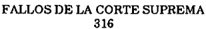

TOMO 316

Volumen 1

1993

## FALLOS DE LA CORTE SUPREMA DE JUSTICIA DE LA NACION

## R E P U B L I C A     A R G E N T I N A

## FALLOS

DE  LA

CORTE  SUPREMA

DE

## JUSTICIA DE LA NACION

PUBLICACION A CARGO DE LA SECRETARIA DE JURISPRUDENCIA DEL TRIBUNAL

TOMO 316 - VOLUMEN 1

FEBRERO - MAYO

LA LEY S.A.E. e I. Tucumán 1471 (1050) Buenos Aires 1993

## HOJA COMPLEMENTARIA

Hoja incorporada a los efectos de permitir la búsqueda por página dentro del Volumen.

## A C U E R D O S   D E   L A   C O R T E   S U P R E M A

## AÑO 1993

## FEBRERO - MAYO

## CORTE SUPREMA. NOTIFICADORES.

-N o  2-

En Buenos Aires, a los 9 días del mes de febrero del año mil novecientos noventa y tres, reunidos en la Sala de Acuerdos del Tribunal, los señores Ministros que suscriben la presente,

## Consideraron:

Que transcurridos más de dos años del dictado de la acordada 82/90, es necesario aclarar algunas cuestiones. Por ello,

## Acordaron:

- 1) Quienes hayan ingresado como interinos sin haber aprobado el curso de capacitación previsto por la acordada 82/90, permanecerán en tal condición hasta tanto ello ocurra.
- 2) En el futuro, no se podrá ingresar como oficial notificador, ni siquiera con carácter interino, sin estar aprobado el mencionado curso.

Todo lo cual dispusieron y mandaron, ordenando que se comunicase y registrase en el libro correspondiente, por ante mí, que doy fe. - RICARDO LEVENE (H) - MARIANO AUGUSTO CAVAGNA MARTÍNEZ - CARLOS S. FAYT - AUGUSTO CÉSAR BELLUSCIO -ENRIQUE SANTIAGO PETRACCHI - RODOLFO CARLOS BARRA - JULIO S. NAZARENO - EDUARDO MOLINÉ O'CONNOR Claudio Marcelo Kiper (Secretario).

## CUERPO MEDICO FORENSE.

En Buenos Aires, a los 9 días del mes de febrero del año mil novecientos noventa y tres, reunidos en la Sala de Acuerdos del Tribunal, los señores Ministros que suscriben la presente,

## Consideraron:

- 1 o ) Que mediante acordada 10/91, este Tribunal retomó la superintendencia de los Cuerpos Técnicos Periciales.
- 2 o ) Que a fin de propender a una correcta inserción de los mismos, se delegó su responsabilidad en un Secretario de esta Corte, quien dispuso el relevamiento de sus respectivas competencias y funciones (Ac. 63/92).
- 3 o ) Que de un primer examen, surge la necesidad de contemplar previamente la situación en particular del Decanato del Cuerpo Médico Forense, exceptuando a su conducción de la limitación temporal de su mandato para facilitar el acceso al grado de eficiencia deseado en dicha dependencia.
- 4 o )  Que en tal sentido, la mencionada acordada 10/91 dispuso su duración en 3 (tres) años.
- 5 o ) Que en otro orden de ideas, el Reglamento para la Justicia Nacional, establece en el art. 141 que además de las tareas periciales comunes, los decanos ejercerán la representación y dirección de los cuerpos respectivos y las funciones administrativas de aquellos.
- 6 o ) Que tales funciones conllevan a una mayor responsabilidad, cuya dedicación supera ampliamente la de sus pares que no son llamados a ejercer la referida conducción.
- 7 o ) Que en cuanto a la carga real de trabajo, las estadísticas efectuadas en el Cuerpo Médico Forense revelan en los últimos años un constante incremento de las tareas periciales, lo que permite asegurar idéntico aumento en los próximos años (Años: 1987, Total 112.948; 1988, Total 116.640; 1989, Total 121.305; 1990, Total 125.997; 1991, Total 128.479).
- 8 o ) Que a lo expresado, debe adicionarse la circunstancia de que su titular ejerce además la conducción de la Morgue Judicial y del Servicio de Reconocimientos Médicos.
- 9 o ) Que al exceptuar a esta función del condicionamiento temporal establecido en la acordada 10/91, se logrará el mantenimiento de criterios operativos que respondan provechosamente a las políticas que se determinen, en virtud de la experiencia capitalizada en el ejercicio de la conducción.
- 10) Que bajo esa pauta directriz, se impone advertir en el caso concreto, que la asignación permanente de la función, sumado al volumen creciente de tareas, no quede traducido por la práctica en el injusto resultado de encomendar una mayor responsabilidad manteniendo igual remuneración.
- 11) Que de lo expuesto, se infiere la necesidad de disponer la adecuación de la categoría presupuestaria de quien ejerce el Decanato del Cuerpo Médico Forense en el cargo de Director General, cuya base escalafonaria encuentra amparo en el art. 63, inc. d), del decreto-ley 1.285/58; no contrariando tal cometido, la relación de igualdad res-

## DE JUSTICIA DE LA NACION

pecto de los Decanos de los restantes Cuerpos, toda vez que este principio de arraigo constitucional es proporcional a la condición en que se halle cada sujeto.

Por ello,

Acordaron:

1 o ) Disponer que la duración de 3 (tres) años en el cargo establecido en la acordada 10/91, no alcanza al Decano del Cuerpo Médico Forense.

2 o ) Equiparar la categoría presupuestaria del Decano del Cuerpo Médico Forense conjuntamente con su actual titular al cargo de Director General. Todo lo cual dispusieron y mandaron, ordenando que se comunicase y registrase en el libro correspondiente, por ante mí, que doy fe. - RICARDO LEVENE (h) - MARIANO AUGUSTO CAVAGNA MARTÍNEZ - AUGUSTO CÉSAR BELLUSCIO - ENRIQUE SANTIAGO PETRACCHI - RODOLFO CARLOS BARRA - JULIO S. NAZARENO - EDUARDO MOLINÉ O'CONNOR Javier Leal de Ibarra (Secretario).

## COMISARIA DEL PODER JUDICIAL.

-N o  4-

En Buenos Aires, a los 9 días del mes de febrero del año mil novecientos noventa y tres, reunidos en la Sala de Acuerdos del Tribunal, los señores Ministros que suscriben la presente,

## Consideraron:

Que por acordada 28/81 fue aprobado el convenio suscripto con la Policía Federal Argentina para la habilitación de la Comisaría del Poder Judicial.

Que la relevancia de las funciones en materia de servicios de custodia y de seguridad imponen la necesidad de mantener permanente comunicación con el responsable primario, a través de un canal que al propio tiempo proponga las medidas idóneas a instrumentar.

Que es política de este Tribunal propender paulatinamente a una reestructuración global que responda a un diseño eficiente tendiente a satisfacer el objetivo fundamental del soporte administrativo a los órganos jurisdiccionales.

Que en tal sentido, fue asignado provisoriamente a un Secretario del Tribunal la responsabilidad de ciertas funciones de volumen creciente que comprenden actividades complejas.

Que bajo esa pauta directriz, cual es la de concentrar la responsabilidad de funciones descentralizadas operativamente, se agrega la necesidad de profundizar en las metodologías que permitan alcanzar el desarrollo de un eficaz sistema de seguridad de personas y de bienes en el ámbito de este Poder.

Por ello,

Acordaron:

Asignar al Secretario del Tribunal, Doctor Javier M. Leal de Ibarra en forma provisoria, la responsabilidad de la Comisaría del Poder Judicial de la Nación, cuya dirección ostenta esta Corte Suprema.

Todo lo cual dispusieron y mandaron, ordenando que se comunicase y registrase en el libro correspondiente, por ante mí, que doy fe. RICARDO LEVENE (H) - MARIANO AUGUSTO CAVAGNA MARTÍNEZ - AUGUSTO CÉSAR BELLUSCIO - ENRIQUE SANTIAGO PETRACCHI - RODOLFO CARLOS BARRA - JULIO S. NAZARENO - EDUARDO MOLINÉ O'CONNOR - Javier Leal de Ibarra (Secretario).

## FERIADO JUDICIAL.

-N o  7-

En Buenos Aires, a los 23 días del mes de febrero del año mil novecientos noventa y tres, reunidos en la Sala de Acuerdos del Tribunal, los señores Ministros que suscriben la presente,

Acordaron:

Ampliar hasta el día 5 de marzo de 1993 el feriado judicial dispuesto por la acordada 5/93 para los Juzgados de Menores N  1 y 2. o

Todo lo cual dispusieron y mandaron, ordenando que se comunicase y registrase en el libro correspondiente, por ante mí, que doy fe. - RICARDO LEVENE (H) - MARIANO AUGUSTO CAVAGNA MARTÍNEZ - RODOLFO CARLOS BARRA - JULIO S. NAZARENO - EDUARDO MOLINÉ O'CONNOR - ANTONIO BOGGIANO Claudio Marcelo Kiper (Secretario).

## HABILITACION DEL JUZGADO FEDERAL N o  2 DE SAN JUAN.

-N o  9-

En Buenos Aires, a los 24 días del mes de febrero del año mil novecientos noventa y tres, reunidos en la Sala de Acuerdos del Tribunal, los señores Ministros que suscriben la presente,

## Consideraron:

Que la ley 24.042 crea un Juzgado Federal de Primera Instancia con asiento en la ciudad de San Juan, al que se le asigna el N  2. o

Que el Poder Ejecutivo Nacional ha designado al magistrado que se hará cargo del citado tribunal.

Este Tribunal mediante la resolución N  155/93 ha dispuesto la creación del cargo o respectivo.

Que es propósito de esta Corte Suprema proveer lo necesario para asegurar la correcta prestación del servicio de justicia, por lo que la puesta en funcionamiento del nuevo tribunal constituye una prioridad insoslayable.

Por ello,

## Acordaron:

Disponer la habilitación del Juzgado Federal de Primera Instancia N  2 con asieno to en la ciudad de San Juan, provincia de San Juan, a partir de la fecha en que la Cámara Federal de Apelaciones de Mendoza le reciba el juramento de ley al doctor Leopoldo Jorge Rago Gallo, designado por decreto del Poder Ejecutivo Nacional N o 2602/92.

Todo lo cual dispusieron y mandaron, ordenando que se comunicase y registrase en el libro correspondiente, por ante mí, que doy fe. - RICARDO LEVENE (H) - MARIANO AUGUSTO CAVAGNA MARTÍNEZ - CARLOS S. FAYT - ENRIQUE SANTIAGO PETRACCHI - EDUARDO MOLINÉ O'CONNOR Claudio Marcelo Kiper (Secretario).

## TRIBUNAL ORAL EN LO CRIMINAL FEDERAL DE MENDOZA.

-N o  10-

En Buenos Aires, a los 2 días del mes de marzo del año mil novecientos noventa y tres, reunidos en la Sala de Acuerdos del Tribunal, los señores Ministros que suscriben la presente,

## Consideraron:

- 1) Que el Tribunal Oral en lo Criminal Federal de Mendoza solicita a esta Corte el dictado de las disposiciones necesarias para asegurar la efectiva realización de los juicios orales en caso de vacancia, ausencia o impedimento de alguno de los miembros de ese Tribunal.
- 2) Que la ley 24.050 en su artículo 51 modificó el artículo 31 del decreto-ley 1285/ 58 legislando sobre la subrogancia de las cámaras federales del interior del país, mas omitió hacerlo con respecto a los tribunales orales federales con asiento en el interior.
- 3) Que de acuerdo a lo dispuesto por el art.53 de la ley 24.050 y el art.91 de la ley 24.121, corresponde a esta Corte Suprema el dictado de las normas complementarias

tendientes a la organización, integración y funcionamiento de los tribunales y organismos en ellas comprendidos.

- 4) Que en virtud de ello, el Tribunal considera necesario adoptar las medidas indispensables para posibilitar el funcionamiento del sistema.

Por ello,

Acordaron:

Hacer saber a la Cámara Federal de Apelaciones de Mendoza que en caso de vacancia, impedimento o ausencia de los miembros del Tribunal Oral de la jurisdicción, dicho Tribunal deberá ser integrado por sorteo entre los miembros de dicha Cámara.

Todo lo cual dispusieron y mandaron, ordenando que se comunicase y registrase en el libro correspondiente, por ante mí, que doy fe. - RICARDO LEVENE (H) - MARIANO AUGUSTO CAVAGNA MARTÍNEZ - RODOLFO CARLOS BARRA - CARLOS S. FAYT - AUGUSTO CÉSAR BELLUSCIO - ENRIQUE SANTIAGO PETRACCHI - JULIO S. NAZARENO - EDUARDO MOLINÉ O'CONNOR Claudio Marcelo Kiper (Secretario).

## TRIBUNALES ORALES en lo CRIMINAL FEDERAL de ROSARIO.

-N o  11-

En Buenos Aires, a los 2 días del mes de marzo del año mil novecientos noventa y tres, reunidos en la Sala de Acuerdos del Tribunal, los señores Ministros que suscriben la presente,

## Consideraron:

- 1) Que la Sala Provisoria de la Cámara Nacional de Casación Penal eleva al Tribunal la consulta de la titular del Juzgado Federal N  3 de Rosario en el sentido de que se o precise si en virtud de lo dispuesto por el art. 76 de la ley 24.121 se debía oficiar a los lugares de detención para que los condenados sean anotados a disposición del Tribunal Oral.
- 2) Que en virtud de lo dispuesto por el art. 53 de la ley 24.050 y 91 de la ley 24.121 corresponde a esta Corte el dictado de las normas complementarias tendientes a la organización, integración y funcionamiento de los tribunales y organismos en ella comprendidos.
- 3) Que por razones de celeridad y economía y hasta tanto se integren definitivamente los Tribunales Orales en lo Criminal Federal de la jurisdicción de Rosario, las funciones de juez de ejecución en todas aquellas causas con sentencia condenatoria firme, deberán ser ejercidas por los magistrados que dictaron la respectiva sentencia condenatoria.

Por ello,

## Acordaron:

Hacer saber a la Cámara Federal de Rosario que hasta tanto se integren definitivamente los Tribunales Orales en lo Criminal Federal de esa jurisdicción, las funciones de juez de ejecución previstas por el Código Procesal Penal de la Nación, deberán ser ejercidas por los magistrados que dictaron la respectiva sentencia condenatoria.

Todo lo cual dispusieron y mandaron, ordenando que se comunicase y registrase en el libro correspondiente, por ante mí, que doy fe. - RICARDO LEVENE (H) - MARIANO AUGUSTO CAVAGNA MARTÍNEZ - RODOLFO CARLOS BARRA - EDUARDO MOLINÉ O'CONNOR AUGUSTO CÉSAR BELLUSCIO - JULIO S. NAZARENO - ANTONIO BOGGIANO Claudio Marcelo Kiper (Secretario).

## MEDIDAS DE FUERZA.

-N o  12-

En Buenos Aires, a los 2 días del mes de marzo del año mil novecientos noventa y tres, reunidos en la Sala de Acuerdos del Tribunal, los señores Ministros que suscriben la presente,

## Consideraron:

Que la reiteración de medidas de fuerza adoptadas por la Unión de Empleados de la Justicia de la Nación perturba gravemente el normal desenvolvimiento de la actividad de los tribunales y, consecuentemente, la prestación del servicio de justicia.

Que en virtud de ello, esta Corte considera necesario reiterar pronunciamientos anteriores y adoptar, además, una serie de medidas tendientes a normalizar el funcionamiento de los tribunales.

Por ello,

## Acordaron:

- 1 o )  Recordar a las cámaras nacionales y federales de apelaciones y juzgados de primera instancia de todo el país la vigencia de las acordadas Nros. 21, 22 y 56 de 1985, y 12/90 y 53/91.
- 2 o ) Disponer que en el futuro deberán adoptar el régimen de la acordada 48/92, consistente en informar, en el plazo de 48 horas, directamente a la Secretaría de Superintendencia Judicial del Tribunal qué personal de sus respectivas dependencias concurrió a cumplir con sus tareas en el día de huelga, como así también el que no lo hizo por razones debidamente justificadas.

3 o )  Hacer  saber  a  las  citadas  dependencias  que  por  la  vía  que  corresponda,  se

## DE JUSTICIA DE LA NACION

316

descontarán los haberes pertinentes a todos los agentes cuya asistencia no resulte debidamente probada mediante la certificación del titular.

Todo lo cual dispusieron y mandaron, ordenando que se comunicase y registrase en el libro correspondiente, por ante mí, que doy fe. - RICARDO LEVENE (H) - MARIANO AUGUSTO CAVAGNA MARTÍNEZ - RODOLFO CARLOS BARRA - CARLOS S. FAYT - AUGUSTO CÉSAR BELLUSCIO - JULIO S. NAZARENO - EDUARDO MOLINÉ O'CONNOR - ANTONIO BOGGIANO - ENRIQUE SANTIAGO PETRACCHI Claudio Marcelo Kiper (Secretario).

## ESTADISTICAS.

-N o  13-

En Buenos Aires, a los 3 días del mes de marzo del año mil novecientos noventa y tres, reunidos en la Sala de Acuerdos del Tribunal, los señores Ministros que suscriben la presente,

## Consideraron:

Que según lo dispuesto en el segundo párrafo del art.24 del Reglamento para la Oficina de Estadísticas de la Corte Suprema y teniendo en cuenta la experiencia recogida en la confección del primer resumen de datos sobre el total de expedientes obrantes en el Poder Judicial de la Nación en el año 1991, resulta aconsejable adoptar algunas pautas a seguir para la confección de las estadísticas anuales, por parte de todos los organismos judiciales a que hace referencia la norma citada.

## Por ello,

## Acordaron:

- 1 o ) Recordar la utilización del formulario aprobado por esta Corte, sin omitir casillero o rubro alguno, salvo el agregado de datos que resulten necesarios para su mejor entendimiento y detallando en forma separada la cantidad de expedientes existentes de años anteriores y los iniciados o entrados en el año de la información.
- 2 o ) En el caso de las Cámaras de Apelaciones, se deberá especificar por separado la labor efectuada por cada Sala o Secretaría, en su caso, y aclarar además su especialidad.
- 3 o ) Para los juzgados, además del informe general, se deberá remitir por separado el que corresponda a cada una de las Secretarías que lo componen, indicando para el caso de tener distintas competencias, su especialización.
- 4 o ) Cumplir con el plazo de entrega fijado por el art. 34 del Reglamento para la Justicia Nacional, es decir en el mes de febrero de cada año.
- 5 o ) Las Cámaras o dependencias encargadas de ejercer la Superintendencia, debe-

rán supervisar la información documentada en los formularios respectivos, previa elevación a la Oficina de Estadísticas.

Dicho control implicará cotejar el cumplimiento de los ítems descriptos precedentemente, como así también tener en cuenta que el principio de razonamiento aplicado en la interpretación de los formularios consiste en que el saldo debe ser el resultado de los expedientes existentes más los iniciados en el año, menos los salidos en todo concepto.

Todo lo cual dispusieron y mandaron, ordenando que se comunicase y registrase en el libro correspondiente, por ante mí, que doy fe. - RICARDO LEVENE (H) - MARIANO AUGUSTO CAVAGNA MARTÍNEZ - CARLOS S. FAYT - JULIO S. NAZARENO - EDUARDO MOLINÉ O'CONNOR Claudio Marcelo Kiper (Secretario).

CORTE SUPREMA. DESIGNACION DE  SECRETARIO.

-N o  14-

En Buenos Aires, a los 4 días del mes de marzo del año mil novecientos noventa y tres, reunidos en la Sala de Acuerdos del Tribunal, los señores Ministros que suscriben la presente,

Consideraron:

Que el Tribunal acepta, por unanimidad, la propuesta del señor Presidente.

Por ello,

Acordaron:

Designar Secretario de la Corte Suprema de Justicia de la Nación, en reemplazo del doctor Alfredo Horacio Bisordi, al doctor JORGE EDUARDO MORÁN.

Todo lo cual dispusieron y mandaron, ordenando que se comunicase y registrase en el libro correspondiente, por ante mí, que doy fe. - RICARDO LEVENE (H) - MARIANO AUGUSTO CAVAGNA MARTÍNEZ - RODOLFO CARLOS BARRA - CARLOS S. FAYT - AUGUSTO CÉSAR BELLUSCIO - ENRIQUE SANTIAGO PETRACCHI - JULIO  S. NAZARENO - EDUARDO MOLINÉ O'CONNOR - ANTONIO BOGGIANO Claudio Marcelo Kiper (Secretario).

## CORTE SUPREMA. SUPRESION DE LA SECRETARIA DE INVESTIGACION DE DERECHO COMPARADO.

-N o  15-

En Buenos Aires, a los 17 días del mes de marzo del año mil novecientos noventa y tres, reunidos en la Sala de Acuerdos del Tribunal, los señores Ministros que suscriben la presente,

Consideraron:

Las dificultades de índole presupuestaria que padece el Poder Judicial

Por ello,

Acordaron:

Derogar la acordada 26/92 y, en consecuencia, suprimir la Secretaría de Investigación de Derecho Comparado de la Corte Suprema de Justicia de la Nación.

Todo lo cual dispusieron y mandaron, ordenando que se comunicase y registrase en el libro correspondiente, por ante mí, que doy fe. - RICARDO LEVENE (H) - MARIANO AUGUSTO CAVAGNA MARTÍNEZ - RODOLFO CARLOS BARRA - ENRIQUE SANTIAGO PETRACCHI CARLOS S. FAYT - JULIO S. NAZARENO - ANTONIO BOGGIANO Claudio Marcelo Kiper (Secretario).

## TRIBUNAL ORAL EN LO CRIMINAL FEDERAL DE COMODORO RIVADAVIA.

-N o  16-

En Buenos Aires, a los 23 días del mes de marzo del año mil novecientos noventa y tres, reunidos en la Sala de Acuerdos del Tribunal, los señores Ministros que suscriben la presente,

Consideraron:

Que la ley 24.121 crea un Tribunal Oral en lo Criminal Federal con asiento en Comodoro Rivadavia y que el Poder Ejecutivo Nacional ha designado a los magistrados que se harán cargo del citado tribunal.

Que este Tribunal mediante la resolución N  1337/92 ha dispuesto la creación de o los cargos respectivos.

Que es propósito de esta Corte Suprema proveer lo necesario para asegurar la correcta prestación del servicio de justicia, por lo que la puesta en funcionamiento del nuevo tribunal constituye una prioridad insoslayable.

Por ello,

## Acordaron:

1 o ) Disponer la habilitación del Tribunal Oral en lo Criminal Federal con asiento en la ciudad de Comodoro Rivadavia, provincia del Chubut, a partir del día 29 del corriente mes y año.

2 o ) Recibir el juramento de ley a los doctores Pedro José de Diego y Enrique Jorge Guanziroli, designados por los decretos del Poder Ejecutivo Nacional N  369 y 368 o respectivamente.

Todo lo cual dispusieron y mandaron, ordenando que se comunicase y registrase en el libro correspondiente, por ante mí, que doy fe. - RICARDO LEVENE (H) - MARIANO AUGUSTO CAVAGNA MARTÍNEZ - RODOLFO CARLOS BARRA - CARLOS S. FAYT - JULIO S. NAZARENO - ANTONIO BOGGIANO Claudio Marcelo Kiper (Secretario).

## CAMARA NACIONAL DE APELACIONES DE LA SEGURIDAD SOCIAL. REGLAMENTO DE ESTADISTICA.

-N o  17-

En Buenos Aires, a los 23 días del mes de marzo del año mil novecientos noventa y tres, reunidos en la Sala de Acuerdos del Tribunal, los señores Ministros que suscriben la presente,

## Consideraron:

1 o ) Que por acuerdo N  85 de fecha 2 de diciembre de 1992, la Cámara Nacional de o Apelaciones de la Seguridad Social, modificó el Reglamento de Estadística de dicho Fuero.

- 2 o ) Que el Tribunal considera conveniente modificar sus artículos 1  y 2 , por no o o adecuarse a lo previsto en las disposiciones reglamentarias aprobadas por acordada 33/92 (arts. 8, 15, 16, 21, 22, 23 y 26).

Por ello,

Acordaron:

Modificar los artículos 1  y 2  de la acordada 85/92, dictada por la Cámara Nacioo o nal de Apelaciones de la Seguridad Social, los que quedarán redactados de la siguiente forma:

Artículo 1 ) Los Secretarios de Salas, de Fiscalías y el prosecretario jefe de Mesa o General de Entradas serán responsables de la confección de las estadísticas en los formularios que apruebe la Corte. Deberán ser elevados por duplicado a la Prosecretaría

## DE JUSTICIA DE LA NACION

316

General dentro del 5to. día hábil del mes siguiente al de su realización. Se considerará falta el incumplimiento de los términos.

Artículo 2 ) Las planillas de trámite mensual y las de movimiento de expedientes o recibidos en el mes, confeccionadas en soporte de papel o registro magnético serán remitidas, previo control, por intermedio de la Cámara dentro del octavo día hábil del mes siguiente al período que informan y a partir del 1  de febrero de 1993, a la Oficina o de Estadísticas de la Corte Suprema de Justicia de la Nación.

Todo lo cual dispusieron y mandaron, ordenando que se comunicase y registrase en el libro correspondiente, por ante mí, que doy fe. - RODOLFO CARLOS BARRA - CARLOS S. FAYT - ENRIQUE SANTIAGO PETRACCHI - JULIO S. NAZARENO - ANTONIO BOGGIANO Claudio Marcelo Kiper (Secretario).

## JUZGADOS NACIONALES EN LO CORRECCIONAL.

-N o  18-

En Buenos Aires, a los 29 días del mes de marzo del año mil novecientos noventa y tres, reunidos en la Sala de Acuerdos del Tribunal, los señores Ministros que suscriben la presente,

## Consideraron:

Que, los artículos 42 a 47 de la ley 24.121 modifican la denominación e integración de los Juzgados Nacionales de Primera Instancia en lo Correccional.

Que el Poder Ejecutivo Nacional mediante los decretos Nros. 449, 450, 451 y 452 efectuó las designaciones de los magistrados que se desempeñarán a cargo de los nuevos tribunales creados.

Que la Cámara Nacional de Apelaciones en lo Criminal y Correccional efectuó una propuesta para dividir los actuales juzgados, en virtud de lo dispuesto por los artículos citados.

## Por ello,

Acordaron:

- 1 o )  Disponer que los actuales Juzgados Nacionales de Primera Instancia en lo Correccional letras G, H, I, J y N y los nuevos tribunales que se crean, se denominarán Juzgados Nacionales en lo Correccional y se llevarán en forma correlativa los números 1 al 14, respectivamente (art. 42 ley 24.121).

2 o ) Integrar los Juzgados Nacionales en lo Correccional según el siguiente detalle:

| Juzgado N o  1                      | Juzgado N o  6                      |
|-------------------------------------|-------------------------------------|
| Secretaría N  51 o                  | Secretaría N  55 o                  |
| Secretaría N  52 o Juzgado N o  2   | Secretaría N  101 o Juzgado N o  7  |
| Secretaría N  58 o                  | Secretaría N  56 o                  |
| Secretaría N  59 o                  | Secretaría N  57 o                  |
| Juzgado N o  3                      | Juzgado N o  8                      |
| Secretaría N  60 o                  | Secretaría N  61 o                  |
| Secretaría N  62 o Juzgado N o  4 o | Secretaría N  63 o Juzgado N o  9 o |
| Secretaría N  66                    | Secretaría N  64 Secretaría N  65 o |
| Secretaría N  67 o Juzgado N o  5   | Juzgado N o  10 o                   |
| Secretaría N  73 o                  | Secretaría N  74                    |
| o                                   | Secretaría N  76                    |
| Secretaría N  75                    | o                                   |

3 o ) Diferir la habilitación de los nuevos cargos del Ministerio Público correspondiente al fuero hasta que existan espacios físicos adecuados.

Todo lo cual dispusieron y mandaron, ordenando que se comunicase y registrase en el libro correspondiente, por ante mí, que doy fe. - RICARDO LEVENE (H) - MARIANO AUGUSTO CAVAGNA MARTÍNEZ - CARLOS S. FAYT - JULIO S. NAZARENO - EDUARDO MOLINÉ O'CONNOR Claudio Marcelo Kiper (Secretario).

## CAMARA NACIONAL ELECTORAL.

## HABILITACION DE SERVICIOS PERSONALES.

-N o  20-

En Buenos Aires, a los 1  días del mes de abril del año mil novecientos noventa y o tres, reunidos en la Sala de Acuerdos del Tribunal, los señores Ministros que suscriben la presente,

## Consideraron:

Que en los procesos preelectorales el Ministerio del Interior aporta fondos para atender la incorporación de agentes transitorios al fuero electoral, la asignación de horas extraordinarias para el personal de planta permanente y los entonces adscriptos, y algunos gastos para dicho proceso y las 24 Juntas Nacionales Electorales.

Que la Cámara Nacional Electoral solicitó mediante oficio N  3326 de fecha 16 de o octubre de 1992 a dicho organismo los fondos necesarios para hacer frente al cumplimiento de las distintas tareas, funciones y misiones que por ley le competen al fuero electoral, sin obtener respuesta válida alguna.

Que esta situación fue puesta en conocimiento de este Tribunal mediante oficio N o 4131 del 3 de diciembre de 1992.

Que el Decreto del Poder Ejecutivo Nacional N  527 del 26 de marzo de 1993 o transfiere partidas presupuestarias previstas originariamente en el Ministerio del Interior al Poder Judicial de la Nación por los montos de $1.856.000. y de $6.597.950. para la incorporación de 500 agentes que se deberán distribuir entre la Cámara Nacional Electoral y las 24 Secretarías Electorales y para el pago de horas extraordinarias al personal de planta permanente de la justicia y los que se incorporen temporariamente.

Que en virtud de ello esta Corte considera necesario establecer las siguientes medidas tendientes a tratar de superar el atraso en el proceso electoral de 1993, por no haberse percibido los fondos necesarios oportunamente para la incorporación de los agentes transitorios y el pago de horas extraordinarias.

Por ello,

Acordaron:

1 o ) Autorizar a la Cámara Nacional Electoral a proceder a la habilitación y realización de servicios personales en las Secretarías Electorales dependientes de los Juzgados Federales de todo el país y en su propia sede a los agentes afectados a tareas pre y post comiciales con desempeño en las citadas reparticiones que se encuentran a cargo de la ejecución de actividades electorales. En caso de ser necesario, podrá adjudicarse horas extraordinarias al personal de otras dependencias para desempeñarse fuera de su horario habitual.

2 o )  Cada una de las áreas indicadas dispondrá de un número máximo de horas extras para los distintos niveles, a ejecutarse durante el año 1993, cuya cantidad y distribución queda establecida en el Anexo I que forma parte integrante de la presente, quedando establecido entre el 1  de abril y el 31 de octubre de 1993 el período de realio zación de las mismas, el cual podrá ser prorrogado en cada uno de los distritos electorales y la Cámara Nacional Electoral, según razones de servicio y siempre y cuando cuenten con un cupo de horas para ser habilitadas en cada distrito. La facultad para el otorgamiento de servicios personales será ejercida por los señores Jueces Federales de cada distrito electoral, en atención a las necesidades de cada distrito electoral, en atención a las necesidades de cada área, y bajo la supervisión y control de ese Tribunal.

3 o ) La habilitación para realizar tareas electorales será de hasta tres (3) horas por día hábil y de hasta nueve (9) horas por día no laborable, para los agentes de la dotación  permanente  y  no  permanente  de  cada  distrito  electoral.  Los  secretarios  y prosecretarios electorales de primera instancia no podrán percibir suma alguna en este concepto. Exceptúase, por la índole especial que revisten las tareas electorales, a los prosecretarios administrativos.

4 o ) Establécese la remuneración horaria de las prestaciones que se disponen en la presente en los valores que seguidamente se especifican: Supervisión: $6. y Ejecución: $5., netas.

5 o ) El señor Juez Federal con competencia electoral de cada distrito comunicará a la Cámara Nacional Electoral la nómina del personal autorizado a realizar horas extras, consignando la cantidad de horas habilitadas a cada agente, las que no podrán superar lo establecido precedentemente.

6 o ) Para la liquidación y pago de los servicios ejecutados mensualmente, cada área remitirá a la Cámara Nacional Electoral las planillas informativas en las que deberán consignar los siguientes datos: número de legajo, apellido y nombres, número de documento y total de horas efectivamente trabajadas por cada agente en el respectivo mes. Esta información deberá ser recibida indefectiblemente por dicho Tribunal antes del día 5 de cada mes, para luego ser remitida a la Subsecretaría de Administración dependiente de esta Corte para su liquidación y pago respectivo.

- 7 o ) Se faculta a la Cámara Nacional Electoral a realizar las transferencias de los cupos de horas necesarias entre los distintos distritos electorales y ese organismo, a efectos de facilitar el normal funcionamiento del sistema.
- 8 o ) Autorízase la contratación de 500 agentes con una remuneración equivalente a la suma de $ 330.-, que serán de planta transitoria, a partir del 1  de abril de 1993 y o hasta el 31 de octubre de 1993, venciendo indefectiblemente ese día. La distribución de los agentes contratados precedentemente estará a cargo de la Cámara Nacional Electoral, conforme a las necesidades de cada distrito electoral, lo solicitado por los jueces competentes, y al número de electores inscriptos en los padrones respectivos (Anexo II). Tales agentes no tendrán derecho al régimen de licencias existente para el personal judicial.
- 9 o ) El señor Juez con competencia electoral en cada distrito propondrá a la Cámara Nacional Electoral el nombramiento del personal que le corresponda.
- 10) No será de aplicación al personal a designar que ya se hubiese desempeñado en el Poder Judicial de la Nación lo establecido en el artículo 11 del Reglamento para la Justicia Nacional. (Acordada N  59/92 C.S.J.N.), quienes tendrán prioridad para su o incorporación, salvo que medien razones fundadas.
- 11) La Subsecretaría de Administración informará mensualmente a la Cámara Nacional Electoral los egresos que se vayan produciendo en las respectivas partidas, a efectos de que aquella pueda disponer el incremento en las tareas, si ello fuera necesario  y  por  razones de servicio, posibilitando el nombramiento de nuevos agentes o el aumento en la habilitación de horas electorales.

Todo lo cual dispusieron y mandaron, ordenando que se comunicase y registrase en el libro correspondiente, por ante mí, que doy fe. - RICARDO LEVENE (H) - MARIANO AUGUSTO CAVAGNA MARTÍNEZ - RODOLFO CARLOS BARRA - JULIO S. NAZARENO - EDUARDO MOLINÉ O'CONNOR Claudio Marcelo Kiper (Secretario).

PODER JUDICIAL. COMISIONES AL EXTERIOR.

-N o  21-

En Buenos Aires, a los 20 días del mes de abril del año mil novecientos noventa y

tres, reunidos en la Sala de Acuerdos del Tribunal, los señores Ministros que suscriben la presente,

## Consideraron:

- Que es menester fijar el régimen de autorización para las misiones en el exterior de los magistrados y funcionarios del Poder Judicial.
- Que esta Corte considera la pertinente autorización para los traslados al exterior a fin de adecuarlos a las necesidades y exigencias del auxilio judicial internacional.

Por ello,

## Acordaron:

- 1 o )  Que toda comisión o traslado al exterior de Magistrados y Funcionarios del Poder Judicial de la Nación a fin de requerir el auxilio internacional de tribunales extranjeros, deberá contar con la conformidad previa de la Corte Suprema de Justicia de la Nación, expresada a través de la Presidencia de la misma.
- 2 o ) Que a tal efecto se deberá elevar con una antelación mínima de diez (10) días a la realización de dicha misión, un informe que justifique: a) la necesidad del traslado con particular referencia a las circunstancias de la causa y, b) la previa conformidad del tribunal extranjero requerido para practicar las necesarias diligencias en el ámbito de su jurisdicción.

Todo lo cual dispusieron y mandaron, ordenando que se comunicase y registrase en el libro correspondiente, por ante mí, que doy fe. - RICARDO LEVENE (H) - MARIANO AUGUSTO CAVAGNA MARTÍNEZ - RODOLFO CARLOS BARRA - AUGUSTO CÉSAR BELLUSCIO ENRIQUE SANTIAGO PETRACCHI - EDUARDO MOLINÉ O'CONNOR - JULIO S. NAZARENO ANTONIO BOGGIANO Javier Leal de Ibarra (Secretario).

## CORTE SUPREMA. DESIGNACION DE PRESIDENTE Y VICEPRESIDENTE.

-N o  22-

En Buenos Aires, a los 23 días del mes de abril del año mil novecientos noventa y tres, reunidos en la Sala de Acuerdos del Tribunal, los señores Ministros que suscriben la presente, a los fines de proceder a la elección de Presidente y Vicepresidente de la Corte Suprema de Justicia de la Nación, con arreglo a lo dispuesto por el art. 79 Reglamento para la Justicia Nacional (según texto de la acordada de Fallos 249:212) y previo intercambio de ideas,

## Consideraron:

- 1 o ) Que resulta conveniente derogar la acordada N  2/91 que creó el cargo de Viceo presidente segundo de la Corte.

- 2 o ) Que los doctores Ricardo Levene (h), Mariano Augusto Cavagna Martínez, Julio S. Nazareno y Eduardo Moliné O'Connor renuncian a ocupar cualquiera de los cargos electivos.
- 3 o ) Que todos los Ministros agradecen la gestión de las anteriores autoridades y expresan su deseo de dejar constancia al respecto.
- 4 o ) Que consignan sus votos como se expresa a continuación:

Los doctores Levene, Fayt, Nazareno y Moliné O'Connor propusieron al doctor Antonio Boggiano como Presidente del Tribunal y al doctor Rodolfo Carlos Barra como Vicepresidente.

- El doctor Cavagna Martínez propuso al doctor Barra para Presidente y, al ser electo el doctor Boggiano, propuso a aquél para Vicepresidente.
- El doctor Belluscio propuso al doctor Petracchi como Presidente y al doctor Fayt como Vicepresidente.
- El doctor Petracchi propuso al doctor Belluscio como Presidente y se abstuvo respecto del cargo de Vicepresidente.
- El doctor Barra propuso al doctor Boggiano como Presidente y al doctor Cavagna Martínez como Vicepresidente.
- El doctor Boggiano propuso al doctor Barra para Presidente y, al no ser éste electo, lo propuso para Vicepresidente.

Por ello,

Acordaron:

- 1 o ) Designar Presidente y Vicepresidente de la Corte Suprema de Justicia de la Nación a los doctores Antonio Boggiano y Rodolfo Carlos Barra, respectivamente.
- 2 o ) Derogar la Acordada N  2/91 y suprimir de los arts. 79, 87 y 87 bis del Reglao mento para la Justicia Nacional las menciones que allí se hacen al cargo de Vicepresidente segundo.
- 3 o ) Agradecer a las anteriores autoridades la gestión realizada.

Todo lo cual dispusieron y mandaron, ordenando que se comunicase y registrase en el libro correspondiente, por ante mí, que doy fe. - RICARDO LEVENE (H) - MARIANO AUGUSTO CAVAGNA MARTÍNEZ - RODOLFO CARLOS BARRA - CARLOS S. FAYT - AUGUSTO CÉSAR BELLUSCIO - ENRIQUE SANTIAGO PETRACCHI - JULIO S. NAZARENO - EDUARDO MOLINÉ O'CONNOR - ANTONIO BOGGIANO Claudio Marcelo Kiper (Secretario).

## ACUERDOS DE LA CORTE SUPREMA

## PODER JUDICIAL. CONVOCATORIA DE MAGISTRADOS Y FUNCIONARIOS JUBILADOS.

-N o  23-

En Buenos Aires, a los 27 días del mes de abril del año mil novecientos noventa y tres, reunidos en la Sala de Acuerdos del Tribunal, los señores Ministros que suscriben la presente,

## Consideraron:

Que de conformidad con lo establecido por los arts. 16 y 17 de la ley 24.018, corresponde a este Tribunal, en ejercicio de sus facultades de superintendencia sobre el Poder Judicial de la Nación, la reglamentación del régimen relativo a la convocatoria de magistrados y funcionarios jubilados.

Por ello,

## Acordaron:

- 1 o )  Declarar  que  corresponde  a  la  Corte  Suprema  de  Justicia  de  la  Nación  la desinsaculación de los magistrados y funcionarios jubilados del Poder Judicial de la Nación, en los casos previstos por el art. 16 de la ley 24.018.
- 2 o ) Disponer que las cámaras nacionales y federales de apelaciones deberán remitir a este Tribunal, la lista que confeccionen de los magistrados y funcionarios jubilados en su jurisdicción, con exclusión de quienes -en el caso de los magistrados- fueron nombrados sin acuerdo del Honorable Senado de la Nación.
- 3 o ) Hacer saber a las cámaras citadas que deberán informar los supuestos de suspensión, licencia o vacancia que se produzcan en su ámbito, con una explicación de las circunstancias relevantes que los motivan, y que puedan dar origen a la convocatoria.
- 4 o ) Establecer que cuando se trate del reemplazo de magistrados, se desinsacularán quienes hubiesen sido oportunamente nombrados con acuerdo del Honorable Senado de la Nación.
- 5 o ) Solicitar a la Procuración General de la Nación que ponga en conocimiento de este Tribunal las listas y nombramientos que efectúe en ejercicio de sus facultades.
- 6 o )  Requerir a la Subsecretaría de Administración el envío anual de la lista de magistrados y funcionarios jubilados, confeccionada por orden alfabético para cada fuero y jurisdicción, de acuerdo a lo dispuesto en el punto 2 . o

Todo lo cual dispusieron y mandaron, ordenando que se comunicase y registrase en el libro correspondiente, por ante mí, que doy fe. - ANTONIO BOGGIANO - RODOLFO CARLOS BARRA - CARLOS S. FAYT - JULIO S. NAZARENO - EDUARDO MOLINÉ O'CONNOR RICARDO LEVENE (H) - MARIANO AUGUSTO CAVAGNA MARTÍNEZ Claudio Marcelo Kiper (Secretario).

## DE JUSTICIA DE LA NACION 316

## FERIADO JUDICIAL.

-N o  24-

En Buenos Aires, a los 27 días del mes de abril del año mil novecientos noventa y tres, reunidos en la Sala de Acuerdos del Tribunal, los señores Ministros que suscriben la presente,

## Acordaron:

1 o ) Disponer en el corriente año feriado judicial para los Tribunales Nacionales de la Capital desde el día 12 al 23 de julio, ambos inclusive.

2 o ) Hacer saber a las Cámaras Federales de Apelaciones que con arreglo a lo previsto en la Acordada n  53/73 -respecto de la coincidencia de la feria en ella establecida o con las vacaciones escolares- y a lo dispuesto en la presente, deberán determinar para sus respectivas jurisdicciones un feriado judicial de diez días hábiles (acápite 2  de la o Acordada n  30/84). o

Todo lo cual dispusieron y mandaron, ordenando que se comunicase y registrase en el libro correspondiente, por ante mí, que doy fe. - ANTONIO BOGGIANO - RODOLFO CARLOS BARRA - CARLOS S. FAYT - AUGUSTO CÉSAR BELLUSCIO - JULIO S. NAZARENO EDUARDO MOLINÉ O'CONNOR - MARIANO AUGUSTO CAVAGNA MARTÍNEZ Claudio Marcelo Kiper (Secretario).

## JUZGADO FEDERAL DE LOMAS DE ZAMORA.

-N o  25-

En Buenos Aires, a los 10 días del mes de mayo del año mil novecientos noventa y tres, reunidos en la Sala de Acuerdos del Tribunal, los señores Ministros que suscriben la presente,

## Consideraron:

Que la ley 23.937 (art.14) crea un Juzgado Federal de Primera Instancia en lo Civil, Comercial y Contencioso Administrativo con asiento en la Ciudad de Lomas de Zamora, Provincia de Buenos Aires al que le asigna el N o 3.

Que el Poder Ejecutivo Nacional ha designado al magistrado que se hará cargo del citado tribunal. La Corte Suprema de Justicia de la Nación mediante la Resolución N o 751/93 ha dispuesto la creación del cargo respectivo.

Que es propósito de esta Corte Suprema proveer lo necesario para asegurar la correcta prestación del servicio de justicia, por lo que la puesta en funcionamiento del nuevo tribunal constituye una prioridad insoslayable.

Por ello,

Acordaron:

Disponer la habilitación del Juzgado Federal de Primera Instancia en lo Civil, Comercial y Contencioso Administrativo con asiento en la Ciudad de Lomas de Zamora, Provincia de Buenos Aires al que se le asigna el N o 3, a partir del día 11 de mayo del corriente año, fecha a partir de la cual la Cámara Federal de Apelaciones de La Plata le podrá recibir el juramento de ley al doctor Eduardo Enrique Mauro designado por decreto del Poder Ejecutivo Nacional N  1943/91. o

Todo lo cual dispusieron y mandaron, ordenando que se comunicase y registrase en el libro correspondiente, por ante mí, que doy fe. - RODOLFO CARLOS BARRA - ENRIQUE  SANTIAGO PETRACCHI - MARIANO AUGUSTO CAVAGNA MARTÍNEZ - JULIO S. NAZARENO - EDUARDO MOLINÉ O'CONNOR Claudio Marcelo Kiper (Secretario).

## DR. PABLO ANTONIO RAMELLA. HONRAS DISPUESTAS CON MOTIVO DE SU FALLECIMIENTO.

-N o  26-

En Buenos Aires, a los 11 días del mes de mayo del año mil novecientos noventa y tres, reunidos en la Sala de Acuerdos del Tribunal, los señores Ministros que suscriben la presente,

## Consideraron:

Que el día 25 de abril ocurrió el sensible fallecimiento del Dr. Pablo Antonio Ramella, ex Ministro de la Corte Suprema de Justicia de la Nación.

Que es deber del Tribunal asociarse al duelo que provoca la desaparición del distinguido ex magistrado.

Por ello,

Acordaron:

Dirigir nota de condolencia a la familia del extinto con transcripción de la presente acordada.

Incluir su nombre en las tablas de honor del Tribunal.

Todo lo cual dispusieron y mandaron, ordenando que se comunicase y registrase en el libro correspondiente, por ante mí, que doy fe. - ANTONIO BOGGIANO - RODOLFO CARLOS BARRA - ENRIQUE SANTIAGO PETRACCHI - AUGUSTO CÉSAR BELLUSCIO - MARIANO AUGUSTO CAVAGNA MARTÍNEZ - JULIO S. NAZARENO - RICARDO LEVENE (H) - EDUARDO MOLINÉ O'CONNOR - CARLOS S. FAYT Claudio Marcelo Kiper (Secretario).

## DE JUSTICIA DE LA NACION

316

## DR. AGUSTIN DIAZ BIALET.

## HONRAS DISPUESTAS CON MOTIVO DE SU FALLECIMIENTO

-N o  27-

En Buenos Aires, a los 18 días del mes de mayo del año mil novecientos noventa y tres, reunidos en la Sala de Acuerdos del Tribunal, los señores Ministros que suscriben la presente,

## Consideraron:

Que el día 17 del corriente ha ocurrido el sensible fallecimiento del Dr. Agustín Díaz Bialet, ex Ministro de la Corte Suprema de Justicia de la Nación.

Que es deber del Tribunal asociarse al duelo que provoca la desaparición del distinguido ex magistrado.

Por ello,

Acordaron:

- 1 o ) Izar en el Palacio de Justicia y en los demás edificios de los tribunales federales la bandera a media asta en el día de la fecha.
- 2 o ) Dirigir nota de condolencia a la familia del extinto con transcripción de la presente acordada.

3 o ) Incluir su nombre en las tablas de honor del Tribunal.

Todo lo cual dispusieron y mandaron, ordenando que se comunicase y registrase en el libro correspondiente, por ante mí, que doy fe. - RODOLFO CARLOS BARRA - CARLOS S. FAYT - AUGUSTO CÉSAR BELLUSCIO - ENRIQUE SANTIAGO PETRACCHI - MARIANO AUGUSTO CAVAGNA MARTÍNEZ - JULIO S. NAZARENO - RICARDO LEVENE (H) - EDUARDO MOLINÉ O'CONNOR Claudio Marcelo Kiper (Secretario).

## HOJA COMPLEMENTARIA

Hoja incorporada a los efectos de permitir la búsqueda por página dentro del Volumen.

## FALLOS DE LA CORTE SUPREMA

## FEBRERO

JAIME NOACH SAVESKY V. BANCO CENTRAL DE LA REPUBLICA ARGENTINA

## ENTIDADES FINANCIERAS.

El art. 56 de la ley 21.526 confiere al Banco Central la facultad de requerir una declaración jurada sin distinción alguna acerca del tipo de imposición de que se trate.

LEY: Interpretación y aplicación.

Es menester dar pleno efecto a la intención del legislador.

LEY: Interpretación y aplicación.

Las leyes deben interpretarse siempre evitando darles un sentido que ponga en pugna sus disposiciones, para adoptar como verdadero el que las concilie y deje a todas con valor y efecto.

RECURSO EXTRAORDINARIO: Requisitos propios. Cuestión federal. Generalidades.

Cuando se encuentra en discusión el alcance que cabe asignar a una norma de derecho federal, la Corte no se encuentra limitada en su decisión por los argumentos de las partes o de la cámara, sino que le incumbe realizar una declaratoria sobre el punto disputado.

CONSTITUCION NACIONAL: Derechos y garantías. Defensa en juicio. Procedimiento y sentencia.

Reconoce base constitucional la necesidad de acordar primacía a la verdad jurídica objetiva e impedir su ocultamiento ritual, como exigencia del art. 18 de la Constitución Nacional.

## FALLO DE LA CORTE SUPREMA

Buenos Aires, 2 de febrero de 1993.

Vistos los autos: 'Savesky, Jaime Noach c/Banco Central de la

## República Argentina s/cobro de pesos'.

## Considerando:

- 1 o ) Que la Cámara Nacional de Apelaciones en lo Contencioso Administrativo Federal, Sala IV, revocó la sentencia de primera instancia por la que se condenó al Banco Central de la República Argentina a pagar el capital correspondiente al depósito a plazo fijo nominativo intransferible a tasa regulada, efectuado por Jaime Noach Savesky en la Caja de Crédito 'Versailles' Cooperativa Limitada (en liquidación).

La decisión se funda en que el actor no acreditó la genuinidad del depósito ni siquiera a través de la declaración jurada -mediante el formulario 3401- que le fue requerida por el Banco Central de la República Argentina.

Entendió, en orden a lo expresado, que atento a las irregularidades surgidas de la imposición, apreciadas en su conjunto, y a las presentadas en la entidad financiera, resultaba razonable que el Banco Central de la República Argentina se hubiera negado a abonar el certificado, ante la falta de comprobación de los medios de vida del actor que acreditaran el efectivo ingreso de la suma reclamada.

- 2 o ) Que contra la sentencia de la Cámara, el actor interpuso recurso ordinario de apelación, que fue concedido y es procedente pues la Nación es parte en el proceso y el importe discutido supera el mínimo fijado por la resolución N  1242/88 de este Tribunal. o
- 3 o ) Que al fundar su recurso el actor tacha de arbitraria la sentencia por cuanto entiende: a) que el Banco Central de la República Argentina no se encontraba facultado para exigir la presentación de declaración jurada, toda vez que la circular 'A' 145, sólo la requería para los certificados a plazo fijo intransferibles a tasa libre y no respecto de los concertados a tasa regulada como el de autos; b) que la demandada no contaba con atribuciones que le permitieran requerir 'encuestas' que demostraran la solvencia económica de su parte; c) que en su pronunciamiento el a quo tergiversó doctrina de este Tribunal; y, d) que no valoró adecuadamente la extemporaneidad de la absolución de posiciones del Banco Central de la República Argentina.
- 4 o ) Que el artículo 56 de la ley 21.526 -con la modificación introducida por la ley 22.051- establece que los depósitos constituidos en las

entidades adheridas al régimen de garantía de depósitos a nombre de personas físicas, en las condiciones y hasta el monto que por vía reglamentaria establezca el Banco Central de la República Argentina, serán reintegradas en su totalidad. A ese fin autoriza a disponer que los depositantes formulen una declaración jurada referente a los depósitos que mantengan en la entidad en liquidación, y establece que los responsables, en caso de incurrir en inexactitud o falseamiento, quedarán sujetos a las sanciones previstas en el artículo 293 del Código Penal. De esta disposición se desprende que la garantía de los depósitos se extiende a todos los amparados por el régimen, y que, conforme a doctrina de la Corte, el único requisito exigible por el Banco Central, además de la acreditación de su imposición, es la declaración jurada que la ley menciona (Fallos: 312:320).

De tal modo, el legislador ha colocado en cabeza del Banco Central de la República Argentina, el ejercicio de una competencia delegada a fin de establecer los recaudos pertinentes para activar la garantía de los depósitos (Fallos: 307:534).

5 o ) Que, con arreglo a la mentada facultad, el Banco Central de la República Argentina dictó la circular OPASI -1- comunicación 'A' 59, de fecha 4 de septiembre 1981, que reglamentó en su punto 7.1.1. el régimen de garantía de depósitos, el que alcanza a aquellos '...constituidos en cuenta corriente, caja de ahorro y a plazo...', y dispuso que la cobertura establecida para su devolución fuese inicialmente del 90% del capital e igual proporción de los ajustes e intereses devengados (punto 7.1.3.). Estableció, asimismo, en el punto 7.1.4.1.2., que tenía derecho al 100% de la garantía toda persona física cuyos depósitos en caja  de  ahorro  y  a  plazo  no  excedieran  en  su  totalidad  de  pesos $100.000.000, y que si el depósito o la suma de las imposiciones fuera superior a dicho importe, sobre el excedente se aplicaría el porcentaje previsto en el punto 7.1.3. (90%); determinando, además, que para hacer efectiva la garantía total, en caso de liquidación de una entidad, el Banco Central de la República Argentina podía requerir a los depositantes en caja de ahorros y a plazo la presentación de una declaración jurada (punto 7.1.4.2.).

6 o ) Que, posteriormente, mediante la comunicación 'A' 145 el Banco Central de la República Argentina modificó el porcentaje de cobertura para la devolución de los depósitos, fijándolo en el 99% del capital e intereses devengados, excepto para las imposiciones a plazo fijo nomi-

nativo intransferible a tasa libre que sería del 1% (puntos 7.1.3.1. y 7.1.3.2.) extendiendo el máximo de garantía para dichos depósitos hasta la suma de $1.000.000 de capital y sobre los importes que excedían dicho monto la limitó al 1% (punto 7.1.4.2.), facultando a la autoridad monetaria a requerir, para hacer efectiva la garantía total de los depósitos a tasa libre, la presentación de una declaración jurada (punto 7.1.4.3.).

7 o ) Que para determinar si el actor se encontraba exento de la obligación de presentar la mentada declaración jurada, resulta necesario compulsar la invocada circular 'A' 145 con la circular OPASI -1- comunicación 'A' 59 y atender a los fines perseguidos por tales normas, en la inteligencia de que, según conocida jurisprudencia de esta Corte, es  menester dar pleno efecto a la intención del legislador (Fallos: 306:721, entre otros) y que las leyes deben interpretarse siempre evitando darles un sentido que ponga en pugna sus disposiciones para adoptar como verdadero el que las concilie y deje a todas con valor y efecto (Fallos: 304:794, 1403, 1733 y otros).

8 o ) Que, de conformidad con ello, cabe advertir que el Banco Central  de  la  República  Argentina  al  dictar  la  circular  'A'  145  elevó -excepto para las operaciones a tasa libre-, el porcentaje de cobertura que preveía la circular OPASI -1- para la devolución de los depósitos -la que requería, para hacer efectiva la garantía total de las imposiciones a plazo, la presentación de una declaración jurada (punto 7.1.4.2.). Asimismo, y al limitar la cobertura de los depósitos a tasa libre al 1% del capital, también se reservó la facultad de requerir la presentación de una declaración jurada (punto 7.1.4.3.).

En tal sentido, y teniendo en cuenta que el Banco Central de la República Argentina en virtud de su poder de policía financiero solicitó del actor la presentación de tal recaudo (fs. 40), el ejercicio de dicha facultad no puede ser entendida con el criterio restrictivo que propicia el apelante, al considerar que dicho requerimiento sólo alcanza a las imposiciones a tasa libre; ya que el art. 56 de la ley 21.526, al facultar al Banco Central de la República Argentina a requerir una declaración jurada, confirió dicha prerrogativa sin distinción alguna acerca del tipo de imposición de que se trate, facultad discrecional no limitada por el precedente de esta Corte mencionado en el considerando 4 o del presente.

Por otra parte, la citada circular 'A' 145 no autoriza a inferir de modo alguno que la autoridad monetaria modificara la atribución prevista en la circular OPASI -1-, y que le había sido conferida al Banco Central de la República Argentina por la ley 21.526, máxime teniendo en cuenta que, a su vez, se reservó, a menor cobertura de devolución de los depósitos, el derecho de requerir la mentada declaración jurada.

- 9 o ) Que en mérito a lo expuesto precedentemente, las objeciones del actor referentes a que el Banco Central de la República Argentina no se encontraba facultado para requerirle una declaración jurada, no deben prosperar y al no haberse dado cumplimiento a ese recaudo que esta Corte ha consagrado como necesario -en las condiciones establecidas- para hacer efectiva la garantía prevista por el art. 56 de la ley 21.526, se torna inoficioso considerar las restantes cuestiones planteadas.

10) Que, conforme a todo lo reseñado, la manifestación de que el tribunal a  quo modificó  el  pronunciamiento  de  primera  instancia, -que habría dejado firme las cuestiones relativas a que no existían constancias de que se hubiese exigido o solicitado el llenado del formulario 3401, como también de que las declaraciones juradas quedaron derogadas por la comunicación 'A' 145-, no halla debido sustento toda vez que esta Corte tiene dicho que cuando se encuentra en discusión el alcance que cabe asignar a una norma de derecho federal, el Tribunal no se encuentra limitado en su decisión por los argumentos de las partes o del a quo , sino que le incumbe realizar una declaratoria sobre el punto disputado; máxime que reconoce base constitucional la necesidad de acordar primacía a la verdad jurídica objetiva e impedir su ocultamiento ritual, como exigencia del art. 18 de la Ley Fundamental (Fallos: 247:176; 268:413; 279:239; 283:88; 308:647; 310:2456; 311:2082, entre muchos otros).

Por ello, se confirma la sentencia apelada en cuanto fue materia de recurso, con costas. Notifíquese y devuélvase.

RICARDO LEVENE (H) - RODOLFO C. BARRA - CARLOS S. FAYT -AUGUSTO CÉSAR BELLUSCIO - JULIO S. NAZARENO - EDUARDO MOLINÉ O'CONNOR.

## FALLOS DE LA CORTE SUPREMA 316

## CINTIA P. CANTARINI V. ENRIQUE O. PEREZ Y OTRA

## SENTENCIA.

Corresponde declarar nulo, e inexistente como fallo de cámara, el pronunciamiento suscripto por dos de los integrantes de la sala, sin que la mención de la ausencia circunstancial del tercer miembro alcance a configurar algún supuesto de excepción al funcionamiento de los tribunales colegiados.

## TRIBUNALES COLEGIADOS.

El funcionamiento de los tribunales colegiados supone la actuación de todos los miembros que lo componen.

RECURSO EXTRAORDINARIO: Resolución. Límites del pronunciamiento.

La Corte esta facultada para declarar la nulidad del pronunciamiento de cámara suscripto por sólo dos de los integrantes de la sala, aunque la deficiencia no fuera objeto de agravio por el recurrente.

COSTAS: Resultado del litigio.

Declarada la nulidad de una sentencia de cámara que fue suscripta por sólo dos de los integrantes de la sala, no obstante que tal deficiencia no fuera objeto de agravio por el recurrente, corresponde decidir la cuestión sin imposición de costas.

RECURSO EXTRAORDINARIO: Principios generales.

Es inadmisible el recurso extraordinario contra la sentencia que redujo la indemnización concedida como daño moral e impuso las costas a la actora: art. 280 del Código Procesal (Disidencia de los Dres. Rodolfo C. Barra, Enrique Santiago Petracchi, Julio S. Nazareno y Antonio Boggiano).

## FALLO DE LA CORTE SUPREMA

Buenos Aires, 2 de febrero de 1993.

Vistos los autos: 'Cantarini, Cintia P. c/ Pérez, Enrique O. y otra s/ daños'.

Considerando:

- 1 o ) Que contra el pronunciamiento de la Sala M de la Cámara Nacional de Apelaciones en lo Civil que modificó el de anterior instancia al reducir la indemnización concedida como 'daño moral' e imponer las costas de las pericias médica y actuarial a la actora, confirmando todo lo demás que fue materia de agravio, la actora y el señor Asesor de Menores e Incapaces de aquel tribunal dedujeron el recurso extraordinario que fue concedido a fs. 406.
- 2 o )  Que, según advierte el Tribunal, la sentencia impugnada es violatoria del art. 109 del Reglamento para la Justicia Nacional, pues sólo fue suscripta por dos de los integrantes de la Sala, sin que la mención de la ausencia circunstancial del tercer miembro alcance a configurar algún supuesto de excepción al funcionamiento de los tribunales colegiados, que supone la actuación de todos los miembros que lo componen (confr. causa M.522.XXIII 'Movimiento de Suelos S.A. c/ Momentos S.A.A.G. y otro' del 10 de junio de 1992).
- 3 o )  Que  la  irregularidad  señalada  importa  un  grave  quebrantamiento de las normas reglamentarias que determinan el modo en que deben emitirse los fallos definitivos de las cámaras nacionales de apelaciones, infracción que habilita la intervención de esta Corte en virtud de la obligación que le cabe corregir la actuación de aquéllas, cuando aparezca realizada con transgresión a los principios fundamentales inherentes a la mejor y más correcta administración de justicia (Fallos: 312:139).
- 4 o ) Que lo expuesto es suficiente para invalidar el acto impugnado, pues se han omitido en él las formalidades sustanciales, lo que determina su inexistencia como fallo de la cámara, violándose así el art. 18 de la Constitución Nacional (Fallos: 156:283; 223:486; 233:111 y 312:139).
- 5 o ) Que no empece a dicha solución el hecho de que la deficiencia apuntada no fuera objeto de agravio por el recurrente, ya que si bien como regla- las sentencias de la Corte deben limitarse a lo peticionado por las partes en el recurso extraordinario (Fallos: 297:133; 298:354; 302:346, 656 y 306:2088), el ejercicio de la facultad de la que este Tribunal  hace  uso  se  impone  como  un  deber  indeclinable  (causa: F.307.XXIII. 'Furriel, José Manuel y otros c/ Ferrocarriles Argentinos', del 19 de diciembre de 1991). Sin perjuicio de ello, en atención a

las circunstancias enunciadas, corresponde decidir la cuestión sin imposición de costas (Fallos: 312:579).

Por ello, se resuelve declarar nulo el pronunciamiento de fs. 358/ 360, y su inexistencia como fallo de cámara. Sin costas. Devuélvanse los autos al tribunal de origen a fin de que, por quien corresponda, se dicte pronunciamiento. Notifíquese y, oportunamente, remítase.

RICARDO LEVENE (H) - MARIANO AUGUSTO CAVAGNA MARTÍNEZ - RODOLFO CARLOS BARRA ( en disidencia )  -  CARLOS  S.  FAYT  -  AUGUSTO  CÉSAR BELLUSCIO - ENRIQUE SANTIAGO PETRACCHI ( en disidencia ) - JULIO S. NAZARENO ( en disidencia )  -  EDUARDO MOLINÉ O'CONNOR - ANTONIO BOGGIANO ( en disidencia ).

DISIDENCIA DEL SEÑOR VICEPRESIDENTE SEGUNDO DOCTOR DON RODOLFO C. BARRA, DE LOS SEÑORES MINISTROS DOCTORES DON ENRIQUE SANTIAGO PETRACCHI, DON JULIO S. NAZARENO Y DON ANTONIO BOGGIANO

Considerando:

Que el recurso extraordinario es inadmisible (art. 280 del Código Procesal Civil y Comercial de la Nación).

Por ello se desestima el recurso mencionado. Con costas (art. 68 del código citado). Notifíquese y remítase.

RODOLFO C. BARRA - ENRIQUE SANTIAGO PETRACCHI - JULIO S. NAZARENO - ANTONIO BOGGIANO.

## HORMISON CÍA. ARGENTINA S.A.I.C.

RECURSO EXTRAORDINARIO: Requisitos propios. Cuestiones no federales. Sentencias arbitrarias. Procedencia del recurso. Defectos en la consideración de extremos conducentes.

Corresponde dejar sin efecto la sentencia que al confirmar la resolución de la Dirección Nacional de Inspección del Trabajo que había impuesto la sanción de

multa omitió el examen de cuestiones conducentes para la solución del litigio. (1)

## BERTA ZBAR DE REICH V. ANITA REICH DE ROSEMBERG

RECURSO EXTRAORDINARIO: Requisitos propios. Cuestión federal. Cuestiones federales simples. Interpretación de otras normas y actos federales.

Siempre que esté en tela de juicio la interpretación de un pronunciamiento de la Corte dictado en la misma causa, en el que el recurrente funda el derecho que estima asistirle, se configura una hipótesis que hace formalmente viable la apelación extraordinaria.

RECURSO EXTRAORDINARIO: Requisitos propios. Cuestiones no federales. Sentencias arbitrarias. Procedencia del recurso. Varias.

Corresponde dejar sin efecto la sentencia, si la resistencia de la cámara a tratar los argumentos de los recurrentes constituye no sólo un claro alzamiento contra lo resuelto con anterioridad por la Corte en la causa, sino también, en virtud del tiempo transcurrido, un verdadero vicio de denegación de justicia.

RECURSO EXTRAORDINARIO: Resolución. Límites del pronunciamiento.

Corresponde que la Corte decida sobre el fondo de las cuestiones litigiosas, en tutela del derecho de defensa de los justiciables, si se trata de la tercera revocación sobre la base de una comprensión irrazonable de las pretensiones de los recurrentes y del vicio de omisión de pronunciamiento, reiterado a pesar de la larga tramitación de la causa (art. 16, segunda parte, ley 48).

## SUCESION.

Corresponde no homologar el acuerdo transaccional realizado por los herederos, considerando que la eventual turbación del derecho que les ha correspondido en la partición, en los términos del art. 3505 del Código Civil y, en general, la inoponibilidad de tal acuerdo a los acreedores del sucesorio, determinan la inconveniencia de que adquiera la eficacia de la cosa juzgada.

## SUCESION.

Se justifica la sanción de cese del beneficio de inventario (art. 3405 del Código Civil)  si  la  conducta  observada  por  ambas  coherederas  configuró  una  típica maniobra concertada en fraude de los acreedores de la sucesión.

(1) 2 de febrero. Fallos: 312:683.

## FALLO DE LA CORTE SUPREMA

Buenos Aires, 2 de febrero de 1993.

Vistos los autos: 'Zbar de Reich, Berta c/ Reich de Rosemberg, Anita s/ reivindicación'.

Considerando:

1 o ) Que esta Corte, en su sentencia de fs. 2496/2498 resolvió -por mayoría- que el pronunciamiento de la Sala D de la Cámara Nacional de Apelaciones en lo Civil (fs. 2049/2050) era descalificable por vicio de arbitrariedad en razón de haber obviado el tratamiento de ciertos planteos relativos a las facultades de los herederos y de los acreedores de la sucesión, y de las consecuencias que de ellos podían eventualmente derivarse -la pérdida del beneficio de inventario por actos de reducción del acervo sucesorio-, cuyo examen resultaba ineludible según una razonable comprensión de los términos de la anterior sentencia del Tribunal (fs. 1802/1803), que había determinado el alcance de la jurisdicción devuelta al a quo .

2 o ) Que la Sala M de la Cámara del fuero dictó el fallo de fs. 2523 en el cual, tras precisar las cuestiones que correspondía juzgar de acuerdo con lo dispuesto por esta Corte, resolvió que: a) los letrados Naum Heilman y Víctor J. Kamenszein no podían invocar la existencia del convenio celebrado entre las hermanas Raquel Reich y Anita Reich de Rosenberg a fs. 1315/1319 a los fines de solicitar la pérdida del beneficio de inventario, en atención a que tal acto les era inoponible y, por tanto, no les causaba perjuicio ni les impedía cobrar su crédito contra la sucesión; y b) no correspondía emitir pronunciamiento sobre la reducción fraudulenta de los bienes del acervo sucesorio pues los letrados recurrentes habían continuado por vía oblicua las acciones procesales instauradas por la causante Berta Zbar de Reich contra Anita Reich de Rosemberg.

3 o ) Que contra este último pronunciamiento los letrados Víctor J. Kamenszein y Naum Heilman interpusieron recurso extraordinario federal (fs. 2550/2573) que fue concedido por el a quo a fs. 2621 y que resulta formalmente admisible. Ello es así pues, con arreglo a lo pre-

visto en el art. 14 de la ley 48, siempre que esté en tela de juicio la inteligencia de un pronunciamiento del Tribunal dictado en la misma causa, en el que el recurrente funda el derecho que estima asistirle, se configura una hipótesis que hace formalmente viable la apelación extraordinaria (Fallos: 298:584; 306:1195).

4 o ) Que la procedencia sustancial de dicha apelación está condicionada a que la resolución impugnada consagre un inequívoco apartamiento de lo dispuesto por la Corte (Fallos: 308:920), situación que precisamente es la de autos, en donde la resistencia del a quo a tratar los argumentos de los recurrentes relativos a los eventuales excesos en que habrían incurrido las herederas beneficiarias y a las consecuencias que tales conductas comportarían respecto de los derechos de los acreedores de la sucesión, constituye no sólo un claro alzamiento contra lo fallado por esta Corte a fs. 2496/2498 sino también, en virtud del tiempo transcurrido desde que los apelantes plantearon por primera vez sus agravios ante los jueces de la causa (memorial de fs. 1422/1439 vta, presentado el 11 de noviembre de 1981), un verdadero vicio de denegación de justicia.

5 o ) Que, por una parte, corresponde señalar que la falta de agravio que parece sustentar los argumentos de fs. 2523 -en tanto los acreedores podrían cobrar su crédito de los bienes del acervo sucesorio con prescindencia del convenio celebrado entre las herederas- sólo podría justificarse en el supuesto de existencia de bienes suficientes en tal acervo, que es precisamente el punto cuestionado por los recurrentes, quienes han invocado la conclusión de actos incompatibles con las facultades del heredero beneficiario. Por otra parte, es la reducción fraudulenta de los bienes del acervo sucesorio -cuestión cuyo tratamiento fue considerado ineludible en el anterior fallo de esta Corte dictado en esta causa- la circunstancia que, de ser demostrada, provocaría la pérdida del beneficio de inventario, la extinción por confusión de los derechos de la sucesión contra el heredero, con consecuencias en este litigio 'Zbar de Reich, Berta c/ Reich de Rosemberg, Anita s/ reivindicación de acciones'.

Esta Corte ha reconocido el derecho de los recurrentes a obtener un pronunciamiento del órgano judicial respecto de las cuestiones que constituyen el presupuesto de sus pretensiones, tanto en el fallo de fs. 1802/1803 vta., considerando 4 , como en la posterior sentencia de fs. o 2496/ 2498, considerandos 5  a 7 . o o

6 o )  Que lo expuesto es suficiente para revocar la decisión de fs. 2523 por mediar nexo directo e inmediato entre lo resuelto y la lesión a la garantía constitucional del debido proceso, según lo exige el art. 14 de la ley 48.

En atención a que la presente es la tercera revocación sobre la base de una comprensión irrazonable de las pretensiones de los recurrentes y del vicio de omisión de pronunciamiento, reiterado a pesar de la larga tramitación de esta causa (iniciada por Berta Zbar de Reich en diciembre de 1975), se configura el supuesto contemplado en la segunda parte del art. 16 de la ley 48, en que esta Corte debe decidir sobre el fondo de las cuestiones litigiosas, en tutela del derecho de defensa de los justiciables (Fallos: 189:292; 236:199 y otros).

7 o ) Que los recurrentes, letrados acreedores de la sucesión, impugnaron la homologación del convenio de fs. 1315/1318 con fundamento en que el 'acuerdo transaccional' -tal la denominación que Raquel Reich y Anita Reich de Rosemberg utilizan a fs. 1315 vta.- configuraba un exceso ilegítimo en las facultades de las herederas con beneficio de inventario y consagraba una fraudulenta reducción de los bienes del acervo sucesorio en perjuicio de los acreedores de la sucesión, lo cual provocaba la pérdida de aquel beneficio (confr. memorial de fs. 1422/1439 vta.).

Los actos prohibidos que las únicas herederas de Berta Zbar de Reich habrían realizado, serían, en opinión de los recurrentes: dación de inmuebles de la sucesión en pago, ocultación o sustracción de valores de la sucesión, omisión de bienes muebles en el inventario de la herencia, transacción sobre asuntos en los que la sucesión tuviese interés.

8 o ) Que, con independencia de la denominación que las herederas han dado al acto que consta a fs. 1315/1318, es evidente que entendieron asignarse recíprocamente en especie bienes del acervo sucesorio, en su carácter de únicas herederas -capaces y presentes en ese actode doña Berta Zbar de Reich, declaración a la que agregaron una atribución de derechos entre coherederas que excede estrictamente el marco de una asignación de bienes, tal como la renuncia de Raquel Reich a todo derecho e interés en el gobierno y en la administración de Manuel Reich S.A. y de Perfecto S.R.L. (fs. 1416, párrafo 5 ), y el o desistimiento de ambas herederas de la acción y del derecho discutido

en esta causa y en la totalidad de las acciones promovidas por la causante, sus acumulados y sus incidentes (fs. 1317, párrafo 7 ). o

9 o ) Que las partes realizaron, pues, un negocio mixto que constituye una partición (art. 3462 Código Civil) en lo que hace a la atribución de bienes del acervo hereditario. Si bien en el sub judice no ha habido aprobación de tal acto como convenio de partición -sólo se encuentra firme su inoponibilidad a los acreedores de la sucesión, con fundamento en los artículos 3474 y 3475 del Código Civil, según el fallo de la Sala D no cuestionado en este punto-, ello no obsta a que desde el punto de vista sustancial, el convenio sea vinculante entre quienes lo concluyeron, sin que hayan sido imprescindibles las operaciones de inventario y avalúo.

10) Que lo afirmado precedentemente significa que el convenio partitivo no queda sin efecto por retractación unilateral de cualquiera de sus firmantes, sin perjuicio de que por la vía pertinente sea posible atacarlo por vicios de la voluntad. Por lo demás, el calificarlo como un acto de asignación recíproca de bienes, que no constituye en sí una transgresión a las facultades y deberes de los herederos beneficiarios, no significa, ciertamente, obstáculo alguno a la acción de los acreedores personales de los herederos, quienes pueden demandar -tal como ha sucedido- la revocación de la partición que estimasen fraudulenta.

11) Que aun cuando el pedido de aprobación por el juez de la sucesión no es un recaudo exigible en el derecho sustancial en cuanto al carácter vinculante del acto entre quienes lo concluyeron, habida cuenta de que en el sub judice la adjudicación de bienes del acervo sucesorio se ha combinado con translaciones patrimoniales entre las coherederas y aquéllas se hallan cuestionadas por los acreedores de la sucesión en estos autos y por los acreedores personales de Raquel Reich en el fuero comercial, este Tribunal no homologará el acto de fs. 1315/1318 toda vez que, como negocio mixto que deriva de una relación sucesoria única, la eventual turbación del derecho que les ha correspondido a las coherederas por la partición en los términos del art. 3505 del Código Civil y, en general, la inoponibilidad de tal acuerdo a los acreedores del sucesorio -decisión que ha quedado firme-, determinan la inconveniencia de que el acto partitivo, que reviste una esencial inestabilidad en atención a las particulares circunstancias de esta causa, adquiera la eficacia de la cosa juzgada.

12) Que si bien los agravios de los recurrentes relativos a la disposición sin autorización judicial y sin las formas requeridas por la ley de bienes inmuebles pertenecientes al acervo sucesorio y a la transacción ilegítima respecto de puntos que interesan a la sucesión, deben ser rechazados en atención a que quienes concluyeron el acto impugnado son propietarios de las titularidades comprendidas en la herencia, se advierte en autos la configuración de una grave transgresión en las facultades de las herederas beneficiarias, que justifica la sanción prevista en el art. 3405 del Código Civil.

13) Que la conducta observada por Raquel Reich y Anita Reich de Rosemberg a partir de la adjudicación ut singuli de los fondos existentes en el exterior inventariados en la sucesión de doña Berta Zbar de Reich (punto 'e' de fs. 1317), en cuanto hace a la sustitución de las medidas cautelares que habían sido dictadas en el expediente sucesorio n o 4701/82 con anterioridad al convenio del 2 de julio de 1981 (ver fs. 113 vta. y petición de ambas herederas a fs. 229/234 vta. de la citada causa), con innegable conocimiento del estado de cesación de pagos de quien ofreció la caución y, por tanto, del carácter ilusorio de la garantía sustitutiva, unido a la ausencia de certeza sobre el destino de los bienes originariamente cautelados, tras su liberación por la resolución de la Sala B del fuero (párrafo II de fs. 652 , dejada sin efecto por esta Corte a fs. 962 del expediente sucesorio), configuran -más allá de cuál ha sido la suerte corrida por tales bienes- una típica maniobra concertada por ambas herederas (quienes presentaron por apoderado el escrito de fs. 229/234 vta. del expediente n  4701/82), en detrimento de o los bienes pertenecientes al acervo sucesorio, esto es, en fraude de los acreedores de la sucesión, situación que merece el encuadramiento como acto prohibido y justifica la sanción contemplada en el art. 3405 del Código Civil.

14)  Que no obstan a lo anterior los desistimientos que efectuó Raquel Reich a fs. 1064 de los autos sucesorios (expediente 4701/82) en tanto, por una parte, ello no comporta el ejercicio de la acción de nulidad sustancial de la partición y, por la otra, las coherederas, con total desaprensión respecto de su obligación de custodia y conservación de los bienes que constituyen la prenda de los acreedores de la sucesión hasta tanto el pasivo del causante no sea satisfecho, se imputan recíprocamente responsabilidades (ver fs. 2618 vta.) sin haber desvirtuado las conclusiones que se infieren de las constancias presentadas (copias de fs. 2601/ 2610 del expediente 5365/82, que corresponden

a actuaciones producidas en el fuero comercial), respecto del retiro de los fondos existentes en las cuentas correspondientes a la causante en el Chemical Bank International Personal Banking.

Por ello, se declara procedente el recurso extraordinario interpuesto a fs. 2550/2573 por los letrados Víctor J. Kamenszein y Naum Heilman, se  revoca  la  sentencia  de  fs.  2523  de  esta  causa  y  se  rechaza  la homologación del convenio de fs. 1315/1318 por las razones expuestas en el considerando 11 . Asimismo, se declara el cese del beneficio de o inventario respecto de Anita Reich de Rosemberg (art. 3405 del Código Civil; considerandos 12  a 14 ), única demandada en esta causa. Las o o costas de esta instancia se imponen a la presentante de fs. 2580/2593. Notifíquese, agréguese copia de la presente en la causa sucesoria, expediente n  4701/82. Oportunamente devuélvanse los autos. o

RICARDO LEVENE (H) - MARIANO AUGUSTO CAVAGNA MARTÍNEZ - RODOLFO C. BARRA - AUGUSTO CÉSAR BELLUSCIO - JULIO S. NAZARENO - ANTONIO BOGGIANO.

## SARA MADERO UNZUE DE DEMARIA SALA Y OTRO V. PROVINCIA DE BUENOS AIRES

## PERICIA.

Los gastos de fotocopias, materiales varios y elaboración del informe final deben ser abonados por el experto, porque se trata de expensas usuales de la labor pericial (1).

## PERICIA.

No puede acogerse la objeción de la parte a los gastos realizados por la intervención del auxiliar técnico, formulada al tiempo de presentar la rendición de cuentas del perito, si tal erogación fue incluida al requerir un anticipo, sin que en dicha oportunidad las partes cuestionaran su intervención.

(1) 2 de febrero. Causas: 'El Fresno S.C.A. c/Buenos Aires, Provincia de' y 'Bernardo Ciddio, Juan c/Buenos Aires, Provincia de' de fechas 21 de noviembre de 1989 y 19 de junio de 1990, respectivamente.

## PROVINCIA DE SANTA CRUZ V. YACIMIENTOS PETROLIFEROS FISCALES (SOCIEDAD DEL ESTADO)

IMPUESTO: Facultades impositivas de la Nación, provincias y municipalidades.

Las provincias pueden establecer libremente impuestos sobre todas las materias no reservadas a la Nación por la Constitución Nacional. Sus facultades son amplias y discrecionales dentro de esos límites; el criterio, oportunidad y acierto con que las ejercen son irrevisables, salvo el control de constitucionalidad y abarcan competencias diversas tanto de orden tributario como institucional, procesal y de promoción general.

IMPUESTO: Facultades impositivas de la Nación, provincias y municipalidades.

El poder impositivo tanto nacional como provincial constituye un instrumento de regulación, complemento necesario del principio constitucional que prevé atender al bien general al que conduce la finalidad ciertamente extrafiscal de impulsar la expansión de las fuerzas económicas.

IMPUESTO: Principios generales.

Se justifica que las leyes impositivas contemplen medios coercitivos para lograr la satisfacción oportuna de las deudas fiscales cuya existencia afecta de manera directa el interés de la comunidad porque gravitan en la percepción de la renta pública; con ese propósito se justifica la aplicación de tasas de interés más elevadas.

## LEY: Interpretación y aplicación.

No se justifica una interpretación que equivalga a prescindir del texto legal, si no media debate y declaración de inconstitucionalidad.

IMPUESTO: Interpretación de normas impositivas.

En materia de leyes tributarias el método interpretativo que tiene primordialmente en cuenta la finalidad perseguida por la disposición cuestionada ofrece innegable conveniencia.

IMPUESTO: Interpretación de normas impositivas.

Las leyes tributarias no deben por fuerza entenderse con el alcance más restringido que el texto admita, sino, antes bien, en forma tal que el propósito de la ley se cumpla de acuerdo con los principios de una razonable y discreta interpretación.

## DE JUSTICIA DE LA NACION 316

INTERESES: Relación jurídica entre las partes. Casos varios.

Cuando se adeuda el gravamen, no pueden exonerarse los intereses resarcitorios frente a la ausencia de toda norma que así lo establezca.

INTERESES: Liquidación. Tipo de intereses.

No corresponde disminuir la tasa de interés establecida por la ley 1324 de Santa Cruz, so color de la modificación introducida al art. 623 del Código Civil por la ley 23.928, porque ello importaría tanto como prescindir del texto legal.

## ANATOCISMO.

En los casos judiciales, la capitalización de los intereses procede siempre y cuando liquidada la deuda el juez mandase pagar la suma que resultase, y el deudor fuese moroso en hacerlo.

## ANATOCISMO.

Una vez aceptada por el juez la cuenta, el deudor debe ser intimado de pago, porque sólo entonces, si no lo hace efectivo, debe intereses sobre la liquidación impaga como consecuencia de la mora derivada de la nueva interpelación.

## FALLO DE LA CORTE SUPREMA

Buenos Aires, 2 de febrero de 1993.

## Autos y Vistos; Considerando:

1 o ) Que a fs. 301/305 Yacimientos Petrolíferos Fiscales impugna la liquidación practicada a fs. 288/291 por la Provincia de Santa Cruz. Sostiene que en dicha presentación la acreedora no cumple con las disposiciones de la ley de convertibilidad -N  23.928- y de la ley de o consolidación de deuda pública interna -N  23.982-. Con relación a la o primera afirma que no resultan aplicables las leyes provinciales 1324 y 2261, porque el artículo 8  de la ley nacional 23.928 impide cualquier o tipo de actualización de los créditos con posterioridad al 1 de abril de 1991. En lo que atañe a la ley 23.982 -y su decreto reglamentario 2140/ 91 y resoluciones N  1463 y N  18 del Ministerio de Economía y Obras o o y Servicios Públicos- argumenta que no corresponde la aplicación de una tasa diferente a la contemplada por la ley aludida con posteriori-

dad al 1 de abril, por cuanto los bonos con los que se debe pagar la deuda tienen previstos accesorios desde la fecha de corte. Además impugna la cuenta presentada por el Estado provincial por haberse incurrido en anatocismo (fs. 304 vta.).

- 2 o )  Que resulta oportuno recordar que las provincias conservan todas las facultades no delegadas a la Nación (art. 104 de la Constitución Nacional). En su virtud pueden establecer libremente impuestos sobre todas las materias no reservadas a la Nación por la Constitución Nacional. Sus facultades son amplias y discrecionales dentro de esos límites;  el  criterio,  oportunidad  y  acierto  con  que  las  ejercen  son irrevisables, salvo el control de inconstitucionalidad (Fallos: 286:301), y  abarcan  competencias  diversas  tanto  de  orden  tributario  como institucional, procesal y de promoción general.

Tales atributos encuentran su razón de ser en los fines de desarrollo y promoción económicos que, reconocidos expresamente en la Constitución como facultades de los poderes federales y provinciales (arts. 67, inc. 16 y 107), han sido recordados en numerosos fallos de esta Corte.  Así  ha  sostenido  en  Fallos  307:360,  siguiendo  una  línea jurisprudencial  que  reconoce  antecedentes  tan  remotos  como  el transcripto en el tomo 151:359, que el poder impositivo -tanto nacional como provincial- constituye un instrumento de regulación, complemento necesario del principio constitucional que prevé atender al bien general al que conduce la finalidad ciertamente extrafiscal de impulsar la expansión de las fuerzas económicas (en igual sentido, Fallos: 243:198, entre otros).

- 3 o ) Que esa valiosa función del impuesto justifica que las leyes pertinentes contemplen medios coercitivos para lograr la satisfacción oportuna de las deudas fiscales cuya existencia afecta de manera directa al interés de la comunidad porque gravitan en la percepción de la renta pública. Con ese propósito se justifica la aplicación de tasas de interés más elevadas, lo que, por otra parte, no favorece a personas determinadas sino a la sociedad toda (doctrina de Fallos: 308:283).

Sobre tales presupuestos cabe considerar que desconocer esos gravámenes dificultaría el cumplimiento de los fines sociales atribuidos al impuesto y prescindir de los mecanismos que, para la aplicación de aquellos accesorios, establecen las leyes vigentes, con lo que se contraría la doctrina con arreglo a la cual no resulta admisible una inter-

pretación que equivalga a prescindir del texto legal, si no media debate  y  declaración  de  inconstitucionalidad  (Fallos:  300:687;  301:958; 307:2153, entre otros).

- 4 o ) Que por otro lado, en materia de leyes tributarias el método interpretativo que tiene primordialmente en cuenta la finalidad perseguida por la disposición cuestionada ofrece innegable conveniencia. Es así que aquéllas no deben por fuerza entenderse con el alcance más restringido que el texto admita, sino, antes bien, en forma tal que el propósito de la ley se cumpla de acuerdo con los principios de una razonable y discreta interpretación (Fallos: 268:58; 296: 253).

En dicho orden de ideas y con atinencia a la previsión legislativa, esta Corte ha establecido que cuando se adeuda el gravamen, no pueden exonerarse los intereses resarcitorios frente a la ausencia de toda norma que así lo establezca (doctrina de Fallos: 302:504, considerando 5 o ). En consecuencia, la interpretación y modificación que propone en el caso la deudora no puede ser acogida, ya que lo contrario importaría: por un lado, suponer la falta de previsión de parte del legislador conducta que le está vedada al intérprete (Fallos: 278:62; 301:460 y sus citas; 308:283 ya citado, considerando 9 , entre otros), y, por otro, o afectar la subsistencia de los estados provinciales.

- 5 o ) Que los principios antes enunciados y el carácter resarcitorio de los intereses en examen (Fallos: 304:203) ha permitido que esta Corte en un reciente pronunciamiento -y con particular relación al caso- estableciera la doctrina con arreglo a la cual no corresponde disminuir la tasa de interés '....so color de la modificación introducida al art. 623 del Código Civil por la ley 23.928', porque ello importaría tanto como prescindir del texto legal (confr. causa D.112.XXIV. 'Dirección General Impositiva c/Frigorífico El Tala S.R.L.' del 20 de octubre de 1992).

En dicha oportunidad el Tribunal -ya sancionadas las leyes 23.928 y 23.982- reconoció la validez y vigencia del artículo 55 de la ley nacional 11.683, lo que adquiere significación en el presente toda vez que a esa norma remiten en el punto las disposiciones provinciales aplicables.

- 6 o ) Que, por otra parte, la sola circunstancia de tratarse en este caso de un diverso obligado al pago, como lo es Yacimientos Petrolí-

feros Fiscales, no autoriza a efectuar distinciones que afectarían al principio de igualdad ante la ley establecido en el artículo 16 de la Constitución Nacional.

- 7 o ) Que, como consecuencia de lo expuesto, la impugnación de la demandada no puede prosperar. En efecto, los intereses devengados con anterioridad al 1 de abril de 1991, fijados expresamente en los artículos 6  y 7  de la ley 1324, son autónomos frente a la depreciación o o monetaria. Nada impide, entonces, que sean admitidos, pues esas disposiciones contemplan una situación accesoria respecto del capital y cubren un período anterior, por lo que no violan la prohibición del artículo 8  de la ley 23.928. o
- 8 o ) Que la misma naturaleza resarcitoria debe reconocerse a los intereses exigibles con posterioridad al 1 de abril, previstos en la ley provincial 2261 sancionada el 12 de septiembre de 1991 y publicada en el Boletín Provincial el 7 de noviembre del mismo año.

En efecto, su artículo 3  no difiere del artículo 55 de la ley nacional o 11.683 -cuya validez ya reconoció esta Corte- pues se adecua en el punto a '...las tasas de interés resarcitorio y punitorio establecidas por los arts. 42 y 55 de la ley nacional 11.683 (t.o. 1978, y sus modificatorias), que son dadas a conocer por resolución de la Subsecretaría de Finanzas Públicas de la Nación'.

- 9 o ) Que, en otro orden de ideas, asiste razón a la obligada al pago cuando a fs. 304 vta. impugna la liquidación por haberse incurrido en el anatocismo prohibido por la ley. En efecto, la capitalización de los intereses procede siempre y cuando -en los casos judiciales- liquidada la deuda el juez mandase pagar la suma que resultase, y el deudor fuese moroso en hacerlo (art. 623 in fine , Código Civil). Para ello, una vez aceptada por el juez la cuenta, el deudor debe ser intimado de pago, porque sólo entonces, si no lo hace efectivo, debe intereses sobre la liquidación impaga como consecuencia de la mora derivada de la nueva interpelación (confr. J.41.XX. 'Jucalán Forestal Agropecuaria S.A. c/Buenos Aires, Provincia de s/daños y perjuicios' del 24 de marzo de 1992; S.131.XXI. 'Santa Cruz, Provincia de c/Estado Nacional s/ nulidad', del 10 de junio de 1992).
- 10) Que en el caso de autos, al no mediar la intimación recordada, no corresponde admitir la capitalización pretendida.

Por ello se resuelve: Ordenar que se practique nueva liquidación en la que deberán seguirse los lineamientos dados en los considerandos. Costas por su orden (artículo 71, Código Procesal Civil y Comercial de la Nación). Notifíquese.

RODOLFO C. BARRA - CARLOS S. FAYT - AUGUSTO CÉSAR BELLUSCIO ENRIQUE SANTIAGO PETRACCHI - EDUARDO MOLINÉ O'CONNOR.

## T.A. LA ESTRELLA S.A. V. TEODORO KARPUK

JURISDICCION  Y  COMPETENCIA: Competencia ordinaria. Por la materia. Cuestiones civiles y comerciales. Quiebra. Fuero de atracción.

Cuando la citación en garantía de la aseguradora no ha sido efectuada, por el demandado, si la actora desiste (art. 137 de la Ley de Concursos) y la aseguradora se opone (art. 304 del Código Procesal) las actuaciones serán atraídas por su liquidación (art. 136 Ley de Concursos) y si no se opone, mantendrán su radicación ante el juzgado originario.

DICTAMEN DEL PROCURADOR GENERAL

## Suprema Corte:

Tanto el señor Juez a cargo del Juzgado Nacional de Primera Instancia en lo Civil N  71, como el magistrado a cargo del Juzgado Nacioo nal de Primera Instancia en lo Comercial N  4, se declararon incompeo tentes para entender en el proceso (ver fs. 81 y 82).

Surge, por ende, que la contienda quedó trabada entre Jueces Nacionales de Primera Instancia, razón por la cual, de acuerdo a lo dispuesto por el artículo 24, inciso 7 , del decreto-ley 1285/58, texto según o ley 21.708, no debe ser resuelta por la Corte Suprema de Justicia, sino por la Cámara de que depende el juez que primero hubiese conocido (v. sentencia del 13 de febrero de 1990, Comp. N  765 L. XXII, o in re 'Neustadt, Raquel Elba de los Santos c/ Banco Central de la República Argentina y/o Banco de la Provincia de Buenos Aires s/ indemnización de daños y perjuicios' y más recientemente in re 'Celeste, Fernando c/ Ferrarotti, Walter D. y otro s/ sumario' Comp. N  582 L. XXIII, seno tencia del 18 de junio de 1991).

En tales condiciones, en mi opinión el conflicto no quedó dilucidado con el pronunciamiento de la Cámara Comercial de fs. 85 desde que dicho tribunal, de acuerdo con lo ya expuesto carecía de jurisdicción en el asunto.

Tomando ello en cuenta, cabe señalar que desde un punto de vista formal, correspondería remitir los autos a la Cámara Nacional de Apelaciones en lo Civil para que dilucide la contienda.

Sin embargo, en orden al tiempo transcurrido desde que se suscitó el conflicto, con el objeto de evitar mayor dilación en el procedimiento, en mi parecer, salvo mejor opinión de V.E. estimo que procedería que el  Tribunal resuelva la cuestión de fondo, en especial, pues ya son reiterados los precedentes de la Corte sobre el particular (conforme - Grigera, Orlando Osmar c/ Expósito, Hugo Aníbal y otro s/ sumario' Comp. 594 L. XXIII, sentencia del 6 de agosto de 1991).

Por ello, opino, que corresponde que V.E. se pronuncie en el conflicto, disponiendo que debe seguir entendiendo en el juicio el señor Juez Nacional de Primera Instancia, en lo Comercial a cargo del Juzgado N o 4 de esta Capital Federal. Buenos Aires, 17 de diciembre de 1991. Aldo Luis Montesano Rebón .

## FALLO DE LA CORTE SUPREMA

Buenos Aires, 2 de febrero de 1993.

Autos y Vistos; Considerando:

1 o ) Que en la causa sub examine se ha suscitado un conflicto negativo de competencia entre el Juzgado Nacional de Primera Instancia en lo Civil n  71 y el Juzgado Nacional de Primera Instancia en lo o Comercial n  4, que de conformidad con el art. 24, inc. 7 , del decretoo o ley 1285/58 y por presentarse una situación sustancialmente análoga a  la  examinada en la causa: Competencia N  594.XXIII 'Grigera, o Orlando Osmar c/ Expósito, Hugo Aníbal y otro s/ sumario', resuelta el 6 de agosto de 1991, corresponde decidir a esta Corte.

2 o ) Que en este proceso la parte actora solicitó la citación en garantía de la compañía aseguradora del demandado, la que contestó la de-

manda promovida. Posteriormente, la demandante desistió de la citación aludida.

Por su lado el demandado no se ha presentado en autos, por lo que fue declarado rebelde en los términos del art. 59 del Código Procesal Civil y Comercial de la Nación, de manera que no se verifica en la causa que la intervención de la aseguradora haya sido provocada por el asegurado en los términos que autoriza el art. 118 de la ley 17.418.

- 3 o ) Que en el sub lite no resulta de aplicación la doctrina establecida por este Tribunal en el precedente invocado en el dictamen del señor Procurador General, toda vez que en dicho pronunciamiento -análogo  al  dictado in  re :  Competencia  n   8.XXIII  'Alaniz,  Emilio  c/ o Chacama, Juan Carlos s/ sumario', de fecha 20 de marzo de 1990- el Tribunal atribuyó la competencia al juez que entendía en la liquidación de la compañía aseguradora (art. 136 de la ley concursal) pese a que no había mediado citación en garantía por parte del demandado, porque la parte actora había manifestado expresamente su decisión de no desistir de la acción interpuesta contra la aseguradora.
- 4 o ) Que en los procesos en que la citación de garantía no ha sido efectuada, expresa o tácitamente, por el demandado, para los supuestos en que la actora efectúa el desistimiento del proceso que contempla el art. 137 del ordenamiento citado, resulta particularmente necesario que dicho acto procesal cumpla con los requisitos que el art. 304 del Código Procesal Civil y Comercial de la Nación exige para ser admitido judicialmente (doctrina de la sentencia dictada el 5 de noviembre de 1991 en la causa Competencia n  874.XXIII 'Machado, Ubaldo c/ o Cruz, Jorge Luis y otro s/ sumario').

Ello es así, pues el cumplimiento de los recaudos previstos en la disposición mencionada determinará, según la conducta que lleve a cabo la aseguradora, la competencia para entender en la causa, toda vez que para el caso de que aquélla exprese su oposición al desistimiento intentado, las actuaciones serán atraídas -en virtud del principio establecido en el art. 136 de la ley 19.551- por el juzgado en que tramita el proceso de liquidación de la citada en garantía. Por el contrario, si el desistimiento no es resistido a raíz de la substanciación ordenada, el proceso mantendrá su radicación ante el juzgado originario.

De ahí, pues, que para que esta Corte resuelva fundadamente la cuestión de competencia suscitada, es necesario el previo cumplimien-

to  de  los  recaudos  rituales  puntualizados  para  perfeccionar  el desistimiento del proceso que ha intentado el demandante.

- 5 o ) Que, con tal comprensión, cabe destacar que en autos no han sido satisfechas las exigencias aludidas, por lo que con el propósito de no imponer una mayor demora al trámite de las actuaciones, corresponde ordenar su devolución al señor juez en lo comercial a fin de que dé cumplimiento con lo establecido en el texto legal indicado y, de conformidad con lo señalado en el segundo párrafo del considerando precedente, se asigne la competencia para conocer en el presente al tribunal que corresponda.

Por ello, habiendo dictaminado el señor Procurador General, se resuelve remitir las actuaciones al Juzgado Nacional de Primera Instancia en lo Comercial n  4 a los efectos señalados. Hágase saber al o Juzgado Nacional de Primera Instancia en lo Civil n  71 y a la Cámara o Nacional de Apelaciones en lo Civil y Comercial.

RICARDO LEVENE (H) - MARIANO AUGUSTO CAVAGNA MARTÍNEZ - RODOLFO C. BARRA - CARLOS S. FAYT - AUGUSTO CÉSAR BELLUSCIO - ENRIQUE SANTIAGO PETRACCHI - JULIO S. NAZARENO - EDUARDO MOLINÉ O'CONNOR - ANTONIO BOGGIANO.

CONSORCIO DE PROPIETARIOS JUNCAL N o  1283 V. ERNESTO PERAZZO Y OTROS

RECURSO EXTRAORDINARIO: Principios generales.

Es inadmisible el recurso extraordinario contra la sentencia que condenó a modificar el destino de una unidad en propiedad horizontal (1).

RECURSO EXTRAORDINARIO: Requisitos propios. Cuestiones no federales. Sentencias arbitrarias. Improcedencia del recurso.

La omisión de tratamiento de cuestiones oportunamente sometidas a consideración del tribunal en la expresión de agravios, no constituye por sí el vicio que afecta la garantía constitucional de la defensa en juicio, pues, por una parte, los jueces no están obligados a expedirse sino sobre los argumentos que estimen

(1) 2 de febrero.

decisivos para la solución del caso y, por la otra, los recurrentes no han demostrado en qué forma el tratamiento de las cuestiones omitidas hubiera podido conducir a una diferente solución del litigio (Voto de los Dres. Augusto César Belluscio y Enrique Santiago Petracchi) (1).

RECURSO EXTRAORDINARIO: Requisitos propios. Cuestiones no federales. Sentencias arbitrarias. Improcedencia del recurso.

La cámara no se ha pronunciado sobre cuestiones extrañas a la litis, si sus argumentos no exceden el marco de apreciación que corresponde a los jueces de la causa respecto de las cuestiones que les son sometidas a juzgamiento (Voto de los Dres. Augusto César Belluscio y Enrique Santiago Petracchi) (2).

RECURSO EXTRAORDINARIO: Requisitos propios. Cuestiones no federales. Exclusión de las cuestiones de hecho. Varias.

Los agravios de los apelantes suscitan cuestión federal bastante, aunque remiten al examen de cuestiones de hecho, prueba, derecho común y procesal, si con mengua del debido proceso, la cámara no se pronunció sobre agravios cuyo análisis pudo incidir en el resultado del proceso, sustentó la decisión mediante el empleo de fundamentos referentes a circunstancias no invocadas o introducidas tardíamente por los litigantes y omitió tratar aspectos conducentes para la correcta dilucidación de los derechos controvertidos (Disidencia de los Dres. Mariano Augusto Cavagna Martínez, Rodolfo C. Barra, Julio S. Nazareno y Eduardo Moliné O'Connor).

RECURSO EXTRAORDINARIO: Requisitos propios. Cuestiones no federales. Sentencias arbitrarias. Procedencia del recurso. Defectos en la consideración de extremos conducentes.

Tratándose de planteos dotados de entidad suficiente para modificar la suerte final de la controversia, su preterición se traduce en un menoscabo al derecho de defensa en juicio (art. 18 de la Constitución Nacional) que autoriza a descalificar el fallo como acto jurisdiccional (Disidencia de los Dres. Mariano Augusto Cavagna Martínez, Rodolfo C. Barra, Julio S. Nazareno y Eduardo Moliné O'Connor) (3).

RECURSO EXTRAORDINARIO: Requisitos propios. Cuestiones no federales. Sentencias arbitrarias. Procedencia del recurso. Valoración de circunstancias de hecho y prueba.

Es descalificable la sentencia que prescinde de apreciar las contestes declaraciones testificales realizadas en la causa, además de que priva de efectos en

(1) Fallos: 297: 140; 301: 970; 308: 950.

(2) Fallos: 301: 449; 302: 175; 308: 1704.

(3) Fallos: 300: 1169; 308: 1662; 312: 1298.

forma dogmática a la conducta observada por los actores sin apreciar si la pretensión entablada se concilia con el principio de la buena fe y con el que impide el ejercicio abusivo de los derechos (Disidencia de los Dres. Mariano Augusto Cavagna Martínez, Rodolfo C. Barra, Julio S. Nazareno y Eduardo Moliné O'Connor).

## DOMINGO FAGOTTI Y OTROS V. ADMINISTRACION GENERAL DE PUERTOS

RECURSO EXTRAORDINARIO: Requisitos propios. Cuestiones no federales. Interpretación de normas locales de procedimientos. Costas y honorarios.

Es admisible el recurso extraordinario, cuando la regulación practicada al perito no constituye derivación razonada del derecho vigente con aplicación a las circunstancias de la causa.

RECURSO EXTRAORDINARIO: Requisitos propios. Cuestiones no federales. Sentencias arbitrarias. Procedencia del recurso. Defectos en la fundamentación normativa.

Corresponde dejar sin efecto la regulación de honorarios al perito que, al apartarse del valor económico en juego y fijar una suma discrecional como remuneración, soslayó las normas del arancel aplicables al caso, tanto en lo que hace al monto del juicio como a la proporción mínima obligatoria de la escala prevista.

## HONORARIOS.

El art. 38 de la ley 18.345 contempla una facultad de ejercicio excepcional que, como tal, requiere apoyo en una resolución fundada.

RECURSO EXTRAORDINARIO: Requisitos propios. Relación directa. Concepto.

La ausencia de fundamentación seria en la decisión, pone de manifiesto que media relación directa entre lo decidido y las garantías constitucionales.

## RECURSO EXTRAORDINARIO: Principios generales.

Es inadmisible el recurso extraordinario contra la resolución que reguló honorarios al perito contador: art. 280 del Código Procesal (Disidencia de los Dres. Ricardo Levene [h.], Rodolfo C. Barra y Carlos S. Fayt).

## FALLO DE LA CORTE SUPREMA

Buenos Aires, 2 de febrero de 1993.

Vistos los autos: 'Recurso de hecho deducido por Miguel Angel Ortiz -perito contador- en la causa Fagotti, Domingo y otros c/ Administración General de Puertos', para decidir sobre su procedencia.

## Considerando:

- 1 o ) Que contra el pronunciamiento de la Sala VII de la Cámara Nacional de Apelaciones del Trabajo que elevó el monto de los honorarios del perito contador, éste interpuso el recurso extraordinario que al ser desestimado motivó la presente queja.
- 2 o ) Que a tal efecto la cámara consideró que el sub lite se trataba de un proceso con monto indeterminado y por tanto no correspondía acudir a la suma determinada por el experto en su informe, porque aun cuando en éste se hubiese practicado una minuciosa liquidación, habría sido incumbencia del tribunal decidir acerca de la viabilidad de cada rubro. Además citó el art. 38 de la ley 18.345.
- 3 o ) Que los agravios del apelante suscitan cuestión federal para su consideración por la vía intentada, pues aunque remiten al examen de cuestiones de índole procesal que son -como regla y por su naturaleza- ajenas a la instancia del art. 14 de la ley 48, ello no es óbice para invalidar lo resuelto cuando la regulación de honorarios practicada no constituye derivación razonada del derecho vigente con aplicación a las circunstancias de la causa.
- 4 o ) Que, ello es así, habida cuenta de que la alzada, sobre la base de meras afirmaciones dogmáticas, prescindió de las constancias de autos, de las que surge que los veinte actores difirieron el importe de sus pretensiones al resultado de la prueba a producir, la cual se concretó con el peritaje contable de fs. 134/140 y un anexo agregado por cuerda, que no fue impugnado, lo cual constituía una pauta objetiva a tener en cuenta.
- 5 o ) Que, al apartarse del valor económico en juego y fijar una suma discrecional como remuneración por los servicios prestados por el apelante, el a quo soslayó las normas del arancel aplicables al caso -tanto

en lo que hace al monto de juicio como a la proporción mínima obligatoria de la escala prevista-, lo cual descalifica el fallo como acto judicial válido, pues carece de fundamentos jurídicos suficientes.

- 6 o ) Que no suple tal omisión la alusión al art. 38 de la ley 18.345 desde que tal norma contempla una facultad de ejercicio excepcional que, como tal, requiere apoyo en una resolución fundada, condición que no reúne el auto apelado.
- 7 o ) Que, en tales condiciones, corresponde admitir el recurso excepcional  deducido  e  invalidar  lo  decidido,  pues  la  ausencia  de fundamentación seria pone de manifiesto que media relación directa e inmediata entre lo decidido y las garantías constitucionales invocadas (art. 15 de la ley 48).

Por ello, se hace lugar a la queja, se declara procedente el recurso extraordinario y se deja sin efecto la resolución apelada. Vuelvan los autos al tribunal de origen para que, por quien corresponda, se dicte nuevo pronunciamiento. Reintégrese del depósito. Hágase saber, acumúlese la queja al principal y remítase.

RICARDO LEVENE (H) ( en  disidencia )  -  MARIANO  AUGUSTO  CAVAGNA MARTÍNEZ - RODOLFO C. BARRA ( en disidencia ) - CARLOS S. FAYT ( en disidencia ) - AUGUSTO CÉSAR BELLUSCIO - ENRIQUE SANTIAGO PETRACCHI - EDUARDO MOLINÉ O'CONNOR - ANTONIO BOGGIANO.

DISIDENCIA DEL SEÑOR PRESIDENTE DOCTOR DON RICARDO LEVENE (H), DEL SEÑOR VICEPRESIDENTE SEGUNDO DOCTOR DON RODOLFO C. BARRA Y DEL SEÑOR MINISTRO DOCTOR DON CARLOS S. FAYT.

## Considerando:

Que el recurso extraordinario, cuya denegación origina esta queja, es inadmisible (art. 280 del Código Procesal Civil y Comercial de la Nación).

Por ello, se desestima la queja. Declárase perdido el depósito de fs. 25. Notifíquese y, oportunamente, archívese.

RICARDO LEVENE (H) - RODOLFO C. BARRA - CARLOS S. FAYT.

## DE JUSTICIA DE LA NACION

316

## HUMBERTO MARCELO FRATESSI V. JOSE CARTELLONE CONSTRUCCIONES CIVILES S.A.

RECURSO EXTRAORDINARIO: Requisitos propios. Cuestiones no federales. Interpretación de normas y actos comunes.

Es admisible el recurso extraordinario contra la sentencia que hizo lugar a la indemnización por accidente de trabajo, y rechazó la indemnización por despido, con fundamentos que sólo en apariencia satisfacen los requisitos a cuyo cumplimiento se ha supeditado, con base en la Constitución, la validez de los actos judiciales.

RECURSO EXTRAORDINARIO: Requisitos propios. Cuestiones no federales. Sentencias arbitrarias. Procedencia del recurso. Valoración de circunstancias de hecho y prueba.

Corresponde dejar sin efecto la sentencia que hizo lugar a la indemnización por accidentes de trabajo y rechazó la indemnización por despido, si el argumento empleado en el primer caso, adolece de una contradicción insalvable con el utilizado en el segundo.

RECURSO EXTRAORDINARIO: Requisitos propios. Cuestiones no federales. Sentencias arbitrarias. Procedencia del recurso. Valoración de circunstancias de hecho y prueba.

Corresponde descalificar la sentencia que al rechazar la indemnización por despido, consideró que la conducta -nada clara- del trabajador configuraba una injuria laboral, y afirmó luego, sin fundamentos suficientes, al considerar la indemnización por accidente del trabajo, que su detención, que le provocó la afección cardíaca, fue motivada por el riesgo de la actividad.

## FALLO DE LA CORTE SUPREMA

Buenos Aires, 2 de febrero de 1993.

Vistos los autos: 'Recurso de hecho deducido por la demandada en la causa Fratessi, Humberto Marcelo c/ José Cartellone Construcciones Civiles S.A.', para decidir sobre su procedencia.

## Considerando:

1 o ) Que contra la sentencia del Superior Tribunal de Justicia de Jujuy que, al confirmar el fallo de la instancia anterior, hizo lugar al reclamo de indemnización por accidente de trabajo y rechazó el de

indemnizaciones por despido, la demandada interpuso el recurso extraordinario cuya denegación motivó la queja en examen.

- 2 o ) Que para arribar a esa conclusión, el a quo sostuvo, por una parte, que el tribunal de grado inferior había considerado justificado el despido porque se demostró la tenencia de elementos y la utilización de personal de la empresa por parte del actor sin la debida autorización. Por otra parte, el Superior Tribunal afirmó también que la afección cardíaca del demandante -provocado por el estrés sufrido mientras se hallaba detenido en sede policial- constituía un 'accidente de trabajo', pues había sido 'el riesgo de la actividad' lo que lo expuso a que sufriera la detención.
- 3 o ) Que, con apoyo en la doctrina de la arbitrariedad, la apelante se agravia por considerar que la decisión contradice las constancias de la causa, contiene razonamientos absurdos, prescinde de la consideración de los agravios expresados en el recurso local y se sustenta en afirmaciones genéricas y dogmáticas.
- 4 o ) Que los agravios de la apelante suscitan cuestión federal bastante para su examen en la vía intentada, sin que obste a ello que las cuestiones debatidas sean de hecho, prueba y derecho común y, como regla, ajenas al recurso del art. 14 de la ley 48, toda vez que lo resuelto sobre temas de esa índole admite revisión en supuestos excepcionales cuando el pronunciamiento expresa fundamentos que sólo en apariencia satisfacen los requisitos a cuyo cumplimiento la Corte ha supeditado, con base en la Constitución, la validez de los actos judiciales (Fallos: 306:178).
- 5 o ) Que ello ocurre en el presente caso, pues el argumento empleado para declarar procedente la demanda por accidente de trabajo adolece de una contradicción insalvable con el utilizado para desestimarla en relación con el despido. En efecto, si al examinar esta última cuestión -pese a la ausencia de recurso de parte del actor- el a quo consideró que, independientemente de lo resuelto en la causa penal -que como bien señala la apelante, no le había sido remitida por el tribunal de inferior grado- la conducta 'nada clara' del trabajador configuraba una injuria laboral, resulta irrazonable afirmar luego, sin fundamentos suficientes, que su detención fue motivada por el 'riesgo de la actividad'. Ello es así, habida cuenta de que ante un comportamiento como el que se tuvo por probado, difícilmente pueda inter-

pretarse que ha sido el trabajo -y no esa conducta reprochable del dependiente- la causa de su detención.

En consecuencia, corresponde descalificar lo resuelto en este aspecto, con arreglo a la doctrina de la arbitrariedad de sentencias (Fallos: 307:707 y 1487, entre muchos otros).

Por ello, se declaran procedentes la queja y el recurso extraordinario y se deja sin efecto la sentencia con el alcance indicado. Con costas (art. 68 del Código Procesal Civil y Comercial de la Nación). Vuelvan los autos al tribunal de origen a fin de que, por quien corresponda, proceda a dictar nuevo fallo. Reintégrese el depósito de fs. 1. Acumúlese la queja al principal, hágase saber y, oportunamente, devuélvase.

RICARDO LEVENE (H) - AUGUSTO CÉSAR BELLUSCIO - JULIO S. NAZARENO - EDUARDO MOLINÉ O'CONNOR - ANTONIO BOGGIANO.

## INDUSTRIAS LLAVE S.A. (EN LIQUIDACIÓN) V. PANAMERICA DE PLASTICOS S.A.I.C.

RECURSO EXTRAORDINARIO: Requisitos propios. Cuestiones no federales. Interpretación de normas locales de procedimientos. Costas y honorarios.

Procede el recurso extraordinario contra la sentencia que determinó el monto del proceso a los fines regulatorios y fijó las retribuciones de los profesionales y peritos, si carece de fundamentación suficiente, lo que se traduce en un evidente menoscabo de la integridad del patrimonio de la recurrente, garantizado por el art. 17 de la Constitución Nacional.

RECURSO EXTRAORDINARIO: Requisitos propios. Cuestiones no federales. Sentencias arbitrarias. Procedencia del recurso. Defectos en la consideración de extremos conducentes.

Corresponde dejar sin efecto la sentencia que determinó el monto del proceso a los fines regulatorios y fijó las retribuciones de los profesionales y peritos, si el método utilizado condujo a un resultado irrazonable, al quedar comprendido en la base regulatoria un valor manifiestamente ajeno al objeto de la intervención de aquéllos.

RECURSO EXTRAORDINARIO: Requisitos propios. Cuestiones no federales. Interpretación de normas locales de procedimientos. Costas y honorarios.

La cuestión atinente a la omisión de aplicar el art. 20 de la ley 21.839 no reviste

naturaleza federal (Disidencia parcial de los Dres. Carlos S. Fayt y Julio S. Nazareno).

## FALLO DE LA CORTE SUPREMA

Buenos Aires, 2 de febrero de 1993.

Vistos los autos: 'Recurso de hecho deducido por la demandada en la causa Industrias Llave S.A. (en liquidación) c/ Panamérica de Plásticos S.A.I.C.', para decidir sobre su procedencia.

## Considerando:

- 1 o ) Que contra el pronunciamiento de la Sala A de la Cámara Nacional de Apelaciones en lo Comercial que determinó el monto del proceso a los fines regulatorios y fijó las retribuciones de los profesionales y peritos intervinientes, el demandado -obligado parcialmente al pagointerpuso el recurso extraordinario cuya denegación origina la presente queja.
- 2 o ) Que los agravios del apelante suscitan cuestión federal para su tratamiento en la vía intentada, ya que si bien es cierto que las bases computables para las regulaciones de honorarios son cuestiones ajenas, como principio, a la instancia del artículo 14 de la ley 48, ello no es óbice para descalificar lo resuelto cuando el fallo impugnado carece de fundamentación suficiente y ello se traduce en un evidente menoscabo de la integridad del patrimonio de la recurrente garantizado por el artículo 17 de la Constitución Nacional (Fallos: 304:1050).
- 3 o ) Que, al respecto, la alzada señaló que las pretensiones deducidas en la demanda y en la reconvención estaban indisolublemente vinculadas, pues en ambas se perseguía la escrituración del inmueble, y a los efectos arancelarios carecía de trascendencia la circunstancia de que la reconviniente hubiese impuesto como condición para acceder a dicha escrituración que se modificara el reglamento de copropiedad, motivo por el cual consideró aplicable lo dispuesto por el art. 32 de la ley 21.839.
- 4 o ) Que, desde tal perspectiva, al regular los emolumentos de todos los profesionales intervinientes en el litigio, el a quo ponderó la tasación del inmueble obrante a fs. 1077 sin atender a que la utilización de

dicho método conducía a un resultado irrazonable respecto del perito contador y de los letrados que representaron al 'Consorcio de Propietarios Parque Industrial Llave' y a cada uno de los consorcistas -traídos al proceso por la reconviniente-, pues de tal manera quedó comprendido en la base regulatoria un valor manifiestamente ajeno al objeto de la intervención de aquéllos, ya que el perito sólo debía proporcionar información referente al pago de una indemnización por parte de una aseguradora y la labor de los abogados sólo se vinculó con la eventual reforma del reglamento de copropiedad.

- 5 o ) Que, sin perjuicio de ello, cabe dejar a salvo los honorarios correspondientes al perito agrimensor, señor Aldo Néstor Alonso, que fueron regulados con sujeción al arancel respectivo y de acuerdo con la real  labor  desempeñada por ese profesional, que había tasado el inmueble indicado tanto en la demanda como en la reconvención deducida por el demandado.
- 6 o ) Que, en cambio, las restantes cuestiones propuestas no suscitan cuestión federal para su consideración por esta Corte, pues resultan ajenas al remedio intentado y no se advierten defectos graves de fundamentación o de razonamiento que justifiquen la intervención del Tribunal en los términos requeridos.
- 7 o ) Que, en consecuencia y con el alcance indicado, existe relación directa e inmediata entre lo resuelto y las garantías constitucionales que se dicen vulneradas, por lo que la sentencia debe ser descalificada como acto jurisdiccional.

Por ello, con el alcance indicado, se declara procedente el recurso extraordinario y se deja sin efecto la sentencia apelada. Con costas en los términos del art. 71 del Código Procesal Civil y Comercial de la Nación. Vuelvan los autos al tribunal de origen a fin de que, por medio de quien corresponda, proceda a dictar un nuevo fallo con arreglo a lo expresado. Agréguese la queja al principal. Reintégrese el depósito. Notifíquese y remítase.

RICARDO LEVENE (H) - MARIANO AUGUSTO CAVAGNA MARTÍNEZ - RODOLFO C. BARRA - CARLOS S. FAYT ( en disidencia parcial ) - AUGUSTO CÉSAR BELLUSCIO - ENRIQUE SANTIAGO PETRACCHI - JULIO S. NAZARENO ( en disidencia parcial ) - EDUARDO MOLINÉ O'CONNOR - ANTONIO BOGGIANO.

## DISIDENCIA PARCIAL DE LOS SEÑORES MINISTROS DOCTORES DON CARLOS S. FAYT Y DON JULIO S. NAZARENO

## Considerando:

- 1 o ) Que contra el pronunciamiento de la Sala A de la Cámara Nacional de Apelaciones en lo Comercial que determinó el monto del proceso a los fines regulatorios y, en lo que interesa al caso, fijó las retribuciones de los peritos intervinientes y de los letrados que patrocinaron y representaron al consorcio y a los copropietarios reconvenidos en la causa, la obligada interpuso el recurso extraordinario cuya denegación origina la presente queja.
- 2 o ) Que los agravios del apelante -con el alcance que se precisarásuscitan una cuestión federal que justifica su tratamiento en la vía intentada, ya que si bien es cierto que las bases computables para las regulaciones de honorarios son cuestiones ajenas, como principio, a la instancia del art. 14 de la ley 48, ello no es óbice para descalificar lo resuelto cuando el fallo impugnado carece de fundamentación suficiente y ello se traduce en un evidente menoscabo de la integridad del patrimonio de la recurrente garantizado por el art. 17 de la Constitución Nacional (Fallos 304:1050; causa: S.421.XXIII 'Soler de Cofman, Susana Raquel c/ Soler, Ignacio y otro', sentencia del 19 de mayo de 1992).
- 3 o ) Que, al respecto, la alzada señaló que las pretensiones deducidas en la demanda y en la reconvención estaban indisolublemente vinculadas, pues en ambas se perseguía la escrituración del inmueble y, a los efectos arancelarios, carecía de trascendencia la circunstancia de que la reconviniente hubiese impuesto como condición para acceder a dicha escrituración que se modificara el reglamento de copropiedad, motivo por el cual consideró aplicable -en los términos del art. 32 de la ley 21.839- el valor del inmueble cuya escrituración se había perseguido y sobre esta base fijó los honorarios de los profesionales indicados.
- 4 o ) Que al decidir de este modo, el tribunal a quo incurrió en un notorio  apartamiento  del  particular  objeto  que  pretendía  la reconvención promovida por la recurrente contra las partes asistidas por los letrados cuyos honorarios se cuestionan, toda vez que con relación a éstas su legitimación pasiva estuvo exclusivamente dada por el

interés afectado en razón de la reforma del reglamento de copropiedad que  se  perseguía,  sin  tener  ingerencia  de  ninguna  índole  en  la escrituración reclamada a la restante litisconsorte.

- 5 o ) Que, en cambio, la cuestión atinente a la omisión de aplicar la norma contemplada en el art. 20 de la ley 21.839 no reviste naturaleza federal, pues remite a la interpretación de materias de derecho procesal y común que han sido resueltas con fundamentos suficientes como para excluir la arbitrariedad alegada.
- 6 o ) Que, asimismo, los agravios planteados contra las regulaciones de los peritos intervinientes no son eficaces para habilitar la instancia del art. 14 de la ley 48, toda vez que los montos fijados por la cámara guardan una adecuada relación con la labor realizada y con la cuantía de los intereses en juego proveniente de las distintas pretensiones entabladas en el sub lite .

Por ello, con el alcance indicado, se declara procedente el recurso extraordinario y se deja sin efecto la sentencia apelada. Con costas en los términos del art. 71 del Código Procesal Civil y Comercial de la Nación. Vuelvan los autos al tribunal de origen a fin de que, por medio de quien corresponda, proceda a dictar un nuevo fallo con arreglo a lo expresado. Agréguese la queja al principal. Reintégrese el depósito. Notifíquese y devuélvase.

CARLOS S. FAYT - JULIO S. NAZARENO.

## INSTITUTO SIDUS I.C.S.A. V. AGRODELTA S.A.C.I.F.I.A.

RECURSO EXTRAORDINARIO: Requisitos propios. Cuestiones no federales. Interpretación de normas locales de procedimientos. Doble instancia y recursos.

Si bien las decisiones que declaran la improcedencia de los recursos deducidos por ante los tribunales de la causa, no justifican el otorgamiento de la apelación extraordinaria, cabe hacer excepción a tal principio cuando lo decidido restringe indebidamente el derecho de defensa en juicio y causa la frustración del derecho federal invocado (art. 18 de la Constitución Nacional).

RECURSO EXTRAORDINARIO: Requisitos propios. Cuestiones no federales. Sentencias arbitrarias. Procedencia del recurso. Defectos en la consideración de extremos conducentes.

Es descalificable el pronunciamiento que declaró mal concedido el recurso de apelación interpuesto contra la sentencia de primera instancia, si el valor cuestionado, debidamente actualizado, excede el mínimo previsto en el art. 242 del Código Procesal Civil y Comercial de la Nación.

## FALLO DE LA CORTE SUPREMA

Buenos Aires, 2 de febrero de 1993.

Vistos los autos: 'Recurso de hecho deducido por la demandada en la causa Instituto Sidus I.C.S.A. c/ Agrodelta S.A.C.I.F.I.A.', para decidir sobre su procedencia.

## Considerando:

- 1 o ) Que contra el pronunciamiento de la Sala H de la Cámara Nacional de Apelaciones en lo Civil que declaró mal concedido el recurso que había deducido la reconviniente, dicha parte interpuso el recurso extraordinario que, denegado, dio motivo a esta presentación directa.
- 2 o ) Que los agravios de la apelante suscitan cuestión federal para su examen en la vía intentada, pues aunque las decisiones que declaran la improcedencia de los recursos ante los tribunales de la causa, por su carácter fáctico y de derecho procesal, no justifican el otorgamiento de la apelación extraordinaria, cabe hacer excepción a tal principio cuando lo decidido restringe indebidamente el derecho de defensa en juicio y causa la frustración del derecho federal invocado (art. 18 de la Constitución Nacional, causas: S.41.XXIV, 'Santoro, Ernesto y otro  c/  Santa  Ana,  Tesandro  y  otro'  del  31  de  marzo  de  1992  y S.238.XXIV, 'Scigliano, Juan Carlos c/ Cafaro, Fabián' del 17 de septiembre de 1992).
- 3 o ) Que, al respecto, cabe destacar que la alzada consideró que el valor cuestionado en las presentes actuaciones no sobrepasaba el monto establecido por el art. 242 del Código Procesal Civil y Comercial de la Nación, motivo por el cual señaló que la sentencia de primera instancia resultaba inapelable.

4 o ) Que la apreciación efectuada por el a quo no tiene en cuenta que si se actualiza la suma que había reclamado la demandada en la reconvención 238.804 a valores del mes de mayo de 1989- de acuerdo con el índice de precios mayoristas no agropecuarios hasta el 31 de marzo de 1991, según ley de convertibilidad, se obtiene la suma de $ 9.500,81, que excede el mínimo previsto en la norma procesal antes indicada y que habilita a la apelante el acceso a la segunda instancia.

- 5 o ) Que, en tales condiciones, las garantías constitucionales que se invocan como vulneradas guardan relación directa e inmediata con lo resuelto (art. 15 de la ley 48), por lo que corresponde descalificar la resolución recurrida y mandar que se dicte una nueva con arreglo a lo expresado.

Por ello, se declara procedente el recurso extraordinario y se deja sin efecto la decisión apelada en cuanto fue materia de agravios. Con costas. Vuelvan los autos al tribunal de origen a fin de que, por medio de quien corresponda, proceda a dictar un nuevo fallo. Agréguese la queja al principal. Reintégrese el depósito. Notifíquese y remítase.

RICARDO LEVENE (H) - MARIANO AUGUSTO CAVAGNA MARTÍNEZ - RODOLFO C. BARRA - JULIO S. NAZARENO - EDUARDO MOLINÉ O'CONNOR - ANTONIO BOGGIANO.

MARIA DEL CARMEN LOPEZ VDA. DE BERON V. DOMINGO V. TURSI

## CADUCIDAD DE LA INSTANCIA.

Las normas del Código Procesal atinente a la caducidad de la instancia son aplicables a los recursos de queja deducidos ante la Corte, aún cuando se originen en un pleito laboral.

## FALLO DE LA CORTE SUPREMA

Buenos Aires, 2 de febrero de 1993.

Vistos los autos: 'Recurso de hecho deducido por La Anglo Argentina Sociedad Anónima Compañía de Seguros en la causa López Viuda

de Berón, María del Carmen c/ Tursi, Domingo V.', para decidir sobre su procedencia.

## Considerando:

Que, según conocida jurisprudencia de esta Corte, las normas del Código Procesal Civil y Comercial de la Nación atinentes a la caducidad de instancia, son aplicables a los recursos de hecho deducidos ante ella, aun cuando se originen en un pleito laboral ('Sansat, Jorge Alberto y otros c/ Compañía de Aviación Pan American S.A.' sentencia del  4  de  diciembre  de  1980;  A.10.XXII  'Andrade, Ricardo Mario c/ Empresa Nacional de Telecomunicaciones' sentencia del 29 de agosto de 1988, entre otros).

Que, en consecuencia, por haber transcurrido el plazo legal (art. 310, inc. 2 , de Código Procesal Civil y Comercial de la Nación) desde o la última actuación tendiente a impulsar el procedimiento, según constancias de fs.  44  y  48,  declárase  operada  en  la  presente  queja  la perención de la instancia. Declárase perdido el depósito de fs. 46. Notifíquese y, oportunamente archívese.

RICARDO LEVENE (H) - CARLOS S. FAYT - AUGUSTO CESAR BELLUSCIO EDUARDO MOLINÉ O'CONNOR - ANTONIO BOGGIANO.

## LUIS EMETERIO RODRIGUEZ V. CARMEN ISABEL RODRIGUEZ DE SCHREYER Y OTRO

## RECUSACION.

Las recusaciones manifiestamente improcedentes deben desecharse de plano.

## RECUSACION.

Son manifiestamente improcedentes las recusaciones que se fundan en la intervención de los jueces de la Corte en un procedimiento anterior propio de sus funciones legales.

RECURSO EXTRAORDINARIO: Requisitos formales. Introducción de la cuestión federal. Oportunidad. Generalidades.

La cuestión constitucional debe plantearse en la primera oportunidad posible en el curso del proceso.

RECURSO EXTRAORDINARIO: Requisitos formales. Introducción de la cuestión federal. Oportunidad. Planteamiento en el escrito de interposición del recurso extraordinario.

La declaración de inconstitucionalidad del art. 280 del Código Procesal (modificado por la ley 23.774), debió plantearse en oportunidad de interponer el recurso extraordinario, ya que desde ese momento constituía una contingencia previsible que la Corte rechazara la vía intentada mediante el texto legal tachado de inconstitucional.

## RECURSO DE NULIDAD.

Las sentencias de la Corte Suprema no son susceptibles de recurso de nulidad.

## INCIDENTE DE NULIDAD.

Por vía de principio, no resulta admisible el incidente de nulidad respecto de las sentencias de la Corte Suprema.

RECURSO EXTRAORDINARIO: Requisitos formales. Introducción de la cuestión federal. Oportunidad. Planteamiento en el escrito de interposición del recurso extraordinario.

No obstante que los agravios constitucionales vinculados con la declaración de inconstitucionalidad del art. 280 del Código Procesal no fueron propuestos oportunamente, cabe atenderlos de conformidad con la consolidada tradición jurisprudencial tendiente a no impedir el esclarecimiento de relevantes temas constitucionales por mediar óbices procesales (Voto de los Dres. Rodolfo C. Barra, Augusto César Belluscio y Antonio Boggiano).

## RECURSO EXTRAORDINARIO: Principios generales.

La reglamentación legislativa que comporta el art. 280 del Código Procesal no es irrazonable (Voto de los Dres. Rodolfo C. Barra, Augusto César Belluscio y Antonio Boggiano).

## RECURSO EXTRAORDINARIO: Principios generales.

El art. 280 del Código Procesal permite a la Corte ejercer su jurisdicción extraordinaria en casos de trascendencia, aún cuando existiera algún obstáculo formal para acceder a la misma (Voto de los Dres. Rodolfo C. Barra, Augusto César Belluscio y Antonio Boggiano).

## SISTEMA REPUBLICANO.

Uno de los requisitos del sistema representativo republicano de gobierno es la fe en quienes tienen a su cargo la administración de justicia, eliminando, en el ámbito de su poder, todo lo que la afecte o disminuya (Voto de los Dres. Rodolfo C. Barra, Augusto César Belluscio y Antonio Boggiano).

RECURSO EXTRAORDINARIO: Requisitos propios. Cuestiones no federales. Sentencias arbitrarias. Principios generales.

No incumbe a la Corte revisar el acierto o error, la justicia o injusticia de las decisiones de los tribunales inferiores en las cuestiones de su competencia (Voto de los Dres. Rodolfo C. Barra, Augusto César Belluscio y Antonio Boggiano).

## RECURSO EXTRAORDINARIO: Principios generales.

La desestimación de un recurso extraordinario con la sola invocación del art. 280 del Código Procesal no importa confirmar ni afirmar la justicia o el acierto de la decisión recurrida (Voto de los Dres. Rodolfo C. Barra, Augusto César Belluscio y Antonio Boggiano).

## RECURSO EXTRAORDINARIO: Principios generales.

La desestimación de un recurso extraordinario con la sola invocación del art. 280 del Código Procesal implica que la Corte ha decidido no pronunciarse sobre la presunta arbitrariedad invocada, por no haber hallado en la causa elementos que tornen manifiesta la frustración del derecho a la jurisdicción en debido proceso (Voto de los Dres. Rodolfo C. Barra, Augusto César Belluscio y Antonio Boggiano).

## FALLO DE LA CORTE SUPREMA

Buenos Aires, 2 de febrero de 1993.

## Autos y Vistos; Considerando:

1 o )  Que,  según  conocida  jurisprudencia  del  Tribunal,  las recusaciones manifiestamente improcedentes deben desecharse de plano (Fallos: 205:635; 280:347; 303:1943), y tal carácter revisten las que se fundan en la intervención de los jueces de la Corte en un procedimiento anterior propio de sus funciones legales (Fallos: 245:26; 252:177; 310:338), entre las que se encuentra comprendida la que se ejerció en oportunidad de dictarse la sentencia de fs. 90 de esta queja.

2 o ) Que el planteo de la recurrente que tiende a la declaración de inconstitucionalidad de la ley 23.774, por resultar violatoria de los arts. 14, 16, 17, 18, 28 y 31 de la Constitución Nacional, no puede tener acogimiento en esta instancia en la medida en que ha sido introducido tardíamente. Ello es así, pues la cuestión constitucional debe plantearse en la primera oportunidad posible en el curso del proceso (Fallos: 297:285; 298:368; 302:346, entre otros), situación que -dada la naturaleza de la disposición impugnada- se presentó en oportunidad de interponer el recurso extraordinario, ya que desde ese momento constituía una contingencia previsible que esta Corte rechazara la vía intentada mediante la aplicación del texto legal tachado de inconstitucional.

3 o ) Que, en lo referente a la nulidad deducida por la apelante, se ha declarado desde los albores de la actuación del Tribunal (Fallos: 12:134, 299; 24:199; 25:185) que las sentencias de la Corte Suprema no son susceptibles del recurso de nulidad y que por vía de principio y con fundamento en el carácter final de sus fallos, no resulta tampoco admisible el incidente de nulidad (Fallos: 247:285; 256: 601; 265:133; 297:381; 303:241; 306:2070).

Por ello, se desestima la recusación con causa interpuesta, el incidente de nulidad deducido respecto de la sentencia de fs. 90 y la declaración de inconstitucionalidad de la ley 23.774, y se declara no haber lugar a lo demás solicitado. Notifíquese.

RICARDO LEVENE (H) - MARIANO AUGUSTO CAVAGNA MARTÍNEZ ( según su voto ) - RODOLFO C. BARRA ( según su voto ) - AUGUSTO CÉSAR BELLUSCIO ( según su voto ) - ENRIQUE SANTIAGO PETRACCHI ( según su voto ) - JULIO S. NAZARENO - EDUARDO MOLINÉ O'CONNOR - ANTONIO BOGGIANO.

VOTO DEL SEÑOR VICEPRESIDENTE SEGUNDO DOCTOR DON RODOLFO C. BARRA Y DE LOS SEÑORES MINISTROS DOCTORES DON AUGUSTO CÉSAR BELLUSCIO Y DON ANTONIO BOGGIANO

## Considerando:

- 1 o )  Que,  según  conocida  jurisprudencia  del  Tribunal,  las recusaciones manifiestamente improcedentes deben desecharse de plano (Fallos: 205:635; 280:347; 303:1943), y tal carácter revisten las

que se fundan en la intervención de los jueces de la Corte en un procedimiento anterior propio de sus funciones legales (Fallos: 245:26; 252:177; 310:338), entre las que se encuentra comprendida la que se ejerció en oportunidad de dictarse la sentencia de fs. 90 de esta queja.

- 2 o ) Que si bien los agravios constitucionales vinculados con la declaración de inconstitucionalidad del art. 280 del Código Procesal Civil y Comercial de la Nación (texto según ley 23.774) no fueron propuestos anteriormente, cabe atenderlos en esta instancia de conformidad con la consolidada tradición jurisprudencial tendiente a no impedir el esclarecimiento de relevantes temas constitucionales por mediar óbices procesales (Fallos: 167:423; 176:20; 251:218; 286:257 y 296:747, entre muchos otros).
- 3 o ) Que la desestimación de un recurso extraordinario por la sola invocación de una norma procesal y sin dar fundamento alguno, no conculca los derechos constitucionales invocados por la recurrente (arts. 14, 16, 17, 18, 28 y 31 de la Constitución Nacional). El artículo 101 de la Constitución prevé el ejercicio de la jurisdicción apelada por la Corte Suprema según las reglas y excepciones que prescriba el Congreso y no se observa irrazonabilidad en la reglamentación legislativa que comporta la norma cuestionada. Por el contrario, la norma permite al Tribunal ejercer con mayor eficacia su obligación de hacer justicia por la vía del control de constitucionalidad. El cabal desempeño de esta alta misión torna imperativo desatender los planteos de cuestiones, aun federales, carentes de trascendencia. Asimismo, el art. 280 del código citado permite a esta Corte ejercer su jurisdicción extraordinaria en casos de trascendencia, aun cuando existiera algún obstáculo formal para acceder a la misma. La resolución de temas de notable repercusión institucional no puede quedar vedada al Tribunal por el incumplimiento de requisitos formales por parte de los interesados en casos cuya gravedad precisamente excede los hechos y las personas directamente involucradas.
- 4 o ) Que uno de los requisitos del sistema representativo republicano de gobierno es la fe en quienes tienen a su cargo la administración de justicia, eliminando, en el ámbito de su poder, todo lo que la afecte o disminuya ('Penjerek, Norma Mirta', Fallos: 257:132). Tal quiebra de confianza sobreviene con arbitrariedades que lesionen el servicio de una imparcial administración de justicia (art. 5  de la Constitución o Nacional).

- 5 o ) Que no incumbe a esta Corte revisar el acierto o error, la justicia o injusticia de las decisiones de los tribunales inferiores en las cuestiones de su competencia, tarea que sería prácticamente imposible en razón de su cuantiosa envergadura, impidiendo a la vez la apropiada consideración de las causas en las que se ventilan puntos inmediatamente regidos por normas de rango federal y constitucional.
- 6 o ) Que obviamente, la desestimación de un recurso extraordinario con la sola invocación del art. 280 no importa confirmar ni afirmar la justicia o el acierto de la decisión recurrida. Implica, en cambio, que esta Corte ha decidido no pronunciarse sobre la presunta arbitrariedad invocada, por no haber hallado en la causa elementos que tornen manifiesta la frustración del derecho a la jurisdicción en debido proceso.
- 7 o ) Que, en lo referente a la nulidad deducida por la apelante, se ha declarado desde los albores de la actuación del Tribunal (Fallos: 12:134, 299; 24:199; 25:185) que las sentencias de la Corte Suprema no son susceptibles del recurso de nulidad y que por vía de principio y con fundamento en el carácter final de sus fallos, no resulta tampoco admisible el incidente de nulidad (Fallos: 247:285; 256:601; 265:133; 297:381; 303:241; 306:2070).

Por ello, se desestima la recusación con causa interpuesta, el incidente de nulidad deducido respecto de la sentencia de fs. 90 y la declaración de inconstitucionalidad de la ley 23.774, y se declara no haber lugar a lo demás solicitado. Notifíquese.

RODOLFO C. BARRA - AUGUSTO CÉSAR BELLUSCIO - ANTONIO BOGGIANO.

VOTO DEL SEÑOR VICEPRESIDENTE PRIMERO DOCTOR DON MARIANO AUGUSTO CAVAGNA MARTÍNEZ Y DEL SEÑOR MINISTRO DOCTOR DON ENRIQUE SANTIAGO PETRACCHI

## Considerando:

- 1 o )  Que,  según  conocida  jurisprudencia  del  Tribunal,  las recusaciones manifiestamente improcedentes deben desecharse de plano (Fallos: 205:635; 280:347; 303:1943), y tal carácter revisten las que se fundan en la intervención de los jueces de la Corte en un proce-

dimiento anterior propio de sus funciones legales (Fallos: 245:26; 252:177; 310:338), entre las que se encuentra comprendida la que se ejerció en oportunidad de dictarse la sentencia de fs. 90 de esta queja.

- 2 o ) Que los agravios de la recurrente vinculados con la declaración de inconstitucionalidad de la ley 23.774, por resultar violatoria de los arts. 14, 16, 17, 18, 28 y 31 de la Constitución Nacional, no pueden tener acogimiento en esta instancia, habida cuenta de que tales objeciones no fueron propuestas oportunamente ante los tribunales ordinarios, resultando el fruto de una reflexión tardía sobre el punto (Fallos: 270:52; 271:272; 295:753; 302:468).
- 3 o ) Que, en lo referente a la nulidad deducida por la apelante, se ha declarado desde los albores de la actuación del Tribunal (Fallos: 12:134, 299; 24:199; 25:185) que las sentencias de la Corte Suprema no son susceptibles del recurso de nulidad y que por vía de principio y con fundamento en el carácter final de sus fallos, no resulta tampoco admisible el incidente de nulidad (Fallos: 247:285; 256:601; 265:133; 297:381; 303:241; 306:2070).

Por ello, se desestima la recusación con causa interpuesta, el incidente de nulidad deducido respecto de la sentencia de fs. 90 y la declaración de inconstitucionalidad de la ley 23.774, y se declara no haber lugar a lo demás solicitado. Notifíquese.

MARIANO AUGUSTO CAVAGNA MARTÍNEZ - ENRIQUE SANTIAGO PETRACCHI.

HIPOLITO ANTONIO ROMANO Y OTROS V. DESTILERIA DEL NORTE S.A. Y OTRA

RECURSO EXTRAORDINARIO: Requisitos propios. Cuestiones no federales. Sentencias arbitrarias. Procedencia del recurso. Falta de fundamentación suficiente.

Si bien no son susceptibles de revisión en la instancia del art. 14 de la ley 48 los pronunciamientos por los cuales los mas altos tribunales provinciales deciden acerca de los recursos extraordinarios de orden local que les son llevados, corresponde hacer excepción a tal cuando lo resuelto no cumple con el requisito de fundamentación seria exigible a las sentencias judiciales (1).

(1) 2 de febrero

## DE JUSTICIA DE LA NACION

RECURSO EXTRAORDINARIO: Requisitos propios. Tribunal Superior.

Resulta exigible la consideración de los agravios tendientes a demostrar la arbitrariedad del fallo impugnado por el tribunal superior de provincia, ya que según el art. 14 de la ley 48 es el órgano judicial erigido como supremo por las constituciones de las provincias y consecuentemente, los litigantes deben alcanzar a ese tramo final, mediante la consunción de las instancias locales en la forma pertinente a efectos de satisfacer el recaudo examinado.

## RECURSO EXTRAORDINARIO: Trámite.

El tribunal de la causa - al igual que los litigantes - debe exponer en forma pormenorizada, atendiendo a las cuestiones que les son llevadas por los litigantes, las razones pertinentes que hacen a la concesión o denegatoria de los recursos locales intentados (1).

## O'REILLY, MIGUEL ANGEL 'EL SHOPPING DE LA LIMPIEZA'

RECURSO EXTRAORDINARIO: Requisitos propios. Cuestiones no federales. Sentencias arbitrarias. Procedencia del recurso. Defectos en la fundamentación normativa.

Es descalificable la sentencia que -si bien reconoció expresamente que la infracción había sido cometida- sustituyó por una multa la sanción de clausura establecida por la propia norma e impuesta por la DGI. en el sumario incoado por infracción al art. 44 de la ley 11.683 (to. 1978 y modificaciones).

RECURSO EXTRAORDINARIO: Requisitos propios. Cuestiones no federales. Sentencias arbitrarias. Procedencia del recurso. Contradicción.

Es contradictorio el pronunciamiento que estableció la improcedencia de la multa establecida en el art. 44 de la ley 11.683, cuando dicho precepto sanciona con clausura el incumplimiento de los deberes formales allí previstos.

RECURSO EXTRAORDINARIO: Requisitos propios. Cuestiones no federales. Sentencias arbitrarias. Procedencia del recurso. Defectos en la fundamentación normativa.

Es descalificable lo decidido si el análisis de los extremos fácticos ha sido efectuado por el sentenciante a la luz de los requisitos exigidos por una resolución general de la DGI que no estaba vigente a la fecha en que se verificaron los hechos.

(1) Fallos: 308: 490 ; 310: 302; 315: 1939.

RECURSO EXTRAORDINARIO: Requisitos propios. Cuestiones no federales. Sentencias arbitrarias. Procedencia del recurso. Apartamiento de constancias de la causa.

Es descalificable el pronunciamiento si, contrariamente a lo afirmado por el sentenciante, se constató que la responsable no emitía factura alguna por sus ventas, limitándose a volcar la operación en una simple tira de máquina de calcular.

## FALLO DE LA CORTE SUPREMA

Buenos Aires, 9 de febrero de 1993.

Vistos los autos: 'O'Reilly, Miguel Angel 'El Shopping de la Limpieza' s/ inf. art. 44, inc. 1 , ley 11.683'. o

## Considerando:

- 1 o )  Que el titular del Juzgado Federal de Primera Instancia de Mercedes resolvió dejar sin efecto la sanción de clausura impuesta por la Dirección General Impositiva en el marco del sumario incoado por infracción al artículo 44 de la ley 11.683 (t.o. 1978 y modif.), sustituyéndola por una multa de quinientos pesos.
- 2 o ) Que para así resolver señaló que 'si bien la infracción ha sido cometida, no coincido en la sanción que pretende imponer la Dirección General Impositiva, pues de la lectura e interpretación de los arts. 43 y 44 de la ley 11.683, surge claramente que el apelante cumple con los deberes formales tendientes a determinar la obligación tributaria que le corresponde, pues emite facturas de venta (aunque no en la debida forma), por lo que de ninguna manera, entiendo, comprende la aplicación de la multa establecida en el art. 44 de la citada ley, sino que el hecho aquí en estudio se halla comprendido en el marco del art. 43 del referido texto legal'.
- 3 o ) Que contra lo así resuelto el representante del fisco interpuso recurso extraordinario, el que fue concedido, y que resulta formalmente procedente, toda vez que se trata de una sentencia definitiva emanada del superior tribunal de la causa (art. 78 bis de la ley 11.683, según texto de la ley 23.314, art. 26) y en tanto los agravios propuestos suscitan cuestión federal bastante para su tratamiento por la vía intentada, pues aun cuando remiten al análisis de extremos de hecho y prueba, ello no impide a esta Corte conocer en el asunto, toda vez que

la sentencia apelada traduce en forma inequívoca una insalvable contradicción, al contener afirmaciones incompatibles entre sí para la solución de idéntica problemática (Fallos: 296:658; 302:1518, entre otros).

- 4 o ) Que en efecto, el a quo ha formulado un expreso reconocimiento acerca de que 'la infracción ha sido cometida'; calificación que trae aparejada la asignación de las consecuencias jurídicas previstas en la ley, desde que el pronunciamiento no se ha limitado a la mera comprobación de la materialidad de los hechos. Sin embargo, el fallo se sustrae de la aplicación de la sanción que la propia norma establece y se exhibe como un flagrante desconocimiento del sistema establecido, toda vez que se advierta que el juez de grado ha puesto de relieve su convicción acerca de la improcedencia de 'la multa establecida en el artículo 44 de la citada ley' (11.683), siendo que, precisamente, lo que ha obviado el sentenciante es que dicho precepto sanciona con clausura el incumplimiento de los deberes formales allí previstos.
- 5 o ) Que desde otra perspectiva cuadra advertir que el análisis de los extremos fácticos ha sido efectuado por el juez, a la luz de los requisitos exigidos por la resolución general 3118 (D.G.I.); siendo que a la fecha en que se verificaron los hechos regía la resolución general 3419, tal como, por lo demás, venía indicada en el acta obrante a fs. 1 y resulta asimismo de la resolución administrativa recurrida (fs. 9). Por lo demás, contrariamente a lo que afirma en su sentencia, se constató que la responsable no emitía factura alguna por sus ventas; limitándose a volcar la operación en una simple tira de máquina de calcular ( videm fs. 3 y 4).
- 6 o ) Que en tales condiciones, el pronunciamiento recurrido resulta descalificable  con  base  en  la  doctrina  de  la  arbitrariedad  (Fallos: 306:344); y excede, además, los límites propios de razonabilidad (Fallos: 303:678).

Por ello, se declara procedente el recurso extraordinario y se deja sin efecto el fallo recurrido; debiendo volver los autos al tribunal de origen para que, por quien corresponda dicte un nuevo pronunciamiento; con costas. Notifíquese y devuélvase.

RICARDO LEVENE (H) - MARIANO AUGUSTO CAVAGNA MARTÍNEZ - RODOLFO C. BARRA - CARLOS S. FAYT - AUGUSTO CÉSAR BELLUSCIO - JULIO S. NAZARENO-EDUARDO MOLINÉ O'CONNOR.

## SHELL C.A.P.S.A.

RECURSO EXTRAORDINARIO: Requisitos propios. Cuestiones no federales. Sentencias arbitrarias. Procedencia del recurso. Valoración de circunstancias de hecho y prueba.

Si bien lo atinente a los honorarios regulados en las instancias ordinarias constituye materia ajena al recurso del art. 14 de la ley 48, toda vez que la determinación del monto del litigio, la apreciación de los trabajos profesionales cumplidos y la interpretación y aplicación de las normas arancelarias, son como principio, en razón de su carácter fáctico y procesal, insusceptibles de tratamiento en la instancia extraordinaria, corresponde hacer excepción a dicha regla cuando la regulación de los honorarios profesionales ha sido practicada con notorio apartamiento de las normas arancelarias aplicables, lo que redunda en evidente menoscabo de la garantía de la propiedad.

RECURSO EXTRAORDINARIO: Requisitos propios. Cuestiones no federales. Sentencias arbitrarias. Procedencia del recurso. Defectos en la fundamentación normativa.

Es descalificable la regulación que prescindió de aplicar el art. 37 de la ley 21.839, omitiendo la consideración de las etapas efectivamente cumplidas en la primera instancia, lo que era insoslayable, desde que constituye la base para la regulación por las actuaciones correspondientes a la segunda o ulterior instancia (art. 14, ley 21.839).

RECURSO EXTRAORDINARIO: Principios generales.

El recurso extraordinario deducido contra la sentencia que impuso las costas y reguló honorarios es inadmisible: art. 280 del Código Procesal Civil y Comercial de la Nación (Disidencia del Dr. Julio S. Nazareno).

## FALLO DE LA CORTE SUPREMA

Buenos Aires, 9 de febrero de 1993.

Vistos los autos: 'SHELL C.A.P.S.A. s/ recurso de apelación - I.V.A.'.

## Considerando:

1 o ) Que al tener por desistida a la actora de la acción deducida en autos, la Sala IV de la Cámara Nacional de Apelaciones en lo Contencioso Administrativo Federal le impuso las costas y reguló los honorarios del profesional letrado de la Dirección General Impositiva.

- 2 o ) Que, tal como se expresó a fs. 277, la apelación extraordinaria había sido concedida sólo con relación a los agravios formulados respecto de los honorarios regulados, omitiéndose todo pronunciamiento acerca del otro tema planteado, esto es, la imposición de costas.
- 3 o ) Que, como consecuencia de ello, esta Corte dispuso remitir los autos al tribunal de origen para que resolviera acerca de la procedencia de la instancia extraordinaria, con relación al punto omitido (fs. 277).
- 4 o ) Que en cumplimiento de lo dispuesto por este Alto Tribunal, el a quo denegó el recurso extraordinario interpuesto en cuanto cuestiona lo decidido sobre las costas.
- 5 o ) Que si bien lo atinente a los honorarios regulados en las instancias ordinarias constituye materia ajena al recurso del artículo 14 de la ley 48, toda vez que la determinación del monto del litigio, la apreciación de los trabajos profesionales cumplidos y la interpretación y aplicación de las normas arancelarias son, como principio, en razón del carácter fáctico y procesal de tales cuestiones, insusceptibles de tratamiento en la instancia extraordinaria (Fallos 270:388, 444, entre otros), corresponde hacer excepción a dicha regla cuando, como sucede en el sub examine ,  la  regulación de los honorarios profesionales ha sido practicada con notorio apartamiento de las normas arancelarias aplicables, lo que redunda en evidente menoscabo de la garantía de la propiedad (Fallos 307:1157, entre otros).
- 6 o ) Que, en efecto, para establecer los honorarios del profesional letrado del organismo fiscal, se han obviado -sin razón plausible alguna- diversas normas legales aplicables a la contienda. Ello es así a poco que se advierta que al prescindir de la aplicación del artículo 37 de la ley 21.839, se ha omitido la consideración de las etapas efectivamente cumplidas en la primera instancia; determinación insoslayable desde que ella constituye la base para la regulación por las actuaciones correspondientes a la segunda o ulterior instancia (art. 14, ley 21.839). Asimismo, el pronunciamiento ha dejado de ponderar que la actuación del profesional, en cuyo favor se efectuó la regulación, ha tenido lugar en el marco de la contestación de los agravios del recurrente, con motivo de la incompetencia declarada por el Tribunal Fiscal; lo que se traduce en una intervención incidental que torna procedente la aplicación del artículo 33 de la citada ley de arancel.

Por ello, se declara la procedencia del recurso extraordinario concedido y se deja sin efecto la regulación practicada; debiendo volver los autos al tribunal de origen para que, por quien corresponda, se dicte un nuevo pronunciamiento con arreglo a lo aquí resuelto, con costas. Notifíquese y devuélvase.

RICARDO LEVENE (H) - MARIANO AUGUSTO CAVAGNA MARTÍNEZ - RODOLFO C. BARRA - AUGUSTO CÉSAR BELLUSCIO - JULIO S. NAZARENO ( en disidencia ).

DISIDENCIA DEL SEÑOR MINISTRO DOCTOR DON JULIO S. NAZARENO

Considerando:

Que el recurso extraordinario es inadmisible (art. 280 del Código Procesal Civil y Comercial de la Nación).

Por  ello,  se  desestima  el  recurso  extraordinario.  Con  costas. Notifíquese y devuélvase.

JULIO S. NAZARENO.

## CARLOS SAUL MENEM

JURISDICCION  Y  COMPETENCIA: Competencia federal. Causas penales. Delitos que obstruyen el normal funcionamiento de las instituciones nacionales.

En los casos que involucran a un funcionario federal la competencia del fuero de excepción sólo se halla justificada cuando los hechos aparecen vinculados al desempeño de sus funciones como tal.

JURISDICCION  Y  COMPETENCIA: Competencia ordinaria. Por la materia. Cuestiones penales. Delitos en particular. Calumnias e injurias.

Es competente la justicia ordinaria para conocer de la querella por calumnias e injurias instaurada contra el presidente de la Nación si sus declaraciones no guardan vinculación alguna con sus funciones como primer mandatario, ya que tuvieron lugar en oportunidad de un reportaje en el extranjero, al ser interrogado sobre su situación familiar.

## DE JUSTICIA DE LA NACION 316

## DICTAMEN DEL PROCURADOR GENERAL

## Suprema Corte:

Esta contienda negativa de competencia, se suscitó entre la Sala IV de la Cámara Nacional de Apelaciones en lo Criminal y Correccional de esta Capital y el Juzgado Nacional de Primera Instancia en lo Criminal y Correccional Federal N  6, con motivo de la querella iniciada o por Alejandro J. Vásquez contra el doctor Carlos Saúl Menem, a quien le imputa la comisión de los delitos de calumnias e injurias con motivo de ciertas expresiones vertidas y publicadas en diversos medios de prensa, cuyo detalle consta a fojas 2/4 y 6/9 del presente.

La titular  del  Juzgado  Nacional  de  Primera  Instancia  en  lo Correccional Letra 'N', doctora Dina Rende de Cagide, declinó oportunamente su competencia (fs. 11), al entender que atento el cargo que ostenta como Presidente de la Nación el querellado y ante la posibilidad de poder adoptarse distintas medidas legales en su contra, éstas podrían afectar, llegado el caso, el desempeño de sus funciones y los intereses de la Nación. Por tal motivo, consideró que correspondía la intervención de la justicia federal, de acuerdo con lo prescrito en el artículo 3 de la ley 48.

Este temperamento fue confirmado por el tribunal de alzada -Sala IV- a fojas 22, al sostener que si bien la conducta atribuida al doctor Menem no tendría relación con su investidura, ni se habría exteriorizado en ejercicio o con motivo de sus específicas funciones, ello no era óbice para que la justicia de excepción entienda en el 'sub júdice', atento las funciones federales que desempeña el imputado.

Por su parte, el señor Juez Federal, doctor Miguel G. Pons, rechazó ese planteo (fs. 31/33), ante la ausencia de vinculación entre la conducta reprochada y las funciones que desempeña el querellado. Sostener su competencia en este supuesto, agregó, implicaría consagrar un fuero personal para los funcionarios públicos.

Con la insistencia obrante a fojas 38, quedó formalmente trabada esta contienda.

A mi juicio, asiste razón al magistrado mencionado en último término, toda vez que de acuerdo a los precedentes que invoca en apoyo de su postura, la competencia federal sólo se justifica en casos como el

presente cuando los agravios dirigidos al querellante aparecen vinculados al desempeño de las funciones incuestionablemente federales del imputado (conf. Fallos: 308:2467 y sus citas), aspecto éste cuya ausencia reconocen ambos tribunales entre los que se suscita el presente conflicto, tal como surge de lo expuesto en los párrafos precedentes.

En consecuencia, opino que debe continuar entendiendo el Juzgado en lo Correccional que previno en estas actuaciones.

Pero, siendo una de las funciones primordiales del Ministerio Público vigilar el fiel cumplimiento de las leyes y reglas del procedimiento, incluso, en casos como el presente, donde su intervención resulta limitada atento la índole privada de la acción deducida, no puedo dejar de advertir acerca de una cuestión previa, a mi entender, al presente conflicto de competencia sobre el que se me ha corrido vista. En efecto, no surge de lo actuado hasta el presente que se haya dado cumplimiento a lo dispuesto en el artículo 45 de la Constitución Nacional por parte del querellante, extremo que deberá tener presente el magistrado que corresponda entender en la causa, conforme surge de la doctrina  establecida  por  V.E.  en  Fallos  300:75,  y  tal  como acertadamente lo puntualizaran los integrantes de la Sala VI de la Cámara del Crimen al pronunciarse, el 26 de marzo pasado, en el proceso a que alude el propio accionante a fojas 2 vta. de su escrito inicial.

Nótese, incluso, que este presupuesto de incoacción tiene su incidencia en la elucidación de este conflicto de competencia a conocimiento de V.E., toda vez que si el funcionario sujeto al procedimiento del artículo 45 de la Constitución Nacional sólo puede ser traído al proceso una vez removido o que haya dejado de serlo, parece indudable que es la justicia ordinaria, y no el fuero de excepción, la competente para juzgarlo por crímenes comunes. Buenos Aires, 18 de septiembre de 1992. Oscar Luján Fappiano .

## FALLO DE LA CORTE SUPREMA

Buenos Aires, 9 de febrero de 1993.

Autos y Vistos; Considerando:

1 o ) Que la Sala 4a. de la Cámara Nacional de Apelaciones en lo Criminal y Correccional de la Capital Federal, al confirmar a fs. 22 la

resolución del Juzgado Nacional en lo Correccional Letra N, declinó la intervención de ese fuero en la causa iniciada con motivo de la querella por calumnias e injurias instaurada contra el señor presidente de la Nación, doctor Carlos S. Menem. Como fundamento de ello expresó que si bien la conducta atribuida al querellado no tendría relación con su investidura, ni se habría exteriorizado en el ejercicio de sus funciones específicas o con motivo de ellas, era igualmente procedente la aplicación del art. 3 , inc. 3 , de la ley 48. o o

- 2 o ) Que el Juzgado Nacional en lo Criminal y Correccional Federal N o 6 rechazó la atribución de competencia por entender que no existía relación entre la conducta que se atribuye al presidente de la Nación Argentina y el desempeño de su cargo (confr. fs. 31/33).
- 3 o ) Que es doctrina de este Tribunal que en los casos que involucran a un funcionario federal la competencia del fuero de excepción sólo se halla justificada cuando los hechos aparecen vinculados al desempeño de sus funciones como tal (Fallos: 250:391; 291:272; 297:139; 308:2467 y Competencia n  34.XXIV, 'Varela Cid, Eduardo s/ infr. art. 244, 2da. o parte del Código Penal', resuelta el 7 de julio de 1992).
- 4 o ) Que las manifestaciones del doctor Menem tuvieron lugar en oportunidad de un reportaje en el extranjero, al ser interrogado sobre su situación familiar.

En ese contexto, sus declaraciones no guardan vinculación alguna con sus funciones, como primer mandatario. En consecuencia, debe atribuirse el conocimiento de esta causa a la justicia ordinaria.

Por ello, de conformidad con lo dictaminado por el señor Procurador General, se declara que corresponde seguir conociendo en la causa en  la  que  se  originó  este  incidente  al  Juzgado  Nacional  en  lo Correccional letra N, al que se le remitirá por intermedio de la Sala 4a. de la Cámara Nacional de Apelaciones en lo Criminal y Correccional. Hágase saber al Juzgado Nacional en lo Criminal y Correccional Federal N  6. o

RICARDO LEVENE (H) - CARLOS S. FAYT - AUGUSTO CÉSAR BELLUSCIO ENRIQUE SANTIAGO PETRACCHI - EDUARDO MOLINÉ O'CONNOR.

## FALLOS DE LA CORTE SUPREMA

## TOMAS R. AGÜERO Y OTROS

JURISDICCION  Y  COMPETENCIA: Competencia federal. Causas penales. Delitos que obstruyen el normal funcionamiento de las instituciones nacionales.

Es competente la justicia federal para conocer en la causa por infracción al art. 293 del Código Penal, si el acta notarial presuntamente falsa formaría parte de un legajo correspondiente al Registro Nacional de la Propiedad Automotor, por lo que cabe concluir que con ella se trató de entorpecer el buen servicio de los empleados de la Nación (1).

## AMILCAR  VARA

JURISDICCION  Y  COMPETENCIA: Competencia ordinaria. Por el territorio. Lugar del delito.

Las causas por desacato deben ser juzgadas por los tribunales donde tuvo lugar la primera divulgación -que comporte la exteriorización requerida para que se configure ese delito- de la pieza postal, libelo, folleto o publicación concebida en términos ofensivos para la persona destinataria de dichas manifestaciones (2).

JURISDICCION  Y  COMPETENCIA: Competencia ordinaria. Por el territorio. Lugar del delito.

Corresponde que el juzgado nacional continúe interviniendo en la causa si la divulgación de la carta documento concebida en términos ofensivos se verificó en la Ciudad de Buenos Aires, donde fue impuesta, con la consiguiente posibilidad de que las manifestaciones presuntamente ofensivas para la dignidad o el decoro del magistrado hubieran sido conocidas por terceras personas (3).

## MARIA  PALLADINO

JURISDICCION  Y  COMPETENCIA: Competencia federal. Causas penales. Violación de normas federales.

No corresponde al fuero federal conocer en la causa iniciada por hurto de línea telefónica, si la denunciante basó su presunción en el hecho de haber comproba-

(1) 9 de febrero. Fallos: 302: 358; 314: 1143. Causa: 'Delietti, Ricardo Luis', del 10 de mayo de 1992.

(2) 9 de febrero. Fallos: 178: 291; 211: 156; 237: 491.

(3) Fallos: 126: 375; 174: 374; 178: 291; 237: 491.

do que en un local de las inmediaciones se publicitaban los servicios de un letrista con el número suyo y que esa circunstancia coincidía con los llamados telefónicos recibidos en su domicilio en los que se requerían tales labores y con una facturación con un alto número de pulsos excedentes; ya que de lo expuesto no se deriva una efectiva afectación de un servicio público, que no se restringe al ámbito local, única circunstancia que determinaría la competencia del fuero de excepción (1).

## PERLA NORMA PALACIOS DE GARCIA V. MUNICIPALIDAD DE LA CIUDAD DE BUENOS AIRES

RECURSO EXTRAORDINARIO: Requisitos propios. Cuestiones no federales. Sentencias arbitrarias. Procedencia del recurso. Defectos en la consideración de extremos conducentes.

Es descalificable la sentencia que declaró la nulidad de la reubicación dispuesta por la Municipalidad de la Ciudad de Buenos Aires y la condenó a reponer a la actora en el cargo que desempeñaba antes de la limitación en la función y a abonarle daños y perjuicios, si el nuevo estatuto (aprobado por ordenanza 33.640), vigente al tiempo de la limitación de la agente, disponía que la estabilidad alcanzaba solamente al grupo y categoría de revista, excluyendo la función de conducción (art. 9 ). o

## FALLO DE LA CORTE SUPREMA

Buenos Aires, 9 de febrero de 1993.

Vistos los autos: 'Recurso de hecho deducido por la demandada en la causa Palacios de García, Perla Norma c/ Municipalidad de la Ciudad de Buenos Aires', para decidir sobre su procedencia.

## Considerando:

1 o ) Que la sala 'G' de la Cámara Nacional de Apelaciones en lo Civil, al confirmar en lo principal lo resuelto en la instancia anterior, declaró la nulidad del decreto 4647/77 y condenó a la Municipalidad de la Ciudad de Buenos Aires a reponer a la actora en el cargo que desempeñaba antes de la limitación en la función y abonarle los importes que estableció en concepto de daños y perjuicios. Contra este

pronunciamiento, la demandada interpuso el recurso extraordianrio, cuya denegación origina la presente queja.

- 2 o ) Que, según consta en autos, Perla Palacios de García fue designada por decreto N  7332/75 como Jefe Sección 'Encuadernación y o Distribución' (cargo perteneciente a la anterior estructura de la Dirección de Estadística) -partida 2.06.0.02.07.J (J.40)-. Por decreto 4647/ 77 se dispuso el cese de la agente en la función de conducción que desempeñaba, con asignación de una nueva partida presupuestaria -121.0.E, 2-04.531- y tareas de 'encuadernador'.
- 3 o ) Que la demandada descalifica la sentencia con sustento en la arbitrariedad, invocando la lesión a las garantías constitucionales de la propiedad y de la defensa en juicio (arts. 17 y 18 de la Constitución Nacional).

Aduce que en el fallo se incurre en exceso de rigor formal, al declarar formalmente inválido el decreto sobre la base de la doctrina del plenario 'González Vilar, Carmen c/ Municipalidad de la Ciudad de Buenos Aires', y que se aparta de las normas vigentes al tiempo del acto  de  limitación  para  decidir  erróneamente  que  la  actora  fue retrogradada.

- 4 o ) Que en lo atinente a la validez formal del decreto 4647, la cuestión debatida en la presente causa es sustancialmente análoga a la resuelta por el Tribunal in re : P.50.XXII; 'Piaggio de Valero, María Elena c/ Municipalidad de la Ciudad de Buenos Aires' del 7 de julio de 1989, a cuyos fundamentos corresponde remitirse por razones de brevedad.
- 5 o ) Que el agravio relativo a la validez sustancial del decreto que dispone la limitación de funciones, también suscita cuestión federal suficiente, en los términos del art. 14 de la ley 48, por cuanto, aun cuando se trata de cuestiones de derecho público local, ajenas como regla a la instancia extraordinaria federal, el a quo ha prescindido de la solución normativa aplicable al caso, lo cual descalifica lo decidido como acto jurisdiccional (Fallos: 304:325, entre otros).
- 6 o ) Que el tribunal de la causa omite considerar que la ordenanza 33.381 del 24.2.77 suspendió la vigencia del estatuto aprobado por ordenanza 5782/58, así como que el decreto nacional N  1624/77 (B.O. o 10.6.77) puso en comisión al personal designado en funciones de con-

ducción y estableció el procedimiento para la reubicación de quienes, como la actora, revistaban al 31 de diciembre de 1976 en las categorías de J.1 a J.9 (arts. 5 y 6).

Tampoco considera que el nuevo escalafón (ordenanza 33.651) ratificó el sistema de encasillamiento previsto en el decreto 1624/77 (párrafo 5.1.1.) y que el nuevo estatuto (aprobado por ordenanza 33.640), vigente al tiempo de la limitación del actor, disponía que la estabilidad alcanzaba solamente al grupo y categoría de revista, con exclusión de la función de conducción (art. 9 ). o

En atención a que se modificó el escalafón municipal, se reubicó a la actora en la categoría que, en el nuevo escalafón aprobado por la ordenanza 33.651, era equivalente a la categoría J.07 del anterior (Ord. 31.420). De acuerdo con el art. 5  de la ordenanza 33.381 a la categoría o J.07 debía corresponder la nueva categoría 04; precisamente aquélla en la que fue encasillada la agente Palacios de García.

- 7 o ) Que, en tales condiciones, el fallo de la cámara, que resuelve anular un acto administrativo dictado en ejercicio de facultades legales y con respeto al régimen aplicable, no constituye una derivación razonada del derecho vigente, por lo que corresponde declarar su invalidez.

Por ello, se hace lugar a la queja, se declara procedente el recurso extraordinario y se deja sin efecto el fallo apelado. Vuelvan los autos al tribunal de origen a fin de que, por quien corresponda, se dicte un nuevo pronunciamiento. Notifíquese, agréguese la queja al principal y remítase.

MARIANO AUGUSTO CAVAGNA MARTÍNEZ - RODOLFO C. BARRA - CARLOS S. FAYT - AUGUSTO CÉSAR BELLUSCIO - ENRIQUE SANTIAGO PETRACCHI JULIO S. NAZARENO.

## ERNESTO ALFREDO VALERGA V. MUNICIPALIDAD DE LA CIUDAD DE BUENOS AIRES

RECURSO EXTRAORDINARIO: Requisitos propios. Cuestiones no federales. Sentencias arbitrarias. Procedencia del recurso. Defectos en la consideración de extremos conducentes.

Es descalificable la sentencia que declaró la nulidad de la reubicación dispuesta

por la comuna y la condenó a reencasillar al agente en el cargo de conducción que revistaba y a abonarle diferencias salariales y daño moral, si el tribunal prescindió de considerar que, en la tabla de conversión de categorías contenida en el art. 5  de la ordenanza 33.381, la nueva asignada correspondía a la anteo rior que ostentaba el empleado, y tampoco tuvo en cuenta que el nuevo estatuto, vigente al tiempo de la limitación del actor, establecía que la estabilidad alcanzaba solamente al grupo o categoría de revista, excluyendo la función de conducción (art. 9 ). o

RECURSO EXTRAORDINARIO: Principios generales.

El recurso extraordinario deducido contra la sentencia que condenó a la comuna a reencasillar al agente y a abonarle salarios caídos y daño moral es inadmisible: art. 280 del Código Procesal Civil y Comercial de la Nación (Disidencia de los Dres. Ricardo Levene [h.] y Eduardo Moliné O'Connor).

## FALLO DE LA CORTE SUPREMA

Buenos Aires, 9 de febrero de 1993.

Vistos los autos: 'Recurso de hecho deducido por la demandada en la causa Valerga, Ernesto Alfredo c/ Municipalidad de la Ciudad de Buenos Aires', para decidir sobre su procedencia.

Considerando:

1 o ) Que la Sala 'L' de la Cámara Nacional de Apelaciones en lo Civil, al revocar lo resuelto en primera instancia, declaró la nulidad del decreto 7226/78 y condenó a la comuna a reencasillar al agente en el cargo de conducción en que revistaba y abonarle las diferencias salariales entre las categorías J.06 y 03 -exceptuando los adicionales por conducción-, desde el 1  de julio de 1977 y hasta el efectivo pago; o más daño moral fijado en un 10% de la suma resultante de la liquidación antes mencionada. Contra este pronunciamiento la Municipalidad de la Ciudad de Buenos Aires interpuso el recurso extraordinario, cuya denegación dio origen a la presente queja.

2 o ) Que según consta en autos, el Señor Florentino Martínez fue designado -a partir del 1.1.75- jefe de División Recolección de Barrido

Manual y Mecanizado (Dpto. Zona de Belgrano) -Categoría J.06-. Por decreto municipal n  7226/78 se dispuso su cese en la citada función de o conducción  y  se  le  asignó  una  nueva  partida  presupuestaria, encasillándolo como cargador y/o descargador de limpieza en el escalafón aprobado por la ordenanza 33.651 (F.3.03.605).

- 3 o ) Que el agravio relativo a la validez sustancial del decreto que dispone la limitación de funciones suscita cuestión federal bastante, en los términos del art. 14 de la ley 48, por cuanto, aun cuando se trata de cuestiones de derecho público local, ajenas a la instancia extraordinaria federal, el a quo ha prescindido de la solución normativa aplicable al caso, lo cual descalifica lo decidido como acto jurisdiccional (Fallos 307:661 y causa U.12.XXIII. 'Uribe, Gerardo Domingo c/ Municipalidad de la Ciudad de Buenos Aires', del 24 de setiembre de 1991.).
- 4 o ) Que, en efecto, de la simple lectura del decreto 1624/77, resulta que todo el personal de la Municipalidad de la Ciudad de Buenos Aires designado hasta ese momento en funciones de conducción, fue declarado 'en comisión' a partir del 1.1.1977 y su nombramiento tomó carácter interino hasta la provisión de los cargos dispuestos en las nuevas estructuras (art. 3  del decreto citado). Por lo tanto resulta irreleo vante que el actor designado originariamente como interino en la función de jefe de división, fuese más tarde confirmado por aplicación de las ordenanzas 30.420 y 31.117 (en vigencia a partir del 10.7.75).

Todos los agentes municipales -entre ellos el actor- que al 31.12.76 revistaban en cargos de conducción fueron afectados por la modificación dispuesta por el decreto 1624/77, sin que se formulara distinción alguna acerca del origen o motivo del nombramiento en dicha función. En tal sentido, la conclusión de la cámara relativa a que la comuna debía acreditar en el acto de limitación las diversas presiones políticas o sindicales que dieron lugar al nombramiento del agente en la función directiva, constituye una exigencia irrazonable que carece de sustento normativo.

- 5 o )  Que, en lo sustancial, el tribunal prescinde en el caso de la tabla de conversión de categorías contenida en el art. 5  de la ordenano za 33.381. Ello es así, pues en dicho cuadro, la categoría J.06 del escalafón aprobado por la ordenanza 31.420 era equivalente -en cuanto a la retribución- a la categoría 03 del escalafón estatuído por la 33.651, que fue precisamente la asignada al actor por decreto 7226.

Tampoco tuvo en cuenta que el nuevo escalafón (ordenanza 33.651) ratificó el sistema de encasillamiento previsto en el decreto 1624/77 (Cap. V. párrafo 5.1.1.) y que el nuevo estatuto (aprobado por la ordenanza 33.640), vigente al tiempo de la limitación del actor, establecía que la estabilidad alcanzaba solamente al grupo o categoría de revista, con exclusión de la función de conducción (art. 9 ). o

6 o ) Que si bien lo expuesto resulta suficiente como para descalificar el pronunciamiento, es menester destacar que la afirmación de la cámara relativa a que la ordenanza 33.381 avasallaba la carrera administrativa de los agentes y que por lo tanto era nula, deviene sin fundamento pues desconoce las particulares circunstancias que rodearon su dictado, en el marco de las amplias facultades conferidas por la ley orgánica municipal al órgano legiferante. En efecto, las medidas tomadas  al  amparo  de  la  norma  municipal,  en  materia  de reencasillamiento del personal que revistaba en los distintos grupos del escalafón general, tendieron a corregir las distorsiones del plantel de conducción existente en el municipio, sin que ello significara para los agentes un supuesto de expulsión o retrogradación en la categoría que tenían al tiempo de haber sido declarados en comisión. Por lo demás, cabe señalar que la regularización del personal designado en las funciones de conducción tuvo carácter transitorio (art. 2  de la citada o ordenanza).

- 7 o )  Que, en estas condiciones, corresponde invalidar lo decidido pues no constituye derivación razonada del derecho vigente y redunda en menoscabo de la garantía constitucional del debido proceso.

Por ello, se hace lugar a la queja, se declara procedente el recurso extraordinario y se deja sin efecto el fallo apelado. Vuelvan los autos al tribunal de origen a fin de que, por quien corresponda, se dicte un nuevo pronunciamiento. Exímese a la Municipalidad de la Ciudad de Buenos Aires de efectuar el depósito correspondiente, cuyo pago se encuentra diferido de acuerdo con lo dispuesto a fs. 47. Notifíquese, agréguese la queja al principal y remítase.

RICARDO LEVENE (H) ( en  disidencia )  -  MARIANO  AUGUSTO  CAVAGNA MARTÍNEZ - RODOLFO C. BARRA - CARLOS S. FAYT - AUGUSTO CÉSAR BELLUSCIO - JULIO S. NAZARENO - EDUARDO MOLINÉ O'CONNOR ( en disidencia ).

DISIDENCIA DEL SEÑOR PRESIDENTE DOCTOR DON RICARDO LEVENE (H) Y DEL SEÑOR MINISTRO DOCTOR DON EDUARDO MOLINÉ O'CONNOR

## Considerando:

Que el recurso extraordinario, cuya denegación origina esta presentación directa, es inadmisible (art. 280 del Código Procesal Civil y Comercial de la Nación).

Por ello, se desestima la queja. Declárase perdido el depósito correspondiente, cuyo pago difiérese de acuerdo con lo prescripto por la acordada N  47/91 (fs. 47)). Notifíquese y, oportunamente, archívese. o

RICARDO LEVENE (H)-EDUARDO MOLINÉ O'CONNOR.

## MEVOPAL S.A. Y OTRA V. BANCO HIPOTECARIO NACIONAL

## HONORARIOS DE PERITOS.

Los honorarios del perito ingeniero deben regularse conforme a la norma arancelaria específica en cuanto prevé una escala porcentual a aplicarse sobre el valor de la obra, de la cosa o del bien: (art. 88 del decreto-ley 7887/55 y ley 21.165).

## HONORARIOS DE PERITOS.

A los efectos de regular los honorarios del perito ingeniero, el art. 88 del decretoley 7887/55 prescinde del valor determinado en la sentencia o en la transacción.

## HONORARIOS DE PERITOS.

Si lo informado por el perito ingeniero carece de cuantificación económica directa e inmediata a los fines de aplicar la escala arancelaria, corresponde regular sus emolumentos sobre la base de las demás pautas que da el decreto-ley 7887/ 55: art. 8 , inc. 1 , y 6 . o o o

## HONORARIOS DE PERITOS.

Los honorarios del perito tasador deben regularse con arreglo a su trabajo y no al valor de la cosa evaluada (Disidencia parcial de los Dres. Rodolfo C. Barra, Carlos S. Fayt y Julio S. Nazareno).

## HONORARIOS DE PERITOS.

La regulación del perito ingeniero no depende exclusivamente del monto del juicio o de las escalas pertinentes, sino de todo un conjunto de pautas previstas en los regímenes respectivos, que puedan ser evaluadas por los jueces, en situaciones extremas, con un amplio margen de discrecionalidad, entre las que se encuentran la naturaleza y complejidad del asunto, el mérito de la causa, la calidad, eficacia y la extensión del trabajo (Disidencia parcial de los Dres. Rodolfo C. Barra, Carlos S. Fayt y Julio S. Nazareno).

## FALLO DE LA CORTE SUPREMA

## Buenos Aires, 16 de febrero de 1993.

Vistos los autos: 'Mevopal S.A. y otra c/ Banco Hipotecario Nacional s/ ordinario'.

## Considerando:

- 1 o ) Que contra la resolución de la Sala I de la Cámara Nacional de Apelaciones en lo Contencioso Administrativo, que redujo los honorarios fijados por el juez de primera instancia al perito ingeniero Roberto Conti, éste interpuso recurso ordinario de apelación que fue concedido por el a quo , fundado ante esta Corte y respondido por el Banco Hipotecario Nacional (confr. fs. 2608, 2591, 2613/2619, 2620, 2624/2630 y 2635/2636).
- 2 o ) Que el recurso interpuesto resulta formalmente procedente, toda vez que ha sido deducido contra una sentencia definitiva en un proceso en que la Nación reviste indirectamente el carácter de parte, y en tanto el valor por el que se pretende la modificación del pronunciamiento con eventual afectación del patrimonio estatal, supera el límite establecido por el art. 24, inc. 6 , apartado a), del decreto-ley 1285/ o 58, actualizado por resolución 552/89.
- 3 o ) Que para reducir los honorarios del experto el a quo consideró que el proceso en el que aquél había realizado su peritaje, no era susceptible de apreciación económica, pues se impetró la declaración de nulidad de determinados actos jurídicos; de ahí que, ante la carencia de monto, correspondía determinar la retribución sobre la base de la complejidad de la labor desarrollada, su gravitación en la decisión fi-

nal de la causa y la razonable proporción de los emolumentos del perito con los demás profesionales.

- 4 o ) Que por otro lado adujo que no constituía óbice a lo expuesto el hecho de que se hubiese dictado una sentencia única para los autos acumulados y que en dicho pronunciamiento se hubiese hecho mención del dictamen del perito recurrente, dado que aquél no había sido más que una constancia del expediente N  2108/77 que las partes hao bían ofrecido como prueba instrumental.
- 5 o ) Que el apelante se agravia por estimar que la disminución de sus honorarios obedeció a que, sin fundamento alguno y sin apreciar debidamente su labor profesional, la cámara apreció irrazonablemente las constancias de la causa, toda vez que al haberse acumulado los expedientes y dictado una sentencia única, se trataba de un solo proceso con contenido económico, máxime cuando las nulidades debatidas en la causa 2108/77 habían constituido un antecedente necesario del reclamo pecuniario y que en el fallo definitivo se valoraron las conclusiones de su dictamen.
- 6 o ) Que, según ha resuelto este Tribunal, los honorarios del perito ingeniero deben regularse conforme a la norma arancelaria específica en cuanto prevé una escala porcentual a aplicarse sobre el valor de la obra, de la cosa o del bien (art. 88 del decreto-ley 7887/55 y ley 21.165) (confr. causa: M.347.XXII 'Mackentor S.A.C.C.I.A.I. y F. c/ Obras Sanitarias de la Nación s/ incidente de regulación de honorarios' de fecha 23 de mayo de 1989, entre otras); es decir, que aquella norma prescinde del valor determinado en la sentencia o en la transacción.
- 7 o ) Que en el sub judice -según surge del peritaje de fs. 704/713 y explicaciones de fs. 832/834- lo informado por el experto carece de cuantificación económica directa e inmediata a los fines de aplicar la escala arancelaria, pues se limitó a confeccionar una planilla de números índices del Banco Hipotecario Nacional (mayoría), Banco Hipotecario Nacional (minoría), índice consumidor, construcción y C.A.C., y volcarlos a un gráfico, confeccionar el gráfico I de la curva contractual, de la curva modificada sobre resolución del 11 de noviembre de 1976 y sobre resolución C.I.G.C. 148/76, y realizar el gráfico III de la curva modificada por resolución del 12 de julio de 1977.
- 8 o ) Que, en tales condiciones, corresponde regular los emolumentos del experto sobre la base de las demás pautas que da la ley (art. 88,

- inc. 1, y art. 6  del decreto-ley citado). De ahí que el monto fijado por la o alzada, a la fecha de la sentencia de primera instancia, resultó adecuado en mérito a que el peritaje no tuvo una dificultad que exceda de lo ordinario.
- 9 o ) Que las razones expresadas constituyen fundamento suficiente para desestimar los agravios del apelante, dado que la invocación de la acumulación de procesos y el dictado de una sentencia única, como la necesaria interdependencia entre la pretensión declarativa de nulidad y la de condena al pago de los daños y perjuicios, constituyen circunstancias que podrían llegar a incidir con respecto a la fijación de los honorarios de otros profesionales, pero no en el sub lite en mérito a las razones expuestas en los considerandos precedentes. Por ello, se confirma la sentencia apelada, con costas al vencido (art. 68 del Código Procesal Civil y Comercial de la Nación). Notifíquese y devuélvase.

RICARDO LEVENE (H) - MARIANO AUGUSTO CAVAGNA MARTÍNEZ - RODOLFO C. BARRA ( en disidencia parcial ) - CARLOS S. FAYT ( en disidencia parcial )  - AUGUSTO CÉSAR BELLUSCIO - ENRIQUE SANTIAGO PETRACCHI JULIO S. NAZARENO ( disidencia parcial ) - EDUARDO MOLINÉ O'CONNOR - ANTONIO BOGGIANO.

DISIDENCIA PARCIAL DEL SEÑOR VICEPRESIDENTE SEGUNDO DOCTOR DON RODOLFO C. BARRA Y DE LOS SEÑORES MINISTROS DOCTORES DON CARLOS S. FAYT Y DON JULIO S. NAZARENO

## Considerando:

- 1 o ) Que contra la resolución de la Sala I de la Cámara Nacional de Apelaciones en lo Contencioso Administrativo, en cuanto redujo los honorarios fijados por el juez de primera instancia al perito ingeniero Roberto Conti, éste interpuso recurso ordinario de apelación que fue concedido por el a quo , fundado ante esta Corte y respondido por el Banco Hipotecario Nacional (confr. fs. 2608, 2591, 2613/2619, 2620, 2624/2630 y 2635/2636.
- 2 o )  Que el recurso interpuesto resulta procedente en su aspecto formal, toda vez que ha sido deducido contra una sentencia definitiva en un proceso en que la Nación reviste el carácter indirectamente de parte, y en tanto el valor por el que se pretende la modificación del

pronunciamiento con eventual afectación del patrimonio estatal, supera el límite establecido por el art. 24, inc. 6 , apartado a), del decreo to-ley 1285/58, actualizado por resolución 552/89.

3 o ) Que como se señaló en el anterior pronunciamiento de este Tribunal de fs. 2442/2451 los hechos que dieron origen a la controversia allí resuelta, motivaron la promoción de cuatro causas que fueron oportunamente acumuladas a los fines del dictado de una sentencia única: 'Mevopal S. A. y otros c/ Banco Hipotecario Nacional s/ ordinario' (N o 2108/77); 'Mevopal y otra c/ Banco Hipotecario Nacional s/ cobro de pesos' (N  2397/79); 'Mevopal y otra c/ Banco Hipotecario Nacional s/ o cobro de pesos' (N  24/80) y 'Obras y Proyectos Ingeniería Civil y o Mevopal S.A. c/ Banco Hipotecario Nacional s/ ordinario' (N  276/81). o

- 4 o )  Que para reducir los honorarios el a quo ponderó: a) que la actuación del apelante había sido realizada en el expediente 2108/77 cuyo objeto fue la declaración de nulidad de determinados actos jurídicos; b) que por tal razón las pretensiones en ese juicio articuladas no eran susceptibles de apreciación pecuniaria; c) que la causa 276/81, de cuyo incidente de ejecución de sentencia surgía un claro monto económico, había sido acumulada después de que el experto cumpliera su cometido; d) que, precisamente, el resarcimiento patrimonial vinculado con las nulidades articuladas en los autos 2108/77 constituyó la materia del litigio 276/81; e) que, consecuentemente, las pautas para la determinación de los honorarios de los peritos designados en el expediente 276/81 eran claramente diferenciables; f) que no obstaba a tal conclusión que en las tres instancias se hubiese dictado una única sentencia y aunque en dicho pronunciamiento se hubiera valorado las conclusiones del dictamen del perito recurrente; y g) que, en tales condiciones, correspondía establecer la retribución -ante la carencia de monto determinado en los autos 2108/77- sobre la base de la complejidad de la labor desarrollada, su gravitación en la decisión final de la causa, y la razonable proporción de los honorarios del perito con la del resto de los profesionales.
- 5 o ) Que el apelante se agravia de esa resolución, sustancialmente, porque entiende que al haberse acumulado los expedientes y dictarse una sentencia única, se trata de un solo proceso con contenido económico, máxime cuando las nulidades debatidas en la causa 2108/77 constituían un antecedente necesario e inescindible del reclamo pecuniario. Afirma, asimismo, que ha sufrido un trato desigualitario en rela-

ción a los restantes peritos y que el a quo ha incurrido en serias contradicciones en tal sentido, y por último, señala que la decisión impugnada resulta igualmente arbitraria por carecer de apoyo legal, y haber concluido en una abrupta y desproporcionada disminución de sus honorarios valorando inadecuadamente su trabajo profesional.

6 o ) Que, con independencia de los fundamentos dados por el a quo y las impugnaciones formuladas por el recurrente, corresponde confirmar los honorarios apelados, pues tal solución se impone a poco que se repare en la importancia de la retribución otorgada al recurrente -aun con la reducción realizada por el a quo - y se la coteje con las tareas remuneradas de fs. 704/713 y 832/834 que no tuvieron una dificultad que exceda de la ordinaria.

- 7 o ) Que al compatibilizarse la remuneración a las tareas concretamente realizadas se adecua lo decidido al criterio tradicional dejado de lado por la mayoría a partir del caso de Fallos: 306:1265, que esta Corte Suprema -en su actual integración- estima conveniente retomar para utilizarlo en el sub examine , con arreglo al cual no aparecen como razonables los honorarios reclamados sobre la base de aplicar el monto del juicio y las escalas pretendidas por los apelantes y utilizadas por el juez de primera instancia, toda vez que de ese modo resultarían emolumentos desproporcionados con la índole y extensión de la labor profesional cumplida en la causa.

8 o ) Que es del caso recordar que la Corte vino haciendo uso de tal criterio desde 1879, cuando devolvió una causa al juez de grado para que redujera los honorarios de un tasador, toda vez que 'el honorario del  perito  que  según  la  ley  de  arancel  fija  el  juez  de  sección,  debe regularse con arreglo al trabajo del perito y no al valor de la cosa evaluada' (Fallos: 21:521, tomo duodécimo de la segunda serie). Tan sencillo y razonable argumento permite que en este caso se arribe a una solución justa, que no afecta garantías constitucionales -porque el enorme valor de los montos involucrados en el juicio no ha dado lugar a una tarea profesional de complejidad y extensión tales que guarden relación con aquél- y encuentra su justificación en que el empleo de las tasas porcentuales pretendidas arrojaría valores absolutos exagerados (Doctrina de Fallos: 242:519; 257:157; 260: 14; 261:223; 300:299); al tiempo que retribuiría desmesuradamente la labor que no tuvo una dificultad fuera de lo común, con menoscabo del derecho de propiedad de los obligados al pago (Fallos: 253:456).

9 o ) Que, en consecuencia, el Tribunal estima de pertinente aplicación la doctrina que surge de las consideraciones vertidas en Fallos: 239:123; 251:516; 256:232 y 302: 1452 y, por lo tanto, que resultan prudentes los valores fijados por el a quo , toda vez que frente a sumas de la magnitud del monto del juicio pretendido también debe ponderarse la índole y extensión de la labor profesional cumplida en la causa para así acordar una solución justa y mesurada, que concilie tales principios y que además tenga en cuenta que la regulación no depende exclusivamente de dicho monto o de las escalas pertinentes, sino de todo un conjunto de pautas previstas en los regímenes respectivos, que puedan ser evaluadas por los jueces -en situaciones extremas como la presente- con un amplio margen de discrecionalidad, entre las que se encuentran la naturaleza y complejidad del asunto, el mérito de la causa, la calidad, eficacia y la extensión del trabajo (Fallos: 257:142; 296:124; 302:534, y sus citas).

Por ello, se confirma la sentencia apelada; con costas por su orden, en virtud de que se vuelve a un criterio jurisprudencial que había sido abandonado por la mayoría del Tribunal en su anterior integración (art. 68 -segunda parte- del Código Procesal Civil y Comercial de la Nación). Notifíquese y devuélvase.

RODOLFO C. BARRA - CARLOS S. FAYT - JULIO S. NAZARENO.

## LUIS PEÑA V. NACION ARGENTINA (ESTADO MAYOR GENERAL DE LA ARMADA)

## RETIRO MILITAR.

Corresponde confirmar la sentencia que denegó el pedido del recurrente tendiente a que se le acuerde el beneficio establecido en el art. 77 de la ley 19.101 si para considerar al agente como integrante de la reserva no perteneciente al cuadro permanente de las Fuerzas Armadas es menester que la convocatoria haya sido realizada para prestar servicios militares y el decreto N  807 del 23 de o abril de 1982 sólo convocó a la prestación del servicio civil de defensa.

## RETIRO MILITAR.

El carácter especial del régimen establecido por el art. 77 de la ley 19.101 impone una interpretación restrictiva.

RECURSO EXTRAORDINARIO: Requisitos propios. Cuestión federal. Generalidades.

En la tarea de esclarecer la inteligencia de las normas federales la Corte Suprema no se encuentra limitada por las posiciones de la cámara ni del recurrente sino que le incumbe realizar una declaratoria sobre el punto disputado (art. 16, ley 48) según la interpretación que rectamente le otorga (Disidencia de los Dres. Augusto César Belluscio,  Enrique  Santiago  Petracchi  y  Eduardo  Moliné O'Connor).

## RETIRO MILITAR.

Si bien el estado militar consagrado por el decreto de convocatoria N  807 del 23 o de abril de 1982 se diferencia del que regula el art. 5  de la ley 19.101 dado que o aquél tiene un carácter limitado y temporario, ambos estados jurídicos pueden ser equiparados en circunstancias específicamente contempladas por la ley, tal como se infiere del art. 77 de la ley 19.101 (reformado por ley 22.511) según el cual el personal del cuadro no permanente es equiparado con alcances especialmente determinados al personal del cuadro permanente (Disidencia de los Dres. Augusto César Belluscio,  Enrique  Santiago  Petracchi  y  Eduardo  Moliné O'Connor).

## RETIRO MILITAR.

Ni el subsidio del Fondo Patriótico ni la indemnización del art. 247 de la Ley de Contrato de Trabajo son, por su naturaleza, incompatibles con el retiro militar previsto en el art. 77 de la ley 19.101 (Disidencia de los Dres. Augusto César Belluscio, Enrique Santiago Petracchi y Eduardo Moliné O'Connor).

DICTAMEN DEL PROCURADOR GENERAL

## Suprema Corte:

-I-

El accionante, don Luis Peña, demandó al Estado Nacional (Estado Mayor General de la Armada), solicitando el beneficio establecido en el artículo 77 de la ley 19.101 -ley para el Personal Militar-, según el texto introducido por la similar N  22.511. o

Fundó el pedido en la circunstancia de hallarse totalmente incapacitado para desarrollar actividades en la vida civil, como consecuencia del cuadro depresivo crónico que lo afecta y que, según lo establecieron los profesionales actuantes, es fruto de su participación en el Con-

flicto del Atlántico Sur, durante el cual se desempeñó como maquinista de uno de los buques del Servicio de Transportes Navales -A.R.A. Bahía Blanca Buen Suceso- que prestó apoyo logístico a las Fuerzas Armadas destinadas a ese teatro de operaciones.

Dice que fue convocado en la segunda quincena del mes de abril de 1982 y destinado a Puerto Argentino como oficial maquinista del buque 'Isla de los Estados', pero por un cambio dispuesto por la Superioridad, pasó a prestar servicios, en el carácter indicado, en el 'Bahía Buen Suceso', como Jefe de Máquinas. Permaneció en el Teatro de Operaciones hasta los primeros días del mes de junio de 1982.

El titular del Juzgado Nacional de Primera Instancia en lo Contencioso Administrativo Federal N  6, no hizo lugar al pedido, circunso tancia que motivó la apelación del interesado y que las actuaciones llegaran a conocimiento de los integrantes de la Sala III de la Cámara del Fuero quienes, en definitiva, rechazaron el recurso.

Para arribar a dicha solución, en su sentencia -obrante a fs. 200/ 201 vta.-, los jueces señalaron, de comienzo, que las expresiones 'alta' y 'baja' eran también de uso común en ámbitos ajenos al estrictamente militar, desestimando así una de las quejas en que fundó su derecho el nombrado Peña.

A continuación, examinaron el agravio dirigido a criticar la posición del juez de grado referido a que sus tareas, durante el conflicto, estuvieron relacionadas con el cumplimiento del Servicio Civil de Defensa. Según alegó el accionante, esa tesitura resultaba errada al no contemplar un hecho fundamental cual era, que por ser agente de la organización de transportes navales e integrar la reserva de la Armada, quedó incorporado a esa Fuerza y, por ende, prestó tareas típicamente militares.

En relación con tal queja, expresaron los magistrados, en principio, que del texto de la ley que instituyó dicho Servicio Civil de Defensa surgía -que salvo casos excepcionales en que la convocatoria a pres-

tarlo se efectúa mediante cédula de llamada-, las personas obligadas deben considerarse automáticamente incorporadas, es decir, desde el día y hora que determine la norma dictada al efecto.

Como el titular de autos fue convocado mediante el decreto 807/82 que involucró, tanto al personal civil de los Comandos en Jefe de las Fuerzas Armadas, cuanto a los habitantes del país cuyos servicios fueran requeridos, y a tenor de las formas de convocatorias que establecía la norma -para los primeros operaba a la hora 24 del día en que se dictó y, para los otros, a partir de la fecha y hora inserta en la cédula de llamada-, ninguna duda cabía, concluyeron, que Peña, por su calidad de agente civil de un organismo dependiente del Comando en Jefe de la Armada, quedó convocado en forma automática para prestar, en tal carácter, sus tareas habituales.

Tampoco estimaron viable el argumento del accionante relativo a que el estado militar con que lo dotó el decreto de convocatoria, debía asimilarse al que instituye el artículo 5 , de la ley 19.101, para quienes o ocupan un lugar en la jerarquía de las Fuerzas Armadas.

Para fundar su rechazo a tal posición apuntaron varias diferenciaciones entre el estado militar de convocado, definido en el art. 10 de la ley 20.318 y el estado militar que regula el art. 5  de la ley 19.101. Una o de ellas es la de la naturaleza y monto de los sueldos, ya que el convocado continúa percibiendo el correspondiente al empleo o cargo que cumplía al tiempo de la convocatoria, salvo supuestos de excepción. Otro tanto, expresan, ocurre con el régimen previsional, que salvo disposición expresa en contrario, sigue siendo el correspondiente a la actividad normalmente desarrollada por el convocado.

El fallo recurrido estima que esta última circunstancia no se da en el caso de autos porque el actor no está comprendido en las equivalencias del Anexo I del decreto 307/82, ni fue objeto de graduación especial, según lo dispone el art. 11 de dicha norma.

La sentencia atacada dice seguidamente que la circunstancia de que la situación del recurrente no esté comprendida en el art. 77 de la ley 19.101, no significa su inaplicabilidad, ya que en el mismo están incluidos los demás casos que prevé el art. 3  de ese texto legal. o

Prosiguen los Sres. Camaristas manifestando que el haber percibido el actor las indemnizaciones de que se da cuenta en autos, corrobora las conclusiones arribadas.

Por último manifiestan que la sanción de la ley 23.716 (por error se dice 22.936) con la que se instituyó un régimen previsional de excepción a la ley 18.038, para el personal del buque ARA Bahía Buen Suceso incapacitado durante el conflicto del Atlántico Sur, y en que el actor está incluido, según lo consideran ambas partes, es la evidencia más demostrativa de que su haber previsional está regido por esa normativa y no por el régimen castrense.

Considero que el recurso fue correctamente concedido en tanto se encuentran en juego inteligencias contrapuestas de normas federales (art. 77 de la ley 19.101 y su similar de la 20.318) siendo la interpretación asignada por el a quo contraria al derecho que en aquellas funda el recurrente (cfr. art. 14, inc. 3 , de la ley 48). o

Examinado el derecho invocado y el conjunto de normas que lo constituyen y habida cuenta de las probanzas de autos, estimo que procede hacer lugar al recurso extraordinario interpuesto, por las razones que paso a desarrollar.

El actor fue convocado a la prestación del Servicio Civil de Defensa a las 24 horas del día 23 de abril de 1982, mediante el decreto 807/82, art. 1 , por pertenecer al personal civil del Comando en Jefe de la Aro mada Nacional (Servicio de Transportes Navales), en el cual se desempeñaba como Oficial Maquinista. (v. fs. 13/20). Se lo citó para embarcarse como 2  Oficial Maquinista en el Buque A.R.A. Isla de los o Estados. El 26/4/82 viajó al teatro de Operaciones del conflicto en el Atlántico Sur, con otro personal de relevo. Pero al presentarse a bordo del buque al que se lo destinó fue rechazado por el Capitán, motivo por el que debió quedarse en las Islas sin posibilidad de regreso al continente, tras lo cual se lo embarcó como 1er. Maquinista (oficial) en el transporte A.R.A. 'Bahía Buen Suceso', buque que al igual que el A.R.A. 'Islas de los Estados, estaba en las Islas Malvinas como buque logístico. (v. idem y fs. 58).

El decreto 807/82, en sus considerandos, determina la necesidad de convocar para el Servicio Civil de Defensa al personal comprendido en el art. 4  de la ley 20.318, convocatoria que se regula en dos formas o y para dos grupos distintos de personas. En efecto, por el art. 1 , lo o hace a la totalidad del personal civil de los Comandos en Jefe de las tres Fuerzas Armadas de la Nación, a partir de las 24 horas del día de su fecha, o sea por convocatoria automática. Y por el art. 2 , del persoo nal comprendido en el art. 4  de la ley 20.318 -o sea a todos los habio tantes del país, con las excepciones contenidas en esa norma cuyos servicios personales sean requeridos por la autoridad de convocatoria, a los fines de satisfacer las necesidades de la defensa nacional. Este personal será convocado a partir del día y hora que en forma expresa fije la 'Cédula de llamada' o que se comunique por cualquier medio de difusión. (art. 3 , decreto 807/82). o

Resulta pues evidente que el apelante fue convocado en forma automática por el decreto 807/82 art. 1  y que dicha convocatoria se efeco tuó según lo normado en la ley 20.318, la que invoca de manera expresa dicho decreto, como ya he expuesto. Ahora bien, ese cuerpo legal, denominado Servicio Civil de Defensa define, en su art. 1 , a dicho o servicio como 'La obligación de prestar servicios personales impuestos a los habitantes del país que no estén incorporados al servicio militar, a fin de satisfacer necesidades de defensa nacional para caso de: a) guerra...'. En el art. 7  se señala que los convocados a prestar ese sero vicio, se considerarán incorporados desde el día y hora que determine el decreto de convocatoria. El convocado para prestar el Servicio Civil de Defensa tendrá estado militar y quedará sometido a la jurisdicción militar en la medida que lo determine el decreto de convocatoria. Al respecto el art. 6  del referido decreto indica que el personal convocado o tendrá estado militar y se hallará sujeto al Código de Justicia Militar, siendo competentes para su juzgamiento los Consejos de Guerra Permanentes o Especiales, según corresponda.

El art. 10  de la ley que analizo, define el estado militar del convoo cado para el servicio civil de defensa, como 'la situación jurídica que resulta del conjunto de derechos y obligaciones que tenga la persona cuyos servicios son requisados en el organismo o entidad en el que preste funciones ...'. Vale decir que concuerda con el señalado en el decreto 807/82, art. 6 , aunque esta norma, dictada ante un caso cono creto, sea más específica que aquélla.

Si bien el estado militar analizado en el párrafo precedente se diferencia en ciertos aspectos del estado militar que regula el art. 5  de la o ley 19.101, ya que aquel tiene un carácter temporario y limitado, como lo señala el fallo recurrido, ambos estados jurídicos tienen idénticos alcances en diversas circunstancias específicamente contempladas en la ley. Una de ellas es, a mi criterio, la norma invocada por el recurrente como base de su demanda.

En efecto, el texto del art. 77 de la ley 19.101, con las modificaciones introducidas por la ley 22.511, es aplicable al actor, atento las constancias de autos y por lo siguiente:

- 1 o ) Peña pertenecía al cuadro de la reserva (no procedente del cuadro permanente), al integrar el personal civil del Comando en Jefe de la Armada, en su calidad de 2  Oficial Maquinista del Servicio de Transo portes Navales. (v. fs. 13/14 y decreto 807/82, art. 1 ). o
- 2 o ) El actor fue incorporado, trasladado al Teatro de Operaciones del Atlántico Sur y embarcado como 1er. Maquinista en el transporte A.R.A. 'Bahía Buen Suceso', que se hallaba en el mismo, prestando apoyo logístico (fs. 13/14 y 129 vta.). Permanece en el Teatro de Operaciones hasta el 8 de junio de 1982, cuando se lo evacuó en el transporte A.R.A. 'Bahía Paraíso' (fs. 13/14).
- 3 o ) Como consecuencia de los actos de servicio que prestó resultó totalmente incapacitado para el trabajo en la vida civil (100 % de incapacidad de la total obrera) (ver dictámenes de fs. 11, 22/23 y fs. 145/ 147).

Las argumentaciones del fallo que se apelan aparecen sin duda insuficientes para rechazar el reclamo del accionante, habida cuenta del derecho aplicable y de las probanzas de la causa.

El término 'alta', cuyo alcance trasciende la esfera propia de la organización militar, según lo expresa la sentencia de Cámara, carece de la importancia que la misma le acuerda, desde que el servicio de Transportes Navales admite que el Sr. Peña 'Estando en uso de licencia se lo citó para embarcar...' y luego '... embarcó como 1er. maquinista (oficial) en el transporte A.R.A. 'Bahía Buen Suceso', buque que al igual que el A.R.A. 'Isla de los Estados' estaba en las Islas Malvinas como buque logístico'. (v. fs. 13). Esta y otras varias piezas de autos demuestran de modo acabado que el actor, a quien se convocó en for-

ma automática por el decreto 807/82, fue incorporado y prestó servicios en el Teatro de Operaciones del conflicto del Atlántico Sur.

He analizado 'ut supra' el significado y los alcances del estado militar que revistó el accionante durante dicho conflicto. La circunstancia de que no se le otorgara en forma expresa, en el acto de su incorporación por el decreto 807/82, o en el de su embarque en el buque A.R.A. citado, un determinado grado militar y que aparentemente -no hay constancia cierta en autos- su categoría o profesión civil no esté comprendida en el cuadro de equivalencias con la jerarquía militar que aparece en el referido decreto, no conculca, a mi criterio, su derecho a solicitar dicha equivalencia y a que ella deba serle acordada por la autoridad correspondiente de la Armada Nacional. Ello en virtud de lo normado con claridad en el art. 11 del decreto 807/82 y en los arts. 15, inc. 9, y 27 de la ley 20.318, que no admiten duda alguna. Por otra parte, resulta obvio que una persona que permanente o transitoriamente tenga estado militar debe poseer un grado militar, que es inherente a tal estado. (Ver mensaje adjunto al proyecto de Ley del Servicio Civil de Defensa, N  20.318, en especial el penúltimo párrafo, o J.A. 1973 - A pg. 539 y sgtes.).

El último argumento utilizado en el fallo objeto del recurso, carece asimismo de valores para sostener el decisorio.

En efecto, se afirma allí, dándole fundamental gravitación, que el actor resultó beneficiario de las indemnizaciones de que se da cuenta en autos.

Resulta evidente que ni el subsidio del Fondo Patriótico, ni la indemnización del art. 247 de la Ley de Contrato de Trabajo son, por su naturaleza, incompatibles con el retiro militar que demanda el actor. En cuanto a la ley 23.716, que fue sancionada cuando esta causa se hallaba para el dictado de la sentencia de 1ra. Instancia y que crea un régimen previsional de excepción para el personal de dos buques que intervinieron en el conflicto del Atlántico Sur -uno de ellos es el A.R.A. Bahía Buen Suceso, en el que prestó servicios el accionante- y que se haya incapacitado laboralmente en un grado del 66% o mayor, tampoco suprime ni enerva el derecho del recurrente.

Si bien el nombre del actor está incluido en el Anexo I de la ley citada, cuya nómina refiere el art. 1  de la misma como el personal o

beneficiado por la ley, no hay constancia ni reconocimiento en autos que el Sr. Peña se haya acogido a ese régimen de excepción. Pero aunque lo hubiese hecho, ello no implicaría el desestimiento del derecho que invoca, en el que sustenta su demanda. Desde luego, si su reclamo prosperara en definitiva, el actor debería optar por uno de los dos regímenes jubilatorios.

La sanción de una ley que otorga un beneficio previsional extraordinario a un grupo de personas, no puede perjudicar el derecho que invoca alguna de ellas. En primer lugar, porque la situación personal y las circunstancias de la prestación del servicio causante de la invalidez, serán distintos para cada beneficiario, lo que podrá colocarlos en diferente situación jurídica y también porque la ley que otorga el beneficio  y  a  la  que  la  sentencia  recurrida  considera  una  evidencia sobre la improcedencia del reclamo de autos, no deroga -ni siquiera menciona- la norma en la cual el recurrente basa el mismo, ni otra alguna de las que, analizadas individualmente y en conjunto, hacen viable la demanda.

-IV-

Por las razones expuestas, considero que corresponde hacer lugar al recurso extraordinario, revocar la sentencia de fs. 200/201 y mandar que se dicte una nueva, por quien corresponda, con arreglo a lo expuesto. Buenos Aires, 25 de febrero de 1992. Aldo Luis Montesano Rebón .

## FALLO DE LA CORTE SUPREMA

Buenos Aires, 16 de febrero de 1993.

Vistos los autos: 'Peña, Luis c/ Estado Nacional (Estado Mayor General de la Armada) s/ haber de retiro'.

Considerando:

1 o ) Que contra la decisión de la Sala III de la Cámara Nacional de Apelaciones en lo Contencioso Administrativo Federal que al confir-

mar la sentencia de primera instancia rechazó la demanda interpuesta contra el Estado Nacional, la parte actora interpuso recurso extraordinario, que fue concedido.

- 2 o ) Que el remedio federal es formalmente procedente pues se encuentra en tela de juicio la inteligencia de disposiciones de ese carácter y la interpretación del a quo es contraria al derecho que el peticionario fundó en ellas.
- 3 o ) Que el a quo basó su decisión en el hecho de que el actor no revestía la calidad de militar, sino que había sido convocado -de acuerdo al decreto 807/82- para la prestación del servicio civil de defensa, en su calidad de personal civil del Comando en Jefe de la fuerza a la que pertenecía, lo que le otorga el estado militar de convocado de conformidad con el art. 10 de la ley 20.318, que tiene un carácter limitado y temporario que permite diferenciarlo en diversos aspectos del estado militar regulado por el art. 5  de la ley 19.101. Entre esas diferencias, o se encuentra la naturaleza y monto de los sueldos, ya que le corresponde -en esa situación- continuar percibiendo la retribución correspondiente al empleo o cargo que cumplía al tiempo de la convocatoria, salvo los supuestos de excepción en que se fija un régimen especial (art. 13 de la ley 20.318). Sostuvo igualmente que el hecho de que la situación del recurrente no esté comprendida en el art. 77 de la ley 19.101 no implica que ese texto quede vaciado de contenido, pues en sus previsiones quedan comprendidos los demás casos que prevé el art. 3  de esa ley. Agregó finalmente que el actor resultó beneficiario o de las indemnizaciones que resultan de autos y del régimen de excepción de la ley 23.716.
- 4 o ) Que el art. 77 de la ley 19.101 otorga el beneficio previsional previsto para el personal militar, al superior y subalterno del cuadro de la reserva (no procedente del cuadro permanente) que estando incorporado y que como consecuencia de actos de servicio resultare con una disminución para el trabajo en la vida civil superior al porcentaje que indica, como si se tratase de personal del cuadro permanente.
- 5 o ) Que la reserva de las fuerzas armadas está integrada, de conformidad con lo prescripto por el art. 3  de la ley 19.101, por aquellas o organizaciones de las respectivas fuerzas que sirven al propósito de

completar, cuando así se disponga, los efectivos del Ejército, la Armada y la Fuerza Aérea. Su personal, de acuerdo con la norma citada, está formado por la reserva incorporada, constituida por el personal no perteneciente al cuadro permanente, que se encuentra incorporado en su respectiva fuerza armada para prestar servicios militares. Así, constituyen reserva incorporada el personal convocado obligatoriamente para cumplir el servicio militar, tal como se señaló en oportunidad del trámite parlamentario de la ley 14.777 que regulaba este aspecto en forma idéntica a la vigente (Diario de Sesiones del Senado, año 1958, pág. 2634).

- 6 o )  Que de ello se sigue necesariamente que para considerar al agente como integrante de la reserva no perteneciente al cuadro permanente, es menester que la convocatoria haya sido realizada para prestar servicios militares.
- 7 o ) Que esa circunstancia no ha ocurrido en la especie, a poco que se repare que el decreto de convocatoria n  807 del 23 de abril de 1982 o sólo convocó -en las dos variantes allí previstas- a la prestación del servicio civil de defensa (arts. 1  y 2  del citado decreto). o o
- 8 o ) Que, en consecuencia, el reclamo del actor no puede prosperar desde que no reúne los requisitos previstos en la legislación de la materia para la concesión del beneficio previsional que solicita, solución que se corrobora si se tiene en cuenta el carácter especial del régimen establecido por el art. 77 de la ley 19.101 que impone una interpretación restrictiva (Fallos: 312:1706).
- 9 o )  Que no es obstáculo para esta conclusión el hecho de que la convocatoria importe asignarle al convocado estado militar de conformidad con las disposiciones de la ley 20.318. En efecto, la aplicación de ese régimen legal descarta la procedencia del reclamo pues no obstante otorgar estado militar al convocado, se refiere exclusivamente al servicio civil de defensa y no al militar, único este último que asigna el carácter de integrante de la reserva y autoriza, por tanto, la procedencia del beneficio previsto por el art. 77 de la ley 19.101. Ese estado militar, por otra parte, es -como lo señala el a quo y resulta de las disposiciones de la ley citada- limitado, por lo que no basta, sin más, para acordar un beneficio previsional no previsto en las disposiciones legales aplicables.

Por ello, y oído el señor Procurador General, se declara formalmente procedente el recurso y se confirma la sentencia apelada, con costas. Notifíquese y devuélvase.

RICARDO LEVENE (H) - MARIANO AUGUSTO CAVAGNA MARTÍNEZ - RODOLFO C. BARRA - CARLOS S. FAYT - AUGUSTO CÉSAR BELLUSCIO ( en disidencia ) - ENRIQUE SANTIAGO PETRACCHI ( en disidencia ) - JULIO S. NAZARENO EDUARDO MOLINÉ O'CONNOR ( en disidencia )- ANTONIO BOGGIANO.

DISIDENCIA DE LOS SEÑORES MINISTROS DOCTORES DON AUGUSTO CÉSAR BELLUSCIO, DON ENRIQUE SANTIAGO PETRACCHI Y DON EDUARDO MOLINÉ O'CONNOR

## Considerando:

1 o ) Que la sentencia de la Sala III de la Cámara Nacional de Apelaciones en lo Contencioso Administrativo Federal, al confirmar lo resuelto en la primera instancia, rechazó la demanda deducida por Luis Peña contra el Estado Nacional a fin de obtener el haber de retiro contemplado en el art. 77 de la ley 19.101 (modificado por la ley 22.511, B.O. 6.XI.81). Contra ese pronunciamiento el actor interpuso el recurso extraordinario federal, que le fue concedido a fs. 231.

2 o ) Que, según consta en autos, Luis Peña integraba la dotación de oficiales civiles del Servicio de Transportes Navales, dependencia del Comando de Operaciones Navales (fs. 83), cuando fue convocado a incorporarse para la 'prestación del servicio civil de defensa' (art. 1  del o decreto 807/82, B.O. del 30.IV.82, segunda sección). El 26 de abril de l982, por decisión de la superioridad, fue asignado como oficial maquinista al buque A.R.A. 'Bahía del Buen Suceso', unidad dependiente del Comando de Operaciones Navales que, en ocasión de la guerra, fue comandado por personal militar (fs. 83; fs. 129) y cumplió funciones de apoyo logístico de las fuerzas armadas en las Islas Malvinas.

El actor fue evacuado del teatro de las operaciones bélicas el 8 de junio de 1982 (fs. 13) y, tras ser sometido a exámenes médicos, la Junta de Reconocimientos de la Armada Argentina estableció que Luis Peña padecía en diciembre de l982 de una incapacidad laborativa total del 100% como consecuencia de graves disturbios psíquicos vinculados a la experiencia traumática de la guerra. Resulta asimismo fuera de toda controversia el hecho de que el actor recibió el subsidio

previsto por la ley 22.674 -Fondo Patriótico Malvinas Argentinas- y que percibió la indemnización contemplada en el art. 247 de la ley de contrato de trabajo.

3 o ) Que el recurso extraordinario resulta formalmente procedente en atención a que la cuestión controvertida supone la interpretación de normas federales -art. 77 de la ley 19.101 reformada por la ley 22.511- y la inteligencia asignada por el tribunal a quo contraría el derecho que en aquéllas funda el recurrente (art. 14, inc. 3 , de la ley o 48; Fallos: 307:862 entre otros). Cabe recordar la doctrina que sostiene que en la tarea de esclarecer la inteligencia de las normas federales este Tribunal no se encuentra limitado por las posiciones de la cámara ni del recurrente, sino que le incumbe realizar una declaratoria sobre el punto disputado (art. 16, ley 48) según la interpretación que rectamente le otorga (Fallos: 307:1457).

4 o ) Que de los términos del decreto 807/82 resulta que el actor fue convocado a la prestación del servicio civil de defensa -en su calidad de personal civil de una dependencia del Comando de Operaciones Navales- lo que le otorgó el 'estado militar de convocado', definido según el art. 10 de la ley 20.3l8 como 'la situación jurídica que resulta del conjunto de derechos y obligaciones que tenga la persona cuyos servicios son requisados en el organismo o entidad en el que preste funciones, con las modificaciones que se establezcan en la presente ley, el decreto de convocatoria y aquéllos que específicamente se le asignen'.

5 o ) Que precisamente es el decreto de convocatoria el que estableció que 'el personal convocado tendrá estado militar y se hallará sujeto al Código de Justicia Militar y a la reglamentación de justicia de cada Fuerza ... siendo competentes para su juzgamiento los Consejos de Guerra Permanentes o Especiales según corresponda' (art. 6 ) y, o además, 'serán actos del servicio militar los inherentes al cumplimiento de los deberes de la convocatoria dispuesta' (art. 8 ). o

Si bien el estado militar analizado en el párrafo precedente se diferencia del estado militar que regula el art. 5  de la ley 19.101, dado que o aquél tiene un carácter limitado y temporario, ambos estados jurídicos pueden ser equiparados en circunstancias específicamente contempladas por la ley, tal como se infiere de la norma invocada por el recurrente como base de su pretensión, a saber, el art. 77 de la ley 19.101

(reformado por ley 22.511), según el cual el personal del cuadro no permanente es equiparado con alcances especialmente determinados al personal del cuadro permanente.

6 o ) Que en lo atinente a la situación jurídica que se desprende de las funciones prestadas efectivamente por el actor en cumplimiento de los deberes de la convocatoria, se ha demostrado que su desempeño coincide con la calificación jurídica de 'actos de servicio militar' que establece el art. 8  del decreto 807/82 citado. En efecto, surge de autos o que fue asignado como oficial, primer jefe de máquinas del buque 'Bahía del Buen Suceso' (fs. 13; fs. 129), que se le otorgó tratamiento de jefe (declaración de fs. 74) y que cumplió funciones específicas en el área de máquinas. Consta además que el buque quedó varado en la costa, que soportó el bombardeo enemigo y que la tripulación debió refugiarse en tierra realizando labores típicamente militares en el teatro de operaciones del conflicto del Atlántico Sur (fs. 13).

- 7 o ) Que en tales circunstancias el apelante revistó en estado militar, circunstancia que no queda desvirtuada por el hecho de que su categoría no aparezca expresamente en el cuadro de equivalencias con grados militares que se detallan en el Anexo 1 del decreto 807/82. Cabe concluir que Luis Peña goza del derecho al haber destinado al 'personal superior y subalterno del cuadro de la reserva (no procedente del cuadro permanente) que estando incorporado y que como consecuencia de actos de servicio resultare con una disminución para el trabajo en la vida civil del sesenta y seis por ciento o mayor...' (art. 77 de la ley 19.101 reformada por la ley 22.511).

8 o ) Que, por lo demás, resulta evidente que ni el subsidio del Fondo Patriótico ni la indemnización del art. 247 de la ley de contrato de trabajo son, por su naturaleza, incompatibles con el retiro militar que demanda el actor. Su derecho tampoco es enervado por el régimen previsional de excepción previsto por la ley 23.716 (B.O. l7.X.89) en atención a que no existen constancias de que el actor se haya acogido a tales previsiones, las cuales, por lo demás, no derogan las normas en las cuales se ha fundado la pretensión actora.

Por ello y de conformidad a lo dictaminado por el señor Procurador General, se declara procedente el recurso extraordinario y se revoca la sentencia de fs. 200/201 vta.. Vuelvan los autos al tribunal de origen a fin de que por quien corresponda se dicte un nuevo pronunciamiento

con arreglo al presente. Con costas. Notifíquese y, oportunamente, devuélvase.

AUGUSTO CÉSAR BELLUSCIO - ENRIQUE SANTIAGO PETRACCHI - EDUARDO MOLINÉ O'CONNOR.

## E.F.O.I. V. AGUA Y ENERGIA ELECTRICA S.E. Y OTRA

## CONTRATO DE OBRAS PUBLICAS.

Corresponde rechazar la demanda iniciada contra Agua y Energía por revocación de un supuesto acto administrativo que impediría a la actora peticionar sobre el fondo de la cuestión si para reclamar las reservas realizadas en la recepción definitiva de obra no se requiere que previamente la Corte dilucide el alcance de la carta documento cuestionada ni se expida acerca de su nulidad (1).

## HUGO A. MOTT V. NACION ARGENTINA Y OTRA

## HONORARIOS DE PERITOS.

Si bien los honorarios de los peritos deben regularse, en principio, al momento de dictar sentencia, corresponde practicar una regulación provisional -sujeta a ulterior modificación una vez que se dicte el pronunciamiento definitivo o en el momento en que se ponga fin al proceso de otro modo- si ha transcurrido un extenso lapso desde que se realizó el trabajo (2).

## ROBERTO A. PUNTE V. PROVINCIA DEL NEUQUEN

## EMBARGO  PREVENTIVO.

Corresponde rechazar el pedido de embargo preventivo sobre los valores que la Provincia del Neuquén habría recibido del Estado Nacional ya que el crédito del peticionario se encuentra -en principio- alcanzado por el régimen de consolidación de deudas previsto por la ley 23.982 a la que adhirió la provincia citada (ley local 1947) y la medida precautoria resulta contraria a lo dispuesto por el art. 6 , o última parte, de dicha ley.

(1) 16 de febrero. Fallos: 315: 1299.

(2) 16 de febrero.

## EMBARGO PREVENTIVO.

Aún en situaciones de emergencia económica del Estado, la presunción de solvencia que ampara a las provincias hace improcedente la traba de embargos preventivos sobre sus valores.

## EMBARGO PREVENTIVO.

El pedido de embargo preventivo sobre los valores que la Provincia del Neuquén habría recibido del Estado Nacional no satisface los recaudos genéricos establecidos en el ordenamiento procesal si los elementos de convicción aportados no permiten considerar acreditada la verosimilitud del derecho que se invoca ni la realidad del presupuesto fáctico que se alega (Voto del Dr. Julio S. Nazareno).

## EMBARGO PREVENTIVO.

Aunque impere una situación de emergencia económica existe respecto de los Estados provinciales una presunción de solvencia que limita a supuestos de marcada excepcionalidad la traba de embargos preventivos sobre sus valores (Voto del Dr. Julio S. Nazareno).

## FALLO DE LA CORTE SUPREMA

Buenos Aires, 16 de febrero de 1993.

## Autos y Vistos; Considerando:

- 1 o )  Que a fs. 135/144 el actor solicita que, al haber percibido la provincia demandada el crédito sobre el que deben calcularse sus honorarios de conformidad con el pacto de cuota litis que sirve de base a esta demanda, se trabe embargo preventivo sobre los valores que habría  depositado  el  Estado  Nacional,  hasta  cubrir  la  suma  de  u$s 61.400.000 -sesenta y un millones cuatrocientos mil dólares estadounidenses- con más lo que se presupueste para responder a intereses y costas.

2 o ) Que diversas razones conducen a desestimar el embargo solicitado. En primer lugar, como el crédito del peticionario se sustenta en el convenio de fecha 27 de noviembre de 1987 (fs. 6/7) se encuentra -en principio- alcanzado por el régimen de consolidación de deudas previsto por la ley 23.982, a la que adhirió la provincia demandada (ley local 1947); luego, la medida precautoria resulta contraria a lo

dispuesto por el art. 6 , última parte, de la ley citada que específio camente establece tal prohibición -'no podrá en el futuro disponerse la traba de medidas cautelares... respecto de las obligaciones consolidadas conforme a esta ley'-.

- 3 o ) Que, en un diverso pero afín orden de ideas, resulta de aplicación en la especie la doctrina de este Tribunal -reiterada aún en situaciones de emergencia económica del Estado- a tenor de la cual la presunción de solvencia que ampara a las provincias hace improcedente la adopción de medidas como la peticionada (causas: O.431.XXII 'Obra Social  para  la  Actividad  Docente  c/  Catamarca,  Provincia  de', C.193.XXIII 'Camal S.A. c/ Buenos Aires, Provincia de', A.348.XXIII 'Amacri S.A. c/ Buenos Aires, Provincia de', pronunciamientos del 7 de agosto y 4 de setiembre de 1990 y del 7 de mayo de 1991, respectivamente).

Por ello, no ha lugar a lo solicitado.

RICARDO LEVENE (H) - MARIANO AUGUSTO CAVAGNA MARTÍNEZ - RODOLFO C. BARRA - CARLOS S. FAYT - JULIO S. NAZARENO ( según su voto ).

VOTO DEL SEÑOR MINISTRO DOCTOR DON JULIO S. NAZARENO

## Considerando:

1 o ) Que el demandante solicita el embargo preventivo, en la medida que expresa, de los bonos de consolidación de regalías de hidrocarburos que ha percibido la demandada del Estado Nacional, en cumplimiento de la transacción celebrada entre éstos, pues aduce que dicho acto bilateral no se encuentra perfeccionado en razón de no haberse satisfecho determinadas exigencias legales y que la cautela solicitada es el modo adecuado para preservar el cumplimiento del pacto de cuota litis que ha reclamado, en la medida en que dichos bonos constituyen la única moneda de pago de los honorarios adeudados por el Estado local.

- 2 o ) Que la pretensión cautelar entablada no satisface los recaudos genéricos establecidos en el ordenamiento procesal para la admisibilidad de las medidas precautorias, toda vez que los elementos de convicción aportados a la causa no permitan considerar acreditada la verosimilitud del derecho que se invoca ni la realidad del presupuesto

fáctico que se alega para proceder -actualmente- a ordenar la indisponibilidad requerida.

- 3 o ) Que, por otro lado, frente al reconocimiento reiteradamente efectuado por el demandante de que el crédito reclamado se encuentra comprendido en las obligaciones sometidas al régimen de consolidación establecido por la ley 23.982, vigente para la demandada en virtud de la ley provincial n  1947, el embargo solicitado encuentra una o inequívoca restricción en el art. 6  de dicho texto legal en cuanto exo presamente excluye la admisibilidad de esta clase de medidas con relación a las obligaciones alcanzadas por el ámbito de la consolidación antes recordado.
- 4 o ) Que, por último, no cabe soslayar -para realizar una visión de conjunto sobre la procedencia de la medida precautoria- que la demandada es un Estado provincial respecto del cual existe una presunción de solvencia que limita a supuestos de marcada excepcionalidad medidas como la requerida, restricción que se mantiene aunque impere una situación de emergencia económica (causa: O.431.XXII 'Obra Social para la Actividad Docente c/ Catamarca, Provincia de', sentencia del 7 de agosto de 1990).

Por ello, se desestima el embargo preventivo solicitado.

JULIO S. NAZARENO.

## HORACIO GOMEZ

JURISDICCION  Y  COMPETENCIA: Competencia federal. Por la materia. Causas excluidas de la competencia federal.

No es competente la justicia federal para conocer en el recurso de hábeas corpus, si los actos lesivos que motivaron la presentación emanaron de autoridades provinciales.

DICTAMEN DEL PROCURADOR GENERAL

Suprema Corte:

La presente contienda negativa de competencia, suscitada entre la Sala I de la Cámara Federal de Apelaciones de Bahía Blanca y la Sala

III  de  la  Cámara de Apelaciones en lo Criminal y Correccional del Departamento Judicial de Morón, se refiere al conocimiento del recurso de hábeas corpus interpuesto por Horacio Aurelio Gómez Coronel, quién consideró hallarse indefenso ante la inactividad del señor Defensor Oficial del Departamento Judicial de Morón y, además, porque los miembros del tribunal local le habrían negado audiencia.

La justicia federal sostuvo que los actos lesivos que motivaron la presentación de Gómez Coronel habrían emanado de autoridades provinciales y no de autoridades federales, por lo que declaró su incompetencia. La Cámara Federal de Bahía Blanca confirmó lo resuelto por el juez de grado y remitió las actuaciones a la Sala III de la Cámara de Apelaciones en lo Criminal y Correccional de Morón.

Este último tribunal concluyó que los hechos no encuadraban en los supuestos del artículo 403 del Código de rito provincial, ni tampoco en los previstos por la ley 23.098 y que resultaren de aplicación a su jurisdicción. Sobre esta base, no aceptó la competencia atribuida.

Con la insistencia de la Cámara de Apelaciones de Bahía Blanca quedó trabada esta contienda (fs. 29).

Creo oportuno recordar que la justicia federal es de excepción, y ceñida a los supuestos del artículo 100 de la Constitución Nacional (Fallos: 283:429; 302:1209; 307:1139 y Competencia 407, L. XXI, 'Compañía Financiera Tesei S.A. c/ Riquelme, Sergio Ismael y otro', del 29 de septiembre de 1987). En razón de este principio, considero que el caso no encuadra en ninguno de los supuestos previstos en dicha norma, como así tampoco dentro de las previsiones del artículo 3  de la ley o 48, que en este aspecto la reglamenta.

Por otra parte, el artículo 2  de la ley 23.098 efectúa una clara o atribución de competencia, señalando que corresponde entender a la justicia federal cuando el acto reputado como lesivo emanare de una autoridad nacional y a la justicia provincial cuando el acto proviniere de una autoridad de este carácter.

Con arreglo a lo expuesto, y en virtud de lo prescripto en las normas invocadas, considero que corresponde a la justicia provincial entender en las presentes actuaciones, por cuanto los hechos en los que el condenado fundamenta su reclamo habrían emanado de autorida-

des provinciales, precisamente, del defensor oficial y los miembros de la Sala III de la Cámara de Apelaciones en lo Criminal y Correccional, ambos del Departamento Judicial de Morón, (Competencia 622, L. XXIII, 'Pérez, Enrique F. s/ recurso de hábeas corpus', considerando 5 o , resuelta el 4 de junio de 1991), sin que ello importe, obviamente, abrir juicio sobre la procedencia o no del remedio intentado. Buenos Aires, 5 de noviembre de 1992. Oscar Luján Fappiano .

## FALLO DE LA CORTE SUPREMA

Buenos Aires, 16 de febrero de 1993.

## Autos y Vistos; Considerando:

- 1 o ) Que la presente contienda negativa de competencia se trabó entre la Sala I de la Cámara Federal de Apelaciones de Bahía Blanca y la Sala III de la Cámara de Apelación en lo Criminal y Correccional del Departamento Judicial de Morón, Provincia de Buenos Aires, con motivo del hábeas corpus presentado por Horacio Gómez.
- 2 o ) Que el nombrado, al concretar su denuncia, expuso que su reclamo se refería a la imposibilidad que padeció de haber sido oído durante todas las instancias en que fue juzgado por los tribunales de la Provincia de Buenos Aires, en que resultó condenado a una pena restrictiva de su libertad (confr. fs. 11/11 vta.).
- 3 o ) Que la justicia federal se declaró incompetente en atención a que el causante se agraviaba por la actuación que le había cabido al defensor oficial y a la Sala III de la cámara indicada en el considerando 1  durante el proceso que se le siguió. Concluyó, por ello, en que no o se hallaban involucradas autoridades nacionales (confr. fs. 13), resolución que fue confirmada por la alzada (confr. fs. 19).
- 4 o ) Que el tribunal provincial no aceptó intervenir en las actuaciones por entender que el pedido de audiencia formulado por el condenado Gómez no encuadraba en ninguno de los supuestos del art. 403 del Código de Procedimientos Penal de la Provincia de Buenos Aires, o de la ley 23.098 (confr. fs. 21).

5 o ) Que la propia narración del denunciante permiten descartar que el acto que se estima vulneratorio de los derechos que se tienden a proteger por medio del hábeas corpus emane de autoridades nacionales. En consecuencia, no se advierte razón alguna para que el caso sea de conocimiento de la justicia federal (Competencia n  622.XXIII, o 'Pérez, Enrique Francisco s/ recurso de hábeas corpus', resuelta el 4 de junio de 1991), por lo que corresponde intervenir a los tribunales locales, más allá de la procedencia o improcedencia de la acción intentada.

Por ello, de conformidad con lo dictaminado por el señor Procurador General, se declara que en la presente denuncia de hábeas corpus deberá intervenir la justicia de la Provincia de Buenos Aires. Remítase a la Sala III de la Cámara de Apelación en lo Criminal y Correccional del Departamento Judicial de Morón y hágase saber a la Cámara Federal de Apelaciones de Bahía Blanca y, por su intermedio, al Juzgado Federal n  1 con asiento en la ciudad nombrada. o

RICARDO LEVENE (H) - AUGUSTO CÉSAR BELLUSCIO - ENRIQUE SANTIAGO PETRACCHI - JULIO S. NAZARENO - EDUARDO MOLINÉ O'CONNOR.

CESILIA ARANDA V. VIDOGAR CONSTRUCCIONES S.A. Y OTRO

RECURSO EXTRAORDINARIO: Principios generales.

Es inadmisible el recurso extraordinario interpuesto contra la sentencia que desestimó la demanda por indemnización de accidente de trabajo, fundada en el art. 1113 del Código Civil (art. 280 del Código Procesal Civil y Comercial de la Nación).

RECURSO EXTRAORDINARIO: Requisitos propios. Cuestiones no federales. Interpretación de normas y actos comunes.

Procede el recurso extraordinario contra la sentencia que desestimó la demanda por indemnización de accidente de trabajo fundada en el art. 1113 del Código Civil, si prescindió en forma manifiesta, de dar un tratamiento adecuado a la controversia de acuerdo con los términos en que fue planteada por las partes, el derecho aplicable y la prueba rendida (Disidencia de los Dres. Mariano Augusto Cavagna Martínez, Rodolfo C. Barra, Julio S. Nazareno y Eduardo Moliné O'Connor).

RECURSO EXTRAORDINARIO: Requisitos propios. Cuestiones no federales. Sentencias arbitrarias. Procedencia del recurso. Apartamiento de constancias de la causa.

Si bien tanto lo referente a la determinación del alcance de las peticiones de las partes, como lo relativo a cuáles son las cuestiones comprendidas en la litis, suscitan problemas que son propios de los jueces de la causa y ajenos a la instancia extraordinaria, tal principio admite excepciones cuando lo resuelto en esos puntos entraña un apartamiento de las constancias del expediente o configura un exceso ritual manifiesto (Disidencia de los Dres. Mariano Augusto Cavagna Martínez, Rodolfo C. Barra, Julio S. Nazareno y Eduardo Moliné O'Connor).

RECURSO EXTRAORDINARIO: Requisitos propios. Cuestiones no federales. Sentencias arbitrarias. Procedencia del recurso. Exceso ritual manifiesto.

Configura un exceso ritual manifiesto la sentencia que desestimó el reclamo de una madre por los daños derivados del fallecimiento de su hijo a raíz de un accidente laboral del cual no había testigos oculares si, al exigir mayores detalles en la demanda, hizo un inadecuado mérito del cumplimiento de cargas procesales ya que el contenido de la demanda no podía causar afección alguna al derecho de defensa de la contraria (Disidencia de los Dres. Mariano Augusto Cavagna Martínez, Rodolfo C. Barra, Julio S. Nazareno y Eduardo Moliné O'Connor).

RECURSO EXTRAORDINARIO: Requisitos propios. Cuestiones no federales. Sentencias arbitrarias. Procedencia del recurso. Defectos en la fundamentación normativa.

Es descalificable la sentencia que desestimó la indemnización derivada de un accidente laboral, si invirtió la carga de la prueba que sienta el art. 1113 del Código Civil, ya que restringió dogmáticamente la eficacia de una disposición cuyo fin específico es posibilitar la indemnización del daño causado por el vicio o riesgo de la cosa, en las situaciones en que éste se produce con independencia de toda idea de culpa del sujeto (Disidencia de los Dres. Mariano Augusto Cavagna Martínez, Rodolfo C. Barra, Julio S. Nazareno y Eduardo Moliné O'Connor).

RECURSO EXTRAORDINARIO: Requisitos propios. Cuestiones no federales. Sentencias arbitrarias. Procedencia del recurso. Valoración de circunstancias de hecho y prueba.

Es arbitraria la sentencia que rechazó la demanda de indemnización derivada de un accidente laboral, fundada en el art. 1113 del Código Civil, si omitió efectuar una ponderación razonada de la incidencia que pudo tener la tarea desempeñada por la víctima y las circunstancias que la rodeaban respecto del accidente sufrido, y no analizó la prueba producida al respecto (Disidencia de los Dres. Mariano Augusto Cavagna Martínez, Rodolfo C. Barra, Julio S. Nazareno y Eduardo Moliné O'Connor).

## PRINCIPIO DE CONGRUENCIA.

Si la base de la defensa de la demandada radicó en que el accidente se produjo en un momento en que la víctima no estaba trabajando y debido a un acto de

gran imprudencia de su parte, el tribunal no respetó el principio de congruencia al determinar como factor eximente de responsabilidad el supuesto desconocimiento de las circunstancias que rodearon al hecho, sin considerar los términos de la relación procesal ni examinar la cuestión referente a la culpabilidad y al nexo de causalidad en términos apropiados (Disidencia de los Dres. Mariano Augusto Cavagna Martínez, Rodolfo C. Barra, Julio S. Nazareno y Eduardo Moliné O'Connor).

## FALLO DE LA CORTE SUPREMA

Buenos Aires, 16 de febrero de 1993.

Vistos los autos: 'Recurso de hecho deducido por la actora en la causa Aranda, Cesilia c/ Vidogar Construcciones S.A. y otro', para decidir sobre su procedencia.

## Considerando:

Que el recurso extraordinario, cuya denegación motivó la queja en examen, es inadmisible (art. 280 del Código Procesal Civil y Comercial de la Nación).

Por ello, se desestima la queja. Hágase saber y, oportunamente archívese.

RICARDO LEVENE (H) - MARIANO AUGUSTO CAVAGNA MARTÍNEZ ( en disidencia )  -  RODOLFO C. BARRA ( en  disidencia )  -  CARLOS  S.  FAYT  AUGUSTO CÉSAR BELLUSCIO - ENRIQUE SANTIAGO PETRACCHI - JULIO S. NAZARENO ( en disidencia ) - EDUARDO MOLINÉ O'CONNOR ( en disidencia ) - ANTONIO BOGGIANO.

DISIDENCIA DEL SEÑOR VICEPRESIDENTE PRIMERO DOCTOR DON MARIANO A. CAVAGNA MARTÍNEZ, DEL VICEPRESIDENTE SEGUNDO DOCTOR DON RODOLFO C. BARRA Y DE LOS SEÑORES MINISTROS DOCTORES DON JULIO S. NAZARENO Y DON EDUARDO MOLINÉ O'CONNOR.

## Considerando:

1 o ) Que contra el pronunciamiento de la Sala VIII de la Cámara Nacional de Apelaciones del Trabajo que, al revocar la decisión de primera instancia, desestimó la demanda por indemnización de acciden-

te de trabajo fundada en el derecho común, la actora -madre de la víctima fallecida en el suceso- interpuso el recurso extraordinario cuya denegación motivó la presente queja.

- 2 o ) Que los agravios de la apelante suscitan cuestión federal bastante para su consideración en la vía elegida, pues aunque remiten al examen de cuestiones de hecho, prueba y derecho común y procesal, materia ajena, como regla y por su naturaleza, al remedio federal del art. 14 de la ley 48, tal circunstancia no constituye óbice decisivo para invalidar lo resuelto, cuando, en forma manifiesta, se ha prescindido de dar un tratamiento adecuado a la controversia de acuerdo con los términos en que fue planteada por las partes, el derecho aplicable y la prueba rendida.
- 3 o ) Que, en el primer sentido, en efecto, si bien es sabido que tanto lo referente a la determinación del alcance de las peticiones de las partes, como lo relativo a cuáles son las cuestiones comprendidas en la litis,  suscita problemas que son propios de los jueces de la causa y ajenos a la instancia extraordinaria, tal principio admite excepciones cuando -amén de otros supuestos- lo resuelto en esos puntos entraña un apartamiento de las constancias del expediente o configura un exceso ritual manifiesto (Fallos: 302:358, entre otros).
- 4 o ) Que tal es, a juicio de esta Corte, lo que sucede en la especie con la inicial argumentación de la cámara dirigida a señalar las deficiencias del escrito de inicio, con la alegada finalidad de salvaguardar el principio de defensa.

En dicha pieza se expresó que '...el 14 de mayo de 1987, siendo aproximadamente las 13 horas, por el hecho y en ocasión del trabajo al que había sido destinado por la empleadora, (el hijo de la actora) sufre un accidente que le provoca la muerte al caer al vacío desde la loza (sic) del último piso del edificio en construcción ... de 12 pisos, que la demandada se encuentra construyendo, en ocasión de encontrarse realizando tareas de pinturas con brea en la loza (sic), sin que existan testigos oculares del hecho...' (v. fs. 7 vta. de los autos principales, a los que se referirán las citas en lo sucesivo).

Con estos antecedente no parece posible afirmar, como se lo hace en el fallo recurrido, que la demanda contenga una insuficiente 'configuración fáctica', susceptible, 'por su vaguedad', de afectar derechos

de la parte contraria (v. fs. 254 vta.). Estas apreciaciones importan, en rigor, un apartamiento del sentido evidente del escrito en cuestión.

- 5 o ) Que análogo reproche merecen las críticas de la alzada vinculadas a lo insatisfactorio de las referencias vertidas en el reclamo, tanto en relación a las circunstancias en cuya virtud se invocaría la existencia de culpa en la demandada, como de aquéllas dirigidas a atribuir responsabilidad en razón del riesgo creado por la 'cosa', las que, según el a quo , harían exigible que se hubiera señalado 'la operatividad probable de ella como elemento generador del daño' (v. fs. 254 vta.). Ello así, por una parte, porque en la demanda se aludió expresamente a la 'firme presunción' de la actora en torno a la inexistencia o deficiencia en la obra de 'las medidas de protección y seguridad' requeridas por la ley (v. fs. 8) y, por la otra, porque en la misma oportunidad, como se destacó precedentemente, se sostuvo que el fatal accidente ocurrió 'por el hecho y en ocasión del trabajo al que había sido destinado por la empleadora', el cual consistía en 'tareas de pintura con brea' en la losa.
- 6 o ) Que, en esas condiciones, la exigencia de mayores detalles en una demanda destinada a reclamar los daños producidos a una madre por el fallecimiento de su hijo a raíz de un accidente laboral, del cual no habría testigos oculares, configura un exceso ritual manifiesto, máxime cuando -dado el vínculo laboral existente entre la víctima y la aquí demandada-, sería esta parte -en todo caso-, y no la actora, quien se encontraría en mayores condiciones de aportar otras precisiones relativas a un suceso originado en una tarea por ella misma dispuesta. Siendo así, en la sentencia apelada se ha hecho un inadecuado mérito del cumplimiento de cargas procesales ya que el contenido de la demanda no podía causar en la especie afección alguna al derecho de defensa de la contraria; quien, por otra parte, no efectuó en la oportunidad que hubiera correspondido planteo alguno fundado en una lesión de esa naturaleza.
- 7 o ) Que tampoco resulta idónea para sustentar el fallo en recurso el restante discurso de la cámara. En él no se desconoce que la obra en construcción en que trabajaba el operario fallecido pueda ser considerada genéricamente como cosa riesgosa, sin embargo se sostiene que al no haberse probado las razones o circunstancias que originaron la caída 'resulta imposible establecer la relación de causalidad entre el daño y el vicio de la cosa, así como atribuir responsabilidad subjetiva alguna' (v. fs. 254 vta./255).

8 o ) Que, al respecto, se advierte -en primer lugar- que la interpretación efectuada por la alzada es directamente contraria a las previsiones del artículo 1113 del Código Civil, en tanto, luego de ubicar el caso en ese ámbito, viene a establecer una exigencia que equivale a invertir la carga de la prueba que sienta esa norma. De ese modo, la sentencia impugnada ha restringido dogmáticamente la eficacia de una disposición cuyo fin específico es posibilitar la indemnización del daño causado por el vicio o riesgo de la cosa, en las situaciones en que éste se produce con independencia de toda idea de culpa del sujeto (en este último sentido, Fallos: 308:975; N.24.XXII 'Nieva, Roque Hipólito c/ Yacimientos Petrolíferos Fiscales', sentencia del 9 de febrero de 1989).

9 o ) Que, sin perjuicio de ello, al argumentar así, el a quo omitió efectuar, como hubiera correspondido, una ponderación razonada de la incidencia que pudo tener la tarea desempeñada por la víctima y las circunstancias que la rodeaban respecto del accidente sufrido (Fallos: 311:1694 y sus citas, entre otros), y no analizó la prueba producida al respecto (v., entre otra, testimonios rendidos a fs. 143 y vta.; 143 vta./ 144 e informe de fs. 161/2), por lo tanto, su juicio acerca de la ausencia de relación causal entre la cosa -que aceptó genéricamente como riesgosa- y el hecho, como también el relativo a la inexistencia de responsabilidad subjetiva, no pasan de constituir formulaciones meramente dogmáticas que descalifican el fallo como acto jurisdiccional válido (A.26 XXIV 'Arroyo, Alberto Agustín c/ Glass-Ser', pronunciamiento del 28 de abril de 1992).

10) Que, por lo demás, la base de la defensa de la demandada radicó en que el accidente se produjo antes de finalizar el horario de descanso del mediodía, que la víctima no estaba trabajando en ese momento y principalmente en que, contando el sitio donde se encontraba con una contención más que suficiente, 'la caída del trabajador solamente pudo producirse con un acto de gran imprudencia' de su parte (v. fs. 19), lo que evidencia que el tribunal no respetó el principio de congruencia al determinar como factor eximente de responsabilidad el supuesto desconocimiento de las circunstancias que rodearon al hecho, sin considerar los términos de la relación procesal ni examinar, como se vio, la  cuestión  referente  a  la  culpabilidad  y  al  nexo  de causalidad en términos apropiados (doc. L.173.XXII 'Lantin, Ramón Delmiro c/ Peldaño S.R.L. y otro', sentencia del 4 de abril de 1989), de acuerdo con lo alegado y probado por las partes.

11) Que, en tales condiciones, y sin que lo aquí sentado implique abrir juicio acerca de la solución que en definitiva quepa atribuir sobre el fondo del asunto, corresponde hacer lugar a la apelación por guardar las garantías constitucionales que se dicen vulneradas, el nexo directo a que se refiere el art. 15 de la ley 48 ya citada.

Por ello, se hace lugar a la queja, se declara procedente el recurso extraordinario, y se deja sin efecto la sentencia, con costas. Vuelvan los autos al tribunal de origen a fin de que, por quien corresponda, proceda a dictar un nuevo fallo con arreglo al presente. Agréguese la queja al principal. Notifíquese y, oportunamente, remítase.

MARIANO AUGUSTO CAVAGNA MARTÍNEZ - RODOLFO C. BARRA - EDUARDO MOLINÉ O'CONNOR - JULIO S. NAZARENO.

## DIEGO JUAN FRANCISCO BORSOTTI V. GUSTAVO ALFREDO RICCHIUTO Y OTROS

RECURSO EXTRAORDINARIO: Principios generales.

El recurso extraordinario contra la sentencia que atribuyó a ambos conductores por igual la responsabilidad en el accidente y rechazó la demanda contra el Estado Nacional es inadmisible (art. 280 del Código Procesal Civil y Comercial de la Nación) (1).

DAÑOS Y PERJUICIOS: Responsabilidad del Estado. Accidentes de tránsito.

Resulta arbitraria la sentencia que, al no encontrar acreditada en cabeza del Estado Nacional la propiedad del automóvil omitió ponderar -para fijar su responsabilidad en el accidente- si el vehículo se encontraba bajo su guarda o a su cuidado ya que las normas aplicables al transporte benévolo exigían la consideración de las previsiones del artículo 1113 del Código Civil que establece la obligación del dueño o guardián de la cosa de reparar el daño causado (Disidencia de los Dres. Carlos S. Fayt, Augusto César Belluscio y Antonio Boggiano).

(1) 16 de febrero.

## FALLOS DE LA CORTE SUPREMA 316

## JORGE ARTURO CARBONE Y OTROS

## RECURSO DE QUEJA: Depósito previo.

Si el recurso de queja persigue la defensa de intereses propios de cada uno de los recurrentes sustentados en pretensiones autónomas, corresponde a cada uno de ellos  efectuar  el  depósito  previsto  por  el  art.  286  del  Código  Procesal  Civil  y Comercial, sin que excuse esa obligación la circunstancia de haberse interpuesto la apelación en un escrito conjunto.

## RECURSO DE QUEJA: Depósito previo.

El art. 201 del Código de Procedimientos en Materia Penal (ley 2372), que impone la presentación bajo una sola representación a los querellantes que tuviesen identidad de intereses, sólo implica la unificación de la personería, pero no de los intereses que permanecen propios y autónomos de los querellantes, por lo que corresponde a cada uno de ellos efectuar el depósito previsto por el art. 286 del Código Procesal.

## FALLO DE LA CORTE SUPREMA

Buenos Aires, 16 de febrero de 1993.

## Autos y Vistos; Considerando:

Que según doctrina de la Corte Suprema, cuando el remedio federal persigue la defensa de intereses propios de cada uno de los recurrentes sustentados en pretensiones autónomas, corresponde a cada uno de ellos efectuar el depósito previsto por el art. 286 del Código Procesal Civil y Comercial de la Nación sin que excuse esa obligación la circunstancia de haberse interpuesto la apelación en un escrito conjunto (Fallos: 284:59; 299:254; 300:611; 303:823).

Que el art. 201 del Código de Procedimientos en Materia Penal (ley 2372), que impone la presentación bajo una sola representación a los querellantes que tuviesen identidad de intereses, sólo implica la unificación de la personería, pero no de los intereses que permanecen propios y autónomos de los querellantes, a punto tal que éstos conservan la facultad de instruir al representante para interponer recursos o desistir de éstos o de la querella misma, en la medida de su propio interés y sin perjuicio del de los restantes.

Por ello, no se hace lugar a lo solicitado a fs. 38. Hágase saber y remítase nuevamente a la Procuración General.

RICARDO LEVENE (H) - AUGUSTO CÉSAR BELLUSCIO - ENRIQUE SANTIAGO PETRACCHI - JULIO S. NAZARENO - EDUARDO MOLINÉ O'CONNOR.

## MARIO ANGEL CAMBAS V. PROVINCIA DE BUENOS AIRES (INSTITUTO DE PREVISION SOCIAL)

RECURSO  EXTRAORDINARIO: Principios generales.

Es inadmisible el recurso extraordinario (art. 280 del Código Procesal Civil y Comercial) deducido contra la sentencia que rechazó la demanda tendiente a que se dejaran sin efecto las resoluciones del Instituto de Previsión Social que no habían hecho lugar al reconocimiento y pago del reajuste del haber jubilatorio por cómputo de servicios simultáneos.

RECURSO  EXTRAORDINARIO: Requisitos propios. Cuestiones no federales. Sentencias arbitrarias. Procedencia del recurso. Excesos u omisiones en el pronunciamiento.

Es arbitraria la sentencia que, al agregar un vocablo que no estaba incluido en el texto del art. 41 del decreto-ley 9650, vulneró los arts. 14 bis, 16, 17 y 18 de la Constitución Nacional, pues sin dar razones suficientes, privó al actor de obtener una prestación jubilatoria acorde con los aportes que había realizado al sistema previsional (Disidencia de los Dres. Mariano Augusto Cavagna Martínez, Enrique Santiago Petracchi y Eduardo Moliné O'Connor).

## LEY: Interpretación y aplicación.

Cuando está en juego un beneficio de naturaleza alimentaria, la exégesis de la ley que lo regula debe ser hecha con la máxima prudencia por parte de los jueces, a fin de que la inteligencia que se asigne a la norma a aplicar, dé pleno efecto a la intención del legislador y no se lleguen a desnaturalizar los propósitos de la sanción (Disidencia de los Dres. Mariano Augusto Cavagna Martínez, Enrique Santiago Petracchi y Eduardo Moliné O'Connor).

## JUBILACION  Y  PENSION.

El art. 41 del decreto-ley 4650 no dice que la labor prestada en el cargo tenido en cuenta para regular el haber jubilatorio debe encontrarse 'íntegramente' com-

prendida en el período de servicios simultáneos (Disidencia de los Dres. Mariano Augusto Cavagna Martínez, Enrique Santiago Petracchi y Eduardo Moliné O'Connor).

## FALLO DE LA CORTE SUPREMA

Buenos Aires, 16 de febrero de 1993.

Vistos los autos: 'Recurso de hecho deducido por la actora en la causa Cambas, Mario Angel c/ Provincia de Buenos Aires (Instituto de Previsión Social)', para decidir sobre su procedencia.

## Considerando:

Que el recurso extraordinario, cuya denegación origina esta queja, es inadmisible (art. 280 del Código Procesal Civil y Comercial de la Nación).

Por ello, se desestima la queja. Hágase saber y, previa devolución de los autos principales, archívese.

RICARDO LEVENE (H) - MARIANO AUGUSTO CAVAGNA MARTÍNEZ ( en disidencia ) - RODOLFO C. BARRA - CARLOS S. FAYT - ENRIQUE SANTIAGO PETRACCHI ( en disidencia )  -  JULIO  S.  NAZARENO - EDUARDO MOLINÉ O'CONNOR ( en disidencia ) - ANTONIO BOGGIANO.

DISIDENCIA DEL SEÑOR VICEPRESIDENTE PRIMERO DOCTOR DON MARIANO AUGUSTO CAVAGNA MARTÍNEZ Y DE LOS SEÑORES MINISTROS DOCTORES DON ENRIQUE SANTIAGO PETRACCHI Y DON EDUARDO MOLINÉ O'CONNOR

## Considerando:

1 o ) Que la Suprema Corte de Justicia de la Provincia de Buenos Aires rechazó la demanda contenciosoadministrativa tendiente a que se dejaran sin efecto las resoluciones del Instituto de Previsión Social que no habían hecho lugar al reconocimiento y pago del reajuste del haber jubilatorio por cómputo de servicios simultáneos. Contra esa decisión el actor dedujo el recurso extraordinario cuya denegación dio origen a la presente queja.

- 2 o ) Que el apelante tacha de arbitrario el pronunciamiento en razón de considerar que al agregar el tribunal un vocablo que no estaba incluido en el texto del art. 41 del decreto-ley 9650, vulneró los arts. 14 bis, 16, 17 y 18 de la Constitución Nacional, pues, sin dar razones suficientes, lo privó de obtener una prestación jubilatoria acorde con los aportes que había realizado al sistema previsional durante más de treinta años.
- 3 o ) Que aun cuando las impugnaciones propuestas se vinculan con cuestiones de hecho y prueba y con el alcance asignado a disposiciones de derecho público local, ello no resulta óbice decisivo para habilitar la vía del art. 14 de la ley 48 cuando lo decidido conduce a la frustración de derechos que cuentan con amparo constitucional.
- 4 o ) Que, en efecto, este Tribunal tiene resuelto que cuando está en juego un beneficio de naturaleza alimentaria, la exégesis de la ley que lo regula debe ser hecha con la máxima prudencia por parte de los jueces, a fin de que la inteligencia que se asigne a la norma a aplicar, dé pleno efecto a la intención del legislador y no se lleguen a desnaturalizar los propósitos de su sanción.
- 5 o ) Que las constancias de la causa acreditan que el criterio de la mayoría en el pronunciamiento de la corte local, al confirmar la resolución administrativa, no se aviene con ese postulado, ya que para rechazar el pedido del actor agregó una exigencia no prevista en la norma y no dio argumentos válidos que lo justifiquen con evidente perjuicio del jubilado.
- 6 o ) Que ello es así pues el art. 41 del decreto-ley 9650 no dice que la labor prestada en el cargo tenido en cuenta para regular el haber jubilatorio debe encontrarse 'íntegramente' comprendida en el período de servicios simultáneos, circunstancia que pone de manifiesto la arbitrariedad del fallo en cuanto incorpora una exigencia a la norma en desmedro de los derechos del jubilado.

Por ello, se declara procedente el recurso extraordinario y se deja sin efecto la sentencia. Vuelvan los autos al tribunal de origen para que, por quien corresponda, se dicte un nuevo fallo. Agréguese la queja al principal. Notifíquese y remítase.

MARIANO AUGUSTO CAVAGNA MARTÍNEZ - ENRIQUE SANTIAGO PETRACCHI EDUARDO MOLINÉ O'CONNOR.

## JUAN JOSE DIAZ V. CLAUDIO NESTOR ACCORSI Y OTROS

RECURSO EXTRAORDINARIO: Requisitos propios. Cuestiones no federales. Sentencias arbitrarias. Procedencia del recurso. Falta de fundamentación suficiente.

Corresponde dejar sin efecto la sentencia que hizo lugar al reclamo por incapacidad  sobreviniente  y  se  expidió  sobre  la  cuantía  de  los  diversos  rubros indemnizatorios, si ha omitido dar las motivaciones necesarias para sostener su fallo,  ya  que se ha limitado a valorar el peritaje médico para aceptarlo como prueba idónea en relación con las secuelas del hecho, pero no ha expresado las razones que justificarían una solución tan rigurosa en punto a la cuantía del daño.

RECURSO EXTRAORDINARIO: Requisitos propios. Cuestiones no federales. Sentencias arbitrarias. Procedencia del recurso. Valoración de circunstancias de hecho y prueba.

Corresponde dejar sin efecto la sentencia que estableció la indemnización por daño moral, si la suma fijada ha desatendido la intensidad de la lesión y su proyección en la esfera de las afecciones legítimas, estableciendo una cantidad que vuelve virtualmente inoperante la indemnización prevista en la norma pertinente.

## RECURSO EXTRAORDINARIO: Principios generales.

Es inadmisible el recurso extraordinario (art. 280 del Código Procesal Civil y Comercial) deducido contra la sentencia que hizo lugar al reclamo por incapacidad  sobreviniente  y  se  expidió  sobre  la  cuantía  de  los  diversos  rubros indemnizatorios (Disidencia de los Dres. Rodolfo C. Barra, Augusto César Belluscio y Enrique Santiago Petracchi).

## FALLO DE LA CORTE SUPREMA

Buenos Aires, 16 de febrero de 1993.

Vistos los autos: 'Recurso de hecho deducido por la actora en la causa Díaz, Juan José c/Accorsi, Claudio Néstor y otros', para decidir sobre su procedencia.

## Considerando:

1 o ) Que contra el pronunciamiento de la Sala G de la Cámara Nacional de Apelaciones en lo Civil que, al modificar el fallo de primera

instancia, hizo lugar al reclamo por incapacidad sobreviniente y se expidió sobre la cuantía de los diversos rubros indemnizatorios, la actora interpuso el recurso extraordinario cuya denegación dio origen a la presente queja.

- 2 o ) Que los agravios de la apelante suscitan cuestión federal para habilitar la vía intentada, pues aunque remiten al examen de cuestiones fácticas y de derecho común extrañas -como regla y por su naturaleza a la instancia del art. 14 de la ley 48-, ello no resulta óbice decisivo para abrir el recurso cuando lo resuelto sólo se sustenta en una fundamentación aparente y la indemnización acordada se traduce en un serio menoscabo a los derechos superiores invocados (arts. 17 y 18 de la Constitución Nacional).
- 3 o ) Que ello es así con particular referencia a la reparación fijada en concepto de incapacidad física, habida cuenta de que no obstante admitir la existencia de relación causal entre el accidente y el importante grado de invalidez que padece el demandante, el a quo sólo fija en concepto de resarcimiento la suma de $ 2.000., cantidad por demás insuficiente para alcanzar ese objetivo con relación al 1  de abril de o 1991.
- 4 o ) Que, por otra parte, el tribunal ha omitido dar las motivaciones necesarias para sostener su fallo, ya que se ha limitado a valorar el peritaje médico para aceptarlo como prueba idónea en relación con las secuelas del hecho, pero no ha expresado las razones que justificarían una solución tan rigurosa en punto a la cuantía de este capítulo del daño, ya que no puede vincularse directamente el monto establecido por el concepto en examen y lo dicho sobre los demás rubros.
- 5 o ) Que corresponde admitir también el agravio referente al daño moral, pues la suma fijada por tal concepto por la alzada ha desatendido la intensidad de la lesión y su proyección en la esfera de las afecciones legítimas, para concluir estableciendo una cantidad que vuelve virtualmente inoperante la indemnización prevista en las normas pertinentes (conf. causas A.287, L.XXIII, 'Albornoz, Juan Carlos c/ Barrios, Jorge Omar' y T.182, L.XXIII, 'Tabares, Silvia Graciela c/ Sanatorio Agote y otros', resueltas con fechas 26 de febrero de 1991 y 25 de febrero de 1992, respectivamente).
- 6 o ) Que en cuanto a los agravios vinculados con la incapacidad psíquica y los gastos en medicamentos, los planteos de la apelante remi-

ten al examen de temas de hecho y prueba, materia propia del tribunal de la causa y ajena a la instancia elegida, máxime cuando la decisión se sustenta en argumentos suficientes de igual carácter que, más allá de su acierto o error, bastan para excluir la tacha de arbitrariedad alegada.

- 7 o ) Que, por lo demás, con referencia a la incapacidad mencionada, excluida por el a quo con apoyo en el peritaje psiquiátrico realizado en autos (conf. fs. 162/165 y fs. 176), no se advierte que las referencias de la apelante tengan entidad para justificar la apertura del recurso, ya que la vía extraordinaria no cubre las divergencias con el criterio de apreciación de las pruebas ni abre una nueva instancia ordinaria para debatir cuestiones de naturaleza no federal.

8) Que, en tales condiciones, corresponde hacer lugar parcialmente al recurso e invalidar la sentencia sólo en lo atinente a los renglones del resarcimiento a que se refieren los párrafos 3  a 5 , pues en esa o o medida existe relación directa e inmediata entre lo decidido y las garantías constitucionales que se invocaron como lesionadas.

Por ello, con el alcance indicado en los considerandos precedentes, se declara procedente el recurso extraordinario y se deja sin efecto la sentencia. Con costas en proporción al vencimiento recíproco (art. 71 del Código Procesal Civil y Comercial de la Nación). Vuelvan los autos al tribunal de origen a fin de que, por medio de quien corresponda, proceda a dictar nuevo fallo con arreglo a lo expresado. Agréguese la queja al principal. Notifíquese y remítase.

RICARDO LEVENE (H) - MARIANO AUGUSTO CAVAGNA MARTÍNEZ - RODOLFO C. BARRA ( en disidencia ) - AUGUSTO CÉSAR BELLUSCIO ( en disidencia ) - ENRIQUE SANTIAGO PETRACCHI ( en disidencia ) - JULIO S. NAZARENO  EDUARDO MOLINÉ O'CONNOR - ANTONIO BOGGIANO ( en disidencia ).

DISIDENCIA DEL SEÑOR VICEPRESIDENTE SEGUNDO DOCTOR DON RODOLFO C. BARRA Y DE LOS SEÑORES MINISTROS DOCTORES DON AUGUSTO CÉSAR BELLUSCIO, DON ENRIQUE SANTIAGO PETRACCHI Y DON ANTONIO BOGGIANO

## Considerando:

Que el recurso extraordinario, cuya denegación origina la presen-

te queja, es inadmisible (art. 280 del Código Procesal Civil y Comercial de la Nación).

Por ello,  se  desestima  esta  presentación  directa.  Notifíquese  y archívese, previa devolución de los autos principales.

RODOLFO C. BARRA - AUGUSTO CÉSAR BELLUSCIO - ENRIQUE SANTIAGO PETRACCHI - ANTONIO BOGGIANO.

## MARTA ESTER KASPAR V. SANATORIO MITRE Y OTROS

RECURSO EXTRAORDINARIO: Principios generales.

Es inadmisible el recurso extraordinario (art. 280 del Código Procesal Civil y Comercial) deducido contra la sentencia que no hizo lugar a la demanda de los daños causados por una intervención quirúrgica.

RECURSO EXTRAORDINARIO: Requisitos propios. Cuestiones no federales. Interpretación de normas y actos comunes.

La circunstancia de que los agravios remitan a temas de índole fáctica y de derecho común no es óbice para invalidar lo resuelto cuando el tribunal ha efectuado un examen parcial e inadecuado de los elementos de convicción aportados a  la  causa  y  ha  efectuado  afirmaciones  dogmáticas que sólo otorgan al fallo fundamentación aparente, lo que constituye un menoscabo al derecho de defensa amparado por el art. 18 de la Constitución Nacional (Disidencia de los Dres. Mariano Augusto Cavagna Martínez, Carlos S. Fayt, Julio S. Nazareno y Eduardo Moliné O'Connor).

RECURSO EXTRAORDINARIO: Requisitos propios. Cuestiones no federales. Sentencias arbitrarias. Procedencia del recurso. Defectos en la consideración de extremos conducentes.

Corresponde dejar sin efecto la sentencia que no hizo lugar al resarcimiento de los  daños derivados de una intervención quirúrgica si ha obviado un aspecto importante para el juzgamiento del caso como es la consideración y examen pormenorizado del seguimiento post operatorio de la paciente realizado por el personal médico del nosocomio demandado (Disidencia de los Dres. Mariano Augusto Cavagna Martínez, Carlos S. Fayt, Julio S. Nazareno y Eduardo Moliné O'Connor).

DAÑOS  Y  PERJUICIOS: Principios generales.

Corresponde dejar sin efecto la sentencia que desestimó el resarcimiento de los daños derivados de una intervención quirúrgica si las actitudes y omisiones en que se incurrió revelan una conducta inconciliable con las medidas necesarias para evitar la deshumanización del arte de curar, particularmente cuando de la confrontación de los hechos y de las exigencias de la conducta profesional podría eventualmente surgir un juicio de reproche con entidad para comprometer la responsabilidad de los interesados (Disidencia de los Dres. Mariano Augusto Cavagna Martínez, Carlos S. Fayt, Julio S. Nazareno y Eduardo Moliné O'Connor).

## FALLO DE LA CORTE SUPREMA

Buenos Aires, 16 de febrero de 1993.

Vistos los autos: 'Recurso de hecho deducido por la actora en la causa Kaspar, Marta Ester c/ Sanatorio Mitre y otros', para decidir sobre su procedencia.

## Considerando:

Que el recurso extraordinario cuya denegación origina la presente queja, es inadmisible (art. 280 del Código Procesal Civil y Comercial de la Nación).

Por ello, se desestima esta presentación directa. Notifíquese y, previa devolución de los autos principales, archívese.

RICARDO LEVENE (H) - MARIANO AUGUSTO CAVAGNA MARTÍNEZ ( en disidencia )  -  RODOLFO C. BARRA - CARLOS S. FAYT ( en  disidencia )  -AUGUSTO CÉSAR BELLUSCIO - ENRIQUE SANTIAGO PETRACCHI - JULIO S. NAZARENO ( en disidencia ) - EDUARDO MOLINÉ O'CONNOR ( en disidencia ) - ANTONIO BOGGIANO.

DISIDENCIA DEL SEÑOR VICEPRESIDENTE PRIMERO DOCTOR DON MARIANO AUGUSTO CAVAGNA MARTÍNEZ Y DE LOS SEÑORES MINISTROS DOCTORES DON CARLOS S. FAYT, DON JULIO S. NAZARENO Y DON EDUARDO MOLINÉ O'CONNOR.

## Considerando:

1 o ) Que Marta Ester Kaspar demandó el resarcimiento de los da-

ños causados por la operación a que fue sometida en el mes de marzo de 1979 en el Sanatorio Mitre, hecho que atribuyó a la defectuosa técnica quirúrgica adoptada por el cirujano interviniente y a la negligente  atención  posterior  dispensada  por  el  personal  médico  de  ese nosocomio.

Sostuvo que la culpa había consistido en la deficiente realización de una nefrectomía derecha -extirpación total del riñón-, ya que a pesar de lo informado por los facultativos acerca del éxito de la operación, habían persistido los padecimientos e infecciones preexistentes.

La demandante imputa a los médicos haberle ocultado dolosamente información acerca del resultado de la intervención quirúrgica, pues posteriormente quedó comprobado que -pese a la negativa de la demandada- no había sido extraído un tercio del riñón que le continuó causando las dolencias que aquéllos atribuyeron a causas de origen psíquico.

- 2 o ) Que la sentencia de primera instancia desestimó la pretensión instaurada porque la recurrente no había podido acreditar la existencia de las infecciones renales permanentes ni había cumplido con la carga de probar el nexo causal entre los dolores alegados y la operación realizada en el sanatorio mencionado.
- 3 o ) Que la Sala K de la Cámara Nacional de Apelaciones en lo Civil confirmó el pronunciamiento recurrido por considerar que la prueba aportada era insuficiente para inferir que las infecciones habían tenido origen en la operación efectuada en el sanatorio demandado, ya que no bastaban a tal efecto las constancias del expediente laboral acompañado ad effectum videndi en segunda instancia, en el que sólo se acreditó su despido de un empleo sin causa justificada.

La alzada negó que hubiera existido mala praxis del cirujano participante en la operación y señaló que -según el dictamen de los Médicos Forenses y el informe de la cátedra de Urología de la Facultad de Medicina de la Universidad de Buenos Aires- el mantenimiento de parte del riñón derecho en el organismo para que siguiera cumpliendo su función excretora había obedecido a una decisión voluntaria del galeno.

Finalmente, destacó que la demandada había cumplido con el deber de información correspondiente de acuerdo con la 'condición socio-

económica' de la paciente (confr. artículo 11 de la ley 21.541, aplicable por analogía), y que dicha operación debía ser caracterizada como una obligación de medios, así como que toda conclusión sobre el tema era de carácter opinable.

- 4 o ) Que contra esa decisión, la actora dedujo el recurso extraordinario -cuya denegación originó la presente queja- en el que expresa agravios que suscitan cuestión federal bastante para su consideración en la vía intentada, pues aunque remiten a temas de índole fáctica y de derecho común que son -como regla y por su naturaleza- ajenos a la instancia extraordinaria, ello no es óbice para invalidar lo resuelto cuando el tribunal ha efectuado un examen parcial e inadecuado de los elementos de convicción aportados a la causa y ha efectuado afirmaciones dogmáticas que sólo otorgan al fallo fundamentación aparente, lo que constituye un menoscabo al derecho de defensa en juicio amparado por el art. 18 de la Constitución Nacional (Fallos: 308:1160 y 1790).
- 5 o )  Que, en efecto, la alzada señaló que no había constancia en autos que evidenciara la persistencia actual de los dolores citados por la actora, a pesar de que de la historia clínica del Centro Médico de la Unión de Trabajadores Gastronómicos de la República Argentina (UTGRA) y del peritaje médico obrantes en el expediente laboral 'Kaspar, Marta Ester c/ Vivani, Héctor Oliver s/ despido' surgían tanto la anotación de diversas consultas referentes al aparato urinario de la paciente, como la presencia de 'una infección renal derecha crónica con nefrectomía parcial derecha.'
- 6 o )  Que, en igual sentido, en el fallo se ha obviado otro aspecto importante para el juzgamiento del caso, como la consideración y examen pormenorizado del seguimiento post-operatorio de la paciente realizado por el personal médico del nosocomio demandado, que había partido en sus análisis de la errónea premisa de la ausencia total de su riñón -nefrectomía derecha- para elaborar un diagnóstico sustentado en la presunta existencia de problemas psíquicos, postura que, incomprensiblemente, fue mantenida en la contestación de demanda de fs. 125/131.
- 7 o ) Que, asimismo, la cámara ha realizado un examen superficial acerca de los necesarios deberes de información correspondientes al facultativo, pues aunque se tuviera por válida la consideración formu-

lada en el sentido de que la nefrectomía fue parcial por decisión voluntaria del médico cirujano, esta circunstancia no relevaba a sus facultativos de comunicársela a la paciente porque ella importaba una alteración al plan operatorio para el que había prestado su consentimiento.

Este deber fue soslayado en el caso y no pueden tenerse como legítimas las explicaciones dadas en el pronunciamiento apelado en cuanto a que habían sido suficientes las informaciones previas suministradas a la paciente dada su condición 'socio-económica', porque las constancias de la causa evidencian que aquélla estaba habilitada para comprender, sin mayores dificultades, que se le había efectuado -en vez de la nefrectomía primitivamente prevista- una extirpación fragmentaria de su riñón derecho.

8 o ) Que, precisamente, esa falta u omisión en el cumplimiento de la  obligación de información del médico para con la recurrente era imputable -de modo principal- al cirujano interviniente y sus consecuencias debieron haber sido examinadas también a la luz del diagnóstico posterior a la operación basado fundamentalmente en la indicación acerca de una nefrectomía efectuada en la respectiva historia clínica que, posteriormente, se demostró como parcial a raíz de los análisis realizados en otros establecimientos sanitarios.

9 o ) Que, en consecuencia, tales actitudes y omisiones revelan una conducta inconciliable con las medidas necesarias para evitar la deshumanización del arte de curar, particularmente cuando de la confrontación de los hechos y de las exigencias de la conducta profesional podría eventualmente surgir un juicio de reproche con entidad para comprometer la responsabilidad de los interesados (Fallos: 306:178 y 312:1953).

10) Que, en cambio, corresponde desestimar el agravio de la actora referente a la sentencia apelada en cuanto desestimó la imputación de técnica quirúrgica deficiente en la realización de la nefrectomía parcial por el Dr. Vicchi, ya que -tal como señaló la alzada- los peritajes médicos obrantes en autos demuestran que aquélla fue correcta y efectuada de acuerdo a las reglas del arte de curar, a fin de respetar la función del fragmento de riñón remanente (ver fs. 345 y 355).

11) Que, en tales condiciones, las garantías constitucionales que se invocan como vulneradas guardan relación directa e inmediata con

lo resuelto (artículo 15 de la ley 48), por lo que corresponde descalificar la sentencia como acto jurisdiccional.

Por ello, con el alcance indicado, se declara procedente el recurso extraordinario y se deja sin efecto el pronunciamiento apelado. Con costas. Vuelvan los autos al tribunal de origen a fin de que, por medio de quien corresponda, proceda a dictar un nuevo fallo con arreglo a lo expresado. Agréguese la queja al principal. Notifíquese y remítase.

MARIANO AUGUSTO CAVAGNA MARTÍNEZ - CARLOS S. FAYT - JULIO S. NAZARENO - EDUARDO MOLINÉ O'CONNOR.

## LUIS MARIA ZAMBRANO V. JOSE MANUEL SARAVIA Y OTROS

RECURSO EXTRAORDINARIO: Principios generales.

El recurso extraordinario contra la sentencia que rechazó las demandas de rendición de cuentas y de fraude es inadmisible (art. 280 del Código Procesal Civil y Comercial de la Nación).

RECURSO EXTRAORDINARIO: Requisitos propios. Cuestiones no federales. Sentencias arbitrarias. Procedencia del recurso. Excesos u omisiones en el pronunciamiento.

Corresponde dejar sin efecto la sentencia que, con única base en la formulación de un interrogante de respuesta pretendidamente obvia e inequívoca, hizo completa abstracción de concretas alegaciones del recurrente susceptibles de incidir en ese aspecto medular de la controversia (Disidencia del Dr. Eduardo Moliné O'Connor).

PRUEBA: Apreciación.

Las reglas atinentes a la carga de la prueba (art. 377 del Código Procesal Civil y Comercial de la Nación) deben ser necesariamente apreciadas en función de la índole y características particulares del asunto sometido a la decisión del órgano jurisdiccional, principio éste que se encuentra en consonancia con la necesidad de dar primacía -por sobre la interpretación de las normas procesales- a la verdad jurídica objetiva, de modo que su esclarecimiento no se vea turbado por un excesivo rigor formal (Disidencia del Dr. Eduardo Moliné O'Connor).

## DE JUSTICIA DE LA NACION

RECURSO EXTRAORDINARIO: Requisitos propios. Cuestiones no federales. Sentencias arbitrarias. Procedencia del recurso. Apartamiento de constancias de la causa.

La interpretación del a quo que no exhibe la menor referencia a especiales circunstancias de la causa de real importancia para una adecuada decisión aparece como la aplicación mecánica y rigurosa de un principio procesal que culmina en la frustración ritual del derecho del actor a obtener la tutela jurisdiccional de su pretensión mediante el dictado de una sentencia que constituya la aplicación del  derecho vigente a los hechos controvertidos (Disidencia del Dr. Eduardo Moliné O'Connor).

## PRUEBA: Principios generales.

Si la forma en que se llevó a cabo el acto que se ataca o las circunstancias especiales hacen verosímil que aquél haya permanecido ignorado, cabe suponer esta ignorancia, correspondiendo probar el conocimiento al que lo alega (Disidencia del Dr. Eduardo Moliné O'Connor).

## PRESCRIPCION: Principios generales.

El instituto de la prescripción debe ser aplicado con suma prudencia y de un modo restrictivo y debe desechárselo cuando existe la duda acerca de si la prescripción se encuentra o no cumplida ya que aquélla trae como consecuencia la extinción de la acción, lo que sólo corresponde admitir con extrema cautela (Disidencia del Dr. Eduardo Moliné O'Connor).

## ACTOS PROPIOS.

Nadie puede ponerse en contradicción con sus propios actos ejerciendo una conducta incompatible con otra anterior deliberada, jurídicamente relevante y plenamente eficaz (Disidencia del Dr. Eduardo Moliné O'Connor).

## FALLO DE LA CORTE SUPREMA

Buenos Aires, 16 de febrero de 1993.

Vistos los autos: 'Recurso de hecho deducido por la actora en la causa Zambrano, Luis María c/ Saravia, José Manuel y otros', para decidir sobre su procedencia.

Considerando:

Que el recurso extraordinario es inadmisible (art. 280 del Código Procesal Civil y Comercial de la Nación).

Por ello, se desestima la queja y se da por perdido el depósito. Notifíquese y, previa devolución de los autos principales, archívese.

MARIANO AUGUSTO CAVAGNA MARTÍNEZ - CARLOS S. FAYT - AUGUSTO CÉSAR BELLUSCIO - JULIO S. NAZARENO - EDUARDO MOLINÉ O'CONNOR ( en disidencia ) - ANTONIO BOGGIANO.

DISIDENCIA DEL SEÑOR MINISTRO DOCTOR DON EDUARDO MOLINÉ O'CONNOR

## Considerando:

1 o ) Que contra la sentencia de la Sala G de la Cámara Nacional de Apelaciones en lo Civil que, por mayoría, confirmó el fallo de primera instancia que había rechazado las demandas de rendición de cuentas y de fraude en perjuicio de los derechos del actor, el vencido interpuso el recurso extraordinario (fs. 612/633 y vta. de los autos principales, rendición de cuentas), cuya denegación (fs. 642 de esas actuaciones), dio origen a la presente queja.

2 o ) Que el demandante -Dr. Luis María Zambrano- obtuvo en su favor una regulación de honorarios, en calidad de costas, por la actuación que le cupo en un pleito seguido por su cliente -Emilio Luis Lamas- contra el Banco Mercantil del Río de la Plata de la ciudad de Montevideo, la cual dio lugar a una ejecución que se mandó llevar adelante y en la que se dispuso trabar embargo por las sumas correspondientes. Sostuvo el actor que, para evitar el desprestigio de la institución bancaria uruguaya que acarrearía la efectivización de la medida, acordó con los letrados de la deudora -Dres. José Manuel Saravia y Fernando Ignacio Saravia- que éstos retendrían los fondos del banco en su cuenta personal y él suspendería la traba del embargo decretado a las resultas de las excepciones opuestas por aquéllos.

La referida ejecución fue iniciada en 1971, año en que también se habría celebrado el acuerdo invocado, en tanto la decisión sobre las defensas opuestas recién culminó con la decisión de esta Corte adoptada el 12 de agosto de 1976 en la que reconoció razón al ejecutante (fs.

173 y vta. del incidente de ejecución de honorarios en autos 'Lamas, Emilio Luis c/ Banco Mercantil del Río de la Plata). Un año antes -el 1 o de enero de 1975- las autoridades del Banco Central de la República Oriental del Uruguay habían dispuesto la liquidación administrativa del Banco Mercantil (fs. 446 de la acción revocatoria).

Con posterioridad a la mencionada decisión de este Tribunal los letrados José Manuel y Fernando Ignacio Saravia renunciaron al mandato conferido por la institución bancaria (v. fs. 224 y vta. del incidente ya citado y fs. 145 y 160/161 del expediente de rendición de cuentas), acto que resulta relevante según el criterio del demandante, pues a partir de allí los profesionales mencionados habrían percibido los honorarios a ellos adeudados relativos al litigio seguido por Lamas y habrían restituido en 1978, a valores nominales, el dinero que siete años antes había sido girado para asegurar el pago de sus emolumentos, lo que habrían hecho en connivencia con la intervención del Banco Mercantil. Así, cuando en 1979, al notificárseles un embargo decretado a pedido del actor sobre el crédito que tendría dicho Banco contra ellos y que consistiría en el derecho a la restitución de las sumas que aquél les había entregado en 1971 para ser depositadas a la orden del juez de la ejecución, los doctores Saravia hicieron saber que no tenían en su poder, ni invertida, suma alguna vinculada al pago de esos honorarios, ni deuda de ningún concepto con su ex mandante, como que la relación había concluido tiempo antes sin acreencias de ninguna de las partes (v. escrito de fs. 238 y vta. del incidente de ejecución de honorarios aludido).

3 o ) Que, frente a la excepción de prescripción opuesta por los demandados a la acción revocatoria deducida respecto al acto de la invocada restitución de 1978, sostuvo la alzada que las circunstancias anteriores y posteriores al pedido de embargo del Dr. Zambrano efectuado durante el año 1979 persuaden que conocía suficientemente lo ocurrido entre el liquidador y quienes habían sido apoderados judiciales de la entidad y que, si alguna duda subsistiese, 'resulta indudable que ella se disipa con el convenio entre el actor y el Dr. Jáuregui del 8 de agosto de 1980 (fs. 583 del proceso por acción revocatoria), el que no tendría explicación razonable si no se interpretase que la obligación de no demandar o continuar acciones judiciales contra el banco o su liquidador, que tiene como correlativa la de presentar en juicio la documentación que acreditase que los doctores Saravia tenían en su poder los fondos en 1978, derivaba del efectivo conocimiento de la resti-

tución y sus circunstancias. De lo contrario, dijo el tribunal, ¿qué razón tendría la mención de esa fecha? La atinada referencia de la sentenciante a la regla del art. 902 del Código Civil, añadió, releva de otro comentario' (fs. 605 de la acción de rendición de cuentas).

Sobre estas bases y sosteniendo que, cuando el art. 4033 del Código Civil fija alternativamente como punto de arranque del plazo de prescripción de la acción pauliana o revocatoria la fecha del acto atacado o aquélla en que el acreedor tuvo noticia de él, presume que el acreedor lo conoció de inmediato y carga a éste con la prueba de que su conocimiento fue posterior, concluyó el a quo que, ya sea computando como punto de partida el momento en que el Dr. Zambrano supo de la presentación de los demandados en respuesta al pedido de embargo de 1979 o bien la fecha de la aludida carta de aquél -8 de agosto de 1980-, el plazo había quedado cumplido con exceso cuando se interpuso la demanda el 3 de agosto de 1982 (fs. 605/606 y vta.).

Más allá de esa conclusión, afirmó el tribunal, al no haber admitido el Banco Mercantil la calidad de parte en su presentación ni contestar la demanda, 'no puede dictarse una sentencia que acoja la pretensión porque sería 'inulitiler data' desde que no podría producir cosa juzgada respecto al litis consorte que no intervino como parte en el proceso' (fs. 607 vta.).

En esos términos, indicó la cámara, desestimada la pretensión de hacer caer frente al actor, por vía del pronunciamiento de su revocación, el reintegro de los fondos hecho por los doctores Saravia a su ex mandatario, cae a su vez por su base la pretensión de rendición de cuentas intentada por vía oblicua (fs. 607 vta.).

Por último, concluyó la alzada, el supuesto convenio entre profesionales que habría decidido al actor a no hacer efectivas las medidas cautelares 'no aparece probado, ni resulta que -de haber existidoincluyese una obligación de los demandados de responder personalmente por el crédito del actor contra el Banco Mercantil' (fs. 608).

4 o ) Que los agravios del apelante suscitan cuestión federal bastante para habilitar la vía intentada pues si bien lo atinente al momento a partir del cual debe computarse el comienzo del plazo de prescripción, la virtualidad y alcances de una intervención en el litigio y la determinación de la existencia de un acuerdo celebrado entre las par-

tes son todas cuestiones que remiten al examen de extremos de hecho, prueba, derecho común y procesal, extraños a la instancia del art. 14 de la ley 48, ello no resulta óbice decisivo para que esta Corte pueda conocer en planteos de esa naturaleza cuando -como aquí ocurre- la decisión de los tribunales de la causa se ha fundado en la aplicación mecánica de principios que no consultan las particularidades del caso, omite un tratamiento adecuado a la controversia de acuerdo con los planteos de las partes y las constancias arrimadas y conduce a la frustración de garantías que cuentan con amparo constitucional.

5 o ) Que, en efecto, a partir de las razones expuestas para admitir la excepción de prescripción opuesta por los demandados y a poco que se analizan 'las circunstancias anteriores y posteriores' al pedido de embargo tenidas en cuenta para concluir en que el actor 'conocía suficientemente lo ocurrido entre el liquidador y quienes habían sido apoderados judiciales de la entidad' es posible advertir el desenfoque de la alzada en la concreta apreciación de un punto de decisiva trascendencia en el debate puesto que, aún cuando pueda establecerse que el actor haya sabido de la restitución de los fondos efectuada en el año 1978, lo que en todo caso constituye el extremo verdaderamente relevante es la determinación del alcance de tal conocimiento en relación al supuesto carácter fraudulento del acto cuya inoponibilidad se persigue.

6 o ) Que, en este sentido, ni de las expresiones vertidas por el Dr. Zambrano en su demanda de rendición de cuentas ni de las entrevistas celebradas entre aquél, el Dr. Jáuregui -nuevo apoderado del Banco Mercantil- y el liquidador Zabaleta puede inferirse razonablemente la conclusión alcanzada por la cámara pues, según se desprende de concordantes constancias de la causa, de las primeras sólo cabe extraer un natural y razonable desconcierto frente a las contradictorias informaciones recibidas (v. fs. 26 vta./27, rendición de cuentas), en tanto, de las segundas, a estar al contenido explicitado por quienes participaron en ellas, no es admisible reconocer el conocimiento del actor respecto a las alternativas producidas en torno a la restitución de los fondos. Por el contrario, las constancias exhibidas en dichos encuentros corresponderían al giro de 1971, su recepción y mantenimiento posterior por parte de los Dres. Saravia, pues ese es el alcance que admite la inicial declaración testimonial del Dr. Jáuregui (v. fs. 41 y vta.), interpretación que se ve inequívocamente reforzada por expresiones de los propios demandados (v. copia autenticada de la carta del

22 de septiembre de 1978 a fs. 186/187 y concuerda con las manifestaciones que sobre el punto vierte el actor (v. fs. 38 y vta. y fs. 48 vta./49).

- 7 o ) Que, de igual modo, la referencia vertida en torno a la misiva del 20 de marzo de 1978, mediante la cual el Banco habría hecho saber al Dr. Zambrano la decisión de no pagar sus honorarios sino 'en moneda de quiebra', lejos de brindar fundamento adecuado a la conclusión de la cámara, se vuelve decisivamente en su contra pues entre las razones de dicha negativa se alude, precisamente, a la imposibilidad de admitir 'que cierta cantidad desembolsada en fecha pueda repetirse en el futuro, no ya a cargo del patrimonio directamente interviniente sino a expensas del Banco Central o el Estado' (fs. 393, consid. III), segundo párrafo). Por lo demás, al encontrarse desprovisto de todo sustento directamente vinculado a las concretas circunstancias de la causa, el reproche formulado en relación a una supuesta inactividad del actor en nada contribuye a aportar -en cuanto aquí interesa- válida justificación al fallo impugnado.
- 8 o ) Que no alteran el criterio hasta aquí expuesto las escuetas consideraciones de la alzada relativas al 'convenio entre el actor y el Dr. Jáuregui del 8 de agosto de 1980'. En efecto, al resolver como lo hizo, con única base en la formulación de un interrogante de respuesta pretendidamente obvia e inequívoca, el a quo hizo completa abstracción de concretas alegaciones del actor susceptibles de incidir en este aspecto medular de la controversia; tales como que la condición puesta por dicha parte al Banco Central de la República Oriental del Uruguay para que tuviera efecto el compromiso de no demandar a los Bancos consistió en que fuera acompañada a los autos en trámite la prueba documental relativa al envío a Buenos Aires del dinero para pagar o asegurar el crédito por honorarios, y -en particular-, que fuera cierto 'lo que el Banco invariablemente le había asegurado, a saber, que en 1978 los Dres. Saravia tenían los fondos en su poder' (v. fs. 475 vta./476).
- 9 o ) Que, naturalmente, la entidad de la omisión precedentemente señalada, dotada de aptitud suficiente para alterar el resultado de la decisión, no puede ser suplida por la mera referencia al art. 902 del Código Civil puesto que, en las condiciones apuntadas, la invocación de ese precepto queda desprovista de un sentido específico.

10) Que las reglas atinentes a la carga de la prueba (art. 377 del Código Procesal Civil y Comercial de la Nación) deben ser necesaria-

mente apreciadas en función de la índole y características particulares del asunto sometido a la decisión del órgano jurisdiccional (doc. C.856.XXI 'Chacofi S.A.C.I.F.I. c/ Dirección Nacional de Vialidad s/ ordinario', sentencia del 23 de agosto de 1988), principio éste que se encuentra en consonancia con la necesidad de dar primacía -por sobre la interpretación de las normas procesales- a la verdad jurídica objetiva, de modo que su esclarecimiento no se vea turbado por un excesivo rigor formal (A.569.XX 'Alba, Ignacio Ramón c/ Balpala Construcciones Ferroviarias S.A.', del 1 de diciembre de 1987; B.570.XX 'Belgrano 1332 S.R.L. c/ Fisco Nacional (Cdo. Jefe Fuerza Aérea)', del 21 de abril de 1987; sus citas y muchas otras), lo cual adquiere especial significado cuando, como aquí ocurre, lo que está en juego es nada menos que la honestidad, realidad y seriedad de un acto jurídico.

11) Que, desde esta perspectiva, la interpretación del a quo según la cual 'es el acreedor que invoca haber conocido el acto después de ocurrido el que debe probar hechos y circunstancias que hagan verosímil que sólo se enteró en el período anual anterior a la promoción de su demanda' y, sobre esa base, que 'resulta inverosímil que el Dr. Zambrano aduzca que sólo se enteró de la devolución de los fondos cuando el banco agregó la documentación en el exhorto librado para solicitársela' (fs. 605 vta.), al no exhibir la menor referencia a especiales circunstancias de la causa de real importancia para una adecuada decisión sobre el punto, aparece como la aplicación mecánica y rigurosa de un principio procesal que culmina en la frustración ritual del derecho del actor a obtener la tutela jurisdiccional de su pretensión mediante el dictado de una sentencia que constituya la aplicación del derecho vigente a los hechos controvertidos.

12)  Que,  entre  otros  extremos  conducentes,  frente  al  invocado ocultamiento de los hechos que rodearon la restitución de los fondos y a la consecuente imposibilidad del demandante de conocer sus características supuestamente fraudulentas, no resulta admisible que la cámara haya dejado al margen de toda consideración que el giro al Uruguay de los $ 53.945 fue producto de una 'ocurrencia' puesta de manifiesto recién el 17 de octubre de 1978 por el liquidador del Banco al Dr. José Manuel Saravia (h) 'al efecto de que el argumento del Dr. Zambrano en el sentido de que ustedes son depositarios de la suma luego indexada, quede fuera de la discusión' (fs. 189, rendición de cuentas), que dicha sugerencia fue expresamente aceptada, oportunidad en la que los demandados dijeron; '...pensamos que el reclamo que

ensayó el Dr. Zambrano carecerá de ulteriores consecuencias y que todo habrá de quedar como hasta ahora...' (ídem, fs. 190) y que, a resultas de todo ello, es transferida en noviembre de 1978 la suma de U$S 34,00 (ídem, fs. 195/7) en devolución de la remesa de 1971, destinada a ser depositada 'en embargo' para garantizar el crédito por honorarios del actor (ídem, fs. 151).

13) Que, en ese mismo sentido, tampoco ponderó el a quo otros elementos igualmente significativos que podrían resultar adecuados para demostrar la ignorancia invocada por el Dr. Zambrano. Es de advertir, en relación a ello, que la correspondencia inicialmente requerida al Dr. Jáuregui fue la 'relativa al giro y destino del depósito' (fs. 29 vta, rendición de cuentas) y que ella fue la que, en definitiva, dicho profesional acompañó a los autos (fs. 63/81 y vta.; nótese que el último instrumento data de 1977 -memorandum de fs. 80-). A consecuencia de esa presentación y 'atento lo manifestado por el Dr. Jorge Jáuregui de que los originales de las cartas cuyas copias presentó se encuentran en poder del Banco Central del Uruguay', pidió el actor que 'se  libre  exhorto  ampliatorio  para  que  se  notifique  a  dichos liquidadores para que agreguen al exhorto los originales de esa correspondencia' (fs. 82). Los alcances del requerimiento, que no incluía a los documentos que instrumentaba la devolución de los fondos de 1978, deberían haber sido tenidos especialmente en cuenta pues aquél se formuló con posterioridad al compromiso que da cuenta la carta cuyo original obra a fs. 583 de la acción revocatoria, y no fue alterado en su limitado contenido cuando, varios meses después, se solicitó reiteración del exhorto (fs. 127, rendición de cuentas).

14) Que, por otra parte, para una adecuada solución de la controversia, tampoco cabía prescindir del contenido de la documentación intercambiada entre los doctores Saravia y la entidad bancaria a la cual atendieron como abogados y que consuma la terminación de esa relación profesional. Ese acto final expresa la aprobación de todo lo actuado, encontrándose entre las actuaciones admitidas como regulares y alcanzadas por esa documentación, la transferencia original de los fondos para atender el crédito invocado por el actor y su devolución posterior, concretada -luego de siete años- sin indexación, a valores nominales y aniquilada así en su contenido efectivo (v. fs. 463/4, acción revocatoria).

15) Que la aprobación incausada de una actividad reñida en su contenido con los más elementales deberes establecidos por la ley para

un mandatario fiel, en cuyo desenvolvimiento la suma entregada con un específico destino -postergado éste y en algún momento utilizada aquélla por los apoderados (fs. 152/153 en el primer sentido y fs. 216, en el segundo, ambas; rendición de cuentas)- se envileció hasta consumirse, sin que el mandante haya efectuado el menor reproche por la inmovilización de la remesa que así se destruyó por el mero transcurso del tiempo, configura un acto prima facie increíble, lo cual ubica la carga de la prueba sobre la parte que se beneficiaría con la realidad de sus alcances.

16) Que todo ello conduce necesariamente a restar validez al criterio de la cámara, máxime cuando frente a la sostenida rigidez en la interpretación del art. 4033 del Código Civil se ha sostenido, con no menos autoridad, que si la forma en que se ha llevado a cabo el acto que se ataca o las circunstancias especiales hacen verosímil que aquél haya permanecido ignorado, cabe suponer esta ignorancia, correspondiendo  probar  el  conocimiento  al  que  lo  alega  (confr.  Llerena, Baldomero, 'Concordancia y comentarios del Código Civil Argentino', t. 10, pág. 542, 2a. edición, Buenos Aires, 1903).

17) Que las deficiencias hasta aquí expuestas adquieren singular gravedad con solo recordar que el instituto de la prescripción debe ser aplicado  con  suma  prudencia  y  de  un  modo  restrictivo,  y  debe desechárselo cuando existe la duda acerca de si la prescripción se encuentra o no cumplida. Ello es así porque aquélla trae como consecuencia la extinción de la acción, lo que sólo corresponde admitir con extrema cautela.

18) Que, en ese mismo orden de consideraciones, lo resuelto por la alzada en relación al carácter de la intervención que le cupo al Banco Central del Uruguay en su calidad del liquidador del Banco Mercantil no sólo pone de relieve un excesivo rigor formal en la valoración de los verdaderos términos de la litis admitidos en virtud de una decisión firme recaída en el pleito, sino que prescinde de considerar aspectos decisivos que permiten dar satisfacción suficiente al fin propio de la citación requerida, atendiendo a las particularidades presentadas en este trámite.

19) Que tal conclusión surge clara si se advierte que la intervención como demandado del restante partícipe en el acto presuntamente fraudulento quedó oportunamente definida mediante la resolución

obrante a fs. 224/225 (acción revocatoria), que en esas condiciones se corrió el traslado pertinente (v. exhorto de fs. 295/299) y que así fue respondido, oportunidad en la cual -al margen de las salvedades y reservas formuladas- el liquidador delegado del Banco Mercantil del Río de la Plata dejó claramente expuesta la posición de su parte en vinculación a las pretensiones del actor y señaló concretamente que no iba 'a demandar ni judicial ni extrajudicialmente al Dr. Roberto Zabaleta -ex liquidador delegado del Banco Mercantil del Río de la Plata-, por ningún concepto, en virtud de que las rendiciones de cuentas efectuadas en su momento por la gestión realizada en el juicio 'Lamas E.L. c/ Banco Mercantil del Río de la Plata (en liquidación)' lo fueron con resultado de total satisfacción -de ambas partes contratantes-, no surgiendo entre ellas, responsabilidad de especie alguna' (fs. 307/308).

20) Que, en consecuencia, al haberse trabado de tal forma la relación procesal de que se trata, resulta inadecuado otorgar a la intervención del liquidado Banco Mercantil un significado diverso al que -en lo sustancial- resulta de una posición libremente asumida por el propio interesado, criterio que encuentra justificación en el sub examine , precisamente, en función del estado de liquidación de aquella parte pues esa circunstancia marca, por encima de la verificación del cumplimiento de los recaudos formales, los límites de la real eficacia operativa de aquella intervención (fs. 394, punto 1).

21) Que las conclusiones hasta aquí alcanzadas dejan vacío de todo soporte lógico a lo resuelto por la cámara tanto en relación al motivo por el cual se 'torna innecesario analizar la esencia del pacto de 'non petendo' del 8 de agosto de 1980", como en lo atinente al rechazo de la demanda por rendición de cuentas (v. fs. 607 vta./608).

22) Que en su memorial de agravios el demandante cuestionó extensamente, mediante argumentaciones que formaban un planteo serio, la conclusión del pronunciamiento de primera instancia relativa a la falta de acreditación del acuerdo al que habrían arribado las partes en 1971 (fs. 501/504, rendición de cuentas); sobre tal extremo trató, asimismo, con no menos extensión y seriedad, la parte inicial del alegato de esa parte sobre la prueba producida en la alzada (ídem, fs. 561/ 565). Por toda respuesta a ello, sin embargo, la cámara expuso que el supuesto convenio 'no aparece probado, ni resulta que -de haber existido- incluyese una obligación de los doctores Saravia de responder

personalmente por el crédito del actor contra el Banco Mercantil' (ídem, fs. 608).

23) Que el manifiesto dogmatismo de esta aserción, referida a un aspecto medular de la controversia, pues la existencia del acuerdo y sus consecuencias se hallan en la base misma de las pretensiones del actor y es el punto que establece el origen de las diferencias con los demandados -todo lo cual imponía un tratamiento adecuado a su trascendencia-, es de por sí suficiente para invalidar lo resuelto sobre el tema por el a quo (D.307.XXII 'Di Sarno, Genaro Héctor c/ Yacimientos Petrolíferos Fiscales', sentencia del 10 de abril de 1990 y sus citas).

24) Que, en este sentido, sin perjuicio de otras significativas circunstancias reiteradamente alegadas por el demandante en las oportunidades a que se ha hecho referencia anteriormente, no es admisible que en la decisión se haya omitido toda referencia a las consecuencias de la actitud asumida por los demandados en relación a la pieza de fs. 76 del incidente de ejecución de honorarios en los autos 'Lamas, Emilio Luis c/ Banco Mercantil del Río de la Plata', presentada el 28 de julio de 1971. Allí hizo saber el Dr. Zambrano que los abogados de la demandada le habían informado que obraban en su poder fondos del Banco para responder eventualmente al pago de lo reclamado, 'no necesito por lo tanto', dijo, 'medidas precautorias, ni el testimonio de la sentencia que pedí en mi anterior escrito'. El claro e inequívoco sentido de la abstención anunciada -únicamente explicable en razones de confianza y lealtad procesal- imponía que, de no ajustarse a la verdad  los  hechos  la  motivación  expresada,  fuera  objeto  del cuestionamiento apropiado, en la primera oportunidad que les fuera posible, por parte de aquéllos a quienes se atribuía el origen de la información.

25) Que, en estas condiciones, el injustificado silencio guardado por los Dres. Saravia respecto al fundamental contenido de dicha presentación (adviértase que aún con amplio criterio la explicación intentada por el Dr. Fernando Ignacio Saravia deja huérfana de excusa dicha actitud omisiva durante todo el lapso posterior a la elevación de los autos a la cámara -v. fs. 554 vta., rendición de cuentas, respuestas a la posición quinta-) torna claramente inaceptable el desconocimiento formulado en estas actuaciones puesto que, como reiteradamente ha sostenido esta Corte, nadie puede ponerse en contradicción con sus propios actos ejerciendo una conducta incompatible con otra anterior

deliberada,  jurídicamente  relevante  y  plenamente  eficaz  (Fallos: 275:235, 459; 294:220; 300:480; 307:1227, 1602; D.14.XXII 'De Miguel, Alfredo Jorge y otros c/ Empresa Nacional de Telecomunicaciones', pronunciamiento del 29 de marzo de 1990, entre otros). Desde este ángulo, inclusive, la postura adoptada por los demandados no podría dejar de ser apreciada a la luz de lo establecido por el art. 163, inc. 5 , o 3er. párrafo, del Código Procesal Civil y Comercial de la Nación.

26) Que, por último, el único argumento adicional expuesto en el voto que conformó la mayoría lejos de brindar un fundamento adecuado torna inexcusable la descalificación del fallo con arreglo a la doctrina de la arbitrariedad. En efecto, sostener que 'es evidente que la licuación del importe remitido por el banco deudor de los honorarios se hubiera producido igualmente, si en vez de encontrarse depositados en la cuenta personal de los demandados se hubiera mantenido a la orden del juez' (fs. 608 vta.) no sólo es cuestionable en cuanto ello no guarda vínculo alguno con las concretas circunstancias de la causa ni con los argumentos que el apelante esgrimió repetidamente en defensa de sus derechos sino porque, lo que es aún más grave, traduce una censurable indiferencia respecto de la verdad jurídica objetiva inherente a las consecuencias de las reales conductas observadas por las partes.

27) Que, en tales condiciones, se advierte que la configuración de los vicios apuntados justifica la apertura del remedio federal, toda vez que la sentencia impugnada no configura derivación razonada del derecho vigente con arreglo a las circunstancias comprobadas en la causa, lo cual pone de manifiesto la relación directa e inmediata entre lo resuelto y las garantías constitucionales que se dicen vulneradas.

Por todo ello, se hace lugar a la queja, se declara procedente el recurso extraordinario y se deja sin efecto el fallo recurrido. Vuelvan los autos al tribunal de origen para que, por quien corresponda, se dicte nuevo pronunciamiento con arreglo a lo expuesto (art. 16, primera parte, de la ley 48). Costas a la vencida. Reintégrese el depósito de fs. 1. Notifíquese, agréguese la queja al principal y remítase.

EDUARDO MOLINÉ O'CONNOR.

## DE JUSTICIA DE LA NACION 316

## ALBERTO RIOBO V. LA PRENSA S.A.

RECURSO EXTRAORDINARIO: Requisitos propios. Cuestiones no federales. Sentencias arbitrarias. Procedencia del recurso. Defectos en la consideración de extremos conducentes.

Es admisible el recurso extraordinario, tratándose de la aplicación e interpretación de normas de derecho común, cuando la solución a la que arriba el tribunal de segunda instancia no puede ser considerada aplicación razonada del derecho vigente en relación con las circunstancias comprobadas de la causa.

## CONTRATO DE TRABAJO.

La obligación de notificar las causas del despido y no poder modificar éstas en juicio (art. 243 de la Ley de Contrato de Trabajo) responde a la finalidad de dar al dependiente la posibilidad de estructurar en forma adecuada su defensa.

## CONTRATO DE TRABAJO.

El detalle de la información sobre las causas del despido (art. 243 de la Ley de Contrato de Trabajo) no puede importar un formulismo taxativo, toda vez que de interpretarse de tal modo esa norma, se cercenaría el debate judicial con lesión de los preceptos contenidos en el art. 18 de la Constitución Nacional.

## DELEGADO GREMIAL.

El carácter de dirigente gremial no permite exonerar de la aplicación de la doctrina que inspira los arts. 512, 902 y 909 del Código Civil cuando su actitud excede las limitadas atribuciones que tiene como tal.

## DELEGADO GREMIAL.

El carácter de dirigente gremial del trabajador le impone hacer un análisis más riguroso de sus actitudes.

## DELEGADO GREMIAL.

Los derechos que los preceptos legales atribuyen a los dirigentes sindicales no constituyen un salvoconducto contra cualquier arbitrariedad que puedan cometer.

## CONTRATO DE TRABAJO.

El concepto de injuria responde a un criterio objetivo que se refleja en un incumplimiento inmotivado de las obligaciones emergentes del contrato de trabajo.

RECURSO EXTRAORDINARIO: Requisitos propios. Cuestiones no federales. Sentencias arbitrarias. Procedencia del recurso. Apartamiento de constancias de la causa.

Lo resuelto sobre temas de hecho, prueba y derecho común admite revisión en supuestos excepcionales cuando el pronunciamiento prescinde de las circunstancias concretas de la causa, omite el examen de extremos de los que podía depender la solución del pleito y se funda en pautas de excesiva latitud (Voto del Dr. Belluscio).

RECURSO EXTRAORDINARIO: Requisitos propios. Cuestiones no federales. Sentencias arbitrarias. Procedencia del recurso. Excesos u omisiones en el pronunciamiento.

Corresponde dejar sin efecto la sentencia que hizo lugar a la demanda por cobro de la indemnización por despido, omitiendo dar respuesta a los planteos concretos  formulados por la recurrente en defensa de sus derechos (Voto del Dr. Belluscio).

RECURSO EXTRAORDINARIO: Principios generales.

Es inadmisible el recurso extraordinario que hizo lugar a la demanda por cobro de la indemnización por despido: art. 280 del Código Procesal (Disidencia de los Dres. Enrique Santiago Petracchi, Julio S. Nazareno y Antonio Boggiano).

## FALLO DE LA CORTE SUPREMA

Buenos Aires, 16 de febrero de 1993.

Vistos los autos: 'Recurso de hecho deducido por la demandada en la causa Riobo, Alberto c/ La Prensa S.A.', para decidir sobre su procedencia.

## Considerando:

1 o ) Que contra la sentencia de la Sala VIII de la Cámara Nacional de Apelaciones del Trabajo que confirmó la de primera instancia que

había hecho lugar a la demanda entablada con el objeto de reclamar el pago de la suma de dinero debida en concepto de indemnización por despido, la parte accionada interpuso el recurso extraordinario de fs. 255, que al ser denegado a fs. 280 motivó la presentación directa sub examine .

- 2 o ) Que el tribunal de alzada sustentó su decisión en que resultaba imposible evaluar, a esa altura del proceso, las alegaciones que la demandada formuló con relación a los acontecimientos ocurridos con anterioridad a la declaración administrativa de ilegalidad de las medidas de acción directa llevadas a cabo por personal de la empresa y en las que le atribuyó participación al actor, toda vez que -según afirmóesa imputación no hizo parte de la motivación que esgrimió para separar del cargo al trabajador despedido.
- 3 o ) Que el recurrente sostiene, en lo substancial, que el pronunciamiento del a quo tiene sólo fundamento aparente al omitir la consideración de pruebas esenciales aportadas al proceso -que hacen a las razones del despido- y contradecir jurisprudencia ya sentada sobre el particular en juicios análogos; lo cual lo descalificaría como acto jurisdiccional válido con apoyo en la doctrina de la arbitrariedad.
- 4 o ) Que si bien en principio la interpretación y aplicación de las normas de derecho común no pueden dar lugar a cuestión federal que justifique la intervención de esta Corte por la vía del art. 14 de la ley 48, corresponde hacer excepción a dicho principio en este caso, pues la solución a la que arribó el tribunal de segunda instancia, no puede ser considerada aplicación razonada del derecho vigente en relación con las circunstancias comprobadas en la causa.
- 5 o ) Que corresponde, en primer término, determinar con absoluta nitidez los antecedentes de hecho que dieron lugar a la situación que genera esta litis. Con la constancia de fs. 12 del 'Acta acuerdo suscripta entre La Prensa S.A. y el Sindicato de Prensa, filial Capital, y otros' cuya copia se exhibe a fs. 79 de esta causa, se halla probado que el actor fue delegado gremial del personal de la empresa e integraba la denominada 'comisión interna' de empleados en su lugar de trabajo. Ha quedado sentado también -y no ha sido objeto de controversiaque en el establecimiento de la demandada se llevaron a cabo medidas de acción directa en reiteradas oportunidades, entre diciembre del año 1983 y fines de 1984, fechas que se encuentran detalladas a fs. 18; circunstancias que obstaron a la publicación del diario en varias opor-

tunidades. Tampoco es un hecho controvertido que las medidas de protesta fueron declaradas ilegales por resolución N  1/84, del 11 de noo viembre de ese año, por el Ministerio de Trabajo y Seguridad Social, el cual ya había intimado con anterioridad a los trabajadores a fin de que se abstuvieran a realizarlas.

- 6 o ) Que la obligación de notificar las causas del despido y no poder modificar éstas en juicio, responde a la finalidad de dar al dependiente la posibilidad de estructurar en forma adecuada su defensa. Se trata del basamento mismo para que los preceptos contenidos en art. 18 de la Constitución Nacional puedan hallar plena vigencia en la solución del conflicto a desarrollarse. Empero, el detalle de esa información sobre las causas no puede importar un formulismo taxativo. Esto es así, toda vez que de interpretarse de tal modo la norma inferior, se arribaría al extremo no deseado de cercenar el debate judicial, con la consiguiente lesión de los preceptos constitucionales invocados.
- 7 o ) Que ello es particularmente cierto en el caso de autos, toda vez que al margen de que cabe atribuir plena validez formal a la notificación del despido y a la precisión de las causas que lo determinaron, ya que el telegrama que se halla glosado a fs. 59 contiene una referencia clara y precisa respecto a la participación del actor en las medidas de acción directa que fueron el eje de toda la controversia, el propio actor estructuró su reclamo en base a esos mismos acontecimientos, situación que hace suponer la plena vigencia de la garantía constitucional aludida.
- 8 o ) Que en lo que respecta a la calidad de dirigente gremial invocada a lo largo de este proceso, resulta pertinente hacer alguna clase de precisión sobre las múltiples facetas que ese carácter impone a quienes lo detentan. En primer lugar, su condición de dirigente sindical permite presuponer, que su opinión fue escuchada al momento de la toma de decisión por parte de los empleados de llevar adelante las medidas de fuerza a las que ya se ha hecho alusión. La suposición indicada se ve fortalecida por los actos propios reconocidos en otras causas incoadas a raíz de los mismos acontecimientos y cuyas copias obran en autos. Es del caso recordar que las asociaciones sindicales, en forma exclusiva, pueden decidir el cumplimiento de medidas de acción directa como las que suscitan esta causa y ello, mediante una asamblea especialmente convocada al efecto y por el voto directo de sus afiliados -de acuerdo con lo establecido por el art. 10, inc. k), del decreto 640/80 reglamentario de la ley 22.105- supuesto que no se

verificó en este caso. Por tanto, la actitud asumida por el actor, como la de todos aquellos que instaron a la protesta, excedió las limitadas atribuciones que tenía como delegado del personal. Ese accionar contra legem cobra marcada significación en este especial supuesto, porque su carácter de dirigente gremial no sólo no le permite exonerarse de la aplicación de la doctrina que inspira los arts. 512, 902 y 909 del Código Civil, sino que debe hacer un análisis más riguroso de sus actitudes. Los derechos que los preceptos legales atribuyen a los dirigentes sindicales no constituyen un salvoconducto contra cualquier arbitrariedad que puedan cometer. Como todos los ciudadanos de la Nación, éstos se hallan sometidos al principio de legalidad que rige como pilar fundacional del sistema republicano adoptado por el constituyente.

- 9 o )  Que en el orden de razonamiento esbozado, debe por último señalarse que el a quo no ha ponderado debidamente que el concepto de injuria responde a un criterio objetivo que se refleja en un incumplimiento inmotivado de las obligaciones emergentes del contrato de trabajo, ni ha hecho una adecuada aplicación de las normas jurídicas pertinentes en atención a los hechos probados en la causa y no desvirtuados por las alegaciones de la actora.

Por ello, se hace lugar a la queja y al recurso extraordinario interpuesto y se deja sin efecto el fallo con el alcance indicado, debiendo volver las actuaciones al tribunal de origen, para que, por quien corresponda, se dicte uno nuevo con arreglo al presente. Con costas. Hágase saber, agréguese el recurso a las actuaciones principales y, oportunamente, remítase. Reintégrese el depósito de fs. 1.

RICARDO LEVENE (H) - RODOLFO C. BARRA - CARLOS S. FAYT - AUGUSTO CÉSAR BELLUSCIO ( según su voto )  - ENRIQUE SANTIAGO PETRACCHI ( en disidencia ) - JULIO S. NAZARENO ( en disidencia ) - EDUARDO MOLINÉ O'CONNOR - ANTONIO BOGGIANO ( en disidencia ).

VOTO DEL SEÑOR MINISTRO DOCTOR DON AUGUSTO CÉSAR BELLUSCIO

## Considerando:

- 1 o ) Que contra la sentencia de la Sala VIII de la Cámara Nacional de Apelaciones del Trabajo que -al confirmar la de primera instancia-

hizo lugar al reclamo de indemnizaciones por despido, la demandada dedujo el recurso extraordinario cuya denegación motivó la queja en examen.

Para así decidir, el a quo consideró que era imposible 'contabilizar... todas y cada una de las alegaciones que la apelante formula en relación a los acontecimientos ocurridos con anterioridad a la declaración administrativa de ilegalidad de las medidas de acción directa llevadas a cabo por personal de la empresa' ya que, en su opinión, esa 'imputación no formó parte de la motivación que se esgrimiera para separarlo de su cargo, la que ...no admite variación', con cita del artículo 243 de la Ley de Contrato de Trabajo.

- 2 o ) Que con sustento en la doctrina de la arbitrariedad de sentencias, la recurrente sostiene, en síntesis, que el a quo ha prescindido de valorar las constancias de la causa y menciona, entre otras, las vinculadas con la existencia de un conflicto que se extendió por meses y la participación del actor en 'medidas parciales' de fuerza; señala que, dado el carácter de dirigente gremial del reclamante, debió ponderarse expresamente que, en el caso, el despido no se basó en un simple acto de indisciplina sino en una conducta continua, circunstancia que no mereció examen alguno en la sentencia recurrida. Todo ello la conduce a sostener que se ha violado el derecho de defensa en juicio y la garantía de la propiedad asegurados por la Constitución Nacional.
- 3 o ) Que los agravios traídos a conocimiento de esta Corte suscitan cuestión federal bastante para su consideración por la vía intentada, sin que obste a ello que las cuestiones debatidas sean de hecho, prueba y derecho común, toda vez que lo resuelto sobre temas de esa índole admite revisión en supuestos excepcionales cuando -como en el presente- el pronunciamiento prescinde de las circunstancias concretas de la causa, omite el examen de extremos de los que podía depender la solución del pleito y se funda en pautas de excesiva latitud.

4 o ) Que, en efecto, de las constancias de la causa se desprende que: fue el actor en su demanda quien reconoció expresamente la existencia de un conflicto cuya duración se prolongó por varios meses; que en el  establecimiento de la demandada se llevaron a cabo medidas de acción directa en reiteradas oportunidades desde fines de 1984; que las medidas de protesta fueron declaradas ilegales por resolución del Ministerio de Trabajo y Seguridad Social; que el actor participó de

tales actos; que fue reincorporado a sus tareas y que el despido, finalmente, se efectivizó en febrero de 1985 (confr. fs. 204/204 vta.).

En esas condiciones y dada la índole del reclamo (consistente en el pago de indemnizaciones agravadas por despido injustificado, confr. fs. 2) y de las defensas opuestas por la demandada, se hacía necesario decidir en forma expresa de qué modo había ejercido el demandante sus facultades, a fin de evaluar en concreto si se daban en el caso las circunstancias a que hace mención el artículo 242 de la Ley de Contrato de Trabajo (invocado en la demanda, confr. fs. 4), a cuyo fin no pudo ignorar el a quo el contexto en el que se desenvolvió el último tramo de la relación laboral. Ello es así, ya que la ley impone a los jueces el deber de valorar prudencialmente el carácter de las relaciones que resulta del contrato de trabajo, según sus prescripciones, las modalidades y las circunstancias personales en cada caso (art. citado, segundo párrafo), a las que no pueden considerarse ajenas las anteriormente relatadas.

5 o ) Que por lo demás, la obligación de notificar las causas del despido sin que su modificación pueda ser efectuada en juicio -consagrada por el artículo 243 de la Ley de Contrato de Trabajo- responde a la finalidad de dar al dependiente la posibilidad de estructurar en forma adecuada su defensa. Esa finalidad se ha cumplido en el sub examine , desde que el telegrama que se menciona en la decisión impugnada contiene una referencia clara y precisa respecto de la participación del actor en las medidas de acción directa que constituyó, precisamente, el objeto de discusión en la causa.

En consecuencia, el a quo no pudo válidamente descartar de plano el examen de los argumentos puestos a su conocimiento bajo el pretexto de que eran ajenos al telegrama que menciona, puesto que -como quedó dicho- toda la controversia giró en torno de los hechos sucedidos durante el período en cuestión; máxime cuando la apelante, a fin de sustentar su posición en el pleito, invocó jurisprudencia que estimó que le otorgaba razón sin que tampoco se efectuara consideración alguna al respecto.

6 o ) Que, en esas condiciones, cabe descalificar el fallo apelado con arreglo a la doctrina citada en el considerando tercero pues, al no dar respuesta a los planteos concretos formulados por la recurrente en defensa de sus derechos, carece de la fundamentación exigible a las

decisiones judiciales. De tal modo, media en el caso la relación directa e inmediata entre lo debatido y resuelto y las garantías constitucionales que se dicen vulneradas (art. 15 de la ley 48).

Por ello, se hace lugar a la queja, se declara procedente el recurso extraordinario deducido y se deja sin efecto la sentencia. Con costas (art. 68 del Código Procesal Civil y Comercial de la Nación). Vuelvan los autos al tribunal de origen a fin de que, por quien corresponda, se dicte nuevo pronunciamiento con arreglo al presente. Acumúlese la queja al principal, notifíquese y, oportunamente, remítase. Reintégrese el depósito de fs. 1.

AUGUSTO CÉSAR BELLUSCIO.

DISIDENCIA DE LOS SEÑORES MINISTROS DOCTORES DON ENRIQUE SANTIAGO PETRACCHI, DON JULIO S. NAZARENO Y DON ANTONIO BOGGIANO

## Considerando:

Que el recurso extraordinario, cuya denegación origina esta queja, es inadmisible (art. 280 del Código Procesal Civil y Comercial de la Nación).

Por ello, se desestima la queja. Hágase saber y, oportunamente, archívese.

ENRIQUE SANTIAGO PETRACCHI - JULIO S. NAZARENO - ANTONIO BOGGIANO.

## RUBEN DANIEL SEGATA

## AVOCACION.

No corresponde avocar las actuaciones si la Cámara dispuso por acuerdo aceptar en 'forma condicionada' la renuncia de un secretario y luego le aplicó a ese mismo funcionario la sanción de cesantía, pues del análisis de las mismas surge que tanto el sumario administrativo seguido como la fundamentación de la medida de fondo adoptada resultan conforme a derecho.

## RESOLUCION DE LA CORTE SUPREMA

Buenos Aires, 16 de febrero de 1993.

Visto el expediente S-2090/91 caratulado 'Segata, Rubén Daniel s/ avocacion (cesantía)', y

Considerando:

1 o ) Que por acuerdo n 203/91 de fecha 1/10/91, la Cámara Federal o de Apelaciones de Comodoro Rivadavia dispuso aceptar 'en forma condicionada' la renuncia presentada por el doctor Daniel Rubén Segata, titular  de  la  Secretaría  Civil  y  Comercial  del  Juzgado  Federal  de Rawson y suspender el trámite del sumario administrativo n  7236-7o 4 que se le venía sustanciando. Ello, 'sin perjuicio de lo que en el futuro pueda decidirse [en él] a su respecto... a resultas de lo que se decida en el expte. n 248-181-91 de la Secretaría Criminal y Correccional del o Juzgado Federal de Rawson'(fs. 127 del expte. n 7236-7-4 que, fotocoo piado, corre por cuerda).

- 2 o ) Que luego, por acuerdo 206/92 del 4/9/92, dicho tribunal de grado aplicó al secretario la sanción de cesantía (art. 16 del decreto-ley 1285/58), con fundamento en la irregular actuación que le cupo en el trámite de las causas 'Gutiérrez, Pablo y otros c/ ENCOTel s/demanda laboral' y 'D.G.I. c/ Gabelco s/ ejecucion fiscal', 'con retroactividad al día 1  de octubre de 1991, fecha de aceptación condicionada de su reo nuncia' (fs. 25/32 del expte. ppal.).
- 3 o ) Que el doctor Santiago Kiernan, Fiscal Federal de la jurisdicción solicita la intervención del Tribunal por vía de la avocación contra dicha resolución, pues arguye que la cámara incurrió en un 'vicio de ilegalidad' al retrotraer en el tiempo los efectos de la sanción administrativa, cuando había aceptado con antelación la renuncia del funcionario (fs. 9, 26 y vta.).
- 4 o ) Que examinada la cuestión. no corresponde acceder a lo solicitado, pues la decisión adoptada por la cámara en el acta n 203/91 no o tuvo un alcance definitivo -hecho que, además, puso de relieve esta Corte en el punto 2 o in fine de la resolución n 196/92 (fs. 13)-. Por otra o parte,  el  acta  206/92  -que  impuso  la  cesantía-  contiene  suficiente fundamentación en lo que respecta a la medida de fondo y a la justifi-

cación del procedimiento que se siguió en el sumario administrativo (ver, particularmente, los argumentos vertidos a fs. 27, 27vta. y 28).

Por ello,

Se resuelve:

No hacer lugar al requerimiento formulado por el doctor Santiago Kiernan, Fiscal Federal ante la Cámara Federal de Apelaciones de Comodoro Rivadavia.

Regístrese, hágase saber y archívese.

MARIANO AUGUSTO CAVAGNA MARTÍNEZ - RODOLFO C. BARRA - CARLOS S. FAYT - AUGUSTO CÉSAR BELLUSCIO - ENRIQUE SANTIAGO PETRACCHI JULIO S. NAZARENO.

## JUAN ALBERTO BALLATORE

## SUPERINTENDENCIA.

La avocación procede únicamente en casos estrictamente excepcionales, cuando media  manifiesta  extralimitación  en  el  ejercicio  de  las  facultades  de superintendencia por parte de los tribunales respectivos o cuando razones de orden general lo hacen conveniente (1).

## SUPERINTENDENCIA.

No corresponde hacer lugar a la avocación para que se deje sin efecto la cesantía del peticionante como secretario de juzgado si la decisión atacada se funda en la comisión de faltas administrativas de indudable gravedad, incomprensibles en un funcionario de su jerarquía y antigüedad, objetivamente acreditadas y reconocidas expresamente por el afectado y el sumario administrativo fue correctamente tramitado.

## SUPERINTENDENCIA.

Si bien la Corte en reiteradas oportunidades denegó las peticiones que tienden a paralizar los efectos de las medidas disciplinarias que adoptan los tribunales

(1) 16 de febrero. Fallos: 307:606.

inferiores, como la notificación de la denegación del recurso de reconsideración interpuesto -que dejó firme la decisión- se produjo cuando el interesado se encontraba en uso de licencia por enfermedad, la cesantía se debe efectivizar a partir de su finalización.

## RUBEN MARIO SARLO

## SUPERINTENDENCIA.

No está comprendido en el régimen de asignaciones familiares para el personal de la administración pública -decreto 3082/69- el agente que, separado legalmente, pretende percibir el beneficio por los hijos de su actual esposa, si esta tiene fijada una cuota alimentaria a favor de su hijos menores (1).

## CAMARA FEDERAL DE APELACIONES DE GENERAL ROCA - CENTRO ZONAL PARA EL ALOJAMIENTO DE MUJERES

## CARCELES.

Corresponde poner en conocimiento del Ministerio de Justicia de la Nación los trastornos físicos y psíquicos que acarrea para los menores de 21 años y mujeres procesados y para sus familiares directos el traslado a unidades carcelarias situadas a una gran distancia de la sede de la Cámara Federal de Apelaciones de General Roca ante la inexistencia de sectores apropiados para albergarlos en las cuatro cárceles federales existentes en la jurisdicción.

## CARCELES.

Los impedimentos de índole presupuestario invocados con frecuencia por el poder administrador para postergar en el tiempo la toma de las decisiones adecuadas para solucionar las dificultades en las cárceles no pueden conspirar contra las garantías de raigambre constitucional de los procesados, ni contra elementales principios protectores de la dignidad humana.

(1) 16 de febrero.

## RESOLUCION DE LA CORTE SUPREMA

Buenos Aires, 16 de febrero de 1993.

Visto el expediente S-2253/92 'Cámara Federal de Apelaciones de General Roca s/ Creación de un centro zonal para el alojamiento de mujeres', y

## Considerando:

- 1 o ) Que de acuerdo con las constancias agregadas a estas actuaciones, ninguna de las cuatro cárceles federales existentes en la jurisdicción de General Roca (Viedma, General Roca, Neuquén y Esquel) cuenta con sectores apropiados para albergar a menores de 21 años de edad procesados, ni a mujeres que se hallan en igual situación.
- 2 o ) Que tal situación motiva el traslado de las personas que se encuentran en esa condición a unidades carcelarias situadas a una gran distancia de la sede de la cámara, la cual en algunas oportunidades, sobrepasa los 1000 km., con los innumerables trastornos físicos y psíquicos que ello acarrea, tanto para los detenidos, como para sus familiares directos (muchos de ellos, hijos menores de edad).
- 3 o ) Que los impedimentos de índole presupuestario invocados con frecuencia por el poder administrador para postergar en el tiempo la toma de las decisiones adecuadas para solucionar este tipo de dificultades, no pueden conspirar contra las garantías de raigambre constitucional de los procesados, ni contra elementales principios protectores de la dignidad humana.
- 4 o ) Que en otras oportunidades, este Tribunal ha puesto de manifiesto ante el Ministerio de Justicia de la Nación su preocupación por los hechos de la naturaleza mencionada y exhortado a la pronta solución de las gravísimas deficiencias estructurales que afectan al sistema carcelario argentino (Confr. acordada 67/91, res. 683/90, 399/92, 885/92 y 1320/92, y prov. de fecha 28/2/92 en exp. S-62/92).

Por ello,

Se resuelve:

Remitir estas actuaciones al Ministerio de Justicia de la Nación, para que tome conocimiento del contenido de la presente y de la reso-

lución de la Cámara Federal de Apelaciones de General Roca de fecha 15 de septiembre último, y en su virtud, adopte las medidas que resulten necesarias para la creación, a la mayor brevedad posible, de un centro zonal destinado al alojamiento de mujeres con causa penal en el ámbito de la jurisdicción federal de General Roca.

Regístrese, hágase saber y cúmplase, previa extracción de fotocopias que se reservarán en Secretaría.

MARIANO AUGUSTO CAVAGNA MARTÍNEZ - CARLOS S. FAYT - AUGUSTO CÉSAR BELLUSCIO - ENRIQUE SANTIAGO PETRACCHI - EDUARDO MOLINÉ O'CONNOR

## MARIA BEGOÑA MEDIAVILLA DE SEPULVEDA

## EMPLEADOS JUDICIALES.

Es de la naturaleza del instituto del pago de haberes por subrogación, el desempeño simultáneo de funciones por el agente subrogante, requisito que no se cumple si la cámara solicitó autorización para designar un suplente para reemplazar a la empleada que se encontraba en uso de licencia por enfermedad (1).

## JUAN CARLOS ARGAÑARAZ Y OTRA V. EMPRESA NACIONAL DE AGUA Y ENERGIA

RECURSO ORDINARIO DE APELACION: Tercera instancia. Juicios en que la Nación es parte.

El recurso ordinario de apelación es procedente, si se trata de una sentencia definitiva dictada en una causa en que la Nación es parte y el valor cuestionado en último término o 'monto del agravio', actualizado a la fecha de interposición del recurso, supera el mínimo previsto por el art. 24, inc. 6 , apartado a), del o decreto-ley 1285/58, modificado por ley 21.708 y la resolución de la Corte N o 1360/91.

RECURSO ORDINARIO DE APELACION: Tercera instancia. Generalidades.

Corresponde declarar desierto el recurso ordinario de apelación, si el apelante, en su expresión de agravios, no formula una crítica concreta y razonada de los

(1) 16 de febrero.

fundamentos desarrollados por la cámara, desde que las razones expresadas en el  memorial respectivo deben ser suficientes para refutar los argumentos de hecho y de derecho dados para arribar a la decisión impugnada.

## RECURSO ORDINARIO DE APELACION: Tercera instancia. Generalidades.

Corresponde declarar desierto el recurso ordinario de apelación, si los escuetos argumentos recursivos sólo constituyen una mera discrepancia con el criterio de la cámara, pero distan de contener una crítica concreta y razonada de los argumentos que sostienen la sentencia.

## RECURSO ORDINARIO DE APELACION: Tercera instancia. Generalidades.

Corresponde declarar desierto el recurso ordinario de apelación respecto de lo decidido sobre la cuantía de los rubros lucro cesante y daño moral, si el apelante se limita a calificar de excesivos los montos sin demostrar que ellos no responden a la acreditada gravedad de las lesiones sufridas por la víctima.

## DAÑOS  Y  PERJUICIOS: Casos varios.

Tratándose de la compensación de un daño que se verificará durante todo el resto de la vida del damnificado, el método de sumar directamente cada una de las erogaciones que habrá de realizar durante 61 años conduce a su enriquecimiento ilegítimo, lesionando el principio del art. 1083 del Código Civil, en virtud de la renta que ese capital producirá durante tal período.

## DAÑOS  Y  PERJUICIOS: Casos varios.

Si se trata de la compensación de un daño que se verificará durante todo el resto de la vida del damnificado, la renta que ese capital produjera no constituiría un enriquecimiento ilegítimo de la víctima, por depender de circunstancias absolutamente ajenas al responsable del pago (Disidencia parcial del Dr. Eduardo Moliné O'Connor).

## FALLO DE LA CORTE SUPREMA

Buenos Aires, 23 de febrero de 1993.

Vistos los autos: 'Argañaraz, Juan Carlos y otra c/ Empresa Nacional de Agua y Energía s/ daños y perjuicios'.

Considerando:

- 1 o ) Que contra la sentencia de la Cámara Federal de Apelaciones de Tucumán que, por un lado, confirmó el pronunciamiento de primera instancia en cuanto había hecho lugar a la indemnización de daños y perjuicios y, por el otro, redujo el monto del resarcimiento correspondiente a gastos médicos futuros, la parte demandada interpuso recurso ordinario de apelación (fs. 493), que fue concedido a fs. 495 y fundado a fs. 502/504. La actora contestó el traslado respectivo a fs. 507/511.
- 2 o ) Que la apelación es, en principio, procedente, toda vez que se trata de una sentencia definitiva dictada en una causa en que la Nación es parte y en que el valor cuestionado en último término o 'monto del agravio' -en el caso el capital de la condena- actualizado a la fecha de interposición del recurso, supera el mínimo previsto por el art. 24, inc. 6 , apartado a), del decreto-ley 1285/58, modificado por ley 21.708 o y la resolución n  1360/91 de esta Corte. o
- 3 o ) Que Juan Carlos Argañaraz y su cónyuge Elena del Carmen Navas promovieron demanda -por sí y en representación de Ernesto Dante Argañaraz- contra la Empresa Nacional de Agua y Energía Eléctrica por el resarcimiento del perjuicio material y moral generado por las gravísimas lesiones sufridas por el hijo menor de edad, ocurridas cuando éste cayó accidentalmente sobre un transformador de alta tensión -de propiedad de la demandada- que se encontraba indebidamente situado con respecto a la línea de edificación de los inmuebles, padeciendo múltiples quemaduras en distintas partes del cuerpo y que, entre otras consecuencias, llevaron a la amputación de los miembros superior e inferior del lado derecho.
- 4 o ) Que, en lo que al caso interesa, la alzada confirmó la sentencia de primera instancia que había asignado íntegramente la responsabilidad por el hecho a la empresa estatal, para lo cual destacó la situación de riesgo creada por la presencia de un transformador de alta tensión a una distancia de los inmuebles (0,85 metros) que era inferior a la establecida por la reglamentación dictada por la demandada (3,50 metros) y la relación causal que dicha circunstancia guardó con el hecho. Por otro lado, el tribunal a quo consideró que la demandada no había satisfecho en la expresión de agravios la carga prescripta por el art. 265 del Código Procesal Civil y Comercial de la Nación, toda vez que la mera cita de doctrina era ineficaz para refutar la conclusión del fallo apelado en el sentido de que el ente estatal no había demostrado la culpa concurrente de la víctima.

En cuanto a los montos del resarcimiento, la cámara señaló con relación a los fijados para los rubros lucro cesante y daño moral, que bastaba con remitir a los fundamentos de la sentencia apelada, a lo que agregó que la incapacidad física absoluta y permanente que padecía el damnificado, las graves e irreversibles secuelas de índole psíquica en éste y en el grupo familiar y la complejidad para valuar dichas consecuencias eran suficientes para confirmar los importes que se habían fijado en primera instancia.

Con relación a los gastos de atención médica, la alzada señaló que la indemnización establecida contaba con el sólido apoyo de los distintos peritajes realizados en la causa, que el monto estaba justificado por el elevadísimo costo de adquisición y adaptación de las prótesis -con sus cambios periódicos- y de rehabilitación, destacando asimismo que el apelante se limitaba a señalar que las cifras eran excesivas sin aportar los elementos que demuestren la exorbitancia.

5 o ) Que no obstante la admisibilidad formal antes puntualizada, el recurso interpuesto debe desestimarse en lo que atañe a la responsabilidad atribuida en el fallo a la demandada, pues el apelante en su expresión de agravios no formula, como es imprescindible, una crítica concreta y razonada de los fundamentos desarrollados por el tribunal a quo , circunstancia que conduce a declarar la deserción del recurso (causa: C.848.XXIII 'Cazarre, Juan Francisco c/ Golf Club Argentino s/ daños y perjuicios', sentencia del 21 de abril de 1992 y citas efectuadas), desde que las razones expresadas en el memorial respectivo deben ser suficientes para refutar los argumentos de hecho y de derecho dados para arribar a la decisión impugnada (Fallos: 310:2929, entre otros).

Tal defecto de fundamentación se advierte en tanto los escuetos argumentos del recurso sólo constituyen una mera discrepancia con el criterio de la cámara en torno a la prueba de la influencia causal que el hecho de la víctima tuvo en el resultado dañoso, pero dista de contener una crítica concreta y razonada de los argumentos que sostienen la sentencia, máxime cuando el apelante ha omitido cualquier clase de crítica con relación a lo afirmado en el fallo sobre la insuficiencia de la expresión de agravios en los términos del art. 265 del código citado para cuestionar eficazmente el pronunciamiento de primera instancia.

6 o ) Que igual insuficiencia revela el memorial respecto de lo decidido sobre la cuantía de los ítems lucro cesante y daño moral, ya que el apelante se limita a calificar de excesivos los montos sin demostrar en modo alguno que ellos no respondan a la acreditada gravedad de las lesiones sufridas por la víctima, con la consecuente proyección que tuvieron éstas sobre la capacidad productiva y la significativa afectación de los legítimos intereses de naturaleza extrapatrimonial.

7 o ) Que, en cambio, corresponde admitir el planteo del apelante en lo que concierne al monto de la indemnización fijada para responder por los gastos, ocasionados y futuros, derivados de la atención médica y de kinesiología del perjudicado.

En efecto, la suma determinada en el pronunciamiento apelado tiene por objeto compensar un daño que, substancialmente, se verificará durante todo el lapso de vida que resta al damnificado. De ahí, pues, que al consistir el resarcimiento en el pago por parte del responsable de una prestación única y actual, el método de sumar directamente cada una de las distintas erogaciones señaladas como necesarias  en  los  informes  periciales  durante  61  años,  conduce  a  un enriquecimiento ilegítimo en beneficio de la víctima que lesiona el principio sentado en el art. 1083 del Código Civil, toda vez que a los efectos de una adecuada determinación del contenido patrimonial de este daño no cabe desentenderse de la renta que dicho capital -aun manteniendo intangible su valor- producirá durante el período considerado y de su razonable relación con los gastos que paulatinamente deberán afrontarse.

En las condiciones expresadas, sobre la base de las erogaciones admitidas en la sentencia apelada y de conformidad con la facultad asignada al Tribunal por el art. 165 del Código Procesal Civil y Comercial de la Nación, se reduce la cuantía del daño emergente a la suma de 4.000.000, según los valores imperantes para la época considerada en la sentencia de primera instancia.

Por lo expuesto, se declara desierto el recurso de apelación en los términos señalados en los considerandos 5 ) y 6 ) y se modifica la seno o tencia apelada, reduciéndose el monto del resarcimiento correspondiente al daño emergente a la suma de 4.000.000. Las costas en todas las instancias se imponen en un 90% a la demandada y el 10%

restante a cargo de la actora (art. 71 del Código Procesal Civil y Comercial de la Nación). Notifíquese y devuélvase.

RICARDO LEVENE (H) - MARIANO AUGUSTO CAVAGNA MARTÍNEZ - RODOLFO C. BARRA  - CARLOS S. FAYT - AUGUSTO CÉSAR BELLUSCIO - ENRIQUE SANTIAGO PETRACCHI - JULIO S. NAZARENO - EDUARDO MOLINÉ O'CONNOR ( en disidencia parcial ) - ANTONIO BOGGIANO.

DISIDENCIA PARCIAL DEL SEÑOR MINISTRO DOCTOR DON EDUARDO MOLINÉ O'CONNOR

## Considerando:

- 1 o ) Que contra la sentencia de la Cámara Federal de Apelaciones de Tucumán que, por un lado, confirmó el pronunciamiento de primera instancia en cuanto había hecho lugar a la indemnización de daños y perjuicios y, por el otro, redujo el monto del resarcimiento correspondiente a gastos médicos futuros, la parte demandada interpuso recurso ordinario de apelación (fs. 493), que fue concedido a fs. 495 y fundado a fs. 502/504. La actora contestó el traslado respectivo a fs. 507/511.
- 2 o ) Que la apelación es, en principio, procedente, toda vez que se trata de una sentencia definitiva dictada en una causa en que la Nación es parte y en que el valor cuestionado en último término o 'monto del agravio' -en el caso el capital de la condena- actualizado a la fecha de interposición del recurso, supera el mínimo previsto por el art. 24, inc. 6 , apartado a), del decreto-ley 1285/58, modificado por ley 21.708 o y la resolución n  1360/91 de esta Corte. o
- 3 o ) Que Juan Carlos Argañaraz y su cónyuge Elena del Carmen Navas promovieron demanda -por sí y en representación de Ernesto Dante Argañaraz- contra la Empresa Nacional de Agua y Energía Eléctrica por el resarcimiento del perjuicio material y moral generado por las gravísimas lesiones sufridas por el hijo menor de edad, ocurridas cuando éste cayó accidentalmente sobre un transformador de alta tensión -de propiedad de la demandada- que se encontraba indebidamente situado con respecto a la línea de edificación de los inmuebles, padeciendo múltiples quemaduras en distintas partes del cuerpo y que,

entre otras consecuencias, llevaron a la amputación de los miembros superior e inferior del lado derecho.

4 o ) Que, en lo que al caso interesa, la alzada confirmó la sentencia de primera instancia que había asignado íntegramente la responsabilidad por el hecho a la empresa estatal, para lo cual destacó la situación de riesgo creada por la presencia de un transformador de alta tensión a una distancia de los inmuebles (0,85 metros) que era inferior a la establecida por la reglamentación dictada por la demandada (3,50 metros) y la relación causal que dicha circunstancia guardó con el hecho. Por otro lado, el tribunal a quo consideró que la demandada no había satisfecho en la expresión de agravios la carga prescripta por el art. 265 del Código Procesal Civil y Comercial de la Nación, toda vez que la mera cita de doctrina era ineficaz para refutar la conclusión del fallo apelado en el sentido de que el ente estatal no había demostrado la culpa concurrente de la víctima.

En cuanto a los montos del resarcimiento, la cámara señaló con relación a los fijados para los rubros lucro cesante y daño moral, que bastaba con remitir a los fundamentos de la sentencia apelada, a lo que agregó que la incapacidad física absoluta y permanente que padecía el damnificado, las graves e irreversibles secuelas de índole psíquica en éste y en el grupo familiar y la complejidad para valuar dichas consecuencias eran suficientes para confirmar los importes que se habían fijado en primera instancia.

Con relación a los gastos de atención médica, la alzada señaló que la indemnización establecida contaba con el sólido apoyo de los distintos peritajes realizados en la causa, que el monto estaba justificado por el elevadísimo costo de adquisición y adaptación de las prótesis -con sus cambios periódicos- y de rehabilitación, destacando asimismo que el apelante se limitaba a señalar que las cifras eran excesivas sin aportar los elementos que demuestren la exorbitancia.

5 o ) Que no obstante la admisibilidad formal antes puntualizada, el recurso interpuesto debe desestimarse en lo que atañe a la responsabilidad atribuida en el fallo a la demandada, pues el apelante en su expresión de agravios no formula, como es imprescindible, una crítica concreta y razonada de los fundamentos desarrollados por el tribunal a quo , circunstancia que conduce a declarar la deserción del recurso (causa: C.848.XXIII 'Cazarre, Juan Francisco c/ Golf Club Argentino

s/ daños y perjuicios', sentencia del 21 de abril de 1992 y citas efectuadas), desde que las razones expresadas en el memorial respectivo deben ser suficientes para refutar los argumentos de hecho y de derecho dados para arribar a la decisión impugnada (Fallos: 310:2929, entre otros).

Tal defecto de fundamentación se advierte en tanto los escuetos argumentos del recurso sólo constituyen una mera discrepancia con el criterio de la cámara en torno a la prueba de la influencia causal que el hecho de la víctima tuvo en el resultado dañoso, pero dista de contener una crítica concreta y razonada de los argumentos que sostienen la sentencia, máxime cuando el apelante ha omitido cualquier clase de crítica con relación a lo afirmado en el fallo sobre la insuficiencia de la expresión de agravios en los términos del art. 265 del código citado para cuestionar eficazmente el pronunciamiento de primera instancia.

- 6 o ) Que igual insuficiencia revela el memorial respecto de lo decidido sobre la cuantía de los ítems lucro cesante y daño moral, ya que el apelante se limita a calificar de excesivos los montos sin demostrar en modo alguno que ellos no respondan a la acreditada gravedad de las lesiones sufridas por la víctima, con la consecuente proyección que tuvieron éstas sobre la capacidad productiva y la significativa afectación de los legítimos intereses de naturaleza extrapatrimonial.
- 7) Que, aunque mínimamente suficiente para ser considerado por este Tribunal, tampoco corresponde admitir el planteo del apelante en lo que concierne al monto de la indemnización fijada para responder por los gastos, ocasionados y futuros, derivados de la atención médica y de kinesiología de la víctima.

En efecto, limitada la crítica en dirección a la magnitud de los intereses que habrá de producir en el futuro la suma a otorgar por dicho concepto, se debe advertir que cualquier reducción en función de una eventual renta del capital -cuya medida, cuanto menos, es esencialmente conjetural y variable-, importaría tanto como consentir el riesgo de que la indemnización de que se trata pueda resultar insuficiente, lo que vendría a afectar -de un modo inadmisible- el principio de la reparación plena. Y aun cuando ese factor contingente ocasionara un beneficio accidental u ocasional para la víctima, no constituiría ello un enriquecimiento ilegítimo de su parte por depender de circunstancias

absolutamente ajenas al responsable del pago y a las que, por esa razón, no se puede reconocer virtualidad para favorecer a este último sin caer, sí en tal hipótesis, en un indebido mejoramiento patrimonial del apelante.

Por lo expuesto, se declara desierto el recurso de apelación en los términos señalados en los considerandos 5 ) y 6 ) y se confirma la seno o tencia impugnada, con costas a la recurrente (art. 68 del Código Procesal Civil y Comercial de la Nación). Notifíquese y devuélvase.

EDUARDO MOLINÉ O'CONNOR.

CONSULTORA OSCAR G. GRIMAUX Y ASOCIADOS S.A.T. V. DIRECCION NACIONAL DE VIALIDAD

## CONTRATOS ADMINISTRATIVOS.

Si el contrato tuvo vida hasta etapas avanzadas de las previstas en el art. 4 , o cabe apartarse del monto 'tarifado' del honorario (art. 6 , último párrafo) y o calcularlo sobre la base de una proporción respecto del presupuesto estimado del costo definitivo de la obra, criterio que responde al texto y al espíritu de la ley de arancel y a las pautas generales del artículo 1 , inc. b), del contrato. o

## CONTRATOS ADMINISTRATIVOS.

Las partes deben comportarse coherentemente en materia de contratos administrativos, comportamiento al que resultan ajenos los cambios de conducta perjudiciales que impliquen un obrar incompatible con la confianza que se suscitó en el otro contratante (Voto de los Dres. Mariano Augusto Cavagna Martínez y Carlos S. Fayt).

## FALLO DE LA CORTE SUPREMA

Buenos Aires, 23 de febrero de 1993.

Vistos los autos: 'Consultora Oscar G. Grimaux y Asociados S.A.T. c/ Dirección Nacional de Vialidad'.

Considerando:

- 1 o ) Que la sentencia de la Sala III de la Cámara Nacional de Apelaciones en lo Contencioso Administrativo Federal, al revocar lo decidido en la primera instancia, hizo lugar parcialmente a la demanda, declaró la nulidad de la resolución administrativa 3499/84 en cuanto se opusiera a los criterios adoptados en el fallo y condenó a la Dirección Nacional de Vialidad a abonar a la actora los montos resultantes, que serían determinados en la etapa de ejecución de sentencia. Contra ese pronunciamiento, ambas partes interpusieron sendos recursos ordinarios de apelación, que fueron concedidos por el a quo (fs. 514). La actora dedujo asimismo la apelación extraordinaria del art. 14 de la ley 48, cuya decisión en cámara fue dejada en suspenso a resultas de lo que esta Corte resolviese respecto del recurso ordinario concedido en esa instancia (fs. 555).
- 2 o ) Que este Tribunal declaró -a petición de la actora- la caducidad de la tercera instancia respecto del recurso interpuesto por la Dirección Nacional de Vialidad (fs. 636/637). Corresponde, pues, resolver la apelación ordinaria deducida por la parte demandante, la que es formalmente procedente por cuanto fue articulada en un proceso en que la Nación es parte y el valor disputado en último término supera el límite establecido por el art. 24, inciso 6 , apartado a, del decreto-ley o 1285/58, ajustado por resolución 552/89 de este Tribunal.
- 3 o ) Que la actora, empresa especializada en consultoría en obras de ingeniería, demandó la nulidad de la resolución 3499 del 28 de agosto de 1984 de la Dirección Nacional de Vialidad (fs. 229/230 del expediente administrativo 6390/73) por la cual ese organismo había rechazado un reclamo de cobro de honorarios en retribución de las tareas profesionales realizadas hasta la etapa de anteproyecto -inclusive- en el rubro caminos, y de croquis preliminares -también inclusive- en el rubro puentes, conforme al contrato suscripto el 30 de abril de 1973 para la 'Preparación proyecto de obras básicas, pavimento, puentes y señalamiento en la ruta 14, Provincia de Misiones, tramo El Soberbio, Bernardo de Yrigoyen'.

La Consultora Oscar G. Grimaux y Asociados S.A.T. adujo que había efectuado entregas de trabajos hasta el mes de diciembre de 1980 y había completado la séptima etapa en cuanto a caminos y la quinta etapa respecto de puentes (art. 4  del contrato; fs. 34/36 en copia), sin o haber obtenido de la comitente más que un pago parcial, lo cual justificaba su demanda por cobro de la retribución pactada.

Por su parte, la Dirección Nacional de Vialidad sustentó su defensa en la suspensión del cumplimiento del contrato a partir de noviembre de 1975, razón que obstaba a la pretensión de la actora de cobrar honorarios por trabajos no encomendados por la comitente ni ejecutados por la consultora en tiempo oportuno.

4 o ) Que el juez de la primera instancia estimó en lo esencial que el contrato no se había rescindido ni su ejecución se había suspendido en noviembre de 1975, sino que había seguido un desarrollo impreciso, el que no impedía constatar que con anterioridad a la presentación de la documentación en el año 1980, la demandada había reconocido el cumplimiento del rubro caminos hasta la etapa de anteproyecto. En síntesis, consideró que los presupuestos fácticos de los dictámenes jurídicos que sustentaron la resolución 3499/ 84 no se ajustaron a la realidad, por lo que correspondía declarar la nulidad de ese acto administrativo y condenar a la demandada a abonar a la actora las sumas que surgían como adeudadas del dictamen pericial producido en autos.

5 o ) Que, apelada la sentencia por la Dirección Nacional de Vialidad (expresión de agravios a fs. 456/460 vta.), la alzada revocó lo decidido con fundamento en los siguientes argumentos: a) si bien el contrato no fue suspendido en noviembre de 1975, sí fue rescindido en fecha posterior por culpa de ambos cocontratantes, situación que fue conocida por la demandante; b) en esas circunstancias, no resultaba compatible con el principio de buena fe contractual, la intención de la actora de incorporar la documentación acompañada el 23 de diciembre de 1980 como si fuese un 'nuevo anteproyecto', lo que suponía que otro anterior ya había sido presentado; c) correspondía que la Dirección Nacional de Vialidad abonase los trabajos efectivamente ejecutados por la consultora, pero no adeudaba suma alguna en concepto de lucro cesante o resarcimiento por honorarios frustrados, ni era pertinente la aplicación del art. 5l, inciso 3 , del arancel de ingenieros, pues no se había o configurado un desistimiento unilateral del comitente sino un supuesto de rescisión por culpa de ambas partes.

En cuanto al cálculo de la retribución, la cámara se apartó de las conclusiones del perito (fs. 250/252) y también de la liquidación efectuada en sede administrativa (fs. 225/226 del expediente 6390/73) y fijó las siguientes pautas: en primer lugar, debía tomarse como honorario correspondiente a la ejecución de toda la encomienda el previsto en la cláusula sexta in fine del contrato, con más la parte pertinente de gastos de la cláusula séptima (fs. 38); en segundo lugar, correspon-

día establecer la relación porcentual entre puentes y caminos y considerar como cumplido un 10% del trabajo respecto de puentes y un 40% respecto de caminos; finalmente, debía anularse la resolución 3499 -que según el dictamen de fs. 225/226 del expediente administrativo reconocía un incremento del 20% en razón de trabajos encomendados y no ejecutados- en lo concerniente al resarcimiento por honorarios frustrados.

6 o ) Que la Consultora Oscar G. Grimaux y Asociados S.A.T. se agravia en esta tercera instancia por cuanto entiende que la cámara ha violado el principio de congruencia y ha inferido conclusiones a partir de una supuesta culpa de su parte que no fue invocada por la demandada y sobre la cual no ha tenido oportunidad de defenderse. Critica también la sentencia por exceso en el ejercicio de la jurisdicción devuelta,  pues  la  cámara  -sostiene-  ha  decidido  un  aspecto  -la improcedencia del incremento del 20% por trabajos encomendados y no ejecutados- que había sido rechazado en la sentencia de primera instancia y que había adquirido firmeza habida cuenta de que la actora no había expresado agravios contra ese pronunciamiento.

Se agravia asimismo por la autocontradicción en que incurriría la alzada pues, por una parte, considera insuficiente -en los términos del art. 265 del Código Procesal Civil y Comercial de la Nación- el intento de la Dirección Nacional de Vialidad de rebatir los argumentos contenidos en los considerandos VII a IX del fallo de primera instancia (fs. 493), pero, por la otra, revisa las conclusiones que se infieren de aquellos párrafos y que habrían quedado firmes en virtud de la deserción del recurso.

Finalmente, la actora impugna el criterio establecido por el a quo para la correcta determinación del honorario, especialmente el apartamiento de las pautas de la ley de arancel para ingenieros que fueron seguidas en el dictamen pericial, así como la imposición de los gastos causídicos.

7 o ) Que corresponde destacar en primer lugar que la imputación a la actora de un comportamiento culposo o desleal en la ejecución del contrato, no causa agravio alguno a la recurrente dado que la única conclusión que el a quo infiere de aquella circunstancia es la 'supresión' de todo derecho a resarcimiento por honorarios frustrados (aplicación del art. 51, inc. 3 , del decreto-ley 7887/55), lo cual ya había sido o decidido con carácter firme por el juez de primera instancia.

8 o ) Que tampoco se advierte un gravamen concreto provocado por la ambigua referencia a la falta de refutación idónea de ciertos extremos fácticos establecidos en la primera instancia (fs. 493), en atención a que la cámara coincide con la recurrente en dos cuestiones esenciales, a saber: que el contrato no se había extinguido al tiempo de la presentación del anteproyecto el 23 de diciembre de 1980 (fs. 493) y que la demandada debía pagar los honorarios por los trabajos realizados dado que los recibió y no demostró que hubiesen tenido defectos (fs. 496).

9 o ) Que, circunscripta la controversia a las pautas establecidas en cámara para la concreta determinación de la retribución, cabe destacarse que tanto si se considera el procedimiento de los artículos 50 y 51 del arancel vigente para obras de ingeniería, como los artículos 6 , o primer párrafo, y 1 , apartado b, del contrato suscripto el 30 de abril o de 1973 (en copia a fs. 33/34), resulta que la determinación del honorario debe hacerse en función de dos aspectos: el monto correspondiente al presupuesto total de la obra y la etapa cumplida por el profesional según la subdivisión de los trabajos del artículo 51, b, de la norma citada.

10) Que en cuanto a la primera cuestión, la cámara desvirtúa la finalidad del último párrafo del artículo 6  del contrato (fs. 38), en el o cual se establece a priori un monto abstracto como 'honorario total', que sólo se justifica en los supuestos de rescisión o suspensión del artículo 11 del contrato, en donde las causales incluso pueden ocurrir antes de que los trabajos sean iniciados. En el sub judice el contrato tuvo vida hasta etapas avanzadas de las previstas en el artículo 4  (fs. o 34/36) y, en consecuencia, cabe apartarse del monto 'tarifado' del honorario (artículo 6 , último párrafo) y calcularlo sobre la base de una o proporción respecto del presupuesto estimado del costo definitivo de la obra, criterio que responde al texto y al espíritu de la ley de arancel y a las pautas generales del artículo primero, inciso b, del contrato.

11) Que en lo atinente a la etapa efectivamente ejecutada por la firma consultora, no se encuentra controvertido el cumplimiento del nivel 'croquis preliminares' en el rubro puentes. En cuanto al rubro caminos, las constancias de la causa permiten concluir que se finalizó la etapa correspondiente al 'anteproyecto'. En efecto, resulta relevante la nota 3188 del 4 de septiembre de 1978 (fs. 61/62 del expediente administrativo 6390/73), en la que el Director General de Ingeniería Vial reconoce que los consultores habían entregado el anteproyecto y

que se encontraban 'en plazo'. Esta información es ratificada por el memorando del ingeniero Federico Ruhle del 28 de diciembre de 1983 -quien se desempeñaba a esa fecha como Director General de Control de la Dirección Nacional de Vialidad, pero que había ocupado la función de Director de Ingeniería Vial en el año 1978 y estaba en consecuencia en conocimiento de la evolución del contrato (confr. testifical de fs. 177/178)- en el que apoya el elaborado por la repartición a su cargo, que concluye con la razonabilidad de proceder a recibir y revisar la presentación de la consultora a efectos de 'abonar a la firma proyectista por las tareas realizadas hasta el nivel de anteproyecto' (en copia a fs. 81/86). Ello implica admitir una retribución en la proporción del 40%, según la subdivisión establecida en el art. 51, inciso b, del arancel.

12) Que en tales condiciones corresponde hacer lugar al agravio de la actora y revocar la determinación de la retribución efectuada en la sentencia apelada. La demanda habrá de prosperar por las sumas indicadas por el perito ingeniero a fs. 251 vta., apartado a, y deducciones señaladas a fs. 252, con más su actualización monetaria hasta el 1 de abril de 1991 e intereses a la tasa del 5% anual. Con posterioridad a esa fecha, se devengarán los intereses que correspondan, según la legislación que resulte aplicable.

Por ello, se decide modificar con el alcance que resulta del considerando precedente el pronunciamiento apelado. Las costas de todas las instancias se imponen a la demandada (art. 68 Código Procesal Civil y Comercial de la Nación). Notifíquese y devuélvase.

RICARDO LEVENE (H) - MARIANO AUGUSTO CAVAGNA MARTÍNEZ ( por su voto ) - CARLOS S. FAYT ( por su voto ) - AUGUSTO CÉSAR BELLUSCIO - ENRIQUE SANTIAGO PETRACCHI - JULIO S. NAZARENO - EDUARDO MOLINÉ O'CONNOR - ANTONIO BOGGIANO.

VOTO DEL SEÑOR VICEPRESIDENTE PRIMERO DOCTOR DON MARIANO AUGUSTO CAVAGNA MARTÍNEZ Y DEL SEÑOR MINISTRO DOCTOR DON CARLOS S. FAYT

## Considerando:

1 o ) Que la Sala III de la Cámara Nacional de Apelaciones en lo Contencioso Administrativo Federal revocó la sentencia de primera

instancia e hizo lugar parcialmente a la demanda y, en consecuencia, anuló la resolución administrativa 3499/84 y condenó a la Dirección Nacional de Vialidad a abonar a la actora los honorarios y gastos a determinarse en el período de ejecución de sentencia, de conformidad con las bases que señala en el considerando sexto del pronunciamiento, y por el procedimiento que determine el juez de primera instancia, con costas en el orden causado. Contra dicha decisión ambas partes interpusieron recurso ordinario de apelación y, a su vez, la demandante también el extraordinario federal (arts. 24, inc. 6 , ap. a), del decreo to-ley 1285/58 y 14 de la ley 48). El a quo concedió las apelaciones ordinarias de ambos litigantes, y dejó en suspenso la decisión definitiva respecto del recurso extraordinario deducido por la parte actora a resultas de lo que en esta Corte aconteciera con el ordinario admitido (confr. fs. 514 y fs. 555).

- 2 o ) Que a fs. 636 el Tribunal declaró la caducidad de la instancia respecto del recurso interpuesto por la Dirección Nacional de Vialidad. En tales condiciones, sólo resta, en esta oportunidad, resolver la apelación ordinaria deducida por la demandante.
- 3 o ) Que, en principio, ese recurso es formalmente procedente, en cuanto fue articulado en un proceso en que la Nación es parte, y el valor disputado en último término supera el límite establecido por el art. 24, inc. 6 , apartado a), del decreto-ley 1285/58, ajustado por resoo lución de esta Corte.
- 4 o ) Que la empresa actora reclamó en autos la nulidad de la resolución 3499/84, y el cobro de la suma de $a 393.382,61, en concepto de honorarios por los trabajos cumplidos como consecuencia del contrato suscrito el 30 de abril de 1973, para la 'preparación del proyecto de obras básicas, pavimento, puentes y señalamiento en la ruta 14, Provincia de Misiones, tramo El Soberbio-Bernardo de Irigoyen', esto es, anteproyecto correspondiente a la parte caminos y croquis preliminar del trabajo perteneciente a puentes.
- 5 o ) Que el a quo entendió que el contrato que motiva estos autos se había frustrado por culpa de ambas partes. Tuvo por acreditado que su cumplimiento se encontraba suspendido, con conocimiento de la parte actora, aun cuando no admitió la tesis de la demandada en el sentido de que tal suspensión importó la rescisión desde el mes de noviembre de 1975, pues con posterioridad a esa fecha se efectuaban

trabajos y ninguna de las partes entendía que la tarea había sido abandonada, sino marcadamente dilatada. Indicó que la relación no se había extinguido al tiempo de presentarse el anteproyecto el 23 de diciembre de 1980, no obstante lo cual entendió que no era admisible frente a la obligación de las partes de comportarse de buena fe- que después de las notas del 12 de noviembre y 19 de diciembre de 1980, la parte actora hubiera acompañado el 23 de diciembre siguiente los planos, pliegos y análisis sosteniendo que conformaban una nueva presentación del anteproyecto que adujo ya presentado cinco años antes, presentación que a juicio del a quo tuvo por finalidad hacer aparecer como muy anteriores trabajos nuevos, presentados con 'desleal retraso'. Sostuvo que igualmente inadmisible resultaba que por nota del 30 de diciembre de ese mismo año, antes del vencimiento del plazo de 45 días propuesto para su revisión, la actora hubiera reclamado el pago del anteproyecto, con más un 20% del honorario por los trabajos encomendados y no ejecutados, como si el contrato hubiera quedado definitivamente interrumpido por decisión de la comitente, actitud con la que procuró ampliar su reclamo de honorarios incluyendo un porcentaje sobre trabajos no efectuados como si la interrupción fuera exclusivamente atribuible a la comitente y no hubiera desistido de reclamar por las dilaciones ya en su nota del 15 de enero de 1979. Restó, en consecuencia, aptitud para fundar sus pretensiones a esta conducta, a la que calificó de desleal y contraria a sus propios actos. Concluyó en que las posiciones de ambas partes sobre las causas de la frustración del contrato eran antijurídicas ya que ninguna de ellas ajustó su comportamiento a las cláusulas estipuladas para su cumplimiento, sin que sea posible determinar quién contribuyó en mayor medida a la rescisión contractual que ambos admiten, por lo que debe tenerse a ambos por culpables de la rescisión contractual.

6 o ) Que, sobre esa base, procedió a determinar el crédito de la parte actora. Así, sostuvo que de acuerdo con el art. 11 del contrato, en caso de rescisión se reconocía a la actora el derecho al cobro de las cuotas adeudadas hasta ese momento y el reintegro de los gastos, sin pactarse el pago de lucro cesante ni resarcimiento por honorarios frustrados. Agregó que al existir culpa recíproca, no correspondía indemnización de daños y perjuicios, como tampoco el rubro 'art. 51, inc. 4 Arancel' por haber sido puestos a disposición de la actora los planos y anteproyectos entregados por ella. En cambio, condenó a la demandada a abonar los honorarios correspondientes a los trabajos cumplidos y recibidos. Respecto de los renglones 'honorario anteproyecto 40%

sobre presupuesto estimado' del camino y 'honorario croquis y preliminar 10% sobre presupuesto estimado' de los puentes, indicó que debía limitarse teniendo en cuenta -en lugar del presupuesto presentado por la actora- el monto total de honorarios pactados para el caso de rescisión previsto por la cláusula 6  del contrato, con más los gastos o de la cláusula siguiente. Con relación a los trabajos correspondientes a los puentes, los honorarios a cuyo pago condenó a la demandada corresponden al 10% del trabajo, y su valor al 5% del total del camino. Respecto de este último, la tarea cumplida fue considerada el 40% del total de la manda.

7 o ) Que la parte actora se agravia de la sentencia pues entiende que no ha existido culpa de su parte en el cumplimiento de la encomienda; que el a quo se ha excedido del principio de congruencia al calificar como culpables a ambas partes y que la sentencia incurre en un error esencial pues falta un nexo lógico entre la culpa recíproca y el monto de la condena.

- 8 o ) Que con respecto al primero de esos agravios, debe señalarse liminarmente que, como lo ha sostenido el a quo , el contrato se encontraba aletargado en su cumplimiento, y sus plazos largamente cumplidos al momento de la presentación del anteproyecto del año 1980. Mas de ello no puede derivarse, sin más, que el contrato se encontrara suspendido, ni por tanto invalidarse la presentación antes indicada.

La actora se agravia de la inteligencia que asignó el a quo a las notas presentadas por ella a fs. 107 y 188 de las actuaciones administrativas. Sostiene que en setiembre de 1980 solicitó vista de esas actuaciones (fs. 107), y que a la nota respectiva se le asignó una trascendencia que no tiene. En ella se pidió 'conocer el estado de la tramitación de la continuación del proyecto de la ruta n  14', suspendido en su o ejecución por la demandada. A su juicio, entonces, la nota se refería tan sólo al proyecto, para cuya ejecución se requería una ampliación de partidas. Se trataba, en consecuencia, del trámite tendiente a ampliar la encomienda en la parte 'proyecto', no así respecto de las tareas ya ejecutadas. En cuanto a la nota del 1 de junio de 1977 (fs. 188 expte n  6390), afirma que ella se refería exclusivamente a los 'estuo dios de suelos y materiales' los que, de acuerdo con el avance de los trabajos se iban haciendo necesarios. Estos trabajos constituían gastos especiales, en atención a lo previsto por la cláusula séptima del contrato y eran necesarios para avanzar del nivel anteproyecto para

caminos al de proyecto. La indefinición sobre este pedido fue la que impidió progresar al respecto. Agrega que, por otra parte, a fs. 61 y fs. 63 del expediente administrativo se afirma que en septiembre de 1978 se habían entregado en término los proyectos. Alega que las notas del 12 de noviembre de 1980 y 19 de diciembre de 1980 sólo demuestran que la actora tenía la plena convicción de que la encomienda quedaría limitada al nivel del anteproyecto, ya ejecutado.

- 9 o ) Que no existe duda alguna de que el contrato entre las partes se encontraba, suspendido y, como lo sostiene el pronunciamiento apelado, aletargado en su cumplimiento.

No obstante, no reviste mayor trascendencia determinar la fecha exacta en que ello ocurrió sino que lo importante es precisar qué etapa del contrato se encontraba concluida con anterioridad a la suspensión y, por tanto, cuál resultó afectada por ella.

Pese a las dudas que esta cuestión pudiera suscitar, ocasionadas fundamentalmente por la falta de documentación que caracterizó al cumplimiento de este contrato tal como lo ha indicado el perito, las constancias de la causa permiten concluir en que ello ocurrió una vez finalizada la etapa correspondiente al anteproyecto. En efecto, en primer lugar, los funcionarios de la demandada sostuvieron en reiteradas oportunidades que la actora había dado cumplimiento a tal etapa (confr. fs. 61/62, fs. 63). Por otra parte, en las actuaciones administrativas indicaron esos mismos funcionarios que la encomienda fue interrumpida verbalmente, de todo lo cual tendría conocimiento la firma actora en virtud de las negociaciones para la ampliación del contrato (confr. fs. 51/52). En ese sentido, debe señalarse que los proyectos tendientes a modificar el contrato, elaborados por dependencias de la demandada, no preveían como nueva etapa del trabajo el anteproyecto de caminos (confr. fs. 53). Con motivo de su tramitación, el Departamento de Asuntos Jurídicos solicitó información acerca de las etapas del trabajo cumplidas por la consultora (confr. fs. 60), respondiendo el Director General de Ingeniería Vial que la firma había entregado el anteproyecto (confr. fs. 61). Estas alusiones no sólo carecerían de sentido si el anteproyecto no hubiera sido, en realidad, presentado sino que, una interpretación contraria resultaría violatoria del deber de las partes de comportarse coherentemente en materia de contratos administrativos, comportamiento al que resultan ajenos los cambios de conducta perjudiciales que impliquen un obrar incompatible con la con-

fianza que se ha suscitado en el otro contratante (causa N.132. XXII. 'Necon S.A. c/ Dirección Nacional de Vialidad', pronunciamiento del 4 de junio de 1991).

10) Que, en esas condiciones, la alegada suspensión del contrato carece de toda relevancia para resolver la admisibilidad de la demanda, en la que no se reclaman honorarios más allá de la etapa que la propia empresa demandada reconoció oportunamente como cumplida. Ello es así no obstante los defectos que la presentación del anteproyecto a la que allí se alude pudiera tener, desde que, en todo caso, ellos habrían sido salvados con la nueva presentación de éste en diciembre de 1980, la que resulta jurídicamente eficaz si se tiene en cuenta que la suspensión del contrato no afectaba a esta etapa de la manda sino a la siguiente.

11) Que, por otra parte, la falta de definición sobre la continuación de la obra justifica plenamente que, después de más de siete años de celebrado el contrato, la actora considerara que ésta había quedado definitivamente interrumpido por decisión de la comitente, quien por lo demás sostiene que ha rescindido el contrato, por lo cual el pedido de fecha 30 de diciembre de 1980 no la hace susceptible de reproche alguno.

12) Que, en esas condiciones, corresponde admitir los agravios de la parte actora, por lo que la demanda habrá de prosperar por las sumas indicadas por el perito ingeniero a fs. 251 vta., con más su actualización monetaria y los intereses al 5% anual hasta el 1 de abril de 1991. Con posterioridad a esa fecha, se devengarán los intereses que correspondan, según la legislación que resulte aplicable.

Por ello,  se  decide:  modificar  con  el  alcance  que  resulta  de  los considerandos precedentes el pronunciamiento apelado, con costas (art. 68 del Código Procesal Civil y Comercial de la Nación). Notifíquese y devuélvase.

MARIANO AUGUSTO CAVAGNA MARTÍNEZ - CARLOS S. FAYT.

## ROMULO HORACIO GARCIA V. NACION ARGENTINA Y OTRA

RECURSO EXTRAORDINARIO: Principios generales.

Resultan inadmisibles los recursos extraordinarios (art. 280 del Código Procesal Civil y Comercial de la Nación) interpuestos contra la sentencia que consideró que resultaba aplicable al caso el régimen de excepción al decreto 36/90, establecido en el decreto 591/90.

## COSTAS: Derecho para litigar.

Corresponde imponer las costas por su orden, si los apelantes pudieron considerarse con derecho a recurrir.

## COSTAS: Resultado del litigio.

Si los recursos extraordinarios interpuestos resultan inadmisibles (art . 280 del Código Procesal Civil y Comercial de la Nación) corresponde desestimarlos con costas (Disidencia parcial del Dr. Augusto César Belluscio).

RECURSO EXTRAORDINARIO: Requisitos propios. Cuestión federal. Cuestiones federales simples. Interpretación de las leyes federales. Leyes federales en general.

Proceden los recursos extraordinarios interpuestos contra la sentencia que consideró que resultaba aplicable el régimen de excepción al decreto 36/90, establecido en el decreto 591/90, por hallarse controvertido el alcance de normas de naturaleza federal y ser la sentencia de la causa contraria a las pretensiones que la recurrente sustenta en ellas (Disidencia de los Dres. Rodolfo C. Barra y Julio S. Nazareno).

## LEY: Interpretación y aplicación.

La primera regla de interpretación de las leyes consiste en dar pleno efecto a la intención del legislador (Disidencia de los Dres. Rodolfo C. Barra y Julio S. Nazareno).

## LEY: Interpretación y aplicación.

No es admisible una interpretación que equivalga a prescindir del texto legal, si no media debate y declaración de inconstitucionalidad, pues la exégesis de la norma, aún con el fin de adecuación a principios y garantías constitucionales, debe practicarse sin violación de su letra o de su espíritu (Disidencia de los Dres. Rodolfo C. Barra y Julio S. Nazareno).

## LEY: Interpretación y aplicación.

Siendo las excepciones a los preceptos generales de la ley, obra exclusiva del legislador, no pueden crearse por inducciones o extenderse por interpretación a

casos no expresados en la disposición excepcional (Disidencia de los Dres. Rodolfo C. Barra y Julio S. Nazareno).

LEY: Interpretación y aplicación.

Las normas que crean privilegios deben ser interpretadas restrictivamente para evitar que las situaciones excepcionales se conviertan en regla general (Disidencia de los Dres. Rodolfo C. Barra y Julio S. Nazareno).

## FALLO DE LA CORTE SUPREMA

Buenos Aires, 23 de febrero de 1993.

Vistos los autos: 'García, Rómulo Horacio c/ P.E.N. y B.C.R.A. s/ amparo'.

## Considerando:

Que los recursos extraordinarios resultan inadmisibles (art. 280 del Código Procesal Civil y Comercial de la Nación).

Por ello, se desestiman los recursos extraordinarios interpuestos a fs. 241/258 y fs. 282/304 vta. Costas por su orden, atento a que los apelantes pudieron considerarse con derecho a recurrir. Notifíquese y, oportunamente, devuélvase.

RICARDO LEVENE (H) - MARIANO AUGUSTO CAVAGNA MARTÍNEZ - CARLOS S. FAYT - RODOLFO C. BARRA ( en disidencia ) - AUGUSTO CÉSAR BELLUSCIO ( en  disidencia  parcial )  -  ENRIQUE  SANTIAGO PETRACCHI - JULIO S. NAZARENO ( en disidencia )  -  EDUARDO MOLINÉ O'CONNOR - ANTONIO BOGGIANO.

DISIDENCIA PARCIAL DEL SEÑOR MINISTRO DOCTOR DON AUGUSTO CÉSAR BELLUSCIO

## Considerando:

Que los recursos extraordinarios resultan inadmisibles (art. 280 del Código Procesal Civil y Comercial de la Nación).

Por ello, se desestiman los recursos extraordinarios interpuestos a fs. 241/258 y fs. 282/304 vta. Con costas. Notifíquese y, oportunamente, devuélvase.

AUGUSTO CÉSAR BELLUSCIO.

DISIDENCIA DEL SEÑOR VICEPRESIDENTE SEGUNDO DOCTOR DON RODOLFO C. BARRA Y DEL SEÑOR MINISTRO DOCTOR DON JULIO S. NAZARENO

## Considerando:

1 o ) Que contra la sentencia de la Sala II de la Cámara Nacional de Apelaciones en lo Contencioso Administrativo Federal que, revocando la de la anterior instancia, hizo lugar a la acción de amparo, interpusieron recurso extraordinario el director subrogante de la Dirección Nacional de Asuntos Jurídicos y Fiscales de la Procuración del Tesoro de la Nación, en representación del Estado Nacional (fs. 241/ 258) y los apoderados del Banco Central de la República Argentina (fs. 282/304 vta.), que fueron parcialmente concedidos.

- 2 o ) Que la sentencia recurrida consideró al depósito bancario de la actora no comprendido dentro del régimen establecido por el decreto 36/90, al concluir que la enumeración de ciertos supuestos de excepción que formula el decreto 591/90 no debe entenderse como taxativa sino  que,  por  el  contrario,  debe  ser  asumida  como  meramente enunciativa y fijadora de pautas orientadoras para determinar otros supuestos de exclusión además de los que, expresamente, en ella se indican. En el caso la actora, antes de la sanción del decreto bajo análisis, había manifestado que las sumas depositadas estaban originadas en una indemnización cobrada en un juicio de carácter laboral durante el mes de julio de 1989, y que el destino de ese dinero era el cambio de un taxi, que sería su medio de trabajo (ver fs. 37).

3 o ) Que contra dicha sentencia interpusieron recurso extraordinario el Estado Nacional y el Banco Central de la República Argentina. Si bien fueron varios los agravios que se alegaron en ambos, éstos fueron en su momento concedidos exclusivamente por hallarse en tela de juicio la inteligencia, interpretación y aplicación de diversas normas

federales (fs. 331/331 vta.), lo que limita la jurisdicción apelada de esta Corte Suprema al análisis de las normas federales cuestionadas.

4 o ) Que los recursos extraordinarios interpuestos contra la sentencia que consideró que resultaba aplicable al caso el régimen de excepción al decreto 36/90, establecido en el decreto 591/90, son procedentes por hallarse controvertido el alcance de normas de naturaleza federal y tratarse de una sentencia definitiva dictada por el superior tribunal de la causa, contraria a las pretensiones que el recurrente sustenta en ellas.

5 o ) Que si bien ha dicho esta Corte que la primera regla de interpretación es dar pleno efecto a la intención del legislador (Fallos: 302:973; 311:2223, entre muchos otros), el a quo , al considerar el sub examine como un caso comprendido en las excepciones del decreto 591/ 90, realizó una interpretación extensiva de la norma en cuestión. Cabe recordar que 'no es admisible una interpretación que equivalga a prescindir  del  texto  legal,  si  no  media  debate  y  declaración  de inconstitucionalidad, pues la exégesis de la norma, aun con el fin de adecuación a principios y garantías constitucionales, debe practicarse sin violación de su letra o de su espíritu' (Fallos: 300:687; 301:958) y que 'siendo las excepciones de los preceptos generales de la ley, obra exclusiva del legislador, no pueden crearse por inducciones o extenderse por interpretación a casos no expresados en la disposición excepcional' (Fallos: 2:26). Ello se refuerza en este caso, pues el decreto en cuestión establece excepciones al régimen general y de emergencia sancionado en el decreto 36/90. Y ha dicho también este Tribunal que 'las normas que crean privilegios deben ser interpretadas restrictivamente para evitar que las situaciones excepcionales se conviertan en regla general' (Fallos: 302:1116).

Por ello, se declaran procedentes los recursos extraordinarios interpuestos a fs. 241/258 y fs. 282/304 vta. revocándose la sentencia apelada; de acuerdo a las facultades otorgadas por el art. 16 de la ley 48, y teniendo en cuenta la naturaleza de la acción intentada, se rechaza la acción de amparo. Notifíquese y devuélvanse.

RODOLFO C. BARRA - JULIO S. NAZARENO.

## ANTONIO GALASSI

RECURSO EXTRAORDINARIO: Requisitos propios. Cuestión federal. Cuestiones federales simples. Interpretación de otras normas y actos federales.

Procede el recurso extraordinario si está en tela de juicio la interpretación de una sentencia de la Corte en la que el recurrente funda el derecho que estima asistirle y medió desconocimiento de lo dispuesto por el Tribunal.

## CORTE SUPREMA.

Las sentencias de la Corte Suprema deben ser lealmente acatadas tanto por las partes como por los organismos jurisdiccionales que intervienen en las causas.

## CORTE SUPREMA.

Acertadas o no las sentencias de la Corte, el resguardo de su integridad interesa fundamentalmente tanto a la vida de la Nación, su orden público y la paz social cuanto a la estabilidad de sus instituciones y, muy especialmente, a la supremacía de la Constitución en que aquéllas se sustentan.

RECURSO EXTRAORDINARIO: Resolución. Límites del pronunciamiento.

Debido al excesivo tiempo transcurrido corresponde que la Corte Suprema haga uso de la facultad que le confiere el art. 16, segunda parte, de la ley 48 para evitar un mayor e inútil dispendio de actividad jurisdiccional.

RECURSO EXTRAORDINARIO: Requisitos propios. Cuestión federal. Cuestiones federales simples. Interpretación de otras normas y actos federales.

La falta de leal acatamiento de lo resuelto por la Corte con anterioridad en la misma causa configura un agravio al orden constitucional, y el recurso extraordinario es la vía pertinente para restablecer el imperio de la decisión de rango superior que fue desconocida (Disidencia parcial de los Dres. Rodolfo C. Barra y Carlos S. Fayt).

## FALLO DE LA CORTE SUPREMA

Buenos Aires, 23 de febrero de 1993.

Vistos los autos: 'Galassi, Antonio s/ recurso de apelación'.

## Considerando:

- 1 o ) Que contra el pronunciamiento del juez federal ad hoc de Bahía Blanca que declaró la nulidad de la multa impuesta y dispuso la devolución del correspondiente importe, el Ministerio de Trabajo y Seguridad Social de la Nación dedujo el recurso extraordinario de fs. 192/197 vta., que fue concedido a fs. 201/202.
- 2 o ) Que los agravios del apelante suscitan cuestión federal bastante para su examen en la vía intentada, pues está en tela de juicio la interpretación de una sentencia de esta Corte en la que el recurrente funda el derecho que estima asistirle y ha mediado desconocimiento de lo dispuesto por el Tribunal (Fallos: 308:1160 y causa: P.263.XXIII 'Pierguidi, Nilo Antonio c/ Quilla Pesquera S.A.M.C.I. s/ laboral' del 18 de junio de 1991).
- 3 o ) Que ello es así toda vez que esta Corte, en su anterior intervención, declaró procedente el recurso extraordinario deducido por el organismo nacional, dejó sin efecto la sentencia apelada -por compartir los fundamentos del dictamen del señor Procurador Fiscal sustitutoy devolvió los autos al juez de origen para que se dictase un nuevo fallo por quien correspondiera, sobre la base de la competencia del órgano nacional para entender en la fiscalización y sanción de las infracciones a las normas laborales debatidas en el sub lite .
- 4 o ) Que, al dictar nuevo pronunciamiento, el juez ad hoc reprodujo parcialmente los argumentos de la sentencia de fs. 127/141, pues sostuvo que el Ministerio de Trabajo y Seguridad Social de la Nación resultaba incompetente para imponer sanciones por intermedio de la Delegación Regional de Bahía Blanca en el territorio de la Provincia de Buenos Aires, dado que tal accionar fundado en el art. 23, inc. 12, de la ley 22.520 constituye una actividad contraria a la Constitución Nacional, por avasallar las facultades provinciales (arts. 67, inc. 11, 104 y 105 de la Constitución Nacional).
- 5 o ) Que tal actitud resulta particularmente grave porque implica apartarse de la jurisprudencia de la Corte Suprema -derivada de la recta interpretación de la Ley Suprema- en el sentido de que sus sentencias deben ser lealmente acatadas tanto por las partes como por los organismos jurisdiccionales que intervienen en las causas (Fallos: 245:429; 252:186; 255:119). Este principio, reafirmado en Fallos:

307:468 y 312:2187, no pudo ser obviado en el caso pues 'acertadas o no las sentencias de esta Corte, el resguardo de su integridad interesa fundamentalmente tanto a la vida de la Nación, su orden público y la paz social cuanto a la estabilidad de sus instituciones y, muy especialmente, a la supremacía de la Constitución en que aquéllas se sustentan...' (Fallos: 205:614 y el citado precedentemente).

6 o ) Que, en tales condiciones, y en particular, debido al excesivo tiempo transcurrido, esta Corte considera apropiado hacer uso de la facultad que le confiere el art. 16, segunda parte, de la ley 48, para evitar un mayor e inútil dispendio de actividad jurisdiccional. En tal sentido y en mérito a que este Tribunal ya se ha expedido al respecto, cabe reiterar lo resuelto a fs. 173 y con el depósito del importe de la multa realizado por la demandante a fs. 25, tener por ejecutoriado el acto que dio lugar al pleito traído a resolver.

Por ello, y de conformidad con lo dictaminado por el señor Procurador General, se declara procedente el recurso extraordinario y se deja sin efecto la sentencia apelada con los alcances definitivos indicados, con costas. Notifíquese y, oportunamente, devuélvase.

RICARDO LEVENE (H) - MARIANO AUGUSTO CAVAGNA MARTÍNEZ - RODOLFO C. BARRA ( en disidencia parcial ) - CARLOS S. FAYT ( en disidencia parcial )  - AUGUSTO CÉSAR BELLUSCIO - ENRIQUE SANTIAGO PETRACCHI JULIO S. NAZARENO - EDUARDO MOLINÉ O'CONNOR - ANTONIO BOGGIANO.

DISIDENCIA PARCIAL DEL SEÑOR VICEPRESIDENTE SEGUNDO DOCTOR DON RODOLFO C. BARRA Y DEL SEÑOR MINISTRO DOCTOR DON CARLOS S. FAYT

## Considerando:

1 o ) Que contra lo resuelto a fs. 185/189 vta., que declaró la nulidad de la multa impuesta y la devolución del correspondiente importe, el Ministerio de Trabajo y Seguridad Social de la Nación dedujo recurso extraordinario a fs. 192/197 vta., el cual fue concedido a fs. 201/202.

2 o ) Que, para así decidir, el a quo sostuvo que el organismo nacional resultaba incompetente para imponer sanciones por intermedio

de la Delegación Regional de Bahía Blanca (confr. Resolución DRBBN o 0035/85 de fs. 21/21 vta. del Expediente n  0367/84 agregado), poro que ello importaba conculcar facultades propias y no delegadas por las provincias (arts. 67, inciso 11, 104 y 105 de la Constitución Nacional), no obstante lo dispuesto en el art. 23, inciso 12, de la ley 22.520 (t.o.).

- 3 o ) Que la competencia del organismo nacional en territorio local para fiscalizar el cumplimiento de normas de higiene y seguridad laboral y, en su caso, aplicar sanciones en ejercicio del poder de policía del trabajo, fue resuelta por esta Corte el 17 de diciembre de 1987 (fs. 173), con remisión a los fundamentos del dictamen del señor Procurador Fiscal sustituto (fs. 169/172). No obstante, el tribunal a quo insistió en la tesitura expuesta en el anterior pronunciamiento (fs. 127/ 141).
- 4 o ) Que, por lo tanto, la decisión apelada debe ser dejada sin efecto, pues la falta de leal acatamiento de lo resuelto con anterioridad en la misma causa configura un agravio al orden constitucional, y el recurso extraordinario es la vía pertinente para restablecer el imperio de la decisión de rango superior que ha sido desconocida (Fallos: 189:292; 300:1144; 307:468 y sus citas).
- 5 o ) Que ante las circunstancias a que se hizo mención y, en especial, al excesivo tiempo transcurrido, esta Corte estima apropiado hacer uso de la facultad que le confiere el art. 16, segunda parte, de la ley 48, para evitar un mayor e inútil dispendio de actividad jurisdiccional. En tal sentido, cabe reiterar lo resuelto por el Tribunal a fs. 173 y, con el depósito del importe de la multa realizado por la actora a fs. 25, tener por ejecutoriado el acto que dio lugar al pleito traído a resolver.

Por ello, y lo dictaminado por el señor Procurador General, se declara procedente el recurso extraordinario y se deja sin efecto la sentencia apelada con los alcances definitivos indicados. Notifíquese y, oportunamente, devuélvase.

RODOLFO C. BARRA - CARLOS S. FAYT.

## ALICIA INES OLIVERA V. NACION ARGENTINA (P.E.N.)

RECURSO EXTRAORDINARIO: Principios generales.

Los recursos extraordinarios contra la sentencia que consideró al depósito bancario de la actora no comprendido dentro del régimen previsto en el decreto 36/ 90 son inadmisibles (art. 280 del Código Procesal Civil y Comercial de la Nación).

## COSTAS: Derecho para litigar.

Corresponde imponer las costas por su orden, si los apelantes pudieron considerarse con derecho a recurrir.

## COSTAS: Resultado del litigio.

Si los recursos extraordinarios interpuestos resultan inadmisibles (art. 280 del Código Procesal Civil y Comercial de la Nación) corresponde desestimarlos con costas (Disidencia parcial del Dr. Augusto César Belluscio).

## LEY: interpretación y aplicación.

La primera regla de interpretación es dar pleno efecto a la intención del legislador (Disidencia de los Dres. Rodolfo C. Barra y Julio S. Nazareno).

## LEY: interpretación y aplicación.

No es admisible una interpretación que equivalga a prescindir del texto legal si no media debate y declaración de inconstitucionalidad, pues la exégesis de la norma, aún con el fin de adecuación a principios y garantías constitucionales, debe practicarse sin violación de su letra o de su espíritu (Disidencia de los Dres. Rodolfo C. Barra y Julio S. Nazareno).

## LEY: interpretación y aplicación.

Siendo las excepciones de los preceptos generales de la ley obra exclusiva del legislador, no pueden crearse por inducciones o extenderse por interpretación a casos no expresados en la disposición excepcional (Disidencia de los Dres. Rodolfo C. Barra y Julio S. Nazareno).

## LEY: interpretación y aplicación.

Las normas que crean privilegios deben ser interpretadas restrictivamente para evitar que las situaciones excepcionales se conviertan en regla general (Disidencia de los Dres. Rodolfo C. Barra y Julio S. Nazareno).

RECURSO EXTRAORDINARIO: Requisitos comunes. Subsistencia de los requisitos.

Deviene abstracto el recurso que ataca la reglamentación del decreto 591/90, en el cual se considera comprendida la recurrente, si su inclusión en dicho régimen legal constituyó un apartamiento del texto del decreto sin mediar declaración de inconstitucionalidad  (Disidencia  de  los  Dres.  Rodolfo  C.  Barra  y  Julio  S. Nazareno).

## FALLO DE LA CORTE SUPREMA

Buenos Aires, 23 de febrero de 1993.

Vistos los autos: 'Olivera, Alicia Inés c/ P.E.N. s/ amparo'.

Considerando:

Que los recursos extraordinarios resultan inadmisibles (art. 280 del Código Procesal Civil y Comercial de la Nación).

Por ello, se desestiman los recursos extraordinarios interpuestos a fs. 144/156 y 114/130 vta. Costas por su orden, atento a que los apelantes pudieron considerarse con derecho a recurrir. Notifíquese y, oportunamente, devuélvase.

RICARDO LEVENE (H) - MARIANO AUGUSTO CAVAGNA MARTÍNEZ - RODOLFO C. BARRA  ( en disidencia ) - CARLOS S. FAYT - AUGUSTO CÉSAR BELLUSCIO ( en  disidencia  parcial )  -  ENRIQUE  SANTIAGO PETRACCHI - JULIO S. NAZARENO ( en disidencia )  -  EDUARDO MOLINÉ O'CONNOR - ANTONIO BOGGIANO.

DISIDENCIA PARCIAL DEL SEÑOR MINISTRO DOCTOR DON AUGUSTO CÉSAR BELLUSCIO

Considerando:

Que los recursos extraordinarios resultan inadmisibles (art. 280 del Código Procesal Civil y Comercial de la Nación).

Por ello, se desestiman los recursos extraordinarios interpuestos a fs. 144/156 y 114/130 vta. Con costas. Notifíquese y, oportunamente, devuélvase.

AUGUSTO CÉSAR BELLUSCIO.

DISIDENCIA DEL SEÑOR VICEPRESIDENTE SEGUNDO DOCTOR DON RODOLFO C. BARRA Y DEL SEÑOR MINISTRO DOCTOR DON JULIO S. NAZARENO

## Considerando:

1 o ) Que contra la sentencia de la Sala II de la Cámara Nacional de Apelaciones en lo Contencioso Administrativo Federal que, revocando la de anterior instancia, hizo lugar a la acción de amparo, interpusieron recurso extraordinario la actora (fs. 157/169) y el Procurador del Tesoro de la Nación, en representación y defensa del Estado Nacional (fs. 114/130 vta.), que fueron parcialmente concedidos.

2 o ) Que la sentencia recurrida consideró al depósito bancario de la actora no comprendido dentro del régimen previsto en el decreto 36/ 90, al concluir que la enumeración de ciertos supuestos de excepción que formula el decreto 591/90 no debe entenderse como taxativa sino que, por el contrario, debe ser asumida como meramente enunciativa y fijadora de pautas orientadoras para determinar otros supuestos de exclusión además de los que, expresamente, en ella se indican. En el caso la actora, antes de la sanción del decreto bajo análisis, había manifestado que las sumas depositadas estaban originadas en el ahorro de los titulares de los plazos fijos, fruto del trabajo y esfuerzo de muchos años y que constituía la reserva para su sustento y el de su familia (fs. 4).

3 o ) Que contra dicha sentencia interpusieron recurso extraordinario ambas partes. Si bien fueron varios los agravios que se alegaron en ambos, éstos fueron en su momento concedidos exclusivamente por hallarse en tela de juicio la inteligencia, interpretación y aplicación de diversas normas federales (fs. 200/201), lo que limita la jurisdicción apelada de esta Corte Suprema al análisis de las normas federales cuestionadas.

4 o ) Que el recurso extraordinario interpuesto por la demandada contra la sentencia que admitió la aplicación al caso del régimen de excepción al decreto 36/90, establecido en el decreto 591/90, es procedente por hallarse controvertido el alcance de normas de naturaleza federal y tratarse de una sentencia definitiva dictada por el superior tribunal de la causa, contraria a las pretensiones que el recurrente sustenta en ellas.

5 o ) Que si bien ha dicho esta Corte que la primera regla de interpretación es dar pleno efecto a la intención del legislador (Fallos: 302:973; 311:2223, entre muchos otros), el a quo , al considerar el sub examine como un caso comprendido en las excepciones del decreto 591/ 90, realizó una interpretación extensiva de la norma en cuestión. Cabe recordar que 'no es admisible una interpretación que equivalga a prescindir del texto legal, si no media debate y declaración de inconstitucionalidad, pues la exégesis de la norma, aun con el fin de adecuación a principios y garantías constitucionales, debe practicarse sin violación de su letra o de su espíritu' (Fallos: 300:687; 301:958) y que 'siendo las excepciones de los preceptos generales de la ley, obra exclusiva del legislador, no pueden crearse por inducciones o extenderse por interpretación a casos no expresados en la disposición excepcional' (Fallos: 2:26, edición 1866). Ello se refuerza en este caso, pues el decreto en cuestión establece excepciones al régimen general y de emergencia sancionado en el decreto 36/90. Y ha dicho también este Tribunal que 'las  normas  que  crean  privilegios  deben  ser  interpretadas restrictivamente para evitar que las situaciones excepcionales se conviertan en regla general' (Fallos: 302:1116).

6 o ) Que, finalmente, resta analizar el recurso interpuesto por la actora. Se agravia de la resolución del a quo , en cuanto estableció que la suma depositada por el actor se debía devolver de acuerdo con lo reglamentado en sede administrativa para el cumplimiento de los supuestos de exclusión del previsto en el decreto 591/90. Sin perjuicio de que el recurrente no identificó con claridad cuál era la norma atacada, el recurso interpuesto deviene abstracto, toda vez que ataca la reglamentación del decreto 591/90, en el cual se considera comprendida, cuando -conforme a lo establecido en el considerando anterior- su inclusión en dicho régimen legal constituyó un apartamiento del texto del decreto sin mediar declaración de inconstitucionalidad del mismo.

Por ello, se rechaza el recurso extraordinario interpuesto por la actora a fs. 157/169, y se declara procedente el interpuesto por la de-

mandada a fs. 114/130 vta., revocándose la sentencia apelada; de acuerdo con las facultades otorgadas por el art. 16 de la ley 48, y teniendo en cuenta la naturaleza de la acción intentada, se rechaza la acción de amparo. Notifíquese y devuélvase.

RODOLFO C. BARRA - JULIO S. NAZARENO.

## SUPERINTENDENCIA DE SEGUROS DE LA NACION

RECURSO EXTRAORDINARIO: Requisitos propios. Cuestión federal. Cuestiones federales simples. Interpretación de las leyes federales. Leyes federales en general.

Procede el recurso extraordinario cuando se ha puesto en tela de juicio el alcance de los arts. 23 y 26 de la ley 20.091 y planteado la inconstitucionalidad de las resoluciones generales de Superintendencia de Seguros que fijan tarifas mínimas y uniformes de primas y, subsidiariamente, la invalidez del art. 26 de la ley citada.

## SUPERINTENDENCIA DE SEGUROS DE LA NACION.

La Superintendencia de Seguros de la Nación es una entidad autárquica en jurisdicción del Ministerio de Economía, que tiene por función el control de los aseguradores en toda la República, en lo relacionado a su régimen económico y técnico en salvaguarda, primordialmente, de la fe pública y de la estabilidad del mercado asegurador.

## SUPERINTENDENCIA DE SEGUROS DE LA NACION.

La típica forma de producir en masa y la función social del seguro exigen que la autoridad de control disponga de los medios indispensables para salvaguardar los fines que le son propios y el bien común específico ínsito en ella. De allí las extensas facultades de control y decisión de la Superintendencia de Seguros y la necesidad de reconocer al organismo una razonable amplitud para apreciar los factores y datos técnicos que entran en juego en la materia.

## SUPERINTENDENCIA DE SEGUROS DE LA NACION.

Determinar si en un caso específico se ha configurado o no la situación de emergencia a que alude el art. 26 de la ley 20.091 -cuando se afecte la estabilidad del mercado-, es una facultad privativa del órgano al que se haya dado tal atribución -Superintendencia de Seguros- y, en consecuencia, irrevisable -en princi-

pio- por el Poder Judicial, pues éste no puede interferir en las razones de oportunidad, mérito o conveniencia de las medidas que los funcionarios competentes adopten.

## SUPERINTENDENCIA DE SEGUROS DE LA NACION.

Las diversas resoluciones generales de la Superintendencia de Seguros de la Nación, por las cuales se han fijado primas mínimas y uniformes, han sido dictadas dentro del marco que determina el párrafo tercero del art. 26 de la ley 20.091, toda vez que esta norma faculta al ente estatal a aprobar -por resolución fundada- primas mínimas uniformes netas de comisiones cuando se halla afectada la estabilidad del mercado, sin que se haya demostrado que la determinación sea irrazonable.

CONSTITUCION NACIONAL: Control de constitucionalidad. Facultades del Poder Judicial.

La declaración de inconstitucionalidad de una norma es la más delicada de las funciones que pueden encomendarse a un tribunal de justicia.

CONSTITUCION NACIONAL: Constitucionalidad e inconstitucionalidad. Leyes nacionales.

El art. 26 de la ley 20.091 configura una razonable reglamentación del derecho a comerciar que reconoce la Constitución Nacional.

CONSTITUCION NACIONAL: Derechos y garantías. Defensa en juicio. Principios generales.

Los derechos y garantías consagrados por la Carta Magna no son absolutos y su ejercicio está sometido a las leyes que los reglamentan, siempre que ellos sean razonables, se adecuen al fin que requirió su establecimiento y no incurran en arbitrariedad.

## FALLO DE LA CORTE SUPREMA

Buenos Aires, 23 de febrero de 1993.

Vistos los autos: 'Superintendencia de Seguros de la Nación s/ infracción tarifaria de Sud América Terrestre y Marítima'.

Considerando:

1 o ) Que la Sala B de la Cámara Nacional de Apelaciones en lo Comercial confirmó en lo principal la resolución de la Superintendencia de Seguros de la Nación, por la que se había sancionado a la firma Sud América Terrestre y Marítima Cía. de Seguros Generales S.A. con una suspensión para operar en el ramo de automotores. Contra este pronunciamiento esta última firma interpuso el recurso extraordinario (fs. 236/249) que fue concedido a fs. 271.

2 o ) Que a tal efecto la alzada -con remisión al dictamen del fiscal de cámara- consideró que la potestad del Estado, por medio de la Superintendencia de Seguros, para interferir en una actividad esencial para el buen funcionamiento de la economía, debe ser amplia, pues deben privar las normas que resguardan el interés general. Agregó, por otro lado, que las metas de la política del Estado están fijadas en el preámbulo de la Constitución Nacional y la acción del poder político para lograr esos fines no es revisable judicialmente en cuanto decisión política.

Adujo, además, que la determinación de la Superintendencia, en orden al establecimiento de un régimen uniforme de precios, se adecua a las pautas de la ley 20.091, artículos 23, 24 y 26, pues aquélla puede incluso actuar de oficio de acuerdo a los términos del tercer párrafo del art. 26. Ello se funda no sólo en las amplias facultades con que cuenta el Estado para asegurar el correcto funcionamiento del mercado asegurador, sino que se apoya en un análisis sistemático de las normas citadas, dado que, si lo que se quiere es que las primas sean aprobadas por la Superintendencia de acuerdo al principio general que surge del artículo 23, no existe principio que se oponga a que ciertos elementos de esos planes sean determinados a priori por el ente estatal. De ahí que, concluye, el requerimiento del art. 26 referente de que se halle afectada la estabilidad del mercado, no es condicionante de la determinación respectiva.

Finalmente resolvió que las irregularidades sancionadas encuadran en las previsiones del art. 58 de la ley citada y, por lo tanto, se está frente a un supuesto de ejercicio impropio de la actividad aseguradora.

3 o ) Que la recurrente se agravia dado que el a quo otorga exageradas facultades de control a la Superintendencia, particularmente en cuanto se la faculta a imponer primas mínimas en cualquier circuns-

tancia, habida cuenta de que ello contraría el criterio excepcional previsto en el art. 26 de la ley citada y de tal modo se cercena el derecho constitucional de libre comercio. Subsidiariamente en caso que no se resolviera a favor de la invalidez de las resoluciones que fijan primas mínimas, plantea la inconstitucionalidad del artículo 26. Por otra parte, cuestiona lo decidido desde el punto de vista de la doctrina de la arbitrariedad, en la medida en que lo resuelto no se adecua a las concretas circunstancias fácticas de autos.

- 4 o ) Que los agravios de la apelante suscitan cuestión federal para su consideración en esta instancia, pues en el sub lite se ha puesto en tela de juicio el alcance de los arts. 23 y 26 de la ley 20.091, y a la vez se ha planteado la inconstitucionalidad de las resoluciones generales 17.878, 18.044 y 20.425 de la Superintendencia -que fijan tarifas mínimas y uniformes de primas- y subsidiariamente la invalidez del art. 26 de la ley citada.
- 5 o )  Que este Tribunal ha declarado que la Superintendencia de Seguros de la Nación es una entidad autárquica en jurisdicción del Ministerio de Economía, que tiene por función el control de los aseguradores en toda la República, en lo relacionado a su régimen económico y técnico en salvaguarda primordialmente de la fe pública y de la estabilidad  del  mercado  asegurador  (confr.  causa:  R.411  XXII 'Reaseguradora Argentina S.A c/ Estado Nacional' del 18 de septiembre de l990 y sus citas). En efecto, la fe pública ha sido particularmente tenida en cuenta no sólo al redactarse la sección III del capítulo I, titulado 'condiciones de la autorización para operar', sino también al reglamentarse los planes y elementos técnicos y contractuales que deben observar las entidades (sección V del mismo título), destacándose con respecto al cálculo de las primas que deben ser suficientes para el cumplimiento de las obligaciones del asegurador y su permanente capacitación económica financiera, como la de proteger la estabilidad del mercado asegurador (arts. 24 y 26 de la ley citada).
- 6 o )  Que de lo expuesto resulta no sólo la existencia de extensas facultades de control y decisión de la Superintendencia, sino también la necesidad de reconocer al organismo una razonable amplitud para apreciar los factores y datos técnicos que entran en juego en la materia. La típica forma de producir en masa y la función social del seguro exigen que la autoridad de control disponga de los medios indispensables para salvaguardar los fines que le son propios y el bien común específico ínsito en ella (confr. Fallos: 296:183).

- 7 o ) Que asimismo cabe destacar -como lo señala la cámara- que determinar si en un caso específico se ha configurado o no la situación de emergencia a que alude el art. 26 de la ley citada -cuando se afecte la estabilidad del mercado-, es una facultad privativa del órgano al que se haya dado tal atribución y en consecuencia irrevisable -en principio- por el Poder Judicial, pues éste no puede interferir en las razones de oportunidad, mérito o conveniencia de las medidas que los funcionarios competentes hubiesen adoptado.
- 8 o ) Que, en tales condiciones, las diversas resoluciones generales de la Superintendencia de Seguros de la Nación, por las cuales se han fijado primas mínimas y uniformes, han sido dictadas dentro del marco que determina el párrafo tercero del artículo 26, toda vez que esta norma faculta al ente estatal a aprobar -por resolución fundada- primas mínimas uniformes netas de comisiones cuando se halle afectada la estabilidad del mercado, sin que la recurrente haya demostrado ni aportado elementos que permitan tachar de irrazonable tal determinación.
- 9 o ) Que la objeción subsidiaria referente a la inconstitucionalidad del art. 26 de la ley citada por vulnerar el art. 14 de la Constitución Nacional, debe ser desestimada habida cuenta de que la escueta y genérica impugnación no basta para que la Corte ejerza la atribución que reiteradamente ha calificado como la más delicada de las funciones que pueden encomendarse a un tribunal de justicia (Fallos: 301:904, entre otros). Además aquella norma configura una razonable reglamentación del derecho a comerciar que reconoce la Constitución Nacional.
- 10) Que en tal sentido ha resuelto este Tribunal que los derechos y garantías consagrados por la Carta Magna no son absolutos y su ejercicio está sometido a las leyes que los reglamentan, siempre que ellos sean razonables, se adecuen al fin que requirió su establecimiento y no incurran en arbitrariedad (Fallos: 300:381, 700, entre otros), supuestos éstos últimos que no se han configurado en el sub judice .

11) Que a igual solución corresponde llegar con respecto a las objeciones atinentes a la arbitrariedad de lo decidido, toda vez que remiten a una cuestión de hecho no susceptible, por su naturaleza, de examen en la instancia extraordinaria (Fallos: 301:909 y 305:62); máxime cuando la decisión se basa en argumentos suficientes que, más allá de

su acierto o error, eliminan la posibilidad de la existencia de la arbitrariedad alegada.

Por ello, se declara parcialmente admisible el recurso extraordinario concedido y se confirma la sentencia apelada. Con costas a la demandada (art. 68 del Código Procesal Civil y Comercial de la Nación). Notifíquese y devuélvase.

RICARDO LEVENE (H) - MARIANO AUGUSTO CAVAGNA MARTÍNEZ - RODOLFO C. BARRA  - AUGUSTO CÉSAR BELLUSCIO - ENRIQUE SANTIAGO PETRACCHI - JULIO S. NAZARENO - EDUARDO MOLINÉ O'CONNOR - ANTONIO BOGGIANO.

ASOCIACION TRABAJADORES DEL ESTADO V. PROVINCIA DE SANTA FE

EXCEPCIONES: Clases. Falta de legitimación para obrar.

Frente al allanamiento formulado por la actora corresponde admitir la excepción de falta de legitimación pasiva opuesta por la demandada (art. 307 del Código Procesal Civil y Comercial de la Nación).

## EXCEPCIONES: Procedimiento.

La defensa planteada como de previo y especial pronunciamiento bajo la denominación de excepción de pago no está contemplada en el art. 347 del Código Procesal Civil y Comercial de la Nación por lo que debe ser analizada, en un proceso sumario, en el momento de dictar sentencia.

COSTAS: Resultado del litigio.

Deben imponerse las costas a la actora si no existe razón para apartarse del principio objetivo de la derrota (art. 68 del Código Procesal Civil y Comercial de la Nación) en la medida en que fue su conducta la que motivó el planteo de la excepción que se decide.

EXCEPCIONES: Clases. Falta de legitimación para obrar.

Si en atención a la naturaleza disponible de los derechos debatidos y a que se encuentran cumplidos los presupuestos subjetivos, corresponde hacer lugar al desistimiento de la pretensión en forma parcial (art. 305 del Código Procesal Civil y Comercial de la Nación), resulta inoficioso que la Corte se expida con

respecto a la excepción de falta de legitimación pasiva opuesta por la demandada  (Disidencia  de  los  Dres.  Augusto  César  Belluscio  y  Enrique  Santiago Petracchi).

COSTAS: Desarrollo del juicio. Desistimiento.

Corresponde imponer las costas a la actora si no se presentan los supuestos de excepción -cambios de legislación o jurisprudencia- que autoricen a apartarse del principio según el cual 'si el proceso se extinguiere por desistimiento, las costas serán a cargo de quien desiste...' (art. 73, 2  párrafo del Código Procesal o Civil  y  Comercial de la Nación), ni existe acuerdo en contrario de las partes (Disidencia de los Dres. Augusto César Belluscio y Enrique Santiago Petracchi).

## FALLO DE LA CORTE SUPREMA

Buenos Aires, 23 de febrero de 1993.

Autos y Vistos; Considerando:

- 1 o ) Que a fs. 81/83 la Provincia de Santa Fe contesta demanda y opone excepción de falta de legitimación pasiva -con carácter de previo y especial pronunciamiento- sólo con relación a la pretensión de cobro perseguida contra la Caja de Jubilaciones y Pensiones de la Provincia, el Instituto Autárquico Provincial de Obra Social y el Concejo Municipal de la Ciudad de Santa Fe, por tratarse de entidades autárquicas. En cuanto a la responsabilidad que se le imputa al Estado provincial como agente de retención de sus dependientes, opone excepción de pago.
- 2 o )  Que a fs. 92/93 la Asociación de Trabajadores del Estado se allana a las excepciones de falta de legitimación pasiva y contesta la excepción de pago, solicitando que se la exima de las costas.
- 3 o ) Que, frente al allanamiento formulado por la actora corresponde admitir la excepción de falta de legitimación pasiva (artículo 307, del Código Procesal Civil y Comercial de la Nación).
- 4 o ) Que la defensa planteada como de previo y especial pronunciamiento bajo la denominación de excepción de pago no está contempla-

da en el artículo 347 del Código Procesal Civil y Comercial de la Nación, razón por la cual será analizada, en este proceso sumario, en el momento de dictar sentencia.

- 5 o ) Que las costas deben ser impuestas a la actora ya que no existe razón para apartarse del principio objetivo de la derrota (artículo 68 del Código Procesal Civil y Comercial de la Nación), en la medida en que fue su conducta, al demandar a la provincia por deudas de entidades autárquicas, la que motivó el planteo de la excepción que aquí se decide (confr. causa: A.144.XXIII 'Asociación de Trabajadores del Estado c/ San Juan, Provincia de s/ cobro de cuota sindical' del 8 de octubre de 1991).

Por ello se resuelve: Admitir el allanamiento y en consecuencia hacer lugar a las excepciones de falta de legitimación pasiva opuesta por la Provincia de Santa Fe con relación a los entes referidos en el primer considerando. Con costas (artículos 68 y 69, Código Procesal Civil y Comercial de la Nación). Diferir para el momento de dictar sentencia la consideración de la defensa de pago. Notifíquese.

RICARDO LEVENE (H) - MARIANO AUGUSTO CAVAGNA MARTÍNEZ - RODOLFO C. BARRA - CARLOS S. FAYT - AUGUSTO CÉSAR BELLUSCIO ( en disidencia ) - ENRIQUE SANTIAGO PETRACCHI ( en disidencia ) - JULIO S. NAZARENO EDUARDO MOLINÉ O'CONNOR - ANTONIO BOGGIANO.

DISIDENCIA DE LOS SEÑORES MINISTROS DOCTORES DON AUGUSTO CÉSAR BELLUSCIO Y DON ENRIQUE SANTIAGO PETRACCHI

Considerando:

- 1 o ) Que a fs. 81/83 la Provincia de Santa Fe contesta demanda y opone con carácter de previo y especial pronunciamiento la excepción de falta de legitimación pasiva -sólo con relación a la pretensión de cobro perseguida contra las entidades autárquicas que da cuenta la documentación de fs. 6, 16, 23- y la excepción de pago en cuanto a la responsabilidad que se imputa al Estado provincial como agente de retención de sus dependientes.
- 2 o ) Que al contestar tales excepciones, la Asociación de Trabajadores del Estado desistió de la pretensión dirigida contra la Caja de Ju-

bilaciones y Pensiones de la Provincia, el Instituto Autárquico Provincial de Obra Social y el Concejo Municipal de la Ciudad de Santa Fe, solicitando que se la exima de las costas.

- 3 o ) Que en atención a la naturaleza disponible de los derechos debatidos y a que se cumple en el sub lite con los presupuestos subjetivos de este modo anormal de conclusión del proceso, corresponde hacer lugar al desistimiento de la pretensión en forma parcial (art. 305 del Código Procesal Civil y Comercial de la Nación).
- 4 o ) Que, por ello, resulta inoficioso que este Tribunal se expida con respecto a la excepción de falta de legitimación pasiva opuesta por la demandada. En cuanto a la excepción de pago toda vez que no está contemplada en el art. 347 del Código Procesal Civil y Comercial de la Nación, ella será analizada en el momento de dictar sentencia.
- 5 o ) Que las costas deben ser impuestas a la actora dado que en el sub lite no se presentan los supuestos de excepción -cambios de legislación o jurisprudencia- que autoricen a apartarse del principio según el cual 'si el proceso se extinguiere por desistimiento, las costas serán a cargo de quien desiste...' (confr. art. 73, 2  párrafo del Código Proceo sal citado), ni existe acuerdo en contrario de las partes.

Por ello, se resuelve: Tener a la actora por desistida de la pretensión con relación a las deudas de los entes referidos en el segundo considerando. Con costas (art. 73, 2  párrafo, del código citado). Diferir o para el momento de dictar sentencia la consideración de la defensa de pago. Notifíquese.

AUGUSTO CÉSAR BELLUSCIO - ENRIQUE SANTIAGO PETRACCHI.

## JUAN RAMON BORGIANI

JURISDICCION  Y  COMPETENCIA: Competencia federal. Por la materia. Causas regidas por normas federales.

La regla contenida en el art. 34 de la ley 23.737 establece que sólo los delitos previstos y penados por ella serán de competencia de la justicia federal en todo el país (1).

(1) 23 de febrero.

## DE JUSTICIA DE LA NACION 316

JURISDICCION  Y  COMPETENCIA: Competencia federal. Por la materia. Causas regidas por normas federales.

El art. 13 de la ley 23.737 no crea una figura especial sino que contempla una circunstancia de agravación de la pena en aquellos supuestos en los que se usaren estupefacientes para facilitar o ejecutar otro delito, concepto este último empleado en un sentido general y no circunscripto a una clase determinada (1).

JURISDICCION  Y  COMPETENCIA: Competencia federal. Por la materia. Causas regidas por normas federales.

Aún en la hipótesis de examinar los hechos a la luz de la ley 20.771 tampoco resulta competente la justicia federal para conocer del robo mediante uso de psicotrópico si el delito previsto en el art. 7  del texto citado, en cuya aplicación, o además de la del art. 11, se fundaría la resolución declinatoria, es independiente del hecho por el que se formuló la requisitoria de elevación a juicio.

## LA PATRICIA S.C.A. V. ESTABLECIMIENTO EL RECREO Y OTROS

JURISDICCION  Y  COMPETENCIA: Competencia ordinaria. Por el territorio. Lugar de ubicación del inmueble.

Es competente para entender en una acción por división de condominio, el juez del lugar donde está situada la cosa litigiosa de acuerdo a lo previsto en el art. 5 o , inc. 1 , 2  ap., del Código Procesal Civil y Comercial. o o

JURISDICCION  Y  COMPETENCIA: Competencia ordinaria. Por la materia. Cuestiones civiles y comerciales. Sucesión. Fuero de atracción.

Dado el carácter real -no personal- de la acción por división de la cosa común, es improcedente el fuero de atracción del sucesorio, en atención a lo que prescribe el inc. 4  del art. 3284 del Código Civil, máxime cuando la actora no es hereo dera del causante.

DICTAMEN DEL PROCURADOR GENERAL

## Suprema Corte:

A fs. 44 de estos actuados 'La Patricia S.C.A.' demanda a 'El Recreo S.A.' y otros por división de condominio de una fracción de campo de aproximadamente 131 Ha., ubicada en Chapadmalal, Partido de General Pueyrredón, Provincia de Buenos Aires.

(1) Fallos: 315: 1872.

Tanto la Cámara en lo Civil y Comercial de Mar del Plata, Provincia de Buenos Aires (v. fs. 156) como el señor Juez Nacional a cargo del Juzgado Nacional en lo Civil N  27 de la Capital Federal (v. fs. 185), se o declararon incompetentes para entender en el sub examine .

En tales condiciones, corresponde a V.E. dirimir el presente conflicto negativo de competencia planteado, por ser el único órgano superior jerárquico común que puede resolverlo, según lo dispuesto por el artículo 24, inciso 7 , del decreto-ley 1285/58 (texto ordenado conforo me a la ley 21.708).

En cuanto al fondo del asunto cabe recordar que, sobre el tema, este Tribunal ha sostenido reiteradamente que con arreglo a lo establecido por el artículo 5 , inciso 1 , segundo apartado, del Código Proo o cesal Civil y Comercial de la Nación, el juez competente para entender en una acción por división de condominio, es el juez del lugar donde está situada la causa litigiosa (Fallos: 289:27, entre otros).

Y ello es así, aún cuando, como en este caso, ha fallecido uno de los condóminos, toda vez que, según se infiere del mismo pronunciamiento, dado el carácter real -no personal- de la acción por división de la cosa común, es improcedente el fuero de atracción del sucesorio, en atención a lo que prescribe el inciso 4  del artículo 3284 del Código o Civil y su nota, que se refiere únicamente al segundo tipo de acciones; máxime cuando la actora no es heredera del causante (conf. lo resuelto por la Corte en Fallos: 288:449 y en la sentencia del 8 de mayo de 1984, in  re Comp. 721, L. XIX, 'Somerstein, Abraham c/ Koppel Bodian, Natalio s/división de condominio'.

Habida cuenta de lo expuesto, soy de opinión que el señor Juez a cargo del Juzgado Nacional en lo Civil y Comercial N  2 de Mar del o Plata, deberá seguir entendiendo en este juicio a quien se remitirán las actuaciones. Buenos Aires, 11 de noviembre de 1982. Oscar Luján Fappiano .

## FALLO DE LA CORTE SUPREMA

Buenos Aires, 23 de febrero de 1993.

Autos y Vistos:

De conformidad con lo dictaminado por el señor Procurador General y jurisprudencia del Tribunal que cita, declárase la competencia para conocer en las actuaciones, del señor juez a cargo del Juzgado de Primera Instancia en lo Civil y Comercial N  2 de Mar del Plata, Proo vincia de Buenos Aires, al que se le remitirán. Hágase saber a la Cámara de Apelaciones en lo Civil y Comercial de Mar del Plata y al Juzgado Nacional de Primera Instancia en lo Civil N  27. o

RICARDO LEVENE (H) - MARIANO AUGUSTO CAVAGNA MARTÍNEZ -  CARLOS S. FAYT - AUGUSTO CÉSAR BELLUSCIO - EDUARDO MOLINÉ O'CONNOR.

## ELIDA CECILIA FRASSON DE OTERO

JURISDICCION  Y  COMPETENCIA: Competencia federal. Causas penales. Casos varios.

Resulta competente la justicia federal si la querellante siempre hizo alusión, como fundamento de su querella, al entorpecimiento de su servicio telefónico, citando el art. 194 del Código Penal y haciendo mención tangencial a las llamadas insultantes (1).

## JOSE GILDO BIZZOTTO V. YACIMIENTOS PETROLIFEROS FISCALES Y OTRA

RECURSO EXTRAORDINARIO: Requisitos propios. Cuestiones no federales. Sentencias arbitrarias. Procedencia del recurso. Defectos en la consideración de extremos conducentes.

Corresponde dejar sin efecto la sentencia que omitió valorar que las liquidaciones que tomó como base para llegar al cálculo del lucro cesante resultan de viajes efectuados por un camión de mayor capacidad en litros que el vehículo siniestrado.

RECURSO EXTRAORDINARIO: Requisitos propios. Cuestiones no federales. Sentencias arbitrarias. Procedencia del recurso. Falta de fundamentación suficiente.

No satisface el requisito de debida fundamentación exigible a las decisiones judiciales la sentencia que, al determinar las probabilidades concretas de ga-

(1) 23 de febrero.

nancias que con el vehículo siniestrado pudieran obtenerse, no tuvo en cuenta las características propias del mismo.

## FALLO DE LA CORTE SUPREMA

Buenos Aires, 23 de febrero de 1993.

Vistos los autos: 'Recurso de hecho deducido por Yacimientos Petrolíferos Fiscales Sociedad Anónima en la causa Bizzotto, José Gildo c/ Yacimientos Petrolíferos Fiscales y otra', para decidir sobre su procedencia.

## Considerando:

- 1 o ) Que contra la sentencia de la Cámara Federal de Apelaciones de Mendoza que hizo lugar a los daños y perjuicios solicitados y condenó a las demandadas a pagar al actor la suma establecida en concepto de daño emergente, con más la que resulte de las pautas dadas para determinar el lucro cesante, Yacimientos Petrolíferos Fiscales interpuso el recurso extraordinario cuya denegación originó la presente queja.

Para arribar a esa conclusión el a quo consideró que, de acuerdo con las circunstancias comprobadas de la causa, correspondía atribuir el 85% de responsabilidad en el siniestro a las demandadas. A los fines de determinar la compensación por lucro cesante, ordenó actualizar, a la fecha de pago, los valores indicados en cada una de las planillas de fletes acompañadas con la demanda; deducir a ese resultado el 60%, por gastos de explotación; sumar los montos resultantes; luego dividirlos por el total de planillas y multiplicar dicho importe tantas veces como meses hayan transcurrido desde el siniestro hasta el pago.

2 o ) Que la apelante cuestiona la decisión, con base en la doctrina de la arbitrariedad, por entender que las razones dadas por el tribunal para atribuirle responsabilidad en el siniestro no constituyen derivación razonada del derecho vigente con arreglo a las circunstancias comprobadas de la causa. Asimismo, impugna la compensación por lucro cesante, por considerar que no guarda proporción con lo solicitado expresamente por el actor ni con el perjuicio que se intenta resarcir.

- 3 o ) Que, en lo referente al porcentaje de responsabilidad atribuido por el tribunal a las partes en el suceso, el recurso es inadmisible (art. 280 del Código Procesal Civil y Comercial de la Nación).
- 4 o ) Que, por el contrario, cabe admitir los agravios relacionados con el monto de condena, sin que a ello obste que la cuestión debatida sea de hecho, prueba y derecho común, toda vez que lo resuelto sobre temas de esa índole admite revisión en supuestos excepcionales cuando, como en el sub examine , se ha prescindido de considerar las concretas circunstancias de la causa para arribar a una solución correcta del caso.
- 5 o )  Que, ello es así, pues como lo señala el recurrente, el a quo omitió valorar que las liquidaciones que tomó como base para llegar al cálculo del lucro cesante, resultan de viajes efectuados por un camión de mayor capacidad en litros que el vehículo siniestrado. En efecto, de acuerdo con las constancias de fs. 2, 36 vta., 446 vta. y 467 vta., resulta que la capacidad del camión que se incendió era de 8.400 litros, en tanto que la del vehículo al que se refieren las planillas de fs. 4/24 era de 14.000 litros.
- 6 o ) Que, por otra parte, para el cálculo del lucro cesante es indispensable justificar la proporción existente entre el daño que se intenta resarcir y la indemnización, principio que obliga, necesariamente, a evaluar en el caso no sólo la capacidad del camión siniestrado, sino también las demás características del vehículo -tales como modelo, desgaste previsible, etc.-, a fin de determinar las probabilidades concretas de ganancias que con él pudieran obtenerse; vale decir, las ventajas económicas esperadas de acuerdo con probabilidades objetivas, debida y estrictamente comprobadas.
- 7 o ) Que, de tal modo, la solución del tribunal no satisface el requisito de debida fundamentación exigible a las decisiones judiciales, toda vez que para establecer la reparación no tuvo en cuenta las características propias del vehículo dañado. En tales condiciones, corresponde dejar sin efecto el pronunciamiento apelado con arreglo a la doctrina de este Tribunal en materia de sentencias arbitrarias, pues media nexo directo e inmediato entre lo resuelto y las garantías constitucionales que se dicen vulneradas (art. 15 de la ley 48).

Por ello, se hace lugar a la queja y al recurso extraordinario deducido y se deja sin efecto la sentencia con el alcance indicado. Costas

por su orden en atención al resultado de la apelación deducida (art. 71, del Código Procesal Civil y Comercial de la Nación). Reintégrese el depósito de fs. 1. Vuelvan los autos al tribunal de origen a fin de que, por quien corresponda, se dicte un nuevo pronunciamiento con arreglo al presente. Notifiquese, agréguese la queja al principal y remítase.

RICARDO LEVENE (H) - MARIANO AUGUSTO CAVAGNA MARTÍNEZ - RODOLFO C. BARRA - CARLOS S. FAYT - AUGUSTO CÉSAR BELLUSCIO - ENRIQUE SANTIAGO PETRACCHI - JULIO S. NAZARENO - EDUARDO MOLINÉ O'CONNOR - ANTONIO BOGGIANO.

## ANTONIO ROBERTO FERREYRA

## SUPERINTENDENCIA.

Corresponde dejar sin efecto la decisión de la Cámara que dispuso el archivo de las actuaciones iniciadas a raíz de la sustracción de un cheque judicial que fue cobrado en el banco por un desconocido si la funcionaria sumariante reconoció que la sustracción se produjo por personas que conocían dónde se encontraban guardados los cheques y que tuvieron acceso al expediente y se advierte que no tomó intervención en las actuaciones el procurador del fuero, que sí emitió opinión con antelación en supuestos que guardaban sustancial analogía (1).

(1) 23 de febrero.

## MARZO

## JOSE AEDO y OTROSv. FISCO NACIONAL (DIRECCION GENERAL IMPOSITIVA)

CONSTITUCION NACIONAL: Derechos y garantías. Generalidades.

La garantía acordada a los gremios por el arto 14 bis de la Constitución Nacional, como todas las establecidas por la Carta Magna no es absoluta.

## CONVENCIONES COLECTIVAS DE TRABAJO.

Si bien la reforma constitucional del año 1957 aseguró el derecho a concertar convenios colectivos, mantuvo empero, sin modificar, las atribuciones conferidas al Congreso y al Poder Ejecutivo en los arts. 67 y 86, respectivamente. Vale decir que, aun cuando la Constitución Nacional consagra una nueva garantía, reitera y mantiene potestades de las precitadas autoridades.

## CONVENCIONES COLECTIVAS DE TRABAJO.

El legislador ha podido, consultando la razón y el propósito del arto 14 bis de la Constitución Nacional, conciliarlo con otras exigencias del bienestar público emergentes de la Ley Fundamental, apreciando la conveniencia e inconveniencia de extender su régimen al personal de la administración pública.

## CONSTITUCION NACIONAL: Constitucionalidad e inconstitucionalidad. Leyes nacionales.

La ley 21.418 aparece orientada en forma pertinente respecto de las facultades que acuerda el arto 86, inc. 1 2 de la Constitución Nacional y está dirigida a resolver problemas técnicos y económicos del Estado que, en definitiva, inciden en toda la comunidad y respecto de cuya solución, la amplitud de facultades del Congreso ha sido reiterada y reconocida por la jurisprudencia de la Corte.

## CONVENCIONES COLECTIVAS DE TRABAJO.

No cabe objetar la exclusión del personal de la Administración propiamente dicha, del régimen de las convenciones colectivas.

## RECURSO ORDINARIO DE APELACION: Tercera instancia,. Generalidades.

En casos en los que ha mediado acumulación facultativa de acciones el valor disputado en cada una de ellas debe superar el monto fijado periódicamente por la Corte Suprema (Votodel Dr. Mariano Augusto Cavagna Martínez).

## RECURSO ORDINARIO DE APELACION: Tercera instancia. Generalidades.

La razón de la norma que impone un valor económico en litigio de mayor cuantía para la procedencia del recurso ordinario de apelación ante la Corte, radica en la magnitud de los concretos intereses en tela de juicio 'y, en los casos de acumulación no hay, a pesar de ella, otro concreto interés que el de cada uno de los litigantes "no obstante la acumulación dispuesta por la voluntad de las partes" (Voto del Dr. Mariano Augusto Cavagna Martínez).

## RECURSO ORDINARIO DE APELACION: Tercera instancia.' Generalidades.

Si se acumulan varias pretensiones y alguna o algunas de ellas hacen procedente el recurso por su valor económico aislado, todas las pretensiones deben ser juzgadas por una sola sentencia definitiva. Esta interpretación justifica la procedencia formal del recurso si ha sido demostrado que las sumas que resultan de actualizar individualmente el monto de condena en favor de varios de los actores, cumple con dicho requisito (Votodel Dr. Mariano Augusto Cavagna Martínez).

## CONSTITUCION NACIONAL: Principios generales.

La Ley Fundamental es una estructura sistemática, sus distintas partes forman un todo coherente y en la inteligencia de una de sus cláusulas ha de cuidarse que no se altere el equilibrio del conjunto (Voto del Dr. Mariano Augusto Cavagna Martínez).

## CONSTITUCION NACIONAL: Principios generales.

Las cláusulas constitucionales encuentran límite en las obligaciones que imponen otras, por lo que es necesario conciliarlas impidiendo que la aplicación indiscriminada de una deje a las demás vacías de contenido (Votodel Dr. Mariano Augusto Cavagna Martínez).

## CONSTITUCION NACIONAL: Derechos y garanUas. Generalida.des.

Los derechos y garantías individuales consagrados por la Constitución no tienen carácter absoluto y se ejercen con arreglo a las leyes que los reglamentan, que pueden limitarlos válidamente, siempre que tales restricciones sean razonables y dejen a salvo la sustancia del derecho que se limita (Voto del Dr. Mariano Augusto Cavagna Martínez).

## CONVENCIONES COLECTIVAS DE TRABAJO.

La garantía acordada a los gremios por el arto 14 bis de la Carta Fundamental, como todas las establecidas por la Constitución, no es absoluta; si bien la reforma del año 1957 aseguró el derecho a concertar convenios colectivos, mantuvo sin modificar las atribuciones conferidas al Congreso y al Poder Ejecutivo en los arts. 67 y 86 respectivamente. Por ello el legislador ha podido -consultando la razón y el propósito del preceptoconciliarlo con otras exigencias del bienestar público emergentes de la: Ley Fundamental, apreciando la conveniencia o inconveniencia de extender su régimen al personal de la administración pública (Voto de los Dres. Mariano Augusto Cavagna Martínez y Carlos S. Fayt).

## CONSTITUCION NACIONAL: Constitucionalidad e inconstitucionalidad. Leyes nacionales.

La situación de preeminencia de la Administración hizo posible que, mediante la sanción de la ley 21.418 se adecuaran las condiciones de la relación jurídica de las partes a las exigencias del cumplimiento de los objetivos de interés general -que constituyen su fin específico-, y en cuanto tendió a consolidar las atribuciones privativas e inherentes a los poderes de las respectivas autoridadesjerárquicas (art. 67, incs. 7º y 28; 86, incs. 1º y 13 de la Constitución), está excluido de la posibilidad de revisión de los jueces, por lo que debe declararse la constitucionalidad de la mencionada ley 21.418 (Votodel Dr. Mariano Augusto Cavagna Martínez).

## CONVENIOS COLECTIVOS DE TRABAJO.

La ley 14.250 se refiere a las convenciones colectivas de trabajo que se celebren por una "asociación profesional de empleadores, un empleador o un grupo de empleadores" (art. 1º), con lo que queda claramente limitado su ámbito de aplicación a la relación laboral privada, y excluido el contI'ato de empleo público, ya que la administración pública no está comprendida en la expresión transcripta (Votodel Dr. Carlos S. Fayt).

## CONVENCIONES COLECTIVAS DE TRABAJO.

La ley 14.250 se refiere a las convenciones colectivas de trabajo que se celebren "por una asociación profesional de empleadores, un empleador o un grupo de empleadores" (art. 1º), con lo que queda claramente limitado su ámbito de aplicación a la relación laboral privada, y excluido el contrato de empleo público, ya que la administración pública no está comprendida en la expresión transcripta. Concordantemente, el arto 19 del decreto reglamentario 6582/54 establece que no se regulará mediante convenciones colectivas el régimen de trabajo del personal ocupado por la administración pública -nacional, provincial, o municipalcon excepción del de aquellas actividades donde por acto expreso del poder público, en cada caso, se admita su aplicación (Votodel Dr. Augusto César Belluscio).

206

## FALLOS DE LA CORTE SUPREMA 316

CONSTITUCION NACIONAL: Constitucionalidad e inconstitucionalidad. Leyes nacionales.

La ley 21.418 no pudo excluir al personal de la Administración pública de las convenciones colectivas de trabajo, por resultar violatoria del arto 14 bis de la Constitución Nacional, que garantiza el derecho a este tipo de contratación (Disidencia del Dr. Enrique Santiago Petracchi).

## FALLODE LACORTE SUPREMA

Buenos Aires, 2 de marzo de 1993.

Vistos los autos: "Abdo,José y otros cl D.G.!. sI cobro de australes por diferencias salariales".

## Considerando:

Que las cuestiones planteadas en autos son sustancialmente análogas a las resueltas por esta Corte en la causa "Delmonte, Irma Cristina cl Dirección General Impositiva sI cobro de pesos", D.137.XXII., sentencia del 19 de noviembre de 1991.

Por ello, se declara procedente el recurso ordinario y se revoca la sentencia apelada en cuanto fue motivo de agravios. Costas por su orden en virtud de la variación del criterio jurisprudencial que funda lo decidido. Hágase saber y, oportunamente devuélvase.

MARIANO AUGUSTO CAVAGNA MARTÍNEZ (por su voto) RODOLFO C. BARRA -CARLOS S. FAYT (por su voto) -AUGUSTO CÉSAR BELLUSCIO (por su voto) ENRIQUE SANTIAGO PETRACCHI (en disidencia) -EDUARDO MOLINÉ O'CONNOR -ANTONIO BOGGIANO.

VOTO DEL SEÑOR VICEPRESIDENTE SEGUNDO DOCTOR DON MARIANO AUGUSTO CAVAGNA MARTÍNEZ

Considerando:

1 Q ) Que contra la sentencia de la Cámara Federal de Apelaciones de Tucumán que, al confirmar la de primera instancia, declaró la

inconstitucionalidad de la ley 21.418 y en consecuencia acogió el reclamo por diferencias salariales, la demandada vencida dedujo el recurso ordinario de apelación que fue concedido a fs. 713.

2º) Que el recurso ordinario es formalmente procedente toda vez que se trata de una sentencia definitiva, recaída en una causa en que la Nación es parte, y el valor cuestionado, actualizado a la fecha de interposición, supera el mínimo establecido en el arto 24 inc. 6º, apartado a), del decreto-ley 1285/58,modificadopor las leyes 21.708 y 22.434 y resolución de la Corte Nº 1458/89.

Al respecto, cabe poner de relieve que en casos como el presente en los que ha mediado acumulación facultativa de acciones el valor disputado en cada una de ellas debe superar el monto fijado penódicamente por el Tribunal (Fallos: 220:1212). La razón de la norma que impone un valor económico en litigio de mayor cuantía para la procedencia del recurso ordinario de apelación ante la Corte, radica en la magnitud de los concretos intereses en tela de juicio y, en los casos de acumulación no hay, a pesar de ella, otro concreto interés que el de cada uno de los litigantes "no obstante la acumulación dispuesta por la voluntad de las partes". (Fallos: 289:72). En el sub examine, resulta de aplicación el criterio según el cual si se acumulan varias pretensiones y alguna o algunas de ellas hacen procedente el recurso por su valor económico aislado, todas las pretensiones deben ser juzgadas por una sola sentencia definitiva. Esta interpretación, que presidió la concesión del recurso en estas actuaciones, justifica su procedencia formal ya que ha sido demostrado que las sumas que resultan de actualizar individualmente el monto de condena en favor de varios de los actores, cumple con dicho requisito.

3º) Que la sentencia de primera instancia acogió el reclamo de los empleados en actividad, ex-empleados y sucesores de empleados fallecidos, por diferencias salariales divididas en dos tramos a partir del mes de julio de 1982 hasta la fecha de la liquidación definitiva a presentar por los actores, con más las diferencias que correspondan para el fondo de estímulo y sueldo anual complementario, con su correspondiente actualización e intereses.

Sostuvo para ello que "todos los reclamos que integÍ"an esta demanda están sujetos en definitiva a la declaración de inconstitucionalidad de la ley 21.418". En consecuencia, argumenta que la inconstitucionalidad declarada en el fallo "Soria, Silverio Florencio vs. Direc-

ción Nacional de Vialidad" por la Corte Suprema de Justicia de la Nación es de estricta aplicación a los presentes actuados, declarando inconstitucional la ley 21.418 en cuanto derogó la ley 20.240 y deja sin efecto la convención colectiva de trabajo suscripta en consecuencia de la norma derogada". Estimó, en síntesis, que al no resultar válida esa leyera de aplicación el convenio del año 1975 y, por ende, calcular los aumentos dispuestos por decretos del Poder Ejecutivo del año 1982 sobre esa base cálculo.

La sentencia de la Cámara Federal, consideró acertado lo resuelto por el señor juez sentenciante respecto a las disposiciones legales que originan las diferencias salariales reclamadas por los actores.

4 Q ) Que la demandada se agravia de tal decisión y esgrime, a fin de demostrar la validez de la ley, argumentos fundados en criterios sentados por esta Corte y otros tribunales. Sostiene que el convenio colectivo recobró vigencia a partir de transcurrido un año de la sanción de la ley 23.126, pero que no corresponde la aplicación de las cláusulas sobre las que se asentó la pretensión de los actores, en razón de lo dispuesto por los decretos 2131 y 2132 del año 1985.Además, al tiempo del reclamo (año 1987), estas normas estaban vigentes, no así la derogada ley 21.418; que no se solicitó la inconstitucionalidad de la ley 23.126 y que ello toma aplicable el criterio sustentado en la causa "Soengas". En su opinión, el criterio del a qua viola el principio de irretroactividad de las leyes con grave lesión al derecho de propiedad e implica la desaparición de la seguridad jurídica, ya que la demandada abonó los salarios de conformidad con la legislación vigente en el momento que dichos actos se cumplieron. Por último consigna que el hacer lugar a las pretensiones de los demandantes en cuanto hacen reserva de los derechos que les pudieran corresponder por aplicación de la escala salarial del convenio actualizada de conformidad al reclamo, importaría la modificación de las asignaciones escalafonarias de todo el personal de la Dirección General Impositiva, comoconsecuencia del incremento de la asignación del grupo 26 que sirve de base de cálculo para la mayoría de los adicionales de los agentes de la repartición.

5Q ) Que esta Corte, por mayoría en su actual composición, se ha pronunciado por la validez constitucional de la ley 21.418 en la causa "Delmonte, Irma Cristina cl Dirección General Impositiva sI cobro de pesos", D.137.XXII., sentencia del 19 de noviembre de 1991. Si bien las diferencias reclamadas en esa causa y la índole del recurso difiere

de la presente, resultan aplicables al sub examine las consideraciones allí efectuadas en relación a la compatibilidad entre la norma cuestionada y las cláusulas constitucionales que se dicen vulneradas. Así, se ha establecido ya desde antiguo que la Ley Fundamental es una estructura sistemática; sus distintas partes forman un todo coherente y en la inteligencia de una de sus cláusulas ha de cuidarse que no se altere el equilibrio del conjunto. Las cláusulas constitucionales encuentran límite en las obligaciones que imponen otras, por lo que es necesario conciliadas impidiendo que la aplicación indiscriminada de una deje a las demás vacías de contenido. Además, los derechos y garantías individuales consagrados por la Constitución no tienen carácter absoluto y se ejercen con arreglo a las leyes que los reglamentan, que pueden limitarlos válidamente, siempre que tales restricciones sean razonables y dejen a salvo la sustancia del derecho que se limita.

De este conjunto de pautas interpretativas del derecho constitucional argentino, se desprende, sin dudas, que la garantía acordada a los gremios por el arto 14 bis de la Carta Fundamental, comotodas las establecidas por la Constitución, no es absoluta. En efecto, si bien la reforma del año 1957 aseguró el derecho a concertar convenios colectivos, mantuvo sin modificar las atribuciones conferidas al Congreso y al Poder Ejecutivo en los artículos 67 y 86 respectivamente. Vale decir que, aun cuando la Constitución Nacional consagra una nueva garantía, reitera y mantiene potestades de las precitadas autoridades. Por ello el legislador ha podido -consultando la razón y el propósito del preceptoconciliado con otras exigencias de bienestar público emergentes de la Ley Fundamental, apreciando la conveniencia oinconveniencia de extender su régimen al personal de la Administración PÚblica.

6 Q ) Que desde la ley 14.250 (texto vigente a la época del conflicto), ellegislador limitó el ámbito de aplicación de las convenciones colectivas a la relación laboral privada, interpretación que se desprende claramente de su artículo 1Q , en cuanto contempla comosujetos contratantes a "una asociación profesional de empleadores", un empleador o un grupo de empleadores, expresiones dentro de las cuales no era factible comprender a la Administración Pública. Igual sentido era posible inferir de su arto 6 Q , en la medida en que establecía que las disposiciones de las convenciones colectivas debían ajustarse a las normas legales que rigen las instituciones del derecho del trabajo, ya que ni sus principios ni sus instituciones, en todo caso, son compatibles con la totalidad de los aplicables a la Administración, dada sus diversas naturalezas.

En la misma línea de pensamiento fue dictado. el decreto reglamentario de la ley 14.250. Se estableció allí que no se regularía mediante convenciones colectivas el régimen de trabajo del personal ocupado por la Administración Pública, con la excepción de que mediante acto expreso del poder público se admitiera su aplicación, términos que revelan una opción del legislador en favor del Estado al momento de su dictado (conf."Delmonte ys. D.G.!.", ya citado, considerando 6Q ).

7 Q ) Que la sanción de la ley 20.240, que comotoda leyes revocable, significó un acto en el ejercicio del derecho de admisión. No importó, ni podría serlo de ningún modo, una renuncia a ese derecho y que comocontrapartida justifica que la autoridad imponga ciertas limitaciones. Desde esta óptica y a ese fin, no cabe objetar la exclusión del personal de la administración propiamente dicha del régimen de las convenciones colectivas, exclusión restablecida mediante el dictado de la ley 21.418.

8 Q ) Que las consideraciones expuestas permiten concluir que la situación de preeminencia de la Administración hizo posible que, mediante la sanción de la ley citada, se adecuaran las condiciones de la relación jurídica de las partes a las exigencias del cumplimiento de los objetivos de interés general -que constituyen su fin específico-. y en cuanto tendió a consolidar las atribuciones privativas e inherentes de los poderes de las respectivas autoridades jerárquicas (artículos 67, incs. 7 Q y 28; 86, incs. 1Q Y13), está excluido de la posibilidad de revisión de los jueces. Corresponde entonces, que esta Corte se pronuncie en sentido favorable a la constitucionalidad de la ley 21.418.

Por ello, se declara procedente el recurso ordinario concedido y se revoca la sentencia apelada en cuanto fue motivo de agravios. Costas por su orden en mérito a la forma en que se decide. Hágase saber y oportunamente devuélvase.

## MARIANO AUGUSTO CAVAGNA MARTíNEZ

VOTO DEL SEÑOR MINISTRO DOCTOR DON CARLOS S. FAYT

## Considerando:

Que las cuestiones traídas a conocimiento de esta Corte guardan sustancial analogía conlas debatidas y resueltas en la causa "Delmonte,

Irma Cristina cl Dirección General Impositiva sI cobro de pesos", D.137.XXIl., sentencia del 19 de noviembre de 1991, según voto del juez don Carlos S. Fayt, a cuyos fundamentos y conclusiones, cabe remitir en razón de brevedad.

Por ello, se declara procedente el recurso ordinario concedido y se revoca la sentencia apelada en cuanto fue motivo de agravios. Costas por su orden en virtud de la variación del criterio jurisprudencial que funda lo decidido. Hágase saber y, oportunamente, remítase.

CARLOS S. FAYT.

VOTO DEL SEÑOR MINISTRO DOCTOR DON AUGUSTO CÉSAR BELLUSCIO

## Considerando:

Que las cuestiones planteadas en autos son sustancialmente análogas a las resueltas en la causa de Fallos: 307:338, por lo que corresponde remitirse a los fundamentos del voto en disidencia de los jueces Fayt y Belluscio en dicha causa.

Por ello, se declara procedente el recurso ordinario concedido y se revoca la sentencia apelada en cuanto fue motivo de agravios. Costas por su orden en mérito a la discrepancia interpretativa existente. Hágase saber y, oportunamente, devuélvase.

AUGUSTO CÉSAR BELLUSCIO.

DISIDENCIA DEL SEÑOR MINISTRO DOCTOR DON ENRIQUE SANTIAGO PETRACCHI

## Considerando:

Que las cuestiones traídas a conocimiento de esta Corte, guardan sustancial analogía con las debatidas y resueltas en la causa de Fallos: 307:338, votos de los jueces don Genaro R. Carrió, don José Severo Caballero y don Enrique Santiago Petracchi, a cuyos fundamentos y conclusiones, cabe remitir en razón de brevedad.

Por ello, se confirma la sentencia en lo que fue materia de recurso. Hágase saber y, oportunamente, devuélvase.

ENRIQUE SANTIAGO PETRACCHI.

## CINPLAST LA.P.S.A. V. E.N.TEL.

RECURSO ORDINARIO DE APELACION: Tercera instancia. Juicios en que la Nación es parte.

Procede el recurso ordinario de apelación cuando se trata de un fallo definitivo recaído en una causa en que la Nación asume -aunque indirectamente en el caso de la Empresa Nacional de Telecomunicacionesel carácter de parte, y el valor cuestionado excede el mínimo legal previsto en el arto 24, inc. 69, ap. a), del decreto-ley 1285/58 y sus modificaciones, a la fecha de su interposición.

## CONTRATO DE SUMINISTROS.

La licitación de suministros necesarios para la prestación del servicio público a cargo de la Empresa Nacional de Telecomunicaciones deriva de un contrato sujeto a los principios del derecho administrativo, porque, en principio, en tales contratos una de las partes intervinientes es una persona jurídica estatal, su objeto está constituido por un fin público o propio de la Administración y contiene, explícita o implícitamente, cláusulas exorbitantes del derecho privado.

## CONTRATOS ADMINISTRATIVOS.

Tiene el carácter de administrativo el contrato celebrado con la Empresa Nacional de Telecomunicaciones, para la prestación de un servicio destinado a cumplir el fin público de las telecomunicaciones.

## CONTRATO DE SUMINISTROS.

Corresponde confirmar la sentencia que -al condenar a la Empresa Nacional de Telecomunicaciones al pago de las sumas adeudadas en orden a las prestaciones cumplidas del contrato de suministrosostuvo que el contrato se encontraba sometido al derecho público y que la exceptio non adimpleti contractus puede ser opuesta por la contratista si existe prueba de una razonable imposibilidad de cumplir con las obligaciones impuestas, frente al incumplimiento de pago por la Administración, entendiendo que esa situación no se presentaba al momento en que la actora dispuso la rescisión del acuerdo.

## INTERPRETACION DE LOS CONTRATOS.

Todocontrato debe celebrarse, interpretarse y ejecutarse de buena fe y de acuerdo a lo que las partes entendieron o pudieron entender, obrando con cuidado y previsión, y tal principio es aplicable al ámbito de los contratos regidos por el derecho público.

## CONTRATOS ADMINISTRATNOS.

Si el cocontratante se adhirió a las cláusulas prefijadas en la licitación sin formular protesta, la falta de reserva del interesado al perfeccionarse el acuerdo obsta a que se alteren los términos de éste por vía jurisdiccional. Si hubo pacífico sometimiento en la instancia administrativa con referencia a la demora en el pago y liquidación de intereses, la conducta contraria y posterior de la actora importa volver sobre sus propios actos.

## FALLO DE LA CORTE SUPREMA

Buenos Aires, 2 de marzo de 1993.

Vistos los autos: "Cinplast LA.P.S.A. el E.N.Te!. s/ ordinario".

Considerando:

- 1º) Que la Sala IV de la Cámara Nacional de Apelaciones en lo Contencioso Administrativo Federal confirmó la sentencia de primera instancia en cuanto hizo lugar parcialmente a la demanda -condenando a la Empresa Nacional de Telecomunicaciones al pago de la sumas adeudadas en orden a las prestaciones cumplidas del contrato de suministro-, y modificó ese pronunciamiento en lo relativo a la imposición de las costas.
- 2º) Que contra ese pronunciamiento la demandante dedujo recurso ordinario de apelación, que fue concedido a fs. 930 y es formalmente viable, por cuanto se trata de un fallo definitivo recaído en una causa en que la Nación asume -aunque indirectamenteel carácter de parte, y el valor cuestionado excede el mínimo legal previsto en el arto 24, inc. 6º, apartado a), del decreto-ley 1285/58 y sus modificaciones, a la fecha de su interposición (fs. 912 vta.), según resolución 552/89 de esta Corte.

3º) Que la empresa Cinplast LAP.S.A resultó adjudicataria de la licitación pública Nº 250-P/83 abierta por E.N.Tel., por la cual se solicitaba presupuesto para la adjudicación de tubos PVC rígidos y otros accesorios, según las Bases y Condiciones Generales acompañadas (AnexoA, fs. 16).

La compra consistía en 146.100 tubos PVC con diámetro externo de 90 mm., espesor de 1,5 mm., con sello y de conformidad a normas IRAM,según los planos integrantes de la licitación (fs. 23/25). Se pactó un precio unitario que, al incluirse el 18 % en concepto de IVAsobre el monto resultante, llevaba la suma total del contrato a 28.962.864 pesos argentinos. En materia de plazos, se acordó la división en seis entregas mensuales y consecutivas de 24.350 unidades y, respecto a los precios establecidos, quedó fijado el reajuste oindexación de consuno a una cláusula de variabilidad (confr. Legajo agregado Nº 2.566/83, fS.163).

La adjudicataria, en el mes de junio de 1984, reclamó de E.N.Tel. la regularización de los pagos atrasados con referencia a materiales requeridos por la orden de compra Nº 69.780, en razón de haber efectuado las entregas previstas y del desequilibrio financiero que ello provocaba en la empresa por las variaciones bruscas del precio de la materia prima y la notoria escasez de financiación. Posteriormente solicitó una prórroga de treinta días para la entrega de los materiales, dejando constancia que dicho plazo se extendería a partir de la fecha en que el obligado se pusiera al día con los pagos de facturas y mayores costos pendientes, sin que pudieran producirse los efectos previstos en el arto 115 del Reglamento de Contrataciones.

Invocando el incumplimiento y la mora de E.N.Tel., la empresa Acinplast -luego Cinplast (fs. 210)declara resuelto el contrato, con reserva de reclamar daños y perjuicios e intereses derivados del incumplimiento y los importes de las facturas pendientes reajustadas y mayores costos abonados fuera de término (confr. legajo cit., fs. 191). Las tentativas de reanudación del suministro resultaron un fracaso, y, aunque ciertos condicionamientos de la adjudicataria fueron aceptados por E.N.Tel. (confr. legajo cit., fs. 206), aquélla ratificó la resolución contractual por carta documento (ídem fs. 210). Ante esa situación la empresa licitante resolvió declarar parcial y formalmente resc~ndidoel contrato en la parte no cumplida, de acuerdo a lo dispuesto en el arto 89 del Reglamento de Contrataciones (Resolución 349-AG. E.N.Tel./78).

- 4 Q ) Que la actora fundó su pretensión en la forma sorpresiva utilizada por E.N.Tel. para resolver parcialmente el contrato, y, sustentando su tesitura en preceptos del derecho común (arts. 509, 1197, 1198y 1201 del Código Civil), adujo que, en definitiva, debía aplicarse el arto 1204 del Código Civil -y el correlativo arto 216 del Código de Comercioque lo facultaban a resolver el negocio ante el incumplimiento de la otra parte.
- 5 Q ) Que la decisión de primera instancia hizo lugar parcialmente a la demanda, condenando a E.N.Tel. al pago de las sumas adeudadas por la mora respecto a las prestaciones cumplidas, sin atender el resto de los reclamos (fs. 813/819). Apelada la sentencia por ambas partes, la alzada confirmó la sentencia en cuanto fue materia de recurso por la actor a y la modificó respecto a las costas (fs. 901/907 vta.). Ello dio motivo al recurso ordinario interpuesto por la actor a que ahora debe ser considerado.'
- 6 Q ) Que, para así resolver, el fallo apelado sostuvo que el contrato se encuentra sometido ~l derecho público y que la exceptio non adimpleti contractus puede ser opuesta por la contratista si existe prueba de una razonable imposibilidad de cumplir con las obligaciones impuestas, frente al incumplimiento de pago por la Administración, entendiendo que esa situación no se presentaba al momento en que la actora dispuso la rescisión del acuerdo. Al respecto dejó expuesto que:
- a) en la oportunidad que la actora decidió per se la rescisión del contrato, se encontraban pagadas -aunque en moratodas las facturas emitidas hasta el 23 de junio de 1984, así como todas las notas de débito con vencimiento el día 5 de noviembre del mismo año;
- b) a la fecha de la ruptura unilateral -7 de diciembre de 1984la deuda de E.N.Tel. "no acusaba un monto notable" si bien luego se incrementaría por otras razones;
- c) la mora en las obligaciones de la demandada no habilitaba por sí a la ruptura, pues no se daba objetivamente la razonable imposibilidad de cumplir los compromisos asumidos;
- d) las facturas que Cinplast entregara al Banco de la Ciudad de Buenos Aires, no aparecen comouna consecuencia directa de la demora de la demandada porque, conforme a la pericia de autos, con anterioridad al comienzo del cumplimiento contractual, la actor a operaba

crediticiamente conentidades financieras a través de préstamos amortizables o a plazo;

- e) el pago de las entregas realizadas, igual que las notas de débito por reajuste y los mayores costos, no justificaban la rescisión si la deuda relacionada a los pagos fuera de término era de poca importancia;
- f) la rescisión impuesta por la Administración es legítima en cuanto a que el incumplimiento es fruto de la responsabilidad de la actora;
- g) es inoficioso considerar la omisión de tratar la inconstitucionalidad del arto no del Reglamento de Contrataciones porque, al respecto, el juez a quo no aplicó dicha norma en relación a las deudas subsistentes, sino que dispuso la aplicación de la ley 21.392, con los intereses allí previstos, con referencia a los montos que habrían de resultar de la pericia.
- 7 2 ) Que la actora se queja de la sentencia porque calificó el contrato como administrativo vinculándolo en forma directa con la prestación de un servicio público y decidió que aquella calificación no tuviera atingencia con la acción principal ejercida en los autos, vale decir, la rescisión del acuerdo por aplicación de la exceptio non adimpleti contractus. Se agravia de que no se tuviera por configurada una "razonable imposibilidad de cumplir" con las obligaciones asumidas, y que el contrato se resolvió el 22 de agosto de 1984 y no el 7 de diciembre de 1984, lo que tiene importancia -dicea los efectos de analizar los montos adeudados al momento de comunicarse la resolución. Está en desacuerdo en que las facturas que Cinplast entregara a la institución bancaria no aparecieran como consecuencia directa de la demora incurrida por la demandada.

Se agravia asimismo de que en el fallo apelado se afirme que al tiempo de la rescisión estuvieran pagadas las entregas realizadas, las notas de débito por reajuste, así como los mayores costos; que por su incumplimiento diera motivo a la rescisión dispuesta por la Administración y que ésta se ajustara a derecho. Dice que el a quo omitió considerar la inconstitucionalidad del arto 110 del Reglamento de Contrataciones de E.N.Te!. y, al fin, objeta cómo se han impuesto las costas.

8 2 ) Que de la exposición de los hechos y la documentación adjunta surge que el contrato suscripto por las partes se rige por las con-

.

diciones generales y cláusulas especiales de la licitación publica Nº 250-P/83 (Legajo NQ2566/83), Ypor el Reglamento de Contrataciones (Res. NQ349 A.G. E.N.TeI.l78). En tal sentido, la licitación de suministros necesarios para la prestación del servicio público a cargo de E.N.Tel. -provisión de caños para canalización subterráneaderiva en un contrato sujeto a los principios de derecho administrativo (Fallos: 263:510).

- 9 Q ) Que ello es así porque, en principio, en tales contratos una de las partes intervinientes es una persona jurídica estatal, su objeto está constituido por un fin público o propio de la Administración y contiene, explícita o implícitamente, cláusulas exorbitantes del derecho privado. Deben tenerse presentes las razones invocadas para declarar la incompetencia del fuero civil y comercial federal y remitir las actuaciones al Juzgado Nacional de Primera Instancia en lo Contencioso Administrativo Federal (fs. 150/150 vta.); adviértase que asumida la competencia por este juez (fs. 153), dicho trámite fue consentido por el interesado (fs. 173 y 175).
- 10) Que la sentencia, en suma, valoró adecuadamente la gravitación del carácter administrativo del contrato entre E.N.Tel. y la actora en consideración a su objeto, esto es, la prestación de un servicio destinado a cumplir el fin público de las telecomunicaciones (confr. Fallos: 312:146). La prestación a cargo del cocontratante tiene, en el caso, relación directa e inmediata con obras de ampliación de la red telefónica nacional, de modo que toda suspensión en el suministro ocasionaría serios inconvenientes al normal desarrollo del plan de obras -como surge de fs. 192 del legajo citadoy a la comunidad.
- 11) Que el agravio vinculado a la falta de atingencia de la calificación del contrato respecto a la pretensión principal, que el a quo entendió dirigida a la rescisión por aplicación de la exceptio non adimpleti contractus, remite a la perspectiva del derecho privado y a consideraciones anteriores del juez de primera instancia. Dicha cuestión fue puntualizada por la alzada (considerando 8 Q ) y resuelta en esta sentencia (considerando 9 Q ).
- 12) Que el agravio referente a que no está verificada la razonable imposibilidad de la actora de cumplir las obligaciones frente al incumplimiento de la otra parte, reitera argumentos vertidos con anterioridad (fs. 846/847) Yse basa en presuntos errores de cálculo del juez de primera instancia al no comparar sumas homogéneas. Debe señalarse

en este punto que el mencionado fallo, contrariamente a lo expuesto, ponderó valores constantes al1 de junio de 1984 (fs. 816 vta.), tomando la deuda de E.N.Tel. a esa fecha -13.546.366 australesde acuerdo a la pericia (fs. 299 vta.) y, por lo demás, señalada esa cantidad en el propio escrito de demanda (fs. 136). No es cierto, por otro lado, que aquella situación no fuera subsanada por el fallo de la alzada puesto que, en su desarrollo (considerandos 9º, 10 y 11), se demuestra con suficiencia que el hecho de la demandada no provocóen el cocontratante una razonable imposibilidad de cumplir las obligaciones a su cargo, según la documentación agregada e informe pericial (fs. 291/315).

13)Que, en relación a la fecha de rescisión del contrato y lo atinente a la pretensión principal, los agravios no concretan una crítica razonada de los argumentos dados por los jueces de la causa. Respecto al tiempo de ruptura, la actora no explica la razón por la cual ratificó la rescisión el 7 de diciembre de 1984 ya efectuada el 22 de agosto de 1984 (fs. 191 y 208 del legajo cit.), no obstante admitir tratativas de arreglo seguidas a la suspensión de entregas. La negativa a que se computen las facturas pagadas con posterioridad al 22 de agosto de 1984 -en base a que el contrato ya estaba resuelto y con reserva de reclamar actualizaciones e interesescarece de sustento bastante porque tales pagos, además de las razones expuestas en la sentencia apelada sobre el particular, finalmente se efectuaron y están al margen de discusión.

14) Que, conectado al tema de la reserva de actualización del capital, intereses compensatorios por costos financieros extraordinarios y recargos en costos de insumas, dado comose ha resuelto la naturaleza del contrato, ellos deben ajustarse al contexto reglamentario (Resolución Nº349, cit. arto 82). La alegada tardanza de un dictamen jurídico que respaldara las modificaciones propuestas (confr. télex, fs. ~02 del legajo cit.), conforme a su objeto y tratativas que lo rodearon (fs. 193/209, legajo cit.), mal puede haber puesto a la actora en "una situación de permanente y definitiva incertidumbre".

15) Que el agravio respecto a la pretensión principal -declaración judicial de la resolución y relación con los daños y perjuiciosinsiste en que la actora se vio'en la necesidad ineludible de resolver el contrato y ello mediante argumentos irrelevantes. No es cierto que hubiera contratado con E.N.Tel. en compra directa -porque hubo licitación para seleccionar el contratistay que ello implicara poner en marcha una sección de la fábrica y toda una organización para satisfacer el

suministro, por ser una cuestión obvia e ínsita del riesgo empresario, sobre la cual, en todo caso, debió meditar antes de contratar. Tratamiento similar merece la cuestión de que la demadada guardó silencio respecto a la carta documento del 19 dejunio de 1984 (art. 919, Código Civil) y que la conducta de aquélla fuera arbitraria y reñida con el principio de la buena fe. Ello no condice con las tratativas posteriores reconocidas por la propia interesada y, conforme tuvo lugar abruptamente la ratificación rescisoria dando por terminadas las negociaciones, no puede imputarse mala fe a E.N.Tel. en la interpretación y ejecución del contrato.

No es ocioso recordar que todo contrato -sea cual fuere su naturalezadebe celebrarse, interpretarse y ejecutarse de buena fe y de acuerdo a lo que las partes entendieron o pudieron entender, obrando con cuidado y previsión, principios aplicables al ámbito de los contratos regidos por el derecho público, como ha sostenido esta Corte (Fallos: 311:971;N.132.XXII."NeconS.A.c/DirecciónNacional de Vialidad si ordinario", del 4 de junio de 1991 y sus citas).

16) Que las facturas entregadas por Cinplast al Banco de la Ciudad de Buenos Aires no constituyen una consecuencia directa de la mora del demandado. La conclusión del a qua que motiva el agravio tiene fundamento suficiente en las constancias de la causa y vinculadas a operaciones crediticias de préstamo amortizable o a plazo (pericia a fs. 294/296), que revelan una conducta normal de la empresa. La cita de la actor a del informe pericial en cuanto a que "la retención de fondos no se debe a problemas instrumentales sino que se le puede vincular como consecuencia directa de la resolución del contrato" (fs. 310 vta.), debe compararse conel informe acompañado por la actora a fs. 157 (letra "c")que llega a distinta conclusión.

En la aludida pericia consta, asimismo, que "al resolverse el contrato con E.N.Tel., se suspenden las entregas y por lo tanto se suspende la entrega de nuevas facturas en garantía de las pagadas directamente por E.N.Tel. al Banco. Este hecho interrumpe la mecánica de la operación financiera, ya que el Banco no puede liberar los fondos cobrados, si no es mediante la recepción de nuevas facturas y Acinplast S.A. no las puede entregar, porque el contrato se ha resuelto anticipadamente" (fs. 310, 2º párr.). De consuno a la prueba agregada -y lo que se lleva expuestosurge qué parte resolvió el contrato anticipadamente.

17) Que los agravios referentes a que no se justificaba la resolución en el mes de diciembre -oportunidad en que se encontraban pagadas las entregasya que la rescisión dispuesta por E.N.Tel. se debía a propia responsabilidad del cocontratante, vuelven a críticas anteriores e insuficientes que, en modo alguno, descalifican el fallo atacado. La primera cuestión, en cuanto a que "se confunden los conceptos de suspensión de entregas con resolución contractual y ratificación de la voluntad rescisoria" (fs. 961 vta.), o las apreciaciones sobre el intercambio de notas, el pago de las facturas, negativas de cumplir el contrato y reservas legales, fueron tratadas y desechadas anteriormente (confr. considerando 12).

El otro agravio -que enlaza la rescisión dispuesta por E.N.Tel. a la propia responsabilidad de la actorauna vez más hace notar "la sustancial cuestión vinculada con la naturaleza del contrato" y que sus fundamentos "se enraizan en todos los agravios restantes". Estos argumentos merecieron oportuno tratamiento (confr. considerandos 9º, 10 Y 12) y, por lo demás, debe advertirse que la conducta de la demandada tiene fundamento razonable en las constancias de autos (fs. 153/210 del legajo cit.) y en normas que regían la contratación (art. 89 de la Res. 349 cit.).

18) Que en lo que hace a la omisión de considerar la inconstitucionalidad del arto 110 de la Res. 349/78, carece de razón el apelante. No obstante lo abstracto de la cuestión por el juicio que merece el recurso, la omisión de pronunciamiento en punto a la norma aludida -cuya nulidad se pidió en la demanda (fs. 140 vta.)resulta una reflexión tardía en sede judicial, pues el cocontratante se adhirió a las cláusulas prefijadas en la licitación sin formular protesta. La falta de reserva del interesado al perfeccionarse el acuerdo obsta a que se alteren los términos de éste por vía jurisdiccional. Si hubo pacífico sometimiento en la instancia administrativa conreferencia a la demora en el pago y liquidación de intereses, la conducta contraria y posterior de la actor a importa volver sobre sus propios actos.

19) Que la decisión de la cámara que impuso las costas en primera instancia en un 80 % y 20 % a la actora y demandada respectivamente, y en la alzada a Ia actora, fue cuestionada por esta parte. Alega que, en todo caso, la cuestión es opinable jurídicamente y que no hay precedentes judiciales categóricos que resuelvan la cuestión en el sentido pretendido por la demandada. Sin embargo, atento al supuesto de vencimiento parcial y mutuo -arto 71, Código Procesal Civil y Comercial

de la Nación- y puesto que el a qua graduó prudencialmente las costas según el progreso de las pretensiones, tal interpretación de la actora no es razonable. Procede también en este punto confirmar la sentencia apelada.

Por ello, se confirma l~ sentencia apelada de fs. 901/907 vta., con costas a cargo de la recurrente (art. 68 del Código Procesal, Civil y Comercial de la Nación). Notifíquese y devuélvase.

RICARDO LEVENE (H) -MARIANO AUGUSTO CAVAGNA MARTíNEZ -RODOLFO C. BARRA CARLOS S. FATI -ENRIQUE SANTIAGO PETRACCHI -JULIO S. NAZARENO EDUARDO MOLINÉ O'CONNOR -ANTONIO BOGGIANO.

MIGUEL LOSA v. CAJA DE PREVISION SOCIAL PARA ABOGADOS DE LA PROVINCIA DE BUENOS AIRES

## JUBILACION DE PROFESIONALES.

La provincia no puede, a través del condicionamiento del goce del beneficio jubilatorio por ella otorgado, incidir en el ejercicio de la actividad profesional cumplida en ajena jurisdicción; la sentencia que, mediante la interpretación y aplicación de la ley 6716 de la Provincia de Buenos Aires, rechazó la demanda por la que un abogado solicitó que se le hiciera efectivo el beneficio jubilatorio sin cancelar sus inscripciones en las matriculas de todas las jurisdicciones en que estuviese inscripto, inclusive las de fuera de la provincia, viene a reconocer, en cierto modo, competencia extraterritorial al legislador local, con lo que se involucra en la regulación de la seguridad social de la profesión sin hallarse legitimado a tal objeto.

## CORTE SUPREMA.

No obstante que la Corte Suprema sólo decide en los procesos concretos que le son sometidos, y su fallo no resulta obligatorio para casos análogos, los jueces inferiores tienen el deber de conformar sus decisiones a aquéllas.

RECURSO EXTRAORDINARIO: Requisitos propios. Cuestiones no federales. Interpretación de normas y actos locales en general.

Es ajeno al ámbito cognoscitivo de la Corte todo lo relativo a la interpretación de los arts. 39 y 40 de la ley 6716 de la Provincia de Buenos Aires, debiendo aceptarse -en principiola que han dado los tribunales locales en uso de sus facultades

propias y exclusivas, por lo que corresponde únicamente decidir si tal hermenéutica se halla o no en conflicto con las disposiciones constitucionales que sirven de base al recurso (Disidencia de los Dres. Augusto César Belluscio, Rodolfo C. Barra y Eduardo Moliné O'Connor).

## PREVISION SOCIAL.

Las provincias han podido crear organismos con fines de previsión y seguridad social en los que queden comprendidas determinadas categorías de personas, en razón de la actividad profesional que desarrollan, como ocurre, vgr.: con la Caja de Previsión Social para Abogados de la Provincia de Buenos Aires (Disidencia de los Dres. Augusto César Belluscio, Rodolfo C. Barra y Eduardo Moliné O'Connor).

## PREVISION SOCIAL.

La facultad de las provincias de crear organismos con fines de previsión y seguridad social tiene dos limitaciones: una, el ámbito propio de la autonomía provincial, y la otra, más específica, la materia sobre la que se ejerce, que la Constitución Nacional ha conferido al Congreso al disponer que dentro de su competencia funcional se encuentra el dictado del Código de Trabajo y Seguridad Social, como legislación de fondo aplicable en todo el territorio del país: arto 67, inc. 11, (Disidencia de los Dres. Augusto César Belluscio, Rodolfo C. Barra y Eduardo Moliné O'Connor).

## JUBILACION DE PROFESIONALES.

La exigencia impuesta por los arts. 39 y 40 de la ley 6716 de la Provincia de Buenos Aires a un abogado, de cancelar sus inscripciones en las respectivas matrículas de todas las jurisdicciones en que estuviese inscripto, inclusive las de fuera de la provincia, para la percepción de la jubilación provincial ya otorgada no traduce una vulneración de los límites de las facultades de las provincias en la materia, ni viola el derecho constitucional de trabajar (Disidencia de los Dres. Augusto César Belluscio, Rodolfo C. Barra y Eduardo Moliné O'Connor).

## JUBILACION DE PROFESIONALES.

La exigencia impuesta por los arts. 39 y 40 de la ley 6716 de la Provincia de Buenos Aires, a los abogados de cancelar la matrícula en las restantes provincias o en el ámbito nacional sólo tiene la naturaleza de una condición o requisito impuesto por el legislador para que accedan al goce de la jubilación quienes se hallan sometidos a su jurisdicción por haber cumplido o desempeñado su actividad profesional en el ámbito territorial de aplicación de la norma: la Provincia de Buenos Aires (Disidencia de los Dres. Augusto César Belluscio, Rodolfo C. Barra y Eduardo Moliné O'Connor).

## FALLODE LACORTE SUPREMA

Buenos Aires, 2 de marzo de 1993.

Vistos los autos: "Losa, Miguel el Caja de Previsión Social para Abogados de la Provincia de Buenos Aires".

Considerando:

- 1º) Que el doctor Miguel Losa promovió demanda contenciosoadministrativa contra la Caja de Previsión Social para Abogados ante la Suprema Corte de Justicia de la Provincia de Buenos Aires. El nombrado solicitó la anulación de la resolución del directorio de dicho organismo por la cual se supeditó, con fundamento en el arto 39 de la ley local 6716 y sus modificatorias, el goce de la jubilación ya concedida a la cancelación de la matrícula profesional en todas las jurisdicciones ajenas al ámbito de la Provincia de Buenos Aires.
- 2º) Que, contra el fallo de la Suprema Corte local que rechazó la demanda, el actor interpuso recurso extraordinario que fue concedido (fs. 99/99 vta.).
- 3º) Que la cuestión planteada en autos ya ha sido resuelta por el Tribunal en contra de lo decidido por el a quo en los casos: "Rebagliati" (Fallos: 310:2039); I.170.XX. "Iriarte, Guillermo Fernando el Caja de Previsión para Abogados de la Provincia de Buenos Aires sI demanda contenciosoadministrativa", del 27 de octubre de 1987 y L. 454. XXII. "León, Gerardo Amaranto sI inconstitucionalidad decreto-ley 9978", del 18 de diciembre de 1990.
- 4º) Que tal circunstancia basta para descalificar la decisión en examen, porque no obstante que la Corte Suprema sólo decide en los procesos concretos que le son sometidos, y su fallo no resulta obligatorio para casos análogos, los jueces inferiores tienen el deber de conformar sus decisiones a lo decidido por aquélla y, por tal razón, carecen de fundamento las sentencias de los tribunales inferiores que -como en el sub litese apartan de los precedentes de la Corte sin aportar nuevos argumentos que justifiquen modificar la posición adoptada por el Tribunal (caso "Cerámica San Lorenzo", Fallos: 307:1094, voto de la mayoría, considerando 2º y sus citas, entre muchos otros).

Por ello, se declara procedente el recurso extraordinario y se deja sin efecto el pronunciamiento de fs. 58/67. Con costas. Notifíquese y devuélvase a fin de que, por quien corresponda, se dicte uno nuevo conforme a lo resuelto en la presente.

RICARDO LEVEN E (H) -RODOLFO C. BARRA (en disidencia) -CARLOS S. FAYT -AUGUSTO CÉSAR BELLUSCIO (en disidencia) -ENRIQUE SANTIAGO PETRACCHI -JULIO S. NAZARENO -EDUARDO MOLINÉ O'CONNOR (en disidencia) -ANTONIO BOGGIANO.

DISIDENCIA DEL SEÑOR VICEPRESIDENTE SEGUNDO DOCTOR DON RODOLFO C. BARRA y DE LOS SEÑORES MINISTROS DOCTORES DON AUGUSTO CÉSAR BELLUSCIO y DON EDUARDO MOLINÉ O'CONNOR

## Considerando:

Que la cuestión planteada en autos es sustancialmente similar a la que motivó las disidencias de los Dres. Caballero y Belluscio del 8 de octubre de 1987 en la causa: R.423.XX. "Rebagliati, Carlos Alberto el Caja de Previsión Social para Abogados de la Provincia de Buenos Aires si demanda contenciosoadministrativa" (Fallos: 310:2039) y la efectuada por los Dres. Belluscio, Barra y Moliné O'Connor el 18 de diciembre de 1990, en autos: L.454.XXII. "León, Gerardo Amaranto si inconstitucionalidad decreto-ley 9978", a cuyas consideraciones cabe remitirse por razón de brevedad.

Por ello, se declara admisible el recurso extraordinario y se confirma la sentencia apelada. Costas por su orden. Notifíquese y devuélvase.

RODOLFO C. BARRA -AUGUSTO CÉSAR BELLUSCIO -EDUARDO MOLINÉ O'CONNOR.

ELENA BEATRIZ NABAL VDA. DE GOROSITO y OTROSv. YACIMIENTOS PETROLIFEROS FISCALES -SOCIEDAD DEL ESTADO-

RECURSO EXTRAORDINARIO: Requisitos propios. Cuestiones no federales. Interpretación de n.ormas locales de procedimien.tos. Costas y hOllorarios.

Si bien lo atinente a la imposición de las costas en las instancias ordinarias remite al examen de cuestiones de hecho y derecho procesal, materia ajena

-como regla y por su naturalezaal remedio del arto 14 de la ley 48, ello no resulta óbice decisivo para invalidar lo resuelto cuando no se satisface la exigen' cia de validez de las sentencias, de ser derivación razonada del derecho vigente con adecuada referencia a las circunstancias comprobadas de la causa (1).

RECURSO EXTRAORDINARIO: Requisitos propios. Cuestiones no federales. Sentencias arbitrarias. Procedencia del recurso. Valoración de circunstancias de hecho y prueba.

Es descalificable la distribución de las costas de la alzada en el orden causado, decidida en la sentencia por "no haber mediado oposición", pues al haberse hecho lugar a la apelación de los actores, única parte que recurrió a la alzada, y revocado la sentencia de primera instancia que -al admitir la posición sostenida por la demandada al trabarse la litishabía rechazado el reclamo indemnizatorio, la no contestación de los agravios vertidos por los demandantes no puede justificar la solución adoptada cuando la vía intentada ante la cámara fue necesaria a raíz del acogimiento de una "oposición" que, en los términos de la controversia y a los fines de que se trata, perduró en sus efectos (2).

## RADIODIFUSORA BUENOS AIRES S.A. V. PROVINCIA DE FORMOSA (SUBSECRETARIA DE COMUNICACION SOCIAL)

## CONTRATOS.

Corresponde condenar a la Provincia de Formosa al pago de las cuotas que debía abonar como contraprestación de cada entrega de la programación musical, en cumplimiento del convenio celebrado con la productora, ya que las consecuencias de la necesaria tramitación administrativa en que creyó encontrar justificación a su conducta no son oponibles a la contraria, pues la demandada debió contemplar tales circunstancias (art. 512 del Código Civil), y la omisión de hacerlo al celebrar el contrato, compromete su responsabilidad.

## PROVINCIAS.

La invocada mala situación financiera del Estado provincial, además de no haberse acreditado, no lo libera de su obligaciór'1 de cumplir con los compromisos asumidos.

(1) 2 de marzo. Fallos: 300:927; 302:572; 306:1213; 314:1634.

(2) Fallos: 301:2439.

226

ACTOS PROPIOS.

Nadie puede asumir una conducta distinta a otra anterior jurídicamente relevante y plenamente eficaz.

JURISDICCION y COMPETENCIA: Competencia federal. Competencia originaria de la Corte Suprema .. CausaB en que es parte una provincia. Causas civiles. Distinta vecindad.

Lajurisdicción originaria conferida por el arto 101 de la Constitución Nacional es exclusiva e in susceptible de extenderse y sólo procede en razón de las personas cuando a la condición de vecino de otra provincia se une el requisito de que el litigio posea el carácter de "causa civil" (Disidencia de los Dres. Mariano Augusto Cavagna Martínez y Rodolfo C. Barra).

JURISDICCION y COMPETENCIA: Competencia federal. Competencia originaria de la Corte Suprema. Causas en que es parte una. provincia .. Causas civiles. Causas regidas por el derecho común.

Se ha atribuido el carácter de causas civiles a los casos en los que su decisión hacía sustancialmente aplicables disposiciones del derecho común, entendido como tal el que se relaciona con el régimen de legislación contenido en la facultad del arto 67, inc. 11, de la Constitución Nacional (Disidencia de los Dres. Mariano Augusto Cavagna Martínez y Rodolfo C. Barra).

JURISDICCION y COMPETENCIA: Competencia federal. Competencia originaria de la. Corte Suprema. Ca.usas en que es parte una provincia .. Causas civiles. Causas que versan sobre normaB locales y actos de las autoridades provináales regida.s por aquéllas.

No es "causa civil" aquella en que a pesar de demandarse restituciones, compensaciones o indemnizaciones de carácter civil, se tienda al examen y revisión de los actos administrativos, legislativos o judiciales de las provincias en que éstas procedieron dentro de las facultades propias reconocidas por los arts. 104 y siguientes de la Constitución Nacional, no bastando, para ello, con indagar la naturaleza de la acción a fin de determinar su carácter civil, siendo necesario, además examinar su origen así como también las relaciones de derecho existentes entre las partes (Disidencia de los Dres. Mariano Augusto Cavagna Martínez y Rodolfo C. Barra).

JURISDICCION y COMPETENCIA: Competencia federal. Competencia originaria de la Corte Suprema. CausaB en que es parte una provincia .. Causas civiles. Causas regidas por el derecho común.

Quedan excluidos del concepto de "causa civil" los supuestos que requieren para su solución la aplicación de normas de derecho privado con carácter meramente

## DE JUSTICIA DE LA NACION 316

supletorio respecto de las circunstancias no previstas en las disposiciones locales, pues ello "no basta para reconocer carácter de causa civil a la materia en debate" dado que el principio del alterum non laedere, entrañablemente vinculado con la idea de reparación, tiene raíz constitucional y la reglamentación que hace el Código Civil en cuanto a las personas y las responsabilidades consecuentes no las arraiga con carácter exclusivo y excluyente en el derecho privado, sino que expresa un principio general que regula cualquier disciplina jurídica (Disidencia de los Dres. Mariano Augusto Cavagna Martínez y Rodolfo C. Barra).

JURISDICCION y COMPETENCIA: Competencia federal. Competencia originaria de la Corte Suprema. Causas en que es parte una provincia. Causas civiles. Causas que versan sobre normas locales y actos de las autoridades provinciales regidas por aquéllas.

Atento a que el concepto de causa civil no puede ser tomado sobre la base exclusivamente de los términos formales de la demanda, sino con relación a la efectiva naturaleza del litigio, corresponde afirmar que la relación qu.evincula a las partes -un convenio de producción de material grabado con destino a la programación de radiodifusiónconfigura un contrato administrativo cuyo examen y revisión requiere, necesariamente el examen de los antecedentes del caso a la luz de normas y principios de derecho administrativo, eminentemente locales (Disidencia de los Dres. Mariano AugustoCavagna Martínez y Rodolfo C. Barra).

JURISDICCION y COMPETENCIA: Competencia federal. Competencia originaria de la Corte Suprema. Causas en que es parte una provincia. Causas civiles. Causas que versan sobre normas locales y actos de las autoridades provinciales regidas por aquéllas.

Las causas que versan sobre consecuencias derivadas de un contrato administrativo cuyo régimen de pago, incluso los accesorios debidos por la mora, así como los requisitos para que ésta se configure y los recaudos que debe llenar el reclamante para hacer viable su pretensión, son todas las materias atribuidas a normas de derecho público, nacional o local, que desplazan la aplicación del derecho privado, el que aun en caso de ser aplicable incidentalmente debe ser introducido por vía analógica, vale decir, adaptado a los principios que informa la .relación iuspública que asumieron las partes (Disidencia de los Dres. Mariano Augusto Cavagna Martínez y Rodolfo C. Barra).

JURISDICCION y COMPETENCIA: Competencia federal. Competencia originaria de la Corte Suprema. Causas en que es parte una provincia. Causas civiles. Causas que versan sobre normas locales y actos de las autoridades provinciales regidas por aquéllas.

La limitación del thema decidendum a los importes que se deben abonar con motivo del pago en mora no altera la naturaleza pública del contrato y de las

normas que lo rigen, incluso en cuanto a las modalidades de pago del precio, por lo que no puede servir de base para sustraer de la competencia de los tribunales locales el conocimiento de las causas que les son privativas, de acuerdo con el orden de reparto de los poderes nacionales y provinciales, establecido en los arts. 67, inc. 11,104 Y105 de la Constitución Nacional (Disidencia de los Dres. Mariano Augusto Cavagna Martínez y Rodolfo C. Barra).

JURISDICCION y COMPETENCIA: Competencia federal. Competencia originaria de la Corte Suprema. Causas en que es parte una provincia. Causas civiles. Causas que versan sobre normas locales y actos de las autoridades provinciales regidas por aquéllas.

El respeto de las autonomías provinciales exige que se reserve a los jueces locales el conocimiento y decisión de las causas que en lo sustancial versan sobre aspectos propios del derecho provincial o nacen de relaciones jurídicas que en esencia se encuentran regidas por tal derecho (Disidencia de los Dres. Mariano Augusto Cavagna Martínez y Rodolfo C. Barra).

## FALLO DE LACORTE SUPREMA

Buenos Aires, 2 de marzo de 1993.

Vistos los autos: "Radiodifusora Buenos Aires S.A. cl Formosa, Provincia de (Subsecretaría de Comunicación Social) sI cobro de australes", de los que

## Resulta:

Í) Que a fs. 46/50 se presenta Radiodifusora Buenos Aires S.A. e inicia demanda contra la Provincia de Formosa, a fin de que se la condene a pagar la suma de 436.764,36 australes, con más la actualización monetaria y los correspondientes intereses.

Sostiene que con fecha 20 de mayo de 1987 las partes firmaron un contrato en virtud del cual la actora se comprometía a realizar una producción artística consistente en 16 horas diarias de programación musical, grabadas en cassettes, las que debían ser entregadas en la Casa de Formosa, en la ciudad de Buenos Aires.

Dice que en cumplimiento de su compromiso contractual, el 15 de junio del año en cuestión envió 16 cassettes con las grabaciones pro-

metidas y que actuó de la misma manera en los meses siguientes hasta diciembre de 1987.

En cambio la demandada -según lo expone en el escrito inicialno abonó las sumas estipuladas comocontraprestación por las entregas efectuadas, y los escasos pagos que realizó fueron tardíos y parciales, sin incluir la desvalorización monetaria ni los intereses devengados.

Dicha conducta motivó que -con el fin de evitar un eventuallitigiose le remitiera la carta documento del 18 de noviembre de 1987, que no mereció contestación por parte de la provincia. Ante su silencio, se le envió un nuevo telegrama el 21 de diciembre del mismo año por el cual se le intimó formalmente el pago de las sumas debidas. Ante los reiterados incumplimientos y la falta de respuesta, el 15 de enero de 1988 se practicó una nueva intimación haciéndole saber que se iniciaría una acciónjudicial y se declararía rescindido el contrato si no se daba cumplimiento, en el plazo que allí se indicaba, a la obligación contraída. Finalmente, el 4 de febrero de 1988, se dirigió un últimotelegrama, fijándose el plazo de quince días para cumplir bajo apercibimiento de dar por rescindido el contrato, que no produjo efectos.

Esa conducta de la provincia demandada la habilitó -según argumentapara hacer uso de la facultad de resolver el contrato conferida por el artículo 1204 del Código'Civil. Solicita que se haga lugar a la demanda y se condene a su contraria a pagar las sumas adeudadas con la correspondiente actualización monetaria e intereses.

ID Que a fs. 74 se presenta el fiscal de estado de la Provincia de Formosa y contesta la demanda. Después de efectuar una negativa pormenorizada de los hechos expuestos por la actora, reconoce el convenio que obra agregado en estas actuaciones, referido en el punto anterior. Sostiene que en ningún momento negó que existieran por su parte obligaciones pendientes de cumplimiento, y argumenta, para justificar su retardo, que el lento trámite administrativo que debe seguirse para lograr la respectiva autorización, fue el motivo de la demora.

También influyó en la situación aludida -según exponeel cambio de autoridades operada ínterin. Se trataron, ambas, de circunstancias que impidieron cumplir en forma oportuna con lo acordado y que justificaron su proceder.

Continúa su narración de los hechos, y a fs. 75 arguye que en agosto de 1987 convino con la contraria la cesación de la entrega de material y la cancelación de los créditos existentes hasta entonces. Sostiene que el reclamo es desmedido. Ofrece prueba y solicita que se rechace la demanda con expresa imposición de costas.

## Considerando:

- lº) Que la presente causa es de la competencia originaria de esta Corte (artículo 101 de la Constitución Nacional).
- 2º) Que en atención a los términos en que ha quedado trabada la litis y a la prueba producida, corresponde tener por acreditada la existencia de la relación contractual que unió a las partes, destinada a que la actor a proveyera a la demandada una producción artística consistente en 16 horas diarias de programación musical grabadas en cassettes. El término de duración de dicho convenio sería de un año y el Estado provincial se comprometía a abonar doce cuotas mensuales y consecutivas que debían ser indexadas por el índice de precios al consumidor que publica el Instituto Nacional de Estadística y Censos.
- 3º) Que, como surge de los recibos acompañados con el escrito de iniciación, Radiodifusora Buenos Aires S.A. efectuó distintas entregas de material dando cumplimiento de esta forma al compromiso asumido. Dichos documentos fueron expresamente reconocidos por el representante de la Casa de Formosa, quien admitió que las firmas insertas en ellos pertenecían a distintos empleados de su dependencia (ver declaración testifical de fs. 159 y reconocimiento de fs. 160).
- 4º) Que ello se encuentra corroborado por la absolución de posiciones en rebeldía del gobernador de la provincia, que hace aplicable el artículo 417 del Código Procesal, Civil y Comercial de la Nación, en virtud del cual cabe tener por acreditados los hechos expuestos en el considerando anterior. En efecto, tal actitud importa el reconocimiento de haber recibido las cassettes que la actora se comprometió a enviar (posición tercera).
- 5º) Que por su lado, el Estado provincial no pagó las cuotas mensuales y sucesivas que debía abonar como contraprestación de cada entrega (cláusula sexta -punto b del contrato-), tal como se reconoce al contestar la demanda.

6 Q ) Que las consecuencias de la necesaria tramitación administrativa en que la demandada cree encontrar justificación a su conducta no son oponibles a la contraria. La demandada debió contemplar tales circunstancias tal comolo impone el artículo 512 del Código Civil, yal no haberlo hecho al celebrar el contrato, tal omisión compromete su responsabilidad. Tampocojustifica su proceder -en esta instancia procesal y en lo que se refiere al reconocimiento del créditola mala situación fmanciera del Estado provincial. Además de no haberse acreditado dicho extremo, ello no la libera de su obligación de cumplir con los compromisos.asumidos.

- 7 Q ) Que en el caso las partes convinieron expresamente el plazo en el cual debían cumplirse las distintas prestaciones, razón por la cual pesaba sobre el deudor probar que su conducta no le era imputable para neutralizar la presunción iuris tantum contemplada por la legislación de fondo (artículo 509, último párrafo, Código Civil), pero al no haberlo logrado no existe fundamento para liberarlo de las consecuencias de su propio accionar.
- 8 Q ) Que la afirmación según la cual en agosto de 1987 se acordó con la actora la cesación de la entrega de material, y la cancelación de los créditos existentes, en virtud de haber incorporado a:su plantel personal técnico especializado en la materia que fue objeto del contrato, no se encuentra apoyada por ningún elemento de juicio.
- 9 Q ) Que la demandada no probó el presupuesto de hecho que invocó como fundamento de su defensa (artículo 377 del Código Procesal Civil y Comercial de la Nación). Muy por el contrario, los documentos acompañados por la actora y reconocidos por el titular de la Casa de Formosa demuestran que con posterioridad al mes de agosto de 1987 las partes mantuvieron su acuerdo de voluntades. Corrobora lo dicho el pago tardío que la obligada efectuó el 2 de junio de 1989, correspondiente a entregas posteriores (ver pericia contable obrante a fs. 180/182, contestación a las preguntas b, c y d propuestas por la parte demandada). Mal puede entonces la provincia sostener que prescindió de los servicios que le prestó la contraria, ya que ello importaría tanto como contrariar sus propios actos y nadie puede asumir una conducta distinta a otra anterior jurídicamente relevante y plenamente eficaz (Fallos: 308:72).
- 10) Que en dichas circunstancias resultó ajustada a derecho la actitud de Radiodifusora Buenos Aires S.A. al hacer uso -en forma

extrajudicialde la facultad resolutoria contemplada por el artículo 1204 del Código Civil. Como surge de la carta documento que en copia certificada obra a fs. 138, aquélla practicó la debida interpelación en forma suficientemente clara con fecha 4 de febrero de 1988. Por su intermedio concedió a la deudora el plazo de gracia previsto en el códigode fondo, sin que dicha actitud mereciera respuesta, ni cumplimiento de la prestación debida.

11) Que, como consecuencia de ello, corresponde acceder a la pretensión y establecer las bases sobre las que haya de hacerse la liquidación en la etapa de ejecución para determinar lo adeudado (art. 165, del Código Procesal Civil y Comercial de la Nación).

12) Que a fs. 180/182 se presentó la pericia contable, ofrecida como prueba por el Estado provincial. De sus conclusiones se desprende que la demandada adeudaba -en concepto de capital actualizado al 31 de julio de 1990-la suma de 186.518.233 australes. Dicha suma es también el resultado de haber descontado el pago hecho el 2 de junio de 1989. Ninguna de las partes objetó sus conclusiones y el Tribunal no encuentra razones para apartarse de ellas.

En efecto, de conformidad con lo acordado en la cláusula sexta, punto b), que es ley para los intervinientes en el acto (artículo 1197, Código Civi1),las sumas debían ser pagadas del uno al cinco de cada mes y correspondía revalorizarlas de conformidad con el índice de precios al consumidor que elabora el Instituto Nacional de Estadística y Censos. Los cálculos del perito se ajustan a dicho procedimiento. Dicha actualización debe ser practicada hasta elIde abril de 1991, ya que -de conformidad con lo dispuesto en el artículo 8 2 de la ley 23.928los mecanismos de actualización monetaria se aplicarán exclusivamente hasta dicha fecha, no devengándose nuevos ajustes con posterioridad a ese momento.

13) Que a las sumas resultantes deberán adicionarse los intereses devengados desde que cada una de ellas debió ser pagada, de conformidad conlo dispuesto en el arto 622 del Código Civil. Dichos intereses corresponde que sean computados a la tasa del 6 por ciento anual, por tratarse de sumas actualizadas, hasta la fecha indicada en el considerando precedente.

Por ello se decide: Hacer lugar a la demanda seguida por Radiodifusora Buenos Aires S.A. contra la Provincia de Formosa y

condenar a ésta a pagar, dentro del plazo de treinta días de quedar firme la liquidación que se practicará, el capital y los intereses que allí se establezcan de conformidad con las pautas fijadas en los considerandos. Con costas (artículo 68, Código Procesal Civil y Comercial de la Nación). Notifíquese y oportunamente, archívese.

RICARDO LEVENE (H) -MARIANO AUGUSTO CAVAGNA MARTÍNEZ (en disidencia) -RODOLFO C. BARRA (en disidencia) -CARLOS S. FAYT -AUGUSTO CÉSAR BELLUSCIO -ENRIQUE SANTIAGO PETRACCHI -JULIO S. NAZARENO.

DISIDENCIA DEL SEÑOR VICEPRESIDENTE PRIMERO DOCTOR DON MARIANO AUGUSTO CAVAGNA MARTÍNEZ y DEL SEÑOR VICEPRESIDENTE SEGUNDO DOCTOR DON RODOLFO C. BARRA.

## Resulta:

D Que a fs. 46/50 se presenta Radiodifusora Buenos Aires S.A. promoviendo demanda contra la Provincia de Formosa, solicitando se la condene a pagar la suma de 436.764,36 australes más: su actualización al tiempo del efectivo pago; la suma que resulte de los daños y perjuicios que puedan probarse; los intereses y las costas, así comola ,declaración de haber sido rescindido el contrato por incumplimiento de la provincia demandada.

Sostiene que, con fecha 20 de mayo de 1987, el presidente de la actora (Dr. Carlos A. Mirson) y el Sr. Subsecretario de Comunicación Social de la Provincia de Formosa (Ing. Ramón Rosa Barrionuevo) firmaron un convenio de producción (copia obrante a fs. 17/19) en virtud del cual Radiodifusora Buenos Aires S.A. (Radio Splendid) se comprometía a realizar una producción artística consistente en 16 horas diarias de programación musical, grabadas en cassettes que deberían ser entregados semanalmente a la provincia, en la Casa de Formosa en la ciudad de Buenos Aires.

Manifiesta que dio cumplimiento al convenio en forma inmediata (entregando las cassettes desde el15 dejunio de 1987hasta el mes de diciembre del mismo año), probando dicha afirmación con los cincuenta (50) recibos de recepción cuyas copias adjunta (fs. 25/41).

Según afirma, a partir del mes de agosto de ese año la demandada no abonó las sumas estipuladas como contraprestación, efectuando sólo pagos parciales, en forma tardía y sin actualización alguna.

Considerando el carácter de 1;3.emandada d ("una provincia argentina") reclamó los pagos mediante cartas documento (informalmente en la primera de ellas y efectuando intimación formal en las tres siguientes), sin obtener respuesta alguna.

Habiendo suspendido -el 30 de diciembre de 1987-1a entrega del material (respecto de cuya eventual utilización considera deberá ser indemnizada en concepto de daños y perjuicios) y estando en preparación la demanda, recibió otro pago parcial (correspondiente a los períodos recla~ados pero sin actualización).

Suspendido el pago de la factura pendiente y ante el silencio respecto de la actualización de las anteriores, inicia esta demanda.

II) Que a fs. 74175vta. se presenta el fiscal de Estado de la Provincia de Formosa y contesta la demanda. Efectúa una negativa pormenorizada de los hechos expuestos por la actora, reconoce el convenio formalizado con la actora, por el cual "la empresa proveería a la subsecretaría de material grabado con destino a la programación de radiodifusión" (fs. 74 vta.).

Sostiene que en ningún momento negó que existieran obligaciones a su cargo pendientes de cumplimiento y argumenta, para justificar su retardo, que la demora se debió a la tramitación forzosa a la que se encuentra internamente obligada la administración (agravada por las dificultades de orden económicoque afectan a la economía general del país), sumada al cambio de autoridades del área administrativa operado ínterin.

Continúa su narración de los hechos, señalando que en agosto de 1987 convino con la contraria la cesación de la entrega del material y la cancelación de los créditos existentes hasta entonces. Sostiene que el reclamo es desmedido. Ofrece prueba y solicita que se rechace la demanda con expresa imposición de costas.

lII) Recibida la causa a prueba (fs. 95) y producidas las ofrecidas, quedan estos autos a despacho para dictar sentencia (fs. 199 vta.).

Considerando:

1º) Que en principio, yen orden al análisis de la competencia de este Tribunal, cabe señalar que, como ha est~blecido su constante jurisprudencia (Fallos: 271:145; 280:176; 285:209; 302:63 y 310:1074, entre otros) la jurisdicción originaria conferida por el arto 101 de la Constitución Nacional es exclusiva e insusceptible de extenderse y sólo procede en razón de las personas cuando a la condición de vecino de otra provincia se une el requisito de que el litigio posea el carácter de "causa civil".

2º) Que en lo atinente al alcance de este concepto, en Fallos: 311:1588 se sostuvo que "se ha atribuido el carácter de causas civiles a los casos en los que su decisión hacía sustancialmente aplicables disposiciones del derecho. común, entendido comotal el que se relaciona con el régimen de legislación contenido en la facultad del arto 67, inc. 11de la Constitución Nacional"; y, en Fallos: 180:87; 296:36; 308:2467 y 2564, se ha señalado que no es "causa civil" aquella en que a pesar de demandarse restituciones, compensaciones o indemnizaciones de carácter civil, se tienda al examen y revisión de los actos administrativos, legislativos ojudiciales de las provincias en que éstas procedieron dentro de las facultades propias reconocidas por los arts. 104 y siguientes de la Constitución Nacional, no bastando, para ello, con indagar la naturaleza de la acción a fin de determinar su carácter civil, siendo necesario, además, examinar su origen así comotambién las relaciones de derecho existentes entre las partes (doctrina de Fallos: 311:2065 y,en el mismo sentido, Competencia de Fallos: 311:2099, entre otros).

Asimismo, quedan excluidos de tal concepto los supuestos que requieren para su solución la aplicación de normas de derecho privado con carácter meramente supletorio respecto de las circunstancias no previstas en las disposiciones locales, pues ello "no basta para reconocer carácter de causa civil a la materia en debate" (Fallos: 250:217; 256: 361; 258:342; 267:516; 269:270; 272:75; 275:76; 277:367; 283:429; 284:443; 297:368; 301:661; 302:1339; 304:1957; 311:1791, 312:1297 y S.300~XXIII."Sideco Americana SACIIF el Chubut, Provincia del si ejecutivo", de118 de junio de 1991), dado que "el principio del alterum non laedere, entrañablemente vinculado conla idea de reparación, tiene raíz constitucional y la reglamentación que hace el Código Civil en cuanto a las personas y las responsabilidades consecuentes no las arraiga con carácter exclusivo y excluyente en el derecho privado, sino

que expresa un principio general que regula cualquier disciplina jurídica" (Fallos: 308:1118).

- 32)Que en el sub examine, Radiodifusora Buenos Aires S.A. (Radio Splendid) demanda a la Provincia de Formosa (Subsecretaría de Comunicación Social) en virtud del convenio de producción de "material grabado con destino a la programación de radiodifusión" entre ellas celebrado.

Atendiendo a lo establecido por esta Corte, el concepto de causa civil "no puede ser tomado sobre la base exclusivamente de los términos formales de la demanda, sino con relación a la efectiva naturaleza del litigio" (Fallos: 296:36; 311:1791, entre otros). En consecuencia, corresponde afirmar que la relación que vincula a las partes configura un contrato administrativo cuyo examen y revisión requiere, necesariamente el examen de los antecedentes del caso a la luz de normas y .principios de derecho administrativo, eminentemente locales.

4 2 ) Que la aplicación al caso del ordenamiento de derecho público local resulta del carácter del contrato que unió a las partes -circunstancia que se ve corroborada por los hechos expuestos por la demandada en su escrito de respondedescartándose con ello la aplicación del derecho privado. En consecuencia, deviene imperioso analizar la incidencia de aquel ordenamiento sobre el procedimiento de ejecución del contrato.

Al respecto, esta Corte ha señalado que las causas que versan sobre "las consecuencias derivadas de un contrato administrativo cuyo régimen de pago, incluso los accesorios debidos por la mora, así como los requisitos para que ésta se configure y los recaudos que debe llenar el reclamante para hacer viable su pretensión, son todas materias atribuidas a normas de derecho público, nacional olocal, que desplazan la aplicación del derecho privado, el que aun en caso de ser aplicable incidentalmente debe ser introducido por vía analógica, vale decir, adaptado a los principios que informan la relación iuspública que asumieron las partes" (D.286.XX. "DYCASA- Dragados y Construcciones Argentinas S.A.LC.L cl Santa Cruz, Provincia de si cobro de intereses y actualizaciones", sentencia del 10 de febrero de 1987). En esa misma causa, se sostuvo que "la limitación del thema decidendum a los importes que se deben abonar con motivo del pago en mora de las certificaciones de obra pública no alteran ... la naturaleza pública del contrato y de las normas que lo rigen, incluso en cuanto a las modalidades de

pago del precio, por lo que no puede servir de base para sustraer de la competencia de los tribunales locales el conocimiento de las causas que les son privativas, de acuerdo con el orden de reparto de los poderes nacionales y provinciales, establecido en los arts. 67, inc. 11, 104, 105 Yconcordante s de la Constitución Nacional".

5º) Que todo ello es así pues, comoha sostenido esta Corte, el respeto a las autonomías provinciales exige que se reserve a los jueces locales el conocimiento y decisión de las causas que en lo sustancial versan sobre aspectos propios del derecho provincial (Fallos: 311:1470, entre otros) o nacen de relaciones jurídicas que en esencia se encuentran regidas por tal derecho. Por esa razón, la presente no es apta para instar la competencia originaria de este Tribunal, que es de orden público.

Por ello, se resuelve declarar que la presente contienda es ajena a la competencia originaria de esta Corte Suprema. Costas por su orden, atento a la naturaleza de la cuestión planteada (art. 68, primera parte del CódigoProcesal Civil y Comercial de la Nación). Notifíquese y oportunamente, archívese.

MARIANO AUGUSTO CAVAGNA MARTINEZ -RODOLFO C. BARRA.

## ANDRES LUCHINO

## LEY: Vigencia.

Frente al. proceso de sucesión de leyes penales, los hechos pueden caer bajo la vigencia de más de una en virtud de la prolongación de la conducta, según es propio de los delitos permanentes y continuados y sucede en los delitos instantáneos cuando el autor utiliza un medio consumativo que se prolonga en el tiempo (1).

## JURISDICCION Y COMPETENCIA: Competencia militar.

Si bien los delitos que se imputan a un militar a raíz de las anomalías ocurridas durante su gestión comoDirector de la Escuela Militar de Montaña, constituyen conductas ilícitas comunes, y no infracciones esencialmente militares

(1) 2 de marzo.

## FALLOS DE LA CORTE SUPREMA 816

desde que no se trata de figuras cuyo contenido está imbuido por los objetivos de preservación de la disciplina militar, lo que en principio, habilitaría la competencia federal, se han desarrollado con anterioridad a la sanción de la ley 23.049, debe declararse la competencia de la justicia castrense (1).

## MARIAPILAR AIBAR DE DADIN v. LM.O.S.

JURISDICCION y COMPETENCIA: Cuestiones de competencia. Generalidades.

Una vez que ha establecido la competencia en forma definitiva el órgano con facultades para hacerlo (art. 24, inc. 7º del decreto-ley 1285/58), no corresponde a las partes renovar la cuestión ya resuelta, máxime al no haberse introducido en el proceso nuevas circunstancias que permitan apartarse de lo oportunamente decidido (2).

## EXPLOTACION PESQUERA DE LA PATAGONIA SA v. SEMINARA EMPRESA CONSTRUCTORA SALC.

RECURSO EXTRAORDINARIO: Principios generales.

Es inadmisible el recurso extraordinario deducido contra la sentencia que rechazóla demanda de los daños y perjuicios provocados por la omisión de una empresa de efectuar ante la autoridad de aplicación la discriminación del impuesto al valor agregado, a la que se habría comprometido mediante contrato (art. 280 del Código Procesal Civil y Comercial de la Nación) (3).

RECURSO EXTRAORDINARIO: Requisitos propios. Cuestiones no federales. Interpretación de normas y actos comunes.

Si bien lo atinente a la exégesis de la voluntad contractual es materia de derecho común, ajena a la instancia extraordinaria, cabe hacer excepción a dicho principio cuando se ha prescindido de la consideración de extremos conducentes para la correcta solución del litigio (4).

(l) Fallos: 308:1579, 1580. Causa "Dilelle, Ricardo A.", del5 de abril de 1990.

(2) 2 de marzo. Causas: "Clínica de Reposo Adrogué el LM.O.8.", "Niño de Sein, María Elena el TelecomS.A.",del 28 de abril y 2 dejunio de 1992, respectivamente.

- (3) 2 de marzo.
- (4) Fallos: 307:1864.

RECURSO EXTRAORDINARIO: Requisitos propios. Cuestiones no federales. Sentencias arbitrarias. Procedencia del recurso. Valoración de circunstancias de hecho y prueba.

Es arbitraria la sentencia que rechazó la demanda de daños y peJjuicios provocados por la omisión de una empresa de efectuar ante la autoridad de aplicación la discriminación del impuesto al vaior agregado, a la que se habría comprometido mediante contrato, si omitió examinar las cláusulas que gobernaron la relación establecida entre las partes que disponían, expresamente, que el precio de la obra incluía el impuesto al valor agregado, tampoco analizó si, como consecuencia, la demandada se encontraba obligada a efectuar tal discriminación, presupuesto de determinación imprescindible para resolver si la omisión que se le imputa compromete su responsabilidad en los términos del arto 1074 del Código Civil.

## JOSE LUIS IRAZOLA V. DIRECCION PROVINCIAL DE VIALIDAD DE SAN LUIS y/u OTRO

RECURSO EXTRAORDINARIO: Requisitos propios. Cuestiones no federales. Sentencias arbitrarias. Procedencia del recurso. Excesos u omisiones en el pronunciamiento.

Existe cuestión federal bastante para su examen en la instancia del arto 14 de la ley 48,' si, más allá de la aparente índole procesal de la cuestión a resolver -la determinación del alcance de las cuestiones comprendidas en la litisel a quo ha fundado su decisión sobre la base de una defensa no introducida por las partes en el pleito, apartándose de las pretensiones enunciadas al trabarse el diferendo, lo cual es incompatible con el arto 18 de la Constitución Nacional.

RECURSO EXTRAORDINARIO: Requisitos propios. Cuestiones no federales. Sentencias arbitrarias. Procedencia del recurso. Excesos u omisiones en el pronunciamiento.

Si en oportunidad de contestar la demanda, la Administración no cuestionó la habilitación de la instancia judicial ni opuso la defensa de incompetencia en razón de la demanda deducida fuera de término (art. 505 de la ley 310 de la Provincia de San Luis), sino que rechazó la pretensión del actor en cuanto al fondo -ilegitimidad de su encasillamiento en el escalafón administrativo-, es descalificable el pronunciamiento que rechazó la demanda con fundamento en que el actor -al desistir implícitamente del recurso de reconsideraciónhabía consentido la resolución administrativa, ya que se pronuncia -al tiempo de dictar sentencia definitivarespecto de una defensa no opuesta oportunamente.

RECURSO EXTRAORDINARIO: Requisitos propios. Cuestiones no federales. Sentencias arbitrarias. Procedencia del recurso. Excesos u omisiones en el pronunciamiento.

El hecho de que el Superior Tribunal provincial haya aplicado normas de derecho público local no obsta a la descalificación del fallo si la arbitrariedad reside

240

en la incoherencia del pronunciamiento pues, al fundarse el a qua en una defensa renunciable por la demandada, alteró el equilibrio procesal de los litigantes, con grave desmedro de la garantía de la defensa en juicio.

RECURSO EXTRAORDINARIO: Requisi,tas prapias. Cuestianes na federales. Sentencias arbitraria.s. Pracedencia. del recurso...Excesos u omisiones en el pronunciamiento..

Si en oportunidad de contestar la demanda, la Administración no cuestionó la habilitación de la instancia judicial ni opuso la defensa de incompetencia en razón de demanda deducida fuera de término (art. 505 de la ley 310 de la Provincia de San Luis), sino que rechazó la pretensión del actor en cuanto al fondo -ilegitimidad de su encasillamiento en el escalafón administrativo-, es clescalificable el pronunciamiento que rechazó la demanda con fundamento en que el actor -al desistir implícitamente del recurso de reconsideraciónhabía consentido la resolución administrativa, ya que introduce -de oficio-la defensa de falta de habilitación de la instancia contenciosoadministrativa (Voto del Dr. Enrique Santiago Petracchi).

RECURSO EXTRAORDINARIO: Requisitos propios. Cuestiones 110 federales. Inter.pretación. de lIormas locales de procedimien.tos. Casas varios.

Lo atinente a la determinación de las cuestiones comprendidas en la litis es ajeno al recurso extraordinario por tratarse de la interpretación y aplicación de normas no federales (Disidencia del Dr. Carlos S. FayO.

## FALLODE LACORTE SUPREMA

Buenos Aires, 2 de marzo de 1993.

Vistos los autos: "Recurso de hecho deducido por la actor a en la causa Irazola, José Luis cl Dirección Provincial de Vialidad de San Luis y/o Gobierno de la Provincia de San Luis", para decidir sobre su procedencia.

## Considerando:

1º) Que contra la sentencia del Superior Tribunal de Justicia de la Provincia de San Luis, que rechazó la demanda contenciosoadministrativa deducida por José Luis Irazola, por nulidad de diversos actos

administrativos, reencasillamiento y cobro de diferencias salariales, el actor interpuso el recurso extraordinario, cuya denegación dio origen a la presente queja.

- 2 Q ) Que, para así resolver, el a qua consideró que el actor había consentido lo decidido en la resolución NQ 803/84 del Presidente del Honorable Directorio de la Dirección Provincial de Vialidad (fs. 7),pues había desistido implícitamente del recurso de reconsideración previsto en el arto 38 del decreto 567/44. Señaló que el planteo de recursos improcedentes no había interrumpido el transcurso del plazo para impugnar judicialmente los actos administrativos, establecido en el arto 481 de la ley provincial NQ310, razón por la cual la acción había caducado.
- 3 Q ) Que los agravios del recurrente suscitan cuestión federal bastante para su examen en la instancia del arto 14 de la ley 48, toda vez que, más allá de la aparente índole procesal de la cuestión a resolver -la determinación del alcance de las cuestiones comprendidas en la litisel a qua ha fundado su decisión sobre la base de una defensa no introducida por las partes en el pleito, apartándose de las pretensiones enunciadas al trabarse el diferendo, lo cual es incompatible con el arto 18 de la Constitución Nacional (causas F.12.XXII. "Franco, Cantalicio el Provincia del Chaco si demanda contenciosoadministrativa", del 26 de abril de 1988 y C.761.XXII."Cohen, Rafael el Instituto Nacional de Cinematografía si nulidad de resolución" del 13 de marzo de 1990).
- 4 Q )Que, en efecto, en oportunidad de contestar la demanda (fs. 107/115), la Dirección Provincial de Vialidad no cuestionó la habilitación de la instancia judicial ni opuso la defensa de incompetencia en razón de demanda deducida fuera de término (art. 505 de la ley 310 de la Provincia de San Luis), sino que rechazó la pretensión del actor en cuanto al fondo de la cuestión planteada, es decir, la ilegitimidad del encasillamiento del agente en el escalafón administrativo.
- 5 Q )Que, en tales condiciones, es de plena aplicación la doctrina sentada por el Tribunal en la causa C.302.XXI."Caja Nacional deAhorro y Seguro cl N.C.R. Argentina S.A.LC."del 15 de diciembre de 1987 al haberse pronunciado el juzgador -al tiempo de dictar sentencia definitiva en la causarespecto de una defensa no opuesta oportunamente por la demandada.

- 6 Q )Que no obsta a la descalificación del fallo, el hecho de que el superior tribunal provincial haya aplicado normas de derecho público local para resolver la improcedencia de la demanda. En efecto, la arbitrariedad reside en la incoherencia del pronunciamiento pues, al fundarlo el a quo en una defensa renunciable por la demandada, alteró el equilibrio procesal de los litigantes, con grave desmedro de la garantía de la defensa en juicio.

Por ello, se hace lugar a la queja, se declara procedente el recurso extraordinario y se deja sin efecto la sentencia de fs. 223/231. Con costas. Reintégrese el depósito de fs. 1. Vuelvan los autos al tribunal de origen a fin de que, por quien corresponda, se dicte nuevo pronun. ciamiento. Notifíquese, agréguese la queja al principal y remítase.

RICARDO LEVENE (H) -RODOLFO C. BARRA CARLOS S. FAYT (en disidencia) -AUGUSTO CESAR BELLUSCIO -ENRIQUE SANTIAGO PETRACCHI (según mi voto) EDUARDO MOLINÉ O'CONNOR -ANTONIO BOGGIANO.

VOTO DEL SEÑOR MINISTRO DOCTOR DON ENRIQUE SANTIAGO PETRACCHI

## Considerando:

- l Q ) Que contra la sentencia del Superior Tribunal de Justicia de la Provincia de San Luis, que rechazó la demanda contenciosoadministrativa deducida por José Luis Irazola, por nulidad de diversos actos administrativos, reencasillamiento y cobro de diferencias salariales, el actor interpuso el recurso extraordinario, cuya denegación dio origen a la presente queja.
- 2 Q )Que, para así resolver, el a quo consideró que el actor había consentido lo decidido en la resolución NQ803/84 del Presidente del Honorable Directorio de la Dirección Provincial de Vialidad (fs. 7),pues había desistido implícitamente del recurso de reconsideración previsto en el arto 38 del decreto 567/44. Señaló que el planteo de recursos improcedentes no había interrumpido el transcurso del plazo para impugnar judicialmente los actos administrativos, establecido en el arto 481 de la ley provincial NQ 310, razón por la cual la acción había caducado.
- 3 Q ) Que los agravios del recurrente suscitan cuestión federal bastante para su examen en la instancia del arto 14 de la ley 48, toda vez

que, más allá de la aparente índole procesal de la cuestión a resolver -la determinación del alcance de las cuestiones comprendidas en la litisel a quo ha fundado su decisión sobre la base de una defensa no introducida por las partes en el pleito, apartándose de las pretensiones enunciadas al trabarse el diferendo, lo cual es incompatible con el arto 18de la Constitución Nacional (causas F.12.xXII. "Franco, Cantalicio e/Provincia del Chaco si demanda contenciosoadministrativa", del 26 de abril de 1988 y C.761.XXII. "Cohen, Rafael cl Instituto Nacional de Cinematografía si nulidad de resolución", del 13 de marzo de 1990).

- 4º) Que, en efecto, en oportunidad de contestar la demanda (fs. 107/115), la Dirección Provincial de Vialidad no cuestionó la habilitación de la instancia judicial ni opuso la defensa de incompetencia en razón de demanda deducida fuera de término (art. 505 de la ley 310 de la Provincia de San Luis), sino que rechazó la pretensión del actor en cuanto al fondo de la cuestión planteada, es decir, la ilegitimidad del encasillamiento del agente en el escalafón administrativo.
- 5º) Que, en tales. condiciones, es de plena aplicación la doctrina sentada por el Tribunal en las causas C.302.XXL "Caja Nacional de Ahorro y Seguro el N.C.R. Argentina S.ALC.", del 15 de diciembre de 1987 y C.761.xXII. "Cohen, Rafael el Instituto Nacional de Cinematografía si nulidad de resolución", del 13 de marzo de 1990, con motivo de la introducción, de oficio, por el juzgador, de la defensa de falta de habilitación de la instancia contenciosoadministrativa.
- 6º) Que no obsta a la descalificación del fallo, el hecho de que el superior tribunal provincial haya aplicado normas de derecho público local para resolver la improcedencia de la demanda. En efecto, la arbitrariedad reside en la incoherencia del pronunciamiento pues, al fundarlo el a quo en una defensa renunciable por la demandada, alteró el equilibrio procesal de los litigantes, con grave desmedro de la garantía de la defensa en juicio.

Por ello, se hace lugar a la queja, se declara procedente el recurso extraordinario y se deja sin efecto la sentencia de fs. 223/231. Con costas. Reintégrese el depósito de rs:.1. Vuelvan los autos al tribunal de origen a fin de que, por quien corresponda, se dicte nuevo pronunciamiento. Notifíquese, agréguese la oueja al principal y remítase.

## FALLOS DE LA CORTE SUPREMA 316

DISIDENCIA DEL SEÑOR MINISTRO DOCTOR CARLOS S. FAYT

## Considerando:

Que el recurso extraordinario (cuya denegación origina esta queja) atañe a la interpretación y aplicación de normas no federales.

Por ello, se desestima la queja. Declárase perdido el depósito de fs. 1. Notifíquese, devuélvanse los autos principales y oportunamente archívese.

CARLOS S. FAYT.

## ANTONIO LOPEZ v. FEDERACION AGRARIA ARGEN1.'INA SOCIEDAD COOPERATIVA DE SEGUROS LIMITADA

RECURSO EXTRAORDINARIO: Requisitos propios. Cuestiones no federales. Sentencias arbitrarias. Procedencia del recurso. Valora.ción de circul¡.stancias de hecho y prueba ..

Es descalificable la sentencia que -al hacer lugar a la.demanda por enfermedad accidenteno se fundó en ningún elemElntoprobatorio, y sólovaloró en abstracto la índole del trabajo desempeñado por el actor -chofer de colectivosafirmando que el estrés casi permanente al que están sometidos estos conductores es un elemento concausal de primer orden en el desarrollo de la hipertensión arterial sufrida por el actor, sin determinar si en el caso concreto existía o no el nexo de causalidad necesario que debe establecerse entre la enfermedad y el tipo de tareas desempeñadas o las condiciones de su prestación (l).

RECURSO EXTRAORDINARIO: Principios generales.

Es inadmisible el recurso extraordinario deducido contra la sentencia que hizo lugar a la demanda por enfermedad-accidente: arto 280 del Código Procesal, Civil y Comercial de la Nación) (Disidencia de los Dres. Carlos S. Fayt y Eduardo Moliné O'Connor).

,

## WALTER ALFREDO PERRETTA HERRERA y OTROS v. MUNICIPALIDAD DE LA CIUDAD DE: BUENOS AIRES

RECURSO EXTRAORDINARIO: Requisitos propios. Cuestiones no federales. Senten. cia.s a.rbitrarias. Procedencia del recurso. Defectos en la fundamentación normativa.

Es descalificable la sentencia que aplicó las normas de la ley de contrato de trabajo al reclamo efectuado por los cantantes de ópera que habían celebrado un convenio con la Municipalidad de la Ciudad de Buenos Aires, prescindiendo de examinar el contenido de los contratos y apartándose de cuál fue la intención de las partes -una de las cuales es un ente públicoen oportunidad de su celebra. ción (1).

## MIRYAM LUJAN PRIMAVERA v. DOMINGO CARLOS ARONE

RECURSO EXTRAORDINARIO: Requisitos propios. Cuestiones no federales. Interpre. tación de normas locales de procedimientos. Doble instancia y recursos.

Aunque las decisione~ que declaran la improcedencia de los recursos ante los tribunales de la causa, por su carácter fáctico y de derecho procesal, nojustifican el otorgamiento de la apelación extraordinaria, cabe hacer excepción a tal princi. pio cuando lo decidido restringe indebidamente el derecho de defensa enjuicio y causa la frustración del derecho federal (2).

RECURSO EXTRAORDINARIO: Requisitos propios. Cuestiones no federales. Senten. cias arbitrarias. Procedencia del recurso. Defectos en la consideración de extremos con. ducentes.

Es descalificable la decisión que declaró inapelable la sentencia de primera instancia, por entender que la suma reclamada y su actualización no sobrepasaban el monto establecido por el arto 242 del Código Procesal, Civil y Comercial de la Nación (t.o., ley 23.850). Ello así, pues las sumas reclamadas en marzo de 1990 se referían a valores de diciembre de 1989 y si se hubiesen utilizado los índices que correspondían para contemplar adecuadamente la depreciación monetaria se habría' obtenido un resultado que excedía el mínimo requerido para habilitar el acceso a la segunda instancia.

(1) 2 de marzo. Fallos: 314:376.

(2) 2 de marzo. Causas: "Santoro, Ernesto y otra el Santa Ana, Tesandro y otro" y "Scigliano, Juan Carlos el Cafaro, Fabián", del 31 de marzo y 17 de septiembre de 1992, respectivamente.

## YOLANDA RODRIGUEZ v. INSTITUTO NACIONAL DE SERVICIOS SOCIALES PARA JUBILADOS y PENSIONADOS

## RECURSO DE QUEJA: Plazo.

Debe desestimarse la queja deducida contra la resolución que denegó el recurso extraordinario por haber sido interpuesto dos minutos después del vencimiento del "plazo de gracia" previsto en el arto 124 del Código Procesal, Civil y Comercial de la Nación.

## PLAZO.

Conocidas razones de seguridad jurídica constituyen el fundamento último del principio de perentoriedad de los términos, colocando un momento final para el ejercicio de ciertos derechos, pasado el cual, y sin extenderlo más, éstos deben darse por perdidos. A ello no obsta la circunstancia de que el particular haya cumplido, aun instantes después, con la carga correspondiente.

## FALLO DE LA CORTE SUPREMA

Buenos Aires, 2 de marzo de 1993.

Vistos los autos: "Recurso de hecho deducido por la actora en la causa Rodríguez, Yolanda el Instituto Nacional de Servicios Sociales para Jubilados y Pensionados", para decidir sobre su procedencia.

## Considerando:

Que la Sala B de la Cámara Federal de Apelaciones de Rosario denegó el recurso extraordinario de la aetora, por haber sido interpuesto con posterioridad al vencimiento del "plazo de gracia". Ello dio lugar a esta queja, basada en que lo decidido incurre en rigor formal excesivo, en tanto la demora ha sido de dos minutos.

Que el agravio invocado es improcedente. En efecto, de acuerdo con el carácter perentorio del plazo (art. 155 del Código citado) y con la interpretación estricta que, por su propia naturaleza, debe atribuirse al "de gracia" previsto en la norma del arto 124, esta Corte ha resuelto, en casos que guardan analogía con el presente, que "conoc~das razo-

•

,-

nes de seguridad jurídica ... constituyen fundamento último del principio de perentoriedad de los términos, colocandoun momento final para el ejercicio de ciertos derechos, pasado el cual, y sin extenderlo más, éstos deben darse por perdidos; sin que se aporten razones quejustifiquen apartarse de este criterio. A ello no puede obstar la circunstancia de que el particular haya cumplido, aun instantes después, con la carga correspondiente" (Fallos: 289:196; 296:251 y 307:1016; confr., también, doctrina de Fallos: 280:17 y 288:190).

Por ello, se desestima la queja. Notifíquese y, oportunamente, archívese.

MARIANO AUGUSTO CAVAGNA MARTÍNEZ -AUGUSTO CÉSAR BELLUSCIO -ENRIQUE SANTIAGO PETRACCHI -EDUARDO MOLINÉ O'CONNOR -ANTONIO BOGGIANO.

## GUILLERMO KURT CARLOS SCHNEIDER y OTROSv. FRIEDRICH WILHELM SCHNEIDER

RECURSO EXTRAORDINARIO: Requisitos propios. Cuestiones no federales. Sentencias arbitrarias. Procedencia del recurso. Defectos en la consideración de extremos conducentes.

Es descalificable el pronunciamiento que desestimó el incidente de nulidad de la notificación del traslado de la demanda de usucapión, iniciada manifestando desconocer el domicilio del demandado -heredero del legatario del inmueble-, por lo que se lo citó mediante publicación de edictos, si lo decidido no traduce una apreciación crítica de la prueba, reducida en el caso a las cons.tancias del proceso sucesorio, de las que se infería el objetivo conocimiento de los actores acerca de la existencia de un presunto titular con derechos respecto del inmueble, y por ende, la falsedad de lo manifestado al iniciar las actuaciones.

## EDICTOS.

Si el código de forma autoriza la citación por edictos con el sólo juramento de la parte, es en la convicción de que se ha de actuar con la rectitud y buena fe que debe presidir el ejercicio de las acciones ante los órganos judiciales, especialmente cuando se trata de la citación del demandado, acto de trascendental importancia en el proceso, desde que guarda estrecha vinculación con la garantía constitucional de la defensa en juicio.

## FALLOD'ELACORTE SUPREMA

Buenos Aires, 2 de marzo de 1993.

Vistos los autos: "Recurso de hecho deducido por Edmund o Edmundo Schneider en la causa Schneider, Guillermo Kurt Carlos y otros cl Schneider, Friedrich Wilhlem", para decidir sobre su procedencia.

## Considerando:

- 1 Q ) Que contra la sentencia de la Sala B de la Cámara Nacional de Apelaciones en lo Civil que, al revocar lo decidido en primera instancia, desestimó el incidente de nulidad de la notificación del traslado de la demanda deducido a fs. 576/585, la demandada interpuso el recurso extraordinario cuya denegación motiva la presente queja.
- 2 Q )Que en el sub lite, los actores promovieron demanda de usucapión respecto del inmueble sito en la calle Conde NQ 1766, dirigiendo la acción contra Friedrich Wilhelm Schneider -titular del dominiocuyo domicilio actual manifestaron desconocer, a consecuencia de lo cual-previo diligenciamiento de oficiosa la Policía Federal y a la Secretaría Electoral-, se citó a dicho demandado mediante publicación de edictos, por lo que la causa tramitó a posteriori con la intervención del señor defensor oficial. Producida la prueba se dictó sentencia declarando la adquisición del dominio en favor de los coactores, decisión firme que fue inscripta en el registro inmobiliario.

3 Q ) Que a fs. 576/585 compareció Edmundo Schneider -domiciliado en la entonces República Democrática Alemanacomo heredero del legatario del inmueble de autos, y planteó la nulidad de todo lo actuado en el proceso. Argumentó que los accionantes ocultaron la existencia de la sucesión testamentaria del demandado, que fue iniciada por el padre de los coactores -Carlos Schneider-, quien se desempeñó sucesivamente como albacea y administrador de aquélla y, en ese carácter, pasó a ocupar provisoriamente el inmueble junto con su familia. El presentante agregó que la finca de la calle Conde había sido legada a su padre -Juan Schneider-, quien se había presentado por mandatario a fin de aceptar el legado (fs. 197 de los autos "Schneider, Guillermo sI sucesión testamentaria", expte. NQ89.890), oportunidad en que denunció su domicilio en el exterior. Con ulterio-

.

bI

r

-1

ridad, el ahora incidentista también compareció al sucesorio (fs. 221 -expte. Nº 89.890-) dando cuenta del fallecimiento de su padre y reiterando la aceptación del legado respectivo. El incidente de nulidad -que fue abierto a pruebaprosperó en primera instancia pero fue desestimado por la decisión de la alzada que originó el recurso sub ., ' eX(Lmme.

4º) Que los agravios del apelante suscitan cuestión federal bastante para su consideración en la vía intentada, pues no obstante referirse a cuestiones de naturaleza fáctica y procesal, tal circunstancia no constituye óbice para la apertura del recurso cuando, con menoscabo de las garantías constitucionales invocadas, el pronunciamiento no traduce una apreciación crítica de la prueba atinente a la litis (Fallos: 303:1258), reducida en el caso a las constancias del proceso sucesorio, de las que se infería el objetivo conocimiento de los actores acerca de la existencia de un presunto titular conderechos respecto del inmueble, y por ende la falsedad de lo manifestado al iniciar estas actuaciones.

5º) Que, en efecto, al sostener dogmáticamente que no podía afirmarse que los actores conocieran la existencia deljuicio sucesorio pues no tuvieron ellos intervención sino su padre -albacea y administrador-, la alzada incurrió en un análisis excesivamente formal e irrazonable del material probatorio, en tanto prescindió de elementos objetivos de esa causa, que debían ser ponderados con arreglo a las pautas propias del curso natural y ordinario de las relaciones humanas, como derivación propia de las reglas de la sana crítica.

6º) Que ello es así, pues fue durante su gestión como administrador que Carlos Schneider se trasladó a la finca de la calle Condejunto con su grupo familiar (fs. 180 -expte. Nº 89.890-) y, en tal carácter, había alquilado una de las habitaciones a su hijo Guillermo K. C. Schneider -uno de los aquí demandantes-, rindió cuenta de dicho arriendo a fs. 294 -expte. Nº 89.890y manifestando con posterioridad (fs. 388 -expte. Nº 89.890-) que el mentado inquilino no abonaba suma alguna "comoremuneración por la limpieza que realiza". De ello cabe colegir razonablemente que el ahora demandante debió haber tenido conocimiento tanto del fallecimiento del causante, comode la índole de la relación que vinculó a su padre conel inmueble en función del juicio sucesorio, conclusión particularmente válida si se tiene presente que a fs. 387 -expte. Nº 89.890suscribió por el reembolso de gastos de limpieza un recibo a cuenta "de la sucesión de Guillermo Schneider". Tales elementos de juicio ponderados en el marco de nor-

malidad propio de las relaciones parentales, tornan inverosímil la ignorancia alegada comopresupuesto de la citación por edictos.

- 7º) Que en este sentido, cabe señalar que si el código de forma autoriza esta modalidad notificatoria con el solojuramento de la parte, es en la convicción de que se ha de actuar conla rectitud y buena fe que debe presidir el ejercicio de las acciones ante los órganos judiciales (Fallos: 306:392), especialmente cuando se trata de la citación del demandado, acto de trascendental importancia en el proceso desde que guarda estrecha vinculación con la garantía constitucional de la defensa en juicio.
- 8º) Que, frente a lo expresado, y por tratarse de un gravamen al patrimonio insusceptible de ulterior reparación, corresponde hacer lugar al remedio federal deducido pues lo resuelto se traduce de manera directa e inmediata en una seria lesión de los derechos de defensa en juicio y de propiedad (art. 15 de la ley 48), lo que justifica la descalificación del fallo en lo que hace a la nulidad de lo actuado en la causa, sin que ello importe abrir juicio alguno sobre las cuestiones atinentes al fondo de la pretensión.

Por ello, se deja sin efecto la sentencia en cuanto fue materia de recurso; con costas. Vuelvan los autos al tribunal de origen a fin de que, por quien corresponda, proceda a dictar nuevo fallo con arreglo a lo expresado. Reintégrese el depósito. Notifíquese y remítase.

RICARDO LEVENE (H) -MARIANO AUGUSTO CAVAGNA MARTÍNEZ -RODOLFO C. BARRA -CARLOS S. FAYT -AUGUSTO CÉSAR BELLUSCIO -JULIO S. NAZARENO -EDUARDO l\10LINÉ O'CONNOR -ANTONIO BOGGIANo.

## FABIAN ERNESTO TABOADA

RECURSO EXTRAORDINARIO: Requisitos propios. Cuestiones no federales. Sentencias arbitrarias. Procedencia del recurso. Defectos en la consideración de extremos con. ducentes.

- Es arbitraria, en tanto deja en letra muerta las disposiciones penales que prevén . el robo y el hurto de automotores, la sentencia que condenó a una multa a quien se hallaba en el interior de un coche robado -al que se le había realizado un "puente" para hacerlo funcionar, con el ventilete y la consola 'rotoscomo autor responsable del delito de apropiación de cosa perdida, en grado de tentativa.

/

## AUTOMOTORES.

Un automotor no consiste en un bien mueble cualquiera para considerarlo cosa perdida para su dueño, pues es objeto de una registración especial de acuerdo con la ley.

## DICTAMEN DEL PROCURADOR GENERAL

## Suprema Corte:

La Cámara Nacional de Apelaciones en lo Criminal y Correccional de esta Capital, Sala VI, en su sentencia del 24 de diciembre de 1991, modificada por resolución del 6 de marzo de 1992, según el voto de la mayoría de sus integrantes, condenó a Fabián Ernesto Taboada como autor responsable del delito de apropiación de cosa perdida, a la pena de doscientos pesos de multa.

El nombrado había sido sorprendido por personal policial conduciendo un automóvil que había sido sustraído dos días antes.

Contra ese pronunciamiento el Señor Fiscal de Cámara interpuso recurso extraordinario, cuya denegatoria dio origen a la presente queja.

Consideró la Cámara que, teniendo en cuenta que el automóvil encontrado en poder del procesado había sido sustraído uno o dos días antes de su detención, no resultaba posible imputarle el desapode~ ramiento. Entendió que ello era así pues, en tales condiciones, cabía la posibilidad de que el vehículo ya se hubiera encontrado fuera de la esfera de custodia de su dueño o eventual tenedor, al tiempo en que el acusado lo tomó.

Sobre esa base concluyó que correspondía encuadrar su accionar en la figura descripta en el artículo 175, inciso 1º del Código Penal, y no en la de robo de automotor como sostenía el Ministerio Público Fiscal.

Entiendo que en el presente caso se encuentran reunidas circunstancias similares a las que VE. tuvo en cuenta para dictar el fallo del 10 de noviembre de 1988 en la causa Nº 15.305 1-12-XXII.Recurso de hecho "Irigoyen, Marcelo y otro s/robo de automotor".

En dicha oportunidad VE. expresó, en el considerando 8 9 ,que aparte de la absurda valoración de la prueba, importa una grosera contradicción con la lógica más elemental y el sentido común sostener, como se hizo en el procedimiento recurrido, que aun en el caso de admitirse el relato de los acusados, el automotor del que se apoderaron "era o aparentaba ser cosa perdida para su dueño".

En virtud de ello, y por las demás razones expresadas por el Señor Fiscal de Cámara, mantengo la queja por él interpuesta. Buenos Aires, 24 de junio de 1992. Osear Luján Fappiano.

## FALLODE LACORTE SUPREMA

Buenos Aires, 2 de marzo de 1993.

Vistos los autos: "Recurso de hecho deducido por Ricardo G. Rongo (Fiscal ante la Cámara Nacional de Apelaciones en lo Criminal y Correccional de la Capital Federal, Fiscalía N9 1) en la causa Taboada, Fabián Ernesto sI robo de automotor -Causa N!J 22.344-", para decidir sobre su procedencia.

## Considerando:

1 Q ) Que a fs. 232/237 de los autos principales, esta Corte dejó sin efecto la sentencia dictada por la Sala IV de la Cámara Nacional de Apelaciones en lo Criminal y Correccional por la que se absolvió a Fabián Ernesto Taboada del delito de robo de automotor, y dispuso que se dicte un nuevo fallo con arreglo a derecho.

Sostuvo entonces el Tribunal que al haberse demostrado que Taboada se hallaba en el interior del coche robado, al que se le había realizado un "puente" para hacerlo funcionar, con el venti1ete y la consola rotos, la conclusión de la Cámara de que esta circunstancia no es suficiente para considerarlo responsable de ningún delito constituye un apartamiento de las constancias de la causa y del derecho vigente que invalida a la sentencia (considerando 12).

2 9 )Que a fs. 245/248 vta., la Sala VI del tribunal antes mencionado condenó a Fabián Ernesto Taboada, comoautor responsable del delito

de apropiación de cosa perdida, en grado de tentativa, a la pena de dos millones de australes de multa (artículo 175,inc. 1º, del CódigoPenal).

Sostuvo el a qua que "no pudiendo demostrarse que el imputado fue autor del robo originario del vehículo, el mismo debe ser tenido por cosa perdida para el dueño ...Pese a ser el automóvil un bien jurídico registrable, nada varía respecto al análisis de los tipos objetivos del robo y hurto, con su exigencia de desapoderamiento, ausente en el caso, e insusceptible de integración analógica ...".

3º) Que este Tribunal ha resuelto en un caso similar, que importa una contradicción con la lógica más elemental y el sentido común sostener que, aun en el caso de admitirse el relato de los acusados, el automóvil del que se apoderaron "era o aparentaba ser, cosa perdida para su dueño". Es que si la mente se resiste a considerar que un bien de esa naturaleza -que no se trata de un mueble cualquiera, pues es objeto de una registración especial de acuerdo a la leypueda ser estimado como cosa perdida, lo cierto es que en.las condiciones en que el imputado sostiene haberlo encontrado era, o aparentaba ser, una cosa robada cuyo dominio y posesión -obviamenteconservaba su dueño (confr. arts. 1º y concordantes del decreto-ley 6582/58 y arts. 2450 y 2457 del Código Civil. Causa: I.12.XXII. "Irigoyen, Marcelo y otro si robo de automotor", resuelta ellO de noviembre de 1988).

4º) Que, en estas condiciones, la inadecuada inteligencia del derecho común que nuevamente se manifiesta en lo resuelto por el a qua, capaz de dejar en letra muerta las disposiciones penales que prevén el robo y el hurto de automotores, constituyen una causal de arbitrariedad que, reconocida por esta Corte, determina la invalidación de la sentencia (Fallos: 239:204; 251:309; 261:223; 278:35; 298:214, entre muchos otros).

Por ello, y de conformidad con lo dictaminado por el señor Procurador General, se hace lugar a la queja y se revoca la sentencia apelada. Acumúlese al principal, hágase saber y devuélvase, a fin de que por quien corresponda se dicte un nuevo pronunciamiento conforme a derecho.

RICARDO LEVEN E (H) -MARIANO AUGUSTO CAVAGNA MARTÍNEZ -CARLOS S. FAYT -AUGUSTO CÉSAR BELLUSCIO -JULIO S. NAZARENO -EDUARDO MOLINÉ O'CONNOR -ANTONIO BOGGIANO.

## JULIA E. SASSO

## SUPERINTENDENCIA.

En principio es privativa de las cámaras de apelaciones la adopción de medidas en ejercicio de su superintendencia inmediata y la avocación prevista en el arto 22 del Reglamento para la Justicia Nacional sólo procede en supuestos de manifiesta extralimitación de la potestad disciplinaria o cuando median circunstancias que hagan conveniente la intervención de la Corte Suprema (1).

## EMPLEADOS JUDICIALES.

Corresponde dejar sin efecto la sanción de apercibimiento fundada en varias llegadas tarde si la.agente tenía óptimas calificaciones, los retrasos fueron de pocos minutos y compensados en cada caso, las planillas de asistencia revelan que la conducta que se le reprochó era generalizada y los fundamentos del acto administrativo que suscitó el pedido de avocación se contradicen con las constancias de su legajo personal.

## EDUARDO F. A. MARTIRE v. NACION ARGENTINA (PODER JUDICIAL DE LA NACION)

RECURSO EXTRAORDINARIO: Requisitos propios. Cuestión federal. Cuestion.es federales sim.ples. In.terpretación. de las leyes federales. Leyes federales en gen.eral.

Procede formalmente el recurso extraordinario si se cuestionó la validez de un acto de autoridad nacional -acordadas 38/85, 43/85 Y50/85como violatorio de garantías constitucionales y la decisión fue contraria al derecho que el recurrente fundó en ellas (art. 14, inc. 3 2 , ley 48).

## JUBILAClON DE MAGISTRADOS Y DlPLOMATICOS.

El contenido de las acordadas 43/85 y 50/85 de la Corte Suprema de Justicia de la Nación excede la atribución que el Congreso de la Nación le delegó mediante el arto 3 2 de la ley 23.199 y torna inaplicables sus disposiciones en la medida en que, más allá de regular sobre la determinación del adicional llamado "compensación funcional" en orden a su percepción por los magistrados y funcionarios en actividad, avanzó sobre su proyección respecto de quienes se hallan en pasividad y cuya situación previsional queda reglada por la ley 18.464 y sus modificaciones (t.o. por el decreto 2700/83) en particular artículos 42 y 14.

## JUBILACION DE MAGISTRADOS Y DIPLOMATICOS.

Ni de las circunstancias que determinaron la sanción de la ley 23.199 ni del pertinente debate parlamentario puede extraerse que fuera intención dellegislador alterar, por esa vía, el régimen jubilatorio de los magistrados y funcionarios judiciales.

## JUBILACION DE MAGISTRADOS Y DIPLOMATICOS.

Los magistrados y funcionarios judiciales jubilados no están vinculados o subordinados al poder de Superintendencia de la Corte desde el momento en que cesaron en sus funciones y su derecho a percibir el haber jubilatorio de retiro -que se fija sobre la base de la remuneración sujeta a aportes, donde se debe incluir la compensación funcionalescapa al contralor del Tribunal, en tanto que, en razón de su inactividad, dejaron de pertenecer al Poder Judicial.

## JUBILACION y PENSION.

El conveniente nivel jubila torio sólo se considera alcanzado cuando el beneficiario conserva una situación patrimonial equivalente a la que le habría correspondido gozar de haber continuado en actividad.

## JUBILACION y PENSION.

La jubilación constituye una consecuencia de la remuneración que percibía el beneficiario como contraprestación de su actividad laboral una vez cesada ésta y como débito de la comunidad por dicho servicio.

## JUBILACION y PENSION.

El jubilado debe mantener una situación patrimonial equivalente a la que le habría correspondido gozar de haber continuado en actividad.

## CONSTITUCION NACIONAL: Derechos y garantías. Seguridad social.

- La situación patrimonial de quien se vio privado del 85 % del haber jubilatorio sobre el monto dé la "compensación funcional" que corresponde a los magistrados en actividad no guarda equivalencia con la que le habría correspondido gozar si se hubiera mantenido en funciones, vulnerando la garantía consagrada en el arto 14 bis de la Constitución Nacional sobre jubilaciones y pensiones móviles.

## JUBILACION DE MAGISTRADOS Y DIPLOMATICOS.

Corresponde condenar al Estado Nacional a pagar los importes resultantes de incluir en la base de cálculo del haber jubilatorio del recurrente el 25 % que en concepto de adicional fue establecido por el arto 3 2 de la ley 23.199 y la acordada 38/85 desde su establecimiento hasta que le fuera abonado en virtud de la acordada 34/91.

## JUBILACION DE MAGISTRADOS Y DIPLOMATICOS.

El arto 3 2 , párrafo 22 de la ley 23.199, efectúa una clara delegación en la Corte Suprema para reglamentar la compensación funcional para magistrados y funcionarios, facultad a la que sólo impone dos límites: que no supere el tope del 25 % de la remuneración total sujeta a aportes y que no se compute dicho adicional a los fmes de la aplicación de las escalas porcentuales fijadas por la ley 22.969 (Disidencias del Dr. Mariano A. González Palazzo y del Dr. Víctor S. de la Vega Madueñol.

## JUBILACION DE MAGISTRADOS Y DIPLOMATICOS.

La Corte era competente para regular las condiciones requeridas para posibilitar la percepción del adicional creado por la ley 23.199, tanto en cuanto a los magistrados y funcionarios activos como a los pasivos, porque la ley no distingue y porque la íntima vinculación entre los dos regímenes surge de la voluntad del legislador, que estableció la determinación del haber de retiro en un porcentaje calculado sobre la base de la "remuneración total sujeta a aportes" del magistrado o funcionario activo del cargo correspondiente (arts. 4º, 17 y 7 2 de la ley 18.464, modificada por la ley 22.940) (Disidencias del Dr. Mariano A. González Palazzo y del Dr. Víctor S. de la Vega Madueño).

## JUBILACION DE MAGISTRADOS Y DIPLOMATICOS.

Concluir que las acordadas 43/85 y 50/85 excedieron las facultades delegadas en razón de modificar los arts. 42 y 14 de la ley 18.464, constituye una simplificación del razonamiento que prescinde de considerar que todo suplemento que afecte la composición de la "remuneración total sqjeta a aportes" del magistrado o funcionario en actividad, redunda en una modificación del haber de quien se encuentra en situación de pasividad (Disidencias del Dr. Mariano A. González Palazzo y del Dr. Víctor S. de la Vega Madueño).

## JUBILACION DE MAGISTRADOS Y DIPLOMATICOS.

La naturaleza remunerativa del suplemento creado por la ley 23.199 no desvirtúa su finalidad y no obsta a que desde su creación su procedencia haya supuesto que el sujeto que lo percibía se encontrara en situación de incompatibilidad para el ejercicio de cualquier tarea excepto la docencia o la investigación (Disidencias del Dr. Mariano A. González Palazzo y del Dr. Víctor S. de la Vega Madueñol.

## JUBILACION DE MAGISTRADOS Y DIPLOMATICOS.

La reglamentación efectuada por la Corte por las acordadas 43/85 y 50/85 guarda coherencia con la ley 23.199 reglamentada y las facultades que el Poder Legislativo estimó conveniente dejar libradas al prudente arbitrio del Tribunal, fueron ejercidas sin desbordar los límites de la delegación, al adecuarse la norma reglamentaria al sentido y espíritu de la ley (Disidencias del Dr. Mariano A. González Palazzo y del Dr. Víctor S. de la Vega Madueño).

## CONSTITUCION NACIONAL: Derechos y garantías. Derecho de propiedad.

La exigencia que establecen las acordadas 43/85 y 50/85 no es irrazonable y no afecta a ningún derecho ya adquirido ni lesiona la garantia constitucional de la propiedad (Disidencias del Dr. Mariano A. González Palazzo y del Dr. Víctor S. de la Vega Madueño).

## CONSTITUCION NACIONAL: Derechos y garantías. Igualdad.

Las condiciones impuestas por las acordadas 43/85 y 50/85 de la Corte Suprema tienden a hacer efectiva la garantia de la igualdad al admitir el beneficio acordado por la ley 23.199 en favor de quienes, pese a encontrarse en estado pasivo, demuestran estar en similar situación a la que se hallaban mientras ejercieron sus cargos, permitiendo una razonable aplicación de los principios que inspiran el derecho previsional (Disidencias del Dr. Mariano A. González Palazzo y del Dr. Victor S. de la Vega Madueño).

## CONSTITUCION NACIONAL: Derechos y garantías. Derecho de trabajar.

Corresponde rechazar el agravio relativo a que la exigencia de prestar declaración bajo juramento de no desempeñar actividades alcanzadas por el régimen de incompatibilidades para magistrados y funcionarios en actividad viola el derecho constitucional de trabajar de un magistrado jubilado si ello depende de su opción, ya que lo único que está vedado es percibir simultáneamente la compensación funcional (Disidencias del Dr. Mariano A.González Palazzo y del Dr. Víctor S. de la Vega Madueño).

## JUBILACION DE MAGISTRADOS Y DIPLOMATICOS.

La exclusión del 25 % otorgado como compensación funcional a los magistrados en actividad al haber de retiro de quienes no prestaron declaración jurada de no desempeñar actividades alcanzadas por el régimen de incompatibilidades encuentra su fundamentación ética en las acordadas 43/85 y 50/85, de la Corte Suprema y dicho sustrato perdura más allá de circunstanciales coyunturas financieras, crematísticas o de conveniencia (Disidencia del Dr. Víctor S. de la Vega Madueño).

## FALLOS DE LA CORTE SUPREMA 316

## FALLODE LACORTE SUPREMA

Buenos Aires, 4 de marzo de 1993.

Vistos los autos: "Martiré, Eduardo F. A. cl Poder Judicial de la Nación si ordinario".

Considerando:

1º) Que la Sala III de la Cámara Nacional de Apelaciones en lo Contencioso Administrativo Federal, por unanimidad, revocó la sentencia de primera instancia que había becho lugar a la demanda del Dr. Eduardo Francisco Antonio Martiré declarando que a los fines de la determinación de su haber de retiro debía incluirse el 25 % otorgado comocompensación funcional a los magistrados en actividad y ordenó que le fuesen abonadas las diferencias devengadas entre lo que percibió efectivamente y lo que debió percibir desde el otorgamiento de la compensación funcional, actualizadas y con más un interés del 5 % anual, de conformidad con los términos de la ley 22.940 modificatoria de la ley 18.464.

- 2º)Que contra dichopronunciamiento se interpuso recurso extraordinario, el que fue concedido y resulta formalmente procedente toda vez que se ha cuestionado la validez de un acto de autoridad nacional (acordadas 38/85, 43/85 Y 50/85) comoviolatorio de garantías constitucionales, y la decisión ha sido contraria al derecho que el recurrente fundó en ellas (art. 14, inc. 3º, ley 48).
- 3º) Que el análisis del amplio debate que ha merecido el tema en cuestión mueve a esta Corte a modificar el criterio hasta aquí sostenido, inclinándose por admitir -siguiendo fundamentalmente la opinión dejada a salvo por los integrantes de la Cámara Nacional de Apelaciones en lo ContenciosoAdministrativo Federal, Dres. Barletta, Damarco, Mari Arriaga y Pinzón, al fundar su voto en el plenario de dicho tribunal in re: "Carrillo Ávila", del 12 de abril de 1989, que a continuación será reseñado-, la procedencia del reclamo del actor.
- 4º) Que el contenido de las acordadas 43/85 y 50/85 de la Corte Suprema de Justicia de la Nación excede la atribución que el Congreso de la Nación le delegó mediante el artículo 3º de la ley 23.199 y, por ende, torna inaplicables sus disposiciones en la medida en que, más

allá de regular sobre la determinación del adicional llamado "compensación funcional" en orden a su percepción por los magistrados y funcionarios en actividad, avanzó sobre su proyección respecto de quienes se hallan en pasividad y cuya situación previsional queda reglada por la ley 18.464 y sus modificaciones (t.o. por el decreto 2700/83) en particular artículos 4º y 14.

Ello es así, pues, comobien expresa el voto en minoría del Dr. Jorge E. Barral (con remisión al precedente del Dr. Jorge O. Benchetrit Medina), in re: F.360.XXI."Fabris, Marcelo H. cl Estado Nacional (Poder Judicial de la Nación)", del 22 de agosto de 1988, las cuestionadas acordadas se proyectan, en el aspecto bajo especial análisis, sobre una materia extraña a la referida delegación que se rige por otras disposiciones que no han sido modificadas por la ley 23.199 toda vez que, ni de las circunstancias que determinaron su sanción ni del pertinente debate parlamentario, puede extraerse que fuera intención dellegislador alterar, por esa vía, el régimen jubilatorio de los magistrados y funcionarios judiciales. Estos -importa subrayarlono están vinculados o subordinados al poder de superintendencia de esta Corte desde el momento en que cesaron en sus funciones y su derecho a percibir el haber jubilatorio de retiro -que se fija sobre la base de la remuneración sujeta a aportes, donde se debe incluir la compensación funcionalescapa al contralor del Tribunal, en tanto que, en razón de su inactividad, dejaron de pertenecer al Poder Judicial.

5º)Que se oponen, por tanto, al condicionamiento que trata la Acordada 50/85 bajo examen, las expresas disposiciones de la ley 18.464 (t.o.), al establecer por un lado, que: "El haber de jubilación ordinaria será equivalente al ochenta y cinco por ciento (85 %) de la remuneración total sujeta al pago de aportes ..." (art. 4º); y, por otro (art. 14vo.) que "las remuneraciones totales que perciban los magistrados y funcionarios enumerados en el artículo 1º,cualquiera fuere su denominación, estarán sujetas al pago de aportes, con la sola excepción de los viáticos y gastos de representación por los cuales se deba rendir cuentas, de las asignaciones familiares y de los adicionales previstos en el artículo 13vo.".Preceptos normativos éstos que sólo pueden ser modificados por otros de similar naturaleza sancionados por el Poder Legislativo, salvo hipótesis de delegación -de restrictiva interpretaciónque, según queda expuesto, no ha sido conferida al presente.

Corresponde añadir que la "compensación funcional" no se encuentra sujeta a presentación de comprobantes al efecto de su percepción.

6 Q ) Que, por otra parte, el condicionamiento de la Acordada 50/85 dentro del marco analizado no se corresponde con principios rectores del derecho previsional, comoel que reconoce la naturaleza sustitutiva que deben conservar las prestaciones de tal índole, de modo tal que el conveniente nivel jubilatorio sólo se considera alcanzado cuando el beneficiario conserva una situación patrimonial equivalente a la que le habría correspondido gozar de haber continuado en actividad (Fallos: 307:2376). En tal sentido no puede perderse de vista que la jubilación constituye una consecuencia de la remuneración que percibía el beneficiario como contraprestación de su actividad laboral una vez cesada ésta y comodébito de la comunidad por dicho servicio (Fallos: 304:1722 y 305:2126). Al cumplimiento de estos principios ha tendido la formulación de cargos que permitan computar, en el haber de pasividad, bonificaciones otorgadas con exención de descuentos previsionales (Fallos: 292:447).

7 Q ) Que, en este mismo orden de ideas, corresponde destacar que es un principio aceptado, que eljubilado mantenga su situación patrimonial equivalente a la que le habría correspondido gozar de haber continuado en actividad (Fallos: 255:306; 267:196; 279:389, entre otros).

En el sub judice, al actor se le ha privado del 85 % del haber jubilatorio sobre el monto de la "compensación funcional", esto es, el 25 % del haber jubilatorio total que corresponde a los magistrados en actividad, con lo que se afecta su situación patrimonial que no guarda equivalencia con la que le habría correspondido gozar si se mantuviera en funciones, vulnerando la garantía consagrada en el arto 14 bis de la Constitución Nacional sobre jubilaciones y pensiones móviles, según lo tiene reiteradamente resuelto esta Corte.

8 Q ) Que, por las razones expuestas, las concordantes de los votos en minoría de los Dres. Barral y Benchetrit Medina en el precitado fallo y de los Dres. Galli, Miguens y Mordeglia al pronunciarse en el ya mencionado plenario "Carrillo Avila" de la Cámara Nacional de Apelaciones en lo Contencioso Administrativo Federal, corresponde hacer lugar al recurso extraordinario.

Por ello, se declara procedente el recurso extraordinario y se deja sin efecto la sentencia apelada. En consecuencia, haciendo uso de las facultades otorgadas por el arto 16 de la ley 48, se condena al Estado Nacional (Poder Judicial de la Nación) a pagar los importes resultantes de incluir en la base de cálculo de su haber jubilatorio el 25 % que

en concepto de adicional fue establecido por el arto 3º de la ley 23.199 y la acordada 38/85 desde su establecimiento hasta que le fuera abonado en virtud de la acordada 34/91. Las sumas adeudadas -que se liquidarán a partir del mes de agosto de 1985deberán actualizarse hasta elIde abril de 1991 (artículo 8º, ley 23.928) de acuerdo con el índice de precios mayoristas -nivel generaldesde la fecha en que cada diferencia se devengó. Los intereses respectivos se computarán, en aquel período, de igual modo y a la tasa del 6 % anual hasta elIde abril de 1991. Con posterioridad a esa fecha, se devengarán los intereses que correspondan, según la legislación que resulte aplicable.

En atención a que mediante la presente se modifica el criterio hasta ahora admitido, las costas se imponen por su orden en todas las instancias (art. 68 del Código Procesal). Notifíquese y remítase.

MARTÍN D. F ARREL ENRIQUE V. ROCCA -MARIANO A. GONZÁLEZ P ALAZZO (en disidencia) -CARLOS R. VALDEZ WYBERT -NARCISO J. LUGONESMIGUEL A. VILAR -JUAN A. GONzÁLEZ MACÍAS -VÍCTOR S. DE LA VEGA MAnUEÑO (en disidencia) -FRANCISCO C. GARAY.

## DISIDENCIA DEL SEÑOR CONJUEZ DOCTOR DON MARIANO A. GONZÁLEZ P ALAZZO

Considerando:

1º) Que la Sala nI de la Cámara Nacional de Apelaciones en lo Contencioso Administrativo Federal, al revocar el fallo de la primera instancia, desestimó la demanda deducida por el doctor Eduardo Francisco Antonio Martiré, a fin de que se declarara la inaplicabilidad de la acordada Nº 43/85 de este Tribunal en la determinación de su haber de retiro, se le incluyera en la proporción correspondiente el adicional por compensación funcional que integraba la remuneración de los magistrados en actividad y se le abonaran las diferencias devengadas entre lo que percibió efectivamente y lo que debió percibir desde el otorgamiento de dicho suplemento. Contra esta sentencia el actor interpuso el recurso extraordinario, que fue concedido a fs. 98.

2º) Que para tomar tal decisión el a qua se remitió a los fundamentos expuestos -en el voto de la mayoríaen la causa "Fabris, Marcelo H. el Estado Nacional - Poder Judicial de la Nación", fallada por esa

sala el 24 de marzo de 1987 y en el voto coincidente expresado en el plenario del fuero "Carrillo Ávila, Rafael e/ Estado Nacional (Ministerio de Educación y Justicia)", de fecha 12/4/89,donde se hizo, además, remisión a las razones dadas por esta Corte Suprema, en el voto que obtuvo mayoría, en las causas F.360.XXI. "Fabris" -ya citaday M.709.XXI. "Moras Mom,Jorge R. e/Estado NacionalPoder Judicial de la Nación", de fechas 22 de agosto y 7 de diciembre de 1988, respectivamente.

3º) Que el apelante plantea esencialmente los siguientes agravios: a) que la delegación legislativa efectuada en el artículo 3º, párrafo segundo de la ley 23.199 no comprende la facultad de modificar la situación de los magistrados y funcionarios pasivos, cuyo derecho al beneficio previsional se encuentra regulado por la ley 18.464 y sus modificatorias; b) que, consecuentemente, las acordadas 43/85 y 50/85 fueron dictadas en exceso de la facultad delegada y subvierten el principio de jerarquía de las normas -arto 31 de la Constitución Nacionalpues modifican el derecho al goce del haber de retiro establecido en leyes nacionales, que sólo pueden ser modificadas por normas de igual naturaleza; c) que el adicional por compensación funcional está sujeto a aportes y se encuentra comprendido en el concepto de "remuneración total" que debe servir de base para calcular el porcentaje establecido por la Íey para determinar el haber de retiro; por tanto, es inválida la reglamentación que, so pretexto de interpretar la ley, conduce a la solución contraria de lo que aquélla dispone; d) que el requisito impuesto por la Corte de no desempeñar actividades alcanzadas por el régimen de incompatibilidades para los magistrados y funcionarios en actividad, importa agregar una condición no prevista por la ley, cuya consecuencia práctica se traduce en grave lesión al derecho de propiedad; e) que las acordadas impugnadas violentan uno de los principios básicos del sistema previsional, cual es el de la naturaleza sustitutiva que deben conservar las prestaciones, vulnerando con ello el derecho al goce de los beneficios de la seguridad social con carácter integral e irrenunciable (art. 14 bis de la Constitución Nacional).

4º) Que el recurso extraordinario resulta formalmente procedente toda vez que se ha cuestionado la validez de un acto de autoridad nacional-acordadas 43/85 y 50/85 de la Corte Supremacomoviolatorio de garantías constitucionales y la decisión ha sido contraria al derecho que el recurrente fundó en ellas (art. 14, inc. 3º de la ley 48).

52) Que en lo atinente a la sustancia de la materia en debate cabe puntualizar en primer lugar que el arto 3º, párrafo 2º, de la ley 23.199

efectúa una clara delegación en la Corte Suprema para reglamentar la compensación funcional para magistrados y funcionarios, facultad a la que sólo impone dos límites: que no supere el tope del 25 % de la remuneración total sujeta a aportes y que no se compute dicho adicional a los fines de la aplicación de las escalas porcentuales fijadas por la ley 22.969.

La Corte era, pues, competente para regular las condiciones requeridas para posibilitar la percepción del adicional creado por la ley, tanto en cuanto a los magistrados y funcionarios activos como a los pasivos, porque la ley no distingue y porque la íntima vinculación entre los dos regímenes surge de la voluntad del legislador, que ha establecido la determinación del haber de retiro en un porcentaje calculado sobre la base de la "remuneración total sujeta a aportes" del magistrado o funcionario activo del cargo correspondiente (artículos 4º, 17 Y 7º de la ley 18.464, modificada por la ley 22.940).

Concluir, como lo ha~e el recurrente, que las acordadas 43/85 y 50/85 han excedido las facultades delegadas en razón de modificar los arts. 4º y 14 de la ley 18.464, constituye una simplificación del razonamiento que prescinde de considerar que todo suplemento que afecte la composición de la "remuneración total sujeta a aportes" del magistrado o funcionario en actividad, redunda en una modificación del haber de quien se encuentra en situación de pasividad.

6º) Que tal como surge del debate parlamentario que precedió a la sanción de la ley 23.199 y este Tribunal ha afirmado en oportunidades anteriores (Resolución 485/85 del 12/9/85; causa M.709.XXI. "Moras Mom, Jorge R. el Estado NacionalPoder Judicial de la Nación", considerando 10, del 7/12/88), el suplemento en cuestión se crea con la finalidad de compensar las incompatibilidades a que están sujetos por imperio de la' ley los magistrados y funcionarios, como consecuencia de la naturaleza y responsabilidad de la función que desempeñan y de la dedicación integral que les es exigida. Ello justifica la exclusión de la compensación funcional a los fines de la aplicación de las escalas porcentuales de la ley 22.969, pues éstas se refieren no sólo a los magistrados y funcionarios sino también al personal administrativo, técnico, obrero, de maestranza y servicio, razón por la cual la falta de exclusión expresa hubiera conducido a frustrar la finalidad dellegislador de establecer la jerarquización de las remuneraciones con relación a la índole de los cargos y de las responsabilidades de los diversos escalones o tramos del Poder Judicial de la Nación.

Esta finalidad se manifiesta con toda evidencia en el texto de la acordada 38/85 que, al regular la procedencia del suplemento por compensación funcional para magistrados y funcionarios en actividad, lo excluye para quienes "no rigen en plenitud las incompatibilidades que estatuye el arto 8º del Reglamento para la Justicia Nacional, por estar reglamentariamente autorizados para ejercer sus profesiones, desempeñar otros empleos o realizar actividades lucrativas".

7º) Que la inclusión de la compensación funcion~.lestablecida en el artículo 3º, segundo párrafo de la ley 23.199 y la acordada Nº 38/85 dentro del concepto de "remuneración total sujeta a aportes", fue reconocida por este Tribunal en la Resolución 485/85 (Fallos: 307:1699, considerando 5º), sin que ello permita sustentar el reclamo del recurrente. En efecto, la naturaleza remunerativa del suplemento no desvirtúa su fmalidad y no obsta a que desde su creación por la sanción de la ley 23.199, su procedencia haya supuesto que el sujeto que lo percibía se encontrara en situación de incompatibilidad para el ejercicio de cualquier tarea excepto la docencia o la investigación. Esta condición, que hace a la esencia del adicional, se encuentra vedada en la hipótesis de magistrados y funcionarios en actividad, pues el desempeño del cargo conlleva, implícitamente, la incompatibilidad dispuesta en las normas legales.

Es erróneo, por tanto, sostener que las acordadas 43/85 y 50/85 agregan una condición no prevista por la ley que regula el beneficio de la jubilación o del retiro, privando al actor de un derecho ya adquirido. Las acordadas impugnadas explicitan un requisito requerido para la procedencia de la compensación funcional, que se encontraba implícito desde la creación del suplemento por la ley 23.199, comoun porcentaje de naturaleza remunerativa. Como tal -con la condición de procedencia que hace a su finalidadse ha incorporado a los haberes jubilatorios de quienes se encuentran en situación de pasividad (artículos 4º y 17 de la ley 18.464, modificada por la ley 22.940), sin implicar violencia alguna a los principios básicos que sustentan el sistema previsional.

8º) Que, en tales condiciones, no es irrazonable la exigencia que establecen las acordadas N°s 43/85 y 50/85 y no afecta ningún derecho ya adquirido ni lesiona la garantía constitucional de la propiedad. Indudablemente, la condición que agravia al actor, tiende a hacer efectiva otra garantía constitucional de no inferior jerarquía, cual es la de

igualdad (art. 16 de la Constitución Nacional), al admitir el beneficio en favor de quienes, pese a encontrarse en estado pasivo, demuestran estar en similar situación a la que se hallaban mientras ejercieron sus cargos, permitiendo una razonable aplicación de los principios que inspiran el derecho previsional (causa F.360.XXI. "Fabris, Marcelo H. cl Estado NacionalPoder Judicial de la Nación si ordinario", del 22/8688, considerando 7º del voto que obtuvo la mayoría).

9º) Que, cabe concluir, la reglamentación efectuada por la Corte por las acordadas 43/85 y 50/85, guarda coherencia con la ley 23.199 reglamentada y las facultades que el Poder Legislativo estimó conveniente dejar libradas al prudente" arbitrio de esta Corte, fueron ejercidas sin desbordar los límites de la delegación, al adecuarse la norma reglamentaria al sentido y espíritu de la ley.

10) Que tampoco es atendible el argumento que invoca el actor en su escrito inicial, relativo a que la exigencia de prestar declaración bajo juramento de no desempeñar actividades alcanzadas por el régimen de incompatibilidades para magistrados y funcionarios en actividad, viola su derecho constitucional de trabajar, pues ello depende de una opción del recurrente, ya que lo único que está vedado es percibir simultáneamente la compensación funcional (causa M.709.XXI. "Moras Mom,Jorge R. cl Estado Nacional - Poder Judicial de la Nación", del 7/12/88, considerando 12).

11)Que, finalmente, la conclusión a que se arriba no varía porque, con posterioridad a la promoción de la demanda, se haya dictado la Acordada 34/91 que dejó sin efecto las ya citadas 43 y 50, porque -sin pretensión retroactiva ni aclaratoriatras "un nuevo examen de la cuestión" decidió que, en adelante, la bonificación por "compensación funcional" debía estar comprendida en el concepto del arto 10 de la ley 18.037 y arts. 2º y 4º de la 18.464.

Por ello, se confirma la sentencia apelada. Costas por su orden en atención a las particulares características del caso. Notifíquese y devuélvase.

MARIANO A. GONZÁLEZ PALAZZO.

## DISIDENCIA DEL SEÑOR CONJUEZ DOCTOR DON VíCTOR S. DE LA VEGA MADUEÑO

## Considerando:

1º) Que la Sala III de la Cámara Nacional de Apelaciones en lo Contencioso Administrativo Federal, al revocar el fallo de la primera instancia, desestimó la demanda deducida por el doctor Eduardo FranciscoAntonio Martiré, a fin de que se declarara la inaplicabilidad de la acordada Nº 43/85 de este Tribunal en la determinación de su haber de retiro, se le incluyera en la proporción correspondiente el adicional por compensación funcional que integraba la remuneración de los magistrados en actividad y se le abonaran las diferencias devengadas entre lo que percibió efectivamente y lo que debió percibir desde el otorgamiento de dicho suplemento. Contra esta sentencia el actor interpuso el recurso extraordinario, que fue concedido a fs. 98.

2º) Que para tomar tal decisión el a quo se remitió a los fundamentos expuestos -en el voto de la mayoríaen la causa "Fabris, Marcelo H. cl Estado Nacional - Poder Judicial de la Nación", fallada por esa sala el 24 de marzo de 1987 y en el voto coincidente expresado en el plenario del fuero "Carrillo Ávila, Rafael cl Estado Nacional (Ministerio de Educación y Justicia)", de fecha 12/4/89, donde se hizo, además, remisión a las razones dadas por esta Corte Suprema, en el voto que obtuvo mayoría, en las causas F.360.xXI. "Fabris" -ya citaday M.709.xXI. "Moras Mom,Jorge R. cl Estado NacionalPoder Judicial de la Nación", de fechas 22 de agosto y 7 de diciembre de 1988, respectivamente.

3º) Que el apelante plantea esencialmente los siguientes agravios: a) que la delegación legislativa efectuada en el artículo 3º, párrafo segundo de la ley 23.199 no comprende la facultad de modificar la situación de los magistrados y funcionarios pasivos, cuyo derecho al beneficio previsional se encuentra regulado por la ley 18.464 y sus modificatorias; b) que, consecuentemente, las acordadas 43/85 y 50/85 fueron dictadas en excesode la facultad delegada y subvierten el principio de jerarquía de las normas -arto 31 de la Constitución Nacionalque modifican el derecho al goce del haber de retiro establecido en leyes nacionales, que sólo pueden ser modificadas por normas de igual naturaleza; c) que el adicional por compensación funcional está sujeto a aportes y se encuentra comprendido en el concepto de "remuneración total" que debe servir de base para calcular el porcentaje

establecido por la ley para determinar el haber de retiro; por tanto, es inválida la reglamentación que, so pretexto de interpretar la ley, conduce a la solución contraria de lo que aquélla dispone; d) que el requisito impuesto por la Corte de no desempeñar actividades alcanzadas por ei régimen de incompatibilidades para los magistrados y funcionarios en actividad, importa agregar una condición no prevista por la ley, cuya consecuencia práctica se traduce en grave lesión al derecho de propiedad; e) que las acordadas impugnadas violentan uno de los principios básicos del sistema previsional, cuales el de la naturaleza sustitutiva que deben conservar las prestaciones, vulnerando con ello el derecho al goce de los beneficios de la seguridad social con carácter integral e irrenunciable (art. 14 bis de la Constitución Nacional).

- 4º) Que el recurso extraordinario resulta formalmente procedente toda vez que se ha cuestionado la validez de un acto de autoridad nacional-acordadas 43/85 y 50/85 de la Corte Supremacomoviolatorio de garantías constitucionales y la decisión ha sido contraria al derecho que el recurrente fundó en ellas (art. 14, inc. 3º de la ley 48).
- 5º) Que en lo atinente a la sustancia de la materia en debate cabe puntualizar en primer lugar que el arto 3º, párrafo 2º de la ley 23.199 efectúa una clara delegación en la Corte Suprema para reglamentar la compensación funcional para magistrados y funcionarios, facultad a la que sólo impone dos límites: que no supere el tope del 25 % de la remuneración total sujeta a aportes y que no se compute dicho adicional a los fines de la aplicación de las escalas porcentuales fijadas por la ley 22.969.

La Corte era, pues, competente para regular las condiciones requeridas para posibilitar la percepción del adicional creado por la ley, tanto en cuanto a los magistrados y funcionarios activos como a los pasivos, porque la ley no distingue y porque la íntima vinculación entre los dos regímenes surge de la voluntad del legislador, que ha establecido la determinación del haber de retiro en un porcentaje calculado sobre la base de la "remuneración total sujeta a aportes" del magistrado ofuncionario activo del cargo correspondiente (artículo!?4º, 17 Y 7º de la ley 18.464, modificada por la ley 22.940).

Concluir, como lo hace el recurrente, que las acordadas 43/85 y 50/85 han excedido las facultades delegadas en razón de modificar los arts. 4º y 14 de la ley 18.464, constituye una simplificación del razonamiento que prescinde de considerar que todo suplemento que afecte la

composición de la "remuneración total sujeta a aportes" del magistrado o funcionario en actividad, redunda en una modificación del haber de quien se encuentra en situación de pasividad.

6º) Que tal comosurge del debate parlamentario que precedió a la sanción de la ley 23.199 y este Tribunal ha afirmado en oportunidades anteriores (Resolución 485/85 del 1219/85; causa M.709.x:XI. "Moras Mom, Jorge R. cl Estado NacionalPoder Judicial de la Nación", considerando 10, del 7/12/88), el suplemento en cuestión se crea con la finalidad de compensar las incompatibilidades a que están sujetos por imperio de la ley los magistrados y funcionarios, como consecuencia de la naturaleza y responsabilidad de la función que desempeñan y de la dedicación integral que les es exigida. Ello justifica la exclusión de la compensación funcional a los fines de la aplicación de las escalas porcentuales de la ley 22.969, pues éstas se refieren no sólo a los magistrados y funcionarios sino también al personal administrativo, técnico, obrero, de maestranza y servicio, razón por la cual la falta de exclusión expresa hubiera conducido a frustrar la finalidad dellegislador de establecer la jerarquización de las remuneraciones con relación a la índole de los cargos y de las responsabilidades de los diversos escalones o tramos del Poder Judicial de la Nación.

Esta finalidad se manifiesta con toda evidencia en el texto de la acordada 38/85 que, al regular la procedencia del suplemento por compensación funcional para magistrados y funcionarios en actividad, lo excluye para quienes "no rigen en plenitud las incompatibilidades que estatuye el art. 8º del Reglamento para la Justicia Nacional, por estar reglamentariamente autorizados para ejercer sus profesiones, desempeñar otros empleos o realizar actividades lucrativas".

7º) Que la inclusión de la compensación funcional establecida en el artículo 3º, segundo párrafo de la ley 23.199 y la acordada Nº 38/85 dentro del concepto de "remuneración total sujeta a aportes", fue reconocida por este Tribunal en la Resolución 485/85 (Fallos: 307:1699, considerando 5º), sin que ello permita sustentar el reclamo del recurrente. En efecto, la naturaleza remunerativa del suplemento no desvirtúa su finalidad y no obsta a que desde su creación por la sanción de la ley 23.199, su procedencia haya supuesto que el sujeto que lo percibía se encontrara en situación de incompatibilidad para el ejercicio de cualquier tarea excepto la docencia o la investigación. Esta condición, que hace a la esencia del adicional, se encuentra vedada en la hipótesis de magistrados y funcionarios en actividad, pues el desem-

peño del cargo conlleva, implícitamente, la inc(iJmpatibilidaddispuesta en las normas legales.

Es erróneo, por tanto, sostener que las acordadas 43/85 y 50/85 agregan una condición no prevista por la ley que regula el beneficio de la jubilación odel retiro, privando al actor de un derecho ya adquirido. Las acordadas impugnadas explicitan un requisito requerido para la procedencia de la compensación funcional, que se encontraba implícito desde la creación del suplemento por la ley 23.199, como un porcentaje de naturaleza remunerativa. Como tal -con la condición de procedencia que hace a su finalidadse ha incorporado a los haberes jubilatorios de quienes se encuentran en situación de pasividad (artículos 4º y 17 de la ley 18.464, modificada por la ley 22.940), sin implicar violencia alguna a los principios básicos que sustentan el sistema previsional.

8º) Que, desde otra perspectiva y a título de mayor abundamiento, cabe advertir que el tema sometido a discusión encuentra su fundamentación ética en las Acordadas dictadas con anterioridad por este Tribunal. Dicho sustrato perdura más allá de circunstanciales coyunturas financieras, crematísticas o de conveniencia, comoha quedado sentado a lo largo de las consideraciones precedentes. Postular el criterio contrario sería tanto como reiterar -lo que resulta inadmisibleel caso de los sabios de dos lenguas de Eurípides (pseudo Eurípides) de Maria Erasmo CEd.Bruguera, p. 161).

9º) Que, en tales condiciones, no es irrazonable la exigencia que establecen las acordadas Nos. 43/85 y 50/85 y no afecta ningún derechoya adquirido ni lesiona la garantía constitucional de la propiedad. Indudablemente, la condición que agravia al actor, tiende a hacer efectiva otra garantía constitucional de no inferior jerarquía, cual es la de igualdad (art. 16 de la Constitución Nacional), al admitir el beneficio en favor de quienes, pese a encontrarse en estado pasivo, demuestran estar en similar situación a la que se hallaban mientras ejercieron sus cargos, permitiendo una razonable aplicación de los principios que inspiran el derecho previsional (causa F.360.XXI."Fabris, Marcelo H. c/ Estado Nacional -Poder Judicial de la Nación s/ ordinario", del 22/8/88, considerando 7º del voto que obtuvo la mayoría).

10) Que, cabe concluir, la reglamentación efectuada por la Corte por las acordadas 43/85 y 50/85, guarda coherencia con la ley 23.199 reglamentada y las facultades que el Poder Legislativo estimó conve-

niente dejar libradas al prudente arbitrio de esta Corte, fueron ejercidas sin desbordar los límites de la delegación, al adecuarse la norma reglamentaria al sentido y espíritu de la ley.

- 11)Que tampoco es atendible el argumento que invoca el actor en su escrito inicial, relativo a que la exigencia de prestar declaración bajo juramento de no desempeñar actividades alcanzadas por el régimen de incompatibilidades para magistrados y funcionarios en actividad, viola su derecho constitucional de trabajar, pues ello depende de una opción del recurrente, ya que lo único que está vedado es percibir simultáneamente la compensación funcional (caúsa M.709.XXI. "Moras Mom, Jorge R. cl Estado Nacional - Poder Judicial de la Nación", del 7/12/88, considerando 12).

12)Que, finalmente, la conclusión a que se arriba no varía porque, con posterioridad a la promoción de la demanda, se haya dictado la Acordada 34/91 que dejó sin efecto las ya citadas 43 y 50, porque -sin pretensión retroactiva ni aclaratoriatras "un nuevo examen de la cuestión" decidió que, en adelante, la bonificación p()r "compensación funcional" debía estar comprendida en el concepto del arto 10 de la ley 18.037 y arts. 2Q y 4 Q de la 18.464.

Por ello, se confirma la sentencia apelada. Costas por su orden en atención a las particulares características del caso. Notifíquese y devuélvase.

VíCTOR S. DE LA VEGA MADUEÑo.

## APODERADO DEL PARTIDO JUSTICIALISTA y DE LA ALIANZA FRENTE DE LA ESPERANZA

## RECUSACION.

Resultan improcedentes las recusaciones deducidas contra los ministros de la Corte Suprema, fundadas en el juicio político que se dice haber solicitado de los mismos.

## RECUSACION.

La recusación manifiestamente inadmisible de los jueces de la Corte debe ser rechazada de plano pues, si aunque fuese clara la falta de causa de la misma, el

Tribunal debiera ser reemplazado por entero mediante conjueces desinsaculados al efecto, se vendría a establecer un procedimiento de revisión que echaría por tierra la supremacía de la Corte y el carácter final de sus decisiones.

## RECURSO EXTRAORDINARIO: Trámite.

Corresponde declarar la invalidez de la resolución que declaró enteramente inoficioso todo pronunciamiento y prosecución de la actividad jurisdiccional en la causa ya que, al haber sido firmada por uno sólo de los miembros de la Corte local, que inviste la calidad del tribunal colegiado (art. 29 del Código de Procedimiento en lo Civil y Comercial de la Provincia de Corrientes), no puede ser considerada como pronunciamiento válido del tribunal de la causa en punto a la concesión o denegatoria del recurso extraordinario.

## FALLO DE LA CORTE SUPREMA

Buenos Aires, 4 de marzo de 1993.

Vistos los autos: "Recurso de hecho deducido por Felipe Corrales Vidal Rodríguez, Rubén Albino Castañeda, Rubén Daría Casco, Jaime Zimmerman y Raúl Rolando Romero Feris en la causa Apoderado del Partido Justicialista y de la Alianza Frente de la Esperanza si nulidad de elección de Gobernador y Vicegobernador de la Provincia", para decidir sobre su procedencia.

## Considerando:

1 º) Que, contra el pronunciamiento del Superior Tribunal de Justicia de Corrientes de fecha 20 de enero de 1993 obrante a fs. 53/61 de los autos principales, foliatura a la que se hará referencia en lo sucesivo, los señores José Antonio Romero Feris; Ricardo Guillermo Leconte; Felipe Corrales Vidal Rodríguez; Rubén Albino Castañeda; Rubén Daría Casco; Jaime Zimmerman; José Osvaldo Pérez Chávez; Lucio Augusto Portel; Juan Ramón Palma; León Horado Gutnisky y Raúl Rolando Romero Feris dedujeron el recurso extraordinario federal que luce a fs. 113/119.

- 2º) Que en dicha presentación los apelantes recusan a los Sres. Ministros de este Tribunal Dres. Ricardo Levene (h.); Mariano A. Cavagna Martínez; Rodolfo C. Barra; Antonio Boggiano; Julio S.

Nazareno y Eduardo Moliné O'Connor, con sustento en los motivos expuestos en la presentación realizada en el expediente A.551.XIV. "Apoderado Partido Justicialista y de la Alianza Frente de la Esperanza sI nulidad elección de Gobernador de la Provincia". En virtud de las razones explicitadas en el voto de esta última causa, a cuyos fundamentos cabe remitirse por razones de brevedad, corresponde rechazar el planteo en cuestión.

- 3º) Que, en otro orden de cosas y en lo atinente al trámite impreso al recurso extraordinario es menester poner de manifiesto que, en primer lugar, según surge de las constancias de fs. 113/119 vta. de los autos principales, en el caso se ha omitido correr el traslado previsto por el arto 257 del Código Procesal Civil y Comercial de la Nación.
- 4º) Que, sin perjuicio de ello, corresponde también destacar que, planteado el recurso federal, el presidente de la Corte local dispuso proveer la presentación respectiva mediante la resolución de fecha 1 de febrero de 1993 (fs. 119 vta.) en la cual expresó que correspondía atenerse a lo resuelto en otra providencia dictada con anterioridad -v. fs. 102por el presidente subrogante del tribunal. En cuanto interesa, en esta última resolución se expresó que, a raíz de lo ordenado en el decreto del Poder Ejecutivo Nacional Nº 53 de fecha 20 de enero de 1993, en el sentido de convocar nuevamente a elecciones generales en la provincia, cabía declarar "enteramente inoficioso todo pronunciamiento y prosecución de la actividad jurisdiccional en los presentes actuados". En tales condiciones, estimando denegado el remedio federal, los interesados dedujeron la presentación directa aquí examinada.
- 5º) Que, con relación a la mencionada providencia denegatoria de fs. 119 vta., resulta preciso advertir que ella ha sido firmada por uno solo de los miembros de la Corte local, que inviste la calidad de tribunal colegiado (cfr. arto 29 del Código de Procedimiento en lo Civil y Comercial de la Provincia de Corrientes). En consecuencia, no corresponde considerar a la resolución indicada como pronunciamiento válido del tribunal de la causa en punto a la concesión o denegatoria del recurso extraordinario (Fallos: 290:389;306:928).Por tales motivos, procede declarar la invalidez de la resolución indicada (Fallos: 310:2306; 311:1960).

Por ello, se rechaza la recusación formulada y se declara la nulidad de la resolución de fs. 119 vta. del expediente principal. Devuél-

vase el depósito. Agréguese la queja al principal, y remítase al tribunal de origen a fin de que, por medio de quien corresponda, y previo el pertinente traslado previsto por el arto 257 del Código Procesal Civil y Comercial de la Nación, se dicte una nueva decisión sobre el punto.

RICARDO LEVENE (H) -MARIANO AUGUSTO CAVAGNA MARTÍNEZ -RODOLFO C. BARRA -CARLOS S. FAYT -AUGUSTO CÉSAR BELLUSCIO -ENRIQUE SANTIAGO PETRACCHI -JULIO S. NAZARENO -EDUARDO MOLINÉ O'CONNOR -ANTONIO BOGGIANO.

## MARIA ISABEL ABALERON y OTROS v. NACION ARGENTINA

RECURSO EXTRAORDINARIO: Requisitos propios. Cuestión federal. Cuestiones federales simples. Interpretación de las leyes federales. Leyes federales en general.

Procede el recurso extraordinario cuando se halla en juego la inteligencia de preceptos cuya naturaleza federal es indudable -decreto 2474/85y la decisión final recaída en el pleito ha sido adversa al derecho que el apelante funda en tales normas.

## PODER JUDICIAL.

El adicional previsto en el decreto 2474/85 fue instituido en beneficio exclusivo de losplagistrados y funcionarios de lajusticia nacional, en la medida en que las tareas propias de los respectivos cargos implicasen, de modo consustancial a sus funciones, la efectiva prestación de servicios sin sujeción al régimen de horario mínimo.

## PODER JUDICIAL.

La asignación especial no remunerativa en concepto de dedicación exclusiva creada por el decreto 2474/85, reviste carácter de "particular".

## PODER JUDICIAL ..

Si bien la asignación especial no remunerativa en concepto de dedicación exclusiva creada por el decreto 2474/85, reviste carácter particular, la circunstancia de haber prestado servicios de manera contingente fuera del horario mínimo, no constituye una condición bastante para habilitar la percepción del beneficio.

274

## FALLOS DE LA CORTE SUPREMA 316

## PODER JUDICIAL.

Resulta computable a los efectos dedeterminar la retribución de los reclamantes el importe del suplemento previsto en el decreto 2474/85, ya que reviste carácter de "general" (Disidencia de la Dra. Marina Mariani de Vida!).

## PODER JUDICIAL.

El arto 2 2 de la ley 22.969, en cuanto excluye del régimen cerrado de porcentualidad "los adicionales de carácter particular" es de interpretación estricta (Disidencia de la Dra. Marina Mariani de Vida!).

## PODER JUDICIAL.

Atento a que la asignación de que se trata significó, en definitiva, una recomposición de las retribuciones de magistrados y funcionarios, no empece a la calificación de "asignación no remunerativa", contenida en el decreto 2474/85, por tratarse de una expresión carente de real contenido que comporta un "evidente contrasentido" (Disidencia de la Dra. Marina Mariani de Vida!).

## PODER JUDICIAL.

La asignación del decreto 2474/85, debe ser incluida entre las "atribuidas a los jueces de la Corte Suprema de Justicia", por todo concepto, en los términos del arto 2 2 de la ley 22.969 (Disidencia de la Dra. Marina Mariani de Vida!).

## CORTE SUPREMA.

Deben separarse las funciones propiamente judiciales de la Corte Suprema, donde ésta es el máximo intérprete de la ley, y las administrativas o de superintendencia que son susceptibles de revisión por la vía judicial pertinente (Disidencia del Dr. Juan Antonio González Macías).

## PODER JUDICIAL.

La exclusión de los adicionales particulares a que hace referencia el arto 22 de la ley 22.969, se refiere a aquellos que pueda recibir un magistrado de la Corte, por razones particulares o propias con exclusión de las restantes, por reunir una condición que le es inherente (Disidencia del Dr. Juan Antonio González MaCÍas).

COSTAS: Principios generales.

La Cámara no puede modificar la distribución de las costas que se efectuó en primera instancia si no medió el recurso pertinente (Disidencia del Dr. Juan Antonio González Macías).

## PODER JUDICIAL.

Una interpretación exegética o guiada por el espíritu de la ley 22.969, lleva a la conclusión que el sentido de la leyes aplicar los porcentuales del nomenclador sobre toda la asignación y no parcialmente sobre algunos rubros (Disidencia del Dr. José M. Laurencena).

## PODER JUDICIAL.

Las asignaciones generales comprenden todo lo que percibe el funcionario y a todos los funcionarios sin distinción de ninguna naturaleza y sin que sea necesaria ninguna particularidad, pues precisamente lo que determina su percepción es la generalidad de la retribución (Disidencia del Dr. José M. Laurencena).

## PODER JUDICIAL.

Cuando se trata de una remuneración o adicional con carácter particular, es necesario que se den algunas circunstancias muy especiales para que dicha asignación pueda ser percibida por el agente (Disidencia del Dr. José M.Laurencena).

## FALLO DE LA CORTE SUPREMA

Buenos Aires, 4 de marzo de 1993.

Vistos los autos: "Recurso de hecho deducido por la demandada en la causa Abalerón, María Isabel y otros el Estado Nacional", para decidir sobre su procedencia.

## Considerando:

1 º) Que la Cámara Federal de Rosario, al confirmar en lo sustancialla decisión del juez de grado, admitió la demanda interpuesta por una serie de agentes del Poder Judicial de la Nación, en servicio acti-

VO, a fin de que sus remuneraciones se fijasen incluyendo en la base de cálculo respectiva el importe del suplemento establecido por el decreto 2474/85 y, en consecuencia, les fuesen abonadas las diferencias correspondientes. Contra lo así resuelto, el Estado Nacional dedujo el recurso extraordinario cuya denegación dio origen a la presente queja.

2º) Que, para decidir como lo hizo, el tribunal a quo consideró que, en esencia, el referido suplemento no fue instituido en la condición de adicional de carácter "particular", -en cuanto tal, excluido del régimen de porcentualidad salarial según lo dispuesto por el arto 2º de la ley 22.969, a la sazón vigente-; sino en calidad de adicional de carácter "general", por consiguiente computable a los efectos de determinar la retribución de los reclamantes, en la proporción debida en cada caso.

3º) Que el recurso extraordinario resulta formalmente procedente, toda vez que en la especie se halla en juego la inteligencia de preceptos cuya naturaleza federal es indudable, y la decisión final recaída en el pleito ha sido adversa al derecho que el apelante funda en tales normas.

4º) Que, en orden a precisar el sentido de las disposiciones del señalado decreto 2474/85, cabe referir que éste dispuso crear una asignación especial por dedicación exclusiva, destinada a los magistrados y a los funcionarios de la justicia nacional excluidos del régimen de horario mínimo que fijase la autoridad de superintendencia, con fundamento en la necesidad de retribuir de manera adicional el desempeño en cargos que, de modo inherente, comportase la prestación de servicios con prescindencia de las limitaciones temporales establecidas en dicho régimen. En cuanto al caso interesa, corresponde también puntualizar que las Acordadas N°s4 y 5 de 1986 (Fallos: 308:11 y 13) hicieron extensiva la asignación a la categoría de prosecretario jefe y prosecretario administrativo, a condición de que los interesados acreditasen en cada supuesto el cumplimiento efectivo de los extremos justificativos de la percepción del suplemento, cuyo control fue delegado en las cámaras de apelación mediante la acordada Nº 9 de 1988 (Fallos: 311:12), hasta que, finalmente, por el decreto 927 de 1989 fue dispuesta la supresión del beneficio (cfr. Fallos: 312:42).

5º) Que la decisión objetada, en cuanto sostuvo que la percepción del suplemento en cuestión no debe verse limitada en razón de las singulares condiciones indicadas precedentemente y,por lo tanto, que corresponde extenderlo -en la proporción establecida en la- escala porcentuala la totalidad de los agentes, importa atribuir al decreto

examinado un alcance que no surge de su texto, ni de las razones explicitadas en ocasión de dictarlo. En este sentido, es menester destacar que los motivos expresados en oportunidad de emitir la norma analizada revelan la inequívoca finalidad de instituir el adicional en beneficio exclusivo de los magistrados, así como de los funcionarios de la justicia nacional, en la medida en que las tareas propias de los respectivos cargos implicasen, de modo consustancial a sus funciones, la efectiva prestación de servicios sin sujeción al régimen de horario mínimo. Por lo demás, es relevante poner de manifiesto que los fundamentos del decreto 2474/85 hacen expresa referencia al arto 40 del decreto 1428173-texto según decreto 3575176-, de conformidad con el cual reviste carácter de "particular" el adicional correspondiente al cumplimiento de mayores exigencias de horario. Sin perjuicio de ello cabe también advertir que~a la luz de los términos en que se halla reglamentada la asignación, la circunstancia de haber prestado servicios de manera contingente fuera del horario mínimo, no constituye por sí misma una condición bastante para habilitar la percepción del beneficio.

- . 6 2 ) Que, en otro orden de cosas, tampoco se advierte que la norma cuestionada sea irrazonable, puesto que ha procedido a reglar en forma distinta situaciones que estimó diferentes, sobre la base de fundamentos objetivos -mayor horarioque al efecto cabe apreciar como suficientes (Fallos: 311:2629, consid. 13).
- 7 2 ) Que, por otra parte, lo aducido en el sentido de que por vía de la sucesiva admisión de adicionales de índole particular, podría llegarse al supuesto de restar toda validez al régimen de porcentualidad establecido por la ley 22.969, no importa la existencia de gravamen actual al respecto y, en consecuencia, dicho reparo resulta inadecuado para sustentar la pretensión de invalidar el mencionado decreto.

Por ello, se hace lugar a la queja, se declara procedente el recurso extraordinario, y se deja sin efecto el pronunciamiento apelado. Costas en el orden causado, en atención al modo en que se decide. Vuelvan los autos al tribunal de origen a fin de que, por medio de quien corresponda, se dicte un nuevo fallo. Notifíquese, agréguese la queja al principal, y remítase.

ANGEL A. ARGAÑARAZ -MARIO O. BOLDU -LUIS LONGHI -RAÚL SÁNCHEZ FREYTES -JUAN A. GONZÁLEZ MACiAS (en disidencia) -JosÉ M. LAURENCENA (en disidencia) -VíCTOR S. DE LA VEGA MADUEÑO -ENRIQUE V. ROCCA -MARINA MARIANI DE VIDAL (en disidencia).

## DISIDENCIA DE LA SEÑORA CONJUEZ DOCTORA DOÑA MARINA MARIANI DE VIDAL

## Considerando:

- 1 2 ) Que la Cámara Federal de Apelaciones de Rosario, al confirmar en lo sustancial la decisión de primera instancia; admitió la demanda interpuesta por los actores, agentes del Poder Judicial en servicio activo, a fin de que sus remuneraciones fuesen fijadas incluyendo en la base de cálculo respectiva el importe del suplemento establecido por decreto 2474/85, con pago de las diferencias correspondientes. Contra lo así resuelto, el Estado Nacional dedujo el recurso extraordmario cuya denegación dio origen a la presente queja.
- 2 2 ) Que el tribunal a qua consideró, en esencia, que el referido suplemento no instituido en la condición de adicional de carácter "particular" -excluido, en cuanto tal, del régimen de porcentualidad salarial dispuesto en el arto 2 2 de la ley 22.969, a la sazón vigente-, sino en calidad de adicional de carácter "general", computable, por consiguiente, a los efectos de determinar la retribución de los reclamantes, en la proporción debida en cada caso.
- 3º) Que si bien no existe, acerca de la cuestión debatida y resuelta, pronunciamiento anterior de esta Corte en ejercicio de su cometido final de dictar sentencias dirimiendo contiendas, el recurso extraordinario es de todos modos procedente, en su aspecto formal, por hallarse en juego la inteligencia de preceptos de indudable naturaleza federal, y ser la decisión recaída en el pleito adversa al derecho que el apelante funda en tales normas.
- 4 2 ) Que la solución del caso transita, de manera principal, por la inteligencia atribuible al arto 2º de la ley 22.969 en cuanto dispuso que la escala porcentual de remuneraciones aludida en arto 1 º -indicada en las planillas anexas a dicha ley-, "se expresa en porcentajes sobre el total de las asignaciones atribuidas a los jueces de la Corte Suprema de Justicia de la Nación por todo concepto, excluidos los adicionales de carácter particular".
- 52) Que, por tal vía, quedó legislativamente delineada una política remuneratoria de alcance general en el ámbito del Poder Judicial de la Nación, cuyas características más ostensibles, y que la definen, es-

tán dadas por las relaciones que se entendió conveniente establecer entre la más alta magistratura judicial en el orden nacional y las demás magistraturas, funciones y empleos desempeñados en ese ámbito, y por la diferencia porcentual de retribución que, a partir de esas relaciones, el legislador creyóadecuado que se mantuviese estable entre cada categoría incluida en las planillas que integran la ley,y aquellas otras que respectivamente la anteceden y la siguen.

- 6º) Que no es dable atribuir al legislador imprevisión o desconocimiento de que las magistraturas judiciales, y otras funciones ajenas a la actividad jurisdiccional, son ordinariamente desempeñadas sin límite horario en cuanto a la prestación del servicio, y que, a la inversa, la tarea del común de los agentes del Poder Judicial normalmente se ciñe a las horas de labor reglamentariamente determinadas. Lo que equivale a decir que, al establecer las relaciones y porcentuales definitorios de la política salarial adoptada en la ley 22.969, no puede sino haberse atendido a las modalidades peculiares de cada una de las funciones y empleos en ella considerados.
- 7º) Que, en este orden de ideas, la parte final del arto 2º de la ley 22.969, en cuanto excluye del régimen cerrado de porcentualidad "los adicionales de carácter particular", ha de merecer una interpretación estricta, no comprensiva de suplementos o adicionales de magnitud, reconocidos con carácter general a jueces y funcionarios sin otra base que el cumplimiento del servicio con sujeción a exigencias que son inherentes a los cargos que desempeñan -así lo ratifica el tenor de las acordadas 3, 4 y 5 de 1986 (Fallos: 308:10, 11 y 13)-, exigencias no ignoradas a la hora de establecer, legislativamente, la indicada estructura de relaciones y porcentuales que definen la política salarial adoptada. Una inteligencia diferente de aquella exclusión sería frustratoria de la ostensible finalidad de la ley que rige el caso.
- 8º) Que, en consecuencia, limitada la excepción final del citado arto 2º de la ley 22.969 a aquellos adicionales que, por su imputación y monto, no sean comunes a todos los jueces de la Corte Suprema de Justicia, esto es, acotada tal excepción a aquellos rubros y conceptos que estrictamente correspondan a circunstancias de "carácter particular", tales como,verbigracia, la antigüedad y las cargas de familia (doctrina de Fallos: 307:574),forzosoes concluir que la asignación creada por el decreto 2474/85no encuadra en la referida exclusión, ello con base en las razones que se hacen valer en el presente y en los consideranda s 6º y 7º.

9º) Que no obsta a esta comprensión el carácter "especial" que en el arto 1º de aquel decreto se atribuye al referido adicional, pues, desde luego, cuadra estar a la naturaleza propia de él y no a la denominación que a su respecto haya sido escogida. Y tampoco forma obstáculo el que las motivaciones del decreto 2474/85 sugieran una equiparación entre el adicional del que se trata y el "adicional particular mayor horario" al que alude el arto 40 del decreto 1428/73. En el régimen de este último decreto, y conforme fluye de su arto 49, el adicional por mayor horario es liquidado a los agentes comprendidos en ese artículo según el número de horas de servicio que cada uno de ellos cumpla en exceso de la prestación semanal normal. Por tanto, mientras en el sector administrativo contemplado en el arto 49 del decreto 1428/73 se trata de servicios con horario límite que en unos casos puede ser excedido y en otros no -yen la primera hipótesis no siempre en igual medida-, de donde se sigue el indudable carácter particular de ese adicional, no cabe predicar lopropiorelativamente al del decreto 2474/85, acordado con carácter general, y por monto invariable para cada categoría, por el solo desempeño de cargos a los que es inherente la dedicación exclusiva.

10) Que, conforme fue decidido el 15 de marzo de 1989 en autos "Piccirilli, Ricardo H. y otros cl Estado Nacional si cobro" (Fallos: 312:296), la asignación de la que se trata significó, en definitiva, una recomposición de las retribuciones de magistrados y funcionarios, conclusión a la que no empece la calificación "noremunerativa" contenida en el decreto 2474/85, por tratarse de una expresión carente de real contenido que comporta un "evidente contrasentido".

La doctrina de dicho precedente, en el que la cuestión examinada guarda alguna analogía con la suscitada en el presente caso, coadyuva a la conclusión de que la asignación del decreto 2474/85 debe ser incluida entre las "atribuidas a los jueces de la Corte Suprema de Justicia por todo concepto", en los términos del principio general sentado en el arto 2º de la ley 22.969.

11)Que la invocación, por el apelante, de la jurisprudencia de Fallos: 297:250; 297:452; 298:201 y otros precedentes con igual orientación no es pertinente, en la medida en que el progreso de la demanda halla base directa y suficiente en una ley cuya validez no ha sido puesta en tela dejuicio, conclusión que no cabe variar porque el dictado del decreto 2474/85 haya podido responder a una interpretación de la ley 22.969 diferente de la que en este pronunciamiento se convalida.

y tampoco es admisible el agravio que se funda en la doctrina de Fallos: 245:284; 246:269; 262:100 y otros, limitada a establecer que las resoluciones de lostribunales respecto de sus agentes no sonjusticiables a los efectos de su impugnación directa por la vía del recurso extraordinario.

Por ello, se hace lugar a la queja, se declara procedente el recurso extraordinario, y se confirma el pronunciamiento apelado en lo que fue materia de recurso por la demandada. Costas de esta instancia por su orden, en atención a que, por los términos del decreto 2474/85 Y la novedad de la cuestión, el Estado Nacional pudo considerarse con derecho a ocurrir a ella. Notifíquese, agréguese la queja al principal, y remítase.

MARINA MARIANI DE VIDAL.

DISIDENCIA DEL SEÑOR CONJUEZ DOCTOR DON JUAN ANTONIO GONZÁLEZ MACiAS

## Considerando:

1º) Que la demandada sostiene, al interponer el recurso extraordinario, que la cuestión disentida es en primer término, lo relacionado con la facultad del ejecutivo (art. 86, Constitución Nacional, inc. 1º), en su calidad de administrador general de la Nación, de fijar las remuneraciones por decreto. En uso de estas atribuciones dicta el Nº 2474/85, por el cual se crea un adicional, no previsto al momento de la sanción de la Ley 22.969, por el cual se contempla una situación "particular", comosería la de los jueces en actividad que tienen dedicación exclusiva en su labor y un desempeño sin limitación horaria.

En un segundo término sostiene la accionada recurrente, se ha vulnerado el arto 16 de la Constitución Nacional que establece la igualdad ante la ley para situaciones iguales y desigualdad de trato para desigualdad de situaciones.

También cuestiona la inclusión de todos los empleados del Poder Judicial en los beneficios de este adicional, creado exclusivamente para contemplar la situación de magistrados en actividad, modifica el sentido ofundamento de la norma dictada por el Poder Ejecutivo, creando

por vía jurisprudencial un aumento salarial, facultad que escapa al Poder Judicial y se altera el principio constitucional del arto 86, inc. 1º.

Por su parte la actora, ha sostenido desde un comienzo que la cuestión planteada es de "puro derecho" al no haber hechos controvertidos y todo estar limitado a establecer si el adicional del decreto Nº 2474/85 debe computarse o no a los fines de la ley 22.969; no obstante ello y para el hipotético caso de que el Tribunal entienda que el carácter "no remunerativo" de la asignación es cuestión que obsta a su aplicación dentro del porcentaje de la ley 22.969, contesta la queja de la demandada y da sus argumentos.

La accionante sustenta el criterio -compartido por las dos decisiones de las instancias anterioresde que "la dedicación exclusiva o no de los actores" es ajena al factor particular de estos Tribunales, no obstante destaca que de la prueba producida surge acreditada en forma nítida y precisa que todos los agentes judiciales se encuentran obligados, cuando las necesidades de servicio así lo requieren a desempeñar sus tareas sin limitación horaria y sin reconocérseles por ello el pago de horas extras. Esta dedicación exclusiva de todos los agentes surge de la exigencia impuesta por los artso 6º, 7º y 8º del Reglamento para la Justicia Nacional, como así también de diversas disposiciones procedimentales entre otras los arts. 152 y 154, primer párrafo, del Código Procesal Civil y Comercial de la Nación, arto 395 del Código de Procedimientos en Materia Penal de la Nación, y arts. 11, 12, 14, 19 y 24 de la ley 23.098. Concluye la actora su afirmación sosteniendo, que durante las veinticuatro horas del día el agente debe tener su fuerza y capacidad de trabajo a disposición del Tribunal.

Aclara esta parte que el pago que demandan no se funda en las Acordadas N°s3, 4 y 5 de la Corte Suprema de Justicia de la Nación, sino por neta aplicación de la ley "de enganche" Nº 22.969, que opera cada vez que aumentan las asignaciones por todo concepto que perciben los señores jueces de la Corte Suprema de Justicia de la Nación o En apoyo de estos argumentos -tanto la actora como la decisión de ambas instancias anterioresdestacan que la actual comolas anteriores leyes de enganche (leyes 22.969,16.494,20.181, decreto Nº 2111y ley 21.300) disponen en forma expresa que el porcentaje otorgado al personal lo es sobre las asignaciones que en todo concepto perciben comoretribuCión los Ministros del Alto Cuerpo. A su vez, analizan el concepto de remuneración, asegurando que la "dedicación exclusiva" es inherente a la función de los Magistrados, lo que no escapó al le-

gislador cuando estableció los porcentajes remuneratorios de éstos y de los empleados, criterio que se mantuvo desde la ley 16.494 hasta el decreto 1417/87, que tomó ociosoel debate sobre este particular.

2 Q ) Que resulta acertado el método y la decisión que sobre el fondo toma el a qua, haciendo suyos los argumentos cíela señora jueza de primera instancia. Los actores, acertadamente, han invocado simplemente su condición de activos del Poder Poder Judicial de la Nación y su falta de percepción de las diferencias, que en los presentes reclaman, ante la omisión de computarse el total asignado por todo concepto a los señores Ministros de la Corte Suprema de Justicia de la Nación conforme el incremento dispuesto por el decreto NQ2474/85. En ningún momento manifestaron su pretensión con relación al régimen horario y por tanto no reclamaron dedicación exclusiva, y sí su derecho emergente de la ley mentada, razón que los habilitó a sostener que se trataba de una cuestión de puro derecho.

En otro orden de cosas yatento a lo dicho en forma reiterada por este Tribunal, deben separarse las funciones propiamente judiciales de la Corte Suprema de Justicia de la Nación donde ésta es el máximo intérprete de la ley y las administrativas o de superintendencia que son susceptibles de revisión por la vía judicial pertinente, resultando acertados los argumentos que sobre este punto da la actora y por tanto inatendible la queja de la demandada.

En función de lo dicho con relación a la cuestión central, debe dilucidarse si la asignación acordada por decreto 2474/85 está comprendida en la ley 22.969 o es un adicional "particular" que debe excluirse.

El arto 2 Q de la referida ley dice con bastante claridad que la escala a que se refiere el arto 1Q comprende el porcentaje "sobre el total de las asignaciones atribuidas a los jueces de la Corte Suprema de Justicia de la Nación por todo concepto...". En el mismo sentido, la legislación precedente referida a la misma temática, disponía que el monto de las remuneraciones, será determinado sobre la base de las retribuciones que por todo concepto perciban los jueces de la Corte (leyes 16.494, 20.181 y decreto 2111de18NIl/75, ratificado por ley 21.300) lo que fue expresamente confirmado en la nota de elevación del proyecto de la ley 22.969 al Poder Ejecutivo Nacional.

El artículo en análisis termina diciendo "excluidos los adicionales del carácter particular" .... A este respecto resulta útil elucidar el alcance que el diccionario de la Real Academia asigna al adjetivo "parti-

cular"; dice que es lo "propio y privativo de una cosa o que le pertenece con singularidad", y al definir el adjetivo "singular" dice que es lo que está "solo, sin otro de su especie". Entendido con este alcance gramatical el concepto "adicional particular" aparece comoforzada la interpretación efectuada por la demandada en su intento de hacer extensivo el concepto "particular" a un determinado sector, como sería el de los magistrados, funcionarios o los que cumplan con un determinado horario.

La exclusión de los adicionales particulares se refiere, sin ninguna duda, los adicionales que pueda recibir un Magistrado de la Corte, por razones particulares o propias, con exclusión de los restantes, por reunir una condición que le es inherente, así como son las asignaciones familiares, los viáticos, pagos por antigüedad, etcétera.

En cuanto a la expresión "asignación no remunerativa", como lo dijera este Cuerpo en la causa "Piccirilli", resulta poco afortunada, carente de contenido y un evidente contrasentido, en cuanto pretende negar la naturaleza del adicional que está creando, esto es que se trata de una remuneración.

Como se consignará en el mismo precedente jurisprudencial, el decreto 1417/87 dictado por el Poder Ejecutivo Nacional, -en uso de las atribuciones que le confirió el arto 31 de la Ley de Presupuesto NQ23.526-, da la interpretación del párrafo anterior, para la determinación de las remuneraciones de los integrantes del Poder Judicial de la Nación (art. 2 Q ).

En apoyo de lo dicho merece destacarse, el argumento receptado en los fallos de primera y segunda instancias en el sentido de que la misma "dedicación exclusiva" tuvieron los señores Jueces de la Corte desde que se dictó la ley 16.494 que cuando se sanciona la 22.969 y cuando se dicta el decreto 2474/85.

En consecuencia, por las razones aquí expuestas y las que dieran en su momento los magistrados de las instancias anteriores, corresponde la confirmación de lo resuelto sobre el fondo de la cuestión traída a debate, esto es, que el adicional de los señores Ministros de la Corte Suprema de Justicia de la Nación, debe constituir la base sobre la cual se aplicarán los porcentajes previstos en la ley 22.969.

3 Q ) Q~e la actora llega a esta instancia extraordinaria agraviada por el a quo, que altera la distribución de costas de primera instancia, e impone la de ambos grados en el orden causado.

Para fundar la decisión en crisis, la Cámara sostiene lo complejo y opinable del tema por la existencia de diversas normas que aparecerían enfrentadas y la falta de antecedentes jurisprudenciales que podrían haber dado motivos para litigar a la demandada.

El reproche también se extiende al motivo de que la demandada no había interpuesto recurso ante la Cámara con ese objeto.

En defensa de su postura los accionantes exhiben su condición de ganadores en ambas instancias y el hecho de que lo debatido en la causa son diferencias salariales de incuestionable contenido alimentario, cuya percepción se vería demorada y disminuida en el monto correspondiente a las costas que deberían abonar.

El cuestionamiento de la decisión del a quo también se apoya en el arto 279 del Código Procesal Civil y Comercial de la Nación que en su opinión, sólo autoriza a la Cámara a "adecuar", de oficio, las costas cuanto se revoca o modifica la sentencia de inferior instancia, o cuandoha sido objeto de expresa y suficiente apelación y agravios, en cuyo caso no se trataría de una actuación de oficio.

4 Q ) Que conforme las razones dadas en Fallos: 310:867 el a quo no puede modificar la distribución de costas que se efectuó en primera instancia si no medió el recurso pertinente.

No se advierte la complejidad legislativa y demás motivos dados por el a quo para justificar al Estado Nacionallitigar sobre esta temática, de una clara naturaleza alimentaria, que impide a este Cuerpo disminuir la indemnización que en derecho corresponde a los actores, con el pago de costas que en ningún momento ellos motivaron.

Por ello se modifica lo resuelto por el a quo en este punto y se imponen las costas de la primera y segunda instancias a cargo de la demandada.

5 Q ) En cuanto a las costas de esta instancia se imponen a la demandada vencida.

Por ello, se hace lugar a la queja, se declara procedente el recurso extraordinario, se confirma en su totalidad la sentencia de primera instancia y se imponen las costas de ésta y la anterior instancias a la demandada vencida. Notifiquese, agréguese la queja al principal y remítase.

JUAN A. GONZÁLEZ MACÍAS.

## DISIDENCIA DEL SEÑOR CONJUEZ DOCTOR DON JOSÉ MIGUEL LAURENCENA

## Considerando:

1º) Que, en lo general comparto todos y cada uno de los razonamientos de hecho y de derecho invocados por el Dr. Juan Antonio González Macías en su voto disidente por lo que sólo amplío dichos conceptos con las siguientes consideraciones:

1)En resumen todo el problema a tratar se reduce a considerar si la llamada ley de "porcentualidad o enganche" (Nº 22.969) es de aplicación o no a la totalidad de las asignaciones percibidas por los jueces de la Corte Suprema de Justicia de la Nación y en especial a la asignación especial no remunerativa, en concepto de dedicación exclusiva creada por el decreto 2474/85, destinado a compensar la dedicación exclusiva de los magistrados.

II) Como hemos dejado sentado en nuestro voto en los autos: "Piccirilli, Ricardo H. y otros cl Estado Nacional (P.:8.N.) si cobro", del 15 de marzo de 1989, la designación de no remunerativa no resulta muy afortunada, carece de contenido y es un evidente contrasentido en cuanto a la naturaleza del adicional, lo que nos puede ayudar a interpretar su aplicación mediante la ley 22.969.

III) Se ha argumentado, como contrapartida a la posición de aceptar la inclusión de este adicional entre las remuneraciones que integran la totalidad de la asignación de los jueces de la Corte Suprema, que esto "importa atribuirle al decreto examinado un alcance que no surge de su texto" y que su intención revela "la inequívoca finalidad de instituir el adicional en beneficio exclusivo de los magistrados y funcionarios", en cuanto sus tareas signifiquen la efectiva prestación de servicios sin sujeción al régimen de horario mínimo, de lo que se deduce, que no pueden los demás funcionarios y empleados acceder a este beneficio.

IV) Nunca se ha discutido la verdad de esta aseveración, es decir, que ningún funcionario puede pretender percibir esta asignación especial, si no cubre los supuestos por los que se estableció, pero este no es el caso que nos ocupa, y considerarlo desde éste punto de vista es analizarlo parcialmente y fuera de contexto, pues el a qua lo que debe analizar es la verdadera interpretación que debe darse a la ley 22.969,

la que es terminante, por lo que una interpretación exegética o guiada por el espíritu de la norma me lleva solamente a una conclusión, y es la que me indica que el sentido de la leyes aplicar los porcentuales del nomenclador sobre toda la asignación y no parcialmente sobre algunos rubros.

Así es que, surge del texto de la ley cuando nos dice que la escala se aplicará "sobre el total de las asignaciones atribuidas a los jueces de la Corte Supr~ma de Justicia de la Nación, por todo concepto excluidos los adicionales de carácter particular", es decir que comprende todo lo que el Juez perciba sin realizar ninguna exclusión o reserva, salvo los adicionales de carácter particular.

V)Todolo que nos lleva a establecer qué se entiende por "adicionales de carácter particular", que es en definitiva la argumentación por la que se los quiere excluir de la totalidad de la asignación que perciben los referidos jueces.

Que, en algo se está de acuerdo, y es en interpretar que son típicas "asignaciones particulares": la percepción de viáticos, el salario familiar y la asignación por antigüedad.

Creo que estas asignaciones particulares se diferencian de las asignaciones generales, para llamarlas de alguna manera, en que precisamente unas son de carácter general y las otras de carácter particular.

Esto representa que, en la primera asignación estamos ante una totalidad, que comprende todo lo que percibe el funcionario, y a todos los funcionarios, sin distinción de ninguna naturaleza, que por este carácter es de tipo generalizado y percibido por todos los funcionarios que se encuentren encuadrados en la situación determinada por el decreto, sin que sea necesaria ninguna particularidad, por ser precisamente lo que determina su percepción, la generalidad de la retribución. En cambio, cuando se trata de una remuneración o adicional, con carácter particular, es necesario que se den algunas circunstancias muy especiales para que dicha asignación pueda ser percibida por el agente.

Es decir que no todos los magistrados pueden percibir el salario familiar, para que esto se dé, deben ser casados otener hijos dentro de la edad regulada. Los solteros o viudos, sin hijos, para dar un ejemplo, no se hacen acreedores al "salario familiar" por no reunir las condiciones específicas que esta r~muneración especial requiere.

Lomismo puede decirse con respecto a los viáticos, los que exigen un desplazamiento extraordinario por parte del agente, en desempeño de sus funciones -pues a nadie se le pagan viáticos por salir de vacaciones-, y son de aplicación únicamente al funcionario que realiza estas funciones específicas, caso de las inspecciones; concurrencia a Congresos en representación del cuerpo; integrar esta Corte por así haber sido designado, para los que revistamos en el interior del país, etcétera.

No todos los funcionarios perciben viático sino los que se encuentren en circunstancias especiales, por lo que se trata de una asignación particular, y por lo que insisto, que las diferencias sustanciales de las asignaciones generales son percibidas por todos los funcionarios, sin que tengan que revestir una condición determinada como en el caso de las asignaciones familiares y los viáticos, reciben la asignación general por su específico carácter de ser funcionarios y por este carácter generalizado y para todos, como en el caso del arto 2º de ley 22.969, por lo que dicha asignación no puede ser excluida.

Todo lo dicho para estos dos rubros es de aplicación a la bonificación por antigüedad de título o permanencia en la Justicia, por ser de carácter particular y aplicable en forma discriminada a cada uno de los agentes según los años de revista en la carrera judicial o haya obtenido su título profesional.

VI)Y por último, debo destacar que la ley establece concretamente, que los porcentuales lo son sobre el total de las asignaciones para agregar "por todo concepto", es decir sin discriminación de ninguna naturaleza, y al haber sido excluido el adicional por dedicación exclusiva de las asignaciones de carácter particular, tiene que integrar, a mi criterio, el total de las remuneraciones del Juez.

Que también se comparte lo sostenido con respecto a las costas, por lo que debe modificárselas, imponiendo las de primera y segunda instancias a la demandada vencida.

Por ello, se hace lugar a la queja, se declara procedente el recurso extraordinario y se confirma el auto recurrido. Concostas. Notifíquese, agréguese la queja al principal y remítase.

JosÉ M. LAURENcENA.

## DE JUSTICIA pE LA NACION 316

## APODERADO PARTIDO JUSTICIALISTA y DE LA ALIANZA FRENTE DE LA ESPERANZA

## RECUSACION.

Resultan improcedentes las recusaciones deducidas contra los ministros de la Corte Suprema, fundadas en el juicio político que se dice haber solicitado de los mismos.

## LEY: Interpretación y aplicación.

Es regla que un precepto legal debe ser interpretado analizando todo su contexto legal, su espíritu, y en especial las demás normas que sobre la materia contenga el ordenamiento jurídico, debiendo estarse preferentemente por su validez.

## RECUSACION.

La recusación manifiestamente inadmisible de los jueces de la Corte debe ser rechazada de plano pues si aunque fuese clara la falta de causa de la misma el tribunal debiera ser reemplazado por entero mediante conjueces desinsaculados al efecto, se vendría a establecer un procedimiento de revisión que echaría por tierra la supremacía de la Corte y el carácter final de sus decisiones.

RECURSO EXTRAORDINARIO: Requisitos comunes. GravQ,lnen.

Resulta inoficioso el trámite de la presentación por la cual los peticionarios impugnaron la sentencia del Superior Tribunal de Provincia directamente por ante la Corte, toda vez que, poco tiempo después y por las mismas razones, los interesados dedujeron un remedio federal en los términos del arto 257 del Código Procesal Civil y Comercial de la Nación.

## FALLO DE LA CORTE SUPREMA

Buenos Aires, 4 de marzo de 1993.

Autos y Vistos; Considerando:

1º) Que los peticionarios recUsan con causa a los Sres. Jueces de este Tribunal Dres. Ricardo Levene (h.), MariailOA. Cavagna Martínez,

Rodolfo C. Barra, Antonio Boggiano, Julio S. Nazareno y Eduardo Moliné O'Connor, con sustento en las causales previstas en los incisos 6 y 10 del artículo 17 del Código Procesal Civil y Comercial de la Nación, por existir un pedido de juicio político efectuado por el Dr. José Antonio Romero Feris.

2Q)Que el inciso 6 del art. 17 del Código citado, en cuanto prevé comocausal de recusación "Ser o haber sido el juez denunciado por el recusante en los términos de la ley de enjuiciamiento de magistrados, siempre que la Corte Suprema hubiere dispuesto dar curso a la denuncia", no se adecua a las actuales circunstancias de normalidad institucional. Ello es así, pues la ley 21.374 de enjuiciamiento de magistrados judiciales, con sanción y promulgación e13 de agosto de 1976, perdió virtualidad al restablecerse las autoridades constitucionales. Actualmente rige el procedimiento dejuicio político previsto en el arto 45 de la Constitución Nacional, comolo ha sido durante toda la época en que nuestra Ley Fundamental ha estado vigente en plenitud.

En estas condiciones, la interpretación que cabría asignar a la norma de rito para que fuese válida exigiría que la causal de recusación quedase configurada cuando, al menos, la Comisión correspondiente de la Cámara de Diputados formulara despacho favorable al pedido, circunstancia ésta que no se ha verificado en el presente caso y que lleva al rechazo del planteo efectuado.

3 Q ) Que refuerza esta conclusión la modificación introducida por la ley 5106 de 1907 al antiguo Código de Procedimientos Civil y Comercial de la Capital Federal, que -con sus reformasrigió hasta la sanción, en período de facto, del actual Código Procesal. Mediante esa ley se exigió para la procedencia de la causal de recusación que la comisión respectiva de la Cámara de Diputados de la Nación hubiera aconsejado hacer lugar a la formación de causa de conformidad con el arto 45 de la Constitución Nacional.

Conforme a estas pautas legislativas, la Corte se ha expedido en reiterados pronunciamientos declarando improcedentes las recusaciones contra los ministros del Tribunal fundadas en el juicio político que el recurrente dijo haber solicitado (Fallos: 214:199; 220:780; 225:576; 260:206, entre muchos otros).

4 Q ) Que, por otra parte, en el ámbito del procedimiento penal rige sobre el punto el arto55,inc. 9, del Códigode rito (texto según ley 24.121),

que establece la posibilidad de recusar a los jueces: "si antes de comenzar el proceso alguno de los interesados le hubiere promovidojuiciopolítico".Para arribar a una interpretación correcta de esta norma en cuanto al alcance que cabe atribuir al término "promoción"es conveniente también remitirse a los antecedentes legislativos. Al respecto la ley 5107, al modificar el arto 75 del Código de Procedimiento en 10 Criminal -igual que en materia en civil-, requirió la existencia del despacho formulado por la Comisión de la Cámara de Diputados para hacer viable el pedido de recusación. Cabe destacar' que en el debate parlamentario que motivó la sanción de las leyes citadas (5106 y 5107) se ponderó especialmente que, al hablar de causas de recusación, la norma a reformarse no hacía diferencia entre las acusaciones en juicio ordinario y juicio político, circunstancia que daba lugar a que litigantes temerarios se presentaran al Poder Legislativo con acusaciones contra los jueces al solo objeto de recusarlos después con causa.

Estos manejos quedaban facilitados por la falta de reglamentación del juicio político, 10 que permitía al acusador quedar exento de todo tipo de responsabilidad.

En tal sentido, cabe transcribir las expresiones vertidas por el diputado Guido Lavalle, quien al mencionar las causas que 10 inspiraban y los fines que debía alcanzar el proyecto en estudio, señaló: "De este recurso se ha abusado tanto que a estar a los informes del autor del proyecto, Dr Terán, ha habido casos en que se ha inutilizado por este medio a todos los magistrados que forman las dos cámaras de esta Capital"; y: "Lo único que se persigue con este proyecto, es que ningún litigante pueda crearse, sin responsabilidad alguna, una causal de recusación, pues así le sería fácil apartar del conocimiento de la causa a todos los jueces ..."; agregando que "es tanto más urgente proveer a la reforma -en la modificación correspondiente en el Códigode Procedimiento en 10 Criminalcuanto que se producen más a menudo las recusaciones por estas causas" (Diario de Sesiones de la Cámara de Diputados de la Nación, sesión del 19 de julio de 1907, tomo 1, páginas 527/531).

5º) Que, según tiene dicho esta Corte, es regla que un precepto legal debe ser interpretado analizando todo su contexto legal, su espíritu y en especial las demás normas que sobre la materia contenga el ordenamiento jurídico, debiendo estarse preferentemente por su vali-

dez (Fallos: 285:60; 287:79; 290:56; 292:211; 296:22; 297:142; 299:93; 301:460; 302:1600; 312:296, 974). Una exégesis contraria otorgaría a los litigaL.tes la facultad de desplazar a los jueces de la resolución de los asuntos que son de su competencia con la sola presentación del pedi.:lode juicio político y tal inconsecuencia no es inferible de la voluntad del legislador.

6º) Que, además, lo expuesto con sustento en el inc. 10 resulta insosten:ble, toda vez que no puede derivarse exclusivamente del hecho de qee el Dr. José Antonio Romero Feris haya pedido el juicio político de algunos de los jueces de esta Corte la conclusión de que estos magiEtrados tenga.'1contra los recusantes "enemistad, odio o resentimiento". Por otra parte, los solicitantes no acreditan la existencia de estcs u otros hechos que den sustento a la causal invocada.

7º) Qt!econ arreglo a conocidajurisprudencia, la recusación manifiestamente inadmisible de los jueces de la Corte debe ser rechazada de planc pues si, aunque fuese clara la falta de causa de la recusación el Tr:bunal debiera ser reemplazado por entero mediante conjueces desinsaculados al efecto, se vendría a establecer un procedimiento de revisión que echaría por tierra la supremacía de la Corte y el carácter fin&amp;lde sus decisiones (doctrina de las causas: v'175.XXI. ''Valotta, Marcelo Ri::ardo el M.C.B.A." y R.302.XXIIL "Rodríguez, Aurora cl Inctitutos Antál'tida S.A.M.LC." del 4 de agosto de 1987 y 28 de abr] de 1992, respectivamente, entre muchas otras). Con relación al punto, cabe recordar como antecedente que ya el arto 28 de la ley 50, de 1863, autorizaba a la Corte a deshechar de plano los planteas de recusación fundados en causales no contempla.:las en dicho cuerpo normativo.

8º) Que, por otra parte, en cuanto al trámite de esta presentación, mal denominada recurso extraordinario "per saltum", por la cual los peticionarios impugnan la referida sentencia del Superior Tribunal de la Provincia de Corrientes directamente por ante esta Corte, cabe advertir que su tratamiento deviene inoficioso, toda vez que, poco tiempo después y por las mismas razones, los interesados dedujeron también un remedio federal, en los términos del artícub 257 del Código Procesal Civil y Comercial de la Nació-a,que la Corte local en su momento denegó, cir.::unstancia que dio lugar a la formulación del correspondiente recurso d€ hecho que se halla pendiente de resolución por ante este Tribunal.

P3r ello, rechálase la recusaci(,n de los jueces del Tribunal formuleida a fs. 66, y d~clár':lse iaof:.cioso túd\.lpronunci&amp;miento 3D. la presenh~ijn realizada. NotiEqiwse.

R~cARDO LEv'E:'&lt;E (H) -MUUANO AUGUSTO CAVAGNA M:.R,:,t"Ez -F,ODOLFO C. BAaRA -CARLOS S. FAYT -AUGUSTO CÉSAR BELLUSCIO -ENRIQUE SANTIAGO PETRl\CCHI -JULIO S. N.\ZARENO -E:UCARDO :MOLINÉ O'CONNOR -ANTONIO BOGGIANO.

## J)SE A.~TCNIO ROMERO FERIS y OTRO

FECUSACION.

Las recusaciones manifiestamente improcedentes leben desesti;narse de plano, y ese carácter revisten las que se fundan en la intervención Je los jueces de la Corte en un pmcedimiento anterior propio de sus fc:nciones legales.

RECUSACION.

Noes válida la pretem¡ión del peticionario de crear a GU voluntad y artificialmente una situación que aparentemente encuadre en una cimsal de recusación.

RECL'RSO EXTRA:JRDINARIO: Requisitos comunes. Cravamen.

Resulta inoficioso el pronunciamiento de la Corte en el recurso le amparo interpuesto con el objeto de impugnar el decreto por el cual se resolvió ampliar la intervención federal al Poder Legislativo del Estado Provincial si .::on posterioridad a la demanda el acto impugnado fue dejado sin efecto.

## FALLO DE LA CORTE SUPRE1'.'IA

Buenos Aires, 4 de marzo de 1993.

Autos y VistJs; Considerando:

1 Q) Que, invoca:ldo respectivamente el carácter de senador nacional por la provincia d2 Corrientes y de Vicepresidente Primero de la

.

Cámara de Senadores de esa provincia, don José Antonio Romero Feris y don José E. García Enciso deducen acción de amparo con el objeto de impugnar el decreto del Poder Ejecutivo Nacional Nº 53 de fecha 20 de enero de 1993, en cuanto resolvió ampliar la intervención federal al poder legislativo del estado provincial. Al promover la demanda, recusan a los señores Ministros de la Corte Suprema de Justicia de la Nación doctores Ricardo Levene (h.); Mariano A. Cavagna Martínez; Rodolfo C. Barra; Antonio Boggiano; Julio S. Nazareno y Eduardo Moliné O' Connor, con fundamento en los términos del inciso 10 del arto 17 del Código Procesal Civil y Comercial de la Nación.

2º) Que, concretamente, sustentan dicha objeción en la manifiesta enemistad que don José Antonio Romero Feris dice tener con los jueces recusados, "...evidenciada públicamente en su oportunidad, a través de declaraciones efectuadas a los medios de comunicación escritos televisivos y radiales ..." y, a efectos de acreditar dicho extremo, adjuntan copias de diversos artículos periodísticos de acuerdo con los cuales aquél efectuó severas críticas acerca del sentido de las decisiones del Tribunal recaídas en causas anteriores vinculadas con la situación institucional de la provincia, en las que se desestimaron las pretensiones que el interesado hizo valer.

3º) Que sobre el particular cabe advertir por una parte que, de conformidad con jurisprudencia constante del Tribunal, las recusaciones manifiestamente improcedentes deben desestimarse de plano, y ese carácter revisten las que se fundan en la intervención de los jueces de la Corte en un procedimiento anterior propio de sus funciones legales (Fallos: 310:2937). De otro lado, es menester destacar que las referidas manifestaciones de tono crítico realizadas a los medios de prensa por uno de los recusantes resultan inhábiles para fundar la causal invocada, pues sólo evidencian las objeciones que, unilateralmente, formuló el interesado en aquél entonces y el estado de ánimo que, sostiene, le inspiran los señalados pronunciamientos del Tribunal, sin que tales manifestaciones permitan inferir mínimas actitudes de similar naturaleza a su respecto por parte de los jueces de esta Corte destinatarios del pedido de recusación. Por lo demás, no es ocioso señalar que, según se ha resuelto, no corresponde tener por válida la pretensión del peticionario de crear a su voluntad y artificialmente una situación que, aparentemente, encuadre en una causal de recusación (doctrina de la causaA.302.XXII. "Almeida Hansen, Jorge A. y otros el Estado Nacional-Ministerio de Educación y Justicia sI amparo, fallada el 9 de abril de 1990-).

4º) Que, en otro orden de ideas, es menester destacar que, con posterioridad a la promoción de la demanda de amparo, el Poder Ejecutivo Nacional dictó el decreto 324 del 24 de febrero de 1993 (B.O. del 3-3-1993) por medio del cual resolvió "dejar parcialmente sin efecto el decreto Nº 53 del 20 de enero de 1993, en cuanto amplió la intervención federal dispuesta por los decretos N°s241 del 4 de febrero de 1992 y 1447 del 12 de agosto de 1992 al Poder Legislativo de la provincia de Corrientes". En estas condiciones y en tanto el acto impugnado fue dejado sin efecto, no subsiste el gravamen inicialmente invocado por los demandantes, razón por la cual corresponde declarar que deviene inoficioso expedirse en la presente causa.

Por ello, se rechaza la recusación de los jueces del Tribunal formulada a fs. 49, y se declara que no corresponde actualmente pronunciamiento de este Tribunal respecto de la acción de amparo. Notifíquese y archívese.

RICARDO LEVENE (H) -MARIANO AUGUSTO CAVAGNA MARTÍNEZ -RODOLFO C. BARRA -CARLOS S. FAYT -AUGUSTO CÉSAR BELLUSCIO -ENRIQUE SANTIAGO PETRACCHI -JULIO S. NAZARENO -EDUARDO MOLINÉ O'CONNOR -ANTONIO BOGGIANO.

## ELENA DURAÑONA v. BANCO CENTRAL DE LA REPUBLICA ARGENTINA

RECURSO EXTRAORDINARIO: Requisitos propios. Cuestión federal. Cuestiones fe. derales simples. Interpretación de las leyes federales.

Es procedente la apelación federal al hallarse en juego la inteligencia de normas de tal carácter -ley 21.526 y su modificatoria ley 22.051y ser la decisión definitiva del Superior Tribunal de la causa, adversa al derecho que la recurrente fundó en ellas.

## ENTIDADES FINANCIERAS.

Atento que la obligación que como garante asume el Banco Central no deriva del depósito sino de la ley, ya que ella ha sido impuesta con fines de regulación económica y no para asegurar el cobro por parte de un acreedor particular, la interpretación de las normas que establecen el régimen de garantía que más se compadece con tal finalidad, es la que asegura a los depositantes la devolución de sus imposiciones con más los intereses, inclusive los devengados durante el plazo de treinta días que establece el arto 56 de la ley 21.526.

## ENTIDJillES F!N1NCIEE.J.E.

Lof fines de índole m::lc:oeconón"ica Gue pudbrar.. in,pirar la san;iéin del ré¡;imen dI' garantía de los deJlósitos, ne' púd:iar r.lcan;;ar;;e si dicllo régimen no aseg:lTara a los dcpositantes la re.ll devoluci5r. de sus impo:.;iciones, sin exig'I má:; condiciones que las Gue Dn habitudmer.te n~cesarias pa~a ob:;ener el retiro de 10f depósitos er. situacio:les norm~les, s.llvo las at:tm~zadas expresamente por 1, ley.

## ENTIDADES FIN1NCIEF.AS.

Es desc::llificable el pronunciar.:1Íento que -al ren:lVar la se·.tencia q:.IEhabía heche lugar a la demanda interpue:;ta cO.ü.a el Ean(;o Ceit:'al por cumpl'rr.iento de la garantía de UT depósito a r-Iazc f.jo€.fectué Ul:a interpretación dI: las D( Tmas que es~a::&gt;lecental régimen que ne SI:con:p:J.dece Cl-nla finalid,.d tenida en mira al constituirse la obligación que a3ume el B.1llcCCer:.tral, máx:me habiéndose acreditado er. antos la autenticidad del ce:t:fi:ado y el ct:rr.plimiento de los recaudos atinenteF, 2.la declaración fundada, y nc medió prueba que demostrara la falta de genuinidad del depósito.

## ENTIDADES FINANCIERAS.

Al régimen de la ley 21.526 y su mcdificatoria, la ley 22.0El, se llegó luego de una coopleja evolu:ión que tuvo como punto de partida a la ley 12.156, normativa que prosiguió con una serie de modificaciones que tendieron a fundar un sistem2. para proteger la economía, impidiendo bruscas alteraciones en la composición de la base monetaria y fomentan.:lo el proceso de ahorro en el circuito financiero autorizado (Disidencia de los Dres. R()doJfo C. Barra y Carlos S. Fayt).

## ENTIDADES FINANCIERAS.

Resulta re;:¡uisito exigi'Jle por el Banco Cent:al a los presuntos depositantes, la acreditación de su composición y la de:laración jurada mencionada por la ky 21.526, pues los objeti-"os de índole macroecon:Snica no po:lrían logrr.rse, si al régimen sancionado se le agregasen rrlás condiciones que las que son h",bit:.Idmente exigóles para el retiro de los fondos en condiciones norm,.1es (Disidencia de los Dres. Rudolfo C. Barra y Carlos S. Fayt).

## BANCO CENTRAL.

E!&gt;función de; Banco Central ejercer el llamad e "poder de policía" en el árrIbiio bancario y financiero, tanto en situaciones normales como de excflpción y esa . tarea incluye, como facetc esen(;ial, a más del dictado de las reglamentaciones

que regulan la actividad, la de hacer cumplir las normas que rigen la intermediación financiera, tanto en su faz formal como material (Disidencia de los Dres: Rodolfo C. Barra y Carlos S. Fayt).

## ENTIDADES FINANCIERAS.

La actividad bancaria tiene una naturaleza peculiar que la diferencia de otras de carácter comercial y se caracteriza especialmente por la necesidad de ajustarse a las disposiciones y al contralor del Banco Central (Disidencia de los Dres. Rodolfo C. Barra y Carlos S. Fayt).

## BANCO CENTRAL.

Las facultades en cuanto al procedimiento y sanciones otorgadas al Banco Central, no se hallan dirigidas a individuos cualesquiera, sino a cierta clase de personas jurídicas (art. 9º de la ley 21.526) que desarrollan una actividad específica (intermediación habitual entre la oferta y la demanda de recursos financieros) que afecta en forma directa e inmediata todo el espectro de esa política monetaria y crediticia en el que se hallan involucrados vastos intereses económicos y sociales, en razón de los cuales se ha instituido este sistema de contralor permanente que comprende desde la autorización para operar hasta la cancelación de la misma (Disidencia de los Dres. Rodolfo C. Barra y Carlos S. Fayt).

## BANCO CENTRAL.

El cumplimiento de los deberes de control que en determinados casos debe realizar el Banco Central no debe cuestionarse, pues se trata en realidad del ejercicio de una carga a quienes ejercen su administración, la de verificar la existencia de una realidad objetiva que puede dar sustento a la aplicación de una norma cuyo contenido, en sí mismo, resulte una excepción a las relaciones financieras habituales (Disidencia de los Dres. Rodolfo C. Barra y Carlos S. Fayt).

## BANCO CENTRAL.

Toda idea que propicie una limitación del poder de policía financiera del Banco Central debe interpretarse restrictivamente, pues la preservación de ese poder adquiere una especial connotación tratándose de cuestiones que involucran la garantía de los depósitos, puesto que en el supuesto de que se pretendiera hacer efectiva la responsabilidad prevista en el arto 56 de la ley 21.256, respecto de una operación inexistente, sin que interese su cuantía, se estaría poniendo en riesgo el sistema monetario nacional (art. 67, inc. 10, de la Constitución Nacional) (Disidencia de los Dres. Rodolfo C. Barra y Carlos S. Fayt).

298

## BANCO CENTRAL.

A fin de determinar la éxistencia -o node conexión causal jurídicamente relevante entre el accionar del Banco demandado y el peJjuicio invocado por la actora, debe considerarse que la actividad desarrollada por el Banco surge de lo establecido por la normativa aplicable, y que tales disposiciones han sido voluntariamente acatadas por el actor al incorporarse al circuito financiero" (Disidencia de los Dres. Rodolfo C. Barra y Carlos S. Fayt).

CONSTITUCION NACIONAL: Control de constitucionalidad. Interés para. impugnar la constitucionalidad.

El sometimiento voluntario a un régimen jurídico sin reserva expresa, obsta a su ulterior impugnación con base constitucional (Disidencia de los Dres. Rodolfo C. Barra y Carlos S. Fayt).

## ENTIDADES FINANCIERAS.

Cuando la prueba directa de la irregularidad es de imposible obtención, el organismo estatal tiene la obligación de aportar elementos que proporcionen indicios serios sobre la simulación que invoca y la parte actora debe defender la validez del negocio que un tercero aduce simulado, trayendo a la causa los elementos que confirmen la veracidad del acto atacado (Disidencia de los Dres. Rodolfo C. Barra y Carlos S. Fayt).

## ENTIDADES FINANCIERAS.

Si se ha constatado fehacientemente, a través de la prueba rendida en las actuaciones, que se trata de un certificado no contabilizado que aparece rodeado de circunstancias pococlaras -más allá de su significación económicaresulta apropiado reconocer al Banco Central la facultad de exigir que el tenedor proporcione los elementos que permitan establecer la legitimidad de la imposición.

## ENTIDADES FINANCIERAS.

El Banco Central tiene la "facultad-deber" de verificar si el depósito reclamado es genuino, para lo cual puede exigir prioritariamente, la demostración de que el patrimonio del depositante justificaba la tenencia de activos "Iíquidosde magnitud en relación a loque pretende haber depositado (Disidencia de los Dres. Rodolfo C. Barra y Carlos S. Fayt).

CONSTITUCION NACIONAL: Derechos y garantías. Igualdad.

No se afecta la garantía de igualdad,como resultado de disímiles soluciones si son distintas las circunstancias procesales, o de hecho, que conducen al pronunciamiento (Disidencia de los Dres. Rodolfo C. Barra y Carlos S. Fayt).

## FALLODE LACORTE SUPREMA

Buenos Aires, 9 de marzo de 1993.

Vistos los autos: "Durañona, Elena c/Banco Central de la República Argentina s/ ordinario".

## Considerando:

1 Q) Que la Sala IV de la Cámara Nacional de Apelaciones en lo Contencioso Administrativo Federal revocó la sentencia de primera instancia que había hecho lugar a la demanda interpuesta por Elena Durañona contra el Banco Central de la República Argentina por cumplimiento de la garantía legal del depósito a plazo fijo efectuado en "La Argentina Caja de Crédito Cooperativa Limitada", condenando a la demandada a pagar la suma contractualmente pactada en el certificado a la fecha de su vencimiento, monto que sería actualizado según el índice de precios mayoristas, nivel general, publicado por el INDEC, e intereses puros a la tasa del 6 % anual, y distribuyendo las costas por su orden.

Para arribar a esa conclusión, consideró razonable que el Banco Central de la República Argentina exigiera -al presentar irregularidades los registros de la entidad y no encontrarse contabilizada la imposición de la actorael cumplimiento de determinados requisitos, entre ellos acreditar la posibilidad económica del presunto inversor al momento de efectuar la imposición. En tal sentido, valoró en su conjunto los distintos elementos de hecho aportados a la causa, los que entendió insuficientes para hacer efectiva la garantía establecida en el arto 56 de la ley 21.526.

2 Q ) Que contra dicho pronunciamiento, la actora interpuso recurso extraordinario que fue concedido en cuanto se controvierte la inteligencia de normas federales, y denegado respecto a la tacha de arbitrariedad por lo que dedujo, a su vez, presentación directa.

- 3 9 ) Que la apelación resulta procedente en tanto se ha puesto en tela de juicio la inteligencia de normas federales, y la decisión definitiva del superior tribunal de la causa ha sido contraria al derecho invocado por la recurrente.
- 4 9 ) Que en su memorial de fs. 453/458, la actora aduce que el a quo efectuó una interpretación de la ley que vulnera la garantía constitucional de igualdad, en razón de haberle exigido que demostrara que con sus ingresos pudo efectuar la imposición cuyo reintegro persigue, requisito éste que, a su entender, no resulta contemplado por la ley.

Asimismo destaca, en especial, la incorrecta y arbitraria evaluación que efectuó la Cámara respecto a varias probanzas existentes en la causa.

59) Que en tales condiciones, cabe destacar que los agravios de la recurrente conducen necesariamente al examen de la norma federal involucrada -arto 56 de la ley 21.526 y su modificatoria, ley 22.051ya dilucidar si el Banco Central de la República Argentina se encuentra facultado para supeditar la procedencia del reclamo -cuando se trata de entidades que llevaban irregularmente sus registros y no se encuentra contabilizado el certificadoal cumplimiento del requisito de acreditar el origen y disponibilidad de los fondos.

- 6 9 ) Que, en orden a ello, el artículo 56 de la ley 21.526 establece que los depósitos constituidos en las entidades adheridas al régimen de garantía de depósitos a nombre de personas físicas, en las condiciones y hasta el monto que por vía reglamentaria establezca el Banco Central de la República Argentina, serán reintegrados en su totalidad. A ese fin podrá disponerse que los depositantes formulen una declaración jurada referente a los depósitos que mantengan en la entidad en liquidación. Losresponsables, en caso de incurrir en inexactitud o falseamiento, quedarán sujetos a las sanciones previstas en el artículo 293 del Código Penal.
- 7 9 ) Que aun cuando esta Corte entendió que la garantía de los depósitos se extiende a todos los amparados por el régimen, y que el único requisito exigible por el Banco Central, además de la acreditación de su imposición, es la declaración jurada que la ley menciona (Fallos: 311:2746), lo cierto es que también sostuvo que la obligación que como garante asume el Banco Central no deriva del contrato de depósito sino de la ley, ya que ella ha sido impuesta con fines de regulación

económica y no para asegurar el cobro por parte de un acreedor particular (Fallos: 307:534), y asimismo que la interpretación de las normas que establecen el régimen de garantía que más se compadece con tal finalidad, es la que asegure a los depositantes la devolución de las imposiciones con más los intereses, inclusive los devengados durante el plazo de treinta días que establece el artículo 56 de la ley 21.526 (Fallos: 310:1950; 311:2063).Y esto es así porque los fines de índole macroeconómica que pudieran inspirar la sanción del régimen de garantía de depósitos no podrían alcanzarse si dicho régimen no asegurara a los depositantes la real devolución de sus imposiciones sin exigir más condiciones que las que son habitualmente necesarias para obtener el retiro de los depósitos en condiciones normales, salvo las autorizadas expresamente por la ley (Fallos: 312:92).

8º)Que la comunicaciónA-614, punto 7.1.5.2. establece que "cuando el importe de los saldos impuestos por cada titular supere los $a 7.000.000 o la suma que resulte de su actualización (punto 7.1.6.), o en toda otra circunstancia en que el Banco Central de la República Argentina así lo determina a los efectos de la garantía, a la declaraciónjurada referida en 7.1.5.1. se acompañará la documentación necesaria para acreditar la genuinidad de la operación de depósito".

9º) Que al ser ello así, y habida cuenta de que en la causa no se acreditó que el monto actualizado de la imposición supere el importe establecido en la citada comunicación, ni tampoco que resulten otras circunstancias que permitan inferir que el Banco Central de la República Argentina se en"cuentrefacultado a requerir el origen y disponibilidad de los fondos, la conclusión a que arriba la sentencia conduce a un apartamiento inequívoco de la recordada finalidad perseguida por la norma (v.considerando 7º).

10) Que contrariamente a lo sostenido por la Cámara, cabe señalar que de la prueba pericial contable de fs. 277 y siguientes surge: a) que se habrían asentado en el libro de registros de certificados de depósitos a plazo fijo, certificados emitidos hasta el 13 de junio de 1985; b) que se encuentra en poder de la Delegación Liquidadora el duplicado del certificado de autos, y c) que en las fotocopias de la planilla de caja figura la imposición Nº 2581.

11) Que, asimismo, a fs. 271/276 está agregada copia del informe final de la comisión del Banco Central de la República Argentina que llevó a cabo tareas de inspección en la entidad, del que se desprende

que, en la fecha de emisión del depósito que se reclama, hubo un importante ingreso de efectivo; que el certificado cuyo cobro se persigue en autos no se encuentra entre los que figuran como desaparecidos, y que los certificados emitidos fueron asentados en el libro específico hasta el 13 de junio de 1985.

- 12) Que, por otra parte, cuadra advertir que la demandada no ha logrado aportar elementos de juicio que demuestren que en el proceso penal en trámite se encuentre comprometida como procesada o como imputada a la actora; se ha limitado a sostener, de manera genérica, que se "está tomando declaración en los términos del arto 236, 2 a parte, del C. P. a los presuntos inversores cuyo listado agregara", al promover y ampliar la querella.
- 13) Que, de tal manera, por haberse efectuado por parte del a quo una interpretación de las normas que establecen el régimen de garantía que no se compadece con la finalidad tenida en mira al constituirse la obligación que asume el Banco Central, y estar acreditado en autos la autenticidad del certificado y el cumplimiento de los recaudos atinentes a la presentación de la declaración jurada, y no mediar prueba apta para evidenciar la ausencia de genuinidad del depósito, no cabe sino admitir el recurso intentado.
- Por ello, se declara procedente el recurso extraordinario interpuesto, se deja sin efecto el pronunciamiento apelado y se devuelven los autos al tribunal de origen para que, por quien corresponda, se dicte uno nuevo, con costas. Notifíquese y devuélvase.

RICARDO LEVENE (H) -MARIANO AUGUSTO CAVAGNA MARTÍNEZ -RODOLFO C. BARRA (en disidencia) -CARLOS S. FAYT (en disidencia) -JULIO S. NAZARENO -EDUARDO MOLINÉ O'CONNOR -ANTONIO BOGGIANO.

DISIDENCIA DEL SEÑOR VICEPRESIDENTE SEGUNDO DOCTOR DON RODOLFO C. BARRA y DEL SEÑOR MINISTRO DOCTOR DON CARLOS S. FAYT

## Considerando:

- 1 Q) Que la Sala IV de la Cámara Nacional de Apelaciones en lo Contencioso Administrativo Federal revocó la sentencia de primera instancia que había hecho lugar a la demanda interpuesta por Elena

Durañona, contra el Banco Central de la República Argentina por cumplimiento de la garantía legal del depósito a plazo fijo efectuado en "La Argentina Caja de Crédito Cooperativa Limitada", condenando a la demandada a pagar la suma inscrita en el certificado a la fecha de su vencimiento, monto que debía ser actualizado según el índice de precios mayoristas nivel general, publicado por el I.N.D.E.C., e intereses puros a la tasa del seis por ciento anual.

- 2Q ) Que para arribar a esa conclusión, consideró razonable que el Banco Central de la República Argentina exigiera -al presentar irregularidades los registros de la entidad yal no encontrarse contabilizada la imposición de la actorael cumplimiento de determinados requisitos, entre ellos, acreditar la posibilidad económica del presunto inversor al momento de efectuar el depósito. En tal sentido, valoró en su conjunto los distintos elementos de hecho aportados a la causa, los que entendió insuficientes para hacer aplicación de la garantía establecida en el arto 56 de la ley 21.526.

Contra dicho pronunciamiento, la actorainterpuso recurso extraordinario que fue concedido a fs. 470, en cuanto se controvierte la inteligencia de normas federales y denegado respecto de la tacha de arbitrariedad invocada, aspecto por el que dedujo, a su vez, presentación directa.

- 3Q ) Que la apelación resulta procedente en tanto se ha puesto en tela dejuicio la inteligencia de normas federales y la decisión definitiva del Superior Tribunal de la causa ha sido contraria al derecho invocado por la recurrente.
- 4Q ) Que la actora, en síntesis, funda su presentación en que el tribunal de segunda instancia habría efectuado una interpretación de la ley que vulnera la garantía constitucional de la igualdad y afecta su derecho de propiedad. Ello, en razón de haberle exigido que demostrara que con sus ingresos pudo haber efectuado la imposición cuyo reintegro persigue.
- 5Q ) Que en tales circunstancias, cabe destacar que los agravios del recurrente conducen inevitablemente al examen de la normativa federal involucrada -arto 56 de la ley 21.526 y su modificatoria, ley 22.051- ya considerar si el Banco Central de la República Argentina se encuentra facultado para supeditar la procedencia del reclamo -tratándose de entidades liquidadas que no presentaron registros a

las autoridades de contralor-, al requisito de acreditar la verosimilitud de la efectiva celebración del contrato de dEpósito dentro de los restrictivos extremos que amparan las leyes mEncionadas.

6º) Que a los efectos de dilucidar los alcances de la norma, es necesario precisar que al régimen vigente se ha llegado en virtud de una compleja evolución que parte de la ley 12.156 (la cual, cabe recordar, fue dictada el 21 de marzo de 1935, día en el que se creó también el Banco Central de la República Argentina) y continúa a través de una serie de modificaciones que sucesivamente ampliaron y restringieron el campo de los créditos garantizados (así, el decreto 11.554/46; decreto-ley 13.127/57, arto 11;ley 18.061, arto 49; ley 18.939, de creación del "Fondo Nacional de Garantía de los DEpósitos";ley 20.040, arto 9º; ley 20.520, arto 10; ley 20.574, arts. 16y 49), quedando en definitiva la garantía reducida a los depósitos en moneda nacional de curso legal y, según las reglamentaciones R.F. 863 y 1084, en pesos constituidos en cuenta corriente, caja de ahorro y a plazo, con la expresa exclusión de otros créditos que no fueran depósitos, aun cuando desde el punto de vista funcional u operativo pudiesen ser asimilables a éstos.

7º) Que en el sentido antes indicado, corresponde una vez más, a los efectos de un correcto encuadramiento de la relación jurídica en cuestión, señalar que la normativa aplicable pretendió fundar un sistema para proteger la economía impidien:lo bruscas alteraciones en la composición de la base monetaria de nuestro país y fomentando' el proceso de ahorro en el circuito financiero autorizado (en tal sentido se hallan dirigidas las razones que dieron lugar a la sanción de la ley 21.526 y que están vertidas en la "Exposición de Motivos" que acompañó a la misma). De tal modo que la obligación que como garante asume el Banco Central, no deriva de un contrato de depósito bancario sino de la ley, ha sido impuesta con fines de regulación económica, no se trata de una garantía personal constituida para asegurar el pago de una obligación concreta a faver de un determinado acreedor, sino que es una responsabilidad de carácter general e indeterminada para el caso de la liquidación de una entidad adherida al sistema y que haya operado dentro de los extremos regulados por la norma (Fallos: 307:534).

8º) Que, a fm de hacer efectiva la gar&amp;ntía de los depósitos establecida por el arto 56 de la ley 21.526, este tr:bunal ha consagrado, como requisitos exigibles por el Banco Central a los presuntos depositantes, la acreditación de su imposición y la declaración jurada mencionada

por la propia ley (Fallos: 311:2746). En tal sentido se ha dicho, que los objetivos de índole macroeconómica no podrían lograrse, si al régimen sancionado se le agregasen más condiciones que las que son habitualmente exigibles para el retiro de los fondos en condiciones normales (Fallos: 312:2081).

9º) Que, no empece a lo antedicho, el afirmar que es función del Banco Central de la República Argentina ejercer el llamado "poder de policía" en el ámbito bancario y financiero, tanto en situaciones normales comode excepción. Así, lo ha reconocido esta Corte en innumerable cantidad de pronunciamientos (Fallos: 256:241, entre otros). Esa tarea, incluye comofaceta esencial, a más del dictado de las reglamentaciones que rigen la actividad, la de hacer cumplir las normas que rigen la intermediación financiera, tanto en su faz formal como material. Este Tribunal, ha dicho a ese respecto que "...cabe concluir que la ,actividad bancaria tiene una naturaleza peculiar que la diferencia de otras de carácter comercial y se caracteriza especialmente por la necesidad de ajustarse a las disposiciones y al contralor del Banco CentraL." (Fallos: 275:265, considerando 10). A lo que cabe añadir que: "Las facultades procedimentales y sancionatorias que atribuyen al Banco Central, no se hallan dirigidas a individuos cualesquiera, sino a cierta clase de personas jurídicas (art. 9º, ley 21.526) que desarrollan una actividad específica (intermediación habitual entre la oferta y la demanda de recursos fmancieros). Esa actividad afecta en forma directa e inmediata todo el espectro de la política monetaria y crediticia en el que se hallan involucrados vastos intereses económicos y sociales, en razón de los cuales se ha instituido este sistema de contralor permanente, que comprende desde la autorización para operar hasta la cancelación de la misma" (dictamen del Procurador General acogido por el Tribunal en Fallos: 303:1776; ver también Fallos: 307:2153, consid'erando 5º y otros). De allí que, en casos como el que suscita esta causa, no parece propio cuestionar el cumplimiento de esos deberes de control, pues se trata en realidad del ejercicio de una carga impuesta a quienes ejercen su administración, la de verificar la existencia de una realidad objetiva que pueda dar sustento a la aplicación de una norma cuyo contenido, en sí mismo, resulta una excepción a las relaciones financieras habituales.

10) Que ello sentado, cabe colegir que el cometido del ente rector de la actividad bancaria, en la emergencia, constituye una derivación imprescindible del ejercicio de su poder de policía financiera, por lo que, toda idea que propicie una limitación de aquélla, deberá apre-

ciarse restrictivamente. Por lo demás, la preservación de ese poder adquiere una especial connotación tratándose de cuestiones que involucran, comoen la especie, la garantía de los depósitos. Ello, desde que en el supuesto de que se pretendiera hacer efectiva la responsabilidad prevista en el arto 56 de la ley de la materia, respecto de una operación inexistente, sin que interese su cuantía, se estaría poniendo en riesgo el sistema monetario nacional (art. 67, inc. 10, de la Constitución Naciana!); toda vez que para satisfacer la falsa acreencia sería inexorablemente necesario, tarde o temprano, emitir moneda (B.676 L.XXII. "Bellini, Carlos Humberto cl Banco Central de la República Argentina sI cobro de pesos argentinos" del 26 de noviembre de 1991; disidencia de los Dres. Barra y Fayt).

11) Que se desprende de los términos mismos de la litis, que la controversia a esta altura del proceso, se centra en torno de la determinación de cual de las dos partes -el órgano oficial que invoca la simulación del depósito o la actora que aduce su genuinidadtiene a su cargo la prueba de tales extremos. Sobre el particular, cabe adelantarse a aclarar que si bien es cierto que en principio, al no tratarse de un caso en el que la ley presume la simulación, correspondería a la entidad rectora allegar las pruebas que den razón a sus afirmaciones; ello no puede condicionar la apreciación judicial de hechos probados y de indicios concordantes que puedan demostrar un desarrollo fáctico de los acontecimientos diferente al sostenido por los accionantes. Esto es así, toda vez que una interpretación diferente llevaría, en su máxima expresión, a poco menos que privar al Estado de la posibilidad de controvertir, con los pocos elementos disponibles en estas situaciones, vista la naturaleza del fraude que puede haberse perpetrado, la versión de quienes impulsan la pretensión, de manera que surja de la demostración cabal de los hechos como efectivamente sucedieron y pueda primar de tal modo la verdad jurídica objetiva.

12)Que a fin de determinar la existencia --ono- de conexión causal jurídicamente relevante entre el accionar del Banco demandado y el perjuicio invocado por la actora, cabe destacar que la actividad desarrollada por el Banco surge de lo establecido por la normativa aplicable, cuya evolución se señaló en el considerando 6º.

Estas disposiciones normativas han sido voluntariamente acatadas por el actor, al incorporarse al llamado "circuito financiero" mediante la celebración del negocio jurídico generador de la situación sub examine. Así, se estableció entre las partes una relación de espe-

cial sujeción a un ordenamiento jurídico determinado, cuya constitucionalidad no puede cuestionar aquí el actor, tal comosurge de la conocida doctrina de este Tribunal según la cual el sometimiento voluntario a un régimen jurídico sin reserva expresa, obsta a su ulterior impugnación con base constitucional (Fallos: 308:1837 y sus citas).

En ese orden, los hechos y actos por los que aquí se intenta responsabilizar a la entidad bancaria, resultan del ejercicio de los derechos y obligaciones inherentes al poder de policía que ella ejerce en el ámbito bancario y fmanciero, entre las que se encuentra la garantía de los depósitos.

En el marco del sistema protector de la economía creado, se genera una particular situación libre y voluntariamente asumida por la recurrente, en la que ésta deberá ajustarse necesariamente a las disposiciones y el contralor de la entidad bancaria.

13) Que, comocorolario lógicode lo expuesto en el considerando 11 y los lineamientos indicados en el anterior, corresponde interpretar que la carga probatoria recae sobre ambas partes. El organismo estatal tiene la obligación de aportar -toda vez que la prueba directa de la irregularidad es de imposible obtenciónelementos que proporcionen indicios serios sobre la simulación que invoca y la parte actora debe defender la validez del negocio que un tercero aduce simulado, trayendo a la causa los elementos que confirmen la veracidad del acto atacado.

14)Que en segundo término, y comoplanteo preliminar al examen de los hechos del caso, se halla debatida la posibilidad de cuestionar judicialmente la causa que le dio origen al "Certificado de Depósito a Plazo Fijo Nominativo Intransferible" controvertido. Como ya se ha dicho anteriormente, la relación crediticia en estos supuestos, se encuentra indudablemente trabada entre la entidad liquidada y la actora, por lo que el Banco Central, asumida su calidad de garante legal, está habilitado a cuestionar la razón económico-jurídica en cuya virtud el título fue creado. Ello, dada su calidad incuestionable de "obligado inmediato" en la relación original, condición que se encuentra regulada en los arts. 212 del Código de Comercio y 18 del decreto-ley 5965/63. Manifestación oetensible de lo afirmado, a más de las consecuencias que proyectan los caracteres de nominatividad e intransferibilidad, es el hecho de que le baste a la entidad liquidadora demostrar que el título presentado ha sido falsamente aumentado por esconder

sobretasas no reguladas o que escapan al régimen especial de la garantía legal, para que no se vea legalmente obligada a afrontar su pago, aun cuando haya existido efectivamente una relación cambiaria entre las partes. Por esas razones, es del caso arribar a la conclusión de que el debate en torno de la verosimilitud del depósito y su causa, debe ser engarzado en las específicas circunstancias que modulan el caso, con evaluación de las irregularidades detectadas y del grado de conocimiento de esa situación que pudiera haber tenido de ellas el depositante.

15) Que conviene, a esta altura del pronunciamiento, abordar el estudio de la prueba colectada durante el proceso, la que deberá ser valorada conforme a lo que se expresara anteriormente. Atal fin, es dable concluir: 1) que según surge de la pericia contable rendida en autos a fs. 277/280 vta., "existía un Libro de Certificados de Depósito a Plazo Fijo Emitidos '" en el que se habrían asentado los certificados emitidos hasta el 13/6/85.", constatación que dista por mucho de superar el límite de lo exclusivamente especulativo; 2) que la actora es jubilada docente en la actualidad y que aun cuando en la época de la imposición se hallaba en actividad, el monto total de los emolumentos que ella percibía no resultaban de una entidad suficiente que diera lugar a la posibilidad, aunque remota, de disponer de la cantidad de dinero en efectivo que se halla inscrita en el documento por el que reclama (según surge de sus declaraciones de fs. 368 y 424); 3) que si bien es cierto que es condómina de una pequeña explotación agraria que comparte con todos sus hermanos, reconoce que lo producido es directamente imputado al mantenimiento de su madre y que no recibe dinero de la administración salvo que lo solicite de modo excepcional, por lo que tampoco esta propiedad pudo haber generado una cantidad de fondos disponibles que se aproxime al volumen que dice haber depositado (conforme sus dichos a fs. 369); 4) que no fue ella quien efectuó personalmente el trámite del depósito, sino un sobrino, al cual no le otorgó en momento alguno poder de ningún tipo y que, por otra parte, no figura tampoco comotitular del certificado de depósito (requisito que surge comoexigible de la disposición OPASI-1, puntos 3.1.5.4. y 3.1.5.5.); 5) que en la entidad financiera y en los días previos a su intervención se registraron un sinnúmero de irregularidades, entre los que resulta de especial entidad el hecho de que la tarea del cajero se limitara a sellar y firmar planillas de caja sin recibir, en ningún caso, dinero en efectivo (según surge de los informes N°s 720/173/85 y 750/291/86 no impugnados por la accionante).

le) Que si a lc.s elem€:ntos antes düallados se los conjuga con el he~ho de que la Sra. Durañona no había nunca antes opuado con la caja de c:-:-é:lito00pürativo liquidada, c en la que no tenía cuenta ni era asociada; qtie tIla se domiciliaba en la calle Azcuénaga al mil setecientos, en el centro de esta ciudad, o sea, en un lugar cercano a bancos e in~t:\tuciones crediticias de prestigio y que no ha sabido proveer duran:e el transcurHO de todo el proceso razón alguna dE::!orqué p decidió contratúr con una coc'perativa de crédito poco conocida, situada a kilómetros de su hog&amp;r y que al tener reguladas sus tasas, no otorgaba mayores bene5cios; como así también que la entidad financiera aumenté en forrr.a despropc.rcionada la captación de fondos por depósitos del tipo dd que suscita estos autos, en sus últimos días de funcionumier.to -8600 % en un sob mes según consta en el informe aludi:lo y que fuera receptado por el a quo-, sin registrarse sin embargo, un proporciond aumento de público que allí concurría en el mismo lapso, de cCLfor:c:üdad con lo que consta en las declaraciones de los empleados allí destacados; parece razonable concluir que la actora depositó en esa inst::tución -adhiriendo a la tesis que puede resultarle más favor&amp;ble- con expreso conocimiento de las sobretasas que allí se pagaba..ll.L::::s que, cabe inferir conforme con la práctica que era de uso en esas situaciones, fueron incluidas, para habilitar su percepción mediante un aumento del capital nominal depositado en el título.

17) Que constr.tado fehacientemente que se trata de un certificado no cont:::b]izado, que aparece rodeado de circunstancias poco claras, más allá de su si.gnificación económica, resulta apropiado reconocerle al Banco Central la facultad de exigir que el tenedor proporcione los elementos de juicio que permitan establecer la legitimidad de la imposición. Eatre les que cabe mencionar prioritariamente, la demostración de que el patrimonio dd depC'sitante justificaba la tenencia de activos líquidos de magnitud en relación a lo que pretende haber depositada (prc.piedades, cuentas corrientes, participación en sociedades, situación impositiva, etc.). Se trata, en dE;finitiva, de una "facultad-deber" de verificar si constituye, el reclamado, un depósito genuino.

18) Que, por último, corresponde también desestimar el argumento del recurrente que pretende afirmar que al haber prosperado actuaciones administrat~vas ante el Banco Central y demandas encaminadas hacia el mismo fin que la rechazada por el a qua, se ha lesionado la garar1tia constitucional de la igualdad. Al efecto, es pertinente agregar que, si en el caso de la Administración no rige la prc.hibición de alegar contra su propia torpeza, ya que salvo disposición especial

en contrario puede y debe revocar o demandar la nulidad de sus actos viciados (arts. 17 y 18 de la ley 19.549), menos aun cabe impedirle que, al advertir las graves deficiencias de su obrar en algunos casos, las corrija razonablemente en otros semejantes. En lo que atañe al hecho de que hayan prosperado accionesjudiciales que la actora estima similares, este Tribunal tiene dicho en innumerables oportunidades, que no se afecta la garantía prescripta en el arto 16 de la Constitución Nacional como resultado de disímiles soluciones si son distintas las circunstancias procesales, o de hecho, que conducen al pronunciamiento (Fallos: 310:1593, entre otros).

Por ello,se declara procedente el recurso extraordinario interpuesto y se confirma la sentencia apelada. Con costas. Notifíquese y devuélvase.

RODOLFO C. BARRA -CARLOS S. FAYT.

ADRIANA MARINA SOLAZZI v. PABLO VON DER WALDE

RECURSO EXTRAORDINARIO: Requisitos comunes. Subsistencia de los requisitos.

Las sentencias de la Corte Suprema han de ceñirse a las circunstancias dadas cuando se dictan, aunque sean sobrevinientes al recurso extraordinario.

RECURSO EXTRAORDINARIO: Requisitos comunes. Subsistencia de los requisitos.

La subsistencia de los requisitos jurisdiccionales es comprobable de oficio.

RECURSO EXTRAORDINARIO: Requisitos comunes. Subsistencia de los requisitos.

La desaparición de los requisitos jurisdiccionales importa la del poder de juzgar.

RECURSO EXTRAORDINARIO: Requisitos comunes. Subsistencia de los requisitos.

El allanamiento efectuado por el demandante a la pretensión planteada por la demandada en su recurso, constituye una renuncia incondicionada y explícita al derecho cuyo reconocimiento se impugnó en el recurso extraordinario, por lo que, al no existir impedimentos para la eficacia jurídica de aquel sometimiento, no

queda cuestión alguna por decidir que impida la conclusión indicada, en tanto la ausencia de interés económico convierte en abstracto el pronunciamiento requerido a la Corte.

## RECURSO EXTRAORDINARIO: Resolucion. Costas.

Corresponde imponer las costas a la actora si su allanamiento no fue realizado en la etapa procesal oportuna y si, además, para dicho momento, la Corte habría dictado sobre la materia, un pronunciamiento que sentó una solución opuesta a la establecida por el a. qua, no obstante lo cual dicha parte sostuvo la improcedencia de la instancia extraordinaria a pesar de que la recurrente había invocado el precedente.

## FALLODE LACORTE SUPREMA

Buenos Aires, 9 de marzo de 1993.

Vistos los autos: "Solazzi, Adriana Marina cl VonDer Walde, Pablo si daños y perjuicios (acc. tran. cl les. o muerte)".

## Considerando:

- 1º) Que contra la sentencia de la Sala J de la Cámara Nacional de Apelaciones en lo Civil que, en lo que interesa al caso, confirmó el pronunciamiento de primera instancia en cuanto había establecido que los intereses posteriores al 31 de marzo de 1991 se devengarían según la tasa utilizada por el Banco de la Nación Argentina en sus operaciones de descuento, la parte demandada interpuso el recurso extraordinario de fs. 176/192, que fue contestado a fs. 194/196 y concedido a fs. 198.
- 2º) Que con posterioridad a la notificación de la resolución que concedió el recurso deducido ante esta Corte, la parte actor a efectuó la presentación de fs. 201 en la que manifestó "...allanarse expresamente a las pretensi9nes de la contraria esgrimidas en el recurso extraordinario planteado en autos ...".
- 3º) Que las sentencias de la Corte Suprema han de ceñirse a las circunstancias dadas cuando se dictan, aunque sean sobrevinientes al

recurso extraordinario (Fallos: 311:787), toda vez que la d0ctrina dd Tribunal subre los requisitos jurisdiccionales ha subrayado q-.lela subsistencia de éstos es comprobable de oficioy que su d3sa~:&gt;arición importa la del poder dejuzgar (causa: G.157.XXII."Gómez,Julio cl Cerámica Martín S.A. y otros", sentencia del 24 de marzo de 1.)92).

- 4º) Que entre tales extremos se halla el de la inexistencia de g!"avamen, por fdlta de interés económico ojurídico, q~lecancela la competencia extraordinaria de esta Corte.

Con tal comprensión, el allanamiento efectuado por el d2mandante a la pretensión recursiva planteada por la demandada constituye una renuncia incondicionada y explLita al derecho cuyoreconocimiento por la sentencia recurrida se impugnó en el recurso €xtraod.inario, por lo que al no existir impedimentos para la eficacia jur::d:ca i3 aquel sometimiento, no queda cuesti5n alguna por decidir qle impida ~aconclusión indicada, en tanto la ausenóa de interés eCOI:ómico convierte en abstracto el pronunciamiento requerido a esta Corte (Fa1l0s: 236:327).

- 5º) Que por último, las costas generadas ror la actuaci5n a~lteesta instancia serán a cargo de la actora, toda vez que su albnarr.iento no fue realizado en la oportunidad procesal correspondier..te,máxime cuando para dicho momento esta Corte había dictado un pr~nuncia~niento sobre la materia que sentó una solución opuesta a la esta1:&gt;lecida por la cámara (causa: L.44.XXIV. "López, Antonio Manuel cl Explotación Pesquera de la Patagonia S.A. si accidente - acción civil", falluC!aellO de junio de 1992), no obstante lo cual dicha parte sostuvo la i~nprocedencia de la instancia extraordinaria a pesar de q"'.le el precedente mencionado había sido invocado por la recurrente.

Por ello, se declara abstracta la cuestión planteada en el recurso e:ll.traor.:1inario. on costas C a la actora. Notifíquese y remítase.

RICARDO LEVEN E (H) MARIANO AUGUSTO CAVAGNA MARTíNEZ -RODOLFO C. BARRA CARLOS S. FAYT -JULIO S. NAZARENO -EDUARDO MOLINÉ O'CONNOR -ANTONIO BOGGIANO.

## DE JUSTICIA DE LA NACION 316

## ABEL DOZO MORENO

JURISDICCION y COMPETENCIA: Competencia ordinaria. Por la materia .. Cuestiones penales. Delitos en particular. Supresión o destrucción de documento.

Es competente la justicia provincial para conocer en la comisión del delito previsto en el arto 294 del Código Penal, consistente en la desaparición de un expediente sucesorio, que debió ser devuelto en jurisdicción provincial-de donde fue retiradoy no en el ámbito de la Capital Federal, lugar adonde fue llevado a fin de celebrar la escritura de venta de un inmueble.

## DICTAMEN DEL PROCURADOR GENERAL

Suprema Corte:

La presente contienda de competencia suscitada entre el señor Juez Nacional de Primera Instancia en lo Criminal de Instrucción a cargo del Juzgado NQ14 Yel señor Juez titular del Juzgado en lo Criminal NQ1 de San Isidro, Provincia de Buenos Aires se inició con motivo de la querella presentada por el doctor Abel V.Dozo Moreno en representación del matrimonIo Barón contra Carlos Alberto Prieto por el delito previsto en el artículo 294 del Código Penal.

A fs. 43, el magistrado nacional declinó su competencia en favor del señor Juez provincial sobre la base de que la supresión del expediente perteneciente al Juzgado en lo Civil y Comercial NQ9, según se desprende de las constancias de autos, tuvo lugar fuera de su jurisdicción.

Por su parte, la justicia local por entender que la declinatoria efectuada es prematura, pues no se ha practicado la investigación tendiente a desentrañar la falsificación del recibo expedido por parte de la escribanía sita en esta capital, que habría recibido la documentación, no aceptó la competencia atribuida.

Con la insistencia de la justicia nacional quedó trabada esta contienda (fs. 62).

A mi juicio, toda vez que de las constancias de autos surge con la claridad necesaria para determinar la competencia que la sustracción

denunciada a fs. 1/5 habría tenido lugar en la Provincia de Buenos Aires (ver fs. 51 del expediente que corre por cuerda), al retirarse el expediente del Juzgado en lo Civil y Comercial Nº 9 de la localidad de San Isidro, entiendo que corresponde al señor Juez local conocer de la causa, sin perjuicio de lo que resulte de una posterior investigación. Buenos Aires, 29 de octubre de 1992. Osear Luján Fappiano.

## FALLODE LACORTE SUPREMA

Buenos Aires, 9 de marzo de 1993.

Autos y Vistos; Considerando:

- 1º) Que tanto el juez a cargo del Juzgado Nacional en lo Criminal de Instrucción Nº 14 como el titular del Juzgado en lo Criminal Nº 1 del Departamento Judicial de San Isidro, Provincia de Buenos Aires, se declararon incompetentes para seguir entendiendo en la causa instruida por la supuesta comisión del delito previsto por el arto 294 del Código Penal, a raíz de la desaparición del expediente sucesorio de Elías Antolín Evaristo Prieto, que tramitaba ante el Juzgado en lo Civil y Comercial Nº 9 de San Isidro.
- 2º) Que, según las constancias de este incidente, el abogado José Luis Claisse retiró aquél del citado tribunal, en carácter de préstamo, y lo entregó al hijo del causante, Elías A. Prieto. Este a su vez lo llevó a la escribanía de Néstor Zelaya Silva, ubicada en esta ciudad, para que extrajeran los datos de interés a fin de celebrar la escritura de venta de un inmueble.

Apartir de ahí se suscitan versiones contradictorias acerca de su destino. En efecto, el escribano Zelaya Silva, así como un empleado suyo, expresaron que el legajo fue devuelto a Prieto después de extraer fotocopias (confr. fs. 17/18 y fs. 32). Por su parte, Prieto sostuvo que sólo lo entregó allí y acompañó en respaldo de su afirmación un recibo supuestamente extendido por personal de la escribanía.

En definitiva, lo único que se sabe es que el expediente no aparece, ignorándose si ha sido destruido.

- 3º) Que al no hallarse probada la desaparición del documento en su existencia material, queda la posiblidad de su supresión, comootra de las formas de comisión del delito del artículo 294 del Código Penal.

Esta sólo puede entenderse consumada en el momento y en ellugar en que el agente omitió entregar el documento que tenía en su poder con obligación de hacerlo, desde que a partir de esa oportunidad surge la posibilidad de perjuicio a que se refiere la norma.

- 4º) Que, de acuerdo con lo señalado en los considerandos anteriores, el expediente sucesorio de Elías A. Prieto debió ser devuelto en jurisdicción provincial, de donde fue retirado, y no en el ámbito de la Capital Federal.

Por ello, y lo concordemente dictaminado por el señor Procurador General, se declara que deberá seguir entendiendo en la causa en la que se originó este incidente el señor juez a cargo del Juzgado en lo Criminal Nº 1 del Departamento Judicial de San Isidro, Provincia de Buenos Aires, al que se le remitirá. Hágase saber al Juzgado Nacional en lo Criminal de Instrucción Nº 14.

RICARDO LEVENE (H) -ENRIQUE SANTIAGO PETRACCHI -JULIO S. NAZARENO -EDUARDO MOLINÉ O'CONNOR -ANTONIO BOGGIANO.

## DANIEL ALBERTO MARTlNEZ

JURISDICCION y COMPETENCIA: Competencia ordinaria. Por la materia. Cuestiones penales. Delitos en particular. Defraudación.

En ausencia de prueba concreta, es competente el juez del domicilio del deudor para intervenir en la causa en la que se investiga el destino dado al bien sobre el que se había.constituido un derecho real de prenda con registro que no se puso a disposición del juez interviniente -en el momento procesal oportuno-.

## FALLOS DE LA CORTE SUPREMA 316

## DICTAMEN DEL PROCURADOR GENERAL

## Suprema Corte:

En la presente contienda de competencia, tanto el señor Juez Nacional de Primera Instancia en lo Criminal de Instrucción a cargo del Juzgado Nº 24, como el señor Juez titular del Juzgado en lo Criminal Nº 5 de San Isidro, Provincia de Buenos Aires, rechazan su intervención en la causa en la que se investiga la conducta del deudor consistente en no haber puesto a disposición del Juzgado Comercial de la Capital un bien prendado cuyo secuestro solicitó el acreedor.

En casos semejantes V.E.señaló que dicha omisión del deudor sólo configuraría, en principio, el delito de defraudación mas no el de desobediencia, aunque se pretenda que éste concurre formalmente con aquél, ya que no obstante mediar una orden concreta y escrita no incurre en él quien incumple órdenes relativas a intereses personales de índole patrimonial (Fallos: 306:1570 considerandos 3º y 4 Q ).

Con lo antes expuesto, cabe concluir que el hecho podría constituir uno de aquellos previstos en la figura del artículo 44 del decreto-ley 15.348/46, ratificado por la ley 12.962, por lo que a fin de resolver la presente contienda deberá estarse a la doctrina sustentada en la Competencia NQ162, LXXII. in re: "Soto, Martín sI defraudación" del 10 de noviembre de 1987 según la cual la conducta descripta en ese tipo legal se consuma en el lugar en el que se dispone del bien gravado, sustrayéndolo, sin conocimiento del acreedor, de su esfera de control.

En el caso, debe presumirse por tal el domicilio del deudor, en el que debió hallarse el bien y que según se desprende de autos sería en la calle Anchorena 933, de la localidad de Tigre, Provincia de Buenos Aires (ver fs. 8).

Entiendo, por tanto, que corresponde a la Justicia de San Isidro conocer de la causa. Buenos Aires, 6 de noviembre de 1992. Osear Luján Fappiano.

## FALLO DE LACORTE SUPREMA

Buenos Aires, 9 de marzo de 1993.

Autos y Vistos; Considerando:

1º) Que tanto el Juzgado Nacional en lo Criminal de Instrucción Nº 24, como el Juzgado en lo Criminal Nº 5 del Departamento Judicial de San Isidro, Provincia de Buenos Aires, se declararon incompetentes en la causa en la que se investiga el destino dado por Daniel Alberto Martínez al bien sobre el que había constituido un derecho real de prenda con registro.

- 2º) Que esta Corte Suprema ha establecido en casos análogos al presente que resulta relevante, para decidir la cuestión de competencia, el lugar en el que se dispone del bien gravado, sustrayéndolo, sin conocimiento del acreedor, de su esfera de control y que, en ausencia de prueba concreta en ese sentido, debe presumirse por tal el domicilio del deudor (Fallos: 310:2265 y Competencias Nº 214.XXIII. "Alonso López, Manuel por arto 239 del Código Penal", Nº 974. XXIII. "Guama, Edualdo Enrique sI defraudación" y Nº 353.XXIV. "Bello, Juan Sebastián por defraudación", resueltas el 4 de setiembre de 1990, el 22 de octubre de 1991 y el 19 de agosto de 1992, respectivamente).
- 3º) Que, con los antecedentes de autos, no es posible saber si Martínez enajenó el bien. Por lo tanto, cabe atenerse, para asignar la competencia, a la segunda alternativa enunciada, esto es, al lugar donde reside (confr. fs. 8).

Por ello, se conformidad con lo dictaminado por el señor Procurador General, se declara que corresponde seguir entendiendo en la causa en la que se originó este incidente al Juzgado en lo Criminal Nº 5 del Departamento Judicial de San Isidro, Provincia de Buenos Aires, al que se le remitirá. Hágase saber al Juzgado Nacional en lo Criminal de Instrucción Nº 24.

RICARDO LEVENE (H) -ENRIQUE SANTIAGO PETRACCHI -JULIO S. NAZARENO -EDUARDO MOLINÉ O'CONNOR -ANTONIO BOGGIANO.

## COMATTER S.A.

RECURSO EXTRAORDINARIO: Principios generales.

Es inadmisible el recurso extraordinario contra la sentencia que, al revocar el fallo del Tribunal Fiscal, rechazó el amparo promovido por una sociedad anónima contra la Dirección General Impositiva: arto 280 del Código Procesal Civil y Comercial de la Nación.

RECURSO EXTRAORDINARIO: Requisitos propios. Cuestiones no federales. Sentencia.s arbitrarias. Procedencia del recurso. Defectos en la consideración de extremos conducentes.

Corresponde descalificar el pronunciamiento que -al rechazar el amparo por entender que no era la vía apta para obtener el cobro compulsivo de las sumas adeudadasomitió considerar los argumentos de la actora referentes a la modificación del objeto procesal producido por la respuesta de la DGI. a la intimación efectuada por el Tribunal Fiscal y soslayó así la consideración de extremos conducentes -la existencia de una instruc.ción interna cuyo cumplimiento se exigió en la sentenciaque pudieron resultar decisivos para la resolución final de la causa (Disidencia del Dr. Julio S. Nazareno). '

## FALLODE LACORTE SUPREMA

Buenos Aires, 9 de marzo de 1993.

Vistos los autos: "Recurso de hecho deducido por Comatter S.A. en la causa Comatter S.A. si recurso de amparo", para decidir sobre su procedencia.

## Considerando:

Que el recurSo extraordinario cuya denegación origina la presente queja, es inadmisible (art. 280 del Código Procesal Civil y Comercial de la Nación).

Por ello, se desestima el recurso de hecho planteado. Intímese a la recurrente a que, dentro del quinto día, haga efectivo el depósito establecido en el arto 286 del Código Procesal Civil y Comercial de la Na-

ción.Hágase saber, devuélvanse los autos principales y,oportunamente, archívese.

RICARDO LEVENE (H) -MARIANO AUGUSTO CAVAGNA MARTÍNEZ -RODOLFO C. BARRA -CARLOS S. FAYT -JULIO S. NAZARENO (en disidencia) -EDUARDO MOLINÉ O'CONNOR -ANTONIO BOGGIANO.

DISIDENCIA DEL SEÑOR MINISTRO DOCTOR DON JULIO S. NAZARENO

## Considerando:

- 1º) Que contra la sentencia de la Sala IV de la Cámara Nacional de Apelaciones en lo ContenciosoAdministrativo Federal que, al revoCar el fallo del Tribunal Fiscal, rechazó el amparo promovido por la empresa Comatter S.A.contra la D.G.I., con costas, la actora interpuso el recurso extraordinario cuya denegación motivó la presente queja.
- 2º) Que en lo que aquí interesa, el tribunal a quo fundó su resolución en la circunstancia de que la vía procesal intentada no resulta apta para obtener el cobro compulsivo de las sumas adeudadas en concepto de devolución de créditos fiscales, por lo que, al ser éste el objeto de la pretensión de la actora entendió que correspondía el rechazo de la demanda, conforme la doctrina de esta Corte en la causa C.1073.XXII. "Comatter S.A. si amparo - IoYA.'"fallada el 27 de diciembre de 1990.
- 3º) Que al resolver de este modo omitió considerar los argumentos de la actora referentes a la modificación del objeto procesal producida por la respuesta de la D.G.I. a la intimación efectuada por el Tribunal Fiscal que puso de manifiesto la existencia de una instrucción interna cuyo cumplimiento se exigió en la sentencia.
- 4º) Que toda vez que el argumento ignorado por el tribunal a quo, en caso de aceptarse, conduciría a la inaplicabilidad de la doctrina invocada para resolver el caso, corresponde descalificar la sentencia que soslayó la consideración de extremos conducentes, conforme la doctrina de esta Corte sobre arbitrariedad (Fallos: 303:944, 1148; 304:466, 1397; 305:231, entre otros).

Por ello, se resuelve hacer lugar a la queja y revocar la sentencia apelada, con costas. Hágase saber, agréguese la queja al principal y devuélvase pará que por quien corresponda se dicte un nuevo pronunciamiento con arreglo al presente.

JULIO S. NAZARENO.

SILVIA INES CASCO DE SARAVI CISNEROS y OTROS(SUCESORES DE ADOLFO SARAVÍ CISNEROS) v. PROVINCIA DE BUENOS AIRES

RECURSO EX'FRAORDINARIO: Requisitos propios. Cuestiones no federales. Sentencias arbitrarias. Procedencia del recurso. Defectos en la consideración de extremos conducentes.

Es procedente el recurso extraordinario, aunque los agravios de los recurrentes se vinculen con cuestiones de hecho y prueba y con la aplicación de la ley en el tiempo, si Jo decidido no se presenta como derivación razonada del derecho vigente referido a las circunstancias de la causa, lo que lesiona derechos que cuentan con protección constitucional (1).

RECURSO EXTRAORDINARIO: Requisitos propios. Cuestiones no federales. Sentencias arbitrarias. Procedencia del recurso. Defectos en la funda.mentación norma. tiva.

Es descalificable el fallo que no hizo lugar a la pretensión tendiente 11 que se anularan las resoluciones administrativas por las que se había practicado un cargo deudor en perjuicio de la sucesión del causante, pues si bien el a qu.a aceptó que la ley vigente a la fecha del cese de servicios era la que debía regir la jubilación. no lo es menos, que realizó un examen parcial de las situaciones legales aplicables que, en la práctica, lo condujo a prescindir de tal principio.

## JUBILACION y PENSION.

Corresponde dejar sin efecto la sentencia que si bien aceptó que la ley vigente a la fecha del cese era la que debía regir la jubilación, realizó un examen parcial de los hechos y las normas que lo condujeron a prescindir de tal principio, puesto que la Corte local no tuvo en cuenta que la ley 6003 de la Provincia de Buenos Aries había sido publicada en el Boletín Oficial del 19/1J59., por lo que aun cuando se hubiera considerado como fecha del cese de servicios el día 16 de ese mes, la situación del causante debía regirse por la ley 5425 (t.o. 1957 de la Pcia. de Bs. As.). tal como lo había interpretado el ente administrativo a la fecha de reconocer y liquidar la jubilación.

RODOLFO SPOTORNO v. BANCO CENTRAL DE LA REPUBLICA ARGENTINA

RECURSO EXTRAORDINARIO: Principios generales.

Es inadmisible el recurso extraordinario contra la sentencia que admitió la demanda contra el Banco Central por cumplimiento de la garantía de los depósitos del arto 56 de la ley 22.051: arto 280 del Código Procesal.

RECURSO EXTRAORDINARIO: Requisitos propios. Cuestión federal. Cuestiones federales simples. Interpretación de las leyes federales. Leyes federales en generaL

- Es inadmisible la objeción a la interpretación efectuada por la cámara del arto 56 de la ley 22.051, si la misma sólo revela una dogmática disconformidad con la apreciación que aquélla hizo de una cuestión fáctica, que dista de constituir un cuestionamiento atinente a la inteligencia de la mencionada norma federal (Votod.elDr. Enrique Santiago Petracchi).

RECURSO EXTRAORDINARIO: Requisitos propios. Cuestiones no federales. Interpretación de normas y actos comunes.

Es inadmisible el recurso extraordinario, si la recurrente expone una mera discrepancia con el criterio adoptado en punto a la admisibilidad y valoración de la prueba y su disenso con el alcance que se concedió a una norma de derecho común (Votodel Dr. Enrique Santiago Petracchi).

## FALLO DE LACORTE SUPREMA

Buenos Aires, 16 de marzo de 1993.

Vistos los autos: "Spotorno, Rodolfo el Banco Central de la República Argentina sI ordinario".

## Considerando:

Que el recurso extraordinario es inadmisible (art. 280 del Código Procesal Civil y Comercial de la Nación).

Por ello, se desestima el recurso extraordinario planteado. Con costas. Notifíquese y devuélvanse.

RICARDO LEVENE (H) -MARIANO AUGUSTO CAVAGNA MARTÍNEZ -RODOLFO C. BARRA -ENRIQUE SANTIAGO PETRACCHI (según su voto) -JULIO S. NAZARENO ~ ANTONIO BOGGIANO.

VOTO DEL SEÑOR MINISTRO DOCTOR DON ENRIQUE SANTIAGO PETRACCHI

## Considerando:

1º) Que la Sala III de la Cámara Nacional de Apelaciones en lo Contencioso Administrativo Federal, confirmó -en cuanto a la solución de autos concierne-la decisión de la instancia anterior y, en consecuencia, admitió la demanda deducida contra el Banco Central de la República Argentina con el objeto de que éste, en cumplimiento de la garantía que prevé el arto 56 de la ley 22.051, reintegre el importe correspondiente a una operación de depósito a plazo fijo nominativo transferible, efectuada por el actor en la Caja de Crédito Versailles Cooperativa Limitada.

2º) Que contra la sentencia, la representación del organismo oficial interpuso recurso extraordinario que fue concedido, en tanto se cuestiona en él la inteligencia que cabe asignar a normas de naturaleza federal, y denegado en cuanto a la arbitrariedad esgrimida.

3º) Que, para arribar a aquella solución la Cámara expuso los siguientes fundamentos: a) que, por no haberse probado que el actor haya sido denunciado o querellado penalmente, o que la aducida simulación del certificado cuyo cobro se persigue resulte comprendida en la investigación criminal seguida contra los responsables de la entidad financiera depositaria, no es aplicable en el caso lo prescripto por el arto 1101 del Código Civil, dado que si bien esta disposición no presupone identidad de partes, requiere al menos que tanto la acción penal comola civil nazcan del mismo hecho; b) que la normativa vigente al momento de los hechos que se analizan -ley 22.051 y comunicaciones "A"59 y "A"145, del Banco Centralno imponía a los dipositarios ni a los portadores de certificados por endoso, la obligatofiedad de presentar una declaraciónjurada referente a los depósitos que aquéllos mantengan en la entidad en liquidación; aunque el Banco Central sí estaba facultado para requerirla; c) que, en este orden de ideas, no existe constancia alguna en la causa de que se le haya requerido al actor el cumplimiento de la nota múltiple Nº 721/722/51'del Banco Central -en virtud de la cual este organismo comunicó a los liquidadores designados en entidades financieras que "en todos los casos, cualquiera sea el importe del depósito, los titulares deberán integrar la declaración jurada en formulario 3401~ como así tampoco de que dicha nota haya sido publicada de modo idóneo; d) que no se ha

demostrado la ilicitud del depósito, pues el actor -en su calidad de endosatario del títuloes un tercero respecto de las partes del acto que se invoca simulado y,en razón de ello, no puede obrar en su contra el hecho de no haber aportado pruebas acerca del origen y disponibilidad de los fondos depositados por el endosante, sin que; por lo demás, se haya cuestionado concretamente la veracidad del negocio en virtud del cual el actor recibió el certificado de depósito; e) que, de acuerdo conlospronunciamientos dictados por esta Corte (Fallos: 311:769,2746; 312:92), la falta de contabilización de la operación o la existencia de una doble numeración de certificados no son, por sí, defectos oponibles al reclamante, ni valen como indicios que descalifiquen la operació\_n si, como sucede en la causa, está probado que al tiempo &lt;leemitirse el certificado la entidad receptora no llevaba su contabilidad regularmente, y asimismo, se ha demostrado que se había extraviado el libro de ingreso y egreso de certificados y que la depositaria utilizaba un doble juego de certificados con idéntica numeración.

4 Q ) Que la objeción contenida en el remedio federal acerca de que la Cámara -mediante las argumentaciones reseñadas en los puntos b) y c) del considerando anteriorconfirió al arto 56 de la ley 22.051 un alcance "arbitrario, injusto y subjetivo", no puede ser admitida. En efecto, ello es así pues la apelante -además de no indicar en qué consiste concretamente la deficiente hermenéutica que endilga a la sentencia, ni proponer la interpretación que estima adecuadase limita a inferir, con sustento en las expresiones vertidas en la demanda, que sí se le había requerido al actor la presentación de la declaración jurada a la que alude la ley, aseveración que sólo revela una dogmática disconformidad con la apreciación que hizo el a quo de una cuestión fáctica, pero dista de constituir un cuestionamiento atinente a la inteligencia de la mencionada norma federal.

5 Q ) Que acerca de los restantes tópicos tratados en la sentencia, la recurrente expone, por un lado, una mera discrepancia con el criterio adoptado en punto a la admisibilidad y valoración de la prueba y, por el otro, su disenso con el alcance que el tribunal concedió a una norma de derecho común -arto 1101 del Código Civil-, aspectos éstos que han sido reiteradamente declarados ajenos a la revisión extraordinaria (Fallos: 300:721; 302:236 y 1620; 308:1564,1575,2475, entre muchos otros) excepto en supuestos de arbitrariedad cuyo examen se encuentra excluido en este caso atento a la forma de concesión del recurso y a la ausencia de queja al respecto. ~

Por ello, se declara improcedente el recurso extraordinario deducido a fs. 602/608 vta. Con costas. Hágase saber y devuélvanse.

ENRIQUE SANTIAGO PETRACCHI.

## EXPRESO CAÑUELAS SOCIEDAD ANONIMA v. PROVINCIA DE BUENOS AIRES

## PROVINCIAS.

Las leyes~convenio son parte del derecho local, aun&lt;¡ue con diversa jerarquía.

JURISDICCION y COMPETENCIA: Competencia. federal. Competencia originaria de la Corte Suprema. Causas en que es parte una provincia. Causas civiles. Causas que versan sobre normas locales y actos de las autoridades provinciales regidas por aquéllas.

La ley-convenio de coparticipación impositiva es parte del derecho público provincial, por lo que su alegada violación no abre la instancia originaria.

JURISDICCION y COMPETENCIA: Competencia federal. Competencia originaria de la Corte Suprema. Causas en que es parte una provincia. Causas civiles. Causas que versan sobre normas locales y actos de las autoridades provinciales regidas por aquéllas.

El cobro de impuestos no constituye una causa civil, por ser una carga impuesta a personas o cosas con un fin de interés público, y su percepción, un acto administrativo.

JURISDICCION y COMPETENCIA: Competencia federal. Competencia originaria de la Corte Suprema. Causas en que es parte una provincia .. Causas que versan sobre cuestiones federales.

Sólo cabe discutir en la instancia originaria la validez de un tributo cuando es atacado exclusivamente como contrario a la Constitución Nacional.

JURISDICCION y COMPETENCIA: Competencia federal. Competencia ongtnaria de la Corte Suprema. Causas en que es parte una provincia. Generalid.ades.

Es requisito de la jurisdicción originaria de la Corte, cuando en la causa es parte una provincia, que en la demanda no se planteen, además de las cuestiones fede-

rales, otras que resultarían ajenas a su competencia, ya que la eventual necesidad de hacer mérito de ellas.obsta a su radicación ante la Corte por la vía intentada.

JURISDICCION y COMPETENCIA: Competencia federa'!' Competencia originaria de la Corte Suprema. Generalidades.

No es de la competencia originaria de la Corte la demanda iniciada a fin de que se declare la inconstitucionalidad de una ley provincial que establece el impuesto sobre los ingresos brutos, pues es necesario que sean los tribunales locales los que determinen en primer lugar si la ley impugnada contraría el régimen de coparticipación federal, sin perjuicio de que los aspectos de naturaleza federal que se susciten encuentren adecuada tutela por vía del recurso extraordinario.

## FALLODE LACORTE SUPREMA

Buenos Aires, 16 de marzo de 1993.

Autos y Vistos; Considerando:

1 º) Que Expreso Cañuelas Sociedad Anónima inicia demanda contra la Provincia de Buenos Aires a fin de que se declare la inconstitucionalidad de la ley provincial que establece el impuesto sobre los ingresos brutos, por considerar que con su aplicación se vulneran los artículos 31 y 67, inciso 12, de la Constitución Nacional y el régimen de coparticipación federal estatuido en la ley 20.221.

2º) Que este Tribunal ha establecido que las leyes-convenio hacen parte, aunque con diversa jerarquía, del derecho local y esa condición asume en el campo del derecho público provincial la ley de coparticipación federal, por lo que su alegada violación no abre la instancia originaria de esta Corte.

Así, ha sostenido que la argumentación de que el impuesto gravita sobre la rentabilidad y se superpone con la materia imponible del impuesto coparticipado de las ganancias no es suficiente para surtir la competencia originaria de la Corte. En efecto, el cobro de impuesto no constituye una causa civil, por ser una carga impuesta a personas o cosas con un fin de interés público, y su percepción, un acto administrativo (Fallos: 304:408), y sólo cabe discutir en instancia originaria la

validez de un tributo cuando es atacado exclusivamente comocontrario a la Constitución Nacional (confr. causas: T.15LXXIII. "Transportes Automotores Chevallier S.A. cl Buenos Aires, Provincia de sI acción declarativa" del 20 de agosto de 1991; T.146.xVII. "Tomatti, Armando H. cl Poder Ejecutivo sI demanda contenciosoadministrativa" del 25 de abril de 1978).

- 3 2 ) Que para habilitar la instancia prevista en los artículos 100 y 101 de la Constitución Nacional -cuando en la causa es parte una provinciaes preciso que en la demanda no se planteen, además de las cuestiones federales, otras que resultarían ajenas a su competencia, ya que la eventual necesidad de hacer mérito de ellas obsta a su radicación ante este Tribunal por la vía intentada (Fallos: 249:165; A.79.xXIII. "Aquino, Virginia Clara cl Chaco, Provincia del, y otro sI ejecutivo" del 13 de agosto de 1991; S.300. XXIII. "Sideco Americana S.A.C.I.I.F. cl Chubut, Provincia del sI ejecl!tivo" del 18 de junio de 1991).
- 4 2 ) Que tal situación se configura en el presente pues la cuestión planteada hace necesario que sean los tribunales locales los que determinen en primer lugar si la ley impugnada contraría el régimen de coparticipación federal, sin perjuicio de que los aspectos de naturaleza federal que se susciten encuentren adecuada tutela por vía del recurso extraordinario.
- 5º) Que no es óbice a lo expuesto la sentencia de Fallos: 308:2153, ya que en el caso no se presentan las circunstancias valoradas en el considerando 4º de dicho pronunciamiento.

Por ello se resuelve: Declarar la incompetencia de esta Corte para conocer en forma originaria en estas actuaciones. Notifíquese.

RICARDO LEVENE (H) -MARIANO AUGUSTO CAVAGNA MART1NEZ -RODOLFO C. BARRA -CARLOS S. FAYT -ENRIQUE SANTIAGO PETRACCHI -JULIO S. NAZAAENO -ANTONIO BOGGIANo.

## LORENTOR SALC. E 1. v. PROVINCIA DE BUENOS AIRES

PROVINCIAS.

Las leyes-convenio son parte del derecho local, aunque con diversa jerarquía (1).

JURISDICCION y COMPETENCIA: Competencia federal. Competencia originaria de la Corte Suprema. Causas en que es parte una provincia. Causas civiles. Causas que versan sobre normas locales y actos de las autoridades provinciales regidas por aquéllas.

La ley-convenio de coparticipación impositiva es parte del derecho público provincial, por lo que su alegada violación no abre la instancia originaria.

JURISDICCION y COMPETENCIA: Competencia federal. Competencia originaria de la Corte Suprema. Causas en que es parte una provincia. Causas civiles. Causas que versan sobre normas locales y actos de las autoridades provinciales regidas por aquéllas.

El cobro de impuestos no constituye una causa civil, por ser una carga impuesta a personas o cosas con un fin de interés público, y su percepción, un acto administrativo (2).

JURISDICCION y COMPETENCIA: Competencia federal. Competencia originaria de la Corte Suprema. Causas en que es parte una provincia. Ca.usas que versan sobre cuestiones federales.

Sólo cabe discutir en la instancia originaria la validez de un tributo cuando es atacado exClusivamente como contrario a la Constitución Nacional (3).

JURISDICCION y COMPETENCIA: Competencia federal. Competencia originaria de la Corte Suprema. Causas en que es parte una provincia. Generalidades.

Es requisito de la jurisdicción originaria de la Corte, cuando en la causa es parte una provincia, que en la demanda no se planteen, además de las cuestione federales, otras que resultarían ajenas a su competencia, ya que la eventual necesidad de hacer mérito de ellas obsta a su radicación ante la Corte por'la vía intentada (4).

- (1) 16 de marzo.
- (2) Fallos: 394:408.
- (3) Fallos: 300:450; 314:862.
- (4) Fallos: 249:165; 314:620, 810.

JURISDICCION y COMPETENCIA: Competencia fed.era1. Competencia originario, de lo, Corte Supremo,. Generalidades.

No es de la competencia originaria de la Corte la demanda iniciada a fin de que se declare la inconstitucionalidad de una ley provincial que establece el impuesto adicional de emergencia a los contribuyentes del impuesto inmobiliario, pues es necesario'que sean los tribunales locales los que determinen en primer lugar si la ley impugnada contraría el régimen de coparticipación federal, sin perjuicio de que los aspectos de naturaleza federal que se susciten encuentren adecuada tutela por vía del recurso extraordinario,

## DOI YUEN v. ENTIDAD BINACIONAL YACYRETA

RECURSO EXTRAORDINARIO: Requisitos propios. Cuestiones no federales. Inter. pretación de normas y actos locales en general.

Los agravios dirigidos a cuestionar la decisión que hizo lugar a una expropiación irregular, en cuanto consideró reunidos todos los presupuestos exigidos por el arto 51 de la ley 21.499, suscitan cuestión federal bastarite para su examen por la vía extraordinaria cuando median razones de entidad suficiente para invalidar lo resuelto (1).

EXPROPIACION: Utilidad pública y calificación por ley.

La declaración por el Estado de que un inmueble se halla sujeto a expropiación no crea un derecho a favor de su propietario para obligar a aquél a hacerla efectiva, pues es potestad del expropiante elegir el momento para ello, salvo que medie ocupación efectiva del inmueble, privación de uso o restricción del dominio. La existencia de tales extremos no se desprende de la mera existencia de una norma que califica de utilidad pública el bien (2).

RECURSO EXTRAORDINARIO: Requisitos propios. Cuestiones no federales. Sentencias arbitrarias. Procedencia del recurso. Apartamiento de constancias de lo,causa.

Corresponde dejar sin efecto la sentencia que hizo lugar a la expropiación irregular, si no se advierte la existencia de elementos probatorios que permitan tener por acreditada la indisponibilidad del bien objeto de la demanda.

(1) 16 de marzo.

(2) Fallos: 310:1865.

## DE JUSTICIA DE LA NACION 316

## ANGEL OSVALDO ORLANDO

## SUPERINTENDENCIA.

Debe dejarse sin efecto la resolución del trib).mal de Superintendencia del fuero civil y, en su virtud, hacer saber a dicho órgano que debería computar el escalafón de ascensos vigente para el año 1993 a favor del empleado que lo solicitó, el puntaje que se otorga por título de abogado, pues el argumento para denegar el pedido -de índole puramente formalafecta elementales principios de igualdad que deben regir la carrera administrativa (1).

## ELBA MARTINA VILLALBA v. PROVINCIA DE BUENOS AIRES y OTROS

## CADUCIDAD DE LA INSTANCIA.

Las presentaciones de la actora que tuvieron lugar cuando ya había vencido el plazo que establece el arto 310, inc. 2 2 , del Código Procesal, no sanean la caducidad producida, porque no fueron consentidas por la codemandada, quien la opuso en su primera intervención en el juicio yen plazo oportuno (art. 315 del Código citado).

## FALLO DE LACORTE SUPREMA

Buenos Aires, 23 de marzo de 1993.

Autos y Vistos; Considerando:

1º) Que a fs. 160 la codemandada Provincia de Buenos Aires acusa la caducidad de la instancia por haber transcurrido el plazo previsto por el artículo 310, inciso 2º, del Código Procesal Civil y Comercial de la Nación. La parte actora solicita el rechazo del planteo, pues considera que no se operó la perención desde el 28 de octubre hasta el 16 de noviembre del mismo año, oportunidad en que se interpuso la acusación,

(1) 16 de marzo.

330

- 2º) Que, como lo sostiene la Provincia de Buenos Aires, desde la fecha en que esta Corte admitió su competencia originaria -14 de febrero de 1989hasta que se efectuó la presentación de fs. 76 -7 de agosto del mismo añoha transcurrido en exceso el plazo de tres mese~ previsto en el Código Procesal Civil y Comercial de la Nación. Lo mismo sucede a partir de allí y hasta la petición de fs. 77 -del 18 de diciembre de 1989-, por lo que el incidente debe prosperar.
- 3 2 ) Que las posteriores actuaciones -a las que se hace referencia al contestar el trasladotuvieron lugar cuando ya había vencido el plazo mencionado y no sanean tal caducidad, porque no fueron consentidas por la codemandada, quien la opuso en su primera intervención en el juicio y en plazo oportuno (artículo 315, Código Procesal Civil y Comercial de la Nación; Fallos: 256:142; 277:202, entre otros).

Por ello se resuelve: Hacer lugar al planteo y decretar la caducidad de la instancia en estas actuaciones ..Con costas (artículo 73, último párrafo, Código Procesal Civil y Comercial de la Nación). Notifíquese.

MARIANO AUGUSTO CAVAGNA MARTÍNEZ -RODOLFO C. BARRA.CARLOS S. FAYT -ENRIQUE SANTIAGO PETRACCHI -EDUARDO MOLINÉ Ü'CONNOR.

CLAUDIO H. ZACARIAS v. PROVINCIA DE CORDOBA y OTROS

COSTAS: Derecho para litigar.

Corresponde imponer las costas de la excepción de arraigo a los codemandados, si su articulación era improcedente desde el comienzo y en atención a que el hecho nuevo era irrelevante para justificar el desistimiento de los excepcionantes (1).

(1) 23 de marzo.

## STELLA MARIS ROTUNDO DE TASELLI v. SERGIO TASELLI

JURISDICCION y COMPETENCIA: Cuestiones de competencia. Inhibitoria; planteamiento y trámite.

El arto 354, inc. 1º, del Código Procesal no puede extenderse más allá de aquéllos supuestos en que sea admisible estimar inválido lo actuado ante el juez en principio competente, aunque luego haya perdido esa aptitud.

JURISDICCION y COMPETENCIA: Competencia ordinaria. Por el territorio. Lugar del domicilio de las partes.

La opción que establece el arto 227 del Código Civil, reformado por la ley 23.515, no es viable cuando existe una sentencia firme de separación personal de los cónyuges.

JURISDICCION y COMPETENCIA: Competencia ordir¡aria. Por la materia. Cuestiones civiles y comerciales. Divorcio.

Corresponde al juez que entendió en la separación personal conocer en el divorcio iniciado posteriormente, atento a que su competencia ha quedado fijada oportuna y definitivamente, sin que puedan alterarla distintas circunstancias sobrevinientes.

DICTAMEN DEL PROCURADOR GENERAL

Suprema Corte:

-1-

Doña Stella Maris Rotundo d.eTaselli inició demanda por divorcio vincular y disolución de la sociedad conyugal contra su esposo Sergio Taselli, en los términos de los artículos 214, inciso 1º y 202, inciso 4º, :del Código Civil, modificados por la ley 23.515. Alegó que si bien existía una sentencia previa de separación personal de conformidad con lo dispuesto por el artículo 67 bis de la ley 2393, recaída ante el Juzgado en lo Civil y Comercial Nº 1 de San Isidro, Provincia de Buenos Aires, con posterioridad se configuró la reconciliación a que se refiere el artículo 234 del Código Civil, que extinguió de pleno derecho la citada separación. De ahí en más, dijo, se dieron diversas situaciones que la motivan a iniciar el trámite de divorcio por injurias graves.

Afs. 434 el fiscal de primera instancia, manifestó que el juicio de separación personal se hallaba concluido, y en virtud del domicilio de las partes y en particular el del demandado, consideró que el juez nacional en lo civil resultaba competente para entender en la causa.

Dicho magistrado dio curso a la acción, la que mereció oposición de excepciones por el demandado, quien alegó la existencia de sentencia de separación personal firme e inscripta, y negó la reconciliación y convivencia invocadas con posterioridad a la separación, razones por las que solicitó se declarase la incompetencia del referido juez y que se ordenase a la actor a ocurra ante el juez de la separación personal a los fines de la transformación de la anterior sentencia (v.fs. 446/449). En subsidio contestó la acción, pidió su rechazo y para el supuesto de considerarse la existencia de reconciliación, reconvino por injurias graves y las causales previstas en los artículos 202, incisos 19 y 49 Y 214, inciso 1 9 , del Código Civil (v.fs. 452/457).

Luego de la apertura a prueba de la excepción y de su produccción, el señor Juez de Primera Instancia hizo lugar a la defensa previa, para lo cual tuvo en cuenta que, fundamentalmente, no se acreditó la reconciliación invocada por la actora. Dispuso, en consecuencia, el archivo de la causa al tratarse el expediente de'separación personal de juicio en trámite en extraña jurisdicción (v.fs. 557/561).

Apelada la decisión, la Cámarú Nacional de Apelaciones anuló el fallo por entender que incluía el :ndebido tratamiento de cuestiones de fondo como lo atinente a la rec0uciliación. Admitió, sin embargo la excepción de incompetencia y ordenó su remisión al tribunal local para su ulterior trámite (v.fs. 614).

El señor juez provincial, por su parte, no admitió la radicación de la causa tras alegar que la anterior de separación personal se hallaba terminada e inscripta la sentencia (v.fs. 624).

En tales condiciones, se ha producido un conflicto de competencia que v.E. debe dilucidar, por ser el órgano superior jerárquico común de ambos tribunales en conflictos, de acuerdo a lo dispuesto en el artículo 24, inciso 7 9 , del decreto-ley 1285/58, texto según ley 21.708.

Adelanto que a mi juicio, la presente contienda deberá ser resuelta en favor del señor magistrado provincial, pues como lo dispone el artículo 5º del Código Procesal Civil y Comercial de la Nación a los fines de determinar la competencia del tribunal que habrá de entender, corresponde estar a la naturaleza de las pretensiones deducidas en la demanda, a sus términos y alcances y no a las defensas introducidas por el demandado (Fallos: 308:830 y otro).

En efecto, en el escrito de inicio alegó la actora la existencia de reconciliación matrimonial, que modificó la situación previa de separación personal de los esposos. Nuevas circunstancias sobrevinientes, que considera injuriosas, fundan ahora una nueva demanda de divorcio "vincular" en esta instancia, por culpa de la contraparte, con arreglo a las disposiciones de la reciente Ley de Matrimonio Civil 23.515, que determina claramente que el accionante podrá optar entre el último domicilio efectivo del hogar conyugal o el domicilio del demandado, opción esta última por la que se inclinó la actora.

Resulta claro, entonces que la accionante no promueve conversión de la anterior sentencia de separación sino nueva acción de resultas de la alegada reunión personal de los cónyuges, luego de la separación primigenia. Consta a su vez que el anterior proceso se halla concluído y archivado. .

Ante estas circunstancias y más allá de la suerte que pueda correr en defmitiva la pretensión de la accionante, y su afirmación, respecto de la existencia de reconciliación, -tema, éste, ajeno a la consideración de los tribunales en esta etapa procesal en la que se dirime una cuestión de competenciatodo lo cual es materia de la sentencia sobre el fondo o mérito, lo cierto es que no obran en autos elementos dejuicio suficientes que permitan desplazar la del Juez Nacional, ante quien se inició la acción correctamente en ejercicio de la opción autorizada por el arto 227, ley 23.515.

Por ello en mi parecer no es posible modificar el sentido de la acción promovida por la actora, ya que ésta no pide en momento alguno la conversión prevista en el artículo 216 de la ley, sino un divorcio vincular en los términos del artículo 213, inciso 3º y con fundamento en la alegada reconciliación prevista en el artículo 234 de la ley y por circunstancias posteriores a ello, a su criterio, determinantes, para promover la acción de divorcio por culpa del cónyuge, con disolución de vínculo conforme a la nueva normativa. Por todo lo cual opino que

la causa deberá seguir su trámlte ante el Juzgado Nacional de Primera Instancia en lo Civil NQ10. Buenos Aires, 8 de octubre de 1992. Osear Luján Fappiano.

## FALLO DE LA CORTE SUPREMA

Buenos Aires, 23 de marzo de 1993.

Autos y Vistos; Considerando:

- 1º) Que en la causa sub examine -adecuadamente reseñada por el señor Procurador Generalse ha iniciado demanda por divorcio vincular ante la jurisdicción nacional, existiendo en jurisdicción provincial una anterior sentencia firme de separación personal entre las partes litigantes.
- 2 Q ) Que la Sala E de la Cámara Nacional de Apelaciones en lo Civil hizo lugar a la excepción de incompetencia planteada por el demandado, y ordenQ.la remisión de la causa al señor juez a cargo del Juzgado de Primera Instancia en lo Civil y Comercial Nº 1 de San Isidro, Provincia de Buenos Aires.
- 3º) Que, en primer lugar, es dable advertir que en la resolución de fs. 624/624 vta., el señ0r magistrado provincial no ha decidido sobre la competencia para el conO\imiento de la causa, sino que se ha limitado a ordenar la devolución de aquélla al juez nacional a fin de que proceda a su archivo.
- 4º) Que si bien el.~rt. 354, inc. 1º, del Código Procesal Civil y Comercial de la Nación d1spone el archivo del expediente en caso de que el tribunal considerado competente sea de distinta jurisdicción, esta Corte ha resuelto que dicha norma no' puede extenderse más allá de aquellos supuestos en que sea admisible estim¡:¡.rinválido. lo actuado ante el juez en principio competente, aunque luego haya perdido esa aptitud (doctrina de Fallos: 294:25; 307:852; sentencias del 8 de octubre de 1991, in re: Competencia Nº 692.XXIII. "Frigorífico El Pampero S.A.C.I.A. le pide la quiebra a Scuotri, José Luis y otro", y del 30 de julio de 1991, in re: Competencia NQ495.XXIII. "Coordinación Ecoló-

gica -Are a MetropolitanaSociedad del Estado cl Bello, Hernán Carlos sI repetición", entre otros). Doctrina que debe considerarse aplicable en el sub examine.

- 5 Q ) Que, en tal sentido, correspondería la remisión de las actuaciones al señor juez de San Isidro, a fin de que se pronUnciase sobre su competencia. Sin embargo, atento a que en defmitiva se discute la aplicación del arto 227 del Código Civil reformado por la ley 23.515, lo que determinaría que, de resultar aplicable, cualquiera de los dos magistrados sería competente según la opción ejercida por la parte actora, razones de economía procesal aconsejan proceder a la resolución definitiva del conflicto suscitado.
- 611 ) Que la opción prevista por el arto 227 del Código Civil, reformado por la ley 23.515, no puede considerarse viable en el caso de ya existir una sentencia firme de separación personal de los cónyuges.
- 711 ) Que, en dicho supuesto, más allá de la alegada reton~iliación de los cónyuges o de la viabilidad del planteo de nuevas causales de .divorcio, debe ser el juez que ha conocido en la separación personal al que le corresponde el conocimiento de la nueva acción intentada, atento a que su competencia ha quedado fijada oportuna y definitivamente, sin que puedan alterarla distintas circunstancias sobrevinientes (doctrina de Fallos: 292:514; sentencia del 13 de agosto de 1992, in re: Competencia Nll 143.XXIV. "Landucci, Elvira cl Monzón, Alberto si privación patria potestad", y precedentes allí citados).

Por ello, habiendo dictaminado el señor Procurador General, se resuelve: 1) declarar procedente la remisión de las actuaciones dispuesta por la Sala E de la Cámara Nacional deApelaciones en lo Civil; 2) declarar la competencia para seguir conociendo en las actuaciones, del señor juez a cargo del Juzgado de Primera Instancia en lo Civil y Comercial Nº 1 de San Isidro, Provincia de Buenos Aires, al que se le remitirán. Hágase saber a la Sala E de la Cámara Nacional de Apelaciones en lo Civil y al Juzgado Nacional de PriJ:nera Instancia en lo Civil NQ10.

RICARDO LEVEN E (H) -MARIANO AUGUSTO CAVAGNA MARTÍNEZ -RODOLFO C. BARRA -CARLOS S. FAYT -ENRIQUE SANTIAGO PETRACCHI -JULIO S. NAZARENO -EDUARDO MOLINÉ O'CONNOR -ANTONIO BOGGIANO.

'\

## LUIS DARRITCHON v. EX INTEGRANTES DEL PODER JUDICIAL DE CATAMARCA

## INTER\TENCION FEDERAL.

La actuación de los interventores federales, en el orden local, no pierde ese carácter por razón de invocarse el origen de su investidura.

JURISDICCION y COMPETENCIA: Competencia federal. Por la materia. Causas exclu.idas de la competencia federal.

Es competente la justiCia provincial para conocer de la denuncia efectuada por la comisión de hechos ilícitos si no se encuentran en tela dejuicio las facultades del Interventor Federal, ni el origen de su investidura, presupuestos éstos que sí surtirían la competencia de la justicia federal.

## DICTAMEN DEL PROCURADOR GENERAL

## Suprema Corte:

La presente contienda de competencia, suscitada entre la señora Juez de InstrucCión a cargo del Juzgado NQ4 de Catamarca y el señor Juez Federal de aquella provincia, se refiere al conocimiento de la. causa iniciada conmotivo de la denuncia que el doctor Luis Darritchon efectuó contra los ex-integrantes del Poder Judicial de Catamarca, por la comisión de hechOsilícitos en peIjuicio de su defendido Daniel Luque.

Afs. 29 la magistrada local, sobre la base de que en dicha denuncia se imputa al ex-Interventor Federal de la Provincia, haber impartido instrucciones a su Poder Judicial para mantener detenido a Luque, remitió de acuerdo a lo solicitado por el agente fiscal, las actuaciones a la Justicia Federal.

Esta última, por su parte, también atendiendo al dictamen del representante del Ministerio Público, consideró que, al no ser la conducta del ex-Interventor Federal la que se denuncia en autos sino la de los ex-integrantes del Poder Judicial, con abstracción del señor interventor, es la justicia ordinaria la que tiene que entender en la causa; por lo que devolvió las actuaciones y suscitó un nuevo rechazo de competencia (fs. 35).

" Afs. 36, la justicia federal, en función de lo manifestado por lajuez local a fs. 35, elevó las actuaciones a V.E. para que resuelva la contienda.

Debo indicar, en primer término, que es reiterada la jurisprudencia del Tribunal, que la actuación de los interventores, en el orden local, no pierde ese carácter por razón de invocarse el origen de su investidura (Fallos: 263:539; 270:346; 300:615 y sentencia del 25 de febrero de 1992 in re: ''Vicente Saadi Ch.) el Provincia de Catamarca sI amparo" Comp. 845, L.XXIII.). De las constancias de autos, no se desprende, por el momento, que se encuentre en tela de juicio las facultades del Interventor Federal, ni el origen de su investidura, presupuestos éstos que sí surtirían la competencia de la justicia federal (conforme se desprende de Fallos: 293:453; 295:117 y 297:247).

Ello es así pues según la denuncia de fs. 1/25, los presuntos hechos ilícitos que contiene no se atribuyen al Interventor Federal, ni tampoco se aportan en ella elementos de prueba que permitan imputarle alguna participación en aquellos delitos, más allá de una alusión, que no trasciende de un comentario periodístico.

Por todo ello, soy de la opinión que corresponde a la justicia provincial de Qatamarca, continuar con el trámite de la causa, sin perjuicio de lo que pudiera resultar de la ulterior investigación. Buenos Aires, 23 de noviembre de 1992. Osear Luján Fappiano.

## FALLO DE LACORTE SUPREMA

Buenos Aires, 23 de marzo de 1993.

Autos y Vistos:

Por los fundamentos y conclusiones del dictamen del señor Procurador General, a cuyos términos cabe remitirse en razón de brevedad, se declara que debe conocer en la c"ausaen la que se originó este incidente, el Juzgado de Instrucción Nº 4 de San Fernando del Valle de

Catamarca, Provincia de Catamarca, al que se le remitirá. Hágase saber al Juzgado Federal con asiento en la provincia mencionada.

RICARDO LEVENE (H) -CARLOS S. FAYT -ENRIQUE SANTIAGO PETRACCHI -EDUARDO MOLINÉ O'CONNOR -ANTONIO BOGGTANo.

JUZGADO NACIONAL EN w CRIMINAL DE INSTRUCCION NQ28 CONCURSO PREVENTIVO DE "ROSEDA S.A."

## SUPERINTENDENCIA.

Corresponde a la Cámara NacionaÍ de Apelaciones en lo Comercial remitir las fotocopias de los sumarios adminis.trativos al Juez de Instrucción pues dicha remisión no afecta las funciones de. superintendencia de la cámara, ni implica poner en peligro la reserva impuesta sobre las actuaciones, en virtud del carácter secreto del sumario criminal (1).

## RAUL BERISSO v. SEMANARIO ANALISIS y OTRO

JURISDICCION y COMPETENCIA: Competen.cia federal. Causas pen.ales. Casos varios.

Es competente la justicia federal para conocer en la causa por los delitos de calumnias e injurias si el ofendido se desempeñaba como empleado nacional al momento de publicarse los textos y las conductas que se le atribuyen resultan vinculadas al cumplimiento de sus funciones de carácter federal como delegado regional del Instituto Nacional de Servicios Sociales para Jubilados y Pensionados (2).

(1) 23 de marzo.

(2) 23 de marzo. Fallos: 307:1525; 312:1220; 313:1108.

## DE JUSTICIA DE LA NACION 316

## CARLOS GENEROSO CURROS y OTROS

JURISDICCION y COMPETENCIA: Competencia ordinaria. Por la materia. Cuestiones penales. Pluralidad de delitos.

Si la relación existente entre los hechos denunciados -infracción al arto 302 del Código Penal y defraudaciónexcede los límites de la mera conexidad, ya que la afirmación de uno importa desechar la posibilidad de perpetración del otro, resulta necesario que prosiga con la investigación el juzgado de instrucción y no el penal económico, por ser el que tiene competencia más amplia (1).

## JORGE HIPOLITO SUMME

JURISDICCION y COMPETENCIA: Competencia federal. Por el lugar.

La mera circunstancia de que un delito tenga lugar en el perímetro reservado exclusivamente al Estado Nacional no atribuye, por sí, al fuero de excepción el juzgamiento de tales hechos delictivos si éstos no afectan intereses federales o la prestación del servicio del establecimiento nacional (2).

JURISDICCION y COMPETENCIA: Competencia federal. Causas penales. Delitos que obstruyen el normal funcionamiento de las instituciones nacionales.

No corresponde al fuero federal entender en la causa iniciada con motivo de lesiones que se habrían producido en el ámbito de la Facultad Regional Paraná de la Universidad Tecnológica Nacional si de las constancias del caso no se desprende que como consecuencia del incidente se hubiera producido inconveniente alguno en la tarea específica de dicha facultad.

JURISDICCION y COMPETENCIA: Competencia federal. Causas penales. Delitos que obstruyen el normal funcionamiento de las instituciones nacionales.

La circunstancia de que los protagonistas del incidente que derivó en lesiones sean empleados nacionales no puede invocarse para sostener la competencia del fuero de excepción, en virtud de lo dispuesto por el arto 3 2 , inc. 3º, de la ley 48, si no se advierte que las acciones investigadas hubiesen tenido relación con el ejercicio propio de sus funciones (3).

(1) 23 de marzo. Fallos: 289:74; 295:114; 305:1105; 308:487

(2) 23 de marzo. Fallos: 308:1993; 312:1220. Causa: "Faciano, Orlando; Páez, Raúl; Schelling A. y otros", del 4 de diciembre de 1990.

(3) Fallos: 312:1220.

340

## FALLOS DE LA CORTE SUPREMA 316

## ANDRES DE LEON v. NORBERTO G. GILETTA

JURISDICCION y COMPETENCIA: Competencia federal. Por las personas. Entidades autárquicas nacionales.

Corresponde la intervención del fuero federal si el imputado suscribió la comunicación que motivó la querella en el desempeño de sus funciones como empleado de una entidad autárquica nacional (art. 3º, inc. 3º, de la ley 48) (1).

VICTOR RUGO GIACOPAZZI v. COOPERATIVA ALBATROS ARGENTINA DE VIVIENDA Y CONSUMO

JURISDICCION y COMPETENCIA: Competencia ordinaria. Por la materia. Cuestiones civiles y comerciales. Sucesión. Fuero de atracción.

Procede la acumulación al juicio universal de las causas alcanzadas por el fuero de atracción, aun respecto de los procesos terminados por sentencia firme, siempre que el ejecutante no haya percibido el importe de su crédito (2).

JURISDICCION y COMPETENCIA: Competencia ordinaria. Por la materia. Cuestiones civiles y comerciales. Sucesión. Fuero de atracción.

Conforme a lo dispuesto por los arts. 3284 y 3285 del Código Civil, los jueces universales de la sucesión atraen al juzgado en que tramitan todas las acciones personales que se deduzcan contra el causante, sea cual fuere la causa que determine esa jurisdicción (3).

JURISDICCION y COMPETENCIA: Competencia ordinaria. Por la materia. Cuestiones civiles y comerciales. Sucesión. Fuero de atracción.

Las acciones tendientes al cobro de honorarios profesionales pueden razonablemente ser delimitadas como personales de los acreedores del difunto y, por lo tanto, comprendidas en el supuesto que prevé el arto 3284, inc. 4º, del Código Civil.

(1) 23 de marzo.

(2) 23 de marzo.

(3) Fallos: 307:2280.

JURISDICCION y COMPETENCIA: Competencia ordinaria. Por la materia. Cuestiones civiles y comerciales. Sucesión. Fuero de atracción.

El fuero de atracción no puede ser dejado de lado, ni aun por convenio de partes, debido al carácter de orden público que reviste (1).

## JORGE OMAR ALVAREZ

RECURSO EXTRAORDINARIO: Requisitos propios. Sentencia definitiva. Resoluciones anteriores a la sentencia definitiva. Varias.

Las resoluciones cuya consecuencia sea la obligación de seguir sometido a proceso criminal no reúnen, por regla, la calidad de sentencia definitiva a los efectos del arto 14 de la ley 48. Tal es lo que ocurre respecto de los pronunciamientos que no admiten nulidades procesales.

RECURSO EXTRAORDINARIO: Requisitos propios. Sentencia definitiva. Resoluciones anteriores a la sentencia definitiva. Varias.

Cabe hacer excepción al principio según el cual las resoluciones cuya consecuencia sea la obligación de seguir sometido a proceso criminal no constituyen sentencia definitiva, cuando la resolución recurrida causa algún perjuicio de imposible reparación ulterior.

RECURSO EXTRAORDINARIO: Requisitos propios. Sentencia definitiva. Resoluciones anteriores a la sentencia definitiva. Varias.

Las restricciones normales que derivan del sometimiento a juicio, no constituyen un perjuicio de imposible reparación ulterior que autorice a hacer excepción al principio según el cual las resoluciones cuya consecuencia sea la obligación de seguir sometido a proceso criminal no constituyen sentencia definitiva.

## FALLO DE LACORTE SUPREMA

Buenos Aires, 23 de marzo de 1993.

Vistos los autos: ''Recurso de hecho deducido por la defensa en la causaAlvarez, Jorge Ornar sI incidente de nulidad -Causa NQ 294/87-", para decidir sobre su procedencia.

## Considerando:

- 1 Q ) Que contra la resolución de la Sala I de la Cámara Nacional de Apelaciones en lo Criminal y Correccional Federal, por la que no se hizo lugar al planteo de nulidad deducido por la defensa de Jorge Ornar Alvarez, se interpuso el recurso extraordinario cuya denegación originó esta queja.
- 2 Q ) Que de acuerdo con la doctrina del Tribunal, las resoluciones cuya consecuencia sea la obligación de seguir sometido a proceso criminal no reúnen, por regla, la calidad de sentencia defmitiva a los efectos del artículo 14 de la ley 48 (Fallos: 249:530; 274:440; 276:130; 288:159; 298:408; 307:1030; 310:195). Tal es lo que ocurre respecto de los pronunciamientos que, como el de autos, no admiten nulidades procesales (Fallos: 248:661; 296:552; 305:1344; 310:1486; M.461.XXIIL "Micheloud, Alberto Daniel cl Müller, Roberto -Causa NQ38.485-", resuelta el 16 de abril de 1991, y sus citas, entre otros).
- 3 Q ) Que si bien a este principio cabe hacer excepción en los casos en que la resolución recurrida causa algún perjuicio de imposible reparación ulterior (Fallos: 302:221; 304:1817), tal circunstancia no la constituyen las restricciones normales que derivan del sometimiento ajuicio.
- 4 2 ) Que, en estas condiciones, la invocación de garantías constitucionales o de arbitrariedad no suple la ausencia de defmitividad de la resolución impugnada (Fallos: 254:12; 256:474; 267:484; 307:2348, entre otros).

Por ello, se desestima la queja. Intímese a la parte recurrente a que dentro del quinto día, y coíÍforme las pautas establecidas por la acordada NQ 54/86, efectúe el depósito que dispone el artículo 286 del Código Procesal Civil y Comercial de la Nación, en el Banco de la Ciu-

dad de Buenos Aires, a la or~en de esta Corte y bajo apercibimiento de ejecución. Hágase saber y archívese.

RICARDO LEVENE (H) -ENRIQUE SANTIAGO PETRACCHI -JULIO S. NAZARENO -EDUARDO MOLINÉ O'CONNOR -ANTONIO BOGGIANO.

COLEGIO DE ESCRIBANOS DE LA PROVINCIA DE MISIONES v. CAJA DE SUBSIDIOS FAMILIARES PARA EMPLEADOS DE COMERCIO -CAS.F.E.C.-.

JURISDICCION y COMPETENCIA: Competencia ordinaria. Por la materia. Cuestiones preuisionales.

Si el Colegio de Escribanos de la Provincia de Misiones no cuestionó su eventual derecho a ingresar al sistema de asignaciones familiares para empleados de comercio sino que, al aceptar la resolución que rechazó su inscripción, pretendió la devolución de lo erróneamente pagado en virtud del arto 784 del Código Civil, el caso no está regido por las leyes 14.236, 15.223,21.864 y 23.473, que establecen la vía recursiva ante la Cámara Nacional de Apelaciones de la Seguridad Social ya que se trata de una demanda ordinaria que no está referida a prestaciones específicas de dicho sístema de subsidios.

CAJA DE SUBSIDIOS FAMILIARES PARA EMPLEADOS DE COMERCIO.

Debido al tipo de funciones que le asigna el ordenamiento jurídico de previsión social, la actividad de la Caja de Subsidios Familiares para Empleados de Comercio, no obstante su carácter de entidad de derecho privado con personería jurídica, puede ser considerada como el ejercicio de un poder público.

JURISDICCION y COMPETENCIA: Competencia federal. Por las personas. Nación.

Corresponde a la Justicia Nacional en lo Civil y Comercial Federal entender en la causa en la que se demanda a la Caja de Subsidios Familiares para Empleados de Comercio (CASFEC), por cobro de una suma de dinero abonada por error SI se tiene en cuenta el ámbito de actuación y la naturaleza pública del ente demandado así como'el carácter civil de la materia.

## DICTAMEN DEL PROCURADOR GENERAL

## Suprema Corte:

Aefectos de mejor dictaminar, considero necesario tener a la vista los autos principales.

Es por ello, que solicito de V.E.los requiera del Tribunal de origen. Buenos Aires, 9 de junio de 1992. Osear Luján Fappiano.

## DICTAMEN DE LA PROCURADORA FISCAL

Suprema Corte:

-1-

El Colegio de Escribanos de la Provincia de Misiones promovió demanda, ante la Justicia Nacional del Trabajo, contra la Caja de Subsidios Familiares para Empleados de Comercio (C.A.S.F.E.C.),por cobro de una suma de dinero abonada por error, debidamente actualizada desde la fecha de cada depósito, hasta su efectivo reintegro.

- Afirmó, en su escrito inicial, que desde el mes de agosto de 1978 había efectuado -a la orden de la demandada-los depósitos de ley en su condición de empleador pero, cuando requirió de C.A.8.F.E.C. -el 21 de septiembre de 1984- el pago de la asignación por nacimiento para un agente del Colegio,le fue denegado el beneficio por no encontrarse empadronado en dicha Caja, toda vez que -por error de interpretaciónse había consignado en las boletas de depósito el número de inscripción de la actora en la Caja Nacional de Previsión de la Industria, Comercioy Actividades Civiles.

Agregó que, al pretender gestionar su inscripción en la Caja demandada a fin de regularizar la situación expuesta, ésta le denegó el ingreso al sistema por Resolución Nº 16.719/85, con fundamento en el

carácter de persona de derecho público que inviste la actora. Por la misma resolución, se dispuso la devolución al Colegio,de los importes depositados erróneamente. Recurrida, por la actora, dicha resolución, C.A.S.F.E.C.rechazó la impugnación y ratificó la negativa a aceptar el empadronamiento del Colegio, ordenando el pago de la suma de A766,77, en concepto de reintegro de los depósitos efectuados entre el 16 de agosto de 1978 y el 12 de julio de 1985 (Res. Nº 17.185/85).

Sostuvo que, no obstante que su parte rechazó el monto liquidado por la Caja, lo que dio origen a la Resolución Nº 18.680/86 por medio de la cual la demandada dispuso la actualización monetaria e intereses, sin embargo el nuevo reajuste practicado tampoco fue admitido por el Colegio, dando origen al presente reclamo judicial.

Fundó su pretensión procesal en la inaplicabilidad de la ley 21.864, norma que utilizó la Caja para disponer que la actualización de los depósitos en reintegro se realizara a partir de los sesenta (60) días de dictada la Resolución Nº 16.719, que había denegado el empadronamiento del Colegio (julio de 1985) y hasta la fecha de dicho reintegro (febrero de 1986). Afirmó, en tal sentido, que la ley citada contempla la actualización de los reintegros a favor de los empleadores que no fueron puestos a disposición de los titulares dentro de los sesenta días de reclamados, situación que no se compadece con la de autos, en que el Colegiodemandante, en virtud de la denegatoria de su empadronamiento por la Caja, no constituye un "empleador"al que deba aplicársele el régimen instituido para los participantes del sistema de asignaciones familiares establecido por la ley 21.864.

Sobre esas bases, practicó liquidación de las sumas reclamadas en concepto de devolución de importes erróneamente abonados por el Colegio, actualizados a partir de la fecha de cada uno de esos depósitos y no desde la que corresponde a la resolución de la Caja que denegó el empadronamiento. Ello así, por cuanto -a su entenderlos fondos ingresados por equivocación fueron utilizados por la entidad demandada, en su beneficio, desde que ingresaron a su cuenta, por lo que si se reintegraran actualizados sólo a partir de la referida denegatoria, esto importaría un enriquecimiento sin causa para la Caja y un considerable perjuicio para la actora.

En la ampliación de demanda (fs. 19/21)la accionante reiteró sus argumentos respecto d.ela inaplicabilidad de la ley 21.864 al sub examine e introdujo subsidiariamente el planteo de inconstitucionalidad

de la misma para el supuesto de que se entienda aplicable al caso. Fundóel planteo en el hecho de que -a sujuicio- el sistema de actualización de créditos que instituye la norma legal resulta violatorio del derecho de propiedad que garantiza la Constitución Nacional (art. 17).

-II-

Afs. 221/226 contestó la demanda C.A.S.F.E.C.y pidió su rechazo, oponiendo las excepciones de pago, incompetencia, cosa juzgada y litispendencia.

Para fundar sus defensas definió -de manera preliminar-la naturaleza que atribuye al reclamo de autos. En ese sentido, estimó que de los propios términos de la demanda surge que el Colegio de Escribanos de Misiones formalizó sus reclamos y recursos ante la Caja, en vía administrativa, sometiéndose voluntariamente así al régimen instituido por las leyes 14.236 (arts. 13 y 14) Y15.223 (art. 8º).

Recordó que el decreto-ley 16.811/57(que modificóy reglamentó a su similar 7.913/57) preceptúa que C.A.S.F.E.C. -pese a su carácter de entidad jurídica privadatiene a su cargo la interpretación y resolución de todas las cuestiones que se susciten por la aplicación del régimen de asignaciones familiares para empleados de comercio,constituyendo a su respecto un "órgano jurisdiccional".

Con cita de precedentes del Tribunal, concluyó que las decisiones de tipo jurisdiccional de la Caja son apelables ante la Justicia, a través del recurso previsto por los arts. 13y 14de la ley 14.236, por lo que no cabría que fuera demandada como "parte" en un juicio ordinario. Fundó así la excepción de incompetencia, toda vez que -a su juiciola actora debió transitar la vía del recurso directo ante la Cámara Nacional de Apelaciones de la Seguridad Social, instituida por la ley 23.473.

Por las mismas razones argumentó que la última resolución adoptada por C.A.S.F.E.C., en ejercicio de las citadas funcionesjurisdiccionales -la Resolución Nº 19.298/86, obrante a fs. 212-, al no haber sido impugnada dentro de los sesenta (60) días a través del recurso directo ante la Cámara, pasó en autoridad de cosa juzgada. Obviamente, la excepción de litispendencia fue opuesta subsidiariamente, para el supuesto de resolverse que no hay cosajuzgada y se entendiera que aún se encuentra en trámite el reclamo ante la Caja.

DE JUSTICIA DE LA NACION 316

- In-

La señora Jueza Nacional de Primera Instancia del Trabajo hizo lugar, a fs. 237, a la excepción de incompetencia opuesta por la demandada y ordenó remitir las actuaciones a la Cámara Nacional de Apelaciones de la Seguridad Social.

La actor a apeló la sentencia interlocutoria, la que fue confirmada por la Cámara del fuero con apoyo en lo dictaminado por el Procurador General del Trabajo (fs. 247/250) en cuanto a la incompetencia declarada, pero no ordenó la remisión a la Cámara de la Seguridad Social por estimar que, en el caso, no media el recurso directo que habilita su competenCia para intervenir en el conflicto. En consecuenCia, dispuso devolver las actuaciones al Juzgado de origen para su archivo.

Dedujo la actora recurso extraordinario a fs. 253/256, con fundamento en la doctrina de "arbitrariedad de sentencia", en base a los siguientes agravios:

- a) que la sentencia del a quo ha decidido más allá de lo demandado, al interpretar incorrectamente las cuestiones oportunamente planteadas por el Colegio de Escribanos. La actora no ha intentado la impugnación de un acto administrativo de C.A.S.F.E.C., sino que ha ejercido una acción ordinaria por cobro de pesos, contra un sujeto de derecho, fundándola en normas del Código Civil y del Código Procesal Civil y Comercial de la Nación (confr: Capítulo n, In y VII de la demanda);

b) que la sentencia recurrida ha omitido la consideración de extremos conducentes y decisivos para la resolución de la controversia, que enuncia:

b1) el Colegio de Escribanos de la ProvinCia de Misiones nunca estuvo empadronado en C.A.S.F.E.C., por lo que no puede ser calificado -como lo ha hecho el a quode "destinatario del sistema";

b2) frente a un tercero, ajeno al régimen de asignaciones familiares para empleados de comercio, C.A.S.F.E.C.carece de potestades ''jurisdiccionales", ya que tales competencias le han sido legalmente atribuidas sólo en cuanto actúa como administradora de los fondos de la Seguridad Social, y frente a los destinatarios del sistema (art. 3º del decreto-ley 16.811);

b3) tampoco tiene C.A.S.F.E.C. potestades jurisdiccionales, en el caso, por no tratarse de materia incluída en el ámbito específico de los decretos-leyes 7.913/57 y 16.811/57. En el sub examine no se trata de reintegro de prestaciones del régimen de la Caja, sino exclusivamente de un supuesto en que ésta es deudora de sumas de dinero pagadas por error de un tercero ajeno al sistema por lo que resulta aplicable el arto 784 del Código Civil;

b4) siendo la Caja, en el supuesto de autos, sujeto pasivo de un reclamo de pago de actualización monetaria de una deuda, ajena al sistema de prestaciones de seguridad social a su cargo, la regla de competencia que prevé el caso está contenida en el último párrafo del arto 8º de la ley 23.473, que dispone: "la competencia atribuida por la presente a la Cámara Nacional de Apelaciones de la Seguridad Social no excluye la de los respectivos tribunales competentes para conocer en procesos ordinarios o especiales contra ... las cajas de ... subsidios familiares";

b5) que, la norma aludida, reconoce el derecho de todo acreedor de C.A.S.F.E.C. de traerla ajuicio ordinario o especial, en calidad de parte, cuando no se trata de deudas por prestaciones específicas del sistema. Pero la sentencia del a quo ha omitido toda referencia a ese derecho, aplicando el arto 8º de la ley 23.473 como si ese último párrafo no existiera.

Por último, el recurrente se agravió respecto de la interpretación que ha hecho la Cámara de la ley citada, la que vendría a negarle toda vía judicial para la tutela de su derecho no prescripto. Ello así, ya que al haber transcurrido los plazos de caducidad para deducir el recurso directo ante la Cámara de Apelaciones de la Seguridad Social -recurso que a su entender no procede en el sub liteel decisorio le cierra el acceso a la defensa judicial de sus derechos, con violación de la garantía del debido proceso y de la igualdad ante la ley, que implica igualdad de trato ante iguales circunstancias.

A fs. 269, la Cámara Nacional de Apelaciones del Trabajo (Sala III) rechazó el recurso extraordinario, lo que origina la presente queja que llega a conocimiento de VE.

Si bien la sentencia recurrida resuelve una excepción de incompetencia, circunstancia que en principio determinaría la improcedencia del recurso extraordinario deducido por la actora, por falta de uno de sus requisitos propios, cabe equiparar el decisorio a una sentencia definitiva, en los términos del artículo 14de la ley 48, tOdavez que ha resuelto más allá de la materia de competencia y ordenado el archivo de la causa.

El pronunciamiento en crisis, en efecto,no se ha limitado a decidir la incompetencia del fuero laboral para entender en la litis, sino que ha declarado que la única vía idónea para la consideración de la pretensión deducida era la del recurso directo ante la Cámara Nacional de la Seguridad Social.

En tales condiciones, no habiendo sido transitada la vía procesal que se señala en el plazOperentorio de sesenta (60) días, habría quedado sellada toda posibilidad de acceder a la justicia, por lo que la resolución apelada causa un gravamen de tal naturaleza que podría resultar frustra torio de los derechos constitucionales invocados, por ser de insuficiente o imposible reparación ulterior.

Estimo, pues, que el recurso resulta formalmente procedente, como lo tiene dicho V E. en circunstancias análogas, en la medida en que se acredite lesión a la garantía del debido proceso y de la defensa en juicio (conf. sentencia del Tribunal de fecha 11 de febrero de 1992, Recurso de Hecho B. 273.XXIIl. in re: "Banco de Intercambio Regional (BIR) sI quiebra, incidente de pronto pago promovidopor el señor Dasso, Ariel Angel).

-v-

En cuanto al fondo del asunto, a mi modode ver la sentencia recurrida omitió considerar extremos conducentes para la correcta solución de la causa, comoel hecho repetidamente alegado por el Colegio de Escribanos de la Provincia de Misiones de que nunca estuvo empadronado en C.A.S.F.E.C.;y ello, por la propia decisión de la demandada que denegó su solicitud de inscripción.

Apartir del desconocimiento de este hecho capital, el a quo le atribuye erróneamente el carácter de "destinatario del sistema de asignaciones familiares para empleados de comercio",única situaciónjurídi-

ca que permitiría concluir que la actora se encuentra sometida al régimen procesal específicoinstituido por las leyes 14.236, 15.223 y 21.864.

Pero no siendo ello así, va de suyo que la actora es un tercero al "sistema", que viene a reclamar de la Caja la repetición de un pago indebido, con fundamento en las relaciones de derecho privado regidas por el Código Civil, entre personas jurídicas de igual naturaleza, toda vez que ninguno de los dos entes ha ej~rcitado -en el supuesto de autosprerrogativas de poder público.

Como el Colegio de Escribanos no integra el sistema de asignaciones familiares para sus empleados, no se encuentra en una situación especial de sujeción a su régimen, ni a su órgano "jurisdiccional" específico. Por ello, C.A.S.F.E.C. carece, a su respecto, de competencias decisorias para resolver reclamos de la naturaleza del efectuado por la apelante, ajeno al de las prestaciones que constituyen la materia de su incumbencia; ya que aquellas potestades, propias del poder público, le han sido legalmente atribuídas sólo para los supuestos en que el ente actúe comoadministrador de los fondos de seguridad social y frente a los destinatarios del sistema (art. 3 2 , decreto-ley 16.811/57). Ese doble condicionamiento, por razón de la ~ateria y de las personas, constituye precisamente la medida de las competencias públicas que le han sido transferidas por el legislador para colaborar en la gestión de ese sector específico de la actividad estatal.

En tales condiciones, la conclusión del fallo de la Cámara, en cuanto a que correspondía que el Colegio tramitara la vía recursiva del arto 8 2 , inciso "c", de la ley 23.473, porque se trata, en el caso, de un conflicto relacionado con la administración del régimen de asignaciones familiares y sus secuelas, se apartó -a mi entenderde las constancias de la causa y de los hechos reconocidos por ambas partes.

Lo mismo puede afirmarse de los argumentos del dictamen del Ministerio Público de Trabajo obrante a fs. 247/248, que el a quo compartió y a cuyos fundamentos se remitió, que tampoco se compadecen con tales constancias, toda vez que el señor Procurador General del fuero se refiere a la controversia de autos "comoconsecuencia de una moratoria propia del régimen de asignaciones familiares", por lo que concluye que se relaciona "con la administración del régimen de asignaciones familiares y con la existencia o no de saldo a favor de una empleadora, que recibió un reintegro a valores nominales". (Enfasis agregado).

Adviértase hasta qué punto se apartan, estas conclusiones, de los hechos de la causa, que la propia demandada -en la motivación de la Resolución Nº 18.680, agregada a fs. 208/209reconoce "que el caso planteado no se halla contemplado en la norma mencionada (se refiere a la ley 21.864), ya que se trata de la devolución de los aportes efectuados por un empleador que no solicitó previamente su empadronamiento. No obstante ello, y a fin de mantener el valor económico real de los aportes reclamados, cabe concluir que es procedente actualizar los mismos". Y más adelante, luego de fundar la obligación de la Caja en el arto 784 del Código Civil, agrega la resolución reseñada que "... la obligación de la restitución nace al finalizar los estudios pertinentes que acreditan el hecho que la institución del epígrafe no se halla comprendida en el sistema de este Fondo Compensador, motivo por el cual no debió realizar los aportes ...".

Por lo expuesto, considero de aplicación la doctrina de V.E. según la cual "... son susceptibles de descalificación las sentencias que omiten el examen y resolución sobre alguna cuestión oportunamente propuesta, siempre que así se afecte de manera sustancial el derecho del impugnante y lo silenciado sea conducente para la adecuada solución de la causa" (Fallos: 308:1662, entre muchos otros).

Máxime que la falta de consideración -por el tribunalde la cuestión oportunamente planteada por la actora, en el sentido de que su reclamo versa sobre materia ajena al sistema de prestaciones específicas de C.A.S.F.E.C., derivó en el apartamiento de disposiciones legales expresas que rigen el punto en cuestión, esto es, el último párrafo del arto 8º de la ley 23.473, que precisamente prevé los supuestos en los cuales los entes del sistema de seguridad social son demandados -como ocurre en el sub litea raíz de cuestiones ajenas a lo específicamente previsional y están investidos de la calidad de parte en el conflicto (cf. sentencia del Tribunal, de fecha 27 de noviembre de 1990, in re: P. 142, L.XXIII. "Ponce, José el Estado Nacional").

En tales condiciones, opino que el derecho de defensa en juicio invocado por la quejosa guarda relación directa con la cuestión debatida (Fallos: 297:250, 452; 300:1080; 301:877; 304:325, 1844), por lo que correspondería que v.E. hiciera lugar a la queja articulada y dejara sin efecto la sentencia apelada, devolviendo la causa al tribunal de origen.

Sin embargo, habida cuenta de que el decisorio en recurso, atento la forma cómo resuelve la excepción, no determina cuál es el juez competente para entender en la acción promovida, y a los fines de evitar nuevas dilaciones en el trámite, soy de opinión que corresponde a VE. hacerlo, en virtud de lo prescripto en el arto 17 de la ley 48 y arto 24, inciso 7 Q , in fine, del decreto-ley 1285/58.

Al respecto, estimo que no es ante la Justicia Nacional del Trabajo que debe tramitarse este juicio, dado que el arto 21, inc. e), de la ley 18.345, norma que invoca la actora al contestar la excepción de incompetencia, se refiere a los procesos por cobro de aportes, contribuciones y multas, fundados en disposiciones legales o reglamentarias del Derecho del Trabajo; mientras que la acción que aquí se intenta persigue la repetición de una suma pagada a C.A.S.F.E.C. indebidamente, por un sujeto de derecho ajeno al sistema de sus prestaciones -como se ha señalado extensamente ut suprapor lo que el cobro de pesos no tiene por causa los aportes y contribuciones del régimen específico de asignaciones familiares.

Desde otro punto de vista, creo oportuno poner de resalto, con respecto a la naturaleza jurídica del ente demandado, que V E. tiene dicho que, no obstante su carácter de "entidad de derecho privado con personería jurídica" (art. 5 Q ,.decreto-ley 7913/57, modificado por la ley 15.223), dado el tipo de competencia que le asigna el ordenamiento jurídico de la previsión social, su actividad puede ser considerada comoejerciciode un poder público (Fallos: 300:895, considerando 4 Q y sus citas).

Por otra parte, C.A.S.F.E.C. tiene un ámbito de actuación que cubre todo el territorio de la República, determinado en las normas de su creación (art. 1 Q del decreto-ley 7913/57, modificado por el decreto-ley 8879/57). Esa circunstancia, unida a la naturaleza pública-no estatal de la Caja, tornan aconsejable admitir la competencia federal en los juicios en que la misma es parte. .

Y,toda vez que por su índole el reclamo de autos es de naturaleza centralmente civil, como antes se ha señalado, ya que se trata del reintegro de una suma de dinero pagada por error, con su correspondiente actualización monetaria, basada en la teoría del enriquecimiento sin causa, soy de parecer que corresponde atribuir el conocimiento del juicio a la Justicia Civil y Comercial Federal.

Por consiguiente, opino que corresponde hacer lugar a la queja articulada, declarar procedente el recurso extraordinario, dejando sin efecto la sentencia recurrida y disponer que se remitan los autos a la Justicia Nacional en lo Civil y Comercial Federal a fin de que, por quien corresponda, prosiga con el trámite de la causa. Buenos Aires, 9 de diciembre de 1992. María Graciela Reiriz.

## FALLODE LACORTE SUPREMA

Buenos Aires, 23 de marzo de 1993.

Vistos los autos: "Recurso de hecho deducido por la actor a en la causa Colegio de Escribanos de la Provincia de Misiones cl Caja de Subsidios Familiares para Empleados de Comercio -C.AS.F.E.C.-", para decidir sobre su procedencia.

## Considerando:

- 1º) Que contra el pronunciamiento de la Sala III de la Cámara Nacional de Apelaciones del Trabajo que confirmó la resolución de incompetencia deljuez de primer grado y ordenó el archivo de las actuaciones, la parte actor a interpuso recurso extraordinario, el que denegado origina la presente queja.
- 2º) Que el Colegio de Escribanos de la Provincia de Misiones inició demanda contra la Caja de Subsidios Familiares para Empleados de Comercio (C.AS.F.E.C.) por cobro de una suma de dinero abonada por error, solicitando su actualización monetaria desde la fecha de los depósitos hasta su efectivo reintegro.

Las sumas reclamadas fueron depositadas por la actora en la caja mencionada, con el fin de obtener su inscripción comoempleadora y el consecuente ingreso al sistema de subsidios familiares, solicitud que le fue denegada por resolución Nº 16.719/85 de la demandada.

- 3º) Que al denegarse el ingreso de la actora, la demandada ordenó la devolución de los importes oportunamente depositados. Cuestiona-

da la liquidación practicada, la actora promueve la presente demanda por cobro de pesos.

- 4º) Que el señor juez de primer grado hizo lugar a la excepción de incompetencia interpuesta por la demandada, disponiendo el pase de las actuaciones a la Cámara Nacional de Apelaciones de la Seguridad Social, por entender que las decisiones de la Caja de Subsidios Familiares para Empleados de Comercio (C.A.S.F.E.C.) sólo eran apelables a través de los recursos previstos en la ley 14.236.
- 5º) Que apelada la decisión, la cámara a quo confirmó lo resuelto, expresando que correspondía, en cambio, el archivo de las actuaciones, atento a que no se había interpuesto el recurso de la ley 14.236, único supuesto que habilitaría la competencia de la Cámara de Apelaciones de la Seguridad Social, conforme a la ley 23.473 de su creación.
- 6º) Que en el sub judice, no sólo se ha resuelto una cuestión de competencia, sino que el a qua ha cuestionado la vía elegida por la actora para formular su reclamo.

En tal sentido, al ordenarse el archivo de las actuaciones y al estar vencidos los plazos para interponer el recurso de la ley 14.236, le queda cerrada a la actora toda posibilidad de recurrir a la justicia, para hacer valer sus derechos. Circunstancia que causa un gravamen irreparable, lesionando a la garantía del debido proceso y de la defensa en juicio consagrada por la Constitución Nacional.

- 7º) Que surge de las actuaciones que la actora no ha cuestionado su eventual derecho a ingresar al sistema de asignaciones familiares para empleados de comercio, sino que habiendo aceptado la resolución de la demandada, que rechazó su inscripción, pretende la devolución de lo erróneamente pagado, en virtud del arto 784 del Código Civil.

Dicha circunstancia implica que no se está frente a un casoregido por las leyes 14.236, 15.223,21.864 y 23.473, que establecen la vía recursiva ante la Cámara Nacional de Apelaciones de la Seguridad Social.

Por el contrario, se trata de una demanda ordinaria que no está referida a prestaciones específicas del sistema de subsidios familiares para empleados de comercio, y que en virtud de lo dispuesto por el arto 8º, in fine, de la ley 23.473, no corresponde a la competencia de la nueva cámara creada ni, tampoco, al fuero nacional del trabajo.

.

- 8º) Que en base a los fundamentos expuestos, a los que cabe agregar los formulados en el dictamen precedente de la señora Procuradora Fiscal que esta Corte comparte, los agravios del apelante suscitan cuestión federal suficiente para admitir la procedencia del recurso extraordinario interpuesto.
- 9º) Que a fin de evitar nuevas dilaciones en el trámite de las actuaciones y en virtud de lo previsto en el arto 17 de la ley 48 y el arto 24, inc. 7º, in fine, del decreto-ley 1285/58, corresponde que esta Corte resuelva la cuestión de fondo planteada y, en tal sentido, atribuir la competencia para el conocimiento de la causa al juez que en definitiva corresponda.
- 10) Que la Caja de Subsidios Familiares para Empleados de Comercio, no obstante su carácter de entidad de derecho privado con personería jurídica, dado el tipo de funciones que le asigna el ordenamiento jurídico de previsión social, su actividad puede ser considerada como el ejercicio de un poder público (Fallos: 300:895, considerando 4º y sus citas).
- 11)Que a raíz del ámbito de actuación y la naturaleza pública del ente demandado, así como el carácter civil de la materia traída a juicio, se torna aconsejable admitir la competencia federal en los juicios en los que la Caja sea parte.

Por ello, de conformidad con lo dictaminado por la señora Procuradora Fiscal, se hace lugar a la queja, se declara procedente el recurso extraordinario y se deja sin efecto la sentencia apelada. Consecuentemente, se declara la competencia para seguir conociendo en las actuaciones, de la Justicia Nacional en lo Civil y Comercial Federal por medio de sus juzgados de primera instancia. Agréguese la queja al principal. Remítanse las actuaciones a la Cámara Nacional de Apelaciones en lo Civil y Comercial Federal a los efectos pertinentes. Notifíquese y hágase saber al Juzgado Nacional del Trabajo Nº 58 y a la Sala III de la Cámara Nacional del Trabajo.

MARIANO AUGUSTO CAVAGNA MARTíNEZ -CARLOS S. FAYT -ENRIQUE SANTIAGO PETRACCHI -JULIO S. NAZARENO -EDUARDO MOLINÉ Ü'CONNOR.

## COLEGIO DE ESCRIBANOS

RECURSO EXTRAORDINARIO: Requisitos formales. Introducción de la cuestión federal. Oportunidad. Planteamiento en el escrito de interposición del recurso extraordinario.

- Es ineficaz para habilitar la instancia extraordinaria la tacha de inconstitucionalidad del arto 52, inc. D, de la ley 12.990, si no fue oportunamente introducida ya' que la recurrente guardó silencio sobre el particular al efectuar su descargo y al contestar la acusación fiscal, pese a que el Colegio de Escribanos había sustentado la aplicación de la norma.

RECURSO EXTRAORDINARIO: Requisitos propios. Cuestiones no federales. Exclusión de las cuestiones de hecho. Varia.s.

La imputaCión de irregularidades a los escribanos en la función notarial remite al examen de cuestiones de hecho y de derecho común y local que, como regla, son propias de los jueces de la causa, y extrañas a la instancia del arto 14 de la ley 48.

RECURSO EXTRAORDINARIO: Principios generales.

Es inadmisible el recurso extraordinario deducido contra la decisión del Tribunal de Superintendencia del Notariado que aplicó a una escribana la sanción de destitución: arto 280 del Código Procesal Civil y Comercial de la Nación (Votodel Dr. Boggiano).

## ESCRIBANO.

La sanción de destitución del cargo a que pueden ser sometidos los escribanos en virtud del arto 52, inc. D, de la ley 12.990, lejos de ser arbitraria o desnaturalizar el derecho constitucional de trabajar, guarda adecuada proporción con la necesidad de tutelar el interés público comprometido (Disidencia del Dr. Mariano Augusto Cavagna Martínez).

RECURSO EXTRAORDINARIO: Requisitos propios. Cuestiones no federales. Sentencias arbitrarias. Procedencia del recurso. Defectos en la consideración de extremos conducentes.

Corresponde dejar sin efecto la sentencia que aplicó la sanción de destitución prevista en el arto 52, inc. D, de la ley 12.990 si, tratándose de la pena más grave contemplada en esta ley, prescindió de la debida consideración de la conducta reprochada a la escribana, de sus antecedentes personales y profesionales y de

las concretas implicaciones que las faltas cometidas tuvieron sobre el tráfico jurídico que la función notarial tiene en mira asegurar (Disidencia del Dr. Mariano Augusto Cavagna Martínez).

## TRIBUNAL DE SUPERINTENDENCIA DEL NOTARIADO.

El Tribunal de Superintendencia del Notariado no es un órgano judicial (Disidencia del Dr. Carlos S. Fayt).

RECURSO EXTRAORDINARIO: Requisitos propios. Tribunal Superior.

El Tribunal de Superintendencia del Notariado no es el Tribunal Superior de la causa (Disidencia del Dr. Carlos S. Fayt).

RECURSO EXTRAORDINARIO: Requisitos propios. Tribunal Superior.

Alos efectos de evitar una denegación dejusticia, dado que la apelación se dirige contra una sentencia notificada con anterioridad a la rectificación de la anterior doctrina del Tribunal corresponde que la Corte se avoque, en el caso especial, al conocimiento de la cuestión planeada no obstante que la resolución del Tribunal de Superintendencia del Notariado no constituya la decisión del Superior Tribunal de la causa (Disidencia del Dr. Carlos S. Fayt).

## ESCRIBANO.

No parece irrazonable que el Tribunal de Superintendencia del Notariado pueda resolver la destitución de un escribano, una vez acreditados incumplimientos de extrema gravedad (Disidencia del Dr. Carlos S. Fayt).

## FALLO DE LA CORTE SUPREMA

Buenos Aires, 23 de marzo de 1993.

Vistos los autos: "Recurso de hecho deducido por Marta Susana Iscla de Pettinari en la causa Colegio de Escribanos sI verificación de certificaciones de firmas, escribana Marta Susana Iscla de Pettinari

adscripta al registro 1229 de Capital", para decidir sobre su procedencia.

## Considerando:

- 1º) Que contra la decisión del Tribuna! de Superintendencia del Notariado que aplicó a la escribana adscripta al registro Nº 1229 de la Capital Federal la sanción de destitución prevista en el artículo 52, inc. fl, de la ley 12.990, la profesional afectada interpuso el recurso extraordinario cuya denegación origina la presente queja.
- 2º) Que los agravios invocados por el apelante con apoyo en la inconstitucionalidad del texto legal indicado resultan ineficaces para habilitar la instancia extraordinaria, toda vez que dicho planteo no fue oportunamente introducido en la causa en la medida en que el recurrente guardó silencio sobre el particular al efectuar el descargo de fs. 100/103 y al contestar la acusación fiscal (fs. 226/229) a pesar de que el Colegio de Escribanos había propuesto con claridad a fs. 93 vta. y 222 vta., en defensa de su acusación, la aplicación de la norma en que se fundó el pronunciamiento que ahora tardíamente se impugna (Fallos: 298:661; 301:409; 305:1835 y 311:1804).
- 3º) Que en cuanto a los restantes agravios del recurrente, cabe destacar que la imputación de irregularidades a los escribanos en .la función notarial remite al examen de cuestiones de hecho y de derecho común y local que, como regla, son propias de los jueces de la causa y extrañas a la instancia del arto 14 de la ley 48 (Fallos: 257:158; 262:509; 274:350; 281:140 y 306:1566), sin que en el sub lite se presenten las circunstancias de excepción consideradas por esta Corte en la causa C.882.XXII. "Colegiode Escribanos s/ verificación de libros de requerimiento de firmas del escribano Enrique José Ignacio Garrido", sentencia del 23 de junio de 1992, ante la diversa gravedad de los supuestos examinados en uno y otro caso.

Por ello, se desestima la queja y se da por perdido el depósito. Notifíquese y, previa devolución de los autos principales, archívese.

RICARDO LEVENE (H) -MARIANO AUGUSTO CAVAGNA MARTINEZ (en disidencia) -RODOLFO C. BARRA -CARLOS S. FAYT (en disidencia)ENRIQUE SANTIAGO PETRACCHI -JULIO S. NAZARENO -EDUARDO MOLINÉ O'CONNOR -ANTONIO BOGGIANO (por su voto).

VOTO DEL SEÑOR MINISTRO DOCTOR DON ANTONIO BOGGIANO

Considerando:

Que el recurso extraordinario, cuya denegación origina esta queja, es inadmisible (art. 280 del Código Procesal Civil y Comercial de la Nación).

Por ello, se desestima la queja y se da por perdido el depósito. Notifíquese y, previa devolución de los autos principales, archívese.

ANTONIO BOGGIANO.

DISIDENCIA DEL SEÑOR VICEPRESIDENTE PRIMERO DOCTOR DON MARIANO AUGUSTO CAVAGNA MARTÍNEZ

Considerando:

Que, tanto la cuestión resuelta en el presente expediente respecto al pedido de declaración de inconstitucionalidad del arto 52, inc. f), de la ley 12.990, como la relativa a las faltas disciplinarias imputadas a la notaria y a la arbitrariedad de la sanción de destitución impuesta, remiten al examen de temas sustancialmente análogos a los decididos en la queja C.882.XXII. "Colegiode Escribanos si verificación de libros de requerimiento de firmas del escribano Enrique José Ignacio Garrido", fallada con fecha 23 de junio de 1992, a cuyas consideraciones cabe remitirse por razón de brevedad.

Por ello, se declara procedente el recurso extraordinario, se confirma la sentencia apelada en cuanto a la constitucionalidad del arto 52, inc. f), de la ley 12.990 y se la deja sin efecto en cuanto aplicó a la sumariada la pena de destitución. Concostas por su orden en atención al modo en que se resuelve la cuestión. Vuelvan los autos al tribunal de origen a efectos de que, por medio de quien corresponda, proceda a dictar un nuevo fallo con arreglo a lo resuelto. Reintégrese el depósito. Agréguese la queja al principal. Notifíquese y remítase.

MARIANO AUGUSTO CAVAGNA MARTÍNEZ.

360

## FALLOS m, LA CORTE SUPREMA 316

DISIDENCIA DEL SEÑOR MINISTRO DOCTOR DON CARLOS S. FAYT

## Considerando:

- 1 Q ) Que el Tribunal de Superintendencia del Notariado de la Capital Federal resolvió aplicar a la escribana Marta Susana Iscla de Pettinari, adscripta al Registro Notarial Nº 1229, la sanción de destitución (art. 52, mc. f, de la ley 12.990 y arto 59, inc. c, del decreto 26.655/51). Contra dicho pronunciamiento la nombrada interpuso recurso extraordinario, cuya denegación motivó la presente queja.
- 2º) Que de conformidad con la doctrina de la causa: C.882.xXII. "Colegio de Escribanos si verificación de libros de requerimiento de firmas del escribano Enrique José Ignacio Garrido", pronunciamiento del 23 de junio de 1992 -voto concurrente-, a cuyas consideraciones corresponde remitir para evitar repeticiones innecesarias, el remedio federal intentado es improcedente.
- 3 Q ) Que en la causa presente, y toda vez que la apelación se dirige contra una sentencia notificada con anterioridad a la rectificación de la anterior doctrina del Tribunal, cabe, a los efectos de impedir una denegación de justicia que la Corte debe evitar por encima de todo óbice de técnica procesal, que ella se avoque en este especial caso al conocimiento de la cuestión planteada (Fallos: 308:552 citado).
- 4 Q ) Que en cuanto a la cuestión de fondo, debe señalarse en primer término que si bien los agravios del apelante vinculados a la constitucionalidad de las normas legales en que se sustenta el pronunciamiento apelado son idóneos para habilitar la instancia extraordinaria (Fallos: 303:1796, entre otros), resultan de aplicación en la especie los argumentos y conclusiones expuestos por esta Corte en los precedentes de Fallos: 308:839; 310:2946 y sus citas, entre otros, a los que corresponde remitir en razón de brevedad.
- 5 Q ) Que los restantes agravios conducen al estudio de la atribución concreta de irregularidades en el ejercicio de la función notarial, materia de hecho y derecho común y local, propia de losjueces de la causa y extraña, comoregla, a la instancia del arto 14 de la ley 48, y que en el caso ha sido resuelta con fundamentos de igual naturaleza que, más allá de su acierto o error, bastan para sustentar el pronunciamiento comoactojudicial válido y descartar la tacha de arbitrariedad formulada (Fallos: 306:1566 y sus citas, entre otros).

## DE JUSTICIA DE LA NACION .316

Por ello, se hace lugar a la queja, se declara procedente el recurso extraordinario y se confirma la sentencia apelada. Devuélvase el depósito. Notifíquese y devuélvase, previa acumulación de los autos principales.

CARLOS S. FAYT.

## LUIS HERNAN GOLPE

RECURSO EXTRAORDINARIO: Requisitos formales. Introducción de la cuestión federal. Oportunidad. Generalidades.

El planteo de inconstitucionalidad del depósito establecido en el arto 286 del Código Procesal Civil y Comercial de la Nación debe hacerse en la primera opartu~idad que brinda el procedimiento, por lo que su introducción con posterioridad a la interposición del recurso de queja resuita tardía.

RECURSO DE QUEJA: Depósito previo.

La exigencia del depósito establecido en el arto 286 del Código Procesal Civil y Comercial de la Nación no contradice garantías constitucionales.

RECURSO DE QUEJA: Depósito previo.

Las actuaciones derivadas de las regulaciones de honorarios de los profesionales no se encuentran comprendidas en las exenciones previstas en el arto 13 de la ley 23.898.

RECURSO DE QUEJA: Depósito previo.

La ley dispensa del depósito previo a los trabajadores en relación de dependencia y sus causahabientes, en los juicios originados en la relación laboral (art. 13, inc. e), de la ley 23.898) pero no a los profesionales cuando se trata de los honorarios que les pertenecen, a pesar de las connotaciones atribuibles a su trabajo.

## FALLO DE LA CORTE SUPREMA

Buenos Aires, 23 de marzo de 1993.

Autos y Vistos; Considerando:

1º) Que contra la providencia de fs. 18 por la que fue intimado a efectuar el depósito previsto en el arto 286 del Código Procesal Civil y

.

Comercial de la Nación -de acuerdo a lo establecido por las acordadas Nros. 77/90 y 28/91-, el recurrente interpone recurso de nulidad e inconstitucionalidad y solicita que se deje sin. efecto la exigencia del depósito previo.

- 2 Q ) Que el peticionario sostiene no hallarse alcanzado por dicha obligación en razón de haber deducido el recurso extraordinario con motivo de una regulación practicada en una causa penal que, como tal, se encuentra exenta del pago de la tasa judicial. Asimismo manifiesta que no le corresponde el pago por cuanto las tareas cumplidas en ese expedien- . te penal están directamente relacionadas con el derecho laboral, materia donde rige el principio general de gratuidad.
- 3 Q ) Que el planteamiento de inconstitucionalidad del depósito establecido en el arto 286 del Código Procesal Civil y Comercial de la Nación debe hacerse en la primera oportunidad que brinda el procedimiento, por lo que en este caso, su introducción con posterioridad a la interposición del recurso de queja, resulta tardía (causa D.159.xXIV: "De Luca, Antonio cl Papasodaro, José" fallada el 20 de octubre de 1992).

Que, por otra parte, según reiterada doctrina de esta Corte Suprema, la exigencia del depósito establecido en el arto 286 del Código Procesal Civil y Comercial de la Nación no contradice garantías constitucionales (Fallos: 296:429 y 511; causa R.261.XXII. "Rinaldi, Carlos d Valdés, Norma Elena", fallada el 7 de marzo de 1989, entre otros).

- 4 Q ) Que tampoco cabe admitir la exculpación que pretende por tratarse de una causa penal donde se han practicado las regulaciones, puesto que las actuaciones derivadas de las regulaciones de honorarios de los profesionales no se encuentran comprendidas en las exenciones previstas en el arto 13 de la ley 23.898 (causa G.8.xXIV. "Giardina de Amato, Marta Rosa cl Mercado Cossio,Alberto y otros" fallada el 21 de abril de 1992).
- 5 Q ) Que, por último, tampoco es atendible la argumentación mediante la que pretende otorgar carácter laboral a la regulación de honorarios recurrida, puesto que la ley dispensa del depósito a los traba-

jadores en relación de dependencia y sus causahabientes, en los juicios originados en la relación laboral (art. 13, inc. e, de la ley 23.898), pero no a los profesionales cuando se trata de los honorarios que les pertenecen, a pesar de las connotaciones atribuibles a su trabajo (causa FA04.XXIII. "Fernández Estévez de Mondino, Martha sI quiebra sI incidente de subasta", fallada el3 de setiembre de 1991).

Por ello, se desestima la petición formulada a fs. 20 de esta queja y se intima al recurrente a que, dentro del plazo de cinco días, haga efectivo el depósito establecido por el arto 286 del Código Procesal Civil y Comercial de la Nación, de conformidad con lo dispuesto en las acordadas Nros. 77/90 y 28/91, bajo apercibimiento de desestimar el presente recurso sin más trámite. Notifíquese.

RODOLFO C. BARRA -ENRIQUE SANTIAGO PETRACCHI -JULIO S. NAZARENO -EDUARDO MOLINÉ O'CONNOR -ANTONIO BOGGIANO.

## GUSTAVO ADOLFO MULLER v. SUPERIOR TRIBUNAL DE JUSTICIA DE LA PROVINCIA DEL CHACO

RECURSO DE QUEJA: Trámite.

Si ante un Superior Tribunal provincial se encuentra cuestionada la personeria invocada por el apoderado de los recurrentes ante la Corte Suprema, corresponde decretar la suspensión del trámite de la queja hasta tanto se resuelva la impugnación articulada.

RECURSO DE QUEJA: Trámite.

Corresponde decretar la suspensión de la ejecución de la sentencia si la continuación del trámite importaría comprometer sumas de dinero más allá de las previsiones del Presupuesto General de la Provincia pudiendo involucrar -por su trascendencia económica y su gravitación en el funcionamiento de uno de los poderes de la provinciauna cuestión de gravedad institucional susceptible de examen en la instancia del arto 14 de la ley 48.

## FALLODE LACORTE SUPREMA

Buenos Aires, 23 de marzo de 1993.

Autos y Vistos; Considerando:

1 9 ) Que el Superior Tribunal de Justicia del Chaco, integrado por conjueces, hizo lugar a la demanda que promovieron diversos magistrados, funcionarios y empleados judiciales, reclamando el pago de diferencias salariales. Contra este pronunciamiento, los vencidos interpusieron el recurso extraordinario federal, cuya denegación dio lugar a esta queja.

- 2 9 ) Que, según surge de lo informado a fs. 112 del expediente Letra B, N9 462/92 (PVA),se encuentra pendiente de resolución por el Superior Tribunal de Justicia del Chaco la causa caratulada "Britez, José Adolfo si acción de inconstitucionalidad de la Resolución N9 23/92 del Superior Tribunal de Justicia y decreto N9 247/92". La acción fue promovida por el Secretario General del Sindicato de Empleados Judiciales de esa provincia solicitando la anulación de los actos por lo cuales fue designado el doctor Garona apoderado de los apelantes ante esta Corte, a los fines de interponer el presente recurso de queja.
- 3 9 ) Que este Tribunal ha tomado conocimiento de esta circunstancia cuando la presentación directa se hallaba en trámite, razón por la cual corresponde -por encontrarse cuestionada, de ese modo, la personería invocada por dicho letradoparalizar el trámite de las actuaciones hasta que se resuelva la impugnación articulada.
- 4 9 ) Que la recurrente manifiesta que el Sindicato de Empleados Judiciales del Chaco ha promovido incidente de ejecución de la sentencia recaída en autos. Expresa que la continuación de dicho trámite importaría comprometer "sumas de dinero más allá de las previsiones del Presupuesto General de la Provincia del ejercicio en curso, con lo cual se pone en peligro la existencia misma del Estado" (fs. 41).
- 59) Que esta circunstancia puede, prima facie, involucrar -por su trascendencia económica y su gravitación en el funcionamiento de uno de los poderes de la provinciauna cuestión de gravedad institucional susceptible de examen en la instancia del arto 14 de la ley 48. Siendo ello así y sin perjuicio de lo dispuesto en orden a la paralización del

trámite de la presentación directa, resulta procedente decretar la suspensión de la ejecución de la sentencia.

Por ello, el Tribunal resuelve: 1)Decretar la suspensión del trámite de la queja hasta tanto recaiga sentencia firme en la acción de inconstitucionalidad promovida; 2) Ordenar que se suspenda la ejecución de la sentencia en los autos principales.

Notifíquese a las partes y hágase saber al Superior Tribunal de Justicia de la Provincia del Chaco lo resuelto en la presente. Cumplido, corran los autos según su estado.

RICARDO LEVENE (H) -CARLOS S. FAYT ENRIQUE SANTIAGO PETRACCHI -JULIO S. NAZARENO ANTONIO BOGGIANO.

## JOSE ALFREDO A. MARTINEZ DE HOZ

RECURSO EXTRAORDINARIO: Requisitos propios. Sentencia definitiva. Resoluciones anteriores a la sentencia definitiva. Medidas precautorias.

El auto de prisión preventiva no constituye. sentencia definitiva a los fines del arto 14 de la ley 48 en los casos en que no se encuentra comprometida la libertad ambulatoria del procesado.

RECURSO EXTRAORDINARIO: Requisitos propios. Sentencia definitiva. Resoluciones anteriores a la sentencia definitiva. Medidas precautorias.

- Son equiparables a sentencia definitiva los pronunciamientos anteriores a ella, que por su índole y consecuencias pueden llegar a frustrar el derecho federal invocado, acarreando peIjuicios de imposible o tardía reparación ulterior. Así ocurre en el caso en que la falta de causa de la prisión preventiva, dispuesta en el día en que operaría la prescripción de la acción penal, constituiría, en sí misma, una flagrante violación de la defensa en juicio, con independencia de las ulterioridades del proceso.

RECURSO EXTRAORDINARIO: Requisitos propios. Cuestiones no federales. Sentencias arbitrarias. Procedencia del recurso. Falta de fundamentación suficiente.

Resulta infundada y dogmática, a la luz del arto 265 del Código Penal, la decisión que no desvirtúa con argumentos razonables los del juez de primera instan-

366

## FALLOS DE LA CORTE SUPREMA 316

cia, en el sentido de que no constituye "interesarse" el firmar una medida general-decreto 223n6-, máxime cuando ésta también contiene la firma del entonces Ministro de Justicia, sólo comprensible teniendo en cuenta la excusación del .de Economía, imputado en la causa.

RECURSO EXTRAORDINARIO: Requisitos propios. Cuestiones no federales. Sentencias arbitrarias. Procedencia del recurso. Falta de fundamentación suficiente.

Es arbitrario el pronunciamiento que -al revocar el sobreseimiento dictado por el delito de negociaciones incompatibles con la función públicano refutó los fundamentos del juez de primera instancia respecto de la rúbrica de la ley 21.499, cambiando en perjuicio del procesado, y sin fundamento alguno, la solución que había dado al caso el tribunal de la causa.

RECURSO EXTRAORDINARIO: Requisitos propios. Cuestiones no federales. Sentencias arbitrarias. Procedencia del recurso. Excesos u omisiones en el pronunciamiento.

Es arbitrario el pronunciamiento que sustentó la inculpación del procesado en los dichos de un testigo, omitiendo considerar una aclaración que éste efectuara dos veces, máxime si tal aclaración no se contradice con el resto de lo declarado.

## PRISION PREVENTNA.

No constituye fundamento bastante para el auto de prisión preventiva la finalidad de evitar la prescripción de la acción penal.

## PRESCRIPCION: Principios generales.

El instituto de la prescripción cumple un relevante papel en la preservación de la defensa enjuicio, al impedir que los individuos tengan que defenderse respecto de acusaciones en las cuales los hechos básicos han quedado oscurecidos por el paso del tiempo y al minimizar el peligro del castigo estatal por hechos ocurridos en un pasado lejano.

PRESCRIPCION: Principios generales.

La limitación temporal que implica el instituto de la prescripción puede tener el saludable efecto de incitar a los funcionarios encargados de aplicar la ley para que investiguen prontamente las supuestas actividades delictivas.

CONSTITUCION NACIONAL: Derechos y garantías. Defensa en juicio. Procedimiento y sentencia.

El imputado tiene derecho a obtener -después de un proceso tramitado en legal formaun pronunciamiento que ponga término, del modo más rápido posible, a la situación de incertidumbre y restricción a la libertad que comporta el enjuiciamiento penal.

CONSTITUCION NACIONAL: Derechos y garantías. Defensa en juicio. Procedimiento y sentencia.

Si bien resulta valiosa la actitud de la Cámara, que tiende a evitar que quede impune un supuesto hecho delictivo, es inadecuado subsanar la eventual morosidad judicial por obra de una sentencia en peIjuicio del procesado que carece de toda fundamentación objetiva.

CONSTITUCION NACIONAL: Derechos y garantías. Defensa en juicio. Procedimiento y sentencia.

El loable objetivo de "afianzar la justicia" (Preámbulo de la Constitución Nacional) no autoriza a avasallar las garantías que la misma Constitución asegura a los habitantes de la Nación (art. 18).

## JUECES.

El "desvío de poder" como causal de invalidez de los actos de los poderes públicos --entendido como el ejercicio de las facultades estatales con un objeto distinto al previsto por el legisladores también aplicable al accionar del Poder Judicial, pues parece imprescindible que los magistrados, en su carácter de custodios de los derechos constitucionales, se vean obligados a cumplir -al menoscon los mismos requisitos fundamentales de equidad que vinculan a la conducta de la Administración (Votodel Dr. Enrique Santiago Petracchi).

CONSTITUCION NACIONAL: Derechos y garantías. Defensa en juicio. Principios generales.

Las normas sustanciales de la garantía-de la defensa enjuicio deben ser observadas en toda clase de juicios, sin que corresponda diferenciar causas criminales, los juicios especiales o procedimientos seguidos' ante tribunales administrativos (Votodel Dr. Enrique Santiago Petracchi). -

## FALLOS DE LA CORTE SUPREMA 316

CONSTITUCION NACIONAL: Derechos y garantías. Defensa en juicio. Procedimiento y sentencia.

El pronunciamiento se encuentra alcanzado por el vicio de "desvío de poder" si, en el dictado de la prisión preventiva, el juicio provisional acerca de la posible culpabilidad, apoyado en un principio de sospecha fundada en la existencia de elementos suficientes para dar paso a una acusación, fue preterido en aras del objetivo de impedir que se operase la prescripción de la acción penal respecto del imputado (Votodel Dr. Enrique Santiago Petracchi).

RECURSO EXTRAORDINARIO: Requisitos propios. Sentencia definitiva. Resoluciones anteriores a la sentencia definitiva. Medidas precautorias.

El auto de prisión preventiva no constituye sentencia definitiva para dar lugar al recurso extraordinario, máxime si en el caso no se ha configurado un supuesto de gravedad institucional que permita hacer excepción a ese requisito (Disidencia de los Dres. Ricardo Levene [h.], Carlos S. Fayt y Julio S. Nazareno).

## FALLO DE LA CORTE SUPREMA

Buenos Aires, 23 de marzo de 1993.

Vistos los autos: "Recurso de hecho deducido por la defensa en la causa Martínez de Hoz, José Alfredo A. si infracción arto 265 del Código Penal-Causa NQ 22.372-", para decidir sobre su procedencia.

## Considerando:

1 Q) Que en el expediente agregado por cuerda, iniciado el 15 de noviembre de 1984, el señor juez de primera instancia, con fecha 14 de setiembre de 1990, dictó resolución por la cual sobreseyó provisoriamente en la causa y respecto de José Alfredo MartÍnez de Hoz (fs. 1063/1106). Dicho pronunciamiento fue apelado por el señor Procurador Fiscal, el defensor particular del procesado y por el señor Fiscal Nacional de Investigaciones Administrativas.

Alfundar su apelación mediante el memorial de fs. 1125/1135, presentado el 13 de noviembre de 1990, el señor Fiscal de Cámara concluyó su escrito con las siguientes consideraciones: "...Atento a que el día

16 del corriente mes se cumplen seis años de que se le recibiera declaración indagatoria a Martínez de Hoz, y a que esa cantidad de años constituye el máximo de la pena establecida por el arto 265 del Código Penal, y con el objeto de evitar que se produzca la prescripción de la acción penal, considero imprescindible que se le dicte en lo inmediato la prisión preventiva. De lo contrario, nos encontraremos con la triste realidad de que, una vez más, un importante delito cometido en peIjuiciodel Estado Nacional no recibe la adecuada sanción ..." (fs. 1135vta.).

2º) Que la Cámara Nacional de Apelaciones en lo Criminal y Correccional Federal (Sala 1) revocó, con fecha 15 de noviembre de 1990, el auto de primera instancia en cuanto sobreseía provisionalmente en la presente causa y respecto de Martínez de Hoz y decretó la prisión preventiva del nombrado en orden al delito de negociaciones incompatibles con la función pública (art. 265 del Código Penal). En el considerando 1 de su pronunciamiento, la cámara señaló que: "...Al iniciar este pronunciamiento, el Tribunal estima su deber señalar las circunstancias especialísimas en que debe dictarlo, centradas en que a partir del día de la fecha se operaría la prescripción de la acción penal en estos obrados. Aconsecuencia de ello y conscientes los firmantes de su obligación de resolver los recursos interpuestos con relación al mérito que ofrecen las constancias de la causa, procurando evitar una decisión puramente formal derivada de la extinción de la pretensión punitiva, en muy.escasas horas han debido adentrarse a un sumario de voluminosas proporciones y ostensible complejidad.

Adviértase, sin embargo, que la ponderación efectuada permitió -más allá de la premura con la que debió practicárselaconsiderar con suficiente profundidad los tópicos traídos a conocimiento de esta Cámara y resolverlos sustentando en lo actuado el presente auto, cuyo alcance es meramente cautelar y sus valoraciones quedarán sujetas -como correspondeal eventual debate y sentencia durante la etapa plenaria de este proceso. Por cierto que varios aspectos de la causa no han podido ser examinados más que superficialmente (casode la prueba pericial contable), pero el criterio que informa este interlocutorio torna innecesario hacerlo y, paralelamente, asegura la vigencia de la defensa enjuicio para las partes legitimadas ... " (fs. 1190/1190 vta.). Contra la decisión de cámara, el defensor del procesado interpuso recurso extraordinario, cuya denegación origina la presente queja.

3º) Que, en lo esencial, el apelante sostiene que el auto impugnado tendría una motivación tan sólo aparente, pues habría sido dictado

con el propósito de evitar la prescripción de la acción penal y encubrir, así, la morosidad judicial verificada en autos. En opinión del recurrente, ello determinaría la arbitrariedad del pronunciamiento apelado.

- 4 Q ) Que una conocida jurisprudencia del Tribunal ha establecido que el auto de prisión preventiva no constituye sentencia definitiva a los fines del arto 14 de la ley 48 en aquellos casos, como el de autos, en que no se encuentra comprometida la libertad ambulatoria del procesado (doctrina de Fallos: 312:1351, del 15 de agosto de 1989, considerando segundo y sus citas).
- 5 Q ) Que, sin perjuicio de ello, esta Corte ha admitido por vía de excepción que son equiparables a sentencia definitiva los pronunciamientos anteriores a ella, que por su índole y consecuencias pueden llegar a frustrar el derecho federal invocado, acarreando perjuicios de imposible o tardía reparación ulterior (Fallos: 306:1705, considerando 2 Q y sus citas, entre otros).

Tal es, precisamente, el caso de autos pues, de comprobarse la reaC" lidad de los agravios alegados, la falta de causa de la medida dispuesta constituiría, en sí misma, una flagrante violación de la garantía constitucional de la defensa en juicio, con independencia de las ulterioridades del proceso.

En consecuencia, encontrándose alcanzada la garantía del arto 18 de la Constitución Nacional en su aplicación al caso, corresponde declarar la admisibilidad formal del recurso interpuesto y entrar a examinar los agravios del apelante.

- 6 Q ) Que corresponde, entonces, dilucidar si, como lo pretende el recurrente, la sentencia de la cámara sólo cuenta con motivos aparentes. Se torna necesario para ello analizar los fundamentos por los que eljuez de primera instancia dispuso el sobreseimiento provisional de Martínez de Hoz en esta causa.
- 7 Q ) Que, en ese sentido, el magistrado de primera instancia consideró, luego de seis años de investigación, que no había sido probada conducta alguna imputable a Martínez de Hoz que pudiera ser encuadrada en el tipo descripto por la norma del arto 265 del Código Penal ("negociaciones incompatibles con el ejercicio de funciones públicas"). Fundó esta consideración esencialmente en dos razones, ambas sus-

tentadas a su vez en la excusación del procesado para intervenir en los asuntos vinculados a la "Halo".

Por la primera de ellas, sostuvo que la firma del decreto 223/76 y la rúbrica de la ley de facto 21.299 no importaban de por sí "interesarse" en los términos de la norma penal antes mencionada, pues se trataba de medidas que, si bien afectaban a la "Italo", también involucraban a otras muchas empresas. Se trataba, por tanto, de medidas de carácter general sin "ninguna inscripción particular ni manifestaciones incompatibles con la excusación" (fs. 1094). Además, tuvo en cuenta que las normas de facto mencionadas habían sido firmadas y rubricadas respectivamente por el entonces Ministro de Justicia, en su carácter de responsable de la Comisión Nº 6. Esta comisión era una de las nueve creadas por el decreto 223/76 para asesorar sobre diecisiete empresas que mantenían controversias con el Estado. El juez destaca que de las nueve comisiones la sexta era la única a cargo del Ministro de Justicia, por ser ella la que asesoraría sobre la empresa "Halo".

La segunda razón dada por el señor juez finca en que, habiéndose excusado oportunamente el procesado, "no es dable encuadrar dentro de las negociaciones incompatibles con los deberes del funcionario público el pedir que un asunto se resuelva con rapidez, ni el requerir informes sobre el estado en que el mismo se encuentre" (fs. 1095 vta.) y en que "ninguno de los elementos arrimados al sumario permiten acreditar sin hesitación que Martínez de Hoz, entonces Ministro de Economía, haya asumido un interés de parte en las negociaciones del traspaso al Estado de la Compañía Halo Argentina de Electricidad; nada hay que confirme que haya integrado los niveles decisorios o de fijación de legalidad, ni que hubiere intentado favorecer a un tercero". (fs. 1096/1096 vta.).

8º) Que para revocar el auto de sobreseimiento provisional la cámara sostuvo, respecto de la primera de las razones dadas por el señor juez de primera instancia, que "la transparencia en el desempeño de la función pública -bien jurídico tutelado por la ley penalhubiera exigidoun acto administrativo separado e independiente para la 'Halo', en el que el entonces ministro no interviniera" (fs. 1192 vta.).

Sin embargo, a la luz del arto 265 del CódigoPenal esta afirmación resulta infundada, y dogmática. Ello es así, porque no desvirtúa con argumentos razonables los del juez de primera instancia, en el sentido

de que no constituye "interesarse" el firmar una medida general, máxime cuando ésta también contiene la firma del entonces Ministro de Justicia, sólo comprensible teniendo en cuenta la excusación de Martínez de Hoz.

Por otra parte, la afirmación transcripta de la cámara sólo se refería a la firma del decreto 223/76, según surge de fs. 1192 vta. En cambio, respecto de la rúbrica de la ley de facto 21.299 nada agrega la cámara, sin refutar así los fundamentos del señor juez de primera instancia, ni dar para ello razón alguna,. Incurre, por tanto, en arbitrariedad al cambiar en perjuicio del recurrente la solución que había dado al caso el tribunal de la causa, sin fundamento alguno.

9 Q ) Que respecto de la segunda de las razones invocadas por el señor juez de primera instancia para arribar al sobreseimiento provisional, el tribunal consideró que existían en la causa elementos más que suficientes para corroborar que Martínez de Hoz se "interesó" ilícitamente, en los términos del arto 265 del Código Penal, influyendo indebidamente en las decisiones de la Comisión Nº 6 (confr. fs. 1191 vta. y 1193 vta.). Sin embargo, luego de seis años de instrucción sumarial eljuez de primera instancia había juzgado que "las probanzas colectadas demuestran ... que no tuvo injerencia en forma personal y directa con ninguno de los miembros de la Comisión NQ 6" (fs. 1096/1096 vta.). La palmaria contradicción entre ambas apreciaciones torna necesario que esta Corte analice la fuerza probatoria de los indicios en base a los cuales la cámara dictó la prisión preventiva, revocando el sobreseimiento de primera instancia, pese a que las cuestiones de hecho y prueba en principio son ajenas al ámbito del recurso extraordinario, pues en el caso podría encontrarse gravemente afectada la garantía de defensa en juicio tutelada por el arto 18 de la Constitución Naciona1. En efecto, ello ocurriría si los indicios en que se sustenta el fallo -aunque sea cautelarcarecen de toda entidad.

10) Que la cámara tuvo especialmente en cuenta, para fallar como lo hizo, la declaración testimonial del Dr. Rodolfo Argañaraz Alcorta (confr. fs. 1194). Sin embargo, omitió considerar que, tanto en su declaraciónjudicial de fs. 783, como al ser careado con Martínez de Hoz en la Honorable Cámara de Diputados de la Nación, el mencionado testigo dijo que "en ningún momento ni la Comisión, ni el que habla sufrió presión por parte de funcionarios y/o el Ministro de Economía, actuando por lo tanto con total libertad de criterio y de opinión" (fs. 783 vta.; lo afirmado por el dicente en el Congreso coincide sustan-

cialmente -confr. p. 469 del Tomo I de "El Caso !talo. Informe y conclusiones de la Comisión Especial Investigadora"-). Mal puede entonces la sentencia, sin incurrir en arbitrariedad, sustentar la inculpación de Martínez de Hoz en los dichos de ese testigo con omisión de la aclaración que efectuara dos veces. Máxime, cuando esa relevante aclaración no se contradice con el resto de su declaración, que en ningún momento indica que el procesado se hubiera "interesado" en el caso "!talo".

Esta misma circunstancia también torna arbitraria la apreciación que el tribunal hace de una serie deActas de la Comisión NQ 6, supuestamente indiciarias de la conducta delictiva de Martínez de Hoz. En efecto, la cámara omitió considerar que esas Actas fueron confeccionadas y suscriptas por el mismo Argañaraz Alcorta, por lo que es arbitraria su valoración con total prescindencia de la aclaración antes referida. Por otra parte, tampoco surge de la lectura de las Actas en cuestión, nada que contradiga la aclaración de Argañaraz Alcorta ni que permita tener por acreditada la conducta delictiva del procesado.

11) Que también se dio particular relevancia a la declaración del ex Presidente de la Nación Jorge Rafael Videla ante la Honorable Cámara de Diputados de la Nación, en la cual se refirió a un llamado de atención a Martínez de Hoz, en relación con su intervención en la Comisión NQ6. Restó importancia, sin embargo, a una carta del mismo ex Presidente en la que éste rectificaba aquel aspecto de la declaración (agregada a fs. 92). Para ello, argumentó en base a la cantidad de veces que el ex Presidente Videla se refirió al llamado de atención, aduciendo que ello impide tenerlo por un error involuntario susceptible de retractación. No se advierte, sin embargo, la razonabilidad de esta argumentación, pues es perfectamente posible que quien afirma un error una vez lo vuelva a repetir sucesivas veces, sin que por ello se transforme en una verdad. No lucen, por tanto, razones suficientes para desconocer todo valor a la carta rectificatoria del ex Presidente, especialmente teniendo en cuenta que los únicos llamados de atención contenidos en el informe del Congreso no se dirigen en ningún caso personalmente a Martínez de Hoz, sino a"todoslos jefes de Comandos y Ministerios que tenían responsabilidades en el manejo de las Comisiones Honorarias, requiriéndoles a todos que se "asegure el cometido de las comisiones tratando de evitar posibles interferencias, reales o potenciales, por parte de funcionarios u organismos" (confr. p. 325/6 del TomoII del informe cit.). Esta circunstancia no puede soslayarse al momento de valorar la credibilidad de las explicacionesrectificatorias

dadas por un testigo, más aun cuando éste reconoció al declarar en el Congreso que su conocimientodel tema tan sóloprovenía de la lectura de dictámenes confeccionadospor terceros, y no de su contacto personal con los hechos.

12)Que del análisis de la sentencia apelada surge cabalmente que la misma carece de fundamentos suficientes para que pueda considerarse un acto judicial válido en el marco de una imparcial administración de justicia. El escaso tiempo en que se dictó el auto referido (confr. fs. 1190) corrobora también las dificultades prácticas que la cámara tuvo para estudiar adecuadamente la causa y fallar conforme a derecho.

13) Que no constituye fundamento bastante para el auto de prisión preventiva la finalidad de evitar la prescripción de la acción penal. El instituto de la prescripción cumple un relevante papel en la preservación de la defensa en juicio, al impedir "que los individuos tengan que defenderse respecto de acusaciones en las cuales los hechos básicos han quedado oscurecidos por el paso del tiempo y al minimizar el peligro del castigo estatal por hechos ocurridos en un pasado lejano. Esta limitación temporal puede asimismo tener el saludable efecto de incitar a los funcionarios encargados de aplicar la ley para que investiguen prontamente las supuestas actividades delictivas" (404 U.S. 307, 323 - "United States v. Marion"). Y como dijera este Tribunal poco tiempo atrás, con fundamento en la garantía de la defensa en juicio, el imputado tiene derecho "a obtener -después de un proceso tramitado en legal forma- un pronunciamiento que ponga término, del modo más rápido posible a la situación de incertidumbre y restricción a la libertad que comporta el enjuiciamiento penal". (Fallos: 310:57 - "Cardozo, Miguel Oscar").

14) Que lo concluido en el considerando anterior no importa menospreciar la valiosa actitud de la cámara, tendiente a evitar que quede impune un supuesto hecho delictivo. Mas resulta inadecuado subsanar la eventual morosidad judicial -alegada a fs. 1137 por el señor Fiscal Nacional de Investigaciones Administrativaspor obra de una sentencia en perjuicio del procesado que carece de toda fundamentación objetiva. El loable objetivo de "afianzar la justicia" (confr. Preámbulo de la Constitución Nacional) no autoriza a avasallar las garantías que la misma Constitución asegura a los habitantes de la Nación (confr. arto 18).

Por ello, se hace lugar a la queja, se declara procedente el recurso extraordinario y se deja sin efecto el auto de fs. 1190/1198.Reintégrese el depósito de fs. 1. Agréguese la queja al principal. Notifíquese y devuélvase a fin de que, por quien corresponda, se otorgue a la causa el trámite pertinente.

RICARDO LEVENE (H) (en disidencia) -MARIANO AUGUSTO CAVAGNA MARTÍNEZ -RODOLFO C. BARRA -CARLOS S. FAYT (en disidencia) -ENRIQUE SANTIAGO PETRACCHI (según mi voto) -JULIO S. NAZARENO (en disidencia) -EDUARDO MOLINÉ O'CONNOR -ANTONIO BOGGIANO.

VOTO DEL SEÑOR MINISTRO DOCTOR DON ENRIQUE SANTIAGO PETRACCHI

Considerando:

1Q ) Que en el expediente agregado por cuerda, iniciado el 15 de noviembre de 1984, el señor juez de primera instancia, confecha 14 de setiembre de 1990, dictó resolución por la cual sobreseyó provisoriamente en la causa y respecto de José Alfredo Martínez de Hoz (fs. 1063/1106).Dicho pronunciamiento fue apelado por el señor Procurador Fiscal, el defensor particular del procesado y por el señor Fiscal Nacional de Investigaciones Administrativas.

Al fundar su apelación mediante el memorial de fs. 1125/1135, presentado el 13 de noviembre de 1990, el señor Fiscal de Cámara concluyósu escrito con las siguientes consideraciones: "...Atento a que el día 16 del corriente mes se cumplen seis años de que se le recibiera declaración indagatoria a Martínez de Hoz, y a que esa cantidad de años constituye el máximo de la pena establecida por el arto 265 del Código Penal, y con el objeto de evitar que se produzca la prescripción de la acción penal, considero imprescindible que se le dicte en 10 inmediato la prisión preventiva. De10 contrario, nos encontraremos con la triste realidad de que, una vez más, un importante delito cometido en perjuicio del Estado Nacional no recibe la adecuada sanción..." (fs. 1135vta.).

2Q ) Que la Cámara Nacional de Apelaciones en lo Criminal y Correccional Federal (Sala 1) revocó, con fecha 15 de noviembre de

1990, el auto de primera instancia en cuanto sobreseía provisionalmente en la presente causa y respecto de Martínez de Hoz y decretó la prisión preventiva del nombrado en orden al delito de negociaciones incompatibles con la función pública (art. 265 del Código Penal). En el considerando 1 de su pronunciamiento, la cámara señaló que: "...Al iniciar este pronunciamiento, el Tribunal estima su deber señalar las circunstancias especialísimas en que debe dictarlo, centradas en que a partir del día de la fecha se operaría la prescripción de la acción penal en estos obrados. Aconsecuencia de ello y concientes los firmantes de su obligación de resolver los recursos interpuestos con relación al mérito que ofrecen las constancias de la causa, procurando evitar una decisión puramente formal derivada de la extinción de la pretensión punitiva, en muy escasas horas han debido adentrarse a un sumario de voluminosas proporciones y ostensible complejidad.

Adviértase, sin embargo, que la ponderación efectuada permitió -más allá de la premura con la que debió practicárselaconsiderar con suficiente profundidad los tópicos traídos a conocimiento de esta cámara y resolverlos susténtando en lo actuado el presente auto, cuyo alcance es meramente cautelar y sus valoraciones quedarán sujetas -como correspondeal eventual debate y sentencia durante la etapa plenaria de este proceso. Por cierto que varios aspectos de la causa no han podido ser examinados más que superficialmente (casode la prueba pericial contable), pero el criterio que informa este interlocutorio torna innecesario hacerlo y, paralelamente, asegura la vigencia de la defensa enjuicio para las partes legitimadas ..." (fs. 1190/1190vta.). Contra la decisión de cámara, el defensor del procesado interpuso recurso extraordinario, cuya denegación origina la presente queja.

- 3º) Que, en lo esencial, el apelante sostiene que el auto impugnado tendría una motivación tan sólo aparente, pues habría sido dictado con el propósito de evitar la prescripción de la acción penal y encubrir, así, la morosidad judicial verificada en autos. En opinión del recurrente, ello determinaría la arbitrariedad del pronunciamiento apelado.
- 4º) Que una conocida jurisprudencia del Tribunal ha establecido que el auto de prisión preventiva no constituye sentencia definitiva a los fines del arto 14 de la ley 48 en aquellos casos, como el de autos, en que no se encuentra comprometida la libertad ambulatoria del procesado (doctrina de Fallos: 312:1351, considerando segundo y sus citas).

59)Que, sin perjuicio de ello, esta Corte ha admitido por vía de excepción que son equiparables a sentencia definitiva los pronunciamientos anteriores a ellas, que por su índole y consecuencias pueden llegar a frustrar el derecho federal invocado, acarreando perjuicios de imposible o tardía reparación ulterior (Fallos: 306:1705, considerando 2 9 y sus citas, entre otros).

Tal es, precisamente, el caso de autos pues de comprobarse la realidad de los agravios alegados, la falta de causa de la medida dispuesta constituiría, en sí misma, una flagrante violación de la garantía constitucional de la defensa en juicio, con independencia de las ulterioridades del proceso.

En consecuencia, encontrándose alcanzada la garantía del arto 18 de la Constitución Nacional en su aplicación al caso, corresponde declarar la admisibilidad formal del recurso interpuesto y entrar a examinar los agravios del apelante.

69)Que, en numerosas ocasiones, el Tribunal ha reconocido la existencia del "desvío de poder" como causal de invalidez de los actos de los poderes públicos, entendida dicha causal como el ejercicio de las facultades estatales conun objeto distinto al previsto por el legislador.

Así, en el campo del empleo público, se ha dejado sin efecto declaraciones de prescindibilidad decretadas por la Administración, cuando aquéllas, en realidad, perseguían un fin encubierto de cesantía (FaIfos: 310:1589, A.363.XXI. "Arce, José Benigno cl Universidad NacionAlde Córdoba", del 18 de agosto de 1987, considerando 12y sus citas, entre muchos otros).

Asimismo, la Corte ha receptado esta doctrina en ocasión de fijar el alcance del arto 23 de la Constitución Nacional, al resolver que la validez de la aplicación del estado de sitio a los casos concretos dependía de que su fmalidad coincidiera con la de la citada cláusula constitucionál (caso "Sofía",Fallos: 243:504, voto de la mayoría, considerando 10).

79)Que resulta obvio, además, que la doctrina reseñada es también aplicable al accionar del Poder Judicial pues parece imprescindible que los magistrados, en su carácter de custodios de los derechos enunciados por la Constitución Nacional, se vean obligados a cumplir -al menoscon los mismos requisitos fundamentales de equidad que vinculan a la conducta de la Administración.

Responde, precisamente, a esta concepción la conocida jurisprudencia de la Corte; según la cual las normas sustanciales de la garantía de la defensa en juicio deben ser observadas en toda clase de juicios, sin que corresponda diferenciar causas criminales, los juicios especiales o procedimientos seguidos ante tribunales administrativos (caso "López",Fallos: 310:1797, voto de la mayoría, considerando 59y sus citas, entre muchos otros).

8 9 ) Que el examen de las argumentaciones desarrolladas por el a qua en la decisión apelada, y que se transcribieron en el considerando 2 9 de la presente, indica claramente que dicho pronunciamiento se encuentra alcanzado por el vicio del "desvío de poder" que se mencionó precedentemente.

En efecto, los términos empleados por la cámara en el párrafo señalado no dejan lugar a duda de que, en el dictado de la prisión preventiva, el juicio provisional acerca de la posible culpabilidad, apoyado en un principio de sospecha fundada en la existencia de elementos suficientes para dar paso a una acusación (confr. Clariá Olmedo, Jorge A., "Tratado de Derecho Procesal Penal", Tomo IV, párrafo 1058, Bs. As., 1964), fue preterido en aras del objetivo de impedir que se operase la prescripción de la acción penal respecto del procesado.

Tal desnaturalización de la finalidad de la prisión preventiva es particularmente grave si se tiene en cuenta que el instituto de la prescripción de la acción -como está legisladocumple un papel muy importante en la preservación de la garantía de la defensa en juicio, al impedir "que los individuos tengan que defenderse respecto de acusaciones en las cuales los hechos básicos han quedado oscurecidos por el paso del tiempo y al minimizar el peligro del castigo estatal por hechos ocurridos en un pasado lejano. Esta limitación temporal puede asimismo tener el saludable efecto de incitar a los funcionarios encargados de aplicar la ley para que investiguen prontamente las supuestas actividades delictivas" (fallo dictado por la Corte Suprema estadounidense in re: "United States v. Marion", 404 U.S. 307, 323).

Todolo expuesto demuestra acabadamente que el decisorio apelado resulta violatorio del arto 18 de la Ley Fundamental, lo cual lleva a su descalificación.

Por ello, se hace lugar a la queja, se declara formalmente admisible el recurso interpuesto y se deja sin efecto el auto de fs. 1190/1198.

Reintégrese el depósito de fs. 1.Agréguese la queja al principal. Notifíquese y devuélvase a fin de que, por quien corresponda, se otorgue a la causa el trámite pertinente.

ENRIQUE SANTIAGO PETRACCHI.

DISIDENCIA DEL SEÑOR PRESIDENTE DOCTOR DON RICARDO LEVENE (H) y DE LOS SEÑORES MINISTROS DOCTORES DON CARLOS S. FAYT y DON JULIO S. NAZARENO

Considerando:

Que el recurso extraordinario cuya denegación dio origen a la presente queja no se dirige contra una sentencia definitiva ni esta Corte estima que se haya configurado un caso de gravedad institucional que permita hacer excepción a ese requisito.

Por ello, se desestima la queja. Declárase perdido el depósito de fs. 1. Hágase saber y archívese, previa devolución de los autos principales.

RICARDO LEVENE (H) -CARLOS S. FAYT JULIO S. NAZARENO.

JUAN ALBERTO PALACIOS y OTROV. SINDICATO DE OBREROS y EMPLEADOS MUNICIPALES DE SALTA (S.O.E.M.)

RECURSO EXTRAORDINARIO: Requisitos propios. Cuestiones no federales. Sentencias arbitrarias. Procedencia del recurso. Defectos en la consideración de extremos conducentes.

Corresponde dejar sin efecto la sentencia que se expidió sobre el quantum de la regulación de honorarios en términos meramente genéricos, omitiendo así la consideración de argumentos serios, oportunamente articulados y mantenidos durante la sustanciación del proceso y conducentes para la adecuada solución del pleito (1).

(1) 23 de marzo.

RECURSO EXTRAORDINARIO: Requisitos propios. Cuestiones no federales. Sentencias arbitrarias. Procedencia del recurso. Defectos en la consideración de extremos conducentes.

La resolución que reguló los honorarios debidos por la asociación gremial directamente sobre la base del monto total de las diferencias salariales reconocidas a los trabajadores municipales en el convenio suscripto con la comuna omitió ponderar que la entidad intervino en las respectivas negociaciones en defensa de intereses colectivos, por lo que no cabe identificar la medida de su interés en el asunto con el beneficio económicoobtenido por los dependientes en favor de quienes fueron admitidas las diferencias de retribución reclamadas.

## LIDIA NEPOMUCENA RODRIGUEZ ZURITA v. INSTITUTO NACIONAL DE PREVISION SOCIAL

RECURSO EXTRAORDINARIO: Requisitos propios. Sentencia definitiva. Resoluciones posteriores a la sentencia.

Es admisible el recurso extraordinario contra la decisión que rechazó el pedido de ejecución de sentencia, si se han resuelto aspectos no pedidos y omitido examinar los puntos solicitados, loque causa al jubilado un gravamen de insuficiente reparación ulterior (1).

RECURSO EXTRAORDINARIO: Requisitos propios. Cuestiones no federales. Sentencias arbitrarias. Procedencia del recurso. Apartamiento de constancias de la causa.

Corresponde dejar sin efecto la sentencia que, habiéndose solicitado que se intimara a la caja para que practicara la liquidación dispuesta por sentencia condenatoria firme y se abonara al jubilado el haber correspondiente, consideró incompetente a la justicia laboral y mandó a la peticionaria a ocurrir en queja ante el fuero de la seguridad social para cuestionar la liquidación, pues vulnera el principio de congruencia, y prescinde de las constancias de la causa y de lo expresamente requerido por la recurrente.

JURISDICCION y COMPETENCIA: Competencia ordinaria. Por la materia. Cuestiones previsionales .

.Los tribunales de primera instancia del trabajo son competentes en la ejecución de las sentencias previsionales (2).

(1) 23 de marzo.

(2) Fallos: 310:1378.

## ANGEL ROQUE SANCHEZ y OTROS v. INGECO S.A.C. y OTROS

RECURSO EX'I'RAORDINARIO: Requisitos propios. Cuestiones no federales. Interpretación de normas locales de procedimientos. Doble instancia y recursos.

Si bien las decisiones relativas a la procedencia de los recursos deducidos por ante los tribunales locales nojustifican el otorgamiento del recurso federal, cabe hacer excepción a esa regla cuando lo resuelto importa frustrar la vía utilizada por el justiciable sin dar fundamentos bastantes para explicar la negativa a conocer sobre el fondo del reclamo, lo cual traduce una violación a la garantía del debido proceso (1).

## RECURSO EX'I'RAORDINARIO: Requisitos propios. Tribunal Superior.

La circunstancia de que la arbitrariedad de sentencia no se halle reglada ,en modo expreso entre las diversas causales que habilitan a deducir la casación local no constituye por sí sola una razón idónea para rehusar el tratamiento de la cuestión llevada a conocimiento del Superior Tribunal de la provincia valiéndose de,ese remedio.

## MARTAHILDA SINGER v. CARLOS ALFREDO SALABERRY

RECURSO EXTRAORDINARIO: Requisitos formales. Interposición del recurso. Fundamento.

Si el recurso extraordinario no cumple con el requisito de fundamentación autónoma, ello no es subsanable mediante el recurso de queja (2).

RECURSO EX'I'RAORDINARIO: Requisitos propios. Cuestiones no federales. Sentencias arbitrarias. Procedencia del recurso. Defectos en la consideración de extremos conducentes.

Corresponde dejar sin efecto la sentencia que no evaluó los comprobantes agregados por el recurrente, que podrían acreditar el pago de la pensión alimentaria devengada durante la tramitación del juicio pertinente y hasta la exclusión del hogar conyugal del alimentante, lo cual significaría un enriquecimiento sin causa que vulnera el arto 17 de la Constitución Nacional (art. 374 del Código Civil) (Disidencia del Dr. Mariano Augusto Cavagna Martínez) (3).

(1) 23 de marzo.

(2) 23 de marzo.

(3) Fallos: 312:1034.

## VICENTE ROBLES S.A.iVI.C.I.C.I.F. v. NACION ARGENTINA (SERVICIO NACIONAL DE PARQUES NACIONALES)

RECURSO ORDINARIO DE APELACION: Tercera instancia,. Juicios en que la'Nación es parte.

Es formalmente procedente el recurso ordinario de apelación si se trata de una sentencia definitiva, recaída en una causa en que la Nación es parte y el valor debatido, actualizado a la fecha de la interposición del recurso, supera el mínimo fijado por el arto 24, inc. 6 2 , ap. a), del decreto-ley 1285/58, sus modificaciones y resolución N21242/88 de la Corte.

## CONTRATOS.

Los contratos deben celebrarse, interpretarse y ejecutarse de buena fe y de acuerdo con lo que las partes verosímilmente entendieron o pudieron entender, obrando con cuidado y previsión.

## CONTRATOS ADMINISTRATNOS.

La validez y eficacia de los contratos administrativos se supedita al cumplimiento de formalidades exigidas por las disposiciones legales vigentes en cuanto a la forma y procedimientos de contratación, entre los que se encuentra la licitación pública, que se caracteriza como aquél mediante el cual el ente público invita a lós interesados para que, de acuerdo con las bases fijadas en el pliego de condiciones formulen propuestas entre las que se seleccionará la más conveniente. La ley de la licitación o ley del contrato es el pliego donde se especifican el objeto de las contrataciones y los derechos y obligaciones del licitante, de los oferentes y del adjudicatario.

## CONTRATOS ADMINISTRATNOS.

Ante la existencia de una duda cierta acerca de cuál era el efectivo destino de los edificios al concluir la concesión, la concesionaria estaba obligada a pedir que se aclarara el tema, máxime si se advierte la importancia económica que ello tenía sobre la ecuación financiera contractual y con la consecuente determinación del canon.

## CONTRATOS ADMINISTRATNOS.

Al formular la propuesta, la concesionaria debió obrar con pleno conocimiento de las cosas (art. 902 del Código Civil) pues la magnitud de los intereses en juego le

imponía actuar de modo de prever cualquier eventualidad que pudiese incidir negativamente en el resultado económico del contrato, adoptando a ese efecto las diligencias apropiadas que exigían las circunstancias de persona, tiempo y lugar; y si la oferente incurrió en error en la interpretación de las cláusulas contractuales, éste provendría de una negligencia culpable que impide su invocación (art. 929 del Código Civil).

## CONTRATOS ADMINISTRATNOS.

Si la adjudicataria conocióla contradicción de las cláusulas contractuales y ello generó una duda razonable respecto de un elemento. de real importancia para la determinación del precio del contrato, pudo y debió subsanarla o aclararla mediante la oportuna consulta a la autoridad competente y la falta de ejercicio de dicha facultad sólo resulta atribuible a su propia conducta discrecional, lo que determina la improcedencia de su invocación para apoyar su reclamo.

## CONTRATOS ADMINISTRATNOS.

Si lo convenido en los pliegos, la oferta y adjudicación fue que los edificios pasaran al Servicio Nacional de Parques Nacionales sin cargo alguno, no cabe admitir que tal circunstancia pudiera válidamente modificarse con posterioridad, mediante la firma de un contrato aclaratorio ya que la Administración niega que tal haya sido la finalidad del mismo y porque frente a esa negativa no puede entenderse que esa modificación haya podido válidamente efectuarse después de la adjudicación, sin ocasionar la nulidad del acto por violación al principio de igualdad que debe presidir toda contratación administrativa.

## CONTRATOS ADMINISTRATNOS.

La adjudicación que no respeta estrictamente lo establecido en las cláusulas contractuales está viciada de ilegitimidad y nada debe tomarse comoconcedido sino cuando es dado en términos inequívocos o por una implicancia igualmente clara. La afirmativa necesita ser demostrada, el silencio es negación y la duda fatal para el derecho del concesionario.

## CONTRATOS ADMINISTRATNOS.

La ley de la licitación o ley del contrato está constituida por el pliego donde se especifican el objeto de la contratación y los derechos y obligaciones del licitante, de los oferentes y del adjudicatario, con las notas de aclaración o reserva que en el caso correspondan o resulten aceptadas por las partes al perfeccionarse el contrato respectivo (Disidencia del Dr. Eduardo Moliné O'Connor).

384

## CONTRATOS ADMINISTRATNOS.

En los contratos administrativos el acuerdo de voluntades puede concretarse mediante la adhesión del particular a las condiciones previamente establecidas por la Administración o a través de una elaboración conjunta que sea el resultado de la libre discusión entre las partes. Respecto de las licitaciones, rige como regla general que la notificación de la adjudicación al favorecido perfecciona el contrato, pero, excepcionalmente, el perfeccionamiento se concreta mediante la redacción de un documento ad hoc (Disidencia del Dr. Eduardo Moliné ü'Connor).

## CONTRATOS.

A los jueces no les está permitido alterar el texto inequívoco de los contratos con el argumento de que de otro modo resultarían nulos (Disidencia del Dr. Eduardo Moliné ü'Connor).

## CONTRATOS.

Así como es inadmisible una interpretación que equivalga a prescindir de la norma en tanto no medie concreta declaración de inconstitucionalidad, de igual forma es también desechable la exégesis judicial que prescinde de un contrato o de alguna de sus partes sin previa declaración de nulidad (Disidencia del Dr. Eduardo Moliné ü'Connor).

## CONTRATOS ADMINISTRATNOS.

No es dable admitir una inteligencia de los contratos administrativos que contradiga las normas de la Constitución Nacional (Disidencia del Dr. Eduardo Moliné ü'Connor).

## CONTRATOS ADMINISTRATNOS.

La aplicación mecánica del principio de igualdad de los oferentes al caso en el que sólo el adjudicatario concurrió a la licitación significaría prescindir de la verdad jurídica objetiva y desconocer la esencia de la regla que se invoca (Disidencia del Dr. Eduardo Moliné ü'Connor).

## CONTRATOS ADMINISTRATNOS.

Establecida la evidente contradicción entre el pliego de condiciones generales y las cláusulas particulares a las cuales estaba sometida la licitación, el sentido de la voluntad de las partes debe buscarse en el contrato otorgado con posterioridad

a éstos y que implica declarar la nulidad de las resoluciones que establecen el pase de los edificios al Servicio Nacional de Parques Nacionales sin cargo alguno (Disidencia del Dr. Eduardo Moliné O'Connor).

## FALLODE LACORTE SUPREMA

Buenos Aires, 30 de marzo de 1993.

Vistos los autos: "Vicente Robles S.A.M.C.I.C.I.F. cl Estado Nacional (Servicio Nacional de Parques Nacionales) sInulidad de resoluciones".

## Considerando:

- 1º) Que la Cámara Nacional de Apelaciones en lo Contencioso Administrativo Federal (fs. 391/396) confirmó la sentencia dictada en la instancia anterior y, en consecuencia, rechazó la demanda tendiente a obtener la nulidad de las resoluciones del Servicio Nacional de Parques Nacionales y del Ministerio de Agricultura y Ganadería de la Nación por las que se estableció que, una vez finalizado el contrato que une a las partes, los edificios construidos de acuerdo con las cláusulas contractuales pasarán sin cargo a ser propiedad del Estado Naciana!.
- 2 Q ) Que contra ese pronunciamiento la vencida dedujo recurso ordinario de apelación que fue concedido y es formalmente procedente toda vez que se trata de una sentencia definitiva, recaída en una causa en que la Nación es parte y el valor debatido, actualizado a la fecha de la interposición del recurso, supera el mínimo fijado por el arto 24, inc. 6 Q , apartado a), del decreto-ley 1285/58, sus modificaciones y resolución NQ 1242/88 de esta Corte.
- 3 Q ) Que la presente litis versa sobre el destino que deberá darse a los edificios construidos por la demandante al concluir el contrato de concesión celebrado por las partes. En tanto la actora sostiene que para obtener su transferencia el Estado deberá abonar el precio que se determine de acuerdo conlo oportunamente pactado, el demandado alega que el referido traspaso debe operarse sin cargo alguno.

- 4 Q ) Que el origen de la controversia radica en lo dispuesto en las cláusulas generales, las especiales y el contrato interpretativo y aclaratorio suscripto entre los litigantes, por lo que resulta conveniente transcribir las disposiciones en que las partes basan sus pretensiones.

El arto 28 del pliego de condiciones generales dice "Finalización y renovación de la concesión: Al finalizar la concesión, el Servicio Nacional de Parques Nacionales podrá optar por exigir el retiro de las construcciones y/o mejoras introducidas, por cuenta del concesionario o por la adquisición de las mismas al valor de tasación que realicé el Tribunal de Tasaciones o el organismo que lo haya reemplazado".

El arto 24 de las cláusulas particulares dispone: "Terminación del contrato: Al finalizar el plazo de explotación, por denuncia del contrato al término del plazo original o el de sus eventuales prórrogas, el adjudicatario asume la obligación de retirar todas las instalaciones efectuadas, dentro del término que expresamente le fije el Servicio Nacional. En caso de que así no lo hiciere, se considerarán abandonadas a favor del Servicio Nacional, que podrá retirarlas por cuenta del adjudicatario oalternativamente conservarlas y continuar directamente con su explotación ..En este caso el adjudicatario no tendrá derecho a indemnización alguna. En cuanto a los edificios, construidos en función del arto 3 Q , inciso f) y alternativamente en la cumbre de Punta Nevada según el arto 8 Q , los mismos pasarán sin cargo alguno a ser de propiedad del Servicio Nacional".

Por último, en el artículo 33 del contrato firmado entre las partes e130 de agosto de 1977 se convino lo siguiente: "Altérmino de la concesión, el Servicio Nacional podrá optar por exigir el retiro de las construcciones y/o mejoras introducidas, por cuenta de la concesionaria, o por la adquisición de las mismas al valor de tasación que realice el Tribunal de Tasaciones o el organismo que lo haya reemplazado".

5 Q ) Que el a quo estimó que, en atención a la índole de las cuestiones planteadas y la naturaleza del contrato con el que se vinculan, debía aplicarse exclusivamente al caso la documentación que formó parte de la contratación (pliego de cláusulas generales, pliego de cláusulas particulares, oferta y contrato) sin tener en cuenta lo agregado por la actora al expresar agravios.

Asimismo afirmó que si bien el arto 28 del pliego de condiciones generales estableció claramente una opción, fue ambiguo e impreciso respecto de los bienes a que ella iba dirigida, toda vez que no parecía posible que edificios de las características de los construidos pudiera llevárselos la adjudicataria al finalizar el contrato.

Aello agregó que el arto 24 de las cláusulas particulares es claro y preciso respecto del destino de los edificios a la expiración del contrato y no se contradice con el 28 de las condiciones generales, ya que en cuanto a los inmuebles precisa el concepto y tiene prioridad según el . orden de prelación establecido en el art.l Q del contrato. La contradicción entre ambas normas se verifica SÓlb en lo atinente a la suerte de las instalaciones.

Sostuvo, a su vez, que tales circunstancias no pudieron pasar inadvertidas a la oferente en virtud de la incidencia que tenían en el monto de la licitación y que por ello es tardío alegar que las cláusulas eran confusas si no se pidió aclaratoria en las oportunidades previstas en el procedimiento de la licitación ..

Por último, expuso que no podía otorgarse preeminencia al arto 33 del contrato interpretativo sin lesionar el principio de igualdad que debe presidir toda licitación y que, de lo contrario, el acto debía considerarse nulo por ilegítimo.

- . 6 Q ) Que la actora se agravia alegando la existencia de contradicciones y omisiones en el pronunciamiento, con lo que intenta, en realidad sostener su tesis de que el arto 33 del contrato zanjó toda duda acerca del destino de los edificios y derogó en su totalidad la cláusula 24 del pliego de condiciones particulares.
- 7Q ) Que, en primer lugar, es menester recordar que esta Corte ha sostenido reiteradamente que los contratos deben celebrarse, interpretarse y ejecutarse de buena fe y de acuerdo con lo que las partes verosímilmente entendieron opudieron entender, obrando con cuidado y previsión (confr. Fallos: 311:971 y sus citas).
- 8 Q ) Que dicha regla tiene singular importancia en los contratos administrativos, en los cuales se supedita su validez y eficacia al cumplimiento de las formalidades exigidas por las disposiciones legales vigentes en cuanto a la forma y procedimientos de contratación, entre los que se encuentra la licitación pública, que se caracteriza comoaquél mediante el cual el ente público invita a los interesados para que, de

acuerdo con las bases fijadas en el pliego de condiciones, formulen propuestas entre las que se seleccionará la más conveniente. La ley de la licitación oley del contrato es el pliego donde se especifican el objeto de las contrataciones y los derechos y obligaciones del licitante, de los oferentes y del adjudicatario (Fallos: 308:618).

9º) Que, al ser ello así, corresponde analizar cuál fue el destino que se previó en los pliegos para los bienes inmuebles una vez que concluyera la concesión.

Sobre el punto el arto 28 de las cláusulas generales contempló la suerte que correrían en ese momento las "construcciones y/o mejoras", en tanto el arto 24 de las condiciones particulares estableció dos supuestos diferentes: las "instalaciones" y los "edificios", determinando que estos últimos pasarían "sin cargo alguno a ser de propiedad del Servicio Nacional".

10) Que el Diccionario de la Lengua Española (vigésima edición, Real Academia Española, Madrid, 1984) establece que construcción, "tratándose de edificios" significa "obra construida" (tercera acepción), motivo por el cual la proponente pudo entender que dicho vocablo -contenido en la condición general 28- involucraba también a los edificios. No obstante, la clara distinción efectuada en el arto 24 de las cláusulas especiales determinó expresamente lo contrario, frente a lo cual la adjudicataria debió atender a lo allí dispuesto. Por tal motivo y ante la existencia de una duda cierta acerca de cuál era el efectivo destino de los edificios al concluir la concesión, estaba obligada a pedir que se aclarara el tema, máxime si se advierte la importancia económica que ello tenía sobre la ecuación financiera contractuill y la consecuente determinación del canon.

11) Que, en efecto, al formular su propuesta, la concesionaria debió obrar con pleno conocimiento de las cosas (arg. arto 902 del Código Civil), pues la magnitud de los intereses en juego le imponía actuar de modo de prever cualquier eventualidad que pudiese incidir negativamente en el resultado económico del contrato, adoptando a ese efecto las diligencias apropiadas que exigían las circunstancias de persona, tiempo y lugar (art. 512 del Código Civil; doctrina de Fallos: 300:273); y si la oferente incurrió en error en la interpretación de las cláusulas contractuales, éste provendría de una negligencia culpable que impide su invocación (arg. arto 929 del Código Civil; Fallos: 303:323, considerando 10).

- 12) Que, por lo demás, si la actora conocióla contradicción y ello generó una duda razonable respecto de un elemento de real importancia para la determinación del precio del contrato, pudo y debió subsanarla oaclararla mediante la oportuna consulta a la autoridad competente (confr. doctode Fallos: 311:1181) y la falta de ejercicio de dicha facultad sólo resulta atribuible a su propia conducta discrecional, lo que determina la improcedencia de su invocación para apoyar su reclamo.

13) Que a ello corresponde agregar que si lo convenido enlos pliegos, la oferta y adjudicación fue que los edificios pasaran al ServiCio Nacional de Parques Nacionales sin cargo alguno, no cabe admitir que tal circunstancia pudiera válidamente modificarse con posterioridad, mediante la firma de un contrato aclaratorio.

En primer término porque la Administración niega que tal haya sido la finalidad del arto 33 del citado contrato y, en segundo lugar, porque frente a esa negativa no puede entenderse que esa modificación haya podido válidamente efectuarse después de la adjudicación, sin ocasionar la nulidad del acto por violación al principio de igualdad que debe presidir toda contratación administrativa.

- 14) Que esta Corte ha sostenido que la adjudicación que no respeta estrictamente lo establecido en las cláusulas contractuales está viciada de ilegitimidad y que nada debe tomarse como concedido sino cuando es dado en términos inequívocos o por una implicancia igualmente clara. La afirmativa necesita ser demostrada, el silencio es negación y la duda fatal para el derecho del concesionario (Fallos: 308: 618).
- 15) Que en esas condiciones cabe concluir en que, aun admitiendo la contradicción entre las cláusulas en debate, sólo pudo la concesionaria resolverla a su favor mediante su aclaraCión en tiempo oportuno, y que, la posterior firma del contrato interpretativo, al no dero- . gar expresamente lo establecido en la condición especial 24, no puede entenderse en el sentido de que tenía tal alcance frente a lo allí expresamente establecido respecto del destino de los edificios.
- 16)Que a ellono obsta que la actora haya sido la única interviniente en la licitación, pues de admitirse su postura, bastaría con que los pliegos contuvieran condiciones que determinaran la no participación de otras empresas por no resultar atractivo el negocio y después de

conseguida la adjudicación por la oferente se cambiaran los términos de aquéllos para que ésta obtuviera un beneficio que no le había sido acordado, burlándose así el principio de igualdad de la licitación.

Por lo expuesto, se confirma la sentencia apelada, con costas a la vencida (art. 68, primera parte, del Código Procesal Civil y Comercial de la Nación). Notifíquese y devuélvase.

RICARDO LEVENE (H) -MARIANO AUGUSTO CAVAGNA MARTíNEZ -RODOLFO C. BARRA -CARLOS S. FAYT -EDUARDO MOLINÉ O'CONNOR (en disidencia) -ANTONIO BOGGIANO.

DISIDENCIA DEL SEÑOR MINISTRO DOCTOR DON EDUARDO MOLINÉ O'CONNOR

Considerando:

1º) Que la Cámara Nacional de Apelaciones en lo Contencioso Administrativo Federal confirmó la sentencia dictada en la instancia anterior y, en consecuencia, rechazó la demanda tendiente a obtener la nulidad de las resoluciones del Servicio Nacional de Parques Nacionales y del Ministerio de Agricultura y Ganadería de la Nación por las que se estableció que, una vez finalizado el contrato que une á las partes, los edificios construidos de acuerdo con las cláusulas contractuales pasarán sin cargo a ser propiedad del Estado Nacional (fs. 391/396).

2º) Que contra ese pronunciamiento la vencida dedujo recurso ordinario de apelación que fue concedido y es formalmente procedente toda vez que se trata de una sentencia definitiva, recaída en una causa en que la Nación es parte y el valor debatido, actualizado a la fecha de la interposición del recurso, supera el mínimo fijado por el arto 24, inc. 6º, apartado a), del decreto-ley 1285/58, sus modificaciones y resolución Nº 1242/88 de esta Corte.

3º) Que la presente litis versa sobre el destino que deberá darse a los edificios construidos por la demandante al concluir el contrato de concesión celebrado por las partes. En tanto la actora sostiene que para obtener su transferencia el Estado deberá abonar el precio que

se determine de acuerdo a lo oportunamente pactado, el demandado alega que el referido traspaso debe operarse sin cargo alguno.

- 4º) Que sobre la base de la documentación que encontró aplicable al caso, pues no admitió la agregada por la actora al expresar agravios, el a quo afirmó que si bien el arto 28 del pliego de condiciones generales estableció claramente una opción, fue ambiguo e impreciso respecto de los bienes a que ella iba dirigida, toda vez que no parecía posible que edificios de las características de los construidos pudiera llevárselos la adjudicataria al finalizar la concesión. Por el contrario, dijo, el arto 24 de las cláusulas particulares es claro y preciso respecto del destino de aquéllos y no se contradice con la precitada norma ya que en cuanto a los inmuebles precisa el concepto y tiene prioridad según el orden de prelación establecido en el arto 1º del contrato. Afirmó la cámara que la contradicción entre ambas normas se verifica sólo en lo atinente a la suerte de las instalaciones. Sostuvo, a su vez, que tales circunstancias no pudieron pasar inadvertidas a la oferente en virtud de la incidencia que tenían en el momento de la licitación y que por ello es tardío alegar que las cláusulas eran confusas si no se pidió aclaratoria en las oportunidades previstas en el procedimiento de la licitación. Por último, expuso que no podía otorgarse preeminencia al arto 33 del contrato interpretativo sin lesionar el principio de igualdad que debe presidir toda licitación y que, de lo contrario, el acto debía considerarse nulo por ilegítimo.
- 5º) Que el alcance y extensión de las críticas de la recurrente respecto de la decisión precedentemente reseñada conducen a un replanteo íntegro de la cuestión en debate razón por la cual no será menester seguir estrictamente el orden en que los agravios fueron planteados desde que éstos encontrarán, en cuanto resulte pertinente, adecuada respuesta en las consideraciones que siguen.
- 6º) Que por medio de la licitación pública Nº 26 (ExpedieI!-te NQ 2797/76)el ServicioNacional de Parques Nacionales llamó a licitación pública para la concesión de uso de la superficie necesaria en la Hoya del Cerro Catedral, Reserva Nacional Nahuel Huapi (Zona Gutiérrez) en el Parque Nacional Nahuel Huapi, para construir y explotar un sistema de medios de elevación e instalaciones complementarias condestino a esquiadores (fs. 61 del Expediente Adm. Nº 2797176- Corresp. Nº 58).
- 7º) Que en ese marco y en lo que resulta materia de discusión corresponde tener presente que el arto 28 del pliego de condiciones gene-

rales establece: "Finalización y renovación de la concesión: Al finalizar la concesión, el Servicio Nacional de Parques Nacionales podrá optar por exigir el retiro de las construcciones y/o mejoras introducidas, por cuenta del concesionario o por la adquisición de las mismas al valor de tasación que realice el Tribunal de Tasaciones o el organismo que 10 haya reerr::plazado". Por su parte, el arto 24 de las cláusulas particulares dispone: "Terminación del contrato: Al finalizar el plazo de explotación, por denuncia del contrato al término del plazo original o el de sus eventuales prórrogas, el adjudicatario asume la obligación de retirar todas las instalaciones efectuadas, dentro del término que expresamente le fije el Servicio Nacional. En caso de que así no 10 hiciere, se considerarán abandonadas a favor del Servicio Nacional, que podrá retirarlas por cuenta del adjudicatario o alternativamente conservarlas y continuar directamente con su explotación. En este caso el adjudicatario no tendrá derecho a indemnización alguna. En cuanto a los edificios, construidos en función del arto 3 Q , inciso f) y alternativamente en la cumbre de Punta Nevada según el arto 89, los mismos pasarán sin cargo alguno a ser de propiedad del Servicio Nacional" (fs. 71 y 86, respectivamente, del expediente administrativo cit.).

8 Q ) Que respecto de los alcances de la evidente contradicción entre el pliego de condiciones generales y las cláusulas particulares a las cuales estaba sometida la licitación, esta Corte considera que no existen elementos que brinden convicción suficiente para afirmar que la previsión del referido arto 28 de las condiciones generales no abarca, en la generalidad de su contenido, a los "edificios". Ello es así, no sólo porque construcción, "tratándose de edificios",significa "obra construida" (tercera acepción del Diccionario de la Lengua de la Real Academia Española, 20 a ed., Madrid, 1984), sino también porque ésa es la única referencia del pliego de condiciones generales vinculada al destino de los bienes incorporados por la concesionaria al término del contrato, por lo que no resulta posible excluir algunos de ellos sin razón suficiente que lo justifique. Por otra parte, las características de las "mejoras" de que se trata restan entidad al argumento basado en la supuesta imposibilidad de aplicar esa disposición también a los edificios.

9 9 ) Que, establecida la contradicción existente entre los documentos aludidos, el sentido de la voluntad de las partes debe buscarse en el resto de los documentos agregados en la causa. Y,para ello, resulta ineludible remitirse al contrato, otorgado el 30 de agosto de 1977, que constituye la culminación de la licitación a que se refiere esta litis, y

que dispone -de modo explícito-, las reglas de interpretación a la que está sometido y el orden de prelación establecido para resolver posibles colisiones en el contenido normativo de las disposiciones aplicables a las condiciones convenidas entre la concedente y la concesionaria.

10) Que, en efecto, en dicha pieza "se procede a instrumentar, interpretar y complementar ... el contrato celebrado entre las partes ... del que forman parte integrante el pliego de cláusulas generales, pliego de cláusulas particulares y oferta formulada por la concesionaria, en base a los cuales se realizó la adjudicación por resolución Nº 272/77"; y allí se hizo categórica referencia a que "en la interpretación del contrato se tendrá en cuenta el siguiente orden de prevalencia: a) el presente instrumento; b) las cláusulas particulares de la licitación; c) la oferta; d) las cláusulas generales de la licitación" (art. 1º, fs. 43 del expte. adm. cit).

11) Que, en tales condiciones, al establecer el arto 33 del aludido contrato que "al término de la concesión, el Servicio Nacional podrá optar por exigir el retiro de las construcciones y/o mejoras introducidas, por cuenta de la concesionaria, opor la adquisición de las mismas al valor de tasación que realice el Tribunal de Tasaciones o el organismo que lo haya reemplazado" (fs. 56 vta./57 del expte. adm. reiteradamente cit.), no cabe sino concluir que la expresa voluntad de las partes, fue la de superar de modo definitivo la contradicción existente en ambos pliegos y optar por el mecanismo que preveía el de las condiciones generales (art. 28). A ello conduce necesariamente, fuera de cualquier discusión admisible, el específico "orden de prevalencia" admitido por las partes y la expresada reiteración, prácticamente literal, del texto de la norma citada.

12) Que, como lógica consecuencia, debe reconocerse que cuando la previsión contractual mencionada (art. 33) habla de "construcciones" se refiere de un modo concreto a los "edificios"pues, comohemos visto, recoge ese sentido de su antecedente, el arto 28 del pliego de condiciones generales, pero además, y ello adquiere especial importancia, ese significado resulta coincidente con las restantes disposiciones que sobre el tema contiene el contrato ya que éstas reservan el término "mejoras" para todas las demás "instalaciones" (v. arto 4º in fine de ese instrumento a fs. 43 vta./44 del expte. adm.).

13) Que, por otra parte, no puede perderse de vista que en las actuaciones que precedieron a este litigio la administración otorgó a los términos en juego idéntico significado. En efecto, repetidamente

empleó el vocablo "mejora" como sinónimo de "instalación" y, paralelamente, "construcción" en incuestionable alusión a un "edificio" (v.fs. 9, 23, 124, del expte. adm.).

14) Que la norma del ya mencionado arto 33 resulta entonces de observancia obligatoria para la demandada sin que forme obstáculo para ello la oportunidad de su incorporación pues, comolo tiene decidido esta Corte, la ley de la licitación o ley del contrato está constituida por el pliego donde se especifican el objeto de la contratación y los derechos y obligaciones del licitante, de los oferentes y del adjudicatario, con las notas de aclaración o reserva que en el caso correspondan o resulten aceptadas por las partes al perfeccionarse el contrato respectivo (confr. Fallos: 311:2831 y sentencia del 4 de junio de 1991 in re: N.132.XXII. "Necon S.A. cl Dirección Nacional de Vialidad s/ordinario", extremo, este último, que concurre en el sub lite.

15) Que, en tal sentido, corresponde puntualizar que, en los contratos administrativos, el acuerdo de voluntades puede concretarse mediante la adhesión del particular a las condiciones previamente establecidas por la administración o a través de una elaboración conjunta que sea el resultado de la libre discusión entre las partes. Respecto d~ las licitaciones, rige comoregla general que la notificación de la adjudicación al favorecido perfecciona elicontrato; pero excepcionalmente, el perfeccionamiento se concreta mediante la redacción de un documento ad hac.

El argumento referente a la alegada ambigüedad e imprecisión de la documentación no puede utilizarse, comolohace el a qua, en perjuicio del concesionario, pues si nos encontráramos en la hipótesis del "contrato de adhesión", sabido es que en este tipo de convenciones predispuestas, las cláusulas de significado dudoso deben interpretarse a favor de la parte a la cual se le impusieron las condiciones pactadas (contra stipulatar); y si por el contrario, el contenido del contrato fuera el resultado de la libre determinación de ambas partes, no cabría la posibilidad de apartarse de lo pactado en el documento final. Lo cual, con toda evidencia, quita sustento a la decisión adoptada, objeto del recurso sub examen.

16) Que, por otra parte, a los jueces no les está permitido alterar el texto inequívoco de los contratos con el argumento de que de otro ril.odo resultarían nulos. Si esto es así, es decir, en la hipótesis de nulidad del acuerdo convencional de que se trate, lo que corresponde no es hacer una interpretación desvirtuadora -para salvar la pretendida invali-

dez del textosino declarar de manera explícita, si fuera permitido en el caso, la nulidad que se estima configurada y, de este modo, descalificar a la cláusula interpretada, invalidándola. Proceder de manera distinta, como lo ha hecho el tribunal a qua, que tuvo por válido al contrato aclaratorio y, no obstante, dejó de lado su clara significación con el confesopropósito de poner a salvo el principio de igualdad de los oferentes -al cual consideró aplicable en el sub liteimporta separarse de aquel contrato bajo el pretexto de interpretarlo. Así como es inadmisible una interpretación que equivalga a prescindir dela norma en tanto no medie concreta declaración de inconstitucionalidad (Fallos: 285:358 y muchos otros), de igual forma es también desechable la exégesis judicial que prescinde de un contrato o de alguna de sus partes sin previa declaración de nulidad.

17)Que, por lo demás, el Estado Nacional no ha planteado la nulidad de la cláusula primera del contrato (fs. 43 del expte. adm.), que establece -como se ha vistoel orden de prelación de los documentos en caso de colisión de su contenido, y que dispone la primacía del "presente instrumento" (el contrato) por encima de las cláusulas particulares, la oferta y las condiciones generales de la licitación. Omisión que obliga, en caso de la duda o ambigüedad a que alude la cámara, a referise al contrato, por imperio de esa previsión no impugnada, cuya cláusula 33 exige al Estado Nacional el pago del valor de tasación de las construcciones y mejoras introducidas si desea conservarlas pues no existe posibilidad de apartarse de una cláusula contractual vigente, que goza de los efectos atribuidos a las convenciones entre las partes por el arto 1197 del Código Civil, si ninguna de ellas ha planteado su nulidad; que en hipótesis comola de esta causa, no puede declararse de oficio(art. 1048, Códigocit.). Una interpretación diversa vendría directamente a conculcar en el caso la garantía establecida en el arto 17de la Constitución Nacional cuando esta Corte ha sostenido de un modoespecíficoque no es dable admitir una inteligencia de los contratos administrativos que contradiga las normas de nuestra Ley Fundamental (Fallos 291:290).

18)Que, asimismo, es imperativo señalar que si la documentación . resultaba de contenido dudoso, era el Estado Nacional y'no el particular la parte llamada a formular las aclaraciones previas sobre un aspecto económicamente tan importante comolas construcciones sobre las que versa esta litis. y si aquél alentaba esas dudas (lo que resulta evidente en la resolución Nº 179, arto 7º, fs. 3 del expte. adm., donde "recuerda" al concesionario que los edificios quedarían gratuitamente

en favor del concedente), debió ponerlas de manifiesto antes de que la empresa comenzara las obras, ejecutadas en función de un contrato cuyo contenido literal-y de aplicación prevalente respecto del resto de la documentaciónestipulaba otra solución. Ello, por aplicación del principio de buena fe; porque si había mediado error en la redacción del contrato, el Estado Nacional se encontraba-antes del comienzo de aquéllasen posición de anular la adjudicación por haber mediado ese vicio de la voluntad y evitar así las ingentes inversiones que podían provocar un daño de reparación insuperable si existía tan grave divergencia sobre los alcances del acuerdo.

19) Que, a esta altura, también resulta necesario advertir que no se presenta en la especie un supuesto de duda acerca del alcance de lo que se debe tomar comoconcedido en favor del concesionario y menos aún de la interpretación que corresponde en materia de franquicias o privilegios. Comoya se ha visto, se trata, en rigor, de dilucidar -frente a una inconciliable contradiccióncuál es la norma que ha de regir el destino final de determinados bienes amparados, comoprincipio, también en materia de concesiones, por la inviolabilidad de la propiedad (Fallos: 201:432; 204:626).

20) Que, tampoco es acertado eljuicio de la cámara sobre una presunta violación del principio de igualdad que debe presidir toda contratación administrativa puesto que, como ha sido anteriormente señalado, más allá de que la actora haya sido la única interviniente en la licitación, no ha mediado en el sub lite una "modificación" en los términos del contrato con posterioridad a la adjudicación susceptible de acarrear ese resultado. Y,por lo demás, el remedio a esas situaciones debe proveerse en tiempo oportuno; sea por la impugnación promovida por el resto de los oferentes o por la anulación de la adjudicación, resuelta por el propio Estado, si ese vicio se materializara. En esta última hipótesis, de acuerdo a lo ya señalado, la actuación de la administración debería ser necesariamente anterior al comienzo de las obras por parte de la concesionaria. De otro modo, la omisión de los deberes de fiscalización generaría un inadmisible beneficio en favor del órgano remiso en el debido cumplimiento de sus funciones de control de las licitaciones.

21) Que, por último, resulta ser decisiva la circunstancia de que a la licitación que origina esta causa haya concurrido un solo oferente, hecho que fue literalmente aducido por la actora en su memorial ante la cámara (fs. 384) y que ésta omitió considerar, lo cual, desde luego,

implicó el rechazo tácito de la alegación (Fallos: 304:191, considerando 8 Q ,entre otros). Pero el referido hecho es exacto y no puede ser ignorado, toda vez que el recurrente lo invoca, con énfasis, en los fundamentos de su apelación (fs. 417/417 vta.). El principio de igualdad de los oferentes es una regla viva que tutela valores inmediatamente ligados a la idea de justicia y que ciertamente no se aplica cuando no concurren las circunstancias que la generan nÍ están en juego los derechos que tiende a resguardar. Tallo que acontece en el caso. Habida cuenta de que en la aludida licitación hubo un solo oferente, la aplicación mecánica de aquel principio, dirigida a asegurar el derecho a la igualdad de terceros inexistentes, significaría prescindir en la solución del caso de la verdad jurídica objetiva y desconocer la esencia de la regla que se invoca.

Por estas consideraciones se resuelve revocar la sentencia apelada de fs. 391/396 y, al hacer lugar a la demanda, se declara la nulidad de las resoluciones N°s179 del 6 de febrero de 1980, 1330 del 15 de agosto de 1980,1966 del 13 de noviembre de 1980 y 425 del 15 de octubre de 1981 dictadas por el Servicio Nacional de Parques Nacionales, las tres primeras, y por el Ministerio de Agricultura y Ganadería, la restante, en el expediente NQ2797 (Corresponde NQ 58), en cuanto establecieron que los edificios a construirse de acuerdo a la licitación pública NQ26 pasarían sin cargo a propiedad del mencionado Servicio Nacional de Parques Nacionales al finalizar la concesión. Costas a la accionada en todas las instancias (arts. 68 y 279 del Código Procesal Civil y Comercial de la Nación). Notifíquese y remítanse.

EDUARDO MOLINÉ O'CONNOR.

BUENOS AIRES EXIMPORT S.A. v. NACION ARGENTINA (MINISTERIO DE ECONOMIA, HACIENDA y FINANZAS) y OTROS

RECURSO ORDINARIO DE APELACION: Tercera instancia. Generalidades.

Procede el recurso ordinario de apelación ante la Corte Suprema, si se trata de un fallo definitivo recaído en una causa en que la Nación es directa e inmediatamente parte, y el valor cuestionado, actualizado a la fecha de deducción del mismo, supera el mínimo establecido en el arto 24, inc. 6º, ap. a), del decreto-ley 1285/58, modificado según la ley 21.708 y resolución Nº 552/89.

398

## ACTOS PROPIOS.

Debe confirmarse la sentencia que rechazó la demanda tendiente a responsabilizar al Estado con fundamento en que la consolidación efectuada en dólares de la deuda que la actora tenía en moneda argentina, aparecía invalidada por vicios del consentimiento atribuibles al Ministerio de Economía, al Banco Central y al Banco Nación, ya que lo aleatorio -asumido por la actora al consolidar la deudale veda obviar las consecuencias del posterior sinceramiento cambiario, pues ello implicaría ponerse en contradicción con sus propios actos.

## ERROR.

Si el agravio referido a que la recurrente había sido inducida engañada y coaccionada por organismos estatales para pasar su endeudamiento de pesos a dólares de modo que la consolidación aparecería invalidada por vicios de consentimiento fue desvirtuado por sus propias manifestaciones, cabe concluir que tales consolidaciones se hicieron no desde el desconocimiento de lo que realmente acaecía, sino desde la hipótesis de que las reglas económicas iban a perdurar por un quinquehio, lo que si bien puede configurar un error, loes de carácter prospectivo, pero no de aquellos que vician actos jurídicos.

## CONTRATOS.

La contingencia es esencia de los contratos aleatorios, sobre todo cuando los celebran empresas, pues al riesgo propio de tales convenios se suma el que es connatural a la actividad empresaria.

## ACTOS PROPIOS.

Nadie puede asumir una conducta distinta a otra anterior jurídicamente relevante y plenamente eficaz.

DAÑOS Y PERJUICIOS: Responsabilidad del Estado. Casos varios.

Para que se configure la responsabilidad del Estado por sus actos lícitos, es esencial que la actividad administrativa se constituya en causa eficiente de un perjuicio particular para conseguir -a través de élfinalidades de interés general o colectivo.

## SEGURO DE CAMBIO.

El seguro de cambio persigue la finalidad de poner a resguardo de devaluaciones posteriores al deudor obligado en moneda extranjera.

## SEGURO DE CAMBIO.

Debe asumir el Banco Nación los peIjuicios causados a la actora al privarla de los beneficios del seguro cambiario que había solicitado, si al favorecer al banco, según surge de las actuaciones, es objetivamente contrario al principio de la buena fe.

## DAÑOS Y PERJUICIOS: Responsabilidad del Estado. Casos varios.

La existencia de ciertas declaraciones efectuadas por funcionarios tendientes a dar a conocerla política cambiaria que llevarían a cabo, o aun su implementación mediante normas dictadas formalmente por el mismo poder administrador, no constituye elemento de juicio suficiente para responsabilizar, sin más, al Estado (Votodel Dr. Antonio Boggiano).

## DAÑOS Y PERJUICIOS: Responsabilidad del Estado. Casos varios.

La fuerza de persuasión que -en principiopuede asignarse a las declaraciones formales o no de funcionarios con competencia en el área económica del órgano ejecutivo, en modo alguno puede equipararse a la confianza que -también en principioes susceptible de despertar otro tipo de regulaciones normativas, como es el caso de una ley del Congreso (Votodel Dr. Antonio Boggiano).

## DAÑOS Y PERJUICIOS: Responsabilidad del Estado. Casos varios.

Si bien las declaraciones de funcionarios del Ejecutivo y las leyes del Congreso reflejan la intención de desarrollar un plan en materia de variables económicas, la diferencia radica en la incidencia que puedan tener sobre la conducta de quienes intervienen en el mercado puesto que no puede pasar desapercibida la distinta jerarquía constitucional ni el poder público del cual emanan, que conduce a una valoración, también distinta, de su repercusión en el patrimonio de los que invoquen algún peIjuicio especial y significativo (Votodel Dr.Antonio Boggiano).

## FALLO DE LA CORTE SUPREMA

Buenos Aires, 30 de marzo de 1993.

Vistos los autos: "Buenos Aires Eximport S.A. el Estado Nacional (Ministerio de Economía, Hacienda y Finanzas) y otros sI ordinario".

1º) Que la Sala 1de la Cámara Nacional de Apelaciones en 10 Contencioso Administrativo Federal confirmó la sentencia de primera instancia, que había rechazado la demanda promovida por la actora contra el Estado Nacional y el Banco Central de la República Argentina y la modificó en cuanto había sido dirigida contra el Banco de la Nación Argentina disminuyendo en un 42,5 % la suma que, en concepto de capital e intereses, debía ser devuelta por la actora a esa institución (fs. 1389/1403 vta. y fs. 1426/1427). En lo atinente a la acción deducida contra las dos primeras citadas codemandadas impuso las costas por su orden en ambas instancias, y, con relación a la pretensión dirigida contra el Banco de la Nación Argentina, impuso a éste las costas (loc. cit.).

2º) Que contra dicho pronunciamiento tanto la actor a como el Bancode la Nación Argentina interpusieron sendos recursos ordinarios de apelación, que fueron concedidos por el a qua y que son formalmente viables, toda vez que se trata de un fallo definitivo recaído en una causa en la que la 'Nación es directa e indirectamente parte, y el valor cuestionado, actualizado a la fecha de deducción de los recursos, supera el mínimo establecido en el arto 24, inc. 6º, ap. a), del decreto-ley 1285/58, modificado según la ley 21.708 y resolución de la Corte Nº 552/89.

3º) Que lo medular de las pretensiones esgrimidas por la actora en este litigio ha de apreciarse a la luz no sólo de los términos de la demanda (fs. 104/126) y de sus sucesivas ampliaciones y modificaciones (fs. 271/279, 328/352 vta. y 363/372), sino, fundamentalmente, de las expresiones vertidas en su recurso sub examine. En efecto, la actora, que había "consolidado" en dólares estadounidenses las deudas que hasta 1981 tenía -en moneda argentinacon el entonces Banco Ganadero Argentino (consolidación del 24 de febrero de 1981) y con el Banco de la Nación Argentina (ídem del 14 de mayo de 1981) comenzó impugnando la constitucionalidad de la comunicación "A"40 del Banco Central de la República Argentina (del 22 de junio de 1981), -que al desdoblar el mercado cambiaría en "comercial" y "financiero", obligó a cursar por este último las remesas de intereses y, en algunas condiciones, también las de capital, correspondientes a préstamos en dólares-, para después extender sus cuestionamientos, tanto en lo relativo a los sujetos pasivos de sus pretensiones, como a las causas fundantes de éstas. Una expresiva síntesis de su postura se halla en el párrafo de su recurso en el que, al criticar el pronunciamiento de la cámara, manifiesta: "Pareciera así que el eje del litigio pasa por la

eventual ilegalidad o ilegitimidad de la 'N 40 B.C.; ello pudo ser así en los albores del proceso (fs. 104/146).Aun cuando, a posteriori (fs. 271/79 y 363/72) el litigio se insertó en un marco infinitamente más vasto, poniéndose fundamentalmente en tela de juicio no sólo la responsabilidad objetiva del Estado sino también la que le cabe por cumplimiento irregular de la función administrativa: BAESAse sintió engañada por haber consolidado su deuda en dólares, luego de ser inducida a ello por el M.E. (Ministerio de Economía), el B.N.A. (Banco de la Nación Argentina), el B.C. (Banco Central), el Ministro de turno quienes, todos ellos, en un desesperado intento de "seguir tirando" unos meses -o un par de díasmás y falseando nuestra situación externa siguieron alentando el endeudamiento en dólares para evitar que, bruscamente, se desnudara nuestra situación de bancarrota" (fs. 1450).

Desde esa perspectiva BAESA"pretende que su deuda sea medida comosi no hubieran ocurrido las consolidaciones en dólares" (fs. 1460). Según la actora, el perjuicio de la "consolidación" es considerable "ya que lo que aparece debiendo BAESA es más de siete veces lo que habría adeudado de no haber sido llevada por las demandadas a transformar su deuda de pesos a dólares" (confr.fs, 1484). En igual sentido, más adelante expresa "si BAESA no hubiera consolidado su deuda ... debería menos de la séptima parte, más exactamente el 14,08 % (fs. 1517). En suma, los efectos perjudiciales para su patrimonio -que BAESA quiere hacer cargar a las demandadasserían consecuencia de las sucesivas devaluaciones que, a partir del 2 de febrero de 1981, dieron por tierra con una artificial paridad cambiaria que consagraba una moneda nacional notoriamente sobrevaluada.

4º) Que en el recurso sub examine la actora se agravia de que no se haya admitido la pretensión resarcitoria concerniente a los citados perjuicios. Lohace fundada -en loesencial- en dos líneas argumentales: A) Desde un primer punto de vista, la demandante habría sido "inducida", "engañada" y "coaccionada" por el Ministerio de Economía, el Banco Central y el Banco de la Nación Argentina, para pasar su endeudamiento de pesos a dólares (fs. 1446 vta.), de modo tal que la "consolidación" aparecería invalidada por vicios del consentimiento (fs. 1482 y 1484 vta.); B) Desde otro ángulo, el Estado Nacional-aunque su actuar haya sido por hipótesis lícitodebería ser condenado a reparar los mentados perjuicios por aplicación del principio que establecería su "responsabilidad objetiva" aun por actos de esa clase (fs. 1506 vta. y sigtes.).

5º) Que, con relación a sub A), la postura de BAESAes oscilante. A veces sostiene que la actora ha sido engañada por las demandadas para que consolidara en dólares sus deudas, lo que implica imputarles dolo, pues no otra cosa es el error provocado adrede por otros "para conseguir la ejecución de un acto" (art. 931 del Código Civil). Abunda en expresiones de este tenor: habría existido "error provocado por el Estado" (fs. 1484 vta.), "error provocado por las demandadas" (fs. 1486 vta.), "no sólo BAESA fue inducida sino que resultó víctima de un engaño del que son corresponsables las tres codemandadas" (fs. 1477). En lo esencial, el engaño provocado habría consistido en hacerle creer a la actora en la continuidad de una política cambiaria que se traducía en un dólar artificialmente bajo -que correlativamente deprimía los precios agropecuarios, de cuyo nivel depende la rentabilidad de la actividad a que se dedica la actoray, por otro lado, tasas de interés artificialmente altas, que, por serlo, comprometían su situación financiera (confr. fs. 1480 y 1488/1488 vta.).

Por el contrario, en otras ocasiones lo aducido no es el falseamiento o adulteración de la intención de la demandante -en lo que consiste, precisamente, el artificio doloso- sino, más bien, la falta de libertad de la actora para actuar de una manera distinta a la que lo hizo, en relación a las tantas veces citadas "consolidaciones". Así, por ejemplo, se afirma que éstas no fueron "una verdadera elección, ni, menos aun, ... una especulación de alta finanza: fue una simple cuestión de supervivencia" (fs. 1459vta.). Habría mediado "coacción"(fs. 1488vta.), pues, menguado su poder de decisión, BAESA fue "coaccionada material y moralmente" para que consolidara en dólares sus deudas (fs. 1489), fue "obligada a consolidar" (fs. 1519), lo que hizo "a regañadientes" (fs. 1452 vta. y 1459vta.). Se habría "aferrado" -al consolidar en dólaresa una "tabla de salvación" que le permitiese obtener el "ansiado paralelismo" entre su endeudamiento bancario y sus ingresos, medi~ dos también en dólares a través del precio de los bienes agropecuarios. (fs. 1489). Por ilógico que fuese "no le quedaba otra" alternativa que convertir la deuda de pesos a dólares (fs. 1459 vta.); caso contrario "se vería arrastrada a la quiebra" (fs. 1470). En suma, habría existido un estado de necesidad (violencia objetiva que resulta de acontecimientos exteriores) concausado o, al menos, aprovechado por las demandadas, con lo cual las "consolidaciones" habrían carecido de la libertad necesaria para su validez.

6º) Que, en lo referente al "error inducido" (dolo)que alega BAESA -y al que caracteriza como "esencial, excusable e irreconocible" (sic)

(fs. 1482)-, su invocada existencia no se compadece con claras aserciones efectuadas por la actora en su recurso. De ellas resulta que ésta no ignoraba "el verdadero estado de las cosas" (art. 929 del Código Civil) y que, si en alguna medida tal ignorancia existía, ella provenía "de una negligencia culpable" (art. cit., última parte).

En efecto, el recurso evidencia que la demandante tenía, a la época de concretar las consolidaciones, ideas muy claras sobre la política económica -y, en especial, cambiariaque entonces se aplicaba. No escatimó duros términos para calificarla. Así, era consciente de "la represión artificial del dólar" (fs. 1450), política "demencial" (que) perjudicaba particularmente las actividades agropecuarias cuyos precios se mantenían artificialmente deprimidos (fs. 1464 vta.). En otros pasajes enfatizó que faltaba "sincerar" esa política (fs. 1488 vta.), que BAESA había siempre considerado "perversa" (fs: 1512), "insensata" (fs. 1488) y "aberrante" (fs. 1489). Fue por ello que, pese a las declaraciones de las autoridades económicas de ese momento, BAESA seguía "pococonvencida acerca de la bondad y de la viabilidad de esa política" (fs. 1469 vta.l147Ó).

En estas condiciones -y al margen de las declaraciones de algunos funcionarios del área económicano parece sensato que BAESA, a cuyo frente "existe un buen empresario" (fs. 1460 vta.), haya supuesto que la política que calificaba tan duramente hubiese de continuar. Sobre todo si se tiene en cuenta que la propia actora manifiesta que no creyó en "la indefinida proyección del sistema de predeterminación cambiaria" (fs. 1457 vta.), ni puso en tela de juicio "el derecho del Estado a modificar su política económica" (fs. 1519 vta.), ni desconoció que, al momento de la segunda consolidación (la celebrada con el Banco de la Nación Argentina) ya no regía una formal "tablita" (fs. 1469).

Desde ,esta óptica se revela claramente aventurado haber pasado su pasivo fmanciero a dólares -que sabía artificialmente reprimidospor un lapso de cinco años, que ella misma definió "largo" (fs. 1496 vta.) y "extenso" (fs. 1497 vta.).

Dicho de otra manera, las consolidaciones se hicieron no desde un desconocimiento de lo que realmente acaecía, sino -no hay otra forma de interpretarlodesde la hipótesis de que lo "artificial" (para usar el calificativo más morigerado de los usados por BA,ESA)iba a perdurar nada menos que por un quinquenio. Si ello configura un error,

lo es de carácter prospectivo, mas no es de aquellos que vician los actos jurídicos.

7 Q ) Que en lo concerniente a la alegada "coacción"privativa de una auténtica libertad de elección, resultan reveladoras las respuestas dadas por el señor Oscar Nilo Ketelhon, representante legal de BAESA, en la oportunidad prevista en el art. 415 del Código Procesal Civil y Comercial de la Nación, que a continuación se transcriben: "A la segunda pregunta: si al solicitar el préstamo en dólares al Banco de la Nación Argentina, su empresa está en condiciones de saldar la deuda en pesos que mantenía con el Banco mencionado. Contestó: dice que no solicitó ningún préstamo en dólares, sino que aceptó una línea de créditos ofrecida por el Banco Nación en dólares reemplazando a todos los créditos; aclara que no se trata del 100 % de los créditos porque algunos no fueron incluidos en la consolidación; la mayoría de estos préstamos en pesos se hallaban garantizados con prendas a favor del Banco y cubrían con amplitud los montos adeudados. En cuanto si podía pagar expresa que evidentemente el patrimonio de la empresa y las garantías que hasta ese momento cubrían las deudas, demostraban la capacidad de poder pagar d~ la empresa. Agrega que en ese momento, es decir, al momento de recibir el acuerdo de consolidación, no había deudas exigibles para la empresa" (fs. 1021 vta./1022).

La claridad de las manifestaciones transcriptas elimina toda posibilidad de que BAESAhaya acordado las consolidaciones en el estado de "coacción material y moral" que describe con recargados rasgos el memorial de la parte actor a y que, supuestamente, invalidarían los convenios.

8 Q ) Que, por cierto, la política cambiaria que BAESA califica de "artificial", "perversa", "insensata" y "aberrante", se desplomó al poco tiempo de concretadas las consolidaciones,originando un sinceramiento del tipo de cambio que, naturalmente, repercutió negativamente sobre la significación económica del pasivo financiero de la actora. Empero, ningún hado ineluctable había llevado a BAESA a elegir las consolidaciones: es sugestivo que, después de señalar la incidencia de las devaluaciones, exprese que "aquellos que habían seguido con su endeudamiento en pesos veían morigerada sustancialmente su situación a través de disposiciones como la '/\ 144 que permitió una refinanciación a largo plazo y a tasa regulada" (fs. 1510 vta.). Muy distinta hubiese sido la suerte de BAESA si, comoella lo admite, hu-

biese mantenido su endeudamiento en la modalidad original (en pesos, con intereses capitalizables semestralmente, confr. fs. 1484).

Lo aleatorio estaba -entoncesínsito en las consolidaciones hechas por BAESA, en el marco de una política como la que describe. En verdad, de atenerse al perfil que de ella realiza la apelante, lo verosímil era, más bien, que tarde o temprano terminaría por derrumbarse, como en definitiva sucedió.

Adviértase que si la opción que BAESA hizo -pasar sus deudas a dólaresquedara sin efecto, como ella pretende (fs. 1460), desaparecería la noción misma del riesgo. En efecto, si la artificial subvaluación del dólar hubiera continuado, ciertamente que la actora se habría abstenido de reclamo alguno. Y si -como acaeció- la paridad cambiaria se sinceraba, perdiendo aquel carácter "artificial" que motivaba el reproche, siempre cabría a BAESA -según su enfoqueel derecho a pedir "que su deuda sea medida como si no hubieran ocurrido las consolidaciones en dólares" (fs. 1460). Con un planteo de esta índole nunca se pierde, lo que desnaturaliza totalmente la contingencia que es esencia de los contratos de este tipo (confr. arto 2051 del Código Civil), sobre todo cuando los celebran empresas, pues al riesgo propio de los convenios aleatorios se suma el que es connatural a la actividad empresaria.

En suma, que lo aleatorio (asumido por la actora al consolidar) le veda obviar las consecuencias peJjudiciales del posterior sinceramiento cambiario. Ello implicaría ponerse en contradicción con sus propios actos, ejerciendo una conducta incompatible con otra anterior deliberada, jurídicamente relevante y plenamente eficaz, lo que no resulta admisible según conocida jurisprudencia de este Tribunal (Fallos: 308:191, consid. 5º, entre muchos otros).

9 Q ) Que, sentado lo expuesto, carecen de relevancia otros agravios formulados por la demandante. Así, por ejemplo, todo lo relativo a sucesivas regulaciones preferencial es (sea en el ámbito de los seguros de cambio, del desdoblamiento del mercado cambiario u otros análogos) en los que su situación no encuadró, pues de ninguna parte surge que BAESA tuviera derechos adquiridos frente a esos eventuales beneficios que el Estado Nacional pudo haber considerado conveniente otorgar a ciertas categorías de deudores y no a otras.

Otro tanto vale para las impugnaciones efectuadas sobre la base de que el Banco Central -o algunos de sus funcionarioshabrían ac-

tuado sin la autorización del Ministerio de Economía o del mismo Poder Ejecutivo de la Nación, en la toma de ciertas decisiones en materia cambiaria, lo que no se concibe por la importancia y naturaleza de aquéllas y por la actuación -anterior, contemporánea y posteriorque cupo a las máximas autoridades del área en que fueron tomadas.

10) Que, en lo relativo a la responsabilidad del Estado por sus actos lícitos -en la especie, el cambio de política económicaque la actora pretende hacer jugar de modo subsidiario en apoyo de su postura (fs. 1506 y sgtes.), corresponde también rechazar el planteo.

En primer lugar, lo expresado supra en orden al carácter aleatorio de las consolidaciones (confr. arto 2051 del Código Civil) revela que la modificación de las pautas cambiarias fue prevista -o debió serlocomo . evento posible en un endeudamiento a largo plazo, de las características del acordado. Es por ello que su acaecimiento no debe ser soportado por el Estado Nacional, si se quiere evitar el contrasentido de suprimir todo riesgo, comose lo desarrolló en el tercer párrafo del considerando 8º.

Por otro lado, es esencial a esta clase de responsabilidad que la actividad administrativa se constituya en causa eficiente de un perjuicio particular para conseguir -a través de élfinalidades de interés general o colectivo (Fallos: 312:2266).

Estos caracteres no se aprecian en circunstancias como las que esgrime la actora, pues, cuando sobrevienen modificaciones de las paridades cambiarias del tipo de las que enuncia, ellas son -casi inevitablementeorigen de beneficios para algunos deudores y de perjuicios para otros, según fuere la moneda en la que se han obligado y,justamente, por la diversidad de efectos que ello produce. Desde esta perspectiva, la pretensión de que todos sean igualmente beneficiados: los que se quedaron en moneda nacional ...:poresa circunstanciay los que pasaron sus deudas a dólares -por la reparación que cabría al Estadoencubre un objetivo claramente utópico, incoherente desde el punto de vista lógicoe impracticable del económico.En suma, un mundo idílico en el cual todo son ventajas y nadie se perjudica. El neminem laedere salido de cauce serviría para suprimir -en su nombreel riesgo connatural a la libertad de elegir.

11) Que en lo relativo al recurso deducido por el Banco de la Nación Argentina, éste cuestiona al fallo del a qua en tanto decide que dicha institución debe responder por los perjuicios causados a la actora, al privarla de los beneficios del seguro de cambio que había solicitado.

En breve síntesis, los hechos se sucedieron así: A) La actora solicitó al RN.A., por notas del 23 de julio de 1982,5 de agosto de 1982 y 30 de agosto de 1982, su voluntad de acogerse a la comunicación "A"137 del Banco Central que establecía un seguro de cambio, a cuyo fin pidió . prórroga de 15 meses en los vencimientos de capital e intereses de la "consolidación" efectivizada el 14 de mayo de 1981; B) El B.N.A. presentó tardíamente el respectivo formulario (el 4008-A), pues lo hizo el 25 de octubre de 1982 y el plazo vencía el 22 de octubre de 1982; C)Al pie del formulario 4008-A el B.N.A. colocóuna leyenda según la cual no contemplaba la prórroga solicitada por BAESA; D) El Banco Central no consideró el pedido de seguro de cambio hasta que, mucho después (21 de diciembre de 1984) el B.N.A. pidió nuevamente el otorgamiento de aquél, lo que en un principio fue denegado por el B.C. (5 de marzo de 1985) para después, a raíz de un pedido de reconsideración presentado por el RN.A. (25 de marzo de 1985), ser aprobado casi un año más tarde. Ello culminó con la comunicación del RC. al B.N.A. en la que le informaba que el seguro de cambio había sido otorgado, como excepción y en las condiciones allí explicitadas (2 de abril de 1986). Lo expuesto surge del peritaje de fs. 864/915 y de las constancias de fs. 1300/1323.

El a quo decidió que el actuar del RN.A. había perjudicado indebidamente a la actora, configurando un daño que debía ser resarcido. El B.N.A. impugnó, en este punto, el pronunciamiento, sosteniendo, en lo fundamental, lo siguiente: 1) La presentación tardía del formulario 4008-A (que admite), sería irrelevante, porque el pedido de seguro de cambio, en definitiva, fue acogido por el B.C.; 2) Si al pie del formulario 4008-A, presentado el25 de octubre de 1982, el B.N.A. consignó que no accedía a la prórroga que la actora le pedía, ello constituyó el ejercicio de un derecho, pues nada le obligaba a concederla, máxime si se tiene en cuenta que -sostieneBAESA estaba en mora.

12) Que los reseñados agravios del RN.A. no logran conmover la conclusión a la que llegó la Cámara. En primer término, cabe señalar que no resultó indiferente para la actora que el seguro de cambio -que, es sabido, persigue la finalidad de poner a resguardo de deva-

luaciones posteriores al deudor obligado en moneda extranjerafuera otorgado en 1982, cuando lo pidió, o en 1986, cuando fue aceptado. Entre otras razones, resulta suficiente constatar que el otorgamiento de 1986 excluye -sin explicitar razón algunaa la opción individualizada como"3.3.3." de la comunicación "A" 137 y sus modificaciones según la comunicación "A" 229 (fs. 1300/1301 y 1321). Esa opción es una de las varias que el deudor tiene en materia de "tasa de futuro" y resulta ser, justamente, la más beneficiosa para los tomadores del seguro de cambio, según surge del informe del Banco Central (fs. 1323).

En segundo lugar, resulta pertinente subrayar que el otorgamiento de 1986 (fs. 1321) no es el lógico corolario del pedido de 1982. Muy por el contrario, este último no fue siquiera considerado por el Banco Central por el solo hecho de su extemporaneidad (confr. dictamen de la asesoría legal del B.C. fs. 1311/1312). Si después el expediente "resurgió" (a fines de 1984) fue en razón de que el B.N.A. lo impulsó, pidiendo la concesión del seguro de cambio, con invocación de que existía "la eventual factibilidad de la deudora de obtener financiación por intermedio de otro acreedor" (fs. 1305), pero sin omitir mencionar la existencia del presente juicio y la eventualidad de un fallo adverso (fs. 1315).

Por otro lado, aun en la hipótesis de que hubiese sido ajustada a derecho la denegación de prórroga de los plazos del crédito emergente de la "consolidación" (ver considerando 11,párrafo segundo, puntos b) y c), postura que el B.N.A. vincula con la previa mora de BAESA en el pago de sumas de aquél (debitadas en su cuenta corriente) y de otros dos, en moneda del país y con garantía prendaria, aun así, el proceder del banco se presenta objetivamente contrario al principio de la buena fe. En efecto, la decisión -que, según coinciden las partes, condicionaba el acceso al seguro de cambio instituido en la comunicación "A" 137- no aparece comunicada fehacientemente y con la debida antelación a BAESA para darle la posibilidad de recurrir a otras fuentes de financiación, "comoexpresamente lo permite la comunicación 'N 137 en su cuarto párrafo" (confr. dictamen de la asesoría legal del Banco Central, fs. 1311). Lo único que existe es, sobre la fecha de vencimiento del término para pedir el seguro de cambio de la comunicación "A" 137, la resolución del B.N.A. en laque le hace saber a BAESA que no aceptaba el pedido que ésta le había hecho para refinanciar su deuda -mentada supraen los términos de la comunicación "A"144 del Ban-

ca Central (fs. 889/890, puntos 35 a 38 del peritaje). Los plazos para obtener otra financiación eran prácticamente inexistentes (la resolución del B.N.A. es de fecha 20 de octubre de 1982), con lo cual se vedaba a la actora, en los hechos, el derecho que le acordaba el mencionado cuarto párrafo de la comunicación "A"137 y, desde otro ángulo, la negativa a aplicarle la comunicación "A" 144 no se justificaba. En este punto, es relevante apreciar que el propio Banco Central no consideraba que este juicio instaurado en su contra por BAESA debía obstar a la obtención del seguro de cambio (ver fs. 1311,penúltimo párrafo). Tanto más debió el Banco de la Nación Argentina haber seguido un temperamento análogo respecto de la aplicación que la demandante le pedía de la comunicación "A" 144, cuanto que -a diferencia del Banco Centralni siquiera era parte en este juicio, a ese momento. Sin embargo, el 20 de octubre de 1982 (fs. 890) irrazonablemente ligó la refinanciación de la comunicación "A" 144 -que se le solicitabacon un juicio que, en ese entonces, le era ajeno y en el cual se cuestionaban aspectos de la política cambiaria. Sobre esa base supeditó -injustificadamentela refinanciación de la comunicación "A" 144 al desistimiento de las acciones judiciales promovidas contra el Estado Nacional y el Banco Central (fs. 890).

13) Que, por las razones hasta aquí desarrolladas, corresponde no hacer lugar a los agravios de la actora (memorial de fs. 1445/1523) ni del Banco de la Nación Argentina (ídem de fs. 1524/1554) y confirmar el fallo recurrido y su aclaratoria. Con relación a los honorarios del peritaje contable, en atención a la naturaleza de la labor desplegada corresponde que el 50 % de aquéllos sean soportados por el Banco de la Nación Argentina y el 50 % restante por partes iguales entre la actora y las otras dos codemandadas.

Por ello, se resuelve confirmar la sentencia apelada -y su aclaratoria de fs. 1426/1427- en todas sus partes, con los alcances, respecto de los honorarios del peritaje contable, que surgen del considerando 13. Con costas de esta instancia a los apelantes. Notifíquese y devuélvase.

RICARDO LEVENE (H) -MARIANO AUGUSTO CAVAGNA MARTÍNEZ -RODOLFO C. BARRA -ENRIQUE SANTIAGO PETRACCHI -JULIO S. NAZARENO -ANTONIO BOGGIANO (según su voto).

## VOTO DEL SEÑOR MINISTRO DOCTOR DON ANTONIO BOGGlANO

## Considerando:

1 2 ) Que la Sala 1de la Cámara Nacional de Apelaciones en lo Contencioso Administrativo Federal confirmó la sentencia de primera instancia, que había rechazado la demanda promovida por la actor a contra el Estado Nacional y el Banco Central de la República Argentina y la modificó en cuanto había sido dirigida contra el Banco de la Nación Argentina disminuyendo en un 42,5 % la suma que, en concepto de capital e intereses, debía ser devuelta por la actora a esa institución (fs. 1389/1403 vta. y fs. 1426/1427). En lo atinente a la acción deducida contra las dos primeras citadas codemandadas impuso las costas por su orden en ambas instancias, y, con relación a la pretensión dirigida contra el Banco de la Nación Argentina, impuso a éste las costas (loc. cit.).

2 2 ) Que contra dicho pronunciamiento tanto la actor a como el Bancode la Nación Argentina interpusieron sendos recursos ordinarios de apelación, que fueron concedidos por el a qua y que son formalmente viables, toda vez que se trata de un fallo definitivo recaído en una causa en la que la Nación es directa e indirectamente parte, y el valor cuestionado, actualizado a la fecha de deducción de los recursos, supera el mínimo establecido en el arto 24, inc. 6 Q , ap. a), del decreto-ley 1285/58, modificado según la ley 21.708 y resolución de la Corte NQ552/89.

3 2 ) Que lo medular de las pretensiones esgrimidas por la actora en este litigio ha de apreciarse a la luz no sólo de los términos de la demanda (fs. 104/126) y de sus sucesivas ampliaciones y modificaciones (fs. 271/279, 328/352 vta. y 363/372), sino, fundamentalmente, de las expresiones vertidas en su recurso sub examine. En efecto, la actora, que había "consolidado" en dólares estadounidenses las deudas que hasta 1981 tenía -en moneda argentinacon el entonces Banco Ganadero Argentino (consolidación del 24 de febrero de 1981) y con el Banco de la Nación Argentina (ídem del 14 de mayo de 1981), comenzó impugnando la constitucionalidad de la comunicación "A"40 del Banco Central de la República Argentina (del 22 de junio de 1981) -que al desdoblar el mercado cambiario en "comercial" y "financiero", obligó a cursar por este último las remesas de intereses y, en algunas condiciones, también las de capital, correspondientes a préstamos en

dólares-, para después extender sus 'cuestionamientos, tanto en lo relativo a los sujetos pasivos de sus pretensiones, como a las causas fundantes de éstas. Una expresiva síntesis de su postura se halla en el párrafo de su recurso en el que, al criticar el pronunciamiento de la cámara, manifiesta: "Pareciera así que el eje del litigio pasa por la eventual ilegalidad oilegitimidad de la 'N.40 RC.; ello pudo ser así en los albores del proceso (fs. 104/146). Aun cuando, a posteriori (fs. 271/279 y 363/372) el litigio se insertó en un marco infinitamente más vasto, poniéndose fundamentalmente en tela de juicio no sólo la responsabilidad objetiva del Estado sino también la que le cabe por cumplimiento irregular de la función administrativa: BAESAse sintió engañada por haber consolidado su deuda en dólares, luego de ser inducida a ello por el M.E. (Ministerio de Economía), el B.N.A. (Banco de la Nación Argentina), el B.C. (Banco Central), el Ministro de turno quienes, todos ellos, en un desesperado intento de 'seguir tirando' unos meses -o un par de díasmás y falseando nuestra situación externa siguieron alentando el endeudamiento en dólares para evitar que, bruscamente, se desnudara nuestra situación de bancarrota" (fs. 1450).

Desde esa perspectiva BAESA"pretende que su deuda sea medida comosi no hubieran ocurrido las consolidaciones en dólares" (fs. 1460). Según la actora, el perjuicio de la."consolidación" es considerable "ya que lo que aparece debiendo BAESA es más de siete veces lo que habría adeudado de no haber sido llevada por las demandadas a transformar su deuda de pesos a dólares" (confr.fs. 1484).En igual sentido, más adelante expresa "si BAESAno hubiera consolidado su deuda ... debería menos de la séptima parte, más exactamente el 14,08 %" (fs. 1517). En suma, los efectos perjudiciales para su patrimonio -que BAESAquiere hacer cargar a las demandadasserían consecuencia de las sucesivas devaluaciones que, a partir del 2 de febrero de 1981, dieron por tierra con una artificial paridad cambiaria que consagraba una moneda nacional notoriamente sobrevaluada.

4º) Que en el recurso sub examine la actora se agravia de que no se haya admitido la pretensión resarcitoria concerniente a los citados perjuicios. Lo hace fundada -en lo esencialen dos líneas argumentales: A) Desde un primer punto de vista, la demandante habría sido "inducida", "engañada" y "coaccionada"por el Ministerio de Economía, el Banco Central y el Banco de la Nación Argentina, para pasar su endeudamiento de pesos a dólares (fs. 1446 vta.), de modo tal que la "consolidación" aparecería invalidada por vicios del consenti-

miento (fs. 1482 y 1484 vta.); B) Desde otro ángulo, el Estado Nacional -aunque su actuar haya sido por hipótesis lícitodebería ser condenado a reparar los mentados perjuicios por aplicación del principio que establecería su "responsabilidad objetiva" aun por actos de esa clase (fs. 1506 vta. y sigtes.).

5 Q ) Que, con relación a sub A), la postura de BAESAes oscilante. A . veces sostiene que la actora ha sido engañada por las demandadas para que consolidara en dólares sus deudas, lo que implica imputarles dolo, pues no otra cosa es el error provocado adrede por otros "para conseguir la ejecución de un acto" (art. 931 del Código Civil). Abunda en expresiones de este tenor: habría existido "error provocado por el Estado" (fs. 1484 vta.), "error provocado por las demandadas" (fs. 1486 vta.), "no sólo BAESA fue inducida sino que resultó víctima de un engaño del que son corresponsables las tres codemandadas" (fs. 1477). En lo esencial, el engaño provocado habría consistido en hacerle creer a la actora en la continuidad de una política cambiaria que se traducía en un dólar artificialmente bajo -que correlativamente deprimía los precios agropecuarios, de cuyo nivel depende la rentabilidad de la actividad a que se dedica la actoray,por otro lado, tasas de interés artificialmente altas, que, por serlo, comprometían su situación financiera (confr. fs. 1480 y 1488/1488 vta.).

Por el contrario, en otras ocasiones lo aducido no es el falseamiento o adulteración de la intención de la demandante -en lo que consiste, precisamente, el artificio doloso- sino, más bien, la falta de libertad de la actora para actuar de una manera distinta a la que lo hizo, en relación a las tantas veces citadas "consolidaciones". Así, por ejemplo, se afirma que éstas no fueron "una verdadera elección, ni, mepos aún, ... una especulación de alta finanza: fue una simple cuestión de supervivencia" (fs. 1459 vta.). Habría mediado "coacción"(fs. 1488vta.), pues, menguado su poder de decisión, BAESA fue "coaccionada material y moralmente" para que consolidara en dólares sus deudas (fs. 1489), fue "obligada a consolidar" (fs. 1519), lo que hizo "a regañadientes" (fs. 1452 vta. y 1459 vta.). Se habría "aferrado" -al consolidar en dólaresa una "tabla de salvación" que le permitiese obtener el "ansiado paralelismo" entre su endeudamiento bancario y sus ingresos, medidos también en dólares a través del precio de los bienes agropecuarios (fs. 1489). Por ilógico que fuese "no le quedaba otra" alternativa que convertir la deuda de pesos a dólares (fs. 1459 vta.); caso contrario "se vería arrastrada a la quiebra" (fs. 1470). En suma, habría existido un estado de necesidad (violencia objetiva que resulta de acontecimien-

tos exteriores) concausado o, al menos, aprovechado por las demandadas, con lo cual las "consolidaciones" habrían carecido de la libertad necesaria para su validez.

6Q ) Que, en lo referente al "error inducido" (dolo)que alega BAESA -y al que caracteriza como "esencial, excusable e irreconocible" (sic) (fs. 1482)-, su invocada existencia no se compadece con claras aserciones efectuadas por la actora en su recurso. Deellas resulta que ésta no ignoraba "el verdadero estado de las cosas" (art. 929 del Código Civil) y que, si en alguna medida tal ignorancia existía, ella provenía "de una negligencia culpable" (art. cit., última parte).

En efecto, el recurso evidencia que la demandante tenía, a la época de concretar las consolidaciones, ideas muy claras sobre la política económica -y, en especial, cambiariaque entonces se aplicaba. No escatimó duros términos para calificarla. Así, era consciente de "la represión artificial del dólar" (fs. 1450), política "demencial" (que) perjudicaba particularmente las actividades agropecuarias cuyos precios se mantenían artificialmente deprimidos (fs. 1464 vta.). En otros pasajes enfatizó que faltaba "sincerar" esa política (fs. 1488 vta.), que BAESA había siempre considerado "perversa" (fs. 1512), "insensata" (fs. 1488) y "aberrante" (fs. 1489). Fue por ello que, pese a las declaraciones delas autoridades económicas de ese momento, BAESA seguía "pococonvencida acerca de la bondad y de la viabilidad de esa política" (fs. 1469 vta./1470).

En estas condiciones -y al margen de las declaraciones de algunos funcionarios del área económicano parece sensato que BAESA, a cuyo frente "existe un buen empresario" (fs. 1460 vta.), haya supuesto que la política que calificaba tan duramente hubiese de continuar. Sobre todo si se tiene en cuenta que la propia.actora manifiesta que no creyó en "la indefinida proyección del sistema de predeterminación cambiaria" (fs. 1457 vta.), ni puso en tela de juicio "el derecho del Estado a modificar su política económica" (fs. 1519 vta.), ni desconoció que, al momento de la segunda consolidación (la celebrada con el Banco de la Nación Argentina) ya no regía una formal "tablita" (fs. 1469).

Desde esta óptica se revela claramente aventurado haber pasado su pasivo financiero a dólares -que sabía artificialmente reprimidospor un lapso de cinco años, que ella misma definió "largo" (fs. 1496 vta.) y "extenso" (fs. 1497 vta.).

Dicho de otra manera, las consolidaciones se hicieron no desde un desconocimiento de lo que realmente acaecía, sino -no hay otra forma de interpretarlodesde la hipótesis de que lo "artificial" (para usar el calificativo más morigerado de los usados por BAESA) iba a perdurar nada menos que por un quinquenio. Si ello configura un error, lo es de carácter prospectivo, mas no es de aquellos que vician los actos jurídicos.

7Q ) Que en lo concerniente a la alegada "coacción"privativa de una auténtica libertad de elección, resultan reveladoras las respuestas dadas por el señor Oscar Nilo Ketelhon, representante legal de BAESA, en la oportunidad prevista en el arto 415 del Código Procesal Civil y Comercial de la Nación, que a continuación se transcriben: "A la segunda pregunta: si al solicitar el préstamo en dólares al Banco de la Nación Argentina, su empresa está en condiciones de saldar la deuda en pesos que mantenía con el Banco mencionado. Contestó: dice que no solicitó ningún préstamo en dólares, sino que aceptó una línea de créditos ofrecida por el Banco Nación en dólares reemplazando a todos los créditos; aclara que no se trata del 100 % de los créditos porque algunos no fueron incluidos en la consolidación; la mayoría de estos préstamos en pesos se hallaban garantizados con prendas a favor del Banco y cubrían con amplitud los montos adeudados. En cuanto si podía pagar expresa que evidentemente el patrimonio de la empresa y las garantías que hasta ese momento cubrían las deudas, demostraban la capacidad de poder pagar de la empresa. Agrega que en ese momento, es decir, al momento de recibir el acuerdo de consolidación, no había deudas exigibles para la empresa" (fs. 1021 vta./1022).

La claridad de las manifestaciones transcriptas elimina toda posibilidad de que BAESA haya acordado las consolidaciones en el estado de "coacción material y moral" que describe con recargados rasgos el memorial de la parte actora y que, supuestamente, invalidarían los convenios.

8 Q ) Que, por cierto, la política cambiaria que BAESA califica de "artificial", "perversa", "insensata" y "aberrante", se desplomó al poco tiempo de concretadas las consolidaciones, originando un sinceramiento del tipo de cambio que, naturalmente, repercutió negativamente sobre la significación económica del pasivo financiero de la actora. Empero, ningún hado ineluctable había llevado a BAESA a elegir las consolidaciones: es sugestivo que, después de señalar la incidencia de las devaluaciones, exprese que "aquellos que habían seguido con su

endeudamiento en pesos veían morigerada sustancialmente su situación a través de disposiciones como la 'j&gt;{ 144 que permitió una refinanciación a largo plazo y a tasa regulada" (fs. 1510 vta.). Muy distinta hubiese sido la suerte de BAESAsi, como ella lo admite, hubiese mantenido su endeudamiento en la modalidad original (en pesos, con intereses capitalizables semestralmente, confr. fs. 1484).

Lo aleatorio estaba -entoncesínsito en las consolidaciones hechas por BAESA, en el marco de una política comola que describe. En verdad, de atenerse al perfil que de ella realiza la apelante, lo verosímil era, más bien, que tarde otemprano terminaría por derrumbarse, comoen definitiva sucedió.

Adviértase que si la opción que BAESA hizo -pasar sus deudas a dólaresquedara sin efecto, comoella pretende (fs. 1460), desaparecería la noción misma del riesgo. En efecto, si la artificial subvaluación del dólar hubiera continuado, ciertamente que la actora se habría abstenido de reclamo alguno. Y si -como acaeció-la paridad cambiaria se sinceraba, perdiendo aquel carácter "artificial" que motivaba el reproche, siempre cabría a BAESA-según su enfoqueel derecho a pedir "que su deuda sea medida comosi no hubieran ocurrido las consolidaciones en dólares" (fs. 1460). Con un planteo de esta índole nunca se pierde, lo que desnaturaliza totalmente la contingencia que es esencia de los contratos de este tipo (confr. arto 2051 del Código Civil), sobre todo cuando los celebran empresas, pues al riesgo propio de los convenios aleatorios se suma el que es connatural a la actividad empresaria.

En suma, que lo aleatorio (asumido por la actora al consolidar) le veda obviar las consecuencias peIjudiciales del posterior sinceramiento cambiario. Ello implicaría ponerse en contradicción con sus propios actos, ejerciendo una conducta incompatible con otra anterior deliberada, jurídicamente relevante y plenamente eficaz, lo que no resulta admisible según conocida jurisprudencia de este Tribunal (Fallos: 308:191, consid. 5 Q , entre muchos otros).

9 Q ) Que, por lo demás, la existencia de ciertas declaraciones de las autoridades económicastendientes a dar a conocerla política cambiaria que llevarían a cabo, o aun su implementación mediante normas dictadas formalmente por el mismo poder administrador, no constituyen elementos de juicio suficientes para responsabilizar sin más al Estado. En las circunstancias del caso, tales expresiones no han superado

su condición de ser simples manifestaciones de un programa económico que el gobierno intentaría llevar a la práctica, y con este limitado alcance pudo ser interpretado por quienes -como la actorano desconocían las contingencias que en el mercado determinan el valor de la moneda extranjera.

La fuerza de persuación que -en principiopuede asignarse a las declaraciones, formales o no, de funcionarios con competencia en el área económica del órgano ejecutivo en modo alguno puede equipararse a la confianza que -también en principioes susceptible de despertar otro tipo de regulaciones normativas, como es el caso de una ley del Congreso. Ambas situaciones reflejan la intención de desarrollar un plan en materia de variables económicas, lo cual implica, por la índole misma de tales variables, su condiciónde normas programáticas; la diferencia radica, precisamente, en la incidencia que puedan tener sobre la conducta de quienes intervienen en el mercado. Parece evidente que en este aspecto no puede pasar inadvertida o desapercibida la distinta jerarquía constitucional de las normas, ni el poder público del cual emanan, lo que conduciría a una valoración también distinta de su repercusión en el patrimonio de los que invoquen algún perjuicio especial y significativo.

10) Que, sentado lo expuesto, carecen de relevancia otros agravios formulados por la demandante. Así, por ejemplo, todo lo relativo a sucesivas regulaciones preferenciales (sea en el ámbito de los seguros de cambio, del desdoblamiento del mercado cambiario u otros análogos) en los que su situación no encuadró, pues de ninguna parte surge que BAESA tuviera derechos adquiridos frente a esos eventuales beneficios que el Estado Nacional pudo haber considerado conveniente otorgar a ciertas categorías de deudores y no a otras.

Otro tanto vale para las impugnaciones efectuadas sobre la base de que el Banco Central -o algunos de sus funcionarioshabrían actuado sin la autorización del Ministerio de Economía o del mismo Poder Ejecutivo de la Nación, en la toma de ciertas decisiones en materia cambiaria, lo que no se concibe por la importancia y naturaleza de aquéllas y por la actuación -anterior, contemporánea y posteriorque cupo a las máximas autoridades del área en que fueron tomadas.

11) Que, en lo relativo a la responsabilidad del Estado por sus actos lícitos -en la especie, el cambio de política económica- que la acto-

ra pretende hacer jugar de modo subsidiario, en apoyo de su postura (fs. 1506 y sigtes.), corresponde también rechazar el planteo.

En primer lugar, lo expresado supra en orden al carácter aleatorio de las consolidaciones (confr. arto 2051 del Código Civil) revela que la modificaciónde las pautas cambiarias fue prevista -o debió serlocomo evento posible en un endeudamiento a largo plazo, de las características del acordado. Es por ello que su acaecimiento no debe ser soportado por el Estado Nacional, si se quiere evitar el contrasentido de suprimir todo riesgo, conforme se lo desarrolló en el tercer párrafo del considerando 8º.

Por otro lado, es esencial a esta clase de responsabilidad que la actividad administrativa se constituya en causa eficiente de un perjuicio particular para conseguir -a través de élfinalidades de interés generala colectivo (Fallos: 312:2266).

Estos caracteres no se aprecian en circunstancias como las que esgrime la actora, pues, cuando sobrevienen modificaciones de las paridades cambiarias del tipo de las que enuncia, ellas son -casi inevitablementeorigen de beneficios para algunos deudores y de perjuicios para otros, según fuere la moneda en la que se han obligado y,justamente, por la diversidad de efectos que ello produce. Desde esta perspectiva, la pretensión de que todos sean igualmente .beneficiados: los que se quedaron en moneda nacional -por esa circunstanciay los que pasaron sus deudas a dólares -por la reparación que cabría al Estadoencubre un objetivo claramente utópico, incoherente del punto de vista lógico e impracticable del económico. En suma, un mundo idílico en el cual todo son ventajas y nadie se perjudica. El neminen laedere salido de cauce serviría para suprimir -en su nombreel riesgo connatural a la libertad de elegir.

12) Que en lo relativo al recurso deducido por el Banco de la Nación Argentina, éste cuestiona al fallo del a qua en tanto decide que dicha institución debe responder por los perjuicios causados a la actora, al privarla de los beneficios del seguro de cambio que había solicitado.

En breve síntesis, los hechos se sucedieron así: A) La actora solicitó al B.N.A., por notas del 23 de julio de 1982,5 de agosto de 1982 y 30 de agosto de 1982, su voluntad de acogerse a la comunicación "A" 137 del Banco Central que establecía un seguro de cambio, a cuyo fin pidió prórroga de 15 meses en los vencimientos de capital e intereses de la

"consolidación" efectivizada el 14 de mayo de 1981; B) El B.N.A. presentó tardíamente el respectivo formulario (el 4008-A),pues lo hizo el 25 de octubre de 1982 y el plazo vencía el 22 de octubre de 1982; C)Al pie del formulario 4008-A el B.N.A. colocóuna leyenda según la cual no contemplaba la prórroga solicitada por BAESA;D) El Banco Central no consideró el pedido de seguro de cambio hasta que, mucho después (21 de diciembre de 1984) el B.N.A. pidió nuevamente el otorgamiento de aquél, lo que en un principio fue denegado por el B.C. (5 de marzo de 1985) para después, a raíz de un pedido de reconsideración presentado por el B.N.A. (25 de marzo de 1985), ser aprobado casi un año más tarde. Ello culminó con la comunicación del B.C. al B.N.A. en la que le informaba que el seguro de cambio había sido otorgado, como excepción y en las condiciones allí explicitadas (2 de abril de 1986). Lo expuesto surge del peritaje de fs. 864/915 y de las constancias de fs. 1300/1323.

El a qua decidió que el actuar del B.N.A.había perjudicado indebidamente a la actora, configurando un daño que debía ser resarcido. El B.N.A. impugnó, en este punto, el pronunciamiento, sosteniendo, en lo fundamental, lo siguiente: 1)La presentación tardía del formulario 4008-A (que admite), sería irrelevante, porque el pedido de seguro de cambio, en definitiva, fue acogido por el B.C.; 2) Si al pie del formulario 4008-A, presentado el 25 de octubre de 1982, el B.N.A. consignó que no accedía a la prórroga que la actora le pedía, ello constituyó el ejercicio de un derecho, pues nada le obligaba a concederla, máxime si se tiene en cuenta que -sostieneBAESAestaba en mora.

13) Que los reseñados agravios del B.N.A. no logran conmover la conclusión a la que llegó la Cámara. En primer término, cabe señalar que no resultó indiferente para la actora que el seguro de cambio -que, es sabido, persigue la finalidad de poner a resguardo de devaluaciones posteriores al deudor obligado en moneda extranjerafuera otorgado en 1982, cuando lo pidió, o en 1986, cuando fue aceptado. Entre otras razones, resulta suficiente constatar que el otorgamiento de 1986 excluye -sin explicitar razón algunaa la opción individualizada como"3.3.3." de la comunicación "A" 137 y sus modificaciones según la comunicación "A"229 (fs. 1300/1301 y 1321). Esa opción es una de las varias que el deudor tiene en materia de "tasa de futuro" y resulta ser, justamente, la más beneficiosa para los tomadores del seguro de cambio, según surge del informe del Banco Central (fs. 1323).

En segundo lugar, resulta pertinente subrayar que el otorgamiento de 1986 (fs. 1321) no es el lógico corolario del pedido de 1982. Muy por el contrario, este último no fue siquiera considerado por el Banco Central por el solo hecho de su extemporaneidad (confr. dictamen de la asesoría legal del B.C. fs. 1311/1312). Si después el expediente "resurgió" (a fines de 1984) fue en razón de que el B.N.A. lo impulsó, pidiendo la concesión del seguro de cambio, con invocación de que existía "la eventual factibilidad de la deudora de obtener financiación por intermedio de otro acreedor" (fs. 1305), pero sin omitir mencionar la existencia del presente juicio y la eventualidad de un fallo adverso (fs. 1315).

Por otro lado, aun en la hipótesis de que hubiese sido ajustada a derecho la denegación de prórroga de los plazos del crédito emergente de la "consolidación" (ver considerando 11,párrafo segundo, puntos b y c), postura que el B.N.A. vincula con la previa mora de BAESA en el pago de sumas de aquél (debitadas en su cuenta corriente) y de otros dos, en moneda del país y con garantía prendaria, aun así el proceder del banco se presenta objetivamente contrario al principio de la buena fe. En efecto, la decisión -que, según coinciden las partes, condicionaba el acceso al seguro de cambio instituido en la comunicación "A" 137- no aparece comunicada fehacientemente y con la debida antelación a BAESA para darle la posibilidad de recurrir a otras fuentes de financiación, "comoexpresamente lo permite la comunicación 'f&gt;{ 137 en su cuarto párrafo" (confr. dictamen de la asesoría legal del Banco Central, fs. 1311). Lo único que existe es, sobre la fecha de vencimiento del término para pedir el seguro de cambio de la comunicación "A" 137, la resolución del B.N.A. en la que le hace saber a BAESA que no aceptaba el pedido que ésta le había hecho para refinanciar su deuda -mentada supraen los términos de la comunicación "A"144 del Banco Central (fs. 889/890, puntos 35 a 38 del peritaje). Los plazos para obtener otra financiación eran prácticamente inexistentes (la resolución del B.N.A. es de fecha 20 de octubre de 1982), con lo cual se vedaba a la actora, en los hechos, el derecho que le acordaba el mencionado cuarto párrafo de la comunicación "A" 137 y, desde otro ángulo, la negativa a aplicarle la comunicación "A" 144 no se justificaba. En este punto, es relevante apreciar que el propio Banco Central no consideraba que este juicio instaurado en su contra por BAESA debía obstar a la obtención del seguro de cambio (ver fs. 1311, penúltimo párrafo). Tanto más debió el Banco de la Nación Argentina haber seguido un temperamento análogo respecto de la aplicación que la demandante le pedía de la comunicación "A" 144, cuanto que -a diferencia del Banco

Centralni siquiera era parte en este juicio, a ese momento. Sin embargo, el 20 de octubre de 1982 (fs. 890) irrazonablemente ligó la refinanciación de la comunicación "A" 144 -que se le solicitabacon un juicio que, en ese entonces, le era ajeno y en el cmll se cuestionaban aspectos de la política cambiaria. Sobre esa base supeditó -injustificadamente-la refinanciación de la comunicación "A" 144 al desistimiento de las acciones judiciales promovidas contra el Estado Nacional y el Banco Central (fs. 890).

14) Que, por las razones hasta aquí desarrolladas, corresponde no hacer lugar a los agravios de la actora (memorial de fs. 1445/1523) ni del Banco de la Nación Argentina (idem de fs. 1524/1554) y confirmar el fallo recurrido y su aclaratoria. Con relación a los honorarios del peritaje contable, en atención a la naturaleza de la labor desplegada corresponde que el 50 % de aquéllos sean soportados por el Banco de la Nación Argentina y el 50 % restante por partes iguales entre la actora y las otras dos codemandadas.

Por ello, se resuelve confirmar la sentencia apelada -y su aclaratoria de fs. 1426/1427en todas sus partes, con los alcances, respecto de los honorarios del peritaje contable, que surgen del considerando 14. Con costas de esta instancia a los apelantes. Notifíquese y devuélvase.

ANTONIO BOGGIANo.

ELDER ADOLFO CELIS y OTROSv. NACION ARGENTINA (MINISTERIO DE EDUCACION y JUSTICIA)

RECURSO EXTRAORDINARIO: Requisitos formales. Interposición del recurso. Fundamento.

Es improcedente el recurso extraordinario si, pese a hallarse en tela de juicio la inteligencia de reglas y actos de naturaleza federal, los argumentos del sentencian te no fueron rebatidos en términos que satisfagan el requisito de fundamentación autónoma a que se refiere el arto 15 de la ley 48.

RECURSO EXTRAORDINARIO: Requisitos formales. Interposición del recurso. Fundamento.

El recurso extraordinario debe contener una critica prolija de la sentencia impugnada, de modo que el apelante debe rebatir todos y cada uno de los fundamentos en que se apoya para arribar a las conclusiones que lo agravian.

RECURSO EXTRAORDINARIO: Requisitos propios. Cuestiones no federales. Sentencias arbitrarias. Improcedencia del recurso.

Es improcedente el recurso extraordinario contra la sentencia que rechazó la demanda entablada por empleados de servicios de maestranza y obreros de la Justicia Nacional por cobro de diferencias de la bonificación adicional por ubicación no escalafonaria si la Corte dispuso modificar la resolución 187n4 y condicionar el beneficio a que se efectivizaran los créditos presupuestarios prometidos y, además, dichos incrementos no eran operantes por sí, sino meramente proyectivos (art. 12 , ley 11.672, decreto-ley 23.354/56, arto 93).

RECURSO EXTRAORDINARIO: Requisitos propios. Cuestiones no federales. Sentencias arbitrarias. Principios generales.

La doctrina sobre arbitrariedad no tiene por objeto corregir sentencias equivocadas o que el apelante considere tales a raíz de su mera discrepancia con el alcance atribuido por el a quo.

DICTAMEN DEL PROCURADOR GENERAL

## Suprema Corte:

La presente causa, que a criterio del infrascripto se encuentra comprendida en los alcances del decreto NQ34/91 del Poder Ejecutivo Nacional, que dispone la suspensión -por el término de ciento veinte (120) díasde la tramitación de los juicios que tengan por objeto el cobro de sumas de dinero contra el Estado Nacional y/o entes del sector público, ha ingresado a este organismo con fecha 25 de febrero de 1991, o sea con posterioridad a la entrada en vigencia de la norma suspensiva, por lo que se remite en devolución al Tribunal, a los efectos que estime corresponder, hasta el vencimiento del término establecido en dicho decreto. Buenos Aires, 1 de marzo de 1991. Osear Eduardo Roger.

## FALLOS DE LA CORTE SUPREMA 316

## FALLODE LACORTE SUPREMA

Buenos Aires, 30 de marzo de 1993.

Vistos los autos: "Celis, Elder Adolfo y otros cl Nación Argentina (Ministerio de Educación y Justicia) si cobro de australes - ordinario".

Considerando:

1 Q) Que contra la sentencia dictada por la Sala III de la Cámara Nacional de Apelaciones en lo Contencioso Administrativo Federal, que revocó la de primera instancia y rechazó la demanda entablada por empleados de servicios de maestranza y obreros de la justicia nacional, por cobro de diferencias de la bonificación adicional por ubicación no escalafonaria, no percibidas desde noviembre de 1984 a mayo de 1986, e impuso las costas por su orden, los actores interponen recurso extraordinario que es concedido a fs. 576.

2 Q ) Que los recurrentes fundan sus agravios federales en el hecho de que el decisorio hace una interpretación arbitraria de una norma emanada del Tribunal, que se refiere a créditos alimentarios, y cuya privación implica un atentado al derecho de propiedad. Sostienen que el a quo ha modificado la materia debatida, porque en ningún momento han cuestionado la irretroactividad de la Resolución 342/86 sino la acordada de fecha 30 de octubre de 1984. Específicamente si contiene o no una condición suspensiva que obste al nacimiento del derecho reclamado.

3 Q ) Que si bien se halla en tela de juicio la inteligencia de reglas y actos de naturaleza federal como lo entendió el a quo al conceder el recurso, los argumentos del sentenciante no fueron rebatidos en términos que satisfagan el requisito de fundamentación autónoma a que se refiere el arto 15 de la ley 48. Según esta exigencia, la presentación recursiva debe contener una crítica prolija de la sentencia impugnada, de modo que el apelante debe rebatir todos y cada uno de los fundamentos en que se apoya para arribar a las conclusiones que los agravian (Fallos: 308:2421 y 2440).

4 Q ) Que la interpretación dada por el a quo no resulta desvirtuada por los argumentos esgrimidos por los recurrentes, pues no demuestran que los magistrados de la causa hayan excedido las facultades de

interpretación sistemática de las normas legales que les son propias y que hacen a la determinación del significado jurídico de aquéllas. La atribución que el arto 99 de la Constitución Nacional da a esta Corte, junto con las resoluciones 269/73, 187/74, la del 30 de octubre de 1984, del 23 de abril de 1986 y 342/86 encuadran en la política de su autolimitado ejercicio.Consecuentemente, luego de tomar conocimiento de que el Poder'Ejecutivo proveería los fondos para hacer frente a la bonificación adicional por ubicación no escalafonada, esta Corte dispuso modificar la resolución 187/74 Ycondicionar el beneficio a que se efectivizaran los créditos presupuestarios prometidos. Además, los incrementos a los que dichas resoluciones se refieren, deben entenderse que no eran operantes por sí, sino meramente proyectivos (art. 1º, ley 11.672, decreto-ley 23.354/56, arto 93).

5º) Que, en ese sentido, se debe tener presente de manera particular que la acordada del 30 de octubre de 1984 difirió el cumplimiento del beneficio objeto de esta litis "al ejercicio presupuestario 1985 a cuyo efecto", se dijo, "inclúyase en éste la suma de $a. 40.159.679" [v.fs. 29 del expediente de Superintendencia S-124183 -Ref. Nº 2-, caratulado "Habilitación Nacional en lo Comercial (Personal de Servicio) s/ ubicación no escalafonada"]. Al incorporar esta modalidad en la decisión, la eficacia del acto quedó subordinada a la aprobación -eventualde la partida presupuestaria respectiva por el Honorable Congreso, con los efectos del artículo 548 del Código Civil.

Ello es así porque si se hubiera querido otorgar un aumento de salarios sujeto a plazo y no a condición, la referencia presupuestaria incluida en la norma sería totalmente superflua, pues hubiera basta, do i:p.dicarel mes a partir del cual los agentes beneficiados gozarían del incremento salarial para satisfacer esa hipótesis. Por el contrario, en este caso particular, se ha utilizado una terminología cuyo sentido se enlaza con disposiciones normativas concretas que sólo legitiman la autorización de este tipo de gastos cuando el órgano que lo dispone cuenta con "la partida correspondiente en el presupuesto" (artículo 1Q de la ley 11.672 cit.), inexistente al dictarse el acto sub examine.

La interpretación contraria implicaría prescindir del contenido de las normas que establecen recaudos cuya satisfacción indudablemente procuró cumplirse mediante el giro utilizado en la resolución recordada.

- 6º) Que ninguna de estas valoraciones, sobre las cuales se apoyó la decisión impugnada, encuentra adecuada refutación en la pieza de

fs. 564/567 Yvta.; formando ello decidido obstáculo a la admisión del remedio federal intentado.

- 72 ) Que, en esas condiciones, corresponde tener presente que la doctrina sobre arbitrariedad no tiene por objeto corregir sentencias equivocadas -tal comolo aduce el recurrenteo que el apelante considere tales a raíz de su mera discrepancia con el alcance atribuido por el a quo. Pues son inhábiles para lograr la apertura del recurso extraordinario las objeciones que sólo traducen las divergencias del recurrente con el criterio de valoración y la solución fmal adoptadas en la sentencia que concluyó en el rechazo de la pretensión de los actores (Fallos: 308:198, 1478 y 2475).

Por ello, en razón de lo expuesto y lo dictaminado por la señora Procuradora Fiscal se declara improcedente el recurso extraordinario concedido a fs. 576. Costas por su orden (art. 68 del Código Procesal Civil y Comercial de la Nación) en mérito a la naturaleza de la materia debatida. Notifíquese y remítanse.

RICARDO LEVEN E (H) -MARIANO AUGUSTO CAVAGNA MARTÍNEZ -RODOLFO C. BARRA -CARLOS S. FAYT -EDUARDO MOLINÉ Ü'CONNOR.

CARLOS A. FIGUEIRIDO y OTROS v. BANCO CENTRAL DE LA REPUBLICA ARGENTINA

RECURSO EXTRAORDINARIO: Requisitos formales. Interposición del recurso. Fundamento.

Es improcedente el recurso extraordinario contra la sentencia que admitió la demanda contra el Banco Central por cumplimiento de la garantía de los depósitos del arto 56 de la ley 22.051, si los argumentos del apelante no sólo resultan insuficientes para fundar la discrepancia con lo resuelto sino que evidencian que el disenso con la motivación de la sentencia en realidad coincide con ella.

RECURSO EXTRAORDINARIO: Requisitos formales. Interposición del recurso. Fundamento.

Es improcedente el recurso extraordinario contra la sentencia que admitió la demanda contra el Banco Central por cumplimiento de la garantía de los depósi-

tos del arto 56 de la ley 22.051, si la crítica del apelante sólo se sustenta en lo resuelto en un precedente emanado de otra Sala de Cámara sin considerar que ha sido revocado por la Corte y que el a qua aplicó el criterio expuesto en dicha sentencia.

RECURSO EXTRAORDINARIO: Requisitos propios. Cuestiones no federales. Exclusión de las cuestiones de hecho. Varias.

Es irrevisable en la instancia extraordinaria la discrepancia de la apelante con el criterio adoptado, por los jueces de la causa, en punto a la admisibilidad y valoración de la prueba, excepto en supuestos de arbitrariedad.

RECURSO EXTRAORDINARIO: Principios generales.

Es inadmisible el recurso extraordinario contra la sentencia que admitió la demanda contra el Banco Central por cumplimiento de la garantía de los depósitos del arto 56 de la ley 22.051 (art. 280 del Código Procesal) (Votode los Dres. Julio S. Nazareno y Eduardo Moliné O'Connor).

## FALLODE LACORTE SUPREMA

Buenos Aires, 30 de marzo de 1993.

Vistos los autos: "Figueirido, Carlos A. y otros el Banco Central de la República Argentina sI cobro de australes".

Considerando:

- 1 Q) Que la Sala III de la Cámara Nacional de Apelaciones en lo Contencioso Administrativo Federal confirmó la decisión de la instancia anterior y, en consecuencia, admitió la demanda deducida contra el Banco Central de la República Argentina con el objeto de que éste, en cumplimiento de la garantía que prevé el arto 56 de la ley 22.051, reintegre el importe correspondiente a una operación de depósito a plazo fijo nominativo transferible, efectuada por los actores en la Sociedad Cooperativa de Crédito Limitada Gurruchaga.
- 2Q ) Que contra la sentencia, la representación del organismo oficial interpuso recurso extraordinario, que fue concedido en tanto se

cuestiona en él la inteligencia que cabe asignar a normas de naturaleza federal, y denegado en cuanto a la arbitrariedad esgrimida.

3 2 ) Que, en lo atinente al tema que fue materia de concesión de dicho recurso extraordinario, cabe señalar que la reiterada aserción contenida en éste en el sentido de que la garantía de los depósitos que establece la ley de entidades financieras sólo ampara a las operaciones reales, legítimas, genuinas, así comola afirmación de que no puede admitirse la extensión de esa garantía a obligaciones carentes de causa, no sólo resultan insuficientes para fundar la discrepancia con lo resuelto, sino que, aún más, evidencian que el disenso con la motivación de la sentencia en realidad coincide con ella. En efecto, ello es así, pues la Cámara desarrolló los argumentos que fundan la decisión a partir de la premisa que menciona la apelante, esto es, que era necesario establecer la realidad de la operación generadora de la garantía y, con esa fmalidad, realizó un cuidadoso y pormenorizado examen de las constancias de la causa, según da cuenta el relato comprendido en el considerando III, del pronunciamiento recurrido.

- 4 2 ) Que tampoco resulta idóneo el agravio referente a que la falta de contabilización del certificado de depósito en los libros de la entidad depositaria ola ausencia de registración del ingreso de los fondos son, por sí, extremos decisivos para descalificar la realidad de la operación si, comoocurre en el caso, la crítica sólo se sustenta en la mención de lo resuelto en un precedente emanado de otra Sala de la Cámara, sin considerar que ese fallo ha sido revocado por la Corte y que el a quo aplicó el criterio expuesto en la sentencia que dispuso dicha revocación.

52) Que, los restantes tópicos propuestos en el remedio federal -vgr., que los actores no habían acreditado que efectivamente tenían la disposición de los fondos al tiempo en que dicen haber realizado la inversión; o que el certificado cuyo cobro se pretende presentaba anomalías; o bien, qué conclusiones deben extraerse de los dichos contenidos en la declaración testifical de fs. 202/204revelan, a lo sumo, una mera discrepancia de la apelante con el criterio adoptado en punto a la admisibilidad y valoración de la prueba, aspecto éste que por ser privativo de los jueces de la causa, ha sido reiteradamente declarado ajeno a la revisión extraordinaria (Fallos: 308:1517,1564,2475, entre muchos otros) excepto en supuestos de arbitrariedad cuyo examen se encuentra excluido en este caso atento a la forma de concesión del recurso y a la ausencia de queja al respecto.

Por ello, se declara improcedente el recurso extraordinario deducido a fs. 343/350. Con costas. Hágase saber y devuélvanse.

RICARDO LEVENE (H) -MARIANO AUGUSTO CAVAGNA MARTÍNEZ -ENRIQUE SANTIAGO PETRACCHI -JULIO S. NAZARENO (según su voto) EDUARDO MOLINÉ O'CONNOR (según su voto) -ANTONIO BOGGIANO.

VOTO DE LOS SEÑORES MINISTROS DOCTORES DON JULIO S. NAZARENO y EDUARDO MOLINÉ O'CONNOR

## Considerando:

Que el recurso extraordinario es inadmisible (art. 280 del Código Procesal Civil y Comercial de la Nación).

Por ello, se desestima el recurso extraordinario planteado. Con costas. Notifíquese y devuélvase.

JULIO S. NAZARENO -EDUARDO MOLINÉ O'CONNOR.

ENRIQUETA ISABEL GAY v. NACION ARGENTINA (MINISTERIO DE EDUCACION y JUSTICIA -DlRECCION NACIONAL DEL SERVICIO PENITENCIARIO FEDERAL)

## JUBlLACION y PENSION.

El Estado está legitimado para recurrir la sentencia que reconoció a la mujer que convivía con el causante el derecho a percibir el 50 % de la pensión que gozaba su viuda, en tanto los agravios se vinculan con el alcance que corresponde otorgar a normas de derecho federal y demuestran que la decisión recurrida vulnera derechos que cuentan con amparo constituCional, pues peIjudica los fondos de la caja demandada y anula resoluciones que acordaron una prestación de, naturaleza alimentaria en legal forma.

## LEGITIMACION PROCESAL.

Cuando la Administración pública es traída ante la justicia por recurso mediante el cual sólo se impugna la legalidad de un acto de aplicación de las disposicio-

## FALLOS DE LACORTE SUPREMA 316

nes de derecho previsionallibrado a su competencia, no defiende derechos de los particulares, aun cuando indirectamente éstos se vean afectados por lo que en definitiva se resuelva, sino que actúa como poder público en resguardo de los intereses generales de la comunidad. .

## JUBlLACION y PENSION.

El derecho a los beneficios jubilatorios una vez acordados legítimamente, integra el patrimonio de su titular y no puede ser desconocido por resolución jurisdiccional posterior ni por la ley. Esta puede reducirlo lícitamente en cuanto a su monto -en la medida que intereses superiores 10 requieranpero únicamente para el futuro y sólo en tanto la resolución no resulte confiscatoria o arbitrariamente desproporcionada.

## JUBlLACION y PENSION.

No existen derechos adquiridos en cuanto al contenido económico de los beneficios previsionales, por lo que pueden ser disminuidos siempre que la reducción que se realice no importe desconocer, suprimir o alterar los derechos acordados, sino sólo rebajar para el futuro el monto del haber, doctrina que se aplica también a los retiros militares.

## JUBlLACION y PENSION.

Si en virtud de una resolución administrativa .dictada conforme con la legislación vigente, se otorgó a la viuda separada de hecho, la pensión plena, y ese acto la constituyó en el estado de pensionada que se incorporó a su patrimonio y pasó a tener protección constitucional, la decisión de la cámara que, al hacer lugar al reclamo de la mujer que había convivido con el causante, redujo el derecho de aquélla en un 50 %, se aparta de lo que dispone expresamente el arto 62 de la ley 23.570 y vulnera lo dispuesto por los arts. 14 bis y 17 de la Constitución Nacional.

## JUBlLACION y PENSION.

Si la viuda consintió la sentencia que dispuso que debía compartir la pensión con la mujer que convivió de hecho con el causante, el Estado no está legitimado para agraviarse, pues la defensa de los derechos de los terceros sólo a ellos corresponde (Disidencia de los Dres. Carlos S. Fayt y Enrique Santiago Petracchi).

El goce de la pensión por la mujer que convivió con el causante en concurrencia con la viuda separada de hecho, deriva de una razonable interpretación de la ley 23.570; la inclusión de un beneficiario que no desplaza al anterior con beneficio acordado, sino en el porcentaje legal, resulta justa y coherente con el principio de solidaridad social y la finalidad de protección integral de la familia del arto 14 bis de la Constitución Nacional, sin mengua de derechos adquiridos (Disidencia de los Dres. Carlos S. Fayt y Enrique Santiago Petracchi).

## DICTAMEN DEL PROCURADOR GENERAL

## Suprema Corte:

-I-

Afs. 198/200, la Cámara Nacional de Apelaciones en lo Contencioso Administrativo Federal-Sala I-, revocó lo decidido en la instancia precedente. Dispuso, al hacer lugar a la demanda promovida por Enriqueta Isabel Gay, que se paguen a ésta, en su carácter de conviviente con el extinto Subprefecto (R) del Servicio Penitenciario Federal Ricardo AdolfoBonetti, el 50 % dela pensión concedida a su cónyuge -de la cual se hallaba separado de hechoy el pago de retroactividades a partir de la vigencia de la ley 23.570.

Ello, sustancialmente, sobre la base del arto 6 9 de la ley 23.570, que dispone que "los derechos que por la presente se instituyen en beneficio del viudo y de los convivientes de hecho, podrán invocarse aunque la causante o el causante respectivo, según fuere el caso, hubiera fallecido antes de la vigencia de esta ley".

Entendió que la circunstancia de que el derecho asignado a la Sra. Flores de Bonetti hubiese sido declarado con anterioridad a la sanción de aquel sistema legal, hace estrictamente a la atribución del beneficio en la proporción que indica la ley,mas no "se trata, por lo tanto, de que el derecho salga del patrimonio de quien ha obtenido la pensión, sino que su extensión es reducida por la concurrencia que -acreditados los recaudos legalesdetermina el sistema previsional. De no ser así, es evidente que el arto 69 de la ley 23.570 carecería por completo de sentido".

Contra tal decisión, la Dirección Nacional del Servicio Penitenciario Federal interpuso el recurso extraordinario de fs. 204/210.

Sostuvo allí, fundamentalmente, que se encuentra excluido de la aplicación del arto 38, inc. 1º, de la ley 18.037, modificada por la ley 23.570.

No obstante, señaló que el arto 6º de esta ley establece que "En ningún caso, el pronunciamiento que se dicte con arreglo a la presente podrá dejar sin efecto derechos adquiridos, salvo el supuesto de nulidad de estos últimos debidamente establecida y declarada, o de extinción de tales derechos".

Por tanto, aseguró que la pensión otorgada a la Sra. Flores de Bonetti configura para ella un derecho adquirido en los términos de los arts. 13 y 20 de la ley 13.018 y que su reducción en un 50 % con fundamento en una ley posterior que, precisamente, deja a salvo los derechos adquiridos, es una flagrante violación del derecho de propiedad a que se refiere el arto 17 de la Constitución Nacional.

Sostuvo que también se ve afectado el interés del Estado Nacional al condenárselo a pagar retroactivamente el beneficio a favor de la actora.

- III-

Ami modo de ver, la apelación federal es improcedente en cuanto atañe a la parte de la sentencia que otorgó a la actora, de aquí en más el 50 % del beneficio, ya que, según tiene resuelto desde antiguo la Corte (cf. Fallos: 274:20; 275:111, etc.), los organismos previsionales carecen de legitimación procesal para interponer dicha apelación en defensa de intereses sustancialmente privados, máxime cuando la decisión de la Cámara no irroga perjuicio patrimonial alguno a la Caja pertinente y resultó en definitiva consentida por la primera cónyuge; pues no cabeinvocar hipotéticos agravios de terceros cuya representación no inviste el apelante (conf. Fallos: 283:230 y sus citas, entre muchos otros).

Tal es lo que acontece en el caso, donde la ex-cónyuge del causante fue citada como tercero interesado y, pese a que fue notificada de la sentencia de fs. 198/200 (ver fs. 201 vta.), no la cuestionó.

Pienso, por el contrario, que la demandada tiene interés para cuestionar lo atinente a las retroactividades, toda vez que la decisión del a quo la obliga a pagar nuevamente, por el lapso transcurrido desde la sanción de la ley 23.570, el 50 % de los haberes abonados a la excónyuge del causante.

Además, el recurso extraordinario es procedente sobre el punto, ya que.se encuentra en tela de juicio la interpretación de normas federales y la decisión definitiva del Superior Tribunal de la causa es contraria al derecho que la recurrente funda en ellas.

En cuanto al fondo del asunto, pienso que la inteligencia otorgada por el a quo al arto 6º de la ley 23.570 no es acertada pues, si bien establece que el beneficio que ella otorga a los convivientes de hecho podrá invocarseaunque el causante hubiera fallecido antes de su vigencia, expresamente deja a salvo que "En ningún caso el pronunciamiento que se dicte con arreglo a la presente podrá dejar sin efecto derechos adquiridos".

- En tales condiciones, cabe concluir, a mi juicio, que, inversamente a lo declarado por el a quo, la pretensión de la actor a fue legítimamente resistida por el organismo previsional también con posterioridad a la vigencia de la ley 23.570, ya que ésta jamás pudo venir a afectar el derecho que había adquirido la ex-cónyuge del causante al amparo de la legislación vigente al tiempo de su otorgamiento.

Por lo demás, estimo que la reducción dispuesta en el 50 % significa, lisa y llanamente, que la pensión "salga del patrimonio" de la Sra. de Bonetti en dicha proporción.

Opino que lo expuesto es suficiente para dejar sin efecto la sentencia de fs. 198/200 en lo que fue materia de recurso extraordinario y devolver las actuaciones al tribunal de procedencia para que, por la Sala que corresponda, dicte una nueva con arreglo a las pautas de este dictamen. Buenos Aires, 22 de noviembre de 1991. Aldo Luis Montesano Reb6n.

## FALLO DE LACORTE SUPREMA

Buenos Aires, 30 de marzo de 1993.

Vistos los autos: "Gay, Enriqueta Isabel c/Estado Nacional (Ministerio de Educación y Justicia - Dirección Nacional del Servicio Penitenciario Federal s/ nulidad de resolución".

Considerando:

1º) Que en el mes de octubre de 1985 Enriqueta Isabel Gay solicitó a la autoridad administrativa el reconocimiento del derecho a percibir el 50 % de la pensión que gozaba la viuda del causante, para lo cual invocó los términos de la ley 23.226, que estimó aplicable en razón de que la ley 21.451 había modificado el inciso a) del arto 2º de la ley 18.037, por lo que a partir de ese momento el personal militar y de las fuerzas de seguridad había quedado incluido en las disposiciones de la ley nacional dejubilaciones de trabajadores en relación de dependencia.

2º) Que dicha pretensión fue rechazada en la esfera administrativa porque el servicio penitenciario tenía un régimen de retiros propio y especial, motivo por el cual no le eran aplicables las disposiciones de la ley nacional. Agotada dicha vía, la interesada inició demanda contra la Dirección Nacional de Institutos Penitenciarios ante la justicia del trabajo, la cual se declaró incompetente y remitió las actuaciones a los tribunales en lo contenciosoadministrativo federal.

3º) Que la Sala I de la cámara del fuero revocó la sentencia de primera instancia que había rechazado la demanda, con costas en el orden causado, declaró el derecho de la conviviente a coparticipar con la cónyuge de la pensión cuestionada y a percibir el monto de las retroactividades devengadas desde la fecha de la sanción de la ley 23.570.

El tribunal consideró que dado que el arto 10 de esa ley había extendido a los regímenes especiales -entre los que se encontraba el del servicio penitenciario-la aplicación del texto modificado de los incisos 1ºy 3º del arto 38 de la ley 18.037, lo solicitado por la actora encuadraba en esas disposiciones.

4º) Que también e.stimóla alzada -después de transcribir el arto 6º de la ley en examen, que estableció condiciones para el otorgamiento de la pensión a las convivientesque, como en el caso, no estaba en discusión ni la convivencia del causante con la actora ni que el divorcio con la primera cónyuge se hubiera producido por su exclusiva culpa, estas eventualidades no suprimían el derecho a la concurrencia sino que precisamente eran ellas las que lo habilitaban.

5º) Que respecto del derecho adquirido por la pensionaria, que había sido valorado por el fallo de la anterior instancia comovalla insalvable para declarar procedente la demanda, afirmó el tribunal que ... "debe ser confinado estrictamente a la atribución del derecho a la proporción que indica la ley. No se trata, por lo tanto, de que el derecho salga del patrimonio de quien ha obtenido la pensión, sino que su extensión es reducida por la concurrencia que acreditados los recaudos legales, determina el sistema previsional. De no ser así, es evidente que el arto 6º de la ley 23.570 carecería por completo de sentido".

6º) Que, por último, dispuso el fallo que la coparticipación que declaraba debía regir a partir de la sanción de la ley 23.570, fecha desde la que se debía abonar el 50 % de la prestación con más la actualización monetaria y los intereses previstos por la ley 22.328. Contra ese pronunciamiento el Estado Nacional-Dirección Nacional del Servicio Penitenciario Federaldedujo el recurso extraordinario que fue concedido a fs. 229.

7º) Que el apelante cuestiona la decisión del a qua en cuanto declaró la nulidad de actos administrativos que habían sido dictados conforme al derecho aplicable al momento de producirse el hecho generador de la prestación previsional y reconoció la coparticipación en forma retroactiva de los haberes de una pensión que habían sido abonados en tiempo oportuno a su legítima beneficiaria, perjudicando de ese modo el patrimonio de la Caja puesto que la obligaba a pagar nuevamente una obligación ya cumplida.

8º) Que antes de entrar en el fondo del asunto es necesario examinar el problema de la legitimación del Estado Nacional. Al respecto, y comolo señala el señor Procurador General en el dictamen precedente, los entes previsionales no pueden defender intereses de los particulares (Fallos: 274:20; 275:111); empero, cuando la Administración pública es traída ante la justicia por recurso mediante el cual sólo se impugna la legalidad de un acto de aplicación de las disposiciones de

derecho previsionallibrado a su competencia, como sucede en el caso, no defiende derechos de los particulares, aun cuando indirectamente éstos se vean afectados por lo que en definitiva se resuelva, sino que actúa comopoder público en resguardo de los intereses generales de la comunidad (Fallos: 243:398, 463; 304:535).

- 9º) Que, por lo tanto, la recurrente está legitimada para impugnar la decisión de la cámara y el recurso extraordinario es procedente no sóloporque los agravios se vinculan con el alcance que corresponde otorgar a normas de derecho federal sino porque demuestran que la decisión del a quo vulnera derechos que cuentan con amparo constitucional, pues pmjudica los fondos de la caja demandada y anula resoluciones que acordaron una prestación de naturaleza alimentaria en legal forma.
- 10) Que, con relación a las impugnaciones propuestas, cabe señalar que si bien es cierto que el arto 10 de la ley 23.570 dispuso que los derechos previsionales que por ese cuerpo normativo se reconocían en el ámbito de la ley 18.037 a los que acreditaban convivencia en aparente matrimonio se aplicarían, entre otros regímenes, al regulado por la ley 13.018, no lo es menos que el arto 6º supeditó tal aplicación a la no existencia de derechos adquiridos.
- 11) Que, en efecto, esa norma establece que: "en ningún caso el pronunciamiento que se dicte con arreglo a la presente podrá dejar sin efecto derechos adquiridos, salvo el supuesto de nulidad de estos últimos debidamente establecida y declarada o de extinción de tales derechos"y agrega "no se entenderá que se ha producido tal extinción, mientras existan beneficiarios coparticipantes con derecho a acrecer".
- 12) Que este Tribunal ha sostenido en constante doctrina que el derecho a los beneficios jubilatorios, una vez acordados legítimamente, integra el patrimonio de su titular y no puede ser desconocido por resolución jurisdiccional posterior ni por la ley. Esta puede reducirlo lícitamente en cuanto a su monto -en la medida que intereses superiores lo requieranpero únicamente para el futuro y sólo en tanto la resolución no resulte confiscatoria o arbitrariamente desproporcionada (Fallos: 173:5; 235:783).
- 13) Que, en tal sentido, también ha establecido la Corte que no existen derechos adquiridos en cuanto al contenido económico de los beneficios previsionales (Fallos: 170:12; 179:394; 234:717, 235:783, 258:14),por lo que pueden ser disminuidos siempre que la reducción que

se realice no importe desconocer, suprimir o alterar los derechos acordados, sino sólo rebajar para el futuro el monto del haber, doctrina que se aplica también a los retiros militares (Fallos: 190:248;258:14; 269:174).

- 14) Que, por ser ello así, cuando una jubilación o pensión ha sido legítimamente concedida integra el patrimonio del jubilado o pensionado y cuenta con la protección del arto 17 de la Constitución Nacional, lo que impide que pueda ser alterada por una ley posterior. Unicamente y siempre que medien razones de orden público o interés general debidamente acreditadas, puede alterarse el monto de la prestación pero sólo para el futuro.
- 15) Que, en el caso, la recurrente -en virtud de una resolución administrativa que había sido dictada conforme con la legislación vigente-, otorgó a la señora Flores de Bonetti la pensión plena y ese acto la constituyó en el estado de pensionada que se incorporó a su patrimonio y pasó a tener protección constitucional (Fallos: 304:1958). La decisión de la cámara que reduce el derecho en un 50 % se aparta de lo que dispone expresamente el arto 6º de la ley 23.570 y vulnera lo dispuesto por los arts. 14 bis y 17 de la Constitución Nacional.

16) Que, en consecuencia, deben prosperar los agravios de la recurrente que objetan la sentencia que no se presenta como derivación razonada del derecho vigente con aplicación a las circunstancias probadas de la causa, pues en virtud de una interpretación parcial de las normas en juego revoca las resoluciones que habían sido dictadas en forma legítima y le ocasiona un perjuicio a la caja que lesiona los intereses de la comunidad de afiliados.

- 17) Que, sin perjuicio de lo expresado, cabe destacar que al entrar en vigencia la ley 23.570 la conviviente adquirió el derecho a pensión, que podrá hacerlo efectivo, en el momento y con la extensión que oportunamente se resuelva, según corresponda.

Por ello, y oído el señor Procurador General, se declara bien concedido el recurso extraordinario, se revoca la sentencia apelada y se rechaza la demanda. Costas por su orden. Notifíquese y remítase.

RICARDO LEVENE (H) -MARIANO AUGUSTO CAVAGNA MARTíNEZ -RODOLFO C. BARRA -CARLOS S. FAYT (en disidencia) -ENRIQUE SANTIAGO PETRACCHI (en disidencia) -JULIO S. NAZARENO -EDUARDO MOLINÉ O'CONNOR -ANTONIO BOGGIANO.

## FALLOS DE LA CORTE SUPREMA 316

DISIDENCIA DE LOS SEÑORES MINISTROS DOCTORES DON CARLOS S. FAYT y DON ENRIQUE SANTIAGO PETRACCHI

## Considerando:

- lQ) Que contra la sentencia de la Sala 1de la Cámara Nacional de Apelaciones en lo Contencioso Administrativo Federal -que revocó el fallo de la instancia anterior, hizo lugar a la demanda, declaró el derecho a pensión de la actora y condenó al pago de las retroactividades correspondientes-, la Dirección Nacional del Servicio Penitenciario Federal dedujo recurso extraordinario que fue concedido a fs. 229.
- 2º) Que para resolver la causa, la cámara a qua ponderó que la pensión concedida a su cónyuge separado de hecho y declarada con anterioridad a la sanción de la ley 23.570, no impedía el pago del 50 % de la pensión a la actora en su carácter de conviviente con el extinto, porque, en todo caso, no importa tanto "que el derecho salga del patrimonio de quien ha obtenido la pensión, sino que su extensión es reducida por la concurrencia que -acreditados los recaudos legalesdetermina el sistema previsional. De no ser así, es evidente que el arto 6º de la ley 23.570 carecería por completo de sentido" (fs. 199). En cuanto a la retroactividad, el tribunal entendió que el beneficio concedido a la conviviente -la mitad de lo percibido por la cónyuge separada de hechodebía abonarse a partir de la sanción de la ley 23.570, con la actualización e intereses previstos en la ley 22.328 y con referencia a los períodos pasados (fs. 199 vta.).
- 3 Q ) Que la recurrente se agravia con relación a que la pensión otorgada a la ex-cónyuge configura un derecho adquirido sobre la base de los arts. 13 y 20 de la ley 13.018. Aduce que la reducción de un 50 % con fundamento en una ley posterior -que precisamente dejó a salvo los derechos adquiridosimplica una violación del arto 17 de la Constitución Naciana!. Entiende que la afectación de ese interés debió ser tratada por el proveyente en la alzada en orden a lo dispuesto en el arto 96 del Código Procesal Civil y Comercial de la Nación. Sostiene, asimismo, que la condena al pago retroactivo afecta el patrimonio del Estado.
- 4º) Que, según las constancias de la causa, la beneficiaria de la pensión fue notificada de la demanda a impulso de la actora, y la contestó en los términos del arto 94 del Código Procesal Civil y Comercial

de la Nación (fs. 62/64). Además fue notificada de otras providencias (fs. 161, 163 Y191) Yde las sentencias de primera y segunda instancia (fs. 179 y 201); todas ellas quedaron tácitamente consentidas por el silencio de la interesada.

- 5º) Que la Dirección Nacional del Servicio Penitenciario Federal -habida cuenta del consentimiento aludido y de la falta de afectación personalno está investida de legitimación para agraviarse de la concurrencia en el beneficio que impuso la decisión impugnada (art. 1º, inc. 1º, ley 23.570), pues, en todo caso, la defensa de los derechos de terceros sólo a ellos corresponde (Fallos: 307:813).
- 6º) Que, no obstante lo expuesto, cuestión distinta es la referente a la invocada afectación del patrimonio estatal, aun cuando, para resolver dicho agravio, el examen conduzca a desentrañar el sentido de normas que conectan al problema del efecto retroactivo y los derechos adquiridos.
- 7º) Que el fallo impugnado tuvo en cuenta la convivencia pública en aparente matrimonio de la actora y el causante, el plazo de esa convivencia, el porcentaje de la concurrencia cuando el causante ha sido culpable de la separación -como en el sub examiney el régimen previsional aplicable, conforme al arto 38, inc. 1º, de la ley 18.037 yal arto 10 de la ley 23.570.
- 8º) Que el goce en concurrencia de la pensión -según fue determinado por el a quoderiva de una razonable interpretación de la ley 23.570 y de los hechos probados en la litis. En efecto, la disminución en la parte proporcional del haber causada por una situación de convivencia -en el caso, 14 años (fs. 1 vta. y 28)- tiene per se consecuencias previsionales, como, en su momento, lo establecieron las leyes 18.037 y 23.226. La ley vigente -el arto 1º de la ley 23.570ha venido a reiterar, en sustancia, un principio análogo.
- 9º) Que el sistema de seguridad social en sí mismo encuentra una de sus bases primordiales en el principio de solidaridad social. Bajo esa premisa y la finalidad de protección integral de la familia -arto 14 nuevo de la Constitución Nacional-, la inclusión de un beneficiario que no desplaza al anterior con beneficio acordado -sino en el porcentaje legalresulta justa y coherente con el principio y finalidad enunciada, sin mengua de derechos adquiridos. En efecto, estos últimos no constituyen un concepto abstracto, desprovisto de todo conte-

nido axiológico, ni pueden ser interpretados en forma tal que resulte un serio menoscabo de los propósitos tuitivos perseguidos por el Congreso de la Nación en la materia.

10) Que el derecho pretendido por la actora es correlato necesario del fin querido por la ley de afianzar la situación de la conviviente en aparente matrimonio, conforme a un requerimiento de la sociedad y a pautas superiores de tutela previsional que se infieren del texto constitucional. Dicho afianzamiento es tan pronunciado que, en determinados supuestos, autoriza la exclusión en el goce de la pensión al cónyuge supérstite (arts. 1º, párr. 6º, ley 23.226 y arts. 1º Y2º de la ley 23.570).

- 11)Que, examinada la cuestión en los términos de los artículos 1º, 3º Y6º de la ley 23.570 e interpretada ésta conforme a la esencia y el sentido de la institución en juego (in re: 8.1971. "Velozo,Alcides Ramón si asignación familiar prenatal", fallada e128 de agosto de 1990), que atañe al derecho de concurrencia, resultaría restrictivo e injusto dar primacía a una disposición sobre otra u otras y,de esa forma, quitar efecto práctico a la igualdad promovida por la ley.

12) Que en la interpretación de las leyes debe darse pleno efecto a la intención del legislador y tomar en cuenta la totalidad de sus pre~ ceptos de manera que armonicen con el ordenamiento jurídico y con los principios y garantías constitucionales (in re: N.84. "Navarro, Fulgencio cl Caja de Jubilaciones y Pensiones de la Pcia.", fallada el 23 de octubre de 1990).

13) Que la conclusión precedente resulta particularmente viable si se tiene en cuenta que en el campo de la previsión social no cabe extremar el rigor de los razonamientos lógicos ni de las formas particulares del derecho civil para reconocer beneficios, pues lo esencial es cubrir los riesgos de subsistencia y ancianidad que acontecen a todas las personas, y el aseguramiento de lo necesario a tales fines se encuentra por encima de la regularidad de la unión de la pareja (Fallos: 291:527 y 312:2250).

14) Que el agravio en relación a la condena al pago de haberes con efecto retroactivo denota un enfoque genérico que, como tal, apareja su rechazo. Atal conclusión se llega en virtud de que la sentencia dejó explícitas las razones de un determinado cómputo de la retroactividad basado en la supresión dispuesta por la ley 21.451 yen el régimen

establecido por la ley 23.226. Ala falta de una crítica razonada y concreta de tales argumentos debe agregarse, a mayor abundamiento, que los arts. 6º y 7º de la ley 23.570 determinaron el cómputo de la retroactividad salvando la omisión de la ley 23.226 (confr. Cámara de Diputados de la Nación, Diario de Sesiones del 18 al 19 de mayo de 1988, págs. 856, 886 y 892).

15) Que los agravios referentes a eventuales acciones de reintegro de haberes percibidos, intangibilidad de los mismos y posibilidad de rechazo en base a la prescripción y los derechos adquiridos, son meramente conjeturales, máxime cuando no se advierte -y menos aún se demuestraque no resulten subsanables por otras vías administrativas ojudiciales.

Por ello, se declara procedente el recurso extraordinario y se confirma la sentencia apelada. Notifíquese y, oportunamente, remítase.

CARLOS S. FAYT ENRIQÚE SANTIAGO PETRACCHI.

## PROVINCIA DE BUENOS AIRES v. DlRECCION GENERAL DE FABRICACIONES MILITARES

PRESCRIPCION: Tiempo de la prescripción. Materia tributaria.

La acción fiscal de la Provincia de Buenos Aires, para el cobro judicial de las sumas adeudadas en concepto de impuesto por provisión de fluido eléctrico, prescribe a los diez años (art. 98 del Código Fiscal de la Provincia) (1).

PRESCRIPCION: Interrupción.

Las gestiones administrativas no interrumpen la prescripción, aunque se trate de las que debieron preceder a la demanda judicial (2).

(1) 30 de marzo.

(2) Fallos: 173:289; 179:160,309; 184:611; 197:553; 224:39; 301:709.

## JUAN CARLOS BONANNO v. PROVINCIA DE BUENOS AIRES

## CONSOLIDACION DE DEUDAS.

La regulación de honorarios no se encuentra alcanzada por la ley 11.192 de Buenos Aires, si se practicó y encontró su causa en trabajos cumplidos íntegramente con posterioridad a la " fecha de corte" prevista en el arto 12 de dicha ley.

## FALLO DE LACORTE SUPREMA

Buenos Aires, 30 de marzo de 1993.

Autos y Vistos; Considerando:

1 2 )Que a fs. 66 la Provincia de Buenos Aires se opone a que el acreedor ejecute su crédito -emergente de la regulación de honorarios recaída a fs. 47-, en virtud de haberse adherido a la ley nacional de consolidación de deudas 23.982. También considera que la notificación de la citación de venta ordenada a fs. 57 ha sido prematura, porque se practicó con anterioridad a que se trabara el embargo allí ordenado. El ejecutante solicita el rechazo del incidente por las distintas razones que expone a fs. 68/72.

2 2 )Que mediante el dictado de la ley 11.192, el Estado provincial se ha adherido a la ley nacional 23.982 de conformidad con lo dispuesto en el artículo 19 de esta última. Así ha consolidado las obligaciones a su cargo, vencidas o de causa o título anterior al1 de abril de 1991 (artículo 1 2 de la ley).

3 2 )Que la disposición provincial aludida no es aplicable en la especie. En efecto, las obligaciones emergentes de la sentencia recaída a fs. 47 no se encuentran alcanzadas por dicha norma, ya que la regulación de honorarios se practicó el31 de marzo de 1992 y encontró su causa en los trabajos profesionales cumplidos íntegramente con posterioridad a la "fecha de corte" prevista por el arto 12de la ley 11.192 (art. 12, incs. a y d.1, del decreto provincial 960/92). No existe razón entonces para aplicar en la especie la ley 11.192 por no tratarse de una obligación de causa ni de título anterior al 1 de abril de 1991.

4º) Que, en consecuencia, deviene abstracto el tratamiento de las cuestiones de inconstitucionalidad e inaplicabilidad de la ley propuesto a fs. 68/72, ya que el acreedor carece de interés jurídico susceptible de ser eficazmente tutelado por el pronunciamiento a dictarse (Fallos: 293:708; 312:995), en mérito a la solución a la que se arriba.

5º) Que, en cuanto a lo demás, es preciso señalar que el embargo y la citación de venta fueron decretados para ser cumplidos en forma sucesiva, sin que de lo actuado a fs. 57, 63, 65,74 y 75 pueda inferirse que se concretaron de otra manera, lo que basta para desestimar la pretensión. Tal solución se justifica en virtud del deber impuesto a los jueces por el artículo 34, inciso 5, subinciso a), del Código Procesal Civil y Comercial de la Nación, en el sentido de concentrar en lo posible en un mismo acto todas las diligencias que sea menester realizar.

En consecuencia, no le asiste razón a la Provincia de Buenos Aires cuando sostiene que la citación de venta notificada el 13 de julio de 1992 fue prematura, porque el acreedor ya había presentado en el banco el oficioque ordenaba la traba del embargo. Por ello se resuelve: Desestimar el planteo interpuesto a fs. 66 y mandar llevar adelante la ejecución hasta hacerse al acreedor íntegro pago del capital reclamado, intereses y costas del juicio. Con costas (artículos 68 y69, Código Procesal Civil y Comercial de la Nación). Notifíquese.

RICARDO LEVENE (H) -MARIANO AUGUSTO CAVAGNA MARTÍNEZ -CARLOS S. FAYT ENRIQUE SANTIAGO PETRACCHI -RODOLFO C. BARRA JULIO S. NAZARENO -EDUARDO MOLINÉ O'CONNOR -ANTONIO BOGGIANO.

## PETER MILTON WRIGHT v. PROVINCIA DE BUENOS AIRES

## CORTE SUPREMA.

Las sentencias de la Corte deben atender a la situación existente en el momento de la decisión.

COSTAS: Derecho para litigar.

Las costas generadas como consecuencia del juicio por consignación de aportes previsionales deben ser impuestas a la Provincia de Buenos Aires que en el dictado de la ley 10.427 generó el estado de incertidumbre que hizo necesario interponer la demanda.

442

PAGO.

PAGO.

El pago por consignación reviste naturaleza excepcional, pues confiere al deudor el recurso de liberarse de la obligación por medio del cumplimiento coactivo de la prestación a su cargo, sólo en el caso de que se encuentre impedido por alguna de las causales que obstan al pago directo y espontáneo (Disidencia del Dr. Julio S. Nazareno).

No se presenta la hipótesis del arto 757, inc. 4º, del Código Civil, en tanto resulta autocontradictorio sostener que el derecho de la Provincia de Buenos Aires para el cobro de aportes previsionales es dudoso, y al mismo tiempo afirmar que la ley provincial 10.427, que establece tal obligación es inconstitucional (Disidencia del Dr. Julio S. Nazareno).

## FALLODE LACORTE SUPREMA

Buenos Aires, 30 de marzo de 1993.

Vistos los autos: ''Wright, Peter Milton el Buenos Aires, Provincia de si consignación", de los que resulta:

1)A fs. 32/45 se presenta, por medio de apoderado, Peter Milton Wright y promueve demanda de pago por consignación contra la Provincia de Buenos Air\'lsy el Estado Nacional - Secretaría de Estado de Seguridad Social, Dirección Nacional de Recaudación Previsional -por la suma de A 3.068,55-, que corresponde a los aportes previsionales descontados en el mes de marzo de 1987 al personal que se desempeña en la Escuela San Pedro, de su propiedad, afiliado al régimen de la ley nacional NQ18.037, el que, de acuerdo a la ley 10.427 de la Provincia de Buenos Aires, debe afiliarse también al Instituto de Previsión Social de esa provincia. Indica que es el único propietario de la escuela mencionada, que desarrolla su actividad como escuela privada autorizada por la Provincia de Buenos Aires. Señala que por decreto NQ 4563 del 17 de julio de 1986 se promulgó la ley provincial 10.427 que resulta violatoria de la ley nacional NQ18.037, norma esta última

que establece el régimen de jubilaciones y pensiones en el que quedan obligatoriamente comprendidas las personas físicas que en cualquier lugar del territorio presten en forma permanente, transitoria o provisional, servicios remunerados en relación de dependencia en la actividad privada, régimen que contempla a los docentes en su artículo 29, e igualmente prevé que ninguna de las actividades allí comprendidas podrá generar obligaciones respecto de regímenes jubilatorios locales. Agrega que el conflicto entre ambas disposiciones motivó las reclamaciones que señala. Funda la inconstitucionalidad de la ley provincial 10.427 y su decreto reglamentario, como así también la procedencia de la consignación, en lo dispuesto por el arto 757, inc. 4º, del Código Civil, ofrece prueba y solicita que, en definitiva, se haga lugar a la demanda, con costas.

II) Corrido el pertinente traslado de la demanda, a fs. 93/95 el Estado Nacional se presenta y la contesta. Plantea la inconstitucionalidad de la ley provincial 10.427 y formula reserva de observar la liquidación de aportes contenida en la demanda para una vez que la seccional correspondiente de la Dirección Nacional de RecaudaCión Previsional proceda a la determinación de los aportes.

III) Afs. 102/105, la Provincia de Buenos Aires contesta la demanda. Tras las negativas de práctica, defiende la constitucionalidad de la ley 10.427 y formula reserva de cuestionar la liquidación de las sumas consignadas para una vez que se dicte sentencia.

IV) A fs. 498 la Provincia de Buenos Aires denuncia el dictado de la ley 23.838 que -según su entenderpone término al supuesto conflicto de leyes, pues queda claro que a partir de su sanción la Dirección Nacional de Recaudación Previsional dejará de percibir los aportes cuyo pago exigía a la actora. Sostiene que la sanción de dicha legislación importa el reconocimiento de la postura asumida al contestar la demanda y solicita -en virtud del principio objetivo de la derrota (artículo 68, Código Procesal Civil y Comercial de la Nación)que le sean impuestas las costas a la actora.

V)Afs. 503/505 el apoderado del actor se opone a la postura asumida por el Estado provincial; considera que la nueva ley no altera las circunstancias de este proceso, pues en la instancia en que efectuó las distintas consignaciones existían serias dudas sobre quién tenía derecho a percibir los aportes.

VI) A fs. 506 el Estado Nacional reconoce la nueva legislación que regirá la materia y solicita que las costas sean impuestas a la demandada, porque por medio de aquélla se legisla para el futuro desde la fecha de su publicación.

Considerando:

- 1º) Que esta Corte es competente para entender en estas actuaciones (artículos 100 y 101 de la Constitución Nacional).
- 2º) Que es jurisprudencia de esta Corte que las sentencias deben atender a la situación existente en el momento de la decisión (Fallos: 216:147; 243:146; 244:298; 259:76; 267:499; 308:1087); por lo que corresponde considerar qué efectos produce en este caso la promulgación de la ley 23.838 que -como se desarrolló en los resultandos de esta sentenciadetermina que los aportes previsionales -a partir de su sancióndeben efectuarse a las provincias, por lo que la Dirección Nacional de Recaudación Previsionallos dejará de percibir.
- 3º) Que, sin perjuicio de ello es necesario analizar las distintas consignaciones realizadas por el actor, ya que, como surge del artículo 1º de la ley 23.838, sus efectos se extienden hacia el futuro, pues es a partir de su sanción que la Dirección Nacional de Recaudación Previsional dejará de percibir los respectivos aportes y contribuciones quedando sin efecto toda citación, actas de intimación de deudas o reclamos judiciales o administrativos adeudados. Al no tener la legislación efectos retroactivos (artículo 3º, Código Civil), la cuestión debe ser juzgada a la luz de la imperante en los distintos períodos en que el actor fue pagando por consignación.
- 4º) Que son aplicables al caso en examen los fundamentos y conclusiones expuestos en las sentencias dictadas en las causas A.362.xXI. "AsociaciónCivil Escuela Escocesa San Andrés y otros" (Fallos: 312:418) y E.203.XXI. "Escuela de Florida S.R.L." , seguidas contra la demandada y falladas con fecha 30 de marzo de 1989, en las cuales se declaró la inconstitucionalidad de la ley provincial. Aellos corresponde remitirse en razón de brevedad.
- 5º) Que fue la incertidumbre generada por la legislación provincial la que hizo nacer el derecho del actor a consignar lo adeudado, requiriendo que la justicia determinase quién era el acreedor. Para ello lo legitima el artículo 757, inc. 4º, del Código Civil, al establecer que la

consignación puede tener lugar cuando fuese dudoso el derecho del acreedor a recibir el pago, y concurrieren otras personas a exigirlo del deudor.

- 6Q ) Que la declaración de inconstitucionalidad de la ley provincial -que se impone en virtud de lo expuesto en el considerando 4 Q -importa el reconocimiento del derecho esgrimido por el Estado Nacional, pues sólo él podía percibir las sumas depositadas. En consecuencia, será dicho codemandado quien tendrá derecho a retirarlas, ya que le corresponden los pagos firmes que se hayan efectuado hasta la fecha de sanción de la nueva ley (artículo 1 Q citado) y, como se verá seguidamente, los depósitos surten todos los efectos del verdadero pago (artículo 759, primera parte, Código Civil).
- 7 Q ) Que, no obstante la reserva formulada en la presentación de fs. 93/95, reiterada en las sucesivas respuestas a las ampliaciones de demanda, la Dirección Nacional de Recaudación Previsional ha omitido impugnar las consignaciones efectuadas, por lo cual y de conformidad con lo dispuesto por el artículo 759 del Código Civil, corresponde admitir la demanda.
- 8Q ) Que las costas generadas como consecuencia de la promoción del litigio deben ser impuestas a la Provincia de Buenos Aires. En efecto, fue la demandada la que hizo necesario interponer la demanda (Fallos: 307:2061), ya que con el dictado de la ley provincial 10.427 -reglamentada por el decreto 1565/87- se generó el estado de incertidumbre propicio para que la actora efectuase el reclamo judicial.
- 9Q ) Que no son óbice a lo expuesto las nuevas disposiciones vigentes -que según la demandada significan el reconocimiento de sus derechosporque además de no tener efectos retroactivos (artículo 3 Q , Código Civil), ello no debilita las razones y argumentos desarrollados en su momento a la luz de la legislación imperante, la que no se compadecía -como se dijo- con la Constitución Nacional (artículos 14bis y 31).

Por ello se resuelve: Hacer lugar a la demanda. En consecuencia se tiene por válida y con fuerza de pago la consignación realizada en el escrito inicial, como así también en las sucesivas ampliaciones. Con costas a la Provincia de Buenos Aires, con relación a los trabajos y gastos realizados por la actora (artículo 68, Código Procesal Civil y Comercial de la Nación).

Teniendo en cuenta la labor desarrollada en el principal y de conformidad con lo dispuesto por los arts. 6Q , incs. a), b), c) y d); 7 Q , 9Q , 22, 37 Y38 de la ley 21.839, se regulan los honorarios de los Dres. Enrique Llerena y Juan Rafael Llerena Amadeo, en conjunto, por la dirección letrada y representación de la actora, en la suma de veintiún mil pesos ($ 21.000).

Asimismo, en razón de lo establecido por el arto 33 de la ley citada, regúlanse los honorarios de los Dres. Luisa M. Petcoffy Héctor Oscar Pessolani, en conjunto, en la suma de dos mil doscientos pesos ($ 2.200), por el incidente resuelto a fs. 285/285 vta.; y los de los Dres. Enrique Llerena y Juan Rafael Llerena Amadeo, en conjunto, en la de mil novecientos pesos ($ 1.900), por el incidente resuelto a fs. 374. Finalmente, se regulan los honorarios del contador Manuel José Lagos en cuatro mil novecientos pesos ($ 4.900) (art. 3 Q del decreto-ley 16.638/57). Notifíquese y, oportunamente, archívese.

RICARDO LEVEN E (H) -MARIANO AUGUSTO CAVAGNA MARTÍNEZ -RODOLFO C. BARRA -CARLOS S. FAYT ENRIQUE SANTIAGO PETRACCHI -JULIO S. NAZARENO (en disidencia) -EDUARDO MOLINÉ O'CONNOR -ANTONIO BOGGIANO.

DISIDENCIA DEL SEÑOR MINISTRO DOCTOR DON JULIO S. NAZARENO

## Considerando:

- 1 Q) Que este juicio es de la competencia originaria de la Corte Suprema (artículos 100 y 101 de la Constitución Nacional).
- 2 Q ) Que las sentencias deben atender a la situación existente al momento de la decisión (Fallos: 216:147; 243:146; 244:298; 259:76; 267:499; 308:1087), por lo que corresponde considerar los efectos que produce en el sub ZiteJa aplicación de la ley 23.838, en cuanto dispone que -a partir de su sanciónlos aportes previsionales deben efectuarse a las provincias y que, en consecuencia, la Dirección Nacional de Recaudación Previsionallos dejará de percibir.
- 3 Q ) Que la citada norma pone fin al conflicto de leyes sobre cuya base el actor efectuó el planteo de inconstitucionalidad de la ley provincial 10.427, por lo que corresponde declarar inoficioso el pronunciamiento del Tribunal en este aspecto.

- 49 ) Que la ley 23.838, carece de efectos retroactivos (art. 19 ), es decir que sólo a partir de su sanción la Dirección Nacional de Recaudación Previsional dejará de percibir los aportes y contribuciones respectivos, quedando sin efecto las citaciones, actas de intimación de deudas, y los reclamos judiciales o administrativos efectuados por esa Dirección. Por ello, corresponde juzgar la pretensión del actor a la luz de las normas que se encontraban vigentes con anterioridad a la ley 23.838 (art. 39 del Código Civil).
- 59) Que el pago por consignación reviste naturaleza excepcional, pues confiere al deudor el recurso de liberarse de la obligación por medio del cumplimiento coactivo de la prestación a su cargo, sólo en el caso de que se encuentre impedido por alguna de las causales que obstan el pago directo y espontáneo (art. 757 del Código Civil).
- 69 ) Que el actor inició juicio por consignación de aportes previsionales contra la Provincia de Buenos Aires y contra el "Gobierno Nacional - Secretaría de Estado de Seguridad Social, Dirección Nacional de Recaudación Previsional" (fs. 32), con apoyo en el arto 757, inciso 4 9 , del CódigoCivil, que establece que la consignación puede tener lugar "cuando fuere dudoso el derecho del acreedor a recibir el pago, y concurrieren otras personas a exigirlo del deudor, o cuando el acreedor fuese desconocido".Asimismo, introdujo en la demanda el planteo de inconstitucionalidad de la ley provincial 10.427 por resultar -a su juicioviolatoria de los arts. 14 bis y 31 de la Constitución Nacional (fs. 42), afirmando -por endeel derecho de la Nación a percibir los importes atinentes a tales obligaciones (fs. 74, punto ID.
- 79 ) Que resulta autocontradictorio sostener que el derecho del Estado provincial para el cobro de los aportes referidos es dudoso (art. 757, inc. 49 , del Código Civil) y al mismo tiempo afirmar que la ley provincial en cuya virtud se establecen tales obligaciones es inconstitucional y que "cede ante laJey nacional 18.037" (fs. 42 vta.).

Ello es así, pues el estado. de duda invocado como presupuesto fáctico de la vía escogida para imponer la cancelación de la acreencia, aparece desvirtuado por los fundamentos expresados por la demandante en apoyo de la inconstitucionalidad pretendida.

Por otra parte, el grado de convicciónque se requiere para fundamentar seriamente el planteo. de inconstitucionalidad, a la par de la

demostración de la directa vulneración de cláusulas constitucionales por parte de la norma impugnada, resultan lógicamente incompatibles con la razonable duda prevista en la norma invocada (art. 757, inc. 4 Q , del Código Civil), pues de admitirse esta disyuntiva se estaría implícitamente reconociendo que igual grado de incertidumbre pesa sobre la constitucionalidad del texto legal, situación que no puede tenerse por verificada frente a la explícita impugnación perseguida.

- 8 Q ) Que, con tal comprensión, no se presenta en autos la hipótesis legal invocada (art. 757, inciso 4 Q , del Código Civil) para tornar apta la vía excepcional utilizada por el demandante para imponer coactivamente al Estado provincial el pago de la obligación debida.
- 9 Q ) Que con respecto a la pretensión dirigida contra el Estado Nacional, el actor -consecuente con el planteo de inconstitucionalidad que efectuó de la ley provincial 10.427- reconoció a la Nación el carácter de sujeto activo de la obligación, legitimado para percibir el pago de los aportes previsionales en virtud de la ley 18.037 (fs. 19/22, 42 vta. y 74), en tanto que con anterioridad al inicio de la presente demanda, la Nación le hizo saber que debía continuar con el pago de los aportes previsionales a la Dirección Nacional de Recaudación Previsional (fs. 23). Bajo tales circunstancias y ante la inteligencia que se le ha asignado en los considerandos precedentes al planteo de inconstitucionalidad mencionado, tampoco se advierte que con relación al codemandado Estado Nacional, se haya configurado alguno de los presupuestos impeditivos del pago directo y espontáneo contenidos en el artículo 757 del Código Civil.

Por ello se resuelve: 1)Declarar inoficioso el pronunciamiento respecto a la inconstitucionalidad de la ley provincial 10.427 solicitado al Tribunal. II) Rechazar la demanda de consignación. Costas por su orden en atención a que la actora pudo creerse con derecho a litigar (artículo 68, segunda parte, del Código Procesal Civil y Comercial de la Nación). Notifíquese.

JULIO S. NAZARENO.

## COLEGIO DE ESCRIBANOS

## RECURSO EXTRAORDINARIO: Principios generales.

Es inadmisible el recurso extraordinario (art. 280 del Código Procesal Civil y Comercia!) contra la decisión que resolvió aplicar a un escribano la sanción de destitución.

## CORTE SUPREMA.

Corresponde a la Corte avocarse al conocimiento de la sanción de destitución impuesta a un escribano, toda vez que el recurso se dirige contra una sentencia notificada previamente a la rectificación de su anterior doctrina, a fin de impedir una denegación dejusticia que debe evitarse por encima de todo óbice de técnica procesal (Votodel Dr. Carlos S. Fayt).

RECURSO EXTRAORDINARIO: Requisitos propios. Cuestiones no federales. Interpretación de normas y actos locales en general.

Es improcedente el recurso extraordinario deducido contra el pronunciamiento que aplicó la sanción de destitución a un escribano pues remite al estudio de temas ajenos al ámbito del arto 14 de la ley 48, máxime si ha sido resuelto con fundamentos de igual naturaleza que, más allá de su acierto o error, bastan para sustentarlo como acto judicial válido y descartan la tacha de la arbitrariedad

.

formulada

(Votodel Dr. Carlos S. Fayt).

## FALLODE LACORTE SUPREMA

Buenos Aires, 30 de marzo de 1993.

Vistos los autos: "Recurso de hecho deducido por Jorge Luis Campobassi en la causa Colegio de Escribanos sI verificación del Libro de Registro de Firmas, escribano Jorge Luis Campobassi", para decidir sobre su procedencia.

## Considerando:

Que el recurso extraordinario, cuya denegación origina esta presentación directa, es inadmisible (art. 280 del CódigoProcesal Civil y Comercial de la Nación).

Por ello, se desestima la queja. Declárase perdido el depósito de fs. 89. Notifíquese, devuélvanse los autos principales y, oportunamente, archívese.

RICARDO LEVENE (H) -RODOLFO C. BARRA -CARLOS S. FAYT (según su voto) ENRIQUE SANTIAGO PETRACCHI -JULIO S. NAZARENO -EDUARDO MOLINÉ O'CONNOR -ANTONIO BOGGIANO.

VOTO DEL SEÑOR MINISTRO DOCTOR DON CARLOS S. FAYT

## Considerando:

12) Que el Tribunal de Superintendencia del Notariado de la Capital Federal resolvió aplicar al escribano Jorge Luis Campobassi la sanción de destitución. Contra dicho pronunciamiento, el nombrado, interpuso recuso extraordinario que, rechazado, motivó la presentación de hecho en examen.

2 Q ) Que de conformidad conla doctrina expuesta in re: C.882.xXII. "Colegio de Escribanos sI verificación de libros de requerimiento de firmas del escribano Enrique José Ignacio Garrido", pronunciamiento del 23 de junio de 1992 -voto concurrente-, a cuyas consideraciones corresponde remitir para evitar repeticiones innecesarias, el remedio federal intentado es improcedente.

- 3 Q ) Que en el presente caso, y toda vez que la apelación se dirige contra una sentencia notificada con antelación a la rectificación de la anterior doctrina del Tribunal, cabe, a los efectos de impedir una denegación de justicia -que esta Corte debe evitar por encima de todo óbice de técnica procesalque ella se avoque al conocimiento de la cuestión planteada (Fallos: 308:552).
- 4 Q ) Que, aun superados los argumentos antes mencionados que harían frustrar ab initio el recurso intentado, corresponde su desestimación. Ello a poco que se observe que los agravios traídos a esta instancia, conducen al estudio de la atribución concreta de irregularidades en el ejercicio de la función notarial, materia de hecho y derecho común y local, propia de los jueces de la causa y extraña, comoregla, al ámbito del arto 14 de la ley 48, y que en el caso ha sido resuelta con fundamentos de igual naturaleza que, más allá de su acierto o error,

bastan para sustentar el pronunciamiento como acto judicial válido y descartar la tacha de arbitrariedad formulada (Fallos: 306:1566 y sus citas, entre otros).

Por ello, se rechaza la queja. Declárase perdido el depósito de fs. 89. Notifíquese, devuélvanse los autos principales y, oportunamente, archívese.

CARLOS S. FAYT.

## GAETANO FIDANZATI

RECURSO ORDINARIO DE APELACION: Tercera instancia. Sentencia definitiva. Resoluciones posteriores.

Es improcedente el recurso ordinario de apelación interpuesto una vez que quedó firme la decisión que concedió la extradición, pues se dirige contra una decisión posterior a la sentencia definitiva aludida por el arto 4º de la ley 4.055 (1).

RECURSO ORDINARIO DE APELACION: Tercera instancia. Sentencia definitiva. Concepto.

En el recurso ordinario de apelación, el criterio para calificar de definitiva a una sentencia es más severo que en el ámbito del arto 14 de la ley 48; lo que no impide que las partes recurran al remedio federal si los agravios que invocan contra la sentencia pueden considerarse comprendidos en el objeto de este último recurso (2).

## LUIS ARMANDO BALAGUER V. NACION ARGENTINA (HONORABLE S,ENADO DE LA NACION ARGENTINA)

JURISDICCION y COMPETENCIA: Cuestiones de competencia. Intervención de la Corte Suprema.

Si el Senado le desconoce competencia al Poder Judicial para entender en el amparo interpuesto por un juez sometido a juicio político contra su decisión de

(1) 30 de marzo.

- (2) Fallos: 191:362; 200:143; 208:125; 212:309; 216:519; 217:1076; 220:1141; 250:405; 259:312; 261:178; 265:179; 266:235; 268:98; 275:226; 300:372; 305:141; 311:2063; 312:745.

suspenderlo en sus funciones sin goce de haberes, no se justifica la remisión de la causa a la Corte por la cámara de apelaciones con fundamento en que se presenta un conflicto entre dos poderes del Estado, pues ante tal manifestación del Senado, debe pronunciarse acerca de si se trata de una cuestión justiciable.

JURISDICCION y COMPETENCIA: Cuestiones de competencia. Intervención de la Corte Suprema.

Existiendo un conflicto de competencia entre el Senado, constituido en tribunal político de enjuiciamiento de un magistrado, y un juez federal, corresponde la intervención de la Corte Suprema con el propósito de que las actuaciones que se hallan en plena sustanciación, puedan seguir el curso que corresponda (Disidencia del Dr. Carlos S. Fayt).

JURISDICCION y COMPETENCIA: Cuestiones de competencia. Intervención de la Corte Suprema.

Si debido al conflicto de competencia entre el Senado, constituido en tribunal político de enjuiciamiento, y un juez federal, la causa debió elevarse inmediatamente a la Corte, corresponde dejar sin efecto todo lo actuado con posterioridad a la traba de dicho conflicto (Disidencia del Dr. Carlos S. Fayt).

JURISDICCION y COMPETENCIA: Principios generales.

A fin de decidir sobre la competencia, nada impide que la Corte Suprema examine cuestiones de las comúnmente denominadas "de fondo" debatidas en la causa (Disidencia del Dr. Carlos S. Fayt).

## JURISDICCION y COMPETENCIA: Principios generales.

De la declaración por la Corte de su incompetencia para entender en forma originaria y del envío del expediente a la justicia federal, no pueden extraerse conclusiones que a modo de cosa juzgada pretendan impedir cualquier debate posterior (Disidencia del Dr. Carlos S. Fayt).

CONSTITUCION NACIONAL: Control de constitucionalidad. Facultades del Poder Judicial.

El Poder Judicial de la Nación puede ejercer el control de constitucionalidad respecto de las decisiones adoptadas en el procedimiento de juicio político por el Senado de la Nación (Disidencia del Dr. Carlos S. Fayt).

## PODER JUDICIAL.

En materia propia de los otros poderes, como la del enjuiciamiento político, no compete al Judicial decidir acerca de su acierto, oportunidad y conveniencia, pues sólo la invocación del menoscabo de derechos o garantías establecidos en la Constitución Nacional puede autorizar la intervención de los jueces (Disidencia del Dr. Carlos S. Fayt).

## PODER JUDICIAL.

Se viola la garantía de la inamovilidad y con ella la independencia del Poder Judicial y se disminuye la seguridad jurídica, si se admite que el Senado exorbite el arto 52 de la Constitución Nacional y suspenda en sus funciones aljuez encausado políticamente (Disidencia del Dr. Carlos S. Fayt).

## PODER LEGISLATIVO.

Los poderes implícitos se relacionan con los enumerados en el arto 67 de la Constitución Nacional y con los delegados en el gobierno (Disidencia del Dr. Carlos S. Fayt).

## INMUNIDADES.

Las inmunidades de las que se rodea a la magistratura no constituyen privilegios personales, se relacionan directamente con la función que ejerce y su objeto es protegerla contra los avances, excesos o abusos de otros poderes en beneficio de los justiciables y, en definitiva, de toda la Nación (Disidencia del Dr. Carlos S. Fayt).

## DICTAMEN DEL PROCURADOR GENERAL

## Suprema Corte:

-1-

En la presente acción de amparo el doctor Luis Armando Balaguer cuestiona la validez de la decisión del Honorable Senado de la Nación constituido en Tribunal de Enjuiciamiento, por la que se lo suspendió en sus funciones de juez federal, sin goce de haberes.

Al rechazar el requerimiento para cumplir con el informe del arto 8º de la ley 16.986, el referido Tribunal desconoce, en lo sustancial, la revisión judicial de sus decisiones, motivo por el que no aceptó el emplazamiento que se le había notificado a fin de que compareciese en el juicio (ver fs. 86/87).

A fs. 88/89, la juez de primera instancia resolvió sin más la cuestión, sobre la base de que, no obstante el principio de nojusticiabilidad de las cuestiones políticas, correspondía intervenir a la justicia cualldo se invoca la violación de garantías constitucionales. Decidió, en consecuencia, que era válida la suspensión del magistrado sometido a juicio político; pero que no lo era, en el caso, el no pago de los haberes, por el peligro de que se encontrase afectada la propia subsistencia de aquél, particularmente en atención a las incompatibilidades a que está sujeto quien desempeña la magistratura judicial.

En virtud de la apelación interpuesta por el accionante, los autos fueron elevados a la Sala Nº 4 en lo Contencioso Administrativo Federal. En tal instancia, los apoderados del Senado de la Nación, destacaron que el cuerpo no se presentó como parte en el juicio; ni tampoco contestó oficioalguno (v.fs. 108). Luego el Presidente Provisional hizo llegar la copia de otra resolución por la cual se ratificó la suspensión decretada contra el actor, así como que ella debía hacerse efectiva sin el goce de haberes, solicitándole a la Corte Suprema el estricto cumplimiento de lo dispuesto (v.fs. 109/11 su antecedente se glosa a fs. 1).

A fs. 115/122, el tribunal de apelaciones en lo contenciosoadministrativo, por voto mayoritario, efectuó una serie de consideraciones respecto de los alcances constitucionales del Tribunal de Enjuiciamiento, sosteniendo que, en su inteligencia, las normas fundamentales referentes al juicio político no autorizan al mencionado Tribunal a adoptar medidas preventivas como la cuestionada en el sub lite. Tras dichos argumentos concluyó que "debería el magistrado reintegrarse a sus funciones". "Sin embargo -agregóhabida cuenta que el Honorable Senado de la Nación ha desconocido la competencia de este Poder Judicial para entender en el caso,... lo que comporta, en principio, un conflicto entre dos poderes del Estado ... ", elevó los autos a la Corte Suprema de Justicia de la Nación, "a sus efectos".

Este pronunciamiento está consentido por el accionante.

Por lo tanto, esta causa llega a V. E. en el marco de un conflicto jurisdiccional, como de manera expresa lo reconoce la Cámara en lo Contenciosoadministrativo al disponer la elevación de los autos a la Corte. En este sentido, cabe resaltar que el modo potencial -"debería"empleado por aquélla resta carácter resolutorio del conflicto a su pronunciamiento y, en consecuencia, para que el contenido integral del mismo adquiera coherencia, procede concluir que sus motivaciones en punto a la falta de potestad del Tribunal de Enjuiciamiento para suspender a un juez sometido a juicio político, están dirigidos a sostener el conflicto y no a decidir, con autoridad de cosa juzgada, el fondo o mérito del caso.

Resulta, a su vez, diáfano que el referido conflicto quedó configurado con la comunicación que efectuó el Tribunal de Enjuiciamiento a fs. 86/87 y que, por su evidente gravedad institucional, impedía que la juez de primera instancia resolviera el sub examine prescindiendo de su existencia y del hecho de que, al haberse desconocido su jurisdicción, no se había trabado la litis. Por lo que, tal cual lo consideró con acierto la Cámara, aquél debía ser dirimido por la Corte Suprema.

En tales condiciones, se impone por su propio peso una primera conclusión: todo lo actuado a partir del rechazo del Tribunal de Enjuiciamiento a someterse a la acción judicial, carece de validez y debe anularse, máxime si se tiene en cuenta que la decisión fue tomada, en rigor, en una causa donde no ha habido parte demandada; ni siquiera en situación de rebeldía. Así corresponde considerarlo, desde que el Senado de la Nación constituido en Tribunal de Enjuiciamiento carece de personalidad jurídica, por lo que no puede estar enjuicio. Eventualmente, la demanda debió corrérsele al Estado Nacional cómo lo apunta la carátula del expediente, en consonancia con la providencia de fs. 98, sin que ello haya ocurrido de manera efectiva en los autos; por lo que habría notificación inválida y,por ende, írrito emplazamiento. Al respecto también procede puntualizar que, si bien es cierto que el Tribunal de Enjuiciamiento respondió el oficiooportunamente ordenado por la juez -como ésta lo señala en el punto II de su fallo (fs. 88)-, no contestó el informe del arto 8 Q de la ley 16.986, al rechazar de modo expreso que ello le correspondiera. Al presentarse a fs. 108 los apoderados del H. Senado de la Nación indicaron que el Cuerpo "no se ha presentado como parte en estos autos ni tampoco contestó oficioalguno", ya que esto último lo hizo el Tribunal de Enjuiciamien-

to más no el H. Senado, no obstante lo cual se lo tuvo por parte en la providencia de fs. 108 vta. Por último, resulta de importancia desta" car que, a pesar de hallarse en juego en la causa valores de elevado interés institucional y aspectos de orden público no se le dio intervención al Ministerio Público, al cual sólo se le corrió una citación acerca de la declaración de competencia deljuzgado que ya había sido resuelta por la Corte. Tampoco se le notificó, a su representante en la alzada, la sentencia de fs. 115/122.

Este conflicto se manifiesta, ahora, en toda su evidencia ante el aprieto situacional que constituye el tener V.E. que observar uno u otro de los términos en que ha quedado planteado.

- III-

Puesto a analizarlo, estimo que a su respecto resulta plenamente aplicable la antigua y pacífica jurisprudencia de la Corte que consagra que no son "justiciables" las cuestiones políticas, a partir del histórico caso "Cullen, Joaquín M.elLlerena, Baldomero", de Fallos: 53:,420.

Comoes sabido, en aquel memorable precedente, los doctores Benjamín Paz, Abel Bazán, Octavio Bunge y Juan E. Torrent, de acuerdo conel Procurador General Sabiniano Kier,establecieron una regla basal de nuestro derecho público: "cada uno de los tres altos poderes que forman el gobierno de la Nación, aplica e interpreta la Constitución por sí mismo, cuando ejercita las facultades que ella les confiere respectivamente". El ministro Luis V.Varela, que había disentido, luego se retractó de su tesis opuesta (cf."Plan de reforma a la Constitución de Buenos Aires", E. T., p. 109).

Tras la estela de dicho precedente, V.E. reiteró numerosas veces ese principio, salvo las exclusivas disidencias que planteó Luis María BoffiBoggero.Así,entre otros, se sostuvo tal criterio en Fallos: 136:147; 171:14; 177:390; 178:199; 187:79; 193:495; 212:206; 238:320; 245:219; 250:373; 251:340; 252:60; 253:545; 259:11; 261:103; 262:212; 263:15; 264:7; 283:143, 243; 291:384; 300:243; 302:186 (respecto de las disidencias aludidas, ellas constan, entre otros, en Fallos: 243:260; 248:61; 252:54; 253:386; 256:47; 264:9; etc.). Entre los precedentes aludidos parece conveniente, por su analogía con la temática que nos ocupa, poner de relieve el de Fallos: 245:219, en el que el entonces Procurador General de la Nación doctor Ramón Lascano expresó: ~'queno es

.f

posible acceder a lo solicitado por la Cámara de Apelaciones en lo Criminal y Correccional, en el sentido de que V. E. considere la conveniencia de pedir al H. Senado la suspensión provisional del Juez Klappenbach, puesto que, al hacerlo, V. E. se estaría pronunciando, siquiera tácitamente, sobre la procedencia de dicho arbitrio cautelar. Y,de acuerdo con lo que llevo dicho, ese pronunciamiento, efectuado por la Corte Suprema de Justicia, no podría menos de importar una especie de prejuzgamiento sobre materia de privativo resorte del Senado".

Aunque, con abstracción del sentido de las decisiones reseñadas, en verdad, el órganojurisdiccional se pronunció sobre los asuntos dando satisfacción a la garantía constitucional (ver en tal sentido lo dicho por mi antecesor en el cargo, Dr. C. Tejedor en Fallos: 10:231).

Es cierto que ni la doctrina ni la jurisprudencia admiten hoy la vigencia de ese principio con alcances absolutos, toda vez que el Poder Judicial no puede renunciar a su potestad jurisdiccional frente a planteos donde se invoque la lesión a garantías constitucionales, fundamentalmente la de la defensa en juicio y que, incluso, la Corte ha abierto su jurisdicción en este tipo de supuestos, en fallos más recientes (cf. J. 74-XXII, recurso de hecho Juzgado de Instruc. de Goya sI eleva solicitud de juicio político a la Sra. Juez de Paz Letrado Nº 2 Dra. María Elisa Maydana, del 21 de abril del corriente año y todos los allí citados en el punto 2º), en especial el considerando 6º de la sentencia de fecha 19 dejunio de 1986, "in re": "Graffigna Latino, Carlos y otros sI acción de amparo").

Empero, considero que no puede afirmarse que la demanda de autos haya hecho principal hincapié,en un planteo que se base en la defensa de garantías individuales conculcadas sino que, en su esencia, pretende desconocer los alcances mismos de la facultad jurisdiccional, de estricta naturaleza política, que regula el arto 51 de la Constitución Nacional; esto es, lleva la discusión al terreno puramente especulativo sin referirla a su situación personal concreta. En tal caso, estimo de indudable aplicación al sub examine la pacífica jurisprudencia que mencioné, porque tales alcances, en definitiva, sólo cabe que sean fijados por el órgano al que la Constitución le otorgó competencia excluyente para resolver esa clase de controversias. Lo opuesto sería tanto comoconvertir en letra muerta la disposición constitucional al supeditar, al fin de cuentas, la potestad conferida al Senado, al Poder Judicial.

Al ser así, no me hago cargo de analizar en la especie la eventual procedencia de la excepción jurisprudencial aludida, pues el actor no aduce, en el contexto principal de su demanda, que se le hubiera lesionado una garantía individual de naturaleza constitucional en el marcode un juicio político cuya legitimidad reconoce y respecto del que no discute la potestad jurisdiccional del Tribunal que lojuzga, ni afirma ni demuestra la irrazonabilidad de la medida cautelar en relación a su situación específica sino que se alza contra los alcances de su ejercicio, tal como fueron interpretados por el Poder a quien se le confirió la mencionada competencia.

Al respecto, sería válido afirmar que el único planteo que podría encuadrarse dentro de la excepción es el efectuado sobre la base del carácter alimentario de la retribución del juez, quien al verse privado de ésta vería afectada su subsistencia y la de su familia. Sin embargo, tampoco en este aspecto de su presentación ni afirma ni demuestra la real y efectiva incidencia de la medida adoptada en su caso personal.

No paso por alto que tratándose del derecho presupuestario, la regla es que el Estado paga por servicio prestado y bien prestado.

Pero, sobre el particular, sin perjuicio de poner de relieve la delicadeza del tema, dadas las especiales incompatibilidades que rigen la actividad jurisdiccional, que no se dan en otros funcionarios sujetos al régimen del juicio político, es necesario advertir que su atención resultaba prematura, desde que el Tribunal de Enjuiciamiento de manera expresa señaló que cabía llevar a su ámbito un planteo de esa índole. Lo cual, cabe apuntarlo, cuenta con precedentes al respecto, como el caso del Dr. Valentín Arroyo, a quien se lo suspendió en su cargo de Juez de Chubut y, ante su pedido de que se le abonasen los sueldos, el Senado resolvió pagarle la mitad, con cargo de devolución en caso de condena (ver Diario de Sesiones del Senado, año 1919, tomo I, págs. 549 y 617). Por consiguiente, implicaría configurar otro aspecto del conflicto de que se trata, el permitir la vía judicial antes de la demostración de que estaban totalmente cerrados los caminos naturales del ámbito jurisdiccional específico y excluyente establecido por la Ley Fundamental.

-IV -

La naturaleza jurisdiccional del referido Tribunal de Enjuiciamiento es un aspecto que, si bien y en rigor, no está discutido en autos, merece ser puesto de resalto.

"Los poderes judiciales que pertenecían a las antiguas Asambleas teutónicas se aplicaron por el 'witenagemot' de Inglaterra y recayeron, posteriormente, en la Cámara de los Lores. Desde el punto de vista del procedimiento judicial, se consideraba que en el asunto, los Comunes jugaban el papel de acusadores y de abogados, siendo los jueces los Lores. Este es un privilegio inscripto en la Constitución de los E.E.U.U., la cual concede poderes judiciales a la alta cámara y el derecho de acusación a la cámara baja (cf. 'Constitución de los Estados Unidos' de C.Ells Stevens, Edit. 'La España moderna', págs. 90 y 91). 'Cuando trata un juicio político -expresa por su parte Edward S. Corwinel Senado sesiona como un tribunal, pero goza de plenos poderes para determinar su procedimiento' (cf. 'La Constitución de los Estados Unidos y su significado actual', Editorial Fraterna, 1987, p. 35). En el caso U.S. v. Ballin, 144, U.8., I, 5 (1892) dijo la Corte norteamericana que las cámaras del Congreso no pueden 'ignorar las restricciones constitucionales o violar derechos fundamentales, y tiene que existir una relación entre el modo o método de procedimiento fijado por la regla y el resultado perseguido. Pero dentro de esos límites todas las cuestiones de método están sujetas a la determinación de la Cámara ... El poder de formular reglas no es de tal naturaleza que una vez ejercido se agote. Es un poder permanente, que siempre puede ser ejercido por la Cámara, y dentro de las limitaciones señaladas, absoluto e inmune al cuestionamiento de otro organismo otribunal cualquiera'. En el mismo sentido puede citarse el 'caso del acceso a las galerías', comentado en esta obra (ps. 45, 46). El Senado, luego, se convierte en un tribunal de acusación pública (impeachment), enseñando Story que una vez pronunciadas las sentencias, ellas son absolutas e irrevocables" ("Comentaries on the Constitution", II, párrs. 805/809).

En la clásica obra de Luther S. Cushing ("Elementos de la ley y práctica de las Asambleas Legislativas en los Estados Unidos de América", la edición, Buenos Aires, 1886) esta temática está aludida al considerarse los privilegios y poderes incidentales de las Asambleas Legislativas, esenciales para que puedan cumplir las funciones de que están investidas. "Estos poderes -dice este doctrinarioson tan esenciales a la autoridad de una Asamblea Legislativa, que difícilmente puede existir sin ellos". Blackstone -agregaexpuso la doctrina de la naturaleza amplia e indefinida del privilegio, establecido originalmente con el fin de impedir que la asamblea pudiera ser molestada o interferida por el poder de la Corona. "Si, pues, todos los privilegios fueran una vez fijados y establecidos y ningún privilegio acordado, sino el que fuere así definido y determinado, sería fácil para el Poder Ejecutivo

inventar algún nuevo caso que no estuviere dentro de la línea del privilegio y bajo ese pretexto molestar e incomodar a cualquier miembro refractario, violando así la libertad del Parlamento. La dignidad e independencia de las dos Cámaras son, pues, en gran parte protegidas conservando sus privilegios indefinidos". Históricamente fueron reclamados y ejercidos con frecuencia por el Parlamento Británico, mu.chas veces contra las intromisiones de los tribunales. Entre los privilegios colectivos de una cámara legislativa figura, sustancialmente, el de "estar libre de toda intervención de la otra rama coordinada y de los poderes Ejecutivos y Judicial, en sus procedimientos sobre cualquier materia que conozca".

Los derechos y poderes incidentales o auxiliares conferidos a una Asamblea Legislativa, considerada como una corporación, están fundados en la misma razón general sobre la cual reposan aquellos de los miembros individuales; esto es, facilitar a la Asamblea el cumplimiento de las funciones de que está investida, de una manera libre, inteligente e imparcial. Puntualmente, el citado autor que vengo glosando, refiere que la Asamblea posee, además de tales privilegios, poderes "incidentales" o auxiliares que son aquellos necesarios para facilitar el cumplimiento de sus funcion"s inquisitorial y judicial. Constituyen sus poderes judiciales y, en su ejercicio, la Asamblea está considerada como un tribunal. Esta jurisdiccIón es exclusiva y final: lo primero, porque de otra manera los objetivus para los cuales está conferida, vale decir, la libertad e independl!llcia del cuerpo, no se alcanzarían en tanto que una porción de los r,)edios por los cuales el cuerpo debe cumplir sus funciones, serían rest~ingidos por la jurisdicción concurrente o de apelación de algún otro tribunal. Lo segundo, porque procediendo judicialmente, sus procedimientos no pueden ser revisados ni su sentencia suspendida por ninguna otra corte o tribunal. No parece ocioso agregar que, a los "incidental powers" se los define como las "facultades o poderes incidentales directa e inmediatamente necesarios para la ejecución de los poderes expresamente garantidos" (cf. Black's Law Dictionary, Centennial Edition 1891/1991, p. 523). Y, que V. E. alude a ellos en Fallos: 10:231; 2 a Serie, aunque desde otro ángulo, cuando expresa: "...La misma independencia de los poderes, exige tal vez que no se obligue a una Cámara ... a esperar reparación de otro poder ...".

Sin duda los recelos que inspiraba, al parlamentario, las eventuales intromisiones de los otros poderes pueden muy bien verse refleja-

dos en las opiniones de Sir Edward Coke, que se reseñan al comienzo de la obra en cita, el cual dejó dicho: "así como todo Tribunal de Justicia tiene leyes y costumbres para su dirección ... de la misma manera el alto tribunal del Parlamento subsiste por sus propias leyes y costumbres, que es por las leyes y costumbres del Parlamento que deben ser determinadas, discutidas y resueltas, todas las graves materias que allí se deciden ...", y, citando a Fleta agregaba, al margen de su comentario: "[sta lex ab omnibus est quaerenda, a multis ignorata a paucis cognita".

Por último, para cerrar estas consideraciones acerca de la naturaleza jurisdiccional del Senado, parafraseando a Cushing, debo añadir que en este país, comoquiera que se piense sobre la cuestión; esto es, si el procedimiento por vía de acusación es un asunto necesario a un cuerpo legislativo o no lo es, es un problema que no nos corresponde resolver, en tanto que dicho juicio es materia de expresa disposición constitucional (cf. Cushing, ob. cit., párr. 2554).

y cabe preguntarse, ¿si se le niega absolutamente al H. Senado de la Nación constituido en tribunal de enjuiciamiento, la atribución de suspender al juez sometido a juicio político yV E. tampoco la poseería según el ordenamiento jurídico vigente, qué órgano puede decidirla cuando en un caso ella se impone por la fuerza incontestable de los hechos de la causa?

-v-

En cuanto a la procedencia de la intervención de V. E. en la dilucidación de este conflicto, suscitado en el sub judice, considero de importancia agregar a lo ya expuesto que, en el precedente G.146 1990 "González, Antonio Erman y otros", del 27 de noviembre de 1990, V. E., tanto en su voto mayoritario como en el de la minoría, aludió a varios principios expuestos en la jurisprudencia de la Corte quejustifican y avalan su participación decisoria en el caso. El principio bási. ca, que por' cierto está aludido en el voto de la mayoría, es el de "proveer a una custodia expeditiva de los derechos federales, ... cuando se hallaren comprometidos en términos de una rigurosa gravedad institucional". En el considerando 11del voto en minoría se citan numerosos antecedentes de intervención de la Corte en la solución de variados conflictos jurisdiccionales, entre los que vale destacar el de Fallos: 238:403, ante la elevación de oficio de las actuaciones, o en

casos en que no mediaba petición concreta de parte (Fallos: 178:333; 246:87). En tales condiciones -dijo asimismo V E.la Corte no sólo está habilitada para declarar cuál es el juez o autoridad efectivamente competente, sino también para confirmar o dejar sin efecto lo anteriormente resuelto en las actuaciones (cf. Fallos: 204:653; 234:382; 244:236; 245:435; 246:87).

-VI-

Por lo expuesto, soy de la opinión que, en este caso, V. E. debe decretar la nulidad de todo lo actuado (cf. por aplicación analógica, lo resuelto en fecha reciente por V E. en la causa P. 132. XXIII. "Papel de Tucumán S.A. el Estado Nacional (Ministerio de Economía) si acción de amparo", sentencia del 25 de agosto del corriente año) y desestimar el amparo deducido. Buenos Aires, 4 de noviembre de 1992. Osear Luján Fappiano.

## FALLO DE LA CORTE SUPREMA

Buenos Aires, 31 de marzo de 1993.

Aü.tos y Vistos; Considerando:

1 º) Que la Sala IV de la Cámara Nacional de Apelaciones en lo Contencioso Administrativo Federal afirmó, por mayoría, que el Senado de la Nación, constituido en tribunal para juzgar la conducta del juez federal Luis Armando Balaguer, carecía de atribuciones para suspender a éste en el ejercicio de sus funciones. Agregó, con todo, que si bien por lo anterior "debería" aquél ser reintegrado, atento que el Senado, por vía de una comunicación, había desconocido competencia al Poder Judicial para entender en el asunto, se presentaba un "conflicto entre. dos poderes del Estado", por lo que el expediente debía elevarse a esta Corte a fin de que entienda en el mencionado conflicto.

- 2º) Que la remisión del litigio es injustificada, pues, cualesquiera fuesen los efectos que deban serle concedidos a la antes mencionada comunicación, el contenido de ésta en el sub lite, no tendría otra consecuencia que la de llevar a los jueces de la causa a pronunciarse acer-

ca de si la antedicha cuestión planteada por el actor, puede ser decidida o no por aquéllos en el ejercicio de su jurisdicción, o, en otras palabras, si dicha cuestión es justiciable o no. Ello, por cierto, constituye un artículo que atañe al thema decidendum, y que, por consiguiente, debe ser resuelto por los mencionados magistrados de la causa, habilitados para examinar, caso mediante, la existencia y extensión, tanto de las facultades del Poder Judicial de la Nación, cuanto de las privativas de los otros poderes. La eventual intervención de esta Corte, por ende, estará reservada a la interposición y admisibilidad del recurso extraordinario consagrado por el arto 14 de la ley de setiembre de 1863.

3 Q ) Que, en consecuencia, el expediente deberá ser devuelto a fin de que el a quo se pronuncie en definitiva sobre los aspectos que considere sometidos a su conocimiento, toda vez que, por lo arriba expresado, la sentencia dictada es incompleta, en la medida en que no ha juzgado y resuelto sobre la pretensión del actor (doctrina de Fallos: 130:314, entre otros).

Por ello, y oído el señor Procurador General, se devuelve la causa conlos alcances indicados en el considerando 3Q · Hágase saber y enYÍese.

RICARDO LEVENE (H) -MARIANO AUGUSTO CAVAGNA MARTINEZ -RODOLFO C. BARRA -CARLOS S. FAYT (en disidencia) -ENRIQUE SANTIAGO PETRACCHI -JULIO S. NAZARENO -EDUARDO MOLINÉ O'CONNOR -ANTONIO BOGGIANO.

DISIDENCIA DEL SEÑOR MINISTRO DOCTOR DON CARLOS s. F AYT

## Considerando:

- 1 Q ) Que Luis Armando Balaguer inició acción de amparo contra el Senado de la Nación impugnando la decisión de ese Cuerpo del 22 de abril de 1992, por la cual se dispuso -en el contexto del juicio político en trámite-la suspensión precautoria en el ejercicio de sus funciones comojuez federal de primera instancia de la ciudad de Bahía Blanca, sin goce de haberes. El juez de primera instancia declaró su competencia para entender en la cuestión y libró el oficio previsto por el arto 8Q de la ley 16.986.

- 2º) Que, por su parte, el presidente del Cuerpo constituido en tribunal de enjuiciamiento comunicóla resolucióndel organismo mediante la cual se rechazó "por improcedente la acción de amparo intentada y el emplazamiento notificado". Dispuso, a su vez, "devolver el oficio recibido y sus agregados al juzgado actuante en virtud de ejercer (ese) tribunal competencia exclusiva y excluyente", confundamento en que, -por cuestionarse una decisión de un "Tribunal de juzgamiento" previsto en los arts. 51 y 52 de la Constitución Nacionalresultaba "m.anifiestamente inadmisible la pretensión de revisión de sus decisiones, por vía de acción de amparo, ante otro Tribunal" (confr.fs. 86/87).
- 3º) Que pese a la forma terminante en que el órgano del Senado invocaba su competencia "exclusiva y exc'luyente"en el asunto, el juez de primera instancia continuó con el trámite de la causa y dictó sentencia. En ella, sin perjuicio de señalar que el juicio político y la facultad de suspender corresponden al Senado de la Nación, admitió parcialmente el amparo en lo que respecta al pago de los haberes (confr. fs.88/89).
- 4º)Que contra esa decisión el actor interpuso recurso de apelación, oportunidad en la que, entre otros argumentos, señaló expresamente que el punto a resolver consistía en decidir si el H. Senado tiene o no facultades para suspender preventivamente al acusado en el trámite del juicio político (confr.fS.97).
- 5º) Que, frente al traslado de los agravios, el Senado de la Nación comunicó otra resolución del citado tribunal, de fecha posterior al fallo de primera instancia, en la que ratif,icó en todo su contenido la anterior, esto es, la que había dispuesto la suspensión precautoria del juez Luis Armando Balaguer. Insistió, asimismo, en que las responsabilidades, competencia y atribuciones qUE~ e fueron conferidas por la l Constitución Nacional no podían ser interferidas ni revisadas por otro tribunal, sin que se vieran resentidas y vulneradas las disposiciones constitucionales aplicables (confr.fs. 108/112).
- 6º) Que la Sala IV de la Cámara Nacional de Apelaciones en lo Contencioso Administrativo Federal-no obstante negar al Senado de la Nación facultades para disponer la suspensión del magistrado durante el trámite del juicio políticoentendió que ante el desconocimiento de ese Cuerpo de la competencia del Poder Judicial para entender en el caso, se encontraba planteado un conflictode poderes que correspondía resolver a esta Corte en su carácter de custodio e intérprete final de la Constitución Naciona!.

l.

7 Q ) Que del relato formulado resulta que se ha planteado -con anterioridad al dictado de la sentencia de primera instanciaun conflicto de competencia entre el Senado de la Nación constituido en tribunal político de enjuiciamiento de un magistrado y el juez federal; efectivamente, ese conflicto surgió palmariamente cuando el Senado invocóde manera categórica su competencia "exclusiva y excluyente" en la cuestión, expresión incompatible con la prosecución de las actuaciones judiciales en tanto no se decidiese expresa y previamente esa problemática. Ese conflicto, por lo demás, debe considerarse subsistente habida cuenta de la resolución del Senado de la Nación constituido ~n Tribunal, posterior al pronunciamiento del juez (fs. 111/112).

8 Q ) Que en mérito al explícito planteo efectuado en primera instancia por el Senado de la Nación y a los términos de la resolución de la cámara, corresponde la intervención de esta Corte Suprema, con el propósito de que las actuaciones, que se hallan en plena sustanciación, puedan seguir el curso que corresponda (confr.Fallos: 233:144; 239:196; 243:247 y muchos otros), y en forma análoga a como, según conocidos precedentes, a ella le cabe resolver las cuestiones que se suscitan entre jueces y funcionarios administrativos con facultades jurisdiccionales, con motivo del ejercicio de éstas, pues dichas cuestiones son equiparables a las contiendas cuya solución le confía el arto 24, inc. 7Q , del decreto-ley 1285/58 (Fallos: 306:201 y sus citas).

9 Q ) Que tal solución conduce, como lógica consecuencia, a dejar sin efecto todo lo actuado con posterioridad a la traba del conflicto, cuya dilucidación imponía una inmediata elevación del expediente a este Tribunal (Fallos: 204:653; 234:382; 245:351 y 435; 246:87; 251:110; 253:247; 279:40; 294:25; 305:1502; 307:1779; y causa G.146 1990 "González, Antonio Erman y otros si su presentación en autos 'Bco. del lnt. y Bs. As. (B.I.B.A.) si medida cautelar' ", disidencia de los jueces Fayt, Nazareno y Moliné O'Connor, del 27 de noviembre de 1990). En efecto, el Senado de la Nación no tuvo oportunidad de defender la constitucionalidad de su resolución, ante la continuación del trámite de la causa por el juez de primera instancia. Obligar al Senado a que desarrolle sus pretensiones sobre el particúlar en ese estadio, importaría tanto como exigirle que exponga argumentos contrarios a su anterior planteo de incompetencia, antes de que este último sea resuelto por el órgano encargado de ello, vale decir, por esta Corte Suprema.

10) Que intervenciones de esta naturaleza por parte de la Corte Suprema distan de ser novedosas y encuentran asidero en.jurispru-

dencia suya hace largo tiempo elaborada. Ante conflictos entre jueces de distinta jurisdicción, que no asumían los definidos caracteres de una contienda de competencia, la Corte fundó su intervención en la finalidad legislativa contenida en el arto 9 2 de la ley 4055, que le autorizaba a dirimir tales contiendas formalmente trabadas. De este modo lo hizo ya en 1924 y 1925, en Fallos: 141:365,420; 143:187; 144:143. Además lo hizo en 1954, en Fallos: 230:466, por razones de economía procesal.

. 11)Que la jurisprudencia de la Corte ¡inspirólos arts. 24, inc. 8 2 , de la ley 13.998 y 24, inc. 7 2 , del decreto-ley 1285/58. En virtud de tales normas -y anteriormente, de la jurisprudencia-, en ausencia de disposiciones expresas que contemplen la forma por la cual puede provocarse el ejercicio de la mentada facultad de intervención de la Corte, según puede inferirse de los pronunciamientos de ésta, ella ha sido llevada a cabo por las más diversas vías procesales: decidiendo cuestiones de competencia (Fallos: 154:31; ]78:304; 188:71, 82), atribuyendo en tales contiendas el conocimiento de la causa a jueces que no habían intervenido en ellas (Fallos: 233:121; 236:650; 250:604), mediante presentaciones directas ante sus estrados (así el caso de Fallos: 179:202, de 1937), donde el interesado se presentó tres meses después de que le fuera denegado un recurso extraordinario con la misma finalidad y sin haber promovido queja por tal denegación; a través del recurso extraordinario (Fallos: 204:653; ~l45:435;246:87), bajo la forma del "recurso" del arto 24, inc. 8 2 , última parte, de la ley 13.998, o del arto 24, inc. 7 2 , in fine del decreto-ley 1285/58 (Fallos: 237:285; 253:25), ante la elevación de oficio de las actuaciones (Fallos: 238:403), en casos en que no mediaba petición concreta de parte (Fallos: 178:333; 246:87).

En estos casos, por otra parte, declaró la Corte que su intervención no podía ser frustrada por consideraciones de orden procesal (Fallos: 246:87; 250:690). En tales situaciones, el Tribunal no sólo está habilitado para declarar cuál es eljuez o autoridad efectivamente competente, sino también para confirmar o dejar sin efecto lo anteriormente resuelto en las actuaciones (Fallos: 204:653; 234:382; 245:351 y 435; 246:87; 251:110; 253:247; 279:40; 294:25; 305:1502; 307:1779; y causa G.146.1990 "González, Antonio Erman y otros sI su presentación en autos 'Bco. del lnt. y Bs. As. (B.I.B.A.) sI medida cautelar"', disidencia de los jueces Fayt, Nazareno y Moliné O'Connor, del 27 de noviembre de 1990).

12)Que, las especiales circunstancias de estos autos justifican aún más la intervención de este Tribunal, a efectos de que no se desnaturalice un orden regular mínimo en la marcha de procesos que se han iniciado en la órbita de la justicia federal, cuya cabeza reside en esta Corte, que por ello está obligada a velar por el desenvolvimiento ordenado y armónico de las causas que en aquélla tramitan, máxime cuando han sido oportunamente cuestionados por vulnerar el reparto de competencias previsto en la economía de la Constitución (causa G.146.1990"González,AntonioErman y otros sI su presentación en autos 'Bco.del Int. y Bs. As. (B.I.B.A.) sI medida cautelar''', disidencia de los jueces Fayt, Nazareno y Moliné O'Connor,del 27 de noviembre de 1990).

13) Que no obsta a lo expuesto la circunstancia de que en tal tarea el Tribunal se vea obligado a examinar las cuestiones comúnmente denominadas "de fondo",debatidas en la causa que motiva el conflicto de competencia de que se trate. En tal sentido, es jurisprudencia del Tribunal que "a fin de decidir sobre la competencia, nada impide que la Corte Suprema examine todas las circunstancias de la causa que puedan influir sobre su resolución" (Fallos: 233:121; 236:296; 243:437, entre otros).

Que, en consecuencia, no debe ser fuente de equívocos la forma en que el conflicto ha sido planteado; vale decir, en un pleito en que se persigue la revisión de lo resuelto por el Senado de la Nación a través de un proceso autónomo de amparo y en el que se ha puesto en tela de juicio la posibilidad de que el Poder Judicial examine el acto impugnado. En efecto, lo que determina la existencia del "conflicto" es la pretensión incompatible de dos tribunales que se atribuyen respectivamente competencia para entender en la cuestión.

14) Que en autos no está en juego el alcance del ejercicio de la potestad jurisdiccional respecto de cualquier acto del poder público. Se trata de determinar la procedencia del control de constitucionalidad del trámite y las decisiones adoptadas por otro tribunal, en el caso, político. Aquel control o revisión no pasa por un orden jerárquico, al modo del que formula un tribunal de instancia superior sobre otro inferior, sino de actuaciones que se están llevando a cabo en órbitas diferentes -la una judicial, la otra políticayen la que ambos órganos -tanto el Senado comoel juez de primera instanciahan invocado de manera incompatible el alcance de sus facultades para entender en el asunto. Son estas particulares circunstancias las que otorgan distingos propios al caso de autos.

Que es esa razón la que determina que el caso no guarde similitud más que con los supuestos en que, esta Corte, por la vía prevista por el arto 24, inc. 7º, del decreto-ley 1285/58, conoció en los conflictos de competencia entre tribunales judiciales y administrativos.

15) Que, por último, de la declaración de incompetencia para entender por medio de su competencia originaria y del enVÍode este expediente a la justicia federal, no pueden extraerse conclusiones que a modo de cosa juzgada pretendan impedir cualquier debate posterior. La posibilidad de mutación, precisamente, surge de la facultad conferida a la Corte por el arto 24, inc. 7º, del deereto-ley 1285/58 para que en caso de "contienda" o "conflicto"de competencia nuevamente intervenga, comoen diversas oportunidades ha ocurrido, en el mismo expediente pero por la VÍaprocesal prevista en aquella norma. De aquella remisión, evidentemente, no puede concluirse que el Tribunal haya resuelto -a esa alturaun inexistente conflicto de competencia entre el juez de primera instancia y el Senado de la Nación. Es que, como reiteradamente lo ha sostenido esta Corte, es requisito para que el Tribunal pueda ejercer sus atribuciones -entre las que se encuentra la prevista por el arto 24, inc. 7º, del decreto-ley 1285/58- que se someta a su decisión un caso contencioso y no una cuestión académica o meramente conjetural (Fallos: 297:108; 299:368; 300:869, 1010; 301:866, 1186; 302:1013; 306:1698, 1720, 1855).

- 16) Que, sentado todo lo expuesto, corresponde dejar establecido que el Poder Judicial de la Nación puede ejercer el control de constitucionalidad respecto de las decisiones adoptadas en el procedimiento del juicio político por el Senado de la Nación.
- . Que, en ese sentido, es hoy jurisprudencia de esta Corte Suprema que los enjuiciamientos de magistrados constituyen ámbito en el que es posible la intervención judicial, cuando se aduzca y demuestre inequívocamente violación de alguno de los derechos o garantías establecidos en la Constitución Nacional (doctrina de Fallos: 310:2845; 312:253; causa D.179XXIII. "Del Yal, Ricardo J.", pronunciamiento del 3 de diciembre de 1991). Ello, sin embargo, no puede constituirse en modo alguno -como lo señaló esta Corte en la causa "Del Yal" recién citadaen un medio para convertir a la justicia en una suerte de tribunal de alzada conposibilidad de reemplazar el criterio de quienes tienen en forma excluyente el juicio de responsabilidad política del juez. En efecto, eljuicio político es una atribución propia de la legislatura para acusar yjuzgar a los altos funcionarios por su conducta po-

lítica, aspecto ajeno por completo a cualquier injerencia de los otros poderes del gobierno de la Nación. Se trata de un aspecto de capital importancia que debe ser tenido especialmente en cuenta cuando el Poder Judicial interviene sólo para controlar si se han afectado derechos o garantías constitucionales.

17)Que esta es la doctrina que rige el caso. La Constitución Nacional ha puesto al gobierno de la Nación en manos de tres poderes: Legislativo, Ejecutivo y Judicial. En el ámbito de sus competencias, cada uno de ellos cumple con la aludida función de gobernar a la Nación. En materias propias de los otros poderes como la del enjuiciamiento político, no compete al Judicial decidir acerca de su acierto, oportunidad y conveniencia, pues sólola invocación del menoscabo de derechos o garantías de aquella índole puede autorizar la intervención de los jueces.

18)Que es saludable para la República que sus instituciones, como la del juicio político, funcionen con la mayor plenitud y eficacia. Se trata de una delicada herramienta que exige especial prudencia en las decisiones judiciales que respecto de él se adopten, que den origen a una doctrina judicial hasta ahora inexistente en el ámbito federal para que, conjuntamente con la reglamentación legislativa, la perfeccionen facilitando su concreta consagración. No se trata de entorpecer ni de complicar la institución del juicio político; antes bien de contribuir para que se despliegue' en el marco constitucional con indudable beneficio para la sociedad toda. En definitiva, en autos se trata nada más que de cotejar constitucionalmente si esenciales garantías que protegen el desempeño de la función judicial como son la inamovilidad y la irreductibilidad de las remuneraciones han sido o no afectadas, de la misma manera comoel Poder Judicial de la Nación ha intervenido en recurrentes oportunidades para examinar si no menos esenciales garantías comolas inmunidades legislativas resultaban ono vulneradas.

19) Que a este respecto, teniendo en cuenta la materia que constituye el centro del caso sub examine, corresponde dejar establecido que el sistema constitucional argentino consagra comogarantías de la independencia del Poder Judicial y por consiguiente, de la seguridad jurídica del pueblo de la República, la inamovilidad de los jueces y la irreductibilidad de sus remuneraciones. Garantías de garantías, ellas preservan a los jueces de la injerencia de los poderes Ejecutivo y Legislativo y les aseguran la independencia objetiva y subjetiva necesa-

rias para desempeñar sus funciones. De la actividad de los jueces, de su rectitud y su respeto por el ordenamiento jurídico dependen la vida, la libertad, el patrimonio y cuantos más bienes resultan del señorío del hombre sobre sí mismo. Además, la vigencia del Estado de derecho, la tutela de los derechos y la participación de los ciudadanos en el proceso gubernamental y político del Estado. Esto convierte a esas dos garantías no sólo en valiosas y fundamentales para la organización social y política de la Nación, sino en piedras angulares, de valor talismático, para la vida institucional de la República. Su incolumidad debe ser considerada por los jueces comoel más esencial de sus deberes. Es que la independencia del Poder Judicial tiene profundas relaciones de conexidad con la existencia de un verdadero Estado. El poder de los jueces proviene del pueblo de modo indirecto y en tercer grado. No son empleados del Poder Ejecutivo. No tienen dependencia alguna del Poder Legislativo. Dotados en plenitud de independencia -el "self-moving"y el "self-depending" de los americanos del norte-, son los guardianes de la Constitución y del ordenamiento jurídico, que deciden conforme a las leyes las causas sometidas a su conocimiento y que, custodios de las garantías constitucionales, tienen a su cargo el contralor de la constitucionalidad de las leyes sancionadas por el Congreso y los actos y decretos dictados por el presidente. De este modo, mantienen a los poderes políticos dentro de la órbita que la Constitución Nacional les asigna, siendo los intérpretes finales de la Constitución en los casos de lagunas históricas y conflictos entre derechos y valores constitucionales.

20) Que el Poder Judicial, por sus funciones específicas, debe ser preservado orgánica y funcionalmente, asegurando su independencia. Integrado por magistrados dignos, alejados de las internas de círculos o partidos, sin codicia, dotados de inteligencia, talento, vocación, carácter, capacidad de trabajo y conducta moral, sus cualidades morales e intelectuales aseguran la vigencia de las garantías y preservan la independencia y el prestigio de la justicia. Frente a la hipertrofia del Poder Ejecutivo, es necesario fortalecer el Poder Judicial. En particular la inamovilidad, que comprende el grado y la sede, no pudiendo ser trasladados ni ascendidos sin su consentimiento, ni suspendidos en el ejercicio de su cargo. Se viola la garantía de la inamovilidad y con ella la independencia del Poder Judicial y se disminuye la seguridadjurídica si se admite que el Senado, exorbite el arto 52 de la Constitución Nacional y suspenda en sus funciones aljuez, encausado políticamente, pues avanza sobre el Poder Judicial, cercena una garantía y se atribuye una facultad que no le ha sido asignada por la Constitución

Nacional. El Senado no ha recibido de la Constitución una autorización expresa o tácita, explícita o implícita, para disponer la suspensión del juez encausado. Los poderes implícitos se relacionan con los enumerados en el arto 67 y con los delegados en el gobierno. "No hay, por la Constitución, otro medio para separar de sus cargos a los que son pasibles dejuicio político que el fallo del Senado" (González Calderón, Juan A., "Curso de Derecho Constitucional", Ed. Peuser, Bs. As., 1943, pág. 779).

21) Que las inmunidades de las que se rodea a la magistratura no constituyen privilegios personales, se relacionan directamente con la función que ejerce y su objeto es protegerla contra los avances, excesos o abusos de otros poderes en beneficio de los justiciables y, en definitiva, de toda la Nación. La magistratura se desempeña en el interés general y sus garantías explícitas tienen fundamento en "el principio de la soberanía del pueblo y de la forma republicana de gobierno", de modo que todo avance sobre la independencia del Poder Judicial como lo es la abducción de la garantía de la inamovilidad, importa un avance contra la Constitución Nacional.

22) El análisis heurístico confirma el grado de trascendencia que tiene la garantía de inamovilidad. Washington, el 5 de abril de 1790, en el mensaje dirigido a la Corte Suprema que presidía Jay, dijo: "he estado persuadido siempre de que la estabilidad y el éxito del Gobierno Nacional y consecuentemente la felicidad del pueblo de los Estados Unidos, dependerán, en gran parte, de la interpretación de las leyes. En mi opinión, por lo tanto, es muy importante que el sistema judicial sea no sólo independiente en sus funciones, sino lo más perfecto posible en su formación". Y Mitre, al despedir los restos de Francisco de las Carreras, primer presidente de la Corte Suprema Federal, dijo: "Después de disipada la tempestad, era necesario hacer prevalecer las fuerzas morales sobre las fuerzas materiales. Era necesario, para ello, consolidar, a la vez que el Poder Ejecutivo y el Legislativo, el Supremo Poder Judicial que impera sobre las pasiones, que corrige sus extravíos, garante de la paz de los pueblos y de los ciudadanos y gobierna a todos en nombre de la razón, con la fuerza invencible de la ley". Para Joaquín V.González, con la inamovilidad nuestra Constitución se ha propuesto asegurar la independencia de los jueces, "no sólo con respecto a los otros poderes del gobierno, sino también con respecto al pueblo", porque tienen la facultad de juzgar a los unos y otros para mantenerlos dentro de los términos de la Constitución. Juan A. González Calderón sostiene que con la institución de la inamovilidad

se quiere afianzar en plenitud la libertad civil. A su juicio, "es la garantía más eficaz de las libertades públicas; y tan vasta e importante facultad no puede observarse comopeligrosa en manos de los magistrados ...".

Los criterios expuestos son una muestra del pensamiento de los autores y la doctrina nacional que de modo unánime considera la inamovilidad una de las preciosas garantías que preserva la independencia del Poder Judicial de la Nación. La suspensión en su cargo y privación del derecho a percibir su remuneración a unjuez sometido a juicio político por el Senado, constituido en juez de su conducta por imperio de la Constitución Nacional, es un acto de la mayor gravedad y trascendencia, puesto que sin norma constitucional que lo faculte, destruye las dos garantías fundamentales que protegen la independencia del Poder Judicial de la Nación. En nuestro país, por imperio de la Constitución, los jueces no son "las bocas que pronuncian las palabras de la ley, seres inanimados que no pueden mitigar la fuerza y el rigor de la ley misma" como Montesquieu definía la función de la magistratura; ni "mediadores" férreamente sujetos a la ley; o un cuerpo de "policías" como la califica Franz Neumann, sometido a un sistema normativo establecido legislativamente (confr. Montesquieu, "El espíritu de las leyes", Ed. Claridad, Buenos Aires, 1971, pág. 194; Neumann, "El Estado democrático y el Estado autoritario", Ed. Paidós, Bs. As., 1968, págs. 47 y 48; Fener, Hermann, "Teoría y Práctica del Gobierno Moderno", Ed. Tecnon, Madrid, 1964, págs. 179 y sigtes.). No existe la supremacía congresional o parlamentaria. Existe la supremacía de la Constitución y sus custodios son los jueces. En ellos está depositado el poder de revisión judicial de la constitucionalidad de las leyes y decretos, y en última instancia, en la Corte Suprema de Justicia de la Nación.

23) Que así comolos conflictos de las trece colonias americanas de principios del siglo XVII en contra de Inglaterra se relacionaban con la idea de una ley fundamental que impidiera los abusos tanto del ejecutivo como del legislativo, la creencia en la doctrina de la división de poderes fue una de las ideas-fuerzas que más influyeron en la Convención Constituyente de 1787 y que la llevó a concebir y enunciar comoprincipio "Que el poder de hacer las leyes había que mantenerlo aislado del poder de interpretar las leyes", consagrando a la Constitución comoley suprema cuya custodia confió a un Tribunal Supremo y demás jueces inferiores. La revisión de la constitucionalidad de las leyes sancionadas por el Congreso estaba latente en el plan seguido

por la Convención. Estaba claro que la interpretación de las leyes es propia y peculiar de los departamentos de los tribunales. Una Constitución es en realidad y ha de ser considerada por los jueces comouna ley fundamental. Por consiguiente, les corresponde averiguar su significado, así comoel significado de cualquier acto especial que provenga del organismo legislativo. Pudiera darse el caso de que hubiera una gran diferencia entre ambos y entonces tendría prioridad aquel que tuviera una validez y obligación superiores; dicho en otras palabras: la Constitución ha de ser preferida al estatuto, la intención del pueblo a la intención de sus agentes (The Federalist, Everyman Ed., núm. 78, pág. 397). La revisión judicial, esto es, el control de constitucionalidad de las leyes comofunción propia del Poder Judicial en salvaguarda de la supremacía de la Constitución, fue decidida por el Tribunal Supremo, presidido entonces por John Marshall, en los casos Marbury v. Madison, en 1803 y Mac Cullock v. Maryland, en 1819 (Corwin, E.S., The Doctrine of Judicial Review, Princeton, 1914, págs. 71 y sgtes; Haines, C.G., The Revival ofNatural Law Concepts, Harvard, 1930; Beard Charles, The Supreme Court and the Constitution, Nueva York, 1912, págs. 17 y sigtes; Schlesinger, "Colonial Appeals to the Privy Council", Political Service Quarterly, 1913, págs. 279-433).

24) Que nuestra Constitución tiene por modelo formal la de los Estados Unidos y por consiguiente es parte esencial de nuestro gobierno el considerar que la Constitución es la Ley Suprema de la Nación y que forma parte de la teoría de gobierno que un acto de la legislación que repugne a la Constitución no es válido. Esto ha de considerarse, por consiguiente, por este tribunal como uno de los principios fundamentales de nuestra sociedad (Marbury v. Madison, l, Cranch, 15, 137 -1803-). Aéste debe sumarse el de que la Constitución contiene poderes sobreentendidos, incidentales o implícitos. Es decir que la Constitución no tiene porqué contener un detalle minucioso de todas las subdivisiones que puedan admitir sus grandes poderes y de todos los medios según los cuales puedan ponerse en práctica, compartiendo la prolijidad de un código legal. Requiere que sólo sus perfiles queden delimitados y no los ingredientes menores. De ahí que el gobierno y los poderes que lo integran estén investidos de los medios necesarios para ejercer sus funciones, para ponerlos en práctica. El Poder Judicial cuenta con dos garantías fundamentales y debe preservarlas de toda abducción, mutilación oviolación. Debe velar celosamente por su incolumidad. No depositarlas jamás, así sea parcial otransitoriamente, en otro poder. En el peor de los supuestos, tomar a su cargo la reglamentación de su ejercicio. Se trata, en definitiva, de las más pre-

ciosas garantías establecidas en la Constitución para la protección de su supremacía. Ellas aseguran, en la dinámica del gobierno, en la realidad del proceso gubernamental, la fundamentalidad de la Constitución.

Por ello, se declara que, con el preciso alcance que resulta de este pronunciamiento, la presente causa es de la competencia del juez federal contenciosoadministrativo que corresponda, y se dejan sin efecto las actuaciones posteriores a la presentación de fs. 86/87. Notifíquese y devuélvase.

CARLOS S. FAYT.

DE JUSTICIA DE LA NACION

316

## ABRIL

## COMPAÑIA FINANCIERA DE CONCESIONARIOS FORD FINANFOR

RECURSO ORDINARIO DE APELACION: Tercera instancia. Juicios en que la Nación es parte.

Es formalmente procedente el recurso ordinario de apelación articulado por el Estado Nacional si el valor disputado en último término supera el límite establecido por el art. 24, inc. 6 , ap. a), del decreto-ley 1285/58, ajustado por resoluo ción N  764/90 de la Corte. o

## INTERESES: Generalidades.

Los intereses no integran el monto del proceso a los fines regulatorios.

## HONORARIOS DE ABOGADOS Y PROCURADORES.

Corresponde rechazar el agravio referido a que no correspondía actualizar el importe de las multas sobre las que versó el pleito si la repotenciación del monto del proceso a los fines regulatorios -computada exclusivamente hasta el 1  de o abril de 1991 (arts. 7 , 8 , 10 y 13 y concordantes de la ley 23.928)- encuentra o o sustento en lo dispuesto por el art. 22 de la ley 21.839.

## INTERESES: Generalidades.

Los intereses integran el monto del proceso a los fines regulatorios (Disidencia de los Dres. Rodolfo C. Barra y Eduardo Moliné O'Connor).

## FALLO DE LA CORTE SUPREMA

Buenos Aires, 6 de abril de 1993.

Vistos los autos: 'Compañía Financiera de Concesionarios Ford Finanfor s/ recursos de apelación - Sellos'.

## Considerando:

1 o ) Que la Sala I de la Cámara Nacional de Apelaciones en lo Contencioso Administrativo Federal modificó la sentencia del Tribunal Fiscal y determinó los honorarios correspondientes a los profesionales

475

intervinientes. Contra dicha decisión la Dirección General Impositiva interpuso recurso ordinario de apelación que le fue concedido.

- 2 o ) Que el recurso deducido es formalmente procedente, en cuanto fue articulado por el Estado Nacional -obligado al pago de los honorarios apelados en el porcentaje que indica-, y el valor disputado en último término supera el límite establecido por el art. 24, inc. 6 , apartado o a), del decreto 1285/58, ajustado por resolución N  767/90 de esta Coro te.
- 3 o ) Que el a quo , tras señalar que se encontraba firme la distribución de las costas contenida en el pronunciamiento del Tribunal Fiscal de la Nación, determinó la base regulatoria en el importe resultante de fs. 268, con más sus intereses y la actualización monetaria calculados hasta el momento del pago efectivo de los honorarios, que estableció en el 12% de ese monto para el letrado de la parte actora, en el 40% de ellos para su apoderado, en el 9% los de la representación letrada de la Dirección General Impositiva, y en el 5% los del perito contador. A fs. 362 aclaró la citada resolución fijando las retribuciones correspondientes a las actuaciones profesionales de segunda instancia.
- 4 o ) Que asiste razón al apelante en lo que al cómputo de los intereses se refiere, pues es doctrina de este Tribunal que ellos no integran el monto del proceso a los fines regulatorios (Fallos: 311:1653 y su cita, entre muchos otros).
- 5 o ) Que, en cambio, deben desestimarse las quejas relativas a la actualización monetaria. En efecto, el apelante funda la improcedencia de su cómputo en el hecho de que no corresponde actualizar el importe de las multas sobre las que versó el pleito, cuestión que no guarda adecuada relación con la materia en debate, desde que la repotenciación del monto del proceso a los fines regulatorios -computada exclusivamente hasta el 1  de abril de 1991 (arts. 7, 8, 10, 13 y concordantes de o la ley 23.928)- encuentra sustento en lo dispuesto por el art. 22 de la ley 21.839.
- 6 o ) Que, finalmente, el apelante cuestiona los porcentajes establecidos por el a quo para la determinación de los correspondientes honorarios, pues sostiene que no ha existido un vencimiento pleno sino recíproco, que debe conducir a la fijación del mínimo previsto en la ley y no el 12%, porcentaje este último que implica una valoración excesi-

va de la tarea. Agrega que por las mismas consideraciones debe reducirse el honorario de los peritos.

El agravio resulta insuficiente para su consideración por esta Corte pues, en primer término, omite ponderar que si bien ha existido vencimiento parcial y mutuo -circunstancia que ha autorizado la aplicación del art. 71 del Código Procesal Civil y Comercial de la Naciónes el apelante quien ha resultado vencido en el 98,10% de las pretensiones deducidas en autos (cfr. fs. 350 vta., y 365 vta./366), sin que los honorarios regulados alcancen siquiera el máximo de la escala prevista por el art. 7, segunda parte, de la ley 21.839. Por otra parte, no se advierte qué relación guarda esta argumentación con los honorarios del perito contador.

Por ello, se modifica la sentencia apelada con el alcance que resulta de la presente, con costas en el 70% a los apelados (art. 71 del Código Procesal Civil y Comercial de la Nación), en proporción a los honorarios que resultan de la presente. Notifíquese y devuélvase.

RICARDO LEVENE (H) - MARIANO AUGUSTO CAVAGNA MARTÍNEZ - RODOLFO C. BARRA ( en disidencia ) - CARLOS S. FAYT - AUGUSTO CÉSAR BELLUSCIO - JULIO S. NAZARENO - EDUARDO MOLINÉ O'CONNOR ( en disidencia ).

DISIDENCIA DEL SEÑOR VICEPRESIDENTE SEGUNDO DOCTOR DON RODOLFO C. BARRA Y DEL SEÑOR MINISTRO DOCTOR DON EDUARDO MOLINÉ O'CONNOR

## Considerando:

1 o ) Que la Sala I de la Cámara Nacional de Apelaciones en lo Contencioso Administrativo Federal modificó la sentencia del Tribunal Fiscal y determinó los honorarios correspondientes a los profesionales intervinientes. Contra dicha decisión la Dirección General Impositiva interpuso recurso ordinario de apelación que le fue concedido.

2 o ) Que el recurso deducido es formalmente procedente, en cuanto fue articulado por el Estado Nacional -obligado al pago de los honorarios apelados en el porcentaje que indica-, y el valor disputado en último término supera el límite establecido por el art. 24, inc. 6 , apartado o a), del decreto 1285/58, ajustado por resolución N  767/90 de esta Corte. o

- 3 o ) Que el a quo , tras señalar que se encontraba firme la distribución de las costas contenida en el pronunciamiento del Tribunal Fiscal de la Nación, determinó la base regulatoria en el importe resultante de fs. 268, con más sus intereses y la actualización monetaria calculados hasta el momento del pago efectivo de los honorarios, que estableció en el 12% de ese monto para el letrado de la parte actora, en el 40% de ellos para su apoderado, en el 9% los de la representación letrada de la Dirección General Impositiva, y en el 5% los del perito contador. A fs. 362 aclaró la citada resolución fijando las retribuciones correspondientes a las actuaciones profesionales de segunda instancia.
- 4 o ) Que en lo que al cómputo de los intereses se refiere corresponde señalar que esta Corte, en su actual composición, no ha participado del criterio según el cual no debe acumularse aquéllos al capital a los efectos regulatorios y ha adoptado, en cambio, la solución que resulta coincidente con lo decidido por la cámara (C.236.XXIII. 'Castillo de Montenegro, Jorge Rolando y otros c/ Tecniser S.R.L. y Gas del Estado - Sociedad del Estado s/ demanda laboral', sentencia del 22 de octubre de 1991, disidencia de los doctores Barra y Moliné O'Connor, a cuyos fundamentos cabe remitir a fin de evitar innecesarias reiteraciones). Tal temperamento lleva a rechazar el agravio que sobre esta cuestión invoca la apelante.
- 5 o ) Que también deben desestimarse las quejas relativas a la actualización monetaria. En efecto, el apelante funda la improcedencia de su cómputo en el hecho de que no corresponde actualizar el importe de las multas sobre las que versó el pleito, cuestión que no guarda adecuada relación con la materia en debate, desde que la repotenciación del monto del proceso a los fines regulatorios -computada exclusivamente hasta el 1  de abril de 1991 (arts. 7, 8, 10, 13 y concordantes de o la ley 23.928)- encuentra sustento en lo dispuesto por el art. 22 de la ley 21.839.

6 o ) Que, finalmente, el apelante cuestiona los porcentajes establecidos por el a quo para la determinación de los correspondientes honorarios, pues sostiene que no ha existido un vencimiento pleno sino recíproco, que debe conducir a la fijación del mínimo previsto en la ley y no el 12%, porcentaje este último que implica una valoración excesiva de la tarea. Agrega que por las mismas consideraciones debe reducirse el honorario de los peritos.

El agravio resulta insuficiente para su consideración por esta Corte pues, en primer término, omite ponderar que si bien ha existido vencimiento parcial y mutuo -circunstancia que ha autorizado la aplicación del art. 71 del Código Procesal Civil y Comercial de la Naciónes el apelante quien ha resultado vencido en el 98,10% de las pretensiones deducidas en autos (cfr. fs. 350 vta., y 365 vta./366), sin que los honorarios regulados alcancen siquiera el máximo de la escala prevista por el art. 7, segunda parte, de la ley 21.839. Por otra parte, no se advierte qué relación guarda esta argumentación con los honorarios del perito contador.

Por ello, se confirma la sentencia en cuanto fue materia de apelación. Con costas (artículo 68 del Código Procesal Civil y Comercial de la Nación). Notifíquese y devuélvase.

RODOLFO C. BARRA - EDUARDO MOLINÉ O'CONNOR.

## MARCELO BAHAMONDEZ

RECURSO EXTRAORDINARIO: Requisitos comunes. Subsistencia de los requisitos.

Resulta inoficioso decidir sobre la negativa del recurrente a recibir transfusiones de sangre por considerar que ello hubiera sido contrario a sus creencias del culto 'Testigos de Jehová' si los informes proporcionados a requerimiento del Tribunal permiten conocer que el cuadro clínico que motivó las actuaciones no subsistió, lo que determina la falta de un interés o agravio concreto y actual del apelante.

RECURSO EXTRAORDINARIO: Requisitos comunes. Subsistencia de los requisitos.

Las sentencias de la Corte Suprema deben ceñirse a las circunstancias existentes al momento de ser dictadas, aunque sean sobrevinientes al recurso extraordinario.

RECURSO EXTRAORDINARIO: Requisitos comunes. Subsistencia de los requisitos.

La subsistencia de los requisitos jurisdiccionales es comprobable de oficio y su desaparición importa la del poder de juzgar.

RECURSO EXTRAORDINARIO: Requisitos comunes. Gravamen.

Ante la inexistencia de un agravio actual debido al cambio experimentado en el

estado clínico del recurrente, no corresponde a la Corte dictar un pronunciamiento que decida definitivamente sobre la legitimidad de su oposición a recibir una transfusión sanguínea pues aún para el caso de ser necesaria una intervención médica de igual naturaleza, no existe certeza alguna sobre la verificación de idénticas circunstancias fácticas que las existentes al momento de interposición del presente recurso.

## RECURSO EXTRAORDINARIO: Requisitos comunes. Gravamen.

La Corte Suprema no tiene competencia para emitir declaraciones generales o pronunciamientos abstractos.

CONSTITUCION  NACIONAL: Derechos y garantías. Derecho a la intimidad.

La recta interpretación del art. 19 de la ley 17.132, que dispone en forma clara y categórica que los profesionales que ejerzan la medicina deberán 'respetar la voluntad del paciente en cuanto sea negativa a tratarse o internarse' aventa toda posibilidad de someter a una persona mayor y capaz a cualquier intervención en su propio cuerpo sin su consentimiento, con total independencia de la naturaleza de las motivaciones de la decisión del paciente (Voto de los Dres. Rodolfo C. Barra y Carlos S. Fayt).

## CONSTITUCION NACIONAL: Derechos y garantías. Generalidades.

Cualquiera sea el carácter jurídico que se le asigne al derecho a la vida, al cuerpo, a la libertad, a la dignidad, al honor, al nombre, a la intimidad, a la identidad personal, a la preservación de la fe religiosa, debe reconocerse que en nuestro  tiempo encierran cuestiones de magnitud relacionadas con la esencia de cada ser humano y su naturaleza individual y social (Voto de los Dres. Rodolfo C. Barra y Carlos S. Fayt).

CONSTITUCION NACIONAL: Derechos y garantías. Generalidades.

El hombre es eje y centro de todo el sistema jurídico y en tanto fin en sí mismo -más allá de su naturaleza trascendente- su persona es inviolable (Voto de los Dres. Rodolfo C. Barra y Carlos S. Fayt).

CONSTITUCION NACIONAL: Derechos y garantías. Generalidades.

El respeto por la persona humana es un valor fundamental, jurídicamente protegido,  con  respecto  al  cual  los  restantes  valores  tienen  siempre  carácter instrumental y los derechos de la personalidad son esenciales para ese respeto de la condición humana (Voto de los Dres. Rodolfo C. Barra y Carlos S. Fayt).

## DE JUSTICIA DE LA NACION

## CONSTITUCION NACIONAL: Derechos y garantías. Generalidades.

En las vísperas del tercer milenio los derechos que amparan la dignidad y la libertad se yerguen para prevalecer sobre el avance de ciertas formas de vida impuestas por la tecnología y cosmovisiones denominadas por un sustancial materialismo práctico. Además del señorío sobre las cosas que deriva de la propiedad o del contrato -derechos reales, derechos de crédito y de familia-, está el señorío del hombre a su vida, su cuerpo, su identidad, su honor, su intimidad, sus creencias trascendentes, es decir, los que configuran su realidad integral y su personalidad, que se proyecta al plano jurídico como transferencia de la persona humana (Voto de los Dres. Rodolfo C. Barra y Carlos S. Fayt).

## CONSTITUCION NACIONAL: Derechos y garantías. Generalidades.

El sistema constitucional, al consagrar los derechos, declaraciones y garantías, establece las bases generales que protegen la personalidad humana y a través de su norma de fines, tutela el bienestar general. De este modo, reserva al derecho privado la protección jurisdiccional del individuo frente al individuo, y le confía la solución de los conflictos que derivan de la globalidad de las relaciones jurídicas. De ahí que el eje central del sistema jurídico sea la persona en cuanto tal, desde antes de nacer hasta después de su muerte (Voto de los Dres. Rodolfo C. Barra y Carlos S. Fayt).

## CONSTITUCION NACIONAL: Derechos y garantías. Derecho a la intimidad.

El art. 19 de la Constitución Nacional concede a todos los hombres una prerrogativa según la cual pueden disponer de sus actos, de su obrar, de su propio cuerpo, de su propia vida, de cuanto les es propio, ordenando la convivencia humana sobre la base de atribuir al individuo una esfera de señorío sujeta a su voluntad; y esta facultad de obrar válidamente libre de impedimentos conlleva a la de reaccionar u oponerse a todo propósito, posibilidad o tentativa por curvar los límites de esa prerrogativa (Voto de los Dres. Rodolfo C. Barra y Carlos S. Fayt).

CONSTITUCION NACIONAL: Derechos y garantías. Derecho a la intimidad.

Vida y libertad forman la infraestructura sobre la que se fundamenta la prerrogativa constitucional que consagra el art. 19 de la Constitución Nacional (Voto de los Dres. Rodolfo C. Barra y Carlos S. Fayt).

RECURSO EXTRAORDINARIO: Requisitos comunes. Subsistencia de los requisitos.

La circunstancia de que los agravios de quien se negara a recibir transfusiones de sangre por considerar que ello hubiera sido contrario a sus creencias religiosas carezcan de actualidad por no subsistir el cuadro clínico no empece a la procedencia del recurso extraordinario ya que, dada la rapidez con que se produce el desenlace de estas situaciones, es harto difícil que, en la práctica, lleguen a estudio del Tribunal las importantes cuestiones constitucionales que ellas conllevan sin haberse vuelto abstractas (Disidencia de los Dres. Mariano

Augusto Cavagna Martínez y Antonio Boggiano y de los Dres. Augusto César Belluscio y Enrique Santiago Petracchi).

RECURSO  EXTRAORDINARIO: Requisitos comunes. Subsistencia de los requisitos.

Resultan justiciables aquellos casos susceptibles de repetición pero que escaparían a su revisión por la Corte Suprema debido a la rapidez con que se produce el desenlace de las situaciones que los originan (Disidencia de los Dres. Mariano Augusto Cavagna Martínez y Antonio Boggiano y de los Dres. Augusto César Belluscio y Enrique Santiago Petracchi).

CONSTITUCION  NACIONAL: Derechos y garantías. Libertad de conciencia.

La libertad de conciencia consiste en no ser obligado a un acto prohibido por la propia conciencia, sea que la prohibición obedezca a creencias religiosas o a convicciones morales (Disidencia de los Dres. Mariano Augusto Cavagna Martínez y Antonio Boggiano).

CONSTITUCION  NACIONAL: Derechos y garantías. Derecho de profesar su culto.

El art. 14 de la Constitución Nacional asegura a todos los habitantes de la Nación el  derecho a profesar y practicar libremente su culto (Disidencia de los Dres. Mariano Augusto Cavagna Martínez y Antonio Boggiano).

CONSTITUCION  NACIONAL: Derechos y garantías. Derecho de profesar su culto.

La libertad de religión es particularmente valiosa y la humanidad la ha alcanzado merced a esfuerzos y tribulaciones (Disidencia de los Dres. Mariano Augusto Cavagna Martínez y Antonio Boggiano).

CONSTITUCION  NACIONAL: Derechos y garantías. Derecho de profesar su culto.

La defensa de los sentimientos religiosos forma parte del sistema pluralista que en materia de cultos adoptó la Constitución Nacional (Disidencia de los Dres. Mariano Augusto Cavagna Martínez y Antonio Boggiano).

CONSTITUCION  NACIONAL: Derechos y garantías. Derecho de profesar su culto.

La libertad religiosa es un derecho natural e inviolable de la persona humana, en virtud del cual en materia de religión nadie puede ser obligado a obrar contra su conciencia ni impedido de actuar conforme a ella, tanto en privado como en público, sólo o asociado con otros; dentro de los límites debidos (Disidencia de los Dres. Mariano Augusto Cavagna Martínez y Antonio Boggiano).

CONSTITUCION  NACIONAL: Derechos y garantías. Derecho de profesar su culto.

La libertad religiosa significa, en su faz negativa, la existencia de una esfera de inmunidad de coacción, tanto por parte de las personas particulares y los grupos,  como  de  la  autoridad  pública.  Ello  excluye  de  un  modo  absoluto  toda intromisión estatal de lo que pueda resultar la elección forzada de una determinada creencia religiosa, coartando así la libre adhesión a los principios que en conciencia se consideran correctos o verdaderos (Disidencia de los Dres. Mariano Augusto Cavagna Martínez y Antonio Boggiano).

CONSTITUCION  NACIONAL: Derechos y garantías. Derecho de profesar su culto.

En su faz positiva, la libertad religiosa constituye un ámbito de autonomía jurídica que permite a los hombres actuar libremente en lo que se refiere a su religión, sin que exista interés estatal legítimo al respecto, mientras dicha actuación no ofenda, de modo apreciable, el bien común. Dicha autonomía se extiende a las agrupaciones religiosas, para las cuales importa también el derecho a regirse por sus propias normas y a no sufrir restricciones en la elección de sus autoridades ni prohibiciones en la profesión pública de su fe (Disidencia de los Dres. Mariano Augusto Cavagna Martínez y Antonio Boggiano).

CONSTITUCION  NACIONAL: Derechos y garantías. Derecho de profesar su culto.

El fundamento de la libertad religiosa reside en la naturaleza misma de la persona humana, cuya dignidad la lleva a adherir a la verdad, mas esta adhesión no puede cumplirse de forma adecuada a dicha naturaleza si no es fruto de una decisión libre y responsable, con exclusión de toda coacción externa. En razón de ello, este derecho permanece en aquéllos que no cumplen la obligación moral de buscar la verdad y ordenar su vida según sus exigencias (Disidencia de los Dres. Mariano Augusto Cavagna Martínez y Antonio Boggiano).

CONSTITUCION  NACIONAL: Derechos y garantías. Derecho de profesar su culto.

La libertad religiosa incluye la posibilidad de ejercer la llamada objeción de conciencia, entendida como el derecho a no cumplir una norma u orden de la autoridad que violente las convicciones íntimas de una persona, siempre que dicho incumplimiento no afecte significativamente los derechos de terceros ni otros aspectos del bien común (Disidencia de los Dres. Mariano Augusto Cavagna Martínez y Antonio Boggiano).

CONSTITUCION  NACIONAL: Derechos y garantías. Libertad de conciencia.

La libertad de conciencia, en su ejercicio, halla su límite en las exigencias razonables del justo orden público (Disidencia de los Dres. Mariano Augusto Cavagna Martínez y Antonio Boggiano).

## OBJECION  DE  CONCIENCIA.

Quien invoca la objeción de conciencia debe acreditar la sinceridad y seriedad de sus creencias, verbigracia, la pertenencia al culto que se dice profesar (Disidencia de los Dres. Mariano Augusto Cavagna Martínez y Antonio Boggiano).

## OBJECION  DE  CONCIENCIA.

La dignidad humana prevalece frente al daño serio que eventualmente pudiera resultar como consecuencia de la objeción del recurrente a una transfusión de sangre fundada en convicciones íntimas de carácter religioso (Disidencia de los Dres. Mariano Augusto Cavagna Martínez y Antonio Boggiano).

## OBJECION  DE  CONCIENCIA.

Cuando hay objeción de conciencia a un tratamiento médico, nada cabe reprochar a los profesionales y personas intervinientes que respetan la decisión libre de la persona involucrada (Disidencia de los Dres. Mariano Augusto Cavagna Martínez y Antonio Boggiano).

CONSTITUCION  NACIONAL: Derechos y garantías. Derecho de profesar su culto.

Si no se hallan afectados los derechos de otra persona distinta de quien se negó a recibir una transfusión sanguínea, mal puede obligarse a éste a actuar contra los mandatos de su conciencia religiosa (Disidencia de los Dres. Mariano Augusto Cavagna Martínez y Antonio Boggiano).

## OBJECION  DE  CONCIENCIA.

La convivencia pacífica y tolerante impone el respeto de los valores religiosos del objetor de conciencia aunque la sociedad no los asuma mayoritariamente ya que de lo contrario, bajo el pretexto de la tutela de un orden público erróneamente concebido, podría violentarse la conciencia de ciertas personas que sufrirían una arbitraria discriminación por parte de la mayoría, con perjuicio para el saludable pluralismo de un estado democrático (Disidencia de los Dres. Mariano Augusto Cavagna Martínez y Antonio Boggiano).

## OBJECION  DE  CONCIENCIA.

Resulta irrelevante la ausencia de una norma expresa que prevea el derecho a la objeción de conciencia a transfusiones sanguíneas ya que éste se encuentra implícito  en  el  concepto  mismo  de  persona,  sobre  el  cual  se  asienta  todo  el ordenamiento jurídico (Disidencia de los Dres. Mariano Augusto Cavagna Martínez y Antonio Boggiano).

## DERECHOS  INDIVIDUALES.

Los derechos individuales -especialmente aquellos que sólo exigen una abstención de los poderes públicos y no la realización de conductas positivas por parte de aquéllos- deben ser hechos valer obligatoriamente por los jueces en los casos concretos, sin importar que se encuentren incorporados o no a la legislación (Disidencia de los Dres. Mariano Augusto Cavagna Martínez y Antonio Boggiano).

## OBJECION  DE  CONCIENCIA.

La tutela constitucional de la objeción de conciencia encuentra apoyo en los arts. 14 y 33 de la Constitución Nacional (Disidencia de los Dres. Mariano Augusto Cavagna Martínez y Antonio Boggiano).

CONSTITUCION  NACIONAL: Derechos y garantías. Derecho de realizar lo no prohibido.

El art. 19 de la Constitución Nacional otorga al individuo un ámbito de libertad en el cual éste puede adoptar libremente las decisiones fundamentales acerca de su persona, sin interferencia alguna por parte del Estado o de los particulares, en tanto dichas decisiones no violen derechos de terceros (Disidencia de los Dres. Augusto César Belluscio y Enrique Santiago Petracchi).

## CONSTITUCION  NACIONAL: Derechos y garantías. Derecho a la intimidad.

El art. 19 de la Constitución Nacional protege jurídicamente un ámbito de autonomía individual constituida por los sentimientos, hábitos y costumbres, las relaciones familiares, la situación económica, las creencias religiosas, la salud mental y física y en suma, las acciones, hechos o datos que, teniendo en cuenta las formas de vida aceptadas por la comunidad están reservadas al propio individuo y cuyo conocimiento y divulgación por los extraños significa un peligro real o potencial para la intimidad (Disidencia de los Dres. Augusto César Belluscio y Enrique Santiago Petracchi).

## CONSTITUCION  NACIONAL: Derechos y garantías. Derecho a la intimidad.

El derecho a la privacidad comprende no sólo la esfera doméstica, el círculo familiar y de amistad, sino a otros aspectos de la personalidad espiritual o física de las personas tales como la integridad corporal o la imagen y nadie puede inmiscuirse en la vida privada de una persona ni violar áreas de su actividad no destinadas a ser difundidas, sin su consentimiento o el de sus familiares autorizados para ello y sólo por ley podrá justificarse la intromisión, siempre que medie un interés superior en resguardo de la libertad de los otros, la defensa de la sociedad, las buenas costumbres o la persecución del crimen (Disidencia de los Dres. Augusto César Belluscio y Enrique Santiago Petracchi).

## CONSTITUCION  NACIONAL: Derechos y garantías. Derecho a la intimidad.

La posibilidad de que los individuos adultos puedan aceptar o rechazar libremente toda interferencia en el ámbito de su intimidad corporal es un requisito indispensable para la existencia del derecho a la autonomía individual, fundamento éste sobre el que reposa la democracia constitucional (Disidencia de los Dres. Augusto César Belluscio y Enrique Santiago Petracchi).

## CONSTITUCION  NACIONAL: Derechos y garantías. Derecho a la intimidad.

Nadie puede asumir el papel de juez para decidir bajo cuáles circunstancias otra persona estaría razonablemente dispuesta a renunciar a su inviolabilidad corporal con el objeto de curarse (Disidencia de los Dres. Augusto César Belluscio y Enrique Santiago Petracchi).

## CONSTITUCION  NACIONAL: Derechos y garantías. Derecho a la intimidad.

Constituiría una intromisión antijurídica en la libertad y la persona humana si un médico -aún cuando estuviese fundado en razones justificadas desde el punto de vista médico- realizase, por sí, una operación de consecuencias serias en un enfermo sin su autorización, en el caso que previamente hubiese sido posible conocer en forma oportuna la opinión de aquél (Disidencia de los Dres. Augusto César Belluscio y Enrique Santiago Petracchi).

## CONSTITUCION  NACIONAL: Derechos y garantías. Derecho a la intimidad.

Aún un enfermo en peligro de muerte puede tener razones adecuadas y valederas, tanto desde un punto de vista humano como ético para rechazar una operación, aunque sólo por medio de ella fuera posible liberarse de su dolencia (Disidencia de los Dres. Augusto César Belluscio y Enrique Santiago Petracchi).

## CONSTITUCION  NACIONAL: Derechos y garantías. Derecho a la intimidad.

La libertad de una persona adulta de tomar las decisiones fundamentales que le conciernen a ella directamente, puede ser válidamente limitada en aquellos casos en que exista algún interés público relevante en juego y que la restricción al derecho individual sea la única forma de tutelar dicho interés (Disidencia de los Dres. Augusto César Belluscio y Enrique Santiago Petracchi).

CONSTITUCION  NACIONAL: Derechos y garantías. Derecho a la intimidad.

El 'derecho a ser dejado a solas' que sirve de fundamento para negarse a recibir tratamientos médicos y que encuentra su exacta equivalencia en el derecho tutelado por el art. 19 de la Constitución Nacional no puede ser restringido por la sola circunstancia de que la decisión del paciente pueda parecer irrazonable o

absurda a la opinión dominante de la sociedad (Disidencia de los Dres. Augusto César Belluscio y Enrique Santiago Petracchi).

CONSTITUCION  NACIONAL: Derechos y garantías. Derecho a la intimidad.

No resultaría constitucionalmente justificada una resolución judicial que autorizara a someter a una persona adulta a un tratamiento sanitario en contra de su voluntad, cuando la decisión del individuo hubiera sido dada con pleno discernimiento y no afectara directamente derechos de terceros, ya que una conclusión contraria significaría convertir al art. 19 de la Constitución Nacional en una mera fórmula vacía, que sólo protegería el fuero íntimo de la conciencia o aquellas conductas de tan escasa importancia que no tuvieran repercusión alguna en el mundo exterior (Disidencia de los Dres. Augusto César Belluscio y Enrique Santiago Petracchi).

CONSTITUCION  NACIONAL: Derechos y garantías. Derecho a la intimidad.

La base del art. 19 de la Constitución Nacional es la base misma de la libertad moderna, o sea, la autonomía de la conciencia y la voluntad personal, la convicción según la cual es exigencia elemental de la ética que los actos dignos de méritos se realicen fundados en la libre, incoacta creencia del sujeto en los valores que lo determinan (Disidencia de los Dres. Augusto César Belluscio y Enrique Santiago Petracchi).

CONSTITUCION  NACIONAL: Derechos y garantías. Derecho a la intimidad.

La decisión que autorizó la práctica de transfusiones de sangre a quien se había negado a recibirlas debido a sus creencias religiosas es contraria a los arts. 14 y 19 de la Constitución Nacional si no existió ningún interés público relevante que justificara la restricción en su libertad personal(Disidencia de los Dres. Augusto César Belluscio y Enrique Santiago Petracchi).

## FALLO DE LA CORTE SUPREMA

Buenos Aires, 6 de abril de 1993.

Vistos los autos: 'Bahamondez, Marcelo s/ medida cautelar'.

Considerando:

1 o ) Que la Cámara Federal de Apelaciones de Comodoro Rivadavia confirmó la resolución de la instancia anterior que había autorizado la práctica, en el paciente Marcelo Bahamondez, de las transfusiones de

sangre que resultaran necesarias para su adecuado tratamiento médico, conforme las conclusiones de los profesionales que las indiquen. Contra dicho pronunciamiento, el defensor oficial del nombrado interpuso recurso extraordinario, que fue concedido.

- 2 o ) Que, según las constancias de autos, Marcelo Bahamondez fue internado en el Hospital Regional de la ciudad de Ushuaia en razón de estar afectado por una hemorragia digestiva. En esas circunstancias se negó a recibir transfusiones de sangre por considerar que ello hubiera sido contrario a las creencias del culto 'Testigos de Jehová' que el nombrado profesa.
- 3 o ) Que la cámara, al confirmar el pronunciamiento de la instancia anterior, sostuvo que la decisión de Bahamondez constituía un 'suicidio lentificado, realizado por un medio no violento y no por propia mano, mediante un acto, sino por la omisión propia del suicida' que no admitía tratamiento y de ese modo se dejaba morir.

Señaló el tribunal que, al ser el derecho a la vida el bien supremo, no resulta posible aceptar que la libertad individual se ejerciera de un modo tal que extinguiera la vida misma. El a quo calificó a la posición del paciente como 'nihilista' y agregó al respecto que '...Nos han repugnado por siempre las viejas lecciones de la historia antigua que relataban los sacrificios humanos en el ara sangrienta de un Moloch insaciable del fuego cartaginés. Mucho ha andado la raza humana para terminar con estas creencias y la razón de ello ha sido siempre la misma, preservar el valor de la vida...' (fs. 22 vta.).

- 4 o ) Que el apelante considera, en primer lugar, erróneo lo afirmado por el a quo en el sentido de que la decisión de Bahamondez resultaba equiparable a un 'suicidio lentificado'. Por el contrario, sostiene el recurrente, Bahamondez no quiere suicidarse sino que desea vivir, mas no desea aceptar un tratamiento médico que resulta contrario a sus más íntimas convicciones religiosas. El paciente, agrega su defensor, es consciente del peligro potencial que su negativa puede acarrear a su salud -incluso poner en peligro su vida-, no obstante lo cual, antepone su fe y el respeto a sus íntimas convicciones religiosas.

Fundado en los artículos 14 y 19 de la Constitución Nacional, el recurrente considera que la transfusión de sangre, ordenada en contra de la voluntad de Bahamondez, representa un acto compulsivo que

desconoce y avasalla las garantías constitucionales inherentes a la libertad de culto y al principio de reserva.

- 5 o )  Que, si bien en principio los agravios reseñados son idóneos para habilitar la instancia extraordinaria, pues el recurrente ha cuestionado la inteligencia de cláusulas constitucionales y la decisión ha sido contraria al derecho fundado en aquéllas (art. 14, inc. 3 , ley 48), o resta determinar inicialmente si ellos poseen actualidad.
- 6 o ) Que las coincidentes constancias de los informes obrantes a fs. 45 y 46, proporcionados a requerimiento del Tribunal, permiten conocer que el cuadro clínico que motivó las presentes actuaciones no ha subsistido. Bahamondez no se encuentra internado, correspondiendo al 15 de junio de 1989 el último registro que da cuenta de su asistencia a la unidad hospitalaria, oportunidad en la que fue dado de alta en relación a la 'hemorragia digestiva' que lo afectaba.
- 7 o ) Que, en esas condiciones, resulta inoficioso a la fecha de este pronunciamiento decidir sobre la cuestión planteada en el remedio federal, ante la falta de un interés o agravio concreto y actual del apelante. Las sentencias de la Corte Suprema deben ceñirse a las circunstancias  existentes  al  momento  de  ser  dictadas,  aunque  sean sobrevinientes al recurso extraordinario (Fallos: 301:947; 306:1160; 310: 819); y la doctrina del Tribunal sobre los requisitos jurisdiccionales ha subrayado que la subsistencia de éstos es comprobable de oficio y que su desaparición importa la del poder de juzgar (Fallos: 307:188; 308:1489; 311:787).
- 8 o ) Que no obsta a la aplicación de estos criterios la mera posibilidad -aun cuando ésta haya sido calificada como seria- de que, en el futuro, se pueda volver a repetir el mismo cuadro de urgencia médica que padeció Marcelo Bahamondez, con la necesidad de efectuarle transfusiones sanguíneas (v. informe de fs. 45 in fine ), pues, no importando esa relativa apreciación un pronóstico cierto en torno a la exigencia de tal tratamiento, la situación del recurrente no difiere sustancialmente de la de otros miembros del culto 'Testigos de Jehová' que puedan llegar a requerir, también en el futuro y con idéntico grado de eventualidad, una atención de esas características. Un temperamento contrario  demandaría,  además,  presumir  -nuevamente de un modo conjetural- que, indefectiblemente, la actitud que el apelante asumiría entonces coincidiría con la que motivó estas actuaciones; presun-

ción que -a esta altura- resulta igualmente inadmisible. De igual modo, ante la inexistencia de un agravio actual, no corresponde a esta Corte dictar un pronunciamiento que decida definitivamente -en función de una determinada situación de hecho- sobre la legitimidad de la oposición del paciente a recibir una transfusión sanguínea, pues aún para el caso de ser necesaria una intervención médica de igual naturaleza, no existe certeza alguna sobre la verificación de idénticas circunstancias fácticas que las consideradas, principalmente en lo que atañe a la declaración de voluntad del interesado, a la afectación de derechos de terceros o a la presencia de un interés público relevante, aspectos cuya apreciación es esencial para juzgar fundadamente la cuestión que dio lugar a estas actuaciones en la medida en que podrían sustentar soluciones opuestas.

9 o ) Que, precisamente, tal situación impide en el caso la intervención del Tribunal por vía del recurso extraordinario en razón de la invariable jurisprudencia que ha decidido su incompetencia para emitir  declaraciones  generales  o  pronunciamientos abstractos (Fallos: 266:313; 273:63; 289:238).

Por ello, se declara que actualmente es inoficioso una decisión en la causa. Notifíquese y devuélvase.

RICARDO LEVENE (H) - MARIANO AUGUSTO CAVAGNA MARTÍNEZ (en disidencia ) - RODOLFO C. BARRA ( por su voto ) - CARLOS S. FAYT ( por su voto )  - AUGUSTO CÉSAR BELLUSCIO ( en disidencia )  ENRIQUE SANTIAGO PETRACCHI ( en disidencia )  -  JULIO  S.  NAZARENO - EDUARDO MOLINÉ O'CONNOR - ANTONIO BOGGIANO ( en disidencia ).

VOTO DEL SEÑOR VICEPRESIDENTE SEGUNDO DOCTOR DON RODOLFO C. BARRA Y DEL SEÑOR MINISTRO DOCTOR DON CARLOS S. FAYT

## Considerando:

1 o ) Que la Cámara Federal de Apelaciones de Comodoro Rivadavia confirmó la resolución de la instancia anterior que había autorizado la práctica, en el paciente Marcelo Bahamondez, de las transfusiones de sangre que resultaran necesarias para su adecuado tratamiento médico, conforme las conclusiones de los profesionales que las indiquen.

Contra dicho pronunciamiento, el defensor oficial del nombrado interpuso recurso extraordinario, que fue concedido.

- 2 o ) Que, según las constancias de autos, Marcelo Bahamondez fue internado en el Hospital Regional de la ciudad de Ushuaia en razón de estar afectado por una hemorragia digestiva. En esas circunstancias se negó a recibir transfusiones de sangre por considerar que ello hubiera sido contrario a las creencias del culto 'Testigos de Jehová' que el nombrado profesa.
- 3 o ) Que la cámara, al confirmar el pronunciamiento de la instancia anterior, sostuvo que la decisión de Bahamondez constituía un 'suicidio lentificado', realizado por un medio no violento y no por propia mano, sino por la omisión propia del suicida que no admitía tratamiento y de ese modo se dejaba morir.

Señaló el tribunal que, al ser el derecho a la vida el bien supremo, no resulta posible aceptar que la libertad individual se ejerciera de un modo tal que extinguiera la vida misma. El a quo calificó a la posición del paciente como 'nihilista' y agregó al respecto que '...Nos han repugnado por siempre las viejas lecciones de la historia antigua que relataban los sacrificios humanos en el ara sangrienta de un Moloch insaciable del fuego cartaginés. Mucho ha andado la raza humana para terminar con estas creencias y la razón de ello ha sido siempre la misma, preservar el valor de la vida...' (fs. 22 vta.).

- 4 o ) Que el apelante considera, en primer lugar, erróneo lo afirmado por el a quo en el sentido de que la decisión de Bahamondez resultaba equiparable a un 'suicidio lentificado'. Por el contrario, sostiene el recurrente, Bahamondez no quiere suicidarse sino que desea vivir, mas no desea aceptar un tratamiento médico que resulta contrario a sus íntimas convicciones religiosas. El paciente, agrega su defensor, es consciente del peligro potencial que su negativa puede acarrear a su salud -incluso poner en peligro su vida-, no obstante lo cual, antepone su fe y el respeto a sus íntimas convicciones religiosas.

Fundado en los artículos 14 y 19 de la Constitución Nacional, el recurrente considera que la transfusión de sangre, ordenada en contra de la voluntad de Bahamondez, representa un acto compulsivo que desconoce y avasalla las garantías constitucionales inherentes a la libertad de culto y al principio de reserva.

- 5 o )  Que, si bien en principio los agravios reseñados son idóneos para habilitar la instancia extraordinaria, pues el recurrente ha cuestionado la inteligencia de cláusulas constitucionales y la decisión ha sido contraria al derecho fundado en aquéllas (art. 14, inc. 3 , ley 48), o resta determinar inicialmente si ellos poseen actualidad.
- 6 o ) Que las coincidentes constancias de los informes obrantes a fs. 45 y 46, proporcionados a requerimiento del Tribunal, permiten conocer que el cuadro clínico que motivó las presentes actuaciones no ha subsistido.

Bahamondez no se encuentra internado, correspondiendo al 15 de junio de 1989 el último registro que da cuenta de su asistencia a la unidad hospitalaria, oportunidad en la que fue dado de alta en relación a la 'hemorragia digestiva' que lo afectaba.

- 7 o ) Que, en esas condiciones, resulta inoficioso a la fecha de este pronunciamiento decidir sobre la cuestión planteada en el remedio federal, ante la falta de un interés o agravio concreto y actual del apelante. Las sentencias de la Corte Suprema deben ceñirse a las circunstancias existentes al momento de ser dictadas, aunque sean sobrevinientes al recurso extraordinario (Fallos: 301:947; 306:1160; 310: 819); y la doctrina del Tribunal sobre los requisitos jurisdiccionales ha subrayado que la subsistencia de éstos es comprobable de oficio y que su desaparición importa la del poder de juzgar (Fallos: 307:188; 308:1489; 311:787).
- 8 o ) Que no obsta a la aplicación de estos criterios la mera posibilidad -aun cuando ésta haya sido calificada como seria- de que, en el futuro, se pueda volver a repetir el mismo cuadro de urgencia médica que padeció Marcelo Bahamondez, con la necesidad de efectuarle transfusiones sanguíneas (v. informe de fs. 45 in fine ), pues, no importando esa relativa apreciación un pronóstico cierto en torno de la exigencia de  tal  tratamiento,  la  situación  del  recurrente  no  difiere  sustancialmente de la de otros miembros del culto 'Testigos de Jehová' que puedan llegar a requerir, también en el futuro y con idéntico grado de eventualidad, una atención de esas características. Un temperamento contrario demandaría, además, presumir -nuevamente de un modo conjetural- que, indefectiblemente, la actitud que el apelante asumiría entonces coincidiría con la que motivó estas actuaciones; presunción que -a esta altura- resulta igualmente inadmisible.

9 o ) Que, precisamente, tales circunstancias impiden la intervención del Tribunal por vía del recurso extraordinario en razón de la invariable jurisprudencia que ha decidido su incompetencia para emitir  declaraciones  generales  o  pronunciamientos abstractos (Fallos: 266:313; 273:63; 289: 238).

10) Que, por otra parte, no se dan en la especie las circunstancias tenidas en cuenta por el Tribunal en la causa 'Ríos' (Fallos: 310:819) para hacer excepción al mencionado principio.

En efecto, en el citado precedente esta Corte entendió que las disposiciones atacadas de inconstitucionales por el recurrente no habían sido modificadas, por lo cual subsistían los obstáculos legales que le impedían postularse como candidato. Se mantenía, en consecuencia, el agravio que lo afectaba al momento de su escrito inicial, actualizándose su pretensión y tornándose procedente un pronunciamiento del Tribunal sobre el punto de clara naturaleza federal.

En cambio, en la especie, y aun admitiéndose por vía de hipótesis la eventual reiteración de un supuesto de hecho análogo al que originó la presente causa, lo cierto es que el punto se encuentra claramente resuelto en la ley en sentido concordante con las pretensiones del recurrente, lo que torna improcedente cualquier pronunciamiento de este Tribunal.

11) Que ello es así por cuanto el art. 19 de la ley 17.132 de 'Ejercicio de la medicina, odontología y actividades de colaboración' dispone en forma clara y categórica que los profesionales que ejerzan la medicina deberán -entre otras obligaciones- 'respetar la voluntad del paciente en cuanto sea negativa a tratarse o internarse...', con excepción de los supuestos que allí expresamente se contemplan. La recta interpretación de la citada disposición legal aventa toda posibilidad de someter a una persona mayor y capaz a cualquier intervención en su propio cuerpo sin su consentimiento. Ello, con total independencia de la naturaleza de las motivaciones de la decisión del paciente, en la que obviamente le es vedado ingresar al Tribunal en virtud de lo dispuesto por el art. 19 de la Constitución Nacional, en la más elemental de sus interpretaciones.

12) Que, en efecto, cualquiera sea el carácter jurídico que se le asigne al derecho a la vida, al cuerpo, a la libertad, a la dignidad, al

honor, al nombre, a la intimidad, a la identidad personal, a la preservación de la fe religiosa, debe reconocerse que en nuestro tiempo encierran cuestiones de magnitud relacionadas con la esencia de cada ser humano y su naturaleza individual y social. El hombre es eje y centro de todo el sistema jurídico y en tanto fin en sí mismo -más allá de su naturaleza trascendente-, su persona es inviolable. El respeto por la persona humana es un valor fundamental, jurídicamente protegido, con respecto al cual los restantes valores tienen siempre carácter instrumental. Los derechos de la personalidad son esenciales para ese respeto de la condición humana. En las vísperas del tercer milenio los derechos que amparan la dignidad y la libertad se yerguen para prevalecer sobre el avance de ciertas formas de vida impuestas por la tecnología y cosmovisiones dominadas por un sustancial materialismo práctico. Además del señorío sobre las cosas que deriva de la propiedad o del contrato -derechos reales, derechos de crédito y de familia, está el señorío del hombre a su vida, su cuerpo, su identidad, su honor, su intimidad, sus creencias trascendentes, entre otros, es decir, los que configuran su realidad integral y su personalidad, que se proyecta al plano jurídico como transferencia de la persona humana. Se trata, en definitiva, de los derechos esenciales de la persona humana, relacionados con la libertad y la dignidad del hombre.

13) Que el sistema constitucional, al consagrar los derechos, declaraciones y garantías, establece las bases generales que protegen la personalidad humana y a través de su norma de fines, tutela el bienestar general. De este modo, reserva al derecho privado la protección jurisdiccional del individuo frente al individuo, y le confía la solución de los conflictos que derivan de la globalidad de las relaciones jurídicas. De ahí que, el eje central del sistema jurídico sea la persona en cuanto tal, desde antes de nacer hasta después de su muerte.

En cuanto al marco constitucional de los derechos de la personalidad, puede decirse que la jurisprudencia y la doctrina lo relacionan con la intimidad, la conciencia, el derecho a estar a solas, el derecho a disponer de su propio cuerpo. En rigor, cuando el art. 19 de la Constitución Nacional dice que 'las acciones privadas de los hombres que de ningún modo ofendan al orden y a la moral pública ni perjudiquen a un tercero, están sólo reservadas a Dios, y exentas de la autoridad de los magistrados', concede a todos los hombres una prerrogativa según la cual pueden disponer de sus actos, de su obrar, de su propio cuerpo, de su propia vida, de cuanto les es propio. Ha ordenado la convivencia

humana sobre la base de atribuir al individuo una esfera de señorío sujeta a su voluntad; y esta facultad de obrar válidamente libre de impedimentos conlleva la de reaccionar u oponerse a todo propósito, posibilidad o tentativa por enervar los límites de esa prerrogativa. En el caso, se trata del señorío a su propio cuerpo y en consecuencia, de un bien reconocido como de su pertenencia, garantizado por la declaración que contiene el art. 19 de la Constitución Nacional. La estructura sustancial de la norma constitucional está dada por el hombre, que despliega su vida en acciones a través de las cuales se expresa su obrar con libertad. De este modo, vida y libertad forman la infraestructura sobre la que se fundamenta la prerrogativa constitucional que consagra el art. 19 de la Constitución Nacional.

En consecuencia, más allá de si Marcelo Bahamondez sea o no creyente  de  un  determinado  culto  y  de  la  circunstancia  de  tener incuestionable poder jurídico para rehusar ser transfundido sin su consentimiento, teniendo en cuenta que el caso se ha tornado abstracto, actualmente es inoficioso un pronunciamiento.

Por ello, se declara que actualmente es inoficioso una decisión en la causa. Hágase saber y devuélvase.

RODOLFO C. BARRA - CARLOS S. FAYT.

DISIDENCIA DEL SEÑOR VICEPRESIDENTE PRIMERO DOCTOR DON MARIANO AUGUSTO CAVAGNA MARTÍNEZ Y DEL SEÑOR MINISTRO DOCTOR DON ANTONIO BOGGIANO

## Considerando:

- 1 o ) Que la Cámara Federal de Apelaciones de Comodoro Rivadavia confirmó la resolución de la instancia anterior que había autorizado la práctica, en el paciente Marcelo Bahamondez, de las transfusiones de sangre que resultaran necesarias para su adecuado tratamiento médico, según el criterio de los profesionales intervinientes. Contra dicho pronunciamiento, el defensor oficial interpuso recurso extraordinario, que fue concedido.
- 2 o )  Que,  según  las  constancias  de  autos,  Marcelo  Bahamondez, mayor de edad, fue internado en el Hospital Regional de la ciudad de Ushuaia a raíz de que se hallaba afectado por una hemorragia digesti-

va, con anemia y melena. Según el informe médico recabado por el juez de primera instancia, si bien no existía hemorragia al tiempo de dicho informe, de repetirse ella sin haberse transfundido sangre, había peligro cierto de muerte para el paciente.

Sin embargo, este último se negó a recibir transfusiones de sangre por considerar que eran contrarias a las creencias del culto 'Testigos de Jehová' que él profesaba. Al entrevistar a Bahamondez, el juez de primera instancia lo encontró lúcido. En dicha oportunidad, aquél mantuvo su postura negativa respecto a la transfusión de sangre. También se encontraba presente en el acto la madre del paciente, quien manifestó pertenecer al mismo culto y que no se oponía a la decisión de su hijo.

- 3 o ) Que la cámara, al confirmar el pronunciamiento de la instancia anterior, sostuvo que la decisión de Bahamondez constituía un 'suicidio lentificado, realizado por un medio no violento y no por propia mano, mediante un acto, sino por la omisión propia del suicida' que no admitía tratamiento y de ese modo se dejaba morir.

Señaló el tribunal que, al ser el derecho a la vida el bien supremo, no resultaba posible aceptar que la libertad individual se ejerciera de un modo tal que extinguiera la vida misma. El a quo calificó a la posición del paciente como 'nihilista' y agregó al respecto que '...Nos han repugnado por siempre las viejas lecciones de la historia antigua que relataban los sacrificios humanos en el ara sangrienta de un Moloch insaciable del fuego cartaginés. Mucho ha andado la raza humana para terminar con estas creencias y la razón de ello ha sido siempre la misma, preservar el valor de la vida...' (fs. 22 vta).

- 4 o ) Que el apelante considera, en primer lugar, erróneo que la decisión de Bahamondez resultase equiparable a un 'suicidio lentificado'. Por el contrario, el recurrente sostiene que Bahamondez no quiere suicidarse sino vivir, mas no desea aceptar un tratamiento médico que resulta contrario a sus más íntimas convicciones religiosas. El defensor afirma, además, que el paciente es consciente del peligro potencial que su negativa puede acarrear a su salud e incluso a su vida, no obstante lo cual, antepone su fe y el respeto a sus íntimas convicciones religiosas.

Fundado en los artículos 14 y 19 de la Constitución Nacional, el recurrente considera que la transfusión de sangre, ordenada en con-

tra de la voluntad de Bahamondez, representa un acto compulsivo que desconoce y avasalla las garantías constitucionales inherentes a la libertad de culto y al principio de reserva.

- 5 o ) Que los agravios reseñados son idóneos para habilitar la instancia extraordinaria, pues el recurrente ha cuestionado la inteligencia de cláusulas constitucionales y la decisión ha sido contraria al derecho fundado en aquéllas (art. 14, inc. 3 , ley 48). No empece a ello o que los agravios aludidos carecen de actualidad, lo cual surge de las constancias de autos, conforme a las cuales Bahamondez ya ha sido dado de alta, sin que se le haya realizado la transfusión en cuestión.
- 6 o ) Que, en efecto, dada la rapidez con que se produce el desenlace de situaciones como la de autos, es harto difícil que, en la práctica, lleguen a estudio del Tribunal las importantes cuestiones constitucionales que aquéllas conllevan sin haberse vuelto abstractas.

Para remediar esta situación, que es frustratoria del rol que debe poseer todo tribunal al que se le ha encomendado la función de garante supremo de los derechos humanos, corresponde establecer que resultan justiciables aquellos casos susceptibles de repetición, pero que escaparían a su revisión por circunstancias análogas a las antes mencionadas (confr. 'Ríos', Fallos: 310:819 - considerandos 6  y 7  del voto o o de la mayoría y de la disidencia, y, especialmente el considerando 7 o del voto concurrente y jurisprudencia de la Suprema Corte norteamericana allí citada. Asimismo: 'Carroll v. Princess Anne', 393 U.S. 175, págs. 178/179, y sus citas, entre otros).

- 7 o ) Que corresponde determinar, en primer lugar, la naturaleza y alcances en el marco de la Constitución Nacional del derecho principalmente involucrado en esta controversia, esto es, el derecho a la libertad religiosa.
- 8 o ) Que esta Corte ha reconocido raigambre constitucional al derecho a la libertad religiosa y, más ampliamente, a la libertad de conciencia. Así, en Fallos: 214:139 se sostuvo que la libertad de conciencia consiste en no ser obligado a un acto prohibido por la propia conciencia, sea que la prohibición obedezca a creencias religiosas o a convicciones morales. Por otra parte, al interpretar el artículo 14 de la Constitución Nacional, el Tribunal enfatizó que dicha norma asegura a todos los habitantes de la Nación el derecho a profesar y practicar libre-

mente su culto (Fallos: 265:336). Asimismo, en Fallos: 312:496 se recalcó que la libertad de religión es particularmente valiosa y que la humanidad la ha alcanzado merced a esfuerzos y tribulaciones.

Más recientemente, en la causa E.64.XXIII. 'Ekmekdjián, Miguel Angel c/ Sofovich, Gerardo y otros' (sentencia del 7 de julio de 1992), se afirmó que la defensa de los sentimientos religiosos forma parte del sistema pluralista que en materia de cultos adoptó nuestra Constitución (considerando 27).

- 9 o ) Que la libertad religiosa es un derecho natural e inviolable de la persona humana, en virtud del cual en materia de religión nadie puede ser obligado a obrar contra su conciencia ni impedido de actuar conforme a ella, tanto en privado como en público, solo o asociado con otros, dentro de los límites debidos.
- 10) Que dicho derecho significa, en su faz negativa, la existencia de una esfera de inmunidad de coacción, tanto por parte de las personas particulares y los grupos, como de la autoridad pública. Ello excluye de un modo absoluto toda intromisión estatal de la que pueda resultar la elección forzada de una determinada creencia religiosa, coartando así la libre adhesión a los principios que en conciencia se consideran correctos o verdaderos.

En su faz positiva, constituye un ámbito de autonomía jurídica que permite a los hombres actuar libremente en lo que se refiere a su religión, sin que exista interés estatal legítimo al respecto, mientras dicha actuación no ofenda, de modo apreciable, el bien común. Dicha autonomía se extiende a las agrupaciones religiosas, para las cuales importa también el derecho a regirse por sus propias normas y a no sufrir restricciones en la elección de sus autoridades ni prohibiciones en la profesión pública de su fe.

- 11) Que el fundamento de la libertad religiosa reside en la naturaleza misma de la persona humana, cuya dignidad la lleva a adherir a la verdad. Mas esta adhesión no puede cumplirse de forma adecuada a dicha naturaleza si no es fruto de una decisión libre y responsable, con exclusión de toda coacción externa. En razón de ello, este derecho permanece en aquéllos que no cumplen la obligación moral de buscar la

verdad y ordenar su vida según sus exigencias (confr. 'Catecismo de la Iglesia Católica', edición francesa, n  2106). o

12) Que por las razones expuestas la libertad religiosa incluye la posibilidad de ejercer la llamada objeción de conciencia, entendida como el derecho a no cumplir una norma u orden de la autoridad que violente las convicciones íntimas de una persona, siempre que dicho incumplimiento no afecte significativamente los derechos de terceros ni otros aspectos del bien común. Ello es congruente con la pacífica doctrina según la cual la libertad de conciencia, en su ejercicio, halla su límite en las exigencias razonables del justo orden público (Fallos: 304:1524). Además, tal como se estableció en Fallos: 312:496 al reconocerse por vez primera rango constitucional a la objeción de conciencia, quien la invoca debe acreditar la sinceridad y seriedad de sus creencias, verbigracia, la pertenencia al culto que se dice profesar.

13) Que a la luz de aquella doctrina ha de ser considerada la situación del pupilo del recurrente, un mayor de edad, perteneciente al grupo religioso conocido como 'Testigos de Jehová', que se niega a recibir transfusiones de sangre por considerarlas pecaminosas, a sabiendas del grave riesgo que ello importa para su vida.

14) Que si bien la doctrina reseñada parece dar razón a las pretensiones de Bahamondez, es necesario cotejar su caso con el principio fundamental según el cual nadie puede legalmente consentir que se le inflija  un  serio  daño  corporal.  Con  apoyo  en  él,  el  Estado  se  halla investido de título suficiente para tutelar la integridad física y la vida de las personas en supuestos como el consumo individual de estupefacientes (causa M.114.XXIII. 'Montalvo, Ernesto Alfredo p.s.a. infracción ley 20.771', del 11 de diciembre de 1990), o la práctica de la eutanasia o de operaciones mutilantes carentes de una finalidad terapéutica. En estos supuestos, no existe óbice constitucional para el castigo tanto del afectado, como de los profesionales intervinientes, pues constituyen manifestaciones de una cultura de la muerte que, al lesionar la naturaleza y la dignidad de la persona, no son susceptibles de tutela ni tolerancia jurídicas. Ello es así aun cuando la eutanasia, es decir, la acción positiva u omisión de medios proporcionados objetivamente destinada a provocar o acelerar la propia muerte, pudiera fundarse en convicciones religiosas. En ese caso, el derecho a la libertad religiosa, que al igual que los demás derechos, no es ilimitado ('Catecismo' cita-

do, n  2109), sufriría una razonable restricción en consideración de las o valoraciones expuestas.

- 15) Que, en cambio, dicho principio no halla aplicación cuando, como ocurre en el caso, el daño serio que eventualmente pueda resultar es consecuencia de la objeción a una transfusión de sangre, fundada en convicciones íntimas de carácter religioso. Existe, entonces, una importante diferencia entre el contenido de la acción desplegada por el promotor o el cómplice de la eutanasia y el de la conducta del objetor de conciencia. Este no busca el suicidio, tal como insistentemente se expresa en el recurso extraordinario, sin que se observen razones para dudar de la sinceridad de esta alegación. Tan sólo pretende mantener incólumes las ideas religiosas que profesa. Por ello, la dignidad humana prevalece aquí frente al perjuicio que posiblemente cause la referida ausencia de transfusión sanguínea.
- 16) Que de todo lo afirmado resulta el diverso tratamiento con que el ordenamiento jurídico debe enfocar la responsabilidad de los profesionales y demás personas intervinientes en uno y otro supuesto. En los casos de eutanasia u otra práctica asimilable a ella, son autores o cómplices de un hecho ilícito. En cambio, cuando hay objeción de conciencia a un tratamiento médico, nada cabe reprochar a quienes respetan la decisión libre de la persona involucrada.
- 17) Que no hallándose en este caso afectados los derechos de otra persona distinta de Bahamondez, mal puede obligarse a éste a actuar contra los mandatos de su conciencia religiosa.
- 18) Que la convivencia pacífica y tolerante también impone el respeto de los valores religiosos del objetor de conciencia, en las condiciones enunciadas, aunque la sociedad no los asuma mayoritariamente. De lo contrario, bajo el pretexto de la tutela de un orden público erróneamente concebido, podría violentarse la conciencia de ciertas personas que sufrirían una arbitraria discriminación por parte de la mayoría, con perjuicio para el saludable pluralismo de un estado democrático.
- 19) Que resulta irrelevante la ausencia de una norma expresa aplicable al caso que prevea el derecho a la objeción de conciencia a transfusiones sanguíneas, pues él está implícito en el concepto mismo de persona, sobre el cual se asienta todo el ordenamiento jurídico. Además, como se sostuvo en el considerando 15 de Fallos: 312:496, recordando con cita de Joaquín V. González la doctrina del caso 'Kot' (Fa-

llos: 241:291), los derechos individuales -especialmente aquéllos que sólo exigen una abstención de los poderes públicos y no la realización de conductas positivas por parte de aquéllos- deben ser hechos valer obligatoriamente por los jueces en los casos concretos, sin importar que se encuentren incorporados o no a la legislación. Ello permite afirmar la tutela constitucional de la objeción de conciencia con apoyo en los artículos 14 y 33 de la Constitución.

20) Que, por otra parte, la ley 17.132, de aplicación en la Capital Federal y Territorios Nacionales, establece, en su artículo 19, que los profesionales que ejerzan la medicina deberán respetar la voluntad del paciente en cuanto sea negativa a tratarse o internarse. De tal modo, por medio de una disposición genérica, se comprenderían conflictos como el de autos, asignándoles una solución congruente con los principios constitucionales reseñados.

21) Que a la misma solución ha arribado el derecho comparado en algunos países. En los Estados Unidos, Black sostuvo que 'es un principio general, basado en la regla de la libertad de religión, que las objeciones de conciencia de las personas no pueden ser violadas por las leyes, salvo los casos en los que las exigencias del gobierno o del Estado lo vuelvan inevitable' (Handbook of American Constitutional Law, pág. 534, citado en Fallos: 312:496). Tal conclusión es coincidente  con  aquellos  precedentes  estadounidenses,  dictados  en  casos sustancialmente idénticos al presente, que negaron la existencia de un interés público relevante que justificara la restricción estatal de la libertad del individuo (confr. las referencias efectuadas en la obra de Feinberg y Gross, compiladores, Philosophy of law, págs. 256/257). En Alemania, el Tribunal Supremo sostuvo esta misma doctrina en una sentencia  dictada  el  28  de  noviembre  de  1957  (BGHst  11,  111, transcripta en la obra de Albin Eser, Strafrecht, Tomo III, parte especial, Munich, 1981, págs. 87/96). Se afirmó allí que aun un enfermo en peligro de muerte puede tener razones adecuadas y valederas, tanto desde un punto de vista humano como ético, para rechazar una operación, aun cuando sólo por medio de ella le sea posible liberarse de su dolencia.

Por ello se hace lugar al recurso extraordinario y se revoca la sentencia apelada (art. 16, segunda parte, ley 48). Notifíquese y devuélvase .

MARIANO AUGUSTO CAVAGNA MARTÍNEZ - ANTONIO BOGGIANO .

## DISIDENCIA DE LOS SEÑORES MINISTROS DOCTORES DON AUGUSTO CÉSAR BELLUSCIO Y DON ENRIQUE SANTIAGO PETRACCHI

## Considerando:

- 1 o ) Que la Cámara Federal de Apelaciones de Comodoro Rivadavia confirmó la resolución de la instancia anterior que había autorizado la práctica, en el paciente Marcelo Bahamondez, de las transfusiones de sangre que resultaran necesarias para su adecuado tratamiento médico, conforme las conclusiones de los profesionales que las indiquen. Contra dicho pronunciamiento, el defensor oficial del nombrado interpuso recurso extraordinario, que fue concedido.
- 2 o )  Que,  según  las  constancias  de  autos,  Marcelo  Bahamondez, mayor de edad, fue internado en el Hospital Regional de la ciudad de Ushuaia a raíz de que se hallaba afectado por una hemorragia digestiva, con anemia y melena. Según el informe médico recabado por el juez de primera instancia, si bien no existía hemorragia, al tiempo de dicho informe, de repetirse ella sin haberse transfundido sangre, había peligro cierto de muerte para el paciente.

Sin embargo, este último se negó a recibir transfusiones de sangre por considerar que eran contrarias a las creencias del culto 'Testigos de Jehová' que él profesaba. Al entrevistar a Bahamondez, el juez de primera instancia lo encontró 'lúcido'. En dicha oportunidad, aquél mantuvo su postura negativa respecto a la transfusión de sangre. También se encontraba presente en el acto la madre del paciente, quien manifestó pertenecer al citado culto y que no se oponía a la decisión de su hijo.

- 3 o ) Que la cámara, al confirmar el pronunciamiento de la instancia anterior, sostuvo que la decisión de Bahamondez constituía un 'suicidio lentificado, realizado por un medio no violento y no por propia mano, mediante un acto, sino por la omisión propia del suicida' que no admitía tratamiento y de ese modo se dejaba morir.

Señaló el tribunal que, al ser el derecho a la vida el bien supremo, no resulta posible aceptar que la libertad individual se ejerciera de un modo tal que extinguiera la vida misma. El a quo calificó a la posición del paciente como 'nihilista' y agregó al respecto que '...Nos han repugnado por siempre las viejas lecciones de la historia antigua que

relataban los sacrificios humanos en el ara sangrienta de un Moloch insaciable del fuego cartaginés. Mucho ha andado la raza humana para terminar con estas creencias y la razón de ello ha sido siempre la misma, preservar el valor de la vida...' (fs. 22 vta.).

- 4 o ) Que el apelante considera, en primer lugar, erróneo lo afirmado por el a quo en el sentido de que la decisión de Bahamondez resultaba equiparable a un 'suicidio lentificado'. Por el contrario, sostiene el recurrente, Bahamondez no quiere suicidarse sino que desea vivir, más no desea aceptar un tratamiento médico que resulta contrario a sus más íntimas convicciones religiosas. El paciente, agrega su defensor, es consciente del peligro potencial que su negativa puede acarrear a su salud -incluso poner en peligro su vida-, no obstante lo cual, antepone su fe y el respeto a sus íntimas convicciones religiosas.

Fundado en los artículos 14 y 19 de la Constitución Nacional, el recurrente considera que la transfusión de sangre, ordenada en contra de la voluntad de Bahamondez, representa un acto compulsivo que desconoce y avasalla las garantías constitucionales inherentes a la libertad de culto y al principio de reserva.

- 5 o ) Que los agravios reseñados son idóneos para habilitar la instancia extraordinaria, pues el recurrente ha cuestionado la inteligencia de cláusulas constitucionales y la decisión ha sido contraria al derecho fundado en aquéllas (art. 14, inc. 3 , ley 48), no empece a ello que o los agravios aludidos carezcan de actualidad con base en que, conforme surge de las constancias de fs. 45/46, Bahamondez ya ha sido dado de alta de la clínica en la que se encontraba internado, sin que se le haya realizado la transfusión.
- 6 o ) Que, en efecto, dada la rapidez con que se produce el desenlace de situaciones como la de autos, es harto difícil que, en la práctica, lleguen a estudio del Tribunal las importantes cuestiones constitucionales que aquéllas conllevan sin haberse vuelto abstractas.

Para remediar esta situación, que es frustratoria del rol que debe poseer todo tribunal al que se le ha encomendado la función de garante supremo de los derechos humanos, corresponde establecer que resultan justiciables aquellos casos susceptibles de repetición, pero que escaparían a su revisión por circunstancias análogas a las antes mencionadas (confr. 'Ríos', Fallos: 310:819 - considerandos 6  y 7  del voto o o

de la mayoría y de la disidencia, y, especialmente el considerando 7 o del voto concurrente y jurisprudencia de la Suprema Corte norteamericana allí citada. Asimismo: Carroll v. Princess Anne, 393 U.S. 175, págs. 178/179, y sus citas, entre otros).

En consecuencia, corresponde resolver que esta Corte Suprema se encuentra facultada para habilitar en el sub lite la instancia extraordinaria y examinar los agravios traídos por el recurrente.

7 o )  Que, tal como lo señala correctamente el apelante, él no ha invocado en favor de su pupilo un supuesto derecho a la muerte o derecho al suicidio.

Por el contrario, lo que se ha alegado a lo largo de todo el proceso por parte del paciente es la violación de su autonomía individual, que encuentra expreso reconocimiento en los arts. 14 y 19 de la Constitución Nacional.

8 o ) Que la Corte ha tenido oportunidad de dejar claramente establecido que el artículo 19 de la Ley Fundamental otorga al individuo un ámbito de libertad en el cual éste puede adoptar libremente las decisiones fundamentales acerca de su persona, sin interferencia alguna por parte del Estado o de los particulares, en tanto dichas decisiones no violen derechos de terceros. Así, en el caso 'Ponzetti de Balbín, Indalia  c/  Editorial  Atlántida  S.A.  s/  daños  y  perjuicios'  (Fallos: 306:1892) el Tribunal, al resolver que era ilegítima la divulgación pública de ciertos datos íntimos de un individuo, señaló que el citado art. 19: '...protege jurídicamente un ámbito de autonomía individual constituida por los sentimientos, hábitos y costumbres, las relaciones familiares, la situación económica, las creencias religiosas, la salud mental y física y, en suma, las acciones, hechos o datos que, teniendo en cuenta las formas de vida aceptadas por la comunidad están reservadas al propio individuo y cuyo conocimiento y divulgación por los extraños significa un peligro real o potencial para la intimidad. En rigor, el derecho a la privacidad comprende no sólo la esfera doméstica, el círculo familiar y de amistad, sino a otros aspectos de la personalidad espiritual o física de las personas tales como la integridad corporal o la imagen y nadie puede inmiscuirse en la vida privada de una persona ni violar áreas de su actividad no destinadas a ser difundidas, sin su consentimiento o el de sus familiares autorizados para ello y sólo por ley podrá justificarse la intromisión, siempre que medie un interés

superior en resguardo de la libertad de los otros, la defensa de la sociedad, las buenas costumbres o la persecución del crimen...' (voto de la mayoría, considerando 8 ). o

9 o ) Que tal principio resulta de particular aplicación al presente caso, en el que se encuentran comprometidas, precisamente, las creencias religiosas, la salud, la personalidad espiritual y física y la integridad corporal, mencionadas en el citado precedente. Luego, la posibilidad de que los individuos adultos puedan aceptar o rechazar libremente toda interferencia en el ámbito de su intimidad corporal es un requisito indispensable para la existencia del mencionado derecho de la autonomía individual, fundamento éste sobre el que reposa la democracia constitucional. En tal sentido, resulta pertinente recordar el fallo del Tribunal Supremo de la República Federal Alemana que, fundado en el art. 2 , inc. 2 , de la Ley Fundamental de ese país que recoo o noce el derecho a la vida y a la integridad corporal, resolvió que era antijurídica una operación quirúrgica sin consentimiento del paciente por los siguientes argumentos: '...Nadie puede asumir el papel de juez para decidir bajo cuáles circunstancias otra persona estaría razonablemente dispuesta a renunciar a su inviolabilidad corporal con el objeto de curarse. Este principio también es vinculante para el médico. Por cierto que el derecho más trascendente de éste, y su obligación más esencial, es la de curar a los individuos enfermos dentro de sus posibilidades. Sin embargo, este derecho y esta obligación encuentran sus límites en el derecho del individuo a determinar, en principio por sí mismo, acerca de su cuerpo. Constituiría una intromisión antijurídica en la libertad y la dignidad de la persona humana si un médico -aun cuando estuviese fundado en razones justificadas desde el punto de vista médico- realizase, por sí, una operación de consecuencias serias en un enfermo sin su autorización, en el caso que previamente hubiese sido posible conocer en forma oportuna la opinión de aquél. Pues, aun un enfermo en peligro de muerte, puede tener razones adecuadas y valederas, tanto desde un punto de vista humano como ético, para rechazar una operación, aun cuando sólo por medio de ella sea posible liberarse de su dolencia...' (BGHst 11, 111, sentencia del 28 de noviembre de 1957, transcripta en la obra de Albin Eser, Strafrecht, Tomo III, segunda edición, parte especial, Munich, 1981, págs. 87/96).

10) Que, por cierto, la libertad de una persona adulta de tomar las decisiones fundamentales que le conciernen a ella directamente, puede ser válidamente limitada en aquellos casos en que exista algún in-

terés público relevante en juego y que la restricción al derecho individual sea la única forma de tutelar dicho interés.

11) Que, en este sentido, tal conclusión es coincidente con aquellos precedentes estadounidenses, dictados en casos sustancialmente análogos al presente, que negaron, ante la comprobación de que la decisión del paciente había sido emitida con pleno discernimiento y, además, no afectaba directamente derechos de terceros, la existencia de un interés público relevante que justificara la restricción estatal en la libertad del individuo (confr. la sentencia dictada en 1972 por la Cámara de Apelaciones del Distrito de Columbia en el caso In the Matter of Osborne, transcripta en la obra de Feinberg y Gross, compiladores, Philosophy of law, tercera edición, 1986, págs. 256/257; asimismo, la jurisprudencia reseñada en American Jurisprudence, segunda edición, New Topic Service, 1979, voz 'Right to die; Wrongfull Life', especialmente págs. 12/13).

Otros pronunciamientos judiciales también han señalado que el 'derecho a ser dejado a solas', que ha servido de fundamento para negarse a recibir los tratamientos médicos en cuestión y que encuentra su exacta equivalencia en el derecho tutelado por el art. 19 de nuestra Constitución (confr. voto concurrente del juez Petracchi en la causa 'Ponzetti de Balbín' cit., considerando 19, pág. 1942 y su cita de la jurisprudencia estadounidense) no puede ser restringido por la sola circunstancia de que la decisión del paciente pueda parecer irrazonable o absurda a la opinión dominante de la sociedad (confr. voto del juez Burguer, de la Cámara de Apelaciones del Distrito de Columbia, en el caso Application of Georgetown College, 1964, transcripta en la obra Comparative Constitutional Law, Cases and Commentaries, de Walter F. Murphy y Joseph Tanenhaus, Nueva York, págs. 464/466).

12) Que, por el contrario, en otros casos, los tribunales estadounidenses no han tenido en cuenta la decisión del paciente de rechazar una terapia restrictiva de su libertad personal, cuando la muerte posible de aquél podía poner en peligro la vida o la integridad física de sus hijos pequeños (ver, para una reseña de esta jurisprudencia, American Jurisprudence, op. y loc. cit.).

13) Que, de conformidad con los principios enunciados, cabe concluir que no resultaría constitucionalmente justificada una resolución judicial que autorizara a someter a una persona adulta a un tratamiento sanitario en contra de su voluntad, cuando la decisión del indi-

viduo hubiera sido dada con pleno discernimiento y no afectara directamente derechos de terceros.

Una conclusión contraria significaría convertir al art. 19 de la Carta Magna en una mera fórmula vacía, que sólo protegería el fuero íntimo de la conciencia o aquellas conductas de tan escasa importancia que no tuvieran repercusión alguna en el mundo exterior.

Tal punto de vista desconoce, precisamente, que la base de tal norma '...es la base misma de la libertad moderna, o sea, la autonomía de la conciencia y la voluntad personal, la convicción según la cual es exigencia elemental de la ética que los actos dignos de méritos se realicen fundados en la libre, incoacta creencia del sujeto en los valores que lo determinan...' (caso 'Ponzetti de Balbín', cit., voto concurrente del juez Petracchi, considerando 19, pág. 1941).

14) Que, en consecuencia, al no existir constancias en autos que indiquen que la negativa de Marcelo Bahamondez de recibir un tratamiento médico contrario a sus creencias religiosas, encuadra en algunas de las circunstancias excepcionales mencionadas en los considerandos anteriores, cabe concluir -conforme a los principios desarrollados precedentemente- que no existió en el caso ningún interés público relevante que justificara la restricción en la libertad personal del nombrado. Ello hace que la decisión del a quo sea contraria a los arts. 14 y 19 de la Constitución Nacional.

Por ello, se declara formalmente admisible el recurso extraordinario interpuesto y se revoca el pronunciamiento apelado (art. 16, segunda parte, ley 48). Notifíquese y devuélvase.

AUGUSTO CÉSAR BELLUSCIO - ENRIQUE SANTIAGO PETRACCHI .

## GRACIELA  BEATRIZ  DALEO

INDULTO.

Es admisible el recurso extraordinario, si la sentencia tuvo en cuenta simplemente la conducta de la interesada en el proceso, vale decir, un disponible y exclusivo acto personal que pudo perjudicarla -consentimiento tácito- sin reparar en la finalidad de carácter general del indulto y de su esencia de potestad pública de raigambre constitucional.

RECURSO EXTRAORDINARIO: Requisitos propios. Cuestión federal. Cuestiones federales simples. Interpretación de las leyes federales. Leyes federales en general.

Es admisible el recurso extraordinario si se trata de establecer, de consuno con el alcance de una cláusula constitucional, la inteligencia de una norma de carácter federal y la decisión apelada resuelve la controversia en forma adversa al derecho que el apelante funda en ella.

## INDULTO.

No cabe otorgar al indultado la facultad de negarse a aceptar la decisión presidencial.

## INDULTO.

Si la procesada centró su ataque a la validez constitucional del decreto de indulto en el que le impedía obtener un pronunciamiento judicial que dejara incólume la presunción de inocencia , pero no objetó su eventual aplicación para el caso de dictarse una sentencia condenatoria, al mantener vigencia el decreto a su respecto, en ese caso, ésta no podrá hacerse efectiva (Voto del Dr. Enrique Santiago Petracchi).

## INDULTO.

Descartada la posible colisión del indulto a procesados con garantías constitucionales, no se advierte cuál podría ser la razón para sujetar esa medida a la renuncia del beneficiario o al dictado de una eventual sentencia condenatoria (Voto del Dr. Antonio Boggiano).

## INDULTO.

Los motivos que determinan el ejercicio de la atribución de indultar por parte del  Presidente de la Nación, exceden siempre el mero interés particular del indultado y atañen al interés general, lo que determina la imposibilidad de concebir este instituto como sujeto a aceptación y, menos aún, a acondicionamientos por parte del beneficiario (Voto del Dr. Antonio Boggiano).

## INDULTO.

Si el magistrado, respetando la voluntad del recurrente, declaró inaplicable el decreto de indulto en virtud de su rechazo, resulta manifiestamente extemporáneo el replanteo de la cuestión (Disidencia de los Dres. Ricardo Levene [h.] y Augusto César Belluscio).

## DE JUSTICIA DE LA NACION 316

## DICTAMEN DEL PROCURADOR GENERAL

Suprema Corte:

La Cámara Federal de Apelaciones de San Martín, el 1 de julio de 1991, confirmó el fallo de primera instancia que rechazó la eximición de prisión solicitada en favor de Graciela Beatriz Daleo, en la causa N o 41.811 (fs. 34/38).

Contra dicha decisión, la defensa interpuso recurso extraordinario que fue concedido parcialmente a fs. 84, en cuanto a la operatividad del indulto -Decreto 1089/89- que benefició a la encausada.

-II-

Sostiene el recurrente la vigencia del referido Decreto en la medida en que no ha sido derogado, ni declarado inconstitucional, hasta la fecha. Partiendo de dicha premisa, considera que el temperamento que adoptó oportunamente el magistrado de primera instancia, al admitir el rechazo del indulto solicitado por Daleo y declarar prematuro su planteo de inconstitucionalidad, fue arbitrariamente interpretado por el a quo al sostener que la aceptación de dicho repudio, puesto de manifiesto por la propia beneficiaria, importó la inaplicabilidad del decreto 1089/89 con alcance permanente, por lo que resultaba en realidad abstracto el tratamiento de la tacha de inconstitucionalidad.

Dicho pronunciamiento implicó, según el apelante, una alteración del contenido y sentido de la decisión adoptada por el juez de grado, que había quedado firme, menoscabándose las garantías del debido proceso y de la incolumnidad del patrimonio (arts. 17 y 18 de la Constitución Nacional).

Por otra parte, al sostener que el aludido Decreto conservaba su operatividad, la defensa afirma que la única forma de armonizar dicha circunstancia con las razones que invocara para impugnar el indulto concedido -el derecho a sostener su inocencia en el juicio que eventualmente lleve a su absolución; que no se perdonase a un inocente y la imposibilidad de que el Poder Ejecutivo se arrogase funciones

judiciales- consistía en reservar su aplicación para el supuesto de que recayera una sentencia condenatoria.

Por último, no sólo considera que fue errónea la interpretación efectuada por el a quo respecto de la cuestión en debate, sino que también refuta el argumento de índole procesal invocado por la Cámara, en cuanto a la supuesta apelabilidad de la decisión adoptada por el magistrado de primera instancia. En efecto, entiende el recurrente que  el  haber  sido  considerado  prematuro  el  tratamiento  de  la inconstitucionalidad alegada, ello implicaba que la cuestión podría ser motivo de análisis en el futuro, circunstancia que no causaba gravamen alguno a las partes.

Comparto el criterio del a quo en cuanto a la procedencia parcial del recurso extraordinario deducido. Ello es así, pues tiene establecido en forma reiterada la Corte que todas las decisiones que restrinjan la libertad del imputado con anterioridad al fallo final, ocasionando un perjuicio que podría resultar de imposible reparación ulterior, deben equipararse a una sentencia definitiva en los términos del art. 14 de la ley 48, al efectuar un derecho que requiere tutela inmediata (Fallos: 301:664; 306:1778; 308:1631, entre otros).

Por otra parte, advierto que la cuestión debatida habilita la intervención de V. E., en tanto se trata de establecer la inteligencia de una norma de carácter federal -Decreto 1089/89- y la decisión apelada resuelve el caso en forma adversa al derecho que el apelante funda en ella (Fallos: 303:228; 310:1920 y 2096).

En cuanto al fondo del asunto, si bien he de propiciar la revocación del fallo impugnado en este aspecto, las razones expuestas por el recurrente para dar sustento a su agravio y las particulares circunstancias que exhibe el presente caso, imponen efectuar ciertas consideraciones.

En primer lugar, asiste razón al apelante cuando sostiene la vigencia del mencionado Decreto 1089/89, toda vez que de las constancias remitidas no surge que haya sido derogado por la autoridad que lo dictó, ni que medie declaración de inconstitucionalidad por parte de los jueces de la causa.

Esa circunstancia, sumada al hecho de que la medida se dictó en beneficio de la acusada permiten, en mi opinión, no asignar efectos de cosa juzgada a la resolución de primera instancia que recogió su petición para que, entonces, no se le aplicara el indulto.

Admitido ello, cabe evaluar si es posible considerar su actual aplicación, no obstante el rechazo anteriormente manifestado por la beneficiaria, y si tal consideración, en su caso, puede diferirse recién para el supuesto en que recaiga sentencia condenatoria a su respecto, como aquella pretende o si, en cambio, al invocar ahora en su favor la validez del indulto, obliga con ello de por sí a la plena aplicación de sus efectos a partir de la fecha de tal replanteo.

En el recordado caso de Fallos: 136:244, V. E. admitió que la facultad de indultar queda librada en definitiva a la sola determinación del Presidente de la República, sin más limitación que el informe previo del juez. También se admitió, entonces, el ejercicio de esa potestad presidencial en cualquier estado del proceso, aspecto este cuestionado por la defensa y no resuelto por el tribunal de la causa.

Tratándose, pues, de una facultad privativa y exclusiva del titular del Poder Ejecutivo, que responde a motivos de orden político o social, debo concluir que su aceptación o rechazo por parte del beneficiario de la medida carece, en todos los casos, de relevancia. Menos aún, puede condicionarse su aplicación obedeciendo al interés particular de éste.

Las razones de orden público expuestas y la circunstancia de hallarse vigente el Decreto por el cual se otorgó el indulto a la nombrada Daleo imponen, a mi juicio, su inmediata aplicación y, por lo tanto, la conclusión del proceso a su respecto.

Al ser así, necesariamente retoma actualidad el anterior planteo de la interesada en el sentido de que no es constitucional la aplicación del indulto a los procesados.

Ello es así porque cabe considerarlo ínsitamente reiterado en la tesis del recurso, que se refiere, en lo sustancial, a su aplicabilidad únicamente en caso de resultar condenada, y porque, además, de modo expreso, aquella reintroduce tal planteo a fs. 53, 54 y sigts. En este sentido, pienso que los fundamentos vertidos por mi antecesor en el cargo, al dictaminar en los autos A. 325, L. XXIII 'Aquino, Mercedes s/

denuncia', el 21 de febrero de 1991, corroboran el criterio sustentado en el presente. En esa oportunidad, y con base en el dictamen elaborado por esta Procuración General en el precedente más arriba citado (Fallos: 136:244), se sostuvo que la Constitución Nacional no efectúa distingo alguno, ni establece limitaciones ni restricciones a la potestad presidencial de indultar. También se concluyó que el principio de inocencia subsiste indemne respecto de la persona que resultase indultada en tal condición, desde que la condena se tornaría siempre imposible, por lo que la prosecusión del proceso en esas condiciones implicaría un inútil desgaste jurisdiccional. Por último, se afirmó que la facultad de indultar responde a razones de estricta naturaleza política, aspecto éste, sobre el que ya me he expedido al dictaminar en la causa D. 371, L. XXIII in re 'Claudia F. Díaz s/ robo con armas en grado de tentativa en concurso real con robo con armas consumado', el 31 de octubre último. En dicha ocasión, sostuve que el indulto como acto de gobierno y, por ende, de naturaleza política, no puede ser objeto de revisión judicial, sino que sólo cabe examinar si se dio cumplimiento a los requisitos normativos exigidos para su validez.

Considero, por ende, que sólo de la inmediata aplicación del indulto con los alcances ya indicados, dependerá la eficacia de la facultad presidencial consagrada en el art. 86, inciso 6 , de la Constitución Nao cional, ejercitada en el sub judice con relación a Graciela Beatriz Daleo.

Por último, debo destacar que el reconocido interés general o social que fundamenta el dictado de todo indulto, excede o trasciende al de la parte que resulte beneficiada con la medida. Ello, justifica, en mi opinión, soslayar el óbice formal apuntado por el señor Fiscal de Cámara a fs. 78/82 respecto de la situación de prófuga en que se encuentra la nombrada Daleo, por aplicación de la doctrina consagrada en Fallos: 310:167.

Admitida la procedencia del remedio federal en el sentido expuesto, considero que resulta inoficioso el análisis del resto de los agravios invocados por el apelante, cuyo rechazo por el a quo dio lugar a la articulación de la queja que corre por cuerda separada.

Por todo ello, soy de opinión que V. E. debe hacer lugar al recurso extraordinario de fs. 41/72, con el alcance indicado en el apartado III, conforme al cual, entiendo que podría la Corte pronunciarse sobre el fondo del asunto -art. 16 de la ley 48- correspondiendo, en tal caso, revocar la sentencia apelada y sobreseer definitivamente en la causa y respecto de Graciela Beatriz Daleo (artículos 443, inciso 5  y 454 del o Código de Procedimientos en Materia Penal). Buenos Aires, 7 de abril de 1992. Aldo Luis Montesano Rebón .

## FALLO DE LA CORTE SUPREMA

Buenos Aires, 6 de abril de 1993.

Vistos los autos: 'Daleo, Graciela Beatriz s/ eximición de prisión'.

## Considerando:

- 1 o ) Que a fs. 7/13 del incidente de inconstitucionalidad de indulto deducido por la procesada Graciela Beatriz Daleo, se solicitó la declaración de inconstitucionalidad del decreto 1089/89 del Poder Ejecutivo Nacional, y se manifestó el rechazo del indulto acordado a su respecto, pidiendo que en consecuencia se continúe la normal tramitación de la causa.

La recurrente alegó en esa oportunidad que no procede el indulto de procesados.

Sostuvo, que tal proceder constituye una intromisión presidencial en facultades que corresponden a los poderes legislativo y judicial.

Agregó que 'por esta vía, el justiciable no obtiene su derecho a ser absuelto, o desprocesado por vía de un sobreseimiento de los previstos en los artículos 435 y 434 del Código de rito señalado, con lo que se viola su derecho al debido proceso legal en los términos del artículo 18 de la Constitución Nacional'.

- 2 o ) Que a fs. 40/41 vta., el juez de la causa declaró inaplicable el decreto mencionado respecto de Graciela Beatriz Daleo, y rechazó por prematuro el planteo de inconstitucionalidad.

Para resolver de ese modo, entendió que es derecho del procesado renunciar al indulto acordado por el presidente, toda vez que 'es un beneficio personal, que sólo interesa al agraciado quien, por lo tanto, está facultado para aceptarlo o rechazarlo...'. 'Imponerle a un procesado la obligación de aceptar el indulto sería susceptible de violar la garantía de la defensa en juicio. Y ello es así, porque en tal caso le estaría vedada la posibilidad de que, al fin del juicio previo exigido por la Ley Suprema resulte inalterado el estado de inocencia del que se encuentra investida toda persona, gravemente restringido durante el desarrollo del proceso por la sospecha que implica el auto de procesamiento'.

La resolución antes mencionada fue notificada a Graciela Beatriz Daleo con fecha 11 de mayo de 1990 (fs. 43).

- 3 o ) Que en el presente incidente de eximición de prisión, la procesada pretende que en el antes aludido incidente de inconstitucionalidad no se había renunciado en forma definitiva al beneficio que emana del indulto, sino que se buscaba que su aplicación quedara suspendida para el caso en que la procesada resultase finalmente condenada.
- 4 o ) Que en su resolución de fs. 34/38, la Cámara Federal de Apelaciones de San Martín no hizo lugar a ese planteo.

Al respecto sostuvo que el pronunciamiento del juez de primer grado 'zanja definitivamente el tema constitucional planteado, puesto que habiéndose admitido el repudio de la interesada, el referido decreto pierde operatividad a su respecto para siempre. En efecto, no puede ahora pretenderse limitar el alcance de la renuncia sólo a la tramitación del proceso y reclamar su aplicación para el caso de recaer condena, pues ello configura una expectativa de conveniencia que resulta inadmisible en derecho'.

'En consecuencia, el tratamiento de la tacha de inconstitucionalidad deviene en realidad abstracta -pese al erróneo carácter de 'prematuro' atribuido por el a quo-, pues ningún sentido tendría avocarse más adelante  a  ese  tema  cuando  por  otra  parte  se  declaraba  la inaplicabilidad del indulto al caso con alcance permanente'.

'Esa resolución quedó firme, y no es cierto que resultara inapelable para su parte. Ello así, toda vez que si en ella se resolvió admitir un

repudio que ahora se invoca inexistente, existía un agravio más que suficiente para reclamar contra esa actualmente alegada violación del principio de congruencia, exigiéndose por esa vía un pronunciamiento sobre lo que se consideraba entonces omitido, es decir, acerca de la inconstitucionalidad del decreto 1089/89. Si en esa oportunidad se conformó con la decisión del a quo es porque su contenido satisfizo sus pretensiones, de manera que no puede intentar replantear aquí cuestiones que quedaron firmes por su propia complacencia, arguyendo un alcance distinto de su conducta sobre la base de tergiversaciones incongruentes con su anterior postura'.

- 5 o ) Que contra esta resolución se dedujo el recurso extraordinario de fs. 41/72, concedido parcialmente a fs. 84/84 vta.

El recurrente sostiene una vez más, que el decreto 1089/89 operaría después de la eventual condena, y que por consiguiente no se justificaría su prisión durante el curso del proceso.

Aduce que la interpretación de la resolución recaída hecha por el a quo en el incidente de inconstitucionalidad del indulto, se convierte en irrazonable porque atribuye a tal decisión consecuencias no esgrimidas ni resueltas, cuando ya dichas secuelas estaban incorporadas al 'patrimonio jurídico' de Graciela Beatriz Daleo.

6 o ) Que, por distintas razones, lo expresado conduce a la admisión del  recurso  extraordinario interpuesto. En primer lugar, porque el enfoque procesal que la sentencia en examen adjudicó al sub lite , tuvo en cuenta simplemente la conducta de la interesada en el proceso, vale decir, un disponible y exclusivo acto personal que pudo perjudicarla -consentimiento tácito-, sin reparar en la finalidad de carácter general del indulto y de su esencia de potestad pública de raigambre constitucional.

En efecto, no es crucial frente a la cuestión de fondo, resaltar la incompatibilidad, incoherencia o contradicción con los propios actos; o señalar la insatisfacción de 'imperativos del propio interés' (confr. Goldschmidt, James, Teoría General del Proceso, trad. L. Prieto Castro, Barcelona, 1936, p. 82); o bien considerar incumplido 'el orden consecutivo legal' o reputar configurada la preclusión del acto de que se trata (confr. Millar, Robert W., Principios formativos del procedimiento civil, trad. C. Grossmann, Buenos Aires, 1945, p. 95/117; Chio-

venda, Giuseppe, Instituciones de derecho procesal civil, trad. E. Gómez Orbaneja, Madrid, 1948, vol.I, p. 385/397). Al ser ello así, la disponibilidad del medio, la mera técnica de organización formal o, en suma, el continente del problema suscitado, vendrían a investirse de una relevancia tal que, en la especie, quitarían pleno efecto a la indisponibilidad del objeto, a la realización del contenido sustancial que tiene en mira el supremo valor de la pacificación nacional.

Por lo demás, toda vez que se halla en juego el alcance de una cláusula constitucional, la cuestión debatida habilita la intervención de esta Corte, más aún cuando, como en el caso, se trata de establecer de consuno con esta última, la inteligencia de una norma de carácter federal -decreto 1089/89- y la decisión apelada resuelve la controversia, en forma adversa al derecho que el apelante funda en ella (Fallos: 303:228; 310:1920 y 2096).

7 o ) Que los aspectos fundamentales de la facultad presidencial de indultar han sido recientemente examinadas por esta Corte in  re: A.325.XXIII 'Aquino, Mercedes s/ denuncia (Caso Martinelli-Oliva) s/ plantea inconstitucionalidad del decreto 1002/89', del 14 de octubre de 1992, a cuyos argumentos y conclusiones cabe remitirse, en razón de brevedad.

8 o ) Que, en el caso, directa o indirectamente se ha puesto en tela de juicio, asimismo, la facultad del recurrente de negarse a ser indultado con fundamento en las previsiones del art. 18 de la Constitución Nacional, extremo que debe ser evaluado por esta Corte.

En tal sentido, incumbe en un examen teleológico, recordar los objetivos que persigue el indulto en la economía de la Constitución Nacional. Así, resulta particularmente ilustrativo reproducir lo dicho por Florentino González, en la primer obra editada en nuestro país con el objeto de enseñar derecho constitucional. Allí se sostuvo, que la Constitución Nacional 'contiene disposiciones no sólo relativas a la organización del mecanismo gubernamental, sino también, las fundamentales para que la sociedad tome una forma armónica como mecanismo y coopere a hacerlo funcionar. La facultad de indultar conferida al Poder Ejecutivo se relaciona de manera directa con la de tener poder bastante para reglar todos los actos relativos que le han sido confiados'. La primera de sus funciones -agrega- es la de 'mantener el orden interior general, conservar la armonía entre las provincias, pre-

servar la forma de gobierno y la observancia de las leyes, tanto por los gobiernos de las provincias, como por los ciudadanos particulares. De ahí que el gobierno general debe tener poder bastante para contener colisiones sangrientas entre jurisdicciones locales, y dirimir sus controversias ... Probada por lo expuesto la conveniencia de que todos los gobiernos tengan el poder de perdonar, la humanidad y la sana política dictan que se pongan pocos embarazos y restricciones a esta benigna prerrogativa' (González, Florentino 'Lecciones de Derecho Constitucional', 4a. Edición, París, 1889, p. 14 y sgts.).

9 o ) Que la institución del indulto en el sistema constitucional argentino no puede considerarse como la sacralización de una reliquia histórica, propia de las monarquías, sin otro fundamento que la clemencia, sino un instrumento de la ley, en correspondencia con la norma de fines de la organización jurídico-política y en particular con la justicia, la paz interior y el bienestar general. En otros términos, no consiste en un acto de gracia privado, sino en una potestad de carácter público, instituida por la Constitución Nacional, que expresa una determinación de la autoridad final en beneficio de la comunidad.

10) Que en ese mismo orden de ideas, no cabe otorgarle al indultado la facultad de negarse a aceptar la decisión presidencial, convirtiendo de tal modo en inoperante un instrumento que halla su razón de existir en el objetivo de la pacificación de la República y no -como se ha expresado- en el beneficio particular del condenado.

11) Que la Corte Suprema de los Estados Unidos, al interpretar las disposiciones de la Constitución de aquel Estado, las cuales guardan sustancial analogía con las adoptadas por nuestros constituyentes, llegó a idénticas conclusiones. Así, en el caso 'Biddle v. Pertrovich', (274 U.S. 480, 486 del año 1927) aquel tribunal afirmó que: 'En nuestro tiempo un perdón, no es un acto de gracia que casualmente ejerce el poder. Es parte del plan constitucional. Cuando se lo otorga, es la decisión de la autoridad definitiva en el sentido de que el bienestar público estará mejor servido si se inflige un castigo menor que el resultado del fallo'. Mediante ese pronunciamiento se revirtió la doctrina que ese Tribunal había sentado en 'Burdick v. United States' (236 U.S, 79 del año 1915), la que propugnaba la existencia virtual de una figura contractual entre el presidente y el indultado, lo que convertía en imperfecto el perdón otorgado sin la debida aceptación. Al respecto de esa superada tesitura se ha dicho que: 'si se [la] siguiera estricta-

mente en el sistema norteamericano moderno, limitaría indebidamente el uso que el Presidente podría hacer de su poder constitucional de gracia' (Schawartz, Bernard, 'Los Poderes del Gobierno', Ed. Universidad Nacional Autónoma de México, México 1966, T. II, p. 95). A lo que cabe agregar que dejaría en manos del indultado la posibilidad de 'sacralizar su inmolación', con evidente menoscabo de los fines perseguidos mediante la contemplación de ese excepcional instrumento.

Por ello, y habiendo dictaminado el señor Procurador General, se hace lugar al recurso extraordinario interpuesto y se deja sin efecto la sentencia apelada. Hágase saber y devuélvase a fin de que por quien corresponda se dicte un nuevo pronunciamiento con arreglo al presente.

RICARDO LEVENE (H) ( en  disidencia )  -  MARIANO  AUGUSTO  CAVAGNA MARTÍNEZ  - RODOLFO C. BARRA - CARLOS S. FAYT - AUGUSTO CÉSAR BELLUSCIO ( en disidencia )  - ENRIQUE SANTIAGO PETRACCHI ( según mi voto ) -  JULIO S. NAZARENO - ANTONIO BOGGIANO ( según su voto ).

VOTO DEL SEÑOR MINISTRO DOCTOR DON ENRIQUE SANTIAGO PETRACCHI

## Considerando:

1 o ) Que a fs. 7/13 del incidente de inconstitucionalidad de indulto, agregado por cuerda, la procesada Graciela Beatriz Daleo solicitó que no se aplicara a su respecto el decreto n  1089/89 del Poder Ejecutivo o Nacional que había dispuesto su indulto en la causa n  41.811. o

El argumento central de la peticionante consistió en que la Constitución Nacional prohibía al Poder Ejecutivo indultar a procesados -como era el caso de Daleo- ya que su facultad al respecto solo alcanzaba a los condenados. Sostuvo que admitir el indulto, estando pendiente el proceso, configuraba una violación del principio de separación de los poderes del Estado y la garantía constitucional de la defensa en juicio al no permitirle probar su inocencia en el proceso. En tal sentido, señaló: '...Indudablemente cuando alguien ha sido juzgado definitivamente por los tribunales de la Constitución, y está condenado por ellos sin que exista recurso alguno que les permita ejercer el derecho a la jurisdicción que establece el art. 18 de la Constitución y que, reitero, es consistente con el previsto en el art. 8  del Pacto de San o José de Costa Rica, el Poder Ejecutivo puede perdonar, si previamente

cumple el requisito constitucional de informe del tribunal. No es lo mismo cuando el destinatario del perdón es un procesado...' (fs. 11, lo subrayado está en el original).

2 o ) Que el señor juez a cargo del Juzgado Federal n  1 de San Martín o hizo lugar al pedido de Daleo. Resolvió que '...[i]mponerle a un procesado la obligación de aceptar el indulto, sería susceptible de violar la garantía de la defensa en juicio. Y ello es así porque en tal caso le estaría vedada la posibilidad de que, al fin del juicio previo exigido por la Ley Suprema resulte inalterado el estado de inocencia del que se encuentra investida toda persona, gravemente restringido durante el desarrollo del proceso por la sospecha que implica el auto de procesamiento...' (fs. 41). Agregó el magistrado que, en atención a la solución a  la  que  había  arribado,  no  correspondía  examinar  el  planteo  de inconstitucionalidad, el cuál rechazó por prematuro. Este pronunciamiento quedó firme.

3 o ) Que en el presente incidente de eximición de prisión presentado en favor de Daleo, su defensor sostuvo, en primer lugar, que en el incidente de inconstitucionalidad, que se reseñó en el considerando anterior, la nombrada no había renunciado en forma definitiva al beneficio que emanaba del indulto, sino que había pretendido que su aplicación quedara suspendida para el caso en que resultase finalmente condenada. Ello significaba, en su opinión, que el decreto de indulto seguía vigente respecto de Daleo, y por tal razón, '...la eventual pena que pudiera recaer en este proceso respecto de GRACIELA BEATRIZ DALEO nunca podría hacerse efectiva, por existir una causa de extinción de la coerción penal que cancela la punibilidad... En función de lo expuesto, resulta manifiesto que cualquiera sea el resultado final de esta causa GRACIELA BEATRIZ DALEO no podrá ser encarcelada. Y es por virtud de esta situación que, sin perjuicio de que continúe la tramitación del proceso, vengo a solicitar que se exima de prisión a GRACIELA BEATRIZ DALEO en este proceso, bajo su caución juratoria...' (fs. 2/2 vta.).

4 o ) Que la Cámara Federal de San Martín, al confirmar el pronunciamiento de primera instancia, denegó el pedido formulado. En opinión  del a  quo , la  decisión  adoptada  en  el  incidente  de inconstitucionalidad del decreto n  1089/89 '...zanja definitivamente o el tema constitucional planteado, puesto que habiéndose admitido el repudio de la interesada, el referido decreto pierde operatividad a su

respecto para siempre. En efecto, no puede ahora pretenderse limitar el alcance de la renuncia sólo a la tramitación del proceso y reclamar su aplicación para el caso de recaer condena, pues ello configura una expectativa de conveniencia que resulta inadmisible en derecho...' (fs. 36 vta/37). Contra dicho pronunciamiento, el letrado defensor de Daleo interpuso recurso extraordinario, que fue concedido únicamente respecto de la operatividad del indulto presidencial (fs. 84).

## 5 o ) Que el apelante formula los siguientes agravios:

- a) el examen del escrito presentado por Daleo en el incidente de inconstitucionalidad del decreto 1089/89 indicaría, contrariamente a lo resuelto por la cámara, que la nombrada no habría 'renunciado' ni 'repudiado' el indulto presidencial, sino que habría efectuado una aceptación 'condicionada' de éste, supeditada a una sentencia de condena en el proceso;

b) el a quo habría interpretado erróneamente los alcances del pronunciamiento de primera instancia en el citado incidente de inconstitucionalidad. En opinión del recurrente, lo expresado en dicha oportunidad acerca del carácter 'prematuro' de una decisión sobre la validez constitucional del decreto, significaba, precisamente, que el magistrado de primera instancia había diferido el examen de dicha cuestión. Ello indicaba, según el letrado defensor, que el juez consideraba que el decreto seguía siendo aplicable respecto de Daleo y que éste había admitido la aceptación 'condicionada' del indulto por parte de la procesada y,

- c) en consecuencia, concluye el recurrente, al no ser posible la reducción a prisión de Daleo cualquiera fuera el resultado de la causa en razón del carácter operativo del indulto, deviene aplicable al caso la jurisprudencia del Tribunal, según la cuál resultaba irrazonable mantener encarceladas durante el proceso a personas a las que no les podía corresponder eventualmente una pena de prisión.
- 6 o ) Que el recurso es formalmente admisible pues el apelante ha cuestionado el alcance otorgado a una norma federal -decreto n  1089/ o 89- y la decisión ha sido contraria al derecho fundado en aquélla (Art. 14, inc. 3 , ley 48) y, además, ésta resulta equiparable a sentencia deo finitiva.
- 7 o ) Que esta Corte considera que le asiste razón al apelante.

En efecto, el examen de la petición formulada por Daleo en el incidente de inconstitucionalidad, y que se transcribió parcialmente en el considerando 1  de la presente, indica claramente que la nombrada o centró su ataque a la validez constitucional del decreto 1089 en la circunstancia de que dicha norma le impedía obtener un pronunciamiento judicial que dejara incólume la presunción de inocencia que le reconocía el art. 18 de la Constitución y que, en cambio, no objetó la eventual aplicación a su respecto del decreto para el caso de dictarse una sentencia condenatoria en el proceso.

También resulta evidente que ese fue, precisamente, el fundamento de la sentencia judicial que hizo lugar a su petición (ver considerando 2 o supra ).

Por tal razón, es razonable concluir, como lo pretende el apelante, que el citado pronunciamiento judicial -que, como ya se dijo, se encuentra firme- entendió que el rechazo del indulto efectuado por la procesada fue solo 'condicional', esto es, supeditado a que el proceso finalizara con una sentencia que resolviera definitivamente acerca de su inocencia o culpabilidad.

- 8 o ) Que, por otra parte, cualquier duda respecto del alcance que deba otorgársele a la petición de la procesada y a la decisión judicial en el incidente de inconstitucionalidad debe decidirse en favor de las pretensiones de aquélla, atento la raigambre constitucional que posee la excarcelación en el derecho argentino (confr. Fallos: 312: 1904 y sus citas; entre muchos otros).
- 9 o ) Que, en consecuencia, al mantener el decreto 1089 -con el alcance señalado en el considerando 7 - su vigencia respecto de la proceo sada Daleo, es necesario concluir que, en el caso de dictarse en autos una sentencia condenatoria a su respecto, ésta no podría hacerse efectiva.
- 10) Que, por tal razón, deviene aplicable al sub lite la  conocida jurisprudencia del Tribunal, según la cuál los procesados por delitos que no se castigan con pena corporal, pueden ser excarcelados bajo fianza (Fallos: 5:384; 6: 24; 16:88; 54:264; 64:352 y 102:219; entre otros). En el último de los precedentes citados, (caso 'Llanos'), la Corte explicitó los fundamentos de esa doctrina, que resultan claramente relevantes para la situación de autos: '...la detención, descompuesta

en sus diferentes elementos, es una medida de seguridad, una garantía de la ejecución de la pena y un medio de instrucción; ella nace de la necesidad y se convierte en limitación inútil y perjudicial, que la justicia social no tiene derecho a imponer cuando esa necesidad no existe. (Alcorta, Las garantías constitucionales, págs. 426 y 428)...' (págs. 228/229).

Todo lo dicho lleva a resolver que corresponde otorgar en la presente causa la eximición de prisión solicitada en favor de Graciela Beatriz Daleo.

Por ello, habiendo dictaminado el señor Procurador General, se deja sin efecto el fallo de fs. 34/38. Notifíquese y devuélvase a fin de que, por quien corresponda, se dicte un nuevo pronunciamiento conforme a lo resuelto en la presente.

ENRIQUE SANTIAGO PETRACCHI.

VOTO DEL SEÑOR MINISTRO DOCTOR DON ANTONIO BOGGIANO

## Considerando:

1 o ) Que a fs. 7/13 del incidente de inconstitucionalidad de indulto deducido por la procesada Graciela Beatriz Daleo, se solicitó la declaración de inconstitucionalidad del decreto 1089/89 del Poder Ejecutivo Nacional, y se manifestó el rechazo del indulto acordado a su respecto, pidiendo que en consecuencia se continúe la normal tramitación de la causa.

La recurrente alegó en esa oportunidad que no procede el indulto de procesados. Sostuvo, que tal proceder constituye una intromisión presidencial en facultades que corresponden a los poderes legislativo y judicial.

Agregó que 'por esta vía, el justiciable no obtiene su derecho a ser absuelto, o desprocesado por vía de un sobreseimiento de los previstos en los artículos 435 y 434 del Código de rito señalado, con lo que se viola su derecho al debido proceso legal en los términos del artículo 18 de la Constitución Nacional'.

2 o ) Que a fs. 40/41 vta., el juez de la causa declaró inaplicable el decreto mencionado respecto de Graciela Beatriz Daleo, y rechazó por prematuro el planteo de inconstitucionalidad.

Para resolver de ese modo, entendió que es derecho del procesado renunciar al indulto acordado por el presidente, toda vez que 'es un beneficio personal, que sólo interesa al agraciado quien, por lo tanto, está facultado para aceptarlo o rechazarlo...'. 'Imponerle a un procesado la obligación de aceptar el indulto sería susceptible de violar la garantía de la defensa en juicio. Y ello es así, porque en tal caso le estaría vedada la posibilidad de que, al fin del juicio previo exigido por la Ley Suprema resulte inalterado el estado de inocencia del que se encuentra investida toda persona, gravemente restringido durante el desarrollo del proceso por la sospecha que implica el auto de procesamiento'.

La resolución antes mencionada fue notificada a Graciela Beatriz Daleo con fecha 11 de mayo de 1990 (fs. 43).

- 3 o ) Que en el presente incidente de eximición de prisión, la procesada pretende que en el antes aludido incidente de inconstitucionalidad no se había renunciado en forma definitiva al beneficio que emana del indulto, sino que se buscaba que su aplicación quedara suspendida para el caso en que la procesada resultase finalmente condenada.
- 4 o ) Que en su resolución de fs. 34/38, la Cámara Federal de Apelaciones de San Martín no hizo lugar a ese planteo.

Al respecto sostuvo que el pronunciamiento del juez de primer grado 'zanja definitivamente el tema constitucional planteado, puesto que habiéndose admitido el repudio de la interesada, el referido decreto pierde operatividad a su respecto para siempre. En efecto, no puede ahora pretenderse limitar el alcance de la renuncia sólo a la tramitación del proceso y reclamar su aplicación para el caso de recaer condena, pues ello configura una expectativa de conveniencia que resulta inadmisible en derecho'.

'En consecuencia, el tratamiento de la tacha de inconstitucionalidad deviene en realidad abstracta -pese al erróneo carácter de 'prematuro' atribuido por el a quo -, pues ningún sentido tendría avocarse más adelante a ese tema cuando por otra parte se declaraba la inaplicabilidad del indulto al caso con alcance permanente'.

'Esa resolución quedó firme, y no es cierto que resultara inapelable para su parte. Ello así, toda vez que si en ella se resolvió admitir un

repudio que ahora se invoca inexistente, existía un agravio más que suficiente para reclamar contra esa actualmente alegada violación del principio de congruencia, exigiéndose por esa vía un pronunciamiento sobre lo que se consideraba entonces omitido, es decir, acerca de la inconstitucionalidad del decreto 1089/89. Si en esa oportunidad se conformó con la decisión del a quo es porque su contenido satisfizo sus pretensiones, de manera que no puede intentar replantear aquí cuestiones que quedaron firmes por su propia complacencia, arguyendo un alcance distinto de su conducta sobre la base de tergiversaciones incongruentes con su anterior postura'.

- 5 o ) Que contra esta resolución se dedujo el recurso extraordinario de fs. 41/72, concedido parcialmente a fs. 84/84 vta.

El recurrente sostiene una vez más, que el decreto 1089/89 operaría después de la eventual condena, y que por consiguiente no se justificaría su prisión durante el curso del proceso.

Aduce que la interpretación de la resolución recaída hecha por el a quo en el incidente de inconstitucionalidad del indulto, se convierte en irrazonable porque atribuye a tal decisión consecuencias no esgrimidas ni resueltas, cuando ya dichas secuelas estaban incorporadas al 'patrimonio jurídico' de Graciela Beatriz Daleo.

- 6 o ) Que el recurso es formalmente admisible pues el apelante ha puesto en tela de juicio el alcance asignado a una norma de naturaleza federal -decreto 1089/89- y la decisión ha sido contraria al derecho fundado en aquélla (art. 14 de la ley 48).
- 7 o ) Que, en efecto, la recurrente sustancialmente sostiene que el indulto instrumentado en ese decreto debe entenderse sujeto a la voluntad del beneficiario quien tendría, a su juicio, aptitud jurídica para enervar total o parcialmente mediante renuncia o condicionamientos las consecuencias del indulto.
- 8 o ) Que los alcances de la potestad presidencial para indultar a procesados han sido analizados por esta Corte en la causa A.325.XXIII, 'Aquino,  Mercedes  s/denuncia  (caso  Martinelli-Oliva)  s/plantea

inconstitucionalidad del decreto 1002/89', fallado el 14 de octubre de 1992, a cuyos fundamentos cabe remitirse en razón de brevedad.

- 9 o ) Que descartada la posible colisión del indulto a procesados con otras garantías constitucionales como la igualdad y la defensa en juicio (Fallos: 220:730 y causa R.109.XXIII, 'Rivero, Santiago Omar y otros s/privación ilegal de la libertad, tormentos, homicidios, etc.', fallada el 11 de diciembre de 1990), no se advierte cuál podría ser la razón para sujetar esa medida a la renuncia del beneficiario o al dictado de una eventual sentencia condenatoria.
- 10) Que admitir la tesis de la recurrente (cons. 5 ) importaría cono sagrar  una  solución  absurda  y  notoriamente  disvaliosa  (Fallos: 302:1284, considerandos 6 , o in fine , y 12). La decisión presidencial encaminada a lograr la pacificación social y la reconciliación de los habitantes se vería postergada durante años con motivo de la pretendida necesidad de sustanciar, precisamente, causas penales que no conducirían a nada, por cuanto a lo sumo, conjeturalmente, llevarían a pronunciamientos nominales, destinados a la extinción inmediata, carentes de virtualidad jurídica efectiva. Esta dilación, impeditiva de los fines sociales del decreto 1089/89, representa la más elocuente demostración de que la tesis recursiva debe desecharse.
- 11) Que esta Corte en el caso 'Arturo Sampay' (Fallos: 252:232) consideró que 'la interpretación de las leyes de amnistía (y de los indultos, claro está) no debe ser restrictiva', lo que quiere decir que no deben convalidarse interpretaciones susceptibles de traer consigo el riesgo cierto de frustrar el objetivo perseguido y retardar con grave daño común, el definitivo encauzamiento de la armónica convivencia colectiva (Voto de los Dres. Petracchi y Oyhanarte en 'Riveros', ya citado).
- 12) Que de lo expuesto se desprende razonablemente que los motivos que determinan el ejercicio de la atribución de indultar por parte del Presidente de la Nación, exceden siempre el mero interés particular del indultado y atañen al interés general, lo que determina la imposibilidad de concebir este instituto como sujeto a aceptación y, menos aún, a condicionamientos por parte del beneficiario.
- 13) Que en consecuencia, es irrelevante la conducta procesal de la beneficiaria en el incidente de inconstitucionalidad, pues ello equival-

dría precisamente a conceder preeminencia a aquella voluble conducta por sobre los intereses generales de la Nación.

Por ello, y habiendo dictaminado el señor Procurador General, se hace lugar al recurso extraordinario interpuesto y se deja sin efecto la sentencia apelada. Hágase saber y devuélvase a fin de que por quien corresponda se dicte un nuevo pronunciamiento con arreglo al presente.

ANTONIO BOGGIANO.

DISIDENCIA DEL SEÑOR PRESIDENTE DOCTOR DON RICARDO LEVENE (H) Y DEL SEÑOR MINISTRO DOCTOR DON AUGUSTO CÉSAR BELLUSCIO

Considerando:

- 1 o ) Que a fs. 7/13 del incidente de inconstitucionalidad de indulto deducido por la procesada Graciela Beatriz Daleo, se solicitó la declaración de inconstitucionalidad del decreto N  1089/89 del Poder Ejecuo tivo Nacional, y se manifestó el rechazo del indulto acordado a su respecto, pidiendo que en consecuencia se continúe la normal tramitación de la causa.

La recurrente alegó en esa oportunidad que no procede el indulto de procesados, y que en este caso no se había dado cumplimiento a la previa solicitud de informes al tribunal de la causa que exige el artículo 86, inciso 6 , de la Constitución Nacional. Sostuvo que tal proceder o constituye una intromisión presidencial en facultades que corresponden a los poderes legislativo y judicial.

Agregó que 'por esta vía, el justiciable no obtiene su derecho a ser absuelto, o desprocesado por vía de un sobreseimiento de los previstos en los artículos 435 y 434 del Código de rito señalado, con lo que se viola su derecho al debido proceso legal en los términos del artículo 18 de la Constitución Nacional'.

- 2 o ) Que a fs. 40/41 vta., el juez de la causa declaró inaplicable el decreto mencionado respecto de Graciela Beatriz Daleo, y rechazó por prematuro el planteo de inconstitucionalidad.

Para resolver de ese modo, entendió que es derecho del procesado renunciar al indulto acordado por el presidente, toda vez que 'es un

beneficio personal, que sólo interesa al agraciado quien, por lo tanto, está facultado para aceptarlo o rechazarlo...'. 'Imponerle a un procesado la obligación de aceptar el indulto sería susceptible de violar la garantía de la defensa en juicio. Y ello es así, porque en tal caso le estaría vedada la posibilidad de que, al fin del juicio previo exigido por la Ley Suprema, resulte inalterado el estado de inocencia del que se encuentra investida toda persona, gravemente restringido durante el desarrollo del proceso por la sospecha que implica el auto de procesamiento'.

Respecto de la inconstitucionalidad del decreto, toda vez que en ese momento tramitaba ante esta Corte una queja por recurso extraordinario denegado, que había sido deducido contra una resolución que sobreseía definitivamente en la causa, consideró que tal planteo era prematuro.

La resolución antes mencionada fue notificada a Graciela Beatriz Daleo con fecha 11 de mayo de 1990 (fs. 43).

- 3 o ) Que en el presente incidente de eximición de prisión, la procesada pretende que en el antes aludido incidente de inconstitucionalidad no se había renunciado en forma definitiva al beneficio que emana del indulto, sino que se pretendía que su aplicación quedara suspendida para el caso en que la procesada resultase finalmente condenada.
- 4 o ) Que en su resolución de fs. 34/38, la Cámara Federal de Apelaciones de San Martín no hizo lugar a ese planteo.

Al respecto sostuvo que el pronunciamiento del juez de primer grado 'zanja definitivamente el tema constitucional planteado, puesto que habiéndose admitido el repudio de la interesada, el referido decreto pierde operatividad a su respecto para siempre. En efecto, no puede ahora pretenderse limitar el alcance de la renuncia sólo a la tramitación del proceso y reclamar su aplicación para el caso de recaer condena, pues ello configura una expectativa de conveniencia que resulta inadmisible en derecho'.

'En consecuencia, el tratamiento de la tacha de inconstitucionalidad deviene en realidad abstracta -pese al erróneo carácter de 'prematuro' atribuido por el a quo -, pues ningún sentido tendría avocarse más

adelante a ese tema cuando por otra parte se declaraba la inaplicabilidad del indulto al caso con alcance permanente'.

'Esa resolución quedó firme, y no es cierto que resultara inapelable para su parte. Ello así, toda vez que si en ella se resolvió admitir un repudio que ahora se invoca inexistente, existía un agravio más que suficiente para reclamar contra esa actualmente alegada violación del principio de congruencia, exigiéndose por esa vía un pronunciamiento sobre lo que se consideraba entonces omitido, es decir, acerca de la inconstitucionalidad del decreto 1089/89. Si en esa oportunidad se conformó con la decisión del a quo es porque su contenido satisfizo sus pretensiones, de manera que no puede intentar replantear aquí cuestiones que quedaron firmes por su propia complacencia, arguyendo un alcance distinto de su conducta sobre la base de tergiversaciones incongruentes con su anterior postura'.

- 5 o ) Que contra esta resolución se dedujo el recurso extraordinario de fs. 41/72, concedido parcialmente a fs. 84/84 vta.

El recurrente vuelve a sostener que el decreto 1089/89 operaría después de la eventual condena, y que consiguientemente no se justificaría su prisión durante el curso del proceso. Sostiene que la interpretación  de  la  decisión  hecha  por  el a  quo en  el  incidente  de inconstitucionalidad del indulto, se convierte en irrazonable porque atribuye a tal decisión consecuencias no esgrimidas ni resueltas, cuando ya dichas consecuencias estaban incorporadas al patrimonio jurídico de Graciela Beatriz Daleo.

- 6 o ) Que los términos de la resolución de fs. 40/41 vta. del incidente de inconstitucionalidad resultan suficientemente claros en el sentido de que el magistrado, respetando la voluntad del recurrente, declaró inaplicable el decreto 1089/89 del Poder Ejecutivo Nacional respecto de Graciela Beatriz Daleo en virtud de su rechazo. Los claros alcances de esta resolución debieron ser recurridos por la vía procesal correspondiente, a partir de la notificación de fs. 43, lo que no se hizo.

Por lo tanto, el replanteo de la cuestión ante el tribunal a quo resulta manifiestamente extemporáneo.

Por ello, habiendo dictaminado el señor Procurador General, se confirma la resolución recurrida. Hágase saber y devuélvase.

RICARDO LEVENE (H) - AUGUSTO CÉSAR BELLUSCIO.

## DE JUSTICIA DE LA NACION

## JUNTA NACIONAL DE GRANOS Y OTRO V. ADMINISTRACION NACIONAL DE ADUANAS

## MULTAS.

Debe revocarse la sentencia apelada y la multa impuesta a la recurrente, pues una adecuada inteligencia del art. 1  de la ley 19.983, torna carente de sustento o el agravio fundado en la imposibilidad de que un órgano administrativo pueda aplicar sanciones a otra entidad estatal, puesto que la facultad punitiva de imponer multas no cabe asimilarse a aquella que veda los reclamos pecuniarios de cualquier naturaleza o causa entre entes estatales.

## LEY: Interpretación y aplicación.

En la interpretación del precepto legal -art. 1 , ley 19.983- no cabe aferrarse a o un rigorismo excesivamente formal (Disidencia parcial del Dr. Eduardo Moliné O'Connor).

## MULTAS.

Debe confirmarse la sentencia que resolvió someter a la competencia del Procurador del Tesoro de la Nación, la cuestión suscitada a raíz de la multa impuesta por la Administración Nacional de Aduanas a la Junta Nacional de Granos y al despachante de aduanas por violación al art. 954, incisos a) y c), del Código Aduanero y fundó dicha remisión en lo dispuesto en la ley 19.983 (Disidencia del Dr. Rodolfo C. Barra).

## PROCURADOR DEL TESORO.

No es razonable excluir de los conflictos suscitados entre entes u organismos de la misma Administración Pública -derivados de la pretensión de imponer multas- de la decisión definitiva e irrecurrible del Procurador del Tesoro de la Nación o del Poder Ejecutivo, siempre que el monto del reclamo exceda el mínimo legal establecido (art. 1 , ley 19.983) (Disidencia del Dr. Rodolfo C. Barra). o

## PROCURADOR DEL TESORO.

A la hora de interpretar el alcance del art. 1  de la ley 19.983, debe tenerse en o cuenta que el mensaje de elevación que acompaña el proyecto de ley, deja en claro que la intención de la misma es modificar el sistema del decreto-ley 3877/ 63, y extender la competencia del Procurador del Tesoro de la Nación a la decisión de conflictos en los reclamos pecuniarios de cualquier naturaleza o causa, por lo que los conflictos suscitados entre entes u organismos de la misma Administración Pública derivados de la pretensión de imponer multas quedan incluidos dentro de su competencia (Disidencia del Dr. Rodolfo C. Barra).

## FALLO DE LA CORTE SUPREMA

Buenos Aires, 6 de abril de 1993.

Vistos los autos: 'Junta Nacional de Granos y otro c/ Administración Nacional de Aduanas s/ recurso de apelación'.

## Considerando:

Que  las  cuestiones  debatidas  en  la  presente  causa,  son sustancialmente análogas a las resueltas por esta Corte en los precedentes de Fallos: 299:203 y 306:1195, respectivamente, a cuyos fundamentos corresponde remitirse por razones de brevedad.

Por ello, se revoca la sentencia apelada y la multa impuesta a la recurrente. Las costas de esta instancia se distribuyen en el orden causado atento al resultado alcanzado por las partes (art. 71 del Código Procesal Civil y Comercial de la Nación). Notifíquese y devuélvase.

MARIANO AUGUSTO CAVAGNA MARTÍNEZ - RODOLFO C. BARRA ( en disidencia ) - AUGUSTO CÉSAR BELLUSCIO - ENRIQUE SANTIAGO PETRACCHI - JULIO S. NAZARENO - EDUARDO MOLINÉ O'CONNOR ( en disidencia parcial ) -ANTONIO BOGGIANO.

DISIDENCIA PARCIAL DEL SEÑOR MINISTRO DOCTOR DON EDUARDO MOLINÉ O'CONNOR

## Considerando:

Que las cuestiones traídas a conocimiento de esta Corte resultan sustancialmente análogas a las resueltas en Fallos: 306:1195, a cuyos fundamentos corresponde remitirse, por razones de brevedad.

Por ello, se declara procedente el recurso extraordinario y se revoca la sentencia apelada, debiendo volver los autos al tribunal de origen para que, por quien corresponda, se pronuncie sobre el fondo de la cuestión. Con costas. Notifíquese y devuélvase.

EDUARDO MOLINÉ O'CONNOR.

## DISIDENCIA DEL SEÑOR VICEPRESIDENTE SEGUNDO DOCTOR DON RODOLFO C. BARRA

## Considerando:

1 o ) Que se agravia la demandada contra la sentencia pronunciada por el a quo , que resolvió someter a la competencia del Procurador del Tesoro de la Nación la cuestión suscitada a raíz de la multa impuesta por la Administración Nacional de Aduanas a la Junta Nacional de Granos y al despachante de aduanas D. Mateo A. Fiola por violación al artículo 954, incisos a) y c), del Código Aduanero, fundándose dicha remisión en lo dispuesto en la ley 19.983.

- 2 o ) Que la cuestión aquí suscitada y que limita la intervención de este Tribunal es determinar si un ente de la Administración Pública Nacional puede acudir ante los órganos del Poder Judicial demandando a otro ente u órgano de la misma esfera institucional.
- 3 o ) Que esta Corte, en su actual composición, no comparte el precedente de Fallos: 306:1195 y sus citas, por el cual se estableció que 'una adecuada inteligencia del art. 1  de la ley 19.983 en su aplicación al o caso, permite afirmar que la facultad punitiva de imponer multas no puede ser asimilada a los reclamos pecuniarios a que se refiere el citado precepto'. Esto es así ya que de la lectura de la citada norma no se sigue la consecuencia sostenida por este tribunal en su anterior integración. En la Nota de Elevación que acompaña al proyecto de ley 19.983, queda claro que la intención de la nueva ley es modificar el sistema del decreto-ley 3877/63, 'que alude expresamente a daños y perjuicios, y que por su carácter excepcional es de interpretación restrictiva en cuanto a su extensión, en sede administrativa se ha resuelto que la competencia que dicho decreto-ley confiere al Procurador del Tesoro de la Nación se limita a la decisión de conflictos que reconozcan su origen en la comisión de hechos ilícitos y, por extensión, a los que deriven de la inejecución de obligaciones contractuales'. Esta afirmación adquiere importancia cuando seguidamente aclara que 'se propicia sustituir la expresión 'reclamación por daños y perjuicio' contenida en el decreto-ley citado, por la de 'reclamación pecuniaria de cualquier naturaleza o causa', con lo que todas las cuestiones de esta última índole quedarán comprendidas en el trámite que se prevé'.

4 o ) Que estas circunstancias no pueden pasar desapercibidas a la hora de interpretar el alcance del citado art. 1  de la ley 19.983. A ellas o se agrega la existencia de un superior común capaz de resolver los

litigios suscitados entre entes u organismos de la misma Administración Pública de acuerdo con los principios de coordinación, planificación y jerarquía, como así también la configuración de una situación patrimonial en definitiva también común y que incide, directa o indirectamente, sobre el Tesoro Nacional. Por ello no es razonable excluir este tipo de conflictos interadministrativos (derivados de la pretensión de imponer multas) de la decisión definitiva e irrecurrible del procurador del Tesoro de la Nación, o del Poder Ejecutivo, según el monto de la reclamación, siempre y cuando exceda el mínimo legal establecido en la citada norma.

5 o ) Que la interpretación desarrollada precedentemente concuerda con la finalidad de la norma conducente para decidir la cuestión planteada ante esta Corte (ley 19.983) tal es resolver los conflictos -en el caso, patrimoniales- suscitados entre dos dependencias descentralizadas de la Administración Pública, sin exceder los límites del propio ámbito de dicha rama del gobierno. Se respeta así la calidad de 'jefe supremo de la Nación', a cuyo cargo se halla la 'administración general del país', que la Constitución (art. 86, inc. 1 ), le confiere al Presio dente de la República, garantizando también la efectiva vigencia de la regla máxima de competencia expresada en el principio de división de poderes que nuestra Constitución establece como fundamento de la armónica relación funcional entre los distintos órganos superiores del Estado.

Por ello, se confirma la sentencia del a quo en cuanto ha sido materia de recurso extraordinario. Costas por su orden en atención a la existencia de precedentes de la Corte en su anterior integración en sentido contrario al de la presente decisión. Notifíquese y devuélvase.

RODOLFO C. BARRA.

## RAFAEL FELIX LOPEZ FADER Y OTRO

ACCION PENAL.

La ley 23.492, al determinar el tipo de delitos al cual va a proceder su aplicación, se refiere a 'operaciones emprendidas con el motivo alegado de reprimir el terrorismo' (art. 10 de la ley 23.049); resulta pues evidente que la alegación debe ser coetánea con el emprendimiento de la actividad y no bastan para obtener su amparo la mera invocación por parte de un imputado en causa común.

## ACCION PENAL.

La mención hecha por los procesados acerca de que se hallaban, al momento del hecho investigado, realizando actividades que eran para ellos 'mitad trabajo, mitad negocio', no permite hacer aplicación del art. 1  de la ley 23.492. o

## ACCION PENAL.

El secuestro extorsivo no se acomoda con el grado de poder alcanzado por quienes detentaron la autoridad pública durante el período tenido en cuenta por la ley 23.492, por lo que solo es concebible su realización en provecho del interés particular de los acusados.

## LEY: Interpretación y aplicación.

Es principio de hermenéutica jurídica que debe preferirse la interpretación que favorece y no la que dificulta los fines perseguidos por las normas (Voto del Dr. Rodolfo C. Barra).

## LEY: Interpretación y aplicación.

El fin primordial del intérprete es dar pleno efecto a la voluntad del legislador (Voto del Dr. Rodolfo C. Barra).

## ACCION PENAL.

La prescripción de la acción penal por 'ministerio de la ley', dispuesta por la 'ley de punto final' 23.492 no estuvo motivada por el decaimiento del interés social en la punición de los delitos a los que se refiere sino por razones eminentemente políticas (Voto del Dr. Rodolfo C. Barra).

## ACCION PENAL.

Si las acciones desplegadas con el alegado propósito de combatir al terrorismo, no revistieron este carácter, es inaplicable la denominada ley de punto final 23.492 (Voto del Dr. Rodolfo C. Barra).

RECURSO EXTRAORDINARIO: Requisitos formales. Interposición del recurso. Fundamento.

El recurso extraordinario carece de adecuada fundamentación, si omite demostrar, siquiera mínimamente, que la naturaleza jurídica del instituto que impugna sea idéntica a la de la prescripción de la acción penal, pues sólo en ese caso podría hablarse de un desigual tratamiento legal respecto de supuestos iguales,

lo  que  es  indispensable para considerar infringida la garantía constitucional (Disidencia de los Dres. Augusto César Belluscio, Enrique Santiago Petracchi, Julio S. Nazareno y Antonio Boggiano).

RECURSO EXTRAORDINARIO: Requisitos formales. Interposición del recurso. Fundamento.

No satisface la exigencia de la debida fundamentación del recurso extraordinario la mera cita del art. 18 de la Constitución Nacional, para sostener genéricamente que la ley 23.492, es repugnante a dicha garantía. Para ello debió expresar cuál es el contenido sustancial que asigna a ese artículo y en qué medida ese contenido se ve afectado por la ley (Disidencia de los Dres. Augusto César Belluscio, Enrique Santiago Petracchi, Julio S. Nazareno y Antonio Boggiano).

RECURSO EXTRAORDINARIO: Requisitos propios. Cuestiones no federales. Exclusión de las cuestiones de hecho.

No existe una cuestión federal, si lo debatido no es la inteligencia de la norma federal invocada, sino la concurrencia de los extremos fácticos que la harían aplicable al caso (Disidencia de los Dres. Augusto César Belluscio, Enrique Santiago Petracchi, Julio S. Nazareno y Antonio Boggiano).

RECURSO EXTRAORDINARIO: Requisitos formales. Interposición del recurso. Fundamento.

No hace procedente la queja el agravio atinente a la posible equivocación de la sentencia al citar un precedente de la Corte, que se referiría a una cuestión distinta a la decidida, y que, por lo tanto, sólo ofrecería un fundamento aparente, si sólo traduce la discrepancia del recurrente con el criterio de su doctrina (Disidencia de los Dres. Augusto César Belluscio, Enrique Santiago Petracchi, Julio S. Nazareno y Antonio Boggiano).

RECURSO EXTRAORDINARIO: Resolución. Límites del pronunciamiento.

Los pronunciamientos de la Corte se encuentran limitados por los términos del escrito  del  recurso  extraordinario  (Disidencia  de  los  Dres.  Augusto  César Belluscio, Enrique Santiago Petracchi, Julio S. Nazareno y Antonio Boggiano).

DICTAMEN DEL PROCURADOR GENERAL

Suprema Corte:

Respecto de los procesados Rafael Félix López Fader y Roberto Guillermo Fossa, ambos con prisión preventiva por ser considerados

coautores en el secuestro extorsivo cometido entre el 7 y 9 de agosto de 1979 en perjuicio de Osvaldo Fabio Sivak, la Sala I de la Cámara Nacional de Apelaciones en lo Criminal y Correccional Federal, por voto mayoritario de sus integrantes, resolvió revocar dicha medida cautelar y declarar extinguida la acción penal, sobreseyendo definitivamente en la causa en relación a los nombrados, por aplicación de lo prescripto en el art. 1 de la ley 23.492. Consecuentemente, dispuso su inmediata libertad.

Contra dicho pronunciamiento interpusieron recurso extraordinario el titular de la Fiscalía Nacional de Investigaciones Administrativas (fs. 161/4); la querellante (fs. 166/313) y el señor Fiscal de Cámara interviniente (fs. 314/323), que fueron concedidos parcialmente por el a quo en cuanto al planteo de inconstitucionalidad e interpretación de la referida ley 23.492.

La denegatoria de la tacha de arbitrariedad alegada por los dos primeros, dio lugar a la articulación de la pertinente queja por la querellante, que por separado corre al presente.

-II-

A efectos de lograr un mejor orden expositivo, sintetizaré a continuación los agravios en que se fundan las apelaciones deducidas.

El señor Fiscal General refiere que la resolución impugnada vulnera los principios constitucionales del debido proceso y defensa en juicio (art. 18 C.N.), al realizarse arbitrariamente una interpretación y aplicación errónea de las leyes en juego, no efectuándose una adecuada apreciación de toda prueba reunida en el legajo y tomando en consideración solamente extractos de algunas declaraciones testimoniales obrantes en autos.

Agrega que el precedente que citó la mayoría para fundar la decisión a la que arribó (308:2383), no guarda similitud con el presente caso, pues el criterio allí sustentado por V.E. fue únicamente para dirimir un conflicto de competencia.

Luego de aclarar la inteligencia que cabe asignar a la norma a la que remiten las leyes cuya aplicación propiciara oportunamente la defensa de López Fader -art. 10, punto 1 , de la ley 23.049-, citando a tal o

efecto lo resuelto en la causa 13/84 por la propia Cámara Nacional de Apelaciones en lo Criminal y Correccional Federal (considerando 2 , o capítulo XX) donde se estableció que las exigencias de dinero eran ajenas al modo de actuar ordenado por los Comandantes en Jefe, el recurrente concluye, afirmando que la conducta investigada no encuadra en la norma legal citada, pues no encuentra elementos de juicio alguno que permita inferir la existencia de una orden que demuestre el cumplimiento de un deber dentro de la lucha antisubversiva.

Cita también en apoyo de su postura la jurisprudencia invocada por la minoría en el fallo apelado  -'Bellene, Julio César y Tepedino, Carlos Alberto Roque s/ falso testimonio e infracción, arts. 255 y 293 del C.P.', del 16/5/89-, por la que se requiere prueba objetiva que relacione de manera inequívoca al hecho de mención con las fuerzas a cargo de alguno de los procesados que contemporáneamente ejercía el rol de Comandante en Jefe.

Por otra parte, tanto la querellante como el Fiscal de Cámara invocan idéntico argumento al señalado más arriba para atacar la decisión de la Cámara, en cuanto a la errónea cita del antecedente de la Corte.

El representante del Ministerio Público alega además que no concurren en el caso de autos dos de los tres requisitos que prevé el citado art. 10 de la ley 23.049, cuales son, la existencia de control operacional y el propósito de combatir el terrorismo. Funda tal apreciación, en base a la carencia de elementos probatorios que permitan acreditar la existencia en el hecho de órdenes superiores con aquella finalidad específica.

Por el contrario, advierte que Osvaldo Sivak no fue torturado; no permaneció detenido a la espera de que se resolviera su situación sino que  se  solicitó  su  rescate  al  día  siguiente  de  su  secuestro;  el interrogatorio al que fue sometido respecto a la existencia en su empresa de depósitos provenientes de la guerrilla no estuvo acompañado por otras conductas -por ejemplo, registro de su domicilio y/o sede de la empresa-, circunstancia esta que demuestra, según su parecer, que fue un comentario marginal y que la única intención del grupo fue la obtención de dinero por su rescate y no la lucha contra el terrorismo.

En cuanto a la inexistencia del control operacional sobre las personas que participaron en el suceso, refiere que ello deviene de la cir-

cunstancia, probada en la causa, de que sus jefes tomaron recién conocimiento del mismo con posterioridad a la detención de los secuestradores y, además, que los autores individualizados fueron retirados simultáneamente de sus instituciones.

Agrega que la errónea y arbitraria interpretación en la que incurrió el a quo respecto de la legislación que aplica, no solo contradice el texto expreso de la ley y la jurisprudencia elaborada al respecto por V.E. -cita diversos fallos en tal sentido-, sino que implica extender los efectos de la llamada ley de 'punto final' no sólo a aquellos delitos cometidos de acuerdo al sistema implantado por los ex-comandantes con el alegado propósito de combatir el terrorismo, sino que, además, alcanzaría a cualquier ilícito cometido en esos tiempos por personal militar, policial o civil asimilado.

Por su parte la querella, además del reseñado agravio que esgrime para  tachar  de  arbitrario  el  auto  recurrido,  invocó  la  inconstitucionalidad de la ley 23.492 por hallarse en pugna con los principios de igualdad, defensa en juicio y debido proceso (arts. 16 y 18 de la C.N.), e insistió con igual planteo en relación a la ley 23.521, a pesar de reconocer expresamente el criterio adverso de la Corte al respecto.

Creo necesario destacar, que todos los recurrentes también mencionan  en  favor  de  sus  pretensiones,  lo  dictaminado  por  esta Procuración General en ocasión de expedirse acerca de la aplicación de la ley 23.521 en relación a los coprocesados Ahmed y Vidal -v. S.541, L.XXI; 'Sivak, Osvaldo Fabio s/ víctima de secuestro extorsivo', del 22 de febrero de 1988-.

-III-

De acuerdo con el resumen de las constancias que vengo exponiendo, merecen tratamiento por separado los agravios sustentados por la querellante para fundar la arbitrariedad que, en su opinión, también adolece la decisión apelada, toda vez que su rechazo por el a quo motivó la articulación de la queja aludida en el apartado I.

a) Por un lado, expresa que lo resuelto por la Cámara al aplicar la ley 23.492, habiendo reconocido previamente la materialidad del hecho y la responsabilidad criminal que les cupo a los procesados con el alcance previsto en el art. 366 del Código de Procedimientos en mate-

ria Criminal, significó violar arbitrariamente etapas procesalmente precluidas al momento del pronunciamiento, pues no tuvo en cuenta las consideraciones efectuadas por la parte y lo resuelto consecuentemente por V.E. al decidir sobre la aplicación de las leyes de 'punto final' y 'obediencia debida' en la causa conexa con la presente, respecto de los ex-oficiales de la Policía Federal; Alfredo Hugo Vidal y José Ahmed.

Señala además, que al tener por desistido la Corte Suprema el recurso ordinario de apelación deducido por la defensa de estos últimos, y no produciéndose con posterioridad a ello prueba alguna que justifique un tratamiento disímil en favor de López Fader y Fossa, la cuestión sobre la aplicación de las leyes cuestionadas quedó, a su juicio, definitivamente agotada. Cita como fundamento de su postura lo resuelto por la Corte Suprema el 5 de julio de 1988 en los autos 'Veer, Dionisio, suc. c/ Caride de Calle, María R.'.

Otra circunstancia que destaca la recurrente para descalificar el fallo de la Cámara, consiste en que de haber estimado procedente el Alto Tribunal la aplicación de la ley 23.521 en favor de los coprocesados Ahmed y Vidal, así podría haberlo declarado a pesar del desistimiento exteriorizado, atento la naturaleza jurídica de dicha norma -orden público-.

Refiere asimismo, que las probanzas consideradas por la resolución impugnada para aplicar la ley 23.492 a López Fader y Fossa ya se encontraban incorporadas al pronunciarse V.E. respecto de Ahmed y Vidal, de manera tal, concluye, que al no aplicar la Corte a éstos la denominada ley de 'obediencia debida', el mismo contexto fáctico reflejado en autos tampoco permitiría aplicar la ley de 'punto final' a aquéllos.

b) Por otra parte, en su presentación directa la querellante hace expresa remisión a lo expuesto en el recurso extraordinario y, a su vez, a las consideraciones que efectuara en sus presentaciones de fs. 1325/1329 y 1484/1491 del principal, y fs. 132/3 de estos testimonios, e insiste en que al aplicarse a los encartados el art. 1  de la ley 23.492, o no existía probanza alguna que efectivamente permitiera enmarcar el hecho investigado en aquellas operaciones subordinadas al control operacional de las Fuerzas Armadas y emprendidas con el alegado motivo de reprimir al terrorismo. Refiere que las articulaciones efec-

tuadas en tal sentido, no se traducen en una mera discrepancia con los criterios de selección y apreciación de las pruebas empleadas por el tribunal superior de la causa, sino que palmariamente permiten determinar que dicha sentencia al aplicar la ley de 'punto final' no fue consecuente con ésta, pues al no darse los recaudos que exige el art. 10 de la ley 23.049 al que aquella envía, no constituyó una derivación razonada del derecho vigente con aplicación a las circunstancias probadas de la causa.

Por último, intenta justificar la procedencia de los recursos interpuestos, invocando también la gravedad e interés institucional que el caso representa. En tal sentido, no sólo alude a la trascendencia y repercusión pública que suscitó el hecho; derivada de su conexión acreditada en autos con el segundo secuestro que sufriera Osvaldo F. Sivak -que culminara con su muerte-, sino también atendiendo a los funcionarios policiales involucrados por su sospechosa intervención en la pesquisa y a la imposibilidad de compatibilizar la condena a siete años de prisión dictada a los mencionados Ahmed y Vidal con la liberación dispuesta por el tribunal a quo de sus cómplices, López Fader y Fossa.

-IV-

Debo señalar, ante todo, que comparto el criterio aplicado por la Cámara para conceder los recursos extraordinarios, pues así lo tiene dicho V.E. en los supuestos en los que se discute el alcance o inteligencia de normas de carácter federal -art. 10 de la ley 23.049 y ley 23.492y la decisión recurrida resuelve el caso en forma adversa a la pretensión que los apelantes fundan en ella -art. 14, inc. 3 , de la ley 48o (Fallos: 300:902; 303:904 y 304:1110, entre muchos otros).

Sin embargo, estimo innecesario ingresar en el tratamiento de las cuestiones introducidas en tal sentido, así como también en lo que se refiere a la inconstitucionalidad planteada, toda vez que, según mi opinión, corresponde hacer lugar a la queja interpuesta por las razones que a continuación señalaré y en base a agravios sustentados por la querellante para fundar la arbitrariedad que le imputa al a quo .

La primera de ellas radica, como bien lo sostuvo la parte, en la equivocada invocación del precedente de la Corte para fundar la aplicación, en definitiva, de la ley 23.492 a los encartados López Fader y Fossa.

En efecto, el caso citado no se compadece con el presente, pues las consideraciones que allí se realizan fueron al sólo efecto de dirimir un conflicto jurisdiccional entre la justicia ordinaria y el fuero castrense; no para resolver una cuestión de fondo como la planteada en estas actuaciones acerca del encuadre de los hechos en las previsiones del mencionado art. 10 de la ley 23.049, al que envía la denominada ley de 'punto final'.

Por tal motivo, al fundarse la decisión en lo resuelto por V.E. en un caso que no guarda similitud con el presente, resulta evidente que el pronunciamiento recurrido no se muestra como una derivación razonada del derecho vigente con arreglo a las constancias comprobadas en la causa; lo cual, impone su descalificación como acto jurisdiccional válido (conf. doctrina de Fallos: 284:119; 292:254; 302:235, entre otros).

El segundo argumento que, a mi entender, permite atacar la validez del fallo impugnado con base en la doctrina de la arbitrariedad, encuentra sustento en el agravio invocado por la recurrente y al que aludiera en el apartado III, punto b), del presente.

Señalé, que ya en oportunidad de requerirse su opinión acerca de la cuestión introducida por la defensa de los encausados Ahmed y Vidal en cuanto a la posibilidad de aplicar lo dispuesto en la ley 23.521 (fs. 1325/9 del principal) y, más recientemente, al referirse en similar situación respecto de los nombrados López Fader y Fossa (fs. 132/3 y 209/210 del presente legajo), la querella argumentó la inexistencia de probanzas que efectivamente permitieran tener por acreditados ciertos recaudos que exige la ley 23.049.

Además de invocar en apoyo de su postura lo dictaminado por esta Procuración General el 22 de febrero de 1988, en relación a Ahmed y Vidal, copartícipes en el mismo evento que nos ocupa, advirtió:

1) que las aseveraciones defensistas, en el sentido de insertar al hecho entre aquellos perpetrados con el fin de reprimir el terrorismo, así como también los testimonios registrados en autos sobre la motivación que habría mediado al exigir el rescate, carecen de sustento y se presentan aisladas en el contexto fáctico obrante en las presentes actuaciones. Alegó la recurrente, que ello quedó demostrado al comprobarse que el interrogatorio -marginal por cierto- sobre la existencia de depósitos de la guerrilla en su empresa, al que fue sometida la víc-

tima durante su cautiverio, no estuvo acompañado del registro de su domicilio ni de las sedes comerciales.

2) Que idéntico alcance cabe asignar a lo manifestado por Osvaldo F. Sivak luego de que recuperara su libertad, al afirmar que sus captores le expresaron textualmente que 'esto es mitad trabajo y mitad negocio', pues de haber existido lo primero, quienes por aquella época resultaban superiores jerárquicamente a los encartados deberían haber tenido conocimiento del suceso, aspecto que, sin embargo, no encontró corroboración en las declaraciones brindadas por los entonces titulares de la Policía Federal y de la Superintendencia de Seguridad Policial; Juan B. Sasiaiñ y Alejandro A. Arias Duval, respectivamente.

Por lo demás, la circunstancia apuntada permite también, a juicio de la querellante, sostener la inexistencia de control operacional de las Fuerzas Armadas en el caso, lo que unido a la carencia de la alegada motivación de reprimir al terrorismo, impide encuadrar el hecho en la norma en cuestión.

La falta de tratamiento por la Cámara de estas argumentaciones oportunamente introducidas por la impugnante, en la medida que afecta de manera sustancial su derecho y lo silenciado resulta conducente para la adecuada solución de la causa, importa la descalificación del fallo recurrido.

Si bien la doctrina de la arbitrariedad no autoriza a la Corte Suprema a sustituir a los magistrados en la decisión de cuestiones que, como el examen e interpretación de la prueba, les son privativas, tal principio admite excepción cuando se omite tratar, como en el presente caso, aspectos conducentes para la decisión de la causa, privándose a lo resuelto de adecuada fundamentación (Fallos: 299:17; 300:114; 301:174 y 978).

Considero que en la especie se da uno de aquellos supuestos de excepción mencionados en el párrafo anterior en lo concerniente al agravio puntualizado, pues su prescindencia por el a quo impidió demostrar que, atendiendo a todo el plexo probatorio reunido en la causa, los procesados obedeciendo a una personal motivación en su ilícito proceder persiguieron exclusivamente la obtención de un rédito patrimonial, utilizando para ello la estructura operativa montada por las

Fuerzas Armadas para reprimir la subversión, en su particular y criminoso beneficio.

En cuanto al agravio señalado en el punto a) del apartado que antecede, entiendo que cabe desecharlo, toda vez que no puede sostenerse que V.E., al decidir en la ocasión como lo hizo, se pronunció sobre la cuestión que pretendía someterse a su conocimiento, con el alcance que indica la quejosa.

Por el contrario, el desistimiento interpuesto por la defensa de los procesados Ahmed y Vidal, y lo resuelto consecuentemente por la Corte implicó, sencillamente, la no apertura de la instancia para tratar el tema propuesto.

-VI-

Por las razones señaladas en el apartado IV del presente, soy de opinión que corresponde hacer lugar a la presentación directa que corre por cuerda y dejar sin efecto la sentencia apelada para que, por intermedio de quién corresponde, se dicte nuevo pronunciamiento con arreglo a derecho. Buenos Aires, 3 de abril de 1990. Oscar Eduardo Roger .

## FALLO DE LA CORTE SUPREMA

Buenos Aires, 6 de abril de 1993.

Vistos  los  autos:  'López  Fader,  Rafael  Félix  y  Fossa,  Roberto Guillermo s/ testimonios de la prisión preventiva', para decidir sobre su procedencia.

## Considerando:

1 o ) Que contra la resolución de la Sala I de la Cámara Nacional de Apelaciones en lo Criminal y Correccional Federal que por aplicación del art. 1  de la ley 23.492 declaró extinguida la acción penal y revocó o la prisión preventiva de Rafael Félix López Fader y Roberto Guillermo Fossa, decretada oportunamente por el juez de primera instancia que

los consideró, prima facie , coautores del delito de secuestro extorsivo (art. 170 Código Penal) cometido en perjuicio de Osvaldo Fabio Sivak entre el 7 y el 9 de agosto de 1979, interponen recursos extraordinarios  el  Fiscal  General  de  Investigaciones  Administrativas, la parte querellante y el fiscal de cámara.

2 o ) Que los recursos intentados fueron concedidos en cuanto a la tacha de inconstitucionalidad invocada respecto de la ley 23.492 y en tanto discrepan con la inteligencia que la decisión impugnada hace de lo prescripto por la norma, de incuestionable naturaleza federal. Por lo contrario, el a quo , rechazó los recursos deducidos por la querellante, Marta A. Oyhanarte de Sivak y por el Fiscal General de Investigaciones Administrativas fundados en la doctrina de la arbitrariedad. Para sustentar tal decisión, expresó que la selección y apreciación de las pruebas constituyen una cuestión de derecho procesal ajena, por naturaleza, al remedio federal intentado. En igual sentido, sostuvo que la diferencia en el enfoque, que aducen los recurrentes, en cuanto a la adecuación de las constancias de autos a las previsiones del art. 10 de la ley 23.049, no justifican descartar el fallo impugnado en los términos de la doctrina antes mencionada.

De las apelaciones extraordinarias denegadas sólo recurre en queja la parte querellante; expidiéndose en favor de su admisión el señor Procurador General.

3 o ) Que el señor fiscal de cámara da basamento al recurso interpuesto, en lo que entiende una errónea interpretación que el tribunal sentenciante hizo de la ley 23.492 y del art. 10 de la ley 23.049 a la que la primera reenvía. Aduce que el pronunciamiento impugnado prescinde de dos de los tres requisitos que serían exigibles para aplicar la denominada 'ley de punto final', esto es: a) el control operacional de las Fuerzas Armadas sobre la acción realizada; b) el motivo alegado de reprimir el terrorismo. En consecuencia, el fallo impugnado, según sostiene, haría aplicable a todo tipo de delito común realizado por personal militar o policial durante la vigencia del gobierno de facto, tan especial previsión normativa.

- 4 o ) Que la parte querellante funda la arbitrariedad de la resolución apelada en lo que sostiene es una valoración parcial de las constancias de la causa que demostrarían la ausencia de los requisitos exigidos por el mencionado art. 10 de la ley 23.049; la fundamentación

del pronunciamiento en un fallo de esta Corte que no sería de aplicación al sub lite y  el  desconocimiento de las consecuencias jurídicas emergentes del instituto procesal de la preclusión. Por último, apela la decisión de la cámara con base en la inconstitucionalidad del art. 1 o de la ley 23.492.

5 o ) Que los recursos extraordinarios interpuestos resultan formalmente procedentes, toda vez que cuestionan la validez constitucional de una ley del Congreso de la Nación, ponen en tela de juicio la inteligencia e interpretación de normas de carácter federal, discuten la aplicación de esas normas por no ser una derivación razonada del derecho vigente a las circunstancias probadas de la causa, y la resolución impugnada es adversa a las pretensiones que los recurrentes sustentan en sus respectivas presentaciones.

6 o ) Que cabe en primer término precisar el alcance de las normas que se hallan en juego. El art. 10 de la ley 23.049 al que se refiere el art. 2  de la ley 23.492 exige el motivo alegado de reprimir el terroriso mo en operaciones bajo control operativo de las Fuerzas Armadas para hacer efectiva aplicación de la norma. El requisito impuesto, la alegación del motivo, no lo es por cierto, en ocasión de producir los acusados su defensa, lo que podría conducir a resultados disparatados, sino, como surge claramente del art. 10 citado, al momento de disponerse la comisión de los hechos por quienes ordenaban su ejecución desde el poder político. La norma al determinar el tipo de delitos al cual va a proceder su aplicación, expresa: 'operaciones emprendidas con el motivo alegado de reprimir al terrorismo': resulta pues evidente que la alegación debe ser coetánea con el emprendimiento de la actividad y no basta para obtener su amparo la mera invocación por parte de un imputado en causa común.

7 o ) Que la mención hecha por los procesados acerca de que se hallaban, al momento del hecho investigado, realizando actividades que eran para ellos 'mitad trabajo, mitad negocio' no permite de acuerdo a lo que se ha establecido hacer aplicación de la norma citada. Tampoco habilita tal posibilidad el hecho de que tanto en la negociación con los captores como al momento del desenlace de los hechos investigados haya intervenido personal militar, pues parece superfluo afirmar que las épocas en las cuales se cometieron los delitos juzgados, el personal militar mantenía estrecha relación con las fuerzas de seguridad y éstos actuaban en una gran cantidad de casos en forma coordinada.

8 o ) Que en las condiciones históricas en que se enmarca el hecho, el secuestro extorsivo, por ser un acto que denota menesterosidad económica, no se acomoda con el grado de poder alcanzado por quienes detentaron la autoridad pública durante el período tenido en cuenta por la ley. Es por ello sólo concebible su realización en provecho del interés particular de los acusados, y en modo alguno como vinculado a operaciones de aquella índole. No cabe extraer de la circunstancia de la comisión de secuestros o detenciones ilícitas con finalidades políticas, que la extorsión sea también un instrumento regularmente empleado en las ocasiones que esta Corte tuvo amplia oportunidad de analizar en la causa de Fallos: 309:5.

9 o ) Que tampoco resulta apropiada la aplicación al caso del precedente de Fallos: 308:2383 en que se fundó el pronunciamiento apelado. Extremo que se hace evidente si se lo observa dentro del supuesto procesal que motivó ese pronunciamiento, una cuestión de competencia.

Lo expuesto, es suficiente para considerar que el a quo ha efectuado una errónea interpretación del art. 1  de la ley 23.492 y de su reeno vío al art. 10 de la ley 23.049, toda vez que la inteligencia que otorga a la  expresión  delitos  cometidos  'en  operaciones  emprendidas con el motivo alegado de reprimir el terrorismo', posee una amplitud que es adecuada si se refiere a la determinación de los tribunales militares encargados de su juzgamiento, como es el precedente del caso antes citado, pero impropia si se trata de conceder un beneficio especial fundado en el interés social, y destinado a quienes han mantenido en su accionar antisubversivo y por causa de él, un vínculo incontestado con las instituciones cuya reconciliación con el resto de la sociedad se persiguió mediante el dictado de aquella norma de excepción.

10) Que, una vez precisados los alcances de la norma federal invocada, resulta indispensable puntualizar las cuestiones de hecho probadas en la causa. Así, de las actuaciones sustanciadas resulta que el señor Osvaldo Fabio Sivak fue privado de su libertad entre los días siete y nueve de agosto de 1979, como también que le fue exigido a sus familiares a cambio de su liberación, el pago de la suma de dos millones de dólares (confr. fs. 1768), los cuales debían ser entregados por los señores Samuel Sivak y Julio Goyret en la intersección de las calles Díaz Vélez y Bustamante en la madrugada del nueve de agosto de aquel año, momento en el que se produjo la detención, por parte de la

policía federal, de dos de los captores. A su vez, los capitanes del Ejército Argentino Rafael Félix López Fader y Roberto Guillermo Fossa eran los encargados de custodiar al secuestrado. A continuación, se siguieron arduas negociaciones entre el personal policial que había logrado las detenciones, los familiares de la víctima y los secuestradores, con la determinante intervención de altos mandos militares. Los encartados mantuvieron en su poder a la víctima exigiendo a cambio de su libertad la de quienes habían sido detenidos en momentos de intentarse el pago de rescate (confr. fs. 735). La conclusión del episodio desembocó en la desincriminación de los participantes en él, y en la liberación de quien había sido retenido por los procesados con el solo requisito de la desvinculación de las fuerzas de seguridad a las que pertenecían los autores de los hechos investigados (confr. fs. 591, 613, 627 y 631), lo que se efectivizó el mismo día, mediante el pedido de baja de las fuerzas respectivas que fueran mecanografiados mediante la misma máquina de escribir, numerados correlativamente y presentados en la misma fecha.

- 11) Que atento a lo antes sentado, resulta prematuro el análisis pormenorizado de las restantes cuestiones de hecho y prueba propuestas en el recurso interpuesto.

Por ello, oído el señor Procurador General, se declaran procedentes los recursos extraordinarios concedidos por el a quo y parcialmente la queja deducida por la querellante, y se deja sin efecto la sentencia apelada a fin de que por quien corresponda se dicte una nueva con arreglo al presente pronunciamiento. Notifíquese.

RICARDO LEVENE (H) - MARIANO AUGUSTO CAVAGNA MARTÍNEZ - RODOLFO C. BARRA ( según su voto ) - CARLOS S. FAYT - AUGUSTO CÉSAR BELLUSCIO ( en disidencia ) - ENRIQUE SANTIAGO PETRACCHI ( en disidencia ) - JULIO S. NAZARENO ( en disidencia ) - EDUARDO MOLINÉ O'CONNOR - ANTONIO BOGGIANO ( en disidencia ).

VOTO DEL SEÑOR VICEPRESIDENTE SEGUNDO DOCTOR DON RODOLFO C. BARRA

## Considerando:

1 o ) Que contra la resolución de la Sala I de la Cámara Nacional de Apelaciones en lo Criminal y Correccional Federal que por aplicación

del art. 1  de la ley 23.492 declara extinguida la acción penal y revoca o la prisión preventiva de Rafael Félix López Fader y Roberto Guillermo Fossa, decretada oportunamente por el juez de primera instancia que los considera prima facie coautores del delito de secuestro extorsivo (art. 170 Código Penal) cometido en perjuicio de Osvaldo Fabio Sivak entre el 7 y 9 de agosto de 1979 (testimonios de fs. 1/25), interpone recurso extraordinario el Fiscal General de Investigaciones Administrativas (fs. 161/ 164 vta.), la parte querellante (fs. 166/313 vta.) y el fiscal de cámara (fs. 314/323).

2 o ) Que el a quo concede los recursos interpuestos en cuanto tachan de inconstitucional la ley 23.492, y en tanto discrepan con la inteligencia  que  la  decisión  impugnada  hace  de  sus  normas,  de incuestionable naturaleza federal. Por el contrario, rechaza los recursos que la querellante Marta A. Oyhanarte de Sivak y el Fiscal General de Investigaciones Administrativas entablan por arbitrariedad, por entender que sus diferencias con los criterios del tribunal en orden a la selección y apreciación de las pruebas constituyen una cuestión de derecho procesal ajena al remedio federal intentado, y porque la diversidad de enfoques sobre la adecuación de las constancias de autos a las previsiones del art. 10 de la ley 23.049, no impiden que el fallo impugnado sea una derivación razonada del derecho vigente (fs. 369/ 369 vta.).

Que de los recursos extraordinarios denegados sólo recurre en queja la parte querellante (Recurso de Hecho L. 24.XXIII); expidiéndose en favor de su admisión el señor Procurador General quien limita a dichos agravios por arbitrariedad su dictamen de fs. 376/382.

3 o ) Que el señor fiscal de cámara sustenta su recurso en la errónea interpretación que el tribunal hace de la ley 23.492 y del art. 10 de la ley 23.049 a la que aquélla reenvía, toda vez que por fundarse en un fallo de esta Corte dictado al sólo efecto de dirimir una cuestión de competencia (Fallos: 308:2383), descarta dos de los tres requisitos que serían exigibles para aplicar la denominada 'ley de punto final': a) el control operacional de las Fuerzas Armadas sobre la acción realizada; b)  el  motivo  alegado  de  reprimir  el  terrorismo.  Consecuentemente, según el criterio del fallo impugnado, los efectos de aquella ley se extenderían no sólo a los delitos cometidos de acuerdo al sistema implantado por los ex comandantes con el alegado propósito de combatir al terrorismo y cuya precisión estuvo a cargo de la Cámara Nacional

de Apelaciones en lo Criminal y Correccional Federal en el considerando 2 , Cap. XX, de la sentencia dictada en la causa N  13/84, confiro o mada por la Corte Suprema de Justicia de la Nación el 30 de diciembre de 1986, sino que además alcanzarían a cualquier delito cometido en esos tiempos por personal militar, policial o civil.

4 o )  Que a fs. 166/233, la parte querellante invoca las siguientes causales de arbitrariedad en la resolución apelada: omisión de aquellas constancias de la causa que indicarían la ausencia de los requisitos exigidos por el mencionado art. 10 de la ley 23.049; su fundamentación en un fallo de esta Corte que no tiene semejanza con los temas que se debaten en las presentes actuaciones (Fallos: 308:2383); desconocimiento de las consecuencias jurídicas emergentes de una preclusión procesal ya producida. Finalmente, apela la resolución del a quo por inconstitucionalidad del art. 1  de la ley 23.492. o

5 o )  Que los hechos tomados en consideración por el tribunal de alzada para justificar el decisorio impugnado (fotocopias de fs. 195/ 201 vta.), revelan que como consecuencia del segundo secuestro del ingeniero Osvaldo Fabio Sivak y de las investigaciones policiales, periodísticas y de los trascendidos que rodean este hecho, se dispone en noviembre de 1985 la reapertura del sumario abierto con motivo del secuestro extorsivo que éste sufriera entre los días 7 y 9 de agosto de 1979, y cuya conclusión fuera un sobreseimiento provisorio en la causa dictado el 25 de setiembre de ese mismo año. Que como resultado de las investigaciones llevadas a cabo surge que la operación policial realizada en la noche del 8 y madrugada del 9 de agosto de aquel año por la División Defraudaciones y Estafas de la Policía Federal, siguiendo al padre y a un amigo del secuestrado que se dirigían a pagar el rescate acordado telefónicamente con los secuestradores, arrojó la detención de los subcomisarios Ahmed y Vidal y finalmente la comprobación  de  la  participación  en  dichos  sucesos  de  los  también  policías Troncoso y Taddei, y de los capitanes del Ejército Argentino Rafael Félix López Fader y Roberto Guillermo Fossa, quienes bajo las órdenes del coronel Arias Duval prestaban servicios en el Departamento Seguridad Federal de la Policía, y trabajaban con los policías de mención. Que esa noche, en el Departamento Central de Policía, con la participación de altos oficiales del cuerpo, previa reunión entre los generales Sasiaín, Harguindeguy y Saint Jean, y tras una comunicación con el capitán del ejército que prometía ultimar a la víctima bajo su custodia si no eran liberados los policías detenidos -que por lo de-

más afirmaban estar cumpliendo una actividad antisubversiva-, se llegó al siguiente acuerdo: silenciar los hechos, desincriminar a sus partícipes pero sancionarlos con un obligatorio pedido de baja, liberar inmediatamente al secuestrado, devolver el dinero a sus familiares que esperaban en una habitación contigua. La resolución en crisis también da cuenta por testimonios y pericias incorporadas a los autos, que efectivamente los capitanes López Fader y Fossa solicitaron su baja mediante escritos realizados en la misma máquina, firmados con la misma lapicera, numerados correlativamente y presentados ambos el 9 de agosto de 1979, fecha en que Sivak fue liberado. Simultáneamente se alejaron de la institución los policías implicados.

6 o ) Que para la resolución del a quo , las circunstancias probadas de la causa permiten la aplicación del artículo 1  de la ley 23.492. Más o allá de que este decisorio considere, que quienes secuestran a Sivak bajo la advertencia de que se trata de 'mitad trabajo y mitad negocio' cumplen con la primera mitad de sus propósitos al interrogar a aquél sobre su actividad política y la filiación ideológica de los depositantes en  su  financiera,  y  por  lo  tanto  inscriben  su  acción  en  la  lucha antisubversiva; más allá de que interprete que la intervención de las cúpulas militares y policiales en el arreglo que pone transitorio fin a los hechos delictivos de agosto de 1979, sea implícitamente demostrativa de un control operacional de aquellas fuerzas sobre tales hechos; más allá incluso de que incorpore testimonios, directos o indirectos, de policías o militares, que procuran instalar la idea de que 'los secuestros  (extorsivos)  en  general  eran  cometidos  por  gente  de  la  propia fuerza...suponiendo que se trataba de actos de servicio, por cuanto de este  modo  se  obtenía  dinero  para  pagar  los  gastos  de  la  lucha antisubversiva', más allá de todo ello, la resolución impugnada se asienta en una particular interpretación de la relación que media entre el art. 1  de la ley 23.492, denominada de punto final, y los contenidos del o art. 10 de la ley 23.049 al que aquél remite. Y esta inteligencia de la ley se expresa mediante la transcripción de un fallo de esta Corte, largamente citado por las partes de este proceso: '...las posibles motivaciones de lucro ilícito, desvinculadas de objetivos suficientemente ligados  a  la  represión  de  actividades  subversivas,  no  obstan  al encuadramiento de los hechos en el art. 10 de la ley 23.049, porque en el ámbito de éste caen, a los efectos de la atribución de la competencia, las acciones delictivas cometidas por personal militar o de las fuerzas de seguridad que saliendo de los límites de las instrucciones que estructuraban el marco operacional al que se refiere dicho precepto,

utilizaron los medios proporcionados por el sistema represivo para perseguir otras finalidades' (Fallos: 308:2383, in  re: 'Juan  Jesús Sánchez', del 2 de diciembre de 1986).

- 7 o ) Que los recursos extraordinarios interpuestos resultan formalmente procedentes, toda vez que cuestionan la validez constitucional de una ley del Congreso de la Nación, ponen en tela de juicio la inteligencia e interpretación de normas de carácter federal, discuten la aplicación de esas normas por no ser una derivación razonada del derecho vigente a las circunstancias probadas de la causa, y la resolución impugnada es adversa a las pretensiones que los recurrentes sustentan en sus respectivas presentaciones.
- 8 o ) Que conforme a jurisprudencia de esta Corte, es principio de hermenéutica jurídica que debe preferirse la interpretación que favorece y no la que dificulta los fines perseguidos por las normas (Fallos: 283:206; 285:322; 298: 180), como así también que el fin primordial del intérprete es dar pleno efecto a la voluntad del legislador (Fallos: 281:146; 299:167).
- 9 o ) Que como esta Corte ha tenido ocasión de señalar, la excepción establecida en el art. 10 de la ley 23.049, en punto al juzgamiento por tribunales militares de los delitos comunes cometidos en el pasado por militares y miembros de la fuerzas de seguridad, tiene la finalidad de resguardar la garantía del juez natural contenida en el art. 18 de la Constitución Nacional (Fallos: 303:311 y 655).

Este objetivo constituye una preocupación manifiesta del mensaje de elevación del proyecto de ley al Honorable Congreso de la Nación, que dice '...En lo que hace a hechos cometidos en el pasado esta modificación de los arts. 108 y 109 debe hacerse respetando el principio del juez natural, que constituye un aspecto esencial del debido proceso legal...', y de la exposición del miembro informante del despacho de la mayoría que expresa si '...simplemente se decidiese que los hechos anteriores a la sanción de la ley que implican infracciones al Código Penal ordinario deben ser juzgados exclusivamente por los jueces civiles, significaría poder plantear en la instancia civil la excepción de constitucionalidad basada en que se ha violado el principio de los jueces naturales' (Diario de Sesiones de la Cámara de Diputados de la Nación del 5 de enero de 1984).

Por lo tanto, decisorios de este Tribunal como el de Fallos: 308:2383 que el a quo transcribe, pierden su verdadero sentido si se los considera al margen de la cuestión de competencia para cuya solución fueron dictados; con el evidente propósito de sortear -aún a costa de una interpretación extensiva del significado que cabe atribuir a la expresión 'actos del servicio militar' del antiguo art. 108 del Código de Justicia Militar- cualquier óbice a la constitucionalidad de los juicios iniciados contra militares y miembros de las fuerzas de seguridad, por delitos cometidos en las operaciones emprendidas con el motivo alegado de reprimir el terrorismo.

10) Que, consiguientemente, la remisión que el art. 1  de la ley o 23.492 hace a los delitos del art. 10 de la ley 23.049, debe ser considerada sin mengua de la finalidad que aquélla persigue al establecer una extinción anticipada de la acción penal prevista para tales delitos.

No es función de este Tribunal expedirse sobre la naturaleza jurídica del instituto que consagra la denominada 'ley de punto final', pero sí dar cuenta de la discusión parlamentaria que precediera su sanción, a los efectos de concluir que esta prescripción de la acción penal por 'ministerio de la ley', no estuvo motivada por el decaimiento del interés social en la punición de los delitos a los que se refiere, sino por razones 'eminentemente políticas' (Diario de Sesiones de la Cámara de Diputados, del 23 y 24 de diciembre de 1986, págs. 7827/7828, diputado Vanossi). Se trata -como reiteradamente se lo expresa en ambas cámaras- de procurar la pacificación a través de la cesación del estado de sospecha en que se ven envueltas la Fuerzas Armadas y de Seguridad, por lo que se considera una excesiva prolongación del tiempo destinado al acopio de pruebas para su enjuiciamiento; con la certeza de no vulnerar el principio constitucional de igualdad ante la ley que la Corte ha referido a una igualdad de tratamiento en situaciones semejantes (Fallos: 199:268; 246:350), ya que no se puede comparar el grado de sospecha a que se puede ver sometido cualquier ciudadano, con la de aquél que actúa en un área de seguridad y subordinado a jefes que establecieron un plan de exterminio de la subversión, (Diario de Sesiones de la Cámara de Senadores del día 22 de diciembre de 1986, págs. 4607/4608, senador Berhongaray, miembro informante del despacho de la mayoría). Por lo tanto -se agrega- su constitucionalidad, o sea su adecuación al principio de igualdad ante la ley que la Constitución consagra, se basa en que 'la razonabilidad es alta y obje-

tivamente institucional y social, y no sobrepasa el marco prudencial y ético del arbitrio que en nuestra Constitución es propio de los poderes políticos (Congreso y Ejecutivo); el medio elegido es razonable y proporcionalmente conducente al fin buscado' (Diario de Sesiones de la Cámara de Senadores, del 22 de diciembre de 1986, senador Leconte, pág. 4645).

11) Que lo expuesto es suficiente para considerar que el a quo hace una errónea interpretación del art. 1  de la ley 23.492 y de su reenvío o al art. 10 de la ley 23.049, toda vez que la inteligencia que otorga a la expresión delitos cometidos 'en operaciones emprendidas con el motivo alegado de reprimir al terrorismo', posee una amplitud que es adecuada si se refiere a la determinación de los tribunales militares encargados de su juzgamiento, pero impropia si se trata de conceder un beneficio especial fundado en razones políticas, y destinado a quienes han mantenido en su accionar antisubversivo y por causa de él, un vínculo incontestado con las instituciones cuya reconciliación con el resto de la sociedad se persigue mediante este remedio excepcional. No es el caso de quienes, entre ellos los procesados en esta causa, han contado con un tratamiento inusual para las costumbres de la época frente a actos represivos: ser capturados en pleno 'operativo antiterrorista' por otras fuerzas de seguridad; tener que amenazar con la muerte del 'subversivo' para ser liberados por sus propios camaradas; pedir sin excepciones la baja con una sorprendente coincidencia temporal; haber contabilizado, a lo largo de este proceso, una importante cantidad de testimonios adversos por parte de miembros de las Fuerzas Armadas y de Seguridad. Todo lo cual revela que las acciones desplegadas con el alegado propósito de combatir al terrorismo, no revistieron este carácter, y por lo tanto es inaplicable al sub judice la denominada ley de punto final.

Lo expuesto determina que la resolución examinada deba ser dejada sin efecto, lo que torna inoficioso el tratamiento de los restantes agravios invocados por los recurrentes.

Por ello se hace lugar a los recursos extraordinarios interpuestos en base a la causal analizada y se deja sin efecto el pronunciamiento apelado. Hágase saber, y devuélvase a fin de que, por quien corresponda, se dicte nuevo pronunciamiento con arreglo a derecho.

RODOLFO C. BARRA.

DISIDENCIA DE LOS SEÑORES MINISTROS DOCTORES DON AUGUSTO CÉSAR BELLUSCIO, DON ENRIQUE SANTIAGO PETRACCHI, DON JULIO NAZARENO Y DON ANTONIO BOGGIANO

## Considerando:

1 o ) Que la Sala I de la Cámara Nacional de Apelaciones en lo Criminal y Correccional Federal revocó la resolución del juez de la primera instancia que había convertido en prisión preventiva la detención de Rafael Félix López Fader y Roberto Guillermo Fossa, por considerarlos prima facie coautores del delito de secuestro extorsivo (art. 170 del Código Penal) cometido en perjuicio de Osvaldo Fabio Sivak entre el 7 y el 9 de agosto de 1979 (confr. testimonio de fs. 1/25), y, por aplicación de lo dispuesto por el art. 1  de la ley 23.492, declaró extinguida o la acción penal respecto de los nombrados con relación a ese hecho, sobreseyéndolos definitivamente (confr. fs. 142/151).

Ese pronunciamiento fue precedido de una vista que el a quo otorgó a las otras partes, ante el pedido formulado por la defensa de Rafael Félix López Fader al expresar agravios en esa instancia, en el sentido de que se aplicasen al caso las disposiciones de las leyes 23.492 y 23.521, que invocó como defensas alternativas (confr. fs. 64/111). Aquélla fue contestada por la fiscalía de cámara, la querellante y la Fiscalía Nacional de Investigaciones Administrativas (confr. fs. 127/127 vta., 132/ 133 vta. y 134/140, respectivamente).

2 o ) Que contra aquella resolución interpusieron recursos extraordinarios el Fiscal General de Investigaciones Administrativas (confr. fs. 161/164 vta.), la parte querellante (confr. fs. 166/313) y el fiscal de cámara (confr. fs. 314/323).

El primero de ellos expresó que la sentencia sería arbitraria 'por haber interpretado y aplicado inadecuadamente las disposiciones legales no referidas al asunto, considerando indebida e inexplicablemente las constancias de autos', y porque, además, contendría 'aseveraciones huérfanas de sustento fáctico, sólo libradas a la voluntad omnímoda del juzgador, conformando una decisión privada de fundamento'.

Por su parte, Marta Oyhanarte de Sivak dedujo el remedio federal con invocación de la doctrina del Tribunal sobre arbitrariedad de sentencia. Según expresó, sus agravios se configurarían, en primer térmi-

no, por el desconocimiento de la circunstancia de haberse agotado definitivamente la cuestión acerca de la aplicabilidad a los autos de la ley 23.492 con la decisión de la Corte que tuvo por desistido un recurso llegado a esa instancia respecto de otros procesados por este mismo hecho -Ahmed y Vidal-, quienes pretendían que el suceso fuese considerado de los comprendidos en el art. 10 de la ley 23.049, presupuesto de esa otra disposición legal. Sostuvo que el tribunal, de haber entendido que aquella ley amparaba a los restantes coautores, hubiera decidido en ese sentido a pesar del desistimiento, por cuanto la naturaleza jurídica de esa norma se adecua al orden público. Consecuentemente, se habría violado una etapa procesal en la que se operó la preclusión. Dijo también que la alzada habría omitido considerar aquellas constancias de la causa que indicarían la ausencia de los requisitos exigidos por el mencionado art. 10 de la ley 23.049.

Por otro lado, atribuyó al a quo haber fundado el pronunciamiento en un precedente de este Tribunal -Fallos: 308:2383- que no guardaría semejanza con el hecho que constituye el objeto de estas actuaciones ni con la finalidad perseguida al provocar las respectivas resoluciones -en ese caso la definición acerca de la competencia del fuero castrense y en éste la vigencia de la acción penal para proseguir el proceso- circunstancia que, a su juicio, motiva la tacha aludida. Finalmente, señaló que la decisión que se fundó en el art. 1  de la ley 23.492 o le  causa  gravamen por ser contraria a su pretensa declaración de inconstitucionalidad de esa norma.

Por último, el señor fiscal de cámara sustentó el remedio articulado en que el tribunal a quo 'ha efectuado una interpretación de la ley 23.492 manifiestamente errónea y arbitraria' y distinta de la propuesta por ese Ministerio Público Fiscal, que excluiría su aplicación al caso.

Señaló que la cámara, además de que con su interpretación haría extensiva aquella disposición legal a supuestos que no contempla, prescinde de sus palabras al descartar, a fin de resolver la cuestión, dos de los tres requisitos exigidos por ella, cuales son: que el personal militar haya cometido el hecho bajo control operacional de sus jefes y con el motivo alegado de reprimir el terrorismo.

El tribunal de alzada sólo concedió parcialmente los recursos deducidos. Esto es, rechazó los del Fiscal General de Investigaciones Administrativas y el de la querellante, Marta Oyhanarte de Sivak,

sustentados en la presunta arbitrariedad del pronunciamiento, y admitió el que esas partes y el señor fiscal de cámara presentaron sobre la base de entender que la ley 23.492 sería repugnante a la Constitución Nacional, al igual que por el agravio que podría suscitarles la interpretación que de aquélla se hizo en el fallo. Respecto de la denegación del remedio federal sólo ocurrió en queja por arbitrariedad ante esta instancia la parte querellante mediante la presentación directa que corre por cuerda a este expediente (Recurso de Hecho L.24.XXIII).

A fs. 376/382 el señor Procurador General se expidió sólo acerca de los agravios que se intenta someter a conocimiento de esta Corte en el recurso de hecho aludido, considerando que corresponde admitirlo. En función de ello estimó innecesario ingresar en el tratamiento de las cuestiones introducidas en lo referente al alcance o inteligencia de las normas de carácter federal -art. 10 de la ley 23.049 y ley 23.492-, así como en lo relativo a la inconstitucionalidad planteada.

3 o ) Que en la resolución de fs. 369 se concedió la apelación federal deducida por la parte querellante particular en cuanto se planteó la inconstitucionalidad de la ley 23.492. Dicha parte fue la única que invocó expresamente ese agravio en su escrito (confr. fs. 312 en particular).

4 o ) Que el recurso de la parte querellante basado en esa presunta inconstitucionalidad resulta improcedente por carecer de adecuada fundamentación. En efecto, se aduce infracción a la garantía de igualdad (art. 16 de la Constitución Nacional) en razón de que la ley 23.492 establece un plazo de extinción de la acción penal distinto al que prevé el art. 62 y siguientes del Código Penal, lo que a su juicio constituiría indebido privilegio para las personas alcanzadas por esa norma. Sin embargo, tan escueta aserción omite demostrar, siquiera mínimamente, que la naturaleza jurídica del instituto que impugna sea idéntica a la de la prescripción de la acción penal, pues sólo en ese caso podría hablarse de un desigual tratamiento legal respecto de supuestos iguales, lo que es indispensable según la jurisprudencia de esta Corte para considerar infringida la garantía constitucional invocada (Fallos: 285:155; 286:97, 166 y 187; 288:224; 295:455, 563 y 574; 299:146 y 181; 301:276, 381 y 1094 y 302:192 y 457, entre muchos otros). Tampoco satisface la exigencia de la debida fundamentación del recurso extraordinario la mera cita del art. 18 de la Constitución Nacional para sostener genéricamente que la ley en cuestión es repugnante a dicha ga-

rantía. Para ello debió expresar cuál es el contenido sustancial que asigna a ese artículo, y en qué medida ese contenido se ve afectado por la ley que impugna.

- 5 o ) Que, como fue expresado en el considerando 3 , el o a quo concedió los recursos extraordinarios fundados en que ese tribunal habría hecho una interpretación de la ley 23.492 -a la que asignó el carácter de federal, como así también al art. 10 de la ley 23.049 que la integra-, contraria a las pretensiones que los recurrentes fundaron en ella (art. 14, inc. 3 , de la ley 48). o
- 6 o ) Que, sin embargo, para que proceda la apelación extraordinaria debe existir una cuestión federal que autorice la intervención de esta Corte, lo que no ocurre en autos, pues lo debatido no es la inteligencia de la norma federal invocada, sino la concurrencia de los extremos fácticos que la harían aplicable al caso.

En efecto, en su dictamen de fs. 127/127 vta. el fiscal de cámara señaló aquellas circunstancias que en su criterio demostraban 'que el hecho investigado no era un operativo de las Fuerzas Armadas o de Seguridad, realizado de conformidad con órdenes impartidas por la superioridad'. En tal sentido agregó que delitos como 'el secuestro extorsivo de Sivak no pueden incluirse en las directivas emanadas de la superioridad para la lucha contra el terrorismo' ya que, conforme a lo señalado en la sentencia dictada por la Cámara Nacional de Apelaciones en lo Criminal y Correccional Federal en la causa 13/84 del 9 de diciembre de 1985, 'las exigencias de dinero eran ajenas al modo de actuar ordenado por los comandantes en jefe'. Concluyó en que 'no surge que el secuestro de Osvaldo Fabio Sivak haya sido realizado con motivo de la represión del terrorismo, razón por la cual no encuadra en el art. 10 de la ley 23.492'.

La querellante, a fs. 132/133 vta., citó en apoyo de su pretensión diversas actuaciones incorporadas a los autos principales -escritos en los cuales intentóse demostrar que no estaban probados los requisitos del art. 10 de la ley 23.049- y expresó que respecto de los imputados 'López Fader y Fossa no se adicionó fácticamente de manera favorable a ellos en estas actuaciones nada que de manera disímil (a la ya considerada acerca de los anteriormente mencionados procesados Ahmed y Vidal) pueda revertirse de manera acorde a la invocada en estos estrados', para concluir en que carecía de asidero, por las moda-

lidades del interrogatorio a que habría sido sometido su cónyuge durante el tiempo en que duró su privación de libertad y las conductas posteriores a ésta, que 'Osvaldo Fabio Sivak hubiese sido aprehendido para reprimir el terrorismo (confr. ley 23.049, en su art. 10, párrafo 1, antecedente de la ley 23.492, art. 1 )', como así también que las o manifestaciones en autos, acerca del vínculo existente entre la motivación que habría mediado al exigir el pago del rescate y el fin de 'reprimir el terrorismo', 'constituyen, al margen de quienes las reprodujeron, un aserto cuya orfandad fáctica en estas actuaciones a sus efectos importa destacar para advertir que es improcedente enarbolarlo ante V.E. para desincriminar a los encausados'.

El Fiscal General de Investigaciones Administrativas, en su presentación de fs. 134/140 señaló, en lo referente a ese punto, que 'conforme se desprende de las actuaciones principales estamos en presencia de un hecho común, en el que participaron en la concepción, ejecución y encubrimiento integrantes de las distintas fuerzas de seguridad, movidos por mero interés personal, obedeciendo al móvil más común en este tipo de ilícitos: el ánimo de lucro'. Después se explayó acerca de la validez de la ley 23.521, cuya aplicación al caso de autos la defensa pretendía.

Aquellas manifestaciones, dirigidas a resaltar que en el supuesto de autos las constancias de la causa no permitían sostener que la acción atribuida prima facie a los inculpados fuera de aquellas emprendidas bajo el control operacional de la respectiva fuerza y con la finalidad de reprimir el terrorismo, convencen de que el objeto de la discusión es precisar si el hecho se adecua a las previsiones del art. 10 de la ley 23.049, antecedente necesario para la operatividad del artículo 1 o de la ley 23.492, y no el sentido de sus términos. Ello remite a cuestiones de hecho y prueba que no resultan revisables por la vía elegida, salvo supuesto de arbitrariedad.

7 o ) Que, además, el pronunciamiento del tribunal de alzada ha discurrido en el sentido indicado en el considerando anterior, toda vez que al fundamentar esa cuestión (confr. fs. 145 vta./147 vta. apartado c), el a quo valoró en particular aquellas circunstancias que, vinculadas con la liberación de Sivak, resultaron a su criterio indicativas 'de que el hecho se habría inscripto en un contexto institucional y en el marco de la lucha antisubversiva'. A ello sumó ciertas declaraciones testificales (confr. fs. 147, 2  párrafo) de especial fuerza convictiva acerca o de la comprobación de los presupuestos de la norma objetada.

8 o ) Que, por otra parte, la afirmación contenida en el considerando 6 o no resulta ajena al modo en el que el fiscal de cámara planteó la cuestión en su recurso extraordinario. Esto es particularmente cierto ya que el citado funcionario al fundar su apelación expresó que 'en el caso de autos no concurre ni el requisito del control operacional ni el propósito de combatir el terrorismo' -confr. fs. 322/323- como lo exige el art. 10 de la ley 23.049, al cual remite el art. 1  de la ley 23.492, ya o que éste, por sus características, no guardaría similitud con aquéllos que fueron juzgados bajo esa norma ante la misma cámara, ocasión en la cual se estableció cuáles habían sido las órdenes dadas a esos fines.

Si bien el citado funcionario sostuvo en primer término que en ese antecedente se señaló 'que las exigencias de dinero eran ajenas al modo de actuar ordenado por los comandantes en jefe...' -confr. fs. 323-, después expresó que en el hecho aquí juzgado el 'objetivo primordial fue obtener una suma de dinero', por lo que 'tampoco concurre el requisito de la intención pues es claro que el motivo de la detención no fue la lucha contra el terrorismo sino obtener una suma de dinero por su rescate' -confr. fs. 323, 2  y 3  párrafos-, con lo cual redujo el punto o o a la acreditación de tal supuesto en el expediente.

Como se ha señalado en el considerando 6 , no se trata pues de o determinar si a priori quedan excluidos del art. 10 de la ley 23.049 hechos de secuestro extorsivo, lo que por otra parte tampoco es sostenido por los apelantes. Tal determinación abstracta es imposible pues la ley citada sólo impone haber actuado en las operaciones emprendidas con el motivo alegado de reprimir el terrorismo, y que estuviesen previstos en el Código Penal y las leyes complementarias comprendidas en los incisos 2, 3, 4 ó 5 del art. 108 del Código de Justicia Militar -en su anterior redacción- sin excluir a priori ningún delito. Lo que se discute es si las circunstancias comprobadas de la causa permiten aseverar que el secuestro extorsivo de que se trata pudo haber sido cometido con el fin de obtener fondos para financiar operaciones de represión del terrorismo. Al interponer el remedio federal, el recurrente expuso aquellas circunstancias que a su juicio eran demostrativas de la ausencia de esos requisitos, pero no criticó aquellas otras que el a quo ponderó para considerar precisamente lo contrario. Al respecto, la alzada tomó en cuenta determinados testimonios para estimar como posible la existencia de un grupo integrado por miembros de la fuerzas armadas y de seguridad cuya tarea era la de obtener fondos para la lucha contra la subversión -confr. la citada fs. 147, 2  párrafo- hipóteo

sis que, más allá de su efectiva comprobación, diferencia este hecho de aquellos otros que fueron motivo de decisiones anteriores de esta Corte (confr. Fallos: 309, pág. 289 pto. 2 ; pág. 877 'caso N  253: Perrota, o o Rafael Andrés' y pág. 1251 'caso N  509: Astelarra, María Patricia') o traídas por el fiscal de cámara en sustento de su pretensión de considerar al presente caso excluido de su texto.

- 9 o ) Que la querella, disconforme con la denegación de la apelación federal en lo que hace a la pretendida arbitrariedad del fallo, dedujo la presentación directa que corre por cuerda.

Toda vez que en este pronunciamiento ya se expusieron los antecedentes de la causa y que, además, en estos autos el señor Procurador General emitió dictamen acerca del punto, resulta conveniente tratar aquí aquellos otros planteos de la recurrente.

10) Que los agravios expuestos por la parte querellante, reseñados en el considerando 2  y sustentados en la doctrina sobre arbitrariedad o de sentencias, surgirían al haber el a quo omitido considerar las alegaciones que efectuó al contestar la vista relacionada con la eventual aplicación de las leyes 23.492 y 23.521. Entre ellas, que respecto de otros procesados por el mismo hecho -los subcomisarios Vidal y Ahmedy con idénticas pruebas a las aquí existentes, no se admitió que fueran beneficiados por ellas, incluso en esta instancia en la cual la defensa desistió de los recursos. Señaló que por lo tanto el cumplimiento de esas etapas habría generado la preclusión del debate del tema que ahora reedita la alzada al resolver del modo en que lo hizo, lo cual implica desconocer el antecedente de la Corte al respecto. Dijo, también, que se habrían ignorado sus proposiciones en cuanto a que el secuestro extorsivo de Osvaldo Fabio Sivak no tuvo relación con el propósito de reprimir el terrorismo ni fue realizado bajo el control operacional de las Fuerzas Armadas (confr. fs. 205/208, acápite V).

De igual modo articuló la tacha aludida respecto del fallo, en la medida en que éste se habría fundado en un pronunciamiento de esta Corte que sólo le daría sustento aparente, por referirse a una cuestión distinta (confr. fs. 277/277 vta., acápite VI).

11) Que la supuesta violación del principio de preclusión alegada por la querellante fue tardíamente introducida en el escrito de interposición del recurso extraordinario. Tal reparo de pretendida natura-

leza federal debió ser planteado en ocasión de contestarse la vista de fs. 115. Sin embargo no sólo ello no ocurrió, sino que su presentación ante la alzada carece de la mención concreta del derecho federal que habría sido conculcado. Por lo demás, el responde de fs. 132/133 no contiene idéntico razonamiento al esbozado en el remedio federal, como así  tampoco  extrajo  de  la  resolución  de  esta  Corte  que  tuvo  por desistidos los recursos ordinarios del art. 5 de la ley 23.521 la consecuencia jurídica que ahora le asigna, pese a que el acogimiento de la defensa era un evento previsible.

12) Que tampoco cabe examinar en esta instancia la posible arbitrariedad del fallo por no haberse considerado aquellas alegaciones formuladas por la apelante y que, a su juicio, serían conducentes para la decisión del litigio, toda vez que el escrito del recurso adolece de serios defectos de fundamentación. En efecto, la cuestión fue planteada a fs. 205/208 -en particular puntos 2 , 3  y 9 - confundida con un o o o agravio pretendidamente independiente (afectación del principio de preclusión procesal), sin que se señalase en concreto cuáles han sido las constancias de la causa que, propuestas en ocasión de responder la ya citada vista de fs. 115, habrían sido desconocidas en la decisión. Tampoco efectuó el recurso una crítica razonada y concreta de todos y cada uno de los argumentos expuestos en el fallo que permita inferir que no constituyó una derivación natural del derecho vigente con aplicación a las circunstancias probadas de la causa. Tal defecto no se subsana con la integración al recurso de los escritos que, según el parecer de la recurrente, complementarían las consideraciones presentadas al a quo -confr. fs. 207 vta., punto 11-, desde que tal procedimiento no fue seguido de una apreciación crítica de su contenido y sobre todo cuando algunos de los que allí se mencionan no fueron incorporados a este proceso ni individualizados al momento de contestar la vista antes aludida, sino sólo al articular el remedio federal.

13) Que el restante agravio, atinente a la posible equivocación del a quo al citar un precedente de esta Corte que se referiría a una cuestión distinta a la decidida en el fallo y que, por lo tanto, sólo ofrecería un fundamento aparente a la resolución impugnada, no hace procedente la queja, ya que sólo traduce su discrepancia con el criterio de su doctrina. Ello es así en la medida en que la sola circunstancia puesta de manifiesto por la recurrente de que aquel pronunciamiento haya resuelto una cuestión de competencia no importa, por sí, demostración alguna de que tal pasaje, que responde al considerando 14 de la

sentencia recaída en la causa 'Sánchez, Juan Jesús y otro s/ homicidio calificado y privación ilegítima de la libertad seguida de muerte' (Fallos: 308:2383), no haya significado una interpretación, aun a modo de obiter dictum ,  del  art.  10  de  la  ley  23.049  que  resulte  válidamente extensible al caso de autos.

Por otra parte, la alzada destacó los puntos en común entre los hechos que motivaron ambos pronunciamientos, lo que la apelante no se hizo cargo de desvirtuar más que con su dogmática afirmación de que 'el hecho reflejado en estos actuados no guarda con aquél la más mínima semejanza...'.

Tampoco se refirió a que el a quo valoró aquellas circunstancias de modo conjunto con la necesidad de 'la adecuación objetiva de los hechos reprochados al propósito alegado de tal lucha, como requiere esta norma'. Dicho de otro modo, la cámara ha apreciado la exigencia de dinero de manera vinculada a objetivos de represión de actividades subversivas,  para  concluir  en  que  el  supuesto  examinado  era subsumible en la previsión legal en cuestión.

14) Que, por último, conforme con conocida doctrina del Tribunal, sus pronunciamientos se encuentran limitados por los términos del escrito del recurso extraordinario. Por ello, la invocación -que sólo se hace en la ulterior presentación directa- acerca de que lo resuelto por el a quo debería ser revisado en esta instancia por constituir un supuesto de gravedad institucional carece de aptitud para habilitar una decisión en ese sentido.

Por ello, habiendo dictaminado el señor Procurador General, se resuelve:

- I. Declarar improcedentes los recursos extraordinarios concedidos, con costas.

II. Desestimar la queja presentada por Marta Oyhanarte de Sivak. Hágase saber y vuelva a su origen. Agréguese copia de la presente resolución en el recurso de hecho que corre por cuerda, en el cual se practicarán las notificaciones correspondientes y se intimará a la recurrente a que dentro del quinto día, y conforme a las pautas establecidas por la acordada n  54/86, efectúe el depósito que dispone el art. o 286 del Código Procesal Civil y Comercial de la Nación, a la orden de

esta Corte y bajo apercibimiento de ejecución. Archívese la queja.

AUGUSTO CÉSAR BELLUSCIO - ENRIQUE SANTIAGO PETRACCHI - JULIO S. NAZARENO - ANTONIO BOGGIANO.

## MANQUILLAN S.A. CÍA. FINANCIERA

RECURSO EXTRAORDINARIO: Resolución. Límites del pronunciamiento.

Si la Cámara no hizo lugar a la arbitrariedad atribuida al fallo y concedió el recurso extraordinario en cuanto a la interpretación de normas federales -decisión ésta que fue consentida por el recurrente ya que no dedujo la respectiva queja-, la jurisdicción de la Corte queda abierta, en principio, en la medida en que le ha otorgado la alzada, esto es, en cuanto cuestiona la interpretación de las normas antedichas.

RECURSO EXTRAORDINARIO: Requisitos propios. Cuestión federal. Cuestiones federales simples. Interpretación de las leyes federales. Leyes federales en general.

Procede el recurso extraordinario contra la sentencia que dispuso el pago de los honorarios del incidentista por un banco en liquidación, en tanto el agravio atinente a la prioridad de cobro del Banco Central remite a la interpretación de las leyes 21.526 y 22.529, normas de carácter federal.

RECURSO EXTRAORDINARIO: Requisitos propios. Cuestión federal. Generalidades.

Encontrándose en discusión el alcance que cabe asignar a normas de derecho federal, la Corte no se encuentra limitada en su decisión por los argumentos de las partes o del a quo ,  sino que debe realizar una declaratoria sobre el punto disputado.

## LEY: Interpretación y aplicación.

La ley no debe interpretarse sólo conforme a la literalidad de sus vocablos sino con su significado jurídico profundo puesto que por encima de lo que parece decir, debe indagarse lo que verdaderamente dice en conexión con el resto del ordenamiento jurídico, en el caso, con el régimen de los privilegios en la Ley de Concursos el Código Civil, el Código Procesal Civil y Comercial de la Nación en cuanto al régimen de la imposición de las costas, confrontando ello con las garantías constitucionales consagradas en los arts. 14, 14 bis, 16 y 17 de la Constitución Nacional.

LEY: Interpretación y aplicación.

Interpretar que el art. 54 de la ley 22.529 incluye a los créditos del concurso

dentro de los pospuestos por el privilegio del Banco Central, significaría desvirtuar el tratamiento orgánico dado a los mismos por la ley 19.551.

## LEY: Interpretación y aplicación.

Si el legislador federal hubiera querido incluir a los créditos del concurso dentro de los pospuestos por el privilegio del Banco Central al dictar el art. 54 de la ley 22.529 habría mencionado expresamente a los créditos de la masa entre los desplazados por la preferencia del ente rector.

## LEY: Interpretación y aplicación.

La interpretación de la norma federal en cuestión -art. 54 de la ley 22.529permite armonizar su aplicación con la de las normas de derecho común concursales, evitando su comprensión aislada y la construcción de compartimentos estancos, pues es regla de interpretación de las leyes dar pleno efecto a la intención del legislador computando la totalidad de sus preceptos de manera que armonicen con el ordenamiento jurídico restante y con los principios y garantías de la Constitución Nacional.

## CONCURSOS.

Si los 'acreedores del concurso' (art. 264, ley 19.551) vieran indefinidamente aplazado el cobro de sus acreencias, la postergación traería consecuencias perjudiciales pues desalentaría la actuación de cualquier persona razonable que estuviera en condiciones de prestar los servicios que el proceso concursal requiere.

## CONCURSOS.

Si  el  crédito  cuestionado  fue  contraído  por  la  decisión  y  actuación  del  Banco Central y por lo tanto fue generado por la liquidación, se trata de uno de los supuestos en que el pago debe ser hecho por el liquidador y realizada aquélla, la ley le garantiza la recuperación de ese gasto desplazando a los acreedores del fallido.

## CONCURSOS.

Si se homogeneizara el crédito por los honorarios del incidentista con los créditos  contra el  fallido  para  determinar la preferencia del Banco Central, sobre ellos se vulneraría la par conditio creditorum y particularmente el derecho de igualdad entre los acreedores contemplados en el art. 264 de la ley 19.551.

RECURSO EXTRAORDINARIO: Resolución. Costas.

Corresponde imponer las costas en el orden causado, si la decisión del Tribunal implica el cambio de orientación jurisprudencial.

## FALLO DE LA CORTE SUPREMA

Buenos Aires, 6 de abril de 1993.

Vistos los autos: 'Manquillán S.A. Cía. Financiera s/ quiebra - incidente de verificación de crédito promovido por Liporace, Francisco L.'.

## Considerando:

- 1 o ) Que la Sala D de la Cámara Nacional de Apelaciones en lo Comercial, al confirmar el fallo de la instancia anterior, ordenó el pago al incidentista de sus honorarios -con su actualización monetaria e intereses- en forma inmediata, en la medida en que existiera disponibilidad de fondos. Contra tal pronunciamiento el Banco Central de la República Argentina interpuso el recurso extraordinario que fue concedido.
- 2 o ) Que el apelante se agravia por considerar que el a quo se ha apartado de un precedente de este Tribunal, en el cual se había dado la correcta interpretación a las normas federales en juego. Además atribuye arbitrariedad al fallo por haber ordenado el pago inmediato de los emolumentos y por la forma en que fueron impuestas las costas.
- 3 o )  Que el tribunal a quo concedió el recurso extraordinario en cuanto estaba de por medio la interpretación de normas federales, y el recurrente consintió tal decisión judicial ya que no dedujo la respectiva queja, por lo que la jurisdicción de esta Corte ha quedado abierta, en principio, en la medida en que la ha otorgado la alzada (Fallos: 300:130; D.432.XXII 'Dorsay Industria Farmacéutica Ltda. c/ Desprovent S.A.C.I.F. y otros s/ oposición registro marca' del 26 de diciembre de 1989), es decir, en cuanto se cuestiona la interpretación de normas de naturaleza federal.
- 4 o ) Que, delimitado así el ámbito de conocimiento del Tribunal, el recurso interpuesto es procedente, toda vez que el agravio atinente a

la prioridad de cobro del Banco Central remite a la interpretación de las leyes 21.526 y 22.529 (confr. Fallos: 310:2200, entre otros). De ahí que resulta imprescindible analizar los alcances del privilegio que establece el art. 54 de la ley citada en último término.

5 o ) Que los fundamentos dados en el precedente citado por el apelante, así como en las causas B.116.XXII 'Banco Hispano Corfin S.A. s/ quiebra s/ incidente de pronto pago por Vázquez, Juan Carlos' y C.506.XXII 'Cía. Financiera Ramos Mejía S.A. s/ quiebra s/ incidente de verificación de crédito por Medina, Hugo y otro', falladas estas dos últimas el 23 de agosto de 1988 y el 6 de julio de 1989, respectivamente, en cuanto engloban dentro del privilegio del Banco Central a los créditos del concurso, en mérito a un reexamen de la cuestión debatida -en atención a los distintos argumentos dados por la alzada- serán objeto de revisión por este Tribunal.

6 o ) Que ello es así toda vez que esta Corte ha resuelto en reiteradas oportunidades que la ley no debe interpretarse sólo conforme a la literalidad de sus vocablos, sino con arreglo a su significado jurídico profundo, puesto que, por encima de lo que parece decir, debe indagarse lo que verdaderamente dice en conexión con el resto del ordenamiento jurídico -particularmente, en el sub judice , con las normas que regulan el régimen de los privilegios en la ley de concursos, el Código Civil y el Código Procesal Civil y Comercial de la Nación, en cuanto al régimen de la imposición de las costas- confrontando ello con las garantías constitucionales consagradas en los arts. 14, 14 bis, 16 y 17 de la Constitución Nacional (Confr. Fallos: 302:1284 y 307:843, entre otros).

7 o ) Que, en efecto, como se resolvió in re : 'Llaver', la norma federal ha introducido modificaciones a la ley concursal -pues aquélla no sólo es posterior, sino además específica- al referirse a la preferencia absoluta de los créditos del ente liquidador con respecto a los créditos contra la fallida y en particular los enumerados por el art. 54. No sucede lo mismo con respecto a las acreencias contra el concurso.

8 o ) Que importaría desvirtuar el tratamiento orgánico dado por la ley 19.551 a los créditos del concurso, interpretar que el art. 54 de la ley 22.529 incluye a éstos dentro de los pospuestos por el privilegio del Banco Central. En tales condiciones, si el legislador federal hubiera querido hacerlo al dictar la norma citada en último término, habría empleado otra terminología y otra metodología, mencionando expre-

samente a los créditos de la masa entre los desplazados por la preferencia del ente rector. La mención del proceso verificatorio que realiza el apartado 4 , del inc. c, del art. 50 de la ley 22.529, confirma esta o tesitura, pues ese trámite es propio de los créditos del fallido y ajeno a los del concurso, en razón de su fecha (confr. art. 33 ley 19.551).

9 o ) Que esta interpretación de la norma federal en cuestión (art. 54 ley 22.529) permite armonizar su aplicación con la de las normas de derecho común concursales, evitando su comprensión aislada y la construcción  de  compartimientos  estancos,  ajenos  a  la  unidad  del ordenamiento jurídico. Debe preferírsela, entonces, de conformidad con la doctrina de Fallos: 299:93; 301:460 y 304:794, entre muchos otros.

10) Que, por otra parte, la orientación jurisprudencial admitida en esta sentencia resguarda en sus debidos términos los justos derechos de quienes con su actuación han contribuido a la marcha del proceso liquidatorio. En efecto, sería arbitrario que esos acreedores, denominados 'acreedores del concurso' por la normativa correspondiente (art. 264, ley 19.551), vieran aplazado indefinidamente el cobro de sus acreencias. Esta postergación desalentaría, sin duda, a cualquier persona razonable que estuviera en condiciones de prestar los diversos servicios que el proceso concursal requiere, con las consecuencias perjudiciales que ello comportaría para su dinámica.

11) Que, por otro lado -como lo sostiene la alzada- el crédito cuestionado en autos ha sido contraído por la decisión y la actuación del propio Banco Central; por lo tanto, al haber sido generado por la liquidación, se trata de uno de los supuestos en que el pago debe ser hecho por el liquidador. Realizada aquélla, la ley le garantiza la recuperación de ese gasto desplazando a los acreedores del fallido.

12) Que lo expuesto ut supra está convalidado por la conducta del ente liquidador pues, según surge del incidente de movimiento de fondos, aquél ha pagado diversos créditos contra el concurso. De ahí que si se homogeneizara el crédito por honorarios del incidentista con los créditos contra el fallido para determinar la preferencia del Banco Central, sobre ellos se vulneraría la par conditio creditorum y particularmente el derecho de igualdad entre los acreedores contemplados en el art. 264 de la ley 19.551.

Por ello, se declara admisible el recurso extraordinario y se confirma la sentencia apelada en atención a los fundamentos expuestos en el presente. Con costas en el orden causado en mérito al cambio de orientación jurisprudencial que esta decisión representa (art. 68, párrafo segundo, del Código Procesal Civil y Comercial de la Nación). Notifíquese y devuélvase.

MARIANO AUGUSTO CAVAGNA MARTÍNEZ - RODOLFO C. BARRA - AUGUSTO CÉSAR BELLUSCIO - ENRIQUE SANTIAGO PETRACCHI  - JULIO S. NAZARENO - EDUARDO MOLINÉ O'CONNOR - ANTONIO BOGGIANO.

## LEON NADEL Y OTRO

EXTRADICION: Extradición con países extranjeros. Generalidades.

Toda extradición supone un Estado requirente y un Estado requerido, a lo que no hace excepción el Tratado de Extradición entre Argentina y Brasil aprobado por la ley 17.272.

EXTRADICION: Extradición con países extranjeros. Procedimiento.

El Tratado de Extradición entre Argentina y Brasil aprobado por la ley 17.272 sólo prevé la entrega de los individuos que, 'procesados o condenados', por las autoridades judiciales de uno de los Estados, se encuentren en el territorio del otro.

## DETENCION DE PERSONAS.

No compete a la justicia argentina expedirse sobre la alegada violación de una ley brasileña por parte de agentes brasileños, con motivo de la detención de un ciudadano argentino en territorio del Brasil y su posterior traslado hasta la frontera, sin haberse invocado que la captura y traslado al territorio nacional haya revestido características violentas, brutales o inhumanas impropias de la actividad policial normal de un estado de derecho y que pudieran configurar una violación de los derechos humanos en cuyo respeto está comprometida la comunidad internacional.

## DETENCION DE PERSONAS.

Parece evidente que resulta poco conciliable con la Constitución Nacional, la doctrina según la cual los jueces están inhabilitados para investigar el modo en que los acusados son llevados ante sus estrados, criterio utilizado para cohonestar

la acción extraterritorial de agentes públicos que aprehenden en el extranjero a personas, con el fin de llevarlas al lugar donde el tribunal ejerce su jurisdicción.

EXTRADICION: Extradición con países extranjeros. Generalidades.

A menos que haya cláusulas especiales, los derechos y deberes de un tratado de extradición sólo afectan a los estados contratantes. Una persona entregada en virtud de extradición no puede derivar de aquéllos derechos subjetivos (Voto del Dr. Rodolfo C. Barra).

EXTRADICION: Extradición con países extranjeros. Procedimiento.

La Constitución Nacional no exige pedido de extradición formal para obtener la comparecencia de un reo refugiado en el extranjero, sino que la cuestión está sometida a la práctica de los Estados en general o a la decisión particular del caso por esos mismos Estados (Voto del Dr. Rodolfo C. Barra).

## EXPULSION DE EXTRANJEROS.

La expulsión de los procesados del territorio del Brasil, llevada a cabo de modo sumario bajo la forma de una reconducción a la frontera, sin procedimiento formal alguno y sin que se les garantizase el acceso a un tribunal judicial, ha sido realizada de modo contrario al derecho internacional y esta circunstancia no puede ser ignorada por los tribunales argentinos (Disidencia del Dr. Antonio Boggiano).

## SECUESTRO.

Los principios de soberanía y de no intervención prohiben a los Estados realizar actos de coacción en el territorio de otros Estados. Un secuestro realizado en territorio extranjero con el fin de someter al imputado a los tribunales del país al que pertenecen los agentes que lo han llevado a cabo constituye, por tal razón, un delito contra el derecho de gentes (Disidencia del Dr. Antonio Boggiano).

## SECUESTRO.

Si los agentes de un Estado tomaron parte en un secuestro en territorio extranjero, de ese delito no puede derivar el derecho de someter al secuestrado ante sus tribunales (Disidencia del Dr. Antonio Boggiano).

## DETENCION DE PERSONAS.

Si bien la Corte Suprema no puede examinar si el acto de entrega de detenidos y del automotor secuestrado por la policía brasileña se ha hecho de conformidad

con el orden jurídico doméstico del Brasil, cuando se pretende hacer surtir efectos a esos actos en el territorio de la Nación Argentina, los jueces argentinos no pueden excusarse de examinar si esos actos no han contrariado derechos fundamentales de las personas reconocidos por el derecho de gentes con carácter imperativo, o por normas de la propia Constitución Argentina (Disidencia del Dr. Antonio Boggiano).

## DERECHO DE GENTES.

La costumbre internacional y los principios generales del derecho de gentes, forman parte del derecho interno argentino (Disidencia del Dr. Antonio Boggiano).

## EXTRANJEROS.

Es principio aceptado en derecho internacional, que toda nación soberana tiene como poder inherente a su soberanía y esencial a su propia conservación, la facultad de prohibir la entrada de extranjeros a su territorio o de admitirlos en los casos y bajo las condiciones que ella juzgue libremente prescribir (Disidencia del Dr. Antonio Boggiano).

## EXTRANJEROS.

Si es un derecho del Gobierno de la Nación impedir la entrada de extranjeros que no reúnen las condiciones preceptuadas por la Constitución y las leyes reglamentarias, lo es también el de excluirlos de su seno cuando han ingresado al país violando sus disposiciones o cuando después de admitidos resultan peligrosos o indeseables por su conducta o actividades y comprometen con ellas la seguridad del Estado o la paz social (Disidencia del Dr. Antonio Boggiano).

## EXTRANJEROS.

El derecho de los Estados de expulsar a los extranjeros, debe ejercerse de conformidad con el derecho de gentes, y la expulsión debe ser adoptada conforme a la ley (Disidencia del Dr. Antonio Boggiano).

EXTRADICION: Extradición con países extranjeros. Generalidades.

Los tratados de extradición deben ser entendidos como garantía sustancial respecto de toda persona, de que no será entregada sino en los casos y bajo las condiciones fijadas en el tratado (Disidencia del Dr. Antonio Boggiano).

EXTRADICION: Extradición con países extranjeros. Generalidades.

El art. 5  del Tratado de Extradición con el Brasil aprobado por la ley 17.272, no o puede ser entendido con el criterio formal de que tiende sólo a regular relacio-

nes entre Estados. El tiende a asegurar a los individuos un proceso tramitado conforme a la ley, en el que puedan discutir la procedencia de la entrega (Disidencia del Dr. Antonio Boggiano).

## DETENCION DE PERSONAS.

Cuando se trata de un acto de entrega de un presunto delincuente, para someterlo a los tribunales del país que lo persigue, el Estado del territorio donde el perseguido fue encontrado no puede elegir discrecionalmente si lo entregará mediante el procedimiento de extradición o mediante otro procedimiento administrativo bajo el ropaje de una expulsión (Disidencia del Dr. Antonio Boggiano).

## EXTRADICION: Extradición con países extranjeros. Generalidades.

En derecho de gentes rige el principio general del rango preferencial de la extradición, que establece que, en los casos en que entre en consideración una extradición, ésta no puede ser reemplazada por otras medidas con efectos de protección menores para el perseguido (Disidencia del Dr. Antonio Boggiano).

## DETENCION DE PERSONAS.

La regla de la primacía de la extradición sobre la expulsión sólo tiene sentido en los casos en que se utiliza la expulsión como medio de evitar una extradición, esto es, en los casos de una entrega concertada entre agentes de ambos estados, y no en los casos de una detención espontánea con motivo de una expulsión no vinculada a un supuesto de extradición (Disidencia del Dr. Antonio Boggiano).

## DETENCION DE PERSONAS.

La regla de la preferencia de la extradición tiene plena aplicación aunque no haya habido aún una petición formal en ese sentido, o una introducción formal del pedido en el país de refugio (Disidencia del Dr. Antonio Boggiano).

EXTRADICION: Extradición con países extranjeros. Generalidades.

No existe en el derecho argentino ninguna regla, legal o convencional, que permita prescindir del trámite de la extradición con el fin de abreviar los procedimientos y facilitar el auxilio judicial internacional (Disidencia del Dr. Antonio Boggiano).

## TRATADOS.

No está probada una aplicación, por los órganos del Estado argentino, del Convenio Policial adoptado por la Conferencia Internacional Sudamericana de poli-

cía celebrada en Buenos Aires del 20 al 29 de febrero de 1920, no ratificado por la República Argentina, que permita afirmar que existe una costumbre internacional bilateral con carácter vinculante para el Estado argentino (Disidencia del Dr. Antonio Boggiano).

## TRATADOS.

El Convenio Policial adoptado por la Conferencia Internacional Sudamericana de Policía celebrada en Buenos Aires del 20 al 29 de febrero de 1920, no ratificado por la República Argentina, no autoriza la entrega administrativa de los delincuentes como modo alternativo de la extradición (Disidencia del Dr. Antonio Boggiano).

## EXTRADICION: Extradición con países extranjeros. Generalidades.

El Tratado de Extradición entre Argentina y Brasil aprobado por la ley 17.272, no puede ser derogado ni postergado por costumbre internacional bilateral alguna, sino por las propias disposiciones del tratado sobre su terminación, denuncia o retiro, en los términos de los arts. 54 y concordantes de la Convención de Viena sobre el Derecho de los Tratados, aprobada por la ley 19.865 (Disidencia del Dr. Antonio Boggiano).

## DETENCION DE PERSONAS.

La supuesta costumbre bilateral de entrega administrativa de delincuentes no puede ser considerada como práctica interpretativa del Tratado de Extradición entre Argentina y Brasil aprobado por la ley 17.272, en los términos del art. 31, 3. b), de la Convención de Viena sobre el Derecho de los Tratados aprobada por la ley 19.865, pues tal práctica sería contraria a normas imperativas del derecho internacional sobre la libertad de las personas y el debido proceso penal: art. 53 de la Convención de Viena (Disidencia del Dr. Antonio Boggiano).

EXTRADICION: Extradición con países extranjeros. Generalidades.

El tratado de extradición destinado a la cooperación judicial internacional con respecto de aquellos derechos fundamentales de la persona no excluye el recurso a convenios, acuerdos o prácticas de auxilio administrativo internacional en el marco y con ajuste a las disposiciones del tratado (Disidencia del Dr. Antonio Boggiano).

## DETENCION DE PERSONAS.

Ante  la  internacionalización  del  delito,  no  cabe  excluir  un  proceso interjurisdiccional en el que intervengan tribunales de diversas jurisdicciones en modo que puedan coordinar el proceso penal y eventualmente la ejecución de

la condena sin que el procesado o condenado deba estar siempre presente en el lugar  donde  pudo  haberse  cometido  el  delito  (Disidencia  del  Dr.  Antonio Boggiano).

## DETENCION DE PERSONAS.

La nulidad de la detención y de los actos que son su consecuencia por tener por antecedente un acto contrario a derecho de gentes, no lleva necesariamente a la nulificación total de las actuaciones, si obran en la causa elementos que permitan afirmar que las autoridades de ejecución de la ley han tomado conocimiento de los hechos por una vía independiente de la viciada de inconstitucionalidad (Disidencia del Dr. Antonio Boggiano).

## DETENCION DE PERSONAS.

La nulidad de la detención y de los actos que son su consecuencia por tener por antecedente un acto contrario al derecho de gentes -expulsión de los procesados del territorio brasileño y entrega a las autoridades argentinas en violación al tratado de extradición- sólo implica que debe ponérselos en situación de libertad que les permita decidir dentro de un plazo razonable, si permanecerán en territorio argentino o si saldrán de él. Si optasen por permanecer en el territorio, no habrá obstáculo para proceder en su contra (Disidencia del Dr. Antonio Boggiano).

## DETENCION DE PERSONAS.

También los delincuentes tienen un derecho humano a no ser detenidos arbitrariamente (Disidencia del Dr. Antonio Boggiano).

EXTRADICION: Extradición con países extranjeros. Procedimiento.

El Estado extranjero que debiera haber sido requerido puede, antes o después, consentir o dar su aquiescencia respecto de una invasión de su territorio o aún cooperar con una detención, pero no puede disponer de los derechos de la persona que debió haber sido requerida según los procedimientos de un tratado de extradición (Disidencia del Dr. Antonio Boggiano).

CONSTITUCION NACIONAL: Derechos y garantías. Derecho de entrar, permanecer, transitar y salir.

La libertad de 'entrar (al) ... territorio argentino' (art. 14 de la Constitución Nacional) significa que nadie puede ser obligado contra su voluntad a ingresar

al territorio argentino fuera de los casos que establecen las leyes reglamentarias de esta garantía (Disidencia del Dr. Antonio Boggiano).

CONSTITUCION NACIONAL: Derechos y garantías. Derecho de entrar, permanecer, transitar y salir.

La ley y los tratados de extradición son las normas reglamentarias que establecen una excepción a la libertad de entrar al territorio (Disidencia del Dr. Antonio Boggiano).

## DETENCION DE PERSONAS.

Fuera del caso de extradición, los agentes del Estado no pueden valerse de procedimientos no previstos por ley alguna para obtener, contra la voluntad del reo, su presencia ante los tribunales (Disidencia del Dr. Antonio Boggiano).

EXTRADICION: Extradición con países extranjeros. Procedimiento.

Corresponde declarar la nulidad del acto de detención y de todas las actuaciones que se vinculen con el sometimiento de los imputados al juez de la causa declaración indagatoria, auto de prisión preventiva, acusación, actos del plenario,  incluidas las sentencias de primera y segunda instancia- si tuvieron por antecedente una acción contraria al derecho de gentes: expulsión de los procesados del territorio brasileño y entrega a las autoridades argentinas, en violación al tratado de extradición vigente (Disidencia del Dr. Antonio Boggiano).

## DETENCION DE PERSONAS.

Declarada la nulidad de la detención y de los actos que son su consecuencia, por tener por antecedentes un acto contrario al derecho de gentes, no puede tener por efecto autorizar la renovación de los procedimientos en contra del imputado, luego de que fue sometido a siete años de proceso, donde medió acusación, defensa, prueba y sentencia de primera y segunda instancia (Disidencia del Dr. Antonio Boggiano).

## JUICIO CRIMINAL.

Tanto el principio de progresividad como el de preclusión reconocen su fundamento en motivos de seguridad jurídica y en la necesidad de lograr una independiente administración de justicia, razonablemente pronta evitando así que los procesos se prolonguen indefinidamente (Disidencia del Dr. Antonio Boggiano).

## DICTAMEN DEL PROCURADOR GENERAL

Suprema Corte:

A fs. 527/534, la Cámara Federal de Apelaciones de Paraná, Provincia de Entre Ríos, por el voto mayoritario de sus integrantes, resolvió confirmar la sentencia de primera instancia que condenó a Juan José Reale (a) Arturo Martínez, a la pena de cuatro años de prisión, inhabilitación absoluta de ocho años para desempeñarse como funcionario o empleado público, inhabilitación especial de tres años para el ejercicio del comercio y a la pérdida de las concesiones, regímenes especiales, privilegios y prerrogativas de que gozare, más la inhabilitación absoluta por igual tiempo al de prisión, accesorias legales y costas, por considerarlo autor del delito de contrabando calificado de exportación (arts. 863; 865, inc. f; 876, incs. e, h y d del Código Aduanero y arts. 12 y 19 del Código Penal).

Contra dicho pronunciamiento se interpuso recurso extraordinario por parte del señor Defensor Oficial del encauzado, Dr. Juan Carlos Ferrari, que fue concedido a fs. 544.

En su presentación de fs. 535/539, el recurrente alega que el fallo impugnado ha violado la legislación vigente en materia de extradición aplicable al caso, concretamente, lo dispuesto en los arts. 646 y siguientes del Código de Procedimientos en Materia Penal, la ley nacional 17.272 y la ley 6815 de la República Federativa de Brasil, todo ello con menoscabo de las garantías establecidas en los arts. 16, 18 y 31 de la Constitución Nacional.

Los agravios que invoca en tal sentido, se dirigen a sostener la ilegalidad de la detención del nombrado Reale y del coprocesado León Nadel, a partir de la cual se instruyen estas actuaciones, circunstancias que, a juicio del apelante, vicia de nulidad todo lo obrado en consecuencia.

Refiere que la aprehensión de los encauzados y el secuestro del vehículo en que se trasladaban por parte de la policía brasilera, unido

a su posterior entrega al personal de Gendarmería Nacional, implicó el incumplimiento por las autoridades del vecino país de la legislación que se invoca para justificar su proceder en el caso -Convenio Internacional Sudamericano Policial de 1920-. Agrega por otra parte, que la recepción en nuestra frontera de los nombrados Reale, Nadel como del rodado incautado en tales condiciones, no sólo significó alterar la jerarquía contemplada en el art. 31 de la Constitución Nacional, al otorgar preeminencia al mencionado convenio sobre el tratado de extradición vigente entre ambas naciones, sino que, además privó a aquellos de un procedimiento extraditorio que en iguales circunstancias gozan otras personas, impidiéndoles, consecuentemente, ejercer los derechos que les acuerda dicho tratado, ratificado por la ley 22.172.

-III-

Entiendo que los agravios que pretende introducir la defensa, tal como se encuentran invocados en el remedio federal articulado, impiden habilitar esta instancia extraordinaria. En efecto, como quedara expresado, el recurrente sostuvo la ilegalidad de la detención de los encausados sobre la base de no haberse cumplido con el trámite de extradición que prevé el tratado vigente entre ambos países.

Sin embargo, el recurso en estudio adolece, en mi opinión, de un defecto de fundamentación insubsanable que obsta, como ya lo adelantara, a su procedencia. Ello así, toda vez que el quejoso no precisa ni demuestra de qué manera dicho procedimiento extraditorio pudo influir sobre el aspecto que cuestiona, de manera tal, que la detención de los procesados y su posterior sometimiento a proceso por el ilícito que se les reprocha pudiera evitarse (conf. Fallos: 291:259; 295:701; 302:180 y 304:106, entre otros).

La mera alegación de las garantías constitucionales y de las leyes que considera conculcadas, no justifica el avocamiento de V. E., en la medida que la circunstancia apuntada en el párrafo que antecede impide advertir la existencia de una relación directa e inmediata entre aquellas y la cuestión debatida (art. 15 de la ley 48).

Por todo ello, soy de opinión que V. E. debe declarar improcedente el recurso extraordinario deducido a fs. 535/539. Buenos Aires, 30 de mayo de 1991. Oscar Eduardo Roger .

## FALLO DE LA CORTE SUPREMA

Buenos Aires, 6 de abril de 1993.

Vistos los autos: 'Nadel, León y otro por contrabando'.

Considerando:

- 1 o ) Que contra la sentencia de la Cámara Federal de Apelaciones de Paraná que confirmó la dictada en primera instancia en cuanto había condenado a Juan José Reale, alias Arturo Martínez, a la pena de cuatro años de prisión, accesorias legales y costas, en calidad de autor responsable del delito de contrabando de exportación calificado, interpuso recurso extraordinario el señor Defensor Oficial, que fue concedido (fs. 527/34, 535/39 y 544).
- 2 o ) Que el defendido del apelante fue condenado por haber sacado del país -mediante el uso de documentación falsa y por el paso fronterizo constituido por el puente internacional que une la ciudad argentina de Colón, Provincia de Entre Ríos, con la uruguaya de Paysandú-, un automóvil robado cuyo destino final iba a ser la ciudad de Asunción, República del Paraguay. El procesado fue sometido a la jurisdicción de la justicia federal argentina después de ser conminado por autoridades policiales brasileñas -en cuyo territorio fue arrestado en posesión del vehículo- a abandonar ese país, entregándolo, junto con el automotor, a integrantes de Gendarmería Nacional destacados en el paso de frontera Bernardo de Irigoyen, en la Provincia de Misiones.
- 3 o ) Que el tribunal a quo ,  por mayoría, rechazó el planteo de la defensa según el cual la forma en que Reale fue sometido a este proceso, habría afectado la garantía del art. 18 de la Constitución Nacional y provocado la nulidad de toda la actuación posterior. Para ello la cámara sostuvo que la alegada ilicitud cometida por las autoridades brasileñas no podía someterse a la decisión de los tribunales argentinos, ya que las normas constitucionales y legales extranjeras no tienen otro ámbito de aplicación que el del propio país. Además -se afirmó- los integrantes de la Gendarmería Nacional ajustaron su actuación a las normas procesales vigentes (art. 368, inc. 2 , 369 y 184, inc. 9 , del o o Código de Procedimientos en Materia Penal), que los obligaba a aprehender al delincuente in fraganti , ponerlo a disposición del juez más próximo, secuestrar el bien objeto del delito e iniciar el correspondien-

te sumario. A estos fundamentos se añadió -en el voto concurrente de uno de los jueces- que la policía brasileña aplicó un convenio vigente para ese país, no ratificado por la Argentina, la que, sin embargo, lo ha venido aplicando consuetudinariamente, por lo que aparecería integrado al orden jurídico interno con sustento en los arts. 102, último párrafo, de la Constitución Nacional y 21 de la ley 48.

- 4 o ) Que en el remedio extraordinario otorgado se ha sostenido que el fallo recurrido conculca los arts. 16, 18 y 31 de la Constitución Nacional porque: a) se excluyó al procesado de un derecho -la posibilidad de un procedimiento de extradición- que en las mismas circunstancias se concede a otros imputados; b) se afectaron las garantías del debido proceso y la defensa en juicio al imposibilitarle al acusado el ejercicio que le acuerdan el tratado de extradición con el Brasil y el Código de Procedimientos en Materia Penal en cuanto regula la faz procesal del respectivo procedimiento; y, c) se hizo prevalecer un convenio internacional de policía de 1920 respecto del tratado de extradición aprobado por la ley 17.272.

Se critica además la sentencia porque en ella se habría disimulado la entrega del presunto delincuente y del automóvil por los policías brasileños a los gendarmes argentinos, asegurando que aquél fue sorprendido cuando reingresaba al territorio nacional conduciendo el vehículo. De tal modo, ni la detención del imputado ni el secuestro del automotor fueron actos legalmente producidos por la fuerza de prevención nacional, sino que ésta admitió los que ilegítimamente practicó la policía brasileña y sobre su base instauró un proceso penal originariamente viciado de nulidad tanto en la forma de sujeción de la persona como en la que fue recogido el cuerpo del delito.

- 5 o ) Que todos los agravios del apelante presuponen que el Tratado de Extradición entre Argentina y Brasil, aprobado por la ley 17.272, sería aplicable al sub lite . Sólo en esta hipótesis resultaría coherente postular -como lo hace el recurrente- que aquél habría sido violado.
- 6 o )  Que, contrariamente a lo sostenido en el recurso, el aludido tratado no es aplicable debido a un doble orden de razones. En primer lugar, toda extradición supone un Estado requirente y un Estado requerido, a lo que no hace excepción el tratado vigente entre Brasil y Argentina (confr. arts. I.1, II, III, IV, entre otros). También en la doctrina existe consenso sobre este punto (confr. Oppenheim, L., 'Trata-

do de Derecho Internacional Público', Bosch, Barcelona, 1961, tomo I, vol. II, pág. 274; Whiteman, Marjorie M., 'Digest of Intenational Law', 1986, vol. 6, pág. 727). En segundo lugar, el tratado citado sólo prevé la entrega de los individuos que, 'procesados o condenados' por las autoridades judiciales de uno de los Estados, se encuentren en el territorio del otro (confr. art. I. Estos requisitos también suelen ser exigidos en el derecho comparado, tal como lo expresa Whiteman, Marjorie M., op. cit., pág. 753 in fine ).

- 7 o ) Que, desde esta perspectiva, no ha sido alegado por el recurrente, ni existe constancia alguna en el sub examine , de que las autoridades argentinas hubieran requerido a las autoridades brasileñas la entrega del apelante. Además, resulta claro que aquél no era ni procesado ni condenado al momento de su aprehensión, en la Provincia de Misiones, por la Gendarmería Nacional.
- 8 o ) Que, por otro lado, en razón de obvios fundamentos tanto de orden internacional cuanto interno, no compete a la justicia argentina expedirse sobre la alegada violación de una ley brasileña, por parte de agentes brasileños, con motivo de la detención de un ciudadano argentino en territorio del Brasil y su posterior traslado hasta la frontera, sin haberse invocado que la captura y traslado al territorio nacional haya revestido características violentas, brutales o inhumanas impropias de la actividad policial normal de un estado de derecho y que pudieran configurar una violación de los derechos humanos en cuyo respeto está comprometida la comunidad internacional.
- 9 o ) Que, como consecuencia de lo dicho, en principio no corresponde  a  los  tribunales  argentinos  abrir  juicio  sobre  el  ejercicio  de  la reconducción ( droit de renvoi ) del apelante, llevada a cabo por las autoridades policiales brasileñas (confr. Oppenheim, op. cit., pág. 266). El eventual control jurisdiccional sobre ese acto corresponde, en caso de ser procedente, a la justicia del vecino país.
- 10) Que, asimismo, la detención del apelante en territorio argentino y el secuestro del automotor, fueron realizados por Gendarmería Nacional de conformidad con lo prescripto en los art. 4  y 184, inc. 9 , o o del Código de Procedimientos en Materia Penal.
- 11) Que, a la luz de lo precedentemente indicado, resulta que las cuestiones propuestas como federales a este Tribunal, carecen de relación directa e inmediata con lo debatido y resuelto.

12) Que para arribar a las conclusiones expuestas no es menester adherir a una doctrina de dudosa compatibilidad con nuestra Constitución, como la desarrollada en los Estados Unidos a partir del caso 'Ker v. Illinois', 119 U.S. 436 (1889), según la cual, los jueces están inhabilitados para investigar el modo en que los acusados son llevados ante sus estrados (conf. Jonas Theodore C., 'International 'Fugitive Snatching' in U.S. Law: Two Views from Opposite Ends of the Eighties', en Cornell International Law Journal, volumen 24, symposium 1991, número 3, pág. 522). Este criterio -reafirmado recientemente en el caso 'United States vs. Alvarez-Machain' , sentencia del 15 de junio de 1992 (1992 WL 127081 U.S.)- ha sido utilizado para cohonestar la acción extraterritorial de agentes públicos, que aprehenden en el extranjero a personas, con el fin de llevarlas al lugar donde el tribunal ejerce su jurisdicción.

Parece evidente, por lo tanto, que esta tesis resulta poco conciliable con la Constitución Nacional puesto que en nuestro sistema, la costumbre internacional y los principios generales del derecho de ese ámbito, forman parte del derecho interno argentino (Fallos 43:321, 176:218, entre otros) y que -entre aquéllos- uno de los básicos es el del respeto a la soberanía de los Estados.

En razón de lo dicho, la doctrina iniciada con el caso 'Ker v. Illinois' puede menoscabar al aludido principio de soberanía de los Estados -y, consiguientemente a la Constitución Nacional que lo recepta- al impedir a los jueces abrir juicio sobre la existencia de una privación ilegal de la libertad practicada por agentes nacionales, que, comenzada en el extranjero, se continúa en el propio territorio en el que el tribunal ejerce su jurisdicción. Además, sin razón suficiente, establecería una excepción al principio según el cual la garantía de la defensa en juicio exige que el arresto se funde en una atribución o disposición de autoridad competente (conf. sentencia in re 'Gordon, Aníbal y otro s/ privación ilegítima de la libertad', del 4 de octubre de 1988, considerando 6 ). Se daría, así, el contrasentido de que un juez estaría habilio tado para declarar ilegítima una privación de libertad (principio) salvo los casos en que ésta se haya iniciado en el extranjero, por actuación de agentes nacionales (excepción).

13) Que, asimismo, la aludida doctrina originada en el caso 'Ker' ha sido severamente cuestionada, aun dentro de los Estados Unidos,

propiciándose su modificación para evitar que los tribunales se conviertan en cómplices de voluntarios incumplimientos de la ley (ver 'United States v. Toscanino' , 500 F. -2d Cir. 1974-; 'Digest of United States Practice in International Law - 1974', Office of the Legal Adviser, Department of State, pág. 251 y sig.; op. cit., 1975, pág. 332 y sig.; op. cit., 1980, pág. 234 y sig. y 'U.S. cites right to seize fugitives abroad', The New York Times, 14 de octubre de 1989, pág. 6, en especial columna 6). En este sentido, cabe poner de relieve el voto minoritario en el citado caso 'Alvarez-Machain', en el cual se señaló, con cita del celebre jurista Story, que la doctrina mayoritaria constituye una flagrante violación del derecho internacional al lesionar gravemente la soberanía territorial de un estado extranjero (fallo cit., pág. 12).

Las consecuencias del criticado criterio aparecen exteriorizadas en la Opinion del Justice Departament's Office of Legal Counsel del 21 de junio de 1989, en la que se sostuvo que el FBI está autorizado para secuestrar personas fuera de los Estados Unidos, sin el consentimiento de la nación en que tal persona es encontrada y sin que dichos actos requieran de la autorización del presidente, ni del Congreso de aquel país (confr. Jonas, Theodore C., op. cit., págs. 523 y 557).

Por ello, habiendo dictaminado el señor Procurador General, se declara improcedente la apelación federal intentada. Hágase saber y devuélvase.

RICARDO LEVENE (H) - MARIANO AUGUSTO CAVAGNA MARTÍNEZ - RODOLFO C. BARRA ( según su voto ) - CARLOS S. FAYT - AUGUSTO CÉSAR BELLUSCIO - ENRIQUE SANTIAGO PETRACCHI -  JULIO S. NAZARENO - EDUARDO MOLINÉ O'CONNOR - ANTONIO BOGGIANO ( en disidencia ).

VOTO DEL SEÑOR VICEPRESIDENTE SEGUNDO DOCTOR DON RODOLFO C. BARRA

## Considerando:

1 o ) Que contra la sentencia de la Cámara Federal de Apelaciones de Paraná que confirmó la dictada en primera instancia en cuanto había condenado a Juan José Reale, alias Arturo Martínez, a la pena de cuatro años de prisión, accesorias legales y costas, en calidad de autor responsable del delito de contrabando de exportación calificado,

interpuso recurso extraordinario el señor Defensor Oficial, que fue concedido (fs. 527/34, 535/39 y 544).

2 o ) Que el defendido del apelante fue condenado por haber sacado del país -mediante el uso de documentación falsa y por el paso fronterizo constituido por el puente internacional que une la ciudad argentina de Colón, Provincia de Entre Ríos, con la uruguaya de Paysandú-, un automóvil robado cuyo destino final iba a ser la ciudad de Asunción, República del Paraguay. El procesado fue sometido a la jurisdicción de la justicia federal argentina después de ser conminado por autoridades policiales brasileñas -en cuyo territorio fue arrestado en posesión del vehículo- a abandonar ese país, entregándolo, junto con el automotor, a integrantes de Gendarmería Nacional destacados en el paso de frontera Bernardo de Irigoyen, en la Provincia de Misiones.

3 o ) Que el tribunal a quo ,  por mayoría, rechazó el planteo de la defensa según el cual la forma en la que Reale fue sometido a la jurisdicción en este proceso había afectado la garantía del art. 18 de la Constitución Nacional y provocado la nulidad de toda la actuación posterior. Para ello sostuvo que la ilegalidad de la actuación de las autoridades brasileñas no podía someterse a la decisión de los tribunales argentinos, ya que las normas constitucionales y legales extranjeras no  tienen  otro  ámbito  de  aplicación  que  el  propio.  Además,  los preventores argentinos ajustaron su actuación a las normas procesales vigentes (art. 368, inc. 2 , 369 y 184, inc. 9 , del Código de Procedio o mientos en Materia Penal), que los obligaba a aprehender al delincuente in fraganti , ponerlo a disposición del juez más próximo, secuestrar el bien objeto del delito e iniciar el correspondiente sumario. A estos fundamentos se añadió -en el voto concurrente de uno de los jueces- el de que la policía brasileña aplicó un convenio vigente para ese país, no ratificado por la Argentina, la que sin embargo lo ha venido aplicando consuetudinariamente, por lo que aparecería integrado al orden jurídico interno con sustento en los arts. 102, último párrafo, de la Constitución Nacional y 21 de la ley 48.

4 o ) Que en el remedio extraordinario otorgado se ha sostenido que el fallo recurrido conculca los arts. 16, 18 y 31 de la Constitución Nacional porque: a) se excluyó al procesado de un derecho -la posibilidad de un procedimiento de extradición- que en las mismas circunstancias se concede a otros imputados; b) se afectaron las garantías del debido proceso y la defensa en juicio al imposibilitarle al acusado el

ejercicio que le acuerdan el tratado de extradición con el Brasil y el Código de Procedimientos en Materia Penal en cuanto regula la faz procesal del respectivo procedimiento; y, c) se hizo prevalecer un convenio internacional de policía de 1920 respecto del tratado de extradición aprobado por la ley 17.272.

Se critica además la sentencia porque en ella se habría disimulado la entrega del presunto delincuente y del automóvil por los policías brasileños a los gendarmes argentinos, asegurando que aquél fue sorprendido cuando reingresaba al territorio nacional conduciendo el vehículo. De tal modo, ni la detención del imputado ni el secuestro del automotor fueron actos legalmente producidos por la fuerza de prevención nacional, sino que ésta admitió los que ilegítimamente practicó la policía brasileña y sobre su base instauró un proceso penal originariamente viciado de nulidad tanto en la forma de sujeción de la persona como en la que fue recogido el cuerpo del delito.

5 o ) Que es preciso aclarar que en el subexamen no debe resolverse la posibilidad de hacer valer en el proceso evidencias adquiridas en violación a garantías constitucionales -como en uno de los agravios lo expresa el recurrente-, sino la legitimidad del sometimiento a juicio de una persona cuya aprehensión y entrega a las de la Argentina fue ejecutada por autoridades extranjeras en violación presunta de leyes extranjeras y del tratado bilateral de extradición.

6 o ) Que aun en el caso de la validez de los juicios llevados a cabo mediante el secuestro del reo en el extranjero -incluso con la participación de agentes del Estado donde se realiza el enjuiciamiento- la opinión prevaleciente en la jurisprudencia comparada es la de que, en tales supuestos, el derecho violado no es el del reo, sino el derecho soberano del Estado afectado, por lo que los jueces están inhabilitados de investigar el modo en el que el enjuiciado fue traído ante los tribunales (confr. los fallos de la Suprema Corte de los Estados Unidos de Norteamérica in re : 'Ker v. Illinois' (1889), 119 U.S. 436; 'Ex parte Elliot' (1949) I All E.R. 373; 'State v. Heymann and Dizanka' (1966), A.S.A.L.R. 599; y 'U.S. v. Marzano' (1975) 388 F. Aupp 906); y el fallo de la Suprema Corte de Israel en el caso 'Eichmann v. Attorney General of the Government of Israel' (1962) publ. 36 I.L.R. 277 y tb.).

7 o ) Que la aplicación de ese criterio no puede suscitar controversia alguna en casos como el presente, en el que el sometimiento del proce-

sado a la jurisdicción de los jueces de la República no obedeció a la transgresión de ninguna norma del orden jurídico nacional, ni a acto alguno de nuestras autoridades violatorio de la soberanía del Estado en el que fue detenido el delincuente.

Así, en un caso de mayor analogía con éste -se trataba de un terrorista alemán liberado en canje por un rehén, que huyó hacia Grecia y allí fue detenido y entregado a Alemania ante un pedido de extradición,  cuya  defensa  alegó  incumplimiento del tratado bilateral y la inconstitucionalidad de los procedimientos posteriores a la extradición- el Tribunal Constitucional de Alemania sostuvo que a menos que haya cláusulas especiales, los derechos y deberes de un tratado de extradición sólo afectan a los Estados contratantes. Una persona entregada en virtud de extradición no puede derivar de aquéllos derechos subjetivos; más aún, no es el propósito de un tratado de extradición otorgar al acusado el poder de limitar la persecución penal, simplemente porque ha tenido la oportunidad de escapar al exterior. Es más, el art. 19 de la Constitución de Alemania no hace depender la ejecución de una sentencia dictada al amparo de la ley alemana de la regular ejecución del proceso de extradición tramitado ante el Estado requerido ni de la extradición misma.

Añadió el supremo tribunal alemán el siguiente argumento que, por su importancia, conviene transcribir: 'la decisión referente a la extradición de Pohle por los tribunales griegos se encuentra sólo dentro de la esfera de la jurisdicción interna griega y, como tal, de acuerdo con las reglas generales del derecho internacional, no está sujeta a examen por los tribunales alemanes' (caso 'Germany v. Pohle' (1977), publicado en Green, L.C. 'International Law through the cases', Ed. Toronto-New York, 1978, pág. 383). Y, en el mismo sentido, la corte israelí, en el citado caso 'Eichmann' argumentó que en el supuesto de que la extradición del delincuente no fuese concedida de conformidad con el tratado, la Corte no investigará las circunstancias en las cuales fue detenido y llevado a su jurisdicción territorial. En tal caso el derecho violado no es del procesado, sino el derecho soberano del Estado afectado. La cuestión, por lo tanto, debe encontrar solución en el nivel internacional y no es justiciable ante el tribunal a cuyo territorio jurisdiccional fue traído el delincuente.

8 o ) Que el traslado de estos principios al caso de autos -en el que, valga la insistencia, la instauración del proceso y la sujeción a él del

imputado se produjeron después de que las autoridades policiales brasileñas expulsaron a los ciudadanos argentinos que habían cometido delito en nuestro país- permite concluir en que las cuestiones propuestas a la Corte como federales carecen de relación directa e inmediata con lo debatido y resuelto, ya que la Constitución Nacional no exige pedido de extradición formal para obtener la comparecencia de un reo refugiado en el extranjero, sino que la cuestión está sujeta a la práctica de los Estados en general o a la decisión particular del caso por esos mismos Estados.

Por ello, habiendo dictaminado el señor Procurador General, se declara improcedente la apelación federal intentada. Hágase saber y devuélvase.

RODOLFO C. BARRA.

DISIDENCIA DEL SEÑOR MINISTRO DOCTOR DON ANTONIO BOGGIANO

- 1 o ) Que contra la sentencia de la Cámara Federal de Apelaciones de Paraná que confirmó la dictada en primera instancia en cuanto condenó a Juan José Reale, alias Arturo Martínez, a la pena de cuatro años de prisión, accesorias legales y costas, en calidad de autor responsable del delito de contrabando de exportación calificado, interpuso recurso extraordinario el señor Defensor Oficial, que fue concedido (fs. 527/34, 535/39 y 544).
- 2 o )  Que  el  imputado  fue  condenado  por  haber  sacado  del  país -mediante el uso de documentación falsa y a través del paso fronterizo sobre el puente internacional que une la ciudad argentina de Colón, Provincia de Entre Ríos, con la uruguaya de Paysandú-, un automóvil robado cuyo destino final iba a ser la ciudad de Asunción, República del Paraguay.
- 3 o ) Que la defensa articuló en las instancias anteriores la nulidad de los procedimientos aduciendo que el procesado fue sometido a la jurisdicción de la justicia federal argentina después de ser conminado por autoridades policiales brasileñas -en cuyo territorio fue arrestado en posesión del vehículo- a abandonar ese país, entregándolo, junto con el automotor, a integrantes de Gendarmería Nacional destacados en el paso de frontera Bernardo de Irigoyen, en la Provincia de Misiones.

El tribunal a quo , por mayoría, rechazó el planteo de la defensa según el cual la forma en la que Reale fue sometido a la jurisdicción en este proceso había afectado la garantía del art. 18 de la Constitución Nacional y provocado la nulidad de toda la actuación posterior. Para ello sostuvo que la ilegalidad de la actuación de las autoridades brasileñas no podía someterse a la decisión de los tribunales argentinos, ya que las normas constitucionales y legales extranjeras no tienen otro ámbito de aplicación que el propio. Además, afirmó que integrantes de la Gendarmería Nacional ajustaron su actuación a las normas procesales vigentes (art. 368, inc. 2 , 369 y 184, inc. 9 , del Código de Proceo o dimientos en Materia Penal), que los obligaba a aprehender al delincuente in fraganti , ponerlo a disposición del juez más próximo, secuestrar el bien objeto del delito e iniciar el correspondiente sumario. A estos fundamentos se añadió -en el voto concurrente de uno de los jueces- el de que la policía brasileña aplicó un convenio vigente para ese país, no ratificado por la Argentina, pero que, sin embargo se ha venido aplicando consuetudinariamente, por lo que aparecería integrado al orden jurídico interno con sustento en los arts. 102, último párrafo, de la Constitución Nacional y 21 de la ley 48.

4 o ) Que en el remedio extraordinario otorgado se ha sostenido que el fallo recurrido conculca los arts. 16, 18 y 31 de la Constitución Nacional porque: a) se excluyó al procesado de un derecho -la posibilidad de un procedimiento de extradición- que en las mismas circunstancias se concede a otros imputados; b) se afectaron las garantías del debido proceso y la defensa en juicio al imposibilitarle al acusado el ejercicio de los derechos que le acuerdan el tratado de extradición con el Brasil y el Código de Procedimientos en Materia Penal en cuanto regula la faz procesal del respectivo procedimiento; y, c) se hizo prevalecer un convenio internacional de policía de 1920 respecto del tratado de extradición aprobado por la ley 17.272.

Se critica además la sentencia porque en ella se habría disimulado la entrega del presunto delincuente y del automóvil por los policías brasileños a los gendarmes argentinos, asegurando que aquél fue sorprendido cuando reingresaba al territorio nacional conduciendo el vehículo, y ocultando que en realidad tuvo lugar una entrega concertada de detenidos. De tal modo, se aduce, ni la detención del imputado ni el secuestro del automotor fueron actos legalmente producidos por la fuerza de prevención nacional, sino que ésta admitió los que ilegítimamente practicó la policía brasileña y sobre su base instauró un proceso penal

originariamente viciado de nulidad tanto en la forma de sujeción de la persona como en la que fue recogido el cuerpo del delito.

- 5 o ) Que tres son en definitiva las cuestiones traídas a decisión de la Corte. La primera consiste en determinar si el modo en que se excluyó del territorio brasileño a los imputados es contrario a las leyes extranjeras, el tratado bilateral de extradición, y los derechos fundamentales del imputado, en especial, a un proceso tramitado conforme a la ley. La segunda cuestión atañe a la legitimidad del sometimiento a los tribunales argentinos de una persona aprehendida en el extranjero por autoridades extranjeras y entregada a las autoridades argentinas contrariando aquellas garantías jurídicas. La tercera se refiere a la posibilidad de hacer valer en el proceso evidencias adquiridas en el extranjero en violación a garantías constitucionales -en el caso, la integración del cuerpo del delito con la entrega del automotor efectuada por la policía brasileña-.
- 6 o ) Que para decidir estas cuestiones es indispensable examinar los hechos de la causa, en cuanto se relacionan con las circunstancias fácticas en que el imputado fue aprehendido por la Gendarmería Nacional, pues, aunque ellas son regularmente extrañas a la instancia extraordinaria, se encuentran aquí de tal modo ligadas al planteo constitucional que resulta imposible su solución sin atender a ellas (Fallos: 308:733).

7 o ) Que según surge del exhorto diligenciado por los tribunales judiciales de la República Federativa del Brasil a requerimiento del juez federal de Concepción del Uruguay, el delegado de la Policía Federal del Brasil en la localidad de Dionisio Cerqueira informó que el 6 de agosto de 1985 la delegación de policía de Capanema/PR detuvo a los ciudadanos argentinos León Nadel y Arturo Martínez por sospecha de falsificación de documentos y hurto del vehículo marca Peugeot, tipo sedan, 4 puertas, modelo 505 SR, chapas patente B-1.924.265, color ceniza, los cuales fueron conducidos juntamente con el vehículo a la Gendarmería Nacional de Bernardo de Irigoyen por agentes de la Policía Federal destacados en la Delegación de Dionisio Cerqueira/SC, y que no se tramitó ningún procedimiento criminal en aquella Delegación (fs. 440). De la certificación del Libro de novedades de la citada Delegación surge también que tres agentes de esa dependencia salieron a las 9.00 horas del día 7 de agosto de 1985 con destino a Capanema/ PR y que el equipo policial retornó a las 17.05 horas del mismo día,

trayendo detenidos a los argentinos León Nadel y Arturo Martínez, y que los extranjeros y el vehículo fueron puestos en la dependencia a disposición del Delegado. También surge que a las 11.15 del día 9 de agosto, los detenidos fueron llevados a la Gendarmería argentina 'para disipar dudas en cuanto a los documentos del vehículo aprehendido', quedando tanto los detenidos como el auto en la Gendarmería (fs. 441). También se determinó que no se instruyó procedimiento criminal contra los nombrados en las comarcas de Capanema y Dionisio Cerqueira (confr. certificaciones de fs. 437, 442, 443, 447, 450, y 451). Estos informes confirman la versión que los imputados dieron al prestar declaración indagatoria ante la justicia federal argentina (fs. 49/50 y 51/53) en el sentido de que no fueron 'conminados' a abandonar el territorio brasileño, y que no ingresaron libremente al territorio argentino, como la Gendarmería lo hizo constar en el informe con el que se inició el sumario de prevención (fs. 1). Del mismo informe surge que el personal de Gendarmería aprehensor se constituyó en el paso internacional Bernardo de Irigoyen 'en cumplimiento de lo ordenado verbalmente' por el Jefe del Escuadrón 12 de Gendarmería, y del parte telegráfico agregado sin foliar en la contratapa del primer cuerpo se desprende que, ya antes de que se produjese el 'rechazo' de los imputados del territorio brasileño, esa unidad tuvo comunicación con las autoridades policiales brasileñas, en base a un convenio policial.

Todos estos elementos permiten tener por acreditado que la aprehensión de los imputados y el secuestro del vehículo no fueron el resultado de un control de rutina espontáneo y casual efectuado en el paso fronterizo, sino de una entrega concertada entre la policía federal brasileña y la Gendarmería Nacional. También puede tenerse por acreditado que esa entrega brevi manu no tuvo por antecedente ningún procedimiento administrativo o judicial previo en la República Federativa del Brasil.

8 o ) Que de las actuaciones también surge que el automóvil objeto del contrabando había sido robado a su propietario el día 3 de agosto de 1985, esto es, escasos días antes de la detención de las personas señaladas en el considerando anterior, y que, por lo menos hasta el día 15 de agosto la Policía Federal que actuaba en el sumario no había podido identificar a los autores del hecho (fs.48). Recién el 16 de agosto la víctima del robo efectuó el reconocimiento en rueda ante el Juez Federal de Concepción del Uruguay (fs. 59). De las actuaciones tampoco surge elemento alguno que permita afirmar que las autoridades de

Gendarmería, ni ninguna otra fuerza auxiliar de la Justicia tuviesen, antes de la entrega de los detenidos y del automotor de la que se da cuenta precedentemente, noticia o sospecha alguna que hubiese podido vincular a los nombrados con el robo que se investigaba en esta Capital Federal, imputado hasta entonces a autores N.N. Tampoco la Aduana había advertido hasta ese momento que el automóvil había sido exportado temporalmente por la Aduana de Colón bajo nombre y documentación falsas.

En estas condiciones, es indudable la relación existente entre la entrega fronteriza de los detenidos y del automotor, y la iniciación de este proceso por contrabando del automotor, de manera tal que las cuestiones que se aducen como de naturaleza constitucional se encuentran directamente vinculadas con lo decidido en las instancias anteriores.

9 o ) Que el punto de partida de la decisión del a quo , es el de que la forma ilegal de proceder de las autoridades brasileñas no puede juzgarse por nuestros tribunales, en especial, porque las normas constitucionales carecen de aplicación 'en otro ámbito territorial y legal que no sea el propio' (fs. 531). Esa afirmación, con la latitud con la que aparece formulada, es inexacta. Por cierto, los tribunales argentinos no tienen jurisdicción de revisión sobre los actos de soberanía de un Estado extranjero pasados bajo el imperio de una constitución extranjera. En ese sentido, los tribunales argentinos no pueden examinar la conformidad de los actos realizados en el extranjero con la Constitución y el orden jurídico extranjero, pues esta cuestión está reservada a los tribunales del país extranjero, y, en cuanto aquí interesa, esta Corte Suprema no puede examinar si el acto de entrega de los detenidos y del automotor secuestrado se ha hecho de conformidad con el orden jurídico doméstico de la República Federativa del Brasil. Pero cuando, como en el caso, se pretende hacer surtir efectos a esos actos en el territorio de la Nación Argentina, los jueces argentinos no pueden excusarse de examinar si esos actos no han contrariado derechos fundamentales de las personas reconocidos por el derecho de gentes con carácter imperativo, o por normas de la propia Constitución Argentina.

Al respecto, no es ocioso recordar la doctrina de la Corte según la cual, la costumbre internacional y los principios generales del derecho de gentes, forman parte del derecho interno argentino (Fallos 43:321, 176:218, entre otros).

10) Que la jurisprudencia de esta Corte ha reconocido que es principio aceptado en derecho internacional, que toda nación soberana tiene como poder inherente a su soberanía y esencial a su propia conservación la facultad de prohibir la entrada de extranjeros a su territorio o de admitirlos en los casos y bajo las condiciones que ella juzgue libremente prescribir (Fallos: 164:344, esp. pág. 379), y que, si es un derecho del Gobierno de la Nación impedir la entrada de extranjeros que no reúnan las condiciones preceptuadas por la Constitución y las leyes reglamentarias, lo es también el de excluirlos de su seno cuando han ingresado al país violando sus disposiciones o cuando después de admitidos resultan peligrosos o indeseables por su conducta o actividades y comprometen con ellas la seguridad del Estado o la paz social (Fallos: 164:344, esp. pág. 380). Al respecto, tanto la Sexta Conferencia  Panamericana  de  La  Habana  de  1928,  como  la  Convención Interamericana sobre la condición de los extranjeros, art. 6, fijaron la regla según la cual los Estados están autorizados a expulsar al extranjero domiciliado, residente o simplemente de paso por su territorio, por motivo de orden o de seguridad pública.

Sin embargo, ese derecho debe ejercerse de conformidad con el derecho de gentes, y la expulsión debe ser adoptada conforme a la ley. No es dudoso en este sentido que el llamado derecho internacional de los derechos humanos ha alcanzado un consenso tal entre los Estados, de los cuales puede deducirse que los Estados están obligados a llevar a cabo la expulsión conforme a la ley que en cada caso la regula. -Así, p. ej., lo imponen el art. 6 de la Declaración Universal de los Derechos Humanos; el art. 22, inc. 6, de la Convención Americana sobre Derechos Humanos, Pacto de San José de Costa Rica, aprobado por ley 23.054; el art. 32, inc. 2, sobre la Convención sobre el estatuto de los refugiados, aprobado por ley 15.869-. En el orden interno, esta Corte consideró asimismo que era contraria a los arts. 14 y 20 de la Constitución Nacional una expulsión realizada sin ley que la autorice y ordenada por quien no tenía facultad de disponer la expulsión (Fallos: 151:211).

11) Que de allí se deriva la proscripción de procedimientos de expulsión arbitrarios (art. 9 de la Declaración Universal de Derechos Humanos) y la exigencia de que el Estado que practica la expulsión garantice al expulsado el derecho a un recurso ante sus tribunales para que, mediante un procedimiento tramitado en legal forma ante jueces imparciales e independientes lo ampare contra la violación de

sus derechos (arts. 8 y 10 de la Declaración Universal de Derechos Humanos; arts. 13 y 14 del Pacto Internacional de Derechos Civiles y Políticos de la Organización de las Naciones Unidas, aprobado por ley 23.313; arts. 7, inc. 6, y 8, inc. 1, de la Convención Americana sobre Derechos Humanos; art. 32, inc. 2, de la Convención sobre el estatuto de los refugiados). También en este punto existe coincidencia entre las garantías fundamentales reconocidas por el derecho de gentes y la jurisprudencia de esta Corte que ha interpretado que el art. 18 de la Constitución Nacional presupone, por parte del Poder Ejecutivo, la obligación de notificar la expulsión al extranjero creándole la posibilidad de defenderse en forma breve y sumaria (Fallos: 164:344).

El derecho internacional no establece por cierto la forma que debe revestir el procedimiento ante los tribunales locales, pero reconoce en general la vía del hábeas corpus como apta para garantizar toda clase de restricción de la libertad ambulatoria (art. 7, inc. 6, de la Convención Americana sobre Derechos Humanos, y art. 5, inc. 4, de la Convención Europea de Derechos Humanos). Del mismo modo, en la jurisprudencia de esta Corte, son numerosos los casos en que se ha garantizado el control judicial de una expulsión por la vía del hábeas corpus (Fallos: 164:344; 175:135; 204:571; 218:769, entre otros).

12) Que, de lo expuesto se extrae que la expulsión de los procesados, llevada a cabo de modo sumario bajo la forma de una reconducción a la frontera, sin procedimiento formal alguno y sin que se garantizase a los afectados el acceso a un tribunal judicial, ha sido realizada de modo contrario al derecho internacional y esta circunstancia no puede ser ignorada por los tribunales argentinos. Más aún, esta Corte ha reconocido que una expulsión arbitraria puede dar lugar a una reclamación diplomática (Fallos: 164:344, esp. pág. 383), lo cual, por otra parte, es también sostenido por la doctrina de los internacionalistas (Willoughby, Westel Woodbury, 'The Constitutional Law of the United States',  2a.  edic.,  Nueva  York  1929,  p.  323;  De  Boeck,  Charles, 'L'expulsion et les dificultés internationales qu'en souleve la pratique', en Recueil de Cours de L'Académie de Droit International, Tomo 18, 1927, París, 1928, p. 475 y 490). Por cierto, la protección diplomática presupone la ilicitud del acto que le da lugar, ilicitud que no desaparece por la discrecionalidad política que posee todo Estado de decidir si ejercerá o no la protección diplomática.

13) Que, también resulta relevante a los fines de establecer la legalidad de la entrega, determinar si ésta puede considerarse violatoria

de las reglas fijadas en el Tratado de Extradición vigente con el Brasil, ratificado por ley 17.272.

Al respecto es decisiva la pregunta sobre si un tratado de extradición debe ser entendido sólo como un modo de regular cuestiones que interesan exclusivamente a los Estados parte, o si además puede afirmarse que de él se derivan derechos en favor de las personas objeto de un pedido de extradición.

Cierta jurisprudencia extranjera comparada sobre el punto sostiene que el derecho de extradición sólo incumbe a las relaciones entre Estados, y que de la violación de un tratado de extradición no pueden derivarse derechos en favor del imputado, de lo cual concluyen que los tribunales no se encuentran obligados a investigar de qué modo ha sido traído el imputado bajo la jurisdicción de los tribunales. En ese sentido el principio male captus bene iudicatus aparece sentado en los casos de secuestros de imputados con el fin de someterlos a juicio, tanto por la Corte Suprema de los Estados Unidos en los casos 'Ker v. Illinois' (1889), 119 U.S. 436, y 'United States v. Alvarez Machain', sent. del 15 de junio de 1992, (traducc. en L.L. 23 de julio de 1992 y en E.D. 5 de agosto de 1992); como por la Suprema Corte de Israel en el caso 'Eichmann v. Attorney General of the Government of Israel' (1962), publ. en 36 I.L.R. 277. Esta jurisprudencia es desde todo punto de vista inaceptable. Los principios de soberanía y de no intervención prohiben a los Estados realizar actos de coacción en el territorio de otros Estados (Confr. Verdross, Alfred y Simma, Bruno, 'Universelles Völkerrecht', 3a. edic., Berlín 1984, p. 780). Un secuestro realizado en territorio extranjero con el fin de someter al imputado a los tribunales del país al que pertenecen los agentes que lo han llevado a cabo constituye, por tal razón, un delito contra el derecho de gentes, (VOGLER, Theo, 'Strafprozessuale Wirkungen völkerrechtswidriger Entführungen von Straftätern aus dem Ausland', en el libro homenaje a Dietrich Oehler, Colonia-Berlín-Bonn-Munich, 1985, p. 383). Ese hecho no sólo constituye una afrenta al Estado donde el fugitivo fue apresado y a la legalidad de las relaciones mundiales, sino, además, un ataque a los derechos fundamentales de los individuos (BASSIOUNI, Sheriff, 'International Extradition in American Practice and World Public Order', en Tenesee Law Review 36 (1968) 1-16). De allí se sigue que, el Estado cuyos agentes tomaron parte en el secuestro no puede derivar de ese delito el derecho de someter el secuestrado ante sus tribunales (Vogler, op. cit., p. 390), pues ello es incompatible con la

doctrina según la cual otorgar valor al resultado de su delito y apoyar sobre él una sentencia judicial, compromete la buena administración de justicia al pretender constituirla en beneficiaria del hecho ilícito (Fallos: 303:1938; 306:1752).

De modo similar, fuera de los casos de secuestro, algunas decisiones de tribunales extranjeros han desconocido agravios de los imputados dirigidos a cuestionar ante los tribunales del Estado requirente defectos del procedimiento de extradición en el Estado requerido (Confr. VOGLER, op. cit., p. 379 y 382, y la sent. del Tribunal Constitucional alemán en el caso 'POHLE', BVerfGE 46, 214).

Sin embargo, esta Corte no es de la misma opinión. Los tratados de extradición no pueden ser entendidos sólo como instrumentos destinados a reglar entre Estados en qué casos, y bajo qué condiciones los Estados se comprometen a entregarse los condenados e imputados prófugos de la justicia. Además de ello, deben ser entendidos como garantía sustancial respecto de toda persona, de que no será entregada sino en los casos y bajo las condiciones fijadas en el tratado. En efecto, los tratados y las leyes de extradición constituyen restricciones a la libertad, en tanto en ellos se establece bajo qué presupuestos podrá ejercerse la coacción para prestar el auxilio judicial. A falta de tratado internacional o ley sobre el punto no puede restringirse la libertad de las personas con el fin de entregarlas al Estado que las reclama. Esa doctrina fue fijada desde los orígenes de esta Corte Suprema, en el caso del súbdito alemán Wilhelm Sachs, reclamado por el imperio alemán (Fallos: 28:31).

Sentado ello, es evidente que toda persona requerida de extradición tiene derecho a exponer ante las autoridades competentes del Estado requerido las razones por las cuales considera que no es procedente su entrega. Del tratado de extradición emana entonces la garantía de que no podrá ser entregado sino en los casos allí previstos. En la especie, el Tratado de Extradición vigente con el Brasil, aprobado por ley 17.272, establece expresamente en el art. 5 que 'se facilitará al individuo cuya extradición haya sido solicitada por uno de los Estados contratantes al otro, el uso de todos los recursos e instancias permitidos por la legislación del Estado requerido' y que 'el reclamado deberá ser asistido por un defensor y en caso necesario, por un intérprete'. Una disposición de tal naturaleza no puede ser entendida con el criterio formal de que tiende sólo a regular relaciones entre Esta-

dos. Ella tiende a asegurar a los individuos un proceso tramitado conforme a la ley, en el que puedan discutir la procedencia de la entrega. A su vez, del mismo tratado surgen cuáles son las objeciones sustanciales que el requerido puede oponer a la extradición. Estas son: a) que la pena prevista para el delito en el Estado requerido es inferior a la pena mínima fijada en el art. 2; b) falta de jurisdicción internacional del Estado requirente, cosa juzgada, litispendencia, amnistía, indulto, prescripción de la acción o de la pena según el art. 3, incs. a, b, c y d; c) carácter político, militar o religioso de la infracción según el art. 3, inc. e; d) que el reclamado es nacional del país requerido según el art. 1, párr. 1.

14) Que cuando se trata de un acto de entrega de un presunto delincuente para someterlo a los tribunales del país que lo persigue, el Estado del territorio donde el perseguido fue encontrado no puede elegir discrecionalmente si lo entregará mediante el procedimiento de extradición o mediante otro procedimiento administrativo bajo el ropaje de una expulsión. En derecho de gentes rige el principio general del rango preferencial de la extradición, que establece que, en los casos en que entre en consideración una extradición, ésta no puede ser reemplazada por otras medidas con efectos de protección menores para el perseguido (Vogler, op. cit., p. 385). Los tratados de extradición definen todas las formas de demandas de extradición, y excluyen por este medio toda posibilidad para uno de los Estados signatarios o sus agentes de solicitar la entrega del delincuente por otras vías (Decocq, André, 'La livraison des délinquants en dehors du droit commun de l'extradition', en Revue Critique de Droit International Privé, 1964, p. 411, esp. p. 427). De lo contrario, todas las garantías referentes a la definición de los delitos extraditables, a la regla de especialidad, a la existencia de control judicial, etc., perderían su sentido si la extradición no fuese sino un medio de entrega de delincuentes entre muchos otros, y no el modo de entrega exclusivo (Decocq, op. cit., p. 413).

El mismo espíritu está presente en el Tratado de Derecho Penal Internacional de Montevideo de 1889, cuyo artículo 5 establece expresamente la preferencia de la extradición sobre la expulsión. En efecto, esta norma establece: 'Cualquiera de los Estados signatarios podrá expulsar, con arreglo a sus leyes, a los delincuentes asilados en su territorio, siempre que después de requerir a las autoridades del país dentro del cual se cometió alguno de los delitos que autorizan la extradición, no se ejercitase por éstas acción represiva alguna'.

Del mismo modo en el caso de los tripulantes sublevados del buque de guerra chileno 'La Pilcomayo', (Fallos 43:321), la Corte Suprema declaró que, a falta de precepto expreso de la legislación o de un tratado concluido sobre el punto, era contraria al art. 18 de la Constitución Nacional la detención en territorio argentino de los amotinados, con el objeto de entregarlos administrativamente al Ministro de Chile, por hechos políticos por los que, según la ley 1612, no procedía la extradición.

15) Que, lo dicho en el considerando precedente no debe ser entendido en el sentido de limitar la soberanía de los Estados para decidir una expulsión. La regla de la primacía de la extradición sobre la expulsión sólo tiene sentido en los casos en que se utiliza la expulsión como medio de evitar una extradición, esto es, en los casos de una entrega concertada entre agentes de ambos Estados, y no en los casos de una detención espontánea con motivo de una expulsión no vinculada a un supuesto de extradición (Decocq, op. cit., p. 423). Además, no debe olvidarse que el derecho internacional sólo prohibe el refoulement de personas por causa de su raza, nacionalidad, religión, condición social o de sus opiniones políticas (confr. art. 8 de la Convención Americana sobre Derechos Humanos -Pacto de San José de Costa Rica-; art. 33 de la Convención de Ginebra de 1951 sobre el estatuto de los refugiados, aprobado por ley 15.869). Pero es al menos dudoso que, alguna regla internacional con carácter obligatorio prohiba el reenvío de delincuentes comunes. Al respecto, la inconveniencia de tal medida por sus gravosos efectos para el expulsado no aparece hasta ahora plasmada en una prohibición del derecho de gentes (Confr. Decocq, op. cit. p. 416, y el proyecto de Convención propuesto por el Instituto de Derecho Internacional y la sesión de Ginebra de 1892, en especial el art. 33; Jiménez de Asúa, Luis 'Tratado de Derecho Penal', p.1082) Pero la regla de la preferencia de la extradición tiene plena aplicación aunque no haya habido aún una petición formal en ese sentido, o una introducción formal del pedido en el país de refugio. Ello es así pues si los tratados de extradición sólo reclamasen su aplicación en los casos en los cuales puede hablarse ya de la existencia de un país requirente y de un país requerido, los tratados serían letra muerta, en tanto, antes de formularse un pedido de extradición cualquier procedimiento distinto de la extradición sería admisible. Es más, esa interpretación sería frustratoria de los tratados y estimularía a los agentes del Estado que reclama al reo a buscar su presencia en su territorio por cualquier vía que no sea la de la extradición, pues con ello se economiza-

rían medios, trámites burocráticos, y se sortearían los obstáculos sustanciales y formales de un proceso de extradición. Al contrario, es opinión de esta Corte que, cuando como en el caso existen tratados de extradición, la presencia del reo debe ser buscada, salvo disposición en contrario, por la vía preferente de los tratados de extradición. Al efecto, ninguna diferencia hace si un Estado recién toma conocimiento del delito a raíz de las informaciones que el Estado de refugio le hace llegar, pues a partir de allí está habilitado para iniciar el proceso, y si las pruebas lo justifican, requerir la extradición.

16) Que, por otra parte, no existe en el derecho argentino ninguna regla legal o convencional que permita, en un caso como el de autos, prescindir del trámite de la extradición con el fin de abreviar los procedimientos y facilitar el auxilio judicial internacional.

En las instancias anteriores se argumentó que ello estaría permitido por un Convenio Policial sólo ratificado por el Brasil pero aplicado consuetudinariamente por la Argentina. Al respecto cabe señalar que no está probada una aplicación del mencionado convenio por los órganos del Estado argentino que permita afirmar que existe una costumbre internacional bilateral con convicción de obligatoriedad. La certificación de fs. 317 sólo ilustra un contado número de casos que tramitaron ante un mismo tribunal federal, en los que medió una entrega administrativa sin extradición, pero de allí no se deriva el más mínimo elemento que permita deducir que se trata de una costumbre internacional con carácter vinculante para el Estado argentino.

Por lo demás, el Convenio Policial adoptado por la Conferencia Internacional Sudamericana de Policía, celebrada en Buenos Aires del 20 al 29 de febrero de 1920, no ratificado por la República Argentina, no autoriza la entrega administrativa de los delincuentes como modo alternativo a la extradición. En efecto, el art. 7 regula el deber de informar la salida o expulsión de los individuos peligrosos mencionados en el convenio, cualquiera sea el país de destino, pero no supone entrega alguna. A su vez, el art. 8 establece el compromiso de que los Estados contratantes darán facilidades y prestarán cooperación a los funcionarios o agentes de policía que necesiten vigilar o perseguir a un delincuente. El citado artículo aclara que 'Tales facilidades y cooperación consistirán en que la Policía del país requerido ... hará lo que se deba para asegurar la persona de éste hasta el punto en que se haga

necesaria la respectiva demanda de extradición, para poderlo detener o aprehender'.

De todo lo expuesto se deriva también que la entrega de los procesados en esta causa ha sido llevada a cabo de modo contrario al tratado de extradición vigente con la República Federativa del Brasil.

17) Que el tratado internacional antes considerado no puede ser derogado ni postergado por costumbre internacional bilateral alguna, por cierto no demostrada en la causa, sino por las propias disposiciones del tratado sobre su terminación, denuncia o retiro en los términos de los artículos 54 y concordantes de la Convención de Viena sobre el Derecho de los Tratados aprobada por la ley 19.865 y ratificado el 5 de diciembre de 1972 en vigor desde el 27 de marzo de 1980. Por lo demás, la supuesta costumbre bilateral no puede ser considerada como práctica interpretativa del tratado de extradición en los términos del artículo 31, 3. b) de la Convención de Viena pues tal práctica sería contraria a normas imperativas del derecho internacional sobre la libertad de las personas y el debido proceso penal (artículo 53 de la Convención de Viena).

La costumbre, aun bilateral, requiere, según jurisprudencia de la Corte Internacional de Justicia, que las partes actúen sobre la base de una convicción de ajustarse a derecho (C.I.J. Recueil, 1950 págs. 276277; Recueil, 1955 p. 22). El juez argentino Moreno Quintana aludió a 'una costumbre establecida entre las partes con la convicción de que ellas aplican el derecho' (C.I.J. Recueil, 1960 p.90). En la supuesta costumbre aquí aducida no se ha intentado siquiera probar que el incumplimiento de esa práctica sea considerada como el quebrantamiento de una norma jurídica que dé lugar a responsabilidad alguna (ver Barberis, Julio A. 'Reflexions sur la coutume internationale', en Annuaire Français de Droit International, XXXVI-1990 p. 9 y ss., esp. págs. 25-31 y la doctrina allí examinada).

Esta práctica de cooperación sólo puede tenerse por arreglada a derecho si se ajusta al tratado de extradición y no puede verse como una violación del tratado mismo. Violación que no deja de serlo porque la captura y traslado al territorio argentino no haya revestido características violentas, brutales o inhumanas.

18) Que el tratado de extradición destinado a la cooperación judicial internacional con respeto de aquellos derechos fundamentales de la persona no excluye el recurso a convenios, acuerdos o prácticas de auxilio administrativo internacional en el marco y con ajuste a las disposiciones del tratado. Estos acuerdos, enderezados a la más plena vigencia y efectividad del tratado de extradición, serían plenamente conformes al derecho internacional general y a la jurisprudencia de esta Corte antes recordada.

19) Que, dicho sea de paso, la extradición tampoco puede ser considerada como el método exclusivo de cooperación judicial internacional. No es inexorable que el procesado esté presente en el lugar del delito. Si el delito es internacional puede resultar dificultoso establecer una jurisdicción exclusiva. Ante la internacionalización del delito no cabe excluir un proceso interjurisdiccional en el que intervengan tribunales de diversas jurisdicciones en modo que puedan coordinar el proceso penal y eventualmente la ejecución de la condena sin que el procesado o condenado deba estar siempre presente en el lugar donde pudo haberse cometido el delito. Basta con que se le garantice el debido proceso como principio de ius cogens internacional, como principio internacionalmente imperativo. Máxime en los llamados delitos iuris gentium . Su enjuiciamiento por diversos tribunales nacionales con jurisdicción concurrente podría suplir la ausencia de un tribunal estrictamente internacional.

20) Que el derecho internacional de extradición se basa en tratados, principalmente bilaterales. Actualmente se acepta que la costumbre internacional no impone necesariamente la obligación de extraditar. Empero, los nuevos delitos iuris gentium amplían la jurisdicción territorial hacia una jurisdicción universal. Ciertamente una jurisdicción universal o ampliada torna más eficaz la lucha contra aquellos delitos. Aun así, el ejercicio de la jurisdicción repercute sobre la libertad personal. El ejercicio impropio o exorbitante de la jurisdicción parece no haber despertado la atención de los movimientos de derechos humanos sobre el fenómeno de detenciones arbitrarias. Por supuesto también los delincuentes tienen un derecho humano a no ser detenidos arbitrariamente. La máxima male captus bene detentus no puede derogar los tratados de extradición y la tutela de los derechos fundamentales. Es hora de poner límite al male captus y desalentar los secuestros-capturas, aún de los sospechados de crímenes más horrendos, prohibiendo el enjuiciamiento y condena de los así detenidos.

El derecho de extradición no sólo persigue el interés del estado de punir, también tutela los derechos de la persona requerida, como antes fue considerado en el presente pronunciamiento de esta Corte (cons. 13 o ).

Así muchos estados no han ratificado tratados de extradición con países cuyos sistemas jurídicos no garantizan el debido proceso penal. En 1989, la Corte Europea de Derechos Humanos juzgó que según la Convención Europea, el Reino Unido tenía la obligación de no extraditar a un nacional alemán a los Estados Unidos para ser juzgado en Virginia por asesinato porque sus derechos humanos podían ser violados allí (Caso Soering, 28 International Legal Materials, 1989 p. 1063).

Los estados no pueden eludir las garantías del proceso extraditorio por vía de detenciones arbitrarias, esto es, producidas con prescindencia de las normas sobre extradición.

El estado extranjero que debiera haber sido requerido puede, antes o después, consentir o dar su aquiescencia respecto de una invasión de su territorio o aun cooperar con una detención, pero no puede disponer de los derechos de la persona que debió haber sido requerida según los procedimientos de un tratado de extradición. El adagio male captus bene detentus en sí mismo clama por reconsideración y rechazo: ver F. A. Mann, 'Reflections on the Prosecution of Persons Abducted in Breach of International Law', en Further Studies in International Law, 1990, p. 339; P. O'Higgins, 'Unlawful Seizure and Irregular Extradition', British Yearbook of International Law, 36, 1960, p. 278; F.  Morgenstern, 'Jurisdiction in Seizures Effected in Violation of International Law', British Y. of Intern. Law, 29, 1952, p. 265; E. Dickinson, 'Jurisdiction Following Seizure or Arrest in Violation of International Law', en American Jour. of Int. Law, 28 1934 p. 231.

21) Que, finalmente, cabe examinar si la entrada al territorio nacional es violatoria de alguna regla de la Constitución Nacional.

En este aspecto adquiere preeminencia el art. 14 de la Constitución que garantiza que 'todos los habitantes de la Nación gozan de los siguientes derechos conforme a las leyes que reglamenten su ejercicio: ... de entrar, permanecer, transitar y salir del territorio argentino'. Esta libertad de entrar no debe ser sólo entendida en el sentido de que el Estado argentino no está autorizado a impedir la entrada de perso-

nas fuera de los casos de rechazo que establecen las leyes; significa además que nadie puede ser obligado contra su voluntad a ingresar al territorio argentino fuera de los casos que establecen las leyes reglamentarias de esta garantía. La ley y los tratados de extradición son las normas reglamentarias que establecen una excepción a la libertad de entrar al territorio, pero fuera del caso de extradición, los agentes del Estado argentino no pueden valerse de procedimientos no previstos por ley alguna, para obtener, contra la voluntad del reo, su presencia ante los tribunales. De ello se sigue que la entrega concertada en los términos que esta Corte ha tenido por probada en el considerando 7 o es también violatoria del art. 14 de la Constitución Nacional.

22) Que en los considerandos precedentes se ha llegado a la conclusión de que la expulsión y entrega de los procesados ha sido contraria al derecho fundamental garantizado por el derecho de gentes de poder acceder a un proceso tramitado en legal forma en el cual se pueda discutir la procedencia de una expulsión, que asimismo esa entrega es violatoria del tratado de extradición vigente con el Brasil, en tanto la vía de entrega de facto concertada por los órganos de prevención de ambos países privó a los imputados de la posibilidad de discutir la procedencia de la extradición por el hecho que dio origen a esta causa, y que, además, contraría al art. 14 de la Constitución Nacional en cuanto la entrada de los reos en territorio argentino fue obtenida mediante un procedimiento coactivo no autorizado legalmente.

Estas violaciones son suficientes para declarar la nulidad del acto de detención y de todas las actuaciones que se vinculen con el sometimiento de los imputados al juez de la causa, en el caso, de la declaración indagatoria, del auto de prisión preventiva, de la acusación y de todo los actos del plenario incluida las sentencias de primera y segunda instancia. Ello es así pues de una acción contraria al derecho de gentes no pueden derivarse derechos para un Estado de llevar personas ante sus tribunales para someterlas a un juicio criminal y de dictar sentencia a su respecto (confr. Vogler, op. cit., p. 390). La tramitación de un proceso que tiene por antecedente una violación de la naturaleza de las indicadas, es contraria a la idea expresada por esta Corte según la cual el interés en una rápida y eficiente ejecución de la ley no autoriza el empleo de métodos inconstitucionales de ejecución de la ley (Confr. mutatis mutandi , Fallos: 303:1938). Al respecto, no es posible escindir la ilegalidad en el plano internacional de la entrega concertada, y la contrariedad al artículo 14 de la Constitución Nacional

de la entrada compulsiva de los reos en territorio argentino sin ley que lo autorice, del acto mismo de la detención llevado a cabo por los agentes de la Gendarmería Nacional con invocación de los arts. 368, inc. 2 , o y 369 del Código de Procedimientos en Materia Penal. Ello es así pues, aun cuando se admitiese que la detención se llevó a cabo en flagrante delito, lo cual resulta al menos discutible pues, en todo caso, si hubo flagrancia, circunstancia que no está acreditada, ella fue advertida por la Policía Federal de la República Federativa del Brasil y no por los agentes argentinos, la ilegalidad de la entrega concertada con la consecuente entrada compulsiva a territorio argentino, conlleva necesariamente la ilegalidad de la detención. No podría aceptarse que la una fuese ilegítima y la otra totalmente legal, pues entre la entrega concertada y la detención consecutiva hay una indivisibilidad material, en cuanto un hecho es presupuesto del otro, y final, en cuanto la entrega está guiada por el ánimo único de asegurar la detención (Confr. Decocq, op. cit., p. 428).

La nulidad de la detención, y de los actos que son su consecuencia, no llevan necesariamente a la nulificación total de las actuaciones, si obran en la causa elementos que permitan afirmar que las autoridades de ejecución de la ley han tomado conocimiento de los hechos por una vía independiente de la viciada de inconstitucionalidad (Fallos: 308:733, consid. 4 , y 310:1847, consid. 13 y ss.). Ello sólo implica que o debe ponerse a los imputados en situación de libertad que les permita decidir, dentro de un plazo razonable, si permanecerán en territorio argentino o si saldrán de él. Pero si optasen por permanecer en el territorio, no habrá obstáculo para proceder en su contra, pues de la ilegalidad de la detención no puede derivarse una inmunidad absoluta frente a la ley penal.

23) Que, distinta respuesta cabe dar a la cuestión acerca de la licitud del secuestro del automóvil y de la documentación aduanera con la que fue sacado por la Aduana de Colón. Ello es así, pues, si bien es cierto que la entrega de objetos, valores o documentos relacionados con el delito y encontrados en poder del requerido en el momento de su detención es una consecuencia accesoria de la extradición según el art. 12 del Tratado de Extradición con el Brasil, la defensa no ha demostrado que un acto de auxilio judicial de esa naturaleza deba regirse con exclusividad por el tratado citado, o que el derecho de gentes o el derecho internacional convencional prohiban cualquier otra forma de auxilio. En ese sentido, el recurso extraordinario aparece desprovisto

de fundamentación, lo que obsta a que esta Corte esté habilitada para considerar el punto.

24) Que, en esta causa, no puede formularse objeción alguna a las actividades de cooperación mediante las cuales la Policía Federal del Brasil puso en conocimiento de la Gendarmería Nacional la conducta presuntamente delictiva de los imputados, como se documenta en el parte que formó cabeza del sumario. Sin embargo, por las razones que a continuación se expresarán, no es posible en este estadio retrotraer todo el proceso a ese momento.

En efecto, en las particulares circunstancias de autos, la nulidad que se declara en el considerando 22 no puede tener por efecto, autorizar la renovación de los procedimientos en contra del imputado, luego de que fue sometido a siete años de proceso, donde medió acusación, defensa, prueba y sentencia de primera y segunda instancia.

Esta Corte, desde el precedente que se registra en Fallos: 272:188 ha declarado comprendido dentro de los alcances del art. 18 de la Constitución Nacional al derecho que tiene toda persona a liberarse del estado de sospecha que importa la acusación de haber cometido un delito, mediante una sentencia que establezca, de una vez para siempre, su situación frente a la ley penal.

Al  respecto,  no  es  ocioso  recordar  que  tanto  el  principio  de progresividad como el de preclusión reconocen su fundamento en motivos de seguridad jurídica y en la necesidad de lograr una independiente administración de justicia, razonablemente pronta, evitando así que los procesos se prolonguen indefinidamente. Y, de modo eminente, obedecen al imperativo de satisfacer una exigencia consustancial con el respeto debido a la dignidad de la persona, cual es el reconocimiento del derecho aludido en el párrafo anterior (Fallos: 272:188; 297:48; 298:50 y 312; 300:226 y 1102; 305:913 y 306:1688 y 1705).

El más pleno reconocimiento del debido proceso en casos análogos tiene memorables precedentes que esta Corte juzga plausible citar: 'Cuando en 1949 el comunista Gerhardt Eisler fue desembarcado por la fuerza de un buque polaco en Cowes Roads, un magistrado inglés sostuvo que no había fundamento para entregarlo a los Estados Unidos ... En 1947, cuando la Armada sacó de su casa a un empleado de banco en Lancashire, a medianoche, lo llevó a Alemania y lo sometió allí a una corte marcial, un juez inglés llamó al Secretario de Guerra

para pedirle que justifique su conducta de acuerdo a derecho; y cuando el Secretario no lo hizo, ordenó un hábeas corpus. El auxiliar bancario salió libre. Así se demostró en nuestros tiempos, como se había demostrado antes en nuestra larga historia, que el Gobierno ejecutivo no tiene derecho a quitar a ningún hombre su libertad sino de acuerdo a derecho.' (Lord Denning, The Independence of the Judges, Holdsworth Lecture, Birmingham, 1950 p. 8 y siguiente).

Por ello, habiendo dictaminado el señor Procurador General, se declara la nulidad de la detención documentada a fs. 1, de las actuaciones de fs. 49/50, 206/208 y 224/225, y de lo actuado a partir de fs. 294/296, y, en ejercicio de la facultad conferida por el art. 16 de la ley 48, se absuelve de culpa y cargo a Arturo Martínez, cuyas demás condiciones personales obran en la causa, del delito del que fue objeto de acusación. Hágase saber y devuélvase a su origen.

ANTONIO BOGGIANO.

JUAN DE LA CRUZ LOPEZ Y OTROS V. PROVINCIA DE CORRIENTES

JURISDICCION  Y  COMPETENCIA: Competencia federal. Competencia originaria de la Corte Suprema. Generalidades.

Corresponde rechazar el planteo de la Provincia de Corrientes a fin de que se le suspendan los procedimientos en los expedientes que se siguen contra ella, en virtud de haberse adherido a las previsiones de la ley 23.696, por medio del decreto provincial 396/92 ya que los procesos de tramitación originaria ante la Corte no pueden ser afectados por normas de orden local.

## DEMANDAS CONTRA EL ESTADO.

Reconocer a la provincia el derecho de suspender por decreto los procedimientos en los expedientes radicados ante la Corte y que se siguen contra aquella, importaría violar la letra, el espíritu y la razón de ser de la norma del art. 101 de la Constitución Nacional.

JURISDICCION  Y  COMPETENCIA: Competencia federal. Competencia originaria de la Corte Suprema. Generalidades.

La norma del art. 101 de la Constitución Nacional ha sido dictada con el propósito de conferir a los litigantes una instancia alejada de cualquier sospecha de parcialidad, a la que podrían encontrarse expuestos los poderes locales.

## FALLO DE LA CORTE SUPREMA

Buenos Aires, 6 de abril de 1993.

Autos y Vistos; Considerando:

- 1 o ) Que la Provincia de Corrientes solicita la suspensión de los procedimientos, en virtud de haberse adherido a las previsiones de la ley nacional 23.696 por medio del decreto provincial 396/92. A dicha petición se opone la contraria y sostiene que la admisión del planteo importaría afectar la jurisdicción originaria de esta Corte.
- 2 o ) Que -como ya lo ha decidido este Tribunal frente a cuestiones análogas- dicha disposición no puede alterar los procesos de tramitación originaria ante esta Corte, pues ésta no puede ser afectada por normas de orden local. En efecto, admitirlo importaría obstaculizar el desenvolvimiento en una jurisdicción constitucional (artículo 101, Constitución Nacional) por vía de legislación ordinaria (C.777.XXI 'Cavaco, Edmundo c/ Provincia de Santa Cruz y/o Ministerio de Asuntos Sociales y/o quien resulte propietario de la camioneta Ford F 100 Dominio Z 033490 s/ daños y perjuicios' del 20 de agosto de 1991).
- 3 o ) Que reconocer a la provincia el derecho de suspender por decreto los procedimientos en los expedientes radicados ante esta Corte y que se siguen contra aquélla, importaría violar la letra, el espíritu y la razón de ser de la norma constitucional, la que ha sido dictada con el propósito de conferir a los litigantes una instancia alejada de cualquier sospecha de parcialidad, a la que podrían encontrarse expuestos los poderes locales.

Esta finalidad sería obviada si se adoptase una decisión distinta, porque importaría tanto como admitir que es resorte de la legislación provincial la facultad de limitar la jurisdicción originaria (confr. fallo citado; S.343.XXI. 'Santiago del Estero, Provincia de c/ Yacimientos Petrolíferos Fiscales y/o Estado Nacional s/ daños y perjuicios' del 24 de marzo de 1992).

- 4 o ) Que, por lo demás, la norma que se invoca -artículo 56 del decreto provincial 396/92- difiere del artículo 50 de la ley 23.696 en el cual pretende encontrar su sustento. En efecto, aquélla prevé la suspensión de los procedimientos judiciales, mientras que la norma na-

cional sólo contemplaba la suspensión de la ejecución de las sentencias. A lo expuesto se agrega que la disposición local de adhesión, en lo que al tema en examen interesa, ha sido dictada cuando el artículo 50 citado ya no tenía vigencia.

Por ello se resuelve: Rechazar el pedido de suspensión. Costas por su orden, por tratarse de una cuestión novedosa (artículo 68 segundo párrafo, Código Procesal Civil y Comercial de la Nación). Notifíquese.

MARIANO AUGUSTO CAVAGNA MARTÍNEZ - AUGUSTO CÉSAR BELLUSCIO ENRIQUE SANTIAGO PETRACCHI -  EDUARDO MOLINÉ O'CONNOR - ANTONIO BOGGIANO.

GÜALTERIO LUIS SPERBER V. PROVINCIA DEL CHACO Y OTRO

JURISDICCION  Y  COMPETENCIA: Competencia federal. Competencia originaria de la Corte Suprema. Causas en que es parte una provincia. Generalidades.

Para que una provincia pueda ser tenida por parte, de conformidad con lo preceptuado por el art. 101 de la Constitución Nacional y proceda, en consecuencia, la jurisdicción de la Corte Suprema, debe revestir tal carácter en un doble sentido: nominal y sustancial (1).

JURISDICCION  Y  COMPETENCIA: Principios generales.

Para determinar la competencia corresponde atender a la exposición hecha en la demanda (2).

JURISDICCION Y COMPETENCIA: Competencia federal. Competencia originaria de la Corte Suprema. Causas en que es parte una provincia. Generalidades.

No cabe asignarle a la provincia el carácter de parte sustancial en el juicio si no sólo  el  actor  no  expone  el  sustento  jurídico  sobre  el  que  hace  reposar  la legitimación pasiva atribuida al Estado local, sino que tampoco éste aparece como sujeto de la relación jurídica en que se funda la pretensión.

(1) 6 de abril.

(2) Fallos: 306:1056; 308:229,1238, 2230.

JURISDICCION  Y  COMPETENCIA: Competencia federal. Competencia originaria de la Corte Suprema. Causas en que es parte una provincia. Generalidades.

El Banco del Chaco no puede ser identificado con dicha provincia en los términos del art. 101 de la Constitución Nacional dado que no integra los cuadros de la Administración Central Provincial ya que según las disposiciones que rigen su creación y funcionamiento surge que actúa como una 'sociedad de economía mixta' integrada con el capital público aportado por el estado provincial y el privado aportado por los accionistas particulares.

JURISDICCION  Y  COMPETENCIA: Competencia federal. Competencia originaria de la Corte Suprema. Causas en que es parte una provincia. Generalidades.

Si bien el art. 17 de la ley provincial N  2.002 establece que la provincia garano tizará las operaciones del Banco del Chaco de acuerdo con lo dispuesto por el art. 14 del decreto-ley 15.349/46, ello no resulta aplicable cuando la responsabilidad que se pretende atribuir a la entidad bancaria no deviene del marco de operaciones respecto de las cuales existe una garantía legal, sino que encuentra fundamento en una diversa fuente de obligaciones.

## WALTER NAVEIRO V. MARTIN RODRIGUEZ

JURISDICCION  Y  COMPETENCIA: Competencia ordinaria. Por la materia. Cuestiones civiles y comerciales. Quiebra. Fuero de atracción.

En los procesos en que la citación en garantía no fue efectuada, expresa o tácitamente, por el demandado, para los supuestos en que la actora efectúa el desistimiento del proceso que contempla el art. 137 de la ley concursal, resulta particularmente necesario que dicho acto procesal cumpla con los requisitos que el art. 304 del Código Procesal Civil y Comercial de la Nación exige para ser admitido judicialmente (1).

JURISDICCION  Y  COMPETENCIA: Competencia ordinaria. Por la materia. Cuestiones civiles y comerciales. Quiebra. Fuero de atracción.

Cuando la citación en garantía de la aseguradora no fue efectuada por el demandado si aquélla expresa su oposición al desistimiento intentado por la actora, las acciones serán atraídas -en virtud del principio establecido en el art. 136 de la ley 19.551- por el juzgado en que tramita la liquidación de la citada en garantía.

(1) 6 de abril. Fallos: 316:47.

## FALLOS DE LA CORTE SUPREMA

## FRANCISCO GREGORIO EXIQUIO GRAMUGLIA

JURISDICCION  Y  COMPETENCIA: Competencia ordinaria. Por la materia. Cuestiones civiles y comerciales. Sucesión. Fuero de atracción.

La inscripción registral del convenio homologado por el juez del divorcio es ajena a lo establecido en el art. 3284 del Código Civil, a la par que es misión indiscutible  del  magistrado  que  intervino  en  aquel  juicio  y  dictó  la  sentencia homologatoria, por lo que por él debe ser ordenada, sin que obste a ello la circunstancia de que el bien al cual se refiere lo pactado integre el patrimonio hereditario del causante cuya sucesión se tramita ante otro juzgado, pues no media controversia alguna acerca del carácter de dicho bien, el cual -a consecuencia del mentado convenio- pertenece íntegramente al acervo del extinto.

DICTAMEN DEL PROCURADOR GENERAL

## Suprema Corte:

Tanto el señor Juez a cargo del Juzgado de Primera Instancia N o 14 en lo Civil y Comercial del Departamento Judicial de San Isidro, como el señor magistrado titular del Juzgado Nacional en lo Civil N o 10 de esta Capital Federal, se declararon incompetentes para entender en el trámite de inscripción de la sentencia recaída en el juicio de divorcio que a su vez homologaba un convenio de separación de bienes (ver fs. 64 del juicio de divorcio y fs. 328, 331 de estos autos).

En tales condiciones, se ha suscitado un diferendo que habrá de resolver V. E., al constituir el órgano superior común de ambos juzgados en conflicto y por imperio de lo dispuesto en el artículo 24, inciso 7 o , del decreto-ley 1285/58, texto según ley 21.708.

En cuanto al fondo del asunto, soy de opinión que corresponde dilucidar el conflicto en favor del señor Juez Provincial, ello así, en virtud que, más allá de que la acción de divorcio no se encuentra comprendida en los supuestos del artículo 3284 del Código Civil que somete al fuero de atracción del sucesorio a determinadas causas, en el sub lite , se desprende que en la sentencia del proceso de separación conyugal, se ha procedido a homologar convenio de disolución y asignación de bienes al hoy causante del sucesorio.

En orden a ello, y en cuanto la inscripción solicitada de tal decisorio, afecta el destino de un bien del acervo patrimonial del de cujus y sien-

do que la razón de ser del instituto es someter a un sólo juez todas las cuestiones atinentes a dicho patrimonio -con el objeto de facilitar la liquidación de la herencia, la división de los bienes y el pago de sus deudas- no resulta impropio, que quien disponga sobre la misma sea el Juez de sucesorio.

Cabe poner de relieve que al tiempo de solicitarse la medida en la sucesión, se señaló que la declaratoria de herederos dictada en los autos, recibió inscripción provisoria, en razón de figurar el bien inmueble como ganancial; siendo así resulta a todas luces evidente que, más allá de que la determinación de la titularidad del bien haya sido asignada en un juicio de divorcio la naturaleza patrimonial del derecho en juego, que importa de un lado incorporar y de otro, disponer a título gratuito de bienes que hoy pueden integrar el acervo hereditario con tal o cual alcance, es materia en mayor medida propia del tribunal que entiende en el juicio universal sin que ello implique alterar la competencia de origen de la causa, el alcance de lo acordado por las partes o el acto jurisdiccional allí cumplido, sino simplemente, dar plena eficacia a la decisión judicial previa mediante un acto de mero trámite para incorporar el bien al sucesorio del causante.

Por ello, no causándose gravamen alguno a las facultades jurisdiccionales y competencia de los jueces intervinientes y como un modo de contribuir a una más eficaz administración de justicia y economía procesal, estimo que nada obsta a que sea el tribunal donde tramita la sucesión quien deba proceder en el caso, de así corresponder, a la inscripción del bien a nombre del causante. Buenos Aires, 4 de diciembre de 1992. Oscar Luján Fappiano .

## FALLO DE LA CORTE SUPREMA

Buenos Aires, 6 de abril de 1993.

Autos y Vistos; Considerando:

Que ante el Juzgado de Primera Instancia en lo Civil y Comercial N o 2 del Departamento Judicial de San Isidro, Provincia de Buenos

Aires, se decretó el divorcio de los cónyuges Francisco Gregorio Exiquio Gramuglia y Susana Beatriz Cohen, homologándose el convenio de liquidación de la sociedad conyugal en el cual se había dejado establecido que ciertos bienes eran propios del marido. Producido el fallecimiento de éste, se solicitó la inscripción de lo convenido en el Registro de la Propiedad Inmueble con relación a un departamento situado en la Capital Federal. El magistrado interviniente declinó su jurisdicción en favor del juez de la sucesión, tramitada en la Capital, y éste se consideró también incompetente para la inscripción. Quedó, así, trabado un conflicto de competencia negativa que corresponde a esta Corte resolver (art. 24, inc. 7, decreto-ley 1285/58, texto según ley 21.708).

Que la inscripción registral del convenio homologado por el juez del divorcio es ajena a lo establecido en el art. 3284 del Código Civil, a la par que es misión indiscutible del magistrado que intervino en aquel juicio y dictó la sentencia homologatoria, por lo que por él debe ser ordenada. No obsta a ello la circunstancia de que el bien al cual se refiere lo pactado integre el patrimonio hereditario del causante cuya sucesión se tramita ante otro Juzgado, pues no media controversia alguna acerca del carácter de dicho bien, el cual -a consecuencia del mentado convenio- pertenece íntegramente al acervo del extinto, sin que sobre él pretenda derecho alguno su viuda, que admitió su exclusión del haber de la sociedad conyugal. No media, pues, cuestión alguna por resolver en el juicio sucesorio, sino convertir en definitiva una inscripción registral que se hizo provisional debido, precisamente, a la falta de registración del antecedente del cual resultaba el carácter propio del inmueble.

Por ello, oído el señor Procurador General, se resuelve que el Juzgado de Primera Instancia en lo Civil y Comercial N  2 del Departao mento Judicial de San Isidro, Provincia de Buenos Aires, es competente para ordenar la inscripción del convenio homologado. Devuélvanse las actuaciones al Juzgado Nacional de Primera Instancia en lo Civil N o 13, el que deberá a su vez devolver al juzgado de origen el juicio de divorcio agregado, con copia de esta resolución.

RICARDO LEVENE (H) - MARIANO AUGUSTO CAVAGNA MARTÍNEZ - CARLOS S. FAYT - AUGUSTO CÉSAR BELLUSCIO - EDUARDO MOLINÉ O'CONNOR.

## DE JUSTICIA DE LA NACION

## ANTONIO HONOFRE FARINELLI - APODERADO AGRUPACION MUNICIPAL 'FEDERALISMO Y LIBERACION'

JURISDICCION  Y  COMPETENCIA: Competencia federal. Por la materia. Causas regidas por normas federales.

Corresponde a la justicia federal con competencia electoral en la Provincia de Buenos Aires y no a la Junta Electoral local, conocer en las cuestiones vinculadas con el uso indebido del nombre de una agrupación municipal efectuada por un partido político. Ello es así de conformidad con lo establecido en la ley 23.298 (art. 6 ) y a lo prescripto en el art. 44, inc. 2 , de la ley 19.945 (t.o. decreto 2135/ o o 83) (1).

## PEDRO PABLO RIZZO V. NACION ARGENTINA -SUPERINTENDENCIA DE SEGUROS DE LA NACION-

JURISDICCION  Y  COMPETENCIA: Competencia federal. Por la materia. Causas regidas por normas federales.

Si la demanda se dirige contra el Estado Nacional, por violación de los deberes de policía que le competen respecto de las empresas aseguradoras y que ejerce por medio de la Superintendencia de Seguros de la Nación, se halla en juego la función administrativa en sí del órgano estatal y por ende la responsabilidad extracontractual del Estado, materia que excede el marco propio de aplicación de la ley 20.091 y consecuentemente la competencia atribuida por el art. 83, -primera parte- de la misma al fuero en lo comercial y que autoriza a encuadrar la acción en las causas contenciosoadministrativas aludidas por el art. 45, inc. a), de la ley 13.998 (2).

## MARIO ABEL AMAYA

RECURSO EXTRAORDINARIO: Requisitos propios. Cuestiones no federales. Interpretación de normas locales de procedimientos. Casos varios.

Si bien lo referente a la constitución e integración de los tribunales de alzada, así como las cuestiones relacionadas con las formalidades de la sentencia y el modo de emitir el voto en esos tribunales cuando son colegiados, es materia ajena al recurso extraordinario, ello no es óbice para que la Corte considere el caso cuando las irregularidades observadas en el procedimiento en el cual se dictó  el  acto  impugnado importan un grave quebrantamiento de las normas

(1) 6 de abril. Fallos: 310:1830.

(2) 6 de abril.

legales que determinan el modo en que deben emitirse las sentencias definitivas de las cámaras nacionales de apelaciones y causan, por consiguiente, agravio a la defensa en juicio.

## SENTENCIA: Principios generales.

Toda sentencia constituye una unidad lógico-jurídica, cuya parte dispositiva debe ser la conclusión final y necesaria por derivación razonada del examen de los presupuestos fácticos y normativos efectuados en su fundamentación.

## SENTENCIA: Principios generales.

No es sólo el imperio del tribunal ejercido concretamente en la parte dispositiva lo que da validez y fija los alcances de la sentencia, ya que estos dos aspectos dependen también de las motivaciones que sirven de base al pronunciamiento.

RECURSO EXTRAORDINARIO: Requisitos propios. Cuestiones no federales. Sentencias arbitrarias. Procedencia del recurso. Contradicción.

Corresponde dejar sin efecto la sentencia en la que no existe mayoría de opiniones sustancialmente coincidentes en su fundamentación que sustente la parte dispositiva.

## SENTENCIA: Principios generales.

Es requisito de validez de las sentencias judiciales que ellas constituyan derivación razonada del derecho vigente conforme a las circunstancias comprobadas de la causa.

RECURSO EXTRAORDINARIO: Requisitos propios. Sentencia definitiva. Resoluciones anteriores a la sentencia definitiva.

Si bien las resoluciones cuya consecuencia sea la obligación de seguir sometido a proceso criminal -como las que rechazan la prescripción de la acción penal- no reúnen, por regla, la calidad de sentencia definitiva a los efectos del art. 14 de la ley 48, a este principio general cabe hacer excepción en los casos en los que la resolución recurrida ocasiona algún perjuicio de imposible reparación ulterior (Voto de los Dres. Enrique Santiago Petracchi y Eduardo Moliné O'Connor).

RECURSO EXTRAORDINARIO: Requisitos propios. Sentencia definitiva. Resoluciones anteriores a la sentencia definitiva.

Si  se  difiere  todo  pronunciamiento sobre la validez y alcance de los indultos dictados por el Poder Ejecutivo hasta el momento del dictado de la sentencia

final se desnaturalizarían los fines perseguidos por dicha medida de evitar al procesado el tener que soportar el enjuiciamiento (Voto de los Dres. Enrique Santiago Petracchi y Eduardo Moliné O'Connor).

RECURSO EXTRAORDINARIO: Requisitos propios. Cuestiones no federales. Sentencias arbitrarias. Procedencia del recurso. Contradicción.

Corresponde declarar la nulidad de la decisión que no es producto de un acuerdo de voluntades de los jueces que la suscriben, si ninguna de las posiciones adoptadas en la sentencia recurrida alcanzó mayoría simple (Voto de los Dres. Enrique Santiago Petracchi y Eduardo Moliné O'Connor).

CONSTITUCION  NACIONAL: Derechos y garantías. Defensa en juicio. Procedimiento y sentencia.

Todo procesado goza de una garantía constitucional a obtener -después de un proceso tramitado en legal forma- un pronunciamiento que ponga término, lo más rápidamente posible, a la situación de incertidumbre y restricción a la libertad que comporta el enjuiciamiento penal (Disidencia de los Dres. Mariano Augusto Cavagna Martínez, Rodolfo C. Barra, Julio S. Nazareno y Antonio Boggiano).

RECURSO EXTRAORDINARIO: Requisitos propios. Cuestiones no federales. Sentencias arbitrarias. Procedencia del recurso. Exceso ritual manifiesto.

La falta de intervención fiscal como argumento para no considerar el indulto constituye un exceso ritual que impide el conocimiento de la verdad jurídica objetiva en virtud de una objeción formal carente de relevancia para la solución del caso (Disidencia de los Dres. Mariano Augusto Cavagna Martínez, Rodolfo C. Barra, Julio S. Nazareno y Antonio Boggiano).

## ACCION PENAL.

Lo relativo a la extinción de la acción penal es de orden público y se produce de pleno derecho por el transcurso del plazo pertinente, circunstancia que autoriza su declaración aún de oficio (Disidencia de los Dres. Mariano Augusto Cavagna Martínez, Rodolfo C. Barra, Julio S. Nazareno y Antonio Boggiano).

RECURSO EXTRAORDINARIO: Resolución. Revocación de la sentencia apelada.

Teniendo en cuenta la necesidad de aclarar definitivamente la situación procesal del imputado, a más de seis años de la resolución que lo sobreseyó definitivamente por prescripción de la acción penal y más de tres años desde que fue indultado por el Poder Ejecutivo Nacional, corresponde que la Corte Suprema haga lugar al recurso extraordinario y, en virtud de las facultades conferidas

por el art. 16, segunda parte, de la ley 48, declare extinguida la acción penal respecto del recurrente (Disidencia de los Dres. Mariano Augusto Cavagna Martínez, Rodolfo C. Barra, Julio S. Nazareno y Antonio Boggiano).

DICTAMEN DEL PROCURADOR GENERAL

## Suprema Corte:

La Cámara Federal de Apelaciones de Bahía Blanca resolvió continuar con el trámite de la excepción de prescripción del General (R) Adel Edgardo Vilas y no hacer lugar al pedido de sobreseimiento por indulto de este procesado, denegando, asimismo, la intervención del señor fiscal de cámara, doctor Norberto Quantín, en reemplazo del doctor Hugo Omar Cañón - fs. 396/402.

-I-

En lo sustancial los agravios del recurrente se ordenan a descalificar el decisorio como acto jurisdiccional válido, con fundamento en la doctrina de V.E. sobre arbitrariedad. Sostiene, en primer lugar, que en la resolución adoptada por la Cámara Federal de Apelaciones no existe mayoría, por cuanto dos de sus miembros -doctores Argañaraz y Fernández- interpretaron que resultaba abstracto decidir sobre el indulto, al considerar que resultaba de aplicación al caso la ley 23.521 -de obediencia debida- mientras el tercero -doctor Planes- consideró en cambio, que debía continuarse con el trámite de la prescripción, ya que a su entender la alzada carecía de jurisdicción para expedirse sobre el indulto. A juicio del apelante tal diversidad de criterios, impide tener por conformado el acuerdo que exige la existencia de mayoría real entre los miembros del tribunal.

En segundo término, el recurrente considera que el pronunciamiento de la cámara, por el que se rechaza el pedido de sobreseimiento por indulto, resuelve una cuestión que no le había sido propuesta. En tal sentido, señala que en su presentación había solicitado al a quo que devolviese las actuaciones al Consejo Supremo de las Fuerzas Armadas en virtud de que el Poder Ejecutivo Nacional había dictado el indulto, pero no que tratara el mismo. Por eso, considera que la cámara incurrió en exceso jurisdiccional afectando la defensa en juicio pues le ha impedido el ejercicio de una facultad procesal que hubiese culminado con el desprocesamiento.

Tiene resuelto V.E. que las decisiones cuya consecuencia sea la obligación de continuar sometido a proceso criminal no reúnen, por principio, la calidad de sentencia definitiva en los términos del art. 14 de la ley 48 (Fallos: 298:408; 307:1030), requisito del que no cabe prescindir aunque se invoque lesión a garantías constitucionales o la tacha de arbitrariedad. Tal el caso de la resolución recaída en autos, que se vincula con la prescripción de la acción penal (Fallos: 306:720).

Sin perjuicio de ello, ha sostenido igualmente que cabe hacer excepción a esa regla cuando se verifique una prolongación injustificada del proceso (Fallos: 306:1688) que pudiera significar la frustración del derecho federal invocado, acarreando perjuicios de tardía o imposible reparación ulterior.

Sin embargo, no encuentro que en el sub lite se dé aquel motivo excepcional que justifique apartarse del principio expuesto por V.E. En efecto, la existencia de las circunstancias de excepción, consideradas en los precedentes mencionados, no han sido demostradas por el recurrente, ni, por lo demás, se advierten del análisis de las actuaciones.

En tal sentido, la resolución dictada por el a quo dispone la continuación del trámite de la prescripción de la acción penal, en la que se encuentran pendientes de cumplimiento las medidas ordenadas en el mes de abril de 1988, que solicitó el señor fiscal de la cámara de Bahía Blanca y constituyen un elemento esencial para resolver la cuestión que suscita la intervención del tribunal de alzada.

Por otra parte, el recurrente tampoco prueba que la denegatoria del sobreseimiento por indulto del procesado -requerido por el fiscal de cámara, doctor Norberto Quantín- con fundamento en la existencia del trámite de prescripción antes indicado, le provoque un agravio de imposible o tardía reparación ulterior, toda vez que el mismo reconoce no haber solicitado al tribunal la aplicación de la medida, sino la devolución de los autos al Consejo Supremo de las Fuerzas Armadas a fin de que éste inicie el trámite correspondiente.

Por eso mismo, no se advierten en el caso razones que justifiquen la invocación de gravedad institucional, por cuanto no se hizo lugar al sobreseimiento fundado en razones procesales, sin entrar a considerar la procedencia de su aplicación o los motivos que dieron lugar al indulto.

Por todo ello opino que la presente queja debe ser rechazada. Buenos Aires, 18 de diciembre de 1991. Aldo Luis Montesano Rebón

## FALLO DE LA CORTE SUPREMA

Buenos Aires, 6 de abril de 1993.

Vistos los autos: 'Recurso de hecho deducido por Adel Edgardo Vilas en la causa Amaya, Mario Abel s/ presunto secuestro, apremios ilegales,  malos  tratos,  vejaciones  y  tormentos  seguidos  de  muerte -Causa N o 260/87-', para decidir sobre su procedencia.

## Considerando:

- 1 o ) Que contra el pronunciamiento de la Cámara Federal de Apelaciones de Bahía Blanca que dispuso continuar con el trámite de la excepción de prescripción del general (R) Adel E. Vilas y rechazó el pedido de sobreseimiento por indulto, dedujo el imputado recurso extraordinario, con base en la doctrina de la arbitrariedad, cuya denegación originó esta queja.
- 2 o ) Que el impugnante consideró que la sentencia recurrida, en lo relacionado con el rechazo del indulto, no tiene mayoría de opiniones y además esa cuestión fue resuelta sin jurisdicción, dado que no le había sido propuesta.
- 3 o ) Que si bien la jurisprudencia de esta Corte ha decidido que lo referente a la constitución e integración de los tribunales de alzada, así como las cuestiones relacionadas con las formalidades de la sentencia y el modo de emitir el voto en esos tribunales cuando son colegiados, es materia ajena al recurso extraordinario (Fallos: 265:300; 273:289; 281:306; 304:154, entre muchos otros), ello no es óbice para que la Corte considere el caso, cuando, como en el presente, las irregularidades observadas en el procedimiento en el cual se dictó el acto impugnado, importan un grave quebrantamiento de las normas legales que determinan el modo en que deben emitirse las sentencias definitivas de las cámaras nacionales de apelaciones y causen, por consiguiente, agravio a la defensa en juicio (Fallos: 308:2188).
- 4 o ) Que ello es lo que ocurre en el fallo apelado, donde en el punto 3 o de  su  parte  dispositiva  resuelve:  3 ):  Por  mayoría  de  los  Dres. o

Argañaraz, Fernández y Larraza: 'No hacer lugar al pedido de sobreseimiento por indulto del procesado Adel Edgardo Vilas...', decisión que no guarda coherencia con los argumentos vertidos por los señores jueces. Así, el voto del Dr. Argañaraz, al que se adhirió el Dr. Fernández declara abstracta la decisión de la cámara acerca del indulto dispuesto con posterioridad a encontrarse el imputado comprendido en la causal de obediencia debida. El Dr. Larraza, en los aspectos principales opina que la causa debe volver a la instancia de grado para resolver la aplicación de la ley de obediencia debida, porque la cámara carece de jurisdicción para aplicarla directamente en segunda instancia. En cuanto al pedido de sobreseimiento por indulto, dice: Y otro tanto debería concluirse respecto del indulto de los nombrados oficiales, y por la misma razón recién dada, y si no fuera porque la competencia de esta cámara se halla abierta para conocer de una causal extintiva de la acción penal, como es la prescripción, estas actuaciones deberían retornar a la instancia de grado para decidir sobre el indulto. Vota porque se continúe con la sustanciación del recurso de apelación contra la resolución del Consejo Supremo de las Fuerzas Armadas que declara prescripta la presente acción contra los Oficiales del Ejército en causa, y, en consecuencia, se declare ajeno a la competencia devuelta de la cámara el pedido de sobreseimiento por indulto.

Por su parte, los restantes camaristas, Dres. Planes y Cotter, deciden no pronunciarse sobre el indulto, al no haber sido evacuado el correspondiente dictamen fiscal.

5 o ) Que de lo expuesto surge que no existe mayoría racional y jurídicamente válida que sustente la negativa a hacer lugar al pedido de sobreseimiento por indulto del imputado Vilas. Ello así, porque toda sentencia constituye una unidad lógico-jurídica, cuya parte dispositiva debe ser la conclusión final y necesaria por derivación razonada del examen de los presupuestos fácticos y normativos efectuados en su fundamentación. No es, pues, sólo el imperio del tribunal ejercido concretamente en la parte dispositiva lo que da validez y fija los alcances de la sentencia; estos dos aspectos dependen también de las motivaciones que sirven de base al pronunciamiento (Fallos: 304:590). Y en el caso no hay mayoría de opiniones sustancialmente coincidentes en su fundamentación sobre la solución de la cuestión relativa al indulto del procesado Vilas, a lo que cabe agregar que el a quo no ha proyectado en la parte dispositiva el resultado de ninguno de los fundamentos de las tres posiciones: a) cuestión abstracta: Dres. Argañaraz y Fernández,

b) se declare ajeno a la competencia devuelta de la cámara el pedido de sobreseimiento por indulto: Dr. Larraza, c) no corresponde pronunciarse sobre el indulto, por omisión de procedimiento: Dres. Planes y Cotter. Lo dicho es suficiente para invalidar el acto impugnado, pues se han omitido en él las formalidades sustanciales, en flagrante violación al art. 18 de la Constitución Nacional y ello así de acuerdo a la reiterada jurisprudencia del Tribunal en el sentido de ser requisito de validez de las sentencias judiciales que ellas constituyan derivación razonada del derecho vigente conforme a las circunstancias comprobadas de la causa (Fallos: 301:338, entre muchos otros).

6 o ) Que en atención a que lo hasta aquí expuesto es suficiente para invalidar la sentencia, en cuanto resuelve no hacer lugar al pedido de sobreseimiento por indulto del procesado general (R) Adel E. Vilas, resulta inoficioso considerar los restantes agravios formulados por el apelante.

Por ello, habiendo dictaminado el señor Procurador General, se hace lugar a la queja y al recurso extraordinario, se deja sin efecto la sentencia apelada en el aspecto relacionado con el pedido de indulto. Hágase saber, incorpórese al principal y vuelva al tribunal de origen para que, por intermedio de quien corresponda, se dicte nuevo pronunciamiento de conformidad con lo ordenado en la presente (art. 16, primera parte, ley 48).

RICARDO LEVENE (H) - MARIANO AUGUSTO CAVAGNA MARTÍNEZ ( en disidencia )  -  RODOLFO C. BARRA ( en  disidencia )  -  CARLOS  S.  FAYT  AUGUSTO CÉSAR BELLUSCIO - ENRIQUE SANTIAGO PETRACCHI ( según su voto ) - JULIO S. NAZARENO ( en disidencia ) - EDUARDO MOLINÉ O'CONNOR ( por su voto ) - ANTONIO BOGGIANO ( en disidencia ).

VOTO DE LOS SEÑORES MINISTROS DOCTORES DON ENRIQUE SANTIAGO PETRACCHI Y DON EDUARDO MOLINÉ O'CONNOR

## Considerando:

1 o ) Que a fs. 198/202 de los autos principales, el Consejo Supremo de las Fuerzas Armadas declaró extinguida por prescripción la acción penal emergente del delito previsto por el artículo 142, inc. 1 , del Cóo digo Penal, imputado al General de Brigada (R) Adel Edgardo Vilas.

Encontrándose en trámite la apelación obligatoria establecida por el artículo 56 bis del Código de Justicia Militar ante la Cámara Federal de Apelaciones de Bahía Blanca, el Poder Ejecutivo Nacional, mediante decreto N  1002/89, del 6 de octubre de 1989, dispuso el indulto o del procesado.

A raíz de ello, el fiscal de cámara (fs. 374/374 vta.) y el procesado Vilas (fs. 390/390 vta.) solicitaron, el primero, que la cámara dictara sobreseimiento definitivo en la causa en virtud de esa causal extintiva, y el segundo, que se devolviesen los autos al Consejo Supremo de las Fuerzas Armadas, a tal efecto.

- 2 o ) Que el recurso extraordinario de fs. 409/416 cuya denegación dio origen a esta queja fue interpuesto por la defensa del procesado Vilas contra la decisión de fs. 396/402, por medio de la cual la cámara, por voto mayoritario, decidió no hacer lugar al pedido de sobreseimiento por indulto y continuar con el trámite de la excepción de prescripción.

El impugnante se agravia con invocación de la doctrina sobre arbitrariedad de sentencias, aduciendo que, en lo concerniente al rechazo de la aplicación del indulto el tribunal no ha reunido mayoría para formar la decisión, y objeta además que esa cuestión fue resuelta sin jurisdicción, dado que no le había sido propuesta.

- 3 o ) Que es doctrina de esta Corte que las resoluciones cuya consecuencia sea la obligación de seguir sometida a proceso criminal no reúnen, por regla, la calidad de sentencia definitiva a los efectos del artículo  14  de  la  ley  48  (Fallos:  249:530;  274:440;  276:130;  288:159; 298:408; 307:1030; 310:195). Ello es lo que ocurre con las resoluciones que rechazan la prescripción de la acción penal (Fallos: 295:704; 303:740; causa M.539.XXIII. 'Manuele, Carlos Alberto', resuelta el 4 de junio de 1991, entre muchas otras).
- 4 o ) Que, sin embargo, a este principio general cabe hacer excepción en los casos en los que la resolución recurrida ocasiona algún perjuicio de imposible reparación ulterior (Fallos: 302:221; 304:1817; 308:1107 y causa D.261.XXIII. 'Della Santina, Héctor Oscar y otro', resuelta el 4 de junio de 1991).

En este sentido, la jurisprudencia citada en el considerando precedente resulta inaplicable cuando está en tela de juicio el reconocimiento

de un indulto dictado por el Poder Ejecutivo durante el curso del proceso. En efecto, si se difiere todo pronunciamiento sobre la validez y alcance del indulto hasta el momento del dictado de la sentencia final se desnaturalizarían los fines perseguidos por el indulto de evitar al procesado el tener que soportar el enjuiciamiento. Por cierto, la admisión de que esta cuestión exige una decisión inmediata, no prejuzga sobre la validez de la medida administrativa.

- 5 o ) Que, por otra parte, si bien es jurisprudencia de esta Corte que las cuestiones vinculadas con las formalidades de la sentencia y el modo de emitir el voto en los tribunales colegiados son ajenas al recurso extraordinario (Fallos: 265:300; 273:289; 281:306; 304:154, 1632 y 1699 y 307:1068), ello no es óbice para que la Corte entienda en el recurso extraordinario cuando se invoca que no ha existido una mayoría real de los integrantes del tribunal a quo que sustente la decisión motivo del agravio (Fallos: 233:111; 237:23; 302:320; 304:590; 305:2218; 311:937).
- 6 o ) Que sobre el punto asiste razón al recurrente en el sentido de que la decisión de fs. 396/402 no es producto de un acuerdo de voluntades de los jueces que la suscriben, pues ninguna de las posiciones adoptadas por ellos ha alcanzado mayoría simple.

En efecto, los jueces Argañaraz (fs. 396 vta./397 vta.) y Fernández (fs.  399 vta.) consideraron ministerio legis - aplicable al procesado Vilas la ley 23.521, dictada después de la apertura del recurso previsto por el art. 56 bis del Código de Justicia Militar y votaron en ese sentido, por dejar sin efecto su procesamiento, en razón de lo cual declararon abstractas las incidencias relativas a la prescripción de la acción penal y de indulto, y denegaron por los mismos fundamentos la devolución de los autos al Consejo Supremo de las Fuerzas Armadas para que se pronuncie sobre este último. Por su parte, los jueces Planes (fs. 398/ 399 vta.) y Cotter (fs. 401) opinaron que la citada ley 23.521 no alcanzaba al procesado, que no correspondía expedirse sobre el indulto pues a su juicio la intervención de un fiscal de cámara designado ad hoc era inválida para la sustanciación, y que en cuanto a la apelación de la decisión que declaró extinguida la acción penal por prescripción faltaba producir el informe sobre los antecedentes del imputado. Finalmente, el juez Larraza (fs. 400/401) coincidió con los dos anteriores en el sentido de que debían completarse los antecedentes del procesado para resolver la apelación de la declaración de prescripción de la acción penal, y que la cámara carecía de jurisdicción para decidir so-

bre la aplicación de la ley 23.521 y sobre el reconocimiento del indulto, pues había tomado conocimiento de los autos a raíz de una apelación y no de un avocamiento.

Al respecto, la única mayoría que se ha logrado en la resolución apelada es la relativa a la insuficiencia de elementos de juicio sobre los antecedentes del procesado para resolver sobre la falta de interrupción del curso de la prescripción de la acción penal, pero no ha habido acuerdo alguno -esto es, concordancia de opiniones- sobre la petición expresa del fiscal para que se reconociese el indulto dictado en beneficio del procesado, ni sobre la petición de éste para que se remitiesen los autos al Consejo Supremo de las Fuerzas Armadas a fin de que éste resolviera la misma cuestión. En esas condiciones las actuaciones de fs. 396/402 no revisten la calidad de decisión judicial, lo que determinan su inexistencia como sentencia en los términos de los precedentes citados en el considerando 5 . o

Por ello, habiendo dictaminado el señor Procurador General, se hace lugar a la queja y al recurso extraordinario, y se declara la nulidad de la resolución de fs. 396/402. Hágase saber, agréguese a los autos principales y devuélvanse a su origen para que, por quien corresponda, se dicte nuevo pronunciamiento de conformidad con lo que aquí se resuelve (art. 16, primera parte, de la ley 48).

ENRIQUE SANTIAGO PETRACCHI - EDUARDO MOLINÉ O'CONNOR .

DISIDENCIA DEL SEÑOR VICEPRESIDENTE PRIMERO DOCTOR DON MARIANO AUGUSTO CAVAGNA MARTÍNEZ, DEL SEÑOR VICEPRESIDENTE SEGUNDO DOCTOR DON RODOLFO C. BARRA Y DE LOS SEÑORES MINISTROS DOCTORES DON JULIO S. NAZARENO Y DON ANTONIO BOGGIANO

## Considerando:

1 o ) Que a fs. 198/202 de los autos principales, el Consejo Supremo de las Fuerzas Armadas declaró extinguida por prescripción la acción penal emergente del delito previsto por el artículo 142, inc. 1 , del Cóo digo Penal, imputado al General de Brigada (R) Adel Edgardo Vilas.

Encontrándose en trámite la apelación obligatoria establecida por el artículo 56 bis del Código de Justicia Militar ante la Cámara Fede-

ral de Apelaciones de Bahía Blanca, el Poder Ejecutivo Nacional, mediante decreto N  1002/89, del 6 de octubre de 1989, dispuso el indulto o del procesado.

En tal virtud, el fiscal de cámara (fs. 374/374 vta.) y el procesado Vilas (fs. 390/390 vta.) solicitaron, el primero, que la cámara dictara sobreseimiento definitivo en la causa en virtud de esa causal extintiva, y el segundo, que se devolviesen los autos al Consejo Supremo de las Fuerzas Armadas, a tal efecto.

- 2 o ) Que a fs. 396/402, la cámara, por voto mayoritario, decidió no hacer lugar al pedido de sobreseimiento por indulto y continuar con el trámite de la excepción de prescripción.

Para así decidir entendió, según el voto de los jueces Planes y Cotter, que no corresponde expedirse respecto del indulto pues no ha sido evacuado el correspondiente dictamen fiscal, tal como se ordenó a fs. 365. Dichos magistrados consideraron que la intervención de un fiscal ad hoc designado en causa determinada por el señor secretario de justicia es manifiestamente improcedente, y con ello no se cumplió la pendiente vista fiscal. Por tal razón, estimaron que debía esperarse el cumplimiento de los informes ordenados a fs. 360, para posteriormente resolver la apelación de la resolución del Consejo Supremo de las Fuerzas Armadas.

El juez Larraza, por su parte, coincidió con la solución de la mayoría, sosteniendo, con relación al indulto, que como la causa se hallaba en esa cámara por apelación y no por avocamiento, las actuaciones debían retornar a la instancia de grado para que decidiese al respecto.

Contra esta sentencia la defensa del procesado Vilas dedujo el recurso extraordinario de fs. 409/416, cuya denegación a fs. 433/437 originó esta queja.

- 3 o ) Que es doctrina de esta Corte que las resoluciones cuya consecuencia sea la obligación de seguir sometida a proceso criminal no reúnen, por regla, la calidad de sentencia definitiva a los efectos del artículo  14  de  la  ley  48  (Fallos:  249:530;  274:440;  276:130;  288:159; 298:408; 307:1030; 310:195). Ello es lo que ocurre con las resoluciones que rechazan la prescripción de la acción penal (Fallos: 295:704;

303:740; causa M.539.XXIII. 'Manuele, Carlos Alberto', resuelta el 4 de junio de 1991, entre muchas otras).

- 4 o ) Que, sin embargo, a este principio general cabe hacer excepción en los casos en los que la resolución recurrida ocasiona algún perjuicio de imposible reparación ulterior (Fallos: 302:221; 304:1817; 308:1107; causa D.261. XXIII. 'Della Santina, Héctor Oscar y otro', resuelta el 4 de junio de 1991).

En este sentido, el Tribunal ha sostenido reiteradamente que todo procesado goza de una garantía constitucional a obtener -después de un proceso tramitado en legal forma- un pronunciamiento que ponga término, del modo más rápido posible, a la situación de incertidumbre y restricción a la libertad que comporta el enjuiciamiento penal (Fallos: 272:188, considerando 14; 297:486; 298:50; 300:1102; 310:57, entre muchos otros).

- 5 o ) Que la protección de esta garantía debió llevar al tribunal a quo a dejar de lado cuestiones que importan un excesivo rigor formal e impiden poner fin a un proceso en el que se han cumplido con holgura cinco años desde que el tribunal militar declaró extinguida la acción penal por prescripción, sin que la demora en el trámite de la apelación obligatoria sea imputable al procesado o a su defensa.
- 6 o ) Que a lo expuesto no empece el primero de los argumentos invocados por la mayoría del tribunal a quo para no considerar el indulto -la falta de intervención fiscal- que constituye un exceso ritual que impide el conocimiento de la verdad jurídica objetiva en virtud de una objeción formal carente de relevancia para la solución del caso (Fallos: 247:176; 268:71; 310:799 y 2456, entre muchos otros).

En efecto, a fs. 365 se corrió vista al fiscal de cámara por el término de tres días para que se expidiese sobre la procedencia del indulto. A partir de allí se produjeron una serie de alternativas procesales vinculadas con las facultades de superintendencia sobre el ministerio público,  que  culminaron  cuando a fs.  374/374  vta.,  el  fiscal  de  cámara Norberto Julio Quantín solicitó el sobreseimiento definitivo del procesado Vilas.

La discrepancia del tribunal a quo respecto de la aptitud del entonces secretario de justicia para designar un fiscal ad hoc no puede

invocarse en perjuicio de las garantías constitucionales del procesado, especialmente si se tiene en cuenta que, cualquiera que hubiese sido el fiscal interviniente, hubiera debido cumplir -como lo hizo el fiscal Quantín- con las instrucciones impartidas al respecto por el señor Procurador General de la Nación en la resolución N  35 del 10 de octuo bre de 1989 (v. fs. 366); circunstancia que permite aventar cualquier eventual lesión al debido proceso en este caso.

7 o ) Que tampoco podía impedir el tratamiento de esta cuestión previa la circunstancia de que el tribunal estuviese conociendo en la causa por apelación, y no por avocamiento, toda vez que lo relativo a la extinción de la acción penal es de orden público y se produce de pleno derecho por el transcurso del plazo pertinente (Fallos: 311:80; Competencia N  282.XXI. 'Muñoz, Alberto Mario s/ dcia. privación ilegal de o la libertad', resuelta el 26 de julio de 1988, y su cita, entre otras); circunstancia que autoriza su declaración aun de oficio.

8 o ) Que en estas condiciones, teniendo en cuenta la necesidad de aclarar definitivamente la situación procesal de Adel Edgardo Vilas, a más de seis años de la resolución que lo sobreseyó definitivamente por prescripción de la acción penal y más de tres años desde que fue indultado por el Poder Ejecutivo Nacional, corresponde que el Tribunal haga lugar al recurso extraordinario, y en virtud de las facultades conferidas por el artículo 16, segunda parte, de la ley 48, y de las que ha usado en situaciones similares, declare extinguida la acción penal en esta causa respecto de Adel Edgardo Vilas (confr. causa 'Muñoz, Alberto Mario', antes citada, considerando 5 , y sus citas). o

Por ello, habiendo dictaminado el señor Procurador General, se hace lugar a la queja y al recurso extraordinario y se sobresee definitivamente en esta causa por extinción de la acción penal respecto de Adel Edgardo Vilas, en virtud del indulto otorgado por el Poder Ejecutivo Nacional mediante decreto N  1002/89. Acumúlese a los autos prino cipales, hágase saber y devuélvase.

MARIANO AUGUSTO CAVAGNA MARTÍNEZ - RODOLFO C. BARRA - JULIO S. NAZARENO - ANTONIO BOGGIANO.

## EDUARDO LUIS BLANCO V. BANCO POPULAR ARGENTINO S.A.

RECURSO EXTRAORDINARIO: Principios generales.

Es inadmisible el recurso extraordinario deducido contra la sentencia que rechazó el recurso de inaplicabilidad de ley por considerar que el apelante no había cumplido con la carga de impugnación establecida en las normas locales (art. 280 del Código Procesal Civil y Comercial de la Nación) (1).

RECURSO EXTRAORDINARIO: Requisitos propios. Cuestiones no federales. Interpretación de normas locales de procedimientos. Doble instancia y recursos.

Cabe hacer excepción a la doctrina según la cual lo relativo al cumplimiento de los requisitos que debe reunir la apelación ante los tribunales de la causa no puede reverse en la instancia extraordinaria, cuando media un apartamiento de las constancias del juicio o el examen de dichos requisitos se efectúa con injustificado rigor formal que afecta la garantía de la defensa en juicio (Disidencia de los Dres. Rodolfo C. Barra y Eduardo Moliné O'Connor) (2).

RECURSO EXTRAORDINARIO: Requisitos propios. Tribunal Superior.

El tribunal superior de provincia según el art. 14 de la ley 48, es el órgano judicial erigido como supremo por las constituciones de las provincias y, consecuentemente, los litigantes deben alcanzar a ese tramo final mediante la consunción, en la forma pertinente, de las instancias locales a efectos de satisfacer el recaudo examinado (Disidencia de los Dres. Rodolfo C. Barra y Eduardo Moliné O'Connor) (3).

RECURSO EXTRAORDINARIO: Requisitos propios. Cuestiones no federales. Interpretación de normas locales de procedimientos. Doble instancia y recursos.

El tribunal de la causa debe exponer, en forma pormenorizada atendiendo a las cuestiones que les son llevadas por los litigantes, las razones pertinentes que hacen a la concesión o denegatoria de los recursos locales intentados (Disidencia de los Dres. Rodolfo C. Barra y Eduardo Moliné O'Connor) (4).

RECURSO EXTRAORDINARIO: Requisitos propios. Cuestiones no federales. Sentencias arbitrarias. Procedencia del recurso. Exceso ritual manifiesto.

Incurre en exceso ritual la sentencia que rechazó el recurso de inaplicabilidad de ley afirmando dogmáticamente que el recurrente había caído en insoslayable

- (1) 6 de abril.

(2) Fallos: 299:268.

(3) Fallos: 310:302.

(4) Fallos: 308:490; 310:302; 311:2478.

insuficiencia técnico recursiva, sin considerar los planteos contenidos en el escrito respecto de la arbitrariedad en que había incurrido la sentencia apelada (Disidencia de los Dres. Rodolfo C. Barra y Eduardo Moliné O'Connor).

## JUAN JOSE RICARDO BOTTARLINI V. EDITORIAL TROQUEL S. A.

## CADUCIDAD DE LA INSTANCIA.

Las normas del Código Procesal atinentes a la caducidad de la instancia, son aplicables a los recursos deducidos ante la Corte, aun cuando se originen en un pleito laboral.

## RECURSO EXTRAORDINARIO: Principios generales.

Es inadmisible el recurso extraordinario que se origina en un pleito laboral (art. 280 del Código Procesal Civil y Comercial de la Nación) (Disidencia del Dr. Mariano Augusto Cavagna Martínez).

## FALLO DE LA CORTE SUPREMA

Buenos Aires, 6 de abril de 1993.

Vistos los autos: 'Recurso de hecho deducido por la actora en la causa Bottarlini, Juan José Ricardo c/ Editorial Troquel S.A.', para decidir sobre su procedencia.

## Considerando:

Que, según conocida jurisprudencia de esta Corte, las normas del Código Procesal Civil y Comercial de la Nación atinentes a la caducidad de la instancia, son aplicables a los recursos deducidos ante ella, aun cuando se originen en un pleito laboral (causas: S.332.XVIII, 'Sansat, Jorge Alberto y otros c/ Compañía de Aviación Pan American S. A.', sentencia del 4 de diciembre de 1980; A.10.XXII, 'Andrade, Ricardo Mario c/ Empresa Nacional de Telecomunicaciones', sentencia del 29 de agosto de 1988, entre otras).

Que, en consecuencia, por haber transcurrido el plazo legal (art. 310, inc. 2, del Código Procesal Civil y Comercial de la Nación) desde

la última actuación tendiente a impulsar el procedimiento, según constancias de fs. 56, declárase operada en la presente queja la perención de la instancia. Notifíquese y, oportunamente, archívese.

RICARDO LEVENE (H) - MARIANO AUGUSTO CAVAGNA MARTÍNEZ ( en disidencia ) - CARLOS S. FAYT - AUGUSTO CÉSAR BELLUSCIO - ENRIQUE SANTIAGO PETRACCHI - EDUARDO MOLINÉ O'CONNOR - ANTONIO BOGGIANO.

DISIDENCIA DEL SEÑOR VICEPRESIDENTE PRIMERO DOCTOR DON MARIANO AUGUSTO CAVAGNA MARTÍNEZ

Considerando:

Que el recurso extraordinario, cuya denegación motivó la presente queja, es inadmisible (art. 280 del Código Procesal Civil y Comercial de la Nación).

Por ello, se desestima la queja. Hágase saber y, oportunamente, archívese.

MARIANO AUGUSTO CAVAGNA MARTÍNEZ.

## MAURO CABALLERO V. ISOCOR S.A.I.C.

RECURSO EXTRAORDINARIO: Requisitos propios. Cuestiones no federales. Sentencias arbitrarias. Procedencia del recurso. Defectos en la consideración de extremos conducentes.

Es arbitraria la sentencia que, al rechazar el reclamo por diferencias de salarios e indemnizaciones, prescindió, sin dar suficientes razones, de los argumentos planteados en la demanda y mantenidos adecuadamente al contestar el memorial de agravios de la contraparte, referentes a que la actividad desplegada en el establecimiento correspondía a la industria metalúrgica y, por ende, se hallaba comprendida por las disposiciones de la convención colectiva de trabajo N  260/75. o

RECURSO EXTRAORDINARIO: Principios generales.

El recurso extraordinario contra la sentencia que rechazó la demanda por diferencias de salarios e indemnizaciones es inadmisible (art. 280 del Código Procesal Civil y Comercial de la Nación) (Disidencia del Dr. Rodolfo C. Barra).

## DICTAMEN DEL PROCURADOR GENERAL

Suprema Corte:

En los autos principales, don Mauro Caballero entabló demanda contra 'ISOCOR S.A.I.C.' a fin de obtener el cobro de diferencias indemnizatorias por despido, omisión de preaviso, integración, vacaciones proporcionales, sueldo anual complementario y diferencias salariales.

Fundó tal reclamo en que, mientras el establecimiento -dedicado a la elaboración de artefactos de iluminación y cielorrasos de chapas de hierro, aluminio y acero inoxidable- debía estar regido por el convenio metalúrgico, la demandada había encuadrado a su personal en el de la industria de la construcción, con el evidente propósito de abonar menores sueldos y de obtener extrema liberalidad para la disolución de los contratos de trabajo.

Por ello, remitió telegramas a la citada empresa, quien se negó a modificar la situación y, por ende, debió considerarse despedido.

-II-

El juez del trabajo hizo lugar a la demanda. A tal efecto, expresó -entre otros argumentos- que, de la prueba aportada surge que el encuadre sindical fue resuelto en sede administrativa por resolución N o 121/87, confirmada por la Cámara de Apelaciones del Trabajo. Se declaró, así, que la actividad del actor, por sus características, estaba excluida de la ley 22.250 y comprendida en el régimen general de la L.C.T. y convencional de la C.C.T. 260.675.

Asimismo, consideró probados la existencia de un conflicto gremial en el que intervino el sindicato y la disconformidad de los trabajadores. Por ello, descartó el argumento de la demandada, según el cual el actor habría consentido el encuadre impugnado.

Por otra parte, dijo que era aplicable el art. 12 de la L.C.T., que declara nula toda convención de parte que disminuya los derechos que

la ley o el convenio colectivo reconoce a los trabajadores, como así también los arts. 58 y 260 L.C.T.

Ello así, calificó de legítima la actitud de Caballero al producir la ruptura del contrato de trabajo y aclaró, finalmente, que el crédito de aquél no se encuentra supeditado al reencuadre administrativo, sino que tiene su origen en la circunstancia de que ISOCOR SAIC no le abonó sus remuneraciones conforme a la categoría y pauta salarial que establece la norma convencional aplicable.

-III-

Dicha sentencia fue revocada por la Sala VIII de la Cámara de Apelaciones del Trabajo.

Para así decidir, consideraron sus integrantes que toda la relación laboral que existió entre las partes se desarrolló mientras la empleadora estaba comprendida en el régimen del gremio de la construcción y que el tema del encuadramiento sindical debe regirse según lo decidido por la autoridad administrativa.

Mas, como a la fecha en que el actor se consideró despedido, la actividad empresaria estaba encuadrada conforme a derecho, toda vez que recién posteriormente quedó firme la decisión que dispuso variarla, ese distracto deviene, por lo apresurado, huérfano de justa causa.

-IV-

Disconforme, el actor interpuso el recurso extraordinario cuya denegatoria motivó la presente queja.

Sostuvo allí que el fallo es arbitrario ya que la litis nunca estuvo centrada en un reclamo por encuadre sindical, sino en el correcto encuadre convencional y su consecuencia: el pago de las diferencias de salarios devengados por el período no prescripto, conforme al CCT 260/ 75,  y  las  indemnizaciones  del  art.  245  de  la  L.C.T.  por  despido incausado.

Dijo que la antigua resolución administrativa sobre encuadre sindical, lejos de producir los efectos que le asigna el a quo , se limitó a determinar la asociación que representará a los trabajadores de la planta.

Además, omite aplicar el art. 12 de la ley de contrato de trabajo, que torna irrenunciable todo derecho que derive de la ley, convenio colectivo o laudo con fuerza de ley, concordantemente con las de los arts. 58 y 260 del mismo cuerpo normativo.

-V-

Planteada así la cuestión a resolver, cabe señalar que, si bien V.E. tiene reiteradamente declarado que la interpretación de las leyes de trabajo  por  los  tribunales  del  fuero  en  causas  seguidas  entre empleadores y empleados, es materia ajena a la vía extraordinaria, conclusión que tiene su base en la circunstancia de que en esta clase de litigios lo resuelto se limita a la inteligencia de cuestiones de hecho, prueba y derecho común, propias de los jueces de la causa y que, como principio, no autorizan el recurso del art. 14 de la ley 48 (conf. Fallos: 303:109, entre otros), pienso que en el sub lite corresponde hacer excepción a dicha regla general.

Ello así, toda vez que, a mi modo de ver, el fallo impugnado es descalificable como acto jurisdiccional válido en cuanto se funda, pura y exclusivamente, como antes quedó expuesto, en meritar que toda la relación laboral entre actora y demandada se desarrolló antes de que el Ministerio de Trabajo declarara que era aplicable el convenio para los metalúrgicos.

De tal forma, omitió considerar elementos conducentes para la decisión del litigio, sin dar razón plausible para ello, cual es, por ejemplo, el argumento ya expuesto por el ahora recurrente al contestar el traslado de la expresión de agravios, de acuerdo a cuyos términos, según lo dispuesto por los arts. 21, 22 y 23 de la ley de contrato de trabajo, en éste 'poco interesan las calificaciones que las partes le asignan a las relaciones que las une; lo definitivo, lo que determina la normativa a aplicar, son las relaciones y actividades que se desarrollan en el plano económico-social de la actividad laborativa...', a lo que agregó que 'No se trata de una cuestión dudosa de derecho, sino de FRAUDE LABORAL mediante la aplicación de un régimen excepcional que es inaplicable a trabajadores que desarrollan tareas claramente tipificadas en el C.C.T. 260/75, dentro de un taller industrial y manipulando materia prima de hierro y aluminio'.

Opino, por tanto, que corresponde hacer lugar a la presente queja, dejar sin efecto la sentencia apelada en cuanto fue materia de apela-

ción federal y devolver las actuaciones al tribunal de procedencia para que, por la Sala que corresponda, se pronuncie nuevamente subsanando la deficiencia apuntada. Buenos Aires, 30 de septiembre de 1991. Aldo Luis Montesano Rebón .

## FALLO DE LA CORTE SUPREMA

Buenos Aires, 6 de abril de 1993.

Vistos los autos: 'Recurso de hecho deducido por la actora en la causa Caballero, Mauro c/ Isocor S.A.I.C.', para decidir sobre su procedencia.

## Considerando:

1 o ) Que contra la sentencia de la Sala VIII de la Cámara Nacional de Apelaciones del Trabajo que, al revocar la de primera instancia, rechazó la demanda por diferencia de salarios e indemnizaciones, la vencida interpuso el recurso extraordinario cuya denegación motivó la presente queja.

2 o ) Que para arribar a esa conclusión, el a quo consideró que toda la relación laboral se había desarrollado mientras la empleadora se encontraba 'comprendida dentro del régimen de la construcción, por la debida y necesaria imposición de la autoridad de aplicación'. Añadió el tribunal que era 'imposible reconocer como derecho subjetivo de las partes, la posibilidad que entre ellas se ventile una cuestión de encuadramiento sindical', por lo que había de estarse, para definir sus respectivas obligaciones, a lo decidido por el Ministerio de Trabajo de la Nación. Asimismo, sostuvo la cámara que el distracto dispuesto por el actor con fundamento en la falta de pago de diferencias salariales carecía de justa causa, ya que a la fecha de la ruptura, el encuadramiento convencional estaba definido de acuerdo a derecho, toda vez que sólo en fecha posterior quedó firme la decisión administrativa que dispuso su variación.

Con fundamento en la doctrina de la arbitrariedad, la recurrente se agravia por considerar que el fallo está construido sobre premisas erradas y afirmaciones dogmáticas, carece de la debida relación concreta con el planteo de la litis, quebranta disposiciones normativas de

ineludible aplicación al caso, contradice la doctrina jurisprudencial establecida por otras salas del mismo tribunal ante idénticos reclamos, y omite considerar las argumentaciones oportunamente introducidas por las partes, como así también la prueba producida.

- 3 o ) Que, como lo ha sostenido en forma reiterada esta Corte, si bien en principio es improcedente el recurso extraordinario que se dirige contra la sentencia que ha resuelto cuestiones de hecho y derecho común, privativas de los jueces de la causa, cabe apartarse de tal regla cuando -como ocurre en el sub judice - el pronunciamiento exhibe defectos graves de fundamentación y omite el tratamiento de extremos conducentes para la solución de las cuestiones propuestas, deficiencias que lo descalifican como acto jurisdiccional válido (Fallos: 305:54, 72, 343; 306:178, entre muchos otros).
- 4 o ) Que, según resulta del relato que antecede, el fallo se sustenta, exclusivamente, en la apreciación del ámbito de aplicación temporal de las resoluciones dictadas por el Ministerio de Trabajo de la Nación en cuestiones de encuadramiento sindical, y en la consideración de que era imposible ventilar entre las partes un conflicto de tal naturaleza. De este modo el Tribunal prescindió, sin dar suficientes razones, de los argumentos planteados en la demanda y mantenidos adecuadamente al contestar el memorial de agravios de la contraparte, referentes a que la actividad desplegada en el establecimiento correspondía a la industria metalúrgica y, por ende, se hallaba comprendida por las disposiciones de la convención colectiva de trabajo N  260/75. o
- 5 o ) Que, en tales condiciones, la decisión cuestionada debe ser descalificada en los términos de la doctrina de esta Corte sobre arbitrariedad de sentencias (Fallos: 306:1069; 307:1963, entre muchos otros), sin que lo expuesto implique pronunciamiento alguno sobre la solución que en definitiva, merezca el litigio (art. 16, primera parte, de la ley 48).

Por ello y lo concordemente dictaminado por el señor Procurador General, se declaran procedentes la queja y el recurso extraordinario y se deja sin efecto la sentencia. Con costas (art. 68 del Código Procesal Civil y Comercial de la Nación). Vuelvan los autos al tribunal de origen a fin de que, por quien corresponda, se dicte nuevo pronuncia-

miento con arreglo a lo expresado. Acumúlese la queja al principal, hágase saber y, oportunamente, remítase.

RICARDO LEVENE (H) - RODOLFO C. BARRA ( en disidencia ) - AUGUSTO CÉSAR BELLUSCIO - JULIO S. NAZARENO - EDUARDO MOLINÉ O'CONNOR ANTONIO BOGGIANO.

DISIDENCIA DEL SEÑOR VICEPRESIDENTE SEGUNDO DOCTOR DON RODOLFO C. BARRA

Considerando:

Que el recurso extraordinario, cuya denegación origina esta presentación directa, es inadmisible (art. 280 del Código Procesal Civil y Comercial de la Nación).

Por ello, se desestima la queja. Notifíquese, devuélvanse los autos principales y, oportunamente, archívese.

RODOLFO C. BARRA.

## CHEOG YANG FISHERIES CO. LTD. Y OTRO V. PREFECTURA NAVAL ARGENTINA

RECURSO EXTRAORDINARIO: Requisitos propios. Cuestión federal. Cuestiones federales simples. Interpretación de las leyes federales. Leyes federales en general.

Procede el recurso extraordinario cuando se cuestiona el alcance de una norma de índole federal -art. 1  de la ley 17.094- y la decisión es contraria al derecho o que en ella funda el recurrente (art. 14, inc. 3 , de la ley 48). o

RECURSO EXTRAORDINARIO: Requisitos propios. Cuestión federal. Generalidades.

Cuando se encuentra en discusión el alcance que debe asignarse a una norma de derecho federal, la Corte no se encuentra limitada en su decisión por los argumentos de las partes o lo expresado por el a quo , sino que le incumbe realizar una declaratoria sobre el punto disputado.

## SOBERANIA.

El art. 1  de la ley 17.094 prevé dos criterios para fijar los puntos a partir de los o cuales deben medirse las doscientas millas marinas. Uno general para todo el

territorio: la línea de las más bajas mareas, y otro de excepción para los golfos San Matías, Nuevo y San Jorge: la línea recta.

## SOBERANIA.

El criterio establecido por el art. 1  de la ley 17.094 para las líneas de base o normales -o de las más bajas mareas- se aplica a todo el territorio bajo soberanía nacional, exceptuados los golfos San Matías, Nuevo y San Jorge. No se refiere sólo al territorio nacional sino además a las islas, que también generan espacios marítimos y tienen línea de bajas mareas.

## ISLAS.

El hecho de que la Isla Rasa se encuentre frente al golfo San Jorge y, por lo tanto, a la línea recta que cierra su boca, no obsta a su calidad de isla, con línea de las más bajas mareas desde donde deben medirse las doscientas millas marítimas.

## ISLAS.

La Isla Rasa integra el territorio argentino, con línea de las más bajas mareas desde donde se miden las doscientas millas marinas contempladas en el art. 1 o de la ley 17.094.

## FALLO DE LA CORTE SUPREMA

Buenos Aires, 6 de abril de 1993.

Vistos los autos: 'Recurso de hecho deducido por la demandada en la causa Cheog Yang Fisheries Co. Ltd. y otro c/ Prefectura Naval Argentina', para decidir sobre su procedencia.

## Considerando:

1 o )  Que el señor juez a cargo del Juzgado Nacional de Primera Instancia en lo Contencioso Administrativo Federal n  4 declaró la o nulidad de la disposición S-21 n  6/89, dictada por el Prefecto Nacional o Naval, mediante la cual se había impuesto al armador o propietario del buque pesquero de bandera coreana 'Cheog Yang 501' las sanciones de multa y decomiso de una partida de calamares. Contra este pronunciamiento, el representante de la Prefectura Naval Argentina

interpuso el recurso extraordinario cuya denegación origina la presente queja.

2 o )  Que,  según surge del sumario administrativo N  15/989, un o guardacostas de la Prefectura Naval Argentina constató que el día 2 de marzo de 1989 el mencionado pesquero se hallaba navegando a una distancia de 198.4 millas marinas de la Isla Rasa, también denominada 'Faro Isla Rasa'. Una vez apresado se advirtió que en sus bodegas transportaba doscientas doce toneladas de calamar y otras ocho en reciente proceso de congelamiento, y que las artes de pesca se encontraban desplegadas en posición de captura.

La autoridad administrativa consideró que tal conducta infringía los arts. 1 y 2 de la ley 17.500 (modificada por las leyes 20.136 y 22.018), que sólo autorizan la pesca de recursos vivos en zonas marítimas bajo soberanía nacional a las embarcaciones que cuenten con el respectivo permiso. Decidió aplicar, en consecuencia, las sanciones de multa y decomiso previstas en el art. 12, inc. 'b', puntos 1 y 2 de la ley citada.

- 3 o ) Que el representante de la empresa armadora y propietaria del buque impugnó tales sanciones mediante el recurso establecido en el art. 12, última parte, de la ley 17.500. Expresó que no se había valorado la existencia de un error excusable de parte del capitán del buque, quien suponía hallarse en el límite de las doscientas millas marinas; que no se configuraba un caso de reincidencia pues la anterior sanción por pesca ilegal se había originado por la actuación de otro de los buques de la empresa; que el supuesto intento de evasión no fue probado pues remite a examinar si la advertencia por radio fue oída o no por la tripulación del pesquero; que la infracción reviste carácter leve; y que la multa es confiscatoria y comporta, además, un trato discriminatorio en relación al procedimiento seguido poco tiempo antes contra un pesquero de bandera española.

Tres meses más tarde planteó la nulidad de lo actuado. Sostuvo que el buque había sido detectado fuera de la zona marítima bajo soberanía argentina, pues consideró que las doscientas millas marinas que constituyen dicha zona deben medirse, según el art. 1  de la ley 17.094, o desde la línea recta imaginaria que une los cabos que forman la boca del golfo San Jorge, y no desde la Isla Rasa situada al oriente de tal línea.

- 4 o ) Que el juez admitió este último planteo. Consideró que la zona económica exclusiva de la República Argentina se extendía, en el sector correspondiente al Golfo San Jorge, hasta una distancia de doscientas millas marinas calculadas desde la línea recta aludida por la empresa sancionada, ya que así lo establecía expresamente el art. 1 o de la ley 17.094. Destacó que la Prefectura había efectuado una medición incorrecta al tomar como punto de partida la Isla Rasa, que es un accidente geográfico exterior a aquella línea.
- 5 o ) Que el recurso extraordinario es formalmente admisible pues en el caso se ha puesto en cuestión el alcance de una norma de índole federal -el art. 1  de la ley 17.094-, y la decisión recaída ha sido cono traria al derecho que en ella funda el recurrente (art. 14, inc. 3  de la o ley 48).
- 6 o ) Que, por otra parte, resulta conveniente recordar que al encontrarse en discusión el alcance que debe asignarse a una norma de derecho federal, esta Corte no se encuentra limitada en su decisión por los argumentos de las partes o lo expresado por el a quo , sino que le incumbe realizar una declaratoria sobre el punto disputado (conf. Fallos: 310:2200; 311:2553; 312:417 y 2254; Causa A.70.XXIV. 'Alonso, Francisco Héctor c/ Estado Nacional - Mrio. de Obras y Serv. Públ Direc. Nac. de Construcciones Portuarias y Vías Navegables s/ cobr.' del 7 de julio de 1992, y sus citas).
- 7 o ) Que el art. 1  de la ley 17.094 establece: 'La soberanía de la o Nación Argentina se extiende al mar adyacente a su territorio hasta una distancia de doscientas millas marinas, medidas desde la línea de las más bajas mareas, salvo en los casos de los golfos San Matías, Nuevo y San Jorge, en que se medirán desde la línea que une los cabos que forman su boca'. No se especifican en la ley los puntos geográficos que forman tales líneas de base.
- 8 o ) Que el precepto en cuestión prevé dos criterios para fijar los puntos a partir de los cuales deben medirse las doscientas millas marinas. Uno general para todo el territorio: la línea de las más bajas mareas; y otro de excepción para los golfos San Matías, Nuevo y San Jorge: la línea recta.

El criterio de las líneas de base normales -o de las más bajas mareas- se aplica a todo el territorio bajo soberanía nacional, exceptua-

dos los golfos mencionados. No se refiere sólo al territorio continental sino además a las islas, que también generan espacios marítimos y tienen línea de bajas mareas.

9 o ) Que el hecho de que la Isla Rasa se encuentre frente al golfo San Jorge y, por lo tanto, a la línea recta que cierra su boca, no obsta a su calidad de isla, con línea de las más bajas mareas desde donde deben medirse las doscientas millas marinas. No cabe objetar que la Isla Rasa no ha sido expresamente mencionada en el texto legal, toda vez que tampoco lo fueron la Isla de Tierra del Fuego, la Isla de los Estados -entre otras- y no puede ponerse en duda que a partir de sus líneas de base se miden las doscientas millas. Esta interpretación de la ley 17.094, ha sido por otra parte tácitamente aceptada por la actora cuando en toda la actuación administrativa y en el escrito de apelación se refirió la infracción como 'encontrarse pescando a 198.4 millas de la isla Rasa', siendo obvio que toda isla se encuentra separada del territorio continental.

10) Que, a mayor abundamiento, dicha inteligencia de la norma se ve corroborada por la ley 23.968 que, si bien no es aplicable al caso por haber sido promulgada con posterioridad al hecho en cuestión, confirma las disposiciones del anterior texto legal. En la nueva norma sobre espacios marítimos se introducen varias modificaciones con respecto a lo establecido en la ley 17.094, pero en lo que hace a los accidentes geográficos involucrados en este caso, se mantiene el criterio precedente. Esto surge claramente del artículo primero, segundo párrafo que incluye la línea que une la boca del golfo San Jorge 'tal cual lo establece el artículo 1  de la ley 17.094' y de los anexos I y II, donde se o define y traza la línea de base para la Isla Rasa como línea de base normal (Carta N  59, Punto N  51). o o

11) Que, en tales condiciones, cabe concluir que la Isla Rasa integra el territorio argentino, con línea de las más bajas mareas desde donde se miden las doscientas millas marinas contempladas en el art. 1 o de la ley 17.094.

Por ello, se hace lugar a la queja, se declara procedente el recurso extraordinario y se deja sin efecto la sentencia. Con costas. Devuélvanse los autos al tribunal de origen a fin de que, por quien correspon-

da se dicte un nuevo fallo. Agréguese la queja al principal, reintégrese el depósito de fs. 53, notifíquese y remítase.

MARIANO AUGUSTO CAVAGNA MARTÍNEZ - RODOLFO C. BARRA - CARLOS S. FAYT - AUGUSTO CÉSAR BELLUSCIO - ENRIQUE SANTIAGO PETRACCHI EDUARDO MOLINÉ O'CONNOR - ANTONIO BOGGIANO.

## FUNDACION NUESTRA SEÑORA DE LA MERCED

RECURSO  EXTRAORDINARIO: Requisitos propios. Cuestiones no federales. Sentencias arbitrarias. Procedencia del recurso. Falta de fundamentación suficiente.

Es arbitraria la sentencia que confirmó la resolución de la Inspección General de Justicia mediante la cual se declararon irregulares e ineficaces dos reuniones del consejo de regencia de una fundación si la decisión impugnada rebasa los límites de la razonabilidad a que está subordinada la valoración de la prueba y  omite aspectos decisivos para la dilucidación del pleito, lo que importa un evidente menoscabo de la garantía del debido proceso (art. 18 de la Constitución Nacional).

RECURSO  EXTRAORDINARIO: Principios generales.

Es inadmisible el recurso extraordinario contra la sentencia que confirmó la resolución de la Inspección General de Justicia mediante la cual se declararon irregulares o ineficaces dos reuniones del consejo de regencia de una fundación (art.  280  del  Código  Procesal  Civil  y  Comercial)  (Disidencia  del  Dr.  Enrique Santiago Petracchi).

## FALLO DE LA CORTE SUPREMA

Buenos Aires, 6 de abril de 1993.

Vistos los autos: 'Recurso de hecho deducido por Fundación Nuestra Señora de la Merced en la causa Fundación Nuestra Señora de la Merced s/ recurso contencioso administrativo', para decidir sobre su procedencia.

Considerando:

1 o ) Que la Sala 'A' de la Cámara Nacional de Apelaciones en lo Civil confirmó la Resolución N  1198 del Inspector General de Justio

cia, mediante la cual se declararon irregulares e ineficaces dos reuniones del consejo de regencia de la 'Fundación Nuestra Señora de la Merced' e inválido el mandato de los consejeros designados en la última; y se intimó, además, al presidente de dicha entidad -Pbro. Alfredo R. Meyer- a convocar una nueva reunión.

Contra dicho pronunciamiento el representante de la Fundación interpuso el recurso extraordinario cuya denegación origina la presente queja.

2 o ) Que el tribunal sostuvo que había sido irregular la exclusión del consejero Eugenio Gómez de Mier en las sesiones del 18 de julio y 3 de agosto de 1991, lo que, en consecuencia, invalidaba las decisiones adoptadas en ellas por el consejo de regencia. Señaló que en autos no existían pruebas suficientes que demostraran que el nombrado, en la reunión que el día 17 de julio de ese año mantuvo a solas con el presidente de la fundación, hubiese renunciado a su cargo, sino, en todo caso, que habría prometido renunciar después de participar en la elección de las personas que cubrirían los dos cargos vacantes existentes en el seno del consejo.

Dicho compromiso -según la cámara- habría surgido en aquella reunión privada como un modo de dar solución al enfrentamiento suscitado entre el presidente de la fundación, por un lado, y los consejeros Gómez de Mier y Gabriel Bajo Álvarez, por el otro, con motivo de los cuestionamientos habidos entre ambas partes. Los consejeros le habrían objetado al primero la gestión administrativa desarrollada con la colaboración del gerente Jorge Sixto Miguel, y el presidente, por su parte, habría sostenido que el consejero Gómez se hallaba en una situación estatutariamente incompatible para ejercer el cargo.

3 o ) Que si bien, como regla, las discrepancias del apelante con el criterio del tribunal concernientes a la selección y valoración de los distintos elementos probatorios no habilitan la vía del art. 14 de la ley 48, pues ella no tiene por objeto sustituir a los jueces del litigio en la decisión de las cuestiones que les son privativas, ello no impide a esta Corte conocer en un planteo de esa naturaleza cuando la decisión impugnada rebasa los límites de la razonabilidad a que está subordinada la valoración de la prueba y omite aspectos decisivos para la dilucidación del pleito, lo que importa evidente menoscabo de la garantía del debido proceso (art. 18 de la Constitución Nacional).

4 o ) Que ello es lo que ocurre en el sub lite , pues el tribunal omitió elementos de prueba conducentes para la correcta solución del pleito, como los testimonios de las tres personas que oyeron decir a Eugenio Gómez de Mier que había renunciado a su cargo, y elaboró la hipótesis del supuesto compromiso moral entre el presidente y el nombrado sin sustento suficiente en las constancias de autos. En efecto, no se tuvo en cuenta que Gómez, al salir de la reunión privada del día 17 de julio, se despidió del gerente, en presencia del contador y de la secretaria de la Fundación, manifestando que había decidido renunciar como consejero y que los motivos se los habría de explicar el presidente de la entidad (conf. declaraciones de fs. 289, 298 y 306).

Por otra parte, no se ha demostrado la existencia del cuestionamiento a la gestión administrativa del presidente a la que hace alusión la cámara para considerar verosímil el condicionamiento de la renuncia y para descalificar el testimonio de Miguel, ya que ello no surge claramente de las constancias de autos ni los consejeros Gómez de Mier y Bajo Álvarez ofrecieron prueba en tal sentido.

Por lo tanto, pierde sustento tanto la idea del supuesto enfrentamiento entre los miembros de la fundación, como la conclusión que de ella extrae la cámara: el pacto por el cual Gómez de Mier renunciaría sólo después de elegir a quienes cubrirían las vacantes.

- 5 o ) Que, en tales condiciones, resultan insuficientes para fundar el pronunciamiento la manifestación unilateral sobre el condicionamiento de la renuncia hecha ante escribano por Gómez de Mier nueve días después de la reunión privada con el presidente; así como la conjetura -expuesta en el fallo- según la cual resultaría irrazonable suponer que ante la conflictiva situación existente, el nombrado hubiese decidido renunciar dejando en minoría a Bajo Álvarez para cubrir las vacantes. Por el contrario, la ausencia de Gómez en la reunión del día 18 -a la que se habrían autoconvocado en la sesión del 10 de julio, conf. fs. 306 vta. y 307- traduce una conducta consecuente con la decisión de renunciar sin condicionamientos.

6 o ) Que, en consecuencia, se advierte que la sentencia en recurso no comporta una derivación razonada del derecho vigente con referencia a las circunstancias de la causa, por no hallar sus afirmaciones debido sustento en las constancias de autos.

Por lo demás, atento la forma en que se resuelve, resulta inoficioso pronunciarse sobre los restantes agravios.

Por ello, se hace lugar a la queja, se declara procedente el recurso extraordinario y se deja sin efecto la sentencia. Con costas. Vuelvan los autos al tribunal de origen para que por intermedio de quien corresponda se proceda a dictar un nuevo pronunciamiento. Reintégrese el  depósito de fs. 75. Notifíquese, agréguese la queja al principal y remítase.

MARIANO AUGUSTO CAVAGNA MARTÍNEZ - RODOLFO C. BARRA - ENRIQUE SANTIAGO PETRACCHI ( en disidencia ) - JULIO S. NAZARENO - EDUARDO MOLINÉ O'CONNOR - ANTONIO BOGGIANO.

DISIDENCIA DEL SEÑOR MINISTRO DOCTOR DON ENRIQUE SANTIAGO PETRACCHI

## Considerando:

Que el recurso extraordinario, cuya denegación origina esta presentación directa, es inadmisible (art. 280 del Código Procesal Civil y Comercial de la Nación).

Por ello, se desestima la queja. Declárase perdido el depósito de fs. 75. Devuélvanse los autos principales. Notifíquese y, oportunamente, archívese.

ENRIQUE SANTIAGO PETRACCHI.

ERNESTO FLORES Y OTROS V. FRIGORIFICO MEATEX S.A.

RECURSO EXTRAORDINARIO: Requisitos propios. Cuestiones no federales. Sentencias arbitrarias. Procedencia del recurso. Defectos en la consideración de extremos conducentes.

La absolución de posiciones, la prueba instrumental y las declaraciones no evaluadas por el a quo resultaban conducentes para la solución del pleito si era necesario decidir en forma expresa si los actores habían intervenido en los hechos y de qué modo ejercieron sus facultades, a fin de evaluar en concreto, respecto de cada uno de ellos, si se daban las circunstancias a que hace mención el art. 242 de la Ley de Contrato de Trabajo.

RECURSO  EXTRAORDINARIO: Requisitos propios. Cuestiones no federales. Sentencias arbitrarias. Procedencia del recurso. Excesos u omisiones en el pronunciamiento.

Corresponde dejar sin efecto la sentencia que soslaya una calificación del conflicto laboral planteado y se limita a efectuar una genérica referencia a la hipótesis de ilicitud y al derecho que aun en ese supuesto les asistiría a los dependientes en razón del ejercicio por la empleadora del jus variandi .

## RECURSO  EXTRAORDINARIO: Principios generales.

El  recurso  extraordinario  contra  la  sentencia  que  hizo  lugar  al  reclamo  de indemnizaciones por despido es inadmisible (art. 280 del Código Procesal Civil y Comercial de la Nación) (Disidencia de los Dres. Enrique Santiago Petracchi, Julio S. Nazareno y Antonio Boggiano).

## FALLO DE LA CORTE SUPREMA

Buenos Aires, 6 de abril de 1993.

Vistos los autos: 'Recurso de hecho deducido por la demandada en la causa Flores, Ernesto y otros c/ Frigorífico Meatex S.A.', para decidir sobre su procedencia.

## Considerando:

1 o ) Que contra la sentencia de la Sala VI de la Cámara Nacional de Apelaciones del Trabajo que -al confirmar la de primera instanciahizo lugar al reclamo de indemnizaciones por despido, la demandada dedujo el recurso extraordinario cuya denegación motivó la queja en examen.

Para así decidir, el a quo consideró que la prueba rendida excluía 'la posibilidad de atribuir en forma personal y directa a cada uno de los actores un hecho que sea injurioso en forma personal' ya que las circunstancias producidas no alcanzaron entidad suficiente como para justificar las cesantías 'aun considerando la medida de acción directa como ilegítima y a los actores como partícipes de las mismas'. Agregó que, sin perjuicio de ello, no podía dejar de subrayarse que la demandada había dispuesto un cambio en el horario de trabajo que pudo razonablemente ser resistido por sus dependientes desde que implicaba una modificación sustancial de los contratos respectivos; no se retractó de los despidos a pesar de las resoluciones de la autoridad admi-

nistrativa; por último, señaló que de lo actuado no resultaba que se hubiera despedido a otros trabajadores más que a los delegados, lo que ratificaba la convicción de que 'la empresa que en forma irrevocable decidió modificar las condiciones de trabajo, también dispuso sanciones con pretensiones ejemplificadoras y discriminatorias' (confr. fs. 350 de los autos principales, foliatura que se mencionará en adelante).

2 o ) Que con sustento en la doctrina de la arbitrariedad de sentencias, la recurrente sostiene, en síntesis, que el a quo ha prescindido de valorar las constancias de la causa y menciona, entre otras, el acta notarial, las actuaciones del expediente penal agregado por cuerda, las declaraciones testificales y de los propios actores en la absolución de posiciones. Se agravia también por entender que en la sentencia apelada se ha omitido calificar el conflicto, lo que debió hacerse en forma precisa y fundada en los hechos de la causa y en el derecho vigente. Todo ello la conduce a sostener que, en el caso, se ha violado el derecho de defensa en juicio y de propiedad garantizados por la Constitución Nacional.

3 o ) Que los agravios traídos a conocimiento de esta Corte suscitan cuestión federal bastante para su consideración por la vía intentada, sin que obste a ello que las cuestiones debatidas sean de hecho, prueba y derecho común, toda vez que lo resuelto sobre temas de esa índole admite revisión en supuestos excepcionales cuando -como en el presente- el pronunciamiento prescinde de las circunstancias concretas de la causa, omite el examen de extremos de los que podía depender la solución del pleito, y se funda en pautas de excesiva latitud.

4 o ) Que, en efecto, de las constancias de la absolución de posiciones (pliego de fs. 163, actas de fs. 166/167) y de la prueba instrumental agregada conjuntamente con la demanda a fs. 15, 18, 25, 31 y 35, se desprende que algunos actores admitieron que habían paralizado su trabajo, que por lo menos uno alegó haber recurrido al derecho de huelga y que cuatro de ellos fueron intimados por telegrama a retomar tareas. A su vez, las declaraciones de fs. 212/214, 222/222 vta., 255/256 vta., se relacionan directamente con las circunstancias que rodearon el conflicto relatado en la demanda. Dichas constancias, no evaluadas por el a quo , resultaban conducentes para la solución del pleito, habida cuenta de que, por un lado, los reclamantes adujeron no haber participado en la medida de acción directa y, por el otro, la demandada sostuvo en su responde de fs. 53/66 que el establecimiento había sido

ocupado y que sucedieron 'hechos gravísimos protagonizados por los ocupantes'. Ello hacía necesario decidir en forma expresa si los actores habían intervenido en tales hechos y de qué modo ejercieron sus facultades, a fin de evaluar en concreto, respecto de cada demandante, si se daban en el caso las circunstancias a que hace mención el artículo 242 de la ley de contrato de trabajo (R.21.XXIV. 'Riobo, Alberto c/ La Prensa S.A.', del 16 de febrero de 1993).

5 o ) Que, por otra parte, en la sentencia motivo de recurso se soslaya una calificación del conflicto, ya que se limita a efectuar una genérica referencia a la hipótesis de ilicitud y al derecho que aun en ese supuesto les asistiría a los dependientes en razón del ejercicio por la empleadora del jus variandi .

Al respecto, se advierte que no se han ponderado las declaraciones rendidas en la causa penal con relación a los hechos allí denunciados -aunque se mencionó que 'no se comprobó la comisión de delito alguno'- ni lo consignado en el acta agregada a fs. 93/98, ni el intercambio de notas (fs. 83/88) reproducidas en las copias que acompañó la asociación gremial a fs. 179/183, estas últimas vinculadas con la aceptación del nuevo horario, que -según la absolución de posiciones- algunos actores ya cumplían.

En cuanto a la afirmación atinente a que de lo actuado no resultaba que se hubiera despedido a otros trabajadores más que a los delegados, 'lo que ratifica (la) convicción de que la empresa que en forma irrevocable decidió modificar las condiciones de trabajo, también dispuso sanciones con pretensiones ejemplificadoras y discriminatorias' (confr. fs. 350 vta.), no se compadece con los dichos de la propia parte actora a fs. 210, ni con los dichos del testigo cuya declaración obra a fs. 225, como así tampoco con las constancias de fs. 266/271, máxime cuando esa afirmación carece de referencia concreta a las circunstancias de la causa ni refleja los motivos o los medios de prueba por los que se llegó a esa conclusión.

6 o ) Que, en esas condiciones, sin que la conclusión a que se arriba implique pronunciarse sobre la decisión que en definitiva deba recaer en el litigio, cabe descalificar el fallo apelado con arreglo a la doctrina citada en el considerando tercero pues, al no dar respuesta a los planteos concretos formulados por la recurrente en defensa de sus derechos, carece de la fundamentación exigible a las decisiones judiciales. De tal

modo, media en el caso la relación directa e inmediata entre lo debatido y resuelto y las garantías constitucionales que se dicen vulneradas (art. 15 de la ley 48).

Por ello, se hace lugar a la queja y al recurso extraordinario interpuestos y se deja sin efecto la sentencia. Con costas (art. 68 del Código Procesal Civil y Comercial de la Nación). Vuelvan los autos al tribunal de origen a fin de que, por quien corresponda, se dicte nuevo pronunciamiento con arreglo al presente. Acumúlese la queja al principal, notifíquese y, oportunamente, remítase. Reintégrense los depósitos de fs. 1, 44 y 54.

RICARDO LEVENE (H) - RODOLFO C. BARRA - CARLOS S. FAYT - AUGUSTO CÉSAR BELLUSCIO - ENRIQUE SANTIAGO PETRACCHI ( en disidencia ) - JULIO S. NAZARENO ( en disidencia ) - EDUARDO MOLINÉ O'CONNOR - ANTONIO BOGGIANO ( en disidencia ).

DISIDENCIA DE LOS SEÑORES MINISTROS DOCTORES DON ENRIQUE SANTIAGO PETRACCHI, DON JULIO S. NAZARENO Y DON ANTONIO BOGGIANO

## Considerando:

Que el recurso extraordinario, cuya denegación motivó la presente queja, es inadmisible (art. 280 del Código Procesal Civil y Comercial de la Nación).

Por ello, se desestima la queja. Hágase saber, devuélvanse los autos principales y, oportunamente, archívese. Decláranse perdidos los depósitos de fs. 1, 44 y 54.

ENRIQUE SANTIAGO PETRACCHI - JULIO S. NAZARENO - ANTONIO BOGGIANO.

## MARIO ALBERTO GALLIVERTI V. FORD MOTORS ARGENTINA S.A.

RECURSO EXTRAORDINARIO: Requisitos propios. Cuestiones no federales. Sentencias arbitrarias. Procedencia del recurso. Apartamiento de constancias de la causa.

La sentencia que considera que del acta surge un expreso reconocimiento de deuda del recurrente a favor del letrado peticionante de los honorarios se apoya en una mera afirmación dogmática, desde el momento que ello no tiene sustento

en las constancias del caso dado que el presunto acreedor no realizó actividad profesional útil en representación del supuesto deudor.

RECURSO EXTRAORDINARIO: Requisitos propios. Cuestiones no federales. Sentencias arbitrarias. Procedencia del recurso. Defectos en la fundamentación normativa.

Al encuadrar el informe de la actuaria en el inc. 2  del art. 979 del Código Civil, o el a quo prescindió de la norma que específicamente rige el caso (art. 979, inc. 4 o ), máxime cuando no dio fundamentos suficientes a tales fines, lo que pone en evidencia que lo decidido no resulta una derivación razonada del derecho vigente con aplicación a las circunstancias del caso (Voto de la mayoría, al que no adhirió el Dr. Julio S. Nazareno).

RECURSO EXTRAORDINARIO: Requisitos propios. Sentencia definitiva. Resoluciones posteriores a la sentencia.

Si bien los pronunciamientos dictados durante la etapa de ejecución de sentencia no constituyen, como regla general, sentencia definitiva a los fines del recurso  extraordinario, cabe hacer excepción a este principio si con lo resuelto se ocasiona un agravio susceptible de reparación ulterior (Voto del Dr. Julio S. Nazareno).

RECURSO EXTRAORDINARIO: Resolución. Revocación de la sentencia apelada.

Corresponde revocar el pronunciamiento apelado y establecer la inexistencia de reconocimiento de deuda del recurrente en favor del letrado peticionante de honorarios (art. 16, segunda parte, ley 48) si lo resuelto no constituye un acto jurisdiccional válido (Voto del Dr. Julio S. Nazareno).

## FALLO DE LA CORTE SUPREMA

Buenos Aires, 6 de abril de 1993.

Vistos los autos: 'Recurso de hecho deducido por la actora en la causa Galliverti, Mario Alberto c/ Ford Motors Argentina S.A.', para decidir sobre su procedencia.

## Considerando:

1 o )  Que contra el pronunciamiento de la Sala III de la Cámara Nacional de Apelaciones del Trabajo, que confirmó el fallo de la instancia anterior que había desestimado el embargo del 20% de la in-

demnización laboral a percibir por el actor y lo revocó en cuanto había considerado que del informe realizado por la actuaria de fs. 214 no surgía un reconocimiento expreso de deuda por honorarios por parte del actor a favor del Dr. Cundo, el demandante interpuso el recurso extraordinario que al ser desestimado motivó la presente queja.

- 2 o ) Que los agravios del recurrente suscitan cuestión federal bastante para su examen en la vía intentada, pues aunque se refieren a cuestiones de hecho, prueba y derecho común, ajenas -como regla y por su naturaleza- al remedio del art. 14 de la ley 48, tal circunstancia no constituye óbice para abrir el recurso cuando con menoscabo del derecho de defensa en juicio y del derecho de propiedad, el tribunal ha prescindido de realizar una apreciación global y crítica de los elementos de juicio obrantes en el proceso y lo decidido no constituye una exégesis razonada del derecho vigente con aplicación a los hechos comprobados en la causa.
- 3 o ) Que, en efecto, el a quo se apoya en una mera afirmación dogmática cuando considera que del acta de fs. 214 surge un expreso reconocimiento de deuda del actor a favor del letrado peticionante de los honorarios, desde el momento que ello no tiene sustento en las constancias que surgen del sub lite , dado que el presunto acreedor no ha realizado actividad profesional útil en representación del supuesto deudor. Ello autoriza a descalificar el fallo como acto judicial válido conforme a la doctrina de la arbitrariedad.
- 4 o ) Que lo expuesto en el considerando precedente está corroborado con la conducta asumida por el Dr. Cundo y por la letrada que realmente representó a la actora, habida cuenta de que en ningún momento del trámite del juicio los citados profesionales denunciaron reserva alguna acerca de la existencia de un convenio o, en su caso, de un pacto de cuota litis, pues de haberse hecho alguna manifestación con respecto a este último pacto, se habría procedido de conformidad con lo dispuesto por el art. 277 de la Ley de Contrato de Trabajo.
- 5 o ) Que, por otro lado, al haber encuadrado el informe de la actuaria de fs. 214 en el inc. 2 del art. 979 del Código Civil, el a quo ha prescindido de la norma que específicamente rige el caso (art. 979, inc. 4); máxime cuando no ha dado fundamentos suficientes a tales fines, lo que pone en evidencia que lo decidido no resulta una derivación razonada del derecho vigente con aplicación a las circunstancias del caso.

- 6 o ) Que, en consecuencia, cabe atender a las objeciones señaladas a la luz de lo expresado pues en esa medida lo resuelto guarda nexo directo e inmediato con las garantías constitucionales que se invocan como vulneradas (art. 15 de la ley 48), circunstancia que hace procedente la apelación federal.

Por ello, se hace lugar a la queja, se declara procedente el recurso extraordinario y se deja sin efecto la sentencia apelada. Vuelvan los autos al tribunal de origen a fin de que por quien corresponda, se dicte un nuevo pronunciamiento con arreglo a lo expresado. Agréguese la queja al principal. Notifíquese y remítase.

RICARDO LEVENE (H) - CARLOS S. FAYT  - AUGUSTO CÉSAR BELLUSCIO ENRIQUE SANTIAGO PETRACCHI - JULIO S. NAZARENO ( por su voto ) - EDUARDO MOLINÉ O'CONNOR -  ANTONIO BOGGIANO.

VOTO DEL SEÑOR MINISTRO DOCTOR DON JULIO S. NAZARENO

## Considerando:

- 1 o ) Que contra la resolución de la Sala III de la Cámara Nacional de Apelaciones del Trabajo, en la que se revocó parcialmente lo decidido en primera instancia -en lo atinente a la determinación de ausencia de reconocimiento de deuda en concepto de honorarios, supuestamente formulado por el actor en beneficio del letrado Dr. Nicolás Cundo- la parte actora interpuso el recurso extraordinario con base en la doctrina de la arbitrariedad, cuya denegación originó esta queja.
- 2 o ) Que, al resolver, el a quo expresó -en síntesis y en lo que interesa- que la manifestación del actor ante la actuaria de primera instancia -de la que da cuenta el informe de fs. 214 del expediente principal, cuya foliatura se mencionará en lo sucesivo- constituía un reconocimiento expreso de deuda por instrumento público en los términos de los arts. 718, 720 y 979 inc. 2 del Código Civil.
- 3 o ) Que si bien los pronunciamientos dictados durante la etapa de ejecución de sentencia no constituyen, como regla general, sentencia definitiva a los fines del recurso extraordinario, cabe hacer excepción a este principio si -como sucede en el caso- con lo resuelto se ocasiona un agravio no susceptible de reparación ulterior, y se advierte cuestión federal suficiente a los fines del art. 14 de la ley 48, pues si bien

las cuestiones en debate son de hecho, prueba y derecho común y, por lo tanto, normalmente ajenas a esta apelación federal, cabe habilitar esta instancia si el pronunciamiento cuestionado tiene fundamentación sólo aparente y se ha prescindido de la consideración de elementos relevantes para la adecuada solución del caso.

4 o ) Que, en efecto, al decidir como lo hizo, el a quo no tuvo en cuenta que la simple mención genérica supuestamente formulada por el actor (de la que da cuenta el informe de fs. 214) era notoriamente insuficiente para considerar acreditado un reconocimiento de deuda, pues las expresiones del demandante no hacían referencia concreta a trabajos profesionales específicos, o a rubros sobre los que se aplicaría el porcentaje mencionado a fs. 214; también debido a que el letrado beneficiario del presunto reconocimiento no ha realizado -en la causaactividad útil en beneficio del apelante; y porque de las constancias del expediente -a excepción del informe de fs. 214, insuficiente a tales fines- no surge constancia de la existencia de convenio de honorarios o de pacto de cuota litis -denunciado y tramitado según el art. 277 de la Ley de Contrato de Trabajo-.

- 5 o ) Que, en consecuencia, lo resuelto no constituye un acto jurisdiccional válido, pues guarda relación directa e inmediata con las garantías constitucionales que se consideran vulneradas, en los términos y con los alcances del art. 15 de la ley 48.

Por ello, se declara procedente el recurso extraordinario, se revoca el pronunciamiento apelado y se establece la inexistencia de reconocimiento de deuda del actor en favor del Dr. Nicolás Cundo (art. 16, segunda parte, ley 48). Con costas (art. 68, Código Procesal Civil y Comercial de la Nación). Agréguese la queja al principal, notifíquese y remítase.

JULIO S. NAZARENO.

## MARIO HORACIO MASOTTA

RECURSO EXTRAORDINARIO: Requisitos propios. Cuestiones no federales. Interpretación de normas locales de procedimientos. Casos varios.

La regla según la cual la apreciación de la prueba constituye facultad de los jueces de la causa y no es susceptible de revisión en la instancia extraordinaria,

aun en el caso de las presunciones, no es óbice para que la Corte conozca en los casos cuyas particularidades hacen excepción a ella con base en la doctrina de la arbitrariedad.

RECURSO EXTRAORDINARIO: Requisitos propios. Cuestiones no federales. Sentencias arbitrarias. Principios generales.

Con la doctrina de la arbitrariedad se tiende a resguardar la garantía de la defensa en juicio y el debido proceso, exigiendo que las sentencias sean fundadas y constituyan una derivación razonada del derecho vigente con aplicación a las circunstancias comprobadas de la causa.

RECURSO EXTRAORDINARIO: Requisitos propios. Cuestiones no federales. Sentencias arbitrarias. Procedencia del recurso. Defectos en la consideración de extremos conducentes.

Es descalificable la sentencia que absolvió al procesado del delito de amenazas agravadas, si omitió dar respuesta a los agravios invocados por el recurrente, en tanto tal omisión configura un defecto en la consideración de aspectos conducentes para la solución del litigio.

RECURSO EXTRAORDINARIO: Requisitos propios. Cuestiones no federales. Sentencias arbitrarias. Procedencia del recurso. Apartamiento de constancias de la causa.

Si bien los jueces no están obligados a seguir todas las argumentaciones vertidas por las partes, ni a ponderar exhaustivamente todas las pruebas agregadas, no pueden prescindir de examinar las cuestiones oportunamente propuestas y de apreciar los elementos probatorios, susceptibles de incidir en una diversa decisión final del pleito.

RECURSO EXTRAORDINARIO: Requisitos propios. Cuestiones no federales. Sentencias arbitrarias. Procedencia del recurso. Valoración de circunstancias de hecho y prueba.

Si los argumentos expuestos por la cámara para absolver al procesado del delito de abuso deshonesto han franqueado el límite de razonabilidad al que está subordinada la valoración de la prueba, el pronunciamiento no constituye un acto jurisdiccional válido.

RECURSO EXTRAORDINARIO: Requisitos propios. Cuestiones no federales. Sentencias arbitrarias. Principios generales.

El vicio de arbitrariedad no se cohonesta con la invocación del art. 13 del Código de Procedimientos en Materia Penal cuando el defecto en la fundamentación del

fallo radica, precisamente, en la falta de valoración unívoca del material probatorio.

## FALLO DE LA CORTE SUPREMA

## Buenos Aires, 6 de abril de 1993.

Vistos los autos: 'Recurso de hecho deducido por Ricardo G. Rongo, Fiscal  ante  la  Cámara  Nacional  de  Apelaciones  en  lo  Criminal  y Correccional de la Capital Federal -Fiscalía N  1- en la causa Masotta, o Mario Horacio s/ privación ilegítima de la libertad calificada y otros -Causa N o 13.983-', para decidir sobre su procedencia.

## Considerando:

- 1 o ) Que contra la sentencia de la Sala VII de la Cámara Nacional de Apelaciones en lo Criminal y Correccional por la que se absolvió a Mario Horacio Masotta de los delitos de abuso deshonesto y amenazas agravadas, se interpuso el recurso extraordinario cuya denegación originó esta queja.
- 2 o ) Que el juez de primera instancia absolvió al procesado Masotta del delito de amenazas agravadas y lo condenó por el de abuso deshonesto a la pena de dos años de prisión, en suspenso.

Para decidir de ese modo, tuvo por probado que el 23 de enero de 1989, aproximadamente a las 19.40, Masotta condujo mediante engaños a Macarena Luciana Rusconi al baño de damas del Club Obras Sanitarias de la Nación, y tras desvestirla violentamente, colocó su pene sobre la zona genital y anal de la menor, sin tener acceso carnal.

Acreditó este hecho con los siguientes elementos de prueba:

- a) El testimonio de la telefonista del club, quien escuchó ruidos y notó movimientos extraños en la zona del baño de damas (fs. 52).
- b) La declaración de la menor, quien reconoció a su agresor posteriormente en la pileta del club, nadando y con antiparras (fs. 28).
- c) El peritaje médico practicado el mismo día del hecho, que concluye que si bien no hubo penetración sexual, se detectan lesiones físi-

cas y congestiones genitales compatibles con el hecho denunciado (fs. 6).

- d) El indicio de mendacidad, que se desprende de la declaración de Masotta, quien declaró que el día del hecho regresaba de Mar del Plata, donde había pasado los dos días anteriores, y que por ello no fue a trabajar. En el registro de asistencia de la empresa Obras Sanitarias consta que esos días concurrió a trabajar normalmente, en el horario de 7 a 14 (fs. 259).
- e) El estudio psicológico efectuado a Masotta, en el cual se detectaron trastornos de personalidad y ciertas disfunciones sexuales que evidencian una personalidad compatible con la conducta reprochada (fs. 33/36 del legajo de personalidad).
- 3 o )  Que para revocar esa sentencia, la Cámara entendió que, si bien no hay dudas de que el hecho ha ocurrido, algunas deficiencias en la instrucción de la causa hacen nacer una duda respecto de la responsabilidad de Masotta.

Estas deficiencias habrían consistido en la omisión de averiguar si el procesado poseía dos pulseras doradas y un reloj de malla plateada con esfera dorada, que la menor dijo que usaba su agresor, y de constatar si en la ficha personal del procesado faltaba su fotografía, lo que habría hecho fracasar en su momento un reconocimiento.

Además, entendió que la identificación hecha por la víctima era imprecisa, pues ella declaró que el agresor tendría unos 37 años, cuando la edad real del procesado era en ese momento de 32 años, y el informe de fs. 295/296 concluye que la edad aparente era de 30 a 35 años. Por otro lado, le adjudica aproximadamente 1,70 metros de altura, cuando la real es de 1,81 metros; y sostiene que en su brazo se marcaba prominentemente una vena, y de las fotografías agregadas a la causa no se observan elementos anatómicos atípicos.

Respecto de la acusación por el delito de amenazas, la Cámara entendió que las palabras que la menor afirma que el procesado pronunció el día en que la cruzó por la pileta dos meses después del hecho, no pueden ser valoradas como amenazas de muerte, sino que más bien resultan una grosería injuriosa, y que la actitud subsiguiente de la menor no revela que se haya sentido amenazada.

Finalmente, el a quo atribuyó la imputación de la menor a la 'sed de venganza' que se menciona en el informe pericial de fs. 118/121.

- 4 o ) Que el recurso extraordinario deducido por el Fiscal de Cámara se sustentó en la doctrina de la arbitrariedad. Sostuvo que, respecto del delito de amenazas, se ha resuelto sobre un hecho que no fue objeto de acusación, toda vez que las amenazas por las que se acusó a Masotta, y de cuya absolución se agravió ante la Cámara, fueron las que eventualmente dirigió a la menor el día en que habría tenido lugar el abuso deshonesto, y no las supuestamente proferidas varios días después, al cruzarse a la niña en la pileta del club.

Respecto del delito de abuso deshonesto, sostuvo que se ha afectado el debido proceso, al considerarse las pruebas en forma fragmentaria y aislada, omitiendo otras que son esenciales para la solución del caso.

- 5 o ) Que esta Corte tiene dicho reiteradamente que la apreciación de la prueba constituye, por vía de principio, facultad de los jueces de la causa y no es susceptible de revisión en la instancia extraordinaria, aún en el caso de las presunciones (Fallos: 264:301; 269:43; 279:171 y 312; 292:564; 294:331 y 425; 301:909, entre muchos otros).

Sin embargo, esta regla no es óbice para que el Tribunal conozca en los casos cuyas particularidades hacen excepción a ella con base en la doctrina de la arbitrariedad, toda vez que con ésta se tiende a resguardar la garantía de la defensa en juicio y el debido proceso, exigiendo que las sentencias sean fundadas y constituyan una derivación razonada del derecho vigente con aplicación a las circunstancias comprobadas de la causa (M. 705, XXI, 'Martínez, Saturnino'; S.232, XXII, 'Scalzone, Alberto', del 7 de junio y 1  de diciembre de 1988, respectio vamente, y sus citas, entre muchos otros).

- 6 o ) Que el presente es uno de esos casos, pues, con respecto al delito de amenazas, la Cámara ha omitido dar respuesta a los agravios invocados por el recurrente, que se vinculan con las manifestaciones supuestamente dirigidas por Masotta a la menor, el día en que habría tenido lugar el hecho denunciado, y no durante el encuentro circunstancial en la pileta del club.

Tal omisión configura un defecto en la consideración de aspectos conducentes para la solución del litigio, que autoriza a descalificar la

sentencia (Fallos: 285:55; 289:400; 297:322; 301:74), toda vez que si bien los jueces no están obligados a seguir todas las argumentaciones vertidas por las partes, ni a ponderar exhaustivamente todas las pruebas agregadas (Fallos: 294:261 y 357; 297:362; 301:970), tampoco pueden prescindir de examinar las cuestiones oportunamente propuestas y de apreciar los elementos probatorios, susceptibles de incidir en una diversa decisión final del pleito (Fallos: 298:214; 305:343; 306:344; 307:724, 1928, entre otros).

- 7 o ) Que, respecto del delito de abuso deshonesto, los argumentos expuestos por el a quo para desechar los fundamentos de la sentencia condenatoria de primera instancia, han franqueado el límite de razonabilidad al que está subordinada la valoración de la prueba (Fallos: 300:928 y sus citas), motivo por el cual el pronunciamiento que contiene esos defectos no constituye un acto jurisdiccional válido (Fallos: 311:2547).
- 8 o )  Que el vicio apuntado no se cohonesta con la invocación del artículo 13 del Código de Procedimientos en Materia Penal. En efecto, si bien la tacha de arbitrariedad resulta de aplicación particularmente restringida cuando esto último ocurre, toda vez que el estado de incertidumbre al que se refiere la ley se desarrolla en el fuero interno de los magistrados como consecuencia de la apreciación de los elementos del proceso en su conjunto (causa: F.307, XX, 'Freud, Enrique y otros s/ homicidio culposo', resuelta el 20 de agosto de 1985), en este caso y por lo que se ha visto, el defecto en la fundamentación del fallo radica, precisamente, en la falta de valoración unívoca del material probatorio.

Por ello, se hace lugar a la queja, se declara procedente el recurso extraordinario y se revoca la resolución recurrida. Acumúlese al principal, hágase saber y devuélvase, a fin de que por donde corresponda se dicte una nueva sentencia de conformidad con lo dispuesto por el artículo 16 de la ley 48.

RICARDO LEVENE (H) - CARLOS S. FAYT - AUGUSTO CÉSAR BELLUSCIO JULIO S. NAZARENO - EDUARDO MOLINÉ O'CONNOR.

## DE JUSTICIA DE LA NACION

316

## EDGARDO RENE PALIZA V. MINISTERIO DE SALUD Y ACCION SOCIAL DE LA NACION Y OTROS

RECURSO EXTRAORDINARIO: Requisitos propios. Cuestiones no federales. Sentencias arbitrarias. Procedencia del recurso. Falta de fundamentación suficiente.

Procede el recurso extraordinario contra la sentencia que condenó a la Caja Popular de Ahorros de una provincia a indemnizar al actor, por no haber podido éste acceder al premio del concurso de pronósticos deportivos, si sus fundamentos satisfacen sólo de manera aparente la exigencia de constituir una derivación razonada del derecho vigente con referencia a las circunstancias concretas de la causa.

RECURSO EXTRAORDINARIO: Requisitos propios. Cuestiones no federales. Sentencias arbitrarias. Procedencia del recurso. Falta de fundamentación suficiente.

Corresponde dejar sin efecto la sentencia que, al tener por acreditado el accionar negligente de la Caja Popular de Ahorros de una provincia, condenó a dicha entidad a indemnizar al actor por no haber podido éste acceder al premio del concurso de pronósticos deportivos, si incurrió en afirmaciones dogmáticas desvinculadas de los hechos de la causa.

RECURSO EXTRAORDINARIO: Requisitos propios. Cuestiones no federales. Sentencias arbitrarias. Procedencia del recurso. Defectos en la fundamentación normativa.

Corresponde dejar sin efecto la sentencia que condenó a la Caja Popular de Ahorros de una provincia, por considerar que su negligencia había impedido al actor acceder al premio de pronósticos deportivos, ya que al no hallarse defectos en la organización y funcionamiento del juego, la inexistencia de una tarjeta conducía necesariamente a la aplicación del art. 15 de la disposición N  2412/83 o de la Lotería Nacional que limita en estos casos la responsabilidad de los entes coordinadores a la devolución del importe y arancel respectivos.

## COSTAS: Resultado del litigio.

Corresponde imponer las costas por su orden si se deja sin efecto la sentencia de cámara que había condenado a la Caja Popular de Ahorros de una provincia a indemnizar los daños reclamados, al considerar que su negligencia había impedido al actor acceder al premio de pronósticos deportivos.

## COSTAS: Resultado del litigio.

Corresponde imponer las costas al vencido, si se deja sin efecto la sentencia de cámara que había condenado a la Caja Popular de Ahorros de una provincia a indemnizar los daños reclamados, al considerar que su negligencia había impedido al actor acceder al premio de pronósticos deportivos (Disidencia parcial de los  Dres.  Augusto  César  Belluscio,  Enrique  Santiago  Petracchi  y  Antonio Boggiano).

## FALLO DE LA CORTE SUPREMA

Buenos Aires, 6 de abril de 1993.

Vistos los autos: 'Recurso de hecho deducido por la Caja Popular de Ahorros de la Provincia de Tucumán en la causa Paliza, Edgardo Renee c/ Ministerio de Salud y Acción Social de la Nación y otros', para decidir sobre su procedencia.

## Considerando:

- 1 o ) Que esta Corte dejó sin efecto la sentencia de la Cámara Federal de Apelaciones de Tucumán que condenó a la Caja Popular de Ahorros de esa provincia a indemnizar únicamente el daño moral reclamado por el actor, por no haber podido éste acceder al premio del concurso n  643 de Pronósticos Deportivos. En dicha oportunidad el Trio bunal sostuvo que no se había tenido en cuenta lo dispuesto por el art. 15 de la disposición n  2412/83 de la Lotería Nacional acerca de la o responsabilidad de los entes coordinadores del sistema oficial de apuestas.

Al dictar nuevo pronunciamiento, la mencionada Cámara resolvió admitir la demanda condenando a la Caja a resarcir no sólo el daño moral sino también el material. Para arribar a esa conclusión consideró que la norma aludida no es aplicable al caso, por resultar inoponible al apostador y vulnerar la moral y las buenas costumbres. Resaltó además la negligente actitud asumida por el Ente Coordinador.

- 2 o ) Que contra dicho pronunciamiento la Caja Popular de Ahorros de la provincia interpuso el recurso extraordinario cuya denegación motivó la presente queja. Cuestiona lo resuelto aduciendo, entre otras razones, que la sentencia impugnada no sigue el criterio expuesto por la Corte en su decisión de fs. 442; declara la inaplicabilidad del art. 15 de la disposición 2412/83 basándose sólo en afirmaciones dogmáticas y excede la jurisdicción que le fuera devuelta. Por todo ello, la apelante afirma que la sentencia es arbitraria y violatoria de la garantía de la defensa en juicio y del derecho de propiedad.
- 3 o ) Que en el caso existe cuestión federal que habilita la instancia extraordinaria del Tribunal, sin que a ello obste que las cuestiones debatidas sean de hecho, prueba y derecho común y, como regla, aje-

nas al art. 14 de la ley 48, habida cuenta de que lo resuelto sobre temas de esa índole admite revisión en supuestos excepcionales cuando, como en el sub examine , los fundamentos dados por el a quo para sustentar la sentencia satisfacen solo de manera aparente la exigencia de constituir una derivación razonada del derecho vigente con referencia a las circunstancias concretas de la causa.

- 4 o ) Que, más allá del exceso de jurisdicción invocado por la recurrente, las manifestaciones del tribunal relacionadas con el alcance y analogías que cabe atribuir al reglamento del concurso; con la imposibilidad de hecho del actor de tomar conocimiento de tales normas; como así también las afirmaciones de que los jueces no están obligados a aplicar el art. 15 en cuestión, por el principio de moralidad que se desprende -según se expresa- de los arts. 19, 21 y 784 del Código Civil, y de que, dadas las circunstancias del caso, está acreditado un accionar negligente de la Caja Popular de Ahorros de Tucumán en perjuicio del actor; constituyen sólo afirmaciones dogmáticas de quienes suscriben el pronunciamiento, desvinculadas de los hechos de la causa.
- 5 o ) Que ello es así pues, como bien ha señalado la apelante -conf. fs. 114 vta. punto 1- en la tarjeta que juega el apostador se encuentra claramente consignado que la participación en el concurso de pronósticos deportivos implica el conocimiento integral y la aceptación incondicional de todas las normas contenidas en la respectiva reglamentación. Los arts. 14 y 15 del reglamento -cuya validez, es conveniente señalar, no fue cuestionada por las partes- establecen que la jugada es condicional hasta que se verifique si participa o no en el concurso y que en caso de que falte la tarjeta el apostador sólo tendrá derecho a que se le restituya el importe de la jugada y el arancel respectivo, quedando eximidas de toda otra responsabilidad la Lotería Nacional y las Entidades Oficiales Coordinadoras del sistema entre las que se encuentra la apelante.
- 6 o ) Que es menester resaltar que no está acreditada en autos la existencia de algún error o negligencia en la actuación del Ente Coordinador que pudiera resultar perjudicial para la actora toda vez que la no coincidencia entre la cantidad de apuestas entregadas a dicho ente por la agencia y las enviadas al Centro Unico de Procesamiento Electrónico de Datos (C.U.DE.P.) sólo adquiriría entidad suficiente para

atribuir responsabilidad a la Caja en el caso de haberse enviado al mencionado Centro una menor cantidad de tarjetas.

- 7 o ) Que al no hallarse defectos en la organización y funcionamiento del juego, la consecuencia que trae aparejada la inexistencia de una tarjeta conduce necesariamente a la aplicación de lo dispuesto en el art. 15 del reglamento, regla de juego que cabe presumir aceptada por los apostadores y que es perfectamente compatible con los principios de buena fe [Fallos: 301:130, especialmente considerandos 13) y 14) ].
- 8 o ) Que, en tales condiciones, teniendo en cuenta la intervención anterior del Tribunal y a fin de evitar un mayor dispendio de actividad jurisdiccional corresponde resolver sobre el fondo del asunto -art. 16, segunda parte, de la ley 48- confirmando la sentencia de primera instancia, con costas.

Por ello, se hace lugar a la queja y al recurso extraordinario deducido y se confirma la sentencia de primera instancia -art. 16, segunda parte, de la ley 48-. Costas por su orden. Notifíquese y, oportunamente, remítase.

RICARDO LEVENE (H) - MARIANO AUGUSTO CAVAGNA MARTÍNEZ - RODOLFO C. BARRA - CARLOS S. FAYT - AUGUSTO CÉSAR BELLUSCIO ( en disidencia parcial ) - ENRIQUE SANTIAGO PETRACCHI ( en disidencia parcial ) -  JULIO S. NAZARENO - EDUARDO MOLINÉ O'CONNOR - ANTONIO BOGGIANO ( en disidencia parcial ).

DISIDENCIA PARCIAL DE LOS SEÑORES MINISTROS DOCTORES DON AUGUSTO CÉSAR BELLUSCIO, DON ENRIQUE SANTIAGO PETRACCHI Y DON ANTONIO BOGGIANO.

## Considerando:

- 1 o ) Que esta Corte dejó sin efecto la sentencia de la Cámara Federal de Apelaciones de Tucumán que condenó a la Caja Popular de Ahorros de esa provincia a indemnizar únicamente el daño moral reclamado por el actor, por no haber podido éste acceder al premio del concurso n  643 de Pronósticos Deportivos. En dicha oportunidad el Trio bunal sostuvo que no se había tenido en cuenta lo dispuesto por el art. 15 de la disposición n  2412/83 de la Lotería Nacional acerca de la o

responsabilidad de los entes coordinadores del sistema oficial de apuestas.

Al dictar nuevo pronunciamiento, la mencionada Cámara resolvió admitir la demanda condenando a la Caja a resarcir no sólo el daño moral sino también el material. Para arribar a esa conclusión consideró que la norma aludida no es aplicable al caso, por resultar inoponible al apostador y vulnerar la moral y las buenas costumbres. Resaltó además la negligente actitud asumida por el Ente Coordinador.

- 2 o ) Que contra dicho pronunciamiento la Caja Popular de Ahorros de la provincia interpuso el recurso extraordinario cuya denegación motivó la presente queja. Cuestiona lo resuelto aduciendo, entre otras razones, que la sentencia impugnada no sigue el criterio expuesto por la Corte en su decisión de fs. 442; declara la inaplicabilidad del art. 15 de la disposición 2412/83 basándose sólo en afirmaciones dogmáticas y excede la jurisdicción que le fuera devuelta. Por todo ello, la apelante afirma que la sentencia es arbitraria y violatoria de la garantía de la defensa en juicio y del derecho de propiedad.
- 3 o ) Que en el caso existe cuestión federal que habilita la instancia extraordinaria del Tribunal, sin que a ello obste que las cuestiones debatidas sean de hecho, prueba y derecho común y, como regla, ajenas al art. 14 de la ley 48, habida cuenta de que lo resuelto sobre temas de esa índole admite revisión en supuestos excepcionales cuando, como en el sub examine , los fundamentos dados por el a quo para sustentar la sentencia satisfacen sólo de manera aparente la exigencia de constituir una derivación razonada del derecho vigente con referencia a las circunstancias concretas de la causa.
- 4 o ) Que, más allá del exceso de jurisdicción invocado por la recurrente, las manifestaciones del tribunal relacionadas con el alcance y analogías que cabe atribuir al reglamento del concurso; con la imposibilidad de hecho del actor de tomar conocimiento de tales normas; como así también las afirmaciones de que los jueces no están obligados a aplicar el art. 15 en cuestión, por el principio de moralidad que se desprende -según se expresa- de los arts. 19, 21 y 784 del Código Civil, y de que, dadas las circunstancias del caso, está acreditado un accionar negligente de la Caja Popular de Ahorros de Tucumán en perjuicio del actor; constituyen sólo afirmaciones dogmáticas de quienes suscriben el pronunciamiento, desvinculadas de los hechos de la causa.

- 5 o ) Que ello es así pues, como bien ha señalado la apelante -conf. fs. 114 vta. punto 1- en la tarjeta que juega el apostador se encuentra claramente consignado que la participación en el concurso de pronósticos deportivos implica el conocimiento integral y la aceptación incondicional de todas las normas contenidas en la respectiva reglamentación. Los arts. 14 y 15 del reglamento -cuya validez, es conveniente señalar, no fue cuestionada por las partes- establecen que la jugada es condicional hasta que se verifique si participa o no en el concurso y que en caso de que falte la tarjeta el apostador sólo tendrá derecho a que se le restituya el importe de la jugada y el arancel respectivo, quedando eximidas de toda otra responsabilidad la Lotería Nacional y las Entidades Oficiales Coordinadoras del sistema entre las que se encuentra la apelante.
- 6 o ) Que es menester resaltar que no está acreditada en autos la existencia de algún error o negligencia en la actuación del Ente Coordinador que pudiera resultar perjudicial para la actora toda vez que la no coincidencia entre la cantidad de apuestas entregadas a dicho ente por la agencia y las enviadas al Centro Unico de Procesamiento Electrónico de Datos (C.U.DE.P.) sólo adquiriría entidad suficiente para atribuir responsabilidad a la Caja en el caso de haberse enviado al mencionado Centro una menor cantidad de tarjetas.
- 7 o ) Que al no hallarse defectos en la organización y funcionamiento del juego, la consecuencia que trae aparejada la inexistencia de una tarjeta conduce necesariamente a la aplicación de lo dispuesto en el art. 15 del reglamento, regla de juego que cabe presumir aceptada por los apostadores y que es perfectamente compatible con los principios de buena fe [Fallos: 301:130, especialmente considerandos 13) y 14)].
- 8 o ) Que, en tales condiciones, teniendo en cuenta la intervención anterior del Tribunal y a fin de evitar un mayor dispendio de actividad jurisdiccional corresponde resolver sobre el fondo del asunto -art. 16 segunda parte, de la ley 48- confirmando la sentencia de primera instancia, con costas.

Por, ello se hace lugar a la queja y al recurso extraordinario deducido y se confirma la sentencia de primera instancia -art. 16, segunda parte, de la ley 48-. Con costas al vencido. Notifíquese y, oportunamente, remítase.

AUGUSTO CÉSAR BELLUSCIO - ENRIQUE SANTIAGO PETRACCHI - ANTONIO BOGGIANO.

## DE JUSTICIA DE LA NACION 316

## MARTA ALICIA RICCARDINI V. INSTITUTOS ANTARTIDA S.A.

RECURSO EXTRAORDINARIO: Requisitos propios. Cuestiones no federales. Sentencias arbitrarias. Procedencia del recurso. Excesos u omisiones en el pronunciamiento.

Es arbitraria la sentencia que omitió considerar si era exacto lo resuelto en primera instancia, en cuanto a que 'el tema previsional' de la actora se había solucionado por medio de una 'moratoria' pese a que con el acta de constatación notarial se acreditó que la demandada no había exhibido los comprobantes de aportes previsionales y de obra social, no obstante que esto le había sido exigido fehaciente y formalmente con suficiente anticipación (1).

RECURSO EXTRAORDINARIO: Requisitos propios. Cuestiones no federales. Sentencias arbitrarias. Procedencia del recurso. Valoración de circunstancias de hecho y prueba.

La consideración de los elementos de prueba resultaba particularmente relevante pues con ellos se demostraría que, al momento en que la recurrente exigió la acreditación del cumplimiento de las obligaciones previsionales patronales, éstas no estaban cumplidas.

## JORGE JUAN RAMIREZ Y OTROS V. GAS DEL ESTADO

RECURSO EXTRAORDINARIO: Requisitos propios. Cuestiones no federales. Interpretación de normas locales de procedimientos. Costas y honorarios.

Procede el recurso extraordinario contra la resolución que reguló los honorarios de la perito contadora, si se apartó de las constancias de la causa y ello se traduce en un evidente menoscabo de la integridad del patrimonio de la recurrente garantizado por el art. 17 de la Constitución Nacional.

HONORARIOS: Regulación.

En casos de rechazo de demanda debe computarse como monto del juicio, a los fines regulatorios, el valor íntegro de la pretensión sin tener que distinguir entre aquellos ítems que hubiesen prosperado o no.

RECURSO EXTRAORDINARIO: Requisitos propios. Cuestiones no federales. Sentencias arbitrarias. Procedencia del recurso. Defectos en la fundamentación normativa.

Es arbitraria la sentencia que, al apartarse del valor económico en juego y fijar una suma discrecional como remuneración por los trabajos desarrollados por la

(1) 6 de abril.

apelante, soslayó las normas del arancel aplicables al caso, tanto en lo que hace al monto del juicio como a la proporción mínima obligatoria de la escala respectiva (art. 3  del decreto-ley 16.638/57). o

RECURSO EXTRAORDINARIO: Requisitos propios. Cuestiones no federales. Sentencias arbitrarias. Procedencia del recurso. Defectos en la fundamentación normativa.

Es arbitraria la sentencia que, al apartarse del valor económico en juego y fijar una suma discrecional como remuneración por los trabajos desarrollados por la apelante, soslayó las normas del arancel aplicables al caso, en lo que hace al monto del juicio (Voto del Dr. Julio S. Nazareno).

RECURSO EXTRAORDINARIO: Principios generales.

Es inadmisible el recurso extraordinario deducido contra la sentencia que confirmó la regulación de honorarios practicada en primera instancia a favor de la perito contadora (art. 280 del Código Procesal Civil y Comercial de la Nación) (Disidencia de los Dres. Ricardo Levene (h.), Rodolfo C. Barra, Carlos S. Fayt y Antonio Boggiano).

## FALLO DE LA CORTE SUPREMA

Buenos Aires, 6 de abril de 1993.

Vistos los autos: 'Recurso de hecho deducido por Liliana García (perito contadora) en la causa Ramírez, Jorge Juan y otros c/ Gas del Estado', para decidir sobre su procedencia.

## Considerando:

- 1 o ) Que contra el pronunciamiento de la Sala VII de la Cámara Nacional de Apelaciones del Trabajo, que confirmó la regulación de honorarios  practicada  en  primera  instancia  a  favor  de  la  perito contadora, esta última interpuso el recurso extraordinario que, al ser denegado, dio motivo a esta presentación directa.
- 2 o ) Que los agravios de la apelante suscitan cuestión federal para su consideración en la vía intentada, pues aunque remiten al examen de cuestiones de índole procesal, tal circunstancia no es óbice para descalificar lo resuelto cuando el fallo impugnado se apartó de las constancias de la causa y ello se traduce en un evidente menoscabo de la

integridad del patrimonio de la recurrente garantizado por el art. 17 de la Constitución Nacional (Fallos: 304:1050).

- 3 o )  Que, al respecto, la alzada señaló que cuando se trataba de demandas con montos indeterminados no era posible considerar como monto del juicio la suma que había determinado la perito contadora en su informe, porque aun cuando en éste se hubiese practicado una minuciosa liquidación, habría sido incumbencia del tribunal decidir acerca de la viabilidad de cada rubro.
- 4 o ) Que tal conclusión resulta objetable, pues mediante aserciones dogmáticas el a quo prescindió de las constancias de la causa, de las cuales surge que si bien es cierto que la actora estimó en forma aproximada el monto de la demanda, difirió el importe definitivo de su pretensión al resultado de la prueba a producir, la cual se concretó con el peritaje contable de fs. 215/301.
- 5 o ) Que el otro argumento utilizado por la alzada ha sido descalificado por esta Corte en pronunciamientos anteriores, que han establecido que en casos de rechazo de demanda debe computarse como monto del juicio el valor íntegro de la pretensión sin tener que distinguir entre aquellos ítems que hubiesen prosperado o no (confr. Fallos: 308:2123 y causas: T. 285 XXII, 'Tambone y Cía. Ingeniería S.R.L. c/ Municipalidad de Pehuajó' y C.110 XXIV, 'Cañete, Leopoldo Ceferino y otros c/ Dirección Nacional de Vialidad', del 27 de diciembre de 1990 y 6 de octubre de 1992, respectivamente).
- 6 o ) Que, de tal modo, al apartarse del valor económico en juego y fijar una suma discrecional como remuneración por los trabajos desarrollados por la apelante, la alzada se apartó de las normas del arancel aplicables al caso, tanto en lo que hace al monto del juicio como a la proporción mínima obligatoria de la escala respectiva (art. 3  del deo creto-ley 16.638/57, confr. causa: T.269 XXII 'Tustanovski, Aldo Antonio y otros c/ Empresa Nacional de Correos y Telégrafos' del 20 de marzo de 1990).
- 7 o ) Que, en tales condiciones, la decisión recurrida no constituye una derivación razonada del derecho vigente con aplicación a las circunstancias concretas de la causa, por lo que corresponde descalificarla como acto jurisdiccional, pues de tal modo media relación directa e

inmediata entre lo decidido y las garantías constitucionales que se dicen vulneradas.

Por ello, se declara procedente el recurso extraordinario y se deja sin efecto el pronunciamiento apelado. Con costas (art. 68 del Código Procesal Civil y Comercial de la Nación). Vuelvan los autos al tribunal de origen a fin de que, por medio de quien corresponda, proceda a dictar un nuevo fallo con arreglo a lo expresado. Agréguese la queja al principal y reintégrese el depósito. Notifíquese y devuélvanse los autos principales.

RICARDO LEVENE (H) ( en  disidencia )  -  MARIANO  AUGUSTO  CAVAGNA MARTÍNEZ - RODOLFO C. BARRA ( en disidencia ) - CARLOS S. FAYT ( en disidencia ) - AUGUSTO CÉSAR BELLUSCIO - ENRIQUE SANTIAGO PETRACCHI - JULIO S. NAZARENO ( según mi voto ) - EDUARDO MOLINÉ O'CONNOR ANTONIO BOGGIANO ( en disidencia ).

VOTO DEL SEÑOR MINISTRO DOCTOR DON JULIO S. NAZARENO

## Considerando:

- 1 o ) Que contra el pronunciamiento de la Sala VII de la Cámara Nacional de Apelaciones del Trabajo, que confirmó la regulación de honorarios  practicada  en  primera  instancia  a  favor  de  la  perito contadora, esta última interpuso el recurso extraordinario que, al ser denegado, dio motivo a esta presentación directa.
- 2 o ) Que los agravios de la apelante suscitan cuestión federal para su consideración en la vía intentada, pues aunque remiten al examen de cuestiones de índole procesal, tal circunstancia no es óbice para descalificar lo resuelto cuando el fallo impugnado se apartó de las constancias de la causa y ello se traduce en un evidente menoscabo de la integridad del patrimonio de la recurrente garantizado por el art. 17 de la Constitución Nacional (Fallos: 304:1050).
- 3 o )  Que, al respecto, la alzada señaló que cuando se trataba de demandas con montos indeterminados no era posible considerar como monto del juicio la suma que había determinado la perito contadora en su informe, porque aun cuando en éste se hubiese practicado una mi-

nuciosa liquidación, habría sido incumbencia del tribunal decidir acerca de la viabilidad de cada rubro.

- 4 o ) Que tal conclusión resulta objetable, pues mediante aserciones dogmáticas el a quo prescindió de las constancias de la causa, de las cuales surge que si bien es cierto que la actora estimó en forma aproximada el monto de la demanda, difirió el importe definitivo de su pretensión al resultado de la prueba a producir, la cual se concretó con el peritaje contable de fs. 215/301.
- 5 o ) Que el otro argumento utilizado por la alzada ha sido descalificado por esta Corte en pronunciamientos anteriores, que han establecido que en casos de rechazo de demanda debe computarse como monto del juicio el valor íntegro de la pretensión sin tener que distinguir entre aquellos ítems que hubiesen prosperado o no (confr. Fallos: 308:2123 y causas: T. 285 XXII, 'Tambone y Cía. Ingeniería S.R.L. c/ Municipalidad de Pehuajó' y C.110 XXIV, 'Cañete, Leopoldo Ceferino y otros c/ Dirección Nacional de Vialidad', del 27 de diciembre de 1990 y 6 de octubre de 1992, respectivamente).
- 6 o ) Que, de tal modo, al apartarse del valor económico en juego y fijar una suma discrecional como remuneración por los trabajos desarrollados por la apelante, la alzada se apartó de las normas del arancel aplicables al caso, en lo que hace al monto del juicio.
- 7 o ) Que, en tales condiciones, la decisión recurrida no constituye una derivación razonada del derecho vigente con aplicación a las circunstancias concretas de la causa, por lo que corresponde descalificarla como acto jurisdiccional, pues de tal modo media relación directa e inmediata entre lo decidido y las garantías constitucionales que se dicen vulneradas.

Por ello, se declara procedente el recurso extraordinario y se deja sin efecto el pronunciamiento apelado. Con costas (art. 68 del Código Procesal Civil y Comercial de la Nación). Vuelvan los autos al tribunal de origen a fin de que, por medio de quien corresponda, proceda a dictar un nuevo fallo con arreglo a lo expresado. Agréguese la queja al principal y reintégrese el depósito. Notifíquese y devuélvanse los autos principales.

JULIO S. NAZARENO.

DISIDENCIA DEL SEÑOR PRESIDENTE DOCTOR DON RICARDO LEVENE (H), DEL SEÑOR VICEPRESIDENTE SEGUNDO DOCTOR DON RODOLFO C. BARRA Y DE LOS SEÑORES MINISTROS DOCTORES DON CARLOS S. FAYT Y DON ANTONIO BOGGIANO

## Considerando:

Que el recurso extraordinario, cuya denegación origina esta queja, es inadmisible (art. 280 del Código Procesal Civil y Comercial de la Nación).

Por ello, se desestima la queja. Declárase perdido el depósito. Hágase saber y, previa devolución de los autos principales, archívese.

RICARDO LEVENE (H) - RODOLFO C. BARRA - CARLOS S. FAYT - ANTONIO BOGGIANO.

## RIVADAVIA TELEVISION S.A. V. NACION ARGENTINA

RECURSO EXTRAORDINARIO: Requisitos comunes. Subsistencia de los requisitos.

Ha devenido abstracta la cuestión relativa a la aplicación del régimen establecido por el decreto 34/91 toda vez que ha fenecido el plazo de los 120 días, por el que se dispuso la suspensión de las ejecuciones (art. 4 , modif. por los decretos o 53/91 y 383/91).

COSTAS: Derecho para litigar.

Corresponde imponer las costas en el orden causado si la índole de las cuestiones propuestas permite advertir que la demandada pudo considerarse con derecho a recurrir (Disidencia del Dr. Rodolfo C. Barra).

## FALLO DE LA CORTE SUPREMA

Buenos Aires, 6 de abril de 1993.

Vistos los autos: 'Recurso de hecho deducido por la demandada en la causa Rivadavia Televisión S.A. c/ Estado Nacional', para decidir sobre su procedencia.

Considerando:

- 1 o ) Que contra el pronunciamiento de la Sala I de la Cámara Nacional de Apelaciones en lo Contencioso Administrativo Federal que declaró que el caso no se encontraba comprendido en las previsiones del decreto 34/91 del Poder Ejecutivo Nacional y que, al confirmar el de primera instancia, rechazó el planteo de nulidad efectuado por la demandada, se interpuso el recurso extraordinario cuya denegación dio origen a esta queja.
- 2 o ) Que con relación a los agravios dirigidos a cuestionar la exclusión del juicio de los alcances del mencionado decreto cabe señalar que, según tiene reiteradamente resuelto el Tribunal, no corresponde emitir pronunciamiento respecto de los temas propuestos por vía del recurso extraordinario si las circunstancias sobrevinientes al planteo han tornado inoficiosa su consideración por esta Corte (Fallos: 243:146; 267:499; 272:130; 274:79; 285:353; 303:2020 y otros). Así ocurre en el sub lite, donde se debate la aplicación a los autos del régimen establecido por el decreto 34/91, toda vez que la cuestión ha devenido abstracta en virtud de que ha fenecido el plazo de 120 días, por el que se dispuso la suspensión de las ejecuciones (art. 4 modificado por los decretos 53/91 y 383/91).
- 3 o ) Que en cuanto a los restantes agravios el recurso extraordinario, cuya denegación origina esta presentación directa, es inadmisible (art. 280 del Código Procesal Civil y Comercial de la Nación).

Por ello, se declara abstracta la cuestión a que hace referencia el considerando 2  y se rechaza la queja. Declárase al recurrente obligao do a integrar el importe correspondiente al depósito, cuyo pago se encuentra diferido en los términos de la Acordada 66/90 (confr. fs. 99 vta.). Notifíquese y, oportunamente, archívese.

RICARDO LEVENE (H) - RODOLFO C. BARRA ( en disidencia parcial ) - CARLOS S. FAYT - AUGUSTO CÉSAR BELLUSCIO - ENRIQUE SANTIAGO PETRACCHI - JULIO S. NAZARENO - EDUARDO MOLINÉ O'CONNOR - ANTONIO BOGGIANO.

DISIDENCIA PARCIAL DEL SEÑOR VICEPRESIDENTE SEGUNDO DOCTOR DON RODOLFO C. BARRA

Considerando:

1 o ) Que contra el pronunciamiento de la Sala I de la Cámara Na-

cional de Apelaciones en lo Contencioso Administrativo Federal que declaró que el caso no se encontraba comprendido en las previsiones del decreto 34/91 del Poder Ejecutivo Nacional y que, al confirmar el de primera instancia, rechazó el planteo de nulidad efectuado por la demandada, se interpuso el recurso extraordinario cuya denegación dio origen a esta queja.

- 2 o ) Que con relación a los agravios dirigidos a cuestionar la exclusión del juicio de los alcances del mencionado decreto cabe señalar que, según tiene reiteradamente resuelto el Tribunal, no corresponde emitir pronunciamiento respecto de los temas propuestos por vía del recurso extraordinario si las circunstancias sobrevinientes al planteo han tornado inoficiosa su consideración por esta Corte (Fallos: 243:146; 267:499; 272:130; 274:79; 285:353; 303:2020 y otros). Así ocurre en el sub lite, donde se debate la aplicación a los autos del régimen establecido por el decreto 34/91, toda vez que la cuestión ha devenido abstracta en virtud de que ha fenecido el plazo de 120 días, por el que se dispuso la suspensión de las ejecuciones (art. 4 modificado por los decretos 53/91 y 383/91).
- 3 o ) Que en cuanto a los restantes agravios el recurso extraordinario, cuya denegación origina esta presentación directa, es inadmisible (art. 280 del Código Procesal Civil y Comercial de la Nación).
- 4 o ) Que, por último, corresponde imponer las costas en el orden causado en tanto, en el caso, median razones que justifican apartarse del principio general que rige la materia, en virtud de la índole de las cuestiones propuestas y las dificultades que presenta el sub judice , tanto en el aspecto fáctico como jurídico, en el que se cuestionó no sólo la inteligencia que debía asignarse al acuerdo celebrado entre las partes sino, también, los alcances de una norma sobreviniente a la promoción del pleito, circunstancias que -a juicio de esta Corte- permiten advertir que la demandada pudo considerarse con derecho a recurrir del modo en que lo hizo.

Por ello, se declara abstracta la cuestión a que hace referencia el considerando 2  y se rechaza la queja; excepto en cuanto a las costas, o que se imponen por su orden en todas las instancias. Declárase al recurrente obligado a integrar al importe correspondiente al depósito, cuyo pago se encuentra diferido en los términos de la acordada 66/90

## DE JUSTICIA DE LA NACION 316

(confr. fs. 99 vta.). Notifíquese, agréguese la queja al principal y devuélvanse.

RODOLFO C. BARRA.

## RIVADAVIA TELEVISION S.A. V. NACION ARGENTINA

RECURSO DE QUEJA: Fundamentación.

Debe rechazarse de plano la presentación directa contra la regulación de honorarios practicada por las tareas realizadas ante la alzada y por la contestación del recurso extraordinario si omitió rebatir el argumento expresado por la cámara para sustentar el auto denegatorio toda vez que resulta así privado del fundamento mínimo tendiente a demostrar la procedencia de la queja.

RECURSO ORDINARIO DE APELACION: Tercera instancia. Juicios en que la Nación es parte.

Para la procedencia del recurso ordinario de apelación en tercera instancia, en causas en que la Nación directa o indirectamente revista el carácter de parte, resulta necesario demostrar que el valor disputado en último término, o sea aquél por el que se pretende la modificación de la sentencia excede el mínimo legal a la fecha de su interposición (art. 24, inc. 6 , ap. a), del decreto-ley 1285/ o 58, según ley 21.708).

RECURSO ORDINARIO DE APELACION: Tercera instancia. Juicios en que la Nación es parte.

Corresponde declarar mal denegado el recurso ordinario de apelación deducido contra la regulación de honorarios practicada por los trabajos realizados en 1a. instancia si de los elementos objetivos obrantes en el proceso surge con claridad que el monto discutido supera el mínimo legal previsto en el art. 24, inc. 6 , ap. o a), del decreto-ley 1285/58, según ley 21.708.

RECURSO ORDINARIO DE APELACION: Tercera instancia. Juicios en que la Nación es parte.

A los efectos del recurso ordinario de apelación, lo referente a la aplicación y monto de las costas es cuestión autónoma en cada una de las instancias (Voto del Dr. Rodolfo C. Barra).

## FALLO DE LA CORTE SUPREMA

Buenos Aires, 6 de abril de 1993.

Vistos los autos: 'Recurso de hecho deducido por la demandada en la causa Rivadavia Televisión S.A. c/ Estado Nacional', para decidir sobre su procedencia.

## Considerando:

- 1 o ) Que contra el pronunciamiento de la Sala I de la Cámara Nacional de Apelaciones en lo Contencioso Administrativo Federal que reguló los honorarios de los letrados que representaron y patrocinaron a la parte actora en todas las instancias cumplidas en la causa, la demandada interpuso el recurso ordinario de apelación cuya denegación origina la presente queja.
- 2 o ) Que el tribunal a quo declaró improcedente la apelación contra los honorarios correspondientes a dichos profesionales por las tareas cumplidas ante la alzada y por la contestación de un recurso extraordinario, pues consideró que no se encontraba satisfecho el recaudo atinente al monto mínimo previsto en el art. 24, inc. 6 , del decreto-ley o 1285/58-, ya que el monto de las costas debía considerarse autónomamente para cada una de las instancias.

De igual modo, rechazó el recurso deducido contra los honorarios concernientes a primera instancia sobre la base de que el recurrente 'omitió consignar el monto de la regulación que estima correcto, de cuya comparación con la realizada por la Sala surgirá el valor disputado ante la Corte Suprema'.

- 3 o ) Que en lo que atañe al recurso interpuesto contra las regulaciones por las tareas realizadas ante la alzada y por la contestación del recurso extraordinario esta presentación directa debe ser desestimada de plano, toda vez que el apelante no se ha hecho cargo del argumento expresado por la cámara para sustentar el auto denegatorio y esta omisión priva del fundamento mínimo tendiente a demostrar la procedencia de la queja (Causas P.246.XX 'Pucheta, José Angel y otros s/ asociación ilícita calificada' y T.222. XXI 'Torres de Bouzada, Cecilia Estrella c/ Estado Nacional -Servicio Penitenciario Federal-', fa-

lladas el 18 de febrero de 1988 y el 15 de noviembre de 1988, respectivamente).

- 4 o )  Que, según conocida jurisprudencia, para la procedencia del recurso ordinario de apelación en la tercera instancia en las causas en que la nación directa o indirectamente revista el carácter de parte, resulta necesario demostrar que el valor disputado en último término, o sea aquél por el que se pretende la modificación de la sentencia, excede el mínimo legal a la fecha de su interposición, de acuerdo con lo dispuesto en el art. 24, inc. 6 , apartado a), del decreto-ley 1285/58, o según ley 21.708 [Causa T.264. XXI 'Tarsa Tambores Argentinos S.A. c/ Nación Argentina (Ministerio de Economía) s/ daños y perjuicios', fallada el 9 de febrero de 1989 y sus citas].
- 5 o ) Que el mencionado recaudo debe considerarse satisfecho con respecto a la apelación deducida contra los honorarios correspondientes a primera instancia, pues de la mención efectuada por el recurrente en el escrito de interposición (fs. 744 de los autos principales) y de los elementos objetivos obrantes en el proceso surge con claridad que el monto discutido supera el mínimo legal previsto, ya que su determinación resulta de la mera confrontación entre los distintos importes fijados en una y otra instancia.

Por ello, con el alcance indicado, corresponde declarar mal denegado el recurso ordinario interpuesto por el Fisco Nacional y ordenar que se pongan los autos en Secretaría a los efectos de lo establecido en el art. 280 del Código Procesal Civil y Comercial de la Nación.

Así se resuelve. Agréguese la queja al principal y notifíquese.

RODOLFO C. BARRA ( según su voto ) - CARLOS S. FAYT - AUGUSTO CÉSAR BELLUSCIO - ENRIQUE SANTIAGO PETRACCHI - JULIO S. NAZARENO - EDUARDO MOLINÉ O'CONNOR - ANTONIO BOGGIANO.

VOTO DEL SEÑOR VICEPRESIDENTE SEGUNDO DOCTOR DON RODOLFO C. BARRA

## Considerando:

- 1 o ) Que contra el pronunciamiento de la Sala I de la Cámara Nacional de Apelaciones en lo Contencioso Administrativo Federal que,

al modificar el de primera instancia, elevó el monto de los honorarios regulados a los letrados de la parte actora, la demandada interpuso el recurso ordinario de apelación, cuya denegación motiva la presente queja.

- 2 o ) Que el a quo declaró improcedente el recurso deducido contra las regulaciones de honorarios de la dirección letrada y representación  de  la  actora  -por  las  tareas  concernientes  a  la  alzada  y  a  la sustanciación del recurso extraordinario- por considerar que resultaban inferiores al mínimo legal. En cambio, respecto de la practicada por los trabajos de primera instancia, sostuvo que el recurrente 'omitió consignar el monto de la regulación que estima correcta, de cuya comparación con la realizada por la Sala surgirá el valor disputado ante la Corte Suprema'.
- 3 o ) Que, según conocida jurisprudencia, la procedencia del recurso ordinario de apelación en la tercera instancia en la causa en que la Nación directa o indirectamente revista el carácter de parte, resulta necesario demostrar que el valor disputado en último término, o sea aquél por el que se pretende la modificación de la sentencia o monto del agravio excede el mínimo legal a la fecha de su interposición, de acuerdo con lo dispuesto por el art. 24 inc. 6 , apartado a), del decreto o ley n  1285/58, según ley 21.708 (confr. causa T.264.XXI 'Tarsa Tamo bores Argentinos S.A. c/ Nación Argentina (Ministerio de Economía) s/ daños y perjuicios', fallada el 9 de febrero de 1989 y sus citas).
- 4 o ) Que en lo que atañe a la regulación de honorarios practicada por las tareas realizadas ante la cámara, la queja es infundada. Esto es así porque, según esta Corte tiene establecido, a los efectos del recurso ordinario de apelación, lo referente a la aplicación y monto de las costas es cuestión autónoma en cada una de las instancias (Fallos: 230:553) y en este sentido, las impuestas allí no superan el límite legal. Por el contrario, con relación a la de primera instancia, los elementos objetivos obrantes en el proceso permiten advertir con claridad que el monto discutido supera el mínimo legal previsto, el que surge de la mera confrontación de los montos de las regulaciones practicadas en una y otra instancia.

Por ello, con el alcance indicado, corresponde declarar mal denegado el recurso ordinario interpuesto por el Fisco Nacional y ordenar

que se pongan los autos en la oficina a los efectos de lo establecido en el art. 280 del Código Procesal Civil y Comercial de la Nación.

Así se resuelve. Agréguese la queja al principal y notifíquese.

RODOLFO C. BARRA.

## CARLOS AUGUSTO WALDER

RECURSO EXTRAORDINARIO: Principios generales.

El recurso extraordinario contra la sentencia que confirmó la sanción de clausura impuesta por la Dirección General Impositiva es inadmisible (art. 280 del Código Procesal Civil y Comercial de la Nación).

IMPUESTO: Principios generales.

Dado que las resoluciones generales 3118 y 3419 de la Dirección General Impositiva contienen el mismo deber respecto al número de CUIT y no ha habido solución de continuidad entre la derogación de la primera y la entrada en vigencia de la segunda, no se configura el presupuesto exigido por el art. 2  del o Código Penal (Disidencia de los Dres. Mariano Augusto Cavagna Martínez y Carlos S. Fayt).

RECURSO EXTRAORDINARIO: Requisitos propios. Cuestiones no federales. Sentencias arbitrarias. Procedencia del recurso. Defectos en la fundamentación normativa.

La afirmación acerca de la supuesta caducidad de la autorización para utilizar la máquina que emite comprobantes deviene en desconocimiento de las resoluciones generales 3283 y 3401 de la Dirección General Impositiva, que prorrogaron, sucesivamente, el régimen establecido en la resolución general 3170, invocado por la recurrente como sustento normativo de la pretendida autorización (Disidencia de los Dres. Mariano Augusto Cavagna Martínez y Carlos S. Fayt).

## LEY PENAL MAS BENIGNA.

Si se aplicara indiscriminadamente el principio de la retroactividad benigna del art. 2  del Código Penal respecto de leyes especiales que se 'complementa' con o actos administrativos, de naturaleza eminentemente variable, ello importaría despojarlas a priori de toda eficacia, pues el ritmo vertiginoso con que se desenvuelve el proceso económico desactualizaría rápidamente las disposiciones anteriores que intentaban protegerlo (Disidencia del Dr. Eduardo Moliné O'Connor).

## FALLO DE LA CORTE SUPREMA

Buenos Aires, 6 de abril de 1993.

Vistos los autos: 'Recurso de hecho deducido por Carlos Augusto Walder en la causa Walder, Carlos Augusto s/ interpone apelación c/ resolución Dirección General Impositiva', para decidir sobre su procedencia.

## Considerando:

Que el recurso extraordinario, cuya denegación origina la presente queja, es inadmisible (art. 280 del Código Procesal Civil y Comercial de la Nación).

Por ello, se desestima el recurso de hecho planteado. Intímese a la recurrente a que, dentro del quinto día, haga efectivo el depósito establecido en el art. 286 del Código Procesal Civil y Comercial de la Nación,  conforme a lo dispuesto en la Acordada 28/91. Notifíquese y archívese, previa devolución de los autos principales.

RICARDO LEVENE (H) -  MARIANO AUGUSTO CAVAGNA MARTÍNEZ ( en disidencia )  -  RODOLFO C. BARRA - CARLOS S. FAYT ( en  disidencia )  -AUGUSTO CÉSAR BELLUSCIO - JULIO S. NAZARENO - EDUARDO MOLINÉ O'CONNOR ( en disidencia ) - ANTONIO BOGGIANO.

DISIDENCIA DEL SEÑOR VICEPRESIDENTE PRIMERO DOCTOR DON MARIANO AUGUSTO CAVAGNA MARTÍNEZ Y DEL SEÑOR MINISTRO DOCTOR DON CARLOS S. FAYT

## Considerando:

1 o ) Que el titular del juzgado federal de primera instancia N  1 de o Santa Fé confirmó la sanción de clausura impuesta por la Dirección General Impositiva en el marco del sumario incoado por infracción al artículo 44 inciso 1  de la ley 11.683 (t.o. 1978 y modif.). o

2 o ) Que para así resolver consideró que se encontraba acreditada la materialidad de los hechos que sustentan el incumplimiento de las

disposiciones del art. 7  inc. 1  de la resolución general 3118 (D.G.I.), o o desde que no se consignaba en los 'tickets' emitidos por la encausada, su número de CUIT, calidad de responsable frente al IVA y domicilio. En tal sentido, desestimó los argumentos exculpatorios articulados al señalar que la autorización para utilizar la máquina que emitía los comprobantes en cuestión, 'además de provisoria, lo era hasta el 31 de diciembre de 1990 y la inspección se practica el 12 de agosto de 1991'; por lo que no se encontraría vigente. Expresó, asimismo, que al tiempo de los hechos incriminados, la resolución 3419 no se encontraba derogada.

3 o ) Que contra dicho pronunciamiento se dedujo recurso extraordinario, cuya denegación origina la presente queja y que resulta formalmente procedente toda vez que se trata de una sentencia definitiva emanada del superior tribunal de la causa (art. 78 bis de la ley 11.683, según texto de la ley 23.314, art. 26) y en tanto los agravios propuestos suscitan cuestión federal bastante para su tratamiento por la vía intentada.

- 4 o ) Que en lo concerniente a la invocada derogación de la resolución general 3118 (D.G.I.) y la pretendida aplicación del principio de la norma penal más benigna, el planteo deviene inadmisible a la luz de lo resuelto  por  esta  Corte  el  8  de  septiembre  de  1992,  en  la  causa H.25.XXIV. 'Heen Moon Young s/ interpone apelación c/ resolución D.G.I.', a cuyos fundamentos corresponde remitirse por razones de brevedad.

5 o ) Que en lo atinente al restante planteo de la apelante, relativo a la subsistencia del régimen bajo el cual se encontraría autorizada para utilizar la máquina que emitía los comprobantes en cuestión, cuadra significar que aun cuando remite el examen de extremos de hecho y prueba, ello no impide su conocimiento, toda vez que la afirmación del fallo acerca de la supuesta caducidad de la 'autorización para utilizar la máquina' deviene en desconocimiento de las resoluciones generales 3283 y 3401, que prorrogaron, sucesivamente, el régimen establecido en la resolución general 3170, invocado por la recurrente como sustento normativo de la pretendida autorización; lo que torna descalificable al pronunciamiento con base en la doctrina de la arbitrariedad, por cuanto configura un apartamiento de disposiciones normativas expresas (Fallos: 304:325; 308:721).

Por ello, se declara admisible la queja y procedente el recurso extraordinario y se deja sin efecto el fallo recurrido; debiendo volver los autos al tribunal de origen para que, por quien corresponda dicte un nuevo pronunciamiento de acuerdo a lo observado en el precedente considerando 5 . Con costas. Agréguese la queja al principal, notifíquese o y devuélvase.

MARIANO AUGUSTO CAVAGNA MARTÍNEZ - CARLOS S. FAYT .

DISIDENCIA DEL SEÑOR MINISTRO DOCTOR DON EDUARDO MOLINÉ O'CONNOR

## Considerando:

- 1 o ) Que el titular del juzgado federal de primera instancia N  1 de o Santa Fé confirmó la sanción de clausura impuesta por la Dirección General Impositiva en el marco del sumario incoado por infracción al artículo 44, inciso 1 , de la ley 11.683 (t.o. 1978 y modif.). o
- 2 o ) Que para así resolver consideró que se encontraba acreditada la materialidad de los hechos que sustentan el incumplimiento de las disposiciones del art. 7  inc . 1  de la resolución general 3118 (D.G.I.), o o desde que no se consignaba en los 'tickets' emitidos por la encausada, su número de CUIT, calidad de responsable frente al IVA y domicilio. En tal sentido, desestimó los argumentos exculpatorios articulados al señalar que la autorización para utilizar la máquina que emitía los comprobantes en cuestión, 'además de provisoria, lo era hasta el 31 de diciembre de 1990 y la inspección se practica el 12 de agosto de 1991'; por lo que no se encontraría vigente. Expresó, asimismo, que al tiempo de los hechos incriminados, la resolución 3419 no se encontraba derogada.
- 3 o ) Que contra dicho pronunciamiento se dedujo recurso extraordinario, cuya denegación origina la presente queja y que resulta formalmente procedente toda vez que se trata de una sentencia definitiva emanada del superior tribunal de la causa (art. 78 bis de la ley 11.683, según texto de la ley 23.314, art. 26) y en tanto los agravios propuestos suscitan cuestión federal bastante para su tratamiento por la vía intentada.
- 4 o ) Que en lo concerniente a la invocada derogación de la resolución general 3118 (D.G.I.) y la pretendida aplicación del principio de la norma penal más benigna, el planteo deviene inadmisible a la luz de lo

resuelto  por  esta  Corte  el  8  de  septiembre  de  1992,  en  la  causa H.25.XXIV. 'Heen Moon Young s/ interpone apelación c/ resolución D.G.I.' (voto del suscripto), a cuyos fundamentos corresponde remitirse por razones de brevedad.

5 o ) Que en lo atinente al restante planteo de la apelante, relativo a la subsistencia del régimen bajo el cual se encontraría autorizada para utilizar la máquina que emitía los comprobantes en cuestión, cuadra significar que aun cuando remite el examen de extremos de hecho y prueba, ello no impide su conocimiento, toda vez que la afirmación del fallo acerca de la supuesta caducidad de la 'autorización para utilizar la máquina' deviene en desconocimiento de las resoluciones generales 3283 y 3401, que prorrogaron, sucesivamente, el régimen establecido en la resolución general 3170, invocado por la recurrente como sustento normativo de la pretendida autorización; lo que torna descalificable al pronunciamiento con base en la doctrina de la arbitrariedad, por cuanto configura un apartamiento de disposiciones normativas expresas (Fallos: 304:325; 308:721).

Por ello, se declara admisible la queja y procedente el recurso extraordinario y se deja sin efecto el fallo recurrido; debiendo volver los autos al tribunal de origen para que, por quien corresponda dicte un nuevo pronunciamiento de acuerdo a lo observado en el precedente considerando 5 . Con costas. Agréguese la queja al principal, notifíquese o y devuélvase.

EDUARDO MOLINÉ O'CONNOR.

## RICARDO OSCAR YRBAS V. JOAQUIN HORACIO QUEIROLO

RECURSO  EXTRAORDINARIO: Requisitos propios. Cuestiones no federales. Sentencias arbitrarias. Procedencia del recurso. Defectos en la fundamentación normativa.

La sentencia que rechazó la demanda por cobro de honorarios médicos al afirmar que el facultativo no había demostrado que el principal hubiera negado al dependiente el suministro de la asistencia médica, prescindió de la norma que impone para la empleadora el deber de responder por la asistencia médica respecto a su dependiente por accidentes ocurridos durante la relación laboral y de que -con sustento en ese principio legal- el facultativo que prestó ese tipo de servicios quedó subrogado en los derechos del trabajador y legitimado para requerir el cobro de los honorarios respectivos.

RECURSO EXTRAORDINARIO: Requisitos propios. Cuestiones no federales. Sentencias arbitrarias. Procedencia del recurso. Apartamiento de constancias de la causa.

El a quo no pudo tener por desconocida la legitimación del recurrente para el cobro de honorarios médicos cuando de los propios actos de la aseguradora surgía su reconocimiento de la existencia de la deuda y sólo se hallaba en discusión la cuantía de la prestación reclamada.

## RECURSO EXTRAORDINARIO: Principios generales.

El recurso extraordinario contra la sentencia que rechazó la demanda por cobro de honorarios médicos es inadmisible (art. 280 del Código Procesal Civil y Comercial de la Nación (Disidencia de los Dres. Ricardo Levene (h.) Rodolfo C. Barra, Enrique Santiago Petracchi y Antonio Boggiano).

## FALLO DE LA CORTE SUPREMA

Buenos Aires, 6 de abril de 1993.

Vistos los autos: 'Recurso de hecho deducido por la actora en la causa Yrbas, Ricardo Oscar c/ Queirolo, Joaquín Horacio', para decidir sobre su procedencia.

Considerando:

- 1 o ) Que contra el pronunciamiento de la Sala B de la Cámara Nacional de Apelaciones en lo Civil que -al revocar el de primera instancia- rechazó la demanda por cobro de honorarios médicos, el actor interpuso el recurso extraordinario cuya denegación origina la presente queja.
- 2 o ) Que los agravios del apelante suscitan cuestión federal para su consideración en la vía intentada, pues aunque remiten al examen de temas extraños -como regla y por su naturaleza- a la instancia del artículo 14 de la ley 48, tal circunstancia no constituye óbice para invalidar lo resuelto cuando la sentencia impugnada se aparta de las constancias de la causa, no constituye derivación razonada del derecho vigente y omite el examen de cuestiones conducentes para la solución del litigio, todo lo cual redunda en menoscabo de las garantías constitucionales invocadas.

- 3 o ) Que, en efecto, al admitir las excepciones de falta de legitimación activa opuestas por dos de las demandadas, la cámara desestimó la pretensión de cobro de honorarios formulada con motivo de la intervención quirúrgica efectuada por el actor a un operario accidentado, pues sostuvo que la contratación entre ambos no podía hacerse extensiva a la empleadora del trabajador y a su aseguradora (confr. artículo 1197 del Código Civil).
- 4 o ) Que la alzada afirmó también que el facultativo no había demostrado que el principal hubiera negado al dependiente -como obligación accesoria de la relación de empleo- el suministro de la asistencia médica prevista por el artículo 26 de la ley 9688; por lo que ante esta deficiencia en la producción de la prueba a su cargo, ni aquél ni su aseguradora estaban obligados a satisfacer los honorarios requeridos por el actor.
- 5 o ) Que a tales conclusiones llegó la cámara prescindiendo de la norma que impone para la empleadora el deber de responder por la asistencia médica respecto a su dependiente por accidentes ocurridos durante la relación laboral y que -con sustento en ese principio legalel facultativo que prestó ese tipo de servicios quedó subrogado en los derechos del trabajador y legitimado para requerir el cobro de los honorarios respectivos.
- 6 o ) Que no resulta óbice a ello la circunstancia de que el actor no hubiera sido designado por la empleadora, puesto que aparte de tratarse de un caso de extrema urgencia, el propio accidentado -también demandado en esta causa- señaló que la empresa no le había indicado lugar alguno para el tratamiento de las importantes lesiones sufridas, con lo que de este modo quedó configurada su infracción a la citada carga impuesta por la ley de accidentes de trabajo.
- 7 o ) Que, además, el a quo no consideró que el asesor médico de la aseguradora  afirmó  en  su  declaración  que  -en  las  tratativas prejudiciales- dicha parte había rechazado el reclamo por honorarios porque excedían el límite de los convenios y de la póliza de accidentes de trabajo cuya responsabilidad subrogaba esa compañía; de ahí que la cámara no pudo tener por desconocida la legitimación del actor cuando de los propios actos de dicha firma surgía su reconocimiento de la existencia de la deuda y sólo se hallaba en discusión la cuantía de la prestación reclamada.

- 8 o ) Que, en tales condiciones, las garantías constitucionales de propiedad y de defensa en juicio que se invocan como vulneradas guardan relación directa e inmediata con lo resuelto (artículo 15, ley 48), por lo que corresponde descalificar la sentencia apelada como acto jurisdiccional.

Por ello, se declara procedente el recurso extraordinario y se deja sin efecto el pronunciamiento en cuanto fue materia de agravios. Con costas. Vuelvan los autos al tribunal de origen a fin de que, por medio de quien corresponda, proceda a dictar nuevo fallo. Agréguese la queja al principal y reintégrese el depósito de fs. 1. Notifíquese y remítase.

RICARDO LEVENE (H) ( en  disidencia )  -  MARIANO  AUGUSTO  CAVAGNA MARTÍNEZ - RODOLFO C. BARRA ( en disidencia )  - CARLOS S. FAYT AUGUSTO CÉSAR BELLUSCIO - ENRIQUE SANTIAGO PETRACCHI ( en disidencia )  - JULIO S. NAZARENO - EDUARDO MOLINÉ O'CONNOR - ANTONIO BOGGIANO ( en disidencia ).

DISIDENCIA DEL SEÑOR PRESIDENTE DOCTOR DON RICARDO LEVENE (H), DEL SEÑOR VICEPRESIDENTE SEGUNDO DOCTOR DON RODOLFO C. BARRA Y DE LOS SEÑORES MINISTROS DOCTORES DON ENRIQUE SANTIAGO PETRACCHI Y DON ANTONIO BOGGIANO

## Considerando:

Que el recurso extraordinario, cuya denegación origina la presente queja, es inadmisible (art. 280 del Código Procesal Civil y Comercial de la Nación).

Por ello, se desestima esta presentación directa y se da por perdido el  depósito. Notifíquese y archívese, previa devolución de los autos principales.

RICARDO LEVENE (H) - RODOLFO C. BARRA - ENRIQUE SANTIAGO PETRACCHI - ANTONIO BOGGIANO.

## DE JUSTICIA DE LA NACION 316

## MIGUEL ANTONIO GOMEZ

JURISDICCION  Y  COMPETENCIA: Principios generales.

Las leyes modificatorias de la jurisdicción y competencia aun en casos de silencio de ellas se aplican de inmediato a las causas pendientes (1).

## FACULTAD DISCIPLINARIA.

Corresponde dejar sin efecto las sanciones impuestas a un juez por la cámara si del examen del Código Procesal Penal -ley 23.984- surge que este ordenamiento no ha otorgado a las cámaras las facultades disciplinarias previstas en los arts. 206 y 695 del viejo código.

## FACULTAD DISCIPLINARIA.

Si la Cámara carece de jurisdicción para dictar sanciones disciplinarias resulta evidente que el mantenimiento de las sanciones impuestas a un juez sería violatorio del ámbito de libertad garantizado en el art. 19 de la Ley Fundamental (2).

JURISDICCION  Y  COMPETENCIA: Principios generales.

El art. 24 de la ley 24.121 que establece la excepción al principio según el cual las leyes modificatorias de la jurisdicción y competencia se aplican de inmediato a las causas pendientes se refiere a la regulación del procedimiento específicamente penal y no a la actividad disciplinaria de los magistrados.

## HORTENCIA DEL VALLE YÑIGUEZ V. NACION ARGENTINA (POLICIA FEDERAL ARGENTINA)

## RETIRO POLICIAL.

De la ley 16.443, el decreto-ley 333/58, los decretos 6.580/58 y 4.024/63 y las leyes 16.973 y 20.774 surge -en forma literal- el distingo entre accidentes o enfermedades sufridos por el personal 'en y por actos de servicio' y 'en servicio', criterio legislativo reafirmado en la ley 21.965 y el decreto reglamentario 1866/83 y que se sustenta en los riesgos directos y propios de la profesión de policía para otorgar el régimen jubilatorio especial.

(1) 6 de abril. Fallos: 310:2049.

(2) Fallos: 312:779.

680

## RETIRO POLICIAL.

El encuadramiento del accidente sufrido por el cónyuge de la recurrente en el art. 490, inc. b), de la reglamentación de la Ley Orgánica de la Policía Federal resulta razonable si la actividad llevada a cabo -arreglo de un tablero eléctricoque le ocasionó la muerte, no era consecuencia directa e inmediata de funciones policiales.

CONSTITUCION  NACIONAL: Constitucionalidad e inconstitucionalidad. Decretos nacionales.

Corresponde rechazar el planteo de inconstitucionalidad del decreto 4024/63, si el mismo asegura el cumplimiento de la ley y de sus fines, sin alterar, en forma manifiesta, garantías constitucionales.

## FALLO DE LA CORTE SUPREMA

Buenos Aires, 15 de abril de 1993.

Vistos los autos: 'Del Valle Yñíguez, Hortencia c/ la Nación -Policía Federal Argentina- s/ regularización'.

Considerando:

- 1 o ) Que contra la decisión de la Sala III de la Cámara Nacional de Apelaciones en lo Contencioso Administrativo Federal que revocó el fallo de la instancia anterior, que había hecho lugar a la pretensión de regularización de haberes, la actora dedujo recurso extraordinario, el cual fue concedido parcialmente a fs. 98.
- 2 o ) Que, para así decidir, el tribunal tuvo en cuenta que esta Corte había sostenido que el beneficio previsto en la ley 16.443 -para el personal incapacitado o muerto en actos de servicio- debía considerarse de naturaleza excepcional e interpretarse con criterio restrictivo. Asimismo entendió que el accidente -muerte por descarga eléctrica- ocurrió en ocasión de que el sargento Gaspary reparaba un tablero de luz por orden de un superior, circunstancia insuficiente para considerar el hecho fatal como producido 'en y por actos de servicio' en tanto que la actividad se desarrollaba al margen de la función policial y a la que se refieren los arts. 3  y 4  del decreto-ley 333/58. o o

3 o ) Que el apelante se agravia de que se ha desconocido el criterio actual de la Corte y, en especial, la doctrina establecida en Fallos: 310:409. Aduce que las normas aplicables al momento del accidente -ley 16.443, decreto-ley 333/58 y decreto 6580/58- denotaban una pauta de amplitud, comprendiendo no sólo a las víctimas de un riesgo inherente 'pura y exclusivamente a la función policial', sino también a aquellos que 'con motivo de la prestación de servicios resultaren inutilizados o muertos'.

Afirma que, de acuerdo al art. 4  de la ley 16.443, los fallecidos en o supuestos de 'riesgo específico' tienen un encuadramiento propio y más beneficioso que el de los fallecidos 'en acto de servicio' (art. 1 ), o pero ello no implica limitar la protección sólo a ellos. Expone -además- que dicho beneficio se extiende al personal civil de la fuerza (art. 7 o ), el cual no cumple 'funciones esenciales y excluyentes de un policía'. Finalmente, plantea la inconstitucionalidad del decreto 4024/63 por violar el art. 86, inc. 2 , de la Constitución Nacional y por 'alterar o el espíritu del legislador con excepciones reglamentarias'.

- 4 o )  Que el recurso extraordinario resulta procedente pues se ha puesto en tela de juicio la inteligencia de normas federales y la decisión del tribunal superior de la causa fue adversa a las pretensiones del recurrente (art. 14, inc. 3 , de la ley 48). o
- 5 o ) Que para calificar -a los fines previsionales- el hecho que ocasionó la muerte del cónyuge de la actora, vale decir, si se produjo 'en y por actos de servicio' como pretende aquélla o sólo 'en servicio' como lo entiende la demandada, resulta indispensable establecer las normas que gobiernan el caso sub examine . En tal sentido, a la fecha del accidente -2 de enero de 1979- regían la situación de autos la ley 16.443, el decreto-ley 333/58, los decretos 6580/58 y 4024/63 y las leyes 16.973 y 20.774.

6 o ) Que de las citadas disposiciones surge -en forma literal- el distingo entre accidentes o enfermedades sufridos por el personal 'en y por actos de servicio' y 'en servicio' (art. 490 del decreto 6580/58, modificado por decreto 4024/63). Tal criterio legislativo -reafirmado, por lo demás, en la ley 21.965 y el decreto reglamentario 1866/83- se sustenta en los riesgos directos y propios de la profesión de policía para otorgar el régimen jubilatorio especial.

- 7 o ) Que el encuadramiento del accidente sufrido por la actora en el art. 490, inciso b) de la reglamentación de la Ley Orgánica de la Policía Federal, en tanto ocurrió durante el horario de trabajo -pero en circunstancias que no fueron una consecuencia directa e inmediata del ejercicio de las funciones policiales- no importa apartamiento alguno de la solución legal prevista para el supuesto de enfermedad o muerte del personal en servicio. Máxime cuando la misma ley exige que el hecho no se haya derivado de 'otras circunstancias de la actividad profesional o de la vida ciudadana' u ocurrido in itinere (art. 490, inc. a) in fine e inciso c) del decreto 4024/63).
- 8 o ) Que, en los términos señalados, resulta adecuada la inteligencia asignada a la cuestión por el Tribunal a quo , por cuanto concluye razonablemente en que la actividad llevada a cabo por el causante -arreglo de un tablero eléctrico- y que le ocasionó la muerte, no era consecuencia directa e inmediata de funciones policiales. Ello es así, pues sólo puede reconocerse el beneficio especial que consagra la ley si se satisface la exigencia del requisito señalado.
- 9 o ) Que sobre los restantes agravios expuestos en el recurso extraordinario cabe puntualizar, por un lado, que con referencia al presunto apartamiento de la doctrina de Fallos: 310:409, no se ha demostrado que el caso sea sustancialmente análogo al examinado.

Por otro lado -con relación al planteo de inconstitucionalidad- conviene advertir que el decreto impugnado asegura el cumplimiento de la ley y de sus fines, sin alterar, en forma manifiesta, garantías constitucionales. A mayor abundamiento, la apelación fue denegada en ese punto (fs. 98) y la interesada no dedujo la queja que prevé el art. 285 del Código Procesal Civil y Comercial de la Nación.

Por ello, se declara procedente el recurso extraordinario y se confirma la sentencia apelada. Notifíquese y, oportunamente, remítase.

RICARDO LEVENE (H) - MARIANO AUGUSTO CAVAGNA MARTÍNEZ - RODOLFO C. BARRA - CARLOS S. FAYT - AUGUSTO CÉSAR BELLUSCIO - JULIO S. NAZARENO - EDUARDO MOLINÉ O'CONNOR - ANTONIO BOGGIANO.

## DE JUSTICIA DE LA NACION 316

## ELECTROCLOR S.A.

## RECURSO EXTRAORDINARIO: Principios generales.

Es inadmisible el recurso extraordinario contra la sentencia que rechazó el planteo de nulidad de la resolución de la Dirección General Impositiva dictada por infracción  al  art.  44,  inc.  1 ,  de  la  ley  11.683  y  desestimó  el  planteo  de o inconstitucionalidad de dicha norma: art. 280 del Código Procesal.

RECURSO EXTRAORDINARIO: Requisitos propios. Tribunal Superior.

Es sentencia definitiva del superior tribunal de la causa, la decisión del juez en lo  penal  económico que rechazó el planteo de nulidad de la resolución de la Dirección General Impositiva dictada por infracción al art. 44, inc. 1 , de la ley o 11.683 y desestimó el planteo de inconstitucionalidad de dicha norma: art. 78 bis, última parte, de la ley 11.683, t.o. 1978 y modificaciones (Disidencia de los Dres. Carlos S. Fayt y Eduardo Moliné O'Connor).

RECURSO EXTRAORDINARIO: Requisitos propios. Cuestiones no federales. Interpretación de normas locales de procedimientos. Casos varios.

Corresponde hacer excepción al principio según el cual las decisiones relativas a nulidades procesales y lo atinente al régimen legal de notificaciones es cuestión ajena a la instancia extraordinaria, cuando, a raíz del vicio en que se incurre, se frustra una garantía constitucional: la defensa en juicio (Disidencia de los Dres. Carlos S. Fayt y Eduardo Moliné O'Connor).

CONSTITUCION NACIONAL: Derechos y garantías. Defensa en juicio.

Viola la defensa en juicio la decisión de la Dirección General Impositiva que impuso la sanción de clausura por infracción al art. 44, inc. 1 , de la ley 11.683, o si  la  medida  de  mejor  proveer  ordenada no fue notificada en el domicilio ad litem constituido al tiempo de efectuarse el descargo (Disidencia de los Dres. Carlos S. Fayt y Eduardo Moliné O'Connor).

IMPUESTO: Principios generales.

Viola el art. 44 bis de la ley 11.683 -texto según ley 23.314- la resolución de la Dirección General Impositiva que impuso la sanción de clausura, omitiendo notificar  al  responsable  de  la  medida  para  mejor  proveer  que  sirvió  de fundamentación a la decisión (Disidencia de los Dres. Carlos S. Fayt y Eduardo Moliné O'Connor).

## FALLO DE LA CORTE SUPREMA

Buenos Aires, 15 de abril de 1993.

Vistos los autos: 'Electroclor S.A. s/ inf. ley 11.683'.

Considerando:

Que el recurso extraordinario es inadmisible (art. 280 del Código Procesal Civil y Comercial de la Nación).

Por ello, se desestima el recurso extraordinario planteado. Con costas. Hágase saber y devuélvase.

RICARDO LEVENE (H) - MARIANO AUGUSTO CAVAGNA MARTÍNEZ - RODOLFO C. BARRA - CARLOS S. FAYT ( en disidencia ) - AUGUSTO CÉSAR BELLUSCIO - JULIO S. NAZARENO - EDUARDO MOLINÉ O'CONNOR ( en disidencia ) -ANTONIO BOGGIANO.

DISIDENCIA DE LOS SEÑORES MINISTROS DOCTORES DON CARLOS S. FAYT Y DON EDUARDO MOLINÉ O'CONNOR

Considerando:

- 1 o ) Que el titular del Juzgado Nacional en lo Penal Económico N  7 o rechazó el planteo de nulidad interpuesto contra la resolución dictada por la Dirección General Impositiva, por infracción al artículo 44 inc. 1 o de la ley 11.683, desestimó la impugnación de inconstitucionalidad de dicha norma y, finalmente, confirmó la clausura que, por el término de tres días, se dispuso con relación a la sede de la apelante (fs. 87/94).
- 2 o )  Que  para  así  resolver  consideró  -en  cuanto  a  la  nulidad impetrada, y cuya consideración resulta ahora prioritaria en orden a los planteos deducidos por la recurrente- que la infracción se encontraba palmariamente acreditada mediante el acta que encabeza las actuaciones; descartando de tal modo que la medida para mejor proveer dispuesta en sede administrativa haya variado en absoluto la situación constatada en dicho instrumento.
- 3 o ) Que el pronunciamiento fue objeto del recurso extraordinario interpuesto a fs. 100/114 vta., el que fue concedido a fs. 134, y constitu-

ye sentencia definitiva emanada del superior tribunal de la causa (confr. art. 78 bis, última parte de la ley 11.683, texto ordenado en 1978 y modif.).

- 4 o ) Que según surge de las constancias obrantes en autos, a raíz de una verificación fiscal realizada en la sede central de la recurrente, establecimiento sito en la avenida Paseo Colón 285, 5  piso de esta o ciudad, se labró una actuación por infracción al régimen de facturación establecido en la resolución general (D.G.I.) 3118, de la que resultarían omisiones consistentes en: (a) falta de indicación de la condición del emisor frente al impuesto al valor agregado, (b) falta del lugar de emisión de las facturas, y (c) no figurar el número de clave única de identificación tributaria (CUIT) del adquirente y la leyenda sobre su condición frente a dicho tributo; todo ello verificado sobre dos facturas de numeración correlativa y emitidas en el mismo día (fs. 1).
- 5 o ) Que, dispuesta la instrucción del correspondiente sumario, se celebró la audiencia que marca la ley -a la que acudió el representante de la firma encausada, con patrocinio letrado y constituyendo domicilio especial ad litem (fs. 34)-, en la que se formuló el descargo que luce a fs. 28/33. Tras ello, la autoridad ordenó una medida para mejor proveer, tendiente a requerir de la División Fiscalización Externa del organismo recaudador que 'se compulse la totalidad de las facturas emitidas por Electroclor S.A. desde el 1  de febrero de 1990 hasta el 7 de o agosto de 1990 inclusive, dejando constancia de su cantidad e informando si las facturas observadas en ocasión de la actuación que da origen el presente sumario son las únicas en las que se constatan infracciones a la resolución general 3118...', disponiendo a tal efecto la suspensión de los plazos que corrían 'hasta tanto sea agregada a estas actuaciones el informe requerido' (fs. 35).
- 6 o ) Que dicho proveido no fue notificado en el domicilio constituido por la sumariada, sino que se hizo saber en su domicilio fiscal (fs. 38); en el que, a la postre, se efectivizó la diligencia probatoria dispuesta (cfr. fs. 40/45).
- 7 o )  Que  para  determinar  la  responsabilidad  que  le  cabe  a  la encartada respecto de las omisiones que se le imputan, la resolución que impuso la sanción de clausura recurrida hizo mérito de las pruebas agregadas a fs. 2/3 (facturas obtenidas en la primera constatación) y a fs. 41/44; es decir, las obtenidas a raíz de la medida para mejor

proveer en cuestión (párrafo tercero del considerando único). Asimismo se ponderó el informe de fs. 45, -emanado del inspector actuante en la diligencia dispuesta en esa medida- en el que se formulan diversas conclusiones acerca de la oportunidad en que fueron selladas con la leyenda 'IVA responsable inscripto' las facturas emitidas en el período requerido. También se alude a que por error la responsable también selló las facturas cuestionadas al inicio de las actuaciones. El informe de marras alude asimismo al lugar de emisión indicado en todas las facturas y contiene un examen de la conducta del responsable respecto de un considerable número de facturas verificadas en la cuestionada inspección, achacándose otras omisiones que no fueron objeto de la instrucción que dio origen a las actuaciones (ver último párrafo de fs. 51).

8 o ) Que si bien es cierto que las decisiones relativas a nulidades procesales y lo atinente al régimen legal de notificaciones es cuestión ajena, como principio, a la instancia del art. 14 de la ley 48 (Fallos: 266:121, 234; 267:59; 275:405), tal doctrina admite excepción cuando, a raíz del vicio en que se incurre se frustra alguna garantía constitucional; en el caso la defensa en juicio.

9 o ) Que ello acontece en el sub lite , toda vez que la medida para mejor proveer no resultó notificada en el domicilio ad litem constituido al tiempo de efectuarse el descargo, con lo que resultan admisibles los argumentos de la recurrente en torno a que de tal modo, se vio privada de ejercer un adecuado control de las actuaciones ordenadas por el juez administrativo. No obsta a dicha inferencia lo afirmado en el fallo recurrido respecto a que 'la medida para mejor proveer dispuesta no ha hecho más que aclarar los extremos expresados en el descargo de fs. 28/33, sin variar en nada la situación ya constatada en el acta cabeza del sumario, mediante la cual tengo por plenamente probada la infracción...'. Ello así a poco que se advierta que la resolución sancionatoria deviene violatoria del artículo 44 bis de la ley 11.683 -texto según ley 23.314-, desde que éste prevé que los hechos u omisiones que den lugar a la clausura de un establecimiento deberán ser objeto de un acta de comprobación que deberá contener, además, 'una citación para que el responsable, munido de las pruebas que intente valerse, comparezca a una audiencia para su defensa...'. En el sub examine , los hechos comprobados en la diligencia practicada como consecuencia de la medida para mejor proveer sirvieron a la fundamentación del decisorio impugnado; con manifiesto menoscabo del

derecho de defensa, al haberse obviado cumplir con lo dispuesto en la norma aludida. Precisamente, cabe señalar que el organismo instructor fundó la medida para mejor proveer en la 'necesidad de garantizar el debido proceso objetivo' (fs. 35), no obstante lo cual prescindió de notificar debidamente aquélla.

Por ello, a mérito de los fundamentos expuestos en los acápites precedentes, se declara procedente el recurso extraordinario y se deja sin efecto la sentencia recurrida (art. 16, primera parte, de la ley 48); debiendo volver los autos al tribunal de origen para que dicte un nuevo pronunciamiento. Con costas. Notifíquese y devuélvase.

CARLOS S. FAYT - EDUARDO MOLINÉ O'CONNOR.

## MOÑO AZUL S.A.

RECURSO EXTRAORDINARIO: Requisitos propios. Cuestión federal. Cuestiones federales complejas. Inconstitucionalidad de normas y actos nacionales.

Es formalmente procedente el recurso extraordinario, si se ha cuestionado fundadamente la constitucionalidad del art. 44 de la ley 11.683 (t.o. 1978 y modif.) y la decisión ha sido contraria a la pretensión que el apelante sustentó en ella (art. 14, inc. 1 , de la ley 48). o

CONSTITUCION NACIONAL: Control de constitucionalidad. Interés para impugnar la constitucionalidad.

El interesado en la declaración de inconstitucionalidad de una norma debe demostrar claramente de qué manera ésta contraría la Constitución Nacional, causándole de ese modo un gravamen, y para ello es menester que precise y acredite fehacientemente en el expediente el perjuicio que le origina la aplicación de la disposición, resultando insuficiente la invocación de agravios meramente conjeturales.

CONSTITUCION NACIONAL: Control de constitucionalidad. Interés para impugnar la constitucionalidad.

Es inadmisible la impugnación de inconstitucionalidad del art. 44 de la ley 11.683 (t.o. 1978 y modif.), si el recurrente no ha precisado y acreditado fehacientemente en el expediente el perjuicio que le origina la aplicación de la disposición.

CONSTITUCION NACIONAL: Derechos y garantías. Defensa en juicio. Procedimiento y sentencia.

La prohibición de la doble persecución penal tiene rango constitucional.

IMPUESTO: Interpretación de normas impositivas.

Si bien los arts. 43 y 44 de la ley 11.683 (t.o. 1978 y sus modif.), se refieren al incumplimiento de deberes formales, no se configura un supuesto de doble persecución penal, en tanto en el art. 44 el cumplimiento de los deberes formales constituye el instrumento que ha considerado el legislador para aproximarse al marco adecuado en el que deben desenvolverse las relaciones económicas y de mercado.

## IMPUESTO: Interpretación de normas impositivas.

Las exigencias establecidas en los arts. 43 y 44 de la ley 11.683 (t.o. 1978 y sus modif.), tienden a garantizar la igualdad tributaria, desde que permiten determinar no tan sólo la capacidad contributiva del responsable, sino también 'ejercer el debido control del circuito económico en que circulan los bienes'.

## RECURSO EXTRAORDINARIO: Principios generales.

Es inadmisible (art. 280 del Código Procesal Civil y Comercial de la Nación) el recurso extraordinario deducido contra la sentencia que confirmó la sanción de clausura dispuesta por la Dirección General Impositiva, en el marco del sumario  incoado  por  infracción  al  art.  44  de  la  ley  11.683  (t.o.  1978  y  sus  modif.) (Disidencia del Dr. Augusto César Belluscio).

RECURSO EXTRAORDINARIO: Requisitos propios. Relación directa. Normas extrañas al juicio. Varias.

Es inadmisible el recurso extraordinario si el agravio referido a la violación del principio del non bis in idem ,  en  razón  de  la  superposición  de  las  sanciones previstas en los arts. 43 y 44 de la ley 11.683 (t.o. 1978 y modif.), no guarda relación directa e inmediata con los hechos de la causa (Disidencia del Dr. Augusto César Belluscio y del Dr. Antonio Boggiano).

## PENA.

El principio prohibitivo de la doble persecución penal integra la dimensión normativa de nuestro ordenamiento jurídico federal, a partir de la ratificación de la Convención Americana sobre Derechos Humanos, que prevé en el inciso 4  de su o artículo 8 ,  que  el  inculpado  absuelto  por  una  sentencia  firme,  no  podrá  ser o

sometido a nuevo juicio por los mismos hechos (Disidencia del Dr. Antonio Boggiano).

## PENA.

La pena única con pluralidad de sanciones es una modalidad corriente en las leyes penales y contravencionales, que se halla admitida por el Código Penal en diversos artículos (Disidencia del Dr. Antonio Boggiano).

## PENA.

El principio non bis in idem prohíbe la aplicación de una nueva sanción por un mismo hecho ya juzgado y castigado, mas no la simultánea aplicación de penalidades como consecuencia de la persecución de un mismo hecho, siempre que se respete el principio de la razonabilidad de las penas impuesto por la Constitución Nacional (Disidencia del Dr. Antonio Boggiano).

## FALLO DE LA CORTE SUPREMA

Buenos Aires, 15 de abril de 1993.

Vistos los autos: 'Moño Azul S.A. s/ ley 11.683'.

## Considerando:

- 1 o ) Que el titular del Juzgado Nacional N  4 en lo Penal Económico o de la Capital Federal confirmó la sanción de clausura dispuesta por la Dirección General Impositiva, en el marco del sumario incoado por infracción al artículo 44 de la ley 11.683.
- 2 o ) Que para así resolver ponderó la conducta de la recurrente a la luz  de  las  disposiciones  del  art.  19  de  la  resolución  general  3118 -relativa al cumplimiento de los plazos para la registración de operaciones-, a la vez que desestimó la tacha de inconstitucionalidad de la norma que prevé la sanción impuesta.
- 3 o ) Que contra lo así decidido se interpuso recurso extraordinario, en el que la apelante limita sus agravios al rechazo del planteo de inconstitucionalidad del art. 44 de la ley 11.683 (t.o. 1978 y modif.). Señala que dicho precepto resulta contrario a la Constitución Nacional porque confiere la posibilidad de que se apliquen dos sanciones por

un mismo hecho, ya que la penalidad prevista en dicha norma lo es, 'sin perjuicio de la multa prevista en el artículo 43'. Puntualiza que los artículos 43 y 44 de la aludida ley fiscal 'apuntan a castigar un deber formal' (fs. 199 vta.); expresión que debe ser entendida como que, en realidad, tienden a reprimir el incumplimiento de deberes formales.

- 4 o ) Que el recurso extraordinario resulta formalmente procedente, toda vez que se cuestiona fundadamente la validez de una ley y la decisión ha sido contraria a la pretensión que el apelante sustentó en ella (art. 14, inc. 1 , de la ley 48). o
- 5 o ) Que el interesado en la declaración de inconstitucionalidad de una norma debe demostrar claramente de qué manera ésta contraría la Constitución Nacional, causándole de ese modo un gravamen. Para ello es menester que precise y acredite fehacientemente en el expediente el perjuicio que le origina la aplicación de la disposición, resultando insuficiente la invocación de agravios meramente conjeturales (doctr. de Fallos: 307:1656).

6 o ) Que sin perjuicio de señalar que en el sub lite la recurrente no ha cumplido siquiera mínimamente con estas exigencias vitales para la procedencia de su pretensión, lo que torna inadmisible la tacha formulada, cuadra puntualizar que en el caso no se advierte un supuesto de doble persecución penal, a cuya prohibición esta Corte le ha reconocido rango constitucional (Fallos: 272:188; 292:202). Ello así a poco que se repare que si bien los artículos 43 y 44 de la Ley 11.683 (t.o. 1978 y modif.) se refieren al incumplimiento de deberes formales, y que dicha formulación genérica permite armonizar sus preceptos (Fallos: 303:578) para así dar pleno efecto a la voluntad del legislador (Fallos: 304:937), lo cierto es que en el aludido artículo 43 se tiene en miras aquellos que tiendan 'a determinar la obligación tributaria o a verificar y fiscalizar el cumplimiento que de ella hagan los responsables'. En cambio, en el artículo 44 'el cumplimiento de los deberes formales constituye el instrumento que ha considerado el legislador para aproximarse al marco adecuado en el que deben desenvolverse las relaciones económicas y de mercado'. Las exigencias se establecen para garantizar la igualdad tributaria, desde que permiten determinar no tan sólo la capacidad contributiva del responsable, sino también 'ejercer el debido control del circuito económico en que circulan

los bienes' (fallo del 5 de noviembre de 1991, M.421.XXIII. 'Dr. García Pinto, José p/ Mickey S.A. s/ infrac. art. 44, inc. 1 , ley 11.683'). o

Por ello, se confirma la sentencia recurrida en cuanto ha sido materia de agravios; con costas. Notifíquese y devuélvase.

RICARDO LEVENE (H) - MARIANO AUGUSTO CAVAGNA MARTÍNEZ - RODOLFO C. BARRA - CARLOS S. FAYT - AUGUSTO CÉSAR BELLUSCIO ( en disidencia ) - JULIO S. NAZARENO - EDUARDO MOLINÉ O'CONNOR - ANTONIO BOGGIANO ( en disidencia ).

DISIDENCIA DEL SEÑOR MINISTRO DOCTOR DON AUGUSTO CÉSAR BELLUSCIO

Considerando:

Que contra la sentencia del titular del Juzgado en lo Penal Económico N  4, que confirmó la sanción de clausura por tres días impuesta o por la Dirección General Impositiva al establecimiento comercial de Moño Azul S.A. y rechazó el planteo de inconstitucionalidad del art. 44 de la ley 11.683, la infractora interpuso el recurso extraordinario que fue concedido a fs. 215.

Que la cuestión constitucional que sustenta el reclamo de la actora, a saber, la prohibición de la doble persecución penal, no guarda relación directa e inmediata con los hechos de la causa, habida cuenta de que Moño Azul S.A. sólo ha sido sancionada con la clausura prevista en el art. 44 de la ley 11.683 y su agravio respecto de la modalidad de sanción contemplada en el art. 43 de la citada ley reviste un mero carácter hipotético.

Por ello, se declara inadmisible el recurso extraordinario (art. 280 del  Código  Procesal  Civil  y  Comercial  de  la  Nación).  Con  costas. Notifíquese y devuélvase.

AUGUSTO CÉSAR BELLUSCIO.

DISIDENCIA DEL SEÑOR MINISTRO DOCTOR DON ANTONIO BOGGIANO

## Considerando:

1 o ) Que contra la sentencia del juez en lo penal económico que con-

firmó  la  sanción  de  clausura  aplicada  por  la  Dirección  General Impositiva a la firma Moño Azul S.A., la perjudicada interpuso recurso extraordinario, que fue concedido.

- 2 o ) Que el recurrente se agravia de la violación del principio del non bis in idem , en razón de la superposición de las sanciones de multa y clausura previstas en los artículos 43 y 44 de la ley 11.683. Sin embargo, el agravio no guarda relación directa e inmediata con los hechos que motivaron las actuaciones, pues, en el caso, sólo se aplicó la sanción prevista en el segundo de esos artículos.
- 3 o )  Que, no obstante, cabe aclarar que esta Corte ha reconocido rango constitucional al principio según el cual la doble persecución penal está prohibida (Fallos: 248:232; 258:220; 272:188; 292:202; 310:360). A su vez, dicho principio prohibitivo integra ahora también la dimensión normativa de nuestro ordenamiento jurídico federal, a partir de la ratificación de la Convención Americana sobre Derechos Humanos que prevé en el inciso 4  de su artículo 8  que el inculpado o o absuelto por una sentencia firme no podrá ser sometido a nuevo juicio por los mismos hechos.
- 4 o ) Que sin embargo, el hipotético agravio no podría tener acogida favorable, pues no se trata en estos casos de dos sanciones diferentes, sino de una única sanción que se concreta de dos modos diversos, de conformidad con lo querido por el legislador (Fallos: 310:360, considerando 3 ). Esta modalidad sancionatoria, por otra parte, es corriente o en las leyes penales y contravencionales y se halla asimismo admitida por el Código Penal en diversos artículos (Fallos: 191:233; 198:229; 240:228). El principio non bis in idem prohibe la aplicación de una nueva sanción por un mismo hecho ya juzgado y castigado (Fallos: 311:1451), mas no la simultánea aplicación de penalidades como consecuencia de la persecución de un mismo hecho, siempre que se respete el principio de razonabilidad de las penas impuesto por la Constitución Nacional (cfr. P.199.XXIII. 'Pupelis, María Cristina y otros s/ robo con armas', sentencia del 14 de mayo de 1991).

Por ello, se declara mal concedido el recurso extraordinario. Con costas. Notifíquese y devuélvase.

ANTONIO BOGGIANO.

## DE JUSTICIA DE LA NACION 316

## JESUS ANTONIO SILVESTRINI Y OTRO V. INDUSTRIAS ARQUIMEDES ROSSI S.A.

RECURSO EXTRAORDINARIO: Requisitos propios. Cuestiones no federales. Sentencias arbitrarias. Procedencia del recurso. Defectos en la consideración de extremos conducentes.

Corresponde dejar sin efecto la sentencia que al admitir el reclamo principal de la demanda, referido al cese del uso, fabricación y comercialización de la máquina de la recurrente, no se hizo cargo, ni en mínima medida, de las impugnaciones que ésta había dirigido contra los dictámenes en que se fundó la decisión a pesar de que no sólo comprendían cuestiones de índole formal sino que contenían fundados cuestionamientos de las razones de fondo.

RECURSO EXTRAORDINARIO: Requisitos propios. Cuestiones no federales. Sentencias arbitrarias. Procedencia del recurso. Excesos u omisiones en el pronunciamiento.

Es arbitraria la sentencia que no tuvo en cuenta que, al fundar su recurso de apelación contra la sentencia de primera instancia, la recurrente cuestionó adecuadamente la desestimación de su reclamo relativo a la nulidad de la patente de invención de los actores y efectuó una crítica suficiente en lo referente al rechazo de su pretensión relativa a la caducidad de la patente de su contraria por falta de explotación, si dichos planteos se hallaban dotados de entidad suficiente para modificar la suerte final de la controversia.

## FALLO DE LA CORTE SUPREMA

Buenos Aires, 15 de abril de 1993.

Vistos los autos: 'Silvestrini, Jesús Antonio y otro c/ Industrias Arquímedes Rossi S.A. s/ daños y perjuicios'.

Considerando:

1 o ) Que la Sala B de la Cámara Federal de Apelaciones de Mendoza revocó la sentencia de la instancia anterior en cuanto había desestimado la demanda interpuesta y la confirmó en relación al rechazo de la reconvención articulada con fundamento en la nulidad y caducidad de la patente de invención de los actores n  232.808 'máquina para o efectuar en forma substancialmente continua, el roto-translado de recipientes'. En consecuencia, condenó a Industrias Arquímedes Rossi S.A. a cesar en el uso, fabricación y venta de la máquina cuestionada, rechazando la pretensión accesoria de los demandantes relativa a la

indemnización de daños y perjuicios. Contra esa decisión la demandada reconviniente dedujo recurso extraordinario (fs. 639/649 vta.), el que fue concedido (fs. 656/657 vta.).

2 o ) Que los agravios de la apelante suscitan cuestión federal bastante para su examen en la vía intentada pues, si bien en cuanto fue concedido el recurso extraordinario lo debatido remite al examen de cuestiones de hecho, prueba y derecho procesal, materia ajena -como regla y por su naturaleza- al remedio del art. 14 de la ley 48, ello no resulta óbice decisivo para invalidar lo resuelto cuando, como sucede en el caso, el a quo ha omitido tratar planteos oportunamente propuestos y conducentes para la correcta solución del caso, se ha apartado de los verdaderos términos del conflicto y ha fundado inadecuada e insuficientemente su decisión, con lo cual ha provocado un menoscabo a los derechos superiores invocados.

3 o ) Que, en el primer sentido, en efecto, en el análisis que la llevó a admitir el reclamo principal contenido en la demanda -cese del uso, fabricación y comercialización de la máquina de la demandada-, la cámara se remitió repetidamente tanto al dictamen presentado por el ingeniero Marcos Rafael Amoretti en la etapa inicial del proceso (v. fs. 176/184), como al informe del Departamento de Patentes de Invención dependiente de la Dirección Nacional de la Propiedad Industrial producido ante la alzada (v. fs. 574/584).

Sin embargo, al proceder de ese modo, el tribunal a quo no se hizo cargo ni en mínima medida de las impugnaciones que, oportunamente, la demandada dirigió contra ambos dictámenes (v. fs. 190/193 y fs. 587/592 vta.), a pesar de que aquéllas no sólo comprendían cuestiones de índole formal, en sí mismas susceptibles de ser obviadas, sino que contenían fundados cuestionamientos de las razones de fondo que -en cada caso- habían llevado a concluir que la máquina fabricada por Industrias Arquímedes Rossi S.A. vulneraba los derechos amparados por la patente de invención de los actores; omisión que, en esas condiciones, conduce a dejar sin efecto la sentencia (V.280 XXII 'Vergara, Bertha Candelaria s/ jubilación', pronunciamiento del 4 de septiembre de 1990).

4 o ) Que lo expuesto adquiere mayor gravedad con solo considerar que la aceptación lisa y llana del temperamento que emana de los aludidos informes -el del Ingeniero Amoretti y el del Departamento de

Patentes de Invención, en especial el estudio del Ingeniero Rolando Jorge Weidenbach-, con cuyas conclusiones explícitamente se hizo saber en el fallo impugnado que se coincidía (fs. 632, cuarto párrafo), constituyó el fundamento por el cual en diversos puntos del análisis efectuado por la cámara medió un apartamiento de la opinión, de sentido contrario, emitida tanto por el perito designado de oficio, como por el consultor técnico de la parte demandada. Así aconteció, entre otros aspectos, con lo considerado en relación al 'uso del cilindro hidráulico de mando' (fs. 630 vta., primer párrafo); al 'principio de movimiento' (fs. 630, segundo párrafo); y a los 'principios de funcionamiento' (fs. 632).

5 o ) Que, por otro lado, si bien al comienzo de la exposición se puntualizó que el estudio a realizar habría de atender a la comparación 'entre los aspectos protegidos por la patente n  232.808 y la máquina o de 'A. Rossi S.A.'' (fs. 629, cuarto párrafo, parte final), al concretar su análisis el a quo no respetó el anuncio efectuado sino que en repetidas oportunidades realizó el cotejo entre 'ambas máquinas' (fs. 629, párrafo final; fs. 630, primer párrafo; fs. 631 vta., tercer párrafo); refiriendo la conclusión alcanzada -relativa a la identidad de medios empleados, ensamble de piezas, vinculación operativa y resultado final-, precisamente, a esos términos (fs. 632, tercer párrafo).

Este particular enfoque trasciende lo que podría ser interpretado como una diferencia de índole meramente semántico, en sí ineficaz a los fines que aquí se consideran. Por el contrario, en la medida en que pone en evidencia el desajuste de la cámara con la real materia del debate; esto es, tal como quedó fijado al trabarse la litis, la eventual afectación por medio de la máquina de la demandada del particular y específico derecho de los actores emergente de la patente de invención de la que son titulares (v. fs. 24/27 y fs. 73/78 vta.), ello configura un defecto de entidad suficiente como para invalidar la decisión (Fallos: 310:234; 311:1969).

6 o )  Que, por último, es de advertir que al fundar su recurso de apelación contra la sentencia de primera instancia, la demandada cuestionó adecuadamente la desestimación de su reclamo, deducido por vía de reconvención, relativo a la nulidad de la patente de invención de los actores. A esos fines se refirió en detalle a las circunstancias que pondrían en evidencia la insuficiencia de la patente impugnada y la imposibilidad de considerarla como la expresión de un auténtico in-

vento. En la misma oportunidad aquella parte efectuó una crítica suficiente en lo referente al rechazo de su pretensión relativa a la caducidad de la patente de su contraria por falta de explotación (v. fs. 506/ 518). No obstante ello, en su decisión, el a quo no efectuó, siquiera, un mínimo análisis de tales agravios, limitándose a efectuar una genérica remisión a las conclusiones del subcomisario de patentes, ingeniero Weindebach (v. fs. 633/633 vta., considerando IV; adviértase que erróneamente se alude a 'la revisión hecha por el Sr. Jefe del Departamento de Patentes de Invención, Lic. Ricardo Segura', pues fue a éste a quien Weidenbach dirigió su informe -v. fs. 576-).

En esas condiciones, por tratarse de planteos dotados de entidad suficiente  para  modificar  la  suerte  final  de  la  controversia,  su preterición se traduce en un menoscabo al derecho de defensa en juicio  que  autoriza  a  descalificar  el  fallo  (Fallos:  300:1169;  308:1662: 312:1298, entre otros).

- 7 o ) Que, en función de lo expuesto y sin que ello signifique abrir juicio sobre la decisión de fondo que corresponde dictar, cabe concluir que lo resuelto guarda nexo directo e inmediato con las garantías constitucionales que se invocan como vulneradas (art. 15 de la ley 48 citada), por lo que corresponde su descalificación como acto jurisdiccional.

Por ello, se declara procedente el recurso extraordinario y se deja sin efecto la sentencia. Con costas. Vuelvan los autos al tribunal de origen a fin de que, por quien corresponda, se dicte un nuevo pronunciamiento. Notifíquese y remítase.

RICARDO LEVENE (H) - MARIANO AUGUSTO CAVAGNA MARTÍNEZ - CARLOS S. FAYT - AUGUSTO CÉSAR BELLUSCIO - ENRIQUE SANTIAGO PETRACCHI EDUARDO MOLINÉ O'CONNOR - ANTONIO BOGGIANO.

CARLOS ANTONIO ALFONSO V. TRANSPORTE GENERAL URQUIZA S.C. Y OTRO

RECURSO EXTRAORDINARIO: Requisitos propios. Cuestiones no federales. Interpretación de normas locales de procedimientos. Doble instancia y recursos.

Si bien lo relativo a la admisión o rechazo de los recursos locales es cuestión procesal, reservada como regla a los jueces de la causa, cabe apartarse de tal

principio cuando la decisión afecta la garantía de la defensa en juicio y vulnera el requisito del adecuado servicio de justicia que asegura el art. 18 de la Constitución Nacional.

RECURSO EXTRAORDINARIO: Requisitos propios. Cuestiones no federales. Sentencias arbitrarias. Procedencia del recurso. Exceso ritual manifiesto.

Desestimar el recurso de inaplicabilidad de ley por haberse efectuado el depósito a la orden del 'Presidente' en lugar de haberlo hecho a la de la 'Sala Civil y Comercial' del Superior Tribunal cuando, con independencia de su organización interna, es éste el órgano judicial competente -por medio de esa sala- para su tramitación y decisión (arts. 276 y concs. del Código Procesal de la Provincia de Entre Ríos) entraña aplicar el precepto con un excesivo rigor formal que permite descalificar al fallo como acto jurisdiccional válido.

## FALLO DE LA CORTE SUPREMA

Buenos Aires, 15 de abril de 1993.

Vistos los autos: 'Recurso de hecho deducido por Carlos Antonio Alfonso en la causa Alfonso, Carlos Antonio c/ Transporte General Urquiza S.C. y otro', para decidir sobre su procedencia.

## Considerando:

- 1 o ) Que contra la resolución de la Sala Civil y Comercial del Superior Tribunal de Justicia de Entre Ríos -obrante a fs. 189- que declaró mal concedido el recurso de inaplicabilidad de ley interpuesto por el actor contra la sentencia de la Cámara Segunda de Paraná, confirmatoria de la de la primera instancia -que había rechazado la demanda incoada- aquél dedujo el recurso extraordinario de fs. 192 cuya denegación -fs. 198/200- motiva la presente queja.
- 2 o ) Que, para así decidir, el tribunal consideró que no se había dado cumplimiento -para la admisibilidad formal del recurso- a la exigencia del artículo 280 del código procesal local, toda vez que el depósito se había realizado a la orden de otro organismo judicial.
- 3 o ) Que si bien lo relativo a la admisión o rechazo de los recursos locales es cuestión procesal, reservada como regla a los jueces de la causa, cabe apartarse de tal principio cuando la decisión afecta la ga-

rantía de la defensa en juicio y vulnera el requisito del adecuado servicio de justicia que asegura el artículo 18 de la Constitución Nacional.

Así ocurre en el caso, pues desestimar el recurso de inaplicabilidad de ley por haberse efectuado el depósito a la orden del 'Presidente' en lugar de haberlo hecho a la de la 'Sala Civil y Comercial' del superior tribunal cuando, con independencia de su organización interna, es éste el órgano judicial competente -por medio de esa sala- para su tramitación  y  decisión  conforme  a  lo  que  prevén  los  artículos  276  y concordantes -citados por el apelante en el escrito de interposición del recurso- de la ley ritual local, entraña aplicar el precepto con un excesivo rigor formal que permite descalificar al fallo como acto jurisdiccional válido.

Por ello, se hace lugar a la queja, se declara procedente el recurso extraordinario y se deja sin efecto la sentencia apelada. Con costas. Vuelvan los autos al tribunal de origen a fin de que, por quien corresponda, se dicte un nuevo pronunciamiento. Agréguese la queja al principal. Devuélvase el depósito de fs. 28. Notifíquese.

RICARDO LEVENE (H) - MARIANO AUGUSTO CAVAGNA MARTÍNEZ - RODOLFO C. BARRA - CARLOS S. FAYT - AUGUSTO CÉSAR BELLUSCIO - ENRIQUE SANTIAGO PETRACCHI - JULIO S. NAZARENO - EDUARDO MOLINÉ O'CONNOR - ANTONIO BOGGIANO.

## ERREBE S.A.I.C.I.F.

RECURSO EXTRAORDINARIO: Principios generales.

El recurso extraordinario contra la resolución que al disponer la homologación del acuerdo preventivo reguló los honorarios del síndico, su letrado y los letrados de la firma concursada es inadmisible (art. 280 del Código Procesal Civil y Comercial de la Nación) (1).

RECURSO EXTRAORDINARIO: Requisitos propios. Cuestiones no federales. Interpretación de normas locales de procedimientos. Casos varios.

Si bien lo concerniente al alcance con que la sentencia final de la causa puede ser aclarada constituye regularmente un punto ajeno al recurso del art. 14 de la

(1) 15 de abril.

ley 48, este principio admite excepción cuando lo resuelto por vía de aclaratoria excede el ejercicio de la facultad prevista en las normas de rito aplicables (Disidencia de los Dres. Rodolfo C. Barra y Carlos S. Fayt) (1).

RECURSO EXTRAORDINARIO: Requisitos propios. Cuestiones no federales. Sentencias arbitrarias. Procedencia del recurso. Excesos u omisiones en el pronunciamiento.

Lo decidido en el pronunciamiento aclaratorio, en cuanto dispuso elevar los honorarios haciendo lugar a la pretensión de los letrados de la concursada, rebasó claramente el marco de atribuciones conferido por el art. 166 inc. 2, del Código Procesal Civil y Comercial de la Nación, ya que en vez de ceñirse a la corrección de un mero error material invalidó la resolución precedente y dictó una nueva que es sustancialmente diversa de la que se dijo aclarada (Disidencia de los Dres. Rodolfo C. Barra y Carlos S. Fayt).

## JOSE AMERICO FANCIULLO V. COLEGIO DE ESCRIBANOS DE LA CAPITAL FEDERAL

RECURSO EXTRAORDINARIO: Requisitos propios. Cuestiones no federales. Sentencias arbitrarias. Procedencia del recurso. Falta de fundamentación suficiente.

Es arbitraria la sentencia que fijó el importe de la indemnización adicional por estabilidad en una suma igual a la totalidad de los salarios que hubiera percibido el actor desde el momento del despido hasta la fecha en que aquél estuviera en  condiciones  de  obtener  la  jubilación  ordinaria  si  sólo  contiene  una fundamentación aparente y cercena garantías constitucionales.

CONSTITUCION NACIONAL: Derechos y garantías. Derecho de propiedad.

Corresponde dejar sin efecto la sentencia que, al fijar el importe de la indemnización adicional por estabilidad, impuso a la interesada una obligación equivalente al pago de salarios por un período de varios años, sin considerar que no existió posibilidad de puesta a disposición de tareas por parte del empleado ya que esto resulta confiscatorio y vulnera la garantía de la propiedad pues no se advierten motivos que permitan fundar un resarcimiento de tanta extensión.

RECURSO EXTRAORDINARIO: Requisitos propios. Cuestiones no federales. Sentencias arbitrarias. Procedencia del recurso. Excesos u omisiones en el pronunciamiento.

Es arbitraria la sentencia que, al fijar la indemnización adicional por estabilidad, omitió valorar que existían pautas útiles indicativas a tener en cuenta para fijar el importe de la reparación.

(1) Fallos: 301:169; 310:2313.

## RECURSO EXTRAORDINARIO: Principios generales.

Es inadmisible el recurso extraordinario deducido contra la sentencia que fijó el importe de la indemnización adicional por estabilidad, en una suma igual a la totalidad de los salarios que hubiera percibido el actor desde el momento del despido hasta la fecha en que aquél estuviera en condiciones de obtener la jubilación ordinaria (art. 280 del Código Procesal Civil y Comercial de la Nación). (Disidencia de los Dres. Mariano Augusto Cavagna Martínez y Rodolfo C. Barra).

## FALLO DE LA CORTE SUPREMA

Buenos Aires, 15 de abril de 1993.

Vistos los autos: 'Recurso de hecho deducido por la demandada en la causa Fanciullo, José Américo c/ Colegio de Escribanos de la Capital Federal', para decidir sobre su procedencia.

## Considerando:

- 1 o ) Que contra la sentencia de la Sala I de la Cámara Nacional de Apelaciones del Trabajo -confirmatoria de la primera instancia, en la que se había admitido la demanda-, la demandada interpuso el recurso extraordinario con base en la doctrina de la arbitrariedad, cuya denegación originó esta queja.
- 2 o ) Que, al confirmar la procedencia y la cuantía -establecidas en primera instancia- de la indemnización adicional por estabilidad determinada en el art. 83 del convenio celebrado entre el personal de la demandada -representado por la Unión de Trabajadores de Entidades Deportivas y Civiles-, y la apelante -acuerdo que fue aprobado por el Ministerio de Trabajo y Seguridad Social de la Nación-, el a quo expresó -en síntesis y en lo que interesa- que resultaba adecuado fijar el importe del resarcimiento en una suma igual a la totalidad de los salarios que hubiera percibido el actor desde el momento del despido hasta la fecha en que aquél estuviera en condiciones de obtener la jubilación ordinaria, en el porcentaje máximo de ésta (65 años de edad).

Para alcanzar este fundamento el tribunal anterior consideró que, del modo expresado, se estaba resarciendo la ganancia de la que había sido privado el demandante, -dada la 'vocación de continuidad' del contrato de trabajo- y esto constituía un daño efectivo o, al menos un

daño presunto -pues en el caso se había 'vulnerado la expectativa de continuidad del contrato'-.

- 3 o ) Que, con respecto a la procedencia de la indemnización reclamada, no se advierte arbitrariedad en la decisión recurrida que habilite esta instancia excepcional.
- 4 o ) Que, por el contrario, en lo atinente a la cuantía del resarcimiento, existe cuestión federal suficiente para su examen por la vía elegida, pues si bien los puntos en debate son ajenos -en principio- al recurso del art. 14 de la ley 48, cabe hacer excepción a esta regla general  si  -como  sucede  en  el  caso-  la  resolución  apelada  tiene fundamentación sólo aparente, y con aquélla se cercenan garantías constitucionales.
- 5 o ) Que resulta conveniente poner de resalto, en forma previa, que no es del caso examinar si una disposición legal, o de un contrato colectivo (ya fuera éste de actividad o de empresa) resulta, o no, violatoria de alguna garantía constitucional por el hecho de que en tal norma se pudiera determinar el pago de una indemnización equivalente a todos los salarios que hipotéticamente se hubieran devengado con posterioridad a la ruptura del vínculo laboral por decisión patronal, y hasta el momento en que el trabajador despedido estuviera en condiciones de jubilarse. No es éste el caso, se reitera, porque en el ordenamiento convencional aplicable al sub lite no se establece la extensión del resarcimiento adicional demandado, sino que aquélla se defiere a decisión judicial.
- 6 o ) Que el a quo , al resolver como lo hizo, determinó la cuantía de la reparación cuya fijación le fue deferida en el art. 83 del convenio mencionado en el considerando 2 , de un modo exorbitante, pues de o hecho impuso a la interesada una obligación equivalente al pago de salarios por un período de varios años, sin considerar que no existió posibilidad de puesta a disposición de tareas por parte del empleado -pues en el citado art. 83 se dispuso que '...en ningún caso corresponderá la reincorporación del trabajador despedido'-. Por lo tanto, en el sub examine , y dadas sus particularidades, esto resulta confiscatorio y vulnera la garantía de la propiedad (art. 17, Constitución Nacional) pues no se advierten motivos (como los establecidos, por ejemplo, en los arts. 178 y 182 de la Ley de Contrato de Trabajo) que permitan fundar un resarcimiento de tanta extensión.

- 7 o ) Que, por lo demás, el a quo tampoco valoró que existirían pautas útiles indicativas a tener en cuenta para fijar el importe de la reparación, tales como la edad del actor, la existencia y constitución de su grupo familiar y el desempeño de roles dentro de este núcleo, la mayor o menor posibilidad de reinserción en el mercado laboral -en un puesto similar al que ocupaba, según especialidad y jerarquía- durante el tiempo de vida laboral útil restante, la pérdida -o no- de los servicios de obra social; entre otras.
- 8 o ) Que, en consecuencia de todo lo expresado, el pronunciamiento apelado es parcialmente descalificable pues tiene relación directa e inmediata -en los términos del art. 15 de la ley 48- con las garantías constitucionales de la propiedad y de la defensa en juicio (arts. 17 y 18 de la Constitución Nacional), que resultaron vulneradas.

Por ello, se declaran procedentes la queja y el recurso extraordinario y se deja sin efecto la sentencia recurrida con los alcances de este pronunciamiento. Costas por su orden, en atención al vencimiento parcial (art. 71, Código Procesal Civil y Comercial de la Nación). Vuelvan los autos al tribunal de origen a fin de que, por medio de quien corresponda, se dicte una nueva decisión con arreglo a ésta. Agréguese la queja al principal, devuélvase el depósito de fs. 1, notifíquese y remítase.

RICARDO LEVENE (H) - MARIANO AUGUSTO CAVAGNA MARTÍNEZ ( en disidencia )  -  RODOLFO C. BARRA ( en  disidencia )  -  CARLOS  S.  FAYT  AUGUSTO CÉSAR BELLUSCIO - ENRIQUE SANTIAGO PETRACCHI - JULIO S. NAZARENO - EDUARDO MOLINÉ O'CONNOR - ANTONIO BOGGIANO.

DISIDENCIA DEL SEÑOR VICEPRESIDENTE PRIMERO DOCTOR DON MARIANO AUGUSTO CAVAGNA MARTÍNEZ Y DEL SEÑOR VICEPRESIDENTE SEGUNDO DOCTOR DON RODOLFO C. BARRA

## Considerando:

Que el recurso extraordinario, cuya denegación origina esta queja, es inadmisible (art. 280 del Código Procesal Civil y Comercial de la Nación).

Por ello, se desestima la queja. Declárase perdido el depósito de fs. 1. Notifíquese y, oportunamente, archívese.

MARIANO AUGUSTO CAVAGNA MARTÍNEZ - RODOLFO C. BARRA .

## FEDERICO GUTHEIM V. JUAN ALEMANN

CONSTITUCION  NACIONAL: Derechos y garantías. Libertad de expresión.

La libertad de expresión que consagran los arts. 14 y 32 contiene la de dar y recibir información.

CONSTITUCION  NACIONAL: Derechos y garantías. Libertad de expresión.

El art. 13, inc. 1 , de la Convención Americana de Derechos Humanos, aprobada o por la ley 23.054 y ratificada por la República Argentina el 5 de septiembre de 1984, al contemplar el derecho de toda persona a la libertad de pensamiento y expresión, declara como comprensiva de aquélla 'la libertad de buscar, recibir y difundir información e ideas de toda índole, sin consideración de fronteras, ya sea oralmente, por escrito o en forma impresa o artística o por cualquier otro procedimiento de su elección'.

CONSTITUCION  NACIONAL: Derechos y garantías. Libertad de expresión.

El derecho a la libre expresión e información no es absoluto en cuanto a las responsabilidades que el legislador puede determinar a raíz de los abusos producidos mediante su ejercicio, sea por la comisión de delitos penales o actos ilícitos civiles.

CONSTITUCION  NACIONAL: Derechos y garantías. Libertad de expresión.

Si bien en el régimen republicano la libertad de expresión en sentido amplio tiene un lugar eminente que obliga a particular cautela en cuanto se trata de deducir responsabilidades por su desenvolvimiento, ello no se traduce en el propósito de asegurar la impunidad de la prensa.

CONSTITUCION  NACIONAL: Derechos y garantías. Derecho a la intimidad.

El derecho a la privacidad e intimidad encuentra su fundamento en el art. 19 de la Constitución Nacional y, en relación directa con la libertad individual, protege jurídicamente un ámbito de autonomía individual constituida por los sentimientos, hábitos y costumbres, las relaciones familiares, la situación económica, las creencias religiosas, la salud mental y física y, en suma, las acciones,

hechos o datos que, teniendo en cuenta las formas de vida aceptadas por la comunidad están reservadas al propio individuo.

## CONSTITUCION  NACIONAL: Derechos y garantías. Derecho a la intimidad.

El derecho a la privacidad comprende no sólo a la esfera doméstica y al círculo familiar y de amistad, sino a otros aspectos de la personalidad espiritual o física de las personas tales como la integridad corporal o la imagen, nadie puede inmiscuirse en la vida privada de una persona ni violar áreas de su actividad no destinadas a ser difundidas, sin su consentimiento o el de sus familiares autorizados para ello y sólo por ley podrá justificarse la intromisión, siempre que medie un interés superior en resguardo de la libertad de los otros, la defensa de la sociedad, las buenas costumbres o la persecución del crimen.

CONSTITUCION  NACIONAL: Derechos y garantías. Libertad de expresión.

Cuando ciertos hechos formaron desde su comienzo parte del dominio público aun contra la voluntad del interesado y otros estaban por su propia naturaleza destinados a transcender de la esfera íntima, las declaraciones efectuadas por el recurrente a la prensa oral con relación a éstos no pueden reputarse una arbitraria intromisión en los asuntos ajenos, en los términos del art. 1071 del Código Civil, sino el ejercicio regular del derecho de expresar las ideas sobre temas de interés general.

RECURSO  EXTRAORDINARIO: Resolución. Límites del pronunciamiento.

Lo decidido por la Corte respecto de que la conducta cuestionada se encuentra tutelada por los arts. 14 y 32 de la Constitución no importa juicio alguno en relación a la eventual responsabilidad que pueda caber al recurrente en función de los restantes fundamentos invocados en la pieza de inicio, que fueron controvertidos en el responde, sobre los cuales no medió expreso pronunciamiento de la alzada (Disidencia parcial del Dr. Eduardo Moliné O'Connor).

## FALLO DE LA CORTE SUPREMA

Buenos Aires, 15 de abril de 1993.

Vistos los autos: 'Recurso de hecho deducido por la demandada en la causa Gutheim, Federico c/ Alemann, Juan', para decidir sobre su procedencia.

Considerando:

- 1 o ) Que la sentencia de la Sala L de la Cámara Nacional de Apelaciones en lo Civil confirmó la dictada en primera instancia, que hizo lugar a la demanda que perseguía la reparación de los daños y perjuicios ocasionados por la violación del derecho a la intimidad del señor Federico Gutheim, a raíz de las declaraciones sobre sus actividades comerciales efectuadas por el demandado en un programa radial. Contra ella la demandada dedujo recurso extraordinario, cuya denegación dio lugar a esta presentación directa.
- 2 o ) Que en autos existe cuestión federal bastante en los términos del art. 14 de la ley 48, ya que si bien la sentencia impugnada se sustenta en el art. 1071 bis del Código Civil, el tribunal a quo decidió en forma contraria a las pretensiones del recurrente la cuestión constitucional vinculada al derecho de publicar las ideas por la prensa.
- 3 o ) Que esta causa se origina en la demanda por daños y perjuicios promovida por Federico Gutheim con motivo de las declaraciones efectuadas por Juan Alemann el día 28 de abril de 1988, en una entrevista difundida por una radio de esta ciudad, referente a la detención del ex Ministro de Economía de la Nación Martínez de Hoz y, en particular, a los hechos ocurridos al tiempo de ponerse al actor a disposición del Poder Ejecutivo Nacional, el 5 de noviembre de 1976. El actor sostuvo que en dicha oportunidad, mediante manifestaciones que luego adquirieron notable divulgación por otros medios periodísticos del país, el demandado le imputó graves incorrecciones en su conducta comercial, provocándole su sufrimiento y mortificación e incurriendo en una violación al derecho de intimidad.
- 4 o ) Que en el recurso extraordinario de fs. 626/650 el demandado sostuvo que 'respondió una requisitoria radial en ejercicio de un legítimo derecho de expresar libremente sus ideas relacionadas a un hecho de notorio interés general', que 'sus dichos no excedieron el margen de lo lícito en tanto no fueron calumnias, injurias u otro tipo de difamación en virtud de la cual imputara al señor Federico Gutheim algo que éste no hubiera cometido' y que existe una 'exclusión de tutela específica a la privacidad del individuo cuando éste pasa a ser protagonista de hechos que interesan a la opinión pública'.
- 5 o ) Que a fin de resolver la cuestión planteada en autos, es forzoso establecer si la conducta reprochada en esta causa se halla incluida en la esfera de actividad protegida por los arts. 14 y 32 de nuestra Carta

Fundamental o si, por el contrario, ha vulnerado los límites trazados por su art. 19 que otorga fundamento al derecho a la privacidad que se aduce lesionado.

6 o ) Que la libertad de expresión que consagran los artículos 14 y 32 contiene, según tiene resuelto esta Corte, la de dar y recibir información. Y tal objeto ha sido especialmente señalado por el art. 13, inc. 1 , o de la Convención Americana de Derechos Humanos, llamada Pacto de San José de Costa Rica, aprobada por la ley 23.054 y ratificada por la República Argentina el 5 de septiembre de 1984, que, al contemplar el derecho de toda persona a la libertad de pensamiento y expresión, declara como comprensiva de aquélla 'la libertad de buscar, recibir y difundir información e ideas de toda índole, sin consideración de fronteras, ya sea oralmente, por escrito o en forma impresa o artística o por cualquier otro procedimiento de su elección' (Fallos: 308:789 y 310:508).

7 o ) Que, no obstante, el aludido derecho a la libre expresión e información no es absoluto en cuanto a las responsabilidades que el legislador puede determinar a raíz de los abusos producidos mediante su ejercicio, sea por la comisión de delitos penales o actos ilícitos civiles. Si bien en el régimen republicano la libertad de expresión en el sentido amplio expuesto en el considerando precedente, tiene un lugar eminente que obliga a particular cautela en cuanto se trata de deducir responsabilidades por su desenvolvimiento, puede afirmarse sin vacilación que ello no se traduce en el propósito de asegurar la impunidad de la prensa (confr. fallos citados y sus referencias).

8 o ) Que, por otra parte, el derecho a la privacidad e intimidad encuentra su fundamento en el art. 19 de la Constitución Nacional. En relación directa con la libertad individual, protege jurídicamente un ámbito de autonomía individual constituida por los sentimientos, hábitos y costumbres, las relaciones familiares, la situación económica, las creencias religiosas, la salud mental y física y, en suma, las acciones, hechos o datos que, teniendo en cuenta las formas de vida aceptadas por la comunidad están reservadas al propio individuo y cuyo conocimiento y divulgación por los extraños significa un peligro real o potencial para la intimidad. En rigor, el derecho a la privacidad comprende no sólo a la esfera doméstica, el círculo familiar y de amistad, sino a otros aspectos de la personalidad espiritual o física de las personas tales como la integridad corporal o la imagen, nadie puede inmis-

cuirse en la vida privada de una persona ni violar áreas de su actividad no destinadas a ser difundidas, sin su consentimiento o el de sus familiares autorizados para ello y sólo por ley podrá justificarse la intromisión, siempre que medie un interés superior en resguardo de la libertad de los otros, la defensa de la sociedad, las buenas costumbres o la persecución del crimen (Fallos: 306:1892).

9 o ) Que las declaraciones formuladas por el señor Alemann a la audiencia de Radio Continental, por las que calificó duramente la conducta comercial del actor desarrollada en 1976 con motivo de una exportación de algodón destinada a Medio Oriente -que finalmente se frustró- y se pronunció sobre las razones que motivaron su detención por el Poder Ejecutivo Nacional para esa misma época, constituyen el ejercicio del derecho de expresión y, más allá del juicio subjetivo que merezcan -ya sea por su contenido, o por la oportunidad en que fueron vertidas- en modo alguno significan una violación del derecho a la intimidad.

10) Que los hechos a los que se refirió el demandado y que dieron origen al sub judice gozaron antes y contemporáneamente a la entrevista radial de una amplia difusión. Según se encuentra acreditado por los numerosos artículos periodísticos agregados a la causa y cuya autenticidad se halla fuera de discusión, el denominado por la prensa 'caso Gutheim' fue insistentemente comentado y se ventilaron detalles  precisos  de  la  exportación  que  intentó  efectuar  el  actor,  de  los motivos que la truncaron y de las negociaciones realizadas con empresarios provenientes de Hong Kong con el fin de perfeccionar la operación (fs. 265, 392/394). Por otra parte, en la polémica mantenida por medio de las páginas del matutino 'La Nación' entre el nombrado ex Ministro de Economía de la Nación y el titular de la Fiscalía Nacional de Investigaciones Administrativas a raíz de la querella que este último había deducido ante un juzgado en lo criminal y correccional federal de esta capital y que derivó en el procesamiento del primero, la opinión pública pudo tomar conocimiento minucioso de las circunstancias que rodearon a estos episodios (fs. 458/465). Además -importa subrayarlo aquí- según establece el art. 14 de la ley 21.383 es obligación del Fiscal General difundir el dictamen a que arribe en su investigación en aquellos casos en que promueva la instancia penal, disposición que no es sino consecuencia del principio de publicidad de los actos de gobierno que surge de la forma republicana que consagra el art. 1  de la Constitución Nacional. o

En este contexto, cuando ciertos hechos -la detención y posterior liberación del actor, y las denuncias que a ellas siguieron- formaron desde su comienzo parte del dominio público aun contra la voluntad del interesado y, cuando otros -el desarrollo de una actividad exportadora a gran escala sujeta a autorización estatal- estaban por su propia naturaleza destinados a trascender de la esfera íntima, las declaraciones efectuadas por el demandado a la prensa oral con relación a éstos no pueden reputarse una arbitraria intromisión en los asuntos ajenos, en los términos del art. 1071 del Código Civil, sino el ejercicio regular del derecho de expresar las ideas sobre temas de interés general.

11) Que, en consecuencia, corresponde hacer lugar a los agravios planteados y dejar sin efecto el pronunciamiento impugnado toda vez que la conducta cuestionada se encuentra tutelada por los arts. 14 y 32 de la Constitución Nacional.

Por ello, se hace lugar a la queja, se declara procedente el recurso extraordinario, se revoca la sentencia apelada y se rechaza la demanda (art. 16, 2a. parte, ley 48). Costas por su orden en todas las instancias en atención a que el actor pudo considerarse con derecho a litigar. Reintégrese el depósito de fs. 1. Notifíquese, agréguese la queja al principal y remítase.

RICARDO LEVENE (H) - MARIANO AUGUSTO CAVAGNA MARTÍNEZ - RODOLFO C. BARRA - CARLOS S. FAYT - AUGUSTO CÉSAR BELLUSCIO - ENRIQUE SANTIAGO PETRACCHI - JULIO S. NAZARENO - EDUARDO MOLINÉ O'CONNOR ( en disidencia parcial ) - ANTONIO BOGGIANO.

DISIDENCIA PARCIAL DEL SEÑOR MINISTRO DOCTOR DON EDUARDO MOLINÉ O'CONNOR

## Considerando:

1 o ) Que la sentencia de la Sala L de la Cámara Nacional de Apelaciones en lo Civil confirmó la dictada en primera instancia, que hizo lugar a la demanda que perseguía la reparación de los daños y perjuicios ocasionados al señor Federico Gutheim, a raíz de las declaraciones efectuadas por el demandado en un programa radial con respecto a las actividades comerciales del primero. Contra esa decisión, la de-

mandada dedujo recurso extraordinario, cuya denegación dio lugar a esta presentación directa.

- 2 o ) Que en autos existe cuestión federal bastante en los términos del art. 14 de la ley 48, ya que si bien la sentencia impugnada se sustenta en el art. 1071 bis del Código Civil, el tribunal a quo decidió en forma contraria a las pretensiones del recurrente la cuestión constitucional vinculada al derecho de publicar las ideas por la prensa.
- 3 o ) Que esta causa se origina en la demanda por daños y perjuicios promovida por Federico Gutheim con motivo de las declaraciones efectuadas por Juan Alemann el día 28 de abril de 1988, en una entrevista difundida por una radio de esta ciudad, referente a la detención del ex Ministro de Economía de la Nación Martínez de Hoz y, en particular, a los hechos ocurridos al tiempo de ponerse al actor a disposición del Poder Ejecutivo Nacional, el 5 de noviembre de 1976. El actor sostuvo que en dicha oportunidad, mediante manifestaciones que luego adquirieron notable divulgación por otros medios periodísticos del país, el demandado le imputó graves incorrecciones en su conducta comercial, provocándole su sufrimiento y mortificación e incurriendo en una violación al derecho de intimidad.
- 4 o ) Que en el recurso extraordinario de fs. 626/650 el demandado sostuvo que 'respondió una requisitoria radial en ejercicio de un legítimo derecho de expresar libremente sus ideas relacionadas a un hecho de notorio interés general', que 'sus dichos no excedieron el margen de lo lícito en tanto no fueron calumnias, injurias u otro tipo de difamación en virtud de la cual imputara al señor Federico Gutheim algo que éste no hubiera cometido' y que existe una 'exclusión de tutela específica a la privacidad del individuo cuando éste pasa a ser protagonista de hechos que interesan a la opinión pública'.
- 5 o ) Que a fin de resolver la cuestión planteada en autos, es forzoso establecer si -de acuerdo al fundamento invocado por el a quo - la conducta reprochada en esta causa se halla incluida en la esfera de actividad protegida por los arts. 14 y 32 de nuestra Carta Fundamental o si, por el contrario, ha vulnerado los límites trazados por su art. 19 que otorga apoyo al derecho a la privacidad que se aduce lesionado.
- 6 o ) Que la libertad de expresión que consagran los artículos 14 y 32 contiene, según tiene resuelto esta Corte, la de dar y recibir informa-

ción. Y tal objeto ha sido especialmente señalado por el art. 13, inc. 1 , o de la Convención Americana de Derechos Humanos, llamada Pacto de San José de Costa Rica, aprobada por la ley 23.054 y ratificada por la República Argentina el 5 de septiembre de 1984, que, al contemplar el derecho de toda persona a la libertad de pensamiento y expresión, declara como comprensiva de aquélla 'la libertad de buscar, recibir y difundir información e ideas de toda índole, sin consideración de fronteras, ya sea oralmente, por escrito o en forma impresa o artística o por cualquier otro procedimiento de su elección' (Fallos: 308:789 y 310:508).

7 o ) Que, no obstante, el aludido derecho a la libre expresión e información no es absoluto en cuanto a las responsabilidades que el legislador puede determinar a raíz de los abusos producidos mediante su ejercicio, sea por la comisión de delitos penales o actos ilícitos civiles. Si bien en el régimen republicano la libertad de expresión en el sentido amplio expuesto en el considerando precedente, tiene un lugar eminente que obliga a particular cautela en cuanto se trata de deducir responsabilidades por su desenvolvimiento, puede afirmarse sin vacilación que ello no se traduce en el propósito de asegurar la impunidad de la prensa (confr. fallos citados y sus referencias).

8 o ) Que, por otra parte, el derecho a la privacidad e intimidad encuentra su fundamento en el art. 19 de la Constitución Nacional. En relación directa con la libertad individual, protege jurídicamente un ámbito de autonomía individual constituida por los sentimientos, hábitos y costumbres, las relaciones familiares, la situación económica, las creencias religiosas, la salud mental y física y, en suma, las acciones, hechos o datos que, teniendo en cuenta las formas de vida aceptadas por la comunidad están reservadas al propio individuo y cuyo conocimiento y divulgación por los extraños significa un peligro real o potencial para la intimidad. En rigor, el derecho a la privacidad comprende no sólo a la esfera doméstica, el círculo familiar y de amistad, sino a otros aspectos de la personalidad espiritual o física de las personas tales como la integridad corporal o la imagen, nadie puede inmiscuirse en la vida privada de una persona ni violar áreas de su actividad no destinadas a ser difundidas, sin su consentimiento o el de sus familiares autorizados para ello y sólo por ley podrá justificarse la intromisión, siempre que medie un interés superior en resguardo de la libertad de los otros, la defensa de la sociedad, las buenas costumbres o la persecución del crimen (Fallos: 306:1892).

9 o ) Que, ello sentado, en relación al único fundamento sobre el cual la alzada apoyó su decisión, corresponde admitir que las declaraciones formuladas por el señor Alemann a la audiencia de Radio Continental, por las que calificó la conducta comercial del actor desarrollada en 1976 con motivo de una exportación de algodón destinada a Medio Oriente -que finalmente se frustró- y se pronunció sobre las razones que motivaron su detención por el Poder Ejecutivo Nacional para esa misma época, en cuanto en modo alguno significan una violación del derecho a la intimidad, no constituyen un ejercicio irregular del derecho de expresión.

10) Que, en efecto, los hechos a los que se refirió el demandado y que dieron origen al sub judice gozaron antes y contemporáneamente a la entrevista radial de una amplia difusión. Según se encuentra acreditado por los numerosos artículos periodísticos agregados a la causa y cuya autenticidad se halla fuera de discusión, el denominado por la prensa 'caso Gutheim' fue insistentemente comentado y se ventilaron detalles precisos de la exportación que intentó efectuar el actor, de los motivos que la truncaron y de las negociaciones realizadas con empresarios provenientes de Hong Kong con el fin de perfeccionar la operación (fs. 265, 392/394). Por otra parte, en la polémica mantenida por medio de las páginas del matutino 'La Nación' entre el nombrado ex Ministro de Economía de la Nación y el entonces titular de la Fiscalía Nacional de Investigaciones Administrativas a raíz de la querella que este último había deducido ante un juzgado en lo criminal y correccional federal de esta capital, y que derivó en el procesamiento del primero, la opinión pública pudo tomar conocimiento minucioso de las circunstancias que rodearon a estos episodios (fs. 458/465).

En este contexto, cuando cierto hechos -la detención y posterior liberación del actor, y las denuncias que a ellas siguieron- formaron desde su comienzo parte del dominio público aun contra la voluntad del interesado y, cuando otros -el desarrollo de una actividad exportadora a gran escala sujeta a autorización estatal- estaban por su propia naturaleza destinados a trascender de la esfera íntima, las declaraciones efectuadas por el demandado a la prensa oral con relación a éstos no pueden reputarse una arbitraria intromisión en los asuntos ajenos, en los términos del art. 1071 bis del Código Civil.

11) Que, en consecuencia, corresponde hacer lugar a los agravios planteados con el alcance indicado y dejar sin efecto el pronunciamiento

impugnado toda vez que la conducta cuestionada se encuentra tutelada por los arts. 14 y 32 de la Constitución Nacional en cuanto en el caso no media ninguna de las circunstancias previstas en la citada norma del art. 1071 bis del Código Civil. Lo expuesto no importa juicio alguno de esta Corte en relación a la eventual responsabilidad que pueda caber al demandado en función de los restantes fundamentos invocados en la pieza de inicio (fs. 30/32 y fs. 36 y vta.), que fueron controvertidos en el responde (fs. 91, 92 vta. y fs. 93/94), sobre los cuales no medió expreso pronunciamiento de la alzada.

Por ello, se hace lugar a la queja, se declara procedente el recurso extraordinario y se deja sin efecto la sentencia apelada. Vuelvan los autos al Tribunal de origen para que, por medio de quien corresponda, se dicte un nuevo fallo con arreglo a lo expresado. Con costas. Reintégrese el depósito de fs. 1 y agréguese la queja al principal. Notifíquese.

EDUARDO MOLINÉ O'CONNOR .

## LUIS JUAN PREVITERA Y OTROS V. OBRAS SANITARIAS DE LA NACION

RECURSO EXTRAORDINARIO: Principios generales.

Es inadmisible el recurso extraordinario deducido contra la sentencia que reguló los honorarios del perito contador (1).

RECURSO EXTRAORDINARIO: Requisitos propios. Cuestiones no federales. Sentencias arbitrarias. Procedencia del recurso. Excesos u omisiones en el pronunciamiento.

Procede el recurso extraordinario contra la sentencia que reguló los honorarios del  perito  contador  si,  con  un  exceso  de  atribuciones  y  en  forma  dogmática, afirmó que no se encontraba determinado el monto del reclamo, prescindiendo de las constancias de autos (Disidencia de los Dres. Augusto César Belluscio, Enrique Santiago Petracchi, Julio S. Nazareno y Eduardo Moliné O'Connor).

RECURSO EXTRAORDINARIO: Requisitos propios. Cuestiones no federales. Sentencias arbitrarias. Procedencia del recurso. Defectos en la fundamentación normativa.

Corresponde dejar sin efecto la regulación de honorarios del perito contador, si la cámara, al apartarse del valor económico en juego y fijar como base regulatoria el monto del pacto extrajudicial al que llegaron las partes y por el cual concluyó

(1) 15 de abril.

el proceso, acordó eficacia vinculante a un acuerdo transaccional en el cual el experto no tuvo intervención, en desmedro de la aplicación de normas expresas del derecho substancial (arts. 851, 1195 y 1199 del Código Civil) y con menoscabo del derecho a la justa retribución (art. 14 bis de la Constitución Nacional) (Disidencia de los Dres. Augusto César Belluscio, Enrique Santiago Petracchi, Julio S. Nazareno y Eduardo Moliné O'Connor).

## JUAN RAMON RODRIGUEZ V. COMPAÑIA EMBOTELLADORA ARGENTINA S.A. Y OTRO

## CONTRATO DE TRABAJO.

El art. 30 de la Ley de Contrato de Trabajo, que reglamenta la responsabilidad de los empresarios en los casos de subcontratación y delegación frente a los dependientes de los contratistas, no es aplicable cuando un empresario suministra a otro un producto determinado, desligándose expresamente de su ulterior procesamiento, elaboración y distribución.

## CONTRATO DE TRABAJO.

El art. 30 de la Ley de Contrato de Trabajo comprende las hipótesis en que un empresario encomienda a un tercero la realización de aspectos o facetas de la misma actividad que desarrolla en su establecimiento.

## CONTRATO DE TRABAJO.

En los contratos de distribución, concesión, franquicia y otros, la actividad normal del fabricante o concedente excluye las etapas realizadas por el distribuidor o concesionario, por lo que no existe contratación de servicios en los términos del art. 30 de la Ley de Contrato de Trabajo.

## CONSTITUCION NACIONAL: Derechos y garantías. Derecho de propiedad.

Toda norma o interpretación que obligue al pago de una deuda en principio ajena, adolece de una fuerte presunción de inconstitucionalidad por agraviar la intangibilidad del patrimonio (art. 17 de la Constitución Nacional).

## CONTRATO DE TRABAJO.

El art. 30 de la Ley de Contrato de Trabajo no se refiere al objeto ni a la capacidad societaria, sino a la actividad real propia del establecimiento. Las figuras delegativas  previstas  por  aquella  norma,  en  lo  pertinente,  contratación  y

subcontratación, son inherentes a la dinámica del giro empresarial y, por ello, no cabe examinar su configuración con respecto al objeto social.

## CONTRATO DE TRABAJO.

El solo hecho de que una empresa provea a otra de materia prima no compromete, por sí mismo, su responsabilidad solidaria por las obligaciones laborales de la segunda en los términos del art. 30 de la Ley de Contrato de Trabajo.

## CONTRATO DE TRABAJO.

Para que nazca la responsabilidad solidaria de una empresa por las obligaciones laborales de otra, en los términos del art. 30 de la Ley de Contrato de Trabajo es menester que aquella empresa contrate o subcontrate servicios que complementen o completen su actividad normal. Debe existir una unidad técnica de ejecución entre la empresa y su contratista, de acuerdo a la implícita remisión que hace la norma en cuestión al art. 6  del mismo ordenamiento laboral. o

## CONTRATO DE TRABAJO.

Corresponde dejar sin efecto la sentencia que hizo extensiva a la codemandada la condena al pago de salarios e indemnizaciones motivada por la ruptura de la relación laboral habida entre el actor y la demandada principal, con fundamento en el art. 30 de la Ley de Contrato de Trabajo, omitiendo una apreciación crítica  de  los  elementos  relevantes de la litis,  con  grave  lesión  al  derecho  de defensa en juicio de la recurrente.

## RECURSO EXTRAORDINARIO: Principios generales.

Existe cuestión federal trascendente (art. 280 del Código Procesal) por lo que procede, con el propósito de afianzar la seguridad jurídica, que la Corte resuelva el fondo del asunto, si la cuestión reviste significativa importancia para el desarrollo del comercio interno e internacional (art. 67, inc. 12, de la Constitución Nacional).

RECURSO EXTRAORDINARIO: Resolución. Límites del pronunciamiento.

Si la cuestión reviste significativa importancia para el desarrollo del comercio interno e internacional (art. 67, inc. 12, de la Constitución Nacional), procede que la Corte resuelva el fondo del asunto y decida, en uso de la facultad que le concede el art. 16 de la ley 48, si un contrato se encuentra subsumido en la norma del art. 30 de la Ley de Contrato de Trabajo.

## CONTRATO DE TRABAJO.

Debe descalificarse como acto judicial válido, la sentencia que hizo extensiva a la codemandada la condena al pago de salarios e indemnizaciones motivada por la ruptura de la relación laboral habida entre el actor y la demandada principal, con fundamento en el art. 30 de la Ley de Contrato de Trabajo, omitiendo una apreciación crítica de los elementos relevantes de la litis en los puntos discutidos y basándose en pautas de excesiva latitud, con grave lesión del derecho de defensa en juicio de la impugnante (Disidencia del Dr. Augusto César Belluscio).

## RECURSO EXTRAORDINARIO: Principios generales.

Es inadmisible el recurso extraordinario contra la sentencia que hizo extensiva a la codemandada la condena al pago de salarios e indemnizaciones motivada por la ruptura de la relación laboral habida entre el actor y la demandada principal, con fundamento en el art. 30 de la Ley de Contrato de Trabajo, art. 280 del Código Procesal (Disidencia de los Dres. Carlos S. Fayt, Enrique Santiago Petracchi y Julio S. Nazareno).

## FALLO DE LA CORTE SUPREMA

Buenos Aires, 15 de abril de 1993.

Vistos los autos: 'Recurso de hecho deducido por Pepsi Cola Argentina S.A.C.I. en la causa Rodríguez, Juan Ramón c/ Compañía Embotelladora Argentina S.A. y otro', para decidir sobre su procedencia.

## Considerando:

1 o ) Que contra la sentencia de la Sala VI de la Cámara Nacional de Apelaciones del Trabajo que, al confirmar parcialmente la de primera instancia, hizo extensiva la condena de pago de salarios e indemnizaciones motivadas en la ruptura de la relación laboral habida entre el actor y la demandada principal, la codemandada dedujo el recurso extraordinario federal cuya denegación dio origen a esta queja.

La Cámara consideró que la apelante no desvirtuó los fundamentos del fallo de primera instancia para extender la responsabilidad, sino que 'por el contrario, ellos son claramente corroborantes de la segmentación de su proceso productivo, proceder que bien puede responder a una estrategia empresarial pero, de ningún modo, puede ser-

vir de argumento válido para declinar la responsabilidad solidaria que en el marco de la ley de contrato de trabajo y de la realidad le cabe en virtud de la segregación de funciones que le son propias o con las que no se concibe un acabado cumplimiento de su giro comercial, a otras empresas', con cita del artículo 30 de la Ley de Contrato de Trabajo.

2 o ) Que el artículo 30 citado establece, en lo pertinente, la responsabilidad solidaria de 'quienes ... contraten o subcontraten, cualquiera sea el acto que le dé origen, trabajos o servicios correspondientes a la actividad normal y específica propia del establecimiento...' por las obligaciones laborales del contratista o subcontratista.

Con ello se persigue evitar la interposición de 'hombres de paja' entre un trabajador y su verdadero empleador y realizar los ponderables fines tuitivos del ordenamiento laboral (confr. antecedentes parlamentarios de la ley 20.744, opinión del senador Pennisi, Diario de Sesiones de la Cámara de Senadores del Honorable Congreso de la Nación, año 1974, T. I, págs. 480/481).

3 o ) Que en el sub lite , el actor se hallaba vinculado laboralmente a Compañía Embotelladora Argentina S.A., empresa dedicada, según surge de la sentencia de primera instancia, a la fabricación, venta y distribución de gaseosas de la línea Pepsi en la Capital Federal y Gran Buenos Aires.

La recurrente se dedica a elaborar los concentrados de las bebidas gaseosas, vendiéndolos a su vez a otras empresas. Compañía Embotelladora compraba a Pepsi Cola Argentina S.A.C.I. esos extractos, elaboraba el producto final, y lo vendía y distribuía.

Estas circunstancias relativas a la actividad comercial normal y real de ambas empresas no se encuentran controvertidas en la causa. Por lo demás, también se tuvieron por acreditadas en otra análoga, sentenciada el 12 de septiembre de 1991 por la sala II de la Cámara Nacional de Apelaciones del Trabajo (autos 'Taboada c/ Compañía Embotelladora Argentina S.A. s/ despido'), en la que se pretendía la misma declaración de solidaridad a la que se hizo lugar en el sub lite . La Cámara juzgó allí que 'Pepsi ha elegido sólo producir concentrados concluyendo allí la etapa de elaboración industrial y luego comercializar ese producto a quienes se encarguen de fabricar la bebida gaseosa'. Y más adelante, que 'de acuerdo a los datos suministrados por el

informe pericial contable, Compañía Embotelladora Argentina S.A. adquiría los concentrados por un precio determinado y luego a partir de ellos fabricaba la gaseosa que, aunque por razones comerciales y de identificación del producto obviamente correspondiera a la marca de la licenciataria originaria, no aparecía ligada en su resultado, precio y demás consecuencias a la fabricante del concentrado, surgiendo nítidamente la separación entre ambas explotaciones y sumándose a ello que su actuación sólo se limitaba a un ámbito geográfico -Gran Buenos Aires y Capital Federal-'.

4 o ) Que la recurrente, al expresar agravios ante la Cámara sostuvo, sobre la base del peritaje no impugnado en lo pertinente, que su actividad normal se limitaba a fabricar el concentrado, sin vincularse en absoluto con la fabricación y ulterior distribución de las gaseosas, realizada por una empresa jurídicamente independiente, cual es Compañía Embotelladora Argentina S.A. A su vez, afirmó, sin que haya sido controvertido por la contraparte, que Pepsi 'no participa en manera alguna en la distribución, dirección o supervisión de la actividad desarrollada por Compañía Embotelladora Argentina'. Por ello, consideró que no había mediado la contratación o subcontratación prevista por el art. 30 Ley de Contrato de Trabajo. En apoyo de esta consideración, argumentó que no obstaba a ello el hecho de que el objeto social de Pepsi estuviera formulado en términos amplios ('fabricación, industrialización, destilación y/o comercialización de toda clase de concentrados y/o licores y/o bebidas alcohólicas o no; compra, venta, consignación, fabricación, importación, exportación, transporte, almacenaje y distribución de productos y mercaderías de todo tipo y clase y materias primas industrializadas o no...', confr. el estatuto obrante a fs. 194), entendiendo que la norma laboral no se refiere al objeto sino a la actividad social, de acuerdo a la distinción efectuada en la ley de sociedades (art. 19, ley 19.550).

5 o ) Que la Cámara se limitó a afirmar que Pepsi había segmentado su proceso productivo y segregado funciones que le son propias, sin considerar la negativa que al respecto planteó la recurrente, ni la prueba pericial en que la fundó. Esto basta para descalificar la sentencia como acto de imparcial administración de justicia, por tratarse de una cuestión esencial para la solución del pleito.

Por otra parte, la Cámara omitió examinar la distinción propuesta por la apelante entre objeto y actividad social, de relevancia decisiva para resolver esta causa.

6 o ) Que, en las condiciones expuestas, la sentencia impugnada omite una apreciación crítica de los elementos relevantes de la litis en el punto discutido (Fallos: 303:1258, entre muchos otros) y se basa en pautas de excesiva latitud (confr. 'Bariain, Narciso T. c/ Mercedes Benz Argentina S.A.', pronunciamiento del 7 de octubre de 1986, entre otros) con grave lesión al derecho de defensa en juicio de la recurrente, por lo que debe descalificársela como acto judicial válido.

7 o ) Que la solución del presente caso puede contribuir al desarrollo del derecho sobre la materia, en la que están involucradas modalidades de la contratación comercial que posiblemente tendrán considerable trascendencia para la economía del país. La cuestión a decidir reviste, por tanto, significativa importancia para el desarrollo del comercio interno e internacional, suscitando cuestión federal trascendente (confr. art. 67 inc. 12 de la Constitución Nacional y art. 280 del Código Procesal Civil y Comercial de la Nación). Procede, por ello, y con el propósito de afianzar la seguridad jurídica, que esta Corte resuelva el fondo del asunto y decida, en uso de la facultad que le concede el art. 16 de la ley 48, si un contrato de las características del que ocasiona esta controversia se encuentra subsumido en la norma del art. 30 Ley de Contrato de Trabajo, a fin de poner un necesario quietus en la evolución de las diversas tendencias jurisprudenciales que distan de ser pacíficas, como surge de numerosos pronunciamientos del fuero laboral.

8 o ) Que las gravísimas consecuencias que derivan de la extensión de la responsabilidad patrimonial a terceros ajenos en principio a la relación sustancial que motivó la reclamación de autos, requiere la comprobación rigurosa de los presupuestos fácticos establecidos en el artículo 30 de la Ley de Contrato de Trabajo. Esta exigencia de un escrutinio estricto de los recaudos legales que condicionan la obligación de garantía de un tercero, tiene su fundamento en la fuerte presunción de inconstitucionalidad que brota de toda norma -o de su interpretación- que obligue al pago de una deuda en principio ajena, solución que se aparta de la regla general consagrada por los artículos 1195 y 1713 del Código Civil y 56 de la ley 19.550, vinculados, en este aspecto, con la intangibilidad del patrimonio establecida por el art. 17 de la Constitución Nacional.

9 o ) Que no corresponde la aplicación del art. 30 de la Ley de Contrato de Trabajo toda vez que un empresario suministre a otro un pro-

ducto determinado, desligándose expresamente de su ulterior procesamiento, elaboración y distribución. Este efecto se logra en la práctica comercial por contratos de concesión, distribución, franquicia y otros que permiten a los fabricantes o, en su caso, a los concedentes de una franquicia comercial, vincularse exclusivamente con una empresa determinada sin contraer riesgo crediticio alguno por las actividades de esta última, que actúa en nombre propio y a su riesgo. Esta finalidad económica de la referida contratación comercial se frustraría si el derecho aplicable responsabilizara sin más a los concedentes por las deudas laborales de las concesionarias, con perjuicio para la economía nacional por las indudables repercusiones que ello tendría en las inversiones, en contratos de este tipo. Esta Corte no puede omitir la consideración de estas circunstancias pues como reiteradamente ha juzgado 'no debe prescindirse de las consecuencias que naturalmente derivan de un fallo toda vez que constituye uno de los índices más seguros para verificar la razonabilidad de la interpretación y su congruencia con el sistema en que está engarzada la norma' (Fallos: 302:1284).

Este entendimiento resulta válido por cuanto deja plenamente vigente la debida y severa tutela de los derechos del trabajador en los supuestos en que aquella contratación sea tan sólo la apariencia para evadir la responsabilidad laboral (arts. 14 y 31 de la Ley de Contrato de Trabajo).

10) Que el art. 30 de la Ley de Contrato de Trabajo contempla supuestos distintos de los que son materia de recurso. La norma comprende las hipótesis en que un empresario encomienda a un tercero la realización de aspectos o facetas de la misma actividad que desarrolla en su establecimiento. Son supuestos en los que se contrata prestaciones que completan o complementan la actividad del propio establecimiento, esto es, 'la unidad técnica o de ejecución destinada al logro de los fines de la empresa, a través de una o más explotaciones' (art. 6 de la Ley de Contrato de Trabajo).

En los contratos de concesión, distribución y los demás mencionados, la actividad normal del fabricante o concedente excluye las etapas realizadas por el distribuidor o concesionario, por lo que no existe contratación de servicios en los términos del art. 30 de la Ley de Contrato de Trabajo.

11) Que no media en el caso la contratación o subcontratación prevista en el art. 30 de la Ley de Contrato de Trabajo, pues los trabajos y servicios de Compañía Embotelladora no corresponden a la actividad normal y específica de Pepsi Cola Argentina S.A.C.I., cual es la fabricación de los concentrados. No obsta a ello la lata formulación del objeto social, que ordinariamente tiene por fin asegurar la capacidad y el ámbito de actuación eventual de la persona jurídica, pues el art. 30 citado  precedentemente no se refiere al objeto  ni  a  la  capacidad societaria sino a la actividad real propia del establecimiento. Las figuras delegativas previstas por aquella norma, en lo pertinente, contratación y subcontratación, son inherentes a la dinámica del giro empresarial y, por ello, no cabe examinar su configuración con respecto al objeto social.

En el caso no se ha probado vinculación jurídica entre las accionadas. Tampoco que Pepsi tuviera participación de algún tipo en la actividad de Compañía Embotelladora. El solo hecho de que la primera provea a la segunda de materia prima no compromete, por sí mismo, su responsabilidad solidaria por las obligaciones laborales de la segunda en los términos del art. 30 de la Ley de Contrato de Trabajo. Para que nazca aquella solidaridad es menester que una empresa contrate o subcontrate servicios que complementen o completen su actividad normal. Debe existir una unidad técnica de ejecución entre la empresa y su contratista, de acuerdo a la implícita remisión que hace la norma en cuestión al art. 6 del mismo ordenamiento laboral. Esta unidad no ha sido probada en el presente caso.

12) Que tampoco se ha probado en el caso la concurrencia de las circunstancias que habilitan la aplicación del art. 31 de la Ley de Contrato de Trabajo, por lo que no corresponde que esta Corte se pronuncie al respecto. Por lo demás, las relaciones comerciales que habitualmente tienen lugar en estos casos no consisten en el control de la concesionaria -o en su caso, la beneficiaria de la franquicia- por parte de la concedente, sino que tienden a lograr una mutua colaboración. A su vez, los servicios que la concedente presta no implican, de ordinario, la asunción del riesgo del negocio propio del concesionario ni la toma de decisiones laborales relativas a los empleados de éste.

En consecuencia, corresponde hacer lugar a la queja, declarar procedente el recurso extraordinario y decidir el fondo del asunto de conformidad con lo expuesto en las consideraciones que anteceden, pues

media en el caso el nexo necesario y directo entre lo debatido y resuelto y las garantías constitucionales que se dicen vulneradas (art. 15 de la ley 48).

Por ello, se hace lugar a la queja, se declara procedente el recurso extraordinario y se rechaza la demanda respecto de Pepsi Cola Argentina S.A.C.I. (art. 16 de la ley 48). Con costas. Agréguese la queja al principal, hágase saber y, oportunamente, remítase. Reintégrese el depósito de fs. 1.

RICARDO LEVENE (H) - MARIANO AUGUSTO CAVAGNA MARTÍNEZ - RODOLFO C. BARRA - CARLOS S. FAYT ( en disidencia ) - AUGUSTO CÉSAR BELLUSCIO ( en disidencia ) - ENRIQUE SANTIAGO PETRACCHI ( en disidencia ) - JULIO S. NAZARENO ( en disidencia ) - EDUARDO MOLINÉ O'CONNOR - ANTONIO BOGGIANO.

DISIDENCIA DEL SEÑOR MINISTRO DOCTOR DON AUGUSTO CÉSAR BELLUSCIO

## Considerando:

1 o ) Que contra la sentencia de la Sala VI de la Cámara Nacional de Apelaciones del Trabajo que, al confirmar parcialmente la de primera instancia, hizo extensiva la condena de pago de salarios e indemnizaciones motivadas en la ruptura de la relación laboral habida entre los actores y la demandada principal, la codemandada dedujo el recurso extraordinario federal cuya denegación dio origen a la queja en examen.

Para así decidir, en lo que interesa, el a quo consideró que la apelante no logró rebatir los fundamentos invocados en el fallo de primera instancia para extender la responsabilidad, 'sino por el contrario, ellos son claramente corroborantes de la segmentación de su proceso productivo, proceder que bien puede responder a una estrategia empresarial pero, de ningún modo, puede servir de argumento válido para declinar la responsabilidad solidaria que en el marco de la ley de contrato de trabajo y de la realidad le cabe en virtud de la segregación de funciones que le son propias o con las que no se conciben un acabado cumplimiento de su giro comercial, a otras empresas', con cita del artículo 30 de la L.C.T. (confr. fs. 334 vta. de los autos principales, foliatura que se mencionará en lo sucesivo).

- 2 o ) Que la recurrente se agravia con sustento en la doctrina de la arbitrariedad y formula diversas tachas; cada una de ellas constituye una causal autónoma de modo que la sola aceptación de una bastaría para decidir la apertura y el acogimiento de la apelación deducida, no obstante que las cuestiones discutidas en la causa son, en principio, ajenas por su naturaleza a la esfera del mencionado recurso (Fallos: 298:24; 299:104 y otros muchos, entre ellos 'Farrell, Martín Diego c/ Universidad de Belgrano', F.532. XXII, sentencia del 2 de octubre de 1990, considerando segundo).
- 3 o ) Que la prescindencia de circunstancias concretas del caso, la omisión de una adecuada exégesis de las normas invocadas y el apoyo en pautas de excesiva latitud, redundan en el menoscabo de la adecuada fundamentación exigible a los fallos judiciales. Es en este punto en el que reside, a criterio del Tribunal, el aspecto verdaderamente relevante del debate vinculado con la apelación sub examine .

En efecto, todo el peso de la argumentación efectuada por el tribunal a quo giró en torno a la denominada 'segmentación' del proceso productivo de la codemandada, sin formular mención alguna acerca de los presupuestos en que -de acuerdo a los términos de la norma citada en la sentencia- la solidaridad se impondría: cesión total o parcial del establecimiento o explotación, contratación o subcontratación de trabajos o servicios correspondientes a la actividad normal y específica propia del establecimiento, dentro o fuera de su ámbito (art. 30 L.C.T.), y sin examinar si las circunstancias del caso encuadraban en dicha normativa.

Tales consideraciones se imponían a fin de brindar a la apelante adecuada respuesta a los planteos que formuló en defensa de sus derechos. Ello es así, habida cuenta de los términos sostenidos en su expresión de agravios ante la Cámara al apelar la decisión de primera instancia,  en  los  que  sostuvo  -en  relación  al  tema  que  motivó  sus impugnaciones ante esta Corte- no menos de cuatro argumentaciones relacionadas con el objeto social, la actividad específica de la empresa, las pruebas rendidas en la causa y la interpretación de las normas de la ley de contrato de trabajo que, en su opinión, avalaban su postura. Ninguna de ellas fue examinada por el a quo .

4 o ) Que, en las condiciones expuestas, la sentencia impugnada omite una apreciación crítica de los elementos relevantes de la litis en el punto discutido (Fallos: 303:1258, entre muchos otros) y se basa en

pautas de excesiva latitud (confr. 'Bariain, Narciso T. c/ Mercedes Benz Argentina S.A.', pronunciamiento del 7 de octubre de 1986, entre muchos otros) con grave lesión del derecho de defensa en juicio de la impugnante, por lo que debe descalificarse su carácter de acto judicial válido -en cuanto fue motivo de agravios- pues media la relación directa e inmediata requerida por la ley 48 para la procedencia de la vía extraordinaria.

Por ello, se declara procedente el recurso extraordinario y la queja interpuestos, y se deja parcialmente sin efecto la sentencia. Con costas. Vuelvan los autos al tribunal de origen para que, por quien corresponda, proceda a dictar nuevo pronunciamiento. Agréguese la queja al principal, hágase saber, reintégrese el depósito de fs. 1 y, oportunamente, remítase.

AUGUSTO CÉSAR BELLUSCIO.

DISIDENCIA DE LOS SEÑORES MINISTROS DOCTORES DON CARLOS S. FAYT, DON ENRIQUE SANTIAGO PETRACCHI Y DON JULIO S. NAZARENO

Considerando:

Que el recurso extraordinario, cuya denegación motivó la presente queja, es inadmisible (art. 280 del Código Procesal Civil y Comercial de la Nación).

Por ello, se desestima la queja. Declárase perdido el depósito de fs. 1. Hágase saber y, previa devolución de los autos principales, archívese.

CARLOS S. FAYT - ENRIQUE SANTIAGO PETRACCHI - JULIO S. NAZARENO .

## BODEGAS LITORAL S.R.L. V. NACION ARGENTINA

RECURSO EXTRAORDINARIO: Requisitos comunes. Subsistencia de los requisitos.

La Corte debe resolver conforme a las circunstancias existentes al momento de dictar su sentencia aunque sean sobrevinientes a la interposición del recurso extraordinario (1).

(1) 20 de abril. Fallos: 307:2483; 308:1489.

RECURSO EXTRAORDINARIO: Requisitos comunes. Subsistencia de los requisitos.

No corresponde pronunciamiento alguno del Tribunal si ambas partes están de acuerdo en que éste no se expida acerca de la cuestión que motivó la interposición del recurso extraordinario y, a tal fin, invocan el art. 46 del decreto 2284/ 91.

## FRANCISCO HOYOS V. NESTOR ARNALDO CAJAL Y/O FEDERACION AGRARIA COOPERATIVA DE SEGUROS LTDA.

RECURSO EXTRAORDINARIO: Requisitos formales. Introducción de la cuestión federal. Mantenimiento.

No procede la apelación excepcional con respecto a cuestiones federales que, aunque oportunamente introducidas en el juicio, no fueron mantenidas durante el curso subsiguiente del proceso (1).

RECURSO EXTRAORDINARIO: Requisitos formales. Introducción de la cuestión federal. Mantenimiento.

Si las recurrentes omitieron mantener en la memoria prevista en el art. 301 del Código Procesal de la Provincia de Salta las cuestiones que, como federales, plantearon en las instancias anteriores del proceso, ellas mismas impidieron que el a quo se pronuncie sobre aquellas cuestiones.

## RAUL A. MORENO V. PROVINCIA DE CATAMARCA Y OTRO

RECURSO EXTRAORDINARIO: Requisitos propios. Cuestiones no federales. Sentencias arbitrarias. Procedencia del recurso. Defectos en la fundamentación normativa.

Corresponde dejar sin efecto el pronunciamiento que rechazó la pretensión de nulidad del acto administrativo al sostener que la pretensión se ejerció fuera del plazo de caducidad dispuesto por la ley local, si la modificación de la ley que regula el proceso administrativo -ley 2403 de la Provincia de Catamarca- mediante el dictado de otra norma de igual jerarquía pero que ordena el procedimiento administrativo -ley 3559 y modificatorias- generó un conflicto de interpretación que condujo al a quo a la errónea aplicación del término contenido en el art. 6  de la ley 2403 en lugar del establecido en el art. 118 de la ley de proceo dimientos 3559 y modificatorias.

(1) 20 de abril. Fallos: 239:454; 243:330; 248:51; 296:222; 313:1088.

RECURSO EXTRAORDINARIO: Requisitos propios. Cuestiones no federales. Sentencias arbitrarias. Procedencia del recurso. Defectos en la fundamentación normativa.

Corresponde dejar sin efecto la sentencia que, al rechazar una pretensión de naturaleza previsional -reconocida por el Poder Ejecutivo local (Decreto N  780/ o 88)- prescindió de los plazos fijados en el art. 118 de la ley 3559, de la Provincia de Catamarca y sus modificaciones (leyes 3684 y 3917) y aplicó por analogía una disposición derogada, con mayor razón si la ley 3559, que específicamente regla la materia, consagra una solución semejante al art. 165 de la Constitución Provincial (Voto del Dr. Carlos S. Fayt).

## FALLO DE LA CORTE SUPREMA

Buenos Aires, 20 de abril de 1993.

Vistos los autos: 'Moreno, Raúl A. c/ Estado provincial e I.P.P.S. s/ contenciosoadministrativo'.

## Considerando:

- 1 o ) Que contra el pronunciamiento de la Corte de Justicia de la Provincia de Catamarca, que rechazó la pretensión de nulidad del acto administrativo, reconocimiento del derecho y el pago de los haberes en retiro, el actor dedujo recurso extraordinario que le fue concedido a fs. 23/24.
- 2 o )  Que, para así decidir, el a quo sostuvo que la pretensión se ejerció fuera del plazo de caducidad dispuesta por la ley local (arts. 7 , o 69 y 70 de la ley 2403). Además tuvo en cuenta que el actor -ante la denegatoria tácita del recurso de apelación por el Poder Ejecutivodebió interponer demanda el 30 de marzo de 1989 por aplicación analógica de la ley 2403, y no en forma extemporánea como surge de los autos (fs. 15).
- 3 o )  Que los agravios del recurrente se basan en la violación del principio de congruencia y en el error de haberse aplicado una norma legal derogada. En relación a ello manifiesta que el interesado de ningún modo esgrimió -como planteo principal o subsidiario- defensa alguna en punto a la caducidad de la acción resuelta de oficio en la sentencia; añade a su vez que el plazo administrativo de dos meses para habilitar la instancia dispuesta en la ley 2403 (art. 6 ), fue derogado o por la ley 3559 que fija el plazo de noventa días corridos. Alega lesión

a los derechos de propiedad y de defensa en juicio (arts. 14, 17 y 18 de la Constitución Nacional).

- 4 o ) Que el recurso extraordinario es procedente porque no obstante que los precitados agravios suscitan el examen de cuestiones de hecho, derecho público y procesal local -materia ajena, por naturaleza, a la instancia del art. 14 de la ley 48-, tal circunstancia no resulta óbice cuando, como en el sub examine , concurren razones de mérito suficiente para demostrar la existencia de nexo directo entre lo resuelto y las garantías constitucionales que se invocan.
- 5 o ) Que, sin perjuicio del exceso de jurisdicción que aduce el apelante, distinta y esencial resulta la cuestión referente a la aplicación por analogía de normas que, a la luz del derecho público local, habían sido derogadas. En tal sentido, es descalificable como acto judicial la decisión apelada que se aparta en forma inequívoca de la norma que rige  en  el  caso  y,  a  su  vez  -con  empleo  de  una  hermenéutica inapropiada- aplica la analogía cuando la solución está legalmente prevista.
- 6 o ) Que si bien el art. 6  de la ley 2403 -Código Contencioso Admio nistrativo de Catamarca- establece un plazo a los efectos de tener por configurada la denegatoria tácita que habilita la vía del proceso administrativo, una inadecuada técnica legislativa ha modificado el término procesal allí establecido, por la sola aplicación de las disposiciones generales contenidas en el Código Civil (art. 3 ). o
- 7 o ) Que la modificación de la ley que regula el proceso administrativo -ley 2403- mediante el dictado de otra norma de igual jerarquía pero  que  ordena  el  procedimiento  administrativo  -ley  3559  y modificatorias-, ha generado un conflicto de interpretación que condujo al a quo a la errónea aplicación del término contenido en el art. 6 o de la ley 2403, en lugar del establecido en el art. 118 de la ley de procedimientos 3559 y modificatorias.

Por ello, se declara procedente el recurso extraordinario y se deja sin efecto la sentencia apelada. Vuelvan los autos al tribunal de origen a fin de que se dicte nuevo fallo. Notifíquese.

RICARDO LEVENE (H) - MARIANO AUGUSTO CAVAGNA MARTÍNEZ - CARLOS S. FAYT ( por su voto ) - AUGUSTO CÉSAR BELLUSCIO - JULIO S. NAZARENO - EDUARDO MOLINÉ O'CONNOR - ANTONIO BOGGIANO.

VOTO DEL SEÑOR MINISTRO DOCTOR DON CARLOS S. FAYT

Considerando:

- 1 o ) Que contra el pronunciamiento de la Corte de Justicia de la Provincia de Catamarca, que rechazó la pretensión de nulidad del acto administrativo, reconocimiento del derecho y el pago de los haberes en retiro, el actor dedujo recurso extraordinario que le fue concedido a fs. 23/24.
- 2 o )  Que, para así decidir, el a quo sostuvo que la pretensión se ejerció fuera del plazo de caducidad dispuesto por la ley local (arts. 7 , o 69 y 70 de la ley 2403). Además tuvo en cuenta que el actor -ante la denegatoria tácita del recurso de apelación por el Poder Ejecutivodebió interponer demanda el 30 de marzo de 1989 por aplicación analógica de la ley 2403, y no en forma extemporánea como surge de los autos (fs. 15).
- 3 o )  Que los agravios del recurrente se basan en la violación del principio de congruencia y en el error de haberse aplicado una norma legal derogada. En relación a ello manifiesta que el interesado de ningún modo esgrimió -como planteo principal o subsidiario- defensa alguna en punto a la caducidad de la acción resuelta de oficio en la sentencia; añade a su vez que el plazo administrativo de dos meses para habilitar la instancia dispuesto en la ley 2403 (art. 6 ), fue derogado o por la ley 3559 que fija el plazo de noventa días corridos. Alega lesión a los derechos de propiedad y de defensa en juicio (arts. 14, 17 y 18 de la Constitución Nacional).
- 4 o ) Que el recurso extraordinario es procedente porque no obstante que los precitados agravios suscitan el examen de cuestiones de hecho, derecho público y procesal local -materia ajena, por naturaleza, a la instancia del art. 14 de la ley 48- tal circunstancia no resulta óbice cuando, como en el sub examine , concurren razones de mérito suficiente para demostrar la existencia de nexo directo entre lo resuelto y las garantías constitucionales que se invocan.
- 5 o ) Que, sin perjuicio del exceso de jurisdicción que aduce el apelante, distinta y esencial resulta la cuestión referente a la aplicación por analogía de normas que, a la luz del derecho público local, habían sido derogadas. En tal sentido, es descalificable como acto judicial la

decisión apelada que se aparta en forma inequívoca de la norma que rige  en  el  caso  y,  a  su  vez  -con  empleo  de  una  hermenéutica inapropiada- aplica la analogía cuando la solución está legalmente prevista.

6 o ) Que corresponde dejar sin efecto la sentencia que, al rechazar una pretensión de naturaleza previsional -reconocida por el Poder Ejecutivo local (Decreto N  780/88)- prescindió de los plazos fijados en o el art. 118 de la ley 3559 y sus modificaciones (leyes 3684 y 3917) y aplicó por analogía una disposición derogada. Con mayor razón si la ley 3559, que específicamente regla la materia en debate, consagra una solución semejante al art. 165 de la Constitución Provincial.

Por ello, se declara procedente el recurso extraordinario y se deja sin efecto la sentencia apelada. Vuelvan los autos al tribunal de origen a fin de que se dicte nuevo fallo. Notifíquese.

CARLOS S. FAYT .

MANUEL EFRAIN TOLEDO V. INSTITUTO DE PREVISION SOCIAL DE LA PROVINCIA DEL CHACO

RECURSO EXTRAORDINARIO: Requisitos propios. Cuestiones no federales. Interpretación de normas locales de procedimientos. Doble instancia y recursos.

Si bien las resoluciones que declaran improcedentes los recursos deducidos ante los tribunales locales son irrevisables en la instancia extraordinaria, cabe hacer excepción a ese principio cuando el pronunciamiento impugnado se sustenta en meras afirmaciones dogmáticas que no se compadecen con los fundamentos expuestos por el apelante, ni atiende a los términos del precepto cuya aplicación pretende (1).

RECURSO EXTRAORDINARIO: Requisitos propios. Cuestiones no federales. Sentencias arbitrarias. Procedencia del recurso. Excesos u omisiones en el pronunciamiento.

Corresponde dejar sin efecto la resolución que rechazó el recurso de nulidad previsto en el art. 82 de la ley 848 del Chaco, si se apartó en forma inequívoca del derecho aplicable y omitió pronunciarse sobre las causales de arbitrariedad introducidas por el recurrente, sin dar explicación ni fundamento alguno.

(1) 20 de abril. Fallos: 313:1858.

## DE JUSTICIA DE LA NACION 316

## TECNOBRA S.A.C.I.C.I.F. V. COMISION NACIONAL DE ENERGIA ATOMICA

## CONTRATO DE OBRAS PUBLICAS.

Corresponde confirmar la sentencia que declaró improcedente la pretensión de la contratista de obtener la modificación de la fórmula contractual de variaciones de costos y percibir los importes correspondientes a la diferencia del precio total de la obra, si la falta de adecuación de la fórmula contenida en las bases de la contratación directa respecto de la obra concreta a realizar, fue conocida por la recurrente desde la presentación de las ofertas, más allá de que, en los efectos prácticos, esa irrepresentatividad no entrañara a esa época consecuencias relevantes.

## CONTRATO DE OBRAS PUBLICAS.

Para la aplicación del art. 1  del decreto 2875/75, no basta la mera irrepreseno tatividad de las fórmulas pactadas -y la importancia de la distorsión consecuente- sino que resulta imprescindible que tal efecto sobre la economía general del contrato sea consecuencia de hechos imprevisibles al tiempo de la conclusión del acuerdo.

## CONTRATO DE OBRAS PUBLICAS.

Si el hecho imprevisible que generó las consecuencias gravosas para la recurrente -el conflicto bélico del Atlántico Sur- se desencadenó en abril de 1982 y concluyó en junio de ese año, con anterioridad a la firma del contrato cuya revisión se pretendió en sede administrativa, y en el momento de manifestar su voluntad aquélla conoció el defecto que afectaba la fórmula, no debió suscribir un contrato que la obligaba a soportar 'cargas previsibles', sin perjuicio de los reclamos que se hubieran creído con derecho a formular en relación a la frustración de la obra.

## CONTRATO DE OBRAS PUBLICAS.

Corresponde dejar sin efecto la sentencia que no hizo lugar a la pretensión de la contratista de obtener la modificación de la fórmula contractual de variaciones de costos y percibir los importes correspondientes a la diferencia del precio total de la obra si la prueba pericial aportada evidencia la concreta y particularizada distorsión del sistema original y la equidad o corrección del sistema propuesto para su reemplazo por la recurrente (Disidencia de los Dres. Mariano Augusto Cavagna Martínez y Rodolfo C. Barra).

## FALLO DE LA CORTE SUPREMA

Buenos Aires, 20 de abril de 1993.

Vistos los autos: 'Tecnobra S.A.C.I.C.I.F. c/ Comisión Nacional de la Energía Atómica s/ cobro de pesos'.

## Considerando:

1 o ) Que la sentencia de la Sala II de la Cámara Nacional de Apelaciones en lo Contencioso Administrativo Federal confirmó lo decidido en la instancia anterior respecto de la improcedencia de la pretensión de la contratista de obtener la modificación de la fórmula contractual de variaciones de costos y percibir los importes correspondientes a la diferencia del precio total de la obra. En cuanto al reclamo de la actora relativo a la devolución de las sumas retenidas en concepto de multas, el a quo admitió parcialmente la demanda -con los alcances del considerando 14 del fallo de fs. 516/519- y, finalmente, distribuyó los gastos causídicos en un 60% a cargo de la actora y en un 40% a cargo de la demandada. Contra ese pronunciamiento la empresa contratista, Tecnobra S.A.C.I.C.I.F., interpuso el recurso extraordinario federal, que fue concedido con los límites expuestos en el auto de fs. 558.

2 o ) Que a los efectos de sustentar la decisión que provoca los agravios de la recurrente, la cámara estimó que era improcedente la pretensión de modificar la fórmula polinómica convenida con fundamento en el decreto 2875/75, en atención a que la actora no había demostrado que la distorsión en la ecuación económica del contrato por ella denunciada fuese consecuencia de hechos sobrevinientes e imprevisibles al momento de la celebración del contrato, tal como surgía de los considerandos del citado decreto y de la doctrina de este Tribunal, in re : D.245.XXII. 'Dulcamara S.A. c/ E.N.Tel. s/ cobro de pesos', del 29 de marzo de 1990. Por lo demás, consideró irrelevante la demora que la contratista invocó como imputable a la demandada, pues estimó que la actora no había demostrado que tal circunstancia fuese causa de la falta de adecuación de la fórmula contractual a la real variación de los costos.

3 o ) Que al pronunciarse respecto de la admisibilidad de la apelación extraordinaria federal, el tribunal la concedió únicamente en cuan-

to se encuentra en tela de juicio la interpretación y aplicación de normas federales. De ahí que, dado que la actora no ha deducido recurso de hecho, la jurisdicción de esta Corte ha quedado limitada en la medida en que el recurso ha sido concedido por la cámara (Fallos: 300:130; causas:  D.432.XXII.  'Dorsay  Industria  Farmacéutica  Ltda.  c/ Disprovent S.A.C.I.F. y M. y otras s/ oposición registro marca', del 26 de diciembre de 1989 y P.586.XXII. 'Pombo &amp; Santarcángelo S.A.', del 3 de abril de 1990, entre otros).

4 o ) Que el recurso federal interpuesto por la actora y concedido con el alcance señalado en el considerando 3 , es formalmente admisible o toda vez que se halla en juego la interpretación y aplicación de la ley 12.910 y del decreto 2875/75 y la decisión del tribunal a quo es contraria a la pretensión que en aquellas normas funda la apelante (art. 14 inciso 3  de la ley 48; Fallos: 300:194; 311:2079). o

5 o ) Que se halla fuera de la cuestión litigiosa traída a esta instancia y resulta de las circunstancias consentidas por las partes, el hecho de que la actora conocía la cláusula de variación de costos que regiría durante la vigencia del contrato desde la presentación de la oferta (30 de noviembre de 1981), que tal cláusula no discriminaba los insumos específicos correspondientes a la obra en cuestión, y que el contrato fue suscripto por las partes el 21 de junio de 1982, es decir, una vez finalizado el conflicto bélico que se invocó en el sub judice como generador principal de las circunstancias que alteraron la ecuación económica del contrato.

6 o ) Que el decreto 2875/75 (B.O. 27 de octubre de 1975) -dictado en virtud de lo dispuesto por el art. 6  de la ley 12.910- procuró establecer o un procedimiento que permitiese corregir los sistemas para la liquidación  de  las  variaciones  de  costos  que  hubiesen  perdido  su  eficacia operativa por el cambio de las condiciones económicas con arreglo a las cuales hubiesen sido concebidos. Según sus considerandos, tal procedimiento no debía afectar 'principios rectores en materia de licitación y contratación de obras, como son los que consagran la intangibilidad de los contratos y el respeto a la debida igualdad entre los oferentes', ya que sólo trataban de 'evitar las consecuencias perniciosas de hechos sobrevinientes e imprevisibles, imposibles de ser resueltos de acuerdo a lo pactado y frente a los cuales todos los proponentes se hubieran encontrado en idéntica situación'.

En consecuencia, el art. 1  del decreto 2875/75 encomendó a las o comisiones liquidadoras instituidas por el art. 3  del decreto 3772/64, o la decisión sobre la adopción de una nueva metodología para la liquidación de las variaciones de costos -no para el mero reconocimiento de la variación de costos en sí, con independencia de la modificación de la fórmula contractual- cuando las distorsiones proviniesen de hechos sobrevinientes e imprevisibles y éstas fuesen, además, significativas.

7 o ) Que, por tanto, no basta la mera irrepresentatividad de las fórmulas pactadas -y la importancia de la distorsión consecuente- sino que resulta imprescindible que tal efecto sobre la economía general del contrato sea consecuencia de hechos imprevisibles al tiempo de la conclusión del acuerdo (causa: D.245.XXII. 'Dulcamara S.A. c/ E.N.Tel. s/ cobro de pesos', fallada el 29 de marzo de 1990, considerando 4 ). o

8 o ) Que tal inteligencia de la norma en cuestión deja sin sustento los reclamos de la demandante, en atención a que la falta de adecuación de la fórmula contenida en las bases de la contratación directa n o 515/81 respecto de la obra concreta a realizar fue conocida por la contratista desde la presentación de las ofertas, más allá de que, en los efectos prácticos, esa irrepresentatividad no entrañara a esa época consecuencias relevantes. Por lo demás -y ello es decisivo- el hecho imprevisible que generó las consecuencias gravosas para la actora -el conflicto bélico del Atlántico Sur- se desencadenó en abril de 1982 y concluyó en junio de ese año, con anterioridad a la firma del contrato cuya revisión se pretendió en sede administrativa en este juicio. Si en el momento de manifestar su voluntad la actora conoció -como quedó demostrado en autos- el defecto que afectaba la fórmula, no debió suscribir un contrato que la obligaba a soportar 'cargas previsibles', sin perjuicio de los reclamos que se hubiera creído con derecho a formular en relación a la frustración de la obra de la que había resultado adjudicataria.

9 o ) Que las cuestiones atinentes a la responsabilidad de la Comisión Nacional de Energía Atómica por la demora en la suscripción del contrato y por la consecuente separación entre las fechas de presentación de la oferta, de adjudicación de la obra y de formalización del contrato, así como lo relativo a la razonabilidad de la propuesta de Tecnobra S.A.C.I.C.I.F., del 23 de septiembre de 1982, conllevan la revisión de aspectos fácticos, vinculados a la ponderación del material probatorio, que exceden por tanto los límites del recurso extraordinario tal como ha sido admitido.

Por ello, se confirma la sentencia de fs. 516/519 en cuanto ha sido materia de recurso. Con costas a la vencida. Notifíquese y oportunamente devuélvase.

RICARDO LEVENE (H) - MARIANO AUGUSTO CAVAGNA MARTÍNEZ ( en disidencia )  -  RODOLFO C. BARRA ( en  disidencia )  -  CARLOS  S.  FAYT  AUGUSTO CÉSAR BELLUSCIO - ENRIQUE SANTIAGO PETRACCHI - JULIO S. NAZARENO - EDUARDO MOLINÉ O'CONNOR - ANTONIO BOGGIANO.

DISIDENCIA DEL SEÑOR VICEPRESIDENTE PRIMERO DOCTOR DON MARIANO AUGUSTO CAVAGNA MARTÍNEZ Y DEL SEÑOR VICEPRESIDENTE SEGUNDO DOCTOR DON RODOLFO C. BARRA

## Considerando:

- 1 o ) Que la Sala II de la Cámara Nacional de Apelaciones en lo Contencioso Administrativo Federal dictó sentencia (fs. 516/519), en cuya virtud resolvió modificar el fallo de la anterior instancia (fs. 446/455) en lo relativo a la devolución parcial de las multas reclamadas (aspecto en el que se hizo lugar a la demanda con los alcances establecidos en el considerando 14 del mentado pronunciamiento) y confirmarla, en lo restante que decide, en cuanto rechazó la pretensión de la actora de modificar la fórmula polinómica prevista en el llamado a licitación. Por último, impuso las costas en un 60% a cargo de la actora y en el 40% restante a cargo de la demandada.
- 2 o ) Que contra el mencionado pronunciamiento, la actora interpuso recurso extraordinario (fs. 535/542 bis), el que luego de ser respondido por la demandada (fs. 546/547 vta.), fue concedido por el a quo mediante resolución de fs. 558.
- 3 o ) Que el recurso extraordinario deducido por la actora resulta formalmente procedente, toda vez que se interpone contra la sentencia definitiva dictada por el superior tribunal de la causa, que decidió como lo hizo, haciendo interpretación y aplicación de normas de naturaleza federal como lo son la ley 12.910, el decreto N  2875/75 (ratificao do por ley 21.250) y, asimismo, los arts. 16 y 17 de la Constitución Nacional; todo ello de manera tal que la conclusión alcanzada por el a quo ha resultado adversa al derecho sobre el cual la parte apelante, fundó su pretensión.

- 4 o ) Que la recurrente basa su agravio en la circunstancia de que el fallo atacado desestimó su solicitud de ver compensados los perjuicios económicos derivados de la inadecuación de la fórmula de variación de costos establecida en el contrato de obra pública que vinculara a las partes, para lo cual la cámara a quo ha fundado su decisorio en la doctrina establecida por esta Corte en el fallo recaído en la causa: D.245.XXII. 'Dulcamara S.A. c/ E.N.Tel. s/ cobro de pesos', sentencia del 29 de marzo de 1990.

5 o ) Que las pretensiones de la actora integran dos rubros diferentes que se complementan entre sí: uno, vinculado con el reclamo de la suma surgida de la variación de los costos resultante de la comparación entre la fórmula polinómica contractual y las propuestas administrativas de la accionante y el otro, relativo a las retenciones por multas que le fueron aplicadas por supuestos retrasos y que se hicieron efectivas al abonársele los certificados 9 a 15. La demandante ha ceñido sus agravios en el excepcional remedio federal intentado, a lo concerniente a la determinación de la fórmula polinómica destinada a regir la liquidación de las variaciones de costos que afectaron el contrato. Por consiguiente, el examen del contenido del recurso extraordinario deducido queda acotado a lo relacionado con este último tema.

6 o ) Que la conclusión preliminar a la que acaba de arribarse, referida a la limitación de la cuestión traída ante este Tribunal por la demandante, corresponde hacerla extensiva igualmente, por lo que se verá, a su contraria.

Esta opuso, como defensa, al contestar la demanda, la caducidad contemplada por el art. 25, inc. a), de la ley N  19.549, fundada en la o circunstancia de que desde el 27 de enero de 1983 en que la Comisión Nacional de Energía Atómica notificó a Tecnobra S.A.C.I.C.I.F. la resolución dictada por el mencionado ente el 20 de diciembre de 1982, mediante la cual rechazó -con la excepción de lo referido al 'sistema de cloración'- las solicitudes formuladas en sede administrativa, la reclamante nunca recurrió la indicada resolución, ni administrativa ni judicialmente, por lo que debía considerarse operado el plazo de caducidad fijado por el precepto antes citado. Sin embargo, dicha defensa no fue a posteriori mantenida por la articulante, habida cuenta que no alegó sobre ese punto. Nada dijo tampoco en oportunidad de contestar los agravios de su oponente y, por último, guardó silencio sobre el tema, al responder el recurso extraordinario interpuesto por

la actora. Asimismo, ni el señor juez de grado ni la cámara a quo , se pronunciaron en momento alguno, acerca de la invocada caducidad que regula el art. 25 de la Ley de Procedimientos Administrativos. En consecuencia, valga la insistencia, este aspecto ha quedado descartado como materia a dilucidar -entre otras- al resolver este recurso extraordinario.

7 o ) Que atento lo expuesto, resulta claro que el agravio referido se sustenta en la pretensión del pago de mayores costos, sobre la base de considerar -la actora- la irrepresentatividad de la fórmula contemplada a esos fines, en las condiciones de la licitación, mutación que se puso en evidencia luego de la presentación de las ofertas, según afirmaciones de la reclamante. Esta sostiene que dicha fórmula había dejado de reflejar la realidad económica en una magnitud apreciable al momento de suscribirse el contrato, como lo puso de manifiesto en su escrito de inicio.

8 o ) Que se desprende de lo actuado que por resolución de la C.N.E.A. del 26 de marzo de 1982 fue dispuesta mediante contratación directa 515/81 (exp. adm. 10.898) con la firma 'Tecnobra S.A.C.I.C.I.F.', la construcción de la obra: 'AP 103 - Proyecto y construcción de un sistema de captación y almacenamiento de agua potable en torre tanque de 400 m3 para el barrio Plottier - Neuquén'.

Luego, la actora, mediante notas presentadas ante aquella Comisión  el  1  y  10  de  junio  de  1982,  solicitó  la  revisión  de  la  fórmula polinómica contemplada en la licitación correspondiente. Seguidamente fue suscripto por las partes con fecha 21 de junio de 1982 -con expresa reserva formulada en la cláusula 7a. y en dicho acto por la demandante- el pertinente contrato administrativo de obra pública. El 20 de diciembre de 1982 la Comisión resolvió -y notificó a la accionante el 27 de enero del año siguiente, en momentos en que la obra se hallaba casi completada- que había decidido rechazar las pretensiones de reconocimiento de la aplicación de una nueva fórmula que contemplara los mayores costos invocados por la actora. Más adelante tuvo lugar la promoción de la presente demanda (21 de junio de 1985, fs. 165), luego de lo cual, finalmente, se produjo -previa recepción provisoria de las obras el 29 de septiembre de 1983- la recepción definitiva el 19 de julio de 1985.

9 o ) Que en tales condiciones y toda vez que la aplicación al caso de las prescripciones contenidas en el decreto N  2875/75 -dictado el 10 o

de octubre de 1975- no ha sido materia de discusión alguna entre las partes, corresponde determinar si, de acuerdo a lo estatuido por el mencionado precepto, cabe acceder a la pretensión de la demandante.

El citado decreto, que intentó solucionar las distorsiones sobrevinientes en los reajustes por mayores costos, fue dictado de conformidad con lo previsto por el art. 6  de la ley 12.910 y tuvo su origen en la o necesidad de contemplar las situaciones en que se produjesen desajustes en la relación antes existente entre las partes, referidos a los diversos elementos que hacen a la composición e integración de los costos, así como también en circunstanciales desabastecimientos en plaza, de distintos materiales de construcción.

Estas situaciones y las demás que se mencionan en los considerandos del decreto indicado, motivaron la necesidad de modificar los métodos  de  liquidación  de  variaciones  de  costos  adoptados contractualmente, dejándose a salvo: 'que tal procedimiento no afecta principios rectores en materia de licitación y contratación de obras, como son los que consagran la intangibilidad de los contratos y el respeto a la debida igualdad entre los oferentes, ya que sólo tratan de evitar las consecuencias perniciosas de hechos sobrevinientes e imprevisibles, imposibles de ser resueltos de acuerdo a lo pactado y frente a los cuales todos los proponentes se hubieran encontrado en idéntica situación'. Desde esa perspectiva, la fundamentación de la norma agrega que así se satisfacen: 'no sólo las disposiciones y finalidades de la ley 12.910, sino también las exigencias de una justicia conmutativa, de conformidad a lo prescripto por el art. 1198 del Código Civil, mejorando equitativamente los efectos del contrato, por haberse tornado excesivamente onerosa la prestación de una de las partes a raíz de circunstancias imprevistas'.

10) El art. 1  del citado decreto 2875/75, dispuso: 'las comisiones o liquidadoras instituidas por el art. 3  del decreto 3772/64, en caso de o comprobar distorsiones significativas en los sistemas de liquidación de variaciones de costos incluidas en los contratos en ejecución, deberán resolver, en base a antecedentes y conclusiones debidamente fundadas, la adopción de una nueva mecánica que se adecue a las condiciones existentes en el momento de la ejecución de los trabajos, reflejando equitativamente las verdaderas variaciones de costos producidas durante dicho período'.

De lo expuesto se concluye que para que sea viable la adopción de esa nueva metodología resulta imprescindible que las distorsiones provengan de hechos sobrevinientes, no imputables a la parte afectada y además, significativas, es decir, que posean una especial importancia, en tanto la conjunción de tales requisitos constituyen los presupuestos de hecho que hacen procedente la aplicación de la norma (confr. considerando 6  del citado decreto 2875/75). o

11) Que luego de las consideraciones que anteceden, resulta de toda conveniencia repasar lo relativo a los medios probatorios proporcionados por la actora, a través de los cuales intentó acreditar la configuración de los presupuestos exigidos por el art. 1  del decreto 2875/ o 75.

Así las cosas, evaluadas las pruebas aportadas por la demandante de conformidad con las reglas de la sana crítica, ello conduce de modo necesario a obtener resultados que pueden ser calificados, cuando menos, de aceptables. En efecto, es cierto que, en principio, puede admitirse la existencia en la especie, de una distorsión económica de carácter genérico de la fórmula contractual de reconocimiento de las variaciones de costos que diera lugar a que la reclamante se considerara con derecho a peticionar, en sede administrativa, la modificación de la aludida fórmula polinómica mediante la presentación de dos notas en tal sentido.

12) Que a lo manifestado en el considerando que antecede, cabe añadir que la demandante pudo, a través de la pericia de ingeniería producida en autos, alcanzar la demostración concreta y específica de la insuficiencia del sistema contractual, mediante comparar los resultados de la aplicación de la fórmula polinómica cuestionada, con los otros a los que arribara aquélla -en su presentación administrativa, se reitera- mediante el empleo de varias y distintas fórmulas que la reclamante ideó con el propósito de acreditar su aserto de que en el caso se había producido una distorsión significativa, como lo requiere el art. 1  del decreto 2875/75. o

13) Que el perito ingeniero designado en autos afirma, en un capítulo de su trabajo técnico, que aplicando tanto la única fórmula contractual como las seis propuestas por la actora, surge de ello, que a octubre/noviembre de 1980, la variación porcentual entre los comportamientos de los dos sistemas de ajuste, era de tan sólo el 4,19% en

más, es decir -agrega el experto- que a esa época, no existía diferencia significativa relativa, lo que se prolongó hasta octubre de 1981. Añade que posteriormente, a abril/mayo de 1982, en cambio, la diferencia entre las variaciones paramétricas contractuales y las propuestas, fue del 44,82% en menos, es decir, que en esta oportunidad, la fórmula contractual otorgaba una variación menor en ese porcentaje, que la que  se  obtenía  utilizando  las  fórmulas  sugeridas  por  Tecnobra S.A.C.I.C.I.F. Agrega que las diferencias apuntadas se mantuvieron, con algunas variantes durante el transcurso de la realización de las obras. Por último, detalla que la diferencia resultó ser del 32,42% en menos, a noviembre/diciembre de 1982 y del 61,78% en menos, al mes de marzo de 1983 (confr. fs. 293 y 313/314).

14) Que luego de efectuada la reseña que antecede, resulta propio realizar -en lo que atañe a la labor desplegada por el perito- un distingo referido a la experiencia que, sobre la materia en tratamiento, es dable inferir, luego de atendidas las conclusiones a las que arribara el experto.

En tal orden de ideas, cabe distinguir por un lado, entre la experiencia técnica necesaria para la construcción de la fórmula polinómica que refleje la variación de los mayores costos y, por otro, la experiencia contractual indispensable para poder llevar adelante la negociación entre las partes, a tener lugar en sede administrativa. Al respecto, si bien en lo atinente a la primera de las particularidades enumeradas, corresponde reconocer, en principio, la experiencia del perito en el tema, debe hacerse salvedad que, quizás ella no resulte suficiente para que el experto pueda elaborar de manera concreta, única, objetiva e indubitada, una fórmula matemática apta que permita reflejar del modo más ajustado a la realidad, la variación de los mayores costos producidos. Por otra parte, no puede presumirse que el perito goce de la experiencia contractual indispensable para intervenir en la negociación a la que precedentemente se ha hecho referencia.

Precisamente, en lo que se encuentra vinculado con este último aspecto, no puede dejar de mencionarse el razonable comportamiento que ha tenido en la emergencia la actora, con su actitud de proponer distintas fórmulas que pudieran soslayar el problema suscitado y lograr, finalmente, el equilibrio entre las prestaciones que es recomendable requerir -en el caso- en materia de contratos de obra pública como el que nos ocupa.

Corrobora lo expuesto en el parágrafo que antecede, la lectura de las distintas presentaciones efectuadas por la demandante tanto administrativa como judicialmente, de las que se extrae que la accionante, en ningún momento ha pretendido la modificación del contrato, sino, por el contrario, que ha perseguido el mantenimiento de las estipulaciones del mentado acuerdo de partes, algunas de cuyas cláusulas pueden aparecer, supuestamente, alteradas. En tal sentido, la actora ha explicado que lo principal que reclama, está constituido por la modificación de la fórmula polinómica del contrato, con el objeto de que la nueva que se adopte, alcance a reflejar equitativamente, los desequilibrios provenientes de los mayores costos que han devenido en el curso de ejecución del contrato.

Por consiguiente, de todo ello dimana la convicción que posibilita asegurar que el perjuicio que afirma la actora haber sufrido, encuadra, por su magnitud, en las previsiones contenidas -entre otras- por la norma citada precedentemente, en orden a demostrar que se ha alterado sustancialmente la economía del contrato, justificando así una equitativa y adecuada rectificación que permita restablecer el equilibrio entre las prestaciones, propio de dicha economía.

15) Que el procedimiento para tal fin se encuentra regulado por el decreto 2875/75, y es ejercitable hasta la emisión del certificado final del cierre de cuentas -a falta de disposición expresa en contrario- requiriendo -valga la insistencia- la demostración explícita e inequívoca de los extremos previstos en la norma citada.

Ante la alternativa de solicitarse la revisión del sistema contractual, el art. 1  del decreto 2875/75 exige como se adelantara, la acreo ditación de la existencia de 'distorsiones significativas en los sistemas de liquidación de variaciones de costos'.

16) Que en el caso, el contratista debió probar aquellos extremos, lo que aparece en autos como cumplido, con la comparación de los resultados emergentes de la aplicación de la fórmula contractual y las variaciones esbozadas por la actora en sus presentaciones administrativas -que fueran rechazadas por la autoridad competente-; para lo cual fue preciso aportar la prueba pericial que evidenciara la concreta y particularizada distorsión del sistema original y la equidad o corrección del sistema propuesto para su reemplazo por la reclamante.

17) Que habiéndose realizado la exégesis de la actividad desplegada por el perito ingeniero designado en autos, en orden a determinar los  distintos  grados  de  desfase  entre  la  aplicación  de  la  fórmula polinómica del contrato y de las diferentes fórmulas propuestas por la actora, corresponde ahora pasar a cotejar y examinar, la tramitación cumplida por la Comisión Nacional de Energía Atómica, en relación con las solicitudes de reajuste que la demandada sometiera a la decisión de la comitente, cuando presentó las ya citadas notas del 1  y del o 10 de junio de 1982.

Así las cosas, del estudio del expediente administrativo N  10.898/ o 81, surge: a) que a fs. 286 y 290/291 constan los cálculos practicados por la Comisión Liquidadora Ley 12.910 con fecha 19 de octubre de 1982, vinculados directa e íntimamente, con el requerimiento hecho por Tecnobra S.A.C.I.C.I.F.; b) que a fs. 292, la mencionada Comisión se expide el 12 de noviembre de 1982, en el sentido de que procede acceder al reconocimiento de los mayores costos correspondientes al rubro 'sistema de cloración' que se encuentra compuesto en su totalidad por elementos importados; c) que a fs. 293/294 obra el Acta N  896 o del 11 de noviembre de 1982, mediante la cual se hace constar que se rechazan la totalidad de los pedidos de ajuste formulados por la demandante respecto de todos los rubros, salvo el relativo al 'sistema de cloración' al que se ha hecho referencia en el punto b) (nótese la falta de cronología por evidente descuido en el glosado y foliatura de los distintos documentos aludidos); d) que a fs. 295/297 constan las intervenciones en el expediente administrativo, de la Gerencia de Planta Industrial, de la Dirección de Proyectos de Agua Pesada y de la Asesoría Jurídica de la C.N.E.A., respectivamente; y finalmente: e) que a fs. 298/299 luce la resolución N  693/82 dictada por la Comisión Nacional o de Energía Atómica el 20 de diciembre de 1982, en cuya virtud se denegaron las solicitudes de ajuste del caso, receptándose en forma favorable,  solamente  la  referida  al  varias  veces  indicado  'sistema  de cloración'.

18) Que en los considerandos que anteceden se hizo un análisis: a) de las conclusiones logradas en la pericia técnica producida en autos (considerandos 11 a 16), y b) de lo actuado en sede administrativa en torno de la misma cuestión (considerando 17). Precisamente y en relación con este último procedimiento, solamente resta señalar que la actora hizo una posterior presentación en aquella sede -que abarcaba la totalidad de las pretensiones no atendidas, cuya satisfacción en ese

entonces perseguía- el 31 de octubre de 1984 (entregada en rigor el 14 de noviembre de 1984) que luce a fs. 404/409 del expediente administrativo N  10.898/ 81. Allí incluyó -entre otros pedidos que no pueden o ser tema de decisión por esta Corte, en virtud de lo ya adelantado en el considerando 5  del presente pronunciamiento- la petición que, en o cambio, sí es materia del recurso extraordinario interpuesto. Tal es lo vinculado con la solicitud de reformulación de la pauta polinómica o paramétrica destinada a regir la liquidación de las variaciones por mayores costos que, a criterio de la demandante, afectaron el equilibrio entre las prestaciones debidas recíprocamente por las partes, en relación con el contrato administrativo de construcción de obra pública, oportunamente suscripto por ellas.

La mentada nota final de Tecnobra S.A.C.I.C.I.F. mereció un último rechazo total por parte de la Comisión Nacional de Energía Atómica (recuérdese que por un acto administrativo anterior había sido reconocido solamente, el reajuste del rubro 'sistema de cloración'), por medio de la resolución N  97/1985 del 8 de febrero de 1985, que fue o notificada a la actora el 12 del mismo mes y año (confr. fs. 435/436 y fs. 437, respectivamente, del expediente administrativo N  10.898/81, cio tado).

19) Que si se tiene en cuenta la extensa y debidamente fundada pericia técnica rendida en autos, no puede sino reconocérsele significativa relevancia, como medio probatorio tendiente a acreditar la configuración en la especie, de evidentes, concretas y severas distorsiones en los sistemas de liquidación de variaciones de costos incluidos en el contrato de obra pública que nos ocupa. Otra conclusión no puede ser alcanzada si se ponderan las precisiones a las cuales arriba el perito en: a) la pericia propiamente dicha de fs. 297/314 vta. (sobre la base de la documentación glosada a fs. 287/296, especialmente los porcentuales que constan en la planilla de fs. 296); b) el segundo dictamen de fs. 348/348 vta. (apoyado en la documentación de fs. 337/347); c) el 'complemento' de la pericia que luce a fs. 380/382 vta. (con sustento en la documentación de fs. 361/379); y, por último, d) la aclaratoria del segundo dictamen que obra a fs. 388/389 vta.

En tales condiciones, en manera alguna resulta posible coincidir con el criterio puesto de manifiesto por el señor juez de grado cuando, entre otras apreciaciones valorativas, estima que la pericia técnica es merecedora de sufrir las tachas de dogmaticidad y subjetividad; des-

calificación que el magistrado hace extensiva a las argumentaciones vertidas por la actora, sustentadas en las conclusiones de la pericia judicial.

Por las mismas razones, tampoco cabe aceptar la afirmación efectuada por la cámara a quo , cuando sostiene que la demandante no ha logrado demostrar que la distorsión por ella denunciada, sea consecuencia de hechos imprevisibles, al momento de celebrarse el contrato.

20) Que en el caso, no queda duda que las conclusiones a las que llega el experto, no pueden ser descartadas sin más, por cuanto aquél ha realizado, por lo que se ha detallado ut supra ,  un  exhaustivo y pormenorizado estudio de las distintas variables posibles, en la elaboración de la fórmula polinómica aplicable al contrato. Por eso mismo, atentas las características que presenta esa labor técnica especializada,  lejos  se  está  de  encontrarse  ante  una  pericia  cuyo  contenido substancial no amerite ser tomado en cuenta al momento de sentenciar. Ello así, por cuanto por las razones expuestas precedentemente, no encuentra cabida la aseveración del señor juez de grado en orden a que el perito puede haber incurrido en formular afirmaciones dogmáticas o bien teñidas de subjetividad. Nada, en tal orden de ideas, cuadra reprochar al experto designado en autos en cuanto a su desempeño y si ello se intentó en una instancia anterior, carece de fundamento suficiente como para reconocerle un mínimo de entidad. Muy por el contrario, el perito ha realizado una tarea que en principio, aparece dotada de sólido basamento y, asimismo, es demostrativa de la amplitud del análisis que aquélla abarca; de todo lo cual dimanan elementos objetivos imprescindibles, que posibilitan la comparación entre las diferentes fórmulas matemáticas estudiadas por el experto. Estas últimas, precisamente por su carácter y más allá del acierto o error en lo atinente a su utilización, no puede sostenerse razonablemente que hayan podido ser influidas por una difusa e imprecisa, por lo demás, forma de subjetividad, la que por el marco antes descripto, se presenta como de dificultosa si no imposible comprobación.

Todo lo desarrollado en los parágrafos que anteceden conduce a valorar que, sin mengua de la propiedad que quepa reconocer a los cálculos realizados por los organismos intervinientes en sede administrativa, es del caso igualmente aconsejable poner de resalto el alto grado de certeza que hace presumir la labor técnica cumplida por el perito designado en la causa.

Sobre la base de dichas pautas y hecha la salvedad de lo opinable y complejo que pueda resultar el tema bajo exégesis, no parece excesivo concluir que, una vez ponderados los dictámenes técnicos producidos tanto administrativa como judicialmente, es el practicado en esta última sede el que se presenta dotado de más sólido fundamento, lo que le otorga por consecuencia, una más elevada fuerza de convicción. Tal conclusión es en verdad decisiva para la determinación en el presente fallo,  de  la  existencia de una significativa distorsión sobreviniente, respecto del requerido reajuste por mayores costos; habida cuenta que la primera, es presupuesto necesario e ineludible para el reconocimiento del derecho a obtener la aplicación al caso, de la mecánica pertinente para concretar el logro del segundo (art. 1 , decreto N  2875/75). o o

21) Que atento lo manifestado, debe necesariamente volverse sobre el análisis del citado decreto N  2875/75, en cuanto cabe reconocer o que dicho precepto reglamentario no afecta principios rectores en la materia, como lo son los que consagran la intangibilidad de los contratos -tratado precedentemente- y el respeto a la debida igualdad entre los oferentes; de modo que, en situaciones como las de autos, únicamente se trata de evitar consecuencias perniciosas, sobrevinientes y ajenas a la esfera de decisión de la contratista.

Precisamente, acerca de estas últimas, no puede dejar de señalarse que la actora en todas sus presentaciones (y particularmente en el escrito de fundamentación del recurso extraordinario), indicó en forma reiterada, la particularidad de que en las presentes actuaciones fue oportunamente planteada la existencia de un hecho sobreviniente y extraordinario como en rigor lo constituyó la Guerra de las Malvinas, que se prolongó entre el 2 de abril y el 14 de junio de 1982. Asimismo, la actora refiere que con anterioridad a ese acontecimiento, en diciembre de 1981, el presidente de facto general Viola había sido reemplazado por el general Galtieri; sustitución que, en los hechos vinculados con la política y la economía de nuestro país, provocó una brusca, severa e imprevisible crisis económica que agudizó aún más las dificultades e inconvenientes de este tenor que, desde tiempo atrás, venía soportando el cuerpo social de la Nación. Así, en menos de un año, hubo cambios de presidentes, de ministros de economía -con la consecuente modificación de los programas que en esa materia, aquéllos intentaron llevar a la práctica- y una guerra internacional cuyo desenlace produjo todavía más penosas consecuencias (hayan sido éstas de la

entidad y hondura que fueren) para el normal desenvolvimiento de las instituciones y las actividades del país.

22) Que a esta altura, es adecuado recordar algunos conceptos liminares que se tornan de imperiosa e ineludible aplicación al caso, para alcanzar la correcta solución de la cuestión planteada. Así en una primera aproximación al tema -ahora en lo que hace a su examen en profundidad- debemos distinguir entre el 'precio básico' que es la identificación nominal de la contraprestación debida al contratista y la 'remuneración', que es el valor resultante de aplicar el criterio de la igualdad proporcional y comparativa, definida en el acto de adjudicación y que deberá mantenerse intangible durante toda la vida del contrato. Del confronte y concordancia entre un concepto y otro, surge la idea de la  intangibilidad de la remuneración del contrato, su permanencia durante la ejecución de los trabajos hasta que se alcance el saldo final de la obra y el consiguiente mantenimiento de la igualdad proporcional comparativa, producto del procedimiento de selección del contratista, del cual el 'precio' es sólo el dato básico de referencia.

23) Que cabe puntualizar que el reconocimiento de la variación de los costos no tiene carácter indemnizatorio, sino que importa una obligación estrictamente contractual, debiéndose considerar el contrato de obra pública como integrado por las leyes 12.910, 13.064, 15.285, 21.392 y por la ley 21.250 que es norma complementaria de la citada ley 12.910 y a la vez, ratificatoria del decreto N  2875/75. Por lo demás, o el aludido reconocimiento de la variación de costos -reconocimiento que debe ser pleno- se realiza a través de un procedimiento administrativo contemplado por el decreto 2875/75, con las salvaguardias establecidas en el decreto 2348/76, dictado con el propósito de hacer más efectivas y operativas, las disposiciones contenidas en el primero de los preceptos enumerados.

Así las cosas, corresponde subrayar que la revisión de la metodología de reajuste es un acto administrativo y como tal, debe emitirse conforme las previsiones del art. 7  de la ley 19.549. El órgano competente en o esa materia es la comisión liquidadora creada por el art. 3  del decreto o 3772/64, quien puede actuar de oficio o a petición de parte.

Con sujeción a los parámetros precedentemente enunciados cabe puntualizar que el mentado acto administrativo debe estar dotado de todos los elementos esenciales que le son propios, a saber: causa, que

no es sino la comprobación de la existencia de distorsiones significativas en los sistemas de liquidación de variación de costos; objeto, que está constituido por la adopción de una nueva mecánica de reajuste, cierta y física y jurídicamente posible, adecuada a las condiciones existentes en el momento de la ejecución de los trabajos; procedimiento, que es el que se ha esbozado ut supra y se encuentra regulado por los arts. 1 , 2  y 3  del decreto 2875/75; motivación, que se configura con la o o o exigencia de que las autoridades administrativas competentes, deberán emitir el acto definitivo, resolviendo en base a los antecedentes relevantes y las conclusiones debidamente fundadas; y por último, finalidad, o sea, establecer una nueva mecánica de reajuste que, al reflejar equitativamente las verdaderas variaciones de costos producidas, respete el principio de la intangibilidad de la remuneración contractual según lo querido por el legislador al sancionar la ley 12.910 y su complementaria 21.250, ratificatoria del decreto 2875/75.

24) Que, como se ha apuntado en el considerando que antecede, la causa del acto de revisión es la distorsión significativa en la metodología contractual de liquidación de la variación de costos, mientras que su finalidad es la de establecer una nueva mecánica que la corrija, es decir, que finalice con aquella distorsión a través de un nuevo método que equitativamente refleje las reales condiciones del mercado. La distorsión, como se ha dicho, debe ser significativa, es decir, prever una entidad tal que prácticamente no pueda reconocerse en la imagen de la cosa (realidad económica) representada -'reflejada'- por la fórmula utilizada. Tiene que producir el fracaso de la remuneración contractual, la contradicción con el concepto de intangibilidad y por ende, un efecto tal que, por su magnitud, de lugar a que cualquiera haya sido el oferente que resultara adjudicatario, se hubiera visto en la necesidad de solicitar la revisión del contrato.

25) Que la expresión 'distorsión significativa' es un standard jurídico, estrictamente un concepto jurídico indeterminado que hay que, precisamente, determinar, con la concreta idea de justicia frente al caso concreto que demanda su aplicación. Doctrinariamente se ha manifestado que es dable reconocer la existencia ideal de un 'umbral de revisión', que constituye un límite por debajo del cual se está dentro del área normal del contrato, y configura además, una zona de riesgo o de inmunidad o tolerancia, dentro de la cual los efectos del riesgo extraño al contrato, son compatibles con la causa del negocio jurídico. Esto es: una zona que se compadece con la razón de equidad

del instituto bajo exégesis y también con el principio de buena fe y colaboración en la órbita del contrato administrativo.

En consecuencia, si deben tolerarse fluctuaciones no significativas y por lo tanto, no distorsionantes, ello conduce a inquirir dónde comienza o se traspasa el mentado umbral de la revisión. En derecho comparado se ha reconocido que un aumento o bien una disminución superior al 10% del costo total de la obra, es la 'medida' que fija la ubicación ideal del referido umbral de revisión [confr. Calarco, F. 'La revizione dei prezzi degli appalti di opere publiche', Pirola, Milano, Año 1987, (pág. 47); Cianflone, Antonio: 'L'Appalto di opere publiche', Dott. A., Giuffré Editore, Milano (págs. 774 y sgtes.); Cibinic y Nash: 'Formation of  government  contracts';  The  George  Washington University, A  1986, (págs. 730 y 731)] (confr. igualmente: C.S.J.N., o Fallos: 310:909; 311:1181).

Sin embargo, cabe reconocer que la situación actual en nuestro derecho está dada por la inexistencia de norma alguna que establezca el mentado límite; como en cambio sí lo hacía el hoy derogado decreto 1619/86, en su art. 7  que establecía, para el reconocimiento del mayor o costo financiero dentro del procedimiento de revisión, un límite del 1,3% del monto total del contrato.

En síntesis, dentro de nuestro régimen jurídico vigente, la noción de distorsión significativa permanece como un concepto jurídico aún no determinado. Pero tal circunstancia no habilita la discrecionalidad de la Administración, que deberá resolver según la idea de justicia implícita en la norma (decreto 2875/75), el concreto conflicto que pudiera presentarse, como lo es, en el caso, el surgido a raíz de los hechos invocados por quien aquí demanda.

26) Que por las razones expuestas en los considerandos precedentes, puede concluirse que el presente caso, no necesariamente guarda, en su integridad, ceñida analogía -como por el contrario lo estima la cámara a quo - con el configurado en la causa: D.245.XXII 'Dulcamara S.A. c/ E.N. Tel. s/ cobro de pesos', sentencia del 29 de marzo de 1990; conclusión a la cual no puede dejar de arribarse, luego de la lectura y confrontación de los diversos fundamentos que sirven de base para uno y otro pronunciamiento.

Ello es así, por cuanto, además de darse en el caso las circunstancias y acontecimientos relatados en los considerandos 18, 19 y 20 de

este decisorio, se han alcanzado asimismo, las conclusiones a las cuales se arriba en la pericia y sus ampliaciones (confr. considerandos: 11, 12 y 13). Las primeras, porque resultan de público y notorio conocimiento, lo que obvia la necesidad de producción de prueba alguna a su respecto; las segundas, porque confieren prima facie - adecuado soporte a las pretensiones deducidas por la reclamante que se hallan circunstanciadas por la cuestión del reconocimiento de mayores costos.

De todos modos parece asistir razón en principio, a la recurrente -dejando a salvo la advertencia que antecede-, cuando afirma (recurso extraordinario: fs. 536, punto III), que la aplicación a este caso del precedente 'Dulcamara' -que sirvió para que el a quo entendiera que aquí correspondía rechazar la demanda- debió conducir a un resultado completamente contrario al que arribó la cámara; toda vez que en las presentes actuaciones judiciales fue planteada en tiempo y forma oportuna la existencia de hechos sobrevinientes e imprevisibles (en cuanto que ajenos a la órbita de responsabilidad del oferente) como así cuadra calificar a los mencionados en el considerando 18 (confr. igualmente: considerandos 9 y 10, 2  párrafo) (art. 1 , decreto 2875/75). o o

Por consiguiente, resulta procedente aquí, admitir la pretensión de la demandante quien, finalmente, y en su escrito de fundamentación del recurso extraordinario interpuesto, reclama por la reparación de un perjuicio que -sobre la base de las tareas periciales desarrolladas en el pleito- estima en el orden del 30%, de manera tal que -afirmasolamente recibió el 70% del precio convenido. Alegación a la cual este Tribunal debe circunscribirse -sin detenerse a tomar en cuenta otros porcentajes aducidos por la actora en las anteriores instancias- por cuanto, como ya se ha dicho, es aquél, el gravamen que se invoca al deducir el excepcional remedio federal intentado. En el cual, por otro lado, nada se aduce en torno del rechazo por el a quo de la devolución total de las multas reclamadas, como así tampoco de la denegatoria de resarcimiento por un supuesto atraso en el pago de diversos certificados.

27) Que, no obstante el reconocimiento de la razonabilidad de la pretensión ejercida por la accionante, en base a lo dictaminado por el experto actuante en autos y la insuficiencia de la actuación administrativa, no es posible, según el estado de la causa, que en sede judicial se elabore una nueva fórmula de variación de costos que 'refleje equi-

tativamente' la situación económica-financiera de la relación contractual. El concepto utilizado en el art. 1  del decreto 2875/75 indica no o sólo una composición matemática de los intereses en disputa, sino una decisión inserta en el contrato, es decir, una negociación entre las partes que dan vida a ese concreto acuerdo contractual. Ya se ha dicho precedentemente (considerando 14) que no puede presumirse una 'experiencia contractual' (es decir, 'vivir el contrato') en el perito actuante. Mucho menos, entonces, en los jueces.

El legislador (art. 3  del decreto 2875/75, ratificado por ley 21.250) o delegó a un órgano específico de la Administración Pública la tarea de realizar, sobre bases de razonabilidad y de acuerdo con las exigencias del art. 7  de la ley 19.549 y 6  de la ley 12.910, aquella composición de o o intereses contractuales. Dicho órgano está dotado de la experiencia, de los conocimientos y de los recursos necesarios para cumplir con el cometido asignado en la atribución de competencia pertinente y ello, en principio, no puede ser sustituido por los jueces.

Por el contrario, la revisión judicial (sin perjuicio del reconocimiento de la razonabilidad de la pretensión en que aquí se concluye) sólo podrá ser eficaz cuando pueda ejercerse sobre actuaciones que han transitado plenamente los pasos establecidos en el art. 3  del decreto 2875/ o 75, otorgando entonces una descripción detallada de los antecedentes del caso, sus circunstancias relevantes y las razones tomadas en cuenta para decidir. Sólo así, con el examen de los elementos 'causa' y 'motivación' del acto administrativo, podrá el juez revisar el 'objeto' y, en su caso, decidir sobre su contenido.

El 'procedimiento' no fue respetado en el caso, resultando más ajustado al principio de equidad que prima sobre todo este debate, darle oportunidad a las partes para cumplirlo, mediante el reenvío de la causa a la sede de C.N.E.A. a efectos de que, mediante una nueva intervención de su Comisión Liquidadora y aprovechando las constancias de estas actuaciones, emita una nueva resolución que posibilite la apertura del procedimiento previsto en el ya citado art. 3  del decreto o 2875/75, para arribar a la decisión del denominado 'Tribunal Arbitral de la ley 12.910', cuya competencia técnica en la materia resulta indiscutible.

Por ello, corresponde declarar procedente el recurso extraordinario, revocar la sentencia apelada, en cuanto ha sido materia de dicho remedio federal y ordenar que, con intervención de las autoridades

administrativas competentes, se resuelva -en cumplimiento de lo previsto por el art. 1  del decreto 2875/75 y con los alcances indicados en el o considerando 27- la adopción de una nueva mecánica que refleje equitativamente las verdaderas variaciones de costos producidas durante el período correspondiente a la ejecución de los trabajos contemplados en el convenio referido a la obra adjudicada mediante la contratación directa 515/81 del expediente administrativo 10.898 (art. 16, ley 48). Costas por su orden, atenta la complejidad de la cuestión debatida y la forma en que se resuelve (art. 68, última parte, Código Procesal Civil y Comercial de la Nación). Notifíquese y devuélvase.

MARIANO AUGUSTO CAVAGNA MARTÍNEZ - RODOLFO C. BARRA .

ANA MARIA BAZZANA DE ACEVEDO V. LICIA ELDAA IZAURRALDE

RECURSO EXTRAORDINARIO: Principios generales.

El recurso extraordinario contra la sentencia que resolvió casar parcialmente el fallo de la instancia anterior en lo atinente a las regulaciones de honorarios es inadmisible (art. 280 del Código Procesal Civil y Comercial de la Nación).

RECURSO EXTRAORDINARIO: Requisitos propios. Cuestiones no federales. Sentencias arbitrarias. Procedencia del recurso. Excesos u omisiones en el pronunciamiento.

Corresponde dejar sin efecto la sentencia que se pronunció sobre la base regulatoria y sobre lo relativo a la interpretación y aplicación de las normas de la  ley  7046  de  la  Provincia  de  Entre Ríos si se trataba de cuestiones que, al haber sido consentidas, se hallaban firmes y no constituían materia sometida a la jurisdicción del tribunal superior, limitado por el alcance del recurso concedido, que solamente comprendía el agravio atinente a la imposición de las costas (Disidencia de los Dres. Augusto César Belluscio, Enrique Santiago Petracchi y Eduardo Moliné O'Connor).

## FALLO DE LA CORTE SUPREMA

Buenos Aires, 20 de abril de 1993.

Vistos los autos: 'Recurso de hecho deducido por León Salis, Desirée Marta Peñaloza Aubia y Faustino Alfredo Schiavoni en la causa

Bazzana de Acevedo, Ana María y Acevedo, María Renée c/ Izaurralde, Licia Eldaa', para decidir sobre su procedencia.

## Considerando:

Que el recurso extraordinario, cuya denegación originó el presente recurso de hecho, es inadmisible (art. 280 del Código Procesal Civil y Comercial de la Nación).

Por ello, se desestima la queja. Decláranse perdidos los depósitos de fs. 1, 200 y 205. Notifíquese, devuélvanse los autos principales y, oportunamente, archívese.

RICARDO LEVENE (H) - MARIANO AUGUSTO CAVAGNA MARTÍNEZ - RODOLFO C. BARRA - CARLOS S. FAYT - AUGUSTO CÉSAR BELLUSCIO ( en disidencia ) - ENRIQUE SANTIAGO PETRACCHI ( en disidencia )  -  EDUARDO MOLINÉ O'CONNOR ( en disidencia ) - ANTONIO BOGGIANO.

DISIDENCIA DE LOS SEÑORES MINISTROS DOCTORES DON AUGUSTO CÉSAR BELLUSCIO, DON ENRIQUE SANTIAGO PETRACCHI Y DON EDUARDO MOLINÉ O'CONNOR

## Considerando:

- 1 o ) Que la sentencia de la Sala Civil y Comercial del Superior Tribunal de Justicia de la Provincia de Entre Ríos, al conocer en el recurso de inaplicabilidad de ley deducido por las actoras, resolvió casar parcialmente el fallo de la instancia anterior en lo atinente a las regulaciones de honorarios practicadas en los párrafos 3  y 4  de la parte o o resolutiva de la sentencia de cámara (fs. 714). Contra ese pronunciamiento, los letrados León Salis, por una parte, y Desirée Peñaloza Aubia y Faustino Alfredo Schiavoni, por la otra, interpusieron sendos recursos extraordinarios, los que fueron denegados por el auto de fs. 774/ 776 y dieron motivo a la presente queja.
- 2 o ) Que a efectos de una mejor comprensión del alcance de las cuestiones sometidas a conocimiento del tribunal a quo , cabe señalar que la sentencia de la Cámara Segunda de Paraná (fs. 706/714) desestimó los agravios presentados por las actoras Ana María Bazzana de Acevedo y María Renée Acevedo respecto de la decisión atinente al fondo e

impuso las costas del recurso 'al apelante' (punto 2  de la parte resoo lutiva del pronunciamiento, fs. 714). Asimismo, en virtud de la apelación deducida por el doctor Salis elevó los honorarios que habían sido regulados en la primera instancia en favor del citado profesional (punto 3  de fs. 714) y reguló los emolumentos correspondientes a los trabao jos realizados en la alzada por los apoderados de los litigantes (punto 4 o ).

- 3 o ) Que contra este pronunciamiento de la cámara -y en lo conducente a la resolución de esta queja- las actoras Ana María Bazzana de Acevedo  y  María  Renée  Acevedo  interpusieron  el  recurso  de inaplicabilidad de ley local, por sí, es decir, sin subrogarse en los derechos del Consejo General de Educación provincial. Criticaron exclusivamente la imposición de los gastos causídicos, que habían sido dispuestos en el fallo de la cámara a cargo del 'apelante' (punto 2  de fs. o 714). Fundaron su agravio en la circunstancia de que el Consejo General de Educación de la Provincia de Entre Ríos había integrado con ellas un litis-consorcio facultativo y que, así como había sido condenado a cargar con el 80% de las costas comunes y las de la contraria respecto de las actuaciones de la primera instancia -decisión que había quedado firme-, correspondía que el citado consejo participara en la proporción de su interés en los gastos causídicos producidos en la alzada, habida cuenta de que el recurso deducido por las actoras en cuanto al fondo lo había sido con subrogación en los derechos del organismo provincial.
- 4 o ) Que, en tales condiciones, la decisión del Superior Tribunal de Justicia de la Provincia de Entre Ríos de modificar la base regulatoria considerada por la cámara, por estimarla arbitraria y absurda y, en consecuencia, casar lo resuelto sobre las regulaciones de los profesionales en los puntos 3  y 4  de la parte resolutiva del fallo (fs. 714), o o suscita cuestión federal bastante para justificar la apertura del recurso extraordinario pues, aun cuando se halla comprometida una materia de derecho común y procesal, el a quo se  ha pronunciado sobre temas que no le fueron propuestos en forma expresa ni implícita y ha excedido los límites de su jurisdicción, con agravio a las garantías constitucionales de la defensa en juicio y de la propiedad (Fallos: 303:624; 304:355 y 1482; 310:999).
- 5 o )  Que, en efecto, lo atinente a la base regulatoria así como lo relativo a la interpretación y aplicación de las normas de la ley 7046, no había sido objeto de agravio alguno en el recurso de inaplicabilidad

de ley deducido por las actoras en subrogación en los derechos del Consejo General de Educación, ni tampoco en el deducido por ellas en su propio derecho, ni en el del abogado Dichino (fs. 733/733 vta.). Esas cuestiones, al haber sido consentidas, se hallaban firmes y no constituían materia sometida a la jurisdicción del tribunal de instancia superior, limitado por el alcance del recurso concedido, que solamente comprendía -en lo que interesa en el sub judice - el agravio atinente a la imposición de las costas (punto 2  de la parte resolutiva de la seno tencia de cámara a fs. 714).

6 o ) Que, cabe concluir, lo resuelto por el Superior Tribunal redunda en menoscabo de las garantías constitucionales que invocan los recurrentes, lo cual justifica invalidar la sentencia como acto jurisdiccional, con fundamento en la conocida doctrina de esta Corte sobre arbitrariedad (Fallos: 307:1834; 310:1371 y 312:1985).

Por ello, se hace lugar a la queja, se declaran procedentes los recursos extraordinarios deducidos y se deja sin efecto el fallo de fs. 748/ 754 vta. en lo que fue materia de recurso. Con costas. Vuelvan los autos al tribunal de origen a fin de que por quien corresponda se dicte un nuevo pronunciamiento con arreglo a lo decidido. Reintégrense los depósitos de fs. 1, 200 y 205. Notifíquese. Agréguese la queja a los autos principales y remítanse.

AUGUSTO CÉSAR BELLUSCIO - ENRIQUE SANTIAGO PETRACCHI - EDUARDO MOLINÉ O'CONNOR.

## CANNON S.A.

RECURSO EXTRAORDINARIO: Principios generales.

Es inadmisible el recurso extraordinario deducido contra la sentencia que confirmó la resolución de la Dirección General Impositiva que impuso a la actora la sanción de clausura prevista en el art. 44 de la ley 11.683 (t.o. 1978) (art. 280 del Código Procesal Civil y Comercial de la Nación).

RECURSO EXTRAORDINARIO: Requisitos propios. Cuestiones no federales. Sentencias arbitrarias. Procedencia del recurso. Excesos u omisiones en el pronunciamiento.

Es arbitraria la sentencia que confirmó la resolución que impuso a la actora la sanción de clausura del art. 49 de la ley 11.683 (t.o. 1978 y modif.) por no haber

cumplido con las obligaciones formales dispuestas en el art. 19 de la resolución general 3118 (D.G.I.) si sustentó su decisión en el acta de constatación labrada por los inspectores prescindiendo del reconocimiento formulado por el juez administrativo en cuanto que la responsable no se encontraba en condiciones de acreditar, al momento de la inspección, que había cumplido con dicha obligación (Disidencia de los Dres. Carlos S. Fayt, Julio S. Nazareno, Eduardo Moliné O'Connor y Antonio Boggiano).

## FALLO DE LA CORTE SUPREMA

Buenos Aires, 20 de abril de 1993.

Vistos los autos: 'Recurso de hecho deducido por Cannon S.A. en la causa Cannon S.A. s/ infracción a la ley 11.683', para decidir sobre su procedencia.

## Considerando:

Que el recurso extraordinario, cuya denegación originó la presente queja, es inadmisible (art. 280 del Código Procesal Civil y Comercial de la Nación).

Por ello, se desestima la queja. Declárase perdido el depósito de fs. 26. Notifíquese, devuélvanse los autos principales y, oportunamente, archívese.

RICARDO LEVENE (H) - MARIANO AUGUSTO CAVAGNA MARTÍNEZ - RODOLFO C. BARRA - CARLOS S. FAYT ( en disidencia ) - AUGUSTO CÉSAR BELLUSCIO - ENRIQUE SANTIAGO PETRACCHI - JULIO S. NAZARENO (en disidencia ) -EDUARDO MOLINÉ O'CONNOR ( en disidencia )  - ANTONIO BOGGIANO ( en disidencia ).

DISIDENCIA DE LOS SEÑORES MINISTROS DOCTORES DON CARLOS S. FAYT, DON JULIO S. NAZARENO, DON EDUARDO MOLINÉ O'CONNOR Y DON ANTONIO BOGGIANO

Considerando:

1 o ) Que el Juez Nacional de Primera Instancia en lo Penal Económico N o 1 en cuanto al caso atañe, confirmó la resolución de la Direc-

ción General Impositiva que impuso a la actora la sanción de clausura -tres días- prevista en el art. 44 de la ley 11.683 (t.o. en 1978 y sus modificaciones), al haber constatado la falta de cumplimiento de lo dispuesto por el artículo 19 de la resolución general 3118.

- 2 o ) Que para así resolver, ponderó que en el acta respectiva se expresó '...que no se encuentran al día las registraciones de facturación de los meses correspondientes a enero y febrero del año un mil novecientos noventa y uno', de donde 'se colige que a la fecha de la inspección indefectiblemente se tuvo a la vista los libros en cuestión, no existiendo en autos elemento de prueba alguno que desvirtúe los hechos constatados'.

Agregó que la contribuyente, si bien manifestó haber remitido el libro de IVA para su copiado, de la constancia agregada no surgía la individualización de aquello que había encargado copiar en dicha oportunidad, y con posterioridad, durante el procedimiento administrativo tampoco desvirtuó las omisiones señaladas en las registraciones pertinentes.

- 3 o ) Que contra dicho pronunciamiento, la actora interpuso recurso extraordinario con sustento en la arbitrariedad de las conclusiones a las cuales se arriba en el fallo, cuya denegación origina la queja en examen.
- 4 o ) Que los agravios relacionados con la inteligencia que cabe reconocer al artículo 44 de la ley 11.683 (t.o. citado), plantean cuestiones sustancialmente análogas a las que esta Corte resolvió en el precedente M.421.XXIII. 'Dr. García Pinto, José p/ Mickey S.A. s/ infracción art. 44, inciso 1 , ley 11.683' el 5 de noviembre de 1991, a cuyas consio deraciones cabe remitir, por razones de brevedad.
- 5 o ) Que la responsable alega que cumplió la obligación formal contenida en el art. 19 de la resolución general 3118 (y sus modificaciones), si bien no estuvo en condiciones de acreditarlo en la oportunidad de la inspección, en razón de que los libros correspondientes se encontraban en la empresa Diseño Gráfico para copiar las operaciones realizadas, y cuyo recibo estaba en poder del contador. Ello implicó que la Dirección General Impositiva supusiera la falta de registración de las operaciones al 31 de marzo de 1991, aunque en la resolución administrativa reconoce expresamente que los libros '...fueron entregados para su copiado el 1  de abril de 1991' (fs. 28 y 35 de los autos principales), o

y no obstante ello consideró que la infracción imputada se había configurado.

- 6 o ) Que si bien es cierto que las cuestiones de hecho y prueba no sustentan, en principio, el recurso del art. 14 de la ley 48, no lo es menos que el planteo de arbitrariedad deducido suscita, en la especie, el examen de los agravios articulados en orden a esa tacha.

En ese sentido, cabe advertir que tal como surge de lo expresado en el considerando 2 ), la sentencia recaída sustenta la conclusión que o motiva los agravios expuestos, en el acta de constatación labrada por los inspectores intervinientes y prescinde del reconocimiento formulado por el juez administrativo en la resolución apelada, acerca de que '...los libros fueron entregados para su copiado con fecha 01.04.91' (fs. 35 de los autos principales), lo cual justifica el examen de la tacha de arbitrariedad invocada.

En orden a ello, cabe significar que en el trámite del recurso ante la instancia judicial -en la audiencia celebrada de conformidad a lo previsto por el art. 588 del Código de Procedimientos en Materia Penal- la recurrente ofreció acreditar dicha circunstancia mediante la exhibición del libro de IVA (copiador de compras y ventas N  1 rubricao do el 30 de octubre de 1987 N  B 28500), el cual remitía a la empresa o mencionada cada dos meses, a los efectos de copiar las operaciones de los dos meses inmediatos anteriores, por lo cual a principios del mes de abril había ordenado copiar las operaciones de febrero y marzo de 1991.

Por ello, se hace lugar a la queja, se declara procedente el recurso extraordinario planteado, y se revoca la sentencia apelada en lo que fue materia de agravios (art. 16, 1ra. parte, de la ley 48), debiendo volver los autos al tribunal de origen para que dicte un nuevo pronunciamiento. Las costas de esta instancia se distribuyen en el orden causado atento a las características de la cuestión examinada. Reintégrese el depósito de fs. 26. Notifíquese, agréguese la queja al principal y devuélvase.

CARLOS S. FAYT - JULIO S. NAZARENO - EDUARDO MOLINÉ O'CONNOR ANTONIO BOGGIANO.

## FALLOS DE LA CORTE SUPREMA

## HECTOR HUGO MOLINA Y OTROS

RECURSO EXTRAORDINARIO: Requisitos propios. Tribunal Superior.

Las decisiones que, por la naturaleza federal de las cuestiones debatidas, son aptas para ser resueltas por la Corte, no pueden resultar excluidas del previo juzgamiento por el órgano Judicial Superior de la Provincia, de conformidad con lo dispuesto por el art. 31 de la Constitución Nacional y su reglamentación por la ley 48.

CONSTITUCION  NACIONAL: Derechos y garantías. Defensa en juicio. Procedimiento y sentencia.

La validez constitucional del art. 350 del Código de Procedimiento Penal de la Provincia de Buenos Aires, se halla supeditada a que la limitación por el monto de la condena sea obviada cuando estén involucradas cuestiones de índole federal.

RECURSO EXTRAORDINARIO: Requisitos propios. Tribunal Superior.

El recurso de inaplicabilidad de ley ante la Suprema Corte de Buenos Aires ha sido mal denegado si no fueron tratados los agravios de índole federal introducidos en forma oportuna en razón de la limitación por el monto de la condena que contiene el art. 350 del Código de Procedimiento Penal de la Provincia de Buenos Aires.

## FALLO DE LA CORTE SUPREMA

Buenos Aires, 20 de abril de 1993.

Vistos los autos: 'Recurso de hecho deducido por la defensa del doctor Jorge Danas en la causa Molina, Héctor Hugo s/ homicidio; Reyes, María Rosa s/ lesiones graves; Danas, Jorge y Meléndez, Carlos R. s/ abandono de persona seguido de muerte y violación de deberes de funcionario público', para decidir sobre su procedencia.

## Considerando:

1 o ) Que contra la resolución de la Suprema Corte de Justicia de la Provincia de Buenos Aires, por la que se declaró mal concedido el recurso de inaplicabilidad de ley deducido por la defensa del procesado

Jorge Danas, se interpuso el recurso extraordinario cuya denegación originó esta queja.

- 2 o ) Que mediante el recurso local, el defensor había planteado ante la Corte provincial la arbitrariedad de la sentencia de la Cámara de Apelación en lo Civil y Comercial, Criminal y Correccional del Departamento Judicial de Pergamino, por la que se condenó a Jorge Danas a la pena de siete meses de prisión, como autor penalmente responsable del delito de abandono de personas (art. 106, primer párrafo, del Código Penal).

Fundó el recurso en la existencia de vicios procesales, violatorios de las garantías de la defensa en juicio y al debido proceso que emanan de los artículos 9 , 13 y 17 de la Constitución de la Provincia de o Buenos Aires, en concordancia con lo dispuesto por el artículo 18 de la Constitución Nacional.

- 3 o ) Que la Suprema Corte de la Provincia de Buenos Aires declaró mal concedido el recurso, sosteniendo que el mismo sólo procede contra las sentencias de cámara que impongan una pena superior a tres años de prisión o revoquen una absolutoria (confr. art. 350, Código de Procedimiento Penal de la Provincia de Buenos Aires), supuesto que no se da en autos.
- 4 o ) Que este Tribunal ha resuelto que las decisiones que -por la naturaleza de las cuestiones debatidas- son aptas para ser resueltas por esta Corte, no pueden resultar excluidas del previo juzgamiento por el órgano judicial superior de la provincia, de conformidad con lo dispuesto por el artículo 31 de la Constitución Nacional y su reglamentación por la ley 48 (Fallos: 311:2478).
- 5 o ) Que, en virtud de esta doctrina, la validez constitucional del artículo 350 del Código de Procedimiento Penal de la Provincia de Buenos Aires, se halla supeditada a que la limitación por el monto de la condena sea obviada cuando estén involucradas aquel tipo de cuestiones. Toda vez que en el presente caso no han sido tratados los agravios  de  índole  federal  oportunamente  introducidos,  el  recurso  de inaplicabilidad de ley ha sido mal denegado (Fallos: 312:483).

Por ello, se hace lugar a la queja y se deja sin efecto la sentencia apelada. Acumúlese al principal, hágase saber y devuélvase, a fin de

que, por quien corresponda, se dicte una nueva sentencia con arreglo a lo aquí expuesto (artículo 16, primera parte, de la ley 48).

RICARDO LEVENE (H) - MARIANO AUGUSTO CAVAGNA MARTÍNEZ - RODOLFO C. BARRA - CARLOS S. FAYT - AUGUSTO CÉSAR BELLUSCIO - ENRIQUE SANTIAGO PETRACCHI - EDUARDO MOLINÉ O'CONNOR - ANTONIO BOGGIANO.

## JUAN CARLOS MARSENGO Y OTRA V. JORGE AGUSTIN VILLALOBOS Y OTROS

RECURSO EXTRAORDINARIO: Requisitos propios. Cuestiones no federales. Sentencias arbitrarias. Procedencia del recurso. Defectos en la fundamentación normativa.

El pronunciamiento que, al regular los honorarios del perito contador, adoptó como base regulatoria el monto reclamado en la demanda, actualizado a la fecha de la regulación, en lugar del que surge de la transacción, se aparta de lo preceptuado por el art. 3 , inc. b), del arancel para profesionales en ciencias o económicas que sólo autoriza a fijar los estipendios en función de un porciento mayor al de la escala general cuando el monto de la transacción no alcanza el 75% del valor reclamado en la demanda, pero no permite alterar la base regulatoria que la propia norma establece o sea la cantidad fijada en la transacción.

RECURSO EXTRAORDINARIO: Requisitos propios. Cuestiones no federales. Sentencias arbitrarias. Improcedencia del recurso.

Al disponer que los emolumentos del perito contador sean regulados sobre la base del valor de lo reclamado en la demanda -por resultarle inoponible el monto acordado en la transacción- la cámara realizó una interpretación posible de las normas relativas a la cuestión dentro de facultades que le son propias y que no corresponde a la Corte revisar (Disidencia de los Dres. Augusto César Belluscio, Enrique Santiago Petracchi, Julio S. Nazareno y Eduardo Moliné O'Connor).

## HONORARIOS DE PERITOS.

La oponibilidad de un convenio procesal respecto de un perito que no tuvo intervención en él importaría un apartamiento de las normas expresas del derecho sustancial (arts. 851, 1195 y 1199 del Código Civil) y un menoscabo del derecho a la justa retribución consagrado en el art. 14 bis de la Constitución Nacional (Disidencia de los Dres. Augusto César Belluscio, Enrique Santiago Petracchi, Julio S. Nazareno y Eduardo Moliné O'Connor).

## FALLO DE LA CORTE SUPREMA

Buenos Aires, 20 de abril de 1993.

Vistos los autos: 'Recurso de hecho deducido por La Meridional Compañía de Seguros S.A. en la causa Marsengo, Juan Carlos c/ Villalobos, Jorge Agustín y otros', para decidir sobre su procedencia.

## Considerando:

1 o ) Que contra el pronunciamiento de la Sala D de la Cámara Nacional de Apelaciones en lo Civil que reguló los honorarios del perito contador, la compañía de seguros citada en garantía interpuso el recurso extraordinario cuya denegación motivó esta queja.

- 2 o ) Que los agravios de la apelante suscitan cuestión federal bastante para habilitar la vía intentada, pues aunque remiten a cuestiones de hecho, derecho común y procesal, materia ajena -como regla y por su naturaleza- al remedio del art. 14 de la ley 48 (Fallos: 243:223; 274:182; 279:319, entre otros), tal circunstancia no constituye óbice decisivo para invalidar lo resuelto cuando el a quo ha prescindido de efectuar un tratamiento adecuado de la cuestión y se ha apartado del derecho vigente con aplicación a las circunstancias comprobadas de la causa (C.570.XXII 'Chacofi S.A.C.I.F.I. c/  Dirección  Nacional  de Vialidad', del 15 de junio de 1989).
- 3 o ) Que, en efecto, la cámara adoptó como base regulatoria el monto reclamado en la demanda actualizado a la fecha de la regulación de honorarios recurrida, en lugar del que surge de la transacción a que se arribó en autos, a pesar de que las normas arancelarias para los profesionales en ciencias económicas -a las que el propio tribunal se remitió a fin de encuadrar la tarea valorada- establece una escala porcentual aplicable sobre la cantidad fijada por la sentencia o en la transacción que expresamente establece como monto del juicio computable para las regulaciones de honorarios.

Ello se aparta de lo preceptuado por el art. 3 , inc. b), del arancel o para profesionales en ciencias económicas que sólo autoriza, cuando el monto de la transacción no alcanza el 75% del valor reclamado en la demanda, a fijar los estipendios en función de un porciento mayor al de la escala general, pero no permite alterar la base regulatoria que la

propia norma establece o sea la cantidad fijada en la transacción (Fallos: 312:987).

- 4 o ) Que, en tales condiciones, corresponde admitir el recurso extraordinario e invalidar lo resuelto sobre esa cuestión pues el a quo con fundamentos sólo aparentes ha prescindido de la norma aplicable al caso.

Por ello, se hace lugar a la queja, se declara procedente el recurso extraordinario y se deja sin efecto la regulación practicada al perito contador José Alberto Foglino. Con costas. Vuelvan los autos al tribunal de origen a fin de que, por medio de quien corresponda, proceda a dictar  nuevo pronunciamiento. Reintégrese el depósito de fs. 91 y acumúlese la queja al principal. Notifíquese y remítanse.

RICARDO LEVENE (H) - MARIANO AUGUSTO CAVAGNA MARTÍNEZ - RODOLFO C. BARRA - CARLOS S. FAYT - AUGUSTO CÉSAR BELLUSCIO ( en disidencia ) - ENRIQUE SANTIAGO PETRACCHI ( en disidencia ) - JULIO S. NAZARENO ( en disidencia ) - EDUARDO MOLINÉ O'CONNOR ( en disidencia ) - ANTONIO BOGGIANO.

DISIDENCIA DE LOS SEÑORES MINISTROS DOCTORES DON AUGUSTO CÉSAR BELLUSCIO, DON ENRIQUE SANTIAGO PETRACCHI, DON JULIO S. NAZARENO Y DON EDUARDO MOLINÉ O'CONNOR

## Considerando:

- 1 o ) Que contra el pronunciamiento de la Sala D de la Cámara Nacional de Apelaciones en lo Civil que -al revocar el fallo de la instancia anterior- elevó el monto de los honorarios del perito contador, la compañía de seguros citada en garantía interpuso el recurso extraordinario cuya denegación motivó esta queja.
- 2 o ) Que los agravios de la apelante remiten al examen de cuestiones de hecho y derecho común y procesal, materia propia de los jueces de la causa y ajena -como regla y por su naturaleza- al recurso del art. 14 de la ley 48, máxime cuando la decisión se funda en argumentos suficientes de igual carácter que eliminan la tacha de arbitrariedad invocada.

- 3 o )  Que, en efecto, al disponer que los emolumentos del experto sean regulados sobre la base del valor de lo reclamado en la demanda -por resultarle inoponible al perito el monto acordado en la transacción- la cámara ha realizado una interpretación posible de las normas relativas a la cuestión dentro de facultades que le son propias y que no corresponde a este Tribunal revisar.
- 4 o ) Que, por lo demás, lo decidido por la alzada coincide con lo resuelto por esta Corte en el sentido de que la oponibilidad de un convenio procesal respecto de un perito que no tuvo intervención en él importaría un apartamiento de las normas expresas del derecho sustancial (arts. 851, 1195 y 1199 del Código Civil) y un menoscabo del derecho a la justa retribución consagrado en el art. 14 bis de la Carta Magna (Conf. causas: G.60.XXIII 'García, Carlos José y otros c/ O.S.N.' y L.28.XXIII 'Lobato, Medardo y otros c/ O.S.N.' del 9 de octubre y 20 de noviembre de 1990, respectivamente).
- 5 o ) Que a igual solución corresponde llegar con respecto a las objeciones relativas a la omisión de tratar planteos conducentes y a que el proceso era de monto indeterminado, habida cuenta de que estas cuestiones sólo revelan las discrepancias de la recurrente con el criterio de apreciación del a quo respecto de los distintos aspectos no federales que se debaten, sin que se demuestre que la solución a la que llegó se apoye en meras afirmaciones dogmáticas o prescinda del texto legal aplicable.
- 6 o )  Que,  en  tales  condiciones,  las  meras  divergencias  de  la codemandada con lo resuelto no son idóneas para acreditar que las garantías constitucionales que se dicen vulneradas guarden nexo directo e inmediato con lo decidido, según lo exige el art. 15 de la mencionada ley 48, por lo que corresponde el rechazo de esta queja.

Por ello, se desestima el recurso directo. Declárase perdido el depósito de fs. 91. Notifíquese, devuélvanse los autos principales y, oportunamente, archívese.

AUGUSTO CÉSAR BELLUSCIO - ENRIQUE SANTIAGO PETRACCHI - JULIO S. NAZARENO - EDUARDO MOLINÉ O'CONNOR.

## FALLOS DE LA CORTE SUPREMA 316

## ANDREA ALBARRACIN Y OTROS

## SUPERINTENDENCIA.

Es privativo de las cámaras de apelaciones la adopción de medidas en ejercicio de la superintendencia directa, procediendo la avocación de la Corte cuando media una manifiesta extralimitación en el ejercicio de las potestades que le son propias o cuando razones de superintendencia general la tornan conveniente (1).

## SUPERINTENDENCIA.

Corresponde desestimar el argumento de haberse conculcado el derecho de defensa de los agentes sancionados si todos ellos fueron citados a brindar explicaciones respecto de las demoras incurridas.

## ESTABLECIMIENTOS TEXTILES LA SUIZA INDUSTRIAL S.A.

INTERESES: Relación jurídica entre las partes. Repetición de impuestos.

Corresponde confirmar la sentencia que admitió la procedencia de los intereses resarcitorios al prosperar el recurso por repetición, aun cuando no fueron objeto de petición expresa si al no contener el art. 161 de la ley 11.683 (t.o. en 1978) restricción o limitación alguna, cabe entender que involucra también la viabilidad de dichos intereses, con fundamento en el principio que ellos se limitan a retribuir la privación del capital de las sumas que resultaron no adeudarse.

INTERESES: Relación jurídica entre las partes. Repetición de impuestos.

Corresponde dejar sin efecto la sentencia que admitió el cálculo de intereses resarcitorios a partir de la presentación del reclamo administrativo de repetición aun cuando no fueron objeto de petición expresa si del art. 161 de la ley 11.683 (t.o. 1978) no puede inferirse la intención del legislador de suplir ciertas condiciones de forma imprescindibles para el reconocimiento judicial del derecho a los accesorios, como la circunstancia de que el acreedor haya deducido la pretensión correspondiente por la vía y en el momento oportuno (Disidencia del Dr. Augusto César Belluscio).

(1) 20 de abril. Fallos: 303:413; 304:1231.

## FALLO DE LA CORTE SUPREMA

Buenos Aires, 27 de abril de 1993.

Vistos los autos: 'Establecimientos Textiles La Suiza Industrial S.A. s/ recurso por retardo - impuesto sobre los capitales'.

## Considerando:

- 1 o ) Que la Cámara Nacional de Apelaciones en lo Contencioso Administrativo Federal confirmó la decisión del Tribunal Fiscal de la Nación que había admitido la procedencia de los intereses resarcitorios cuando prospera el recurso por repetición, aun cuando no hayan sido objeto de petición expresa.
- 2 o )  Que para así resolver, el tribunal a quo entendió que por la forma imperativa en que está redactado el artículo 161 de la ley 11.683, la viabilidad de los accesorios no está supeditada a pedido alguno de quien solicita la devolución del impuesto, toda vez que constituye una consecuencia necesaria de la mora de la Administración, en devolver un capital que no le es propio.
- 3 o ) Que contra dicho pronunciamiento el representante del Fisco Nacional interpuso recurso extraordinario, que es formalmente procedente, en razón de que está controvertida la inteligencia de una norma de carácter federal y la sentencia definitiva del superior tribunal de la causa es contraria a las pretensiones que la recurrente sustenta en ella.
- 4 o ) Que el artículo 161 de la ley 11.683 (t.o. en 1978) dispone: 'En los casos de repetición de tributos, los intereses comenzarán a correr contra el Fisco desde la interposición del recurso o de la demanda ante el Tribunal, según fuere el caso, salvo cuando sea obligatoria la reclamación administrativa previa, en cuyo caso los intereses correrán desde la fecha de tal reclamo'.
- 5 o ) Que del contexto del precepto legal surge manifiesto que establece pautas para determinar la oportunidad desde la cual se devengan intereses resarcitorios en los casos que deviene procedente la repetición de ciertas obligaciones fiscales, en razón de que los ingresos efectuados por los contribuyentes o responsables, son susceptibles de veri-

ficarse en forma espontánea o a requerimiento del Fisco Nacional. De ahí la distinción relativa al momento desde el cual se origina el derecho a liquidar dichos accesorios; norma que, al no contener restricción o limitación alguna, cabe entender que involucra también la viabilidad de dichos intereses, con fundamento en el principio que ellos se limitan a retribuir la privación del capital de las sumas que resultaron no adeudarse.

Las conclusiones que anteceden, resultan concordantes con la doctrina anterior de esta Corte que sostuvo que '...una hermenéutica contraria  importaría dejar librada a la voluntad del contribuyente la obtención de una condena mayor en concepto de intereses, sin una razón legal que lo justifique, desde que la demanda o el recurso deducido ante el Tribunal Fiscal, también se complementa con la posterior intervención judicial e, incluso, con la de esta Corte por la vía de los recursos ordinario o extraordinario' (Fallos: 283:360; 285:263).

Ello  conforme, además, a las pautas jurisprudenciales (Fallos: 285:263; 286:177, entre otros) que indican interpretar la norma, no de manera aislada sino armonizándola con el resto del ordenamiento, esto es, haciendo de éste como totalidad, el objeto de una discreta y razonable hermenéutica, y por cuanto el resultado alcanzado en el caso, es el que mejor se compadece con los fines perseguidos por la ley.

Por ello, se confirma la sentencia apelada, en lo que fue materia del recurso concedido. Con costas (art. 68 del Código Procesal Civil y Comercial de la Nación). Notifíquese y devuélvase.

ANTONIO BOGGIANO - RODOLFO C. BARRA - AUGUSTO CÉSAR BELLUSCIO ( en disidencia )  -  MARIANO  AUGUSTO CAVAGNA MARTÍNEZ - JULIO S. NAZARENO - RICARDO LEVENE (H) - EDUARDO MOLINÉ O'CONNOR.

DISIDENCIA DEL SEÑOR MINISTRO DOCTOR DON AUGUSTO CÉSAR BELLUSCIO

## Considerando:

1 o ) Que la sentencia de la Cámara Nacional de Apelaciones en lo Contencioso Administrativo Federal, Sala IV, al confirmar lo resuelto por el Tribunal Fiscal en su pronunciamiento de fs. 80/87, admitió -en lo que interesa en esta instancia- el cálculo de los intereses a partir de

la fecha en que el contribuyente presentó el reclamo administrativo de repetición. Contra ese pronunciamiento, la Dirección General Impositiva interpuso el recurso extraordinario, el que fue concedido a fs. 153, exclusivamente en cuanto a la interpretación de normas de naturaleza federal.

- 2 o ) Que el tribunal a quo fundamentó su decisión en la interpretación que atribuyó al art. 161 de la ley 11.683 (t.o. 1978), según la cual la forma imperativa que el legislador ha utilizado en la redacción de la citada  norma justifica  la  procedencia  del  cálculo  de  los  intereses moratorios que se devengan contra el Fisco, aun con independencia de que el contribuyente haya reclamado el cómputo de los accesorios en la oportunidad de deducir su pretensión de repetición o no lo haya hecho.
- 3 o )  Que el recurso extraordinario federal es formalmente procedente, en razón de que se halla en tela de juicio la inteligencia de una norma federal y la resolución del superior tribunal de la causa es contraria al derecho que el recurrente sustenta en ella (art. 14, inc. 3 , ley o 48).
- 4 o ) Que el precepto legal en cuestión establece distinciones relativas al momento a partir del cual se devengan los intereses resarcitorios en los supuestos en que deviene procedente la repetición de ciertas obligaciones fiscales. De ello no puede inferirse la intención del legislador de suplir ciertas condiciones de forma imprescindibles para el reconocimiento judicial del derecho a los accesorios, como la circunstancia de que el acreedor haya deducido la pretensión correspondiente por la vía y en el momento oportuno.
- 5 o ) Que la interpretación del derecho de fondo del modo que mejor satisfaga la finalidad perseguida por el legislador -en el caso, la percepción por quien repite un impuesto de los accesorios que son la consecuencia de la mora de la administración en devolver un capital que no le era propio- no puede alcanzar el extremo de sustituir la voluntad del titular de un derecho subjetivo de carácter patrimonial, que es perfectamente renunciable de conformidad con los principios generales.

La interpretación extensiva que supone el criterio seguido por los jueces de la causa, sólo puede ser atinente a la materia reglada en el

artículo en cuestión, pero no es posible resolver por vía interpretativa aquellos aspectos que, por su índole eminentemente procesal no dependen sino de la conducta de las partes en ocasión de la traba de la litis.

Por ello, se revoca la sentencia de fs. 140/141 en lo que fue materia del recurso concedido. Con costas (art. 68 del Código Procesal Civil y Comercial de la Nación). Notifíquese y devuélvase.

AUGUSTO CÉSAR BELLUSCIO.

## VIDEO CABLE COMUNICACION S.A. V. INSTITUTO NACIONAL DE CINEMATOGRAFIA

RECURSO EXTRAORDINARIO: Requisitos propios. Sentencia definitiva. Resoluciones anteriores a la sentencia definitiva. Medidas precautorias.

Si bien la decisión que hizo lugar a la medida cautelar y ordenó al Instituto Nacional de Cinematografía que se abstenga de exigir el pago del impuesto creado por los decretos 2736/91 y 949/92, no reviste, en principio, carácter de sentencia definitiva, se configura un supuesto de excepción que torna viable el recurso extraordinario, toda vez que la cuestión debatida excede el interés individual de las partes y afecta de manera directa al de la comunidad, en razón de que incide en la percepción de la renta pública y puede postergarla considerablemente.

RECURSO EXTRAORDINARIO: Requisitos propios. Sentencia definitiva. Resoluciones anteriores a la sentencia definitiva. Varias.

Es formalmente admisible el recurso extraordinario deducido contra la decisión que hizo lugar a la medida cautelar, pues si bien en principio no reviste el carácter de sentencia definitiva cabe hacer excepción a dicha regla cuando lo decidido constituye un factor de retardo y perturbación en el desarrollo de la política económica del Estado, con menoscabo de los intereses de la comunidad (Voto de la mayoría al que no adhirieron los Dres. Augusto César Belluscio y Enrique Santiago Petracchi).

RECURSO EXTRAORDINARIO: Gravedad institucional.

Para configurar la existencia de gravedad institucional debe demostrarse que la cuestión debatida excede el interés individual de las partes y afecta de manera directa a la comunidad.

IMPUESTO: Principios generales.

El régimen de medidas cautelares suspensivas en materia de reclamos y cobros fiscales debe ser examinado con particular estrictez.

RECURSO EXTRAORDINARIO: Requisitos propios. Sentencia definitiva. Concepto y generalidades.

La invocación de arbitrariedad no suple el requisito de sentencia definitiva.

## RECURSO EXTRAORDINARIO: Gravedad institucional.

No configura un supuesto de gravedad institucional en los términos de la doctrina habilitante del recurso extraordinario la decisión que hizo lugar a la medida cautelar ya que el planteo formulado por la apelante en cuanto a que dicha decisión conlleva a un pronunciamiento anticipado del fondo de la cuestión, no excede su interés.

## FALLO DE LA CORTE SUPREMA

Buenos Aires, 27 de abril de 1993.

Vistos los autos: 'Video Cable Comunicación S.A. c/ Instituto Nacional de Cinematografía s/ varios'.

Considerando:

1 o ) Que al revocar la sentencia de primera instancia, la Sala III de la Cámara Nacional de Apelaciones en lo Contencioso Administrativo Federal hizo lugar a la medida cautelar solicitada en autos y, en consecuencia, ordenó al Instituto Nacional de Cinematografía, que se abstenga de exigir el pago del impuesto creado por los decretos 2736/91 y 949/92, impugnados en el sub lite (fs. 42/46 vta.).

2 o ) Que contra esa decisión la demandada interpuso el recurso extraordinario que luce a fs. 84/88 vta. y aboga por su procedencia formal sobre la base de articular que la decisión impugnada traería aparejado un supuesto de gravedad institucional y que operaría excepcionando del principio, con arreglo al cual las decisiones recaídas en materia de medidas cautelares no autorizan, la apelación del artículo 14 de la ley 48.

Expresa, en tal orden de razonamiento, que reviste gravedad institucional la decisión que conlleva un pronunciamiento anticipado sobre el fondo de la cuestión. Puntualiza que la irreparabilidad del gravamen causado por el pronunciamiento constituye asimismo otra excepción al mentado principio. En orden a ello, señala que los importes correspondientes a los impuestos creados por los decretos en cuestión ingresan al Fondo de Fomento Cinematográfico (artículo 24 ley 17.741), y que con ellos se atienden todos los rubros indicados en el artículo 28 del referido texto legal y su modificatoria, ley 20.170 y que su falta de percepción 'generaría en mi mandante, aun cuando la vigencia de la medida se circunscriba a este proceso, una severa dificultad en el cumplimiento de las misiones que la misma ley 17.741 pone a su cargo...'. Entiende además que el recurso extraordinario procede contra la medida precautoria que importe enervar las decisiones administrativas dictadas en ejercicio de facultades legales que invisten el carácter de normas de emergencia.

En otro orden de ideas manifiesta que más allá de la denominación y del carácter jurídico que reviste 'el llamado impuesto', su traslación al consumidor final no autoriza al reclamo de fondo impetrado por la actora; aspecto éste que, desde su punto de vista, incide fundamentalmente sobre la verosimilitud del derecho invocado.

- 3 o ) Que esta Corte tiene sentado que decisiones de la índole y características de la recurrida no gozan, en principio, de carácter de sentencia definitiva que haga viable el recurso extraordinario (Fallos: 298:409; 300:1036, entre otros). Asimismo sostuvo que corresponde excepcionar de dicha regla cuando la cuestión debatida excede el interés individual de las partes y afecte de manera directa al de la comunidad, en razón de incidir en la percepción de la renta pública, pudiendo postergarla considerablemente (F.499.XXII. 'Firestone de la Argentina S.A.I.C. s/ recurso de apelación -I.V.A.- medida de no innovar', fallado el 11 de diciembre de 1990 y sus citas). En tal sentido precisó tal excepción, señalando que ella tiene lugar cuando lo decidido constituya un factor de retardo y perturbación en el desarrollo de la política económica del Estado, con menoscabo de los intereses de la comunidad (M.455.XXIII. 'Massalín Particulares S.A. c/ resolución N  37/90 o de la Subsecretaría de Finanzas Públicas de la Nación s/ acción de amparo', del 16 de abril de 1991).

4 o ) Que en tales condiciones el planteo de la demandada, concerniente a la existencia de gravedad institucional, torna menester la

eficaz e indudable demostración de que, en el sub lite , concurre dicha circunstancia (Fallos: 303:221; 311:318, entre otros).

5 o ) Que, en efecto, aun cuando esta Corte destacó que el régimen de medidas cautelares suspensivas en materia de reclamos y cobros fiscales debe ser examinado con particular estrictez, habida cuenta que uno de los peores males que el país soporta es el gravísimo perjuicio social causado por la ilegítima afectación del régimen de los ingresos públicos que proviene de la evasión o bien de la extensa demora en el cumplimiento de las obligaciones tributarias; lo cierto es que la configuración de los mentados factores dañosos debe responder, cuanto menos, a una mínima demostración.

En tal sentido, la recurrente entiende cumplido el referido recaudo, con la sola remisión a lo sentado por esta Corte en el citado pronunciamiento del 16 de abril de 1991 (fs. 86). Sin embargo, no acredita en absoluto que la decisión en recurso comprometa el desarrollo de la política económica del Estado. Sus argumentos, antes bien, reposan en su actividad de fomento de la cinematografía y la necesidad de proveer los recursos con ese fin. Es más, el desconocimiento de que, en la especie, exista afectación del régimen de ingresos públicos, según lo predicara la cámara, no ha sido refutado por la recurrente.

6 o ) Que, por otra parte, la arbitrariedad que le asigna la recurrente al fallo del a quo , sobre la base de que se exhibe como un pronunciamiento anticipado sobre el fondo de la cuestión, no comporta gravedad institucional en términos de la doctrina habilitante del recurso extraordinario, desde que el reparo así formulado no excede el interés de quien formule el planteo. Por lo demás, y sin perjuicio de significar que el supuesto defecto que se atribuye al pronunciamiento carece de entidad para un cuestionamieno actual, por cuanto a lo sumo podría ser articulado para enervar una decisión de futuro sobre el fondo, lo cierto es que la tacha de arbitrariedad no suple el requisito de sentencia definitiva (Fallos: 306:224 y sus citas).

Por ello, se declara la improcedencia del recurso extraordinario, con costas. Notifíquese y devuélvase.

ANTONIO BOGGIANO - RODOLFO C. BARRA - MARIANO AUGUSTO CAVAGNA MARTÍNEZ - AUGUSTO CÉSAR BELLUSCIO ( según su voto ) - ENRIQUE SANTIAGO PETRACCHI ( según mi voto ) - JULIO S. NAZARENO.

VOTO DE LOS SEÑORES MINISTROS DOCTORES DON AUGUSTO CÉSAR BELLUSCIO Y DON ENRIQUE SANTIAGO PETRACCHI

## Considerando:

1 o ) Que al revocar la sentencia de primera instancia, la Sala III de la Cámara Nacional de Apelaciones en lo Contencioso Administrativo Federal hizo lugar a la medida cautelar solicitada en autos y, en consecuencia, ordenó al Instituto Nacional de Cinematografía, que se abstenga de exigir el pago del impuesto creado por los decretos 2736/91 y 949/92, impugnados en el sub lite (fs. 42/46 vta.). Contra esa decisión el demandado interpuso el recurso extraordinario que fue concedido mediante el auto de fs. 100.

- 2 o ) Que el Instituto Nacional de Cinematografía reconoce que, en principio, las resoluciones en materia de medidas cautelares no son revisables por la vía intentada por no revestir el carácter de sentencia definitiva. Sin embargo, argumenta que en autos corresponde apartarse de tal recaudo en atención a que se ha configurado un supuesto de gravedad institucional habida cuenta de que la irrazonable decisión del a quo impide la percepción de un recurso destinado al cumplimiento de una finalidad pública y pone en riesgo el funcionamiento de un ente dedicado a la cultura. Agrega, además, que al fundamentar la verosimilitud del derecho invocado por el actor, la cámara ha adelantado opinión sobre el fondo de la cuestión controvertida. Finalmente, aduce que la actora no demuestra su agravio dado que las sumas del citado tributo son trasladables al consumidor final.
- 3 o ) Que esta Corte tiene sentado que decisiones de la índole y características de la recurrida no revisten, en principio, carácter de sentencia definitiva que haga viable el recurso extraordinario (Fallos: 298:409; 300:1036, entre otros). Asimismo, que corresponde exceptuar de dicha regla cuando la cuestión debatida excede el interés individual de las partes y afecta de manera directa al de la comunidad en razón de incidir en la percepción de la renta pública, pudiendo postergarla  considerablemente (F.499.XXII. 'Firestone de la Argentina S.A.I.C. s/ recurso de apelación -I.V.A.- medida de no innovar', fallado el 11 de diciembre de 1990 y sus citas).

4 o ) Que en tales condiciones el planteo de la demandada, concerniente a la existencia de gravedad institucional, torna menester la

eficaz e indudable demostración de que, en el sub lite , concurre dicha circunstancia (Fallos: 303:221; 311:318, entre otros).

- 5 o ) Que, en efecto, aun cuando esta Corte destacó que el régimen de medidas cautelares suspensivas en materia de reclamos y cobros fiscales debe ser examinado con particular estrictez, habida cuenta de que uno de los peores males que el país soporta es el gravísimo perjuicio social causado por la ilegítima afectación del régimen de los ingresos públicos que proviene de la evasión o bien de la extensa demora en el cumplimiento de las obligaciones tributarias; lo cierto es que la configuración de los mentados factores dañosos debe responder, cuanto menos, a una mínima demostración.

En tal sentido, la recurrente entiende cumplido el referido recaudo con la sola remisión a lo sentado por esta Corte en el citado pronunciamiento del 16 de abril de 1991 (fs. 86). Sin embargo, no acredita en absoluto que la decisión en recurso comprometa el desarrollo de la política económica del Estado. Sus argumentos, antes bien, reposan en su actividad de fomento de la cinematografía y la necesidad de proveer los recursos con ese fin. Es más, el desconocimiento de que, en la especie, exista afectación del régimen de ingresos públicos, según lo ha afirmado la cámara, no ha sido refutado por la recurrente.

6 o ) Que, por otra parte, la arbitrariedad que asigna la recurrente al fallo del a quo , sobre la base de que constituye un pronunciamiento anticipado  sobre  el  fondo  de  la  cuestión,  no  comporta  gravedad institucional en términos de la doctrina habilitante del recurso extraordinario, desde que el reparo así formulado no excede el interés de quien formule el planteo. Por lo demás, y sin perjuicio de significar que el supuesto defecto que se atribuye al pronunciamiento carece de entidad para un cuestionamiento actual, por cuanto a lo sumo podría ser articulado para enervar una decisión de futuro sobre el fondo, lo cierto es que la tacha de arbitrariedad no suple el requisito de sentencia definitiva (Fallos: 306:224 y sus citas).

Por ello, se declara la improcedencia del recurso extraordinario, con costas. Notifíquese y devuélvase.

AUGUSTO CÉSAR BELLUSCIO - ENRIQUE SANTIAGO PETRACCHI .

## FALLOS DE LA CORTE SUPREMA

## LEONARDO GARCIA LABORDE

JURISDICCION  Y  COMPETENCIA: Competencia ordinaria. Por el territorio. Lugar del delito.

Cuando el delito de falsificación de instrumentos privados concurre formalmente con el de estafa, ambas infracciones deben ser investigadas por el tribunal con competencia en el lugar en el que aquéllos fueron entregados (1).

## FISCAL V. OCTAVIO ADOLFO VERA FLUIXA Y OTROS

JURISDICCION  Y  COMPETENCIA: Competencia federal. Causas penales. Delitos en perjuicio de los bienes y rentas de la Nación y de sus entidades autárquicas.

Es competente la justicia federal para conocer en la causa originada en la venta a un particular de una orden de vuelo otorgada a un partido político pues de haberse efectuado el viaje, el Estado Nacional habría afrontado el pago de lo que no debía (2).

JURISDICCION  Y  COMPETENCIA: Competencia federal. Causas penales. Delitos que obstruyen el normal funcionamiento de las instituciones nacionales.

Es competente la justicia federal si el hecho que se reprocha a un funcionario de la policía provincial ha obstruido el buen funcionamiento del Poder Judicial de la Nación (3).

## ZULMA CATALINA SANDOVAL V. PROVINCIA DEL CHACO Y OTRO

## PRIVACION  DE  JUSTICIA.

No corresponde admitir el desistimiento del proceso formulado por el actor con fundamento en que había existido un cambio de la legislación provincial, ya que a la contraparte le asiste el derecho de que no se la prive de la expectativa a obtener una sentencia definitiva.

(1) 27 de abril. Fallos: 313:823; 314:735.

(2) 27 de abril.

(3) Fallos: 193:232; 208:65; 262:445; 281:61 y 295:380.

JURISDICCION  Y  COMPETENCIA: Competencia federal. Competencia originaria de la Corte Suprema. Generalidades.

La pretendida citación como tercero del Estado Nacional basada en que la provincia fundó la legislación cuestionada en disposiciones de carácter nacional no es suficiente para que proceda la competencia originaria de la Corte.

DICTAMEN DEL PROCURADOR GENERAL

Suprema Corte:

-I-

La actora, vecina de la Provincia de Formosa, promueve la presente demanda ordinaria contra la Provincia del Chaco y el Banco del Chaco tendiente al cobro de la suma de setenta y cinco millones novecientos veintitrés mil novecientos catorce australes con diez centavos (A 75.923.914,10) -con más actualización monetaria, intereses y costas- sobre la base del título a plazo fijo nominativo e intransferible que adjunta y que ha sido emitido por el Banco del Chaco, con la garantía de ese mismo Estado local, con arreglo a lo dispuesto por la ley provincial 3306.

Relata que, vencida la obligación de que da cuenta el título en cuestión, la ejecutada se negó a cancelarlo con sustento en distintas disposiciones nacionales -tales el Decreto N  36/90 del Poder Ejecutivo Nao cional y el comunicado N  11420 del Banco Central de la República o Argentina- y sus análogas provinciales -los Decretos N  15/90 y 307/ o 90 y Resoluciones N  1/90, 66/90 y 125/90 del Ministerio de Economía o local.

Funda la competencia originaria de V.E. en dos órdenes de razones: ratione personae y ratione materiae .

La primera, por ser demandado un estado provincial por un vecino de extraña jurisdicción territorial -Provincia de Formosa- en una causa a la que considera cabe atribuirle carácter civil.

La segunda, en atención a que impugna, por las razones que desarrolla, como contrarias a la Constitución Nacional, principalmente, las disposiciones reglamentarias de orden local mencionadas, y, subsidiariamente, las nacionales también citadas.

Solicita, asimismo, la citación del Estado Nacional, como tercero, en los términos del artículo 94 del Código Procesal.

-II-

Con tales antecedentes y toda vez que las circunstancias que concurren en la presente demanda son sustancialmente análogas a las de la causa 'Aquino, Virginia Clara c/ Chaco Pcia. del y otro s/ ejecutivo', A. 79, L. XXIII, me remito a las consideraciones allí expuestas al dictaminar el 27 de noviembre ppdo. para opinar que V.E. resulta competente para conocer, en forma originaria, ratione materiae , de las presentes actuaciones.

-III-

En un diverso pero afín orden de ideas y en atención a las partes que han de concurrir en la contienda, opino que la única forma de conciliar la prerrogativa jurisdiccional que asiste al Estado Nacional al fuero federal, sobre la base de lo dispuesto por el artículo 100 de la Constitución Nacional, con aquélla de igual rango constitucional que le asiste a la Provincia del Chaco a la jurisdicción originaria de la Corte Suprema (artículo 101 de la Ley Fundamental) -dada su imposibilidad de ser sometida a los tribunales federales inferiores- es sustanciando la acción en esta instancia (conf. Comp. N  295, L. XXII 'Acuña, o Gladys Liliana c/ Limpia 2001 S.R.L. y otros s/ despido', del 3 de octubre de 1989, consid. 3 ). Buenos Aires, 28 de diciembre de 1990. o Oscar Eduardo Roger .

## FALLO DE LA CORTE SUPREMA

Buenos Aires, 27 de abril de 1993.

## Autos y Vistos; Considerando:

1 o ) Que a fs. 197/205 la actora desiste del proceso con fundamento en que habría existido un cambio de la legislación provincial -cuya declaración de inconstitucionalidad demandó- al haberse adherido la Provincia del Chaco a la ley de deuda pública nacional n  23.982. Solio cita que las costas sean impuestas a la demandada, que determinó su actitud con esa adhesión.

2 o ) Que a fs. 215/223 el Estado provincial se opone al desistimiento. En dicha presentación manifiesta que 'interesa a la Provincia del Chaco que se resuelva la litis tanto por la declaración de incompetencia de esa Excma. Corte Suprema de Justicia de la Nación, como por el fondo de la cuestión debatida por cuanto ello determinará poner definitivamente fin a la controversia con la actora acerca de la tasa de los intereses que corresponde reconocer y abonar a los depósitos que fueran captados por la provincia bajo la forma de empréstitos públicos por aplicación de la ley provincial 3306...'. Asimismo desconoce que su adhesión al régimen de consolidación de deudas haya importado un cambio de la legislación cuestionada.

Por su parte, a fs. 224/229, el codemandado Banco de la Provincia del Chaco S.E.M. no observa el desistimiento; sin perjuicio de resaltar, como ya lo hizo al contestar la demanda que no es el legitimado pasivo de la pretensión ya que sólo actuó como mandatario de la provincia.

- 3 o ) Que frente a la oposición del Estado provincial y de conformidad con lo dispuesto en el artículo 304, segundo párrafo, del Código Procesal Civil y Comercial de la Nación, no es posible reconocer eficacia al desistimiento de la actora, por lo que las actuaciones deben seguir según su estado, ya que a la contraparte le asiste el derecho de que no se la prive de la expectativa de obtener una sentencia definitiva que dirima las posturas de fondo sustentadas por las partes.

Que, en consecuencia el Tribunal debe pronunciarse sobre la excepción de incompetencia interpuesta por la provincia a fs. 115/119.

- 4 o ) Que como lo puso de resalto el señor Procurador General en su dictamen de fs. 173, esta Corte ha sostenido en la causa A.79.XXIII 'Aquino, Virginia Clara c/ Chaco, Provincia del y otro s/ ejecutivo' del 13 de agosto de 1991, que guarda sustancial analogía con la presente, que el vínculo que unió a la actora con la demandada era de naturaleza administrativa y que eran los jueces locales los competentes para entender en el litigio. A las consideraciones allí vertidas corresponde remitirse en razón de brevedad.
- 5 o ) Que no es óbice para ello la pretendida citación como tercero del Estado Nacional basada en que la provincia fundó la legislación cuestionada en disposiciones de carácter nacional. Esa sola razón es insuficiente para justificarlo.

En efecto, admitir esa postura importaría tanto como dejar librado al resorte de los litigantes la determinación de la jurisdicción originaria de esta Corte, en la medida en que pudiesen encontrar un mínimo punto de conexión que les permitiese vincular al Estado Nacional con las provincias (arg. causa S.25.XXIII 'Sucesión de Rosa Cosenza de Varela y otro c/ Provincia de Buenos Aires y otros s/ cobro de australes' del 5 de noviembre de 1991).

Por ello, se resuelve: No admitir el desistimiento del proceso formulado por el actor. Hacer lugar a la excepción de incompetencia interpuesta a fs. 115/119. Con costas (artículos 68 y 69, Código Procesal Civil y Comercial de la Nación). Notifíquese.

RODOLFO C. BARRA - CARLOS S. FAYT - AUGUSTO CÉSAR BELLUSCIO ENRIQUE SANTIAGO PETRACCHI - MARIANO AUGUSTO CAVAGNA MARTÍNEZ EDUARDO MOLINÉ O'CONNOR.

PROVINCIA DE TIERRA DEL FUEGO, ANTARTIDA E ISLAS DEL ATLANTICO SUR V. NACION ARGENTINA

## PROVINCIAS.

Corresponde acceder al pedido de suspensión del procedimiento en la causa en la  que  la  Provincia  de  Tierra  del  Fuego,  Antártida  e  Islas  del  Atlántico  Sur demanda al Estado Nacional por el cobro de diferencias impagas de las regalías petroleras si la situación debatida es susceptible de ser incluida en los alcances del art. 1 , de la ley 24.154, modificatoria de la ley 24.133. o

DICTAMEN DE LA PROCURADORA GENERAL SUSTITUTA

## Suprema Corte:

La Provincia de Tierra del Fuego, Antártida e Islas del Atlántico Sur demanda al Estado Nacional por el cobro de diferencias impagas de las regalías petroleras previstas en la ley 17.319 que, según sostiene, fueron incorrectamente liquidadas por aplicación de los decretos 1671/69 y 2227/80, cuya inconstitucionalidad plantea, así como la de las resoluciones dictadas en su consecuencia.

Desde mi punto de vista, en atención a la naturaleza de las partes que han de intervenir en este proceso, la única forma de conciliar lo preceptuado por el art. 101 de la Ley Fundamental, respecto de las provincias, con la prerrogativa jurisdiccional que le asiste al demandado al fuero federal sobre la base de lo dispuesto por el art. 100 de la Constitución Nacional, es sustanciando la acción ante V.E. (conf., en lo pertinente, Comp. N  295, L. XXII, 'Acuña, Gladys Liliana c/ Limpia o 2001 S.R.L. y otro s/ despido', del 3 de octubre de 1989, cons. 4 , sus o citas y, más recientemente, dictamen del 25 de febrero ppdo. in re B. 132 L. XXIV 'Buenos Aires, Provincia de c/ Agua y Energía Soc. del Estado s/ ejecución fiscal'). Buenos Aires, 29 de junio de 1992. María Graciela Reiriz .

## FALLO DE LA CORTE SUPREMA

Buenos Aires, 27 de abril de 1993.

## Autos y Vistos; Considerando:

- 1 o ) Que en el escrito a despacho la Provincia de Tierra del Fuego desiste del recurso de revocatoria interpuesto a fs. 111/118 y pide que se resuelva el pedido de suspensión formulado por el Estado Nacional a fs. 100/106, a cuyo efecto solicita que se tenga en cuenta la oposición que formula al pedido a fs. 114 y siguientes.
- 2 o ) Que en aquella presentación el señor Procurador del Tesoro de la Nación solicitó que se suspenda el procedimiento en estas actuaciones por el plazo de un año en virtud de lo previsto en el artículo 1  de la o ley 24.154, modificatoria de la ley 24.133.
- 3 o ) Que de conformidad con lo dispuesto en el artículo 1  de la ley o 24.133 el Poder Ejecutivo Nacional se encuentra facultado a proponer y efectivizar el saneamiento definitivo de la situación financiera existente al 31 de marzo de 1991 entre cada una de las provincias y el Estado Nacional.
- 4 o ) Que para el logro de tal fin el artículo 2  del mismo ordenamiento o legal, con el párrafo agregado por la ley 24.154, autoriza a cualquiera de las partes interesadas a solicitar la suspensión del proceso por un plazo máximo de un año 'cuando una obligación susceptible de ser

incluida en las conciliaciones, transacciones y otros actos premencionados se encontrare en vía de cobro administrativo o judicial... mientras se encuentre pendiente el trámite de saneamiento; y el órgano administrativo o judicial interviniente lo ordenará sin sustentación alguna -cabe leer sustanciación- previa comprobación de la existencia de aquel trámite. Pendiente el mismo, tampoco podrán iniciarse trámites de cobro administrativo o judicial'.

- 5 o ) Que por estricta aplicación de dicha norma y en mérito a que la finalidad del legislador ha sido evitar la proliferación de controversias entre el Estado Nacional y las provincias corresponde acceder al pedido, ya que, la situación debatida en autos es susceptible de ser incluida en los alcances del texto legal.

Por ello se resuelve: Suspender el procedimiento hasta el 23 de octubre del corriente año, de conformidad con lo solicitado a fs. 106 vta. punto IV. 1. Notifíquese por Secretaría con habilitación de días y horas inhábiles.

RODOLFO C. BARRA - CARLOS S. FAYT - ENRIQUE SANTIAGO PETRACCHI MARIANO AUGUSTO CAVAGNA MARTÍNEZ - EDUARDO MOLINÉ O'CONNOR.

## PEDRO M. ESCALONA Y OTRO

JURISDICCION  Y  COMPETENCIA: Competencia federal. Competencia originaria de la Corte Suprema. Agentes diplomáticos y consulares.

Corresponde declarar la competencia originaria de la Corte para entender en la posible comisión del delito de contrabando si del informe del Ministerio de Relaciones Exteriores y Culto de la Nación surge que uno de los presuntos partícipes se  encontraba acreditado como embajador de la República de Panamá en la República Argentina (arts. 100 y 101 de la Constitución Nacional) (1).

(1) 27 de abril.

## DE JUSTICIA DE LA NACION 316

## ELISA GLADYS INDOVINO DE VILLAFAÑE Y OTROS V. PROVINCIA DE MENDOZA

RECURSO EXTRAORDINARIO: Requisitos formales. Interposición del recurso. Término.

Resulta extemporáneo el recurso extraordinario deducido contra la sentencia que dispuso la aplicación del nuevo régimen de retribuciones del personal establecido por el decreto 664/89, toda vez que el plazo para plantear la apelación prevista en el art. 14 de la ley 48 es perentorio y no se interrumpe ni se suspende por la presentación de recursos declarados improcedentes (1).

## RECURSO EXTRAORDINARIO: Trámite.

Sólo la ley nacional puede reglar las apelaciones ante la Corte (2).

RECURSO EXTRAORDINARIO: Requisitos formales. Interposición del recurso. Término.

Para el recurso extraordinario rigen los plazos establecidos por el Código Procesal Civil y Comercial de la Nación, los que se computan según las normas de ese ordenamiento (3).

## MARIA LUISA IACHEMET V. NACION ARGENTINA (ARMADA ARGENTINA)

## JUBILACION  Y  PENSION.

Corresponde concluir que la Ley de Consolidación 23.982 no respeta la exigencia de que la restricción al principio constitucional de la cosa juzgada sea sólo 'temporal', de modo de no 'degradar su sustancia', si se la aplica a una jubilada de 93 años de edad, pues conforme al desenvolvimiento natural de los hechos, resulta virtualmente imposible que llegue a percibir la totalidad del crédito que le reconoció el pronunciamiento judicial pasado en autoridad de cosa juzgada.

CONSTITUCION  NACIONAL: Control de constitucionalidad. Principios generales.

La declaración de inconstitucionalidad constituye la última ratio del orden jurídico, a la que solo cabe acudir cuando no existe otro modo de salvaguardar algún

(1) 27 de abril.

(2) Fallos: 296:553.

(3) Fallos: 303:435.

derecho o garantía amparado por la Constitución, si no es a costa de remover el obstáculo que representan normas de inferior jerarquía.

## FALLO DE LA CORTE SUPREMA

Buenos Aires, 29 de abril de 1993.

Vistos los autos: 'Iachemet, María Luisa c/ Armada Argentina s/ pensión (ley 23.226)'.

## Considerando:

1 o ) Que en la presente causa el señor juez a cargo del Juzgado de Primera Instancia en lo Contencioso Administrativo Federal n  4 reo solvió, en su pronunciamiento del 20 de septiembre de 1991, que el Instituto de Ayuda Financiera para Pago de Retiros y Pensiones Militares debía pagar en efectivo a la señora María Luisa Iachemet las sumas correspondientes al haber de pensión, que le habían sido otorgadas a la nombrada en virtud de la sentencia de fs. 152/155, dictada el 28 de diciembre de 1989.

Fundó su decisión en la circunstancia de que las disposiciones de la Ley de Consolidación, n  23.982 (B.O. del 23 de agosto de 1991) -que o establecen para las obligaciones a cargo del Estado, como la del caso, un pago diferido o, alternativamente, el pago en Bonos de Consolidación emitidos a diez años de plazo-, '... resultan inaplicables en las especialísimas circunstancias del caso; la acreedora cuenta con noventa y un años de edad (ver actuación notarial a fs. 43). De hecho, darle a su crédito el tratamiento de consolidación allí instrumentado, importaría, en los hechos -esto, es, en el desenvolvimiento natural de éstos-, la negativa implícita al pago, contrariando la voluntad del legislador, autor de la norma que, en definitiva, parte de reconocer la voluntad de pago del Estado Nacional...' (fs. 175). Dicho pronunciamiento fue apelado por el representante de la entidad previsional.

2 o ) Que la Cámara Nacional de Apelaciones en lo Contencioso Administrativo Federal (Sala IV) examinó, en primer lugar, las consecuencias que tendría para la señora Iachemet la aplicación en su caso del procedimiento previsto en la ley 23.982 y de su decreto reglamentario 2.140/91 para el cobro de los créditos, a cargo de entidades estatales, emanados de sentencias firmes. En tal sentido, señaló el a quo :

'...en la mejor de las hipótesis para la actora -es decir considerando: 1 o ) que el Congreso sancione la ley de presupuesto en el período de sesiones correspondientes al año en curso; 2 ) que se asignen fondos o suficientes como para permitir cancelar la totalidad de sus créditos contemplados en el inciso a) del artículo 16 del decreto 2.140/91 (hasta $ 1.560) por acreedor, y 3 ) que a la Sra. Iachemet se le reconozca -ya o sea por su edad, o por el importe total de su crédito- prioridad dentro de ese grupo de acreedores-, la aplicación de este régimen le permitiría cobrar esos $ 1.560 a comienzos del año 1993 en que entrará en vigencia la referida ley, y cumplirá 93 años. Es incierta, en cambio, la oportunidad en que podrá percibir las sumas que superan la de $ 1.560 ($ 35.195, 20, según liquidación de fs. 171)...' (fs. 207 vta.). A continuación, la instancia anterior observó que las circunstancias reseñadas permitían razonablemente afirmar que la aplicación del régimen mencionado afectaría el principio de la cosa juzgada, pues atento a la edad de la actora (92 años), darle a su crédito el tratamiento de consolidación allí establecido, importaría en los hechos, no una modificación del modo de cumplimiento de la sentencia, sino el incumplimiento de la consecuencia jurídica en ella declarada, esto es, la no percepción del haber de pensión por la beneficiaria (fs. 207 vta.). Todo lo expuesto, llevó a la cámara a concluir: '...que sería inconstitucional aplicar las disposiciones contenidas en la ley 23.982 y sus normas reglamentarias con relación al crédito reconocido en autos, en tanto se mantengan las actuales circunstancias de hecho y de derecho...' (fs. 208/208 vta.). En consecuencia, confirmó la resolución de primera instancia en cuanto a la inaplicabilidad de la ley citada para el caso de autos y la dejó sin efecto en punto al plazo fijado para su cumplimiento, el que debía hacerse efectivo conforme a la forma establecida en la sentencia. Contra dicho pronunciamiento, el representante del organismo previsional interpuso recurso extraordinario, que fue concedido a fs. 225/225 vta.

- 3 o ) Que el apelante formula los siguientes agravios contra la sentencia de cámara:
- a) la inconstitucionalidad de la ley 23.982 habría sido declarada sin que ninguna de las partes hubiese formulado planteamiento expreso en tal sentido, a pesar de que el principio iura novit curia no resultaba aplicable en el caso;

b) contrariamente a lo sostenido en el fallo recurrido, el principio de la cosa juzgada no estaría afectado por la sanción de la ley citada,

toda vez que la sentencia firme ya habría tenido cumplimiento en lo principal y, en consecuencia, únicamente sería el cobro de las retroactividades lo que estaría sometido a las modalidades de la ley 23.982; y

- c) atento el estado de necesidad económica en que se encontraba el país, el Congreso de la Nación pudo legítimamente sancionar la ley en cuestión, conforme la conocida jurisprudencia del Tribunal -citada por el apelante- respecto de los poderes de emergencia del órgano legislativo.
- 4 o ) Que los planteos reseñados son formalmente admisibles pues se ha controvertido la inteligencia de normas constitucionales y de otras disposiciones federales y la decisión ha sido contraria al derecho fundado en ellas (art. 14, inc. 3 , ley 48). o
- 5 o ) Que el primero de los agravios mencionados no resulta idóneo para desvirtuar los fundamentos del fallo apelado ya que no es correcto  lo  afirmado  en  el  sentido  de  que  el a  quo habría  declarado  la inconstitucionalidad de la ley 23.982 sin pedido de parte. En efecto, al contestar el memorial presentado ante el ' a quo' por el representante del ente previsional, la actora señaló expresamente que, en caso de prosperar la pretensión de la contraparte respecto del alcance de la ley citada, se produciría la violación de los arts. 14 y 17 de la Constitución  (fs.  187).  En  consecuencia,  no  corresponde  hacer  lugar  a  los planteos del apelante respecto de esta cuestión.
- 6 o )  Que, a diferencia de lo que parece desprenderse del agravio señalado bajo la letra 'b', el Tribunal considera que en autos ha existido  una  restricción  al  principio  constitucional  de  la  cosa  juzgada -cuya legitimidad deberá ser resuelta en los considerandos siguientes- pues, al haber dispuesto la sentencia firme de fs. 152/155 el pago del haber de pensión a partir de la vigencia de la ley 23.570 (B.O. del 25 de julio de 1988), resulta claro que 'las retroactividades' allí previstas también forman parte de la cosa juzgada que se ha visto alcanzada con la sanción de la ley 23.982. Por tal razón, cabe resolver que tampoco asiste razón al recurrente en este punto.
- 7 o ) Que, antes de entrar a resolver si en el caso la ley 23.982 constituye o no un legítimo ejercicio de las facultades del Congreso (punto 'c' de la apelación extraordinaria), resulta conveniente determinar si la norma mencionada prevé excepciones en favor de las personas que

se encuentran en la situación de la señora Iachemet. Ello se funda en el hecho de que la declaración de inconstitucionalidad constituye la última ratio del orden jurídico, a la que solo cabe acudir cuando no existe otro modo de salvaguardar algún derecho o garantía amparado por la Constitución, si no es a costa de remover el obstáculo que representan normas de inferior jerarquía (Fallos: 312:2315 y sus citas, entre muchos otros).

8 o ) Que la ley 23.982 establece, en primer lugar, que se consolidan en el Estado Nacional las obligaciones vencidas o de causa o título anterior al 1 de abril de 1991 que consistan en el pago de sumas de dinero, cuando -en lo que al caso interesa- el crédito haya sido reconocido por pronunciamiento judicial (art. 1 , inc. c). La consolidación como prende, entre otras, a las obligaciones a cargo de las Fuerzas Armadas y de Seguridad (art. 2 ). Según el art. 6 , los organismos comprendidos o o en el art. 2  formularán los requerimientos de créditos presupuestao rios a la Subsecretaría de Hacienda del Ministerio de Economía y Obras y Servicios Públicos, que los atenderá exclusivamente con los recursos que al efecto disponga el Congreso de la Nación en la ley de presupuesto de cada año, siguiendo el orden cronológico de prelación y respetando los privilegios que se establecen en esa ley. Por su parte, el art. 7 o dispone que los recursos que anualmente asigne el Congreso para atender el pasivo consolidado del Estado Nacional se imputarán al pago de los créditos reconocidos, de acuerdo al siguiente orden de prelación: '...a) Las deudas por diferencia de haberes jubilatorios y pensiones hasta el monto equivalente a un año de haberes mínimos, por persona y por única vez. A este fin el Congreso de la Nación constituirá un fondo específico con los recursos fiscales que afecte especialmente para su atención. La prioridad de pago de esa categoría se limitará a los recursos anuales del fondo específico, y se distribuirán entre los acreedores atendiendo en primer lugar a los de mayor edad que tengan menores acreencias a cobrar, en las condiciones que determine la reglamentación...'. Por su parte, el art. 10 prevé que, alternativamente a la forma de pago prevista anteriormente, los acreedores podrán optar por suscribir a la par, por el importe total o parcial de su crédito los Bonos de Consolidación en moneda nacional, cuya emisión autoriza la ley citada. En el mismo artículo, se establece que el crédito en cuestión podrá ser recalculado para ser expresado en dólares. Por último, la ley dispone que los '...Bonos de Consolidación se emitirán a dieciseis (16) años de plazo. Durante los seis (6) primeros años los intereses se capitalizarán mensualmente y a partir del inicio del séptimo año el capital

acumulado se amortizará mensualmente en la forma y condiciones que determine la reglamentación...' (art. 12).

9 o )  Que el examen del texto legal reseñado permite concluir sin hesitación que éste no contiene norma alguna que exima a las personas que se encuentran en la situación de la Sra. Iachemet, del régimen allí previsto. Es más, el art. 7  de la norma -al establecer que en el o orden de prelación para el pago tendrán prioridad 'los acreedores de mayor edad'- indica claramente que estos últimos se encuentran explícitamente incluidos en las disposiciones de la Ley de Consolidación. En consecuencia, corresponde ahora resolver la cuestión constitucional planteada en autos.

10) Que, en el conocido caso 'Russo' (Fallos: 243:467), esta Corte resolvió que no era violatoria de la Constitución Nacional la legislación que había dispuesto la paralización de los lanzamientos decretados en los juicios de desalojo. Para llegar a esa conclusión, el Tribunal tuvo en cuenta que: a) las normas impugnadas habían sido dictadas para paliar una grave situación de emergencia, como lo era la 'angustiosa crisis de la vivienda'; b) habían suspendido sólo 'temporalmente' los efectos de las sentencias firmes y c) por lo tanto, habían salvado la  'sustancia' de los derechos reconocidos en los pronunciamientos judiciales.

En dicha oportunidad, se dejó bien en claro la pauta distintiva entre las restricciones legítimas a los derechos provenientes de la cosa juzgada y las que no lo eran: '...la seguridad jurídica sería dañada si la ley alterara o degradara la sustancia de una decisión judicial, es decir, si anulara el pronunciamiento imperativo sobre el derecho litigioso contenido en la sentencia o privara a ésta de eficacia ejecutiva. Así lo ha declarado uniformemente el Tribunal al resolver casos parecidos al de autos. Mas es preciso observar que la generalidad de los fallos respectivos versó sobre supuestos en que la decisión judicial había sido 'desconocida' o bien lisa y llanamente 'dejada sin efecto' (Fallos: 199:466; 200:411; 201:159 y 414; 204:199; 235:171 y otros). Téngase presente, por ejemplo, lo dicho en 'Mango v. Traba', verdadero 'leading case' en la materia. Allí la Corte sostuvo que había mediado violación de la cosa  juzgada,  es  cierto,  pero  en  razón  de  haberse  producido  'la anulación...de una sentencia firme que imponía al locatario la obligación de restituir el inmueble arrendado...' (Fallos: 144:219)  (voto de los jueces Aráoz de Lamadrid y Oyhanarte, cons. 11; doctrina reitera-

da, entre otros, en el caso: P.137 XXIII, 'Peralta, Luis A. y otro c/ Estado Nacional, Ministerio de Economía, BCR', del 27 de diciembre de 1990, voto de la mayoría, cons. 36/47 y sus citas y los diferentes votos emitidos en la causa: V.61 XX, 'Videla Cuello, Marcelo sucesión de c/ La Rioja, Pcia. de s/ daños y perjuicios', del 27 de diciembre de 1990). En este último caso, que luego se analizará en detalle pues es de particular relevancia para el sub lite , la Corte resolvió que no era pasible de objeción constitucional el régimen de suspensión de ejecuciones, creado por la ley 23.696.

11) Que resta ahora determinar, a la luz de la doctrina judicial reseñada, si la ley 23.982 -atento a las circunstancias fácticas de autos- es o no compatible con los principios de la Constitución Nacional.

En primer lugar, resulta indudable que la ley impugnada fue sancionada con el objeto de remediar la grave situación económico-financiera en la que se encontraba el Estado Argentino (confr. mensaje del Poder Ejecutivo, transcripto en el Diario de Sesiones de la Cámara de Diputados, del 31 de julio y 1 de agosto de 1991 y lo manifestado por los legisladores en el debate correspondiente: Diputados, 1 de agosto de 1991 y Diario de Sesiones del Senado del 20 y 21 de agosto de 1991, entre muchos otros). Por lo demás, la existencia de dicha situación de grave emergencia, que sirvió de fundamento a la ley, no ha sido controvertida en autos. De tal forma, en el sub lite se encuentra ampliamente satisfecho el primero de los requisitos enunciados en el citado caso 'Russo' para convalidar el tipo de legislación como la del caso.

Sin embargo, el Tribunal considera que la norma en cuestión no respeta la segunda de las exigencias sentadas en el recordado precedente: a saber, que la restricción al principio constitucional de la cosa juzgada sea sólo 'temporal', de tal forma de no 'degradar su sustancia'.

En efecto, tal como surge de las conclusiones del a quo que se reseñaron en el cons. 2  de la presente, resulta virtualmente imposible que o la Sra. Iachemet, conforme al desenvolvimiento natural de los hechos, llegue a percibir la totalidad del crédito que le reconoció el pronunciamiento judicial de fs. 152/155, pasado en autoridad de cosa juzgada.

Resulta, así, aplicable al caso lo expresado por la Corte en la causa 'Ferrari' (Fallos: 199:466), citada en la transcripción del considerando anterior: '...ha declarado esta Corte que, ocurriendo una grave pertur-

bación económica y social, es lícita la reducción temporal por el Estado de los alquileres, la prórroga de los contratos de locación y de las obligaciones hipotecarias, como así también la rebaja del interés de las mismas, como medidas que justifica la emergencia, razonables para combatir sus efectos -Fallos: 172:21-. Mas la doctrina de los fallos de esta Corte ampliamente analizados en la causa Avico v. de la Pesa (Fallos: 172:21) desde los distintos puntos de vista que ponen de manifiesto los votos de la mayoría y de la minoría en los que se hace un estudio cabal de los mismos, no puede extendérsela hasta el punto de desconocer los efectos jurídicos de un fallo ejecutoriado,...' (pág. 473).

Por todo lo expuesto, cabe concluir que la aplicación al caso de autos de la ley 23.982 llevaría, no a una modificación del modo de cumplimiento de la sentencia pasada en autoridad de cosa juzgada, sino al desconocimiento sustancial de ésta. En consecuencia, al no ser posible -sin forzar la letra ni el espíritu de la ley citada- efectuar una interpretación de ella que la haga compatible en el sub lite con la garantía del art. 17 de la Constitución (Fallos: 312:2467, considerando 9 o y su cita), corresponde resolver que resulta acertado el pronunciamiento de cámara en cuanto declara su inconstitucionalidad.

En nada se opone a esta solución, lo resuelto por el Tribunal en la causa 'Videla Cuello', cit. supra ,  ya que todas las opiniones concurrentes allí emitidas hicieron hincapié, al reconocer validez constitucional a la ley impugnada, en el 'breve lapso' -dos años- en la suspensión de las ejecuciones de sentencia. Precisamente, fue la brevedad de dicho plazo el elemento central tenido en cuenta por la Corte para considerar que no había existido en ese caso un desconocimiento sustancial del derecho constitucional en juego (conf. voto de la mayoría, cons.  9 ;  voto  de  los  jueces  Fayt  y  Barra,  cons.  22  y  voto  del  juez o Belluscio, cons. 10). En el caso de autos -como se ha visto- las circunstancias fácticas son completamente diferentes, lo cual impide aplicar en el sub lite la solución contenida en 'Videla Cuello'.

Por ello, se confirma la sentencia apelada. Con costas. Notifíquese y devuélvase.

ANTONIO BOGGIANO - RODOLFO C. BARRA - CARLOS S. FAYT - AUGUSTO CÉSAR BELLUSCIO - ENRIQUE SANTIAGO PETRACCHI - RICARDO LEVENE (H) - MARIANO AUGUSTO CAVAGNA MARTÍNEZ - JULIO S. NAZARENO - EDUARDO MOLINÉ O'CONNOR.

## ERNESTO VAZQUEZ RECAREDO v. INSTITUTO NACIONAL DE PREVISION SOCIAL - CAJA NACIONAL DE PREVISION SOCIAL DE LA INDUSTRIA, COMERCIO y ACTIVIDADES CIVILES

RECURSO EXTRAORDINARIO: Requisitos propios. Cuestiones no federales. Sentencias arbitrarias. Procedencia del recurso. Exceso ritual manifiesto.

Debe dejarse sin efecto la sentencia que tuvo por no presentado un escrito que había sido formulado por una letrada que no revestía el carácter de apoderada y la ratificación de la respectiva gestión se había efectuado con posterioridad al vencimiento del plazo fijado por el arto 35de la ley 18.345, pues si bienIos agravios.se vinculan a cuestiones de hecho y de derecho procesal, la decisión evidencia un excesivo y manifiesto rigor formal que conduce a la frustración de garantías que cuentan con amparo constitucional.

## REPRESENTACION PROCESAL.

Si la profesional que intervino en el trámite invocó en apoyo de su gestión el arto 48 del Código Procesal Civil y Comercial de la Nación, y el escrito de conformidad de la parte fue presentado dentro del plazo que esa disposición establece, dicha circunstancia autoriza a considerar la ratificación según la regla procesal invocada por la parte.

## JUBILACION y PENSION.

Aun cuando se interpretara -comolo hace el a quo que el arto 14 de la ley 23.473 establece un orden de prelación en favor de las disposiciones de la Ley 18.345 sobre las del Código Procesal Civil y Comercial de la Nación, dicha prelación no incide cuando la representación ha sido admitida conforme una resolución que si bien no respetó tal orden (art. 48 del Código Procesal Civil y Comercial de la Nación), su aplicabilidad no fue cuestionada oportunamente y, al consagrar una mayor plenitud en el ejercicio del derecho de defensa, resulta justificado decidir la cuestión ~n tales condicionespor el régimen que tutela de una manera mas eficaz el reconocimiento del derecho previsional.

## JUBILACION y PENSION.

Debe preferirse el régimen que tutela de una manera más eficaz el reconocimiento del derecho previsional por aplicación del principio que tiende a una mayor justicia social en esta materia, puesto que permite a la Corte Suprema la revisión del acto administrativo que denegó el reclamo que tendía a obtener una mejora en la prestación jubilatoria.

## RECURSO EXTRAORDINARIO: Principios generales.

Es inadmisible el recurso extraordinario contra la sentencia que tuvo por no presentado un escrito que había sido firmado por una letrada que no revestía el carácter de apoderada y la ratificación de la respectiva cuestión se había efectuado con posterioridad al vencimiento del plazo fijado por el arto 35 de la ley 18.345. arto 280 del Código Procesal Civil y Comercial de la Nación (Disidencia de los Dres. Rodolfo C. Barra, Carlos S. Fayt y Augusto César Belluscio).

## FALLO DE LA CORTE SUPREMA

Buenos Aires, 4 de mayo de 1993.

Vistos los autos: "Recurso de hecho deducido por Recaredo Ernesto Vázquez en la causa Vázquez, Recaredo Ernesto el Instituto Nacional de Previsión Social- Caja Nacional de Previsión Social de la Industria, Comercio y Actividades Civiles", para decidir sobre su procedencia.

## Considerando:

- 12 ) Que la Sala III de la Cámara Nacional de Apelaciones de la Seguridad Social tuvo por no presentado el escrito de fs. 44/50, en razón de que había sido firmado por una letrada que no revestía el carácter de apoderada y la ratificación de la respectiva gestión se había efectuado con posterioridad al vencimiento del plazo fijado por el arto 35 de la ley 18.345.
- 22 ) Que, contra ese pronunciamiento, el interesado dedujo el recurso extraordinario cuya denegación dio origen a la presente queja, la cual es procedente aun cuando los agravios se vinculan con cuestiones de hecho y de derecho procesal, puesto que la decisión evidencia un excesivo y manifiesto rigor formal que conduce a la frustración de garantías que cuentan con amparo constitucional.
- 32 ) Que, en efecto, la profesional que intervino en el trámite invocó en apoyo de su gestión el arto 48 del Código Procesal Civil y Comercial de la Nación y el escrito de conformidad de la parte fue presentado dentro del plazo que esa disposición establece, circunstancia que autoriza a considerar la ratificación según la regla procesal invocada por la parte.
- 42 ) Que ello es así puesto que aun cuando se interpretara -como lo hace el a quoque el arto 14 de la ley 23.473 establece un orden de prelación en favor de las disposiciones de la ley 18.345 sobre las del

Código Procesal Civil y Comercial de la Nación, dicha prelación no incide cuando la representación ha sido admitida conforme una norma que si bien no respeta ese orden de prelación, su aplicabilidad no fue cuestionada oportunamente y, al consagrar una mayor plenitud en el ejercicio del derecho de defensa, resulta justificado decidir la cuestión -en tales condicionespor el régimen que tutela de una manera más eficaz el reconocimiento del derecho previsional.

5") Que, por otra parte, tal criterio deviene de la aplicación del principio que tiende a una mayor justicia social en esta materia, puesto que permite aquí la revisión del acto administrativo que denegó el reclamo que tendía a obtener una mejora en la prestaciónjubilatoria; de ahí que corresponda el acogimiento de la vía intentada porque la restricción señalada demuestra la relación directa e inmediata entre lo decidido y las garantías constitucionales que se dicen vulneradas.

Por ello, se declara procedente el recurso extraordinario y se deja sin efecto la sentencia apelada. Vuelvan los autos al tribunal de origen para que, por quien corresponda, se dicte un nuevo pronunciamiento que examine el recurso de fs. 44/55. Agréguese la queja al principal. Notifíquese y remítase.

ANTONIO BOGGIANORODOLFO C. BARRA (en disidencia) -CARLOS S. F AYT (en disidencia) -AUGUSTO CÉSAR BELLUSCIO (en disidencia) -ENRIQUE SANTIAGO PETRACCHIMARIANO AUGUSTO CAVAGNAMARTINEZ-JULIO S. NAZARENO RICARDO LEVENE (H) -EDUARDO MOLINÉ O'CONNOR.

DISIDENCIA DEL SEÑOR VICEPRESIDENTE DOCTOR DON RODOLFO C. BARRA y DE LOS SEÑORES MINISTROS DOCTORES DON CARLOS S. FAYTYDON AUGUSTO CÉsARBELLUSCIO

## Considerando:

Que el recurso extraordinario, cuya denegación origina esta queja, es inadmisible (art. 280 del CódigoProcesal Civily Comercial de la Nación).

Por ello, se desestima la queja. Notifíquese y, previa devolución de los autos principales, archívese.

RODOLFO C. BARRA CARLOS S. FAYT AUGUSTO CÉSAR BELLUSCIO.

## FALLOS DE LA CORTE SUPREMA 316

## MARIO MARCELO GUIDO

RECURSO EXTRAORDINARIO: Requisitos propios. Cuestiones no federales. Sentencias arbitrarias. Procedencia del recurso. Apartamiento de constancias de la causa.'

No constituye derivación razonada del derecho vigente la sentencia que no hizo lugar a la clausura dispuesta por la D.G.1.por infracción al arto 44, incs. 1"y 2" de la 1l3y11.683 (t.o. 1978 y modif.) obviando la falta de registración de las operaciones constatadas en oportunidad de la verificación practicada so color de presentaciones ulteriores que exhibían un saneamiento de los hechos u omisiones detectados desde que ello importa desnaturalizar el sistema normativo creado por el legislador y no se compadece con la naturaleza formal del ilícito.

RECURSO EXTRAORDINARIO: Requisitos propios. Cuestiones no federales. Sentencias arbitrarias. Procedencia del recurso. Apartamiento de constancias de la causa.

Noconstituye derivación razonada del derecho vigente la sentencia que no hizo lugar a la clausura dispuesta por la D.G.1.por infracción al arto 44, incs. 1"y 2" de la ley 11.683 (t.o. 1978 y modif.) obviando la falta de registración de las operaciones constatadas en oportunidad de la verificación practicada so color de presentaciones ulteriores que exhibían un saneamiento de los hechos u omisiones detectados desde que ello importa desnaturalizar el sistema infraccional creado por el legislador y no se compadece con la naturaleza formal del ilícito (Disidencia de los Dres. Augusto César Belluscio y Enrique Santiago Petracchi).

RECURSO EXTRAORDINARIO: Principios generales.

Es inadmisible el recurso extraordinario deducido contra la sentencia que nohizo lugar a la clausura dispuesta por la D.G.I. por infracción al arto 44, incs. 1"y 2" de la ley 11.683 (t.o. 1978 Ymodif.)(art. 280 del CódigoProcesal Civily Comercial) (Disidencia del Dr. Antonio Boggiano).

## FALLO DE LACORTE SUPREMA

Buenos Aires, 4 de mayo de 1993.

Vistos los autos: "Guido, Mario Marcelo sI apelación clausura (Dirección General Impositiva)".

Considerando:

1º) Que el titulaJ; del Juzgado Federal de Primera Instancia Nº 1 de Bahía Blanca dejó sin efecto la sanción de clausura dispuesta por la

Dirección General Impositiva en el marco del sumario incoado por infracción al artículo 44 incs. 12 y 22 de la ley 11.683 (t.o. 1978 y modif.)

- 2 2 ) Que para así resolver, señaló que "la compulsa de la causa no evidencia la prueba de los cargos achacados por la Dirección General Impositiva" y que "el contribuyente exhibió los libros con las registraciones correspondientes", añadiendo que no obra en autos el recibo que fuera intervenido según lo indica el acta de constatación. Tales circunstancias, se afirma, impiden emitir un juicio de certeza en cuanto a la comisión de la infracción; motivo por el cual entiende que la cuestión debe resolverse mediante la aplicación del beneficio de la duda, previsto en el artículo 13 del Código de Procedimientos en Materia Penal.
- 32 ) Que contra lo así decidido el representante del fisco interpuso recurso extraordinario, el que fue concedidoy que resulta formalmente procedente, toda vez que se trata de una sentencia definitiva emanada del superior tribunal de la causa (art. 78 bis de la ley 11.683, según texto de la ley 23.314, arto 26) y en tanto los agravios propuestos suscitan cuestión federal bastante para su tratamiento por la vía intentada, según quedará evidenciado en los considerandos siguientes.
- 4 2 ) Que, según surge de los antecedentes allegados a la causa, acta de inspección obrante a fs. 1, "el responsable emite facturas (recibos) que no reúnen los requisitos establecidos en la R.G. 3118 y sus modificaciones, a saber: omite consignar su responsabilidad frente al IVA, omite consignar el número de la clave única de identificación tributaria (C.U.I.T.), según lo dispuesto en el artículo 7.1.1. Asimismo no registra sus operaciones en libros según lo dispuesto en los artículos 12 y 13 de la resolución antes citada. Los actuantes intervienen el talonario de recibos con la omisión antes detallada en su número 1394 de fecha 14 de junio de 1991 ...". El instrumento, cabe precisarlo, se encuentra suscripto por los funcionarios actuantes y el responsable.
- 52) Que la constancia que antecede constituye un extremo del que no cabe prescindir, ni menos obviar, so color de presentaciones ulteriores que exhiban un saneamiento de los hechos u omisiones detectados; desde que ello importa desnaturalizar el sistema normativo creado por el legislador , a la vez que no se compadece con la naturaleza formal del ilícito (confr. M. 421. XXIII. "Dr. GarCÍa Pinto, José pI Mickey S.A. sI

infracción arto 44, inciso 1º, ley 11.683", fallo del 5 noviembre de 1991). En tal sentido, en el sub lite se aprecia que la falta de registración de las operaciones constatadas en oportunidad de la verificación practicada (fs. 1) aparece remediada a raíz de la presentación, en la audiencia celebrada a más de un mes de aquélla, de los libros entonces observados. A igual conclusión cabe acceder respecto de la violación al régimen de facturación en tanto que, más allá de no encontrarse agregado en autos el comprobante referido en el acta, lo cierto es que la materialidad del hecho infraccional fue válidamente comprobada al tiempo de la inspección, según surge de la actuación labrada; siendo que, por lo demás, el responsable jamás red arguyó de falsedad el instrumento público en el que consta la violación detectada al régimen de facturación.

- 6º) Que en tales condiciones, el pronunciamiento recurrido resulta descalificado con sujeción a la doctrina de la arbitrariedad, en tanto no constituye derivación razonada del derecho vigente en relación a las circunstancias comprobadas de la causa (Fallos: 273:180; 308:719, entre otros).

Por ello, se declara procedente el recurso extraordinario y se revoca el pronunciamiento apelado (art. 16, segunda parte, ley48); con costas. Notifíquese y devuélvase.

ANTONIO BOGGlANO (en disidencia) -RODOLFO C. BARRA -CARLOS S. FAYT -AUGUSTO CÉSAR BELLUSCIO (en disidencia parcial) -ENRIQUE SANTIAGO PETRACCHI (en disidencia parcial) -RICARDO LEVEN E (H) -MARIANO AUGUSTO CAVAGNA MARTfNEZ -JULIO S. NAZARENO -EDUARDO MOLINÉ O'CONNOR.

DISIDENCIA PARCIAL DE LOS SEÑORES MINISTROS DOCTORES DON AUGUSTO CÉSAR BELLUSCIO y DON ENRIQUE SANTIAGO PETRACCHI

## Considerando:

- 1º) Que el titular del Juzgado Federal de Primera Instancia Nº 1 de Bahía Blanca dejó sin efecto la sanción de clausura dispuesta por la Dirección General Impositiva en el marco del sumario incoado por infracción al artículo 44, incs. 1ºy2º'- de laley 11.683 (t.o. 1978ymodif).

2 2 ) Que para así resolver, señaló que "la compulsa de la causa no evidencia la prueba de los cargos achacados por la Dirección General Impositiva" y que "el contribuyente exhibió los libros con las registraciones correspondientes", añadiendo que no obra en autos el recibo que fuera intervenido según lo indica el acta de constatación. Tales circunstancias, se afirma, impiden emitir un juicio de certeza en cuanto a la comisión de la infracción; motivo por el cual entiende que la cuestión debe resolverse mediante la aplicación del beneficio de la duda, previsto en el artículo 13 del Código de Procedimientos en Materia Penal.

32 ) Que contra lo así decidido el representante del fisco interpuso recurso extraordinario, el que fue concedidoy que resulta formalmente procedente, toda vez que se trata de una sentencia definitiva emanada del superior tribunal de la causa (art. 78 bis de la ley 11.683, según texto de la ley 23.314, arto 26) y en tanto los agravios propuestos suscitan cuestión federal bastante para su tratamiento por la vía intentada, según quedará evidenciado en los considerandos siguientes.

4 2) Que, según surge de los antecedentes allegados a la causa, acta de inspección obrante a fs. 1, "el responsable emite facturas (recibos) que no reúnen los requisitos establecidos en la R. G. 3118 y sus modificaciones, a saber: omite consignar su responsabilidad frente al IVA, omite consignar el número de la clave única de identificación tributaria (C.U.I.T.), según lo dispuesto en el artículo 7.1.1. Asimismo no registra sus operaciones en libros según lo dispuesto en los artículos 12 y 13 de la resolución antes citada. Los actuantes intervienen el talonario de recibos con la omisión antes detallada en su número 1394 de fecha 14 de junio de 1991 ...". El instrumento, cabe precisarlo, se encuentra suscripto por los funcionarios actuantes y el responsable.

52) Que la constancia que antecede constituye un extremo del que no cabe prescindir, ni menos obviar, so color de presentaciones ulteriores que exhiban un saneamiento de los hechos u omisiones detectados; desde que ello importa desnaturalizar el sistema infraccional creado por el legislador, a la vez que no se compadece conla naturaleza formal del ilícito (confr. M. 421. XXIII. "Dr. García Pinto, José pI Mickey S.A sI infracción arto 44, inciso 1 2 , ley 11.683"-voto de los jueces Belluscio y Petracchi-, fallo del 5 noviembre de 1991). En tal sentido, en el sub lite se aprecia que la falta de registración de las operaciones constata-

das en oportunidad de la verificación practicada (fs. 1) aparece remediada a raíz de la presentación, en la audiencia celebrada a más de un mes de aquélla, de los libros entonces observados. A igual conclusión cabe accederrespecto de la violación al régimen de facturación en tanto que, más allá de no encontrarse agregado en autos el comprobante referido en el acta, locierto es que la materialidad delhecho infraccional fue válidamente comprobada al tiempo de la inspección, según surge de la actuación labrada; siendo que, por lo demás, el responsable jamás redarguyó de falsedad el instrumento público en el que consta la violación detectada al régimen de facturación.

- 6 2 ) Que en tales condiciones, el pronunciamiento recurrido resulta descalificado con sujeción a la doctrina de la arbitrariedad, en tanto no constituye derivación razonada del derecho vigente en relación a las circunstancias comprobadas de la causa (Fallos: 273:180; 308:719, entre otros).

Por ello, se declara procedente el recurso extraordinario interpuesto y se deja sin efecto la sentancia apelada. Con costas. Notifíquese y devuélvase a fin de que, por quien corresponda, se dicte un nuevo pronunciamiento conforme a lo resuelto en la presente.

AUGUSTO CÉSAR BELLUSCIO -ENRIQUE SANTIAGO PETRACCHI.

DISIDENCIA DEL SEÑOR PRESIDENTE DOCTOR DON ANTONIO BOGGIANO

Considerando:

Que el recurso extraordinario es inadmisible (art. 280 del Código Procesal Civil y Comercial de la Nación).

Por ello, se declara mal concedido el recurso extraordinario. Notifíquese, y devuélvase.

ANTONIO BOGGIANO

## LUIS BAYO N y OTROS

. JURISDICCION y COMPETENCIA: Cuestiones de competencia. Intervención de la Corte Suprema.

Corresponde que la Corte, por imperio de lo dispuesto por el arto 24, inc. 7° del decreto-ley 1285/58, texto según ley 21.708, resuelva la contienda negativa de competencia, si constituye el superior jerárquico común de ambos juzgados en conflicto (1).

JURISDICCION y COMPETENCIA: Competencia federal. Principios generales.

La competencia de lostribunales federales por razón de la materia es de carácter excepcional (2). .

JURISDICCION y COMPETENCIA: Competencia federal. Por la materia .. Causas excluidas de la competencia federal.

La sola circunstancia de producirse loshechos dentro del ámbito físico de un ente decarácter nacional, nohabilita la jurisdicción federal, ya que para ello es preciso que se hayan afectado intereses nacionales o los fines para los cuales esos lugares estén destinados (3).

JURISDICCION y COMPETENCIA: Competencia federal. Por la materia. Causas excluidas de la competencia federal.

No es competente la justicia federal para entender en la acción de amparo deducida contra una asociación civil que a su vez pretende actuar en el ámbito de una universidad nacional, si no se desprende de la demanda que el acto cuestionado se vincule con la actividad que les pudiera corresponder a los representantes del centro de estudiantes en algún órgano de gobierno de la universidad.

(1) 4 de mayo.

(2) Fallos:

307:1139.

(3) Fallos:

306:761.

796

## DEANNA mIS ARAGONREBOLEDO DEFURIO d I.N.P.S. - CAJA NACIONAL DEPREVISION DE LA INDUSTRIA, COMERCIO y ACTIVIDADES CIVILES

RECURSO EXTRAORDINARIO: Requisitos propios. Cuestiones no federales. Sentencias arbitrarias. Procedencia del recurso. Valoración de circUnstancias de hechoy prueba.

Corresponde dejar sin efecto la sentencia que confirmó la resolución administrativa que había denegado el reajuste de los haberes solicitados en virtud de las reIJ:luneraciones percibidas durante el período laboral si efectuó una valoración incompleta de las pruebas agregadas a la causa ya que no consideró todos los elementos aportados por la parte ni los puntos propuestos en el escrito de fundamentación del recurso, lesionando así el derecho de defensa enjuicio (1).

## ROSANO ELADIO BENANCIO CANTERO v. MARTAELENA CECCARDI

RECURSO EXTRAORDINARIO: Requisitos propios. Cuestiones no federales. Sentencias arbitrarias. Procedencia del recurso. Valoración de circunsta.ncias de hecho y prueba.

Corresponde. dejar sin efecto la sentencia que hizo lugar a la demanda por cobro de la indemnización por un accidente laboral fundado en la ley 9688, si al haberse limitado a realizar un análisis aislado de los diversos elementos de juiCio obrantes en la causa, sin integrarlos ni armonizarlos debidamente en su conjunto, llegó a un resultado por el cual desvirtuó la eficacia que, según las reglas de la sana crítica, corresponde a los distintos medios probatorios (2).

## RECURSO EXTRAORDINARIO: Principios generales.

Es inadmisible el recurso extraordinario deducido contra la sentencia que hizo lugar a la demanda por cobro de la indemnización por un accidente laboral fundado en la ley 9688 (art. 280) del CódigoProcesal Civil y Comercial) (Disidencia de los Dres. Mariano Augusto Cavagna Martínez y Eduardo Moliné O'Connor).

RECURSO EXTRAORDINARIO: Requisitos formales. Introducción de la cuestión federal. Mantenimiento.

Corresponde desestimar el recurso extraordinario yla queja si la cuestión federal alegada no ha sido'oportunamente mantenida en el proceso (Disidencia del Dr. Julio S. Nazareno).

(1) 4 de mayo.

(2) 4 de mayo. Fallos: 308:112. Causa: "Nieto, Ricardo Alberto y otra d M.O. D. O.S.A. de Transporte Automotor y otros", del 9 de abril de 1991.

## ENCARNACION PILAR FERNANDEZ v. SECRETARIA DE SEGURIDAD SOCIAL

RECURSO EX'I'RAORDINARIO: Requisitos propios. Cuestión federal. Cuestiones federales simples. Interpretacion de las leyes federales. Leyes federales en general.

- Corresponde hacer lugar al recurso extraordinario en el caso en que una jubilada interpuso acción de amparo -y la sentencia hizo lugar al reclamoa fin de que se prescindiera de las modalidades de pago contempladas en la ley federal 23.982 y su decreto reglamentario 2140/91 si la comprensión efectuada por el a quo excede el marco de sus posibilidades y se apoya en fundamentos que soslayan el examen en cuestiones relevantes para la correcta decisión de la causa.

ACCION DE AMPARO: Actos ú omisiones de autoridades públicas. Principios generales.

La institución del amparo no tiene por finalidad otorgar a la justicia un método para supervisar el actuar de los organismos administrativos, ni para controlar el acierto o el error con que ellos desempeñan las funciones que la ley les encomienda sino la de proveer un remedio rápido y eficaz contra las arbitrariedades de sus actos cuando lesionan en forma manifiesta eirreparable por otra vía los derechos y garantías reconocidos por la ley fundamental.

ACCION DE AMPARO: ,Actos u omtswnes de autoridades públicas. Requisitos. Ilegalidad o arbitrariedad manifiestas.

La acción de amparo constituye un remedio excepcional utilizable en las delicadas y extremas situaciones enlas que;por carencia de otros procedimientos aptos, peligra la salvaguarda de derechos superiores al punto que en protección de éstos y trascendiendo el marco específico de los actos de la administración, el Tribunal ha aceptado la posibilidad de impugnar la validez de las normas generales cuando resultan palmaria o manifiestamente contrarias a las garantías constitucionales.

ACCION DE AMPARO: Actos u omtswnes de autoridades públicas. Requisitos. llegalidad o arbitrariedad manifiestas.

Si la Secretaría de Seguridad Social, al poner a disposición de la actora las diferencias por haberes jubilatorios mal liquidados, ajustó su comportamiento a loprescripto por las normas enjuego, hecho que no fue discutido por la interesada y que excluye toda calificación de ilegalidad o arbitrariedad manifiesta en su obrar, tal circunstancia llevaría a desestimar la acción iniciada para que se prescindiera de las modalidades de pago contempladas en la ley 23.982 y su decreto reglamentario 2140/91 por resultar el caso 'ajeno a las previsiones de la ley 16.986 Yno haber mediado planteo constitucional suficiente ni un evidente menoscabo a las garantías superiores.

798

## CONSTITUCION NACIONAL: Derechos y garantías. Seguridad social.

Si la Secretaría de Estado ofreció hacerse cargo de la totalidad de los gastos médicos que la enfermedad de la actora requería, se diluye la incertidumbre que se hubiese podido crear con respecto a la intención del legislador, toda vez que la pretensión -tendiente a que se prescinda de las modalidades de pago establecidas por la ley 23.982 y su decreto reglamentario 2140/91-se basa en la necesidad de contar con los medios necesarios para hacer frente a una operación de imposible realización en su actual condición económica.

## LEYES DE EMERGENCIA.

En presencia de una situación de emergencia previsional comola declarada por ley, dentro del marco de las garantías en juego, se impone, aun con mengua de las aspiraciones individuales, dar prioridad a los que resguardan los intereses que hacen al bien común, en tanto no se provoque un menoscabo a dichas garantías.

## CONSTITUCION NACIONAL: Derechos y ga.ra.ntías. Derecho a la vida.

Debe descartarse la arbitrariedad del acto administrativo que, si bien -al determinar la existencia del crédito a favor de lajubilada-le propuso que optase dentro de las modalidades de cancelación establecidas por el decreto 2140/91, reglamentario de la ley 23.982, no agravia los derechos a la vida, a la salud, al bienestar ya la asistencia médica, pues encontraron una respuesta apropiada en el ofrecimiento de la autoridad previsional, referido a efectuar el tratamiento en otro servicio médico.

## LEYES DE EMERGENCIA.

La ley 23.982 -en el aspecto referido a las modalidades de pago fue sancionada marcando el estado de emergencia y con el objeto de remediar la grave situación en que se encontraba el sistema previsional argentino (Votode la mayoría al que no adhirieron los Dres. Augusto César Belluscio y Enrique Santiago Petracchi).

## LEYES DE EMERGENCIA.

La ley 23.982 no priva a los particulares de los beneficios patrimoniales declarados por sentencia firme y ordena revisar y poner a disposición de los interesados sumas que se reconocen como deuda, sino sólo restringe temporalmente, la percepción de los montos debidos (Voto de la mayoría al que no adhirieron los Dres. Augusto César Belluscio y Enrique Santiago Petracchi).

## LEYES DE EMERGENCIA.

Atento a que los derechos declarados por la Constitución no son absolutos y están sujetos, en tanto no se los altere sustancialmente, a las leyes que reglamenten

•

su ejercicio, las limitaciones impuestas para superar o atenuar una solución de crisis, pueden ser mayores en épocas de emergencia, pues la obligación de afrontar sus consecuencias justifica ampliar dentro del marco constitucional las facultades atribuidas al legislador, al punto de que la dilación en el pago de créditos y retroactividades puede diferirse con la razonabilidad que surge de los temas en examen (Votode la mayoría al que no adhirieron los Dres. Augusto César Belluscio y Enrique Santiago Petracchi).

## JUBILACION y PENSION.

La ley de consolidación, que dispuso revisar las liquidaciones de las prestaciones jubilatorias y de pensiones para establecer las acreencias que pudieran resultar a favor de sus titulares y ofreció un modo de pago estimado posible dentro del marco de la emergencia económica declarada en las leyes 23.696, 23.697, 23.982 y los decretos 26/90, 1157/90, 34/91 y 2140/91, evidencia la voluntad estatal de cumplir con las obligaciones que -en materia de seguridad socialimponen las leyes y la Constitución Nacional(Voto de la mayoría al que no adhirieron los Dres. Augusto César Belluscio y Enrique Santiago Petracchi).

ACCION DE AMPARO: Actos u omisiones de autoridades públicas. Principios generales.

No se cumple con las ~xigencias legales que requiere la excepcional vía del amparo si la actora, a pesar de tener un crédito verosímil, no efectuó reclamo alguno con relación a su haber jubilatorio y ante el reconocimiento de deuda efectuado de oficio por la ex Caja del Estado, se negó a efectuar la opción legal y rechazó la solución inmediata que se le proponía al sistema de salud alegado como sustento de su pretensión, para lo cual esgrimió fundamentos que no autorizan a considerarla excluida de lo dispuesto por la ley 23.982.

ACCION DE AMPARO: Actos u omisiones de autoridades públicas. Principios generales.

La institución del amparo no tiene por finalidad otorgar a lajusticia un método para supervisar el actuar de los organismos administrativos ni para controlar el acierto o el error con que ellos desempeñan las funciones que la ley les encomienda, sino la de proveer un remedio rápido y eficaz contra las arbitrariedades de sus actos cuando lesionan en forma manifiesta e irreparable por otra vía, los derechos y garantías reconocidos por la Ley Fundamental (Disidencia de Carlos S. Fayt, Mariano Augusto Cavagna Martínez y Eduardo Moliné O'Connor).

ACCION DE AMPARO: Actos u omisiones de autoridades públicas. Principios generales.

La acción de amparo constituye un remedio excepcional utilizable en las delicadas y extremas situaciones en las que, por carencias de otros procedimientos aptos, peligra la salvaguarda de derechos superiores al punto de que

800

en protección de éstos y trascendiendo el marco específico de los actos de la administración, el Tribrmal ha aceptado la posibilidad de impugnar la validez de las normas generales cuando resultan palmaria omanifiestamente contrarias a las garantías constitucionales (Disidencia de los Dres. Carlos S. Fayt, Mariano Augusto Cavagna Martínez y Eduardo Moliné O'Connor).

## JUBILACION y PENSION.

La circrmstancia de que la interesada no hubiera efectuado reclamo algwlo que pusiese en evidencia su disconformidad con las sumas que percibía regularmente en concepto de haber dejubilación, no constituye un elemento desfavorable para juzgar la admisibilidad de sus pretensiones de cobro fuera de las hipótesis previstas por la ley 23.982. Ello, porque el reconocimiento espontáneo del crédito por la administración, lleva implícita la consecuencia de que es legítima la pretensión de percibirlo (Disidencia de los Dres. Carlos S. Fayt, Mariano Augusto Cavagna Martínez y Eduardo Moliné O'Connor).

## LEYES DE EMERGENCIA.

Si no es posible compatibilizar la letra de la ley, con la preservación de la sustancia de los derechos que han sido reconocidos a la beneficiaria, el estado de emergencia que justifica la sanción de la norma cede ante el estado de necesidad de la actora (Disidencia de los Dres. Carlos S. Fayt, Mariano Augusto Cavagna Martínez y Eduardo Moliné O'Connor).

## JUBILACION y PENSION.

Si bien la relativa inacción de la interesada en defensa de sus intereses -ante la actividad de la administración en su favorno se compadece con rma situación de extrema necesidad, no esmenos cierto que el órgano administrativo requerido sólo se Íimitó a cuestionar la procedencia formal del amparo, sin aludir a los hechos invocados por la beneficiaria, ni a la existencia de soluciones alternativas, cuya eficacia debió haber sido objeto de comprobación (Disidencia de los Dres. Carlos S. Fayt, Mariano Augusto Cavagna Martínez, y Eduardo Moliné O'Cormor).

## JUBILACION y PENSION.

Debe confirmarse la sentencia que dispuso que se prescindiera de las modalidades de pago establecidas en el decreto reglamentario 2140/92 y se abonara en efectivo el crédito que, de acuerdo con lo dispuesto por el arto SO de la ley 23.982, la Secretaría de Seguridad Socialdeterminó a favor de la actora (Disidencia de los Dres. Carlos S. Fayt, Mariano Augusto Cavagna Martínez y Eduardo Moliné O'Cormor).

lO

## FALLO DE LA CORTE SUPREMA

Buenos Aires, 4 de mayo de 1993.

Vistos los autos: "Recursos de hecho deducidos por la demandada y por Eduardo Oscar Alvarez (Procurador General del Trabajo) en la causa Fernández, Encarnación Pilar .eI Secretaría de Seguridad Social", para decidir sobre su procedencia.

## Considerando:

1 2 ) Que de'acuerdo con lo dispuesto por el arto 52de la ley 23.982, la Secretaría de Seguridad Social procedió a revisar loshaberes de la clase pasiva, determinó la existencia de un crédito a favor de la señora Encarnación Pilar Fernández de Pesce y, con el propósito de extinguir la deuda respectiva le propuso que optase, dentro de las modalidades de cancelación establecidas por el decreto reglamentario 2140/91, por la que le resultara más conveniente.

2 2 ) Que la actora, aduciendo un cuadro oncológicoque padece desde hace veinticinco años -agravado a partir de 1987- y los elevados gastos que debe' efectuar en su tratamiento y en una futura intervención quirúrgica, dedujo acción de amparo con el objeto de obviar el cumplimiento de la ley citada y de obtener el pago efectivo inmediato de las sumas reconocidas, para lo cual invocó sus derechos a la vida, a la salud y al bienestar, así comolos relativos a la asistencia médica y a los servicios sociales necesarios, según surgiría de los arts. 25 de la Declaración Universal de Derl'lchos Humanos y 14 y 14 bis de la Constitución Naciona!.

3 2 ) Que la Sala VI de la Cámara Nacional deApelaciones del Trabajo confirmó la sentencia de primera instancia que había hecho lugar a la demanda y ordenó que se prescindiera de las modalidades de pago contempladas por las disposiciones referidas y se abonara en efectivo el crédito correspondiente, pronunciamiento contra el cual el representante de la demandada y el señor Procurador General del Trabajo dedujeron sendos recursos extraordinarios que, denegados, dieron origen a las quejas F. 216 y F. 451 -ambas del libro XXIV- cuya acumulación se dispone en este acto.

4 2 ) Que los agravios planteados por los recurrentes tienen entidad para habilitar la instancia del arto 14 de la ley 48, tanto en lo que

respecta al tratamiento de los presupuestos de procedencia de la acción prevista por la ley 16.986, como en lo referente al alcance de la ley federal 23.982 y su decreto reglamentario 2140/91, dado que la comprensión efectuada por el a qua excede el marco de sus posibilidades interpretativas y se apoya en fundamentos que soslayan el examen de circunstancias relevantes para la correcta decisión de la causa.

- 52) Que, en efecto, esta Corte tiene decidido que la institución del amparo no tiene por finalidad otorgar a la justicia un método para supervisar el actuar de los organismos administrativos ni para controlar el acierto o el error con que ellos desempeñan las funciones que la ley les encomienda, sino la de proveer un remedio r¡ípido y eficaz contra las arbitrariedades de sus actos cuando lesionan en forma manifiesta e irreparable por otra vía, los derechos y garantías reconocidos por la Ley Fundamental (Fallos: 245:351; 248:443; 259:191; 262:246; 269:87; 275:320; 283:370, 295:636; 302:535; 305:2237; 306:788 y 310:1092).
- 62) Que dicha acción constituye un remedio excepcional utilizable en las delicadas y extremas situaciones en las que, por carencias de otros procedimientos aptos, peligra la salvaguarda de derech.os superiores (Fallos: 301:1061; 303:811; 306:1253; 307:2419 y causa: B. 379 XXIII "Banco Comercial Finanzas S.A. si recurso de amparo", del 3 de diciembre de 1991), al punto de que en protección de éstos y trascendiendo el marco específico delos actos de la administración, el Tribunal ha aceptado la posibilidad de impugnar la validez de las normas generales cuando resultan palmaria o manifiestamente contrarias a las garantías constitucionales (Fallos: 306:1253; 307:747; 310:576 y 311:1313 y causa: P. 317. XXIII "Peralta, Luis A. y otro cl Estado Nacional, Ministerio de Economía -Banco Central-", sentencia del 27 de diciembre de 1990).
- 7 2) Que, por lo tanto, corresponde examinar si en autos se ha configurado un supuesto de excepción que justifique la procedencia del amparo, es decir si el accionar de la administración en cuanto puso a disposición de la actora las diferencias resultantes en concepto de haberesjubilatorios mal liquidados, bien que dentro de las modalidades de pago establecidas legalmente, importó una lesión que encuadre en las características señaladas.
- 82) Que, comoya fue expresado, la Secretaría de Seguridad Social ajustó su comportamiento a lo prescripto por las normas en juego, hecho que no fue discutido por la interesada y que excluye toda

calificación de ilegalidad o arbitrariedad manifiesta en su obrar (Fallos: 310:1045), lo que llevaría a desestimar la acción por resultar el caso ajeno a las previsiones de la ley 16.986 y no haber mediado planteo constitucional suficiente ni un evidente menoscabo a las garantías superiores.

9 2 ) Que, no obstante, dado que en las instancias ordinarias losjueces admitieron la demanda sobre la base de hacer mérito del derecho a la vida, a la salud y a la dignidad de las personas, por considerar impensable que al tutelar esos derechos el legislador hubiera podido incluir en las disposiciones de emergencia una situación como la invocada por la actora, podría entenderse que se admitió una suerte de inconstitucionalidad virtual, de modo que corresponde que esta Corte examine la cuestión planteada tanto desde las perspectivas fácticas comojurídicas.

10) Que aun cuando las circunstancias sobre las que se sustenta la demanda no han sido controvertidas, .cabe destacar que con anterioridad a la notificación del crédito a su favor, la interesada no había efectuado reclamo alguno que pusiese en evidencia su disconformidad con las sumas que percibía regularmente en concepto de haber de jubilación, a pesar de que era público y notorio que existían numerosas solicitudes tendientes a cubrir el desfase producido en las prestaciones previsionales, como consecuencia de la grave situación económica por la que atraviesa desde hace años el sistema en general.

11) Que si bien es cierto que la pretensión se basa en la necesidad de contar conlos medios económicos que le permitan sufragar los gastos de atención médica y de una operación quirúrgica de imposible realización en su condición actual, lo que podría crear incertidumbre acerca del alcance de la intención del legislador, tal situación se diluye a poco de que se tenga en cuenta que la reclamación de la actora no. fue desatendida por la Secretaría de Estado que ofreció hacerse cargo de todas las erogaciones que demandase el íntegro y complejo tratamiento que aquélla requería.

12) Que no puede dejar de valorarse que al referido ofrecimiento se sumó la clara voluntad de la administración pública de llevar a buen término el problema planteado, comosurge de su petición de audiencia y de una medida probatoria requerida con el objeto de dar seguridad a la parte sobre la viabilidad de los medios que se le proporcionaban (ver fs. 44/45 del expediente principal), aspecto que fue sustanciado y que no

pudo concretarse por el silencio que guardó la demandante, lo que se tradujo en la frustración del intento dé solucionar la cuestión de una manera rápida y eficaz.

- 13) Que la propuesta de la demandada llevaba implícito la imposición de someterse a un determinado servicio médico (PAMI) Y la correlativa renuncia a otro (OSPLAD), imposición que ciertamente limitaba el derecho a elegir en esta delicada materia, mas en presencia de una situación de emergencia previsional comola declarada por ley. \_Dentro del marco de las garantías enjuego, se impone, aun conmengua de las aspiraciones individuales, dar prioridad a las que resguardan los intereses que hacen al bien común en tanto no se provoque un menoscabo a las garantías invocadas, aspecto que en el caso no se ha configurado puesto que se han pretendido cubrir conrazonable amplitud y seriedad las urgencias manifestadas por la actora.
- 14) Que, en consecuencia, aceptado que "las necesidades de la peticionaria encontraban una respuesta apropiada en el ofrecimiento de la autoridad previsional, la magnitud del perjuicio invocado se desvanece, comotambién la presunta arbitrariedad que se atribuye al acto de la Administración Pública dictado en cumplimiento de la ley, por lo que los derechos a la vida, a la salud, al bienestar ya la asistencia médica no resultan empañados por los términos de la decisión impugnada.
- 15) Que, por otra.parte, es indudable que la ley de consolidación de la deuda interna -en el aspecto aquí examinadofue sancionada con el objeto de remediar la grave situación económica y financiera en que se encontraba el sistema previsional argentino. Los innum'erables reclamos efectuados por los ciudadanos en estado de pasividad y la imposibilidad de atenderlos en forma inmediata, a pesar de que un gran número de ellos se encuentra en situaciones límites -motivadas por cuestiones de salud opor la imperiosa urgencia de proveerse elementos materiales que hacen a la subsistencia misma-, puso en evidencia la perentoriedad de implementar una acción del gobierno al respecto.
- 16) Que, por ello, con invocación del estado de emergencia, se sancionó la ley 23.982, que no priva a los particulares de los beneficios patrimoniales declarados por sentencia firme y ordena revisar y poner a disposición de los interesados sumas que se reconocen como deuda y sólo restringe, bien que temporalmente, la percepción íntegra de los

,

montos debidos. Hay una limitación impuesta por la necesidad de atenuar o superar una situación de crisis, pero esa limitación también está dirigida a pr.Qtegerlos derechos presuntamente afectados, ya que corrían el riesgo de convertirse en ilusorios por el proceso de desarticulación sufrido por el sistema previsioIÍal.

17) Que, en tal sentido, se impone recordar que desde sus orígenes el Tribunal ha sostenido que los derechos declarados por la Constitución Nacional no son absolutos y están sujetos, en tanto no se los altere sustancialmente, a las leyes que reglamenten su ejercicio (art. 28). Dichas restricciones pueden ser mayores en épocas de emergencia en aras de encauzar la crisis y de encontrar soluciones posibles a los hechos que la determinaron, pues la obligación de afrontar sus consecuenciasjustifica ampliar, dentro del marco constitucional, las facultades atribuidas al legislador, al punto de que la dilación en el pago de créditos y retroactividades pueda diferirse con la razonabilidad que sur~e de los temas en examen.

18)Que, en consecuencia, la ley de consolidación que dispuso revisar las liquidaciones de las prestaciones jubilatorias y de pensiones para establecer las acreencias que pudieran resultar a favor de sus titulares y ofreció un modo de pago estimado posible dentro del marco de la emergencia económica declarada en las leyes 23.696,23.697; 23.982 y los decretos 36/90,1757/90, 34/91y 2140/91, y aceptada por el Tribunal (causas: P. 137. XXIII. "Peralta, Luis A. y otro el Estado Nacional, Ministerio de Economía -Banco Central-" y V. 61. XX. "Videla Cuello, Marcelo sucesión de cl La Rioja, Provincia de sI daños y perjuicios" falladas ambas el 27 de diciembre de 1990, entre otros), evidencia la voluntad estatal de cumplir con las obligaciones que -en materia de seguridad social-':imponen las leyes y la Constitución Nacional.

'19)Que, frente a las consideraciones precedentes, se advierte que la actitud de la actor a que a pesar de tener un crédito verosímil no efectuó reclamo alguno con relación a su haber jubilatorio y que ante el reconocimiento de deuqa efectuado de oficiopor la ex caja del Estado,. se negó a efectuar la opción.legal y rechazó la solución inmediata que se le proponía al problema de salud alegado como sustento de pu pretensión, para lo cual esgrimió fundamentos que no autorizan a considerarla excluida de lo dispuesto por la ley 23.982, corresponde concluir que en el caso no se cumple con las exigencias legales que requiere la excepcional VÍadel amparo.

Por ello, se declaran procedentes los recursos extraordinarios deducidos a fs. 88/91 y fs. 95/109, se revoca la sentencia apelada y se rechaza la acción de amparo. Costas por su orden en todas las instancias. Acumúlense las quejas al principal. Notifíquese y devuélvanse.

ANTONIO BOGGIANO -RoDOLFO C. BARRA -CARLOS S. F AYT (en disidencia) -AUGUSTO CÉSAR BELLUSCIO (según su voto) ENRIQUE SANTIAGO PETRACCHI (según mi voto) JULIO S. NAZARENO -RICARDO LEVENE üI) -MARIANO AUGUSTO CAVAGNA MARTfNEZ (en disidencia) -EDUARDO MOLINÉ O'CONNOR (en disidencia).

VOTO DE LOS SEÑORES MINISTROS DOCTORES DON AUGUSTO CÉSAR BELLUSCIO y DON ENRIQUE SANTIAGO PETRACCHI

## Considerando:

1 2 )Que de acuerdo con lo dispuesto por el arto 52de la ley 23.982, la Secretaría de 8eguridad Social procedió a revisar los haberes de la clase pasiva, determinó la existencia de un crédito a favor de la señora Encarnación Pilar Fernández de Pesce y, con el propósito de extinguir la deuda respectiva le propuso que optase, dentro de las modalidades de cancelación establecidas por el decreto reglamentario 2140/91, por la que le resultara más conveniente.

22 ) Que la actora, aduciendo un cuadro oncológico que padece desde hace veinticinco años -agravado a partir de 1987y los elevados gastos que debe efectuar en su tratamiento y en una futura intervención quirúrgica, dedujo acción de amparo con el objeto de obviar el cumplimiento de lo dispuesto por la ley citada y de obtener el pago efectivo inmediato de las sumas reconocidas, para lo cual invocó sus derechos a la vida, a la salud y al bienestar, así como los relativos a la asistencia médica y a los servicios sociales necesarios, según surgiría de los arts. 25 de la Declaración Universal de Derechos Humanos y 14 y 14 bis de la Constitución Nacional.

32 ) Que la Sala VI de la Cámara Nacional de Apelaciones del Trabajo confirmó la sentencia de primera instancia que había hecho lugar a la demanda y ordenó que se prescindiera de las modalidades de pago contempladas por las disposiciones referidas y se abonara en efectivo el crédito correspondiente, pronunciamiento contra el cual el representante de la demandada y el señor Procurador General del Trabajo

dedujeron sendos recursos extraordinarios que, denegados, dieron origen a las quejas F. 216 Y F. 451 -ambas del libro XXIV- cuya acumulación se dispone en este acto.

4 2 ) Que los agravios planteados por los recurrentes tienen entidad para habilitar la instancia del arto 14 de la ley 48, tanto en lo que respecta al tratamiento de los presupuestos de procedencia de la acción prevista por la ley 16.986, como en lo referente al alcance de la ley federal 23.982 y su decreto reglamentario 2140/91, dado que la comprensión efectuada por el a quo excede el marco de sus posibilidades interpretativas y se apoya en fundamentos que soslayan el examen de circunstancias relevantes para la correcta decisión de la causa.

52) Que, en efecto, esta Corte tiene decidido que la institución del amparo no tiene por finalidad otorgar a la justicia un método para supervisar el actuar de los organismos administrativos ni para controlar el acierto o el error con que ellos desempeñan las funciones que la ley les encomienda, sino la de proveer un remedio rápido y eficaz contra las arbitrariedades de sus actos cuando lesionan en forma manifiesta e irreparable por otra vía, los derechos y garantías reconocidos por la Ley Fundamental (Fallos: 245: 351; 248:443; 259:191;262:246; 269:87; 275:320; 283:370; 295:636; 302:535; 305:2237; 306:788 y 310:1092).

6 2 ) Que dicha acción constituye un remedio excepcional utilizable en las delicadas y extremas situaciones en las que, por carencias de otros procedimientos aptos, peligra la salvaguarda de derechos superiores (Fallos: 301:1061; 303:811, 306:1253; 307:2419 y causa: B. 379. XXIII. "Banco Comercial Finanzas S.A. si recurso de amparo", del 3 de diciembre de 1991), al punto de que en protección de éstos y trascendiendo el marco específico de los acto~de la administración, el Tribunal ha aceptado la posibilidad de impugnar la validez de las normas generales cuando resultan palmaria o manifiestamente contrarias a las garantías constitucionales (Fallos: 306:1253; 307:747; 310:576 y 311:1313).

7 2 ) Que, por lo tanto, corresponde examinar si en autos se ha configurado un supuesto de excepción que justifique la procedencia del amparo, es decir, si el accionar de la Administración en cuanto puso a disposición de la actora las diferencias resultantes en concepto de haberes jubilatorios mal liquidados, bien que dentro de las modalidades de pago establecidas legalmente, importó una lesión que encuadre en las características señaladas.

82) Que, como ya fue expresado, la Secretaría de Seguridad Social ajustó su comportamiento a lo prescripto por las normas en juego, hecho que no fue discutido por la interesada y que excluye toda calificación de ilegalidad o arbitrariedad manifiesta en su obrar (Fallos: 310:1045), lo que llevaría a desestimar la acción por resultar el caso ajeno a las previsiones dela ley 16.986 y no haber mediado planteo constitucional suficiente ni un evidente menoscabo a las garantías superiores.

- ~) Que, no obstante, dado que en las instancias ordinarias losjueces admitieron la demanda sobre la base de hacer mérito del derecho a la vida, a la salud y a la dignidad de las personas, por considerar impensable que al tutelar esos derechos el legislador hubiera podido incluir en las disposiciones de la ley 23.982 una situación como la invocada por la actora, podría entenderse que se admitió una suerte de inconstitucionalidad virtual, de modo que corresponde que esta Corte examine la cuestión planteada tanto desde las perspectivas fácticas comojurídicas.
- 10) Que aun cuando las circunstancias sobre las que se sustenta la demanda no han sido controvertidas, cabe destacar que con anterioridad a la notificación del crédito a su favor, la interesada no había efectuado reclamo alguno que pusiese en evidencia su disconformidad con las sumas que percibía regularmente en concepto de haber de jubilación, a pesar de que era público y notorio que existían numerosas solicitudes tendientes a cubrir el desfase producido en las prestaciones previsionales.
- 11) Que si bien es cierto que la pretensión se basa en la necesidad de contar conlos medios económicosque le permitan sufragar los g~stos de atención médica y de una operación quirúrgica de imposible realización en su condición actual, lo que podría crear incertidumbre acerca del alcance de la intención del legislador, tal situación se diluye a poco de que se tenga en cuenta que la reclamación de la actora no fue desatendida por la Secretaría de Estado, que ofreció hacerse cargo de todas las erogaciones que demandase el íntegro y complejotratamiento que aquélla requería.
- 12) Que no puede dejar de valorarse que al referido ofrecimiento se sumó la clara voluntad de la administración pública de llevar a buen término el problema planteado, comosurge de su petición de audiencia y de una medida probatoria requerida con el objeto de dar seguridad a

la parte sobre la viabilidad de los medios que se le proporcionaban (ver fs. 44/45 del expediente principal), aspecto que fue sustanciado y que no pudo concretarse por el silencio que guardó la demandante, lo que se tradujo en la frustración del intento de solucionar la cuestión de una manera rápida y eficaz.

13) Que la propuesta de la demandada" llevaba implícita la imposición de someterse a un determinado servicio inédico (PAMI) Y la correlativa renuncia a otro (OSPLAD), imposición que ciertamente limitaba el derecho a elegir en esta delicada materia, mas en presencia de una situación crítica de salud y la imp~sibilidad económica de afrontar los costos de los tratamientos adec\Iados como la 'que se denuncia, deben ceder las aspiraciones individuales si con ello no se provoca un real menoscabo a las garantías invoc~das, máxime cuando no se ha demostrado que la institución ofrecida c¥eciera de los medios idóneos para solucionar el problema de la actora\

- 14) Que, por lo tanto, aceptado que la patética situación de la peticionaria encontraba una respuesta apropiada en el actuar de la autoridad previsional, la magnitud del perjuicio invocado se desvanece, como también la presunta arbitrariedad que se le atribuye al acto administrativo dictado en cumplimiento de la ley, por lo que los derechos a la vida, a la salud, al bienestar y a la a~istencia médica no resultan empañados por los términos de la decisi~n impugnada.
- 15)Que, en consecuencia, la actitud dela actorl:l, que a pesar de tener un crédito verosímil no efectuó reclamo alguno con relación a su haber jubilatorio y que ante el reconocimiento de deuda realizado de oficiopor la ex caja del 'Estado, se negó a efectuar la opción legal y rechazó la solución inmediata que se le proponía al problema de salud alegado comosustento de su pretensión, para lo cual esgrimió fundamentos que no tienen entidad para considerarla excluida de lo dispuesto por la ley 23.982, autorizan a concluir que en el caso no se cumple con las exigencias legales que requiere la excepcional vía del amparo.

Por ello, se declaran procedentes los recursos extraordinarios deducidos a fs. 88/91 y fs. 95/109, se revoca la sentencia apelada y se rechaza la acción de amparo. Costas por su orden en todas las instancias. Acumúlense las quejas al principal. Notifíquese y devuélvase.

AUGUSTO CÉSAR BELLUSCIO -ENRIQUE SANTIAGO PETRACCHI.

- , DISIDENCIA DE LOS SEÑORES MINISTROS DOCTORES DON CARLOS S. FAYT, DON MARIANO AUGUSTO CAVAGNA MARTfNEZ y DON EDUARDO MOLINÉ O'CONNOR

## Considerando:

12) Que de acuerdo conlo dispuesto por el arto 52 de la ley 23.982, la Secretaría de Seguridad Social procedió a revisar los haberes dela clase pasiva, determinó la existencia de un crédito a favor de la señora Encarnación Pilar Fernández de Pesce y, con el propósito de extinguir la deuda respectiva le propuso que optase, dentro de las modalidades de cancelación establecidas por el decreto reglamentario 2140/91, por la que le resultara más conveniente.

22 ) Que la actora, aduciendo un cuadro oncológicoque padece desde hace veinticinco años -agravado a partir de 1987- y los elevados gastos que debe efectuar en su tratamiento y en una futura intervención quirúrgica, dedujo acción de amparo con el objeto de obviar el cumplimiento de la ley citada y de obtener el pago efectivo inmediato de las sumas reconocidas, para lo cual invocósus derechos a la vida, a la salud y al bienestar, así como los relativos a la asistencia médica y a los servicios sociales necesarios, según surgiría de los arts. 25 de la Declaración Universal de Derechos Humanos y 14 y 14 bis de la Constitución Nacional.

32) Que la Sala VI de la Cámara Nacional de Apelaciones del Trabajo confIrmó la sentencia de primera instancia que había hecho lugar a la demanda y ordenó que se prescindiera de las modalidades de pago contempladas por las disposiciones referidas y se abonara en efectivo el crédito correspondiente, pronunciamiento contra el cual el representante de la demandada y el señor Procurador General del Trabajo dedujeron sendos recursos extraordinarios que, denegados, dieron origen a las quejas F. 216 y F. 451 -ambas del libro XXIVcuya acumulación se dispone en este acto.

42 ) Que los agravios planteados por los recurrentes tienen entidad para habilitar la instancia del arto 14 de la ley 48, tanto en lo que respecta al tratamiento de los presupuestos de procedencia de la acción prevista por la ley 16.986, como en lo referente al alcance de la ley federal 23.982 y su decreto reglamentario 2140/91.

52) Que esta Corte tiene decidido que la institución del amparo no tiene por finalidad otorgar a la justicia un método para supervisar el actuar de los organismos administrativos ni para controlar el acierto o el error conque ellos desempeñan las funciones que la ley les encomienda, sino la de proveer un remedio rápido y eficaz contra las arbitrariedades de sus actos cuando lesionan en forma manifiesta e irreparable por otra vía, los derechos y garantías reconocidos por la Ley Fundamental (Fallos: 245:351;248:443;259:191;262:246;269:87;275:320; 283:370; 295:636; 302:535; 305:2237; 306:788 y 310:1092).

6 2 ) Que dicha acción constituye un remedio excepcional utilizable en ias delicadas y extremas situaciones en las que, por carencias de otros procedimientos aptos, peligra la salvaguarda de derechos superiores (Fallos: 301:1061; 303:811; 306:1253; 307:2419 y causa: B. 379. XXIII. "Banco Comercial Finanzas S.A. si recurso de amparo", del 3 de diciembre de 1991), al punto de que en protección de éstos y trascendiendo el marco específico de los actos de la administración, el Tribunal ha aceptado la posibilidad de impugnar la validez de las normas generales cuando resultan palmaria o manifiestamente contrarias a las garantías constitucionales (Fallos: 306:1253; 307:747; 310:576 y 311:1313).

- 7 2 ) Que, por lo tanto, corresponde examinar si en autos se ha configurado un supuesto de excepción que justifique la procedencia del amparo, es decir si el accionar de la administración en cuanto puso a disposición de la actora las diferencias resultantes en concepto de haberesjubilatorios mal liquidados, bienque dentro de las modalidades de pago establecidas legalmente, importó una lesión que encuadre en las características señaladas.
- 8 2 ) Que, comoya fue expresado, la Secretaría de Seguridad Social ajustó su comportamiento a lo prescripto por las normas en juego, hecho que no fue discutido por la interesada y que excluye la calificación de ilegalidad oarbitrariedad manifiesta en su obrar (Fallos: 310:1045), lo que llevaría a desestimar la acción por resultar -inicialmenteel caso ajeno a las previsiones de la ley 16.986.
- 9 2 ) Que, no obstante, dado que en las instancias ordinarias losjueces admitieron la demanda sobre la base de hacer mérito del derecho a la

vida, a la salud y a la dignidad de las personas, por considerar impensable que al tutelar esos derechos el legislador hubiera podido incluir en las disposiciones de emergencia una situación como la invocada por la actora, corresponde que esta Corte examine la cuestión planteada tanto desde las perspectivas fácticas comojurídicas, a fin de determinar si del acto impugnado deriva la grave lesión a las garantías constitucionales que entendió configurada el tribunal a quo.

10) Que la circunstancia de que la interesada no hubiera efectuado reclamo alguno que pusiese en evidencia su disconformidad con las sumas que percibía regularmente en concepto de haber de jubilación, no constituye un elemento desfavorable parajuzgar la admisibilidad de sus pretensiones de cobro fuera de las hipótesis previstas por la ley 23.982. Ello, porque el reconocimiento espontáneo del crédito por la administración, lleva implícita la consecuencia de que es legítima la pretensión de percibirlo. Esa intrínseca procedencia del reclamo no puede ser desconocida por el mismo ente que declaró la existencia del crédito y que se encuentra obligado a su pago, con el propósito de enervar el cuestionamiento de las modalidades conque la deuda habría de ser satisfecha; sin perjuicio de subrayar que la actividad de la administración que, en el caso, suplió la del particular afectado por el defectuoso cálculo de sus haberes, produjo un efecto beneficioso para atemperar el estado de necesidad que lo afecta.

- 11) Que no escapan a la consideración de esta Corte las singulares características que presenta el caso sub examine, pues contrasta la señalada actividad de la Administración en favor de la actora, con la relativa inacción de ésta en defensa de sus intereses; llama también la atención el silencio guardado por la accionante frente a la propuesta de otorgársele una cobertura médica alternativa para cubrir la necesidad invocada, y su desinterés frente al pedido de audiencia conciliatoria formulado por la demandada, que no fue siquiera respondido en el expediente.

12)Que si bien las circunstancias mencionadas supra no se compadecen con una situación de tan extrema necesidad como la que se describe en el escrito inicial de la actora, no es menos cierto que a fs. 40/. 41 el órgano administrativo requerido sólo se limitó a cuestionar la procedencia formal del amparo, sin aludir en modo alguno a los hechos invocados por la beneficiaria, ni a la existencia de soluciones alternativas, cuya eficacia debió haber sido -en caso de negativaobjeto de comprobación, aún dentro del sumarísimo marco que ofrece la vía procesal adoptada.

13) Que habida cuenta de lo expuesto precedentemente y de las especiales circunstancias del caso, unidas a la naturaleza previsional de la cuestión planteada, cabe concluir que el diferimiento de las prestaciones debidas crea el riesgo evidente de que resulten aniquilados los beneficios que fueron ganados conforme a la ley, de modo que no aparece -en este estad&lt;rsusceptible de reparación ulterior, desde que la recurrente no controvirtió el serio compromiso en que se encuentra la salud de la actor a ni ofreció alternativas comprobadamente válidas para superar tal situación.

14) Que, en tales condiciones, cabe aplicar al sub lite la conocida doctrina de este Tribunal, que ha convalidado la aplicación de las leyes de emergencia cuando, destinadas tales normas a superar las consecuencias de una grave situación de carácter general, hayan producido una suspensión temporal de los efectos de las sentencias firmes, salvando -por lo tanto-la sustancia de los derechos reconocidos en los pronunciamientos judiciales (Fallos: 199:466;200:411; 204:199;235:171; 243:467, aplicables por analogía). En el presente caso, el régimen instituido por las normas cuestionadas conduce a un diferimiento en la percepdón del crédito, postergación que no resulta "razonable'~ -en el lenguaje de los fallos recordadospues imposibilitaría su empleo útil para la preservación de aquellos fines para los cuales han sido concebidas las prestaciones previsionales. En tales términos, al no ser posible compatibilizar la letra de la ley con l~ preservación de la sustancia de los derechos que han sido reconocidos a la beneficiaria, el estado de emergencia que justifica la sanción de la norma cede ante el estado de necesidad de la actora, de modo que no existe mérito para dejar sin efecto la sentencia en recurso.

Por lo expuesto, se declaran formalmente procedentes los recursos extraordinarios deducidos y se confirma la decisión recurrida. Costas en el orden causado en atención a las particularidades de la cuestión, puestas derelieve supra. Acumúlense las quejas al principal. Notifiquese y devuélvase.

CARLOS S. FAYT MARIANO AUGUSTO CAVAGNA MARTíNEZ -EDUARDO MOLINÉ O'CONNOR.

814

## FALLOS DE LA CORTE SUPREMA 316

## HECTOR OSVALDO TERUEL v. CAJA DE RETIROS, JUBILACIONES y PENSIONES DE LA POLICIA FEDERAL

RECURSO EXTRAORDINARIO: Requisitos propios. Cuestión federal. Cuestiones federales simples. Interpretación de la,s leyes federales. Leyes federales en general.

Procede la deducción del recurso extraordinario cuando se ha cuestionado la inteligencia de normas de carácter federal-en el caso, la ley 21.965 y decreto 1866/83- y la decisión definitiva es contraria al derecho que en ella funda la recurrente.

## LEY: Interpretación y aplica.ción.

Si bien es plausible la intención de mitigar el rigorismo de la ley en materia previsional cuando loconsienta una razonable interpretación del derecho aplicable, no cabe decir lo mismo cuando, tal propósito sólo puede cumplirse al precio del apartamiento de la norma en debate.

## LEY: Interpretación y aplicación.

- No es admisible una interpretación que equivalga a la prescindencia del texto legal ya que la primera fuente de interpretación de la leyes su letra.

## CONSTITUCION NACIONAL: Derechos y garantías. Igualcúul.

No viola el principio de igualdad el pronunciamiento que no hizo lugar a la percepción del suplemento por riesgo profesional establecido en el decreto 2094/ 76, pues la ley 21.695, que modifica el régimen en cuanto excluye del adicional al personal retirado, vigente a la fecha del pase a retiro obligatorio del actor, otorga iguales derechos a todos los que en igualdad de condiciones se retiren en lo sucesivo.

## FALLO DE LA CORTE SUPREMA

Buenos Aires, 4 de mayo de 1993.

Vistos los autos: ''Teruel, Héctor Osvaldo el Caja de Retiros, Jubilaciones y Pensiones de la Policía Federal sI ordinario".

Considerando:

- 12 ) Que contra la decisión de la Sala 11de la Cámara Nacional de Apelaciones en lo Contencioso Administrativo Federal que revocó la sentencia de la instancia anterior que había hecho lugar a la demanda; el actor dedujo recurso extraordinario (fs. 133/138 vta.), el cual fue concedido a fs. 147/147 vta.
- 2 2 ) Que para así resolver el a quo consideró que el reclamo basado en percepción del suplemento por riesgo profesional, conforme a las normas que regulan la situación -ley 21.965 y decreto reglamentario 1866/83-, sólo beneficia "al personal con destino a comisión en la División Brigada de Explosivos, que tuviere la misión de riesgo específicoy directa de manipular, desactivar o transportar material explosivo".

Afirma, asimismo, que el particular amparo legal limita la percepción del suplemento a quienes efectivamente cumplen la misión de manipular, desactivar o transportar materiales explosivos, lo cual conduce a excluir del adicional al personal retirado que no cumple aquellas tareas, sin que influya el hecho de que durante alguno de los años de servicio activo se haya desempeñado en tal dirección o lo estuviera haciendo en el momento del cese.

Añade que en el caso corresponde pronunciarse de conformidad con lo establecido por la ley, aun en la hipótesis de considerar que la norma es rigurosa, dado que el apreciar las ventajas o inconvenientes de las leyes es función propia del Congreso.

- 32) Que la recurrente "sostiene que el fallo impugnado entraña una arbitrariedad y viola los derechos de propiedad e igualdad ante la ley. Advierte que otros camaradas de su difunto esposo =quehabían cumplido tareas en la Brigada de Explosivospor el simple hecho de haberse retirado antes de la sanción de la ley 21.965, continuaron en el goce de la percepción del suplemento.

Expresa que la decisión dio primacía a un criterio interpretativo estricto con ausencia de la determinación de lo justo, sin tener en cuenta: a) el trato distinto de los técnicos retirados antes y después de la sanción de la ley 21.965; b) que perciba un mismo haber de retiro el suboficial que cumplió una carrera administrativa que aquél que se

desempeñó desactivando artefactos explosivos; c)que la interpretación asignada se traduce en un manifiesto desequilibrio de la razonable proporcionalidad que debe existir entre la situación dejubilado yla que resultaría de continuar en actividad.

4l!) Que el recurso extraordinario interpuesto es procedente en tanto se ha puesto en tela de juicio la inteligencia de normas de carácter federal -ley 21.965 y decreto 1866/83y la decisión definitiva es contraria al derecho que en ellas funda la recurrente (art. 14, inc. 3l!, de la ley 48).

5l!) Que la situación planteada en el sub lite se rige por la ley 21.965 y su reglamentación -decreto 1866/83en razón de que éstas se encontraban vigentes a la fecha del pase a retiro obligatorio de quien reclama la inclusión del beneficio adicional. Máxime cuando la aplicación no ha merecido crítica del interesado que, en sustancia, ataca la rigurosidad de la norma y la "notoria injusticia del texto", por lo cual pide morigera:ción en la VÍaintentada (fs. 135 vta.)o

&amp;) Que en vista del reclamo que dio origen al pleito -pago del suplemento por riesgo profesional establecido por el decreto 2094/76y de su encuadramiento legal, no cabe afirmar que la decisión que resolvió la cuestión sea irrazonable o arbitraria.

En efecto, el arto 77 de la ley 21.965 dispone: "Los suplementos particulares para el personal de servicio efectivo los percibirá quien desarrolle actividades que impliquen normalmente un riesgo opeligro oprovoquen un deterioro físicoopsíquico, en el mon to y condiciones que fije la reglamentación" o .

A su vez, el arto 396 del dl'creto 1866/83 -reglamentario de la ley mencionadaordena que el suplemento por riesgo profesional de la División de Brigada de Explosivos lo percibirá "el personal con destino a comisión en la misma, que tuviere la misión de riesgo específico y directa de manipular, desactivar o transportar material explosivo".

7l!) Que al margen de que el beneficio se establece en favor de quienes cumplan efectivamente misión riesgosa o peligrosa -situación ajena a la recurrente-, debe repararse que el arto 96 de la ley 21.965 excluye

.

expresamente"los suplementos particulares y las compensaciones a que se refieren los arts. 77y 78"a los fines de calcular el haber de retiro.

Amayor &lt;;tbundamiento,la aludida reglamentación -coherente con las normas citadasreitera que "los suplementos y compensaciones particulares mencionados en el capítulo XVII del título II de la presente reglamentación no integran el haber de retiro", según los arts. 388 y 505 que fijan el régimen de cálculo, liquidación e integración de los haberes pasivos.

82) Que si bien es plausible la intención de mitigar el rigorismo de la ley en materia previsional cuando lo consienta una razonable interpretación del derecho aplicable (Fallos: 242:483; 269:45; 305:611; 308:1104), no cabe decir lo mismo cuando tal propósito sólo puede cumplirse al precio del apartamiento de la norma en debate (Fallos: 312:1278), dado que la primera fuente de interpretación de la leyes su letra, sin que sea admisible una inteligencia que equivalga a prescindir del texto legal (Fallos: 312:2078; in re P. 3. XXIV. "Parada, Aidée c/N orambuena, Luis Elías s/ daños y peIjuicios" del21 de abril de 1992).

- 92) Que con referencia ~ la violación del principio de igualdad el agravio carece de sustentación, pues la ley que modifica el régimen y se cuestiona -ley 21.965otorga iguales derechos a todos los que en igualdad de condiciones se retiren en lo sucesivo. El pronunciamiento impugnado no propone -en ese sentidouna exégesis irrazonable que desvirtúa la igualdad al excluir a unos de 10 que se concede a otros en iguales circunstancias (Fallos: 16:118), y tampoco implica un apartamiento inequívoco de la fmalidad perseguida por el legislador. En caso contrario, la igualdad llevada al extremo propuesto por la recurrente conduciría a la paralización de toda iniciativa y anulación de cualquier reform~ legislativa.

Por ello, se declara proéedente el recurso extraordinario y se confirma la sentencia apelada. Costas por su orden. Notifíquese y, oportunamente, remítase.

ANTONIO BOGGIANO -RODOLFO C. BARRA CARLOS S. FAYT AUGUSTO CÉSAR BELLUSCIO -JULIO S. NAZARENO -MARIANO AUGUSTO CAVAGNA MARTíNEZ -RICARDO LEVENE (H) -EDUARDO MOLINÉ O'CONNÓR.

## RAMON ALBERTO BATELLOCI v. SIDECO AMERICANA S.A.

RECURSO DE QUEJA: Trámite.

El arto 133 del Código Proce~!ll Civil y Comercial de la Nación preve como regla la notificación por ministerio de la ley en -todas las instancias-o lo que incluye la abierta ante la Corte con la presentación del recurso de queja.

RECURSO DE QUEJA: Trámite.

Las providencias dictadas en los recursos de hecho por las cuales se requiere la presentación de recaudos quedan notificadas de acuerdo con el principio del arto 133 del Código Procesal. .

## CADUCIDAD DE LA INSTANCIA.

El plazo de caducidad de la instancia se computa a partir del último acto impulsorio con arreglo a lo establecido en los arts. 24 y 25 del Código Civil y corre también durante los días inhábiles y los que fueron declarados de asueto judicial.

## CADUCIDAD DE LA INSTANCIA.

Corresponde confirmar la sentencia que declaró la caducidad de la ins,tancia en la queja, si transcurrió el plazo del arto 310, inc. 2º, del Código Procesal, sin que el recurrente'desplegara actividad procesal alguna, y sin que pudiera determi. narse si la presentación directa se había efectuado en término.

## FALLO DE LA CORTE SUPREMA

Buenos Aires, 4 de mayo de 1993.

Autos y Vistos;

Considerando:

1º) Que contra el pronunciamiento del Tribunal que declaró la caducidad de la instancia en esta queja (fs. 45), el apelante dedujo

reposición, la que es formalmente procedente (art. 317 del Código Procesal Civil y Comercial de la Nación).

- 2º) Que el arto 133 del código mencionado prevé como regla la notificación por ministerio de la ley en "todas las instancias", lo que incluye la abierta ante este Tribunal con la presentación del recurso de hecho. Tanto es así que cuando el legislador exige la notificación por cédula en el trámite de la queja, lo enuncia expresamente (vg. arto 286 del mismo código).
- 3º) Por lo demás, es doctrina de esta Corte que las providencias dictadas en los recursos de hecho por las cuales se requiere la presentación de recaudos quedan notificadas de acuerdo con el principio indicado, sin que en el caso se adviertan razones que autoricen a hacer excepción a dicha regla (Fallos: 303:1236; 305:603; 310:1475; 311:513, 1960; F. 417. XXI."Fisco Nacional (D.G.I.) e/Matarazzo S.AI.C.", 1.64. XXIII. "Ingalmet S.A e/ Trillo, Manuel y otros"; F. 24. XXIV. "Frías, José Manuel clEstex S.AC.1. e l."; R. 82. XXIV."Rubio, Alberto Raúl' cl El Fuerte Compañía Argentina de Seguros S.A", causas resueltas el 24 de mayo de 1988, 11 dejunio de 1991,7 de julio y 29 de septiembre de 1992 respectivamente, entre otros).
- 4º) Que el plazo de caducidad de la instancia se computa a partir del último acto impulsorio con arreglo a lo establecido en los arts. 24 y 25 del Código Civil y corre también durante los días inhábiles y los que fueron declarados de asueto judicial (confr. Q.35.XX. "Quinteros, Carlos Martín cl Corrientes, Provincia de y otro sI ordinario", M. 533. XXII. "Mandinga S.C.A cl Buenos Aires, Provincia de sI daños y peIjuicios (Río V)" y F. 468. XXIII. "Fretes, Luciano y otros cl Club Atlético Vélez Sarsfield -Sociedad Civil-", sentencias del 30 de junio de 1988, 25 de septiembre de 1990, 22 de diciembre de 1992, respectivamente).
- 5º) Que, en esas condiciones, a la fecha del dictado de la sentencia de fs. 45, el plazo previsto por el arto 310inc. 2º del Código Procesal había transcurrido sin que el recurrente desplegara actividad procesal alguna, lo cual era indispensable para evitar la caducidad de la instancia (doctrina de las causas: B. 715. XXII. "Blanco, Víctor O. y otros e/Obras Sanitarias de la Nación", sentencia del 10dejulio de 1990 y B. 112. XXIV. "Banco Nacional de Desarrollo e/ Establecimientos Metahírgicos El Parque S.A", fallada el 13 de agosto de 1992).

Al respecto cabe señalar que -lejos de ser superfluoese requerimiento tuvo por finalidad determinar sí la presentación directa se había efectuado en término. Ello se se vincula con el indispensable control de los requisitos de admisibilidad del recurso de hecho (confr. causa F. 24. XXIV. "Frías, José Manuel el Estex S.A.C.!. e 1.", antes citada), toda vez que el escrito de fs. 36/38 no contiene mención alguna sobre la fecha en que el apelante quedó notificado de laresolución que desestimó el recurso extraordinario, circunstancia que no puede ser suplida mediante la agregación de la copia de fs. 35, como se advierte con su simple lectura y lo admite el recurrente a fs. 47 (puntos 111 y VI).

Por ello, se desestima lo solicitado a fs. 47/47 vta. y estése'a lo resuelto a fs. 45. Notifíquese.

ANTONIO BOGGIANO -RODOLFO C. BARRA -AUGUSTO CÉSAR BELLUSCIOENRIQUE SANTIAGO PETRACCHI -EDUARDO MOLlNÉ O'CONNOR.

## LUIS ALBERTO REMAGGI y OTRO;

JURISDICCION y COMPETENCIA: Competencia ordinar"ia. Por el territorio. Lugar del delito.

Si las maniobras a investigar han tenido desarrollo en distintas jurisdicciones territoriales, la elección del juez competente debe hacerse de acuerdo a lo que , resulte más conveniente desde el punto de vista de una más eficaz investigación, mayor economía procesal y mejor defensa de los procesados.

JURISDICCION y COMPETENCIA: Competencia ordinaria. Por el territorio. Lugar del delito. .

Es competente la Justicia Nacional en lo Criminal y Correccional Federal de la Capital para conocer en la causa en la que se investiga la estafa cometida por los directivos de un banco, en tanto allí es donde se halla toda la documentación vinculada con los hechos investigados, y se domicilian los imputados.

JURISDICCION y COMPETENCIA: Competencia ordinaria. Por la materia. Cuestiones penales. Delitos en particular. Defraudación.

Es competente la Justicia Nacional en lo Criminal y Correccional Federal de la Capital para conocer en la causa en la que se investiga la estafa cometida por los directivos de un banco, si en dicha sede se inició anteriormente un proceso por hechos estrechamente vinculados, de modo que al concentrar las actuaciones ante ese único magistrado se está favoreciendo la buena administración de justicia.

JURISDICCION y COMPETENCIA: Cuestiones de competencia. Intervención de la Corte Suprema.

La Corte está facultada para otorgar el conocimiento de las causas a losjueces que considere competentes para entender en ellas, aunque no hubiesen intervenido en la contienda.

JURISDICCION y COMPETENCIA: Competencia ordinaria. Por el territorio. Lugar del delito.

Es competente el Juzgado en lo Penal de Instrucción de Tucumán para conocer en la causa en la que se investiga la estafa cometida por los directivos de Wl banco, si fue en esa localidad donde tuvo origen el desvío del dinero entregado por los.supuestos damnificados a los encargados de la sucursal respectiva (Disidencia de los Dres. Antonio Boggiano, Rodolfo C. Barra, Carlos S. Fayt y Ricardo Levene [h.]).

DICTAMEN DEL PROCURADOR GENERAL

## Suprema Corte:

. A fs. 42 del presente incidente, la defensa planteó inhibitoria ante el magistrado a cargo del Juzgado en lo Penal N° 11de San Salvador de Jujuy, y solicitó que éste se declarara competente para entender de la causa que, por el delito de estafa contra sus defendidos, se instruye ante el Juzgado en lo Penal de Instrucción de la lra. Nominación de San Miguel de Tucumán.

A fs. 67, el magistradojujeño hace lugar a lo solicitado.

Por su parte, el juez de Tucumán, a fs. 78, rechazó la inhibitoria presentada por considerar que además de ser él quien previno en autos,

de la investigación realizada se desprende que las inversiones que dieron origen a la causa tuvieron lugar en el Banco BIBA, sucursal Tucumán.

Con la insistencia del magistrado jujeño, quien reafirma su competencia sobre la base de la documentación existente en autos a fs. 91/125, quedó trabada esta contienda (fs. 84).

Sin peIjuicio de la calificación que en definitiva recaiga, entiendo que corresponde a la justicia de Tucumán continuar con la investigación de la causa.

Considero que ello es así pues, de las constancias de autos, no surge con la certeza necesaria, comolo sostiene la defensa y el señor Juez de Jujuy al solicitar la inhibición, que haya sido en esa provincia donde tuvo origen el desvío del dinero entregado por los supuestos damnificados.

En efecto, sólo la documentación obran te a fs. 19/73 avala, en forma parcial, la tesis del magistrado requirente en cuanto a que fue en la ciudad capital de Jujuy donde se habría llevado a cabo el ilícito accionar. En este sentido cabe destacar que algunos de esos instrumentos expresan que fueron realizados en Tucumán (fs. 22) en Córdoba (fs. 36), o bien en Montevideo (fs. 37).

Por otra parte, de las declaraciones del gerente de la sucursal del Banco BIBA en la ciudad de Tucumán, señor Daniel López Viñale, se desprende, en primer lugar, que la documentación antes señalada puede no ser la que se le entregará al denunciante al momento de realizarse los depósitos, ya que a fs. 93 la desconoce en su totalidad.

Además, también debe tenerse en cuenta que, al declarar a fs. 266, aquél manifiesta que los clientes en general depositaban el dinero en su sucursal sin recibir absolutamente ningún comprobante; que toda la operación era a base de confianza y buena fe, y que el dinero se remitía a casa centraljunto conlos datos de los inversionistas. Aello agrega que conoce a los aquí denunciantes con motivo de las operaciones que realizaban en el banco (fs. 266 vta.).

Por último, a fs. 84 obra un certificado emitido por la Escribana Haydee Albamonte, en el que consta que los denunciantes se domicilian en la ciudad de Tucumán.

Por lo tanto, las constancias de los documentos cuestionados impiden desechar la versión del apoderado querellante acerca del lugar en que ocurrieron los hechos, que se ve corroborada, además, por los elementos de juicio antes citados. En tales condiciones entiendo que corresponde al señor Juez deTucumán, quien previno, continuar conla investigación de la causa, sin peIjuicio de lo que pueda resultar de su trámite posterior (conforme sentencia del 10 de marzo de 1992 in re testimonio causa 31.317 "Haristoy, Santiago Pedro s/estafa", Comp. 50, L. XXIV). Buenos Aires, 17 de julio de 1992. Osear Luján Fappiano.

## FALLO DE LA CORTE SUPREMA

Buenos Aires, 4 de mayo de 1993.

## Autos y Vistos; Considerando:

1º) Que esta contienda positiva de competencia se suscitó entre el J~zgado en lo Penal de Instrucción de la IVa. Nominación de San Miguel de Tucumán y el Juzgado de Instrucción en lo Penal Nº 2 de San Salvador de Jujuy, a raíz del pedido de inhibitoria que este último le dirigió al primero en la causa en la que investiga la posible comisión del delito de estafa por parte de los directivos del Banco del Interior y . Buenos Aires S.A. en peIjuicio de un particular, quien efectuó diferentes imposiciones financieras en una de sus sucursales en la creencia de haberlo hecho con la garantía de la entidad mencionada y no con la de empresas con domicilio en el extranjero, comofinalmente quedó documentado.

2º) Que ambos tribunales sostienen ser competentes para conocer del hecho sobre la base de considerar que las distintas operaciones se habrían celebrado en las sucursales del banco situadas en sus respectivasjurisdicciones, añadiendo elmagistrado dela Provincia deTucumán que la profusa documentación agregada a la causa, por los distintos lugares del país y del exterior en que se dicen expedidos los instrumentos, impedía determinar dónde habrían tenido comienzo de ejecución los hechos (confr. fs. 67/68 y 78/80).

3º) Que, más allá de que esta Corte Suprema comparte los fundamentos del dictamen del señor Procurador General, en cuanto se refiere a que las declaraciones del apoderado del querellante y del gerente de la Sucursal Tucumán del Banco del Interior y Buenos Aires S.A. indicarían que los hechos habrían acontecido en esa provincia, con la consiguiente solución del conflicto en favor del magistrado de aquella jurisdicción, la ponderación de los restantes elementos incorporados al proceso convence de que otra debe ser la decisión a adoptar.

En efecto, del escrito de fs. 75/81 y de la prueba documental acompañada surge que la modalidad operativa denunciada se habría verificado en las numerosas sucursales que el B.I.B.A. S.A. tenía en todo el país, como resultado de las instrucciones impartidas por el directorio de la institución con sede en la ciudad de Buenos Aires. Además de ello, resulta de significativa importancia la declaración de Daniel Gustavo López Viñales de fs. 266 en la que expresa, en su condición de gerente de la Sucursal Tucumán de esa entidad, que la decisión de captar fondos provino de la Casa Central, a la cual se le transferían aquellos junto con los datos del cliente. Específicamente señaló que el directorio del banco dio las órdenes en tal sentido. De sus dichos se infiere también que la Casa Central era la responsable de emitir los certificados correspond~entes a esos depósitos.

En igual forma se expresaron los imputados a fs. 179/184, 189/193, 197/198 Y 199/200.

4º) Que de lo expuesto se deduce que las maniobras a investigar han tenido desarrollo en distintas jurisdicciones territoriales, hipótesis en la cual la elección deljuez competente debe hacerse de acuerdo a lo que resulte más conveniente desde el punto de vista de una más eficaz investigación, mayor economía procesal y mejor defensa de los procesados (Fallos: 271:396; 275:361; 303:934; 306:842 y 310: 1153).

5º) Que, sentado ello, resta determinar cuáJ es la jurisdicción que satisface en el caso, en mayor medida, las exigencias planteadas. Al respecto debe tenerse en cuenta que en esta Capital Federal, donde se halla la administración central del Banco del Interior y Buenos Aires S.A., está toda la documentación vinculada con los hechos que se investigan, y se domicilian sus directores.

A esas consideraciones se suma el hecho de que en esta sede se sustancia un proceso por hechos estrechamente vinculados, iniciado con anterioridad al presente (confr. fs. 189vta. eincidente de inhibición promovido por el titular el Juzgado Nacional en lo Criminal y Correccional Federal NQ5, agregado), de modo que al concentrar las actuaciones ante ese único magistrado también se está favoreciendo la buena administración de justicia.

Aello no empece la circunstancia de que dicho magistrado no haya intervenido en la ~ontienda pues es reconocida la facultad de este Tribunal de asignar el conocimiento de la causa al juez que considere competente (Fallos: 303:1763; 307:1523; 310:479; 312:1216 y 1623).

Por ello, habiendo dictaminado el señor Procurador General, se declara que corresponde seguir entendiendo en las actuaciones al Juzgado Nacional en lo Criminal y Correccional Federal NQ.5, al que se le remitirán. Hágase saber al Juzgado en lo Penal de Instrucción de la IVa. Nominación de San Miguel de Tucumán y al Juzgado de Instrucción en lo Penal NJl2 de San Salvador de Jujuy.

ANTONIO BOGGIANO (en disidencia) -RODOLFO C. BARRA (en disidencia) -CARLOS S. FAYT (en disidencia) -AUGUSTO CÉSAR BELLUSCIO -.ENRIQUE SANTIAGO PETRACCHI -MARIANO AUGUSTO CAVAGNA MARTfNEZJULIO S. NAZARENO -RICARDO LEVENE (H) (en disidencia) -EDUARDO MOLINÉ O'CONNOR.

DISIDENCIA DEL SENOR PRESIDENTE DOCTOR DON ANTONIO BOGGIANO. DEL SENOR VlCEPRESIDENTE DOCTOR DON RODOLFO C. BARRA y DE LOS SENORES MINISTROS DOCTORES DON CARLOS S. FAYT y DON RICARDO LEVENE (rI)

## Autos y Vistos:

Por los fundamentos y conclusiones del dictamen del seftor Procurador General, a cuyos términos cabe remitirse en razón de brevedad, y lo sostenido por esta Corte Suprema al fallar el19 de noviembre de 1991 la Competencia N2933. XXII!., "Incidente de inhibitoria dejurisdicción planteado por Carlos María Regúnaga" (considerando 7 2 ), se declara

que, por ahora, debe conocer en la causa en la que se originó este incidente el Juzgado en lo Penal de Instrucción de la IVa. Nominación de San Miguel de Tucumán, al que se le remitirá. Hágase saber al Juzgado de Instrucción en lo Penal Nº 2 de San Salvador de Jujuy.

ANTONIO BOGGIANO -RoOOLFO C. BARRA -CARLOS S. FAYT -RICARDO LEVENE (H).

## DON PEDRO DE ALBARIÑO S.A. y OTRO v. MARIA ISABEL INCHAUSPE DE FERRARI

RECURSO EXTRAORDINARIO: Requisitos propios. Sentencia definitiva ..Resoluciones anteriores a la sentencia definitiva. Varias.

- Cabe apartase de la regla según la cual las decisiones sobre recusación de los jueces no son susceptibles de recurso extraordinario, si de los antecedentes de la causa surge que el ejercicio imparcial de la administración de justicia se encuentra tan severamente cuestionado que el derecho de defensa comprometido exige una consideración inmediata en tanto constituye la única oportunidad para su adecuada tutela.

RECURSO EXTRAORDINARIO: Requisitos propios. Cuestiones no federales. Sentencias arbitrarias. Procedencia del recurso. Defectos en la fundamentación normativa.

Corresponde dejar sin efecto la sentencia que rechazó la recusación fundada en las causales de los incisos 1Q Y 2 2 del arto 17 del Código Procesal Civil y Comercial de la Nación, si prescindiQ de la norma ineludiblemente aplicable (art. 23 del mismo Código), en tanto la expresa manifestación del recusado sobre el parentesco que lo vinculaba con uno de los mandatarios de la actora debía generar la aplicación prevista legalmente para el supuesto de reconocimiento de los hechos.

RECURSO EXTRAORDINARIO: Requisitos propios. Cuestiones no federales. Sentencias arbitrarias. Procedencia del recurso. Defectos en la fundamentación normativa.

Corresponde dejar sin efecto la sentencia que, para rechazar la recusación fundada en'el vínculo parienta! entre eljuez y un apoderado de la actora, sostuvo

que el profesional no había ejercido el mandato en el juicio, si existía la posibilidad latente de comparecer en tanto no hubiera cesado la representación por revocación o renuncia (Votode los Dres. RodolfoC. Barra y Carlos S. Fayt).

## RECUSACION.

Noobstante que las causales de recusación deben interpretarse restrictivamente, de ello no se deduce una aplicación de la regla de un modo rígido y ritual que desnaturalice su ámbito propio; máxime cuando -mediante argumentos dogmáticos y aparentesse la utiliza para desestimar una tutela de imparcialidad encuadrada en los tipos normativos procesales que reglamentan y actualizan la garantía constitucional de la defensa (Votode los Dres. RodolfoC.Barra y Carlos S. Fayt).

RECURSO EXTRAORDINARIO: Requisitos propios. Sentencia definitiva. Resoluciones anteriores a la sentencia definitiva. Varias.

No es sentencia definitiva el pronunciamiento que rechaza una recusación (Disidencia de los Dres. Augusto César Belluscio, Julio S. Nazareno y Eduardo Moliné O'Cormor).

## FALLO DE LA CORTE SUPREMA

Buenos Aires, 4 de mayo de 1993.

Vistos los autos: "Recurso de hecho deducido por María Isabel Inchauspe de Ferrari en la causa Don Pedro de Albariño S.A. y otro cl Inchauspe de Ferrari, María Isabel", para decidir sobre su procedencia.

## Considerando:

- 1º) Que la sentencia de la Sala B de la Cámara Nacional de Apelaciones en lo Comercial rechazó la recusación planteada por la demandada contra el juez de la instancia anterior fundada en las causales de los incisos 1º y 2º del artículo 17 del Código Procesal Civil y Comercial de la Nación. Contra este pronunciamiento aquélla interpuso recurso extraordinario que, denegado por el tribunal, dio origen a la presente queja.

2º) Que si bien una reiterada jurisprudencia de esta Corte declara insusceptibles de recurso extraordinario las decisiones que versan sobre la recusación delosjueces, puede, en casos de rigurosa excepción, existir razón valedera que justifique apartarse de tal regla si de los antecedentes de la causa surge que el ejercicio imparcial de laadministración de justicia se encuentra tan severamente cuestionado que el derecho de defensa comprometido exige una consideración inmediata en tanto constituye la única oportunidad para su adecuada tutela (Fallos: 306:1392; Z. 105. XXII. "Zamparo, Vilma Elda el Provincia del Chaco" sentencia del 5 de marzo de 1991).

3º) Que la expresa manifestación.del recusado sobre el parentesco que lovincula conuno de los mandatarios de la actora -de quien admite ser su hermanogenera la aplicación de la consecuencia prevista legalmente para el supuesto de reconocimiento de los hechos en que la recusación se funda, provocando elinmediato apartamiento de la causa (art. 23 Código Procesal Civil y Comercial de la Nación). Comprobada la omisión en que incurrió el tribunal de alzada al prescindir de la' norma ineludiblemente aplicable, se torna inoficioso continuar con el examen de los agravios vertidos por el apelante sobre las demás cuestiones objeto del reéurso.

Por ello, se hace lugar a la queja, se declara procedente el recurso extraordinario y se deja sin efecto la sentencia apelada en cuanto fue materia de revisión. Vuelvan los autos al tribunal de origen a fin de que, por quien corresponda, se dicte nuevo pronunciamiento con arreglo al presente. Reintégrese el depósito de fs. 1., Acumúlese la queja al principal y remítase.

ANTONIO BOGGIANO -RODOLFO C. BARRA (por su voto) CARLOS S. F AYT (por su voto) -AUGUSTO CÉSAR BELLUSCIO (en disidencia) -ENRIQUE SANTIAGO PETRACCHI -RICARDO LEVENE (H) -MARIANO AUGUSTO CAVAGNA MARTíNEZ -JULIO S. NAZARENO (en disidencia) -EDUARDO MOLINÉ O'CONNOR (en disidencia).

VOTO DEL SEÑOR VICEPRESIDENTE DOCTOR DON RODOLFO C. BARRA y DEL SEÑOR MINISTRO DOCTOR DON CARLOS S. F AYT

## Considerando:

1º) Que contra lo resuelto por la Sala B de la Cámara Nacional de Apelaciones en lo Comercial que rechazó las recusaciones de la parte

demandada, ésta dedujo recurso extraordinario que, al ser denegado a fs. 51/52 (expte. Nº 258.530), motivó la queja en examen.

2º) Que, en conformidad a las constancias de la causa, resulta q~e: a) la apelante recusó al juez de la instancia en base a que un hermano de éste se desempeñaba comoapoderado de la parte actora (fs. 2/3); b) que el mencionado juez reconoce el parentesco (fs. 4); c) que en el informe de fs. 16 el magistrado expresa que carece de "interés en el pleito osociedad ocomunidad conalguno deloslitigantes, procuradores o abogados", añadiendo que su hermano no compartió la clientela con el doctor Uriburu y que ''jamás aceptó el mandato invocado por el recusante", según manifestaciones informales del interesado; d) que a fs. 7/7 vta. el doctor Uriburu afirma que este último se retiró de su estudio y pasó a desempeñar la actividad con otro profesional y que, de todos modos, nunca se ocupó de intereses de la actora o del grupo económico a que pertenece; su nombre figura en el poder -acotaporque "cualquiera sabe que al requerirse el otorgamiento de un poder judicial, se consignan en él el nombre de todos los abogados que integran el estudio".

3º) Que la cámara a qua desechó las recusaciones formuladas con fundamento en que el profesional comprendido no se presentó ni ejerció el mandato en eljuicio que se ha planteado la recusación. El solo hecho de figurar en el instrumento de apoderamiento sin participar en el pleito -expusono constituye causal de apartamiento, porque "se estaría extralimitando el marco de cautela y restricción que informa el instituto" (fs. 71 vta.). Finalmente expresó que por los informes acompañados se deduce que el doctor Diego Fernández Moores perteneéió al estudio aludido, pero que actualmente no existe vínculo alguno de "sociedad o comunidad" que permita que la. affeetia saeietatis incida eventualmente en el ánimo deljuez.

4º) Que el recurrente se agravia porque la sentencia omitió dar razones conreferencia a que la figuración del profesional en la escritura de poder es "meramente formal" y que en la causa "noejerció el mandato conferido", dado que ambas circunstancias no impiden la procedencia de la recusación. Asimismo, critica el apoyojurisprudencial del fallo en punto al carácter restrictivo del instituto, el propiciar una distinción que la ley no hace, y el dar por cierto las simples afirmaciones del juez

y del apoderado de la actora a las cuales considera erróneas, contradictorias e imprecisas. Entiende que seha violado la defensa enjuicio y que es procedente la instancia extraordinaria porque no hay otra posibilidad de discutir la cuestión planteada.

- 5º) Que si bien las decisiones sobre recusación de los jueces, en principio, son ajenas a la VÍaextraordinaria por no tratarse de sentencias definitivas (Fallos: 302:346 y sus citas), cabe apartarse excepcionalmente de la regla cuando se comprueba -por los antecedentes de la causaque ésta es la oportunidad para la adecuada tutela del derecho de defensa enjuicio de la demandada cuya salvaguarda exige asegurar una inobjetable administración dejusticia (Fallos: 306:1392; 311:266 y en la causa Z. 105. XXII. "Zamparo, Vilma Elda cl Provincia del Chaco", fallada el5 de marzo de 1991).
- 6º) Que las causas de recusación planteadas por el recurrente se han corroborado en el caso. En efecto, como consecuencia de haberse acreditado la existencia de vínculo pariental entre el juez y uno de los letrados apoderados de la actora, quedó configurado el presupuesto de hecho de la invocada causa legal de recusación (art. 17, inciso 1º, del Código Procesal Civil y Comercial de la Nación). Asimismo -en virtud de los documentos dela personería no cuestionadoscabe entender que se ha verificado el interés en el pleito o sociedad o comunidad de un consanguíneo del juez con el letrado apoderado de la accionante (art. 17, inciso 2Q..el código citado). d
- 7º) Que aunque la personería no fue admitida por eljuzgado -porque el interesado no se presentó enjuiciono es menos cierto que hubo aceptación del mandato yefectos derivados de la aceptación (arts. 1875, 1877 y 1904 del Código Civil), lo cual implica la posibilidad latente de comparecer mientras no hubiera cesado la representación por revocación o renuncia, circunstancias éstas que no se dieron en la especie. Admitido ello, deben darse por subsistentes las mentadas causales de recusación.
- 8º) Que no obstante que las causales de recusaClOn deben interpretarse en forma restrictiva (Fallos: 310:2845 y sus citas), de ello no se deduce una aplicación de la regla de un modo rígido y ritual que desnaturalice su ámbito propio. Máxime cuando -mediante argumentos dogmáticos y aparentesse la,utiliza para desestimar una tutela de imparcialidad encuadrada en los tipos normativos procesales que reglamentan y actualizan la garantía constitucional de la defensa.

9 2 ) Que las cuestiones de recusaClOn se vinculan con la mejor administración de justicia, cuyo ejercicio imparcial es uno de los elementos de la defensa enjuicio. Ello es así, por cuanto la garantía de objetividad de la jurisdicción es un principio procesal del estado de derecho que, en la actualidad, se eleva al rango de Ley Fundamental, y porque "cuya inobservancia esjuzgada por las convicciones jurídicas dominantes de un modo especialmente severo" (confr. Brusiin, Otto, Über Objektivitat der Rechtssprechung, Helsinki, 1949, versión castellana [1966],. p. 51).

Por ello, se hace lugar a la queja, se declara procedente el recurso extraordinario y se deja sin efecto la sentencia apelada en cuanto fue materia de revisión. Vuelvan los autos al trjbunal de origen a fin de que, por quien corresponda, se dicte nuevo pronunciamiento con árreglo al presente. Reintégrese el depósito de fs. 1. Acumúlese la queja al principal y remítase.

RODOLFO C. BARRA CARLOS S. FATI.

DISmgNCIA Dg LOS SEÑORES MINISTROS DOCTORES DON AUGUSTO CÉSAR BELLUSCIO, DON JULIO S. NAZARENO y DON EDUARDO MOLINÉ O'CONNOR

## Considerando:

Que el recurso extraordinario, cuya denegación origina la presente queja, no se dirige contra una sentencia definitiva o equiparable a ~al (art. 14 de la ley 48).

Por ello, se desestima la queja. Declárase perdido el depósito de fs. 1. Notifíquese y, previa devolución de los autos principales, archívese.

AUGUSTO CÉSAR BELLUSCIO -JULIO S. NAZARENO -EDUARDO MOLINÉ O'CONNOR.

## ORLANDO R. AGOSTI

RECURSO EXTRAORDINARIO: Requisitos formales. Interposición del recurso. Fundamento.

Corresponde declarar mal concedido el recurso extraordinario interpuesto contra la sentencia que no hizo lugar a la excepción de indulto, sin reparar en que no bastaba para la debida fundamentación autónoma del remedio federal la expresión de determinada solución jurídica, contraria a la escogida en la sentencia sobre la base de la interpretación de normas federales, cuando ella no atiende y controvierte los fundamentos que sustentan el pronunciamiento apelado.

## DICTAMEN m~L PROCURADOR FISCAL

Suprema Corte:

Afs. 1/3vta. los defensores de Orlando R. Agosti interpusieron, en favor de su asistido, excepción de indulto respecto de la pena accesoria de destitución que pesa en su contra. Encuentran sustento para su pretensión, en el indulto dictado por el Poder Ejecutivo Nacional el 29 de diciembre de 1990, mediante decreto Nº 2741, en beneficio, entre otras personas, de su defendido y respecto de la pena de prisión impuesta en la causa Nº 13/84, instruida en base al decreto Nº 158/83, en la que resultó condenado a tres años y nueve meses de prisión con la accesoria de destitución.

Sobre dicha base sostienen, que por ser la pena de destitución accesoria respecto de la principal de prisión, al declararse ésta extinguida corresponde entender que la destitución debe correr la misma suerte por aplicación del principio que lo accesorio acompaña lo principal.

Invocan, además, los artículos 609, 612, 480 Y478 del Código del Justicia Militar. Interpretando que por ser parcial la remÍsión del artículo 480 al4 78 -sólo al primer párrafo y no a su texto completo-la

limitación de los efectos de la amnistía -contenida en la segunda parte del artículo 478Y que impide la reincorporación del condenado destituido, no comprendería a los efectos del indulto.

Consideran por último, que concurre en favor de este entendimiento la circunstancia que Agosti ya había cumplido totalmente la pena de prisión al momento de dictarse el decreto de indulto, por lo que esta medida liberatoria sólo cabe referirla a la única pena aun subsistente, cuál es la accesoria de destitución.

Al denegar lo peticionado, la Cámara efectuó una reseña de la sanción de destitución prevista por el Código de Justicia Militar.

Sostuvo que dicha medida importa la pérdida definitiva del grado, de todo derecho contra el Estado por servicios anteriores, y la baja de las Fuerzas Armadas, de modo que el destituído no podrá readquirir estado militar salvo aquél que comociudadano le corresponde (art. 552 Código de Justicia Militar). Agregó, que su imposición se debe al carácter infamante del delito cometido por el sujeto, quien por ello es considerado indigno de seguir revistiendo la condición de militar ya que es la conducta ilícita realizada lo que motiva su aplicación.

En cuanto a la extensión del indulto comomodo extintivo de la pena a la luz del Código de Justicia Militar, señaló que el artículo 480, establece que rige para el indulto la misma limitación que para la amnistía, a cuya regulación remite, en el sentido que el indulto no extingue las idemnizaciones a que estuvieren obligados los beneficiarios (artículo 478, primer párrafo), ya que se aplica al aspecto penal y no alcanza a la sanción reparadora de naturaleza civil.

El segundo párrafo del artículo 478, agregó, importa otra limitación, al prever que la amnistía no implica la reincorporación del amnistiado ni la restitución de los derechos perdidos automáticamente, sino que se requiere que la ley expresamente así lo establezca.

De tal forma, concluye, el silencio de la norma en el supuesto del indulto resulta coherente, teniendo en cuenta que éste sólo extingue la pena, dejando subsistente el injusto penal, por lo que la norma ni siquiera menciona la posibilidad de algún mecanismo de extinción de la destitución por este inedio.

Por ello, no hizo lugar a la excepción de indulto.

Contra esa decisión se interpuso el recurso extraordinario de fs. 10/ 13, que fue parcialmente concedido a fs. 19/19vta. Se argumenta en él, que la denegatoria ha violado los artículos 17 y 18 de la Constitución Nacional, en cuanto garantizan los derechos de propiedad, de la defensa enjuicio y del debido proceso, al haber omitido la consideración total de uno de los argumentos expuestos, cambiando el sentido de otro, y fallando sin tener en cuenta lo previsto por normas del Código de Justicia Militar, expresamente invocadas, "que son las que precisamente resuelven la cuestión" -fs. 12vta.en especial, lo normado por el artículo 612.

De tal forma, la apelación intenta su embate sobre la base de planteos con arreglo en la doctrina de arbitrariedad y el señalamiento de cuestiones de carácter estrictamente federal.

Las primeras, cualquiera sea su concreta articulación, no fueron aceptadas en la concesión del recurso, ya que el a qua dio argumentos para rechazar el planteo de arbitrariedad, que fueron consentidos por el recurrente al no elevar queja.

Esto hace a la supuesta falta de tratamiento de un argumento defensivo que sejuzgó esencial, así como en la eventual tergiversación de otros.

En cuanto a las segundas, que se ciñen a un planteo de cuestiones estrictamente federales, la única que aparece como mínimamente deducida es la que hace a los alcances de los artículos 612, 480 Y478 del Código de Justicia Militar. Sin embargo, en este aspecto, el recurso carece de desarrollo fundado respecto a la correcta inteligencia que se considera atribuible a las normas federales enjuego, comoera de rigor.

Noobstante, comoa pesar de ellohay una mínima referencia a estos alcances (Fallos: 311:2249) y teniendo en cuenta, además, que si realmente se desoyó por parte del juzgador la propuestade dicha inteligencia normativa de carácter federal, existiría una denegatoria implícita de dicha cuestión, debe V.K, en mi entender, considerar los agravios y fijar la interpretación de tales normas (Fallos: 295:1005 Considerando 11).

En cuanto~al fondo del asunto, la cuestión aparece circunscripta, principalmente, a la interpretación de las normas contenidas en los arts. 612, 478 Y480, para lo cual opino que lo correcto es verificar el sentido de la norma interpretada, de modo que se le dé pleno efecto a la intención del legislador , computando la totalidad de sus preceptos de manera que armonicen con el ordenamiento jurídico restante y con los principios y garantías de la Constitución Nacional (Fallos: 255:192; 263:63; 267:478; 285:60; 296:22; 297:142; 299:93; 301:460; 302:1600); pues es principio de hermenéutica jurídica que, en los casos no expresamente contemplados, debe preferirse la interpretación que favorece y no la que dificulta los fines perseguidos p0l;" a norma l (Fallos: 383:206; 298:180), evitando darles aquel sentido que ponga en pugna sus disposiciones, destruyendo las unas por las otras y adoptando, como verdadero, el que las concilie, y deje a todas con valor y efecto (Fallos: 1:300) -R. 397. XXI. "Ríos, Argentino y otros s/ privación ilegal de la libertad calificada y tormentos", del 9/2/89-.

Desde este punto de vista, cabe poner de relieve, como fundamento de cualquier reflexión que se haga al respecto, que conforme es doctrina del Tribunal, el indulto es un perdón de la pena y no de la condena, característica que constituye una de las notas distintivas que lo diferencian de la amnistía (Fallos: 165:211), por cuanto los efectos de ésta son más amplios que los de aquél ya que, entre otras consecuencias desincrimina el hecho a los efectos de la eventual reincidencia (Fallos: 286:59, Considerando 2º).

Por lo tanto, al conservar su vigencia la condena, declarativa de los hechos delictivos que la motivaron, subsiste la declaración de culpabilidad y permanece destruida toda presunción de inocencia (sentencia del 11 de diciembre de 1990 in re R. 109. L. XXIII. "Riveros, Santiago Ornar s/ privación ilegal de la libertad, tormentos y homicidios", considerando 15º del voto de los Ministros Santiago Petracchi y Julio Oyhanarte), y vigente la responsabilidad patrimonial por las reparaciones debidas como consecuencia de los ilícitos.

Ello es así, reitero, porque el indulto extingue o reduce la pena impuesta, pero no cancela el delito, y su autor sigue siendo un condenado. Y por ello, los efecto.d~l indulto son, como lo señala Ricardo Núñez, "... los inherentes a la pena, por ejemplo los del arto 12 del

.

Código Penal, pero no los inherentes a la condena, por ejemplo los del arto 23 .oo"("Manual del Derecho Penal", Parte General, pág. 376, Lerner, 1975).

Principios generales que fueron expresamente incorporados al texto del Código de Justicia Militar.

Así opino, porque ello surge tanto de la interpretación sistemática de sus nonnas, como de la exposición de motivos rubricada por el Auditor General de las Fuerzas Armadas, Coronel D. Oscar Ricardo Sacheri, al remitir el proyecto el Poder Ejecutivo al Congreso de la Nación, comoasí también de la consiguiente discusión parlamentaria.

En la fundamentación de este proyecto se dijo respecto de la destitución, que "el destituido no podrá readquirir estado militar sino en cumplimiento de las obligaciones del servicio militar, que como ciudadano le corresponden", por entender que "no conviene a la disciplina que reingrese comomilitar de carrera la persona a quien se ha aplicado una sanCión tan grave" (Código de Justicia Militar, Tratado IIl, Penología; Destitución; pág. LVI; edición del Instituto Geográfico Militar, 1981).

En el apartado correspondiente a la extinción de las penas y de las sanciones disciplinarias, el expositor reitera este criterio, al establecer que: "La 'amnistía y el indulto tienen la limitación ya enunciada respecto al carácter permanente de la separación de las filas" (Código citado, Tratado III, Extinción de las penas y de las sanciones disciplinarias, "b", pág. LIX).

Sancionado el Código de Justicia Militar, es posible advertir mediante el aconsejable juego armonioso de sus previsiones realizado sobre la base de la interpretación sistemática propuesta al inicio, que los enunciados de la exposición de motivos han recibido pacífico acogimiento normativo.

En efecto, el inciso 4º del artículo 469 adecua su texto a la previsión constitucional del artículo 86, inciso 6º, relativa a la atribución del Presidente de la Nación para indultar o conmutar penas, expresando que éste podrá "oo.perdonar, mediante indulto, la pena de

delito impuesta en la sentencia, de acuerdo con lo prescripto en el arto 480".

De la misma forma, al tratar de la extinción de las penas y de las sanciones disciplinarias, el arto 612 establece que "El indulto remite la pena a que el reo hubiera sido condenado y extingue sus efectos, salvo lo dispuesto en el arto 480".

Manteniendo este coherente entendimiento,. al tratar la destitución como pena accesoria de las de reclusión o prisión mayor impuestas a oficiales (art. 548), expresa el código, que "El destituido no podrá readquirir estado militar sino en cumplimiento de las obligaciones del servicio militar que, como ciudadano, le correspondan". (art. 552).

Ubicados dichos extremos del cuerpo legal, es posible analizar, dentro del sistema, el artículo 480, que con la remisión que efectúa al artículo 478, configura el nudo de la cuestión federal traída en el recurso.

En este último artículo relativo a la amnistía ("... extingue la acción penal y la pena con todos sus efectos ... sin perjuicio de las indemnizaciones que estuvieren obligados a satisfacer. Ello no implica la reincorporación del amnistiado, ni la restitución de los derechos perdidos, salvo cuando la ley expresamente así lo establezca.") el texto legal ha. guardado, hasta su sanción y promulgación, la redacción original del proyecto del Poder Ejecutivo.

No ocurrió lo mismo respecto del indulto, ya que la definitiva redacción del arto 480, no es similar a la del proyecto originario, sino a un posterior texto de modificaciones propuestas por el Poder Ejecutivo a la comisión parlamentaria que lo sometía a estudio.

En efecto, el proyecto remitido a la cámara de origen (Senado), efectuaba una remisión global al arto 478 ("El indulto y la conmutación se harán por el presidente de la Nación con la limitación, en cuanto a sus efectos, de lo dispuesto en el arto 478 ..."), pero cuando el proyecto estaba sometido a estudio en la Comisión de Legislación General y Asuntos Técnicos del Senado, ingresó un pliego de reformas propuestas por el Poder Ejecutivo, entre las que se incluyó una modificación del artículo 480, reforma que al ser aceptada por la comisión, y no ser objeto

de observaciones ni en dicha cámara, ni en la revisora, conformó su texto definitivo: "El indulto ... con la limitación, en cuanto a sus efectos, de lo dispuesto en el primer párrafo del arto 478 ...",

Respecto del entendimiento auténtico de esta modificación -que no ingresó a la discusión parlamentaria acompañada de fundamentoses de única referencia, pero también de inmejorable valor interpretativo, lo expuesto por el miembro informante en la cámara revisora, diputa60 Manuel Alvarez Pereyra, quien expresó: "... se ha establecido que la amnistía extingue la acción penal y la pena con todos sus efectos y aprovecha a todos los responsables del delito, aun cuando ya estuviesen condenados, pero sin perjuicio de las indemnizaciones que estuvieren obligados a satisfacer. Además se estatuye que el efecto extintivo de la amnistía no implica la reincorporación del amnistiado ni la restitución de los derechos perdidos, salvo cuando la ley expresamente así lo establezca". ".., el proyecto sometido a la consideración de esta Cám.ara' en manera alguna trata de establecer límites a la esfera de acción que naturalmente corresponde al Poder Legislativo, al indicar cuáles son los efectos de la ley de amnistía; lo que el proyecto en examen ha tratado de hacer es simplem.ente prever los efectos corrientes de la amnistía cuando la ley especial que la decrete no los establezca expresanlente. Sobre esta parte del proyecto cabe agregar, por último, que la misma limitación se ha establecido en lo que respecta a los efectos del indulto y de la conmutación de penas (artículo 480)". (Diario de Sesiones de la Cámara de Diputados, Año 1951, Tomo 1,pág, 604).

De tal forma, en el entendimiento del diputado informante, el artículo modificado en nada había cambiado del originalmente proyectado, respecto al ámbito de la expresa remisión a las previsiones del arto 478, puesto que para los efectos del indulto, continuaba "la misma limitación" prevista para los de la amnistía, y entre ellos, la no reincorporación del destituido. .

Alo que cabe agregar, que según una interpretación gramatical de la remisión del artículo 480 al 478, éste al constar de un único párrafo (ya que según definición de la Real Academia Española "párrafo" es: "Cada una de las divisiones de un escrito,señaladas por letra m.ayúscula al principio del renglón y punto y aparte al final del trozo de escritura" -Diccionario de la LengUa Española, vigésima edición, Tomo II, pág. i.016, voz: "párrafo;'-), por no.existir punto y aparte sino al final

de su texto, sólo admite como inteligencia que el enVÍo a lo dispuesto en el "primer párrafo", lo es respecto del que constituye el único párrafo, es decir la totalidad del arto 478.

Pero dejando de lado esta disquisición semántica -que no por ello deja de ser váliday volviendo a la interpret~ción del sistema legal a la luz del propósito del legislador (Fallos: 307:146, y sus citas) resulta de afirmación pacífica concluir que el indulto puede producir en cuanto hace a la destitución y como máxima posibilidad, los mismos efectos que la amnistía. Ypor el contrario, que nunca el perdón limitado a la pena podrá deparar mayores consecuencias favorables al reo, que las que provoca el olvido legal del hecho delictivo.

Distinción que se funda, no sólo en el categórico mandato legal, como ya ha quedado demostrado, sino también, yen primer lugar, en las características que en cuanto a su naturaleza jutídica diferencian a ambos institutos, según también se dijo siguiendo la doctrina del Tribunal (Fallos: 165:211) .

. En síntesis: dentro del código represivo castrense, la pena de destitución tiene carácter permanente y como norma general, no es alcanzada ni por la amnistía ni por el indulto, salvo' que como excepción, asílo determine expresamente el dispositivo legal que los conceda.

De tal forma, la interpretación que propugna el recurrente, entendiendo que el enVÍodel artículo 480 al artículo 478, es sólo a su primer oración, conduce a colisión con otras normas atinentes (Fallos: 302: 1600, entre muchos otros), tales como los artículos 538, 612 y 552, ya desconocer el propósito del legislador basado en principios generales que definen los efectos del indulto y la amnistía, ya que significaría dotar de mayor extensión a los que emanan del primero que a aquellos que lo hacen del segundo.

Por otra parte, y en cuanto a la exigencia contenida en la norma del artículo 478 \_"que la ley expresamente así lo establezca" -para la excepcional sitüación que los efectos de la amnistía llegÜenhasta la réincorporacion del amnistiado destituido, 'éste no es el caso del decreto presfdericial decidido en favor de Orlando R. Agosti; toda've'z que el artículo 1º del decreto Nº 2741190 dispone: "Indúltase"a las

personas comprendidas en el anexo de los procesos ypenas privativas de la libertad que les correspondieren en las causas que allí se indican".

Noindultada expresamente la pena de destitución, comolorequiere el mandato legal, pierde relevancia el argumento defensivo relativo a la accesoriedad de la destitución respecto de la sanción principal de prisión, ya que para el cuerpo normativo en estudio, reitero, esta subsidiariedad no funciona con carácter de automatismo ni aun en. aquellos casos en que se olvida la condena, mediante amnistía.

Desde este lado, conviene recordar, que &lt;::1arácter c de accesorio o principal de las sanciones, 110 está ínsito en su naturaleza, sino que lo adquieren según la forma de su imposición oextinción. Indice elocuente de ello son los presupuestos de las mismas normas invocadas por el recurrente (artículos 478 y 480), donde se preve, precisamente, que la pena accesoria no siga"la suerte de la principal.

Respecto a la circunstancia también invocada en la apelación -el total cumplimiento de la pena de prisión por parte de Orlando Agosti. al tiempo del dictado del decreto de indultoy la tacha de falta de significación del perdón, salvo que comprenda la única pena subsistente -destitución-,estimo que tampoco puede encontrar acogimiento.

El hacerlo significaría otorgarle a esta norma, estéril en la visión del recurrente, aquél sentido que precisamente contraría al propio texto del perdón presidencial-que indulta sólo penas de prisióny a las ya estudiadas previsiones de la legislación castrense.

Sumado a ello que en un ordenamiento cerrado, sujeto a normas estrictas en cuanto al ingreso y permanencia de sus integrantes, tiene particular relevancia la limitación de carácter general que impide el reingreso a la institución militar de aquéllos que hubieran sido destituidos.

Pienso que no es situándose en una significación más allá de la letra del decreto desde donde se columbra su finalidad, sino en la lectura de los fundamentos que lo acompañan, ubicados dentro del particular estadio político que se vivía en la República.

Por último, la opinión que sustento encuentra sostenido apoyo en la doctrina del Tribunal, cuando mutatis mutandi, al definir los efectos de la prescripción de la condena respecto de la concesión de la carta de ciudadanía, resolvió que la significación moral de la condena en cuanto prueba una irregularidad de conducta, es la razón por la cual la pena incumplida no amenaza indefinidamente al condenado, pero sí es óbice para quien aspira a la ciudadanía, ya que subsiste "una descalificación que no puede considerarse revocable para quien eludió la condenación condigna" (Fallos: 216:162).

En tal sentido estimo que V.E. debe confirmar la sentencia, en cuanto pudo ser materia de recurso. Buenos Aires, 8 de octubre de 1992. Luis Santiago González Warcalde.

## FALLO DE LA CORTE SUPREMA

Buenos Aires; 4 de mayo de 1993.

Vistos los autos: "Incidente de indulto en favor de: Agosti, Orlando R.".

## Considerando:

- 1º) Que contra la resolución de la Cámara Nacional de Apelaciones en lo Criminal y Correccional Federal, que no hizo lugar a la excepción de indulto de la pena de destitución impuesta a Orlando Ramón Agosti por ese tribunal al dictar sentencia en la causa Nº 13, instruida en virtud de lo dispuesto por el decreto Nº 158/83 del Poder Ejecutivo Nacional, interpusieron sus letrados defensores el recurso extraordinario de fs. 10/13, que fue concedido.
- 2°) Que en el escrito que contiene la apelación federal se adujo que la decisión recurrida era arbitraria -y por ello violatoria del arto 18 de la Constitución Nacional en cuanto garantiza el el debido proceso y defensa en juiciopor no haber considerado integralmente un argumento esenci"al de su planteo, capaz de alterar el sentido de la decisión, además de la tergiversación de otro de los argumentos expuestos, también potencialmente apto para alcanzar el mismo resultado.

3º) Que el a qua rechazó el recurso extraordinario fundado en la doctrina de la arbitrariedad, sin que la parte recurrente hubiese deducido el recurso de queja pertinente, razón por la cual loasí decidido se encuentra firme.

En cambio, lo concedió sin reparar en que no basta para la debida fundamentación autónoma del remedio federal la expresión de determinada solución jurídica, contraria a la escogida en la sentencia, sobre la base de la interpretación denormas federales, cuando ella no atiende y controvierte los fundamentos que sustentan el pronunciamiento apelado.

Por ello, habiendo dictaminado el señor Procurador Fiscal, se declara mal concedido el recurso extraordinario. Hágase saber y devuélvase.

ANTONIO BOGGIANO RODOLFO C. BARRA CARLOS S. FAYT -AUGUSTO CÉSAR BELLUSCIO -RICARDO LEVENE (H) -EDUARDO MOLINÉ O'CONNOR.

## CONSEJO PROFESIONAL DE INGENIERIA, ARQUITECTURA y AGRIMENSURA DE LA PROVINCIA DE RIO NEGRO

RECURSO EXTRAORDINARIO: Requisitos propios. Cuestiones no federales. Interpretación de normas y actos locales en general.

Es improcedente el recurso extraordinario deducido contra la sentencia del .Tribunal Superior de Justicia que rechazó la demanda de inconstitucionalidad dirigida contra la ley 2176 de la Provincia de Río Negro y su reglamentación ya que lo atinente a la interpretación de normas locales -&lt;:onstitucionales olegalese incluso, su recíproca incompatibilidad, es materia ajena a la instancia extraordinaria.

CONSTITUCION NACIONAL: Control de constitucionalidad. Facultades del Poder Judicial.

La genérica impugnación de inconstitucionalidad de la ley 2176 de la Provincia de Río Negro y su reglamentación, no basta para que la Corte Suprema ejerza

.

la atribución que reiteradamente ha calificado como la más delicada de las funciones que pueden encomendarse a un tribunal de justicia configurando un acto de suma gravedad que debe considerarse como -ultima ratiodel orden jurídico.

## DICTAMEN DEL PROCURADOR GENERAL

Suprema Corte:

-1-

El Consejo Profesional de Ingeniería yAgrimensura de la Provincia de Río Negro inició demanda de inconstitucionalidad a fin de obtener la declaración de invalidez de la ley provincial 2176 y su reglamentación, por la cual vino a crearse un colegio de arquitectos modificando así la anterior colegiación de éstos dentro del Consejo Profesional de Ingeniería y Agrimensura.

Según relata la actora en el capítulo referido a los antecedentes que dieron origen a la presente demanda, el Poder Ejecutivo provincial, en un primer momento, vetó la referida ley por entender que violaba derechos adquiridos por la accionante. Específicamente suprimió del texto legal los artículos 6º, inc. a; 7º; 15º, inc. c; 17º, apartado 111;24º, inc. n; 44º; 55º; 56º; 57º; y 58º. No ob¡;¡tante, al retornar la ley a la Legislatura, luego de varios debates, se sancionó el texto definitivo que, ajuicio de la actora, ha vuelto a consagrar los mismos vicios que en su oportunidad había vetado el Ejecutivo, a pesar de 10 cual, en este caso, la ley se promulgó sin nuevas objeciones a través del mecanismo automático delart. 88 de la Constitución Provincial.

En consecuencia, frente al texto promulgado en definitiva, la actora considera que sehan violado los arts. 1º, 14º, 24º, 87º, 88º, 89º, 902,135º, 137º inc. 1º, 138º y concordante s de la Constitución de la Provincia de Río Negro yarts. 14º, 17º, 18º, 88º, 1002 y concordantes de la Constitución Nacional.

Sus planteos concretos son:

a) mediante el arto 58º de la ley 2176 se ha privado al Consejo Profesional de Ingeniería y Agrimensura de los dos Consejeros Electos

de la II Circunscripción y de uno de la III, todos ellos titulares y en pleno ejercicio de sus cargos. Asimismo, se ha separado a dos Consejeros Suplentes Electos de las mismas circunscripciones, todos los cuales, éstos y aquellos, habían sido elegidos oportunamente también por ingenieros, agrimensores y técnicos, quienes ahora se ven privados compulsivamente de sus autoridades electas.

Al ser así, la Legislatura provincial efectuó un acto de autoridad repudiado por el arto 14, 2a parte, de la Constitución de Río Negro, que expresa: "Ninguna Asociación o Sociedad podrá ser disuelta compulsivamente ...y tienen el pleno gocede sus organizaciones ... de las que no podrán ser despojadas ni aún preventivamente, sino en virtud dejuicio contradictorio y por sentencia judicial".

b) la ley consagra un sistema que implica la confiscación de bienes, al disponer de bienes privados de un sujeto de derecho a fin de distribuirlos arbitrariamente entre otro u otros. En tal sentido, el arto 59 de la ley 2176 dispone la designación de seis profesionales de la matrÍCula de Arquitectos de Río Negro a fin de nombrar, entre otras obligaciones, una Junta Liquidadora para el traspaso de bienes y efectos que resultaren proporcionales a los aportes efectuados por los arquitectos desde la puesta en funcionamiento del Consejo Profesional creado por la ley 442. Con citas de doctrina, la actora expresa que se está frente a un claro caso de confiscación, desde que "privar de la propiedad sin indemnizar equivale a confiscar". Para peor -agregael sistema legal estatuido al efecto carece de plazo para el cumplimiento del mandato, ni existen pautas para delimitar la proporcionalidad a que se alude. Si bien el principio de irretroactividad de la ley no tiene base constitucional sino legislativa -dicecuando la ley aplicada retroactivamente afecta un derecho adquirido es inconstitucional.

c) de igual modo se priva a la institución actora de documentos y papeles, según disposición del arto42 del decreto reglamentario 1421/87, que manda traspasar a la Junta Organizadora del Colegiode Arquitectos de Río Negro todos los legajos de matriculación y de obras de los mencionados profesionales que hasta la nueva ley se encontraban en el ConsejoProfesional. La inconstitucionalidad de este precepto es doble \_ aduce la actoradesde que no sólo viola el ya citado arto 14 2, 2a. parte, de la organización fundamental de la provincia sino que, además,

transgrede el arto 106, inc. 1 Q , de igual texto, al no estar la materia reglamentada prevista en el contenido normativo de la ley 2176.

d) se ha violado el debido proceso adjetivo constitucional, porque la Legislatura, luego del primigenio veto del Poder Ejecutivo de los artículos al inicio señalados, a lo único que no estaba facultada era a crear un nuevo articulado, que fue precisamente lo que hizo. Considera al respecto que si bien en el caso "Petrus S.A. " de Fallos: 210:855, la Corte estableció que no le corresponde analizar el proceso interno del examen y votación de las leyes para ver si las cámaras legislativas cumplieron ono conlas exigencias constitucionales -modificando así su anterior doctrina de Fallos: 189:156-10 cierto es que se encuentra en juego el arto 100 de la Constitución Nacional que preve que "corresponde a la Corte Suprema y a los tribunales inferiores de la Nación el conocimiento y decisión de todas las causas que versen sobre puntos regidos por la Constitución ...".

-II-

Con fecha 9 de mayo de 1990, luego de que V.E. mandase dictar un nuevo pronunciamiento al considerar que el anterior, de.fs.48/49, no se había hecho cargo de todas las argumentaciones oportunamente expuestas por la actora, el Superior Tribunal de Justicia de Río Negro dictó sentencia a fs. 207/212.

Consideró, inicialmente, la cuestión referida a la tacha de violación del debido proceso adjetivo constitucional. Sostuvo que ello remitía a un tema largamente discutido en la doctrina y en la jurisprudencia nacionales, cual es el atinente a si son justiciables ciertas cuestiones "políticas" propias de las funciones de los otros poderes del gobierno. Puso de relieve que la Corte, en la causa "Collela" (Fallos: 268: 352) expresó que entre sus facultades jurisdiccionales no se encuentra el examen del procedimiento adoptado en la formación y sanción de las leyes. No obstante,declaró el primer juez a cuyovoto se adhirieron los restantes, el superior tribunal provincial ya tuvo oportunidad de pronunciarse sobre dichas cuestiones, aceptando la judiciabilidad de éstas cuando medie una concreta violación de derechos o garantías con

raíz constitucional. Tal hipótesis -añadióno se encuentra configurada en el sub lite, máxime si se tiene en cuenta que la ley, en definitiva, tuvo su promulgación tácita de conformidad a lo prescripto por el entonces arto 88 de la Constitución provincial, sin que mereciera cuestionamiento alguno por parte del Poder Ejecutivo .

. En segundo término analizó el tribunal a quo el tema referente a la denominada por la actora "intervención oblicua". Al respectó señaló que la crítica efectuada por la Comisión Profesional carecía de razón desde que al no integrar ya los arquitectos el régimen de la ley 442 iba de suyo la pertinencia del reemplazo de los miembros de esa profesión que integraban la Comisión Directiva de la accionante. Por lo demás -dijoel arto 14º in fine, que prescribe acerca de las autoridades del Consejo, refiere que "los representantes de cada zona deberán ser en lo posible de distintas profesiones". Por tanto, al quedar separada una de las profesiones no'se encuentra motivo suficiente para su permanencia en un Consejoque ya no losrepresentaba. Tampoco -agregótal separación trabó el normal funcionamiento de la corporación pues el ordenanlÍento normativo preve las formas de reemplazo.

Frente al planteo de inconstitucionalidad del arto 59 de la ley 2176, que dispone la conformación de una Junta Liquidadora "para el traspaso de bienesy efectos que resultaren proporcionales a los aportes efectuados por los arquitectos", puso de resalto, ante todo, el a qua, que la doctrina ha sido coherente en conceptuar la confiscatoriedad comoel apoderamiento de bienes de una persona por parte del fisco, 10 cual, claramente, po ha ocurrido en autos. Ello es así -dijoporque en la especie la transmisión de bien.es y efectos deberá efectuarse de una persona pública no estatal a otra personajurídica de similar naturaleza y, por ende, no se aprecia de tal modo un traspaso de bienes en favor del Estado. Ese tipo de entidades -enfatizótienen, como lo reconoce la doctrina, personalidad jurídica y suelen atribuirse facultades propias del ejercicio de policía profesional que el Estado les delega. A su vez, puede aparecer la asignación legal de recursos. En tales condiciones, quien reconoce o concede la personalidad jurídica y los recursos -el Estadotiene facultades de determinar qué parte de éstos de la entidad originaria deben transferirse a la surgida con posterioridad con componentes que emergen del seno de la de origen. Incluso -expre~óD~omisostiene que el Estado, en caso de disolución, no pu~de disponer

de los fondos a su entero arbitrio, sino que los debe reintegrar a sus antiguos propietarios, que es precisamente lo que ha venido a ocurrir en el nuevo régimen legal, ya que se reintegró los recursos originariamente aportados por los arquitectos a la nueva entidad que ahora los agrupa.

En igual sentido -concluyócabe expedirse respecto del planteo que se vincula con el traspaso de documentación, toda vez que en el fondo se trata de documentos de carácter personal y profesional, que no puede considerarse que integran el patrimonio de la anterior asociación.

-III-

Contra esta decisión del Superior Tribunal de Justicia de Río Negro interpuso recurso extraordinario el Consejo Profesional de Ingeniería, Arquitectura y Agrimensura.

Comienza por referir que se encuentran cumplidos los requisitos procesales comunes del recurso del arto 14 de la ley 48, enfatizando particularmente sobre la existencia de "cuestión justiciable" en lo atinente al tema de la promulgación de la ley, aspecto que no aceptara el tribunal a quo. De todos modos adujo que en el caso mediaban cuestiones de gravedad institucional, al estar en juego la indebida sanción dela ley 2176, la reiterada violación del arto 14 de la Constitución Provincial y la carencia total de fundamentos de la sentencia atacada. De otro lado planteó la existencia de causales de arbitrariedad, ya que se omitió decidir cuestiones planteadas en tiempo y forma y se prescindió del texto legal aplicable sin dar razón, además de contener la decisión afirmaciones meramente dogmáticas.

Sostiene -asimismoque hay una cuestión federal compleja directa, ya que en el sub judice se puso en cuestión la validez de una ley emanada de una autoridad de provincia, al considerársela violatoria de la Constitución Nacional en su artículo 17, desde que el artículo 59, in fine, de la ley provincial que se ataca detennina una privación potencial del derecho de propiedad de bienes de la accionante (cf. arto 14;inc. 2 Q , de la ley 48).

Destaca, por último, en lo que hace a las formalidades referentes a la procedencia del recurso, que hay en autos sentencia definitiva, proveniente del tribunal superior de la causa, y que el planteo fue oportunamente introducido.

Al desarrollar propiamente el contenido de su recurso la actora vuelve, como era menester, a relatar los antecedentes del caso ya reseñados al referir la demanda y a reiterar los diversos planteos jurídicos expuestos en dicha oportunidad acerca de la "intervención oblicua", la "confiscación presunta de bienes", la "privación de documentos y papeles" y la "violación del debido proceso adjetivo constitucional". A fin de no recaer en reiteraciones, procede en consecuencia limitarse a puntualizar concretamente los agravios que ahora interpone contra la nueva sentencia del Superior Tribunal provincial. Ellos son:

a) que el a quo sólo ha atinado a repetir el concepto de la afectación institucional del Consejo como una consecuencia necesaria de la instrumentación del nuevo régimen, sin atender la expresa normativa del arto 14, 2a. parte, del texto fundamental de la Provincia.

Al respecto -diceel Tribunal argumentó que no se ha trabado el normal funcionamiento de la corporación ya que el arto 18, in fine, que la reglamenta prevé las formas de reemplazo.

Sin embargo, aduce la recurrente, este parco aserto no se hace en modo alguno cargo de la clara norma del citado arto 14, 2a. parte, que señala que las asociaciones "... tienen el pleno goce de sus organizaciones, bienes, documentos opapeles, de las que no podrán ser despojadas ni aun preventivamente, sino en virtud de juicio contradictorio y por sen tencia judicial".

Naturalmente -agregadentro de su organización se encuentran las autoridades electas, que no pueden ser sustituidas por una decisión unilateral del Estado.

b) que lo referido al importante tema de la confiscación de los bienes de la actor a, en cuanto crea por el arto 59 de la ley una "Junta Liquidadora", no fue analizado comocorrespondía por el a quo, que no

respondió comoera menester al tenor de las argumentaciones expuestas por la accionante. Sobre el particular señala que eljuzgador, como principal argumento, ha dicho que no se aprecia en la causa un traspaso de bienes en favor del Estado -presupuesto, a su juicio, básico de confiscatoriedadsino una transmisión de bienes de una persona pública no estatal a otra de similar naturaleza. No obstante -afirma10 censurable de esta situación consiste en la mediación estadual para realizar dicha transmisión sin indemnización. De otro lado, el argumento de que el Estado provincial habría otorgado la personería jurídica para funcionar.-agregatampoco tiene ninguna consistencia, ya que tal circunstancia no descalifica el carácter privado del patrimonio de estas corporaciones públicas. Con dicha argumentación insostenible toda asociación -fundaciones, clubes, etc.quedarían indefensas frente a la clara violación de los arts. 14., 17 Y 18 de la Constitución Nacional.

c) que, en lo vinculado a la privación de documentos y papeles, debe resaltarse que el superior tribunal provincial se limitó a sostener que "ninguna razón valedera" se expone parajustificar que dicha documentación deba quedar en manos de la actora, cuando por tal razón valedera ésta adujo de manera perseverante la nítida violación del arto 14, segunda parte, de la Constitución de la Provincia de Río Negro. Además,el hecho dereiterar, comohace ela qua, que el referido traslado no es sino la lógica consecuencia de la conformación de la nueva entidad que nucleará a los arquitectos, carece de solidez pués precisamente lo que se cuestiona es la modalidad de la creación de esta nueva entidad en abierta pugna con lo dispuesto en el arto 14, 2a. parte, de la Constitución provincial.

d) que, en cuanto a lo referido a la violación del debido proceso adjetivo constitucional, cabe reiterar que las opciones que tenía el Poder Legislativo provincial, luego de haber sido vetada en parte la ley, eran sólo dos: oinsistía en el texto originario oaceptaba la supresión de los artículos cuestionados, pero en modo alguno podía crear un nuevo artículo como en definitiva vino a suceder. Con relación a este tema, expresa que es falso lo dicho por el tribunal superior a qua en el sentido de que sólo el Poder Ejecutivo era el que tiene exclusivo interés en el cumplimiento de los requisitos constitucionales referentes a la sanción y promulgación de las leyes, toda vez que las desviaciones del poder no

la sufren solamente los titulares de cada uno de los departamentos del Estado, sino toda la cOmunidad que sostiene el sistema institucional.

El primer agravio que corresponde considerar es el relativo a la supuesta invalidez del procedimiento utilizado por la legislatura de la Provincia de RíoNegro para reenviar el proyecto en un primer momento vetado por el Poder Ejecutivo y que finalmente éste promulgó de manera automática. Ello es así pues, de resultar admisible este agravio, tornaríase abstracto el análisis de los restantes concebidos en torno a la inconstitucionalidad de la ley que se cuestiona.

Opino, sin embargo, que las quejas vertidas sobre el particular carecen de entidad suficiente comopara conmover lo decidido en el sub judice. En efecto, por lo pronto cabe poner de relieve que el tema constituye, en rigor, una estricta y exclusiva cuestión de derecho público local, toda vez que la pretensión del recurrente se ciñe a destacar que la metodología empleada en la sanción de la ley no se ajusta puntualmente a lo que preceptúa la Constitución provincial en sus arts. 88 y 89. Analizar, por ende, si tal defecto ha ocurrido en realidad remite al estudio de normas de naturaleza no federal, las cuales, por principio, no son factibles de ser revisadas en esta instancia de excepción, máxime cuando han sido ponderadas comocorrespondía por los jueces de la causa, mediante argumentos suficientes de igual carácter que ponen a la decisión al eventual abrigo de la tacha de arbitrariedad, convalidándolo como acto jurisdiccional.

De todos modos, no parece ocioso advertir que el fundamento del superior tribunal a qua referido a que dicha cuestión no era, a su criterio, justiciable, sólo podría ser desbaratado por la apelante en la medida en que pudiese acreditar la efectiva lesión a alguna garantía constitucional, según se lo hizo saber el sentenciador a partir de la cita de doctrina y jurisprudencia invocados en uno de sus precedentes. Empero, al haber sido al unísono desestimados sus agravios con base en la afectación de su derecho de propiedad, por intermedio de argumentaciones a su vezderivadas del derecho públicolocal,específicamente basadas en la inteligencia que el a qua asignó al arto 14, 2a. parte, de la Constitución de RíoNegro, su posibilidad de discutir lajusticiabilidad del tema se ha tornado, en mi opinión, abstracta.

Aclarado loanterior, valga ahora resaltar que el contenido principal de la demanda deducida por el Consejo Profesional de Ingeniería, Arquitectura y Agrimensura ha consistido en el cuestionamiento de la validez de la ley 2176 por estimársela contraria a disposiciones expresas de la Constitución de Río Negro, en lo fundamental lo que establece el arto 14,2a. parte de dicha carta provincial. Sólode manera tangencial -y sin un desarrollo amplio como hubiera sido menesterse invocó paralelamente el agravio genérico a la garantía de la propiedad que consagra el arto 17 de la Constitución Nacional, así como se mencionó, sin ningún comentario, al arto 14 de igual texto.

En este sentido, no puede dejarse de acotar que, comoV.E. lo'tiene dicho, todo planteo de inconstitucionalidad, que persigue lo que se considera la ultima ratio del orden jurídico, debe estar conformado a través de una rigurosa fundamentación. Por ejemplo, en el caso de Fallos: 301: 904, el Tribunal expresó que una escueta y genérica impugnación de inconstitucionalidad no basta para que la Corte Suprema ejerza la atribución que reiteradamente ha calificado comola más delicada de las funciones que pueden encomendarse a un tribunal de justicia. En el mismo orden, reiteró en Fallos 302:355 que no se puede analizar la alegada inconstitucionalidad de una norma si su impugnación ha sido genérica y el apelante no realizó el esfuerzo de demostración que exige la inteligencia de la Ley Fundamental.

Es evidente, entonces, que en el sub lite, en lo relativo a la inconstitucionalidad de la ley con referencia al marco de la Constitución Nacional, el planteo de la recurrente dista de ajustarse a las exigencias de fundamentación mencionadas.

Porque lo cierto es que la actora apoyó lo sustancial de su demanda, como ya dije, en el principio que a su entender consagraría el arto 14, 2a. parte de la Constitución de Río Negro, consistente en impedir que una asociación o sociedad pueda ser disuelta de manera compulsiva, o ser privada de sus organizaciones obienes o documentos, ni siquiera a título preventivo, sino en virtud dejuicio contradictorio y por sentencia judicial. Pero lo que no es menos cierto -y decisivo para la suerte de este recurso- es que el superior tribunal a quo asignó una inteligencia diferente a los alcances del referido artículo fundamental, limitando sus alcances a las asociaciones de estricta naturaleza civil que se desenvuelven en el marco de la normativa del derecho privado, mas no incluyendo en sus

términos a una entidad de la índole de la accionante, a la que 'calificó de pública no estatal, regida primordialmente por preceptos de derecho público y creada por ley que establece la asociación compulsiva de sus miembros.

Es decir que, cualquiera fuese el grado de acierto o de error de esta interpretación dada por el a qua, nos encontramos frente a una cuestión de exclusiva raigambre local, resuelta por el tribunal de la causa designado precisamente por la constitución provincial de que se trata para ser el último intérprete de sus normas.

En tales condiciones, la admisibilidad del recurso extraordinario no resulta posible, toda vez que la solución del pleito se ha basado en la inteligencia de normas no federales, específicamente de derecho constitucional provincial, no revisables por aquella VÍa recursiva de excepción. Máxime cuando la decisión que se cuestiona cuenta con suficientes argumentos de dicha naturaleza aquí irrevisable, que la ponen al abrigo de la tacha de arbitrariedad y la convalidan corno acto jurisdiccional.

En todo caso, lo indispensable hubiera sido la interposición de un planteo de inconstitucionalidad respecto de la norma local de tal manera interpretada por el superior tribunal a quo. No obstante, dicho eventual planteo no fue deducido por la actora, que se limitó a discutir la validez de la ley en sí misma -de forma por demás genérica, cornoantes hice constarmas no a controvertir la norma fundamental según quedó definida por el aquo.

Por consiguiente, en el sub lite al tratarse de una cuestión exclusivamente de derecho local al margen de la doctrina de la arbitrariedad, no existe relación directa -uno de los requisitos propios del recurso federalentre lo decidido en la causa y las garantías constitucionales que, con carencia de fundamentación, la recurrente dice que le habrían sido conculcadas, motivo por el cual la apelación extraordinaria debe rechazarse.

Atodo evento, por si pudiera pretenderse que las quejas expresadas por la apelante en torno a las argumentaciones del a quo, inmersas en los planteos de inconstitucionalidad local y naéional, pudieran servir para fundar un planteo de arbitrariedad respecto de la inteligencia finalmente atribuida al arto 14, 2a. parte, de la Constitución de la provincia -extremo en modo alguno propuesto en forma expresa por la recurrenteno es ocioso

sostener que no son aquellas de suficiente tenor como para permitir la aplicación de dicha excepcional doctrina.

En efecto, como siempre loreiteró V.E., la doctrina de la arbitrariedad requiere de la existencia de graves vicios en la fundamentación de las decisiones judiciales, pero no se puede por su intermedio pretender suplir a los jueces de la ca.usa en el dictado de las resoluciones que naturalmente les corresponde. De allí que ha sostenido V.E. que la mera discrepancia con los argumentos posibles esgrimidos por los sentencia.dores no alcanza para fundar aquella tacha (Fallos 303:785, 1263; 304:1455, etc.).

Advierto; en este último sentido, que las razones expuestas por el a qua con apoyo de citas doctrinarias acerca de la naturaleza especial de dichos entes, que la generalidad de la doctrina denomina públicos no estatales, se encuentran distantes de aparecer como arbitrarias, sobre todo cuando se hace hincapié en la circunstancia de su creación por ley por resultar concebidos para el desempeño de una función específica del Estado, el cual le facilita los fondos básicos para su existencia a través de la asociación compulsiva de sus miembros. En el marco de tal especialidad, no surge cOmo manifiestamente irrazonable el postulado del tribunal a qua de justificar la exclusión de dicho tipo de entidades del principio amplio previsto en el arto 14,2a. parte, de la constitución provincial, de tal modo limitado a las sociedades estrictamente de derecho privado conformadas a través de la libre asociación. Máxime que, procede acotar, los miembros de este tipo de entidades, a diferencia de los socios de una sociedad, no están facultados a cambiar el directorio, ni mucho menos a disponer la disolución de la entidad. Asu vez, en ese mismo orden de ideas, tampoco aparece como manifiestamente irrazonable el haber convalidado el sistema de traspasar una proporción de bienes y documentos de los arquitectos a la nueva asociación que legalmente se crea y toda eventual discusión, por lo demás, acerca de su grado de justicia resulta por ahora prematura, -la propia actora se refirió a una "privación potencial del derecho de propiedad" (fs. 56)ya que a la fecha no habría un efectivo gravamen para la accionante pues no se ha materializado ningún traspaso, ni se conoce las pautas ni las efectivas proporciones que se tendrán en consideración por parte de la Junta Liquidadora.

En razón de todo lo expuesto, opino que el recurso extraordinario es improcedente y que corresponde desestimar esta presentación directa. Buenos Aires, 15 de julio de 1992. Osear Luján Fappiana.

## FALLO DE LA CORTE SUPREMA

Buenos Aires, 4 de mayo de 1993.

Vistos los autos: "Recurso de hecho deducido por el Consejo Profesional de Ingeniería, Arquitectura y Agrimensura .de la Provincia de Río Negro en la causa Consejo Profesional de Ingeniería, Arquitectura y Agrimensura de la Provincia de Río Negro sI demanda de inconstitucionalidad", para decidir sobre su procedencia.

## Considerando:

1º)Que el Superior Tribunal de Justicia de la Provincia de Río Negro rechazó la demanda de inconstitucionalidad dirigida contra la ley 2176 y su reglamentación, que dispuso la creación del Colegio de Arquitectos y la reestructuración del Consejo Profesional de Ingeniería yAgrimensura.

Contra este pronunciamiento la actor a interpuso el recurso extraordinario cuya denegación origina esta queja.

2 Q ) Que el Consejo Profesional. de Ingeniería y Agrimensura -que antes de la sanción de las normas cuestionadas agrupaba también a los arquitectosimpugnó la validez de la ley 2176 y del decreto 1421/87. Sostuvo que aquélla -al disolver parcialmente el hasta entonces Consejo Profesional de Ingeniería, Arquitectura y Agrimensurasignificó una intervención oblicua de la institución vedada por el arto 14, segunda parte, de la Constitución provincial que impide la disolución compulsiva de las asociaciones y garantiza el pleno gocede sus organizaciones. Además, en la medida en que instituyó unajunta liquidadora a los fines de proceder al traspaso de bienes y .efectos de su propiedad a la nueva asociación, se configuró un supuesto de confiscación y de privación de documentos y papeles contrarios a la constitución. Argumentó, por último, que el tratamiento legislativo dado a la ley 2176 no respondió al procedimiento constitucional.

3 Q ) Que, con arreglo a la jurisprudencia de esta Corte, lo atinente a la interpretación de normas locales -constitucionales o legalese, incluso, su recíproca incompatibilidad, es materia ajena al. recurso extraordinario (Fallos: 264:37~; 298:321; 307:919).

4º) Que tal doctrina resulta de estricta aplicación en el sub judice. En efecto, surge de autos que la actora fundó sustancialmente su demanda en el arto 14, segunda parte, de la Constitución de Río Negro que dispone que las sociedades o asociaciones tienen el pleno goce de sus organizaciones, bienes, documentos y papeles, de los que no podrán ser despojadas, ni aún preventivamente, sino en virtud de juicio contradictorio y por sentencia judicial. Por otra parte, no se advierte que la inteligencia que el a quo le ha asignado -en tanto la estimó aplicable sólo a las agrupaciones que revistieran estricta naturaleza civil, excluyendo a aquéllas de carácter público no estatal como la actoravulnere pautas de razonabilidad en lós términos acogidos por la doctrina de la arbitrariedad.

- 5º) Que, con relación a los restantes agravios, el apelante se ha limitado a afirmar en términos genéricos que las normas que impugna pueden causar agravio constitucional, sin acreditar que ello efectivamente ocurre en el caso. En tales condiciones, esta Corte no puede ejercer en la especie la atribución que reiteradamente ha calificado comola más delicada de las funciones que pueden encomendarse a un tribunal dejusticia y configurando un acto de suma gravedad que debe considerarse como última ratio del orden jurídicó (Fallos: 303:248, 1708, 1776; 306:1597).

Por ello, oído el señor Procurador General, se desestima la queja. Declárase perdido el depósito de fs. 1. Notifíquese, devuélvanse los autos principales y, oportunamente, archívese.

ANTONIO BOGGIANO -RODOLFO C. BARRA RICARDO LEVENE (r-I) -MARIANO AUGUSTO CAVAGNA MARTíNEZ -ENRIQUE SANTIAGO PETRACCHI -JULIO S. NAZARENO -EDUARDO MOLINÉ O'CONNOR.

REGISTRO NACIONAL DE LA PROPIEDAD - SECCIONAL CAPITAL N° 41.

RECURSO EXTRAORDINARIO: Requisitos propios. Cuestión federal. Cuestiones federales complejas. Inconstitucionalidad de normas y actos nacionales.

La presunta colisión entre preceptos constitucionales y una norma local que integra el ordenamiento legal del notariado constituye cuestión federal bastante en los términos del arto 14 de la ley 48.

856

## ESCRIBANO.

La reglamentación a que puede someterse el ejercicio de las profesiones liberales ofrece un aspecto esencial tratándose de los escribanos, porque la facultad que se les atribuye de dar fe a los actos que celebren conforme a las leyes constituye una concesión del Estado acordada por la calidad de funcionario o de oficial público que corresponde a los escribanos de registro.

## ESCRIBANO.

Corresponde rechazar el planteo de Ínconstitucionalidad del arto 52, Ínc. f., de la ley 12.990 si la atribución oconcesión de facultades tan delicadas al escribano tiene su necesario correlato en las exigencias y sanciones que la reglamentación contiene, en el sentido de revocar aquel tributo cuando su conducta se aparte de los parámetros que laley establece para tutelar el interés público comprometido.

## CONSTITUCION NACIONAL: Derechos y garantías. Derecho de trabajar.

El derecho de trabajar no sufre menoscabo por la sanción de destitución prevista en el arto 52, inc. f&gt;, de la ley 12.990 para los escribanos, ya que tal derecho se encuentra sujeto a las leyes que reglamentan su ejercicio ,y no se altera por la imposición de condiciones que, lejos de ser arbitrarias o desnaturalizarlo, guardan adecuada proporción con la necesidad de tutelar el interés público comprometido con el ejercicio de ciertas profesiones.

## SANCIONES DISCIPLINARIAS.

El derecho disciplinario no se rige por el principio penal constitucional consagrado por el arto 18 de la Constitución Nacional en la medida en que las sanciones de este tipo no importan el ejercicio de lajurisdicción criminal propiamente dicha ni el poder ordinario de imponer penas, particularmente porque se aplican a las personas que están en una relación -jerárquica o node sujeción y persiguen imponer la observancia de los deberes funcionales.

## SANCIONES DISCIPLINARIAS.

En el ámbito administrativo-{}isciplinario existe la necesidad de una razonable discrecionalidad, tanto en la graduación de la sanción como en el carácter abierto de los tipos que describen las conductas ilícitas.

## CONSTITUCION NACIONAL: Derechos y garantías. Igualdad.

Para que sea viable la invocación de la garantía de la igualdad se requiere que el distinto tratamiento provenga de la ley misma y no de su aplicación.

RECURSO EXTRAORDINARIO: Requisitos propios. Cuestiones no federales. Exclusión de las cuestiones de hecho. Varias.

La imputación de irregularidad a los escribanos en la función notarial remite al examen de cuestiones de hecho y de derecho común y local que, como regla, son propias de los jueces de ~acausa y extrañas a la instancia del arto 14 de la ley 48.

## CONSTITUCION NACIONAL: Derechos y garantías. Derecho de trabajar.

La norma contenida en el arto 52, inc. D,de la ley 12.990 no vulnera el derecho de trabajar y la garantía de la propiedad ya que importa una razonable interpretación de la reglamentación del ejercicio profesional notarial, cuyos límites y estrictas exigencias se justifican por su especial naturaleza, en orden a que la facultad atribuida a los escribanos de dar fe a los actos y contratos -que constituye una concesión por el Estado, dada la calidad de funcionario público de que se los invistetienden a resguardar y tutelar el interés público comprometido (Voto de los Dres. Antonio Boggiano y Augusto César Belluscio).

## RECURSO EXTRAORDINARIO: Gravedad institucional.

No se configura una situación de gravedad institucional si no se encuentran afectados principios de orden social vinculados con instituciones básicas del derecho, ni se advierte que la intervención de la Corte tenga otro objeto que el de revisar -eventualmenteintereses particulares (Voto de los Dres. Antonio Boggiano y Augusto César Belluscio).

## CORTE SUPREMA.

Si la apelación se dirige contra una sentencia notificada con anterioridad a la rectificación de la anterior doctrina del Tribunal, corresponde que la Corte, a los efectos de impedir una denegación de justicia que debe evitar por encima de todo óbicede técnica procesal, se avoque al conocimiento de la cuestión planteada . (Voto del Dr. Carlos S. Fayt).

RECURSO EXTRAORDINARIO: Requisitos propios. Cuestiones no federales. Sentencias arbitrarias. Procedencia del recurso. Defectos en la consideración de extrerrws conducentes.

Corresponde dejar sin efecto la sentencia que aplicó la sanción de destitución prevista en el arto 52, inc. D,de la ley 12.990 si, tratándose de la pena más grave contemplada en esta ley, prescindió de la debida consideración de la conducta reprochada al escribano, de sus antecedentes personales y profesionales y de las concretas implicaciones que las faltas cometidas tuvieron sobre el tráfico jurídico que la función notarial tiene en mira asegurar (Disidencia parcial de los Dres. Rodolfo C. Barra y Mariano Augusto Cavagna Martínez).

858

## ESCRIBANO.

Por configurar la pena de destitución la de mayor gravedad contemplada en la ley 12.990, su aplicación necesariamente debe limitarse a' aquellos casos en que la gravedad de la infracción realizada no genere disyuntiva posible, con respecto a que el sumariado carece de las exigencias éticas y profesionales necesarias para cumplir con la función de fedatario público (Disidencia parcial de los Dres. Rodolfo C. Barra y Mariano Augusto Cavagna Martínez).

DICTAMEN DEL PROCURADOR GENERAL

Suprema Corte:

-1-

Los señoresjueces de la Cámara Nacional de Apelaciones en lo Civil, en su calidad de Tribunal de Superintendencia del Notariado, resolvieron a fs. 226/229 aplicar al escribano José María Marra, adscripto al Registro Notarial NQ1131 de la Capital Federal, la sanción de destitución, prevista en el arto 52, inciso f, de la ley 12.990 y artículo 59, inc. c, del decreto 26.655/51.

Para así decidir el tribunal, consideró, en lo que aquí interesa, que el escribano José María Marra incurrió en serias irregularidades en certificaciones de firmas, lo que se desprendía de las constancias que obran en las actuaciones, donde se acreditó que del cotejo de 26 de ellas, 23 rúbricas estampadas en los formularios "08" de transferencia de automotores no habían sido ejecutadas por la misma mano que sus correlativas que figuran en las respectivas actas de los libros de requerimiento.

Siguió diciendo el tribunal que también surge de autos la falsificación de firmas atribuídas a vendedoras insertas en los formularios "08" que aparecen certificadas por el sumariado en el libro de requerimientos.

En orden a lo señalado, consideró probado que por lo menos las firmas de los formularios no fueron puestas en su presencia, ya que

,

habían sido colocadas por personas distintas a las que suscribieron las actas de requerimientos con las que no coinciden; de manera que el notario -agregóha incurrido reiteradamente en falsedad al afirmar que las firmas fueron puestas simultáneamente en su presencia, por lo que habrá de reputarse el accionar como doloso.

Agregó el fallo, por otro lado, que diversos testigos no reconocieron la firma que obra en el libro de requerimientos, atribuida comopropia y señalaron que el trabajo lo hacía la empleada del notario.

Consideró al respecto que quedó corroborado con ello que el escribano vulneró en reiteradas oportunidades uno de los principios sobre el cual se asienta la actuación notarial que es la fé pública, la que permite dar a los actos que se llevan a cabo ante el mismo credibilidad, certeza y seguridad jurídica y su violación atenta contra la seguridad negocial y desnaturaliza la actividad notarial.

Destacó asimismo el fallo, que el requisito de la fe de conocimiento se exige a los notarios, para evitar los fraudes y sustituciones que se hacen imposibles salvo que se cuente con su complicidad onegligencia, y de igual manera, la relevancia de la indelegabilidad de funciones -cuya violación aparece acreditada por la prueba testimonialque apunta a salvaguardar la delicada responsabilidad que la sociedad les ha encomendado.

Concluyó el tribunal, que las irregularidades en el accionar del sumariado ponen de relieve, una conducta desaprensiva en el cumplimiento de los deberes que rigen la función del notariado, por lo que se impone una sanción ejemplificad ora, que a su vez persigue una efectiva tutela de la institución notarial.

Respecto a la alegada afectación de los derechos constitucionales de trabajar y de la propiedad efectuada por el recurrente, señaló que la facultad que se atribuye a los escribanos de dar fe a los actos, constituye una concesión del Estado otorgada por la calidad de funcionario público de que los inviste, por lo que la sanción de destitución lejos de ser arbitraria o de desnaturalizar el derecho constitucional, guarda proporción con la necesidad de tutelar el interés jurídico comprometido de carácter preeminente, cual es la fe pública, principio sobre el cual se asienta la actuación notarial en cuyo desarrollo se encuentran comprometidos objetivos básicos de la convivencia social.

Finalmente dice el Juzgador, que el derecho disciplinario no está sujeto a la reserva propia del derecho penal que requiere la tipicidad que deviene del principio "nullum crimen, nulla poena sine lege", pues sólo cualifica una sanción civil o administrativa que responde a un esquema ritual basado en tipos abiertos, preceptos de carácter general, dentro de los cuales hay amplitud de decisión y que en el sub lite se aplican dentro del marco del prudente arbitrio del tribunal, conforme a las disposiciones de la ley 1.2.990, decreto 26.655/57 y según la gravedad de la falta cometida.

-II-

Contra tal resolución se alza el recurrente e interpone a fs. 236/252 recurso extraordinario, el que es concedido en cuanto al planteo de inconstitucionalidad y desestimado respecto a la tacha de arbitrariedad que da lugar a esta presentación directa (v. fs. 262).

Funda el apelante su recurso en la doctrina de arbitrariedad de sentencia en cuanto entiende que el fallo, vulnera las garantías constitucionales del debido proceso, el derecho de defensa en juicio, la igualdad de las partes el derecho de propiedad y el de trabajar.

Sostiene que la sentencia que califica de arbitraria, no era previsible hasta que se dictó el decisorio, del cual nace la cuestión federal sorpresivamente, lo que alega le impidió introducirla con anterioridad.

Destaca que si bien no podía cuestionar las conclusiones periciales en cuanto a la falta de correspondencia de las firmas de los formularios "08" con las de las actas de requerimiento, sí objetaba la conclusión de que las mismas eran falsas, niega su negligencia o voluntad dolosa porque tomó los recaudos del caso y destacó que ello no importa la inexistencia de posibilidad de ser engañado y que las anomalías detectadas comparadas consu trayectoria, son de naturaleza excepcio~ nal o accidental.

En primer lugar cabe tratar la queja que habrá de ser desestimada, y ello debe ser así en tanto que la resolución impugnada, cuenta con

.

suficientes fundamentos de hecho y de derecho que la ponen al abrigo de la tacha de arbitrariedad invocada por el recurrente y los agravios deéste sólotraducen la discrepancia conel alcance dado a los elementos probatorios y de hecho incorporados a la causa (Fallos: 303:683 y otros).

Cabe tomar en cuenta, por otro lado, que el apelante en su recurso, lejos de realizar una crítica precisa y concreta de los aspectos delJallo, que a su criterio merecen reparos, sólo realiza una exposición de principios generales o requisitos que debe poseer una sentencia para constituir un acto jurisdiccional válido, sin referirlos a las partes de la sentencia en que los mismos aparecen vulnerados. Más adelante, alega el recurrente que se vió afectado su derecho al debido proceso y a la defensa en juicio, lo cual no se corresponde con las constancias de las actuaciones, de donde surge que pudo ejercer ,elderecho en forma plena produciendo descargo y prueba.

Agrega que el pronunciamiento está plagado de suposiciones y afirmaciones dogmáticas sólo fundadas en la voluntad de los jueces, cuando por el contrario del mismo se desprende la referencia a las pruebas pericial y testimonial producidas, de donde surge de una parte, el hecho no negado, ni con demostración en contrario, de la falta de correspondencia entre las firmas de los formularios "08" y el acta de requerimiento, así comode otra, la falsedad de algunas rúbricas y la delegación de funciones producida contrariando las normas en vigor.

En segundo lugar respecto a la inconstitucionalidad denunciada del artículo 52, inc. F, de la ley 12.990 y del decreto reglamentario 26.655/ 91, artículo 59 inc. c, cabe poner de resalto que más allá de la más que dudosa necesidad de tipificación requerida para la norma de naturaleza administrativa argumento del que se hace cargo ela quo, lo cierto es que la cuestión federal aparece introducida tardíamente, pues sólo se la invoca concretamente al tiempo de interponer el recurso extraordinario contra el fallo, cuyo resultado no es sorpresivo, en tanto y en cuanto, la sanción fue solicitada por el Colegio de Escribanos en la etapa sumarial y por el fiscal actuante en la acusación del trámite judicial, sin perjuicio de señalar que también se omitió la objeción en los descargos producidos ante el organismo notarial.

Por otro lado, impide su admisión la circunstancia de que el recurrente se sometió voluntariamente a la normativa en la expectati-

va de una sanción menor (ver. fs. 166 vta. primer párrafo y fs. 221 vta. última parte) habilitando con ello la imposibilidad de acusar su invalidez conforme la doctrina de los propios actos que V.E. viene sosteniendo en numerosos precedentes (Fallos: 305:1304 y otros).

Invoca, asimismo, el apelante que se ha violado la garantía de igualdad, al señalar las diferencias que habría en el fallo respecto de otros casos de supuesta similitud al que lo afecta, circunstancia esta que no alcanza a demostrar con suficiencia y que en todo caso no llega a conmover el decisor~o,por cuanto bien pudo existir error en los casos citados o atenuantes que llevasen a un distinto ánimo al juzgador o a apreciación diversa a los fines de aplicar la sanción correspondiente.

A mayor abundamiento cabe destacar, por ser aplicable al sub lite en lo substancial, que V.E. se ha expedido recientemente sobre la constitucionalidad de la norma objetada y que su aplicación no agravia el derecho a trabajar ya la propiedad, en tanto importe una razonable interpretación de la reglamentación del ejercicio profesional notarial, cuyos límites y estrictas exigencias se justifican por su especial naturaleza, en orden a que la facultad atribuída a los escribanos de dar fe a los actos y contratos que constituye una concesión otorgada por el Estado dada la calidad de funcionario público de que se los inviste tienden a resguardar y tutelar el interés público comprometido (v. sentencia del 14 de abril de 1988, E. 325 L. XXI in re "Estrada, Juan Héctor (titular registro Nº 3)s/Expediente Superintendiencia Notarial Nº 950 bis/86" y sus citas.

Por todo ello soy de opinión que habrá de desestimarse esta presentación directa. Buenos Aires, 2dejunio de 1992. Osear Luján Fappiano.

## FALLO DE LA CORTE SUPREMA

Buenos Aires, 4 de mayo de 1993.

Vistos los autos: "Registro Nacional de la Propiedad -Seccional CapitalsI comunica situación planteada en certificación de firmas del escribano José María Marra adscripto al Registro Notarial Nº 1131 de la Capital Federal".

Considerando:

1º) Que contra la decisión del Tribunal de Superintendencia del Notariado que aplicó al escribano José María Marra, adscripto al Registro Notarial Nº 1131 de la Capital Federal, la sanción de destitución prevista en el arto 52, inc. f, de la ley 12.990 y arto 59, inc. c, del decreto 26.655/51, el profesional afectado interpuso el recurso extraordinario que fue concedido en cuanto al planteo de inconstitucionalidad, y desestimado respecto de la tacha de arbitrariedad, lo que motivó la deducción de la queja R. 63. XXIV.

2º) Que para arribar a esta conclusión el a qua consideró que el notario había incurrido en serias irregularidades en certificaciones de firmas, ya que los peritajes realizados demostraban que -sobre 26 firmas cotejadas23 rúbricas estampadas en formularios "08" de transferencias de automotores no habían sido efectuadas por las mismas personas que sus correlativas que figuraban en los libros de requerimiento, de manera que él notario reiteradamente incurrió en falsedad al afirmar que las firmas del requerimiento y del documento habían sido puestas simultáneamente en su presencia, por lo que su accionar debe reputarse doloso.Agregó, asimismo, que de las comunicaciones efeCtuadas por el titular del Registro de la Propiedad Automotor -seccional Nº 41surgía la falsificación de las firmas atribuidas a las vendedoras en dos formularios "08",y tales rúbricas fueron certificadas por el sumariado en el libro de requerimientos Nº 40, actas Nº 134 y Nº 007, respectivamente.

En función de lo expuesto, se sostuvo que el accionar del escribano había vulnerado el principio de la fe pública, lo que importaba atentar contra la certeza y seguridad negocial, desnaturalizando la función notarial. El tribunal también estimó que, de acuerdo con la prueba testifical, el escribano había incurrido en una delegación de funciones incompatible con lo prescripto por el arto 10 de la ley 12.990.

Por último, rechazó el planteo de inconstitucionalidad del arto 52, inc. f, de la ley 12.990, en tanto dicha sanción guarda adecuada proporción con la necesidad de tutelar el interés público comprometido, y no resulta irrazonable pues tiende a separar del ejercicio profesional a quienes han desempeñado incorrectamente su función en orden a .tutelar un valor jurídico preeminente -la fe públicaen cuyo desarrollo se encuentran comprometidos objetivos básicos de la convivencia social.

3º) Que el recurrente tacha de inconstitucional la norma aludida, por cuanto contempla un tipo abierto que permite con su concepción el uso arbitrario de la potestad punitiva puesta en manos del juzgador, excediendo el marco del derecho disciplinario con lesión de los principios constitucionales de legalidad, defensa en juicio, igualdad ante la ley y el derecho a trabajar.

4º) Que los agravios del apelante resultan eficaces para habilitar la instancia extraordinaria en cuanto la presunta colisión entre preceptos constitucionales y una norma local que integra el ordenamiento legal del notariado constituye cuestión federal bastante en los términos del arto 14 de la ley 48 (Fallos: 303:1796; 308:839; 311:506).

5º) Que, respecto de la validez constitucional del arto 52, inc. f, de la ley 12.990, corresponde confirmar la sentencia apelada, toda vez que esta Corte ha señalado en el antecedente de Fallos: 235:445 al juzgar sobre el particular status del escribano, que la reglamentación a que puede someterse el ejercicio de las profesiones liberales, ofrece un aspecto esencial tratándose de los escribanos, porque la facultad que se les atribuye de dar fe a los actos que celebren ,conforme a las leyes, constituye una concesión del Estado acordada por la calidad de funcionario o de oficial público que corresponde a los esCribanos de registro.

De ahí, pues, que la atribución o concesión de facultades tan delicadas tiene su necesario correlato en las exigencias y sanciones que la reglamentación contiene, en el sentido de revocar aquel atributo cuando la conducta del escribano se aparte de los parámetros que la ley establece para tutelar el interés público comprometido. No es, entonces, el Estado quien a su capricho puede retirar la facultad asignada sino el sujeto quien voluntariamente se margina al dejar de cumplir los deberes a su cargo (Fallos: 311:506).

6º) Que, de igual modo, el derecho de trabajar que invoca el apelante no sufre menoscabo alguno por esta clase de sanción, pues tal derecho se encuentra sujeto a las leyes que reglamentan su ejercicio, y no se altera por la imposición de condiciones que, lejos de ser arbitrarias o desnaturalizarlo, guardan adecuada proporción con la necesidad de tutelar el interés público comprometido con el ejercicio de ciertas profesiones (Fallos: 214:612; 292:517 y sus citas).

7º) Que, por otra parte, la ausencia de tipicidad que se atribuye a la norma cuestionada no logra desvirtuar los fundamentos dados por la

sentencia apelada. En efecto, el derecho disciplinario no se rige por el principio penal constitucional consagrado por el arto 18 de la Constitución Nacional, en la medida en que las sanciones de este tipo no importan el ejercicio de lajurisdicción criminal propiamente dicha ni el poder ordinario de imponer penas (confr. Fallos: 203:399; 256:97 y 310:316, entre otros), particularmente porque se aplican a las personas que están en una relación -jerárquica o node sujeción y persiguen imponer la observancia de los deberes funcionales. En el ámbito administrativo-disciplinario existe la necesidad de una razonable discrecionalidad, tanto en la graduación de la sanción como en el carácter abierto de los tipos que describen las conductas ilícitas.

8º) Que, finalmente, la alegada violación del derecho de igualdad no resulta atendible en la especie, toda vez que, para que sea viable la invocación de tal garantía se requiere que el distinto tratamiento provenga de la ley misma y no de su aplicación, lo que no acontece en el sub judice (confr. Fallos: 304:710; 307:549 y 311:1133).

9º) Que en cuanto a los restantes agravios del recurrente, cabe destacar que la imputación de irregularidades a los escribanos en la función notarial remite al examen de cuestiones de hecho y de derecho común y local que, comoregla, son propias de losjueces de la causa y extrañas alainstancia delart. 14de la ley 48 (Fallos: 257:158; 262:509; 274:350; 281:140; 306:1566), sin que en el sub lite se presenten las circunstancias de excepción consideradas por esta Corte en la causa C. 882. XXII "Colegio de Escribanos si verificación de libros de requerimiento de firmas del escribano Enrique José Ignacio Garrido", sentencia del 23 de junio de 1992, ante la diversa gravedad de los supuestos examinados en uno y otro caso.

Por ello, y habiendo dictaminado el señor Procurador General, se desestima el recurso de queja y se da por perdido el depósito de fs. 1. Oportunamente archívese con copia del presente fallo. Se declara procedente el recurso extraordinario concedido y se confirma la sentencia apelada. Con costas. Notifíquese y devuélvase.

ANTONIO BOGGIANO (por su voto) -RODOLFO C. BARRA (en disidencia parcial) -CARLOS S. F AYT (según su voto) -AUGUSTO CÉSAR BELLUSCIO (según su voto) ENRIQUE SANTIAGO PETRACCHI -RICARDO LEVENE (H) -MARIANO AUGUSTO CAVAGNA MARTíNEZ (en disidencia parcial) -JULIO S. NAZARENO -EDUARDO MOLINÉ O'CONNOR.

VOTO DEL SEÑOR PRESIDENTE DOCTOR DON ANTONIO BOGGIANO y DEL SEÑOR MINISTRO DOCTOR DON AUGUSTO CÉSAR BELLUSCIO

## Considerando:

1Q) Que contra el pronunciamiento del Tribunal de Superintendencia del Notariado que aplicó al escribano titular del registro notarial NQ 1131 de la Capital Federal la sanción de destitución de conformidad con los términos del arto 52, inc. f, de la ley 12.990 y arto 59, inc. c, del decreto 26.655/51, el afectado interpuso el recurso extraordinario de fs. 236/252 que fue concedido en cuanto al planteo de inconstitucionalidad de la norma citada en primer término y desestimado respecto a la tacha de arbitrariedad, lo que motivó que dedujera la queja R. 63. XXIV.

2 Q ) Que para así decidir el tribunal consideró que el escribano había incurrido en graves irregularidades en certificaciones de firmas y que se había acreditado la falsificación de las atribuidas a vendedoras insertas en los formularios 08 del Registro de la Propiedad del Automotor que fueron certificadas por aquél en el libro de requerimiento. De ello concluyó que se había probado que las firmas de tales formularios no habían sido puestas en presencia del escribano, pues habían sido colocadas por personas distintas de las que suscribieron las actas, con las que no coinciden, de manera que el sumariado había incurrido reiteradamente en falsedad al afirmar que las firmas habían sido puestas simultáneamente en su presencia. Agregó que, por ello, el accionar del escribano había sido doloso y que había delegado sus funciones en su empleada.

3 Q )Que, en orden a lo señalado, el a quo afirmó que el escribano había vulnerado en reiteradas oportunidades uno de los principios sobre el cual se asienta la actuación notarial, que es la fe pública, la que permite dar credibilidad, certezlt y seguridad jurídica a los actos que se llevan a cabo ante él, y cuya violación atenta contra la seguridad negocial y desnaturaliza la actividad notarial.

Destacó, asimismo, que el requisito de la fe de conocimiento se exige a los notarios para evitar los fraudes y sustituciones, que se hacen imposibles salvo que se cuente con su complicidad o negligencia. De igual manera, resaltó la relevancia de la indelegabilidad de funciones, que apunta a salvaguardar la delicada responsabilidad que la sociedad

les ha encomendado. Afirmó que las irregularidades atribuidas al notario ponen de relieve una conducta desaprensiva en el cumplimiento de los deberes que entrañan la función delnotariado, por lo que se imponía una sanción ejemplificadora, que a su vez persigue una efectiva tutela de la institución notarial.

- 4º) Que, en lo que respecta a la alegada afectación de los derechos constitucionales de trabajar y de la propiedad efectuada por el recurrente, el a quo señaló que la facultad que se atribuye a los escribanos de dar fé a los actos constituye una concesión del Estado otorgada por la calidad de funcionario público de que los inviste, por lo que la sanción de destitución, lejos de ser arbitraria o de desnaturalizar el derecho constitucional, guarda proporción conla necesidad de tutelar el interés jurídico comprometido de carácter preeminente, cual es la fe pública, principio sobre el cual se asienta la actuación notarial en cuyo desarrollo se encuentran comprometidos objetivos básicos de la convivencia social.
- 5º) Que el tribunal aduce, por otro lado, que el derecho disciplinario no está sujeto a la reserva propia del derecho penal -que requiere la tipicidad que deviene del principio nullum crimen, nulla poena sine legepues sólo cualifica una sanción civil oadministrativa que responde a un esquema ritual basado en tipos abiertos, preceptos de carácter general dentro de los cuales hay amplitud de decisión, y que en el sub lite se aplican dentro del marco del prudente arbitrio del tribunal, conforme a las disposiciones específicas y según la gravedad de la falta cometida.
- 6º) Que los agravios referentes a la impugnación de las normas en las que el a quo fundó la sanción, resultan eficaces para habilitar la instancia extraordinaria en cuanto la presunta colisión entre preceptos constitucionales y normas locales que integran el ordenamiento legal del notariado constituye cuestión federal bastante en los términos delart. 14 de la ley 48 (confr. Fallos: 303:1796 y 311:506, entre otros).
- 7º) Que el recurrente funda su planteo de inconstitucionalidad del inc. f del arto 52 de la ley 12.990 en que tal norma vulnera los derechos de trabajar, de igualdad ante la ley y el principio de legalidad contemplado en el arto 18 de la Constitución Nacional. De ahí que es necesario

tratar cada uno de ellos en particular, sin perjuicio de destacar que corresponde confirmar la sentencia impugnada toda vez que los argumentos en que se sustenta son coincidentes con lo resuelto por este Tribunal en reiteradas oportunidades.

- 8º) Que, en efecto, en Fallos: 311:506 esta Corte se expidió sobre la constitucionalidad de aquella norma pues no vulnera el derecho de trabajar yla garantía de la propiedad, en tanto importa una razonable interpretación de la reglamentación del ejercicio profesional notarial, cuyos límites y estrictas exigencias se justifican por su especial naturaleza, en orden a que la facultad atribuida a los escribanos de dar fe a los actos y contratos-que constituye una concesión por el Estado, dada la calidad de funcionario público de que se los invistetienden a resguardar y tutelar el interés público comprometido.
- 9º) Que, por otro lado, la ausencia de tipicidad que se atribuye a la norma cuestionada no logra desvirtuar los fundamentos dados por la sentencia apelada. En efecto el derecho disciplinario no se rige por el principio penal constitucional consagrado por el arto 18 de la Constitución Nacional, en la medida en que las sanciones de ese tipo no importan el ejercicio de la jurisdicción criminal propiamente dicha ni del poder ordinario de imponer penas (confr. Fallos: 203:399; 256:97 y 310:316, entre otros), p~ticularmente porque se aplican a las personas que están en una relación -jerárquica o node sujeción y persiguen imponer la observancia de los deberes funcionales. En el ámbito administrativo-disciplinario existe la necesidad de una razonable discrecionalidad, tanto en la graduación de la sanción como en el carácter abierto de los tipos que describen las conductas ilícitas.
- 10) Que, finalmente, la alegada violación del derecho de igualdad -arto 16dela Carta Magna- noresulta atendible por este Tribunal pues no sólo constituye el fruto de una reflexión tardía, al haber sido introducida en la oportunidad de deducir el recurso extraordinario, sino que para que sea viable la invocación de tal garantía se requiere que el distinto tratamiento provenga de la ley misma y no de su aplicación, lo que no acontece en el sub judice (confr. Fallos: 304:710; 307:549 y 311:1133).
- 11) Que las objeciones referentes a la exorbitancia de la sanción aplicada, a la omisión de valorar defensas oportunamente planteadas

y a que el fallo se sustenta en meras afirmaciones dogmáticas, remiten, en cambio, a cuestiones de hecho, prueba y de derecho común y local, propias de los jueces de la causa y extrañas -como reglaa esta instancia excepcional, máxime cuando la sentencia cuenta con fundamentos de igual naturaleza que, más allá de su acierto o error, bastan para sustentar el pronunciamiento como acto judicial válido (Fallos: 306:1566, entre otros).

- 12) Que, en efecto, los agravios del apelante sólo traducen su discrepancia con la valoración hecha por los jueces de la causa con respecto a la graduación de la sanción aplicable en relación a las concretas circunstancias fácticas debidamente acreditadas, y con el alcance atribuido a las normas de naturaleza no federal.

Además, no ha probado el recurrente en qué medida las defensas omitidas hubiesen conducido a una solución diferente en caso de habérselas examinado, lo cual resultaba imprescindible en atención a que el a qua imputó dolo a los actos del escribano y a que tales irregularidades se habían cometido con habitualidad.

- 13) Que, por otro lado, no se ha configurado en el sub lite una situación de gravedad institucional, como lo sostiene el recurrente, dado que no se encuentran afectados principios de orden social vinculados con instituciones básicas del derecho, ni se advierte que la intervención de la Corte tenga otro objeto que el de revisar -eventualmenteintereses particulares (confr. Fallos: 311:1960).

Por ello, y habiendo dictaminado el señor Procurador General, se desestima el recurso de queja y se da por perdido el depósito de fs. 1. Oportunamente archívese con copia del presente fallo. Se declara procedente el recurso extraordinario concedido y se confirma la sentencia apelada. Con costas. Notifíquese y devuélvase.

ANTONIO BOGGIANO -AUGUSTO CÉSAR BELLUSCIO.

VOTO DEL SEÑOR MINISTRO DOCTOR DON CARLOS S. FAYT

Considerando:

1 º) Que el Tribunal de Superintendencia del Notariado de la Capital Federal resolvió aplicar al escribano José María Marra, adscripto al

Registro Notarial Nº 1229, la sanción de destitución (art. 52, inc. f, de la ley 12.990 y arto 59, inc. c, del decreto 26.655/51). Contra dicho pronunciamiento, el nombrado, interpuso el recurso extraordinario de fs. 236, que fue concedido parcialmente a fs. 262, en cuanto a la tacha de inconstitucionalidad de la ley citada y denegado en lo que respecta a la alegada arbitrariedad de la sentencia recurrida, lo que motivó la presentación del recurso de hecho también en examen.

2º) Que de conformidad con la doctrina de la causa C. 882. XXII "Colegio de Escribanos sI verificación de libros de requerimiento de firmas del escribano Enrique José Ignacio Garrido", pronunciamiento del 23 de junio de 1992 -voto concurrentea cuyas consideraciones corresponde remitir para evitar repeticiones innecesarias, el remedio federal intentado es improcedente.

32 ) Que en la presente causa, y toda vez que la apelación se dirige contra una sentencia notificada con anterioridad a la rectificación de la anterior doctrina del Tribunal, cabe, a los efectos de impedir una denegación de justicia, que esta Corte debe evitar por encima de todo óbice de técnica procesal, que ella se avoque en este especial supuesto al conocimiento de la cuestión planteada (Fallos: 308:552 citado).

- 4º) Que, superados ápices formales que harían frustrar el recurso y ya en cuanto a la cuestión de fondo se trata; debe señalarse que si bien los agravios del apelante vinculados a la constitucionalidad de las normas legales en que se sustenta el pronunciamiento apelado son idóneos para habilitar la instancia extraordinaria (Fallos: 303:1796, entre otros), resultan de aplicación en la especie los argumentos y conclusiones expuestos por este Tribunal en los precedentes de Fallos: 308:839; 310:2946 y sus citas, entre otros, a los que corresponde remitir en razón de brevedad.

5º) Que los restantes agravios traídos a esta instancia, conducen al estudio de la atribución concreta de irregularidades en el ejercicio de la función notarial, materia de hecho y derecho común y local, propia de los jueces de la causa y extraña, comoregla, al ámbito del arto 14 de la ley 48, y que en el caso ha sido resuelta con fundamentos de igual naturaleza que, más allá de su acierto o error, bastan para sustentar el pronunciamiento como acto judicial válido y descartar la tacha de arbitrariedad formulada (Fallos: 306:1566 y sus citas, entre otros).

Por ello, se desestima la queja, se da por perdido el depósito y, oportunamente, archÍvese con copia de la presente. Se declara proce-

dente el recurso extraordinario y se confirma la sentencia apelada; con costas. Notifiquese y devuélvanse.

CARLOS S. FAYT.

## DISIDENCIA PARCIAL DEL SEÑOR VICEPRESIDENTE DOCTOR DON RODOLFO C. BARRA y DEL SEÑOR MINISTRO DOCTOR DON MARIANO AUGUSTO CAVAGNAMARTINEZ

## Considerando:

Que las cuestiones sometidas a decisión en el sub lite, son sustancialmente análogas a las debatidas por esta Corte en la causa C. 882. XXII "Colegio de Escribanos sI verificación de libros de requerimiento de firmas del escribano Enrique José Ignacio Garrido", sentencia del 23 dejunio de 1992, a cuyos fundamentos corresponde remitirse según el voto de los jueces Mariano Augusto Cavagna Martínez y Rodolfo C. Barra, en razón de brevedad.

Por ello, se hace lugar a la queja y se declara procedente el recurso extraordinario, se confirma la sentencia apelada en cuanto a la constitucionalidad del arto 52, inc. f, de la ley 12.990 y se la deja sin efecto en cuanto aplicó al sumariado la pena de destitución. Con costas por su orden en atención al modo en que 'se resuelve la cuestión. Vuelvan los autos al tribunal de origen a efectos de que, por medio de quien corresponda, proceda a dictar un nuevo fallo con arreglo a lo resuelto. Reintégrese el depósito. Notifíquese.

RODOLFO C. BARRA MARIANO AUGUSTO CAVAGNA MARTíNEZ.

LA RINCONADA S.A. (EN LI51UIDACION) v. NACION ARGENTINA

RECURSO ORDINARIO DE APELACION: Tercera instancia. Juicios en que la Nadón .es parte.

Es formalmente procedente el recurso ordinario de apelación si se trata de una sentencia definitiva, recaída en una causa en que la Nación es parte y el valor cuestionado, actualizado a la fecha de interposición del recurso, supera el mínimo

872

. establecido por el arto 24, inc. 6', ap. "a", del decreto-ley 1285/58 y Resolución N' 551/87 de la Corte.

## PRESCRIPCION: Tiempo de la prescripción. Materia civil.

Cuando no existe contrato que vincule al Estado, la prescripción de la acción del particular para demandarlo por los daños causados por hechos o actos administrativos es de dos años (art. 4037 del Código Civil, reformado por la ley 17.711) sin que quepa distinguir a tal fin sobre el carácter legítimo o ilegítimo de la actividad estatal generadora del peIjuicio.

## PRESCRIPCION: Tiempo de la prescripción. Materia civil.

La prescripción bienal se aplica inclusive a los reclamos derivados de relaciones jurídicas de n.aturaleza institucional, resultando excluidos de la aplicación de este principio sólo aquellos supuestos en los que la situación jurídica del Estado -nacional oprovincialresulta claramente reglada por otra norma específica de derecho privado, de inequívoca aplicación al caso.

## POSESIONo

Para que se configure la posesión se requiere que concurran dos elementos: el corpus, que consiste en que el poseedor tenga lacosabajo su poder, yelanimus domini (arts. 2351, 2353, 2354, 2373, 2379, 2382, 2480, 4006 y.4015 del Código Civil), que significa la intención del poseedor de someter la cosa a un derecho real de propiedad y la ausencia de este último -que se revela de ordinario como el, reconocimiento, por parte del poseedor, del derecho de propiedad en otra personadetermina la inexistencia de posesión (arts. 2352, 2460, 2461, 2462, 2464, 2465 y 2467 del Código Civil).

## POSESIONo

La posesión continua de un inmueble por el plazo de ley constituye un modo excepcional de adquirir el dominio (arts. 2524, inc. 7' y 4015 del Código Civil) por lo que los actos por medio de los cuales se adquiere tal posesión deben efectuarse de manera insospechable, clara y convincente.

## POSESIONo

Para que se opere la mutación de la tenencia en posesión no basta con la modificación interna de la voluntad, ni siquiera con su exteriorización por simples actos unilaterales, sino que se requiere l~ conformidad del propietario, o bien, actos exteriores suficientes de contradicción de su derecho; lo primero, porque así queda excluida la unilateralidad de la mutación, y lo segundo, con arreglo al principio del arto 2458 del Código Civil.

## JUECES.

Los jueces tienen el deber -derivado de los principios esenciales que organizan la función jurisdiccionalde discurrir los conflictos litigiosos y dirimirlos según el derecho vigente, calificando autónomamente la realidad fáctica y subsumiéndola en las normas jurídicas que la rigen, con prescindencia de los fundamentos que enuncien las partes o, aún, ante el silencio de éstas.

## JUECES.

Ante la inequívoca y formal declaración de voluntad realizada por el recurrente en el sentido de que se declarara que la acción del actor estaba extinguida por el hecho de la prescripción (confr. nota del codificador al arto 3964 del Código Civil), el principio iura novit curia permite eficazmente soslayar el deficiente encuadramiento que aquél asignó a su relación con la cosa y declarar la prescripción que corresponde con arreglo a los hechos comprobados de la causa y a su correcta tipificación legal.

## DAÑOS Y PERJUICIOS: Responsabilidad del Estado. Casos varios.

Si en virtud de la sentencia dictada en el proceso de inconstitucionalidad fue declarada la ilicitud del obrar estatal pero no fue notificada la condición de mero tenedor del Estado, su actividad ilícita por el mantenimiento anómalo de medidas precautorias extraordinarias dictadas en el ejercicio de su poder de policía configura un caso de responsabilidad extracontractual, careciendo de sustento fáctico las normas atinentes al poseedor de mala fe invocadas por la contraria (arts. 2438, 2439 Y4023 del Código Civil).

## PRESCRIPCION: Tiempo de la prescripción. Materia civil.

El rechazo de la defensa de prescripción bienal sólo por entender que el Estado había admitido la posesión del inmueble de la actora al contestar la demanda, importó ignorar la real motivación de los actos administrativos en los que aquél sustentó la ocupación del inmueble, demostrativa de su falta de animus domini en el origen y soslayar las constancias del juicio de inconstitucionalidad en cuando son reveladoras de la ausencia de interversión de título.

## PRESCRIPCION: Tiempo de la prescripción. Materia civil.

La obligación de restituir los frutos percibidos por el poseedor de mala fe no se funda estrictamente en la conducta ilícita y extracontractual del deudor sino que reconoce como causa jurídica al derecho de propiedad,

por lo que no puede atribuirsele naturaleza aquiliana sino que resulta aplicable a su respecto el plazo ordinario de prescripción previsto en el arto 4023 del Código Civil (Voto del Dr. Antonio Boggiano).

## POSESIONo

No resulta dudoso el cará~ter resarcitorio del pago de los fru,tos que el propietario habría obtenido y que por culpa del poseedor de mala fe no pudo percibir ya que la nota del codificador al arto 2439 es suficientemente explícita en tal sentido (Voto del Dr. Antonio Boggiano).

## PRESCRIPCION.' Tiempo de la prescripción. Materia civil.

Debe considerarse prescripta la acción encaminada a obtener una indemnización por los frutos y las rentas que el Estado Nacional, por su culpa, no llegó a percibir si el plazo previsto en el arto 4037 del Código Civil se encontraba vencido con exceso al momento de interponerse la demanda (Voto del Dr. Antonio Boggiano).

## PRESCRIPCION Comienzo.

La prescripción corre desde que el despojo se produce, pues éste constituye la causa fuente de la obligación de resarcir y, por excepción, desde que el damnificado hubiera tenido conocimiento del hecho y de sus consecuencias dolosas, sin que el nacimiento del plazo en cuestión necesite de la previa decisión judicial sobre la ilicitud de tal hecho (Voto del Dr. Carlos S. Fayt).

## POSESIONo

El derecho a reclamar del poseedor la restitución de los frutos de la cosa y las otras ind~mnizaciones previstas en los arts. 2422 y siguientes del Código Civil, nace del dominio del peticionario -en virtud de ese derecho le corresponden los frutos y productos (arts. 2513, 2520 Y2522 del Código Civil}- unido a la posesión ilegítima de mala fe del demandado (Voto del Dr. Carlos S. Fayt).

## POSESIONo

Resulta evidente que quien ha sido privado de la posesión de un inmueble no puede ignorar que tal privación apareja como necesaria consecuencia impedirle el goce de los frutos producidos por tal inmueble, pues de hecho los deja de percibir, precisamente, a partir de la misma privación (Voto del Dr. Carlos S. Fayt).

## PRESCRIPCION: Principios generales.

La razón de la prescripción consiste en la necesidad de dar estabilidad y firmeza a los negocios, de disipar las incertidumbres del pasado y de poner fin a la indecisión de los derechos, la que, si no tuviera término sería causa de constante intranquilidad en la vida civil (Voto del Dr. Carlos S. Fayt).

## PRESCRIPCION: Principios generales.

Sin el instituto de la prescripción no habría derechos bien definidos y firmes, desde que estarían sujetos a una constante revisión desde sus orígenes (Voto del Dr. Carlos S. Fayt).

## PRESCRIPCION: Principios generales.

La prescripción tiene la virtud de aclarar y bonificar los derechos, así como de extinguir las obligaciones. Constituye una necesidad social el no mantener pendientes las relaciones de derecho sin que sean definidas en un plazo prudencial y respetar las situaciones que deben considerarse consolidadas por el transcurso del tiempo (Voto del Dr. Carlos S. Fayt).

## PRESCRIPCION: Tiempo de la prescripción. Materia civil.

" Debe considerarse prescripta la acción si, aun de considerarse aplicable el plazo de prescripción decenal, éste se encontraba cumplido al iniciar la demanda, ya sea que se lo compute desde el momento en que se transformó en ilegítima la posesión del Estado Nacional o desde que se inició la demanda de nulidad de los actos administrativos que lesionaban el derecho de propiedad de la actora (Voto del Dr. Carlos S. Fayt).

## PRESCRIPCION: Principios generales.

El instituto de la prescripción debe ser aplicado con suma prudencia y de un modo restrictivo y debe desechárselo cuando existe la duda acerca de si la prescripción se encuentra o no cumplida ya que, al traer comoconsecuencia la extinción de la acción, sólodebe admitirse conextrema cautela (Disidencia de los Dres. Enrique Santiago Petracchi, Mariano Augusto Cavagna Martínez y Eduardo Moliné O'Connor).

RECURSO EXTRAORDINARIO: Requisitos propios. Cuestiones no federales. Sentencias arbitrarias. Procedencia del recurso, Excesos u omisiones en el pronunciamiento.

Reconocer derechos no debatidos es, en principio, incompatible con el arto 18 de la Constitución Nacional (Disidencia de los Dres. Enrique Santiago Petracchi, Mariano Augusto Cavagna Martínez y Eduardo Moliné O'Connor).

## PRESCRIPCION: Principios generales.

La prescripción tiene por fundamento la necesidad de preservar la seguridad jurídica, evitando la sustanciación de pleitos en los que se pretenda ventilar cuestiones añejas que, en el momento oportuno, no fueron esgrimidas por los interesados, configurando una inacción que la ley interpreta comodesinterés y abandono del derecho por parte de aquellos (Disidencia de los Dres. Enrique Santiago Petracchi, Mariano Augusto Cavagna Martínez y Eduardo Moliné O'Connor).

## PRESCRIPCION: Tiempo de la prescripción. Materia civil.

El término decenal que el arto 4023 del Código Civil impone es el aplicable en acciones donde el fundamento de la pretensión se asienta en el carácter de dueño que el actor invoca frente. al poseedor demandado (Disidencia de los Dres. Enrique Santiago Petracchi, Mariano Augusto Cavagna Martínez y Eduardo Moliné O'Connor).

## FRESCRIPCION: Comienzo.

La actora estuvo en condiciones de demandar el pago de los frutos que prevén los arts. 2438y 2439 del CódigoCivil sóloal ser anoticiada de la rendición de cuentas, ya que a partir de esa oportunidad pudo comenzar a apreciarse el estado de deterioro del establecimiento, la mengua de su capacidad productiva y el desorden de la gestión realizada (Disidencia de los Dres. Enrique Santiago Petracchi, Mariano Augusto Cavagna Martínez y Eduardo Moliné O'Connor).

## PRESCRIPCION: Comienzo.

Antes de la rendición de cuentas se ignoró no sólo la magnitud del daño sino su misma existencia, ya que "daño"es -básicamente-la diferencia que medió entre una explotación concretamente realizada (la del Estado Nacional) y otra (la que hubiera sido correcta) que se toma como referencia (Disidencia de los Dres. Enrique Santiago Petracchi, Mariano Augusto Cavagna Martínez y Eduardo Moliné O'Connor).

## PRESCRIPCION: Tiempo de la prescripción. Materia civil.

El plazo de la prescripción que comenzó a correr desde que la actora fue anoticiada de la rendición de cuentas no se hallaba cumplido cuando fue deducida la demanda y a igual conclusión cabría arribar si se tomara comocomienzo del término el día que se concretó la restitución de bienes a la misma (Disidencia de los Dres. Enrique Santiago Petracchi, Mariano Augusto Ca,'agna Martínez y Eduardo Moliné O'Connor).

## POSESIONo

Para que la posesión de buena fe exista resulta indispensable que el que la detentó haya estado persuadido, por ignorancia o error de hecho, de su legitimidad, convicciónque debe darse -sin duda algunay que se refiere a la existencia, calidad y validez del título, al modo de adquirir y al derecho del transmitente (arts. 2356 y 4006 del Código Civil) (Disidencia de los Dres: Enrique Santiago Petracchi, Mariano Augusto Cavagna Martínez y Eduardo Moliné O'Connor).

## FALLO DE LA CORTE SUPREMA

Buenos Aires, 4 de mayo de 1993.

Vistos los autos: "La Rinconada S.A. (en liquidación) el Estado Nacional s/ nulidad de resolución".

## Considerando:

- 1º ) Que contra la sentencia de la Sala 11de la Cámara Nacional de Apelaciones en lo Contencioso Administrativo Federal-parcialmente modificatoria de la de primera instanciaque confirmó el rechazo de la defensa de prescripción y condenó al Estado Nacional a pagar una suma equivalente a la diferencia entre los frutos que hubiera podido producir el establecimiento agropecuario de la actora de acuerdo a una explotación racional, y aquéllos efectivamente producidos durante el período comprendido entre los años 1959 y 1973, la demandada dedujo recurso ordinario de apelación que fue concedido a fs. 2104 y fundado a fs. 2125/2141. La actora contestó el traslado respectivo a fs. 2156/ 2177.
- 2º) Que el recurso es formalmente procedente toda vez que se trata de una sentencia definitiva, recaída en una causa en que la Nación es parte y el valor cuestionado, actualizado ala fecha de interposición del recurso, supera el mínimo establecido por el arto 24, inc. 6º , apartado "a", del decreto-ley 1285/58 y Resolución Nº 551/87 de este Tribunal.
- 3º ) Que La Rinconada S.A. (en liquidación) demandó al Estado Nacional por la restitución de los frutos civiles y naturales percibidos por éste durante todo el período en que administró el establecimiento agropecuario denominado "La Rinconada" -propiedad de la actor ay

por los frutos que hubiese dejado de percibir como consecuencia de la administración negligente del Estado (fs. 2, 776/776 vta. y 778), fundando su pretensión en el carácter de poseedor de mala fe que, a sujuicio, habría revestido este último. Subsidiariamente reclamó los daños y peIjuicios ocasionados por la actividad ilegítima de la demandada.

4º ) Que la empresa actora fue separada de la administración de su establecimiento agropecuario "La Rinconada", sito en Arrecifes, Provincia de Buenos Aires, e intervenida por el Poder Ejecutivo Nacional por medio del decreto 4415/55 de12 diciembre de 1955, en virtud de su presunta vinculación con los patrimonios del señor Jorge Antonio, en lo relativo a la suscripción de sus acciones, y de la firma Mercedes Benz Argentina S.A., en lo referente a la adquisción de dicho establecimiento. Los interventores designados por el decreto citado no aceptaron el cargo, por lo que la administración de dicha empresa fue ejercida, hasta 1964, por un delegado de quien, para esa época, se desempeñaba como interventor de Mercedes Benz, y por funcionarios vinculados a la Junta de Recuperación Patrimonial creada por el decreto-ley 5148/55 y, fmalmente, por la presidencia de la denominada Comisión Liquidadora Decreto-Ley 8124/57. Cabe agregar que Mercedes Benz Argentina S.A. fue intervenida, antes que la actora, por el decreto 296/55, y más tarde interdicta -al igual que el señor Jorge Antoniopor el decreto 5148/55, de19 de diciembre de 1955.No obstante el levantamiento de esta última medida respecto de la empresa Mercedes Benz en virtud del decreto 3732/59, la demandante continuó intervenida y privada del uso y goce de su establecimiento agropecuario.

5º) Que el 29 de abril de 1966, La Rinconada S.A., por ese entonces sociedad en formación, demandó a la Nación por nulidad e inconstitucionalidad de los actos "de cualquier Índole" emanados del Poder Ejecutivo Nacional, de sus órganos y dependencias -incluida la Junta de Recuperación Patrimonialen virtud de los cuales fue intervenida y privada del uso y goce de sus bienes. En dicho proceso, caratulado "La Rinconada S.A. (en formación) el la Nación Argentina sI nulidad e inconstitucionalidad" -agregado por cuerdase dictó sentencia favorable a la actora el 29 de marzo de 1973, la cual se encuentra firme y pasada en autoridad de cosajuzgada. Por otra parte, el 31 de marzo de 1967, el Estado Nacional, por medio de la Comisión Liquidadora Decreto-Ley 8124/57 inició demanda de simulación contra los accionistas de La Rinconada S.A. (en formación), Mercedes Benz Argentina S.A., Asuval S.R.L. y el señor Jorge Antonio, a fin de que se declarara simulada la suscripción de acciones de la empresa actora, y de que se

reconociera su titularidad en cabeza de este último; posteriormente se desistió de la acción (fs. 774 vta.).

6º) Que en la sentencia dictada en eljuicio de in constitucionalidad mencionado se expresó "que la intervención de sociedades o empresas dispuesta por el Poder Ejecutivo a tenor de los decretos 296,297 Y4415, los tres del año 1955 y el último de los cuales fue comprensivo de La Rinconada S.A. (en formación), constituyó una medida precautoria que se adoptó por presumirsela existencia de situaciones patrimoniales de la índole de las que fueron más tarde alcanzadas por lo que establece el decreto-ley 5148/55, y con el propósito de asegurar el cumplimiento de medidas de fondo tales, ya por entonces previsibles" (confr. considerando 1º ; fs. 915 de la causa citada). Acontinuación se afirmó que tal medida, en razón del carácter cautelar que había tenido, debió haber concluido con el dictado del decreto 6911/55, pues dicha norma cerraba la nómina de sociedades interdictas por el decreto-ley 5148/55, sin que la actora hubiera sido incluida, o, a lo sumo, al dictarse el decreto 3732/ 59 que dispuso el cese de la interdicción de la empresa Mercedes Benz. Desde esta premisa, el magistrado intervinientejuzgó que el m:antenimiento de la intervención más allá de las fechas antedichas "aparecía desprovista de todo sustento", por lo que declaró su nulidad a partir del 10 de abril de 1959 y condenó al Estado Nacional a la restitución de todos los bienes de la actora, "conentrega de ellos-muebles einmueblesy de sus accesorios, a cuyo efecto rendirá cuentas ... por todo el período que abarcó su gestión". La entrega del establecimiento agropecuario "La Rinconada" se llevó a cabo el 31 de octubre de 1973; en cambio la rendición de cuentas se eféctuó en el año 1976, en la etapa de ejecución de la sentencia referida.

7º) Que eljuez de primera instancia rechazó la defensa de prescripción por considerar que en el sub judice no se configuraba un caso de responsabilidad extracontractual, sino que se trataba de la acción personal por cobro de frutos que el propietario de un inmueble tiene contra el poseedor, sea éste de buena omala fe, y con cita del preceden te de Fallos: 305:2098, consideró aplicable el plazo de prescripción decenal previsto por el artículo 4023 del Código Civil (fs. 1940/1955). Fijó el punto de partida para el cómputo de dicho plazo desde el momento en que el Estado hubo rendido cuentas de su gestión, esto es, desde el 26 de julio de 1976 (fs. 1947), por lo que, de acuerdo a la fecha de interposición de la demanda -24 de junio de 1983 (fs. 6)-rechazó la defensa de prescripción opuesta y condenó al Estado Nacional a pagar la suma equivalente a la diferencia entre lo que pudo producirse de

acuerdo a una explotación racional y lo que efectivamente produjo el establecimiento durante la administración estatal.

La cámara confirmó tal pronunciamiento en lo principal, pero lo modificó en cuanto dispuso que los frutos reclamados no debían ser reconocidos desde el año 1955, sino a partir del 10 de abril de 1959 (fs. 2079/2084), fecha desde la cual fue declarada nula la intervención de la actora.

- 8º) Que los agravios de la apelante se refieren, en primer término, al rechazo de la defensa de prescripción, pues sostiene que al no haber poseído el inmueble de la actora (fs. 2019 y 2127), el plazo aplicable es el de dos años por tratarse de un supuesto de responsabilidad extracontractual del Estado. En consecuencia corresponde examinar previamente esta cuestión toda vez que, de prosperar dicha defensa, se tornaría inoficioso el tratamiento de las restantes alegaciones.
- 92 ) Que esta Corte ha sostenido en forma reiterada que cuando no existe contrato que vincule al Estado, la prescripción de la acción del particular para demandarlo por los daños causados por hechos o actos administrativos, es de dos años (art. 4037 del Código Civil, reformado por la ley 17.711), sin que quepa distinguir a tal fin sobre el carácter legítimo o ilegítimo de la actividad estatal generadora del peIjuicio (Fallos: 300:143; 307:771 y 821; 308:337 y 661; 310:1932).

De este modo se ha abandonado la doctrina sentada con anterioridad a la reforma introducida por la ley 17.711 al artículo 4037 del Código Civil, según la cual la prescripción anual -prevista por dicha norma en su texto originalno era aplicable a la acción de daños y peIjuicios derivados del ejercicio legítimo del poder público (Fallos: 195:66).

Concordemente con lo expuesto, se ha aplicado la prescripción bienal, inclusive, a los reclamos derivados de relaciones jurídicas de naturaleza institucional [in re: A.680. XXII; "AstuenaNorman Juan el Estado Nacional (P.E.N.)", sentencia del 19 de diciembre"de 1991], y sólohan resultado excluidos de la aplicación de este principio, aquellos supuestos en los que la situación jurídica del Estado -nacional o provincialresultaba claramente reglada por otra norma específica de derecho privado, de inequívoca aplicación al caso (Fallos: 305:2098; in

## re: P. 343. XX "Playas del Faro S.A. cl Buenos Aires, Provincia de si sumario", sentencia del 21 de noviembre de 1989).

10)Que el proceder del Estado Nacional, en cuanto dispuso separar a la sociedad actora de la administración de su establecimiento agropecuario e intervenirla por su presunta vinculación con los patrimonios del señor Jorge Antonio y de Mercedes Benz Argentina S.A., se sustentó, principalmente, en los decretos 296/55,297/55 y 4415/55, a los que posteriormente se integró el decreto-ley 5148/55 (Fallos: 300:1029) al declarar la interdicción de las dos personas mencionadas. en último término y crear la Junta de Recuperación Patrimonial, cuyos funcionarios ejercieron, en parte, la administración del establecimiento de propiedad de la actora durante la intervención (fs. 572 y 698 del juicio de inconstitucionalidad y fs. 1601 y 2044 de la presente causa; arts. 2º y 7º del decreto-ley 5148/55), por lo que sus actos fueron objeto de expresa impugnación en el juicio de inconstitucionalidad, según surge de la copia del escrito de demanda obrante a fs. 16 del presente.

11) Que entre los propósitos que motivaron el dictado del decreto 296 -que dispuso la intervención de "Mercedes Benz" y sirvió de fundamento al decreto 4415/55se enunció el de "corregir toda forma de corrupción administrativa'o económica", y además se dijo "que la acumulación de extraordinarios capitales en base a esos procedimientos, hace de imperiosa necesidad intervenir las empresas que han servido para la construcción de verdaderos imperios económicos", en tanto que en los considerandos del decreto-ley 5148/55 se expresó "que es urgente y necesario suplir o salvar las defiCiencias u obstáculos de orden procesal, que presenta el jurídico vigente, no establecido para situación tan excepcional, arbitrando las normas y procedimientos adecuados al logro de losfines ...".Esta norma facultaba a la Junta Nacional de Recuperación Patrimonial a ejercer "la guarda, depósito, conservación, fiscalización y/o administración" de los bienes de las personas interdictas y fijaba el procedimiento que debían observar éstas para acreditar la legitimidad de sus derechos sobre los bienes "objeto de las medidas precautorias" (art. 3º ). Las resoluciones de dicha Junta eran impugnables por medio de recurso de apelación ante la "Cámara Nacional de Apelaciones en lo Civil, Comercial y Penal Especial y en lo Contencioso Administrativo de la Capital Federal" (art. 5º).

12)Que al intervenir a la demandante, el Estado adoptó una medida de carácter cautelar y, por ende, de duración limitada, cuya finalidad

principal era evitar la frustración del cumplimiento de una eventual decisión judicial o administrativa que tuviera por acreditada la vinculación patrimonial antedicha. Ello fue precisamente destacado por el magistrado interviniente en eljuicio de inconstitucionalidad tramitado entre las mismas partes, a fin de resolver el acogimiento de la demanda y la restitución de todos los bienes a la actora (fs. 911/917, especialmente fs. 915 vta. y 916), lo cual reviste carácter de cosa juzgada.

13)Que en esejuicio la actora reconoció que la ocupación y administración del establecimiento La Rinconada por parte del Estado Nacional habían estado vinculadas, principalmente, con su intervención (fs. 180 vta. y 181 vta.). Sólo así puede concebirse que la demandante obtuviera la restitución del inmueble en dicho proceso, en el que no se había debatido sobre la vigencia y plenitud de su derecho real de dominio, ni respecto al presunto carácter de poseedora de la demandada, sino que sólo se había impugnado dicha intervención sin acudir a la vía reivindicatoria o posesoria. En este sentido, tal ocupación hacía efectiva la administración del bien por parte del Estado Nacional, debido a que la medida adoptada por el decreto 4415/55 importaba el desplazamiento temporal de la actora de la administración de todos sus bienes.

14)Que para que se configure la posesión se requiere que concurran dos elementos, uno, el corpus, que consiste en que el poseedor tenga la cosa bajo su poder, y el otro, el animus domini (arts. 2351, 2353, 2354, 2373, 2379, 2382, 2480, 4006 Y4015 del Código Civil), que significa la intención del poseedor de someter la cosa a un derecho real de propiedad. Es decir, que la posesión constituye la condición de hecho en virtud de la cual son posibles los tres modos de servirse de la cosa: usarla, gozarla y consumirla, y que integran el contenido sustancial del derecho real de dominio. La ausencia del animus -que se revela de ordinario como el reconocimiento, por parte del poseedor, del derecho de propiedad en otra personadetermina la inexistencia de posesión (arts. 2352, 2460, 2461, 2462, 2464, 2465 y 2467 del Código Civil).

15)Que de los motivos y causas determinantes de los actos administrativos en los que el Estado sustentó su obrar, se advierte que éste no ha poseído el establecimiento agropecuario de la actor a, pues no ha unido al acto material de su ocupación, el elemento subjetivo indispensable para configurar tal supuesto. Así, no ocupó el bien con el propósito

de tenerlo comopropio, sino con el de hacer efectiva su administración, conforme con la intervención dispuesta.

Dicha medida cautelar -a la que accedía la ocupaciónal igual que aquellas que fijaba el decret&lt;r-ley 5148/55 (arts. lºy 10),tenían por objeto preservar los bienes presuntamente mal habidos y estaban subordinadas a las contingencias de los juicios que posteriormente debía instar el Estado (vgr. eljuicio de simulación antes mencionado; Fallos: 300:1029) para obtener un pronunciamiento que tuviera por acreditados los extremos que por ese entonces se presumían, obien, dependían del resultado del procedimiento que el particular afectado tenía que observar para acreditar la legitimidad de sus reclamos (arts. 3º , 4º Y 5º del decreto-ley 5148/55), por lo que debían cesar en el caso de que -por una u otra VÍa- se desvirtuaran las presunciones de simulación que las normas establecían (art. 6º del decreto-ley 5148/55 y Fallos: 242:56 y 268:183). Ello demuestra una calificación especial en la voluntad de tener la cosa por parte del Estado, que importó una autolimitación en el ejercicio de las facultades del poder público, hasta que se definiera la legitimidad de los derechos de las personas afectadas.

En consecuencia, el acto material descripto no es asimilable a los que la ley califica como aptos para adquirir la posesión en forma unilateral, (arts. 2373 y 2382, in fine, del Código Civil), pues la intención de tener la cosa comopropia no puede estar sujeta a contingencias: se tiene o no se tiene, y si ella falta no hay posesión sino tenencia. Además, la administración de bienes ajenos -tal el resultado de la intervencióndescarta la idea de animus domini, pues no implica la posesión de los bienes de la sociedad intervenida sino sólo el desplazamiento transitorio de los órganos naturales de gobierno y administración -que en el caso, según se verá, sólo se cumplió parcialmentepor los interventores estatales que ejercen sus funciones en nombre de la sociedad.

16) Que en este orden de ideas cabe señalar que, en principio, la situación jurídica del Estado en los casos de ocupación de inmuebles ajenos no puede asimilarse lisa y llanamente a la de cualquier particular poseedor, pues éstos actúan en interés propio, sin más normas o preceptos que el muy general de no dañar a otro, en tanto que la actividad del Estado tiene por objeto la realización del bienestar general y se desenvuelve según las reglas legales de la competencia.

Por ello; uno de los elementos objetivos a considerar para determinar la existencia o no de animus domini en estos casos, es la voluntad estatal expresada por medio del acto administrativo correspondiente y de los motivos ocausas que aparecen en éste comodeterminantes, pues en el acto administrativo es donde se objetiva la voluntad del Estado y su examen de legalidad sólo es posible verificarlo confrontando los diversos elementos constitutivos de aquélla.

En el sub judice, los actos administrativos referidos, al disponer medidas de carácter temporal, revelaban la voluntad del demandado de auto excluirse de la condición de poseedor y de las consecuencias favorables que la misma le hubiera reportado (art. 2524, inc. 7 y 4015 del Código Civil). Por otro lado, fue la motivación de tales actos lo que tuvo en cuenta el magistrado en el proceso de inconstitucionalidad para declarar que la intervención no podía mantenerse sine die y así ordenar la restitución de los bienes a la actora, acto éste que se fundaba en un deber ajeno al carácter de poseedor (art. 2465 del Código Civil).

17) Que, por otra parte, las facultades que tenía la Junta de Recuperación Patrimonial sobre los bienes que habían sido objeto de investigación y que fueron ejercidas con relación a la actora por funcionarios vinculados a dicho organismo (fs. 572 y 698 del juicio de in constitucionalidad yfs. 1601y 2044 del presente), esto es, de "guarda, depósito, conservación, fiscalización y/o administración" (art. 2º , párrafo segundo, del decreto-ley 5148/55), encuadran en los casos típicos de tenencia (arts. 2461 y 2462, inc. 2 del Código Civil), en tanto que los deberes impuestos a dicha Junta en lo referente a la administraeión de las empresas alcanzadas por la interdicción (art.10 del decreto-ley 5148/55) y el procedimiento que debía observar el interesado para acreditar la legitimidad de sus derechos (arts. 3º y sgtes.), sólo pueden comprenderse a la luz del reconocimiento por parte del Estado de un derecho de propiedad ajeno, que resulta suficiente para excluir la posesión (Fallos: 311:2842). Estas consideraciones son aplicables a la demandante sin que resulten afectadas por la inexistencia de interdicción a su respecto, pues si con relación a los bienes de las empresas intervenidas einterdictas el Estado Nacional era mero tenedor (art. 1º, decreto 296 y arts. 1º y 14 decreto 5148/55), no se comprende cómo podría atribuírsele el carácter de poseedor en caso de existir únicamente intervención (decreto 4415/55).

18) Que, además, el carácter de tenedor de la demandada surge de la prueba producida en el juicio de inconstitucionalidad tramitado

entre las mismas partes. Así, quedó demostrado que -a pesar de la referida intervención-los accionistas no fueron excluidos totalmente de la administración del establecimiento agropecuario, pues el órgano que tenía dicha función estuvo integrado, entre otros, por dos de ellos, a saber, los señores Guillermo Ramón del Pino y Angel Suárez (fs. 2/5), y se mantuvo en el cargo al administrador contratado antes de la intervención, señor Eduardo Pedro Legris, según surge de la prueba testifical (fs. 573, 762, 764, 765, 770, 822, 845/845 vta.) y pericial (fs. 698,699/699 vta.). Tal medida resulta compatible con la inteligencia que se le asignó a la ocupación del establecimiento. Aello se le agrega que la propia demandante le atribuyó al Estado Nacional la condición de mero tenedor (fs. 181 vta., fs. 572, posición tercera y 607) y a los funcionarios interventores la de "guardadores estatales de bienes ajenos" (fs. 59 vta., último párrafo); también reconoció que la ocupación se vinculaba con la intervención, pero que ésta "por su esencia misma, siempre es una medida transitoria" (fs. 180 vta.), por lo que se agravió de su prolongada duración. A su vez el demandado admitió que "...detenta el gobierno de la sociedad (actora) por medio de la intervención" y que los beneficios de la explotación del establecimiento se habían depositado a resultas deljuicio de simulación por la suscripción de acciones de la demandante (fs. 573).

19) Que no surge de autos que haya existido mutación de la causa detentionis (arts. 2353 y 2458 del CódigoCivil), por lo que el demandado mantuvo su carácter de mero tenedor del establecimiento durante todo el tiempo que duró su administración pues las constancias de fs. 886/ 1005, a las que la actora les atribuye eficacia probatoria respecto de la posesión (fs. 1915 vta.) sólo confirman la administración del bien por parte del Estado y su correspondiente obligación de rendir cuentas por dicha gestión. Tampoco modifica la condición de mero tenedor el hecho de que la administración del establecimiento estuviera a cargo de funcionarios de la denominada "Comisión Liquidadora Decreto-Ley 8124/57", toda vez que este organismo no desempeñó dicha función con el propósito de enajenar el bien (art. 1º decreto-ley 19.980), sino como consecuencia de haber sustituido a la Junta de Recuperación Patrimonial en el ejercicio de las facultades de guarda, depósito, conservación, fiscalización y/o administración de los bienes que -como los de la actora-no se habían incorporado al patrimonio nacional (confr. arto 3º decreto-ley 3775/58).

Además, según lo manifestado por la demandante (fs. 774), el decreto 7837/72 declaró -con~orme con lo previsto por el arto 138 de la

Ley de Contabilidada La Rinconada S.A., hacienda paraestatal (art. 1 2 ), con lo que se manifestaba la voluntad del Estado de mantener su condición de administrador de bienes ajenos y, por ende, de no afectar los derechos de la actora, contrariamente a lo dispuesto en otros casos sometidos a la Junta de Recuperación Patrimonial, en los que se alteró el título de la mera tenencia por un pronunciamiento jurisdiccional que dispuso la transferencia de los bienes al patrimonio nacional (Fallos: 238:76 y 283:267).

20) Que la posesión continua de un inmueble por el plazo de ley constituye un modo excepcional de adquirir el dominio (arts. 2524, inc. 7 2 y 4015 del Código Civil), por lo que los actos por medio de los cuales se adquiere tal posesión deben efectuarse de manera insospechable, clara y convincente (Fallos: 300:651). La obligación del poseedor de mala fe de restituir el bien con sus frutos subsiste mientras no se prescriba el inmueble.

Si el mero tenedor no puede beneficiarse por el transcurso del tiempo para adquirir la propiedad de la cosa por carecer de vocación de dominio, tampoco puede verse peIjudicado por la extensión de las responsabilidades específicas que la ley impone a aquellos que sí tienen dicha vocación"(arts. 2438 y 2439 del Código Civil). Por ello, si no ha existido turbación ni despojo, esto es, si el acto material de ocupación se llevó a cabo sin ánimo de poseer, sólo es posible reclamar daños y peIjuicios (arts. 2497 y 2806 del Código Civil; in re: C. 876. XX. "Compañía Azucarera Tucumana S.A. el Estado Nacional sI expropiación indirecta" -voto del doctor Belluscioconsiderando 14, sentencia del 21 de setiembre de 1989).

21) Que, en consecuencia, la actividad ilícita del Estado por el mantenimiento anómalo de medidas precautorias extraordinarias dictadas en el ejercicio de su poder de policía, configura un caso de responsabilidad extracontractual, pues en virtud de la sentencia dictada en el proceso de inconstitucionalidad fue declarada la ilicitud del obrar estatal, mas no fue modificada la condición de mero tenedor del demandado. Por ello, carecen de sustento fáctico las normas atinentes al poseedor de mala fe invocadas por la contraria (arts. 2438, 2439 y 4023 del Código Civil), las que se ven desplazadas por aquéllas que rigen la responsabilidad aquiliana.

22) Que por lo expuesto, el rechazo -por parte de la cámara-de la defensa de prescripción bienal sólo por entender que el Estado había

admitido la posesión del inmueble dela actora al contestar la demanda, importó ignorar la real motivación de los actos administrativos en los que el demandado sustentó la ocupación del inmueble (fs. 828, 4to. párrafo), demostrativa de su falta de animus domini en el origen, y soslayar las constancias del juicio de inconstitucionalidad referido en cuanto son reveladoras de la ausencia de interversión de título. Asimismo el a quo no le asignó al thema decidendum la amplitud debida, pues frente a las dos pretensiones deducidas por la actora -de restitución de frutos y, subsidiariamente, daños y perjuiciosy a la invocación por la contraria de la prescripción bienal atinente a la responsabilidad extracontractual, estaba obligado a determinar la verdadera causa de la obligación (art. 499 del Código Civil) y proveer el plazo de prescripción correspondiente.

23) Que las expresiones efectuadas por la demandada en su contestación de demanda(fs. 828/837) referentes al carácter legítimo de "su posesión", no pueden considerarse idóneas para intervertir el título de una tenencia concluida. En efecto, para que se opere la mutación de la tenencia en posesión, no basta con la modificación interna de la voluntad, ni siquiera con su exteriorización por simples actos unilaterales, sino que se requiere la conformidad del propietario, obien, actos exteriores suficientes de contradicción de su derecho; lo primero, porque así queda excluida la unilateralidad de la mutación, y lo segundo, con arreglo al principio del artículo 2458 del Código Civil (Fallos: 253:53). Sin perjuicio de señalar que ninguno de los extremos mencionados se ha verificado en autos, resulta obvio que el presupuesto indispensable para que ambos sean posibles consiste en que el tenedor o el poseedor continúen en poder de la cosa, pues es inconcebible que alguien pueda modificar la sustancia de una relación que ha concluido (arts. 2387, 2458 y 2462, incs. 3º , 4º , 5º Y6º , del Código Civil).

24) Que, por otro lado, la conclusión adoptada conrespecto a la calidad que revistió el Estado al ocupar el establecimiento agropecuario no configura un apartamiento de las cuestiones comprendidas en lalitis, sino el cabal ejercicio del deber de los jueces -derivado de los principios esenciales que organizan la función jurisdiccionalde discurrir los conflictos litigiosos y dirimirlos según el derecho vigente, calificando autónomamente la realidad fáctica y subsumiéndola en las normas jurídicas que la rigen, con prescindencia de los fundamentos que enuncien las partes (Fallos: 219:67; 261:193; 282:208; 291:356; 300:1034, entre otros) o, aún, ante el silencio de éstas (Fallos: 211:55).

De ahí, pues, que ante la inequívoca y formal declaración de voluntad realizada por el demandado en el sentido de que se declarara que la acción del

actor estaba extinguida por el hecho de la prescripción (confr. nota del codificador al arto3964 del CódigoCivil),el principio iura curia novit permite eficazmente soslayar el deficiente encuadramiento que la demandada asignó a su relación con la cosa (doct. de Fallos: 301:735) y declarar la prescripción que corresponde con arreglo a los hechos compróbados de la causa y a su correcta tipificación legal.

25) Que, con tal comprensión, no corresponde aplicar en el sub lite el criterio de Fallos: 305:2098 según el cual la invocación del mero carácter extracontractual de la responsabilidad del Estado es insuficiente para tornar aplicable el plazo bienal de prescripción (art. 4037 del Código Civil) en los casos en que el propietario demanda al Estado la restitución de frutos por la condición de poseedor de mala fe de éste. Ello es así debido a la diversidad de situaciones fácticas, pues en dicho precedente la posesión de mala fe del demandado había revestido carácter de cosajuzgada en virtud de un proceso previo de reivindicación tramitado entre las mismas partes (Fallos: 276:277, considerando 26) en el que se había opuesto como defensa la prescripción adquisitiva. En cambio en autos no ha existido demanda previa por reivindicación del inmueble, sino un proceso anterior en el que sólo se impugnó de nulidad el mantenimiento de la intervención dispuesta, sin ventilarse la índole ni el contenido de la relación que la demandada mantuvo con las cosas que fueron objeto de su administr~ción. Tampoco se acreditó la posesión del Estado sino todo lo contrario.

26) Que en virtud de lo expresado y con apoyo en que la demanda resarcitoria se inició el 24 de junio de 1983, corresponde hacer lugar a la defensa de prescripción opuesta por el Estado Nacional con sustento en el artículo 4037 del Código Civil, toda vez que el plazo bienal previsto en dicha norma se ha cumplido en exceso, aún cuando se compute su inicio desde el momento en que lo pretende la actora (fs. 2067 vta.).

Por ello se hace lugar al recurso ordinario de apelación interpuesto, se declara procedente la defensa de prescripción revocándose la sentencia apelada y se rechaza la demanda. Costas por su orden y las comunes por mitades en todas las instancias, en atención a la complejidad de las cuestiones debatidas (art. 68 segunda parte del CódigoProcesal Civil y Comercial de la Nación). Notifiquese y devuélvase.

ANTONIO BOGGIANO (según su voto) RonoLFo C. BARRA (según su voto) CARLOS S. FAYT (según su voto)ENRIQUE SANTIAGO PETRACCHI (en disidencia) -MARIANO AUGUSTO CAVAGNA MARTfNEZ (en disidencia) -JULIO S. NAZARENO -RICARDO LEVEN E (H) -EDUARDO MOLINÉ O'CONNOR (en disidencia).

## DE JUSTICIA DE LA NACION 316

VOTO DEL SEÑOR PRESIDENTE DOCTOR DON ANTONIO BOGGIANO

## Considerando:

- 1º) Que contra la sentencia de la Sala II de la Cámara Nacional de Apelaciones en lo Contencioso Administrativo Federal, que al modificar la de primera instancia rechazó la defensa de prescripción y condenó al demandado a pagar una suma equivalente a los frutos que hubiera podido producir el establecimiento agropecuario de la aetora durante el período comprendido entre los años 1959 y 1973, la demandada dedujo el recurso ordinario de apelación, que fue concedido a fs. 2104 y fundado a fs. 2125/2141. La parte actora evacuó el respectivo traslado a fs. 2156/2177.
- 2º) Que el recurso es formalmente procedente toda vez que se trata de una sentencia definitiva, recaída en una causa en que es parte la Nación, y el valor cuestionado, actualizado a la fecha de interposición del recurso, supera el mínimo establecido por el ario24, inc. 6º, apartado "a", del decreto-ley 1285/58.
- 3º) Que por medio del decreto 4415/55 el Poder Ejecutivo Nacional designó interventores en "La Rinconada S. A", los que no aceptaron el cargo, por lo cual la administración fue ejercida hasta diciembre de 1964 por delegados del interventor de la empresa "Mercedes Benz Argentina S. A.",y posteriormente por la presidencia de la denominada Comisión Liquidadora decreto-ley 8124/57. Dicho proceder estatal se fundó en la presunta vinculación de la primera de tales empresas con los patrimonios del señor Jorge Antonio y de la firma "Mercedes Benz" -en lo atinente a la suscripción de acciones y a la adquisición de su establecimiento agropecuario-, cuya interdicción había sido dispuesta por el decreto 5148/55 y sometida a la acción de la Junta Nacional de Recuperación Patrimonial.

Señala la actora que no obstante el levantamiento de la interdicción dispuesta sobre "Mercedes Benz", lo que ocurrió con el dictado del decreto Nº 3732/59, "La Rinconada" continuó intervenida por el Poder Ejecutivo. Imputan a la actividad estatal los efectos de un desapoderamiento ilegítimo de sus bienes que, a su juicio, justifica la promoción de esta demanda.

- 4º) Que se debe tener en cuenta que en la sentencia dictada en los autos "La Rinconada (en formación) cl la Nación Argentina si nulidad e inconstitucionalidad" con fecha 29 de marzo de 1973, que se encuen-

tra firme y pasada en autoridad de cosa juzgada, se resolvió que, después de levantada la interdicción de la firma "Mercedes Benz", transcurrieron casi ocho años para que el Estado iniciase el juicio por simulación concernien te a la propiedad de las acciones de "La Rinconada S.A.", por lo que su intervención "en tan dilatado período aparece desprovista de todo sustento". Por dicha razón, el juez en aquel caso declaró "que la intervención dispuesta por el decreto 4415/55 fue nula a partir del 10 de abril de 1959 y que el Estado Nacional debe restituir todos sus bienes a La Rinconada S.A. (en formación) con entrega de ellos -muebles e inmueblesy de sus accesorios, a cuyo efecto rendirá cuentas (...)por todo el período que abarcó su gestión" (v. copia de dicha sentencia a fs. 186/192 vta.).

La entrega del inmueble, constituido por los campos San Carlos y La Esperanza, se realizó el31 de octubre de 1973. En cambio, por diversas irregularidades, la rendición de cuentas fue hecha en el año 1976, en la etapa de ejecución de la sentencia referida.

5º) Que el 24 de junio de 1983, la actora promovió el presente juicio con el objeto de que el Estado Nacionalle abone elvalor de los frutos que hubiera podido producir el establecimiento durante el lapso en que duró la desposesión y que -sostiene-, no se percibieron "por la deficiente gestión desarrollada por la intervención", como así también los. percibidos en ese lapso y que no fueron entregados. El perito agrónomo designado -Ing. Enrique Francisco Morea-, entendió que el objeto esencial del peritaje encomendado consistía en comparar el resultado real de la explotación agropecuaria de los campos mientras estuvieron en manos del Estado, con el resultado teórico que podría haberse obtenido mediante una administración eficiente (fs. 1286, 1303 vta., 1468 y 1620 vta./1621 vta.). Tal apreciación fue compartida por la actora al solicitar ciertas explicaciones del informe pericial (fs. 1509), y corroborada más adelante al alegar sobre el mérito de la prueba, ocasión en la que solicitó "que se haga lugar a la demanda en todas sus partes, y (se) condene al Estado Nacional a abonarle los importes determinados en la pericia agronómica practicada en autos" (fs. 1926).

6º) Que eljuez de primera instancia rechazó la defensa de prescripción de la acción y admitió la demanda en los términos propuestos, esto es, condenó al Estado a pagar la suma establecida por el perito consistente en la diferencia entre lo que pudo producirse de acuerdo a

una explotación racional y lo que efectivamente se produjo (fs. 1940/ 1955). La cámara confirmó tal pronunciamiento en lo principal, pero lo modificó en cuanto dispuso que los frutos reclamados no debían ser reconocidos desde el año 1955 sino a partir de abril de 1959, mes en el cual se había levantado la interdicción de "Mercedes Benz" (fs. 2079/ 2084).

- 7º) Que los agravios del apelante se centran, en primer término, en el rechazo de la excepción de prescripción, desde que, a sujuicio, el plazo aplicable es el de dos años por tratarse de un supuesto de responsabilidad extracontractual del Estado.
- 8º) Que en el sub lite deben distinguirse dos aspectos esenciales de las obligaciones impuestas en los arts. 2438y2439 del CódigoCivil. Por un lado, la restitución de los frutos percibidos por el poseedor de mala fe, y por el otro, el pago de los frutos que el propietario habría obtenido y que por culpa de aquél no pudo percibir, más las rentas que también habría obtenido de haber podido explotar el bien.
- 9º) Que esta distinción resulta relevante para resolver los agravios concernientes a la prescripción liberatoria, dada las diferentes soluciones que ofrece el Código Civil según se trate de acciones por responsabilidad extracontractual (art. 4037), o acciones personales por deuda exigible a las que la ley no les asigna un plazo menor (art. 4023).
- 10) Que no puede atribuirse naturaleza aquiliana a la obligación de restituir los frutos percibidos, desde que no se funda estriCtamente en la conducta ilícita y extracontractual del deudor, sino que reconoce como causa jurídica al derecho de propiedad. Por tal motivo, resulta aplicable a su respecto el plazo ordinario de prescripción previsto en el arto 4023 del Código Civil.
- 11) Que distinta es la situación de los frutos y de las rentas no percibidos por culpa del deudor, ya que en este caso no resulta dudoso el carácter resarcitorio de tales obligaciones. La nota del codificador al arto 2439 es suficientemente explícita en tal sentido; allí se expresa: "El poseedor de mala fe, dice Demante, está obligado ex delicto a indemnizar al propietario de todo daño que le hubiere causado su indebida posesión". No se trata entonces de restituir al propietario aquello que le pertenece -como ocurre con la devolución de los frutos percibidos-,

sino de resarcir el daño derivado de una administración deficiente del bien desposeído.

- 12) Que, en consecuencia, corresponde apartarse del criterio que siguió el Tribunal en Fallos: 305:2098, en donde se estimó aplicable el plazo decenal sin distinción alguna, y declarar que a esta clase de reclamos le es aplicable el plazo de dos años establecido en el aludido art.4037.
- 13) Que en razón de lo expuesto debe considerarse prescripta la acción deducida en autos, ya que al estar encaminada a obtener una indemnización por los frutos y las rentas que el demandado, por su culpa, no llegó a percibir-conforme lo han interpretado tanto la actora como l~sjueces de la causa al admitir la demanda en esos términos-, resulta aplicable el plazo de dos años previsto en el aludido arto 4037; el que se encontraba vencido con exceso al momento de interponerse la demanda -24 dejunio de 198:3-, aun cuando se lo compute desde 1976, oportunidad en que la actora tuvo conocimiento de la rendición de cuentas referente a la explotación del establecimiento agropecuario.
- 14) Que de acuerdo al modo como se resuelve, a la complejidad que ofrece el caso, y en particular a la modificaciónjurisprudencial mencionada en el considerando 12, se considera adecuado distribuir por su orden las costas de todas las instancias.

Por ello, se hace lugar al recurso ordinario de apelación y se revoca la sentencia, rechazándose la demanda. Con costas en la forma indicada en el considerando 14. Notifíquese y devuélvase.

## ANTONIO BOGGIANo.

VOTO DEL SEÑOR VICEPRESIDENTE DOC1'OR DON RODOLFO C. BARRA

## ConsIderando:

- 1º) Que contra la sentencia de la Sala II de la Cámara Nacional de Apelaciones en lo Contencioso Administrativo Federal, que al modificar la de primera instancia rechazó la defensa de prescJ;'ipción y

condenó al demandado a pagar una suma equivalente a los frutos que hubiera podido producir el establecimiento agropecuario de la actora durante el período comprendido entre los años 1959 y 1973, la demandada dedujo el recurso ordinario de apelación, que fue concedido a fs. 2104 y fundado a fs. 2125/2141. La parte actora evacuó el respectivo traslado a fs. 2156/2177.

- 2 Q ) Que el recurso es formalmente procedente toda vez que se trata de una sentencia definitiva, recaída en una causa en que es parte la Nación, y el valor cuestionado, actualizado a la fecha de interposición del recurso, supera el mínimo establecido por el arto 24, inc. 6 Q , apartado "a", del decreto-ley 1285/58.
- 32) Que por medio del decreto 4415/55 el Poder Ejecutivo Nacional designó interventores en "La Rinconada S. A", los que no aceptaron el cargo, por lo cual la administración fue ejercida hasta diciembre de 1964 por delegados del interventor de la empresa "Mercedes Benz Argentina S. A", y posteriormente por la presidencia de la denominada Comisión Liquidadora decreto-ley 8124/57. Dicho proceder estatal se fundó en la presunta vinculación de la primera de tales empresas con los patrimonios del señor Jorge Antonio y de la firma "Mercedes Benz" -en lo atinente a la suscripción de acciones y a la adquisición de su establecimiento agropecuario-, cuya interdicción había sido dispuesta por el decreto 5148/55 y sometida a la acción de la Junta Nacional de Recuperación Patrimonial.

Señala la actora que no obstante el levantamiento de la interdicción dispuesta sobre "Mercedes Benz", lo que ocurrió con el dictado del decreto NQ 3732/59, "La Rinconada" continuó intervenida por el Poder Ejecutivo. Imputan a la actividad estatal los efectos de un desapoderamiento ilegítimo de sus bienes que, a su juicio, justifica la promoción de esta demanda.

- 42 ) Que se debe tener en cuenta que en la sentencia dictada en los autos "La Rinconada (en formación) clla Nación Argentina sI nulidad e inconstitucionalidad" con fecha 29 de marzo de 1973, que se encuentra firme y pasada en autoridad de cosa juzgada, se resolvió que, después de levantada la interdicción de la firma "Mercedes Benz", transcurrieron casi ocho años para que el Estado iniciase el juicio por simulación concerniente a la propiedad de las acciones de "La Rinconada S.A", por

lo que su intervención "en tan dilatado período aparece desprovista de todo sustento". Por dicha razón, el juez en aquel caso declaró "que la intervención dispuesta por el decreto 4415/55 fue nula a partir del 10 de abril de 1959y que el Estado Nacional debe restituir todos sus bienes a La Rinconada S.A. (en formación) con entrega de ellos -muebles e inmueblesy de sus accesorios, a cuyo efecto rendirá cuentas (...) por todo el período que abarcó su gestión" (v. copia de dicha sentencia a fs. 186/192 vta.).

La entrega del inmueble, constituido por los campos San Carlos y La Esperanza, se realizó e131 de octubre de 1973. En cambio, por diversas irregularidades, la rendición de cuentas fue hecha en el año 1976, en la etapa de ejecución de la sentencia referida.

5º) Que el 24 dejunio de 1983, la actora promovió el presente juicio conel objeto de que el Estado Nacionalle abone elvalor de los frutos que hubiera podido producir el establecimiento durante el lapso en que duró la desposesión y que -sostiene-, no se percibieron "por la deficiente gestión desarrollada por la intervención", como así también los percibidos en ese lapso y que no fueron entregados. El perito agrónomo designado -Ing. Enrique Francisco Morea-, entendió que el objeto esencial del peritaje encomendado .consistía en comparar el resultado real de la explotación agropecuaria de los campos mientras estuvieron en manos del Estado, con el resultado teórico que podría haberse obtenido mediante una administración eficiente (fs. 1286, 1303 vta., 1468 y 1620 vta./1621 vta.). Tal apreciación fue compartida por la actora al solicitar ciertas explicaciones del informe pericial (fs. 1509), y corroborada más adelante al alegar sobre el mérito de la prueba, ocasión en la que solicitó "que se haga lugar a la demanda en todas sus partes, y (se) condene al Estado Nacional a abonarle los importes determinados en la pericia agronómica practicada en autos" (fs. 1926).

6º) Que el juez de primera instancia rechazó la defensa de prescripción de la acción y admitió la demanda en los términos propuestos, esto es, condenó al Estado a pagar la suma establecida por el perito consistente en la diferencia entre lo que pudo producirse de acuerdo a una explotación racional y lo que efectivamente se produjo (fs. 1940/1955). La cámara confirmó tal pronunciamiento en lo principal, pero lo modificó en cuanto dispuso que los frutos

reclamados no debían ser reconocidos desde el año 1955 sino a partir de abril de 1959, mes en el cual se había levantado la interdicción de "Mercedes,Benz" (fs. 2079/2084).

- 7º ) Que los agravios del apelante se centran, en primer término, en el rechazo de la excepción de prescripción, desde que, a sujuicio, el plazo aplicable es el de dos años por tratarse de un supuesto de responsabilidad extracontractual del Estado.
- 8º ) Que en el sub lite deben distinguirse dos aspectos esenciales de las obligaciones impuestas en los arts. 2438 y 2439 del Código Civil. Por un lado, la restitución de los frutos percibidos por el poseedor de mala fe, y por el otro, el pago de los frutos que el propietario habría obtenido y que por culpa de aquél no pudo percibir, más las rentas que también habría obtenido de haber podido explotar el bien.
- 9º) Que esta distinción resulta relevante para resolver los agravios concernientes a la prescripción liberatoria, dadas las diferentes soluciones que ofrece el Código Civil según se trate de acciones por responsabilidad extracontractual (art. 4037), oacciones personales por deuda exigible a las que la ley no les asigna un plazo menor (art. 4023).
- 10) Que no puede atribuirse naturaleza aquiliana a la obligación de restituir los frutos percibidos, desde que no se funda estrictamente en la conducta ilícita y extracontractual del deudor, sino que reconoce como causa jurídica al derecho de propiedad. Por tal motivo, resulta aplicable a su respecto el plazo ordinario de prescripción previsto en el arto 4023 del Código Civil, tal como fue resuelto en Fallos: 305:2098.
- 11) Que distirlta es la situación de los frutos y de las rentas no percibidos por culpa del deudor, ya que en este caso no resulta dudoso el carácter resarcitorio de tales obligaciones. La nota del codificador al arto 2439 es suficientemente explícita en tal sentido; allí se expresa: "El poseedor de mala fe, dice Demante, está obligado ex delicto a indemnizar al propietario de todo daño que le hubiere causado su indebida posesión". No se trata entonces de restituir al propietario aquello que le pertenece -como ocurre con la devolución de los frutos percibidos-, sino de resarcir el daño derivado de una administración deficiente del bien desposeído.

12)Que, frente a la concreta situación de autos, es oportuno recordar que esta Corte ha sostenido en forma reiterada que cuando no existe contrato que vincule al Estado, la prescripción de la acción del particular para demandarlo por los daños causados por hechos o actos administrativos, es de dos años (art. 4037 del Código Civil, reformado por la ley 17.711), sin que quepa distinguir a tal fin sobre el carácter legítimo o ilegítimo de la actividad estatal generadora del peIjuicio (Fallos: 300:143; 307:771 y 821; 308:337 y 661; 310:1932).

De este modo se ha abandonado la doctrina sentada con anterioridad a la reforma introducida por la ley 17.711 al artículo 4037 del Código Civil, según la cual la prescripción anual -:-prevista por dicha norma en su texto originalno era aplicable a la acción de daños y peIjuicios derivados del ejercicio legítimo del poder público (Fallos: 195:66).

Concordemente con lo expuesto, se ha aplicado la prescripción bienal, inclusive, a los reclamos derivados de relaciones jurídicas de naturaleza institucional (in re: A. 680. XXII "Astuena, Narman Juan el Estado Nacional (P.E.N.)", sentencia del 19 de diciembre de 1991), y sólo han resultado excluidos de la aplicación de este principio, aquellos supuestos en los que la situación jurídica del Estado -nacional o provincialresultaba claramente reglada por otra norma específica de derecho privado, de inequívoca aplicación al caso (Fallos: 305:2098; in re: P. 343. XX "Playas del Faro S.A. cl Buenos Aires, Provincia de sI sumario", sentencia del21 de noviembre de 1989), lo que no ocurre en el caso, por las razones expuestas en el considerando anterior.

13) Que en razón de lo expuesto debe considerarse prescripta la acción deducida en autos, ya que al estar encaminada a obtener una indemnización por los frutos y las rentas que el demandado, por su culpa, no llegó a percibir -conforme lohan interpretado tanto la actora como losjueces de la causa al admitir la demanda en esos términos-, resulta aplicable el plazo de dos años previsto en el aludido arto 4037; el que se encontraba vencido con exceso al momento de interponerse la demanda -24 dejunio de 1983-, aun cuando se lo compute desde 1976, oportunidad en que la actora tuvo conocimiento de la rendición de cuentas referente a la explotación del establecimiento agropecuario.

Por ello, se hace lugar al recurso ordinario de apelación y se revoca la sentencia, rechazándose la demanda. Notiñquese y devuélvase.

RODOLFO C. BARRA.

VOTO DEL SEÑOR MINISTRO DOCTOR DON CARLOS S. FAYT

## Considerando:

- 1 2 ) Que contra la sentencia de la Sala II de la Cámara Nacional de Apelaciones en lo Contencioso Administrativo Federal, que al modificar la de primera instancia rechazó la defensa de prescripción e hizo lugar a la demanda que perseguía el pago de los frutos que hubiera podido producir el establecimiento de la actora durante el período comprendido entre los años 1959 y 1973, la demandada dedujo recurso ordinario de apelación (fs. 2090/2091), que fue concedido (fs. 2104), y fundado a fs. 2125/2141. La parte actora evacuó el respectivo traslado a fs. 2156/2177.
- 2 2 ) Que el recurso es formalmente procedente toda vez que se trata de una sentencia definitiva, recaída en una causa en que es parte la Nación que lo deduce, y el valor cuestionado, actualizado a la fecha de interposición del recurso, supera el mínimo establecido por el arto 24, inc. 6 2 , apartado a, del decreto-ley 1285/58 y sus modificaciones.
- 3 2 ) Que por medio del decreto 4415/55 el Poder Ejecutivo Nacional designó interventores en "La Rinconada S. A", los que no aceptaron el cargo, por lo cual la administración fue ejercitada hasta diciembre de 1964 por delegados del interventor a cargo de la empresa "Mercedes Benz Argentina S.A", y posteriormente por la presidencia de la Comisión Liquidadora decreto-ley N28124/57. Dicho proceder estatal se fundó en la presunta vinculación atribuida a la actora, en lo que se refiere a la suscripción de acciones y a la adquisición de su establecimiento, con los patrimonios del señor Jorge Antonio y de la firma "Mercedes Benz", cuya interdicción había sido dispuesta por el decreto 5148/55 y sometida a la acción de la Junta Nacional de Recuperación Patrimonial.

Señalan los actores que no obstante el levantamiento de la interdicción dispuesta sobre "Mercedes Benz", lo que ocurrió con el

dictado del decreto 3732/59, "La Rinconada" continuó intervenida por el Poder Ejecutivo. Imputan a la actividad estatal los efectos de un desapoderamiento ilegítimo de sus bienes que, a su juicio, justifica la promoción de esta demanda.

4º) Que se debe tener en cuenta que en la sentencia dictada en los autos "La Rinconada S.A. (e.f.) cl la Nación Argentina si nulidad e inconstitucionalidad", confecha 29 de marzo de 1973, que se encuentra firme y pasada en autoridad de cosajuzgada, se resolvió que, después de levantada la interdicción en la firma "Mercedes Benz", transcurrieron casi ocho años para que el Estado iniciase el juicio por simulación concerniente a la propiedad de las acciones de "La Rinconada", por lo que su intervención "en tan dilatado período aparece desprovista de todo sustento", Por dicha razón, el juez interviniente declaró "que la intervención dispuesta por el decreto 4415/55 fue nula a partir del 10 de abril de 1959 y que el Estado Nacional debe restituir todos sus. bienes a La Rinconada S.A. (e.f.) con entrega de ellos -muebles e inmueblesy de sus accesorios, a cuyoefecto rendirá cuentas ... por todo el período que abarcó su gestión" (v. fs. 917/917 vta.).

La entrega del inmueble se realizó el 31 de octubre de 1973. En cambio, por diversas irregularidades, la rendición de cuentas fue hecha en el año 1976, en la etapa de ejecución de la sentencia referida.

5º) Que el 24 de junio de 1983 la actora promovió el presente juicio conel objeto de que el Estado Nacionalle abone elvalor de los frutos que hubiera podido producir el establecimiento durante el lapso que duró la desposesión y que -sostieneno se percibieron "por la deficiente gestión desarrollada por la intervención", así como los percibidos durante el indicado lapso y que no fueron entregados. La sentencia dictada en primera instancia acogióla demanda en todos sus términos, después de rechazar la defensa de prescripción opuesta por la demandada (fs. 1940/1955). La alzada la confirmó en lo principal, pero la modificó en cuanto dispuso que los frutos reclamados no debían ser reconocidos desde el año 1955 sino a partir del año 1959, al levantarse la interdicción sobre "Mercedes Benz" (fs. 2079/2084).

- 6º ) Que los agravios del apelante se centran, en primer término, en el rechazo de la excepción de prescripción, desde que, a sujuicio, el plazo aplicable tratándose deun supuesto deresponsabilidad extracontractual

,

del Estado es de dos años, que por otra parte debe computarse en la especie a partir del año 1959.

- 7º) Que corresponde, en primer lugar, considerar las quejas vinculadas al comienzo del plazo de prescripción, toda vez que de prosperar resultaría inoficioso cualquier pronunciamiento en relación al término aplicable.
- 8º) Que como esta Corte lo señaló en Fallos: 310:626 la prescripción corre, en supuestos como el presente, desde que el despojo se produce, pues éste constituye la causa fuente de la obligación de resarcir y, por excepción, desde que el damnificado hubiera tenido conocimiento del hecho yde sus consecuencias dañosas, sin que el nacimiento del plazo en cuestión necesite de la previa decisión judicial sobre la ilicitud de tal hecho (causa: G. 387. XXII. "GarCÍa de Leonardo, Alberto cl Fo;mosa, Provincia de sldaños y peIjucios", pronunciamiento del 7 de noviembre de 1989).
- 9º) Que, por lo demás, el derecho a reclamar del poseedor la restitución de los frutos de la cosay las otras indemnizaciones previstas en los arts. 2422 y siguientes del Código Civil, nace del dominio del peticionario -en virtud de ese derecho le corresponden los frutos y productos (arts. 2513,2520 y 2522 del CódigoCivil)- unido a la posesión ilegítima de mala fe del demandado.

En la especie, tal como lo ha establecido la sentencia apelada, la posesión ilegítima del Estado sobre los inmuebles de la actora data del 9 de abril de 1959, fecha desde la cual fue considerada nula la intervención estatal en el anterior proceso seguido entre las partes. Por ello, desde allí era procedente la restitución de los frutos comoloindica el a qua a fs. 2083/2083 vta., punto 25, acción ésta que incluso pudo haber sido acumulada a la de restitución del bien inmueble.

- 10)Que la conclusión a que se arriba no puede verse modificada por el hecho de que la parte actora no.estuviera en condiciones de conocer la situación sino con posterioridad a la rendición de cuentas realizada en el anterior juicio tramitado entre las partes, ya que ello implicaría confundir ni más ni menos que la existencia del daño, esto es la falta de percepción de los frutos, con su cuantía. Y es sabido que este extremo no resulta siquiera necesario que se loprecise al momento de demandar (art. 330 in fine del Código Procesal Civil y Comercial de la Nación).

Por otra parte, las constancias de la causa anterior tramitada entre las partes son suficientemente reveladoras de que la parte actora tenía -con anterioridad a la fecha que pretendeacabado conocimiento de la existencia del daño cuya reparación persigue. Sostuvo al iniciar esa demanda que había sido privada de los beneficios derivados de la explotación de su propiedad, de los que gozaba la demandada (confr. fs. 22), como así también que se le había impedido usar y disponer de su patrimonio, compuesto no sólo por el inmueble rural, sino también por la cantidad y calidad del ganado que lo puebla y la variedad de sus cultivos (confr. fs. 32 y 37).

La lectura de tales afirmaciones no permiten sino concluir en que la actora conocía perfectamente la existencia del daño cuyoresarcimiento aquí reclama, aun cuando ignorase su precisa entidad económica, ya que éste consiste justamente en el valor de los frutos o, dicho de otro modo, de "los beneficios derivados de la explotación de su propiedad" (ver párrafo anterior).

Por otra parte, más allá de las propias admisiones de la demandante, desde un punto de vista que tenga en mira una elemental secuencia lógica de la forma en que suceden las cosas, resulta evidente que quien ha sido privado de la posesión de un inmueble no pueda ignorar que tal privación apareja comonecesaria consecuencia impedirle el goce de los frutos producidos por tal inmueble, pues de hecho los deja de percibir, precisamente, a partir de la misma privación. Consentir semejante conclusión importaría tanto comoadmitir que quien se ve despojado de una vivienda no advierte que pierde no sólo la posibilidad de habitarla sino también la de, por ejemplo, alquilarla, razonamiento que, por absurdo, resulta inaceptable.

Todo lo expuesto hace que carezca en absoluto de interés jurídico la descripción de las irregularidades en la actuación del Estado Nacional, de las que, al decir de la actora, ella sólo tuvo noticias tras conocer la rendición de cuentas. Es claro entonces que nacida la acción, es gratuita la argumentación que busque amparo en razonamientos como el contenido en el brocárdico actio non nata non praes cribitur.

11)Que, en consecuencia, no puede admitirse la tesis de la actor a en punto al término inicial de la prescripción pues tal postura equivaldría a supeditar ese extremo a la discrecionalidad del acreedor e, incluso,

suplir su propia negligencia (doctrina de Fallos: 299:149). Ello, con total olvido de la razón misma del instituto que, como esta Corte ha señalado, consiste en la necesidad de dar estabilidad y firmeza a los negocios, de disipar las incertidumbres del pasado y de poner fin a la indecisión de los derechos, la que, si no tuviera término, sería causa de constante intranquilidad en la vida civil. Sin ella, no habría derechos bien definidos y firmes, desde que estarían sujetos a una constante revisión desde sus orígenes. La prescripción tiene la virtud de aclarar y bonificar los derechos, así como de extinguir las obligaciones. Constituye una necesidad social el no mantener pendientes las relaciones de derecho sin que sean definidas en un plazo prudencial y respetar las situaciones que deben considerarse consolidadas por el transcurso del tiempo (Fallos: 191:340; 176:70). Tal doctrina, es particularmente aplicable a este litigio, cuyo origen, en su materialidad, data de hace más de 35 años.

12)Que, igualmente, debe descartarse el argumento expuesto por la actora al contestar el traslado del memorial en orden a que, con anterioridad a la aceptación de la compra del establecimiento, carecía de legitimación para formular el reclamo.

En efecto, si se tiene en cuenta el carácter accesorio de la presente acción respecto de la que perseguía la restitución del inmueble, no se advierte por qué razón ésta ha podido ejercerse y no así la primera.

Por otra parte, en todo caso la prescripción debió correr contra quienes adquirieron para la actora, quien, como sucesora particular, sufriría las consecuencias de la prescripción cumplida (arts. 3270, 3276, 3991 y concordante s del CÓdigoCivil).

13) Que, finalmente, aun cuando se considerara que la parte actora se habría visto imposibilitada de demandar hasta tanto no se hubiera presentado la rendición de cuentas, tal argumento no cambia la suerte del litigio. En efecto, esa imposibilidad nohubiera diferido el nacimiento del cómputo del plazo de prescripción hasta una vez cesada su causa, sino tan sólo hubiera autorizado la dispensa de la prescripción cumplida en los términos del arto 3980 del Código Civil (confr. causa: S. 525. XXII. "Siderman, José y otros cl Nación Argentina y Provincia de Tucumán sI daños y perjuicios", pronunciamiento del 19 de setiembre de 198m. Pero el funcionamiento de esa dispensa requiere que el

derecho .sehaga valer en el término de tres meses de haber cesado el impedimento, lo que tampoco ha ocurrido en la especie.

14)Que, en consecuencia, y aun de considerarse aplicable alsub lite el plazo de prescripción decenal, éste se encontraba cumplido al iniciarse la demanda, ya sea que se lo compute desde el momento en que se transformó en ilegítima la posesión del Estado Nacional odesde que se inició la demanda de nulidad de los actos administrativos que lesionaban el derecho de propiedad de la actora.

Por ello, se hace lugar al recurso ordinario de apelación interpuesto y se revoca la sentencia apelada, rechazándose la demanda, con costas por su orden (art. 68 del Código Procesal Civil y Comercial de la Nación). Notifíquese y devuélvase.

CARLOS S. FAYT.

DISIDENCIA DE LOS SEÑORES MINISTROS DOCTORES DON ENRIQUE SANTIAGO PETRACCHI, DON

MARIANO AUGUSTO CAVAGNA MARTfNEZ y DON EDUARDO MOLINÉ O'CONNOR

Considerando:

1 2 ) Que contra la sentencia de la Sala II de la Cámara Nacional de Apelaciones en lo Contencioso Administrativo Federal, parcialmente modificatoria de la dictada en primera instancia, que rechazó la defensa de prescripción ehizo lugar a la demanda que perseguía el pago de los frutos que hubiera podido producir el establecimiento de la actora durante el período comprendido entre los años 1955 y 1973, la demandada dedujo recurso ordinario de apelación (fs. 2090/2091), que fue concedido (fs. 2104), y fundado a fs. 2125/2141. La parte actora evacuó el respectivo traslado a fs. 2156/2177.

2º) Que el recurso es formalmente procedente toda vez que se trata de una sentencia definitiva, recaída en una causa en que es parte la Nación, yel valor cuestionado, actualizado a la fecha de interposición del recurso, supera el mínimo establecido por el arto24, inc. 62, apartado a, del decreto-ley 1285/58 y sus modificaciones.

3º) Que por medio del decreto Nº 4415/55 el Poder Ejecutivo Nacional designó interventores en "La Rinconada S.A.", los que no aceptaron el cargo, por lo cual la administración fue ejercida hasta diciembre de 1964 por delegados del interventor a cargo de la empresa "Mercedes Benz Argentina S.A.", y posteriormente por la presidencia de la Comisión Liquidadora decreto-ley Nº 8124/57. Dicho proceder estatal se fundó en la presunta vinculación atribuida a la actora, en lo que hace a la suscripción de acciones y a la adquisición de su establecimiento, con los patrimonios del señor Jorge Antonio y de la firma "Mercedes Benz", cuya interdicción había sido dispuesta por el decreto 5148/55 y sometida a la acción de la Junta Nacional de Recuperación Patrimonial.

Señalan los actores que no obstante el levantamiento de la interdicción dispuesta sobre "Mercedes 'Benz", lo que ocurrió con el dictado del decreto Nº 3732/59, "La Rinconada" continuó intervenida por el Poder Ejecutivo. Imputan a la actividad estatal los efectos de un desapoderamiento ilegítimo de sus bienes que, a su juicio, justifica la promoción de esta demanda.

4º) Que se debe tener en cuenta que en la sentencia dictada en los autos "La Rinconada S.A.A.G.I. y F. (e.f.) cl La Nación Argentina si nulidad e inconstitucionalidad", con fecha 29 de marzo de 1973, que se encuentra firme y pasada en autoridad de cosajuzgada, se resolvió que, después de levantada la interdicción en la firma "Mercedes Benz", transcurrieron casi ocho años para que el Estado iniciase el juicio por simulación concerniente a la propiedad de las acciones de "La Rinconada", por lo que su intervención "en tan dilatado período aparece desprovista de todo sustento". Por dicha razón, el juez interviniente declaró "que la intervención dispuesta por el decreto 4415/55 fue nula a partir del 10 de abril de 1959 y que el Estado Nacional debe restituir todos sus bienes a "La Rinconada S.A. (eJ.)" con entrega de ellos -muebles e inmueblesy de sus accesorios, a cuyo efecto rendirá cuentas ... por todo el período que abarcó su gestión" (v. fs. 917/917 vta.).

La entrega del inmueble se realizó el 31 de octubre de 1973. En cambio, por múltiples irregularidades, la rendición de cuentas fue hecha en el año 1976, en la etapa de ejecución de la sentencia referida.'

5º) Que el 24 de junio de 1983 la actora promovió el presente juicio con el objeto de que "elEstado le abone el valor de los frutos que hubiera

podido producir el establecimiento durante el lapso que duró la desposesión y que no se percibieron, así comolos percibidos durante el indicado lapso y que no fueron entregados. La sentencia'dictada en primera instancia acogióla demanda en todos sus términos, después de rechazar la defensa de prescripción opuesta por la demandada (v. fs. 1940/1955). El tribunal a quo la confirmó en lo principal, pero la modificó en cuanto dispuso que los frutos reclamados debían ser reconocidos a partir del año 1959, al levantarse la interdicción sobre "Mercedes Benz", en lugar del año 1955 (v. fs. 2079/2084).

6º ) Que el primer tema a decidir, de acuerdo con un orden lógico de análisis, es el que se refiere a la determinación del punto de partida del cómputo de la prescripción de la acción entablada por la actora, y la cuestión debe ser resuelta de acuerdo con las particulares circunstancia del caso. Previamente debe recordarse que el instituto de la P!escripción debe ser aplicado con suma prudencia y de un modo restrictivo, y debe desechárselo cuando existe la duda acerca de si la prescripción se encuentra ono cumplida. Ello es así porque aquélla trae comoconsecuencia la extinción de la acción, lo que sólo debe admitirse con extrema cautela.

Con relación al tema, la apelante (Estado Naciona!) cuestiona el encuadramiento de la acción deducida por la actora, sosteniendo que mal podría estarse frente al reclamo que, en loconcerniente a los frutos, formula el propietario al poseedor, por cuanto la demandada nunca habría revestido esta última condición, atento a que "oo. El bien inmueble a que se alude en la demanda jamás dejó de ser poseído por La Rinconada S.A. oo." (fs. 2127 vta.).

Ese planteo, sin embargo, no se compadece con las constancias de estos autos y de los que los precedieron. Así, en la sentencia recordada supra (ver considerando 4º), que ha pasado en autoridad de cosa juzgada, el Estado Nacional fue condenado a restituir todos sus bienes, muebles, inmuebles (más sus accesorios) a la actora, a cuyo efecto debía rendir cuentas "...por todo el período que abarcó su gestión", restitución que carecería de sentido si -como lo pretende la demandada-la actora ya hubiera estado en posesión de lo que reclamaba. Igual reflexión suscita el decreto Nº 1829del Poder Ejecutivo Nacional (10 de octubre de 1973) que dispone en su artículo 1º : "Restitúyense los bienes muebles, inmuebles, accesorios y todos los demás valores que integran el establecimiento 'La Rinconada' sito en Arrecifes, Provincia de Buenos Aires, a su propietaria 'La Rinconada Sociedad Anónima (en

formación)"'. Este decreto, conviene subrayarlo, expresa en su último considerando que "procede hacer efectiva la devolución de los bienes a la sociedad antes citada" (fs. 967/968 del expediente Nº 16.969), restitución que el Estado Nacional efectivizó el31 de octubre de 1973' (fs, 969/972 del citado expediente).

Ya en las presentes actuaciones, la demandada -en oportunidad de contestar la demandaabundó en expresiones que no dejan lugar a dudas sobre la posesión que detentó durante dieciocho años (fs. 8281 837). Resumió su postura de este modo: "De las consideraciones expuestas cabe concluir que la posesión del Estado del establecimiento agropecuario de la actora fue legítima hasta la adquisición de la calidad de cosa juzgada del decisorio dictado en los autos 'La Rinconada S.A. el Estado Nacional sI nulidad e inconstitucionalidad' o, a todo evento, que aun cuando ilegítima, su posesión fue de buena fe durante todo ese período" (fs. 836 vta.). En términos similares se expresó al momento de presentar su alegato (fs. 1927/1935).

Sólo muy posteriormente pretendió la demandada cambiar su planteo, poniéndose en contradicción con los términos en que había quedado trabada la litis y con los antecedentes reseñados, actitud que tuvo el evidente propósito de mejorar su discurso relativo a la alegada prescripción de la acción y que, por lo dicho, no puede ser tomado en cuenta en esta instancia. En efecto, admitir el cambio de postura significaría incorporar temas distintos de los que en su momento fueron introducidos por las partes en el pleito, con mengua de la garantía constitucional de la defensa en juicio, por existir apartamiento de las pretensiones enunciadas al tratarse el diferendo (confr. Fallos: 239:442; 252:13; 255:237, entre otros). Y, pese a la argumentación que intenta desarrollar el Estado Nacional, esta regla no puede cohonestarse con la invocación del principio iura curia novit y su aplicación por el sentenciante, cuando aquél excede el ámbito de lo que le es propio (confr.Fallos: 256:529; 300:1015; causa: G. 37. XX."González, Osvaldo Augusto y otro cl Gatica de Lencinas, Zoila Hermela y otros sI recurso de queja", del 6 de setiembre de 1984; entre otros). Todo esto es así porque reconocer derechos no debatidos es, en principio, incompatible con el artículo 18 de la Constitución Nacional (confr. Fallos: 237:328; 239:442; 267:419; 284:47 y 115, causa: B. 567. XIX. "Bramaq S.A. el Robles, Roberto Raúl", del 30 de agosto de 1984). .

En razón de todo lo hasta aquí expuesto, no cabe duda que, frente al reclamo de la actora -por los frutos percibidos, dejados de percibir y por

los frustradosel Estado Nacional no negó (comoahora lo pretende) su carácter de poseedor. Por el contrario, sobre la base de admitirlo, centró su defensa en el sostenimiento de que su posesión había sido legítima o, subsidiariamente, de buena fe, invocaciones que sólo tienen sentido desde la perspectiva de admitir la mentada posesión. Ello se correspondió, por cierto, con la índole del reclamo efectuado en la de.manda, en la cual la actora, con fundamento en su dominio sobre los bienes recuperados, reclamó el pago de los frutos a los que se refieren los artículos 2438 y 2439 del Código Civil.

79 ) Que también la demandada se agravia de que el a qua haya considerado aplicable al reclamo de la actora el plazo de prescripción de la acción previsto en el artículo 4023 del Código Civil. Empero, el término decenal que la norma citada impone ha sido el tradicionalmente aplicado por el Tribunal en acciones como la ejercida en el sub lite, donde el fundamento de la pretensión se asienta en el carácter de dueño que el actor invoca frente al poseedor demandado. Así surge, por ejemplo, del precedente transcripto en Fallos: 305:2098 (considerando 3 2 ) y de los pronunciamientos dictados in re: P. 343. XX. "Playas del Faro S.A. c/BuenosAires, Provincia de sI sumario", (9 de abril de 1987) e in re: G. 387. XXII. "García de Leonardo, Alberto cl Formosa, Provincia de sI daños y peIjuicios", (7 de noviembre de1989), considerando 2 2 , a los que cabe remitirse breuitatis causa. Debe subrayarse que en ninguno de los fallos citados el Tribunal hizo distingo entre los frutos percibidos y los dejados de percibir (o no percibidos) -distinción que pretende la apelantesino que, por el contrario, aplicó el plazo del artículo 4023 del Código Civil a todas las categorías (confr. especialmente Fallos: 305:2098, considerando 3º, 21 y parte dispositiva; "Playas del Faro S.A. clBuenos Aires, Provincia de sIsumario", considerando 1º). Entre ellas no procede distinguir a los efectos del plazo de prescripción liberatoria, pues en todos los casos el sustento último de la pretensión es común y deriva de la condición de dueño que ostenta el reclamante.

8º) Que otro punto de la sentencia que cuestiona la recurrente es el relativo al momento en que comenzó a correr el plazo de prescripción de la acción de la cual es titular la propietaria. Aese respecto sostiene que el cómputo debe hacerse a partir del momento en que fueron dictados los actos administrativos (año 1955) que la actora impugnó en el juicio "La Rinconada S.A. (en formación) c/Estado Nacional sI nulidad e inconstitucionalidad" o, en su caso, a partir del instante en que la intervención a la demandante quedó sin causa (10 de abril de 1959), según la sentencia dictada en ese proceso, o, por fin, desde que

se promovió el citado juicio por nulidad e inconstitucionalidad (29 de abril de 1966, ver fs. 38 vta. del expediente Nº 16.969). En cualquiera de esos supuestos -señalala acción habría prescripto y su defensa debería ser acogida, pues la demanda que inició las presentes actuaciones fue promovida el 24 de junio de 1983.

9º) Que, en este tema, sólo una exacta comprensión de lo que realmente reclama la actora permitirá conocer el momento en que se inició el curso del término de la prescripción. Esta tiene por fundamento, como es sabido, la necesidad de preservar la seguridad jurídica, evitando la sustanciación de pleitos en los que. se pretenda ventilar cuestiones añejas que, en el momento oportuno, no fueron esgrimidas por los interesados, configurando una inacción que la ley interpreta como desinterés y abandono del derecho por parte de aquellos. Pero, para que esto acaezca, es preciso que la acción pueda ser ejercida (actio non nata non prqescribitur), es decir, que el derecho exista y, además, esté expedito y pueda hacerse valer. De lo contrario, la prescripción se asemejaría a un castigo sin causa ni fundamento, pues sólo puede atribuirse desinterés o inacción a quien, pudiendo actuar, no lo ha hecho.

10) Que la demanda persigue el pago correspondiente a los frutos que los artículos 2438 y 2439 del Código Civil ponen a cargo del poseedor de mala fe. Ellos son: a) los percibidos; b) los que por su culpa hubiera dejado de percibir, y c) los que habría podido producir la cosa, si el propietario hubiese podido sacar un beneficio de ella.

Ahora bien, a la luz de las constanciasdeljuicio "La Rinconada S.A. (en formación) clla Nación Argentina si nulidad einconstitucionalidad" y de las obrantes en estas actuaciones, es posible conocer las características de la gestión que los funcionarios de la demandada tuvieron con relación a los bienes de la actora, cuya restitución se concretó a fines de 1973, después de dieciocho años de administración estatal. Apesar de que el fallo recaído en la citada causa obligaba al Estado Nacional a rendir cuentas, en el término de veinte días, "por todo el período que abarcó su gestión", sólo tres años después (enjulio de 1976) se cumplió con la referida obligación, pues fue menester reconstruir lo realizado por los funcionarios que sucesivamente estuvieron a cargo de la administración. Se detectó tal cúmulo de irregularidades que es útil puntualizar algunas: falta de firma, por parte de los responsables, de inventarios, balances generales y cuadros demostrativos de ganancias y pérdidas; serias falencias en la confeccióny presentación -y también ausenciade la documentación respaldatoria de las registraciones de los libros contables (confr. informe de fs. 993); falta de rubricación de

los libros contables por autoridad alguna; carencia de las "memorias" que deben acompañar a los estados contables correspondientes a cada ejercicio; ausencia casi total de suministro de planes de acción y presupuestos para programar las actividades a realizar; falta de referencia en los asientos contables, de documentación de las operaciones (confr. fs. 995); carencia de archivo de la documentación de acuerdo con un método racional, lo que llegó a producir la imposibilidad de su localización. Es más: para que la rendición de cuentas pudiera ser concretada, fue necesaria la creación de una Comisión Técnica Especial, en el ámbito de la Secretaría Técnica de la Presidencia de la Nación, para realizar la tarea, lo que demuestra que ni siquiera la demandada sabía qué fue lo que ella misma había hecho con los bienes de su contraria, y mucho menos cómo los había administrado durante todos esos años. El organismo creado debió reunirse y sesionar no menos de cincuenta y cuatro veces (de lo que dan cuenta las actas cuyas copias obran de fs. 891 a 984) para finalmente producir el informe cuya copia luce a fs. 990/998, en el cual se enumera una infinidad de irregularidades, entre las que cabe contar las detalladas más arriba. Las anomalías se encuentran, en parte, corroboradas por la prueba pericial contable (fs. 1586/ 1589). Además, pese a que en determinado momento losbienes de la actora fueron declarados hacienda paraestatal (decreto 7837172),no se cumplió con lo dispuesto por la Ley de Contabilidad y sus disposiciones concordantes (confr. fs. 1591/ 1593).

Todo lo reseñado -revelado;" de una gestión desordenada e ineficientesólo pudo ser conocido por la actora cuando fue anoticiada de la rendición de cuentas (26 de juho de 1976), aunque los primeros indicios se remontaron a131 de octubre de 1973, día en que le restituyeron los bienes inmuebles, semovientes y muebles que integraban el establecimiento agropecuario "La Rinconada", conmás exiguas "disponibilidades y créditos" (confr. acta respectiva, fs. 969/972 del expediente Nº 16.969), puesto que ya a partir de esa oportunidad pudo comenzar a apreciarse el estado de deterioro del establecimiento, la mengua de su capacidad productiva y el desorden de la gestión realizada.

En cambio; no puede sostenerse que antes de la rendición de cuentas -o, a lo sumo, antes de la recuperación de la posesión..,.la actora ya estuviera en condiciones de demandar el pago de los frutos que prevén los artículos 2438 y 2439 del Código Civil. En efecto, cuando no existía posibilidad alguna de conocer si la gestión había sido eficaz odeficiente,

si los frutos de la explotación habían respondido a las características del establecimiento, si el producido de la actividad se había reinvertido total o parcialmente, si las disponibilidades de carácter financiero correspondían a la naturaleza de la gestión realizada, en fin, cuando todavía los bienes eran poseídos por el Estado Nacional-posteriormente condenado a restituirlos (con sus accesorios) y a rendir cuentas por todo el lapso durante el cual los había explotadotodo reclamo hubiese sido aventurado. Se advierte fácilmente que si -por hipótesisla gestión hubiera sido correcta, ello se habría traducido en la inexistencia de frutos dejados de percibir por culpa del poseedor (artículo 2438 del Código Civil) o de frutos frustrados para el propietario (artículo 2439) y, en cuanto a los percibidos (artículo 2438) ellos se habrían reflejado en un aumento del activo físico o financiero. Por ello, antes de la rendición de cuentas se ignoró no sólo la magnitud del daño -como lo pretende la apelantesino su misma existencia, puesto que "daño" es aquí -básicamentela diferencia que medió entre una explotación concretamente realizada (la del Estado Naciana!) y otra (la que hubiera sido correcta) que se toma como referencia. No fue dable efectuar esa. comparación sin conocer los dos términos a tomar en cuenta. De nada hubiese servido obtener -por peritajes o medios análogos-lo que se podría haber obtenido del establecimiento agropecuario, si no se estaba en condiciones de cotejarlo con el real resultado de la explotación llevada a cabo por la demandada, resultado que sólo se exteriorizó plenamente con la rendición de cuentas de 537 fojas presentada el 7 de julio de 1976 y notificada el 26 de julio de ese año. Puesto que la prescripción se ha regulado para dar efectos extintivos a la inactividad, pero no para obligar a emprender osadas aventuras judiciales, ha de concluirse que solamente a partir del 26 de julio de 1976 comenzó a correr el plazo de la prescripción, que, por lo tanto, no se hallaba cumplido cuando fue deducida la demanda en este proceso (24 dejunio de 1983).Aigual conclusión cabría arribar si se tomara comocomienzo del término el día que se concretó la restitución de los bienes a la actora (31 de octubre de 1973).

11) Que en cuanto al agravio en el que la apelante sostiene el carácter ''legítimo'' de su posesión, es oportuno recordar los términos del artículo 2355 del Código Civil, según el cual "La posesión será legítima, cuando sea el ejercicio de un derecho real, constituido en conformidad a las disposiciones de este Código ...". De allí que posesión legítima equivalga a posesión más derecho de poseer (ius possidendi)

y que sea ilegítima la posesión adquirida "por un modo insuficiente para adquirir derechos reales" (artículo citado).

Desde esta óptica, resulta evidente que la posesión del Estado Nacional sobre losbienes que integraron elestablecimiento agropecuario "La Rinconada", propiedad de la demandante, no tuvo el carácter de legítima por la sencilla razón de que, en el conjunto de actos administrativos y vías de hecho que le dieron origen, no puede encontrarse ninguno de los caracteres que configuran el "título suficiente" apto para producir la constitución o transmisión de algún derecho real.

12) Que, en lo concerniente a que la mencionada posesión sería -según la recurrente"de buena fe", ha de repararse en que, para que una posesión de tales características exista, resulta indispensable que el que la detentó haya estado persuadido, por ignorancia o error de hecho, de su legitimidad, convicción que debe darse "sin duda alguna" y que se refiere, como lo dice Freitas en el artículo 3716 del Esbozo (fuente del artículo 2356 del Código Civil) a la existencia, calidad y validez del título, al modo de adquirir y al derecho del transmitente (confr. artículo 2356 citado y artículo 4006 del mismo código).

Contrariamente a lo sostenido por la apelante -que quiere utilizar un concepto de más latitud que el expresadoson las referidas normas legales las aplicables al sub lite, pues en este proceso no se trata de valorar nuevamente la intervención de la sociedad actora por decreto 4415/55 -que oportunamente calificó la sentencia dictada en el proceso sobre nulidad e inconstitucionalidadsino de apreciar la posesión que tuvo el Estado Nacional y sus efectos con relación a la demanda promovida en estos autos.

Esa posesión, comosurge del pronunciamiento mencionado, pasado en autoridad de cosa juzgada, quedó sin fundamento alguno desde el dictado del decreto 3732/59, publicado e19de abril de 1959 (que levantó la interdicción que pesaba sobre Mercedes Benz Argentina S.A., sociedad conla cual habría tenido "directa relación" la actora, según se adujo en su momento) y la señalada circunstancia trajo necesariamente aparejada, no sólo la falta de causa en la continuidad de la posesión estatal a partir de esa fecha, sino la imposibilidad de que su continuación pudiera revestir la "buena fe" exigida por los preceptos citados supra. Esto último por cuanto fue la propia demandada la que relacionó las medidas tomadas respecto de la actora -y su patrimonio-con las

dictadas sobre Mercedes Benz Argentina S.A., razón que necesariamente debió evidenciarle que, cesadas estas últimas por un acto estatal (de similar naturaleza al que las generó), automáticamente quedaban las primeras sin sustento alguno. Aún en la hipótesis más favorable para la demandada -cual es la de que esa esencial circunstancia no hubiese sido advertidase estaría frente a un error de los que configuran a la posesión como "de mala fe" (artículo 2356 del Código Civil) pues más allá de que constituyera un error de derecho o de hecho, en cualquiera de los supuestos es palmaria su inexcusabilidad.

Respecto de los "indicios" y "presunciones" que la demandada arguye corno justificativos de su actuar (con relación a las personas físicas o jurídicas interdictas que se habrían ocultado tras la actora), baste mencionar que en el tantas veces citado juicio "La Rinconada S.A. (en formación) el N ación Argentina si nulidad e inconstitucionalidad" resultó vencida en primera instancia y desistió del recurso de apelación que había interpuesto y que tampoco le fue favorable el proceso caratulado "Comisión Liquidadora decreto-ley 8124/57 cl Carrera, José B. y otros si simulación" (fs. 834/835 vta.).

13) Que, por fin, en lo atinente al quantum indemnizatorio cabe razón a la apelante cuando señala que al modIficar el a quo el fallo de primera instancia -deduciendo "las sumas correspondientes al período transcurrido entre fines del añ9 1955 y ellO de abril de 1959" (fs. 2083 vta.)"importó una sustancial alteración del desarrollo de la pericia que, obviamente, consideró en la evolución de la explotación del bien, los fondos que se reinvertirían año tras año" (fs. 2140). Al no hacerse lugar a la demanda por el lapso que va de fines de 1955 al 10 de abril de 1959, el peritaje no deberá tomar en cuenta -al efecto del cálculo respectivo-Ios resultados posibles que, en una explotación normal, se habrían obtenido en ese período 1955-1959, ni sus sucesivas reinversiones. En consecuencia, corresponderá adecuar el peritaje a lo expuesto, siguiendo, en lo demás, las pautas del ya practicado en autos.

En cambio, debe desecharse la crítica de la demadada, en cuanto a que la prueba habría relacionado la administración estatal con una gestión "ideal" del establecimiento agropecuario. El peritaje es concluyente, en cuanto a que se calculó "... el resultado que se hubiera podido obtener conforme a una explotación con pautas racionales y normales de eficiencia" (fs. 1621, cuarto párrafo); y que se hizo el cálculo "... de los frutos civiles e industriales que hubieran podido obtenerse en una ex-

plotación correctamente realizada ..." (fs. 1622, segundo párrafo; ver también punto de pericia 15 y su respuesta a fs. 1624 y fs. 1303 vta.).

- 14) Que esta Corte comparte el criterio adoptado por el a qua en torno' a la imposición de costas de las instancias inferiores, por lo que se confirma el pronunciamiento en este punto, a la vez que también se distribuyen las de esta instancia en igual proporción, es decir, 85% a la demandada y 15% a la actora (artículos 68 y 71 del Código Procesal Civil y Comercial de la Nación).

Por ello, se resuelve: 1) Confirmar la sentencia dictada por la Cámara a fs. 2079/2084 vta. con las modificaciones que resultan del considerando 13,párrafo primero, de la presente; 2) Imponer las costas en la forma indicada en el considerando 14. Notifíquese y delVUélvase.

ENRIQUE SANTIAGO PETRACCHl -MARIANO AUGUSTO CAVAGNA MARTfNEZEDUARDO MOLINÉ O'CONNOR.

## ALBA OFELIA FERNANDEZ v. JULIO ALFREDO BALLEJO y OTRA

DAÑOS Y PERJUICIOS: Culpa. Extracontractual.

Cuando 'el automotor causante del accidente de tránsito es conducido por un . dependiente de la propietaria del vehículo, el marco jurídico respecto al conductor es el arto 1109 del Código Civil, y respecto a la propietaria, el arto 1113, primera parte y segundo párrafo.

## DAÑOS Y PERJUICIOS: Culpa. Extracontractual.

- La culpa de la víctima con aptitud para cortar el nexo de causalidad a que alude el arto 1113 del Código Civil debe revestir las características de imprevisibilidad e inevitabilidad propias del caso fortuito o fuerza mayor.

DAÑOS Y PERJUICIOS: Determinación de la indemnización. Daño material .

- . Los arts. 1084 y 1085 del Código Civil imponen a los responsables la obligación de solventar los gastos de subsistencia de loshijos menores de la víctima, respecto de los cuales rige una presunción iuris tantum del daño.

## DAÑOS Y PERJUICIOS: Determinación de la indemnización. Daño materiaL

La vida humana no tiene valor económico per se, sino en consideración a lo que produce o puede producir.

## DAÑOS Y PERJUICIOS'?Determinación de la indemnización. Daño material.

La supresión de una vida, aparte del desgarramiento del mundo afectivo en que se produce, ocasiona indudables efectos de orden patrimonial como proyección secundaria de aquel hecho trascendental, y lo que se mide en signos económicos no es la vida misma que ha cesado, sino las consecuencias que sobre otros patrimonios acarrea la brusca interrupción de una actividad creadora, productora de bienes.

## DAÑOS Y PERJUICIOS: Determinación de la indemnización. Daño material.

La valoración de unavida humana no es otra cosa que la medición de la cuantía del perjuicio que sufren aquéllos que eran destinatarios de todos o parte de los bienes económicos que el extinto producía, desde el instante en que esta fuente de ingresos se extingue.

## DAÑOS Y PERJUICIOS: Determinación de la indemnización. Daño material.

Para fijar la indemnización por valor vida no han de aplicarse fórmulas matemáticas, sino considerar y relacionar las diversas variables relevantes de cada caso en particular, tanto en relación con la víctima (edad, condición económica y social, profesión, expectativa de vida, etc.) comocon los damnificados (grado de parentesco, edad de los hijos, educación, etc.).

## EXCEPCIONES: Clases. Falta de legitimación para obrar.

Resulta improcedente la excepción de falta de legitimación pasiva opuesta por una provincia a la demanda que persigue la reparación de los daños y perjuicios causados por la muerte de una persona, en tanto su legitimación esta dada por la propiedad del automóvil y por la intervención que le cupo en el accidente de tránsito a un dependiente suyo.

## DAÑOS Y PERJUICIOS: Culpa. Extracontractual.

Cüando el automotor causante del accidente de tránsito es conducido por un dependiente de la propietaria del vehículo, el marco jurídico es el arto 1113, segundo párrafo, del Código Civil (Votode losDres. Antonio Boggiano, Carlos S. Fayt y Julio S. Nazareno).

## FALLO DE LA CORTE SUPREMA

Buenos Aires, 11 de mayo de 1993.

Vistos los autos: "Fernández, Alba Ofelia el Ballejo, Julio Alfredo y Buenos Aires, Pcia. de sI sumario (daños y perjuicios)", de los que

## Resulta:

1)Que a fs. 28/33 Alba Ofelia Fernández, en representación de sus hijos menores Alejandra, Erica Leonor, Fernando Roberto, Carla Luján, Franco Ariel y Mariano Lionel Rodríguez, promueve demanda contra Julio Alfredo Ballejo y el Ministerio de Salud de la Provincia de Buenos Aires por los daños y perjuicios derivados del accidente de tránsito en el que perdió la vida Roberto César Rodríguez, con quien mantenía una unión de hecho de la que nacieron seis hijos en cuya representación reclama. Dice que el 13 de octubre de 1986, aproximadamente a las 20,10 hs., su concubina y un compañero de trabajo se dirigían a la estación City Bell del Ferrocarril General Rocay, al cruzar el camino Centenario -en circunstancias en que el tránsito se hallaba detenido debido a que el semáforo, ubicado en la intersección con la calle Cantilo, impedía su avance-, fue embestido violentamente en la calzada que permite la circulación en dirección La Plata-Capital Federal por un automóvil marca Ford Falcon STD, patente B1.916.955 -afectado al servicio del Ministerio'de Salud de la Provincia de Buenos Aires y conducido por Julio Alfredo Ballejoque circulaba a alta velocidad, sin considerar el cartel indicador de la velocidad máxima ni la luz roja del semáforo. La víctima, que cayó treinta metros más adelante, fue trasladada al Hospital San Roque de la localidad de Gonnet, donde falleció el 18 de octubre de 1986 como consecuencia de las múltiples heridas recibidas.

Estima esos daños en la suma de 152.297,80 australes -con más actualización monetaria, intereses y costaso lo que en más o menos resulte de la prueba de autos, comprensiva del daño emergente -valor vida-, del daño moral y los gastos de sepelio. Funda en derecho su pretensión, ofrece prueba, y solicita la citación en garantía de la Caja Nacional de Ahorro y Seguro.

11)Que a fs. 44/45 se presenta la Caja Nacional de Ahorro y Seguro, que si bien en un principio desconoce la existencia del seguro con respecto al automotor causante del daño, a fs. 73 rectifica su postura y

denuncia el número de póliza. Niega los hechos tal comolos expone la actora, impugna la liquidación practicada y ofrece prueba. Pide, en definitiva, que se rechace la demanda, con costas.

1II) Que a fs. 65/70 la Provincia de Buenos Aires opone las excepciones de falta de legitimación pasiva -cuyo tratamiento fue diferido para el momento de dictar sentencia definitivae incompetencia, y contesta la demanda en subsidio. Niega que los hechos hayan ocurrido de la manera como.los expone la demandante. Reconoce el accidente pero manifiesta que ocurrió por negligencia del causante, quien no sólo no utilizó el puente peatonal aéreo que se encuentra a pocos metros de allí sino que cruzó la calle corriendo. Sostiene que el automóvil circulaba a velocidad reglamentaria con la luz verde que le daba paso. Ofrece prueba y pide que se rechace la demanda, con costas.

IV) Que a fs. 90/91 contesta la demanda Julio Alfredo Ballejo, adhiriéndose a las manifestaciones vertidas por la citada en garantía. Reconoce que conduCÍa el Ford Falcon del Ministerio de Salud de la Provincia de Buenos Aires y que al llegar frente a la estación de trenes de la ciudad de City Bell se produjo el accidente. Agrega que Rodríguez cruzó antirreglamentariamente pues no utilizó la pasarela aérea existente para prevenir los riesgos del tránsito, y que al llegar a la mitad del camino se detuvo indeciso y, pese a la advertencia que efectuó con sus luces, se dispuso' nuevamente a avanzar "llevándose prácticamente el vehículo por delante". Sostiene que transitaba a una velocidad de 60 kilómetros por hora,' normal para la ruta y el lugar, y que tenía la señal del semáforo a su favor. Amplía él ofrecimiento de prueba y pide, en definitiva, que se rechace la demanda, con costas.

V) Que a fs. 254 se presentan Alejandra y Erica Leonor Rodríguez por haber alcanzado su mayoría de edad, y ratifican lo actuado hasta el momento por su madre.

VI) Que, recibida la causa a prueba y producidas las ofrecidas, quedan estos autos a despacho para dictar sentencia.

VII) Que por resolución de fs. 241 se declara la competencia originaria de esta Corte para entender en la causa;

## Considerando:

1 2) Que en primer término corresponde pronunciarse acerca de la legitimación pasiva de la codemandada Provincia de Buenos Aires, pues, por su índole, su tratamiento resulta prioritario.

A este respecto, de las diversas constancias agregadas a la causa surge que la codemandada es propietaria del Ford Falcon STD -ver fs. 447que intervino en el accidente que motiva el proceso y qué había sido conducido, en esa oportunidad, por Ballejo, quien se encontraba en funciones en su calidad de chofer, conduciendo a su domicilio a quien, en ese momento, era director provincial de Atención Médica (ver fs. 393, declaración del Dr. González Morán). De ahí que su legitimación está dada por la propiedad del automóvil y por la intervención que le cupo en el accidente de tránsito a un dependiente suyo.

2 2 ) Que, en cuanto al fondo de la cuestión debatida, ambas partes están de acuerdo con respecto a la existencia del accidente, como así también con las circunstancias de lugar y de tiempo en que se produjo, pero no lo están conrelación a la forma en que acaeció el siniestro ni con la responsabilidad que de él deriva, pues mientras las demandantes imputan total negligencia al conductor del Ford Falcon, las demandadas atribuyen culpa e imprudencia a la víctima. Por ello cOITespondea este Tribunal dilucidar en primer lugar -sobre la base de las circunstancias fácticas acreditadas y la norma jurídica aplicablea quién se debe imputar responsabilidad por el accidente ocurrido.

3 2 ) Que la controversia sometida a consideración del Tribunal tiene su marco jurídico en el arto 1109 del Código Civil con respecto al demandado Ballejo -quien conducía el vehículo y era dependiente de la codemandadayen el arto 1113, primera parte y segundo párrafo, del código citado, con respecto a la Provincia de Buenos Aires. En consecuencia y en lo que concierne a la responsabilidad objetiva, a la parte actora sólo le incumbía la prueba del hecho y su relación de causalidad con el daño sufrido, mientras que para eximirse de responsabilidad la codemandada debería haber acreditado la culpa de aquélla o la de un tercero por quién no debiesen responder.

42) Que, en orden a lo expuesto en último término del considerando precedente, la actora ha cumplido con esa carga, pues acreditó que la VÍctimafue embestida por el automóvil de propiedad de la codemandada y conducido por Ballejo (ver fs. 384, posición cuarta), y que como consecuencia de las múltiples lesiones sufridas falleció el 18 de octubre de 1986 (ver historia clínica, fs. 316/320). La demandada, por el contrario, no ha demostrado la existencia de la culpa de la VÍctima ni la de un tercero dado que, si bien es cierto que en la zona existe un puente peatonal aéreo, no surge de autos que su uso excluyera la

.

posibilidad de cruzar por ambos carriles del camino Centenario toda vez que -como surge del peritaje de fs. 280/289, ampliado a fs. 402/406no hay en el lugar ningún cartel que prohíba el cruce y, por el contrario, hay un semáforo peatonal.

No ha acreditado, tampoco, que Rodríguez y su acompañante hubiesen realizado el cruce con el semáforo peatonal en rojo, pues la prueba producida en tal sentido resulta contradictoria, sin que se pueda llegar, al respecto, a ninguna conclusión -ver declaraciones de fs. 353,393,394 y 397-. Por el contrario, del informe del perito ingeniero-fs. 402/406se infiere que lo más probable es que la víctima hubiese iniciado el cruce de ambos carriles con la luz del semáforo peatonal en verde.

5º) Que, por otro lado, obra en apoyo de la pretensión de las demandantes el hecho de que el rodado era conducido a una velocidad excesiva -superior a los 60 km. por hora (fs. 280/289 y 402/406, del peritaje citadoh lo que impidió que Ballejo pudiera conservar el dominio de su vernculo y evitar la colisión con la víctima, sin que se haya acreditado que ésta realizase el cruce del carril en forma súbita e imprevisible.

En tal sentido, este Tribunal ha resuelto que la culpa de la víctima con aptitud para cortar el nexo de causalidad a que alude el arto 1113 del Código Civil debe revestir las características de imprevisibilidad e inevitabilidad propias del caso fortuito ofuerza mayor, lo que, como ya se adelantó, no se ha demostrado que haya acontecido en el sub lite (Fallos: 310:2103). Por lo tanto, la provincia es responsable en los términos del mencionado artículo.

6º) Que de lo expuesto se puede concluir en que la imprudencia de Ballejo fue la causa eficiente del accidente de autos, motivo por el cual debe responder por los daños y perjuicios sufridos por los hijos de la VÍctima (art. 1109 del Código Civil). Igualmente es responsable la Provincia de Buenos Aires en virtud de los claros términos del arto 1113, primera parte, del código citado, independientemente de la responsabilidad ya determinada que deriva de su carácter de propietario.

7º) Que, en tales condiciones, corresponde fijar el monto de la indemnización que los actores reclaman y que tiene su fundamento en los arts. 1084 y 1085 del código citado. Cabe señalar que esas normas imponen a los responsables la obligación de solventar los gastos de subsistencia de los hijos menores, respecto de los cuales rige una

presunción juris tantum del daño, aplicable al sub lite ya que los peticionan tes han acreditado su vínculo y todos eran menores de edad al tiempo del accidente.

82 ) Que a fin de establecer el daño emergente debe destacarse que la vida humana no tiene valor económico per se, sino en consideración a lo que produce o puede producir. No es dable evitar una honda turbación espiritual cuando se habla de tasar económicamente una vida humana, reducirla a valores crematísticos, hacer la imposible conmutación de lo inconmutable. Pero la supresión de una vida, aparte del desgarramiento del mundo afectivo en que se produce, ocasiona indudables efectos de orden patrimonial como proyección secundaria de aquel hecho trascendental, y lo que se mide en signos económicos no es la vida misma que ha cesado, sino las consecuencias que sobre otros patrimonios acarrea la brusca interrupción de una actividad creadora, productora debienes. En ese orden de ideas, loque se llama elípticamente la valoración de una vida humana no es otra cosa que la medición de la cuantía del perjuicio que sufren aquéllos que eran destinatarios de todos oparte de los bienes económicos que el extinto producía, desde el instante en que e~ta fuente de ingresos se extingue.

9 2 ) Que, no obstante lo expuesto, para fijar la indemnización por valor vida no han de aplicarse fórmulas matemáticas -tal comolohacen los actores en su escrito de demandasino considerar y relacionar las diversas variables relevantes de cada caso en particular tanto en relación conla víctima (edad, grado de parentesco, condición económica y social, profesión, expectativa de vida, etc.) comocon los damnificados (grado de parentesco, edad de los hijos, educación, etc.)

10) Que en tal orden de ideas corresponde tener en cuenta que la víctima era un hombre de 43 años y que si bien no fue reconocido el certificado de trabajo obrante a fs. 414 por la empresa que supuestamente lo emitió, por tratarse de una fotocopia (ver fs. 415), de las constancias de autos (certificado de defunción de fs. 502 y declaración del testigo Goya de fs. 397) surge que Rodríguez se desempeñaba como albañil y que sus ingresos constituían básicamente el único sostén de su familia, ya que su concubina realiza tareas de tejido por encargo pero en forma esporádica (ver fs. 425). Debe considerarse, además, que la víctima tenía seis hijos, de los cuales cuatro son aún menores de edad -el más pequeño cuenta actualmente con 11 años-, lo que revela que el deber de atender a su subsistencia se habría prolongado por largo

tiempo. Si bien las dos hermanas mayores trabajan desde el año 1987 contribuyendo al mantenimiento de los más pequeños (ver fs. 425, absolución de posiciones), ello no es óbice para considerar justo el reclamo. Por tal razón se fija la indemnización por el perjuicio material en la suma de noventa mil pesos ($ 90.0(0).

- 11)Que en lo concerniente al daño moral debe tenerse en cuenta que los hijos de la víctima -todos menores al momento del decesoquedaron desamparados de su asistencia afectiva y sufrieron serias secuelas de índole psicológica, como se desprende del informe presentado a fs. 377/ 379. Por lo que tal perjuicio sejustiprecia en la suma de setenta y cinco mil pesos ($ 75.000). .

12)Que también son objeto de demanda los gastos de sepelio, los que se acreditan con el recibo obran te a fs. 500 -reconocido a fs. 300 por la empresa Atilio Colombo y Cía.y que en valores actualizados ascienden a la suma de trescientos noventa y tres pesos ($ 393).

- 13) Que los valores fijados han sido reajustados de conformidad con los índices de precios al consumidor hasta elIde abril de 1991 en atención a lo dispuesto por el arto 8º de la ley 23.928. Los intereses desde el 13 de octubre de 1986 -día del accidentehasta el supra indicado se calcularán a16%anual yconposterioridad a aquella fecha se devengarán los intereses que correspondan, según la legislación que resulte aplicable (confr. C. 58. XXIII, "Consultora Oscar G. Grimaux y Asociados S.A.T. c/ Dirección Nacional de Vialidad", del 23 de febrero de 1993).

14) Que la condena deberá hacerse efectiva respecto de la citada en garantía en los términos del arto 118 del decreto-ley 17.418/67.

Por ello, y lo dispuesto por los artículos 1078, 1084, 1085, 1109 Y 1113, y concordantes del Código Civil, se decide: Hacer lugar a la demanda seguida por Alejandra y Erica Rodríguez y Alba Ofelia Fernández en representación de sus hijos menores Fernando Roberto, Carla Luján, Franco Ariel y Mariano Lionel Rodríguez contra Julio Alfredo Ballejo y la Provincia de Buenos Aires, y condenando a éstos a pagar dentro del plazo de treinta días, la suma de $ 165.393, con sus intereses, que se liquidarán a la tasa del 6% anual desde la fecha del hecho dañoso hasta el1º de abril de 1991 y los posteriores según lo dispuesto en la legislación que resulte aplicable (confr. C. 58. XXIII, "Consultora Oscar G. Grimaux yAsociados S.A.T.c/Dirección Nacional

de Vialidad", del 23 de febrero de 1993). La condena se hace extensiva a la citada en garantía en los términos indicados en el considerando 14. Las costas se imponen a los demandados (art. 68 del Código Procesal Civily Comercial de la Nación). Notifiquese y, oportunamente, archívese.

ANTONIO BOGGIANO (por su voto) -RODOLFO C. BARRA -CARLOS S. F AYT (por su voto) -AUGUSTO CÉSAR BELLUSCIO -ENRIQUE SANTIAGO PETRACCHI -RICARDO LEVEN E (H) -MARIANO AUGUSTO CAVAGNA MARTfNEZ -JULIO S. NAZARENO (según su voto) -EDUARDO MOLINE O'CONNOR.

VOTO DEL SEÑOR PRESIDENTE DOCTOR DON ANTONIO BOGGIANO y DE LOS SEÑORES MINISTROS DOCTORES DON CARLOS S. FAYT Y DON JULIO S. NAZARENO

Considerando:

- 1 2) Que en primer término corresponde pronunciarse acerca de la legitimación pasiva de la codemandada Provincia de Buenos Aires, pues, por su índole, su tratamiento resulta prioritario.

A este respecto, de las diversas constancias agregadas a la causa surge que la codemandada es propietaria del Ford Falcon STD -ver fs. 447que intervino en el accidente que motiva el proceso y que había sido conducido, en esa oportunidad, por Ballejo, quien se encontraba en funciones en su calidad de chofer, conduciendo a su domicilio a quien, en ese momento, era director provincial deAtención Médica (ver fs. 393, declaración del Dr. González Morán). De ahí que su legitimación está dada por la propiedad del automóvil y por la intervención que le cupo en el accidente de tránsito a un dependiente suyo.

- 2 2) Que, en cuanto al fondo de la cuestión debatida, ambas partes están de acuerdo con respecto a la existencia del accidente, como así también con las circunstancias de lugar y de tiempo en que se produjo, pero no lo están con relación a la forma en que acaeció el siniestro ni con la responsabilidad que de él deriva pues mientras las demandantes imputan total negligencia al conductor del Ford Falcon, las demandadas atribuyen culpa e imprudencia a la víctima. Por ello corresponde a este Tribunal dilucidar en primer lugar -sobre la base de las circuns-

tancias fácticas acreditadas y la norma jurídica aplicablea quién se debe imputar responsabilidad por el accidente ocurrido.

3 Q ) Que la controversia sometida a consideración del Tribunal tiene su marco jurídico en el arto 1113, segundo párrafo, del Código Civil; en consecuencia, a la parte actora sólo le incumbía la prueba del hecho y su relación de causalidad con el daño sufrido, mientras que para eximirse de responsabilidad los demandados deberían haber acreditado la culpa de aquélla o la de un tercero por quien no debiesen responder.

42) Que, en orden a lo expuesto en último término del considerando precedente, la actora ha cumplido con esa carga, pues acreditó que la. VÍctimafue embestida por el automóvil de propiedad de la codemandada y conducido por Ballejo (ver fs. 384, posición cuarta), y que como consecuencia de las múltiples lesiones sufridas falleció el 18 de octubre de 1986 (ver historia clínica, fs. 316/320). La demandada, por el contrario, no ha demostrado la existencia de la culpa de la VÍctima ni la de un tercero dado que, si bien es cierto que en la zona existe un puente peatonal aéreo, no surge de autos que su uso excluyera la posibilidad de cruzar por ambos carriles del camino Centenario toda vez que -como surge del peritaje de fs. 280/289, ampliado a fs. 402/406no hay en el lugar ningún cartel que prohíba el cruce y, por el contrario, hay un semáforo peatonal.

No ha acreditado, tampoco, que Rodríguez y su acompañante hubiesen realizado el cruce con el semáforo peatonal en rojo, pues la prueba producida en tal sentido resulta contradictoria, sin que se pueda llegar, al respecto, a ninguna conclusión -ver declaraciones de fs. 353, 393, 394 y 397-. Por el contrario, del informe del perito ingeniero -fs. 402/406se infiere que lo más probable es que la víctima hubiese iniciado el cruce de ambos carriles con la luz del semáforo peatonal en verde.

5 Q ) Que, por otro lado, obra en apoyo de la pretensión de las demandantes el hecho de que el rodado era conducido a una velocidad excesiva -superior a los 60 km. por hora (fs. 280/289 y 402/406, del peritaje citado)-, lo que impidió que Ballejo pudiera conservar el dominio de su vehículo y evitar la colisión conla víctima, sin que se haya acreditado que ésta realizase el cruce del carril en forma súbita e imprevisible.

En tal sentido, este Tribunal ha resuelto que la culpa de la víctima con aptitud para cortar el nexo de causalidad a que alude el arto 1113 del Código Civil debe revestir las características de imprevisibilidad e inevitabilidad propias del caso fortuito ofuerza mayor, lo que, comoya se adelantó, no se ha demostrado que haya acontecido en el sub lite (Fallos: 310:2103). Por lo tanto, la provincia es responsable en los términos del mencionado artículo.

- ()Q) Que de lo expuesto cabe concluir que no obran en la causa elementos de convicción que acrediten la ruptura del nexo causal entre el fallecimiento del causante y la intervención del automotor conducido por Ballejo y de propiedad de la Provincia de Buenos Aires (fs. 447), por lo que los codemandados deben responder frente a los demandantes por los daños y perjuicios que éstos sufrieron como consecuencia de la muerte de su padre.
- 7Q ) Que, en tales condiciones, corresponde fijar el monto de la indemnización que los actores reclaman y que tiene su fundamento en los arts. 1084 y 1085 del código citado. Cabe señalar que esas normas imponen a los responsables la obligación de solventar los gastos de subsistencia de los hijos menores, respecto de los cuales rige una presunción juris tantum del daño, aplicable al sub lite ya que los peticionan tes han acreditado su vínculo y todos eran menores de edad al tiempo del accidente.
- 8Q ) Que a fin de establecer el daño emergente debe destacarse que la vida humana no tiene valor económico per se, sino en consideración a lo que produce o puede producir. No es dable evitar una honda turbación espiritual cuando se habla de tasar económicamente una vida humana, reducirla a valores crematísticos, hacer la imposible conmutación de loinconmutable. Pero la supresión de una vida, aparte del desgarramiento del mundo afectivo en que se produce, ocasiona indudables efectos de orden patrimonial comoproyección secundaria de aquel hecho trascendental, y lo que se mide en signos económicos no es la vida misma que ha cesado, sino las consecuencias que sobre otros patrimonios acarrea la brusca interrupción de una actividad creadora, productora de bienes. En ese orden de ideas, lo que se llama elípticamente la valoración de una vida humana no es otra cosa que la medición de la cuantía del perjuicio que sufren aquéllos que eran destinatarios de todos o parte de los bienes económicos que el extinto producía, desde el instante en que esta fuente de ingresos se extingue.

9Q ) Que, no obstante lo expuesto, para fijar la indemnización por valor vida no han de aplicarse fórmulas matemáticas -tal comolohacen

los actores en su escrito de demandasino considerar y relacionar las diversas variables relevantes de cada caso en particular tanto en relación conla víctima (edad, grado de parentesco, condición económica y social, profesión, expectativa de vida, etc.) como con los damnificados (grado de parentesco; edad de los hijos, educación, etc.)

- 10) Que en tal orden de ideas corresponde tener en cuenta que la víctima era un hombre de 43 años y que si bien no fue reconocido el certificado de trabajo obrante a fs. 414 por la empresa que supuestamente lo emitió, por tratarse de una fotocopia (ver fs. 415), de las constancias de autos (certificado de defunción de fs. 502 y declaración del testigo Goya de fs. 397) surge que Rodríguez se desempeñaba como albañil y que sus ingresos constituían básicamente el único sostén de su familia, ya que su concubina realiza tareas de tejido por encargo pero en forma esporádica (ver fs. 425). Debe considerarse, además, que la víctima tenía seis hijos, de los cuales cuatro son aún menores de edad -el más pequeño cuenta actualmente con 11 años-, lo que revela que el deber de atender a su subsistencia se habría prolongado por largo tiempo. Si bien las dos hermanas mayores trabajan desde el año 1987 contribuyendo al mantenimiento de los más pequeños (ver fs. 425, absolución de posiciones), ello no es óbice para considerar justo el reclamo. Por tal razón se fija la indemnización por el peIjuicio material en la suma de noventa mil pesos ($ 90.000).
- 11)Que en loconcerniente al daño moral debe tenerse en cuenta que los hijos de la víctima -todos menores al momento del deceso-quedaron desamparados de su asistencia afectiva y sufrieron serias secuelas de Índole psicológica, comose desprende del informe presentado a fs. 377/ 379. Por lo que tal peIjuicio sejustiprecia en la suma de setenta y cinco mil pesos ($ 75.000).
- 12)Que también son objeto de demanda los gastos de sepelio, los que se acreditan con el recibo obrante a fs. 500 -reconocido a fs. 300 por la empresa Atilio Colombo y CÍa.y que en valores actualizados ascienden a la suma de trescientos noventa y tres pesos ($ 393).
- 13) Que los valores fijados han sido reajustados de conformidad con los Índices de precios al consumidor hasta elIde abril de 1991 en atención a lo dispuesto por el arto 8£1 de la ley 23.928. Los intereses desde el 13 de octubre de 1986-día del accidentehasta el supra indicado se calcularán al 6%anual y conposterioridad a aquella fecha se devengarán los intereses que correspondan, según la legislación que resulte aplicable (confr. C. 58. XXIl!., "Consultora Oscar G. Grimaux y Asociados

S.A.T. cl Dirección Nacional de Vialidad", del 23 de febrero de 1993).

14) Que la condena deberá hacerse efectiva respecto de la citada en garantía en los términos del arto 118 del decreto-ley 17.418/67.

Por ello, y lo dispuesto por los artículos 1078, 1084, 1085, 1109 y 1113, y concordantes del Código Civil, se decide: Hacer lugar a la demanda seguida por Alejandra y Erica Rodríguez y Alba Ofelia Fernández en representación de sus hijos menores Fernando Roberto, Carla Luján, Franco Ariel y Mariano Lionel Rodríguez contra Julio Alfredo Ballejo y la Provincia de Buenos Aires, y condenando a éstos a pagar dentro del plazo de treinta días, la suma de $ 165.393, con sus intereses, que se liquidarán a la tasa del 6% anual desde la fecha del hecho dañoso hasta el 1º de abril de 1991 y los posteriores según lo dispuesto en la legislación que resulte aplicable (confr. C. 58. XXIII., "Consultora Oscar G. Grimaux y Asociados S.A.T. el Dirección Nacional de Vialidad", del 23 de febrero de 1993). La condena se hace extensiva a la citada en garantía en los términos indicados en el considerando 14. Las costas se imponen a los demandados (art. 68 del Código Procesal Civil y Comercial de la Nación). Notifíquese y, oportunamente, archívese.

ANTONIO BOGGIANO -CARLOS S. FAYT -JULIO S. NAZARENO.

## UNITAN S.A. v. PROVINCIA DE FORMOSA

COSTAS: Desarrollo del juicio. Desistimiento.

En los casos en que el juicio finaliza por desistimiento las costas deben ser soportadas por quien desiste, salvo cuando tal decisión obedezca a cambios de legislación o de jurisprudencia y se llevare a cabo sin demora injustificada.

COSTAS: Desa,rrollo del juicio. Desistimiento.

Corresponde imponer las costas por su orden en el caso en que el desistimiento efectuado por la actora -además de haber sido inmediato - se basó en lo resuelto

por la Corte en una acción de daño temido tramitada entre las mismas partes con fecha posterior a la iniciación de la demanda, si los motivos que suscitaron ambos reclamos se originaron en una misma causa.

## COSTAS: Desarrollo del juicio. Desistimiento.

Procede la exención de costas en caso de desistimiento si los antecedentes en que se funda el mismo son posteriores a la demanda y se han resuelto sin costas.

## HONORARIOS DE PERITOS.

Los honorarios del perito que intervino en la prueba anticipada están a cargo de la parte que requirió tal intervención, si la otra dejó a salvo su desinterés en la producción de aquella (art. 478, párrafo 2', del CódigoProcesal Civil y Comercial de la Nación).

COSTAS: Desarrollo del juicio. Desistimiento.

No puede.prosperar la petición de imponer las costas por su orden, efectuada por la actora a! desistir y basada en que la Corte debía mantener el mismo criterio que el adoptado a! rechazar, con fecha posterior a la iniciación de la demanda, la acción de daño temido que tramitara entre las mismas partes yen la que tuvo en cuenta que la aetora pudo creerse con derecho a litigar, si no existió ningún supuesto de excepción para apartarse-del arto 73, párrafo 2', del Código Procesal Civil y Comercia! de la Nación ni medió acuerdo de partes en contrario (Disidencia de los Dres\_ Augusto César Belluscio y Enrique Santiago Petracchi).

## FALLO DE LACORTE SUPREMA

Buenos Aires, 11 de mayo de 1993.

Autos y Vistos: Para resolver la cuestión planteada a fs. 330/334, cuyos traslados fueron contestados a fs. 339/340, 341 y 342/343.

## Considerando:

1 º) Que la parte actora desiste de la acción y del derecho y solicita que las costas sean impuestas por su orden, salvo las referentes al perito ingeniero Eduardo O. Capdevila que, según sostiene, deben estar a cargo de quien requirió su intervención.

- 2 2 ) Que en los casos en que el juicio finaliza por desistimiento las costas deben ser soportadas por quien desiste, salvo cuando tal decisión obedezca a cambios delegislación odejurisprudenciay se llevare a cabo sin demora injustificada (art. 73, inc. 2 2 , Código Procesal Civil y Comercial de la Nación). En la hipótesis de autos, Unitan S.A. sustenta su pedido en lo resuelto por esta Corte en la causa U. 41. XXII. tramitada entre las mismas partes confecha posterior a la iniciación de esta demanda.
- '3 2 ) Que en efecto, el desistimiento -además de haber sido inmediatose basó en la decisión recaída en ese litigio. No obsta a ello la circunstancia de que el objeto de esta demanda sea distinto del que justificó aquélla, ya que no puede dejar de considerarse que los motivos que las suscitaron se originaron en una misma causa, por lo que resulta admisible la postura asumida por la actora.
- 4 2 ) Que en dicho orden de ideas cabe recordar que esta Corte ha sostenido que es requisito para la exención de costas en casos semejantes, que los antecedentes en acatamiento de los cuales se desiste sean no sólo posteriores a la demanda sino que se hayan, además, resuelto sin costas, situación que es precisamente la de autos (Fallos: 229:573).
- 52) Que la codemandada "Juan María de Vido e hijos Sociedad en Comandita por Acciones -Concic Enghenaria Sociedad AnónimaUnión Transitoria de Empresas" debe tener a su cargo los honorarios del perito que a su pedido intervino en la prueba anticipada toda vez que la actora dejó a salvo su desinterés en la prueba (art. 478, inciso 2º, código citado).

Por ello, se resuelve: Admitir el desistimiento de la acción y del derecho formulado por la actora e imponer las costas del juicio en el orden causado (artículo 73, segundo párrafo, Código Procesal Civil y Comercial de la Nación). Las costas relativas a la intervención del perito ingeniero, señor Eduardo O. Capdevila, se imponen a la codemandada "Juan María de Vido e hijos So~iedad en Comandita por Acciones -Concic Enghenaria Sociedad AnónÍmaUnión Transitoria de Empresas". Notifíquese.

ANTONIO BOGGIANO -RODOLFO C. BARRA CARLOS S. FAYT AUGUSTO CÉSAR BELLUSCIO (en disidencia) -ENRIQUE SANTIAGO PETRACCHI (en disidencia)RICARDO LEVENE (H)-MARIANoAUGUSTO CAVAGNAMARTINEZ -JULIO S. NAZARENO -EDUARDO MOLINÉ O'CONNOR.

## DISIDENCIA DE LOS SEÑORES MINISTROS DOCTORES DON AUGUSTO CESAR BELLUSCIO y DON ENRIQUE SANTIAGO PETRACCHI

## Considerando:

- 1 º) Que la parte actora desiste de la acción y del derecho y solicita que las costas sean impuestas por su orden, salvo las correspondientes al perito ingeniero Eduardo O. Capdevila que, según sostiene, deben estar a cargo de quien requirió su intervención.
- 2º) Que la pretensión se basa en que debe mantenerse el mismo criterio que el seguido en la causa U. 41. XXII. -tramitada entre las mismas partesen la cual esta Corte, al rechazar la acción de daño temido, impuso las costas en el orden causado "en atención a que la actora pudo creerse con derecho a litigar". Y, en lo atinente al peritaje hidraúlico, en el desinterés manifestado en la producción de esa prueba anticipada.
- 3º) Que habida cuenta de ello y dado que en el caso no se presentan los supuestos de excepción -cambios de legislación ojurisprudenciaque autorizan a apartarse del principio según el cual "si el proceso se extinguiere por desistimiento, las costas serán a cargo de quien desiste ..." (confr. arto 73, 2º párrafo, Código Procesal Civil y Comercial de la Nación), ni existe acuerdo -en contrariode las partes, la petición, en este aspecto, no puede prosperar.

Por ello, se resuelve: Tener a la actora por desistida del proceso y admitir el desistimiento del derecho formulado (confr. arts. 304 y 305 del Código Procesal Civil y Comercial de la Nación). Con costas. Notifíquese.

AUGUSTO CÉSAR BELLUSCIO -ENRIQUE SANTIAGO PETRACCHI.

## FALLOS DE LA CORTE SUPREMA 316

## ANTONIO CHOQUE SUNAHUA v. EMEGE S.A. y OTRO

RECURSO EXTRAORDINARIO: Requisitos propios. Cuestiones no federales. Interpretación de normas y actos comunes.

Procede el recurso extraordinario contra la sentencia que rechazó la demanda de indemnización por accidente laboral y despido si, con menoscabo de garantías que cuentan con amparo constitucional, prescindió de dar un tratamiento adecuado a la controversia, de acuerdo con los argumentos planteados por las partes y las normas aplicables a la litis.

RECURSO EXTRAORDINARIO: Requisitos propios. Cuestiones no federales. Sentencias arbitrarias. Procedencia del recurso. Defectos en la fundamentación normativa.

- Es arbitraria la sentencia que rechazó la demanda de indemnización por accidente laboral y despido, si impuso al actor la carga de probar la configuración del riesgo de la cosa dañosa, toda vez que para el arto 1113 del Código Civil basta con que el afectado demuestre el daño causado y el contacto con la cosa riesgosa, quedando a cargo de la demandada, como dueña o guardián de ella, acreditar la culpa de la víctima o de un tercero por quien no deba responder. .

RECURSO EXTRAORDINARIO: Requisitos propios. Cuestiones no federales. Sentencias arbitrarias. Procedencia del recurso. Defectos en la fundamentación normativa.

Corresponde dejar sin efecto la sentencia que rechazó la demanda de indemnización por accidente laboral y despido, si no constituye una derivación razonada del derecho vigente con arreglo a las circunstancias del caso y afecta en forma directa e inmediata las garantías constitucionales invocadas.

RECURSO EXTRAORDINARIO: Principios generales.

Es inadmisible el recurso extraordinario interpuesto contra la sentencia que rechazó la demanda de indemnización por accidente laboral y despido (art. 280 del Código Procesal Civil y Comercial de la Nación) (Disidencia de los Dres. Antonio Boggiano, Rodolfo C. Barra, Augusto César Belluscio y Enrique Santiago Petracchi).

## FALLO DE LA CORTE SUPREMA

Buenos Aires, 11 de mayo de 1993.

Vistos los autos: "Recurso de hecho deducido por la actora en la causa Choque Sunahua, Antonio el Emegé S.A. y otro", para decidir sobre su procedencia.

## Considerando:

1º) Que contra la sentencia de la Cámara Nacional de Apelaciones del Trabajo que revocó la de primera instancia que había hecho lugar a la demanda destinada a obtener el cobro de la indemnización por accidente laboral y despido, la parte actora interpuso el recurso extraordip.ario de fs. 321/6, que al ser denegado a fs. 344, motivó esta presentación directa.

- 2º) Que para arribar a la solución que se impugna, el a quo sostuvo, en lo esencial, que cuando se elige para encauzar la demanda la VÍadel derecho común, el escrito inicial debe estar redactado de modo tal que permita determinar a que objeto concretamente se le atribuye el concepto de "cosa" en los términos del Código Civil, y se debe indicar en cuál de los presupuestos de los contemplados en el artículo 1113 se pretende encuadrar la acción. Precisó que en la tramitación del expediente, ello no había ocurrido, toda vez que la actora no había identificado la causa determinante del siniestro, al mismo tiempo que no había argumentado oportunamente que la cosa, en sí misma, tuviera un vicio o fuera peligrosa.
- 3º) Que el recurrente se agravia con fundamento en la doctrina de la arbitrariedad. Expone que el a quo no advirtió que su parte en reiteradas oportunidades mencionó la única cosa riesgos a que produjo el accidente, esto es, el tablón mojado -de propiedad de la demandadaen el que se hallaba el actor parado al momento de descargar las estufas que se le precipitaron sobre su cuerpo. Aduce que en virtud de lo antedicho, sólo correspondía probar el daño sufrido -cosa que hizoy que el accidente se produjo por el riesgo propio de ese objeto.
- 4º) Que los agravios del apelante suscitan cuestión federal bastante para su consideración por la VÍa intentada, pues aunque remiten al examen de cuestiones de derecho procesal y común que, por su naturaleza, son extrañas a la instancia del artículo 14 de la ley 48, ello no es óbice para descalificar lo resuelto cuando, como en la especie, con menoscabo de garantías que cuentan con amparo constitucional, la alzada ha prescindido de dar un tratamiento adecuado a la controversia, de acuerdo con los argumentos planteados por las partes y las normas aplicables a la litis.

5º) Que, en efecto, probado que el actor se encontraba literalmente parado en una cosa de propiedad de la demandada en momento del accidente -conforme lo corroboran los dichos del único testigo presencial del hecho a fs. 111-, así como la relación causal invocada por el damnificado entre este hecho y las lesiones sufridas, la sentencia apelada se apartó de lo dispuesto por el artículo 1113, segundo párrafo, del Código Civil, al imponer al actor la carga de probar l.aconfiguración del riesgo de la cosa dañosa. Ello, toda vez que para esta disposición basta con que el afectado demuestre el daño causado y el contacto con la cosa riesgosa, quedando a cargo de la demandada, como dueña o guardián de ella, acreditar la culpa de la víctima o de un tercero por quien no deba responder (Fallos: 307:1735; causa S. 86. XX. "Soto, Carlos Angel cl Monibe S.A." del 15 de abril de 1986).

6º) Que, de igual modo, corresponde hacer lugar a los planteos del apelante que tachan de arbitraria la sentencia recurrida, por haberse sostenido en ella que el actor no había identificado en forma concreta la cosa riesgosa en los términos de la legislación civil. Ello, a poco que se examine la demanda obrante a fs. 21, la cual textualmente expresa a esa foja vuelta que "el día presentábase lluvioso, cabiendo acotar que debido a la gran altura del camión, se colocóun andamio, propiedad de Emegé S.A., para permitir el acceso al mismo para ..." y a fs. 22, "fue al sacar una de las mencionadas cajas que debido al estado del tablón el cual se hallaba muy resbaladizo a causa de la copiosa lluvia que había caído, el actor patina ...", de donde no cabe más que inferir que, efectivamente, ese precario andamio fue el elemento riesgoso señalado, desde el momento de iniciación de la causa en trámite.

7º) Que, en tales condiciones, la decisión de la alzada no constituye una derivación razonada del derecho vigente con arreglo a las circunstancias del caso por lo que, al afectar en forma directa e inmediata las garantías constitucionales invocadas, corresponde admitir el recurso y descalificar el fallo con fundamento en la doctrina de esta Corte en . materia de arbitrariedad.

Por ello, se hace lugar al recurso de queja, se declara procedente el recurso extraordinario y se deja sin efecto la sentencia apelada; con costas. Vuelvan los autos al tribunal de origen a fin de qutl, por medio de quien corresponda, proceda a dictar un nuevo pronunciamiento con

arreglo a lo expresado. Agréguese la queja al principal. Notifíquese y devuélvase.

ANTONIO BOGGIANO (en disidencia) -RODOLFO C. BARRA (en disidencia) -CARLOS S. F AYT -AUGUSTO CÉSAR BELLUSCIO (en disidencia) -ENRIQUE SANTIAGO PETRACCHI (en disidencia) -RICARDO LEVEN E (H) -MARIANO AUGUSTO CAVAGNA MARTfNEZ -JULIO S. NAZARENO -EDUARDO MOLINÉ O'CONNOR.

DISIDENCIA DEL SEÑOR PRESIDENTE DOCTOR DON ANTONIO BOGGIANO, DEL SEÑOR VICEPRESIDENTE DOCTOR DON RODOLF.O C. BARRA y DE LOS SEÑORES MINISTROS DOCTORES DON AUGUSTO CÉSAR BELLUSCIO y DON ENRIQUE SANTIAGO PETRACCHI

## Considerando:

Que el recurso extraordinario, cuya denegación motivó la presente quej a, es inadmisible (art. 280 del Código Procesal Civil y Comercial de la Nación).

Por ello, se desestima la queja. Devuélvanse los autos principales. Hágase saber y, oportunamente, archívese.

ANTONIO BOGGIANO -RODOLFO C. BARRA AUGUSTO CÉSAR BELLUSCIOENRIQUE SANTIAGO PETRACCHI.

## RAUL HORACIO DE SAGASTIZABALy OTROS

RECURSO EXTRAORDINARIO: Requisitos propios. Cuestiones no federales. Sentencias arbitrarias. Improcedencia del recurso.

Es improcedente el recurso extraordinario contra la sentencia que no hizo lugar a la excarcelación pues no se encuentra en debate la inteligencia de norma fede-

932

ral alguna toda vez que la referencia al Pacto de San José de Costa Rica no importa cuestionar el alcance que debe dársele sino la concurrencia de los extremos fácticos que determinarían la aplicación de esa disposición.

RECURSO EXTRAORDINARIO: Resolución. Limites del pronunciamiento.

No corresponde a la Corte pronunciarse sobre la arbitrariedad del pronuncianliento si, ante la denegación del recurso en ese aspecto, el apelante no dedujo queja alguna.

DICTAMEN OEL PROCURADOR GENERAL

Suprema Corte:

-1-

A fojas 8/10, la Sala.JI de la Cámara Federal en lo Criminal y Correccional no hizo lugar a la excarcelación de Luis A. Meza -procesado en la causa Nº 8279-, bajo ningún tipo de caución.

Contra ese decisorio, el señor Defensor Oficial, doctor Carlos Alberto Tavares, interpuso recurso extraordinario, el que fue concedido sólo en cuanto a la posible discrepancia que el a quo entendió configurada en autos, acerca de la interpretación de los artículos 379 y 701 del Código de Procedimientos en Materia Penal.

-JI-

El recurrente tachó de arbitrario el pronunciamiento apelado, sobre la base de los siguientes agraVios:

- a) que las razones esgrimidas por la Cámara para fundar la denegatoria de la excarcelación solicitada, desconocen la finalidad de las disposiciones procesales aplicables. En este sentido -dijoal sus-

tentarse la resolución impugnada sólo en las pautas que fijó V.E. en Fallos: 310:1476 para establecer la forma en que debe computarse el plazo de dos años a que hace referencia el artículo 701 del códigoritual, el juzgador omitió considerar los argumentos que sobre el tema esgrimió oportunamente la defensa, con apoyo en las garantías constitucionales que se citó al efecto, razón por la cual la sentencia que se ataca carece, en este aspecto, de la debida fundamentación que resulta indispensable para su validez.

b) que tampoco son válidos los argumentos vertidos por el a quo -con base en la doctrina fijada en dicho precedenteen cuanto a las causas o motivos que incidieron para que en el proceso aún no haya recaído sentencia. Ello es así, porque no puede atribuírsele responsabilidad en su actividad procesal por presentaciones inexistentes oarticuladas por letrados que asisten a otros procesados en la causa y, menos aún, por no haber procurado revertir el prolongado lapso que permanecieron las actuaciones en la Fiscalía de Cámara, toda vez que, en su opinión, no existe en la legislación aplicable recurso alguno que habilite a las partes a reclamar en tal sentido.

c)que, por último, las razones invocadas por la Cámara para aplicar el artículo 380 del Código de Procedimientos en Materia Penal, aparecen comoafirmaciones dogmáticas sin sustento en las constancias dela causa, al haberse omitido considerar los requisitos que exige dicha norma para rechazar el beneficio impetrado.

## -III-

Conforme lo destacan la defensa del procesado Luis Alberto Meza y el propio tribunal a quo, la Corte tiene reiteradamente establecido que el auto que deniega la excarcelación, al restringir la libertad del imputado con anterioridad al fallo final de la causa, 'ocasiona un peIjuicio que podría resultar de imposible reparación ulterior, motivo por el que debe equipararse a una sentencia definitiva en los términos del artículo 14 de la ley 48, por afectar un derecho que requiere tutela inmediata (Fallos: 303:321; 306:1779; 307:549; 308:1631, entre muchos otros), aunque ello, por sí sólo, como es obvio, no basta para habilitar la instancia extraordinaria, desde que lo decisivo en tal

sentido es que se halle involucrada en el caso alguna cuestión de naturaleza federal (Fallos: 305: 1022; 306:262; causa R. 324, L.XXIII in re "Rodríguez Landívar, Blanca Sofía s/inc. de excarcelación", sentencia del 6 de agosto de 1991, considerandos 3 2 y 4 2 ).

Como quedó expuesto -apartado 11, punto a)el apelante pretende discutir los fundamentos del decisorio en cuanto a la forma en que interpreta el lapso de dos años que fijan las normas en virtud de las cuales se solicitó la excarcelación, a las que agrega el artículo 7, inciso 5º-, de la Convención Americana de Derechos Humanos -Pacto de San José de Costa Ricaratificado por ley 23.054.

Si bien la inteligencia de esta última disposición constituiría cuestión federal suficiente para habilitar la instancia excepcional (Fallos: 310:1476), el recurrente se ha limitado a mencionar esta norma, mas no desarrolla en su escrito de recurso ninguna inteligencia específica de ella que, en su caso, configurase el sostenimiento de una cuestión federal. Por el contrario, comoqueda dicho, su controversia con el a quo se ciñe a los preceptos del código de procedimientos, razón por la que basó su apelación extraordinaria en la doctrina de la arbitrariedad, extremo que descarta la subsistencia de un hipotético planteo de inconstitucionalidad que en ningún momento aparece deducido con el rigor que sería menester.

Señalado lo anterior, procede destacar que el recurso carece del requisito de adecuada fundamentación que exige el artículo 15 de la ley 48, ya que el recurrente sólo critica la supuesta omisión en que habría incurrido la Cámara al no tener en cuenta el criterio de la defensa sobre ese aspecto, pero no se dedica a rebatir los argumentos que sustentan la decisión (Fallos: 303:109; 305:171 y 301; 306:1401).

Por otra parte, el referido agravio no puede prosperar pues, conforme lo reconoce el propio Defensor Oficial al deducir el remedio federal, es jurisprudencia dela Corte que losjueces no están obligados a tratar todos los argumentos utilizados por las partes, sino aquéllos que estimen decisivos para la solución del caso (Fallos: 301:970; 307:951). En este orden de ideas, estimo que el pronunciamiento que se ataca cuenta con motivación suficiente -las razones vertidas por V.E. en el precedente que se cita, hechas valer en el sub lite con arreglo a la ponderación de las circunstancias que, a criterio del a quo, ofrece la causarespecto de las

cuales, insisto, no se hizo cargo en debida forma el quejoso. En tales condiciones, al resultar, en rigor, infundado el recurso, la cuestión quedó restringida a expresar la mera discrepancia acerca delas pautas opinables de interpretación de las normas rituales en juego.

Sin peIjuicio de ello, no puedo dejar de resaltar la aétividadjurisdiccional generada en el proceso como consecuencia de los diversos planteos articulados preponderantemente por las defensas de otros procesados -conforme resulta, entre otras constancias, de las fotocopias certificadas que se acompañan al presentecuya incidencia, en el caso concreto, resulta relevante para apreciar la razonabilidad del plazo que lleva privado de su libertad el encausado Meza, a la luz de la mencionada doctrina de Fallos 310: 1476., en la medida que aquéllos no pueden atribuirse a la administración de justicia.

Estimo del caso aclarar también en esta oportunidad, tal como lo sostuve el 23 de octubre último, al dictaminar en los autos G. 483, L. XXIV y G.301, L.XXIV, conmotivo del recurso extraordinario y la queja interpuesta, respectivamente, en el incidente de eximición de prisión de Luis María Gotelli (h), que resulta necesario, como principio, dado el carácter excepcional de la detención preventiva que sufre el nombrado Meza, que dicha situación no se prolongue durante todo el proceso; pero ello se resuelve mediante un control periódico, a intervalos razonables, para examinar si debe continuar o no; control al que habilita la naturaleza eminentemente revocable de la decisión de que se trata. Por último, más allá de no compartir, por los motivos expuestos, el criterio del a quo en cuanto a la concesión parcial del recurso extraordinario, la circunstancia de no haberse articulado la pertinente queja contra la denegatoria de la tacha de arbitrariedad en la que se apoya el resto de los agravios que expresó el recurrente -v. apartado II, puntos b) y c)-, impide abordar su tratamiento en esta instancia.

IV

En consecuencia, soy de la opinión que corresponde declarar improcedente el recurso extraordinario interpuesto a fojas 13/20.Buenos Aires, 29 de marzo de 1993. Osear Luján Fappiano.

## FALLO DE LA CORTE SUPREMA

Buenos Aires, 11 de mayo de 1993.

Vistos los autos: "DeSagastizábal, Raúl Horacio y otros sI infracción artículos 142, 149 bis y ter., 166 inc. 22, 194,210 bis y 226, párrafos 12 y 32· del Código Penal sI incidente de excarcelación interpuesto por el señor defensor oficial en favor de Luis Alberto Meza".

## Considerando:

12) Que contra la sentencia de la Sala JI de la Cámara Nacional de Apelaciones en lo Criminal y Correccional Federal, que no hizo lugar a la excarcelación solicitada en favor de Luis Alberto Meza, la defensa dedujo recurso extraordinario, el que fue parcialmente concedido en cuanto se cuestionaba la interpretación de los artículos 379 y 701 del Código de Procedimientos en Materia Penal como contrarios a la Constitución Nacional.

22) Que el a quo entendió que, de conformidad con las pautas fijadas por esta Corte en la causa "Firmenich" (Fallos: 310:1476), el plazo de dos años que prevé el arto 701 del Código de Procedimientos en Materia Penal y el arto 7Q del Pacto de San José de Costa Rica no debíajuzgarse mecánicamente sino que se debían valorar las circunstancias concretas del caso. Por ello tuvo en cuenta que las actuaciones se habían tornado complejas para fundar su decisión, tanto por la diversidad de hechos que se investigaban como por el gran número de procesados y el volumen de los actuados; así comotambién el estado del proceso en el que correspondía fijar la audiencia para el debate. Consideró, por otra parte, que la defensa no había efectuado presentación alguna para revertir la excesiva demora sufrida por la causa en la Fiscalía de Cámara, y además, que la gravedad y naturaleza de los hechos que se imputan al procesado permitirían presumir que la pena que se le impondría no resultaría de ejecución condicional y que, en caso de condena, intentaría eludir la acción de la justicia.

. 32) Q~e en su escrito de apelación federal, la defensa calificó de 'arbItraria la decisión de la cámara pues ésta omitió tratar la interpretación de los artículos 379 y 701 del Código de Procedimientos en Materia Penal propuesta en el memorial.

4Jl) Que en autos no se encuentra en debate la inteligencia de norma federal alguna toda vez que la referencia al Pacto de San José de Costa Rica no importa cuestionar el alcance que debe dársele. Lo que sí se discute es la concurrencia de los extremos fácticos que determinarían la aplicación de esa disposición; por consiguiente, no existe una cuestión federal que autorice la intervención de esta Corte. A lo que cabe agregar que ela qua no omitió tratar ese planteo sino que expresamente lo desestimó remitiéndose a la doctrina sentada en la causa "Firmenich".

52) Que, respecto de los restantes agravios, no cabe asumir en la instancia extraordinaria el tratamiento de la tacha de arbitrariedad alegada por el apelante si, ante la denegación del recurso en ese aspecto, no dedujo queja alguna. (Fallos: 286:143; 292:67, 305:376 y 1761,307: 1821). Por ello, y lo dictaminado por el señor Procurador General, se declara improcedente el recurso extraordinario. Hágase saber y devuélvase.

RODOLFO C. BARRA AUGUSTO CÉSAR BELLUSCIO -RICARDO LEVENE (H)JULIO S. NAZARENO -EDUARDO MOLINÉ O'CONNOR.

## ADALBERTO GASPAR MARTIN FELICETTI

RECURSO EXTRAORDINARIO: Requisitos propios. Cuestiones no federales. Interpretación de normas locales de procedimientos. Casos varios.

Si bien, por vía de principio, la apreciación de la prueba constituye facultad de los jueces de la causa y no es susceptible de revisión en la instancia extraordinaria, tal circunstancia no es óbice para que la Corte conozca en los casos cuyas particularidades hacen excepción a ese principio, con base en la doctrina de la arbitrariedad.

RECURSO EXTRAORDINARIO: Requisitos propios. Cuestiones nOfederales. Sentencias arbitrarias. Principios generales.

Con la doctrina de la arbitrariedad se tiende a resguardar la garantía de la defensa en juicio y el debido proceso, exigiendo que las sentencia!&gt;s.eanfundadas

y constituyan una derivación razonada del derecho vigente con aplicación a las circunstancias comprobadas de la causa.

RECURSO EXTRAORDINARIO: Requisitos propios. Cuestiones no federales. Sentencias arbitrarias. Procedencia del recurso. Falta de fundamentación suficiente.

Corresponde dejar sin efecto la sentencia que absolvió al procesado del delito de tenencia de estupefacientes destinada al comercio, si se funda en una afirmación dogmática carente de sustento en las constancias de la causa.

RECURSO EXTRAORDINARIO: Requisitos propios. Cuestiones no federales. Sentencias arbitrarias. Principios generales.

Si bien la tacha de arbitrariedad resulta de aplicación particularmente restringida cuando se ha invocado el arto 13 del Código de Procedimientos en Materia Penal, toda vez que el estado de incertidumbre al que se refiere la ley se desarrolla en el fuero interno de los magistrados como consecuencia de la apreciación de los elementos del proceso en su conjunto, la tacha procede cuando el defecto en la fundamentación del fallo radica, precisamente, en la falta de valoración unívoca de los indicios que componen el material probatorio.

## FALLO DE LA CORTE SUPREMA

Buenos Aires, 11 de mayo de 1993.

Vistos los autos: "Recurso de hecho deducido por Raúl Ornar PIee -fiscal ante la Cámara Federal de Apelaciones de San Martínen la causa Felicetti, Adalberto Gaspar Martín sI infracción a la ley Nll 23.737 - Causa N1l2538", para decidir sobre su procedencia.

1 11 ) Que contra la sentencia de la Cámara Federal de Apelaciones de San Martín por la que se absolvió libremente a Adalberto Gaspar Martín Felicetti del delito de tenencia de estupefacientes destinada al comercio, el fiscal de cámara interpuso el recurso extraordinario cuya denegación originó esta queja.

2 11 ) Que, de acuerdo con las constancias de la causa, la policía detuvo a Felicetti ya otro joven de apellido Vega en la vía pública, quienes fueron interrogados y al no poseer documentos personales ni de la

motocicleta que conducía Vega, fueron llevados a la comisaría. Otros dos muchachos que estaban con ellos fueron dejados en libertad una vez que acreditaron su identidad.

- 32 ) Que una vez en la comisaría se descubrió en el bolsillo del pantalón de Felicetti una colilla de marihuana, loque indujo a la policía a revisar la campera de cuero que supuestamente le pertenecía, en uno de cuyos bolsillos fue hallado un cartón que tenía adheridas ~incuenta y tres dosis de dietil amida de ácido lisérgico (L.S.D,).

Días después se allanó el domicilio de Felicetti por disposición del juez federal de Morón, donde se secuestraron sesenta y ocho dosis de la misma sustancia, ocultas dentro de una revista que guardaba en el placard de su dormitorio.

- 42) Que, por mayoría, la Cámara consideró que este último. allanamiento estaba viciado de defectos formales que lo tornaban nulo. Sostuvo que no se ha convocado a los dos testigos que exige el artículo 215 del Código de Procedimientos en Materia Penal, pues no puede tenerse por cumplido tal requisito con la firma del padre del procesado, quien se halla comprendido en las inhabilidades del artículo 278 del Código Procesal Civil y Comercial de la Nación, y porque nunca fue oído respecto del procedimiento que supuestamente presenció.

La otra testigo, al declarar ante eljuez, dijo que no vio el momento en que examinaban el cuarto de Felicetti y que no le exhibieron la droga secuestrada.

Entendió la cámara que la falta de testigos hábiles invalida el procedimiento, y que el secuestro no está apuntalado por otras pruebas.

- 52) Que la mayoría del tribunal a quo entendió que también el primer secuestro estaba viciado. En tal sentido, sostuvo que si bien la policía declaró que la campera era portada por Felicetti, Vega afirmó que se encontraba colgada en una reja cercana y que fue tomada por uno de los policías, quien preguntó de quién era, sin recibir respuesta ni de Felicetti ni de ninguno de los otros jóvenes que lo acompañaban; Sostuvo que aun en el caso de que fuera cierto lo declarado por la novia del procesado, quien dijo que la campera era de él, no es posible descartar que la droga hubiese sido puesta allí por otra persona.

- 6º) Que el recurso extraordinario plantea la arbitrariedad de la sentencia. Sostiene que se ha hecho un estudio parcial y aislado de las constancias de la causa, omitiendo la valoración de prueba esencial, tal comose señala en el voto en disidencia de uno de losjueces de la cámara.

Consideró, por otro lado, que los cuestionamientos a las actas de secuestro reflejan un excesivo rigor formal en desmedro de lorealmente sucedido.

- 7º) Que esta Corte Suprema tiene dicho reiteradamente que la apreciación de la prueba constituye, por vía de principio, facultad de los jueces de la causa y no es susceptible de revisión en la instancia extraordinariaCFallos: 264:301; 269:43; 279:171y 312;292:564; 294:331 y 425; 301:909, entre muchos otros).
- 8º) Que, sin embargo, esa regla no es óbice para que el Tribunal conozca en los casos cuyas particularidades hacen excepción a ella con base en la doctrina de la arbitrariedad, toda vez que con ésta se tiende a resguardar la garantía de la defensa en juicio y el debido proceso, exigiendo que las sentencias sean fundadas y constituyan una derivación razonada del derecho vigente con aplicación a las circunstancias comprobadas de la causa (Fallos: 311:948, cons. 7 Q , y sus citas, 2402 y 2547).
- 9º) Que en el caso se advierte una de esas situaciones excepcionales al examinar el agravio enderezado a cuestionar la absolución dispuesta con relación a la droga hallada en la campera.

En este sentido, la negativa del procesado respecto de la propiedad de dicha campera quedó desvirtuada por las constancias agregadas a los autos. Es así comoel personal policial interviniente en todo momento atribuyó su tenencia al procesado, y tras secuestrar del bolsillo de su pantalón una colilla de marihuana, procedió a examinarla con detenimiento.

Si bien Felicetti negó ser el dueño de la campera, y no está claro si él la llevó a la comisaría osi la transportó un policía, lo cierto es que su calidad de propietario de esa prenda se demostró con la declaración de su novia, Mariana Jesica Pazos, quien a fs. 65/66 declaró que esa campera era de Felicetti, que la traía puesta el día de su detención, y que la vio colgada en la reja de la casa frente a la cual estaban parados

los muchachos, motivo por el cual le preguntó si no tenía frío, a lo que el procesado le respondió que no, pues traía además un chaleco de piel con mangas de lana.

Incluso la explicación dada por Felicetti, al dar como fundamento de que no era dueño de la campera la circunstancia de que traía puesto otro abrigo, fue desvirtuada en ocasión de ampliar su declaración indagatoria a fs. 39/40, durante la cual se probó dicha campera sobre el chaleco de piel que llevaba cuando fue detenido y se comprobó que no tenía dificultad para ponérselo y correspondía a su talle.

10)Que estos elementos, que no fueron ponderados adecuadamente por el a qua, permiten acreditar la tenencia de la campera por parte de Felicetti, por lo que la alegación de que la droga pudo ser colocada allí por otra persona aparece como una afirmación dogmática carente de sustento en las constancias de la causa (Fallos: 241:405; 247:365; 294:131,366; 295:417; 301:259; 304:583; entre muchos otros).

11) Que el vicio apuntado no se cohonesta con la invocación del artículo 13 del Código de Procedimientos en Materia Penal. En efecto, si bien la tacha de arbitrariedad resulta de aplicación particularmente restringida cuando esto último ocurre, toda vez que el estado de incertidumbre al que se refiere la ley se desarrolla en el fuero interno de los magistrados comoconsecuencia de la apreciación de los elementos del proceso en su conjunto (Fallos: 307:1456), en este caso, y por lo que se ha visto, el defecto en la fundamentación del fallo radica, precisamente, en la falta de valoración unívoca de los indicios que componen el material probatorio.

Por ello, habiendo dictaminado el señor Procurador General, se hace lugar a la queja, se declara procedente el recurso extraordinario, y se revoca la resolución recurrida. Acumúlese al principal, hágase saber y devuélvase a fin de que por quien corresponda se dicte un nuevo fallo de conformidad con lo aquí expuesto (art. 16 de la ley 48).

ANTONIO BOGGIANO -RODOLFO C. BARRA CARLOS S. FAYT AUGUSTO CÉSAR BELLUSCIO -.RICARDO LEVENE(H) -MARIANO AUGUSTO CAVAGNA MARTfNEZ -JULIO S. NAZARENO ~ EDUARDO MOLINÉ O'CONNOR.

## FALLOS DE LA CORTE SUPREMA 316

## DIONISIO KACOLIRIS y OTROS

CONSTITUCION NACIONAL: Derechos y garantías. Libertad corporal.

Las restricciones de los derechos individuales impuestas durante el proceso y antes de la sentencia definitiva, son de interpretación y aplicación restrictiva, cuidando de no desnaturalizar la garantía del arto 18 de la Constitución Nacional según la cual todas las personas gozan del estado de inocencia hasta tanto una sentencia final y dictada con autoridad de cosa juzgada no lo destruya declarando su responsabilidad penal.

RECURSO EXI'RAORDINARIO: Requisitos propios. Sentencia definitiva. Resoluciones anteriores a la sentencia definitiva. Medidas precautorias.

La regla que excluye las apelaciones extraordinarias contra autos que decretan la prisión cautelar del imputado en el juicio penal reposa en la circunstancia de que ello no impide, por sí sólo, la obtención de la tutela jurisdiccional de la libertad ambulatoria mientras no se destruya el estado de inocencia del sospechoso de haber cometido un delito.

RECURSO EXI'RAORDINARIO: Requisitos propios. Sentencia definitiva. Resoluciones anteriores a la sentencia definitiva. Varias.

Cuando la prisión preventiva ha sido dictada sobre la base de una disposición tachada de inconstitucional, o de una interpretación de normas federales que se reputan erradas, y la calificación jurídica de los hechos impide la excarcelación del imputado, no existe otro modo de resguardar inmediatamente la libertad durante el proceso si no es admitiendo la procedencia formal del recurso extraordinario contra aquélla.

RECURSO EXI'RAORDINARIO: Requisitos propios. Sentencia definitiva. Resoluciones anteriores a la sentencia definitiva. Medidas precautorias.

Procede el recurso extraordinario contra la sentencia que decretó la prisión preventiva a un escribano por considerarlo incurso en el delito de desbaratamiento de derechos acordados si cercena su derecho a ganarse el sustento por medios lícitos, derecho que, por el carácter absoluto de la restricción, exige tutela inmediata.

RECURSO EXI'RAORDINARIO: Requisitos propios. Cuestiones no federales. Sentencias arbitrarias. Procedencia del recurso. Falta de {unlÚtmentación suficiente.

La sentencia que decretó la prisión preventiva a un escribano por considerarlo incurso en el delito de desbaratamiento de derechos acordados, carece de fundamentación, si no indica algún elemento objetivo de la causa que permita presumir que el procesado haya colaborado tanto objetiva como subjetivamente en la acción que califican como delictiva, o que haya determinado a sus autores a cometerla.

RECURSO ElITRAORDINARlO: Requisitos propios. Cuestiones no federales. Sentencias arbitrarias. Principios generales.

La doctrina sobre arbitrariedad de sentencias debe ser cuidadosamente restringida cuando se trata de decisiones que no exigen una fundamentación basada en la certeza, a la que sólo se puede llegar una vez tramitado el juicio en el que ha mediado acusación, defensa, prueba y sentencia.

## PRISION PREVENTNA.

La sentencia que decreta la prisión preventiva, por su carácter cautelar, basta para satisfacer la garantía del arto 18de la Constitución Nacional cuando ajuicio de los tribunales hay semiplena prueba de la existencia de un delito, y cuando existen indicios suficientes de la responsabilidad del imputado.

RECURSO EXTRAORDINARIO: Requisitos propios. Sentencia definitiva. Resoluciones anteriores a la sentencia definitiva. Medidas precautorias.

Es improcedente el recurso extraordinario deducido contra la decisión que decretó la prisión preventiva a un escribano por considerarlo incurso en el delito de desbaratamiento de derechos acordados en tanto no se dirige contra una sentencia definitiva o equiparable a tal (Disidencia de los Dres. Augusto César Belluscio y Ricardo Levene [h..J).

## FALLO DE LA CORTE SUPREMA

Buenos Aires; 11 de mayo de 1993.

Vistos los autos: "Recurso de hecho deducido por la defensa de Rugo Daniel Alvarez en la causa Kacoliris, Dionisio y otros sI desbaratamiento de derechos acordados -Causa NQ29.081", para decidir sobre su procedencia.

## Considerando:

12) Que el recurso extraordinario cuya denegación dio origen a esta queja se interpuso contra la decisión de la Sala IV de la Cámara Nacional de Apelaciones en lo Criminal y Correccional que decretó la prisión preventiva de Rugo Daniel Alvarez.

- 22) Que según conocida jurisprudencia de esta Corte el auto de prisión preventiva no constituye sentencia definitiva a los efectos del

arto 14 de la ley 48 (Fallos: 212:104; 214:611; 220:1141; 223:128; 228:743; 231:183; 234:450; 236:314 y 531; 238:394 y 396; 239:495; 245:384 y 546; 246:290; 249:85; 255:259; 265:330 y 336; 275:102; 281:271; 286:240; 290:393; 297:551; 301:1181; 302:345; 304:152 y 848; 306:2090; 307:1186 y 2348; 308:1202 y causas M. 5. XX. "Mascali, Alejandro", del 14 de junio de 1984; L. 219. XX. "Lucero" del 13 de febrero de 1986; F. 483. XX. "Felizzola, Marcelo" del 25 de marzo de 1986; R. 94. XX. "Ramírez, Héctor Carlos" del 14 de octubre de 1986; P. 114. XXII. "Pacheco Santamarina, Carlos Juan" del 8 de septiembre de 1988; M. 230. XXII. "Monzón, Carlos" del 20 de octubre de 1988; H. 59. XXII. "Harguindeguy, Albano" del 24 de noviembre de 1988; D. 216. XXII. "Domínguez, Abel" del 27 de julio de 1989; V. 187. XXII. ''Vasconcello, Roberto y otros" del 29 de mayo de 1990).

3 Q ) Que, esta regla llevaría forzosamente al rechazo de la queja por denegación del recurso extraordinario. Sin embargo, concurren en el caso circunstancias excepcionales que exigen que esta Corte precise la doctrina que emana de los precedentes citados, y explicite las razones por las cuales, en el caso, la decisión recurrida debe equipararse a la sentencia definitiva que exige el arto 14 de la ley 48.

En efecto, en primer lugar, debe destacarse que, por lo regular, el principal efecto de decisiones de tal naturaleza consiste en la restricción coactiva de la l~bertad ambulatoria de una persona, y que esa restricción de naturaleza cautelar se aplica sobre una persona que, por imperio del arto 18 de la Constitución Nacional, goza del estado de inocencia hasta tanto una sentencia final y dictada con autoridad de cosa juzgada no lo destruya declarando su responsabilidad penal. Ello impone que las restricciones de los derechos individuales impuestas durante el proceso y antes de la sentencia definitiva sean de interpretación y aplicación restrictiva, cuidando de no desnaturalizar la garantía antes citada.

42) Que la regla que excluye las apelaciones extraordinarias contra autos que decretan la prisión cautelar del imputado en juicio penal reposa en la circunstancia de que ello no impide, por sí solo, la obtención de la tutela jurisdiccional de la libertad ambulatoria mientras no se destruya el estado de inocencia del sospechoso de haber cometido un delito. Por lo general, esa tutela puede ser obtenida por medio de la articulación de la excarcelación, y, en su caso; mediante la interposición del recurso extraordinario contra la sentencia que la deniega y que definitivamente coarta la posibilidad de tutela inmediata de la liber-

tad. Al respecto la Corte no se ha contentado con la existencia de un agravio insusceptible de reparación ulterior, sino que, además, ha exigido que lo sometido a su conocimiento constituya alguna de las cuestiones que habilita el arto 14 de la ley 48, pues la sola circunstancia de que el agravio sea irreparable no resulta suficiente para habilitar la instancia extraordinaria. Para ello se requiere que se halle involucrada en el caso alguna cuestión de naturaleza federal, o el agravio se funde en arbitrariedad de la sentencia (Fallos: 302:865; 304:1052, 1794; 306:262, 1778, 2090; 307:549, 1132, 2348; y causas F. 431,. XVIII. "Falanga, Angel Pedro" y G. 378. XVIII. "Galgano, Angel Oscar", resueltas el 19 febrero de 1981).

5Q ) Que, excepcionalmente, este Tribunal ha admitido también la procedencia del recurso extraordinario dirigido directamente contra la prisión preventiva del imputado, cuando la frustración del beneficio excarcelatorio no reposaba directamente en las normas procesales reglamentarias del derecho constitucional a gozar de la libertad durante el proceso, ni en su interpretación, sino que se derivaba del reenvío que estas normas hacen al auto de prisión preventiva y a las calificaciones jurídicas fijadas en él. Así ha resuelto que, cuando esta medida cautelar ha sido dictada sobre la base de una disposición tachada de inconstitucional, o sobre la base de una interpretación de normas federales que se reputa errada, y la calificación jurídica de los hechos impide la excarcelación del imputado, no existe otro modo de resguardar inmediatamente la libertad durante el proceso si no es admitiendo la procedencia formal del recurso extraordinario contra aquélla (confr. causa G. 323. XXIII "Gundin, Jorge Ornar sI robo de automotor -causa NQ27.626", resuelta el 14 de mayo de 1991).

6ll) Que en este caso, no está enjuego el derecho a obtener una tutela inmediata del derecho a la libertad personal, pues las calificaciones fijadas provisoriamente en la prisión preventiva no han obstado a que el imputado continúe en libertad durante el proceso.

Sin embargo, las circunstancias de la causa puestas de relieve por la defensa del procesado Rugo Daniel Alvarez, hacen aplicable analógicamente lo resuelto en el precedente citado en el considerando anterior. En efecto, con arreglo al arto 4, inc. c, de la ley 12.990 que rige el desempeño de la práctica notarial, no pueden ejercer funciones notariales los encausados por cualquier delito doloso, desde que se hubiese dictado la prisión preventiva; al mismo tiempo, el arto 7º de esa ley enuncia un régimen tan amplio de incompatibilidades, que, en el

caso del dictado de la prisión preventiva, implican en la práctica cerrarle al imputado toda posibilidad de ejercicio de los derechos constitucionales de trabajar, comerciar y ejercer industria lícita, antes del dictado de una sentencia que, con carácter de cosajuzgada, se haya pronunciado sobre su culpabilidad, cercenándole de ese modo su derecho a ganarse el sustento por medios lícitos, derecho que, por el carácter absoluto de la restricción, exige tutela inmediata.

72) Que el a quo consideró reunidos los extremos exigidos por el arto 366 del Código de Procedimientos en Materia Penal, respecto de Dionisio Kacoliris, Adriana Carosio de Kacoliris, Teodora Kacoliris, Mercedes Zacarías, Juan Carlos Pratesi y Rugo Daniel Alvarez, por considerarlos incursos en el delito de desbaratamiento de derechos acordados, previsto en el arto 173, inc. 11, del Código Penal (confr. fs. 600/603 de los autos principales).

La cámara consideró prima faeie probado que, para garantizar una deuda de la que aparecía comodeudora Teodora Kacoliris de Valestra, Juan Carlos Pratesi, en representación de Dionisio Kacoliris y Adriana Isabel Carosio de Kacoliris gravó con derecho real de hipoteca la porción indivisa de un inmueble de la cual esta última era condómina con los querellantes, a favor de Lidia Zacarías-reputada por el a quo prestanombre de Pratesiotorgando escritura ante el escribano Rugo Daniel Alvarez. Con ellose habría tornado incierto y litigioso el derecho de venta que con anterioridad se había acordado al administrador del condominio, como garantía de deudas que la señora de Kacoliris mantenía con los condóminos, y finalmente se habría frustrado con la ejecución de la hipoteca.

82) Que las impugnaciones introducidas por la defensa del procesado Rugo Daniel Alvarez, referentes al alcance de los hechos acreditados en el sumario, y a su adecuación típica, remiten al examen de cuestiones de hecho y de derecho común, que han sido resueltos en el caso con fundamentos suficientes y compatibles con el grado de previsoriedad característico de los presupuestos de una medida cautelar.

Por el contrario, asiste razón al recurrente en cuanto sostiene, con sustento en la doctrin~ sobre arbitrariedad de sentencias, que la prisión preventiva, en cuanto alcanza a Rugo Daniel Alvarez, aparece desprovista de toda fundamentación, lo que la descalifica como acto judicial válido. En efecto, el a quo ha mencionado sólo de manera

incidental, que la escritura constitutiva de la hipoteca fue pasada ante el escribano Alvarez, pero más allá de ello, en la decisión impugnada no se hace mención alguna a cuál es la conducta punible que a su respecto considera prima facie probada. El solohecho de intervenir autorizando una escritura pública no basta para sustentar que el nombrado pueda ser sospechado de autor, partícipe o instigador del desbaratamiento. En especial, los jueces no indican ningún elemento objetivo de la causa que permita presumir que el nombrado haya colaborado tanto objetiva como subjetivamente en la acción que califican como delictiva, o que haya determinado a sus autores a cometerla.

Esta Corte no pasa por alto que la doctrina sobre arbitrariedad de sentencias debe ser cuidadosamente restringida cuando se trata de decisiones, que, comola aquí impugnada, no exigen una fundamentación basada en la certeza a la que sólo se puede llegar una vez tramitado el juicio en el que ha mediado acusación, defensa, prueba y sentencia, sino que, por su carácter cautelar basta para satisfacer la garantía del arto 18 de la Constitución Nacional cuando ajuicio de los tribunales existe semiplena prueba de la existencia de un delito, y cuando existen indicios suficientes de la responsabilidad del imputado. En el caso, la garantía de la defensa en juicio ha sido desconocida, pues la decisi~n, que sólomenciona incidentalmen te que la escritura conla que se habría ejecutado el delito fue "pasada" ante el escribano que aquí apela, no satisface ni siquiera de manera mínima la exigencia de fundamentación acerca de cuál es la participación y culpabilidad que se le imputan, de modo que la medida cautelar se presenta fundada en la sola voluntad de los jueces que la suscriben.

Por ello, se hace lugar a la queja, se declara procedente el recurso extraordinario, y se deja sin efecto la decisión de fs. 600/603 de los autos principales, sólo en cuanto comprende a la persona de Hugo Daniel Alvarez. Reintégrese el depósito de fs. 1.Hágase saber, acumúlese a los autos principales y devuélvase a su origen para que, por quien corresponda, se dicte nuevo pronunciamiento de conformidad con lo aquí ordenado.

ANTONIO BOGGIANO RODOLFO C. BARRA CARLOS S. F AYT AUGUSTO CÉSAR BELLUSCIO (en disidencia) -ENRIQUE SANTIAGO PETRACCHI -RICARDO LEVEN E (H) (en disidencia) -MARIANO AUGUSTO CAVAGNA MARTíNEZ -JULIO S. NAZARENO -EDUARDO MOLINÉ O'CONNOR.

DISIDENCIA DE LOS SEÑORES MINISTROS DOCTORES DON AUGUSTO CÉSAR BELLUSCIO y DON RICARDO LEVENE (H)

## Considerando:

Que el recurso extraordinario, cuya denegación origina esta queja, no se dirige contra una sentencia definitiva oequiparable a tal (Fallos: 306:2090; 308:1202; arto 14 de la ley 48).

Por ello, se la desestima. Declárase perdido el depósito de fs. 1. Hágase saber y archívese, previa devolución de los autos principales.

AUGUSTO CÉSAR BELLUSCIO -RICARDO LEVENE (H).

## HORACIO ZARATIEGUI

RECURSO EXTRAORDINARIO: Requisitos propios. Cuestiones no federales. Interpretación de normas y actos comunes.

La interpretación del arto 275 del CódigoPenal, por ser norma de derecho común, es ajena a la jurisdicción extraordinaria de la Corte Suprema.

## RECURSO EXTRAORDINARIO: Principios generales.

Pese al aparente carácter potestativo del arto 280 del Código Procesal Civil y Comercial de la Nación, que impone a la Corte el deber de seleccionar según su sana discreci6n las causas en que conocepor recurso extraordinario, la obligaci6n de hacer justicia por la vía del control de constitucionalidad torna imperativo desatender los planteos de cuestiones, aun federales, carentes de trascendencia (Voto del Dr. Antonio Boggiano).

## CORTE SUPREMA.

No incumbe a la Corte revisar el acierto o error, la justicia o injusticia de las decisiones de los tribunales inferiores en las cuestiones de su competencia, tarea. que sería prácticamente imposible en raz6n de su cuantiosa envergadura, impidiendo a la vez la apropiada consideraci6n de las causas en las que se ventilan puntos inmediatamente regidos por normas de rango federal y consti. tucional (Voto del Dr. Antonio Boggiano).

## RECURSO EXTRAORDINARIO: Principios generales.

La desestimación de un recurso extraordinario conla sola invocación del arto 280 del Código Procesal Civil y Comercial de la Nación no importa confirmar ni afirmar la justicia o el acierto de la decisión recurrida sino que implica que la Corte decidió no pronunciarse sobre la presunta arbitrariedad invocada, por no haber hallado en la causa elementos que tornen manifiesta la frustración del derecho a la jurisdicción en debido proceso u otra cuestión federal trascendente o sustancial en los términos de la norma precitada (Voto del Dr. Antonio Boggiano).

RECURSO EXTRAORDINARIO: Requisitos propios. Cuestiones no federales. Sentencias arbitrarias. Improcedencia del recurso. .

Corresponde declarar mal concedido el recurso extraordinario interpuesto contra la sentencia que condenó al imputado comoautor del delito de falso testimonio pues los agravios relativos a la apreciación de la prueba constituyen, por VÍade principio, facultad de los jueces de la causa y no son susceptibles de revisión en la instancia extraordinaria, máxime cuando el pronunciamiento apelado tiene fundamentos suficientes comopara descartar la tacha de arbitrariedad invocada (Voto del Dr. Carlos S. Fayt).

RECURSO EXTRAORDINARIO: Requisitos propios. Cuestiones no federales. Sentencias arbitrarias. Principios generales:

Procede el recurso extraordinario contra la sentencia que condenó al imputado como autor del delito de falso testimonio pues si bien los agravios del apelante remiten al examen de temas fácticos y probatorios y de derecho común, ello no es óbice para que la Corte pueda conocer en los casos cuyas particularidades hacen excepción al principio con base en la doctrina de la arbitrariedad (Disidencia de los Dres. Ricardo Levene [h.j, Mariano Augusto Cavagna Martinez y Julio S. Nazareno).

RECURSO EXTRAORDINARIO: Requisitos propios. Cuestiones no federales. Sentencias arbitrarias. Principios generales.

La doctrina de la arbitrariedad tiende a resguardar la garantía de la defensa en juicio y el debido proceso, y exige que la sentencias de los jueces sean fundadas y constituyan una derivación razonada del derecho vigente, con aplicación a las circunstancias comprobadas en la causa (Disidencia de los Dres. Ricardo Levene [h.l, Mariano Augusto Cavagna Martínez y Julio S. Nazareno).

RECURSO EXTRAORDINARIO: Requisitos propios. Cuestiones no federales. Sentencias arbitrarias. Procedencia del recurso. Excesos u omisiones en el pronunciamiento.

Corresponde dejar sin efecto la sentencia que condenó por el delito de falso testimQnio, si omitió tratar una cuestión oportunamente planteada por la

950

defensa, cual es la referente a si se tipifica dicho delito cuando la supuesta falsedad no versó sobre el hecho fundamental si no que se refirió a otra cuestión (Disidencia de losDres. Ricardo Levene [h.],Mariano Augusto Cavagna Martinez y Julio S. Nazareno).

## FALLO DE LA CORTE SUPREMA

Buenos Aires, 11 de mayo de 1993.

Vistos los autos: "Zaratiegui, Horacio sI falso testimonio".

## Considerando:

Que la interpretación del artículo 275 del Código Penal, por ser norma de derecho común, es ajena a la jurisdicción extraordinaria del Tribunal (Fallos: 253:329).

Por ello, se declara mal concedido el recurso; con costas. Hágase saber y devuélvase.

ANTONIO BOGGIANO (según su voto) RODOLFO C. BARRA -CARLOS S. F AYT (segl1n su voto) -AUGUSTO CÉSAR BELLUSCIO -RICARDO LEVENE (H) (en disidencia) -MARIANO AUGUSTO CAVAGNAMARTíNEZ (en disidencia) -JULIO S. NAZARENO (en disidencia) -EDUARDO MOLINÉ O'CONNOR.

VOTO DEL SEÑOR PRESIDENTE DOCTOR DON ANTONIO BOGGIANO

## Considerando:

1.0) Que el arto 280 del CódigoProcesal Civil y Comercial de la Nación impone a esta Corte el deber de seleccionar "según su sana discreción" las causas en que conocerá por recurso extraordinario. Pese al aparente carácter potestativo de la norma, la obligación de hacer justicia por la vía del control de constitucionalidad torna imperativo desatender los planteos de cuestiones, aún federales, carentes de trascendencia.

2.0) Que uno de los requisitos del sistema representativo republicano de gobierno es la fe en quienes tienen a su cargo la administración de justicia, eliminando, en el ámbito de su poder, todo lo que la afecte o disminuya (in re: A. 609. XXIII. "AcciónChaqueña sI oficialización lista de candidatos", sentencia del 29 de agosto de 1991). Tal quiebra de confianza sobreviene con arbitrariedades que lesionen el servicio de

una imparcial administración de justicia (art. 5Q de la Constitución Nacional).

3Q ) Que no incumbe a esta Corte revisar el acierto oerror, la justicia oinjusticia de las decisiones de los tribunales inferiores en las cuestiones de su competencia, tarea que sería prácticamente imposible en razón de su cuantiosa envergadura, impidiendo a la vez la apropiada consideración de las causas en las que se ventilan puntos inmediatamente regidos por normas de rango federal y constitucional.

4l:l) Que, obviamente, la desestimación de un recurso extraordinario con la sola invocación del arto 280 (códigocitado) no importa confirmar ni afirmar la justicia o el acierto de la decisión recurrida. Implica, en cambio, que esta Corte ha decidido no pronunciarse sobre la presunta arbitrariedad invocada, porno haber hallado en la causa elementos que tornen manifiesto el frustramiento del derecho a la jurisdicción en debido proceso, o, en su caso, otra cuestión federal trascendente o sustancial en los términos de la norma precitada.

5Q ) Que en el caso, el recurso extraordinario es inadmisible (art. 280 del Código Procesal Civil y Comercial de la Nación).

Por ello, se declara inadmisible el recurso extraordinario. Con costas. NotifÍquese y devuélvase.

ANTONIO BOGGIANO.

VOTO DEL SEÑOR MINISTRO DOCTOR DON CARLOS S. FAYT

Considerando:

1Q) Que la Sala I de la Cámara Nacional de Apelaciones en lo Criminal y Correccional Federal, condenó a Horacio Zaratiegui a la pena de un año de prisión de ejecución condicional, e inhabilitación absoluta por el doble de tiempo de la condena, comoautor del delito de falso testimonio y asimismo le impuso pagar la suma de 100.000.000 de australes en concepto de indemnización por daño moral. Contra esa decisión, la defensa interpuso el recurso extraordinario de fs. 739, que fue parcialmente concedido a fs. 796.

2Q) Que los hechos que motivaron esta causa se suscitaron a raíz de las declaraciones que efectuó el contraalmirante Zaratiegui, en el

marco del juicio seguido a las juntas militares del llamado Proceso de Reorganización Nacional. Ante el requerimiento acerca de si él tenía conocimiento de que el almirante Massera se haya interesado por reclamos de familiares de desaparecidos, contestó que recordaba el caso de Alfredo Bravo. Agregó que, con motivo de ello, se habían efectuado gestiones tendientes a su liberación, la que obtuvo. Expuso que con posterioridad, el citado Bravo, fue contratado en el Ministerio de Bienestar Social donde se le concedieron uno o dos puestos, al igual que a su esposa. Por último sostuvo, que el señor Bravo en señal de agradecimiento, colaboró.con el Estado Mayor Conjunto.

32 ) Que para resolver del modo en que lohizo, el a quo consideró que el sentido de las declaraciones del imputado, al que calificó de "inequívoco", no podían hacer dudar acerca de que ellas se asentaban en la intención de alterar en su relato, el desarrollo de situaciones por él conocidas. Tuvo por acreditado el elemento subjetivo, por la circunstancia de que el procesado sabía que aseveraba hechos falsos, lo que hizo voluntariamente. Ello, corroborado, por el hecho de que agregó en su declaración, sin requerimiento alguno, el ejemplo en el que vinculó de modo pormenorizado al actor, así comopor la función que en el gobierno desempeñaba al momento de ocurrir las situaciones descriptas, tarea que le posibilitaba conocer con exactitud, lo realmente acaecido.

4,2) Que el recurrente sostiene, en lo substancial, que el a quo lesionó la garantía constitucional de la defensa en juicio cuando procedió conforme a una errónea interpretación del arto 275 del Código Penal y evaluó los elementos de prueba en forma arbitraria.

- 52) Que es de aplicación a esta causa la doctrina de esta Corte conforme a la cual, la apreciación de la prueba constituye, por VÍa de principio, facultad de los jueces de la causa y no es susceptible de revisión en la instancia extraordinaria (Fallos: 264:301; 269:43; 279: 171 y 312; 301:909, entre muchos otros), máxime cuando, en la presente, el pronunciamiento apelado tiene fundamentos suficientes como para descartar la tacha invocada.

62) Que, en efecto, con sustento en los elementos de prueba obran tes en la presente causa, corresponde sostener que resulta falso que el señor Bravo haya sido "remitido al Ministerio de Bienestar Social donde se le consiguió un puesto" como dijo el querellado, toda vez que

se halla corroborado que, ya sea por concurso, conforme el certificado obrante a fs. 31 del Expte. NQ 11.608 de la Dirección Nacional de Recaudación Previsional -que corre por cuerda-, ya sea habiendo aprobado un curso de capacitación comolo afirma la defensa, obtuvo un puesto de inspector en dicha Dirección a partir del año 1976, el cual tuvo que abandonar precisamente, con motivo de su detención en 1977. Del mismo modo, que la señora de Bravo no fue beneficiaria de ninguna prebenda como la mencionada por el imputado lo que encuentra respaldo en que sus funciones docentes le fueron otorgadas con anterioridad al ingreso de su cónyuge en la Dirección Nacional de Recaudación Previsional y que en 1976 ya computaba veinticinco años de antigüedad como maestra; al tiempo que tomó posesión del cargo de vicedirectora de escuela con dedicación simple, por concurso substanciado en 1974.

- 7Q ) Que cabe mencionar a modo exclusivamente ejemplificador, que cuando el a qua halló configurada la voluntad del impu tado de tergiversar en su relato el desarrollo de las circunstancias por él conocidas, lo hizo en virtud de las copias taquigráficas efectuadas durante el proceso en el que fue citado como testigo y que, en pos de salvaguardar con el mayor celo las garantíás que deben imbuir el procedimiento penal, hallándose las actas cuestionadas en su fidelidad, procedió a la audición de las grabaciones correspondientes, fundando finalmente su decisión en estas últimas.
- 8Q) Que de la voluminosa prueba colectada resulta absolutamente viable argumentar -como lo hace el a qua, más allá de su acierto o error-, que la alteración en el desarrollo cronológico de los hechos no puede haber sido efectuada involuntariamente por el procesado.
- 9Q) Que corresponde también rechazar los argumentos que buscan una revisión de lo resuelto, mediante la descalificación de la interpretación efectuada por la cámara del arto 275 del Código Procesal en Materia Penal. Ello, a poco que se observe la naturaleza eminentemente común de la norma ypor tanto extraña a su revisión en esta instancia (confr. Fallos: 253:-329).

10) Que, en definitiva, los agravios que expresa el recurrente, sólo traducen su discrepancia con el alcance atribuido por el a qua a normas de naturaleza no federal, planteo que no tiene respaldo en la doctrina antes referida (Fallos: 300:609; 302:236), solución que corresponde

hacer extensiva respecto de sus alegaciones en torno de la forma en que la cámara valoró la prueba colectada en la presente causa.

Por ello, se declara mal concedido el recurso extraordinario interpuesto; con costas. Hágase saber y devuélvase.

CARLOS S. FAYT.

DISIDENCIA DE LOS SEÑORES MINISTROS DOCTORES DON RICARDO LEVENE (H), DON MARIANO AUGUSTO CAVAGNA MARTfNEZ y DON JULIO S. NAZARENO

## Considerando:

12 ) Que contra la sentencia de la Sala 1de la Cámara Nacional de Apelaciones en lo Criminal y Correccional Federal, que condenó a Horacio Zaratiegui a la pena de un año de prisión, de ejecución condicional e inhabilitación absoluta por el doble tiempo de la condena, comoautor del d~lito de falso testimonio y asimismo lo condenó a pagar 100.000.000 de australes en concepto de indemnización por daño moral, interpuso la defensa recurso extraordinario, que fue parcialmente concedido respecto a la interpretación del arto 275 del Código Penal, por omisión del planteo de la defensa referente a que la supuesta falsedad de las expresiones de Zaratiegui versarían sobre cuestiones ajenas a la que constituía materia de decisión en la causa 13/84, insusceptible de generar peIjuicio alguno. Por lo demás, denegó el recurso en lo relacionado a los restantes agravios, que dio lugar a la correspondiente presentación directa.

22 ) Que el acusador particular promovió querella por falso testimonio contra el contraalmirante retirado Horacio Zaratiegui, a raíz de la declaración testimonial que prestó en el juicio seguido a las primeras tres juntas militares del llamado Proceso de Reorganización Nacional. Ante una pregunta referente a si tenía conocimiento que el almirante Massera se interesaba personalmente por los reclamos de los familiares de los desaparecidos, contestó que recordaba el caso de Alfredo Bravo, donde se efectuaron gestiones para obtener su libertad, la que obtuvo después de un tiempo y fue enviado al Ministerio de Bienestar Social, donde se le concedió un puesto, al igual que a la esposa del' querellante, aunque en realidad creyó recordar que eran dos los puestos que tenía la cónyuge de Bravo y dos los que tenía el nombrado. Añadió que en señal de agradecimiento, el acusador colaboró con el Estado Mayor de la Armada.

- 32) Que en primera instancia el procesado fue absuelto por no haberse probado que mintió, sino que por el contrario sus dichos fueron corroborados por abundante prueba que detalló.

La cámara expresó que la falsedad se vincula con dos cuestiones: el "momento" en que se dieron los cargos y la inmediación de Massera para que ello pudiera efectivizarse y que surge de la secuencia cronológica, pues aun sin brindar fechas, en el relato se advierte una extensión temporal a posteriori de la detención y soltura de Bravo. Estableció que no está controvertido en autos que el ingreso de Bravo fue regular. Además tuvo por acreditado el elemento subjetivo por la circunstancia de que el procesado sabía que aseveraba hechos falsos y lo hizo voluntariamente. Descartó la prueba de descargo, en especial la testimonial que acreditó la verdad de lo aseverado por Zaratiegui. Disipó, en peIjuicio del condenado, la duda relacionada al tiempo en que habrían ocurrido los hechos, dado que adiciorió el adverbio "luego" al relato de aquél, con lo cual le atribuyó haber expresado que los cargos los obtuvo Bravo después que recuperó su libertad.

- 42) Que los agravios del apelante, fundados en la violación de la garantía constitucional de la defensa enjuicio y en la arbitrariedad de la decisión, remiten al examen de temas fácticos y probatorios y de derecho común, como es la interpretación del arto 275 del Código Penal, ajenos, como principio, a la vía del recurso extraordinario. Sin embargo, ello no es óbice para que la Corte pueda conocer en los casos cuyas particularidades hacen excepción al principio, con base en la doctrina de la arbitrariedad, toda vez que con ésta se tiende a resguardar la garantía de la defensa en juicio y el debido proceso, exigiendo que las sentencias de los jueces sean fundadas y constituyan una derivación razonada. del derecho vigente con aplicación a las circunstancias comprobadas de la causa (Z. 3. XX., "Zarabozo, Luis", del 24 de abril de 1986).

52) Que elsub examine es uno de esos casos pues tal como lo reconoció el a qua al conceder el recurso extraordinario, omitió pronunciarse sobre una cuestión para la solución del caso, oportunamente planteada por la defensa, cual es la referente a si se tipifica el delito de falso testimonio cuando la supuesta falsedad no versó sobre el hecho fundamental de la investigación, sino que se refirió a otra cuestión, como es la forma y tiempo en que el querellante obtuvo los cargos y si colaboró ono con el Estado Mayor de la Armada y si ese aspecto de la declaración pudo generar peIjuicio o inducir a error en el resultado del juicio (caso NQ 31, referente a deslindar responsabilidades en la privación ilegal de

la libertad sufrida por Bravo). Ello determina que la sentencia examinada deba ser dejada sin efecto, a fm de que dicha cuestión sea considerada y resuelta. De tal modo se torna inoficioso el tratamiento de los restantes agravios (D. 19. XXIII, "Descalzi, Héctor Alberto y otro sI injurias", de14 de diciembre de 1990).

Por ello, se hace lugar al recurso extraordinario y se deja sin efecto el pronunciamiento apelado con el alcance señalado en el considerando 5 Q · Hágase saber y devuélvase, a fin de que, por quien corresponda, se dicte nuevo pronunciamiento con arreglo a derecho (art. 16 de la ley 48).

RICARDO LEVENE (H) -MARIANO AUGUSTO CAVAGNA MARTfNEz -JULIO S. NAZARENO.

## ALBERTO OSVALDO DERMAN v. NACION ARGENTINA (PODER EJECUTNO NACIONAL)

RECURSO Ex:I'RAORDINARIO: Requisitos propios. Cuestiones no federales. Sentencias arbitrarias. Principios generales.

La vía excepcional del recurso extraordinario no tiene por objeto sustituir a los jueces de la causa en la solución de cuestiones que les son privativas ni abrir una tercera instancia ordinaria para debatir temas no federales.

RECURSO Ex:I'RAORDINARIO: Requisitos propios. Cuestiones no federales. Sentencias arbitrarias. Improcedencia del recurso.

Las discrepancias del recurrente con respecto a la base que se debía tener en cuenta para el cálculo del dafio material resultan ineficaces para habilitar el recurso extraordinario si la cámara hizo expresa mención, que lo que se indemnizaba era la frustración de la chance y que correspondía fijarla pese a que al momento de su privación de la libertad el demandante no hubiese trabajado en relación de dependencia, sin que el apelante se haya hecho debido cargo de tales apreciaciones.

RECURSO Ex:I'RAORDINARIO: Requisitos propios. Cuestiones no federales. Sentencias arbitrarias. Improcedencia del recurso.

Las objeciones a la forma en que se impusieron las costas por los gastos y honorarios del perito no tienen entidad suficiente para desvirtuar las circunstan-

cias fácticas que llevaron al juzgador a decidir la cuestión de tal manera, particularmente si se tiene en cuenta que el peritaje producido a pedido de la recurrente no tuvo relevancia alguna para determinar el quantum de la pérdida de la chance.

RECURSO Ex:I'RAORDINARIO: Requisitos propios. Cuestiones no federales. Sentencias arbitrarias. Improcedencia del recurso.

Corresponde rechazar el agravio atinente a la omisión de la cámara de tratar el tema relativo al obrar presumiblemente ilegítimo del Estado Nacional por haber privado al recurrente de su libertad por más de cinco años si no se acreditó la falta de adecuación entre las causas que se le atrib\Úan -gran peligrosidadyel tiempo en que duró el arresto, ni se invocó que durante tal período hubiese sido objeto de torturas u otros vejámenes propios del ejercicio del terrorismo del Estado.

RECURSO Ex:I'RAORDINARIO: Requisitos propios. Cuestiones nofederales. Sentencias arbitrarias. Procedencia del recurso. Excesos u omisiones en el pronunciamiento'.

Corresponde dejar sin efecto la sentencia que omitió ponderar la manifestación del recurrente de haber sido privado de su libertad sin causa alguna que lo , justifique en el período comprendido entre el 6 de diciembre de 1977 y el 4 de mayo de 1978, ya que sólo a partir de esta última fecha puede considerarse que el presidente de facto hizo uso de la facultad de arresto prevista en el arto 23 de la Constitución mediante el dictado del pertinente decreto.

## ESTADO DE SITIO.

La opción conferida por el arto 23 de la Constitución Nacional para que el detenido a disposición del Poder Ejecutivo Nacional deje el territorio argentino, como medio para hacer cesar el arresto, no debe ser entendida como condición única y necesaria para aquel cese, de modo que el no uso de ese derecho justifique sin más el mantenimiento de la detención, y excluya el control judicial de razonabilidad, respecto de la adecuación de la causa y grado entre las restricciones impuestas y los motivos de suspensión de las libertades constitucionales (Disidencia del Dr. Eduardo Moliné O'Connor).

## ESTADO DE SITIO.

El ejercicio del derecho de opción conferido por el arto 23 de la Constitución Nacional no significa más que un remedio extremo para que el interesado pueda obtener, fuera del territorio nacional, su libertad ambulatoria, lo que en modo alguno excluye el control de razonabilidad del arresto, que es la medida restrictiva de tal libertad (Disidencia parcial del Dr. Eduardo Moliné O'Connor).

958

## ESTADO DE SITIO.

La concreta aplicación de los poderes de excepción del presidente sobre las libertades constitucionales que le confiere el arto 23 de la Constitución Nacional ante la declaración del estado de sitio está sujeta al control de constitucionalidad. Ese control de razonabilidad se funda en la adecuación de causas y grado entre las restricciones impuestas y los motivos de la excepción, los que deben resultar del decreto que dispone el arresto o de los informes suministrados por los organismos correspondientes (Disidencia parcial del Dr. Eduardo Moliné O'Connor).

## ESTADO DE SITIO.

La detención por la que no aparece inicialmente responsabilizada una autoridad competente. que luego fue ordenada en un decreto carente de fundamentación especifica que la justificase. y que se prolongó por cinco años sin que se dedujera proceso judicial alguno. en condiciones violatorias de los más elementales derechos individuales traduce un irregular e ilegítimo ejercicio de las facultades constitucionales invocadas, y el arresto reviste así el carácter de una pena cuya imposición esta vedada al Presidente de la Nación (arts. 23 y 95 de la Constitución Nacional) ya que constituye un menoscabo a las garantías individuales que el resguardo de la seguridad colectiva no alcanza ajustificar (Disidencia parcial del Dr. Eduardo Moliné O'Connor).

## FALLO DE LACORTE SUPREMA

Buenos Aires, 11 de mayo de 1993.

Vistos los autos: "Recurso de hecho deducido por la actor a en la causa Derman, Alberto Osvaldo el Poder Ejecutivo Nacional", para decidir sobre su procedencia.

## Considerando:

1º) Que contra la sentencia de la Sala Tercera Penal de la Cámara Federal de Apelaciones de La Plata que -dictada en mérito a lo dispuesto por este Tribunal en su intervención anteriorhizo lugar a la demanda de daños y peIjuicios reclamados al Estado Nacional, con costas a la vencida salvo las referentes a los honorarios y gastos del perito, que impuso a la demandante, ésta interpuso recurso extraordi-

nario que fue concedido parcialmente a fs. 550. La negativa parcial dio origen a que aquélla dedujera la presentación directa D. 224. XXIII.

- 2 2 ) Que, a tal efecto, el a quo aplicó al sub lite el precedente citado por esta Corte publicado en Fallos: 312:1882 y dispuso que la indemnización por la frustración de la chance y expectativas remunerativas, impedidas en el tiempo en que se produjo el acto ilegítimo, y por el daño moral, debía ser pagada a partir del momento en que se denegó al actor el derecho de salir del país, es decir, desde e12 de noviembre de 1981 -ver fs. 121hasta el cese de esa medida. Además, para fijar el quantum del primer ítem citado, computó mes a mes el equivalente al salario mínimo vital y móvil que correspondía a dicho lapso con más actualización e intereses.
- 3 2 ) Que los agravios del apelante remiten al examen de cuestiones de hecho, prueba, derecho común y procesal, materia propia de los tribunales de la causa y ajenas -como regla y por su naturalezaa la instancia del arto 14 de la ley 48; máxime cuando el fallo cuenta con fundamentos suficientes de igual carácter que, más allá de su acierto o error, impiden su descalificación como acto judicial.
- 4 2 ) Que, en efecto, las discrepancias del recurrente con respecto a la base que se debía tener en cuenta para el cálculo del daño material resultan ineficaces para habilitar la vía intentada, toda. vez que la cámara hizo expresa mención a que lo que se .indemnizaba era la frustración de chance y que correspondía fijarla pese a que al momento de su privación de la libertad el demandante no hubiese trabajado en relación de dependencia, sin que el apelante se haya hecho debido caIgo de tales apreciaciones.
- 52)Que no bastan a los fines expuestos ut supralas manifestaciones del actor relativas a que era un operario calificado y a que cuando había trabajado siempre se le había pagado como tal, puesto que tales planteos no logran desvirtuar lo decidido en tal sentido por el a. quo, máxime si se tiene en cuenta que esta vía excepcional no tiene por objeto sustituir a losjueces de la causa en la solución de cuestiones que les son 'privativas ni abrir una tercera instancia ordinaIja para debatir temas no federales (Fallos: 300:908; 308:1118).
- 6 2 )Que idéntica solución corresponde conrelación a la forma en que se impusieron las costas por los gastos y honorarios del perito, dado que las objeciones en tal sentido no tienen entidad suficiente para desvir-

tuar las circunstancias fácticas que llevaron al juzgador a decidir la cuestión de tal manera, particularmente si se tiene en cuenta que el peritaje producido a pedido de la actora no tuvo relevancia alguna para determinar el quantum de la pérdida de la ~hance (Fallos: 307:234; 308:1076, entre otros).

70) Que el agravio atinente a la omisión de la cámara de tratar el tema relativo al obrar presumiblemente ilegítimo del Estado Nacional por haber privado al actor de su libertad por más de cinco años, lo cual había transformado el arresto en pena, no justifica tampoco la intervención de este Tribunal dado que aquél no ha demostrado debidanlente, de conformidad conlas constancias de autos -decreto 975/78 (fs. 75/ 77), informe del Ministerio del Interior, y expediente agregado por cuerdala necesidad de su consideración y, por consiguiente, su incidencia en el resultado final de la causa.

80) Que ello es así toda vez que el apelante se limitó a alegar el prolongado tiempo que estuvo arrestado hasta que se le denegó por primera vez la opción de salir del país sin acreditar la falta de adecuación entre las causas que se le atribuían -gran peligrosidady el tiempo en que duró el arresto, ni invocó que durante tal período hubiese sido objeto de torturas u otros vejámenes propios del ejercicio del terrorismo del Estado.

90) Que, en cambio, debió ser objeto de examen el lapso en que el recurrente manifestó haber sido privado de su libertad sin causa alguna que lojustifique, esto es, el período comprendido entre el 6 de diciembre de 1977 y el 4 de mayo de 1978, ya que sólo a partir de esta última fecha puede considerarse que el presidente de facto hizo uso de la facultad de arresto prevista en el arto 23 de la Constitución mediante el dictado del pertinente decreto. Ello es así, porque la remisión efectuada por el a quo a los fundamentos expuestos por esta Corte en el precedente de Fallos: 312:1882, antes que eximirlo de ponderar tal planteo -conducente para la correcta solución del pleito-, imponía su consideración a la luz de los principios que fundaron aquella decisión.

Por ello, se desestima la queja, se declara procedente el recurso extraordinario concedidoy se deja sin efecto la sentencia conel alcance indicado. Costas por su orden. Vuelvan los autos al tribunal de origen a fin de que, por quien corresponda, se dicte un nuevo pronunciamiento.

Archívese la queja con copia de este fallo, notifíquese y remítanse los autos.

ANTONIO BOGGIANO -RODOLFO C. BARRA CARLOS S. FAYT AUGUSTO CÉSAR BELLUSCIO -ENRIQUE SANTIAGO PETRACCHI -RICARDO LEVENE (H) -MARIANO AUGUSTO CAVAGNA MARTíNEZ -JULIO S. NAZARENO -EDUARDO MOLINÉ O'CONNOR (en disidencia).

## DISIDENCIA PARCIAL DEL SEÑOR MINISTRO DOCTOR DON EDUARDO MOLINÉ O'CONNOR

## Considerando:

1 Q ) Que contra la sentencia de la Sala Tercera Penal de la Cámara Federal de Apelaciones de La Plata que -dictada en mérito a lo dispuesto por este Tribunal en su intervención anteriorhizo lugar a la demanda de daños y peIjuicios reclamados al Estado Nacional, con costas a la vencida salvo las referentes a los honorarios y gastos del perito, que impuso a la demandante, ésta interpuso recurso extraordinario que fue concedido parcialmente a fs. 550. La negativa parcial dio origen a que aquélla dedujera la presentación directa D. 224. XXIII.

2 Q ) Que, a tal efecto, el a quo aplicó al sub lite el precedente citado por esta Corte publicado en Fallos: 312:1882 y dispuso que la indemnización por la frustración de la chance y expectativas remunerativas, impedidas en el tiempo en que se produjo el acto ilegítimo, y por el daño moral, debía ser pagada a partir del momento en que se denegó al actor el derecho de salir del país, es decir, desde el 2 de noviembre de 1981 -ver fs. 121hasta el cese de esa medida. Además, para fijar el quantum del primer ítem citado, computó mes a mes el equivalente al salario mínimo vital y móvil que correspondía a dicho lapso con más actualización e intereses.

3 Q ) Que los agravios del apelante remiten al examen de cuestiones de hecho, prueba, derecho común y procesal, materia propia de los tribunales de la causa y ajenas -como regla y por su naturalezaa la instancia del arto 14 de la ley 48; máxime cuando el fallo cuenta con fundamentos suficientes de igual carácter que, más allá de su acierto o error, impiden su descalificación como acto judicial.

FALLOS DE LA CORTE SUPREMA

4 Q ) Que, en efecto, las discrepancias del recurrente conrespecto a la base que se debía tener en cuenta para el cálculo del daño material resultan ineficaces para habilitar la vía intentada, toda vez que la cámara hizo expresa mención a que lo que se indemnizaba era la frustración de chance y que correspondía fijarla pese a que al momento de su privación de la libertad el demandante no hubiese trabajado en relación de dependencia, sin que el apelante se haya hecho debido cargo de tales apreciaciones.

5 Q) Que no bastan a los fines expuestos ut supra las manifestaciones del actor relativas a que era un operario calificado y a que cuando había trabajado siempre se le había pagado como tal, puesto que tales planteos no logran desvirtuar lo decidido en tal sentido por el a quo, máxime si se ti'ene en cuenta que esta vía excepcional no tiene por objeto sustituir a losjueces de la causa en la soluCiónde cuestiones que les son privativas ni abrir una tercera instancia ordinaria para debatir temas no federales (Fallos: 300:908; 308:1118).

6 Q ) ,Queidéntica solución corresponde conrelación a la forma en que' se impusieron las costas por los gastos y honorarios del perito, dado que las objeciones en tal sentido no tienen entidad suficiente para desvirtuar las circunstancias fácticas que llevaron al juzgador a decidir la cuestión de tal manera, particularmente si se tiene en cuenta que el peritaje producido a pedido de la actora no tuvo r'elevancia alguna para determinar el quantum de la pérdida de la chance (Fallos: 307:234; 308:1076, entre otros).

7 Q ) Que, finalmente, corresponde. considerar el agravio referente a la omisión de la cámara de tratar el tema relativo al obrar presuntamente ilegítimo del Estado Nacional por haber privado al actor de su libertad pqr más de cinco años, lo que habría transformado el arresto en pena, en transgresión a lo dispuesto por los arto 23 y 95 de la Constitución Nacional.

Esta Corte ha señalado que la opción conferida por el arto 23 de la Constitución Nacional para que el detenido a disposición del Poder Ejecutivo Nacional deje el territorio argentino, cornomedio para hacer cesar el arresto, no debe ser entendida comocondición únicay necesaria para aquel cese, de modo que el no uso de ese derecho justifique sin más el mantenimiento de la detención, y ex'cIuya el control judicial de razonabilidad, respecto de la adecuación de causa 'y grado entre las'

restricciones impuestas y los motivos de suspensión de las libertades constitucionales (Fallos: 305:204). En tal sentido, el ejercicio del derecho de opción no significa más que un remedio extremo para que el interesado pueda obtener, fuera del territorio nacional, su libertad ambulatoria, lo que en modo alguno excluye el control de razonabilidad del arresto, que es la medida restrictiva detal libertad (Fallos: 305:269).

8 Q )Que, en las condiciones descriptas, el alcance que el tribunal a quo atribuye al pronunciamiento dictado por esta Corte enfs. 496/497, por el que excluye la consideración de la ilegitimidad del arresto a que fue sometido el actor desde e16 de diciembre de 1977hasta que el Poder Ejecutivo Nacional denegó su pedido de salir del país, importa una trascendente omisión en el tratamiento de cuestiones conducentes y oportunamente planteadas, que no encuentra apoyo en el fallo de este Tribunal. La remisión a los fundamentos vertidos en Fallos: 312:1882 no exime de considerar los planteos específicamente formulados en el sub lite, que si bien exceden el ámbito delos dirimidos enel mencionado precedente, han de ser resueltos bajo los mismos principios que fundaron la decisión allí adoptada.

9 Q )Que, según surge delas constancias de la causa, la detención del actor .sóloaparece registrada en organismos de seguridad a partir del día 29 de marzo de 1978 (fs. 78 y 87)~en tanto su arresto por un grupo de petsonas armadas tuvo lugar en el mes de diciembre de 1977, de conformidad con lOscoincidentes relatos de los testigos que declararon en la causa(fs. 68 a 70, contestaciones a la tercera pregunta). Por otra parte, el decreto NQ975/78, por el que se ordenó el arresto del actor a disposición del Poder Ejecutivo Nacional, invocando las facultades conferidas por el arto 23 de la Constitución Nacional y por el Acta Institucional del 1 de septiembre de 1977, fue dictado el 4 de mayo de 1978 (fs. 76), a pesar de lo cual la detención aparece oficialmente reconocida con anterioridad a esa fecha, sin que resulte de este proceso que hubiese sido dispuesta por autoridad competente. Cabe señalar que esta Corte ordenó, en la causa relativa a la acción de hábeas corpus, la investigación de esa circunstancia, ante la posibilidad de que se hubiera cometido un delito de acción pública.

10)Que esta Corte ha establecido en Fallos: 298:441, que está sujeta al control jurisdiccional la concreta aplicación de los poderes de excepción del Presidente sobre las libertades constitucionales, que le confiere el arto 23 de la Constitución Nacional ante la declaración del estado de

sitio. Ese control de razonabilidad se funda en la adecuación de causas y grado entre las restricciones impuestas y los motivos de la excepción, los que deben resultar del decreto que dispone el arresto o de los informes suministrados por los organismos correspondientes (Fallos: 305:269).

En el caso, el decreto NQ975/78 carece de toda fundamentación específica que permita evaluar la seriedad de la imputación de peligrosidad formulada contra el actor, y la misma insuficiencia presentan todos los informes brindados por el Poder Ejecutivo Nacional, en esta causa (v. fs. 114)y en la que tuvo por objeto la tramitación de la acción de hábeas corpus (fs. 25 y 88 de la causa NQ4043), que sólo contienen referencias genéricas a la conducta del recurrente, emanadas de fuentes calificadas comode carácter secreto y confidencial. Esas manifiestas deficiencias fueron consideradas por esta Corte en el pronunciamiento por el que hizo lugar a la acción de hábeas corpus, en el que destacó que la conducta asignada al causante nohabía sido en ninguna oportunidad enjuiciada ante los órganos jurisdiccionales pertinentes (fs. 95/98 de la causa mencionada).

11) Que la detención del actor, por la que no aparece inicialmente responsabilizada una autoridad competente, que luego fue ordenada en un decreto carente de fundamentación específica que la justificase -aspecto que tampoco fue satisfactoriamente integrado por los informes suministrados por el Poder Ejecutivo Nacionaly que se prolongó por cinco años sin que se dedujera procesojudicial alguno, en condiciones violatorias de los más elementales derechos individuales (v. declaraciones de fs. 95/110), traduce un irregular e ilegítimo ejercicio de las facultades constitucionales invocadas. El arresto reviste así, en el caso, el carácter de una pena cuya imposición está vedada al Presidente dela Nación (arts. 23y95 de la Constitución NacionaD, pues constituye un menoscabo a las garantías individuales que el resguardo de la seguridad colectiva no alcanza a justificar (Fallos: 305:204).

12)Que, por lo expuesto, asiste razón al recurrente cuando atribuye arbitrariedad al fallo de la cámara de apelaciones, en tanto el tribunal -mediante una inadecuada interpretación de la decisión de esta Corte dictada en fs. 496/497omitió la consideración de cuestiones conducentes para la solución de la causa y prescindió de constancias obrantes en el proceso, de decisiva trascendencia para el pronunciamiento pedido, de modo que impone la descalificación del fallo en el aspecto analizado,

según la conocida doctrina de esta Corte en tal materia (Fallos: 306:178,441,950,1095; 307:157, 530; 308:1075, entre otros).

Por ello, se desestima la queja intentada y se declara procedente el recurso extraordinario concedido, dejándose sin efecto el fallo en los aspectos indicados ut supra. Con costas. Vuelvan los autos al tribunal de origen a fin de que, por quien corresponda, se dicte nuevo pronunciamiento con arreglo a lo resuelto. Archívese la queja con copia de la presente. Notifíquese y remítase.

EDUARDO MOLINÉ O'CONNOR.

## CARLOSRADZIWll..L

JURISDICCION y COMPETENCIA: Competencia federal. Competencia originaria de la Corte Suprema. Generalidades.

La competencia originaria de la Corte, de raigambre constitucional, es de naturaleza restrictiva, no siendo susceptible de ampliarse, restringirse ni modificarse mediante normas legales.

JURISDICCION y COMPETENCIA: Competencia federal. Competencia originaria de la Corte Suprema. Agentes diplomáticos y consulares.

Una interpretación histórica del arto 101 de la Constitución Nacional, permite concluir que, al calificar de "extranjeros" a los embajadores, ministros y cónsules -de cuyos asuntos conocerá la Corte Suprema originariamentese excluyó sólo a los diplomáticos que representan al Estado Argentino, mas no a los enviados diplomáticos de organizaciones internacionales y otros sujetos actuales del derecho internacional, que no tenían entonces subjetividad internacional.

JURISDICCION y COMPETENCIA: Competencia federal. Competencia originaria de la Corte Suprema. Agentes diplomáticos y consulares.

Según el derecho de gentes, con arreglo al cual la Corte Suprema conoce de las causas concernientes a embajadores u otros miembros diplomáticos, es innegable que, además de los Estados extranjeros, existen otros sujetos del derecho

internacional con quienes la República Argentina mantiene relaciones diplomáticas y cuyos agentes, además de gozar de.inmunidad, tienen rango diplomático.

JURISDICCION y COMPETENCIA: Competencia federal. Competencia originaria de la Corte Suprema. Agentes diplomáticos y consúlares.

La competencia originaria y exclusiva de la Corte Suprema en los asuntos concernientes a embajadores extranjeros le ha sido atribuida en razón de ser el más alto tribunal de la Nación y de corresponder al gobierno de la misma la dirección de las relaciones exteriores y todas las cuestiones de carácter internacional. . .

JURISDICCION y COMPETENCIA: Competencia federal. Competencia originaria de la Corte Suprema. Agentes diplomáticos y consulares.

La competencia originaria y exclusiva de la Corte Suprema en los asuntos concernientes a embajadores extranjeros responde a la necesidad de mantener las buenas relaciones entre los sujetos de derecho internacional; asegurando a sus representantes diplomáticos acreditados en nuestro país las máximas .garantías que, con arreglo a la práctica uniforme de las naciones, debe reconocérseles para el más eficaz cumplimiento de sus funciones.

JURlSDICCION y COMPETENCIA: Coinpetencia federal. Competencia originaria. de la Corte Suprema. Agentes diplomáticos y consulares.

Es de la competencia originaria de la Corte Suprema la causa en la que se investiga la presunta comisión del delito de contrabando por el embajador extraordinario y plenipotenciario de la Soberana Orden Militar de Malta, en tanto el carácter de sujeto de derecho internacional de dicha Orden de Malta es ampliamente reconocidopudiendo concluir tratados, establecer relaciones diplomáticas, extender pasaportes y empleándose para su Gran Maestre el mismo ceremonial que para un jefe de Estado extranjero.

JURISDICCION y COMPETENCIA: Competencia federal. Competencia originaria de la Corte Suprema. Agentes diplomáticos y consulares.

La competencia originaria de la Corte Suprema (art. 101 de la Constitución Nacional) es de interpretación restrictiva, y no cabe extenderla a los casos de personas que, sin revestir el carácter de embajadores, ministros o cónsules de Estados extranjeros, gozasende inmunidades oprivilegios "diplomáticos", locual no prejuzga acerca de la existencia y alcance de las inmunidades de jurisdicción que a ellos les correspondiese, lo que deberá ser resuelto por losjueces comunes (Disidencia de los Dres. Carlos S..Fayt, Augusto César Bel1uscio y Julio S. Nazareno).

JURISDICCION y COMPETENCIA: Competencia federal. Competencia originaria de la Corte Suprema. Agentes diplomáticos y consulares.

Es ajena a la competencia originaria de la Corte Suprema la causa en la que se investiga la presunta comisión del delito de contrabando por el embajador extraordinario y plenipotenciario de la Soberana Orden Militar de Malta (Disi. dencia de los Dres. Carlos S. Fayt, Augusto César Belluscio y Julio S. Nazareno).

## DICTAMEN DEL PROCURADOR GENERAL

Suprema Corte:

El Señor Juez a cargo del Juzgado Nacional en lo Penal Económico NQ7 declinó su competencia, en favor de la originaria de V.E., para seguir conociendo de estas actuaciones (fs.57), en las que se investiga la posible comisión del delito de contrabando y/o infracción adu~era con motivo del despacho a plaza, al amparo de franquicias diplomáticas, de un examinador de campo Visual-perímetro estático automático computarizadomarca "Octopus", modelo 500-EZ, llevado a cabo por el Embajador Extraordinario y Plenipotenciario de la Soberana Orden Militar de Malta, Dn. Carlos Radziwill, para su "uso exclusivo" (fs.27).

Ello es así en atención a que ese objeto fue secuestrado, durante el allanamiento de que da cuenta el acta de fs. 8/9, del consultorio oftalmológico de Héctor Mario Mocorrea, quien sería Caballero de Gracia Magistral de esa misma Soberana Orden Militar (conf. nota de fS.22).

Habida cuenta de tales circunstancias y de que Dn. Carlos Radziwill reviste status de agente diplomático, en el carácter antes citado (conf. informe fs. 54), soy de la opinión que V.E. resulta competente para conocer, en forma originaria, de estas actuaciones (art. 101 de la Constitución Nacional).

Corresponde, entonces, librar oficio al Ministerio de Relaciones Exteriores y Culto de la Nación, a fin de que, por su intermedio, se requiera la conformidad exigida por el artículo 32 de la Convención de

Viena sobre Relaciones Diplomáticas y el artículo 24, inciso 1°, último párrafo, del decreto-ley 1285/58, para que el nombrado pueda ser sometido ajuicio.

Sin perjuicio de lo cual, entiendo propicia la oportunidad para señalar la conveniencia de que se dilucide si la mención de la que sería titular el nombrado Mocorrea, loinvestiría de inmunidad, a los efectos de su sometimiento a la jurisdicción. Buenos Aires, 17 dejunio de 1992. Osear Luján Fappiano.

## FALLO DE LACORTE SUPREMA

Buenos Aires, 13 de mayo de 1993.

## Autos y Vistos; Considerando:

10) Que en el presente sumario se investiga la presunta comisión del delito de contrabando o eventualmente la infracción aduanera -contemplada en los artículos 981 y 982 del Código Aduanero-, con motivo del despacho a plaza, al amparo de franquicias diplomáticas, de un examinador de campo visual-Octopus 500 EZ-, para uso exclusivo del embajador extraordinario y plenipotenciario de la Soberana Orden Militar de Malta, señor Carlos RadziwiU.

- 20) Que la competencia originaria de esta Corte, de raigambre constitucional es, conforme reiterada jurisprudencia del Tribunal, de naturaleza restrictiva, no siendo susceptible de ampliarse, restringirse ni modificarse mediante normas legales (Fallos: 250:774; 270:78; 280:176; 284:20; 302:63).

30) Que, empero, una interpretación histórica del arto 101 de la Constitución Nacional, adecuada a las presentes circunstancias de las relaciones internacionales, permite concluir que, al calificar de "extranjeros" a los embajadores, ministros y cónsules -de cuyos asuntos conocería la Corte Suprema originariamentese excluyó sólo a los diplomáticos que representan al Estado Argentino, mas no a los enviados diplomáticos de organizaciones internacionales y otros suje-

tos actuales del derecho internacional, que no tenían entonces subjetividad internacional.

Según "el derecho de gentes, con arreglo al cual la Corte Suprema conoce de las causas concernientes a embajadores u otros miembros diplomáticos" (Fallos: 194:415), es innegable que, además de los Estados extranjeros, existen otros sujetos del derecho internacional con quienes la República Argentina mantiene relaciones diplomáticas y cuyos agentes, además de gozar de inmunidad, tienen rango diplomático.

4 Q )Que la competencia originaria y exclusiva de la Corte Suprema en los asuntos concernientes a embajadores extranjeros le ha sido atribuida en razón de ser el más alto Tribunal de la Nación y de corresponder al gobierno de la misma la dirección de las relaciones exteriores y todas las cuestiones de carácter internacional (Fallos: 183:156).

Responde a la necesidad de mantener las buenas relaciones entre los sujetos de derecho internacional; asegurando a sus representantes diplomáticos acreditados en nuestro país las máximas garantías que, con arreglo a la práctica uniforme de las naciones, debe reconocérseles para el más eficaz cumplimiento de sus funciones.

5 Q ) Que, en este sentido, cabe recordar que Naciones Unidas, al igual que otros sujetos de derecho internacional, puede dar pasaportes a sus funcionarios, los que son reconocidos por la Argentina, y sus representantes gozan de las mismas inmunidades que se otorgan "a los enviados diplomáticos de acuerdo con el derecho internacional" (Convención sobre prerrogativas e inmunidades de las Naciones Unidas, arts. V Y~...!0:!:r~bada ~or d~~re\_to~l.eyQ15;971))~1l0 aun en lo~casos en que N tales enviados o delegados diplomáticos sean ono argentmos (Acuerdo de sede suscripto con el Comité Internacional dela Cruz Roja, aprobado por la ley 21.842).

6 Q ) Que asimismo, el Estado Argentino reconoce a sus representantes ante las organizaciones internacionales el mismo rango diplomático que a los que lo representan ante otros Estados. Esto es así porque se reconoce "las responsabilidades de las Naciones Unidas, de sus organismos especializados y de otras organizaciones internacionales de

carácter universal dentro de la comunidad internacional" y se pretende garantizar el desempeño eficaz de las funciones de los representantes en relación con las organizaciones y conferencias interriacionales (Preámbulo de la Convención de Viena sobre la representación de los Estados en sus relaciones con las organizaciones i.p.ternacionales de carácter universal). En consecuencia, la misión permanente de la República ante las Naciones Unidas -tiene rango de embajada (decreto 17.934/56).

7 Q ) Que en el decreto NQ26.588/48 se reconoce a la Soberana Orden Militar de Malta como entidad internacional independiente y se establecen relaciones diplomáticas entre ella y la República Argentina.

El carácter de sujeto de derecho internacional de la Orden de Malta es ampliamente reconocido, pudiendo, entre otras cosas, concluir tratados, establecer relaciones diplomáticas, extender pasaportes y empleándose para su Gran Maestre el mismo ceremonial que para un jefe de Estado extranjero (confr. F. Gazzoni, L'Ordine di Malta, Milán, 1979, pág. 55Ysgtes. Ypág. 75Ysgtes.; R. Prantner, Malteserorden und Volkergemeinschaft, especialmente capítulo 3, Berlín, 1974, pág. 5.7y sgtes. y pág. 178 Y sgtes.; J. A Baiberis, Los sujetos del derecho internacional actual, Madrid, 1984, pág. 104 Ysgtes.).

8 Q ) Que, del informe del Ministerio de Relaciones Exteriores y Culto de la Nación, surge que el señor Carlos Radziwill se encuentra acreditado en carácter de Embajador Extraordinario y Plenipotenciario de la Soberana Orden Militar de Malta desde el día 21 de mayo de 1969 (confr. fs. 54).

Por ello, oído el señor Procurador General de la Nación, se declara que la presente causa es propia de la competencia originaria de la Corte. Líbrese oficio al Ministerio de Relaciones Exteriores y Culto de la Nación, a fin de que, por su intermedio, se requiera la conformidad exigida por el artículo 24, inciso 1Q,último párrafo, del decreto-ley 1285/58.

ANTO!,!IO BOGG1ANO-RoDOLFO C. BARRA~CARLOSS. FAYT (endisidencia) -AUGUSTO CÉSAR BELLUSCIO (en disidencia) -ENRIQUE SANTIAGO PETRACCHI RICARDO LEVEN E (H) JULIO S. NAZARENO (endisidencia)EDUARDO MOLINÉ O'CONNOR.

DISIDENCIA DE LOS SEÑORES MINISTROS DOCTORES DON CARLOS S. F AYT, DON AUGUSTO CÉSAR BELLUSCIO y DON JULIO S. NAZARENO

## Considerando:

1 U) Que en el presente sumario se investiga la presunta comisión del delito de contrabando o eventualmente la infracCión aduanera -contemplada en los artículos 981 y 982 del CódigoAduanero-, con motivo del despacho a plaza, al amparo de franquicias diplomáticas, de un examinador de campo visual-Octopus 500 EZ-, para uso exclusivo del Embajador Extraordinario y Plenipotenciario de la Soberana Orden Militar de Malta, señor Carlos Radziwill (confr. fs. 27), que tiempo después fue secuestrado en el consultorio del oftalmólogo. Martín Honorio Mocorrea (fs. 8/9).

2º) Que del informe del Ministerio de Relaciones Exteriores YCulto de la Nación, surge que el señor Carlos Radziwill se encuentra acreditado en carácter de Embajador Extraordinario y Plenipotenciario de la Soberana Orden Militar de MilIta (confr. fs. 54).

3 U) Que la competencia originaria de la Corte Suprema, establecida en el artículo 101 de la Constitución Nacional es de interpretación restrictiva (Fallos: 238:288; 285:209; 286:237; 302:63 y 1682;305:1067 y 1931; 306:105,5 Ü,) y 586Y308':2356,entre otros), y no cabe extenderla a los casos de personas que, sin revestir el carácter de embajadores, ministros o cónsules de Estados extranjeros, gozasen de inmunidades oprivilegios "diplomáticos", lo cual no prejuzga acerca de la existencia y alcance de las inmunidades dejurisdicción que a ellos les correspondiese, lo que deberá ser resuelto por losjueces comunes (Fallos: 302:63 y 306:586).

Por ello, habiendo dictaminado el señor Procurador General, se declara que la presente causa es ajena a la competencia originaria del Tribunal, por lo que deberá proseguir su trámite el Juzgado Nacional de Primera Instancia en lo Penal EconómicoN 4, al que se le remitirá. U

CARLOS S. FAYT AUGUSTO CÉSAR BELLUSCIO -JULIO S. NAZARENO.

.

## APODERADOS y ELECTORES DE LA ALIANZAFRENTE DE LA ESPERANZA

RECURSO EXTRAORDINARIO: Requisitos propios. Sentencia definitiva. Resoluciones anteriores a la sentencia definitiva. Medidas precautorias.

Procede el recurso extraordinario contra una decisión referente a medidas cautelares, si puede producir un agravio insusceptible de ulterior reparación, al incidir de manera decisiva en el funcionamiento de las instituciones locales que componen el mecanismo electoral.

RECURSO EXTRAORDINARIO: Requisitos propios. Cuestiones no federales. Interpreta.ción de normas y actos locales en general.

Es admisible el recurso extraordinario respecto de cuestiones vinculadas con la interpretación de normas de derecho público local, cuando las eventuales deficiencias que pueda presentar el pronunciamiento comprometen la vigencia del sistema establecido en la Constitución Nacional.

## DIVISION DE LOS PODERES.

En las causas en que se impugnl'll actos cumplidos por otros poderes, en el ámbito de las facultades que les son pnvativas, la función jurisdiccional no alcanza al modo del ejercicio de tales atribuciones.

## DIVISION DE LOS PODERES.

Es inherente a la función del tribun.11 ante el cual fue planteada una controversia referente al ejercicio de facultades privativas de otros poderes, interpretar las normas que las confieren para determinar su alcance, sin que tal tema constituya una "cuestión política" inmune al ejercicio de la jurisdicción.

## DIVISION DE LOS PODERES.

Decidir si un asunto ha sido',en alguna medida, conferido a otro poder delEstado, o si la acción de ese poder excede las facultades que le han sido otorgadas, es en sí mismo un delicado ejercicio de interpretación constitucional, y una responsabilidad de la Corte como último intérprete de la Constitución.

## DIVISION DE LOS PODERES.

Conforme a lo preceptuado por la ley 4592 de Corrientes, el Colegio Electoral actuó excediendo sus facultades al formular la intimación a electores a compa-

recer bajo apercibimiento de destitución, pues aplicó una prevención establecida para compeler a quienes debían asistir a la sesión preparatoria, a aquellos que revestían ya el carácter de electores para integrar la sesión definitiva.

## ELECCIONES.

La Corte provincial ponderó acertadamente la verosimilitud del derecho invocado por los electores peticionantes, al disponer la medida de no innovar respecto dedecisiones del ColegioElectoral pues efectivizóel control de constitucionalidad en el ámbito local, al hacer aplicación de las normas que reglamentan las facultades del ColegioElectoral, determinando sus límites.

## ELECCIONES.

El agravio que deriva de la irregular composición del Colegio Electoral no concierne sólo al elector individuahnente afectado, sino a todos quienes componen el cuerpo, que tienen interés legítimo en que éste sesione válidamente.

## ELECCIONES.

Resultando afectada de nulidad la elección de gobernador y vicegobernador practicada por el ColegioElectoral, cobra vigor lo dispuesto por el arto 189 de la Constitución deCorrientes, porloque nocabeadmitir una hipotética ultraactividad de normas derogadas que permitiera continuar sesionando al ColegioElectoral.

RECURSO EXTRAORDINARIO: Requisitos comunes. Subsistencia de los requisitos.

Las decisiones de la Corte deben hacer mérito de las circunstancias vigentes en el momento de dictarse el pronunciamiento, aunque sean sobrevinientes a la interposición del recurso extraordinario.

## ELECCIONES.

Las opiniones negativas que suscite la utilización de la ausencia como arma política para incidir en las decisiones que adopten los cuerpos colegiados, no autorizan a desplazar el examen de las normas aplicables para establecer cuáles son las eventuales sanciones que esa conducta puede aparejar.

## ELECCIONES.

La exclusión de un representante elegido por el pueblo constituye una cuestión que compromete gravemente la esencia de nuestra organización política, y exige una interpretación severamente restrictiva, para autorizar un acto que podría

974

lesionar el modo de expresar el mandato político recibido por un miembro del Colegio Electoral correntino.

## ELECCIONES.

Toda vez que la elección aún pendiente de gobernador y vicegobernador debe ajustarse a las nuevas normas vigentes en la provmcia, resulta inoficioso un pronunciamiento acerca del recurso extraordinario planteado contra la decisión del Superior Tribunal de Corrientes que declaró la invalidez de las actuaciones cumplidas por el Colegio Electoral y declaró la caducidad de sus facultades y de los títulos de sus miembros (Voto de los Dres. Ricardo Levene [b.] y Mariano Augusto Cavagna Martínez).

RECURSO EXTRAORDINARIO: Requisitos propios. Cuestiones n.ofederales. Sentencias arbitrarias. Procedencia del recurso. Falta de fundam:enta.ción suficiente.

La regla según la cual es materia ajena a la instancia extraordinaria lo concerniente a la interpretación que los jueces hagan de sus propias decisiones, reconoce excepciones cuando loresuelto comporta un apartamiento palmario del anterior pronunciamiento, se sustenta en afirmaciones dogmáticas y no constituye derivación razonada del derecho vigente con relación a las circunstancias comprobadas de la causa (Disidencia del Dr. Antonio Boggiano).

## RECURSO EXTRAORDINARIO: Gravedad institucional.

La trascendencia y necesidad de una pronta terminación que exhibe el litigio, en el que se halla en juego la regularidad institucional de un estado provincial, hacen aconsejable que la Corte haga uso de la atribución que le confiere la segunda parte del arto i6 de la ley 48, y se pronuncie sobre el fondo del litigio (Disidencia del Dr. Carlos S. Fayt).

## RECURSO EXTRAORDINARIO: Gra.vedad institucional.

Como la imprevisión no puede ser presumida en la actividad legisferante del Poder Ejecutivo, no cabe presumir que el decreto 53/93 del Poder Ejecutivo Nacional, que instruyó al interventor federal a que se convoque a elecciones generales de autoridades en la provincia de Corrientes, hubiese soslayado que el pronunciamiento del Superior Tribunal provincial del que él resultaba una consecuencia; no se hallaba firme, pues podía ser revisado por la Corte (Disidencia del Dr. Carlos S. Fayt).

## ELECCIONES.

El decreto 53/93 del Poder Ejecutivo Nacional que instruyó al interventor federal a que convoque a elecciones generales de autoridades de la provincia de Corrien-

tes fue expedido bajo una suerte de condición resolutoria: la revocación de la sentencia del Superior Tribunal provincial que lo indujo, o, lo que lleva al mismo resultado, bajo un tan previsible comoposible supuesto de "decaimiento" (Disidenciasdelos Dres. Carlos S. Fayt, Augusto César Belluscio yEnrique Santiago Petracchi).

## ACTOS ADMINISTRATIVOS.

Los actos administrativos pueden perder su eficacia jurídica independientemente"de la voluntad de la administración, por circunstancias sobrevinientes que hacen desaparecer un presupuesto de hecho o de derecho indispen.sable para su existencia (Disidencias de los Dres. Carlos S. Fayt y Enrique Santiago Petracchi).

## DIVISION DE LOS PODERES.

Si por imperio de un decreto que tiene motivación esencial en una sentencia no firme y sí revisable por una instancia superior, viniese a resultar impedida dicha revisión, podríase entender, no sin sustento, que el Poder Ejecutivo habría ejercido funciones judiciales, lo que le está terminantemente vedado por el arto 95 de la Ley Fundamental (Disidencias de los Dres. Carlos S. Fayt y Enrique Santiago Petracchi).

## CONSTITUCION NACIONAL: Control de constitucionalidad. Principios generales.

El control de constitucionalidad no se confma a la función en cierta forma negativa de descalificar una norma por lesionar principios de la Ley Fundamental, "sinoque se extiende positivamente a la tarea de interpretar las leyes con fecundo y auténtico sentido constitucional en tanto la letra o el espíritu de aquéllas lo " permita (Disidencia del Dr. Carlos S. Fayt).

## ELECCIONES.

La condición resolutoria y los efectos de la modificación de las circunstancias fácticas y jurídicas, predicadas respecto del decreto 53/93 del Poder Ejecutivo Nacional, que instruyó al interventor federal a que convoque a elecciones generales de autoridades en la Provincia de Corrientes, son trasladables a los acuerdos posteriores entre legisladores y el interventor federal y a disposiciones dictadas por éste último, porque resultan directa consecuencia de ese decreto (Disidencia del Dr. Carlos S. Fayt).

976

## ELECCIONES.

Corresponde descalificar la prohibición de innovar dictada por el Superior Tribunal de Corrientes respecto del Colegio Electoral, en cuanto presume la invalidez constitucional de la ley local 4592 e impide su normal funcionamiento (Disidencia del Dr. Carlos S. Fayt).

## ELECCIONES.

Producida la elección y proclamados los electores, el Colegio Electoral tiene explícita e implícitamente todo el poder necesario para constituirse y organizar su funcionamiento a fin de cumplir con el objeto de su existencia debiendo, a tal efecto, adoptar todas las medidas necesarias para elegir a los ciudadanos que se desempeñarán comotitulares del Poder Ejecutivo (Disidencia del Dr. Carlos S. Fayt).

## ELECCIONES.

La primera obligación que impone el Colegio Electoral como organizaclOn representativa es la de la incorporación, la presencia oasistencia de los electores, porque de ellos depende la existencia y legitimidad del órgano representativo (Disidencia del Dr. Carlos S. Fayt).

## ELECCIONES.

La ubicación del arto S' de la ley 4592 de Corrientes no permite inferir que sus disposiciones sean sólo aplicables a la sesión preparatoria del Colegio Electoral (Disidencia del Dr. Carlos S. Fayt).

CONSTITUCION NACIONAL: Derechos y garantías. Defensa en juicio. Principios generales .

. La garantía de la defensa en juicio en su aspecto más primario se traduce en el principio de contradicción o bilateralidad que supone, en substancia, que las decisiones judiciales deben ser adoptadas previo traslado a la parte contra la cual se pide, es decir, dándole oportunidad de defensa (Disidencia del Dr. Carlos S. Fayt).

## PROVINCIAS.

La ÍJ,ltervención de la Corte en materia de conflictos públicos provinciales no puede estar presidida por el designio de privar a las provincias de sus autono-

mías, despojarlas de la zona de reserva del arto 105 de la Constitución Nacional, y dejarlas indefensas a merced del gobierno federal (Disidencia del Dr. Carlos S. Fayt).

## INTERVENCION FEDERAL.

Si la provincia se halla intervenida ysehan constatado arbitrariedades manifiestas por parte de un tribunal integrado por jueces designados en comisión por la intervención federal, lo genuinamente local es el Colegio Electoral y el cabal acatamiento de su expresión es lo protegido por el arto 105 de la Constitución Nacional; la tarea de la Corte en defensa de la voluntad provincial pasa por velar que su voluntad se cumpla (Disidencia del Dr. Carlos S. Fayt).

RECURSO EXTRAORDINARIO: Requisitos propios. Cuestiones no federales. Sentencias arbitrarias. Procedencia del recurso. Excesos u omisiones en el pronunciamiento.

Configura un paradigmático caso de arbitrariedad y una actitud que subvierte el orden institucional, la resolución del Superior Tribunal que al hacer lugar a una prohibición de innovar, prestó amparo al incumplimiento por parte de electores de la misión para la cual habían sido electos: la designación del gobernador y vicegobernador de la provincia (Disidencia del Dr. Augusto César Belluscio).

## DIVISION DE LOS PODERES.

El Superior Tribunal provincial al trabar el funcionamiento de los órganos electorales no se ha mantenido dentro de la órbita de su jurisdicción, menoscabando las funciones que incumben a otros poderes o jurisdicciones (Disidencia del Dr. Augusto César Belluscio).

CONSTITUCION NACIONAL: Derechos y garantías. Defensa enjuicio. Procedimiento y sentencia.

El Superior Tribunal provm.cialha violado groseramente el derecho de defensa que asegura el arto 18 de la Constitución Nacional al disponer la nulidad de resoluciones del ColegioElectoral inaudita parte, privando a los interesados de la facultad de sostener la validez de la elección (Disidencia del Dr. Augusto César Belluscio).

RECURSO EXTRAORDINARIO: Requisitos propios. Cuestiones no federales. Sentencias arbitrarias. Procedencia del recurso. Excesos u omisiones en el pronunciamiento.

El Superior Tribunal provincial ha incurrido en arbitrariedad al extender a un elector que no se había presentado en autos, la protección indebidamente acordada a los electores demandantes (Disidencia del Dr. Augusto César Belluscio).

RECURSO EXTRAORDINARIO: Requisitos propios. Cuestiones no federales. Sentencias arbitrarias. Procedencia del recurso. Excésos u omisiones en el pronunciamiento.

El Superior Tribunal provincial ha incurrido en un claro exceso de jurisdicción al declarar la caducidad del Colegio Electoral y de los mandatos de sus miembros, pretensión que nadie había deducido (Disidencia del Dr. Augusto César Belluscio).

RECURSO EXTRAORDINARIO: Requisitos propios. Cuestiones no federales. Interpretacion de normas y actos locales en general.

La habilitación de la instancia extraordinaria bajo la causal de arbitrariedad en cuestiones que en defInitiva repercuten sustancialmente en el régimen de gobierno y electoral de las provincias, debe estar, en todo trance, pre&amp;idida por criterios particularmente restrictivos y rigurosos, salvo que sea vaciada de sentido la prescripción del arto 105 de la Constitución Nacional (Disidencia del Dr. Enrique Santiago Petracchi).

## PROVINCIAS.

El mandato del arto 105 de la Constitución Nacional y la rigurosidad y estrictez que él proyecta sobre los alcances de la doctrina de la arbitrariedad en materias concernientes al ámbito de los gobiernos provinciales, deja a salvo, si ha de ser rectamente interpretado, supuestos en los que resulta imposible reconocer la más mínima racionalidad a lo decidido (Disidencia del Dr. Enrique Santiago Petracchi).

CONSTITUCION NACIONAL: Control de constitucionaliCÚLd. Facultades del Poder Judicial.

La revisión constitucional que le fue encomendada a la Corte, sólo le permite comparar las normas en juego con la Constitución Nacional, siempre a la luz de la exégesis qui;!,de aquéllas, hicieron los jueces provinciales. Si por imperio de tales reglas resultase inconstitucional la norma o acto, la Corte debería así declararlo, aún cuando ella advirtiera la posibilidad de elaborar otra exégesis compatible con la Constitución Nacional, pues le está vedado sustituir por el suyo, el criterio de los magistrados locales en esos aspectos (Disidencia del Dr. Enrique Santiago Petracchi).

RECURSO EXTRAORDINARIO: Requisitos propios. Cuestiones no federales. Sentencias arbitrarias. Improcedencia del recurso.

Resolver si, a la luz del nuevo texto constitucional provincial ydel acuerdo político suscripto, puede existir ono ultraactividad del ColegioElectoral, constituye una cuestión de derecho público local, ajena, por principio, al conocimiento de la Corte (Disidencia del Dr. Enrique Santiago Petracchi).

## FALLO DE LA CORTE SUPREMA

Buenos Aires, 13 de mayo de 1993.

Vistos los autos: "Apoderados y electores de la Alianza Frente de la Esperanza si acción constitutiva de ~ipocautelar".

## Considerando:

12) Que la interventora federal enla provincia de Corrientes convocó a elecciones de gobernador y vicegobernador, mediante el decreto N2 43, de fecha 29 de octubre de 1992. Celebrados los comicios, resultaron . electos doce representantes del Frente de la Esperanza, 11 de la Alianza Pacto Autonomista Liberal-Demócrata Progresista, y tres de la Unión Cívica Radical.

22) Que el Colegio Electoral s~ reunió en sesión preparatoria el día 15 de enero de 1993 con la asistencia de todos sus miembros. En esa sesión se aprobaron los diplomas de los electos, se designaron autoridades provisionales y definitivas, y se pasó a cuarto intermedio hasta el día siguiente. Ese día -16 de enero de 1993asistieron únicamente los once electores de la Alianza Autonomista Liberal y Demócrata Progresista, y dos electores de la Unión Cívica Radical. Ante esa situación, los electores presentes resolvieron citar e intimar a los inasistentes, conforme a lo dispuesto en el arto 8 dela ley 4592, fijando el día 17 de enero para la nueva reunión del cuerpo.

- 32) Que, con la asistencia de los mismos electores que se habían hallado presentes el día anterior, en la reunión celebrada el 17 de enero informó el presidente del cuerpo que el Superior Tribunal local, en una acción deducida por los electores del Frente de la Esperanza, había dispuesto "suspender la ejecución de la medida destitutiva conminada" y ordenado no innovar en la materia, debiendo el Colegio Electoral abstenerse "de tomar cualquier otra medida de similar alcance que signifique la pérdida del título electoral". .
- 42) Que, después de diversas alternativas, el día 19 de enero, reunidos los once electores de la Alianza Autonomista Liberal y Demócrata Progresista y dos electores de la Unión Cívica Radical, resolvieron la destitución y el reemplazo del tercer elector de este último partido, que no había concurrido ni había tomado interVención en la acción judicial, con fundamento en que la medida cautelar protegía únicamente a quienes la habían solicitado. Reunido el quórum de

catorce miembros, eligieron gobernador y vicegobernador a los Sres. Raúl Rolando RomeroFeris y Lázaro Alberto Chiappe, respectivamente.

52)Que, ante la comunicación de esa decisión, el Superior Tribunal local dictó la resolución N23, de fecha 20 de enero de 1993, en la cual declaró nulas todas las actuaciones del Colegio Electoral del día 19 de enero, la destitución del elector radical y la designación de su reemplazante, y la elección de gobernador y vicegobernador efectuada por el cuerpo. Asimismo, declaró la absoluta caducidad del Colegio Electoral, de su competencia y de los títulos de sus integrantes.

6 2 )Que contra las dos decisiones del Superior Tribunal, se interpuso el recurso extraordinario de fs. 113/119, que fue concedido en fs. 2671 276, después de haber declarado esta Corte la nulidad de una anterior resolución denegatoria sus cripta sólo por el presidente del Tribunal.

7 2 )Que es doctrina reiteradamente establecida por esta Corte que las decisiones referentes a medidas cautelares no son en principio susceptibles de recurso extraordinario federal, por no tratarse de sentencias definitivas, principio que admite excepciones cuando, como acontece en el sub lite, la resolución puede producir un agravio insusceptible de ulterior reparación, al incidir de manera decisiva en el funcionamiento de las instituciones locales que componen el mecanismo electoral.

8 2 )Que, por otra parte, si bien las cuestiones vinculadas con la interpretación de normas de derecho público local son por regla general ajenas al recurso extraordinario, existen situaciones de excepción en las que esta Corte ha declarado admisible el remedio federal, cuando -como ocurre en el casolas eventuales deficiencias que pueda presentar el pronunciamiento comprometen la vigencia del sistema establecido en la Constitución Nacional, que si bien garantiza a las provincias el establecimiento de sus instituciones, el ejercicio de ellas y la elección de sus funcionarios (arts. 5 y 105)las sujeta a ellas y a la Nación al sistema representativo y republicano (arts. 1 y 5), impone su supremacía (art. 31) y confía a esta Corte el asegurarlo (art. 100; causa E. 31. XXIV. "Electores y apoderados del Partido Justicialista, Unión Cívica Radical y Partido Demócrata Cristiano sI nulidad de las elecciones de gobernador y vicegobernador", del 26 de diciembre de 1991).

9 2 )Que, aun cuando en el recurso extraordinario sólo se cuestiona la competencia originaria del Superior Tribunal de la Provincia de Corrientes para dictar la medida cautelar antes mencionada -extremo

irrevisable en esta instancia por referirse a la interpretación de normas locales efectuada por el tribunal provincial-, cabe formular algunas precisiones sobre el punto, con elpropósito de clarificar el alcance de las facultades jurisdiccionales ejercitadas por el a qua.

10)Que la cuestión sometida a consideración de la Corte provincial, atañe al funcionamiento de un cuerpo de carácter político, cuyas atribuciones se hallaban especificadas en la Constitución local y en la ley provincial 4592, que reglamentaba tales aspectos. Desde antiguo esta Corte ha sostenido que la misión más delicada que compete al poder judicial es la de saberse mantener dentro de la órbita de su jurisdicción, sin menoscabar las funciones que incumben a los otros poderes ojurisdicciones, pues al ser el poder llamado para sostener la vigencia de la Constitución, un avance en desmedro de las facultades de los demás, revestiría la mayor gravedad para la armonía constitucional y el orden público (Fallos: 155:248).Por tal motivo, en las causas en que se impugnan actos cumplidos por otros poderes, en el ámbito de las facultades que les son privativas, la función jurisdiccional no alcanza al modo del ejercicio de tales atribuciones, pues ello importaría la invasión que se debe evitar (Fallos: 254:45).

En cambio, es inherente a las funciones del tribunal ante el cual fue planteada una controversia referente al ejercicio de esas potestades, interpretar las normas que las confieren para determinar su alcance, sin que tal tema constituya una "cuestión política" inmune al ejercicio de la jurisdicción. Ello, porque decidir "... si un asunto ha sido, en alguna medida, conferido a otro poder del Estado, o si la acción de ese poder excede las facultades que le han sido otorgadas, es en sí mismo un delicado ejercicio de interpretación constitucional, y unaresponsabilidad de esta Corte como último intérprete de la Constitución" ("Baker vs. Carr" , 369 US. 186,82 S. Ct. 691, 7 Ed. 2d. 663, 1962), razonamiento que resulta plenamente aplicable en el ámbito local en que se desarrolló la presente controversia.

11) Que, en tal orden de ideas, el a quo se mantuvo dentro de los límites de su competencia al examinar si el ColegioElectoral, al intimar a los electores ausentes a comparecer, bajo apercibimiento de destitución y otras sanciones, había actuado dentro del marco de las atribuciones conferidas por la Constitución de la provincia y la ley que las reglamentaba, a efectos de ordenar la medida cautelar pedida. Esclarecer si un organismo que ejerce poder público estatal -en el caso, el Colegio Electoraltiene determinadas atribuciones, exige interpretar la Constitución (ylas normas que reglamentan sus disposiciones), para definir en qué medida el ejercicio de ese poder puede ser sometido a

revisiónjudicial (V., en tal sentido, "Powell vs. Mc. Cormack", 395 U.S. 486,1969).

Corresponde entonces examinar si tal decisión, que halla fundamento en la interpretación que la Corte provincial efectuó de las normas que rigen el caso, se apartó del derecho vigente, con grave afectación de los derechos constitucionales de los recurrentes, y es por tanto descalificablEi conforme a la c.onocidadoctrina de esta Corte en materia de arbitrariedad.

12) Que el arto 8 2 de la ley provincial N24592 se refiere a la sesión preparatoria del Colegio Electoral, y dispone que en caso de que fracase la reunión por falta de quórum, la minoría presente podrá compeler por la fuerza pública a los ausentes para que concurran a una nueva reunión dentro de las veinticuatro horas, y en caso de que tampoco concurriesen a ésta, declararán la destitución de los ausentes y la incorporación de los suplentes que correspondan.

En cambio, una vez convocados los electores para la sesión definitiva (art. 11), para la hipótesis de inobservancia de las obligaciones que les impone tal calidad, el Co~egioElectoral certificará y proveerá de las constanci¡ls que acrediten el incumplimiento a la justicia penal competente (art. 14).

La ley distingue -y distingue bien~ entre la integración del cuerpo (sesión preparatoria) y la regulación de su funcionamiento (sesión definitiva): autoriza la expulsión del renuente en la etapa de integración (se procura asegurar la formación del Colegio Electoral); pero no permite la separación en su fase deliberativa, porque no parece posible expulsar a quienes ya, como miembros del cuerpo, ejercen la representación popular. No quiere la norma que se pueda disponer de su banca, de modo alguno. .

13)Que, conforme a lo preceptuado por las normas supra mencionadas, el Colegio Electoral actuó excediendo sus facultades al formular la intimación a comparecer bajo apercibimiento de destitución, por haber aplicado una prevención establecida para compele.r a quienes debían asistir a la sesión preparatoria, a aquéllos que revestían ya el carácter de electores para integrar la sesión definitiva. La pretensión de extender la sanción prevista en el arto 80. a la hipótesis contemplada en el arto 14 es inadmisible; desde que existe una previsión legal expresa que regula esta última situación y que no autoriza la destitución de electores ausentes.

- 14) Que, en tales condiciones, la Corte provincial ponderó acertadamente la verosimilitud del derecho invocado por los electores peticionan tes, al disponer la cuestionada medida de no innovar en la decisión de fecha 17de enero d~ 1993. Efectivizó de tal modo -con el alcance provisorio que es propio de las decisiones cautelaresel control de constitucionalidad en el ámbito local, al hacer aplicación de las normas que reglamentan las facultades del Colegio Electoral, determinando sus límites, lo que en el caso reviste especial importancia en tanto se refiere a la participación de quienes fueron elegidos por votación popular, para designar a su vez a las más altas autoridades del Poder Ejecutivo provincial. Las consideraciones expuestas, imponen la desestimación del recurso extraordinario en este aspecto.
- 15) Que, respecto de la resolución pronunciada el día 20 de enero, cabe examinar en forma diferenciada lo referente a las nulidades decretadas y lo relativo a la caducidad del Colegio Electoral.
- La Corte provincial entendió que la medida cautelar dispuesta el17 de enero, que tenía como destinatario al Colegio Electoral, alcanzaba no sólo a los electores que habían solicitado protección judicial, sino a todos los que componían el cuerpo. Por ese motivo, descalificó lo actuado por el Colegio, que había desatendido -según su criteriola orden judicial al destituir al elector perteneciente a la Unión Cívica Radical y reemplazarlo por un suplente.
- 16) Que la cuestión así planteada, se vincula con la naturaleza del organismo que debía culminar el proceso electoral provincial. La actuación de dicho cuerpo se expresa mediante una voluntad plural, producto de deliberación y votación, diferente de la mera suma de las voluntades de los electores que individualmente lo integran, lo que es propio de todo cuerpo colegiado (v. en tal sentido, Fallos: 308:2188, voto del Dr.Petracchi, considerando 11, y Fallos: 312:139).

Esa característica determina que el cuerpo colegiado no pueda regirse por normas particularizadas oespeciales reSllectode algunos de sus componentes, pues si ello ocurriera, perdería la homogeneidad en su integración y funcionamiento, que constituyen presupuestos de su accionar regular. Por consiguiente, es acertada la interpretación del a quo relativa a .la extensión de la cautela, que amparó a todos los electores que componían el cuerpo.

- 17) Que resulta superfluo el recaudo invocado por los recurrentes, en el sentido de que el miembro presuntamente agraviado por la medida cautelar debió haber activado el mecanismo judicial de protec-

ción de sus intereses, ya que el agravio que deriva de la irregular composición del Colegio Electoral no concierne sólo al elector individualmente afectado, sino a todos quienes componen el cuerpo, que tienen interés legítimo en que éste sesione válidamente e integrado con aquellos que, conforme a la voluntad popular, han accedido al cargo que ostentan. De otro modo, la representación del pueblo podría verse falseada por el reemplazo -ilegítimode un elector, obtenido por acción de ocasionales mayorías, interesadas en que la voluntad plural no se integrase con el concurso del elector desplazado.

Resulta claro que ello es así, si se recuerda un conocido episodio en el que un diputado nacional habría sido reemplazado en su banca por un empleado del cuerpo legislativo. La insanable alteración en la composición del cuerpo colegiado, pudo ser denunciada por cualquiera de los legisladores que, como integrantes de la cámara, deben preservar la regularidad de su funcionamiento, y no solamente por el miembro reemplazado.

- 18) Que lo expuesto conduce a la conclusión de que el recurso extraordinario ha de ser desestimado en cuanto persigue la descalificación del pronunciamiento que, interpretando el alcance de la medida cautelar dispuesta, sancionó con nulidad las decisiones adoptadas por el Colegio Electoral integrado por un elector suplente. Ello en razón de que, como se anticipó supra, no eabe sujetar a pautas diferentes la incorporación de cada uno de los miembros de un cuerpo colegiado, siendo irrelevante que sea el afectado quien denuncie la irregularidad para otorgar la misma protección a todos los electores, dado que existe un interés general en que el organismo funcione en legal forma.

19) Que diferente solución merece la decisión que declara la caducidad del Colegio Electoral, pues ella aparece desprovista de congruenciaen orden a las cuestiones planteadas, y despojada de rigor lógico respecto de las consideraciones efectuadas por el mismo tribunal. En efecto, habiendo expresado el a qua que el cuerpo agotaba su función con la elección de gobernador y vicegobernador, resulta contradictorio concluir que, no habiéndolo hecho, ha caducado como órgano electoral. Por lo demás, el tribunal ha actuado en manifiesto exceso de su función jurisdiccional al fallar sobre ese punto, que no había sido propuesto a su consideración, y tampoco la decisión al respecto se presentaba como consecuencia lógica de las anteriormente adoptadas.

En 1nérito a lo expuesto, el recurso federal ha de prosperar contra el mencionado aspecto del pronunciamiento, por aplicación de la doctrina de esta Corte en materia de arbitrariedad de sentencias.

20) Que para resolver adecuadamente esta causa, no pueden soslayarse los hechos de relevante contenido político institucional, posteriores a su promoción, que han alterado el sistema normativo vigente en la provincia en materia electoral. La Convención Constituyente convocada en la provincia de Corrientes, sancionó e112de febrero de 1993 varias reformas a la Constitución local, entre las cuales se encuentra la modificación del régimen de elección indirecta para los cargos de gobernador y vicegobernador de la provincia, que fue sustituido por el de elección directa (art.108 de la Constitución provincial), suprimiéndose en consecuencia la totalidad de los artículos que se referían a la composición, funcionamiento y atribuciones del Colegio Electoral. Las reformas entraron en vigor a partir del l' de marzo de 1993 (Disposiciones Transitorias, art.190), habiéndose establecido en forma expresa que "las inmediatas elecciones para las distintas categorías de funcionarios que se celebren en el territorio provincial, luego de la reforma de esta Constitución, por esta vez, tendrán lugar en la misma fecha de convocatoria a elecciones para renovación parcial de la H. Cámara de Diputados de la Nación, igual criterio se aplicará para el supuesto de que deba elegirse gobernador yvicegobernador" (art. 189).

21) Que al resultar afectada de nulidad la elección de gobernador y vicegobernador practicada por el ColegioElectoral, conforme al sentido de la presente decisión, cobra vigor lo dispuesto en el art.189 de la Constitución provincial, que contempla en forma expresa la eventualidad de que deba practicarse una nueva elección para los cargos mencionados. Esa elección deberá efectuarse de conformidad con el nuevo régimen legal vigente en la provincia, de modo que no cabe admitir una hipotética ultraactividad de las normas derogadas, que permitiera continuar sesionando al Colegio Electoral.

Por consiguiente, debe desestimarse el agravio relativo a la falta de virtualidad del decreto N' 53 del Poder Ejecutivo Nacional que convocó a elecciones en la provincia, pues tal agravio sólo hubiese podido tener andamiento dentro del supuesto de validez de la elección efectuada por el Colegio Electoral, pero desechada aquélla -y, cabe aclarar, no cuestionadas en modo alguno las restantes normas que componen el nuevo régimen electoral-, carece de aptitud para enervar una decisión política que resulta plenamente compatible con este pronunciamiento.

22) Que, de tal modo, el resultado a que conduce la presente decisión se ajusta a las actuales circunstancias existentes en la provincia, tanto respecto del marco de la legislación aplicable, como de la situación institucional que hoy se presenta en el ámbito local, pues es doctrina reiterada de este Tribunal que sus decisiones deben hacer mérito de las

circunstancias vigentes en el momento de dictarse el pronunciamiento, aunque sean sobrevinientes a la interposición del recurso extraordinario (Fallos: 281:117; 293:42; 298:33; 304:1716; 310:670, entre muchos otros).

23) Que, como ha sido dicho precedentemente, de la nulidad de la elección celebrada por el Colegio Electoral deriva la necesidad de practicarse nueva elección, bajo las normas del régimen legal en vigencia, situación que armoniza plenamente conelmarco institucional en que actualmente se desenvuelve la provincia, en el que los poderes políticos del Estado suscribieron un acuerdo confecha 24 de febrero de 1993, por el que el Interventor Federal y la totalidad de los legisladores provinciales se comprometieron ".... a empeñar sus esfuerzos para garantizar la definitiva institucionalización de la provincia en el marco del nuevo régimen electoral recientemente sancionado por la Honorable Convención Constituyente, que permitirá al pueblo de Corrientes elegir directamente sus autoridades en la próxima consulta electoral a realizarse. conjuntamente con la elección de diputados nacionales" (punto A del mencionado pacto).

- 24) Que en fecha 5 de mayo de 1993 ha sido dictado el decreto provincialN2 779, que convocaa elecciones de gobernador y vicegobernador para el día 3 de octubre, con fundamento en lo dispuesto en el art.189 de la Constitución local, en la decisión del Poder Ejecutivo Nacional de convocar a comicios para la elección de diputados nacionales y en la vigencia de las reformas efectuadas en esa materia por la Convención Constituyente prov.incial, de las cuales hace concreta aplicación.
- 25) Que la trascendencia de los actos políticos precedentemente mencionados no ha sido desatendida por esta Corte, que advierte claramente que el régimen jurídico que actualmente rige en la provincia se ve reforzado por la manifiesta voluntad política de aplicarlo como medio para garantizar la superación de la crisis institucional que soportó largamente ese estado provincial: Para arribar a la adecuada solución del caso no puede prescindirse de considerar la imperiosa necesidad de cambio que el pueblo de Corrientes ha satisfecho al consagrar un sistema de elección directa de autoridades, comparada con el escenario de ostensibles turbulencias políticas en que las fuerzas partidarias locales ajustaron su accionar a particulares pautas de interpretación del régimen anteriormente vigente, mediante las cuales una parte de los componentes del ColegioElectoral restaban su presencia al cuerpo, con el propósito de impedir su funcionamiento, y la otra pretendía superar esa ausencia para imponer sus propias candidaturas.

26) Que de tales procedimientos surgieron dos elecciones de gobernador y vicegobernador de la provincia, una anulada por este Tribunal por falta del quórum requerido por la constitución local para sesionar hábilmente, y otrasub examine en la cual el quórum necesario se obtuvo mediante la sustitución de uno de los electores ausentes, sin norma que autorizara a despojarlo de la representación ganada en las urnas y reconocida en la sesión preparatoria.

27) Qlie la utilización de la ausencia comoarma política para incidir en las decisiones que adoptan los cuerpos colegiados puede merecer distintas valoraciones; pero las opiniones negativas que ella suscite no autorizan a desplazar el e:xamende las normas aplicables para establecer cuáles son las eventuales sanciones que esa conducta puede aparejar. Es que se encuentra en juego nada menos que el ejercicio de la representación popular, que es la piedra fundamental de nuestro sistema de gobierno, conforme lo disponen los arts. 12 y 22 de la Constitución Nacional. Por ello, la exclusión de un representante elegido por el pueblo constituye una cuestión que compromete gravemente la esencia de nuestra organización política, y exige una interpretación severamente restrictiva, pa¡:a autorizar un acto que podría lesionar el modo de expresar el mandato político recibido -en este casopor un miembro del Colegio Electoral correntino.

28) Que desde antiguo esta Corte ha tomado en consideración la alta misión de las autoridades políticas de obtener la pacificación interna, comoun componente que no podía ser obviado en su función de juzgar y que, por su trascendente proyección en la vida nacional, se integraba con la aplicación de las normas jurídicas que llevaran a la solución del caso concretamente planteado ante los tribunales de justicia. Así, expresó en el año 1872 que: "Es verdad que ni el Comisionado Nacional ni el Poder Ejecutivo tenían facultad constitucional para conceder esta amnistía, que según el inciso 17, art.67 es atribución exclusiva del Congreso, pero estando obligado el Presidente y su Comisionado a pacificar la La Rioja, y siendo la amnistía el modo más eficaz y racional de conseguir ese objeto en las circunstancias en que se hallaba aquella Provincia en 1868, hicieron bien en ofrecer la amnistía con calidad de obtener la aprobación superior, como se hizo" (Fallos: 11:405).

29) Que la consideración de los. esfuerzos por concretar la paz interior, traducidos en la preparación de los actos por los que se expresará la voluntad general en la elección de las autoridades locales, coincide con la aplicación de la recordada jurisprudencia de esta Corte, de que la decisión de estos casos debe atenerse a la situación existente en el momento de dictar pronunciamiento, que así se inserta

.

armónicamente en una situación política que generó -en el derecho electoral provincialun cambio del régimen jurídico que ha sido fuente de diversos y graves conflictos, y que recogió la voluntad expresa de los poderes del estado provincial de consolidar en forma pacífica la normalización institucional.

30) Que las consideraciones precedentemente expuestas conducen a la conclusión de que el recurso extraordinario sólo podría prosperar parcialmente, respecto de la decisión que declara la caducidad del Colegio Electoral, en razón del exceso en que incurrió al declarar su caducidad, en tanto resulta de los fundamentos expuestos la legitimidad del pronunciamiento del Superior Tribunal local que dispuso la medida cautelar y declaró la nulidad de la elección. Sin perjuicio de ello, en mérito a las circunstancias sobrevinientes ponderadas ut supra, la elección de gobernador y vicegobernador en la provincia de Corrientes deberá efectuarse -ineludiblementesegún el nuevo régimen electoral vigente en la provincia, lo cual torna inoficioso emitir decisión concreta acerca del recurso sub examine, pues ésta carecería de utilidad en las actuales condiciones, en tanto llevaría a un resultado que no es susceptible de ejecución.

Por ello, toda vez que la elección aún pendiente de gobernador y vicegobernador debe ajustarse a las nuevas normas vigentes en la provincia, resulta inoficioso un pronunciamiento acerca del recurso extraordiario planteado. Costas por su orden en todas las instancias, atento a los fundamentos de la presente decisión. Notifíquese y devuélvase.

ANTONIO BOGGIANO (en disidencia) -RODOLFO C. BARRA -CARLOS S. FATI (en disidencia) -AUGUSTO CÉSAR BELLUSCIO (en disidencia) -ENRIQUE SANTIAGO PETRACCHI (en disidencia) -RICARDO LEVENE (H) (por su voto) MARIANO AUGUSTO CAVAGNA MARTjNEZ (por su voto) -JULIO S. NAZARENO -EDUARDO MOLlNÉ O'CONNOR

VOTO DE LOS SEÑORES MINISTROS DOCTORES DON RICARDO LEVENE (H) y DON MARIANO AUGUSTO CAVAGNA MARTjNEZ

## Considerando:

12 ) Que, contra el pronunciamiento del Superior Tribunal de Justicia de Corrientes de fecha 20 de enero de 1993, que declaró la invalidez

de las actuaciones cumplidas por el ColegioElectoral de la provincia el día 19 de enero de ese mismo año y declaró la caducidad de las facultades y poderes de dicho órgano y de los títulos de sus miembros, los señores José Antonio Romero Feris; Ricardo Guillermo Leconte; Felipe Corrales Vidal Rodríguez; Rubén Albino Castañeda; Rubén Darío Casco; Jaime Zimmerman; José Osvaldo Pérez Chávez; Lucio Augusto Portel; Juan Ramón Palma; León Horacio Gutnisky y Raúl Rolando Romero Feris dedujeron el recurso extraordinario federal de fs. 113/119, concedido a fs. 267/276.

2 Q ) Que, en primer téi'mino, corresponde examinar las circunstancias sobrevinientes al planteo de la controversia traída a consideración en esta instancia, en particular, lo dispuesto en el decreto del Poder Ejecutivo Nacional NQ53 de fecha 20 de enero y sus similares N~112de fecha 26 de enero y NQ324 de fecha 24 de febrero de 1993, así como las reformas sancionadas por la Convención Constituyente local con fecha 12de febrero del mismo año, especialmente en punto a las disposiciones de aplicación transitoria contenidas en los arts. 189 y 190 de la nueva Constitución provincial, en orden a establecer si la cuestión objeto del recurso extraordinario reviste carácter actual, o bien ha devenido abstracta.

3 Q ) Que en este último sentido cabe advertir en primer lugar que, -por medio del señalado decreto NQ53 de fecha 20 de enero de 1993 dictado durante el período de receso parlamentarioel Poder Ejecutivo de la Nación dispuso ampliar la intervención federal dispuesta con anterioridad al Poder Legislativo de la provincia, e instruir al interv.entor para que convocase a elecciones generales de autoridades locales en la misma fecha dispuesta para la renovación parcial de cargos en la Cámara de Diputados dela Nación, dando cuenta al Honorable Congreso de la Nación (v. arto 6 Q del decreto citado), por tratarse del poder investido de ordinario de la facultad de resolver respecto de las materias involucradas. En cuanto interesa fundó, entre otros motivos, la necesidad de la medida en el penoso resultado a que arribaron las actuaciones cumplidas en el seno del Colegio Electoral reunido en la provincia, las cuales -a su entenderevidenciaron la imposibilidad de resolver la crisis institucional que dio lugar a la intervención federal por medio del procedimiento de elección indirecta de autoridades establecido por las normas de la Constitución local entonces vigente. Sobre el particular ponderó que, por lo demás, en ese momento se hallaba en funciones la Convención Constituyente convocada a efectos de considerar, precisamente, la posibilidad de modificar el régimen de elección indirecta.

4 2 )Que, en ese estado de cosas, fue desigDado un nuevo interventor federal por el decreto 112. Como consecuencia del acuerdo celebrado entre aquél y la totalidad de los legisladores en ejercicio de su mandato y, fundamentalmente, sobre la base de que la referida Convención Constituyente en definitiva resolvió reformar el régimen de elección para los cargos de gobernador y vicegobernador de la provincia, el Poder Ejecutivo Nacional dictó el decreto 324 de fecha 24 de febrero de 1993. Mediante este último acto dispuso dejar sin efecto el señalado decreto 53 exclusivamente en la parte referente a la ampliación de la intervención federal al poder legislativo local, sin perjuicio de mantener la convocatoria a elecciones para la designación de las autoridades del Poder Ejecutivo local, ya dispuesta con antelación en aquel decreto.

52)Que, en tales condiciones, la proposición relativa a que tales actos deben considerarse como 'emitidos de' modo condicional, vale decir, sujetos al resultado de la sentencia que recayese en el presente litigio se sustenta en un razonamiento aparente, -pues significa postular que dichos decretos carecen de toda relevancia para la decisión del caso lo que implica, en verdad, invalidarlos-, sin dar más fundamentos que el mero hecho de que, genéricamente, todos los actos jurídicos carecen de valor cuando un pronunciamiento judicial los priva de sus efectos.

6 2 )Que por otra parte es del caso destacar que el nuevo texto de ia Constitución provincial suprimió el mecanismo de elección indirecta hasta entonces vigente, reemplazándolo por el régimen de elección directa (v. arto 108 y sgtes. de la actual Constitución de la Provincia de Corrientes). En cuanto interesa, de conformidad con lo establecido en su arto 190, segunda parte, la nueva Constitución entró a regir a partir del día 1 de marzo de 1993 y, por otra parte, según lo dispone con carácter transitorio su arto 189, las próximas elecciones para la designación de gobernador y vicegobernador de la provincia que se realicen inmediatamente después de la reforma se llevarán a cabo, "por esta vez", en la misma fecha en que se proceda a elecciones para la renovación parcial de la Honorable' Cámara de Diputados de la Nación, en obvia coincidencia conla fecha inicialmente proyectada en el de.creto del Poder Ejecutivo Nacional NJl 53 de f€cha 20 de enero de 1993. En este sentido, cabe' por último añadir que mediante el decreto provincial N2 779 de fecha 5 de mayo de 1993, se ha previsto la convocatoria a elecciones relativas a los cargos ya indicados para el día.3 de octubre del año en curso, sobre la base de lo dispuesto en el citado arto 189 de la nUeva constitución local y, asirilismo, teniendo en cuenta la fecha designada para la próxima elecCiónde diputados en el orden nacional.

..

7 2 ) Que, en virtud de lo expuesto, no parece dudoso que el conjunto de circunstancias reseñadas precedentemente evidencian que los términos de la cuestión han sido sustancialmente modificados por un conjunto de actos y hechos sobrevinientes, como consecuencia de lo resuelto por el Poder Ejecutivo Nacional en el sentido de prorrogar la intervención federal de la provincia a fin de normalizar definitivamente la situación de crisis institucional que dio origen a esa medida, mediante la convocatoria a nuevas elecciones de gobernador y vicegobernador de la provincia que,por otra parte, habrán derealizarse de conformidad conelrégimen de eleccióndirecta instituido en la nueva constitución local.

Por ello, toda vez que la elección aún pendiente de gobernador y vicegobernador debe ajustarse a las nuevas normas vigentes en la provincia, resulta inoficioso un pronunciamiento acerca del recurso extraordinario planteado. Costas por su orden en todas las instancias, atento a los fundamentos de la presente decisión. Notifíquese y devuélvase.

RICARDO LEVENE (H) -MARIANO AUGUSTO CAVAGNA MARTíNEZ.

DISIDENCIA DEL SEÑOR PRESIDENTE DOCTOR DON ANTONIO BOGGIANO

## Considerando:

- 1 2 ) Que el decreto 43 del 29 de octubre de 1992 dictado por la Interventora Federal de la Provincia de Corrientes convocóa elecciones indirectas de gobernador y vicegobernador para el día 20 de diciembre de 1992. Debían elegirse 26 electores y 13 suplentes. Celebrado el comicio, resultaron electos 12 representantes del "Frente de la Esperanza", 11de la "Alianza Pacto Autonomista-Liberal-Demócrata Progresista" y 3 de la ''Unión Cívica Radical".
- 2 2 ) Que el decreto 55/92 de la intervención federal dispuso que el Colegio así integrado comenzara a sesionar a fin de cumplir su misión institucional de designar las autoridades del Poder Ejecutivo. En ese trance se suscitaron una serie de divergencias, a la postre transferidas al ámbito judicial local.
- 3 2 ) Que, en efecto, ante la decisión del Colegio de intimar la presencia de los electores inasistentes bajo apercibimiento de remoción, el

.

Superior Tribunal de Justicia de la Provincia de Corrientes decretó en los autos 8690 "Apoderados y Electores de la Alianza Frente de la Esperanzas/acción constitutiva detipo cautelar"unamedida precautoria solicitada por los actores, en la que ordenó que aquel Cuerpo suspendiera la destitución a que había conminado. Vuelto a reunir el Colegio, y con los informes negativos de las fuerzas de seguridad que ponían de manifiesto la imposibilidad de hallar a los ausentes, se dispuso, sobre la 'base de la propuesta de uno de los electores de la U.C.R. en el sentido de que la medida cautelar sólo alcanzaba a quienes la habían requerido, remover al elector renuente de esa agrupación electoral eincorporar al suplente, integrándose en consecuencia el cuerpo con 14 electores. En esas condiciones, y contando el Colegio Electoral con el quórum constitucionalmente exigido, el 19 de enero se designó a Raúl Rolando Romero Feris y Lázaro Chiappe como gobernador y vicegobernador respectivamente.

- 4 11 ) Que en la medianoche de esajornada el apoderado de la Alianza Frente de la Esperanza promovió una segunda demanda ante el SuperiorTribunallocal. Concretamente, solicitó la declaración denulidad de lo actuado por el Colegio Electoral (expediente 8694/93, acumulado al anterior 8690/93). Ese mismo día el citado tribunal-sin substanciar la demandadio curso favorable a la pretensión, declarando absolutamente nulas todas las actuaciones del Colegio Electoral del día anterior, tanto en lo que se refiere a la destitución del elector y a la designación del suplente, como a la elección del gobernador y vicegobernador de la provincia. Igualmente, previó para el futuro la nulidad de "todo acto posterior que tenga por objeto la consagración o convalidación de la elección anulada", además de decretar la "absoluta caducidad" del Colegio Electoral, su cOInpetencia y los títulos de sus integrantes.
- 5 11 ) Que contra los dos pronunciamientos del Superior Tribunal correntin,o las autoridades del Colegio Electoral y el gobernador electo dedujeron recurso extraordinario. El Presidente del Superior Tribunal local entendió inoficioso resolver la concesión o denegación de la apelación federal invocando lo dispuesto por el decreto 53 dictado por el Poder Ejecutivo Nacional el día 20 de enero (confr. fs. 119vta.). Ello dio lugar a la queja A. 567. XXIV. Sin perjuicio de su interposición, los recurrentes plantearon igualmente recurso de reposición contra aquella providencia simple, petición que fue desestimada nuevamente por

el presidente del Superior Tribunal local. En la queja citada, esta Corte, con fecha 4 de marzo de 1993, decretó la nulidad de la resolución de fs. 119 vta. y dispuso que, previo el correspondiente traslado, se dictara nueva resolución en torno a la procedencia del recurso extraordinario. Finalmente el 7 de abril, a fs. 267/276, el a qua concedió ese recurso.

().Q) Que en primer lugar, corresponde determinar si subsiste el interés en obtener un pronunciamiento judicial osi, por el contrario, la cuestión debatida se ha tornado abstracta como consecuencia del llamado a nuevas elecciones generales en la provincia formulado por el decreto del Poder Ejecutivo Nacional 53 del 20 de enero del corriente año.

7º) Que en los considerandos del mencionado decreto se señaló que el Colegio Electoral "noha funcionado dentro de la normativa constitucional y ha tomado decisiones con una conformación ilegítima, permitiendo la participación de un elector suplente, en claro desacato y alzamiento contra un fallojudicial del Superior Tribunal de Justicia de esa Provincia, que prohibía mediante una medida de no innovar el reemplazo de los electores titulares". y se destacó, asimismo, que las decisiones de dicho Colegio ''han sido declaradas absolutamente nulas por el Superior Tribunal de Justicia de la Provincia de Corrientes, declarando además la absoluta caducidad del H. Colegio Electoral, de su competencia y de los títulos de sus integrantes".

En tales condiciones, debe interpretarse que en el decreto se supeditó la convocatoria a nuevas elecciones para gobernador y vicegobernador, a lo que se resuelva definitivamente en sede judicial sobre la validez de los actos del Colegio Electoral; esto es, a lo que esta Corte decida respecto de la sentencia que declaró nulos tales actos.

Bº) Que, en consecuencia, no ha devenido abstracta la cuestión planteada por los recurrentes. En cuanto a ella debe señalarse que el Tribunal tiene dicho que, en principio, es materia ajena a la instancia extraordinaria lo concerniente a la interpretación que losjueces hagan de sus propias decisiones (Fallos: 306:552 y sus citas); sin embargo, dicha regla reconoce excepciones cuando lo resuelto comporta un apartamiento palmario del anterior pronunciamiento, se sustenta en afirmaciones dogmáticas y no constituye derivación razonada del derecho vigente con relación a las circunstancias comprobadas de la causa (causas: V.70.XXIII., "Velozo,Domingo Benigno el Conamet S.A. y/oYacimientos Petrolíferos Fiscales", y R.446. XXIII., "Rhodia Argen-

tina Química y Textil S.AJ.C. y F. cl Municipalidad de la Ciudad de Buenos Aire?", del 22 de octubre de 1991 y 14 de octubre de 1992, respectivamente, entre otras).

912) Que ello es lo que ocurre en el caso, pues el tribunal interpretó los términos de su anterior pronunciamiento de un modo incompatible con el alcance de la medida cautelar allí dispuesta. En efecto, en aquella resolución se había considerado que "el derecho de los accionantes (era) verosímil", y que existía peligro en la demora ya que de no dictarse la cautelar "se verían privados del título que los acredita comoelectores". Se había señalado, además, que la prohibición de innovar estaba "destinada a asegurar la eficacia de la sentencia eimpedir que se tornen ilusorios los derechos de quien reclama dicha medida". Tales expresiones, en el contexto de una controversia regida por los principios propios de todo proceso judicial, permitían razonablemente interpretar que la medida precautoria beneficiaba sólo a los electores que la habían solicitado.

10) Que tampoco son idóneas las expresiones del a quo tendientes ajustificar una inteligencia distinta, fundada en la índole del derecho invocado y en las funciones públicas del ColegioElectoral. Yello,por ser dogmáticas las afirmaciones según las cuales resultaría "enteramente inapropiado y ajeno a derecho pretender entender que tal 'cautelar tiene sólo efecto para las partes que la pidieron"; que es reprochable "el criterio privatista" seguido para interpretar los alcances de la medida precautoria, pues configura un "vasto agravio al derecho público"; que no es posible "proceder a disecciones inauditas de las que resultarían electores alcanzados por la cautelar y electores exentos" de ella; o que cuando, "en el mecanismo público político, la voluntad corporativa es afectada por una prevención jurisdiccional", el Colegio sólo puede actuar si su planteo es admitido en sede judicial.

El tribunal ha omitido precisar si resulta o no disponible para un elector consentir su remoción y consiguiente reemplazo por el suplente, o, desde otra perspectiva, cuáles serían las normas de orden público aplicables, y todo ello con particular referencia a las disposiciones de derecho público local que rigen en el supuesto de autos.

11) Que lo expuesto no implica abrir juicio acerca de la solución que en definitiva corresponda asignar a las cuestiones debatidas, ni respecto de la incidencia de los arts. 189 y 190 de la Constitución de la Provincia de Corrientes, sancionados con posterioridad a la interposi-

ción del recurso extraordinario. Esto último es así, pues al no constituir materia federal lo concerniente ala interpretación y aplicación de tales normas, y no haber sido objeto de controversia entre las partes y decisión por el a quo, resulta extraña a la jurisdicción de esta Corte (confr. Fallos: 298:793).

Por tales razones corresponde que, en oportunidad de dictar el nuevo fallo que por la presente se ordena, el superior tribunal de la provincia examine el contenido de las normas de la nueva constitución de la provincia así como los demás actos de orden local incluso el así denominado "Acuerdo de Gobernabilidad", a fin de establecer, a la luz de tales disposiciones, el sentido último del nuevo pronunciamiento respecto de las pretensiones deducidas por los recurrentes en esta causa y la virtualidad que podría guardar (art. 105 C.N.).

12) Que de acuerdo al modo como se resuelve se hace innecesario, por prematuro, examinar las impugnaciones dirigidas a cuestionar la resolución por la cual se dispuso la prohibición de innovar. Por ello, se hace lugar al recurso extraordinario interpuesto y se deja sin efecto la sentencia apelada. Vuelvan los autos al tribunal de origen a fin de que, por quien corresponda, se dicte un nuevo fallo. Notifiquese y remítase.

ANTONIO BOGGIANO.

DISIDENCIA DEL SEÑOR MINISTRO DOCTOR DON CARLOS S. FAYT

Considerando:

1 Q) Que el decreto 43 del 29 de octubre de 1992 dictado por la interventora federal de la Provincia de Corrientes convocó a elecciones indirectas de gobernador y vicegobernador para el día 20 de diciembre de 1992. Debían elegirse 26 electores y 13 suplentes. Celebrado el comicio, resultaron electos 12 representantes del "Frente de la Esperanza", 11 de la "Alianza Pacto Autonomista Liberal Demócrata Progresista" y 3 de la Unión Cívica Radical.

2 Q ) Que el decreto 55/93 de la intervención federal dispuso que el Colegio así integrado comenzara a sesionar a fin de cumplir su misión institucional de designar las autoridades del Poder Ejecutivo. En ese

trance se suscitaron una serie de divergencias, a la postre transferidas al ámbito judicial local.

3 U ) Que, en efecto, ante la decisión del Colegio de intimar la presencia de los electores inasistentes bajo apercibimiento de remoción, el Superior Tribunal de Justicia de la Provincia de Corrientes decretó en los autos 8690 "Apoderados y Electores de la Alianza Frente de la Esperanza s/acción constitutiva de tipo cautelar" una medida precautoria solicitada por los actores, en la que ordenó que aquel Cuerpo suspendiera la destitución a que había conminado. Vuelto a reunir el Colegio, y con los informes negativos de las fuerzas de seguridad que ponían de manifiesto la imposibilidad de hallar a los ausentes, se dispuso, sobre la base de la propuesta de uno de los electores de la U.C.R. en el sentido de que la medida cautelar sólo alcanzaba a quienes la habían requerido, remover al elector renuente de esa agrupación electoral e incorporar al suplente, integrándose en consecuencia el cuerpo con 14 electores. En esas condiciones, y contandoel ColegioElectoral conel quórum constitucionalmente exigido, el 19 de enero se designó a Raúl Rolando Romero Feris y Lázaro Chiappe como gobernador y vicegobernador respectivamente.

40) Que en la medianoche de esa jornada el apoderado de la Alianza Frente de la Esperanza promovió una segunda demanda ante el Superior Tribunal local. Concretamente, solicitó la declaración de nulidad de lo actuado por el Colegio Electoral (expediente 8694/93, acumulado al anterior 8690/93). Ese mismo día el citado tribunal-sin substanciar la demandadio curso favorable a la pretensión, declarando absolutamente nulas todas las actuaciones del Colegio Electoral del día anterior, tanto en lo que se refiere a la destitución del elector y la designación del suplente, como a la elección del Gobernador y Vicegobernador de la provincia. Igualmente, previó para el futuro la nulidad de "todo acto posterior que tenga por objeto la consagración o convalidación de la elección anulada", además de decretar la "absoluta caducidad" del Colegio Electoral, su competencia y los títulos de sus integrantes.

5 U ) Que contra los dos pronunciamientos del Superior Tribunal correntino las autoridades del Colegio Electoral y el Gobernador electo dedujeron recurso extraordinario. El Presidente del Superior Tribunal local entendió inoficioso resolver la concesión o denegación de la apelación federal invocando lo dispuesto por el decreto 53 dictado por el Poder Ejecutivo Nacional el día 20 de enero (confr. fs. 119 vta.). Ello

dio lugar a la queja A. 567. XXIV.Asimismo, los recurrentes dedujeron recurso de reposición contra aquella providencia simple, petición que fue desestimada nuevamente por el presidente del Superior Tribunal local. En aquella queja esta Corte, confecha 4 de marzo de 1993, decretó la nulidad de la resolución de fs. 119 vta. y dispuso que, previo el correspondiente traslado, se dictara nueva resolución en torno a la procedencia del recurso extr.aordinario. Finalmente el 7 de abril, a fs. 267/276, el a quo concedió ese recurso.

()Q) Que en primer lugar, corresponde determinar si subsiste el interés en obtener un pronunciamiento judicial osi, por el contrario, la cuestión debatida se ha tornado abstracta como consecuencia del llamado a nuevas elecciones generales en la provincia formulado por el decreto del Poder Ejecutivo Nacional 53 del 20 de enero del corriente año, y de posteriores actuaciones de la legislatura y del interventor federal que hallaron motivación, en defmitiva, en el mencionado decreto.

7º-)Que, como se verá, la cuestión no se ha convertido en abstracta; antes bien, en su estado actual se halla lo suficientemente esclarecida como para alcanzar una solución consistente y rápida, pues su mayor dilación sólo podría fundarse en razones escasamentetécnicas. Por otra parte, la trascendencia y necesidad de una pronta terminación que exhibe este litigio, en el que se halla en juego ni más ni menos que la regularidad institucional de un Estado provincial, hacen aconsejable que el Tribunal haga uso de la atribución que le confiere la segunda parte del arto 16 de la ley 48, y se pronuncie sobre el fondo del litigio.

8º-)Que esta causa constituye una etapa más de un problema que viene de larga data. La anterior elección de gobernador yvicegobernador de la Provincia de Corrientes realizada en 1991, dio origen a sucesivas causas en las que esta Corte intervino, y a no menos frecuentes intervenciones federales en los distintos poderes de la provincia. Así, pueden enumerarse las causas identificadas ante el tribunal local como 7943/91, 7962/91, 7974/91, y dos causas iniciadas ante la justicia federal de esta ciudad. En éstas, por su parte, este Tribunal dictó las siguientes resoluciones: el22 de noviembre de 1991, en la causa A. 58. XXIV.;el6 de diciembre en esa misma causa y en las caratuladas E. 24. XXIV.y E. 26. XXIV.;el9 de diciembre en el último de esos expedientes; al día siguiente en esa misma causa; el26 de diciembre dictó sentencia definitiva en la causa E. 31. XXIV.El día 14 de agosto de 1992 resolvió la causa P. 291. XXIV.; el8 de septiembre siguiente se pronunció en la

causa R. 210. XXIV.Por su parte, el día 4 de febrero de 1992, por decreto 241, el Presidente de la Nación dispuso la intervención del Poder Ejecutivo Provincial; el decreto 1447 del 12 de agosto de 1992 se amplió esa intervención al Poder Judicial de la Provincia, a cuyos integrantes declaró en comisión. Finalmente, por medio del decreto 53 del 20 de enero del corriente año, se hizo extensiva la intervención federal al Poder Legislativo de la Provincia de Corrientes, declarándose la caducidad de los mandatos de los legisladores y otorgándose sus facultades al interventor federal, a quien se instruyó para que convoque a elecciones generales de autoridades provinciales en igual fecha que la que se disponga para la renovación parcial de la Cámara de Diputados de la Nación. Para cumplir la intervención se designaron sucesivamente tres funcionarios. En ese contexto, es de público y notorio que celebradas las dos elecciones la voluntad popular expresada por medio del sufragio se vio frustrada por análogos problemas en la doble actuación del Colegio Electoral.

9Q ) Que, en salvaguardia de los principios de gobierno representativo y republicano, y nuestra forma federal de Estado, resultaría un exceso de rigor formal subsumir los serios agravios de la apelación en la órbita de las cuestiones abstractas. En efecto, el decreto 53/93 del Poder Ejecutivo Nacional que instruyó al interventor federal a que "convoque a elecciones generales de autoridades provinciales ..." (art. 3 Q ) fue esencialmente fundado en una de las sentencias en examen o, si se quiere, en la situación institucional que ésta originó: la nulidad de la elección realizada por el Colegio Electoral correntino y la caducidad de ese cuerpo, declaradas por el tribunal local. Es precisamente tal motivación, lo que demuestra la plena vigencia y actualidad de este litigio, pues comola imprevisión no puede ser presumida en la actividad legisferante del Poder Ejecutivo (Fallos: 285:75; 306:721; 307:528, entre otros) no cabe presumir que el decreto hubiese soslayado que el pronunciamiento del que él resultaba una consecuencia, no se hallaba firme, pues podía ser revisado por esta Corte.

10) Que, por lo tanto, el decreto ha sido expedido bajo una suerte de condición resolutoria: la revocación de la sentencia que lo indujo; o, lo que lleva al mismo resultado: bajo un tan previsible como posible supuesto de "decaimiento", desde que "los actos administrativos pueden perder su eficacia jurídica independientemente de la voluntad de la administración, por circunstancias supervinientes que hacen desaparecer un presupuesto de hecho o de derecho indispensable para su existencia" (Sayagues Laso, E., "Tratado de Derecho Administrativo",

Montevideo, 1953,1, p. 527; Santi Romano, Corso di Diritto Administrativo, Padua, 1937, tercera edición, ps. 293-294).

11) Que un criterio opuesto plantearía serias dificultades en punto a la compatibilidad del decreto con la Constitución Nacional. En efecto, si por imperio de un decreto que tiene motivación esencial en una sentencia no firme y si revisable por una instancia superior, viniese a resultar impedida dicha revisión, podríase entender, no sin sustento, que el Poder Ejecutivo habría ejercido funciones judiciales, lo que le está terminantemente vedado por el arto95 de la Ley Fundamental. Tal circunstancia limita objetivamente el decreto 53/93 y contemporáneamente otorga fuerza decisiva a la interpretación antes propuesta, pues es sabido que el control de constitucionalidad no se confina a la función en cierta forma negativa de descalificar una norma por lesionar principios de la Ley Fundamental, sino que se extiende positivamente a la tarea de interpretar las leyes con fecundo y auténtico sentido constitucional en tanto la letra o el espíritu de aquéllas lo permita (Fallos: 30S:647, cons. Sº y sus citas).

12) Que la condición resolutoria y los efectos de la modificación de las circunstancias fácticas yjurídicas predicadas respecto del decreto 53/93 son trasladables a acuerdos posteriores entre legisladores y el interventor federal y a disposiciones dictadas por éste último. Ello es asÍ, a poco que se repare en que resultan directa consecuencia del aludido decreto, cuyo condicionamiento comparten. Es elemental, por otra parte, que la nueva constitución no está llamada a regir elecciones pasadas, ni que la legislatura y el interventor, cualquiera fuese el alcance de sus actos, tampoco pueden modificar retroactivamente la entonces vigente.

13) Que, sentado lo expuesto, corresponde descalificar la prohibición de innovar decretada, en cuanto presume la invalidez constitucional de la ley local 4592 e impide el normal funcionamiento del Colegio Electoral. Aesa solución se llega por el estudio tanto de la función que en términos abstractos compete al Colegio Electoral, comode los actos concretos y de su marco normativo, que, en la especie, concluyeron con la anulada designación de autoridades provinciales.

14) Que en el derecho público contemporáneo la representación política es vicaria de la función que realiza, comoesfera de la competencia que le asigna y la autonomía que le confiere el poder electoral. Cuando la operación representativa se cumple sobre la base de la

elección directa por el cuerpo electoral de un conjunto de ciudadanos, a quienes se confía la responsabilidad de elegir, a su turno, ~ los dos ciudadanos con mayores méritos para el ejercicio de las funciones ejecutivas, en el orden nacional o local, el órgano así instituido se denomina Colegio Electoral. Su origen histórico inmediato se remonta al método seleccionado en 1787 por la Convención Constituyente de los Estados Unidos para elegir Presidente y Vice. Estos no son elegidos ni por el pueblo ni por el Congreso, sino mediante un sistema de doble elección -de segundo grado e indirectaque recuerda el sistema de elección del Dogode Venecia o del Sacro Emperador Romano entre los germanos. Adoptado por la Constitución Nacional para la elección presidencial, el método fue seguido por las provincias.

15) Que entre los principios que rigen la organización y el funcionamiento de los colegios electorales y que la legislación y la doctrina les reconoce, se encuentra el poder del Congreso y las legislaturas de asegurar la sinceridad y corrección del acto eleccionario. Esto obliga a proteger de la violencia y la corrupción las elecciones de las cuales depende la existencia de la rama ejecutiva del gobierno. Producida la elección y proclamados los electores, el Colegio Electoral tiene explícita e implícitamente todo el poder necesario para constituirse y organizar su funcionamiento a fin de cumplir con el objeto de su existencia debiendo, a tal efecto, adoptar todas las medidas necesarias para elegir a los ciudadanos que se desempeñarán como titulares del Poder Ejecutivo. Si no tiene ese poder, queda impotente ante los tres grandes enemigos de todas las repúblicas, la arteria de la política de escaleras abajo, la violencia ilegitima y la corrupción insidiosa.

16) Que el funcionamiento del Colegio Electoral como operación representativa despliega y utiliza tres elementos: el poder que tiene, la representación que inviste, y los procedimientos adecuados para materializar el fin perseguido. Estos últimos tienen la finalidad de unificar las voliciones mediante una síntesis de elementos complejos. Debe unificar voluntades divergentes mediante regulaciones que aseguren la presencia de un número mínimo de electores para funcionar, y en definitiva, elegir. Los electores no pueden quebrantar el cargo de cumplir con fidelidad y lealtad las obligaciones públicas inherentes al mismo, sin sufrir el condigno castigo. La primera obligación que impone el Colegio Electoral comoorganización representativa es la de la incorporación, la presencia o asistencia de los electores porque de ellos depende la existencia y legitimidad del órgano representativo.

17) Que estos principios relacionados con la elección, aprobación de diplomas, elección de autoridades provisorias y defmitivas, constitución y funcionamiento del Colegio Electoral, están previstos en la Constitución de la Provincia de Corrientes para la elección del gobernador y vicegobernador y reglamentados en la ley provincial 4592.

En primer lugar, la Constitución Provincial prevé una sesión preparatoria del Colegio Electoral, que tiene por finalidad la resolución sobre la validez de la elección (arts. 112 y 113). En la definitiva, en cambio, deben elegirse las autoridades del cuerpo y el gobernador y vicegobernador de la Provincia (art. 114). Dispone que "El cargo de elector es irrenunciable y el que faltase a la elección, sin impedimentojustificado, incurrirá en una multa ...y además, quedará inhabilitado por diez años para ocupar todo cargo público" (art 120) y que "La elección de gobernador y vicegobernador de la provincia debe quedar concluida en una sola sesión del Colegio Electoral ...." (Art. 118). Faculta, por otra parte, a los electores reunidos en minoría a "usar otros medios compulsorios contra los inasistentes, hasta lograr quórum" (art. 121). Establece finalmente que "El Colegio Electoral termina sus funciones una vez que el gobernador yvicegobernador electos hayan asumido sus puestos; y los electores, mientras duran sus funciones, gozan de las mismas inmunidades de los diputados" (art. 122).

Reglamentando las citadas disposiciones constitucionales, la ley 4592 -como se sabe, fruto del consenso de las agrupaciones políticas en contienda electoral y destinada a que no se reiteraran conflictos como los que habían frustrado la inmediatamente anterior actuación del Colegio Electoralestablece que "A los efectos correspondientes, se establece por la presente ley que es obligación de quien es elegido elector concurrir ante la citación, hallarse presente en las reuniones que celebre el Colegio Electoral, concurrir con su voto a la elección de sus autoridades y a la obligación ineludible de elegir gobernador y vicegobernador de la Provincia, no siendo atribución legal ni política del elector restar el número suficiente para el quórum, no asistir odejar de votar. El deber jurídico del elector constituye una función púb~ica" (art. 15). En forma concordante con lo dispuesto por el arto 121 de la Constitución antes transcripto, autoriza a la minoría presente -en caso de que fracase la reunión por falta de quóruma "compeler por la fuerza pública a los ausentes para que concurran a una nueva reunión dentro de las veinticuatro horas y en caso de que no concurrieren a este segunda citación, declararán la destitución de los ausentes y la incor-

poración de aquellos que por orden correlativo de titulares y suplentes suplan a los ausentes hasta completar el número de electores que corresponde a cada lista del partido oalianza de que se trate. Previendo posibles ausencias, esta segunda citación efectuada por el Colegio en minoría de acuerdo al arto 2 Q de la presente ley, deberá efectuarse a todos los titulares y suplentes que figuren en la lista de los partidos o alianzas a que correspondan los electores ausentes" (art. 8 Q ). La ubicación de esta norma no permite inferir que sus disposiciones sean sólo aplicables a la sesión preparatoria -cuyo único objeto, se reitera, en los términos de la Constitución Provincial es la declaración de validez de las eleccionesa poco que se repare que tal sesión se encuentra regulada por el arto 4Q de la ley, mientras que los inmediatamente anteriores al antes citado suponen la conclusión de aquella sesión.

Tal es, por otra parte, la conclusión que resulta de ponderar la obvia finalidad de la ley en cuestión, que no ha sido otra que posibilitar que el Colegio Electoral cumpliera el único cometido que constitucionalmente le corresponde, esto es, designar las autoridades provinciales como antes se indicó. Tal extremo no puede soslayarse frente a la interpretación de la norma y es, por lo demás, evidente comoresulta de su íntegra lectura. Así, la obligación del elector establecida comodeber jurídico y con carácter de función pública (art. 15de la ley citada antes transcripto) no sólo se extiende a su concurrencia a la citación, sino también a la elección de las autoridades provinciales, acto al que le está vedado dejar de concUl:rir como asimismo de votar. Si la omisión de tales deberes no autorizara -en todos los casosla adopción de una medida semejante, el ColegioElectoral se hallaría virtualmente imposibilitado de alcanzar su cometido institucional.

18) Que, sobre esas bases, el Colegio Electoral realizó su sesión preparatoria el 15 de enero de 1993, con asistencia de todos sus miembros. Se cumplieron los trámites preliminares de aprobación de diplomas, designación de autoridades provisionales. Se ingresó posteriormente en materia propia de la sesión definitiva conel nombramiento de autoridades del mismo carácter, y se pasó a cuarto intermedio para el día siguiente. El día 16 de enero se hicieron presentes los once electores de la Alianza Pacto Autonomista Liberal, Demócrata Progresista y dos de la Unión Cívica Radical. No cumplieron con sus obliga'ciones los doce electores del Frente de la Esperanza y un elector de la U.C.R. con el designio de impedir el funcionamiento del Colegio Electoral. Como el total de electores del Colegio Electoral es 26, el

quórum requiere la presencia de 14electores, repitiéndose mediante la artimaña de la inasistencia la anomalía orgánica que diojustificación hace un año a la intervención federal de la provincia, con el agregado, esta vez, de una maniobra de abducción de un elector que pasó a revistar la calidad de desaparecido. Que los electores presentes resolvieron intimar a los ausentes a concurrir a la sesión fijada para el día 17 de enero, bajo pena de remoción y la multa e inhabilitación que prescribe el arto 120 de la Constitución provincial. Ante la conminación, los electores del Frente de la Esperanza, en una fehaciente demostración. de su reticencia a incorporarse al órgano representativo de cuyo normal funcionamiento eran responsables, en vez de hacerse presentes en el recinto interpusieron una acción cautelar ante el Superior Tribunal de Justicia de la provincia, quien accedió a la medida de no innovar a fin de evitar que el Colegio Electoral dispusiera el reemplazo de los peticionantes, invocando comofundamento inmunidades parlamentarias. El Colegio electoral volvió a sesionar en minoría el domingo 17 de enero, y dispuso autorizar al presidente del órgano representativo a impugnar la medida judicial resolviendo abrir un nuevo cuarto intermedio para ellunes 18,reunión que también fracasó por las inasistencias de los electores renuentes, citando al cuerpo para el martes 19de enero. Ese día, los electores del P.A.L. y de la U.C.R. se reunieron, en minoría, en el Colegio Electoral y, haciendo efectiva la intimación al elector desaparecido, en su reemplazo designaron a Manuel Rubianes. Ya con quórum, luego de las votaciones conforme 10 dispone la Constitución de la provincia, eligieron gobernador y vicegobernador de la provincia por 11 votos del Pacto contra 3 de la U.C.R. El domingo 20, el Superior Tribunal de Justicia, integrado por jueces designados en comisión por. la intervención federal, declaró nula la elección del gobernador y vicegobernador y dispuso la caducidad del Colegio Electoral. Horas más tarde, el Poder Ejecutivo Nacional decretó también intervenir el Poder Legislativo provincial y llamar a nuevas elecciones de gobernador simultáneamente con las de diputados nacionales que tendrán lugar este año. Ese proceso ominoso que se extiende a lo largo de 30 días, de las elecciones de los electores, el 20 de diciembre de 1992, a la caducidad del Colegio Electoral y el decreto del Poder Ejecutivo Nacional el día 20 de enero de 1993, con episodios aberrantes como la abducción de un elector, mereció durísimos calificativos por parte de las máximas autoridades políticas de la Nación y la opinión pública. La amarga sensación que provoca una sospecha en cosa oculta, estremeció al cuerpo electoral de la República. Se había tocado el fondo de un sombrío anacronismo de la historia política nacional.

19) Que la restante decisión del Superior Tribunal local incurre en foOlla inusual en diversas causales que la descalifican como acto judicial válido. Así, por ejemplo, declaró nulidades y caducidades, lisa y llanamente destituyó electores y al Gobernador y Vicegobernador por aquellos designados y, en fin, clausuró definitivamente un proceso eleccionario en ciernes con grave menoscabo de la voluntad popular. Todo lo cual:

- a) Sin oír a las partes afectadas, representada por los demandados en el juicio, vale decir, desconociendo que la garantía de la defensa en juicio en su aspecto más primario se traduce en el principio de contradicción o bilateralidad que supone -en sustanciaque las decisiones judiciales deben ser adoptadas previo traslado a la parte contra la cual se pide, es decir, dándole oportunidad de defensa (Fallos: 246:73; 276:212; 306:467; 307:1824). La alegación de un solo hombre no es alegación ("Eines mannes red ist keine red") se decía en el medioevo alemán (confr. Millar, Robert Wyness, "Principios formativos del proceso", trad. española, Buenos Aires, 1945, p. 47 y ss.), principio que se remonta al "audiatur et aletera pars" romano (confr. Chiovenda, Giuseppe, "Instituciones de derecho procesal civil", trad. española, Madrid 1940, vol. III, pág. 1/6), está presente en ia Carta Magna y en el "due process law" de la Constitución de Filadelfia (Enmiendas VyXIV) y se infiere en la frase de la Suprema Corte de los Estados Unidos: "his day in Court" (confr. Willougbhy, Westel W., "The Constitutional Law ofthe Unites States", Bakes, Voorhis And Company, New York, 1929, vol. 3, párr. 1122, pág. 1709);

b) asignando a la medida cautelar decretada con anterioridad un alcance diverso del que resulta de los límites subjetivos del proceso en el que fue decretada, pues el elector de la Unión Cívica Radical reemplazado no había peticionado medida alguna en defensa de su inmunidad, fundamento éste de la original demanda;

- c) concluyendo en un no menos descalificable exceso dejurisdicción cuando declaró la caducidad del Colegio Electoral y de los mandatos de sus miembros, pretensión no deducida por los actores (Fallos: 306: 2054; 307:510, 1173; 311:696, 2375; 312:2004, entre muchos otros); y

d) sin explicación alguna de lo evidente: la falta de compatibilidad de la sentencia con el arto 122 de la Constitución local que establece que el Colegio Electoral sólo concluye sus funciones una vez que asumen las autoridades electas.

20) Que se tr~ta, asimismo, de no vaciar de sentido la prescripción constitucional del arto 105: las provincias "se dan sus propias instituciones locales y se rigen por ellas. Eligen sus gobernadores, sus legisladores y demás funcionarios de provincia, sin intervención del Gobierno Federal". La intervención de esta Corte en materia de conflictos públicos provinciales, por ende, no puede estar presidida por el designio de privar a las provincias de sus autonomías, despojarlas de la zona de reserva del artículo 105y dejarlas indefensas a merced del gobierno federal, resolución ya sentada en el problema correntino en la causa E. 31.XXIV.,"Electores yApoderados delos Partidos Justicialista, Unión Cívica Radical y Democracia Cristiana s/nulidad elección de Gobernador y Vicegobernador de la Provincia de Corrientes", pronunciamiento del 26 de diciembre de 1991, voto del juez Fayt.

La autonomía provincial es el hilo conductor que informa este pronunciamiento comoel dictado en aquellos autos.

En la causa E. 31 se señaló que la intervención de esta Corte avasallaría las instituciones provinciales al interferir en la elección de sus autoridades. Esa conclusión partía del hecho de que el conflicto había sido resuelto en el ámbito provincial por los órganos locales constitucionalmente habilitados, sin arbitrariedad y, fundamentalmente, preservando la continuidad de las instituciones provinciales.

Sustancialmente diferente es la situación en la presente causa. La provincia se halla intervenida y se han constatado arbitrariedades manifiestas -con consecuencias de gravedad tal comola de abortar el proceso de designación de autoridadespor parte de un tribunal integrado esta vez por jueces designados en comisión por la intervención federal. En ese contexto, lo genuinamente local es el Colegió Electoral. El cabal acatamiento de su expresión es lo protegido por el arto 105 antes recordado. La tarea de esta Corte en defensa de la autonomía provincial, pasa, entonces, por velar que su voluntad se cumpla.

21) Que de resultas de lo expuesto, corresponde revocar la medida cautelar decretada y rechazar in limine la demanda de inconstitucionalidad dela ley local 4592. En cuanto a la sentencia que declaró la nulidad de todas las actuaciones del Colegio Electoral es aplicable igual solución, pues además de los vicios antes señalados, la pretensión admitida en el pronunciamiento se sustentó, precisamente, en el incumplimiento de la medida cautelar declarada ilegítima.

Por ello, se hace lugar al recurso extraordinario interpuesto, se dejan sin efecto las sentencias apeladas y se declara la validez de lo actuado por el Colegio Electoral; con costas. Notifíquese y devuélvase.

CARLOS S. FATI.

DISIDENCIA DEL SEÑOR MINISTRO DOCTOR DON AUGUSTO CÉSAR BELLUSCIO

Considerando:

1 Q ) Que por decreto 43 del 29 de octubre de 1992, la entonces interventora federal en la Provincia de Corrientes convocó a elecciones indirectas de gobernador y vicegobernador; en las cuales debían elegirse 26 electores titulares y 13 suplentes, para el día 20 de diciembre del mismo año. Celebrados los comicios, resultaron electos 12 representantes del Frente de la Esperanza, 11 de la Alianza Pacto Autonomista Liberal-Demócrata Progresista, y 3 de la Unión Cívica Radical.

2 Q ) Que el Colegio Electoral se reunió en sesión preparatoria el 15 de enero de 1993 con la asistencia de todos sus miembros. En esa sesión se aprobaron los diplomas de los electos, se designaron autoridades provisionales y definitivas, y se pasó a cuarto intermedio hasta el día siguiente. Ese día -16 de eneroconcurrieron solamente los once electores de la Alianza Pacto Autonomista Liberal-Demócrata Progresista y dos de la Unión Cívica Radical, mas no lo hicieron los doce del Frente de la Esperanza y uno de la Unión Cívica Radical, con el ostensible designio de impedir el funcionamiento del Colegio, reducido a la presencia de la mitad de sus miembros. Los electores presentes resolvieron intimar a los ausentes a concurrir a una nueva sesión convocada para el 17 de enero, bajo sanción de remoción y multa, y de la inhabilitación que prescribe el arto 120 de la Constitución provincial.

3 Q ) Que ante esa intimación, los doce electores del Frente de la Esperanza, en lugar de concurrir, promovieron ante el Superior Tribunal de Justicia provincial -a las 23.45 del mismo día 16- lo que con evidente desconocimiento de conceptos jurídicos denominaron "acción constitutiva de tipo cautelar", en la cual solicitaron como medida precautoria la prohibición de que el Colegio produjese actos tendientes a su destitución e incorporación de los suplentes, y como petición de fondo, la declaración de inconstitucionalidad de los arts. 8 Q , 90. Y 15 Q de

la ley provincial 4592. El día 17 el Superior Tribunal se declaró competente para entender en el caso y dispuso la prohibición solicitada (fs. 9/11).

4º) Que, tras otras alternativas, el día 19 se reunieron los once electores de la Alianza Pacto Autonomista Liberal-Demócrata Progresista y dos de la Unión Cívica Radical, y -sobre la base de considerar que la medida cautelar protegía exclusivamente a quienes la habían solicitadodispusieron la destitución y reemplazo del tercer elector de este último partido, que no había concurrido ni había tomado intervención en la acción judicial mencionada en el considerando anterior. Reunido el quórum de catorce miembros, eligieron gobernador y vicegobernador a los señores Raúl Rolando Romero Feris y Lázaro Alberto Chiappe, respectivamente.

5º) Que, frente a la comunicación cursada por el Colegio Electoral a la Junta Electora:!, en la cual hacía saber el resultado de la elección, el Superior Tribunal dictó la resolución de fs. 40/44, en la cual declaró nulas las actuaciones llevadas a cabo por el ColegioElectoral el día 19, la destitución y reemplazo de un elector, y la elección de los señores Romero Feris y Chiappe, y la caducidad del Colegio,de su competencia y de los títulos de sus integrantes.

6º) Que contra las dos decisiones mencionadas, se interpuso el recurso extraordinario de fs. 113/119, concedido a fs. 267/276, después de haber declarado esta Corte la nulidad de una anterior resolución denegatoria suscripta sólo por el presidente del Tribunal.

7º) Que, ante todo, corresponde dejar establecido que las cuestiones planteadas en autos no se han vuelto abstractas en virtud del dictado, por el Poder Ejecutivo Nacional, del decreto 53/93 mediante el cual se instruye al interventor federal en Corrientes para que convoque a elecciones generales de autoridades provinciales (art. 3º) ni del cumplimiento del interventor de tales instrucciones, pues -como surge claramente de sus considerandosaquel decreto se dictó sobre la base de una de las sentencias recurridas, la que declara la nulidad dela elección y decreta la caducidad del Colegio Electoral, sentencia que no se encuentra fIrme precisamente por la deducción de los recursos que ahora se deben resolver. Por tanto, las instrucciones y la convocatoria sólo pueden ser entendidas como sujetas a la condición de que tal

sentencia quedase firme y no son hábiles para impedir el ejercicio de su función jurisdiccional por esta Corte.

Tampoco incide en la decisión que debe adoptar este Tribunal la modificación de la Constitución correntina entrada en vigor el 1 de marzo del corriente año. Ello es así no sóloporque se ha dejuzgar acerca de hechos ocurridos anteriormente, sobre los cuales no tiene eficacia retroactiva, sino también porque la misma nueva constitución reconoció explícitamente la posibilidad de que no debiera procederse nuevamente a la elección de gobernador y vicegobernador al disponer, en su artículo 189, una fecha de realización de las próximas elecciones aplicable "para el supuesto que deba elegirse gobernador o vicegobernador". Obviamente, contempló la posibilidad negativa para el caso de que esta Corte dejara sin efecto la anulación de la elección anterior, ya que de lo contrario no tenía razón alguna para dejar en duda si se presentaría ono se presentaría el supuesto de tener que procederse a una nueva elección de tales magistrados y no tenía por qué establecer la transcripta condición.

8 Q ) Que es doctrina reiteradamente establecida por este Tribunal que las decisiones referentes a medidas cautelares, sea que las decreten o las denieguen, no son en principio susceptibles del recurso extraordinario federal por no tratarse de las sentencias definitivas a que alude el arto 14 de la ley 48; como también que ese principio reconoce excepciones cuando la resolución produce un agravio constitucional de imposible o insuficiente reparación ulterior.

9 Q ) Que la situación de excepción mencionada en último término se presenta en la resolución de fs. 9/11, ya que -al prestar amparo, aun provisional, a la inmotivada decisión de un grupo de electores de negarse a concurrir a cumplir el cometido para el cual habían sido designadosobstruye el normal funcionamiento de las instituciones políticas provinciales y es susceptible de demorar sine die oaun impedir la elección del gobernador y el vicegobernador de la provincia.

10)Que dicha resolución configura no sóloun paradigmático caso de arbitrariedad en los términos de lajurisprudencia de esta Corte, ya que no constituye derivación razonada del derecho vigente con aplicación a las circunstancias concretas de la causa, sino inclusive una actitud que subvierte el orden institucional al prestar amparo al incumplimiento

por parte de los electores de la misión para la cual habían sido electos: la designación del gobernador y el vicegobernador de la provincia.

En efecto, choca con la más elemental lógica y sentido común prohibir que se apliquen sanciones a los electores ausentes-cualquiera que sea la índole de éstascuando ellos mismos pudieron evitarlas por el simple medio de dar cumplimiento a la única misión para la cual habían sido electos por el pueblo de la provincia: ejecutar su obligación de asistir a la sesión del Colegio y votar.

La medida prohibitiva se presenta, así, comoun simple subterfugio, impropio de un tribunal dejusticia, que-con olvidode lamás elemental prudencia que debe guiar decisiones que sólopueden estar fundadas en razones jurídicasse entromete en el normal funcionamiento de las instituciones políticas conel claro designio deimpedir la realización del segundo paso de una elección indirecta, amparando la actitud obstruccionista de representantes del pueblo cuyo discrecional designio los coloca en el ámbito de aplicación de medidas compulsivas o sancionatorias que carecen de derecho de impugnar pues, para evitarlas, sólo les cabía no incurrir en la conducta por ellas castigada, concurriendo a cumplir sus trascendentes deberes cívicos. Por lo tanto, tal decisión, que con el disfraz de lo cautelar ocasiona un daño de problemática reparación a las instituciones, contribuyendo gravemente a su desprestigio, debe ser descalificada por esta Corte a fin de asegurar la vigencia del sistema representativo republicano de gobierno que la Constitución adopta para la Nación y obliga a respetar a las provincias federadas.

Desde antiguo viene sosteniendo esta Corte que la misión más delicada de la justicia de la Nación es la de saber mantenerse dentro de la órbita de sujurisdicción, sin menoscabar las funciones que incumben a los otros poderes ojurisdicciones, toda vez que es eljudicial el llamado por la ley para sostener la vigencia de la Constitución Nacional, y de ahí que un avance en desmedro de las facultades de los demás revestiría la mayor gravedad para la armonía constitucional y el orden público (Fallos: 155:248). Esos conceptos resultan claramente aplicables a los poderes judiciales de las provincias, y han sido desoídos por el tribunal apelado, al trabar el funcionamiento de los órganos electorales del Estado provincial.

11) Que, sentado lo expuesto, pierde base de sustentación la segunda de las resoluciones recurridas, que -para decidir la nulidad de la

elección de segundo gradose basa precisamente en el incumplimiento de la medida cautelar indebidamente dispuesta.

A ello cabe agregar, todavía, que para dictarla se ha violado groseramente el derecho de defensa que asegura el arto 18 de la Constitución Nacional, ya que la nulidad fue dispuesta con el solo pedimento de fs. 17/18, vale decir, inaudita parte, privando a los interesados de la facultad de sostener la validez de la elección; se ha incurrido en una nueva arbitrariedad, al hacer extensiva la protección indebidamente acordada a los electores demandantes a otro elector que no se había presentado en autos, puesto que la declaración de nulidad no se funda en la afectación del supuesto derecho de aquéllos sino del de éste; y se ha incurrido en un claro exceso de jurisdicción al declarar la caducidad del Colegio Electoral y de los mandatos de sus miembros, pretensión que nadie había deducido.

Por lo demás, esta segunda decisión es igualmente des calificable por contradictoria y por desbordar la funciónjudicial asumiendo atribuciones políticas, ya que anular la elecéión de segundo grado y, a la vez, dar por finalizada la actuación del Colegio Electoral no sólo implica un contrasentido -si la elección no fuese válida, debería realizársela nuevamente, con lo que el Colegio no habría completado su misiónsino también poner fin a un proceso electoral sin haber llegado al punto fmal de éste, que es la elección del gobernador y el vicegobernador, asumiendo el rol de una suerte de superelector incompatible con la índole de la función judicial.

Por ello, se hace lugar al recurso interpuesto y se revocan las resoluciones recurridas.

AUGUSTO CÉSAR BELLUSCIO.

DISIDENCIA DEL SEÑOR MINISTRO DOCTOR DON ENRIQUE SANTIAGO PETR,ACCHI

Considerando:

10) Que por el decreto 43 del 29 de octubre de 1992, dictado por la Interventora Federal de la Provincia de Corrientes, se convocó a elec-

ciones indirectas de gobernador y vicegobernador para el20 de diciembre de 1992. Debían elegirse 26 electores y 13 suplentes. Celebrado el comicio, resultaron electos 12 representantes del "Frente de la Esperanza", 11 de la "Alianza Pacto Autonomista Liberal-Demócrata Progresista" y 3 de la Unión Cívica Radical.

2°)Que en el Decreto 55/93 de la intervención federal se dispuso que el Colegio, así integrado, comenzara a sesionar a fin de cumplir su misión institucional de designar las autoridades del Poder Ejecutivo. En ese trance se suscitaron una serie de divergencias, a la postre transferidas al ámbito Judicial local.

3°) Que, en efecto, ante la decisión del Colegio de intimar la presencia de los electores inasistentes bajo apercibimiento de remoción, el Superior Tribunal de Justicia de la Provincia de Corrientes dictó en los autos 8690 "Apoderados y Electores de la Alianza Frente de la Esperanza s/acción constitutiva de tipo cautelar" una medida precautoria solicitada por los actores, en la que se ordenó que aquel Cuerpo suspendiera la destitución a que había conminado. Vuelto a reunir el Colegio, y con los informes negativos de las fuerzas de seguridad que ponían de manifiesto la imposibilidad de hallar a los ausentes, se dispuso, sobre la base de la propuesta de uno de los electores de la UCR en el sentido de que la medida cautelar sólo alcanzaba a quienes la habían requerido, remover al elector renuente de esa agrupación eincorporar al suplente, integrándose en consecuencia el cuerpo con 14electores. En esas condiciones, y contando el Colegio Electoral con el quórum constitucionalmente exigido, el 19 de enero se designó a Raúl Rolando Romero Feris y Lázaro Chiappe comogobernador y vicegobernador respectivamente.

4°)Que en la medianoche de esajornada el apoderado de la Alianza Frente de la Esperanza promovió una segunda demanda ante el Superior Tribunal local. Concretamente solicitó la declaración de nulidad de lo actuado por el Colegio Electoral (expediente 8694/93, acumulado al anterior 8690/93). Ese mismo día el citado Tribunal -sin substanciar la demandadio curso favorable a la pretensión, declarando absolutamente nulas todas las actuaciones del Colegio Electoral del día anterior, tanto en lo que se refiere a la destitución del elector y la designación del suplente, como a la elección del Gobernador y Vicegobernador de la provincia. Igualmente, previó para el futuro la nulidad de "todo acto posterior que tenga por objeto la consagración o convalidación de la elección anulada", además de d.ecretar la "absoluta caducidad" del Colegio Electoral, su competencia y los títulos de sus integrantes.

5A ) Que contra los dos pronunciamientos del Superior Tribunal correntino las autoridades del Colegio Electoral y el Gobernador electo dedujeron recurso extraordinario. El Presidente del Superior Tribunal local entendió inoficioso resolver la concesión o denegación de la apelación federal invocando lo dispuesto por el decreto 53 dictado por el Poder Ejecutivo Nacional el día 20 de enero (cfr. fs.119vta.). Ello dio lugar a la queja A. 567. XXIV. Asimismo, los recurrentes dedujeron recurso de reposición contra aquella providencia simple, petición que fue desestimada nuevamente por el presidente del Superior Tribunal local. En aquella queja, esta Corte, con fecha 4 de marzo de 1993, decretó la nulidad de la resolución de fs. 119 vta. y dispuso que, previo al correspondiente traslado, se dictara nueva resolución en torno a la procedencia del recurso extraordinario. Finalmente el 7 de abril, a fs. 267/276, el a quoconcedió ese recurso.

&amp;) Que parece exigible un preliminar esclarecimiento acerca de si el caso en examen se ha vuelto abstracto, en la medida en que el decreto 53/93 del Poder Ejecutivo nacional ha instruido al interventor federal para que "convoque a elecciones generales de autoridades provinciales ... "(art. 3°). Ese decreto, dictado el mismo día en que lofue la sentencia ahora en estudio (20 de enero de 1993), se fundó expresamente en dicha sentencia, como se desprende con claridad de sus considerandos, o, si se quiere, en la situación institucional que ésta originó: la nulidad de la elección realizada por el Colegio Electoral correntino y la caducidad de ese cuerpo, declaradas por el tribunal local. Resulta innecesario señalar que, la restante materia del decreto -intervención al Poder Legislativo provincial-, carece de relación con el sub examine.

En tales condiciones, es precisamente tal motivación la que demuestra la plena vigencia y actualidad de este litigio, pues, de acuerdo con aquélla, el decreto no ha tenido, en lo que interesa, otro objeto que instrumentar los pasos que deberían seguirse del estado de cosas que produjo el fallo apelado. Si, según éste, la elección de autoridades realizada era inválida, y el Cuerpo que debía escogerlas había caducado, correspondía, entonces, que el órgano político llamara a un nuevo proceso electoral.

Empero, la imprevisión no puede ser presumida en la actividad legisferante del Poder Ejecutivo (doctrina de Fallos: 285:75; 306:721; 307:528, entre otros); luego, y por ser un hecho manifiesto, corresponde

descartar que el citado acto hubiese soslayado que el pronunciamiento del que él resultaba sólo una consecuencia no se encontraba firme al momento del dictado del decreto, pues dicho pronunciamiento podía llegar a ser revisado por esta Corte.

Síguese de todo ello, que el decreto que instruía a nueva convocatoria eleccionaria, amén de mostrar, por lo expresado, un inocultable tinte de prematuro, habría sido expedido bajo una suerte de condición resolutoria -la revocación de la sentencia que lo indujo-; o bajo un tan previsible como posible supuesto de futuro "decaimiento", por cuanto "los actos administrativos pueden perder su eficacia jurídica independientemente de la voluntad de la administración, por circunstancias supervinientes que hacen desaparecer un presupuesto de hecho o de derecho indispensable para su existencia" (Sayagues Laso, E., ''Tratado de Derecho Administrativo", Montevideo, 1953,1, p. 527. v., asimismo: Santi Romano, Corso di Diritto Administrativo, Padua, 1937, tercera edición, ps. 293/294).

De ahí que, lo correcto y necesario, sea proceder al juzgamiEmto de la sentencia apelada, ya que su suerte es independiente de la del citado decreto 53. Si alguna dependencia existiese, sería la de éste respecto de aquélla, pues ese fallo, comoya fue precisado, constituye el motivo del decreto, de manera que de la validez o invalidez del primero pende el mantenimiento ola extinción del segundo, ora por las hipótesis expresadas, ora por su inoportunidad sobreviniente derivada de la desaparición del presupuesto de hecho que lojustificó.

Un criterio opuesto plantearía serias dificultades en punto a su compatibilidad con la Constitución Nacional. En efecto, si por imperio de un decreto que no encuentra otro motivo que una sentencia no firme y sí revisable por una instancia superior, viniese a resultar impedida dicha revisión -con base en lo abstracto en que se habría tornado la cuestión a causa del decreto-, podríase entender, no sin sustento, que el Poder Ejecutivo habría ejercido funciones judiciales, lo que le está rotundamente vedado por el arto95 de la Ley Fundamental. Esto es así, pues, en tal inaceptable hipótesis, el acto del Presidente clausuraría el acceso a la alzada judicial legalmente garantizada y, por lo tanto, pondría fin al proceso. Ello, a su vez, produciría, o bien la firmeza del fallo, o bien, de no generar ese efecto procesal, el desplazamiento de su revisión del quicio que le es propio, esto es: la causa en la que fue

dictado, trasladándolo al de una eventual acción. Acción ésta que debería, entonces, promoverse contra el Estado Nacional, y que exhibiría inciertas y no menos atípicas características. Obsérvese, por lo pronto y entre muchas otras rarezas, que el conocimiento de esa supuesta demanda correspondería a la jurisdicción federal ordinaria, de manera que el fallo provincial, directa oindirectamente, terminaría siendo examinado por órganos de aquel ámbito inferiores a esta Corte, lo que configuraría una abierta violación del derecho procesal constitucional en vigor: "una vez radicado un juicio ante los tribunales de provincia, será sentenciado y fenecido en la jurisdicción provincial, y sólo podrá apelarse a la Corte Suprema ... " (art. 14 de la ley 48).

Asimismo, y dentro de la hipótesis censurada, cabría preguntarse: ¿qué interés tendría el Poder Ejecutivo en defender una sentencia -"motivo" del decreto-relativa a un litigio que le fue ajeno, o para abogar por la invalidez de la elección efectuada por el Colegioy por la caducidad de éste?; ¿cuál sería el gravamen que le irrogaría la anulación judicial del decreto, por descalificación del fallo que lojustifica, si su contenido no es otro que el de instrumentar los "efectos" de una "causa" -dicho fallocuya validez definitiva le es, en sustancia, indiferente? En suma, el Poder Ejecutivo carecería delegitimación para resistir al cuestionamiento del motivo de su acto -la sentencia aquí apeladaya que, jurídicamente apreciado, ningún interés podría exhibir en que la elección correntina tuviese un determinado resultado.

Si algún provecho puede brindar esta causa a dicho Poder, yal orden de una república representativa y federal, aquél provendría de su más rápido desenlace, dentro del cauce normativo al que pertenece.

Como ha dicho Kaegi: "lo fundamentalmente nuevo del estado constitucional frente a todo el mundo del autoritarismo es la 'fuerza vinculante bilateral de la norma' (Ihering), esto es, la vinculación a la vez de las autoridades y de todos los ciudadanos, en contraposición a toda forma de Estado de privilegios de viejo y nuevo cuño" (fu Yerfassung als rechtliche Grundsordnung des Staats, Zurich, 1945, p. 41 y sigs.).

Consecuentemente, nada obra en contra, y sí mucho en favor, de que la vigencia o actualidad de este debate sea reconocida por el Tribunal.

7") Que, esclarecida la no inoficiosidad del litigio, derivada del decreto aludido, corresponde examinar los agravios planteados.

Los atinentes a la procedencia de la medida cautelar (sentencia de fs. 9/11) y a la nulidad de la elección celebrada por el Colegio Electoral declarada por el a qua con base en que la composición de aquél en la sesión eleccionaria era ilegal por importar una desobediencia a la mencionada medida cautelar -(sentencia de fs. 40/ 44)-, remiten al estudio de temas de naturaleza procesal local que, por regla, son extraños al recurso de la recordada ley de septiembre de 1863, con prescindencia del acierto o error con que hayan sido juzgados.

La decisión tomada respecto de la cautela, ha sido sustentada, entre otros motivos, en que la autorización para remover a los electores contumaces podía, prima {acie, encontrarse sóloprevista respecto de la sesión "preparatoria" del Colegio, mas no de la "definitiva" que era la que estaba enjuego (art. 8"de la ley 4592 de Corrientes). Asu tumo, en oportunidad de sentenciar acerca de la mentada desobediencia y consecuente nulidad de la elección, el a quo interpretó los alcances de su pronunciamiento cautelar, y su aplicación en la materia de que se trataba. Por cierto, t~dos estos temas según se ha expresado en el párrafo anterior, se encuentran regidos por normas de carácter local, y han sido resueltos, bien o mal, con argumentos de igual carácter, lo que descarta la revisión de la Corte.

Cabe puntualizar que ese resultado se impone, habida cuenta de que la habilitación de esta instancia bajo la causal de arbitrariedad, en cuestiones que en definitiva repercuten sustancialmente en el régimen de gobierno y electoral de las provincias, debe estar, en todo trance, presidida por criterios particularmente restrictivos y rigurosos. Salvo que sea vaciada de sentido la prescripción constitucional del arto 105: las provincias "se dan sus propias instituciones locales y se rigen por ellas. Eligen sus gobernadores, sus legisladores y demás funcionarios de provincia, sin intervención del Gobierno Federal".

- 8") Que el planteamiento restante concierne a la declaración de "absoluta caducidad del H. Colegio Electoral, de su competencia y de los títulos de sus integrantes", efectuada por el a quo.

El punto, cabe advertirlo, exige, y con no pocoénfasis, una solución diametralmente diferente de la dada en el tema anterior.

Esto es así, por la sencilla razón de que en este aspecto el fallo apelado no puede sino ser calificado, en el más benigno de los casos, de absurdo. Basta una breve referencia a los por otra parte igualmente escuetos fundamentos en que aquél pretende sostenerse, para poner en evidencia, con singular intensidad, lo apropiado de dicha calificación.

El a qua sostuvo, primeramente, que el Colegio era un "instituto constitucional que sólo existe ... para elegir a las autoridades del Poder Ejecutivo"; es "a través de él que se reproduce el sistema político en punto a tales autoridades". Recordó, asimismo, que debe elegirlas en una sola sesión, y que "termina sus funciones una vez que hayan asumido el Gobernador y Vicegobernador", de acuerdo con el arto 122 de la Constitución correntina.

Inmediatamente, afirmó que el Colegio "ha elegido tales autoridades"; y, "si desde el punto de vista del derecho tal elección es absolutamente nula, no es menos cierto que ha expresado su voluntad de modo definitivo". En consecuencia, aseguró, "es enteramente in susceptible de sostenerse la existencia de (aq~él), la vigencia de su competencia y la legitimidad de su titulo".

Como se advertirá, entre las premisas asentadas y la conclusión no media otro nexo, si alguno quiere establecerse, que el de la más obvia contradicción.

En efecto, si con arreglo a la interpretación de la constitución local efectuada por el propio a qua, el Colegio Electoral sólo existe para elegir las mencionadas autoridades, y sus funciones terminan cuando éstas hubieran asumido, es de toda necesidad admitir que, hasta tanto no se produzcan dichas situaciones, su permanencia debía continuar. Se dirá que la elección llevada a cabo por ese órgano ha sido nula; empero, ello no invalida lo anterior por cuanto, si se es coherente con las mencionadas reglas, de esa nulidad no se seguiría otra consecuencia que no fuese la de reconocer la atribución del Colegio para realizar una nueva elección.

Y, no hace falta decirlo, en el olvido de tan elemental orden del razonamiento, radica la absurdidad de la sentencia.

Por un lado, pone en cabeza del Colegio una atribución -elegir a determinadas autoridades-, y establece el acto institucional que daría

por terminadas sus funciones -asunción de aquéllas-, para, a renglón seguido, mutilar la primera -el Colegio a nadie llega a elegiry modificar el segundo, mediante una suerte de clausura ante tempus -finaliza sus funciones sin que medie asunción alguna-o

En una palabra, el Colegio 'no ha elegido al Gobernador y Vicegobernador, ni éstos, desde luego, han asumido; no obstante todo ello, ha quedado "absolutamente" caduco. Es notorio que el codo ha borrado, lo que la mano había escrito.

9°)Que, por ende, si hubiera algo de "absoluto" en esta causa, es la ausencia de todo razonamiento lógico válido para disolver el Colegio Electoral, por parte del tribunal correntino, integrado por jueces designados en comisión por la intervención federal. Ausencia, quizá, comparable con la premura que impuso al trámite, que lo llevó al no menos "absoluto" olvido de la garantía constitucional de defensa en juicio (art. 18), tanto al pronunciarse sin siquiera dar intervención previa al propio Colegio Electoral; cuanto al declararlo caduco sin que parte alguna se lo hubiese solicitado. Singular celeridad procesal ésta, sólo proporcionada a la del apoderado del Partido Justicialista y del Frente de la Esperanza, que solicitó copia del fallo "recaído" con anterioridad a que hubiese sido dictado.

10) Que, por ende, respecto de lo examinado en el considerando antecedente, la sentencia sub examine es ampliamente merecedora del tan excepcional como indeseable señalamiento acuñado hace ya décadas por eljustice Holmes: contener una equivocación tan grosera que aparezca comoinconcebible dentro de una racional administración de justicia (Chicago Life Insurance Company et al. v. Cherry, 244 U.S. 25, cit. en ~allos: 247:713, entre otros).

Esta extrema condición, a sU:vez, autoriza la intervención del Tribunal por vía del recurso extrordinario. El mandato del citado arto 105 de la Constitución Nacional, y la rigurosidad y estrictez que él proyecta sobre los alcances de la doctrina de la arbitrariedad en materias concernientes al ámbito de los gobiernos provinciales arriba recordadas, deja a salvo, si ha de ser rectamente interpretado, supuestos en los que, como el presente, resulta imposible reconocer la más mínima racionalidad a lo decidido. Irracionalidad que, dadas las características institucionales del caso y las ya aludidas singularidades que exhibe su

trámite y su desenlace, incluso proyecta sombras sobre la independencia y la voluntad de impartir justicia, de los jueces a qua.

11) Que, además, es perentoria una profunda reflexión acerca del resultado que hoy impone la mayoría en este caso.

Así, dicha mayoría resuelve que es inoficioso emitir decisión concreta acerca del recurso sub examine, pues ésta carecería de utilidad en las actuales condiciones, y que la elección de gobernador y vicegobernador en la Provincia de Corrientes deberá efectuarse -ineludiblementesegún el nuevo régimen legal vigente en la provincia, de modo que sería imposible admitir una hipotética ultraactividad de las normas derogadas, que permitiera continuar sesionando al Colegio Electoral.

Se funda, para ello, en una interpretación de la constitución correntina, según el texto de su reciente reforma -febrero de 1993-, en especial del arto 189, así como de los términos del "acuerdo" que han celebrado la legislatura local con el Interventor Federal, todo lo cual determina, a sujuicio, que la decisión antes transcripta se ajuste "a las actuales circunstancias existentes en la provincia, tanto respecto del marco de la legislación aplicable, comodela situación institucional que hoy se presenta en el ámbito local".

Empero, es del caso preguntar, frente a ese orden de razonamientos, ¿con arreglo a qué normajurídica odoctrinajurisprudencial, esta Corte se encuentra autorizada para acometer conla interpretación de preceptos y actos jurídicos que, sin ninguna duda, son de naturaleza no federal?

Por lo que hasta el presente se sabe, tanto el arto 189 de la Constitución local como el "acuerdo" mencionado, no han sido objeto de estudio ni tratamiento por los jueces de la causa, esto es, por el poder judicial correntino. Tampoco se trata, como ha sido puntualizado, de normas o actos de carácter federal.

Síguese de esto que no sin violencia a los alcances de la competencia de esta Corte y a la zona de reserva jurisdiccional de las provincias, podría el Tribunal llegar a las conclusiones que hoy la mayoría impone.

Qué sea lo que diga la constitución de Corrientes y el "acuerdo" celebrado entre las mentadas partes, y cuáles sus efectos y alcances, parecen temas que hacen a la autonomía de la provincia. Por lo menos,

de ese parecer ha participado la Constitución Nacional, mediante el recordado arto 105.

Son cosas muy distintas que la Corte no ignore la presencia de dichos instrumentos, y que la Corte se ponga a interpretarlos, pues, si la Corte hace esto último, lo que en definitiva termina ignorando son los propios límites de su competencia.

La ley que por excelencia regula la competencia apelada de esta Corte la circunscribe sólo al tratamiento de las "cuestiones federales" (art. 14 de la ley 48 cit.). Estas podrían originarse, en lo que interesa, si se plantease la invalidez de normas oactos de autoridades locales por contravenir la Constitución Nacional, o por haber sido aquéllas interpretadas y aplicadas de manera arbitraria, esto es: inconstitucional. Cualquiera de los dos supuestos requiere, como es obvio, que los tribunales locales hayan interpretado oaplicado, expresa otácitamente, dichas normas o actos, y que de ello dependa la suerte de la causa. Es más. La revisión constitucional que le fue encomendada a la Corte, como inveterad amente fue sostenido, sólo le permite comparar las normas enjuego con la Constitución Nacional, siempre a la luz de la exégesis que, de aquéllas, hicieron losjueces provinciales. Más todavía. Si por imperio de tales reglas resultase inconstitucional la norma o acto, la Corte debería así declararlo, aun cuando ella advirtiera la posibilidad de elaborar otra exégesis, ésta sí compatible con la Constitución Nacional, pues le está vedado sustituir por el suyo, el criterio de los magistrados locales en esos aspectos (Fallos: 102:219; 117:7; 133:216; 137:47; 194:267 y sus citas).

No parece necesaria una mayor explicación de la naturaleza y alcances de la competencia extraordinaria del Tribunal para reconocer que, en casos como el presente, nada lo habilita para decidir acerca del modo en que debería realizarse una nueva elección de las autoridades del Poder Ejecutivo correntino. El punto no ha sido planteado ante los jueces locales; no media, por ende, pronunciamiento de éstos al respecto; y, tampoco configura cuestión federal alguna en las actuales circunstancias.

Un modo opuesto de pensar no sólo arrastraría a la Corte fuera de su competencia material, sino también fuera del contenido de la causa, ajeno por completo al problema que se pretende resolver.

Se dirá, desde luego, como lo hace la mayoría, que los pronunciamientos de la Corte deben atenerse a la situación existente en el momento en que son dictados. Nada más cierto; pero, nada más irrelevante. Yesto último es así, por la muy sencilla razón de que, hic et nunc, la "situación" que se seguiría de la invalidez parcial del fallo apelado y de la necesidad de una nueva elección, es una materia sobre la que el Tribunal no debe opinar, por los abundantes motivos anteriormente expresados.

Más incluso. No sólo no debe, sino que tampoco necesita hacerlo, ni siquiera a santo de una proclamada "pacificación interna" de la provincia. En efecto, lo que la Corte debe juzgar es la validez de la sentencia sub examine. Luego, ¿qué necesidad existe de que también se resuelva sobre cómo ha de continuar el proceso institucional que conduzca a la elección del Gobernador y Vicegobernador, y sobre si dicho Colegio debe seguir actuando ono? ¿Para qué, si para ello están las instituciones locales? ¿Para qué esa intromisión en las esferas más propias del gobierno de las provincias?

Que el logro de la "pacificación" sea un bien al que la Corte debe atender en su elevada función de gobernar la Nación, dentro de la esfera de su competencia, no implica que ella "intervenga" en las provincias de un modo análogo al que preve el arto 62 de la Constitución Nacional para el Poder Ejecutivo y para el Congreso nacionales. Que no otra cosa, análogamente considerada, conlleva el sustituir a los órganos provinciales, imponiéndoles un régimen electoral que a éstos corresponde determinar, interpretar y aplicar.

Si a algo podría estar llamado elTribunal en cuanto al ordenamiento legal del nuevo proceso eleccionario, sería a ejercer el control de constitucionalidad que le asigna la Ley Fundamental, y ello, por cierto, siempre y cuando se origine una causajudicial. Pero, entre esto -futuro . eventualy lo que hoy resuelve la mayoría -presente-, media una distancia, y no sólo temporal, que no puede ser superada sino a riesgo de dislocar la función de la Corte y los principios constitucionales de una república federal.

Cómodeba continuar el tránsito electoral de las autoridades locales en juego, es una materia no sometida a la Corte, de innecesario esclarecimiento para fallar lo que sí le ha sido sometido, y de carácter eminentemente provincial. Resolverla en las presentes circunstancias,

no entraña, asimismo, ejercicio alguno del mencionado control, sino, lisa y llanamente, una intromisión judicial en la autonomía de las provincias, imponiéndoles, antes que sus órganos se hayan pronunciado, la interpretación de su propia constitución.

Noparece, el seguido, siquiera un camino conducente a la "pacificación", por lo menos si el cumplido respeto de la Constitución Nacional tributa a tan elevada finalidad.

- 12) Que, por otro lado, no se acierta a dar conla armonía que debería existir entre el señalado desenlace al que llega la mayoría y las consideraciones que realizan algunos de los votos que la integran respecto de la invalidez del pronunciamiento impugnado. En efecto, si éste es pasible del duro reproche de arbitrario cuando considera caduco el Colegio Electoral, entre otras razones, por haber "actuado (el quo) en manifiesto exceso de su función jurisdiccional", dado que aquel "punto" no "habría sido propuesto a su consideración", se presenta, entonces, como un tema de difícil elucidación, determinar si ello se compadece con que la Corte pueda decidir sobre el régimen aplicable a la futura elección, lo cual tampoco ''ha sido propuesto a su consideración".
- 13) Que no menos ardua, sería la labor de hacer compatible la decisión sobre cuáles sean las normas que deberán presidir las nuevas elecciones locales, con los recientes lineamientos del Tribunal, incluso los dictados en un caso que también concernía al proceso electoral correntino, por lo menos en cuanto a los cánones allí asentados: "la Corte tiene la delicada misión de ... no interferir en las autonomías provinciales", aun cuando deba evitar que las arbitrarias "decisiones del poder jurisdiccional local, lesionen instituciones fundamentales de los ordenamientos provinciales" (E. 31. XXIV."Electores y apoderados de los partidos Justicialista, U.C.R. y Democracia Cristiana s/nulidad de elección de Gobernador y Vicegobernador", del 26 de diciembre de 1991,voto de losjueces Levene (h), CavagnaMartínez, Barra, Nazareno y Boggiano); las cuestiones vinculadas conla interpretación de normas de derecho público local son ajenas al recurso extraordinario, salvo arbitrariedad ocompromiso conla cabal vigencia del régimen representativo republicano de gobierno (ídem, voto deljuez Moliné O'Connor),
- 14) Que, en suma, esta Corte no desconoce que a partir del 1 2 de marzo de 1993, rige en la Provincia de Corrientes una nueva constitu-

ción y que -por otro ladoel día 24 de febrero de 1993, los legisladores de la mencionada provincia y el interventor federal suscribieron un acuerdo político.

Por la nueva Ley Fundamental local "el Gobernador y el Vicegobernador de la Provincia serán elegidos por votos directos del pueblo ..." (art.108), a diferencia de la anterior constitución que establecía un sistema de elección indirecta, por el cual los ciudadanos elegían electores que conformaban un Colegio Electoral.

Por su parte, el citado acuerdo comprometió a los firmantes -entre otras cosasa "... empeñar sus esfuerzos para garantizar la definitiva institucionalización de la provincia, en el marco del nuevo régimen electoral recientemente sancionado por la Honorable Convención Constituyente, que permitirá al pueblo de Corrientes elegir directamente sus autoridades en la próxima consulta electoral a realizarse conjuntamente con la elección de diputados nacionales".

15) Que, sin embargo, ninguna de las apuntadas circunstancias facultan a esta Corte a emitir un juicio acerca de si la cuestión ha devenido abstracta. En efecto, resolver si -a la luz del nuevo texto constitucional ydel acto político aludido suprapuede existir ono ultra actividad del Colegio Electoral al que se refiere este juicio, constituye una cuestión de derecho público local que deberá ser discernida por los jueces de la causa y es ajena, por principio, al conocimiento de este Tribunal (coní. artículo 189, de la constitución provincial y, especialmente, la expresión "... para el supuesto que debe elegirse Gobernador y Vicegobernador"). Sólo esos magistrados son los competentes para determinar cuáles son las vías constitucionales aptas para expresar la voluntad del pueblo de la provincia.

Por ello, se hace lugar parcialmente al recurso extraordinario, y se revoca la sentencia del 20 de enero de 1993 (fs. 40/44), en cuanto declara "la absoluta caducidad del H. Colegio Electoral, de su competencia y de los títulos de sus integrantes". Hágase saber y, oportunamente, devuélvase.

ENRIQUE SANTIAGO PETRACCHI.

## DE JUSTICIA DE LA NACION 316

## DEFENSORES ANTE TRIBUNALES ORALES

## DEFENSOR.

Corresponde disponer que provisoriamente se asigne a los defensores ante los tribunales orales la jerarquía y remuneración correspondiente aljuez de cámara si su ubicación presupuestaria no se encuentra claramente determinada por las leyes 24.091,24.121 Y24.134 (1).

## DEFENSOR.

Corresponde solicitar al Ministro de Justicia de la Nación la adopción de las medidas necesarias con el objeto de obtener las reformas legislativas que contemplen la nueva figura del defensor ante un tribunal oral, cuya ubicación presupuestaria no se encuentra claramente determinada por las leyes 24.091, 24.121 y 24.134.

## ROSARIO LIPORACE DE BARRIONUEVO v. CAJA NACIONAL DE PREVISION PARA EL PERSONAL DEL ESTADO y SERVICIOS PUBLICOS

## RECURSO DE QUEJA: Principios generales.

El recurso de queja ante la Corte requiere, para su deducción válida, que se haya interpuesto y denegado una apelación -ordinaria oextraordinariapara ante el tribunal superior de la causa.

## RECURSO DE QUEJA: Trámite.

Si no media denegación del remedio que prevé el art. 14 de la ley 48, habida cuenta de que el auto que la recurrente invoca en tal sentido rechazó por improcedente el tratamiento de su presentación, por no surgir del sistema informático de la cámara que se hubiera cargado escrito alguno relativo a las actuaciones, así como por no contar la fotocopia agregada con el cargo correspondiente.

## FAILOS DE LA CORTE SUPREMA 316

## FALLO DE LA CORTE SUPREMA

Buenos Aires, 24 de mayo de 1993.

Autos y Vistos; Considerando:

Que el recurso de queja ante esta Corte requiere, para su deducción válida, que se haya interpuesto y denegado una apelación -ordinaria o . extraordinariapara ante el tribunal superior de la causa (Fallos: 297:482; 308:2404).

Que, en el caso, no media denegación del remedio que prevé el arto 14 de la ley 48, habida cuenta de que el auto que la recurrente invoca en tal sentido ha rechazado por improcedente el tratamiento de su presen tación, por no surgir del sistema informático de la cámara que se hubiera cargado escrito alguno relativo a las actuaciones, así como por no contar la fotocopia agregada con el cargo correspondiente.

Por ello, se rechaza la presentación de la actora. Notifíquese y, previa devolución de los autos principales, archívese.

AUGUSTO CÉSAR BELLUSCIO -ENRIQUE SANTIAGO PETRACCHI -MARIANO AUGUSTO CAVAGNA MARTíNEZ -JULIO S. NAZARENO EDUARDO MOLINÉ O'CONNOR.

RUBEN JOSE LUGON EHIJOS SA V. CENTRO DE SUBOFICIALES RETIRADOS DEL EJERCITO y AERONAUTICA

RECURSO DE QUEJA: Depósito previo.

Los recurrentes deben cumplir en forma individual con el depósito que exige el arto 286 del Código Procesal Civil y Comercial de la Nación, si no se ha configurado un litisconsorcÍQ necesario yen cada uno de los recursos extraordinarios se persigue la defensa de intereses propios que sustentan pretensiones autónomas (1).

316

## RECURSO DE QUEJA: Depósito previo.

Cuando hay pluralidad de quejas, la posible relación entre ellas no obsta a que se deba efectuar un depósito en cada uno de los recursos de hecho (1). .

## RICARDO E. REYES ANDERSON

## SUPERINTENDENCIA.

No corresponde hacer lugar a la avocación pedida por el empleado expulsado, si del análisis de las actuaciones surge la culpabilidad de quien para participar en una regata en pleno transcurso de la feria judicial, hizo uso intempestivo de una licencia que no solicitó ni se le acordó, a pesar de haber sido asignado por la titular de la defensoría en la que se desempeñaba para prestar servicios en la dependencia a su cargo durante el mes de enero y dejó de concurrir a su lugar de trabajo, durante el mes de febrero, haciendo caso omiso del telegrama que se le cursó (2).

## SUPERINTENDENCIA.

La invocación de los "usos ycostumbres"judiciales utilizada para justificar el uso de licencias no acordadas, el?- modo alguno puede soslayar el cumplimiento de las normas reglamentarias (art. 3Q del R.J.N.).

JUAN C. RUIZ ORRICO v. NACION ARGENTINA (MINISTERIO DE SALUD y ACCION SOCIAL)

RECURSO ORDINARIO DE APELACION: Tercera instancia. Generalidades.

La competencia de la Corte queda limitada a todo aquello que no fue consentido por el recurrente.

(1) Fallos:

285:235.

(2) 24 de mayo.

## DEPRECIACION MONETARIA: Principios generales.

El acogimiento de la desvalorización monetaria de los honorarios y gastos especiales desde el nacimiento de la deuda, importaría agravar las prestaciones a cargo del Estado Nacional, si éste tiene que afrontar las consecuencias derivadas de la conducta discrecional y de la negligencia de su acreedor, que asumió espontáneamente la tarea de liquidar sus honorarios y difirió su cumplimiento frente a acontecimientos que le imponían obrar activamente para el resguardo de sus derechos.

## CONTRATO DE OBRAS PUBLICAS.

Los honorarios del arquitecto no corresponde sean calculados sobre -elvalor real de la obra-, si el Estado desistió de la realización de los trabajos, por lo que no existió -recepción definitiva de la obra-, lo que constituía, según el contrato, condición necesaria para que el reajuste sobre el-costo total y definitivopudiera invocarse válidamente por el profesional.

## LOCACIONDE OBRA.

El desistimiento de obra constituye un caso de rescisión unilateral que se hace efectivo por medio de la inequívoca manifestación de voluntad que en tal sentido efectúa una de las partes, por lo que el derecho a la indemnización correspondiente se torna exigible una vez expresada la voluntad de desistir.

## ADMINISTRACION PUBLICA.

El silencio de la Administración no puede considerarse como una manifestación expresa ni tácita de la voluntad, salvo disposición en contrário del orden normativo.

## CONTRATO DE OBRAS PUBLICAS.

La ley 13.064 no prevé la rescisión del contrato por la Administración sin culpa de la contratista, por lo que es aplica1?lesupletoriamente el arto 1638 del Código Civil.

## CONTRATO DE OBRAS PUBLICAS.

En caso de rescisión del contrato por la Administración sin culpa del contratista, no corresponde aplicar ciegamente la noción de la reparación plena, cuando ello conduce a situaciones abusivas, tales como la del locador que no ha sufrido el perjuicio o lo ha padecido en menor medida que aquella que se desprendería de

Una mera aplicación mecánica de la idea de daño indire,eto o utilidad no alcanzada.

## CONTRATO DE OBRAS PUBLICAS,

En caso de rescisión del contrato por la Administración sin culpa del contratista, el reconocimiento de la indemnización debe atender a las circunstancias de cada caso, a fin de recomponer, con equidad, lá situación del contratista que ha invertido su trabajo y su capital para obtener una utilidad razonable y que ve frustrada su ganancia a raíz del desistimiento.

## CONTRATO DE OBRAS PUBLICAS.

Si el contratista dejó transcurrir más de cinco años desde la adjudicación de la obra para efectuar un pedido de pronto despacho atinente a la indemnización por desistimiento, revela un verdadero desinterés, no sólo en el ejercicio inmediato de sus derechos, sino también para poner fm a la incertidumbre en la realización de los trabajos, lo que impide concluir que durante un lapso tan prolongado no haya asumido, en lugar de la dirección de la obra, otros compromisos profesionales que atenuaran el lucro cesante.

## LOCACION DE OBRA.

El contrato de locación de obra intelectual celebrado entre un arquitecto y la Administración Pública no permite asimilarlo lisa y llanamente al supuesto de hecho contenido en el arto 1638, esto es, el contratista que invierte su trabajo y su capital y organiza toda su actividad futura en función de la realización material de la obra. Ello no debe ser ajeno a la cuestión en debate, cuando la indemnización que se persigue debe ser soportada por la comunidad sin un concreto beneficio, pues la construcción del hospitál nunca se llevó a cabo (Voto de los Dres. Augusto César Belluscio, Enrique Santiago Petracchi, Ricardo Levene [h.] y Julio S. Nazareno).

## FALLO DE LA CORTE SUPREMA

Buenos Aires, 24 de mayo de 1993.

Vistos los autos: "Ruiz Orrico, Juan C. cl Estado Nacional (Ministerio de Salud y Acción Social) sI cobro de pesos".

Considerando:

1 Q )Que la sala III de la Cámara Nacional de Apelaciones en lo Contencioso Administrativo Federal confirmó, en lo principal, la sentencia de primera instancia que había admitido la demanda contra el Estado Nacional por el cobro de la indemnización por desistimiento de obra y de la actualización monetaria e intereses devengados por el pago extemporáneo de los honorarios profesionales de los actores y de los gastos especiales vinculados a una obra pública, y modificó el punto inicial para el reajuste por depreciación monetaria del monto de la indemnización, fijándolo a partir del momento en que la actora había efectuado el reclamoo de dicho rubro en sede administrativa.

Contra tal pronunciamiento los actores interpusieron recurso ordinario de apelación que fue concedido a fs. 664 y fundado a fs. 670/678 . .La demandada contestó el traslado respectivo a fs. 681/682.

2 Q )Que el recurso es formalmente procedente, toda vez que se trata de una sentencia definitiva dictada en una causa en que la Nación es parte y el valor cuestionado, actualizado a la fecha de interposición del recurso, supera el mínimo previsto por el artículo 24, inciso 6, apartado a), del decreto-ley 1285/58, modificado por la ley 21.708 y con la actualización prevista por la resolución de esta Corte NQ1577/90.

3 Q )Que, según surge de autos, el17 de julio de 19741a Secretaría de Estado de Salud Pública de la Nación suscribió un contrato con los arquitectos Luis Alberto Cuenca, Tomás Pardina Andruet, Juan Carlos Ruiz Orrico y Ana María Cabada, por el cual éstos debían confeccionar el croquis preliminar definitivo, el anteproyecto, el proyecto definitivo y la preparación de la documentación técnica relativos a la construcción del Hospital "Doctor Julio Perrando", en Resistencia, Provincia del Chaco (art. 1Q..del contrato); también tenían a su cargo la dirección técnica de la obra [arts. 1 Q , aparto d) y 2 Q ,aparto d)]. El Poder Ejecutivo Nacional aprobó el contrato mencionado por medio del decreto N0 1770 del 25 de junio de 1975.

4 Q )Que los actores cumplieron con la confeccÍón y preparación de la documentación de obra enunciada en el artículo 10 del contrato y

presentaron al cobro las facturas correspondientes a sus honorarios y a los gastos especiales, las que fueron abonadas tardíamente.

La obra, adjudicada a la Compañía Argentina de Construcciones (Com. Ar.Co.) S.A. mediante la resolución Nº 33 de la Secretaría de Estado de Salud Pública del 30 de diciembre de 1975, nunca se realizó (fs.90).

5º) Que la actorainició la demanda de autos por el cobro de las sumas de dinero atinentes a la "... desvalorización monetaria e intereses devengados durante el período en que debieron ser pagados sus honorarios y la fecha en que realmente fueron cobrados y hasta el momento de su efectivo e íntegro pago, comoasí también los honorarios correspondientes al desistimiento de la obra ..." (fs. 17, tercer párrafo).

Fundó su reclamo en el decreto-ley 7887/55, en las leyes 13.064 y 21.392, en la Ley de Contabilidad y en el Código Civil.

6º) Que la sentencia de primera instancia hizo lugar a la demanda y condenó al Estado Nacional al pago de la actualización monetaria referente a los honorarios y gastos especiales "... durante el lapso que va desde los 30 días corridos de la presentación de las facturas, hasta la fecha de su efectivo pago ...", con deducción de los pagos a cuenta, y dispuso el 5% de interés anual, todo ello con apoyo en la ley 21.392.

Acogió además los intereses durante dicho lapso y su actualización "conforme con las pautas de la ley 21.392", aplicándoles a su vez un interés del 5% anual, y condenó a la demandada al pago del 40% del honorario total en concepto de indemnización por desistimiento de obra, con la actualización correspondiente desde que la actora efectuó el pedido de pronto despacho en sede administrativa, esto es, el mes de abril de 1981.

7º) Que la cámara confirmó en lo principal dicho pronunciamiento ylo modificó en lo atinente a la indemnización por desistimiento, que fijó en el20 %deloshonorarios correspondientes a la dirección de obra, disponiendo su actualización desde el momento en que se reclamó dicho rubro en sede administrativa, es decir, desde el 16 de diciembre de 1980. Asimismo incluyó los honorarios del perito arquitect(&gt; dentro de la condena en costas.

8 Q ) Que el a quo rechazó el agravio de los actores relativo a que la actualización monetaria de la deuda por honorarios y gastos especiales se practicara desde el origen de la obligación, debido a que la demandante había reclamado el reajuste desde la mora del deudor y fundado su pretensión en el carácter obligatorio de la ley 21.392.

Agregó que los casos en los que esta Corte -con sustento en el imperativo de afianzar lajusticia y proteger el derecho de propiedadhabía reconocido el derecho a la actualización de la deuda con independencia de la mora del deudor, no guardaban analogía con el sub lite. Además interpretó -conforme con lo prescripto por el artículo décimo, inciso 4 0 del contrat()que la carga de liquidar los honorarios no pesaba sobre la demandada, y que la conducta de las partes observada con posterioridad a la celebración del contrato revelaba que dicha tarea se había llevado a cabo con la participación activa de los demandantes, lo cual había sido expuesto por el juez de grado inferior, sin recibir crítica alguna por parte la actora. Confirmó de este modo la aplicación del artículo 218, inciso 412 , del Código de Comercio, debido a que la conducta de las partes sobreviniente a la ejecución del contrato, resultaba idónea para interpretar el alcance que la actora y la demandada habían dado a sus respectivas obligaciones, en particular, la concerniente a la tarea de liquidar los honorarios y gastos especiales.

912) Que por los mismos fundamentos rechazó también el reajuste del valor de la obra desde el origen de la relación contractual, a los fines de determinar la indemnización por desistimiento de obra, y agregó que por no haberse tratado de un desistimiento expreso, no había existido un momento cierto y definido para la configuración de la mora de la demandada. Sostuvo que ello, unido al deber que pesaba sobre los arquitectos de liquidar sus créditos y presentar las facturas correspondientes para el cobro, impedía acoger su pretensión en este rubro, dado que frente a la incertidumbre sobre la realización de los trabajos la actor a debería haber exigido en forma inmediata un pronunciamiento concreto e incluso podría haber presentado la liquidación pertinente.

10) Que, finalmente, el a quo sostuvo que las cláusulas contractuales no debían interpretarse de modo tal que se favoreciera al contratista que omite los comportamientos necesarios para resguardar sus intereses, y por ello no correspondía considerar en el sub examine sólo los .. acontecimientos que habían producido desequilibrio en las prestacio-

nes, sino también el tiempo trascurrido entre tales hechos y el momento en que el interesado los había denunciado, debido a la obligación de manifestar tales circunstancias, que ordinariamente pesa sobre el contratista.

11) Que los actores se agravian respecto del punto inicial del reajuste por depreciación monetaria de las deudas, tanto de la referente a la indemnización por desistimiento de obra, como de las facturas por honorarios y gastos especiales, por entender que, en todos los casos, dicho reajuste debe efectuarse desde el nacimiento de la deuda y no desde la mora, ni siquiera desde la fecha de presentación al cobro de cada factura, ello sobre la base de los argumentos oportunamente expuestos ante la cámara a los cuales remiten (fs. 618 vta. tercer párrafo y 672 vta.). Sostienen que la actualización monetaria del crédito no 10 torna más oneroso, sino que mantiene "la equivalencia en su entidad", es independiente de la mora y tiene la función de preservar la integralidad de la remuneración. Afirman que el desistimiento de la obra sólo fue presumido después ,devarios años y que en consecuencia el crédito debería actualizarse "comosi la construcción del hospital se hubiera producido desde el origen" (fs. 670 vta. tercer párrafo).

Por otra parte pretenden que sus honorarios sean calculados sobre el "costo real de la obra", pues interpretan "que los créditos del profesional están constituidos por el monto de los honorarios que correspondan a la tarea efectivamente realizada, calculados sobre el costo real de la obra al momento del cálculo" (fs. 675).

12) Que, en primer término, se advierte que con respecto a la revalorización monetaria de los créditos por honorarios y gastos especiales los actores han mutado su pretensión originaria. En efecto, el objeto de la demanda consistió en el cobro de la "... desvalorización monetaria e intereses devengados durante el período en que debieron ser pagados sus honorarios y la fecha en que realmente fueron cobrados" (fs. 17), lo que permite concluir, de acuerdo a los claros términos empleados y ratificados reiteradamente con posterioridad (fs. 485, punto a.1 y fs. 490, entre otros), concordes con los utilizados en sede administrativa (recurso jerárquico obrante a fs. 77/90 del expediente administrativo 2020-7785-76-3, especialmente fs. 78y 80), que sólo se reclamó la actualización monetaria por tales conceptos a partir de la mora y no desde el "nacimiento de la deuda" (fs. 671 vta.).

Corrobora lo expuesto que los demandantes fundaran su pretensión en la ley 21.392, norma ésta que si bien no crea el derecho a la actualización monetaria (Fallos: 312:2373), permite comprender la extensión con la que aquéllos efectuaron el reclamo de autos (ver sus extensas consideraciones en torno a la aplicación retroactiva de la ley 21.392, a fs. 19 vta.l24 vta.). .

Además, la situación fáctica en cuya virtud los recurrentes fundan su agravio, esto es, "... la realidad económica acaecida entre 1974/1981, circunstancia que no podía ponderarse objetivamente en el momento histórico en el que se vivía" (fs. 674), no podía ser ajena a sus previsiones al tiempo de iniciar la demanda de autos el 8 de agosto de 1984, por lo que pudieron válidamente -como lo hicieron en definitivacircunscribir su pretensión a la efectivamente contenida en el escrito inicial.

- Tampoco demandaron el pago de sus honorarios y gastos especiales "sobre el valor real de la obra", pretensión distinta del reajuste por depreciación monetaria, pues ella no importa la recomposición del poder adquisitivo de los créditos calculados sobre el presupuesto estimado en el contrato, sino la liquidación de las acreencias sobre la base del precio fmal de los trabajos pagados efectivamente por el dueño.
- 13) Que, por otra parte, los recurrentes no efectúan la crítica con~ creta y razonada de los fundamentos en los que sustentó el fallo apelado, en particular, no refutan los argumentos relativos al alcance que la actora y la demandada dieron a sus respectivas cargas y obligaciones con posterioridad a la celebración del contrato.

Eh efecto, quedó acreditado que las partes no se ajustaron al procedimiento de liquidación previsto en el contrato, según el cual incumbía a la Administración la tarea de liquidar los honorarios (artículo décimo). Por el contrario, la actor a convalidó con su propia conducta discrecional el apartamiento de los términos convenidos, al presentar las facturas por honorarios y por gastos especiales, sin intervención de la demandada. .

La aprobación de la documentación confeccionada por los demandantes tuvo lugar el 27 de febrero de 1975, mas todas las facturas

fueron presentadas por aquéllos conexcesiva demora. Así, la factura NQ 1por honorarios fue presentada el23 dejulio de 1975-casi cinco meses después de la aprobación de la documentacióny la NQ 4 el 30 de abril de 1976, en tanto que las facturas por gastos especiales fueron presentadas entre el23 de julio de 1975 y el30 de abril de 1976 (fs. 189, 4151 415 vta., 419/436 y 503/507), sin que los actores cuestionaran ningún aspecto de esa modalidad en sede administrativa. Ello fue expuesto por el juez de primera instancia (ver considerando 1 Q , fs. 603 vta./604) y tenido en cuenta por la cámara para rechazar el agravio referente a este rubro (considerandos 3 Q y 4ll,fs. 655/655 vta.), sin recibir crítica alguna por parte de los apelantes.

Corresponde agregar que la actora tampoco ha controvertido la negligencia que le imputó el a qua por no haber denunciado con prontitud los "acontecimientos con efectos desequilibradores del contrato" (fs. 656) o, en todo caso, no haber observado un comportamiento diligente y activo en la liquidación desus créditos frente a tales eventos.

14)Que la ausencia de tratamiento de esos argumentos por parte de los impugnan tes impide que este Tribunal los examine, dado que su competencia ha quedado limitada a todo aquello que no fue consentido por la recurrente (confr. causa S. 715. XXI. "S.A.D.E S.A.C.C.I.F.I.M. cl E.F.A. si cobro de pesos", del 3 abril de 1990).

En tales circunstancias, el acogimiento de la actualización monetaria de los honorarios y gastos especiales desde el nacimiento de la deuda, importaría agravar las prestaciones a cargo del Estado Nacional al tener éste que afrontar las consecuencias derivadas de la conducta discrecional y de la negligencia de la otra parte, que asumió espontáneamente la tarea de liquidar sus honorarios y difirió su cumplimiento frente a acontecimientos que le imponían obrar activamente para el resguardo de sus derechos.

15) Que asimismo debe desestimarse la pretensión de que los honorarios se calculen sobre el "vaIor real de obra", pues al margen de que su introducción tardía resulta suficiente óbice para su procedencia (doctrina de Fallos: 237:328; 239:442; 267:419; 284:47, entre otros), al desistir la demandada de la realización de los trabajos, no ha existido, obviamente, "recepción definitiva de la

obra", condición ésta necesaria para que el reajuste sobre el "costo total y definitivo" de los trabajos, pudiera invocarse válidamente por la actora (confr. artículo décimo del contrato).

16)Que, con respecto al agravio atinente a la actualización monetaria de la indemnización por desistimiento de obra desde el nacimiento de la deuda, los recurrentes tampoco efectúan la crítica puntual de los fundamentos dados por la cámara para rechazarlo.

En primer término no refutan la inteligencia que el a quo le asignó al artículo decimoctavo del contrato, referente al rubro indemnizatorio. Dicha cláusula -a diferencia de lo que expresamente estipulaba el artículo décimo en materia de honorariosno ponía en cabeza de la Administración la iniciativa de liquidar la indemnización, ni preveía ningún tipo de reajuste, ni plazo para el pago. En virtud de ello, el tribunal inferior concluyó que incumbía a los contratistas el deber de requerir al Estado un pronunciamiento concreto sobre la realización de las obras, por lo que las consecuencias de la demora en la que había incurrido voluntariamente la actora en la realización de ese requerimiento, sólo debían ser soportadas por ésta. Agregó que los actores no habían adoptado las medidas necesarias para el resguardo de sus intereses ni observado una conducta diligente, pues por su carácter de contratistas de una obra pública resultaban colaboradores de la Administración y, por ende, debían poner en conocimiento de ésta todas las circunstancias que, por sus efectos "desequilibradores", pudieran afectar el cumplimiento del contrato.

Frente a tales argumentos los apelantes sólo se limitan a enunciar principios generales relativos al reconocimiento de la actualización monetaria y a la integralidad de la reparación debida, sin proponer una interpretación distinta dela cláusula contractual citada, ni controvertir el incumplimiento que se les atribuyó respecto de los deberes que tenían como contratistas de una obra pública.

17) Que el desistimiento de obra constituye un caso de rescisión unilateral del contrato que se hace efectivo por medio de la inequívoca manifestación de voluntad que en tal sentido efectúa una de las partes, por lo que el derecho a la indemnización correspondiente se torna exigible una vez expresada la voluntad de desistir.

Al rechazar el agravio en examen, la cámara entendió que antes del reclamo administrativo nohabía existido ningún acto de la demandada asimilable al desistimiento y, por ende, tampoco había existido constitución en mora para el pago de la indemnización.

En ese aspecto los recurrentes no aportan ningún elemento que abone una conclusión contraria, toda vez que se circunscriben a pedir que la actualización monetaria se practique "comosi la construcción del hospital se hubiera producido desde el origen" (fs. 670 vta.), sin indicar el acto por medio del cual el Estado habría expresado su voluntad rescisoria con anterioridad al reclamo administrativo y, de ese modo, habría tornado operativo el derecho a la indemnización pertinente, habida cuenta de que el silencio de la Administración no puede considerarse comouna manifestación expresa ni tácita de la voluntad salvo disposición en contrario del orden normativo (arts. 913, 918 y 919 del Código Civil y Fallos:,308:618 y 312:2152, considerando 4 Q ). -

Dicha omisión importa un defecto de fundamentación trascendente, sobre todo, debido a que tampoco controvierten la aplicación al caso de la ley 21.392, norma en la que fundaron su pretensión y en virtud de la cual fue admitida la actualización monetaria de todos los rubros. Es decir, que el reajuste monetario de la indemnización por desistimiento fue pedido y admitido sobre la base de la mora de la demandada, situación que no se ha podido verificar objetivamente antes del momento en que lo determinó la cámara.

18)Que, finalmente, la indemnización concedida en los términos del pronunciamiento recurrido no implica una merma de la reparación debida ni un menoscabo al derecho de propiedad. Ello es así en virtud de la recta interpretación que cabe asignar a la norma que sirve de sustento a la indemnización que se persigue. En efecto, la ley 13.064 no prevé la rescisión del contrato por la Administración sin culpa de la contratista, por lo que es aplicable supletoriamente el arto 1638 del Código Civil (Fallos: 297:252). Dicha norma, a partir de la reforma introducida por la ley 17.711, establece la facultad de los jueces de reducir equitativamente la utilidad arec~nocer si su aplicación estricta condujera a una notoria injusticia.

En consecuencia, no corresponde aplicar ciegamente la noción de la reparación plena, cuando ello conduce a situaciones abusivas tales

como la del locador que no ha sufrido el peIjuicio o lo ha padecido en menor medida que aquélla que se desprendería de una mera aplicación mecánica de la idea de daño indirecto outilidad no alcanzada. En suma, el reconocimiento de la indemnización debe atender a las circunstancias de cada caso (Fallos: 296:729) a fin de recomponer, con equidad, la situación del contratista que ha invertido su trabajo y su capital para obtener una utilidad razonable yqueve frustrada su ganancia a raíz del desistimien to.

En autos quedó probado que la actor a dejó transcurrir más de cinco años desde la adjudicación de la obra para efectuar un pedido de pronto despacho atinente a la indemnización por desistimiento (confr. fs. 248 del expediente 2020-11980/74-0), sin que exista constancia de su reclamo inicial por tal concepto (ver fs. 249, 250 Y256 del expediente citado y considerando IV in fine de la sentencia de primera instancia). Ello revela un verdadero desinterés, no sólo en el ejercicio inmediato de sus derechos, sino también para poner fin a la incertidumbre en la realización de los trabajos, lo que impide concluir que durante un lapso tan prolongado no haya asumido -en lugar de la dirección de la obraotros compromisos profesionales que atenuaran el lucro cesante (Fallos: 308:821, considerando 11).

Además, el contrato de locación de obra intelectual celebrado entre las partes no permite asimilar a la actora lisa y llanamente al supuesto de hecho contenido en la norma citada, esto es, el contratista que invierte su trabajo y su capital y organiza toda su actividad futura en función de la realización material de la obra.

Por ello, oído el señor Procurador General, se confirma la sentencia apelada, con costas (art. 68,.primera parte, del Código Procesal Civil y Comercial de la Nación). Notifíquese y devuélvase.

ANTONIO BOGGIANO-RoDOLFOC. BARRA-CARLOSS. FAYT-AuGUSTO CÉSAR BELLUSCIO (según su voto) ENRIQUE SANTIAGO PETRACCHI (según mi voto) -RICARDO LEVENE (H) (según su voto) -MARIANO AUGUSTO CAVAGNA MARTINEZ -JULIO S. NAZARENO (según su voto) -EDUARDO MOLINÉ O'CONNOR.

VOTO DE LOS SENORES MINISTROS DOCTORES DON AUGUSTO CÉSAR BELLUSCIO, DON ENRIQUE SANTIAGO PETRACCHI, DON RICARDO LEVENE (H) y DON JULIO S. NAZARENO

Considerando:

1º) Que la Sala III de la Cámara Nacional de Apelaciones en lo Contencioso Administrativo Federal confirmó, en lo principal, la sentencia de primera instancia que había admitido la demanda contra el Estado Nacional por el cobro de la indemnización por desistimiento de obra y de la actualización monetaria e intereses devengados por el pago extemporáneo de los honorarios profesionales de los actores y de los gastos especiales vinculados a una obra pública, y modificó el punto inicial para el reajuste por depreciación monetaria del monto de la indemnización, fijándolo a partir del momento en que la actora había efectuado el reclamo de dicho rubro en sede administrativa.

Contra tal pronunciamiento los actores interpusieron recurso ordinario de apelación que fue concedido a fs. 664 y fundado a fs. 670/678. La demandada contestó el traslado respectivo a fs. 681/682.

2º) Que el recurso es formalmente procedente, toda vez que se trata de una sentencia definitiva dictada en una causa en que la Nación es parte y el valor cuestionado, actualizado a la fecha de interposición del recurso, supera el mínimo previsto por el artículo 24, inciso 6, apartado a), del decreto-ley 1285/58, modificado por la ley 21.708 y con la actualización prevista por la resolución de esta Corte Nº 1577/90.

3º) Que, según surge de autos, el 17 dejulio de 19741a Secretaría de Estado de Salud Pública de la Nación suscribió un contrato con los arquitectos Luis Alberto Cuenca, Tomás Pardina Andruet, Juan Carlos Ruiz Orrico y Ana María Cabada, por el cual éstos debían confeccionar el croquis preliminar definitivo, el anteproyecto, el proyecto definitivo y la preparación de la documentación técnica relativos a la construcción del Hospital "Doctor Julio Perrando", en Resistencia, Provincia del Chaco (art. 1º del contrato); también tenían a su cargo la dirección técnica de la obra (arts. 1º, aparto d) y 2º, aparto d). El Poder

Ejecutivo Nacional aprobó el contrato mencionado por medio del decreto NQ1770 del 25 de junio de 1975.

4 Q ) Que los actores cumplieron con la confección y preparación de la documentación de obra enunciada en el artículo 1 Q del contrato y presentaron al cobro las facturas correspondientes a sus honorarios y a los gastos especiales, las que fueron abonadas tardíamente.

La obra, adjudicada a la Compañía Argentina de Construcciones (Com. Ar. Co.) S.A. mediante la resolución NQ33 de la Secretaría de Estado de Salud Pública del 30 de diciembre de 1975, nunca se realizó '(fs.90).

5 Q ) Que la actor a inició la demanda de autos por el cobro de las sumas de dinero atinentes a la "... desvalorización monetaria e intereses devengados durante el período en que debieron ser pagados sus honorarios y la fecha en que realmente fueron cobrados y hasta el momento de su efectivo e íntegro pago, comoasí también los honorarios correspondientes al desistimiento de la obra ..." (fs. 17, tercer párrafo).

Fundó su reclamo en el decreto-ley 7887/55, en las leyes 13.064 y 21.392, en la Ley de Contabilidad y en el Código Civil.

6 Q )Que la sentencia de primera instancia hizo lugar a la demanda y condenó al Estado Nacional al pago de la actualización monetaria referente a los honorarios y gastos especiales "... durante el lapso que va desde los 30 días corridos de la presentación de las facturas, hasta la fecha de su efectivo pago ...", con deducción de los pagos a cuenta, y dispuso el 5% de interés anual, todo ello con apoyo en la ley 21.392.

Acogió además los intereses durante dicho lapso y su actualización "conforme con las pautas de la ley 21.392", aplicándoles a su vez un interés del 5% anual, y condenó a la demandada al pago del 40% del honorario total en concepto de indemnización por desistimiento de obra, con la actualización correspondiente desde que la actora efectuó el pedido de pronto despacho en sede administrativa, esto es, el mes de abril dé 1981.

7 Q ) Que la cámara confirmó en lo principal dicho pronunciamiento y lo modificó en lo atinente a la indemnización por desistimiento, que

fijó en e120 % de los honorarios correspondientes a la dirección de obra, disponiendo su actualización desde el momento en que se reclamó dicho rubro en sede administrativa, es decir, desde el 16 de diciembre de 1980. Asimismo incluyó los honorarios del perito arquitecto dentro de la condena en costas.

8 Q ) Que el a quo rechazó el agravio de los actores relativo a que la actualización monetma de la deuda por honorarios y gastos especiales se practicara desde el origen de.la obligación, debido a que la demandante había reclamado el reajuste desde la mora del deudor y fundado su pretensión en el carácter obligatorio de la ley 21.392.

Agregó que los casos en los que esta Corte -con sustento en eJ imperativo de afianzar la justicia y proteger el derecho de propiedadhabía reconocido el derecho a la actualización de la deuda con independencia de la mora del deudor, no guardaban analogía con el sub lite. Además interpretó -conforme con lo prescripto por el artículo décimo, inciso 4 Q del contratoque la carga de liquidar los honorarios no pesaba sobre la demandada, y que la conducta de. las partes observada con posterioridad a la celebración del contrato revelaba que dicha tarea se había llevado a cabo con la participación activa de los demandantes, lo cual había sido expuesto por eljuez de grado inferior, sin recibir crítica alguna por parte la actora. Confirmó de este modo la aplicación del artículo 218, inciso 4 Q , del Códigode Comercio, debido a que la conducta de las partes sobreviniente a la ejecución del contrato, resultabaidónea para interpretar el alcance que la actora y la demandada habían dado a sus respectivas obligaciones, en particular, la concerniente a la tarea de liquidar los honorarios y gastos especiales.

9 Q ) Que por los mismos fundamentos rechazó también el reajuste del valor de la obra desde el origen de la relación contractual, alos fines de determinar la indemnización por desistimiento de obra, y agregó que por no haberse tratado de un desistimiento expreso, no había existido un momento cierto y definido para la configuración de la mora de la demandada. Sostuvo que ello, unido al deber que pesaba sobre los arquitectos de liquidar sus créditos y presentar las facturas correspondientes para el cobro, impedía acoger su pretensión en este rubro, dado que frente a la incertidumbre sobre la realización de los trabajos la actora debería haber exigido en forma inmediata un pronunciamiento concreto e incluso podría haber presentado la liquidación pertinente.

- 10) Que, finalmente, el a qua sostuvo que las cláusulas contractuales no debían interpretarse demodotal que se favoreciera al contratista que omite los comportamientos necesarios para resguardar sus intereses, y por ello no correspondía considerar en el sub examine sólo los acontecimientos que habían producido desequilibrio en las prestaciones, sino también el tiempo trascurrido entre tales hechos y el momento en que el interesado los había denunciado, debido a la obligación de manifestar tales circunstancias, que ordinariamente pesa sobre el contratista.
- 11) Que los actores se agravian respecto del punto inicial del reajuste por depreciación monetaria de las deudas, tanto de la referente a la indemnización por desistimiento de obra, como de las facturas por honorarios y gastos especiales, por entender que, en todos los casos, dicho reajuste debe efectuarse desde el nacimiento de la deuda y no desde la mora, ni siquiera desde la fecha de presentación al cobro de cada factura, ello sobre la base de los argumentos oportunamente expuestos ante la cámara a los cuales remiten (fs. 618 vta. tercer párrafo y 672 vta.). Sostienen que la actualización monetaria del crédito no lo torna más oneroso, sino que mantiene "la equivalencia en su entidad", es independiente de la moráy tiene la función de preservar la integralidad dela remuneración. Afirman que el desistimiento de la obra sólo fue presumido después de varios años y que en consecuencia el crédito debería actualizarse "comosi la construcción del hospital se hubiera producido desde el origen" (fs. 670 vta., tercer párrafo).

Por otra parte pretenden que sus honorarios sean calculados sobre el "costo real de la obra", pues interpretan "que los créditos del profesional están constituidos por el monto de los honorarios que correspondan a la tarea efectivamente realizada, calculados sobre el costo real de la obra al momento del cálculo" (fs. 675).

- 12) Que, en primer término, se advierte que con respecto a la revalorización monetaria de los créditos por honorarios y gastos especiales.los actores han mutado su pretensión originaria. En efecto, el objeto de la demanda consistió en el cobro de la "oo. desvalorización monetaria e intereses devengados durante el período en que debieron ser pagados sus honorarios y la fecha en que realmente fueron cobrados" (fs. 17), lo que permite concluir, de acuerdo a los claros términos empleados y ratificados reiteradamente con posterioridad (fs. 485,

punto a.1 y fs. 490, entre otros), concordes con los utilizados en sede administrativa (recurso jerárquico obrante a fs. 77/90 del expediente administrativo 2020-7785-76-3, especialmente fs. 78 y 80), que sólo se reclamó la actualización monetaria por tales conceptos a partir de la mora y no desde el "nacimiento de la deuda" (fs. 671 vta.).

Corrobora lo expuesto que los demandantes fundaran su pretensión en la ley 21.392, norma ésta que si bien no crea el derecho a la actualización monetaria (Fallos: 312:2373), permite comprender la extensión con la que aquéllos efectuaron el reclamo de autos (ver sus extensas consideraciones en torno a la aplicación retroactiva de la ley 21.392, a fs. 19 vta./24 vta.).

Además, la situación fáctica en cuya virtud los recurrentes fundan su agravio, esto es, "....la realidad económica acaecida entre 1974/ 1981, circunstancia que no podía ponderarse objetivamente en el momento histórico en el que se vivía" (fs. 674), no podía ser ajena a sus previsiones al tiempo de iniciar la demanda de autos el8 de agosto de 1984, por lo que pudieron válidamente -como lo hicieron en definitivacircunscribir su pretensión a la efectivamente contenida en el escrito inicial.

Tampoco demandaron el pago de sus honorarios y gastos especiales "sobre el valor real de la obra", pretensión distinta del reajuste por depreciación monetaria, pues ella no importa la recomposición del poder adquisitivo de los créditos calculados sobre el presupuesto estimado en el contrato, sino la liquidación de las acreencias sobre la base del precio final de los trabajos pagados efectivamente por el dueño.

13) Que, por otra parte, los recurrentes no efectúan la crítica concreta y razonada de los fundamentos en los que sustentó el fallo apelado, en particular, no refutan los argumentos relativos al alcance que la actora y la demandada dieron a sus respectivas cargas y obligaciones conposterioridad a la celebración del contrato.

En efecto, quedó acreditado que las partes no se ajustaron al procedimiento de liquidación previsto en el contrato, según el cual incumbía a la Administración la tarea de liquidar los honorarios (artículo décimo). Por el contrario, la actora convalidó con su propia conducta discrecional el apartamiento de los términos convenidos, al

1042.

presentar las facturas por honorarios y por gastos especiales, sin intervención de la demandada.

La aprobación de la documentación confeccionada por los demandantes tuvo lugar el27 de febrero de 1975, mas todas las facturas fueron presentadas por aquéllos con excesiva demora. Así, la factura NQ1 por honorarios fue presentada el 23 de julio de 1975 -casi cinco meses después de la aprobación de la documentacióny la NQ4 el 30 de abril de 1976, en tanto que las facturas por gastos especiales fueron presentadas entre el23 de julio de 1975 y el30 de abril de 1976 (fs. 189,4151 415 vta., 419/436 y 503/507), sin que los actores cuestionaran ningún aspecto de esa modalidad en sede administrativa. Ello fue expuesto por el juez de primera instancia (ver considerando 112 , fs. 603 vta./604) y tenido en cuenta por la cámara para rechazar el agravio referente a este rubro (considerandos 312 y 412 , fs. 655/655 vta.), sin recibir crítica alguna por parte de los apelantes.

Corresponde agregar que la actora tampoco ha controvertido la negligencia que le imputó el a qua por no haber denunciado con prontitud los "acontecimientos con efectos desequilibradores del contrato" (fs. 656) o, en todo caso, no haber observado un comportamiento diligente y activo en la liquidación de sus créditos frente a tales eventos.

14)Que la ausencia de tratamiento de esos argumentos por parte de los impugnantes impide que este Tribunal los examine, dado que su competencia ha quedado limitada a todo aquello que no fue consentido por la recurrente (confr. cau'sa S. 715. XXI. "S.A.D.E S.A.C.C.I.F.I.M. cl E.F.A. sI cobro de pesos", del 3 abril de 1990).

En tales circunstancias, el acogimiento de la actualización monetaria de los honorarios y gastos especiales desde el nacimiento de la deuda, importaría agravar las prestaciones a cargo del Estado Nacional al tener éste que afrontar las consecuencias derivadas de la conducta discrecional y de la negligencia de la otra parte, que asumió espontáneamente la tarea de liquidar sus honorarios y difirió su cumplimiento frente a acontecimientos que le imponían obrar activamente para el resguardo de sus derechos.

15) Que asimismo debe desestimarse la pretensión de que los honorarios se calculen sobre el "valor real de obra", pues al margen de

que su introducción tardía resulta suficiente óbicepara su procedencia (doctrina de Fallos: 237:328; 239:442; 267:419; 284:47, entre otros), al desistir la demandada de la realización de los trabajos, no ha existido, obviamente, "recepción definitiva de la obra", condición ésta necesaria para que el reajuste sobre el "costo total y definitivo" de los trabajos, pudiera invocarse válidamente por la actora (confr. artículo décimo del contrato).

- 16) Que, con respecto al agravio atinente a la actualización monetaria de la indemnización por desistimiento de obra desde el nacimiento de la deuda, los recurrentes tampoco efectúan la crítica puntual de los fundamentos dados por la cámara para rechazarlo.

En primer término no refutan la inteligencia que el a quo le asignó al artículo decimoctavo del contrato, referente al rubro indemnizatorio. Dicha cláusula -a diferencia de lo que expresamente estipulaba el. artículo décimo en materia de honorariosno ponía en cabeza de la Administración la iniciativa de liquidar la indemnización, ni preveía ningún tipo de reajuste, ni plazo para el pago. En virtud de ello, el tribunal inferior concluyó que incumbía a los contratistas el deber de requerir al Estado un pronunciamiento concreto sobre la realización de las obras, por lo que las consecuencias de la demora en la que había incurrido voluntariamente la actora en la realización de ese requerimiento, sólo debían ser soportadas por ésta. Agregó que los actores no habían adoptado las medidas necesarias para el resguardo de sus intereses ni observado una conducta diligente, pues por su carácter de contratistas de una obra pública resultaban colaboradores de la Administración y, por ende, debían poner en conocimiento de ésta todas las circunstancias que, por sus efectos "desequilibradores", pudieran afectar el cumplimiento del contrato.

Frente a tales argumentos los apelantes sólo se limitan a enunciar principios generales relativos al reconocimiento de la actualización monetaria y a la in tegralidad de la reparación debida, sin proponer una interpretación distinta de la cláusula contractual citada, ni controvertir el incumplimiento que se les atribuyó respecto de los deberes que tenían como contratistas de una obra pública.

17) Que el desistimiento de obra constituye un caso de rescisión unilateral del contrato que se hace efectivo por medio de la inequívoca

manifestación de voluntad que en tal sentido efectúa una de las partes, por lo que el derecho a la indemnización correspondiente se torna exigible una vez expresada la voluntad de desistir.

Al rechazar el agravio en examen, la cámara entendió que antes del reclamo administrativo no había existido ningún acto de la demandada asimilable al desistimiento y, por ende, tampoco había existido constitución en mora para el pago de la indemnización.

En ese aspecto los recurrentes no aportan ningún elemento que abone una conclusión contraria, toda vez que se circunscriben a pedir que la actualización monetaria se practique "comosi la construcción del hospital se hubiera producido desde el origen" (fs. 670 vta.), sin indicar el acto por medio del cual el Estado habría expresado su voluntad rescisoria con anterioridad al reclamo administrativo y, de ese modo, habría tornado operativo el derecho a la indemnización pertinente, habida cuenta de que el silencio de la Administración no puede considerarse como una manifestación expresa ni tácita de la voluntad salvo disposición en contrario del orden normativo (arts. 913,918 y 919 del Código Civil y Fallos: 308:618 y 312:2152, considerando 4 Q ).

Dicha omisión importa un defecto de fundamentación trascendente, sobre todo, debido a que tampoco controvierten la aplicación al caso de la ley 21.392, norma en la que fundaron su pretensión y en virtud de la cual fue admitida la actualización monetaria de todos los rubros. Es decir, que el reajuste monetario de la indemnización por desistimiento fue pedido y admitido sobre la base de la mora de la demandada, situación que no se ha podido verificar objetivamente antes del momento en que lo determinó la cámara.

18) Que, finalmente, la indemnización concedida en los términos del pronunciamiento recurrido no implica una merma de la reparación debida ni un menoscabo al derecho de propiedad. Ello es así en virtud de la recta interpretación que cabe asignar a la norma que sirve de sustento a la indemnización que se persigue. En efecto, la ley 13.064 no prevé la rescisión del contrato por la Administración sin culpa de la contratista, por lo que es aplicable supletoriamente el arto 1638 del Código Civil (Fallos: 297:252). Dicha norma, a partir de la reforma introducida por la ley 17.711, establece la facultad de los jueces de reducir equitativamente la

utilidad a reconocer si su aplicación estricta condujera a una notoria injusticia.

En consecuencia, no corresponde aplicar ciegamente la noción de la reparación plena, cuando ello conduce a situaciones abusivas tales como la del locador que no ha sufrido el perjuicio o lo ha padecido en menor medida que aquélla que se desprendería de una mera aplicación mecánica de la idea de daño indirecto o utilidad no alcanzada. En suma, el reconocimiento de la indemnización debe atender a las circunstancias de cada caso (Fallos: 296:729) a fin de recomponer, con equidad, la situación del contratista que ha invertido su trabajo y su capital para obtener una utilidad razonable y que ve frustrada su ganancia a raíz del desistimiento.

En autos quedó probado que la actora dejó transcurrir más de cinco años desde la adjudicación de la obra para efectuar un pedido de pronto despacho atinente a la indemnización por desistimiento (confr. fs. 248 del expediente 2020-11980/74-0), sin que exista constancia de su reclamo inicial por tal concepto (ver fs. 249, 250 Y 256 del expediente citado y considerando IV in fine de la sentencia de primera instancia). Ello revela un verdadero desinterés, no sólo en el ejercicio inmediato de sus derechos, sino también para poner fin a la incertidumbre en la realización de los trabajos, lo que impide concluir que durante un lapso tan prolongado no haya asumido -en lugar de la dirección de la obraotros compromisos profesionales que atenuaran el lucro cesante (Fallos: 308:821, considerando 11).

Además, el contrato de locación de obra intelectual celebrado entre las partes no permite asimilar a la actora lisa y llanamente al supuesto de hecho contenido en la norma citada, esto es, el contratista que invierte su trabajo y su capital y organiza toda su actividad futura en función de la realización material de la obra.

Tales consideraciones no deben ser ajenas a la cuestión que se debate, sobre todo, cuando la indemnización que se persigue recae en definitiva sobre el Estado, vale decir, que debe ser soportada por la comunidad sin que de ello derive un concreto beneficio para ésta (Fallos: 308:821) pues, según surge de autos, la construcción del hospital nunca se llevó a cabo (fs.90).

Por ello, oído el señor Procurador General, se confirma la sentencia apelada, con costas (art. 68, primera parte, del Código Procesal Civil y Comercial de la Nación). Notifíquese y devuélvase. .

AUGUSTO CÉSAR BELLUSCIO -ENRIQUE SANTIAGO PETRACCHI -RICARDO LEVENE (H) -JULIO S. NAZARENO.

OBRA SOCIAL PARAEL PERSONAL DELA INDUSTRlAACEITERAv AFINESv. PROVINCIA DE LA RIOJA (BANCO DELA PROVINCIA DE LA RIOJA)

## ENTIDADES FINANCIERAS.

La circunstancia de que la Provincia de La Rioja haya sido extraña al contrato de dep6sito no la libera de afrontar el pago de las sumas que surgen de los certificados de dep6sito a plazo fijo, reclamadas al ex-Banco de la Provincia de La Rioja, 'en tanto dicho deber deriva del arto 42 de la ley provincial 5545 (1).

BODEGAS vVIfmDOS CATENA S.A. v.FISCO NACIONAL (DIRECCION GENERAL IMPOSITIVA)

RECURSO EXTRAORDINARIO: Requisitos propios. Czrestión federal. Czrestiones federales complejas ..Inconstitucionalidad de normas y actos nacionales .

. Procede el recurso extraordinario si se halla en discusi6n la constitucionalidad de una norma de naturaleza federal-decreto 3212/78, arto 3Y la sentencia definitiva del suerior tribunal de la causa ha sido contraria a su validez (art.14 inc. 1Q de la ley 48).

## IMPUESTO A LOS CAPITALES.

El decreto 3212/78, en cuanto establece que la rebaja del valor de los inmuebles afectados a explotaciones agropecuarias se limita al valor del terreno, no ostenta carácter retroactivo por loque corresponde aplicar para los períodos fiscales 1977 y 1978 el arto 12 del decreto 1692/76.

## IMPUESTO A LOS CAPITALES.

La rebaja establecida en el arto 5 Q , inc. b, de la ley 21.287 y el decreto reglamentario 1692/76, para el caso de inmuebles afectados a explotaciones agropecuarias corresponde también sobre el valor de los bienes que hubieran adquirido el carácter de inmuebles por accesión, tales como construcciones, molinos, alambrados y mejoras en general.

## RECURSO EXTRAORDINARIO: Requisitos comunes. Gravamen.

Resulta inoficioso el pronunciamiento acerca de la validez constitucional del decreto 3212/78, arto 3Q , toda vez que la repetición de las sumas abonadas por la actora en concepto de impuesto a los capitales debe prosperar, por hallarse sustentada en la improcedencia de la aplicación del criterio restrictivo acerca de la detracción del valor de las mejoras si se trata de períodos anteriores a la entrada en vigor de dicha norma.

## IMPUESTO A LOS CAPITALES.

No corresponde hacer lugar a los accesorios exigidos sobre diferencias de los anticipos relativos al año 1979, ya que su base de cálculo está constituida por el gravamen del período anterior, el que constituye la medida máxima de la obligación por tal concepto.

## FALLO DE LA CORTE SUPREMA

Buenos Aires, 24 de mayo de 1993.

Vistos los autos: "Bodegas y Viñedos Catena S.A. el Dirección General Impositiva sI ordinario".

## Considerando:

- 1 Q ) Que la Cámara Federal de Apelaciones de Mendoza confirmó el pronunciamiento de la instancia anterior que admitió la demanda entablada contra la Dirección General Impositiva con el objeto de obtener la repetición de las sumas abonadas por la actora en concepto de impuesto a los capitales correspondiente a los años 1974 a 1978, multa y actualización e intereses resarcitorios sobre diferencias de los anticipos correspondientes a los años 1977 a 1979.
- 2 Q ) Que, con invocación de diversos precedentes a los que hizo remisión, consideró la cámara que la sentencia apelada se ajustaba a derecho al haber declarado la inconstitucionalidad del arto 12 del decreto 1692/76 modificado por el arto 3 Q del decreto 3212/78, reglamentarios de la ley de impuesto a los capitales 21.287.
- 3 Q ) Que contra lodecidido, la representación fiscal interpuso recurso extraordinario, que fue concedido y es procedente ya que se halla en discusión la constitucionalidad de normas de naturaleza federal, y la sentencia definitiva del tribunal superior de la causa ha sido contraria a su validez (art. 14, inc. 1Q , de la ley 48).
- 4 Q ) Que corresponde señalar, liminarmente, que no obstante la expresión adoptada en la parte resolutiva de la sentencia de cuya confirmación se agravia la apelante, en rigor no se ha cuestionado en la causa la validez del decreto 1692/76, sino la del arto 3Q de su modificatorio 3212/78, comoresulta de los términos de la demanda, del recurso extraordinario y de su contestación. Con tal alcance corresponde, por lo tanto, examinar la cuestión planteada.

5 Q ) Que la apelante sostiene que el decreto 3212/78, al establecer que la rebaja del 50% del valor de los inmuebles afectados a explotaciones agropecuarias se limita al valor del terreno, no vulneró el espíritu del arto 5Q., inc. b), de la ley 21.287, sino que, contrariamente a lo resuelto en la sentencia apelada, esa norma atendió ajustadamente a la finalidad del marco legal que reglamentó.

6 Q ) Que, sin embargo, tales consideraciones, así comolas vertidas en el pronunciamiento recurrido, no enervan el hecho de que esa norma reglamentaria notuvo vigencia en los períodos fiscales en discusión. En efecto, al resolver una cuestión sustancialmente análoga a la debatida en estos autos, el Tribunal ya ha establecido que el decreto 3212/78 no ostenta carácter retroactivo, por lo que procede aplicar el texto ante-

riormente vigente, "...que al no contener limitaciones en cuanto a la admisibilidad de la rebaja, remite a precisar los alcances del concepto de 'inmueble'. En efecto, la ley del gravamen y el decreto reglamentario 1692/76 no distinguían acerca de la clase de inmueble -por su naturaleza opor accesiónsino que condicionaban únicamente el 'destino' del inmueble al requerir que se encontrara realmente afectado a la explotación directa por el contribuyente, y ante ello cabe concluir que la rebaja corresponde también sobre el valor de los bienes que hubieran adquirido el carácter de inmuebles por accesión, tales como construcciones, molinos, alambrados y mejoras en general, a lo que debe agregarse la circunstancia de que éstos contribuyen a efectuar las actividades cuyo rendimiento patrimonial resulta alcanzado por el tributo" (sentencia dictada en la causa "Celulosa Argentina S.A. sI apelación -impuesto a los capitales-", del 1.Qde diciembre de 1986, registrada en Fallos: 308:2550).

7.Q) Que, en tales condiciones, resulta inoficioso el pronunciamiento acerca de la validez constitucional del decreto cuya impugnación fundó la acción intentada en autos, toda vez que, conforme a los fundamentos expuestos precedentemente, la repetición deducida debe prosperar, por hallarse sustentada en la improcedencia de la aplicación del aludido criterio restrictivo acerca de la detracción del valor de las mejoras, con respecto al impuesto a los capitales correspondiente a períodos anteriores a la entrada en vigor del decreto 3212/78, lo que conlleva la improcedencia de la multa respectiva, así como la de los accesorios exigidos por diferencias de anticipos correspondientes a los ejercicios 1977 y 1978. Con respecto a los accesorios exigidos sobre diferencias de los anticipos relativos al año 1979, se impone análoga conclusión, al estar constituida su base de cálculo por el gravamen del período anterior, el que constituye la medida máxima de la obligación por tal concepto (Fallos: 310:1597).

Por ello, se declara procedente el recurso extraordinario, y, con los alcances precisados en los considerando s 6.Qy 7.Qde este pronunciamiento, se confirma la sentencia apelada. Costas por su orden, en atención a los motivos que informan la decisión. Hágase saber y devuélvase.

ANTONIO BOGGIANO -RODOLFO C. BARRA AUGUSTO CÉSAR BELLUSCIORICARDO LEVENE (H) -MARIANO AUGUSTO CAVAGNA MARTíNEZ -JULIO S. NAZARENO EDUARDO MOLINÉ O'CONNOR.

## ANGEL ARTURO LUQUE

JURISDICCION y COMPETENCIA: Competencia federal. Por las personas. Generalidades.

En los casos que involucran a un legislador nacional la competencia federal sólo se halla justificada cuando los hechos aparecen vinculados al desempeño de sus funciones como tal.

JURISDICCION y COMPETENCIA: Competencia ordinaria. Por la materia. Cuestiones penales. Delitos en particular. Apologia del crimen.

No es competente la justicia federal para conocer en la causa en la que se investiga la posible comisión del delito de apología del crimen previsto en el art, 213 del Código Penal, por parte de Ul;l diputado nacional, en razón de sus expresiones durante un reportaje efectuado en su domicilio particular, si no puede sostenerse que exista relación alguna entre dichas declaraciones y el ejercicio de su mandato de legislador nacional.

## INMUNIDADES PARLAMENTARIAS.

Las manifestaciones vertidas en el desempeño de la función de legislador se encuentran comprendidas en la inmunidad -amplia y absolutadel arto 60 de la Constitución Nacional, de manera que no pueden ser enjuiciadas ante los tribunales de justicia y sólo pueden ser pasibles de las sanciones por abuso o desorden de conducta previstas en el arto 58 de la Constitución Nacional (Disidencia del Dr. Augusto César Belluscio).

## DICTAMEN DEL PROCURADOR GENERAL

Suprema Corte:

La presente contienda negativa de competencia suscitada entre el Señor Juez a cargo del juzgado Federal de Catamarca, y el Señor Juez

a cargo del Juzgado de Instrucción NQ2 de la ciudad homónima, se refiere a la presunta infracción al artículo 213 del Código Penal por parte deAngel Arturo Luque, en razón delas expresiones que empleara en un reportaje realizado en su domicilio particular, por periodistas de los diarios "Clarín" y "El Ancasti".

El primero de los magistrados declinó su competencia por entender que, al no encontrarse afectados ninguno de los supuestos previstos en los artículos 23 del Código de Procedimientos en Materia Penal y 3 Q de la ley 48, el tipo de delito investigado escapaba a la órbita de la Justicia Federal.

Por su parte, el Juzgado de Instrucción NQ2, no aceptó ese criterio al considerar que al tiempo de cometerse el presunto delito, el imputado revestía la calidad de miembro del Poder Legislativo Nacional, razón por la que sus dichos habrían afectado el orden constitucional y la vida democrática del país. Para así decidir este juzgado hizo mérito de lo que manifestaron distintos legisladores al tratarse la cuestión de privilegio respecto del aquí imputado, en el sentido de que con su conducta había "... agraviado la dignidad, el decoro y el prestigio de la Cámara de Diputados", circunstancia ésta que, a juicio de aquéllos, lesionaba "... el funcionamiento mismo del estado de derecho y del sistema democrático", lo que tornaba necesaria la actuación de la justicia de excepción.

Con la insistencia del Juzgado Nacional, quedó trabada esta contienda (fs. 67).

Según tiene establecido V.E. las inconductas atribuible s a un Diputado de la Nación no deben ser juzgadas por la Justicia Federal, salvo, cuando aparezcan vinculadas al desempeño de sus funciones (Fallos: 308:2467, considerando segundo y sus citas).

. En atención a que ese supuesto no se presenta en el caso de autos, entiendo que corresponde a la Justicia Provincial conocer en estas actuaciones. Buenos Aires, 17 de junio de 1992. Osear Luján Fappiano.

## FALLOS DE LA CORTE SUPREMA 316

## FALLO DE LA CORTE SUPREMA

Buenos Aires, 24 de mayo de 1993.

## Autos y-Vistos; Considerando:

- 1 Q )Que la presente contienda negativa de competencia se trabó entre el Juzgado Federal de Catamarca y el Juzgado de Instrucción NQ 2 de aquella c~udad, en la causa iniciada por denuncia de Eduardo Barcesat y Carlos Zamorano.
- 2 Q ) Que los nombrados solicitaron que se investigue la posible comisión del delito previsto en el arto 213 del Código Penal por parte del ex diputado nacional Angel Luque con motivo de sus expresiones durante un reportaje efectuado en su domicilio particular, publicado en la edición del 8 de abril de 1991 del diario Clarín.
- 3 Q )Que la justicia federal declinó su intervención en la causa por entender que no se daban los supuestos de los artículos 23 del Código de Procedimientos en Materia Penal y 3 de la ley 48 (confr. fs. 56). Por su parte la justicia provincial no aceptó la atribución de los autos por entender que el imputado, en virtud de su investidura al tiempo de cometerse el delito, con su conducta habría afectado el orden constitucional; en particular, y según las manifestaciones de otros legisladores, "la dignidad, el decoro y el prestigio de la Cámara de Diputados de la Nación" (confr. fs. 65/66).
- 4 Q )Que es doctrina de esta Corte que en los casos que involucran a un legislador nacional la competencia federal sólo se halla justificada cuando los hechos aparecen vinculados al desempeño de sus funciones como tal (Fallos: 250:391; 291:272; 297:139 y 308:2467).
- 5 Q ) Que, como se desprende de las actuaciones, las declaraciones del entonces diputado Luque tuvieron lugar en su residencia ante una requisitoria periodística sobre la situación suscitada a raíz del enjuiciamiento de su hijo.

En ese contexto no puede sostenerse que exista relación alguna entre aquéllas y el ejercicio de su mandato de legislador nacional.

Por ello, de conformidad con lo dictaminado por el señor Procurador General, se declara que corresponde seguir entendiendo en la causa en la que se originó este incidente al Juzgado de Instrucción NQ..2 de la ciudad de San Fernando del Valle de Catamarca, al que se remitirá. Hágase saber al Juzgado Federal con asiento en aquella ciudad.

ANTONIO BOGGIANO -RODOLFO C. BARRA -CARLOS S. FAYT AUGUSTO CÉSAR BELLUSCIO (en disidencia) -RICARDO LEVEN E (H) -MARIANO AUGUSTO CAVAGNA MARTíNEZ -JULIO S. NAZARENO -EDUARDO MOLINÉ O'C0NNOR.

## DISIDENCIA DEL SEÑOR MINISTRO DOCTOR DON AUGUSTO CÉSAR BELLUSCIO

## Considerando:

- 1Q) Que la presente contienda negativa de competencia se trabó entre el Juzgado Federal de Catamarca y el Juzgado de Instrucción NQ 2 de aquella ciudad, en dos causas acumuladas en las que se denuncia la comisión de delitos por el entonces diputado nacional Angel Arturo Luque. En la primera, Eduardo Barcesat y Carlos Zamorano le imputan la comisión del delito de apología del crimen previsto en el arto 213 del Código Penal, en razón de declaraciones realizadas en la ciudad de Catamarca y publicadas por el diario "Clarín"; y, en la segunda, Luis Fernando Zamora y Marcelo Parrili sostienen que en las mismas manifestaciones se habría incurrido en instigación a cometer delitos, hecho contemplado en el arto 209 del mismo cuerpo legal.

2 Q) Que, radicada la causa en el Juzgado Federal de Gatamarca, el magistrado a su cargo declinó su intervención en ella por entender que no se daban los supuestos de los artículos 23 del Código de Procedimientos en Materia Penal y 3 de la ley 48 (confr. fs. 56). Por su parte, eljuez provincial no aceptó su atrib~ción por entender que

el imputado, en virtud de su investidura al tiempo de incurrir en la conducta impugnada, había afectado el orden constitucional: en particular, y según las manifestaciones de otros legisladores, "la dignidad, el decoro y el prestigio de la Cámara de Diputados de la Nación" (fs. 65/66). .

3°) Que, como resulta de los antecedentes reseñados, se imputa a un ex diputado nacional la comisión de delitos por manifestaciones que había realizado mientras desempeñaba su mandato. En esas condiciones, es de aplicación la doctrina de la Competencia N0 34. XXIV., "Varela Cid, Eduardo sI infr. arto 244, 2da. parte, del Código Penal" resuelta el 7 dejulio de 1992, y sus citas, según la cual las manifestaciones vertidas en el desempeño de la función de legislador se encuentran comprendidas en la inmunidad -amplia y absolutadel artículo 60 de la Constitución Nacional, de manera que no pueden ser enjuiciadas ante los tribunales de justicia y sólo pueden ser pasibles -como ya lo han sido, en el casode las sanciones por abuso o desorden de conducta previstas en el arto 58 de la Constitución.

Por ello, oído el señor Procurador General, se declara que la causa promovida es ajena a la jurisdicción de los poderes judiciales de la Nación y de la Provincia de Catamarca. Devuélvase para su archivo al juzgado de origen, con noticia del Juzgado de Instrucción de Catamarca.

AUGUSTO CÉSAR BELLUSCIO.

FISCO NACIONAL (DIRECCION GENERAL IMPOSITIVA) v. CONARCO ALAMBRES y SOLDADURAS S.A.

## EJECUCION FISCAL.

La apelación del fallo por el que se ordena seguir adelante la ejecución fiscal se encuentra vedada, en virtud de lo dispuesto por la reforma introducida por la ley 23.658 al arto 92, inc. d), séptimo párrafo, de la ley 11.683.

RECURSO EXTRAORDINARIO: Requisitos propios. Cuestiones no federales. Sentencias arbitrarias. Procedencia del recurso. Defectos en la fundamentación normativa.

No constituye derivación razonada del derecho vigente en relación con las circunstancias concretas de la causa el pronunciamiento que, en detrimento del principio de inapelabilidad establecido en la reforma introducida por la ley 23.658 al arto 92, inc. d), de la ley 11.683, decidió entender en el recurso interpuesto contra la sentencia de primera instancia por la que se había ordenado seguir adelante con la ejecución fiscal.

## FALLO DE LA CORTE SUPREMA

Buenos Aires, 24 de mayo de 1993.

Vistos los autos: "Recurso de hecho deducido por la actora en la causa Fisco Nacional (Dirección General Impositiva) el Conarco Alambres y Soldaduras S.A.", para decidir sobre su procedencia.

## Considerando:

1 Q) Que la Corte Suprema puede y debe examinar las circunstancias del caso a los efectos de establecer si se cumple, o no, el requisito de que la sentencia recurrida provenga del tribunal superior de la causa; yeon este fin está facultada para tomar en consideración las disposiciones procesales pertinentes (F. 105. XXIII. "Fisco Nacional (D.G.I.) el Aliter S.A.", fallo del 2 de octubre de 1990 y su cita).

2Q ) Que en el sub lite la Sala 11de la Cámara Nacional de Apelaciones en lo Contencioso Administrativo Federal decidió entender en el recurso interpuesto contra la sentencia de primera instancia por la que se ordenó continuar con la ejecución fiscal deducida en autos y, en consecuencia, hizo lugar a la excepción de litispendencia opuesta por la ejecutada y ordenó que la Dirección General Impositiva se abstenga de continuar con el trámite tendiente al cobro del impuesto adeudado (fs. 289/291).

3Q ) Que para abonar la procedencia formal del recurso sostuvo que "cuando la parte ejecutada plantea oportunamente en el apremio

cuestiones constitucionales que .según la jurisprudencia de la Corte Suprema, habilitan el recurso extraordinario, la inapelabilidad de la sentencia en ejecución dictada por el juez de primera instancia debe ser exceptuada a fin de que tales cuestiones sean resueltas por el tribunal superior previsto por el 'arto 6 de la ley 4.055 antes de poder llevárselas a la Corte conforme al arto 256 del Código Procesal (doc. C.S., 01112/88. "Di Mascio". LL 1989-B-415, esp. cons. 132 y 142, aplicables a fortiori a las Cámaras Federales y que por economía procesal conviene seguir)".

4 2 ) Que la apelación del fallo por el que se ordena seguir adelante la ejecución fiscal se encuentra vedada, en virtud de lo dispuesto por la reforma introducida por la ley 23.658 al arto 92, inciso d, séptimo párrafo, de la ley 11.683 (F. 479. XXIII. "Fisco Nacional (Dirección General Impositiva) el Sol Petróleo S.A." , fallo del 22 de octubre de 1991).

52) Que en tales condiciones, la conclusión a la que arribó la cámara, en detrimento del mentado principio de inapelabilidad, importó prescindir de la normativa aplicable al caso, de modo tal que no constituye derivación razonada del derecho vigente en relación con las circunstancias concretas de la causa (Fallos: 292:205 y 503; 304:278, entre otros), sin que obste a esta inferencia el invocado precedente de Fallos: 311:2478, desde que la doctrina allí sentada reconoce como eje de la decisión a las provincias y a la obligación que concierne a sus superiores tribunales, en orden al conocimiento de los recursos legales; extremos éstos que bastan para tornar inadmisible una interpretación extensiva, como la ensayada en el pronunciamiento sub examine.

Por ello, a mérito de lo expuesto, se deja sin efecto el pronunciamiento de fs. 289/291, debiendo volver los autos al tribunal de origen para que, por quien corresponda, se sustancie el recurso extraordinario interpuesto a fs. 256/281 vta., de conformidad con lo establecido en el arto 257 del Código Procesal Civil y Comercial de la Nación y, oportunamente, se resuelva acerca de su procedencia. Costas de la instancia a la demandada. Agréguese la queja al principal, notifíquese y devuélvase como está ordenado. .

ANTONIO BOGGIANO RoOOLFO C. BARRA AUGUSTO CÉSAR BELLUSCIORICARDO LEVENE (H) -EDUARDO MOLINÉ O'CONNOR.

## DE JUSTICIA DE LA NACION 316

## MARTA CRISTINA LAZARTE DE LAFRANCA y OTRA v. COPROA S.A.C.A.F.M. y S.

RECURSO EXTRAORDINARIO: Requisitos propios. Sentencia definitiva. Concepto y generalidades.

No constituye sentencia definitiva a los fines del recurso extraordinario el fallo de la Corte provincial que desestimó el recurso de ina plicabilidad de ley deducido contra la sentencia de Cámara que había considerado que debía tenerse presente el allanamiento formulado por la demandada para el momento de dictarse la sentencia final del proceso (1).

RECURSO EXTRAORDINARIO: Requisitos propios. Cuestiones no federales. Interpretación de normas locales de procedimientos. Doble instancia y recursos.

Si bien, comoregla, las decisiones que declaran la improcedencia de los recursos planteados por ante los tribunales locales no justifican el otorgamiento de la apelación extraordinaria, cabe hacer excepción a ese principio cuando la sentencia frustra la vía utilizada por el justiciable sin fundamentación idónea suficiente, lo que se traduce en una violación de la garantía del debido proceso consagrada en el arto 18 de la Constitución Nacional (Disidencia del Dr. Eduardo Moliné O'Connor).

RECURSO EXTRAORDINARIO: Requisitos propios. Cuestiones no federales. Sente,ncias arbitrarias. Procedencia del recurso. Defectos en la consideración de extremos conducentes. .

Corresponde dejar sin efecto el pronunciamiento que desestimó el recurso local de inaplicabilidad de ley, sobre la base del carácter no definitivo del fallo, sin hacerse cargo de lo expuesto por la apelante en cuanto a que la decisión recurrida le causaba un gravamen de imposible reparación ulterior (Disidencia del Dr. Eduardo Moliné O'Connor).

MARCOS GREGORIO RUBINSTEIN v. Cía. FINANCIERA CENTRAL PARA LA AMERICA DEL SUD S.A.

CADUCIDAD DE LA INSTANCIA.

Corresponde desestimar el recurso de reposición interpuesto contra la sentencia de la Corte que declaró operada la perención de la instancia, si la parte dejó

(1) 24 de mayo.

1058

## FALLOS DE LA CORTE SUPREMA 316

transcurrir el término del arto 310, inc. 2l!,.del Código Procesal sin informar al tribunal respecto del trámite del beneficio de litigar sin gastos.

## RECURSO DE REPOSICION.

Si bien las sentencias de la Corte no son susceptibles del recurso de reposición, ese principio .reconoce excepciones cuando se trata de situaciones serias e inequivocas que ofrezcan nitidez manifiesta (Disidencia del Dr. Eduardo Moliné O'Connor).

## RECURSO DE REPOSICION.

Es procedente el recurs6 de -reposicióninterpuesto contra la sentencia de la Corte que. declaró operada la perención de la instancia, si debido a la particular redacción de la providencia mediante lacual sehizo saber al recurrente que debía informar sobre la admisión o denegación del beneficio de litigar sin gastos cada tres meses, para evitar la caducidad de la instancia, bien pudo aquél considerar que el plazo comenzaba a correr una vez transcurrido ese lapso (Disidencia del Dr. Eduardo Moliné O'Connor).

## CADUCIDAD DE LA INSTANCIA.

El restrictivo criterio con que debe aplicarse la perención de la instancia conduce a descartar su procedencia en supuestos de duda (Disidencia del Dr. Eduardo Moliné O'Connor).

## FALLO DE LA CORTE SUPREMA

Buenos Aires, 24 de mayo de 1993.

Autos y Vistos:

el escrito obrante a fs. 45/48;

Considerando:

Que corresponde mantener la resolución de fs. 41, atento el incumplimiento por parte del recurrente de los plazos fijados en la providen-

cia dictada por el señor secretario del Tribunal a fs. 34. Consecuentemente, a la fecha del dictado de la resolución de fs. 41, al no haberse producido un nuevo informe desde el presentado a fs. 39, el plazo del arto 310, inc. 2 Q , se encontraba vencido.

Por ello, se desestima la revocatoria interpuesta. Notifíquese y archívese.

ANTONIO BOGGIANO -RODOLFO C. BARRA -AUGUSTO CÉSAR BELLUSCIOENRIQUE SANTIAGO PETRACCHI -JULIO S. NAZARENO -EDUARDO MOLINÉ O'CONNOR (en disidencia).

DISIDENCIA DEL SEÑOR MINISTRO DOCTOR DON EDUARDO MOLINÉ O'CONNOR

## Considerando:

- 1 Q ) Que a fs. 41 este Tribunal declaró operada en la presente queja la perención de la instancia. Contra tal pronunciamiento el litigante afectado interpone el recurso de reposición de fs. 45/48.
- 2Q ) Que esta Corte ha resuelto en reiteradas oportunidades que sus sentencias no son susceptibles de aquel recurso, pero ese principio reconoce excepciones cuando se trata de situaciones serias e inequívocas que ofrezcan nitidez manifiesta (Fallos: 296:241; 310:858).
- 3 Q) Que, en el caso, mediante providencia dictada por el señor secretario del Tribunal a fs. 34, se hizo saber al recurrente que debía informar sobre la admisión o denegación del beneficio de litigar sin gastos cada tres meses, para evitar la perención de la instancia.
- 4Q ) Que, precisamente, es en función de la particular redacción empleada en dicha oportunidad que el remedio intentado merece ser analizado y resuelto ya que, a partir de una posible interpretación de los específicos términos en que fue impuesta al apelante la carga de informar -esto es, "cada" tres meses-, bien pudo aquél considerar que

el plazo de perención comenzaba a correr una vez transcurrido ese lapso. Ello así, en el admisible entendimiento que, de otro modo, la parte contaría sólo con un día para activar el trámite, lo cual constituiría ciertamente un absurdo.

- 5 Q ) Que, en consecuencia, no cabe sino admitir que fue esa misma disposición la que, cuanto menos, pudo generar una duda razonable sobre su contenido; concl~sión que adquiera decisiva relevancia en el sub examine si se atiende a que el restrictivo criterio con que debe aplicarse la perención de la instancia conduce a descartar la procedencia de ese instituto cuando se está en presencia de dicho supuesto (F. 24. XXIV. "Frías, José Manuel cl Estex S.A.CJ. e I.", del 7 de julio de 1992).
- ()Q) Que las circunstancias descriptas en los considerandos prece.dentes autorizan -con estricto carácter de excepcióna apartarse de la regla enunciada al comienzo, haciendo lugar al reclamo formulado.

Por ello, se deja sin efecto lo resuelto a fs. 41. Notifíquese.

EDUARDO MOLINÉ O'CONNOR.

BRICONS S.A. v. NACION ARGENTINA (MINISTERIO DE OBRAS ySERVICIOS P"JBLICOS - SECRETARIA DE COMUNICACIONES)

RECURSO ORDINARIO DE APELACION: Tercera instancia. Juicios en que laNadón esparte.

Es formalmente procedente el recurso ordinario de apelación interpuesto contra la sentencia que desestimó el reclamo por flexibilidad salarial y consolidación del plazo real de ejecución de un contrato de obra pública, pues se trata de una sentencia definitiva recaída en una causa en que la Nación es parte y el valor cuestionado, actualizado a la fecha de interposición del recurso, supera el mínimo establecido por el arto 24, inc. 62, apartado a), del decreto-ley 1285/58 modificado por la ley 21.708 y reajustado por resolución 1242/88 de la Corte.

## CONTRATO DE OBRAS P['BLICAS.

Debe rechazarse el reclamo por flexibilidad salarlal si, de acuerdo al pliego del contrato de obras públicas, los oferentes debían cOlpideraren su cotización todos los costos y en el sistema de contratación elegido -,-ajuste alzado relativ~ se encontraba incluido el rubro mano de obra, máxim~ si al tiempo de ofertar 'en la licitación, la actora ya pagaba a sus dependientes~l rtl;bro reclama~,

## CONTRATO DE OBRAS PFBLICAS.

La contratista debe soportar (art. 37, ley 13.064) el error en la preparación de la oferta que no es imputable al comitente.

## CONTRATO DE OBRAS PUBLICAS.

Si el planteo de la demandante supeditó el pedido de convalidación del plazo real de ejecución de la obra -que demoró un año más de lo pactado-a la procedencia de su reclamo por flexibilidad salarial cuya falta de pago invocó como causa principal del retardo, al no prosperar de modo favorable a la actora esta última solicitud, aquélla debe correr la misma suerte, po'r lo que cabe rechazarla:

## CONTRATO DE OBRAS PUBLICAS.

Si la contratante se veía obligada a probar que. la demora se encontraba justificada (arts. 35 de la ley 13,064 y 15 del pliego de cláusulas generales) y no lo hizo puesto que la precitada pretensión condicionante resultó sustancial, mente desestimada, es improcedente el reclamo vinculado con la convalidación del plazo real de ejecución del contrato.

## FALLO DE LA CORTE SUPREMA

Buenos Aires, 24 de mayo de 1993.

Vistos los autos "Bricons S.A. d Estado Nacional (Ministerio de Obras y Servicios Públicos-Secretaría de Comunicaciones) si ordinario".

Considerando:

1 Q ) Que contra la sentencia de la Sala III de la Cámara Nacional de Apelaciones en lo Contencioso Administrativo Federal la parte actora interpuso a fs. 893/902 recurso ordinario de apelación que fue concedido a fs. 903, dio origen al memorial de fs. 909/934 vta. cuyo traslado fue contestado por la contraria a fs. 940/962.

- 2 Q ) Que el remedio es formalmente procedente, toda vez que se trata de una sentencia definitiva, recaída en una causa en que la Nación es parte y el valor cuestionado, actualizado a la fecha de interposición del recurso, supera el mínimo establecido por el arto 24, inc. 6U, apartado a), del decreto-ley 1285/58, modificado por la ley 21. 708 y reajustado por resolución 1242/88 de esta Corte.
- 3Q ) Que la actora promovió demanda contra el Estado Nacional-Ministerio de Obras y Servidos Públicos, Subsecretaría de Comunicacionescon el fin de que se revocaran, por razones de ilegitimidad o ilegalidad, distintos actos administrativos dictados por la Subsecretaría de Comunicaciones.
- 4Q ) Que el a quo admitió parcialmente el reclamo de la actora por flexibilidad salarial pero por el período posterior a la apertura de la licitación, sobre la base de considerar que la decisión de la demandada de modificar unilateralmente los índices básicos previstos para el cálculo de los mayores costos produjo a Bricons S.A. un peIjuicio económico, que debía ser reparado con arreglo -entre otras razonesa la jurisprudencia de está Corte. Por tanto, se reconoció a la demandan te el derecho a percibir la diferencia existente entre el resultado que hubiese arrojado la fórmula contractual y lo efectivamente abonado por el Estado Nacional.

Rechazó la cámara, no obstante, la indemnización también pretendida en concepto de flexibilidad salarial pero por el período anterior a la apertura de la licitación, por estimar que constituía un costo que, en todo caso, debió ser incluido en la cotización que en su momento realizó la actora y presentó en la licitación.

Asu vez, el a quo confirmó el pronunciamiento de primera instancia en cuanto desestimó el pedido de la demandante concerniente a la convalidación del plazo real de ejecución de la obra. Por último, determinó que las costas del juicio debían ser soportadas por los contendientes en proporción al progreso yrechazo de sus pretensiones".

5 Q ) Que la demandante se agravia de la sentencia del a quo en primer lugar, al afirmar que ni la flexibilidad salarial constituía un costo a la fecha de cotización ni su parte tenía obligación de computarla según el pliego. Sí sostiene, en cambio, que la flexibilidad que abonó con posterioridad a sus dependientes, de acuerdo a la facul tad otorgada por los decretos que la instituían, constituyó una variación de costo que obligatoriamente debió reconocer la demandada en virtud, tanto de las leyes 12.910 y 13.064 y sus normas reglamentarias y complementarias, cuanto de las más específicas sobre flexibilidad salarial en el marco de un contrato de obra pública (confr. acuerdo NQ 50 de la Comisión Liquidadora) .

También se queja porque la sentencia apelada desestimó sus planteos referentes a la conválidación del plazo real de ejecución de la obra pública que, si excedió el contractualmente pactado, fue como consecuencia del incumplimiento de la demanda, por falta de pago, de lo reclamado por el ítem flexibilidad salarial, y los consiguientes problemas e inconvenientes financieros que por esa actitud debió soportar. Por ende, solicita que se dejen sin efecto las sanciones económicas aplicadas por el Estado coninvocación de un incumplimiento del que la actora no resulta responsable.

Por último, impugna la forma en que se distribuyeron las costas y solicita que, aun en el supuesto de que se confirme el pronunciamiento del a quo, se las distribuya por su orden, toda vez que tuvo fundadas razones para litigar.

6!l) Que, comolo señala el a quo, de acuerdo al pliego contractual los oferentes debían incluir en su cotización todos los costos. En tal sentido, resultan de particular relevancia los términos del arto 10,inc. a), de sus cláusulas especiales, en cuanto establecían que "... Dentro del monto del contrato se entenderá incluido el costo de todos los trabajos, instalaciones y materiales que sin estar expresamente indicados en los documentos del mismo, sea imprescindible ejecutar o proveer para

que la obra resulte en cada parte y en el todo concluida con arreglo a su fin y al espíritu de esos documentos" (confr. fs. 10, del expte. administrativo 13.179/78 que corre por cuerda). Por otra parte, en el arto 28 del contrato se ratificaba que "... el contratista no podrá reclamar aumento de los precios fijados en el contrato", desde que " tales precios ... serán invariables" (confr. fs. 35, expte. citado).

72 ) Que esas cláusulas contractuales suficientemente claras en sí mismas -sobre cuyos términos y alcances no se ha hecho cargo debidamente la apelantey el sistema de contratación elegido -ajuste alzado relativo en el que se encontraba incluido el rubro mano de obraquitan sustento a las impugriaciones fundadas en la:opinión -oportunamente controvertida por el Estado Nacionaldel perito contador, y en la mera remisión a los decretos que dieron origen a la flexibilidad salarial, en tanto que tales cláusulas deben ser interpretadas de consuno con la circunstancia -tampoco controvertidade que al tiempo de ofertar en la licitación, la actora ya pagaba a sus dependientes flexibilidad salarial. Ello es así, por cuanto ha quedado acreditado en el sub examine mediante el informe del perito contador (a fs. 482 vta.l483) que aquellos pagos efectuados por la demandada alcanzaban a sumas importantes (142,73 % según dictamen del experto contable). Por lo demás, debe considerarse que todo componente del costo no incluido expresamente en las fórmulas de reajuste, se consideraba que se encontraba prorrateado en ellas (confr. el ya mencionado acuerdo NQ 50, anexo 1, punto 1, de la comisión liquidadora, suscripto por el vicepresidente de Bricons S.A., obrante a fs. 11).

82 ) Que, ,consecuentemente, y si la "... presentación de la propuesta implica que los oferentes han estudiado exhaustivamente el pliego de licitación y que además conocen ... la disponibilidad local de mano de obra" (art. 92 de las cláusulas especiales del pliego, fs. 9 del expte. administrativo citado); la demandante debió, en todo caso, pedir aclaraciones a la comitente antes de cotizar, como lo permitían las propias disposiciones contractuales (confr. arto 25 de las cláusulas especiales, fs. 19 del expediente administrativo citado). En particular, cuando el decreto 2728/77 permitió trasladar la flexibilidad salarial a los costos a partir del 1 de octubre de 1977, y la oferta fue presentada el 29 de noviembre de 1978, época en que se encontraba en vigencia el decreto 1646/78;disposiciones éstas que, dada la índole de su actividad, la actora no podía desconocer.

9 Q ) Que a esta altura, resulta prudente destacar que las modificaciones o alteraciones que pudieran producirse durante el transcurso de,! plazo de ejecución del contrato de obra pública, encuentran su apropiado marco jurídico -a los fmes de corregir las anormalidades que se suscitasendentro del derecho público, en especial, en las disposiciones contenidas en el citado decreto 2875/75, que posibilita efectuar las adecuaciones que se estimen procedentes en los sistemas de liquidación de "variaciones de costos" frente a las "distorsiones significativas" que pudiesen producirse, para adoptar así "una nueva mecánica que se adecúe a las condiciones existentes en el momento de la ejecución de los trabajos, reflejando equitativamente las verdaderas variaciones de costos producidas durante dicho período" (art. 1 Q ), lo que de por sí excluye la consideración de las condiciones existentes y conocidas al ofertar que, en consecuencia, debieron integrar el precio básico del contrato. El error en la preparación de la oferta, no imputable a la comitente, no puede sino ser soportado por la contratista (art. 37, ley 13.064).

10) Que también deben ser rechazados los agravios relativos al plazo contractual. Ello es así pues el propio planteo de la demandante supedita lógicamente el pedido de convalidación del plazo real de ejecución de la obra -superior en más de un año al contractualmente pactadoa la procedencia de su reclamo por flexibilidad (fs. 932) -cuya falta de pago por el Estado se invocó como causa principal del retardoy al no prosperar de modo favorable a la actora esta última solicitud, aquélla otra debe correr la misma suerte. A tal fin debe tenerse en cuenta que la contratante se veía obligada a probar que la demora se encontraba justificada (arts. 35 de la ley 13.G64y 15 del pliego de cláusulas generales). En consecuencia, y en tanto la precitada pretensión condicionante resultó sustancialmente desestimada, debe concluirse de modo necesario que se torna improcedente -por vía de correlaciónel reclamo vinculado conla convalidación del plazo real de ejecución del contrato.

11) Que habida cuenta del resultado al que se ha arribado, corresponde imponer las costas de esta instancia a la recurrente vencida (art. 68 de la ley de rito), y confirmar lo decidido en la materia por el a quo, habida cuenta de que se ajusta a lo reglado en el arto 71 del Código Procesal Civil y Comercial de la Nación.

Por ello, se confirma la sentencia apelada en todo lo que fue materia de agravios; con costas. Notifíquese y devuélvase.

ANTONIO BOGGIANO -RODOLFO C. BARRA -CARLOS S. FAY'1'AUGUSTO CÉSAR BELLUSCIO -RICARDO LEVENE (H) -MARIANO AUGUSTO CAVAGNA MARTíNEZ -JULIO S. NAZARENO -EDUARDO MOLINÉ O'CONNOR.

## KESTNER S.AC.I.F.I.A

RECURSO EXTRAORDINARIO: Principios generales.

La declaración de admisibilidad del recurso ordinario de apelación determina la improcedencia formal del recurso extraordinario, habida cuenta de la mayor amplitud de la jurisdicción ordinaria de la Corte.

## LEY: Interpretaci6n y aplicaci6n.

Es principio de hermenéutica jurídica que, en los casos no especialmente contempladás, debe preferirse la solución que favorece y no la que dificulta los fines perseguidos por la norma.

## CONCURSOS.

La inversión realizada por el juez de la quiebra en títulos de la deuda pública interna en ejercicio de las facultades previstas en el arto 176 de la ley 19.551, se ha efectuado con fondos pertenecientes a un depósito judicial y se encuentra por lo tanto amparada por la excepción prevista en el arto 1 11 del decreto 36/90.

## BANCO CENTRAL.

Corresponde confirmar la sentencia que intimó al Banco Central a reintegrar a la quiebra el importe resultante del rescate de la inversión en bonos ajustables de la renta real asegurada, en tanto dicha obligación es precisamente la que debe

asumir en su carácter de agente del Estado Nacional, por la que debe atender el pago de los servicios fInancieros vinculados con la emisión de los títulos.

## CONCURSOS.

Si se trata de una inversión realizada por el juez de la quiebra en títulos de la deuda pública interna en ejercicio de las facultades previstas en el arto 176 de la ley 19.551, la cual se encuentra amparada por la excepciónprevista en el arto 1 Q del decreto 36/90, sólo cabe efectuar el rescate de los títulos mediante el pago de su valor.

## DEPRECIACION MONETARIA: Intereses.

Corresponde que sean restituidos a la quiebra los fondos invertidos en la compra de títulos de la deuda pública interna, con la cantidad que resulte de calcular la depreciación de la moneda, desde que esas sumas fueron indebidamente afectadas por la aplicación del régimen de emergencia (decreto 36/90), que alteró los efectos de las operaciones concertadas.

## LEY: Interpretación y aplicación.

La interpretación de las normas aplicables debe efectuarse conforme a la doctrina que propicia adoptar como verdadero sentido aquél que concilie las disposiciones y deje a todas con valor y efecto.

## INTERESES: Liquidación. Tipo de intereses.

Corresponde que sean restituidos a la quiebra los fondos invertidos en la compra de títulos de la deuda pública interna, con la cantidad que resulte de calcular la depreciación de la moneda desde que esas sumas fueron indebidamente afectadas por la aplicación del régimen de emergencia (decreto 36/ 90), que alteró los efectos de las operaciones concertadas hasta el1 Q de abril de 1991, fecha a partir de la cual el importe resultante devengará el interés que resulte de aplicar la tasa pasiva promedio mencionada en el arto 10 del decreto 941/91, hasta su efectivo pago (art. 8Q de la ley 23.928) (Voto de los Dres. Antonio Boggiano y Carlos S. Fayt).

RECURSO EXTRAORDINARIO: Requisitos propios. Cuestión federal. Cuestiones federales simples. Interpretación de las leyes federales. Leyes federales en general.

Procede el recurso extraordinario si el agravio del apelante remite a la interpretación de normas federales, comoson las leyes 23.982 y 23.928 (Votode los Dres. Antonio Boggiano y Carlos S. Fayt).

.

LEY: Interpretación y aplicación.

La interpretación de las leyes debe efectuarse con extremada prudencia, sin generalizaciones excesivas, restringida sólo al examen de la cuestión debatida (Voto de los Dres.Antonio Boggiano y Carlos S. Fayt).

## LEY DE CONVERTIBILIDAD.

Corresponde desestimar el agravio referido a la supuesta infracción al régimen de convertibilidad que implicaría la restitución a la quiebra, por parte del Banco Central, de los fondos invertidos en la compra de títulos de la deuda pública interna si no fue probado que la emisión monetaria sea la exclusiva modalidad. arbitrable que evite distorsionar la relación establecida por el arto 42 d.ela ley 23.928 en modo tal que suponga alterar el equilibrio que este sistema intenta preservar (Voto de los Dres. Antonio Boggiano y Carlos S. Fayt).

## FALLO DE LA CORTE SUPREMA

Buenos Aires, 24 de mayo de 1993.

Vistos los autos: "Kestner S.A.C.I.F.I.A. sI concurso mercantil .'1iquidatorio st,incidente".

## Considerando:

1 11 ) Que contra la sentencia de la Sala Ade la Cámara Nacional de Apelaciones en lo Comercial que, al confirmar la de primera instancia, intimó al Banco Central de la República Argentina a reintegrar a la quiebra de Kestner S.A.C.I.F.I.A. el importe resultante del rescate de la inversión en Bonos Ajustables de Renta Real Asegurada (BARRA1), con actualización monetaria e intereses, interpuso la mencionada entidad recurso ordinario de apelación, que fue concedido en fs. 95. Asimismo, dedujo recurso extraordinario que, al ser denegado, originó la queja anexa a esta causa.

2 11 ) Que el recurso ordinario de apelación resulta admisible toda vez que fue articulado en un proceso en que la Nación es parte y los valo-

res disputados en último término superan el,límite establecido por el arto 24, inc. 62, apartado a), del decreto-ley 1285/58, según la ley 21. 708, reajustado por resolución NQ1360/91 de esta Corte.

3 Q )Que esta última conclusión determina la improcedencia formal del recurso extraordinario, en razón de la mayor amplitud de la jurisdicción ordinaria de este Tribunal (Fallos: 266:53; 273:389; 306:1409; 312:1656, entre otros). Por ende, corresponde desestimar el recurso de hecho intentado.

4 Q )Que, como consecuencia de un importante ingreso de fondos en la quiebra de Kestner S.A.CJ.F.I.A., y con el fin de preservar su valor adquisitivo, el juez del concurso ordenó la realización de diferentes inversiones, entre las cuales dispuso la compra de Bonos Ajustables de Renta Real Asegurada (BARRA 1),que permanecieron en resguardo en el Banco de la Ciudad de Buenos Aires, a nombre del juzgado.

5 Q )Que, al emitirse el decreto 36/90 del Poder Ejecutivo Nacional, el síndico de la quiebra solicitó que se exceptuara a tales títulos del régimen de canje por Bonex 89, en razón de que su adquisición se había efectuado conforme a lo previsto en el arto 176 de la ley 19.551. Expresó que la operación participaba de la naturaleza de los depósitos judiciales, que resultaron excluidos de ese régimen excepcional por lo dispuesto en el arto 1 Q del decreto mencionado. El juez de primera instancia admitió la pretensión del síndico e intimó al Banco Central de la República Argentina a reintegrar a la quiebra, dentro del plazo de 48 horas, el importe resultante del rescate producido el día 28 de diciembre de 1989 de la inversión de los fondos judiciales en Bonos Ajustables de Renta Real Asegurada (BARRA 1), con actualización monetaria e intereses del 6% anual hasta el pago. Esa decisión fue confirmada por la cámara de apelaciones, lo que motivó la interposición del presente recurso ordinario de apelación.

(2) Que el Banco Central de la República Argentina se agravia contra lo resuelto por el a quo, alegando que en el decreto 36/90 se diferencian claramente los depósitos judiciales -a los que se alude en el arto 19-, de las inversiones especulativas consistentes en l~ compra de títulos de la deuda interna, reguladas en el arto 3 Q de ese cuerpo legal, que no reconocen excepción alguna en la obligación de efectuar el canje por Bonex 89.

7 Q ) Que, según lo establece el arto 176 de la ley 19.551, las sumas de dinero que se perciban en el concurso deben ser depositadas a la orden del juez en el banco de depósitos correspondiente y, si no fuera procesalmente oportuno proceder a su distribución entre los acreedores, el magistrado podrá disponer su inversión en cuentas que devenguen intereses en bancos o instituciones de crédito oficiales.

8 Q ) Que, en el caso, eljuez ordenó la compra de títulos de la deuda pública interna para preservar el valor adquisitivo de los fondos percibidos por la quiebra, en ejercicio de las facultades que le confiere el arto 176 antes citado. El ingreso de tales fondos en la cuenta de autos configura el "depósito judicial" -regulado por la ley 9667-, acto por el cual esas sumas quedaron afectadas al cumplimiento de los fines específicos del proceso universal. La naturaleza inicial de ese acto lo excluye definitivamente del régimen establecido por el decreto 36/90, pues las operaciones ulteriores dispuestas por el juez de la causa no pueden modificar esta solución sin desatender la finalidad principal del régimen de excepción que privilegia al depósito judicial, lo que impide arribar a una conclusión diferente de la expuesta.

9 Q ) Que la administración y disposición de fondos en los procesos judiciales implica el ejercicio del poder público estatal a cargo de los jueces, que se encuentra legalmente regulado, en tanto las inversiones sólo pueden realizarse en instituciones oficiales. Por consiguiente, es de toda lógica que el régimen de emergencia previsto en el decreto 36/90 exceptúe a los depósitos judiciales de las medidas económicas que persiguen disminuir la cantidad de dinero circulante, ya que de lo contrario el ejercicio de una de las funciones del Estado interferiría con el regular cumplimiento de otra de ellas -la administración dejusticia-, en el ámbito de su actividad específica.

10)Que las razones expuestas no resultan enervadas por la circunstancia de que los fondos judiciales sean invertidos mediante operaciones diferentes del depósito en cuentas que devengan réditos, no sólo porque ello se encuentra legalmente autorizado y responde a una realidad económica en la que el buen desempeño de la funciónjurisdiccional exige la preservación de su valor adquisitivo, sino porque todo el procedimiento que lleva a la concreción de esas operaciones financieras se cumple dentro de la órbita del poder estatal. No es concebible que la

actividad deljuez pueda tener comoefecto desplazar el beneficio que el decreto 36/90 otorga a las partes en los procesos judiciales, y que esta exclusión se consume mediante el cumplimiento de actos cuya celebración es autorizada solamente para favorecerlas. Se desvirtuarían así elementales reglas de interpretación de las normas, pues es principio de hermenéutica jurídica que, en los casos no especialmente contemplados, debe preferirse la solución que favorece y no la que dificulta los fines perseguidos por la norma (Fallos: 298:180). De tal modo, y dado que todos esos actos exteriorizan diversos aspectos del ejercicio del poder público estatal, sólo cabe que sean integrados en un funcionamiento armónico para el logro de los objetivos a que responden.

- 11) Que las consideraciones precedentemente expuestas conducen al rechazo de los agravios formulados por el Banco Central de la República Argentina, en tanto la inversión realizada por eljuez de la quiebra en títulos de la deuda pública interna, se ha efectuado con los fondos pertenecientes a un depósito judicial y se encuentra -por lo tantoamparada por la excepción prevista en el arto 1 Q del decreto 36/ 90.
- 12) Que se agravia igualmente el Banco Central en cuanto en la sentencia se lo intima a depositar las sumas correspondientes a la inversión en BARRA 1,pues afirma que no ha actuado sino en calidad de agente financiero del Estado Nacional, por lo que no debe responder con fondos propios por el resultado del proceso.

Cabe advertir al respecto que la obligación impuesta por el a qua al recurrente es precisamente la que debe asumir en su carácter de agente del Estado Nacional, por la que debe atender el pago de los servicios financieros vinculados con la emisión de los títulos, que podrán ser debitados en las cuentas de la Secretaría de Hacienda debidamente establecidas (art. 5Q."e" y arto 8 Q del decreto 256/87). Por consiguiente, en este aspecto los agravios serán también rechazados.

- 13) Que el apelante afirma que la decisión en recurso transgrede -además del régimen de excepción previsto en el decreto 36/90, cuestión ya examinada suprael régimen de amortización escalonado de los BARRA y la prórroga de vencimientos fijada en el decreto 1425/89.

14) Que la sanción del decreto 36/90 ha tenido como efecto la neutralización del régimen antes establecido para los títulos alcanzados por el decreto 1425/89, ya que al disponer su canje obligatorio por Bonos Externos 1989 virtualmente se ha producido un rescate anticipado, que ha dejado fuera del sistema financiero a tales títulos. Por consiguiente, si en el sub lite el canje no debe realizarse por Bonex 1989 por tratarse de una operación originada en un depósito judicial, sólo cabe efectuar el rescate de los títulos mediante el pago de su valor, en la forma determinada por el a quo. De lo contrario, se mantendría un régimen parcializado y ficticio de amortizaciones, respecto de títulos representativos de deuda pública interna que el Estado Nacional resolvió no afrontar en forma inmediata, para lo cual dispuso su total reemplazo por Bonos Externos. Por ello, los agravios en examen serán desestimados.

15) Que, finalmente, se opone el Banco Central de la República Argentina a la restitución de los fondos con actualización monetaria e intereses a partir del 28 de diciembre de 1989, por estimar que tal decisión concede indebidas ganancias a la quiebra.

De conformidad con las conclusiones antes expuestas, corresponde que sean restituidos a la quiebra los fondos invertidos en la compra de los títulos en cuestión, con la cantidad que resulte de calcular la depreciación dela moneda desde que esas sumas fueron indebidamente afectadas por la aplicación del régimen de emergencia, que alteró los efectos de las operaciones concertadas. En tal sentido, es correcta la decisión del a quo que establece el comienzo del cómputo de la desvalorización monetaria en la fecha fijada por el decreto 36/90 para determinar la existencia de las obligaciones alcanzadas por el régimen de excepción (art. 3 U del decreto citado). En mérito a tales consideraciones, los agravios del recurrente no han de prosperar.

16) Que cabe destacar, asimismo, que la solución a que arribó el a quo armoniza satisfactoriamente las complejas relaciones en juego, dentro del marco de excepcionalidad que implica un régimen de emergencia económica. De tal modo, la interpretación de las normas aplicables se ha efectuado conforme a la reiterada doctrina de esta Corte que propicia adoptar comoverdadero sentido aquél que concilie las disposiciones y deje a todas con valor y efecto (Fallos: 312:1461, 1614,1849, entre muchos otros), sin que la apelante haya realizado una

## DE JUSTICIA DE LA NACION 316

crítica del fallo conducente para lograr una solución distinta, pero igualmente ajustada a las circunstancias de la causa y al régimen legal vigente.

Por ello, se confirma la sentencia apelada, con costas. Desestimase el recurso de hecho deducido y declárase perdido el depósito de fs. 1, agregándose copia de la presente a las actuaciones correspondientes. Notifíquese, devuélvase y, oportunamente, archívese la queja.

ANTONIO BOGGIANO (según su voto) -RODOLFO C. BARRA -CARLOS S. F AYT (según su voto) -AUGUSTO CÉSAR BELLUSCIO -ENRIQUE SANTIAGO PETRACCHI -RICARDO LEVENE (H) -JULIO S. NAZARENO -EDUARDO MOLINÉ O'CONNOR.

VOTO DEL SEÑOR PRESIDENTE DOCTOR DON ANTONIO BOGGIANO y DEL SEÑOR MINISTRO DOCTOR DON CARLOS S. F AYT

## Considerando:

1 Q ) Que contra la sentencia de la Sala Ade la Cámara Nacional de Apelaciones en lo Comercial que, al confirmar la de primera "instancia, intimó al Banco Central de la República Argentina a reintegrar a la quiebra de Kestner S.A.C.I.F.I.A. el importe resultante del rescate de la inversión en Bonos Ajustables de Renta Real Asegurada (BARRA1), con actualización monetaria e intereses, interpuso la mencionada entidad recurso ordinario de apelación, que fue concedido en fs. 95. Asimismo, dedujo recurso extraordinario que, al ser denegado, originó la queja anexa a esta causa.

2 Q ) Que el recurso ordinario de apelación resulta admisible toda vez que fue articulado en un proceso en que la Nación es parte y los valores disputados en último término superan el límite establecido por el arto 24, inc. 6ll, apartado a), del decreto-ley 1285/58, según la ley 21. 708, reajustado por resolución NQ1360/91 de esta Corte.

312) Que esta última conclusión determina la improcedencia formal del recurso extraordinario, en razón de la mayor amplitud de la jurisdicción ordinaria de este Tribunal (Fallos: 266:53; 273:389; 306:1409; 312:1656, entre otros). Por ende, corresponde desestimar el recurso de hecho intentado.

42) Que, como consecuencia de un importante ingreso de fondos en la quiebra de Kestner S.A.C.I.F.I.A., y con el fin de preservar su valor adquisitivo, el juez del concurso ordenó la realización de diferentes inversiones, entre las cuales dispuso la compra de Bonos Ajustables de Renta Real Asegurada (BARRA1),que permanecieron en resguardo en el Banco de la Ciudad de Buenos Aires, a nombre del juzgado.

512) Que, al emitirse el decreto 36/90 del Poder Ejecutivo Nacional, el síndico de la quiebra solicitó que se exceptuara a tales títulos del régimen de canje por Bonex 89, en razón de que su adquisición se había efectuado conforme a loprevisto en el arto 176 de la ley 19.551. Expresó que la operación participaba de la naturaleza de los depósitos judiciales, que resultaron excluidos de ese régimen excepcional por lo dispuesto en el arto 112 del decreto mencionado. El juez de primera instancia admitió la pretensión del síndico e intimó al Banco Central de la República Argentina a reintegrar a la quiebra, dentro del plazo de 48 horas, el importe resultante del rescate producido el día 28 de diciembre de 1989 de la inversión de los fondos judiciales en Bonos Ajustables de Renta Real Asegurada (BARRA 1), con actualización monetaria e intereses del 6% anual hasta el pago. Esa decisión fue confirmada por la cámara de apelaciones, lo que motivó la interposición del presente recurso ordinario de apelación.

612) Que el Banco Central de la República Argentina se agravia contra lo resuelto por el a quo, alegando que en el decreto 36/90 se diferencian claramente los depósitos judiciales -a los que se alude en el arto 1!L, de las inversiones especulativas consistentes en la compra de títulos de la deuda interna, reguladas en el arto 312 de ese cuerpo legal, que no reconocen excepción alguna en la obligación de efectuar el canje por Bonex 89.

712) Que, según lo establece el arto 176 de la ley 19.551, las sumas de dinero que se perciban en el concurso deben ser dep'ositadas a la orden del juez en el banco de depósitos correspondiente y, si no fuera pro-

cesalmente oportuno proceder a su distribución entre los acreedores, el magistrado podrá disponer su inversión en cuentas que devenguen intereses en bancos o instituciones de crédito oficiales.

8 Q ) Que, en el caso, el juez ordenó la compra de títulos de la deuda pública interna para preservar el valor adquisitivo de los fondos percibidos por la quiebra, en ejercicio de las facultades que le confiere el arto 176 antes citado. El ingreso de tales fondos en la cuenta de autos configura el "depósito judicial" -regulado por la ley 9667-, acto por el cual esas sumas quedaron afectadas al cumplimiento de los fines específicos del proceso universal. La naturaleza inicial de ese acto lo excluye definitivamente del régimen establecido por el decreto 36/90, pues las operaciones ulteriores dispuestas por el juez de la causa no pueden modificar esta solución sin desatender la finalidad principal del régimen de excepción que privilegia al depósito judicial, lo que impide arribar a una conclusión diferente de la expuesta.

9 Q ) Que la administración y disposición de fondos en los procesos judiciales implica el ejercicio del poder público estatal a cargo de los jueces, que se encuentra legalmente regulado, en tanto las inversiones sólo pueden realizarse en instituciones oficiales. Por consiguiente, es de toda lógica que el régimen de emergencia previsto en el decreto 36/ 90 exceptúe a los depósitos judiciales de las medidas económicas que persiguen disminuir la cantidad de dinero circulante, ya que de lo contrario el ejercicio de una de las funciones del Estado interferiría con el regular cumplimiento de otra de ellas -la administración de justicia-, en el ámbito de su actividad específica.

10)Que las razones expuestas no resultan enervadas por la circunstancia de que los fondos judiciales sean invertidos mediante operaciones diferentes del depósito en cuentas que devengan réditos, no sólo porque ello se encuentra legalmente autorizado y responde a una realidad económica en la que el buen desempeño de la funciónjurisdiccional exige la preservación de su valor adquisitivo, sino porque todo el procedimiento que lleva a la concreción de esas operaciones financieras se cumple dentro de la órbita del poder estatal. No es concebible que la actividad deljuez pueda tener comoefecto desplazar el beneficio que el decreto 36/90 otorga a las partes en los procesos judiciales, y que esta exclusión se consume mediante el cumplimiento de actos cuya celebración es autorizada solamente para favorecerlas. Se desvirtuarían así

elementales reglas de interpretación de las normas, pues es principio de hermenéutica jurídica que, en los casos no especialmente contemplados, debe preferirse la solución que favorece y no la que dificulta los fines perseguidos por la norma (Fallos: 298:180). De tal modo, y dado que todos esos actos exteriorizan diversos aspectos del ejercicio del poder público estatal, sólo cabe que sean integrados en un funcionamiento armónico para el logro de los objetivos a que responden .

- .11) Que las consideraciones precedentemente expuestas conducen al rechazo de los agravios formulados por el Banco Central de la República Argentina, en tanto la inversión realizada por eljuez de la quiebra en títulos de la deuda pública interna, se ha efectuado con los fondos pertenecientes a un depósito judicial y se encuentra -por lo tantoamparada por la excepción prevista en el arto 1º del decreto 36/90.
- 12) Que se agravia igualmente el Banco Central en cuanto en la sentencia se lo intima a depositar las sumas correspondientes a la inversión en BARRA 1, pues afirma que no ha actuado sino en calidad de agente financiero del Estado Nacional, por lo que no debe responder con fondos propios por el resultado del proceso.
- Cabe advertir al respecto que la obligación impuesta por el a qua al recurrente es precisamente la que debe asumir en su carácter de agente del Estado Nacional, por la que debe atender el pago de los servicios financieros vinculados con la emisión de los títulos, que podrán ser debitados en las cuentas de la Secretaría de Hacienda debidamente establecidas (art. 5º "e"y arto 8º del decreto 256/87). Por consiguiente, en este aspecto los agravios serán también rechazados.
- 13) Que el apelante afirma que la decisión en recurso transgrede -además del régimen de excepción previsto en el decreto 36/90, cuestión ya examinada suprael régimen de amortización escalonado de los BARRA y la prórroga de vencimientos fijada en el decreto 1425/89.
- 14) Que la sanción del decreto 36/90 ha tenido como efecto la neutralización del régimen antes establecido para los títulos alcanzados por el decreto 1425/89, ya que al disponer su canje obligatorio por Bonos Externos 1989 virtualmente se ha producido un rescate antici-

pado, que ha dejado fuera del sistema fmanciero a tales títulos. Por consiguiente, si en el sub lite el canje no debe realizarse por Bonex 1989 por tratarse de una operación originada en un depósito judicial, sólo cabe efectuar el rescate de los títulos mediante el pago de su valor, en la forma que se determinará en este pronunciamiento. De lo contrario, se mantendría un régimen parcializado y ficticio de amortizaciones, respecto de títulos representativos de deuda pública interna que el Estado Nacional resolvió no afrontar en forma inmediata, para lo cual dispuso su total reemplazo por Bonos Externos. Por ello, los agravios en examen serán desestimados.

15) Que, finalmente, se opone el Banco Central de la República Argentina a la restitución de los fondos con actualización monetaria e intereses a partir del 28 de diciembre de 1989, por estimar que tal decisión concede indebidas ganancias a la quiebra.

De conformidad con las conclusiones antes expuestas, corresponde que sean restituidos a la quiebra los fondos invertidos en la compra de los títulos en cuestión, con la cantidad que resulte de calcular la depreciación dela moneda desde que esas sumas fueron indebidamente afectadas por la aplicación del régimen de emergencia, que alteró los efectos de las operaciones concertadas. En tal sentido, es correcta la decisión del a quo que establece el comienzo del cómputo de la desvalorización monetaria en la fecha fijada por el decreto 36/90 para determinar la existencia de las obligaciones alcanzadas por el régimen de excepción (art. 3 Q del decreto citado) hasta el1 de abril de 1991, fecha a partir de la cual el importe resultante devengará el interés que resulte de aplicar la tasa pasiva promedio mencionada en el artículo 10 del decreto 941/91 hasta su efectivo pago (artículo 8 Q de la ley 23.928; Y. 11.XXII."Yacimientos Petrolíferos Fiscales elCorrientes, Provincia de y Banco de Corrientes s/ cobro de australes", sentencia del 3 de marzo de 1992).

16) Que el agravio referido a la imposibilidad de cumplir la sentencia sin incurrir en violación tanto de la ley 23.982 que consolida la deuda pública estatal como de la ley 23.928 que prohíbe la emisión monetaria carece de fundamento suficiente. No obstante, en razón de la naturaleza federal de las normas invocadas y el carácter del recurso concedido, será tratado y resuelto.

- 17) Que la interpretación de los cuerpos legales citados debe efectuarse con extremada prudencia, sin generalizaciones excesivas, restringida sólo al examen de la cuestión debatida en estos autos. En las condiciones expresadas, se advierte que el titular del depósito judicial es el propio juez del concurso, y no ha podido existir, ante la ausencia de partes con intereses jurídicos contrapuestos, reclamo ocontroversia susceptibles de ser dirimidos mediante pronunciamiento alguno, sino sólo el ejercicio de la potestad jurisdiccional que, en la especie, no supone el reconocimiento de una obligación comprendida en el artículo 1 Q de la ley 23.982.
- 18) Que, respecto a la supuesta infracción al reglmen de convertibilidad, no fue probado que la emisión monetaria sea la exclusiva modalidad arbitrable que evite distorsionar la relación establecida por el artículo 4.0de la ley 23.928 en modo tal que suponga alterar el equilibrio que este sistema intenta preservar. En tanto el recurrente no acreditó la imposibilidad de acatar la orden judicial entregando moneda de curso legal, su agravio será desestimado.

19) Que cabe destacar, asimismo, que la solución a que arribó el a quo armoniza satisfactoriamente las complejas relaciones en juego, dentro del marco de excepcionalidad que implica un régimen de emergencia económica. De tal modo, la interpretación de las normas aplicables se ha efectuado conforme a la reiterada doctrina de esta Corte que propicia adoptar comoverdadero sentido aquél que concilie las disposiciones y deje a todas con valor y efecto (Fallos: 312:1461, 1614, 1849, entre muchos otros), sin que la apelante haya realizado una crítica del fallo conducente para lograr una solución distinta, pero igualmente ajustada a las circunstancias de la causa y al régimen legal vigente.

Por ello, se confirma la sentencia apelada con el alcance indicado en el considerando 15, con costas. Desestímase el recurso de hecho deducido y declárase perdido el depósito dé fs. 1, agregándose copia de la presente a las actuaciones correspondientes. Notifíquese, devuélvase y oportunamente, archívese la queja.

ANTONIO BOGGIANO -CARLOS S. FAYT.

## JUAN ALFREDO COOKE

RECURSO EXTRAORDINARIO: Requisitos propios. Cuestiones no federales. Sentencias arbitrarias. Procedencia del recurso. Defectos en la consideración de extremos conducentes.

Corresponde dejar sin efecto la sentencia que, al imponer al actor la pena de multa por considerarlo autor de la infracción prevista en el arto 12, inc. b), de la ley 19.359, omitió valorar los informes suministrados por la división de Bancos de la Policía Federal y el Banco Central, pues tal omisión configura un defecto en la consideración de aspectos conducentes para la solución del litigio que autoriza a descalificar la sentencia.

RECURSO EXTRAORDINARIO: Requisitos propios. Cuestiones no federales. Sentencias arbitrarias. Procedencia del recurso. Defectos en la consideración de extremos conducentes.

Los jueces no pueden prescindir del examen de cuestiones oportunamente propuestas ni de apreciar extremos probatorios en cuanto fueren conducentes y susceptibles de incidir en una diversa solución final del pleito.

RECURSO EXTRAORDINARIO: Requisitos propios. Cuestiones no federales. Sentencias arbitrarias. Improcedencia del recurso.

Es improcedente el recurso extraordinario deducido contra la sentencia que impuso al actor la pena de una multa por considerarlo autor de la infracción prevista en el arto 1 2, inc. b), de la ley 19.359, ya que los agravios vinculados a la prueba del cuerpo del delito conducen a temas de hecho, prueba y derecho procesal que fueron resueltos sin arbitrariedad (Disidencia de los Dres. Carlos S. Fayt, Augusto César Belluscio y Enrique Santiago Petracchi).

RECURSO EXTRAORDINARIO: Requisitos propios. Relación directa. Normas extrañas al juicio. Disposiciones constitucionales.

Es improcedente el recurso extraordinario deducido contra la sentencia que impuso al actor la pena de una multa por considerarlo autor de la infracción prevista en el arto 12, inc. b), de la ley 19.359, si las cuestiones federales que se alegan no guardan con lo debatido y resuelto la relación directa e inmediata exigida por el arto 15de la ley 48 (Disidencia de los Dres. Carlos S. Fayt, Augusto César Belluscio y Enrique Santiago Petracchi).

## DICTAMEN DEL PROCURADOR GENERAL

Suprema Corte:

La Sala 1 de la CáInara Nacional de Apelaciones en lo Penal Económico, por sentencia del 16 de mayo de 1990, confIrmó la resolución NQ741 del Presidente del Banco Central en la que se impuso a Juan Alfredo Cooke la multa de A 128.157.351 y se determinó el decomiso de los valores secuestrados, por encontrarlo autor del ilícito previsto en el arto 111 , inc. b), de la ley 19.359 del Régimen Penal Cambiario (t.o. por decreto NQ1265/82); resolviendo asimismo no hacer lugar a la nulidad solicitada por la Fiscalía de CáInara.

Contra esta resolución que cierra en forma defInitiva la causa, la defensa interpuso en tiempo y forma el recurso extraordinario de fs. 251/268 vta., cuya denegatoria de fs. 281 y vta. motivó la presente queja.

-1-

Funda su agravio en que la CáInara ha incurrido en arbitrariedad al omitir el correcto tratamiento de los argumentos que motivaron su apelación ante la alzada. Ello desde que para arribar a la confIrmación de la sentencia condenatoria se basó únicamente en el secuestro de dinero, documentación y valores realizado por el personal policial en la ofIcina que alquilaba Juan Alfredo Cooke a Pedro Lorant, omitiendo para ello dar respuesta a sus objeciones en el sentido de que en el procedimiento no se cumplió con recaudos formales para incorporar la prueba, al no hacerle fIrmar al imputado la documentación secuestrada (art. 211 del Código ritual) y, además, los fIrmantes del acta de secuestro no habrían observado el lugar de donde se habría obtenido la misma; impugna, asimismo, las declaraciones prestadas por éstos en sede administrativa, por cuanto no se le permitió controlarlas.

Considera, también, que los policías ingresaron a la oficina de Cooke en forma ilegítima, ya que no obstante haber contado con la autoriza-

ción prestada por Lorant, en su calidad de titular de la firma, la misma no resultaba idónea desde que ésta había sido alquilada -sin contrato escritoa su defendido, que era quien efectivamente detentaba la calidad de titular del derecho de exclusión.

Sostiene, en último término, que la Policía Federal se encuentra inhibida de prevenir en materia penal cambiaria, ya que ésta es una facultad exclusiva y excluyente -en virtud de lo dispuesto en el arto 1)Q de la ley 19.359del Banco Central; por lo que la presencia de los inspectores de cambio no pudo convalidar la actuación de aquélla, más aún cuando éstos no avalaron con su firma acción alguna.

Entiende así conculcadas las garantías de inviolabilidad de domicilio y papeles privados, defensa enjuicio y debido proceso (art. 18 de la Constitución Nacional).

-I1-

Un repaso del desarrollo de este agravio en e! escrito de interposición del remedio federal, a cuyos términos corresponde remitirse que delimita la competencia del Tribunal (Fallos: 297:133; 298:354 y 612; 300:522; 302:346, 538 y 656; 304:1588; 306:384, 1472,2088 y 2166, entre muchos otros), autoriza a concluir que las objeciones puestas de manifiesto por la defensa con sustento en la doctrina de la arbitrariedad, no pueden ser acogidas, ya que ésta no tiene por objeto sustituir a los jueces de la causa en la resolución de las cuestiones que le son propias en cuanto valoran situaciones de hecho, prueba y derecho común, ni habilitar una tercera y nueva instancia para debatir temas no federales (Fallos: 308:789,1041,1118,1372,1758,2351,2405,2456, y sus cit~s, entre muchos otros), sino que sólo átiende a supuestos de gravedad extrema en los que se configura un apartamiento palmario y claro de la solución prevista por la ley o una absoluta carencia de fundamentación (conf. D. 301. L. XXII. "De La Fuente, Luis Ramón el Banco de la Ciudad de Buenos Aires sI ordinario", resuelta el 6 de febrero de 1990 entre otros), hipótesis que no logra demostrar el recurrente que se configure en autos.

En efecto, no advierto, como invoca el apelante, que se haya conculcado el derecho de defensa de su asistido al no permitírsele

controlar las declaraciones prestadas por los firmantes del acta de secuestro en sede administrativa. Si bien, efectivamente tal situación fáctica quedóconfigurada (fs. 98/99), nada impidió al recurrente ejercer el control de cuya carencia se agravia una vez que el recurso de queja que interpuso le fue resuelto favorablemente, lo que no tentó en su oportunidad al contestar a fs. 160/168 vta. la vista conferida a fs. 156, cuando a mi entender pudo remediar las razones de su agravio con la ampliación de las declaraciones en cuestión.

Por lo demás la apreciación y valoración consecuente de la prueba constituye, por vía de principio, facultad de los jueces de la causa y no es susceptible de revisión de en la instancia extraordinaria, aún en el caso de presunciones (Fallos: 300:928), a punto tal que el error en la interpretación oen la estimación de la prueba, sea cual fuere su gravedad, no hace arbitraria una sentencia en el sentido propio y estricto de la expresión, pcrque la existencia de él es por sí sola demostrativa de que el pronunciamiento no se ha desentendido de la ley y de la prueba sino que se ha hecho una interpretación equivocada, es decir que no es un mero y real acto de arbitrariedad o de capricho del juzgador (Fallos: 205:649; 236:29).

Tampoco losjueces están obligados a seguir a las partes en todas sus alegaciones, sino tomar en cuenta aquéllas que estimen conducentes para la mejor solución del caso (Fallos: 307:1988); ni forzados a ponderar todas las pruebas producidas en el juicio, por lo que puede prescindir de alguna cuya consideración no estima necesaria el Tribunal. Nobasta pues para invalidar la sentencia tal situación, si el Tribunal ha hecho méritos de otros elementos que estimó suficientes para sustentar sus conclusiones (Fallos: 274:243).

## -111-

Por último y respecto de la ilegitimidad del ingreso policial a la oficina que ocupaba Cooke, entiendo que la objeción del apelante sólo demuestra su discrepancia con el criterio empleado por el a quo en la apreciación de las circunstancias del caso, de modo que no resulta idónea para habilitar la vía intentada (conf. O. 133. L. XX. Recurso de Hecho "Olmedo, Maximiliano sI querella por injurias ...",

del 23 de julio de 1985), ya que por lo demás, no advierto que haya mediado arbitrariedad en su tratamiento.

Más allá de las expresiones vertidas por la Cámara al considerar esta cuestión, lo cierto es que expresamente desecha que el condenado hubiera acreditado el extremo que invoca. Ello, con las aserciones de fs. 237 vta. cuando expresa "oo.ni tampoco bajo que condiciones desarrollaba su tarea en la oficina de Lorant (ver declaraciones de fs. 98/99) oo.".

Por lo que, también en este punto, he de propiciar, con apoyo en la jurisprudencia ya citada, la improcedencia del recurso.

-IV-

Queda ahora por analizar lo sostenido por el apelante en último término, en cuanto a que la Policía Federal se encuentra inhibida de prevenir en materia penal cambiaría, y que la presencia de los inspectores de cambio, quienes no avalaron con su firma acción alguna, no autoriza a tener por convalidada la actuación de aquélla.

Al respecto he de disentir nuevamente con el Señor Defensor. Son dos las razones que me llevan a la conclusión de que en este caso tampoco corresponde habilitar esta VÍaexcepcional.

En primer lugar entiendo que más allá de la invocación que efectúa el apelante en cuanto a que el recurso debe ser acogidoen virtud del inc. 3° del arto 14 de la ley 48, lo cierto es que la Cámara no ha fundado su decisión en la interpretación de la norma federal que regula el punto (art. 5° de la ley 19.359). Por el contrarío, la decisión apelada expresamente aclara que la jurisprudencia emanada de ella, en sentido coincidente a la interpretación postulada sobre el punto por el recurrente, no resulta de aplicación al sub lite.

Loexpuesto surge claramente de los argumentos sustentados por el a quo cuando expresa, "oo.es dable destacar que se convalidó la actuación policial debido a que, en el caso, se dio inmediata intervención a los inspectores del Banco Central de la República Argentina, Caporaletti y Cavaliere oo' Es de destacar, también, que el mismo día

que se realizó el procedimiento se giraron las actuaciones al Banco Central, según consta a fs. 8 vta. Esta circunstancia toma inaplicable lo resuelto en algunos fallos de esta Cámara en los que se niega validez a los procedimientos cumplidos por la Policía Federal en las prevenciones de sumarios por infracción al régimen cambiario ..." (fs. 236 vta.l 237).

En consecuencia, la cuestión federal traída por el Señor Defensor no guarda relación directo con lo decidido (Fallos: 124:61; 125:292; 143:73; 248:129; 294:376, 466; 300:443 entre muchos otros), ya que lejos de cuestionar tal fundamentación circunscribe su agravio a atacar las facultades de prevención de la Policía Federal y la posibilidad de que el Banco Central, consu posterior intervención, pueda subsanar ese vicio; invocando la nulidad de todo lo actuado en consecuencia. Todo lo cual presupone considerar en definitiva que en autos medió actuación prevencional, extremo éste que la Cámara ha desechado -considerando, en consecuencia, que no era aplicable la jurisprudencia emanada de ella en tales supuestosy el recurrente no se ha hecho cargo de descalificar el punto con la fundamentación exigida por V.E. para hipótesis de arbitrariedad (A. 471, L. XXI "Aranda, Fernando", del 29 de marzo de 1988; L. 54, L. XII., "Lafforgue, Norberto Felipe", del 5 de julio de 1988, entre muchos otros).

Por las razones expuestas, entiendo que corresponde rechazar el recurso de queja deducido por la defensa técnica de Juan Alfredo Cooke. Buenos Aires, 17 de mayo de 1991. Osear Eduardo Roger.

## FALLO DE LA CORTE SUPREMA

Buenos Aires, 24 de mayo de 19~3.

Vistos los autos: "Recurso de hecho deducido por la defensa en la causa Cooke, Juan Alfredo sI infracción ley 19.359 -Causa NQ 28.888-", para decidir sobre su procedencia.

Considerando:

- 1Q) Que la sentencia de la Sala 1 de la Cámara Nacional de Apelaciones en lo Penal Económico confirmó la resolución del Banco

Central de la República Argentina en cuanto había impuesto a Juan Alfredo Cooke la pena de A 128.157.351 de multa, por considerárselo autor de la infracción prevista en el arto 12,inc. b), de la ley 19.359, así como el decomiso de la suma de 44.636 dólares y cheques sobre bancos del exterior:Contra ese pronunciamiento interpuso recurso extraordinario el abogado defensor y su denegación motivó la presente queja.

22) Que el recurrente, en su escrito de interposición del remedio antes mencionado, a cuyos términos remite en esta presentación directa (v. copia de fs. 7/23 vta. y fs. 25/28, respectivamente), cuestiona prolijamente los argumentos de la sentencia y enuncia como agravios de naturaleza federal: 1) la interpretación del arto 52 de la ley 19.359, en cuanto sostiene que, contrariamente a lo resuelto por la cámara, la prevención en materia penal cambiaria corresponde en forma exclusiva y excluyente al Banco Central de la República Argentina; y 2) la arbitrariedad que atribuye al fallo, fundada ella en diversas omisiones y falencias, las que juzga violatorias de las garantías constitucionales de la defensa en juicio y del debido proceso.

32) Que, examinados los antecedentes del caso, aparecen fundados los agravios del apelante en punto a la tacha de arbitrariedad que invoca. La restante cuestión que articula como interpretación de la norma federal aplicada. (art. 52 del Régimen Penal Cambiario) se reduce, en rigor, a aquélla desde que la controversia no resulta centrada en la inteligencia que quepa dar al citado precepto legal sino en el temperamento adoptado por el a quo en tomo a la validez de la concreta y específica actividad desplegada en el sub lite por la autoridad policial, criterio que es resistido por el recurrente por entender que para alcanzarlo el tribunal omitió el tratamiento de. las defensas oportunamente articuladas por su parte, que resultaban decisivas para la adecuada solución del litigio.

4Q) Que, con el alcance expuesto, la queja resulta admisible pues, en la medida en que prescinde de la consideración de las particulares circunstancias reiteradamente invocadas por el apelante a lo largo de los variados trámites cumplidos en sede administrativa y judicial, la conclusión de la alzada respecto de la determinación inicial de un hecho ilícito en este caso aparece desprovista de fundamento.

52) Que, en efecto, a partir de la presentación oportunamente efectuada en el respectivo incidente (Expte. 23.258/84, "Cooke, Juan

Alfredo sI apela nulidad actuación de la Policía Federal en investigación infracción al régimen cambiario", fs. 95/106, v. esp. punto III. a fs. 102/103), dejó planteada el recurrente una línea argumental, basada en la confrontación de los informes suministrados por la División Bancos de la Policía Federal y el Banco Central con las declaraciones brindadas por los inspectores de dicha entidad que intervinieron en la etapa inicial de la investigación, a la cual-a juicio de su parte-correspondía atribuir relevante significación.

En este sentido, expresamente se remitió a las afirmaciones según las cuales; "... Personal de esta Dependencia a cargo del Principal Jorge Ferrandi y secundado por el Subinspector AdolfoJuan Rolón, el día 9 de mayo ppdo. efectuó un procedimiento en Reconquista 336 piso 1 Q oficinas 19 y 19 bis, donde funciona la firma Pedro Lorant, por infracción a la Ley 19.359 ... De la inspección realizada se hallaron elementos que hacen a la infracción al Régimen Penal Cambiario por parte de Juan .Alfredo Cooke, labrándose el acta respectiva, y solicitándose la presencia del personal del Cuerpo de Inspectores de Cambio del Banco Central, quienes acudieron de inmediato. Obviamente en todo momento el procedimiento se materializa en presencia de los Inspectores del Banco Central ".". Del mismo modo, se hizo referencia a la información producida por las autoridades del B.C.R.A. de acuerdo con la cual; "... actuaron en colaboración con el personal policial, los inspectores de este Organismo señorita Patricia Caporaletti y el señor Julio Cavaliere ..." (confr. originales obrantes a fs. 12y 34, respectivamente, del expte. NQ 16.761, tramitado ante el Juzgado N acional de Primera Instancia en lo Criminal de Instrucción NQ 13, caratulado "Cooke, Juan Alfredo sI denuncia"; el subrayado pertenece al Tribunal).

Por el otro lado, remitió el entonces incidentista a la declaración testimonial prestada por Julio Domingo Cavalieri, inspector de cambio del Banco Central, quien en la oportunidad en que fue requerido para ello expresó; "... que el día 9 de mayo del corriente año (1984), alrededor de las 15.30 horas, fue comisionado por sus superiores del Banco Central, juntamente con la Srta. Patricia Caporaletti, para que se constituyera en la calle Reconquista 336 P. 1 Q Of. 19, en razón de un llamado telefónico producido por personal de la División Bancos de la Policía Federal. Que una vez ~onstituido en el lugar fue atendido por un funcionario policial, quien le manifestó que estaban efectuando un

procedimiento policial a raíz de una posible infracción cambiaría, motivo por el cual se requirió su presencia en el lugar. Que el dicente y la Srta. Caporaletti estuvieron en el lugar por espacio de 15 minutos, no observando nada anormal que requiera su presencia en el lugar. Que el dicente y su compañera no labraron ningún acta y simplemente se proporcionó al personal policial sus nombres y se retiraron del lugar. Que luego esas actuaciones son giradas al Banco Central para su posterior estudio. Que nada más tiene que decir ... ". La defensa de Cooke hizo también concreta alusión, en la misma oportunidad, a las concordantes declaraciones efectuadas por Patricia Susana Caporaletti. Deellas se extrae, en cuanto aquí interesa; "... que tanto la dicente como su compañero permanecieron en el lugar por espacio de 15 minutos, no observando nada anormal que requiriere su presencia en el lugar. Tampoco labró acta alguna conrelación a su comparecencia en el lugar ..." (los testimonios aludidos obran a fs. 41 y 42, respectivamente, de la causa penal antes indicada).

6 Q ) Que, sobre esas bases, sostuvo la defensa de Cooke que si la Policía afirma que "obviamente en todo momento el procedimiento se materializa en presencia de los inspectores del Banco Central", siendo ellos la "señorita Patricia Caporaletti y el señor Julio Cavaliere", quienes manifiestan haberse constituido en el lugar "no observando nada anormal que requiera su presencia", la única conclusión posible es que no existió ninguna infracción cambiaría, verdadera circunstancia que podía requerir la presencia de los inspectores en el lugar, ya que fueron llamados a ese fin. De otro modo, añadió esa defensa, no se explicaría que habiendo estado allí presentes "en todo momento" mientras se materializó el procedimiento, los funcionarios del Banco Central no hubieran procedido a labrar un acta, ya que en tal caso esa conducta omisiva hubiera constituido una infracción al cumplimiento del deber que les incumbía en su carácter de inspectores de cambio.

7 Q ) Que en el memorial de los agravios que le causaba la decisión adoptada por el presidente del Banco Central el recurrente sometió expresamente a la consideración de la cámara los planteamientos anteriormente reseñados dedicando a ellos un particular acápite (fs. 205/206 de los autos principales).

8 Q ) Que dichas argumentaciones conformaban un planteo serio referido a un aspecto medular de la controversia -tal, obviamente, la

comprobación de la existencia misma del hecho ilícito sujeto a juzgamiento-, e imponían un tratamiento adecuado a su trascendencia. Sin embargo, la alzada, al referirse a las objeciones vertidas en torno a la licitud de la actuación cumplida por miembros de la Policía Federal al inicio de las actuaciones deprevención sosteniendo que, para ello, no era necesario aceptar el replanteamiento de una cuestión ya resuelta en un pronunciamiento anterior, se limitó a reiterar que dicha actuación fue convalidada "debido a que, en el caso, se dio inmediata intervención a los inspectores del Banco Central de la República Argentina, Caporalettiy Cavalieri", destacando también "que el mismo día en que se realizó el procedimiento se giraron las actuaciones al Banco Central" (fs. 236vta. del expediente principal), aserciones que al no hacerse cargo del verdadero y relevante punto en cuestión, esto es, el concreto resultado de la originaria intervención del B.C.R.A, resultan manifiestamente inadecuadas para fundar una sentencia condenatoria.

9°) Que lo expuesto adquiere singular gravedad cuando, a estar a los elementos de convicción invocados por el recurrente que fueran absolutamente ignorados por el a quo, los funcionarios competentes del Banco Central que tomaron intervención en el procedimiento que dio origen a las presentes actuaciones no advirtieron ningún hecho que justificara dicha intervención; ni en cuanto a la actuación que de ellos directamente dependía, ni en la llevada a cabo por parte de las autoridades policiales.

10) Que la omisión señalada, configura un defecto en la consideración de aspectos decisivos para la solución de la causa que autoriza a descalificar la sentencia recurrida, toda vez que, conforme reiterada doctrina de esta Corte, no pueden los jueces prescindir del examen de cuestiones oportunamente propuestas ni de apreciar extremos probatorios, en tanto fueren conducentes y susceptibles de incidir en una diversa solución final del pleito (Fallos: 307:724, considerando 80 y sus citas; A 472. XXII. "Appliance S.A. el Otero, Osvaldo Daniel; Díaz, Héctor Rubén y Abeleira, Alberto", pronunciamiento del 3 de abril de 1990); sin que sea necesario, en esas condiciones, tratar los restantes agravios del apelante en mérito al alcance y proyección de lo decidido.

Por ello, oído el señor Procurador General, se declaran procedentes la queja y el recurso extraordinario interpuestos y se deja sin efecto la

sentencia apelada. Hágase saber, acumúlese la queja al principal y devuélvase al tribunal de origen para que, por intermedio de quien corresponda, se dicte un nuevo pronunciamiento en la causa conforme a derecho.

ANTONIO BOGGIANO -RODOLFO C. BARRA -CARLOS S. FAYT (en disidencia) -AUGUSTO CÉSAR BELLUSCIO (en disidencia) -ENRlQUJ&lt;: SANTIAGO PETRACCHI (en disidencia) -RICARDO LEVENE (H) (en disidencia) -MARIANO AUGUSTO CAVAGNA MARTfNEZ -JULIO S. NAZARENO -EDUARDO MOLINÉ O'CONNOR.

DISIDENCIA DE LOS SEJ\10RES MINISTROS DOCTORES DON CARLOS S. F AYT. DON AUGUSTO CÉSAR BELLUSCJO, DON ENRIQUE SA.!'\lTIAGO PETRACCHI . y DON RICARDO LEVEN E (I-n

Considerando:

..•..•...

'

1 Q ) Que la sentencia de la Sala 1 de la Cámara Nacional de Apelaciones en lo Penal Económico confirmó la resolución del Banco Central de la República Argentina en cuanto había impuesto 'a Juan Alfredo Cooke la pena de* 128.157.351 de multa, por considerárselo autor de la infracción prevista en el arto 1 Q , inc. b), de la ley 19.359, así comoel decomiso de la suma de 44.636 dólares y cheques sobre bancos del exterior. Contra ella, interpuso recurso extraordinario el abogado defensor y su denegación motivó la presente queja.

2 Q ) Que el tribunal a qua estimó legítima la actuación de la División Bancos de la Policía Federal porque su personal dio inmediata intervención a los inspectores del Banco Central y el mismo día del procedimiento giró lo actuado a dicho banco. De tal modo -y aun sin compartirladescartó la aplicación al caso de la jurisprudencia de otras salas del mismo tribunal que declaró la nulidad de otros procedimientos por falta de facultades preven toras de la Policía Federal en materia de cambios.

Asimismo, la sentencia desechó la alegada violación de la garantía constitucional del domicilio por entender que había mediado consentimiento del titular para el ingreso de la autoridad policial y la requisa de la oficina, sin que se hubiese, siquiera, invocado la existencia devicio de la voluntad.

Finalmente, la cámara rechazó las impugnaciones referentes a la fuerza de convicción de la prueba del delito, pues "el examen de la tiras de máquina calculadora, obrantes a fs. 4, 5Y6; de tres cheques librados en dólares; del papel donde se describe connombre, apellido y domicilio una operación de cambios (fs. 6) y la importante cantidad de dólares que fuera hallada en poder del imputado, constituyen suficiente prueba de la actividad ilícita desarrollada por Cooke, sin que la negativa de la autoría de la firma de éste haga desaparecer su fuerza probatoria, corroborada además por las firmas de los demás testigos del episodio ...".

3Q ) Que los agravios vinculados con la prueba del cuerpo del delito -omisión de la firma del imputado en el acta de secuestro y de los papeles secuestrados, valoración de los dichos de los testigos del procedimiento y del de los policías actuantes, así como del acta labrada por estos últimosconducen a temas de hecho, prueba y derecho procesal que, ajuicio de esta Corte, fueron resueltos sin arbitrariedad.

- 4Q ) Que en cuanto a los restantes planteos de la defensa, ellos carecen de relación directa e inmediata con la garantía constitucional de la inviolabilidad del domicilio, y con la inteligencia de la ley federal pretendida respecto de las facultades prevencionales de la Policía Federal en materia cambiaria.

Ello es así, en el supuesto del primero de tales planteos, porque la policía accedió a la revisación de las oficinas con el consentimiento expreso del señor Pedro Lorant, dueño de aquéllas, y el tácito del propio Cooke, que presenció el procedimiento desde el principio -a tal punto que fue la primera pel'sona con la que tomaron contacto los policíasy en ningún momento se opuso a la requisa ni objetó el permiso otorgado por Lorant (confr. acta de fs. 3, declaraciones testimoniales de fs. 2, 104 y 108/109).

.

y en lo atinente al segundo de aquellos planteos, su desestimación por la razón indicada al comienzo del presente considerando se impone porque, comoloha dicho ela quo, la policía, al comprobar una presunta infracción a la ley 19.359 en el curso de una requisa originariamente enderezada a la comprobación de otro delito, dio inmediata intervención al Banco Central, el que comisionó a dos inspectores de cambio. Ni la circunstancia de que éstos no hayan tomado a su cargo el procedimiento, ni la de que en los pocos minutos que estuvieron en las oficinas inspeccionadas no se haya presentado situación alguna que justificase su intervención -tal cual lo aseveraron posteriormente-, implican que la Policía Federal haya asumido funciones que, según lo interpreta la defensa, le estuvieren vedadas por la mencionada ley. Razonablemente entendidas las constancias de la causa, sólo autorizan a concluir en que la policía se limitó a documentar un hecho que podía constituir infracción al régimen de cambios -como era su obligación-, que convocó a los funcionarios competentes del Banco Central para que tomaran intervención -como también era su obligacióny que éstos, fuera de lo ya comprobado, no advirtieron ningún otro hecho que justificara dicha intervención.

En definitiva, pues, ni hubo allanamiento ilegal de domicilio, ni ha sido necesario interpretar las facultades de los funcionarios policiales para actuar como preventores en materia de delitos cambiarios. Obviamente, ambas cuestiones federales no guardan con lo debatido y resuelto la relación directa e inmediata exigida por el arto 15 de la ley 48.

Por ello y lo dictaminado en sentido concordante por el señor Procurador General, se desestima la queja. Intímese a la parte recurrente a que dentro del quinto día, efectúe el depósito que dispone el arto 286 del Código Procesal Civil y Comercial de la Nación, en el Banco de la Ciudad de Buenos Aires, a la orden de esta Corte y bajo apercibimiento de ejecución. Hágase saber y archívese, previa devolución de los autos principales.

CARLOS S. FAYT -AUGUSTO CÉSAR BELLUSCIO -ENRIQUE SANTIAGO PETRACCHI -RICARDO LEVENE (¡'¡).

.

J

## JOSE ALEJANDRO FALCO v. LEOPOLDO CAVillO y OTRO

JURISDICCION y COMPETENCIA: Competencia federal. Competencia originaria de la Corte Suprema. Causas en que es parte una provincia. Generalidades.

Es de la competencia originaria de la Corte, la demanda por daños y peIjuicios deducida contra una provincia en la que se citó en garantía a una entidad autárquica nacional, a los fines de conciliar lo preceptuado por el arto 101 de la Constitución Nacional, respecto de las provincias, con la prerrogativa jurisdiccional que le asiste a la citada en garantía, al fuero federal, sobre la base de lo dispuesto por el arto 100 de la Constitución Nacional (1).

CLAUDIO OMAR BORRON! y OTROS.

JURISDICCION y COMPETENCIA: Competencia ordinaria. Por la materia. Cuestiones penales. Delitos en particular. Tenencia eh armas de guerra ..

Corresponde al juez provincial conocer en la causa en que se investiga el delito de tenencia de 'armas de guerra si la falta de fundamentos de la que adolece su resolución de incompetencia impide conocer los motivos por los que desplazó la conducta ilícita a una hipótesis más grave, como es el delito de acopio de armas o eventualinente de ~~niciones de guerra (2).

'.

.

(1) 24 de mayo. Fallos: 312:567, 1882: .

(2) 24 de mayo.

/

NOMBRES DE LAS PARTES

## INDICE POR LOS NOMBRES DE LAS PARTES

## A

Ballatore, Juan Alberto: p. 154.

Abalerón, Maria Isabel y otros c/ Nación Argentina: p. 273.

Abdo, JosØ y otros c/ Fisco Nacional (Dirección General Impositiva): p. 203.

Accorsi, Claudio NØstor y otros (Díaz, Juan JosØ c/): p. 124.

Acevedo, Ana María Bazzana de c/ Izaurralde, Licia Elda: p. 749.

Administración General de Puertos (Fagotti, Domingo y otros c/): p. 52.

Administración Nacional de Aduanas (Junta Nacional de Granos y otro c/): p. 529.

Agosti, Orlando R.: p. 832.

Agrodelta S.A.C.I.F.I.A. (Instituto Sidus I.C.S.A. c/): p. 61.

Agua y Energía ElØctrica S.E. y otra (E.F.O.I. c/): p. 107.

Agüero, TomÆs R. y otros: p. 80.

Aibar de Dadin, Maria Pilar c/ I.M.O.S.: p. 238.

Albarracín, Andrea y otros: p. 762.

Alemann, Juan (Gutheim, Federico c/): p. 703.

Alfonso,  Carlos Antonio  c/ Transporte  General Urquiza S.C. y otro: p. 696.

Alvarez, Jorge Omar: p. 341.

Amaya, Mario Abel: p. 609.

Apoderado del Partido Justicialista y de la Alianza Frente de la Esperanza: p. 289.

Apoderados y Electores de la Alianza Frente de la Esperanza: ps. 270, 972.

Aragón Reboredo de Furio, Deanna Iris c/ I.N.P.S. -Caja Nacional de Previsión de la Industria, Comercio y Actividades Civiles: p. 796.

Aranda, Cesilia c/ Vidogar Construcciones S.A. y otro: p. 113.

Argaæaraz, Juan Carlos y otra c/ Empresa Nacional de Agua y Energía: p. 157.

Arone, Domingo Carlos (Primavera, Miryam LujÆn c/): p. 245.

Asociación Trabajadores del Estado c/ Provincia de Santa FØ: p. 193.

## B

Bahamondez, Marcelo: p. 479.

Balaguer, Luis Armando c/ Nación Argentina (Honorable Senado de la Nación Argentina): p. 451.

- Ballejo, Julio  Alfredo y otra (FernÆndez, Alba Ofelia c/): p. 912.
- Banco Central de la Repœblica Argentina (Duraæona, Elena c/): p. 295.

Banco Central de la Repœblica Argentina (Figueirido, Carlos A. y otros c/): p. 424.

Banco Central de la Repœblica Argentina (Savesky, Jaime Noach c/): p. 27.

Banco Central de la Repœblica Argentina (Spotorno, Rodolfo c/): p. 321.

- Banco Hipotecario Nacional (Mevopal S.A. y otra c/): p. 87.

Banco Popular Argentino S.A. (Blanco, Eduardo Luis c/): p. 623.

Barrionuevo, Rosario Liporace de c/ Caja Nacional de Previsión para el Personal del Estado y Servicios Pœblicos: p. 1023.

Batelloci, Ramón Alberto c/ Sideco Americana S.A.: p. 818.

Bayón, Luis y otros: p. 795.

Bazzana de Acevedo, Ana María c/ Izaurralde, Licia Elda: p. 749.

Berisso, Raœl c/ Semanario AnÆlisis y otro: p. 338. Berón, Maria del Carmen López Vda. de c/ Tursi, Domingo V.: p. 63.

Bizzotto, JosØ Gildo c/ Yacimientos Petrolíferos Fiscales y otra: p. 199.

Blanco, Eduardo Luis c/ Banco Popular Argentino S.A.: p. 623.

Bodegas Litoral S.R.L. c/ Nación Argentina: p. 723. Bodegas y Viæedos Catena S.A. c/ Fisco Nacional (Dirección General Impositiva): p. 1046.

- Bonanno, Juan Carlos c/ Provincia de Buenos Aires: p. 440.

Borgiani, Juan Ramón: p. 196.

Borroni, Claudio Omar y otros: p. 1092.

Borsotti, Diego Juan Francisco c/ Ricchiuto, Gustavo Alfredo y otros: p. 119.

- Bottarlini, Juan JosØ Ricardo c/ Editorial Troquel S.A.: p. 624.

Bricons S.A. c/ Nación Argentina (Ministerio de Obras y Servicios Pœblicos - Secretaria de Comunicaciones): p. 1060.

Buenos Aires Eximport S.A. c/ Nación Argentina (Ministerio de Economía, Hacienda y Finanzas) y otros: p. 397.

(1)

C

Caballero, Mauro c/ Isocor S.A.I.C.: p. 625.

Caja de Previsión Social para Abogados de la Provincia de Buenos  Aires (Losa, Miguel c/): p. 221. Caja de Retiros, Jubilaciones y Pensiones de la Policía Federal (Teruel, HØctor Osvaldo c/): p. 814.

Caja de Subsidios Familiares para Empleados de Comercio -C.A.S.F.E.C.- (Colegio de Escribanos de la Provincia de Misiones c/): p. 343.

Caja Nacional de Previsión para el Personal del Estado  y  Servicios  Pœblicos  (Liporace  de Barrionuevo, Rosario c/): p. 1023.

- Cajal, NØstor Arnaldo y/o Federación Agraria Cooperativa de Seguros Ltda. (Hoyos, Francisco c/): p. 724.
- CÆmara Federal de Apelaciones de General Roca - Centro Zonal para el Alojamiento de Mujeres: p. 155.
- Cambas, Mario Angel c/ Provincia de Buenos Aires (Instituto de Previsión Social): p. 121. Cannon S.A.: p. 752.
- Cantarini, Cintia P. c/ PØrez, Enrique O. y otra: p. 32.
- Cantero, Rosano Eladio Benancio c/ Ceccardi, Marta Elena: p. 796.

Carbone, Jorge Arturo y otros: p. 120.

Casco de Saraví Cisneros, Silvia InØs y otros (Sucesores de Adolfo Saraví Cisneros c/ Provincia de Buenos Aires: p. 320.

Cavido, Leopoldo y otro (Falco, JosØ Alejandro c/): p. 1092.

Ceccardi, Marta Elena (Cantero, Rosano Eladio Benancio c/): p. 796.

- Celis, Elder Adolfo y otros c/ Nación Argentina (Ministerio de Educación y Justicia): p. 420.
- Centro de Suboficiales Retirados del EjØrcito y AeronÆutica (RubØn JosØ Lugón e Hijos S.A. c/): p. 1024.

Cheog Yang Fisheries Co. Ltd. y otro c/ Prefectura Naval Argentina: p. 631.

- Choque Sunahua, Antonio c/ Emege S.A. y otro: p. 928.
- Cía. Financiera Central para la AmØrica del Sud S.A. (Rubinstein, Marcos Gregorio c/): p. 1057. Cinplast I.A.P.S.A. c/ E.N.Tel.: p. 212.

Colegio de Escribanos: ps. 356, 449.

- Colegio  de  Escribanos  de  la  Capital  Federal (Fanciullo, JosØ AmØrico c/): p. 699.

Colegio de Escribanos de la Provincia de Misiones c/ Caja de Subsidios Familiares para Empleados de Comercio -C.A.S.F.E.C.-: p. 343.

Comatter S.A.: p. 318.

Comisión Nacional de Energía Atómica (Tecnobra S.A.C.I.C.I.F. c/): p. 729.

- Compaæía Embotelladora Argentina S.A. y otro (Rodríguez, Juan Ramón c/ : p. 713.
- Compaæía Financiera de Concesionarios Ford

Finanfor: p. 475. Conarco Alambres y Soldaduras S.A. (Fisco Nacional  (Dirección  General  Impositiva)  c/):  p. 1054. Consejo Profesional de Ingeniería, Arquitectura y Agrimensura de la Provincia de Rio Negro: p. 842. Consorcio  de  Propietarios  Juncal  n'  1283  c/ Perazzo, Ernesto y otros: p. 50. Consultora Oscar G. Grimaux y Asociados S.A.T. c/ Dirección Nacional de Vialidad: p. 165. Cooke, Juan Alfredo: p. 1079. Cooperativa Albatros Argentina de Vivienda y Consumo (Giacopazzi, Victor Hugo c/): p. 340. Coproa S.A.C.A.F.M. y S. (Lazarte de Lafranca, Marta Cristina y otra c/): p. 1057. Curros, Carlos Generoso y otros: p. 339.

D

Dadin, Maria Pilar Aibar de c/ I.M.O.S.: p. 238. Daleo, Graciela Beatriz: p. 507.

Darritchon, Luis c/ Ex Integrantes del Poder Judicial de Catamarca: p. 336.

De León, AndrØs c/ Giletta, Norberto G.: p. 340.

De SagastizÆbal, Raœl Horacio y otros: p. 931.

Del Valle Yæíguez, Hortensia c/ Nación Argentina

(Policia Federal Argentina): p. 679.

Defensor ante Tribunales Orales: p. 1023.

Demaría Sala, Sara Madero UnzuØ de y otro c/

Provincia de Buenos Aires: p. 41.

- Derman, Alberto Osvaldo c/ Nación Argentina (Poder Ejecutivo Nacional): p. 956.

Destilería del Norte S.A. y otra (Romano, Hipólito

Antonio y otros c/): p. 70.

- Díaz, Juan JosØ c/ Accorsi, Claudio NØstor y otros: p. 124.
- Dirección General de Fabricaciones Militares (Provincia de Buenos Aires c/): p. 439.
- Dirección Nacional de Vialidad (Consultora Oscar G. Grimaux y Asociados S.A.T. c/): p. 165.
- Dirección Provincial de Vialidad de San Luis y/u otro (Irazola, JosØ Luis c/): p. 239.
- Don Pedro de Albariæo S.A. y otro c/ Inchauspe de Ferrari, Maria Isabel: p. 826.

Dozo Moreno, Abel: p. 313.

- Duraæona, Elena c/ Banco Central de la Repœblica Argentina: p. 295.

E

E.F.O.I. c/ Agua y Energía ElØctrica S.E. y otra: p. 107.

E.N.Tel. (Cinplast I.A.P.S.A. c/): p. 212. Editorial Troquel S.A. (Bottarlini, Juan JosØ Ricardo c/): p. 624. Electroclor S.A.: p. 683. Emege S.A. y otro (Choque Sunahua, Antonio c/): p. 928. Empresa Nacional de Agua y Energía (Argaæaraz, Juan Carlos y otra c/): p. 157. Entidad Binacional Yacyreta (Yuen Doi c/): p. 328. Errebe S.A.I.C.I.F.: p. 698. Escalona, Pedro M. y otro: p. 778. Establecimiento El Recreo y otros (La Patricia S.C.A. c/): p. 197. Establecimientos Textiles La Suiza Industrial S.A.: p. 762. Ex Integrantes del Poder Judicial de Catamarca (Darritchon, Luis c/): p. 336. Explotación  Pesquera  de  la  Patagonia  S.A.  c/ Seminara Empresa - Constructora S.A.I.C.: p. 238.

Expreso Caæuelas Sociedad Anónima c/ Provincia de Buenos Aires: p. 324.

F

Fagotti, Domingo y otros c/ Administración Gene- ral de Puertos: p. 52. Falco, JosØ Alejandro c/ Cavido, Leopoldo y otro: p. 1092. Fanciullo, JosØ AmØrico c/ Colegio de Escribanos de la Capital Federal: p. 699. Farinelli,  Antonio Honofre - Apoderado Agrupación Municipal 'Federalismo y Liberación': p. 609. Federación Agraria Argentina Sociedad Cooperativa de Seguros Limitada (López, Antonio c/): p. 244. Felicetti, Adalberto Gaspar Martin: p. 937. FernÆndez, Alba Ofelia c/ Ballejo, Julio Alfredo y otra: p. 912. FernÆndez, Encarnación Pilar c/ Secretaría de Seguridad Social: p. 797. Ferrari, Maria Isabel Inchauspe de (Don Pedro de Albariæo S.A. y otro c/): p. 826. Ferreyra, Antonio Roberto: p. 202. Fidanzati, Gaetano: p. 451. Figueirido, Carlos A. y otros c/ Banco Central de la Repœblica Argentina: p. 424. Fiscal c/ Vera Fluixa, Octavio  Adolfo y otros: p. 772. Fisco Nacional (Dirección General Impositiva) (Bodegas y Viæedos Catena S.A. c/): p. 1046. Fisco  Nacional  (Dirección  General  Impositi-

va)(Abdo, JosØ y otros c/): p. 203.

Fisco Nacional (Dirección General Impositiva) c/ Conarco Alambres y Soldaduras S.A.: p. 1054. Flores, Ernesto y otros c/ Frigorífico Meatex S.A.: p. 639.

Ford Motors Argentina S.A. (Galliverti, Mario  Alberto c/): p. 643.

Frasson de Otero, Elida Cecilia: p. 199. Fratessi,  Humberto  Marcelo  c/  JosØ  Cartellone Construcciones Civiles S.A.: p. 55. Frigorífico Meatex S.A. (Flores, Ernesto y otros c/): p. 639. Fundación Nuestra Seæora de la Merced: p. 636. Furio, Deanna Iris Aragón Reboredo de c/ I.N.P.S. -Caja Nacional de Previsión de la Industria, Comercio y Actividades Civiles-: p. 796.

G

Galassi, Antonio: p. 180.

- Galliverti, Mario Alberto c/ Ford Motors Argentina S.A.: p. 643.
- García, Perla Norma Palacios de c/ Municipalidad de la Ciudad de Buenos Aires: p. 81.

García, Rómulo Horacio c/ Nación Argentina y otra:

p. 176.

García Laborde, Leonardo: p. 772.

Gas del Estado (Ramírez, Jorge Juan y otros c/): p. 659.

Gay, Enriqueta Isabel c/ Nación Argentina (Ministerio de Educación y Justicia - Dirección Nacional del Servicio Penitenciario Federal): p. 427.

Giacopazzi, Víctor Hugo c/ Cooperativa Albatros Argentina de Vivienda y Consumo: p. 340.

Giletta, Norberto G. (De León, AndrØs c/): p. 340.

Golpe, Luis HernÆn: p. 361.

Gómez, Horacio: p. 110.

Gómez, Miguel Antonio: p. 679.

Gorosito, Elena Beatriz Nabal Vda. de y otros c/ Yacimientos Petrolíferos Fiscales -Sociedad del Estado-: p. 224.

Gramuglia, Francisco Gregorio Exiquio: p. 606.

Guido, Mario Marcelo: p. 790.

Gutheim, Federico c/ Alemann, Juan: p. 703.

H

Hormison Cía. Argentina S.A.I.C: p. 34. Hoyos, Francisco c/ Cajal, NØstor Arnaldo y/o Federación  Agraria Cooperativa de Seguros Ltda.: p. 724.

I

I.M.O.S. (Aibar de Dadin, Maria Pilar c/): p. 238. I.N.P.S. -Caja Nacional de Previsión de la Industria,  Comercio  y Actividades  Civiles  (Aragón Reboredo de Furio, Deanna Iris c/): p. 796. Iachemet, Maria Luisa c/ Nación Argentina (Armada Argentina): p. 779.

Inchauspe de Ferrari, Maria Isabel (Don Pedro de Albariæo S.A. y otro c/): p. 826.

Indovino de Villafaæe, Elisa Gladys y otros c/ Provincia de Mendoza: p. 779.

Industrias Arquímedes Rossi S.A. (Silvestrini, Je- sœs Antonio y otro c/): p. 693.

Industrias Llave S.A. (en liquidación) c/ PanamØrica de PlÆsticos S.A.I.C.: p. 57.

Ingeco S.A.C. y otros (SÆnchez, Angel Roque y otros c/): p. 381.

Instituto  de  Previsión  Social  de  la  Provincia  del Chaco (Toledo, Manuel Efraín c/): p. 728.

Instituto Nacional de Cinematografía (Video Cable

Comunicación S.A. c/): p. 766.

Instituto Nacional de Previsión Social - Caja Nacional de Previsión Social de la Industria, Comercio y Actividades Civiles (VÆzquez Recaredo, Ernesto c/): p. 787.

Instituto Nacional de Previsión Social (Rodríguez Zurita, Lidia Nepomucena c/): p. 380.

Instituto Nacional de Servicios Sociales para Jubilados y Pensionados (Rodríguez, Yolanda c/): p. 246.

- Instituto Sidus I.C.S.A. c/ Agrodelta S.A.C.I.F.I.A.: p. 61.
- Institutos  AntÆrtida S.A. (Riccardini, Marta  Alicia c/): p. 659.
- Irazola, JosØ Luis c/ Dirección Provincial de Vialidad de San Luis y/u otro: p. 239.

Isocor S.A.I.C. (Caballero, Mauro c/): p. 625.

- Izaurralde, Licia Elda (Bazzana de Acevedo, Ana María c/): p. 749.

J

JosØ  Cartellone  Construcciones  Civiles  S.A. (Fratessi, Humberto Marcelo c/): p. 55.

- Junta Nacional de Granos y otro c/ Administración Nacional de Aduanas: p. 529.
- Juzgado Nacional en lo Criminal de Instrucción N' 28 -concurso preventivo de 'Roseda S.A.'-: p. 338.

K

Kacoliris, Dionisio y otros: p. 942. Karpuk, Teodoro (T.A. La Estrella S.A. c/): p. 47. Kaspar, Marta Ester c/ Sanatorio Mitre y otros: p. 127.

Kestner S.A.C.I.F.I.A.: p. 1066.

L

La Patricia S.C.A. c/ Establecimiento El Recreo y otros: p. 197.

- La Prensa S.A. (Riobo, Alberto c/): p. 145.
- La Rinconada S.A. (en liquidación) c/ Nación Argentina: p. 871.
- Lafranca, Marta Cristina Lazarte de y otra c/ Coproa S.A.C.A.F.M. y S.: p. 1057.
- Lazarte de Lafranca, Marta Cristina y otra c/ Coproa S.A.C.A.F.M. y S.: p. 1057.
- Liporace de Barrionuevo, Rosario c/ Caja Nacional de Previsión para el Personal del Estado y Servicios Pœblicos: p. 1023.
- López, Antonio c/ Federación Agraria Argentina Sociedad Cooperativa de Seguros Limitada: p. 244.
- López, Juan de la Cruz y otros c/ Provincia de Corrientes: p. 602.
- López Fader, Rafael FØlix y otro: p. 532.
- López Vda. de Berón, Maria del Carmen c/ Tursi, Domingo V.: p. 63.
- Lorentor S.A.I.C. e I. c/ Provincia de Buenos Aires: p. 327.
- Losa, Miguel c/ Caja de Previsión Social para Abogados de la Provincia de Buenos Aires: p. 221. Luchino, AndrØs: p. 237.

Luque, Angel Arturo: p. 1050.

## M

Madero UnzuØ de Demaría Sala, Sara y otro c/ Provincia de Buenos Aires: p. 41.

ManquillÆn S.A. Cía. Financiera: p. 562.

- Marsengo, Juan Carlos y otra c/ Villalobos, Jorge Agustín y otros: p. 758.

Martínez, Daniel Alberto: p. 315.

Martínez de Hoz, JosØ Alfredo A.: p. 365.

MartirØ, Eduardo F. A. c/ Nación Argentina (Poder

Judicial de la Nación): p. 254.

Masotta, Mario Horacio: p. 647.

Mediavilla de Sepœlveda, Maria Begoæa: p. 157.

Menem, Carlos Saœl: p. 76.

- Mevopal S.A. y otra c/ Banco Hipotecario Nacional: p. 87.

Ministerio de Salud y Acción Social de la Nación y otros (Paliza, Edgardo Rene c/): p. 653.

Molina, HØctor Hugo y otros: p. 756.

Moæo Azul S.A.: p. 687.

- Moreno, Raœl A. c/ Provincia de Catamarca y otro: p. 724.

Mott, Hugo A. c/ Nación Argentina y otra: p. 107.

Muller, Gustavo Adolfo c/ Superior Tribunal de Jus- ticia de la Provincia del Chaco: p. 363.

- Municipalidad de la Ciudad de Buenos Aires (Palacios de García, Perla Norma c/): p. 81.
- Municipalidad  de  la  Ciudad  de  Buenos  Aires (Perretta Herrera, Walter Alfredo y otros c/): p. 245.

Municipalidad  de  la  Ciudad  de  Buenos  Aires (Valerga, Ernesto Alfredo c/): p. 83.

N

Nabal Vda. de Gorosito, Elena Beatriz y otros c/ Yacimientos Petrolíferos Fiscales -Sociedad del

Estado-: p. 224. Nación Argentina (Abalerón, Maria Isabel y otros c/): p. 273. Nación Argentina (Armada Argentina) (Iachemet, Maria Luisa c/): p. 779. Nación Argentina (Bodegas Litoral S.R.L. c/): p. 723. Nación Argentina (Estado Mayor General de la Armada)(Peæa, Luis c/): p. 93. Nación Argentina (Honorable Senado de la Nación Argentina) (Balaguer, Luis Armando c/): p. 451. Nación Argentina (La Rinconada S.A. (en liquidación) c/): p. 871. Nación Argentina (Ministerio de Economía, Hacienda y Finanzas) y otros (Buenos Aires Eximport S.A. c/): p. 397. Nación Argentina (Ministerio de Educación y Justicia) (Celis, Elder Adolfo y otros c/): p. 420. Nación Argentina (Ministerio de Educación y Justicia - Dirección Nacional del Servicio Penitenciario Federal) (Gay, Enriqueta Isabel c/): p. 427. Nación Argentina (Ministerio de Obras y Servicios Pœblicos  -  Secretaria  de  Comunicaciones) (Bricons S.A. c/): p. 1060. Nación Argentina (Ministerio de Salud y Acción Social) (Ruíz Orrico, Juan C. c/): p. 1025. Nación Argentina (P.E.N.)(Olivera, Alicia InØs c/): p. 184. Nación Argentina  (Poder  Ejecutivo  Nacional) (Derman, Alberto Osvaldo c/): p. 956. Nación Argentina (Poder Judicial de la Nación) (MartirØ, Eduardo F. A. c/): p. 254. Nación Argentina (Policía Federal Argentina) (Del Valle Yæíguez, Hortensia c/): p. 679. Nación Argentina (Provincia de Tierra del Fuego, AntÆrtida e Islas del AtlÆntico Sur c/): p. 776. Nación Argentina (Rivadavia Televisión S.A. c/): ps. 664, 667. Nación Argentina (Servicio Nacional de Parques Nacionales) (Vicente Robles S.A.M.C.I.C.I.F. c/): p. 382. Nación Argentina -Superintendencia de Seguros de la Nación- (Rizzo, Pedro Pablo c/): p. 609. Nación Argentina y otra (García, Rómulo Horacio c/): p. 176. Nación Argentina y otra (Mott, Hugo A. c/): p. 107.

- Nadel, León y otro: p. 567.
- Naveiro, Walter c/ Rodríguez, Martín: p. 605.

O

O'Reilly, Miguel Angel «El Shopping de la Limpieza»: p. 71.

Obra Social para el Personal de la Industria Acei- tera y Afines c/ Provincia de La Rioja (Banco

de la Provincia de La Rioja): p. 1046. Obras Sanitarias de la Nación (Previtera, Luis Juan y otros c/): p. 712. Olivera, Alicia InØs c/ Nación  Argentina (P.E.N.): p. 184. Orlando, Angel Osvaldo: p. 329. Otero, Elida Cecilia Frasson de: p. 199.

P

Palacios, Juan Alberto y otro c/ Sindicato de Obreros  y  Empleados  Municipales  de  Salta (S.O.E.M.): p. 379.

- Palacios de García, Perla Norma c/ Municipalidad de la Ciudad de Buenos Aires: p. 81.
- Paliza, Edgardo RenØ c/ Ministerio de Salud y Acción Social de la Nación y otros: p. 653.

Palladino, María: p. 80.

- PanamØrica de PlÆsticos S.A.I.C (Industrias Llave S.A. (en liquidación) c/): p. 57.
- Peæa, Luis c/ Nación Argentina (Estado Mayor General de la Armada): p. 93.

Perazzo, Ernesto y otros (Consorcio de Propietarios Juncal N' 1283 c/): p. 50.

PØrez, Enrique O. y otra (Cantarini, Cintia P. c/): p. 32.

Perretta Herrera, Walter Alfredo y otros c/ Municipalidad de la Ciudad de Buenos Aires: p. 245. Prefectura Naval Argentina (Cheog Yang Fisheries Co. Ltd. y otro c/): p. 631.

- Previtera, Luis Juan y otros c/ Obras Sanitarias de la Nación: p. 712.
- Primavera, Miryam LujÆn c/ Arone, Domingo Carlos: p. 245.
- Provincia de Buenos Aires (Bonanno, Juan Carlos c/): p. 440.

Provincia  de  Buenos Aires  (Casco  de  Saraví Cisneros, Silvia  InØs  y  otros  (Sucesores  de Adolfo Saraví Cisneros c/): p. 320.

Provincia  de  Buenos Aires  (Expreso  Caæuelas Sociedad Anónima c/): p. 324.

- Provincia de Buenos Aires (Instituto de Previsión Social)(Cambas, Mario Angel c/): p. 121.
- Provincia de Buenos Aires (Lorentor S.A.I.C. e I. c/): p. 327.
- Provincia  de  Buenos Aires  (Madero  UnzuØ  de Demaría Sala, Sara y otro c/): p. 41.
- Provincia de Buenos Aires (Wright, Peter Milton c/): p. 441.
- Provincia de Buenos Aires c/ Dirección General de Fabricaciones Militares: p. 439.
- Provincia de Buenos Aires y otros (Villalba, Elba Martina c/): p. 329.
- Provincia de Catamarca y otro (Moreno, Raœl A. c/): p. 724.

Provincia de Córdoba y otros (Zacarías, Claudio H. c/): p. 330.

Provincia de Corrientes (López, Juan de la Cruz y otros c/): p. 602.

Provincia de Formosa (Subsecretaria de Comunicación Social)(Radiodifusora Buenos  Aires S.A. c/): p. 225.

Provincia de Formosa (Unitan S.A. c/): p. 924.

Provincia de La Rioja (Banco de la Provincia de La Rioja) (Obra Social para el Personal de la Industria Aceitera y Afines c/): p. 1046.

Provincia de Mendoza (Indovino de Villafaæe, Elisa Gladys y otros c/): p. 779.

Provincia de Santa Cruz c/ Yacimientos Petroliferos Fiscales (Sociedad del Estado): p. 42.

Provincia de Santa FØ (Asociación Trabajadores del Estado c/): p. 193.

Provincia de Tierra del Fuego, AntÆrtida e Islas del AtlÆntico Sur c/ Nación Argentina: p. 776.

Provincia del Chaco y otro (Sandoval, Zulma Catalina c/): p. 772.

Provincia del Chaco y otro (Sperber, Güalterio Luis c/): p. 604.

- Provincia del NeuquØn (Punte, Roberto A. c/): p. 107.
- Punte, Roberto A. c/ Provincia del NeuquØn: p. 107.

Q

Queirolo, Joaquín Horacio (Yrbas, Ricardo Oscar c/): p. 675.

## R

Radiodifusora Buenos Aires S.A. c/ Provincia de Formosa (Subsecretaría de Comunicación Social): p. 225.

Radziwill, Carlos: p. 965. Ramírez, Jorge Juan y otros c/ Gas del Estado: p. 659. Registro Nacional de la Propiedad - Seccional Capital N' 41 -: p. 855. Reich, Berta Zbar de c/ Reich de Rosemberg,  Anita: p. 35. Reich de Rosemberg, Anita (Zbar de Reich, Berta c/): p. 35. Remaggi, Luis Alberto y otros: p. 820. Reyes Anderson, Ricardo E.: p. 1025. Riccardini, Marta Alicia c/ Institutos AntÆrtida S.A.: p. 659. Ricchiuto, Gustavo Alfredo y otros (Borsotti, Diego Juan Francisco c/): p. 119. Riobo, Alberto c/ La Prensa S.A.: p. 145. Rivadavia Televisión S.A. c/ Nación Argentina: ps. 664, 667.

Rizzo, Pedro Pablo c/ Nación Argentina -Superintendencia de Seguros de la Nación-: p. 609. Rodríguez, Juan Ramón c/ Compaæía Embotelladora Argentina S.A. y otro: p. 713. Rodríguez, Luis Emeterio c/ Rodríguez de Schreyer, Carmen Isabel y otro: p. 64. Rodríguez, Martín (Naveiro, Walter c/): p. 605. Rodríguez, Yolanda c/ Instituto Nacional de Servicios Sociales para Jubilados y Pensionados: p. 246. Rodríguez de Schreyer, Carmen Isabel y otro (Rodríguez, Luis Emeterio c/): p. 64. Rodríguez Zurita, Lidia Nepomucena c/ Instituto Nacional de Previsión Social: p. 380. Romano, Hipólito Antonio y otros c/ Destilería del Norte S.A. y otra: p. 70. Romero Feris, JosØ Antonio y otro: p. 293. Rosemberg, Anita Reich de (Reich, Berta Zbar de c/): p. 35. Rotundo de Taselli, Stella Maris c/ Taselli, Sergio: p. 331.

- RubØn JosØ Lugón e Hijos S.A. c/ Centro de Suboficiales Retirados del EjØrcito y AeronÆutica: p. 1024.
- Rubinstein, Marcos Gregorio c/ Cía. Financiera Central para la AmØrica del Sud S.A.: p. 1057. Ruíz Orrico, Juan C. c/ Nación Argentina (Ministerio de Salud y Acción Social): p. 1025.

## S

Salaberry, Carlos Alfredo (Singer, Marta Hilda c/):

p. 381. Sanatorio Mitre y otros (Kaspar, Marta Ester c/): p. 127. SÆnchez, Angel Roque y otros c/ Ingeco S.A.C. y otros: p. 381. Sandoval, Zulma Catalina c/ Provincia del Chaco y otro: p. 772. Saraví Cisneros, Silvia InØs Casco de y otros (Sucesores de Adolfo Saraví Cisneros c/ Provincia de Buenos Aires: p. 320. Saravia, JosØ Manuel y otros (Zambrano, Luis Maria c/): p. 132. Sarlo, RubØn Mario: p. 155. Sasso, Julia E.: p. 254. Savesky, Jaime Noach c/ Banco Central de la Repœblica Argentina: p. 27. Schneider, Friedrich Wilhelm (Schneider, Guillermo Kurt Carlos y otros c/): p. 247. Schneider,  Guillermo  Kurt  Carlos  y  otros  c/ Schneider, Friedrich Wilhelm: p. 247. Schreyer,  Carmen Isabel  Rodríguez  de  y  otro (Rodríguez, Luis Emeterio c/): p. 64.

- Secretaría de Seguridad Social (FernÆndez, Encarnación Pilar c/): p. 797. Segata, RubØn Daniel: p. 152.

Semanario AnÆlisis y otro (Berisso, Raœl c/): p. 338. Seminara Empresa - Constructora S.A.I.C. (Explo- tación Pesquera de la Patagonia S.A. c/): p. 238. Sepœlveda, María Begoæa Mediavilla de: p. 157. Shell C.A.P.S.A.: p. 74.

Sideco Americana S.A. (Batelloci, Ramón Alberto c/): p. 818.

Silvestrini,  Jesœs Antonio  y  otro  c/  Industrias Arquímedes Rossi S.A.: p. 693.

Sindicato de Obreros y Empleados Municipales de Salta (S.O.E.M.) (Palacios, Juan Alberto y otro c/): p. 379.

- Singer, Marta Hilda c/ Salaberry, Carlos Alfredo: p. 381.
- Solazzi, Adriana Marina c/ Von Der Walde, Pablo: p. 310.
- Sperber, Güalterio Luis c/ Provincia del Chaco y otro: p. 604.
- Spotorno, Rodolfo c/ Banco Central de la Repœblica Argentina: p. 321.

Summe, Jorge Hipólito: p. 339.

Superintendencia de Seguros de la Nación: p. 188. Superior Tribunal de Justicia de la Provincia del Chaco (Muller, Gustavo Adolfo c/): p. 363.

## T

T.A. La Estrella S.A. c/ Karpuk, Teodoro: p. 47. Taboada, FabiÆn Ernesto: p. 250.

Taselli, Sergio (Rotundo de Taselli, Stella Maris c/): p. 331.

Taselli, Stella Maris Rotundo de c/ Taselli, Sergio: p. 331.

Tecnobra S.A.C.I.C.I.F. c/ Comisión Nacional de Energía Atómica: p. 729.

Teruel, HØctor Osvaldo c/ Caja de Retiros, Jubilaciones y Pensiones de la Policia Federal: p. 814. Toledo, Manuel Efraín c/ Instituto de Previsión Social de la Provincia del Chaco: p. 728.

- Transporte General Urquiza S.C. y otro (Alfonso, Carlos Antonio c/): p. 696.

Tursi, Domingo V. (López Vda. de Berón, Maria del Carmen c/): p. 63.

U

Unitan S.A. c/ Provincia de Formosa: p. 924.

V

Valerga, Ernesto Alfredo c/ Municipalidad de la Ciudad de Buenos Aires: p. 83.

Vara, Amílcar: p. 80.

VÆzquez Recaredo, Ernesto c/ Instituto Nacional de Previsión Social - Caja Nacional de Previsión Social de la Industria, Comercio y Actividades Civiles: p. 787.

Vera Fluixa, Octavio Adolfo y otros (Fiscal c/): p. 772.

- Vicente Robles S.A.M.C.I.C.I.F. c/ Nación Argentina (Servicio Nacional de Parques Nacionales): p. 382.
- Video Cable Comunicación S.A. c/ Instituto Nacional de Cinematografía: p. 766.
- Vidogar Construcciones S.A. y otro (Aranda, Cesilia c/): p. 113.
- Villafaæe, Elisa Gladys Indovino de y otros c/ Provincia de Mendoza: p. 779.
- Villalba, Elba Martina c/ Provincia de Buenos Aires y otros: p. 329.
- Villalobos, Jorge Agustin y otros (Marsengo, Juan Carlos y otra c/): p. 758.
- Von Der Walde, Pablo (Solazzi, Adriana Marina c/): p. 310.

## W

Walder, Carlos Augusto: p. 671.

Wright, Peter Milton c/ Provincia de Buenos Aires: p. 441.

## Y

Yacimientos Petrolíferos Fiscales -Sociedad del Estado- (Nabal Vda. de Gorosito, Elena Beatriz y otros c/): p. 224.

Yacimientos Petroliferos Fiscales (Sociedad del

- Estado)(Provincia de Santa Cruz c/): p. 42. Yacimientos Petrolíferos Fiscales y otra (Bizzotto, JosØ Gildo c/): p. 199. Yrbas, Ricardo Oscar c/ Queirolo, Joaquín Horacio: p. 675.
- Yuen Doi c/ Entidad Binacional Yacyreta: p. 328.

## Z

Zacarías, Claudio H. c/ Provincia de Córdoba y otros: p. 330. Zambrano, Luis Maria c/ Saravia, JosØ Manuel y otros: p. 132. Zaratiegui, Horacio: p. 948. Zbar de Reich, Berta c/ Reich de Rosemberg, Anita: p. 35.

## INDICE ALFABETICO POR MATERIAS

A

## ABOGADO

Ver: Jubilación de profesionales, 1 a 3; Previsión social, 1; Recurso de queja, 11; Recurso extraordinario, 90; Superintendencia, 7.

## ABSOLUCION DE POSICIONES

Ver: Recurso extraordinario, 179.

## ABUSO DEL DERECHO

Ver: Recurso extraordinario, 199.

## ABUSO DESHONESTO

Ver: Recurso extraordinario, 207.

## ACCESION

Ver: Impuesto a los capitales, 3.

## ACCIDENTES DE TRANSITO

Ver: Daños y perjuicios, 2, 4; Excepciones, 3; Recurso extraordinario, 10.

## ACCIDENTES DEL TRABAJO

Ver: Principio de congruencia, 1; Recurso extraordinario, 13, 20, 42, 47, 83, 85, 88, 142, 145, 157, 158, 193, 197, 198, 202, 203, 209, 233.

(9)

## ACCION DE AMPARO (1)

## Actos u omisiones de autoridades pœblicas

## Principios generales

- 1. La institución del amparo no tiene por finalidad otorgar a la justicia un método para supervisar el actuar de los organismos administrativos, ni para controlar el acierto o el error con que ellos desempeñan las funciones que la ley les encomienda sino la de proveer un remedio rápido y eficaz contra las arbitrariedades de sus actos cuando lesionan en forma manifiesta e irreparable por otra vía los derechos y garantías reconocidos por la ley fundamental: p. 797.
- 2. No se cumple con las exigencias legales que requiere la excepcional vía del amparo si la actora, a pesar de tener un crédito verosímil no efectuó reclamo alguno con relación a su haber jubilatorio y ante el reconocimiento de deuda efectuado de oficio por la ex Caja del Estado, se negó a efectuar la opción legal y rechazó la solución inmediata que se le proponía al sistema de salud alegado como sustento de su pretensión, para lo cual esgrimió fundamentos que no autorizan a considerarla excluida de lo dispuesto por la ley 23.982: p. 797.
- 3. La institución del amparo no tiene por finalidad otorgar a la justicia un método para supervisar el actuar de los organismos administrativos ni para controlar el acierto o el error con que ellos desempeñan las funciones que la ley les encomienda, sino la de proveer un remedio rápido y eficaz contra las arbitrariedades de sus actos cuando lesionan en forma manifiesta e irreparable por otra vía, los derechos y garantías reconocidos por la Ley Fundamental (Disidencia de los Dres. Carlos S. Fayt, Mariano Augusto Cavagna Martínez y Eduardo Moliné O'Connor): p. 797.
- 4. La acción de amparo constituye un remedio excepcional utilizable en las delicadas y extremas situaciones en las que, por carencias de otros procedimientos aptos, peligra la salvaguarda de derechos superiores al punto de que en protección de éstos y trascendiendo el marco específico de los actos de la administración, el Tribunal ha aceptado la posibilidad de impugnar la validez de las normas generales cuando resultan palmaria o manifiestamente contrarias a las garantías constitucionales (Disidencia de los Dres. Carlos S. Fayt, Mariano Augusto Cavagna Martínez y Eduardo Moliné O'Connor): p. 797.

## Requisitos

## Ilegalidad o arbitrariedad manifiestas

- 5. La acción de amparo constituye un remedio excepcional utilizable en las delicadas y extremas situaciones en las que, por carencia de otros procedimientos aptos, peligra la salvaguarda de derechos superiores al punto que en protección de éstos y trascendien-

(1) Ver también: Jurisdicción y competencia, 8, 49; Recurso extraordinario, 21, 49, 76, 173.

do el marco específico de los actos de la administración, el Tribunal ha aceptado la posibilidad de impugnar la validez de las normas generales cuando resultan palmaria o manifiestamente contrarias a las garantías constitucionales: p. 797.

- 6. Si la Secretaría de Seguridad Social, al poner a disposición de la actora las diferencias por haberes jubilatorios mal liquidados, ajustó su comportamiento a lo prescripto por las normas en juego -hecho que no fue discutido por la interesada y que excluye toda calificación de ilegalidad o arbitrariedad manifiesta en su obra, tal circunstancia llevaría a desestimar la acción iniciada para que se prescindiera de las modalidades de pago contempladas en la ley 23.982 y su decreto reglamentario 2140/91 por resultar el caso ajeno a las previsiones de la ley 16.986 y no haber mediado planteo constitucional suficiente ni un evidente menoscabo a las garantías superiores: p. 797.

## ACCION PENAL (1)

- 1. La ley 23.492, al determinar el tipo de delitos al cual va a proceder su aplicación, se refiere a 'operaciones emprendidas con el motivo alegado de reprimir el terrorismo' (art. 10 de la ley 23.049); resulta pues evidente que la alegación debe ser coetánea con el emprendimiento de la actividad y no bastan para obtener su amparo la mera invocación por parte de un imputado en causa común: p. 532.
- 2.  La  mención hecha por los procesados acerca de que se hallaban, al momento del hecho investigado, realizando actividades que eran para ellos 'mitad trabajo, mitad negocio', no permite hacer aplicación del art. 1  de la ley 23.492: p. 532. o
- 3. El secuestro extorsivo no se acomoda con el grado de poder alcanzado por quienes detentaron la autoridad pública durante el período tenido en cuenta por la ley 23.492, por lo que solo es concebible su realización en provecho del interés particular de los acusados: p. 532.
- 4. La prescripción de la acción penal por 'ministerio de la ley', dispuesta por la 'ley de punto final' 23.492 no estuvo motivada por el decaimiento del interés social en la punición de los delitos a los que se refiere sino por razones eminentemente políticas (Voto del Dr. Rodolfo C. Barra): p. 532.
- 5. Si las acciones desplegadas con el alegado propósito de combatir al terrorismo, no revistieron este carácter, es inaplicable la denominada ley de punto final 23.492 (Voto del Dr. Rodolfo C. Barra): p. 532.
- 6. Lo relativo a la extinción de la acción penal es de orden público y se produce de pleno derecho por el transcurso del plazo pertinente, circunstancia que autoriza su declaración aún de oficio (Disidencia de los Dres. Mariano Augusto Cavagna Martínez, Rodolfo C. Barra, Julio S. Nazareno y Antonio Boggiano): p. 609.

(1) Ver también: Prescripción, 2, 3; Prisión preventiva, 1; Recurso extraordinario, 258, 261, 300, 301, 321.

## ACCIONES PERSONALES

Ver: Jurisdicción y competencia, 33, 34.

## ACLARATORIA

Ver: Recurso extraordinario, 111, 222.

## ACORDADAS

Ver: Jubilación de magistrados y diplomáticos, 1, 5, 7, 9, 10.

## ACORDADAS Y RESOLUCIONES

## Acordadas

- 1. Corte Suprema. Notificadores. -Nº 2-: p. 5.
- 2. Cuerpo Médico Forense. -Nº 3-: p. 5.
- 3. Comisaría del Poder Judicial. -Nº 4-: p. 7.
- 4. Feriado Judicial. -Nº 7-: p. 8.
- 5. Habilitación del Juzgado Federal Nº 2 de San Juan. -Nº 9-: p. 8.
- 6. Tribunal Oral en lo Criminal Federal de Mendoza. -Nº 10-: p. 9.
- 7. Tribunales Orales en lo Criminal Federal de Rosario. -Nº 11-: p. 10.
- 8. Medidas de Fuerza. -Nº 12-: p. 11.
- 9. Estadísticas. -Nº 13-: p. 12.
- 10. Corte Suprema. Designación de Secretario. -Nº 14-: p. 13.
- 11. Corte Suprema. Supresión de la Secretaría de Investigación de Derecho Comparado. -Nº 15-: p. 14.
- 12. Tribunal Oral en lo Criminal Federal de Comodoro Rivadavia. -Nº 16-: p. 14.
- 13. Cámara Nacional de Apelaciones de la Seguridad Social. Reglamento de Estadística. -Nº 17-: p. 15.
- 14. Juzgados Nacionales en lo Correccional. -Nº 18-: p. 16.
- 15. Cámara Nacional Electoral. Habilitación de Servicios Personales. -Nº 20-: p. 17.

- 16. Poder Judicial. Comisiones al exterior. -Nº 21-: p. 19.
- 17. Corte Suprema. Designación de Presidente y Vicepresidente. -Nº 22-: p. 20.
- 18. Poder Judicial. Convocatoria de Magistrados y Funcionarios jubilados. -Nº 23-: p. 22.
- 19. Feriado judicial. -Nº 24-: p. 23.
- 20. Juzgado Federal de Lomas de Zamora. -Nº 25-: p. 23.
- 21. Dr. Pablo Antonio Ramella. Honras dispuestas con motivo de su fallecimiento. -Nº 26-: p. 24.
- 22. Dr. Agustín Díaz Bialet. Honras dispuestas con motivo de su fallecimiento. -Nº 27-: p. 25.

## ACREEDORES

Ver: Concursos, 1, 3.

## ACREEDORES DEL CONCURSO

Ver: Concursos, 1, 2.

## ACREEDORES DEL FALLIDO

Ver: Concursos, 2.

## ACTOS ADMINISTRATIVOS (1)

- 1. Los actos administrativos pueden perder su eficacia jurídica independientemente de la voluntad de la administración, por circunstancias sobrevinientes que hacen desaparecer un presupuesto de hecho o de derecho indispensable para su existencia (Disidencia de los Dres. Carlos S. Fayt y Enrique Santiago Petracchi): p. 972.

## ACTOS DE SERVICIO

Ver: Retiro policial, 1, 2.

(1) Ver también: Contrato de obras públicas, 1; Jurisdicción y competencia, 90; Ley penal más benigna, 1; Prescripción, 15; Recurso extraordinario, 164, 165; Superintendencia de Seguros de la Nación, 2.

## ACTOS ILICITOS

Ver: Constitución Nacional, 76.

## ACTOS JURIDICOS

Ver: Error, 1.

## ACTOS PROPIOS (1)

- 1. Nadie puede ponerse en contradicción con sus propios actos ejerciendo una conducta incompatible con otra anterior deliberada, jurídicamente relevante y plenamente eficaz (Disidencia del Dr. Eduardo Moliné O'Connor): p. 132.
- 2. Nadie puede asumir una conducta distinta a otra anterior jurídicamente relevante y plenamente eficaz: ps. 225, 397.
- 3. Debe confirmarse la sentencia que rechazó la demanda tendiente a responsabilizar al Estado con fundamento en que la consolidación efectuada en dólares de la deuda que la actora tenía en moneda argentina, aparecía invalidada por vicios del consentimiento atribuibles al Ministerio de Economía, al Banco Central y al Banco Nación, ya que lo aleatorio -asumido por la actora al consolidar la deuda- le veda obvias las consecuencias del posterior sinceramiento cambiario, pues ello implicaría ponerse en contradicción con sus propios actos: p. 397

## ACTUARIO

Ver: Recurso extraordinario, 146.

## ACUMULACION DE ACCIONES

Ver: Recurso ordinario de apelación, 4 a 6.

## ACUMULACION DE PROCESOS

Ver: Jurisdicción y competencia, 24.

## ADMINISTRACION PUBLICA (2)

- 1. El silencio de la Administración no puede considerarse como una manifestación ex-
- (1) Ver también: Contratos administrativos, 4; Pericia, 2.
- (2) Ver también: Constitución Nacional, 83; Contrato de suministros, 1, 2; Convenciones colectivas de trabajo, 2, 3.

presa ni tácita de la voluntad, salvo disposición en contrario del orden normativo: p. 1025.

## ADUANA

Ver: Multas, 1.

## AGUA Y ENERGIA ELECTRICA

Ver: Contrato de obras públicas, 1.

## ALIMENTOS

Ver: Recurso extraordinario, 176; Superintendencia, 2.

## ALLANAMIENTO

Ver: Excepciones, 1; Recurso extraordinario, 58, 257, 322.

## AMENAZAS

Ver: Jurisdicción y competencia, 59; Recurso extraordinario, 180.

## ANALOGIA

Ver: Recurso extraordinario, 152, 153.

## ANATOCISMO

- 1. En los casos judiciales, la capitalización de los intereses procede siempre y cuando liquidada la deuda el juez mandase pagar la suma que resultase, y el deudor fuese moroso en hacerlo: p. 42.
- 2. Una vez aceptada por el juez la cuenta, el deudor debe ser intimado de pago, porque sólo entonces, si no lo hace efectivo, debe intereses sobre la liquidación impaga como consecuencia de la mora derivada de la nueva interpelación: p. 42.

## ANTICIPO DE IMPUESTOS

Ver: Impuesto a los capitales, 2.

(16)

## APERCIBIMIENTO

Ver: Empleados judiciales: 2.

## APOLOGIA DEL CRIMEN

Ver: Jurisdicción y competencia, 22.

## APORTES

Ver: Recurso extraordinario, 206.

## APORTES JUBILATORIOS

Ver: Costas, 4; Pago, 2; Recurso extraordinario, 206, 218.

## APORTES PREVISIONALES

Ver: Recurso extraordinario, 206, 218.

## ARANCEL

Ver: Recurso extraordinario, 149, 150.

## ARBITRARIEDAD

Ver: Constitución Nacional, 48; Provincias, 5.

## ARCHIVO

Ver: Superintendencia, 5.

## ARQUITECTO

Ver: Contrato de obras públicas, 10.

## ARRAIGO

Ver: Costas, 3.

## ARRESTO

Ver: Estado de sitio, 1 a 4; Recurso extraordinario, 228, 249.

## ASIGNACIONES FAMILIARES

Ver: Superintendencia, 2.

## ASOCIACION CIVIL

Ver: Jurisdicción y competencia, 49.

## ASOCIACIONES GREMIALES DE TRABAJADORES

Ver: Recurso extraordinario, 175.

## AUTOMOTORES (1)

- 1. Un automotor no consiste en un bien mueble cualquiera para considerarlo cosa perdida para su dueño, pues es objeto de una registración especial de acuerdo con la ley: p. 250.

## AUTONOMIA PROVINCIAL

Ver: Provincias, 4.

## AVOCACION (2)

- 1. No corresponde avocar las actuaciones si la Cámara dispuso por acuerdo aceptar en 'forma condicionada' la renuncia de un secretario y luego le aplicó a ese mismo funcionario la sanción de cesantía, pues del análisis de las mismas surge que tanto el sumario administrativo seguido como la fundamentación de la medida de fondo adoptada resultan conforme a derecho: p. 152.

B

## BANCO

Ver: Entidades financieras, 7, 11; Jurisdicción y competencia, 19, 20, 24.

- (1) Ver también: Jurisdicción y competencia, 54; Recurso extraordinario, 170.
- (2) Ver también: Empleados judiciales, 2; Superintendencia, 1, 4, 6, 9, 10.

## BANCO CENTRAL (1)

- 1.  Es  función  del  Banco  Central  ejercer  el  llamado  'poder  de  policía'  en  el  ámbito bancario y financiero, tanto en situaciones normales como de excepción y esa tarea incluye, como faceta esencial, a más del dictado de las reglamentaciones que regulan la actividad, la de hacer cumplir las normas que rigen la intermediación financiera, tanto en su faz formal como material (Disidencia de los Dres. Rodolfo C. Barra y Carlos S. Fayt): p. 295.
- 2. Las facultades en cuanto al procedimiento y sanciones otorgadas al Banco Central, no se hallan dirigidas a individuos cualesquiera, sino a cierta clase de personas jurídicas (art. 9º de la ley 21.526) que desarrollan una actividad específica (intermediación habitual entre la oferta y la demanda de recursos financieros) que afecta en forma directa e inmediata todo el espectro de esa política monetaria y crediticia en el que se hallan involucrados vastos intereses económicos y sociales, en razón de los cuales se ha instituido este sistema de contralor permanente que comprende desde la autorización para operar hasta la cancelación de la misma (Disidencia de los Dres. Rodolfo C. Barra y Carlos S. Fayt): p. 295.
- 3. El cumplimiento de los deberes de control que en determinados casos debe realizar el Banco Central no debe cuestionarse, pues se trata en realidad del ejercicio de una carga a quienes ejercen su administración, la de verificar la existencia de una realidad objetiva que puede dar sustento a la aplicación de una norma cuyo contenido, en sí mismo, resulte una excepción a las relaciones financieras habituales (Disidencia de los Dres. Rodolfo C. Barra y Carlos S. Fayt): p. 295.
- 4. Toda idea que propicie una limitación del poder de policía financiera del Banco Central debe interpretarse restrictivamente, pues la preservación de ese poder adquiere una especial connotación tratándose de cuestiones que involucran la garantía de los depósitos, puesto que en el supuesto de que se pretendiera hacer efectiva la responsabilidad prevista en el art. 56 de la ley 21.256, respecto de una operación inexistente, sin que interese su cuantía, se estaría poniendo en riesgo el sistema monetario nacional (art. 67, inc. 10, de la Constitución Nacional) (Disidencia de los Dres. Rodolfo C. Barra y Carlos S. Fayt): p. 295.
- 5. A fin de determinar la existencia -o no- de conexión causal jurídicamente relevante entre el accionar del Banco demandado y el perjuicio invocado por la actora, debe considerarse que la actividad desarrollada por el Banco surge de lo establecido por la normativa aplicable, y que tales disposiciones han sido voluntariamente acatadas por el actor al incorporarse al circuito financiero (Disidencia de los Dres. Rodolfo C. Barra y Carlos S. Fayt): p. 295.
- 6. Corresponde confirmar la sentencia que intimó al Banco Central a reintegrar a la quiebra el importe resultante del rescate de la inversión en bonos ajustables de la renta real asegurada, en tanto dicha obligación es precisamente la que debe asumir en su carácter de agente del Estado Nacional, por la que debe atender el pago de los servicios financieros vinculados con la emisión de los títulos: p. 1066.
- (1) Ver también: Concursos, 3; Entidades financieras, 1, 2, 4, 6 a 10; Ley, 16, 17; Recurso extraordinario, 22, 25, 74, 183, 252, 254, 296, 297.

(19)

CADUCIDAD DE LA INSTANCIA

## BANCO DE LA NACION ARGENTINA

Ver: Seguro de cambio, 2.

## BANCO DE LA PROVINCIA DEL CHACO

Ver: Jurisdicción y competencia, 78, 79.

## BENEFICIO DE INVENTARIO

Ver: Sucesión, 2.

## BENEFICIO DE LA DUDA

Ver: Recurso extraordinario, 120, 122.

## BENEFICIO DE LITIGAR SIN GASTOS

Ver: Caducidad de la instancia, 5; Recurso de reposición, 2.

## BIEN COMUN

Ver: Constitución Nacional, 36, 56, 58.

## BUENA FE

Ver: Contratos, 3; Edictos, 1; Posesión, 7; Recurso extraordinario, 199; Seguro de cambio, 2.

C

## CADUCIDAD DE LA INSTANCIA (1)

- 1. Las normas del Código Procesal atinente a la caducidad de la instancia son aplicables a los recursos de queja deducidos ante la Corte, aún cuando se originen en un pleito laboral: ps. 63, 624.
- 2. Las presentaciones de la actora que tuvieron lugar cuando ya había vencido el plazo que establece el art. 310, inc. 2º, del Código Procesal, no sanean la caducidad produci-
- (1) Ver también: Recurso de resposición, 2.

(20)

da, porque no fueron consentidas por la codemandada, quien la opuso en su primera intervención en el juicio y en plazo oportuno (art. 315 del Código citado): p. 329.

- 3. El plazo de caducidad de la instancia se computa a partir del último acto impulsorio con arreglo a lo establecido en los arts. 24 y 25 del Código Civil y corre también durante los días inhábiles y los que fueron declarados de asueto judicial: p. 818.
- 4. Corresponde confirmar la sentencia que declaró la caducidad de la instancia en la queja, si transcurrió el plazo del art. 310, inc. 2º, del Código Procesal, sin que el recurrente desplegara actividad procesal alguna, y sin que pudiera determinarse si la presentación directa se había efectuado en término: p. 818.
- 5. Corresponde desestimar el recurso de reposición interpuesto contra la sentencia de la Corte que declaró operada la perención de la instancia, si la parte dejó transcurrir el término del art. 310, inc. 2º, del Código Procesal sin informar al tribunal respecto del trámite del beneficio de litigar sin gastos: p. 1057.
- 6. El restrictivo criterio con que debe aplicarse la perención de la instancia conduce a descartar su procedencia en supuestos de duda (Disidencia del Dr. Eduardo Moliné O'Connor): p. 1057.

## CAJA  DE  SUBSIDIOS  FAMILIARES  PARA  EMPLEADOS  DE COMERCIO (1)

- 1. Debido al tipo de funciones que le asigna el ordenamiento jurídico de previsión social, la actividad de la Caja de Subsidios Familiares para Empleados de Comercio, no obstante su carácter de entidad de derecho privado con personería jurídica, puede ser considerada como el ejercicio de un poder público: p. 343.

## CALUMNIAS

Ver: Jurisdicción y competencia, 60.

## CAMARA DE APELACIONES

Ver: Sentencia, 1; Tribunales colegiados, 1.

## CAMARA  NACIONAL  DE  APELACIONES  DE  LA  SEGURIDAD SOCIAL

Ver: Jurisdicción y competencia, 37, 38.

(1) Ver también: Jurisdicción y competencia, 37, 51.

## CAMARAS NACIONALES DE APELACIONES

Ver: Superintendencia, 6, 9, 10.

## CAMBIO

Ver: Actos propios, 3; Daños y perjuicios, 7.

## CARGA DE LA PRUEBA

Ver: Entidades financieras, 8; Prueba, 1, 2; Recurso extraordinario, 143, 157.

## CARGO

Ver: Recurso de queja, 15.

## CARGO DEUDOR

Ver: Recurso extraordinario, 144.

## CASO FORTUITO

Ver: Daños y perjuicios, 3.

## CESANTIA

Ver: Avocación, 1; Superintendencia, 4, 10.

## CHEQUE

Ver: Superintendencia, 5.

## CHEQUE SIN PROVISION DE FONDOS

Ver: Jurisdicción y competencia, 21.

## CITACION EN GARANTIA

Ver: Jurisdicción y competencia, 28 a 30, 80.

(22)

COMPETENCIA ORIGINARIA DE LA CORTE SUPREMA

## CLAUSURA

Ver: Constitución Nacional, 11, 21; Impuesto, 3, 7, 8; Recurso extraordinario, 35, 37, 41, 43, 80, 139, 141, 186, 195, 196, 225, 238, 255, 282.

## CODIGO ADUANERO

Ver: Multas, 2.

## CODIGO DE PROCEDIMIENTO EN MATERIA PENAL

Ver: Facultad disciplinaria, 1.

## CODIGO PENAL

Ver: Pena, 1.

## COLEGIO DE ARQUITECTOS

Ver: Recurso extraordinario, 93.

## COLEGIO DE ESCRIBANOS DE LA PROVINCIA DE MISIONES

Ver: Jurisdicción y competencia, 37.

## COLEGIO ELECTORAL

Ver: Constitución Nacional; 31; División de los poderes, 4; Elecciones, 1 a 6; 9 a 12; Intervención federal, 2; Recurso extraordinario, 230 a 232, 251.

## COMERCIO

Ver: Recurso extraordinario, 38.

## COMERCIO INTERNACIONAL

Ver: Recurso extraordinario, 38.

## COMPETENCIA ORIGINARIA DE LA CORTE SUPREMA

Ver: Demandas contra el Estado, 1.

## CONCUBINATO

Ver: Jubilación y pensión, 9, 11.

## CONCURSO DE DELITOS

Ver: Jurisdicción y competencia, 17, 92.

## CONCURSOS (1)

- 1. Si los 'acreedores del concurso' (art. 264, ley 19.551) vieran indefinidamente aplazado el cobro de sus acreencias, la postergación traería consecuencias perjudiciales pues desalentaría la actuación de cualquier persona razonable que estuviera en condiciones de prestar los servicios que el proceso concursal requiere: p. 562.
- 2. Si el crédito cuestionado fue contraído por la decisión y actuación del Banco Central y por lo tanto fue generado por la liquidación, se trata de uno de los supuestos en que el pago debe ser hecho por el liquidador y realizada aquélla, la ley le garantiza la recuperación de ese gasto desplazando a los acreedores del fallido: p. 562.
- 3. Si se homogeneizara el crédito por los honorarios del incidentista con los créditos contra el fallido para determinar la preferencia del Banco Central, sobre ellos se vulneraría la par conditio creditorum y  particularmente el derecho de igualdad entre los acreedores contemplados en el art. 264 de la ley 19.551: p. 562.
- 4. La inversión realizada por el juez de la quiebra en títulos de la deuda pública interna en ejercicio de las facultades previstas en el art. 176 de la ley 19.551, se ha efectuado con fondos pertenecientes a un depósito judicial y se encuentra por lo tanto amparada por la excepción prevista en el art. 1º del decreto 36/90: p. 1066.
- 5. Si se trata de una inversión realizada por el juez de la quiebra en títulos de la deuda pública interna en ejercicio de las facultades previstas en el art. 176 de la ley 19.551, la cual se encuentra amparada por la excepción prevista en el art. 1º del decreto 36/90, sólo cabe efectuar el rescate de los títulos mediante el pago de su valor: p. 1066.

## CONDENA

Ver: Detención de personas, 7; Indulto, 4.

(1) Ver también: Ley, 15 a 18; Recurso extraordinario, 74, 222.

## CONSOLIDACION DE DEUDAS (1)

1. La regulación de honorarios no se encuentra alcanzada por la ley 11.192 de Buenos Aires, si se practicó y encontró su causa en trabajos cumplidos íntegramente con posterioridad a la 'fecha de corte' prevista en el art. 1º de dicha ley: p. 440.

## CONEXIDAD

Ver: Jurisdicción y competencia, 21.

## CONFISCATORIEDAD

Ver: Constitución Nacional, 61.

## CONFLICTOS DE PODERES

Ver: Jurisdicción y competencia, 8.

## CONGRESO NACIONAL

Ver: Inmunidades parlamentarias, 1; Jubilación de magistrados y diplomáticos, 1, 2, 5, 9; Jurisdicción y competencia, 50; Poder Legislativo, 1.

## CONSEJO PROFESIONAL DE INGENIERIA Y ARQUITECTURA

Ver: Recurso extraordinario, 93.

## CONSIGNACION

Ver: Pago, 1, 2.

## CONSOLIDACION

Ver: Acción de amparo, 2; Jubilación y pensión, 16; Leyes de emergencia, 2, 3.

(1) Ver también: Actos propios, 3; Error, 1.

## CONSTITUCION NACIONAL (1)

## INDICE SUMARIO

Administración Pública: 83. Actos ilícitos: 76. Arbitrariedad: 48.

Bien común: 36, 56, 58.

Clausura: 11, 21. Colegio Electoral: 31. Confiscatoriedad: 61. Contrato de trabajo: 62. Convención Americana sobre Derechos Humanos: 75. Convenciones colectivas de trabajo: 82, 83.

Corte Suprema: 7, 8.

Defensa en juicio: 22, 71.

Delitos, 47, 76.

Democracia: 37.

Derecho a la imagen: 47.

Derecho a la intimidad: 14, 17.

Derecho de propiedad: 66.

Derecho privado: 18.

Derecho público: 18.

Derechos reales: 17.

Desvío de poder: 27.

Detención de personas: 49.

Elecciones: 31. Empleados públicos: 83, 84. Escribano: 65, 66. Estabilidad: 61. Estado: 55, 57, 63. Exceso ritual manifiesto: 23. Extradición: 50.

Funcionarios judiciales: 60, 67.

Funcionarios públicos: 66.

Impuesto: 11, 21. Indemnización: 61. Interés público: 41, 65, 66. Interpretación de la Constitución: 1, 2, 8.

Interpretación de la ley: 4.

Jubilación de magistrados y diplomáticos:

60, 64, 67, 79.

Jubilación del personal de la Policía Federal: 70.

Jubilación y pensión: 79, 80.

Jueces: 60. Jueces provinciales: 8. Juicio criminal: 24 a 26, 28, 29.

Juicio político: 6.

Ley: 50, 69.

Ley orgánica de la Policía Federal: 85.

Leyes de emergencia: 80.

Libertad: 14, 34, 39.

Libertad corporal: 37.

Libertad de prensa: 75 a 78.

Libertad individual: 46.

Magistrados judiciales: 60, 64, 67.

Médicos: 32, 39, 42, 43, 80. Medidas para mejor proveer: 21. Moral: 72.

Movilidad: 79.

Non bis in idem: 29.

Objeción de conciencia: 58. Orden público: 36, 73.

Pacto de San José de Costa Rica: 75.

Pena: 29, 30.

Policía de seguridad: 85.

- (1) Ver también: Acción de amparo, 1, 6; Banco Central, 4; Contratos administrativos,  13;  Convenciones colectivas de trabajo, 1, 2; Corte Suprema, 2; División de los poderes, 5; Escribano, 1; Facultad disciplinaria, 2; Impuesto, 9; Intervención federal, 2; Jubilación de profesionales, 2; Jubilación y pensión,  16;  Jurisdicción  y  competencia, 61, 62, 91; Ley, 15, 18; Objeción de conciencia, 6; Pena, 3; Prisión preventiva, 2; Provincias, 4, 5; Recurso de queja, 5; Recurso extraordinario, 61, 82, 93, 94, 210, 254.

(26)

Preámbulo: 26.

Prensa: 77, 78.

Presunción de inocencia: 71.

Prisión preventiva: 71.

Provincias: 8, 30, 31.

Prueba: 10, 11, 80.

Razonabilidad: 13, 19, 73. Recurso de inaplicabilidad de ley: 30. Reglamentación de la ley: 85. Reglamentación de los derechos: 19, 49, 50.

Religión: 14, 51 a 58, 72.

Responsabilidad penal: 71. Retiro policial: 70.

Salario: 61.

Sanciones disciplinarias: 65.

Seguro: 81.

Senado Nacional: 6.

Sentencia arbitraria: 80.

Solidaridad: 62.

Superintendencia de Seguros de la Nación:

81.

Tratados: 50.

## Principios generales

- 1. La Ley Fundamental es una estructura sistemática, sus distintas partes forman un todo coherente y en la inteligencia de una de sus cláusulas ha de cuidarse que no se altere el equilibrio del conjunto (Voto del Dr. Mariano Augusto Cavagna Martínez): p. 203.
- 2. Las cláusulas constitucionales encuentran límite en las obligaciones que imponen otras, por lo que es necesario conciliarlas impidiendo que la aplicación indiscriminada de una deje a las demás vacías de contenido (Voto del Dr. Mariano Augusto Cavagna Martínez): p. 203.

## Control de constitucionalidad

- 3. La declaración de inconstitucionalidad constituye la última ratio del orden jurídico, a la que solo cabe acudir cuando no existe otro modo de salvaguardar algún derecho o garantía amparado por la Constitución, si no es a costa de remover el obstáculo que representan normas de inferior jerarquía: p. 779.
- 4. El control de constitucionalidad no se confina a la función en cierta forma negativa de descalificar una norma por lesionar principios de la Ley Fundamental, sino que se extiende positivamente a la tarea de interpretar las leyes con fecundo y auténtico sentido constitucional en tanto la letra o el espíritu de aquéllas lo permita (Disidencia del Dr. Carlos S. Fayt): p. 972.

## Facultades del Poder Judicial

- 5. La declaración de inconstitucionalidad de una norma es la más delicada de las funciones que pueden encomendarse a un tribunal de justicia: p. 188.
- 6. El Poder Judicial de la Nación puede ejercer el control de constitucionalidad respecto de las decisiones adoptadas en el procedimiento de juicio político por el Senado de la Nación (Disidencia del Dr. Carlos S. Fayt): p. 451.
- 7. La genérica impugnación de inconstitucionalidad de la ley 2176 de la Provincia de Río Negro y su reglamentación, no basta para que la Corte Suprema ejerza la atribu-

ción que reiteradamente ha calificado como la más delicada de las funciones que pueden encomendarse a un tribunal de justicia configurando un acto de suma gravedad que debe considerarse como 'última ratio' del orden jurídico: p. 842.

- 8. La revisión constitucional que le fue encomendada a la Corte, sólo le permite comparar las normas en juego con la Constitución Nacional, siempre a la luz de la exégesis que, de aquéllas, hicieron los jueces provinciales. Si por imperio de tales reglas resultase inconstitucional la norma o acto, la Corte debería así declararlo, aún cuando ella advierta la posibilidad de elaborar otra exégesis compatible con la Constitución Nacional, pues le está vedado sustituir por el suyo, el criterio de los magistrados locales en esos aspectos (Disidencia del Dr. Enrique Santiago Petracchi): p. 972.

## InterØs para impugnar la constitucionalidad

- 9. El sometimiento voluntario a un régimen jurídico sin reserva expresa, obsta a su ulterior impugnación con base constitucional (Disidencia de los Dres. Rodolfo C. Barra y Carlos S. Fayt): p. 295.
- 10. El interesado en la declaración de inconstitucionalidad de una norma debe demostrar claramente de qué manera ésta contraría la Constitución Nacional, causándole de ese modo un gravamen, y para ello es menester que precise y acredite fehacientemente en el expediente el perjuicio que le origina la aplicación de la disposición, resultando insuficiente la invocación de agravios meramente conjeturales: p. 687.
- 11. Es inadmisible la impugnación de inconstitucionalidad del art. 44 de la ley 11.683 (t.o. 1978 y modif.), si el recurrente no ha precisado y acreditado fehacientemente en el expediente el perjuicio que le origina la aplicación de la disposición: p. 687.

## Derechos y garantías

## Generalidades

- 12. La garantía acordada a los gremios por el art. 14 bis de la Constitución Nacional, como todas las establecidas por la Carta Magna no es absoluta: p. 203.
- 13. Los derechos y garantías individuales consagrados por la Constitución no tienen carácter absoluto y se ejercen con arreglo a las leyes que lo reglamentan, que pueden limitarlos válidamente siempre que tales restricciones sean razonables y dejen a salvo la sustancia del derecho que se limita (Voto del Dr. Mariano Augusto Cavagna Martínez): p. 203.
- 14. Cualquiera sea el carácter jurídico que se le asigne al derecho a la vida, al cuerpo, a la libertad, a la dignidad, al honor, al nombre, a la intimidad, a la identidad personal, a la preservación de la fe religiosa, debe reconocerse que en nuestro tiempo encierran cuestiones de magnitud relacionadas con la esencia de cada ser humano y su naturaleza individual y social (Voto de los Dres. Rodolfo C. Barra y Carlos S. Fayt): p. 479.
- 15. El hombre es eje y centro de todo el sistema jurídico y en tanto fin en sí mismo -más allá de su naturaleza trascendente- su persona es inviolable (Voto de los Dres. Rodolfo C. Barra y Carlos S. Fayt): p. 479.

- 16. El respeto por la persona humana es un valor fundamental, jurídicamente protegido, con respecto al cual los restantes valores tienen siempre carácter instrumental y los derechos de la personalidad son esenciales para ese respeto de la condición humana (Voto de los Dres. Rodolfo C. Barra y Carlos S. Fayt): p. 479.
- 17. En las vísperas del tercer milenio los derechos que amparan la dignidad y la libertad se yerguen para prevalecer sobre el avance de ciertas formas de vida impuestas por la tecnología y cosmovisiones denominadas por un sustancial materialismo práctico. Además del señorío sobre las cosas que deriva de la propiedad o del contrato -derechos reales,  derechos de crédito y de familia-, está el señorío del hombre a su vida, su cuerpo, su identidad, su honor, su intimidad, sus creencias trascendentes, es decir, los que configuran su realidad integral y su personalidad, que se proyecta al plano jurídico como transferencia de la persona humana (Voto de los Dres. Rodolfo C. Barra y Carlos S. Fayt): p. 479.
- 18.  El  sistema  constitucional,  al  consagrar  los  derechos,  declaraciones  y  garantías, establece las bases generales que protegen la personalidad humana y a través de su norma de fines, tutela el bienestar general. De este modo, reserva al derecho privado la protección jurisdiccional del individuo frente al individuo, y le confía la solución de los conflictos que derivan de la globalidad de las relaciones jurídicas. De ahí que el eje central del sistema jurídico sea la persona en cuanto tal, desde antes de nacer hasta después de su muerte (Voto de los Dres. Rodolfo C. Barra y Carlos S. Fayt): p. 479.

## Defensa en juicio

Principios generales

- 19. Los derechos y garantías consagrados por la Carta Magna no son absolutos y su ejercicio está sometido a las leyes que los reglamentan, siempre que ellos sean razonables, se adecuen al fin que requirió su establecimiento y no incurran en arbitrariedad: p. 188.
- 20. Las normas sustanciales de la garantía de la defensa en juicio deben ser observadas en toda clase de juicios, sin que corresponda diferenciar causas criminales, los juicios especiales o procedimientos seguidos ante tribunales administrativos (Voto del Dr. Enrique Santiago Petracchi): p. 365.
- 21. Viola la defensa en juicio la decisión de la Dirección General Impositiva que impuso la sanción de clausura por infracción al art. 44, inc. 1 , de la ley 11.683, si la medida de o mejor proveer ordenada no fue notificada en el domicilio ad litem constituido al tiempo de efectuarse el descargo (Disidencia de los Dres. Carlos S. Fayt y Eduardo Moliné O'Connor): p. 683.
- 22. La garantía de la defensa en juicio en su aspecto más primario se traduce en el principio de contradicción o bilateralidad que supone, en substancia, que las decisiones judiciales deben ser adoptadas previo traslado a la parte contra la cual se pide, es decir, dándole oportunidad de defensa (Disidencia del Dr. Carlos S. Fayt): p. 972.

## Procedimiento y sentencia

- 23. Reconoce base constitucional la necesidad de acordar primacía a la verdad jurídica objetiva e impedir su ocultamiento ritual, como exigencia del art. 18 de la Constitución Nacional: p. 27.
- 24. El imputado tiene derecho a obtener -después de un proceso tramitado en legal forma- un pronunciamiento que ponga término, del modo más rápido posible, a la situación de incertidumbre y restricción a la libertad que comporta el enjuiciamiento penal: p. 365.
- 25. Si bien resulta valiosa la actitud de la cámara, que tiende a evitar que quede impune un supuesto hecho delictivo, es inadecuado subsanar la eventual morosidad judicial por obra de una sentencia en perjuicio del procesado que carece de toda fundamentación objetiva: p. 365.
- 26. El loable objetivo de 'afianzar la justicia' (Preámbulo de la Constitución Nacional) no autoriza a avasallar las garantías que la misma Constitución asegura a los habitantes de la Nación (art. 18): p. 365.
- 27. El pronunciamiento se encuentra alcanzado por el vicio de 'desvío de poder' si, en el dictado de la prisión preventiva, el juicio provisional acerca de la posible culpabilidad, apoyado en un principio de sospecha fundada en la existencia de elementos suficientes para dar paso a una acusación, fue preterido en aras del objetivo de impedir que se operase la prescripción de la acción penal respecto del imputado (Voto del Dr. Enrique Santiago Petracchi): p. 365.
- 28. Todo procesado goza de una garantía constitucional a obtener -después de un proceso tramitado en legal forma- un pronunciamiento que ponga término, lo más rápidamente posible, a la situación de incertidumbre y restricción a la libertad que comporta el enjuiciamiento penal (Disidencia de los Dres. Mariano Augusto Cavagna Martínez, Rodolfo C. Barra, Julio S. Nazareno y Antonio Boggiano): p. 609.
- 29. La prohibición de la doble persecución penal tiene rango constitucional: p. 687.
- 30.  La  validez  constitucional  del  art.  350  del  Código  de  Procedimiento  Penal  de  la Provincia de Buenos Aires, se halla supeditada a que la limitación por el monto de la condena sea obviada cuando estén involucradas cuestiones de índole federal: p. 756.
- 31. El Superior Tribunal provincial ha violado groseramente el derecho de defensa que asegura el art. 18 de la Constitución Nacional al disponer la nulidad de resoluciones del Colegio Electoral inaudita parte, privando a los interesados de la facultad de sostener la validez de la elección (Disidencia del Dr. Augusto César Belluscio): p. 972.

## Derecho a la intimidad

- 32. La recta interpretación del art. 19 de la ley 17.132, que dispone en forma clara y categórica que los profesionales que ejerzan la medicina deberán 'respetar la voluntad del paciente en cuanto sea negativa a tratarse o internarse' aventa toda posibilidad de

(30)

someter a una persona mayor y capaz a cualquier intervención en su propio cuerpo sin su consentimiento, con total independencia de la naturaleza de las motivaciones de la decisión del paciente (Voto de los Dres. Rodolfo C. Barra y Carlos S. Fayt): p. 479.

- 33. El art. 19 de la Constitución Nacional concede a todos los hombres una prerrogativa según la cual pueden disponer de sus actos, de su obrar, de su propio cuerpo, de su propia vida, de cuanto les es propio, ordenando la convivencia humana sobre la base de atribuir al individuo una esfera de señorío sujeta a su voluntad; y esta facultad de obrar válidamente libre de impedimentos conlleva a la de reaccionar u oponerse a todo propósito, posibilidad o tentativa por curvar los límites de esa prerrogativa (Voto de los Dres. Rodolfo C. Barra y Carlos S. Fayt): p. 479.
- 34. Vida y libertad forman la infraestructura sobre la que se fundamenta la prerrogativa constitucional que consagra el art. 19 de la Constitución Nacional (Voto de los Dres. Rodolfo C. Barra y Carlos S. Fayt): p. 479.
- 35. El art. 19 de la Constitución Nacional protege jurídicamente un ámbito de autonomía individual constituida por los sentimientos, hábitos y costumbres, las relaciones familiares, la situación económica, las creencias religiosas, la salud mental y física y en suma, las acciones, hechos o datos que, teniendo en cuenta las formas de vida aceptadas por la comunidad están reservadas al propio individuo y cuyo conocimiento y divulgación por los extraños significa un peligro real o potencial para la intimidad (Disidencia de los Dres. Augusto César Belluscio y Enrique Santiago Petracchi): p. 479.
- 36. El derecho a la privacidad comprende no sólo la esfera doméstica, el círculo familiar y de amistad, sino a otros aspectos de la personalidad espiritual o física de las personas tales como la integridad corporal o la imagen y nadie puede inmiscuirse en la vida privada de una persona ni violar áreas de su actividad no destinadas a ser difundidas, sin su consentimiento o el de sus familiares autorizados para ello y sólo por ley podrá justificarse la intromisión, siempre que medie un interés superior en resguardo de la libertad de los otros, la defensa de la sociedad, las buenas costumbres o la persecución del  crimen  (Disidencia  de  los  Dres.  Augusto  César  Belluscio  y  Enrique  Santiago Petracchi): p. 479.
- 37. La posibilidad de que los individuos adultos puedan aceptar o rechazar libremente toda interferencia en el ámbito de su intimidad corporal es un requisito indispensable para la existencia del derecho a la autonomía individual, fundamento éste sobre el que reposa la democracia constitucional (Disidencia de los Dres. Augusto César Belluscio y Enrique Santiago Petracchi): p. 479.
- 38. Nadie puede asumir el papel de juez para decidir bajo cuáles circunstancias otra persona estaría razonablemente dispuesta a renunciar a su inviolabilidad corporal con el objeto de curarse (Disidencia de los Dres. Augusto César Belluscio y Enrique Santiago Petracchi): p. 479.
- 39. Constituiría una intromisión antijurídica en la libertad y la persona humana si un médico -aún cuando estuviese fundado en razones justificadas desde el punto de vista médico- realizase, por sí, una operación de consecuencias serias en un enfermo sin su autorización, en el caso que previamente hubiese sido posible conocer en forma oportu-

na la opinión de aquél (Disidencia de los Dres. Augusto César Belluscio y Enrique Santiago Petracchi): p. 479.

- 40. Aún un enfermo en peligro de muerte puede tener razones adecuadas y valederas, tanto desde un punto de vista humano como ético para rechazar una operación, aunque sólo por medio de ella fuera posible liberarse de su dolencia (Disidencia de los Dres. Augusto César Belluscio y Enrique Santiago Petracchi): p. 479.
- 41. La libertad de una persona adulta de tomar las decisiones fundamentales que le conciernen a ella directamente, puede ser válidamente limitada en aquellos casos en que exista algún interés público relevante en juego y que la restricción al derecho individual sea la única forma de tutelar dicho interés (Disidencia de los Dres. Augusto César Belluscio y Enrique Santiago Petracchi): p. 479.
- 42. El 'derecho a ser dejado a solas' que sirve de fundamento para negarse a recibir tratamientos médicos y que encuentra su exacta equivalencia en el derecho tutelado por el art. 19 de la Constitución Nacional no puede ser restringido por la sola circunstancia de que la decisión del paciente pueda parecer irrazonable o absurda a la opinión dominante de la sociedad (Disidencia de los Dres. Augusto César Belluscio y Enrique Santiago Petracchi): p. 479.
- 43. No resultaría constitucionalmente justificada una resolución judicial que autorizara a someter a una persona adulta a un tratamiento sanitario en contra de su voluntad, cuando la decisión del individuo hubiera sido dada con pleno discernimiento y no afectara directamente derechos de terceros, ya que una conclusión contraria significaría convertir al art. 19 de la Constitución Nacional en una mera fórmula vacía, que sólo protegería el fuero íntimo de la conciencia o aquellas conductas de tan escasa importancia que no tuvieran repercusión alguna en el mundo exterior (Disidencia de los Dres. Augusto César Belluscio y Enrique Santiago Petracchi): p. 479.
- 44. La base del art. 19 de la Constitución Nacional es la base misma de la libertad moderna, o sea, la autonomía de la conciencia y la voluntad personal, la convicción según la cual es exigencia elemental de la ética que los actos dignos de méritos se realicen fundados en la libre, incoacta creencia del sujeto en los valores que lo determinan (Disidencia de los Dres. Augusto César Belluscio y Enrique Santiago Petracchi): p. 479.
- 45. La decisión que autorizó la práctica de transfusiones de sangre a quien se había negado a recibirlas debido a sus creencias religiosas es contraria a los arts. 14 y 19 de la Constitución Nacional si no existió ningún interés público relevante que justificara la restricción en su libertad personal (Disidencia de los Dres. Augusto César Belluscio y Enrique Santiago Petracchi): p. 479.
- 46. El derecho a la privacidad e intimidad encuentra su fundamento en el art. 19 de la Constitución Nacional y, en relación directa con la libertad individual, protege jurídicamente un ámbito de autonomía individual constituida por los sentimientos, hábitos y costumbres, las relaciones familiares, la situación económica, las creencias religiosas, la salud mental y física y, en suma, las acciones, hechos o datos que, teniendo en cuenta las formas de vida aceptadas por la comunidad están reservadas al propio individuo: p. 703.

- 47. El derecho a la privacidad comprende no sólo a la esfera doméstica y al círculo familiar y de amistad, sino a otros aspectos de la personalidad espiritual o física de las personas tales como la integridad corporal o la imagen, nadie puede inmiscuirse en la vida privada de una persona ni violar áreas de su actividad no destinadas a ser difundidas, sin su consentimiento o el de sus familiares autorizados para ello y sólo por ley podrá justificarse la intromisión, siempre que medie un interés superior en resguardo de la libertad de los otros, la defensa de la sociedad, las buenas costumbres o la persecución del crimen: p. 703.

## Derecho a la vida

- 48. Debe descartarse la arbitrariedad del acto administrativo que, si bien -al determinar la existencia del crédito a favor de la jubilada- le propuso que optase dentro de las modalidades de cancelación establecidas por el decreto 2140/91, reglamentario de la ley 23.982, no agravia los derechos a la vida, a la salud, al bienestar y a la asistencia médica, pues encontraron una respuesta apropiada en el ofrecimiento de la autoridad previsional, referido a efectuar el tratamiento en otro servicio médico: p. 797.

## Derecho de entrar, permanecer, transitar y salir

- 49. La libertad de 'entrar (al) ... territorio argentino' (art. 14 de la Constitución Nacional) significa que nadie puede ser obligado contra su voluntad a ingresar al territorio argentino fuera de los casos que establecen las leyes reglamentarias de esta garantía (Disidencia del Dr. Antonio Boggiano): p. 567.
- 50. La ley y los tratados de extradición son las normas reglamentarias que establecen una excepción a la libertad de entrar al territorio (Disidencia del Dr. Antonio Boggiano): p. 567.

## Derecho de profesar su culto

- 51. El art. 14 de la Constitución Nacional asegura a todos los habitantes de la Nación el derecho a profesar y practicar libremente su culto (Disidencia de los Dres. Mariano Augusto Cavagna Martínez y Antonio Boggiano): p. 479.
- 52. La libertad de religión es particularmente valiosa y la humanidad la ha alcanzado merced a esfuerzos y tribulaciones (Disidencia de los Dres. Mariano Augusto Cavagna Martínez y Antonio Boggiano): p. 479.
- 53. La defensa de los sentimientos religiosos forma parte del sistema pluralista que en materia de cultos adoptó la Constitución Nacional (Disidencia de los Dres. Mariano Augusto Cavagna Martínez y Antonio Boggiano): p. 479.
- 54. La libertad religiosa es un derecho natural e inviolable de la persona humana, en virtud del cual en materia de religión nadie puede ser obligado a obrar contra su conciencia ni impedido de actuar conforme a ella, tanto en privado como en público, sólo o asociado con otros; dentro de los límites debidos (Disidencia de los Dres. Mariano Augusto Cavagna Martínez y Antonio Boggiano): p. 479.
- 55. La libertad religiosa significa, en su faz negativa, la existencia de una esfera de

inmunidad de coacción, tanto por parte de las personas particulares y los grupos, como de la autoridad pública. Ello excluye de un modo absoluto toda intromisión estatal de lo que pueda resultar la elección forzada de una determinada creencia religiosa, coartando así la libre adhesión a los principios que en conciencia se consideran correctos o verdaderos (Disidencia de los Dres. Mariano Augusto Cavagna Martínez y Antonio Boggiano): p. 479.

- 56. En su faz positiva, la libertad religiosa constituye un ámbito de autonomía jurídica que permite a los hombres actuar libremente en lo que se refiere a su religión, sin que exista interés estatal legítimo al respecto, mientras dicha actuación no ofenda, de modo apreciable, el bien común. Dicha autonomía se extiende a las agrupaciones religiosas, para las cuales importa también el derecho a regirse por sus propias normas y a no sufrir restricciones en la elección de sus autoridades ni prohibiciones en la profesión pública de su fe (Disidencia de los Dres. Mariano Augusto Cavagna Martínez y Antonio Boggiano): p. 479.
- 57. El fundamento de la libertad religiosa reside en la naturaleza misma de la persona humana, cuya dignidad la lleva a adherir a la verdad, mas esta adhesión no puede cumplirse de forma adecuada a dicha naturaleza si no es fruto de una decisión libre y responsable, con exclusión de toda coacción externa. En razón de ello, este derecho permanece en aquéllos que no cumplen la obligación moral de buscar la verdad y ordenar su vida según sus exigencias (Disidencia de los Dres. Mariano Augusto Cavagna Martínez y Antonio Boggiano): p. 479.
- 58. La libertad religiosa incluye la posibilidad de ejercer la llamada objeción de conciencia, entendida como el derecho a no cumplir una norma u orden de la autoridad que violente las convicciones íntimas de una persona, siempre que dicho incumplimiento no afecte significativamente los derechos de terceros ni otros aspectos del bien común (Disidencia de los Dres. Mariano Augusto Cavagna Martínez y Antonio Boggiano): p. 479.
- 59. Si no se hallan afectados los derechos de otra persona distinta de quien se negó a recibir una transfusión sanguínea, mal puede obligarse a éste a actuar contra los mandatos de su conciencia religiosa (Disidencia de los Dres. Mariano Augusto Cavagna Martínez y Antonio Boggiano): p. 479.

## Derecho de propiedad

60. La exigencia que establecen las acordadas 43/85 y 50/85 no es irrazonable y no afecta a ningún derecho ya adquirido ni lesiona la garantía constitucional de la propiedad (Disidencia del Dr. Mariano A. González Palazzo y del Dr. Víctor S. de la Vega Madueño): p. 254.

- 61. Corresponde dejar sin efecto la sentencia que, al fijar el importe de la indemnización adicional por estabilidad, impuso a la interesada una obligación equivalente al pago de salarios por un período de varios años, sin considerar que no existió posibilidad de puesta a disposición de tareas por parte del empleado ya que esto resulta confiscatorio y vulnera la garantía de la propiedad pues no se advierten motivos que permitan fundar un resarcimiento de tanta extensión: p. 699.

(34)

62. Toda norma o interpretación que obligue al pago de una deuda en principio ajena, adolece de una fuerte presunción de inconstitucionalidad por agraviar la intangibilidad del patrimonio (art. 17 de la Constitución Nacional): p. 713.

## Derecho de realizar lo no prohibido

63. El art. 19 de la Constitución Nacional otorga al individuo un ámbito de libertad en el cual éste puede adoptar libremente las decisiones fundamentales acerca de su persona, sin interferencia alguna por parte del Estado o de los particulares, en tanto dichas decisiones no violen derechos de terceros (Disidencia de los Dres. Augusto César Belluscio y Enrique Santiago Petracchi): p. 479.

## Derecho a trabajar

64. Corresponde rechazar el agravio relativo a que la exigencia de prestar declaración bajo juramento de no desempeñar actividades alcanzadas por el régimen de incompatibilidad para magistrados y funcionarios en actividad viola el derecho constitucional de trabajar de un magistrado jubilado si ello depende de su opción, ya que lo único que está vedado es percibir simultáneamente la compensación funcional (Disidencia del Dr. Mariano A. González Palazzo y del Dr. Víctor S. de la Vega Madueño): p. 254.

65. El derecho de trabajar no sufre menoscabo por la sanción de destitución prevista en el art. 52, inc. f), de la ley 12.990 para los escribanos, ya que tal derecho se encuentra sujeto a las leyes que reglamentan su ejercicio y no se altera por la imposición de condiciones que, lejos de ser arbitrarias o desnaturalizarlo, guardan adecuada proporción con la necesidad de tutelar el interés público comprometido con el ejercicio de ciertas profesiones: p. 855.

66. La norma contenida en el art. 52, inc. f), de la ley 12.990 no vulnera el derecho de trabajar y la garantía de la propiedad ya que importa una razonable interpretación de la reglamentación del ejercicio profesional notarial, cuyos límites y estrictas exigencias se  justifican  por  su  especial  naturaleza,  en  orden  a  que  la  facultad  atribuida  a  los escribanos de dar fe a los actos y contratos -que constituye una concesión por el Estado, dada la calidad de funcionario público de que se los inviste- tienden a resguardar y tutelar el interés público comprometido (Voto de los Dres. Antonio Boggiano y Augusto César Belluscio): p. 855.

## Igualdad

- 67. Las condiciones impuestas por las acordadas 43/85 y 50/85 de la Corte Suprema tienden a hacer efectiva la garantía de la igualdad al admitir el beneficio acordado por la ley 23.199 en favor de quienes, pese a encontrarse en estado pasivo, demuestran estar en similar situación a la que se hallaban mientras ejercieron sus cargos, permitiendo una razonable aplicación de los principios que inspiran el derecho previsional (Disidencia del Dr. Mariano A. González Palazzo y del Dr. Víctor S. de la Vega Madueño): p. 254.
- 68. No se afecta la garantía de igualdad como resultado de disímiles soluciones si son distintas las circunstancias procesales, o de hecho, que conducen al pronunciamiento (Disidencia de los Dres. Rodolfo C. Barra y Carlos S. Fayt): p. 295.

- 69. Para que sea viable la invocación de la garantía de la igualdad se requiere que el distinto tratamiento provenga de la ley misma y no de su aplicación: p. 855.
- 70. No viola el principio de igualdad el pronunciamiento que no hizo lugar a la percepción del suplemento por riesgo profesional establecido en el decreto 2094/76, pues la ley 21.695, que modifica el régimen en cuanto excluye del adicional al personal retirado, vigente a la fecha del pase a retiro obligatorio del actor, otorga iguales derechos a todos los que en igualdad de condiciones se retiren en lo sucesivo: p. 814.

## Libertad corporal

- 71. Las restricciones de los derechos individuales impuestas durante el proceso y antes de la sentencia definitiva, son de interpretación y aplicación restrictiva, cuidando de no desnaturalizar la garantía del art. 18 de la Constitución Nacional según la cual todas las personas gozan del estado de inocencia hasta tanto una sentencia final y dictada con autoridad de cosa juzgada no lo destruya declarando su responsabilidad penal: p. 942.

## Libertad de conciencia

- 72. La libertad de conciencia consiste en no ser obligado a un acto prohibido por la propia conciencia, sea que la prohibición obedezca a creencias religiosas o a convicciones morales (Disidencia de los Dres. Mariano Augusto Cavagna Martínez y Antonio Boggiano): p. 479.
- 73. La libertad de conciencia, en su ejercicio, halla su límite en las exigencias razonables del justo orden público (Disidencia de los Dres. Mariano Augusto Cavagna Martínez y Antonio Boggiano): p. 479.

## Libertad de expresión

- 74. La libertad de expresión que consagran los arts. 14 y 32 contiene la de dar y recibir información: p. 703.
- 75. El art. 13, inc. 1 , de la Convención Americana de Derechos Humanos, aprobada o por la ley 23.054 y ratificada por la República Argentina el 5 de septiembre de 1984, al contemplar el derecho de toda persona a la libertad de pensamiento y expresión, declara como comprensiva de aquélla 'la libertad de buscar, recibir y difundir información e ideas de toda índole, sin consideración de fronteras, ya sea oralmente, por escrito o en forma impresa o artística o por cualquier otro procedimiento de su elección': p. 703.

76. El derecho a la libre expresión e información no es absoluto en cuanto a las responsabilidades que el legislador puede determinar a raíz de los abusos producidos mediante su ejercicio, sea por la comisión de delitos penales o actos ilícitos civiles: p. 703.

- 77. Si bien en el régimen republicano la libertad de expresión en sentido amplio tiene un lugar eminente que obliga a particular cautela en cuanto se trata de deducir responsabilidades por su desenvolvimiento, ello no se traduce en el propósito de asegurar la impunidad de la prensa: p. 703.

78. Cuando ciertos hechos formaron desde su comienzo parte del dominio público aun contra la voluntad del interesado y otros estaban por su propia naturaleza destinados a transcender de la esfera íntima, las declaraciones efectuadas por el recurrente a la prensa oral con relación a éstos no pueden reputarse una arbitraria intromisión en los asuntos ajenos, en los términos del art. 1071 del Código Civil, sino el ejercicio regular del derecho de expresar las ideas sobre temas de interés general: p. 703.

## Seguridad social

79. La situación patrimonial de quien se vio privado del 85% del haber jubilatorio sobre el monto de la 'compensación funcional' que corresponde a los magistrados en actividad no guarda equivalencia con la que le habría correspondido gozar si se hubiera mantenido en funciones, vulnerando la garantía consagrada en el art. 14 bis de la Constitución Nacional sobre jubilaciones y pensiones móviles: p. 254.

80. Si la Secretaría de Estado ofreció hacerse cargo de la totalidad de los gastos médicos que la enfermedad de la actora requería, se diluye la incertidumbre que se hubiese podido crear con respecto a la intención del legislador, toda vez que la pretensión -tendiente a que se prescinda de las modalidades de pago establecidas por la ley 23.982 y su decreto reglamentario 2140/91- se basa en la necesidad de contar con los medios necesarios para hacer frente a una operación de imposible realización en su actual condición económica: p. 797.

## Constitucionalidad e inconstitucionalidad

## Leyes nacionales

- 81. El art. 26 de la ley 20.091 configura una razonable reglamentación del derecho a comerciar que reconoce la Constitución Nacional: p. 188.
- 82. La ley 21.418 aparece orientada en forma pertinente respecto de las facultades que acuerda el art. 86, inc. 1º, de la Constitución Nacional y está dirigida a resolver problemas técnicos y económicos del Estado que, en definitiva, inciden en toda la comunidad y respecto de cuya solución, la amplitud de facultades del Congreso ha sido reiterada y reconocida por la jurisprudencia de la Corte: p. 203.
- 83. La situación de preeminencia de la Administración hizo posible que, mediante la sanción de la ley 21.418 se adecuaran las condiciones de la relación jurídica de las partes a las exigencias del cumplimiento de los objetivos de interés general -que constituyen su fin específico-, y en cuanto tendió a consolidar las atribuciones privativas e inherentes a los poderes de las respectivas autoridades jerárquicas (art. 67, incs. 7º y 28; 86, incs. 1º y 13, de la Constitución), está excluido de la posibilidad de revisión de los jueces, por lo que debe declararse la constitucionalidad de la mencionada ley 21.418 (Voto del Dr. Mariano Augusto Cavagna Martínez): p. 203.
- 84. La ley 14.250 no pudo excluir al personal de la Administración Pública de las convenciones colectivas de trabajo, por resultar violatoria del art. 14 bis de la Constitución Nacional, que garantiza el derecho a este tipo de contratación (Disidencia del Dr. Enrique Santiago Petracchi): p. 203.

## Decretos nacionales

85. Corresponde rechazar el planteo de inconstitucionalidad del decreto 4024/63, si el mismo asegura el cumplimiento de la ley y de sus fines, sin alterar, en forma manifiesta, garantías constitucionales: p. 679.

## CONSTITUCIONES PROVINCIALES

Ver: Recurso extraordinario, 251.

## CONTADOR PUBLICO

Ver: Recurso extraordinario, 34, 151, 221.

## CONTRABANDO

Ver: Jurisdicción y competencia, 67, 72, 74.

## CONTRADICCION

Ver: Recurso extraordinario, 139.

## CONTRATO DE DEPOSITO

Ver: Entidades financieras, 3.

## CONTRATO DE OBRAS PUBLICAS (1)

- 1. Corresponde rechazar la demanda iniciada contra Agua y Energía por revocación de un supuesto acto administrativo que impediría a la actora peticionar sobre el fondo de la cuestión si para reclamar las reservas realizadas en la recepción definitiva de obra no se requiere que previamente la Corte dilucide el alcance de la carta documento cuestionada ni se expida acerca de su nulidad: p. 107.
- 2. Corresponde confirmar la sentencia que declaró improcedente la pretensión de la contratista de obtener la modificación de la fórmula contractual de variaciones de costos y percibir los importes correspondientes a la diferencia del precio total de la obra, si la falta de adecuación de la fórmula contenida en las bases de la contratación directa respecto de la obra concreta a realizar, fue conocida por la recurrente desde la presentación de las ofertas, más allá de que, en los efectos prácticos, esa irrepresentatividad no entrañara a esa época consecuencias relevantes: p. 729.
- (1) Ver también: Administración pública, 1; Depreciación monetaria, 1; Locación de obra, 1, 2; Recurso ordinario de apelación, 19.

(38)

- 3. Para la aplicación del art. 1  del decreto 2875/75, no basta la mera irrepresentatividad o de las fórmulas pactadas -y la importancia de la distorsión consecuente- sino que resulta imprescindible que tal efecto sobre la economía general del contrato sea consecuencia de hechos imprevisibles al tiempo de la conclusión del acuerdo: p. 729.
- 4. Si el hecho imprevisible que generó las consecuencias gravosas para la recurrente -el conflicto bélico del Atlántico Sur- se desencadenó en abril de 1982 y concluyó en junio de ese año, con anterioridad a la firma del contrato cuya revisión se pretendió en sede administrativa, y en el momento de manifestar su voluntad aquélla conoció el defecto que afectaba la fórmula, no debió suscribir un contrato que la obligaba a soportar 'cargas previsibles', sin perjuicio de los reclamos que se hubieran creído con derecho a formular en relación a la frustración de la obra: p. 729.
- 5. Corresponde dejar sin efecto la sentencia que no hizo lugar a la pretensión de la contratista de obtener la modificación de la fórmula contractual de variaciones de costos y percibir los importes correspondientes a la diferencia del precio total de la obra si la prueba pericial aportada evidencia la concreta y particularizada distorsión del sistema original y la equidad o corrección del sistema propuesto para su reemplazo por la recurrente (Disidencia de los Dres. Mariano Augusto Cavagna Martínez y Rodolfo C. Barra): p. 729.
- 6. Debe rechazarse el reclamo por flexibilidad salarial si, de acuerdo al pliego del contrato de obras públicas, los oferentes debían considerar en su cotización todos los costos y en el sistema de contratación elegido -ajuste alzado relativo- se encontraba incluido el rubro mano de obra, máxime si al tiempo de ofertar en la licitación, la actora ya pagaba a sus dependientes el rubro reclamado: p. 1060.
- 7. La contratista debe soportar (art. 37, ley 13.064) el error en la preparación de la oferta que no es imputable al comitente: p. 1060.
- 8. Si el planteo de la demandante supeditó el pedido de convalidación del plazo real de ejecución de la obra -que demoró un año más de lo pactado- a la procedencia de su reclamo por flexibilidad salarial cuya falta de pago invocó como causa principal del retardo, al no prosperar de modo favorable a la actora esta última solicitud, aquélla debe correr la misma suerte, por lo que cabe rechazarla: p. 1060.
- 9. Si la contratante se veía obligada a probar que la demora se encontraba justificada (arts. 35 de la ley 13.064 y 15 del pliego de cláusulas generales) y no lo hizo puesto que la precitada pretensión condicionante resultó sustancialmente desestimada, es improcedente el reclamo vinculado con la convalidación del plazo real de ejecución del contrato: p. 1060.
- 10. Los honorarios del arquitecto no corresponde sean calculados sobre 'el valor real de la obra', si el Estado desistió de la realización de los trabajos, por lo que no existió 'recepción definitiva de la obra', lo que constituía, según el contrato, condición necesaria para que el reajuste sobre el 'costo total y definitivo' pudiera invocarse válidamente por el profesional: p. 1025.
- 11. La ley 13.064 no prevé la rescisión del contrato por la Administración sin culpa de la contratista, por lo que es aplicable supletoriamente el art. 1638 del Código Civil: p. 1025.

- 12. En caso de rescisión del contrato por la Administración sin culpa del contratista, no corresponde aplicar ciegamente la noción de la reparación plena, cuando ello conduce a situaciones abusivas, tales como la del locador que no ha sufrido el perjuicio o lo ha padecido en menor medida que aquella que se desprendería de una mera aplicación mecánica de la idea de daño indirecto o utilidad no alcanzada: p. 1025.
- 13. En caso de rescisión del contrato por la Administración sin culpa del contratista, el reconocimiento de la indemnización debe atender a las circunstancias de cada caso, a fin de recomponer, con equidad, la situación del contratista que ha invertido su trabajo y su capital para obtener una utilidad razonable y que ve frustrada su ganancia a raíz del desistimiento: p. 1025.
- 14. Si el contratista dejó transcurrir más de cinco años desde la adjudicación de la obra para  efectuar  un  pedido  de  pronto  despacho  atinente  a  la  indemnización  por desistimiento, revela un verdadero desinterés, no sólo en el ejercicio inmediato de sus derechos, sino también para poner fin a la incertidumbre en la realización de los trabajos, lo que impide concluir que durante un lapso tan prolongado no haya asumido, en lugar de la dirección de la obra, otros compromisos profesionales que atenuaran el lucro cesante: p. 1025.

## CONTRATO DE SUMINISTROS (1)

- 1. La licitación de suministros necesarios para la prestación del servicio público a cargo de la Empresa Nacional de Telecomunicaciones deriva de un contrato sujeto a los principios del derecho administrativo, porque, en principio, en tales contratos una de las partes intervinientes es una persona jurídica estatal, su objeto está constituido por un fin público o propio de la Administración y contiene, explícita o implícitamente, cláusulas exorbitantes del derecho privado: p. 212.
- 2.  Corresponde confirmar la sentencia que -al condenar a la Empresa Nacional de Telecomunicaciones al pago de las sumas adeudadas en orden a las prestaciones cumplidas del contrato de suministro- sostuvo que el contrato se encontraba sometido al derecho público y que la exceptio non adimpleti contractus puede ser opuesta por la contratista si existe prueba de una razonable imposibilidad de cumplir con las obligaciones impuestas, frente al incumplimiento de pago por la Administración, entendiendo que esa situación no se presentaba al momento en que la actora dispuso la rescisión del acuerdo: p. 212.

## CONTRATO DE TRABAJO (2)

- 1. La obligación de notificar las causas del despido y no poder modificar éstas en juicio (art. 243 de la Ley de Contrato de Trabajo) responde a la finalidad de dar al dependiente la posibilidad de estructurar en forma adecuada su defensa: p. 145.
- (1) Ver también: Contratos administrativos, 4.
- (2) Ver también: Constitución Nacional, 62; Recurso extraordinario, 39, 83, 143, 145, 160, 179, 219.

(40)

- 2.  El  detalle  de  la  información  sobre  las  causas  del  despido  (art.  243  de  la  Ley  de Contrato de Trabajo) no puede importar un formulismo taxativo, toda vez que de interpretarse de tal modo esa norma, se cercenaría el debate judicial con lesión de los preceptos contenidos en el art. 18 de la Constitución Nacional: p. 145.
- 3. El concepto de injuria responde a un criterio objetivo que se refleja en un incumplimiento inmotivado de las obligaciones emergentes del contrato de trabajo: p. 145.
- 4. El art. 30 de la Ley de Contrato de Trabajo, que reglamenta la responsabilidad de los empresarios en los casos de subcontratación y delegación frente a los dependientes de los contratistas, no es aplicable cuando un empresario suministra a otro un producto determinado, desligándose expresamente de su ulterior procesamiento, elaboración y distribución: p. 713.
- 5.  El  art.  30  de  la  Ley  de  Contrato  de  Trabajo  comprende  las  hipótesis  en  que  un empresario encomienda a un tercero la realización de aspectos o facetas de la misma actividad que desarrolla en su establecimiento: p. 713.
- 6. En los contratos de distribución, concesión, franquicia y otros, la actividad normal del fabricante o concedente excluye las etapas realizadas por el distribuidor o concesionario, por lo que no existe contratación de servicios en los términos del art. 30 de la Ley de Contrato de Trabajo: p. 713.
- 7. El art. 30 de la Ley de Contrato de Trabajo no se refiere al objeto ni a la capacidad societaria, sino a la actividad real propia del establecimiento. Las figuras delegativas previstas por aquella norma, en lo pertinente, contratación y subcontratación, son inherentes a la dinámica del giro empresarial y, por ello, no cabe examinar su configuración con respecto al objeto social: p. 713.
- 8. El solo hecho de que una empresa provea a otra de materia prima no compromete, por sí mismo, su responsabilidad solidaria por las obligaciones laborales de la segunda en los términos del art. 30 de la Ley de Contrato de Trabajo: p. 713.
- 9.  Para que nazca la responsabilidad solidaria de una empresa por las obligaciones laborales de otra, en los términos del art. 30 de la Ley de Contrato de Trabajo es menester que aquella empresa contrate o subcontrate servicios que complementen o completen su actividad normal. Debe existir una unidad técnica de ejecución entre la empresa y su contratista, de acuerdo a la implícita remisión que hace la norma en cuestión al art. 6  del mismo ordenamiento laboral: p. 713. o
- 10. Corresponde dejar sin efecto la sentencia que hizo extensiva a la codemandada la condena al pago de salarios e indemnizaciones motivada por la ruptura de la relación laboral habida entre el actor y la demandada principal, con fundamento en el art. 30 de la  Ley  de  Contrato  de  Trabajo,  omitiendo  una  apreciación crítica  de  los  elementos relevantes de la litis, con grave lesión al derecho de defensa en juicio de la recurrente: p. 713.
- 11. Debe descalificarse como acto judicial válido, la sentencia que hizo extensiva a la codemandada la condena al pago de salarios e indemnizaciones motivada por la ruptura de la relación laboral habida entre el actor y la demandada principal, con fundamen-

to en el art. 30 de la Ley de Contrato de Trabajo, omitiendo una apreciación crítica de los elementos relevantes de la litis en los puntos discutidos y basándose en pautas de excesiva latitud, con grave lesión del derecho de defensa en juicio de la impugnante (Disidencia del Dr. Augusto César Belluscio): p. 713.

## CONTRATOS (1)

- 1. Corresponde condenar a la Provincia de Formosa al pago de las cuotas que debía abonar como contraprestación de cada entrega de la programación musical, en cumplimiento del convenio celebrado con la productora, ya que las consecuencias de la necesaria tramitación administrativa en que creyó encontrar justificación a su conducta no son oponibles a la contraria, pues la demandada debió contemplar tales circunstancias (art. 512 del Código Civil), y la omisión de hacerlo al celebrar el contrato, compromete su responsabilidad: p. 225.
- 2. La contingencia es esencia de los contratos aleatorios, sobre todo cuando los celebran empresas, pues al riesgo propio de tales convenios se suma el que es connatural a la actividad empresaria: p. 397.
- 3. Los contratos deben celebrarse, interpretarse y ejecutarse de buena fe y de acuerdo con lo que las partes verosímilmente entendieron o pudieron entender, obrando con cuidado y previsión: p. 382.
- 4. A los jueces no les está permitido alterar el texto inequívoco de los contratos con el argumento de que de otro modo resultarían nulos (Disidencia del Dr. Eduardo Moliné O'Connor): p. 382.
- 5. Así como es inadmisible una interpretación que equivalga a prescindir de la norma en tanto no medie concreta declaración de inconstitucionalidad, de igual forma es también desechable la exégesis judicial que prescinde de un contrato o de  alguna de sus partes sin previa declaración de nulidad (Disidencia del Dr. Eduardo Moliné O'Connor): p. 382.

## CONTRATOS ADMINISTRATIVOS (2)

- 1. Si el contrato tuvo vida hasta etapas avanzadas de las previstas en el art. 4 , cabe o apartarse del monto 'tarifado' del honorario (art. 6 , último párrafo) y calcularlo sobre o la base de una proporción respecto del presupuesto estimado del costo definitivo de la obra, criterio que responde al texto y al espíritu de la ley de arancel y a las pautas generales del artículo 1 , inc. b), del contrato: p. 165. o
- 2. Las partes deben comportarse coherentemente en materia de contratos administrativos,  comportamiento al que resultan ajenos los cambios de conducta perjudiciales
- (1) Ver también: Interpretación de los contratos, 1.
- (2) Ver también: Contratos de obras públicas, 6; Contrato de suministros, 1, 2; Interpretación de los contratos, 1; Jurisdicción y competencia, 85.

(42)

que impliquen un obrar incompatible con la confianza que se suscitó en el otro contratante (Voto de los Dres. Mariano Augusto Cavagna Martínez y Carlos S. Fayt): p. 165.

- 3. Tiene el carácter de administrativo el contrato celebrado con la Empresa Nacional de Telecomunicaciones, para la prestación de un servicio destinado a cumplir el fin público de las telecomunicaciones: p. 212.
- 4. Si el cocontratante se adhirió a las cláusulas prefijadas en la licitación sin formular protesta, la falta de reserva del interesado al perfeccionarse el acuerdo obsta a que se alteren los términos de éste por vía jurisdiccional. Si hubo pacífico sometimiento en la instancia administrativa con referencia a la demora en el pago y liquidación de intereses,  la  conducta  contraria y posterior de la actora importa volver sobre sus propios actos: p. 212.
- 5. La validez y eficacia de los contratos administrativos se supedita al cumplimiento de formalidades exigidas por las disposiciones legales vigentes en cuanto a la forma y procedimientos de contratación, entre los que se encuentra la licitación pública, que se caracteriza como aquél mediante el cual el ente público invita a los interesados para que, de acuerdo con las bases fijadas en el pliego de condiciones formulen propuestas entre las que se seleccionará la más conveniente. La ley de la licitación o ley del contrato  es  el  pliego  donde  se  especifican  el  objeto  de  las  contrataciones  y  los  derechos  y obligaciones del licitante, de los oferentes y del adjudicatario: p. 382.
- 6. Ante la existencia de una duda cierta acerca de cuál era el efectivo destino de los edificios al concluir la concesión, la concesionaria estaba obligada a pedir que se aclarara el tema, máxime si se advierte la importancia económica que ello tenía sobre la ecuación financiera contractual y con la consecuente determinación del canon: p. 382.
- 7. Al formular la propuesta, la concesionaria debió obrar con pleno conocimiento de las cosas (art. 902 del Código Civil) pues la magnitud de los intereses en juego le imponía actuar de modo de prever cualquier eventualidad que pudiese incidir negativamente en el resultado económico del contrato, adoptando a ese efecto las diligencias apropiadas que exigían las circunstancias de persona, tiempo y lugar; y si la oferente incurrió en error en la interpretación de las cláusulas contractuales, éste provendría de una negligencia culpable que impide su invocación (art. 929 del Código Civil): p. 382.
- 8. Si la adjudicataria conoció la contradicción de las cláusulas contractuales y ello generó una duda razonable respecto de un elemento de real importancia para la determinación del precio del contrato, pudo y debió subsanarla o aclararla mediante la oportuna consulta a la autoridad competente y la falta de ejercicio de dicha facultad sólo resulta atribuible a su propia conducta discrecional, lo que determina la improcedencia de su invocación para apoyar su reclamo: p. 382.
- 9. Si lo convenido en los pliegos, la oferta y adjudicación fue que los edificios pasaran al Servicio Nacional de Parques Nacionales sin cargo alguno, no cabe admitir que tal circunstancia pudiera válidamente modificarse con posterioridad, mediante la firma de un contrato aclaratorio ya que la Administración niega que tal haya sido la finalidad del mismo y porque frente a esa negativa no puede entenderse que esa modificación haya podido válidamente efectuarse después de la adjudicación, sin ocasionar la nuli-

dad del acto por violación al principio de igualdad que debe presidir toda contratación administrativa: p. 382.

- 10. La adjudicación que no respeta estrictamente lo establecido en las cláusulas contractuales está viciada de ilegitimidad y nada debe tomarse como concedido sino cuando es dado en términos inequívocos o por una implicancia igualmente clara. La afirmativa necesita ser demostrada, el silencio es negación y la duda fatal para el derecho del concesionario: p. 382.
- 11. La ley de la licitación o ley del contrato está constituida por el pliego donde se especifican el objeto de la contratación y los derechos y obligaciones del licitante, de los oferentes y del adjudicatario, con las notas de aclaración o reserva que en el caso correspondan o resulten aceptadas por las partes al perfeccionarse el contrato respectivo (Disidencia del Dr. Eduardo Moliné O'Connor): p. 382.
- 12. En los contratos administrativos el acuerdo de voluntades puede concretarse mediante la adhesión del particular a las condiciones previamente establecidas por la administración o a través de una elaboración conjunta que sea el resultado de la libre discusión entre las partes. Respecto de las licitaciones, rige como regla general que la notificación de la adjudicación al favorecido perfecciona el contrato, pero, excepcionalmente, el perfeccionamiento se concreta mediante la redacción de un documento ad hoc (Disidencia del Dr. Eduardo Moliné O'Connor): p. 382.
- 13. No es dable admitir una inteligencia de los contratos administrativos que contradiga las normas de la Constitución Nacional (Disidencia del Dr. Eduardo Moliné O'Connor): p. 382.
- 14. La aplicación mecánica del principio de igualdad de los oferentes al caso en el que sólo el adjudicatario concurrió a la licitación significaría prescindir de la verdad jurídica objetiva y desconocer la esencia de la regla que se invoca (Disidencia del Dr. Eduardo Moliné O'Connor): p. 382.
- 15. Establecida la evidente contradicción entre el pliego de condiciones generales y las cláusulas particulares a las cuales estaba sometida la licitación, el sentido de la voluntad de las partes debe buscarse en el contrato otorgado con posterioridad a estos y que implica declarar la nulidad de las resoluciones que establecen el pase de los edificios al Servicio Nacional de Parques Nacionales sin cargo alguno (Disidencia del Dr. Eduardo Moliné O'Connor): p. 382.

## CONTRATOS ALEATORIOS

Ver: Actos propios, 3; Contratos, 2.

## CONTROL DE CAMBIOS

Ver: Actos propios, 3.

## CONTROL DE CONSTITUCIONALIDAD

Ver: Contratos, 5; Recurso extraordinario, 286.

## CONTROL DE RAZONABILIDAD

Ver: Estado de sitio, 1 a 3.

## CONVENCION AMERICANA SOBRE DERECHOS HUMANOS

Ver: Constitución Nacional, 75; Pena, 1.

## CONVENCIONES COLECTIVAS DE TRABAJO (1)

- 1. Si bien la reforma constitucional del año 1957 aseguró el derecho a concertar convenios colectivos mantuvo empero, sin modificar, las atribuciones conferidas al Congreso y al Poder Ejecutivo en los arts. 67 y 86, respectivamente. Vale decir que, aún cuando la Constitución Nacional consagra una nueva garantía, reitera y mantiene potestades de las precitadas autoridades: p. 203.
- 2.  El  legislador  ha  podido,  consultando  la  razón  y  el  propósito  del  art.  14  bis  de  la Constitución Nacional, conciliarlo con otras exigencias del bienestar público emergentes de la Ley Fundamental, apreciando la conveniencia e inconveniencia de extender su régimen al personal de la administración pública: p. 203.
- 3. No cabe objetar la exclusión del personal de la Administración propiamente dicha, del régimen de las convenciones colectivas: p. 203.
- 4. La garantía acordada a los gremios por el art. 14 bis de la Carta Fundamental, como todas las establecidas por la Constitución, no es absoluta; si bien la reforma del año 1957 aseguró el derecho a concertar convenios colectivos, mantuvo sin modificar las atribuciones conferidas al Congreso y al Poder Ejecutivo en los arts. 67 y 86 respectivamente. Por ello el legislador ha podido -consultando la razón y el propósito del precepto- conciliarlo con otras exigencias del bienestar público emergentes de la Ley Fundamental, apreciando la conveniencia o inconveniencia de extender su régimen al personal de la administración pública (Voto de los Dres. Mariano Augusto Cavagna Martínez y Carlos S. Fayt): p. 203.
- 5. La ley 14.250 se refiere a las convenciones colectivas de trabajo que se celebren por una 'asociación profesional de empleadores, un empleador o un grupo de empleadores' (art. 1), con lo que queda claramente limitado su ámbito de aplicación a la relación laboral privada, y excluido el contrato de empleo público, ya que la administración pública no está comprendida en la expresión transcripta (Voto del Dr. Carlos S. Fayt): p. 203.

(1) Ver también: Constitución Nacional, 82, 83.

6. La ley 14.250 se refiere a las convenciones colectivas de trabajo que se celebren 'por una asociación profesional de empleadores, un empleador o un grupo de empleadores' (art. 1), con lo que queda claramente limitado su ámbito de aplicación a la relación laboral privada, y excluido el contrato de empleo público, ya que la administración pública no está comprendida en la expresión transcripta. Concordantemente, el art. 19 del decreto reglamentario 6582/54 establece que no se regulará mediante convenciones colectivas el régimen de trabajo del personal ocupado por la administración pública -nacional, provincial, o municipal- con excepción del de aquellas actividades donde por acto expreso del poder público, en cada caso, se admita su aplicación (Voto del Dr. Augusto César Belluscio): p. 203.

## COPARTICIPACIÓN DE IMPUESTOS NACIONALES

Ver: Jurisdicción y competencia, 61, 62, 89.

## CORTE SUPREMA (1)

- 1.  Las  sentencias de la Corte Suprema deben ser lealmente acatadas tanto por las partes como por los organismos jurisdiccionales que intervienen en las causas: p. 180.
- 2. Acertadas o no las sentencias de la Corte, el resguardo de su integridad interesa fundamentalmente tanto a la vida de la Nación, su orden público y la paz social cuanto a la estabilidad de sus instituciones y, muy especialmente, a la supremacía de la Constitución en que aquéllas se sustentan: p. 180.
- 3. No obstante que la Corte Suprema sólo decide en los procesos concretos que le son sometidos, y su fallo no resulta obligatorio para casos análogos, los jueces inferiores tienen el deber de conformar sus decisiones a aquéllas: p. 221.
- 4. Deben separarse las funciones propiamente judiciales de la Corte Suprema, donde ésta es el máximo intérprete de la ley y las administrativas o de superintendencia que son susceptibles de revisión por la vía judicial pertinente (Disidencia del Dr. Juan Antonio González Macías): p. 273.
- 5. Corresponde a la Corte avocarse al conocimiento de la sanción de destitución impuesta a un escribano, toda vez que el recurso se dirige contra una sentencia notificada previamente a la rectificación de su anterior doctrina, a fin de impedir una denegación de justicia que debe evitarse por encima de todo óbice de técnica procesal (Voto del Dr. Carlos S. Fayt): p. 449.

(1) Ver también: Constitución Nacional, 7, 8; División de los poderes, 3; Jubilación de magistrados y diplomáticos, 1, 3, 5, 6, 9, 10; Jurisdicción y competencia, 1, 2, 9, 10; Provincias, 4; Recurso extraordinario, 45, 52, 55, 60 a 62, 64, 65, 79, 244, 251, 280, 287, 288, 314, 316; Recusación, 2, 3, 5; Superintendencia, 9.

- 6. Las sentencias de la Corte deben atender a la situación existente en el momento de la decisión: p. 441.
- 7.  Si  la  apelación  se  dirige  contra  una  sentencia  notificada  con  anterioridad  a  la rectificación de la anterior doctrina del Tribunal, corresponde que la Corte, a los efectos de impedir una denegación de justicia que debe evitar por encima de todo óbice de técnica procesal, se avoque al conocimiento de la cuestión planteada (Voto del Dr. Carlos S. Fayt): p. 855.
- 8. No incumbe a la Corte revisar el acierto o error, la justicia o injusticia de las decisiones de los tribunales inferiores en las cuestiones de su competencia, tarea que sería prácticamente imposible en razón de su cuantiosa envergadura, impidiendo a la vez la apropiada consideración de las causas en las que se ventilan puntos inmediatamente regidos por normas de rango federal y constitucional (Voto del Dr. Antonio Boggiano): p. 948.

## COSA JUZGADA

Ver: Jubilación y pensión, 12; Jurisdicción y competencia, 2.

## COSAS MUEBLES

Ver: Recurso extraordinario, 170.

## COSAS PERDIDAS

Ver: Recurso extraordinario, 170.

## COSTAS (1)

## Principios generales

- 1. La cámara no puede modificar la distribución de las costas que se efectuó en primera instancia si no medió el recurso pertinente (Disidencia del Dr. Juan Antonio González Macías): p. 273.

## Derecho para litigar

- 2. Corresponde imponer las costas por su orden, si los apelantes pudieron considerarse con derecho a recurrir: ps. 176, 184.
- 3. Corresponde imponer las costas de la excepción de arraigo a los codemandados, si su
- (1) Ver también: Ley, 15; Recurso extraordinario, 3, 74, 106, 200, 204, 224, 248, 322, 323.

articulación era improcedente desde el comienzo y en atención a que el hecho nuevo era irrelevante para justificar el desistimiento de los excepcionantes: p. 330.

- 4.  Las  costas  generadas  como  consecuencia del juicio  por  consignación  de  aportes previsionales deben ser impuestas a la Provincia de Buenos Aires que en el dictado de la ley 14.027 generó el estado de incertidumbre que hizo necesario interponer la demanda: p. 441.
- 5. Corresponde imponer las costas en el orden causado si la índole de las cuestiones propuestas permite advertir que la demandada pudo considerarse con derecho a recurrir (Disidencia del Dr. Rodolfo C. Barra): p. 664.

## Desarrollo del juicio

## Desistimiento

- 6. Corresponde imponer las costas a la actora si no se presentan los supuestos de excepción -cambios de legislación o jurisprudencia- que autoricen a apartarse del principio  según el cual 'si el proceso se extinguiere por desistimiento, las costas serán a cargo de quien desiste...' (art. 73, 2  párrafo del Código Procesal Civil y Comercial de la o Nación), ni existe acuerdo en contrario de las partes (Disidencia de los Dres. Augusto César Belluscio y Enrique Santiago Petracchi): p. 193.
- 7. En los casos en que el juicio finaliza por desistimiento las costas deben ser soportadas por quien desiste, salvo cuando tal decisión obedezca a cambios de legislación o de jurisprudencia y se llevare a cabo sin demora injustificada: p. 924.
- 8.  Corresponde imponer las costas por su orden en el caso en que el desistimiento efectuado por la actora -además de haber sido inmediato- se basó en lo resuelto por la Corte en una acción de daño temido tramitada entre las mismas partes con fecha posterior a la iniciación de la demanda, si los motivos que suscitaron ambos reclamos se originaron en una misma causa: p. 924.
- 9. Procede la exención de costas en caso de desistimiento si los antecedentes en que se funda son posteriores a la demanda y se han resuelto sin costas: p. 924.
- 10. No puede prosperar la petición de imponer las costas por su orden, efectuada por la actora al desistir y basada en que la Corte debía mantener el mismo criterio que el adoptado al rechazar, con fecha posterior a la iniciación de la demanda, la acción de daño temido que tramitara entre las mismas partes y en la que tuvo en cuenta que la actora puedo creerse con derecho a litigar, si no existió ningún supuesto de excepción para apartarse del art. 73, párrafo 2º, del Código Procesal Civil y Comercial de la Nación  ni  medió  acuerdo  de  partes  en  contrario  (Disidencia  de  los  Dres.  Belluscio  y Petracchi): p. 924.

## Resultado del litigio

- 11. Declarada la nulidad de una sentencia de cámara que fue suscripta por sólo dos de los integrantes de la sala, no obstante que tal deficiencia no fuera objeto de agravio por el recurrente, corresponde decidir la cuestión sin imposición de costas: p. 32.

(48)

- 12. Deben imponerse las costas a la actora si no existe razón para apartarse del principio objetivo de la derrota (art. 68 del Código Procesal Civil y Comercial de la Nación) en la medida en que fue su conducta la que motivó el planteo de la excepción que se decide: p. 193.
- 13.  Si  los  recursos  extraordinarios  interpuestos  resultan  inadmisibles (art. 280 del Código Procesal Civil y Comercial de la Nación) corresponde desestimarlos con costas (Disidencia parcial del Dr. Augusto César Belluscio): ps. 176, 184.
- 14. Corresponde imponer las costas por su orden si se deja sin efecto la sentencia de cámara que había condenado a la Caja Popular de Ahorros de una provincia a indemnizar los daños reclamados, al considerar que su negligencia había impedido al actor acceder al premio de pronósticos deportivos: p. 653.
- 15. Corresponde imponer las costas al vencido, si se deja sin efecto la sentencia de cámara que había condenado a la Caja Popular de Ahorros de una provincia a indemnizar los daños reclamados, al considerar que su negligencia había impedido al actor acceder al premio de pronósticos deportivos (Disidencia parcial de los Dres. Augusto César Belluscio, Enrique Santiago Petracchi y Antonio Boggiano): p. 653.

## COSTUMBRE

Ver: Derecho de gentes, 1; Detención de personas, 6; Extradición, 7.

## COSTUMBRE INTERNACIONAL

Ver: Tratados, 1.

## CREDITOS

Ver: Leyes de emergencia, 4.

## CUERPO DEL DELITO

Ver: Recurso extraordinario, 252.

## CUESTION ABSTRACTA

Ver: Excepciones, 2; Recurso extraordinario, 51, 52, 58, 59.

## CUESTION JUSTICIABLE

Ver: Jurisdicción y competencia, 8.

## CUESTION POLITICA

Ver: División de poderes, 2.

## CULPA

Ver: Daños y perjuicios, 3; Principio de congruencia, 1; Recurso extraordinario, 142.

D

## DAÑO MATERIAL

Ver: Recurso extraordinario, 247.

## DAÑO MORAL

Ver: Recurso extraordinario, 3, 201; Recurso ordinario de apelación, 3.

## DAÑOS Y PERJUICIOS (1)

## Principios generales

- 1. Corresponde dejar sin efecto la sentencia que desestimó el resarcimiento de los daños derivados de una intervención quirúrgica si las actitudes y omisiones en que se incurrió revelan una conducta inconciliable con las medidas necesarias para evitar la deshumanización del arte de curar, particularmente cuando de la confrontación de los hechos y de las exigencias de la conducta profesional podría eventualmente surgir un juicio de reproche con entidad para comprometer la responsabilidad de los interesados (Disidencia de los Dres. Mariano Augusto Cavagna Martínez, Carlos S. Fayt, Julio S. Nazareno y Eduardo Moliné O'Connor): p. 127.

## Culpa

## Extracontractual

- 2. Cuando el automotor causante del accidente de tránsito es conducido por un dependiente de la propietaria del vehículo, el marco jurídico respecto al conductor es el art. 1109 del Código Civil, y respecto a la propietaria, el art. 1113, primera parte y segundo párrafo: p. 912.
- (1) Ver también: Costas, 14, 15; Excepciones, 3; Jurisdicción y competencia, 80; Posesión, 4 a 6; Prescripción, 9 a 11, 13, 18 a 20; Recurso extraordinario, 13, 15, 19, 47, 88, 128, 132, 133, 142, 148, 157, 158, 167, 168, 202, 205, 233, 247; Recurso ordinario de apelación, 3.

(50)

- 3. La culpa de la víctima con aptitud para cortar el nexo de causalidad a que alude el art.  1113  del  Código  Civil  debe  revestir  las  características  de  imprevisibilidad  e inevitabilidad propias del caso fortuito o fuerza mayor: p. 912.
- 4. Cuando el automotor causante del accidente de tránsito es conducido por un dependiente de la propietaria del vehículo, el marco jurídico es el art. 1113, segundo párrafo del Código Civil (Voto de los Dres. Antonio Boggiano, Carlos S. Fayt y Julio S. Nazareno): p. 912.

## Responsabilidad del Estado

## Accidentes de trÆnsito

- 5. Resulta arbitraria la sentencia que, al no encontrar acreditada en cabeza del Estado Nacional la propiedad del automóvil omitió ponderar -para fijar su responsabilidad en el  accidente- si el vehículo se encontraba bajo su guarda o a su cuidado ya que las normas aplicables al transporte benévolo exigían la consideración de las previsiones del artículo 1113 del Código Civil que establece la obligación del dueño o guardián de la cosa de reparar el daño causado (Disidencia de los Dres. Carlos S. Fayt, Augusto César Belluscio y Antonio Boggiano): p. 119.

## Casos varios

- 6. Para que se configure la responsabilidad del Estado por sus actos lícitos, es esencial que la actividad administrativa se constituya en causa eficiente de un perjuicio particular para conseguir -a través de él- finalidades de interés general o colectivo: p. 397.
- 7. La existencia de ciertas declaraciones efectuadas por funcionarios tendientes a dar a conocer la política cambiaria que llevarían a cabo, o aun su implementación mediante normas dictadas formalmente por el mismo poder administrador, no constituye elemento de juicio suficiente para responsabilizar, sin más, al Estado (Voto del Dr. Antonio Boggiano): p. 397.
- 8.  La  fuerza  de  persuasión  que  -en  principio-  puede  asignarse a las declaraciones formales o no de funcionarios con competencia en el área económica del órgano ejecutivo, en modo alguno puede equipararse a la confianza que -también en principio- es susceptible de despertar otro tipo de regulaciones normativas, como es el caso de una ley del Congreso (Voto del Dr. Antonio Boggiano): p. 397.
- 9. Si bien las declaraciones de funcionarios del ejecutivo y las leyes del Congreso reflejan la intención de desarrollar un plan en materia de variables económicas, la diferencia radica en la incidencia que puedan tener sobre la conducta de quienes intervienen en el mercado puesto que no puede pasar desapercibida la distinta jerarquía constitucional ni el poder público del cual emanan, que conduce a  una valoración, también distinta, de su repercusión en el patrimonio de los que invoquen algún perjuicio especial y significativo (Voto del Dr. Antonio Boggiano): p. 397.
- 10. Si en virtud de la sentencia dictada en el proceso de inconstitucionalidad fue declarada la ilicitud del obrar estatal pero no fue modificada la condición de mero tenedor

del Estado, su actividad ilícita por el mantenimiento anómalo de medidas precautorias extraordinarias dictadas en el ejercicio de su poder de policía configura un caso de responsabilidad extracontractual, careciendo de sustento fáctico las normas atinentes al poseedor de mala fe invocadas por la contraria (arts. 2438, 2439 y 4023 del Código Civil): p. 871.

## Determinación de la indemnización

## Daæo material

- 11. Los arts. 1084 y 1085 del Código Civil imponen a los responsables la obligación de solventar los gastos de subsistencia de los hijos menores de la víctima, respecto de los cuales rige una presunción iuris tantum del daño: p. 912.
- 12. La vida humana no tiene valor económico per se ,  sino en consideración a lo que produce o puede producir: p. 912.
- 13. La supresión de una vida, aparte del desgarramiento del mundo afectivo en que se produce, ocasiona indudables efectos de orden patrimonial como proyección secundaria de aquel hecho trascendental, y lo que se mide en signos económicos no es la vida misma que ha cesado, sino las consecuencias que sobre otros patrimonios acarrea la brusca interrupción de una actividad creadora, productora de bienes: p. 912.
- 14. La valoración de una vida humana no es otra cosa que la medición de la cuantía del perjuicio que sufren aquéllos que eran destinatarios de todos o parte de los bienes económicos que el extinto producía, desde el instante en que esta fuente de ingresos se extingue: p. 912.
- 15. Para fijar la indemnización por valor vida no han de aplicarse fórmulas matemáticas, sino considerar y relacionar las diversas variables relevantes de cada caso en particular, tanto en relación con la víctima (edad, condición económica y social, profesión, expectativa de vida, etc.) como con los damnificados (grado de parentesco, edad de los hijos, educación, etc.): p. 912.

## Casos varios

- 16. Tratándose de la compensación de un daño que se verificará durante todo el resto de la vida del damnificado, el método de sumar directamente cada una de las erogaciones que habrá de realizar durante 61 años conduce a su enriquecimiento ilegítimo, lesionando el principio del art. 1083 del Código Civil, en virtud de la renta que ese capital producirá durante tal período: p. 157.
- 17. Si se trata de la compensación de un daño que se verificará durante todo el resto de la  vida  del  damnificado,  la  renta  que  ese  capital  produjera  no  constituiría  un enriquecimiento ilegítimo de la víctima, por depender de circunstancias absolutamente ajenas al responsable del pago (Disidencia parcial del Dr. Eduardo Moliné O'Connor): p. 157.

## DEBIDO PROCESO

Ver: Detención de personas, 6; Recurso extraordinario, 46, 97, 102, 114, 119, 125, 131.

## DEFENSA EN JUICIO

Ver: Constitución Nacional, 22, 71; Contrato de trabajo, 2; Edictos, 1; Privación de justicia, 1; Recurso extraordinario, 84, 96, 98, 100, 110, 119, 125, 131, 208, 213, 215, 233, 242, 272, 301; Superintendencia, 11.

## DEFENSOR

- 1. Corresponde disponer que provisoriamente se asigne a los defensores ante los tribunales orales la jerarquía y remuneración correspondiente al juez de cámara si su ubicación presupuestaria no se encuentra claramente determinada por las leyes 24.091, 24.121 y 24.134: p. 1023.
- 2. Corresponde solicitar al Ministro de Justicia de la Nación la adopción de las medidas necesarias con el objeto de obtener las reformas legislativas que contemplen la nueva figura del defensor ante un tribunal oral, cuya ubicación presupuestaria no se encuentra claramente determinada por las leyes 24.091, 24.121 y 24.134: p. 1023.

## DEFRAUDACION

Ver: Jurisdicción y competencia, 19 a 21, 24, 58.

## DELEGACION DE ATRIBUCIONES LEGISLATIVAS

Ver: Jubilación de magistrados y diplomáticos, 1, 5, 6, 9.

## DELEGADO GREMIAL

- 1. El carácter de dirigente gremial no permite exonerar de la aplicación de la doctrina que inspira los arts. 512, 902 y 909 del Código Civil cuando su actitud excede las limitadas atribuciones que tiene como tal: p. 145.
- 2.  El  carácter  de  dirigente  gremial  del  trabajador  le  impone  hacer  un  análisis  más riguroso de sus actitudes: p. 145.
- 3. Los derechos que los preceptos legales atribuyen a los dirigentes sindicales no constituyen un salvoconducto contra cualquier arbitrariedad que puedan cometer: p. 145.

## DELITOS

Ver: Constitución Nacional, 47, 76.

## DELITOS COMUNES

Ver: Jurisdicción y competencia, 92.

## DELITOS MILITARES

Ver: Jurisdicción y competencia, 92.

## DEMANDA

Ver: Jurisdicción y competencia, 5.

## DEMANDAS CONTRA EL ESTADO (1)

- 1. Reconocer a la provincia el derecho de suspender por decreto los procedimientos en los  expedientes radicados ante la Corte y que se siguen contra aquella, importaría violar la letra, el espíritu y la razón de ser de la norma del art. 101 de la Constitución Nacional: p. 602.

## DEMOCRACIA

Ver: Constitución Nacional, 37; Objeción de conciencia, 4.

## DENEGACION DE JUSTICIA

Ver: Corte Suprema, 5.

## DEPOSITO JUDICIAL

Ver: Concursos, 4.

## DEPOSITO PREVIO

Ver: Recurso extraordinario, 236, 286.

(1) Ver también: Jubilación y pensión, 12; Jurisdicción y competencia, 63.

## DEPRECIACION MONETARIA (1)

## Principios generales

- 1. El acogimiento de la desvalorización monetaria de los honorarios y gastos especiales desde el nacimiento de la deuda, importaría agravar las prestaciones a cargo del Estado Nacional, si éste tiene que afrontar las consecuencias derivadas de la conducta discrecional y de la negligencia de su acreedor, que asumió espontáneamente la tarea de liquidar sus honorarios y difirió su cumplimiento frente a acontecimientos que le imponían obrar activamente para el resguardo de sus derechos: p. 1025.

## Intereses

- 2. Corresponde que sean restituidos a la quiebra los fondos invertidos en la compra de títulos de la deuda pública interna, con la cantidad que resulte de calcular la depreciación de la moneda, desde que esas sumas fueron indebidamente afectadas por la aplicación del régimen de emergencia (decreto 36/90), que alteró los efectos de las operaciones concertadas: p. 1066.

## DERECHO A LA IMAGEN

Ver: Constitución Nacional, 47.

## DERECHO A LA INTIMIDAD

Ver: Constitución Nacional, 14, 17.

## DERECHO A LA JUSTA RETRIBUCION

Ver: Honorarios de peritos, 7.

## DERECHO DE GENTES (2)

1. La costumbre internacional y los principios generales del derecho de gentes, forman parte del derecho interno argentino (Disidencia del Dr. Antonio Boggiano): p. 567.

## DERECHO DE OPCION

Ver: Estado de sitio, 1 a 3.

- (1) Ver también: Contrato de obras públicas, 2 a 5; Honorarios de abogados y procuradores, 1; Intereses, 7; Recurso extraordinario, 161, 171.
- (2) Ver también: Detención de personas, 8, 9, 12; Extradición, 5, 12; Extranjeros, 3; Jurisdicción y competencia, 69.

(55)

DERECHOS ADQUIRIDOS

## DERECHO DE PROPIEDAD

Ver: Constitución Nacional, 66; Jubilación y pensión, 9, 12; Posesión, 1, 4, 6; Prescripción, 16, 19, 20; Recurso extraordinario, 103, 107, 200.

## DERECHO DE TRABAJAR

Ver: Escribano, 1; Jubilación de profesionales, 2; Recurso extraordinario, 265.

## DERECHO DEL TRABAJO

Ver: Caducidad de la instancia, 1; Recurso extraordinario, 30.

## DERECHO INTERNACIONAL PUBLICO

Ver: Jurisdicción y competencia, 68 a 72.

## DERECHO PENAL

Ver: Sanciones disciplinarias, 1.

## DERECHO PREVISIONAL

Ver: Jubilación y pensión, 17, 18.

## DERECHO PRIVADO

Ver: Constitución Nacional, 18.

## DERECHO PUBLICO

Ver: Constitución Nacional, 18.

## DERECHO PUBLICO LOCAL

Ver: Recurso extraordinario, 94, 251.

## DERECHO PUBLICO PROVINCIAL

Ver: Jurisdicción y competencia, 89.

## DERECHOS ADQUIRIDOS

Ver: Jubilación y pensión, 7, 8, 11; Leyes de emergencia, 5.

(56)

## DERECHOS HUMANOS

Ver: Detención de personas, 1.

## DERECHOS INDIVIDUALES (1)

- 1. Los derechos individuales -especialmente aquellos que sólo exigen una abstención de los poderes públicos y no la realización de conductas positivas por parte de aquéllosdeben ser hechos valer obligatoriamente por los jueces en los casos concretos, sin importar que se encuentren incorporados o no a la legislación (Disidencia de los Dres. Mariano Augusto Cavagna Martínez y Antonio Boggiano): p. 479.

## DERECHOS REALES

Ver: Constitución Nacional, 17; Posesión, 1.

## DERECHOS Y GARANTIAS

Ver: Acción de amparo, 1.

## DEROGACION DE LA LEY

Ver: Recurso extraordinario, 152, 153.

## DESACATO

Ver: Jurisdicción y competencia, 15, 16.

## DESBARATAMIENTO DE DERECHOS ACORDADOS

Ver: Recurso extraordinario, 136, 265, 266.

## DESERCION DEL RECURSO

Ver: Recurso ordinario de apelación, 1 a 3.

## DESISTIMIENTO

Ver: Excepciones, 1, 2; Jurisdicción y competencia, 28 a 30; Locación de obra, 1; Privación de justicia, 1.

(1) Ver también: Estado de sitio, 4.

## DESPIDO

Ver: Contrato de trabajo, 1, 2, 10, 11; Recurso extraordinario, 16, 36, 39, 47, 83, 88, 134, 157, 158, 179, 197, 198, 212, 219, 223.

## DESTITUCION

Ver: Escribano, 1, 2, 5; Recurso extraordinario, 23, 177, 182, 289.

## DESVIO DE PODER

Ver: Constitución Nacional, 27; Jueces, 1.

## DETENCION DE PERSONAS (1)

- 1. No compete a la justicia argentina expedirse sobre la alegada violación de una ley brasileña por parte de agentes brasileños, con motivo de la detención de un ciudadano argentino en territorio del Brasil y su posterior traslado hasta la frontera, sin haberse invocado que la captura y traslado al territorio nacional haya revestido características violentas, brutales o inhumanas impropias de la actividad policial normal de un estado de derecho y que pudieran configurar una violación de los derechos humanos en cuyo respeto está comprometida la comunidad internacional: p. 567.
- 2. Parece evidente que resulta poco conciliable con la Constitución Nacional, la doctrina según la cual los jueces están inhabilitados para investigar el modo en que los acusados son llevados ante sus estrados, criterio utilizado para cohonestar la acción extraterritorial de agentes públicos que aprehenden en el extranjero a personas, con el fin de llevarlas al lugar donde el tribunal ejerce su jurisdicción: p. 567.
- 3. Si bien la Corte Suprema no puede examinar si el acto de entrega de detenidos y del automotor secuestrado por la policía brasileña se ha hecho de conformidad con el orden jurídico doméstico del Brasil, cuando se pretende hacer surtir efectos a esos actos en el territorio de la Nación Argentina, los jueces argentinos no pueden excusarse de examinar si esos actos no han contrariado derechos fundamentales de las personas reconocidos por el derecho de gentes con carácter imperativo, o por normas de la propia Constitución Argentina (Disidencia del Dr. Antonio Boggiano): p. 567.
- 4. La regla de la primacía de la extradición sobre la expulsión sólo tiene sentido en los casos en que se utiliza la expulsión como medio de evitar una extradición, esto es, en los casos de una entrega concertada entre agentes de ambos estados, y no en los casos de una detención espontánea con motivo de una expulsión no vinculada a un supuesto de extradición (Disidencia del Dr. Antonio Boggiano): p. 567.

(58)

- 5. La regla de la preferencia de la extradición tiene plena aplicación aunque no haya habido aún una petición formal en ese sentido, o una introducción formal del pedido en el país de refugio (Disidencia del Dr. Antonio Boggiano): p. 567.
- 6. La supuesta costumbre bilateral de entrega administrativa de delincuentes no puede ser considerada como práctica interpretativa del Tratado de Extradición entre Argentina y Brasil aprobado por la ley 17.272, en los términos del art. 31, 3. b), de la Convención de Viena sobre el Derecho de los Tratados aprobada por la ley 19.865, pues tal práctica sería contraria a normas imperativas del derecho internacional sobre la libertad de las personas y el debido proceso penal: art. 53 de la Convención de Viena (Disidencia del Dr. Antonio Boggiano): p. 567.
- 7. Ante la internacionalización del delito, no cabe excluir un proceso interjurisdiccional en el que intervengan tribunales de diversas jurisdicciones en modo que puedan coordinar el proceso penal y eventualmente la ejecución de la condena sin que el procesado o condenado deba estar siempre presente en el lugar donde pudo haberse cometido el delito (Disidencia del Dr. Antonio Boggiano): p. 567.
- 8.  La  nulidad de la detención y de los actos que son su consecuencia por tener por antecedente un acto contrario a derecho de gentes, no lleva necesariamente a la nulificación total de las actuaciones, si obran en la causa elementos que permitan afirmar que las autoridades de ejecución de la ley han tomado conocimiento de los hechos por una vía independiente de la viciada de inconstitucionalidad (Disidencia del Dr. Antonio Boggiano): p. 567.
- 9.  La  nulidad de la detención y de los actos que son su consecuencia por tener por antecedente un acto contrario al derecho de gentes -expulsión de los procesados del territorio brasileño y entrega a las autoridades argentinas en violación al tratado de extradición- sólo implica que debe ponérselos en situación de libertad que les permita decidir dentro de un plazo razonable, si permanecerán en territorio argentino o si saldrán de él. Si optasen por permanecer en el territorio, no habrá obstáculo para proceder en su contra (Disidencia del Dr. Antonio Boggiano): p. 567.
- 10. También los delincuentes tienen un derecho humano a no ser detenidos arbitrariamente (Disidencia del Dr. Antonio Boggiano): p. 567.
- 11. Fuera del caso de extradición, los agentes del Estado no pueden valerse de procedimientos no previstos por ley alguna para obtener, contra la voluntad del reo, su presencia ante los tribunales (Disidencia del Dr. Antonio Boggiano): p. 567.
- 12. Declarada la nulidad de la detención y de los actos que son su consecuencia, por tener por antecedentes un acto contrario al derecho de gentes, no puede tener por efecto autorizar la renovación de los procedimientos en contra del imputado, luego de que fue sometido a siete años de proceso, donde medió acusación, defensa, prueba y sentencia de primera y segunda instancia (Disidencia del Dr. Antonio Boggiano): p. 567.
- 13. Cuando se trata de un acto de entrega de un presunto delincuente, para someterlo a los tribunales del país que lo persigue, el Estado del territorio donde el perseguido fue

encontrado no puede elegir discrecionalmente si lo entregará mediante el procedimiento de extradición o mediante otro procedimiento administrativo bajo el ropaje de una expulsión (Disidencia del Dr. Antonio Boggiano): p. 567.

## DIPLOMATICOS

Ver: Jurisdicción y competencia, 67 a 69, 71 a 73.

## DIPUTADOS NACIONALES

Ver: Jurisdicción y competencia, 22, 50.

## DIRECCION GENERAL IMPOSITIVA

Ver: Recurso extraordinario, 37, 139, 141, 147, 186, 238.

## DIVISION DE CONDOMINIO

Ver: Jurisdicción y competencia, 14, 31.

## DIVISION DE LOS PODERES (1)

- 1. En las causas en que se impugnan actos cumplidos por otros poderes, en el ámbito de las facultades que les son privativas, la función jurisdiccional no alcanza al modo del ejercicio de tales atribuciones: p. 972.
- 2. Es inherente a la función del tribunal ante el cual fue planteada una controversia referente al ejercicio de facultades privativas de otros poderes, interpretar las normas que las confieren para determinar su alcance, sin que tal tema constituya una 'cuestión política' inmune al ejercicio de la jurisdicción: p. 972.
- 3. Decidir si un asunto ha sido, en alguna medida, conferido a otro poder del Estado, o si la acción de ese poder excede las facultades que le han sido otorgadas, es en sí mismo un delicado ejercicio de interpretación constitucional, y una responsabilidad de la Corte como último intérprete de la Constitución: p. 972.
- 4. Conforme a lo preceptuado por la ley 4592 de Corrientes, el Colegio Electoral actuó excediendo sus facultades al formular la intimación a electores a comparecer bajo apercibimiento de destitución, pues aplicó una prevención establecida para compeler a quienes debían asistir a la sesión preparatoria, a aquellos que revestían ya el carácter de electores para integrar la sesión definitiva: p. 972.

(1) Ver también: Poder Judicial, 13.

(60)

- 5. Si por imperio de un decreto que tiene motivación esencial en una sentencia no firme y sí revisable por una instancia superior, viniese a resultar impedida dicha revisión, podríase entender, no sin sustento, que el Poder Ejecutivo habría ejercido funciones judiciales, lo que le está terminantemente vedado por el art. 95 de la Ley Fundamental (Disidencias de los Dres. Carlos S. Fayt y Enrique Santiago Petracchi): p. 972.

6. El Superior Tribunal provincial al trabar el funcionamiento de los órganos electorales no se ha mantenido dentro de la órbita de su jurisdicción, menoscabando las funciones que incumben a otros poderse o jurisdicciones (Disidencia del Dr. Augusto César Belluscio): p. 972.

## DIVORCIO

Ver: Jurisdicción y competencia, 27, 36.

## DOMICILIO

Ver: Edictos, 1; Jurisdicción y competencia, 13; Recurso extraordinario, 169.

## DOMINIO

Ver: Posesión, 2.

## DUDA

Ver: Caducidad de la instancia, 6; Prescripción, 1; Recurso extraordinario, 120.

E

## EDICTOS (1)

1.  Si  el  código  de  forma  autoriza  la  citación  por  edictos  con  el  sólo  juramento  de  la parte, es en la convicción de que se ha de actuar con la rectitud y buena fe que debe presidir el ejercicio de las acciones ante los órganos judiciales, especialmente cuando se trata de la citación del demandado, acto de trascendental importancia en el proceso, desde que guarda estrecha vinculación con la garantía constitucional de la defensa en juicio: p. 247.

(1) Ver también: Recurso extraordinario, 169.

## EJECUCION DE SENTENCIA

Ver: Jurisdicción y competencia, 38; Recurso de queja, 12; Recurso extraordinario, 191, 275.

## EJECUCION FISCAL (1)

- 1.  La  apelación  del  fallo  por  el  que  se  ordena  seguir  adelante  la  ejecución  fiscal  se encuentra vedada, en virtud de lo dispuesto por la reforma introducida por la ley 23.658 al art. 92, inc. d), séptimo párrafo de la ley 11.683: p. 1054.

## ELECCIONES (2)

- 1. La Corte provincial ponderó acertadamente la verosimilitud del derecho invocado por los electores peticionantes, al disponer la medida de no innovar respecto de decisiones del Colegio Electoral pues efectivizó el control de constitucionalidad en el ámbito local,  al  hacer  aplicación  de  las  normas  que  reglamentan las facultades del Colegio Electoral, determinando sus límites: p. 972.
- 2. El agravio que deriva de la irregular composición del Colegio Electoral no concierne sólo al elector individualmente afectado, sino a todos quienes componen el cuerpo, que tienen interés legítimo en que éste sesione válidamente: p. 972.
- 3. Resultando afectada la nulidad la elección de gobernador y vicegobernador practicada por el Colegio Electoral, cobra vigor lo dispuesto por el art. 189 de la Constitución de Corrientes, por lo que no cabe admitir una hipotética ultraactividad de normas derogadas que permitiera continuar sesionando al Colegio Electoral: p. 972.
- 4. Las opiniones negativas que suscite la utilización de la ausencia como arma política para incidir en las decisiones que adopten los cuerpos colegiados, no autorizan a desplazar el examen de las normas aplicables para establecer cuáles son las eventuales sanciones que esa conducta puede aparejar: p. 972.
- 5. La exclusión de un representante elegido por el pueblo constituye una cuestión que compromete gravemente la esencia de nuestra organización política, y exige una interpretación severamente restrictiva, para autorizar un acto que podría lesionar el modo de expresar el mandato político recibido por un miembro del Colegio Electoral correntino: p. 972.
- 6. Toda vez que la elección aún pendiente de gobernador y vicegobernador debe ajustarse a las nuevas normas vigentes en la provincia, resulta inoficioso un pronunciamiento acerca del recurso extraordinario planteado contra la decisión del Superior Tribunal de Corrientes que declaró la invalidez de las actuaciones cumplidas por el
- (1) Ver también: Prescripción, 21; Recurso extraordinario, 159.
- (2) Ver también: Constitución Nacional, 31; División de los poderes, 4; Recurso extraordinario, 95, 230 a 232, 267.

(62)

Colegio Electoral y declaró la caducidad de sus facultades y de los títulos de sus miembros (Voto de los Dres. Ricardo Levene [h.] y Mariano Augusto Cavagna Martínez): p. 972.

- 7. El decreto 53/93 del Poder Ejecutivo Nacional que instruyó al interventor federal a que convoque a elecciones generales de autoridades de la provincia de Corrientes fue expedido bajo una suerte de condición resolutoria: la revocación de la sentencia del Superior Tribunal provincial que lo indujo, o, lo que lleva al mismo resultado, bajo un tan previsible como posible supuesto de 'decaimiento' (Disidencias de los Dres. Carlos S. Fayt, Augusto César Belluscio y Enrique Santiago Petracchi): p. 972.
- 8. La condición resolutoria y los efectos de la modificación de las circunstancias fácticas y jurídicas, predicadas respecto del decreto 53/93 del Poder Ejecutivo Nacional, que instruyó al interventor federal a que convoque a elecciones generales de autoridades en la Provincia de Corrientes, son trasladables a los acuerdos posteriores entre legisladores y el interventor federal y a disposiciones dictadas por éste último, porque resultan directa consecuencia de ese decreto (Disidencia del Dr. Carlos S. Fayt): p. 972.
- 9. Corresponde descalificar la prohibición de innovar dictada por el Superior Tribunal de Corrientes respecto del Colegio Electoral, en cuanto presume la invalidez constitucional de la ley local 4592 e impide su normal funcionamiento (Disidencia del Dr. Carlos S. Fayt): p. 972.
- 10. Producida la elección y proclamados los electores, el Colegio Electoral tiene explícita e implícitamente todo el poder necesario para constituirse y organizar su funcionamiento a fin de cumplir con el objeto de su existencia debiendo, a tal efecto, adoptar todas las medidas necesarias para elegir a los ciudadanos que se desempeñarán como titulares del Poder Ejecutivo (Disidencia del Dr. Carlos S. Fayt): p. 972.
- 11. La primera obligación que impone el Colegio Electoral como organización representativa es la de la incorporación, la presencia o asistencia de los electores, porque de ellos depende la existencia y legitimidad del órgano representativo (Disidencia del Dr. Carlos S. Fayt): p. 972.
- 12. La ubicación del art. 8º de la ley 4592 de Corrientes no permite inferir que sus disposiciones sean sólo aplicables a la sesión preparatoria del Colegio Electoral (Disidencia del Dr. Carlos S. Fayt): p. 972.

## ELECTRICIDAD

Ver: Prescripción, 21.

## EMBARGO PREVENTIVO

- 1. Corresponde rechazar el pedido de embargo preventivo sobre los valores que la Provincia del Neuquén habría recibido del Estado Nacional ya que el crédito del peticionario se encuentra -en principio- alcanzado por el régimen de consolidación de deudas

previsto por la ley 23.982 a la que adhirió la provincia citada (ley local 1947) y la medida precautoria resulta contraria a lo dispuesto por el art. 6 , última parte, de o dicha ley: p. 107.

- 2. Aún en situaciones de emergencia económica del Estado, la presunción de solvencia que ampara a las provincias hace improcedente la traba de embargos preventivos sobre sus valores: p. 107.
- 3.  El  pedido de embargo preventivo sobre los valores que la Provincia del Neuquén habría recibido del Estado Nacional no satisface los recaudos genéricos establecidos en el ordenamiento procesal si los elementos de convicción aportados no permiten considerar acreditada la verosimilitud del derecho que se invoca ni la realidad del presupuesto fáctico que se alega (Voto del Dr. Julio S. Nazareno): p. 107.
- 4. Aunque impere una situación de emergencia económica existe respecto de los Estados provinciales una presunción de solvencia que limita a supuestos de marcada excepcionalidad la traba de embargos preventivos sobre sus valores (Voto del Dr. Julio S. Nazareno): p. 107.

## EMERGENCIA

Ver: Leyes de emergencia, 4.

## EMERGENCIA ECONOMICA

Ver: Embargo preventivo, 1 a 4; Jubilación y pensión, 16; Leyes de emergencia, 1.

## EMERGENCIA PREVISIONAL

Ver: Leyes de emergencia, 1.

## EMPLEADOS JUDICIALES (1)

- 1. Es de la naturaleza del instituto del pago de haberes por subrogación, el desempeño simultáneo de funciones por el agente subrogante, requisito que no se cumple si la cámara solicitó autorización para designar un suplente para reemplazar a la empleada que se encontraba en uso de licencia por enfermedad: p. 157.
- 2. Corresponde dejar sin efecto la sanción de apercibimiento fundada en varias llegadas tardes si la agente tenía óptimas calificaciones, los retrasos fueron de pocos minutos y compensados en cada caso, las planillas de asistencia revelan que la conducta que

(1) Ver también: Recurso extraordinario, 244; Superintendencia, 7, 10 a 12.

(64)

ENTIDADES AUTARQUICAS

se le reprochó era generalizada y los fundamentos del acto administrativo que suscitó el pedido de avocación se contradicen con las constancias de su legajo personal: p. 254.

## EMPLEADOS MUNICIPALES

Ver: Recurso extraordinario, 8, 164, 165, 175.

## EMPLEADOS NACIONALES

Ver: Jurisdicción y competencia, 56.

## EMPLEADOS PROVINCIALES

Ver: Recurso extraordinario, 214, 216.

## EMPLEADOS PUBLICOS

Ver: Constitución Nacional, 83, 84; Convenciones colectivas de trabajo, 2 a 6; Recurso extraordinario, 8, 164, 165, 214, 216.

## EMPRESA NACIONAL DE TELECOMUNICACIONES

Ver: Contrato de suministros, 1, 2; Contratos administrativos, 3; Recurso ordinario de apelación, 12.

## ENFERMEDAD ACCIDENTE

Ver: Recurso extraordinario, 20, 203.

## ENJUICIAMIENTO DE MAGISTRADOS JUDICIALES

Ver: Jurisdicción y competencia, 9, 10.

## ENRIQUECIMIENTO SIN CAUSA

Ver: Daños y perjuicios, 16, 17; Recurso extraordinario, 176.

## ENTIDADES AUTARQUICAS

Ver: Jurisdicción y competencia, 80; Superintendencia de Seguros de la Nación, 4.

## ENTIDADES FINANCIERAS (1)

- 1.  El  art.  56  de  la  ley  21.526  confiere  al  Banco  Central  la  facultad  de  requerir una declaración jurada sin distinción alguna acerca del tipo de imposición de que se trate: p. 27.
- 2. Atento que la obligación que como garante asume el Banco Central no deriva del depósito sino de la ley, ya que ella ha sido impuesta con fines de regulación económica y no para asegurar el cobro por parte de un acreedor particular, la interpretación de las normas que establecen el régimen de garantía que más se compadece con tal finalidad, es  la  que  asegura  a  los  depositantes  la  devolución  de  sus  imposiciones  con  más  los intereses, inclusive los devengados durante el plazo de treinta días que establece el art. 56 de la ley 21.526: p. 295.
- 3. Los fines de índole macroeconómica que pudieran inspirar la sanción del régimen de garantía de los depósitos, no podrían alcanzarse si dicho régimen no asegurara a los depositantes la real devolución de sus imposiciones, sin exigir más condiciones que las que son habitualmente necesarias para obtener el retiro de los depósitos en situaciones normales, salvo las autorizadas expresamente por la ley: p. 295.
- 4. Es descalificable el pronunciamiento que -al renovar la sentencia que había hecho lugar a la demanda interpuesta contra el Banco Central por cumplimiento de la garantía de un depósito a plazo fijo- efectuó una interpretación de las normas que establecen tal  régimen que no se compadece con la finalidad tenida en mira al constituirse la obligación que asume el Banco Central, máxime habiéndose acreditado en autos la autenticidad del certificado y el cumplimiento de los recaudos atinentes a la declaración fundada, y no medió prueba que demostrara la falta de genuinidad del depósito: p. 295.
- 5. El régimen de la ley 21.526 y su modificatoria, la ley 22.051, se llegó luego de una compleja evolución que tuvo como punto de partida a la ley 12.156, normativa que prosiguió con una serie de modificaciones que tendieron a fundar un sistema para proteger la economía, impidiendo bruscas alteraciones en la composición de la base monetaria y fomentando el proceso de ahorro en el circuito financiero autorizado (Disidencia de los Dres. Rodolfo C. Barra y Carlos S. Fayt): p. 295.
- 6.  Resulta  requisito  exigible  por  el  Banco  Central  a  los  presuntos  depositantes,  la acreditación de su composición y la declaración jurada mencionada por la ley 21.526, pues los objetivos de índole macroeconómica no podrían lograrse, si al régimen sancionado se le agregasen más condiciones que las que son habitualmente exigibles para el retiro de los fondos en condiciones normales (Disidencia de los Dres. Rodolfo C. Barra y Carlos S. Fayt): p. 295.
- 7. La actividad bancaria tiene una naturaleza peculiar que la diferencia de otras de carácter comercial y se caracteriza especialmente por la necesidad de ajustarse a las disposiciones y al contralor del Banco Central (Disidencia de los Dres. Rodolfo C. Barra y Carlos S. Fayt): p. 295.

(1) Ver también: Banco Central, 1 a 5; Recurso extraordinario, 71, 74.

- 8. Cuando la prueba directa de la irregularidad es de imposible obtención, el organismo estatal tiene la obligación de aportar elementos que proporcionen indicios serios sobre la simulación que invoca y la parte actora debe defender la validez del negocio que un tercero aduce simulado, trayendo a la causa los elementos que confirmen la veracidad del acto atacado (Disidencia de los Dres. Rodolfo C. Barra y Carlos S. Fayt): p. 295.
- 9. Si se ha constatado fehacientemente, a través de la prueba rendida en las actuaciones, que se trata de un certificado no contabilizado que aparece rodeado de circunstancias poco claras -más allá de su significación económica- resulta apropiado reconocer al Banco Central la facultad de exigir que el tenedor proporcione los elementos que permitan establecer la legitimidad de la imposición: 295.
- 10. El Banco Central tiene la 'facultad-deber' de verificar si el depósito es genuino, para lo cual puede exigir prioritariamente, la demostración de que el patrimonio del depositante justificaba la tenencia de activos líquidos de magnitud en relación a lo que pretende haber depositado (Disidencia de los Dres. Rodolfo C. Barra y Carlos S. Fayt): p. 295.
- 11. La circunstancia de que la Provincia de La Rioja haya sido extraña al contrato de depósito no la libera de afrontar el pago de las sumas que surgen de los certificados de depósito a plazo fijo, reclamadas al ex-Banco de la Provincia de La Rioja, en tanto dicho deber deriva del art. 4º de la ley provincial 5545: p. 1046.

## ERROR (1)

- 1. Si el agravio referido a que la recurrente había sido inducida engañada y coaccionada por organismos estatales para pasar su endeudamiento de pesos a dólares de modo que la consolidación aparecería invalidada por vicios de consentimiento fue desvirtuado por sus propias manifestaciones, cabe concluir que tales consolidaciones se hicieron no desde el desconocimiento de lo que realmente acaecía, sino desde la hipótesis de que las reglas económicas iban a perdurar por un quinquenio, lo que si bien puede configurar un error, lo es de carácter prospectivo, pero no de aquellos que vician actos jurídicos: p. 397.

## ESCALAFON

Ver: Recurso extraordinario, 214, 216; Superintendencia, 7.

## ESCRIBANO (2)

- 1. La sanción de destitución del cargo a que pueden ser sometidos los escribanos en
- (1) Ver también: Contrato de obras públicas, 7; Contratos administrativos, 7; Recurso extraordinario, 222.
- (2) Ver también: Constitución Nacional, 65, 66; Corte Suprema, 5; Recurso extraordinario, 23, 24, 81, 92, 116, 136, 177, 182, 265, 266, 289.

virtud del art. 52, inc. f), de la ley 12.990, lejos de ser arbitraria o desnaturalizar el derecho constitucional de trabajar, guarda adecuada proporción con la necesidad de tutelar el interés público comprometido (Disidencia del Dr. Mariano Augusto Cavagna Martínez): p. 356.

- 2.  No  parece irrazonable que el Tribunal de Superintendencia del Notariado pueda resolver la destitución de un escribano, una vez acreditados incumplimientos de extrema gravedad (Disidencia del Dr. Carlos S. Fayt): p. 356.
- 3. La reglamentación a que puede someterse el ejercicio de las profesiones liberales ofrece un aspecto esencial tratándose de los escribanos, porque la facultad que se les atribuye de dar fe a los actos que celebren conforme a las leyes constituye una concesión del Estado acordada por la calidad de funcionario o de oficial público que corresponde a los escribanos de registro: p. 855.
- 4. Corresponde rechazar el planteo de inconstitucionalidad del art. 52, inc. f., de la ley 12.990 si la atribución o concesión de facultades tan delicadas al escribano tiene su necesario correlato en las exigencias y sanciones que la reglamentación contiene, en el sentido de revocar aquel tributo cuando su conducta se aparte de los parámetros que la ley establece para tutelar el interés público comprometido: p. 855.
- 5. Por configurar la pena de destitución la de mayor gravedad contemplada en la ley 12.990, su aplicación necesariamente debe limitarse a aquellos casos en que la gravedad de la infracción realizada no genere disyuntiva posible, con respecto a que el sumariado carece de las exigencias éticas y profesionales necesarias para cumplir con la función de fedatario público (Disidencia parcial de los Dres. Rodolfo C. Barra y Mariano Augusto Cavagna Martínez): p. 855.

## ESTABILIDAD

Ver: Constitución Nacional, 61; Recurso extraordinario, 36, 134, 223.

## ESTADO

Ver: Constitución Nacional, 55, 57, 63.

## ESTADO DE SITIO (1)

- 1. La opción conferida por el art. 23 de la Constitución Nacional para que el detenido a disposición del Poder Ejecutivo Nacional deje el territorio argentino, como medio para hacer cesar el arresto, no debe ser entendida como condición única y necesaria para aquel cese, de modo que el no uso de ese derecho justifique sin más el mantenimiento de la detención, y excluya el control judicial de razonabilidad, respecto de la adecuación de la causa y grado entre las restricciones impuestas y los motivos de suspensión

(1) Ver también: Recurso extraordinario, 228, 249.

(68)

de las libertades constitucionales (Disidencia del Dr. Eduardo Moliné O'Connor): p. 956.

- 2. El ejercicio del derecho de opción conferido por el art. 23 de la Constitución Nacional no significa más que un remedio extremo para que el interesado pueda obtener, fuera del territorio nacional, su libertad ambulatoria, lo que en modo alguno excluye el control de razonabilidad del arresto, que es la medida restrictiva de tal libertad (Disidencia parcial del Dr. Eduardo Moliné O'Connor): p. 956.
- 3. La concreta aplicación de los poderes de excepción del presidente sobre las libertades constitucionales que le confiere el art. 23 de la Constitución Nacional ante la declaración del estado de sitio está sujeta al control de constitucionalidad. Ese control de razonabilidad se funda en la adecuación de causas y grado entre las restricciones impuestas y los motivos de la excepción, los que deben resultar del decreto que dispone el arresto o de los informes suministrados por los organismos correspondientes (Disidencia parcial del Dr. Eduardo Moliné O'Connor): p. 956.
- 4.  La  detención por la que no aparece inicialmente responsabilizada una autoridad competente, que luego fue ordenada en un decreto carente de fundamentación específica que la justificase, y que se prolongó por cinco años sin que se dedujera proceso judicial alguno, en condiciones violatorias de los más elementales derechos individuales traduce un irregular e ilegítimo ejercicio de las facultades constitucionales invocadas, y el arresto reviste así el carácter de una pena cuya imposición está vedada al Presidente de la Nación (arts. 23 y 95 de la Constitución Nacional) ya que constituye un menoscabo a las garantías individuales que el resguardo de la seguridad colectiva no alcanza a justificar (Disidencia parcial del Dr. Eduardo Moliné O'Connor): p. 956.

## ESTADO EXTRANJERO

Ver: Jurisdicción y competencia, 68 a 72.

## ESTADO MILITAR

Ver: Retiro militar, 3.

## ESTADO NACIONAL

Ver: Jubilación de magistrados y diplomáticos, 4; Jurisdicción y competencia, 40, 65; Prescripción, 13 a 15, 17, 18; Provincias, 3.

## ESTAFA

Ver: Jurisdicción y competencia, 17, 19, 20, 24.

## ESTUPEFACIENTES

Ver: Jurisdicción y competencia, 41 a 43.

## EXCARCELACION

Ver: Recurso extraordinario, 246, 274.

## EXCEPCION DE PAGO

Ver: Excepciones, 4.

## EXCEPCIONES (1)

## Clases

## Falta de legitimación para obrar

- 1. Frente al allanamiento formulado por la actora corresponde admitir la excepción de falta de legitimación pasiva opuesta por la demandada (art. 307 del Código Procesal Civil y Comercial de la Nación): p. 193.
- 2. Si en atención a la naturaleza disponible de los derechos debatidos y a que se encuentran  cumplidos  los  presupuestos  subjetivos,  corresponde  hacer  lugar  al desistimiento de la pretensión en forma parcial (art. 305 del Código Procesal Civil y Comercial de la Nación), resulta inoficioso que la Corte se expida con respecto a la excepción de falta de legitimación pasiva opuesta por la demandada (Disidencia de los Dres. Augusto César Belluscio y Enrique Santiago Petracchi): p. 193.
- 3. Resulta improcedente la excepción de falta de legitimación pasiva opuesta por una provincia a la demanda que persigue la reparación de los daños y perjuicios causados por la muerte de una persona, en tanto su legitimación está dada por la propiedad del automóvil y por la intervención que le cupo en el accidente de tránsito a un dependiente suyo: p. 912.

## Procedimiento

- 4. La defensa planteada como de previo y especial pronunciamiento bajo la denominación de excepción de pago no está contemplada en el art. 347 del Código Procesal Civil y Comercial de la Nación por lo que debe ser analizada, en un proceso sumario, en el momento de dictar sentencia: p. 193.

(70)

## EXCESO RITUAL MANIFIESTO

Ver: Constitución Nacional, 23; Prueba, 2; Recurso extraordinario, 187.

## EXENCIONES

Ver: Recurso de queja, 6.

## EXPRESION DE AGRAVIOS

Ver: Recurso ordinario de apelación, 1.

## EXPROPIACION

## Utilidad pœblica y calificación por ley

- 1. La declaración por el Estado de que un inmueble se halla sujeto a expropiación no crea un derecho a favor de su propietario para obligar a aquél a hacerla efectiva, pues es potestad del expropiante elegir el momento para ello, salvo que medie ocupación efectiva del inmueble, privación de uso o restricción del dominio. La existencia de tales extremos no se desprende de la mera existencia de una norma que califica de utilidad pública el bien: p. 328.

## EXPROPIACION INVERSA

Ver: Recurso extraordinario, 91, 190.

## EXPULSION DE EXTRANJEROS (1)

- 1.  La  expulsión  de  los  procesados  del  territorio  del  Brasil,  llevada  a  cabo  de  modo sumario bajo la forma de una reconducción a la frontera, sin procedimiento formal alguno y sin que se les garantizase el acceso a un tribunal judicial, ha sido realizada de modo contrario al derecho internacional y esta circunstancia no puede ser ignorada por los tribunales argentinos (Disidencia del Dr. Antonio Boggiano): p. 567.

## EXTINCION DE LA ACCION PENAL

Ver: Acción penal, 1, 4 a 6; Recurso extraordinario, 300, 301, 321.

(1) Ver también: Detención de personas, 4, 5, 13; Extradición, 12, 2, 3.

## EXTRADICION (1)

## Extradicion con países extranjeros

## Generalidades

- 1. Toda extradición supone un Estado requirente y un Estado requerido, a lo que no hace excepción el Tratado de Extradición entre Argentina y Brasil aprobado por la ley 17.272: p. 567.
- 2.  A  menos que haya cláusulas especiales, los derechos y deberes de un tratado de extradición sólo afectan a los estados contratantes. Una persona entregada en virtud de extradición no puede derivar de aquéllos derechos subjetivos (Voto del Dr. Rodolfo C. Barra): p. 567.
- 3. Los tratados de extradición deben ser entendidos como garantía sustancial respecto de toda persona, de que no será entregada sino en los casos y bajo las condiciones fijadas en el tratado (Disidencia del Dr. Antonio Boggiano): p. 567.
- 4. El art. 5  del Tratado de Extradición con el Brasil aprobado por la ley 17.272, no o puede ser entendido con el criterio formal de que tiende sólo a regular relaciones entre Estados. El tiende a asegurar a los individuos un proceso tramitado conforme a la ley, en el que puedan discutir la procedencia de la entrega (Disidencia del Dr. Antonio Boggiano): p. 567.
- 5. En derecho de gentes rige el principio general del rango preferencial de la extradición, que establece que, en los casos en que entre en consideración una extradición, ésta no puede ser reemplazada por otras medidas con efectos de protección menores para el perseguido (Disidencia del Dr. Antonio Boggiano): p. 567.
- 6. No existe en el derecho argentino ninguna regla, legal o convencional, que permita prescindir del trámite de la extradición con el fin de abreviar los procedimientos y facilitar el auxilio judicial internacional (Disidencia del Dr. Antonio Boggiano): p. 567.
- 7. El Tratado de Extradición entre Argentina y Brasil aprobado por la ley 17.272, no puede ser derogado ni postergado por costumbre internacional bilateral alguna, sino por las propias disposiciones del tratado sobre su terminación, denuncia o retiro, en los términos de los arts. 54 y concordantes de la Convención de Viena sobre el Derecho de los Tratados, aprobada por la ley 19.865 (Disidencia del Dr. Antonio Boggiano): p. 567.
- 8. El tratado de extradición destinado a la cooperación judicial internacional con respecto de aquellos derechos fundamentales de la persona no excluye el recurso a convenios, acuerdos o prácticas de auxilio administrativo internacional en el marco y con ajuste a las disposiciones del tratado (Disidencia del Dr. Antonio Boggiano): p. 567.

(1) Ver también: Constitución Nacional, 50; Detención de personas, 4, 5, 9, 11, 13; Recurso ordinario de apelación, 10; Tratados, 2.

(72)

## Procedimiento

- 9. El Tratado de Extradición entre Argentina y Brasil aprobado por la ley 17.272 sólo prevé la entrega de los individuos que, 'procesados o condenados', por las autoridades judiciales de uno de los Estados, se encuentren en el territorio del otro: p. 567.
- 10. La Constitución Nacional no exige pedido de extradición formal para obtener la comparecencia de un reo refugiado en el extranjero, sino que la cuestión está sometida a  la  práctica  de  los  Estados  en  general  o  a  la  decisión  particular  del  caso  por  esos mismos Estados (Voto del Dr. Rodolfo C. Barra): p. 567.
- 11.  El  Estado  extranjero que debiera haber sido requerido puede, antes o después, consentir o dar su aquiescencia respecto de una invasión de su territorio o aún cooperar con una detención, pero no puede disponer de los derechos de la persona que debió haber sido requerida según los procedimientos de un tratado de extradición (Disidencia del Dr. Antonio Boggiano): p. 567.
- 12. Corresponde declarar la nulidad del acto de detención y de todas las actuaciones que se vinculen con el sometimiento de los imputados al juez de la causa -declaración indagatoria, auto de prisión preventiva, acusación, actos del plenario, incluidas las sentencias de primera y segunda instancia- si tuvieron por antecedente una acción contraria al derecho de gentes: expulsión de los procesados del territorio brasileño y entrega a las autoridades argentinas, en violación al tratado de extradición vigente (Disidencia del Dr. Antonio Boggiano): p. 567.

## EXTRANJEROS (1)

- 1. Es principio aceptado en derecho internacional, que toda nación soberana tiene como poder inherente a su soberanía y esencial a su propia conservación, la facultad de prohibir la entrada de extranjeros a su territorio o de admitirlos en los casos y bajo las condiciones que ella juzgue libremente prescribir (Disidencia del Dr. Antonio Boggiano): p. 567.
- 2. Si es un derecho del Gobierno de la Nación impedir la entrada de extranjeros que no reúnen las condiciones preceptuadas por la Constitución y las leyes reglamentarias, lo es también el de excluirlos de su seno cuando han ingresado al país violando sus disposiciones o cuando después de admitidos resultan peligrosos o indeseables por su conducta o actividades y comprometen con ellas la seguridad del Estado o la paz social (Disidencia del Dr. Antonio Boggiano): p. 567.
- 3. El derecho de los Estados de expulsar a los extranjeros, debe ejercerse de conformidad con el derecho de gentes, y la expulsión debe ser adoptada conforme a la ley (Disidencia del Dr. Antonio Boggiano): p. 567.

(1) Ver también: Detención de personas, 4, 5, 13; Expulsión de extranjeros, 2.

F

## FACULTAD DISCIPLINARIA (1)

- 1. Corresponde dejar sin efecto las sanciones impuestas a un juez por la cámara si del examen del Código Procesal Penal -ley 23.984- surge que este ordenamiento no ha otorgado a las cámaras las facultades disciplinarias previstas en los arts. 206 y 695 del viejo código: p. 679.
- 2. Si la Cámara carece de jurisdicción para dictar sanciones disciplinarias resulta evidente que el mantenimiento de las sanciones impuestas a un juez sería violatorio del ámbito de libertad garantizado en el art. 19 de la Ley Fundamental: p. 679.

## FACULTADES PRIVATIVAS

Ver: División de los poderes, 1, 2.

## FALSIFICACIÓN DE DOCUMENTOS

Ver: Jurisdicción y competencia, 17, 54.

## FALSO TESTIMONIO

Ver: Recurso extraordinario, 89, 124, 229, 250.

## FIRMA

Ver: Sentencia, 1.

## FISCAL

Ver: Recurso extraordinario, 235.

## FRUTOS

Ver: Posesión, 4 a 6; Prescripción, 9 a 11, 16, 18.

## FUERZA MAYOR

Ver: Daños y perjuicios, 3.

(1) Ver también: Jurisdicción y competencia, 4; Superintendencia, 6.

(74)

## FUERZAS ARMADAS

Ver: Acción penal, 1; Retiro militar, 1, 3, 4.

## FUNCIONARIOS JUDICIALES

Ver: Avocación, 1; Constitución Nacional, 60, 67; Jubilación de magistrados y diplomáticos, 2, 5 a 8; Superintendencia, 4.

## FUNCIONARIOS PUBLICOS

Ver: Constitución Nacional, 66; Escribano, 3.

G

## GARANTIA DE LOS DEPOSITOS

Ver: Banco Central, 4, 5; Entidades financieras, 1 a 4, 6, 8 a 11; Recurso extraordinario, 22, 25, 68, 71, 296, 297.

## GESTOR

Ver: Jubilación y pensión, 17; Recurso extraordinario, 44, 237; Representación procesal, 1.

## GOBIERNO DE FACTO

Ver: Recurso extraordinario, 228.

## GRAVAMEN

Ver: Recurso extraordinario, 60 a 62.

## GRAVEDAD INSTITUCIONAL

Ver: Recurso de queja, 12; Recurso extraordinario, 5, 271.

## HABEAS CORPUS

Ver: Jurisdicción y competencia, 46.

## HABER JUBILATORIO

Ver: Recurso extraordinario, 11.

## HECHO NUEVO

Ver: Costas, 3.

## HOMOLOGACION

Ver: Sucesión, 1.

## HONORARIOS (1)

- 1. El art. 38 de la ley 18.345 contempla una facultad de ejercicio excepcional que, como tal, requiere apoyo en una resolución fundada: p. 52.

## Regulación

- 2. En casos de rechazo de demanda debe computarse como monto del juicio, a los fines regulatorios, el valor íntegro de la pretensión sin tener que distinguir entre aquellos ítems que hubiesen prosperado o no: p. 659.

## HONORARIOS DE ABOGADOS Y PROCURADORES (2)

- 1. Corresponde rechazar el agravio referido a que no correspondía actualizar el importe de las multas sobre las que versó el pleito si la repotenciación del monto del proceso a los fines regulatorios -computada exclusivamente hasta el 1  de abril de 1991 (arts. o

(1) Ver también: Contrato de obras públicas, 10; Contratos administrativos, 1; Depreciación monetaria, 1; Intereses, 1, 2; Jurisdicción y competencia, 34; Recurso de queja, 6, 7; Recurso extraordinario, 9, 32, 33, 40, 140, 149, 150, 174, 175, 192, 200, 222, 224, 320.

(2) Ver  también: Intereses, 1, 2; Jurisdicción y competencia, 34; Recurso de queja, 6, 7; Recurso extraordinario, 9, 40, 74, 103, 105, 140, 162, 174, 175, 192, 200, 222, 224, 320.

7 o , 8 , 10 y 13 y concordantes de la ley 23.928)- encuentra sustento en lo dispuesto por o el art. 22 de la ley 21.839: p. 475.

## HONORARIOS DE PERITOS (1)

- 1. Los honorarios del perito ingeniero deben regularse conforme a la norma arancelaria específica en cuanto prevé una escala porcentual a aplicarse sobre el valor de la obra, de la cosa o del bien: (art. 88 del decreto-ley 7887/55 y ley 21.165): p. 87.
- 2. A los efectos de regular los honorarios del perito ingeniero, el art. 88 del decreto-ley 7887/55 prescinde del valor determinado en la sentencia o en la transacción: p. 87.
- 3. Si lo informado por el perito ingeniero carece de cuantificación económica directa e inmediata a los fines  de  aplicar  la  escala  arancelaria,  corresponde  regular  sus emolumentos sobre la base de las demás pautas que da el decreto-ley 7887/55: art. 8 , o inc. 1 , y 6 : p. 87. o o
- 4. Los honorarios del perito tasador deben regularse con arreglo a su trabajo y no al valor de la cosa evaluada (Disidencia parcial de los Dres. Rodolfo C. Barra, Carlos S. Fayt y Julio S. Nazareno): p. 87.
- 5. La regulación del perito ingeniero no depende exclusivamente del monto del juicio o de las escalas pertinentes, sino de todo un conjunto de pautas previstas en los regímenes respectivos, que puedan ser evaluadas por los jueces, en situaciones extremas, con un amplio margen de discrecionalidad, entre las que se encuentran la naturaleza y complejidad del asunto, el mérito de la causa, la calidad, eficacia y la extensión del trabajo (Disidencia parcial de los Dres. Rodolfo C. Barra, Carlos S. Fayt y Julio S. Nazareno): p. 87.
- 6. Si bien los honorarios de los peritos deben regularse, en principio, al momento de dictar sentencia, corresponde practicar una regulación provisional -sujeta a ulterior modificación una vez que se dicte el pronunciamiento definitivo o en el momento en que se ponga fin al proceso de otro modo- si ha transcurrido un extenso lapso desde que se realizó el trabajo: p. 107.
- 7. La oponibilidad de un convenio procesal respecto de un perito que no tuvo intervención en él importaría un apartamiento de las normas expresas del derecho sustancial (arts. 851, 1195 y 1199 del Código Civil) y un menoscabo del derecho a la justa retribución consagrado en el art. 14 bis de la Constitución Nacional (Disidencia de los Dres. Augusto César Belluscio, Enrique Santiago Petracchi, Julio S. Nazareno y Eduardo Moliné O'Connor): p. 758.
- 8. Los honorarios del perito que intervino en la prueba anticipada están a cargo de la parte que requirió tal intervención, si la otra dejó a salvo su desinterés en la producción de aquella (art. 478, párrafo 2º, del Código Procesal Civil y Comercial de la Nación): p. 924.
- (1) Ver también: Recurso extraordinario, 2, 32, 34, 103, 104, 107, 138, 151, 154, 162, 221, 245, 248.

## HONORARIOS MEDICOS

Ver: Recurso extraordinario, 145, 193.

## HUELGA

Ver: Recurso extraordinario, 179, 219.

## HURTO

Ver: Jurisdicción y competencia, 53.

I

## IGUALDAD

Ver: Concursos, 3; Contratos administrativos, 9, 14; Impuesto, 8.

## IMPUESTO (1)

## Principios generales

- 1. Se justifica que las leyes impositivas contemplen medios coercitivos para lograr la satisfacción oportuna de las deudas fiscales cuya existencia afecta de manera directa el interés de la comunidad porque gravitan en la percepción de la renta pública; con ese propósito se justifica la aplicación de tasas de interés más elevadas: p. 42.
- 2. Dado que las resoluciones generales 3118 y 3419 de la Dirección General Impositiva contienen el mismo deber respecto al número de CUIT y no ha habido solución de continuidad entre la derogación de la primera y la entrada en vigencia de la segunda, no se configura el presupuesto exigido por el art. 2  del Código Penal (Disidencia de los o Dres. Mariano Augusto Cavagna Martínez y Carlos S. Fayt): p. 671.
- 3.  Viola  el  art.  44  bis  de  la  ley  11.683  -texto  según  ley  23.314-  la  resolución  de  la Dirección General Impositiva que impuso la sanción de clausura, omitiendo notificar al responsable de la medida para mejor proveer que sirvió de fundamentación a la decisión (Disidencia de los Dres. Carlos S. Fayt y Eduardo Moliné O'Connor): p. 683.
- 4.  El  régimen  de  medidas cautelares suspensivas en materia de reclamos y cobros fiscales debe ser examinado con particular estrictez: p. 766.

(1) Ver también: Constitución Nacional, 11, 21; Intereses, 5; Jurisdicción y competencia, 61, 62, 89 a 91; Recurso extraordinario, 35, 37, 80, 147, 255, 282.

## Interpretación de normas impositivas

- 5. En materia de leyes tributarias el método interpretativo que tiene primordialmente en cuenta la finalidad perseguida por la disposición cuestionada ofrece innegable conveniencia: p. 42.
- 6. Las leyes tributarias no deben por fuerza entenderse con el alcance más restringido que el texto admita, sino, antes bien, en forma tal que el propósito de la ley se cumpla de acuerdo con los principios de una razonable y discreta interpretación: p. 42.
- 7.  Si  bien  los  arts.  43  y  44  de  la  ley  11.683  (t.o.  1978  y  sus  modif.),  se  refieren  al incumplimiento de deberes formales, no se configura un supuesto de doble persecución penal, en tanto en el art. 44 el cumplimiento de los deberes formales constituye el instrumento que ha considerado el legislador para aproximarse al marco adecuado en el que deben desenvolverse las relaciones económicas y de mercado: p. 687.
- 8.  Las  exigencias establecidas en los arts. 43 y 44 de la ley 11.683 (t.o. 1978 y sus modif.), tienden a garantizar la igualdad tributaria, desde que permiten determinar no tan sólo la capacidad contributiva del responsable, sino también 'ejercer el debido control del circuito económico en que circulan los bienes': p. 687.

## Facultades impositivas de la Nación, provincias y municipalidades

- 9. Las provincias pueden establecer libremente impuestos sobre todas las materias no reservadas a la Nación por la Constitución Nacional. Sus facultades son amplias y discrecionales dentro de esos límites; el criterio, oportunidad y acierto con que las ejercen son irrevisables, salvo el control de constitucionalidad y abarcan competencias diversas tanto de orden tributario como institucional, procesal y de promoción general: p. 42.
- 10. El poder impositivo tanto nacional como provincial constituye un instrumento de regulación, complemento necesario del principio constitucional que prevé atender al bien general al que conduce la finalidad ciertamente extrafiscal de impulsar la expansión de las fuerzas económicas: p. 42.

## IMPUESTO A LOS CAPITALES (1)

- 1.  El  decreto  3212/78,  en  cuanto  establece  que  la  rebaja  del  valor  de  los  inmuebles afectados a explotaciones agropecuarias se limita al valor del terreno, no ostenta carácter retroactivo por lo que corresponde aplicar para los períodos fiscales 1977 y 1978 el art. 12 del decreto 1692/76: p. 1046.
- 2. No corresponde hacer lugar a los accesorios exigidos sobre diferencias de los anticipos relativos al año 1979, ya que su base de cálculo está constituida por el gravamen del período anterior, el que constituye la medida máxima de la obligación por tal concepto: p. 1046.

(1) Ver también: Recurso extraordinario, 53, 82.

3. La rebaja establecida en el art. 5º, inc. b, de la ley 21.287 y el decreto reglamentario 1692/76, para el caso de inmuebles afectados a explotaciones agropecuarias corresponde también sobre el valor de los bienes que hubieran adquirido el carácter de inmuebles por accesión, tales como construcciones, molinos, alambrados y mejoras en general: p. 1046.

## IMPUESTO A LOS INGRESOS BRUTOS

Ver: Jurisdicción y competencia, 61.

## IMPUESTO AL VALOR AGREGADO

Ver: Recurso extraordinario, 19, 205.

## IMPUESTO AL VIDEO

Ver: Recurso extraordinario, 263.

## IMPUESTO DE EMERGENCIA

Ver: Jurisdicción y competencia, 62.

## IMPUESTO INMOBILIARIO

Ver: Jurisdicción y competencia, 62.

## IMPUESTOS PROVINCIALES

Ver: Jurisdicción y competencia, 61, 62; Prescripción, 21.

## INAMOVILIDAD

Ver: Poder Judicial, 13.

## INCAPACIDAD

Ver: Recurso extraordinario, 15, 127; Retiro militar, 3, 4.

## INCIDENTE DE NULIDAD

- 1.  Por vía de principio, no resulta admisible el incidente de nulidad respecto de las sentencias de la Corte Suprema: p. 64.

## INDEMNIZACION

Ver: Constitución Nacional, 61; Recurso extraordinario, 15, 16, 36, 42, 47, 88, 127, 134, 142, 157, 158, 178, 201, 202, 209, 212, 223; Recurso ordinario de apelación, 3; Retiro militar, 4; Retiro policial, 2.

## INDICIOS

Ver: Recurso extraordinario, 122.

## INDULTO (1)

- 1. Es admisible el recurso extraordinario, si la sentencia tuvo en cuenta simplemente la conducta de la interesada en el proceso, vale decir, un disponible y exclusivo acto personal que pudo perjudicarla -consentimiento tácito- sin reparar en la finalidad de carácter general del indulto y de su esencia de potestad pública de raigambre constitucional: p. 507.
- 2. No cabe otorgar al indultado la facultad de negarse a aceptar la decisión presidencial: p. 507.
- 3. Si la procesada centró su ataque a la validez constitucional del decreto de indulto en el que le impedía obtener un pronunciamiento judicial que dejara incólume la presunción de inocencia , pero no objetó su eventual aplicación para el caso de dictarse una sentencia condenatoria, al mantener vigencia el decreto a su respecto, en ese caso, ésta no podrá hacerse efectiva (Voto del Dr. Enrique Santiago Petracchi): p. 507.
- 4. Descartada la posible colisión del indulto a procesados con garantías constitucionales, no se advierte cuál podría ser la razón para sujetar esa medida a la renuncia del beneficiario o al dictado de una eventual sentencia condenatoria (Voto del Dr. Antonio Boggiano): p. 507.
- 5. Los motivos que determinan el ejercicio de la atribución de indultar por parte del Presidente de la Nación, exceden siempre el mero interés particular del indultado y atañen al interés general, lo que determina la imposibilidad de concebir este instituto como sujeto a aceptación y, menos aún, a acondicionamientos por parte del beneficiario (Voto del Dr. Antonio Boggiano): p. 507.
- 6. Si el magistrado, respetando la voluntad del recurrente, declaró inaplicable el decreto de indulto en virtud de su rechazo, resulta manifiestamente extemporáneo el replanteo de la cuestión (Disidencia de los Dres. Ricardo Levene [h.] y Augusto César Belluscio): p. 507.

(1) Ver también: Recurso extraordinario, 235, 259, 303, 321.

## INDUSTRIA METALURGICA

Ver: Recurso extraordinario, 178.

## INFORMES

Ver: Recurso extraordinario, 146.

## INFRACCIONES TRIBUTARIAS

Ver: Impuesto, 2; Recurso extraordinario, 147.

## INJURIAS

Ver: Contrato de trabajo, 3; Jurisdicción y competencia, 52, 60.

## INMUEBLES

Ver: Impuesto a los capitales, 1, 3.

## INMUNIDADES (1)

- 1. Las inmunidades de las que se rodea a la magistratura no constituyen privilegios personales, se relacionan directamente con la función que ejerce y su objeto es protegerla contra los avances, excesos o abusos de otros poderes en beneficio de los justiciables y, en definitiva, de toda la Nación (Disidencia del Dr. Carlos S. Fayt): p. 451.

## INMUNIDADES PARLAMENTARIAS

- 1. Las manifestaciones vertidas en el desempeño de la función de legislador se encuentran comprendidas en la inmunidad -amplia y absoluta- del art. 60 de la Constitución Nacional, de manera que no pueden ser enjuiciadas antes los tribunales de justicia y sólo pueden ser pasibles de las sanciones por abuso o desorden de conducta previstas en el art. 58 de la Constitución Nacional (Disidencia del Dr. Augusto César Belluscio): p. 1050.

## INSTITUTO NACIONAL DE PREVISION SOCIAL

Ver: Recurso extraordinario, 11.

(1) Ver también: Jurisdicción y competencia, 69, 73.

## INTERES PUBLICO

Ver: Constitución Nacional, 41, 65, 66; Escribano, 1, 4; Jurisdicción y competencia, 90.

## INTERESES (1)

## Generalidades

- 1. Los intereses no integran el monto del proceso a los fines regulatorios (Disidencia de los Dres. Rodolfo C. Barra y Eduardo Moliné O'Connor): p. 475.
- 2. Los intereses integran el monto del proceso a los fines regulatorios (Disidencia de los Dres. Rodolfo C. Barra y Eduardo Moliné O'Connor): p. 475.

## Relación jurídica entre las partes

## Repetición de impuestos

- 3.  Corresponde confirmar la sentencia que admitió la procedencia de los intereses resarcitorios al prosperar el recurso por repetición, aun cuando no fueron objeto de petición expresa si al no contener el art. 161 de la ley 11.683 (t.o. en 1978) restricción o limitación alguna, cabe entender que involucra también la viabilidad de dichos intereses, con fundamento en el principio que ellos se limitan a retribuir la privación del capital de las sumas que resultaron no adeudarse: p. 762.
- 4.  Corresponde  dejar  sin  efecto  la  sentencia  que  admitió  el  cálculo  de  intereses resarcitorios a partir de la presentación del reclamo administrativo de repetición aun cuando no fueron objeto de petición expresa si del art. 161 de la ley 11.683 (t.o. 1978) no puede inferirse la intención del legislador de suplir ciertas condiciones de forma imprescindibles para el reconocimiento judicial del derecho a los accesorios, como la circunstancia de que el acreedor haya deducido la pretensión correspondiente por la vía y en el momento oportuno (Disidencia del Dr. Augusto César Belluscio): p. 762.

## Casos varios

- 5.  Cuando se adeuda el gravamen, no pueden exonerarse los intereses resarcitorios frente a la ausencia de toda norma que así lo establezca: p. 42.

## Liquidación

## Tipo de intereses

- 6. No corresponde disminuir la tasa de interés establecida por la ley 1324 de Santa Cruz, so color de la modificación introducida al art. 623 del Código Civil por la ley 23.928, porque ello importaría tanto como prescindir del texto legal: p. 42.

(1) Ver también: Anatocismo, 1, 2; Contratos administrativos, 4; Entidades financieras, 2; Impuesto, 1.

- 7. Corresponde que sean restituidos a la quiebra los fondos invertidos en la compra de títulos de la deuda pública interna, con la cantidad que resulte de calcular la depreciación de la moneda desde que esas sumas fueron indebidamente afectadas por la aplicación del régimen de emergencia (decreto 36/90), que alteró los efectos de las operaciones concertadas hasta el 1º de abril de 1991, fecha a partir de la cual el importe resultante devengará el interés que resulte de aplicar la tasa pasiva promedio mencionada en el art. 10 del decreto 941/91, hasta su efectivo pago (art. 8º de la ley 23.928) (Voto de los Dres. Antonio Boggiano y Carlos S. Fayt): p. 1066.

## INTERESES RESARCITORIOS

Ver: Intereses, 3, 4.

## INTERPRETACION DE LA CONSTITUCION

Ver: Constitución Nacional, 1, 2, 8; Contratos administrativos, 13; División de los poderes, 3.

## INTERPRETACION DE LA LEY

Ver: Banco Central, 3, 4; Constitución Nacional, 4; Entidades financieras, 2; Jubilación y pensión, 1; Jurisdicción y competencia, 4; Impuesto, 5, 6; Jubilación de profesionales, 1; Ley, 2, 5, 6 a 16, 19 a 22; Multas, 1; Poder judicial, 5; Prueba, 2; Recurso extraordinario, 64, 142; Retiro militar, 2.

## INTERPRETACION DE LOS CONTRATOS (1)

- 1. Todo contrato debe celebrarse, interpretarse y ejecutarse de buena fe y de acuerdo a lo que las partes entendieron o pudieron entender, obrando con cuidado y previsión, y tal principio es aplicable al ámbito de los contratos regidos por el derecho público: p. 212.

## INTERPRETACION DE LOS TRATADOS

Ver: Detención de personas, 6; Tratados, 1, 2.

## INTERVENCION FEDERAL (2)

- 1. La actuación de los interventores federales, en el orden local, no pierde ese carácter por razón de invocarse el origen de su investidura: p. 336.
- (1) Ver también: Contrato de obras públicas, 6; Recurso extraordinario, 19, 86, 205.
- (2) Ver también: Recurso extraordinario, 49.

- 2. Si la provincia se halla intervenida y se han constatado arbitrariedades manifiestas por parte de un tribunal integrado por jueces designados en comisión por la intervención federal, lo genuinamente local es el Colegio Electoral y el cabal acatamiento de su expresión es lo protegido por el art. 105 de la Constitución Nacional; la tarea de la Corte en defensa de la voluntad provincial pasa por velar que su voluntad se cumpla (Disidencia del Dr. Carlos S. Fayt): p. 972.

## INTERVENTOR FEDERAL

Ver: Elecciones, 7, 8; Jurisdicción y competencia, 47; Recurso extraordinario, 308.

## ISLAS (1)

- 1 El hecho de que la Isla Rasa se encuentre frente al golfo San Jorge y, por lo tanto, a la línea recta que cierra su boca, no obsta a su calidad de isla, con línea de las más bajas mareas desde donde deben medirse las doscientas millas marítimas: p. 631.
- 2. La Isla Rasa integra el territorio argentino, con línea de las más bajas mareas desde donde se miden las doscientas millas marinas contempladas en el art. 1  de la ley o 17.094: p. 631.

## IURA NOVIT CURIA

Ver: Jueces, 2, 3.

## IUS VARIANDI

Ver: Recurso extraordinario, 219.

J

## JUBILACION DE MAGISTRADOS Y DIPLOMATICOS (2)

- 1. El contenido de las acordadas 43/85 y 50/85 de la Corte Suprema de Justicia de la Nación excede la atribución que el Congreso de la Nación le delegó mediante el art. 3º, de la ley 23.199 y torna inaplicables sus disposiciones en la medida en que, más allá de regular sobre la determinación del adicional llamado 'compensación funcional' en orden a su percepción por los magistrados y funcionarios en actividad, avanzó sobre su proyección respecto de quienes se hallan en pasividad y cuya situación previsional

(1) Ver también: Soberanía, 1, 2.

(2) Ver también: Constitución Nacional, 60, 64, 67, 79.

queda reglada por la ley 18.464 y sus modificaciones (t.o. por el decreto 2700/83) en particular artículos 4º y 14: p. 254.

- 2. Ni de las circunstancias que determinaron la sanción de la ley 23.199 ni del pertinente debate parlamentario puede extraerse que fuera intención del legislador alterar, por esa vía, el régimen jubilatorio de los magistrados y funcionarios judiciales: p. 254.
- 3. Los magistrados y funcionarios judiciales jubilados no están vinculados o subordinados al poder de Superintendencia de la Corte desde el momento en que cesaron en sus funciones y su derecho a percibir el haber jubilatorio de retiro -que se fija sobre la base de la remuneración sujeta a aportes, donde se debe incluir la compensación funcionalescapa al contralor del Tribunal, en tanto que, en razón de su inactividad, dejaron de pertenecer al Poder Judicial: p. 254.
- 4. Corresponde condenar al Estado Nacional a pagar los importes resultantes de incluir en la base de cálculo del haber jubilatorio del recurrente el 25% que en concepto adicional fue establecido por el art. 3º de la ley 23.199 y la Acordada 38/85 desde su establecimiento hasta que le fuera abonado en virtud de la acordada 34/91: p. 254.
- 5.  El  art.  3º,  párrafo  2º,  de  la  ley  23.199,  efectúa  una  clara  delegación  en  la  Corte Suprema para reglamentar la compensación funcional para magistrados y funcionarios, facultad a la que sólo impone dos límites: que no supere el tope del 25% de la remuneración total sujeta a aportes y que no se compute dicho adicional a los fines de la aplicación de las escalas porcentuales fijadas por la ley 22.969 (Disidencia del Dr. Mariano A. González Palazzo y del Dr. Víctor S. de la Vega Madueño): p. 254.
- 6. La Corte era competente para regular las condiciones requeridas para posibilitar la percepción del adicional creado por la ley 23.199, tanto en cuanto a los magistrados y funcionarios activos como a los pasivos, porque la ley no distingue y porque la íntima vinculación entre los dos regímenes surge de la voluntad del legislador, que estableció la  determinación del haber de retiro en un porcentaje calculado sobre la base de la 'remuneración total sujeta a aportes' del magistrado o funcionario activo del cargo correspondiente (arts. 4º, 17 y 7º de la ley 18.464, modificada por la ley 22.940) (Disidencia del Dr. Mariano A. González Palazzo y del Dr. Víctor S. de la Vega Madueño): p. 254.
- 7.  Concluir que las acordadas 43/85 y 50/85 excedieron las facultades delegadas en razón de modificar los arts. 4º y 14 de la ley 18.464, constituye una simplificación del razonamiento que prescinde de considerar que todo suplemento que afecte la composición de la 'remuneración total sujeta a aportes' del magistrado o funcionario en actividad, redunda en una modificación del haber de quien se encuentra en situación de pasividad (Disidencia del Dr. Mariano A. González Palazzo y del Dr. Víctor S. de la Vega Madueño): p. 254.
- 8. La naturaleza remunerativa del suplemento creado por la ley 23.199 no desvirtúa su finalidad y no obsta a que desde su creación su procedencia haya supuesto que el sujeto que lo percibía se encontrara en situación de incompatibilidad para el ejercicio de cualquier tarea excepto la docencia o la investigación (Disidencia del Dr. Mariano A. González Palazzo y del Dr. Víctor S. de la Vega Madueño): p. 254.

- 9. La reglamentación efectuada por la Corte por las acordadas 48/85 y 50/85 guarda coherencia con la ley 23.199 reglamentada y las facultades que el Poder Legislativo estimó conveniente dejar libradas al prudente arbitrio del Tribunal, fueron ejercidas sin  desbordar los límites de la delegación, al adecuarse la norma reglamentaria al sentido y espíritu de la ley (Disidencia del Dr. Mariano A. González Palazzo y del Dr. Víctor S. de la Vega Madueño): p. 254.
- 10. La exclusión del 25% otorgado como compensación funcional a los magistrados en actividad al haber de retiro de quienes no prestaron declaración jurada de no desempeñar  actividades  alcanzadas  por  el  régimen  de  incompatibilidades  encuentra  su fundamentación ética en las Acordadas 43/85 y 50/85, de la Corte Suprema y dicho sustrato perdura más allá de circunstanciales coyunturas financieras, crematísticas o de conveniencia (Disidencia del Dr. Víctor S. de la Vega Madueño): p. 254.

## JUBILACION DE PROFESIONALES (1)

- 1. La provincia no puede, a través del condicionamiento del goce del beneficio jubilatorio por ella otorgado, incidir en el ejercicio de la actividad profesional cumplida en ajena jurisdicción; la sentencia que, mediante la interpretación y aplicación de la ley 6716 de la Provincia de Buenos Aires, rechazó la demanda por la que un abogado solicitó que se le hiciera efectivo el beneficio jubilatorio sin cancelar sus inscripciones en las matrículas de todas las jurisdicciones en que estuviese inscripto, inclusive las de fuera de la provincia, viene a reconocer, en cierto modo, competencia extraterritorial al legislador local, con lo que se involucra en la regulación de la seguridad social de la profesión sin hallarse legitimado a tal objeto: p. 221.
- 2. La exigencia impuesta por los arts. 39 y 40 de la ley 6716 de la Provincia de Buenos Aires a un abogado, de cancelar sus inscripciones en las respectivas matrículas de todas las jurisdicciones en que estuviese inscripto, inclusive las de fuera de la provincia, para la percepción de la jubilación provincial ya otorgada no traduce una vulneración de los límites de las facultades de las provincias en la materia, ni viola el derecho constitucional de trabajar (Disidencia de los Dres. Augusto César Belluscio, Rodolfo C. Barra y Eduardo Moliné O'Connor): p. 221.
- 3. La exigencia impuesta por los arts. 39 y 40 de la ley 6716 de la Provincia de Buenos Aires, a los abogados de cancelar la matrícula en las restantes provincias o en el ámbito nacional sólo tiene la naturaleza de una condición o requisito impuesto por el legislador para que accedan al goce de la jubilación quienes se hallan sometidos a su jurisdicción por haber cumplido o desempeñado su actividad profesional en el ámbito territorial de aplicación de la norma: la Provincia de Buenos Aires (Disidencia de los Dres. Augusto César Belluscio, Rodolfo C. Barra y Eduardo Moliné O'Connor): p. 221.

## JUBILACION DEL PERSONAL DE LA POLICIA FEDERAL

Ver: Constitución Nacional, 70; Ley, 19; Recurso extraordinario, 68.

(1) Ver también: Previsión social, 1; Recurso extraordinario, 90.

## JUBILACION Y PENSION (1)

- 1. El art. 41 del decreto-ley 4650 no dice que la labor prestada en el cargo tenido en cuenta para regular el haber jubilatorio debe encontrarse 'íntegramente' comprendida en el período de servicios simultáneos (Disidencia de los Dres. Mariano Augusto Cavagna Martínez, Enrique Santiago Petracchi y Eduardo Moliné O'Connor): p. 121.
- 2. El conveniente nivel jubilatorio sólo se considera alcanzado cuando el beneficiario conserva una situación patrimonial equivalente a la que le habría correspondido gozar de haber continuado en actividad: p. 254.
- 3. La jubilación constituye una consecuencia de la remuneración que percibía el beneficiario como contraprestación de su actividad laboral una vez cesada ésta y como débito de la comunidad por dicho servicio: p. 254.
- 4. El jubilado debe mantener una situación patrimonial equivalente a la que le habría correspondido gozar de haber continuado en actividad: p. 254.
- 5. Corresponde dejar sin efecto la sentencia que si bien aceptó que la ley vigente a la fecha del cese era la que debía regir la jubilación, realizó un examen parcial de los hechos y las normas que lo condujeron a prescindir de tal principio, puesto que la Corte local no tuvo en cuenta que la ley 6003 de la Provincia de Buenos Aires había sido publicada en el Boletín Oficial del 19/1/59, por lo que aún cuando se hubiere considerado como fecha del cese de servicios el día 16 de ese mes, la situación del causante debía regirse por la ley 5425 (t.o. 1957 de la Pcia. de Bs. As.), tal como lo había interpretado el ente administrativo a la fecha de reconocer y liquidar la jubilación: p. 320.
- 6. El Estado está legitimado para recurrir la sentencia que reconoció a la mujer que convivía con el causante el derecho a percibir el 50% de la pensión que gozaba su viuda, en tanto los agravios se vinculan con el alcance que corresponde otorgar a normas de derecho federal y demuestran que la decisión recurrida vulnera derechos que cuentan con amparo constitucional, pues perjudica los fondos de la caja demandada y anula resoluciones que acordaron una prestación de naturaleza alimentaria en legal forma: p. 427.
- 7. El derecho a los beneficios jubilatorios una vez acordados legítimamente, integra el patrimonio de su titular y no puede ser desconocido por resolución jurisdiccional posterior ni por la ley. Esta puede reducirlo lícitamente en cuanto a su monto -en la medida que intereses superiores lo requieran- pero únicamente para el futuro y sólo en tanto la resolución no resulte confiscatoria o arbitrarimente desproporcionada: p. 427.
- 8. No existen derechos adquiridos en cuanto al contenido económico de los beneficios previsionales, por lo que pueden ser disminuidos siempre que la reducción que se realice no importe desconocer, suprimir o alterar los derechos acordados, sino sólo rebajar

(1) Ver también: Acción de amparo, 2; Constitución Nacional, 79, 80; Jubilación de  magistrados  y  diplomáticos,  1,  3;  Jubilación  de  profesionales,  1,  2; Legitimación procesal, 1; Leyes de emergencia, 1, 2, 5; Recurso extraordinario, 11, 144, 191, 206, 208, 210, 218, 275; Retiro militar, 2.

para el futuro el monto del haber, doctrina que se aplica también a los retiros militares: p. 427.

- 9. Si en virtud de una resolución administrativa dictada conforme con la legislación vigente, se otorgó a la viuda separada de hecho, la pensión plena, y ese acto la constituyó en el estado de pensionada que se incorporó a su patrimonio y pasó a tener protección constitucional, la decisión de la cámara que, al hacer lugar al reclamo de la mujer que había convivido con el causante, redujo el derecho de aquella en un 50%, se aparta de lo que dispone expresamente el art. 6º, de la ley 23.570 y vulnera lo dispuesto por los arts. 14 bis y 17 de la Constitución Nacional: p. 427.
- 10. Si la viuda consintió la sentencia que dispuso que debía compartir la pensión con la mujer que convivió de hecho con el causante, el Estado no está legitimado para agraviarse, pues la defensa de los derechos de los terceros sólo a ellos corresponde (Disidencia de los Dres. Carlos S. Fayt y Enrique Santiago Petracchi): p. 427.
- 11. El goce de la pensión por la mujer que convivió con el causante en concurrencia con la viuda separada de hecho, deriva de una razonable interpretación de la ley 23.570; la inclusión de un beneficiario que no desplaza al anterior con beneficio acordado, sino en el porcentaje legal, resulta justa y coherente con el principio de solidaridad  social y la finalidad de protección integral de la familia del art. 14 bis de la Constitución Nacional, sin mengua de derechos adquiridos (Disidencia de los Dres. Carlos S. Fayt y Enrique Santiago Petracchi): p. 427.
- 12. Corresponde concluir que la Ley de Consolidación 23.982 no respeta la exigencia de que la restricción al principio constitucional de la cosa juzgada sea sólo 'temporal', de modo de no 'degradar su sustancia', si se la aplica a una jubilada de 93 años de edad, pues conforme al desenvolvimiento natural de los hechos, resulta virtualmente imposible que llegue a percibir la totalidad del crédito que le reconoció el pronunciamiento judicial pasado en autoridad de cosa juzgada: p. 779.
- 13. Debe confirmarse la sentencia que dispuso que se prescindiera de las modalidades de pago establecidas en el decreto reglamentario 2140/92 y se abonara en efectivo el crédito que, de acuerdo con lo dispuesto por el art. 5º de la ley 23.982, la Secretaría de Seguridad Social determinó a favor de la actora (Disidencia de los Dres. Carlos S. Fayt, Mariano Augusto Cavagna Martínez y Eduardo Moliné O'Connor): p. 797.
- 14. Si bien la relativa inacción de la interesada en defensa de sus intereses -ante la actividad de la administración en su favor- no se compadece con una situación de extrema necesidad, no es menos cierto que el órgano administrativo requerido sólo se limitó a cuestionar la procedencia formal del amparo, sin aludir a los hechos invocados por la beneficiaria, ni a la existencia de soluciones alternativas, cuya eficacia debió haber sido objeto de comprobación (Disidencia de los Dres. Carlos S. Fayt, Mariano Augusto Cavagna Martínez, y Eduardo Moliné O'Connor): p. 797.
- 15. La circunstancia de que la interesada no hubiera efectuado reclamo alguno que pusiese en evidencia su disconformidad con las sumas que percibía regularmente en concepto de haber de jubilación, no constituye un elemento desfavorable para juzgar la admisibilidad de sus pretensiones de cobro fuera de las hipótesis previstas por la ley

23.982. Ello, porque el reconocimiento espontáneo del crédito por la administración, lleva implícita la consecuencia de que es legítima la pretensión de percibirlo (Disidencia de los Dres. Carlos S. Fayt, Mariano Augusto Cavagna Martínez y Eduardo Moliné O'Connor): p. 797.

- 16. La ley de consolidación, que dispuso revisar las liquidaciones de las prestaciones jubilatorias y de pensiones para establecer las acreencias que pudieran resultar a favor de sus titulares y ofreció un modo de pago estimado posible dentro del marco de la emergencia económica declarada en las leyes 23.696, 23.697, 23.982 y los decretos 26/ 90, 1157/90, 34/91, evidencia la voluntad estatal de cumplir con las obligaciones que -en materia de seguridad social- imponen las leyes y la Constitución Nacional (Voto de la mayoría al que no adhirieron los Dres. Augusto César Belluscio y Enrique Santiago Petracchi): p. 797.
- 17. Aun cuando se interpretara -como lo hace el a quo- que el art. 14 de la ley 23.473 establece un orden de prelación en favor de las disposiciones de la ley 18.345 sobre las del Código Procesal Civil y Comercial de la Nación, dicha prelación no incide cuando la representación ha sido admitida conforme una resolución que si bien no respetó tal orden (art. 48 del Código Procesal Civil y Comercial de la Nación), su aplicabilidad no fue cuestionada oportunamente y, al consagrar una mayor plenitud en el ejercicio del derecho de defensa, resulta justificado decidir la cuestión -en tales condiciones- por el régimen que tutela de una manera más eficaz el reconocimiento del derecho previsional: p. 787.
- 18. Debe preferirse el régimen que tutela de una manera más eficaz el reconocimiento del derecho previsional por aplicación del principio que tiende a una mayor justicia social  en  esta  materia,  puesto  que  permite a la Corte Suprema la revisión del acto administrativo que denegó el reclamo que tendía a obtener una mejora en la prestación jubilatoria: p. 787.

## JUECES (1)

- 1. El 'desvío de poder' como causal de invalidez de los actos de los poderes públicos -entendido como el ejercicio de las facultades estatales con un objeto distinto al previsto por el legislador- es también aplicable al accionar del Poder Judicial, pues parece imprescindible que los magistrados, en su carácter de custodios de los derechos constitucionales, se vean obligados a cumplir -al menos- con los mismos requisitos fundamentales de equidad que vinculan a la conducta de la Administración (Voto del Dr. Enrique Santiago Petracchi): p. 365.
- 2. Ante la inequívoca y formal declaración de voluntad realizada por el recurrente en el sentido de que se declarara que la acción del actor estaba extinguida por el hecho de la
- (1) Ver también: Constitución Nacional, 60; Contratos, 4; Derechos individuales, 1; Detención de personas, 2; Facultades disciplinarias: 1; Jubilación de magistrados y diplomáticos, 1, 6; Jurisdicción y competencia, 4, 8 a 10, 15, 16; Ley, 5; Poder judicial, 1, 12, 13; Recurso extraordinario, 99, 137, 240, 309.

(90)

prescripción (confr. nota del codificador al art. 3964 del Código Civil), el principio iura novit curia permite eficazmente soslayar el deficiente encuadramiento que aquél asignó a su relación con la cosa y declarar la prescripción que corresponde con arreglo a los hechos comprobados de la causa y a su correcta tipificación legal: p. 871.

- 3. Los jueces tienen el deber -derivado de los principios esenciales que organizan la función jurisdiccional- de discurrir los conflictos litigiosos y dirimirlos según el derecho vigente, calificando autónomamente la realidad fáctica y subsumiéndola en las normas jurídicas que la rigen, con prescindencia de los fundamentos que enuncien las partes o, aún, ante el silencio de éstas: p. 871.

## JUECES PROVINCIALES

Ver: Constitución Nacional, 8.

## JUICIO CRIMINAL (1)

- 1. Tanto el principio de progresividad como el de preclusión reconocen su fundamento en motivos de seguridad jurídica y en la necesidad de lograr una independiente administración de justicia, razonablemente pronta evitando así que los procesos se prolonguen indefinidamente (Disidencia del Dr. Antonio Boggiano): p. 567.

## JUICIO DE APREMIO

Ver: Ejecución fiscal, 1; Recurso extraordinario, 159.

## JUICIO POLITICO

Ver: Constitución Nacional, 6; Jurisdicción y competencia, 8 a 10; Poder Judicial, 12, 13; Recusación, 3.

## JUICIO SUMARIO

Ver: Excepciones, 4.

## JUNTA NACIONAL DE GRANOS

Ver: Multas, 2.

(1) Ver también: Constitución Nacional, 24 a 26, 28, 29; Detención de personas, 7, 12, 9; Extradición, 12; Ley, 1; Recurso extraordinario, 120, 258, 259, 268 a 270.

## JURISDICCION Y COMPETENCIA (1)

## INDICE SUMARIO

Acción de amparo: 8, 49.

Acciones personales: 33, 34.

Actos administrativos: 90.

Acumulación de procesos: 24.

Amenazas: 59.

Apología del crimen: 22.

Asociación civil: 49.

Desacato: 15, 16.

Desistimiento: 28 a 30.

Diplomáticos: 67 a 69, 71 a 73.

Diputados nacionales: 22, 50.

División de condominio: 14, 31.

Divorcio: 27, 36.

Domicilio: 13.

Automotores: 54.

Banco: 19, 20, 24.

Banco de la Provincia del Chaco: 78, 79.

Caja de Subsidios Familiares para Empleados de Comercio: 37, 51.

Calumnias: 60.

Cámara Nacional de Apelaciones de la Seguridad Social: 37, 38.

Cheque sin provisión de fondos: 21.

Citación en garantía: 28 a 30, 80.

Colegio de Escribanos de la Provincia de

Misiones: 37.

Concurso de delitos: 17, 92.

Conexidad: 21.

Conflictos de poderes: 8.

Congreso Nacional: 50.

Constitución Nacional: 61, 62, 91.

Contrabando: 67, 72, 74.

Contratos administrativos: 85.

Coparticipación de impuestos nacionales: 61, 62, 89.

Corte Suprema: 1, 2, 9, 10.

Cosa juzgada: 2.

Cuestión justiciable: 8.

Daños y perjuicios: 80.

Defraudación: 19 a 21, 24, 58.

Delitos comunes: 92.

Delitos militares: 92.

Demanda: 5.

Demandas contra el Estado: 63.

Derecho de gentes: 69.

Derecho internacional público: 68 a 72.

Ejecución de sentencia: 38.

Empleados nacionales: 56.

Enjuiciamiento de magistrados judiciales:

9, 10.

Entidades autárquicas: 80.

Estado extranjero: 68 a 72.

Estado Nacional: 40, 65.

Estafa: 17, 19, 20, 24.

Estupefacientes: 41 a 43.

Facultad disciplinaria: 4. Falsificación de documentos: 17, 54.

Hábeas corpus: 46.

Honorarios: 34.

Honorarios de abogados y procuradores:

34.

Hurto: 53.

Impuesto: 61, 62, 89 a 91.

Impuesto a los ingresos brutos: 61.

Impuesto de emergencia: 62.

Impuesto inmobiliario: 62.

Impuestos provinciales: 61, 62.

Injurias: 52, 60.

Inmunidades: 69, 73.

Intereses públicos: 90.

Interpretación de la ley: 4.

Interventor federal: 47.

Jueces: 4, 8 a 10, 15, 16. Juicio político: 8 a 10. Justicia del trabajo: 38. Justicia electoral: 44.

Derecho público provincial: 89.

Justicia provincial: 44.

(1) Ver también: Recurso extraordinario, 191.

(92)

Legislador: 22, 50. Lesiones: 55, 56. Leyes penales: 92.

Militares: 92.

Mora: 86 a 88.

Orden público: 35.

Pago: 86 a 88. Partidos políticos: 44, 58. Poder de policía: 45. Poder judicial: 8. Policía provincial: 57. Prenda con registro: 23. Provincias: 46, 61, 62, 80, 84 a 88.

Querella: 52.

Recurso extraordinario: 61, 62. Registro Nacional del Automotor: 54.

Relaciones exteriores: 70. Responsabilidad extracontractual del Es- tado: 45.

Robo: 41 a 43.

Seguro: 28 a 30. Senado Nacional: 8 a 10. Servicios públicos: 53. Sociedad mixtas: 78. Superintendencia de Seguros de la Nación:

45.

Teléfonos: 53, 59.

Tenencia de armas de guerra: 26.

Terceros: 65.

Universidad: 49, 55.

Universidad Tecnológica Nacional: 55.

Vigencia de la ley: 92.

## Principios generales

- 1. A fin de decidir sobre la competencia, nada impide que la Corte Suprema examine cuestiones de las comúnmente denominadas 'de fondo' debatidas en la causa (Disidencia del Dr. Carlos S. Fayt): p. 451.
- 2. De la declaración por la Corte de su incompetencia para entender en forma originaria y del envío del expediente a la justicia federal, no pueden extraerse conclusiones que a modo de cosa juzgada pretendan impedir cualquier debate posterior (Disidencia del Dr. Carlos S. Fayt): p. 451.
- 3. Las leyes modificatorias de la jurisdicción y competencia aun en casos de silencio de ellas se aplican de inmediato a las causas pendientes: p. 679.
- 4. El art. 24 de la ley 24.121 que establece la excepción al principio según el cual las leyes modificatorias de la jurisdicción y competencia se aplican de inmediato a las causas pendientes se refiere a la regulación del procedimiento específicamente penal y no a la actividad disciplinaria de los magistrados: p. 679.
- 5.  Para determinar la competencia corresponde atender a la exposición hecha en la demanda: p. 604.

## Cuestiones de competencia

## Generalidades

- 6. Una vez que ha establecido la competencia en forma definitiva el órgano con faculta-

des para hacerlo (art. 24, inc. 7º, del decreto-ley 1285/58), no corresponde a las partes renovar la cuestión ya resuelta, máxime al no haberse introducido en el proceso nuevas circunstancias que permitan apartarse de lo oportunamente decidido: p. 238.

## Inhibitoria; planteamiento y trÆmite

- 7. El art. 354, inc. 1º, del Código Procesal no puede extenderse más allá de aquellos supuestos en que sea admisible estimar inválido lo actuado ante el juez en principio competente, aunque luego haya perdido esa aptitud: p. 331.

## Intervención de la Corte Suprema

- 8. Si el Senado le desconoce competencia al Poder Judicial para entender en el amparo interpuesto por un juez sometido a juicio político contra su decisión de suspenderlo en sus funciones sin goce de haberes, no se justifica la remisión de la causa a la Corte por la cámara de apelaciones con fundamento en que se presenta un conflicto entre dos poderes del Estado, pues ante tal manifestación del Senado, debe pronunciarse acerca de si se trata de una cuestión justiciable: p. 451.
- 9. Existiendo un conflicto de competencia entre el Senado, constituido en tribunal político de enjuiciamiento de un magistrado, y un juez federal, corresponde la intervención de la Corte Suprema con el propósito de que las actuaciones que se hallan en plena sustanciación, puedan seguir el curso que corresponda (Disidencia del Dr. Carlos S. Fayt): 451.
- 10. Si debido al conflicto de competencia entre el Senado, constituido en tribunal político de enjuiciamiento, y un juez federal, la causa debió elevarse inmediatamente a la Corte, corresponde dejar sin efecto todo lo actuado con posterioridad a la traba de dicho conflicto (Disidencia del Dr. Carlos S. Fayt): p. 451.
- 11. Corresponde que la Corte, por imperio de lo dispuesto por el art. 24, inc. 7º, del decreto-ley 1285/58, texto según ley 21.708, resuelva la contienda negativa de competencia, si constituye el superior jerárquico común de ambos juzgados en conflicto: p. 795.
- 12. La Corte está facultada para otorgar el conocimiento de las causas a los jueces que considere competentes para entender en ellas, aunque no hubiesen intervenido en la contienda: p. 820.

## Competencia ordinaria

## Por el territorio

Lugar del domicilio de las partes

- 13. La opción que establece el art. 227 del Código Civil, reformado por la ley 23.515, no es viable cuando existe una sentencia firme de separación personal de los cónyuges: p. 331.

## Lugar de ubicación del inmueble

- 14. Es competente para entender en una acción por división de condominio, el juez del lugar donde está situada la cosa litigiosa de acuerdo a lo previsto en el art. 5 , inc. 1 , 2 o o o ap., del Código Procesal Civil y Comercial: p. 197.

## Lugar del delito

- 15. Las causas por desacato deben ser juzgadas por los tribunales donde tuvo lugar la primera divulgación -que comporte la exteriorización requerida para que se configure ese delito- de la pieza postal, libelo, folleto o publicación concebida en términos ofensivos para la persona destinataria de dichas manifestaciones: p. 80.
- 16. Corresponde que el juzgado nacional continúe interviniendo en la causa si la divulgación de la carta documento concebida en términos ofensivos se verificó en la Ciudad de Buenos Aires, donde fue impuesta, con la consiguiente posibilidad de que las manifestaciones presuntamente ofensivas para la dignidad o el decoro del magistrado hubieran sido conocidas por terceras personas: p. 80.
- 17. Cuando el delito de falsificación de instrumentos privados concurre formalmente con el de estafa, ambas infracciones deben ser investigadas por el tribunal con competencia en el lugar en el que aquéllos fueron entregados: p. 772.
- 18. Si las maniobras a investigar han tenido desarrollo en distintas jurisdicciones territoriales, la elección del juez competente debe hacerse de acuerdo a lo que resulte más conveniente desde el punto de vista de una más eficaz investigación, mayor economía procesal y mejor defensa de los procesados: p. 820.
- 19. Es competente la Justicia Nacional en lo Criminal y Correccional Federal de la Capital para conocer en la causa en la que se investiga la estafa cometida por los directivos de un banco, en tanto allí es donde se halla toda la documentación vinculada con los hechos investigados, y se domicilian los imputados: p. 820.
- 20. Es competente el Juzgado en lo Penal de Instrucción de Tucumán para conocer en la causa en la que se investiga la estafa cometida por los directivos de un banco, si fue en esa localidad donde tuvo origen el desvío del dinero entregado por los supuestos damnificados a los encargados de la sucursal respectiva (Disidencia de los Dres. Antonio Boggiano, Rodolfo C. Barra, Carlos S. Fayt y Ricardo Levene [h.]): p. 820.

## Por la materia

Cuestiones penales

## Pluralidad de delitos

- 21. Si la relación existente entre los hechos denunciados -infracción al art. 302 del Código Penal y defraudación- excede los límites de la mera conexidad, ya que la afirmación de uno importa desechar la posibilidad de perpetración del otro, resulta necesario que prosiga con la investigación el juzgado de instrucción y no el penal económico, por ser el que tiene competencia más amplia: p. 339.

## Delitos en particular

Apología del crimen

- 22. No es competente la justicia federal para conocer en la causa en la que se investiga la posible comisión del delito de apología del crimen previsto en el art. 213 del Código Penal, por parte de un diputado nacional, en razón de sus expresiones durante un reportaje efectuado en su domicilio particular, si no puede sostenerse que exista relación alguna entre dichas declaraciones y el ejercicio de su mandato de legislador nacional: p. 1050.

Defraudación

- 23. En ausencia de prueba concreta, es competente el juez del domicilio del deudor para intervenir en la causa en la que se investiga el destino dado al bien sobre el que se había constituido un derecho real de prenda con registro que no se puso a disposición del juez interviniente -en el momento procesal oportuno-: p. 315.
- 24. Es competente la Justicia Nacional en lo Criminal y Correccional Federal de la Capital para conocer en la causa en la que se investiga la estafa cometida por los directivos de un banco, si en dicha sede se inició anteriormente un proceso por hechos estrechamente vinculados, de modo que al concentrar las actuaciones ante ese único magistrado se está favoreciendo la buena administración de justicia: p. 820.

Supresión o destrucción de documento

- 25. Es competente la justicia provincial para conocer en la comisión del delito previsto en el art. 294 del Código Penal, consistente en la desaparición de un expediente sucesorio, que debió ser devuelto en jurisdicción provincial -de donde fue retirado- y no en el ámbito de la Capital Federal, lugar adonde fue llevado a fin de celebrar la escritura de venta de un inmueble: p. 313.

Tenencia de armas de guerra

- 26. Corresponde al juez provincial conocer en la causa en que se investiga el delito de tenencia de armas de guerra si la falta de fundamentos de la que adolece su resolución de incompetencia impide conocer los motivos por los que desplazó la conducta ilícita a una hipótesis más grave, como es el delito de acopio de armas o eventualmente de municiones de guerra: p. 1092.

Cuestiones civiles y comerciales

Divorcio

27. Corresponde al juez que entendió en la separación personal conocer en el divorcio iniciado posteriormente, atento a que su competencia ha quedado fijada oportuna y definitivamente, sin que puedan alterarla distintas circunstancias sobrevinientes: p. 331.

(96)

## Quiebra

Fuero de atracción

- 28. Cuando la citación en garantía de la aseguradora no ha sido efectuada, por el demandado, si la actora desiste (art. 137 de la Ley de Concursos) y la aseguradora se opone (art. 304 del Código Procesal) las actuaciones serán atraídas por su liquidación (art. 136 Ley de Concursos) y si no se opone, mantendrán su radicación ante el juzgado originario: p. 47.
- 29. En los procesos en que la citación en garantía no fue efectuada, expresa o tácitamente, por el demandado, para los supuestos en que la actora efectúa el desistimiento del proceso que contempla el art. 137 de la ley concursal, resulta particularmente necesario que dicho acto procesal cumpla con los requisitos que el art. 304 del Código Procesal Civil y Comercial de la Nación exige para ser admitido judicialmente: p. 605.
- 30. Cuando la citación en garantía de la aseguradora no fue efectuada por el demandado si aquélla expresa su oposición al desistimiento intentado por la actora, las acciones serán atraídas -en virtud del principio establecido en el art. 136 de la ley 19.551- por el juzgado en que tramita la liquidación de la citada en garantía: p. 605.

## Sucesión

Fuero de atracción

- 31. Dado el carácter real -no personal- de la acción por división de la cosa común, es improcedente el fuero de atracción del sucesorio, en atención a lo que prescribe el inc. 4 o del art. 3284 del Código Civil, máxime cuando la actora no es heredera del causante: p. 197.
- 32. Procede la acumulación al juicio universal de las causas alcanzadas por el fuero de atracción, aún respecto de los procesos terminados por sentencia firme, siempre que el ejecutante no haya percibido el importe de su crédito: p. 340.
- 33. Conforme a lo dispuesto por los arts. 3284 y 3285 del Código Civil, los jueces universales de la sucesión atraen al juzgado en que tramitan todas las acciones personales que se deduzcan contra el causante, sea cual fuere la causa que determine esa jurisdicción: p. 340.
- 34.  Las  acciones tendientes al cobro de honorarios profesionales pueden razonablemente ser delimitadas como personales de los acreedores del difunto y, por lo tanto, comprendidas en el supuesto que prevé el art. 3284, inc. 4º, del Código Civil: p. 340.
- 35. El fuero de atracción no puede ser dejado de lado, ni aún por convenio de partes, debido al carácter de orden público que reviste: p. 340.
- 36. La inscripción registral del convenio homologado por el juez del divorcio es ajena a lo establecido en el art. 3284 del Código Civil, a la par que es misión indiscutible del

magistrado que intervino en aquel juicio y dictó la sentencia homologatoria, por lo que por él debe ser ordenada, sin que obste a ello la circunstancia de que el bien al cual se refiere lo pactado integre el patrimonio hereditario del causante cuya sucesión se tramita ante otro juzgado, pues no media controversia alguna acerca del carácter de dicho bien, el cual -a consecuencia del mentado convenio- pertenece íntegramente al acervo del extinto: p. 606.

## Cuestiones previsionales

- 37. Si el Colegio de Escribanos de la Provincia de Misiones no cuestionó su eventual derecho a ingresar al sistema de asignaciones familiares para empleados de comercio sino que, al aceptar la resolución que rechazó su inscripción, pretendió la devolución de lo erróneamente pagado en virtud del art. 784 del Código Civil, el caso no está regido por las leyes 14.236, 15.223, 21.864 y 23.473, que establecen la vía recursiva ante la Cámara Nacional de Apelaciones de la Seguridad Social ya que se trata de una demanda ordinaria que no está referida a prestaciones específicas de dicho sistema de subsidios: p. 343.

38. Los tribunales de primera instancia del trabajo son competentes en la ejecución de las sentencias previsionales: p. 380.

## Competencia federal

## Principios generales

39. La competencia de los tribunales federales por razón de la materia es de carácter excepcional: p. 795.

## Por el lugar

- 40. La mera circunstancia de que un delito tenga lugar en el perímetro reservado exclusivamente al Estado Nacional no atribuye, por sí, al fuero de excepción el juzgamiento de tales hechos delictivos si éstos no afectan intereses federales o la prestación del servicio del establecimiento nacional: p. 339.

## Por la materia

Causas regidas por normas federales

- 41. La regla contenida en el art. 34 de la ley 23.737 establece que sólo los delitos previstos y penados por ella serán de competencia de la justicia federal en todo el país: p. 196.
- 42.  El  art.  13  de  la  ley  23.737  no  crea  una  figura  especial  sino  que  contempla  una circunstancia de agravación de la pena en aquellos supuestos en los que se usaren estupefacientes para facilitar o ejecutar otro delito, concepto este último empleado en un sentido general y no circunscripto a una clase determinada: p. 196.
- 43. Aún en la hipótesis de examinar los hechos a la luz de la ley 20.771 tampoco resulta competente la justicia federal para conocer del robo mediante uso de psicotrópico si el

(98)

delito previsto en el art. 7  del texto citado, en cuya aplicación, además de la del art. 11, o se fundaría la resolución declinatoria, es independiente del hecho por el que se formuló la requisitoria de elevación a juicio: p. 196.

- 44. Corresponde a la justicia federal con competencia electoral en la Provincia de Buenos Aires y no a la Junta Electoral local, conocer en las cuestiones vinculadas con el uso indebido del nombre de una agrupación municipal efectuada por un partido político. Ello es así de conformidad con lo establecido en la ley 23.298 (art. 6 ) y a lo prescripto o en el art. 44, inc. 2 , de la ley 19.945 (t.o. decreto 2135/83): p. 609. o
- 45. Si la demanda se dirige contra el Estado Nacional, por violación de los deberes de policía que le competen respecto de las empresas aseguradoras y que ejerce por medio de la Superintendencia de Seguros de la Nación, se halla en juego la función administrativa en sí del órgano estatal y por ende la responsabilidad extracontractual del Estado, materia que excede el marco propio de aplicación de la ley 20.091 y consecuentemente la competencia atribuida por el art. 83, -primera parte- de la misma al fuero en lo comercial y que autoriza a encuadrar la acción en las causas contenciosoadministrativas aludidas por el art. 45, inc. a), de la ley 13.998: p. 609.

## Causas excluidas de la competencia federal

- 46. No es competente la justicia federal para conocer en el recurso de hábeas corpus, si los actos lesivos que motivaron la presentación emanaron de autoridades provinciales: p. 110.
- 47. Es competente la justicia provincial para conocer de la denuncia efectuada por la comisión de hechos ilícitos si no se encuentran en tela de juicio las facultades del interventor federal, ni el origen de su investidura, presupuestos éstos que si surtirían la competencia de la justicia federal: p. 336.
- 48. La sola circunstancia de producirse los hechos dentro del ámbito físico de un ente de carácter nacional, no habilita la jurisdicción federal, ya que para ello es preciso que se hayan afectado intereses nacionales o los fines para los cuales esos lugares estén destinados: p. 795.
- 49. No es competente la justicia federal para entender en la acción de amparo deducida contra una asociación civil que a su vez pretende actuar en el ámbito de una universidad nacional, si no se desprende de la demanda que el acto cuestionado se vincule con la actividad que les pudiera corresponder a los representantes del centro de estudiantes en algún órgano de gobierno de la universidad: p. 795.

## Por las personas

## Generalidades

- 50. En los casos que involucran a un legislador nacional la competencia federal sólo se halla justificada cuando los hechos aparecen vinculados al desempeño de sus funciones como tal: p. 1050.

## Nación

- 51. Corresponde a la Justicia Nacional en lo Civil y Comercial Federal entender en la causa en la que se demanda a la Caja de Subsidios Familiares para Empleados de Comercio (CASFEC), por cobro de una suma de dinero abonada por error si se tiene en cuenta el ámbito de actuación y la naturaleza pública del ente demandado así como el carácter civil de la materia: p. 343.

## Entidades autárquicas nacionales

- 52. Corresponde la intervención del fuero federal si el imputado suscribió la comunicación que motivó la querella en el desempeño de sus funciones como empleado de una entidad autárquica nacional (art. 3º, inc. 3º, de la ley 48): p. 340.

## Causas penales

Violación de normas federales

- 53. No corresponde al fuero federal conocer en la causa iniciada por hurto de línea telefónica, si la denunciante basó su presunción en el hecho de haber comprobado que en un local de las inmediaciones se publicitaban los servicios de un letrista con el número suyo y que esa circunstancia coincidía con los llamados telefónicos recibidos en su domicilio en los que se requerían tales labores y con una facturación con un alto número de pulsos excedentes; ya que de lo expuesto no se deriva una efectiva afectación de un servicio público, que no se restringe al ámbito local, única circunstancia que determinaría la competencia del fuero de excepción: p. 80.

Delitos que obstruyen el normal funcionamiento de las instituciones nacionales

- 54. Es competente la justicia federal para conocer en la causa por infracción al art. 293 del Código Penal, si el acta notarial presuntamente falsa formaría parte de un legajo correspondiente al Registro Nacional de la Propiedad Automotor, por lo que cabe concluir que con ella se trató de entorpecer el buen servicio de los empleados de la Nación: p. 80.
- 55. No corresponde al fuero federal entender en la causa iniciada con motivo de lesiones que se habrían producido en el ámbito de la Facultad Regional Paraná de la Universidad Tecnológica Nacional si de las constancias del caso no se desprende que como consecuencia del incidente se hubiera producido inconveniente alguno en la tarea específica de dicha facultad: p. 339.
- 56. La circunstancia de que los protagonistas del incidente que derivó en lesiones sean empleados nacionales no puede invocarse para sostener la competencia del fuero de excepción, en virtud de lo dispuesto por el art. 3º, inc. 3º, de la ley 48, si no se advierte que las acciones investigadas hubiesen tenido relación con el ejercicio propio de sus funciones: p. 339.
- 57. Es competente la justicia federal si el hecho que se reprocha a un funcionario de la policía provincial ha obstruido el buen funcionamiento del Poder Judicial de la Nación: p. 772.

(100)

Delitos en perjuicio de los bienes y rentas de la Nación y de sus entidades autárquicas

- 58. Es competente la justicia federal para conocer en la causa originada en la venta a un particular de una orden de vuelo otorgada a un partido político pues de haberse efectuado el viaje, el Estado Nacional habría afrontado el pago de lo que no debía: p. 772.

## Casos varios

- 59. Resulta competente la justicia federal si la querellante siempre hizo alusión, como fundamento de su querella, al entorpecimiento de su servicio telefónico, citando el art. 194 del Código Penal y haciendo mención tangencial a las llamadas insultantes: p. 199.
- 60. Es competente la justicia federal para conocer en la causa por los delitos de calumnias e injurias si el ofendido se desempeñaba como empleado nacional al momento de publicarse los textos y las conductas que se le atribuyen resultan vinculadas al cumplimiento de sus funciones de carácter federal como delegado regional del Instituto Nacional de Servicios Sociales para Jubilados y Pensionados: p. 338.

## Competencia originaria de la Corte Suprema

## Generalidades

- 61. No es de la competencia originaria de la Corte la demanda iniciada a fin de que se declare la inconstitucionalidad de una ley provincial que establece el impuesto sobre los ingresos brutos, pues es necesario que sean los tribunales locales los que determinen en primer lugar si la ley impugnada contraría el régimen de coparticipación federal, sin perjuicio de que los aspectos de naturaleza federal que se susciten encuentren adecuada tutela por vía del recurso extraordinario: p. 324.
- 62. No es de competencia originaria de la Corte la demanda iniciada a fin de que se declare la inconstitucionalidad de una ley provincial que establece el impuesto adicional de emergencia a los contribuyentes del impuesto inmobiliario, pues es necesario que sean los tribunales locales los que determinen en primer lugar si la ley impugnada contraría el régimen de coparticipación federal, sin perjuicio de que los aspectos de naturaleza federal que se susciten encuentren adecuada tutela por vía del recurso extraordinario: p. 327.
- 63. Corresponde rechazar el planteo de la Provincia de Corrientes a fin de que se le suspendan los procedimientos en los expedientes que se siguen contra ella, en virtud de haberse adherido a las previsiones de la ley 23.696, por medio del decreto provincial 396/92 ya que los procesos de tramitación originaria ante la Corte no pueden ser afectados por normas de orden local: p. 602.
- 64. La norma del art. 101 de la Constitución Nacional ha sido dictada con el propósito de conferir a los litigantes una instancia alejada de cualquier sospecha de parcialidad, a la que podrían encontrarse expuestos los poderes locales: p. 602.
- 65. La pretendida citación como tercero del Estado Nacional basada en que la provincia fundó la legislación cuestionada en disposiciones de carácter nacional no es suficiente para que proceda la competencia originaria de la Corte: p. 772.

- 66. La competencia originaria de la Corte, de raigambre constitucional, es de naturaleza restrictiva, no siendo susceptible de ampliarse, restringirse ni modificarse mediante normas legales: p. 965.

## Agentes diplomáticos y consulares

- 67. Corresponde declarar la competencia originaria de la Corte para entender en la posible comisión del delito de contrabando si del informe del Ministerio de Relaciones Exteriores y Culto de la Nación surge que uno de los presuntos partícipes se encontraba acreditado como embajador de la República de Panamá en la República Argentina (arts. 100 y 101 de la Constitución Nacional): p. 778.
- 68. Una interpretación histórica del art. 101 de la Constitución Nacional, permite concluir que, al calificar de 'extranjeros' a los embajadores, ministros y cónsules -de cuyos asuntos conocerá la Corte Suprema originariamente, se excluyó sólo a los diplomáticos que representan al Estado Argentino, mas no a los enviados diplomáticos de organizaciones internacionales y otros sujetos actuales del derecho internacional, que no tenían entonces subjetividad internacional: p. 965.
- 69. Según el derecho de gentes, con arreglo al cual la Corte Suprema conoce de las causas concernientes a embajadores u otros miembros diplomáticos, es innegable que, además de los estados extranjeros, existen otros sujetos del derecho internacional con quienes la República Argentina mantiene relaciones diplomáticas y cuyos agentes, además de gozar de inmunidad, tienen rango diplomático: p. 965.
- 70. La competencia originaria y exclusiva de la Corte Suprema en los asuntos concernientes a embajadores extranjeros le ha sido atribuida en razón de ser el más alto tribunal de la Nación y de corresponder al gobierno de la misma dirección de las relaciones exteriores y todas las cuestiones de carácter internacional: p. 965.
- 71. La competencia originaria y exclusiva de la Corte Suprema en los asuntos concernientes a embajadores extranjeros responde a la necesidad de mantener las buenas relaciones entres los sujetos de derecho internacional; asegurando a sus representantes diplomáticos acreditados en nuestro país las máximas garantías que, con arreglo a la  práctica  uniforme de las naciones, debe reconocérsele para el más eficaz cumplimiento de sus funciones: p. 965.
- 72. Es de la competencia originaria de la Corte Suprema la causa en la que se investiga la presunta comisión del delito de contrabando por el embajador extraordinario y plenipotenciario de la Soberana Orden Militar de Malta, en tanto el carácter de sujeto de derecho internacional de dicha Orden de Malta es ampliamente reconocido pudiendo concluir tratados, establecer relaciones diplomáticas, extender pasaportes y empleándose para su Gran Maestre el mismo ceremonial que para un jefe de Estado extranjero: p. 965.
- 73. La competencia originaria de la Corte Suprema (art. 101 de la Constitución Nacional) es de interpretación restrictiva, y no cabe extenderla a los casos de personas que, sin revestir el carácter de embajadores, ministros o cónsules de Estados extranjeros, gozasen de inmunidades o privilegio 'diplomáticos', lo cual no prejuzga acerca de la existencia y alcance de las inmunidades de jurisdicción que a ellos les correspondiese,

(102)

lo que deberá ser resuelto por los jueces comunes (Disidencia de los Dres. Carlos S. Fayt, Augusto César Belluscio y Julio S. Nazareno): p. 965.

- 74. Es ajena a la competencia originaria de la Corte Suprema la causa en la que se investiga la presunta comisión del delito de contrabando por el embajador extraordinario y plenipotenciario de la Soberana Orden Militar de Malta (Disidencia de los Dres. Carlos S. Fayt, Augusto César Belluscio y Julio S. Nazareno): p. 965.

Causas en que es parte una provincia

## Generalidades

- 75. Es requisito de la jurisdicción originaria de la Corte, cuando en la causa es parte una provincia, que en la demanda no se planteen, además de las cuestiones federales, otras que resultarían ajenas a su competencia, ya que la eventual necesidad de hacer mérito de ellas obsta a su radicación ante la Corte  por la vía intentada: ps. 324, 327.
- 76. Para que una provincia pueda ser tenida por parte, de conformidad con lo preceptuado por el art. 101 de la Constitución Nacional y proceda, en consecuencia, la jurisdicción de la Corte Suprema, debe revestir tal carácter en un doble sentido: nominal y sustancial: p. 604.
- 77. No cabe asignarle a la provincia el carácter de parte sustancial en el juicio si no sólo el actor no expone el sustento jurídico sobre el que hace reposar la legitimación pasiva atribuida al Estado local, sino que tampoco éste aparece como sujeto de la relación jurídica en que se funda la pretensión: p. 604.
- 78. El Banco del Chaco no puede ser identificado con dicha provincia en los términos del art. 101 de la Constitución Nacional dado que no integra los cuadros de la Administración Central Provincial ya que según las disposiciones que rigen su creación y funcionamiento surge que actúa como una 'sociedad de economía mixta' integrada con el capital público aportado por el estado provincial y el privado aportado por los accionistas particulares: p. 604.
- 79. Si bien el art. 17 de la ley provincial N  2.002 establece que la provincia garantizará o las  operaciones del Banco del Chaco de acuerdo con lo dispuesto por el art. 14 del decreto-ley 15.349/46, ello no resulta aplicable cuando la responsabilidad que se pretende atribuir a la entidad bancaria no deviene del marco de operaciones respecto de las cuales existe una garantía legal, sino que encuentra fundamento en una diversa fuente de obligaciones: p. 604
- 80. Es de la competencia originaria de la Corte, la demanda por daños y perjuicios deducida contra una provincia en la que se citó en garantía a una entidad autárquica nacional, a los fines de conciliar lo preceptuado por el art. 101 de la Constitución Nacional,  respecto  de  las  provincias,  con  la  prerrogativa  jurisdiccional  que  le  asiste  a  la citada en garantía, al fuero federal, sobre la base de lo dispuesto por el art. 100 de la Constitución Nacional: p. 1092.

## Causas civiles

Distinta vecindad

- 81. La jurisdicción originaria conferida por el art. 101 de la Constitución Nacional es exclusiva e insusceptible de extenderse y sólo procede en razón de las personas cuando a la condición de vecino de otra provincia se une el requisito de que el litigio posea el carácter de 'causa civil' (Disidencia de los Dres. Mariano Augusto Cavagna Martínez y Rodolfo C. Barra): p. 225.

Causas regidas por el derecho común

- 82. Se ha atribuido el carácter de causas civiles a los casos en los que su decisión hacía sutancialmente aplicables disposiciones del derecho común, entendido como tal el que se relaciona con el régimen de legislación contenido en la facultad del art. 67, inc. 11, de la Constitución Nacional (Disidencia de los Dres. Mariano Augusto Cavagna Martínez y Rodolfo C. Barra): p. 225.
- 83. Quedan excluidos del concepto de 'causa civil' los supuestos que requieren para su solución la aplicación de normas de derecho privado con carácter meramente supletorio respecto de las circunstancias no previstas en las disposiciones locales, pues ello 'no basta para reconocer carácter de causa civil a la materia en debate' dado que el principio del alterum no laedere , entrañablemente vinculado con la idea de reparación, tiene raíz constitucional y la reglamentación que hace el Código Civil en cuanto a las personas y las responsabilidades consecuentes no las arraiga con carácter exclusivo y excluyente en el derecho privado, sino que expresa un principio general que regula cualquier disciplina jurídica (Disidencia de los Dres. Mariano Augusto Cavagna Martínez y Rodolfo C. Barra): p. 225.

Causas que versan sobre normas locales y actos de las autoridades provinciales regidas por aquéllas

- 84. No es 'causa civil' aquélla en que a pesar de demandarse restituciones, compensaciones o indemnizaciones de carácter civil, se tienda al examen y revisión de los actos administrativos, legislativos o judiciales de las provincias en que éstas procedieron dentro de las facultades propias reconocidas por los arts. 104 y siguientes de la Constitución Nacional, no bastando, para ello, con indagar la naturaleza de la acción a fin de determinar su carácter civil, siendo necesario, además examinar su origen así como también las relaciones de derecho existentes entre las partes (Disidencia de los Dres. Mariano Augusto Cavagna Martínez y Rodolfo C. Barra): p. 225.
- 85. Atento a que el concepto de causa civil no puede ser tomado sobre la base exclusivamente de los términos formales de la demanda, sino con relación a la efectiva naturaleza del litigio, corresponde afirmar que la relación que vincula a las partes -un convenio de producción de material grabado con destino a la programación de radiodifusiónconfigura un contrato administrativo cuyo examen y revisión requiere, necesariamente el examen de los antecedentes del caso a la luz de normas y principios de derecho administrativo, eminentemente locales (Disidencia de los Dres. Mariano Augusto Cavagna Martínez y Rodolfo C. Barra): p. 225.

86. Las causas que versan sobre consecuencias derivadas de un contrato administrativo cuyo régimen de pago, incluso los accesorios debidos por la mora, así como los requisitos  para  que  ésta  se  configure  y  los  recaudos  que  debe  llenar  el  reclamante  para hacer viable su pretensión, son todas las materias atribuidas a normas de derecho público, nacional o local, que desplazan la aplicación del derecho privado, el que aún en caso de ser aplicable incidentalmente debe ser introducido por vía analógica, vale decir,  adaptado a los principios que informa la relación iuspública que asumieron las partes (Disidencia de los Dres. Mariano Augusto Cavagna Martínez y Rodolfo C. Barra): p. 225.

- 87. La limitación del thema decidendum a los importes que se deben abonar con motivo del pago en mora no altera la naturaleza pública del contrato y de las normas que lo rigen, incluso en cuanto a las modalidades de pago del precio, por lo que no puede servir de base para sustraer de la competencia de los tribunales locales el conocimiento de las causas que les son privativas, de acuerdo con el orden de reparto de los poderes nacionales y provinciales, establecido en los arts. 67, inc. 11, 104 y 105 de la Constitución Nacional (Disidencia de los Dres. Mariano Augusto Cavagna Martínez y Rodolfo C. Barra): p. 225.
- 88. El respeto de las autonomías provinciales exige que se reserve a los jueces locales el conocimiento y decisión de las causas que en lo sustancial versan sobre aspectos propios del derecho provincial o nacen de relaciones jurídicas que en esencia se encuentran regidas por tal derecho (Disidencia de los Dres. Mariano Augusto Cavagna Martínez y Rodolfo C. Barra): p. 225.
- 89. La ley-convenio de coparticipación impositiva es parte del derecho público provincial, por lo que su alegada violación no abre la instancia originaria: ps. 324, 327.
- 90. El cobro de impuestos no constituye una causa civil, por ser una carga impuesta a personas o cosas con un fin de interés público, y su percepción, un acto administrativo: ps. 324, 327.

## Causas que versan sobre cuestiones federales

- 91.  Sólo  cabe  discutir  en  la  instancia  originaria  la  validez  de  un  tributo  cuando  es atacado exclusivamente como contrario a la Constitución Nacional: ps. 324, 327.

## Competencia militar

92. Si bien los delitos que se imputan a un militar a raíz de las anomalías ocurridas durante su gestión como Director de la Escuela Militar de Montaña, constituyen conductas ilícitas comunes, y no infracciones esencialmente militares desde que no se trata de figuras cuyo contenido está imbuido por los objetivos de preservación de la disciplina militar, lo que en principio, habilitaría la competencia federal, se han desarrollado con anterioridad a la sanción de la ley 23.049, debe declararse la competencia de la justicia castrense: p. 237.

## JURISPRUDENCIA

Ver: Corte Suprema, 5, 7.

## JUSTICIA DEL TRABAJO

Ver: Honorarios, 1; Jurisdicción y competencia, 38.

## JUSTICIA ELECTORAL

Ver: Jurisdicción y competencia, 44.

## JUSTICIA PROVINCIAL

Ver: Jurisdicción y competencia, 44.

L

## LEGISLADOR

Ver: Inmunidades parlamentarias, 1; Jurisdicción y competencia, 22, 50.

## LEGITIMACION

Ver: Recurso extraordinario, 193.

## LEGITIMACION PROCESAL (1)

- 1. Cuando la administración pública es traída ante la justicia por recurso mediante el cual sólo se impugna la legalidad de un acto de aplicación de las disposiciones de derecho previsional librado a su competencia, no defiende derechos de los particulares, aún cuando indirectamente éstos se vean afectados por lo que en definitiva se resuelva, sino que actúa como poder público en resguardo de los intereses generales de la comunidad: p. 427.

## LESIONES

Ver: Jurisdicción y competencia, 55, 56; Recurso ordinario de apelación, 3.

(1) Ver también: Jubilación y pensión: 6, 10.

(106)

LEY (1)

## INDICE SUMARIO

Banco Central: 16, 17.

Concursos: 15 a 17, 18. Constitución Nacional: 15, 18.

Costas: 15.

Interpretación de la ley: 1, 5 a 17, 19 a 22.

Jubilación del personal de la Policía Fe- deral: 19.

Jueces: 5.

Juicio criminal: 1.

Leyes penales: 1.

Privilegios: 15 a 17.

Vigencia de la ley: 1.

## Vigencia

- 1. Frente al proceso de sucesión de leyes penales, los hechos pueden caer bajo la vigencia de más de una en virtud de la prolongación de la conducta, según es propio de los delitos permanentes y continuados y sucede en los delitos instantáneos cuando el autor utiliza un medio consumativo que se prolonga en el tiempo: p. 237.

## Interpretación y aplicación

- 2. No se justifica una interpretación que equivalga a prescindir del texto legal, si no media debate y declaración de inconstitucionalidad: p. 42.
- 3. Es menester dar pleno efecto a la intención del legislador: p. 27.
- 4.  Las  leyes  deben  interpretarse  siempre evitando darles un sentido que ponga en pugna sus disposiciones, para adoptar como verdadero el que las concilie y deje a todas con valor y efecto: p. 27.
- 5. Cuando está en juego un beneficio de naturaleza alimentaria, la exégesis de la ley que lo regula debe ser hecha con la máxima prudencia por parte de los jueces, a fin de que la inteligencia que se asigne a la norma a aplicar, dé pleno efecto a la intención del legislador y no se lleguen a desnaturalizar los propósitos de la sanción (Disidencia de los Dres. Mariano Augusto Cavagna Martínez, Enrique Santiago Petracchi y Eduardo Moliné O'Connor): p. 121.
- 6.  La  primera regla de interpretación de las leyes consiste en dar pleno efecto a la intención del legislador (Disidencia de los Dres. Rodolfo C. Barra y Julio S. Nazareno): ps. 176, 184.
- 7. No es admisible una interpretación que equivalga a prescindir del texto legal, si no media debate y declaración de inconstitucionalidad, pues la exégesis de la norma, aún

(1) Ver también: Constitución Nacional, 50, 69; Jubilación de magistrados y diplomáticos, 2; Objeción de conciencia, 5; Recurso extraordinario, 144.

con el fin de adecuación a principios y garantías constitucionales, debe practicarse sin violación de su letra o de su espíritu (Disidencia de los Dres. Rodolfo C. Barra y Julio S. Nazareno): ps. 176, 184.

- 8. Siendo las excepciones a los preceptos generales de la ley, obra exclusiva del legislador,  no  pueden crearse por inducciones o extenderse por interpretación a casos no expresados en la disposición excepcional (Disidencia de los Dres. Rodolfo C. Barra y Julio S. Nazareno): ps. 176, 184.
- 9.  Las  normas que crean privilegios deben ser interpretadas restrictivamente para evitar que las situaciones excepcionales se conviertan en regla general (Disidencia de los Dres. Rodolfo C. Barra y Julio S. Nazareno): ps. 176, 184.
- 10. Es regla que un precepto legal debe ser interpretado analizando todo su contexto legal, su espíritu, y en especial las demás normas que sobre la materia contenga el ordenamiento jurídico, debiendo estarse preferentemente por su validez: p. 289.
- 11. En la interpretación del precepto legal -art. 1 , ley 19.983- no cabe aferrarse a un o rigorismo excesivamente formal (Disidencia parcial del Dr. Eduardo Moliné O'Connor): p. 529.
- 12. Es principio de hermenéutica jurídica que debe preferirse la interpretación que favorece y no la que dificulta los fines perseguidos por las normas (Voto del Dr. Rodolfo C. Barra): p. 532.
- 13. Es principio de hermenéutica jurídica que, en los casos no especialmente contemplados, debe preferirse la solución que favorece y no la que dificulta los fines perseguidos por la norma: p. 1066.
- 14. El fin primordial del intérprete es dar pleno efecto a la voluntad del legislador (Voto del Dr. Rodolfo C. Barra): p. 532.
- 15. La ley no debe interpretarse sólo conforme a la literalidad de sus vocablos sino con su significado jurídico profundo puesto que por encima de lo que parece decir, debe indagarse lo que verdaderamente dice en conexión con el resto del ordenamiento jurídico, en el caso, con el régimen de los privilegios en la Ley de Concursos el Código Civil, el Código Procesal Civil y Comercial de la Nación en cuanto al régimen de la imposición de las costas, confrontando ello con las garantías constitucionales consagradas en los arts. 14, 14 bis, 16 y 17 de la Constitución Nacional: p. 562.
- 16. Interpretar que el art. 54 de la ley 22.529 incluye a los créditos del concurso dentro de los pospuestos por el privilegio del Banco Central, significaría desvirtuar el tratamiento orgánico dado a los mismos por la ley 19.551: p. 562.
- 17. Si el legislador federal hubiera querido incluir a los créditos del concurso dentro de los pospuestos por el privilegio del Banco Central al dictar el art. 54 de la ley 22.529 habría mencionado expresamente a los créditos de la masa entre los desplazados por la preferencia del ente rector: p. 562.
- 18. La interpretación de la norma federal en cuestión -art. 54 de la ley 22.529- permite armonizar su aplicación con la de las normas de derecho común concursales, evitando

(108)

su comprensión aislada y la construcción de compartimentos estancos, pues es regla de interpretación de las leyes dar pleno efecto a la intención del legislador computando la totalidad de sus preceptos de manera que armonicen con el ordenamiento jurídico restante y con los principios y garantías de la Constitución Nacional: p. 562.

- 19.  Si  bien  es  plausible  la  intención  de  mitigar  el  rigorismo  de  la  ley  en  materia previsional cuando lo consienta una razonable interpretación del derecho aplicable, no cabe decir lo mismo cuando tal propósito sólo puede cumplirse al precio del apartamiento de la norma en debate: p. 814.
- 20. No es admisible una interpretación que equivalga a la prescindencia del texto legal ya que la primera fuente de interpretación de la ley es su letra: p. 814.
- 21. La interpretación de las normas aplicables debe efectuarse conforme a la doctrina que propicia adoptar como verdadero sentido aquél que concilie las disposiciones y deje a todas con valor y efecto: p. 1066.
- 22. La interpretación de las leyes debe efectuarse con extremada prudencia, sin generalizaciones excesivas, restringida sólo al examen de la cuestión debatida (Voto de los Dres. Antonio Boggiano y Carlos S. Fayt): p. 1066.

## LEY DE CONSOLIDACION

Ver: Jubilación y pensión, 12; Recurso extraordinario, 77.

## LEY DE CONVERTIBILIDAD (1)

- 1. Corresponde desestimar el agravio referido a la supuesta infracción al régimen de convertibilidad que implicaría la restitución a la quiebra, por parte del Banco Central, de los fondos invertidos en la compra de títulos de la deuda pública interna si no fue probado que la emisión monetaria sea la exclusiva modalidad arbitrable que evite distorsionar la relación establecida por el art. 4º de la ley 23.928 en modo tal que suponga alterar el equilibrio que este sistema intenta preservar (Voto de los Dres. Antonio Boggiano y Carlos S. Fayt): p. 1066.

## LEY ORGANICA DE LA POLICIA FEDERAL

Ver: Constitución Nacional, 85; Retiro policial, 2.

## LEY PENAL MAS BENIGNA (2)

- 1. Si se aplicara indiscriminadamente el principio de la retroactividad benigna del art. 2 o del Código Penal respecto de leyes especiales que se 'complementa' con actos administrativos, de naturaleza eminentemente variable, ello importaría despojarlas a

(1) Ver también: Recurso extraordinario, 77.

- (2) Ver también: Impuesto, 2.

priori de  toda  eficacia,  pues  el  ritmo  vertiginoso  con  que  se  desenvuelve  el  proceso económico desactualizaría rápidamente las disposiciones anteriores que intentaban protegerlo (Disidencia del Dr. Eduardo Moliné O'Connor): p. 671.

## LEYES DE EMERGENCIA (1)

- 1. En presencia  de una situación de emergencia previsional como la declarada por ley, dentro del marco de las garantías en juego, se impone, aun con mengua de las aspiraciones individuales, dar prioridad a los que resguardan los intereses que hacen al bien común, en tanto no se provoque un menoscabo a dichas garantías: p. 797.
- 2.  La ley 23.982 -en el aspecto referido a las modalidades de pago- fue sancionada marcando el estado de emergencia y con el objeto de remediar la grave situación en que se encontraba el sistema previsional argentino (Voto de la mayoría al que no adhirieron los Dres. Augusto César Belluscio y Enrique Santiago Petracchi): p. 797.
- 3. La ley 23.982 no priva a los particulares de los beneficios patrimoniales declarados por sentencia firme y ordena revisar y poner a disposición de los interesados sumas que se reconocen como deuda, sino sólo restringe temporalmente, la percepción de los montos debidos (Voto de la mayoría al que no adhirieron los Dres. Augusto César Belluscio y Enrique Santiago Petracchi): p. 797.
- 4. Atento a que los derechos declarados por la Constitución no son absolutos y están sujetos,  en  tanto  no  se  los  altere  sustancialmente,  a  las  leyes  que  reglamentan  su ejercicio,  las  limitaciones  impuestas para superar o atenuar una solución de crisis, pueden ser mayores en épocas de emergencia, pues la obligación de afrontar sus consecuencias justifica ampliar dentro del marco constitucional las facultades atribuidas al legislador, al punto de que la dilación en el pago de créditos y retroactividades puede diferirse con la razonabilidad que surge de los temas en examen (Voto de la mayoría al que no adhirieron los Dres. Augusto César Belluscio y Enrique Santiago Petracchi): p. 797.
- 5. Si no es posible compatibilizar la letra de la ley, con la preservación de la sustancia de los derechos que han sido reconocidos a la beneficiaria, el estado de emergencia que justifica la sanción de la norma cede ante el estado de necesidad de la actora (Disidencia de los Dres. Carlos S. Fayt, Mariano Augusto Cavagna Martínez y Eduardo Moliné O'Connor): p. 797.

## LEYES FEDERALES

Ver: Recurso extraordinario, 64, 65.

(1) Ver también: Acción de amparo, 2; Concursos, 4, 5; Constitución Nacional, 80; Depreciación monetaria, 2; Intereses, 7; Jubilación y pensión, 12 a 16; Recurso extraordinario, 17, 67, 76, 77.

(110)

LICENCIA

## LEYES PENALES

Ver: Jurisdicción y competencia, 92; Ley, 1; Pena, 2.

## LEYES PROCESALES

Ver: Prueba, 2.

## LEYES PROVINCIALES

Ver: Jubilación de profesionales, 1.

## LIBERTAD

Ver: Constitución Nacional, 14, 34, 39.

## LIBERTAD CORPORAL

Ver: Constitución Nacional, 37; Detención de personas, 6; Recurso extraordinario, 264.

## LIBERTAD DE CONCIENCIA

Ver: Objeción de conciencia, 4.

## LIBERTAD DE EXPRESION

Ver: Recurso extraordinario, 317.

## LIBERTAD DE PRENSA

Ver: Constitución Nacional, 75 a 78; Recurso extraordinario, 317.

## LIBERTAD INDIVIDUAL

Ver: Constitución Nacional, 46.

## LICENCIA

Ver: Superintendencia, 12.

## LICITACION

Ver: Contrato de obras públicas, 7.

## LICITACION PUBLICA

Ver: Contrato de suministros, 1; Contratos administrativos, 4 a 12, 14, 15.

## LITISCONSORCIO

Ver: Recurso de queja, 8.

## LITISCONTESTACION

Ver: Recurso extraordinario, 108, 213.

## LOCACION DE OBRA (1)

- 1. El desistimiento de obra constituye un caso de rescisión unilateral que se hace efectivo por medio de la inequívoca manifestación de voluntad que en tal sentido efectúa una de las partes, por lo que el derecho a la indemnización correspondiente se torna exigible una vez expresada la voluntad de desistir: p. 1025.
- 2. El contrato de locación de obra intelectual celebrado entre un arquitecto y la administración pública no permite asimilarlo lisa y llanamente al supuesto de hecho contenido en el art. 1638 del Código Civil, esto es, el contratista que invierte su trabajo y su capital y organiza toda su actividad futura en función de la realización material de la obra. Ello no debe ser ajeno a la cuestión en debate, cuando la indemnización que se persigue debe ser soportada por la comunidad sin un concreto beneficio, pues la construcción del hospital nunca se llevó a cabo (Voto de los Dres. Augusto César Belluscio, Enrique Santiago Petracchi, Ricardo Levene [h.] y Julio S. Nazareno): p. 1025.

## LOTERIA DE BENEFICENCIA NACIONAL Y CASINOS

Ver: Recurso extraordinario, 148.

## LUCRO CESANTE

Ver: Contrato de obras públicas, 14; Recurso extraordinario, 128, 168; Recurso ordinario de apelación, 3.

(1) Ver también: Contrato de obras públicas, 10.

(112)

M

## MAGISTRADOS

Ver: Jubilación de magistrados y diplomáticos, 8.

## MAGISTRADOS JUDICIALES

Ver: Constitución Nacional, 60, 64, 67; Jubilación de magistrados y diplomáticos, 1, 3, 7, 10.

## MALA FE

Ver: Daños y perjuicios, 10; Posesión, 5, 6; Prescripción, 16.

## MANDATO

Ver: Recurso extraordinario, 155, 156.

## MATRICULA PROFESIONAL

Ver: Jubilación de profesionales, 1 a 3.

## MAYORES COSTOS

Ver: Contrato de obras públicas, 2, 5.

## MEDICOS

Ver: Constitución Nacional, 32, 39, 42, 43, 80; Daños y perjuicios, 1; Objeción de conciencia, 3; Recurso extraordinario, 145, 167, 193.

## MEDIDA DE NO INNOVAR

Ver: Elecciones, 1, 9.

## MEDIDAS CAUTELARES

Ver: Elecciones, 1; Embargo preventivo, 1 a 4; Impuesto, 4; Prisión preventiva, 2; Recurso extraordinario, 263.

(113)

MONEDA EXTRANJERA

## MEDIDAS DE ACCION DIRECTA

Ver: Recurso extraordinario, 179, 219.

## MEDIDAS DISCIPLINARIAS

Ver: Superintendencia, 3.

## MEDIDAS PARA MEJOR PROVEER

Ver: Constitución Nacional, 21.

## MEDIDAS PRECAUTORIAS

Ver: Embargo preventivo, 1 a 4.

## MEJORAS

Ver: Impuesto a los capitales, 3; Recurso extraordinario, 53.

## MEMORIAL

Ver: Recurso ordinario de apelación, 1.

## MILITARES

Ver: Jurisdicción y competencia, 92; Retiro militar, 1 a 4.

## MINISTERIO DE JUSTICIA DE LA NACION

Ver: Defensor, 2.

## MONEDA

Ver: Ley de convertibilidad, 1; Recurso extraordinario, 161; Seguro de cambio, 1.

## MONEDA EXTRANJERA

Ver: Seguro de cambio, 1.

(114)

## MONTO DEL JUICIO

Ver: Recurso ordinario de apelación, 4 a 6.

## MORA

Ver: Anatocismo, 2; Contratos administrativos, 4; Jurisdicción y competencia, 86 a 88.

## MORAL

Ver: Constitución Nacional, 72.

## MOVILIDAD

Ver: Constitución Nacional, 79.

## MULTAS (1)

- 1. Debe revocarse la sentencia apelada y la multa impuesta a la recurrente, pues una adecuada inteligencia del art. 1  de la ley 19.983, torna carente de sustento el agravio o fundado en la imposibilidad de que un órgano administrativo pueda aplicar sanciones a  otra  entidad  estatal,  puesto  que  la  facultad  punitiva  de  imponer  multas  no  cabe asimilarse a aquella que veda los reclamos pecuniarios de cualquier naturaleza o causa entre entes estatales: p. 529.
- 2. Debe confirmarse la sentencia que resolvió someter a la competencia del Procurador del Tesoro de la Nación, la cuestión suscitada a raíz de la multa impuesta por la Administración Nacional de Aduanas a la Junta Nacional de Granos y al despachante de aduanas por violación al art. 954, incisos a) y c), del Código Aduanero y fundó dicha remisión en lo dispuesto en la ley 19.983 (Disidencia del Dr. Rodolfo C. Barra): p. 529.

## MUNICIPALIDAD DE LA CIUDAD DE BUENOS AIRES

Ver: Recurso extraordinario, 8, 143, 164, 165.

N

## NACION

Ver: Corte Suprema, 2.

(1) Ver también: Honorarios de abogados y procuradores, 1; Impuesto, 7; Recurso extraordinario, 139, 141, 183, 186, 238, 252, 254, 255.

(115)

NULIDAD DE SENTENCIA

## NEGLIGENCIA

Ver: Contratos administrativos, 7.

## NEGOCIACIONES  INCOMPATIBLES  CON  EL  EJERCICIO  DE FUNCIONES PUBLICAS

Ver: Recurso extraordinario, 129, 130.

## NON BIS IN IDEM

Ver: Constitución Nacional, 29; Impuesto, 7; Pago, 1; Pena, 3; Recurso extraordinario, 255.

## NOTIFICACION

Ver: Constitución Nacional, 21; Contrato de trabajo, 1; Edictos, 1; Recurso de queja, 13, 14; Superintendencia, 3.

## NULIDAD

Ver: Contrato de obras públicas, 1; Contratos, 5; Detención de personas, 8, 12; Recurso extraordinario, 310.

## NULIDAD DE ACTOS ADMINISTRATIVOS

Ver: Contrato de obras públicas, 1; Jueces, 1.

## NULIDAD DE ACTOS PROCESALES

Ver: Recurso extraordinario, 310.

## NULIDAD DE CONTRATOS

Ver: Contratos, 5.

## NULIDAD DE NOTIFICACION

Ver: Edictos, 1; Recurso extraordinario, 169.

## NULIDAD DE SENTENCIA

Ver: Sentencia, 1.

(116)

## NULIDAD PROCESAL

Ver: Recurso extraordinario, 112, 268.

O

## OBJECION DE CONCIENCIA (1)

- 1. Quien invoca la objeción de conciencia debe acreditar la sinceridad y seriedad de sus creencias, verbigracia, la pertenencia al culto que se dice profesar (Disidencia de los Dres. Mariano Augusto Cavagna Martínez y Antonio Boggiano): p. 479.
- 2. La dignidad humana prevalece frente al daño serio que eventualmente pudiera resultar como consecuencia de la objeción del recurrente a una transfusión de sangre fundada en convicciones íntimas de carácter religioso (Disidencia de los Dres. Mariano Augusto Cavagna Martínez y Antonio Boggiano): p. 479.
- 3. Cuando hay objeción de conciencia a un tratamiento médico, nada cabe reprochar a los profesionales y personas intervinientes que respetan la decisión libre de la persona involucrada (Disidencia de los Dres. Mariano Augusto Cavagna Martínez y Antonio Boggiano): p. 479.
- 4. La convivencia pacífica y tolerante impone el respeto de los valores religiosos del objetor de conciencia aunque la sociedad no los asuma mayoritariamente ya que de lo contrario, bajo el pretexto de la tutela de un orden público erróneamente concebido, podría violentarse la conciencia de ciertas personas que sufrirían una arbitraria discriminación por parte de la mayoría, con perjuicio para el saludable pluralismo de un estado democrático (Disidencia de los Dres. Mariano Augusto Cavagna Martínez y Antonio Boggiano): p. 479.
- 5. Resulta irrelevante la ausencia de una norma expresa que prevea el derecho a la objeción de conciencia a transfusiones sanguíneas ya que éste se encuentra implícito en el concepto mismo de persona, sobre el cual se asienta todo el ordenamiento jurídico (Disidencia de los Dres. Mariano Augusto Cavagna Martínez y Antonio Boggiano): p. 479.
- 6. La tutela constitucional de la objeción de conciencia encuentra apoyo en los arts. 14 y 33 de la Constitución Nacional (Disidencia de los Dres. Mariano Augusto Cavagna Martínez y Antonio Boggiano): p. 479.

## OBRAS PUBLICAS

Ver: Contrato de obras públicas, 1, 7 a 9.

(1) Ver también: Constitución Nacional, 58.

## OFERTA

Ver: Contrato de obras públicas, 7.

## ORDEN PUBLICO

Ver: Acción penal, 6; Constitución Nacional, 36, 73; Corte Suprema, 2; Jurisdicción y competencia, 35; Objeción de conciencia, 4.

P

## PACTO DE SAN JOSE DE COSTA RICA

Ver: Constitución Nacional, 75; Pena, 1.

## PAGO (1)

- 1. El pago por consignación reviste naturaleza excepcional, pues confiere al deudor el recurso de liberarse de la obligación por medio del cumplimiento coactivo de la prestación a su cargo, sólo en el caso de que se encuentre impedido por alguna de las causales que obstan al pago directo y espontáneo (Disidencia del Dr. Julio S. Nazareno): p. 441.
- 2. No se presenta la hipótesis del art. 757, inc. 4º, del Código Civil, en tanto resulta autocontradictorio sostener que el derecho de la Provincia de Buenos Aires para el cobro de aportes previsionales es dudoso, y al mismo tiempo afirmar que la ley provincial 10.427, que establece tal obligación es inconstitucional (Disidencia del Dr. Julio S. Nazareno): p. 441.

## PARTES

Ver: Recurso extraordinario, 63.

## PARTICION

Ver: Sucesión, 1.

(1) Ver también: Contrato de trabajo, 10, 11; Contratos, 1; Contratos administrativos,  4;  Excepciones,  4;  Jurisdicción  y  competencia,  86  a  88;  Recurso extraordinario, 39.

## PARTIDOS POLITICOS

Ver: Jurisdicción y competencia, 44, 58.

## PATENTES DE INVENCION

Ver: Recurso extraordinario, 181, 220.

## PENA (1)

- 1. El principio prohibitivo de la doble persecución penal integra la dimensión normativa de nuestro ordenamiento jurídico federal, a partir de la ratificación de la Convención Americana sobre Derechos Humanos, que prevé en el inciso 4  de su artículo 8 , o o que el inculpado absuelto por una sentencia firme, no podrá ser sometido a nuevo juicio por los mismos hechos (Disidencia del Dr. Antonio Boggiano): p. 687.
- 2. La pena única con pluralidad de sanciones es una modalidad corriente en las leyes penales y contravencionales, que se halla admitida por el Código Penal en diversos artículos (Disidencia del Dr. Antonio Boggiano): p. 687.
- 3.  El  principio non bis in idem prohibe la aplicación de una nueva sanción por un mismo hecho ya juzgado y castigado, mas no la simultánea aplicación de penalidades como consecuencia de la persecución de un mismo hecho, siempre que se respete el principio de la razonabilidad de las penas impuesto por la Constitución Nacional (Disidencia del Dr. Antonio Boggiano): p. 687.

## PERICIA (2)

- 1. Los gastos de fotocopias, materiales varios y elaboración del informe final deben ser abonados por el experto, porque se trata de expensas usuales de la labor pericial: p. 41.
- 2. No puede acogerse la objeción de la parte a los gastos realizados por la intervención del auxiliar técnico, formulada al tiempo de presentar la rendición de cuentas del perito, si tal erogación fue incluida al requerir un anticipo, sin que en dicha oportunidad las partes cuestionaran su intervención: p. 41.

## PERITO CONTADOR

Ver: Recurso extraordinario, 32, 107, 154, 245.

(1) Ver también: Constitución Nacional, 29, 30; Estado de sitio, 4; Recurso extraordinario, 177, 182; Sanciones disciplinarias, 1.

(2) Ver también: Recurso extraordinario, 181, 248.

## PERITO INGENIERO

Ver: Honorarios de peritos, 1 a 6.

## PERSONERIA

Ver: Recurso de queja, 11.

## PLAZO (1)

- 1. Conocidas razones de seguridad jurídica constituyen el fundamento último del principio de perentoriedad de los términos, colocando un momento final para el ejercicio de ciertos derechos, pasado el cual, y sin extenderlo más, éstos deben darse por perdidos. A ello no obsta la circunstancia de que el particular haya cumplido, aún instantes después, con la carga correspondiente: p. 246.

## PLAZO DE GRACIA

Ver: Recurso de queja, 2.

## PODER DE POLICIA

Ver: Banco Central, 1 a 4; Daños y perjuicios, 10; Jurisdicción y competencia, 45.

## PODER EJECUTIVO

Ver: División de los poderes, 5; Elecciones, 7, 8, 10; Recurso extraordinario, 308.

## PODER EJECUTIVO NACIONAL

Ver: Estado de sitio, 1.

## PODER JUDICIAL (2)

- 1. El adicional previsto en el decreto 2474/85 fue instituido en beneficio exclusivo de los magistrados y funcionarios de la justicia nacional, en la medida en que las tareas pro-
- (1) Ver también: Caducidad de la instancia, 3, 4; Recurso extraordinario, 293, 294.
- (2) Ver también: División de los poderes, 1, 2, 5; Inmunidades, 1; Jubilación de magistrados y diplomáticos, 3; Jurisdicción y competencia, 8; Recurso extraordinario, 4, 68.

(120)

pias de los respectivos cargos implicasen, de modo consustancial a sus funciones, la efectiva prestación de servicios sin sujeción al régimen de horario mínimo: p. 273.

- 2. La asignación especial no remunerativa en concepto de dedicación exclusiva creada por el decreto 2474/85, reviste carácter de 'particular': p. 273.
- 3. Si bien la asignación especial no remunerativa en concepto de dedicación exclusiva creada por el decreto 2474/85, reviste carácter particular, la circunstancia de haber prestado servicios de manera contingente fuera del horario mínimo, no constituye una condición bastante para habilitar la percepción del beneficio: p. 273.
- 4. Resulta computable a los efectos de determinar la retribución de los reclamantes el importe del suplemento previsto en el decreto 2474/85, ya que reviste carácter de 'general' (Disidencia de la Dra. Marina Mariani de Vidal): p. 273.
- 5. El art. 2º de la ley 22.969, en cuanto excluye del régimen cerrado de porcentualidad 'los adicionales de carácter particular' es de interpretación estricta (Disidencia de la Dra. Marina Mariani de Vidal): p. 273.
- 6. Atento a que la asignación de que se trata significó, en definitiva, una recomposición de las retribuciones de magistrados y funcionarios, no empece a la calificación de 'asignación no remunerativa', contenida en el decreto 2474/85, por tratarse de una expresión carente de real contenido que comporta un 'evidente contrasentido' (Disidencia de la Dra. Marina Mariani de Vidal): p. 273.
- 7. La asignación del decreto 2474/85, debe ser incluida entre las 'atribuidas a los jueces de la Corte Suprema de Justicia, por todo concepto, en los términos del art. 2º, de la ley 22.969' (Disidencia de la Dra. Marina Mariani de Vidal): p. 273.
- 8. La exclusión de los adicionales particulares a que hace referencia el art. 2º de la ley 22.969, se refiere a aquellos que puedan recibir un magistrado de la Corte, por razones particulares o propias con exclusión de las restantes, por reunir una condición que le es inherente (Disidencia del Dr. Juan Antonio González Macías): p. 273.
- 9.  Una interpretación exegética o guiada por el espíritu de la ley 22.969, lleva a la conclusión que el sentido de la ley es aplicar los porcentuales del nomenclador sobre toda la asignación y no parcialmente sobre algunos rubros (Disidencia del Dr. José Miguel Laurencena): p. 273.
- 10. Las asignaciones generales comprenden todo lo que percibe el funcionario y a todos los funcionarios sin distinción de ninguna naturaleza y sin que sea necesario ninguna particularidad pues precisamente lo que determina su percepción es la generalidad de la retribución (Disidencia del Dr. José Miguel Laurencena): p. 273.
- 11. Cuando se trata de una remuneración o adicional con carácter particular, es necesario que se den algunas circunstancias muy especiales para que dicha asignación pueda ser percibida por el agente (Disidencia del Dr. José Miguel Laurencena): p. 273.
- 12.  En materia propia de los otros poderes, como la del enjuiciamiento político, no compete al Judicial decidir acerca de su acierto, oportunidad y conveniencia, pues sólo

la invocación del menoscabo de derechos o garantías establecidos en la Constitución Nacional puede autorizar la intervención de los jueces (Disidencia del Dr. Carlos S. Fayt): p. 451.

- 13. Se viola la garantía de la inamovilidad y con ella la independencia del Poder Judicial y se disminuye la seguridad jurídica, si se admite que el Senado exorbite el art. 52 de la Constitución Nacional y suspenda en sus funciones al juez encausado políticamente (Disidencia del Dr. Carlos S. Fayt): p. 451.

## PODER LEGISLATIVO (1)

- 1. Los poderes implícitos se relacionan con los enumerados en el art. 67 de la Constitución Nacional y con los delegados en el gobierno (Disidencia del Dr. Carlos S. Fayt): p. 451.

## POLICIA DE SEGURIDAD

Ver: Constitución Nacional, 85; Detención de personas, 1; Retiro policial, 1, 2; Tratados, 1.

## POLICIA PROVINCIAL

Ver: Jurisdicción y competencia, 57.

## POSESION (2)

- 1. Para que se configure la posesión se requiere que concurran dos elementos: el corpus, que consiste en que el poseedor tenga la cosa bajo su poder, y el animus domini (arts. 2351, 2353, 2354, 2373, 2379, 2382, 2480, 4006 y 4015 del Código Civil), que significa la intención del poseedor de someter la cosa a un derecho real de propiedad y la ausencia de este último -que se revela de ordinario como el reconocimiento, por parte del poseedor, del derecho de propiedad de otra persona- determina la inexistencia de posesión (arts. 2352, 2460, 2461, 2462, 2464, 2465 y 2467 del Código Civil): p. 871.
- 2. La posesión continua de un inmueble por el plazo de ley constituye un modo excepcional de adquirir el dominio (arts. 2524, inc. 7º y 4015 del Código Civil) por lo que los actos por medio de los cuales se adquiere tal posesión deben efectuarse de manera insospechable, clara y convincente: p. 871.
- 3. Para que se opere la mutación de la tenencia en posesión no basta con la modificación interna de la voluntad, ni siquiera con su exteriorización por simples actos unila-

(1) Ver también: Jubilación de magistrados y diplomáticos, 9.

(2) Ver también: Daños y perjuicios, 10; Prescripción, 15 a 17, 19, 20.

(122)

terales, sino que se requiere la conformidad del propietario, o bien, actos exteriores suficientes de contradicción de su derecho; lo primero, porque así queda excluida la unilateralidad de la mutación, y lo segundo, con arreglo al principio del art. 2458 del Código Civil: p. 871.

- 4. No resulta dudoso el carácter resarcitorio del pago de los frutos que el propietario habría obtenido y que por culpa del poseedor de mala fe no pudo percibir ya que la nota del codificador al art. 2439 es suficientemente explícita en tal sentido (Voto del Dr. Antonio Boggiano): p. 871.
- 5. Resulta evidente que quien ha sido privado de la posesión de un inmueble no puede ignorar que tal privación apareja como necesaria consecuencia impedirle el goce de los frutos producidos por tal inmueble, pues de hecho los deja de percibir, precisamente, a partir de la misma privación (Voto del Dr. Carlos S. Fayt): p. 871.
- 6. El derecho a reclamar del poseedor la restitución de los frutos de la cosa y las otras indemnizaciones previstas en los arts. 2422 y siguientes del Código Civil, nace del dominio del peticionario -en virtud de ese derecho le corresponden los frutos y productos (arts. 2513, 2520 y 2522 del Código Civil)- unido a la posesión ilegítima de mala fe del demandado (Voto del Dr. Carlos S. Fayt): p. 871.
- 7. Para que la posesión de buena fe exista resulta indispensable que el que la detentó haya estado persuadido, por ignorancia o error de hecho, de su legitimidad, convicción que debe darse 'sin duda alguna' y que se refiere a la existencia, calidad y validez del título, al modo de adquirir y al derecho del transmitente (arts. 2356 y 4006 del Código Civil) (Disidencia de los Dres. Enrique Santiago Petracchi, Mariano Augusto Cavagna Martínez y Eduardo Moliné O'Connor): p. 871.

## PREAMBULO

Ver: Constitución Nacional, 26.

## PRECLUSION

Ver: Juicio criminal, 1.

## PRENDA CON REGISTRO

Ver: Jurisdicción y competencia, 23.

## PRENSA

Ver: Constitución Nacional, 77, 78.

## PRESCRIPCION (1)

## INDICE SUMARIO

Acción penal: 2, 3.

Actos administrativos: 15.

Daños y perjuicios: 9 a 11, 13, 18 a 20. Derecho de propiedad: 16, 19, 20. Duda: 1.

Ejecución fiscal: 21.

Electricidad: 21. Estado Nacional: 13 a 15, 17, 18.

Frutos: 9 a 11, 16, 18.

Impuestos provinciales: 21.

Mala fe: 16.

Posesión: 15 a 17, 19, 20.

Reclamación administrativa: 12. Reclamo administrativo previo: 12. Rendición de cuentas: 10, 11, 20.

Seguridad jurídica: 8.

## Principios generales

- 1. El instituto de la prescripción debe ser aplicado con suma prudencia y de un modo restrictivo y debe desechárselo cuando existe la duda acerca de si la prescripción se encuentra o no cumplida ya que aquélla trae como consecuencia la extinción de la acción, lo que sólo corresponde admitir con extrema cautela (Disidencia del Dr. Eduardo Moliné O'Connor): p. 132.
- 2. El instituto de la prescripción cumple un relevante papel en la preservación de la defensa en juicio, al impedir que los individuos tengan que defenderse respecto de acusaciones en las cuales los hechos básicos han quedado oscurecidos por el paso del tiempo y al minimizar el peligro del castigo estatal por hechos ocurridos en un pasado lejano: p. 365.
- 3.  La  limitación  temporal que implica el instituto de la prescripción puede tener el saludable efecto de incitar a los funcionarios encargados de aplicar la ley para que investiguen prontamente las supuestas actividades delictivas: p. 365.
- 4. La razón de la prescripción consiste en la necesidad de dar estabilidad y firmeza a los negocios, de disipar las incertidumbres del pasado y de poner fin a la indecisión de los derechos, la que, si no tuviera término sería causa de constante intranquilidad en la vida civil (Voto del Dr. Carlos S. Fayt): p. 871.
- 5. Sin el instituto de la prescripción no habría derechos bien definidos y firmes, desde que estarían sujetos a una constante revisión desde sus orígenes (Voto del Dr. Carlos S. Fayt): p. 871.
- 6. La prescripción tiene la virtud de aclarar y bonificar los derechos, así como de extin-
- (1) Ver también: Acción penal, 4; Prisión preventiva, 1; Recurso extraordinario, 258, 261, 300, 301, 321.

(124)

guir las obligaciones. Constituye una necesidad social en no mantener pendientes las relaciones de derecho sin que sean definidas en un plazo prudencial y respetar las situaciones que deben considerarse consolidadas por el transcurso del tiempo (Voto del Dr. Carlos S. Fayt): p. 871.

- 7. El instituto de la prescripción debe ser aplicado con suma prudencia y de un modo restrictivo y debe desechárselo cuando existe la duda acerca de si la prescripción se encuentra o no cumplida ya que, al traer como consecuencia la extinción de la acción, sólo  debe  admitirse con extrema cautela (Disidencia de los Dres. Enrique Santiago Petracchi, Mariano Augusto Cavagna Martínez y Eduardo Moliné O'Connor): p. 871.
- 8. La prescripción tiene por fundamento la necesidad de preservar la seguridad jurídica, evitando la sustanciación de pleitos en los que se pretenda ventilar cuestiones añejas que, en el momento oportuno, no fueron esgrimidas por los interesados, configurando una inacción que la ley interpreta como desinterés y abandono del derecho por parte de aquéllos (Disidencia de los Dres. Enrique Santiago Petracchi, Mariano Cavagna Martínez y Eduardo Moliné O'Connor): p. 871.

## Comienzo

- 9. La prescripción corre desde que el despojo se produce, pues éste constituye la causa fuente de la obligación de resarcir y, por excepción, desde que el damnificado hubiera tenido conocimiento del hecho y de sus consecuencias dañosas, sin que el nacimiento del plazo en cuestión necesite de la previa decisión judicial sobre la ilicitud de tal hecho (Voto del Dr. Carlos S. Fayt): p. 871.
- 10. La actora estuvo en condiciones de demandar el pago de los frutos que prevén los arts. 2438 y 2439 del Código Civil sólo al ser anoticiada de la rendición de cuentas, ya que a partir de esa oportunidad pudo comenzar a apreciarse el estado de deterioro del establecimiento, la mengua de su capacidad productiva y el desorden de la gestión realizada (Disidencia de los Dres. Enrique Santiago Petracchi, Mariano Augusto Cavagna Martínez y Eduardo Moliné O'Connor): p. 871.
- 11. Antes de la rendición de cuentas se ignoró no sólo la magnitud del daño sino su misma existencia, ya que 'daño' es -básicamente- la diferencia que medió entre una explotación concretamente realizada (la del Estado Nacional) y otra (la que hubiera sido correcta) que se toma como referencia (Disidencia de los Dres. Enrique Santiago Petracchi, Mariano Augusto Cavagna Martínez y Eduardo Moliné O'Connor). p. 871.

## Interrupción

- 12. Las gestiones administrativas no interrumpen la prescripción, aunque se trate de las que debieron preceder a la demanda judicial: p. 439.

## Tiempo de la prescripción

## Materia civil

- 13. Cuando no existe contrato que vincule al Estado, la prescripción de la acción del particular para demandarlo por los daños causados por hechos o actos administrativos

es de dos años (art. 4037 del Código Civil, reformado por la ley 17.711) sin que quepa distinguir a tal fin sobre el carácter legítimo o ilegítimo de la actividad estatal generadora del perjuicio: p. 871.

- 14. La prescripción bienal se aplica inclusive a los reclamos derivados de relaciones jurídicas de naturaleza institucional, resultando excluidos de la aplicación de este principio sólo aquellos supuestos en los que la situación jurídica del Estado -nacional o provincial- resulta claramente reglada por otra norma específica de derecho privado, de inequívoca aplicación al caso: p. 871.
- 15. El rechazo de la defensa de prescripción bienal sólo por entender que el Estado había admitido la posesión del inmueble de la actora al contestar la demanda, importó ignorar la real motivación de los actos administrativos en los que aquél sustentó la ocupación del inmueble, demostrativa de su falta de animus domini en  el  origen  y soslayar las constancias del juicio de inconstitucionalidad en cuando son reveladoras de la ausencia de interversión de título: p. 871.
- 16. La obligación de restituir los frutos percibidos por el poseedor de mala fe no se funda estrictamente en la conducta ilícita y extracontractual del deudor sino que reconoce como causa jurídica al derecho de propiedad, por lo que no puede atribuírsele naturaleza aquiliana sino que resulta aplicable a su respecto el plazo ordinario de prescripción previsto en el art. 4023 del Código Civil (Voto del Dr. Antonio Boggiano): p. 871.
- 17. Debe considerarse prescripta la acción encaminada a obtener una indemnización por los frutos y las rentas que el Estado Nacional, por su culpa, no llegó a percibir si el plazo previsto en el art. 4037 del Código Civil se encontraba vencido con exceso al momento de interponerse la demanda (Voto del Dr. Antonio Boggiano): p. 871.
- 18. Debe considerarse prescripta la acción si, aunque se considere aplicable el plazo de prescripción decenal, éste se encontraba cumplido al iniciar la demanda, ya sea que se lo compute desde el momento en que se transformó en ilegítima la posesión del Estado Nacional o desde que se inició la demanda de nulidad de los actos administrativos que lesionaban el derecho de propiedad de la actora (Voto del Dr. Carlos S. Fayt): p. 871.
- 19.  El  término  decenal que el art. 4023 del Código Civil impone es el aplicable en acciones donde el fundamento de la pretensión se asienta en el carácter de dueño que el actor invoca frente al poseedor demandado (Disidencia de los Dres. Enrique Santiago Petracchi, Mariano Cavagna Martínez y Eduardo Moliné O'Connor): p. 871.
- 20. El plazo de la prescripción que comenzó a correr desde que la actora fue anoticiada de la rendición de cuentas no se hallaba cumplido cuando fue deducida la demanda y a igual conclusión cabría arribar si se tomara como comienzo del término el día que se concretó la restitución de bienes de la misma (Disidencia de los Dres. Enrique Santiago Petracchi, Mariano Augusto Cavagna Martínez y Eduardo Moliné O'Connor): p. 871.

## Materia tributaria

- 21. La acción fiscal de la Provincia de Buenos Aires, para el cobro judicial de las sumas adeudadas en concepto de impuesto por provisión de fluido eléctrico, prescribe a los diez años (art. 98 del Código Fiscal de la Provincia): p. 439.

(126)

## PRESUNCION DE INOCENCIA

Ver: Constitución Nacional, 71; Indulto, 3; Recurso extraordinario, 264.

## PRESUNCIONES

Ver: Daños y perjuicios, 10; Recurso extraordinario, 109.

## PREVISION SOCIAL (1)

- 1. Las provincias han podido crear organismos con fines de previsión y seguridad social en los que queden comprendidas determinadas categorías de personas, en razón de la actividad profesional que desarrollan, como ocurre, vgr.: con la Caja de Previsión Social para Abogados de la Provincia de Buenos Aires (Disidencia de los Dres. Augusto César Belluscio, Rodolfo C. Barra y Eduardo Moliné O'Connor): p. 221.
- 2. La facultad de las provincias de crear organismos con fines de previsión y seguridad social tiene dos limitaciones: una, el ámbito propio de la autonomía provincial, y la otra, más específica, la materia sobre la que se ejerce, que la Constitución Nacional ha conferido al Congreso al disponer que dentro de su competencia funcional se encuentra el dictado del Código de Trabajo y Seguridad Social, como legislación de fondo aplicable en todo el territorio del país: art. 67, inc. 11 (Disidencia de los Dres. Augusto César Belluscio, Rodolfo C. Barra y Eduardo Moliné O'Connor): p. 221.

## PRINCIPIO DE CONGRUENCIA (2)

- 1. Si la base de la defensa de la demandada radicó en que el accidente se produjo en un momento en que la víctima no estaba trabajando y debido a un acto de gran imprudencia de su parte, el tribunal no respetó el principio de congruencia al determinar como factor eximente de responsabilidad el supuesto desconocimiento de las circunstancias que rodearon al hecho, sin considerar los términos de la relación procesal ni examinar la cuestión referente a la culpabilidad y al nexo de causalidad en términos apropiados (Disidencia de los Dres. Mariano Augusto Cavagna Martínez, Rodolfo C. Barra, Julio S. Nazareno y Eduardo Moliné O'Connor): p. 113.

## PRISION PREVENTIVA (3)

- 1. No constituye fundamento bastante para el auto de prisión preventiva la finalidad de evitar la prescripción de la acción penal: p. 365.
- (1) Ver también: Jubilación y pensión, 18.
- (2) Ver también: Recurso extraordinario, 191.
- (3) Ver también: Constitución Nacional, 71; Recurso extraordinario, 136, 260 a 262, 264 a 266, 274.

- 2. La sentencia que decreta la prisión preventiva, por su carácter cautelar, basta para satisfacer la garantía del art. 18 de la Constitución Nacional cuando a juicio de los tribunales hay semiplena prueba de la existencia de un delito, y cuando existen indicios suficientes de la responsabilidad del imputado: p. 942.

## PRIVACION DE JUSTICIA (1)

- 1. No corresponde admitir el desistimiento del proceso formulado por el actor con fundamento en que había existido un cambio de la legislación provincial, ya que a la contraparte le asiste el derecho de que no se la prive de la expectativa a obtener una sentencia definitiva: p. 772.

## PRIVACION ILEGAL DE LA LIBERTAD

Ver: Recurso extraordinario, 228, 249.

## PRIVILEGIOS

Ver: Concursos, 1 a 3; Ley, 15 a 17; Recurso extraordinario, 74.

## PROCESADO

Ver: Acción penal, 2; Indulto, 4.

## PROCURADOR

Ver: Superintendencia, 5.

## PROCURADOR DEL TESORO (2)

- 1. No es razonable excluir de los conflictos suscitados entre entes u organismos de la misma Administración Pública -derivados de la pretensión de imponer multas- de la decisión definitiva e irrecurrible del Procurador del Tesoro de la Nación o del Poder Ejecutivo, siempre que el monto del reclamo exceda el mínimo legal establecido (art. 1 , o ley 19.983) (Disidencia del Dr. Rodolfo C. Barra): p. 529.
- 2. A la hora de interpretar el alcance del art. 1  de la ley 19.983, debe tenerse en cuenta o que el mensaje de elevación que acompaña el proyecto de ley, deja en claro que la intención de la misma es modificar el sistema del decreto-ley 3877/63, y extender la

(1) Ver también: Recurso extraordinario, 280.

(2) Ver también: Multas, 2.

(128)

competencia del Procurador del Tesoro de la Nación a la decisión de conflictos en los reclamos pecuniarios de cualquier naturaleza o causa, por lo que los conflictos suscitados entre entes u organismos de la misma Administración Pública derivados de la pretensión de imponer multas quedan incluidos dentro de su competencia (Disidencia del Dr. Rodolfo C. Barra): p. 529.

## PROFESIONES LIBERALES

Ver: Escribano, 3; Jubilación de profesionales, 1 a 3; Previsión social, 1.

## PRONUNCIAMIENTO INOFICIOSO

Ver: Elecciones, 6; Excepciones, 2; Recurso extraordinario, 49, 50, 53, 58.

## PROPIEDAD HORIZONTAL

Ver: Recurso extraordinario, 1.

## PROVINCIAS (1)

- 1. La invocada mala situación financiera del estado provincial, además de no haberse acreditado, no lo libera de su obligación de cumplir con los compromisos asumidos: p. 225.
- 2.  Las leyes-convenio son parte del derecho local, aunque con diversa jerarquía: ps. 324, 327.
- 3. Corresponde acceder al pedido de suspensión del procedimiento en la causa en la que la Provincia de Tierra del Fuego, Antártida e Islas del Atlántico Sur demanda al Estado Nacional por el cobro de diferencias impagas de las regalías petroleras si la situación debatida es susceptible de ser incluida en los alcances del art. 1 , de la ley 24.154, o modificatoria de la ley 24.133: p. 776.
- 4. La intervención de la Corte en materia de conflictos públicos provinciales no puede estar presidida por el designio de privar a las provincias de sus autonomías, despojarlas de la zona de reserva del art. 105 de la Constitución Nacional, y dejarlas indefensas a merced del gobierno federal (Disidencia del Dr. Carlos S. Fayt): p. 972.
- 5. El mandato del art. 105 de la Constitución Nacional y la rigurosidad y estrictez que
- (1) Ver también: Constitución Nacional, 8, 30, 31; Contratos, 1; División de los poderes, 6; Embargo preventivo, 1 a 4; Impuesto, 9; Intervención federal, 2; Jubilación de profesionales, 1 a 3; Jurisdicción y competencia, 46, 61, 62, 80, 84 a 88; Previsión social, 1, 2; Recurso de queja, 12; Recurso extraordinario, 95, 231, 232, 281.

él proyecta sobre los alcances de la doctrina de la arbitrariedad en materias concernientes al ámbito de los gobiernos provinciales, deja a salvo, si ha de ser rectamente interpretado,  supuestos  en  los  que  resulta  imposible  reconocer  la  más  mínima racionalidad a lo decidido (Disidencia del Dr. Enrique Santiago Petracchi): p. 972.

## PRUEBA (1)

## Principios generales

- 1. Si la forma en que se llevó a cabo el acto que se ataca o las circunstancias especiales hacen verosímil que aquél haya permanecido ignorado, cabe suponer esta ignorancia, correspondiendo probar el conocimiento al que lo alega (Disidencia del Dr. Eduardo Moliné O'Connor): p. 132.

## Apreciación

- 2. Las reglas atinentes a la carga de la prueba (art. 377 del Código Procesal Civil y Comercial de la Nación) deben ser necesariamente apreciadas en función de la índole y características particulares del asunto sometido a la decisión del órgano jurisdiccional, principio éste que se encuentra en consonancia con la necesidad de dar primacía -por sobre la interpretación de las normas procesales- a la verdad jurídica objetiva, de modo que su esclarecimiento no se vea turbado por un excesivo rigor formal (Disidencia del Dr. Eduardo Moliné O'Connor): p. 132.

## PRUEBA DE  TESTIGOS

Ver: Recurso extraordinario, 179.

## PRUEBA DOCUMENTAL

Ver: Recurso extraordinario, 179.

## QUERELLA

Ver: Jurisdicción  y  competencia, 52.

(1) Ver también: Constitución Nacional, 10, 11, 80; Daños y perjuicios, 10; Entidades financieras, 8 a 10; Prisión preventiva, 2; Recurso extraordinario, 87, 109, 115, 120, 122, 127, 131, 179, 183, 190, 194, 202, 207 a 209, 225, 250, 252.

Q

(130)

## QUIEBRA

Ver: Banco Central, 6; Concursos, 4, 5; Depreciación monetaria, 2; Intereses, 7; Ley de convertibilidad, 1.

R

## RAZONABILIDAD

Ver: Constitución Nacional, 13, 19, 73; Leyes de emergencia, 5; Recurso extraordinario, 131, 207.

## RAZONABILIDAD DE LA LEY

Ver: Pena, 3.

## RECLAMACION ADMINISTRATIVA

Ver: Prescripción, 12.

## RECLAMO ADMINISTRATIVO PREVIO

Ver: Prescripción, 12.

## RECURSO DE APELACION

Ver: Jubilación y pensión, 6; Recurso extraordinario, 96, 98, 161, 171, 220.

## RECURSO DE CASACION

Ver: Recurso extraordinario, 97, 278.

## RECURSO DE INAPLICABILIDAD DE LEY

Ver: Constitución Nacional, 30; Recurso extraordinario, 27, 185, 234, 236, 257, 284.

## RECURSO DE NULIDAD (1)

- 1. Las sentencias de la Corte Suprema no son susceptibles de recurso de nulidad: p. 64.

(1) Ver también: Recurso extraordinario, 226.

## RECURSO DE QUEJA (1)

## Principios generales

- 1. El recurso de queja ante la Corte requiere, para su deducción válida, que se haya interpuesto y denegado una apelación -ordinaria o extraordinaria- para ente al tribunal superior de la causa: p. 1023.

## Plazo

- 2.  Debe desestimarse la queja deducida contra la resolución que denegó el recurso extraordinario por haber sido interpuesto dos minutos después del vencimiento del 'plazo de gracia' previsto en el art. 124 del Código Procesal Civil y Comercial de la Nación: p. 246.

## Depósito previo

- 3. Si el recurso de queja persigue la defensa de intereses propios de cada uno de los recurrentes sustentados en pretensiones autónomas, corresponde a cada uno de ellos efectuar el depósito previsto por el art. 286 del Código Procesal Civil y Comercial, sin que excuse esa obligación la circunstancia de haberse interpuesto la apelación en un escrito conjunto: p. 120.
- 4. El art. 201 del Código de Procedimientos en Materia Penal (ley 2372), que impone la presentación bajo una sola representación a los querellantes que tuviesen identidad de intereses, sólo implica la unificación de la personería, pero no de los intereses que permanecen propios y autónomos de los querellantes, por lo que corresponde a cada uno de ellos efectuar el depósito previsto por el art. 286 del Código Procesal: p. 120.
- 5. La exigencia del depósito establecido en el art. 286 del Código Procesal Civil y Comercial de la Nación no contradice garantías constitucionales: p. 361.
- 6. Las actuaciones derivadas de las regulaciones de honorarios de los profesionales no se encuentran comprendidas en las exenciones previstas en el art. 13 de la ley 23.898: p. 361.
- 7. La ley dispensa del depósito previo a los trabajadores en relación de dependencia y sus causahabientes, en los juicios originados en la relación laboral (art. 13, inc. e) de la ley 23.898) pero no a los profesionales cuando se trata de los honorarios que les pertenecen, a pesar de las connotaciones atribuibles a su trabajo: p. 361.
- 8. Los recurrentes deben cumplir en forma individual con el depósito que exige el art. 286 del Código Procesal Civil y Comercial de la Nación, si no se ha configurado un litisconsorcio necesario y en cada uno de los recursos extraordinarios se persigue la defensa de intereses propios que sustentan pretensiones autónomas: p. 1024.

(1) Ver también: Caducidad de la instancia, 1, 4; Recurso extraordinario, 286, 295, 319.

(132)

- 9. Cuando hay pluralidad de quejas, la posible relación entre ellas no obsta a que se deba efectuar un depósito en cada uno de los recursos de hecho: p. 1024.

## Fundamentación

- 10. Debe rechazarse de plano la presentación directa contra la regulación de honorarios practicada por las tareas realizadas ante la alzada y por la contestación del recurso extraordinario si omitió rebatir el argumento expresado por la cámara para sustentar el auto denegatorio toda vez que resulta así privado del fundamento mínimo tendiente a demostrar la procedencia de la queja: p. 667.

## TrÆmite

- 11.  Si  ante  un  superior  tribunal  provincial  se  encuentra  cuestionada  la  personería invocada por el apoderado de los recurrentes ante la Corte Suprema, corresponde decretar la  suspensión del trámite de queja hasta tanto se resuelva la impugnación articulada: p. 363.
- 12. Corresponde decretar la suspensión de la ejecución de la sentencia si la continuación del trámite importaría comprometer sumas de dinero más allá de las previsiones del Presupuesto General de la Provincia pudiendo involucrar -por su trascendencia económica y su gravitación en el funcionamiento de uno de los poderes de la provinciauna cuestión de gravedad institucional susceptible de examen en la instancia del art. 14 de la ley 48: p. 363.
- 13. El art. 133 del Código Procesal Civil y Comercial de la Nación prevé como regla la notificación por ministerio de la ley en 'todas las instancias', lo que incluye la abierta ante la Corte con la presentación del recurso de queja: p. 818.
- 14.  La  providencias dictadas en los recursos de hecho por las cuales se requiere la presentación de recaudos quedan notificadas de acuerdo con el principio del art. 133 del Código Procesal: p. 818.
- 15. Si no media denegación del remedio que prevé el art. 14 de la ley 48, habida cuenta de que el auto que la recurrente invoca en tal sentido rechazó por improcedente el tratamiento de su presentación, por no surgir del sistema informático de la cámara que se hubiera cargado escrito alguno relativo a las actuaciones, así como por no contar la fotocopia agregada con el cargo correspondiente: p. 1023.

## RECURSO DE RECONSIDERACION

Ver: Recurso extraordinario, 214, 216; Superintendencia, 3.

## RECURSO DE REPOSICION (1)

- 1. Si bien las sentencias de la Corte no son susceptibles del recurso de reposición, ese

(1) Ver también: Caducidad de la instancia, 5.

principio reconoce excepciones cuando se trata de situaciones serias e inequívocas que ofrezcan nitidez manifiesta (Disidencia del Dr. Eduardo Moliné O'Connor): p. 1057.

- 2. Es procedente el recurso de reposición interpuesto contra la sentencia de la Corte que declaró operada la perención de la instancia, si debido a la particular redacción de la providencia mediante la cual se hizo saber al recurrente que debía informar sobre la admisión o denegación del beneficio de litigar sin gastos cada tres meses, para evitar la caducidad de la instancia, bien pudo aquél considerar que el plazo comenzaba a correr una vez transcurrido ese lapso (Disidencia del Dr. Eduardo Moliné O'Connor): p. 1057.

## RECURSO EXTRAORDINARIO (1)

## INDICE SUMARIO

Abogado: 90.

Absolución de posiciones: 179.

Abuso del derecho: 199.

Abuso deshonesto: 207.

Accidentes de tránsito: 10.

Accidentes del trabajo: 13, 20, 42, 47, 83, 85, 142, 145, 157, 158, 193, 197, 198, 202, 203, 209, 233.

Acción de amparo: 21, 49, 76, 173. Acción penal: 258, 261, 300, 301, 321.

Aclaratoria: 111, 222.

Actos administrativos: 164, 165.

Actuario: 148.

Alimentos: 176.

Allanamiento: 58, 257, 322.

Amenazas: 180.

Analogía: 152, 153.

Aportes: 206.

Aportes jubilatorios: 206, 218.

Aportes previsionales: 206, 218.

Arancel: 149, 150.

Arresto: 228, 249.

Asociaciones gremiales de trabajadores: 175.

Automotores: 170.

Banco Central: 22, 25, 74, 183, 252, 254, 296, 297.

Beneficio de la duda: 120.

Buena fe: 199.

Cámara Nacional de Apelaciones: 110. Carga de la prueba: 142, 157. Clausura: 35, 37, 41, 43, 80, 139, 141, 186, 195, 196, 225, 238, 255, 282. Colegio de Arquitectos: 93. Colegio electoral: 230 a 232, 251. Comercio: 38. Comercio internacional: 38. Concursos: 74, 222. Consejo Profesional de Ingeniería y Arquitectura: 93. Constitución Nacional: 61, 82, 93, 94, 210, 254. Constituciones provinciales: 251. Contador público: 34, 151, 221. Contradicción: 139. Contrato de trabajo: 39, 83, 143, 145, 160, 179, 219. Control de constitucionalidad: 286. Corte Suprema: 45, 52, 55, 60 a 62, 64, 65, 79, 244, 251, 280, 287, 288, 314, 316. Cosas muebles: 170. Cosas perdidas: 170 Costas: 3, 74, 106, 200, 204, 224, 248, 322, 323. Cuerpo del delito: 252. Cuestión abstracta: 51, 52, 58, 59. Culpa: 142.

Daño material: 247.

- (1) Ver también: Indulto, 1; Jurisdicción y competencia, 61, 62; Recurso de queja, 8; Recurso ordinario de apelación, 9.

Daño moral: 3, 201.

Daños y perjuicios: 13, 15, 19, 47, 88, 128, 132, 133, 142, 148, 157, 158, 167, 168, 202, 205, 233, 247.

Debido proceso: 46, 97, 102, 114, 119, 125, 131.

Defensa en juicio: 84, 96, 98, 100, 110, 119, 125, 131, 208, 213, 215, 233, 242, 272, 301.

Depósito previo: 236, 286.

Depreciación monetaria: 161, 171.

Derecho de propiedad: 103, 107, 200.

Derecho de trabajar: 265.

Derecho del trabajo: 30.

Derecho público local: 94, 251.

Derogación de la ley: 152, 153.

Desbaratamiento de derechos acordados: 136, 265, 266.

Despido: 16, 36, 39, 47, 83, 134, 157, 158, 179, 197, 198, 212, 219, 223.

Destitución: 23, 177, 182, 289.

Dirección  General  Impositiva:  37,  139, 141, 147, 186, 238.

Domicilio: 169.

Duda: 120.

Edictos: 169.

Ejecución de sentencia: 191, 275.

Ejecución fiscal: 159.

Elecciones: 95, 230 a 232, 267.

Empleados judiciales: 244.

Empleados municipales: 8, 164, 165, 175.

Empleados provinciales: 214, 216.

Empleados públicos: 8, 164, 165, 214, 216. Enfermedad accidente: 20, 203.

Enriquecimiento sin causa: 176.

Entidades financieras: 71, 74.

Error: 222.

Escalafón: 214, 216.

Escribano: 23, 24, 81, 92, 116, 136, 177, 182, 265, 266, 289.

Estabilidad: 36, 134, 223.

Estado de sitio: 228, 249.

Excarcelación: 246, 274.

Exceso ritual manifiesto: 187.

Expropiación inversa: 91, 190.

Extinción de la acción penal: 300, 301, 321.

Falso testimonio: 89, 124, 229, 250. Fiscal: 235.

Garantía de los depósitos: 22, 25, 68, 71, 296, 297.

Gestor: 44, 237.

Gobierno de facto: 228.

Gravamen: 60 a 62.

Gravedad institucional: 5, 271.

Haber jubilatorio: 11. Honorarios: 9, 32, 33, 40, 140, 149, 150, 174, 175, 192, 200, 222, 224, 320. Honorarios de abogados y procuradores: 9, 22, 40, 74, 103, 105, 140, 162, 174, 175, 192, 200, 224, 320. Honorarios de peritos: 2, 32, 34, 103, 104, 107, 138, 151, 154, 162, 221, 245, 248. Honorarios médicos: 145, 193. Huelga: 179, 219.

Impuesto: 35, 37, 80, 147, 255, 282.

Impuesto a los capitales: 53, 82.

Impuesto al valor agregado: 19, 205.

Impuesto al video: 263.

Incapacidad: 15, 127.

Indemnización: 15, 16, 36, 42, 47, 88, 127, 134, 142, 157, 158, 178, 201, 202, 209,

212, 223.

Indicios: 122.

Indulto: 235, 259, 303, 321.

Industria metalúrgica: 178.

Informes: 146.

Infracciones tributarias 147.

Instituto Nacional de Previsión Social: 11.

Interpretación de la ley: 64, 142.

Interpretación de los contratos: 19, 86, 205.

Intervención federal: 49.

Interventor federal: 308.

Ius variandi: 219.

Jubilación de profesionales: 90.

Jubilación del personal de la Policía Federal: 68.

Jubilación y pensión: 11, 144, 191, 206, 208, 210, 218, 275.

Jueces: 99, 137, 240, 309.

Juicio criminal: 120, 258, 259, 268 a 270.

Juicio de apremio: 159.

Jurisdicción y competencia: 191.

Legitimación: 193.

Ley: 144.

Ley de consolidación: 77.

Ley de convertibilidad: 77.

Leyes de emergencia: 17, 67, 76, 77.

Leyes federales: 64, 65.

Libertad corporal: 264.

Libertad de expresión: 317.

Libertad de prensa: 317.

Litiscontestación: 108, 213.

Lotería de Beneficencia Nacional y Casinos: 148.

Lucro cesante: 128, 168.

Mandato: 155, 156.

Médicos: 145, 167, 193.

Medidas cautelares: 263.

Medidas de acción directa: 179, 219.

Mejoras: 53.

Moneda: 161.

Multas: 139, 141, 183, 186, 238, 252, 254, 255.

Municipalidad de la Ciudad de Buenos Aires: 8, 143, 164, 165.

Negociaciones incompatibles con el ejercicio de funciones públicas: 129, 130.

Non bis in idem: 255.

Nulidad: 310.

Nulidad de actos procesales: 310.

Nulidad de notificación: 169.

Nulidad procesal: 112, 268.

Pago: 39, 63.

Patentes de invención: 181, 220.

Pena: 177, 182.

Pericia: 181, 248.

Perito contador: 32, 107, 154, 245.

Plazo: 293, 294.

Poder ejecutivo: 308.

Poder judicial: 4, 68.

Prescripción: 258, 261, 300, 301, 321.

Presunción de inocencia: 264.

Presunciones: 109.

Principio de congruencia: 191.

Prisión preventiva: 136, 260 a 262, 264 a 266, 274.

Privación de justicia: 280.

Privación ilegal de la libertad: 228, 249. Privilegios: 74.

Pronunciamiento inoficioso: 49, 50, 53, 58.

Propiedad horizontal: 1.

Provincias: 95, 231, 232, 281.

Prueba: 87, 109, 115, 120, 127, 131, 179,

183, 190, 194, 202, 207 a 209, 225, 250,

252.

Prueba de testigos: 179.

Prueba documental: 179.

Razonabilidad: 131, 207.

Recurso de apelación: 96, 98, 161, 171, 220.

Recurso de casación: 97, 278.

Recurso de inaplicabilidad de ley: 27, 185, 234, 236, 257, 284.

Recurso de nulidad: 226.

Recurso de queja: 286, 295, 319.

Recurso de reconsideración: 214, 216.

Recurso ordinario de apelación: 48.

Recursos: 96, 161.

Recusación: 155, 156, 272, 273.

Registro Nacional de la Propiedad Automotor: 170.

Remuneraciones: 68, 208.

Rentas públicas: 263, 271.

Renuncia: 58, 156, 215.

Representación procesal: 44, 237.

Responsabilidad: 167.

Responsabilidad objetiva: 142, 157.

Retiro policial: 68.

Revocación: 156.

Riesgo de la cosa: 157.

Robo de automotores: 170.

Salario: 36, 39, 134, 178.

Sanciones disciplinarias: 24, 92, 177, 182.

Seguro: 66, 193.

Sentencia: 99, 110, 239, 240, 309.

Sentencia arbitraria: 46, 76, 83, 84, 103,

104, 106, 107, 109, 112, 114, 117, 119,

120, 125, 132, 133, 138 a 141, 144, 160,

162, 163, 172, 177, 182, 183, 186, 187,

191, 194, 197 a 201, 207, 229, 238, 241 a 243, 275, 277, 278.

Sentencia de la Corte Suprema: 55, 78, 79, 241.

Sentencia definitiva: 185.

Síndico: 33.

Soberanía: 68.

Sociedad anónima: 21.

Solidaridad: 39.

Subrogación: 145.

(136)

Sucesión: 144.

Superintendencia de Seguros de la Nación: 66.

Superior Tribunal de Justicia de Corrien- tes: 310.

Supremacía de la Constitución Nacional y leyes nacionales: 283.

Testigo de Jehová: 60.

Testigos: 199, 217.

Tortura: 249.

Transacción: 151, 154, 245.

Tribunal de Superintendencia del Nota- riado: 279, 280.

Tribunal Fiscal de la Nación: 21, 173.

Tribunal superior: 231, 232.

Tribunales colegiados: 110, 239, 240, 310.

Usucapión: 169.

Verdad jurídica objetiva: 235.

Vigencia de la ley: 172.

## Principios generales

- 1. Es inadmisible el recurso extraordinario contra la sentencia que condenó a modificar el destino de una unidad en propiedad horizontal: p. 50.
- 2. Es inadmisible el recurso extraordinario contra la resolución que reguló honorarios al perito contador: art. 280 del Código Procesal (Disidencia de los Dres. Ricardo Levene [h.], Rodolfo C. Barra y Carlos S. Fayt): p. 52.
- 3. Es inadmisible el recurso extraordinario contra la sentencia que redujo la indemnización concedida como daño moral e impuso las costas a la actora: art. 280 del Código Procesal (Disidencia de los Dres. Rodolfo C. Barra, Enrique Santiago Petracchi, Julio S. Nazareno y Antonio Boggiano): p. 32.
- 4. La reglamentación legislativa que comporta el art. 280 del Código Procesal no es irrazonable (Voto de los Dres. Rodolfo C. Barra, Augusto César Belluscio y Antonio Boggiano): p. 64.
- 5. El art. 280 del Código Procesal permite a la Corte ejercer su jurisdicción extraordinaria en casos de trascendencia, aún cuando existiera algún obstáculo formal para acceder a la misma (Voto de los Dres. Rodolfo C. Barra, Augusto César Belluscio y Antonio Boggiano): p. 64.
- 6. La desestimación de un recurso extraordinario con la sola invocación del art. 280 del Código Procesal no importa confirmar ni afirmar la justicia o el acierto de la decisión recurrida (Voto de los Dres. Rodolfo C. Barra, Augusto César Belluscio y Antonio Boggiano): p. 64.
- 7. La desestimación de un recurso extraordinario con la sola invocación del art. 280 del Código Procesal implica que la Corte ha decidido no pronunciarse sobre la presunta arbitrariedad invocada, por no haber hallado en la causa elementos que tornen manifiesta la frustración del derecho a la jurisdicción en debido proceso (Voto de los Dres. Rodolfo C. Barra, Augusto César Belluscio y Antonio Boggiano): p. 64.
- 8. El recurso extraordinario deducido contra la sentencia que condenó a la comuna a reencasillar al agente y a abonarle salarios caídos y daño moral es inadmisible: art. 280

del Código Procesal Civil y Comercial de la Nación (Disidencia de los Dres. Ricardo Levene [h.] y Eduardo Moliné O'Connor): p. 83.

- 9. El recurso extraordinario deducido contra la sentencia que impuso las costas y reguló honorarios es inadmisible: art. 280 del Código Procesal Civil y Comercial de la Nación (Disidencia del Dr. Julio S. Nazareno): p. 74.
- 10. El recurso extraordinario contra la sentencia que atribuyó a ambos conductores por igual la responsabilidad en el accidente y rechazó la demanda contra el Estado Nacional es inadmisible (art. 280 del Código Procesal Civil y Comercial de la Nación): p. 119.
- 11. Es inadmisible el recurso extraordinario (art. 280 del Código Procesal Civil y Comercial) deducido contra la sentencia que rechazó la demanda tendiente a que se dejaran sin efecto las resoluciones del Instituto de Previsión Social que no habían hecho lugar al reconocimiento y pago del reajuste del haber jubilatorio por cómputo de servicios simultáneos: p. 121.
- 12. Es inadmisible el recurso extraordinario (art. 280 del Código Procesal Civil y Comercial) deducido contra la sentencia que no hizo lugar a la demanda de los daños causados por una intervención quirúrgica: p. 127.
- 13. Es inadmisible el recurso extraordinario interpuesto contra la sentencia que desestimó la demanda por indemnización de accidente de trabajo, fundada en el art. 1113 del Código Civil (art. 280 del Código Procesal Civil y Comercial de la Nación): p. 113.
- 14. El recurso extraordinario contra la sentencia que rechazó las demandas de rendición de cuentas y de fraude es inadmisible (art. 280 del Código Procesal Civil y Comercial de la Nación): p. 132.
- 15. Es inadmisible el recurso extraordinario (art. 280 del Código Procesal Civil y Comercial)  deducido  contra  la  sentencia  que  hizo  lugar  al  reclamo  por  incapacidad sobreviniente y se expidió sobre la cuantía de los diversos rubros indemnizatorios (Disidencia de los Dres. Rodolfo C. Barra, Augusto César Belluscio y Enrique Santiago Petracchi): p. 124.
- 16.  El  recurso  extraordinario  contra  la  sentencia  que  hizo  lugar  al  reclamo  de indemnizaciones por despido es inadmisible (art. 280 del Código Procesal Civil y Comercial de la Nación) (Disidencia de los Dres. Enrique Santiago Petracchi, Julio S. Nazareno y Antonio Boggiano): ps. 145, 639.
- 17. Resultan inadmisibles los recursos extraordinarios (art. 280 del Código Procesal Civil  y  Comercial de la Nación) interpuestos contra la sentencia que consideró que resultaba aplicable al caso el régimen de excepción al decreto 36/90, establecido en el decreto 591/90: p. 176.
- 18. Los recursos extraordinarios contra la sentencia que consideró al depósito bancario de la actora no comprendido dentro del régimen previsto en el decreto 36/90 son inadmisibles (art. 280 del Código Procesal Civil y Comercial de la Nación): p. 184.
- 19. Es inadmisible el recurso extraordinario deducido contra la sentencia que rechazó

(138)

la demanda de los daños y perjuicios provocados por la omisión de una empresa de efectuar ante la autoridad de aplicación la discriminación del impuesto al valor agregado, a la que se habría comprometido mediante contrato (art. 280 del Código Procesal Civil y Comercial de la Nación): p. 238.

- 20.  Es  inadmisible el recurso extraordinario deducido contra la sentencia que hizo lugar a la demanda por enfermedad accidente: (art. 280 del Código Procesal Civil y Comercial de la Nación) (Disidencia de los Dres. Carlos S. Fayt y Eduardo Moliné O'Connor): p. 244.
- 21. Es inadmisible el recurso extraordinario contra la sentencia que, al revocar el fallo del Tribunal Fiscal, rechazó el amparo promovido por una sociedad anónima contra la Dirección General Impositiva: art. 280 del Código Procesal Civil y Comercial de la Nación: p. 318.
- 22. Es inadmisible el recurso extraordinario contra la sentencia que admitió la demanda contra el Banco Central por cumplimiento de la garantía de los depósitos del art. 56 de la ley 22.051: art. 280 del Código Procesal: p. 321.
- 23. Es inadmisible el recurso extraordinario deducido contra la decisión del Tribunal de Superintendencia del Notariado que aplicó a una escribana la sanción de destitución: art. 280 del Código Procesal Civil y Comercial de la Nación (Voto del Dr. Antonio Boggiano): p. 356.
- 24. Es inadmisible el recurso extraordinario (art. 280 del Código Procesal Civil y Comercial) contra la decisión que resolvió aplicar a un escribano la sanción de destitución: p. 449.
- 25. Es inadmisible el recurso extraordinario contra la sentencia que admitió la demanda contra el Banco Central por cumplimiento de la garantía de los depósitos del art. 56 de la ley 22.051 (art. 280 del Código Procesal) (Voto de los Dres. Julio S. Nazareno y Eduardo Moliné O'Connor): p. 424.
- 26. El recurso extraordinario contra la sentencia que confirmó la sanción de clausura impuesta por la Dirección General Impositiva es inadmisible (art. 280 del Código Procesal Civil y Comercial de la Nación): p. 671.
- 27. Es inadmisible el recurso extraordinario deducido contra la sentencia que rechazó el recurso de inaplicabilidad de ley por considerar que el apelante no había cumplido con la carga de impugnación establecida en las normas locales (art. 280 del Código Procesal Civil y Comercial de la Nación): p. 623.
- 28. Es inadmisible el recurso extraordinario contra la sentencia que confirmó la resolución de la Inspección General de Justicia mediante la cual se declararon irregulares o ineficaces dos reuniones del consejo de regencia de una fundación (art. 280 del Código Procesal Civil y Comercial) (Disidencia del Dr. Enrique Santiago Petracchi): p. 636.
- 29. El recurso extraordinario contra la sentencia que rechazó la demanda por diferencias de salarios e indemnizaciones es inadmisible (art. 280 del Código Procesal Civil y Comercial de la Nación) (Disidencia del Dr. Rodolfo C. Barra): p. 625.

- 30. Es inadmisible el recurso extraordinario que se origina en un pleito laboral (art. 280 del Código Procesal Civil y Comercial de la Nación) (Disidencia del Dr. Mariano Augusto Cavagna Martínez): p. 624.
- 31. El recurso extraordinario contra la sentencia que rechazó la demanda por cobro de honorarios médicos es inadmisible (art. 280 del Código Procesal Civil y Comercial de la Nación (Disidencia de los Dres. Ricardo Levene (h.) Rodolfo C. Barra, Enrique Santiago Petracchi y Antonio Boggiano): p. 675.
- 32. Es inadmisible el recurso extraordinario deducido contra la sentencia que confirmó la regulación de honorarios practicada en primera instancia a favor de la perito contadora (art. 280 del Código Procesal Civil y Comercial de la Nación) (Disidencia de los Dres. Ricardo Levene (h.), Rodolfo C. Barra, Carlos S. Fayt y Antonio Boggiano): p. 659.
- 33. El recurso extraordinario contra la resolución que al disponer la homologación del acuerdo preventivo reguló los honorarios del síndico, su letrado y los letrados de la firma concursada es inadmisible (art. 280 del Código Procesal Civil y Comercial de la Nación): p. 698.
- 34. Es inadmisible el recurso extraordinario deducido contra la sentencia que reguló los honorarios del perito contador: p. 712.
- 35. Es inadmisible el recurso extraordinario contra la sentencia que rechazó el planteo de nulidad de la resolución de la Dirección General Impositiva dictada por infracción al art. 44, inc. 1 , de la ley 11.683 y desestimó el planteo de inconstitucionalidad de dicha o norma: art. 280 del Código Procesal: p. 683.
- 36. Es inadmisible el recurso extraordinario deducido contra la sentencia que fijó el importe de la indemnización adicional por estabilidad, en una suma igual a la totalidad de los salarios que hubiera percibido el actor desde el momento del despido hasta la fecha en que aquél estuviera en condiciones de obtener la jubilación ordinaria (art. 280 del Código Procesal Civil y Comercial de la Nación). (Disidencia de los Dres. Mariano Augusto Cavagna Martínez y Rodolfo C. Barra): p. 699.
- 37.  Es  inadmisible (art. 280 del Código Procesal Civil y Comercial de la Nación) el recurso extraordinario deducido contra la sentencia que confirmó la sanción de clausura dispuesta por la Dirección General Impositiva, en el marco del sumario incoado por infracción al art. 44 de la ley 11.683 (t.o. 1978 y sus modif.) (Disidencia del Dr. Augusto César Belluscio): p. 687.
- 38. Existe cuestión federal trascendente (art. 280 del Código Procesal) por lo que procede, con el propósito de afianzar la seguridad jurídica, que la Corte resuelva el fondo del asunto, si la cuestión reviste significativa importancia para el desarrollo del comercio interno e internacional (art. 67, inc. 12, de la Constitución Nacional): p. 713.
- 39. Es inadmisible el recurso extraordinario contra la sentencia que hizo extensiva a la codemandada la condena al pago de salarios e indemnizaciones motivada por la ruptura de la relación laboral habida entre el actor y la demandada principal, con fundamen-

(140)

to en el art. 30 de la Ley de Contrato de Trabajo, art. 280 del Código Procesal (Disidencia de los Dres. Carlos S. Fayt, Enrique Santiago Petracchi y Julio S. Nazareno): p. 713.

- 40. El recurso extraordinario contra la sentencia que resolvió casar parcialmente el fallo de la instancia anterior en lo atinente a las regulaciones de honorarios es inadmisible (art. 280 del Código Procesal Civil y Comercial de la Nación): p. 749.
- 41. Es inadmisible el recurso extraordinario deducido contra la sentencia que confirmó la resolución de la Dirección General Impositiva que impuso a la actora la sanción de clausura prevista en el art. 44 de la ley 11.683 (t.o. 1978) (art. 280 del Código Procesal Civil y Comercial de la Nación): p. 752.
- 42.  Es  inadmisible el recurso extraordinario deducido contra la sentencia que hizo lugar a la demanda por cobro de la indemnización por un accidente laboral fundado en la ley 9688 (art. 280 del Código Procesal Civil y Comercial) (Disidencia de los Dres. Mariano Augusto Cavagna Martínez y Eduardo Moliné O'Connor): p. 796.
- 43. Es inadmisible el recurso extraordinario deducido contra la sentencia que no hizo lugar a la clausura  dispuesta por la D.G.I. por infracción al art. 44, incs. 1º y 2º, de la ley 11.683 (t.o. 1978 y modif.) (art. 280 del Código Procesal Civil y Comercial) (Disidencia del Dr. Antonio Boggiano): p. 790.
- 44. Es inadmisible el recurso extraordinario contra la sentencia que tuvo por no presentado un escrito que había sido firmado por una letrada que no revestía el carácter de apoderada y la ratificación de la respectiva cuestión se había efectuado con posterioridad al vencimiento del plazo fijado por el art. 35 de la ley 18.345, art. 280 del Código Procesal Civil y Comercial de la Nación (Disidencia de los Dres. Rodolfo C. Barra, Carlos S. Fayt y Augusto César Belluscio): p. 787.
- 45. Pese al aparente carácter potestativo del art. 280 del Código Procesal Civil y Comercial de la Nación, que impone a la Corte el deber de seleccionar según su sana discreción las causas en que conoce por recurso extraordinario, pese al carácter potestativo  de  la  norma,  la  obligación  de  hacer  justicia  por  la  vía  del  control  de constitucionalidad torna imperativo desatender los planteos de cuestiones, aun federales, carentes de trascendencia (Voto del Dr. Antonio Boggiano): p. 948.
- 46. La desestimación de un recurso extraordinario con la sola invocación del art. 280 del Código Procesal Civil y Comercial de la Nación no importa confirmar ni afirmar la justicia o el acierto de la decisión recurrida sino que implica que la Corte decidió no pronunciarse sobre la presunta arbitrariedad invocada, por no haber hallado en la causa elementos que tornen manifiesta la frustración del derecho a la jurisdicción en debido proceso u otra cuestión federal trascendente o sustancial en los términos de la norma precitada (Voto del Dr. Antonio Boggiano): p. 948.
- 47. Es inadmisible el recurso extraordinario interpuesto contra la sentencia que rechazó la demanda de indemnización por accidente laboral y despido (art. 280 del Código Procesal Civil y Comercial de la Nación) (Disidencia de los Dres. Antonio Boggiano, Rodolfo C. Barra, Augusto César Belluscio y Enrique Santiago Petracchi): p. 928.

- 48. La declaración de admisibilidad del recurso ordinario de apelación determina la improcedencia formal del recurso extraordinario, habida cuenta de la mayor amplitud de la jurisdicción ordinaria de la Corte: p. 1066.

## Requisitos comunes

## Gravamen

- 49. Resulta inoficioso el pronunciamiento de la Corte en el recurso de amparo interpuesto con el objeto de impugnar el decreto por el cual se resolvió ampliar la intervención federal al Poder Legislativo del Estado Provincial si con posterioridad a la demanda el acto impugnado fue dejado sin efecto: p. 293.
- 50. Resulta inoficioso el trámite de la presentación por la cual los peticionarios impugnaron la sentencia del Superior Tribunal de Provincia directamente por ante la Corte, toda vez que, poco tiempo después y por las mismas razones, los interesados dedujeron un remedio federal en los términos del art. 257 del Código Procesal Civil y Comercial de la Nación: p. 289.
- 51. Ante la inexistencia de un agravio actual debido al cambio experimentado en el estado clínico del recurrente, no corresponde a la Corte dictar un pronunciamiento que decida definitivamente sobre la legitimidad de su oposición a recibir una transfusión sanguínea pues aún para el caso de ser necesaria una intervención médica de igual naturaleza, no existe certeza alguna sobre la verificación de idénticas circunstancias fácticas que las existentes al momento de interposición del presente recurso: p. 479.
- 52.  La  Corte  Suprema no tiene competencia para emitir declaraciones generales o pronunciamientos abstractos: p. 479.
- 53. Resulta inoficioso el pronunciamiento acerca de la validez constitucional del decreto 3212/78, art. 3º, toda vez que la repetición de las sumas abonadas por la actora en concepto de impuesto a los capitales debe prosperar, por hallarse sustentada en la improcedencia de la aplicación del criterio restrictivo acerca de la detracción del valor de las mejoras si se trata de períodos anteriores a la entrada en vigor de dicha norma: p. 1046.

## Subsistencia de los requisitos

- 54. Deviene abstracto el recurso que ataca la reglamentación del decreto 591/90, en el cual se considera comprendida la recurrente, si su inclusión en dicho régimen legal constituyó  un  apartamiento  del  texto  del  decreto  sin  mediar  declaración  de inconstitucionalidad (Disidencia de los Dres. Rodolfo C. Barra y Julio S. Nazareno): p. 184.
- 55. Las sentencias de la Corte Suprema deben ceñirse a las circunstancias existentes al momento de ser dictadas, aunque sean sobrevinientes al recurso extraordinario: ps. 310, 479, 723.
- 56. La subsistencia de los requisitos jurisdiccionales es comprobable de oficio: ps. 310, 479.

(142)

- 57. La desaparición de los requisitos jurisdiccionales importa la del poder de juzgar: ps. 310, 479.
- 58. El allanamiento efectuado por el demandante a la pretensión planteada por la demandada en su recurso, constituye una renuncia incondicionada y explícita al derecho cuyo reconocimiento se impugnó en el recurso extraordinario, por lo que, al no existir impedimentos para la eficacia jurídica de aquel sometimiento, no queda cuestión alguna por decidir que impida la conclusión indicada, en tanto la ausencia de interés económico convierte en abstracto el pronunciamiento requerido a la Corte: p. 310.
- 59. Ha devenido abstracta la cuestión relativa a la aplicación del régimen establecido por el decreto 34/91 toda vez que ha fenecido el plazo de los 120 días, por el que se dispuso la suspensión de las ejecuciones (art. 4 , modif. por los decretos 53/91 y 383/91): o p. 664.
- 60. Resulta inoficioso decidir sobre la negativa del recurrente a recibir transfusiones de sangre por considerar que ello hubiera sido contrario a sus creencias del culto 'Testigos de Jehová' si los informes proporcionados a requerimiento del Tribunal permiten conocer que el cuadro clínico que motivó las actuaciones no subsistió, lo que determina la falta de un interés o agravio concreto y actual del apelante: p. 479.
- 61. La circunstancia de que los agravios de quien se negara a recibir transfusiones de sangre por considerar que ello hubiera sido contrario a sus creencias religiosas carezcan de actualidad por no subsistir el cuadro clínico no empece a la procedencia del recurso extraordinario ya que, dada la rapidez con que se produce el desenlace de estas situaciones, es harto difícil que, en la práctica, lleguen a estudio del Tribunal las importantes cuestiones constitucionales que ellas conllevan sin haberse vuelto abstractas (Disidencia de los Dres. Mariano Augusto Cavagna Martínez y Antonio Boggiano y de los Dres. Augusto César Belluscio y Enrique Santiago Petracchi): p. 479.
- 62. Resultan justiciables aquellos casos susceptibles de repetición pero que escaparían a su revisión por la Corte Suprema debido a la rapidez con que se produce el desenlace de las situaciones que los originan (Disidencia de los Dres. Mariano Augusto Cavagna Martínez y Antonio Boggiano y de los Dres. Augusto César Belluscio y Enrique Santiago Petracchi): p. 479.
- 63.  No corresponde pronunciamiento alguno del Tribunal si ambas partes están de acuerdo en que éste no se expida acerca de la cuestión que motivó la interposición del recurso extraordinario y, a tal fin, invocan el art. 46 del decreto 2284/91: p. 723.

## Requisitos propios

## Cuestión federal

Generalidades

- 64. En la tarea de esclarecer la inteligencia de las normas federales la Corte Suprema no se encuentra limitada por las posiciones de la cámara ni del recurrente sino que le incumbe realizar una declaratoria sobre el punto disputado (art. 16, ley 48) según la

interpretación que rectamente le otorga (Disidencia de los Dres. Augusto César Belluscio, Enrique Santiago Petracchi y Eduardo Moliné O'Connor): p. 93.

- 65. Cuando se encuentra en discusión el alcance que debe asignarse a una norma de derecho federal, la Corte no se encuentra limitada en su decisión por los argumentos de las partes o de la cámara, sino que le incumbe realizar una declaratoria sobre el punto disputado: ps. 27, 562, 631.

Cuestiones federales simples

Interpretación de las leyes federales

Leyes federales en general

- 66. Procede el recurso extraordinario cuando se ha puesto en tela de juicio el alcance de los arts. 23 y 26 de la ley 20.091 y planteado la inconstitucionalidad de las resoluciones generales de Superintendencia de Seguros que fijan tarifas mínimas y uniformes de primas y, subsidiariamente, la invalidez del art. 26 de la ley citada: p. 188.
- 67. Proceden los recursos extraordinarios interpuestos contra la sentencia que consideró que resultaba aplicable el régimen de excepción al decreto 36/90, establecido en el decreto 591/90, por hallarse controvertido el alcance de normas de naturaleza federal y ser la sentencia de la causa contraria a las pretensiones que la recurrente sustenta en ellas (Disidencia de los Dres. Rodolfo C. Barra y Julio S. Nazareno): p. 176.
- 68. Es procedente el recurso extraordinario si se ha cuestionado la inteligencia de normas federales y la decisión apelada es contraria al derecho que en ellas funda el recurrente.

## LEYES

- -17.094 (Mar Argentino: extensión de la soberanía nacional): p. 631.
- -21.526 (Ley de Entidades financieras): p. 295.
- -21.965 (Ley para el personal de la Policía Federal Argentina): p. 814.
- -22.051 (Entidades financieras): p. 295.

## DECRETOS

- -1866/83 (Policía Federal Argentina): p. 814.
- -2474/85 (Poder Judicial): p. 273.
- 69. Procede formalmente el recurso extraordinario si se cuestionó la validez de un acto de autoridad nacional -Acordadas 38/85, 43/85 y 50/85- como violatorio de garantías constitucionales y la decisión fue contraria al derecho que el recurrente fundó en ellas (art. 14, inc. 3º, ley 48): p. 254.
- 71. Es inadmisible la objeción a la interpretación efectuada por la cámara del art. 56 de la ley 22.051, si la misma sólo revela una dogmática disconformidad con la apreciación que aquélla hizo de una cuestión fáctica, que dista de constituir un cuestionamiento atinente a la inteligencia de la mencionada norma federal (Voto del Dr. Enrique Santiago Petracchi): p. 321.

(144)

- 73. Es admisible el recurso extraordinario si se trata de establecer, de consuno con el alcance de una cláusula constitucional, la inteligencia de una norma de carácter federal y la decisión apelada resuelve la controversia en forma adversa al derecho que el apelante funda en ella: p. 507.
- 74. Procede el recurso extraordinario contra la sentencia que dispuso el pago de los honorarios del incidentista por un banco en liquidación, en tanto el agravio atinente a la prioridad de cobro del Banco Central remite a la interpretación de las leyes 21.526 y 22.529, normas de carácter federal: p. 562.
- 76. Corresponde hacer lugar al recurso extraordinario en el caso en que una jubilada interpuso acción de amparo -y la sentencia hizo lugar al reclamo- a fin de que se prescindiera de las modalidades de pago contempladas en la ley federal 23.982 y su decreto reglamentario 2140/91 si la comprensión efectuada por el a quo excede el marco de sus posibilidades y se apoya en fundamentos que soslayan el examen en cuestiones relevantes para la correcta decisión de la causa: p. 797.
- 77. Procede el recurso extraordinario si el agravio del apelante remite a la interpretación de normas federales, como son las leyes 23.982 y 23.928 (Voto de los Dres. Antonio Boggiano y Carlos S. Fayt): p. 1066.

Interpretación de otras normas y actos federales

- 78. Siempre que esté en tela de juicio la interpretación de un pronunciamiento de la Corte dictado en la misma causa, en el que el recurrente funda el derecho que estima asistirle, se configura una hipótesis que hace formalmente viable la apelación extraordinaria: ps. 35, 180.
- 79.  La  falta  de  leal  acatamiento  de  lo  resuelto  por  la  Corte  con  anterioridad  en  la misma causa configura un agravio al orden constitucional, y el recurso extraordinario es la vía pertinente para restablecer el imperio de la decisión de rango superior que fue desconocida (Disidencia parcial de los Dres. Rodolfo C. Barra y Carlos S. Fayt): p. 180.

Cuestiones federales complejas

Inconstitucionalidad de normas y actos nacionales

- 80.  Es  formalmente  procedente  el  recurso  extraordinario,  si  se  ha  cuestionado fundadamente la constitucionalidad del art. 44 de la ley 11.683 (t.o. 1978 y modif.) y la decisión ha sido contraria a la pretensión que el apelante sustentó en ella (art. 14, inc. 1 o , de la ley 48): p. 687.
- 81. La presunta colisión entre preceptos constitucionales y una norma local que integra el ordenamiento legal del notariado constituye cuestión federal bastante en los términos del art. 14 de la ley 48: p. 855.
- 82. Procede el recurso extraordinario si se halla en discusión la constitucionalidad de una norma de naturaleza federal -decreto 3212/78, art. 3- y la sentencia definitiva del superior tribunal de la causa ha sido contraria a su validez (art. 14, inc. 1, de la ley 48): p. 1046.

## Cuestiones no federales

Interpretación de normas y actos comunes

- 83. Es admisible el recurso extraordinario contra la sentencia que hizo lugar a la indemnización por accidente de trabajo, y rechazó la indemnización por despido, con fundamentos que sólo en apariencia satisfacen los requisitos a cuyo cumplimiento se ha supeditado, con base en la Constitución, la validez de los actos judiciales: p. 55.
- 84. La circunstancia de que los agravios remitan a temas de índole fáctico y de derecho común no es óbice para invalidar lo resuelto cuando el tribunal ha efectuado un examen parcial e inadecuado de los elementos de convicción aportados a la causa y ha efectuado afirmaciones dogmáticas que sólo otorgan al fallo fundamentación aparente, lo que constituye un menoscabo al derecho de defensa amparado por el art. 18 de la Constitución Nacional (Disidencia de los Dres. Mariano Augusto Cavagna Martínez, Carlos S. Fayt, Julio S. Nazareno y Eduardo Moliné O'Connor): p. 127.
- 85. Procede el recurso extraordinario contra la sentencia que desestimó la demanda por indemnización de accidente de trabajo fundada en el art. 1113 del Código Civil, si prescindió en forma manifiesta, de dar un tratamiento adecuado a la controversia de acuerdo con los términos en que fue planteada por las partes, el derecho aplicable y la prueba rendida (Disidencia de los Dres. Mariano Augusto Cavagna Martínez, Rodolfo C. Barra, Julio S. Nazareno y Eduardo Moliné O'Connor): p. 113.
- 86. Si bien lo atinente a la exégesis de la voluntad contractual es materia de derecho común, ajena a la instancia extraordinaria, cabe hacer excepción a dicho principio cuando se ha prescindido de la consideración de extremos conducentes para la correcta solución del litigio: p. 238.
- 87. Es inadmisible el recurso extraordinario, si la recurrente expone una mera discrepancia con el criterio adoptado en punto a la admisibilidad y valoración de la prueba y su disenso con el alcance que se concedió a una norma de derecho común (Voto del Dr. Enrique Santiago Petracchi): p. 321.
- 88. Procede el recurso extraordinario contra la sentencia que rechazó la demanda de indemnización por accidente laboral y despido si, con menoscabo de garantías que cuentan con amparo constitucional, prescindió de dar un tratamiento adecuado a la controversia, de acuerdo con los argumentos planteados por las partes y las normas aplicables a la litis: p. 928.
- 89. La interpretación del art. 275 del Código Penal, por ser norma de derecho común, es ajena a la jurisdicción extraordinaria de la Corte Suprema: p. 948.

Interpretación de normas y actos locales en general

- 90. Es ajeno al ámbito cognoscitivo de la Corte todo lo relativo a la interpretación de los arts. 39 y 40 de la ley 6716 de la Provincia de Buenos Aires, debiendo aceptarse -en principio- la que han dado los tribunales locales en uso de sus facultades propias y exclusivas, por lo que corresponde únicamente decidir si tal hermenéutica se halla o no

(146)

en conflicto con las disposiciones constitucionales que sirven de base al recurso (Disidencia de los Dres. Augusto César Belluscio, Rodolfo C. Barra y Eduardo Moliné O'Connor): p. 221.

- 91. Los agravios dirigidos a cuestionar la decisión que hizo lugar a una expropiación irregular, en cuanto consideró reunidos todos los presupuestos exigidos por el art. 51 de la ley 21.499, suscitan cuestión federal bastante para su examen por la vía extraordinaria cuando median razones de entidad suficiente para invalidar lo resuelto: p. 328.
- 92. Es improcedente el recurso extraordinario deducido contra el pronunciamiento que aplicó la sanción de destitución a un escribano pues remite al estudio de temas ajenos al ámbito del art. 14 de la ley 48, máxime si ha sido resuelto con fundamentos de igual naturaleza que, más allá de su acierto o error, bastan para sustentarlo como acto judicial válido y descartan la tacha de la arbitrariedad formulada (Voto del Dr. Carlos S. Fayt): p. 449.
- 93. Es improcedente el recurso extraordinario deducido contra la sentencia del Tribunal Superior de Justicia que rechazó la demanda de inconstitucionalidad dirigida contra la ley 2176 de la Provincia de Río Negro y su reglamentación, ya que lo atinente a la interpretación de normas locales -constitucionales o legales- e incluso, su recíproca incompatibilidad, es materia ajena a la instancia extraordinaria: p. 842.
- 94. Es inadmisible el recurso extraordinario respecto de cuestiones vinculadas con la interpretación de normas de derecho público local, cuando las eventuales deficiencias que pueda presentar el pronunciamiento comprometen la vigencia del sistema establecido en la Constitución Nacional: p. 972.
- 95. La habilitación de la instancia extraordinaria bajo la causal de arbitrariedad en cuestiones que en definitiva repercuten sustancialmente en el régimen de gobierno y electoral de las provincias, debe estar, en todo trance, presidida por criterios particularmente restrictivos y rigurosos, salvo que sea vaciada de sentido la prescripción del art. 105 de la Constitución Nacional (Disidencia del Dr. Enrique Santiago Petracchi): p. 972.

Interpretación de normas locales de procedimientos

Doble instancia y recursos

- 96. Si bien las decisiones que declaran la improcedencia de los recursos deducidos por ante los tribunales de la causa, no justifican el otorgamiento de la apelación extraordinaria, cabe hacer excepción a tal principio cuando lo decidido restringe indebidamente el derecho de defensa en juicio y causa la frustración del derecho federal invocado (art. 18 de la Constitución Nacional): ps. 61, 245.
- 97. Si bien las decisiones relativas a la procedencia de los recursos deducidos por ante los tribunales locales no justifican el otorgamiento del recurso federal, cabe hacer excepción a esa regla cuando lo resuelto importa frustrar la vía utilizada por el justiciable sin dar fundamentos bastantes para explicar la negativa a conocer sobre el fondo del reclamo, lo cual traduce una violación a la garantía del debido proceso: p. 381.

98. Cabe hacer excepción a la doctrina según la cual lo relativo al cumplimiento de los requisitos que debe reunir la apelación ante los tribunales de la causa no puede reverse en la instancia extraordinaria, cuando media un apartamiento de las constancias del juicio o el examen de dichos requisitos se efectúa con injustificado rigor formal que afecta la garantía de la defensa en juicio (Disidencia de los Dres. Rodolfo C. Barra y Eduardo Moliné O'Connor): p. 623.

- 99. El tribunal de la causa debe exponer, en forma pormenorizada atendiendo a las cuestiones que les son llevadas por los litigantes, las razones pertinentes que hacen a la concesión o denegatoria de los recursos locales intentados (Disidencia de los Dres. Rodolfo C. Barra y Eduardo Moliné O'Connor): p. 623.
- 100. Si bien lo relativo a la admisión o rechazo de los recursos locales es cuestión procesal, reservada como regla a los jueces de la causa, cabe apartarse de tal principio cuando la decisión afecta la garantía de la defensa en juicio y vulnera el requisito del adecuado servicio de justicia que asegura el art. 18 de la Constitución Nacional: p. 696.
- 101. Si bien las resoluciones que declaran improcedentes los recursos deducidos ante los tribunales locales son irrevisables en la instancia extraordinaria, cabe hacer excepción a ese principio cuando el pronunciamiento impugnado se sustenta en meras afirmaciones dogmáticas que no se compadecen con los fundamentos expuestos por el apelante, ni atiende a los términos del precepto cuya aplicación pretende: p. 728.

102. Si bien, como regla, las decisiones que declaran la improcedencia de los recursos planteados por ante los tribunales locales no justifican el otorgamiento de la apelación extraordinaria, cabe hacer excepción a ese principio cuando la sentencia frustra la vía utilizada por el justiciable sin fundamentación idónea suficiente, lo que se traduce en una violación de la garantía del debido proceso consagrada en el art. 18 de la Constitución Nacional (Disidencia del Dr. Eduardo Moliné O'Connor): p. 1057.

## Costas y honorarios

103. Procede el recurso extraordinario contra la sentencia que determinó el monto del proceso a los fines regulatorios y fijó las retribuciones de los profesionales y peritos, si carece de fundamentación suficiente, lo que se traduce en un evidente menoscabo de la integridad del patrimonio de la recurrente, garantizado por el art. 17 de la Constitución Nacional: p. 57.

- 104. Es admisible el recurso extraordinario cuando la regulación practicada al perito no constituye derivación razonada del derecho vigente con aplicación a las circunstancias de la causa: p. 52.
- 105. La cuestión atinente a la omisión de aplicar el art. 20 de la ley 21.839 no reviste naturaleza federal (Disidencia parcial de los Dres. Carlos S. Fayt y Julio S. Nazareno): p. 57.

106. Si bien lo atinente a la imposición de las costas en las instancias ordinarias remite al examen de cuestiones de hecho y derecho procesal, materia ajena -como regla y por su naturaleza- al remedio del art. 14 de la ley 48, ello no resulta óbice decisivo para invalidar lo resuelto cuando no se satisface la exigencia de validez de las sentencias, de

(148)

ser derivación razonada del derecho vigente con adecuada referencia a las circunstancias comprobadas de la causa: p. 224.

- 107. Procede el recurso extraordinario contra la resolución que reguló los honorarios de la perito contadora, si se apartó de las constancias de la causa y ello se traduce en un evidente menoscabo de la integridad del patrimonio de la recurrente garantizado por el art. 17 de la Constitución Nacional: p. 659.

## Casos varios

108. Lo atinente a la determinación de las cuestiones comprendidas en la litis es ajeno al recurso extraordinario por tratarse de la interpretación y aplicación de normas no federales (Disidencia del Dr. Carlos S. Fayt): p. 239.

- 109. La regla según la cual la apreciación de la prueba constituye facultad de los jueces de la causa y no es susceptible de revisión en la instancia extraordinaria, aun en el caso de las presunciones, no es óbice para que la Corte conozca en los casos cuyas particularidades hacen excepción a ella con base en la doctrina de la arbitrariedad: p. 647.
- 110. Si bien lo referente a la constitución e integración de los tribunales de alzada, así como las cuestiones relacionadas con las formalidades de la sentencia y el modo de emitir el voto en esos tribunales cuando son colegiados, es materia ajena al recurso extraordinario, ello no es óbice para que la Corte considere el caso cuando las irregularidades observadas en el procedimiento en el cual se dictó el acto impugnado importan un grave quebrantamiento de las normas legales que determinan el modo en que deben emitirse las sentencias definitivas de las cámaras nacionales de apelaciones y causan, por consiguiente, agravio a la defensa en juicio: p. 609.
- 111. Si bien lo concerniente al alcance con que la sentencia final de la causa puede ser aclarada constituye regularmente un punto ajeno al recurso del art. 14 de la ley 48, este principio admite excepción cuando lo resuelto por vía de aclaratoria excede el ejercicio de la facultad prevista en las normas de rito aplicables (Disidencia de los Dres. Rodolfo C. Barra y Carlos S. Fayt): p. 698.
- 112. Corresponde hacer excepción al principio según el cual las decisiones relativas a nulidades procesales y lo atinente al régimen legal de notificaciones es cuestión ajena a la instancia extraordinaria, cuando, a raíz del vicio en que se incurre, se frustra una garantía constitucional: la defensa en juicio (Disidencia de los Dres. Carlos S. Fayt y Eduardo Moliné O'Connor): p. 683.

Exclusión de las cuestiones de hecho

- 113. No existe una cuestión federal, si lo debatido no es la inteligencia de la norma federal invocada, sino la concurrencia de los extremos fácticos que la harían aplicable al caso (Disidencia de los Dres. Augusto César Belluscio, Enrique Santiago Petracchi, Julio S. Nazareno y Antonio Boggiano): p. 532.

## Varias

114. Los agravios de los apelantes suscitan cuestión federal bastante, aunque remiten

al examen de cuestiones de hecho, prueba, derecho común y procesal, si con mengua del debido proceso, la cámara no se pronunció sobre agravios cuyo análisis pudo incidir en el resultado del proceso, sustentó la decisión mediante el empleo de fundamentos referentes a circunstancias no invocadas o introducidas tardíamente por los litigantes y omitió tratar aspectos conducentes para la correcta dilucidación de los derechos controvertidos (Disidencia de los Dres. Mariano Augusto Cavagna Martínez, Rodolfo C. Barra, Julio S. Nazareno y Eduardo Moliné O'Connor): p. 50.

115. Es irrevisable en la instancia extraordinaria la discrepancia de la apelante con el criterio adoptado, por los jueces de la causa, en punto a la admisibilidad y valoración de la prueba, excepto en supuestos de arbitrariedad: p. 424.

- 116. La imputación de irregularidades a los escribanos en la función notarial remite al examen de cuestiones de hecho y de derecho común y local que, como regla, son propias de los jueces de la causa, y extrañas a la instancia del art. 14 de la ley 48: p. 356.

Sentencias arbitrarias

## Principios generales

- 117. No incumbe a la Corte revisar el acierto o error, la justicia o injusticia de las decisiones de los tribunales inferiores en las cuestiones de su competencia (Voto de los Dres. Rodolfo C. Barra, Augusto César Belluscio y Antonio Boggiano): p. 64.
- 118. La doctrina sobre arbitrariedad no tiene por objeto corregir sentencias equivocadas o que el apelante considere tales a raíz de su mera discrepancia con el alcance atribuido por el a quo: p. 420.
- 119. Con la doctrina de la arbitrariedad se tiende a resguardar la garantía de la defensa en juicio y el debido proceso, exigiendo que las sentencias sean fundadas y constituyan una derivación razonada del derecho vigente con aplicación a las circunstancias comprobadas de la causa: p. 647.
- 120. El vicio de arbitrariedad no se cohonesta con la invocación del art. 13 del Código de Procedimientos en Materia Penal cuando el defecto en la fundamentación del fallo radica, precisamente, en la falta de valoración unívoca del material probatorio: p. 647.
- 121. La vía excepcional del recurso extraordinario no tiene por objeto sustituir a los jueces de la causa en la solución de cuestiones que les son privativas ni abrir una tercera instancia ordinaria para debatir temas no federales: p. 956.
- 122. Si bien la tacha de arbitrariedad resulta de aplicación particularmente restringida cuando se ha invocado el art. 13 del Código de Procedimientos en Materia Penal, toda vez que el estado de incertidumbre al que se refiere la ley se desarrolla en el fuero interno de los magistrados como consecuencia de la apreciación de los elementos del proceso en su conjunto, la tacha procede cuando el defecto en la fundamentación del fallo radica, precisamente, en la falta de valoración unívoca de los indicios que componen el material probatorio: p. 937.

123. La doctrina sobre arbitrariedad de sentencias debe ser cuidadosamente restringi-

(150)

da cuando se trata de decisiones que no exigen una fundamentación basada en la certeza, a la que sólo se puede llegar una vez tramitado el juicio en el que ha mediado acusación, defensa, prueba y sentencia: p. 942.

- 124. Procede el recurso extraordinario contra la sentencia que condenó al imputado como autor del delito de falso testimonio pues si bien los agravios del apelante remiten al examen de temas fácticos y probatorios y de derecho común, ello no es óbice para que la Corte pueda conocer en los casos cuyas particularidades hacen excepción al principio con base en la doctrina de la arbitrariedad (Disidencia de los Dres. Ricardo Levene [h.], Mariano Augusto Cavagna Martínez y Julio S. Nazareno): p. 948.

125. La doctrina de la arbitrariedad tiende a resguardar la garantía de la defensa en juicio  y  el  debido  proceso,  y  exige  que  las  sentencias  de  los  jueces  sean  fundadas  y constituyan una derivación razonada del derecho vigente, con aplicación a las circunstancias comprobadas en la causa (Disidencia de los Dres. Ricardo Levene [h.], Mariano Augusto Cavagna Martínez y Julio S. Nazareno): p. 948.

Procedencia del recurso

Falta de fundamentación suficiente

126. Si bien no son susceptibles de revisión en la instancia del art. 14 de la ley 48 los pronunciamientos por los cuales los mas altos tribunales provinciales deciden acerca de los recursos extraordinarios de orden local que les son llevados, corresponde hacer excepción a tal cuando lo resuelto no cumple con el requisito de fundamentación seria exigible a las sentencias judiciales: p. 70.

- 127. Corresponde dejar sin efecto la sentencia que hizo lugar al reclamo por incapacidad sobreviniente y se expidió sobre la cuantía de los diversos rubros indemnizatorios, si  ha  omitido  dar  las  motivaciones  necesarias  para  sostener  su  fallo,  ya  que  se  ha limitado a valorar el peritaje médico para aceptarlo como prueba idónea en relación con las secuelas del hecho, pero no ha expresado las razones que justificarían una solución tan rigurosa en punto a la cuantía del daño: p. 124.

128. No satisface el requisito de debida fundamentación exigible a las decisiones judiciales la sentencia que, al determinar las probabilidades concretas de ganancias que con el vehículo siniestrado pudieran obtenerse, no tuvo en cuenta las características propias del mismo: p. 199.

- 129. Resulta infundada y dogmática, a la luz del art. 265 del Código Penal, la decisión que no desvirtúa con argumentos razonables los del juez de primera instancia, en el sentido de que no constituye 'interesarse' el firmar una medida general -decreto 223/ 76-, máxime cuando ésta también contiene la firma del entonces Ministro de Justicia, sólo comprensible teniendo en cuenta la excusación del de Economía, imputado en la causa: p. 365.

130. Es arbitrario el pronunciamiento que -al revocar el sobreseimiento dictado por el delito de negociaciones incompatibles con la función pública- no refutó los fundamentos del juez de primera instancia respecto de la rúbrica de la ley 21.499, cambiando en

perjuicio del procesado, y sin fundamento alguno, la solución que había dado al caso el tribunal de la causa: p. 365.

- 131. Es arbitraria la sentencia que confirmó la resolución de la Inspección General de Justicia mediante la cual se declararon irregulares e ineficaces dos reuniones del consejo de regencia de una fundación si la decisión impugnada rebasa los límites de la razonabilidad a que está subordinada la valoración de la prueba y omite aspectos decisivos para la dilucidación del pleito, lo que importa un evidente menoscabo de la garantía del debido proceso (art. 18 de la Constitución Nacional): p. 636.
- 132. Procede el recurso extraordinario contra la sentencia que condenó a la Caja Popular de Ahorros de una provincia a indemnizar al actor, por no haber podido éste acceder al premio del concurso de pronósticos deportivos, si sus fundamentos satisfacen sólo de manera aparente la exigencia de constituir una derivación razonada del derecho vigente con referencia a las circunstancias concretas de la causa: p. 653.
- 133. Corresponde dejar sin efecto la sentencia que, al tener por acreditado el accionar negligente de la Caja Popular de Ahorros de una provincia, condenó a dicha entidad a indemnizar al actor por no haber podido éste acceder al premio del concurso de pronósticos deportivos, si incurrió en afirmaciones dogmáticas desvinculadas de los hechos de la causa: p. 653.
- 134. Es arbitraria la sentencia que fijó el importe de la indemnización adicional por estabilidad en una suma igual a la totalidad de los salarios que hubiera percibido el actor desde el momento del despido hasta la fecha en que aquél estuviera en condiciones de obtener la jubilación ordinaria si sólo contiene una fundamentación aparente y cercena garantías constitucionales: p. 699.
- 135. Corresponde dejar sin efecto la sentencia que absolvió al procesado del delito de tenencia de estupefacientes destinada al comercio, si se funda en una afirmación dogmática carente de sustento en las constancias de la causa: p. 937.
- 136. La sentencia que decretó la prisión preventiva a un escribano por considerarlo incurso  en  el  delito  de  desbaratamiento  de  derechos  acordados,  carece  de fundamentación, si no indica algún elemento objetivo de la causa que permita presumir que el procesado haya colaborado tanto objetiva como subjetivamente en la acción que califican como delictiva, o que haya determinado a sus autores a cometerla: p. 942.
- 137. La regla según la cual es materia ajena a la instancia extraordinaria lo concerniente a la interpretación que los jueces hagan de sus propias decisiones, reconoce excepciones cuando lo resuelto comporta un apartamiento palmario del anterior pronunciamiento, se sustenta en afirmaciones dogmática y no constituye derivación razonada del derecho vigente con relación a las circunstancias comprobadas de la causa (Disidencia del Dr. Antonio Boggiano): p. 972.

Defectos en la fundamentación normativa

138. Corresponde dejar sin efecto la regulación de honorarios al perito que, al apartarse  del  valor  económico  en  juego  y  fijar  una  suma  discrecional  como  remuneración,

(152)

soslayó las normas del arancel aplicables al caso, tanto en lo que hace al monto del juicio como a la proporción mínima obligatoria de la escala prevista: p. 52.

- 139. Es descalificable la sentencia que -si bien reconoció expresamente que la infracción había sido cometida- sustituyó por una multa la sanción de clausura establecida por la propia norma e impuesta por la DGI. en el sumario incoado por infracción al art. 44 de la ley 11.683 (t.o. 1978 y modificaciones): p. 71.
- 140. Es descalificable la regulación que prescindió de aplicar el art. 37 de la ley 21.839, omitiendo la consideración de las etapas efectivamente cumplidas en la primera instancia, lo que era insoslayable, desde que constituye la base para la regulación por las actuaciones correspondientes a la segunda o ulterior instancia (art. 14, ley 21.839): p. 74.
- 141. Es descalificable lo decidido si el análisis de los extremos fácticos ha sido efectuado por el sentenciante a la luz de los requisitos exigidos por una resolución general de la DGI que no estaba vigente a la fecha en que se verificaron los hechos: p. 71.
- 142. Es descalificable la sentencia que desestimó la indemnización derivada de un accidente laboral, si invirtió la carga de la prueba que sienta el art. 1113 del Código Civil, ya que restringió dogmáticamente la eficacia de una disposición cuyo fin específico es posibilitar la indemnización del daño causado por el vicio o riesgo de la cosa, en las situaciones en que éste se produce con independencia de toda idea de culpa del sujeto (Disidencia de los Dres. Mariano Augusto Cavagna Martínez, Rodolfo C. Barra, Julio S. Nazareno y Eduardo Moliné O'Connor): p. 113.
- 143. Es descalificable la sentencia que aplicó las normas de la ley de contrato de trabajo al reclamo efectuado por los cantantes de ópera que habían celebrado un convenio con la Municipalidad de la Ciudad de Buenos Aires, prescindiendo de examinar el contenido de los contratos y apartándose de cuál fue la intención de las partes -una de las cuales es un ente público- en oportunidad de su celebración: p. 245.
- 144. Es descalificable el fallo que no hizo lugar  a la pretensión tendiente a que se anularan la resoluciones administrativas por las que se había practicado un cargo deudor un perjuicio de la sucesión del causante, pues si bien el a quo aceptó que la ley vigente a la fecha del cese de servicios era la que debía regir la jubilación, no lo es menos, que realizó un examen parcial de las situaciones legales aplicables que, en la práctica, lo condujo a prescindir de tal principio: p. 320.
- 145. La sentencia que rechazó la demanda por cobro de honorarios médicos al afirmar que el facultativo no había demostrado que el principal hubiera negado al dependiente el  suministro de la asistencia médica, prescindió de la norma que impone para la empleadora el deber de responder por la asistencia médica respecto a su dependiente por accidentes ocurridos durante la relación laboral y de que -con sustento en ese principio legal- el facultativo que prestó ese tipo de servicios quedó subrogado en los derechos del trabajador y legitimado para requerir el cobro de los honorarios respectivos: p. 675.
- 146. Al encuadrar el informe de la actuaria en el inc. 2  del art. 979 del Código Civil, el o a quo prescindió de la norma que específicamente rige el caso (art. 979, inc. 4 ), máxio

me cuando no dio fundamentos suficientes a tales fines, lo que pone en evidencia que lo decidido no resulta una derivación razonada del derecho vigente con aplicación a las circunstancias del caso (Voto de la mayoría, al que no adhirió el Dr. Julio S. Nazareno): p. 643.

- 147. La afirmación acerca de la supuesta caducidad de la autorización para utilizar la máquina que emite comprobantes deviene en desconocimiento de las resoluciones generales 3283 y 3401 de la Dirección General Impositiva, que prorrogaron, sucesivamente, el régimen establecido en la resolución general 3170, invocado por la recurrente  como sustento normativo de la pretendida autorización (Disidencia de los Dres. Mariano Augusto Cavagna Martínez y Carlos S. Fayt): p. 671.
- 148. Corresponde dejar sin efecto la sentencia que condenó a la Caja Popular de Ahorros de una provincia, por considerar que su negligencia había impedido al actor acceder al premio de pronósticos deportivos, ya que al no hallarse defectos en la organización y funcionamiento del juego, la inexistencia de una tarjeta conducía necesariamente a la aplicación del art. 15 de la disposición N  2412/83 de la Lotería Nacional que o limita en estos casos la responsabilidad de los entes coordinadores a la devolución del importe y arancel respectivos: p. 653.
- 149. Es arbitraria la sentencia que, al apartarse del valor económico en juego y fijar una suma discrecional como remuneración por los trabajos desarrollados por la apelante, soslayó las normas del arancel aplicables al caso, tanto en lo que hace al monto del juicio como a la proporción mínima obligatoria de la escala respectiva (art. 3  del o decreto-ley 16.638/57): p. 659.
- 150. Es arbitraria la sentencia que, al apartarse del valor económico en juego y fijar una suma discrecional como remuneración por los trabajos desarrollados por la apelante, soslayó las normas del arancel aplicables al caso, en lo que hace al monto del juicio (Voto del Dr. Julio S. Nazareno): p. 659.
- 151. Corresponde dejar sin efecto la regulación de honorarios del perito contador, si la cámara, al apartarse del valor económico en juego y fijar como base regulatoria el monto del pacto extrajudicial al que llegaron las partes y por el cual concluyó el proceso, acordó eficacia vinculante a un acuerdo transaccional en el cual el experto no tuvo intervención, en desmedro de la aplicación de normas expresas del derecho substancial (arts. 851, 1195 y 1199 del Código Civil) y con menoscabo del derecho a la justa retribución (art. 14 bis de la Constitución Nacional) (Disidencia de los Dres. Augusto César Belluscio, Enrique Santiago Petracchi, Julio S. Nazareno y Eduardo Moliné O'Connor): p. 712.
- 152. Corresponde dejar sin efecto el pronunciamiento que rechazó la pretensión de nulidad del acto administrativo al sostener que la pretensión se ejerció fuera del plazo de caducidad dispuesto por la ley local, si la modificación de la ley que regula el proceso administrativo -ley 2403 de la Provincia de Catamarca- mediante el dictado de otra norma de igual jerarquía pero que ordena el procedimiento administrativo -ley 3559 y modificatorias- generó un conflicto de interpretación que condujo al a quo a la errónea aplicación del término contenido en el art. 6  de la ley 2403 en lugar del establecido en o el art. 118 de la ley de procedimientos 3559 y modificatorias: p. 724.

(154)

153. Corresponde dejar sin efecto la sentencia que, al rechazar una pretensión de naturaleza previsional -reconocida por el Poder Ejecutivo local (Decreto N  780/88)- preso cindió de los plazos fijados en el art. 118 de la ley 3559, de la Provincia de Catamarca y sus modificaciones (leyes 3684 y 3917) y aplicó por analogía una disposición derogada, con mayor razón si la ley 3559, que específicamente regla la materia, consagra una solución semejante al art. 165 de la Constitución Provincial (Voto del Dr. Carlos S. Fayt): p. 724.

- 154. El pronunciamiento que, al regular los honorarios del perito contador, adoptó como base regulatoria el monto reclamado en la demanda, actualizado a la fecha de la regulación, en lugar del que surge de la transacción, se aparta de lo preceptuado por el art. 3 , inc. b), del arancel para profesionales en ciencias económicas que sólo autoriza o a fijar los estipendios en función de un por ciento mayor al de la escala general cuando el monto de la transacción no alcanza el 75% del valor reclamado en la demanda, pero no permite alterar la base regulatoria que la propia norma establece o sea la cantidad fijada en la transacción: p. 758.

155. Corresponde dejar sin efecto la sentencia que rechazó la recusación fundada en las causales de los incisos 1º y 2º del art. 17 del Código Procesal Civil y Comercial de la Nación, si prescindió de la norma ineludiblemente aplicable (art. 23 del mismo Código), en tanto la expresa manifestación del recusado sobre al parentesco que lo vinculaba con uno de los mandatarios de la actora debía generar la aplicación prevista legalmente para el supuesto de reconocimiento de los hechos: p. 826.

156. Corresponde dejar sin efecto la sentencia que, para rechazar la recusación fundada en el vínculo pariental entre el juez y un apoderado de la actora, sostuvo que el profesional no había ejercido el mandato en el juicio, si existía la posibilidad latente de comparecer en tanto no hubiera cesado la representación por revocación o renuncia (Voto de los Dres. Rodolfo C. Barra y Carlos S. Fayt): p. 826.

157. Es arbitraria la sentencia que rechazó la demanda de indemnización por accidente laboral y despido, si impuso al actor la carga de probar la configuración del riesgo de la cosa dañosa, toda vez que para el art. 1113 del Código Civil basta con que el afectado demuestre el daño causado y el contacto con la cosa riesgosa, quedando a cargo de la demandada, como dueña o guardiana de ella, acreditar la culpa de la víctima o de un tercero por quien no deba responder: p. 928.

158. Corresponde dejar sin efecto la sentencia que rechazó la demanda de indemnización por accidente laboral y despido, si no constituye una derivación razonada del derecho vigente con arreglo a las circunstancias del caso y afecta en forma directa e inmediata las garantías constiucionales invocadas: p. 928.

159. No constituye derivación razonada del derecho vigente en relación con las circunstancias concretas de la causa el pronunciamiento que, en detrimento del principio de inapelabilidad establecido en la reforma introducida por la ley 23.658 al art. 92, inc. d) de la ley 11.683, decidió entender en el recurso interpuesto contra la sentencia de primera instancia por la que se había ordenado seguir adelante con la ejecución fiscal: p. 1054.

Defectos en la consideración de extremos conducentes

160. Corresponde dejar sin efecto la sentencia que al confirmar la resolución de la Dirección Nacional de Inspección del Trabajo que había impuesto la sanción de multa omitió el examen de cuestiones conducentes para la solución del litigio: p. 34.

- 161. Es descalificable el pronunciamiento que declaró mal concedido el recurso de apelación interpuesto contra la sentencia de primera instancia, si el valor cuestionado, debidamente actualizado, excede el mínimo previsto en el art. 242 del Código Procesal Civil y Comercial de la Nación: p. 61.
- 162. Corresponde dejar sin efecto la sentencia que determinó el monto del proceso a los fines regulatorios y fijó las retribuciones de los profesionales y peritos, si el método utilizado  condujo  a  un  resultado  irrazonable,  al  quedar  comprendido  en  la  base regulatoria un valor manifiestamente ajeno al objeto de la intervención de aquéllos: p. 57.
- 163. Tratándose de planteos dotados de entidad suficiente para modificar la suerte final de la controversia, su preterición se traduce en un menoscabo al derecho de defensa en juicio (art. 18 de la Constitución Nacional) que autoriza a descalificar el fallo como acto jurisdiccional (Disidencia de los Dres. Mariano Augusto Cavagna Martínez, Rodolfo C. Barra, Julio S. Nazareno y Eduardo Moliné O'Connor): p. 50.
- 164. Es descalificable la sentencia que declaró la nulidad de la reubicación dispuesta por la comuna y la condenó a reencasillar al agente en el cargo de conducción que revistaba y a abonarle diferencias salariales y daño moral, si el tribunal prescindió de considerar que, en la tabla de conversión de categorías contenida en el art. 5  de la o ordenanza 33.381, la nueva asignada correspondía a la anterior que ostentaba el empleado, y tampoco tuvo en cuenta que el nuevo estatuto, vigente al tiempo de la limitación del actor, establecía que la estabilidad alcanzaba solamente al grupo o categoría de revista, excluyendo la función de conducción (art. 9 ): p. 83. o
- 165. Es descalificable la sentencia que declaró la nulidad de la reubicación dispuesta por la Municipalidad de la Ciudad de Buenos Aires y la condenó a reponer a la actora en el cargo que desempeñaba antes de la limitación en la función y a abonarle daños y perjuicios, si el nuevo estatuto (aprobado por ordenanza 33.640), vigente al tiempo de la limitación de la agente, disponía que la estabilidad alcanzaba solamente al grupo y categoría de revista, excluyendo la función de conducción (art. 9 ): p. 81. o

166. Es admisible el recurso extraordinario, tratándose de la aplicación e interpretación de normas de derecho común, cuando la solución a la que arriba el tribunal de segunda instancia no puede ser considerada aplicación razonada del derecho vigente en relación con las circunstancias comprobadas de la causa: p. 145.

- 167. Corresponde dejar sin efecto la sentencia que no hizo lugar al resarcimiento de los daños derivados de una intervención quirúrgica si ha obviado un aspecto importante para el juzgamiento del caso como es la consideración y examen pormenorizado del seguimiento post operatorio de la paciente realizado por el personal médico del nosocomio demandado (Disidencia de los Dres. Mariano Augusto Cavagna Martínez, Carlos S. Fayt, Julio S. Nazareno y Eduardo Moliné O'Connor): p. 127.

(156)

168. Corresponde dejar sin efecto la sentencia que omitió valorar que las liquidaciones que tomó como base para llegar al cálculo del lucro cesante resultan de viajes efectuados por un camión de mayor capacidad en litros que el vehículo siniestrado: p. 199.

- 169. Es descalificable el pronunciamiento que desestimó el incidente de nulidad de la notificación del traslado de la demanda de usucapión, iniciada manifestando desconocer el domicilio del demandado -heredero del legatario del inmueble-, por lo que se lo citó mediante publicación de edictos, si lo decidido no traduce una apreciación crítica de la prueba, reducida en el caso a las constancias del proceso sucesorio, de las que se infería el objetivo conocimiento de los actores acerca de la existencia de un presunto titular con derechos respecto del inmueble, y por ende, la falsedad de lo manifestado al iniciar las actuaciones: p. 247.

170. Es arbitraria, en tanto deja en letra muerta las disposiciones penales que prevén el robo y el hurto de automotores, la sentencia que condenó a una multa a quien se hallaba en el interior de un coche robado -al que se le había realizado un 'puente' para hacerlo funcionar, con el ventilete y la consola rotos- como autor responsable del delito de apropiación de cosa perdida, en grado de tentativa: p. 250.

- 171. El descalificable la decisión que declaró inapelable la sentencia de primera instancia, por entender que la suma reclamada y su actualización no sobrepasan el monto establecido por el art. 242 del Código Procesal Civil y Comercial de la Nación (t.o. ley 23.850). Ello así, pues las sumas reclamadas en marzo de 1990 se referían a valores de diciembre de 1989 y si se hubiesen utilizado los índices que correspondían para contemplar adecuadamente la depreciación monetaria se habría obtenido un resultado que excedía el mínimo requerido para habilitar el acceso a la segunda instancia: p. 245.
- 172. Es procedente el recurso extraordinario, aunque los agravios de los recurrentes se vinculen con cuestiones de hecho y prueba y con la aplicación de la ley en el tiempo, si lo decidido no se presenta como derivación razonada del derecho vigente referido a las circunstancias de la causa, lo que lesiona derechos que cuentan con protección constitucional: p. 320.
- 173. Corresponde descalificar el pronunciamiento que -al rechazar el amparo por entender que no era la vía apta para obtener el cobro compulsivo de las sumas adeudadas- omitió considerar los argumentos de la actora referentes a la modificación del objeto procesal producido por la respuesta de la D.G.I. a la intimación efectuada por el Tribunal Fiscal y soslayó así lo consideración de extremos conducentes -la existencia de una instrucción interna cuyo cumplimiento se exigió en la sentencia- que pudieron resultar decisivos para la resolución final de la causa (Disidencia del Dr. Julio S. Nazareno): p. 318.
- 174. Corresponde dejar sin efecto la sentencia que se expidió sobre el quantum de la regulación de honorarios en términos meramente genéricos, omitiendo así la consideración de argumentos serios, oportunamente articulados y mantenidos durante la sustanciación del proceso y conducentes para la adecuada solución del pleito: p. 379.
- 175. La resolución que reguló los honorarios debidos por la asociación gremial directamente sobre la base del monto total de las diferencias salariales reconocidas a los trabajadores municipales en el convenio suscripto con la comuna omitió ponderar que

la entidad intervino en las respectivas negociaciones en defensa de intereses colectivos, por lo que no cabe identificar la medida de su interés en el asunto con el beneficio económico obtenido por los dependientes en favor de quienes fueron admitidas las diferencias de retribución reclamante: p. 379.

- 176. Corresponde dejar sin efecto la sentencia que no evaluó los comprobantes agregados por el recurrente, que podrían acreditar el pago de la pensión alimentaria devengada durante la tramitación del juicio pertinente y hasta la exclusión del hogar conyugal del alimentante, lo cual significaría un enriquecimiento sin causa que vulnera el art. 17 de la Constitución Nacional (art. 374 del Código Civil) (Disidencia del Dr. Mariano Augusto Cavagna Martínez): p. 381.
- 177. Corresponde dejar sin efecto la sentencia que aplicó la sanción de destitución prevista en el art. 52, inc. f), de la ley 12.990 si, tratándose de la pena más grave contemplada en esta ley, prescindió de la debida consideración de la conducta reprochada a la escribana, de sus antecedentes personales y profesionales y de las concretas implicaciones que las faltas cometidas tuvieron sobre el tráfico jurídico que la función notarial tiene en mira asegurar (Disidencia del Dr. Mariano Augusto Cavagna Martínez): p. 356.
- 178. Es arbitraria la sentencia que, al rechazar el reclamo por diferencias de salarios e indemnizaciones, prescindió, sin dar suficientes razones, de los argumentos planteados en la demanda y mantenidos adecuadamente al contestar el memorial de agravios de la contraparte, referentes a que la actividad desplegada en el establecimiento correspondía a la industria metalúrgica y, por ende, se hallaba comprendida por las disposiciones de la convención colectiva de trabajo Nº 260/75: p. 625.
- 179. La absolución de posiciones, la prueba instrumental y las declaraciones no evaluadas por el a quo resultaban conducentes para la solución del pleito si era necesario decidir en forma expresa si los actores habían intervenido en los hechos y de qué modo ejercieron sus facultades, a fin de evaluar en concreto, respecto de cada uno de ellos, si se daban las circunstancias a que hace mención el art. 242 de la Ley de Contrato de Trabajo: p. 639.
- 180. Es descalificable la sentencia que absolvió al procesado del delito de amenazas agravadas, si omitió dar respuesta a los agravios invocados por el recurrente, en tanto tal omisión configura un defecto en la consideración de aspectos conducentes para la solución del litigio: p. 647.
- 181. Corresponde dejar sin efecto la sentencia que al admitir el reclamo principal de la demanda, referido al cese del uso, fabricación y comercialización de la máquina de la recurrente, no se hizo cargo, ni en mínima medida, de las impugnaciones que ésta había dirigido contra los dictámenes en que se fundó la decisión a pesar de que no sólo comprendían cuestiones de índole formal sino que contenían fundados cuestionamientos de las razones de fondo: p. 693.
- 182. Corresponde dejar sin efecto la sentencia que aplicó la sanción de destitución prevista en el art. 52, inc. f), de la ley 12.990 si, tratándose de la pena más grave contemplada en esta ley, prescindió de la debida consideración de la conducta reprochada al escribano, de sus antecedentes personales y profesionales y de las concretas

(158)

implicaciones que las faltas cometidas tuvieron sobre el tráfico jurídico que la función notarial tiene en mira asegurar (Disidencia parcial de los Dres. Rodolfo C. Barra y Mariano Augusto Cavagna Martínez): p. 855.

- 183. Corresponde dejar sin efecto la sentencia que, al imponer al actor la pena de multa por considerarlo autor de la infracción prevista en el art. 1º, inc. b), de la ley 19.359, omitió valorar los informes suministrados por la división de Bancos de la Policía Federal y el Banco Central, pues tal omisión configura un defecto en la consideración de aspectos conducentes para la solución del litigio que autoriza a descalificar la sentencia: p. 1079.
- 184. Los jueces no pueden prescindir del examen de cuestiones oportunamente propuestas ni de apreciar extremos probatorios en cuanto fueren conducentes y susceptibles de incidir en una diversa solución final del pleito: p. 1079.
- 185. Corresponde dejar sin efecto el pronunciamiento que desestimó el recurso local de inaplicabilidad de ley, sobre la base del carácter no definitivo del fallo, sin hacerse cargo de lo expuesto por la apelante en cuanto a que la decisión recurrida le causaba un gravamen de imposible reparación ulterior (Disidencia del Dr. Eduardo Moliné O'Connor): p. 1057.

Apartamiento de constancias de la causa

- 186.  Es  descalificable  el  pronunciamiento  si,  contrariamente  a  lo  afirmado  por  el sentenciante, se constató que la responsable no emitía factura alguna por sus ventas, limitándose a volcar la operación en una simple tira de máquina de calcular: p. 71.
- 187. Si bien tanto lo referente a la determinación del alcance de las peticiones de las partes, como lo relativo a cuáles son las cuestiones comprendidas en la litis, suscitan problemas que son propios de los jueces de la causa y ajenos a la instancia extraordinaria,  tal  principio  admite  excepciones  cuando lo resuelto en esos puntos entraña un apartamiento de las constancias del expediente o configura un exceso ritual manifiesto (Disidencia de los Dres. Mariano Augusto Cavagna Martínez, Rodolfo C. Barra, Julio S. Nazareno y Eduardo Moliné O'Connor): p. 113.
- 188. La interpretación del a quo que no exhibe la menor referencia a especiales circunstancias de la causa de real importancia para una adecuada decisión aparece como la aplicación mecánica y rigurosa de un principio procesal que culmina en la frustración ritual del derecho del actor a obtener la tutela jurisdiccional de su pretensión mediante el dictado de una sentencia que constituya la aplicación del derecho vigente a los hechos controvertidos (Disidencia del Dr. Eduardo Moliné O'Connor): p. 132.
- 189. Lo resuelto sobre temas de hecho, prueba y derecho común admite revisión en supuestos excepcionales cuando el pronunciamiento prescinde de las circunstancias concretas de la causa, omite el examen de extremos de los que podía depender la solución del pleito y se funda en pautas de excesiva latitud (Voto del Dr. Belluscio): p. 145.
- 190. Corresponde dejar sin efecto la sentencia que hizo lugar a la expropiación irregular, si no se advierte la existencia de elementos probatorios que permiten tener por acreditada la indisponibilidad del bien objeto de la demanda: p. 328.

- 191. Corresponde dejar sin efecto la sentencia que, habiéndose solicitado que se intimara a la caja que practicara la liquidación dispuesta por sentencia condenatoria firme y se abonara al jubilado el haber correspondiente, consideró incompetente a la justicia laboral y mandó a la peticionante a ocurrir en queja ante el fuero de la seguridad social para cuestionar la liquidación, pues vulnera el principio de congruencia, y prescinde de las constancias de la causa y de lo expresamente requerido por la recurrente: p. 380.
- 192. La sentencia que considera que del acta surge un expreso reconocimiento de deuda del recurrente a favor del letrado peticionante de los honorarios se apoya en una mera afirmación dogmática, desde el momento que ello no tiene sustento en las constancias del caso dado que el presunto acreedor no realizó actividad profesional útil en representación del supuesto deudor: p. 643.
- 193. El a quo no  pudo  tener  por  desconocida la legitimación del recurrente para el cobro de honorarios médicos cuando de los propios actos de la aseguradora surgía su reconocimiento de la existencia de la deuda y sólo se hallaba en discusión la cuantía de la prestación reclamada: p. 675.
- 194. Si bien los jueces no están obligados a seguir todas las argumentaciones vertidas por las partes, ni a ponderar exhaustivamente todas las pruebas agregadas, no pueden prescindir de examinar las cuestiones oportunamente propuestas y de apreciar los elementos probatorios, susceptibles de incidir en una diversa decisión final del pleito: p. 647.
- 195. No constituye derivación razonada del derecho vigente la sentencia que no hizo lugar a la clausura dispuesta por la D.G.I. por infracción al art. 44, incs. 1º y 2º de la ley 11.683 (t.o. 1978 y modif.) obviando la falta de registración de las operaciones constatadas en oportunidad de la verificación practicada so color de presentaciones ulteriores que exhibían un saneamiento de los hechos u omisiones detectados desde que ello importa desnaturalizar el sistema normativo creado por el legislador y no se compadece con la naturaleza formal del ilícito: p. 790.
- 196. No constituye derivación razonada del derecho vigente la sentencia que no hizo lugar a la clausura dispuesta por la D.G.I. por infracción al art. 44, incs. 1º y 2º de la ley 11.683 (t.o. 1978 y modif.) obviando la falta de registración de las operaciones constatadas en oportunidad de la verificación practicada so color de presentaciones ulteriores que exhibían un saneamiento de los hechos u omisiones detectados desde que ello importa desnaturalizar el sistema infraccional creado por el legislador y no se compadece con la naturaleza formal del ilícito (Disidencia de los Dres. Augusto César Belluscio y Enrique Santiago Petracchi): p. 790.

Valoración de circunstancias de hecho y prueba

- 197. Corresponde dejar sin efecto la sentencia que hizo lugar a la indemnización por accidentes de trabajo y rechazó la indemnización por despido, si el argumento empleado en el primer caso, adolece de una contradicción insalvable con el utilizado en el segundo: p. 55.

198. Corresponde descalificar la sentencia que al rechazar la indemnización por despido, consideró que la conducta -nada clara- del trabajador configuraba una injuria la-

(160)

boral, y afirmó luego, sin fundamentos suficientes, al considerar la indemnización por accidente del trabajo, que su detención, que le provocó la afección cardíaca, fue motivada por el riesgo de la actividad: p. 55.

199. Es descalificable la sentencia que prescinde de apreciar las contestes declaraciones testificales realizadas en la causa, además de que priva de efectos en forma dogmática a la conducta observada por los actores sin apreciar si la pretensión entablada se concilia con el principio de la buena fe y con el que impide el ejercicio abusivo de los derechos (Disidencia de los Dres. Mariano Augusto Cavagna Martínez, Rodolfo C. Barra, Julio S. Nazareno y Eduardo Moliné O'Connor): p. 50.

200. Si bien lo atinente a los honorarios regulados en las instancias ordinarias constituye materia ajena al recurso del art. 14 de la ley 48, toda vez que la determinación del monto del litigio, la apreciación de los trabajos profesionales cumplidos y la interpretación y aplicación de las normas arancelarias, son como principio, en razón de su carácter  fáctico  y  procesal,  insusceptibles  de  tratamiento  en  la  instancia  extraordinaria, corresponde hacer excepción a dicha regla cuando la regulación de los honorarios profesionales ha sido practicada con notorio apartamiento de las normas arancelarias aplicables, lo que redunda en evidente menoscabo de la garantía de la propiedad: p. 74.

- 201. Corresponde dejar sin efecto la sentencia que estableció la indemnización por daño moral, si la suma fijada ha desatendido la intensidad de la lesión y su proyección en la esfera de las afecciones legítimas, estableciendo una cantidad que vuelve virtualmente inoperante la indemnización prevista en la norma pertinente: p. 124.
- 202. Es arbitraria la sentencia que rechazó la demanda de indemnización derivada de un accidente laboral, fundada en el art. 1113 del Código Civil, si omitió efectuar una ponderación razonada de la incidencia que pudo tener la tarea desempeñada por la víctima y las circunstancias que la rodeaban respecto del accidente sufrido, y no analizó la prueba producida al respecto (Disidencia de los Dres. Mariano Augusto Cavagna Martínez, Rodolfo C. Barra, Julio S. Nazareno y Eduardo Moliné O'Connor): p. 113.
- 203. Es descalificable la sentencia que -al hacer lugar a la demanda por enfermedad accidente- no se fundó en ningún elemento probatorio, y sólo valoró en abstracto la índole del trabajo desempeñado por el actor -chofer de colectivos- afirmando que el estrés  casi  permanente  al  que  están  sometidos  estos  conductores  es  un  elemento concausal de primer orden en el desarrollo de la hipertensión arterial sufrida por el actor, sin determinar si en el caso concreto existía o no el nexo de causalidad necesario que debe establecerse entre la enfermedad y el tipo de tareas desempeñadas o las condiciones de su prestación: p. 244.
- 204. Es descalificable la distribución de las costas de la alzada en el orden causado, decidida en la sentencia por 'no haber mediado oposición', pues al haberse hecho lugar a la apelación de los actores, única parte que recurrió a la alzada, y revocado la sentencia de primera instancia que -al admitir la posición sostenida por la demandada al trabarse la litis- había rechazado el reclamo indemnizatorio, la no contestación de los agravios vertidos por los demandantes no puede justificar la solución adoptada cuando la vía intentada ante la cámara fue necesaria a raíz del acogimiento de una 'oposición' que, en los términos de la controversia y a los fines de que se trata, perduró en sus efectos: p. 224.

205. Es arbitraria la sentencia que rechazó la demanda de daños y perjuicios provocados por la omisión de una empresa de efectuar ante la autoridad de aplicación la discriminación del impuesto al valor agregado, a la que se habría comprometido mediante contrato, si omitió examinar las cláusulas que gobernaron la relación establecida entre las partes que disponían, expresamente, que el precio de la obra incluía el impuesto al valor agregado, tampoco analizó si, como consecuencia, la demandada se encontraba obligada a efectuar tal discriminación, presupuesto de determinación imprescindible para resolver si la omisión que se le imputa compromete su responsabilidad en los términos del art. 1074 del Código Civil: p. 238.

206. La consideración de los elementos de prueba resultaba particularmente relevante pues con ellos se demostraría que, al momento en que la recurrente exigió la acreditación del cumplimiento de las obligaciones previsionales patronales, éstas no estaban cumplidas: p. 659.

207. Si los argumentos expuestos por la cámara para absolver al procesado del delito de abuso deshonesto han franqueado el límite de razonabilidad al que está subordinada la valoración de la prueba, el pronunciamiento no constituye un acto jurisdiccional válido: p. 647.

208. Corresponde dejar sin efecto la sentencia que confirmó la resolución administrativa que había denegado el reajuste de los haberes solicitados en virtud de las remuneraciones percibidas durante el período laboral si efectuó una valoración incompleta de las pruebas agregadas a la causa ya que no consideró todos los elementos aportados por la parte ni los puntos propuestos en el escrito de fundamentación del recurso, lesionando así el derecho de defensa en juicio: p. 796.

209. Corresponde dejar sin efecto la sentencia que hizo lugar a la demanda por cobro de la indemnización por un accidente laboral fundado en la ley 9688, si al haberse limitado a realizar un análisis aislado de los diversos elementos de juicio obrantes en la causa, sin integrarlos ni armonizarlos debidamente en su conjunto, llegó a un resultado por el cual desvirtuó la eficacia que, según las reglas de la sana crítica, corresponde a los distintos medios probatorios: p. 796.

Excesos u omisiones en el pronunciamiento

210. Es arbitraria la sentencia que, al agregar un vocablo que no estaba incluido en el texto del art. 41 del decreto-ley 9650, vulneró los arts. 14 bis, 16, 17 y 18 de la Constitución Nacional, pues sin dar razones suficientes, privó al actor de obtener una prestación jubilatoria acorde con los aportes que había realizado al sistema previsional (Disidencia de los Dres. Mariano Augusto Cavagna Martínez, Enrique Santiago Petracchi y Eduardo Moliné O'Connor): p. 121.

211. Corresponde dejar sin efecto la sentencia que, con única base en la formulación de un interrogante de respuesta pretendidamente obvia e inequívoca, hizo completa abstracción de concretas alegaciones del recurrente susceptibles de incidir en ese aspecto medular de la controversia (Disidencia del Dr. Eduardo Moliné O'Connor): p. 132.

212. Corresponde dejar sin efecto la sentencia que hizo lugar a la demanda por cobro de

(162)

la indemnización por despido, omitiendo dar respuesta a los planteos concretos formulados por la recurrente en defensa de sus derechos (Voto del Dr. Belluscio): p. 145.

213. Existe cuestión federal bastante para su examen en la instancia del art. 14 de la ley 48, si, más allá de la aparente índole procesal de la cuestión a resolver -la determinación del alcance de las cuestiones comprendidas en la litis- el a quo ha fundado su decisión sobre la base de una defensa no introducida por las partes en el pleito, apartándose de las pretensiones enunciadas al trabarse el diferendo, lo cual es incompatible con el art. 18 de la Constitución Nacional: p. 239.

- 214. Si en oportunidad de contestar la demanda, la Administración no cuestionó la habilitación de la instancia judicial ni opuso la defensa de incompetencia en razón de la demanda deducida fuera de término (art. 505 de la ley 310 de la Provincia de San Luis, sino  que  rechazó  la  pretensión  del  actor  en  cuanto  al  fondo  -ilegitimidad  en  su encasillamiento en el escalafón administrativo-, es descalificable el pronunciamiento que rechazó la demanda con fundamento en que el actor -al desistir implícitamente del recurso de reconsideración- había consentido la resolución administrativa, ya que se pronuncia -al tiempo de dictar sentencia definitiva- respecto de una defensa no opuesta oportunamente: p. 239.
- 215. El hecho de que el superior tribunal provincial haya aplicado normas de derecho público local no obsta a la descalificación del fallo si la arbitrariedad reside en la incoherencia del pronunciamiento pues, al fundarse el a quo en una defensa renunciable por la demandada, alteró el equilibrio procesal de los litigantes, con grave desmedro de la garantía de la defensa en juicio: p. 239.
- 216. Si en oportunidad de contestar la demanda, la Administración no cuestionó la habilitación de la instancia judicial ni opuso la defensa de incompetencia en razón de demanda deducida fuera de término (art. 505 de la ley 310 de la Provincia de San Luis), sino  que  rechazó  la  pretensión  del  actor  en  cuanto  al  fondo  -ilegitimidad  de  su encasillamiento en el escalafón administrativo-, es descalificable el pronunciamiento que rechazó la demanda con fundamento en que el actor -al desistir implícitamente del recurso de reconsideración- había consentido la resolución administrativa, ya que introduce -de oficio- la defensa de falta de habilitación de la instancia contenciosoadministrativa (Voto del Dr. Enrique Santiago Petracchi): p. 239.
- 217. Es arbitrario el pronunciamiento que sustentó la inculpación del procesado en los dichos de un testigo, omitiendo considerar una aclaración que éste efectuara dos veces, máxime si tal aclaración no se contradice con el resto de lo declarado: p. 365.
- 218. Es arbitraria la sentencia que omitió considerar si era exacto lo resuelto en primera instancia, en cuanto a que 'el tema previsional' de la actora se había solucionado por medio de una 'moratoria' pese a que con el acta de constatación notarial se acreditó que la demandada no había exhibido los comprobantes de aportes previsionales y de obra social, no obstante que esto le había sido exigido fehaciente y formalmente con suficiente anticipación: p. 659.

219. Corresponde dejar sin efecto la sentencia que soslaya una calificación del conflicto laboral planteado y se limita a efectuar una genérica referencia a la hipótesis de ilicitud

y  al  derecho  que  aun  en  ese  supuesto  les  asistiría  a  los  dependientes  en  razón  del ejercicio por la empleadora del jus variandi : p. 639.

220. Es arbitraria la sentencia que no tuvo en cuenta que, al fundar su recurso de apelación contra la sentencia de primera instancia, la recurrente cuestionó adecuadamente la desestimación de su reclamo relativo a la nulidad de la patente de invención de los actores y efectuó una crítica suficiente en lo referente al rechazo de su pretensión relativa a la caducidad de la patente de su contraria por falta de explotación, si dichos planteos se hallaban dotados de entidad suficiente para modificar la suerte final de la controversia: p. 693.

- 221. Procede el recurso extraordinario contra la sentencia que reguló los honorarios del perito contador si, con un exceso de atribuciones y en forma dogmática, afirmó que no se encontraba determinado el monto del reclamo, prescindiendo de las constancias de autos (Disidencia de los Dres. Augusto César Belluscio, Enrique Santiago Petracchi, Julio S. Nazareno y Eduardo Moliné O'Connor): p. 712.
- 222. Lo decidido en el pronunciamiento aclaratorio, en cuanto dispuso elevar los honorarios haciendo lugar a la pretensión de los letrados de la concursada, rebasó claramente el marco de atribuciones conferido por el art. 166 inc. 2, del Código Procesal Civil y Comercial de la Nación, ya que en vez de ceñirse a la corrección de un mero error material invalidó la resolución precedente y dictó una nueva que es sustancialmente diversa de la que se dijo aclarada (Disidencia de los Dres. Rodolfo C. Barra y Carlos S. Fayt): p. 698.
- 223. Es arbitraria la sentencia que, al fijar la indemnización adicional por estabilidad, omitió valorar que existían pautas útiles indicativas a tener en cuenta para fijar el importe de la reparación: p. 699.
- 224. Corresponde dejar sin efecto la sentencia que se pronunció sobre la base regulatoria y sobre lo relativo a la interpretación y aplicación de las normas de la ley 7046 de la Provincia de Entre Ríos si se trataba de cuestiones que, al haber sido consentidas, se hallaban firmes y no constituían materia sometida a la jurisdicción del tribunal superior, limitado por el alcance del recurso concedido, que solamente comprendía el agravio atinente a la imposición de las costas (Disidencia de los Dres. Augusto César Belluscio, Enrique Santiago Petracchi y Eduardo Moliné O'Connor): p. 749.
- 225. Es arbitraria la sentencia que confirmó la resolución que impuso a la actora la sanción de clausura del art. 49 de la ley 11.683 (t.o. 1978 y modif.) por no haber cumplido con las obligaciones formales dispuestas en el art. 19 de la resolución general 3118 (D.G.I.) si sustentó su decisión en el acta de constatación labrada por los inspectores prescindiendo del reconocimiento formulado por el juez administrativo en cuanto que la responsable no se encontraba en condiciones de acreditar, al momento de la inspección, que había cumplido con dicha obligación (Disidencia de los Dres. Carlos S. Fayt, Julio S. Nazareno, Eduardo Moliné O'Connor y Antonio Boggiano): p. 752.

226. Corresponde dejar sin efecto la resolución que rechazó el recurso de nulidad previsto en el art. 82 de la ley 848 del Chaco, si se apartó en forma inequívoca del derecho aplicable y omitió pronunciarse sobre las causales de arbitrariedad introducidas por el recurrente, sin dar explicación ni fundamento alguno: p. 728.

(164)

227. Reconocer derechos no debatidos es, en principio, incompatible con el art. 18 de la Constitución Nacional (Disidencia de los Dres. Enrique Santiago Petracchi, Mariano Augusto Cavagna Martínez y Eduardo Moliné O'Connor): p. 871.

- 228. Corresponde dejar sin efecto la sentencia que omitió ponderar la manifestación del recurrente de haber sido privado de su libertad sin causa alguna que lo justifique en el período comprendido entre el 6 de diciembre de 1977 y el 4 de mayo de 1978, ya que solo a partir de esta última fecha puede considerarse que el presidente de facto hizo uso de la facultad de arresto prevista en el art. 23 de la Constitución mediante el dictado del pertinente decreto: p. 956.

229. Corresponde dejar sin efecto la sentencia que condenó por el delito de falso testimonio, si omitió tratar una cuestión oportunamente planteada por la defensa, cual es la referente a si se tipifica dicho delito cuando la supuesta falsedad no versó sobre el hecho fundamental si no que se refirió a otra cuestión (Disidencia de los Dres. Ricardo Levene [h.], Mariano Augusto Cavagna Martínez y Julio S. Nazareno): p. 948.

- 230. Configura un paradigmático caso de arbitrariedad y una actitud que subvierte el orden institucional, la resolución del Superior Tribunal que al hacer lugar a una prohibición de innovar, prestó amparo al incumplimiento por parte de electores de la misión para la cual habían sido electos: la designación del gobernador y vicegobernador de la provincia (Disidencia  del Dr. Augusto César Belluscio): p. 972.
- 231. El Superior Tribunal provincial ha incurrido en arbitrariedad al extender a un elector que no se había presentado en autos, la protección indebidamente acordada a los electores demandantes (Disidencia del Dr. Augusto César Belluscio): p. 972.
- 232. El Superior Tribunal provincial ha incurrido en un claro exceso de jurisdicción al declarar la caducidad del Colegio Electoral y de los mandatos de sus miembros, pretensión que nadie había deducido (Disidencia del Dr. Augusto César Belluscio): p. 972.

Exceso ritual manifiesto

233. Configura un exceso ritual manifiesto la sentencia que desestimó el reclamo de una madre por los daños derivados del fallecimiento de su hijo a raíz de un accidente laboral del cual no había testigos oculares si, al exigir mayores detalles en la demanda, hizo un inadecuado mérito del cumplimiento de cargas procesales ya que el contenido de la demanda no podía causar afección alguna al derecho de defensa de la contraria (Disidencia de los Dres. Mariano Augusto Cavagna Martínez, Rodolfo C. Barra, Julio S. Nazareno y Eduardo Moliné O'Connor): p. 113.

- 234. Incurre en exceso ritual la sentencia que rechazó el recurso de inaplicabilidad de ley afirmando dogmáticamente que el recurrente había caído en insoslayable insuficiencia técnico recursiva, sin considerar los planteos contenidos en el escrito respecto de la arbitrariedad en que había incurrido la sentencia apelada (Disidencia de los Dres. Rodolfo C. Barra y Eduardo Moliné O'Connor): p. 623.

235. La falta de intervención fiscal como argumento para no considerar el indulto constituye un exceso ritual que impide el conocimiento de la verdad jurídica objetiva en virtud de una objeción formal carente de relevancia para la solución del caso (Disiden-

cia de los Dres. Mariano Augusto Cavagna Martínez, Rodolfo C. Barra, Julio S. Nazareno y Antonio Boggiano): p. 609.

236. Desestimar el recurso de inaplicabilidad de ley por haberse efectuado el depósito a la orden del 'Presidente' en lugar de haberlo hecho a la de la 'Sala Civil y Comercial' del Superior Tribunal cuando, con independencia de su organización interna, es éste el órgano judicial competente -por medio de esa sala- para su tramitación y decisión (arts. 276 y concs. del Código Procesal de la Provincia de Entre Ríos) entraña aplicar el precepto con un excesivo rigor formal que permite descalificar al fallo como acto jurisdiccional válido: p. 696.

237. Debe dejarse sin efecto la sentencia que tuvo por no presentado un escrito que había sido formulado por una letrada que no revestía el carácter de apoderada y la ratificación de la respectiva gestión se había efectuado con posterioridad al vencimiento del plazo fijado por el art. 35 de la ley 18.345, pues si bien los agravios se vinculan a cuestiones de hecho y de derecho procesal, la decisión evidencia un excesivo y manifiesto  rigor  formal  que  conduce  a  la  frustración  de  garantías  que  cuentan  con  amparo constitucional: p. 787.

Contradicción

238. Es contradictorio el pronunciamiento que estableció la improcedencia de la multa establecida en el art. 44 de la ley 11.683, cuando dicho precepto sanciona con clausura el incumplimiento de los deberes formales allí previstos: p. 71.

- 239. Corresponde dejar sin efecto la sentencia en la que no existe mayoría de opiniones sustancialmente coincidentes en su fundamentación que sustente la parte dispositiva: p. 609.
- 240. Corresponde declarar la nulidad de la decisión que no es producto de un acuerdo de voluntades de los jueces que la suscriben, si ninguna de las posiciones adoptadas en la  sentencia recurrida alcanzó mayoría simple (Voto de los Dres. Enrique Santiago Petracchi y Eduardo Moliné O'Connor): p. 609.

Varias

- 241. Corresponde dejar sin efecto la sentencia, si la resistencia de la cámara a tratar los  argumentos de los recurrentes constituye no sólo un claro alzamiento contra lo resuelto con anterioridad por la Corte en la causa, sino también, en virtud del tiempo transcurrido, un verdadero vicio de denegación de justicia: p. 35.

Improcedencia del recurso

242. La omisión de tratamiento de cuestiones oportunamente sometidas a consideración del tribunal en la expresión de agravios, no constituye por sí el vicio que afecta la garantía constitucional de la defensa en juicio, pues, por una parte, los jueces no están obligados a expedirse sino sobre los argumentos que estimen decisivos para la solución del caso y, por la otra, los recurrentes no han demostrado en qué forma el tratamiento de las cuestiones omitidas hubiera podido conducir a una diferente solución del litigio (Voto de los Dres. Augusto César Belluscio y Enrique Santiago Petracchi): p. 50.

(166)

243. La cámara no se ha pronunciado sobre cuestiones extrañas a la litis, si sus argumentos no exceden el marco de apreciación que corresponde a los jueces de la causa respecto de las cuestiones que les son sometidas a juzgamiento (Voto de los Dres. Augusto César Belluscio y Enrique Santiago Petracchi): p. 50.

- 244. Es improcedente el recurso extraordinario contra la sentencia que rechazó la demanda entablada por empleados de servicios de maestranza y obreros de la Justicia Nacional por cobro de diferencias  en  la  bonificación  adicional  por  ubicación  no escalafonaria si la Corte dispuso modificar la resolución 187/74 y condicionar el beneficio a que se efectivizaran los créditos presupuestarios prometidos y, además, dichos incrementos no eran operantes por sí, sino meramente proyectivos (art. 1º, ley 11.672, decreto-ley 23.354/56, art. 93): p. 420.
- 245. Al disponer que los emolumentos del perito contador sean regulados sobre la base del valor de lo reclamado en la demanda -por resultarle inoponible el monto acordado en la transacción- la cámara realizó una interpretación posible de las normas relativas a la cuestión dentro de facultades que le son propias y que no corresponde a la Corte revisar (Disidencia de los Dres. Augusto César Belluscio, Enrique Santiago Petracchi, Julio S. Nazareno y Eduardo Moliné O'Connor): p. 758.
- 246. Es improcedente el recurso extraordinario contra la sentencia que no hizo lugar a la excarcelación pues no se encuentra en debate la inteligencia de norma federal alguna toda vez que la referencia al Pacto de San José de Costa Rica no importa cuestionar el alcance que debe dársele sino la concurrencia de los extremos fácticos que determinarían la aplicación de esa disposición: p. 931.
- 247. Las discrepancias del recurrente con respecto a la base que se deberá tener en cuenta para el cálculo del daño material resultan ineficaces para habilitar el recurso extraordinario si la cámara hizo expresa mención, que lo que se indemnizaba era la frustración de la chance y que correspondía fijarla pese a que al momento de su privación de la libertad el demandante no hubiese trabajado en relación de dependencia, sin que el apelante se haya hecho debido cargo de tales apreciaciones: p. 956.
- 248. Las objeciones a la forma en que se impusieron las costas por los gastos y honorarios del perito no tienen entidad suficiente para desvirtuar las circunstancias fácticas que llevaron al juzgado a decidir la cuestión de tal manera, particularmente si se tiene en cuenta que el peritaje producido a pedido de la recurrente no tuvo relevancia alguna para determinar el quantum de la pérdida de la chance: p. 956.
- 249. Corresponde rechazar el agravio atinente a la omisión de la cámara de tratar el tema relativo al obrar presumiblemente ilegítimo del Estado Nacional por haber privado al recurrente de su libertad por más de cinco años si no se acreditó la falta de adecuación entre las causas que se le atribuían -gran peligrosidad- y el tiempo en que duró el arresto, ni se invocó que durante tal período hubiese sido objeto de torturas u otros vejámenes propios del ejercicio del terrorismo de Estado: p. 956.

250. Corresponde declarar mal concedido el recurso extraordinario interpuesto contra la sentencia que condenó al imputado como autor del delito de falso testimonio pues los agravios relativos a la apreciación de la prueba constituyen, por vía de principio, facultad de los jueces de la causa y no son susceptibles de revisión en la instancia extraordi-

naria, máxime cuando el pronunciamiento apelado tiene fundamentos suficientes como para descartar la tacha de arbitrariedad invocada (Voto del Dr. Carlos S. Fayt): p. 948.

251. Resolver si, a la luz del nuevo texto constitucional provincial y del acuerdo político suscripto, puede existir o no ultra actividad del Colegio Electoral, constituye una cuestión de derecho público local, ajena, por principio, al conocimiento de la Corte (Disidencia del Dr. Enrique Santiago Petracchi): p. 972.

252. Es improcedente el recurso extraordinario deducido contra la sentencia que impuso al actor la pena de una multa por considerarlo autor de la infracción prevista en el art. 1º, inc. b) de la ley 19.359, ya que los agravios vinculados a la prueba del cuerpo del delito conducen a temas de hecho, prueba y derecho procesal que fueron resueltos sin arbitrariedad (Disidencia de los Dres. Carlos S. Fayt, Augusto César Belluscio y Enrique Santiago Petracchi): p. 1079.

## Relación directa

Concepto

253. La ausencia de fundamentación seria en la decisión, pone de manifiesto que media relación directa entre lo decidido y las garantías constitucionales invocadas: p. 52.

Normas extrañas al juicio

Disposiciones constitucionales

254. Es improcedente el recurso extraordinario deducido contra la sentencia que impuso al actor la pena de una multa por considerarlo autor de la infracción prevista en el art. 1º, inc. b), de la ley 19.359, si las cuestiones federales que se alegan no guardan con lo debatido y resuelto la relación directa e inmediata exigida por el art. 15 de la ley 48 (Disidencia de los Dres. Carlos S. Fayt, Augusto César Belluscio y Enrique Santiago Petracchi): p. 1079.

## Varias

255. Es inadmisible el recurso extraordinario si el agravio referido a la violación del principio del non bis in idem , en razón de la superposición de las sanciones previstas en los  arts.  43  y  44  de  la  ley  11.683  (t.o.  1978  y  modif.),  no  guarda  relación  directa  e inmediata con los hechos de la causa (Disidencia del Dr. Augusto César Belluscio y del Dr. Antonio Boggiano): p. 687.

## Sentencia definitiva

Concepto y generalidades

256. La invocación de arbitrariedad no suple el requisito de sentencia definitiva: p. 766.

257. No constituye sentencia definitiva a los fines del recurso extraordinario el fallo de la Corte provincial que desestimó el recurso de inaplicabilidad de la ley deducido con-

(168)

tra  la  sentencia  de  Cámara  que  había  considerado  que  debía  tenerse  presente  el allanamiento formulado por la demanda para el momento de dictarse la sentencia final del proceso: p. 1057.

## Resoluciones anteriores a la sentencia definitiva

258. Si bien las resoluciones cuya consecuencia sea la obligación de seguir sometido a proceso criminal -como las que rechazan la prescripción de la acción penal- no reúnen, por regla, la calidad de sentencia definitiva a los efectos del art. 14 de la ley 48, a este principio general cabe hacer excepción en los casos en los que la resolución recurrida ocasiona algún perjuicio de imposible reparación ulterior (Voto de los Dres. Enrique Santiago Petracchi y Eduardo Moliné O'Connor): p. 609.

259. Si se difiere todo pronunciamiento sobre la validez y alcance de los indultos dictados por el Poder Ejecutivo hasta el momento del dictado de la sentencia final se desnaturalizarían los fines perseguidos por dicha medida de evitar al procesado el tener que soportar el enjuiciamiento (Voto de los Dres. Enrique Santiago Petracchi y Eduardo Moliné O'Connor): p. 609.

## Medidas precautorias

260. El auto de prisión preventiva no constituye sentencia definitiva a los fines del art. 14 de la ley 48 en los casos en que no se encuentra comprometida la libertad ambulatoria del procesado: p. 365.

- 261. Son equiparables a sentencia definitiva los pronunciamientos anteriores a ella, que por su índole y consecuencias pueden llegar a frustrar el derecho federal invocado, acarreando perjuicios de imposible o tardía reparación ulterior. Así ocurre en el caso en que la falta de causa de la prisión preventiva, dispuesta en el día en que operaría la prescripción de la acción penal, constituiría, en sí misma, una flagrante violación de la defensa en juicio, con independencia de las ulterioridades del proceso: p. 365.

262. El auto de prisión preventiva no constituye sentencia definitiva para dar lugar al recurso extraordinario, máxime si en el caso no se ha configurado un supuesto de gravedad institucional que permita hacer excepción a ese requisito (Disidencia de los Dres. Ricardo Levene [h.], Carlos S. Fayt y Julio S. Nazareno): p. 365.

263. Si bien la decisión que hizo lugar a la medida cautelar y ordenó al Instituto Nacional de Cinematografía que se abstenga de exigir el pago del impuesto creado por los decretos 2736/91 y 949/92, no reviste, en principio, carácter de sentencia definitiva, se configura un supuesto de excepción que torna viable el recurso extraordinario, toda vez que la cuestión debatida excede el interés individual de las partes y afecta de manera directa al de la comunidad, en razón de que incide en la percepción de la renta pública y puede postergarla considerablemente: p. 766.

264. La regla que excluye las apelaciones extraordinarias contra autos que decretan la prisión cautelar del imputado en el juicio penal reposa en la circunstancia de que ella no impide, por sí sólo, la obtención de la tutela jurisdiccional de la libertad ambulatoria mientras no se destruya el estado de inocencia del sospechoso de haber cometido un delito: p. 942.

265. Procede el recurso extraordinario contra la sentencia que decretó la prisión preventiva a un escribano por considerarlo incurso en el delito de desbaratamiento de derechos acordados si cercena su derecho a ganarse el sustento por medios ilícitos, derecho que, por el carácter absoluto de la restricción, exige tutela inmediata: p. 942.

266. Es improcedente el recurso extraordinario deducido contra la decisión que decretó la  prisión  preventiva  a  un  escribano  por  considerarlo  incurso  en  el  delito  de desbaratamiento de derechos acordados en tanto no se dirige contra una sentencia definitiva o equiparable a tal (Disidencia de los Dres. Augusto César Belluscio y Ricardo Levene [h.]): p. 942.

- 267.  Procede  el  recurso  extraordinario  contra  una  decisión  referente  a  medidas cautelares, si puede producir un agravio susceptible de ulterior reparación, al incidir de manera decisiva en el funcionamiento de las instituciones locales que componen el mecanismo electoral: p. 972.

## Varias

268. Las resoluciones cuya consecuencia sea la obligación de seguir sometido a proceso criminal no reúnen, por regla, la calidad de sentencia definitiva a los efectos del art. 14 de la ley 48. Tal es lo que ocurre respecto de los pronunciamientos que no admiten nulidades procesales: p. 341.

- 269. Cabe hacer excepción al principio según el cual la resoluciones cuya consecuencia sea la obligación de seguir sometido a proceso criminal no constituyen sentencia definitiva, cuando la resolución recurrida causa algún perjuicio de imposible reparación ulterior: p. 341.

270. Las restricciones normales que derivan del sometimiento a juicio, no constituyen un perjuicio de imposible reparación ulterior que autorice a hacer excepción al principio según el cual las resoluciones cuya consecuencia sea la obligación de seguir sometido a proceso criminal no constituyen sentencia definitiva: p. 341.

- 271. Es formalmente admisible el recurso extraordinario deducido contra la decisión que hizo lugar a la medida cautelar, pues si bien en principio no reviste el carácter de sentencia definitiva cabe hacer excepción a dicha regla cuando lo decidido constituye un factor de retardo y perturbación en el desarrollo de la política económica del Estado, con menoscabo de los intereses de la comunidad (Voto de la mayoría al que no adhirieron los Dres. Augusto César Belluscio y Enrique Santiago Petracchi): p. 766.
- 272. Cabe apartarse de la regla según la cual las decisiones sobre recusación de los jueces no son susceptibles de recurso extraordinario, si de los antecedentes de la causa surge que el ejercicio imparcial de la administración de justicia se encuentra tan severamente cuestionado que el derecho de defensa comprometido exige una consideración inmediata en tanto constituye la única oportunidad para su adecuada tutela: p. 826.

273. No es sentencia definitiva el pronunciamiento que rechaza una recusación (Disidencia de los Dres. Augusto César Belluscio, Julio S. Nazareno y Eduardo Moliné O'Connor): p. 826.

(170)

- 274. Cuando la prisión preventiva ha sido dictada sobre la base de una disposición tachada de inconstitucional, o de una interpretación de normas federales que se reputan erradas, y la calificación jurídica de los hechos impide la excarcelación del imputado, no existe otro modo de resguardar inmediatamente la libertad durante el proceso si no es admitiendo la procedencia formal del recurso extraordinario contra aquella: p. 942.

## Resoluciones posteriores a la sentencia

275. Es admisible el recurso extraordinario contra la decisión que rechazó el pedido de ejecución de sentencia, si se han resuelto aspectos no pedidos y omitido examinar los puntos solicitados, lo que causa al jubilado un gravamen de insuficiente reparación ulterior: p. 380.

- 276. Si bien los pronunciamientos dictados durante la etapa de ejecución de sentencia no constituyen, como regla general, sentencia definitiva a los fines del recurso extraordinario, cabe hacer excepción a este principio si con lo resuelto se ocasiona un agravio susceptible de reparación ulterior (Voto del Dr. Julio S. Nazareno): p. 643.

## Tribunal  superior

- 277. Resulta exigible la consideración de los agravios tendientes a demostrar la arbitrariedad del fallo impugnado por el tribunal superior de provincia, ya que según el art. 14 de la ley 48 es el órgano judicial erigido como supremo por las constituciones de las provincias y consecuentemente, los litigantes deben alcanzar a ese tramo final, mediante la consunción de las instancias locales en la forma pertinente a efectos de satisfacer el recaudo examinado: p. 70.
- 278. La circunstancia de que la arbitrariedad de sentencia no se halle reglada en modo expreso entre las diversas causales que habilitan a deducir la casación local no constituye por sí sola una razón idónea para rehusar el tratamiento de la cuestión llevada a conocimiento del superior tribunal de la provincia valiéndose de ese remedio: p. 381.
- 279. El Tribunal de Superintendencia del Notariado no es el tribunal superior de la causa (Disidencia del Dr. Carlos S. Fayt): p. 356.
- 280. A los efectos de evitar una denegación de justicia, dado que la apelación se dirige contra una sentencia notificada con anterioridad a la rectificación de la anterior doctrina del Tribunal corresponde que la Corte se avoque, en el caso especial, al conocimiento de la cuestión planeada no obstante que la resolución del Tribunal de Superintendencia del Notariado no constituya la decisión del superior tribunal de la causa (Disidencia del Dr. Carlos S. Fayt): p. 356.
- 281. El tribunal superior de provincia según el art. 14 de la ley 48, es el órgano judicial erigido como supremo por las constituciones de las provincias y, consecuentemente, los litigantes deben alcanzar a ese tramo final mediante la consunción, en la forma pertinente, de las instancias locales a efectos de satisfacer el recaudo examinado (Disidencia de los Dres. Rodolfo C. Barra y Eduardo Moliné O'Connor): p. 623.

282. Es sentencia definitiva del superior tribunal de la causa, la decisión del juez en lo penal económico que rechazó el planteo de nulidad de la resolución de la Dirección

General Impositiva dictada por infracción al art. 44, inc. 1 , de la ley 11.683 y desestio mó el planteo de inconstitucionalidad de dicha norma: art. 78 bis, última parte, de la ley 11.683, t.o. 1978 y modificaciones (Disidencia de los Dres. Carlos S. Fayt y Eduardo Moliné O'Connor): p. 683.

283. Las decisiones que, por la naturaleza federal de las cuestiones debatidas, son aptas  para  ser  resueltas  por  la  Corte,  no  pueden  resultar  excluidas  del  previo juzgamiento por el órgano Judicial Superior de la Provincia, de conformidad con lo dispuesto por el art. 31 de la Constitución Nacional y su reglamentación por la ley 48: p. 756.

284. El recurso de inaplicabilidad de ley ante la Suprema Corte de Buenos Aires ha sido mal denegado si no fueron tratados los agravios de índole federal introducidos en forma oportuna en razón de la limitación por el monto de la condena que contiene el art. 350 del Código de Procedimiento Penal de la Provincia de Buenos Aires: p. 756.

## Requisitos formales

## Introducción de la cuestión federal

Oportunidad

Generalidades

285. La cuestión constitucional debe plantearse en la primera oportunidad posible en el curso del proceso: p. 64.

286. El planteo de inconstitucionalidad del depósito establecido en el art. 286 del Código Procesal Civil y Comercial de la Nación debe hacerse en la primera oportunidad que brinda el procedimiento, por lo que su introducción con posterioridad a la interposición del recurso de queja resulta tardía: p. 361.

Planteamiento en el escrito de interposición del recurso extraordinario

287. La declaración de inconstitucionalidad del art. 280 del Código Procesal (modificado por la ley 23.774), debió plantearse en oportunidad de interponer el recurso extraordinario, ya que desde ese momento constituía una contingencia previsible que la Corte rechazara la vía intentada mediante el texto legal tachado de inconstitucional: p. 64.

288. No obstante que los agravios constitucionales vinculados con la declaración de inconstitucionalidad del art. 280 del Código Procesal no fueron propuestos oportunamente, cabe atenderlos de conformidad con la consolidada tradición jurisprudencial tendiente a no impedir el esclarecimiento de relevantes temas constitucionales por mediar óbices procesales (Voto de los Dres. Rodolfo C. Barra, Augusto César Belluscio y Antonio Boggiano): p. 64.

289. Es ineficaz para habilitar la instancia extraordinaria la tacha de inconstitucionalidad del art. 52, inc. f, de la ley 12.990, si no fue oportunamente introducida ya que la recurrente guardó silencio sobre el particular al efectuar su descargo y al contestar la acusación fiscal, pese que el Colegio de Escribanos había sustentado la aplicación de la norma: p. 356.

(172)

## Mantenimiento

290. No procede la apelación excepcional con respecto a cuestiones federales que, aunque oportunamente introducidas en el juicio, no fueron mantenidas durante el curso subsiguiente del proceso: p. 724.

- 291. Si las recurrentes omitieron mantener en la memoria prevista en el art. 301 del Código Procesal de la Provincia de Salta las cuestiones que, como federales, plantearon en las instancias anteriores del proceso, ellas mismas impidieron que el a quo se pronuncie sobre aquellas cuestiones: p. 724.

292. Corresponde desestimar el recurso extraordinario y la queja si la cuestión federal alegada no ha sido oportunamente mantenida en el proceso (Disidencia del Dr. Julio S. Nazareno): p. 796.

## Interposición del recurso

## Término

293. Resulta extemporáneo el recurso extraordinario deducido contra la sentencia que dispuso la aplicación del nuevo régimen de retribuciones del personal establecido por el decreto 664/89, toda vez que el plazo para plantear la apelación prevista en el art. 14 de la ley 48 es perentorio y no se interrumpe ni se suspende por la presentación de recursos declarados improcedentes: p. 779.

294. Para el recurso extraordinario rigen los plazos establecidos por el Código Procesal Civil  y  Comercial  de  la  Nación,  los  que  se  computan  según  las  normas  de  ese ordenamiento: p. 779.

## Fundamento

295. Si el recurso extraordinario no cumple con el requisito de fundamentación autónoma, ello no es subsanable mediante el recurso de queja: p. 381.

296. Es improcedente el recurso extraordinario contra la sentencia que admitió la demanda contra el Banco Central por cumplimiento de la garantía de los depósitos del art. 56 de la ley 22.051, si los argumentos del apelante no sólo resultan insuficientes para fundar la discrepancia con lo resuelto sino que evidencian que el disenso con la motivación de la sentencia en realidad coincide con ella: p. 424.

- 297. Es improcedente el recurso extraordinario contra la sentencia que admitió la demanda contra el Banco Central por cumplimiento de la garantía de los depósitos del art. 56 de la ley 22.051, si la crítica del apelante sólo se sustenta en lo resuelto en un precedente emanado de otra sala de cámara sin considerar que ha sido revocado por la Corte y que el a quo aplicó el criterio expuesto en dicha sentencia: p. 424.

298. Es improcedente el recurso extraordinario si, pese a hallarse en tela de juicio la inteligencia de reglas y actos de naturaleza federal, los argumentos del sentenciante no fueron rebatidos en términos que satisfagan el requisito de fundamentación autónoma a que se refiere el art. 15 de la ley 48: p. 420.

299. El recurso extraordinario debe contener una crítica prolija de la sentencia impugnada, de modo que el apelante debe rebatir todos y cada uno de los fundamentos en que se apoya para arribar a las conclusiones que lo agravian: p. 420.

300. El recurso extraordinario carece de adecuada fundamentación, si omite demostrar, siquiera mínimamente, que la naturaleza jurídica del instituto que impugna sea idéntica a la de la prescripción de la acción penal, pues sólo en ese caso podría hablarse de un desigual tratamiento legal respecto de supuestos iguales, lo que es indispensable para considerar infringida la garantía constitucional (Disidencia de los Dres. Augusto César Belluscio, Enrique Santiago Petracchi, Julio S. Nazareno y Antonio Boggiano): p. 532.

301. No satisface la exigencia de la debida fundamentación del recurso extraordinario la mera cita del art. 18 de la Constitución Nacional, para sostener genéricamente que la ley 23.492, es repugnante a dicha garantía. Para ello debió expresar cuál es el contenido sustancial que asigna a ese artículo y en qué medida ese contenido se ve afectado por la ley (Disidencia de los Dres. Augusto César Belluscio, Enrique Santiago Petracchi, Julio S. Nazareno y Antonio Boggiano): p. 532.

302. No hace procedente la queja el agravio atinente a la posible equivocación de la sentencia al citar un precedente de la Corte, que se referiría a una cuestión distinta a la decidida, y que, por lo tanto, sólo ofrecería un fundamento aparente, si sólo traduce la discrepancia del recurrente con el criterio de su doctrina (Disidencia de los Dres. Augusto César Belluscio, Enrique Santiago Petracchi, Julio S. Nazareno y Antonio Boggiano): p. 532.

303. Corresponde declarar mal concedido el recurso extraordinario interpuesto contra la sentencia que no hizo lugar a la excepción de indulto, sin reparar en que no bastaba para la debida fundamentación autónoma del remedio federal la expresión de determinada solución jurídica, contraria a la escogida en la sentencia sobre la base de la interpretación de normas federales, cuando ella no atiende y controvierte los fundamentos que sustentan el pronunciamiento apelado: p. 832.

## Gravedad institucional

304. Para configurar la existencia de gravedad institucional debe demostrarse que la cuestión debatida excede el interés individual de las partes y afecta de manera directa a la comunidad: p. 766.

305. No configura un supuesto de gravedad institucional en los términos de la doctrina habilitante del recurso extraordinario la decisión que hizo lugar a la medida cautelar ya que el planteo formulado por la apelante en cuanto a que dicha decisión conlleva a un pronunciamiento anticipado del fondo de la cuestión, no excede su interés: p. 766.

306. No se configura una situación de gravedad institucional si no se encuentran afectados principios de orden social vinculados con instituciones básicas del derecho, ni se advierte que la intervención de la Corte tenga otro objeto que el de revisar -eventualmente- intereses particulares (Voto de los Dres. Antonio Boggiano y Augusto César Belluscio): p. 855.

(174)

307. La trascendencia y necesidad de una pronta terminación que exhibe el litigio, en el  que  se  halla  en  juego  la  regularidad  institucional  de  un  estado  provincial,  hacen aconsejable que la Corte haga uso de la atribución que le confiere la segunda parte del art. 16 de la ley 48, y se pronuncie sobre el fondo del litigio (Disidencia del Dr. Carlos S. Fayt): p. 972.

308. Como la imprevisión no puede ser presumida en la actividad legisferante del Poder Ejecutivo, no cabe presumir que el decreto 53/93 del Poder Ejecutivo Nacional, que instruyó al interventor federal a que se convoque a elecciones generales de autoridades en la provincia de Corrientes, hubiese soslayado que el pronunciamiento del Superior Tribunal provincial del que él resultaba una consecuencia, no se hallaba firme, pues podía ser revisado por la Corte (Disidencia del Dr. Carlos S. Fayt): p. 972.

## TrÆmite

309. El tribunal de la causa - al igual que los litigantes - debe exponer en forma pormenorizada, atendiendo a las cuestiones que les son llevadas por los litigantes, las razones pertinentes que hacen a la concesión o denegatoria de los recursos locales intentados: p. 70.

310.  Corresponde declarar la invalidez de la resolución que declaró enteramente inoficioso todo pronunciamiento y prosecución de la actividad jurisdiccional en la causa ya que, al haber sido firmada por uno sólo de los miembros de la Corte local, que inviste la  calidad  del  tribunal  colegiado  (art.  29  del  Código  de  Procedimiento  en  lo  Civil  y Comercial de la Provincia de Corrientes), no puede ser considerada como pronunciamiento válido del tribunal de la causa en punto a la concesión o denegatoria del recurso extraordinario: p. 270.

311. Sólo la ley nacional puede reglar las apelaciones ante la Corte: p. 779.

## Resolución

## Límites del pronunciamiento

312. La Corte esta facultada para declarar la nulidad del pronunciamiento de cámara suscripto por sólo dos de los integrantes de la sala, aunque la deficiencia no fuera objeto de agravio por el recurrente: p. 32.

313. Corresponde que la Corte decida sobre el fondo de las cuestiones litigiosas, en tutela del derecho de defensa de los justiciables, si se trata de la tercera revocación sobre la base de una comprensión irrazonable de las pretensiones de los recurrentes y del vicio de omisión de pronunciamiento, reiterado a pesar de la larga tramitación de la causa (art. 16, segunda parte, ley 48): p. 35.

- 314. Debido al excesivo tiempo transcurrido corresponde que la Corte Suprema haga uso de la facultad que le confiere el art. 16, segunda parte, de la ley 48 para evitar un mayor e inútil dispendio de actividad jurisdiccional: p. 180.

315. Si la Cámara no hizo lugar a la arbitrariedad atribuida al fallo y concedió el recurso extraordinario en cuanto a la interpretación de normas federales -decisión ésta que

fue consentida por el recurrente ya que no dedujo la respectiva queja-, la jurisdicción de la Corte queda abierta, en principio, en la medida en que le ha otorgado la alzada, esto es, en cuanto cuestiona la interpretación de las normas antedichas: p. 562.

- 316. Los pronunciamientos de la Corte se encuentran limitados por los términos del escrito del recurso extraordinario (Disidencia de los Dres. Augusto César Belluscio, Enrique Santiago Petracchi, Julio S. Nazareno y Antonio Boggiano): p. 532.
- 317. Lo decidido por la Corte respecto de que la conducta cuestionada se encuentra tutelada por los arts. 14 y 32 de la Constitución no importa juicio alguno en relación a la eventual responsabilidad que pueda caber al recurrente en función de los restantes fundamentos invocados en la pieza de inicio, que fueron controvertidos en el responde, sobre los cuales no medió expreso pronunciamiento de la alzada (Disidencia parcial del Dr. Eduardo Moliné O'Connor): p. 703.
- 318. Si la cuestión reviste significativa importancia para el desarrollo del comercio interno e internacional (art. 67, inc. 12, de la Constitución Nacional), procede que la Corte resuelva el fondo del asunto y decida, en uso de la facultad que le concede el art. 16 de la ley 48, si un contrato se encuentra subsumido en la norma del art. 30 de la Ley de Contrato de Trabajo: p. 713.
- 319. No corresponde a la Corte pronunciarse sobre la arbitrariedad del pronunciamiento si, ante la denegación del recurso en ese aspecto, el apelante no dedujo queja alguna: p. 931.

## Revocación de la sentencia apelada

320. Corresponde revocar el pronunciamiento apelado y establecer la inexistencia de reconocimiento de deuda del recurrente en favor del letrado peticionante de honorarios (art. 16, segunda parte, ley 48) si lo resuelto no constituye un acto jurisdiccional válido (Voto del Dr. Julio S. Nazareno): p. 643.

- 321. Teniendo en cuenta la necesidad de aclarar definitivamente la situación procesal del imputado, a más de seis años de la resolución que lo sobreseyó definitivamente por prescripción de la acción penal y más de tres años desde que fue indultado por el Poder Ejecutivo Nacional, corresponde que la Corte Suprema haga lugar al recurso extraordinario y, en virtud de las facultades conferidas por el art. 16, segunda parte, de la ley 48, declare extinguida la acción penal respecto del recurrente (Disidencia de los Dres. Mariano Augusto Cavagna Martínez, Rodolfo C. Barra, Julio S. Nazareno y Antonio Boggiano): p. 609.

## Costas

322. Corresponde imponer las costas a la actora si su allanamiento no fue realizado en la etapa procesal oportuna y si, además, para dicho momento, la Corte habría dictado sobre la materia, un pronunciamiento que sentó una solución opuesta a la establecida por el a quo , no obstante lo cual dicha parte sostuvo la improcedencia de la instancia extraordinaria a pesar de que la recurrente había invocado el precedente: p. 310.

323. Corresponde imponer las costas en el orden causado, si la decisión del Tribunal implica el cambio de orientación jurisprudencial: p. 562.

## RECURSO ORDINARIO DE APELACION (1)

## Tercera instancia

## Generalidades

- 1. Corresponde declarar desierto el recurso ordinario de apelación, si el apelante, en su expresión de agravios, no formula una crítica concreta y razonada de los fundamentos desarrollados por la cámara, desde que las razones expresadas en el memorial respectivo deben ser suficientes para refutar los argumentos de hecho y de derecho dados para arribar a la decisión impugnada: p. 157.
- 2. Corresponde declarar desierto el recurso ordinario de apelación, si los escuetos argumentos recursivos sólo constituyen una mera discrepancia con el criterio de la cámara, pero distan de contener una crítica concreta y razonada de los argumentos que sostienen la sentencia: p. 157.
- 3. Corresponde declarar desierto el recurso ordinario de apelación respecto de lo decidido sobre la cuantía de los rubros lucro cesante y daño moral, si el apelante se limita a calificar de excesivos los montos sin demostrar que ellos no responden a la acreditada gravedad de las lesiones sufridas por la víctima: p. 157.
- 4. En casos en los que ha mediado acumulación facultativa de acciones el valor disputado en cada una de ellas debe superar el monto fijado periódicamente por la Corte Suprema (Voto del Dr. Mariano Augusto Cavagna Martínez): p. 203.
- 5. La razón de la norma que impone un valor económico en litigio de mayor cuantía para la procedencia del recurso ordinario de apelación ante la Corte, radica en la magnitud de los concretos intereses en tela de juicio y, en los casos de acumulación no hay, a pesar de ella, otro concreto interés que el de cada uno de los litigantes 'no obstante la acumulación dispuesta por la voluntad de las partes' (Voto del Dr. Mariano Augusto Cavagna Martínez): p. 203.
- 6. Si se acumulan varias pretensiones y alguna o algunas de ellas hacen procedente el recurso por su valor económico aislado, todas las pretensiones deben ser juzgadas por una sola sentencia definitiva. Esta interpretación justifica la procedencia formal del recurso si ha sido demostrado que las sumas que resultan de actualizar individualmente el monto de condena en favor de varios de los actores, cumple con dicho requisito (Voto del Dr. Mariano Augusto Cavagna Martínez): p. 203.
- 7. Procede el recurso ordinario de apelación ante la Corte Suprema, si se trata de un fallo  definitivo  recaído en una causa en que la Nación es directa e inmediatamente parte, y el valor cuestionado, actualizado a la fecha de deducción del mismo, supera el mínimo establecido en el art. 24, inc. 6, ap. a) del decreto-ley 1285/58, modificado según la ley 21.708 y resolución Nº 552/89: p. 397.

(1) Ver también: Actos propios, 3; Recurso extraordinario, 48.

- 8. La competencia de la Corte queda limitada a todo aquello que no fue consentido por el recurrente: p. 1025.

## Sentencia definitiva

## Concepto

- 9. En el recurso ordinario de apelación, el criterio para calificar de definitiva a una sentencia es más severo que en el ámbito del art. 14 de la ley 48; lo que no impide que las partes recurran al remedio federal si los agravios que invocan contra la sentencia pueden considerarse comprendidos en el objeto de este último recurso: p. 451.

## Resoluciones posteriores

- 10. Es improcedente el recurso ordinario de apelación interpuesto una vez que quedó firme la decisión que concedió la extradición, pues se dirige contra una decisión posterior a la sentencia definitiva aludida por el art. 4º de la ley 4.055: p. 451.

## Juicios en que la Nación es parte

- 11. El recurso ordinario de apelación es procedente, si se trata de una sentencia definitiva dictada en una causa en que la Nación es parte y el valor cuestionado en último término o 'monto del agravio', actualizado a la fecha de interposición del recurso, supera el mínimo previsto por el art. 24, inc. 6 , apartado a), del decreto-ley 1285/58, o modificado por ley 21.708 y la resolución de la Corte N  1360/91: p. 157. o
- 12.  Procede el recurso ordinario de apelación cuando se trata de un fallo definitivo recaído en una causa en que la Nación asume -aunque indirectamente en el caso de la Empresa Nacional de Telecomunicaciones- el carácter de parte, y el valor cuestionado excede el mínimo legal previsto en el art. 24, inc. 6º, ap. a), del decreto-ley 1285/58 y sus modificaciones, a la fecha de su interposición: p. 212.
- 13. Es formalmente procedente el recurso ordinario de apelación si se trata de una sentencia definitiva, recaída en una causa en que la Nación es parte y el valor debatido, actualizado a la fecha de la interposición del recurso, supera el mínimo fijado por el art. 24, inc. 6 , ap. a), del decreto-ley 1285/58, sus modificaciones y resolución Nº 1242/88 de o la Corte: p. 382.
- 14. Es formalmente procedente el recurso ordinario de apelación articulado por el Estado Nacional si el valor disputado en último término supera el límite establecido por el art. 24, inc. 6 , ap. a), del decreto-ley 1285/58, ajustado por resolución N  764/90 de la o o Corte: p. 475.
- 15.  Para la procedencia del recurso ordinario de apelación en tercera instancia, en causas en que la Nación directa o indirectamente revista el carácter de parte, resulta necesario demostrar que el valor disputado en último término, o sea aquél por el que se pretende la modificación de la sentencia excede el mínimo legal a la fecha de su interposición (art. 24, inc. 6 , ap. a), del decreto-ley 1285/58, según ley 21.708): p. 667. o
- 16.  Corresponde declarar mal denegado el recurso ordinario de apelación deducido

(178)

contra la regulación de honorarios practicada por los trabajos realizados en 1a. instancia si de los elementos objetivos obrantes en el proceso surge con claridad que el monto discutido supera el mínimo legal previsto en el art. 24, inc. 6 , ap. a), del decreto-ley o 1285/58, según ley 21.708: p. 667.

- 17. A los efectos del recurso ordinario de apelación, lo referente a la aplicación y monto de las costas es cuestión autónoma en cada una de las instancias (Voto del Dr. Rodolfo C. Barra): p. 667.
- 18. Es formalmente procedente el recurso ordinario de apelación si se trata de una sentencia definitiva, recaída en una causa en que la Nación es parte y el valor cuestionado, actualizado a la fecha de interposición del recurso, supera el mínimo establecido por el art. 24, inc. 6 , ap. a), del decreto-ley 1285/58 y Resolución Nº 551/87 de la Corte: o p. 871.
- 19. Es formalmente procedente el recurso ordinario de apelación interpuesto contra la sentencia que desestimó el reclamo por flexibilidad salarial y consolidación del plazo real de ejecución de un contrato de obra pública, pues se trata de una sentencia definitiva recaída en una causa en que la Nación es parte y el valor cuestionado, actualizado a la fecha de interposición del recurso, supera el mínimo establecido por el art. 24, inc. 6 o , apartado a), del decreto-ley 1285/58 modificado por la ley 21.708 y reajustado por resolución 1242/88 de la Corte: p. 1060.

## RECURSOS

Ver: Recurso extraordinario, 96, 161.

## RECUSACION (1)

- 1.  Las  recusaciones manifiestamente improcedentes deben desecharse de plano: ps. 64, 293.
- 2. Son manifiestamente improcedentes las recusaciones que se fundan en la intervención de los jueces de la Corte en un procedimiento anterior propio de sus funciones legales: ps. 64, 293.
- 3. Resultan improcedentes las recusaciones deducidas contra los ministros de la Corte Suprema, fundadas en el juicio político que se dice haber solicitado de los mismos: ps. 289, 270.
- 4. No es válida la pretensión del peticionario de crear a su voluntad y artificialmente una situación que aparentemente encuadre en una causal de recusación: p. 293.
- 5. La recusación manifiestamente inadmisible de los jueces de la Corte debe ser rechazado de plano pues, si aunque fuese clara la falta de causa de la misma, el Tribunal

(1) Ver también: Recurso extraordinario, 155, 156, 272, 273.

(179)

RENDICION DE CUENTAS

debiera ser reemplazado por entero mediante conjueces desinsaculados al efecto, se vendría a establecer un procedimiento de revisión que echaría por tierra la supremacía de la Corte y el carácter final de sus decisiones: ps. 270, 289.

- 6. No obstante que las causales de recusación deben interpretarse restrictivamente, de ello no se deduce una aplicación de la regla de un modo rígido y ritual que desnaturalice su ámbito propio; máxime cuando -mediante argumentos dogmáticos y aparentesse la utiliza para desestimar una tutela de imparcialidad encuadrada en los tipos normativos procesales que reglamentan y actualizan la garantía constitucional de la defensa (Voto de los Dres. Rodolfo C. Barra y Carlos S. Fayt): p. 826.

## REGALIAS

Ver: Provincias: 3.

## REGISTRO NACIONAL DE LA PROPIEDAD AUTOMOTOR

Ver: Jurisdicción y competencia, 54; Recurso extraordinario, 170.

## REGLAMENTACION DE LA LEY

Ver: Constitución Nacional, 85.

## REGLAMENTACION DE LOS DERECHOS

Ver: Constitución Nacional, 19, 49, 50.

## RELACIONES EXTERIORES

Ver: Jurisdicción y competencia, 70.

## RELIGION

Ver: Constitución Nacional, 14, 51 a 58, 72; Objeción de conciencia, 1, 2, 4.

## REMUNERACIONES

Ver: Defensor, 1, 2; Empleados judiciales, 1; Poder Judicial, 1 a 11; Recurso extraordinario, 68, 208.

## RENDICION DE CUENTAS

Ver: Pericia, 2; Prescripción, 10, 11, 20.

(180)

## RENTAS PUBLICAS

Ver: Recurso extraordinario, 263, 271.

## RENUNCIA

Ver: Indulto, 4; Recurso extraordinario, 58, 156, 215.

## REPRESENTACION PROCESAL (1)

1. Si la profesional que intervino en el trámite invocó en apoyo de su gestión el art. 48 del Código Procesal Civil y Comercial de la Nación, y el escrito de conformidad de la parte fue presentado dentro del plazo que esa disposición establece, dicha circunstancia autoriza a considerar la ratificación según la regla procesal invocada por la parte: p. 787.

## RESCISION DE CONTRATO

Ver: Contrato de obras públicas, 11 a 14.

## RESERVA

Ver: Contratos administrativos, 4.

## RESOLUCION ADMINISTRATIVA

Ver: Superintendencia de Seguros de la Nación, 1.

## RESPONSABILIDAD

Ver: Daños y perjuicios, 1; Principio de congruencia, 1; Recurso extraordinario, 167.

## RESPONSABILIDAD DEL DUEÑO DE LA COSA

Ver: Daños y perjuicios, 5.

## RESPONSABILIDAD DEL ESTADO

Ver: Actos propios, 3.

(1) Ver también: Jubilación y pensión, 17; Recurso extraordinario, 44, 237.

## RESPONSABILIDAD DEL ESTADO POR SUS ACTOS LICITOS

Ver: Daños y perjuicios, 6, 7.

## RESPONSABILIDAD EXTRACONTRACTUAL DEL ESTADO

Ver: Jurisdicción y competencia, 45.

## RESPONSABILIDAD MEDICA

Ver: Daños y perjuicios, 1.

## RESPONSABILIDAD OBJETIVA

Ver: Daños y perjuicios, 2 a 5; Excepciones, 3; Recurso extraordinario, 142, 157.

## RESPONSABILIDAD PENAL

Ver: Constitución Nacional, 71; Prisión preventiva, 2.

## RETIRO MILITAR

- 1. Corresponde confirmar la sentencia que denegó el pedido del recurrente tendiente a que se le acuerde el beneficio establecido en el art. 77 de la ley 19.101 si para considerar al agente como integrante de la reserva no perteneciente al cuadro permanente de las Fuerzas Armadas es menester que la convocatoria haya sido realizada para prestar servicios militares y el decreto N  807 del 23 de abril de 1982 sólo convocó a la prestao ción del servicio civil de defensa: p. 93.
- 2. El carácter especial del régimen establecido por el art. 77 de la ley 19.101 impone una interpretación restrictiva: p. 93.
- 3. Si bien el estado militar consagrado por el decreto de convocatoria N  807 del 23 de o abril de 1982 se diferencia del que regula el art. 5  de la ley 19.101 dado que aquél tiene o un carácter limitado y temporario, ambos estados jurídicos pueden ser equiparados en circunstancias específicamente contempladas por la ley, tal como se infiere del art. 77 de la ley 19.101 (reformado por ley 22.511) según el cual el personal del cuadro no permanente es equiparado con alcances especialmente determinados al personal del cuadro permanente (Disidencia de los Dres. Augusto César Belluscio, Enrique Santiago Petracchi y Eduardo Moliné O'Connor): p. 93.
- 4.  Ni el subsidio del Fondo Patriótico ni la indemnización del art. 247 de la Ley de Contrato de Trabajo son, por su naturaleza, incompatibles con el retiro militar previsto en el art. 77 de la ley 19.101 (Disidencia de los Dres. Augusto César Belluscio, Enrique Santiago Petracchi y Eduardo Moliné O'Connor): p. 93.

(182)

## RETIRO POLICIAL (1)

- 1. De la ley 16.443, el decreto-ley 333/58, los decretos 6.580/58 y 4.024/63 y las leyes 16.973 y 20.774 surge -en forma literal- el distingo entre accidentes o enfermedades sufridos por el personal 'en y por actos de servicio' y 'en servicio', criterio legislativo reafirmado en la ley 21.965 y el decreto reglamentario 1866/83 y que se sustenta en los riesgos directos y propios de la profesión de policía para otorgar el régimen jubilatorio especial: p. 679.
- 2. El encuadramiento del accidente sufrido por el cónyuge de la recurrente en el art. 490, inc. b),  de  la  reglamentación de la Ley Orgánica de la Policía Federal resulta razonable si la actividad llevada a cabo -arreglo de un tablero eléctrico- que le ocasionó la muerte, no era consecuencia directa e inmediata de funciones policiales: p. 679.

## RETROACTIVIDAD

Ver: Impuesto a los capitales, 1; Ley penal más benigna, 1, 4.

## REVOCACION

Ver: Recurso extraordinario, 156.

## RIESGO DE LA COSA

Ver: Recurso extraordinario, 157.

## ROBO

Ver: Jurisdicción y competencia, 41 a 43.

## ROBO DE AUTOMOTORES

Ver: Recurso extraordinario, 170.

## SALARIO

Ver: Constitución Nacional, 61; Recurso extraordinario, 36, 39, 134, 178.

(1) Ver también: Constitución Nacional, 70; Recurso extraordinario, 68.

## SANCIONES DISCIPLINARIAS (1)

- 1. El derecho disciplinario no se rige por el principio penal constitucional consagrado por el art. 18 de la Constitución Nacional en la medida en que las sanciones de este tipo no importan el ejercicio de la jurisdicción criminal propiamente dicha ni el poder ordinario de imponer penas, particularmente porque se aplican a las personas que están en una relación -jerárquica o no- de sujeción y persiguen imponer la observancia de los deberes funcionales: p. 855.
- 2.  En  el  ámbito  administrativo-disciplinario  existe  la  necesidad  de  una  razonable discrecionalidad, tanto en la graduación de la sanción como en el carácter abierto de los tipos que describen las conductas ilícitas: p. 855.

## SECRETARIO DE JUZGADO

Ver: Superintendencia, 4.

## SECUESTRO

- 1.  Los  principios  de  soberanía  y  de  no  intervención  prohiben a los Estados realizar actos de coacción en el territorio de otros Estados. Un secuestro realizado en territorio extranjero con el fin de someter al imputado a los tribunales del país al que pertenecen los  agentes que lo han llevado a cabo constituye, por tal razón, un delito contra el derecho de gentes (Disidencia del Dr. Antonio Boggiano): p. 567.
- 2. Si los agentes de un Estado tomaron parte en un secuestro en territorio extranjero, de ese delito no puede derivar el derecho de someter al secuestrado ante sus tribunales (Disidencia del Dr. Antonio Boggiano): p. 567.

## SECUESTRO DE GENTE

Ver: Secuestro, 1.

## SECUESTRO EXTORSIVO

Ver: Acción penal, 3.

## SEGURIDAD JURIDICA

Ver: Poder Judicial, 13; Prescripción, 8.

(1) Ver también: Avocación, 1; Constitución Nacional, 65; Corte Suprema, 5; Empleados judiciales, 2; Escribano, 1, 2, 4, 5; Facultad disciplinaria, 1, 2; Recurso extraordinario, 24, 92, 177, 182; Superintendencia, 10.

(184)

## SEGURIDAD SOCIAL

Ver: Acción de amparo, 2, 6; Jubilación de profesionales, 1; Jubilación y pensión, 16; Previsión social, 1, 2.

## SEGURO

Ver: Constitución Nacional, 81; Jurisdicción y competencia, 28 a 30; Recurso extraordinario, 66, 193; Superintendencia de Seguros de la Nación, 1 a 4.

## SEGURO DE CAMBIO

- 1. El seguro de cambio persigue la finalidad de poner a resguardo de devaluaciones posteriores al deudor obligado en moneda extranjera: p. 397.
- 2. Debe asumir el Banco Nación los perjuicios causados a la actora al privarla de los beneficios del seguro cambiario que había solicitado, si al favorecer al banco, según surge de las actuaciones, es objetivamente contrario al principio de la buena fe: p. 397.

## SENADO NACIONAL

Ver: Constitución Nacional, 6; Jurisdicción y competencia, 8 a 10.

## SENTENCIA (1)

- 1. Corresponde declarar nulo, e inexistente como fallo de cámara, el pronunciamiento suscripto por dos de los integrantes de la sala, sin que la mención de la ausencia circunstancial del tercer miembro alcance a configurar algún supuesto de excepción al funcionamiento de los tribunales colegiados: p. 32.

## Principios generales

- 2. Toda sentencia constituye una unidad lógico-jurídica, cuya parte dispositiva debe ser la conclusión final y necesaria por derivación razonada del examen de los presupuestos fácticos y normativos efectuados en su fundamentación: p. 609.
- 3. No es sólo el imperio del tribunal ejercido concretamente en la parte dispositiva lo que da validez y fija los alcances de la sentencia, ya que estos dos aspectos dependen también de las motivaciones que sirven de base al pronunciamiento: p. 609.
- 4. Es requisito de validez de las sentencias judiciales que ellas constituyan derivación

(1) Ver también: Corte Suprema, 3; Indulto, 4; Recurso extraordinario, 99, 110, 239, 240, 309.

(185)

SIMULACION

razonada del derecho vigente conforme a las circunstancias comprobadas de la causa: p. 609.

## SENTENCIA ARBITRARIA

Ver: Acción de amparo, 1; Constitución Nacional, 80; Recurso extraordinario, 46, 76, 83, 84, 103, 104, 106, 107, 109, 112, 114, 117, 119, 120, 122, 125, 132, 133, 138 a 140, 141, 144, 160, 162, 163, 172, 177, 182, 183, 186, 187, 191, 194, 197 a 201, 207, 229, 238, 241 a 243, 275, 277, 278.

## SENTENCIA DEFINITIVA

Ver: Recurso extraordinario, 185.

## SENTENCIA DE LA CORTE SUPREMA

Ver: Caducidad de la instancia, 5; Corte Suprema, 1 a 3, 6; Incidente de nulidad, 1; Recurso extraordinario, 55; Recurso de nulidad, 1; Recurso de reposición, 1, 2; Recurso extraordinario, 78, 79, 241.

## SERVICIO NACIONAL DE PARQUES NACIONALES

Ver: Contratos administrativos, 9, 15.

## SERVICIOS PUBLICOS

Ver: Contratos de suministros, 1, 2; Contratos administrativos, 3; Jurisdicción y competencia, 53.

## SILENCIO

Ver: Administración pública, 1; Contratos administrativos, 10; Jueces, 3.

## SILENCIO DE LA ADMINISTRACION

Ver: Jubilación y pensión, 14.

## SIMULACION

Ver: Entidades financieras, 8.

(186)

## SINDICO

Ver: Recurso extraordinario, 33.

## SISTEMA INFORMATICO

Ver: Recurso de queja, 15.

## SISTEMA REPUBLICANO

- 1. Uno de los requisitos del sistema representativo republicano de gobierno es la fe en quienes tienen a su cargo la administración de justicia, eliminando, en el ámbito de su poder, todo lo que la afecte o disminuya (Voto de los Dres. Rodolfo C. Barra, Augusto César Belluscio y Antonio Boggiano): p. 64.

## SOBERANIA (1)

- 1. El art. 1  de la ley 17.094 prevé dos criterios para fijar los puntos a partir de los o cuales deben medirse las doscientas millas marinas. Uno general para todo el territorio: la línea de las más bajas mareas, y otro de excepción para los golfos San Matías, Nuevo y San Jorge: la línea recta: p. 631.
- 2. El criterio establecido por el art. 1  de la ley 17.094 para las líneas de base normales o -o de las más bajas mareas- se aplica a todo el territorio bajo soberanía nacional, exceptuados los golfos San Matías, Nuevo y San Jorge. No se refiere sólo al territorio nacional sino además a las islas, que también generan espacios marítimos y tienen línea de bajas mareas: p. 631.

## SOCIEDAD ANONIMA

Ver: Recurso extraordinario, 21.

## SOCIEDADES MIXTAS

Ver: Jurisdicción y competencia, 78.

## SOLIDARIDAD

Ver: Constitución Nacional, 62; Contrato de trabajo, 4 a 11; Recurso extraordinario, 39.

(1) Ver también: Extranjeros, 1; Islas, 1, 2; Recurso extraordinario, 68; Secuestro, 1.

## SUBROGACION

Ver: Empleados judiciales, 1; Recurso extraordinario, 145.

## SUCESION (1)

- 1. Corresponde no homologar el 'acuerdo transaccional' realizado por los herederos, considerando que la eventual turbación del derecho que les ha correspondido en la partición, en los términos del art. 3505 del Código Civil y, en general, la inoponibilidad de tal acuerdo a los acreedores del sucesorio, determinan la inconveniencia de que adquiera la eficacia de la cosa juzgada: p. 35.
- 2. Se justifica la sanción de cese del beneficio de inventario (art. 3405 del Código Civil) si la conducta observada por ambas coherederas configuró una típica maniobra concertada en fraude de los acreedores de la sucesión: p. 35.

## SUELDO

Ver: Defensor, 1, 2.

## SUMARIO ADMINISTRATIVO

Ver: Avocación, 1; Superintendencia, 4.

## SUPERINTENDENCIA (2)

- 1. La avocación procede únicamente en casos estrictamente excepcionales, cuando media manifiesta extralimitación en el ejercicio de las facultades de superintendencia por parte de los tribunales respectivos o cuando razones de orden general lo hacen conveniente: p. 154.
- 2. No está comprendido en el régimen de asignaciones familiares para el personal de la administración pública -decreto 3082/69- el agente que, separado legalmente, pretende percibir el beneficio por los hijos de su actual esposa, si esta tiene fijada una cuota alimentaria a favor de su hijos menores: p. 155.
- 3. Si bien la Corte en reiteradas oportunidades denegó las peticiones que tienden a paralizar los efectos de las medidas disciplinarias que adoptan los tribunales inferiores, como la notificación de la denegación del recurso de reconsideración interpuesto -que dejó firme la decisión- se produjo cuando el interesado se encontraba en uso de licencia por enfermedad, la cesantía se debe efectivizar a partir de su finalización: p. 154.

(1) Ver también: Recurso extraordinario, 144.

(2) Ver también: Jubilación de magistrados y diplomáticos, 3.

(188)

- 4. No corresponde hacer lugar a la avocación para que se deje sin efecto la cesantía del peticionante como secretario de juzgado si la decisión atacada se funda en la comisión de faltas administrativas de indudable gravedad, incomprensibles en un funcionario de su jerarquía y antigüedad, objetivamente acreditadas y reconocidas expresamente por el afectado y el sumario administrativo fue correctamente tramitado: p. 154.
- 5. Corresponde dejar sin efecto la decisión de la Cámara que dispuso el archivo de las actuaciones iniciadas a raíz de la sustracción de un cheque judicial que fue cobrado en el banco por un desconocido si la funcionaria sumariante reconoció que la sustracción se produjo por personas que conocían dónde se encontraban guardados los cheques y que tuvieron acceso al expediente y se advierte que no tomó intervención en las actuaciones el procurador del fuero, que sí emitió opinión con antelación en supuestos que guardaban sustancial analogía: p. 202.
- 6. En principio es privativa de las cámaras de apelaciones la adopción de medidas en ejercicio  de  su  superintendencia inmediata y la avocación prevista en el art. 22 del Reglamento para la Justicia Nacional sólo procede en supuestos de manifiesta extralimitación de la potestad disciplinaria o cuando mediante circunstancias que hagan conveniente la intervención de la Corte Suprema: p. 254.
- 7. Debe dejarse sin efecto la resolución del tribunal de Superintendencia del fuero civil y, en su virtud, hacer saber a dicho órgano que debería computar el escalafón de ascensos vigente para el año 1993 a favor del empleado que lo solicitó, el puntaje que se otorga por titulo de abogado, pues el argumento para denegar el pedido -de índole puramente formal- afecta elementales principios de igualdad que deben regir la carrera administrativa: p. 329.
- 8. Corresponde a la Cámara Nacional de Apelaciones en lo Comercial remitir las fotocopias de los sumarios administrativos al Juez de Instrucción pues dicha remisión no afecta las funciones de superintendencia de la cámara, ni implica poner en peligro la reserva impuesta sobre las actuaciones, en virtud del carácter secreto del sumario criminal: p. 338.
- 9. Es privativo de las cámaras de apelaciones la adopción de medidas en ejercicio de la superintendencia directa, procediendo la avocación de la Corte cuando media una manifiesta extralimitación en el ejercicio de las potestades que le son propias o cuando razones de superintendencia general la tornan conveniente: p. 762.
- 10. No corresponde hacer lugar a la avocación pedida por el empleado expulsado, si del análisis de las actuaciones surge la culpabilidad de quien para participar en una regata en pleno transcurso de la feria judicial, hizo uso intempestivo de una licencia que no solicitó ni se le acordó, a pesar de haber sido asignado por la titular de la defensoría en la que se desempeñaba para prestar servicios en la dependencia a su cargo durante el mes de enero y dejó de concurrir a su lugar de trabajo, durante el mes de febrero, haciendo caso omiso del telegrama que se le cursó: p. 1025.
- 11. Corresponde desestimar el argumento de haberse conculcado el derecho de defensa de los agentes sancionados si todos ellos fueron citados a brindar explicaciones respecto de las demoras incurridas: p. 762.

- 12. La invocación de los 'usos y costumbres' judiciales utilizada para justificar el uso de licencias no acordadas, en modo alguno puede soslayar el cumplimiento de las normas reglamentarias (art. 3º del R.J.N.). p. 1025.

## SUPERINTENDENCIA DE SEGUROS DE LA NACION (1)

- 1. Las diversas resoluciones generales de la Superintendencia de Seguros de la Nación, por las cuales se han fijado primas mínimas y uniformes, han sido dictadas dentro del marco que determina el párrafo tercero del art. 26 de la ley 20.091, toda vez que esta norma faculta al ente estatal a aprobar -por resolución fundada- primas mínimas uniformes netas de comisiones cuando se halla afectada la estabilidad del mercado, sin que se haya demostrado que la determinación sea irrazonable: p. 188.
- 2. Determinar si en un caso específico se ha configurado o no la situación de emergencia a que alude el art. 26 de la ley 20.091 -cuando se afecte la estabilidad del mercado-, es una facultad privativa del órgano al que se haya dado tal atribución -Superintendencia de Seguros- y, en consecuencia, irrevisable -en principio- por el Poder Judicial, pues éste no puede interferir en las razones de oportunidad, mérito o conveniencia de las medidas que los funcionarios competentes adopten: p. 188.
- 3. La típica forma de producir en masa y la función social del seguro exigen que la autoridad de control disponga de los medios indispensables para salvaguardar los fines que le son propios y el bien común específico ínsito en ella. De allí las extensas facultades de control y decisión de la Superintendencia de Seguros y la necesidad de reconocer al organismo una razonable amplitud para apreciar los factores y datos técnicos que entran en juego en la materia: p. 188.
- 4. La Superintendencia de Seguros de la Nación es una entidad autárquica en jurisdicción del Ministerio de Economía, que tiene por función el control de los aseguradores en toda la República, en lo relacionado a su régimen económico y técnico en salvaguarda, primordialmente, de la fe pública y de la estabilidad del mercado asegurador: p. 188.

## SUPERIOR TRIBUNAL DE JUSTICIA DE CORRIENTES

Ver: Recurso extraordinario, 310.

## SUPREMACIA  DE  LA  CONSTITUCION  NACIONAL  Y  LEYES NACIONALES

Ver: Recurso extraordinario, 283.

(1) Ver también: Constitución Nacional, 81; Jurisdicción y competencia, 45; Recurso extraordinario, 66.

(190)

## SUSPENSION DEL JUICIO

Ver: Provincias, 3.

## TELEFONOS

Ver: Jurisdicción y competencia, 53, 59.

## TENENCIA

Ver: Daños y perjuicios, 10; Posesión, 3.

## TENENCIA DE ARMAS DE GUERRA

Ver: Jurisdicción y competencia, 26.

## TEORIA DE LA IMPREVISION

Ver: Contrato de obras públicas, 3, 4.

## TERCEROS

Ver: Jubilación y pensión, 10; Jurisdicción y competencia, 67.

## TERRORISMO

Ver: Acción penal, 1, 5.

## TESTIGO DE JEHOVA

Ver: Recurso extraordinario, 60.

## TESTIGOS

Ver: Recurso extraordinario, 199, 217.

## TIPICIDAD

Ver: Sanciones disciplinarias, 1, 2.

T

## TITULOS DE LA DEUDA PUBLICA INTERNA

Ver: Banco Central, 6; Concursos, 4, 5; Depreciación monetaria, 2; Intereses, 7; Ley de convertibilidad, 1.

## TORTURA

Ver: Recurso extraordinario, 249.

## TRANSACCION

Ver: Honorarios de peritos, 7; Recurso extraordinario, 151, 154, 245.

## TRANSPORTE BENEVOLO

Ver: Daños y perjuicios, 5.

## TRATADOS (1)

- 1. No está probada una aplicación, por los órganos del Estado Argentino, del Convenio Policial adoptado por la Conferencia Internacional Sudamericana de Policía celebrada en Buenos Aires del 20 al 29 de febrero de 1920, no ratificado por la República Argentina, que permita afirmar que existe una costumbre internacional bilateral con carácter vinculante para el Estado Argentino (Disidencia del Dr. Antonio Boggiano): p. 567.
- 2. El Convenio Policial adoptado por la Conferencia Internacional Sudamericana de Policía celebrada en Buenos Aires del 20 al 29 de febrero de 1920, no ratificado por la República Argentina, no autoriza la entrega administrativa de los delincuentes como modo alternativo de la extradición (Disidencia del Dr. Antonio Boggiano): p. 567.

## TRIBUNAL DE SUPERINTENDENCIA DEL NOTARIADO (2)

1. El Tribunal de Superintendencia del Notariado no es un órgano judicial (Disidencia del Dr. Carlos S. Fayt): p. 356.

## TRIBUNAL FISCAL DE LA NACION

Ver: Recurso extraordinario, 21, 173.

(1) Ver también: Constitución Nacional, 50; Extradición, 7, 12; Pena, 1.

(2) Ver también: Escribano, 2; Recurso extraordinario, 279, 280.

(192)

## TRIBUNAL SUPERIOR

Ver: División de los poderes, 6; Recurso de queja, 1; Recurso extraordinario, 231, 232.

## TRIBUNALES COLEGIADOS (1)

1. El funcionamiento de los tribunales colegiados supone la actuación de todos los miembros que lo componen: p. 32.

## TRIBUNALES ORALES

Ver: Defensor, 1, 2.

## UNIVERSIDAD

Ver: Jurisdicción y competencia, 49, 55.

## UNIVERSIDAD TECNOLOGICA NACIONAL

Ver: Jurisdicción y competencia, 55.

## USUCAPION

Ver: Recurso extraordinario, 169.

U

V

## VERDAD JURIDICA OBJETIVA

Ver: Prueba, 2; Recurso extraordinario, 235.

## VICIOS DE LA VOLUNTAD

Ver: Actos propios, 3; Error, 1.

(1) Ver también: Recurso extraordinario, 110, 239, 240, 310.

(193)

VIGENCIA DE LA LEY

## VIDA HUMANA

Ver: Daños y perjuicios, 12 a 15.

## VIGENCIA DE LA LEY

Ver: Jubilación y pensión, 5; Jurisdicción y competencia, 92; Ley, 1; Recurso extraordinario, 172.

INDICE DE LEGISLACION

## INDICE DE LEGISLACION (*)

## LEGISLACION NACIONAL

## CONSTITUCION NACIONAL

## Art.

1º: 703 (-), 972 (-).

4º:

328 (-).

5º: 948 (-), 972 (a).

7º: 328 (-).

14: 64 (-), 188 (-), 479 (a), 562 (-), 567 (a), 703 (-), 779 (-).

14 bis:

203 (a), 254 (-), 427 (-), 441 (-),

562 (-), 712 (-), 758 (-).

16: 64 (-), 254 (-), 532 (-), 562 (-), 729 (-), 855 (-).

17: 57 (-), 64 (-), 124 (-), 328 (-), 381 (-), 382 (-), 427 (-), 562 (-), 659 (-), 699 (-), 713 (-), 729 (-), 779 (-).

18:

27 (-), 32 (-), 50 (-), 61 (-), 64 (-), 124 (-), 127 (-), 145 (-), 239 (-), 245 (-), 365 (-), 507 (-), 532 (-), 609 (-), 636 (-), 659 (-), 696 (-), 855 (-), 871 (-), 942 (-), 1057 (-).

19:

479 (a), 679 (-), 703 (-).

20:

567 (-).

22:

972 (-).

23:

365 (-), 956 (a).

28:

64 (-), 328 (-).

31:

64 (-), 254 (-), 441 (-), 756 (-),

972 (-).

32:

703 (-).

33:

328 (-), 479 (a).

52:

451 (-).

58:

1050 (-).

60:

1050 (a).

67:

203 (-), 451 (-).

67, inc. 7º: 203 (-).

67, inc. 10: 295 (-).

67, inc. 11 : 180 (-), 221 (-), 225 (-).

67, inc. 12:

713 (-).

67, inc. 16:

42 (-).

67, inc. 17:

972 (a).

67, inc. 28:

203 (-).

86:

203 (-).

86, inc. 1º:

203 (-), 529 (-).

86, inc. 13 :

203 (-).

95:

956 (a), 972 (-).

99:

420 (-).

100:

107 (-), 324 (-), 441 (-), 778 (-),

795 (-), 972 (-), 1092 (-).

101:

64 (a), 107 (-), 225 (a), 324 (-), 441 (-), 602 (-), 604 (-), 778 (-), 965 (a), 1092 (-).

104:

42 (-), 180 (-), 225 (-).

105:

180 (-), 225 (-), 972 (a).

107:

42 (-).

## (*) NOTA:

Se deja constancia que el Indice de Legislación, que lleva las citas legales efectuadas por la Corte Suprema y la Procuración General -excluyendo las invocadas por las partes y no tratadas por el Tribunal-, contiene una triple clasificación, segœn el tratamiento dado a la norma citada:

- (c): Si se impugnó su constitucionalidad, sea declarada vÆlida o inconstitucional;
- (a): Si se efectuó una interpretación, sin tratar la constitucionalidad;
- (-): Cuando es una mera cita.

(195)

## TRATADOS Y CONVENCIONES INTERNACIONALES

## ACUERDO DE SEDE SUSCRIPTO CON EL COMITE INTERNACIONAL DE LA CRUZ ROJA

Art.

-:

965 (-).

## CONVENCION DE VIENA SOBRE EL DERECHO DE LOS TRATADOS

Art.

31:

567 (a).

53:

567 (a).

54:

567 (a).

CONVENCION DE VIENA SOBRE LA REPRESENTACION DE LOS ESTADOS EN SUS RELACIONES CON LAS ORGANIZACIONES INTERNACIONALES DE CARACTER UNIVERSAL

Preámbulo:

965 (-).

## CONVENCION DE VIENA SOBRE RELACIONES DIPLOMATICAS

Art.

32:

778 (-).

## CONVENCION EUROPEA SOBRE DERECHOS HUMANOS

Art.

5º, inc. 4º:

567 (-).

## CONVENCION SOBRE EL ESTATUTO DE LOS REFUGIADOS

Art.

32, inc. 2º:

567 (-).

## CONVENCION SOBRE PRERROGATIVAS E INMUNIDADES NACIONES UNIDAS

Art.

-:

965 (-).

## DECLARACION UNIVERSAL DE DERECHOS HUMANOS

Art.

6º:

567 (a).

8º:

567 (-).

9º:

567 (a).

10:

567 (-).

## PACTO DE SAN JOSE DE COSTA RICA

Art.

-:

931 (-).

2º: 609 (-).

7º, inc. 6º:

567 (-).

8º:

609 (-).

8º, inc. 1º :

567 (-).

8º, inc. 4º:

687 (a).

13, inc. 1º:

703 (-).

22, inc. 6º:

567 (-).

## PACTO INTERNACIONAL DE DERECHOS CIVILES Y POLITICOS

Art.

13:

567 (-).

14:

567 (-).

| TRATADO DE DERECHO PENAL INTERNACIONAL - MONTEVIDEO 1889   | TRATADO DE DERECHO PENAL INTERNACIONAL - MONTEVIDEO 1889   |
|------------------------------------------------------------|------------------------------------------------------------|
| Art. 5º:                                                   | 567 (-).                                                   |
| TRATADO DE EXTRADICION ENTRE ARGENTINA Y BRASIL            | TRATADO DE EXTRADICION ENTRE ARGENTINA Y BRASIL            |
| Art. -:                                                    | 567 (a).                                                   |
| CODIGOS                                                    | CODIGOS                                                    |
| Art.                                                       | Art.                                                       |
| 3º:                                                        | 441 (-).                                                   |
| 19:                                                        | 653 (-).                                                   |
| 21:                                                        | 653 (-).                                                   |
| 24:                                                        | 818 (-).                                                   |
| 25:                                                        | 818 (-).                                                   |
| 374:                                                       | 381 (-).                                                   |
| 499:                                                       | 871 (-).                                                   |
| 509:                                                       | 225 (-).                                                   |
| 512:                                                       | 145 (-), 225 (a), 382 (-).                                 |
| 548:                                                       | 420 (-).                                                   |
| 622:                                                       | 225 (-).                                                   |
| 757, inc. 4º:                                              | 441 (a).                                                   |
| 759:                                                       | 441 (-).                                                   |
| 784:                                                       | 343 (-), 653 (-).                                          |
| 851:                                                       | 712 (-), 758 (-).                                          |
| 902:                                                       | 132 (-), 145 (-), 382 (-).                                 |
| 909:                                                       | 145 (-).                                                   |
| 913:                                                       | 1025 (-).                                                  |
| 918:                                                       | 1025 (-).                                                  |
| 919:                                                       | 212 (-), 1025 (-).                                         |
| 929:                                                       | 382 (-), 397 (-).                                          |
| 979, inc. 2º: 643 (a).                                     | 979, inc. 2º: 643 (a).                                     |
| 979, inc. 4º:                                              | 643 (a).                                                   |
| 1048 :                                                     | 382 (-).                                                   |
| 1071 :                                                     | 703 (-).                                                   |
| 1071 bis:                                                  | 703 (-).                                                   |
| 1074:                                                      | 238 (-).                                                   |

1078:

1084:

1085:

1101:

1109:

1113:

1195:

1197:

1198:

- 1199:

1204:

- 1638:

1713:

1875:

1877:

1904:

2051:

2351:

2352:

2353:

2354:

2355:

2356:

2373:

2379:

2382:

2387:

2422:

2438:

2439:

2450:

2457:

2458:

2460:

2461:

912 (-).

912 (a).

912 (a).

321 (-).

912 (a).

113 (-), 119 (-), 912 (a), 928 (a).

712 (-), 713 (a), 758 (-).

225 (-), 382 (-).

729 (-).

712 (-), 758 (-).

225 (-).

1025 (a).

713 (a).

826 (-).

826 (-).

826 (-).

397 (-).

871 (-).

871 (-).

871 (-).

871 (-).

871 (a).

871 (a).

871 (-).

871 (-).

871 (-).

871 (-).

871 (-).

871 (-).

871 (-).

250 (-).

250 (-).

871 (-).

871 (-).

871 (-).

2462:

871 (-).

2462, inc. 2º:

871 (-).

2462, inc. 3º:

2462, inc. 4º:

2462, inc. 6º:

871 (-).

871 (-).

871 (-).

2464:

871 (-).

2465:

2467:

2480:

2497:

2513:

2520:

871 (-).

871 (-).

871 (-).

871 (-).

871 (-).

871 (-).

2522:

871 (-).

2524, inc. 7º: 871 (-).

(197)

(198)

## INDICE DE LEGISLACION

2806:

871 (-).

3270:

871 (-).

3276:

871 (-).

3284:

340 (-), 606 (-).

3284, inc. 4º:

197 (-), 340 (-).

3285:

340 (-).

3405:

35 (a).

3462:

35 (-).

3474:

35 (-).

3475:

35 (-).

3505:

35 (a).

3964:

871 (-).

3980:

871 (-).

3991:

871 (-).

4006:

871 (-).

4015:

871 (-).

4023:

871 (-).

4033:

132 (a).

(modificado en 1968)

## Art.

4037:

871 (a).

(modificado en 1987)

Art.

227:

331 (a).

(modificado en 1991)

Art.

623::

42 (-).

## CODIGO DE COMERCIO

Art.

212:

295 (-).

CODIGO DE JUSTICIA MILITAR

Art.

108:

532 (a).

108, inc. 2º:

532 (-).

108, inc. 3º:

532 (-).

108, inc. 4º: 532 (-).

108, inc. 5º: 532 (-).

## CODIGO DE PROCEDIMIENTOS EN MATERIA PENAL (LEY 2372)

## Art.

4º:

567 (-).

13:

647 (a), 937 (-).

184, inc. 9º:

567 (-).

201:

120 (a).

206:

679 (a).

368, inc. 2º: 567 (-).

369:

567 (-).

588:

752 (-).

695:

679 (a).

701:

931 (-).

## CODIGO PROCESAL PENAL (LEY 23.984)

Art.

-:

679 (a).

(texto según ley 24.121)

Art.

55, inc. 9º: 289 (-).

## CODIGO PENAL

## Art.

62:

532 (-).

142, inc. 1º:

609 (-).

173, inc. 11:

942 (-).

175, inc. 1º: 250 (-).

194:

199 (-)

213:

1050 (-)

## INDICE DE LEGISLACION (199)

265:

365 (a).

275:

948 (a).

293:

27 (-), 80 (-).

294:

313 (-).

302:

339 (-).

## CODIGO PROCESAL CIVIL Y COMERCIAL DE LA NACION

## Art.

5º, inc. 1º:

197 (-).

17, inc. 1º: 826 (-).

17, inc. 2º: 826 (-).

17, inc. 6º:

289 (a).

23:

826 (-).

34, inc. 5º:

440 (-).

48:

787 (-).

68:

55 (-), 70 (-), 165 (-), 188 (-), 193

(-), 212 (-), 225 (-), 330 (-), 382

(-), 420 (-), 440 (-), 475 (-), 562

(-), 602 (-), 625 (-), 639 (-), 659 (-), 712 (-), 724 (-), 762 (-), 772 (-), 796 (-), 871 (-), 912 (-), 1025 (-), 1060 (-).

69:

193 (-), 330 (-), 440 (-), 772 (-).

71:

42 (-), 124 (-), 199 (-), 212 (-), 475 (-), 529 (-), 699 (-), 871 (-), 1060 (-).

73:

193 (-), 329 (-), 723 (-).

73, inc. 2º:

924 (a).

88:

1092 (-).

124:

246 (-).

133:

818 (a).

155:

246 (-).

163, inc. 5º:

132 (-).

165:

157 (-), 225 (-).

166, inc. 2º:

698 (a).

242:

61 (-).

256:

1054 (-).

257:

270 (-), 289 (-), 1054 (-).

265:

157 (-).

278:

1057 (-).

279:

382 (-).

280:

32 (-), 50 (-), 52 (-), 64 (c), 74 (-), 83 (-), 113 (-), 119 (-), 121 (-), 124 (-), 127 (-), 132 (-), 176 (-), 184 (-), 199 (-), 238 (-), 244

(-), 318 (-), 321 (-), 356 (-), 424

(-), 449 (-), 623 (-), 624 (-), 625

(-), 636 (-), 639 (-), 659 (-), 664

(-), 667 (-), 671 (-), 675 (-), 683

(-), 687 (-), 698 (-), 699 (-), 713

(-), 749 (-), 752 (-), 787 (-), 790

(-), 796 (-), 928 (-), 948 (a).

285:

679 (-).

286:

120 (-), 318 (-), 341 (-), 361 (c), 532 (-), 671 (-), 818 (-), 1024 (-), 1079 (-).

304:

47 (-), 605 (-), 924 (-).

305:

193 (-), 924 (-).

307:

193 (-).

310, inc. 2º:

63 (-), 329 (-), 624 (-), 818 (-), 1057 (-).

315:

329 (-).

330:

871 (-).

347:

193 (-).

354, inc. 1º: 331 (a).

377:

132 (-), 225 (-).

415:

397 (-).

417:

225 (-).

478:

924 (-).

558:

1046 (-).

(t.o. en 1990)

Art.

242:

245 (-).

## LEYES

## 48

## Art.

2º:

795 (-).

3º, inc. 3º:

76 (-), 339 (-).

14:

35 (-), 50 (-), 52 (-), 55 (-), 57

(-), 70 (-), 74 (-), 81 (-), 113 (-),

119 (-), 121 (-), 124 (-), 132 (-),

145 (-), 165 (-), 224 (-), 239 (-),

328 (-), 341 (-), 356 (-), 363 (-),

365 (-), 379 (-), 380 (-), 449 (-),

451 (-), 507 (-), 609 (-), 623 (-),

(200)

## INDICE DE LEGISLACION

636 (-), 643 (-), 653 (-), 659 (-),

675 (-), 683 (-), 693 (-), 698 (-),

699 (-), 703 (-), 752 (-), 758 (-),

766 (-), 779 (-), 797 (-), 826 (-),

855 (-), 928 (-), 942 (-), 956 (-),

972 (-), 1023 (-), 1057 (-).

14, inc. 1º:

687 (-), 1046 (-).

14, inc. 3º:

93  (-),  254  (-),  479  (-),

532 (-), 631 (-), 679 (-), 762

(-), 779 (-), 814 (-).

15:

127 (-), 199 (-), 224 (-), 238 (-),

247 (-), 420 (-), 659 (-), 693 (-),

699 (-), 712 (-), 758 (-), 1079 (-).

16:

35 (-), 70 (-), 93 (-), 132 (-), 180

(-), 184 (-), 254 (-), 609 (-), 625

(-), 647 (-), 653 (-), 683 (-), 703

(-), 713 (-), 729 (-), 752 (-), 756

(-), 937 (-), 948 (-), 972 (-).

17:

343 (-).

## 50

## Art.

28:

Art.

-:

## Art.

4º:

6º:

9º:

Art.

-:

| 5107                     | 5107                               |
|--------------------------|------------------------------------|
| Art.                     |                                    |
| -:                       | 289 (-).                           |
| 9688                     | 9688                               |
| Art.                     |                                    |
| -:                       | 244 (-), 796 (-).                  |
| 26:                      | 675 (-).                           |
| 11.672                   | 11.672                             |
| Art. 1º:                 | 420 (-).                           |
| 11.683                   | 11.683                             |
| Art. 44, inc. 1º:        | 683 (-).                           |
| (texto según ley 23.314) | (texto según ley 23.314)           |
| Art. 44 bis:             | 683 (-). 71 (-), 671 (a), 790 (-). |
| (modificada en 1989)     | (modificada en 1989)               |
|                          | 1054 (-).                          |
| Art. 92, inc. d):        |                                    |
| (t.o. en 1978)           | (t.o. en 1978)                     |
| Art. 42:                 | 42 (a).                            |

289 (-).

## 2372

120 (-).

## 4055

451 (-).

1054 (-).

451 (-).

## 5106

289 (-).

43:

687 (a).

44:

71 (a), 687 (c), 752 (-).

44, inc. 1º:

671 (-), 790 (-).

44, inc. 2º:

790 (-).

55:

42 (a).

78 bis:

683 (-).

161:

762 (a).

## 12.156

Art.

-:

295 (-).

12.910

Art.

6º:

729 (-).

## 12.990

## Art.

4º, inc. c): 942 (-).

7º:

942 (-).

10:

855 (-).

52, inc. f):

356 (c), 855 (c).

## 13.064

Art.

-:

35:

37:

729 (-), 1025 (-).

1060 (-).

1060 (a).

## 13.998

Art.

24, inc. 8º: 451 (-).

(201)

45, inc. a):

609 (-).

| 14.236   | 14.236   |
|----------|----------|
| Art. -:  | 343 (-). |
| 14.250   | 14.250   |
| Art. 1º: | 203 (a). |
| 14.777   | 14.777   |
| Art. -:  | 93 (-).  |
| 15.223   | 15.223   |
| Art. -:  | 343 (-). |
| 15.285   | 15.285   |
| Art. -:  | 729 (-). |
| 15.869   | 15.869   |
| Art. -:  | 567 (-). |
| 15.971   | 15.971   |
| Art. -:  | 965 (-). |

(202)

Art.

-:

Art.

-:

Art.

-:

Art.

-:

Art.

1º:

Art.

19:

Art.

-:

## 16.443

679 (a).

16.494

273 (-).

## 16.973

679 (-).

## 16.986

797 (a).

## 17.094

631 (a).

## 17.132

479 (a).

17.272

567 (a).

| 17.418       | 17.418            |
|--------------|-------------------|
| Art.         |                   |
| 118:         | 47 (-), 912 (-).  |
| 17.711       | 17.711            |
| Art. -:      | 871 (-).          |
| 18.037       | 18.037            |
| Art.         |                   |
| -:           | 427 (a), 441 (-). |
| 3º, inc. 3º: | 427 (-).          |
| 10:          | 254 (a).          |
| 38, inc. 1º: | 427 (-).          |
| 18.061       | 18.061            |
| Art.         |                   |
| 49:          | 295 (-).          |
| 18.345       | 18.345            |
| Art.         |                   |
| -:           | 787 (-).          |
| 35:          | 787 (-).          |
| 38:          | 52 (a).           |
| 18.464       | 18.464            |
| Art. 4º:     | 254 (-).          |

7º:

254 (-).

17:

254 (-).

(t.o. en 1983)

Art.

-:

254 (-)

4º:

254 (a).

14:

254 (a).

## 18.939

Art.

-:

Art.

-:

Art.

3º:

295 (-).

## 19.032

338 (-).

19.101

93 (a).

(modificada en 1981)

Art.

77: 93 (a).

## 19.359

## Art.

1º, inc. b): 1079 (-).

INDICE DE LEGISLACION

(203)

| 19.549            | 19.549           |
|-------------------|------------------|
| Art.              |                  |
| 7º:               | 729 (-).         |
| 17:               | 295 (-).         |
| 18:               | 295 (-).         |
| 19.550            | 19.550           |
| Art.              |                  |
| 19:               | 713 (-).         |
| 56:               | 713 (a).         |
| 19.551            | 19.551           |
| Art.              |                  |
| -:                | 562 (-).         |
| 33:               | 562 (-).         |
| 136:              | 47 (-), 605 (-). |
| 137:              | 47 (-), 605 (-). |
| 176:              | 1066 (a).        |
| 264:              | 562 (-).         |
| 19.865            | 19.865           |
| Art.              |                  |
| -:                | 567 (a).         |
| 19.945            | 19.945           |
| Art. 44, inc. 2º: | 609 (-).         |
| 19.983            | 19.983           |
| Art. -:           | 529 (a).         |
| 1º:               | 529 (a).         |

(204)

| 20.040   | 20.040   |
|----------|----------|
| Art. 9º: | 295 (-). |
| 20.091   | 20.091   |
| Art.     |          |
| -:       | 609 (a). |
| 23:      | 188 (a). |
| 26:      | 188 (c). |
| 83:      | 609 (a). |
| 20.181   | 20.181   |
| Art. -:  | 273 (-). |
| 20.221   | 20.221   |
| Art. -:  | 328 (-). |
| 20.240   | 20.240   |
| Art. -:  | 203 (a). |
| 20.318   | 20.318   |
| Art. -:  | 93 (-).  |

| 20.520         | 20.520         |
|----------------|----------------|
| Art.           |                |
| 10:            | 295 (-).       |
| 20.574         | 20.574         |
| Art.           |                |
| 16:            | 295 (-).       |
| 49:            | 295 (-).       |
| 20.744         | 20.744         |
| Art.           |                |
| 6º:            | 713 (-).       |
| 14:            | 713 (-).       |
| 30:            | 713 (a).       |
| 31:            | 713 (-).       |
| 178:           | 699 (-).       |
| 182:           | 699 (-).       |
| 242:           | 639 (-).       |
| 243:           | 145 (a).       |
| 247:           | 93 (-).        |
| 276:           | 244 (-).       |
| 277:           | 643 (-).       |
| (t.o. en 1990) | (t.o. en 1990) |
| Art.           |                |
| 2º, inc. a):   | 244 (-).       |
| 20.771         | 20.771         |
| Art.           |                |
| -:             | 196 (-).       |
| 7º:            | 196 (-).       |
| 11:            | 196 (-).       |

| 20.774            | 20.774    |
|-------------------|-----------|
| Art. -:           | 679 (-).  |
| 21.165            | 21.165    |
| Art. -:           | 87 (-).   |
| 21.250            | 21.250    |
| Art. -:           | 729 (-).  |
| 21.287            | 21.287    |
| Art. 5º, inc. b): | 1046 (a). |
| 21.299            | 21.299    |
| Art. -:           | 365 (a).  |
| 21.300            | 21.300    |
| Art. -:           | 273 (-).  |
| 21.374            | 21.374    |
| Art. -:           | 289 (-).  |

(205)

| 21.383               | 21.383               |
|----------------------|----------------------|
| Art. 14:             | 703 (-).             |
| 21.392               | 21.392               |
| Art. -:              | 729 (-), 1025 (a).   |
| 21.418               | 21.418               |
| Art. -:              | 203 (c).             |
| 21.451               | 21.451               |
| Art. -:              | 427 (-).             |
| 21.499               | 21.499               |
| Art. 34:             | 328 (-).             |
| 21.526               | 21.526               |
| Art. -:              | 562 (a).             |
| 9º:                  | 295 (-).             |
| (modificada en 1979) | (modificada en 1979) |
| Art. 56:             | 27 (a), 295 (a).     |

(206)

| 21.708   | 21.708                                                                              |
|----------|-------------------------------------------------------------------------------------|
| Art.     |                                                                                     |
| -:       | 197 (-), 203 (-), 397 (-), 606 (-), 667 (-), 795 (-), 1025 (-), 1060 (a), 1066 (-). |
| 21.839   | 21.839                                                                              |
| Art. 7º: | 475 (-).                                                                            |
| 14:      | 74 (a).                                                                             |
| 20:      | 57 (a).                                                                             |
| 22:      | 475 (-).                                                                            |
| 37:      | 74 (a).                                                                             |
| 21.842   | 21.842                                                                              |
| Art. -:  | 965 (-).                                                                            |
| 21.864   | 21.864                                                                              |
| Art. -:  | 343 (-).                                                                            |
| 21.965   | 21.965                                                                              |
| Art. -:  | 679 (-), 814 (a).                                                                   |
| 77:      | 814 (-).                                                                            |
| 78: 96:  | 814 (-). 814 (-).                                                                   |

## 22.051

Art.

-:

56:

27 (-), 295 (-).

321 (-), 424 (-).

| 22.105            | 22.105   |
|-------------------|----------|
| Art. -:           | 145 (-). |
| 22.313            | 22.313   |
| Art. -:           | 328 (-). |
| 22.328            | 22.328   |
| Art. -:           | 427 (-). |
| 22.434            | 22.434   |
| Art. -:           | 203 (-). |
| 22.511            | 22.511   |
| Art. -:           | 93 (-).  |
| 22.520            | 22.520   |
| Art. 23, inc. 12: | 180 (-). |
| 22.529            | 22.529   |
| Art. -:           | 562 (a). |

(207)

| 54:     | 562 (a).                   | 23.199                    |
|---------|----------------------------|---------------------------|
|         | 22.674                     | 254 (a).                  |
| Art.    |                            |                           |
| -:      | 93 (-).                    |                           |
|         |                            | 23.226                    |
|         | 22.940                     | 427 (-).                  |
| Art.    |                            |                           |
| -:      | 254 (a).                   |                           |
|         |                            | 23.298                    |
|         | 22.969                     |                           |
| Art.    |                            |                           |
| -: 2º:  | 254 (a), 273 (a). 273 (a). | 23.314                    |
| 1º:     | 273 (a).                   |                           |
|         | 23.049                     | 71 (-), 671 (-), 790 (-). |
| Art. -: | 237 (-).                   |                           |
| 10:     | 532 (a).                   | 23.473                    |
|         | 23.054                     | 343 (-). 343 (-).         |
|         |                            | 787 (-).                  |
| Art. -: | 567 (-), 609 (-), 703 (-). |                           |
|         |                            | 23.492                    |
|         | 23.149                     |                           |
|         |                            | 532 (a). 532 (a).         |
| Art. -: | 723 (a).                   | 532 (a).                  |

(208)

| 23.515                    | 23.515                     |
|---------------------------|----------------------------|
| Art. -:                   | 331 (-).                   |
| 23.521                    | 23.521                     |
| Art. -: 5º:               | 532 (-), 609 (-). 532 (-). |
| 23.526                    | 23.526                     |
| Art. 31:                  | 273 (-).                   |
| 23.570                    | 23.570                     |
| Art. 1º, inc. 1º: 6º: 10: | 427 (-). 427 (a).          |
| 23.658                    | 23.658                     |
| Art. -:                   | 1054 (-).                  |
| 23.696                    | 23.696                     |
| Art. -: 50:               | 602 (a), 797 (a). 602 (a). |

| 23.697       | 23.697            |
|--------------|-------------------|
| Art. -:      | 797 (a).          |
| 23.716       | 23.716            |
| Art. -:      | 93 (-).           |
| 23.737       | 23.737            |
| Art. 13: 34: | 196 (a). 196 (a). |
| 23.774       | 23.774            |
| Art. -:      | 64 (c).           |
| 23.838       | 23.838            |
| Art. -: 1º:  | 441 (a). 441 (a). |
| 23.850       | 23.850            |
| -:           | 245 (-).          |

## INDICE DE LEGISLACION (209)

| 23.881                | 23.881                                |
|-----------------------|---------------------------------------|
| Art.                  |                                       |
| -:                    | 328 (-).                              |
| 23.898                | 23.898                                |
| Art.                  |                                       |
| 13:                   | 361 (-).                              |
| 13, inc. e): 361 (-). | 13, inc. e): 361 (-).                 |
| 23.928                | 23.928                                |
| Art.                  |                                       |
| -:                    | 42 (-), 1066 (a).                     |
| 4º:                   | 1066 (-).                             |
| 7º:                   | 475 (-).                              |
| 8º:                   | 42 (-), 225 (-), 254 (-), 475 (-),    |
|                       | 912 (-), 1066 (-).                    |
| 10:                   | 475 (-). 475 (-).                     |
| 23.968                | 23.968                                |
| Art. -:               | 631 (a).                              |
| 23.982                | 23.982                                |
| -:                    | 42 (-), 107 (-), 440 (-), 779 (c),    |
| 1º:                   | 797 (a), 1066 (-). 440 (-), 1066 (-). |
|                       | 1º, inc. c): 779 (-).                 |
| 2º: 5º:               | 779 (-). 797 (a).                     |
| 6º:                   | 107 (-).                              |
| 7º:                   | 779 (-).                              |

10:

779 (-).

19:

440 (-).

## 23.984

Art.

-:

Art.

-:

Art.

-:

24:

679 (a).

## 24.091

1023 (-).

## 24.121

289 (-), 1023 (-).

679 (a).

## 24.133

Art.

1º:

776 (a).

2º:

776 (a).

## 24.134

Art.

-:

Art.

1º:

1023 (-).

## 24.154

776 (-).

Art.

14:

604 (-).

| 5148/55   | 5148/55   |
|-----------|-----------|
| Art.      |           |
| -:        | 871 (a).  |
| 1º:       | 871 (-).  |
| 2º:       | 871 (-).  |
| 3º:       | 871 (-).  |
| 4º:       | 871 (-).  |
| 5º:       | 871 (-).  |
| 6º:       | 871 (-).  |
| 10:       | 871 (-).  |
| 14:       | 871 (-).  |

## 7887/55

Art.

6º:

87 (-).

51, inc. 3º: 165 (-).

88:

87 (a).

88, inc. 1º: 87 (-).

93:

420 (-).

## 13.127/57

Art.

11:

295 (-).

| 16.638/57   | 16.638/57         |
|-------------|-------------------|
| Art. 3º:    | 441 (-), 659 (-). |

## DECRETOS-LEYES

15.349/46

| 333/58                         | 333/58                                                   |
|--------------------------------|----------------------------------------------------------|
| Art.                           |                                                          |
| -:                             | 679 (a).                                                 |
| (texto según ley 21.708)       | (texto según ley 21.708)                                 |
| Art. 24, inc. 6º: 24, inc. 7º: | 667 (-). 606 (-), 795 (-).                               |
| (modificado en 1978)           | (modificado en 1978)                                     |
| Art. 24, inc. 6º:              | 157 (-), 203 (-), 397 (-), 1025 (-), 1060 (a), 1066 (-). |
| Art.                           |                                                          |
| (modificado en 1981)           | (modificado en 1981)                                     |
| 24, inc. 6º:                   | 203 (-).                                                 |
| (modificado en 1987)           | (modificado en 1987)                                     |
| Art. 24, inc. 6º:              | 871 (-).                                                 |
| (modificado en 1988)           | (modificado en 1988)                                     |

## Art.

24, inc. 6º: 382 (-), 1060 (-).

| (modificado en 1989)   | (modificado en 1989)                        |
|------------------------|---------------------------------------------|
| Art. 24, inc. 6º:      | 87 (-), 165 (-), 203 (-), 212 (-), 397 (-). |
| (modificado en 1990)   | (modificado en 1990)                        |
| Art. 24, inc. 6º:      | 475 (-), 1025 (-).                          |
| (modificado en 1991)   | (modificado en 1991)                        |
| Art. 24, inc. 6º:      | 157 (-), 1066 (-).                          |
| (t.o. en 1978)         | (t.o. en 1978)                              |
| Art. -:                | 197 (-).                                    |
| 3775/58                | 3775/58                                     |
| Art. -:                | 871 (-).                                    |
| 6582/58                | 6582/58                                     |
| Art. 1º:               | 250 (-).                                    |
| 3877/63                | 3877/63                                     |
| Art. -:                | 529 (a).                                    |

| 5965/63           | 5965/63   |
|-------------------|-----------|
| Art. 18:          | 295 (-).  |
| DECRETOS          | DECRETOS  |
| 11.554/46         | 11.554/46 |
| Art. -:           | 295 (-).  |
| 26.588/48         | 26.588/48 |
| Art. -:           | 965 (-).  |
| 26.655/51         | 26.655/51 |
| Art. 59, inc. c): | 855 (-).  |
| 296/55            | 296/55    |
| Art. -:           | 871 (-).  |
| 297/55            | 297/55    |
| Art. -:           | 871 (-).  |

(212)

Art.

-:

Art.

-:

Art.

-:

Art.

490:

Art.

-:

Art.

-:

Art.

3º:

## 4415/55

871 (-).

## 17.934/56

965 (-).

## 6580/58

679 (-).

(modificado en 1963)

679 (a).

## 3732/59

871 (-).

## 4024/63

679 (-).

3772/64

729 (-).

| 3082/69      | 3082/69            |
|--------------|--------------------|
| Art. -:      | 155 (a).           |
| 7837/72      | 7837/72            |
| Art. -:      | 871 (-).           |
| 1428/73      | 1428/73            |
| Art. 40: 49: | 273 (a). 273 (a).  |
| 1770/75      | 1770/75            |
| Art. -:      | 1025 (-).          |
| 2875/75      | 2875/75            |
| Art. -:      | 729 (a), 1060 (-). |
| 1º:          | 729 (a). 729 (-).  |
| 2º: 3º:      | 729 (-).           |
| 2111/75      | 2111/75            |
| Art. -:      | 273 (-).           |

|         | 7332/75         | 1646/78                                 |
|---------|-----------------|-----------------------------------------|
| Art. -: | 81 (-).         | Art. -: 1060 (-).                       |
|         | 223/76          | 3212/78                                 |
| Art. -: | 365 (a).        | Art. 3º: 1046 (c).                      |
|         | 1692/76         | 640/80                                  |
| Art. -: | 1046 (-).       | Art. 10, inc. k): 145 (-).              |
|         | 2094/76         |                                         |
| Art. -: | 814 (-).        | -: 93 (-).                              |
|         | 1624/77         | 1866/83                                 |
| Art. -: | 81 (a), 83 (a). | Art. -: 679 (-), 814 (a). 396: 814 (-). |
|         | 2728/77         | 2135/83                                 |
| Art. -: | 1060 (-).       | Art. -: 609 (-).                        |
|         |                 | 2700/83                                 |
| Art. -: | 975/78          | Art.                                    |
|         | 956 (a).        | -: 254 (-).                             |

| 2474/85      | 2474/85             |
|--------------|---------------------|
| Art. -:      | 273 (a).            |
| 1619/86      | 1619/86             |
| Art. -:      | 729 (-).            |
| 256/87       | 256/87              |
| Art. 5º: 8º: | 1066 (-). 1066 (-). |
| 1417/87      | 1417/87             |
| Art. -:      | 273 (-).            |
| 1421/87      | 1421/87             |
| Art. -:      | 842 (-).            |
| 664/89       | 664/89              |
| Art. -:      | 779 (-).            |
| 927/89       | 927/89              |
| Art. -:      | 273 (-).            |

| 1002/89     | 1002/89                                        |
|-------------|------------------------------------------------|
| Art. -:     | 609 (-).                                       |
| 1089/89     | 1089/89                                        |
| Art. -:     | 507 (a).                                       |
| 1425/89     | 1425/89                                        |
| Art. -:     | 1066 (-).                                      |
| 36/90       | 36/90                                          |
| Art. -: 1º: | 176 (-), 184 (-), 797 (a). 1066 (a). 1066 (-). |
| 591/90      | 591/90                                         |
| Art. -:     | 176 (-), 184 (-).                              |
| 1757/90     | 1757/90                                        |
| Art. -:     | 797 (a).                                       |
| 34/91       | 34/91                                          |
| Art. -:     | 664 (-), 797 (a).                              |

(215)

| 53/91            |                  | 241/92                     |
|------------------|------------------|----------------------------|
| Art. -:          | 664 (-). Art. -: | 972 (-).                   |
|                  | 383/91           | 949/92                     |
| Art. -:          | 664 (-). Art. -: | 766 (-).                   |
|                  | 2140/91          | 1447/92                    |
| Art. -:          | 797 (a). -:      | 972 (-).                   |
|                  | 2284/91          | 53/93                      |
| Art.             | Art. -: 3º:      | 270 (-), 972 (a). 972 (-). |
|                  | 2736/91          | 112/93                     |
| Art. -: 766 (-). | Art. -:          | 972 (-).                   |
|                  | 55/92            | 324/93                     |
| Art. -:          | 972 (a). Art. -: | 293 (-), 972 (a).          |

| ACORDADAS   |                                              | 9/88                                            |
|-------------|----------------------------------------------|-------------------------------------------------|
|             | CORTE SUPREMA DE JUSTICIA DE LA NACION 38/85 | Art. -: 273 (-).                                |
| Art. -:     | 254 (a).                                     | 28/91                                           |
|             | 43/85                                        | 34/91                                           |
| Art. -:     | 254 (c).                                     | Art.                                            |
|             | 50/85                                        |                                                 |
| Art. -:     | 254 (c).                                     | REGLAMENTO REGLAMENTO PARA LA JUSTICIA NACIONAL |
| Art. -:     | 273 (a).                                     | Art. 3º: 1025 (-). 4º: 1025 (-). 8º: 254 (-).   |
|             |                                              | RESOLUCIONES                                    |
| Art. -:     | 273 (a).                                     | CORTE SUPREMA DE JUSTICIA DE LA NACION          |
|             | 54/86                                        | 269/73                                          |
| Art. -:     | 532 (-).                                     | Art.                                            |
|             |                                              | -: 420 (-).                                     |

| 187/74   | 187/74                             | 1360/91                                             |
|----------|------------------------------------|-----------------------------------------------------|
| Art. -:  | 420 (-).                           | Art. -: 157 (-), 1066 (-).                          |
|          | 342/86                             | DIRECCION GENERAL IMPOSITIVA                        |
| Art. -:  | 420 (-).                           | 3118                                                |
|          | 1242/88                            | Art. -: 71 (-), 671 (a), 683 (-), 752 (-), 790 (-). |
| Art. -:  | 382 (-), 1060 (-).                 | 3170                                                |
|          | 552/89                             | Art.                                                |
| Art. -:  | 87 (-), 165 (-), 212 (-), 397 (-). |                                                     |
|          | 1458/89                            | 3283                                                |
| Art. -:  | 203 (-).                           | -: 671 (a).                                         |
|          | 767/90                             | 3401                                                |
| Art. -:  | 475 (-).                           | Art. -: 671 (a).                                    |
|          | 1577/90                            | 3419                                                |
| Art. -:  | 1025 (-).                          | Art. -: 71 (-), 671 (a).                            |

(218)

| DIRECCION NACIONAL DE VIALIDAD           | DIRECCION NACIONAL DE VIALIDAD                                   | 33.381                                               |
|------------------------------------------|------------------------------------------------------------------|------------------------------------------------------|
|                                          | 3499/84                                                          | Art. -: 81 (a), 83 (a).                              |
| Art. -:                                  | 165 (-).                                                         | 33.640                                               |
| MINISTERIO DE TRABAJO Y SEGURIDAD SOCIAL | 1/84                                                             | -: 81 (a). 33.651                                    |
| Art. -:                                  | 145 (-).                                                         | Art. -: 81 (a), 83 (-).                              |
|                                          | DISPOSICIONES LOTER˝A NACIONAL DE BENEFICENCIA Y CASINOS 2412/83 | CONVENIO COLECTIVO DE TRABAJO 260/75 Art.            |
| Art. 15:                                 | 653 (a).                                                         | CIRCULAR DEL BANCO CENTRAL DE LA REPUBLICA ARGENTINA |
|                                          | ORDENANZAS MUNICIPALES DE LA CIUDAD DE BUENOS AIRES              | A. 145 Art.                                          |
| Art. -:                                  | 83 (-).                                                          | LEGISLACION PROVINCIAL PROVINCIA DE BUENOS AIRES     |
|                                          |                                                                  | CODIGO FISCAL                                        |
|                                          | 31.117                                                           |                                                      |
| Art. -:                                  | 83 (-).                                                          | Art. 98: 439 (a).                                    |

INDICE DE LEGISLACION

(219)

255:

439 (-).

| CODIGO PROCESAL PENAL   | CODIGO PROCESAL PENAL   |
|-------------------------|-------------------------|
| Art. 350:               | 756 (a).                |
| LEYES                   | LEYES                   |
| 5425                    | 5425                    |
| Art. -:                 | 320 (-).                |
| 6003                    | 6003                    |
| Art. -:                 | 320 (-).                |
| 6716                    | 6716                    |
| Art. 39:                | 221 (c).                |
| 10.427                  | 10.427                  |
| Art. -:                 | 441 (c).                |
| 10.897                  | 10.897                  |
| Art. 1º:                | 328 (-).                |
| 2º:                     | 328 (-).                |

| 11.192                 | 11.192                 |
|------------------------|------------------------|
| Art.                   |                        |
| -:                     | 440 (a).               |
| 1º: 440 (-). DECRETOS  | 1º: 440 (-). DECRETOS  |
| Art. -:                | 441 (-).               |
| 960/92                 | 960/92                 |
| Art. -:                | 440 (-).               |
| PROVINCIA DE CATAMARCA | PROVINCIA DE CATAMARCA |
| CONSTITUCION           | CONSTITUCION           |
| Art. 165:              | 724 (-).               |
| LEYES                  | LEYES                  |
| Art. -: 6º:            | 724 (-).               |
| 3559                   | 3559                   |
| Art. -:                | 724 (-).               |
| 118:                   | 724 (-).               |

(220)

| 3684    | 3684     |
|---------|----------|
| Art. -: | 724 (-). |
| 3917    | 3917     |
| Art. -: | 724 (-). |
| DECRETO | DECRETO  |
| Art. -: | 724 (-). |

## PROVINCIA DE CORRIENTES

## CONSTITUCION

Art.

112:

972 (-).

113:

972 (-).

114:

972 (-).

118:

972 (-).

120:

972 (-).

121:

972 (-).

122:

972 (-).

189:

972 (-).

(modificada en 1993)

Art.

108:

972 (a).

190:

972 (a).

| CODIGO DE PROCEDIMIENTO EN LO CIVIL Y COMERCIAL   | CODIGO DE PROCEDIMIENTO EN LO CIVIL Y COMERCIAL   |
|---------------------------------------------------|---------------------------------------------------|
| Art.                                              |                                                   |
| 29:                                               | 270 (-).                                          |
| LEY                                               | LEY                                               |
| Art. -:                                           | 972 (a).                                          |
| 8º:                                               | 972 (a).                                          |
| 11:                                               | 972 (a).                                          |
| 14:                                               | 972 (a).                                          |
| 15:                                               | 972 (a).                                          |
| DECRETOS                                          | DECRETOS                                          |
| Art. -:                                           | 602 (a).                                          |
| 779/93                                            | 779/93                                            |
| Art. -:                                           | 972 (-).                                          |
| PROVINCIA DE ENTRE RIOS                           | PROVINCIA DE ENTRE RIOS                           |
| CODIGO PROCESAL CIVIL Y COMERCIAL                 | CODIGO PROCESAL CIVIL Y COMERCIAL                 |
| Art. 276:                                         | 696 (-).                                          |
| 280:                                              | 696 (-).                                          |

INDICE DE LEGISLACION

(221)

| LEY                    | LEY                    |
|------------------------|------------------------|
| Art. -:                | 749 (-).               |
| PROVINCIA DE RIO NEGRO | PROVINCIA DE RIO NEGRO |
| CONSTITUCION           | CONSTITUCION           |
| Art. 14:               | 842 (-).               |
| LEY                    | LEY                    |
| Art. -:                | 842 (a).               |
| PROVINCIA DE SALTA     | PROVINCIA DE SALTA     |
| Art. 301:              | 724 (-).               |
| PROVINCIA DE SAN LUIS  | PROVINCIA DE SAN LUIS  |
| LEY                    | LEY                    |
| 310                    | 310                    |
| Art. 505:              | 239 (-).               |

| PROVINCIA DE SANTA CRUZ   | PROVINCIA DE SANTA CRUZ   |
|---------------------------|---------------------------|
| LEYES                     | LEYES                     |
| 1324                      | 1324                      |
| Art. -:                   | 42 (a).                   |
| 6º:                       | 42 (-).                   |
| 7º:                       | 42 (-).                   |
| 2261                      | 2261                      |
| Art. 3º:                  | 42 (a).                   |
| PROVINCIA DEL CHACO       | PROVINCIA DEL CHACO       |
| LEYES                     | LEYES                     |
| Art. -:                   | 728 (-).                  |
| 2002                      | 2002                      |
| Art. 17:                  | 604 (a).                  |
| PROVINCIA DEL NEUQUEN     | PROVINCIA DEL NEUQUEN     |
| LEY                       | LEY                       |
| 1947                      | 1947                      |

-:

107 (-).

(222)

## PROVINCIA DE LA RIOJA

LEY

5545

Art.

4º: 1046 (a).