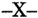
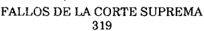

TOMO 319

Volumen 1

1996

DE JUSTICIA DE LA NACION

319

## FALLOS DE LA CORTE SUPREMA DE JUSTICIA DE LA NACION

1

DE JUSTICIA DE LA NACION

319

3

## R E P U B L I C A A R G E N T I N A

FALLOS

DE  LA

C O R T E

S U P R E M A

DE

## J USTICIA DE LA N ACION

PUBLICACION A CARGO DE LA SECRETARIA DE JURISPRUDENCIA DEL TRIBUNAL

TOMO 319 - VOLUMEN 1

FEBRERO - MAYO

LA LEY S.A.E. e I.

Tucumán 1471 (1050) Buenos Aires 1996

## HOJA COMPLEMENTARIA

Hoja incorporada a los efectos de permitir la búsqueda por página dentro del Volumen.

DE JUSTICIA DE LA NACION

319

5

## A C U E R D O S   D E   L A   C O R T E   S U P R E M A

## AÑO 1996

## FEBRERO - MAYO

TRIBUNAL ORAL EN LO CRIMINAL FEDERAL DE LA PROVINCIA DE TIERRA DEL FUEGO, ANTARTIDA E ISLAS DEL ATLANTICO SUR

-N o 5-

En Buenos Aires, a los 13 días del mes de febrero del año mil novecientos noventa y seis, reunidos en la Sala de Acuerdos del Tribunal, los señores Ministros que suscriben la presente,

## Consideraron:

- 1 o ) Que el art. 21 de la ley 24.121 creó el Tribunal Oral en lo Criminal Federal de Tierra del Fuego, Antártida e Islas del Atlántico Sur.
- 2 o )  Que,  a  su  vez,  la  ley  24.400  condicionó  la  puesta  en  funcionamiento  de  ese tribunal oral hasta tanto fuera suprimido el Juzgado Nacional Ordinario de Primera Instancia de Ushuaia (art. 14).
- 3 o ) Que la misma ley dispuso que tal supresión se haría efectiva una vez que el cargo de su titular quedase vacante (art. 17).
- 4 o ) Que para que esa condición se concrete el art. 15 de la ley 24.400 dispuso que las causas en trámite ante el juzgado debían traspasarse a la justicia provincial, exigencia, que a la fecha, se encuentra cumplida (ver fs. 139/143).
- 5 o ) Que el Poder Ejecutivo Nacional ha designado a los magistrados que se harán cargo del Tribunal Oral en lo Criminal Federal de Tierra del Fuego, Antártida e Islas del Atlántico Sur, entre ellos al titular del juzgado ordinario que se encuentra de licencia hasta el día 9 de marzo y que, con posterioridad a esa fecha, hará efectivo su traslado al Tribunal Oral en lo Criminal Federal N  2 de esta capital, dispuesto por decreto o N o 958 del 21 de diciembre de 1995, con lo cual el juzgado quedará vacante.
- 6 o ) Que el Tribunal Oral en lo Criminal Federal de Tierra del Fuego, Antártida e Islas del Atlántico Sur se integrará de acuerdo a lo previsto en el art. 22 de la ley 24.121, sustentándose con las partidas presupuestarias asignadas al juzgado suprimido.

- 7 o ) Que en consecuencia, los señores jueces del tribunal oral deberán seleccionar entre los empleados del juzgado disuelto y del federal de Ushuaia a los agentes que actuarán bajo su dependencia.
- 8 o )  Que habida cuenta del personal excedente que deberá redistribuirse corresponde que los señores jueces del tribunal, en este caso concreto y con carácter de excepción, designen a sus relatores también entre el personal de planta efectivo de la jurisdicción.
- 9 o ) Que, asimismo, esos magistrados deberán nombrar secretario del tribunal oral a alguno de los secretarios del juzgado que se eliminó, por idénticas razones.
- 10) Que, por último, la Cámara Federal de Apelaciones de Comodoro Rivadavia deberá, atento a sus facultades de superintendencia y ponderando las necesidades de la jurisdicción de Ushuaia, redistribuir a los funcionarios y el personal excedente del juzgado suprimido.
- 11) Que, asimismo, la cobertura de las vacantes y las promociones que se produzcan en la jurisdicción, deberán efectuarse teniendo en cuenta al personal excedente que deba redistribuirse a causa de la sustitución del Juzgado Nacional Ordinario de Ushuaia por el tribunal oral.
- 12) Que, las vacantes que se produzcan por promoción o renuncia del personal excedente distribuido en los distintos tribunales de ese asiento, deberán ser comunicadas a esta Corte Suprema de Justicia de la Nación a fin de ser suprimidas.
- 13) Que por otra parte la Secretaría de Superintendencia Administrativa comunicó a fs. 117 que el referido tribunal se encuentra en condiciones de ser habilitado.

Por ello,

## Acordaron:

- 1 o )  Suprimir a partir del 9 de marzo de 1996 el Juzgado Nacional Ordinario de Primera Instancia de Ushuaia, de conformidad con lo establecido por la ley 24.400.
- 2 o ) Habilitar el Tribunal Oral en lo Criminal Federal de la Provincia de Tierra del Fuego, Antártida e Islas del Atlántico Sur a partir de la fecha en que la Cámara Federal de Apelaciones de Comodoro Rivadavia reciba el juramento de ley a los señores magistrados designados para integrar dicho tribunal, acto que deberá efectuarse con posterioridad al 9 de marzo de 1996.
- 3 o ) Aclarar que ese tribunal deberá ser integrado de la forma establecida en los considerandos de la presente acordada.
- 4 o ) Decretar feriado judicial para dicho tribunal oral por el término de siete días hábiles a partir de su habilitación.
- 5 o ) Poner en conocimiento del señor Procurador General de la Nación la presente acordada, a fin de que adopte los recaudos correspondientes con respecto a los representantes del ministerio público.

Todo lo cual dispusieron y mandaron, ordenando que se comunicase y registrase en el libro correspondiente, por ante mí, que doy fe.- JULIO S. NAZARENO - EDUARDO MOLINÉ O'CONNOR - CARLOS S. FAYT - AUGUSTO CÉSAR BELLUSCIO - ENRIQUE SANTIAGO PETRACCHI - ANTONIO BOGGIANO - GUILLERMO A. F. LÓPEZ - GUSTAVO A. BOSSERT ADOLFO ROBERTO VÁZQUEZ Jorge Alejandro Magnoni (Secretario).

## PODER JUDICIAL. REMUNERACIONES.

## -N o 6-

En Buenos Aires, a los 13 días del mes de febrero del año mil novecientos noventa y seis, reunidos en la Sala de Acuerdos del Tribunal, los señores Ministros que suscriben la presente,

## Acordaron:

Que en orden a las prescripciones del art. 18 de la Ley de Presupuesto General para 1996- ley 24.624, se hace necesario establecer un criterio en cuanto a su aplicación dentro de la órbita del Poder Judicial de la Nación.

Que en sus tres primeros párrafos, el artículo citado suspende transitoriamente la aplicación de normas que generen el pago efectivo durante el ejercicio 1996, de montos escalafonarios derivados de promociones, ascensos, antigüedad, adicional por grado y por permanencia, y todo otro concepto similar, que se hubiesen generado por condiciones acreditadas durante el último período completo de evaluación anterior al 1 de Enero de 1996.

Que -en principio- la aplicación de esta preceptiva comprende al Poder Judicial, con la salvedad de que, como es reiterada la doctrina en esta materia, no podrá afectarse la intangibilidad de la remuneración de los magistrados judiciales ni miembros del Ministerio Público, de acuerdo a lo prescripto por los Art. 110 y 120 de la Constitución Nacional (Fallo 307 II: 2174, entre otros).

Que en el marco que definen los arts. 108 y 110 y las atribuciones implícitas que resultan correlativas al art. 113 de la Constitución Nacional, en orden de asegurar su independencia y el equilibrio de poderes, le corresponde a esta Corte procurar aplicar las disposiciones del art. 18 de la Ley de Presupuesto 1996 de la manera que resulte más compatible con las características del servicio de justicia, sin dejar por ello de contribuir al restablecimiento de la armonía en la aplicación de las rentas con los gastos públicos consecuentes.

Que -además- es de relevancia significativa, que en la ejecución del presupuesto que tiene asignado esta Corte, goza de las más amplias facultades para disponer el modo de aplicación de sus gastos, cuidando de no alterar el total de las sumas autorizadas en el Presupuesto General a los fines de su reestructuración y compensaciones, tal como expresamente lo define el art. 5to. de la ley 23.853.

Que debe tenerse en cuenta especialmente que el art. 18 de la Ley de Presupuesto 1996 busca producir un ahorro para el presente ejercicio en las partidas de personal.

Que a tales efectos el art. 48 de la Ley de Presupuesto para la Administración General faculta al Sr. Jefe de Gabinete de Ministros a producir -en oportunidad de la distribución de los créditos- una rebaja en las partidas del inc. 1-Gastos en Personal, a través de la cual devino un recorte presupuestario de $ 4.734.009 para este Poder Judicial.

Que esta disminución supera ampliamente el importe que insumiría la aplicación del art. 18, más aun teniendo en cuenta que debe excluirse 'ipso jure' a los magistrados judiciales por causa de las garantías constitucionales antes mencionadas.

Que por tales razones, y en virtud de lo dispuesto por el art. 7  de la Ley de Autaro quía N  23.853, esta Corte debe mantener un 'sistema salarial' que sea acorde con la o naturaleza de la especialidad de la administración de justicia.

Que en el cuarto párrafo del art. 18 de la Ley de Presupuesto, se establece la ratificación del decreto 290/95 (de reducción de retribuciones brutas incluyendo el sueldo anual complementario para el personal del sector público nacional).

Que a los efectos de actuar acorde a las especiales circunstancias que motivaron al Poder Ejecutivo la medida antes descripta, esta Corte decidió -conforme las facultades establecidas en los arts. 108 y 110 de la Constitución Nacional- producir una reducción presupuestaria en el crédito total autorizado para el ejercicio 1995, mediante acordada N o 7/95 y resoluciones N  464/95 y 671/95, las que implicaron adaptarse a las pautas de o reducción de gastos dispuestas por el decreto 290/95 dentro de las particulares características que reviste el ejercicio de la actividad judicial. Que debe aclararse que esta medida lo fue, sin perjuicio de las facultades constitucionales de la Corte Suprema, en cuanto a su independencia y de las derivadas del art. 7  de la ley 23.853, que le confiere o amplias facultades para disponer el régimen salarial y las pautas de política de remuneraciones para el Poder Judicial de la Nación.

Que la ratificación legal del decreto 290/95, sólo convalida la competencia de las disposiciones emanadas del Poder Ejecutivo, y como este Tribunal ya dispusiera una reducción de gastos en forma paralela, no se genera obligación alguna para el presente ejercicio.

Por ello, los Sres. Jueces de este Tribunal, deciden:

1) Mantener inalteradas en su vigencia las disposiciones contenidas en los regímenes escalafonarios del Poder Judicial con sus consecuentes erogaciones financieras.

Todo lo cual dispusieron y mandaron, ordenaron se comunicase y registrase en el libro correspondiente, por ante mí, que doy fe.- JULIO S. NAZARENO - EDUARDO MOLINÉ O'CONNOR - CARLOS S. FAYT - AUGUSTO CÉSAR BELLUSCIO - ENRIQUE SANTIAGO PETRACCHI - ANTONIO BOGGIANO - GUILLERMO A. F. LÓPEZ - GUSTAVO A. BOSSERT ADOLFO ROBERTO VÁZQUEZ Nicolás A. Reyes (Administrador General).

## DE JUSTICIA DE LA NACION

319

## SECRETARIA DE AUDITORES JUDICIALES. REGLAMENTO.

-N o 8-

En Buenos Aires, a los 13 días del mes de febrero del año mil novecientos noventa y seis reunidos en la Sala de Acuerdos del Tribunal, el señor Presidente de la Corte Suprema de Justicia de la Nación, Doctor Don Julio S. Nazareno y los señores Ministros que suscriben la presente,

Consideraron:

Que, en ejercicio de la superintendencia, esta Corte creó por acordada N  84/90 la o Secretaría de Auditores Judiciales, dependiente de la Presidencia del Tribunal.

Que, conforme lo expuesto en los considerandos de dicha exposición, resulta conveniente dictar un ordenamiento que regule en forma precisa el procedimiento a seguir por dicha Secretaría en materia de investigaciones.

Por ello,

Acordaron:

Aprobar el Reglamento de Investigaciones de la Secretaría de Auditores Judiciales de la Corte Suprema de Justicia de la Nación que, como anexo, forma parte integrante del presente acuerdo.

Todo lo cual dispusieron y mandaron, ordenando se comunicase y registrase en el libro correspondiente, por ante mí, que doy fe.- JULIO S. NAZARENO - EDUARDO MOLINÉ O'CONNOR - CARLOS S. FAYT - ANTONIO BOGGIANO - GUILLERMO A. F. LÓPEZ - ADOLFO ROBERTO VÁZQUEZ Jorge Alejandro Magnoni (Secretario).

## REGLAMENTO DE INVESTIGACIONES DE LA SECRETARIA DE AUDITORES JUDICIALES DE LA CORTE SUPREMA DE JUSTICIA DE LA NACION

## CAPITULO I.

Disposiciones Generales.

ARTICULO 1 o . Se regirán por las disposiciones del presente las investigaciones tendientes a determinar -y, en su caso, a hacer efectiva- la responsabilidad administrativa de los magistrados, funcionarios y empleados del Poder Judicial de la Nación, por incumplimiento de las leyes, acordadas y reglamentos que regulan la actividad de la administración de justicia.

## CAPITULO II.

Iniciación.

ARTICULO 2 o . La investigación podrá iniciarse:

a) Por disposición del Presidente de la Corte Suprema de Justicia, o del funcionario en quien delegue sus facultades.

b) Por comunicación de otros órganos del Poder Judicial que ejerzan facultades de superintendencia, en los términos del artículo 118 del Reglamento para la Justicia Nacional.

- c) Por denuncia de magistrados, funcionarios o empleados del Poder Judicial de la Nación.
- d) Por denuncia de particulares con un interés legítimo.
- e) Por denuncia de organismos de otros poderes públicos, en la esfera de sus atribuciones.

ARTICULO 3 o . Las denuncias deberán formalizarse por escrito y contendrán, en forma clara y precisa:

a) La relación circunstanciada de la irregularidad administrativa que se denuncia.

- b) La identificación del magistrado, funcionario o empleado a quien se imputa, o del órgano judicial en el que supuestamente se habría cometido.
- c) Todos los demás elementos que puedan conducir a la eventual comprobación de la irregularidad que se denuncia, a la determinación de su naturaleza y gravedad, y a la individualización de sus responsables.

Si el denunciante fuere un particular, deberá identificarse, manifestar su domicilio real y constituir un domicilio especial en el radio de la Capital Federal, a los efectos de la investigación.

ARTICULO 4 o . La investigación se sustanciará en forma actuada, formándose un expediente, en el que se agregarán las constancias siguiendo un orden cronológico. Toda actuación incorporada a la causa deberá foliarse, dejándose constancia -en su caso- del lugar, fecha y hora de su realización. Las investigaciones serán reservadas hasta que se corra la vista a la que se refiere el artículo 15, y no se admitirán en ellas debates y defensas.

El denunciante no es parte en las actuaciones.

A fin de que se efectúen con la mayor celeridad posible, se considerará urgente todo lo relacionado con su sustanciación.

## CAPITULO III.

Secretario y auditores.

ARTICULO 5 o . El Secretario supervisará la actuación de los auditores y distribuirá entre ellos en forma equitativa las tareas, y será responsable por el cumplimiento de las diligencias que se encomienden al organismo.

ARTICULO 6 o . Iniciado un expediente, el Secretario designará al auditor que conducirá la investigación. Cuando lo exijan la jerarquía de los presuntos involucrados o la gravedad de los hechos investigados, el Secretario deberá llevar adelante personalmente las actuaciones, pudiendo contar con la colaboración de otros auditores, si las circunstancias del caso lo requirieren.

ARTICULO 7 o . En el caso de denuncia, el auditor interviniente podrá citar al presentante para que, en el plazo perentorio que fije, proceda a formular las aclaraciones y aportar los elementos que considere imprescindibles para llevar adelante la investigación, bajo apercibimiento de disponerse su archivo por el Secretario.

ARTICULO 8 o . El auditor no podrá ser recusado, aunque deberá excusarse en el caso de configurarse las causales del artículo 17 del Código Procesal Civil y Comercial de la Nación, respecto del denunciante o del investigado. Podrá excusarse, asimismo, cuando existan otras causas que le impongan abstenerse de intervenir en la investigación, fundadas en motivos graves de decoro o delicadeza.

La excusación deberá ser planteada inmediatamente después de conocida la causal, por medio de un informe escrito al Secretario, quien resolverá sobre su procedencia y designará, en su caso, un auditor en su reemplazo.

En caso de que el afectado fuera el Secretario, la decisión será adoptada por el Presidente de la Corte Suprema de Justicia, o por el funcionario en quien éste delegue sus facultades.

## CAPITULO IV.

Evaluación preliminar.

ARTICULO 9 o . El Presidente de la Corte Suprema de Justicia, o el funcionario en quien éste delegue sus facultades, decidirá si corresponde imprimir curso a la investigación o si cabe su desestimación in limine .

En el primer caso, dispondrá la instrucción de una información sumaria o de un sumario, según corresponda. En el segundo, ordenará el archivo de las actuaciones. Podrá obviarse toda investigación previa en el caso previsto por el segundo párrafo del artículo 21 del Reglamento para la Justicia Nacional.

Podrá decidirse, asimismo, la remisión de la causa al órgano judicial en el que la Corte Suprema de Justicia hubiera delegado sus facultades de superintendencia directa, en los términos del artículo 118 del Reglamento para la Justicia Nacional, cuando el objeto de la investigación quede encuadrado en el marco de la delegación.

La resolución que ordene la formación de sumario será puesta en conocimiento del superior jerárquico directo del presunto responsable.

## CAPITULO V.

## Medidas preventivas.

ARTICULO 10. Cuando la permanencia en funciones de quien se encontrare involucrado en una investigación fuera inconveniente para el esclarecimiento de los hechos o para el normal desenvolvimiento de un organismo o dependencia, el Presidente de la Corte Suprema de Justicia -o el funcionario en quien delegue sus facultadespodrá disponer su traslado, previo informe fundado del auditor.

El término del traslado no podrá exceder del plazo mencionado en el artículo 22 y sus eventuales ampliaciones.

Cuando el traslado no fuere posible, o la gravedad del hecho lo hiciera aconsejable, el sumariado podrá ser suspendido preventivamente por un término no mayor de treinta días, prorrogable por otro período de hasta sesenta días. Ambos términos se computarán en días corridos.

El pago de haberes durante el período de la suspensión sólo será procedente si en la causa administrativa no se aplican sanciones, o si éstas resultan ser inferiores al plazo de la suspensión preventiva, en cuyo caso se reconocerá la diferencia si la sanción consiste en suspensión.

Si un funcionario o empleado se encontrare procesado en una causa penal será suspendido preventivamente, instruyéndose el correspondiente sumario.

## CAPITULO VI.

Informaciones sumarias.

ARTICULO 11. El objeto de la información sumaria es precisar las circunstancias y reunir los elementos de prueba tendientes a esclarecer la comisión de irregularidades, individualizar a sus responsables, y recomendar eventualmente la formación de un sumario.

ARTICULO 12. Cumplidas las medidas necesarias para ese fin, el auditor dará por concluida la información sumaria, y, dentro de los quince días de dictada tal providencia, producirá un informe que sucintamente deberá contener:

- a) La relación circunstanciada de los hechos investigados.
- b) La valoración de los elementos de prueba reunidos.
- c) La conclusión de si se ha probado o no, en principio, la existencia de una irregularidad administrativa; y, en su caso, la enunciación de las disposiciones legales o reglamentarias infringidas.

d) La individualización de los magistrados, funcionarios o empleados a quienes les correspondería, en principio, el reproche administrativo que daría lugar a la formación de sumario.

ARTICULO 13. El informe mencionado en el artículo anterior será presentado al Secretario quien, en caso de compartir su contenido, lo elevará -dentro de los diez días- a la consideración del Presidente de la Corte Suprema de Justicia, o del funcionario en quien hubiere delegado sus facultades, para el dictado de una resolución por la que se decida la instrucción de un sumario o se disponga el archivo de las actuaciones.

ARTICULO 14. La información sumaria deberá completarse en el plazo de treinta días desde que su iniciación haya sido dispuesta, pero se suspenderá cuando el expediente se encuentre a consideración de la Corte Suprema de Justicia, de su Presidente, o del funcionario en quien éste delegue sus facultades, para la adopción de una resolución vinculada con su trámite.

Dicho término podrá ser ampliado por el Secretario, a solicitud del auditor formulada con diez días de antelación a su vencimiento, cuando el volumen o complejidad de la causa lo justifiquen o deban practicarse diligencias fuera de la Capital Federal, o disminuirse, si razones de urgencia así lo requieren.

## CAPITULO VII.

## Sumarios.

ARTICULO 15. El objeto del sumario es esclarecer en forma definitiva los hechos investigados, deslindar las responsabilidades emergentes respetando el ejercicio del derecho de defensa, y -en su caso- aplicar las sanciones que correspondan.

ARTICULO 16. La providencia que ordene su instrucción se notificará en forma fehaciente al sumariado, corriéndosele vista de lo actuado por un plazo máximo de diez días. El Secretario podrá ampliar este plazo, de considerarlo justificado, hasta un máximo de cinco días más.

La resolución se pondrá asimismo en conocimiento del superior jerárquico del sumariado.

Si éste fuere un magistrado, la vista se le correrá por oficio.

El expediente deberá ser consultado en secretaría, sin que -en ningún caso- pueda ser autorizado su préstamo. Podrá el sumariado, sin embargo, solicitar la extracción de fotocopias a su costa.

Vencido el plazo para formular el descargo sin que éste se hubiera presentado, se dará por decaído el derecho de hacerlo en el futuro.

ARTICULO 17. El sumariado podrá actuar con patrocinio letrado y, al realizar su descargo, tendrá el derecho de proponer las medidas de prueba que considere útiles para la defensa de sus intereses.

En cada caso, deberá identificar los testigos e incluir las preguntas que propone efectuarles, los puntos sobre los que pretende la producción de prueba informativa o pericial, y fundamentar la pertinencia de la documental que ofrezca y de corresponder, indicar el lugar donde se encuentra.

El sumariado no podrá ofrecer más de cinco testigos. En caso de que los propuestos excedieren dicha cantidad, el auditor citará sólo a los cinco primeros, sin perjuicio de lo dispuesto en el artículo siguiente. El proponente asume la carga de hacer comparecer a los testigos ofrecidos a la audiencia que se fije para su declaración.

No serán tenidas en cuenta las medidas probatorias con relación a las cuales no se cumpla con tales requisitos.

ARTICULO 18. El ofrecimiento de prueba del sumariado será sometido a consideración del Presidente de la Corte Suprema de Justicia, o del funcionario en el que delegue sus facultades, quien podrá desestimar las medidas que no fueren conducentes para el objeto del sumario.

ARTICULO 19. Cumplidas las diligencias probatorias admisibles propuestas por el  presunto responsable y aquéllas cuya producción resuelva el auditor para mejor proveer, se correrá vista al sumariado por el término improrrogable de cinco días, a fin de que alegue sobre el mérito de las pruebas incorporadas a la causa.

ARTICULO 20. Agregado el alegato, o certificada su falta de presentación en término, el auditor dispondrá la conclusión del sumario, con la conformidad del Secretario.

Dentro del plazo de quince días de dictada tal providencia, producirá un informe que deberá:

- a) Determinar si los hechos investigados constituyen irregularidad administrativa, y -en caso afirmativo- la norma violada.
- b) Atribuir o eximir de responsabilidad al sumariado.
- c) Evaluar sus antecedentes disciplinarios, si los poseyere.
- d) Recomendar, de corresponder, la sanción a aplicar u otras medidas a adoptar.

ARTICULO 21. El Secretario, si aprueba el informe al que se refiere el artículo anterior, elevará las actuaciones para su resolución definitiva a la Corte Suprema de Justicia, por intermedio de su Presidente, o del funcionario en quien éste delegue sus facultades.

ARTICULO 22. El sumario deberá completarse en el plazo de sesenta días desde que su iniciación haya sido dispuesta, pero se suspenderá cuando el expediente se encuentre a consideración de la Corte Suprema de Justicia, de su Presidente, o del funcionario en quien éste delegue sus facultades, para la adopción de una resolución vinculada con su trámite.

Dicho término podrá ser ampliado por el Secretario, a solicitud del auditor formulada con diez días de antelación a su vencimiento, cuando el volumen o complejidad de la causa lo justifiquen o deban practicarse diligencias fuera de la Capital Federal, o disminuirse, si razones de urgencia así lo requieren.

## CAPITULO VIII.

## Recursos.

ARTICULO 23. La decisión que adopte la Corte Suprema de Justicia es sólo susceptible del recurso de reconsideración, el que deberá interponerse y fundarse por escrito en el plazo de tres días.

Sin embargo, el afectado podrá solicitar en cualquier tiempo la revisión del sumario del que resultare una sanción disciplinaria, cuando aduzca hechos nuevos o circunstancias sobrevinientes susceptibles de justificar su falta de responsabilidad. Este recurso deberá ser interpuesto en el plazo de tres días desde que los hechos nuevos o las circunstancias sobrevinientes fueran conocidas por el afectado.

## CAPITULO IX.

Disposiciones comunes en materia de prueba.

ARTICULO 24. Están obligados a declarar todos los funcionarios y empleados del Poder Judicial de la Nación, y las personas vinculadas a él por contratos administrativos.

Están exceptuados de comparecer los magistrados de todas las instancias, quienes podrán declarar por oficio.

La concurrencia de quienes no se encuentren en las situaciones antes descriptas será voluntaria.

ARTICULO 25. La persona citada, previa acreditación de su identidad, prestará juramento o promesa de decir verdad antes de declarar, y será informada de las consecuencias a que pueden dar lugar los testimonios falsos o reticentes.

En primer término, se le harán conocer las causas que han motivado la iniciación de la investigación y será preguntada por las circunstancias mencionadas en el artículo 441 del Código Procesal Civil y Comercial de la Nación.

A continuación, se la interrogará sobre todos los pormenores que puedan conducir al esclarecimiento de los hechos; como así también sobre todas las circunstancias que sirvan para establecer su mayor o menor gravedad, y la participación que en ellos pudiera haberles cabido a magistrados, funcionarios o empleados del Poder Judicial de la Nación.

ARTICULO 26. El testigo podrá rehusarse a contestar las preguntas que se le formulen, en los siguientes casos:

a) Si la respuesta lo expusiere a un enjuiciamiento penal.

b) Si no pudiera responder sin revelar un secreto al que se encuentra obligado, en razón de su estado o profesión.

ARTICULO 27. Cuando exista motivo suficiente para considerar que el citado puede ser eventualmente responsable del hecho que se investiga, se procederá a recibirle declaración sin exigirle juramento o promesa de decir verdad.

Se permitirá al declarante exponer cuanto tenga por conveniente para su descargo o para la explicación de los hechos.

Si una persona en tal situación no compareciere a la primera citación sin causa justificada,  se  dejará  constancia de ello y se procederá a citarlo por una segunda y última vez. La falta de comparecencia, el silencio o la negativa a declarar no constituirán presunción alguna en contra del renuente.

Su no concurrencia no obstará a la prosecución de la investigación.

ARTICULO 28. Las preguntas serán claras y precisas, y se levantará un acta de la audiencia en la que se produzca la declaración.

El deponente no podrá leer notas o apuntes, salvo que por la índole de la pregunta se le autorizare, y deberá dar siempre razón de sus dichos.

El interrogado podrá, si lo deseare, dictar por sí su testimonio. Si no lo hiciere, lo transcribirá el auditor, procurando utilizar -en lo posible- las mismas palabras de las que el declarante se hubiera valido.

Concluida la declaración, el deponente deberá leer por sí mismo su transcripción y -si no lo hiciere- el auditor la leerá íntegramente, haciéndose mención de este hecho. A continuación, se le preguntará si ratifica su contenido, o si tiene algo que añadir, quitar o enmendar. Si el interrogado no ratificara sus respuestas, o tuviere algo que añadir, quitar o enmendar, las nuevas manifestaciones se agregarán luego de lo antes actuado, sin borrarse en ningún caso lo previamente escrito.

El acta de la declaración será firmada por todos los que hubieren intervenido en la audiencia. Si el interrogado se negare a suscribirla, el auditor dejará constancia de tal hecho.

ARTICULO 29. Cuando las declaraciones obtenidas en una investigación discordaren acerca de algún hecho o circunstancia que fuere necesario dilucidar, el auditor podrá disponer un careo.

En la realización del mismo se observarán, en lo pertinente, las normas de los artículos anteriores. El careo se realizará de a dos personas por vez, dándose lectura a las declaraciones anteriores que se consideren contradictorias, a fin de que los comparecientes se reconvengan mutuamente para obtener el esclarecimiento de la verdad.

Se transcribirán las preguntas y contestaciones que se produjeren, y se hará constar cualquier otra particularidad que fuere conducente.

El acta deberá ser firmada por los comparecientes y el auditor, previa lectura y ratificación; siendo de aplicación, en su caso, el artículo 28 in fine .

ARTICULO 30. La confesión hace prueba suficiente en contra de quien la formula, salvo que fuere inverosímil o contradicha por otras probanzas, no pudiendo dividirse en su perjuicio.

Ella no dispensa al auditor, sin embargo, de una completa investigación de los hechos, ni de la búsqueda de otros responsables.

ARTICULO 31. El auditor podrá ordenar los exámenes periciales que considere necesarios, fijando los puntos sobre los que debe versar el dictamen y el plazo en el que debe producirse.

La prueba se diligenciará con la intervención de la Dirección General Pericial de la  Corte  Suprema de Justicia, y en su realización se aplicarán en lo pertinente las normas de los artículos 457 y siguientes del Código Procesal Civil y Comercial de la Nación.

Los dictámenes presentados en causas judiciales podrán ser incorporados al expediente, obviándose su producción en el sumario.

ARTICULO 32. El auditor deberá incorporar al expediente toda la prueba instrumental que sea adquirida en el curso de la investigación, o aportada por los involucrados.

ARTICULO 33. El auditor podrá requerir informes a todas las dependencias integrantes del Poder Judicial de la Nación o a otros organismos públicos o privados, como así también la remisión de expedientes, testimonios o certificados, relacionados con la investigación.

ARTICULO 34. Previa autorización del Secretario, el auditor podrá practicar inspecciones de lugares o cosas, labrando una relación circunstanciada en forma de acta, firmada por todos los intervinientes.

## CAPITULO X.

Extinción de la potestad disciplinaria.

ARTICULO 35. La potestad disciplinaria se extingue:

- a) Por el fallecimiento del presunto responsable.
- b) Por su desvinculación del Poder Judicial de la Nación; aunque esta circunstancia no obstará a la prosecución de las actuaciones y posterior asiento de la resolución que recaiga en el legajo del afectado.
- c) Por el transcurso de tres años, contado a partir del momento en que se produjo la irregularidad, o desde que ella dejó de cometerse.

d) En los casos en que las irregularidades constituyan delitos del derecho penal o lesionen el patrimonio del Estado, el plazo será el establecido por la legislación específica, sin que pueda ser inferior al establecido en el inciso anterior.

Los términos establecidos en los incisos c) y d) se interrumpen por la instrucción de una información sumaria o de un sumario.

## CAPITULO XI.

Disposiciones complementarias.

ARTICULO 36. Quedan derogadas las disposiciones procesales contenidas en la acordada 84/90 de la Corte Suprema de Justicia de la Nación, en cuanto se opongan a las contenidas en el presente.

ARTICULO 37. A partir de la vigencia de este Reglamento, el procedimiento de los expedientes en trámite se adaptará en lo posible a sus disposiciones, sin perjuicio de la validez de los actos ya cumplidos.

ARTICULO 38. El plazo de prescripción de la potestad disciplinaria será aplicable a las faltas cometidas antes del dictado de la presente acordada, pero deberá contarse a partir de la fecha de su vigencia. - JULIO S. NAZARENO - EDUARDO MOLINÉ O'CONNOR CARLOS S. FAYT - ANTONIO BOGGIANO - GUILLERMO A. F. LÓPEZ - ADOLFO ROBERTO VÁZQUEZ -Jorge Alejandro Magnoni (Secretario).

## OBRA SOCIAL. CONTRIBUCION PATRONAL.

-N o 11-

En Buenos Aires, a los 16 días del mes de febrero del año mil novecientos noventa y seis, reunidos en la Sala de Acuerdos del Tribunal, el Señor Presidente de la Corte Suprema de Justicia de la Nación, Doctor Don Julio S. Nazareno y los señores Ministros que suscriben la presente,

Consideraron:

Que se encuentran superadas las dificultades económicas de la Obra Social del Poder Judicial de la Nación que dieron origen al incremento de la Contribución Patronal por parte de esta Jurisdicción del 4,5% al 6% mensual a través de acordada 44/90.

Que se arriba a esa conclusión en mérito a los excedentes positivos que arrojan los Balances Generales de los últimos años de dicho organismo.

Que se torna necesario modificar el financiamiento de las erogaciones que significan para el Poder Judicial el costo del personal de dicho organismo.

Que el presupuesto de gastos y recursos aprobado para el Poder Judicial de la Nación para el ejercicio 1996 obliga a planificar cuidadosamente su ejecución replanteando el nivel de las erogaciones a los efectos de posibilitar que los créditos autorizados alcancen a cubrir las necesidades de todo el año.

Por ello, los Sres. Jueces de este Tribunal deciden:

1) Fijar la contribución a la Obra Social del Poder Judicial de la Nación a cargo del empleador en un 4,5% a partir del 1  de Enero de 1996 y por el resto del presente año. o

- 2) Disponer que la Obra Social del Poder Judicial de la Nación efectúe una transferencia interna de fondos a la cuenta que oportunamente le comunique la Subsecretaría de Administración, compensatoria del costo total de las remuneraciones del personal de dicho organismo que abona este Poder Judicial con la antelación necesaria para cubrir dicha erogación cada mes a partir de 1  de enero de 1996. o

Todo lo cual dispusieron y mandaron, ordenando que se comunicase y registrase en el libro correspondiente. - JULIO S. NAZARENO - CARLOS S. FAYT - AUGUSTO CÉSAR BELLUSCIO - ENRIQUE SANTIAGO PETRACCHI - ANTONIO BOGGIANO - GUILLERMO A. F. LÓPEZ - GUSTAVO A. BOSSERT - ADOLFO ROBERTO VÁZQUEZ Nicolás A. Reyes (Administrador General).

## ARANCELES. DESTINO de FONDOS.

## -N o 12-

En Buenos Aires, a los 16 días del mes de febrero del año mil novecientos noventa y seis, reunidos en la Sala de Acuerdos del Tribunal, el Señor Presidente de la Corte Suprema de Justicia de la Nación, Doctor Don Julio S. Nazareno y los señores Ministros que suscriben la presente,

## Consideraron:

Que resulta necesario determinar el destino de los fondos que se recaudan por el arancelamiento dispuesto por acordada 29/95, aclarada por acordada 50/95.

Por ello,

Acordaron:

1) Disponer que los fondos que se recauden mediante el arancelamiento dispuesto por acordadas Nro. 29/95 y aclaratoria 50/95, sean considerados comprendidos dentro de lo dispuesto por el inc. d., art. 3  de la ley 23.853 y se depositen en la cuenta que -a o tal efecto- disponga la Tesorería de la Subsecretaría de Administración, dentro de las 48 horas de percibidos.

Todo lo cual dispusieron y mandaron, ordenando que se comunicase y registrase en el libro correspondiente. - JULIO S. NAZARENO - CARLOS S. FAYT - AUGUSTO CÉSAR BELLUSCIO - ENRIQUE SANTIAGO PETRACCHI - ANTONIO BOGGIANO - GUILLERMO A. F. LÓPEZ - GUSTAVO A. BOSSERT - ADOLFO ROBERTO VÁZQUEZ Nicolas A. Reyes (Administrador General).

## COLEGIO PUBLICO DE ABOGADOS. ELECCIONES.

-N o 15-

En Buenos Aires, a los 5 días del mes de marzo del año mil novecientos noventa y seis, reunidos en la Sala de Acuerdos del Tribunal, los señores Ministros que suscriben la presente,

## Consideraron:

Que el día 24 de abril próximo se celebrarán las elecciones para designar las autoridades del Colegio Público de Abogados de la Capital Federal, en el horario comprendido entre las 8 y 18 horas.

Por ello,

Acordaron:

Declarar el día 24 de abril del corriente, inhábil para los tribunales de la Capital Federal, sin perjuicio de la validez de los actos procesales que se cumplan, no actuados en rebeldía.

Todo lo cual dispusieron y mandaron, ordenando que se comunicase y registrase en el libro correspondiente, por ante mí, que doy fe. - JULIO S. NAZARENO - EDUARDO MOLINÉ O'CONNOR - CARLOS S. FAYT - AUGUSTO CÉSAR BELLUSCIO - ENRIQUE SANTIAGO PETRACCHI - ANTONIO BOGGIANO - GUILLERMO A. F. LÓPEZ - ADOLFO ROBERTO VÁZQUEZ -Jorge Alejandro Magnoni (Secretario).

## DE JUSTICIA DE LA NACION 319

## FERIA JUDICIAL DE JULIO.

## -N o 17-

En Buenos Aires, a los 12 días del mes de marzo del año mil novecientos noventa y seis, reunidos en la Sala de Acuerdos del Tribunal, los señores Ministros que suscriben la presente,

## Acordaron:

1 o ) Disponer en el corriente año feriado judicial para los tribunales nacionales de la Capital desde el día 22 de julio al 2 de agosto, ambos inclusive.

- 2 o ) Hacer saber a las Cámaras Federales de Apelaciones que con arreglo a lo previsto en la acordada N  53/73 -respecto de la coincidencia de la feria en ella establecida o con las vacaciones escolares- y a lo dispuesto en la presente, deberán determinar para sus respectivas jurisdicciones un feriado judicial de diez días hábiles (acápite 2  de la o acordada N  30/84). o

Todo lo cual dispusieron y mandaron, ordenando que se comunicase y registrase en el libro correspondiente, por ante mí, que doy fe. - JULIO S. NAZARENO - EDUARDO MOLINÉ O'CONNOR - CARLOS S. FAYT - AUGUSTO CÉSAR BELLUSCIO - ENRIQUE SANTIAGO PETRACCHI - ANTONIO BOGGIANO - GUILLERMO A. F. LÓPEZ - ADOLFO ROBERTO VÁZQUEZ -Jorge Alejandro Magnoni (Secretario).

## POLICIA JUDICIAL.

## -N o 18-

En Buenos Aires, a los 26 días del mes de marzo del año mil novecientos noventa y seis, reunidos en la Sala de Acuerdos del Tribunal, los señores Ministros que suscriben la presente,

## Considerando:

Que a los efectos de que se organice y ponga en funcionamiento la Policía Judicial prevista en el Código Procesal Penal de la Nación, resulta necesario la designación de personal especializado de las fuerzas de seguridad para colaborar con esta Corte dentro de las previsiones de las leyes 24.050 y 24.121.

Que a los fines de que la designación de personal no signifique un incremento en el presupuesto resulta conveniente, por el momento, que cada fuerza de seguridad designe tres personas idóneas, con antecedentes suficientes.

## Por ello,

Acordaron:

Oficiar a los titulares de los diversos organismos de seguridad del Estado a los efectos de coordinar la designación de tres personas, con antecedentes suficientes, con el fin de que presten su colaboración al Tribunal conforme lo precedentemente expuesto y dentro del marco de las leyes 24.050 y 24.121.

Todo lo cual dispusieron y mandaron, ordenando que se comunicase y registrase en el libro correspondiente, por ante mí, que doy fe. - JULIO S. NAZARENO - EDUARDO MOLINÉ O'CONNOR - CARLOS S. FAYT - ANTONIO BOGGIANO - GUILLERMO A. F. LÓPEZ ADOLFO ROBERTO VÁZQUEZ Jorge Alejandro Magnoni (Secretario).

## JUZGADOS NACIONALES DEL TRABAJO N O  81 A 90.

-N o 19-

En Buenos Aires, a los 3 días del mes de abril del año mil novecientos noventa y seis, reunidos en la Sala de Acuerdos del Tribunal, los señores Ministros que suscriben la presente,

## Consideraron:

Que es una preocupación constante de esta Corte proveer lo conducente para asegurar la correcta prestación del servicio de justicia, lo que obliga a buscar medios tendientes a superar paulatinamente los obstáculos que puedan impedir el desarrollo pleno de la actividad judicial (Fallos: 313:49, considerando 5 ). o

Que la Cámara Nacional de Apelaciones del Trabajo ha solicitado en reiteradas oportunidades a este Tribunal la autorización necesaria para la toma de juramento de los magistrados designados para los Juzgados Nacionales del Trabajo N  81 a 90, creao dos por la ley 23.640.

Que el Poder Ejecutivo Nacional, por medio de los decretos N  2159/94, 813/94, o 1996/94, 811/94, 201/95, 653/95, 658/95, 2318/94, 96/95 y 97/95 ha designado a los magistrados que habrán de hacerse cargo de cada uno de los juzgados mencionados, respectivamente.

Que el señor Administrador General ha manifestado que existe disponibilidad presupuestaria para proceder a dicha autorización.

## ACUERDOS DE LA CORTE SUPREMA

Por ello,

## Acordaron:

- 1 o ) Autorizar a la Cámara Nacional de Apelaciones del Trabajo a tomar el juramento de ley a los doctores Adriana Haydée Lucas de Tarradellas, Miguel María Blajean, Martín José Maiztegui, Lucía Hebe Morán, Elvira Encarnación Muleiro, Victoria Patricia Pérez Tognola, Rodolfo Mario Milano, Hilda Kogan, Alberto Ize y María Emilia Postolovka como titulares de los Juzgados Nacionales del Trabajo N  81 a 90, los cuales se o habilitarán oportunamente.
- 2 o ) Encomendar a dicho tribunal que establezca cuanto resulte necesario a efectos de que los citados magistrados dicten sentencias en las causas que se les asignen, hasta tanto se reúnan las condiciones necesarias para su habilitación.
- Todo lo cual dispusieron y mandaron, ordenando que se comunicase y registrase en el libro correspondiente, por ante mí, que doy fe.- JULIO S. NAZARENO - EDUARDO MOLINÉ O'CONNOR - CARLOS S. FAYT ( en disidencia ) - ANTONIO BOGGIANO - GUILLERMO A. F. LÓPEZ - ADOLFO ROBERTO VÁZQUEZ Jorge Alejandro Magnoni (Secretario).

DISIDENCIA DEL SEÑOR MINISTRO DOCTOR CARLOS S. FAYT:

## Consideraron:

- 1 o )  Que esta Corte se ha declarado competente para producir aquellos actos de gobierno que, como cabeza de poder y órgano supremo de la organización judicial argentina, fuesen necesarios para garantizar la investidura de los jueces nacionales, incluido  el  juicio  sobre  la  existencia  de  dicha  investidura,  en  la  medida  en  que  ella ineludiblemente lo requiera (Fallos 246:237; 256:114; 286:17; 306:72; 313:330).
- 2 o ) Que tal situación no se presenta en la especie, lo que descarta la procedencia de que esta Corte disponga tomar juramento a los jueces designados por el Poder Ejecutivo -previo acuerdo del Senado de la Nación- para cubrir las vacantes que resultan de la ley 23.640.
- 3 o ) Que, en efecto, los tribunales en cuestión, si bien han sido creados, no han sido aún establecidos, de modo que no se advierte la necesidad ineludible de disponer tomar juramento a los magistrados designados. Antes bien, frente a aquella circunstancia, una medida semejante carece de todo objeto práctico, desde que dichos jueces no podrán asumir su cargo en los términos del art. 7 del decreto ley 1285/58, ratificado por la ley 14.467.

Por ello, sigan los autos según su estado.- CARLOS S. FAYT Jorge Alejandro Magnoni (Secretario).

## ACUERDOS DE LA CORTE SUPREMA 319

## IMPUESTO A LAS GANANCIAS.

## -N o 20-

En Buenos Aires, a los 11 días del mes de abril del año mil novecientos noventa y seis reunidos en la Sala de Acuerdos del Tribunal, los señores Ministros que suscriben la presente,

## Consideraron:

- 1 o ) Que el artículo 1 , inc. a), de la ley 24.631 deroga -a partir del 1  de enero de o o 1996- las disposiciones del art. 20 de la ley 20.628 de Impuesto a las Ganancias, texto ordenado por decreto 450/86, que declaraban exentos de dicho tributo, en lo que interesa a los fines de la presente, a los sueldos de todos los Jueces del Poder Judicial de la Nación y de los funcionarios judiciales que tuvieran asignadas retribuciones iguales o superiores a los jueces de primera instancia (inc. p), así como a los haberes jubilatorios y  las  pensiones  que  correspondan por las funciones cuyas remuneraciones estaban exentas en los términos señalados (inc. r).
- 2 o ) Que el texto legal vigente lleva a que las compensaciones indicadas sean consideradas ganancias con el alcance previsto en el art. 79 de la ley y, por ende, sujetas a imposición según lo dispuesto por los arts. 1 , 90 y concordantes del texto normativo en o juego.

En lo sucesivo y de conformidad con las disposiciones legales mencionadas, una porción de las compensaciones deberá ser afectada al pago del tributo, lo cual genera como consecuencia necesaria una disminución real de la cuantía total de aquellas compensaciones que los jueces del Poder Judicial de la Nación reciben por el ejercicio de la magistratura, cuya constitucionalidad debe ser examinada por este Tribunal, aun sin la presencia de un caso judicial, en su condición de órgano supremo y cabeza del Poder Judicial de la Nación.

- 3 o ) Que, en efecto, a partir de la conocida declaración efectuada en la resolución dictada el 14 de marzo de 1903, esta Corte ha reiterado en todo momento, con sus más diversas composiciones y en las, igualmente, cambiantes y dramáticas circunstancias históricas en que ha debido participar como titular de uno de los Departamentos del Gobierno Federal, un principio que en virtud del seguimiento puntualizado configura actualmente una doctrina amalgamada al artículo 108 de la Constitución Nacional: Este Tribunal, en cuanto ejerce la representación más alta del Poder Judicial de la Nación, tiene facultades o privilegios inherentes a todo poder público, para su existencia y conservación; de ahí, que tenga todas las facultades implícitas necesarias para la plena y efectiva realización de los fines que la Constitución le asigna en tanto poder del Estado (conf. acordada 45/95 y sus citas).
- 4 o ) Que, en consecuencia y como ha sido un modo inalterado de actuar del Tribunal en supuestos como el que convoca este acuerdo (Fallos 306:8; 308:1519; 310:6; 314:948; acordada 6/96), no es necesaria la presencia de un caso en los términos requeridos por los arts. 116 y 117 de la Constitución Nacional ni, por ende, son trasladables las exigencias requeridas para dichos asuntos en torno a la declaración de inconstitucionalidad.

Lo que aquí se trata, no atañe a las funciones jurisdiccionales del Tribunal, sino del ejercicio del ineludible deber que por mandato constitucional le compete como órgano supremo y cabeza de uno de los Departamentos del Estado, para que mediante el ejercicio de los aludidos poderes connaturales e irrenunciables salvaguarde la independencia del Poder Judicial (Fallos 300:1282).

- 5 o )  Que con particular referencia a los alcances de la garantía reconocida en el art. 96 de la Constitución de 1853 al Poder Judicial de la Nación, en cuanto a que las compensaciones de los jueces no son susceptibles de ser disminuidas en manera alguna, y la tensión entre dicho privilegio y la legislación que impone a todos los ciudadanos la obligación de tributar sobre las rentas obtenidas con el trabajo personal, este Tribunal se pronunció hace varias décadas declarando violatoria de la garantía constitucional señalada a la disposición legal que comprendía como rédito sujeto a tributación a los haberes percibidos por los magistrados federales (Fallos 176:73, del 23 de septiembre de 1936).

Para fundar dicha conclusión, la Corte afirmó que la obligación de afrontar dicho impuesto representaba una disminución de la compensación correspondiente a los jueces por el ejercicio de sus funciones, por lo que sobre la base de un extenso y pormenorizado desarrollo sustentado en los fundamentos históricos y políticos que dieron lugar a la garantía indicada en los Estados Unidos de América -cuyo modelo fue tomado por los constituyentes de 1853-, del énfasis que diferencia el texto de nuestra Carta Magna de la fuente seguida, al puntualizar que la disminución no podrá realizarse 'de manera alguna', y de los propósitos institucionales perseguidos con dicha cláusula para preservar la independencia del Poder Judicial, el Tribunal consideró que la ley que sujetaba a impuesto a la compensación de los jueces era repugnante a la Constitución Nacional.

Este Tribunal comparte los fundamentos que sostuvieron aquella decisión, que se dan íntegramente reproducidos por razones de brevedad.

- 6 o ) Que, no obstante, dada la trascendencia e implicaciones de la materia que se trata en este acuerdo, es necesario profundizar dos aspectos de la cuestión que abonarán la decisión que tomará esta Corte de declarar la inaplicabilidad de la ley 24.631 en el texto examinado.
- 7 o ) Que la reciente reforma constitucional ha reiterado en el art. 110 la redacción del texto del art. 96 de la Carta Magna de 1853, el cual había reconocido en favor del Poder Judicial la garantía en juego. La decisión de los constituyentes de 1994 es demostrativa de la inequívoca voluntad de ratificar la absoluta intangibilidad de las compensaciones de los jueces nacionales, no sólo porque de haberse considerado necesario, conveniente o útil aquéllos podrían haber declarado expresamente en el nuevo texto la decisión de condicionar o restringir la cláusula de la compensación vigente desde la unión nacional, sino también porque la mencionada reiteración ha implicado, ciertamente, reconocer a la garantía en cuestión el alcance y contenido que, como derecho vivo, le había asignado esta Corte Suprema en cada uno de los supuestos en que fue llamada a intervenir como intérprete final de la Constitución Nacional.
- 8 o ) Que la intangibilidad de las compensaciones asignadas a los jueces por el ejercicio de sus funciones no constituye un privilegio sino una garantía, establecida por la Constitución Nacional para asegurar la independencia del Poder Judicial de la Nación.

No tiene como destinatarios a las personas que ejercen la magistratura, sino a la totalidad de los habitantes, que gozan del derecho de acceder a un servicio de justicia configurado bajo las pautas que rigen el sistema republicano de gobierno establecido por la Ley Fundamental.

- 9 o ) Que esa garantía esencial no puede ser afectada por la actividad de los otros poderes del Estado, quienes carecen de atribuciones para modificar, mediante el ejercicio de sus funciones específicas, las previsiones constitucionales impuestas para asegurar la independencia del Poder Judicial: la inamovilidad en el cargo de los jueces y la intangibilidad de sus remuneraciones.
- 10) Que es consecuencia de tales disposiciones constitucionales, que la compensación que perciben los jueces de la Nación no pueda ser modificada en su expresión económica por la aplicación de un impuesto, que se traduce en su concreta disminución.  El  Congreso  de  la  Nación  no  está  en  condiciones  de  resolver  la  aplicación  de gravámenes de tal índole, pues carece de atribuciones para modificar la Constitución mediante la legislación, ya que sólo de aquélla deriva su poder de legislar y sólo en esos límites puede ejercer ese poder.
- 11) Que, con esta comprensión de que se encuentra comprometido un principio estructural del sistema político establecido por la Constitución Nacional, su adecuada y eficaz preservación justifica que esta Corte afronte con la mayor celeridad y firmeza la  situación institucional planteada a raíz del texto normativo vigente. Sólo de este modo, se evitará que bajo el ropaje de una legislación impositiva supuestamente respetuosa del principio de igualdad por ser aplicable a todos los habitantes, se comience a utilizar un sutil mecanismo que, generando un seguimiento ulterior mediante futuras imposiciones de distinta naturaleza aplicadas sobre las compensaciones que perciben los  magistrados  federales  por  el  ejercicio  de  sus  funciones,  permita  indirecta  -e indisimulablemente- que otro poder del Estado afecte la independencia de este Poder Judicial, al destruir una de las garantías constitucionales tendientes a preservarla.
- 12) Que, por lo demás, la muestra más cabal de que se está frente a una exigencia institucional viene dada por la razón de que los magistrados federales no se encuentran exentos de pagar el tributo en cuestión, en igualdad con el resto de los ciudadanos y con el mayor rigor originado por el deber ético que les impone la condición que revisten, con respecto a todos los ingresos que percibieren por otros títulos, ya que -como reiteradamente se ha señalado en la presente- el beneficio sólo comprende la compensación que reciben por el ejercicio de la función.
- 13) Que, en razón de todo lo expresado, esta Corte debe adoptar como órgano supremo de uno de los Departamentos del Gobierno Federal, las medidas necesarias y adecuadas para preservar la independencia del Poder Judicial y la supremacía de la Constitución Nacional, uno de cuyos propósitos inspiradores enunciado en el Preámbulo, es el de afianzar la justicia. No se está frente a un conflicto individual con pluralidad de afectados, configurado por el derecho subjetivo de cada uno de los magistrados que ha sido afectado por una ley cuya aplicación representa una disminución de sus retribuciones respectivas, sino ante una inaceptable y evidente injerencia legislativa que, exorbitando las facultades delegadas por la Ley Superior, afecta institucionalmente la independencia del Poder Judicial de la Nación cuya defensa es irrenunciable para esta

Corte en su condición -por expreso mandato constitucional- de único titular de este Departamento del Gobierno Federal.

Por ello,

Acordaron:

- 1 o )  Declarar la inaplicabilidad del art. 1  de la ley 24.631, en cuanto deroga las o exenciones contempladas en el art. 20, incisos p) y r), de la ley 20.628, texto ordenado por decreto 450/86, para los magistrados y funcionarios del Poder Judicial de la Nación. Hágase saber a la Subsecretaría de Administración a los efectos de dar cumplimiento a la presente.
- 2 o ) Comunicar la presente a los titulares del Poder Ejecutivo de la Nación y de las Cámaras del Congreso de la Nación.

Todo lo cual dispusieron y mandaron, ordenando que se comunicase y registrase en el libro correspondiente, por ante mí, que doy fe.- JULIO S. NAZARENO - EDUARDO MOLINÉ  O'CONNOR  -  CARLOS  S.  FAYT  -  AUGUSTO  CÉSAR  BELLUSCIO  -  ANTONIO BOGGIANO - GUSTAVO A. BOSSERT Jorge Alejandro Magnoni (Secretario).

MAGISTRADOS Y FUNCIONARIOS JUDICIALES. EJERCICIO DE LA DOCENCIA.

## -N o 21-

En Buenos Aires, a los 11 días del mes de abril del año mil novecientos noventa y seis, reunidos en la Sala de Acuerdos del Tribunal, los señores Ministros que suscriben la presente,

## Consideraron:

- 1 o ) Que el art. 9 del decreto-ley 1285/58 autoriza a los magistrados de la Justicia Nacional a desempeñar la docencia universitaria o de enseñanza superior equivalente con la autorización previa y expresa, en cada caso, de la autoridad judicial que ejerza la superintendencia.
- 2 o ) Que el art. 8, inc. h, del Reglamento para la Justicia Nacional permite a magistrados, funcionarios y empleados desempeñar cargos docentes, excluidos -para los primeros- los primarios o secundarios.
- 3 o ) Que por resolución del 10 de mayo de 1983, esta Corte recordó a los señores magistrados y funcionarios que desplegaban actividades docentes que el ejercicio de

éstas no debía contravenir lo dispuesto en el art. 11 del decreto-ley 1285/58, que precisamente establece que los jueces de primera instancia concurrirán a su despacho todos los días hábiles, durante las horas que funcione el tribunal, y los de la Corte Suprema y las cámaras de apelaciones, los días y horas fijados por el respectivo tribunal para los acuerdos y audiencias.

- 4 o ) Que mediante una nueva acordada, la 20/84 (Fallos: 306:21) este tribunal exhortó a los señores magistrados, recordándoles la preeminencia, en cuanto a tiempo y a preocupaciones, que deben otorgar a las actividades propias de la judicatura, las que no han de verse lesionadas por el ejercicio de la docencia, la cual debe estar circunscripta a razonables límites.
- 5 o ) Que a fin de dar cabal cumplimiento a lo prescripto en las citadas disposiciones legales, reglamentarias y acordadas, habida cuenta además del considerable aumento del número de causas que se ha registrado en la Justicia Nacional en los últimos años, se considera conveniente establecer reglas más precisas que las precedentemente expuestas.

Por ello,

Acordaron:

- 1 o ) Las autoridades que ejerzan la superintendencia no concederán autorización para que los magistrados y funcionarios ocupen cargos o desplieguen actividades que no sean estrictamente docentes, vale decir, funciones directivas o de otra índole en universidades o establecimientos de enseñanza superior equivalente.
- 2 o ) Los magistrados de primera instancia, los integrantes de tribunales colegiados de instancia única y los funcionarios y empleados de cualquier categoría no podrán ejercer la docencia durante el horario de atención al público en los tribunales nacionales, ni los jueces de cámara durante los días y horas de acuerdo en los tribunales de los cuales forman parte.
- 3 o ) Toda autorización concedida con anterioridad, caducará a partir del 31 de diciembre de 1996, y las que se concedan en el futuro deberán ser comunicadas a la Corte Suprema de Justicia de la Nación.

Todo lo cual dispusieron y mandaron, ordenando que se comunicase y registrase en el libro correspondiente, por ante mí que doy fe.- JULIO S. NAZARENO - EDUARDO MOLINÉ O'CONNOR - CARLOS S. FAYT - AUGUSTO CÉSAR BELLUSCIO - ENRIQUE SANTIAGO PETRACCHI - ANTONIO BOGGIANO - GUSTAVO A. BOSSERT - ADOLFO ROBERTO VÁZQUEZ Jorge Alejandro Magnoni (Secretario).

## DE JUSTICIA DE LA NACION 319

## MEDIACION. FORMULARIO DE CEDULA.

## -N o 22-

En Buenos Aires, a los 18 días del mes de abril del año mil novecientos noventa y seis, reunidos en la Sala de Acuerdos del Tribunal, los señores Ministros que suscriben la presente,

## Consideraron:

Que la ley 24.573 ha establecido con carácter obligatorio un sistema de mediación para la solución extrajudicial de controversias, régimen que ha sido reglamentado por el Poder Ejecutivo Nacional mediante el decreto 1021/95, y que entrará en vigor el 23 de abril del corriente año.

Que si bien el citado régimen consagra un mecanismo de solución de conflictos ajeno a la función judicial, las normas que lo rigen han asignado algunas actividades de apoyo a organismos que forman parte del Poder Judicial de la Nación.

Que ello sucede fundamentalmente con las mesas generales de entradas de las Cámaras Civil, Comercial y Civil y Comercial Federal a las que corresponde la recepción de los formularios de iniciación de la mediación y el sorteo del mediador (arts. 4 y 5 de la ley 24.573 y 5 y 6 del decreto reglamentario) y con la Dirección General de Mandamientos y Notificaciones que tendrá a cargo la confección del formulario y el diligenciamiento de las cédulas de notificación de la mediación (art. 6 de la ley y 10 del decreto reglamentario).

Que tales circunstancias y la proximidad del comienzo de la vigencia obligatoria del proceso de mediación tornan imperiosa la necesidad de expedir las normas reglamentarias de las funciones asignadas al Poder Judicial de la Nación a fin de la correcta puesta en funcionamiento del mencionado régimen de mediación.

Por ello,

## Acordaron:

1) Aprobar el formulario de cédula, cuyo modelo se acompaña como Anexo I, a los fines de la mediación previa establecida por la ley 24.573, que comenzará a utilizarse a partir de la entrada en vigor de dicha ley, el 23 de abril del corriente año.

Dicha cédula deberá estar identificada con la letra 'M' en color rojo sobre el margen superior izquierdo y debajo la inscripción 'Mediación previa - ley 24.573'.

2) Disponer que serán aplicables a las cédulas las Instrucciones Generales y Especiales prescriptas por el art. 3  de la acordada 13/87 de la C.S.J.N., las que serán oblio gatorias para la recepción por parte de la Subdirección de Notificaciones para la Justicia Nacional y Federal, con las modificaciones indicadas en el Anexo II que forma parte de la presente.

- 3) Instruir a la Cámara Nacional de Apelaciones en lo Civil, a la Cámara Nacional de Apelaciones en lo Comercial y a la Cámara Nacional de Apelaciones en lo Civil y Comercial Federal a fin de que presten la colaboración que fuere necesaria en las tareas de apoyo que la ley 24.573 y el decreto 1021/95, encomiendan al Poder Judicial de la Nación en el proceso de mediación previa.

Todo lo cual dispusieron y mandaron, ordenando que se comunicase y registrase en el libro correspondiente, por ante mí, que doy fe.- JULIO S. NAZARENO - EDUARDO MOLINÉ O'CONNOR - AUGUSTO CÉSAR BELLUSCIO - GUILLERMO A. F. LÓPEZ - GUSTAVO A. BOSSERT - ADOLFO ROBERTO VÁZQUEZ Jorge Alejandro Magnoni (Secretario).

## ANEXO II

CÉDULAS DE NOTIFICACIÓN 'MEDIACIÓN PREVIA - LEY 24.573'

Modificaciones a las Instrucciones Generales y Específicas prescriptas por el artículo 3  de la acordada 13/87, a los efectos de la tramitación de las cédulas de notificao ción 'Mediación Previa - Ley 24.573'

INSTRUCCIONES GENERALES

No serán de aplicación los puntos 1.6 y 1.7;

INSTRUCCIONES ESPECÍFICAS PARA SU CONFECCIÓN

Se modifican los siguientes puntos:

- 2.2- donde dice sello del fuero deberá colocarse solamente sello del juzgado que hubiera sido sorteado únicamente para las cédulas de extraña jurisdicción (art. 11 decreto 1021/95);
- 2.6- donde dice tipo de domicilio, deberá consignarse 'denunciado';
- 2.7- se anula, atento que no corresponde el carácter de urgente, notificar en el día y con habilitación de días y horas inhábiles;
- 2.9- también se anula, atento la inexistencia de planillas de remisión;
- 2.10- se modifica por número de expediente de mediación, quedando anulados también los apartados 2.18 y 2.19. Además dicha cédula deberá contener los datos establecidos en el art. 10 del decreto reglamentario.
- A efectos de un mejor control y disminución de tareas para la Subdirección de Notificaciones, las cédulas de mediación deberán ser confeccionadas por triplicado, pudiendo ser este último en papel común, el que deberá contener los datos específicos que en forma particular se consignan en el formulario, el que quedará en la dependen-

cia con idéntica fecha y número de talón a entregar al mediador cuya presentación será obligatoria para el retiro de la cédula diligenciada.

Una vez retirada la cédula, el triplicado se conservará 90 días corridos a partir de la fecha de devolución al mediador.

Las cédulas se recibirán durante todo el horario laborable con fecha del día hábil posterior, tal como se procede con las ingresadas por la ley 22.172, conforme al art. 86 de la Acordada 19/80.

Las cédulas diligenciadas y no retiradas se guardarán por el término de 90 días corridos a partir de la fecha de ingreso.

Pasado dicho plazo, se procederá a su destrucción.

Los mediadores deberán zonificar las cédulas, antes de su ingreso de acuerdo al domicilio, para lo cual se pondrán a su disposición en la dependencia las guías de calles correspondientes.

La presente reglamentación rige hasta tanto se implemente el sistema de informática en la Sección de recepción de cédulas de Mediación de la Subdirección de Notificaciones.

AUTORIDADES DE FERIA DE JULIO DE 1996.

## -N o 23-

En Buenos Aires, a los 23 días del mes de abril del año mil novecientos noventa y seis, reunidos en la Sala de Acuerdos del Tribunal, los señores Ministros que suscriben la presente,

## Resolvieron:

- I) Designar como autoridades de feria del mes de julio del corriente año:
- 1 o ) Al doctor Guillermo A. F. López como juez de feria.
- 2 o ) Al doctor Fernando Vocos como secretario del Tribunal.

II)  Establecer el horario de atención al público de lunes a viernes, desde las 8 hasta las 12 horas.

III) El personal que preste funciones durante la feria judicial deberá acreditarlo mediante certificación otorgada por el señor secretario de feria.

Todo lo cual dispusieron y mandaron, ordenando que se comunicase y registrase en el libro correspondiente, por ante mí, que doy fe.- JULIO S. NAZARENO - EDUARDO MOLINÉ O'CONNOR - CARLOS S. FAYT - AUGUSTO CÉSAR BELLUSCIO - ENRIQUE SANTIAGO PETRACCHI - GUSTAVO A. BOSSERT - ADOLFO ROBERTO VÁZQUEZ Jorge Alejandro Magnoni (Secretario).

## MEDIACION. COMISION DE SELECCION Y CONTRALOR.

## -N o 24-

En Buenos Aires, a los 8 días del mes de mayo del año mil novecientos noventa y seis, reunidos en la Sala de Acuerdos del Tribunal, los señores Ministros que suscriben la presente,

## Consideraron:

Que la ley 24.573 dispuso la creación de la Comisión de Selección y Contralor destinada a expedirse acerca de la idoneidad de los aspirantes a mediadores y a verificar el adecuado funcionamiento del sistema de mediación (art. 19).

Que, de acuerdo con lo establecido por el art. 20 de dicho cuerpo legal, la aludida comisión estará integrada, entre otros, por dos representantes del Poder Judicial que deberán ser designados por esta Corte, según lo dispone el art. 32 del decreto 1021/95, reglamentario de la ley 24.573.

Que si bien la integración de tales comisiones es, en principio, ajena al campo de atribuciones que expresamente la Constitución Nacional confiere al Tribunal, la particular naturaleza del instituto creado por la ley -cuyo procedimiento contempla expresamente la intervención de los magistrados y la aplicación de disposiciones propias del proceso judicial-, conduce a formar excepción a dicha regla.

## Por ello,

## Acordaron:

1 o ) Designar a los doctores Javier María Leal de Ibarra y Jorge Eduardo Dal Zotto como representantes del Poder Judicial de la Nación en la Comisión de Selección y Contralor del Sistema de Mediación, creada por el art. 19 de la ley 24.573.

2 o ) Poner en conocimiento del Ministerio de Justicia de la Nación, el contenido de la presente.

Todo lo cual dispusieron y mandaron, ordenando que se comunicase y registrase en el libro correspondiente, por ante mí, que doy fe.- JULIO S. NAZARENO - EDUARDO MOLINÉ O'CONNOR - CARLOS S. FAYT ( en disidencia )  - AUGUSTO CÉSAR BELLUSCIO ( en disidencia ) - ENRIQUE SANTIAGO PETRACCHI ( en disidencia ) - ANTONIO BOGGIANO ( por su voto ) - GUSTAVO A. BOSSERT - ADOLFO ROBERTO VÁZQUEZ Jorge Alejandro Magnoni (Secretario).

VOTO DEL SEÑOR MINISTRO DOCTOR ANTONIO BOGGIANO

## Consideraron:

Que la ley 24.573 dispuso la creación de la Comisión de Selección y Contralor destinada a expedirse acerca de la idoneidad de los aspirantes a mediadores y a verificar el adecuado funcionamiento del sistema de mediación (art. 19).

Que, de acuerdo con lo establecido por el art. 20 de dicho cuerpo legal, la aludida comisión estará integrada, entre otros, por dos representantes del Poder Judicial para cuya designación fue invitada esta Corte (art. 32 del decreto 1021/95, reglamentario de la ley 24.573).

Que si bien la integración de tales comisiones es, en principio, ajena al campo de atribuciones que expresamente la Constitución Nacional confiere al Tribunal, las normas que integran la regulación legal del instituto de la mediación conducen a habilitar su competencia para la aludida designación, en ejercicio de sus poderes implícitos, cuyo campo abarca aquellas cuestiones que se relacionan con el mejor y más eficaz funcionamiento del Poder Judicial.

Que, en efecto, a pesar del tenor literal del artículo 1  de la ley 24.573, que se o refiere a la mediación como un procedimiento que promoverá la comunicación directa entre las partes para la solución extrajudicial de la controversia, lo cierto es que, en su regulación, se establece la intervención del juez, en varios casos obligatoria, en esta etapa 'previa' al eventual juicio (confr. arts. 2 , puntos 2 y 6; 6 , segundo párrafo de la o o ley 24.573 y 11, cuarto párrafo del decreto 1021/95), así como en la eventual instancia de ejecución (arts. 12, tercer y cuarto párrafos de la ley cit., entre otros).

Por ello,

## Acordaron:

1 o ) Designar a los doctores Javier María Leal de Ibarra y Jorge Eduardo Dal Zotto como representantes del Poder Judicial de la Nación en la Comisión de Selección y Contralor creada por el artículo 19 de la ley 24.573.

2 o ) Poner en conocimiento del Ministerio de Justicia de la Nación el contenido de la presente.

Todo lo cual dispusieron y mandaron, ordenando que se comunicase y registrase en el libro correspondiente, por ante mí, que doy fe.- ANTONIO BOGGIANO Jorge Alejandro Magnoni (Secretario).

DISIDENCIA DE LOS SEÑORES MINISTROS DOCTORES CARLOS S. FAYT, AUGUSTO CÉSAR BELLUSCIO Y ENRIQUE SANTIAGO PETRACCHI

## Consideraron:

Que la ley 24.573 dispuso la creación de la Comisión de Selección y Contralor destinada a expedirse acerca de la idoneidad de los aspirantes a mediadores y a verificar el adecuado funcionamiento del sistema de mediación (art. 19).

Que, de acuerdo con lo establecido por el art. 20 de dicho cuerpo legal, la aludida comisión estará integrada -entre otros- por dos representantes del Poder Judicial, que deberán ser designados por esta Corte, según lo dispone el art. 32 del decreto 1021/95, reglamentario de la ley 24.573.

Que la referida función no se encuentra contemplada entre las atribuciones que la Constitución Nacional otorga a este Tribunal (arts. 108, 113, 116 y 117 de la Ley Fundamental).

Que, en efecto, a esta Corte -en principio- sólo le compete la designación de sus propios empleados, el dictado de su reglamento interno (art. 113 citado), y la resolución de causas de carácter contencioso a que alude el art. 2 de la ley 27, reglamentario de los arts. 116 y 117 de la Constitución Nacional, como reiteradamente lo ha sostenido (Fallos: 245:552; 308:1489, entre muchos otros).

Que, en cambio, excede notoriamente del marco de sus atribuciones jurisdiccionales la facultad de designar miembros a otros órganos ajenos a aquellos previstos constitucionalmente (doctrina de Fallos 306:8).

Que, por lo demás, la aludida atribución no encuentra sustento válido en el ejercicio de los poderes implícitos del Tribunal, pues la más elemental comprensión del principio de separación de poderes obliga a limitar el campo de aquellos a las cuestiones que se relacionen con el mejor y más eficaz funcionamiento del Poder Judicial.

Y claramente, el instituto de la mediación es ajeno a ese ámbito, a poco que se advierta que la citada ley 24.573 lo caracteriza como un procedimiento que 'promoverá la comunicación directa entre las partes para la solución extrajudicial de la controversia' (art. 1).

Que no es obstáculo para esta última conclusión el carácter híbrido del instituto, que podría predicarse a partir de las normas que lo establecen como un requisito previo para la iniciación del juicio o de la eventual ejecución judicial del resultado de la mediación.

Que, en efecto, no es novedoso en nuestro derecho el agotamiento de trámites administrativos para la apertura de la instancia judicial, lo que no altera el carácter de aquellos y, -por lo demás- el procedimiento de ejecución de sentencia no es exclusivamente aplicable a los pronunciamientos judiciales (art. 500 inc. 1  del Código Procesal). o

Que, finalmente, la ley en cuestión mal podría modificar la composición del Poder Judicial de la Nación, que resulta de los arts. 108, 113 y 114 de la Constitución Nacional, normas que en modo alguno admiten que puedan considerarse parte de ese Poder del Estado funcionarios designados y controlados por un órgano ajeno a los mentados en las citadas disposiciones constitucionales.

Por ello,

Acordaron:

- 1 o ) No designar a los representantes a que se alude en el art. 20 de la ley 24.573.
- 2 o ) Poner en conocimiento del Ministerio de Justicia de la Nación, el contenido de la presente.

Todo lo cual dispusieron y mandaron, ordenando que se comunicase y registrase en el libro correspondiente, por ante mí, que doy fe.- CARLOS S. FAYT - AUGUSTO CÉSAR BELLUSCIO - ENRIQUE SANTIAGO PETRACCHI Jorge Alejandro Magnoni (Secretario).

## MAGISTRADOS Y FUNCIONARIOS JUDICIALES. EJERCICIO DE LA DOCENCIA.

## -N o 25-

En Buenos Aires, a los 14 días del mes de mayo del año mil novecientos noventa y seis, reunidos en la Sala de Acuerdos del Tribunal, los señores Ministros que suscriben la presente,

## Consideraron:

- 1) Que en la acordada 21/96, del 11 de abril de 1996, erróneamente se indicó en el considerando 2  el art. 8, inc. h, del Reglamento para la Justicia Nacional, cuando en o realidad la norma a la que se aludía era el inciso k del citado artículo, que trata específicamente la cuestión resuelta en dicha acordada, razón por la cual corresponde rectificar la mención precedentemente indicada.
- 2) Que, por otra parte, corresponde -a fin de facilitar la comprensión de su contenido- modificar la redacción del artículo 2  de dicha acordada. o

Por ello,

## Acordaron:

1 o ) Dejar aclarado que la mención que se hace en el considerando 2  de la acordada o 21/96 corresponde al art. 8, inc. k del Reglamento para la Justicia Nacional.

- 2 o ) Sustituir el art. 2  de la acordada 21/96 por el siguiente '...2 ) Los magistrados o o de primera instancia, los funcionarios y empleados del cualquier categoría no podrán ejercer la docencia durante el horario de atención al público en los tribunales, ni los jueces de cámara y los integrantes de los tribunales orales podrán hacerlo durante los días y horas de acuerdo y en los que se realicen las audiencias que se fijen en los tribunales que integran'.

Todo lo cual dispusieron y mandaron, ordenando que se comunicase y registrase en el libro correspondiente, por ante mí, que doy fe.- JULIO S. NAZARENO - EDUARDO MOLINÉ O'CONNOR - CARLOS S. FAYT - AUGUSTO CÉSAR BELLUSCIO - ENRIQUE SANTIAGO PETRACCHI - ANTONIO BOGGIANO - ADOLFO ROBERTO VÁZQUEZ Jorge Alejandro Magnoni (Secretario).

## MEDIACION. NOTIFICACIONES. ARANCEL.

## -N o 26-

En Buenos Aires, a los 16 días del mes de mayo del año mil novecientos noventa y seis, reunidos en la Sala de Acuerdos del Tribunal, el Señor Presidente de la Corte Suprema de Justicia de la Nación, Doctor Don Julio S. Nazareno y los Señores Ministros que suscriben la presente,

## Consideraron:

Que el art. 6 de la ley 24.573 establece que el mediador deberá notificar la fecha de la  audiencia a las partes mediante cédula que será diligenciada ante la Oficina de Notificaciones del Poder Judicial de la Nación.

Que se genera de esa manera una actividad a cargo de una dependencia del Poder Judicial de la Nación, que resulta susceptible de ser arancelada en los términos del art. 4 inc. d) de la ley 23.853.

Por ello,

Acordaron:

Arancelar las notificaciones que se realicen de conformidad con las prescripciones de la ley 24.573 o régimen que en el futuro la sustituya, en la suma de diez pesos ($ 10) cada una.

## ACUERDOS DE LA CORTE SUPREMA

Todo lo cual dispusieron y mandaron, ordenando se comunicase y registrase en el libro correspondiente, por ante mí, que doy fe.- JULIO S. NAZARENO - EDUARDO MOLINÉ O'CONNOR - CARLOS S. FAYT - AUGUSTO CÉSAR BELLUSCIO - ENRIQUE SANTIAGO PETRACCHI - ANTONIO BOGGIANO - ADOLFO ROBERTO VÁZQUEZ Nicolás A. Reyes (Administrador General).

## CONCURSOS. DEPOSITOS JUDICIALES.

## -N o 27-

En la ciudad de Buenos Aires, a los 21 días del mes de mayo de mil novecientos noventa y seis, reunidos en la Sala de Acuerdos del Tribunal, los Señores Ministros que suscriben la presente y,

Visto

Que en razón de lo dispuesto por el art. 183 de ley N  24.522 de Concursos y o Quiebras toda suma de dinero que se perciba en los procedimientos regulados en la legislación específica debe ser depositada a la orden del juez en el banco de depósitos judiciales, tanto en bancos oficiales como privados de primera línea.

## Y considerando

Que con arreglo al precepto del art. 3  inc. c de la ley 23.853 de Autarquía Finano ciera del Poder Judicial de la Nación dichos depósitos generan la obligación de ingresar el  50  %  de  la  diferencia  entre  la  tasa  activa  y  pasiva  con  exclusividad  en  la  banca oficial.

Que así las cosas deben amortizarse las disposiciones de carácter especial como es la Ley de Concursos y Quiebras, con la genérica que consagra la Autarquía financiera del Poder Judicial de la Nación y le asigna como recurso específico el que se refiere precedentemente.

En tal sentido siendo éste un recurso propio del Poder Judicial de la Nación y no mediando en la norma especial excepción o derogación para el caso particular que se examina, resulta compatible su aplicación en la medida que estas operaciones pueden a criterio razonable del juez extenderse también a entidades financieras y bancos privados de primera línea lo cual no exime ni excluye el cumplimiento del recaudo para hacer efectiva la liquidación y percepción del recurso específico del Poder Judicial de la Nación.

Que por tanto en su aplicación el juez competente del concurso o la quiebra al disponer los depósitos en el banco o los bancos designados, conforme a las facultades del art. 183 de la ley 24.522 deberá considerar como elemento necesario para la elec-

ción de la entidad financiera el reconocimiento por parte de éstas de la diferencia entre la tasa activa y pasiva en un 50 % a favor del Poder Judicial de la Nación, jugando en un parámetro de mayor conveniencia la mayor porcentualidad reconocible.

## Acordaron

Art.  1  Instruir  a  la  Cámara  Comercial para que conforme a los considerandos precedentes comunique a los jueces con competencia en materia de Concursos y Quiebras que habrá de instrumentar el cumplimiento del art. 3  inc. c) 1.2.3. ley 23.853, en o la forma y condiciones prescripta en esta Acordada.

Art. 2 Que los juzgados comerciales con competencia en materia de Concursos y Quiebras deberá comunicar de inmediato a la Dirección de Fiscalización de Recursos dependiente de la Secretaría de Superintendencia Administrativa los depósitos comprendidos en la ley N  23.853. o

Art. 3 Comuníquese al Banco Central de la República Argentina que las entidades financieras y bancos tanto oficiales como privados deberán reconocer, en caso de aceptar las operaciones previstas en el art. 3  de la ley 23.853 los importes devengados a o favor del Poder Judicial de la Nación.

Todo lo cual dispusieron y mandaron, ordenando que se comunicase y registrase en el libro correspondiente, por ante mí que doy fe.- JULIO S. NAZARENO - EDUARDO MOLINÉ O'CONNOR - CARLOS S. FAYT - AUGUSTO CÉSAR BELLUSCIO - ENRIQUE SANTIAGO PETRACCHI - ANTONIO BOGGIANO - GUSTAVO A. BOSSERT - ADOLFO ROBERTO VÁZQUEZ Nicolás A. Reyes (Administrador General).

## TASA DE JUSTICIA. CAPITALIZACION DE DEUDA.

## -N o 30-

En Buenos Aires, a los 30 días del mes de mayo del año mil novecientos noventa y seis, reunidos en la Sala de Acuerdos del Tribunal, el Señor Presidente de la Corte Suprema de Justicia de la Nación, Doctor Don Julio S. Nazareno y los Señores Ministros que suscriben la presente,

## Consideraron:

Que en autos 'Ingenio y Refinería San Martín del Tabacal S.A. s/ Concurso Preventivo' (Expte. N  17741), en trámite en el Juzgado Contencioso Administrativo Fedeo ral N  6, la Dirección General Impositiva persigue el cobro de la deuda que, en concepto o de tasa de justicia, multas e intereses, adeuda la actora al Poder Judicial de la Nación.

Que, a raíz de graves dificultades económicas que afectan a la mencionada empresa, el Poder Ejecutivo Nacional, mediante decreto N  176/96, encomendó al Ministerio o de Economía y Obras y Servicios Públicos la realización de todas las acciones necesarias para lograr la capitalización total o parcial, con efectos al 31 de diciembre de 1995, de los créditos del Estado Nacional respecto de la sociedad mencionada, y la simultánea venta de las acciones que se reciban en consecuencia.

Que el señor Ministro de Economía y Obras y Servicios Públicos, mediante nota de fecha 24 de mayo del corriente año, solicita a este Poder Judicial contemple la posibilidad de adoptar similar criterio en este ámbito, ofreciendo actuar como mandatario para la venta de las acciones que se obtengan de dicha capitalización, descontando del importe que se perciba la parte proporcional en concepto de gastos y honorarios correspondientes al Asesor Financiero encargado de la venta.

Que por Expte. N  11.899/96 el Sr. presidente del directorio de la mencionada o empresa solicita a la Administración General de esta Corte la adhesión de esta jurisdicción al mencionado decreto del Poder Ejecutivo Nacional.

Que el gobierno de la Provincia de Salta apoya la solicitud, asumiendo el compromiso de capitalizar sus propias acreencias, a la vez que señala los graves problemas que provocaría a la vida económica de la provincia la interrupción del funcionamiento de la sociedad, que emplea a varios miles de trabajadores.

Que, como lo manifiesta el Poder Ejecutivo Nacional en los considerandos del decreto N  176/96, la situación patrimonial y financiera de la sociedad se encuentra como prometida a un grado tal que, de no mediar una acción decidida de sus acreedores, podría correrse el riesgo de un proceso de quiebra que significaría primordialmente un perjuicio, tanto para los acreedores del sector público como para los del sector privado.

Que esta Corte entiende que resulta conveniente la propuesta, teniendo en cuenta que de esta manera se aseguraría la percepción de una cifra lo más aproximada posible a la acreencia, ya que la experiencia indica que en un proceso de liquidación los montos resultantes son sensiblemente menores.

Por ello y las demás consideraciones expresadas por el Poder Ejecutivo Nacional, que esta Corte comparte,

## Acordaron:

- 1 o .  Autorizar la capitalización, al 31 de diciembre de 1995, de la deuda que, en concepto de tasa de justicia, multas e intereses, se reclama a la empresa Ingenio y Refinería San Martín del Tabacal S.A. en los autos mencionados en el considerando de la presente.
- 2 o .  Establecer que la capitalización mencionada se efectivizará bajo los mismos términos y condiciones con que el Poder Ejecutivo Nacional lo ha resuelto para esa jurisdicción mediante decreto N  176/96, en cuanto resulten aplicables en el ámbito del o Poder Judicial de la Nación.

- 3 o . Otorgar mandato al Sr. Ministro de Economía y Obras y Servicios Públicos de la Nación, con facultad de sustituirlo en funcionarios de esa Cartera de Estado, para proceder a la enajenación de las acciones que resulten de la capitalización dispuesta en el  art.  1   de  la  presente,  con  obligación  de  ingresar  en  forma  perentoria  los  fondos o resultantes a esta jurisdicción, y rendir cuenta documentada de su cometido en el plazo que se convenga oportunamente, previo descuento de los gastos y honorarios del Asesor Financiero encargado de la venta.
- 4 o . Facultar al Sr. Administrador General para requerir de la Dirección General Impositiva la determinación del monto total de la deuda en concepto de tasa de justicia al 31 de diciembre de 1995; a realizar todos los trámites y a suscribir toda la documentación necesarios a los fines de concretar la capitalización y venta dispuestos por el art. 1 de la presente acordada; y a controlar el efectivo ingreso a esta jurisdicción de los montos resultantes.
- 5 o .  Establecer  que  los  abogados  de  la  Dirección  General  Impositiva  que  llevan adelante la ejecución convendrán con la concursada el pago de sus honorarios, de forma de no entorpecer el cumplimiento de la presente.

Todo lo cual dispusieron y mandaron, ordenando se comunicase y registrase en el libro correspondiente, por ante mí, que doy fe.- JULIO S. NAZARENO - EDUARDO MOLINÉ O'CONNOR - CARLOS S. FAYT - AUGUSTO CÉSAR BELLUSCIO - ENRIQUE SANTIAGO PETRACCHI - ANTONIO BOGGIANO - GUSTAVO A. BOSSERT - ADOLFO ROBERTO VÁZQUEZ Nicolás A. Reyes (Administrador General).

TASACIONES DE INMUEBLES EN EL INTERIOR DEL PAIS.

## -N o 31-

En Buenos Aires, a los 30 días del mes de mayo del año mil novecientos noventa y seis, reunidos en la Sala de Acuerdos del Tribunal, el Señor Presidente de la Corte Suprema de Justicia de la Nación, Doctor Don Julio S. Nazareno y los Señores Ministros que suscriben la presente,

## Consideraron:

Que se presentan casos, especialmente los supuestos regulados por el art. 4 del Reglamento de Locaciones aprobado por acordada N  46/89, en que resulta necesario o efectuar tasaciones de inmuebles en el interior del país, lo que determina el traslado de un integrante del Cuerpo Pericial del Poder Judicial de la Nación, con los consiguientes gastos que ello origina.

Que en las provincias existen organismos técnicos encargados de practicar tasaciones para los distintos organismos de los respectivos Estados provinciales.

Que las tasaciones que practican dichos organismos merecen plena fe por su carácter de entidades estatales; así como por el hecho del conocimiento directo de los respectivos mercados inmobiliarios.

Que, en consecuencia, no existen inconvenientes en aceptar esas tasaciones, cuando sean necesarias para fundamentar resoluciones a adoptar por el Poder Judicial de la Nación.

Por ello,

Acordaron:

Facultar al Sr. Administrador General para que, en los casos en que resulte necesario realizar tasaciones de inmuebles en el interior del país, requiera la colaboración de los respectivos organismos técnicos de las provincias pertinentes, autorizándolo a abonar en tales casos sólo los gastos absolutamente necesarios que sea imprescindible realizar que se deberán justificar en forma.

Todo lo cual dispusieron y mandaron, ordenando se comunicase y registrase en el libro correspondiente, por ante mí, que doy fe.- JULIO S. NAZARENO - EDUARDO MOLINÉ O'CONNOR - CARLOS S. FAYT - AUGUSTO CÉSAR BELLUSCIO - ENRIQUE SANTIAGO PETRACCHI - ANTONIO BOGGIANO - GUSTAVO A. BOSSERT - ADOLFO ROBERTO VÁZQUEZ Nicolás A. Reyes (Administrador General).

## HOJA COMPLEMENTARIA

Hoja incorporada a los efectos de permitir la búsqueda por página dentro del Volumen.

DE JUSTICIA DE LA NACION

319

## FALLOS DE LA CORTE SUPREMA

## FEBRERO

## DIEGO PEDRO PELUFFO

RECURSO EXTRAORDINARIO: Requisitos propios. Cuestión federal. Cuestiones federales simples. Interpretación de la Constitución Nacional.

La alegación de que una decisión judicial ha violado la garantía constitucional contra la doble persecución penal habilita la instancia extraordinaria.

RECURSO EXTRAORDINARIO: Requisitos propios. Sentencia definitiva. Resoluciones anteriores a la sentencia definitiva. Varias.

El derecho federal a no ser perseguido penalmente dos veces por el mismo hecho sólo es susceptible de tutela inmediata.

CONSTITUCION NACIONAL: Derechos y garantías. Defensa en juicio. Procedimiento y sentencia.

La prohibición de la doble persecución penal no veda únicamente la aplicación de una nueva sanción por un hecho anteriormente penado, sino también la exposición al riesgo de que ello ocurra mediante un nuevo sometimiento a juicio de quien ya lo ha sufrido por el mismo hecho.

CONSTITUCION NACIONAL: Derechos y garantías. Defensa en juicio. Procedimiento y sentencia.

La garantía contra el doble proceso penal protege a los individuos contra la doble persecución por un mismo hecho sin importar los diversos encuadramientos que se pueden efectuar respecto de aquél.

CONSTITUCION NACIONAL: Derechos y garantías. Defensa en juicio. Procedimiento y sentencia.

Es violatoria de la garantía contra el doble proceso penal la decisión que, en una causa por desacato y ante la derogación del art. 244 del Código Penal, ordenó el archivo del expediente para no obstaculizar la posibilidad de que el querellante

43

iniciara un nuevo proceso en contra del imputado por un delito contra el honor distinto al desacato.

CONSTITUCION NACIONAL: Derechos y garantías. Defensa en juicio. Procedimiento y sentencia.

Una vez que el Congreso ha declarado que una conducta resulta impune, la garantía contra el doble proceso penal prohíbe, precisamente, a los poderes públicos iniciar una nueva persecución por ese mismo hecho.

CONSTITUCION NACIONAL: Derechos y garantías. Defensa en juicio. Procedimiento y sentencia.

La garantía contra el doble juzgamiento también protege contra la mera exposición al riesgo de que ello ocurra mediante un nuevo sometimiento a juicio de quien ya lo ha sufrido.

CONSTITUCION NACIONAL: Derechos y garantías. Defensa en juicio. Procedimiento y sentencia.

El principio constitucional que prohíbe la reformatio in pejus impide que la Corte Suprema, ante el recurso del procesado, dicte una decisión que lo ponga ante la situación del hecho cierto y actual de un nuevo proceso penal.

RECURSO EXTRAORDINARIO: Requisitos propios. Sentencia definitiva. Resoluciones anteriores a la sentencia definitiva. Varias.

No es sentencia definitiva la decisión que, en una causa por desacato y ante la derogación del art. 244 del Código Penal, ordenó el archivo del expediente para no obstaculizar la posibilidad de que el querellante iniciara un nuevo proceso en contra del imputado por un delito contra el honor distinto al desacato (Disidencia de los Dres. Augusto César Belluscio, Guillermo A. F. López y Gustavo A. Bossert).

DICTAMEN DEL PROCURADOR GENERAL

Suprema Corte:

-I-

Contra la sentencia de la Sala I de la Cámara Federal de Apelaciones en lo Criminal y Correccional, que ordenó el archivo de estas ac-

tuaciones en virtud de lo establecido en la ley 24.198, y dispuso el desprocesamiento de Cosme Rana y Mauricio Eiman en orden al delito de desacato por el que habían sido querellados, la defensa de éste último interpuso recurso extraordinario, que fue concedido con el alcance expresado en el auto de fojas 516.

Para arribar a dicho pronunciamiento, el tribunal a quo ,  por el voto mayoritario de sus integrantes, sostuvo que ante la derogación del desacato por la citada ley 24.198 y en virtud de la relación de especialidad que unía a éste con los tipos penales del Título II, Libro Segundo, del Código Penal, debían examinarse los hechos a la luz de alguno de los delitos contra el honor allí previstos.

Se agregó, sin embargo, que el diferente procedimiento prescripto para éstos últimos impedía abordar el análisis de la apelación deducida contra la sentencia absolutoria de primera instancia, razón por la cual se consideró que el archivo de las actuaciones era la forma adecuada para la culminación de la causa. Ello así pues, al subsistir la posible configuración de un delito de acción privada no podía desecharse la eventual intervención del particular ofendido en el ejercicio de la pretensión punitiva, circunstancia que, de adoptarse un temperamento definitivo, hallaría un obstáculo en el principio del 'non bis in idem' .

-II-

Por su parte, en el escrito de fojas 501/506, el recurrente consideró que la decisión impugnada afectó los derechos de la defensa en juicio y debido proceso consagrados en el artículo 18 de la Constitución Nacional, en la medida que el propio tribunal de alzada reconoció que la solución propuesta -archivo- no se encontraba prevista en el ordenamiento procesal como un modo de concluir la causa. Por lo demás, la adopción de dicho temperamento importó, a su juicio, una violación a la garantía del 'non bis in idem' , al permitir la posibilidad, luego de más de cuatro años de proceso, que se inicie uno nuevo por el mismo hecho al que había sido sometido y juzgado el nombrado Eiman.

Para concluir, el apelante invocó en apoyo de su tesis, la doctrina sentada por V.E. a partir de Fallos: 272:188, en cuanto al derecho de toda persona procesada a que se dicte un pronunciamiento definitivo que ponga término a la situación de incertidumbre que importa el enjuiciamiento penal.

Advierto que la cámara en su resolución de fojas 516/517, sólo otorgó el recurso extraordinario en cuanto se lo sustenta en la garantía constitucional del debido proceso legal y la defensa en juicio, y lo denegó respecto de la tacha de arbitrariedad.

Sin embargo, entiendo que ello no es obstáculo para considerar la apelación a la luz de esa doctrina, en la medida en que la afectación de las garantías constitucionales invocadas resultaría, según los términos del recurso, de la inteligencia que el a quo ha otorgado a disposiciones de derecho común y procesal, materia que por regla resulta ajena a esta instancia extraordinaria, salvo en caso de arbitrariedad, tal como a mi juicio ocurre en el presente.

En este orden de ideas corresponde destacar, ante todo que V.E. ha dicho reiteradamente que el proceso penal se integra con una serie de etapas a través de las cuales y en forma progresiva se tiende a poner al juez en condiciones de pronunciar un veredicto de absolución o condena; y por ello cada una de esas etapas constituye el presupuesto necesario de la que le sigue, en forma tal que no es posible eliminar una de ellas sin afectar la validez de las que le suceden. También ha establecido que el respeto a la garantía de la defensa en juicio consiste en la observancia de las formas sustanciales relativas a la acusación, defensa, prueba y sentencia. Así, el principio de progresividad impide que el juicio criminal se retrotraiga a etapas ya superadas, pues los actos procesales se precluyen cuando han sido cumplidos observando las formas legales. Ambos principios -progresividad y preclusión- reconocen su fundamento en motivos de seguridad jurídica y en la necesidad de lograr una administración de justicia rápida dentro de lo razonable, evitando así que los procesos se prolonguen indefinidamente (Fallos: 272:188; 298:50; 305:913 y 1701; 306:1705; 312:2434, entre muchos otros).

Resulta del caso destacar que ya en el primero de dichos precedentes -al que también alude el recurrente, como ya señalara, en el remedio federal interpuesto- la Corte sostuvo que aquellos principios obedecen al imperativo de satisfacer una exigencia consustancial con el respeto debido a la dignidad del hombre, cual es el reconocimiento del derecho -de raigambre constitucional- que tiene toda persona a liberarse del estado de sospecha que importa la acusación de haber come-

tido un delito, mediante una sentencia que establezca, de una vez y para siempre, su situación frente a la ley penal.

Sin perjuicio de las particularidades que presenta este caso ante la derogación del delito por el que fueran imputados Cosme Rana y Mauricio Eiman, aprecio que se han cumplido con aquellas formas esenciales del procedimiento a que hiciera alusión en párrafos precedentes. Más aún, en este sentido y en apoyo de los fundamentos que a continuación expondré, no puedo dejar de destacar que en el sub lite sólo el querellante dedujo acusación, en virtud del sobreseimiento definitivo oportunamente solicitado por el fiscal a fojas 237/238.

Es a partir de esta última circunstancia que no encuentro motivo alguno que imposibilite a la cámara examinar, en el caso, la cuestión sometida a su conocimiento en virtud de la apelación articulada por el querellante y pronunciarse, de esa forma, sobre la posible configuración de un delito contra el honor -de acción privada- sobre todo, teniendo en cuenta la reconocida relación de especialidad que existía con el desacato y que siempre se trataría acerca del mismo hecho materia de indagatoria. De ese modo, entiendo que el alegado principio 'non bis in idem' no resulta afectado.

La circunstancia invocada en el fallo que llevó a la mayoría a sustentar el temperamento impugnado exhibe, por lo tanto, un excesivo apego de los jueces al respeto exagerado de formas procesales, postergando  injustificadamente  definir  la  situación  procesal  de  los querellados, especialmente, luego de transcurridos más de cinco años y medio desde el inicio de las actuaciones, y cuando éstas ya se encontraban con sentencia de primera instancia.

Si bien no paso por alto la naturaleza procesal de la cuestión suscitada, las razones señaladas permiten concluir, a mi juicio, que ese excesivo rigorismo ritual que contiene la decisión del a quo va en desmedro de la verdad jurídica objetiva y de la realización de la justicia (doctrina Fallos: 295:961; 298:312), por lo que debe ser descalificada como acto judicial válido al afectar la garantía constitucional de la defensa en juicio que invoca el apelante.

Por todo ello, soy de la opinión que V.E. debe revocar la sentencia apelada y ordenar que se dicte, por quien corresponda, un nuevo pro-

nunciamiento con arreglo a derecho, sin que ello importe, conforme con los argumentos expuestos en el apartado que antecede, abrir juicio acerca del sentido que pudiera tener esa decisión. Buenos Aires, 25 de octubre de 1994. Angel Nicolás Agüero Iturbe.

## FALLO DE LA CORTE SUPREMA

Buenos Aires, 6 de febrero de 1996.

Vistos los autos: 'Peluffo, Diego Pedro s/ promueve querella por desacato -procesados: Cosme Rana y Mauricio Eiman'.

Considerando:

1 o ) Que, con fecha 7 de diciembre 1992, el juez a cargo del Juzgado Nacional de Primera Instancia en lo Criminal y Correccional Federal N o 6 de la Capital Federal absolvió a Cosme Rana y a Mauricio Eiman por el delito de desacato (art. 244 del Código Penal). El origen de este proceso fue el escrito presentado por Rana -presidente de 'El Acuerdo Compañía Argentina de Seguros S.A.- y Eiman -abogado patrocinante del anterior-, en el cual solicitaron la recusación de Diego Pedro Peluffo, quien en ese momento poseía el cargo de Superintendente de Seguros de la Nación. Peluffo consideró que los términos del escrito eran ofensivos y agraviantes y, en consecuencia, promovió una querella por desacato contra los nombrados Rana y Eiman. El magistrado consideró que las expresiones de los querellados no encuadraban en la conducta típica descripta por el art. 244 del Código Penal. Dicho fallo fue apelado por el representante del querellante.

2 o ) Que, encontrándose la causa en la Cámara Criminal y Correccional Federal (Sala I), el Congreso de la Nación sancionó la ley 24.198 (B.O. 3 de junio de 1993) mediante la cual derogó el art. 244 del Código Penal.

Ante ello, la mayoría de la cámara ordenó el archivo de las actuaciones y dispuso el desprocesamiento de Rana y Eiman. Para llegar a esa solución el a quo consideró, en primer lugar, que '...la conducta investigada debe ser examinada a la luz de los delitos contra el honor

toda vez que, en atención a la relación de especialidad que unía al tipo del desacato con alguno de los comprendidos en el Título II del Libro Segundo del Código sustantivo, al dejar de existir el primero (figura específica), cobra plena posibilidad de aplicación el restante (figura genérica)...' (fs. 494).

Sin embargo, agregó '...No obstante lo apuntado, en razón del diferente procedimiento previsto para el juzgamiento de los delitos contra el honor -correccional- y aquel mediante el cual se ha llevado adelante el presente proceso, no es posible efectuar un análisis válido en punto al fondo del asunto, por lo que corresponde disponer el archivo de las actuaciones, aun cuando este último no se encuentra previsto en el ordenamiento formal como un modo conclusivo...' (ídem).

La mayoría del tribunal concluyó que el archivo del expediente era la forma adecuada para la culminación de la causa, '...puesto que un sobreseimiento o una absolución determinarían la existencia de cosa juzgada en punto al hecho investigado, lo cual 'introduciría el riesgo de que si se intentara la acción privada en el sentido antes expuesto, el actor encontrara el escollo del principio non bis in idem' ...'.

En cambio la jueza de cámara que votó en disidencia propuso el sobreseimiento total y definitivo de las actuaciones y de los procesados. Fundó su argumento parcialmente en la garantía del non bis in idem : '...la intensidad con que se ha ejercido el poder penal respecto de los procesados impediría la sustanciación de nuevas actuaciones por el mismo hecho que fuera objeto del presente expediente, aunque eventualmente se lo encuadrara en una calificación jurídica diversa...' (fs. 493). Contra este pronunciamiento el abogado defensor de Eiman interpuso recurso extraordinario que fue concedido.

3 o ) Que el apelante sostiene que la decisión de cámara privaba a su parte del derecho de defensa y del debido proceso, violando el principio de non bis in idem que emergería de las garantías no enunciadas de la Constitución (art. 33). Según el recurrente, '...La derogación de la figura prevista en el art. 244 del Código Penal, de ningún modo puede permitirle [al querellante] efectuar una nueva persecución...' (fs. 504 vta.) y, en consecuencia, concluyó que el archivo de las actuaciones, que había sido ordenado por el a quo , violaba la garantía constitucional contra la doble persecución.

4 o ) Que una conocida jurisprudencia de la Corte ha establecido que la alegación de que una decisión judicial ha violado la garantía constitucional contra la doble persecución penal habilita la instancia extraordinaria. En efecto, ese derecho federal sólo es susceptible de tutela inmediata porque la garantía no veda únicamente la aplicación de una nueva sanción por un hecho anteriormente penado, sino también la exposición al riesgo de que ello ocurra mediante un nuevo sometimiento a juicio de quien ya lo ha sufrido por el mismo hecho (caso 'Taussig', Fallos: 314:377, consid. 4  y sus citas, entre otros). o

Por tal razón, corresponde en autos declarar formalmente admisible el recurso interpuesto y tratar los agravios de la defensa de Eiman.

- 5 o ) Que la garantía constitucional examinada protege a los individuos contra la doble persecución por un mismo hecho sin importar los diversos encuadramientos que se pueden efectuar respecto de aquél (Fallos: 311:67, y sus citas; entre otros).
- 6 o ) Que, tal como surge de la transcripción efectuada en el considerando 2  supra, la cámara señaló que la decisión de archivar el expeo diente se basaba en la necesidad de no obstaculizar la posibilidad de que el querellante iniciara un nuevo proceso en contra de Eiman por un delito distinto al desacato. Por otro lado, ese eventual proceso sólo podría basarse en el mismo hecho que dio lugar al presente, tal como se señala expresamente en el fallo de cámara: '... la conducta investigada debe ser examinada a la luz de los delitos contra el honor...' (fs. 494). Resulta, así, evidente que, a la luz de la doctrina recordada en el considerando anterior, el a quo ha desconocido la garantía constitucional invocada por el apelante al disponer el archivo de las actuaciones y no proceder, en cambio, al sobreseimiento definitivo de la causa.

7 o ) Que, en efecto, la mentada violación constitucional surge, como se ha señalado, de los propios términos del pronunciamiento apelado en tanto allí se afirma que una absolución o un sobreseimiento hubiera tenido como consecuencia que el actor hubiera encontrado el escollo del principio non bis in idem para iniciar un nuevo proceso en contra del imputado (fs. 494 vta.). Lo expuesto por la cámara es correcto, pero no lo son las consecuencias que el citado tribunal pretende extraer de ese estado de cosas. En efecto, una vez que el Congreso ha declarado -como ocurre en el caso- que una conducta resulta impune, la garantía constitucional examinada prohíbe, precisamente, a los poderes públicos iniciar un nuevo proceso por ese mismo hecho. Por tal razón,

lejos de eliminar el citado 'escollo' para permitir una eventual nueva persecución penal, el tribunal debió haber resuelto que existía un obstáculo insalvable para un futuro proceso penal en contra de Eiman. Ello lleva necesariamente a descalificar el pronunciamiento apelado y a que esta Corte proceda, conforme las facultades que le otorga el art. 16, segunda parte, de la ley 48, a realizar ella misma tal declaración.

8 o ) Que, por otra parte, cabe agregar que no es óbice a la presente solución la circunstancia de que no sea inminente la posibilidad de una nueva querella en contra de Eiman pues, tal como se ha dicho, la garantía contra el doble juzgamiento también protege contra la mera exposición al riesgo de que ello ocurra mediante un nuevo sometimiento a juicio de quien ya lo ha sufrido (confr. caso 'Taussig', citado) y no cabe duda de que la decisión de cámara expone a Eiman a dicho riesgo.

9 o ) Que, en su dictamen de fs. 532/534, el Procurador General propone a esta Corte que se revoque la sentencia apelada y que se reenvíe la causa a la instancia anterior. El citado funcionario sostiene que no hay '...motivo alguno que imposibilite a la cámara examinar, en el caso, la cuestión sometida a su conocimiento en virtud de la apelación articulada por el querellante y pronunciarse, de esa forma, sobre la posible configuración de un delito contra el honor -de acción privadasobre todo, teniendo en cuenta la reconocida relación de especialidad que existía con el desacato y que siempre se trataría acerca del mismo hecho materia de indagatoria. De ese modo, entiendo que el alegado principio non bis in idem no resulta afectado...' (fs. 534). En opinión del Procurador la cámara habría procedido, al disponer el archivo de las actuaciones, con '...un excesivo apego de los jueces al respeto exagerado de formas procesales, postergando injustificadamente definir la situación procesal de los querellados...' (ídem).

10) Que el Tribunal no comparte dicho argumento pues, de seguirse la propuesta reseñada, la Corte violaría el principio constitucional que prohíbe la reformatio in pejus (Fallos: 314:787, entre muchos otros).

En efecto, si se advierte que la jurisdicción extraordinaria ha sido habilitada en el caso exclusivamente en virtud del recurso del procesado, una decisión en los términos que pretende el Procurador pondría a aquél, no sólo ante el riesgo incierto de un nuevo proceso penal por un delito contra el honor (a lo que ya lo exponía el fallo de cámara),

sino ante la situación -mucho más grave- del hecho cierto y actual de un juicio de esas características.

Por ello, habiendo dictaminado el señor Procurador General, se revoca el pronunciamiento de fs. 492/495 vta. en lo que ha sido materia de recurso y se absuelve libremente a Mauricio Eiman en orden al delito de desacato (art. 16, 2a parte, ley 48). Notifíquese y devuélvase.

JULIO S. NAZARENO - EDUARDO MOLINÉ O'CONNOR - CARLOS S. FAYT AUGUSTO  CÉSAR  BELLUSCIO  ( en  disidencia )  -  ENRIQUE  SANTIAGO PETRACCHI - ANTONIO BOGGIANO - GUILLERMO A. F. LÓPEZ ( en disidencia ) - GUSTAVO A. BOSSERT ( en disidencia ).

DISIDENCIA DE LOS SEÑORES MINISTROS DOCTORES DON AUGUSTO CÉSAR BELLUSCIO, DON GUILLERMO A. F. LÓPEZ Y DON GUSTAVO A. BOSSERT

## Considerando:

Que el recurso extraordinario no se dirige contra una sentencia definitiva o equiparable a tal (art. 14 de la ley 48).

Por ello, se declara improcedente el recurso extraordinario. Notifíquese y devuélvase.

AUGUSTO CÉSAR BELLUSCIO - GUILLERMO A. F. LÓPEZ - GUSTAVO A. BOSSERT.

## HUMBERTO TORRES

JURISDICCION Y COMPETENCIA: Competencia ordinaria. Por la materia. Cuestiones penales. Delitos en particular. Malversación de caudales públicos.

Corresponde a la justicia provincial continuar con la causa en la que se investiga la posible comisión de los delitos de falsificación, defraudación y malversación de fondos y caudales públicos que se imputa a distintos funcionarios que

tenían a su cargo el manejo de los fondos para la construcción de cloacas en la Ciudad de Esperanza, si de las constancias de autos surge que el dinero destinado por el Gobierno Nacional, al Programa de Promoción Nacional de Empleo, ingresó al patrimonio municipal.

DICTAMEN DEL PROCURADOR GENERAL

## Suprema Corte:

Entre el señor juez a cargo del Juzgado de Instrucción en lo Penal N o 4 de la ciudad de San Salvador de Jujuy y el titular del Juzgado Federal de la provincia homónima, se ha suscitado la presente contienda negativa de competencia en la causa instruida con motivo de la denuncia formulada por Humberto Torres, en su calidad de concejal de la Municipalidad de la ciudad de La Esperanza.

En ella imputa al director de Planeamiento, Juan Carlos Spólita, al intendente municipal, Ramón Antonio Torres; al concejal municipal, Víctor Hugo Duarte, y otros, los delitos de falsificación, defraudación y malversación de fondos y caudales públicos mientras tenían a su cargo el manejo de los fondos para la construcción de cloacas en la ciudad de Esperanza (fs. 1 y 12).

A fs. 47, el magistrado local sobre la base de que los fondos provienen del erario nacional y se encuentran bajo su exclusivo control declinó su competencia en favor de la justicia federal.

El juez nacional, por su parte, tras entender que el dinero correspondiente al Programa Nacional de Empleo quedó a disposición de la Municipalidad, pues su entrega implicó su transferencia al dominio comunal, no aceptó la competencia atribuida (fs. 50).

Con la insistencia de la justicia local quedó trabada esta contienda (fs. 59).

Toda vez que, tal como lo manifiesta el magistrado federal, de las constancias de autos surge que el dinero destinado por el Gobierno Nacional al Programa de Promoción Nacional de Empleo, ingresó al patrimonio municipal (fs. 2 y 12), entiendo que corresponde a la justi-

cia local continuar con la investigación de la causa (Fallos: 295:775, 303:655 y 312:1205). Buenos Aires, 24 de noviembre de 1995. Angel Nicolás Agüero Iturbe .

## FALLO DE LA CORTE SUPREMA

Buenos Aires, 6 de febrero de 1996.

## Autos y Vistos:

Por los fundamentos y conclusiones del dictamen del señor Procurador General, a los que cabe remitirse en razón de brevedad, se declara que deberá entender en la causa en la que se originó este incidente el Juzgado de Instrucción en lo Penal N  4 de San Salvador de Jujuy, o Provincia de Jujuy, al que se le remitirá. Hágase saber al juzgado federal con asiento en la mencionada ciudad.

EDUARDO MOLINÉ O'CONNOR - AUGUSTO CÉSAR BELLUSCIO - ENRIQUE SANTIAGO PETRACCHI - GUILLERMO A. F. LÓPEZ - GUSTAVO A. BOSSERT.

## ISABEL NOEMI WOLL

JURISDICCION Y COMPETENCIA: Competencia ordinaria. Por la materia. Cuestiones penales. Pluralidad de delitos.

La investigación de la adulteración de un documento nacional de identidad es escindible de la causa en la que se investigan maniobras defraudatorias cometidas mediante el uso de una tarjeta de crédito y aquel documento.

JURISDICCION Y COMPETENCIA: Competencia ordinaria. Por la materia. Cuestiones penales. Pluralidad de delitos.

Corresponde a la justicia provincial conocer en la causa en la que se investiga la conducta de quien, después de comprar mercadería en un comercio de la localidad de Morón, pretendió abonarla exhibiendo un documento nacional de identi-

dad adulterado y una tarjeta de crédito que habían sido sustraídos ese mismo día en esta ciudad.

DICTAMEN DEL PROCURADOR GENERAL

## Suprema Corte:

Entre los titulares del Juzgado Federal N  2 de Morón, Provincia o de Buenos Aires, y del Juzgado en lo Criminal y Correccional N  10, de o la misma ciudad, se suscitó la presente contienda negativa de competencia en la causa donde se investiga la conducta de Isabel Noemí Woll, quien después de comprar mercadería en un comercio de la localidad pretendió abonarla exhibiendo un documento nacional de identidad adulterado y una tarjeta de crédito que habían sido sustraídos ese mismo día en esta ciudad.

El magistrado federal declinó parcialmente su competencia en favor de la justicia provincial para conocer respecto del delito tentativa de estafa al entender que éste es un hecho escindible del delito de adulteración de documento público destinado a acreditar la identidad de las personas, respecto del cual dictó el procesamiento de la imputada (fs. 15).

A su turno, el juez local rechazó ese criterio con base en que ambos delitos concurrirían en forma material (fs. 23).

Con la insistencia de la justicia nacional, que, además, decretó el procesamiento de Woll en orden al delito de estafa en grado de tentativa, quedó formalmente trabada la contienda (fs. 25).

A los efectos de dirimir este conflicto, estimo que resulta aplicable la doctrina del tribunal que establece que la falsificación de un instrumento público resulta escindible de la causa que se instruya por la defraudación o su tentativa por el uso de aquél (Fallos: 305:1499; 314:374).

Por aplicación de estos principios, opino que corresponde declarar la competencia de la justicia provincial para conocer en la causa. Buenos Aires, 6 de diciembre de 1995. Angel Nicolás Agüero Iturbe .

## FALLO DE LA CORTE SUPREMA

Buenos Aires, 6 de febrero de 1996.

## Autos y Vistos:

Por los fundamentos y conclusiones del dictamen del señor Procurador General a los que cabe remitirse en razón de brevedad, se declara que deberá continuar entendiendo en la causa que dio origen a este incidente el Juzgado en lo Criminal y Correccional N  10 del Departao mento Judicial de Morón, Provincia de Buenos Aires, al que se le remitirá. Hágase saber al Juzgado Federal N  2 con asiento en la mencioo nada localidad.

EDUARDO MOLINÉ O'CONNOR - CARLOS S. FAYT - AUGUSTO CÉSAR BELLUSCIO - ENRIQUE SANTIAGO PETRACCHI - GUSTAVO A. BOSSERT.

## PEDRO REINADO

## HABEAS CORPUS.

En principio, el hábeas corpus y las demandas de amparo no autorizan a sustituir los jueces propios de la causa en las decisiones que les incumben.

## HABEAS CORPUS.

Compete al juez de la respectiva causa -art. 18 de la Constitución Nacional- el control directo de los requisitos que la propia norma establece para el régimen carcelario, y ante él debe ser planteada, con arreglo a las formas legales, la cuestión atinente a la vulneración de las garantías que protegen a quienes se hallan procesados o condenados por la comisión de delitos.

JURISDICCION Y COMPETENCIA: Competencia federal. Por la materia. Causas excluidas de la competencia federal.

Corresponde a la Cámara Segunda en lo Criminal de la Ciudad de Resistencia, Provincia del Chaco, entender en la causa iniciada con motivo del recurso de

hábeas corpus interpuesto por un interno alojado en la Unidad N  7 del Servicio o Penitenciario Federal, toda vez que la sentencia condenatoria fue dictada por la justicia local.

DICTAMEN DEL PROCURADOR GENERAL

## Suprema Corte:

La presente contienda de competencia, suscitada entre la Cámara Federal de Resistencia, Provincia del Chaco y la Cámara Segunda en lo Criminal de esa provincia, se inició con motivo del recurso de hábeas corpus interpuesto a fs. 2, por el interno Pedro Reinado alojado en la Unidad N o 7 del Servicio Penitenciario Federal.

A fs. 16, el señor Juez Federal de Resistencia luego de analizar los términos de la presentación resolvió, declarar la competencia de la Cámara Segunda de Presidencia Roque Sáenz Peña por ser ésta quien dictara la sentencia condenatoria del recurrente y, elevarla en consulta a su alzada en virtud de lo estipulado en el artículo 10 de la ley 23.098.

Por su parte la Cámara Federal sin emitir opinión respecto a la procedencia o no de lo solicitado por el condenado, confirmó la resolución del magistrado nacional en cuanto declara la competencia de la Cámara Segunda en lo Criminal (fs. 22).

Una vez recibidas las actuaciones la justicia provincial decidió no aceptar la competencia atribuida con base en que por estar referida la acción de hábeas corpus , al régimen de internación cuya ejecución está a cargo de una dependencia del Servicio Penitenciario Federal, corresponde a la justicia de excepción conocer de la acción intentada (fs. 29/30).

Con la insistencia de la Cámara Federal, a fs. 36/37, quedó trabada esta contienda.

De lo antes expuesto no cabe duda que, el requerimiento del interno se encuentra íntimamente relacionado con las condiciones en que cumple una detención impuesta por la justicia provincial por lo que, sin que ello importe abrir juicio sobre la procedencia del remedio in-

tentado, estimo corresponde conocer en estos supuestos al juez de la causa, a quien las leyes procesales le han asignado competencia respecto de la ejecución de las sentencias que dictaren.

En ese sentido V.E. ha establecido que, en principio el hábeas corpus y las demandas de amparo no autorizan a sustituir a los jueces propios de la causa en las decisiones que les incumben (Fallos: 299:195; 303:1354 y sentencia del 23 de febrero del corriente in re 'Nuñez, Felipe s/ hábeas corpus ' Comp.8.XXX.).

Mas aún V.E. en los precedentes mencionados sostuvo que compete al juez de la respectiva causa, a tenor del artículo 18 de la Constitución Nacional, el control directo de los requisitos que la propia norma establece para el régimen carcelario, y ante él debe ser planteada, con arreglo a las formas legales, la cuestión atinente a la vulneración de las garantías que protegen a quienes se hallan procesados o condenados por la comisión de delitos.

Por lo expuesto, opino que corresponde a la Cámara Criminal Segunda de Resistencia, entender en las presentes actuaciones. Buenos Aires, 11 de diciembre de 1995. Angel Nicolás Agüero Iturbe .

## FALLO DE LA CORTE SUPREMA

Buenos Aires, 6 de febrero de 1996.

## Autos y Vistos:

Por los fundamentos y conclusiones del dictamen del señor Procurador General a los que cabe remitirse en razón de brevedad, se declara que deberá remitirse el presente incidente a la Cámara Segunda en lo Criminal de la ciudad de Resistencia, Provincia del Chaco, a sus efectos. Hágase saber a la Cámara Federal de Apelaciones con asiento en la mencionada ciudad.

EDUARDO MOLINÉ O'CONNOR - CARLOS S. FAYT - AUGUSTO CÉSAR BELLUSCIO - ENRIQUE SANTIAGO PETRACCHI - GUSTAVO A. BOSSERT.

## DE JUSTICIA DE LA NACION

## EDEN ANTONIO SANDRIGO V. CAJA NACIONAL DE PREVISION PARA EL PERSONAL DEL ESTADO Y SERVICIOS PUBLICOS

RECURSO EXTRAORDINARIO: Requisitos propios. Cuestión federal. Cuestiones federales simples. Interpretación de las leyes federales. Leyes federales en general.

Procede el recurso extraordinario si se ha cuestionado la validez de una ley nacional -art. 2  de la ley 23.278- bajo la pretensión de ser contraria a lo diso puesto por los arts. 14 bis, 16, 17 y 18 de la Constitución Nacional y la decisión ha sido adversa a los derechos que el apelante fundó en dichas disposiciones (art. 14, inc. 3 , de la ley 48). o

## JUBILACION Y PENSION.

Es válido condicionar la obtención de beneficios previsionales a los que no se tenía derecho.

CONSTITUCION NACIONAL: Constitucionalidad e inconstitucionalidad. Leyes nacionales.

No es inconstitucional el art. 2  de la ley 23.278, en cuanto establece un límite o temporal para posibilitar el ejercicio de la acción, ya que el cómputo de períodos de inactividad -derivado del cese en los servicios por causas políticas o gremiales- se aparta de los presupuestos básicos ordinarios del régimen previsional relacionados con la exigencia de la efectiva prestación de tareas y el pago de aportes y contribuciones en forma contemporánea al ejercicio de la función.

CONSTITUCION NACIONAL: Constitucionalidad e inconstitucionalidad. Leyes nacionales.

La restricción de un año impuesta por el art. 2  de la ley 23.278 para solicitar el o reconocimiento del lapso de inactividad no resulta irrazonable ni violatoria de garantías constitucionales, habida cuenta de que es incuestionable la potestad legislativa de fijar un plazo que, a la par de ser suficiente a fin de asegurar la publicidad para el ejercicio del derecho, tiende a evitar que un lapso mayor pueda derivar en un perjuicio para el sistema en razón de un incremento desmedido y carente de sustento financiero en la economía del régimen previsional.

CONSTITUCION NACIONAL: Derechos y garantías. Derecho de propiedad.

Si el actor no ejerció su derecho durante el plazo que establecía la ley 23.278, ni alegó la existencia de razones concretas que le hubieran impedido eventualmente formular la petición en tiempo hábil -la que sólo fue presentada transcurridos más de seis años desde la fecha de la entrada en vigencia de aquélla- no puede aducir válidamente que la aplicación del art. 2  haya desconocido las gao rantías constitucionales de la propiedad y de la defensa en juicio.

CONSTITUCION NACIONAL: Control de constitucionalidad. Interés para impugnar la constitucionalidad.

No procede la tacha de inconstitucionalidad si el recurrente ha quedado excluido de los beneficios de la norma que impugna, como consecuencia de su propia conducta discrecional al no ejercer en forma diligente su derecho.

## JUBILACION Y PENSION.

Aun  cuando  los  beneficios  de  la  seguridad  social  tengan  carácter  de irrenunciables, en el caso del art. 2  de la ley 23.278, se trata de un derecho o sometido a una razonable reglamentación, de modo que la salvedad temporal impuesta por la norma para requerir el cómputo de los períodos no trabajados a las personas que fueron separadas de sus cargos por motivos gremiales o políticos, bien puede estar fundada en un criterio opinable, lo que no evidencia que se halle en pugna con principios constitucionales ya que la limitación señalada en el ejercicio del derecho no desnaturaliza los fines perseguidos.

## CONSTITUCION NACIONAL: Derechos y garantías. Igualdad.

El legislador puede tratar de modo diferente situaciones que considere diversas, siempre que el distingo no importe una discriminación arbitraria ni traduzca una ilegítima persecución o un indebido privilegio de personas o grupos de personas, aunque su fundamento sea opinable.

## FALLO DE LA CORTE SUPREMA

Buenos Aires, 6 de febrero de 1996.

Vistos los autos: 'Recurso de hecho deducido por la actora en la causa Sandrigo, Edén Antonio c/ Caja Nacional de Previsión para el Personal del Estado y Servicios Públicos', para decidir sobre su procedencia.

## Considerando:

1 o ) Que contra el pronunciamiento de la Sala I de la Cámara Nacional de Apelaciones de la Seguridad Social que, al rechazar el planteo de inconstitucionalidad del artículo 2  de la ley 23.278, confirmó la o resolución administrativa que había denegado el cómputo del período de inactividad transcurrido desde el 19 de octubre de 1976 hasta el

- 17 de noviembre de 1981, el actor dedujo recurso extraordinario cuya denegación dio origen a la presente queja.
- 2 o ) Que los agravios del titular suscitan cuestión federal para su examen por la vía intentada, toda vez que se ha cuestionado la validez de una ley nacional bajo la pretensión de ser contraria a lo dispuesto por los arts. 14 bis, 16, 17 y 18 de la Constitución Nacional y la decisión ha sido adversa a los derechos que el apelante fundó en dichas disposiciones (art. 14, inc. 3 , de la ley 48). o
- 3 o ) Que, sobre el particular, es doctrina de esta Corte que es válido condicionar la obtención de beneficios previsionales a los que no se tenía derecho (confr. Fallos: 259:15 cons. 6 ; 294:119; 307:582, 1662 y o 2044; 315:482).
- 4 o ) Que tal condicionamiento es lo que ha previsto el artículo 2  de o la ley citada, ya que el cómputo de períodos de inactividad -derivado del cese en los servicios por causas políticas o gremiales- se aparta de los presupuestos básicos ordinarios del régimen previsional relacionados con la exigencia de la efectiva prestación de tareas y el pago de aportes y contribuciones en forma contemporánea al ejercicio de la función, razón por la cual, al reconocer ese derecho a los afiliados que por aquellos motivos fueron dejados cesantes, declarados prescindibles o forzados a renunciar a sus cargos, el legislador pudo establecer dentro del marco de sus facultades un límite temporal para posibilitar el ejercicio de la acción sin incurrir en lesión constitucional.
- 5 o ) Que ello es así pues la restricción de un año impuesta por la referida norma para solicitar el reconocimiento del lapso de inactividad no resulta irrazonable ni violatoria de las garantías superiores invocadas, habida cuenta de que es incuestionable la potestad legislativa de fijar un plazo que, a la par de ser suficiente a fin de asegurar la publicidad para el ejercicio del derecho otorgado -ya que ésa fue la finalidad perseguida al modificarse el término de noventa días previsto originariamente en el proyecto-, tiende a evitar que un lapso mayor pueda derivar en un perjuicio para el sistema en razón de un incremento desmedido y carente de sustento financiero en la economía del régimen previsional (conf. mensaje de elevación del proyecto de ley del Poder Ejecutivo Nacional, dictámenes de las comisiones de Previsión y Seguridad Social y consideración parlamentaria).
- 6 o ) Que si el actor no ejercitó el derecho durante el plazo que establecía la ley 23.278, ni alegó la existencia de razones concretas que le

hubieran impedido eventualmente formular la petición en tiempo hábil -la que sólo fue presentada transcurridos más de seis años desde la fecha de la entrada en vigencia de aquélla- no puede aducir válidamente que la aplicación del artículo 2  haya desconocido las garantías o constitucionales de la propiedad y de la defensa en juicio (artículos 17 y 18 de la Constitución Nacional), máxime cuando ha quedado excluido de sus beneficios como consecuencia de su propia conducta discrecional al no ejercer en forma diligente su derecho, omisión que obsta a la procedencia de la tacha invocada (Fallos: 304:161; 308:1175 y 2405).

7 o ) Que aun cuando los beneficios de la seguridad social tengan carácter de irrenunciables, aquí se trata de un derecho sometido a una razonable reglamentación, de modo que la salvedad temporal impuesta por la norma para requerir el cómputo de los períodos no trabajados a las personas que fueron separadas de sus cargos por los motivos antes aludidos, bien puede estar fundada en un criterio opinable, lo que no evidencia que se halle en pugna con principios constitucionales ya que la limitación señalada en el ejercicio del derecho previsional que reconoce la ley 23.278 no desnaturaliza los fines perseguidos (artículo 28 de la Constitución Nacional), ni traduce los propósitos que podrían justificar la admisión del agravio (Fallos: 307:582).

8 o ) Que tampoco resulta vulnerada la garantía de igualdad por el artículo 2  de la ley 23.278, puesto que la amplitud de atribuciones o reconocidas al legislador para reglamentar los beneficios del sistema previsional, pudo llevarlo razonablemente a discriminar entre las diversas situaciones que se le planteaban al incorporar un derecho nuevo y a establecer una restricción temporal para solicitar su aplicación por parte de los beneficiarios, dado que tal límite debe entenderse como una condición particular prevista por la norma para posibilitar la regulación legal de la facultad reconocida y asegurar su compatibilidad con los principios que rigen en el sistema jubilatorio nacional (confr. Fallos: 300:893)

9 o ) Que, por lo demás, el legislador pudo tratar de modo diferente situaciones que consideró diversas, siempre que el distingo no importara una discriminación arbitraria ni tradujera una ilegítima persecución o un indebido privilegio de personas o grupos de personas, aunque su fundamento fuera opinable (Fallos: 304:390 y 684; 307:582), supuestos que no pueden ser alegados en lo relativo a la solución adoptada por la norma frente a otras previsiones contenidas en la ley 18.037,

pues -como se ha expresado- el cómputo autorizado por la ley 23.278 se aparta de los postulados ordinarios del régimen previsional, ya que aquel cuerpo legal no incorporó entre sus disposiciones la posibilidad de reconocer lapsos de inactividad en la función por las causas antes consideradas.

10) Que, sin perjuicio de lo expresado, corresponde dejar a salvo los derechos que pudieran corresponder al apelante de acuerdo a lo dispuesto por la ley 24.451 (B.O. del 2 de marzo de 1995), que prorrogó por un año a partir de su promulgación lo establecido por el art. 2  de o la ley 23.278.

Por ello, con la salvedad que surge de lo expresado en el considerando décimo, se declara procedente el recurso extraordinario y se confirma la sentencia apelada. Agréguese la queja al principal. Notifíquese y devuélvase.

JULIO S. NAZARENO - EDUARDO MOLINÉ O'CONNOR - CARLOS S. FAYT AUGUSTO CÉSAR BELLUSCIO - ENRIQUE SANTIAGO PETRACCHI - ANTONIO BOGGIANO - GUILLERMO A. F. LÓPEZ - GUSTAVO A. BOSSERT - ADOLFO ROBERTO VÁZQUEZ.

## OBRA SOCIAL ACEROS PARANA S.A. Y EMPRESA ANTECESORA V. PROVINCIA DE LA RIOJA Y OTRO

INTERESES: Relación jurídica entre las partes. Contratos.

Si  en  el  'convenio  de  refinanciación'  las  partes  dispusieron  que  el  interés  a devengarse sobre saldos sería calculado 'para cada período de amortización' y que el capital sería amortizado en cuotas mensuales, resulta claro que su intención fue establecer para el cálculo de los intereses la misma periodicidad prevista para el pago del capital.

INTERESES: Liquidación. Anatocismo.

La capitalización de los intereses pactados constituye el anatocismo prohibido por una norma expresa de orden público (art. 623 del Código Civil), si los térmi-

nos de la decisión no disponían tal mecanismo de cálculo ni concurren los supuestos legales de excepción.

## INTERESES: Liquidación. Anatocismo.

Si bien después de su reforma el art. 623 del Código Civil autoriza la capitalización con un criterio más amplio que en la anterior redacción, sigue limitándola a  los  supuestos  expresamente contemplados por la norma, los que -dado su carácter de excepción a la regla- no pueden ser interpretados extensivamente.

## INTERESES: Liquidación. Tipo de intereses.

No obsta a la procedencia de los intereses 'punitorios', con sustento en el art. 622 del Código Civil, el hecho de que las partes hayan pactado un interés sobre la deuda reconocida, pues las obligadas no cancelaron dicha deuda en el tiempo estipulado. Por ser ello así, la actora tiene derecho a los intereses convenidos, pero, además, después de la mora de las deudoras puede aspirar a la diferencia existente entre la tasa convenida y la tasa legal o corriente correspondiente a los intereses moratorios, que es la que percibe el Banco de la Nación Argentina en sus operaciones ordinarias de descuento.

## CONSOLIDACION.

Es inaplicable -porque importaría limitar el derecho del acreedor- la ley 5613 de la Provincia de La Rioja, que ha abarcado un período superior al previsto en la ley nacional 23.982, al establecer como fecha de corte el 31 de julio de 1991.

## FALLO DE LA CORTE SUPREMA

Buenos Aires, 6 de febrero de 1996.

Autos  y  Vistos:  Para  resolver  acerca  de  la  impugnación  de fs. 212/213, planteada contra la liquidación de fs. 188/192, cuyo traslado se contesta a fs. 244/246 vta.; como así también respecto de la articulación de fs. 265/266 y;

## Considerando:

1 o ) Que a fs. 26/28 vta. la actora inició demanda ejecutiva contra la Provincia de La Rioja y el Banco de la Provincia de La Rioja, por in-

cumplimiento del 'convenio de refinanciación' suscrito el 30 de noviembre de 1992. Este convenio tenía origen en la deuda proveniente de diversos depósitos efectuados en los meses de mayo y junio de 1991, que no fueron devueltos al momento de sus respectivos vencimientos, operados todos en junio del mismo año. En dicho acuerdo se estableció el importe adeudado a la fecha indicada precedentemente, que sería amortizado en cuotas mensuales. Asimismo, se pactó que la deuda iba a devengar 'hasta su total cancelación, un interés sobre saldo, que será calculado para cada período de amortización de acuerdo a la tasa 'libor' para imposiciones en dólares estadounidenses a 180 días, vigente al cierre de las operaciones del quinto día hábil anterior al del vencimiento en el mercado de Londres'. Finalmente, se indicó que 'los servicios de interés serán abonados cada seis meses, en la misma moneda y en idéntica forma que las cuotas de capital...' (confr. cláusula quinta de fs. 16).

- 2 o ) Que a fs. 165 el Tribunal dictó sentencia mandando llevar adelante la ejecución hasta hacerse a la acreedora íntegro pago del capital reclamado y los intereses correspondientes.
- 3 o ) Que la actora practicó una liquidación en la cual incluyó intereses compensatorios y punitorios. Afirmó que los primeros respondían a lo pactado en la cláusula quinta del acuerdo antes mencionado, y los calculó a la tasa 'libor' desde el 30 de noviembre de 1992 hasta el 30 de mayo de 1995. En cuanto a los segundos, sostuvo que eran la consecuencia de la mora del deudor (art. 622 del Código Civil) y los liquidó desde el 5 de enero de 1993 hasta el 25 de mayo de 1995 según la tasa activa del Banco de la Nación Argentina.
- 4 o )  Que  las  codemandadas  impugnan  el  cálculo  de  intereses punitorios, pues consideran que éstos no estaban contemplados ni en el convenio ni en la sentencia. Añaden que el incremento que representan importa un desmesurado enriquecimiento sin causa de la actora. Con respecto a los intereses compensatorios, las impugnantes aducen que en el convenio se previó la aplicación semestral de la tasa 'libor' y que la actora incorrectamente liquidó estos intereses en forma mensual y capitalizada, lo que contraría lo dispuesto en el art. 623 del Código Civil.
- 5 o ) Que resulta infundada la objeción de las codemandadas referente a la tasa de los intereses compensatorios. Ello es así, pues la

cláusula  quinta  del  convenio  citado  -según  la  cual  el  interés  a devengarse sobre saldos sería calculado 'para cada período de amortización'- debe interpretarse en forma armónica con la cláusula precedente, donde se establece que el capital sería amortizado en cuotas mensuales. En consecuencia, resulta claro que la intención de las partes fue establecer para el cálculo de los intereses la misma periodicidad prevista para el pago del capital.

- 6 o ) Que, en cambio, asiste razón a las impugnantes en torno a la improcedencia de capitalizar los intereses pactados. En efecto, la actora ha incurrido en el anatocismo prohibido por una norma expresa de orden público (art. 623 del código citado), toda vez que los términos de la decisión de fs. 165 no disponían tal mecanismo de cálculo ni concurren los supuestos legales de excepción. No obsta a tal conclusión la existencia de pacto entre las partes, ya que éste no ha sido acreditado respecto de la capitalización de los intereses convenidos y, si bien después de su reforma el precepto mencionado autoriza la capitalización con un criterio más amplio que en la anterior redacción, sigue limitándola a los supuestos expresamente contemplados por la norma, los que -dado su carácter de excepción a la regla- no pueden ser interpretados extensivamente (Fallos: 316:3131).
- 7 o )  Que  la  liquidación  de  los  intereses  que  la  actora  denomina 'punitorios', reconoce sustento en las previsiones del art. 622 del Código Civil. No obsta a su procedencia el hecho de que las partes hayan pactado un interés sobre la deuda reconocida, pues las obligadas no cancelaron dicha deuda en el tiempo estipulado. Por ser ello así, la actora tiene derecho a los intereses convenidos, pero, además, después de la mora de las deudoras puede aspirar a la diferencia existente entre la tasa convenida y la tasa legal o corriente correspondiente a los intereses moratorios. Esta última tasa es la que percibe el Banco de la Nación Argentina en sus operaciones ordinarias de descuento (Fallos: 317:1921).
- 8 o ) Que asimismo corresponde señalar que la planilla de fs. 190, al capitalizar los intereses moratorios, es susceptible de idéntica objeción a la señalada en el considerando 6 . o
- 9 o ) Que como consecuencia de lo hasta aquí expuesto, debe hacerse lugar parcialmente a la impugnación y ordenar que se practique nueva liquidación, en la que deberán seguirse los lineamientos señalados;

con costas en el orden causado (art. 71 del Código Procesal Civil y Comercial de la Nación).

- 10) Que, en otro orden de ideas, las codemandadas solicitan el levantamiento del embargo trabado y la indisponibilidad de los fondos depositados, con apoyo en la ley local 5.613, mediante la cual la Provincia de La Rioja se adhirió a los términos de la ley 23.982, 'consolidando en el Estado provincial obligaciones vencidas o de causa o título anterior al 31 de julio de 1991' (artículo 1  de aquélla normativa). o
- 11) Que, según lo dispuesto en el artículo 19 de la ley nacional citada, 'las provincias podrán consolidar las obligaciones a su cargo que reúnan las condiciones establecidas en el artículo 1 . Las normas o legales locales respectivas no podrán introducir mayores restricciones a los derechos de los acreedores que las que la presente ley establece respecto de las deudas del sector público nacional'.
- 12) Que, en esas condiciones, el planteo de las codemandadas no puede ser atendido, pues la legislación local ha abarcado un período superior al previsto en la ley nacional 23.982 al establecer como fecha de corte el 31 de julio de 1991, por lo que su aplicación en el caso importa limitar el derecho del acreedor, extremo expresamente prohibido (Fallos: 317:1621).
- 13) Que, en efecto, si se siguiese el planteo propuesto por las obligadas, se verían alcanzados por la legislación local créditos que -como surge de lo expresado en el considerando 1 - resultan inequívocameno te de causa o título posterior al 1 de abril de 1991. Corresponde, entonces, desestimar la articulación, con costas en el orden causado por no haber mediado controversia.

Por ello se resuelve: Hacer lugar parcialmente a la impugnación de fs. 212/213, ordenando que se practique nueva liquidación, en la que deberán seguirse los lineamientos señalados en los considerandos; y desestimar el planteo de fs. 265/266. Costas por su orden. Notifíquese.

EDUARDO MOLINÉ O'CONNOR - AUGUSTO CÉSAR BELLUSCIO - ENRIQUE SANTIAGO PETRACCHI - GUILLERMO A. F. LÓPEZ - GUSTAVO A. BOSSERT.

## FALLOS DE LA CORTE SUPREMA 319

## ALEJANDRO NAVIA Y OTROS

## MINISTERIO PUBLICO.

El juez del tribunal ante el cual tramita la causa es el que está en las mejores condiciones para resolver sobre la admisibilidad de los motivos expuestos por el fiscal para inhibirse de intervenir en las actuaciones, ya que su conocimiento del expediente, de los hechos que llevaron a la formación de la causa y su proximidad con las partes, son elementos de juicio indispensables para decidir fundadamente la cuestión.

## MINISTERIO PUBLICO.

La facultad que otorga el art. 71 del Código Procesal Penal de la Nación al tribunal de la causa para resolver sobre la recusación e inhibición de los fiscales no ha sido derogada implícitamente por el art. 120 de la Constitución Nacional, en cuanto reconoce al Ministerio Público la condición de órgano independiente.

## MINISTERIO PUBLICO.

El art. 120 de la Constitución Nacional atribuye al Ministerio Público la función de promover la actuación de la justicia en defensa de la legalidad de los intereses generales de la sociedad, exigiendo que tal función se ejerza en coordinación con las demás autoridades de la República.

## LEY: Interpretación y aplicación.

Las leyes deben interpretarse siempre evitando darles un sentido que ponga en pugna sus disposiciones, procurando adoptar como verdadero el que las concilia y deja a todas con valor.

## RESOLUCION DE LA CORTE SUPREMA

Buenos Aires, 6 de febrero de 1996.

Visto  el  expediente  de  Superintendencia  Judicial  N   1418/95 o caratulado: 'Tribunal Oral en lo Criminal Federal N  5 s/informe Navia, o Alejandro - Cucchi, Marcelo - Fiumara, R. s/ infracción a la Ley 23.737', y

## Considerando:

- 1 o ) Que el Tribunal Oral en lo Criminal Federal N  5 elevó a consio deración de esta Corte las presentes actuaciones en las cuales había aceptado la excusación presentada por el Dr. Ernesto Eduardo Rizzi, titular de la Fiscalía N  4 ante los Tribunales Orales en lo Criminal o Federal (fs. 609), decisión que fue 'dejada sin efecto' por resolución R.M.P. nro. 69/95 dictada por el Procurador General de la Nación el 17 de noviembre de 1995 (fs. 640/1).

El órgano remitente dejó sentada la contradicción existente entre la medida que había ordenado con fundamento en los arts. 55, inc. 11 y 71 del Código Procesal Penal de la Nación y la resolución dictada por el Procurador General de la Nación, sustentada en lo dispuesto por el art. 120 de la Constitución Nacional y la acordada 2/95 de esta Corte, a la que solicitó que dirima el conflicto planteado.

- 2 o )  Que a juicio de esta Corte, es claro que corresponde aplicar para la resolución del caso -por tratarse de la norma que rige en forma precisa la cuestión- la disposición del art. 71 del código de forma en cuanto atribuye al juez o tribunal la competencia para resolver las recusaciones o inhibiciones planteadas en las causas que ante ellos tramitan.
- 3 o ) Que en efecto, cabe recordar que a fin de evitar que la actuación de los representantes del ministerio público, en su condición de funcionarios pueda verse sospechada de parcialidad, la ley autoriza a las partes a recusarlos y los obliga a inhibirse (Art. 71 del Código Procesal Penal de la Nación). Así, el examen de las causales de recusación y de inhibición enumeradas en el art. 55 del mismo código pone en evidencia la naturaleza de ambas instituciones en cuanto operan como complementos, dentro de un proceso, de las condiciones que la ley requiere para el ejercicio de las funciones de los fiscales y las garantías con las que ha rodeado a su actuación.
- 4 o ) Que, por otra parte, las normas que rigen la materia aluden a situaciones concretas que se producen en un proceso determinado lo que lleva a la conclusión de que el principio procesal de inmediación adquiera, en este tipo de cuestiones, una función decisiva, siendo el juez del tribunal ante el cual tramita la causa el que está en las mejores condiciones para resolver sobre la admisibilidad de los motivos

expuestos por el fiscal para inhibirse de intervenir en las actuaciones. Su conocimiento del expediente, de los hechos que llevaron a la formación de la causa y su proximidad con las partes que en ella intervienen, son elementos de juicio indispensables para decidir fundadamente la cuestión.

- 5 o ) Que es por ello que la propia ley ritual le otorga la facultad de resolver al respecto (art. 71 del Código Procesal Penal de la Nación), sin que pueda interpretarse que esa atribución haya sido derogada implícitamente por la norma del art. 120 de la Constitución Nacional, incorporada por la reforma de 1994, que reconoce al Ministerio Público la condición de 'órgano independiente con autonomía funcional y autarquía financiera', le atribuye la función de 'promover la actuación de la justicia en defensa de la legalidad de los intereses generales de la sociedad', pero exige que tal función se ejerza 'en coordinación con las demás autoridades de la República'.
- 6 o ) Que justamente este último aspecto, unido a los fundamentos expuestos en los considerandos precedentes permite compatibilizar la norma procesal que atribuye al tribunal oral la facultad de resolver sobre la inhibición del agente fiscal con la citada disposición constitucional, aplicando para ello el criterio reiteradamente expuesto por esta Corte que exige que 'las leyes deben interpretarse siempre evitando darles un sentido que ponga en pugna sus disposiciones, procurando adoptar como verdadero el que las concilie y deja a todas con valor' (Fallos: 313:132).
- 7 o )  Que en consecuencia, corresponde remitir las actuaciones al señor Procurador General de la Nación a fin de que proceda a designar al agente fiscal que deba actuar -en reemplazo del Dr. Rizzi- en los autos 'Navia, Alejandro y otros s/ inf. a la ley 23.737', en trámite ante el Tribunal Oral en lo Criminal Federal N  5, poniendo lo resuelto en o conocimiento de la Cámara Nacional de Casación Penal y del tribunal oral mencionado.

Por ello,

Se resuelve:

Remitir las actuaciones al señor Procurador General de la Nación a fin de que proceda a designar al agente fiscal que deba actuar -en reemplazo del Dr. Rizzi- en los autos 'Navia, Alejandro y otros s/ inf. a la ley 23.737', en trámite ante el Tribunal Oral en lo Criminal Federal

## N o 5, poniendo lo resuelto en conocimiento de la Cámara Nacional de Casación Penal y del tribunal oral mencionado.

Regístrese, hágase saber y archívese.

CARLOS S. FAYT - AUGUSTO CÉSAR BELLUSCIO - ENRIQUE SANTIAGO PETRACCHI - ANTONIO BOGGIANO - GUILLERMO A. F. LÓPEZ - GUSTAVO A. BOSSERT.

## DIRECCION GENERAL IMPOSITIVA V. COLEGIO PUBLICO DE ABOGADOS DE LA CAPITAL FEDERAL

RECURSO EXTRAORDINARIO: Requisitos propios. Cuestión federal. Cuestiones federales simples. Interpretación de las leyes federales. Leyes federales en general.

Es formalmente admisible el recurso extraordinario si se halla en tela de juicio la interpretación y aplicación de normas de carácter federal (en el caso, art. 41 y el agregado sin número a continuación de éste por la ley 24.073 y 105, de la ley 11.683 y 22 de la ley 24.447) y la decisión ha sido contraria al derecho que en ellas fundó el recurrente (art. 14, inc. 3 , de la ley 48). o

RECURSO EXTRAORDINARIO: Requisitos propios. Sentencia definitiva. Resoluciones anteriores a la sentencia definitiva. Medidas precautorias.

La decisión que ordenó al Colegio Público de Abogados de la Capital Federal suministrar a la DGI. datos de los profesionales matriculados, reviste la calidad de sentencia definitiva ya que, independientemente de que en un principio se haya encauzado como una medida cautelar, se ha sustanciado un verdadero proceso de conocimiento -con resguardo del derecho de defensa- con el objeto de determinar si dicho colegio puede ser compelido a suministrar al organismo fiscal  la  información requerida, por lo que los agravios del recurrente no podrían ser reparados en otra oportunidad.

IMPUESTO: Interpretación de normas impositivas.

No surge del art. 105 de la ley 11.683 que las facultades de la DGI. de requerir informaciones únicamente puedan ser ejercidas en el marco de un procedimiento administrativo incoado con referencia a un contribuyente o responsable en particular, sino que su redacción -dada la amplitud de los términos empleadosno se concilia con una restricción de tal naturaleza.

## IMPUESTO: Interpretación de normas impositivas.

El hecho de que el art. 105 de la ley 11.683 establezca que el pedido de informaciones deba ser formulado por 'los jueces administrativos a que se refieren los arts. 9  y 10' no supone el ejercicio de funciones jurisdiccionales referentes a un o procedimiento determinado.

## IMPUESTO: Interpretación de normas impositivas.

La referencia que efectúa el art. 105 de la ley 11.683 a los 'jueces administrativos' no tiene otro sentido que el de deferir únicamente a una determinada categoría de funcionarios el ejercicio de las delicadas facultades que ella otorga, con el propósito de evitar que otros agentes, de inferior jerarquía, puedan llevarlas a cabo.

## IMPUESTO: Interpretación de normas impositivas.

El hecho de que los informes deban requerirse 'para facilitar la determinación y percepción de los gravámenes' no implica necesariamente la existencia del procedimiento reglado en los arts. 23 a 25 de la ley 11.683 sino más bien tiende a posibilitar que la DGI. se provea de los elementos suficientes como para establecer si debe o no incoar los trámites pertinentes a tales efectos y, en su caso, respecto de quiénes debe hacerlo.

## IMPUESTO: Interpretación de normas impositivas.

No cabe ceñir las facultades de los funcionarios a los que la ley 11.683 alude como 'jueces administrativos' al marco típicamente jurisdiccional, sino que aquellas facultades habrán de ser las que emerjan de lo prescripto por las diversas normas de esa ley -y de los reglamentos- referentes a tal jerarquía de funcionarios.

## CONSTITUCION NACIONAL: Derechos y garantías. Derecho a la intimidad.

El derecho a la intimidad protege jurídicamente un ámbito de autonomía individual constituida por los sentimientos, hábitos y costumbres, las relaciones familiares, la situación económica, las creencias religiosas, la salud mental y física y, en suma, las acciones, hechos o datos que, teniendo en cuenta las formas de vida aceptadas por la comunidad, están reservadas al propio individuo y cuyo conocimiento y divulgación por los extraños significa un peligro real o potencial para la intimidad.

RECURSO EXTRAORDINARIO: Requisitos propios. Relación directa. Normas extrañas al juicio. Disposiciones constitucionales. Art. 19.

El requerimiento de la DGI., relacionado con lo establecido por el art. 22 de la ley  24.447,  tiene  por  objeto  reunir  datos  atinentes  al  control  de  los  aportes

previsionales que deben efectuar los profesionales universitarios que actúan en forma autónoma (conf. arts. 2  -inc. b), punto 2- 8  y 10  de la ley 24.241, dispoo o o siciones del decreto reglamentario 433/94), por lo que el agravio deducido por el Colegio Público de Abogados no guarda relación directa e inmediata con el derecho a la intimidad o privacidad de sus matriculados.

CONSTITUCION NACIONAL: Derechos y garantías. Derecho a la intimidad.

La divulgación de los datos requeridos por la DGI. en el marco de lo establecido por el art. 22 de la ley 24.447, no puede significar un peligro real o potencial para la intimidad de los matriculados de la abogacía.

CONSTITUCION NACIONAL: Derechos y garantías. Derecho a la intimidad.

El derecho de controlar la información personal que figura en los registros, archivos o bancos de datos no es absoluto, sino que encuentra su límite legal siempre que medie un interés superior en resguardo de la libertad de los otros, la defensa de la sociedad, las buenas costumbres o la persecución del crimen.

CONSTITUCION NACIONAL: Derechos y garantías. Derecho a la intimidad.

El derecho a la intimidad actúa contra toda 'injerencia' o 'intromisión', 'arbitraria' o 'abusiva' en la 'vida privada' de los afectados (conf. arts. 75 , inc. 22, de la Constitución Nacional; 12 de la Declaración Universal de Derechos Humanos; 11, inc. 2 , de la Convención Americana sobre Derechos Humanos y 1071 o bis del Código Civil).

CONSTITUCION NACIONAL: Derechos y garantías. Presunción de inocencia.

La entrega de los datos de estricta naturaleza identificatoria requeridos por la DGI. al Colegio Público de Abogados de la Capital Federal no compromete el principio de inocencia.

## FALLO DE LA CORTE SUPREMA

Buenos Aires, 13 de febrero de 1996.

Vistos los autos: 'D.G.I. c/ Colegio Público de Abogados de la Capital Federal s/ medidas cautelares'.

## Considerando:

1 o ) Que contra la sentencia de la Sala I de la Cámara de Apelaciones en lo Civil y Comercial Federal de la Capital Federal (fs. 52/56) que al confirmar, por mayoría, lo decidido en la anterior instancia, ordenó al Colegio Público de Abogados de la Capital Federal que dentro  del  plazo  de  cinco  días  suministrase  a  la  Dirección  General Impositiva ciertos datos referentes a los profesionales matriculados en aquélla bajo apercibimiento de proceder al secuestro de los registros correspondientes, el mencionado colegio dedujo el recurso extraordinario de fs. 106/111, que fue concedido a fs. 118/119, salvo en lo concerniente a la tacha de arbitrariedad.

2 o )  Que para así decidir el tribunal a quo ,  tras precisar que los datos sobre los que versa el caso son el número de documento de identidad, la fecha de nacimiento y la fecha de matriculación de los abogados registrados en la entidad demandada, recordó que la Dirección General Impositiva tiene a su cargo la fiscalización y recaudación de los recursos del sistema de seguridad social (conf. decreto 507/93, ratificado por el art. 22 de la ley 24.447), para lo cual resultan aplicables las disposiciones de la ley 11.683. En tal contexto, consideró que la pretensión del organismo recaudador tiene sustento en lo establecido en los artículos 41, y en el agregado sin número a continuación de éste por la ley 24.073 y en el 105, todos de la citada ley 11.683.

Juzgó que la facultad de requerir informaciones puede ser ejercida por el ente fiscal no sólo en el marco de una causa administrativa concreta, en la que se investigue a un contribuyente determinado, sino también -de modo genérico- cuando aquél procura establecer, con referencia a un cierto grupo de personas, a quiénes cabe dirigir la verificación  y  fiscalización.  Asimismo  desestimó  el  planteo  de inconstitucionalidad del citado art. 105 que había formulado la recurrente por considerarlo violatorio de los artículos 18, 19, 33 y 43 de la Constitución Nacional. Al respecto el a quo ponderó que si bien la Ley Fundamental protege la vida privada (arts. 19 y 43), dicha tutela se brinda contra toda injerencia arbitraria o abusiva (confr. textos internacionales incorporados al art. 75, inc. 22), y no es ésa la hipótesis del presente caso, 'pues tanto por la índole de los datos requeridos, como por la finalidad que se persigue al solicitarlos, así como por las garantías del debido proceso que se han observado para acceder a ellos, no es admisible sostener que se consagre una intromisión injustifica-

da  o  caprichosa  en  la  vida  privada  de  los  abogados  matriculados' (fs. 54/54 vta.).

3 o ) Que el Colegio Público de Abogados de la Capital Federal se agravia de que el a quo haya considerado -con base en la interpretación que asignó a las normas antes citadas de la ley 11.683- que la Dirección General Impositiva puede obligar a proporcionar datos 'a terceros en abstracto' fuera del ámbito de un determinado proceso administrativo, ya que es en el marco de tales procesos que las autoridades del ente recaudador ejercen la condición de 'jueces administrativos' mencionada por el art. 105 de aquella ley. Según el recurrente, la interpretación dada por el a quo a dicho texto al 'integrarlo' con los mentados artículos 41 y el sin número agregado a continuación de éste resulta inaceptable y, en definitiva, inconstitucional, puesto que tales normas, a su juicio, suponen la existencia de un 'sumario' incoado respecto de un 'presunto responsable'. Sostiene, además, que lo resuelto violenta el derecho a la privacidad o intimidad consagrado por los artículos 1071 bis del Código Civil y 18, 19, 33 y 43 de la Constitución Nacional, y afecta el principio de la presunción de inocencia.

4 o ) Que el recurso extraordinario es formalmente admisible en cuanto se halla en tela de juicio la interpretación y aplicación de normas de carácter federal y la decisión del a quo ha sido contraria al derecho que en ellas fundó el recurrente (art. 14, inc. 3 , de la ley 48). Por otra o parte, la decisión apelada reviste la calidad de sentencia definitiva ya que, independientemente de que la actora en un principio haya encauzado su pretensión como una medida cautelar, se ha sustanciado en autos un verdadero proceso de conocimiento -con resguardo del derecho de defensa de las partes- con el objeto de determinar si el Colegio Público de Abogados puede ser compelido a suministrar al organismo fiscal la información requerida por éste, por lo que los agravios del recurrente no podrían ser reparados en otra oportunidad procesal.

5 o ) Que el art. 105 de la ley 11.683 establece respecto de 'los organismos y entes estatales y privados, incluidos bancos, bolsas y mercados' la obligación de suministrar a la Dirección General Impositiva 'todas las informaciones que se les soliciten para facilitar la determinación y percepción de los gravámenes a su cargo', las que no podrán negarse mediante la invocación de lo dispuesto 'en las leyes, cartas orgánicas o reglamentaciones que hayan determinado la creación o rijan el funcionamiento de los referidos organismos y entes estatales o privados'.

En primer lugar corresponde poner de relieve que no surge del texto de dicha norma que tales facultades únicamente puedan ser ejercidas en el marco de un procedimiento administrativo incoado con referencia a un contribuyente o un responsable en particular. Por el contrario, su redacción -dada la amplitud de los términos empleados por el legislador- no se concilia con una restricción de tal naturaleza.

6 o ) Que el hecho de que la ley establezca que el pedido de las aludidas informaciones deba ser formulado por 'los jueces administrativos a que se refieren los arts. 9 y 10' no puede tener el significado que le atribuye la entidad demandada al sostener que ello supone el ejercicio de funciones jurisdiccionales referentes a un procedimiento determinado.

En efecto, en las condiciones indicadas en el considerando que antecede, corresponde entender que la referencia que efectúa la norma a los 'jueces administrativos' no tiene otro sentido que el de deferir únicamente a una determinada categoría de funcionarios el ejercicio de las delicadas facultades que ella otorga, con el propósito de evitar que otros agentes, de inferior jerarquía, puedan llevarlas a cabo.

Tal conclusión -que, como se señaló, emerge de la propia literalidad de la norma (doctrina de Fallos: 299:167, su cita y muchos otros)- resulta,  además,  abonada en razón de que el reenvío que el citado artículo 105 realiza a los artículos 9 y 10 del mismo cuerpo legal, se efectúa respecto de 'los jueces administrativos' a que se refieren tales disposiciones, y no alude a los actos y procedimientos especificados en la última parte del inciso b del citado artículo 9. Por lo demás, parece claro que el hecho de que los informes deban requerirse 'para facilitar la determinación y percepción de los gravámenes' no implica necesariamente la existencia del procedimiento reglado en los arts. 23 a 25 de dicha ley, sino que más bien tiende a posibilitar que el organismo recaudador se provea de los elementos suficientes como para establecer si debe o no incoar los trámites pertinentes a tales efectos y, en su caso, respecto de quiénes debe hacerlo.

Desde otra perspectiva, no cabe ceñir las facultades de los funcionarios a los que la ley 11.683 alude como 'jueces administrativos' al marco típicamente jurisdiccional en el que pone énfasis la recurrente puesto que aquellas facultades habrán de ser las que emerjan de lo prescripto por las diversas normas de esa ley -y de los reglamentosreferentes a tal jerarquía de funcionarios.

Por otra parte, toda vez que el art. 105 de la mencionada ley otorga facultades suficientes a la Dirección General Impositiva para efectuar el requerimiento cuya validez se ha puesto en tela de juicio, resulta inoficiosa la consideración del agravio referente a la 'integración' que efectuó el a quo de  dicha norma con otras disposiciones del mismo cuerpo legal.

7 o ) Que, sentado lo que antecede, corresponde examinar los planteos de la entidad demandada sustentados en la afectación de derechos de rango constitucional que le ocasionaría el requerimiento de la Dirección General Impositiva. En tal sentido, el colegio demandado pone un especial acento en la defensa del derecho a la intimidad o privacidad de sus matriculados que -según afirma- se vería conculcado si se accediese a tal requerimiento.

En relación a ello, corresponde puntualizar que el derecho citado -consagrado de forma genérica por el artículo 19 de la Constitución Nacional y especificado respecto de alguno de sus aspectos en los artículos 18, 43 y 75, inc. 22 (los dos últimos, según la reforma de 1994)- ha sido definido por esta Corte como aquel que 'protege jurídicamente un ámbito de autonomía individual constituida por los sentimientos, hábitos y costumbres, las relaciones familiares, la situación económica, las creencias religiosas, la salud mental y física y, en suma, las acciones, hechos o datos que, teniendo en cuenta las formas de vida aceptadas por la comunidad, están reservadas al propio individuo y cuyo conocimiento y divulgación por los extraños significa un peligro real o potencial para la intimidad' (Fallos: 316:703, considerando 8 o del  voto  de  la  mayoría  y  de  la  disidencia  parcial  del  juez  Moliné O'Connor).

Asimismo, debe también recordarse que el requerimiento de la Dirección General Impositiva, relacionado con lo establecido por el art. 22 de la ley 24.447, tiene por objeto reunir datos atinentes al control de los aportes previsionales que deben efectuar los profesionales universitarios que actúan en forma autónoma (conf. arts. 2  -inc. b o punto 2- 8  y 10 de la ley 24.241, disposiciones del decreto reglamentao rio 433/94).

8 o ) Que, sobre la base de lo expresado, cabe concluir que el agravio deducido por la recurrente no guarda relación directa e inmediata con la garantía constitucional que se dice conculcada (Fallos: 294:466, sus

citas y muchos otros), por lo cual, en este aspecto, el recurso extraordinario resulta improcedente.

En efecto: si se tiene en cuenta el organismo que solicita la medida, la atinencia que ella guarda con los fines perseguidos -facilitar la determinación y percepción de recursos que el ordenamiento jurídico ha encomendado al aludido organismo- y la vía elegida a tal efecto, resulta claramente inconsistente colegir que los datos requeridos afectan ese 'ámbito de autonomía individual' que constituye el contenido del derecho que se dice cercenado, de suerte que no parece que la 'divulgación' de ellos -con el alcance aquí indicado- pueda significar 'un peligro real o potencial para la intimidad', en el caso, de los matriculados de la abogacía.

En este sentido, corresponde advertir que si bien es verdad, como lo puntualiza la recurrente en su recurso extraordinario, que 'en la era de las computadoras el derecho a la intimidad ya no puede reducirse a excluir a los terceros de la zona de reserva, sino que se traduce en la facultad del sujeto de controlar la información personal que de él figura en los registros, archivos o bancos de datos' (fs. 109), no lo es menos que dicho derecho no es absoluto, sino que, como ha señalado claramente esta Corte en el precedente anteriormente citado en el considerando 7 , encuentra su límite legal 'siempre que medie un interés o superior en resguardo de la libertad de los otros, la defensa de la sociedad, las buenas costumbres o la persecución del crimen'. De ahí que resulte pertinente recordar que, en atención a estos principios básicos, la garantía en examen actúa contra toda 'injerencia' o 'intromisión', 'arbitraria' o 'abusiva' en la 'vida privada' de los afectados (conf. arts. 75, inc. 22, de la Constitución Nacional; 12 de la Declaración Universal de Derechos Humanos; 11, inc. 2 , de la Convención Americana o sobre Derechos Humanos y 1071 bis del Código Civil), circunstancia que, según se observó, no se advierte en la presente causa.

En efecto, en el sub lite la Dirección General Impositiva no persigue  sino  reunir  un  conjunto  de  datos  de  estricta  naturaleza identificatoria, conducentes para el cabal cumplimiento de las tareas legales a ella encomendadas, y cuyo requerimiento -como se señalóen modo alguno puede considerarse como una transgresión de derechos amparados por la Constitución Nacional.

9 o ) Que por otra parte, tampoco se encuentra comprometido en el  caso,  como  injustificadamente  lo  sostiene  la  recurrente  (confr.

fs. 109 vta.), el principio constitucional de la presunción de inocencia, ya que, como resulta evidente, la sola entrega de los datos requeridos -único aspecto sobre el que versa la litis - no puede, por sí solo, entrañar tal efecto.

Por ello, se declara procedente el recurso extraordinario con el alcance que resulta de lo expresado, y se confirma la sentencia apelada. Con costas. Notifíquese y devuélvase.

JULIO S. NAZARENO - EDUARDO MOLINÉ O'CONNOR - AUGUSTO CÉSAR BELLUSCIO - ANTONIO BOGGIANO - GUILLERMO A. F. LÓPEZ - ADOLFO ROBERTO VÁZQUEZ.

## DIRECCION GENERAL IMPOSITIVA V. CAYETANO DE BONIS

RECURSO EXTRAORDINARIO: Requisitos propios. Tribunal superior.

La decisión recaída con respecto a las excepciones opuestas en una ejecución fiscal, ha sido dictada por el superior tribunal de la causa, toda vez que, según reforma introducida en el art. 92 de la ley 11.683 por la ley 23.658, es inapelable.

RECURSO EXTRAORDINARIO: Requisitos propios. Sentencia definitiva. Resoluciones anteriores a la sentencia definitiva. Juicios de apremio y ejecutivo.

Si bien las decisiones recaídas en juicios ejecutivos y de apremio no constituyen la sentencia definitiva a la que alude el art. 14 de la ley 48, cabe hacer excepción a dicho principio en el caso en que se desestimó la excepción de prescripción -fundada en normas de carácter federal- sin que el agravio que de ello resulta pueda ser revisado en un proceso ulterior, donde aquella defensa no sería ya admisible.

## EJECUCION FISCAL.

Debe revocarse la sentencia que desestimó la defensa opuesta por el demandado y mandó llevar adelante la ejecución fiscal si, encontrándose la causa en la instancia extraordinaria, el organismo recaudador adoptó la tesis del accionado

respecto del plazo de prescripción y por tal motivo dispuso revocar los actos administrativos que dieron origen al título que pretende ejecutar.

RECURSO EXTRAORDINARIO: Resolución. Límites del pronunciamiento.

Las sentencias de la Corte deben atender a las circunstancias existentes al momento de la decisión, aunque ellas sean sobrevinientes al recurso extraordinario.

## EJECUCION FISCAL.

Corresponde revocar la sentencia que mandó llevar adelante la ejecución fiscal si, de acuerdo a las constancias agregadas, para el propio organismo ejecutante, la deuda reclamada no resulta exigible.

## FALLO DE LA CORTE SUPREMA

Buenos Aires, 13 de febrero de 1996.

Vistos los autos: 'Fisco Nacional -Dirección General Impositivac/ De Bonis, Cayetano s/ ejecución fiscal'.

## Considerando:

1 o ) Que el Juzgado de Primera Instancia en lo Contencioso Administrativo Federal N  4 rechazó las excepciones de prescripción e inhao bilidad de título y, en consecuencia, mandó llevar adelante la ejecución promovida por el Fisco Nacional con el objeto de obtener el cobro de sumas correspondientes a actualización monetaria por la falta de pago del segundo anticipo del impuesto a las ganancias del año fiscal 1987.

Para desestimar la primera de tales defensas el a quo consideró -con base en lo establecido en el art. 60 de la ley 11.683- que el plazo de prescripción había comenzado el 1 de enero del año siguiente al de la fecha de vencimiento para la presentación de la declaración jurada del tributo, lo que tuvo lugar el 20 de mayo de 1988. De tal modo concluyó que, al momento en que se interpuso la demanda, el plazo legal no se había cumplido.

Con respecto a la excepción de inhabilidad de título, entendió que el recurso de reconsideración que el demandado había deducido ante el organismo recaudador no suspendía la ejecutoriedad del acto administrativo,  por  lo  que  la  boleta  de  deuda  había  sido  correctamente emitida.

2 o ) Que contra dicha resolución el demandado interpuso el recurso extraordinario que fue concedido a fs. 25. Los agravios se circunscriben al rechazo de la defensa de prescripción, respecto de la cual el recurrente sostiene que, al perseguirse el cobro de los accesorios de anticipos, y toda vez que éstos han sido calificados por la jurisprudencia de esta Corte como 'obligaciones de cumplimiento independiente, con individualidad y fechas de vencimiento propias', para el cómputo del plazo de aquélla no debe tenerse en cuenta la fecha de vencimiento del impuesto sino la fijada para los anticipos. En el caso, la fecha de vencimiento del anticipo impago habría sido el 15 de septiembre de 1987, por lo que, según la tesis sostenida por el demandado -con sustento en la inteligencia que asigna a los arts. 22, 60 y 64 de la ley 11.683- la prescripción comenzó su curso desde el 1  de enero de 1988. o

3 o ) Que si bien conforme a conocida jurisprudencia de este Tribunal las decisiones recaídas en juicios ejecutivos y de apremio no constituyen la sentencia definitiva a la que alude el art. 14 de la ley 48, en el caso cabe hacer excepción a dicho principio pues el fallo apelado desestimó la excepción de prescripción -fundada en normas de carácter federal- sin que el agravio que de ello resulta pueda ser revisado en un proceso ulterior, donde aquella defensa no sería ya admisible (confr. Fallos: 271:158; 315:1916, entre otros). Por otra parte, el pronunciamiento contra el que se dirige el recurso ha sido dictado por el superior tribunal de la causa, puesto que no es apelable, según la reforma introducida en el art. 92 de la ley 11.683 por la ley 23.658.

4 o ) Que cabe poner de relieve que encontrándose la causa radicada ante esta instancia, la demandada puso en conocimiento del Tribunal que el organismo recaudador -mediante la resolución de la que se agregó copia a fs. 34/37- había declarado prescripta la deuda cuya ejecución se persigue en estos autos. En efecto, surge de dicha resolución que el ente fiscal adoptó la tesis del demandado respecto del cómputo del plazo de prescripción y por tal motivo dispuso revocar los actos administrativos que dieron origen al título que se pretende ejecutar en estos autos. De la aludida presentación del recurrente se corrió traslado a la actora sin que éste fuese contestado.

5 o ) Que, en tales condiciones, y en razón de que las sentencias de la Corte deben atender a las circunstancias existentes al momento de la decisión, aunque ellas sean sobrevinientes al recurso extraordinario (Fallos: 298:33; 307:2483; 314:1834, entre muchos otros), corresponde revocar la sentencia apelada, ya que la resolución administrativa a la que se ha hecho referencia revela que, para el propio organismo ejecutante, la deuda reclamada en estos autos no resulta exigible (confr. doctrina de Fallos: 298:626; 302:861, entre muchos otros).

Por ello, se declara procedente el recurso extraordinario, se revoca la sentencia apelada, y se rechaza la ejecución promovida (art. 16, segunda parte, de la ley 48). Con costas. Notifíquese y remítase.

EDUARDO MOLINÉ O'CONNOR - CARLOS S. FAYT - AUGUSTO CÉSAR BELLUSCIO - ENRIQUE SANTIAGO PETRACCHI - ANTONIO BOGGIANO GUILLERMO A. F. LÓPEZ - GUSTAVO A. BOSSERT - ADOLFO ROBERTO VÁZQUEZ.

## MARIA MAGDALENA RADULESCU Y OTROS

JURISDICCION Y COMPETENCIA: Competencia ordinaria. Por la materia. Cuestiones penales. Pluralidad de delitos.

Para evitar la posibilidad de que se dicten en jurisdicciones distintas resoluciones que en definitiva resulten contradictorias, corresponde que el magistrado a cuyo cargo está la investigación del hurto continúe entendiendo en las actuaciones  sustanciadas  con  motivo  del  presunto  encubrimiento,  en  razón  de  la alternatividad existente entre ambas infracciones.

DICTAMEN DEL PROCURADOR GENERAL

## Suprema Corte:

La presente contienda de competencia finalmente trabada entre los titulares del Juzgado Nacional en lo Correccional N  14 y del Juzo gado de Instrucción de la ciudad de Colón, Provincia de Entre Ríos, se suscitó en la causa instruida con motivo de la denuncia formulada por

la presidente del directorio de Romarg S.A., empresa dedicada a la importación y comercialización de los productos Gerovital.

En ella imputa a tres cosmetólogas de nacionalidad rumana, que realizaban tratamientos en la clínica instalada por la firma en esta ciudad, la sustracción de esa sede de objetos, documentación, productos cosmetológicos, y de la recaudación correspondiente al mes de julio de 1994.

El magistrado correccional, con fundamento en el convenio celebrado entre Romarg S.A. y un grupo rumano del que formaban parte las imputadas, en virtud del cual la primera de las nombradas se comprometió a instalar la clínica y proveer las materias primas, y las segundas a prestar su atención profesional y vender los productos, entendió que el hecho denunciado encuadraría en las previsiones del artículo 173, inciso 2 , del Código Penal. El juez consideró que las proceo sadas tenían bajo su custodia los productos y demás elementos utilizados en la clínica, de los cuales podían disponer. Por ello, declinó la competencia en favor de la justicia nacional de instrucción (fs. 98/99).

El titular del Juzgado nacional en lo Criminal de Instrucción N  30 o rechazó tal atribución y la calificación efectuada por el preventor, al entender que no estaría acreditado que las rumanas tenían la administración del negocio, razón por la cual la conducta en análisis encuadraría, a su modo de ver, en el delito de hurto (fs. 100).

Planteada la cuestión de competencia entre los dos tribunales nacionales, la Sala IV de la Cámara Nacional de Apelaciones en lo Criminal y Correccional resolvió que correspondía a la Justicia correccional seguir conociendo en la causa (fs. 106).

Esta última, con base en una nueva declaración de la denunciante en el sentido de que los elementos hurtados estarían siendo utilizados en el Hotel Quirinale de la ciudad de Colón (fs. 72/73), declinó parcialmente la competencia para conocer respecto de ese hecho en favor del tribunal con jurisdicción en el lugar (fs. 102/103).

A su turno, la justicia local rechazó la competencia atribuida, al entender que la conducta a investigar configuraría el encubrimiento de un delito cometido en la Capital (fs. 114/115).

Con la insistencia de la justicia nacional quedó trabada la contienda (fs. 119).

Es doctrina de V.E. que el encubrimiento de un delito cometido en la Capital de la República afecta la administración de justicia nacional (Fallos: 308:1677 y 2522, entre muchos otros), razón por la cual resultaría, en principio, competente para su conocimiento el juez federal con jurisdicción territorial donde aquél se hubiese llevado a cabo, siempre y cuando surja, con absoluta nitidez, que el imputado por el encubrimiento no ha tenido participación alguna en el delito de hurto (Competencia N  174. L.XXV o in re 'Vera, Carlos Daniel s/ falsificación de instrumento público', resuelta el 24 de marzo de 1994).

A mi juicio, tal circunstancia no se daría en el sub lite , toda vez que de las declaraciones de fs. 72/73 se desprende que quien utilizaría los objetos sustraídos a Romarg S.A., en los tratamientos que se realizan en Colón, sería una de las imputadas por el hurto.

Por ello, entiendo que resulta de aplicación al caso lo resuelto por la Corte en el sentido de que para evitar la posibilidad de que se dicten en jurisdicciones distintas resoluciones que en definitiva resulten contradictorias, corresponde que el magistrado a cuyo cargo está la investigación del hurto continúe entendiendo en las actuaciones sustanciadas con motivo del presunto encubrimiento, en razón de la relación de alternatividad existente entre ambas infracciones (Fallos: 302:860; 308:1677 y 311:443 y Competencia N  58, XXXI o in re 'Giménez, Santiago y otros s/ hurto automotor', resuelta el 30 de mayo del corriente año).

Por todo ello, opino que corresponde al señor Juez Nacional en lo Correccional continuar conociendo en la causa, sin perjuicio de lo que resulte del trámite ulterior. Buenos Aires, 30 de noviembre de 1995. Angel Nicolás Agüero Iturbe .

## FALLO DE LA CORTE SUPREMA

Buenos Aires, 13 de febrero de 1996.

## Autos y Vistos:

Por los fundamentos y conclusiones del dictamen del señor Procurador General a los que cabe remitirse en razón de brevedad, se declara que deberá continuar entendiendo en la causa que dio origen a este

incidente el Juzgado Nacional en lo Correccional N  14, al que se le o remitirá. Hágase saber al Juzgado de Instrucción de Colón, Provincia de Entre Ríos.

EDUARDO MOLINÉ O'CONNOR - AUGUSTO CÉSAR BELLUSCIO - ENRIQUE SANTIAGO PETRACCHI - GUILLERMO A. F. LÓPEZ - GUSTAVO A. BOSSERT.

## VICTOR HUGO LEGUIZAMON Y OTROS

JURISDICCION Y COMPETENCIA: Competencia ordinaria. Por la materia. Cuestiones penales. Delitos en particular. Tenencia de armas de guerra.

Debe continuar conociendo la justicia provincial si los elementos de convicción reunidos no alcanzan para vincular a los procesados con la sustracción del arma al  ejército,  ni  acreditan  que  ésta  haya  sido  utilizada  para  la  comisión  de  las acciones contempladas en la ley de tenencia, suministro y tráfico de estupefacientes, u otros delitos de competencia federal.

DICTAMEN DEL PROCURADOR GENERAL

## Suprema Corte:

Entre las titulares del Juzgado Federal N  1 con asiento en Morón, o Provincia de Buenos Aires, y del Juzgado en lo Criminal y Correccional N  6, de la misma ciudad, se suscitó la presente contienda negativa o de competencia en la causa instruida por los delitos de tenencia de estupefacientes con fines de comercialización, y tenencia de arma de guerra en concurso ideal con supresión de la numeración colocada en ella.

La magistrada federal declinó parcialmente su competencia en favor de la justicia local para conocer respecto de la tenencia ilegítima de una pistola marca Ballester Rigaud, calibre 11,25 milímetros, con la numeración suprimida y la inscripción Ejército Argentino, al entender que estos delitos no guardarían relación con las infracciones a la ley 23.737 (fs. 118/129).

Por su parte, el tribunal provincial rechazó tal atribución por prematura con fundamento en que de constatarse la propiedad del Ejército Argentino sobre la pistola secuestrada, el hecho a investigar afectaría al patrimonio del Estado Nacional (fs. 150).

Con la insistencia de la justicia nacional quedó formalmente trabada la contienda (fs. 158/159).

En mi opinión, los elementos de convicción reunidos hasta el presente no alcanzan para vincular a los procesados con la sustracción del arma al ejército, ni acreditan que ésta haya sido utilizada para la comisión de las acciones contempladas en la ley de tenencia, suministro y tráfico de estupefacientes, u otros delitos de competencia federal (Fallos: 314:522 y Competencia N  84, XXXI o in re 'Medina, Primitivo y otro s/ tenencia arma de guerra' resuelta el 18 de julio de 1995).

Por ello, entiendo que corresponde a la justicia provincial continuar conociendo en la causa. Buenos Aires, 11 de diciembre de 1995. Angel Nicolás Agüero Iturbe .

## FALLO DE LA CORTE SUPREMA

Buenos Aires, 13 de febrero de 1996.

## Autos y Vistos:

Por los fundamentos y conclusiones del dictamen del señor Procurador General, a los que cabe remitirse en razón de brevedad, se declara que deberá entender en la causa en la que se originó este incidente el Juzgado en lo Criminal y Correccional N  6 del Departamento Judio cial de Morón, Provincia de Buenos Aires, al que se le remitirá. Hágase saber al Juzgado Federal N  1 con asiento en la mencionada localio dad.

EDUARDO MOLINÉ O'CONNOR - AUGUSTO CÉSAR BELLUSCIO - ENRIQUE SANTIAGO PETRACCHI - GUILLERMO A. F. LÓPEZ - GUSTAVO A. BOSSERT.

## DE JUSTICIA DE LA NACION 319

## ENRIQUE GORRIARAN MERLO

JURISDICCION Y COMPETENCIA: Competencia ordinaria. Por la materia. Cuestiones penales. Prevención en la causa.

La contienda de competencia trabada entre dos jueces nacionales, de acuerdo a lo reglado por el art. 24, inc. 7 , del decreto-ley 1285/58, sustituido por la ley o 21.708, debe ser dirimida por el tribunal de alzada correspondiente a aquel que haya prevenido.

DICTAMEN DEL PROCURADOR GENERAL

## Suprema Corte:

Toda vez que la presente contienda de competencia se ha suscitado entre dos jueces nacionales, entiendo que de conformidad con lo reglado en el art. 24, inciso 7 , del decreto ley 1285/58, debe ser dirimida o por el tribunal superior correspondiente a aquel que primero hubiese conocido, en el caso la Cámara Nacional de Apelaciones en lo Criminal y Correccional de la Capital (Fallos: 303:206; 304:169; 305:1109 y sentencia del 14 de marzo del corriente año in re 'Ministerio de Trabajo de la Nación s/ denuncia supuesta defraudación' Comp. 25 L. XXX). Buenos Aires 30 de noviembre de 1995. Angel Nicolás Agüero Iturbe .

## FALLO DE LA CORTE SUPREMA

Buenos Aires, 13 de febrero de 1996.

Autos y Vistos; Considerando:

Que la presente contienda de competencia se ha trabado entre dos jueces nacionales, por lo que -de acuerdo a lo reglado por el art. 24, inc. 7 , del decreto-ley 1285/58, sustituido por la ley 21.708- debe ser o dirimida por el tribunal de alzada correspondiente a aquel que haya prevenido, en el caso, la Cámara Nacional de Apelaciones en lo Criminal y Correccional.

Por ello, y lo concordemente dictaminado por el señor Procurador General remítase el presente incidente al indicado tribunal. Hágase saber a los magistrados intervinientes en la contienda.

EDUARDO MOLINÉ O'CONNOR - AUGUSTO CÉSAR BELLUSCIO - ENRIQUE SANTIAGO PETRACCHI - GUILLERMO A. F. LÓPEZ - GUSTAVO A. BOSSERT.

## MARGARITA GRACIANA DI TULLIO Y OTRO

RECURSO EXTRAORDINARIO: Requisitos propios. Cuestiones no federales. Interpretación de normas locales de procedimientos. Doble instancia y recursos.

Las decisiones que declaran la improcedencia de los recursos planteados por ante los tribunales locales no justifican el otorgamiento de la apelación extraordinaria -en virtud del carácter fáctico y procesal de las cuestiones que suscitancabe hacer excepción a ese principio cuando la sentencia frustra la vía utilizada por el justiciable sin fundamentación idónea suficiente, lo que se traduce en una violación de la garantía del debido proceso consagrada en el art. 18 de la Constitución Nacional.

RECURSO EXTRAORDINARIO: Requisitos propios. Cuestiones no federales. Sentencias arbitrarias. Procedencia del recurso. Excesos u omisiones en el pronunciamiento.

Es descalificable el pronunciamiento de la Corte de la Provincia de Buenos Aires, que desestimó el recurso de inaplicabilidad de ley sobre la base de no hallarse reunidos los requisitos del art. 350 del código procesal local, sin hacerse cargo del agravio de los recurrentes en cuanto a que la decisión impugnada cerraba la instancia afectando la garantía de la defensa en juicio de modo irreparable.

## FALLO DE LA CORTE SUPREMA

Buenos Aires, 13 de febrero de 1996.

Vistos los autos: 'Recurso de hecho deducido por la defensa en la causa Di Tullio, Margarita Graciana y Schelling, Guillermo Ramón s/

homicidio y tentativa de homicidio -causa N  33.795-', para decidir o sobre su procedencia.

## Considerando:

- 1 o ) Que contra el pronunciamiento de la Suprema Corte de Justicia de la Provincia de Buenos Aires por el que declaró mal concedido el recurso de inaplicabilidad de ley y, en consecuencia, dejó firme la resolución de la Sala I de la Cámara de Apelaciones en lo Criminal y Correccional del Departamento Judicial de Mar del Plata en cuanto rechazaba la prescripción de la acción penal, la defensa dedujo recurso extraordinario cuya denegación dio origen a la presente queja.
- 2 o ) Que si bien, como regla, las decisiones que declaran la improcedencia de los recursos planteados por ante los tribunales locales no justifican el otorgamiento de la apelación extraordinaria -en virtud del carácter fáctico y procesal de las cuestiones que suscitan- cabe hacer excepción a ese principio cuando la sentencia frustra la vía utilizada por el justiciable sin fundamentación idónea suficiente, lo que se traduce en una violación de la garantía del debido proceso consagrado en el art. 18 de la Constitución Nacional.
- 3 o ) Que tal situación se ha configurado en el caso sometido a estudio del Tribunal, dado que la Corte provincial desestimó el recurso de inaplicabilidad de ley sobre la base de no hallarse reunidos los requisitos del art. 350 del código procesal local, sin hacerse cargo del agravio de los recurrentes en cuanto a que la decisión impugnada cerraba la instancia afectando la garantía de la defensa en juicio de modo irreparable. Asimismo adujeron que el a quo desconoció la doctrina de la Corte Suprema en la materia a decidir. Al ser ello así corresponde declarar que el recurso local fue mal denegado, pues el a quo no trató la cuestión de índole federal mencionada.

4 o ) Que, en tales condiciones, el recurso extraordinario resulta procedente y cabe revocar la decisión apelada, pues media relación directa e inmediata entre lo decidido y las garantías constitucionales que se dicen vulneradas (art. 15 de la ley 48).

Por ello, se revoca el fallo recurrido. Hágase saber y devuélvase para que, por quien corresponda, se dicte un nuevo pronunciamiento

de conformidad con lo resuelto en la presente. Agréguese la queja al principal. Notifíquese.

JULIO S. NAZARENO - EDUARDO MOLINÉ O'CONNOR - CARLOS S. FAYT AUGUSTO CÉSAR BELLUSCIO - ANTONIO BOGGIANO - GUILLERMO A. F. LÓPEZ - GUSTAVO A. BOSSERT.

## MARIO RICARDO ECHEVEGUREN Y OTRA

RECURSO EXTRAORDINARIO: Requisitos propios. Cuestiones no federales. Interpretación de normas locales de procedimientos. Casos varios.

Los agravios contra el pronunciamiento que dejó firme la sentencia que había rechazado la tercería de dominio deducida con el objeto de levantar el embargo trabado sobre semovientes, suscitan cuestión federal para su consideración en la vía extraordinaria, pues aun cuando remiten a cuestiones de hecho, prueba y de derecho común, ello no constituye óbice decisivo para invalidar lo resuelto si -como en el caso- lo decidido no constituye una derivación razonada del derecho vigente con aplicación a los hechos comprobados en la causa.

RECURSO EXTRAORDINARIO: Requisitos propios. Cuestiones no federales. Sentencias arbitrarias. Procedencia del recurso. Valoración de circunstancias de hecho y prueba.

Si  sólo  los  demandantes  se  arrogaron  el  derecho  a  la  posesión  sobre  los semovientes, la prueba producida en el proceso debió ser examinada a la luz de la presunción establecida en el art. 9 de la ley 22.939 -atinente a que el ganado mayor marcado o el ganado menor señalado pertenece a aquel que tiene registrado a su nombre el diseño de la marca o señal que se ha colocado sobre el animal- motivo por el cual es descalificable el pronunciamiento que rechazó la tercería de dominio deducida para levantar el embargo trabado sobre el ganado.

RECURSO EXTRAORDINARIO: Requisitos propios. Cuestiones no federales. Sentencias arbitrarias. Procedencia del recurso. Valoración de circunstancias de hecho y prueba.

Es arbitrario el pronunciamiento que, para llegar a la conclusión de que los actores habían perdido la posesión sobre los animales -circunstancia que no se puede presumir- se ha limitado a efectuar un análisis aislado de los diversos elementos de juicio obrantes en la causa, pero no los ha integrado ni armonizado debidamente en su conjunto, lo que lleva a desvirtuar la eficacia que, según

las reglas de la sana crítica, corresponde a los distintos medios probatorios y que ha conducido a privar de todo contenido a la presunción del art. 9 de la ley 22.939.

RECURSO EXTRAORDINARIO: Requisitos propios. Cuestiones no federales. Sentencias arbitrarias. Procedencia del recurso. Defectos en la fundamentación normativa.

Es arbitraria la sentencia que no da razones plausibles suficientes para apartarse de la normativa prevista para el caso y efectúa una valoración inadecuada de las constancias obrantes en la causa.

## FALLO DE LA CORTE SUPREMA

Buenos Aires, 13 de febrero de 1996.

Vistos los autos: 'Recurso de hecho deducido por Mario Ricardo Echeveguren y Liliana Beatriz Echeveguren en la causa Echeveguren, Mario Ricardo y otra s/ tercería de dominio en los autos Los Morenos Agrícola Ganadera c/ Leguizamón Omar s/ interdicto de recobrar', para decidir sobre su procedencia.

## Considerando:

- 1 o ) Que contra el pronunciamiento de la Suprema Corte de Justicia de la Provincia de Buenos Aires que, al desestimar el recurso de inaplicabilidad de ley, dejó firme la sentencia de la alzada que había rechazado la tercería de dominio deducida con el objeto de levantar el embargo trabado sobre semovientes, los vencidos interpusieron el remedio federal cuya denegación dio motivo a la presente queja.
- 2 o ) Que los agravios de los apelantes suscitan cuestión federal para su consideración en la vía intentada, pues aun cuando remiten a cuestiones de hecho, prueba y de derecho común, materia ajena -como regla y por su naturaleza- al remedio del art. 14 de la ley 48, tal circunstancia no constituye óbice decisivo para invalidar lo resuelto si -como en el caso- lo decidido no constituye una derivación razonada del derecho vigente con aplicación a los hechos comprobados de la causa.
- 3 o ) Que no obstante que el a quo adujo que el art. 9 de la ley 22.939 había innovado con relación a la prueba del dominio en materia de semovientes, sostuvo que los recurrentes no habían demostrado que la

alzada hubiese efectuado una valoración absurda de la prueba referente a que los actores no tenían la posesión de los vacunos embargados cuando se trabó la medida aludida, circunstancia que impedía tener por acreditado el dominio invocado por aquéllos.

- 4 o ) Que la decisión apelada resulta objetable porque al no haberse arrogado persona alguna -salvo los demandantes- el derecho a la posesión sobre los semovientes, la prueba producida en el proceso debió ser examinada a la luz de la presunción establecida en la referida norma -atinente a que el ganado mayor marcado o el ganado menor señalado pertenece a aquel que tiene registrado a su nombre el diseño de la marca o señal que se ha colocado sobre el animal- motivo por el cual las consideraciones vinculadas con el tema de la posesión resultan injustificadas.
- 5 o ) Que, por lo demás, para llegar a la conclusión de que los actores habían perdido la posesión sobre los animales -circunstancia que no se puede presumir- la alzada se ha limitado a efectuar un análisis aislado de los diversos elementos de juicio obrantes en la causa, pero no los ha integrado ni armonizado debidamente en su conjunto, circunstancia que lleva a desvirtuar la eficacia que, según las reglas de la sana crítica, corresponde a los distintos medios probatorios y que la ha conducido a privar de todo contenido a la presunción del art. 9 de la ley 22.939.
- 6 o ) Que, desde esa perspectiva, el tribunal debió haber ponderado que las constancias obrantes en el interdicto de recobrar resultaban insuficientes para tener por demostrado que Omar F. Leguizamón -demandado en dicha causa- se mantenía en la ocupación del inmueble cuando se trabó la medida cautelar allí ordenada (confr. fs. 462/463; 472 vta. y 500/501), aparte de que el lugar donde se realizó el embargo era un campo lindero al de los aquí demandantes cuya separación era un mero torniquete de alambre que apareció en el suelo (confr. fs. 56, 57 y 58 y lo atestiguado por el encargado de la estancia 'La Argentina' a fs. 321/322 vta. del interdicto).
- 7 o ) Que, en tales condiciones, al no dar razones plausibles suficientes para apartarse de la normativa prevista para el caso y efectuar una valoración inadecuada de las constancias obrantes en la causa, la decisión apelada afecta en forma directa e inmediata las garantías constitucionales invocadas, por lo que corresponde admitir el recurso y descalificar el fallo (art. 15 de la ley 48).

Por ello, con el alcance indicado, se declara procedente el recurso extraordinario y se deja sin efecto la sentencia apelada. Con costas (art. 68 del Código Procesal Civil y Comercial de la Nación). Vuelvan los autos al tribunal de origen a fin de que, por medio de quien corresponda, proceda a dictar un nuevo fallo con arreglo a lo expresado. Agréguese la queja al principal. Reintégrese el depósito. Notifíquese y devuélvase.

EDUARDO MOLINÉ O'CONNOR - CARLOS S. FAYT - AUGUSTO CÉSAR BELLUSCIO - ANTONIO BOGGIANO - GUILLERMO A. F. LÓPEZ - GUSTAVO A. BOSSERT - ADOLFO ROBERTO VÁZQUEZ.

## MARCELO ADRIAN MENDOZA

RECURSO EXTRAORDINARIO: Principios generales.

Es inadmisible (art. 280 del Código Procesal Civil y Comercial de la Nación) el recurso extraordinario deducido contra el pronunciamiento que condenó al imputado como autor responsable del delito de resistencia a la autoridad.

RECURSO EXTRAORDINARIO: Requisitos propios. Cuestiones no federales. Interpretación de normas locales de procedimientos. Casos varios.

Tanto la apreciación de las pruebas como la interpretación y aplicación de las normas de derecho procesal constituyen, por vía de principio, facultad de los jueces de la causa y no son susceptibles de revisión en la instancia extraordinaria (Disidencia de los Dres. Julio S. Nazareno, Eduardo Moliné O'Connor, Carlos S. Fayt y Enrique Santiago Petracchi).

RECURSO EXTRAORDINARIO: Requisitos propios. Cuestiones no federales. Interpretación de normas locales de procedimientos. Casos varios.

Si bien lo atinente a la apreciación de las pruebas es ajeno al recurso extraordinario, ello no es óbice para que la Corte conozca en los casos cuyas particularidades hacen excepción a ella con base en la doctrina de la arbitrariedad, toda vez que con ésta se tiende a resguardar la garantía de la defensa en juicio y el debido proceso, al exigir que las sentencias sean fundadas y constituyan una derivación razonada del derecho vigente con aplicación a las circunstancias comprobadas de la causa (Disidencia de los Dres. Julio S. Nazareno, Eduardo Moliné O'Connor, Carlos S. Fayt y Enrique Santiago Petracchi).

RECURSO EXTRAORDINARIO: Requisitos propios. Cuestiones no federales. Sentencias arbitrarias. Procedencia del recurso. Valoración de circunstancias de hecho y prueba.

Es descalificable el pronunciamiento que -a diferencia de su hermano que fue sobreseído provisionalmente por el mismo hecho- condenó, por resistencia a la autoridad, al imputado sobre la base de que sus antecedentes penales permitían suponer en éste un avezado conocimiento del modo de proceder de los policías y consideró inaceptable que hubiera supuesto que los funcionarios no identificados como policías, que pretendían detenerlo, fueran maleantes que intentaban robarle (Disidencia de los Dres. Julio S. Nazareno, Eduardo Moliné O'Connor, Carlos S. Fayt y Enrique Santiago Petracchi).

## FALLO DE LA CORTE SUPREMA

Buenos Aires, 13 de febrero de 1996.

Vistos los autos: 'Recurso de hecho deducido por Ricardo Jorge Grassi (defensor oficial en lo Criminal y Correccional) en la causa Mendoza, Marcelo Adrián s/ atentado y resistencia a la autoridad -causa N  1072-', para decidir sobre su procedencia. o

## Considerando:

Que el recurso extraordinario, cuya denegación motiva la presente queja, es inadmisible (art. 280 del Código Procesal Civil y Comercial de la Nación).

Por ello, se desestima la queja. Intímese a la parte recurrente a que dentro del quinto día, efectúe el depósito que dispone el art. 286 del Código Procesal Civil y Comercial de la Nación, en el Banco de la Ciudad de Buenos Aires, a la orden de esta Corte y bajo apercibimiento de ejecución. Hágase saber y archívese, previa devolución de los autos principales.

JULIO S. NAZARENO ( en disidencia )  -  EDUARDO MOLINÉ O'CONNOR ( en disidencia )  - CARLOS S. FAYT ( en disidencia )  - AUGUSTO CÉSAR BELLUSCIO - ENRIQUE SANTIAGO PETRACCHI ( en disidencia ) - ANTONIO BOGGIANO - GUILLERMO A. F. LÓPEZ - GUSTAVO A. BOSSERT - ADOLFO ROBERTO VÁZQUEZ.

DISIDENCIA DEL SEÑOR PRESIDENTE DOCTOR DON JULIO S. NAZARENO, DEL SEÑOR VICEPRESIDENTE DOCTOR DON EDUARDO MOLINÉ O'CONNOR Y DE LOS SEÑORES MINISTROS DOCTORES DON CARLOS S. FAYT Y DON ENRIQUE SANTIAGO PETRACCHI

## Considerando:

- 1 o ) Que la Sala I de la Cámara Nacional de Apelaciones en lo Criminal y Correccional de la Capital Federal revocó la sentencia del juez de grado que había absuelto a Marcelo Adrián Mendoza y lo condenó como autor responsable del delito de resistencia a la autoridad a la pena de diez meses de prisión y costas, la cual dispuso que se unificara en primera instancia, con la condena que le había sido impuesta de siete años y seis meses de prisión el 29 de octubre de 1993.
- 2 o )  Que se imputó al encartado haberse resistido a su arresto y atentar contra la autoridad, en circunstancias en que personal policial no uniformado y en un vehículo sin identificación policial lo detuvo -junto con su hermano- en momentos en que circulaban con un camión por las inmediaciones de 'Villa Oculta'. Después de fugar, fueron ulteriormente individualizados y detenidos.
- 3 o ) Que el recurrente tachó de arbitrario el fallo sobre la base de que conculcaba las garantías constitucionales del debido proceso e igualdad ante la ley pues ante una misma situación fáctica llegaba a dos resoluciones opuestas. En efecto, en tal sentido alegó que al hermano del condenado se lo sobreseyó provisionalmente en razón de que no resultaba claro -para el receptor de la orden de detención- que fueran funcionarios policiales los que emitían el mandato. En cambio, manifestó que era inadmisible que se condenara al imputado por el solo hecho de que por sus antecedentes judiciales debía suponer que se encontraba ante la autoridad policial.
- 4 o ) Que esta Corte tiene dicho reiteradamente que tanto la apreciación de las pruebas como la interpretación y aplicación de las normas de derecho procesal constituyen, por vía de principio, facultad de los jueces de la causa y no son susceptibles de revisión en la instancia extraordinaria (Fallos: 264:301; 292:564; 301:909, entre muchos).
- 5 o ) Que, sin embargo, esta regla no es óbice para que el Tribunal conozca en los casos cuyas particularidades hacen excepción a ella con

base en la doctrina de la arbitrariedad, toda vez que con ésta se tiende a resguardar la garantía de la defensa en juicio y el debido proceso, al exigir que las sentencias sean fundadas y constituyan una derivación razonada del derecho vigente con aplicación a las circunstancias comprobadas de la causa (Fallos: 297:100; 311: 948 y 2402).

6 o ) Que el presente es uno de esos casos, pues de la sentencia impugnada surge que la cámara -a diferencia de su hermano que fue sobreseído provisionalmente por el mismo hecho- condenó, en mayoría, al imputado sobre la base de que sus antecedentes penales permitían suponer en éste un avezado conocimiento del modo de proceder de los policías y, en consecuencia, consideró inaceptable que hubiera supuesto que los funcionarios que pretendían detenerlo fueran maleantes que intentaban robarle.

Al ser ello así, le asiste razón al recurrente en cuanto se agravia de la arbitrariedad de las consideraciones expuestas para fundar su condena, pues la sentencia sólo se sustenta en meras suposiciones sobre lo que se habría representado el encartado en el momento de los hechos para creer que se hallaba ante funcionarios policiales, sin que tales creencias se apoyaran en alguna actitud concreta del personal policial que hubiese permitido revelar a la presunta experiencia del imputado esa condición de agentes.

- 7 o ) Que en estas circunstancias, el pronunciamiento recurrido resulta descalificable con arreglo a la doctrina de esta Corte sobre arbitrariedad de sentencias, toda vez que adolece de suficiente fundamentación, lo cual vulnera la garantía de la defensa en juicio consagrada en el art. 18 de la Constitución Nacional.

Por ello, se hace lugar a la queja, se declara procedente el recurso extraordinario y se deja sin efecto el pronunciamiento apelado, debiendo volver los autos al tribunal de origen para que, por quien corresponda, dicte uno nuevo. Hágase saber, acumúlese y devuélvase.

JULIO S. NAZARENO - EDUARDO MOLINÉ O'CONNOR - CARLOS S. FAYT ENRIQUE SANTIAGO PETRACCHI.

## DE JUSTICIA DE LA NACION

## ROMUALDO JUAN MAHDJOUBIAN Y OTRO V. ARTURO AQUINO Y OTRO

RECURSO EXTRAORDINARIO: Requisitos propios. Cuestiones no federales. Interpretación de normas y actos comunes.

Los agravios del apelante vinculados con el resarcimiento del daño por lucro cesante, pérdida de chance y gastos de asistencia médica y de farmacia, remiten al examen de cuestiones de hecho, prueba y derecho común, propias del tribunal de la causa y ajenas -como regla y por su naturaleza- al remedio del art. 14 de la ley 48, máxime cuando la decisión se sustenta en argumentos suficientes que, más allá de su acierto o error, bastan para excluir la tacha de arbitrariedad.

RECURSO EXTRAORDINARIO: Requisitos propios. Cuestiones no federales. Sentencias arbitrarias. Procedencia del recurso. Valoración de circunstancias de hecho y prueba.

Corresponde hacer lugar a los agravios relacionados con la reparación de la incapacidad sobreviniente y del daño moral, si la alzada se apartó injustificadamente de las conclusiones de los peritos médicos y efectuó un examen pericial de la prueba testifical e informativa, sin integrarla ni armonizarla debidamente en el conjunto, lo que la ha conducido a fijar sumas que desvirtúan el principio de la reparación integral y sólo satisfacen en apariencia la exigencia constitucional de la adecuada fundamentación.

RECURSO EXTRAORDINARIO: Requisitos propios. Cuestiones no federales. Sentencias arbitrarias. Procedencia del recurso. Valoración de circunstancias de hecho y prueba.

Es descalificable el pronunciamiento que privó de eficacia al informe del perito psiquiatra y rechazó la existencia de un daño psíquico por entender que no se habían ponderado los antecedentes de disritmia cerebral que tenía el actor y que eran anteriores al accidente, ya que tal apreciación no se apoya en la opinión de un experto y resulta irrazonable si se advierte que tales antecedentes no le habían impedido el desarrollo de su carrera docente y profesional.

RECURSO EXTRAORDINARIO: Requisitos propios. Cuestiones no federales. Sentencias arbitrarias. Procedencia del recurso. Valoración de circunstancias de hecho y prueba.

Es descalificable el pronunciamiento en cuanto tuvo en cuenta, al establecer el monto de la indemnización por la incapacidad sobreviniente de un accidente de tránsito, una declaración hecha en el marco de una internación psiquiátrica y proveniente de un paciente que -según el médico neurólogo- padece de problemas de ubicación temporo espacial.

DAÑOS Y PERJUICIOS: Determinación de la indemnización. Daño moral.

La cantidad de $ 15.000, fijada en concepto de daño moral, no alcanza a cubrir mínimamente el menoscabo producido en las afecciones legítimas del actor que, a raíz del accidente, no sólo se ha visto frustrado en el ejercicio de su profesión, sino que a raíz de las secuelas consolidadas de orden neurológico y psíquico ha quedado afectado en diversos aspectos de su personalidad que hacen al ámbito doméstico, cultural y social en el que se desenvolvía, con la consiguiente frustración del pleno desarrollo de su vida.

## FALLO DE LA CORTE SUPREMA

Buenos Aires, 13 de febrero de 1996.

Vistos los  autos:  'Recurso  de  hecho  deducido  por  Romualdo J. Mahdjoubian en la causa Mahdjoubian, Romualdo Juan y otro c/ Aquino, Arturo y otro', para decidir sobre su procedencia.

## Considerando:

- 1 o ) Que contra el pronunciamiento de la Sala M de la Cámara Nacional de Apelaciones en lo Civil que, al modificar el de primera instancia, redujo el monto de la indemnización de los daños y perjuicios derivados de un accidente de tránsito, el actor dedujo el recurso extraordinario cuya denegación dio motivo a la presente queja.
- 2 o ) Que los agravios del apelante vinculados con el resarcimiento del daño por lucro cesante, pérdida de chance y gastos de asistencia médica y de farmacia, remiten al examen de cuestiones de hecho, prueba y derecho común, propias del tribunal de la causa y ajenas -como regla y por su naturaleza- al remedio del art. 14 de la ley 48, máxime cuando la decisión se sustenta en argumentos suficientes que, más allá de su acierto o error, bastan para excluir la tacha de arbitrariedad invocada.

3 o ) Que, en cambio, los agravios relacionados con la reparación de la incapacidad sobreviniente y del daño moral suscitan materia para abrir el recurso federal, habida cuenta de que la alzada se ha apartado injustificadamente de las conclusiones de los peritos médicos y ha efectuado un examen parcial de la prueba testifical e informativa, sin in-

tegrarla ni armonizarla debidamente en el conjunto, circunstancia que ha conducido al a quo a fijar sumas que desvirtúan el principio de la reparación integral y sólo satisfacen en apariencia la exigencia constitucional de adecuada fundamentación (Fallos: 313:944; 314:729).

- 4 o ) Que, en efecto, el perito psiquiatra informó que el actor sufría del  síndrome postconmocional de Pierre Marie, con sintomatología objetiva y subjetiva, que le había dejado importantes secuelas que le imposibilitaban ejercer la profesión de ingeniero en forma absoluta, aparte de señalar las graves alteraciones que tuvo dicha lesión en la vida afectiva, social y familiar del demandante, circunstancias que lo llevaron a estimar en un 100% la incapacidad psíquica que padecía la víctima del accidente.
- 5 o )  Que la alzada privó de eficacia a dicho informe y rechazó la existencia de un daño psíquico sobre la base de que no se habían ponderado los antecedentes de disrritmia cerebral que tenía el actor y que eran anteriores al accidente; empero, tal apreciación no se apoya en la opinión de un experto y resulta irrazonable a poco de que se advierta que tales antecedentes no le habían impedido a aquél el desarrollo de su carrera docente y profesional, aparte de que no refuta la afirmación efectuada por el médico neurólogo -al responder una impugnación formulada en términos similares- relativa a que la disrritmia podía coexistir sin formar parte del síndrome postconmocional (fs. 531).
- 6 o ) Que, de igual modo, cabe destacar que es inadecuada la apreciación que hizo el a quo sobre el reconocimiento que había efectuado el actor acerca de que después del accidente continuó desarrollando sus tareas profesionales, pues tal declaración se hizo en el marco de una internación psiquiátrica y proviene de un paciente que -según el médico neurólogo- padece de problemas de ubicación temporo espacial, más allá de que las declaraciones de los testigos Echeverría y Hachelías dan cuenta de que el demandante continuó su relación laboral con las Universidades de Buenos Aires y de Lomas de Zamora hasta el vencimiento de las licencias por enfermedad, circunstancia que tampoco se ve desvirtuada por el resultado de la prueba informativa obrante a fs. 204 y 289.
- 7 o ) Que a idéntica conclusión debe llegarse con respecto a la suma fijada en concepto de daño moral, pues la cantidad de $ 15.000 no alcanza a cubrir mínimamente el menoscabo producido en las afecciones legítimas del actor que, a raíz del accidente, no sólo se ha visto

frustrado en el ejercicio de su profesión, sino que a raíz de las secuelas consolidadas de orden neurológico y psíquico ha quedado afectado en diversos aspectos de su personalidad que hacen al ámbito doméstico, cultural y social en el que se desenvolvía, con la consiguiente frustración del pleno desarrollo de su vida.

- 8 o ) Que, por otra parte, a pesar de que en el psicodiagnóstico y en el peritaje psiquiátrico se había aludido a la necesidad urgente de que el actor se sometiera a un tratamiento psicoterapéutico prolongado, la alzada excluyó del monto de la condena a dicha partida con apoyo en que del examen de las historias clínicas confeccionadas en el Hospital Italiano surgía que los padecimientos psíquicos sufridos por el actor no guardaban adecuada relación de causalidad con el accidente de autos.
- 9 o ) Que tal aspecto de la decisión resulta objetable, pues en la historia clínica aludida -que da cuenta de una internación en el servicio de psicopatología del Hospital Italiano- no sólo no se ha investigado el origen de los padecimientos psíquicos del actor, sino que no se ha efectuado ninguna observación en el sentido indicado por la alzada, aparte de que dicha internación se produjo tres años después del accidente y con motivo de un episodio protagonizado por el demandante después de haber sufrido un infarto agudo de miocardio.
- 10) Que, en tales condiciones, las garantías constitucionales que se invocan como vulneradas guardan nexo directo e inmediato con lo resuelto con referencia a los puntos expresados, por lo que en esa medida debe declararse procedente el recurso extraordinario y descalificarse el fallo apelado.

Por ello, con el alcance indicado, se declara procedente el remedio federal y se deja sin efecto la sentencia de fs. 712/722. Con costas en proporción al vencimiento recíproco (art. 71 del Código Procesal Civil y Comercial de la Nación). Agréguese la queja al principal. Reintégrese el depósito. Notifíquese y devuélvase.

JULIO S. NAZARENO - EDUARDO MOLINÉ O'CONNOR - CARLOS S. FAYT AUGUSTO CÉSAR BELLUSCIO - ANTONIO BOGGIANO - GUILLERMO A. F. LÓPEZ - ADOLFO ROBERTO VÁZQUEZ.

## JUAN MARIA FIDEL PALLEIRO V. CAJA NACIONAL DE AHORRO Y SEGURO

## CADUCIDAD.

Sólo el cumplimiento íntegro de la providencia que exige la presentación de diversos recaudos interrumpe el plazo de caducidad.

## RECURSO DE REPOSICION.

Las decisiones de la Corte Suprema no son susceptibles del recurso de reposición,  salvo  que  concurran circunstancias que permitan hacer excepción a tal regla  (Disidencia  de  los  Dres.  Eduardo  Moliné  O'Connor,  Carlos  S.  Fayt, Guillermo A. F. López y Adolfo Roberto Vázquez).

## CADUCIDAD.

Si el apercibimiento de tener al recurrente por desistido en la queja, contenido en la resolución que ordenó el cumplimiento de recaudos, no fue efectivizado por la Corte -no obstante haber transcurrido holgadamente el plazo de cinco días desde su notificación-, se modifica la situación procesal configurada a partir del requerimiento, por lo que debe hacerse lugar a la reposición y computarse el plazo previsto en el art. 310, inc. 2 , del Código Procesal Civil y Comercial de la o Nación desde la fecha en que fue notificado el auto que ordenó el cumplimiento de recaudos (Disidencia de los Dres. Eduardo Moliné O'Connor, Carlos S. Fayt, Guillermo A. F. López y Adolfo Roberto Vázquez).

## FALLO DE LA CORTE SUPREMA

## Buenos Aires, 13 de febrero de 1996.

Autos y Vistos; Considerando:

Que si bien la reposición planteada resulta formalmente procedente (art. 317 del Código Procesal Civil y Comercial de la Nación), el argumento esgrimido no es atendible, en tanto esta Corte ha señalado en forma reiterada que sólo el cumplimiento íntegro de la providencia que exige la presentación de diversos recaudos interrumpe el plazo de caducidad (causa C.602.XXIV. 'Colman, Francisco Helvio y otros c/

Lonati, Enrique y otro', fallada el 7 de octubre de 1993, sus citas y otras).

Por ello, se desestima lo solicitado a fs. 40/41 y estése a lo resuelto a fs. 32. Notifíquese.

- JULIO S. NAZARENO - EDUARDO MOLINÉ O'CONNOR ( en disidencia )  -CARLOS S. FAYT ( en disidencia ) - AUGUSTO CÉSAR BELLUSCIO - ENRIQUE SANTIAGO PETRACCHI - ANTONIO BOGGIANO - GUILLERMO A. F. LÓPEZ ( en disidencia ) - GUSTAVO A. BOSSERT - ADOLFO ROBERTO VÁZQUEZ ( en disidencia ).

DISIDENCIA DEL SEÑOR VICEPRESIDENTE DOCTOR DON EDUARDO MOLINÉ O'CONNOR Y DE LOS SEÑORES MINISTROS DOCTORES DON CARLOS S. FAYT, DON GUILLERMO A. F. LÓPEZ Y DON ADOLFO ROBERTO VÁZQUEZ

## Considerando:

- 1 o ) Que si bien esta Corte tiene establecido que, en principio, sus decisiones no son susceptibles del recurso de reposición (Fallos: 286:198; 293:468; 302:1319, entre otros), en el caso concurren circunstancias que permiten hacer excepción a tal regla.
- 2 o ) Que ello es así en razón de que en fs. 30 se ordenó el cumplimiento de los recaudos faltantes bajo apercibimiento de tener al recurrente por desistido en la queja, decisión que fue notificada en fs. 31. Aunque dicho apercibimiento no fue efectivizado por este Tribunal -no obstante haber transcurrido holgadamente el plazo de cinco días desde su notificación-, tuvo por efecto la modificación de la situación procesal configurada a partir del requerimiento de fs. 23. Por ello, corresponde computar el plazo previsto en el art. 310, inc. 2 , del Código o Procesal Civil y Comercial de la Nación desde la fecha en que fue notificado el auto de fs. 30, de modo que dicho plazo no se hallaba vencido en el momento en que se dictó la resolución de fs. 32.
- 3 o ) Que, en las condiciones descriptas, y teniendo en cuenta el perjuicio que irroga la decisión cuya revocatoria se solicita, y que actual-

mente se encuentran satisfechos los recaudos exigidos por este Tribunal, se admitirá el recurso deducido.

Por ello, se resuelve: Hacer lugar a la revocatoria interpuesta y dejar sin efecto lo decidido en fs. 32. Notifíquese.

EDUARDO MOLINÉ O'CONNOR - CARLOS S. FAYT - GUILLERMO A. F. LÓPEZ - ADOLFO ROBERTO VÁZQUEZ.

## HUMBERTO ROSARIO PELERITI

RECURSO EXTRAORDINARIO: Requisitos propios. Cuestiones no federales. Sentencias arbitrarias. Procedencia del recurso. Valoración de circunstancias de hecho y prueba.

Si bien lo atinente a la apreciación típica de los hechos, a la interpretación de pruebas y normas de derecho común efectuadas por el tribunal que condenó a un anestesista por homicidio culposo es ajeno, como principio, a la instancia extraordinaria, ello no es óbice para que la Corte conozca en los casos cuyas particularidades dan lugar a la doctrina de la arbitrariedad.

RECURSO EXTRAORDINARIO: Requisitos propios. Cuestiones no federales. Sentencias arbitrarias. Principios generales.

Con la doctrina de la arbitrariedad se tiende a resguardar la garantía de la defensa en juicio y el debido proceso, exigiendo que las sentencias sean fundadas y constituyan una derivación razonada del derecho vigente con aplicación a las circunstancias comprobadas de la causa.

RECURSO EXTRAORDINARIO: Requisitos propios. Cuestiones no federales. Sentencias arbitrarias. Procedencia del recurso. Valoración de circunstancias de hecho y prueba.

Es arbitraria la sentencia que sustentó la condena por homicidio culposo en una apreciación fragmentaria y aislada del material probatorio, y prescindió -sin fundamento suficiente- de las categóricas y decisivas conclusiones a que llegaron los expertos del Cuerpo Médico Forense, importando un menoscabo al adecuado servicio de justicia.

## CUERPO MEDICO FORENSE.

El Cuerpo Médico Forense integra el Poder Judicial de la Nación conforme lo prevé el art. 52 del decreto-ley 1285/58 y su informe no es sólo el de un perito, ya que se trata del asesoramiento técnico de auxiliares de la justicia cuya imparcialidad y corrección están garantidas por normas específicas y por medio de otras similares a las que amparan la actuación de los funcionarios judiciales.

## RESPONSABILIDAD MEDICA.

Ante la existencia de personal técnico a cargo del armado y control de la mesa de anestesia, el erróneo armado del circuito anestésico -a nivel del ingreso de gases en el correspondiente rotámetro- constituye una circunstancia excepcional e impensable para el profesional.

RECURSO EXTRAORDINARIO: Requisitos propios. Cuestiones no federales. Sentencias arbitrarias. Procedencia del recurso. Valoración de circunstancias de hecho y prueba.

Es descalificable el pronunciamiento que condenó a un anestesista por homicidio culposo, sin tener en cuenta el informe de la Facultad de Medicina de la UBA. que expresó que en los casos de centros asistenciales que proveen toda la aparatología de su propiedad es admisible descartar que los elementos del ámbito quirúrgico se hallan en óptimas condiciones de funcionamiento, pues para ello existe personal a quien compete dicha responsabilidad, y que es absolutamente ilógico para el anestesiólogo pensar que se arme erróneamente una mesa de anestesia.

RECURSO EXTRAORDINARIO: Requisitos propios. Cuestiones no federales. Sentencias arbitrarias. Procedencia del recurso. Defectos en la consideración de extremos conducentes.

Es arbitrario el pronunciamiento que, al evaluar la actuación del profesional según pautas objetivas de conducta sustentadas en el tenor literal de normativas internas cuyo alcance y sentido no pueden ser interpretados sino en el contexto de las circunstancias de tiempo y lugar, soslayó elementos de juicio calificados y conducentes para la valoración del caso.

## RESPONSABILIDAD MEDICA.

La responsabilidad galénica sólo puede surgir de la adecuada valoración del reproche de la conducta profesional en orden a la previsibilidad de sus consecuencias.

## RESPONSABILIDAD MEDICA.

La responsabilidad del médico no puede alcanzar al erróneo armado del circuito anestésico, máxime si se tiene en cuenta la creciente complejidad y extensión de la aparatología de que se sirve la medicina moderna, que normalmente es propiedad de los establecimientos asistenciales y cuyo correcto funcionamiento constituye una premisa para el profesional que hace uso de ella.

RECURSO EXTRAORDINARIO: Requisitos formales. Introducción de la cuestión federal. Oportunidad. Generalidades.

Debe rechazarse el recurso extraordinario si la cuestión federal no ha sido introducida oportunamente en el proceso (Disidencia de los Dres. Carlos S. Fayt, Augusto César Belluscio y Gustavo a. Bossert).

RECURSO EXTRAORDINARIO: Principios generales.

Es inadmisible (art. 280 del Código Procesal Civil y Comercial de la Nación) el recurso extraordinario deducido contra el pronunciamiento que condenó a un anestesista por homicidio culposo (Disidencia del Dr. Enrique Santiago Petracchi).

## FALLO DE LA CORTE SUPREMA

Buenos Aires, 13 de febrero de 1996.

Vistos los autos: 'Recurso de hecho deducido por la defensa en la causa Peleriti,  Humberto Rosario s/ homicidio culposo -causa N o 19.339-', para decidir sobre su procedencia.

Considerando:

1 o ) Que la Sala VII de la Cámara Nacional de Apelaciones en lo Criminal y Correccional, al confirmar la sentencia dictada en la instancia anterior, condenó a Humberto Rosario Peleriti -como autor penalmente responsable del delito de homicidio culposo- a la pena de un año de prisión en suspenso y seis años de inhabilitación especial para ejercer su profesión de médico. Contra dicho pronunciamiento, el defensor particular del condenado interpuso el recurso extraordinario cuya denegación originó la presente queja.

2 o ) Que la cámara consideró que la muerte de Carlota Sanjurjo de Fisicaro se había producido como consecuencia de que el imputado -en su condicion de anestesista- le suministró protóxido de azoe en vez de oxígeno por encontrarse invertidas las mangueras que conducían ambos gases. Sostuvo que la negligencia del profesional surgía nítidamente por 'no haber chequeado las mangueras que aportaban los gases y que se encontraban cruzadas', sino también, por no haber advertido a tiempo que los signos cianóticos que presentaba la paciente revelaban en grado sumo la ausencia de oxígeno. Según el tribunal tratábase de la adopción de los mínimos recaudos que demandaba una operación programada, en la cual -con los inconvenientes que venía atravesando el hospital-, el sentido común imponía el contralor del equipo y de sus correspondientes mangueras.

3 o ) Que los agravios del apelante suscitan cuestión federal para su tratamiento en la vía intentada, pues aunque remiten a la apreciación típica de los hechos, a la interpretación de pruebas y normas de derecho común efectuadas por el tribunal a quo -ajenas como principio a la instancia extraordinaria-, esa regla no es óbice para que el Tribunal conozca en los casos cuyas particularidades hacen excepción a ella con base en la doctrina de la arbitrariedad, toda vez que con ésta se tiende a resguardar la garantía de la defensa en juicio y el debido proceso, exigiendo que las sentencias sean fundadas y constituyan una derivación razonada del derecho vigente con aplicación a las circunstancias comprobadas de la causa (Fallos: 316:1717).

4 o ) Que ello es así pues la alzada sustentó su juicio de reproche en una apreciación fragmentaria y aislada del material probatorio, y prescindió -sin fundamento suficiente- de las categóricas y decisivas conclusiones a que llegaron los expertos del Cuerpo Médico Forense (Fallos: 287:463; 306:717), importando un menoscabo al adecuado servicio de justicia. En este sentido, cabe señalar que el citado cuerpo integra el Poder Judicial de la Nación conforme lo prevé el art. 52 del decreto-ley 1285/58 y su informe no es sólo el de un perito, ya que se trata del asesoramiento técnico de auxiliares de la justicia cuya imparcialidad y corrección están garantidas por normas específicas y por medio de otras similares a las que amparan la actuación de los funcionarios judiciales (Fallos: 299:265).

5 o ) Que, en efecto, en el dictamen producido por ese cuerpo pericial se destacó que el anestesista debía practicar una verificación razona-

ble de los equipos, ya que existía el personal técnico -departamento de electromedicina- a cargo del armado y control de la mesa de anestesia (fs. 784), por lo que el especialista en el caso tuvo derecho a presumir que el circuito de gases no tenía porqué verse alterado (fs. 789), de modo que el erróneo armado del circuito anestésico -a nivel del ingreso de gases en el correspondiente rotámetro- constituía una circunstancia excepcional e impensable para el profesional (fs. 790).

6 o ) Que, en idéntico orden de ideas, el informe pericial producido por especialistas propuestos por la Facultad de Medicina de la Universidad de Buenos Aires, expresó que en los casos de centros asistenciales que proveen toda la aparatología de su propiedad era admisible descartar que los elementos del ámbito quirúrgico debían hallarse en óptimas condiciones de funcionamiento, pues para ello existe personal a quien compete dicha responsabilidad. Por ello 'es absolutamente ilógico para el anestesiólogo pensar que se arme erróneamente una mesa de anestesia, invirtiendo en los rotámetros la provisión de oxígeno y protóxido, y mucho menos en un lugar donde existe personal técnico especializado para la realización de dichas tareas de preparación, calibración y armado de las mesas de anestesia' (fs. 416).

7 o ) Que, en este sentido, también obraban las declaraciones testimoniales de Graciela Guarnieri -auxiliar de enfermería-, del doctor Medina Bouquet y de la doctora Rabczewski -ambos a cargo de la división anestesiología del instituto-, quienes aclaran que las conexiones en cuestión se ubican en la parte posterior de la mesa de anestesia, y allí las mangueras son fijadas con abrazaderas o tornillos y se mantienen inamovibles salvo en caso de reparaciones -responsabilidad de electromedicina- siendo que aun en tales supuestos los equipos se remitían con las mangueras colocadas y se los devolvía en condiciones de ser usados; debiendo destacarse que en la parte delantera de la máquina no hay controles que puedan advertir que el gas que se expele no corresponde con el que se quiere dar salida (fs. 468, 294 y 481), siendo además tales fluidos inodoros e incoloros.

8 o ) Que, por su parte, el Cuerpo Médico Forense sostuvo que dados los serios antecedentes alérgicos de la paciente, el anestesista actuante pudo haber asociado estos antecedentes a la cianosis que aquélla presentaba al momento en que se inició la administración de gases, toda vez que el signo en cuestión podía provenir tanto de un problema de ventilación como de una reacción alérgica y/o hiperergia (fs. 787).

9 o ) Que los aludidos elementos de juicio -calificados y conducentes para la valoración del caso- fueron soslayados por el a quo quien evaluó la actuación del profesional según pautas objetivas de conducta sustentadas en el tenor literal de normativas internas, cuyo alcance y sentido no pueden ser interpretados sino en el contexto de las circunstancias de tiempo y lugar (confr. peritaje C.M.F., fs. 791), tales como los recaudos efectivamente exigidos por las autoridades médicas del área (fs. 789/90), la habitualidad de la actuación profesional en la institución, la reciente reparación de los rotámetros, la existencia de un sistema de anestesia central (fs. 785) y de personal especializado encargado del armado y control de la maquinaria anestésica (fs. 788).

10) Que ello es así pues la responsabilidad galénica sólo puede surgir de la adecuada valoración del reproche de la conducta profesional en orden a la previsibilidad de sus consecuencias (confr. arg. Fallos: 314:661) que en el caso no podía alcanzar al erróneo armado del circuito anestésico, conclusión particularmente válida si se tiene en cuenta la creciente complejidad y extensión de la aparatología de que se sirve la medicina moderna, que normalmente es propiedad de los establecimientos asistenciales y cuyo correcto funcionamiento constituye una premisa para el profesional que hace uso de ella.

11) Que, en tales condiciones, corresponde hacer lugar al recurso extraordinario, pues el pronunciamiento apelado afecta en forma directa e inmediata las garantías constitucionales invocadas (art. 15 de la ley 48).

Por ello, se hace lugar a la queja, se declara procedente el recurso extraordinario interpuesto y se deja sin efecto, con el alcance indicado, la sentencia apelada. Con costas (art. 68 Código Procesal Civil y Comercial de la Nación). Acumúlese al principal. Vuelvan los autos al tribunal de origen para que, por quien corresponda, se dicte nuevo pronunciamiento. Hágase saber.

JULIO S. NAZARENO - EDUARDO MOLINÉ O'CONNOR - CARLOS S. FAYT ( en disidencia )  -  AUGUSTO CÉSAR BELLUSCIO ( en disidencia )  -  ENRIQUE SANTIAGO PETRACCHI ( en disidencia ) - ANTONIO BOGGIANO - GUILLERMO A. F. LÓPEZ - GUSTAVO A. BOSSERT ( en disidencia ) - ADOLFO ROBERTO VÁZQUEZ.

DISIDENCIA DE LOS SEÑORES MINISTROS DOCTORES DON CARLOS S. FAYT, DON AUGUSTO CÉSAR BELLUSCIO Y DON GUSTAVO A. BOSSERT

## Considerando:

Que la cuestión federal alegada en el recurso extraordinario, cuya denegación motiva la presente queja, no ha sido introducida oportunamente en el proceso.

Por ello, se desestima la queja. Intímese a la parte recurrente a que dentro del quinto día, efectúe el depósito que dispone el art. 286 del Código Procesal Civil y Comercial de la Nación, en el Banco de la Ciudad de Buenos Aires, a la orden de esta Corte y bajo apercibimiento de ejecución. Hágase saber y archívese, previa devolución de los autos principales.

CARLOS S. FAYT - AUGUSTO CÉSAR BELLUSCIO - GUSTAVO A. BOSSERT.

DISIDENCIA DEL SEÑOR MINISTRO DOCTOR DON ENRIQUE SANTIAGO PETRACCHI

## Considerando:

Que el recurso extraordinario, cuya denegación origina esta queja, es inadmisible (art. 280 del Código Procesal Civil y Comercial de la Nación).

Por ello, se desestima la queja. Intímese a la parte recurrente a que dentro del quinto día, efectúe el depósito que dispone el art. 286 del Código Procesal Civil y Comercial de la Nación, en el Banco de la Ciudad de Buenos Aires, a la orden de esta Corte y bajo apercibimiento de ejecución. Hágase saber y archívese, previa devolución de los autos principales.

ENRIQUE SANTIAGO PETRACCHI.

## ROBERTO A. RIGO

RECURSO EXTRAORDINARIO: Requisitos propios. Cuestión federal. Cuestiones federales simples. Interpretación de las leyes federales. Leyes federales en general.

Es formalmente procedente el recurso extraordinario si se encuentra en tela de juicio la inteligencia y aplicación de normas de carácter federal -como lo son las contenidas en los arts. 41 y 42 de la ley 21.526- y lo resuelto por el superior tribunal de la causa es adverso al derecho que el recurrente sustenta en ellas.

RECURSO EXTRAORDINARIO: Requisitos propios. Sentencia definitiva. Resoluciones anteriores a la sentencia definitiva. Varias.

Es equiparable a sentencia definitiva la decisión que, al impedirle ejercer las facultades que le otorgan los arts. 41 y 42 de la ley 21.526, ocasiona al Banco Central un agravio que no podría ser ulteriormente reparado.

## BANCO CENTRAL.

El Banco Central ejerce el llamado 'poder de policía bancario o financiero', con las consiguientes atribuciones para aplicar un régimen legal específico, dictar normas reglamentarias que lo complementen, ejercer funciones de fiscalización de las entidades y aplicar sanciones por transgresiones a dicho régimen.

## BANCO CENTRAL.

Las razones de bien público y de necesario gobierno a que responde la legislación financiera y cambiaria, encuentran base normativa en las cláusulas del art. 67, inc. 5 , y 16 y 28 de la Constitución Nacional. o

## BANCO CENTRAL.

El art. 41 de la ley 21.526 otorga facultades al Banco Central de la República Argentina para sancionar a las personas o entidades responsables que incurrieren en infracciones a la Ley de Entidades Financieras, sus normas reglamentarias y resoluciones que dicte la autoridad, en ejercicio de sus facultades, para lo cual debe instruir sumario con audiencia de los imputados.

## BANCO CENTRAL.

La resolución por la que se apliquen las sanciones contempladas en los incisos 3, 4, 5 y 6 del art. 41 de la ley 21.526, es apelable al solo efecto devolutivo por ante la Cámara Nacional de Apelaciones en lo Contencioso Administrativo Federal -art. 42 ley 21.526-.

## BANCO CENTRAL.

Los cargos formulados por el Banco Central a los incidentistas, en uso de las facultades conferidas por el art. 41 de la Ley de Entidades Financieras, se refie-

ren a conductas violatorias de las normas reguladoras de la actividad bancaria y financiera, que resultan susceptibles de afectar en forma directa e inmediata, todo  el  espectro  de  la  política  monetaria  y  crediticia  en  el  que  se  hallan involucrados vastos intereses económicos y sociales.

## CONCURSOS.

El instituto del fuero de atracción rige respecto de aquellas acciones en las cuales el concursado resulta demandado, como un modo de concentrar las causas ante el juez del proceso universal, donde se convoca a todos los acreedores, ya sea para un concurso preventivo o liquidatorio - art. 22, inc. 2  y 136 ley 19.551. o

## BANCO CENTRAL.

Corresponde dejar sin efecto la decisión que dispuso que el sumario fuese evaluado por el juez del concurso, impidiendo su sustanciación por el Banco Central, si dicho sumario no se dirige contra la entidad financiera concursada sino contra quienes se desempeñaron como consejeros y síndicos de aquélla, y los hechos imputados suponen transgresiones a normas reglamentarias de la actividad financiera que podrían ser, en su caso, sancionadas por el organismo oficial -en los términos del art. 41 de la ley 21.526- con independencia de la situación de quiebra de aquella entidad financiera.

## ENTIDADES FINANCIERAS.

La expresión 'sumario' contenida en la ley 21.526 no puede ser sustraída de ese contexto normativo para buscar su significación en otras áreas del orden jurídico.

## ENTIDADES FINANCIERAS.

Si puede señalarse un significado técnico de la palabra 'sumario' contenida en la ley 21.526, ése no iría más allá de la referencia a un cierto procedimiento, caracterizado por su brevedad -e informalidad-, que precede a una decisión sobre los hechos investigados o las cuestiones sometidas a consideración del órgano competente.

## FALLO DE LA CORTE SUPREMA

Buenos Aires, 13 de febrero de 1996.

Vistos los autos: 'Recurso de hecho deducido por el Banco Central de la República Argentina en la causa Rigo, Roberto A. s/ recurso ex-

traordinario en: incidente promovido por Jalil A. Fuhad c/ Banco Central de la República Argentina s/ fuero de atracción en: Banco Boreal s/ quiebra', para decidir sobre su procedencia.

## Considerando:

1 o ) Que el Superior Tribunal de Justicia de la Provincia de Santiago del Estero, al rechazar el recurso de casación interpuesto por el Banco Central de la República Argentina, mantuvo la sentencia dictada por la Cámara Civil de Segunda Nominación que había ordenado que el sumario administrativo instruido por la autoridad monetaria contra los incidentistas fuese evaluado por el juez de la quiebra en oportunidad de determinarse los efectos de ésta en relación a la conducta de los responsables.

- 2 o ) Que contra tal decisión el Banco Central dedujo el recurso extraordinario cuya denegación originó la queja en examen. Sostiene en el remedio federal que el pronunciamiento impugnado, al juzgar aplicables al caso las normas de la ley 19.551 -en desmedro de la Ley de Entidades Financieras, arts. 41 y 42-, privó al ente oficial del ejercicio de su potestad sancionatoria, frente a eventuales irregularidades técnico administrativas en que los integrantes de la entidad pudieron haber incurrido.
- 3 o ) Que el recurso extraordinario es formalmente procedente toda vez que se encuentra en tela de juicio la inteligencia y aplicación de normas de carácter federal -como lo son las contenidas en los arts. 41 y 42 de la ley 21.526- y lo resuelto por el superior tribunal de la causa es adverso al derecho que el recurrente sustenta en ellas. Por otra parte, la decisión apelada es equiparable a sentencia definitiva pues el agravio que ocasiona al Banco Central, al impedirle ejercer las facultades que le otorgan las normas citadas, no podría ser ulteriormente reparado.
- 4 o ) Que, según surge de las constancias de la causa, por resolución 201, del 10 de abril de 1984, el Banco Central dispuso instruir sumario a los incidentistas en los términos del art. 41 de la ley 21.526 por la actuación que les cupo en el Banco Boreal Cooperativo Limitado, y les confirió vista de las actuaciones administrativas a fin de que presentaran sus defensas y ofreciesen pruebas (fs. 1/4). Ante ello, y en el marco del proceso concursal, aquéllos promovieron un incidente en

el que solicitaron que el juez de la quiebra de la entidad bancaria se avocara al conocimiento del sumario administrativo, invocando para ello, el fuero de atracción que consagra el art. 136 de la ley 19.551. La Cámara de Apelaciones en lo Civil de Segunda Nominación de Santiago del Estero -mediante el fallo al que se ha hecho referencia- revocó la sentencia de primera instancia que había rechazado la pretensión de los incidentistas.

5 o ) Que esta Corte admitió la delegación en el Banco Central del llamado 'poder de policía bancario o financiero', con las consiguientes atribuciones para aplicar un régimen legal específico, dictar normas reglamentarias que lo complementen, ejercer funciones de fiscalización de las entidades y aplicar sanciones por transgresiones a dicho régimen. Las razones de bien público y de necesario gobierno a que responde la legislación financiera y cambiaria, encuentran base normativa en las cláusulas del art. 67, inc. 5 , y 16 y 28 de la Constitución o Nacional (Fallos: 256:241, 366; 303:1776; 310:203).

6 o ) Que, ello sentado, cabe señalar que el art. 41 de la ley 21.526 otorga facultades al Banco Central de la República Argentina para sancionar a las personas o entidades responsables que incurrieren en infracciones a la Ley de Entidades Financieras, sus normas reglamentarias y resoluciones que dicte la autoridad, en ejercicio de sus facultades, para lo cual debe instruir sumario con audiencia de los imputados. Asimismo, la resolución por la que se apliquen las sanciones contempladas en los incisos 3, 4, 5 y 6 de la citada norma, es apelable al solo efecto devolutivo por ante la Cámara Nacional de Apelaciones en lo Contencioso Administrativo Federal -art. 42 ley 21.526-.

7 o ) Que en tal sentido debe precisarse que los cargos formulados por el Banco Central de la República Argentina a los incidentistas, en uso de las facultades conferidas por el art. 41 de la Ley de Entidades Financieras,  se  refieren  a  conductas  violatorias  de  las  normas reguladoras de la actividad bancaria y financiera. Tal tipo de conductas resulta susceptible de afectar en forma directa e inmediata, todo el espectro de la política  monetaria y crediticia  en  el  que  se  hallan involucrados vastos intereses económicos y sociales (dictamen del Procurador General en Fallos: 303:1776).

8 o ) Que, en cambio, el instituto del fuero de atracción rige respecto de aquellas acciones en las cuales el concursado resulta demandado,

como un modo de concentrar las causas ante el juez del proceso universal, donde se convoca a todos los acreedores, ya sea para un concurso preventivo o liquidatorio -art. 22, inc. 2 , y 136 ley 19.551- (Fallos: o 314:1320).

En el caso debe tenerse presente, por una parte, que el sumario que la decisión apelada impide sustanciar al Banco Central -al margen de que su contenido patrimonial es sólo secundario o contingenteno se dirige contra la entidad financiera concursada sino contra los señores José Nicolás, Antonio Fuhad Jalil, Manuel Alliye Cebe y Luis Eduardo Alvarez -que se desempeñaron como consejeros y síndicos de aquélla-; y, por la otra, que los hechos imputados por el organismo oficial -con abstracción de todo juicio de valor acerca de su eventual configuración y de la responsabilidad personal que pudiere caberle a los sumariados- suponen transgresiones a normas reglamentarias de la actividad financiera que podrían ser, en su caso, sancionadas por el ente rector del sistema monetario -en los términos del art. 41 de la ley 21.526- con independencia de la situación de quiebra de aquella entidad financiera.

9 o ) Que esta Corte ha sostenido que la expresión 'sumario' contenida en la ley 21.526 no puede ser sustraída de ese contexto normativo para buscar su significación en otras áreas del orden jurídico. Si puede señalarse un significado técnico de esa palabra, éste no iría más allá de la referencia a un cierto procedimiento, caracterizado por su brevedad -e informalidad-, que precede a una decisión sobre los hechos investigados o las cuestiones sometidas a consideración del órgano competente (Fallos: 303:1776).

Por ello, se hace lugar a la queja y se declara procedente el recurso extraordinario. Déjese sin efecto el fallo de fs. 159/159 vta. de los autos principales a los que se agregará la presentación directa. Costas a la vencida. Devuélvase el depósito de fs. 2. Notifíquese y vuelvan los autos al tribunal de origen para que, por quien corresponda, se dicte nuevo pronunciamiento.

JULIO S. NAZARENO - EDUARDO MOLINÉ O'CONNOR - CARLOS S. FAYT AUGUSTO CÉSAR BELLUSCIO - ANTONIO BOGGIANO - GUILLERMO A. F. LÓPEZ - ADOLFO ROBERTO VÁZQUEZ.

## DE JUSTICIA DE LA NACION

319

## ADRIAN SPADAFORA V. CAJA NACIONAL DE PREVISION PARA TRABAJADORES AUTONOMOS

RECURSO EXTRAORDINARIO: Requisitos propios. Cuestiones no federales. Interpretación de normas locales de procedimientos. Doble instancia y recursos.

El recurso extraordinario deducido contra el pronunciamiento que rechazó una nulidad plantea agravios suficientes para habilitar la instancia de excepción pues, aun cuando remite al examen de cuestiones de hecho, prueba y derecho procesal, materia propia de los jueces de la causa y ajena -como regla- a la instancia intentada, ello no constituye óbice para su consideración cuando lo decidido evidencia un excesivo rigor formal y prescinde de la verdad objetiva, cuya determinación exigía una adecuada ponderación de los hechos a fin de evitar un menoscabo del derecho de defensa en juicio.

RECURSO EXTRAORDINARIO: Requisitos propios. Cuestiones no federales. Sentencias arbitrarias. Procedencia del recurso. Exceso ritual manifiesto.

Es  arbitrario  el  pronunciamiento  que  -sin  correr  traslado  al  organismo previsional- rechazó el planteo de nulidad de la resolución administrativa que había denegado el pedido de reajuste, sin considerar la presentación de un escrito, cuya copia acompañó la parte con la constancia de su recepción, por entender que su presentación era extemporánea y que el actor debió prever que se omitiría agregar al expediente el escrito que iba a presentar.

## FALLO DE LA CORTE SUPREMA

Buenos Aires, 13 de febrero de 1996.

Vistos los autos: 'Recurso de hecho deducido por la actora en la causa Spadafora, Adrián c/ Caja Nacional de Previsión para Trabajadores Autónomos', para decidir sobre su procedencia.

## Considerando:

1 o )  Que contra el pronunciamiento de la Sala III de la Cámara Nacional de Apelaciones de la Seguridad Social que declaró desierto el recurso de fs. 244/246, por no contener una crítica razonada y concreta de la resolución administrativa que había rechazado el pedido de reajuste, el actor planteó ante dicho tribunal la nulidad de las actuacio-

nes procesales posteriores a la decisión del organismo previsional, en razón de que éste había omitido agregar al expediente su respectivo escrito de apelación (confr. fs. 257/258).

- 2 o ) Que en dicha actuación argumentó que si bien era cierto que el recurso examinado por la cámara había sido deducido por error, tal defecto fue subsanado por su letrada al presentar un nuevo escrito de apelación el mismo día y ante la misma caja, escrito cuya copia acompañó con la constancia de recepción del organismo administrativo y que, al no estar agregado a las actuaciones, no pudo ser considerado por el tribunal en su sentencia de fs. 250, motivo por el cual la irregularidad denunciada importó una lesión a la garantía del debido proceso.
- 3 o ) Que, a pesar de lo solicitado por el apelante, el tribunal rechazó el planteo de nulidad sin correr traslado al organismo previsional de la impugnación efectuada, ni de la constancia acompañada para acreditar la interposición del recurso judicial, señalando que el pedido resultaba extemporáneo dado que el interesado no lo había deducido al presentar el escrito que no se hallaba agregado y que el recurso de fs. 244/246 impedía la presentación de otros, ya que se había producido la 'perención de la instancia' para recurrir.
- 4 o ) Que, contra esta última decisión, el actor dedujo el recurso extraordinario cuya denegación dio origen a la presente queja, en la cual plantea agravios suficientes para habilitar la instancia de excepción pues, aun cuando remiten al examen de cuestiones de hecho, prueba y derecho procesal, materia propia de los jueces de la causa y ajena -como regla- a la instancia intentada (Fallos: 302:131, 221 y 307:2170), ello no constituye óbice para su consideración cuando lo decidido evidencia un excesivo rigor formal y prescinde de la verdad objetiva, cuya determinación exigía una adecuada ponderación de los hechos a fin de evitar un menoscabo del derecho de defensa en juicio.
- 5 o ) Que, al plantear su impugnación con fecha 8 de marzo de 1994, el titular manifestó que sólo había tenido oportunidad de conocer la falta de agregación del recurso al tiempo de examinar el expediente en la mesa de entradas del tribunal -7 de marzo de ese año-, después de pronunciada la sentencia que había declarado desierto el primer recurso, lo cual determinaba la nulidad del pronunciamiento que aun cuando no era objetable intrínsecamente, sí lo era en razón del vicio

producido con anterioridad a su dictado, situación que sólo podía ser denunciada en la instancia judicial.

- 6 o ) Que la irregularidad procesal y las circunstancias invocadas por el apelante para deducir la nulidad ante el a quo resultaban conducentes para habilitar el tratamiento de la impugnación y no debieron omitirse, pues la exigencia del tribunal referente a que la nulidad debía ser deducida al interponer su segunda apelación equivale a pretender que el actor previera, en esa oportunidad, que se omitiría agregar al expediente el escrito que iba a presentar, lo que no sólo traduce un exceso ritual sino que resulta incompatible con la naturaleza de los derechos en juego.
- 7 o ) Que igual objeción cabe formular con respecto al argumento de la 'perención de instancia', ya que más allá del error conceptual en que incurrió la alzada, de haberse querido referir a la preclusión de la etapa correspondiente, omitió considerar que la copia del recurso que el titular intentó hacer valer llevaba igual fecha que el anterior y había sido deducido dentro del plazo legal previsto por el art. 9 de la ley 23.473, mientras el expediente se hallaba aún en la órbita de la ANSeS, y que sólo fue elevado a la cámara el 15 de septiembre de 1993 (confr. fs. 242 vta./247 y 253/255).
- 8 o ) Que, en tales condiciones, corresponde declarar procedente el recurso extraordinario, toda vez que lo decidido contiene fundamentos aparentes que lo descalifican como acto jurisdiccional, en tanto los agravios demuestran que existe relación directa entre lo resuelto y las garantías constitucionales invocadas.

Por ello, se declara procedente el recurso extraordinario y se deja sin efecto la sentencia. Vuelvan los autos al tribunal de origen para que, por quien corresponda, se dicte un nuevo pronunciamiento sobre la cuestión articulada a fs. 257/258 de acuerdo a lo expresado. Agréguese la queja al principal. Notifíquese y, oportunamente, remítase.

JULIO S. NAZARENO - EDUARDO MOLINÉ O'CONNOR - CARLOS S. FAYT AUGUSTO CÉSAR BELLUSCIO - ENRIQUE SANTIAGO PETRACCHI - ANTONIO BOGGIANO - GUILLERMO A. F. LÓPEZ - GUSTAVO A. BOSSERT - ADOLFO ROBERTO VÁZQUEZ.

## FALLOS DE LA CORTE SUPREMA 319

## ROSA CELINA BORBON

## SUPERINTENDENCIA.

Si la condena que se impusiera a la empleada exonerada se encuentra firme a la fecha del pronunciamiento de la Corte Suprema, debe rechazarse la avocación fundada en que no se habían agotado las vías recursivas previstas.

## SUPERINTENDENCIA.

La avocación de la Corte Suprema sólo procede cuando existe una manifiesta extralimitación en el ejercicio de sus atribuciones por los tribunales de alzada o cuando razones de superintendencia general lo tornan conveniente.

## RESOLUCION DE LA CORTE SUPREMA

Buenos Aires, 20 de febrero de 1996.

Visto el expediente de Superintendencia Judicial N  958/95, carao tulado 'Cámara Federal de Apelaciones de Mendoza s/ avocación - de Borbón, Rosa Celina (exoneración)', y

## Considerando:

- 1 o ) Que la Cámara Federal de Apelaciones de Mendoza, dispuso la exoneración de la escribiente Rosa Celina de Borbón -que se desempeñaba en el Juzgado Federal N  3 de ese asiento-, en razón de haber o sido condenada a la pena de un mes de prisión en suspenso e inhabilitación absoluta, como autora del delito previsto y reprimido por el art. 259, primera parte, del Código Penal (ver fs. 156 y, 107/108 y 111/118).
- 2 o ) Que contra la resolución de la Cámara, la presentante solicitó la avocación de esta Corte, para que suspendiera sus efectos, aduciendo que al momento de su dictado, la pena impuesta no se hallaba firme, en tanto que había interpuesto recurso extraordinario federal, y con ello no se encontrarían agotadas las vías recursivas previstas.
- 3 o ) Que según surge de las actuaciones glosadas a fs. 184/187 la sala III de la Cámara Nacional de Casación Penal denegó el recurso

extraordinario interpuesto, no habiendo efectuado la solicitante presentación directa ante esta Corte.

- 4 o ) Que en consecuencia y sin perjuicio de los argumentos tenidos en cuenta por la Cámara Federal de Apelaciones de Mendoza al resolver la exoneración de Borbón, lo cierto es que a la fecha la condena que se le impusiera de un mes de prisión en suspenso y un año de inhabilitación absoluta, se encuentra firme.
- 5 o ) Que, habida cuenta de que la avocación de la Corte Suprema sólo procede cuando existe una manifiesta extralimitación en el ejercicio de sus atribuciones por los tribunales de alzada o cuando razones de  superintendencia  general  lo  tornan  conveniente  (F:  303:413; 304:1231 y 306:1620), supuestos que no se dan en el presente caso, corresponde no hacer lugar a lo peticionado.

Por ello,

Se resuelve:

No hacer lugar a la avocación solicitada por la ex-agente del Juzgado Federal de Mendoza N  3, Rosa Celina de Borbón. o

Regístrese, hágase saber y archívese.

JULIO S. NAZARENO - CARLOS S. FAYT - ENRIQUE SANTIAGO PETRACCHI GUILLERMO A. F. LÓPEZ - GUSTAVO A. BOSSERT.

## SILVIA MABEL PALMA

## SUPERINTENDENCIA.

La avocación procede únicamente en casos excepcionales, cuando media manifiesta extralimitación en el uso de las facultades de superintendencia por parte de los tribunales respectivos o cuando razones de orden general lo hacen conveniente.

## SUPERINTENDENCIA.

El ejercicio de la potestad disciplinaria es, en principio, propio de los tribunales inferiores.

CONSTITUCION NACIONAL: Derechos y garantías. Defensa en juicio. Procedimiento y sentencia.

La garantía de la defensa en juicio requiere que el acusado sea oído y que se le suministre la ocasión de hacer valer sus medios de defensa, que haya sido notificado de la existencia del procedimiento que se le sigue y que pueda probar, de algún modo, los hechos que creyere conducentes a su descargo.

## NULIDAD.

Resultan inaceptables los pedidos de nulidad cuando sólo se hacen por la nulidad misma.

CONSTITUCION NACIONAL: Derechos y garantías. Defensa en juicio. Procedimiento y sentencia.

No se puede, sobre la base de consideraciones rituales insuficientes, anular un juicio en el que se han cumplido las formas esenciales del procedimiento, ya que hacerlo sería equivalente a transformar la actividad jurisdiccional en un conjunto de solemnidades desprovistas de su sentido rector, cual es la realización de justicia.

## JUECES.

Los magistrados no están obligados a seguir a las partes en todas sus alegaciones sino sólo a tomar en cuenta las que son conducentes para esclarecer los hechos y resolver concretamente el diferendo, criterio que es de aplicación para situaciones de orden administrativo y disciplinario.

## RESOLUCION DE LA CORTE SUPREMA

Buenos Aires, 20 de febrero de 1996.

Visto las actuaciones de Superintendencia S-1374/95 caratuladas 'Cámara Federal de Apelaciones de Rosario -avocación- Palma, Silvia Mabel cesantía', y

Considerando:

- 1 o ) Que la ex oficial mayor Silvia Mabel Palma, de la Cámara Federal de Apelaciones de Rosario, solicitó la avocación del Tribunal a raíz de haber sido sancionada mediante acuerdo 135/95 del pasado 24 de octubre de la citada cámara, con cesantía (art. 16 del Decreto Ley 1285/58).
- 2 o ) Que para así decidir ese tribunal tuvo en cuenta las constancias del sumario administrativo 4756, caratulado 'Sumario averiguación presuntas irregularidades en rendición de cuentas en Oficina de Matrícula', que en fotocopias certificadas obra en poder de esta Corte, en donde consideró que había quedado evidenciada la responsabilidad administrativa de Palma por los hechos objeto de investigación -falta de rendición de cuentas provenientes del cobro por matriculación de abogados e inscripción de peritos-.
- 3 o ) Que la nombrada adujo en lo sustancial, que la medida que le impuso la cesantía es arbitraria -y en consecuencia nula- tanto en el procedimiento seguido, donde fue privada de su derecho de defensa, como en la faz decisoria, en la que fue adoptada una resolución sin fundamento y apartándose de las constancias de la causa, a más de no contestar los argumentos de la defensa.
- 4 o ) Que esta Corte tiene resuelto que la avocación procede únicamente en casos excepcionales, cuando media manifiesta extralimitación en el uso de las facultades de superintendencia por parte de los tribunales respectivos o cuando razones de orden general lo hacen conveniente. Ello es así por cuanto el ejercicio de la potestad disciplinaria es, en principio, propio de los tribunales inferiores (Fallos: 304:1231; 305:606 y 2337; 313:255 y 314:642, entre otros).
- 5 o ) Que ninguna de las circunstancias enunciadas concurre en el caso examinado, pues, a pesar de lo sostenido por la presentante en sentido contrario, la decisión adoptada por la Cámara Federal de Apelaciones de Rosario, encuentra sustento suficiente en los elementos de juicio reunidos en el sumario, a los que corresponde remitirse.
- 6 o ) Que por otra parte esta Corte no advierte violación alguna a la defensa en juicio, habida cuenta de que la mencionada garantía requiere que el acusado sea oído y que se le suministre la ocasión de

hacer valer sus medios de defensa (Fallos: 297:134; 298:308; 300:93; 301:410; 310:2845, entre otros); que haya sido notificado de la existencia del procedimiento que se le sigue y que pueda probar de algún modo, los hechos que creyere conducentes a su descargo (Fallos: 198:78 y 308:191).

7 o ) Que precisamente, y más allá de la declaración de fs. 23 que prestó Palma, al notificarla posteriormente del traslado de las imputaciones que efectuó el instructor (fs. 50/3) se le dio oportunidad de defensa al formular su descargo y de ofrecer, con la amplitud necesaria, las pruebas que hicieran a su derecho, con lo que quedaron resguardadas sus garantías constitucionales.

8 o ) Que, en consecuencia, el planteo de nulidad deducido no puede prosperar, no sólo por lo expresado en los considerandos anteriores sino también porque esta Corte ha sostenido, en reiteradas oportunidades, que resultan inaceptables los pedidos de nulidad cuando sólo se hacen por la nulidad misma (Fallos: 314:290), puesto que con el trámite que la cámara dio al sumario administrativo -no cuestionado por la parte en su descargo de fs. 57- al haberse respetado plenamente el derecho de defensa, no se puede, sobre la base de consideraciones rituales insuficientes, anular un juicio en el que se han cumplido las formas esenciales del procedimiento; hacerlo, sería equivalente a transformar la actividad jurisdiccional en un conjunto de solemnidades desprovistas de su sentido rector, cual es la realización de justicia (Fallos: 305:913).

9 o ) Que por lo demás, este Tribunal tiene dicho que no están obligados los magistrados a seguir a las partes en todas sus alegaciones sino sólo a tomar en cuenta las que son conducentes para esclarecer los  hechos  y  resolver  concretamente  el  diferendo  (Fallos:  272:225; 274:113; 276:132; 280:320; 287:230; 294:466; 307:2216; 312:2373, entre otros), criterio que es de aplicación para situaciones de orden administrativo y disciplinario (Fallos: 290:382).

Por ello,

Se resuelve:

No hacer lugar a la avocación solicitada por Silvia Mabel Palma, ex oficial mayor de la Cámara Federal de Apelaciones de Rosario.

Regístrese, hágase saber y archívese.

JULIO S. NAZARENO - AUGUSTO CÉSAR BELLUSCIO - ENRIQUE SANTIAGO PETRACCHI - GUILLERMO A. F. LÓPEZ - GUSTAVO A. BOSSERT.

## MARTA BIDERA V. FERROCARRILES ARGENTINOS

RECURSO EXTRAORDINARIO: Requisitos formales. Interposición del recurso. Fundamento.

Para la procedencia del remedio federal no basta con la invocación genérica y esquemática de agravios o sostener un criterio interpretativo distinto del seguido en la sentencia, sino que es preciso formular una crítica prolija, concreta y razonada de todos y cada uno de los argumentos expuestos en la misma.

DICTAMEN DEL PROCURADOR GENERAL

Suprema Corte:

-I-

Marta Isabel Bidera, madre de Emilio Oscar Bidera, quien resultó víctima fatal de un accidente ferroviario ocurrido el 15 de abril de 1989 en la Estación Villa de Mayo, promovió demanda de daños y perjuicios contra la empresa Ferrocarriles Argentinos, reclamando resarcimiento por la pérdida de la vida de su hijo, los gastos de sepelio y el daño moral, entre otros rubros; atribuyó para ello responsabilidad a la empresa demandada, en virtud del estado lamentable de mantenimiento y seguridad del medio de transporte.

El tribunal de primera instancia, hizo lugar en lo principal a la acción entablada; para ello, tuvo en cuenta que se había acreditado el carácter de pasajero de la víctima y la relación de causalidad entre el accidente y su muerte, y fundó su decisión en las normas jurídicas que obligan al transportador a llevar al pasajero sano y salvo hasta el lu-

gar de destino, brindando las seguridades necesarias para que no sufra en su integridad personal.

La sentencia, concedió la indemnización por el valor vida, gastos de  sepelio  y  daño  moral,  pero  rechazó  la  petición  por  pérdida  de 'chance', al no encontrar ningún elemento atendible que pudiera dar indicios ciertos sobre la eventual repercusión económica derivada de la actividad futbolística del fallecido.

Apelada la sentencia por ambas partes, la Cámara Nacional de Apelaciones en lo Civil de la Capital Federal, la confirmó con la sola modificación de los intereses.

-II-

La actora, luego de haber recurrido a la instancia administrativa en cumplimiento de los dispuesto por la ley 23.982 y el decreto 2140/91, promovió el  trámite  de  ejecución  de  sentencia,  por  las  diversas desinteligencias que tuvo con la demandada, en torno a la adecuación del monto reconocido por ésta, con el resultante de la liquidación practicada según las pautas de la sentencia, todo lo cual constaría en el expediente administrativo de consolidación N  4064. o

Agregó, además, que al presentarse ante las oficinas de la demandada, le fue informado que por error la liquidación solicitada en dólares,  se  había  realizado  en  pesos  y  que  en  virtud  de  la  resolución N o 1146/93 del Ministerio de Economía, la elección de la forma de pago no podía revocarse ni modificarse.

Señaló que la demandada se apartó en consecuencia, de la institución de la cosa juzgada, al practicar una liquidación que no se adecuaba a las pautas de la sentencia, y que intentó hacer valer en la instancia administrativa defensas que no había argumentado en sede judicial.

Por último, destacó que la demandada pretendió aplicar una resolución del Ministerio de Economía, que alteraba el espíritu del legislador, quien ni en la ley, ni en el decreto reglamentario persiguió cercenar el derecho del acreedor a modificar su opción mientras el acto administrativo no se encontrara firme. A todo evento, solicitó la declaración de inconstitucionalidad de la resolución N  1146/93, por violar un o principio elemental del derecho, cual es la igualdad ante la ley.

## -III-

El  tribunal  de  primera  instancia  dictó  su  pronunciamiento  a fs. 314/316, y resolvió declarar la inaplicabilidad al caso de la citada resolución.

Para así decidir, observó la magistrada que, si bien el peticionante debió prever el mecanismo de conversión que establece el decreto 2140/91, al realizar la opción de cobro con bonos en dólares estadounidenses, a ese tiempo no se encontraba restringida la facultad de modificar con posterioridad su opción para el cobro de pesos.

También advirtió que, aun cuando del texto de la norma no surgía una violación a la garantía de igualdad ante la ley, consagrada en la Constitución Nacional, su aplicación al caso concreto producía una desproporcionada reducción de la condena obtenida, que lesionaba irrazonablemente los derechos de la quejosa y desvirtuaba por completo los fines resarcitorios que emanaban de la sentencia dictada en las actuaciones.

Sostuvo, asimismo, el juzgador, que no cabía conferirle efecto retroactivo a la resolución ministerial, pues, aunque de la misma se desprende que se trata de una norma aclaratoria, de interpretación o complementaria, en realidad importa una modificación relevante de la legislación anterior, máxime cuando la misma resulta restrictiva, por lo que a los efectos de su aplicación correspondía ajustarse a las normas contenidas en el Código Civil.

Recordó, también, que la Corte Suprema de Justicia de la Nación tenía admitido que cabe declarar la inconstitucionalidad de la ley 23.982 si  su aplicación al caso llevara, no a una modificación del modo de cumplimiento de la sentencia pasada en autoridad de cosa juzgada, sino al desconocimiento sustancial de ésta, al no ser posible, sin forzar la letra y el espíritu de la ley, efectuar una interpretación de ella, que la haga compatible con la garantía del artículo 17 de la Constitución Nacional.

Destacó, finalmente, que en el sub lite , la aplicación de esta doctrina llevaba a declarar la  inaplicabilidad  al  caso  de  la  resolución N o 1146/93 del MEOSP, toda vez que la misma privaba al actor del

beneficio patrimonial legítimamente reconocido, negándole su propiedad, al disminuir casi al 20% el resarcimiento que fuera establecido.

Apelada la sentencia por la parte demandada, la Cámara Nacional de Apelaciones en lo Civil, la confirmó a fs. 338/339, sosteniendo, en primer lugar, que el recurrente no había desvirtuado el fundamento central de la resolución recurrida, cual era la ausencia de adecuación razonable entre el monto de la deuda calculado en sede administrativa y el que se desprendía de la liquidación judicialmente aprobada a fs. 188 vta., con desmedro del derecho de propiedad del reclamante, amparado por la Constitución Nacional.

Señaló, que el apelante se equivocó al considerar que en la instancia de origen no se tuvieron en cuenta los términos de la desproporción y al creer que la sentencia se debió integrar con las cuentas que confirmaban la corrección de la cantidad que pretendían pagar como equivalente al monto indemnizatorio. Agregó al respecto, que la demandada se limitó a resistir el conjunto de la pretensión, sin desconocer en forma explícita que el resultado del método de cálculo previsto en el decreto 2140/91, era la suma de $ 16.171.

También recordó el a quo que, salvo casos excepcionales legalmente previstos, la intención de renunciar no se presume, motivo por el cual la aceptación formulada por la actora, no autorizaba a interpretar que renunció a percibir una indemnización más o menos ajustada a la establecida judicialmente.

-V-

Contra el decisorio de la alzada, la demandada interpuso recurso extraordinario a fs. 343/348, el que previo traslado a la parte contraria, fue declarado admisible a fs. 355.

Expresa la recurrente, que están cumplidos los requisitos formales, en lo que hace a la oportuna introducción de la cuestión federal, el dictado de sentencia definitiva que pone fin a la cuestión planteada, y la existencia de violación de normas legales y garantías constituciona-

les y luego de relatar los antecedentes del caso, pasa a exponer sus agravios.

Señala que el fallo de cámara dejó de lado leyes de orden público y decretos  dictados  en  su  consecuencia  y  resultaba  contrario  a  lo específicamente solicitado por la parte reclamante, toda vez que se pidió la declaración de inconstitucionalidad de un decreto del Ministerio de Economía y las sentencias de primera y segunda instancia sólo declararon su inaplicabilidad al caso.

Dice que ninguno de los jueces advirtió que la actora realizó un planteo equivocado, desde que al haber ella consentido el procedimiento administrativo, debió agotar previamente tal vía, y resuelta la misma recién podía atacar la nulidad de la resolución. Agrega que, por otro lado, no procedía hacer lugar al pedido de la accionante, debido a que ella se había ajustado a las mismas normas y resoluciones que hoy tacha de inconstitucionales.

Con fundamento en los principios generales de las obligaciones, sostiene que la opción de la actora por el cobro de bonos en dólares fue aceptada por Ferrocarriles Argentinos, hecho con el cual quedó perfeccionada la relación obligacional y de modificarse la oferta original, ello importaría la propuesta de un nuevo contrato.

Citando jurisprudencia de la Cámara Civil, afirma que el decreto tiene el carácter de aclaratorio de una norma vigente, por lo que el criterio de retroactividad no se aplicaría en la especie.

Afirma que no se practicó liquidación correcta de ninguna especie, que pruebe que los derechos de su contraparte se vean perjudicados y que, al declarar la inaplicabilidad de un decreto debe tenerse en cuenta -cosa que, a su juicio, no hicieron los magistrados de la causa- que el mismo ha de ser invocado con posterioridad en otros casos análogos, lo que provocaría un caos jurídico.

-VI-

El presente recurso es, a mi entender improcedente, toda vez que si bien se ha cuestionado la interpretación y alcances de una norma federal y la decisión adoptada por el tribunal ha sido adversa a las pretensiones de la recurrente (art. 14 de la ley 48), en mi parecer éste

no se ha hecho debido cargo de los fundamentos expuestos por el sentenciador para confirmar el fallo de primer instancia, ni ha logrado demostrar, por ende, que las aserciones del tribunal resulten carentes de fundamento.

Así lo pienso, por cuanto el apelante se limita en su discurso a objetar  que  el a  quo ,  habiéndosele  solicitado  la  declaración  de inconstitucionalidad, de la norma en cuestión, decidió, en cambio, su inaplicabilidad al caso, y a afirmar que el accionante debió recurrir y agotar las vías administrativas de modo previo a la actuación judicial, y que hubo de su parte un voluntario sometimiento al régimen establecido en la ley de consolidación. Asimismo, alega, mediante una afirmación meramente dogmática, sobre la sola base de la cita legal a su criterio aplicable, que la obligación asumida entre las partes había quedado perfeccionada, y que la norma discutida es de carácter aclaratorio de la resolución ministerial, lo que la haría aplicable retroactivamente.

Cabe tomar en cuenta que el fallo cuestionado, hizo hincapié, de modo sustancial, en la falta de adecuación razonable entre el monto liquidado en sede administrativa y el que surgía de la liquidación con base en la sentencia de autos, monto aquel, por el cual pretendía la deudora desobligarse y que causaba un desmedro en el derecho de propiedad de la actora. Esta consideración decisiva no ha merecido en el recurso siquiera un comentario.

Por otro lado, aludiendo a las constancias de la causa, y del expediente administrativo, afirmó el sentenciador que la aceptación luego retractada de la actora, no autorizaba a tenerla como una renuncia a sus derechos reconocidos judicialmente, ni cabía presumirla, máxime cuando la obligación no se había cumplido por el obligado y su pretensión resultaba irrazonable a la luz de los preceptos constitucionales, por su iniquidad manifiesta.

Tampoco del texto expreso de los agravios del recurrente, se desprende alusión alguna a los mencionados fundamentos del tribunal.

Corresponde advertir, entonces ante la alegada violación de garantías constitucionales por apartamiento del fallo de la solución legal pertinente, en orden a la norma federal aplicable al sub lite , que el a quo apoyó su decisión en una interpretación de la norma, que le pareció ajustada al caso, conforme a las circunstancias de hecho acre-

ditadas en autos, que, como se dijo, no ha sido eficazmente controvertida, y, V.E. tiene dicho que para la procedencia del remedio federal, no basta con la invocación genérica y esquemática de agravios o sostener un criterio interpretativo distinto del seguido en la sentencia, sino que es preciso formular una critica prolija, concreta y razonada de todos y cada uno de los argumentos expuestos en la misma (Fallos: 303:109, 481; 304:1048 y muchos otros).

Por todo ello, opino que el recurso extraordinario habrá de ser desestimado. Buenos Aires, 30 de noviembre de 1995. Angel Nicolás Agüero Iturbe .

## FALLO DE LA CORTE SUPREMA

Buenos Aires, 27 de febrero de 1996.

Vistos los autos: 'Bidera, Marta c/ Ferrocarriles Argentinos s/ daños y perjuicios'.

Considerando:

Que esta Corte comparte y hace suyos los argumentos desarrollados en el dictamen del señor Procurador General de la Nación.

Por ello, se rechaza el recurso extraordinario interpuesto. Con costas. Notifíquese y devuélvase.

EDUARDO MOLINÉ O'CONNOR - CARLOS S. FAYT - AUGUSTO CÉSAR BELLUSCIO - ENRIQUE SANTIAGO PETRACCHI - GUSTAVO A. BOSSERT.

COMPAÑIA ARGENTINA DE CONSTRUCCIONES S.A.I.C. V. PROVINCIA DE CATAMARCA Y OTROS

JURISDICCION Y COMPETENCIA: Competencia federal. Competencia originaria de la Corte Suprema. Causas en que es parte una provincia. Generalidades.

Sobre la base del derecho de la Nación al fuero federal y el de la provincia a la jurisdicción originaria de la Corte Suprema (arts. 116 y 117 de la Constitución

Nacional), una solución que satisfaga esas prerrogativas jurisdiccionales conduce a declarar que sólo la competencia del Tribunal puede satisfacer las exigencias constitucionales y las que de ella emanan.

JURISDICCION Y COMPETENCIA: Competencia federal. Competencia originaria de la Corte Suprema. Causas en que es parte una provincia. Generalidades.

La participación del Estado Nacional, con derecho a litigar ante los tribunales federales, impediría a los provinciales entender en el asunto y la de una provincia obstaría a que fuesen los federales -con la única excepción de la Corte Suprema en razón de lo dispuesto por el art. 117 de la Constitución Nacional- los que lo resolvieran.

DICTAMEN DEL PROCURADOR GENERAL

Suprema Corte:

-I-

Compañía Argentina de Construcciones S.A.I.C.I. e I. (COM. AR.CO.) promueve la presente demanda contra la Provincia de Catamarca y contra el Estado Nacional -Ministerio de Economía y Obras y Servicios Públicos, Secretaría de Obras Públicas y Comunicaciones- a fin de obtener una reparación por los daños y perjuicios que dice haber sufrido, con motivo de la rescisión del contrato de locación de obra pública celebrado con dicho Estado local, para la construcción del 'Nuevo Hospital San Juan Bautista' en la capital de Catamarca (v. decreto 2629/94 del Poder Ejecutivo provincial de fs. 181) y de la declaración de nulidad del acta-acuerdo ampliatorio del Convenio celebrado con ambas partes demandadas.

Dirige su pretensión contra el Estado Nacional pues, a raíz de las Actas Acuerdo celebradas posteriormente al convenio original entre la provincia y la Empresa actora (v. fs. 8/12 y 14/15), la Nación asumió la financiación de la obra en cuestión en su condición de contribuyente del Fondo de Desarrollo Regional, con fondos propios incluidos en el presupuesto nacional (art. 18 de la ley 23.548 y arts. 30, 31 y 32 del decreto 1545/94 y disposiciones concordantes v. fs. 236).

Asimismo, la actora señala que los reiterados incumplimientos de lo pactado no se limitan exclusivamente a los actos atribuibles a la

Provincia de Catamarca, sino que también alcanzan a actos similares del Estado Nacional, aun en casos de créditos conformados por la provincia. Es decir, sostiene que existen obligaciones asumidas recíprocamente por el Estado local demandado y por la Nación , tanto en el contrato de locación de obra como en las Actas-Acuerdo celebradas posteriormente.

En este contexto V.E. me corre vista a fs. 276 vta. para que dictamine sobre la competencia originaria del Tribunal en el sub examine .

-II-

Ante todo, cabe poner de relieve, que de los términos de la demanda -a cuya exposición de los hechos corresponde atender de modo principal para determinar la competencia, según el artículo 4  del Código o Procesal Civil y Comercial de la Nación y doctrina de Fallos: 306:1056; 308:229, 1239 y 2230; 312:808, entre otros- se desprende que, originariamente, la sociedad actora y la Provincia de Catamarca acordaron la intervención de los tribunales provinciales para la solución de los conflictos que se pudieren presentar con motivo de este contrato de locación de obra pública (v. cláusula 9  a fs. 6). o

Dicho pacto, quedó sin efecto al firmarse las 'Actas Acuerdo' obrantes a fs. 8/12 y 14/15, toda vez que en ellas la Nación, no sólo asumió la financiación de la obra pública en cuestión con fondos propios, sino que, además, también acordó con las otras dos partes -en especial con el Estado local demandado- dirimir cualquier controversia que se suscitara por esos Acuerdos ante la 'jurisdicción federal de la Capital Federal' (v. cláusula duodécima obrante a fs. 12 y cláusula octava obrante a fs. 15), es decir, ante la justicia federal capitalina de primera instancia, según la razonable inteligencia que cabe asignar a ese concepto.

Frente a este nuevo Acuerdo, a mi modo de ver, es posible advertir que se ha operado, pues, una prórroga de la competencia originaria de la Corte en favor de los tribunales federales de primer grado.

Sobre el particular, procede recordar, que V.E. desde antiguo admitió que un vecino de distinta jurisdicción de la provincia demandada pudiese prorrogar la competencia originaria a que se refiere el artículo 117 de la Constitución Nacional, pero tal potestad se la limitó a los supuestos en los que se la prorrogaba a favor de los tribunales

provinciales, mas no respecto de los federales de primera instancia (Fallos: 90:97; 120:74; 243:247; 244:63; 273:378; 311:1812).

El óbice levantado para negar el uso de dicha facultad en favor de la justicia federal, radicó en los alcances asignados a la palabra 'exclusiva', interpretación que V.E. ha variado a partir de la doctrina sentada in re : publicada en Fallos: 315:2157.

En este precedente, el tribunal sostuvo -compartiendo el criterio sustentado por quien me precedió en el cargo- que también corresponde admitir la prórroga de la competencia originaria de la Corte en favor de los tribunales inferiores de la Nación, sino se advierten razones institucionales o federales o conflicto entre la Nación y la provincia, que obliguen a efectuar una interpretación restrictiva del artículo 117 de la Constitución Nacional.

En su mérito, dado que en el sub lite la Provincia de Catamarca ha renunciado expresamente a la competencia originaria del Tribunal en las cláusulas ut supra citadas de las Actas-Acuerdo y, de su lado, no surge que se derive de autos un conflicto de la referida índole federal, opino que la presente demanda no debe tramitar ante sus estrados. Buenos Aires, 18 de octubre de 1995. Angel Nicolás Agüero Iturbe .

## FALLO DE LA CORTE SUPREMA

Buenos Aires, 27 de febrero de 1996.

## Autos y Vistos; Considerando:

1 o ) Que a fs. 235/276 la Compañía Argentina de Construcciones S.A.I.C.F. e I. -COM.AR.CO- inicia demanda contra la Provincia de Catamarca y el Estado Nacional a fin de que se le indemnicen los daños y perjuicios que, según sostiene, le generó 'la rescisión del contrato de locación de obra pública celebrado entre la actora y la provincia nombrada el 30 de diciembre de 1981 y la declaración de nulidad del acta acuerdo ampliatoria del acta convenio de fecha 24 de octubre de 1989 y de ese contrato celebrada el 22 de febrero de 1991' (fs. 235, punto 2, primer párrafo). Asimismo solicita que se declare la ilegitimidad de los 'actos que dispusieron en forma unilateral e incausada la

rescisión del contrato de locación de obra citado y la nulidad del acta del 22 de febrero de 1991... en tanto se han verificado graves incumplimientos de las accionadas a sus obligaciones contractuales y legales con la consiguiente obligación de responder en forma solidaria e integral por todos los daños y perjuicios sufridos... y por el pago de los créditos... impagos al tiempo de la rescisión' (punto citado, segundo párrafo). El reclamo asciende a la suma de 38.240.763,52 pesos 'o lo que en más o en menos resulte de la prueba a producirse, con sus intereses desde que cada suma es debida hasta su efectivo pago' (punto citado, final del primer párrafo).

2 o ) Que resulta suficiente para concluir en la competencia del Tribunal considerar que, en este estado del proceso, han sido demandados  el  Estado  Nacional  y  un  Estado  provincial  -la  Provincia  de Catamarca-. En tales condiciones, resulta aplicable la jurisprudencia de esta Corte según la cual, sobre la base del derecho de la Nación al fuero federal y el de la provincia a la jurisdicción originaria del Tribunal (artículos 116 y 117 de la Constitución Nacional), una solución que satisfaga esas prerrogativas jurisdiccionales conduce a declarar que sólo la competencia de la Corte Suprema puede satisfacer las exigencias constitucionales y las que de ellas emanan. La participación del Estado nacional, con derecho a litigar ante los tribunales federales, impediría a los provinciales entender en el asunto y la de una provincia obstaría a que fuesen los federales -con la única excepción de esta Corte en razón de lo dispuesto por el artículo 117 de la Constitución Nacional- los que lo resolvieran (Fallos: 308:2054; 311:489, 2725; 312:389).

3 o )  Que,  contrariamente a lo sostenido por el señor Procurador General en el dictamen obrante a fs. 277/278, el Tribunal no advierte razón para determinar que 'la justicia federal capitalina de primera instancia' sea la competente para intervenir en estas actuaciones. No existe mérito para hacer prevalecer, en esta instancia procesal, la prórroga de jurisdicción convenida en el 'acta acuerdo' del 24 de octubre de 1989 y en el 'acta acuerdo ampliatoria' del 22 de febrero de 1991 (ver fs. 8/12 y 14/15). En efecto, si bien en ambas ocasiones las partes intervinientes establecieron que a 'todos los efectos derivados del presente, las partes aceptan someterse a la jurisdicción federal de la Capital Federal', expresamente señalaron que tal estipulación no implicaba 'reconocimiento de competencia de dicha instancia más que para lo que aquí se ha pactado' (cláusula décimosegunda del acta del 24 de octubre y cláusula octava del acta ampliatoria del 22 de febrero ya

referidas). En consecuencia, mal puede sostenerse que a ese fuero le corresponde el conocimiento de las variadas cuestiones propuestas por la actora que exceden el marco de los limitados aspectos que habrían abarcado esas convenciones.

4 o ) Que tampoco puede hacerse prevalecer en esta instancia procesal -sobre la jurisdicción ya recordada- la prórroga contenida en la cláusula novena del contrato que habría dado origen a la relación jurídica que se invoca, suscripto entre el representante del Poder Ejecutivo de la Provincia de Catamarca y la Compañía Argentina de Construcciones, por medio de la cual se estipuló que 'el contratista renuncia al fuero federal y se somete a los Tribunales de la Provincia de Catamarca'. Al estar codemandado en forma solidaria el Estado Nacional, que no ha intervenido en el primigenio acuerdo de voluntades, ni ha renunciado al presente a su derecho al fuero federal en favor de la justicia provincial tal convención le es inoponible.

Cabe señalar, por lo demás, que a estar a los términos en que ha sido propuesta la demanda, a cuya exposición de los hechos corresponde atender para determinar la competencia de conformidad con lo dispuesto en el artículo 4  del Código Procesal Civil y Comercial de la o Nación (Fallos: 306:1056; 308:229, 1239 y 2230; 312:808), los reclamos efectuados resultarían inescindibles. En consecuencia, una solución que admitiese la oponibilidad al Estado Nacional de la prórroga de jurisdicción referida olvidaría la clara previsión constitucional contenida en el artículo 116 citado.

Por ello y oído el señor Procurador General, se resuelve: I. Declarar la competencia originaria de la Corte Suprema; II. En su mérito, de la demanda interpuesta, que se sustanciará por la vía del juicio ordinario, córrase traslado a la Provincia de Catamarca y al Estado Nacional por el término de sesenta días (artículo 338, Código Procesal Civil y Comercial de la Nación). Para su notificación al señor gobernador y al señor fiscal de Estado líbrese oficio al señor juez federal de Catamarca (artículo 341 del mismo código). Para su comunicación al Estado Nacional líbrese el correspondiente oficio.

JULIO S. NAZARENO - EDUARDO MOLINÉ O'CONNOR - CARLOS S. FAYT AUGUSTO CÉSAR BELLUSCIO - ENRIQUE SANTIAGO PETRACCHI.

## DE JUSTICIA DE LA NACION 319

## TELECINEMA S.A. V. PROVINCIA DEL CHUBUT (CANAL 7 RAWSON)

PRUEBA: Principios generales.

El art. 333 del Código Procesal Civil y Comercial de la Nación encuentra su fundamento en manifiestas razones de lealtad procesal, cuya efectividad no se compadece con la posibilidad de diferir la agregación de elementos de juicio que preexisten a los actos de constitución del proceso, o con la de introducirlos por un medio probatorio que no resulta idóneo a tal fin.

## PRUEBA: Principios generales.

La probidad y buena fe que deben regir todo el trámite impiden que puedan ser considerados o valorados documentos que no fueron agregados en la oportunidad correspondiente.

## PERITOS.

Si bien los peritos deben dar cumplimiento a su misión de acuerdo con los puntos fijados por las partes y tienen, en principio, cierta independencia en la elección de los medios que han de utilizar para llenar su cometido y para la dirección de sus operaciones, no corresponde que la Corte considere sus conclusiones en el caso en que, para arribar a ellas, el experto debió necesariamente examinar y referirse a documentos no ofrecidos y agregados oportunamente como prueba de las partes.

PRUEBA: Principios generales.

Debe rechazarse la demanda si la accionante no acreditó la autenticidad de los remitos que acompañó con el escrito de demanda, tal como le era exigible en virtud del desconocimiento de la contraria (art. 377 del Código Procesal Civil y Comercial de la Nación).

## FALLO DE LA CORTE SUPREMA

Buenos Aires, 27 de febrero de 1996.

Vistos los autos: 'Telecinema S.A. c/ Chubut, Provincia del (Canal 7 Rawson) s/ ordinario', de los que

## Resulta:

I) A fs. 151/160 Telecinema S.A. inicia demanda contra la Provincia del Chubut, a fin de que se la condene a pagar la suma de 441.929.559, con más intereses y costas.

Expresa que su actividad principal es la adquisición,  venta, comercialización y distribución de películas, series televisivas, largometrajes, video cassettes, comprensivos de lo que se denomina material fílmico para televisión abierta, por cable y para video. Como consecuencia de su actividad provee de material fílmico al Canal 7 de la ciudad de Rawson -cuya explotación comercial le corresponde a la provincia demandada- en virtud de las distintas contrataciones que unieron a las partes. Reclama que se condene a la provincia al pago de las sumas adeudadas que surgirían de las facturas que acompaña.

Funda su pretensión en los artículos 505, 506, 508, 509, 616, 617, 1139, 1143, 1144, 1197 y concordantes del Código Civil y del Código de Comercio. Asimismo reclama el pago 'de intereses punitorios además de los resarcitorios' (ver fs. 160 punto VIII).

II) A fs. 181/185 se presenta la Provincia del Chubut por medio de apoderado y contesta la demanda. Desconoce la autenticidad de la documentación y niega la existencia de la relación jurídica y de la deuda. Sostiene que los remitos presentados por la actora no acreditan la recepción del material fílmico por parte de personal dependiente de la provincia. Niega haber recibido la carta documento a la que hace referencia la contraria. Finalmente manifiesta que en el supuesto de existir  la  deuda que se reclama, la sociedad debió presentarse en sede administrativa a fin de verificar su acreencia en los términos previstos en la Ley Provincial 3609. Al no haberlo hecho y en tanto se determine su existencia, su monto debe ser reducido en atención a las previsiones contenidas en los artículos 13 y 14 de la ley citada.

## Considerando:

1 o ) Que esta causa es de la competencia originaria de la Corte Suprema (artículos 116 y 117 de la Constitución Nacional).

2 o ) Que la sociedad actora reclama el pago de la suma de 44.192 pesos devengada como consecuencia de la provisión de material fílmico.

Si bien en virtud del reconocimiento efectuado por el señor gobernador de la Provincia del Chubut corresponde tener por acreditada la existencia de una relación comercial 'en forma fluida e ininterrumpida... durante los años 1988, 1989 y 1990' (confr. posición primera de la absolución de posiciones obrante a fs. 213/214), lo cierto es que la interesada no ha probado que el Estado provincial le adeude la suma cuyo cobro persigue en el sub lite .

- 3 o )  Que, en efecto, le era exigible a la actora acompañar con la demanda la prueba documental que estuviese en su poder (artículo 333, código citado); disposición que encuentra su fundamento en manifiestas razones de lealtad procesal, cuya efectividad no se compadece con la posibilidad de diferir la agregación de elementos de juicio que preexisten a los actos de constitución del proceso, o con la de introducirlos por un medio probatorio que no resulta idóneo a tal fin. La probidad y buena fe que deben regir todo el trámite impiden que puedan ser considerados o valorados documentos que no fueron agregados en la oportunidad correspondiente.
- 4 o ) Que, en el caso, Telecinema S.A. no dio cumplimiento a la referida carga procesal, toda vez que omitió acompañar instrumentos esenciales para resolver el presente litigio. Tal carácter cabe asignarle a los contratos que, según la propia afirmación de la actora, 'sirven de base a la presente demanda' (ver fs. 152, tercer párrafo) y a las cartas ofertas enviadas a la provincia.
- 5 o ) Que, tal como surge del informe pericial contable realizado en estas actuaciones, a fin de dar respuesta a los requerimientos de las partes el experto se ha visto obligado a considerar documentos que no fueron agregados oportunamente a este proceso.

Así, en oportunidad de presentar el dictamen señaló al Tribunal que 'las facturas agregadas a estos autos tienen como referencia cartas ofertas y en algunos casos contratos que habrían vinculado a las partes, pero estos elementos no fueron agregados al expediente. Ante mi solicitud, en la sede de Telecinema S.A. me fueron exhibidas copias de esos documentos, los que no tienen firma de la exhibidora... Si bien opino y así lo expreso más adelante, que estos elementos no pueden ser tomados en cuenta para determinar fechas de vencimiento de las facturas, informo acerca de ellos para mejor ilustración de V.E.' (ver fs. 244, punto correspondiente a 'condiciones de pago').

- Asimismo y para establecer la existencia de la deuda debió cotejar: a) 'cartas ofertas detalladas en la contestación al punto -2-, por ser éste el único material de referencia para relacionar el material enviado con la facturación, cuando no se indicaba en la propia facturación' y b) considerar 55 remitos exhibidos en sede de la actora y no acompañados con el escrito inicial (ver fs. 247 vta.).
- 6 o ) Que la experta ha recurrido a idéntico procedimiento tanto con relación al reclamo efectuado sobre la base de facturas pagadas fuera de término, como a las facturas impagas (véanse las respuestas presentadas a fs. 306/307, como consecuencia de la medida para mejor proveer ordenada a fs. 302).
- 7 o ) Que si bien los peritos deben dar cumplimiento a su misión de acuerdo con los puntos fijados por las partes y tienen, en principio, cierta independencia en la elección de los medios que han de utilizar para llenar su cometido y para la dirección de sus operaciones, no corresponde en el caso que el Tribunal considere sus conclusiones toda vez que para arribar a ellas el experto debió necesariamente examinar y referirse a documentos no ofrecidos y agregados oportunamente como prueba por las partes intervinientes.
- 8 o ) Que a dicha deficiencia se suma que Telecinema S.A. tampoco ha logrado acreditar la autenticidad de los remitos que acompañó con el escrito de demanda, tal como le era exigible en virtud del desconocimiento de la contraria (artículo 377 del Código Procesal Civil y Comercial de la Nación).
- 9 o ) Que no resulta suficiente elemento de convicción al respecto la declaración testifical de fs. 202 en la cual Eduardo Carlos Albornoz -empleado de la actora- expone que las firmas asentadas en aquéllos corresponderían a los comisionistas que intervinieron en la operación (contestación a la segunda pregunta y a la tercera repregunta), toda vez que la existencia de intermediarios no fue invocada por la interesada en el escrito inicial.
- 10) Que en la misma omisión ha incurrido con relación a las facturas, y no puede considerarse que haya dado cumplimiento a la carga procesal referida con los datos emergentes de sus libros de comercio. En efecto, si bien dichas constancias importan un principio de prueba

(artículo 64 del Código de Comercio), en las circunstancias del caso, la autenticidad de los documentos que los respaldarían debió ser acreditada por otros medios (artículo 43, código citado).

- 11) Que en estas condiciones resulta innecesario que el Tribunal se expida sobre la aplicación en el caso de la ley provincial 3609.

Por ello, se decide: Rechazar la demanda. Con costas (artículo 68, Código Procesal Civil y Comercial de la Nación).

Teniendo en cuenta la labor desarrollada en el principal y de conformidad con lo dispuesto por los art. 6 , 7 , 9 , 22, 37 y 38 de la ley o o o 21.839, se regulan los honorarios de los doctores Juan José Varela y Hugo Jorge Canessa, en conjunto, en la suma de tres mil cuatrocientos pesos ($ 3.400) y los de las doctoras Rosa Victoria Sías y María Alejandra Ahmad, en conjunto, en la de cinco mil doscientos pesos ($ 5.200).

Asimismo, se fija la retribución de la contadora Silvia Beatriz Peirone en la suma de mil quinientos pesos ($ 1.500) (art. 3 , decreo to-ley 16.638/57). Notifíquese y, oportunamente, archívese.

EDUARDO MOLINÉ O'CONNOR - CARLOS S. FAYT - AUGUSTO CÉSAR BELLUSCIO - ENRIQUE SANTIAGO PETRACCHI - ANTONIO BOGGIANO GUILLERMO A. F. LÓPEZ - GUSTAVO A. BOSSERT.

TECHINT COMPAÑIA TECNICA INTERNACIONAL V. PROVINCIA DE CORRIENTES

## TASA DE JUSTICIA.

Si la suma de que da cuenta el timbrado obrante en el expediente no satisfacía la exigencia del art. 10, inc. a), de la ley 21.859, aplicable a la fecha en que se ingresó el tributo, debe ser rechazado el planteo fundado en la inaplicabilidad al caso de la ley 23.898, pues las sumas pagadas no cancelaron en su totalidad la tasa que debía abonarse y sólo pueden ser consideradas 'pagos a cuenta' de lo adeudado.

## TASA DE JUSTICIA.

Debe rechazarse el planteo fundado en la inaplicabilidad al caso de la ley 23.898, si  la  exigencia  de  pago  no  ha  sido  impuesta  sobre  la  base  de  aplicar retroactivamente esa ley, sino por no haberse efectuado en su oportunidad un pago íntegro al que se le pueda asignar el efecto liberatorio que se pretende.

## TASA DE JUSTICIA.

El hecho imponible que origina la obligación de pagar la tasa de justicia es la prestación de un servicio por parte del órgano jurisdiccional respecto de la pretensión deducida y pesa sobre quien inicia las actuaciones la carga de afrontarla, más allá de que la interesada pueda reclamarle a su contraria el reintegro de las sumas pagadas y que sea ella la que soporte en definitiva en la proporción que corresponde.

DICTAMEN DEL PROCURADOR GENERAL

## Suprema Corte:

Las circunstancias expuestas en el sub lite son idénticas a las de la causa T.15.XXI. 'Techint Compañía Técnica Internacional S.A.I. y C. c/ Dirección Provincial de Vialidad de la Pcia. de Corrientes y otra s/ cobro de australes', por lo que me remito a las consideraciones expuestas en el dictamen emitido allí, el 8 de marzo ppdo., para opinar que la acción planteada es de competencia originaria de V.E. Buenos Aires, 25 de julio de 1988. Andrés José D'Alessio .

DICTAMEN DEL PROCURADOR GENERAL

## Suprema Corte:

-I-

En estos autos, donde 'Techint Compañía Técnica Internacional' inició demanda ejecutiva contra la Dirección de Vialidad de la Provincia de Corrientes y contra esta última a fin de obtener el cobro de los

importes de los documentos mediante los cuales se instrumentó la refinanciación de la deuda correspondiente a trabajos efectuados en una ruta provincial, V.E. mandó llevar adelante la ejecución hasta hacerse íntegro pago del capital reclamado, su actualización, intereses y costas (ver fs. 91).

-II-

Las partes arribaron a un acuerdo y practicaron la liquidación de fs. 163, que fue aprobada por el Tribunal a fs. 164, tras lo cual el Representante del Fisco opinó que debía calcularse e ingresarse la tasa de justicia conforme a lo dispuesto por los arts. 2 , 9 , inc. a) y 18, o o segundo párrafo, de la ley 23.898.

Aclaró que resulta aplicable el citado art. 18 puesto que, cuando entró en vigencia la ley, la tasa no se encontraba totalmente paga.

-III-

Intimada que fue la accionante al pago de dicho tributo (ver fs. 167 vta.), interpuso el recurso de revocatoria a fs. 169.

Sostuvo allí que, según el acuerdo celebrado con su contraria, las costas correrían en el orden causado y que, como abonó la tasa de justicia exigida por la ley vigente al momento de iniciar la demanda, corresponde que, de existir un saldo pendiente, sea integrado por la accionada, en virtud del art. 10 de la ley 23.898, que establece que la tasa de justicia integra las costas y que será soportada por cada parte en la misma proporción que aquéllas.

Posteriormente a fs. 171/172, fundó la inaplicabilidad al sub examine de la ley 23.898, toda vez que la demanda fue iniciada durante la vigencia de la ley 21.859, cuyo art. 11 establecía que, si una de las partes -en el caso, la accionada- estuviese exenta de la tasa (art. 2 , o inc. a), la que no gozare de la exención sólo abonaría la mitad de las sumas que correspondiere pagar en cada una de las oportunidades, debiendo garantizar la otra mitad sólo en el supuesto de que resultare vencida con imposición de costas, condición que dejó de cumplirse en autos en fecha anterior a la de entrada en vigencia de la ley 23.898, por lo que la exención se hizo plenamente aplicable.

Para el caso de exigirse el pago del restante 1,5 % en virtud de dicha ley, afirmó que se configuraría un caso de aplicación retroactiva de una ley tributaria menos benigna, en violación del principio de legalidad inserto en el art. 17 de la Constitución Nacional, razón por la cual planteó su inconstitucionalidad.

-IV-

Corrido el pertinente traslado, el representante del fisco lo contestó fs. 174.

Expresó que, conforme a la ley 21.859, en los juicios ejecutivos la tasa de justicia debía abonarse en su totalidad, aunque admitiéndose su pago fraccionado, antes de llamarse autos para sentencia (art. 10 inc. a).

Empero, toda vez que la alícuota vigente al inicio de las actuaciones era del 6% (art. 40 de la ley 23.526) y que se abonó sólo el 1,5% del monto demandado, surge claro que dicho pago fue insuficiente y se incumplió  el  presupuesto  del  segundo  párrafo  del  art.  11  de  la ley 21.859, extremo que torna aplicable el art. 18 de la nueva ley de tasas judiciales 23.898.

-V-

Tal como surge del relato supra efectuado, tanto la parte intimada al pago de la tasa de justicia como el Representante del Fisco coinciden en afirmar que se ingresó por tal concepto el 1,5% del monto del juicio, a su comienzo. Discrepan, empero, acerca de si dicho porcentaje alcanzó para cancelar la mitad de la tasa total correspondiente, en virtud del art. 3  de la ley 21.859 vigente en ese momento: para la o actora, se debía oblar el 3% y, para el Representante del Fisco, el 6%.

A mi modo de ver, asiste razón a este último toda vez que, efectivamente, el art. 40 de la ley 23.526 de Presupuesto General para el ejercicio 1987 fijó, a partir del 1  del mes siguiente a su publicación (operao da el 5 de agosto de 1987), 'en el seis por ciento (6%) la tasa establecida por el art. 3  de la disp. de facto 21.859'. Vale decir, que tal modifio cación se encontraba vigente a la fecha de promoción de la demanda (15 de junio de 1988, según cargo de fs. 76 vta.).

Cabe concluir, en tales condiciones, contrariamente a lo que sostiene la accionada, que, al no haber cancelado el total de la tasa de justicia a su cargo cuando todavía se encontraba vigente la citada ley 21.859, mal puede haberse configurado, respecto de la parte aún impaga, un supuesto de aplicación retroactiva de la ley 23.898 que haga atendible su planteo de inconstitucionalidad por violación de un derecho adquirido con anterioridad a la sanción de ésta.

-VI-

Opino, por tanto, que el planteo de inconstitucionalidad formulado por 'Techint Compañía Técnica Internacional' es inadmisible. Buenos Aires, 29 de septiembre de 1995. Angel Nicolás Agüero Iturbe .

## FALLO DE LA CORTE SUPREMA

Buenos Aires, 27 de febrero de 1996.

Autos y Vistos; Considerando:

- 1 o ) Que a fs. 169 el representante de Techint Compañía Técnica Internacional S.A. interpone recurso de reposición contra la providencia dictada a fs. 167 vta. en virtud de la cual se cursó una intimación a fin de que se abonase la tasa de justicia faltante. Asimismo, a fs. 171/172, plantea la inaplicabilidad en el caso de la ley 23.898 y, subsidiariamente, su inconstitucionalidad.
- 2 o ) Que de conformidad con lo previsto en el art. 10, inciso a, de la ley 21.859, aplicable a la fecha en que se ingresó el tributo, en los juicios ejecutivos se debía pagar la mitad de la tasa de justicia en el acto de iniciación de las actuaciones.

Contrariamente a lo sostenido por el recurrente, la suma de que da cuenta el timbrado obrante a fs. 1 no satisfacía dicha exigencia en la medida en que la alícuota vigente alcanzaba al seis por ciento y no al tres como se afirma (artículo 40 de la ley 23.526).

- 3 o ) Que, en consecuencia, el planteo debe ser desestimado pues las sumas pagadas no cancelaron en su totalidad la tasa que debía abonarse y sólo pueden ser consideradas 'pagos a cuenta' de lo adeudado (arg. S.300.XXIII 'Sideco Americana S.A.C.I.I.F. c/ Chubut, Provincia del s/ ejecutivo', pronunciamiento del 24 de agosto de 1995).
- 4 o ) Que, con relación al planteo formulado a fs. 171/172, baste señalar que la exigencia de pago impuesta en autos no ha sido establecida sobre la base de aplicar retroactivamente las previsiones contenidas en la ley 23.898, sino, como queda expuesto, por no haberse efectuado en su oportunidad un pago íntegro al que se le pueda asignar el efecto liberatorio que se pretende.
- 5 o ) Que tampoco puede ser atendida la pretensión de que se persiga el cobro contra la ejecutada, Provincia de Corrientes, en mérito a la forma en que fueron impuestas las costas (ver fs. 91 y 139). El hecho imponible que origina la obligación de pagar la tasa de justicia es la prestación de un servicio por parte del órgano jurisdiccional respecto de la pretensión deducida y pesa sobre quien inicia las actuaciones la carga de afrontarla, más allá de que la interesada pueda reclamarle a su contraria el reintegro de las sumas pagadas y que sea ella la que las soporte en definitiva en la proporción que corresponda.

Por ello y de conformidad con lo dictaminado por el señor Procurador General y por el señor representante del fisco se resuelve: No hacer lugar a los planteos efectuados a fs. 169 y 171/172. Notifíquese.

JULIO S. NAZARENO - EDUARDO MOLINÉ O'CONNOR - CARLOS S. FAYT AUGUSTO CÉSAR BELLUSCIO - ENRIQUE SANTIAGO PETRACCHI.

## FABIAN ENRIQUE DEL RIVERO Y OTRO

JURISDICCION Y COMPETENCIA: Cuestiones de competencia. Generalidades.

El correcto planteo de una cuestión negativa de competencia presupone que los magistrados entre quienes se suscite se la atribuyan recíprocamente.

JURISDICCION Y COMPETENCIA: Competencia ordinaria. Por la materia. Cuestiones penales. Pluralidad de delitos.

Para evitar la posibilidad de que se dicten en jurisdicciones distintas resoluciones que en definitiva resulten contradictorias, corresponde que el tribunal nacional de instrucción a cuyo cargo está la investigación del robo de automotores, continúe entendiendo en las actuaciones sustanciadas por la posible comisión del delito de encubrimiento, en razón de la alternatividad existente entre ambas infracciones.

JURISDICCION Y COMPETENCIA: Competencia ordinaria. Por el territorio. Lugar del delito.

Corresponde a la magistrada provincial que previno conocer del delito de asociación ilícita, que podría haber cometido un grupo de personas que se dedicarían a la sustracción de vehículos importados y su ulterior comercialización, habida cuenta que el accionar de sus integrantes se habría desarrollado en su mayor parte, en jurisdicción bonaerense, donde además se investiga el robo de otros dos automotores incautados, sin perjuicio de que si el tribunal entiende que la investigación de la causa corresponde a otro magistrado de la misma provincia, se la remita de conformidad con el derecho procesal local, cuya interpretación y aplicación es ajena a la jurisdicción nacional.

DICTAMEN DEL PROCURADOR GENERAL

## Suprema Corte:

La presente contienda negativa de competencia finalmente trabada entre los titulares del Juzgado en lo Criminal y Correccional N  15 o y el Juzgado Federal N  3, ambos de la ciudad de Morón, Provincia de o Buenos Aires, se suscitó con motivo del secuestro, por parte de personal policial de la Brigada de Investigaciones de La Matanza, de tres automotores importados que habían sido sustraídos, dos de ellos en jurisdicción bonaerense y el tercero en la Capital.

La magistrada local se declaró incompetente para conocer respecto de la incautación del rodado marca BMW, en cuyo interior se trasladaban Fabián Enrique Del Rivero, Juan Pablo Fabrini y Silvio Eduardo Malmesten, en razón de que la justicia nacional investigaba su robo agravado por el uso de armas. También invocó, en apoyo de su resolución, las declaraciones de Del Rivero en el sentido de que él actuaba

como intermediario para lograr la sustracción y comercialización de ese y otros rodados (fs. 100).

Por su parte, el titular del Juzgado Nacional en lo Criminal de Instrucción N  25, con base en que las características fisonómicas del o que robó el vehículo eran disímiles a las de Del Rivero, y en el resultado negativo del reconocimiento ordenado, declaró la falta de mérito a su respecto en orden al delito de robo con armas. Sentado ello, rechazó la competencia para entender respecto del encubrimiento y de la supuesta asociación ilícita que, a su criterio, resultaría de las declaraciones de los procesados, porque estos hechos se habrían consumado en jurisdicción bonaerense (fs. 47/49).

La justicia provincial, en esta oportunidad, declinó la competencia en favor de la justicia federal de Morón para conocer respecto del delito de encubrimiento imputado a Del Rivero y a Fabrini (fs. 154/156).

A su turno, el tribunal federal, al considerar que la investigación practicada hasta ese momento no resultaba suficiente para desvincular a las tres personas sorprendidas a bordo del rodado de su posible participación en el robo agravado, no aceptó la competencia atribuida (fs. 159/160).

Con la insistencia de la justicia local quedó formalmente trabada la contienda (fs. 161).

En primer término, creo oportuno destacar que es doctrina de la Corte que el correcto planteo de una cuestión negativa de competencia presupone que los magistrados entre quienes se suscita se la atribuyan recíprocamente (Fallos: 296:715; 298:639; 304:342 y 1572; 306:591; 307:2139, entre otros).

Según mi parecer, no cumplió con tal requisito el señor juez federal quien no atribuyó competencia a la justicia provincial para conocer en el delito de encubrimiento, sino que se limitó a manifestar que no se encontraba agotada la investigación de la posible participación de los imputados en el despojo armado que tramita ante la justicia nacional.

Para el supuesto de que V.E., por razones de economía procesal, decidiera dejar de lado estos reparos procedimentales y resolver la

cuestión, entiendo que las hipótesis delictivas a considerar son dos, la del encubrimiento y la asociación ilícita.

Respecto de la primera, el Tribunal tiene establecido a través de numerosos precedentes que el encubrimiento de un delito cometido en la Capital de la República afecta a la administración de justicia nacional (Fallos: 308:1677 y 2522, entre otros), razón por la cual resultaría, en principio, competente para su conocimiento el juez federal con jurisdicción territorial donde aquél se hubiese llevado a cabo, siempre y cuando surja, con absoluta nitidez, que el imputado por el encubrimiento no ha tenido participación alguna en el delito de robo (Competencia N  150. L.XXVII. o in re : 'Abatti, Fiori, Humberto Jorge s/ encubrimiento', resuelta el 27 de septiembre de 1994).

Sin embargo, advierto que las constancias incorporadas al expediente no permiten, por el momento, concluir con ese grado de certeza que  los  procesados  resulten  ajenos  al  robo  del  automotor,  cuyo juzgamiento está a cargo de la justicia nacional.

Al respecto, creo que merecen tomarse en consideración las declaraciones de Del Rivero en el sentido de que Fabrini le encomendó la compra del BMW y 'el se encargó de conectarlo con la persona que se apoderaría del auto', operación por la que recibió la suma de mil quinientos dólares (ver. fs. 68 y 71).

Por lo demás, coincido con el magistrado federal en que respecto a Fabrini y Malmestern, quienes también se encontraban en el interior del rodado secuestrado, no se habría llevado a cabo ninguna investigación a los fines de establecer su posible participación en el robo armado.

En tales condiciones y tomando en consideración que, de acuerdo a los términos de la denuncia, el auto de la sustracción llegó al lugar con otro vehículo provisto de vidrios polarizados, y que luego de apropiarse del BMW ambos vehículos se dieron a la fuga, hecho éste que demuestra la intervención de más de un delincuente en el hecho, considero que no se puede dejar de contemplar, al menos como posible, la participación de los imputados en el delito principal cometido en esta ciudad.

En esta inteligencia, resulta de aplicación al sub lite lo resuelto por el Tribunal en el sentido de que para evitar la posibilidad de que se

dicten en jurisdicciones distintas resoluciones que en definitiva resulten contradictorias, corresponde que el tribunal nacional de instrucción a cuyo cargo está la investigación del robo continúe entendiendo en las actuaciones sustanciadas por la posible comisión del delito de encubrimiento, en razón de la relación de alternatividad existente entre ambas infracciones (Fallos: 302:860; 308:1677 y 311:443, entre otros).

Finalmente, en lo vinculado a la presunta asociación ilícita de la que podrían formar parte Del Rivero, Fabrini, Jorge Luis Rispoli y otras personas, que se dedicarían a la sustracción de vehículos importados y su ulterior comercialización (ver declaraciones de fs. 56/59, 12, 14, 16, 67/72 y 73), habida cuenta que el accionar de sus integrantes se habría desarrollado, en su mayor parte, en jurisdicción bonaerense, donde además se investiga el robo de los otros dos automotores incautados, considero que corresponde a la magistrada provincial, que previno, conocer de este delito (Fallos: 316:2530).

Ello sin perjuicio, claro está de que si dicho tribunal entiende que la investigación de la causa corresponde a otro magistrado de su misma provincia, se la remita de conformidad con el derecho procesal local, cuya interpretación y aplicación es ajena a la jurisdicción nacional (Fallos: 290:639; 300:884; 307:99, entre muchos otros).

Opino, pues, que en este sentido cabe dirimir la presente contienda. Buenos Aires, 18 de diciembre de 1995. Angel Nicolás Agüero Iturbe .

## FALLO DE LA CORTE SUPREMA

Buenos Aires, 27 de febrero de 1996.

## Autos y Vistos:

Por los fundamentos y conclusiones del dictamen del señor Procurador General, a los que cabe remitirse en razón de brevedad, se declara que deberán remitirse las presentes actuaciones al Juzgado en lo Criminal y Correccional N  15 del Departamento Judicial de Morón, o

Provincia de Buenos Aires a sus efectos. Hágase saber el Juzgado Federal N  3 de Morón. o

EDUARDO MOLINÉ O'CONNOR - AUGUSTO CÉSAR BELLUSCIO - ENRIQUE SANTIAGO PETRACCHI - GUILLERMO A. F. LÓPEZ - GUSTAVO A. BOSSERT.

## SALVADOR KLOR Y OTRO

JURISDICCION Y COMPETENCIA: Competencia federal. Causas penales. Generalidades.

Las reglas de acumulación por conexidad sólo pueden invocarse en conflictos en los que participan únicamente jueces nacionales.

JURISDICCION Y COMPETENCIA: Competencia federal. Causas penales. Delitos que obstruyen el normal funcionamiento de las instituciones nacionales.

Es competente la justicia federal para conocer en la causa seguida contra los directivos de una asociación mutual, por los delitos de administración fraudulenta, autorizaciones indebidas y presentación de informes y balances falsos, toda vez que, la falsificación de un certificado final de obra aprobado por el Banco Hipotecario Nacional, habría afectado o corrompido el buen servicio que tiene a su cargo un organismo nacional al que causaron perjuicio en los términos prescriptos por el art. 3 , inc. 3 , de la ley 48. o o

DICTAMEN DEL PROCURADOR GENERAL

## Suprema Corte:

Entre los titulares del Juzgado de Instrucción N  1 de Paraná, Proo vincia de Entre Ríos, y del Juzgado Federal de la misma ciudad, se suscitó la presente contienda negativa de competencia con motivo de la  denuncia  formulada  por  los  socios  de  la  Asociación  Mutual Hernandarias, contra el presidente, tesorero, asesora legal y director

de obra de la entidad, por los delitos de administración fraudulenta, autorizaciones indebidas, presentación de informes y balances falsos.

Luego de realizar numerosas diligencias instructorias, el magistrado provincial declinó su competencia en favor de la justicia federal para conocer respecto de uno de los hechos denunciados, consistente en la percepción del Banco Hipotecario Nacional, mediante la suscripción de documentos falsos, del importe correspondiente al certificado final de obra, siendo que esta no estaría completada. Fundó tal resolución en el hecho de que se encontrarían involucrados en ese delito funcionarios del Banco Hipotecario Nacional (fs. 124).

Por su parte, la justicia federal no aceptó la competencia atribuida con base en lo dispuesto en los artículos 38, 41, inciso 1  y 42, incisos 2 , o o 3 o y 4  del Código Procesal Penal de la Nación. El magistrado consideo ró que la investigación separada de uno de los hechos denunciados resultaría inconveniente para el esclarecimiento de los demás (fs. 128).

Con la insistencia del tribunal local quedó formalmente trabada la contienda (fs. 131).

Habida cuenta que la presunta falsificación del certificado final de obra constituiría, a mi modo de ver, un hecho escindible de los otros delitos denunciados por los socios de la mutual, y que las reglas de acumulación por conexidad sólo son aplicables a los conflictos en los que participan jueces nacionales (Fallos: 303:532; 305:707 y 954; 314:374), opino que corresponde a la justicia federal conocer de este hecho.

Ello es así, porque la conducta reprochada al perito del Banco Hipotecario Nacional, quien certificó con el director de la obra su finalización, a pesar de no haberse completado en su totalidad (ver informes fs. 60/62, 66/67 y 81/83), dio lugar a que la asesoría técnica de la institución aprobara el pago (ver fs. 32 y 47). De ese modo se habría afectado o corrompido el buen servicio que tiene a su cargo un organismo nacional al que causaron perjuicio, en los términos prescriptos por el artículo 3 , inciso 3  de la ley 48 (Fallos: 295:595; 306:1681; 307:2418; o o 311:2335).

Opino, pues, que en este sentido cabe dirimir la presente contienda. Buenos Aires, 18 de diciembre de 1995. Angel Nicolás Agüero Iturbe .

## DE JUSTICIA DE LA NACION

## FALLO DE LA CORTE SUPREMA

Buenos Aires, 27 de febrero de 1996.

## Autos y Vistos:

Por los fundamentos y conclusiones del dictamen del señor Procurador General, a cuyos términos cabe remitirse en razón de brevedad, se declara que debe conocer en la causa en la que se originó este incidente el Juzgado Federal con asiento en la ciudad de Paraná. Hágase saber al Juzgado de Instrucción N  1 de la mencionada localidad, Proo vincia de Entre Ríos.

EDUARDO MOLINÉ O'CONNOR - CARLOS S. FAYT - AUGUSTO CÉSAR BELLUSCIO - ENRIQUE SANTIAGO PETRACCHI - GUILLERMO A. F. LÓPEZ.

## TRIUNFO COOPERATIVA DE SEGUROS V. JOSE ISIDORO MARTIN CARRION Y OTRO

## ACUMULACION DE ACCIONES.

Procede la acumulación de acciones si se trata de un mismo hecho determinante y están involucradas las partes demandadas de ambos procesos, ya que la sentencia que recaiga en los dos juicios, resolverá circunstancias de hecho, prueba y fundamentación jurídica comunes, que podrían conducir al dictado de fallos contradictorios y, consecuentemente, susceptibles de provocar un escándalo jurídico.

## ACUMULACION DE ACCIONES.

Si  bien  las  causas  seguidas  por  un  mismo accidente de tránsito tramitan en distintas jurisdicciones territoriales, procede la acumulación de las acciones, conforme a lo previsto por el art. 168 del Código Procesal Civil y Comercial de la Nación, en atención a que los procesos se encuentran en similar estado procesal, se hallan en trámite ante la misma instancia, y los jueces son competentes por razón de la materia.

## ACUMULACION DE ACCIONES.

La diversa jurisdicción que obstaría a la acumulación de autos, debe ceder ante principios de relevancia, cuales son el de seguridad jurídica y el buen servicio de justicia, que deben ser primordialmente preservados.

## DICTAMEN DEL PROCURADOR GENERAL

## Suprema Corte:

-I-

El titular del Juzgado de Primera Instancia en lo Civil y Comercial N o 3  de  la  Ciudad de Junín, Provincia de Buenos Aires, resolvió la acumulación de la causa 'Astudillo Aldo A. c/ Carrión José Isidoro s/ Daños y Perjuicios' Expte. N  29014, (ver fs. 142/143 de dichos autos), o a la causa 'Triunfo Coop. de Seguros c/ José Isidoro Martín Carrión y otro s/ Acción de Recupero-Sumario', en trámite ante el Juzgado N  5 o en lo Civil, Comercial y de Minería de la Provincia de San Juan, al entender que correspondía resolver el fondo del asunto al juez que previno en las diversas causas conexas.

El magistrado a cargo del tribunal de San Juan, se opuso a la acumulación, por tratarse de procesos que tramitan en diferentes jurisdicciones territoriales y no mediar conformidad de las partes en el proceso (ver fs. 373/374 de las actuaciones en vista).

-II-

En tales condiciones se suscita un conflicto jurisdiccional que habrá de resolver V.E., de conformidad con lo dispuesto por el artículo 24, inciso 7 , del decreto-ley 1285/58, texto según ley 21.708 y por no o existir un tribunal superior común a ambos órganos judiciales en conflicto.

Del examen de las constancias que obran en ambas causas, surge que en los dos procesos, se demanda por cobro de pesos, derivado de la responsabilidad patrimonial que correspondería a los demandados por

los daños causados en un accidente de tránsito ocurrido el 14 de febrero de 1986.

En la causa en trámite ante los tribunales de San Juan, la actora reclama a José Isidoro Martín Carrión y Nicolás Eduardo Castro, propietario  y  conductor  respectivamente  de  uno  de  los  vehículos intervinientes en el siniestro, y en su calidad de aseguradora de Don Aldo Astudillo, actor a su vez en la demanda por daños y perjuicios radicada ante el Juzgado de Junín, contra los mismos, el recupero de las sumas abonadas en transacción judicial, a los familiares de uno de los fallecidos en el evento, alegando la exclusiva responsabilidad en el siniestro de los demandados y su legitimación para estar en juicio, por subrogación legal, emanada de las disposiciones de la ley de seguros.

Por su lado en la acción iniciada ante el juzgado de la localidad de Junín, el actor Aldo Astudillo, reclama los daños y perjuicios que le provocara la colisión en el camión de su propiedad y requiere se acredite pericialmente cuales fueron las circunstancias del accidente, a fin de determinar quien fue el culpable del choque y la consecuente obligación de reparar.

De lo expuesto, resulta a todas luces evidente que, al tratarse de un mismo hecho determinante y estar involucrado en el mismo las partes demandadas de ambos procesos, la sentencia que recaiga en los dos juicios, resolverá circunstancias de hecho, prueba y fundamentación jurídica comunes, que podrían conducir al dictado de fallos contradictorios y consecuentemente, susceptibles de provocar un escándalo jurídico.

En tal supuesto, si bien las causas tramitan en distintas jurisdicciones territoriales, resulta procedente la acumulación de las acciones, conforme a lo previsto en el artículo 188 del Código Procesal Civil y Comercial de la Nación, aplicable en el sub lite , en atención a que los procesos se encuentran en similar estado procesal, se hallan en trámite ante la misma instancia y los jueces son competentes por razón de la  materia.  Ante  estas  circunstancias,  la  diversa  jurisdicción  que obstaría a que los autos se acumulen, habrá de ceder ante principios de relevancia, cuales son el de seguridad jurídica y el buen servicio de justicia, que deben ser primordialmente preservados (Confr. 'Margini, Manuel c/ Almanza Choque Julián s/ Daños y perjuicios', Comp. 871. L.XXIII. sentencia del 12 de noviembre de 1991 y 'Vallejos María c/

Dall Armellina Estender s/ daños y perjuicios', Comp. 91. L.XXVII. sentencia del 28 de julio de 1994).

Por ello opino que habrá de dirimirse el conflicto, declarando que procede la acumulación de las acciones y que la misma deberá hacerse efectiva, ante el Juzgado N  5 en lo Civil, Comercial y de Minería de la o Provincia de San Juan, en razón de haberse en éste iniciado y notificado la demanda en primer término. Buenos Aires, 21 de noviembre de 1995. Angel Nicolás Agüero Iturbe .

## FALLO DE LA CORTE SUPREMA

Buenos Aires, 27 de febrero de 1996.

Autos y Vistos:

De conformidad con lo dictaminado por el señor Procurador General y jurisprudencia del Tribunal que cita, declárase procedente la acumulación dispuesta por el juez del Juzgado de Primera Instancia en lo Civil y Comercial N  3 de Junín, Provincia de Buenos Aires; conseo cuentemente, remítanse las actuaciones al Juzgado N  5 en lo Civil, o Comercial y de Minería de la Provincia de San Juan, el que resulta competente para el conocimiento de la causa. Hágase saber al Juzgado Civil y Comercial N  3 de Junín, Provincia de Buenos Aires. o

EDUARDO MOLINÉ O'CONNOR - CARLOS S. FAYT - AUGUSTO CÉSAR BELLUSCIO - ENRIQUE SANTIAGO PETRACCHI - GUSTAVO A. BOSSERT.

## GUSTAVO ADRIAN ANTONACCI

ABOGADO.

Si en la queja se han reiterado términos que implican una falta contra la autoridad, dignidad y decoro de los magistrados, debe imponerse al letrado firmante

la sanción de apercibimiento (art. 18 del decreto-ley 1285/58, según reforma de la  ley  24.289),  puesto  que  ha  excedido  sin  motivo  el  ejercicio  del  derecho  de defensa y el cumplimiento del patrocinio y el mandato.

## FALLO DE LA CORTE SUPREMA

Buenos Aires, 27 de febrero de 1996.

Vistos los autos: 'Recurso de hecho deducido por la defensa de Gustavo Adrián Antonacci en la causa Antonacci, Gustavo Adrián s/ robo simple de automotor -causa N  546-', para decidir sobre su proo cedencia.

## Considerando:

Que el recurso extraordinario, cuya denegación motiva la presente queja, es inadmisible (art. 280 del Código Procesal Civil y Comercial de la Nación).

Toda vez que en la queja se han reiterado términos que implican una falta contra la autoridad, dignidad y decoro de los magistrados, debe imponerse al letrado firmante la sanción de apercibimiento (art. 18 del decreto-ley 1285/58, según reforma de la ley 24.289), puesto que ha excedido sin motivo el ejercicio del derecho de defensa y el cumplimiento del patrocinio y el mandato (ver expresiones obrantes a fs. 2, 7, 8 vta. y 9).

Por ello, se desestima la queja y se impone la sanción de apercibimiento al doctor Norberto Alejandro Pérez. Intímese a la parte recurrente a que dentro del quinto día, efectúe el depósito que dispone el art. 286 del Código Procesal Civil y Comercial de la Nación, en el Banco de la Ciudad de Buenos Aires, a la orden de esta Corte y bajo apercibimiento de ejecución. Hágase saber y archívese.

EDUARDO MOLINÉ O'CONNOR - AUGUSTO CÉSAR BELLUSCIO - ENRIQUE SANTIAGO PETRACCHI - GUILLERMO A. F. LÓPEZ - GUSTAVO A. BOSSERT.

## ADELMA HAYDEE BOSSI DE MORALES V. MUNICIPALIDAD DE LA CIUDAD DE BUENOS AIRES

## RECURSO DE QUEJA: Trámite.

Los argumentos referentes a que no es usual que se pidan recaudos durante el trámite de las quejas sólo se apoyan en un criterio particular del presentante, por lo que resultan manifiestamente insuficientes para admitir la impugnación contra la declaración de caducidad de la instancia.

## RECURSO DE QUEJA: Trámite.

Es improcedente el reclamo de notificación por cédula del requerimiento de acompañar copias en el trámite del recurso de hecho ante la Corte Suprema, puesto que no se encuentra comprendido entre los casos del art. 135 del Código Procesal Civil y Comercial de la Nación.

## FALLO DE LA CORTE SUPREMA

Buenos Aires, 27 de febrero de 1996.

## Autos y Vistos; Considerando:

- 1 o ) Que contra el pronunciamiento del Tribunal que declaró de oficio la caducidad de la instancia en los términos del artículo 310, inciso 2 o , del Código Procesal Civil y Comercial de la Nación, la actora dedujo el recurso de reposición previsto en el art. 317 Código Procesal Civil y Comercial de la Nación.
- 2 o ) Que la recurrente sostiene que toda vez que no es usual que se realice algún tipo de movimiento en el trámite de los recursos de hecho ante el Tribunal, y que el requerimiento de acompañar copias debió serle notificado por cédula, la medida impugnada debe ser dejada sin efecto porque configura un rigorismo formal extremo al privarla de una resolución sobre la cuestión de fondo.
- 3 o ) Que los argumentos referentes a que no es usual que se pidan recaudos durante el trámite de las quejas sólo se apoyan en un criterio particular del presentante, por lo que resultan manifiestamente insu-

ficientes para admitir su impugnación. Por lo demás, tampoco es, procedente el reclamo de notificación por cédula en el supuesto de autos, puesto que no se encuentra comprendido entre los casos del art. 135 del Código Procesal Civil y Comercial de la Nación.

Por ello, se resuelve desestimar el recurso de reposición interpuesto y estar a lo resuelto a fs. 22. Notifíquese.

JULIO S. NAZARENO - EDUARDO MOLINÉ O'CONNOR - AUGUSTO CÉSAR BELLUSCIO - ENRIQUE SANTIAGO PETRACCHI - ANTONIO BOGGIANO GUILLERMO A. F. LÓPEZ.

## JULIO EDI V. CAJA DE CREDITOS INDEPENDENCIA COOPERATIVA LIMITADA Y OTRO

RECURSO DE QUEJA: Plazo.

El plazo para deducir la queja es perentorio (art. 155 del Código Procesal Civil y Comercial de la Nación) y sólo es eficaz el cargo puesto en la secretaría que corresponde.

## FALLO DE LA CORTE SUPREMA

Buenos Aires, 27 de febrero de 1996.

Vistos los autos: 'Recurso de hecho deducido por la actora en la causa Edi, Julio c/ Caja de Créditos Independencia Cooperativa Limitada y otro', para decidir sobre su procedencia.

## Considerando:

Que la denegación del recurso extraordinario fue notificada al interesado el 18 de septiembre de 1995 (fs. 42 y 43). En consecuencia, la queja deducida es extemporánea, toda vez que ha sido recibida en esta Corte el día 29 de septiembre del mismo año (arts. 282 y 285 del Código Procesal Civil y Comercial de la Nación).

Que si bien el escrito habría sido presentado en término ante la Cámara Nacional de Apelaciones en lo Civil y Comercial Federal, tal circunstancia no es suficiente para justificar la interposición tardía, toda vez que el plazo para deducir la queja es perentorio (art. 155 del mismo código) y sólo es eficaz el cargo puesto en la secretaría que corresponde (Fallos: 277:389 y 293:438).

Por ello, se desestima el recurso de hecho. Declárase perdido el depósito de fs. 67. Notifíquese y archívese.

EDUARDO MOLINÉ O'CONNOR - AUGUSTO CÉSAR BELLUSCIO - ENRIQUE SANTIAGO PETRACCHI - ANTONIO BOGGIANO - GUSTAVO A. BOSSERT.

## DIEGO ARMANDO MARADONA

RECURSO EXTRAORDINARIO: Requisitos propios. Tribunal superior.

No es la decisión del superior tribunal de la causa el pronunciamiento de cámara  que  denegó  la  solicitud  del  procesado  de  suspensión  del  juicio  a  prueba (art. 76 bis del Código Penal).

RECURSO EXTRAORDINARIO: Requisitos propios. Cuestiones no federales. Interpretación de normas locales de procedimientos. Doble instancia y recursos.

Lo atinente a la denegación del recurso de inaplicabilidad de ley se refiere a cuestiones de derecho común y procesal, ajenas a la instancia extraordinaria, máxime si han sido resueltas con argumentos bastantes.

## FALLO DE LA CORTE SUPREMA

Buenos Aires, 27 de febrero de 1996.

Vistos los autos: 'Recurso de hecho deducido por los defensores de Diego Armando Maradona en la causa Maradona, Diego Armando s/ lesiones leves, agresión, daño y amenaza reiterada en Parque Trujuy

-incidente de probation- causa N  56.242', para decidir sobre su proo cedencia.

## Considerando:

1 o ) Que la Sala I de la Cámara de Apelaciones en lo Criminal y Correccional de Mercedes, Provincia de Buenos Aires, no hizo lugar a la solicitud del procesado Diego Armando Maradona de suspensión del juicio a prueba (art. 76 bis del Código Penal) por entender que, si bien el pedido de pena superior a tres años de prisión no obstaba a su concesión en tanto y en cuanto pudiese corresponderle condena de ejecución condicional, la oposición del fiscal era vinculante para el tribunal.

Contra dicha resolución la defensa dedujo recurso de inaplicabilidad de ley (art. 350 del Código de Procedimiento Penal de la Provincia de Buenos Aires), por la causal de errónea aplicación de la ley sustantiva (fs. 27/35); y recurso extraordinario federal (art. 14 de la ley 48) por entender que la decisión era violatoria de los principios de división de poderes, de inocencia y del derecho de defensa en juicio (fs. 36/45 vta.).

- 2 o ) Que ambos recursos fueron denegados por la cámara sobre la base de considerar que el pronunciamiento impugnado no constituía sentencia definitiva en los términos del art. 357 del código procesal local y del art. 14 de la ley 48 (fs. 46 y 47, respectivamente).
- 3 o ) Que la defensa dedujo sendas quejas ante la Suprema Corte de la Provincia de Buenos Aires (fs. 48/58 y 59/68) que le fueron denegadas. La dirigida contra la resolución que no había habilitado la vía recursiva por inaplicabilidad de ley, por considerar que no se presentaba el requisito de sentencia definitiva que exigía el código de procedimiento (fs. 69); y la tendiente al tratamiento de la vía extraordinaria federal, porque ante el rechazo de la cámara de apelaciones departamental no correspondía ocurrir ante esa suprema corte mediante un recurso de hecho local (fs. 70).

4 o ) Que contra esos pronunciamientos se interpusieron dos recursos. Uno, que denominado 'extraordinario de inconstitucionalidad', mediante el que se agravió de la denegación del recurso de queja que no había hecho lugar al de inaplicabilidad de ley local (fs. 73/84); y otro, el recurso extraordinario por la denegación de la queja dirigida

contra la resolución de la cámara que había rechazado aquel remedio federal ante ella interpuesto (fs. 85/94).

- 5 o ) Que el superior tribunal local denegó ambos recursos. El primero por entender que las cuestiones relativas a la aplicación e interpretación de derecho común y procesal local planteadas eran privativas de los tribunales de provincia y ajenas como regla a la competencia federal (fs. 95/96, tercer párrafo); y el segundo, porque la queja se había dirigido erróneamente ante ese tribunal por denegación de un recurso extraordinario federal por parte de una cámara de apelaciones, lo cual no podía ser suplido por la interposición de un nuevo recurso extraordinario federal (fs. 95, segundo párrafo).
- 6 o ) Que contra ese pronunciamiento, la defensa interpuso recurso de hecho ante esta Corte, en el cual se plantean agravios por la denegación de ambas vías recursivas.
- 7 o ) Que el recurso extraordinario federal de fs. 36/45 vta. (vid. considerando 1 , segundo párrafo o in fine ), al haber sido interpuesto contra la resolución de la cámara de apelaciones de Mercedes, no fue dirigido contra la decisión del superior tribunal de la causa (art. 14 de la ley 48), lo cual no puede suplirse mediante la interposición de esta queja y, por ello, ha de declarárselo inadmisible.
- 8 o )  Que  el  remedio  federal  por  denegación  del  recurso  de inaplicabilidad de ley se refiere a cuestiones de derecho común y procesal, ajenas por su naturaleza a la instancia extraordinaria, que han sido resueltas con argumentos bastantes, y que no guardan relación directa con las cuestiones federales alegadas (art. 14 de la ley 48), lo cual determina su improcedencia.
- Por ello, se desestima la queja. Declárase perdido el depósito de fs. 1. Hágase saber y archívese, previa devolución de los autos principales.

CARLOS S. FAYT - AUGUSTO CÉSAR BELLUSCIO - ENRIQUE SANTIAGO PETRACCHI - ANTONIO BOGGIANO - GUILLERMO A. F. LÓPEZ - GUSTAVO A. BOSSERT.

## DE JUSTICIA DE LA NACION

## JUAN RODOLFO RAMP Y OTRA V. CRUZ MEDICA SAN FERNANDO S.A.

RECURSO DE QUEJA: Depósito previo.

La obligación que impone el art. 286 del Código Procesal Civil y Comercial de la Nación sólo cede respecto de quienes se encuentren exentos de pagar sellado o tasa judicial, según las disposiciones de las leyes nacionales respectivas, esto es, de aquellos que se hallen comprendidos en el art. 13 de la ley 23.898 y en las normas especiales que contemplan excepciones a tales tributos, inclusión que debe ser expresa e interpretada con criterio restrictivo.

RECURSO DE QUEJA: Depósito previo.

La ley 23.898 no dispone expresamente que las obras sociales se encuentren exentas del pago del depósito impuesto por el art. 286 del Código Procesal Civil y Comercial de la Nación.

RECURSO DE QUEJA: Depósito previo.

Los agentes del seguro de salud previstos en la ley 23.661 no se encuentran eximidos del pago correspondiente a la queja por recurso extraordinario denegado.

## FALLO DE LA CORTE SUPREMA

Buenos Aires, 27 de febrero de 1996.

Autos y Vistos; Considerando:

- 1 o ) Que la obra social demandada solicita que -atento a su naturaleza jurídica- se la declare exenta del pago del depósito previsto por el art. 286 del Código Procesal Civil y Comercial de la Nación.
- 2 o ) Que la obligación que impone el art. 286 del ordenamiento mencionado sólo cede respecto de quienes se encuentren exentos de pagar sellado o tasa judicial, según las disposiciones de las leyes nacionales respectivas, esto es, de aquellos que se hallen comprendidos en el art. 13 de la ley 23.898 y en las normas especiales que contemplan excepciones a tales tributos, inclusión que debe ser expresa e interpretada con criterio restrictivo (Fallos: 314:1027; 317:159).

- 3 o ) Que la ley 23.898 no dispone expresamente que las obras sociales se encuentren exentas del pago del depósito mencionado y el apelante tampoco ha detallado la existencia de normativa alguna que la libere del pago correspondiente a la queja por recurso extraordinario denegado.
- 4 o ) Que, asimismo, el Tribunal ha dispuesto que los agentes del seguro de salud previstos en la ley 23.661 -entre los que está incluida la peticionaria (conf. art. 2  de dicha norma)- no se encuentran eximio dos del pago de tal gravamen (Fallos: 316:2162).
- 5 o ) Que, por consiguiente, toda vez que la recurrente no ha invocado una causal suficiente que justifique apropiadamente la excepción del pago del depósito previsto por el citado código, no corresponde admitir la petición formulada a fs. 74, punto V, de la queja.

Por ello, se desestima el pedido de la apelante y se la intima para que, dentro del plazo de cinco días, efectúe el depósito previsto en el art. 286 del Código Procesal Civil y Comercial de la Nación, bajo apercibimiento de desestimar el recurso sin más trámite. Notifíquese.

JULIO S. NAZARENO - CARLOS S. FAYT - AUGUSTO CÉSAR BELLUSCIO ENRIQUE SANTIAGO PETRACCHI - GUSTAVO A. BOSSERT.

## MIGUEL A. FERNANDEZ

## CORTE SUPREMA.

Las resoluciones adoptadas por el Presidente de la Corte en ejercicio de las facultades de superintendencia que le son propias (art. 86, in fine ,  del Reglamento para la Justicia Nacional) no son susceptibles de recurso de revocatoria o reconsideración ante el Tribunal en pleno.

## RECURSO DE REVOCATORIA.

Los recursos de revocatoria o reconsideración deben interponerse ante la misma autoridad que dispuso la medida impugnada.

## SUPERINTENDENCIA.

Las cámaras nacionales de apelaciones -por el carácter delegado de sus facultades- no se encuentran legitimadas para cuestionar, por medio del recurso de revocatoria, el ejercicio concreto de la superintendencia general propia de la Corte (art. 118 del Reglamento para la Justicia Nacional).

## RESOLUCION DE LA CORTE SUPREMA

Buenos Aires, 27 de febrero de 1996.

Visto el expediente de la Secretaría de Superintendencia Judicial N o 688/95, caratulado 'Cámara Nacional de Apelaciones en lo Criminal y Correccional s/ solicitud Fernández Miguel A. s/ cuerpo médico aconseja cambio de tareas', y

## Considerando:

- 1 o ) Que por resolución 1109/95 del Señor Presidente del Tribunal se dispuso adscribir, desde el 7 de septiembre de 1995 -fecha de emisión del citado acto- y hasta ulterior resolución, al prosecretario administrativo del Juzgado Nacional en lo Criminal de Instrucción N  1, o Miguel A. Fernández, a la Cámara Nacional de Apelaciones en lo Criminal y Correccional. Asimismo, se resolvió que esa cámara debía reubicar al mencionado funcionario cuando se produjese una vacante de prosecretario administrativo en ella, lo que se debería poner en conocimiento de esta Corte (fojas 47).
- 2 o ) Que, no obstante ello, la Cámara del Crimen, reunida en acuerdo de superintendencia, dispuso solicitar a esta Corte la revocatoria de la resolución 1109/95 y, hasta tanto se expidiera en definitiva el Tribunal, mantener la adscripción del prosecretario administrativo Sr. Miguel Ángel Fernández al Juzgado de Instrucción Nro. 2, como lo había dispuesto en su oportunidad.
- 3 o ) Que la solicitud en examen resulta improcedente toda vez que las resoluciones adoptadas -como en el caso- por el Sr. Presidente de esta Corte en ejercicio de las facultades de superintendencia que le son propias (art. 86, in fine , del Reglamento para la Justica Nacional),

no son susceptibles de recurso de revocatoria o reconsideración ante el Tribunal en pleno, dado que planteos de esta naturaleza deben interponerse ante la misma autoridad que dispuso la medida impugnada.

- 4 o ) Que, asimismo, corresponde poner de relieve que las cámaras nacionales de apelaciones -por el carácter delegado de sus facultadesno se encuentran legitimadas para cuestionar, por la vía procesal intentada, el ejercicio concreto de la superintendencia general propia de esta Corte (arts. 118 del Reglamento para la Justicia Nacional).

Por ello,

Se resuelve:

No hacer lugar a lo solicitado por la Cámara Nacional de Apelaciones en lo Criminal y Correccional en su acuerdo de superintendencia celebrado el 14 de septiembre pasado, debiendo estarse a lo dispuesto por el Sr. Presidente de esta Corte en la resolución 1109/95.

Regístrese, hágase saber y resérvese.

JULIO S. NAZARENO - EDUARDO MOLINÉ O'CONNOR - CARLOS S. FAYT AUGUSTO CÉSAR BELLUSCIO - GUILLERMO A. F. LÓPEZ.

## LAUTARO DAMIAN SUEYRO

## SUPERINTENDENCIA.

La intervención de la Corte Suprema por vía de avocación es de aplicación restrictiva a casos en los cuales se evidencia exceso en el ejercicio de facultades disciplinarias o razones de superintendencia general lo aconsejan.

## EMPLEADOS JUDICIALES.

Sólo tienen derecho a la estabilidad en el cargo, luego del transcurso del tiempo previsto por el art. 6  de la acordada de Fallos: 240:107 (seis meses), quienes son o designados en cargos definitivos de la planta permanente.

## RESOLUCION DE LA CORTE SUPREMA

Buenos Aires, 27 de febrero de 1996.

Vistas: las actuaciones de Superintendencia caratuladas 'Sueyro, Lautaro Damián s/ aco. 262/95 C.F.A.M.D.P. - avocación', y

## Considerando:

- 1 o ) Que la Cámara Federal de Apelaciones de Mar del Plata, por acordada 262/95, dejó sin efecto la designación interina del auxiliar administrativo Lautaro Damián Sueyro, luego de sucesivas licencias concedidas por razones de enfermedad, que concluyeron con el informe de una junta médica cuya copia obra a fs. 16.
- 2 o )  Que contra la decisión el agente pidió reconsideración de la medida (fs. 9/10), con fundamento en que el art. 6  de la acordada del 3 o de marzo de 1958 dispone que, transcurridos seis meses desde el nombramiento, el personal adquiere derecho a la estabilidad.

Expresó que el régimen de interinatos no se encuentra reglamentado, y cede ante las prescripciones del R.J.N.

- 3 o ) Que la cámara rechazó el recurso y sostuvo que la naturaleza de las designaciones interinas es, precisamente, la provisionalidad, característica que impide adquirir la estabilidad prevista por la acordada de F: 240:107; cita al respecto el antecedente de la resolución 2132/94 dictada por el Tribunal.

Tras precisar que razones de superintendencia general le imponen la responsabilidad de la determinación de las condiciones de idoneidad que deben reunir los agentes del Poder Judicial, remite las actuaciones para que se resuelva el pedido de avocación formulado (ver fs. 6/8).

- 4 o ) Que la intervención de la Corte Suprema por la vía elegida es de aplicación restrictiva a casos en los cuales se evidencia exceso en el ejercicio de facultades disciplinarias, o razones de superintendencia general lo aconsejan (conf. doctr. F: 303:413; 304:1231; res. 2132/94, entre otros).

- 5 o ) Que en el presente caso no hay razones válidas para intervenir, pues la cámara no actuó en forma arbitraria. Por el contrario, después del pedido de ampliación de la licencia concedida al agente, investigó las causas de la sorpresiva retractación y resolvió teniendo en cuenta las conclusiones de la junta médica (ver fs. 5, res. 79/95).
- 6 o ) Que la naturaleza provisoria de la designación era conocida por el empleado quien, no obstante, se desempeñó en tal carácter sin objeciones. La interpretación que efectuó con posterioridad respecto de la norma del art. 6  de la acordada de F: 240:107 no es correcta, puesto o que sólo tienen derecho a la estabilidad en el cargo, luego del transcurso del tiempo previsto por la disposición, quienes son designados en cargos definitivos de la planta permanente.

Por lo expuesto,

Se resuelve:

No hacer lugar a la avocación pedida por el empleado Lautaro Damián Sueyro.

Regístrese, hágase saber y, oportunamente, archívense las actuaciones.

JULIO S. NAZARENO - EDUARDO MOLINÉ O'CONNOR - ENRIQUE SANTIAGO PETRACCHI - GUILLERMO A. F. LÓPEZ - GUSTAVO A. BOSSERT.

## MARZO

## ASTILLEROS PRINCIPE y MENGHI S.A.v.NACIONARGENTINA -ADMINISTRACION NACIONAL DE ADUANAS- y OrRO

RECURSO ORDINARIO DE APELACION: Tercera instancia. Juicios en que la Nación es parte.

Es formalmente procedente el recurso ordinario de apelación que se dirige contra una sentencia definitiva, recaída en una causa en que la Nación reviste el carácter de parte, y en tanto el valor por el que se pretende la modificación del pronunciamiento, con eventual afectación del patrimonio estatal, supera el mínimo establecido por el arto 24, inc. 6º, ap. aJ, del decreto-ley 1285/58 y sus modificaciones, actualizado por resolución Nº 1360/91.

DAÑOS Y PERJUICIOS: Responsabilidad del Estado. Casos varios.

Si la actora no demostró haber sufrido ningún perjuicio con motivo del cumplimiento tardío de su obligación, ni consta que se le impusieran multas por falta de diligencia o que se viera obligada a ingresar montos superiores a los que percibió de la aduana, debe confirmarse la sentencia que rechazó la demanda deducida por un astillero contra el Estado Nacional por los daños y perjuicios por la demora en abonarle el reembolso respecto de un permiso de embarque.

## DAÑOS Y PERJUICIOS: Principios generales.

Carece de sustento la pretensión de resarcimiento por el cumplimiento tardío de una obligación, si no consta que la demora haya hecho incurrir en incumplimiento contractual o responsabilidad.

## FALLO DE LA CORTE SUPREMA

Buenos Aires, 5 de marzo de 1996.

Vistos los autos: ''Astilleros Príncipe y Menghi S.A el Estado Nacional-Administración Nacional de Aduanasy otro sI demandas contra AN.A".

## Considerando:

1Q)Que la sentencia de la Sala 2 de la Cámara Nacional de Apelaciones en lo Civil y Comercial Federal (fs. 420/423 vta.), al confirmar lo resuelto en la instancia anterior, rechazó la demanda deducida por Astilleros Príncipe y Menghi S.A. contra la Administración Nacional de Aduanas y contra el Banco de Galicia y Buenos Aires S.A.,por cobro de pesos en concepto de daños y perjuicios por la demora en abonarle el reembolso contemplado en los decretos 3255/71 y 2660/76 respecto del permiso de embarque NQ29.006/82. Contra ese pronunciamiento la parte actora interpuso el recurso ordinario de apelación, que fue concedido mediante el auto de fs. 429. La recurrente presentó su memorial a fs. 446/455, que fue contes~ado por las codemandadas a fs. 459/461 vta. y 462/466.

2 Q )Que el recurso de la parte actora es formalmente procedente toda vez que se dirige contra una sentencia definitiva, recaída en una causa en que la Nación reviste el carácter de parte, y en tanto el valor cuestionado en los agravios por el que se pretende la modificación del pronunciamiento, con eventual afectación del patrimonio estatal, supera el mínimo establecido por el arto 24, inciso 6 Q ,apartado a, del decreto-ley 1285/58 y sus modificaciones, actualizado por resolución NQ1360/91.

3 Q ) Que no se halla controvertido que con motivo del contrato celebrado el 9 de abril de 1980 entre la parte actora y el armador, la empresa Toba S.A.M.C.F.I., para la construcción de un buque petrolero -convenio que fue concluido en virtud del contrato de préstamo y subsidio suscripto en la misma fecha entre el armador y la Secretaría de Estado de Intereses Marítimos, del que formó parte (párrafo 1.1. de la cláusula 1del convenio de fs. 132/154 y párrafo 1.2. de la cláusula 1del contrato de fs. 166/180 vta.)-, el astillero asumió la obligación de tramitar "los reintegros y reembolsos que correspondieren de acuerdo con la ley NQ19.184 Yel decreto 2660/76, o el régimen vigente al término de la construcción" (párrafo 16.1 de la cláusula 16, fs. 173 vta.). También se estableció que los importes que se liquidasen en tales conceptos serían entregados por el astillero al armador, quien, por su parte, asumía la obligación de transferir los montos a la Secretaría de Estado de Intereses Marítimos para ser ingresados en la cuenta del Fondo Nacional de la Marina Mercante (cláusula 14.8 del contrato de préstamo y subsidio, fs. 150).

- 4º) Que de las constancias de autos se desprende que el astillero presentó la documentación pertinente ante la Administración Nacional de Aduanas el 19 de mayo de 1982; que en esa fecha se entregó al exportador el formulario Nº 9, para su presentación al banco interviniente (fs. 199); que el Banco de Galicia y Buenos Aires -designado por el astillero en el permiso de embarque Nº 29.006recibió el formulario Nº 8 de la Administración Nacional de Aduanas el 13 de febrero de 1984 (fs. 199 vta.). Consta asimismo que en febrero de 1985 el astillero dirigió al Departamento de Exportaciones del Banco de Galicia y Buenos Aires la nota que obra a fs. 1, solicitándole disponer lo necesario para la liquidación del beneficio contemplado en el decreto 3255/71, correspondiente al permiso de embarque Nº 29.006/82; que el citado banco comunicó al astillero con fecha 26 de marzo de 1985 que se hallaba pronta la "liquidación del reembolso (fs. 2), la cual se efectivizó el 12 de abril de 1985 (fs. 359). En esa fecha, Astilleros Príncipe y Menghi S.A. comunicó a la Secretaría de Intereses Marítimos que ponía a su disposición la suma percibida (carta documento transcripta a fs. 198 vta.).
- 5º) Que el tribunal a qua sustentó el rechazo de la demanda en un argumento principal y en otro subsidiario (considerando s III y IV de la sentencia de fs. 420/423 vta.). En primer lugar, exigió la prueba de la existencia de un daño resarcible en el patrimonio de la actora, circunstancia que no se configuraba habida cuenta de que el astillero había inmediatamente puesto la suma recibida en concepto del reembolso previsto por los decretos 3255/71 y 2660176,a disposición de la Secretaría de Estado de Intereses Marítimos, sin que hubiera prueba de algún menoscabo patrimonial que generara la obligación de resarcir.

En segundo lugar, la cámara declaró desierto el recurso del astillero y, en consecuencia, dejó firme la conclusión del juez de la primera instancia relativa a que el obrar negligente de Astilleros Príncipe y Menghi S.A.justificaba el retardo en percibir el beneficio y determinaba el rechazo de la demanda.

- 6º) Que en su memorial de fs. 446/455, la parte recurrente presentó una serie de agravios que pueden resumirse así: a) el tribunal había ignorado su carácter de titular del reembolso y no había advertido que el daño de percibir un pago en moneda envilecida por la depreciación no requería demostración específica; b) había omitido las normas relativas a la mora automática del deudor (art. 509 del Código Civil) y al concepto de pago (art. 725 de ese cuerpo legal) y había tenido por satis-

fecha una obligación cumplida parcialmente; c)la cámara había cometido un exceso al declarar desierto el recurso con relación a las consecuencias de su propia conducta, toda vez que en su memorial de agravios había enfocado el tema de las culpas concurrentes desde la óptica del comportamiento de las codemandadas.

- 7º) Que la intervención de la cámara a fs. 104/104 vta. cerró la discusión relativa al objeto de la demanda deducida, el cual fue definido comoreclamo de daños y perjuicios derivados de la demora en obtener el reembolso previsto en el régimen promocional de la ley 19.184 y decretos 3255/71 y 2660/76. Toda indemnización de daño resarcible, regida ya sea por el derecho público opor el derecho privado, supone la existencia del daño. Si el supuesto acreedor no ha sufrido perjuicio, su pretensión de resarcimiento civil no puede prosperar pues traduciría un enriquecimiento sin causa.
- 8º) Que el marco jurídico que rige las conductas de las partes litigantes no puede reducirse a los derechos y obligaciones recíprocos de acreedor y deudor en el supuesto de pago en mora de una suma de dinero. No es posible aislar la etapa del cobro del reembolso, del conjunto de las complejas relaciones que unieron a la Administración con el armador y a éste con el astillero con motivo de los contratos del 9 de abril de 1980, para el logro de un fin específico que el Estado deseaba fomentar: la construcción de un buque petrolero de determinadas características.

La obligación de la Administración Nacional de Aduanas de reembolsar ciertas sumas nace de la decisión política que se plasma en la ley 19.184 y decretos 3255/71, 2660/76 y 2784/75, de beneficiar desde el punto de vista fiscal determinada actividad que se estimó útil para el comercio internacional, como es la construcción de un medio de transporte marítimo. El subsidio del Fondo Nacional de la Marina Mercante al armador -que alcanzó aproximadamente el 24 % del precio de la construcción de la unidad, fs. 133es inescindible de las obligaciones correlativas que se impusieron al armador (cláusula 14.8 de fs. 150) y al astillero (cláusula 16.1 de fs. 173 vta.l174) a fin de asegurar el ingreso al Fondo Nacional de la Marina Mercante del beneficio del reembolso para las exportaciones, que el arto 4º del decreto 3255/71 extendió a las construcciones navales y que, según el documento de fs. 1 "E", representó el 25 % del valor FOB del buque construido.

9º) Que las consideraciones precedentes no pueden soslayarse aun cuando, según las normas legales, el titular para reclamar y percibir el reembolso sea el astillero, equiparado al exportador. En el conjunto de las relaciones que surgen de los contratos de préstamo y subsidio y de construcción, resulta que el astillero se comprometió a tramitar el reembolso que correspondiera y a transferir cuanto percibiera al armador, quien lo entregaría a la Secretaría de Estado de Intereses Marítimos con destino al Fondo Nacional de la Marina Mercante. Incluso se previó una multa que el armador podía imponer al astillero, en caso de que no actuase con la debida diligencia (cláusulas 16.1 y 16.2 de fs. 173 vta./174). En la trama interna de la operación, el astillero y el armador se obligaron a asegurar el ingreso del dinero del reembolso al Estado, con destino específico.

10) Que la parte actora no ha demostrado haber sufrido ningún reclamo o perjuicio con motivo del cumplimiento tardío de su obligación. No consta que se le impusieran multas por falta de diligencia o que se viera obligada a ingresar montos superiores a los que percibió de la Administración Nacional de Aduanas. En estas circunstancias, no consta que la demora la haya hecho incurrir en incumplimiento contractual o responsabilidad y, por tanto, su pretensión de resarcimiento carece de sustento.

- 11) Que el razonamiento que se ha seguido vuelve inoficioso el tratamiento de los restantes agravios, destinados a revertir las conclusiones de los jueces de la causa sobre circunstancias fácticas que no se han juzgado relevantes. Tampococabe abrir juicio sobre los honorarios regulados en la instancia anterior pues la falta de agravio al respecto priva a esta Corte de jurisdicción.

Por ello, se confirma la sentencia de fs. 420/423 vta. en cuanto ha sido materia de agravio. Con costas en esta instancia a la parte actora vencida (art. 68 Código Procesal Civil y Comercial de la Nación). Notifíquese y,oportunamente, devuélvase.

JULIO S. NAZARENO -EDUARDO MOLINÉ O'CONNOR -CARLOS S. F AYT AUGUSTO CÉSAR BELLUSCIO -ENRIQUE SANTIAGO PETRACCHI -ANTONIO BOGGIANO -GUILLERMO A. F. LÓPEZ -ADOLFO ROBERTO VÁZQUEZ.

## FALLOS DE LA CORTE SUPREMA

## APODERADODE LA ALIANZADEL PUEBLO

RECURSO EXTRAORDINARIO: Requisitos propios. Cuestión federal. Cuestiones federales simples. Interpretación de las leyes federales. Leyes federales de carácter procesal.

Es improcedente el recurso extraordinario deducido contra la sentencia que confirmó lo resuelto por la Junta Electoral del Distrito de Entre Ríos, en cuanto había rechazado las impugnaciones efectuadas a un comicio pues los agravios formulados, en lo esencial, remiten al examen de normas federales de índole procesal, ajenas como principio, a la instancia extraordinaria.

RECURSO EXTRAORDINARIO: Requisitos propios. Cuestiones no federales. Sentencias arbitrarias. Improcedencia del recurso.

Debe descartarse la tacha de arbitrariedad si la sentencia expone argumentos que, al margen de su acierto o error, bastan para sustentarla e impiden su descalificación como acto jurisdiccional válido.

## ELECCIONES.

Es improcedente el recurso extraordinario deducido contra la sentencia que confirmó lo resuelto por la. Junta Electoral del Distrito de Entre Ríos, en cuanto había rechazado las impugnaciones efectuadas a un comicio, pues al no cumplir los impugnantes con los requisitos que exige el Código Electoral Nacional para efectuar este tipo de planteos, tornaron inviable una revisión posterior de lo actuado.

## ELECCIONES.

El Código Nacional Electoral divide en dos el sistema de impugnación que prevé; los arts. 110 y 111 reglan las protestas que versen sobre "vicios en la constitución y funcionamiento de las mesas", elementos que, en circunstancias extremas, pueden determinar la nulidad de todo el comicio, mientras que los arts. 114 y 115 se refieren a la declaración de nulidad de "una mesa", de oficio, o a pedido de parte.

## FALLO DE LA CORTE SUPREMA

Buenos Aires, 5 de marzo de 1996.

Vistos los autos: "Apoderado de la Alianza del Pueblo si impugnación ante la Junta Electoral Nacional de Entre Ríos Sección Electoral Concordia -comicios 14-5-95".

## Considerando:

1 º) Que contra la sentencia de la Cámara Nacional Electoral que confirmó lo resuelto por la Junta Electoral del Distrito de Entre Ríos, en cuanto había rechazado las impugnaciones al comicio realizado el 14 de mayo de 1995 en los departamentos de Concordia, Gualeguay, Uruguay y Gualeguaychú de esa provincia, el apoderado de la Unión Cívica Radical de Entre Ríos interpuso el recurso extraordinario que fue concedido a fs. 249.

2º) Que para arribar a la conclusión que se impugna, el a qua sostuvo que en el caso no se formuló ningún reclamo en base a los arts. 110 y 111 del Código Nacional Electoral-que organizan el sistema de protestas con relación al modo de celebración del acto electoral-, sino que éstos se hicieron en los términos del arto 115 -inc. 2ºde ese ordenamiento -que dispone que "a petición de los apoderados de los partidos, la Junta podrá anular la decisión practicada en una mesa, cuando no aparezca la firma del presidente en el acta de apertura o,de clausura, o en su caso, en el certificado de escrutinio, y no se hubieren cumplimentado tampoco las demás formalidades prescriptas por esta ley"-. Entendió que para que esa norma sea aplicable, debe plantearse la impugnación en cada caso concreto, "es decir, respecto de mesas determinadas e individualizadas ...10 que en el caso no ocurrió, puesto que, comoexpresamente lo admiten los quejosos, sus fiscales se retiraron al momento de comenzar el escrutinio definitivo". A mayor abundamiento, expuso que ninguna de las irregularidades denunciadas había podido ser constatada, pues de las actas obrantes en el expediente --en las que intervinieron los fiscales de la Alianza del Pueblo habilitados al efecto--surge que, hasta el momento del escrutinio definitivo, las urnas fueron debidamente custodiadas.

3º) Que los apoderados de la Unión Cívica Radical sostienen que las impugnaciones fueron presentadas en los términos de losarts. 110 y 111 del Código Electoral, y no sólo con invocación del arto 115 de ese cuerpo legal. Al mismo tiempo, dan cuenta de una larga enumeración de observaciones relativas al estado de las urnas el día 17 de mayo -fecha en la que fueron inspeccionadas-o Por otra parte, cuestionan que no se los haya habilitado a incorporar al proceso los elementos probatorios que consideran útiles para demostrar las irregularidades que denuncian. Por último, agregan que con posterioridad al comicio, detectaron irregularidades en el padrón electoral y en la documentación de los ciudadanos que participaron de la elección.

- 4º) Que los agravios mencionados no suscitan cuestión federal bastante para habilitar la vía intentada, pues en lo esencial, remiten al examen de normas federales de índole procesal -ajenas como principio a la instancia extraordinariaal tiempo que la tacha de arbitrariedad invocada debe descartarse, en tanto la sentencia expone argumentos que, al margen de su acierto o error, bastan para sustentarla e impiden su descalificación como acto jurisdiccional válido.

5º) Que esto es así, pues comoha quedado acreditado en autos, los recurrentes detectaron una serie de irregularidades que afectarían la validez de la documentación surgida del escrutinio provisional y de los elementos que deben permanecer en las urnas como corroborante s de esa documentación.

- 6º) Que la aludida circunstancia habilitaba a los apoderados de los partidos impugnantes no sólo a invocar -como lo hicieronsino a hacer uso de las facultades que les concede el citado arto 115 inc. 2º en cada caso concreto pues, comobien lo explicó el a qua, la comprobación de este tipo de anomalías debe hacerse mesa por mesa.
- 7º) Que, por el contrario, el partido recurrente decidió retirar a sus fiscales del escrutinio definitivo -el 19de mayo- antes de que la Junta Electoral Nacional de Entre Ríos tratara las impugnaciones que ya se le habían anticipado "para no convalidar el estado de duda planteado al órgano jurisdiccional e instalado en la opinión pública".
- 8º) Que resulta indispensable discernir entre dos tipos de supuestos previstos en la norma que regula la materia. En efecto, el Código Nacional Electoral divide en dos el sistema de impugnación que prevé. Los arts. 110 y 111 reglan las protestas que versen sobre "vicios en la constitución y funcionamiento de las mesas" -elementos que, en circunstancias extremas, pueden determinar la nulidad de todo el comiciomientras que los arts. 114 y 115 se refieren a la declaración de nulidad de "una mesa", de oficio,o a pedido de parte.
- 9º) Que los apoderados del partido impugnante le impusieron un cauce procesal inmodificable a sus denuncias, al plantear la nulidad de la documentación de cada mesa en particular -más allá de que hayan aludido o no las previsiones del arto 110trámite que hubiera debido culminar con una diligente actitud de sus fiscales a la hora de efectuar el escrutinio definitivo en el que no participaron en atención a consideraciones de orden político -pues no resulta suficiente justifi-

cación para adoptar una medida de ese orden, el hecho de que hayan tenido pendiente, comosostienen, un planteo ante la Junta Electoraly hace imposible toda revisión posterior.

Por ello, se desestima el recurso extraordinario. Hágase saber y devuélvase.

JULIO S. NAZARENO -EDUARDO MOLINÉ O'CONNOR -CARLOS S. FAYTAmONIO BOGGIANO -GUILLERMO A. F. LÓPEZ -ADOLFO RoBERTO V ÁZQUEZ.

## JUAN CARLOS ROUSSELOT v. EDITORIAL CHACO S.A.

RECURSO EXTRAORDINARIO: Requisitos propios. Cuestiones no federales. Interpretación de normas locales de procedimientos. Doble instancia y recursos.

Si bien los agravios dirigidos contra pronunciamientos por los cuales los tribunales locales han desestimado por improcedentes recursos deducidos ante ellos, no son aptos para habilitar el recurso extraordinario federal, dicho principio merece excepción cuando la decisión carece de una suficiente valoración de las constancias de la causa.

RECURSO EXTRAORDINARIO: Requisitos propios. Cuestiones no federales. Sentencias arbitrarias. Procedencia del recurso. Falta de fundamentación suficiente.

Es arbitraria la sentencia que, sobre la base de argumentos genéricos, omite efectuar un análisis razonado de las constancias de la causa sobre cuestiones relevantes.

RECURSO EXTRAORDINARIO,' Requ"isitos propios. Cuestiones no federales. Sentencias arbitrarias. Procedencia del recurso. Contradicción.

Es autocontradictoria la sentencia que, tras destacar la posición relevante que el diario tenía en la plaza local y admitir la posibilidad de que el valor llave del mismo podía establecerse con las constancias de autos, luego se aparta de la prueba, abandona el hilo argumental y concluye que el concepto de valor llave sólo puede ser atinente a cualidades de una empresa determinada y que son irrelevantes las conclusiones del caso pues se infieren sobre la base de comparaciones.

## FALLODE LA CORTE SUPREMA

Buenos Aires, 5 de marzo de 1996.

Vistos los autos: "Rousselot, Juan Carlos el Editorial Chaco S.A. sI nulidad de venta".

## Considerando:

1 Q) Que la sentencia del Superior Tribunal de Justicia de la Provincia del Chaco desestimó el recurso de inconstitucionalidad local deducido por la actora contra la decisión de la Cámara de Apelaciones en lo Civil y Comercial que había rechazado la demanda. Contra ese pronunciamiento, el actor vencido interpuso el recurso extraordinario (fs. 1500/1555), que fue contestado a fs. 1558/1566 y fue concedido mediante el auto de fs. 1568/1569.

- 2Q ) Que el tribunal a quo entendió que las cuestiones debatidas en la causa no justificaban la apertura del recurso de inconstitucionalidad pues se trataba de una materia de derecho común -nulidad de una compraventa por vicio de lesiónresuelta por los jueces ordinarios en el marco de sus facultades. Los argumentos esenciales de la decisión fueron:
- a) losjueces de la causa podían descartar circunstancias invocadas por las partes que no estimaran conducentes sin que ello comportase vicio alguno;
- b) la parte actora no había demostrado la existencia del elemento objetivo de la lesión y ello relevaba al tribunal del tratamiento de otras cuestiones; en efecto, aun admitiendo los errores numéricos que la cámara habría cometido, resultaba que el precio pagado por Editorial Chaco S.A.a la actora por la transferencia del fondo de comercio "Diario Norte", superaba el patrimonio neto de esa empresa y no se había demostrado que las sumas que excedían de aquel valor, fuesen irrisorias como retribución del valor llave;
- c) a los fines de probar el carácter vil del precio, las constancias de la causa eran insuficientes, especialmente la prueba rendida en relación al diario El Territorio, pues lo que debía demostrarse era el valor llave del diario Norte y no eran conducentes las estimaciones que se efectuaran por comparación con otras empresas;

- d) los agravios relativos a la falta de consideración de la prueba testifical, no eran idóneos para fundar el vicio de arbitrariedad, puesto que el apelante sólo discrepaba con los criterios del juzgador sobre selección y ponderación de la prueba y ello no constituía materia de revisión por inconstitucionalidad;
- e) que, en suma, los argumentos del recurrente no bastaban para desvirtuar la conclusión del tribunal respecto a que el acto impugnado había sido un mal negocio, pero no estaba viciado por lesión.
- 3º) Que si bien, como regla general, los agravios dirigidos contra pronunciamientos por los cuales los tribunales locales han desestimado por improcedentes recursos deducidos ante ellos, no son aptos para habilitar el recurso extraordinario federal, dicho principio merece excepción cuando la decisión carece de una suficiente valoración de las constancias de la causa (Fallos: 307:92), de manera que sólo satisface en apariencia formal la exigencia de ser una sentencia fundada en ley, con el consiguiente menoscabo de la garantía constitucional del debido proceso. Ello sucede en el sub lite, en donde el superior tribunal local, sobre la base de argumentos genéricos, omite efectuar un análisis razonado de las constancias de la causa sobre cuestiones relevantes.
- 4º) Que, en efecto, con cita del principio de que los jueces no están obligados a seguir al litigante en todas sus argumentaciones ni a pronunciarse sobre temas inconducentes, el tribunal a quo soslayó el tratamiento de los agravios relativos al destino de las utilidades producidas por la explotación comercial del fondo de comercio "Diario Narte" durante el período de la intervención judicial que precedió a la venta, lo cual parece relevante a los efectos de formar opinión sobre el equilibrio o desproporción en el sinalagma contractual. También es irrazonable que el a quo justifique la prescindencia total de la prueba testifical, con un criterio que no discrimina situaciones diferentes y que, al englobar a todos lossujetos en igual descalificación -sin ponderar cuándo testifican sobre hechos de conocimiento personal (por ej. declaraciones de fs. 877/881)priva al litigante de un medio de defensa privilegiado.
- 5º) Que resulta auto contradictoria la sentencia que, tras admitir que el diario El Territorio es un medio periodístico de características comparables a las del diario Norte, por la posición relevante y comprobada que ambos tenían en la plaza local, y, además, tras advertir que

en autos hay constancias suficientes comopara estimar el valor llave del diario El Territorio a la época que interesa, se aparta del material probatorio y abandona el hilo argumental, para concluir que el concepto del valor llave sólo puede ser atinente a cualidades de una empresa determinada y que, por tanto, en autos son irrelevantes las conclusiones que se infieren sobre la base de comparaciones.

6º) Que las consideraciones precedentes justifican la descalificación de la sentencia por vicio de arbitrariedad, sin perjuicio de lo que losjueces de la causa resuelvan en definitiva sobre el fondo del asunto.

Por ello, se declara procedente el recurso extraordinario de fs. 1500/1555 y se revoca la sentencia apelada. Con costas (art. 68 Código Procesal, Civil y Comercial de la Nación). Vuelvan los autos al tribunal de origen a fin de que, por quien corresponda, se dicte un nuevo pronunciamiento. Notifíquese y remítase.

JULIO S. NAZARENO -EDUARDO MOLINÉ O'CONNOR -AUGUSTO CÉSAR BELLUSCIO -ANTONIO BOGGIANO -GUILLERMO A. F. LóPEZ -ADOLFO ROBERTO V ÁZQUEZ.

## JUAN RAMON SALDAÑA y OTROS

CONSTITUCION NACIONAL: Control de constitucionalidad. Principios generales.

La declaración de inconstitucionalidad de una disposición legal es un acto de suma gravedad institucional, ya que las leyes debidamente sancionadas y promulgadas, esto es, dictadas de acuerdo con los mecanismos previstos en la Ley Fundamental, gozan de una presunción de ¡egitimidad que opera plenamente y que obliga a ejercer dicha atribución con sobriedad y prudencia, únicamente cuando la repugnancia de la norma con la cláusula constitucional sea manifiesta, clara e indudable.

CONSTITUCION NACIONAL: Control de constitucionalidad. Principios generales.

La Corte Suprema, al ejercer el elevado control de constitucionalidad, debe imponerse la mayor mesura, mostrándose tan celosa en el uso de sus facultades como del respeto que la Carta Fundamental asigna, con carácter privativo, a los otros poderes.

## ROBD.

La agravación de la pena para el robo de automotores con armas (art. 38 del decreto-ley 6582/58) no carece de razonabilidad.

## PENA.

Aunque el bien jurídico es un índice para identificar el disvalor de la conducta que lo ataca, no es el único, pues las circunstancias del hecho, los medios empleados, el objeto de la acción, los estados o inclinaciones subjetivas del autor son elementos a los que el legislador puede recurrir con sana discreción para garantizar la subsidiariedad del derecho penal.

## ROBO DE AUTOMOTORES

Lo que protege el arto 38 del decreto-ley 6582/58 no es el valor pecuniario de los automotores, sino el valor relativo de éstos para satisfacer necesidades sociales reconocidas por la ley.

CONSTITUCION NACIONAL: Control de constitucionalidad. Principios generales.

La declaración de inconstitucionalidad no podría fundarse en la omisión del legislador de proteger de igual modo otros bienes jurídicos, pues en tal caso la sentencia de la Corte no tendría por fin real descalificar una incriminación legislativa de conductas, sin antes bien, imponer al Poder Legislativo la incriminación de otras conductas en la misma medida que la descalificada.

## CONSTITUCION NACIONAL: Derechos y garantías. Igualdad.

Constituye una distinción arbitraria, violatoria del arto 16 de la Constitución Nacional, aquella establecida por una ley que contempla en forma distinta situaciones que son iguales. (Disidencia del Dr. Carlos S. Fayt).

## CONSTITUCION NACIONAL: Derechos y garantías. Igualdad.

Si bien no parece objetable "prima facie" que el legislador contemple el mayor valor económico de los bienes a los fines de otorgarle una protección especial, estableciendo la agravación de la pena cuando el delito de robo agravado (art. 166 del Código Penal) recae sobre automotores (art. 38 del decretoley 6582/58) sí lo es el haber circunscripto ese trato preferencial al caso de los automóviles excluyéndose irrazonable y arbitrariamente de la figura agravada a otros obvios e innumerables objetos que poseen igual y aun mayor valor económico que aquellos (Disidencia del Dr. Carlos S. Fayt).

## ROBO DE AUTOMOTORES.

El arto 38 del decreto-ley 6582/58, que reprime el delito de robo de automotor cometido con armas, incurre en un ostensible e irrazonable desconocimiento del derecho constitucional, fundado en los arts. 28 y 33 de la Ley Fundamental, a ser sancionado con una pena cuya severidad sea proporcional a la gravedad del delito cometido y al bien jurídico tutelado (Disidencia del Dr. Carlos S. Fayt).

DICTAMEN DEL PROCURADOR GENERAL

Suprema Corte:

-1-

El Superior Tribunal de Justicia de Entre Ríos, por el voto mayoritario de sus integrantes, hizo lugar, en lo que aquí interesa, a los recursos de casación interpuestos por las defensas de los encausados José Ricardo Berón, Juan Ramón Saldaña y Osear Orlando Galarza, declarando la inconstitucionalidad del artículo 38 del decreto-ley 6582/58. Como consecuencia de ello, redujo las penas privativas de libertad impuestas a los nombrados por la Sala Primera en lo Penal de la Cámara de Concordia, al ser condenados en orden al delito de robo simple de automotor, cometido en forma reiterada en cuanto a los dos últimos (fs. 3541380 y 409/421).

Contra ese pronunciamiento el señor Fiscal Adjunto interpuso recurso extraordinario, que fue finalmente concedido a fojas 4711472.

-II-

Para así decidir, el a quo se remitió a la postura sustentada en un precedente del mismo tribunal"Rodríguez, José L. y otro", del 11 de julio de 1989cuyos fundamentos, conforme se reconoce en el mismo fallo, resultan compatibles con la interpretación acordada a la norma en cuestión por la mayoría de la Corte Suprema de Justicia de la Nación, en los autos "Martínez, José A.si robo calificado" y "Gómez, Ricardo y otro si robo calificado" (Fallos: 312:826 y 851).

Los vocales cuya opinión formó mayoría, agregaron que si bien el criterio que postulan resulta contrario al sostenido con posterioridad por VE. en Fallos: 314:424, la circunstancia de que aquél haya sido o

no convalidado en razón de circunstanciales mayorías conformadas en diferentes integraciones del Alto Tribunal y la distinta composición que actualmente tiene VE. en relación con la existente al momento de los anteriores pronunciamientos sobre el tema, autorizaban someter a una nueva consideración de la Corte la cuestión objeto de debate.

-III-

Conforme lo sostiene el apelante en el recurso extraordinario interpuesto, lo atinente a la constitucionalidad del aludido artículo 38 del decreto-ley 6582/58, ha sido tratado extensamente por VE. al pronunciarse, el 14 de mayo de 1991, en los autos "Pupelis, María Cristina y otros sI robo con armas" (Fallos: 314:424), donde la mayoría del Tribunal decidió abandonar el criterio sustentado en el citado precedente "Martínez" (Fallos: 312:626), no obstante lo cual el Superior Tribunal provincial decidió dejar de lado la jurisprudencia vigente, sin invocar nuevos argumentos sobre el fondo de la cuestión que pudieran justificar, en el caso, su apartamiento.

Cabe destacar que de acuerdo con la doctrina sentada en Fallos: 307:1094 y sus citas, la ausencia de fundamentación que, por el motivo expuesto, adolece la sentencia impugnada, no se suple con la invocación de la hipotética posibilidad de un cambio de criterio de VE. sobre el punto, al haber variado su composición.

Por otra parte, no paso por alto que en el precedente donde se dejó sentado el actual criterio de la Corte sobre el tema, se discutía la validez constitucional del artículo 38 del decreto-ley 6582/58, en función del artículo 166, incis02º, del Código Penal, y no del delito previsto en el artículo 164 del mismo cuerpo legal por el que fueron condenados los procesados. Sin embargo, no encuentro reparo alguno para extender los principios generales allí establecidos a los otros supuestos previstos en la norma en cuestión, sobre todo, cuando análoga situación a la descripta se presenta también con los precedentes que el a qua cita en apoyo de su postura.

Más aún, así lo ha entendido esta Procuración General de la Nación al pronunciarse en la causa "De Pablo, Rubén A. y otro" (Fallos: 311:1687) y, especialmente, en ocasión de dictaminar, el 8 de octubre de 1990, en los autos "Acevedo,Pedro y otros sIrobo calificado''',cuando

reconoció-apartado XIIque tanto los argumentos allí expuestos como aquellos otros que inveteradamente viene sosteniendo en favor de la constitucionalidad del artículo 38 del decreto-ley 6582/58 ("Cuvillana, Carlos A. y otros sI causa 21.493" y "García D'Auro, Ramiro E. sI incidente de excarcelación", dictámenes del 15 de diciembre de 1987 y 25 de junio de 1990), resultaban aplicables a todas las agravantes contempladas en dicha norma.

-IV-

Por lo expuesto, opino que VE. debe revocar la sentencia apelada en cuanto fue materia de recurso extraordinario. Buenos Aires, 22 de noviembre de 1995. Angel Nicolás Agüero ¡turbe.

## FALLO DE LACORTE SUPREMA

Buenos Aires, 5 de marzo de 1996.

Vistos los autos: "Saldaña, Juan Ramón; Galarza, Oscar Orlando y Berón, José Ricardo sI robo de automotor -recurso de casación".

## Considerando:

Que las cuestiones debatidas en la presente causa son sustancialmente análogas a las resueltas por este Tribunal en Fallos: 314:424, a cuyos fundamentos y conclusiones corresponde remitirse en razón de brevedad.

Por ello, y lo concordemente dictaminado por el señor Procurador General, se deja sin efecto la sentencia de fs. 409/421. Hágase saber y devuélvase para que por intermedio de quien corresponda se dicte otra de acuerdo con la presente.

JULIO S. NAZARENO -EDUARDO MOLINÉ O'CONNOR -CARLOS S. FAYT (en disidencia) -AUGUSTO CÉSAR BELLUSCIO -ANTONIO BOGGIANO -GUILLERMO A. F. LÓPEZ -ADOLFO ROBERTO V ÁZQUEZ.

## DISIDENCIA DEL SEÑOR MINISTRO DOCTOR DON CARLOS S. F AYT

## Considerando:

Que las cuestiones débatidas en la presente causa son sustancialmente análogas a las resueltas por este Tribunal en Fallos: 312:826, a cuyos términos cabe remitirse por razón de brevedad.

Por ello, oído el señor Procurador General, se confirma la sentencia apelada. Notifíquese y, oportunamente, remítase.

## CARLOS S.FAYT.

## CONSTANCIO VIGIL y OTRO

RECURSO EXTRAORDINARIO: Requisitos propios. Cuestión federal. Cuestiones federales complejas. Inconstitucionalidad de normas y actos locales.

Es formalmente admisible el reC1,lrsoextraordinario, si se planteó la inconstitucionalidad de la norma local que regula la actividad del notariado y la decisión ha sido en favor de su validez.

RECURSO EXTRAORDINARIO: Requisitos propios. Sentencia definitiva. Resoluciones anteriores a la sentencia definitiva. Varias.

La decisión que suspendió preventivamente a un escribano en razón de haberse dispuesto su prisión preventiva es equiparable a sentencia definitiva al impedirle el ejercicio de su profesión.

## ESCRIBANO.

No resulta irrazonable, como principio general, la facultad otorgada por la ley 12.990 al organismo de control de la actividad de los escribanos para suspenderlos preventivamente en tanto se sustancie el proceso penal, siempre que no se advierta, por su excesiva duración, el desconocimiento sustancial de un derecho constitucional.

184

## CONSTITUCION NACIONAL: Derechos y garantías. Derecho de trabajar.

Si en virtud de la instrucción de un proceso penal que lleva más de tres años de duración y no se advierte la posibilidad de pronta resolución, se ha impuesto una suspensión como medida precautoria, existe una restricción al derecho de trabajar que resulta irrazonable y excede la función de salvaguardar los valores que se tiende a proteger.

RECURSO EXTRAORDINARIO: Requisitos propios. Relación directa. Concepto.

La prolongación de la causa penal sin que se haya resuelto definitivamente la situación de la escribana suspendida, genera un agravio directo e inmediato al derecho de trabajar y la defensa en juicio, que torna actualmente irrazonable la inhabilitación preventiva de la recurrente.

RECURSO EXTRAORDINARIO: Requisitos propios. Sentencia definitiva. Resoluciones anteriores a la sentencia definitiva. Varias.

La decisión que suspendió preventivamente a un escribano en razón de haberse dispuesto su prisión preventiva, no es sentencia definitiva ni equiparable a tal (Disidencia del Dr. Augusto César Belluscio).

DICTAMEN DEL PROCURADOR GENERAL

Suprema Corte:

-1-

A fs. 38/39, el Tribunal de Superintendencia del Notariado de la Capital Federal confirmó la suspensión que el Colegio de Escribanos aplicó a la escribana Ana María Duvobis de Gareía con motivo de su prisión preventiva, dispuesta en sede penal, donde se enéuentra procesada como cómplice secundaria penalmente responsable del delito de contrabando agravado que contemplan los arts. 864, me. "e"y 865, ine. "a" del CódigoAduanero.

-II-

Disconforme, la nombrada interpuso el recurso extraordinario obrante a fs. 63/66 que, a mi modo de ver, es procedente en cuanto, por su intermedio, se cuestiona la validez del arto 4º, ine. e) de la ley 12.990 por resultar violatoria de distintas garantías constitucionales, planteo que fue resuelto por el a qua en forma adversa para el apelante.

Los agravios sometidos a decisión de VE. guardan sustancial analogía con los que fueron materia de mi dictamen del 23 de agosto ppdo. en causa B.84. L.XXV,"Juzgado Nacional de Primera Instancia en lo Criminal de Instrucción Nº 20 - Secretaría Nº 160 si comunica resolución en causa Nº 29.381 seguida contra Romualdo Norberto Benincasa y otras por el delito de falsedad ideológica".

Por ende, opino que corresponde remitirse brevitatis causae a las consideraciones allí expuestas en lo que fueren aplicables.

-IV-

Además, sostiene la recurrente que, al desaparecer con el nuevo ordenamiento procesal la prisión preventiva sin privación de libertad, por virtud del arto 2º del Código Penal se transformó de pleno derecho en el auto de procesamiento, de tal forma que el Tribunal de Superintendencia no debió aplicar el inc. c) del arto 4º de la ley 12.990.

En tal sentido, cabe señalar, de acuerdo con lo declarado por la Corte, que lo referente a la interpretación y aplicación del citado arto 2º constituye una cuestión de derecho común ajena, en principio, a la instancia extraordinaria, aun cuando se invoque la garantía del arto 18 de la Constitución Nacional (conf. sentencia dictada el 24 de marzo de 1988, in re: S.502.L.XXI."Sicilia, Sergio A. y otros si homicidio calificado, etc.".

Pienso que esa doctrina es aplicable en la especie, pues también ha declarado VE. que la regla de la ley penal más benigna rige en materia penal y no cuando se controla el ejercicio del poder disciplinario (con£ sentencia del 17 de febrero y del U de junio de 1987, dictadas, respectivamente, en las causas PU6.L.XXI. "Pereira de Buodo, María Mercedes cl resolución 948 MAS"y R.269.L.XXI. "Rico,Alberto Antonio cl Estado Nacional -Policía FederalMinisterio del Interior"), al que apunta la medida precautoria aquí cuestionada.

Máxime cuando, de los propios dichos de la apelante (ver fs. 52, tercer párrafo) se desprende que, lejos de haber ejercitado la opción contemplada por la ley 24.121, pretende demostrar que igualmente rige la ley 23.984 en el tema de la prisión preventiva, afirmando que la

opción sólo determinaría el tipo de trámite (oral o escrito). Tal inteligencia de normas procesales, al margen de su acierto o error, carece de aptitud, en mi concepto, para demostrar la arbitrariedad de lo resuelto por el a quo.

-V-

Finalmente, pienso que no corresponde tener por configurada la gravedad institucional que invoca la apelante, toda vez que aparece fundada en los mismos argumentos analizados en los dos capítulos anteriores.

-VI-

Opino, pues, que procede confirmar la resolución de fs. 59/60 en lo que fue materia de recurso extraordinario. Buenos Aires, 31 de agosto de 1993. Osear Luján Fappiano.

## FALLO DE LA CORTE SUPREMA

Buenos Aires, 5 de marzo de 1996.

Vistos los autos: ''Vigil, Constancio y otro sI contrabando".

Considerando:

1º) Que el titular del Juzgado Nacional de Primera Instancia en lo Penal Económico Nº 5, en la causa Nº 7371, decretó la prisión preventiva de la escribana Ana María Dubovis de García, adscripta al registro notarial Nº 518 de esta Capital, por considerarla prima faeie cómplice secundaria penalmente responsable del delito de contrabando agravado. Ante la confirmación de este pronunciamiento por la cámara de apelaciones de dicho fuero, el Consejo Directivo del Colegio de Escribanos de la Capital Federal, mediante resolución del 27 de mayo de 1992, inhabilitó preventivamente a la escribana mencionada.

La medida fue fundada en el arto 4º, inc. c), de la ley 12.990, que regula las funciones del notariado. Esta norma dispone que: "No pueden ejercer funciones notariales ... c) Los encausados por cualquier delito, desde que se hubiera decretado la prisión preventiva y mientras

ésta dure, siempre que no fuera motivada por hechos involuntarios o culposos;...". Este pronunciamiento fue apelado ante el Tribunal de Superintendencia del Notariado.

- 2º) Que contra la decisión de dicho tribunal que confirmó la medida de suspensión, la señora Dubovis de García interpuso el recurso extraordinario de fs. 45/53, que fue concedido a fs. 58.

La apelante sostiene que el arto 4º, inc. c), de la ley 12.990, es inconstitucional, porque afecta sus derechos de trabajar, de propiedad y de igualdad ante la ley. Además, cita la opinión del Colegio de Escribanos en cuanto había sostenido que la aplicación literal de la ley 12.990 hace que la prisión preventiva produzca los mismos efectos de la condena, efecto que violaría los arts. 14 y 18 de la Constitución Nacional, y que el daño que esta medida provoca al procesado, en caso de que se declare su inocencia, es irreparable, dada la larga sustanciación que demandan las causas penales.

- 3º) Que el recurso extraordinario es formalmente admisible, pues el apelante ha planteado la inconstitucionalidad de una norma local que regula la actividad del notariado y la decisión ha sido en favor de la validez de la norma impugnada (art. 14, inc. 2º, de la ley 48; Fallos: 315:1370, considerando 4ºdel voto de la mayoría y considerando 5º del voto de los jueces Levene (h), Belluscio y Boggiano, fallada el 23 de junio de 1992).Además, el pronunciamiento en cuestión -al tener por efecto impedir al recurrente el ejercicio de su profesiónresulta equiparable a una sentencia definitiva (doctrina de Fallos: 316:942, voto de la mayoría, considerando 6º).
- 4º) Que esta Corte ha establecido que no resulta irrazonable, como principio general, la facultad otorgada por la ley 12.990 al organismo de control de la actividad de los escribanos para suspender preventivamente a éstos en tanto se sustancie el proceso penal, siempre que no se advierta, por su excesiva duración, el desconocimiento sustancial de un derecho constitucional (Fallos: 318:259).
- 5º) Que, en el precedente citado, el Tribunal no descartó que en otros casos se pudieran presentar circunstancias diversas que autorizasen una solución distinta, por lo que corresponde examinar la situación de este caso en particular para establecer si cabe extender, ono, la solución tomada en el recordado pronunciamiento (doctrina de Fallos: 316:779, considerando 11 y 316:3104, considerando 8º).

6º) Que en este orden de ideas, cabe puntualizar que como surge de la contestación del oficiolibrado por esta Corte -como medida para mejor proveeral Juzgado Nacional en lo Penal Económico Nº 5 (fs.69),la causa penal está al 29 dejunio de 1995en la etapa de plenario, encontrándose abierta a prueba, lo que permite observar que lleva más de tres años de trámite desde que quedó firme la prisión preventiva y que la sentencia definitiva sólo será dictada una vez transcurrido un lapso de considerable duración, comoel que demandará el cumplimiento de las etapas pendientes.

7º) Que esta Corte, en oportunidad de examinar un caso sustancialmente análogo, expresó que" ...si, como en el caso, en virtud de la instrucción de un proceso penal que lleva cuatro años de duración y no se advierte la posibilidad de pronta resolución, se ha impuesto una suspensión comomedida precautoria, existe una restricción al derecho de trabajar ...que resulta irrazonable y excede la función de salvaguardar los valores que tiende a proteger" (Resolución Nº 298/91 del 26 de marzo de 1991, dictada en el expediente de superintendencia Nº 2499/89).Además, es doctrina de este Tribunal que la existencia de una dilación indefinida ocasiona agravio a la garantía constitucional del derecho de defensa y produce una privación de justicia (Fallos: 287:248, y sus citas; resolución Nº 298/91 antes citada; y causa B.84. L.xXVI mencionada en el considerando 4º).

8º) Que en las condicionesreseñadas, la prolongada duración de la causa penal sin que se haya resuelto definitivamente la situación de la recurrente genera un agravio directo e inmediato a las garantías constitucionales que se invocan comovulneradas, por lo cual la inhabilitación preventiva de la escribana es actualmente irrazonable y, en consecuencia, debe ser dejada de lado.

Por ello, habiendo dictaminado el señor Procurador General, se declara formalmente admisible el recurso interpuesto, se revoca el pronunciamiento recurrido y, en consecuencia, se deja sin efecto la inhabilitación preventiva dictada a fs. 2/3. Notifíquese y remítase.

JULIO S. NAZARENO -EDUARDO MOLINÉ O'CONNOR -AUGUSTO CÉSAR BELLUSCIO (en disidencia) -ENRIQUE SANTIAGO PETRACCHI -ANTONIO BOGGIANO -GUILLERMO A. F. LÓPEZ -ADOLFO ROBERTO VÁZQUEZ.

## DISIDENCIA DEL SEÑOR MINISTRO DOCTOR DON AUGUSTO CÉSAR BELLUSCIO

## Considerando:

Que las cuestiones planteadas en el sub lite resultan sustancialmente análogas a las resueltas por esta Corte en Fallos: 318:259, -disidencia del juez Belluscio-, a la que se remite por razón de brevedad.

Por ello, y habiendo dictaminado el señor Procurador General, se desestima el recurso extraordinario. Hágase saber y devuélvase.

## AUGUSTO CÉSAR BELLUSCIO.

## ADMINISTRACIONDE PARQUESNACIONALESv. PROVINCIADEL NEUQUEN

## ENTIDADES AUTARQUICAS.

Excede el ámbito de las funciones encomendadas a la Administración de Parques Nacionales si lo controvertido son las respectivas obligaciones y derechos de la Nación y de la Provincia del Neuquén en materia de tierras que se afirma haber sido de propiedad nacional, en ocasión de dictarse la ley de provincialización del respectivo territorio.

## ESTADO NACIONAL.

Si está en litigio la validez de la disposición de bienes nacionales, el verdadero interesado es el Gobierno Nacional, más allá del hecho que se discuta si las tierras integran el patrimonio de alguna repartición autárquica nacional, por estar afectadas al cumplimiento de fines que justifican su establecimiento.

## ESTADO NACIONAL.

La intervención de la Nación como persona jurídica es pertinente en los supuestos en que se discute la validez de la incorporación de un bien al patrimonio nacional, porque en tales casos se excede notoriamente lo que es propio de la actividad específica de los organismos descentralizados, que constituyen las entidades autárquicas.

## FALLODE LACORTE SUPREMA

Buenos Aires, 5 de marzo de 1996.

## Autos y Vistos; Considerando:

1 Q ) Que a fs. 5/27 la Administración de Parques Nacionales inicia demanda contra la Provincia del Neuquén a fin de que "se decrete judicialmente la nulidad absoluta de la escritura NQ3/59 extendida por la Escribanía de Gobierno de la Provincia demandada, y su modificatoria NQ468/85, así como la inconstitucionalidad del decreto provincial NQ1982 del 8 de agosto de 1985, en cuanto las mencionadas escrituras incluyeron dentro de las tierras que se transfirieron a la Provincia del Neuquén en oportunidad de su provincialización, las secciones XXXVIIIy XXXIXque habían sido expresamente excluidas de los territorios traspasados a la demandada, por constituir las mismas bienes del dominio público del Estado Nacional así declarados por ley pues pertenecen a los límites del Parque Nacional Nahuel Huapí y Parque Nacional Lanín". Asimismo requiere que en oportunidad de dictarse la sentencia definitiva "se ordene la rectificación de la inscripción dominial en el Registro de la Provincia accionada como consecuencia del otorgamiento de las escrituras mencionadas" en relación a las referidas extensiones de terreno (fs. 5/5 vta.). Arguye que como consecuencia del error material en que se incurrió, al incluirse en las respectivas escrituras bienes del dominio público y privado del Estado Nacional, el Estado provincial ha realizado "una serie de actos de turbación de la posesión que fueron permanentemente repelidos ... en defensa del patrimonio inalienable de la Nación" (fs.6 vta.). Asimismo sostiene que a fin de hacer cesar dichos actos, de regularizar la situación dominial y de evitar perjuicios a terceros de buena fe inicia la "presente acción declarativa de la legítima posesión y propiedad del Estado NacionaL." (ver fs. 7 punto 8).

2 Q ) Que en una causa que guarda analogía con la presente -en la que el Estado provincial del Neuquén, sobre las bases de los actos cuya nulidad se persigue en éste, demandó a la Administración de Parques Nacionales a fin de lograr la reivindicación de lotes que forman parte de la fracción XXXIX- esta Corte señaló, con fundamento en consideraciones a su vez ya expuestas en el precedente de Fallos: 252:375, que "lo discutido en autos excede el ámbito de las funciones encomendadas a la Administración de Parques Nacionales, en la medida en que lo controvertido son las respectivas obligaciones y derechos de la Nación

y de la provincia -en materia de las tierras que se afirma haber sido de propiedad nacionalen ocasión de dictarse la ley de provincialización del respectivo territorio" (confr. Fallos: 313:736, considerando 3º).

- 3º) Que, como ahí se señaló, "el hecho de que se discuta también si estas tierras integran el patrimonio de alguna repartición autárquica nacional, por estar afectadas al cumplimiento de fines que justifican su establecimiento, no modifica los términos del problema. El verdadero interesado en esta causa, a quien además alcanzaría la conclusión a la que en ella se llegue, es el Gobierno Nacional, al estar en litigio, por necesaria implicancia, la validez de la disposición de bienes nacionales" .
- 4º) Que, tal comolo puso de resalto el Tribunal, en el ya recordado precedente de Fallos 252, la "intervención de la Nación como persona jurídica es pertinente en los supuestos en que se discute la validez de la incorporación de un bien al patrimonio nacional. Porque en tales casos se excede notoriamente lo que es propio de la actividad específica de los organismos descentralizados, que constituyen las entidades autárquicas. Se sigue de ello que la parte efectiva, en tales juicios de nulidad, lo es la Nación, cuya personalidad jurídica priva respecto de las entidades administrativas respectivas y la actitud de éstas, en el juicio, no puede obstar al ejercicio de los derechos que asisten al Fisco Nacional" (considerando 1º).
- 5º) Que se sigue de lo expuesto que es el Estado Nacional el que, en su caso,deberá interponer las acciones que considere conducentes para lograr la declaración de nulidad de los actos sobre la base de los cuales la Provincia del Neuquén aduce ser titular de las secciones XXXVIIIy XXXIX,por lo que la pretensión esgrimida por la Administración de Parques Nacionales debe ser rechazada.

Por ello, se resuelve: Rechazar in limine la demanda interpuesta. Notifíquese.

EDUARDO MOLINÉ O'CONNOR -AUGUSTO CÉSAR BELLUSCIO -ENRIQUE SANTIAGO PETRACCHI -ANTONIO BOGGIANO -GUILLERMO A. F. LÓPEZ.

## LUIS ALBERTO NAPOLI

## RECURSO EXTRAORDINARIO: Trámite.

Si bien correspondería declarar la nulidad de la resolución que rechazó el remedio federal sin haber proveído al recurrente de la asistencia efectiva de un defensor oficial, un adecuado servicio de justicia impone a la Corte no circunscribir su intervención al examen del procedimiento seguido en la sustanciación del recurso extraordinario, sino atender la transgresión a la defensa en juicio en cuanto afecta la validez misma del proceso.

## RECURSO EXTRAORDINARIO: Resolución. Límites del pronunciamiento.

Si bien las sentencias de la Corte deben limitarse a lo peticionado por las partes en el recurso extraordinario, constituye un requisito previo emanado de su función jurisdiccional de control, aun de oficio, del desarrollo del procedimiento cuando se encuentran involucrados aspectos que atañen al orden público, toda vez que la eventual existencia de un vicio capaz de provocar una nulidad absoluta y que afecte una garantía constitucional no podría ser confirmada.

CONSTITUCION NACIONAL: Derechos y garantías. Defensa en juicio. Procedimiento y sentencia.

En materia criminal, en la que se encuentran en juego los derechos esenciales de la libertad y el honor, deben extremarse los recaudos que garanticen plenamente el ejercicio del derecho de defensa.

CONSTITUCION NACIONAL: Derechos y garantías. Defensa en juicio. Procedimiento y sentencia.

Quien sufre un proceso penal ha de ser provisto de un adecuado asesoramiento legal, que asegure la realidad sustancial de la defensa en juicio.

CONSTITUCION NACIONAL: Derechos y garantías. Defensa en juicio. Procedimiento y sentencia.

Los reclamos de quienes se encuentran privados de su libertad, más allá de los reparos formales que pudieren merecer, deben ser considerados como una manifestación de voluntad de interponer los recursos de ley, y es obligación de los tribunales suministrar la debida asistencia letrada que permita ejercer la defensa sustancial que corresponda.

RECURSO EXTRAORDINARIO: Requisitos propios. Cuestiones no federales. Sentencias arbitrarias. Procedencia del recurso. Excesos u omisiones en el pronunciamiento.

Corresponde declarar la nulidad del pronunciamiento que declaró improcedente la queja por denegación del recurso de casación, sin satisfacer el reclamo de asistencia letrada efectuado por el imputado, sobre la base de la inobservancia de recaudos -firma de letrado y fundamentación suficiente del recursoresultante, como lógica consecuencia, del estado de indefensión que el tribunal tenía el deber de evitar.

## FALLODE LACORTE SUPREMA

Buenos Aires, 5 de marzo de 1996.

Vistos los autos: "Recurso de hecho deducido por Luis Alberto Nápoli en la causa Nápoli, Luis Alberto si estafa (causa N-3/95)", para decidir sobre su procedencia.

## Considerando:

- 1 º) Que contra la sentencia condenatoria pronunciada por la Cámara Quinta en lo Criminal de la Provincia de Córdoba, Luis Alberto Nápoli interpuso recurso extraordinario cuya denegación dio origen a la presente queja.
- 2º) Que el superior tribunal provincial rechazó el remedio federal sin haber proveído al recurrente de la asistencia efectiva de un defensor oficial (fs. 851/853).
- 3º) Que, en tales condiciones, esta última decisión importó un inadmisible menoscabo a la garantía de la defensa en juicio del acusado, por lo que correspondería declarar su nulidad y devolver los autos con el fin de que se provea lo conducente a la intervención de asistencia letrada con carácter previo a la decisión sobre la procedencia del recurso extraordinario (confr.Fallos: 318:674).
- 4º) Que, sin embargo, el cumplimiento de un adecuado servicio de justicia impone a esta Corte no circunscribir su intervención al examen del procedimiento seguido en la sustanciación de la apelación extraordinaria, habida cuenta de que el vicio señalado también se ha verificado durante el trámite de la vía recursiva ante el superior tribunal provincial.

- 5º) Que a ello no obsta la inobservancia del requisito propio de la vía extraordinaria intentada toda vez que de la lectura del expediente se advierte una transgresión a la garantía constitucional de la defensa enjuicio de tal entidad que -más allá de cualquier imperfección en la habilitación de la competencia de la Corte para conocer en el casoafecta la validez misma del proceso, circunstancia que debe ser atendida y resuelta con antelación a cualquier otra cuestión que se hubiese planteado.

En efecto, si bien es doctrina de este Tribunal que sus sentencias deben limitarse a lo peticionado por las partes en el recurso extraordinario, constituye un requisito previo emanado de su funciónjurisdiccional el control, aun de oficio,del desarrollo del procedimiento cuando se encuentran involucrados aspectos que atañen al orden público, toda vez que la eventual existencia de un vicio capaz de provocar una nulidad absoluta y que afecte una garantía constitucional no podría ser confirmada (T.209.XXII ''Tarifeño,Francisco sI encubrimiento en concursoideal con abuso de autoridad", considerando 2º, del 28 de diciembre de 1989).

- 6º) Que la resolución del tribunal superior de justicia que declaró improcedente la queja por denegación del recurso de casación presentada por el imputado, se fundó en el incumplimiento de los requisitos formales de firma de letrado y fundamentación suficiente del recurso (fs.836/839).
- 7º) Que esta Corte tiene dicho que en materia criminal, en la que se encuentran en juego los derechos esenciales de la libertad y el honor, deben extremarse los recaudos que garanticen plenamente el ejercicio del derecho de defensa. La tutela de dicha garantía ha sido preocupación del Tribunal desde sus orígenes, en los que señaló que el ejercicio de la defensa debe ser cierto, de modo tal que quien sufre un proceso penal ha de ser provisto de un adecuado asesoramiento legal, que asegure la realidad sustancial de la defensa enjuicio (Fallos: 5:459; 192:152; 237:158; 255:91, entre muchos otros).
- 8º) Que es por ello que los reclamos de quienes se encuentran privados de su libertad, más allá de los reparos formales que pudieren merecer, deben ser considerados como una manifestación de voluntad de interponer los recursos de ley, y que es obligación de los tribunales suministrar la debida asistencia letrada que permita ejercer la defensa sustancial que corresponda (Fallos: 308:1386; 310:492 y 1934, entre otros).

9º) Que en el sub lite no se ha cumplido esa exigencia ya que el superior tribunal provincial rechazó la queja, sin satisfacer el reclamo de asistencia letrada efectuado por el imputado, sobre la base de la inobservancia de recaudos resultante -como lógica consecuenciadel estado de indefensión que aquél tenía el deber de evitar. ~-

Por ello, se hace lugar a la queja, se declaraP~~cedente el recurso extraordinario y se declara la nulid~ fallo de fs. 836/839 y de los actos procesales dictados en su consecuencia, debiéndose dictar nuevo pronunciamiento después que se dé efectiva intervención a la defensa. Hágase saber, agréguese la queja al principal y vuelvan los autos al tribunal de origen para el cumplimiento de lo dispuesto.

JULIO S. NAZARENO -EDUARDO MOLINÉ O'CONNOR -CARLOS S. F AYT ANTONIO BOGGIANO -GUILLERMO A. F. LÓPEZ -ADOLFO ROBERTO VÁZQUEZ.

## DELFINA ISABEL PELTZER

RECURSO EXTRAORDINARIO: Principios generales.

Es inadmisible (art. 280 del Código Procesal Civil y Comercial de la Nación) el recurso extraordinario deducido contra el pronunciamiento de la Suprema Corte de Justicia de Buenos Aires que rechazó la demanda originaria deducida en los términos del arto 149, inc. 1º, de la Constitución local, a fin de que se declarara la inconstitucionalidad del arto 48 de la ley 6983 que regía el régimen previsional del Colegio de Escribanos, en razón de que, al no incluir a las convivientes entre los beneficiarios con derecho a pensión, vulneraba los arts. 1º, 9º, 10,27 y 90, inc. 11, de dicha Constitución.

RECURSO EXTRAORDINARIO: Requisitos propios. Cuestiones no federales. Interpretación de normas y actos locales en general.

Aun cuando los agravios se refieran a la interpretación de normas constitucionales y de derecho público local, tema extraño, como regla y por su naturaleza, al recurso del arto 14 de la ley 48, éste procede si lo decidido no configura derivación razonada del derecho vigente con aplicación a los hechos alegados en la,causa (Disidencia de los Dres. Eduardo Moliné O'Connor, Enrique Santiago Petracchi y Adolfo Roberto Vázquez).

RECURSO EXTRAORDINARIO: Requisitos propios. Cuestiones no federales. Sentencias arbitrarias. Procedencia del recurso. Defectos en la consideración de extremos conducentes.

Es arbitrario el pronunciamiento que no sólo se apartó de lo dispuesto por la ley procesal y prescindió de las concretas peticiones de la parte, aspectos que resultan conducentes para descalificar el fallo, sino que desatendió también la mayor protección normativa surgida de nuevas ideas tutelares de la familia en materia de seguridad social.

## FALLODE LACORTE SUPREMA

Buenos Aires, 5 de marzo de 1996.

Vistos los autos: "Recurso de hecho deducido por la actora en la causa Peltzer, Delfina Isabel sI inconstitucionalidad arto 48 de la ley 6983", para decidir sobre su procedencia.

## Considerando:

Que el recurso extraordinario, cuya denegación origina esta presentación directa, es inadmisible (art. 280 del Código Procesal Civil y Comercial de la Nación).

Por ello, se desestima la queja. Notifíquese y, oportunamente, archívese, previa devolución de los autos principales.

JULIO S. NAZARENO -EDUARDO MOLINÉ O'CONNOR (en disidencia) -CARLOS S. F AYT AUGUSTO CÉSAR BELLUSCIO -ENRIQUE SANTIAGO PETRACCHI (en disidencia) -ANTONIO BOGGIANO -GUILLERMO A. F. LÓPEZ -ADOLFO ROBERTO VÁZQUEZ (en disidencia).

DISIDENCIA DEL SEÑOR VICEPRESIDENTE DOCTOR DON EDUARDO MOLINÉ O'CONNOR y DE LOS SEÑORES MINISTROS DOCTORES DON ENRIQUE SANTIAGO PETRACCHI y DON ADOLFO ROBERTO V ÁZQUEZ

## Considerando:

1 º) Que la Suprema Corte de Justicia rechazó la demanda originaria deducida en los términos del arto 149, inciso 1º, de la Constitución

- de la Provincia de Buenos Aires a fin de que se declarara la inconstitucionalidad del arto48 de la ley 6983 que regía el régimen previsional del Colegio de Escribanos, en razón de que al no incluir a las convivientes entre los beneficiarios con derecho a pensión vulneraba los arts. 1Q, 9 Q , 10,27 y 90, inciso 11, de la referida Constitución.
- 2 Q ) Que para así decidir el tribunal consideró que la naturaleza meramente preventiva de la vía intentada impedía que fuera el medio idóneo para enervar los efectos producidos de una decisión administrativa firme, aparte de que no correspondía a los jueces sustituir al legislador en la evaluación de los criterios de oportunidad y conveniencia para establecer el catálogo de personas con derecho a obtener los beneficios previsionales.
- 3 Q ) Que contra ese pronunciamiento la actora dedujo el recurso extraordinario cuya denegación motiva la presente queja, la cual es procedente aun cuando los agravios se refieren a la interpretación de normas constitucionales y de derecho público local, tema extraño -como regla y por su naturalezaal recurso del arto 14 de la ley 48, pues lo decidido no configura derivación razonada del derecho vigente con aplicación a los hechos alegados en la causa, más allá de que no expone el tribunal argumentos que justifiquen la falta de tratamiento de aspectos conducentes y oportunamente propuestos a su consideración.
- 4 Q ) Que, al respecto, cabe señalar que el arto 149, inciso 1Q, de la Constitución local establece que la Suprema Corte de Justicia "ejerce la jurisdicción originaria ...para conocer y resolver acerca de la constitucionalidad o inconstitucionalidad de leyes, decretos, ordenanzas o reglamentos que estatuyan sobre materia regida por esta Constitución y se controvierta por parte interesada". A su vez, el Código Procesal Civil local dispone para la deducción de la demanda un plazo de treinta días computados desde que el precepto impugnado afecte concretamente derechos patrimoniales del actor, el cual no rige cuando se trata de normas que lesionan derechos de la personalidad. Tampoco corre el plazo de caducidad -cualquiera que sea la naturalezacuando los preceptos impugnados no hayan sido aún aplicados al demandante y la acción se ejercite con finalidad preventiva (arts. 683 al 685).
- 5Q ) Que con relación a la admisibilidad formal de la demanda, la actora destacó que el carácter institucional del derecho alimentario

conculcado imponía apartarse del contenido general del arto 684 referido, habida cuenta de que los principios que caracterizan a las prestaciones previsionales les otorgan naturaleza especial, por lo que correspondía concluir que se estaba frente a una cobertura de derechos de la personalidad no patrimoniales que ubicaba el reclamo en el marco de las excepciones establecidas por el arto 685 del citado código ritual.

- 6Q ) Que la interesada atacó también el arto 48 de la ley 6983 como violatorio de los derechos de propiedad y de igualdad protegidos por los arts. 1 Y10de la Constitución provincial, a la vez que solicitó la declaraQ ción de inconstitucionalidad por omisión legislativa (art. 90, inciso 11, del cuerpo normativo citado), pues a pesar de lo dispuesto por las leyes nacionales y locales sobre el punto, no había incluido entre los beneficiarios con derecho a pensión a la conviviente y en ningún momento cuestionó el acto administrativo que le había denegado el beneficio.
- 7Q ) Que por ser ello así resulta claro -como afirma la apelanteque la petición se encaminó a controvertir la validez de la norma en abstracto, habida cuenta de que en ningún momento sometió a consideración del tribunal lo resuelto en la instancia administrativa, aspectos que demuestran que la decisión del a qua que rechazó la demanda por considerar improcedente la vía elegida y omitió efectuar un examen suficiente del alcance de la pretensión, traduce una restricción injustificada de su competencia que vulnera el derecho de defensa de la actora.
- 8Q ) Que, por otra parte, si bien es cierto que se ha materializado un daño concreto en cabeza de la titular como consecuencia del tiempo pasado desde el fallecimiento del causante. de la pensión solicitada, lo cual-a criterio del a quaconstituye óbice decisivo para el progreso de la acción intentada, no lo es menos que la generación sin solución de continuidad de las prestaciones previsionales proyecta el agravio hacia el futuro y, en ese aspecto, se justifica el planteo de una acción rápida que lo prevenga, aspecto que a pesar de haber sido propuesto por la actora no mereció la consideración del fallo.
- 9Q ) Que el a qua afirmó también que no correspondía a los jueces emitir opinión acerca de la voluntad legislativa de no incluir a las convivientes entre los beneficiarios de pensión de la Caja de Escribanos de la provincia, manifestación que importó expedirse sobre el fondo del asunto pues -bien que tangencialmenteaceptó en forma definitiva la imposibilidad de declarar en la instancia judicial la invalidez de la norma atacada.

- 10) Que debe destacarse que al resolver del modo en que lo hizo, el tribunal no sólo se apartó de lo dispuesto por la ley procesal y prescindió de las concretas peticiones de la parte, aspectos que resultan conducentes para descalificar el fallo,sino que desatendió también la mayor protección normativa surgida de nuevas ideas tutelares de la familia en materia de seguridad social, sin que se adviertan razones legales que le impidieran expedirse originariamente en un tema de los que la corte local había estimado de interés institucional.
- 11) Que, en consecuencia, corresponde hacer lugar al recurso extraordinario y dejar sin efecto la sentencia, habida cuenta de que los agravios demuestran la relación directa entre lo resuelto y las garantías constitucionales que se dicen vulneradas.

Por ello, se declara procedente el recurso extraordinario y se deja sin efecto la sentencia apelada. Vuelvan los autos al tribunal de origen para que dicte un nuevo pronunciamiento de acuerdo a lo expuesto. Agréguese la queja al principal. Notifíquese y remítase.

EDUARDO MOLINÉ O'CONNOR -ENRIQUE SANTIAGO PETRACCHI -ADOLFO ROBERTO V ÁZQUEZ.

## DIRECCION GENERAL DE ARQUITECTURA y SERVICIOS

## EMPLEADOS JUDICIALES.

No corresponde pagar el adicional por título universitario si los conocimientos adquiridos no se reflejan en la actividad que desempeña el agente.

## EMPLEADOS JUDICIALES.

No corresponde que se liquide el adicional por el título de analista universitario obtenido por un empleado judicial, si del informe suscripto por el titular de la dependencia donde el agente presta servicios surge que las tareas desarrolladas son sustancialmente administrativas y no resulta razonable afirmar que los conocimientos adquiridos por el peticionante puedan reflejar una mayor preparación para su cumplimiento.

## RESOLUCION DE LACORTE SUPREMA

Buenos Aires, 5 de marzo de 1996.

Visto el expediente de Superintendencia Judicial Nº 1583/94, caratulado "Dirección General de Arquitectura y Servicios sI haberes bonificación adicional por título Paschetta Rodrigo Javier analista administrativo universitario", y

Considerando:

- 1 º) Que el agente Javier Rodrigo Paschetta de la División Administrativa de la Dirección General de Arquitectura y Servicios, solicitó que se le liquide el adicional por el título de analista administrativo universitario que posee.
- 2º) Que del informe suscripto por la titular de la dependencia donde presta servicios el mencionado, surge que las tareas desarrolladas por Paschetta son sustancialmente administrativas y circunscriptas a la mesa de entradas y salidas, por lo que no resulta razonable afirmar que los conocimientos adquiridos por el peticionante puedan reflejar una mayor preparación para su cumplimiento.
- 3º) Que, en consecuencia y por no encontrarse cumplidos los requisitos establecidos en la acordada 39/85, no corresponde hacer lugar a lo solicitado.

Por ello,

Se resuelve:

Hacer saber a la Subsecretaría de Administración que no corresponde liquidar el adicional por título en favor del agente de la Dirección General de Arquitectura y Servicios, Rodrigo Javier Paschetta.

Regístrese, hágase saber y archívese.

JULIO S. NAZARENO -EDUARDO MOLINÉ O'CONNOR -CARLOS S. F AYT AUGUSTO CÉSAR BELLUSCIO -ENRIQUE SANTIAGO PETRACCHI -GUILLERMO A. F. LÓPEZ.

## DE JUSTICIA DE LA NACION

## FAJAN S.A. v. GALPLAMEL S.A.

## CAMARAS NACIONALES DE APELACIONES.

No corresponde que la Corte Suprema ordene a una sala de cámara que se separe de la tramitación de dos expedientes (art. 167 del Código Procesal Civil y Comercial de la Nación) si las medidas para mejor proveer dispuestas por el a qua -debidamente notificadas y a las que no se opusieron las partesfueron necesarias para que el tribunal pudiera emitir los pronunciamientos.

## CAMARAS NACIONALES DE APELACIONES.

No corresponde hacer lugar al pedido de separación del vocal de la sala de la cámara responsable de la demora en la tramitación de dos expedientes ya que, teniendo en cuenta que la sala dictó las sentencias del caso, ello redundaría en perjuicio de los representados del denunciante y de la propia administración de justicia.

## CAMARAS NACIONALES DE APELACIONES.

Por vía de superintendencia no pueden efectuarse reclamos que importen dejar sin efecto un acto jurisdiccional, como ocurriría si se hace lugar al pedido de separación del vocal de la sala de cámara responsable de la demora en la tramitación de dos expedientes, que ya tienen sentencia.

## RESOLUCION DE LA CORTE SUPREMA

Buenos Aires, 5 de marzo de 1996.

Vistos los expedientes de Superintendencia Judicial Nros. 610/95 y 611195, Y

## Considerando:

1 º) Que las presentes actuaciones se iniciaron a raíz de las solicitudes efectuadas por el Dr. Ricardo A. Nissen, en representación de "Fajan S.A."y Walter Bueno Gamba, a fin de que esta Corte dispusiera que la Sala C de la Cámara Nacional de Apelaciones en lo Comercial fuera separada de la tramitación de los autos "Fajan S.A. cl Galplamel S.A. sI ejecutivo" y "Riera y Guarnieri sociedad de hecho slquiebra cl Gamba, Walter Bueno sI ordinario", de acuerdo con lo establecido por el arto 167 del Código Procesal Civil y Comercial de la Nación.

- 2º) Que tal solicitud se fundó, en el primero de los casos, en el hecho de que el expediente fue radicado en la cámara desde el 9 de septiembre de 1994, sin que a la fecha de la presentación ante esta Corte, 25 de abril de 1995, el tribunal hubiese dictado sentencia, excediendo el plazo legalmente previsto para hacerlo. Respecto del expediente "Riera y Guarnieri sociedad de hecho slquiebra cl Gamba, Walter Bueno sI ordinario" sostuvo que, en las actuaciones, el fiscal había dictaminado, propiciando la confirmación de la sentencia impugnada, el 4 de diciembre de 1992, sin que se hubiese dictado sentencia hasta el 25 de abril de 1995.
- 3º) Que, en respuesta al informe que le fue requerido, el Secretario de la Sala C de la cámara expresó que los autos "Fajan S.A. el Galplamel S.A.sI ejecutivo", efectivamente habían sido elevados el9 de septiembre de 1994, imprimiéndoseles el trámite correspondiente a las apelaciones de sentencias interlocutorias, sin perjuicio de ello fueron dispuestas tres medidas para mejor proveer, las que quedaron cumplidas el 22 de diciembre de 1994, tras lo cual los autos quedaron en condición de ser resueltos, y el 25 de abril de 1995 habría sido dictada la sentencia que fue registrada en el folio 634/641 del Libro de Protocolos de Sentencias (copias agregadas a fs. 247/257).
- 4º) Que, respecto del segundo expediente, el informe de la cámara adujo que el 9 de diciembre de 1992 se dictó el llamamiento de autos y, una vez radicado el expediente en la sala, el 27 de diciembre de 1993 se efectuó el sorteo previsto en el arto268 del códigoprocesal, librándose el 14 de octubre de 1994 un oficiosolicitando antecedentes "indispensables para resolver en las actuaciones", resultando que, en definitiva, la sentencia fue dictada el 5 de mayo de 1995.
- 5º) Que si bien es cierto que el trámite que se imprimió al expediente mencionado en segundo término resulta irregular por el atraso en que se incurrió, no lo es menos que las medidas que resultaron dilatorias para el dictado de la sentencia fueron necesarias a efectos de emitir el pronunciamiento del tribunal y que tales medidas fueron notificadas a las partes, las que no se opusieron a su realización, sino que por el contrario las consintieron y no solicitaron en el momento procesal oportuno la aplicación del arto 167 del código de forma.
- 6º) Que de prosperar la medida propiciada por el denunciante -separar del conocimiento del juicio al vocal de la sala responsable de

la demora, arto 167 del códigoprocesalello redundaría en perjuicio de su representado y de la propia administración dejusticia atento a que la sala -con las demoras mencionadasya ha dictado la sentencia del caso y la separación del vocal de la causa no sólo importaría dejar sin efecto dicho acto jurisdiccional, lo que de ninguna forma puede efectuarse por la vía intentada, sino también imponer a otro magistrado una carga adicional de trabajo que demoraría aun más la resolución del expediente.

7Q ) Que, por las razones indicadas, no corresponde aplicar la norma procesal aludida, no sólo por lo expuesto, sino porque, luego de cumplimentada la medida dispuesta por la cámara y de notificadas las partes, se efectuó el nuevo cómputo de acuerdo a lo dispuesto por el arto 119 del Reglamento de la Justicia en lo Comercial de la Capital Federal, resultando que el plazo para dictar la sentencia venCÍael 8 de mayo próximo pasado, recayendo resolución en definitiva el día 5, cuando el término, siempre según este nuevo cómputo, no estaba vencido.

Por ello,

Se resuelve:

No hacer lugar a la solicitud formulada por Fajan S.A. y Walter Bueno Gamba -representados por el Dr. Ricardo Augusto Nissena fin de que esta Corte ordene que la Sala C de la Cámara Nacional de Apelaciones en lo Comercial fuera separada de la tramitación de los autos "Fajan S.A. c/ Galplamel S.A. s/ ejecutivo" y Riera y Guarnieri sociedad de hecho s/quiebra c/Gamba, Walter Bueno s/ordinario", de acuerdo con lo establecido por el arto 167 del Código Procesal Civil y Comercial de la Nación.

Regístrese, hágase saber y archívese.

JULIO S. NAZARENO -EDUARDO MOLINÉ O'CONNOR -CARLOS S. FAYT ANTONIO BOGGIANO -GUILLERMO A. F. LÓPEZ.

## FALLOS DE LA CORTE SUPREMA 319

## ARCHIVO GENERAL DEL PODER JUDICIAL

## EMPLEADOS JUDICIALES.

Si el agente, reiteradamente ha llegado tarde, se ha ausentado injustificadamente, desde su ingreso -ocurrido en el año 1991- ha merecido un apercibimiento por tales motivos, y su proceder entorpece la prestación de servicios, corresponde -atento a que también surge del informe presentado por su superior que su trabajo lo realiza en forma eficienteaplicar una multa equivalente al 10 % de su remuneración (art. 16 decreto-ley 1285/58, texto ley 24.289).

## RESOLUCION DE LACORTE SUPREMA

Buenos Aires, 5 de marzo de 1996.

Vistas las actuaciones de Superintendencia caratuladas "Archivo General del Poder Judicial -solicita aplicación de multa a Tomás Villanueva Aguera", y

Considerando:

Que a fs. 2 de las presentes actuaciones, el Sr. Director General del Archivo del Poder Judicial de la Nación solicita que, en lugar de no renovarse el contrato del agente, se le aplique una medida disciplinaria, con el objeto de brindarle una nueva oportunidad, en razón del descargo que efectuó sobre las faltas que se le reprocharon. En lo esencial, sus inconductas han consistido en numerosas llegadas tarde, y ausencias injustificadas; y desde su ingreso -ocurrido en 1991- mereció un apercibimiento por tales motivos. En definitiva, en atención a que tal proceder entorpece la prestación de servicios en la dependencia, pide una severa sanción. Que, teniendo en cuenta lo informado también a fs. 3 vta., en lo que se refiere a la eficiencia con que realiza el trabajo, procede fijar la multa cuya aplicación se solicitó en un 10 % de su remuneración.

Por ello,

Se resuelve:

Aplicar al señor Tomas Villanueva Aguera que se desempeña como ayudante contratado en el Archivo General del Poder Judicial de la

Nación, una multa equivalente al 10 % de su remuneración (art. 16, decreto ley 1285/58 texto ley 24.289).

Registrese, hágase saber y oportunamente, archívese.

JULIO S. NAZARENO EDUARDO MOLINÉ O'CONNOR -ENRIQUE SANTIAGO PETRACCHI -ANTONIO BOGGIANO GUILLERMO A. F. LÓPEZ -ADOLFO R. VÁZQUEZ.

## MIGUEL VALDERREY

## EMPLEADOS JUDICIALES.

Las faltas objetivamente comprobadas pueden dar lugar a la sanción de cesantía de un empleado judicial sin necesidad de la instrucción de un sumario administrativo.

## RESOLUCION DE LA CORTE SUPREMA

Buenos Aires, 5 de marzo de 1996.

Vistas las actuaciones S-1351/95, caratuladas ''Valderrey Miguel sI aplicación de medidas disciplinarias por inasistencias", remitidas por la Secretaría de Superintendencia Administrativa, y

## Considerando:

1º) Que a pesar de las medidas adoptadas con relación a sus reiteradas inasistencias -5 días de suspensión, por resolución Nº 940 del 20 de julio, y 15 días de suspensión, aplicadas por resolución Nº 1458 del 11 de octubre, ambas de este año; ver fs. 20-, el señor Intendente del Tribunal remitió el informe que obra a fs. 22, y,en atención a la persistencia de la conducta del empleado, requirió la adopción de "una medida mucho más severa que resulte ejemplarizadora ante el resto de sus

206

## FALLOS DE LA CORTE SUPREMA 319

compañeros de tareas que, erróneamente, pueden considerar su indisciplina comouna pauta válida de imitarse ante la ausencia de sanciones graves". A fs. 24 agregó que sobre el agente tiene un "concepto pésimo, y se lo considera un ejemplo pernicioso".

- 2º) Que, de conformidad con tales antecedentes, el Sr.Secretario de Superintendencia 'Administrativa considera que corresponde aplicar la sanción de cesantía (ver fs. 25).
- 3º) Que según lo dispuesto por el arto21, segundo párrafo del R.J.N, las faltas objetivamente comprobadas pueden dar lugar a la sanción requerida, sin necesidad de la instrucción de sumario administrativo (conf doctr. Fallos: 281:271; 307:1642; 310:2018, entre otros).

Por lo expuesto, en atención a las circunstancias desfavorables reseñadas y la falta de corrección de su actitud, a pesar de las advertencias que se le efectuaron,

Se resuelve:

Disponerla cesantía del agente Miguel Angel Valderrey (art. 16 del decreto ley 1285/58), a partir de la notificación de la presente.

Regístrese, hágase saber y, oportunamente, archívese.

JULIO S. NAZARENO -EDUARDO MOLINÉ O'CONNOR -AUGUSTO CÉSAR BELLUSCIO -ENRIQUE SANTIAGO PETRACCHI -GUILLERMO A. F. LÓPEZ.

OBRA SOCIAL DEL PODER JUDICIAL DE LA NACION

## EMPLEADOS JUDICIALES.

No corresponde el pago de bonificación adicional por título de farmacéutica, si fue tenido en cuenta para contratar a la agente que lo solicita.

## DE JUSTICIA DE LA NACION

319

## RESOLUCION DE LACORTE SUPREMA

Buenos Aires, 5 de marzo de 1996.

Visto el expediente de Superintendencia Judicial Nº 1370/95, caratulado "Obra Social del Poder Judicial de la Nación sI haberes bonificación adicional por título Bebko Clara Rita farmacéutica", y

## Considerando:

- 1º) Que la agente contratada en la obra social Clara Rita Bebko solicitó que se le liquide la bonificación adicional por el título de farmacéutica que posee.
- 2º) Que de los antecedentes que obran en el expediente 1018/95, donde se tramitó la contratación de la mencionada, surge que ésta, con anterioridad a la actual situación, desarrollaba tareas de auditoría, siendo remunerada mediante el pago de honorarios.
- 3º) Que toda vez que a fs. 8 el contador de la obra social informó que la doctora Bebko continúa, con su nuevo régimen, realizando las mismas tareas que efectuaba con anterioridad, no corresponde hacer lugar a lo solicitado, dado que para contratarla fue tenido en cuenta el título que poseía, no encontrándose cumplidos, por consiguiente, los requisitos establecidos en la acordada 39/85.

Por lo expuesto,

Se resuelve:

Hacer saber a la Subsecretaría de Administración que no corresponde hacer lugar al pago de la bonificación adicional por título solicitada por la agente contratada en la obra social, Clara Rita Bebko.

Regístrese, hágase saber y archívese.

JULIO S. NAZARENO -EDUARDO MOLINÉ O'CONNOR -CARLOS S. FAYT AUGUSTO CÉSAR BELLUSCIO -GUILLERMO A. F. LÓPEZ.

## FALLOS DE LA CORTE SUPREMA 319

## CARLOSMARIAMORCILLO

## SUPERINTENDENCIA.

No procede la vía elegida por un letrado para efectuar el reclamo previsto por el arto 5 de la ley 23.187 respecto de la sanción pecuniaria que le aplicó la Cámara de Apelaciones en lo Civil, pues las sanciones impuestas a los abogados sólo pueden ser objeto de los recursos previstos en las leyes procesales.

## RESOLUCION DE LACORTE SUPREMA

Buenos Aires, 5 de marzo de 1996.

Vistas las actuaciones de Superintendencia caratuladas "Morcillo, Carlos María s/art. 5 ley 23.187avocación", y

## Considerando:

- 1 º) Que el abogado Carlos María Morcillo efectúa la reclamación prevista por el arto 5 de la ley 23.187 respecto de la sanción pecuniaria que le aplicó la Sala H de la Cámara Nacional de Apelaciones en lo Civil en los autos "Garfunkel, Mayer cl Piaggio, Patricia s/ejec." y su agregado.
- 2º) Que la vía elegida no es procedente, pues las sanciones impuestas a los letrados sólo pueden ser objeto de los recursos previstos por las leyes procesales (coiJ.£ doctr. Fallos: 245:393,301:759; 302:893 y res. 194/88; 406/88; 1061/94, entre muchos otros).

Por ello,

Se resuelve:

Archivar sin más trámite las presentes actuaciones.

Regístrese y hágase saber.

JULIO S. NAZARENO -EDUARDO MOLINÉ O'CONNOR -AUGUSTO CÉSAR BELLUSCIO ENRIQUE SANTIAGO PETRACCHI -GUILLERMO A. F. LÓPEZ.

## DE JUSTICIA DE LA NACION

319

## MARTIN ARANDA y OTRO

RECURSO EXTRAORDINARIO: Requisitos propios. Cuestiones n.ofederales. Sentencias arbitrarias. Procedencia del recurso. Valoración de circunstancias de hecho y prueba.

Si de las declaraciones del conductor del colectivo y de los pasajeros surge que por lo menos pudieron observar un arma, suponer que por no haber efectuado una descripción de aquélla en sentido legal quedaba descartada su utilización, importó exigir a los testigos opiniones científicas o técnicas cuando su función en el proceso no es esa sino la de declarar acerca de los hechos que han caído directamente bajo la acción de sus sentidos (arts. 251, 252 Y253 del Código de Procedimientos Penal de la Provincia de Buenos Aires).

## ROBO CON ARMAS.

Imponer a la parte acusadora, que probó la existencia del arma, la demostración de su idoneidad significaría que la agravante pudiese ser aplicada solamente en aquellos casos de flagrancia o cuando se hubiesen efectuado disparos pero no en aquellos en que nada de ello hubiese ocurrido, con lo cual se desvirtuaría el sentido de la figura del arto 166 inc. 2º del Código Penal.

DICTAMEN DEL PROCURADOR GENERAL

## Suprema Corte

-1-

La Suprema Corte de Justicia de la provincia de Buenos Aires, en su sentencia del 9 de noviembre de 1993,rechazó el recurso extraordinario de inaplicabilidad de ley interpuesto por el señor Fiscal de Cámaras del departamento judicial de San Martín, doctor Luis María Chichizola, contra la sentencia dictada el 9 de noviembre de 1989 por la Sala III de la Cámara de Apelación en lo Criminal y Correccional de ese distrito por la que se condenó a Osear Gabriel López a la pena de cuatro años de prisión, accesorias legales y costas, como coautor del delito de robo.

Contra ese pronunciamiento interpuso recurso extraordinario el doctor Chichizola, que fue concedido a fojas 296.

Sostiene el recurrente, en primer término, que la sentencia es autocontradictoria porque uno de los jueces, luego de sostener que no se daba en el caso la calificante prevista en el artículo 166, inciso 2º, del Código Penal, efectuó consideraciones acerca de la mayor peligrosidad que, a los fines del artículo 41, inciso 2º, del Código Penal, revestía el uso de armas de fuego cargadas, las que resultaban incompatibles con la conclusión afirmada en primer término.

De ef:\ta manera, la sentencia resultaba arbitraria ajuicio del recurrente toda vez que, al no poder computarse lo dicho por el doctor Vivanco con base en tales motivos, aquella había quedado privada de los cinco votos requeridos comomínimo para adoptar válidamente la resolución.

También atribuye el impugnante arbitrariedad al fallo cuando señala que los argumentos por los que el a quo desechó la aplicación al caso de la agravante correspondiente al uso de armas carecían de sustento legal y de razonabilidad, por lo que el pronunciamiento sólo tenía fundamentos aparentes.

Así lo estima el doctor Chichizola, pues el a quo, sobre la base de considerar que el tipo penal contenido en el artículo 166, inciso 2º, del Código de fondo exige que se acredite la capacidad ofensiva del objeto que se repute como "arma", entendió que ese extremo no había sido acreditado en autos toda vez que, pese a que tanto el imputado como cinco testigos coincidían en declarar que durante el hecho se había utilizado un arma de fuego, ninguno se había pronunciado sobre la idoneidad de ésta para el disparo, por lo cual, a criterio del fallo apelado, sólo podía darse por demostrado que en el suceso se usó un objeto similar a un arma, pero no que aquel fuese el que exige la disposición citada -arma con capacidad ofensiva comotal-o

Destaca el citado funcionario que los fundamentos del a quo conducen, de una manera irrazonable, a que se invierta la carga de la prueba, pues se pone a cargo de la acusación demostrar un extremo -la idoneidad del arma utilizada en la comisión de un delito-, que debía ser considerado, de ordinario, como propio de toda arma que es usada en tales circunstancias y que, por ello,había quedado demostrado en el caso a partir de las versiones de los testigos, que declararon

sobre la existencia en sí de aquella, y de la del propio imputado, quien no mencionó que careciera de capacidad ofensiva.

## -III-

V.E.ha señalado, en relación a un caso en el que se había dejado de lado por el tribunal a quo la aplicación de la agravante contenida en el artículo 166, inciso 2º, del Código Penal, por haberse omitido un peritaje tendiente a determinar si las armas empleadas eran aptas para disparar los proyectiles almacenados en sus cargadores, omisión que había impedido probar -a criterio de los juecesque aquellas estuviesen "cargadas", extremo exigido por un fallo plenario de esa Cámara, que "si bien puede ser una cuestión de derecho común opinable el determinar si el tipo se refiere a un arma cargada, no debe confundirse esa cuestión con lo referente al modo y por parte de quién ello debe probarse cuando no medien circunstancias que razonablemente permitan ponerlo en duda" (Fallos: 311:2548, considerando 6º, segundo párrafo).

Considero que tal criterio resulta aplicable al supuesto de autos pues, aun cuando lo atinente al requisito que el fallo recurrido exige para la verificación de la figura citada, -esto es, que debe tratarse, si es un arma de fuego, de una idónea para el disparoremite a la inteligencia de una norma de derecho común y por lo tanto ajena a la vía extraordinaria, esa cuestión resulta distinta a la relativa a la forma en que tal calidad ofensiva debe ser acreditada cuando, como concluyó v.E. en el precedente citado, "no medien circunstancias que razonablemente permitan ponerlo en duda".

En tal sentido, aprecio que asiste razón al recurrente cuando sostiene que lo resuelto por el a quo, al no dar por demostrada la idoneidad del arma para el disparo, no constituye una derivación razonada del derecho vigente con aplicación a las circunstancias fácticas comprobadas en:el proceso.

Ello es así en la medida en que, pese a la falta de secuestro de aquélla, cincotestigos y el propio imputado afirmaron su concreta existencia y, simultáneamente, no hicieron mención alguna acerca de su presunta falta de aptitud.

En efecto, si la acusación probó, a partir de las citadas versiones, que el robo fue cometido con un objeto que reunía las características

propias del elemento "arma" contenido en la disposición penal, aun cuando no pueda tratarse aquí el acierto o error de la inteligencia asignada por el a quo a esta última, no parece razonable que, adicionalmente, se ponga a su cargo la demostración de la idoneidad de aquél para el disparo si se tiene en cuenta, además, que el uso a que dicho objeto estuvo destinado hacia presumir fundadamente aquella idoneidad.

Tal comolo señaló V.E.en el precedente ya invocado, "en todo caso, en hipótesis como la examinada, corresponde a aquel que ha controvertido ese extremo, poner en evidencia que, por defecto en el funcionamiento del arma ...la situación es equiparable a la de quien emplea para robar un arma descargada" (considerando 4Q , in fine) obien, aplicando el mismo criterio para este caso concreto, cabría agregar, un arma carente de aptitud ofensiva.

De esta manera, los argumentos del a quo que en esta causa han llevado a descartar la calificación prevista en el artículo 166, inciso 2 Q , del Código Penal, no constituyen más que fundamentos aparentes que constituyen, igualmente, una causa definida de arbitrariedad.

Así lo pienso pues tales razonamientos llevan, en el caso, a la aplicación inadecuada de una norma de derecho común, que la desvirtúa y vuelve inoperante, lo que equivale a decidir en contra o con prescindencia de sus términos (Fallos: 229:204; 251:309; 257:297; 261:223; 262:41;269:443;278:35;294:363;298:214;301:108;306:1242;308:1796; 311:2548 y 312:2526).

Estimo que una aplicación de ese carácter se advierte en el presente pues, como se ha indicado, someter el funcionamiento de la figura del artículo 166, inciso 2 Q , del Código Penal, a que el acusador pruebe en todos los casos, aun cuando ese extremo no haya sido controvertido, la capacidad ofensiva del arma empleada en el robo, tal comolo sostiene el a quo, importa derogar en la práctica la norma en todos aquellos supuestos en que el hecho no hubiera sido descubierto en flagrancia -que permitiría el secuestro y posterior peritación del objeto utilizado- o en cuyo transcurso, si se trata de armas de fuego, no se hubiesen efectuado disparos.

Dicha consecuencia, permite advertir la invalidez lógica y sistemática de aquella exigencia (Fallos: 311:2548 y 312:2526).

Por todo lo expuesto, opino que v.E. debe declarar procedente el recurso extraordinario y dejar sin efecto el fallo impugnado para que, por quien corresponda, se dicte un nuevo pronunciamiento con arreglo a derecho. Buenos Aires, 12 de julio de 1995. Angel Nicolás Agüero ¡turbe.

## FALLO DE LA CORTE SUPREMA

Buenos Aires, 12 de marzo de 1996.

Vistos los autos: ''Aranda, Martín (menor) y López, Oscar Gabriel sI robo calificado".

Considerando:

- 1 º) Que la Suprema Corte de Justicia de la Provincia de Buenos Aires rechazó el recurso de inaplicabilidad de ley interpuesto contra la sentencia de la Cámara de Apelaciones en lo Criminal yCorreccional del Departamento Judicial de San Martín que había condenado a Oscar Gabriel López comocoautor penalmente responsable del delito de robo a la pena de cuatro años de prisión.

Contra ese pronunciamiento el señor fiscal de cámara dedujo recurso extraordinario que fue concedido.

- 2º) Que de las sentencias de las instancias anteriores surge que el imputado, en compañía de dos individuos y mediante la utilización de un objeto con apariencia de arma de fuego, redujeron al conductor del colectivo de la línea 252, interno 9 y al pasaje, apoderándose de la recaudación, efectos y dinero pertenecientes a los pasajeros, para luego darse a la fuga. Pocas horas después del evento fueron detenidos e identificados Oscar Gabriel López y el menor Martín Aranda, a quienes se secuestró parte de lo sustraído.
- 3º) Que para resolver comolohizo el tribunal a quo sostuvo que, si bien el poder vulnerante era inherente al término arma, su capacidad ofensiva comocualquier otro hecho siempre debía probarse, existiese o no duda acerca de aquella aptitud.

Agregó que cualquier medio de prueba era idóneo para acreditar esa capacidad ofensiva, aun la prueba testifical siempre que no se le

incorporasen contenidos que le fuesen ajenos, y en ese sentido señaló que si los testigos decían haber visto que un sujeto portaba un arma, sin la existencia de otras pruebas que la desplacen, quedará acreditado que empuñaba un arma pero no que estaba en condiciones de ser disparada porque así ocurría en la mayoría de los casos.

Afirmó que la prueba testifical practicada en autos no acreditaba el empleo de un arma, comotampoco ello surgía de la confesión judicial del imputado toda vez que ninguno de ellos había efectuado una descripción del arma en su sentido legal.

4Q ) Que en el recurso extraordinario se sostuvo que la sentencia era arbitraria pues lesionaba las garantías constitucionales de la defensa en juicio y del debido proceso. Y que ello era así, toda vez que se había descartado la aplicación del artículo 166, inciso 2 Q , del Código Penal sobre la base de una interpretación errónea de la prueba producida en autos; que invertía su carga al exigir al Ministerio Público la demostración de la idoneidad del arma -que no fue secuestrada en autoscuando ello no había sido cuestionado y se había acreditado su utilización durante el suceso por los dichos de los testigos y del propio imputado; que el voto del doctor Vivanco era autocontradictorio pues por una parte afirmaba la inexistencia del arma y por otro lado señalaba que su portación no sólo implicaba un grave peligro para la víctima sino que era demostrativa de la mayor peligrosidad del imputado en los términos del artículo 41 inciso 2 Q del Código Penal, por lo que sostuvo que no se lo podía computar entre los cinco requeridos para adoptar una resolución válida.

5Q ) Que los agravios expresados en el recurso extraordinario suscitan cuestión federal suficiente para ser examinados por esta vía ya que conforme a la manera en que fueron fijados los hechos en las instancias anteriores, la calificación dada a ellos en la sentencia recurrida no constituye derivación razonada del derecho vigente con aplicación a las circunstancias fácticas comprobadas en el proceso.

Ello es así en la medida en que de las declaraciones del conductor del colectivo y de los pasajeros surge que por lo menos pudieron observar un arma, por lo que suponer comolohizo el a quo, que por no haber efectuado una descripción de aquélla en sentido legal quedaba descartada su utilización, importaba exigir a los testigos opiniones científicas o técnicas cuando su función en el proceso no es esa sino la de declarar acerca de los hechos que han caído directamente bajo la ac-

ción de sus sentidos -arts. 251,252 Y253 del Código de Procedimientos Penal de la Provincia de Buenos Aires-.

Cabe agregar que el imputado también reconoció el uso de un arma en el hecho y en su confesión no cuestionó su capacidad ofensiva, circunstancia que impide exigirle a la parte acusadora, que probó su existencia, la demostración de la idoneidad del arma, pues imponérselo significaría que la agravante pudiese ser aplicada solamente en aquellos casos de flagrancia o cuando se hubiesen efectuado disparos pero no en aquéllos en que nada de ello hubiese ocurrido, con lo cual se desvirtuaría el sentido de la figura del artículo 166 inc. 2º del Código Penal (confr. doctrina de Fallos: 311:2548).

6º) Que en esas condiciones las garantías constitucionales invocadas guardan relación directa e inmediata con lo resuelto. Por ello, y concordemente con lo dictaminado por el señor Procurador General, se declara procedente el recurso extraordinario, dejándose sin efecto la sentencia apelada. Vuelvan los autos al tribunal de origen para que, por quien corresponda dicte una nueva (art. 16 de la ley 48). Hágase saber y remítase.

JULIO S. NAZARENO -EDUARDO MOLINÉ O'CONNOR -CARLOS S. FAYT AUGUSTO CÉSAR BELLUSCIO -ANTONIO BOGGIANO -GUILLERMO A. F. LÓPEZ -ADOLFO ROBERTO VÁZQUEZ.

SOCIEDAD COOPERATIVA DE TRANSPORTE AUTOMOTOR LITORAL LIMITADA (S.C.T.A.L.L.) v. MUNICIPALIDAD DE SAN NICOLAS

RECURSO EXTRAORDINARIO: Requisitos propios. Cuestiones no federales. Sentencias arbitrarias. Procedencia del recurso. Excesos u omisiones en el pronunciamiento.

Las resoluciones judiciales que omiten considerar cuestiones oportunamente propuestas y conducentes para la decisión del litigio, carecen de base adecuada para sustentarlas y deben descalificarse.

RECURSO EXTRAORDINARIO: Requisitos propios. Cuestiones no federales. Sentencias arbitrarias. Procedencia del recurso. Excesos u omisiones en el pronunciamiento.

La circunstancia de que los agravios del apelante remiten al tratamiento de cuestiones de hecho y de derecho público local, ajenas en principio a la instancia extraordinaria, no resulta óbice decisivo para abrir el recurso cuando el tribunal a quo ha omitido considerar un planteo serio y oportuno susceptible de incidir en la solución del caso.

RECURSO EXTRAORDINARIO: Requisitos propios. Cuestiones no federales. Sentencias arbitrarias. Procedencia del recurso. Defectos en la consideración de extremos conducentes.

Es arbitraria la sentencia que no advirtió que la Municipalidad estaba facultada para dictar las ordenanzas cuya nulidad dispuso el a quo y mediante las cuales se dieron por extinguidos los permisos con que operaba la actora, pues ésta era titular de un simple permiso precario revocable en cualquier momento, toda vez que el contrato de servicio público de pasajeros no había sido homologado por el Concejo Deliberante y así lo establecía su encabezamiento y una de sus cláusulas.

RECURSO EXTRAORDINARIO: Requisitos propios. Cuestiones no federales. Sentencias arbitrarias. Procedencia del recurso. Excesos u omisiones en el pronunciamiento.

La sentencia que dispuso la anulación de las ordenanzas dictadas por la Municipalidad de San Nicolás, reconoció el derecho de la actora a la restitución de la explotación del servicio público de transporte automotor y condenó a la demandada al pago de una suma de dinero en concepto del derecho amparado, ha excedido su jurisdicción pues dichos capítulos no fueron propuestos por la actora en el escrito de demanda, por lo que debe dejarse sin efecto.

## FALLO DE LA CORTE SUPREMA

Buenos Aires, 12 de marzo de 1996.

Vistos los autos: "Sociedad Cooperativa de Transporte Automotor Litoral Limitada (S.C.T.A.L.L.) cl Municipalidad de San Nicolás si demanda contenciosoadministrativa".

Considerando:

1 º) Que la Suprema Corte de Justicia de la Provincia de Buenos Aires al hacer lugar a la demanda entablada dispuso la anulación de

las ordenanzas 1325/81 y 1338/81 dictadas por la Municipalidad de San Nicolás, reconoció el derecho de la actora a la restitución de la explotación del servicio público de transporte automotor de pasajeros y condenó a la demandada al pago de una suma de dinero en concepto del derecho amparado. Contra ese pronunciamiento la vencida interpuso el recurso federal de fs. 285/329 vta. que fue concedido a fs. 356.

- 2º) Que los agravios del apelante suscitan cuestión federal suficiente para su consideración en la vía intentada, pues aunque remiten al tratamiento de cuestiones de hecho y derecho público local, ajenas en principio, a esta instancia extraordinaria, tal circunstancia no resulta óbice decisivo para abrir el recurso cuando el tribunal a qua ha omitido considerar un planteo serio y oportuno, susceptible de incidir en la solución del caso (Fallos: 317:552).
- 3º) Que, ello es así, dado que la Suprema Corte local no consideró el planteo de la demandada consistente en que la actora era titular de un simple permiso precario, revocable en cualquier momento, ante la falta de homologación por parte del Concejo Deliberante del contrato de concesión de servicio público de pasajeros celebrado en el año 1966, tal como se establecía en su encabezamiento y en la cláusula 16. De ello se derivaría la facultad de la municipalidad para dictar las ordenanzas 1325/81 y 1338/81, cuya nulidad dispuso el a qua mediante las cuales se dieron por extinguidos los permisos con que actuaba la actora.
- 4º) Que de acuerdo con reiterada doctrina de esta Corte las resolucionesjudiciales que omiten considerar cuestiones oportunamente propuestas y conducentes para la decisión del litigio, carecen de base adecuada para sustentarlas y deben descalificarse (Fallos:270:149;274:346; 278:168; 279:275; 297:322).
- 5º) Que, si bien lo señalado autoriza por sí la revocación del fallo, procede destacar otro vicio que conduce a igual solución.

En tal sentido cabe destacar que la Suprema Corte provincial al disponer la anulación de las ordenanzas 1325/81y 1338/81Ycondenar a la demandada al pago de una suma de dinero en concepto del derecho amparado ha excedido su jurisdicción, pues dichos capítulos no fueron propuestos por la actor a en el escrito de demanda (Fallos: 311:2375;313:740).

6Q ) Que, en tales condiciones, lo resuelto por el a qua afecta de manera directa e inmediata las garantías constitucionales invocadas, por lo cual corresponde descalificar lo decidido con arreglo a la reiterada doctrina de esta Corte sobre arbitrariedad de sentencia.

Por ello, se declara procedente el recurso extraordinario y se deja sin efecto el fallo apelado. Con costas. Vuelvan los autos al tribunal de origen a fin de que, por medio de quien corresponda, se dicte un nuevo pronunciamiento con arreglo a lo dispuesto. Notifíquese y remítase.

JULIO S. NAZARENO -EDUARDO MOLINÉ O'CONNOR -CARLOS S. F AYT ENRIQUE SANTIAGO PETRACCHI -ANTONIO BOGGIANO -GUILLERMO A. F. LÓPEZ -ADOLFO ROBERTO V ÁZQUEZ.

## YACIMIENTOS PETROLIFEROS FISCALES v. MUNICIPALIDAD DE LA MATANZA

RECURSO EXTRAORDINARIO: Requisitos propios. Resolución contraria.

Es formalmente admisible el recurso extraordinario si media una resolución denegatoria del fuero federal oportunamente reclamado.

JURISDICCION y COMPETENCIA: Cuestiones de competencia. Generalidades.

A los fines de resolver cuestiones de competencia se ha de tener en cuenta, en primer lugar, la exposición de los hechos que el actor hace en su demanda y después, sólo en la medida en que se adecue a ellos, el derecho que se invoca como fundamento de su pretensión.

,JURISDICCION y COMPETENCIA: Competencia federal, Por la materia, Causas excluidas de la competencia federal,

Es de naturaleza pública local el cuestionamiento que se dirige contra actos administrativos emanados de la Municipalidad de La Matanza, Provincia de Buenos Aires, tendiente a obtener la nulidad de la clausura preventiva de la terminal local de YPF,

JURISDICCION y COMPETENCIA: Competencia federal, Por la materia, Causas excluidas de la competencia federal.

El art, 18, segunda parte, de la ley 16,986 limita su aplicación por los jueces federales de las provincias a los casos en que el acto impugnado mediante la acción de amparo provenga de una autoridad nacional.

JURISDICCION y COMPETENCIA: Competencia federal, Principios generales,

La intervención del fuero federal en las provincias es de excepción,

JURISDICCION y COMPETENCIA: Competencia federal, Principios generales,

La intervención del fuero federal en las provincias se encuentra circunscripta a las causas que expresamente le atribuyen las leyes que fijan su competencia, las cuales son de interpretación restrictiva,

JURISDICCION y COMPETENCIA: Competencia federal, Competencia originaria de la Corte Suprema, Causas en que es parte una provincia, Causas civiles, Causas que versan sobre normas locales y actos de las autoridades provinciales regidas por aquéllas,

No es "causa civil" aquella que tiende al examen y revisión de los actos administrativos, legislativos ojudiciales de las provincias cuando éstas procedieron dentro de las facultades reconocidas por los arts, 121 y siguientes de la Constitución Nacional.

JURISDICCION y COMPETENCIA: Competencia federaL Competencia originaria de la Corte Suprema, Causas en que es parte una provincia, Causas civiles. Causas que versan sobre normas locales y actos de las autoridades provinciales regidas por aquéllas,

La competencia de la justicia local es consecuencia del ordenamiento constitucional cuya economía veda -como modo de preservar las autonomías de los estados localesa los tribunales nacionales juzgar sobre las institucio-

nes locales, salvo la alegada violación de la Ley Fundamental o de normas, de derecho federal, supuesto en cuya ocurrencia las eventuales cuestiones federales que hayan de suscitarse tendrán adecuada tutela por la vía del recurso extraordinario.

JURISDICCION y COMPETENCIA: Competencia federal. Por las personas. Nación.

Si la voluntad legislativa (arts. 1 y 10 del decreto 2778/90) consiste en la transferencia de las acciones de YPF. al capital privado, el interés y la responsabilidad que el Estado Nacional tenga -al igual que cualquier otro accionistaen la medida de las acciones que todavía pueda conservar, carece de trascendencia para transformar en persona aforada a dicha sociedad.

## DICTAMEN DE LA PROCURADORA GENERAL SUSTITUTA

Suprema Corte:

-1-

Yacimientos Petrolíferos Fiscales S.A.dedujo acción de amparo contra la Municipalidad de La Matanza (Secretaría General de Gobierno -Inspección General) a fin de obtener que se declare la nulidad del acta de infracción Nº 91.657 Y de los actos dictados en su consecuencia, entre ellos, la resolución del 21 de abril de 1995 mediante la cual se dispuso la clausura preventiva de la Terminal La Matanza de dicha sociedad.

-11-

El titular del Juzgado Federal de Primera Instancia Nº 1de San Martín, Provincia de Buenos Aires, se declaró incompetente a fs. 200/201.

Expresó para ello, en lo sustancial, que las gestiones administrativas previas en sede municipal que llevó a cabo la arriparista tuvieran por objeto obtener una "habilitación" de la mencionada terminal y para ello se dirigió a las autoridades locales, a quienes elevó las notas que obran en autos a fs. 8 a 15, 29/30 Y 54.

Agregó que el acta de "infracción" y su consecuente "sanción de clausura" demuestran acabadamente que el acto administrativo previene de la autoridad municipal y, en este caso, resulta aplicable el arto 18, párrafo 2º de la ley de amparo, circunstancia que determina la competencia de la justicia provincial.

## -I1I-

Apelada que fue dicha decisión por la actora y por el fiscal de primera instancia, la Cámara Federal de Apelaciones de San Martín la confirmó a fs. 222/225.

Señalaron sus integrantes que el decreto 2778/90 -ratificado por la ley 24.145dispuso la transformación deYP.F.Sociedad del Estado en Sociedad Anónima a partir del 1º de enero de 1990 y que se regirá por la ley 19.550, capítulo I1, Sección V,arts. 163 a 307, razón por la cual quedó excluida del régimen de la sección VI de "Sociedad anónima con participación estatal mayoritaria", ya que fue intención del legislador constituir una sociedad anónima regida por el derecho común, de acuerdo con los arts. 7º, 8º y 11 in fine del citado decreto.

Entendieron que, una vez efectuado el cambio de estructura, el Estado no puede sujetarla a ningún régimen de excepción sin la voluntad mayoritaria de los accionistas en las proporciones establecidas por la ley de sociedades, pues no tiene facultades distintas a las de cualquier socio para la defensa de sus derechos, con la salvedad del arto 8º, última parte de la ley 24.145, modificada parla ley 24.474, que podría constituir una cláusula exorbitante del derecho privado, pero que, de acuerdo a los hechos expuestos, no se encuentra aquí involucrada.

Dijeron que no empece, a tal conclusión, el hecho de que el patrimonio del Estado -en la medida de la titularidad de sus accionesse pueda encontrar indirectamente afectado, pues procede el fuero federal cuando la Nación es parte y no necesariamente en todos los casos en que pueda recaer un perjuicio sobre su patrimonio de manera indirecta.

Tampoco advirtieron comprometida la responsabilidad del Estado Nacional-conf. decreto 546/93- ni que la actividad de la actora importe un servicio público nacional que aquél deba proteger en su continui-

dad, puesto que el control de estos emprendimientos económicos a cargo del Estado no significa -por elloque la controversia recaiga en la justicia federal cuando la misma gira en torno al ejercicio del poder de policía local.

Finalmente, dijeron que no justifica el fuero federal la circunstancia de que los derechos que se creen violados estén garantidos por la Constitución Nacional, si no están directa e inmediatamente fundados en un artículo de ella, de una ley o de un tratado.

Por todo ello, concluyeron que, al tratarse de un acto emanado de una autoridad provincial-Municipalidad de La Matanzaresulta aplicable el arto 18, párrafo 2º de la ley 16.986.

-IV-

Disconforme, el Fiscal de Cámara interpuso el recurso extraordinario obrante a fs. 229/234.

Afirmó -en lo sustancialque corresponde al fuero federal intervenir en los litigios en que sea parte Y.P.F.pues, a pesar de su transformación en sociedad anónima, subsiste un interés nacional y un capital accionario de total pertenencia del Estado Nacional, que aún conserva 71.655.879 acciones, o sea, un 20,3 % del paquete accionario, según estados contables de Y.P.F.a131 de marzo del corriente año.

-V-

A fs. 213/256, la actora dedujo idéntico remedio y efectuó las siguientes críticas a la sentencia:

1º) aunque no debieron articularse ni admitirse cuestiones de competencia, cierto es que del análisis armónico de los arts. 4º y 16 de la ley 16.986 surge el principio de competencia amplia del juez requerido y que, en el caso, el fuero federal es el único capaz de resolver la cuestión planteada por poseer sólida preparación científica, técnica y práctica y por encontrarse en juego normas de exclusivo carácter nacional;

- 2º) las facultades, derechos y eventuales regímenes de excepción que pudo conservar el Estado Nacional mediante la ley 24.145 (art. 9º) yel decreto 546/93 no inciden en la competencia, comotampoco el cain-

biode estructura y la voluntad de los accionistas, ya que el fuero federal es una imposición constitucional (art. 116 C.N., t.O. 1994) fundada en la calidad de accionista del Estado Nacional;

3º) el Estado Nacional posee en la actualidad el 20,3 % del paquete accionario y, por lo tanto, se encuentra comprometido en autos;

- 4º) el Estado Nacional responde por las situaciones jurídicas preexistentes al momento de la privatización que afecten a la nueva empresa, independientemente de su participación accionaria en ella;
- 5º) Y.P.F.S.A., a través de la planta de La Matanza, presta un servicio público que abastece una red de 728 clientes y 509 estaciones de servicio que, en conjunto, generan un ingreso de caja cercano a los 2.000.000 de dólares diarios y, por lo tanto, los actos impugnados lesionan un interés público nacional;
- 6º) la controversia no gira en torno al ejercicio del poder de policía local, si se tienen en cuenta las normas de alcance nacional invocadas comofundainento de la acción (ley 13.660 y resoluciones de la Secretaría de Energía Nros. 419/93 y 404/94, etc.);
- 7º) se encuentran vulnerados los derechos constitucionales de propiedad, de trabajar y de ejercer industria lícita y el principio del debido proceso en sentido sustantivo y adjetivo; y

8º) la Municipalidad de La Matanza interfirió en el poder de policía nacional al extralimitar sus facultades locales.

-VI-

Ami modo de ver, el recurso del arto 14 de la ley 48 es formalmente admisible, en el caso, toda vez que media una resolución denegatoria del fuero federal oportunamente reclamado por la actora (confr.Fallos: 298:441 y 581; 300: 839 y 302:258, entre otros).

## -VII-

En cuanto al fondo del asunto, cabe señalar que, a los fines de resolver cuestiones de competencia, se ha de tener en cuenta, en primer

lugar, la exposición de los hechos que el actor hace en su demanda y después, sólo en la medida en que se adecue a ellos, el derecho que se invoca comofundamento de su pretensión (confr.Fallos: 305:1453,1465; 306:1056 y 308:2230, entre otros).

Partiendo de esta premisa, pienso que no asiste razón a la accionante en cuanto sostiene que la causa es de competencia federal por la materia pues, como surge de los términos de su propia demanda, pese a que invocó la violación de distintas cláusulas de la Constitución Nacional, su cuestionamientose dirige contra actos administrativos emanados de la Municipalidad de La Matanza, Provincia de Buenos Aires, a lo que corresponde agregar, como puso de resalto el juez federal de primera instancia, que todas las gestiones administrativas previas que efectuó dicha parte estuvieron dirigidas a obtener una resolución favorable de aquella institución local, de tal forma que la cuestión debatida en autos reviste, en mi opinión, evidente naturaleza pública local.

Y,en este sentido, v.E. tiene declarado, tal como lo hicieron los jueces de ambas instancias, que el arto 18, segunda parte de la ley 16.986 limita su aplicación por los jueces federales de las provincias a ¡'los casos en que el acto impugnado mediante la acción de amparo provenga de una autoridad nacional" (confr. Fallos: 315:75,1).

-VIII-

No obstante que lo anterior bastaría para confirmar la decisión recurrida, creo oportuno añadir que es doctrina reiterada de la Corte que la intervención del fuero federal en las provincias es de excepción, vale decir, que se encuentra circunscripto a las causas que expresamente le atribuyen las leyes que fijan su competencia, las cuales son de interpretación restrictiva (confr. Fallos: 305:193 y 307: 1139, entre otros).

También tiene dicho el Tribunal que no es "causa civil" aquella que tiende al examen y revisión de los actos administrativos, legislativos o judiciales de las provincias cuando éstas procedieron dentro de las facultades reconocidas por los arts. 104 y siguientes de la Constitución Nacional antes de la reforma (confr. Fallos: 180:87; 311:653, 2065 y 313:1046).

La razón de esta doctrina -que, desde mi punto de vista, es aplicable al sub lite para descartar la existencia de materia federalse encuentra en el hecho de que las provincias conservan todo el poder no delegado por la Constitución Nacional al Gobierno Federal, se dan sus propias instituciones y se rigen por ellas (arts. 121, 122 Y 123 de la Ley Fundamental). La competencia de la justicia local, en tales casos, no es sino consecuencia del ordenamiento constitucional cuya economía veda -como modo de preservar las autonomías de los Estados localesa los tribunales nacionales juzgar sobre aquellas instituciones, salvo la alegada violación de la Ley Fundamental o de normas de derecho federal, supuesto en cuya ocurrencia las eventuales cuestiones federales que hayan de suscitarse tendrán adecuada tutela por la vía del recurso previsto en el arto 14 de la ley 48 (confr. Fallos: 310:2841 y 311:1597, entre muchos otros), tal como acontece en el caso, especialmente a través de las críticas formuladas por la actor a en su escrito de recurso extraordinario, que fueron reseñadas supra cap. V como puntos 6, 7 y 8.

-IX-

Por otra parte, tampoco correspondería conocer a los tribunales federales en razón de la persona.

En efecto, según señaló el Procurador General. al dictaminar en una causa análoga, la tenencia de acciones deYacimientos Petrolíferos Fiscales S.A. por el Estado Nacional, no reviste carácter estatutario sino meramente accidental, ya que, comosurge de los arts. 1º y 10 del decreto 2778/90, la voluntad administrativa consiste en la transferencia de las acciones de la empresa al capital privado, mediante su ofrecimiento en mercados bursátiles y a través de licitaciones. De tal forma, el "interés" y la "responsabilidad" que aquél tenga -al igual que cualquier otro accionistaen la medida de las acciones que todavía pueda conservar, carece de trascendencia, en mi concepto, para transformar en persona aforada a dicha sociedad.

Por lo demás, la conclusión relativa a que ésta ya no reviste el carácter de persona estatal encuentra también sustento en el arto 15 del decreto 2778/90, en cuanto dispone que, a los efectos de la Ley de Hidrocarburos, sólo conservaría ese carácter mientras el Estado mantuviera la mayoría de las acciones de su capital (confr.dictamen del 9 de mayo ppdo., in re: A.82.XXXI."Abila,José Carlos cl Datsima S.A.y

otra" R. de Hecho), extremo este último que, según reconoce la propia apelante, no se mantiene en la actualidad, toda vez que aquél conservaría sólo el 20,3 % del paquete accionario (ver fs. 252 vta., punto 3 del escrito de recurso extraordinario).

-x-

En virtud de lo hasta aquí expuesto, desisto del recurso extraordinario deducido por el señor Procurador Fiscal de la Cámara Federal de San Martín, Provincia de Buenos Aires y opino que corresponde confirmar la decisión de fs. 222/225 en cuanto fue materia de similar remedio, por parte de la actora. Buenos Aires, 1 Q de noviembre de 1995. María Graciela Reiriz.

## FALLODE LACORTE SUPREMA

Buenos Aires, 12 de marzo de 1996.

Vistos los autos: ''YP.F. S.A. cl Municipalidad de La Matanza sI amparo".

## Considerando:

Que esta Corte comparte los fundamentos y conclusiones del dictamen precedente, con relación al recurso extraordinario interpuesto por la parte actora, YP.F.S.A.Consecuentemente, se remite a lo dictaminado por la señora Pr?curadora General sustituta, en razón de brevedad.

Que respecto al recurso deducido por el señor fiscal de la Cámara Federal de San Martín, debe tenerse por desistido.

Por ello, y lo dictaminado por la señora Procuradora General sustituta, se resuelve: a) tener por desistido el recurso extraordinario interpuesto a fs. 229/234 por el señor fiscal de cámara; y b) declarar admisible el recurso extraordinario interpuesto por YP.F. S.A. Y confirmar la sentencia apelada en lo que fue materia de agravios, con costas. Notifíquese y, oportunamente, remítase.

JULIO S. NAZARENO -EDUARDO MOLINÉ O'CONNOR -AUGUSTO CÉSAR BELLUSCIO -ANTONIO BOGGIANO -GUILLERMO A. F. LÓPEZ.

## PARISVIDEOHOME S.A.v. SOCIETAPER AZIONICOMMERCIALE INIZIATIVE SPETTACOLO(SACIS)

RECURSO EXTRAORDINARIO: Requisitos propios. Sentencia definitiva. Resoluciones anteriores a la sentencia definitiva. Varias.

No es sentencia definitiva o equiparable a tal, la que desestima el pedido de nulidad de la notificación del traslado de la demanda.

RECURSO EXTRAORDINARIO: Requisitos propios. Cuestiones no federales. Sentencias arbitrarias. Procedencia del recurso. Defectos en la consideración de extremos conducentes.

Le corresponde a la Corte conocer en un planteo de nulidad de una notificación cuando la decisión omite considerar elementos relevantes del expediente y las normas conducentes para su decisión correcta, con evidente menoscabo del derecho de defensa (Disidencia del Dr. Eduardo Moliné O'Connor).

## PRINCIPIO DE CONGRUENCIA.

Afecta el principio de congruencia, el razonamiento que traduce una desviada consideración de las alegaciones formuladas por la demandada y de las normas aplicables al caso (Disidencia del Dr. Eduardo Moliné O'Connor).

## NULIDAD PROCESAL.

Revela una inadecuada aplicación del arto 170 del Código Procesal, la decic sión que dogmáticamente declara extemporánea la articulación de nulidad de la notificación del traslado de la demanda que se hizo fincar en la falta de conocimiento de los datos necesarios para ejercer el derecho de defensa, sin que el tribunal determinase previamente si existieron irregularidades que le impidieron a la demandada conocer tales datos (Disidencia del Dr. Eduardo Moliné O'Connor).

## NULIDAD PROCESAL.

Importa una petición de principio la decisión que declara extemporánea la articulación de nulidad de la notificación de la demanda que se hizo fincar en la falta de los datos necesarios para ejercer el derecho de defensa, si el tribunal se funda en que un mínimo de diligencia hubiese permitido a la demandada conocer los datos faltantes y plantear en término la nulidad, pues ha tomado como antecedente un extremo que, por haber sido denegado,era precisamente el que requería comprobación (Disidencia del Dr. Eduardo Moliné O'Connor).

## NOTIFICACION

Si las múltiples medidas cumplidas con el propósito de esclarecer si la notificación de la demanda se realizó en debida forma no obtuvieron resultado positivo, el tribunal no pudo tener por comprobada la realización de acto tan trascendente para el desarrollo del proceso, íntimamente vinculado con la garantía constitucional de la defensa en juicio (Disidencia del Dr. Eduardo Moliné O'Connor).

RECURSO EXTRAORDINARIO: Requisitos propios. Cuestiones no federales. Sentencias arbitrarias. Procedencia del recurso. Apartamiento de constancias de la causa.

Debe descalificarse el fallo que, con base en apreciaciones presuntivas y valoraciones de naturaleza subjetiva que no otorgan adecuado sustento a la decisión, ha violado la garantía constitucional de la defensa en juicio al prescindir de la debida consideración de las constancias de la causa y ha aplicado las normas legales privándolas de su verdadero sentido (Disidencia del Dr. Eduardo Moliné O'Connor).

RECURSO EXTRAORDINARIO: Requisitos propios. Sentencia definitiva. Resoluciones anteriores a la sentencia definitiva. Varias.

La decisión que desestima el pedido de nulidad de la notificación del traslado de la demanda es equiparable a una decisión definitiva, si media una indebida restricción del derecho de defensa, causando al interesado un agravio de difícil o tardía reparación ulterior (Disidencia del Dr. Antonio Boggiano).

RECURSO EXTRAORDINARIO: Requisitos propios. Cuestiones no federales. Sentencias arbitrarias. Procedencia del recurso. Falta de fundamentación suficiente.

Es admisible el recurso extraordinario contra la decisión que desestima el pedido de nulidad de la notificación del traslado de la demanda si se ha omitido valorar elementos conducentes para la solución del litigio e incurrido en afirmaciones dogmáticas, con sustento en fundamentos sólo aparentes, lo cual hace descalificable lo resuelto con arreglo a la doctrina de la arbitrariedad (Disidencia del Dr. Antonio Boggiano).

## TRATADOS INTERNACIONALES.

La Corte tiene el deber de salvaguardar la vigencia de la Constitución Nacional y los tratados internacionales celebrados por la República Argentina; debe velar por la buena fe que rige la actuación del Estado Nacional en el orden internacional para el fiel cumplimiento de las obligaciones emana-

das de los tratados y de otras fuentes del derecho internacional y, particularmente, para que se cumpla acabadamente con los compromisos asumidos en materia de derechos humanos por el Estado Nacional (Disidencia del Dr. Antonio Boggiano).

## DERECHO INTERNACIONAL PUBLICO.

Tratándose de la actuación del Estado Nacional en el orden internacional, se debe efectuar una interpretación integral de las normas aplicables al caso, adoptando soluciones congruentes con los instrumentos internacionales que protegen la suficiente y adecuada tutela de la defensa en juicio (Disidencia del Dr. Antonio Boggiano).

## LEY' Interpretación y aplicación.

Entre los criterios de interpretación posibles de las normas aplicables al caso, cuando se trata de la actuación del Estado Nacional en el orden internacional, no debe prescindirse de las consecuencias que derivan de la adopción de cada uno, pues ellas constituyen uno de los índices más seguros para verificar su razonabilidad y su coherencia con el sistema en el que está engarzada la norma (Disidencia del Dr. Antonio Boggiano).

## DERECHO INTERNACIONAL PRIVADO.

La confección y el diligenciamiento de un exhorto se hallan regidos por las leyes del lugar de su ejecución (Disidencia del Dr. Antonio Boggiano).

## TRATADOS INTERNACIONALES.

Los principios y normas de tratados internacionales que actualmente ostentan jerarquía internacional mediante los que se garantiza una suficiente y adecuada tutela del derecho de defensa en juicio, aunque no sean específicamente aplicables al caso, deben ser necesariamente respetados en su jerarquía al efectuar la exégesis del Convenio con Italia sobre Diligenciamiento de Exhortos de 1887, ya que constituyen normas imperativas de derecho internacional general de invulnerable supremacía, aceptadas y reconocidas por la comunidad internacional de Estados: arto 53 de la Convención de Viena sobre Derecho de los Tratados (Disidencia del Dr. Antonio Boggiano).

## TRATADOS INTERNACIONALES.

La decisión que desestima el pedido de nulidad de la notificación de la demanda resulta contraria a los principios y normas de tratados internacionales que actualmente ostentan jerarquía constitucional mediante los que

230

## FALLOS DE LA CORTE SUPREMA 319

se garantiza una suficiente y adecuada tutela del derecho de defensa en juicio, si de las constancias de la causa no se puede inferir razonablemente el objetivo conocimiento de la demandada cerca de la promoción de la demanda (Disidencia del Dr. Antonio Boggiano).

## FALLODE LACORTE SUPREMA

Buenos Aires, 12 de marzo de 1996.

Vistos los autos: "Recurso de hecho deducido por la demandada en la causa Paris Video Home S.A. el Societa Per Azioni Commerciale Iniziative Spettacolo (SACIS)", para decidir sobre su procedencia.

## Considerando:

Que el recurso extraordinario, cuya denegación origina la presente queja, no se dirige contra una sentencia definitiva o equiparable a tal (art. 14 de la ley 48).

Por ello, se desestima la queja. Declárase perdido el depósito de fs. 1. Notifíquese, devuélvanse los autos principales y archívese.

JULIO S. NAZARENO -EDUARDO MOLINÉ O'CONNOR (en disidencia) -CARLOS S. F AYT AUGUSTO CÉSAR BELLUSCIO -ENRIQUE SANTIAGO PETRACCHI -ANTONIO BOGGIANO (en disidencia) -GUILLERMO A. F. LÓPEZ -ADOLFO ROBERTO V ÁZQUEZ.

DISIDENCIA DEL SEÑOR VICEPRESIDENTE DOCTOR DON EDUARDO MOLINÉ O'CONNOR

## Considerando:

- 1 Q) Que contra la sentencia de la Sala C de la Cámara Nacional de Apelaciones en lo Comercial que, al revocar la de primera instancia, desestimó el pedido de nulidad de la notificación del traslado de la demanda, interpuso la demandada recurso extraordinario el que, al ser rechazado, motivó la presente queja.

2Q ) Que la recurrente solicita la descalificación del pronunciamiento por aplicación de la doctrina de esta Corte en materia de arbitrarie-

dad de sentencias, pues sostiene que el tribunal prescindió de considerar prueba decisiva, incurrió en contradicciones y sustentó la decisión en afirmaciones dogmáticas, dando fundamentos sólo aparentes y renunciando en forma consciente a conocer la verdad jurídica objetiva.

3º) Que, si bien el tema referente a la validez de las notificaciones sólo suscita -en principiouna cuestión fáctica y procesal, propia de los jueces de la causa y extraña a la instancia del arto 14 de la ley 48, ello no impide a la Corte conocer en un planteo de esa naturaleza cuando la decisión omite considerar elementos relevantes del expediente y las normas conducentes para su solución correcta, todo lo cual redunda en evidente menoscabo del derecho de defensa garantizado por el arto 18 de la Constitución Nacional (Fallos: 308:980; 311:1949, entre otros).

4º) Que la demandada, domiciliada en la ciudad de Roma, Italia, formuló el planteo de nulidad de la notificación del traslado de la demanda, alegando que no recibió copia del exhorto enviado por el tribunal argentino con tal objeto, y tampoco del escrito inicial ni de la documentación pertinente, por lo que no tuvo modo de conocer el nombre de la causa ni el del tribunal ante el cual tramita, viéndose imposibilitada de ejercitar su derecho de defensa en juicio.

5º) Que, admitido el planteo por el juez de primera instancia, la decisión fue revocada por la cámara de apelaciones. El a quo juzgó, en el pronunciamiento recurrido por la vía extraordinaria, que la nulidad debió haber sido articulada dentro del plazo previsto por el arto 170 del CódigoProcesal Civil y Comercial de la Nación. Por tal motivo, declaró extemporánea la presentación efectuada dentro del quinto día de la notificación de la declaración de rebeldía, fecha en que la demandada alegó haber tomado conocimiento del acto nulo. Agregó el tribunal que, si bien las constancias remitidas por el tribunal extranjero carecían en forma "casi absoluta de los recaudos inherentes a la notificación", un mínimo de diligencia hubiese permitido a la demandada conocer los datos faltan tes y plantear en término la nulidad.

6º) Que el razonamiento seguido por el a quo traduce una desviada consideración de las alegaciones formuladas por la demandada y de las normas aplicables al caso, lo que afecta el principio de congruencia (Fallos: 312:2525; 316:3155). En efecto, el fundamento del planteo de nulidad radica en la falta de conocimiento de los datos necesarios para ejercer el derecho de defensa, y la demandada alega que sólo tuvo acceso a tales datos con la notificación de la declaración de rebeldía. Por

consiguiente, la decisión que dogmáticamente declara extemporánea la articulación de nulidad, revela una inadecuada aplicación de la norma invocada por el a qua (art. 170 del Código Procesal Civil y Comercial de la Nación), a la vez que importa una petición de principio, en tanto toma como antecedente un extremo que -por haber sido negado- es precisamente el que requiere comprobación.

7 Q ) Que tal vicio en el razonamiento se pone de manifiesto en las consideraciones efectuadas por el a qua, que resultan contradictorias entre sí y con la conclusión final expresada en la sentencia. El tribunal debióhaber determinado previamente si existieron irregularidades que hubiesen impedido a la demandada conocer la carátula del expediente y el juzgado ante el cual tramita -a la vez que imponerse del contenido de la demanda-, pues sin esa comprobación carece de rigor lógico la exigencia de acudir en término ante el tribunal para formalizar un planteo que -en esas condicionessería inconducente, ya que para realizarlo la demandada tenía que haber averiguado todo lo que necesitaba saber. Cabe añadir que la admisión por el tribunal de que la constancia remitida al juzgado carece en forma casi absoluta de los recaudos exigibles a una notificación, es incompatible con la afirmación de que un mínimo de diligencia hubiese permitido a la recurrente conocer los datos faltan tes y plantear en término la nulidad, máxime cuando esa aseveración no se apoya en elemento alguno obrante en el proceso.

8 Q ) Que los señalados defectos en la consideración de las cuestiones propuestas y las normas aplicables, llevaron al a qua a prescindir de elementos relevantes de la causa y conducentes para su solución. Así, cabe puntualizar que la constancia obrante en fs. 128 no contiene referencia alguna que permita relacionarla con este juicio ni con el exhorto librado según la copia de fs. 60. Las múltiples medidas cumplidas con el propósito de esclarecer si la notificación de la demanda se realizó en debida forma, no obtuvieron resultado positivo (fs.375; 388; 532/539; 657). En esas condiciones, no pudo el tribunal tener por comprobada la realización de acto tan trascendente para el desarrollo del proceso, íntimamente vinculado con la garantía constitucional de la defensa en juicio, por no revestir la constancia de fs. 128 el carácter de comunicación idónea del estado extranjero, de haberse practicado satisfactoriamente la diligencia encomendada.

9 Q ) Que, en mérito a las consideraciones precedentemente expuestas, el recurso extraordinario deducido ha de prosperar, ya que el tri-

bunal a qua, con base en apreciaciones presuntivas y valoraciones de naturaleza subjetiva que no otorgan adecuado sustento a la decisión, ha violado la garantía constitucional de la defensa enjuicio al prescindir de la debida consideración de las constancias de la causa (Fallos: 307:1319), y ha aplicado las normas legales privándolas de su verdadero sentido, todo lo cual impone la descalificación del fallo. Por ello, y teniendo en cuenta que, según se ha concluido precedentemente, de las constancias de la causa no surge que se haya notificado en debida forma el traslado de la demanda, corresponde emitir directamente pronunciamiento sobre la cuestión debatida (art. 16 de la ley 48).

Por ello,se admite la queja, se hace lugar al recurso extraordinario deducido y se deja sin efecto el fallo, declarándose la nulidad de la notificación del traslado de la demanda. Las costas se imponen en el orden causado en atención a las particularidades de la cuestión y a los fundamentos de la presente decisión. Vuelvan los autos al tribunal de origen y sigan según su estado. Reintégrese el depósito de fs. 1 y agréguese la queja al principal. Notifíquese.

EDUARDO MOLINÉ Ü'CONNOR.

DISIDENCIA DEL SEÑOR MINISTRO DOCTOR DON ANTONIO BOGGIANO

## Considerando:

- 1 Q) Que contra la resolución de la Sala C de la Cámara Nacional de Apelaciones en lo Comercial por la que se desestimó el pedido de nulidad de la notificación del traslado de la demanda -efectuada por exhorto-la demandada interpuso el recurso extraordinario -con fundamento en la arbitrariedad de la resolución apelada-, cuya denegación motivó la presente queja.
- 2 Q ) Que la resolución apelada resulta equiparable a una decisión definitiva, ya que media en el caso una indebida restricción al derecho de defensa, causando al interesado un agravio de dificil o tardía reparación ulterior, particularmente teniendo en cuenta la trascendencia del acto procesal cuya declaración de nulidad se ha rechazado.
- 3 Q ) Que, asimismo, si bien los agravios del apelante remiten al examen de cuestiones de derecho procesal ajenas a la instancia del artículo 14de la ley 48, corresponde hacer excepción a la regla, en la medida

en que se ha omitido valorar elementos conducentes para la solución del litigio e incurrido en afirmaciones dogmáticas, con sustento en fundamentos sólo aparentes, lo cual hace descalificable lo resuelto con arreglo a la doctrina de la arbitrariedad.

- 4º) Que, en autos, Paris Video Home S.A.promovió demanda contra la productora italiana Societa per Azioni Commerciale Iniziative Spettacolo (SACIS) y solicitó el traslado de aquélla mediante exhorto diplomático, lo que así fue ordenado (fs. 48).
- 5º) Que la única constancia relevante de la notificación que obra en el expediente es el comprobante de notificación ("certificato di consegna", agregado a fs. 128), firmado por el oficial notificador y el receptor, en el que únicamente se expresa que proviene de un tribunal comercial de Buenos Aires, que el acto a notificar es un "ricorso" (petición, recurso, reclamación), cuyo destinatario es SACIS,Vía Tomacello, 139, Roma, y que fue entregado el 18 de septiembre de 1987. En cambio, no consta en autos ejemplar alguno de los documentos enviados (exhorto, copias de la demanda y la documentación adjunta a ésta).
- 6º) Que, al no contestar SACIS la demanda, la actora solicitó su declaración de rebeldía y,subsidiariamente, se requirió que -mediante oficiose intimara al Ministerio de Relaciones Exteriores para que informara sobre el trámite del exhorto (fs. 374). Este último manifestó que, normalmente, los originales de los exhortos quedan en la sede judicial del país requerido, el cual devuelve, como en este caso, la constancia de la diligencia practicada. Agregó, no obstante, que de considerarlo necesario eljuez, solicitaría la remisión de los originales (fs. 388). Sin embargo, el magistrado, estimando suficiente lo informado, declaró la rebeldía de la demandada y ordenó la notificación de la resolución mediante exhorto diplomático (fs. 410).
- 7º) Que, una vez notificada de dicha declaración, se presentó aquélla (fs. 464/477), Yplanteó la nulidad de la notificación de la demanda. Manifestó que recibió sólo un certificado -similar al obrante a fs. 128-, de contenido insuficiente, ya que no constaba en él la mención de los autos y el tribunal requirente. Sostuvo que tampoco se acompañó copia del escrito de demanda y la documentación, lo que afectó su derecho de defensa en juicio. Alegó haber tenido conocimiento de tales datos sólo con la notificación -también por exhortode la resolución por la que se la declaró en rebeldía. El juez de primera instancia declaró la nulidad de la notificación (fs. 542/543).

8º) Que, contra ese pronunciamiento, Paris Video Home interpuso recurs&lt;:fdeapelación. La Cámara dictó una medida para mejor proveer (fs. 568), requiriendo por vía diplomática la remisión de ''la totalidad de las actuaciones formadas a raíz del exhorto librado en autos conforme a la constancia de fs. 60", la que no se cumplió. Finalmente, el tribunal revocó el pronunciamiento de la instancia inferior (fs. 671/672).

Fundó su decisión en que el planteo de nulidad no fue interpuesto dentro del plazo establecido en el artículo 170 del Código Procesal Civil y Comercial de la Nación -contado a partir de que la nulidicente reconoció haber recibido la constancia que considera defectuosa~ el que, a lo sumo, podía extenderse hasta el vencimiento del plazo establecido para contestar la demanda.

El a qua consideró, asimismo, que no resultaba justificada la actitud de aquélla, quien tenía la carga de indagar ante el tribunal italiano interviniente en la rogatoria, los supuestos datos faltantes. Agregó el tribunal que, si bien las constancias remitidas por el tribunal extranjero carecían en forma "casi absoluta de los recaudos inherentes a la notificación", un mínimo de diligencia hubiese permitido a la demandada conocer los datos faltantes y plantear en término la nulidad.

9º) Que esta Corte tiene el deber de salvaguardar la vigencia de la Constitución Nacional y los tratados internacionales celebrados por la República Argentina. En este sentido, el Tribunal debe velar por la buena fe que rige la actuación del Estado Nacional en el orden internacional para el fiel cumplimiento de las obligaciones emanadas de los tratados y de otras fuentes del derecho internacional (confr.preámbulo y artículo 2.2. de la Carta de las Naciones Unidas, cuya ratificación fue aprobada por ley 12.838 y artículo 5º, incisos b y c de la Carta de la Organización de Estados Americanos ratificada por decreto-ley 328/56, a su vez ratificado por ley 14.467; asimismo, artículo 26 de la Convención de Viena sobre el derecho de los tratados, aprobada por ley 19.865) y, en particular, para que se cumpla acabadamente con los compromisos asumidos en materia de derechos humanos por el Estado Naciana!.

10) Que de ello se deriva que es necesario efectuar una interpretación integral de las normas aplicables al caso,.adoptando soluciones congruentes con los instrumentos internacionales que protegen la suficiente y adecuada tutela de la defensa en juicio, garantía sustancial de las personas. Entre los criterios de interpretación posibles no debe

prescindirse de las consecuencias que derivan de la adopción de cada uno, pues ellas constituyen uno de los índices más seguros para verificar su razonabilidad y su coherencia con el sistema en el que está engarzada la norma (Fallos: 234:482; 302:1284).

11) Que, en principio, el acto procesal realizado en jurisdicción extranjera se halla regido por las normas sobre cooperación judicial entre ambos estados. En atención a la fecha en que se realizó la diligencia de notificación del traslado de la demanda (18 de septiembre de 1987, confr. fs. 128), la cuestión se halla regida por la Convención con Italia sobre diligenciamiento de exhortos en materia civil, comercial y penal y ejecución de sentencias en materia civil y comercial, firmada en Roma el1º de agosto de 1887, aprobada por la ley 3983, que entró en vigor para ambos países el 5 de noviembre de 1901, fecha del canje de ratificaciones. En dicha Convención se establecen los requisitos que deben reunir las cartas rogatorias, tales comoser escritas en el idioma del estado requirente y transmitidas por vía diplomática y contener, en cuanto sea posible, la indicación del domicilio de las personas que deban citarse.

La confección y el diligenciamiento del exhorto se hallan también regidos por las leyes del lugar de su ejecución, en atención al principio de territorialidad, del que resulta la aplicación de la lex fori sobre las cuestiones procesales.

12) Que cabe tener en cuenta, asimismo, las normas y principios de diversos tratados internacionales -que actualmente ostentan jerarquía constitucionalmediante los que se garantiza una suficiente y adecuada tutela del derecho de defensa enjuicio, previsto en el artículo 18de la Constitución Nacional (Declaración Universal de los Derechos Humanos de 1948, arts. 8º y 10; Pacto Internacional de Derechos Civiles y Políticos, arts. 3º y 14;Declaración Americana de los Derechos y Deberes del Hombre de 1948, arto 18 y Convención Americana sobre Derechos Humanos, Pacto de San José de Costa Rica, arto8º y que, aunque no sean específicamente aplicables al caso de autos, deben ser necesariamente respetados en su jerarquía respecto del Convenio con Italia sobre diligenciamiento de exhortos de 1887 para efectuar la exégesis propuesta, ya que -por su propia índole y atento a los derechos que pueden verse afectados, como ocurre en el casoconstituyen normas imperativas de derecho internacional general, de invulnerable supremacía, aceptadas y reconocidas por la comunidad internacional de Estados (art. 53 de la Convención de Viena sobre el Derecho de los Tratados).

13) Que, sobre tales premisas, la decisión del a qua resulta contraria a los principios y normas citados, puesto que del certificado de entrega a que se hizo referencia -que no contiene referencia alguna que permita relacionarlo con este juicio ni con el exhorto librado según la copia de fs. 60no se puede inferir razonablemente el objetivo conocimiento de la demandada acerca de la promoción de la demanda. Tampoco podía ésta, por lógica inferencia de lo anteriormente expuesto, dirigirse al tribunal italiano exhortado, ni plantear la nulidad en plazo.

Que, en estas condiciones, no puede razonablemente tenerse por comprobada la realización de la diligencia procesal en cuestión, y la resolución recurrida afecta en modo directo, grave y de insusceptible reparación ulterior la garantía de la defensa en juicio -asegurada por las normas citadaspor cuya observancia corresponde velar.

Por ello, se admite la queja, se hace lugar al recurso extraordinario, se deja sin efecto la resolución apelada y, en atención al tiempo transcurrido desde la iniciación del juicio, se declara la nulidad de la notificación de la demanda (art. 16, 2º párrafo, de la ley 48). Las costas se imponen en el orden causado en atención a las particularidades de la cuestión. Reintégrese el depósito de fs. 1.Agréguese la queja al principal. Notifíquese y devuélvase al tribunal de origen, a fin de que los autos sigan según su estado.

ANTONIO BOGGIANo.

## JULIO CESAR MARTINAv.YACIMIENTOS PETROLIFEROS FISCALES SOCIEDAD ANONIMA

## YACIMIENTOS PETROLIFEROS FISCALES.

El arto 6º de la ley 24.145, que dispuso la federalización de hidrocarburos y la transformación y privatización de YPF, aprobó lo dispuesto por el decreto 2778/90, que la transformó de una sociedad del Estado, en una sociedad anónima regida por la ley 19.550.

JURISDICCION y COMPETENCIA: Competencia ordinaria. Por la materia. Cuestiones laborales.

Ante la transformación de la naturaleza jurídica de YPF, que pasó de ser una sociedad del Estado a una sociedad anónima, es competente la justicia del trabajo, y no la federal, para conocer de un reclamo proveniente de la relación laboral.

JURISDICCION y COMPETENCIA: Competencia federal. Por las personas. Nación.

Si en el curso del proceso en trámite ante la justicia laboral -atento la transformación de la naturaleza jurídica de YPFel Estado Nacional pudiera integrarse en calidad de parte en virtud de su interés en el resultado del pleito, según lo dispone el arto 9º, tercer párrafo, de la ley 24.145, sería competente la justicia federal.

## DICTAMEN DEL PROCURADOR GENERAL

## Suprema Corte:

-1-

El actor promovió demanda contra YPF Sociedad Anónima, ante el Juzgado Laboral de Primera Instancia de la 3ra. Circunscripción Judicial de la Provincia de Misiones, reclamando diferencias por indemnización por antigüedad, preaviso, sueldo anual complementario, comisiones, viáticos y otros rubros correspondientes a la relación laboral habida entre las partes (fs. 62/80).

La empresa demandada opuso excepción de incompetencia, simultánea con la contestación de demanda y el ofrecimiento de prueba (fs. 171/183). Tras contestar el traslado la parte actora (fs. 188 vta./ 193) y previo dictamen de la agente fiscal en igual sentido (fs. 200), la señora juez hizo lugar a la excepción y decidió remitir las actuaciones al Juzgado Federal de El Dorado, Provincia de Misiones (fs. 201), cuyo titular, luego de oficiar al área de accionistas de YPF S.A.y obtener la respuesta (fs. 214/215), resolvió que no debía conocer en estos actuados y los remitió al referido juzgado del trabajo local, para que reasumiera su competencia o,en su caso, planteara el conflicto negativo por ante el Tribunal jerárquico común (fs. 216/217). Ante ello, la señora juez a cargo de aquél elevó la causa a la consideración de VE. (fs.255/258).

Atento la inexistencia de un superior jerárquico común a los magistrados en disidencia, estimo que corresponde a V:E. resolver el conflicto de competencia suscitado (decreto ley 1285/58, artículo 24, inciso 7º).

-III-

De acuerdo con los hechos que se relatan en la demanda, a los que hay que atender -en primer términopara resolver la cuestión de competencia (Fallos: 306:368; 312:808, entre' otros), la parte actora persigue el cobro de diferencias por indemnizaciones y otros rubros provenientes de la relación laboral subordinada que lo vinculó a la demandada desde el 21 de julio de 1975 hasta su despido, producido el 13 de noviembre de 1991. Cabe señalar que esta circunstancia ha sido reconocida por la accionada, tanto en la contestación de la demanda como en el ofrecimiento de prueba (fs. 180 vta./183 e instrumental adjunta, en especial fs. 106).

Sin perjuicio de lo expresado, es pertinente, a mi entender, analizar la transformada naturaleza jurídica de YFF S.A.y las normas que dispusieron ese cambio.

Al respecto, cabe señalar que el artículo 6º de la ley 24.145, que dispuso la federalización de hidrocarburos y la transformación y privatización de YFF S.A., aprobó lo dispuesto por el decreto 2778/90 que transformó a la demandada, que era una sociedad del Estado, en una sociedad anónima regida por la ley 19.550, artículos 163 a 307 (t.o. en 1984).

En la misma norma se especifica que dicha transformación se efectúa "con la finalidad de que sea una empresa de hidrocarburos integrada, económica y financieramente equilibrada, rentable y con una estructura de capital abierto."

En cuanto al capital social, el artículo 8º de la ley 24.145 dice que estará representado por acciones de cuatro clases: A, B, C y D. Las primeras son las que pertenecen al Estado Nacional, equivalentes al 51 % del capital social, con derecho de acrecer, indicándose que las acciones de esta clase a vender al capital privado se convertirán en

clase D. Lo mismo ocurrirá con las acciones clase B, que son las que adquieran las provincias, hasta un 39 % del capital social.

Como se ve, la norma en estudio establece la venta de las acciones que inicialmente se adjudican al Estado Nacional y a las provincias, al capital privado, sin límite alguno. No obstante, el mismo artículo requiere ineludiblemente el voto afirmativo de las acciones clase A, cuando ellas representen como mínimo un 20 % del capital social, para determinadas decisiones de excepcional envergadura. Aún más, para la transferencia a terceros de la totalidad de los derechos de explotación concedidos en el marco de la ley 17.319, sus normas complementarias y reglamentarias y la misma ley 24.145, de modo tal que ello determine el cese total de la actividad exploratoria y de explotación de YPF S.A., como asimismo para decidir la disolución voluntaria de la empresa, se requerirá también la aprobación por ley (penúltimo párrafo). Este último requisito será igualmente necesario para la reducción de la tenencia del paquete accionario de la clase A por debajo del 20 % del capital social de YPF S.A. (último párrafo).

Ala luz de lo que dispone la norma analizada respecto al capital social, su distribución y facultad de los accionistas, comoasí también lo que surge de los estatutos de la sociedad demandada, aprobados por el decreto 1106/93, en especial del título V"Dirección y Administración", puede afirmarse, en mi opinión, que la misma es -en la actualidaduna sociedad mixta que se clasifica comopersona de derecho privado. Ello es así, de acuerdo con el predominio que el capital privado ejerce en la administración y dirección de la empresa, atento lo informado por el gerente de contaduría de YPF S.A. a fs. 214/215, en respuesta a lo requerido por el señor juez federal a qua, de donde resulta que el capital social en mano de tenedores privados (acciones clase D), alcanzaba al 58,4 % (cincuenta y ocho coma cuatro por ciento) del total, destacándose allí que tales acciones cotizan actualmente en mercados bursátiles nacionales e internacionales (confr. Manuel M. Diez, Derecho Administrativo, Tomo 1I,pg. 130 Y sgtes.; Miguel S. Marienhoff, Tratado de Derecho Administrativo, Tomo 1, pg. 457 Y sgtes.).

Por lo expuesto, soy de opinión que, en el actual estado de la causa, su conocimiento no compete a la justicia federal, sino a la local, sin perjuicio de que, en el curso del proceso, el Estado Nacional pudiera integrarse en calidad de parte en virtud de su interés en el resultado

del pleito, atento lo dispuesto en el artículo 9º, tercer párrafo, de la ley 24.145, en cuyo caso aquella jurisdicción excepcional sería la competente.

Por tanto, opino que la señora juez a cargo del Juzgado Laboral de Primera Instancia de la 3ra. Circunscripción Judicial de la Provincia de Misiones es competente para entender en esta causa. Buenos Aires, 1º de noviembre de 1995. Felipe Daniel Obarrio.

## FALLODE LA CORTE SUPREMA

Buenos Aires, 12 de marzo de 1996.

Autos y Vistos:

De conformidad con lo dictaminado por el señor Procurador Fiscal, se declara que el Juzgado Laboral de Primera Instancia de la Tercera Circunscripción Judicial de la Provincia de Misiones es competente para conocer en la causa, la que se le remitirá. Hágase saber al Juzgado Federal de Primera Instancia de El Dorado.

JULIO S. NAZARENO -EDUARDO MOLINÉ O'CONNOR -AUGUSTO CÉSAR BELLUSCIO -ANTONIO BOGGIANO -GUILLERMO A. F. LÓPEZ.

AMILCAR RICARDO CAPPA v. C.N.A. y S. y HONORABLE CAMARA DE SENADORES DE LA PROVINCIA DE BUENOS AIRES

JURISDICCION y COMPETENCIA: Competencia federal. Competencia originaria de la Corte Suprema. Causas en que es parte una provincia. Causas civiles. Distinta vecindad.

Cuando una provincia es parte en un pleito, la competencia originaria de la Corte procede si a la distinta vecindad de la otra parte se une el carácter civil de la materia en debate.

JURISDICCION y COMPETENCIA: Competencia federal. Competencia originaria de la Corte Suprema. Causas en que es parte una provincia. Causas civiles. Causas que versan sobre normas locales y actos de las autoridades provinciales regidas por aquéllas.

Es ajena a la competencia originaria de la Corte la causa que se encuentra directa e inmediatamente relacionada con la aplicación e interpretación de normas de derecho público local, como son. aquellas que reglamentan las relaciones jurídicas derivadas del empleo público provincial, a las que no le son aplicables, como regla, disposiciones propias del derecho del trabajo.

JURISDICCION y COMPETENCIA: Competencia federal. Competencia originaria de la Corte Suprema. Causas en que es parte una provincia. Causas civiles. Causas que versan sobre normas locales y actos de las autoridades provinciales regidas por aquéllas.

El respeto del sistema federal y de las autonomías provinciales exige que se reserve a los jueces locales el conocimiento y decisión de las causas que, en lo sustancial, versen sobre aspectos propios de su derecho público local, sin perjuicio de que las cuestiones federales que también puedan comprender esos pleitos sean susceptibles de adecuada tutela por la vía del recurso extraordinario.

JURISDICCION y COMPETENCIA: Competencia federal. Competencia originaria de la Corte Suprema. Causas en que es parte una provincia. Causas civiles. Distinta vecindad.

Si la provincia es demandada por quien invoca ser vecino de su propio territorio se encuentra ausente el requisito de la distinta vecindad que es esencial para la procedencia de la tramitación de la causa en la instancia originaria de la Corte.

## DICTAMEN DEL PROCURADOR GENERAL

Suprema Corte:

-1-

Amilcar Ricardo Cappa, quien dice ser vecino de Ringuelet, partido de La Plata, Provincia de Buenos Aires, e invoca su condición de jubilado por invalidez de la Cámara de Senadores de ese Estado local promueve la presente demanda contra la Caja Nacional de Ahorro y

Seguro y contra dicha Cámara, a fin de obtener el pago del beneficio indemnizatorio por el seguro de vida colectivo.obligatorio que, a su entender, le corresponde en virtud de las condiciones generales de la póliza 62.551, de la ley provincial 13.003 (t.o. 1971) y del decreto local 4578/71.

Afs. 171/172, la Cámara Federal de Apelaciones de La Plata declaró la incompetencia de la justicia federal para seguir conociendo en autos en atención a la naturaleza de las demandadas, una entidad autárquica nacional y una provincia.

En este contexto, VE. me corre vista a fs. 175 vta. para que dictamine si en el sub lite se da alguno de los supuestos que habilitan su tramitación en esta instancia originaria.

-Il-

Ante todo, advierto a VE. que la Caja Nacional de Ahorro y Seguro codemandada en la causa, ha sido privatizada por las leyes nacionales 24.153,24.155 y 23.699 y los decretos 2715/93 y 479/94 por lo que no reviste actualmente la categoría de una entidad autárquica nacional.

En consecuencia, tampoco es aplicable la doctrina deV.E. en la que el a quo funda su declaración de incompetencia, toda vez que la Corte ya ha señalado, que no resulta aplicable respecto de dicha Caja luego de la privatización aludida (confr.Fallos: 318:309).

-III-

Por otro lado, corresponde también aclarar que, a pesar de que la pretensión deducida en autos se dirige nominalmente contra la Cámara de Senadores de la Provincia de Buenos Aires, es este Estado provincial quien se encuentra sustancialmente demandado en la causa, toda vez que ello se infiere al ser aquélla un órgano del Gobierno local, por lo que la referida Provincia tiene un interés directo y la sentencia que se dicte en autos le resultará obligatoria (Fallos: 311:879; 312:1227, 1457).

Ahora bien, sabido es que cuando una provincia es parte en un pleito, la competencia originaria de la Corte procede si a la distinta

vecindad de la otra parte, se une el carácter civil de la materia en debate (Fallos:269:270;272:17;294:217;310:1074;313:548,entre otros).

Ninguno de estos dos requisitos fundamentales son cumplidos en el sub judice.

En efecto, de los términos de la demanda -a cuya exposición de los hechos se debe atender de modo principal para determinar la competencia (Fallos: 306:1056; 308:1239 y 2230, entre otros), se desprende que la pretensión del actor consiste en obtener una indemnización por invalidez con motivo del seguro de vida colectivo que, a su juicio, la Provincia de Buenos Aires -Cámara de Senadoresdebería haber contratado con motivo de su desempeño como empleado público provincial.

Habida cuenta de ello,surge en forma nítida que la cuestión traída a conocimiento de la Corte se encuentra directa e inmediatamente relacionada con la aplicación e interpretación de normas de derecho público local comoson aquellas que reglamentan las relaciones jurídicas derivadas del empleo público provincial, a las que no le son aplicables, comoregla, disposiciones propias del derecho del trabajo (confr.Fallos: 311:1428; 312:450; 313:1046 y 318:1205).

En su mérito, cabe recordar que V.E.ha dicho que el respeto del sistema federal y de las autonomías provinciales exige que se reserve a los jueces locales el conocimiento y decisión de las causas que, en lo sustancial, versen sobre aspectos propios de su derecho público local, sin perjuicio, claro está, de que las cuestiones federales que también puedan comprender esos pleitos sean susceptibles de adecuada tutela por la vía del recurso extraordinario (Fallos: 310:295, 2841 y 318:992).

Asu vez, es dable señalar que la Provincia es demandada en autos por quien invoca ser vecino de su propio territorio, por lo que para la procedencia de la tramitación de la causa en esta instancia, también está ausente el requisito de la distinta vecindad, que en estos casos es esencial (Fallos: 310:697; 311:1812; 313:1016, 1019 y 1221, entre otros).

Por tanto, opino que la presente demanda es ajena a la competencia de V.E.Buenos Aires, 13 de octubre de 1995. Angel Nicolás Agüero !turbe.

## DE JUSTICIA DE LA NACION 319

## FALLODE LACORTE SUPREMA

Buenos Aires, 12 de marzo de 1996.

Autos y Vistos; Considerando:

Que de conformidad con lo dictaminado por el señor Procurador General a cuyos fundamentos corresponde remitir en razón de brevedad, la presente causa es ajena a la competencia originaria de la Corte.

Por ello, se resuelve: Declarar la incompetencia de esta Corte para entender en instancia originaria en este juici6. Notifíquese y devuélvase.

EDUARDO MOLINÉ O'CONNOR -CARLOS S. F AYT AUGUSTO CÉSAR BELLUSCIO -ENRIQUE SANTIAGO PETRACCHI -ANTONIO BOGGIANO.

## MARTA ESTHER DELGADO

JURISDICCION y COMPETENCIA: Principios generales.

Las declaraciones, tanto del denunciante como del imputado, pueden ser tenidas en cuenta a los efectos de determinar la competencia aunque no estén plenamente corroboradas, en la medida en que no se encuentren desvirtuados por otros elementos del expediente.

JURISDICCION y COMPETENCIA: Competencia ordinaria. Por el territorio. Lugar del delito.

Corresponde declarar la competencia de la justicia local si las manifestaciones de la mujer que se habría sometido al aborto resultan relevantes a los fines de guiar la investigación y no se advierte en el incidente otro elemento que controvierta su afirmación de que el delito se llevó a cabo en La Plata.

## DICTAMEN DEL PROCURADOR GENERAL

## Suprema Corte:

Entre los titulares del Juzgado Nacional en lo Criminal de Instrucción Nº 28 Ydel Juzgado en lo Criminal y Correccional Nº 4 del departamento judicial de La Plata, provincia de Buenos Aires, se suscitó la presente contienda negativa de competencia en la causa donde se investiga la posible comisión del delito de aborto.

Reconoce como antecedente, la denuncia formulada a la Policía Federal por una médica del Hospital Pirovano frente a un cuadro de hemorragia vaginal que presentaba una paciente asistida en la institución.

El magistrado nacional, con fundamento en la declaración de Martha Ester Delgado en el sentido de que una mujer desconocida le había practicado un aborto en un domicilio de la ciudad de La Plata, declinó su competencia en favor del tribunal con jurisdicción en ese lugar (fs. 17).

La justicia provincial, por su parte, rechazó tal atribución por prematura al considerar que los dichos de Delgado no se encontrarían corroborados, en la causa, por elemento probatorio alguno (fs.40/41).

Con la insistencia de la justicia nacional de instrucción quedó formalmente trabada la contienda (fs. 45).

Es doctrina de VE. que las declaraciones, tanto del denunciante como del imputado, pueden ser tenidas en cuenta a los efectos de determinar la competencia aunque no estén plenamente corroboradas, en la medida en que no se encuentren desvirtuados por otros elementos del expediente (Fallos: 306:1387; 307:1145 y 308:213).

Por aplicación de estos principios, toda vez que las manifestaciones de la mujer que se habría sometido al aborto resultarían relevantes a los efectos de guiar la investigación para lograr el esclarecimiento del hecho, y que no se advierte en el incidente otro elemento que controvierta su afirmación de que el delito se llevó a cabo en La Plata (ver fs. 14/15), opino que corresponde declarar la competencia de la

justicia local para conocer en la causa (Competencia Nº 308.XXXI. in re: "Flores, Marcela J. sI aborto", resuelta el 5 de octubre de 1995). Buenos Aires, 21 de febrero de 1996. Angel Nicolás Agüero /turbe.

## FALLODE LACORTE SUPREMA

Buenos Aires, 12 de marzo de 1996.

## Autos y Vistos:

Por los fundamentos y conchisiones del dictamen del señor Procurador General, a los que cabe remitirse en razón de brevedad, se declara que deberá entender en la causa que dio origen al presente incidente el Juzgado en lo Criminal y Correccional Nº 4 del Departamento Judicial de La Plata, Provincia de Buenos Aires, al que se le remitirá. Hágase saber al Juzgado Nacional en lo Criminal de Instrucción Nº 28.

EDUARDO MOLINÉ O'CONNOR -AUGUSTO CÉSAR BELLUSCIO -ENRIQUE SANTIAGO PETRACCHI -ANTONIO BOGGIANO GUILLERMO A. F. LÓPEZ.

## DANIEL ALBERTO BROUCHI y OTROS

JURISDICCIONY COMPETENCIA: Competencia ordinaria. Por la materia. Cuestiones penales. Delitos en particular. Asistencia familiar.

Si los menores están a cargo de la madre y conviven con ella en el domicilio de una partido de la Provincia de Buenos Aires, deberá la justicia local entender en la causa instruida por infracción a la ley 10.903, porque es en el domicilio de la madre donde podría configurarse el abandono material o el peligro moral en el que podrían hallarse los niños, encontrados en la vía pública en aparente estado de desamparo.

## DICTAMEN DEL PROCURADOR GENERAL

## Suprema Corte:

Entre las titulares del Juzgado Nacional de Menores Nº 2 Ydel Tribunal de Menores Nº 2 de Gregorio de Laferrere, provincia de Buenos Aires, se suscitó la presente contienda negativa de competencia en la causa instruida por infracción a la ley 10.903.

Reconoce como antecedente las actuaciones iniciadas por personal policial que encontró a tres menores de ocho,diez y catorce años, en la vía pública y en aparente estado de desamparo, hijos de Ramona Amancia Brouchi.

La magistrada nacional, con base en las declaraciones de la madre de los niños en el sentido de que conviven con ella en su domicilio del partido de La Matanza, declinó la competencia en favor del tribunal de menores con jurisdicción en ese lugar. Invocó en apoyo de este criterio razones de proximidad que tornarían a su modo de ver, más eficaces las medidas a tomar para el ejercicio del patronato (fs. 12/13).

Lajusticia provincial, por su parte, no aceptó la competencia atribuida al entender que se trataría de una causa de carácter contravencional donde la competencia territorial estaría determinada por el lugar donde se cometió el hecho ilícito del que resultara víctima o autor un menor (fs. 15/17).

Con la insistencia de la justicia nacional quedó formalmente trabada la contienda (fs. 22/23).

Según mi parecer, al resultar de los dichos de la madre que los menores están a su cargo y conviven con ella en el domicilio del barrio San Alberto, partido de La Matanza (ver fs. 6/7), considero que debe dirimirse este conflicto declarando la competencia de la justicia local.

Pienso que ello es así, porque es en el domicilio de la progenitora donde podría configurarse el abandono material oel peligro moral para los niños que exija el amparo judicial, de acuerdo a la inteligencia que, según el criterio de v.E. debe asignarse al artículo 21 de la ley 10.903

(Competencia Nº nO.XXVIII. in re: "Carrizo, Alberto y otros s/infr.ley 10.903", resuelta el 13 de octubre de 1994, y sus citas).

Opino, pues, que en este sentido debe resolverse la presente contienda. Buenos Aires, 22 de febrero de 1995. Angel Nicolás Agüero [turbe.

## FALLO DE LA CORTE SUPREMA

Buenos Aires, 12 de marzo de 1996.

Autos y Vistos:

Por los fundamentos y conclusiones del dictamen del señor Procurador General a los que cabe remitirse en razón de brevedad, se declara que deberá entender enla causa que dio origen al presente incidente el Tribunal de Menores Nº 2 del Departamento Judicial de La Matanza, Provincia de Buenos Aires, al que se le remitirá. Hágase saber al Juzgado Nacional de Menores Nº 2.

EDUARDO MOLINÉ O'CONNOR -AUGUSTO CÉSAR BELLUSCIO -ENRIQUE SANTIAGO PETRACCHI -ANTONIO BOGGIANO -GUILLERMO A. F. LÓPEZ.

## oseAR ALBERTO MENGARELLI y OTRO

JURISDICCION y COMPETENCIA: Competencia federal. Causas penales. Delitos que obstruyen el normal funcionamiento de las instituciones nacionales.

La mera circunstancia de que un delito tenga lugar en el perímetro reservado exclusivamente al Estado Nacional no atribuye, por sí, competencia al fuero de excepción si aquél no afecta intereses federales o la prestación del servicio del establecimiento nacional.

JURISDICCION y COMPETENCIA: Competencia federal. Causas penales. Delitos que obstruyen el normal funcionamiento de las instituciones nacionales.

Corresponde a la justicia provincial entender en la causa instruida con motivo del ingreso, sin autorización, de dos integrantes de una asociación de trabajadores al predio de la "Lockheed Aircraft Argentina S.A."-compañía privada que ocupa terrenos pertenecientes a las Fuerzas Armadas argentinaspues las constancias obrantes en el incidente permitirían encuadrar el hecho, prima facie, en las previsiones del arto 150 del Código Penal y no se advierte que pudieran resultar comprometidos intereses del Estado Nacional.

## DICTAMEN DEL PROCURADOR GENERAL

## Suprema Corte:

La presente contienda negativa de competencia suscitada entre el señor juez a cargo del Juzgado de Instrucción de 13ra. Nominación de la Primera Circunscripción Judicial de la Provincia de Córdoba y el titular del Juzgado Federal NQ1de esa provincia, se refiere al conocimiento de la causa instruida con motivo del ingreso, sin autorización, de dos integrantes de una asociación de trabajadores al predio de la Lockheed Aircraft Argentina S.A.

Afs. 6, el magistrado provincial, con fundamento en que la compañía mencionada ocupa los terrenos correspondientes al "Area Material Córdoba", que pertenece a una de las fuerzas armadas argentinas, y que el contrato de concesión que vincula a ambas no entraña la pérdida o la renuncia de la competencia del fuero federal, declinó conocer del sumario en favor de la justicia nacional.

A fs. 8, con fundamento en que el domicilio violado sería, según surge de la denuncia de fs. 1/3, el de la firma Lockheed Aircraft Argentina S.A. no derivándose, en consecuencia, afectación al patrimonio o a las rentas nacionales, y no verificándose en el caso que el lugar se encuentre sometido a la absoluta y exclusiva jurisdicción del gobierno nacional, el juez federal no aceptó la competencia atribuida.

Con la insistencia por parte de la justicia provincial, quedó trabada la contienda (fs. 9).

Es mi parecer que, según las constancias que integran el incidente obrante a fs. 1/3, permitirían encuadrar el hecho, prima facie, en las previsiones del artículo 150 del Código Penal.

En relación a ello, VE. tiene establecido que ni aún en el caso en que un delito tenga lugar en el perímetro reservado exclusivamente al Estado Nacional, esa mera circunstancia, no atribuye, por sí, competencia al fuero de excepción si aquél no afecta intereses federales o la prestación del servicio del establecimiento nacional (Fallos: 317:912).

Toda vez que la violación de domicilio afectó, según la denuncia obrante a fs. 1/3, una compañía privada, y no advirtiendo que con motivo del hecho de autos pudieran resultar comprometidos los intereses del Estado Nacional, opino, que corresponde a la justicia provincial conocer de la causa. Buenos Aires, 21 de febrero de 1996. Angel Nicolás Agüero ¡turbe.

## FALLODE LACORTE SUPREMA

Buenos Aires, 12 de marzo de 1996.

Autos y Vistos:

Por los fundamentos y conclusiones del dictamen del señor Procurador General, a los que cabe remitirse en razón de brevedad, se declara que deberá entender en la causa en la que se originó este incidente el Juzgado de Instrucción de 13a. Nominación, de la Primera Circunscripción Judicial de la Provincia de Córdoba, al que se le remitirá. Hágase saber al Juzgado Federal NQ1de Córdoba.

EDUARDO MOLINÉ O'CONNOR -AUGUSTO CÉSAR BELLUSCIO -ENRIQUE SANTIAGO PETRACCHI -ANTONIO BOGGIANO -GUILLERMO A. F. LÓPEZ.

## FALLOSDELACORTESUPREMA 319

## FEDERACION PATRONAL COMPAÑIA DESEGUROS LTDA. REPRESENTADA PORGUILLERMO JUAN AURUCCIO

JURISDICCIONY COMPETENCIA: Competencia ordinaria. Por la materia. Cuestiones penales. Pluralidad de delitos.

El delito de incendio concurre materialmente con la pos.ible tentativa de estafa que pueda configurarse a consecuencia de la pretensión de hacer valer comprobantes falsos para acreditar el monto del perjuicio, por lo que corresponde su estudio por separado.

JURISDICCIONY COMPETENCIA: Competencia ordinaria. Por la materia. Cuestiones penales. Delitos en particular. Defraudación.

Por ser en jurisdicción nacional el lugar donde se cumplió el último acto de ejecución, deberá entender en las actuaciones en las que se investiga la tentativa de estafa de la que sería víctima una compañía aseguradora a la cual la asegurada habría intentado cobrarle una póliza por una cantidad de mercadería mayor a la supuestamente destruida en un incendio, la Justicia Nacional en lo Criminal de Instrucción.

## DICTAMEN DEL PROCURADOR GENERAL

## Suprema Corte:

La presente contienda negativa de competencia finalmente trabada entre el titular del Juzgado Nacional en lo Criminal de Instrucción Nº 24 Yel señor juez a cargo del Juzgado Criminal y Correccional Nº 3 del Departamento Judicial de Quilmes, Provincia de Buenos Aires, se refiere a la presunta comisión del delito de estafa en grado de tentativa del que sería víctima la "Federación Patronal Compañía de Seguros Ltda.", con motivo de un siniestro ocurrido con anterioridad, en el que la asegurada habría intentado el cobro de la póliza por una cantidad de mercadería mayor a la supuestamente destruida.

A fs. 55/56, el juez nacional se inhibió de seguir entendiendo en las presentes actuaciones, por entender que corresponde al Juzgado Criminal Nº 6 del Departamento Judicial de Lomas de Zamora, Provincia de Buenos 'Aires continuar con la investigación. Sostuvo para ello, que dicho tribunal fue el que tuvo a su cargo la investigación del

siniestro que luego sobreseyera provisionalmente y que por razones de economía procesal debía ser aquél quien debería instruir en el delito de estafa.

Por su parte, el tribunal provincial rechazó tal competencia (fs. 60). Consideró para ello, que el delito en cuestión se habría perpetrado en jurisdicción de capital al momento de pretender cobrar el valor de lo siniestrado.

Afs. 62, el magistrado nacional insistió en su declinatoria y elevó las actuaciones a la Cámara Nacional de Apelaciones en lo Criminal y Correccional quien resolvió que este juzgado debía continuar con la investigación, por haber sido en esta jurisdicción donde se cumplió el último acto de ejecución, para el caso de tentativa.

Con posterioridad, el señor juez a cargo del Juzgado en lo Criminal de Instrucción NQ24, desestimó las presentes actuaciones por inexistencia de delito. Dicha resolución fue revocada luego por la cámara por entender que no se había agotado la investigación, cuestión por la que el magistrado continuó con el sumario (fs. 142/146 y 162).

Afs. 191/192,eljuez nacional declinónuevamente su competencia en favor del Juzgado Criminal en turno de Lomas de Zamora. Sentó ello, en que nuevas probanzas del sumario indicarían que el principio de ejecución del delito de estafa habría tenido lugar en aquella jurisdicción.

Por el contrario, eljuez provincial en tumo no aceptó la competencia. Sostuvo para ello que carecía de jurisdicción para investigar, ya que el lugar que surgiría comoprincipio de ejecución del delito en las nuevas probanzas no está bajo su órbita (fs. 205).

Así, las cosas, el titular capitalino insistiendo con los mismos fundamentos, remitió las actuaciones al Juzgado Criminal en tumo, con jurisdicción en Quilmes, Provincia de Buenos Aires, declinando la competencia en su favor (ver fs. 207).

A su tumo, éste último no aceptó tal declinatoria (fs. 209). Fundó tal decisorio en lo ya sostenido por la cámara en estas actuaciones.

Finalmente la cuestión quedó trabada con la insistencia del juez nacional a fs. 211/4.

Es doctrina reiterada del Tribunal que, el delito de incendio, concurre materialmente con la posible tentativa de estafa que puede configurarse a consecuencia de la pretensión de hacer valer los compro-

bantes falsos para acreditar el monto del perjuicio. De ahí que corresponda su estudio por separado (Fallos: 299:219, entre otros).

Habida cuenta que, conforme lo señala el magistrado provincial, en la causa por el delito de tentativa de estafa se debe determinar por el último acto de ejecución, entiendo corresponde a la justicia nacional, continuar su tramitación. Buenos Aires, 21 de febrero de 1996. Angel Nicolás Agüero ¡turbe.

## FALLO DE LA CORTE SUPREMA

Buenos Aires, 12 de marzo de 1996.

## Autos y Vistos:

Por los fundamentos y conclusiones del dictamen del señor Procurador General, a los que cabe remitirse en razón de brevedad, se declara que deberá entender en la causa que dio origen al presente incidente el Juzgado Nacional en lo Criminal de Instrucción NQ24, al que se le remitirá. Hágase saber al Juzgado en lo Criminal y Correccional NQ3 del Departamento Judicial de Quilmes, Provincia de Buenos Aires.

EDUARDO MOLINÉ O'CONNOR -CARLOS S. F AYTAUGUSTO CÉSAR BELLUSCIO -ENRIQUE SANTIAGO PETRACCHI -GmLLERMO A. F. LÓPEz.

CARMEN AMORIN URIBELARREA DE POLLEDO v. BANCO CENTRAL DE LA REPUBLICA ARGENTINA

RECURSO ORDINARIO DE APELACION: Tercera instancia. Generalidades.

Para la procedencia del recurso ordinario de apelación en tercera instancia ante la Corte, es necesario, entre otros requisitos, que el valor disputado en último término, sin sus accesorios, exceda el límite fijado por el arto 24, inc. 6º, ap. a) del decreto-ley 1285/58 modificado por la ley 21.708 y resolución 1360/91 de la Corte.

## RECURSO ORDINARIO DE APELACION: Tercera instancia. Generalidades.

La expresión "sin sus accesorios", que utiliza el arto 24, inc. 6º, ap. a), del decreto 1285/58, modificado por la ley 21.708 y resolución 1360/91 de la Corte, implica que los intereses devengados no pueden ser tenidos en cuenta a los efectos de determinar el valor disputado en último término para la procedencia de un recurso ordinario de apelación en tercera instancia ante la Corte.

## RECURSO ORDINARIO DE APELACION: Tercera instancia. Generalidades.

Para determinar el valor discutido para la procedencia de un recurso ordinario de apelación en tercera instancia ante la Corte, debe considerarse que la ley 23.928 no altera el carácter accesorio que revisten los intereses.

## INTERESES: Generalidades.

La ley de convertibilidad no altera el carácter accesorio que tienen los intereses.

## FALLO DE LA CORTE SUPREMA

Buenos Aires, 19 de marzo de 1996.

Vistos los autos: "Polledo, Carmen Amorin Uribelarrea de el Banco Central de la República Argentina s/ cobro de australes".

## Considerando:

1 º) Que la Sala III de la Cámara Nacional de Apelaciones en lo Contencioso Administrativo Federal confirmó la sentencia de la instancia anterior que había hecho lugar a la demanda tendiente a hacer efectiva la garantía establecida en el arto 56 de la ley 21.526 respecto de un certificado de depósito constituido en la Caja de Crédito San Lorenzo Cooperativa Limitada.

2º) Que contra tal sentencia el ente oficial demandado interpuso el recurso ordinario de apelación que fue concedido mediante el auto de fs. 259. El memorial de agravios obra a fs. 270/275, y su contestación lo hace a fs. 278/281 vta.

- 3Q ) Que para la procedencia del recurso deducido es necesario --entre otros requisitosque el valor disputado en último término, sin sus accesorios, sea superior a la suma de $ 726.523,32 (conLart. 24, inc. 6 Q , ap. a, del decreto-ley 1285/58, modificado por la ley 21.708, y resolución 1360/91 de esta Corte, publicada en Fallos: 314:989).
- 4Q ) Que la expresión "sin sus accesorios" determina que los intereses devengados no pueden ser tenidos"en consideración para establecer, a aquel efecto, el monto disputado (confr.Fallos: 300:1282), sin que exista razón alguna que determine que con respecto a los intereses generados a partir del1 Q de abril de 1991 deba adoptarse un criterio distinto, pues el hecho de que desde entonces no corresponda la actualización monetaria -conforme a lo dispuesto por la ley 23.928no altera el carácter accesorio que revisten aquéllos (confr.causa M.492.XXVIII."Municipalidad de Córdoba clYacimientos Petrolíferos Fiscales", fallada ellO de agosto de 1995).
- 5Q ) Que, por lo tanto, el recurso deducido por la demandada es improcedente ya que, según se indica en el escrito de su interposición (fs. 258/258 vta.), el monto del juicio actualizado al1 Q de abril de 1991 es de $ 695.981,02, y sólo supera el límite legal al que se ha hecho referencia si se le suman los intereses devengados a partir del 1 Q de abril de 1991, adición que -como se señalóno corresponde efectuar.

Por ello, se declara mal concedido el recurso ordinario de apelación, sin que corresponda imponer costas en esta instancia en razón de que la apelada no cuestionó la procedencia formal del mencionado recurso en orden al requisito examinado. Notifíquese y devuélvase.

JULIO S. NAZARENO -EDUARDO MOLINÉ O'CONNOR -AUGUSTO CÉSAR BELLUSCIO -ENRIQUE SANTIAGO PETRACCHI -ANTONIO BOGGIANO -GUILLERMO A. F. LÓPEZ -ADOLFO ROBERTO V ÁZQUE:Z.

## OSCAR ALFREDO GUIA

RECURSO EXTRAORDINARIO: Principios generales.

Es inadmisible (art. 280 del Código Procesal Civil y Comercial de la Nación) el recurso extraordinario deducido contra la sentencia que condenó al

imputado como autor responsable de los delitos de uso de documento público falso y tenencia ilegal de arma de guerra en concurso real, declarándolo reincidente por primera vez.

CONSTITUCION NACIONAL: Derechos y garantías. Defensa en juicio. Procedimiento y sentencia.

La prohibición de la reformatio in pejus cuando no media recurso acusatorio tiene jerarquía constitucional, por lo cual toda sentencia que ignore ese principio adolece de invalidez en tanto importa que ha sido dictada sin jurisdicción, y además afecta de manera ilegítima la situación obtenida por el encausado merced a un pronunciamiento consentido por el Ministerio PÚblico de la instancia anterior y lesiona, de ese modo, la defensa en juicio &lt;Disidencia de los Dres. Carlos S. Fayt y Antonio Boggianol.

RECURSO EXTRAORDINARIO: Requisitos propios. Cuestiones no federales. Sentencias arbitrarias. Procedencia del recurso. Excesos u omisiones en el pronunciamiento.

Corresponde revocar la sentencia -y dejar sin efecto la declaración de reincidenciasi, ante el recurso de apelación promovido por la defensa del imputado, y sin mediar agravio fiscal el a quo lo declaró reincidente por primera vez, con lo que excedió su jurisdicción, agravó la pena e incurrió en una reformatio in pejus violatoria de la defensa en juicio (Disidencia de los Dres. Carlos S. Fayt y Antonio Boggianol.

## REINCIDENCIA.

La reincidencia puede ser declarada aun de oficio, pero siempre y cuando se haya introducido el tema en cuestión durante el proceso de manera tal de permitir su debate por parte de la defensa del condenado (Disidencia de los Dres. Carlos S. Fayt y Antonio Boggianol.

## FALLO DE LA CORTE SUPREMA

Buenos Aires, 19 de marzo de 1996.

Vistos los autos: "Guía, Osear Alfredo si infr. arto 189 bis C.P."

Considerando:

Que el recurso extraordinario es inadmisible (art. 280 del Código Procesal Civil y Comercial de la Nación).

Por ello, se declara improcedente el recurso extraordinario concedido a fs. 467. Hágase saber y remítanse en devolución los autos principales.

JULIO S. NAZARENO -EDUARDO MOLINÉ O'CONNOR -CARLOS S. FAYT (en disidencia) -AUGUSTO CÉSAR BELLUSCIO -ANTONIO BOGGIANO (en disidencia) -GUILLERMO A. F. LÓPEZ -ADOLFO ROBERTO V ÁZQUEZ.

DISIDENCIA DE LOS SEÑORES MINISTROS DOCTORES DON CARLOS S. FAYT Y DON ANTONIO BOGGIANO

## Considerando:

1 º) Que contra la resolución de la Sala primera de la Cámara Federal de Apelaciones de La Plata, Provincia de Buenos Aires, que condenó a Oscar Alfredo Guía a la pena de cuatro años y seis meses de prisión, accesorias legales y costas, declarándolo reincidente por primera vez, como autor responsable de los delitos de uso de documento públicofalso y tenencia ilegal de arma de guerra en concurso real, la defensa del nombrado interpuso recurso extraordinario que fue concedido a fS.467.

2º) Que el a quo, al revocar el fallo de la instancia anterior, disminuyó el monto de la pena -de seis años de prisión a cuatro años y seis mesesy declaró reincidente por primera vez al condenado sobre la base de que no podía computarse "...como agravante lo que sí conforma necesariamente un elemento de la condena a aplicar ...",no obstante que no había existido reclamo de la fiscalía y que la única parte apelante -la defensa de Guíahabía limitado su recurso a la absolución de su pupilo o, en su defecto, a la disminución de la sanción impuesta por el juzgado de primera instancia ..

3º) Que el recurrente alegó que la sentencia del a quo había violado la garantía contenida en el artículo 18 de la Constitución Nacional, mediante el quebrantamiento de la prohibición de la reformatio in pejus al agravar la situación del condenado por haberlo declarado reincidente sin que existiera recurso fiscal que lo habilitase para ello, impidiéndole como consecuencia gozar de la libertad condicional y obligándolo a retornar al encarcelamiento.

4º) Que esta Corte Suprema tiene dicho reiteradamente que la prohibición de la reformatio in pejus cuando no media recurso acusatorio tiene jerarquía constitucional, por lo cual toda sentencia que ignore ese principio adolece de invalidez en tanto importa que ha sido dictada sin jurisdicción, y además afecta de manera ilegítima la situación obtenida por el encausado merced a un pronunciamiento consentido por el Ministerio Público de la instancia inferior y lesiona, de ese modo, la garantía contemplada por el arto 18 de la Constitución Nacional (Fallos 255:79; 258:73; 260:59; 298:432; 300:671; 303:1431; 306:435; 308:521; 311:2478; 312:1156, entre otros).

5º) Que el principio expuesto debe considerarse violado en el subjudice. En efecto, de los antecedentes expuestos surge que este proceso fue elevado a la Cámara Federal de Apelaciones de La Plata con motivo del recurso de apelación promovido por la defensa de Guía exclusivamente en relación a la revocación de la pena o a su disminución (fs. 417/417 vta.). No obstante, sin mediar agravio fiscal, el a quo declaró reincidente por primera vez a Guía, con lo que excedió su jurisdicción, agravó la pena e incurrió en una reformatio in pejus que, conforme lo expuesto ut supra, violó el artículo 18 de la Constitución Nacional.

Ello es así sin peIjuicio de que el tribunal a quo podría declarar la reincidencia aun de oficio, pero siempre y cuando se haya introducido el tema en cuestión durante el proceso de manera tal de permitir su debate por parte de la defensa del condenado, cosa que no ocurrió en este caso en el que además la agravación de la pena por medio de la reincidencia -sin perjuicio de la disminución de su montoimplica el encarcelamiento del recurrente -excarcelado desde el 11 de septiembre de 1992 (fs. 395 vta.)por la imposibilidad de obtener la libertad condicional (art. 14 del Código PenaD, beneficio que ya estaba en condiciones de adquirir con el fallo condenatorio dictado por el juzgado de primera instancia.

Por ello, se declara procedente el recurso extraordinario concedido a fs. 467 y se revoca la sentencia apelada, en cuanto a la declaración de reincidencia que se deja sin efecto. Notifíquese y devuélvanse los autos al tribunal de origen para que por quien corresponda, se dicte un nuevo pronunciamiento con ajuste a lo aquí resuelto.

CARLOS S. FAYT -ANTONIO BOGGIANO.

## FALLOS DE LA CORTE SUPREMA 319

## NORBERTOLUIS LAPORTAv.NACIONARGENTINA (PODEREJECUTIVO NACIONAL)

RECURSO EXTRAORDINARIO: Principios generales.

Es inadmisible (art. 280 del Código Procesal Civil y Comercial de la Nación) el recurso extraordinario deducido contra la sentencia que revocó el pronunciamiento de la instancia previa que había hecho lugar a una demanda de amparo.

RECURSO EXTRAORDINARIO: Requisitos propios. Cuestiones no federales. Sentencias arbitrarias. Procedencia del recurso. Defectos en la consideración de extremos conducentes.

Es descalificable el pronunciamiento que estableció que la vía del amparo impide dilucidar cuestiones de difícil acreditación, si en el informe previsto por la ley 16.986, la demandada omitió toda consideración sobre los hechos invocados por el amparista en su demanda, lo que imponía una especial prudencia en la valoración de las tardías manifestaciones de la accionada en su recurso de apelación (Disidencia del Dr. Carlos S. Fayt).

ACCION DE AMPARO: Actos u omisiones de autoridades públicas. Principios generales.

En el amparo las verdades apodícticas son particularmente repugnantes, pues conspiran contra su funcionalidad, encaminada a acordar tutela efectiva a los derechos constitucionales amenazados o lesionados en forma arbitraria (Disidencia del Dr. Carlos S. Fayt).

ACCION DE AMPARO: Actos u omisiones de autoridades públicas. Requisitos. Inexistencia de otras vías.

La existencia de otras vías procesales aptas no es postulable en abstracto sino que depende de la situación concreta de cada demandante, cuya evaluación es propia del tribunal de grado (Disidencia del Dr. Carlos S. Fayt).

RECURSO EXTRAORDINARIO: Requisitos propios. Cuestiones no federales. Sentencias arbitrarias. Procedencia del recurso. Falta de fundamentación suficiente.

Es descalificable el pronunciamiento que, al revocar la decisión que hizo lugar al amparo, propuso "equivalentes" jurisdiccionales sin fundarse en razones serias y concretas ni considerar las motivaciones de la sentencia de primera instancia, que entendió que los decretos impugnados no contaban con la debida fundamentación, con las consiguientes lesiones constitucionales (Disidencia del Dr. Carlos S. Fayt).

## JUECES.

Es función indeclinable de los jueces el resolver las causas sometidas a su conocimiento, teniendo como norte el asegurar la efectiva vigencia de la Constitución Nacional, sin que puedan desligarse de ese esencial deber mediante fundamentos sólo aparentes (Disidencia del Dr. Carlos S. Fayt).

RECURSO EXTRAORDINARIO: Requisitos propios. Cuestiones no federales. Sentencias arbitrarias. Procedencia del recurso. Falta de fundamentación suficiente.

Es descalificable la decisión que no se pronunció sobre la necesidad o no de la fundamentación de los decretos impugnados y sólo puso de relieve la precariedad del uso conferido respecto de la frecuencia, sin señalar si ello autorizaba a revisar tal uso conferido a la comuna mediante actos que ostentaban los vicios indicados en el pronunciamiento de grado (Disidencia del Dr. Carlos S. Fayt).

ACCION DE AMPARO: Actos u omisiones de autoridades públicas. Principios generales.

Lo atinente a la presentación en término de la demanda de amparo exige la indagación de si se trata de un hecho único, ya pasado, cuyo juzgamiento tardío compromete la seguridad jurídica, o si el desprecio irrazonado por la impugnación en término de la resolución administrativa significa la prescindencia de una visión de conjunto, convalidante de una situación de arbitrariedad e ilegalidad que repulsa nuestro orden constitucional (Disidencia del Dr. Carlos S. Fayt).

## FALLO DE LA CORTE SUPREMA

Buenos Aires, 19 de marzo de 1996.

Vistos los autos: "La Porta, Norberto Luis cl Poder Ejecutivo Nacional sI amparo ley 16.986".

Considerando:

Que el recurso extraordinario es inadmisible (art. 280 del Código Procesal Civil y Comercial de la Nación).

Por ello, se desestima el recurso planteado a fs. 552/564. Con costas. Notifíquese y remítase.

JULIO S. NAZARENO -EDUARDO MOLINÉ O'CONNOR -CARLOS S. FAYT (en disidencia) -AUGUSTO CÉSAR BELLUSCIO -ANTONIO BOGGIANO -GUILLERMO A. F LÓPEZ -ADOLFO ROBERTO V ÁZQUEZ.

DISIDENCIA DEL SEÑOR MINISTRO DOCTOR DON CARLOS S. FAYT

## Considerando:

- 1 º) Que contra la sentencia dictada por la Sala II de la Cámara Nacional de Apelaciones en lo Contencioso Administrativo Federal que revocó el pronunciamiento de la instancia previa que había hecho lugar a la demanda de amparo, la vencida interpuso el recurso extraordinario federal, que fue concedido.
- 2º) Que, al decidir de ese modo, el a qua desarrolló diversas líneas argumentales, las que inició recordando "la razón de ser de la acción de amparo", que "no es someter a la vigilancia judicial el desempeño de los funcionarios y organismos administrativos, sino proveer el remedio adecuado contra la arbitraria violación de los derechos y garantías reconocidos por la Constitución Nacional. Ni el control del acierto con que la administración desempeña las funciones que la ley le encomienda válidamente, ni el razonable ejercicio de las atribuciones propias de la autoridad administrativa son bastantes para motivar la intervenciónjudicial por vía de amparo, en tanto no medie arbitrariedad de los organismos correspondientes" (fs. 536).

Sobre dichas bases, concluyó que "los servicios de radiodifusión, declarados de interés público, están sujetos a la jurisdicción nacional; y es competencia exclusiva del Poder Ejecutivo Nacionalla administración de las frecuencias y la orientación, promoción y control de los servicios de radiodifusión, en el marco de la ley de radiodifusión 22.285".

- 3º) Que, por otro lado, señaló "el carácter precario del uso conferido a la Municipalidad de la Ciudad de Buenos Aires (no discutido), respecto de la frecuencia de 710 khz, (decreto 3221 del 20 de marzo de

1958),que, en principio, lo tornaría revocable". Agregó a ello que en la especie se verificaba una cuestión compleja, que impedía que en principio se encuentre configurada de manera palmaria la arbitrariedad e ilegalidad manifiestas necesarias para la procedencia del amparo "a poco que se repare en las cuestiones de orden técnico y económico que dieron sustento a los decretos impugnados" (fs. 536 vta.).

4º) Que, asimismo, expresó que no aparecía "de modo claro y manifiesto la gravedad e irreparabilidad del daño que se ocasionaría remitiendo el examen de la cuestión al procedimiento ordinario en el que, eventualmente, se podría peticionar una medida cautelar a fin de detener la puesta en marcha del llamado a concurso dispuesto por resolución del COMFER 061/95 mientras se discute la cuestión de fondo; con lo cual se desdibujaría la idea de inminencia del daño, necesaria también para la procedencia del amparo". Por último, resaltó que los decretos 848 y 1408, cuya invalidez se persigue, "fueron publicados en el Boletín Oficial el 6 de junio y el 6 de septiembre de 1994, respectivamente, y la presente acción fue iniciada el 23 de febrero próximo pasado (confr. cargo de fs. 16 vta.), una vez vencido el plazo previsto por el inc. d) del arto 2º de la ley 16.986; sin que sea óbice a tal conclusión la impugnación en término de la resolución 061195"(fs. 537).

5º) Que corresponde acoger los agravios expuestos frente a los mencionados fundamentos, que intentan sostener aquella conclusión. Ello es así toda vez que, comoseñala la apelante, la demandada omitió en el informe previsto por la ley 16.986 toda consideración sobre los hechos invocados por el amparista en su demanda (confr.fs. 243/249), lo que imponía -cuanto menosuna especial prudencia en la valoración de las tardías manifestaciones de la demandada en su recurso de apelación. Contrariamente a ello, éstas fueron consideradas por el a qua comoelementos decisivos para llegar a la conclusión según la cual la vía del amparo repele la dilucidación de cuestiones de difícil acreditación. De igual modo,es de un inadmisible dogmatismo la afirmación respecto a que "basta considerar lo expresado en los considerandos 1 º, 2º, 3º Y4º" como circunstancias que abonarían esa misma conclusión -confr. fs. 536 vta.-, si se prescinde de un razonamiento fundado en orden a la complejidad probatoria que de ellas se predica. Máxime si la misma sentencia admite que la vía del amparo no es excluyente de las cuestiones que requieran trámites de esa naturaleza, por lo que era imprescindible que aquel enunciado se respaldara de concretas razones que le dieran sustento.

- 6º) Que, por otro lado, conviene enfatizar que en el amparo las verdades apodícticas son particularmente repugnantes, pues conspiran contra su funcionalidad, encaminada a acordar tutela efectiva a los derechos constitucionales amenazados o lesionados en forma arbitraria.

De tal modo, y con relación a la alegada existencia de otras vías procesales aptas que harían improcedente la vía elegida, cabe señalar que la mencionada existencia no es postulable en abstracto sino que depende -en cada casode la situación concreta de cada demandante, cuya evaluación, como es obvio,es propia del tribunal de grado. De tal modo, los "equivalentes" jurisdiccionales que propone el a quo debieron fundarse en razones serias y concretas, sin prescindir de considerar, por otra parte, de las motivaciones de la sentencia de primera instancia, que halló no cumplimentado el requisito de la debida fundamentación de los decretos impugnados, con las consiguientes lesiones constitucionales invocadas por el amparista.

- 7º) Que es función indeclinable de los jueces el resolver las causas sometidas a su conocimiento, teniendo comonorte el asegurar la efectiva vigencia de la Constitución Nacional, sin que puedan desligarse de ese esencial deber mediante fundamentos sólo aparentes. De tal modo, resulta inadmisible que el carácter precario del uso conferido respecto de la frecuencia, justifique la omisión de conclusiones que relacionen esa inestabilidad con una motivación razonable para la revocación, aspectos que habían sido tratados puntualmente por la sentencia de primera instancia.

Dicho en otros términos, la alzada no se pronunció sobre la necesidad o no de la fundamentación de los decretos impugnados y, a la par puso de relieve sólo aquella precariedad, sin señalar si esa característica autorizaba a revisar el uso de la frecuencia conferido a la comuna mediante actos que ostentaran los vicios indicados en el pronunciamiento de grado.

8º) Que idéntico reproche merece la "puntualización" según la cual la acción de amparo "fue iniciada ...una vez vencido el plazo previsto por el inc. d) del arto 2º de la ley 16.986". En primer lugar, porque esa comprobación oficiosa no se aviene con la atenuación del rigor que permitió al a quo aceptar los argumentos desarrollados por la demandada por primera vez en su expresión de agravios.

En segundo término, porque el escollo que importa el arto 2º, inc. e, de la ley 16.986, en cuanto impone la necesidad de presentar la demanda de amparo dentro de los quince días hábiles a partir de la fecha en que el acto fue ejecutado o debió producirse no es necesariamente insalvable, pues aun cuando la ilegalidad pudo originarse tiempo antes de recurrir a la justicia, bien pudo el apelante considerar que fue el dictado de la resolución 061/95 -que dispuso el llamado al concurso público cuestionadola que culminó engendrando la inminencia e irreparabilidad del daño alegados. La cámara debió indagar si se trataba de un hecho único, ya pasado, cuyo juzgamiento tardío comprometía la seguridad jurídica, o si el desprecio irrazonado por "la impugnación en término de la resolución 061/95" significaba la prescindencia de una visión de conjunto, convalidante de una situación de arbitrariedad e ilegalidad que repulsa nuestro orden constitucional.

9º) Que por los motivos expuestos, y con arreglo a la doctrina de esta Corte sobre arbitrariedad de sentencias, la decisión impugnada resulta descalificable como acto jurisdiccional ya que carece de debida fundamentación, sin que esto implique abrir juicio sobre lo que en definitiva se decida.

Por ello, se declara procedente el recurso extraordinario y se deja sin efecto el pronunciamiento impugnado. Vuelvan los autos al tribunal de origen a fin de que, por quien corresponda, se dicte un nuevo fallo de conformidad con lo resuelto. Con costas. Notifíquese y remítase.

CARLOS S. FAYT.

## CARLOS ALEJANDRO MONTANSTRUC

## RECURSO EXTRAORDINARIO: Trámite.

Si bien es la Corte exclusivamente la que debe decidir si existe o no arbitrariedad, esto no releva a los órganos judiciales de resolver circunstanciadamente si la apelación federal, prima facie valorada, cuenta con fundamentos suficientes para dar sustento a la invocación de un caso excepcional.

## RECURSO EXTRAORDINARIO: Trámite.

Si la Corte admitiese que su jurisdicción extraordinaria se viese, en principio, habilitada o denegada sin razones que avalen uno u otro resultado, se irrogaría un claro perjuicio al derecho de defensa de los litigantes y al adecuado servicio de justicia del Tribunal.

## RECURSO EXTRAORDINARIO: Trámite.

Si la concesión del recurso extraordinario no resulta debidamente fundada, por lo que debería, en principio, ser declarada su nulidad al no satisfacer los requisitos idóneos para la obtención de la finalidad a la que se hallaba destinada, el cumplimiento de un adecuado servicio de justicia impone a la Corte atender razones de economía procesal para evitar el inútil dispendio jurisdiccional que importaría el dictado de un nuevo pronunciamiento, ya que el que dictó la sentencia recurrida no es el tribunal superior según el arto 14 de la ley 48.

## FALLO DE LA CORTE SUPREMA

Buenos Aires, 19 de marzo de 1996.

Vistos los autos: "Montanstruc, Carlos Alejandro si homicidio culposo a: Morello, Julio Alberto, en: Dolores".

## Considerando:

- 1 º) Que la Cámara de Apelación en lo Penal del Departamento Judicial de Dolores concedió el recurso extraordinario federal fundado en la doctrina sobre arbitrariedad de sentencias, sin considerar si tal argumento era atendible.
- 2º) Que, si bien incumbe exclusivamente a esta Corte juzgar sobre la existencia o no de dicho supuesto, ello no exime a los órganos judiciales llamados a dictar pronunciamientos de la naturaleza antes indicada, de resolver circunstanciadamente si la apelación federal-prima faeie valoradacuenta respecto de cada uno de los agravios que la originan con fundamentos suficientes para dar sustento, a la luz de conocida doctrina de esta Corte, a la invocación de un caso de inequívococarácter excepcional, comolo es el de arbitrariedad (S. 574.L.XXV: "Sommer, Raimundo Kurt por lesiones graves culposas", del 16 de diciembre de 1993).

- 3Q ) Que, de ser seguida una orientación opuesta, el Tribunal debería admitir que su jurisdicción extraordinaria se viese -en principiohabilitada o denegada sin razones que avalen uno u otro resultado, lo cual irroga un claro perjuicio al derecho de defensa de los litigantes y al adecuado servicio de justicia de la Corte.
- 4 Q ) Que, en tales condiciones, la concesión del remedio federal no resulta debidamente fundada, por lo que debería -en principioser declarada su nulidad al no dar satisfacción a los requisitos idóneos para la obtención de la finalidad a la que se hallaba destinada (Fallos:310:2122).
- 5 Q ) Que, sin embargo, el cumplimiento de un adecuado servicio de justicia impone a esta Corte atender razones de economía procesal para evitar el inútil dispendio jurisdiccional que importaría el dictado de un nuevo pronunciamiento sobre la cuestión, habida cuenta que el tribunal que dictó la sentencia contra la que se dirige el recurso extraordinario no es el tribunal superior según el arto 14 de la ley 48 (Fallos: 311:2478).

Por ello, se declara improcedente el recurso extraordinario. Notifíquese y devuélvanse.

EDUARDO MOLINÉ O'CONNOR -CARLOS S. FAYT AUGUSTO CÉSAR BELLUSCIO -ENRIQUE SANTIAGO PETRACCHI -GUILLERMO A. F. LÓPEZ.

## SERGIO BECERRA v. JUAN CARLOS MALVIDO

## RECURSO EXTRAORDINARIO: Principios generales.

Es inadmisible (art. 280 del Código Procesal Civil y Comercial de la Nación) el recurso extraordinario deducido contra la sentencia que desestimó la reconvención por consignación de alquileres y revisión del precio deducida por el locatario, sin perjuicio de que se replantee la cuestión atinente a la aplicación de la ley 24.283 en el juicio por cobro de alquileres que involucra a las partes.

RECURSO EXTRAORDINARIO: Requisitos propios. Cuestiones no federales. Interpretación de normas y actos comunes.

Si bien la sentencia que desestimó la reconvención por consignación de alquileres y revisión del precio deducida por el locatario remite a temas de hecho y de derecho procesal y común, ajenos al recurso extraordinario, ello no constituye óbice decisivo para invalidar lo resuelto cuando el tribunal omite el examen de cuestiones oportunamente propuestas y conducentes para la solución del litigio (Disidencia de los Dres. Eduardo Moliné O'Connor y Guillermo A. F. López). .

RECURSO EXTRAORDINARIO: Requisitos propios. Cuestiones no federales. Sentencias arbitrarias. Procedencia del recurso. Excesos u omisiones en el pronunciamiento.

Es descalificable el pronunciamiento que desestimó la reconvención por consignación de alquileres y revisión del precio si, a pesar de que ello constituía el objeto principal de la controversia y de que las partes habían discutido sobre la aplicación de la ley 24.283, el tribunal omitió toda consideración al respecto, sin advertir que el reconocimiento efectuado por el actor, al expresar agravios, acerca del valor real y actual del canon locativo, podría tener incidencia sobre el resultado final de la contienda (Disidencia de los Dres. Eduardo Moliné O'Connor y Guillermo A. F. López).

RECURSO EXTRAORDINARIO: Requisitos propios. Cuestiones no federales. Sentencias arbitrarias. Procedencia del recurso. Defectos en la consideración de extremos conducentes.

Es arbitraria la sentencia que desatendió la realidad económica reconocida por el propio actor en cuanto al valor real y actual del canon locativo (Disidencia de los Dres. Eduardo Moliné O'Connor y Guillermo A. F López).

## FALLO DE LA CORTE SUPREMA

Buenos Aires, 19 de marzo de 1996.

Vistos los autos: "Recurso de hecho deducido por la demandada en la causa Becerra, Sergio el Malvido, Juan Carlos", para decidir sobre su procedencia.

## Considerando:

Que el recurso extraordinario cuya denegación origina la presente queja, es inadmisible (art. 280 del Código Procesal Civil y Comercial

de la Nación), conclusión que no impide el replanteo de la cuestión atinente a la aplicación de la ley 24.283 en el juicio por cobro de alquileres que involucra a ambas partes.

Por ello, se desestima esta presentación directa y se da por perdido el depósito. Notifíquese y, previa devolución de los autos principales, archívese.

JULIO S. NAZARENO -EDUARDO MOLINÉ O'CONNOR (en disidencia) -CARLOS S. F AYT AUGUSTO CÉSAR BELLUSCIO -ENRIQUE SANTIAGO PETRACCHI -ANTONIO BOGGIANO -GUILLERMO A. F. L6PEZ (en disidencia) ADOLFO ROBERTO V ÁZQUEZ.

DISIDENCIA DEL SEÑOR VICEPRESIDENTE DOCTOR DON EDUARDO MOLINÉ O'CONNOR y DEL SEÑOR MINISTRO DOCTOR DON GUILLERMO A. F. L6PEZ

## Considerando:

1º) Que contra el pronunciamiento de la Sala E de la Cámara Nacional de Apelaciones en lo Civil que, al revocar el de primera instancia, desestimó -en lo que al caso interesa-la reconvención por consignación de alquileres y revisión del precio deducida por el locatario, este último dedujo el recurso extraordinario cuya desestimación dio motivo a la presente queja.

2º) Que los agravios del apelante suscitan cuestión suficiente para su consideración en la vía intentada, pues aunque remiten a temas de hecho y de derecho procesal y común, materia ajena -como regla y por su naturalezaal remedio del arto 14 de la ley 48, tal circunstancia no constituye óbice decisivo para invalidar lo resuelto cuando el tribunal ha omitido el examen de cuestiones oportunamente propuestas y conducentes para la correcta solución del litigio.

3º) Que la decisión del a qua resulta objetable, pues a pesar de que la revisión del precio del alquiler constituía el objeto principal de la controversia y de que las partes habían discutido -en la primera oportunidad procesal que tuvieron a su disposiciónsobre la aplicación en el caso de la ley 24.283, el tribunal prescindió de efectuar toda consideración al respecto, sin advertir que el reconocimiento efectuado por el actor -en oportunidad de expresar agravios ante la alzada (fs. 327,

apartado tercero)-acerca del valor real y actual del canon locativo que correspondía al inmueble de autos, podría tener incidencia sobre el resultado final de la contienda.

- 4º) Que, en efecto, el demandante reconoció que la renta que se puede obtener actualmente por el alquiler del inmueble ubicado en la calle Rivadavia al 5186, piso 7º, departamento "1"de esta Capital-que tiene una superficie cubierta y semicubierta de 140 metros cuadrados y que ha sido "construido a muy buen nivel de categoría"asciende a $ 1.600 mensuales. De tal modo y teniendo en cuenta que al liquidarse el crédito por alquileres se ha computado dicho valor en la cantidad de $ 2.850 mensuales (confr.fs. 402/403 del cobro de alquileres), se puede advertir que la decisión cuestionada ha omitido examinar una cuestión propuesta en términos adecuados y ha desatendido la realidad económica reconocida por el propio actor, circunstancia que justifica el acogimiento del recurso.
- 5º) Que, en tales condiciones, la sentencia apelada no constituye una derivación razonada del derecho vigente con arreglo a las circunstancias comprobadas de la causa, por lo que al afectar en forma directa e inmediata las garantías constitucionales invocadas, corresponde admitir el recurso y descalificar el fallo (art. 15 de la ley 48).

Por ello, con el alcance indicado, se declara procedente el remedio federal y se deja sin efecto la decisión recurrida. Con costas (art. 68 del Código Procesal Civil y Comercial de la Nación). Vuelvan los autos al tribunal de origen a fin de que, por medio de quien corresponda, proceda a dictar un nuevo fallo con arreglo a lo expresado. Agréguese la queja al principal. Reintégrese el depósito. Notifíquese y devuélvase.

EDUARDO MOLINÉ O'CONNOR -GUILLERMO A. F. LÓPEZ.

## ENRIQUE WEMBACHER (EDESUR S.A.)

JURISDICCION y COMPETENCIA: Cuestiones de competencia. Intervención de la Corte Suprema.

Debe continuar entendiendo la justicia provincial en la causa que investiga la denuncia del hurto de energía eléctrica que le habría efectuado un parti-

cular a una empresa privada de electricidad, si de las constancias agregadas al incidente no se desprende que en el mismo se haya practicado diligencia alguna que permita afirmar que como consecuencia del uso ilegítimo de dicha energía se hubiera visto afectado de modo concreto la prestación del servicio público interjurisdicciona1.

## DICTAMEN DEL PROCURADOR GENERAL

## Suprema Corte:

La presente contienda negativa de competencia suscitada'entre los titulares del Juzgado Federal Nº 1 de Lomas de Zamora, Provincia de Buenos Aires, y del Juzgado en lo Criminal y Correccional Nº 10, de la misma ciudad, guarda sustancial analogía con la resuelta por VE. en los autos "Edesur S.A. sI denuncia" Comp. 82.L.XXX.el 16 de mayo pasado, motivo por el cual doy por reproducidas, en lo pertinente, las razones allí vertidas, a las que me remito en beneficio a la brevedád.

En' consecuencia, opino que corresponde a la justicia provincial entender en estas actuaciones. Buenos Aires, 9 de noviembre de 1995. Angel Nicolás Agüero [turbe.

## FALLODE LA CORTE SUPREMA

Buenos Aires, 19 de marzo de 1996.

Autos yVistos; Considerando:

1 º) Que la presente contienda negativa de competencia se trabó entre el Juzgado Federal Nº 1 de Lomas de Zamora, Provincia de Buenos Aires y el Juzgado en lo Criminal y Correccional Nº 10 departamental con motivo de la denuncia efectuada por Enrique Wembacher -representante de Edesur S.A.- en la que manifestó que su representada habría sido perjudicada mediante el hurto de energía eléctrica por parte de un particular.

2º) Que el magistrado nacional declaró su incompetencia por considerar que no se vio afectado el servicio público a cargo de la empresa prestataria ni comprometidos intereses o cuestiones federales, motivo por el cual dispuso su remisión a la justicia local, que, a su vez, rechazó dicho planteo por entender que el hecho investigado era de materia

federal, toda vez que las empresas prestatarias del servicio eléctrico están sujetas a la supervisión del Ente Nacional Regulador de Electricidad.

Con la insistencia del magistrado nacional a fs. 13 quedó formalmente trabada la contienda de competencia.

3º) Que de las constancias agregadas al presente incidente no se desprende que en el mismo se haya practicado diligencia alguna que permita afirmar que como consecuencia del uso ilegítimo de energía eléctrica, se hubiera visto afectado de modo concreto la prestación del servicio público interjurisdiccional (confr. Fallos: 314:1321).

Por ello, de conformidad a lo dictaminado por el señor Procurador General, se declara que debe continuar entendiendo en las presentes actuaciones el Juzgado en lo Criminal y Correccional Nº 10 de Lomas de Zamora, Provincia de Buenos Aires, al que se le remitirá. Hágase saber al Juzgado Federal Nº 1 departamental.

EDUARDO MOLINÉ O'CONNOR -CARLOS S. F AYT -AUGUSTO CÉSAR BELLUSCIO -ENRIQUE SANTIAGO PETRACCHI -ANTONIO BOGGIANO.

## FERNANDEZ RAIGOSOy COMPAÑIAS.R.L.v.SUPERINTENDENCIA DE SEGUROS DE LA NACION

JURISDICCION y COMPETENCIA: Competencia federal. Por la materia. Causas regidas por normas federales.

En la causa en la que una compañía privada reclama a la Superintendencia de Seguros de la Nación, la reparación de los daños y perjuicios que le habría provocado el obrar ilícito de dicho ente, corresponde que entienda la Justicia Federal en lo Contenciosoadministrativo, pues está enjuego la función administrativa propia del órgano estatal y, por ende, la responsabilidad extracontractual del Estado.

Suprema Corte:

-1-

"Fernández Raigoso y Compañía S.R.L."dedujo demanda contra la Superintendencia de Seguros de la Nación a fin de obtener la reparación de daños y perjuicios que dice haber sufrido por el obrar ilícito de dicho ente, vinculado al incumplimiento de sus funciones comoente de contralor, respecto de la defraudación de que fuera objeto por parte de "La Primera Compañía de Seguros Generales S.A."con la que había contratado diversas pólizas de seguros.

-II-

Afs. 27, la Cámara Nacional de Apelaciones en lo Contencioso Administrativo Federal-Sala 3- confirmó lo resuelto en primera instancia y, en consecuencia, se declaró incompetente para conocer en autos.

Expresaron sus integrantes, en esencia, que la demanda se sustenta en la ley 20.091, que determina la actividad de control que debe ejercer la demandada respecto de las entidades aseguradoras y que valora una actividad típicamente comercial para cuyo control está habilitado el fuero respectivo; a lo que se agrega que la norma contiene un sistema específico para recurrir judicialmente las sanciones que aplique ese organismo en el ejercicio de su función (con£ arto 83, ley citada), por lo que resulta adecuado que el mismo tribunal entienda en el sub lite.

-1II-

La titular del Juzgado Nacional en lo Comercial Nº 15 también declaró su incompetencia a fs. 43/44, sobre la base de considerar que la pretensión deducida y la reserva que hizo la accionante de ampliarla respecto de los funcionarios pertenecientes al organismo demandado que hubieran permitido, tolerado o facilitado por acción o por omisión los daños cuya reparación se persigue con arreglo a la previsión del arto 1112 del Código Civil, determinan la competencia de la Justicia Nacional en lo Contencioso Administrativo Federal toda vez que la responsabilidad que se atribuye se halla disciplinada dentro del derechopúblico.

## DE JUSTICIA DE LA NACION 319

## DICTAMEN DEL PROCURADOR GENERAL

En tales condiciones, quedó trabado un conflicto de competencia que corresponde a la Corte dirimir en los términos del arto 24, inc. 7º, del decreto-ley 1285/58.

-V-

Según tiene declarado la Corte, si la demanda se dirige contra el Estado Nacional, por violación de los deberes de policía que le competen respecto de las empresas aseguradoras y que ejerce por medio de la Superintendencia de Seguros de la Nación, se halla en juego la función administrativa propia del órgano estatal y, por ende, la responsabilidad extracontractual del Estado, materia que excede el marco de aplicación de la ley 20.091 y consecuentemente la competencia atribuida por su arto 85, primera parte al fuero en lo comercial. Ello autoriza a encuadrar la acción entre las causas contencioso administrativas aludidas por el arto45, inc. a), de la ley 13.998 (confr.Fallos: 316:609; 317:308).

-VI-

En virtud de ello, opino que corresponde declarar la competencia de la Justicia Nacional en lo Contencioso Administrativo Federal para seguir conociendo en autos. Buenos Aires, 28 de diciembre de 1995. Angel Nicolás Agüero [turbe.

## FALLODE LACORTE SUPREMA

Buenos Aires, 19 de marzo de 1996.

## Autos y Vistos:

De conformidad con lo dictaminado por el señor Procurador General y jurisprudencia del Tribunal que cita, declárase que el Juzgado Nacional de Primera Instancia en lo Contencioso Administrativo Federal Nº 6, resulta competente para seguir conociendo en la causa, la que se le remitirá. Hágase saber a la Sala IV de la Cámara Nacional de

Apelaciones en lo Contencioso Administrativo Federal y al Juzgado Nacional de Primera Instancia en lo Comercial Nº 15.

EDUARDO MOLINÉ O'CONNOR -CARLOS S. F AYT ENRIQUE SANTIAGO PETRACCHI -AmONIO BOGGIANO GUILLERMO A. F. LóPEZ.

## HORACIO HERNAN VAZQUEZ y OTRA

## SUPERINTENDENCIA.

Es privativa de las cámaras la adopción de medidas en ejercicio de la superintendencia directa y la avocación sólo procede cuando media una manifiesta extralimitación o razones de superintendencia general la tornan necesaria.

## SUPERINTENDENCIA.

La previa determinación de los requisitos de idoneidad que deben reunir los aspirantes a los diferentes cargos es una facultad de superintendencia directa de las cámaras, no revisable salvo casos de arbitrariedad o contraposición con la normativa dictada por la Corte.

## SUPERINTENDENCIA.

El concurso aparece como una medida de buena administración que lejos de afectar el derecho a la carrera de los agentes lo estimula y constituye un criterio objetivo de evaluación.

## RESOLUCION DE LA CORTE SUPREMA

Buenos Aires, 19 de marzo de 1996.

Vistas las actuaciones de Superintendencia caratuladas "Vázquez, Horacio Hernán y otra s/aco. 7/95 Cám. Fed. Gral. Roca sI avocación", y

## Considerando:

- 1º) Que por los motivos que exponen a fs. 5/7 y 15, los oficiales mayores Hannelore G.8trassner de Peña y Horacio H. Vázquez solicitan la avocación del Tribunal, con el objeto de que deje sin efecto la acordada 7/95 dictada por la Cámara Federal de Apelaciones de General Roca, mediante la cual se ordenó llamar a concurso de oposición en la secretaría civil del Juzgado Federal de Viedma.
- 2º) Que la magistrada formuló el pedido pues los tres oficiales mayores que se desempeñan bajo su dependencia reunían las condiciones para ser nombrados, y el único procedimiento estrictamente objetivo para decidir resultaba la compulsa propuesta (ver fs. 1).
- 3º) Que la cámara dispuso el llamado a concurso y fijó el temario correspondiente (ver fs. 2 y 3) Y,por resolución 47 del 7 de diciembre confirmó la medida adoptada, rechazando los planteos formulados por dos de los interesados (ver fs. 18/9).
- 4º) Que es privativa de las cámaras la adopción de medidas en ejercicio de la superintendencia directa, la avocación sóloprocede cuandomedia una manifiesta extralimitación, orazones de superintendencia general la tornan necesaria (conf doctr. Fallos: 303:413, 304:1231, res. 1392/94, en expte. 8-280/94, entre otros).
- 5º) Que la previa determinación de los requisitos de idoneidad que deben reunir los aspirantes a los diferentes cargos es una de tales facultades directas, no revisable, salvo casos de arbitrariedad o contraposición con la normativa dictada por la Corte (conf. Fallos: 244:243,246:374,268:20,306:80,131,245 Y358 y res. 235/85 en expte. 8-1058/84).
- 6º) Que a juicio del Tribunal ninguno de esos requisitos concurre en el supuesto, pues el concurso aparece comouna medida de buena administración que lejos de afectar el derecho a la carrera de los agentes lo estimula y constituye un criterio objetivo de evaluación (conf. doctr. res. 918/89 en expte. 8-1285/89).
- 7º) Que la decisión de la cámara se halla suficientemente fundada en normas reglamentarias vigentes, en términos que no admiten su revisión.

8º) Que, por fin, nadie tiene un derecho adquirido al ascenso, aunque sí al debido encasillamiento, y el sistema adoptado no afectará tal prerrogativa.

Por lo expuesto,

Se resuelve:

No hacer lugar a las avocaciones pretendidas por los oficiales mayores respecto de lo dispuesto en la acordada 7/95 de la Cámara Federal de Apelaciones de General Roca.

Regístrese, hágase saber y, oportunamente, archívese.

JULIO S. NAZARENO -CARLOS S. FAYT AUGUSTO CÉSAR BELLUSCIOENRIQUE SANTIAGO PETRACCHI -GUILLERMO A. F. LÓPEZ.

## GUILLERMO TERRUZZI

RECURSO EXTRAORDINARIO: Requisitos formales. Interposición del recurso. Fundamento.

Los agravios contra el pronunciamiento que hizo lugar a la extradición carecen de fundamentación suficiente si el apelante no se ha hecho cargo de refutar los argumentos del a qua para desestimarlos con apoyo en las constancias que surgen de los antecedentes acompañados al pedido y el alcance asignado a las cláusulas convencionales en juego.

EXTRADICION: Extradición con países extranjeros. Generalidades.

La acreditación del principio de la doble subsunción no exige identidad normativa entre los tipos penales en que las partes contratantes subsumieron los hechos que motivaron el pedido.

## EXTRADICION: Extradición con países extranjeros. Generalidades.

Con respecto al principio de la doble subsunción, lo relevante es que las normas del país requirente y requerido prevean y castiguen en sustancia la misma infracción penal (Votode la mayoría al que no adhirió el Dr. Eduardo Moliné O'Connor).

## EXTRADICION: Extradición con países extranjeros. Procedimiento.

Corresponde otorgar la extradición si la norma extranjera presuntamente violada halla ajuste suficiente con la que prevé el arto 210 del Código Penal, al tratarse de una figura autónoma que ambas legislaciones han previsto de manera expresa en suderecho interno y en el tratado que las vincula.

## EXTRADICION: Extradición con países extranjeros. Procedimiento.

Ante la existencia de tratado que rige el trámite no es de aplicación lo prescripto por el arto 667 del Código de Procedimientos en Materia Penal y sólo resultan admisibles las limitaciones a la entrega que se refiere el acuerdo de voluntades.

## DICTAMEN DEL PROCURADOR GENERAL

## Suprema Corte:

-1-

V.E. me corre vista en estas actuaciones con motivo del recurso de apelación ordinaria concedido a fs. 503 e interpuesto por la asistencia técnica de Guillermo Terruzzi (fs. 501) contra el auto de fs. 492/498 que, al confirmar el de primera instancia (fs. 433/440), declaró procedente el pedido de extradición que, del nombrado, solicitaron los Estados Unidos de Norteamérica, respecto de los delitos de defraudación, asociación ilícita y falsificación de cheque, por los que fuera acusado por el Gran Jurado de la Corte del Distrito de Estados Unidos, Distrito Sur de Florida, bajo denuncia criminal Nº 92-472-CR-Graham.

Del examen del escrito de interposición del remedio ordinario se desprende que, los agravios en que el recurrente funda su apelación, más allá de ser éstos reiteración de los expresados en las instancias anteriores, pueden circunscribirse a los siguientes: 1-la doble calificación efectuada por las autoridades judiciales sobre la base de los he-

chos y no sobre la tipicidad penal de ambas legislaciones (ptos. 1,2,9 Y 11 de la expresión de agravios); Illas deficiencias formales de que adolecería el pedido formulado por el país requirente ante la falta de: copia de las normas penales sobre falsificación, defraudación y, prescripción (ptas. 3 y 7) Yfalta de prueba que permita el sometimiento a juicio de una persona en el país requerido (pta. 8), IIl-la no contemplación, en el caso de una sentencia condenatoria, de la escala penal del estado requerido (pta. 4), IV-la no consideración del sobreseimiento recaído contra el solicitado, en una anterior causa, por iguales hechos (pta. 5),V-la no aceptación, por parte del país requerido, del derecho a la opción del solicitado a ser juzgado en su país (pta. 6).

-Il-

En cuanto al primero de los agravios cabe señalar que no se trata aquí de calificar los hechos con apego, como pretende el recurrente, a acepciones técnico-jurídicas de vocablos incluidos en una requisitoria que reconoce su origen y su fundamentación normativa en un orden jurídico extranjero, sino de atender a las circunstancias fácticas para determinar, en punto al extremo aquí cuestionado, cuál ha de ser el encuadre normativo de los hechos a la luz de la legislación penal argentina.

Por lo cual, más allá del nomenjuris que el país requirente le asigne a la acción típica, e independientemente de la acepción jurídica que puedan tener en su sistema legal los vocablos "conspiracy to defraud United States", "mail fraud", "wire transfers", lo cierto es que los hechos ilícitos que se atribuyen a Terruzzi se encuentran incriminados en ambas legislaciones, ajustándose en nuestro sistema normativo a las figuras de asociación ilícita (art. 210 bis), estafa calificada (art. 174 inc. 5) y falsificación de documentos (arts. 292 y 293 del Código Penal).

Para así opinar, cabe recordar asimismo que el principio de la doble subsunción no debe ser aplicado en un mismo plano valorativo, comoseñaló V.E.en Fallos: 315:575, al explicar que "...mientras que el examen de la adecuación del hecho a un tipo legal del país requirente se efectúa sobre la base de un hecho hipotético que el país requirente pretende probar, el examen de la adecuación del mismo hecho a un tipo legal del país requerido se efectúa sobre la base de que ese hecho, hipotéticamente, cayese bajo la ley del país requerido. Pero esa hipótesis es metodológica y tiene por fin efectuar una comparación valorativa,

pues esa hipótesis nunca podrá verificarse en tanto se parte del presupuesto de que el Estado requirente tiene jurisdicción internacional (art.1 º, inc. a) y de que el Estado requerido no la tiene (arg. a contrario sensu del arto 3º, incisos by c)"consid. 5º).

Es decir que, "...mientras que para el país requirente la existencia del hecho es hipotética, para el país requerido lo hipotético es que el hecho caiga bajo su jurisdicción. En el caso de autos la hipótesis del país requirente es que el sujeto pedido cometió un hecho subsumible realmente en su ley penal, mientras que para el país requerido el hecho debe ser también valorado hipotéticamente como comprendido en su ley penal interna" (consid. cit).

En cuanto al planteo, en concreto, de la falta de identidad entre la figura de la asociación ilícita y el de la "conspiracy to commit offense or to defraud United States", V.E.tiene establecido, contrariamente a lo sostenido por esta Procuración en el punto III de la causa ''Belloni Sócrate, Gianella si pedido de extradición", que la norma extranjera halla ajuste suficiente con la que bajo el mismo nomen juris se prevé en el arto 210 del CódigoPenal. Ello es así pues, la figura americana alude al concierto que debe existir entre los integrantes del grupo, circunstancia que implica el tomar parte en el acuerdo o asociación que se prevé entre los requisitos del tipo en el derecho argentino (Fallos: 317:109 consid. 7º).

En cuanto a la invalidez de la acusación extranjera respecto del delito en análisis, debido al cuestionamiento que la defensa realiza de la competencia del país requirente para conocer del proceso penal, entiendo que el recurrente no aporta ni invoca elementos de juicio distintos a los ya vertidos en sus anteriores presentaciones (fs. 464/ 467, 473/475) como así tampoco, rebate los argumentos esgrimidos por el a quo en el punto a) de su considerando III.

Por lo demás, este tipo de cuestiones deberán ser discutidas por el requerido en jurisdicción del país requirente y dentro de los mecanismos recursivos que le asigna el ordenamiento jurídico americano pues, de ser admitido su examen en procedimientos como el de autos, se desviaría el marco al que deben ajustarse que no admite otros reparos que los derivados de la soberanía de la Nación requerida y de las condiciones fundamentales escritas en las leyes y tratados (Fallos: 156:169; 166:173y sus citas y 308:887, consid. 2º) extremos que, por lo expuesto, no están comprometidos en autos.

Toca ahora analizar el agravio de la defensa fundado en la insuficiencia de la documentación que, según lo establece al artículo l1.2.c., resulta exigible a fin de que los jueces de la causa se pronuncien sobre la doble incriminación respecto del delito de defraudación y falsificación, no obstante no haber sido, a su juicio, incluidos en la petición de entrega y la falta de cumplimiento de lo preceptuado en el artículo 5 e inc. c del anterior respecto de la prueba.

Sobre el punto, advierto que de la descripción fáctica realizada por el Estado requirente, acusación sustitutiva del Gran Jurado (fs. 267/429), surge que el requerido, junto con otros, es sospechado de haber cobrado mediante una maniobra fraudulenta un cheque falso por el valor de 1.653.753 dólares.

Con tales antecedentes, cabe recordar que la exigencia de que con la solicitud se agreguen "los textos legales aplicables al caso, incluyendo los preceptos que establezcan el delito y la pena aplicable al mismo, y las normas que regulen la prescripción de la acción y de la pena", según el artículo l1.2.C. tiene un sentido cual es, como dijo V.E. al pronunciarse en Fallos: 306:386, el de "...poner en condiciones al tribunal del país requerido de resolver si el hecho es alguno de los comprendidos en la ...convención" (consid. 5º) lo cual remite a verificar el recaudo de la doble incriminación exigido por el tratado.

Atal fin, cabe tener en cuenta que la documentación acompañada resulta suficiente, como se señala en las instancias anteriores, para juzgar la existencia de punibilidad en el país requerido y que la descripción de los hechos encuadran, conforme quedará demostrado en el punto II de esta vista, dentro de las normas de nuestro derecho interno.

Asimismo, un repaso de los términos en que ha sido desarrollado el agravio para fundar la apelación en esta instancia me permite concluir que, mas allá de insistir el recurrente en cuanto a la falta de las normas sobre la punibilidad de los hechos, su prescripción y ausencia de prueba, no se hace cargo de refutar las afirmaciones, que al respecto, efectúa el a qua en los puntos b y c,del considerando III de ahí

que, el agravio se halla, pues, infundado y, por tal razón debe ser desestimado.

En tercer término, se agravia el recurrente respecto de la falta de determinación, por parte del a qua, del monto máximo de la pena que podrá aplicar el país requirente. Ello así pues, entiende aplicable al caso el principio por el cual, en el supuesto de que la pena contemplada en el país requerido sobre el delito por el cual se reclama la extradición, fuera inferior a la establecida en el país requirente, se debe aplicar aquella y no esta.

Como se podrá observar, tal objeción no es mas que un desacuerdo sobre la respuesta dada por la Cámara al señalar que "...el artículo 648 del C.PM.P. dispone que 'habiendo tratados la extradición será pedida y otorgada en la forma y con los requisitos que aquellos prescriben, y sólo a falta de tratados la extradición será pedida y otorgada con arreglo al procedimiento y condiciones que se establecen en el Código' ...y que en el caso de autos el artículo 10 del tratado no autoriza a que la parte requerida imponga la aplicación de sus leyes, de manera que pueda resultarle mas beneficioso al extraditado, toda vez que éste debe se juzgado por las leyes del país requirente" (fs. 425 pto. d) consid. lII).

Por otra parte, un análisis de las disposiciones contenidas en el tratado celebrado con los Estados Unidos no autoriza a concluir, como lo hace el apelante, que corresponda a los tribunales americanos aplicar la pena argentina si esta resultare inferior. Toda vez que, el juez requerido únicamente debe merituar, a los fines de conceder la extradición, que el o los delitos por los que se solicita la extradición sean punibles en su derecho interno con una pena privativa de libertad superior a un año.

Tampocola petición del recurrente podría encontrar sustento en lo dispuesto por el arto 2 de la ley 1612, que si bien dictada para establecer criterios generales para los tratados que la República Argentina suscribiese, su aplicación está condicionada, comoya lo recordó el dictamen de Fallos: 293:64 (punto VI), a que no se oponga a las estipulaciones del tratado vigente entre las partes (art. 32).

Asimismo, cabe recordar que "...los tribunales del país requerido no pueden modificar la calificación efectuada por los del país requirente ya que este extremo resulta ajeno al trámite de la extradición y debe ser resuelto en el proceso penal pertinente (doctrina de Fallos: 284:459 y especialmente 305:725)..."(Fallos: 315:575, antes citado, considerando 6º, punto "a").

-V-

En otro orden de ideas, el recurrente objeta el auto apelado porque lo considera violatorio del principio non bis in idem y la jurisdicción criminal argentina por la identidad que media entre los hechos investigados en esta Capital, ante el Juzgado Federal Nº 5 en la causa "Heredia, Víctor sI denuncia, infr. arto286 del Código Penal", en los que su defendido fue sobreseído con fecha 6 de agosto de 1992, y los que son materia de persecución en los Estados Unidos.

Tal agravio resulta, a mi juicio, igualmente infundado en la medida en que no es sino una genérica manifestación, pues nuevamente no se hace cargo de rebatir las razones dadas, desde un inicio, en las instancias anteriores que se expidieron sobre el tema con suficiente claridad.

Ello con fundamento en que "...el nombrado Terruzi no fue indagado -como lo dijera el defensorsino que se le recibió declaración informativa calificándose el hecho comoinfracción al artículo 286 del Código Penal, siendo sobreseída provisoriamente la misma en la que no hubo procesados, de conformidad con lo que establece el artículo 435, inciso 1º del C.P.M.P.".

-VI-

Por último, resta analizar el agravio del recurrente relativo a la falta de respuesta fundada a la opción hecha por Terruzi, para ser juzgado en este país, de conformidad con el artículo 669 de la ley 2372.

Sabido es que la procedencia de la extradición, en supuestos en que media tratado -como sucede en el sub liteestá condicionada al cumplimiento de las exigencias formales y requisitos en él prescriptos ya que es ley para las partes contratantes. En tanto que sólo ante su ausencia son aplicables las disposiciones del Código de Procedimien-

tos en Materia Penal (artículo 648) (doctrina de Fallos: 304:1609, consido5º y sus citas; y 313:120, consid. 3º y sus citas).

La cuestión ha de resolverse, pues, en el marco de las cláusulas contenidas en el acuerdo de voluntades que rige entre la República Argentina y los Estados Unidos de Norteamérica, aprobado por ley 19.764 y que establece, en su artículo 4º, primer párrafo, que: "...las partes contratantes no estarán obligadas a conceder la extradición de sus propios nacionales, pero la autoridad competente de la República Argentina o el Poder Ejecutivo de los Estados Unidos de América tendrá la facultad de entregarlos si, a su juicio, lo considera procedente".

Asimismo, cabe agregar, que el recurrente omite cuestionar en esta instancia el criterio seleccionado por los jueces de la causa para desestimar la opción del solicitado de extradición, (sin que esto importe compartir la solución dada en la instancia anterior sobre el punto) cuando señala que "... ante la carencia de jurisdicción para investigar los hechos endilgados al nombrado, estimaba acertada la concesión de su extradición ..." (fs. 496).

Por último, por las razones ya expuestas, entiendo que tampoco se incurre en falta de aplicación del artículo 669 del C.PM.P, más allá del alcance que se le asigne, desde que esa disposición legal sólo rige respecto de la extradición solicitada de acuerdo a la práctica de las naciones (doctrina de Fallos: 304:1609, consid. f)ºy-sus citas).

En mérito a tales consideraciones, entiendo, que, este último agravio también carece de sustento pues, sólo traduce una expresión de deseo por parte de la defensa.

## -VlI-

Opino pues que, al encontrarse cumplimentados los requisitos legales y convencionales que rigen el caso y siendo procedente la entrega solicitada como quedó firme en la instancia anterior, corresponde rechazar el presente recurso de apelación ordinaria interpuesto por la asistencia letrada de Guillermo Terruzi y,confirmar la resolución apelada. Buenos Aires, 30 de agosto de 1995. Angel Nicolás Agüero ¡turbe.

## FALLO DE LA CORTE SUPREMA

Buenos Aires, 26 de marzo de 1996.

Vistos los autos: "Terruzzi, Guillermo s/ extradición".

Considerando:

1 º) Que la Sala 11de la Cámara Federal de Apelaciones en lo Criminal y Correccional Federal concedió el recurso de apelación deducido por la defensa de Guillermo Carlos Terruzzi contra la sentencia que, al confirmar la de primera instancia, había hecho lugar a la extradición del nombrado solicitada por los Estados Unidos de Norteamérica (artículo 24, inciso 6º, apartado b, del decreto-ley 1285/58).

2º) Que tanto los agravios de la defensa referentes al incumplimiento de los requisitos formales establecidos por el arto 11, inciso 2, párrafo c del acuerdo de voluntades que rige el caso como los vinculados a la falta de jurisdicción del país requirente, a la viabilidad de la opción ejercida por el requerido para ser juzgado en el país con fundamento en la nacionalidad argentina y a la prueba que debió acompañarse para justificar ese sometimiento a juicio en los términos del artículo 5º de ese mismo tratado, carecen de fundamentación suficiente pues el apelante no se ha hecho cargo de refutar los argumentos del a quo para desestimarlos con apoyo en las constancias que surgen de los ~tecedentes acompañados al pedido y el alcance asignado a las cláusulas convencionales en juego (con£, asimismo, copias agregadas a fs. 130, 189,332/333).

3º) Que corresponde también rechazar el agravio relacionado con la improcedencia de la entrega por no configurarse en el caso el principio de doble subsunción, ya que según lo ha dicho el Tribunal en Fallos: 317:1725 (cons. 7º y su cita), la acreditación de ese extremo no exige, comopostula el apelante, identidad normativa entre los tipos penales en que las partes contratantes subsumieron los hechos que motivaron el pedido. Lo relevante es que las normas del país requirente y requerido prevean y castiguen en sustancia la misma infracción penal (confr. doctrina de Fallos: 315:575).

Ello sin perjuicio de señalar que la norma extranjera presuntamente violada (conf. texto a fs. 297 y su traducción a fs. 332) halla ajuste suficiente con la que prevé el artículo 210 del Código Penal, al

tratarse de una figura autónoma que ambas legislaciones han previsto de manera expresa en su derecho interno y en el tratado que las vincula (Fallos: 317:109, cons. 7 Q ).

- 4 Q )Que ante la existencia de tratado que rige el trámite no es de aplicación lo prescripto por el artículo 667 del Código de Procedimientos en Materia Penal (Fallos: 110:361; 111:35 y 145:402) y, por ende, sólo resultan admisibles las limitaciones a la entrega a que se refiere el artículo 8 Q del acuerdo de voluntades.
- 5 Q ) Que toda vez que el pedido incluyó el sometimiento a juicio de Terruzzi por la defraudación cometida en perjuicio del país requirente mediante el uso de valores falsificados del tesoro extranjero, no media identidad entre ese objeto procesal y el de la causa NQ4833 del Juzgado Nacional en lo Criminal y Correccional Federal NQ5, Secretaría NQ14, que corre por cuerda en la cual el nombrado sólo fue interrogado por la falsedad de ese mismo instrumento (artículo 286 del Código Penal).

En tales condiciones corresponde desestimar este agravio, sin perjuicio de la remisión de los antecedentes obran tes en autos al señor juez con competencia en esa causa a los fines de la investigación que allí lleva a cabo y para que, eventualmente, valore su incidencia en la jurisdicción penal argentina para conocer del hecho de falsificación.

Por ello, habiendo dictaminado el señor Procurador General, se confirma la sentencia de fs. 492/498. Hágase saber y devuélvase.

JULIO S. NAZARENO -EDUARDO MOLINÉ O'CONNOR (según su voto) -CARLOS S. FAYT -AUGUSTO CÉSAR BELLUSCIO -ANTONIO BOGGIANO -GUILLERMO A. F. L6PEZ -ADoLFO ROBERTO V ÁZQUEZ.

VOTO DEL SEÑOR VICEPRESIDENTE DOCTOR DON EDUARDO MOLINÉ O'CONNOR

Considerando:

- 1Q)Que la Sala II de la Cámara Federal de Apelaciones en lo Criminal y Correccional Federal concedió el recurso de apelación deducido por la defensa de Guillermo Carlos Terruzzi contra la sentencia que, al confirmar la de primera instancia, había hecho lugar a la extra-

dición del nombrado solicitada por los Estados Unidos de Norteamérica (artículo 24, inciso 6º, apartado b, del decreto-ley 1285/58).

- 2º) Que tanto los agravios de la defensa referentes al incumplimiento de los requisitos formales establecidos por el arto 11, inciso 2, párrafo c del acuerdo de voluntades que rige el caso como los vinculados a la falta de jurisdicción del país requirente, a la viabilidad de la opción ejercida por el requerido para ser juzgado en el país con fundamento en la nacionalidad argentina y a la prueba que debió acompañarse para justificar ese sometimiento a juicio en los términos del artículo 5º de ese mismo tratado, carecen de fundamentación suficiente pues el apelante no se ha hecho cargo de refutar los argumentos del a quo para desestimarlos con apoyo en las constancias que surgen de los antecedentes acompañados al pedido y el alcance asignado a las cláusulas convencionales en juego (conf., asimismo, copias agregadas a fs. 130, 189,332/333).
- 3º) Que corresponde también rechazar el agravio relacionado con la improcedencia de la entrega por no configurarse en el caso el principio de doble subsunción, ya que según lo ha dicho el Tribunal en Fallos: 317:1725 (cons. 7º y su cita), la acreditación de ese extremo no exige, comopostula el apelante, identidad normativa entre los tipos penales en que las partes contratantes subsumieron los hechos que motivaron el pedido.

Ello sin perjuicio de señalar que la norma extranjera presuntamente violada (conf. texto a fs. 297 y su traducción a fs. 332) halla ajuste suficiente con la que prevé el artículo 210 del Código Penal, al tratarse de una figura autónoma que ambas legislaciones han previsto de manera expresa en su derecho interno y en el tratado que las vincula (Fallos: 317:109, cons. 7º).

- 4º) Que ante la existencia de tratado que rige el trámite no es de aplicación lo prescripto por el artículo 667 del Código de Procedimientos en Materia Penal (Fallos: 110:361; 111:35 y 145:402) y, por ende, sólo resultan admisibles las limitaciones a la entrega a que se refiere el artículo 8º del acuerdo de voluntades.
- 5º) Que toda vez que el pedido incluyó el sometimiento a juicio de Terruzzi por la defraudación cometida en perjuicio del país requirente mediante el uso de valores falsificados del tesoro extranjero, no media identidad entre ese objeto procesal y el de la causa Nº 4833 del Juzga-

do Nacional en lo Criminal y Correccional Federal NQ5, Secretaría NQ14, que corre por cuerda en la cual el nombrado sólo fue interrogado por la falsedad de ese mismo instrumento (artículo 286 del Código Penal).

En tales condiciones corresponde desestimar este agravio, sin perjuicio de la remisión de los antecedentes obrantes en autos al señor juez con competencia en esa causa a los fines de la investigación que allí lleva a cabo y para que, eventualmente, valore su incidencia en la jurisdicción penal argentina para conocer del hecho de falsificación.

Por ello, habiendo dictaminado el señor Procurador General, se confirma la sentencia de fs. 492/498. Hágase saber y devuélvase.

EDUARDO MOLINÉ Ü'CONNOR.

## JaSE CARLOS FALVELLA

RECURSO EXTRAORDINARIO: Resolución. Límites del pronunciamiento.

Si el auto de concesión del recurso extraordinario fue suficientemente explícito en cuanto circunscribió la admisibilidad de la apelación a la cuestión federal y el recurrente no interpuso queja con relación a la arbitrariedad, no cabe tratar este planteo.

RECURSO EXTRAORDINARIO: Requisitos formales. Interposición del recurso. Fundamento.

Debe rechazarse el recurso extraordinario si el apelante no demuestra las razones por las cuales la interpret.ación que propicia, en materia de denegatoria de la extradición basada en la nacionalidad del requerido, deba ajustarse a lo decidido por la Corte en otro caso, cuando las respectivas cláusulas convencionales que contemplan el punto en uno u otro tratado -arto 4º de la ley 23.719 y arto 7º de la ley 23.708difieren en su contenido.

/

Suprema Corte:

-1-

Afs. 204/207, la Sala II de la Cámara Nacional de Apelaciones en lo Criminal y Correccional Federal revocó lo resuelto en primera instancia e hizo lugar a la extradición de José Carlos Falvella solicitada por la justicia de la República de Italia en orden al delito de complicidad de importación de narcóticos, disponiendo su efectiva remisión a pesar de la voluntad de aquél de ser juzgado en el país.

Contra esa decisión la defensa del nombrado interpuso recurso extraordinario, que fue concedido sólo en cuanto a la distinta inteligencia asignada por el apelante a la cláusula del tratado internacional en materia de extradición que rige en el caso (fs.240).

En cuanto al resto de los agravios, relacionados con la irregular intervención de la cámara al considerar el recurrente improcedente, por ausencia de gravamen, la apelación deducida oportunamente por el fiscal contra lo resuelto en primera instancia (v.apartado VI, punto b, del escrito de fs. 2211231),la parte no ha deducido la pertinente queja, extremo que impide abordar su tratamiento en esta instancia.

-II-

En lo que aquí interesa, luego de descartar -ante la existencia del tratado aprobado por ley 23.719la aplicación del artículo 669 del Código de Procedimientos en Materia Penal que la defensa invoca en relación con la solicitud de Falvella para ser juzgado por los tribunales del país, el a qua sostuvo que esa opción,de acuerdo con la interpretación que le asigna a dicho precepto legal, es una facultad de las autoridades correspondientes.

Por lo tanto, al no haber formulado oportun~mente el Ministerio de Relaciones Exteriores objeción alguna al pedido de arresto provisorio solicitado por las autoridades italianas, el tribunal de alzada concluyó en la conveniencia de que el requerido, a pesar de su nacionalidad argentina, sea juzgado en el estado requirente, ya que el delito que se le reprocha fue cometido en dicho país, allí fueron condenados sus consortes de causa, así como también serían meno-

## DICTAMEN DEL PROCURADOR GENERAL

res los obstáculos de orden probatorio que eventualmente podrían presentarse en el proceso.

Por su parte el apelante entendió que, contrariamente a lo sostenido en el fallo impugnado, el único modo de rehusar la extradición del propio nacional, de acuerdo con lo estipulado en el artículo 4º del citado convenio, es a través del derecho interno del Estado requerido. Cita en apoyo de tal postura, el criterio expuesto por VE. el 23 de febrero pasado, en Fallos: 318:79, en virtud del cual y conforme el alcance atribuido al artículo 669 del Código de Procedimientos en Materia Penal (ley 2372) que se consideró aplicable al caso, se hizo lugar a la opción ejercida por la persona requerida.

## -III-

Aun cuando el agravio de la defensa se vincula con la interpretación que corresponde asignar a una cláusula de un tratado internacional de extradición -artículo 4, del tratado celebrado entre la República de Argentina y la República de Italia, aprobado por ley 23.719extremo que haría viable la procedencia formal del remedio federal, en la medida que el tema ha sido resuelto de manera adversa a la pretendida por el apelante (Fallos: 312:2324), corresponde declarar improcedente el recurso deducido pues, en mi opinión, no cumple con el requisito de adecuada fundamentación.

En este sentido creo oportuno señalar, ante todo, que VE. tiene dicho reiteradamente que la procedencia de la extradición, en supuestos en que media tratado -como lo es el presente casoestá condicionada al cumplimiento de las exigencias formales y requisitos en él prescriptos ya que es ley para las partes contratantes. Tan sólo ante su ausencia son aplicables las disposiciones del Código de Procedimientos en Materia Penal (art. 648) y, en consecuencia, invocables o discutibles la reciprocidad y la práctica uniforme de las naciones (Fallos: 261:94, considerando 5º, 313:120).

Por lo tanto y más allá del alcance que se le pretenda asignar al artículo 669 C.P.M.P.,norma en la que se basa, comoya se dijo, laasistencia técnica de Falvella para justificar el reclamo de éste de ser juzgado por los tribunales del país, lo cierto es que no resulta viable su invocación para hipótesis como la de autos, desde que esa disposición legal sólo rige respecto de la extradición solicitada de acuerdo a la práctica de las naciones y no para el caso en que, como acontece en el

subjudice, media tratado con el país requirente (Fallos: 304:1609, considerando 5º, y sus citas).

Tampoco resulta aplicable el criterio sentado recientemente por la Corte en la causa a la que alude el apelante, pues el presupuesto jurídico en el que se basa el temperamento adoptado en dicho precedente, difiere sustancialmente con el del caso en examen. En efecto, en aquélla ocasión se analizó la norma del tratado vigente entre la República Argentina y el Reino de España, aprobado por ley 23.708, que establece que si el reclamado fuere nacional de la parte requerida, ésta podrá rehusar la concesión de la extradición de acuerdo a su propia ley, cualidad de nacional que se apreciará en el momento de la decisión sobre la extradición y siempre que no hubiera sido adquirida con el fraudulento propósito de impedir aquélla (artículo 7º, apartado primero).

Agregó V.E.en esa oportunidad "...que los términos de la disposición transcripta revelan, sin que resulte necesario acudir a otras pautas de interpretación, que el tratado ha diferido lo atinente a la no extradición del nacional a lo que las disposiciones internas de cada parte contratante hayan ordenado ..."(considerando 1O),y concluyó que el artículo 669 del Código de Procedimientos en Materia Penal, vigente en virtud de lo dispuesto en el artículo 538 -segundo párrafode la ley 23.984, constituía la legislación interna aplicable a ese caso, a la que aquél tratado remitía y sobre cuya base el Estado requerido estaba autorizado a no entregar a los nacionales del país (considerandos 12y 13).

Por el contrario, en el artículo 4º del convenio que rige entre la República Argentina y la República de Italia, no se advierte remisión alguna al derecho interno del Estado requerido, limitándose a establecer que "Cada parte podrá rehusar la extradición del propio nacional. Se tendrá en cuenta la nacionalidad de la persona reclamada al momento de la decisión sobre el pedido de extradición. En el caso de negar la extradición, la parte requerida tendrá la obligación, a pedido de la parte requirente, de someter el caso a las propias autoridades competentes para la eventual promoción de un proceso penal. A tal fin, la parte requirente deberá suministrar la documentación procesal y toda otra información útil que se encontrase en su poder. La parte requerida comunicará lo antes posible el resultado del procedimiento".

Delo expuesto, se infiere que la tesis sustentada por el apelante no se encuentra razonada de acuerdo conlas constancias obrantes en autos.

Pero, además, la circunstancia apuntada permite apreciar que el recurrente tampoco se hizo cargo de los argumentos que, a criterio del a quo, aconsejaban acceder a la extradición de Falvella, sobre todo, si se tiene en cuenta que la facultad de decidir sobre este aspecto le ha sido reconocida expresamente al Poder Judicial por la Corte al pronunciarse, el4 de mayo último, en Fallos: 318:595.

Si bien en esa oportunidad la cu.estión a dilucidar consistió en determinar a qué órgano del Estado requerido correspondía ejercer la facultad de rehusar la extradición de un nacional, la similitud que existe entre el convenio firmado con la República Federativa del Brasil (ley 17.272) y el suscripto con la República de Italia sobre el tema que suscita la presente controversia, permite la aplicación al sub examine de las razones allí vertidas (considerandos 5º al 9º del voto en mayoría).

En consecuencia, debo concluir, como ya lo adelanté, que al no haber demostrado el recurrente que su tesis puede adecuarse a las circunstancias del caso, ni haber formulado una crítica concreta y razonada de todos y cada uno de los argumentos en que la decisión se apoya, la apelación federal deducida adolece del requisito de fundamentación suficiente que exige el artículo 15de la ley 48 (Fallos: 303: 620; 304:635 y 1048;305:171; 306:1401; 307:142; 311:1695, entre muchos otros).

-IV-

Por ello, soy de la opinión que corresponde declarar improcedente el recurso extraordinario interpuesto. Buenos Aires, 24 de agosto de 1995.Angel Nicolás Agüero Iturbe.

## FALLODE LA CORTE SUPREMA

Buenos Aires, 26 de marzo de 1996.

Vistos los autos: "Falvella, José Carlos sI arresto preventivo".

## Considerando:

1º) Que la sentencia de la Sala II de la Cámara Federal de Apelaciones en lo Criminal y Correccional Federal de Capital Federal, al

revocar la resolución de primera instancia, concedió la extradición de José Carlos Falvella a la República de Italia para su juzgamiento en orden al delito de complicidad en la importación de estupefacientes (artículo 73 del decreto del Presidente de la República de Italia del 9 de octubre de 1990 NQ309 Yartículo 110 del Código Penal italiano) y rechazó la petición del requerido de ser juzgado en el país dada su condición de nacional (fs. 204/207).

- 2 Q ) Que contra ese pronunciamiento la defensa de Falvella dedujo recurso extraordinario con fundamento tanto en la arbitrariedad de lo resuelto al reconocerle gravamen al fiscal de primera instancia para habilitar la jurisdicción de alzada comoen la interpretación del artículo 4 Q del tratado de extradición con la República de Italia aprobado por ley 23.719, que rigió el trámite y según el cual cada parte contratante podrá rehusar la extradición del propio nacional (fs. 221/231).
- 3 Q ) Que toda vez que el auto de fs. 240 fue suficientemente explícito en cuanto circunscribió la admisibilidad del recurso a la mencionada cuestión federal y el apelante no ha interpuesto la queja correspondiente con relación a la arbitrariedad, no cabe el tratamiento de este último planteo en la instancia.
- 4 Q ) Que por lo demás, la cuestión federal vinculada con el alcance que cabe asignar al artículo 4 Q del tratado aplicable carece de la debida fundamentación.

y ello es así porque el apelante no demuestra las razones por las cuales la interpretación que propicia en el sub lite, en materia de denegatoria de la extradición basada en la nacionalidad del individuo requerido, deba ajustarse a la inteligencia adoptada por este Tribunal en Fallos: 318:79, cuando las respectivas cláusulas convencionales que contemplan el punto en uno y otro tratado aplicable -artículo 4 Q de la ley 23.719 y artículo 7 Q de la ley 23.708difieren en su contenido.

Por ello, habiendo dictaminado el señor Procurador General se declara mal concedido el recurso extraordinario. Notifíquese y, oportunamente, devuélvase.

JULIO S. NAZARENO -EDUARDO MOLINÉ O'CONNOR -AUGUSTO CÉSAR BELLUSCIO -AmONIO BOGGIANO -GUILLERMO A. F. LÓPEZ -ADOLFO ROBERTO V ÁZQUEZ.

## FALLOS DE LA CORTE SUPREMA 319

## ALBERTO LUNA v. E.A.C.S.A. S.A. y/u OTROS

RECURSO EXTRAORDINARIO: Requisitos propios. Cuestiones no federales. Sentencias arbitrarias. Procedencia del recurso. Falta de fundamentación suficiente.

Ante la ausencia de una prueba concluyente demostrativa de que el accidente del trabajo tuvo por causa una actuación negligente del recurrente, el reproche que se le formula por no haber adoptado los cuidados y previsiones que su tarea requería, aparece como una mera afirmación dogmática inhábil para dar adecuado sustento a la imputación de culpabilidad en que se funda el rechazo de la demanda de indemnización fundada en las disposiciones del derecho civil.

## FALLODE LACORTE SUPREMA

Buenos Aires, 26 de marzo de 1996.

Vistos los autos: "Luna, Alberto c/ E.A.C.S.A. S.A. y/u otros si indemnización" .

Considerando:

1 º) Que contra la sentencia del Superior Tribunal de Justicia de Corrientes que, al rechazar el recurso local de in aplicabilidad de ley, dejó firme la decisión de cámara -revocatoria de la dictada en origenque rechazó la demanda de indemnización por accidente de trabajo fundada en las disposiciones del derecho civil, el actor dedujo la apelación extraordinaria que fue concedida a fs. 392/394.

2º) Que para decidir como lo hizo el a quo consideró que "las demandadas, a través de su capataz, ordenaron al actor engrasar una hormigonera en movimiento y que, al hacerlo a mano (sin utilizar la engrasadora), se produjo el sihiestro". Puntualizó, también, que ''la presunción 'juris tantum', de verdad que invisten alcanzaría: a EACSA S.A.,por no haber contestado la demanda y no haber comparecido a la audiencia de trámite; y a Reinaldo Cardozo por no haber comparecido a la audiencia de trámite". "A su vez -prosiguióninguna de estas partes sustanciales ofreció prueba (salvo Reinaldo Cardozo que al contestar la demanda ofreció y luego produjo la confesional)". "Aeste material probatorio -añadió-, colectado en forma real o fieta, deben

agregarse las testimoniales ...de todo lo cual resulta que el actor recibió la orden de engrasar la máquina, y hallándose ésta activada le ocasionó en la mano las lesiones de que dan cuenta los informes médicos agregados a la causa". Tras el examen precedente, el superior tribunal juzgó que la víctima no se había conducido con la diligencia necesaria para evitar el infortunio cuya producción era absolutamente previsible aun para un operario poco avezado como pareciera ser el actor. Finalmente, concluyó que había sido acreditada la culpa del accidentado que, en los términos del arto 1113 del Código Civil, eximía de responsabilidad a las demandadas.

3º) Que con sustento en la doctrina de la arbitrariedad el apelante sostiene, en síntesis, que el fallo ha invertido la carga de la prueba de la negligencia y ha ponderado irrazonablemente las diversas constancias probatorias con vulneración de garantías constitucionales.

4º) Que los agravios expresados suscitan cuestión federal bastante que habilita su consideración por la vía elegida pues, aunque remiten al examen de cuestiones de hecho, prueba y derecho común -como regla y por su naturalezaajenas al ámbito del recurso extraordinario, ello no constituye óbice decisivo para descalificar lo resuelto sobre tales aspectos cuando el pronunciamiento prescinde del texto legal aplicable y se limita a un análisis parcial y aislado de los diversos elementos de juicio, pero no los integra ni armoniza debidamente en su conjunto (Fallos: 303:2080,308: 640, entre muchos otros).

5º) Que tal situación se configura en el sub lite pues la conclusión del a quo acerca de la culpabilidad de la víctima en la producción del siniestro, además de provenir de una interpretación directamente contraria a las reglas del onus probandi establecidas por la norma fundante de la pretensión, no aparece como derivación razonada del examen del material probatorio que la precedió. En efecto, de conformidad con lo dispuesto por el arto 1113 del Código Civil, el dueño o guardián de la cosa a cuyo riesgo o vicio se imputa el daño, sólo se exime de responsabilidad si demuestra que su acaecimiento se ha debido al exclusivo obrar de la víctima o de un tercero por quien no debe responder. Frente a tan clara disposición legal no cabe duda de que la culpa del actor debía ser probada por quien la alegó. A tal efecto, con arreglo a los términos en que quedó trabada la litis, no podía soslayarse que la forma de producción del evento y sus consecuencias habían sido reconocidas por la enjuiciada que contestó la demanda, oportunidad en que sólo introdujo la defensa inherente a la culpabili-

dad de la víctima. Por tal motivo, como bien entendió el tribunal, cobraba trascendencia la presunción de veracidad emanada de la situación de contumacia procesal de la restante codemandada derivada de la falta de contestación de demanda y la emergente de la incomparecencia de ambas a la audiencia de trámite. Asimismo, como también lo puntualizó el a quo, resultaba relevante la versión coincidente de los testigos respecto de las circunstancias que rodearon al evento dañoso. Por lo demás -como lo señalaron los pronunciamientos dictados en la causael daño, consistente en la amputación total de los dedos índice y pulgar, y primero y segundo metacarpiano de la mano derecha, que provoca al demandante una incapacidad parcial y permanente del 60 % de la total obrera, quedó acreditado por el dictamen médico producido a fs. 165/165 vta.

6º) Que una valoración integral y armónica de los elementos mencionados en el considerando precedente -no desvirtuados por otras pruebas, tal comolo señala el pronunciamiento apelado-, no podía conducir a otro resultado más que a tener por cierto el relato contenido en la demanda acerca de que el trabajador recibió órdenes expresas de engrasar a mano la hormigonera en movimiento. Ante ello carecen de significación las imprecisiones de la versión dada por el demandante al absolver posiciones -tenidas en cuenta en la sentencia de cámara-, máxime cuando los jueces de la causa no se pronunciaron concretamente infiriendo de la confesión rendida un reconocimiento de culpa. De ahí que, ante la ausencia de una prueba concluyente demostrativa de que el accidente tuvo por causa una actuación negligente del actor, el reproche que se le formula por no haber adoptado los cuidados y previsiones que su tarea requería, aparece comouna mera afirmación dogmática inhábil para dar adecuado sustento a la imputación de culpabilidad en que se funda el rechazo de la demanda.

En tales condiciones, corresponde descalificar, con base en la doctrina de esta Corte en materia de arbitrariedad, la sentencia que prescindió tanto de la directiva legal sobre la carga de la prueba comode aplicar adecuadamente las reglas de la sana crítica para la valoración de los elementos incorporados a la causa, pues se verifica en la especie el nexo directo e inmediato entre lo debatido y resuelto y las garantías constitucionales que se dicen vulneradas (art. 15 de la ley 48).

Por ello, se declara procedente el recurso extraordinario y se deja sin efecto la sentencia con el alcance indicado. Con costas (art. 68 del Código Procesal Civil y Comercial de la Nación). Vuelvan los autos al

tribunal de origen para que, por quien corresponda, se dicte un nuevo pronunciamiento con arreglo al presente. Notifíquese y, oportunamente, remítase.

EDUARDO MOLINÉ O'CONNOR -AUGUSTO CÉSAR BELLUSCIO -ANTONIO BOGGIANO -GUILLERMO A. F. LÓPEZ -ADOLFO ROBERTO V ÁZQUEZ.

## ESTHER JOSEFA BIEZ v.CAJANACIONALDE PREVISION ~MTRABAJADORESAUTONOMOS

RECURSO EXTRAORDINARIO: Requisitos propios. Cuestiones no federales. Sentencias arbitrarias. Procedencia del recurso. Excesos u omisiones en el pronunciamiento.

Procede el recurso extraordinario contra la sentencia que fue dictada sin que el a quo hubiera podido tener en cuenta que la actora había deducido un recurso de apelación contra la resolución de la Administración Nacional de Seguridad Social que le había denegado la jubilación por invalidez y que se había omitido agregar.

CONSTITUCION NACIONAL: Derechos y garantías. Defensa en juicio. Procedimiento y sentencia.

La omisión del organismo administrativo de agregar oportunamente el recurso de apelación deducido por la actora contra la resolución que denegaba su jubilación por invalidez, constituye un grave defecto en el trámite de la causa que no puede redundar en menoscabo de los derechos de quien había realizado las presentaciones necesarias para obtener una decisión fundada respecto de su pretensión.

## FALLO DE LA CORTE SUPREMA

Buenos Aires, 26 de marzo de 1996.

Vistos los autos: "Recurso de hecho deducido por la actora en la causa Biez, Esther Josefa el Caja Nacional de Previsión para Trabajadores Autónomos", para decidir sobre su procedencia.

## Considerando:

- 1 º) Que contra la decisión de la alzada que declaró desierto el recurso de apelación respecto de la resolución administrativa que había desestimado la solicitud dejubilación por invalidez, la actora dedujo el recurso extraordinario cuya desestimación dio origen a la presente queja.
- 2º) Que al haberse requerido las actuaciones principales se ha verificado la existencia de un vicio procesal que, a fin de evitar que la parte caiga en indefensión y pueda ver frustrados el ejercicio del derecho de defensa y el debido proceso -artículo 18 de la Constitución Nacional-, el Tribunal estima menester invalidar el pronunciamiento de fs. 106/107.
- 3º) Que, en efecto, la alzada tomó como apelación el escrito en el que la interesada había solicitado al organismo administrativo que se expidiera expresamente sobre la aplicación al caso del régimen de la ley 20.475, sin que hubiera podido tener en cuenta que mediante la presentación de otro escrito aquélla había deducido un recurso de apelación contra la resolución que le había denegado la jubilación por invalidez, escrito que no fue agregado por el organismo administrativo.
- 4º) Que este Tribunal, frente al escrito de apelación acompañado por la actora con su presentación directa, solicitó de la Administración Nacional de la Seguridad Social que remitiera la apelación que había omitido agregar oportunamente, la cual fue acompañada y obra agregada a fs. 130/132 y cuenta con suficiente fundamentación para su tratamiento por el tribunal de la causa.
- 5º) Que, en tal situación, el grave defecto de trámite que se observa en la causa no puede redundar en menoscabo de los derechos de quien había realizado las presentaciones necesarias para obtener una decisión fundada respecto de su pretensión y que por causas ajenas a su arbitrio vio frustrado ese objetivo.

Por ello, se declara procedente el recurso extraordinario y se deja sin efecto la sentencia. Vuelvan los autos al tribunal de origen para que, por medio de quien corresponda, se dicte un nuevo pronunciamiento respecto del recurso de apelación de fs. 130/132.

Agréguese la queja al principal. Notifíquese y, oportunamente, remítase.

JULIO S. NAZARENO -EDUARDO MOLINÉ Q'CONNOR -CARLOS S. FAYTAUGUSTO CÉSAR BELLUSCIO -ENRIQUE SANTIAGO PETRACCHI -ANTONIO BOGGIANO -GUILLERMO A. F. LÓPEZ -ADOLFO ROBERTO V ÁZQUEZ.

## FERROCARRILESARGENTINOSv.C.A.Y.A.S.C.y/o FAUSTINONIETO y/o QUIEN RESULTE PROPIETARIO

RECURSO DE QUEJA: Depósito previo.

Corresponde rechazar al pedido de suspensión del pago del depósito previo por la compensación del alquiler que debe abonar el Poder Judicial de la Nación por la locación de un inmueble, ya que el destino de los fondos provenientes de dicho depósito se halla expresamente determinado en el arto 287 del Código Procesal Civil y Comercial de la Nación.

## RECURSO DE QUEJA: Depósito previo.

La obligación que impone el arto 286 del Código Procesal Civil y Comercial de la Nación únicamente cede respecto de quienes están exentos de pagar sellado o tasa judicial, según las disposiciones de las leyes nacionales respectivas, o sea, de aquellos que se encuentran comprendidos en el arto 13 de la ley 23.898 y en las normas especiales que contemplan excepciones a tales tributos, inclusión que debe ser expresa e interpretada con criterio restrictivo.

## RECURSO DE QUEJA: Depósito previo.

Corresponde desestimar la exención de pago del depósito previo solicitada por Ferrocarriles Argentinos con sustento en lo dispuesto en el arto 8 del decreto 2394/92, ya que implicaría admitir la interpretación extensiva de dicha norma, por la única circunstancia de hacerse referencia a la liberación de los gravámenes percibidos por la Dirección General Impositiva y por la Administración General de Aduanas, a pesar de no mencionarse expresamente exención alguna en relación al pago de las tasas judiciales.,

## FALLODE LACORTESUPREMA

Buenos Aires, 26 de marzo de 1996.

## Autos y Vistos; Considerando:

- 1º) Que la recurrente solicita que se suspenda el pago del depósito previsto por el arto 286 del Código Procesal Civil y Comercial de la Nación pues, según sostiene, en el contrato de locación suscripto entre dicha parte y el Poder Judicial de la Nación, en compensación por el precio de locación del bien sito en Avda. de Los Inmigrantes 1950,se la ha eximido de todos los gastos y tasas de justicia que debiera satisfacer la empresa.
- 2º) Que, asimismo, solicita que -al encontrarse en estado de liquidaciónse encuadre su caso en el marco del artículo 8º del decreto 2394/95, a la vez que destaca que sería aplicable por vía de analogía lo establecido por la acordada 66/90 de este Tribunal.
- 3º) Que el pedido de suspensión del pago del depósito por la compensación del alquiler que debe abonar el Poder Judicial de la Nación por la locación del inmueble citado, no puede tener acogida pues la extensión de ese sistema resulta inadmisible toda vez que el destino de los fondos provenientes del depósito citado se halla expresamente determinado en el artículo 287 del ordenamiento ritual (confr.resolución Nº 663/95).
- 4º) Que tampoco corresponde aceptar la excepción del pago del
- mencionado depósito con sustento en lo dispuesto en el arto 8º del decreto 2394/92, porque ello implicaría admitir la interpretación extensiva de dicha norma, por la única circunstancia de hacerse referencia a su liberación de los gravámenes percibidos por la Dirección General Impositiva y por la Administración General de Aduanas, a pesar de que en esa norma no se menciona expresamente -como requiere reitéradajurisprudencia del Tribunalexención alguna en relación al pago de las tasas judiciales (confr. Fallos: 317:381).
- 5º) Que ello es así pues la obligación que impone el arto 286 del CódigoProcesal Civil y Comercial de la Nación, únicamente cede res-

pecto de quienes están exentos de pagar sellado o tasa judicial, según las disposiciones de las leyes nacionales respectivas, esto es, de aquellos que se encuentran comprendidos en el arto 13 de la ley 23.898 y en las normas especiales que contemplan excepciones a tales tributos, inclusión que debe ser expresa e interpretada con criterio restrictivo (confr.Fallos: 314:1027 y 317:159).

Por ello, se resuelve: Desestimar el pedido de exención de pago del depósito en los términos requeridos y requerir al peticionario la acreditación dentro del plazo de cinco días -mediante la respectiva constancia documentaldel correspondiente requerimiento de previsión presupuestaria en los términos de la acordada Nº 47/91. Notifíquese y, cumplido, vuelva la queja para disponer lo que corresponda respecto de su admisibilidad.

JULIO S. NAZARENO -EDUARDO MOLINÉ O'CONNOR -CARLOS S. FAYTAUGUSTO CÉSAR BELLUSCIO -ENRIQUE SANTIAGO PETRACCHI -ANTONIO BOGGIANO -GUILLERMO A. F. LÓPEZ -ADOLFO ROBERTO V ÁZQUEZ.

## FAUSTINO HERRERA V. CAJA NACIONAL DE PREVISION DE LA INDUSTRIA, COMERCIO y ACTIVIDADES CIVILES

RECURSO EXTRAORDINARIO: Requisitos propios. Cuestiones no federales. Sentencias arbitrarias. Procedencia del recurso. Exceso ritual manifiesto.

La valoración que realizó el tribunal de la causa debió tener en consideración las condiciones sociales y económicas en que se desenvolvieron los declarantes -juntadores de algodón corno el recurrentepor lo que desconocer su eficacia probatoria cuando en términos generales son coincidentes respecto del tipo de actividades desarrolladas por éste, forma de pago, ubicación y extensión del predio rural, trasunta un injustificado rigor formal y se enfrenta con el principio de la sana crítica que debe regir la ponderación de las pruebas.

RECURSO EXTRAORDINARIO: Requisitos propios. Cuestiones no federales. Sentencias arbitrarias. Procedencia del recurso. Valoración de circunstancias de hecho y prueba.

Corresponde dejar sin efecto la sentencia que desestimó la jubilación por invalidez sobre la base de que el peticionario no había probado los servicios denunciados como peón rural si omitió valorar que el recurrente era analfabeto y que tal circunstancia -dadas su edad y condición sociallo ubicaba en una situación de desamparo e indefensión prácticamente absoluta frente a la omisión del empleador de cumplir las obligaciones que la ley previsional le imponía respecto de sus dependientes.

RECURSO EXTRAORDINARIO: Requisitos propios. Cuestiones no federales. Sentencias arbitrarias. Procedencia del recurso. Valoración de circunstancias de hecho y prueba. '

Es arbitraria la sentencia en la cual la interpretación de la prueba se limita a un análisis parcial y aislado de los elementos de juicio obrantes en la causa, pero no los integra ni armoniza debidamente en su conjunto, defecto que lleva a desvirtuar la eficacia que, según las reglas dela sana crítica, corresponde a los distintos medios probatorios.

## JUBILACION y PENSION

En materia de previsión o seguridad social es esencial cubrir riesgos de subsistencia y ancianidad, por lo que no debe llegarse al desconocimiento de derechos sino con suma cautela.

## FALLODE LA CORTE SUPREMA

Buenos Aires, 26 de marzo de 1996.

Vistos los autos: "Recurso de hecho deducido por la actora en la causa Herrera, Faustino cl Caja Nacional de Previsión de la Industria, Comercio y Actividades Civiles", para decidir sobre su procedencia.

## Considerando:

1 º) Que contra el pronunciamiento de la Sala II de la Cámara Nacional de Apelaciones de la Seguridad Social que confirmó la resolución administrativa que había desestimado la jubilación por invalidez sobre la base de que el peticionario no había probado los servicios denunciados como peón rural -en la carpida y cosecha de algodóndu-

rante el período comprendido entre el 1 º de febrero de 1966 y el 30 de junio de 1985, el actor dedujo el recurso extraordinario cuya desestimación dio origen a la presente queja.

- 2º) Que aun cuando los planteos de la apelante remiten al examen de cuestiones de hecho, prueba y derecho común, temas ajenos -como regla y por su naturalezaal remedio del artículo 14 de la ley 48, ello no es óbice para habilitar la vía intentada cuando, con menoscabo del derecho de defensa en juicio, la sentencia conduce a la frustración de derechos que cuentan con amparo constitucional.
- 3º) Que la alzada fundó su fallo en la inexistencia de prueba documental -con excepción de los recibos de sueldo obrantes a fs. 29/31que avalara la relación laboral denunciada por el apelante y en la falta de coincidencia de la prueba testifical-fs. 15, 17, 18,37 y 38- producida en la causa respecto de la extensión de aquélla. También señaló que las certificaciones de servicios y remuneraciones -fs. 3y de cese de servicios -fs. 4extendidas por el empleador carecían de valor probatorio, desde que el solo reconocimiento efectuado por quienes decían haber mantenido una relación laboral resultaba ~rrelevante si no se correspondía con otros elementos que la demostraran.
- 4º) Que, sin embargo, el a qua omitió valorar las circunstancias de tiempo, modo y lugar de los servicios prestados por el actor como "juntador" de algodón en la localidad de Jumi Pozo,Departamento de La Banda, Provincia de Santiago del Estero; que el actor era analfabeto y que tal circunstancia -dadas su edad y condición sociallo ubicaba en una situación de desamparo e indefensión prácticamente absoluta frente a la omisión del empleador de cumplir las obligaciones que la ley previsionalle imponía respecto de sus dependientes.
- 5º) Que en las declaraciones testificales no existen las diferencias que expresa el a qua en cuanto a la extensión de las tareas cumplidas, ya que las fechas de comienzo y finalización a que hacen referencia los declarantes -para acreditar el carácter de compañeros de trabajo del actorse vinculan con sus respectivas relaciones laborales. La valoración que realiza el tribunal de la causa debió tener en consideración las condiciones sociales y económicas en que se desenvolvieron los declarantes -también "juntadores" de algodón-, por lo que desconocer su eficacia probatoria cuando en términos generales son coincidentes respecto del tipo de actividades desarrolladas por el actor, forma de pago, ubicación y extensión del predio rural, trasunta un injustificado

rigor formal y se enfrenta con el principio de la sana crítica que debe regir la ponderación de las pruebas.

6º) Que el a qua mencionó la existencia de la prueba documental que había extendido la Cooperativa La Banda Ltda. -fs. 5/7- en la que había informado que el empleador desarrollaba actividades de productor algodonero; que estaba asociado a esa entidad; que era integrante de la firma Leandro Herrera y Hnos.; que había comercializado por intermedio de esa cooperativa las cosechas correspondientes a las campañas 1973 a 1978 y 1982 a 1986 y que se habían realizado las retenciones dispuestas por la resolución 1873/73del Ministerio de Bienestar Social y por la ley 23.107, pero no la valoró armonizándolas con las pruebas restantes.

7º) Que si bien es cierto que la celebración de convenios de corresponsabilidad gremial para las distintas actividades rurales no implicó la derogación de la obligatoriedad de efectuar aportes y contribuciones al sistema previsional, sino sólo un mecanismo de recaudación que despersonalizó esas obligaciones de los trabajadores y empleadores y las fijó sobre la producción, también lo es que sobre el empleador o productor rural recayeron esas normas y sus reglamentaciones -resolución 55/79 de la Secretaría de Estado de Seguridad Socialque impusieron la obligación de informar -al finalizar la cosechaa la Caja Nacional de Previsión de la Industria, Comercio y Actividades Civiles la nómina de trabajadores intervinientes en la campaña, hubieran sido o no empleados directamente por ellos, con indicación del número de documento de identidad y días trabajados, de donde el incumplimiento por parte del obligado de ese deber legal sobre el cual el trabajador carece de control alguno, no pudo ser utilizado en detrimento del acceso a beneficios de naturaleza alimentaria ni para la denegación del reconocimiento de servicios.

8º) Que esta Corte tiene dicho que es arbitraria la sentencia en la cual la interpretación de la prueba se limita a un análisis parcial y aislado de los elementos de juicio obrantes en la causa, pero no los integra ni armoniza debidamente en su conjunto, defecto que lleva a desvirtuar la eficacia que, según las reglas de la sana crítica, corresponde a los distintos medios probatorios -Fallos: 308:641y que en materia de previsión o seguridad social es esencial cubrir riesgos de subsistencia y ancianidad, por lo que no debe llegarse al desconocimiento de derechos sino con suma cautela (Fallos: 288:249 y 439; 289:148; 293:304; 294:94 y 310:1465, entre otros).

9º) Que, en consecuencia, corresponde hacer lugar a los agravios, pues ponen de manifiesto el nexo directo e inmediato entre lo decidido y las garantías constitucionales que se invocan como vulneradas (art. 15,ley,48).

Por ello, se declara procedente el recurso extraordinario y se deja sin efecto la sentencia apelada. Vuelvan los autos al tribunal de origen para que, por quien corresponda, proceda a dictar un nuevo pronunciamiento. Agréguese al principal. Notifíquese y remítase.

EDUARDO MOLINÉ O'CONNOR -CARLOS S. F AYTAUGUSTO CÉSAR BELLUSCIO -ENRIQUE SANTIAGO PETRACCHI -ANTONIO BOGGIANO -GUILLERMO A. F. LóPEZ -ADOLFO ROBERTO V ÁZQUEZ.

## JUAN CARLOS LISSO v. UNIVERSIDAD NACIONAL DE LA PLATA

RECURSO EXTRAORDINARIO: Requisitos propios. Cuestiones no federales. Sentencias arbitrarias. Procedencia del recurso. Excesos u omisiones en el pronunciamiento.

Procede el recurso extraordinario cuando la sentencia impugnada traduce un exceso en el límite de la potestad jurisdiccional del a quo, al resolver acerca de capítulos no propuestos en el correspondiente memorial de agravios.

RECURSO EXTRAORDINARIO: Requisitos propios. Cuestiones no federales. Sentencias arbitrarias. Procedencia del recurso. Excesos u ómisiones en el pronunciamiento.

Importa menoscabo a las garantías constitucionales consagradas en los arts. 17 y 18 de la Constitución Nacional que el a quo ",":,en n u exceso en el límite de su potestad jurisdiccionalresuelva acerca de capítulos no propuestos en el correspondiente memorial de agravios.

RECURSO EXTRAORDINARIO: Requisitos propios. Cuestiones no federales. Sentencias arbitrarias. Procedencia del recurso. Defectos en la consideración de extremos conducentes.

- Si la demandada al expresar agravios no cuestionó la validez del acto de reincorporación, la Cámara, al sustentar su pronunciamiento en la invalidez de la reincorporación del actor por vulnerar el régimen de incompatibilidades vigente, arribó a una solución extraña al conflicto efectivamente sometido a su decisión -la invocada aplicación de las leyes 23.278 y 18.037que menoscaba el derecho de defensa en juicio del recurrente por lo que la sentencia debe descalificarse como acto judicial válido.

## FALLODE LACORTE SUPREMA

Buenos Aires, 26 de marzo de 1996.

Vistos los autos: "Recurso de hecho deducido por Juan Carlos Lisso en la causa Lisso, Juan Carlos cl Universidad Nacional de La Plata", para decidir sobre su procedencia.

Considerando:

- 1 º) Que contra la sentencia de la Sala Civil de la Cámara Federal de Apelaciones de La Plata, que revocó la de la instancia anterior y rechazó la demanda, el actor interpuso el recurso extraordinario, cuya denegación dio origen a la presente queja.
- 2º) Que el juez de primera instancia condenó a la Universidad Nacional de La Plata a disponer lo pertinente para que, a los fines previsionales, se le reconociera al actor -que cesó en su cargo por razones de prescindibilidad el 8 de agosto de 1977 y fue reincorporado el 18 de marzo de 1986-, el lapso que media entre el día de su cese y el día en que presentó su renuncia al cargo (6 de octubre de 1986). La cámara revocó la sentencia por considerar que el acto mediante el cual se había dispuesto la reincorporación era inválido, pues el actor se hallaba en una situación que hacía incompatible su reintegro.
- 3º) Que el apelante se agravia, básicamente, por considerar que al haber introducido el tema referente a la validez sustancial del acto de reincorporación, la cámara falló extra petita, en virtud de que tal cuestión no había sido sometida a la decisión de la alzada.

- 4º) Que las objeciones del recurrente suscitan cuestión federal bastante para su consideración en la vía intentada, pues si bien es cierto que esta Corte ha sostenido que la determinación de las cuestiones comprendidas en la litis y el alcance de las peticiones de las partes constituyen extremos de índole fáctica y procesal, ajenas -en principioa la instancia extraordinaria, tal regla no impide admitir la apertura del remedio federal cuando la sentencia impugnada traduce un exceso en el límite de la potestad jurisdiccional del tribunal a quo, al resolver acerca de capítulos no propuestos en el correspondiente memorial de agravios, lo que importa menoscabo a las garantías constitucionales consagradas en los arts. 17 y 18 de la Constitución Nacional.
- 5º) Que ello es lo que ocurre en el caso, pues la demandada, al expresar agravios contra la sentencia de primera instancia, no cuestionó la validez del acto de reincorporación sino que se limitó a sostener que resultaban aplicables las leyes 23.278, en cuanto regulaba el "reconocimiento de servicio ficto" y estableció un plazo para su solicitud que ya había vencido, y 18.037 en lo concerniente a la improcedencia de computar como tiempo de servicio períodos de licencia sin remuneración o retención de aportes.
- 6º) Que la cámara, al sustentar su pronunciamiento en la invalidez de la reincorporación del actor por vulnerar el régimen de incompatibilidades vigente, arribó a una solución extraña al conflicto efectivamente sometido a su decisión, con menoscabo del derecho de defensa en juicio del recurrénte, lo cual descalifica la sentencia como acto judicial válido. Por ello, se hace lugar a la queja, se declara procedente el recurso extraordinario y se deja sin efecto la sentencia impugnada. Vuelvan los autos al tribunal de origen a fin de que, por quien corresponda, se dicte un nuevo pronunciamiento. Notifíquese, agréguese la queja al principal y remítase.

EDUARDO MOLINÉ O'CONNOR -CARLOS S. F AYTAUGUSTO CÉSAR BELLUSCIO -ANTONIO BOGGIANO -GUILLERMO A. F. LÓPEZ -ADOLFO ROBERTO VÁZQUEZ.

## MACABA S.A. v. CAJA POPULAR DE AHORRO, SEGURO y CREDITO DE LA PROVINCIA DE SANTIAGO DEL ESTERO y/o PRESIDENTE DEL DIRECTORIO y/o RESPONSABLE

RECURSO EXTRAORDINARIO: Requisitos propios. Resolución contraria.

Procede el recurso extraordinario si media la denegatoria del fuero federal oportunamente reclamado por la actora.

RECURSO EXTRAORDINARIO: Requisitos propios. Cuestiones no federales. Sentencias arbitrarias. Principios generales.

El hecho de haberse remitido la sentencia apelada a los fundamentos del dictamen del Fiscal de Cámara, no descalifica al pronunciamiento como acto judicial.

JURISDICCION y COMPETENCIA: Cuestiones de competencia. Generalidades.

Alos fines de resolver cuestiones de competencia se ha de tener en cuenta, en primer lugar, la exposición de los hechos que el actor hace en su demanda y después, sólo en la medida en que se adecue a ellos, el derecho que se invoca como fundamento de su pretensión.

JURISDICCION y COMPETENCIA: Competencia federal. Por la materia. Causas excluidas de la competencia federal.

El arto 18, segunda parte, de la ley 16.986 limita su aplicación por los jueces federales de las provincias a los casos en que el acto impugnado mediante la acción de amparo provenga de una autoridad nacional.

JURISDICCION y COMPETENCIA: Competencia federal. Principios generales.

La intervención del fuero federal en las provincias es de excepción.

JURISDICCION y COMPETENCIA: Competencia federal. Principios generales.

La intervención del fuero federal en las provincias se encuentra circunscripta a las causas que expresamente le atribuyen las leyes que fijan su competencia, las cuales son de interpretación restrictiva.

JURISDICCION y COMPETENCIA: Competencia federal. Competencia originaria de la Corte Suprema. Causas en que es parte una provincia. Causas civiles. Causas que versan sobre normas locales y actos de las autoridades provinciales regidas por aquéllas.

No es causa civil aquella que tiende al examen y revisión de los actos administrativos, legislativos o judiciales de las provincias cuando éstas procedieron dentro de las facultades reconocidas por los arts. 121 y siguientes de la Constitución Nacional.

## PROVINCIAS.

Las provincias conservan todo el poder no delegado por la Constitución Nacional al Gobierno Federal, se dan sus propias instituciones y se rigen por ellas, sin más limitaciones que las establecidas en la Constitución.

JURISDICCION y COMPETENCIA: Competencia federal. Competencia originaria de la Corte Suprema. Causas en que es parte una provincia. Causas civiles. Causas que versan sobre normas locales y actos de las autoridades provinciales regidas por aquéllas.

La competencia de la justicia local es consecuencia del ordenamiento constitucional cuya economía veda -como modo de preservar las autonomías de los estados localesa los tribunales nacionales juzgar sobre las instituciones locales, salvo la alegada violación de la Ley Fundamental o de normas de derecho federal, supuesto en cuya ocurrencia las eventuales cuestiones federales que. hayan de suscitarse tendrán adecuada tutela por la vía del recurso extraordinario.

RECURSO EXTRAORDINARIO: Requisitos comunes. Subsistencia de los requisitos.

No corresponde pronunciamiento alguno de la Corte en los supuestos en que las circunstancias sobrevinientes han tornado inoficiosa la decisión pendiente.

DICTAMEN DEL PROCURADOR GENERAL

Suprema Corte:

-1-

"MACASAS.A." dedujo acción de amparo en los términos de la ley 16.986 contra la Caja Popular de Ahorro y Crédito de la Provincia

de Santiago del Estero y/oPresidente del Honorable Directorio y/oquien resulte responsable a fin de que se deje sin efecto la medida por dictarse tendiente al cese de su actividad como explotadora de juegos de azar en la citada provincia.

Planteó, además, la inconstitucionalidad de la ley provincial 5881 sobre la base de sostener que resulta violatoria de los derechos constitucionales de trabajar, de ejercer industria lícita, de libertad de comercio, de igualdad ante la ley, de propiedad, etc.; que implementa una política abandonada por el Gobierno Nacional cuando sancionó las leyes 23.696, 23.697 y concordantes y el decreto nacional 2284/91 y que olvida la adhesión del Estado Provincial a éstas, operada por la ley local 5808 de Emergencia Económica y Administrativa.

-II-

A fs. 191 de los autos principales (a los que corresponderán las siguientes citas), la Cámara Federal de Apelaciones de Tucumán declaró la incompetencia de la Justicia Federal de Santiago del Estero para entender en la causa.

Para así decidir, expresaron los jueces de dicho tribunal-mediante remisión al dictamen del fiscal de cámara obrante a fs. 190que la vía procesal elegida, prevista por la ley 16.986, es formalmente inidónea para el fin buscado, puesto que, según el arto 18, segunda parte de esta ley, "...será aplicada por los jueces federales de las provincias en los casos en que el acto impugnado mediante la acción de amparo provenga de una autoridad nacional", pero en autos se impugna la validez de actos emanados de un ente autárquico provincial de Santiago del Estero y de una ley de esta provincia.

## -III-

Disconforme, la actora dedujo el recurso del arto 14 de la ley 48 a fs. 198/209, cuya denegatoria motiva la presente queja.

Sostuvo allí, en primer término, que sólo se puso en su conocimiento la parte dispositiva del fallo y que, una vez consultado su texto mediante requerimiento a la Secretaría de la Cámara, pudo constatar que no contiene una fundamentación autónoma, puesto que se refiere

•

a un dictamen fiscal que desconoce y a un criterio jurisprudencial expuesto en dos fallos que menciona.

Señaló luego que la sentencia no fue dictada en una "circunstancia normal", ya que, su parte fue sorprendida por un intento de reconstrucción del expediente, que había desaparecido.

Ello le habría ocasionado perjuicios, en primer lugar, porque desaparecieron con el expediente original diferentes instrumentos que constituían "verdaderas adquisiciones procesales" y, en segundo, porque "se enturbian las pautas temporales para referenciar instrumentalmente la injuria de los apelantes", que la llevó a formalizar incidentes de nulidad ante eljuez federal de Santiago del Estero y ante la Cámara Federal de Tucumán y de caducidad de la instancia referidos a la apelación de la cuestión de competencia planteada por el fiscal federal de Santiago del Estero y a la apelación por la accionada de la medida cautelar decretada en autos.

Adujo que si la cámara hubiera sustanciado dichos incidentes no habría llegado a la solución disvaliosa que arbitró.

Dijo luego que al iniciar la acción de amparo invocó la violación de normas federales y,por lo tanto, que se trataba de competencia federal por razón de la materia, pero que ahora se añade la vigencia de la ley provincial 6044 en cuanto identifica al ente demandado, por supresión de su autarquía, con el Gobierno de la Provincia de Santiago del Estero y que, ante la circunstancia relativa al gobierno ejercitado por una intervención federal, corresponde la competencia federal en razón de las personas.

-IV-

A mi modo de ver, el recurso extraordinario debió ser concedido pues era procedente en la parte en que estuvo dirigido a cuestionar la denegatoria por el a quo del fuero federal oportunamente reclamado por la actora (confr. Fallos: 298:441 y 581; 300:839 y 302:258, entre otros).

-V-

En este sentido, cabe señalar, ante todo, que, según ha establecido la Corte desde antiguo, el hecho de haberse remitido la sentencia ape-

lada a los fundamentos del dictamen del fiscal de cámara, no descalifica al pronunciamiento comoactojudicial (confr.Fallos: 291:188; 296:512 y 535, entre otros).

Aclarado lo anterior, es dable recordar que, si bien a los fines de resolver cuestiones de competencia, se ha de tener en cuenta, en primer lugar, la exposición de los hechos que el actor hace en la demanda y después el derecho que invoca como fundamento de su pretensión, ello es así sólo en la medida en que éste se adecue a los primeros (confr. doctrina de Fallos: 303:1453, 1645 y 308:2230, entre otros).

Partiendo de dicha premisa, pienso que no asiste razón a la accionante en cuanto sostiene que la causa es de competencia federal por la materia pues, como surge de los términos de su propia demanda, ésta se dirige a cuestionar, por un lado, actos de un organismo autárquico provincial y, por otro, la constitucionalidad de la ley 5881, también local, de tal forma que la cuestión debatida en autos reviste, en mi opinión, evidente carácter de derecho público del mismo carácter.

Yen este sentido, VE. tiene declarado, tal como lo hizo el a quo, que el arto 18, segunda parte de la ley 16.986 limita su aplicación por los jueces federales de las provincias a "los casos en que el acto impugnado mediante la acción de amparo provenga de una autoridad nacional" (confr.Fallos: 315:751).

Por lo demás, es doctrina reiterada de la Corte que la intervención del fuero federal en las provincias es de excepción, vale decir, que se encuentra circunscripto a las causas que expresamente le atribuyen las leyes que fijan su competencia, las cuales son de interpretación restrictiva (confr.Fallos: 305:193 y 307:1139, entre otros).

También tiene dicho el Tribunal que no es "causa civil"aquella que tiende al examen y revisión de los actos administrativos, legislativos o judiciales de las provincias cuando éstas procedieron dentro de las facultades propias reconocidas por los arts. 104 y siguientes de la Constitución Nacional antes de la reforma (confr. Fallos: 180:87; 311:653 y 2065; 313:1046).

La razón de esta doctrina -que, desde mi punto de vista, es aplicable al sub lite para descartar la existencia de materia federalse encuentra en el hecho de que las provincias conservan todo el poder no delegado por la Constitución Nacional al Gobierno Federal, se dan sus propias instituciones y' se rigen por ellas (arts. 104 y 105 antes de la reforma), sin más limitaciones que las enumeradas en el arto 108 de dicha Carta (antes de la reforma). La competencia de la justicia local en tales casos no es sino consecuencia del ordenamiento constitucional cuya economía veda -como modo de preservar las autonomías de los estados localesa los tribunales nacionales juzgar sobre aquellas instituciones, salvo la alegada violación de la Ley Fundamental o de normas de derecho federal, supuesto en cuya ocurrencia las eventuales cuestiones federales que hayan de suscitarse tendrán adecuada tutela por vía 'del recurso previsto en el arto 14 de la ley 48 (confr, Fallos: 310:2841 y 311:1597, entre muchos otros), tal como acontece en el caso con relación a la aducida inconstitucionalidad de la citada ley provincia15881.

## -VII-

Pienso que tampoco cabe admitir, como afirma la recurrente, que se configure un caso de competencia federal en razón de las personas, debido a la confusión entre la Provincia de Santiago del Estero (no demandada en autos) y el ente accionado -posterior a la demanda y que la cámara habría omitido considerarproducida en función del arto 11 de la ley provincial 6044.

En efecto, no obstante que dicho artículo establece ciertas reglas de competencia genérica de conducción, control, fiscalización, etc. en cabeza del ministerio provincial respectivo con relación a organismos intervenidos, la recurrente omite, más allá de una mención meramente genérica, individualizar cuál es el acto que se habría dictado en tal sentido y sus términos, para así acreditar que efectivamente se produjo la aducida supresión del carácter autárquico de la accionada, como hubiere sido menester, en orden a la correcta fundamentación del recurso extraordinario, según copiosa jurisprudencia de la Corte. Máxime, cuando se trata de un punto estrictamente fáctico y, por ende, de insusceptible tratamiento por dicha vía.

Respecto al tema de la intervención federal en la Provincia de Santiago del Estero, sin emitir juicio alguno de la eventual incidencia que

podría haber tenido en la solución de la causa, he de limitarme a destacar que, según es de público y notorio conocimiento, dicha situación no se mantiene en la actualidad y que, de acuerdo con conocida doctrina, no corresponde pronunciamiento alguno de la Corte en los supuestosen que las circunstancias sobrevinientes han tornado inoficiosa la decisión pendiente (confr. Fallos: 285:353 y 293:42, entre otros).

Lohasta aquí expuesto es suficiente, a mi juicio, para confirmar la solución adoptada por los jueces de la causa.

## -VIII-

Por el contrario, el remedio federal es improcedente y, por lo tanto, corresponde rechazar la queja en lo atinente a la aducida falta de resolución por el tribunal a quo de los incidentes planteados por la actora.

Así lo pienso, toda vez que el tratamiento de esas cuestiones remitiría al análisis de temas de hecho y de derecho procesal que son ajenos, comoregla, a la vía prevista por el arto 14 de la ley 48 y que no advierto que se haya configurado una hipótesis de arbitrariedad por parte del juzgador, si se tiene en cuenta que el arto352, segundo párrafo del Código Procesal Civil y Comercial de la Nación establece que la incompetencia de la justicia federal podrá ser declarada por losjueces federales con asiendo en las provincias, en cualquier estado del proceso.

-IX-

Opino, por tanto, que corresponde hacer lugar parcialmente a esta presentación directa y confirmar la sentencia de fs. 191 en lo que fue materia de recurso extraordinario. Buenos Aires, 31 de agosto de 1995. Angel Nicolás Agüero Iturbe.

## FALLODE LA CORTE SUPREMA

Buenos Aires, 26 de marzo de 1996.

Vistos los autos: "Recurso de hecho deducido por la actora en la causa Macasa S.A. c/ Caja Popular de Ahorro, Seguro y Crédito de la Provincia de Santiago del Estero y/o presidente del directorio y/o responsable", para decidir .sobre su procedencia.

## Considerando:

Que esta Corte comparte los fundamentos y conclusiones del dictamen del señor Procurador General, al que se remite en razón de brevedad.

Por ello, de conformidad con lo dictaminado por el señor Procurador General, se declara admisible el recurso extraordinario y se confirma la sentencia apelada; con costas. Reintégrese el depósito de fs. 1. Acumúlese la queja al principal. Notifíquese y, oportunamente, remítase.

JULIO S. NAZARENO -EDUARDO MOLINÉ O'CONNOR -CARLOS S. FAYTAUGUSTO CÉSAR BELLUSCIO -ANTONIO BOGGIANO -GUILLERMO A. F. LóPEZ ADOLFO ROBERTO V ÁZQUEZ.

## JUANA MARIASELVIAOSELLA DE GARCIAv.DINERS CLUB ARGENTINA SACo y T.y OTROS

RECURSO EXTRAORDINARIO: Principios generales.

Es inadmisible (art. 280 del Código Procesal Civil y Comercial de la Nación) el recurso extraordinario deducido contra el pronunciamiento que admitió la defensa de falta de agotamiento de la vía administrativa y rechazó la demanda por nulidad de acto administrativo, destrucción de obra y daños y perjuicios.

RECURSO EXTRAORDINARIO: Requisitos propios. Cuestiones no federales. Interpretación de normas y actos locales en general.

Aun cuando la demanda por nulidad de acto administrativo, destrucción de obra y daños y perjuicios versa sobre cuestiones de derecho público local, corresponde declarar arbitrario el pronunciamiento si el a qua ha basado su decisión en una disposición inaplicable a la concreta situación que plantea el caso (Disidencia de los Dres. Eduardo Moliné O'Connor, Guillermo A.F. López y Adolfo RobertoVázquez).

RECURSO EXTRAORDINARIO: Requisitos propios. Cuestiones no federales. Sentencias arbitrarias. Procedencia del recurso. Defectos en la fundamentación normativa.

Es descalificable la decisión que aplicó la exigencia del reclamo previsto en el arto 24, inc. a), de la ley de Procedimientos Administrativos, si la resolución originada en un permiso para la realización. de una obra en un predio ajeno al involucrado en el caso no comprometía, ni podía comprometer, en sí misma, los derechos subjetivos del demandante, sino que los daños que motivan el reclamo se originan en la construcción del edificio (Disidencia de los Dres. Eduardo Moliné O'Connor, Guillermo A.F. López y Adolfo Roberto Vázquez).

## FALLODE LA CORTE SUPREMA

Buenos Aires, 26 de marzo de 1996.

Vistos los autos: "Recurso de hecho deducido por la actora en la causa Osella de García, Juana María Selvia cl Diners Club Argentina S.A.C.y T.Yotros", para decidir sobre su procedencia.

## Considerando:

Que el recurso extraordinario, cuya denegación origina esta presentación directa, es inadmisible (art. 280 del Código Procesal Civil y Comercial de la Nación).

Por ello, se desestima la queja. Notifíquese y, oportunamente, archívese, previa devolución de los autos principales.

JULIO S. NAZARENO -EDUARDO MOLINÉ O'CONNOR (en disidencia) -CARLOS S. FAYT -AUGUSTO CÉSAR BELLUSCIO -ENRIQUE SANTIAGO PETRACCHI -ANTONIO BOGGIANO GUILLERMO A. F. L6PEZ (en disidencia) ADOLFO ROBERTO VÁZQUEZ (en disidencia).

DISIDENCIA DEL SEÑOR VICEPRESIDENTE DOCTOR DON EDUARDO MOLINÉ O'CONNOR y DE LOS SEÑORES MINISTROS DOCTORES DON GUILLERMO A. F. L6PEZ y DON ADOLFO ROBERTO V ÁZQUEZ

## Considerando:

1 º) Que contra la sentencia de la Sala 1 de la Cámara Nacional de Apelaciones en lo Civil que, al revocar el pronunciamiento de primera

r

y'

instancia, admitió la defensa de falta de agotamiento de la vía administrativa y rechazó la demanda por nulidad de acto administrativo, destrucción de obra y daños y petjuicios, la actora interpuso el recurso extraordinario (fs.941/945 vta.), cuya denegación (fs. 959), dio origen a la presente queja.

- 2º) Que según consta en autos la demandante invocó la afectación de sus derechos, como titular de una unidad perteneciente a un edificiode propiedad horizontal, a raíz de la obra realizada -salida de emergenciaen la construcción colindante -"Torre Diners"-. Tales trabajos fueron efectuados al amparo de la resolución del Director General de Fiscalización de Obras y Catastro de la Municipalidad de la Ciudad de Buenos Aires Nº 2418, dictada el 20 de septiembre de 1984, que fijólas ''líneas de frente interno para edificios entre medianeras y de perímetro libre de la manzana 21, sección 3, circunscripción 20"(fs. 799/800).
- 3º) Que a los efectos de admitir la defensa de falta de agotamiento de la vía administrativa articulada por la Municipalidad de la Ciudad de Buenos Aires -codemandada en autos-, el tribunal a quo sostuvo que, de acuerdo a lo dispuesto en la ley 20.261, resulta aplicable en el ámbito municipal el artículo 24, inc. a de la Ley Nacional de Procedimientos Administrativos en cuanto establece que el acto de alcance general será impugnable por vía judicial cuando el interesado a quien el acto afecte o pueda afectar en forma cierta e inminente en sus derechos subjetivos, haya formulado reclamo ante la autoridad que lo dictó y el resultado fuera adverso. Dado que la actora no efectuó el pertinente reclamo administrativo con relación a la resolución Nº 2418, dijo la cámara, ello obstaba a la acción judicial aquí intentada (fs. 930 vta.l931).
- 4º) Que los agravios de la recurrente suscitan cuestión federal bastante para su examen en la instancia del artículo 14 de la ley 48, toda vez que, aun cuando la controversia versa sobre cuestiones de derecho público local, el a quo ha basado su decisión en una disposición inaplicable a la concreta situación que plantea el caso, lo cual descalifica el pronunciamiento como acto judicial sobre la base de la doctrina de la arbitrariedad.

5º)Que, en efecto,corresponde advertir que la resolución Nº 2418/84, originada en un permiso para la realización de una obra en un predio ajeno al involucrado en el sub examine (v.fs. 800, segundo considerando), no comprometía ni podía comprometer, en sí misma, los

derechos subjetivos de la demandante en los términos del arto 24, inc. b, de la ley 19.549 al no generar a esa parte, de manera cierta e inminente a la época de su dictado, lesión alguna que encontrase en ella su causa exclusiva y determinante.

- 6º) Que, por el contrario, los específicos daños que fundan el reclamo de la actora -alteración en sus condiciones de vida y disminución del valor de su inmueblese originan en la construcción realizada en el edificio colindante entre los años 1986 y 1987 (fs. 168/179 y 723), único hecho al cual, en cuanto aquí interesa y cualquiera haya sido la suerte corrida -respecto a su vigenciapor la resolución aludida, puede reconocérsele aptitud suficiente para hacer nacer el derecho de la recurrente.
- 7º) Que, en tales condiciones, la aplicación por la cámara del arto 24, mc. a, de la ley 19.549, a la vez que inadecuada, significa una exigencia irrazonable y superflua -habida cuenta de la clara conducta de la municipalidad, evidenciada en los términos de la contestación de la demandaque menoscaba la posibilidad de la demandante de acceder a la justicia (doctrina de Fallos: 314:1147).

Por ello, se hace lugar a la queja, se declara procedente el recurso extraordinario y se deja sin efecto la sentencia apelada. Con costas (art. 68 del Código Procesal Civil y Comercial de la Nación). Vuelvan los autos al tribunal de origen a fin de que, por quien corresponda, se dicte nuevo pronunciamiento. Notifíquese, agréguese la queja al principal y remítase.

EDUARDO MOLINÉ O'CONNOR -GUILLERMO A. F. LÓPEZ -ADOLFO ROBERTO VAzQUEZ.

## PROVINCIA DE LA RIOJA v. NACION ARGENTINA

HONORARIOS: Regulación.

Si bien los autos regulatorios resuelven únicamente sobre el monto de las sumas con que la tarea profesional debe ser remunerada y nada establecen

ni anticipan sobre la procedencia y forma de su cobro, corresponde expedirse sobre la admisibilidad de la pretensión de percibir honorarios en el caso en que median razones de economía procesal.

## HONORARIOS: Empleados a sueldo de la Nación.

En supuestos en los que una repartición del Estado designa a uno de sus agentes para que lo represente en un proceso judicial, el empleado no ejerce su actividad en función de un contrato de derecho privado, como los de mandato o locación de servicios, sino en virtud de la relación de empleo público que lo une con el organismo administrativo.

## EMPLEADOS PUBLICOS: Principios generales.

El cumplimiento de la función pública es remunerado con un sueldo previsto como erogación en el presupuesto.

## HONORARIOS: Empleados a sueldo de la Nación.

Los agentes públicos que gozan de sueldo no son acreedores a sus honorarios por los servicios que prestan en el desempeño de su cargo, teniendo como única remuneración de ellos la retribución que las normas les asignen.

## HONORARIOS: Regulación.

Constituye una reflexión "tardía el agravio expresado, cinco años después de la fecha de la decisión, por quien representó a una provincia en calidad de fiscal de Estado y no formuló reserva u objeción a título personal respecto de lo convenido acerca de las costas -que fueron impuestas en el orden causado-.

## FALLO DE LA CORTE SUPREMA

Buenos Aires, 26 de marzo de 1996.

## Autos y Vistos; Considerando:

1º) Que a fS.127/128 y 132/134 vta. el doctor Joaquín Ramón Gaset solicita regulación de honorarios por los trabajos realizados en estas actuaciones.

Por su parte, a fs. 141 la Provincia, de La Rioja manifiesta que lo expresado por el referido let,rado "se ajusta en un todo a las circuns-

tancias que surgen de los principales y a las realidades fácticas" y agrega que el Estado provincial "estará en un todo a lo que VE. resuelva sobre el particular".

- 2º) Que si bien los autos regulatorios resuelven únicamente sobre el monto de las sumas con que la tarea profesional debe ser remunerada y nada establecen ni anticipan sobre la procedencia y forma de su cobro, en el caso median razones de economía procesal-análogas a las tenidas en cuenta en el considerando 2º del pronunciamiento de fs. 121que tornan conveniente expedirse sobre la admisibilidad de la pretensión de percibir honorarios a cargo de la actora.
- 3º) Que esta Corte ha señalado en conocida jurisprudencia que, en supuestos como el sub examine, en los que una repartición del Estado designa a uno de sus agentes para que lo represente en un proceso judicial, éste no ejerce su actividad en función de un contrato de derecho privado, como los de mandato o locación de servicios, sino en virtud de la relación de empleo público que lo une con el organismo administrativo (confr.Fallos: 308:1965 y 317:1759).
- 4º) Que, por principio, el cumplimiento de la función pública es remunerado con un sueldo previsto comoerogación en el presupuesto; circunstancia que llevó a esta Corte a declarar que los agentes públicos que gozan de aquél no son acreedores a honorarios por los servicios que prestan en el desempeño de su cargo, teniendo por única remuneración de ellos la retribución que las normas les asignen (Fallos: 90:94; 249:140; 269:125).
- 5º) Que tales consideraciones resultan aplicables al presente caso, pues el peticionario representó a la Provincia de La Rioja en su calidad de fiscal de Estado (confr.fs. 3, 4 Y10),cargo que -según lo establece el artículo 3º de la ley provincial 3328- tiene asignado una remuneración equivalente a la de los miembros del superior tribunal de justicia.

Por lo demás, el artículo 25 de la misma ley -modificado por su similar Nº 4538sólo prevé la percepción de una retribución adicional "en los litigios judiciales en que el Estado provincial resultare vencedor y se devengare en consecuencia honorarios profesionales a cargo del vencido" (énfasis agregado), situación que no se configura en el sub lite, ya que las costas del proceso fueron impuestas en el orden causado, de conformidad con lo convenido por las partes a fs. 44/45 vta. (confr.fs. 52 vta.).

¡

6 Q ) Que las objeciones fundadas en la alegada falta de participación del peticionario en la negociación de dicho acuerdo, resultan inatendibles. En efecto, el doctor Gaset suscribió tanto ese convenio (ver fs. 45 vta.) comola presentación de fs. 46/4'6vta., donde dio cuenta de lo pactado acerca de las costas y pidió expresamente que éstas fueran soportadas en el orden causado. Si bien es cierto que en ambos casos actuó en representación de la provincia, también lo es que en aquellas oportunidades no formuló ninguna reserva u objeción a título personal respecto de lo convenido. En tales condiciones, las manifestaciones vertidas a fs. 132/134 vta. -es decir, después de transcurridos más de cinco años desde la fecha del pronunciamiento sobre costasresultan ser el fruto de una reflexión tardía.

7 Q ) Que, en otro orden de ideas, la situación del peticionario no es asimilable a la del doctor Enrique Honorio Destaville, pues, como se señaló en el considerando 8 Q de la resolución de fs. 121/122, este último había celebrado un "contrato de locación de servicios profesionales" con la Provincia de La Rioja donde se pactó expresamente la forma de retribución de su trabajo.

8 Q ) Que contrariamente a lo sostenido por el doctor Gaset, tampoco existe analogía entre la cuestión planteada en el sub examine y lo decidido en las causas L.258. y L.259.XXII. Ello es así, pues en dichas actuaciones se regularon honor~rios en favor del referido profesional sobre la base de que las costas habían sido impuestas a la parte contraria (confr. fs. 31/32,48 Y61/61 vta. de L.258 y fs. 31/31 vta., 49 y 62/62 vta. de L.259), mientras que en el presente caso -como ya se indicóaquéllas deben ser soportadas en el orden causado. Por ello, se resuelve declarar que no corresponde regular honorarios al doctor Joaquín Ramón Gaset. Con costas por su orden atento la falta de oposición de la Provincia de La Rioja. Notifíquese.

EDUARDO MOLINÉ O'CONNOR -AUGUSTO CÉSAR BELLUSCIO -ENRIQUE SANTIAGO PETRACCHI -GUILLERMO A. F. LÓPEZ -ADOLFO ROBERTO VÁZQUEZ.

## FALLOS DE LA CORTE SUPREMA 319

## CARLOS ZAMBIANCHI

JURISDICCION y COMPETENCIA: Cuestiones de competencia. Generalidades.

Para la correcta traba de una contienda de competencia es necesario el conocimiento por parte del tribunal que la promovió de las razones que informan lo decidido por otro magistrado interviniente, para que declare si mantiene o no su posición, aunque el incumplimiento de dicha exigencia no obsta el pronunciamiento de la Corte cuando razones de economía procesal así lo aconsejen.

JURISDICCION y COMPETENCIA: Competencia federal. Causas penales. Delitos en perjuicio de los bienes y rentas de la Nación y de sus entidades autárquicas.

Corresponde a la justicia federal entender en la causa en la cual se investigan las irregularidades cometidas en los pagos que habrían llevado a cabo funcionarios del "Instituto Provincial de la Vivienda de Formosa", con fondos provenientes del FONAVI, toda vez que si bien la ley 21.581 establece un sistema de financiamiento por el que las provincias responden patrimonial mente ante dicho ente para el reintegro de fondos, de las constancias del caso no cabe descartar la posible participación de miembros de la Secretaría de la Vivienda de la Nación en la maniobra denunciada.

## DICTAMEN DEL PROCURADOR GENERAL

## Suprema Corte:

La presente contienda negativa de competencia suscitada entre el Juzgado Federal de Formosa y el Juzgado de Primera Instancia en lo Criminal y Correccional Nº 3 de la misma localidad, se refiere a la causa en la cual se investigan .las irregularidades cometidas en los pagos que habrían llevado a cabo funcionarios del "Instituto Provincial de la Vivienda" de Formosa con fondos provenientes del FONAVI.

En primer término, creo oportuno destacar que para la correcta traba de una contienda de competencia es necesario el conocimiento por parte del tribunal que la promovió de las razones que informan lo decidido por otro magistrado interviniente, para que declare si mantiene ono su posición (Fallos: 306:728 y 2000),regla no observada en el presente caso donde estimo que la declinatoria del juez local si bien fue puesta en conocimiento del magistrado federal, éste no insistió en

su postura y remitió las actuaciones a la Cámara Federal de Apelaciones (fs. 59).

Para el supuesto que VE., por razones de economía procesal, decidiera prescindir de ese reparo me pronunciaré sobre el fondo del asunto.

El magistrado federal, deClinósu competencia en favor de lajusticia local al entender, que se trata de delitos cometidos por funcionarios provinciales en perjuicio del patrimonio de la provincia en connivencia con los particulares beneficiarios del pago. Por otra parte, sostuvo que, si esa transferencia se efectuó desde la Secretaría de Vivienda de la Nación estaría afectado el patrimonio nacional, sería competente la justicia federal de la Capital Federal (fs. 46/48).

Por su parte, el magistrado local al considerar que lo que se habría afectado son los fondos públicos emanados de un organismo nacional y que la naturaleza de los mismos no puede variar por el sólo hecho de que se los traslade de un lugar a otro, no aceptó la competencia atribuida (fs. 53/54).

A fs. 58, devueltas las actuaciones al tribunal federal, éste las remitió a la Cámara Federal de Apelaciones de la Provincia del Chaco, que las elevó directamente a la Corte (fs. 63).

Si bien VE. ha expresado que la ley 21.581 establece un sistema de financiamiento por el que las provincias responden patrimonialmente ante el FONAVIpara el reintegro de fondos (Fallos: 311:1995) toda vez que, de las constancias de autos, no es dable descartar la posible participación de miembros de la secretaría de Vivienda de la Nación en la maniobra denunciada entiendo, corresponde a la justicia federal, que previno, continuar con la sustanciación de la causa sin perjuicio, de lo que surja de una posterior investigación. Buenos Aires, 29 de febrero de 1996. Angel Nicolás Agüero ¡turbe.

## FALLO DE LA CORTE SUPREMA

Buenos Aires, 26 de marzo de 1996.

## Autos y Vistos:

Por los fundamentos y conClusiones del dictamen del señor Procurador General, a los que cabe remitirse en razón de brevedad, se deCla-

ra que deberá entender en la causa en la que se originó este incidente el Juzgado Federal de Formosa, al que se le remitirá. Hágase saber al Juzgado de Primera Instancia en lo Criminal y Correccional NQ3 de Formosa, provincia homónima.

EDUARDO MOLINÉ O'CONNOR -CARLOS S. F NiT -AUGUSTO CÉSAR BELLUSCIO -ENRIQUE SANTIAGO PETRACCHI -GUILLERMO A. F. LÓPEZ.

## NESTOR H. BUJAN

## SUPERINTENDENCIA.

Corresponde formular un llamado de atención al magistrado que, a pesar de haber invocado un pretendido espíritu de razonabilidad y sensatez que lo inhibiera de liberar sus impulsos, utilizó expresiones impropias para cuestionar lo decidido por el Presidente de la Corte.

## JUECES.

Las actitudes teñidas de subjetivismo son ajenas a la prudencia, circunspección y mesura que son componentes indispensables de todos los actos de un magistrado.

## SUPERINTENDENCIA.

La calificación al dictado de una ley como "acto de irresponsabilidad política" -por desmesuradano se ajusta al criterio de la Corte en el sentido de que la misión más delicada de los jueces es saber mantenerse dentro de su órbita, sin menoscabar las funciones que incumben a otros poderes del Estado, de modo de preservar el prestigio y la eficacia del control judicial, evitando así enfrentamientos estériles.

## SUPERINTENDENCIA.

No corresponde soslayar las expresiones utilizadas por un presidente de cámara quien, bajo la invocación de obtener información sobre las razones

que fundaron una acordada, dejó traslucir un discurso oblicuo e indisimulablemente irónico para dar a conocer su discrepancia con las circunstancias consideradas por la Corte para fundar la decisión mencionada.

## SUPERINTENDENCIA.

La confrontación de opiniones y aun la mayor e irreconciliable discrepancia a las cuales podría dar lugar una decisión, debe ser expresada -en el supuesto de ser admisiblecon el respeto y la mesura propios de un lenguaje llano y frontal y no sobre la base de un discurso que pretende antes ridiculizar la decisión que no se comparte, que obtener la rectificación de lo que fundadamente se entiende como equivocado o perfectible.

## SUPERINTENDENCIA.

Corresponde efectuar un llamado de atención al magistrado que protagonizó reiteradas actitudes o comentarios desbordados.

## SUPERINTENDENCIA.

No merece la calificación de "manifestaciones agraviantes respecto de la actuación de sus superiores", ni justifica formular un llamado de atención, el hecho de que al preguntar al secretario de la Corte acerca de la solución que el Tribunal dijo haber encontrado en relación al dictado de una acordada, el presidente de cámara entrecomillara, en su oficio,el vocablo "solución" (Disidencia de los Dres. Augusto César Belluscio y Enrique Santiago Petracchi).

## SUPERINTENDENCIA.

No hay mérito para formular un llamado de atención a un magistrado si no se encuentran en sus manifestaciones "expresiones impropias para cuestionar lo decidido por el presidente de esta Corte", y si se encuentran "expresiones propias" de quien defiende vigorosamente -con toda razón, con alguna razón o incluso sin ellalo que, en definitiva, considera útil para un mejor servicio de justicia (Disidencia de los Dres. Augusto César Belluscio y Enrique Santiago Petracchi). .

## SUPERINTENDENCIA.

La calificación al dictado de una ley como "acto de irresponsabilidad política", efectuada por un presidente de cámara, en una resolución judicial de superintendencia, constituye una expresión atinente al ejercicio de la magistratura, que no transgrede el deber de prudencia, mesura y estimación respetuosa a los otros poderes del Estado, exigible a los jueces (Disidencia de los Dres. Augusto César Belluscio y Enrique Santiago Petracchi).

## SUPERINTENDENCIA.

La calificación al dictado de la ley 24.463 como "acto de irresponsabilidad política", no constituye un juicio genérico respecto de la actuación de otro poder, ni ha sido el vehículo para el debate público del acierto o desacierto de actos de otro poder, sino que se trata de una concreta referencia hecha por el presidente de una cámara, al fundar su postura en un tema de superintendencia, en relación a la posibilidad de administrar justicia por parte del fuero que integra (Disidencia de los Dres. Augusto César Belluscio y Enrique Santiago Petracchi).

## SUPERINTENDENCIA.

No parece prudente que al celo de un magistrado que -en definitivase dirigió al mejor cumplimiento de los deberes de la magistratura, se antepongan subjetividades que, lejos de imponer el debido respeto al superior, quizá tiendan a hacer prevalecer la desidia en los problemas que presenta la administración de justicia, por temor a futuras reprimendas (Disidencia de los Dres. Augusto César Belluscio y Enrique Santiago Petracchi).

## RESOLUCION DE LA CORTE SUPREMA

Buenos Aires 26 de marzo de 1996.

Visto el expediente de Superintendencia Judicial Nº 341, Y

Considerando:

1º) Que esta Corte mediante acordada 13/95 dispuso, en lo que aquí interesa, "suspender, hasta tanto se concreten las medidas solicitadas, la asignación a los juzgados con competencia en lo contencioso administrativo federal, de las causas en las que ellos deban intervenir de conformidad con lo establecido en los artículos 15 y 24 de la ley 24.463, sin peIjuicio de la conversión dispuesta por el citado artículo 24" (punto 2º).

- 2º) Que, con posterioridad y por estimar que se había dado solución a las causas que dieron motivo a lo dispuesto en su oportunidad en el punto transcrito de la acordada 13/95, el Tribunal dictó la acordada 20/95 por medio de la cual resolvió dejar sin efecto la suspensión aludida.

3º) Que con fecha 27 de abril de 1995 el ex-presidente de la Cámara Nacional de Apelaciones en lo Contencioso Administrativo Federal,

- Dr.Néstor H. Buján, dirigió una nota al Tribunal por la cual, tras manifestar que carecía de noticias respecto de los elementos tenidos en cuenta para dictar la acordada 20/95, solicitó que se le informase con carácter urgente cual era la "solución"dada a las causas que dieron motivo a la acordada 13/95y, especialmente, acerca de los siguientes puntos:
- A) Disponibilidad de dependencias destinadas al inmediato funcionamiento de las segundas secretarías de los Juzgados Nros. 7 a 12, a los fines de tramitar ejecuciones promovidas por la Dirección General Impositiva.
- B) Respecto de la aplicación de la ley 24.463, si se cuenta con el espacio físico necesario para satisfacer las exigencias que para el fuero genera dicha ley y si se crearon nuevos juzgados que permitan materialmente la tramitación de las causas concernientes a la competencia derivada del texto legal mencionado.
- 4 9 ) Que en respuesta a la citada petición la Secretaría de Superintendencia Judicial hizo saber al Dr. Buján que no existían comunicaciones del Poder Ejecutivo Nacional respecto de la creación de nuevos juzgados y que la Secretaría de Superintendencia Administrativa había informado sobre la existencia de locales disponibles, según constaba en la nota suscripta por el titular de la Prosecretaría de Arquitectura.
- 59)Que simultáneamente el señor Presidente de esta Corte requirió al Dr. Buján -mediante resolución del 28 de abrilpara que informe con respecto a la nota remitida, si había sido decidida y redactada con la conformidad de los otros integrantes del tribunal o si sólo la había dirigido en su carácter de presidente de la cámara. Por otra parte, se le ordenó que habilitáse días y horas a efectos de que pusiera en funcionamiento las secretarías del fuero ya mencionadas y que distribuyera las ejecuciones promovidas por la Dirección General Impositiva.
- 6 9 ) Que como consecuencia de ello la Cámara Nacional de Apelaciones en lo Contencioso Administrativo Federal dictó el 2 de mayo de 1995 la acordada N96, en la que dispuso -por mayoría de sus juecesla puesta en funcionamiento de las secretarías ya indicadas, fijó criterios a los fines de la distribución de las ejecuciones fiscales y de las causas generadas por aplicación de la ley 24.463, adecuándose -con todas estas medidasa las directivas impartidas por el Presidente de esta Corte en la mencionada resolución del 28 de abril.

- 7º) Que, por su parte el Dr. Buján, con la adhesión de otros tres magistrados en cuanto a su propuesta, disintió con lo resuelto por la mayoría de la cámara y propuso que se solicitase a este Tribunal que reconsiderara la medida ordenada por el Presidente de esta Corte, y pospusiera la instalación de las secretarías hasta el momento en que pudiera concretarse en los espacios a locar en el edificio de Carlos Pellegrini 685, que, también, con relación a las causas asignadas por el arto 24 de la ley 24.463, suspendiese la remisión de expedientes al fuero y que ordenase a la Cámara Federal de Apelaciones de la Seguridad Social que continúe con su tramitación hasta tanto fuesen creados los juzgados con competencia en lo contencioso administrativo destinados a conocer y resolver dichos asuntos. Asimismo, el referido magistrado informó a esta Corte que la comunicación que remitió el 28 de abril, lo fue en su carácter de presidente de la cámara.
- 8º) Que más allá de la disidencia referida -inherente a la naturaleza de los tribunales colegiados- el Dr.Buján, sin contar con el parecer coincidente de los otros magistrados que lo acompañaron en su voto, a pesar de haber invocado un pretendido espíritu de razonabilidad y sensatez que lo inhibiera de liberar sus impulsos, utilizó expresiones impropias para cuestionar lo decidido por el Presidente de esta Corte, poniendo de manifiesto una actitud teñida de un subjetivismo a todo trance que es ajena, por cierto, a la prudencia, circunspección y mesura que son componentes indispensables de todos los actos de un magistrado.
- 9º) Que, asimismo, calificó con términos inequívocamente inapropiados la distribución de competencia realizada por la ley 24.463, atribuyendo su dictado a un "acto de irresponsabilidad política". Tal apreciación -por desmesuradano se ajusta al criterio establecido por esta Corte en el sentido de que "La misión más delicada de los jueces es saber mantenerse dentro de su órbita, sin menoscabar las funciones que incumben a otros poderes del Estado de modo de preservar el prestigio y la eficacia del control judicial evitando así enfrentamientos estériles" (Fallos: 155:248,254:43,263:267,282:392 y 314:1091).
- 10) Que, por último, no pueden ser soslayadas ciertas expresiones utilizadas por el Dr. Buján en el oficio del 27 de abril, remitido a título individual a esta Corte, en el cual bajo la invocación de obtener cierta información sobre las razones que fundaron la acordada 20/95, se deja traslucir un discurso oblicuo e indisimulablemente irónico para dar a conocer su discrepancia con las circunstancias consideradas por el Tribunal para fundar la decisión mencionada.

En efecto, tanto la referencia a la solución que habría detectado el Tribunal -para dejar sin efecto la suspensión de la asignación de causasutilizando entre comillas el vocablo empleado en los considerandos de la acordada 20/95, como el requerimiento de información sobre la creación de nuevos juzgados, cuando unos pocos renglones antes se había afirmado que dichos tribunales no habían sido creados y cuando es de conocimiento del magistrado que dicha función no ha sido constitucionalmente deferida a esta Corte sino al Congreso de la Nación, cuyas leyes deben ser promulgadas por el Poder Ejecutivo y ser publicadas para entrar en vigencia, representan un discurso retórico basado en el sarcasmo ante el cual esta Corte no debe permanecer indiferente. La confrontación de opiniones y aun la mayor e irreconciliable discrepancia a las cuales podría dar lugar una decisión de esta Corte o de cualquier otro magistrado, debe ser expresada -en el supuesto de ser admisiblecon el respeto y la mesura que sólo pueden resultar de un lenguaje llano y frontal, jamás, sobre la base de un discurso que pretende antes ridiculizar la decisión que no se comparte, que obtener la rectificación de lo que fundadamente se entiende comoequivocado operfectible.

11) Que, sentado ello, no puede soslayarse que no es ésta la primer oportunidad en que el Tribunal debe referirse a alguna actitud del Dr. Buján (Confr. Fallos: 307:1571) o comentario desbordado del que lo hiciese objeto.

Por ello, corresponde efectuar un llamado de atención al Dr. Néstor H. Buján, magistrado integrante de la Cámara Nacional de Apelaciones en lo Contencioso Administrativo Federal, a fin de que en lo futuro se abstenga de formular manifestaciones agraviantes respecto de la actuación de sus superiores y de otros poderes del Estado.

Por ello,

Se resuelve:

Formular un llamado de atención al Dr. Néstor H. Buján, magistrado de la Cámara Nacional de Apelaciones en lo Contencioso Administrativo Federal.

Regístrese, hágase saber y archívese.

JULIO S. NAZARENO -EDUARDO MOLINÉ O'CONNOR -CARLOS S. F AYT AUGUSTO CÉSAR BELLUSCIO (en disidencia) -ENRIQUE SANTIAGO PETRACCHI (en disidencia) -ANTONIO BOGGIANO -GUILLERMO A. F. LóPEZ.

## FALLOS DE LA CORTE SUPREMA 319

## DISIDENCIA DE LOS DOCTORES AUGUSTO CÉSAR BELLUSCIO y ENRIQUE SANTIAGO PETRACCHI

## Considerando:

1º) Que estos actuados se inician a raíz de las comunicaciones que la Cámara Nacional de Apelaciones en lo Contencioso Administrativo Federal envió a este Tribunal dando cuenta del dictado -por parte de aquéllade las acordadas Nº 1/95 YNº 2/95, ambas del 9/3/95. Mediante la primera de dichas acordadas, se hacía saber a esta Corte -y por su intermedio a los restantes poderes-la preocupación que originaba la reciente sanción de la ley 24.463, mediante la cual se otorgaba a los juzgados nacionales de primera instancia en lo contencioso administrativo federal competencia para entender en materia previsional, puesto que el fuero no contaba con los recursos humanos y de infraestructura necesarios para hacer frente, siquiera, a la competencia que hasta entonces le era propia. Se sugirió comoun modo de solución, la creación de nuevos juzgados que, para atender al principio de especialización, deberían ser integrados conjueces versados en aquella materia (fs. 3/6).

La segunda de las acordadas puso en conocimiento de esta Corte la situación que los jueces de primera instancia habían denominado de "colapso" ante la imposibilidad física y la carencia de recursos humanos para recibir la cantidad de ejecuciones fiscales promovidas por la D.G.!. y la solución transitoria que la Cámara había pergeñado. Asimismo, mediante dicha acordada se solicitó audiencia con el señor Presidente de esta Corte (fs. 1/2).

El día 28 de marzo de 1995, el señor presidente de esta Corte ordenó remitir al Poder Ejecutivo y al Congreso de la Nación, fotocopias de las aludidas acordadas Nº 1/95 y Nº 2/95 (fs. 9).

El mismo día, la Cámara dictó dos nuevas acordadas, la Nº 3/95 Y la Nº 4/95. La primera puso en conocimiento de esta Corte que, ante la inminente promulgación de la llamada ley de solidaridad previsional, había decidido aceptar el ofrecimiento de la Cámara de la Seguridad Social de utilizar su sistema informático para la asignación de las causas que por la nueva ley debían asumir los juzgados en lo contencioso administrativo federal. Además, comunicó al Tribunal que con relación a esas causas había solicitado a la Cámara de la Seguridad Social que, una vez efectuada su asignación, fuesen retenidas en dicha cámara. (fs. 13/15).

Por su parte, la acordada Nº 4/95 tuvo por objeto -en sustanciaprestar conformidad al requerimiento de este Tribunal en el sentido de que los juzgados del fuero instalados en el edificio de Diagonal Roque Sáenz Peña, pudieran instalarse en ciertos pisos del edificio perteneciente a la D.G.!., ubicado en la calle Carlos Pellegrini 685, cuya locación se estaba por concretar por la Corte Suprema (fs. 26/28).

- 2º) Que ante tal estado de cosas,el día 11de abril esta Corte emitió la acordada Nº 13/95 en la que se hizo cargo de los serios problemas planteados por los integrantes de la Cámara en lo Contencioso Administrativo antes mencionados -en especial a raíz del dictado de la ley 24.463y, en tal sentido, con la firma de cinco de sus integrantes dispuso:
- 1º) Dirigirse al Poder Ejecutivo Nacional, sugiriendo la necesidad de que se propicien las siguientes medidas legislativas:
- a) Creación de cuatro juzgados nacionales de primera instancia en lo contencioso administrativo federal;
- b) Atribución exclusiva de la competencia derivada de la aplicación de la ley 24.463 a los juzgados que se creen.
- 2º) Suspender, hasta tanto se concreten las medidas solicitadas, la asignación a los juzgados con competencia en lo contencioso administrativo federal, de las causas en las que ellos deban intervenir de conformidad con lo establecido en los artículos 15y 24 de la ley 24.463, sin perjuicio de la conversión dispuesta por el citado artículo 24.

3º) ...." (ver fs. 30/31).

Los jueces Belluscio y Petracchi no suscribieron esta acordada, pues si bien estaban de acuerdo con el espíritu que inspiró su dictado, no compartían -ni compartenla solución que quedó plasmada en su punto 2º.

- 3º) Que, precisamente, el día 26 de abril de 1995 se dictó una nueva acordada (la Nº 20/95),mediante la cual se dejaba sin efectoese punto 2º.
- 4º) Que el día 28 de abril de 1995, este Tribunal recibió una nota suscripta por el presidente de la Cámara en lo Contencioso Administrativo Federal, juez Néstor H. Buján, dirigida al señor Secretario de Superintendencia Judicial, doctor Alejandro Magnoni (fs. 40/41).

En ella se hacía saber que pese a no haber recibido comunicación oficial alguna, eljuez Buján había tomado conocimiento del dictado de la antes citada acordada NQ 20/95, mediante una copia de dicha acordada y de la difusión dada por "Información de Prensa NQ 27, documentos ambos entregados al suscripto por un periodista ...". Se expresaba también que, de ser auténticos esos documentos, cuyas fotocopias eljuez Buján adjuntó, solicitaba al señor secretario de esta Corte "... se informe cuál es la "solución" dada a las causas que dieron motivo a lo dispuesto en el punto 2 Q ) de la Acordada NQ 13/95, que se afirma en la Acordada NQ 20/95, toda vez que este Tribunal carece de toda noticia al respecto".

En esta nota el juez Buján básicamente sostuvo que nada había variado respecto de la situación admitida por la acordada NQ 13/95 de esta Corte. En efecto, relató que subsistía la imposibilidad material (por falta de infraestructura edilicia y de recursos humanos) para poner en funcionamiento las segundas secretarías de 6 de los 12 juzgados que se encargarían de recibir las ejecuciones fiscales promovidas por la D.G.!. y para absorber la mayor competencia resultante del dictado de la ley 24.463.

Es por ello que solicitó al señor secretario de esta Corte que informara tres cosas:

- 1) si había espacios físicos disponibles para la inmediata puesta en funcionamiento de las aludidas segundas secretarías;
- 2) cuáles eran los espacios físicos que en la información de prensa NQ 27/95 se afirmaba "que se logró disponer" para satisfacer las necesidades que originaba la nueva competencia otorgada por la ley 24.463; y
- 3) "Si se han creado nuevos juzgados de Primera Instancia en lo Contencioso Administrativo Federal que permitan materialmente la tramitación de las causas concernientes a la competencia derivada de la ley 24.463".
- 5 Q ) Que, por cierto, se han leído y releído los términos de esta nota en diferentes momentos, con conocimiento de los humores cotidianos o, simplemente, con conciencia de que hay días en que los humanos se hallan más picajosos que en otros. Con total sinceridad, no se encuentra en dicha nota "un discurso retórico basado en el sarcasmo ante el

cual esta Corte no debe permanecer indiferente", o "un discurso oblicuo e indisimuladamente irónico", como lo afirma la mayoría en su voto. Mucho menos entidad agraviante, irrespetuosa, o como quiera llamárselo, que avale "un llamado de atención aljuez Néstor H. Buján, '" a fin de que en lo futuro se abstenga de formular manifestaciones agraviantes respecto de la actuación de sus superiores ...".

Amodo de aclaración, dado que respecto de las mismas expresiones de la nota del juez Buján, se afirma en una parte del voto de la mayoría que contienen sarcasmo y, en otra, ironía, es preciso con auxilio de la Real Academiarecordar la significación de algunos términos: Sarcasmo: "Burla sangrienta, ironía mordaz y cruel con que se ofende o maltrata a personas ocosas" (ver primera acepción del término 'sarcasmo' en "Diccionario de la Lengua Española", Real Academia Española, Vigésima Primera Edición). Ironía: "Burla fina y disimulada. 2. Tono burlón con que se dice. 3. Figura retórica que consiste en dar a entender lo contrario de lo que se dice" (ver estas acepciones, ídem. cit. anterior).

Ahora sí, es necesario precisar por qué razón no se encuentran en la nota del juez Buján ni el uno ni la otra, como así tampoco "manifestaciones agraviantes respecto de la actuación de sus superiores". En primer término, no merece tales calificaciones el hecho de que al preguntar al señor secretario de esta Corte acerca de la solución que esta Corte dijo haber encontrado en relación al dictado del punto 2º de la acordada 13/95, se entrecomille el vocablo "solución".

Es más, en aquel entonces era pertinente formular la pregunta de tal modo.

Comoya se vio, mediante la acordada Nº 13/95, punto 2º, de esta Corte, en total armonía con los problemas planteados por el fuero contencioso administrativo federal, se había suspendido la asignación de las causas a que se refiere la ley 24.463, "hasta tanto se concreten las medidas solicitadas", esto es, hasta que se crearan nuevos juzgados con competencia exclusiva en las materias que regula dicha ley (punto 1º de esa acordada, de fecha 11/4/95).

El día 26 de abril de 1995 la Corte, en una nueva acordada, la Nº 20/95, dice:"Que habiéndose dado solución a las causas que dieron motivo a lo dispuesto en el punto 2º de la acordada 13/95 ..."corresponde "dejar sin efecto el punto 2º de la acordada 13/95".

En consecuencia, la primer lectura que corresponde hacer, es que se han creado nuevos juzgados tal como se solicitaba en la acordada Nº 13/95 (punto 1º) Yque por eso la Corte dejaba sin efecto el punto 2º de esa acordada. O bien, que pese a no haberse creado nuevos juzgados, se consiguió la infraestructura humana y edilicia comopara recibir las causas previsionales a que se refiere la ley 24.463 y que por ello la Corte dejaba sin efecto la suspensión de la asignación de estas causas que antes había dispuesto.

Claro que, si el principal destinatario de esta decisión (Cámara en lo Contencioso Administrativo Federal) no tenía la menor noticia ni de uno ni de otro hecho, era razonable que el presidente de esa Cámara se inquietase por saber cuál era la "solución" a la que se hacía referencia en la acordada Nº 20/95 de esta Corte.

Se funda esta apreciación en que la nota del juez Buján está fechada el día 27 de abril y ha sido recibida por esta Corte el día 28 del mismo mes, a la hora 12,46 (fs. 41 vta.).Aljuez Buján -al menos según las constancias de este expedientele llegó un oficio de esta Corte el día 28 de abril a la hora 19,25, mediante el cual sólo entonces -entre otras cosasse le acompañó: fotocopia de la acordada Nº 20/95 de esta Corte; un informe elaborado ese mismo día 28 de abril y recibido en la Secretaría de Superintendencia Administrativa de este Tribunal a las 15.50 (ver fs. 43 y 44) que daría respuesta a la existencia de ciertos espacios para instalar las segundas secretarías encargadas de tramitar las ejecuciones fiscales promovidas por la D.G.!.; y se le hizo saber que ese informe se acompañaba "sin perjuicio del estudio que se está efectuando en esa dependencia [de la Corte] respecto del punto 2". Como se recordará, en ese punto 2 de la nota del juez Buján, se solicitaban informes acerca de la existencia de espacios físicos para poder tramitar las causas que por disposición de la ley 24.463 se le asignaban al fuero contencioso (ver fs. 49 y las que allí se citan).

Por otra parte, cabe admitir que pueda parecer una ironía -al menos en la tercera de sus acepcionespero nunca un sarcasmo preguntar a esta Corte si se habían creado nuevos juzgados (punto 3 de la nota deljuez Buján), aunque es dudoso que quepa tal calificación frente a la secuencia de actuaciones que se acaba de relatar. En todo caso, se trataría de una pregunta a la que no se concibe que se le otorgue la mayor trascendencia que propone el voto de la mayoría, en especial, si el Tribunal ya le había dado respuesta interpretándola literalmente y sin ningún perfil sesgado, en su acepción de oblicuo. En efecto, en su

oportunidad y mediante el señor secretario de esta Corte, se le respondió al juez Buján lo siguiente: ''Asimismo, hágole saber, en cuanto a lo solicitado en el punto 3 que, a la fecha, este Tribunal no recibió comunicación alguna de parte del Poder Ejecutivo Nacional en el sentido de que se hayan creado nuevos juzgados de primera instancia en el fuero a vuestro cargo" (fs. 45).

Hasta aquí es cuanto cabe expresar conrespecto a la nota de fs.40/41.

6º) Que las cosas han seguido del siguiente modo:

También el 28 de abril de 1995, se le envió al juez Buján fotocopia de la providencia dictada aquel día por el presidente de la Corte mediante la cual se le requería con relación a la nota ya aludida, que "...informe si los términos de su redacción fueron previamente consensuadas con los restantes miembros de esa Cámara o sólo lo hizo en su carácter de presidente. En el primer supuesto, conjuntamente con el informe solicitado, deberá remitir la conformidad de los señores Jueces de ese tribunal que así lo hayan decidido".

En la misma providencia, eljuez Nazareno hizo saber al "presidente [juez Buján] de ese tribunal que deberán habilitar días y horas hábiles para la inmediata puesta en funcionamiento ..." de las secretarías que tramitarían las ejecuciones fiscales promovidas por la D.G.!., interpretando que la tantas veces aludida nota deljuez Buján evidenciaba una "premura" por poner en funcionamiento dichas secretarías (ver fS.48).

Este requerimiento fue contestado por eljuez Buján el día 2 de mayo de 1995, haciendo saber que la redacción de su nota no resultaba del consenso con los restantes miembros de la Cámara que integra sino que había sido dirigida en su carácter de presidente de aquélla, y cuál había sido la finalidad y el alcance de tal presentación (ver fs. 53/54). No se hará referencia alguna a dicha presentación puesto que no merece objeción alguna, ni la ha merecido en el voto de la mayoría.

7º) Que así, finalmente, el día 2 de mayo de 1995 la Cámara que presidía el juez Buján dictó la acordada Nº 6/95. En ésta, la mayoría de sus jueces dispuso poner en funcionamiento en los espacios que la Corte había asignado, las segundas secretarías de los juzgados 7 a 12 en las que se tramitarían las ejecuciones fiscales y, hasta tanto se reubicaran definitivamente los juzgados en el inmueble de Carlos

Pellegrini 685, ordenó que se sortearan entre los citados juzgados 7 a 12 las causas originadas con motivo de la nueva competencia atribuida al fuero contencioso por la ley 24.463.

El juez Buján no estuvo de acuerdo con esta solución y, en cambio, propuso: 1) solicitar a la Corte que reconsiderase la medida de poner en funcionamiento las segundas secretarías de los juzgados 7 a 12, posponiendo tal medida hasta que pudiera hacerse la instalación de los juzgados en el inmueble de Carlos Pellegrini 685, cuya locación se estaba por concretar; 2) respecto a la asignación de causas en razón de la ley 24.463, propuso solicitar a la Corte que, en uso de las facultades del arto 113 de la Constitución Nacional, suspendiera la aplicación de aquella ley y que -para evitar una denegación de justiciaordenara que esas causas se siguiesen sustanciando ante el fuero de la seguridad social, hasta que se concretara la creación de nuevos juzgados.

Estas propuestas fueron compartidas por otros tres camaristas. No así algunos de sus fundamentos -juez Greccoo la totalidad de ellos -jueces Mordeglia y Herrera(fs. 58/69).

- 8 Q ) Que en el voto de la mayoría se afirma respecto de esta actuación del juez Buján:
- 1) que no se cuestiona su opinión disidente por ser "inherente a la naturaleza de los tribunales colegiados".
- 2) que sí se cuestiona el hecho de que "... a pesar de haber invocado un pretendido espíritu de razonabilidad y sensatez que lo inhibiera de liberar sus impulsos, utilizó expresiones impropias para cuestionar lo decidido por el presidente de esta Corte, poniendo de manifiesto una actitud teñida de un subjetivismo a todo trance que es ajeno, por cierto, a la prudencia, circunspección y mesura que son componentes indispensables de todos los actos de un magistrado".
- 3) que sí se cuestiona el haber calificado" ...con términos inequívocamente inapropiado s la distribución de competencia realizada por la ley 24.463, atribuyendo su dictado a un "acto de irresponsabilidad política". Tal apreciación -por desmesuradano se ajusta al criterio establecido por esta Corte ..." en la jurisprudencia que cita el considerando 9 Q del voto de la mayoría.

En este caso, al igual que con la nota de fs. 40/41, con la precaución de leer y releer en más de una ocasión las expresiones utilizadas por el juez Buján, no se encuentran en ellas "expresiones impropias para cuestionar lo decidido por el presidente de esta Corte". Si se encuentran "expresiones propias" de quien defiende vigorosamente -con toda razón, con alguna razón o incluso sin ellalo que, en definitiva, considera útil para un mejor servicio de justicia.

En efecto, los puntos 1 a 5 de la disidencia del juez Buján no hacen más que poner en evidencia que su nota, si se atiene a la respuesta que había merecido por parte del juez Nazareno, no había sido correctamente interpretada en cuanto a su contenido. Es comprensible que este señalamiento puede no ser agradable, puede incomodar o herir alguna susceptibilidad. Sin embargo, basta leer las fs. 40/41 y la contestación que el presidente de esta Corte ha dado a fs. 48, para colegir que -sin duda involuntariamente y por la celeridad con que se actuóaquélla no se adecua a la inquietud planteada por el juez Buján (ver también, fs. 43; 44 vta.; 49).

En este contexto, no se observa una "actitud teñida de un subjetivismo a todo trance", sino preocupación extrema por las consecuencias que se derivarían de cumplir tanto con la inmediata instalación de las secretarías de dependencias que de acuerdo a la constatación personal del juez Buján no eran aptas (fs. 50; 54, punto 2.4; 62 Y 63), cuanto con la asignación de las causas derivadas de la competencia que otorga la ley 24.463 a los juzgados existentes, que ya se encontraban absolutamente superados en sus posibilidades de proporcionar una correcta administración de justicia.

Los reparos, lejos de ser subjetivos, han sido enumerados por el juez Buján con puntillosidad (ver fs. 62/63, punto 8).

En el mismo orden de ideas, tampoco se observa alguna desmesura en ciertas aseveraciones -si es que a ellas se refiere el voto de la mayoríaque obran a fs. 64 de este expediente.

Por último, con respecto a las posibilidades del fuero contencioso para absorber la mayor competencia otorgada por la ley 24.463 (fs. 64 vta.l65), se podrá compartir o no la calificación que de esta ley hace aquel juez, quien afirmó (en una resolución judicial de superintendencia, y no ante micrófonos) que "constituye un acto de irresponsabilidad política".

Pareceres al margen, lo cierto es que tal clase de opinión -en el ámbito, la circunstancia y el modo en que fue vertidaconstituye una expresión atinente al ejercicio de la magistratura, que no transgrede el deber de prudencia, mesura y estimación respetuosa de los demás integrantes de esta sociedad que de un modo u otro cumplen su misión dentro de un orden republicano, que el Tribunal, en ejercicio de sus facultades de superintendencia, ha exigido a los jueces en reiteradas ocasiones (Fallos: 308:32, considerando 5º y sus citas).

En efecto,es evidente que lo dicho por eljuez Buján no constituye un juicio genérico respecto de la actuación de otro poder,ni ha sido el vehículopara el debate público del acierto o desacierto de actos de otro poder.Se trata, en cambio, de una concreta referencia hecha por el presidente de una Cámara (al fundar su postura en una acordada de superintendencia), en relación a la posibilidad de administrar justicia por parte del fuero que aquél integra, cuyo objeto fue señalar la irrazonabilidad de que una ley atribuya al fuero contencioso una mayor competencia, sin crear previamente (a su juicio) los más mínimos recursos materiales y humanos para hacer efectiva la asunción de dicha competencia.

En todo caso, el señalamiento del juez Buján revela, por una parte, una preocupación por el ejercicio de la competencia ya otorgada con anterioridad por el legislador y,por la otra, constituye una observación en el sentido de que -en su conceptono resultaría factible cumplir con un mandato (el del legislador) que, por el estado de saturación laboral del fuero, sería de imposible cumplimiento.

9º) Que, en el caso, no parece prudente que al celo de un magistrado que -en definitivase dirigió al mejor cumplimiento de los deberes de la magistratura, se antepongan subjetividades que, lejos de imponer el debido respeto al superior, quizá tiendan a hacer prevalecer la desidia en los problemas que presenta la administración de justicia, por temor a futuras reprimendas.

Por ello,

Se resuelve:

Que no hay mérito para formular un llamado de atención al juez Néstor H. Buján, magistrado de la Cámara Nacional de Apelaciones en lo Contencioso Administrativo Federal.

Regístrese, hágase saber y archívese.

;

AUGUSTO CÉSAR BELLUSCIO -ENRIQUE SANTIAGO PETRACCHI.

## DE JUSTICIA DE LA NACION 319

## JORGE DEL VALLEPUPPO

## SUPERINTENDENCIA.

La avocación de la Corte procede cuando media una manifiesta extralimitación en el ejercicio de las potestades que les son propias o cuando razones de superintendencia general la tornan conveniente.

## CORTE SUPREMA.

La Corte es competente para producir aquellos actos de gobierno que, como cabeza de poder y órgano supremo de la organización judicial argentina, fuesen necesarios para garantizar la investidura de los jueces nacionales, incluido el juicio sobre la existencia de dicha investidura, en la medida en que ella ineludiblemente lo requiera.

## JUECES.

Si, cumpliendo el procedimiento previsto en la Constitución Nacional para la designación de magistrados, el peticionante fue nombrado Juez de la Cámara Nacional de Apelaciones del Trabajo de la Capital Federal, corresponde disponer que preste juramento ante ella y no ante la Cámara Nacional de Apelaciones en lo Civil y Comercial Federal -a la cual fue trasladado por un decreto posteriorsin perjuicio del error en que incurrió este último tribunal para no recibir el juramento.

## CORTE SUPREMA.

Ala Corte Suprema le asisten, en su condición de órgano supremo y cabeza del Poder Judicial, las atribuciones necesarias para salvaguardar la investidura de los jueces de la Nación, en el ejercicio de sus funciones judiciales y en la medida en que ineludiblemente lo requiera el resguardo de su garantía constitucional, respecto de la alteración activa de ella por obra de otros poderes del gobierno (Voto del Dr. Carlos S. Fayt).

## JUECES.

Mal pudo disponer el decreto 164/96 el "traslado" de un magistrado de la Cámara Nacional de Apelaciones del Trabajo a la Cámara Nacional de Apelaciones en los Civil y Comercial Federal si el ejercicio de esa facultad re-

340

## FALLOS DE LA CORTE SUPREMA 319

quiere que eljuez se encuentre en posesión de su cargo y el peticionante no había cumplido con eljuramento dispuesto en el arto 7 del decreto-ley 1285/58, ratificado por la ley 14.467 (Voto del Dr. Carlos S. Fayt).

## CORTE SUPREMA.

Dentro de la facultad de la Corte Suprema de producir los actos de gobierno que sean necesarios para garantizar la investidura de los jueces nacionales se encuentra la de pronunciarse de oficio en supuestos vinculados con el arto 113 de la Constitución Nacional (art. 99 en la antigua numeración) sobre la validez de los actos de los otros poderes de gobierno (Disidencia de los Dres. Augusto César Belluscio y Enrique Santiago Petracchi).

## JUECES.

El nombramiento de un magistrado por el Poder Ejecut.ivo Nacional es para un cargo específico y no consiste en la atribución genérica del carácter de "juez" sin adscripción concreta a un cargo (Disidencia de los Dres. Augusto César Belluscio y Enrique Santiago Petracchi).

## JUECES.

El "traslado" de quien fuera nombrado como juez de la Cámara Nacional del Trabajo a la Cámara Nacional de Apelaciones en lo Civil y Comercial Federal resulta en realidad un "nombramiento", que resulta viola torio de la cláusula constitucional transitoria 13 porque es posterior al plazo de 360 días y no estuvo precedido por el procedimiento de designación que, conforme al arto 114 de la Constitución rige imperativamente una vez vencido el plazo citado (Disidencia de los Dres. Augusto César Belluscio y Enrique Santiago Petracchi).

## RESOLUCION DE LA CORTE SUPREMA

Buenos Aires, 26 de marzo de 1996.

Visto el expediente de Superintendencia Judicial Nº 142/96, caratulado: "Cámara Nacional de Apelaciones en lo Civil y Comercial Federal sI comunicación - Puppo, Jorge del Valle slsu situación (Aco. 3/96 C.N.A.C.C.F.)", y

## Considerando:

- 1º) Que por decreto Nº 340 del 17 de agosto de 1995 el Dr.Jorge del Valle Puppo fue designado juez de la Cámara Nacional de Apelaciones del Trabajo, para lo que se contó con el correspondiente acuerdo del Senado de la Nación haciéndose uso de las facultades que otorga al Presidente de la Nación el arto 99, inc. 4 y la Disposición Transitoria Decimotercera de la Constitución Nacional.
- 2º) Que posteriormente por decreto Nº 164 del 21 de febrero de 1996, el mencionado magistrado fue trasladado -con su consentimientoa la Cámara Nacional de Apelaciones en lo Civil y Comercial Federal-Sala II-.
- 3º) Que por acordada Nº 3/96 ese tribunal resolvió no recibirle juramento al Dr. Puppo, por entender que no se trataba en realidad de un traslado, al no haber asumido sus funciones como camarista laboral, sino de una designación para lo cual era necesario dar cumplimiento a la previsión del arto 99, inc. 4º, párrafo 2º de la Constitución Nacional, atento a que, a la fecha del dictado del decreto Nº 164/96, había dejado de regir la Disposición Transitoria Decimotercera de la Constitución Nacional, por encontrarse vencido el plazo de trescientos sesenta días de vigencia que allí se había establecido.
- 4º) Que frente a esa decisión el Dr.Jorge del Valle Puppo solicitó la avocación de este Tribunal.
- 5º) Que la avocación de esta Corte procede cuando media una manifiesta extralimitación en el ejercicio de las potestades que les son propias o cuando, razones de superintendencia general la tornan conveniente (conf.doctr. de Fallos: 303:413 y 304:1231, entre muchos otros).
- 6Q)Que, a mayor abundamiento y en especial en el presente caso, esta Corte se ha declarado competente para producir aquellos actos de gobierno que corresponde dejar sentado que, como cabeza de poder y órgano supremo de la organización judicial argentina, fuesen necesarios para garantizar la investidura de losjueces nacionales, incluido el juicio sobre la existencia de dicha investidura, en la medida en que ella ineludiblemente lo requiera (Fallos: 306:72, considerando 1QY 313:330).

- 7º) Que, según surge de los antecedentes que tiene a la vista este Tribunal, el Poder Ejecutivo de la Nación solicitó acuerdo para designar juez de la Cámara Nacional deApelaciones del Trabajo de la Capital Federal, al Dr. Jorge del Valle Puppo. La solicitud fue considerada favorablemente por la Comisión de Acuerdos del Senado de la Nación y sometida a votación del cuerpo, que se expidió en sentido afirmativo, tanto en general comoen particular.
- 8º) Que, en consécuencia de lo actuado, el Presidente de la Nación dictó el decreto 340/95, de fecha 17 de agosto de 1995,por el cual nombró juez de la Cámara Nacional deApelaciones del Trabajo de la Capital Federal, Sala 1, al Dr. Jorge del Valle Puppo.
- 9º) Que, con los actos precedentemente referidos, se dio cumplimiento al procedimiento previsto en la Constitución Nacional para la designación de magistrados en los tribunales inferiores de la Nación, conforme a lo previsto en la decimotercera de las Disposiciones Transitorias incorporadas a la Ley Fundamental.
- 10) Que el designado no prestó hasta el presente el juramento que prescribe el arto 7º del decreto ley 1285/58, ratificado por la ley 14.467 y el arto 16 del Reglamento para la Justicia Nacional, ante el tribunal que debe integrar.
- 11) Que, en las condiciones descriptas, corresponde que tal juramento sea prestado ante la Cámara Nacional de Apelaciones del Trabajo de la Capital Federal, y no ante la Cámara Nacional de Apelaciones en lo Civil y Comercial Federal, ello sin perjuicio del error en que incurre ese tribunal en la Acordada 3/96 para no recibir el juramento del Dr. del Valle Puppo.
- 12) Que, en orden a lo expresado precedentemente y en ejercicio de las atribuciones que competen a este Tribunal mencionadas en los considerandos 5º y 6º de la presente, corresponde disponer que el Dr. del Valle Puppo preste juramento ante la Cámara Nacional de Apelaciones del Trabajo de hi Capital Federal, para la cual fue designado, sin que ello importe pronunciamiento acerca del oportuno cumplimiento de lo dispuesto en el decreto 164/96 del Poder Ejecutivo de la Nación.

Por ello,

Se resuelve:

No hacer lugar al pedido de avocación interpuesto por el Dr. Jorge del Valle Puppo. Regístrese, hágase saber y archívese.

JULIO S. NAZARENO -EDUARDO MOLINÉ O'CONNOR -CARLOS S. FAYT (según su voto) AUGUSTO CÉSAR BELLUSCIO (en disidencia) -ENRIQUE S. PETRACCHI (en disidencia) -GUILLERMO A. F. LÓPEZ -ADOLFO R. VÁZQUEZ.

. VOTO DEL DOCTOR CARLOS S. F AYT

Considerando:

- 1º) Que por decreto Nº 340 del 17 de agosto de 1995 el Dr.Jorge del Valle Puppo fue designado juez de la Cámara Nacional de Apelaciones del Trabajo, para lo que se contó con el correspondiente acuerdo del Senado de la Nación haciéndose uso de las facultades que otorga al Presidente de la Nación el arto 99, inc. 4 y la Disposición Transitoria Decimotercera de la Constitución Naciana!.
- 2º) Que posteriormente por decreto Nº 164 del 21 de febrero de 1996, el mencionado magistrado fue trasladado -con su consentimientoa la Cámara Nacional de Apelaciones en lo Civil y Comercial Federal-Sala U-.
- 3º) Que por acordada Nº 3/96 ese tribunal resolvió no recibirle juramento al Dr. Puppo, por entender que no se trataba en realidad de un traslado, al no haber asumido sus funciones como camarista laboral, sino de una designación para lo cual era necesario dar cumplimiento a la previsión del arto 99, inc. 4º, párrafo 2º de la Constitución Nacional, atento a que, a la fecha del dictado del decreto Nº 164/96, había dejado de regir la Disposición Transitoria Decimotercera de la Constitución Nacional, por encontrarse vencido el plazo de trescientos sesenta días de vigencia que allí se había establecido.
- 4º)Que el día 4 de marzo, el interesado dedujo ante elTribunal recurso de avocación tendiente a que se deje sin efecto esa medida. En su presentación -en la que invoca su carácter de "magistrado integrante

del Poder Judicial Nacional"alega que por decreto 340, del 17 de agosto de 1995,fue designado comojuez de la Cámara Nacional del Trabajo de la Capital Federal, Sala 1y que, no obstante el tiempo transcurrido, no ha "podidoprestar juramento asumiendo tal cargo de camarista" en virtud de que no se había hecho efectivo el traslado del magistrado al que debía reemplazar. Contal motivo,sólicitó al Poder Ejecutivo el cambio de destino en virtud de los antecedentes de este Tribunal que autorizaban tal temperamento, medida que se hizo efectiva mediante el decreto 164/96 antes mencionado. En esas condiciones,la Cámara Federal Civil y Comercial dictó la acordada que ahora impugna.

- 5º) Que, en primer lugar, es preciso señalar que con arreglo a los precedentes de esta Corte, le asisten a ella en su condición de órgano supremo y cabeza del Poder Judicial, las atribuciones necesarias para salvaguardar la investidura de los jueces de la Nación, en el ejercicio de sus funciones judiciales y en la medida en que ineludiblemente lo requiera el resguardo de su garantía constitucional, respecto de la alteración activa de ella por obra de otros poderes del gobierno (Fallos 256:114 y sus citas; 306:72; 313: 1038, entre otros), lo que habilita el conocimiento de la cuestión por la vía escogida.
- 6º) Que, ello no obstante, la cuestión -contrariamente a lo sostenido por el interesadono excedía de lo que el tribunal remitente pudiera resolver dentro de la órbita de sus poderes de superintendencia, conclusión no incompatible con la anterior (Fallos 313:330, voto del doctor Fayt) y suficiente para desestimar los planteas atinentes a la ausencia de facultades de la cámara que invoca el recurrente.
- 7º) Que si bien es cierto que este Tribunal ha reconocido que el Poder Ejecutivo puede trasladar a un juez del asiento de su juzgado -con su consentimiento(Fallos 313:330 antes citado, entre otros), tal doctrina no conduce en el caso a admitir el planteo formulado, pues difieren sus presupuestos de hecho.
- 8º) Que el ejercicio de esta facultad requiere que el magistrado se encuentre en posesión de su cargo, pues no es tal quien aún no ha satisfecho todos los recaudos que la Constitución, las leyes y reglamentos imponen (art. 112 Constitución Nacional; arto 7, decreto ley 1285/58, ratificado por la ley 14.467 yart. 16 del Reglamento para la Justicia Nacional). En este sentido, es concluyente el citado arto 7 en cuanto dispone que "antes de asumir el cargo, los jueces prestaránjuramento de desempeñar sus obligaciones".

9º) Que, precisamente, trasladar significa ''hacer pasar a una persona de un puesto o cargo a otro de la misma categoría" (Diccionario de la Lengua Española-Real Academia Española, 21º edición, año 1992, pág. 1428, segunda acepción). En consecuencia, si el traslado supone tener un cargo de igual categoría a aquél al que pretende trasladarse y si no lo detenta quien, como se expuso, no ha tomado posesión en legal forma, mal pudo disponer el decreto 164/96 como lo ha hecho.

10º) Que, finalmente, corresponde señalar que la forma en que aquí se decide no importa someter una eventual designación del recurrente comojuez de cámara al procedimiento ahora previsto por el arto 99 inc. 4º de la Constitución Nacional ni vedar, en su caso, el temperamento admitido por el Tribunal en el precedente de Fallos 313:330.

La primera conclusión es así pues el doctor Jorge del Valle Puppo ha sido válidamente designado comojuez de la Cámara Nacional de Apelaciones del Trabajo por decreto 340 del 17 de agosto de 1995, cargo al que podría acceder efectivamente pues se ha removido el obstáculo que indica, tal comoresulta de resolución Nº 40/96 de este Tribunal y Nº 8/96 de la Cámara Federal de Apelaciones de La Plata que dispuso tomar juramento al doctor Antonio Pacilio, acto cumplido el 29 de febrero pasado.

Respecto de la segunda porque, como se señaló, ningún impedimento obstaría para el traslado de un magistrado, en la medida en que se lo efectuara a un cargo de idéntica categoría al que ostenta, requisito -por el momentoausente en la especie.

Por estas consideraciones,

Se resuelve:

- 1º) Tener presente la Acordada Nº 3/96 de la Cámara Nacional de Apelaciones en lo Civil y Comercial Federal.
- 2º) Desestimar el pedido de avocación formulado por el doctor Jorge del Valle Puppo respecto de esa decisión.

Regístrese, comuníquese al citado tribunal, notifíquese al interesado y oportunamente archívese.

CARLOS S. FAYT.

## DISIDENCIA DE LOS DOCTORES AUGUSTO CÉSAR BELLUSCIO y ENRIQUE S. PETRACCHI

## Considerando:

1º) Que el doctor Jorge del Valle Puppo fue nombrado, previo acuerdo del Senado Nacional, juez de la Cámara Nacional de Apelaciones del Trabajo de la Capital Federal-Sala 1- (conf. decreto Nº 340/95 emitido por el Poder Ejecutivo Nacional el 17 de agosto de 1995).

Antes de que el doctor Puppo jurara como magistrado de la mencionada cámara, el Poder Ejecutivo Nacional dictó -el 21 de febrero de 1996el decreto Nº 164/96. En él ordenó, en la parte que interesa, lo siguiente: "Trasládase de la Cámara Nacional de Apelaciones del Trabajo de la Capital Federal, Sala 1, a la Cámara Nacional de Apelaciones en lo Civil y Comercial Federal, Sala II, al señor doctor Jorge del Valle Puppo ..." (énfasis agregado)

2º) Que el 29 de febrero de 1996 la Cámara Nacional de Apelaciones en lo Civil y Comercial Federal, mediante el dictado de la acordada Nº 3/96, decidió no recibir el juramento que prevé la ley al doctor Jorge del Valle Puppo como magistrado de esa Cámara.

Fundó su posición en las siguientes razones: a) que el doctor Puppo "... es actualmente juez de primera instancia en la Justicia Comercial y no lo es de la Cámara Nacional de Apelaciones del Trabajo, a la que nunca se incorporó, de manera que la medida dispuesta por el Poder Ejecutivo [Nacional] constituye lisa y llanamente una designación -y no un trasladopara cubrir una vacante que se ha producido hallándose ya en vigencia la reforma constitucional del año 1994 ...". Por tal razón, sostuvo que "...el nombramiento de un magi.strado de esta Cámara Federal, sólo se pudo realizar mediante el procedimiento que prevé el arto 99, inc. 4º segundo párrafo de la Constitución Nacional... esto es, sobre la base de la terna vinculante que debe preparar el Consejo de la Magistratura ..."; b) que ",..el Presidente de la Nación carece de facultades para efectuar una designación prescindiendo de ese requisito constitucional, toda vez que, a la fecha de producirse la vacante [en la sala II de la Cámara Nacional de Apelaciones en lo Civil y Comercial Federal], se encontraba vencido el plazo de trescientos sesenta días que prevé la disposición transitoria décimo tercera de la misma Constitución Nacional...".

- 3º) Que, en numerosas oportunidades, esta Corte se ha declarado competente para producir aquellos actos de gobierno que, como cabeza de poder y órgano supremo de la organización judicial argentina, fuesen necesarios para garantizar la investidura de los jueces nacionales, incluido el juicio sobre la existencia de dicha investidura, en la medida en que ella ineludiblemente lo requiera (Fallos: 306:72, considerando 1 Ysus citas). Q Dentro de esta facultad se encuentra la de pronunciarse de oficio, en supuestos vinculados con el arto 113 de la Constitución Nacional [arto 99 en la antigua numeración], sobre la validez de los actos de los otros poderes de gobierno (Fallos: 201:239).
- 4Q ) Que la cláusula transitoria decimotercera de la reforma constitucional vigente desde el 22/8/94 establece que "A partir de los trescientos sesenta días de la vigencia de esta reforma, los magistrados inferiores solamente podrán ser designados por el procedimiento previsto en la presente Constitución. Hasta tanto se aplicará el sistema vigente con anterioridad".
- 5º) Que el nombramiento de los magistrados, que es atribución del Presidente de la Nación (art. 99 inc. 4 Q de la Constitución NacionaD, integra el proceso de designación mencionado y es su momento culminante, sin el cual todos los pasos previos se esterilizan.
- 6 Q ) Que, en tal sentido, corresponde señalar que dicho nombramiento es el acto del Poder Ejecutivo Nacional por el cual se emplaza al magistrado en un determinado cargojudicial. Ello significa que tal nombramiento es para un cargo específicoy no consiste, en cambio, en la atribución genérica del carácter de "juez" sin adscripción concreta a un cargo.
- 7 Q ) Que si bien es cierto que en el decreto 164/96 del Poder Ejecutivo Nacional se dispone el "traslado" del doctor Puppo, resulta claro que dicha medida es, en realidad, el "nombramiento" del citado juez en un nuevo cargo judicial, en los términos del citado arto99 inc. 4 Q de la Constitución. En efecto, el "traslado" no está previsto en parte alguna de la Constitución Nacional y no constituye una categoría constitucional autónoma respecto del nombramiento. Aunque se lo use como expresión -y este es el caso del decreto 164/96-10 cierto es que se está produciendo un nuevo nombramiento: el del doctor Puppo como camarista federal.

8Q ) Que en estas condiciones el nombramiento del citado magistrado resulta violatorio de la cláusula constitucional transitoria 13 porque es posterior al plazo de 360 días mentados y no estuvo precedido

por el procedimiento de designación que, conforme al arto 114 de la Constitución, rige imperativamente una vez vencido el citado plazo.

9º) Que no es óbice a lo expuesto lo resuelto por la Corte en el caso "Del Castillo" (Fallos: 313: 330).

En efecto, dicho precedente habilitó al Poder Ejecutivo Nacional -en ciertas condiciones y bajo el texto constitucional anterior a la reforma del año 1994a efectuar el nombramiento de un magistrado en un cargo judicial, sobre la base de un acuerdo del Senado de la Nación que ya había fundado un nombramiento anterior de aquél en otro cargojudicial distinto.

Sin abrir juicio sobre la pertinencia de mantener esta doctrina en el futuro, cabe destacar que ella suponía -como elemento básicoque el procedimiento constitucional para el nombramiento de magistrados judiciales no había sufrido alteraciones entre el primer nombramiento y el segundo. Ello permitía, bajo determinadas condiciones, servirse del acuerdo senatorial ya prestado.

Es evidente que, por imperio d, lo dispuesto en el artículo 99, inciso 4º y la disposición transitoria 13, de la Constitución Nacional, el procedimiento constitucional para la designación de magistrados se ha modificado sustancialmente a partir del vencimiento del plazo previsto en el último de los preceptos citados. Dicha modificación constituye un impedimento absoluto para aplicar la doctrina del mentado fallo que -se reiterapresuponía la no modificación de las normas constitucionales concernientes al procedimiento a seguir para la designación de magistrados judiciales.

10) Que lo expuesto supra implica abandonar el criterio implícita y tangencialmente formulado por la Corte en la última parte del considerando 5º de la acordada Nº 5/96. Esta, cabe destacarlo, tuvo como objeto la resolución de un tema distinto del aquí abordado, esto es, la habilitación del Tribunal Oral en lo Criminal Federal de la Provincia de Tierra del Fuego, Antártida e Islas del Atlántico Sur.

Por ello, el doctor Jorge del Valle Puppo carece de la investidura de juez de la Cámara Nacional de Apelaciones en lo Civily Comercial Federal (Sala ID. En consecuencia, no Rehace lugar a lo solicitado por aquél.

AUGUSTO CÉSAR BELLUSCIO -ENRIQUE S. PETRACCHI.

## CARLOSWOWE

## SUPERINTENDENCIA.

Si los hechos que fueron puestos en conocimiento de la Corte exceden, por su naturaleza, las facultades de índole administrativa del Tribunal, corresponde remitir las actuaciones a la Cámara de Diputados de la Nación a los efectos previstos en el arto 53 de la Constitución Nacional en atención a que, hasta el presente, no fue sancionada la ley contemplada en el artículo 114 (Disposición transitoria decimocuarta de la Constitución Nacional, texto ordenado por la reforma de 1994),

## RESOLUCION DE LACORTE SUPREMA

Buenos Aires, 26 de marzo de 1996.

VISTO el expediente de Superintendencia Judicial NQ324/96, caratulado "Cámara Nacional de Apelaciones en lo Civil -comunicación- WoweCarlos (Juzgado Civil 29) s/Cámara eleva actuaciones.", y

## Considerando:

- 1) Que la Cámara Nacional de Apelaciones en lo Civil elevó a conocimiento de esta Corte actuaciones relacionadas con hechos atribuidos al Dr. Carlos Wowe,titular del Juzgado Nacional de Primera Instancia en lo Civil NQ29.
- 2) Que dada la gravedad de lo allí expuesto y a más de la elevación antes referida la mencionada cámara convocóa un acuerdo plenario y dio intervención a la justicia en lo criminal y correccional federal.
- 3) Que, en razón de que los hechos que fueron puestos en conocimiento de esta Corte exceden, por su naturaleza, las facultades de índole administrativa del Tribunal, corresponde remitir las actuaciones a la Cámara de Diputados de la Nación a los efectos previstos en el arto 53 de la Constitución Nacional, en atención a que hasta el presente no ha sido sancionada la ley contemplada en el artículo 114 (Disposición transitoria decimocuarta de la Constitución Nacional, texto orden"adopor la reforma de 1994)
- 4) Que, no obstante ello, toda vez que esta Corte recibió con las actuaciones referidas dos cassettes que contienen grabaciones relati-

350

vas a dichos del Dr. Wowe,a los que se aludió en las actas adjuntas, corresponde copiar su contenido de inmediato a fin de remitirlos al juzgado en el que la denuncia ha quedado radicada.

Por ello,

Se resuelve:

- 1) Dar cumplimiento, de inmediato, a lo indicado en el considerando 4).
- 2) Remitir las presentes actuaciones a la Honorable Cámara de Diputados de la Nación en atención a lo establecido por la disposición transitoria decimocuarta de la Constitución Nacional.

Regístrese, hágase saber y cúmplase.

JULIO S. NAZARENO -EDUARDO MOLINÉ O'CONNOR -CARLOS S. FAYT AUGUSTO CÉSAR BELLUSCIO -ENRIQUE S. PETRACCHI -ANTONIO BOGGIANO -GUILLERMO A. F. LÓPEZ -ADOLFO R. VÁZQUEZ.

## ABRIL

## ARASAS.A.v.YACIMIENTOS PETROLIFEROS FISCALES SOCIEDAD DEL ESTADO

RECURSO EXTRAORDINARIO: Requisitos propios. Cuestiones no federales. Exclusión de las cuestiones de hecho. Varias.

Si bien la determinación del monto de la condena por aplicación de los mecanismos de actualización o cálculo de intereses configura una cuestión de índole fáctica y procesal, en principio ajena al recurso extraordinario, no constituye óbice para invalidar lo resuelto cuando, con menoscabo del derecho de propiedad, el tribunal ha fundado la decisión de modo suficiente sin reparar en que el resultado económico a que arriba no se corresponde en forma objetiva y razonable con los valores en juego, y se ha desentendido de las consecuencias patrimoniales de su fallo.

## DEPRECIACION MONETARIA: Principios generales.

Los mecanismos destinados a superar los cambiantes efectos de la economía sobre la expresión monetaria de una deuda, sólo constituyen arbitrios tendientes a obtener una ponderación objetiva de esa realidad; mas cuando por el método de su aplicación quizás correcto para otras hipótesis, se llega a resultados que pueden ser calificados de absurdos frente a esa misma realidad, es ésta la que debe prevalecer sobre abstractas fórmulas matemáticas.

## DEPRECIACION MONETARIA: Principios generales.

Es descalificable lo decidido si a los efectos de determinar la suma adeudada como consecuencia de la mora en el pago de diferencias entre la actualización provisoria y la definitiva del precio de venta de mercaderías, se ha fijado una cantidad que no guarda relación alguna con el contrato que dio origen al reclamo, ni con el grado de cumplimiento del deudor.

## FALLO DE LA CORTE SUPREMA

Buenos Aires, 2 de abril de 1996.

Vistos los autos: "Arasa S.A. el Yacimientos Petrolíferos Fiscales Sociedad del Estado sI cobro de pesos".

## Considerando:

1 Q) Que contra la sentencia de la Sala III de la Cámara Nacional de Apelaciones en lo Civil y Comercial Federal que, al confirmar parcialmente la de primera instancia, hizo lugar a la demanda dirigida a obtener el cobro de daños y perjuicios resultantes de diferencias en el pago de una compra de productos químicos efectuada por Y.P.F.,dedujo el Estado Nacional el recurso extraordinario que fue concedido por el a qua a fs. 643/644.

- 2 Q ) Que se agravia la recurrente contra la sentencia e invoca la doctrina de la arbitrariedad, por entender que el monto de la condena se encuentra totalmente desvinculado de la realidad económica, de modo que configura una iniquidad manifiesta. Expresa que el objeto de la demanda es la percepción de las sumas adeudadas comoconsecuencia de haber incurrido Y.P.F.en una demora de siete meses en el pago de diferencias entre la actualización provisoria y la definitiva de las sumas facturadas por la compraventa de 36.400 kg. de hexametafosfato de sodio.Añade que, al imponerse en la condena la entrega de dinero suficiente para comprar una cantidad de mercadería doce veces mayor que la adquirida por Y.P.F.,cuyo precio la demandada pagó en su totalidad por los conceptos de capital, actualizaciones e intereses, incurre el a qua en irrazonabilidad manifiesta que descalifica el fallo comosentencia judicial.
- 3 Q ) Que si bien la determinación del monto de la condena por aplicación de los mecanismos de actualización o cálculo de intereses configura una cuestión de índole fáctica y procesal, en principio ajena a la instancia del arto 14 de la ley 48, ello no constituye óbice para invalidar lo resuelto cuando, con menoscabo del derecho de propiedad, el tribunal ha fundado la decisión de modo insuficiente, sin reparar en que el resultado económico a que arriba no se corresponde en forma objetiva y razonable con los valores en juego, y se ha desentendido de las consecuencias patrimoniales de su fallo (Fallos:318:912, entre otros).
- 4Q ) Que este Tribunal ha sostenido que tales mecanismos, destinados a superar los cambiantes efectos de la economía sobre la expresión monetaria de una deuda, sólo constituyen arbitrios tendientes a obtener una ponderación objetiva de esa realidad; mas cuando por el método de su aplicación, quizás correcto para otras hipótesis, se llega a resultados que pueden ser calificados de absurdos frente a esa misma

realidad, es ésta la que debe prevalecer sobre abstractas fórmulas matemáticas (Fallos: 315:2558 y 2980 Y317:989).

- 5 Q ) Que tal situación se verifica en el caso de autos, toda vez que a los efectos de determinar la suma adeudada comoconsecuencia de la mora en el pago de diferencias entre la actualización provisoria y la definitiva del precio de venta de mercaderías, se ha fijado una cantidad que no guarda relación alguna con el contrato que dio origen al reclamo, ni con el grado de cumplimiento del deudor. El resultado irrazonable a que conduce la aplicación de las pautas que el a qua dijo haber tenido en cuenta, no fue debidamente valorado en orden a la realidad económica en que se inserta la relación jurídica examinada, de modo que la condena se traduce en un equivalente dinerario totalmente alejado de las prestaciones convenidas por las partes.
- 6 Q ) Que, en tales condiciones, las garantías constitucionales que se dicen vulneradas guardan relación directa e inmediata conlo resuelto, lo que impone la descalificación del fallo como acto jurisdiccional.
- Por ello, se declara procedente el recurso extraordinario deducido y se deja sin efecto la sentencia apelada. Vuelvan los autos al tribunal de origen a fin de que, por quien corresponda, se dicte nuevo fallo con arreglo a lo resuelto. Con costas en el orden causado en atención a las particularidades de la cuestión. Notifíquese y remítase.

JULIO S. NAZARENO -EDUARDO MOLINÉ O'CONNOR \_. CARLOS S. FAYT AUGUSTO CÉSAR BELLUSCIO -ANTONIO BOGGIANO GUILLERMO A. F. LÓPEZ.

DECAVIAL -INCIDENTEv. DIRECCION NACIONAL DE VIALIDAD

RECURSO EXTRAORDINARIO: Requisitos propios. Cuestión federal. Cuestiones federa.les simples. Interpretación de las leyes federales. Leyes federales en general.

Existe cuestión federal bastante para su tratamiento en la instancia extraordinaria si se halla en tela dejuicio la interpretación de una norma de carácter federal -ley 23.982- y la decisión recaída en el caso fue adversa a las pretensiones que la recurrente fundó en' ella.

## RECURSO EXTRAORDINARIO: Requisitos propios. Cuestión federal. Generalidades.

En la tarea de esclarecer la inteligencia de las normas federales, la Corte no se encuentra limitada por las posiciones de la cámara ni del apelante, sino que le incumbe realizar una declaratoria sobre el punto disputado, según la interpretación que rectamente le otorga.

## CONSOLIDACION

El arto lº, tercer párrafo, de la ley 23.982, autoriza a los acreedores de créditos consolidados a liberarse de sus deudas respecto a los profesionales que representen o asistan a las partes y a los peritos mediante la cesión, por su valor nominal, de los derechos emergentes de la ley,respetándose la proporción de lo que perciban en títulos o en efectivo.

## LEY, Interpretación y aplicación.

La primera fuente de interpretación de la leyes su letra, sin que sea admisible una inteligencia que equivalga a prescindir del texto legal si no media debate y declaración de inconstitucionalidad, pues la exégesis de la norma, aun con el fin de adecuación a principios y garantías constitucionales, debe practicarse sin violación de su letra o de su espíritu.

## CONSOLIDACION

Los únicos requisitos que se establecen en el arto lº de la ley 23.982, son que quien ejercite la opción revista la condición de titular de un crédito alcanzado por la consolidación, y que éste sea reconocido en los mismos autos en los que se devenguen los honorarios que se pretenden cancelar mediante la cesión de los bonos creados por la ley.

## CONSOLIDACION

Lo decisivo para determinar la procedencia de la cesión establecida en el arto lº de la ley 23.982, es la situación jurídica -como titular de un crédito consolidadodel obligado al pago de los honorarios por los que deba responder, con prescindencia de la naturaleza de aquéllos, o de la relación jurídica que mantengan con el Estado los profesionales en favor de los cuales fueron regulados.

## CONSOLIDACION

Para la cesión establecida en el arto 1 º de la ley 23.982, resulta irrelevante que el deudor sea un sujeto distinto a los enunciados en el arto 2º, pues

tratándose de créditos de esta naturaleza, la ley ha contemplado antes que al sujeto obligado, el origen de la obligación, procurando distribuir solidariamente entre partes y auxiliares de la justicia la carga de percibir un pago que no es en efectivo (Voto de los Dres. Julio S. Nazareno y Carlos S. Fayt).

## FALLODE LACORTESUPREMA

Buenos Aires, 2 de abril de 1996.

Vistos los autos: "Decavial -incidentecl Dirección Nacional de Vialidad si contrato de obra pública".

Considerando:

- 1 º) Que contra la sentencia de la Sala IV de la Cámara Nacional de Apelaciones en lo Contencioso Administrativo Federal que, en lo que al caso interesa, revocó la de la primera instancia y admitió la cesión, efectuada por la actora, de los bonos de la ley 23.982 para cancelar la obligación a su cargo, el administrador de la sucesión del perito contador -cuyos honorarios se ejecutan en autosinterpuso el recurso extraordinario federal que fue parcialmente concedido (fs. 360/361).
- 2º) Que los agravios del apelante suscitan cuestión federal bastante para su tratamiento por la vía elegida, pues se halla en tela de juicio la interpretación de una norma de carácter federal y la decisión recaída en el sub lite ha sido adversa a las pretensiones que el recurrente fundó en ella. Cabe recordar la doctrina que sostiene que, en la tarea de esclarecer la inteligencia de las normas del carácter señalado, esta Corte no se encuentra limitada por las posiciones de la cámara ni del apelante, sino que le incumbe realizar una declaratoria sobre el punto disputado, según la interpretación que rectamente le otorga (Fallos: 307:1457).
- 3º) Que, sentado ello, corresponde precisar los alcances que cabe atribuir al artículo 1 º, tercer párrafo, de la ley 23.982 en cuanto autoriza a los acreedores de créditos consolidados a liberarse de sus deudas respecto a los profesionales que representen o asistan a las partes en

eljuicio O en las actuaciones administrativas correspondientes, ya los peritos -en su casomediante la cesión, por su valor nominal, de los derechos emergentes de la ley, respetándose la proporción de lo que perciban en títulos o en efectivo.

- 4Q ) Que la claridad del precepto reseñado impone apegarse, para la solución del tema debatido, al".dii¡.incipioiteradamente re sostenido por este Tribunal, conforme al cuaITa primera fuente de interpretación de la leyes su letra, sin que sea admisible una inteligencia que equivalga a prescindir del texto legal si, comoen el caso,no media debate y declaración de inconstitucionalidad, pues la exégesis de la norma, aun con el fin de adecuación a principios y garantías constitucionales, debe practicarse sin violación de su letra o de su espíritu (Fallos: 300:687; 301:958; 307:928).
- 5Q ) Que, en virtud de ello, cabe concluir que los únicos requisitos que se establecen en el precepto en examen son: que quien ejercite la opción revista la condición de titular de un crédito alcanzado por la consolidación, y que éste sea reconocido en los mismos autos en los que se devenguen los honorarios que se pretenden cancelar mediante la cesión de los bonos creados por la ley.
- 6Q ) Que, en consecuencia, lo decisivo para determinar la procedencia de la cesión es la situación jurídica -como titular de un crédito consolidadodel obligado al pago de los honorarios por los que deba responder, ya sea en virtud de una imposición de costas o como consecuencia de la responsabilidad de las partes frente a los peritos, con prescindencia -dado que la norma no hace distincionesde la naturaleza de aquéllos, o de la relación jurídica que mantengan con el Estado los profesionales en favor de los cuales fueron regulados.

Por ello,se declara procedente el recurso extraordinario interpuesto y se confirma la sentencia apelada. Costas por su orden en virtud de tratarse de una cuestión novedosa (artículo 68, segundo párrafo, del Códigode Procesal Civil y Comercial de la Nación).Notifíquese y,oportunamente, devuélvase.

JULIO S. NAZARENO (por su voto) -EDUARDO MOLINÉ O'CONNOR -CARLOS S. F AYT (por su voto) AUGUSTO CÉSAR BELLUSCIO -ENRIQUE SANTIAGO PETRACCHI -ANTONIO BOGGIANO -ADOLFO ROBERTO VÁZQUEZ.

~

I

VOTO DEL SEÑOR PRESIDENTE DOCTOR DON JULIO S. NAZARENO y DEL SEÑOR MINISTRO DOCTOR DON CARLOS S. FAYT

## Considerando:

- 1 Q) Que contra la sentencia de la Sala IV de la Cámara Nacional de Apelaciones en lo Contencioso Administrativo Federal que, al modificar la de primera instancia, admitió la cesión efectuada por la actora de los bonos de la ley 23.982 para cancelar la obligación a su cargo, el administrador de la sucesión del perito contador que actuó en autos interpuso el recurso extraordinario que fue parcialmente concedido (fs.360/361).
- 2 Q ) Que encontrándose firme el pronunciamiento que condenó a la Dirección Nacional de Vialidad a pagar una suma de dinero a "Decavial S.A.LC.A.C."y distribuyó las costas en un 20 % a cargo de aquélla y en un 80 % a cargo de ésta, los herederos del mencionado perito reclamaron a la segunda el pago de los honorarios oportunamente regulados. La empresa -cuyo crédito fue consolidado en los términos de la ley 23.982sostuvo que podía cancelar su obligación mediante la cesión de los respectivos bonos; pretensión que fue resistida sobre la base de que dicho cuerpo se aplica solamente cuando el Estado Nacional, en sentido amplio, reviste condición de deudor y no en el caso en que dicho carácter recae sobre un particular.
- 3 Q ) Que el a quo consideró que el arto 1 Q de aquella norma autoriza al acreedor de una obligación consolidada a pagar, mediante la pertinente cesión, los honorarios regulados a favor de un profesional que intervino en el mismo pleito en el que se reconoció el crédito "con prescindencia de cuál sea la naturaleza jurídica de los honorarios o de la relación jurídica que mantengan con el Estado los profesionales en favor de los cuales fueron regulados".
- 4 Q ) Que el recurso extraordinario es procedente por hallarse controvertida la interpretación de normas de carácter federal -las de la ley 23.982y ser el pronunciamiento del superior tribunal de la causa contrario a la pretensión que el apelante sustenta en ellas (art. 14, inc. 3 Q , de la ley 48).
- 5 Q ) Que en primer lugar corresponde destacar que, con arreglo a la jurisprudencia de esta Corte, en la tarea de esclarecer la inteligencia de las normas federales, este Tribunal no se encuentra limitado por

las posiciones de la cámara ni del recurrente, sino que le incumbe realizar una declaración sobre el punto disputado (art. 16 de la ley 48), según la interpretación que rectamente le otorga (Fallos: 307:1457).

- 6Q ) Que, sentado ello, es preciso señalar el arto 1 º de la ley 23.982 cuyos alcances aquí se controvierten, en lo que interesa, establece: "El acreedor cuyos créditos queden sometidos al régimen de la presente ley podrá liberarse de sus deudas respecto a los profesionales que hubieren representado o asistido a las partes en el juicio o en las actuaciones administrativas correspondientes y respecto a los peritos en su caso, mediante cesión por su valor nominal de los derechos emergentes de esta ley,respetándose, en su caso, la proporción de lo percibido en títulos o en efectivo".
- 7º) Que la claridad del precepto referido impone apegarse, para la resolución del tema debatido, al principio sostenido reiteradamente por esta Corte, conforme al cual la primera fuente de interpretación de la leyes su letra, sin que sea admisible una inteligencia que equivalga a prescindir del texto legal si, comoen el caso,no media debate y declaración de inconstitucionalidad, pues la exégesis de la norma, aun con el fin de adecuación a principios y garantías constitucionales, debe practicarsesin violación de su letra o de su espíritu (Fallos: 300:687; 301:958;307:928).
- 8º) Que, en virtud de ello, debe concluirse que quien resulta acreedor de una deuda alcanzada por la consolidación, se encuentra facultado para extinguir las obligaciones derivadas de la actuación de los profesionales que intervinieron en los asuntos que dieron lugar al reconocimiento de aquélla, mediante la cesión de los respectivos bonos.
- 9º) Que a tal fin resulta irrelevante que el deudor sea un sujeto distinto a los enunciados en el arto 2º pues, precisamente, tratándose de créditos de esta naturaleza, el legislador ha contemplado antes que al sujeto obligado, el origen de la obligación, procurando, sin duda, distribuir solidariamente entre partes y auxiliares de la justicia la carga de percibir un pago que no es en efectivo.
- 10) Que en estas condiciones, corresponde confirmar el pronunciamiento impugnado, en cuanto consideró al crédito del perito que intervino en autos comprendido en las disposiciones del arto 1º de la ley 23.982, pues dicha solución se adecua a la interpretación formulada precedentemente. Costas por su orden en virtud de tratarse de una

cuestión jurídica novedosa que pudo hacer creer al apelante con derecho a recurrir comolo hizo (art. 68 del Código Procesal Civil y Comercial de la Nación).

Por ello, se declara procedente el recurso extraordinario y se confirma la sentencia apelada. Costas por su orden. Notifíquese y devuélvase.

JULIO S. NAZARENO -CARLOS S. FAYT.

## AGREST S.A. v. DIRECCION NACIONAL DE RECAUDACION PREVISIONAL -ORGANISMO REGIONAL-

RECURSO EXTRAORDINARIO: Requisitos propios. Cuestiones no federales. Sentencias arbitrarias. Procedencia del recurso. Falta de fundamentación suficiente.

Corresponde dejar sin efecto la sentencia que, al valorar la eficacia probatoria de los informes contables, lejos de puntualizar en que radicaba la deficiencia de esa prueba, se limitó a expresar dogmáticamente que era una pieza ineficiente para acreditar la precariedad económica financiera de la firma recurrente, para lo cual citó un precedente de la Corte que no resulta útil a fin de contrarrestar dicho vicio de fundamentación.

DICTAMEN DEL PROCURADOR GENERAL

Suprema Corte:

Los integrantes de la Sala III de la ex Cámara Nacional de Apelaciones de la Seguridad Social desestimaron la apelación impetrada por la sociedad actora. Para decidirlo así, al conocer del recurso mediante el cual ésta impugnaba el hecho de tener que consignar el monto de la deuda con sus recargos e intereses comopaso previo para acceder a la vía judicial, sostuvieron que, en principio, debían comprobar si en el caso la apelante cumplió con la señalada exigencia, o, de no ser así, si había demostrado hallarse en algunos de los supuestos, que según la doctrina de V E., permitían obviar tal erogación.

Puestos a dilucidar la incógnita que se plantearon, los jueces afirmaron, de comienzo, que los argumentos expuestos en la apelación para sustentar la tacha de invalidez ola inaplicabilidad del artículo 15 -segunda partede la ley 18.820 y del 12 de la similar NQ21.864, no podía prosperar.

Para justificar su aserto, expresaron, que el balance que comoprueba arrimó a las actuaciones la interesada carecía de aptitud a fin de demostrar la fragilidad económica financiera que, comojustificativo para no efectuar el mencionado depósito, alegó, y, a renglón seguido, trajeron a colaciónun precedente en el que -según ellos- V E. aclaró el alcance a otorgar al objetivo "inculpable", que es una de las condiciones a probar para evidenciar la falta de medios necesarios para obviar oblarlo.

En tal orden de ideas, señalaron, para finalizar, que obstaba a la pretensión de la impugnante el hecho de no haber demostrado que hubiera realizado gestiones para lograr un préstamo, o tomado otras medidas económicofinancieras a fin de lograr la suma que se le exigía.

Contra lo así decidido, interpuso el representante de la sociedad impugnante recurso extraordinario a fs. 471/478 del principal que,previo traslado de ley,le fue denegado a fs. 482 de los mismos autos, circunstancia que motivó la presente queja, en la cual mantiene el planteo de invalidez respecto de los citados artículos de las leyes 18.820 y 21.864 en cuanto, a su juicio, vulneran las garantías constitucionales que enumera y,además, mediante los argumentos que expone, tacha al fallo de arbitrario.

Antes de considerar la impugnación que conbase constitucional se articula en el mencionado recurso, creo del caso señalar una circunstancia que toma ocioso-a mijuicioel examen de aquél agravio, cual es, que comparto lo afirmado por el accionante respecto a que la sentencia debe descalificarse comoacto judicial, en cuanto los jueces que la dictaron no brindaron en ella fundamentos acordes con la seriedad de las pruebas y articulaciones que aportó y expresó durante todo el trámite de las actuaciones, circunstancia que evidencia un grave menoscabo de garantías constitucionales.

En efecto,y por un lado pues el mero aserto -desprovisto de razón alguna que le preste fundamentode que el balance allegado a las actuaciones constituía" ...una pieza insuficiente para acreditar la pre-

cariedad económico financiera de la apelante", frente a los profusos argumentos referidos o tal prueba que expusiera esta evidencia, a mi juicio,la falta de un pronunciamiento concreto y fundado sobre el tema que se les había planteado y que resultaba conducente para una decisión cabal del pleito, hecho que patentiza un grave desmedro del derecho de defensa en juicio.

Por otro, pues tampoco aparece comoapto para sustentar el fallo el restante argumento, cual es, que la interesada no pudo invocar válidamente la imposibilidad financiera para efectuar el depósito, pues de existir, ella sería fruto de su propia conducta al no haber realizado gestiones financieras tendientes a paliarla. Ello es así, en tanto considero que la mencionada afirmación equivale imputarle dogmáticamente a aquélla una conducta omisiva, sin observar que dicha defensa la había sustentado en el contenido del referido balance cuyos términos, debido a una aptitud inaceptable obviaron examinar los jueces al calificarlo -sin dar, razón que así lojustifiquede insuficiente.

Si comoreseñé, uno de los argumentos utilizados para rechazar la petición sólopatentiza una omisión infundada de examinar elementos conducentes y, a ello se suma, que sobre la base de esta deficiencia los jueces fundaron, en definitiva, el restante sin advertir que la aptitud evasiva que imputan a la interesada sólo era correlato de su propio actuar, ninguna duda, a mi juicio, que corresponde descalificar la sentencia con fundamento en la doctrina de la arbitrariedad.

Opino, por todo ello y cualquiera sea el resultado final del juicio, que cabe hacer lugar a la queja y al recurso extraordinario, para que, por quien corresponda, se dicte una nueva en la que se examinen cabalmente las probanzas y consideraciones que en defensa del derecho que cree asistirle arrimó a las actuaciones la sociedad impugnante. Buenos Aires, 31 de agosto de 1995. Angel Nicolás Agüero !turbe.

## FALLODE LACORTE SUPREMA

Buenos Aires, 2 de abril de 1996.

Vistos los autos: "Recurso de hecho deducido por la actor a en la causa Agrest S.A. cl Dirección Nacional de Recaudación Previsional -Organismo Regional-", para decidir sobre su procedencia.

## Considerando:

1º) Que contra el pronunciamiento de la Sala III de la Cámara Nacional deApelacionesde la Seguridad Social que desestimó la apelación deducida respecto de la resolución administrativa que no había hecho lugar a la impugnación de las actas de inspección elaboradas por la Dirección Nacional de Recaudación Previsional, la actora dedujo el recurso extraordinario cuya desestimación origina la presente queja.

- 2º) Que la recurrente, además de plantear la inconstitucionalidad de los artículos 15 de la ley 18.820 y 12 de la ley 21.864, se agravia de que la sentencia haya omitido pronunciarse acerca de los planteo s de invalidez de dichas normas y de que haya sustentado el fallo en afirmaciones dogmáticas sobre la valoración de la prueba contable que había ofrecido para demostrar la imposibilidad de pago del depósito previo, comotambién de que haya formulado una presunción negativa a su pretensión por no haber acreditado que había realizado gestiones económico-financieras tendientes al cumplimiento de aquel requisito previo, todo lo cual justifica su recurso y la descalificación de la sentencia comoactojurisdiccional.
- 3º) Que el recurso es procedente pues al valorar la eficacia probatoria de los informes contables de fs. 357/361, lejos de puntualizar en qué radicaba la deficiencia de esa prueba, la alzada se limitó a expresar dogmáticamente que era una pieza ineficiente para acreditar la precariedad económico-financiera de la firma apelante, para lo cual citó un precedente de esta Corte que, si bien es cierto que guarda relación con las circunstancias de la causa, no lo hace en forma directa y, por lo tanto, no resulta útil a fin de contrarrestar el viciode fundamentación invocado.
- 4º) Que las consideraciones precedentes hacen innecesario el tratamiento de los restantes planteos, dado que para el estudio de las impugnaciones de inconstitucionalidad de los arts. 15 y 12 de las leyes 18.820 y 21.864, es necesario que el pronunciamiento del tribunal de la causa haya examinado los aspectos de hecho alegados por la actora acerca de la imposibilidad inculpable de oblar el depósito previo.
- 5º) Que, en tales condiciones, corresponde declarar procedente el recurso extraordinario y dejar sin efecto la sentencia apelada, dado que los agravios ponen de manifiesto el nexo directo e inmediato entre lo decidido y las garantías constitucionales que se dicen vulneradas.

Por ello y de conformidad con lo dictaminado por el señor Procurador General de la Nación, se declara procedente el recurso extraordinario y se deja sin efecto el fallo con el alcance indicado. Vuelvan los autos al tribunal de origen a fin de que, por medio de quien corresponda, proceda a dictar una nueva sentencia con arreglo a lo expresado. Reintégrese el depósito de fs. 59. Agréguese la queja al principal. Notifíquese y devuélvase.

JULIO S. NAZARENO -EDUARDO MOLINÉ O'CONNOR -CARLOS S. FAYTAUGUSTO CÉSAR BELLUSCIO -ENRIQUE SANTIAGO PETRACCHI -ANTONIO BOGGIANO GUILLERMO A. F. LÓPEZ -ADOLFO ROBERTO V ÁZQUEZ.

MIGUEL SALOMaN JaSE CURI v. BANCO DE INTERCAMBIO REGIONAL

RECURSO EXTRAORDINARIO: Requisitos propios. Cuestiones no federales. Sentencias arbitrarias. Improcedencia del recurso.

- El recurrente no demostró la arbitrariedad de la sentencia si el recurso fue desestimado porque mediaba orfandad de argumentos en la expresión de agravios y porque la vía intentada para demostrar la titularidad del dominio alegado era inadmisible en la tercería de dominio ante los defectos de anotación registral, aseveraciones que no se apartan de las constancias de la causa y que no van más allá de una discreta comprensión de las reglas jurisprudenciales y doctrinarias que rigen ese tipo de procesos.

## FALLO DE LA CORTE SUPREMA

Buenos Aires, 2 de abril de 1996.

Vistos los autos: "Recurso de hecho deducido por la actora en la causa Curi, Miguel Salomón José el Banco de Intercambio Regional", para decidir sobre su procedencia.

## Considerando:

1 º) Que en la ejecución promovida por el Banco Central de la República Argentina en su calidad de liquidador del Banco de Intercam-

bio Regional contra la firma Pavimentaria S.A. y el garante hipotecario Carlos José Cruz, se presentó Miguel Salomón José Curi deduciendo tercería de dominio con fundamento en que era el propietario del inmueble que iba a ser subastado ante la falta de pago del crédito respectivo.

- 2 Q ) Que la magistrada de primera instancia rechazó dicha pretensión porque consideró que sóloel garante de la hipoteca aparecía como titular registra1 del dominió del inmueble objeto de la ejecucióny porque la tercería de dominio no había sido el proceso apropiado para formular planteamientos respecto del alcance de la referida anotación registral.
- 3 Q ) Que la alzada confirmóel fallo por estimar que la expresión de agravios del actor no reunía los recaudos de admisibilidad previstos por el artículo 265 del CódigoProcesal Civily Comercial de la Nación, ya que era ajeno a11itigiopretender mediante aquel escrito lograr decisiones en la tercería que excedían el marco de la litis por referirse a la legitimidad del dominio resultante de la inscripción registra1 del garante hipotecario.
- 4 Q ) Que el tribunal sostuvo también que correspondía privilegiar la publicidad legal enderezada a notificar a la comunidad sobre los derechos reales, a fin de que fueran respetados según habían sido inscriptos, de manera que si la inscripción no había conformado al tercerista ello había sido desu exclusiva responsabilidad -al no haber adoptado las medidas para perfeccionarlay no del acreedor que se encontraba ceñido a lo que dicha inscripción había difundido.
- 5 Q ) Que contra esa decisión el actor dedujo"e1recurso extraordinario, cuya denegación origina la presente queja, en el cual tacha de arbitraria a la sentencia por haber soslayado -mediante el argumento formal de la inadmisibi1idad de la tercería de dominioel examen de los agravios planteados contra la sentencia de primera instancia, hecho que llevó al a qua a no tratar la cuestión de fondo y a no ponderar las pruebas producidas que demostraban que su parte era la única propietaria del bien cuyo remate pretendía la acreedora.
- 6 Q ) Que el apelante también adujo que la sentencia era nula porque había sido dictada después de vencido el plazo fijado por la

acordada Nº 36/91 de esta Corte para la emisión del voto de la tercera camarista, a la vez que reseñó diversas irregularidades producidas por la alzada en la tramitación de la causa, al proceder a dictar sentencia cuando aún no se había resuelto la revocatoria deducida contra una providencia del presidente de la cámara que, a su vez, había denegado su pedido de integración de un nuevo tribunal.

7º) Que los agravios del recurrente resultan ineficaces para habilitar la vía intentada, habida cuenta de que -según reiterada jurisprudencia de esta Corteambas cuestiones remiten al examen de temas de hecho y prueba y de derecho común y procesal que, como regla, son propios de los jueces de la causa y ajenos al recurso previsto por el artículo 14 de la ley 48 (Fallos: 306:1536; 307:1189 y 308:1078).

8º) Que, en efecto,el demandante no ha logrado poner de manifiesto la existencia de irregularidades relevantes en el trámite de la causa ante la cámara que le hubieran producido un agravio concreto o que el fallo hubiera sido suscripto una vez vencido el término previsto en el artículo 34, inciso 3º, apartado c,del CódigoProcesal Civil y Comercial de la Nación para los juicios sumarios.

9º) Que, sin perjuicio de ello,las imputaciones formuladas respecto de la supuesta caducidad del plazo correspondiente a uno de losjueces para dictar sentencia y las restantes alegaciones efectuadas en el remedio federal en relación con la actividad del a quo resultan, en su mayor parte, tardías, porque no fueron aducidas en oportunidad de solicitar la nueva integración del tribunal, aparte de que no han sido acreditadas de manera inequívoca y resultan contradichas por los fundamentos de la resolución que desestimó el recurso de reposición (confr.fs. 769).

10) Que con respecto al fondo del asunto el apelante no ha demostrado la arbitrariedad de la sentencia, ya que su recurso fue desestimado en el fallo porque mediaba orfandad de argumentos en la expresión de agravios y porque la vía intentada para demostrar la titularidad del dominio alegado era inadmisible en la tercería de dominio ante los defectosde anotación registral, aseveraciones que no se apartan de las constancias de autos y que no van más allá de una discreta comprensión de las reglas jurisprudenciales y doctrinarias que rigen ese tipo de procesos.

11) Que, por lo demás, al margen de señalar que el apelante no ha producido prueba que evidencie defectos en el dominio del garante hipotecario, los antecedentes en que se sustenta la pretensión no traducen de su lado un título exento de toda objeción y con eficacia erga omnes, pues su complejidad hacía necesaria prueba complementaria que no fue producida y que perjudica una acabada demostración del carácter exclusivo y 'excluyente de su derecho de propiedad sobre el inmueble ejecutado.

Por ello, se resuelve: 1 º) Desestimar esta presentación directa y dar por perdido el depósito y 2º) Disponer la formación de un sumario a fin de investigar la denuncia que surge del auto denegatorio del recurso extraordinario (votodel doctor De Mundo).A cuyo efecto extráiganse fotocopias certificadas de las actuaciones pertinentes y pase a la Secretaría de Auditores. Notifíquese, devuélvanse los autos principales, y, oportunamente, archívese.

JULIO S. NAZARENO -EDUARDO MOLINÉ O'CONNOR -CARLOS S. FAYTAUGUSTO CÉSAR BELLUSCIO -ENRIQUE SANTIAGO PETRACCHI -ANTONIO, BOGGIANO GUILLERMO A. F. LÓPEZ ADOLFO ROBERTO V ÁZQUEZ.

## RODOLFO HORACIO IBAÑEZ y OTROS v. FERROCARRILES ARGENTINOS

RECURSO EXTRAORDINARIO: Requisitos propios. Cuestiones no federales. Sentencias arbitrarias. Procedencia del recurso. Apartamiento de constancias de la causa.

Es arbitrario el pronunciamiento cuyo único fundamento fue la remisión a un fallo anterior de la misma sala que se resolvió atendiendo a una situación procesal que nada tiene que ver con el caso.

RECURSO EXTRAORDINARIO: Requisitos propios. Cuestiones no federales. Sentencias arbitrarias. Procedencia del recurso. Apartamiento de constancias de la causa.

Es descalificable comoacto judicial el fallo que se apartó inexplicablemente de las constancias de la causa y no dio respuesta a los argumentos esgrimidos por la parte.

## FALLODE LACORTE SUPREMA

Buenos Aires, 2 de abril de 1996.

Vistos los autos: "Recurso de hecho deducido por la Asociación Sindical Unión Ferroviaria (la codemandada) en la causa Ibáñez, Rodolfo Horacio y otros cl Empresa Ferrocarriles Argentinos", para decidir sobre su procedencia.

Considerando:

- 1 º) Que contra la sentencia de la Sala VIII de la Cámara Nacional de Apelaciones del Trabajo que revocó parcialmente la de primera instancia e hizo lugar al reclamo de devolución de sumas retenidas por la empleadora en concepto de cuotas sociales, la codemandada Unión Ferroviaria dedujo el recurso extraordinario cuya denegación motivó la queja en examen.

Para así decidir, el a quo se remitió al criterio adoptado por la sala en un precedente que dio por reproducido en razón de brevedad. Sobre dicha base señaló que no haría lugar a la apelación de la actora en relación con la codemandada Empresa Ferrocarriles Argentinos, "y, simétricamente, viabilizarla en lo atinente a la restante codemandada 'Unión Ferroviaria', revocando así la directiva de absolución de esta última impartida en primera instancia".

- 2º) Que, según se desprende de las constancias de los autos principales agregados por cuerda (foliatura que se citará en adelante), en la sentencia que se citó comoprecedente, los agravios de la Unión Ferroviaria contra el fallo de primera instancia fueron desestimados debido a la situación procesal de la apelante. En efecto, se dijo allí que los argumentos que se intentaba llevar a conocimiento de la cámara eran extemporáneos "con ajuste al principio de perentoriedad de los plazos procesales y el de preclusión contenidos en el arto 53 de la L. O."(confr. fs. 211/212 y 214/216).

3º) Que los agravios de la recurrente, relacionados con el apartamiento de las constancias de la causa, habilitan la vía extraordinaria en los términos de la doctrina de la arbitrariedad. Ello es así, pues la afirmación del tribunal de alzada acerca de la situación procesal de la codemandada colisiona abiertamente con las actuaciones de fs. 29/33, 34, 161/163y 173/178, de las cuales se desprende que la apelante contes-

tó la demanda, concurrió a la audiencia, opuso excepciones y contestó los agravios de la actora pues la decisión de la instancia anterior le había sido favorable. De tal modo,en el sub examine no resultaba procedente la remisión a los fundamentos del fallo Nº 18.370 del registro de la cámara a quo, máxime cuando fue ése el único argumento utilizado para revocar la decisión del tribunal inferior en grado.

- 4º) Que, por tal circunstancia, el fallo es descalificable como acto jurisdiccional en la medida en que se ha apartado inexplicablemente de las constancias de la causa y,por ello, no da respuesta a los argumentos que esgrimió la parte en defensa de sus derechos. Media pues, en el caso la relación directa e inmediata entre lo debatido y resuelto y las garantías constitucionales que se dicen conculcadas (art. 15 de la ley 48), sin que lo expuesto implique pronunciamiento sobre la solución que, en definitiva, corresponda otorgar al litigio.

Por ello, se hace lugar a la queja, se declara procedente el recurso extraordinario deducido y se deja sin efecto el pronunciamiento conel alcance indicado. Con costas (art. 68 del Código Procesal Civil y Comercial de la Nación).Vuelvan los autos al tribunal de origen a fin de que, por quien corresponda, se dicte nuevo fallo con arreglo a lo expresado.Agréguese la queja al principal, hágase saber y,oportunamente, remítase .

·JULIO S. NAZARENO EDUARDO MOLINÉ O'CONNOR -CARLOS S. F AYT AUGUSTO CÉSAR BELLUSCIO -ENRIQUE SANTIAGO PETRACCHI -ANTONIO BOGGIANO GUILLERMO A. F. LÓPEZ.

## CASASA S.A. v. SALVADOR SAIEGH y OTRO

JURISDICCIONY COMPETENCIA: Competencia ordinaria. Por la materia. Cuestiones civiles y comerciales. Quiebra. Fuero de atracción.

La aplicación del fuero de atracción en las ejecuciones prendarias e hipotecarias constituye un supuesto de limitación al instituto de desplazamiento de la competencia, no sólo en orden a la distinta circunscripción judicial en que tramitan, sino atendiendo al tipo de proceso.

JURISDICCION y COMPETENCIA: Competencia ordinaria. Por la materia .. Cuestiones ciuiles y comerciales. Quiebra. Fuero de atracción.

Corresponde mantener la competencia del juzgado donde se inició la ejecución hipotecaria, al margen de la presentación del demandado en concurso preventivo en extraña jurisdicción.

## DICTAMEN DE LA PROCURADORA GENERAL SUSTITUTA

## Suprema Corte:

El señor magistrado, titular del Juzgado Nacional de ComercioNº 13 Yla señora jueza a cargo del Juzgado de Primera Instancia en lo Civil y Comercial Nº 2, del Departamento Judicial de Dolores, Provincia de Buenos Aires, discrepan en torno a la radicación de las actuaciones "Casasa S.A. si quiebra cl Saiegh, Salvador y otro si ejecución hipotecaria" en trámite ante el tribunal de esta Capital Federal.

En tales condiciones se suscita una contienda de competencia positiva, que habrá de ser dirimida por V.E., de conformidad con lo dispuesto por el artículo 24,inciso 7º,del decreto-ley 1285/58, texto según ley 21.708, al no existir un tribunal superior común a ambos órganos en conflicto.

Surge, de las constancias de autos, que el demandado en la acción hipotecaria se presentó en concurso preventivo en extraña jurisdicción y, el tribunal que entiende en dicho juicio universal, decretó la suspensión de la subasta ordenada -por el magistrado de esta Capital Federalen el proceso de ejecución de garantía, así comola remisión de la causa para su ulterior trámite ante el juzgado del concurso.

Cabe aclarar, en primer lugar, que si bien los magistrados en conflicto han sostenido, distintos criterios interpretativos en cuanto a la aplicación al caso de las disposiciones de la ley 24.522 o de la ley 19.551, estimo que, cualesquiera fuera la solución que se adopte sobre la vigencia de la nueva ley de quiebras respecto de los procesos iniciados conanterioridad a su sanción, no incidiría en la resolución del sub lite.

Así lo pienso, en tanto el tribunal requirente de la causa invocó, a los fines de la remisión, las disposiciones de la nueva ley 24.522 que se refieren al fuero de atracción en materia de concurso preventivo y, si

bien la norma contiene una disposición de carácter general en el inciso 1º del artículo 21, que pareciera predicar dicho efecto respecto de todas las causas sin discriminación alguna, sin embargo en el segundo inciso del mismo artículo cita las excepciones al fuero de atracción, entre los cuales menciona a los juicios de ejecución de garantía real, respecto de los cuales expresa que se suspenden ono pueden deducirse, hasta tanto no se presente el pedido de verificación de crédito. En consecuencia, no se altera la solución procesal del régimen legal anterior (art. 22, incisos 1º Y3º de la ley 19.551).

En tal sentido cabe recordar que V.E. ha receptado, en diversos fallos, la interpretación de que la previsión de la ley concursal en tomo a la aplicación del fuero de atracción en las ejecuciones prendarias e hipotecarias constituye un supuesto de limitación al instituto de desplazamiento de la competencia, no sólo en orden a la distinta circunscripción judicial en que tramitan, sino atendiendo al tipo de proceso (confr.Fallos: 313:1217 y sus citas).

Por todo ello, opino que V. E. debe dirimir el presente conflicto, manteniendo la competencia del Juzgado Nacional de Comercio Nº 13, para seguir entendiendo en la causa. Buenos Aires, 1º de febrero de 1996. María Graciela Reiriz.

## FALLODE LACORTE SUPREMA

Buenos Aires, 2 de abril de 1996.

## Autos y Vistos:

De conformidad con lo dictaminado por la señora Procuradora General sustituta, declárase que el Juzgado Nacional de Primera Instancia en lo Comercial Nº 13 resulta competente para seguir conociendo en las actuaciones, las que se le remitirán. Hágase saber al Juzgado de Primera Instancia en lo Civil y Comercial Nº 2 del Departamento Judicial de Dolores, Provincia de Buenos Aires.

EDUARDO MOLINÉ O'CONNOR -CARLOS S. FAYT AUGUSTO CÉSAR BELLUSCIO -GUILLERMO A. F. LÓPEZ -ADOLFO ROBERTO V ÁZQUEZ.

## UNION OBRERAMETALURGICADE LA REPUBLICAARGENTINA v.NACION ARGENTINA- MINISTERIO DE TRABAJOy SEGURIDAD SOCIAL

## JURISDICCION y COMPETENCIA: Cuestiones de competencia. Generalidades.

Si bien la cuestión que encierra un virtual conflicto fundado en el exceso de la competencia de un magistrado, no aparece configurada comouna contienda de las que, en condicionesnormales, incumbe a la Corte decidir, corresponde que el Tribunal se pronuncie acerca de la impugnación contra la resolución de primera instancia que dispuso retrotraer la relación fáctico-jurídica entre una empresa y su personal a la regida por una anterior convencióncolectivay ordenó al Ministerio de Trabajo y Seguridad Social abstenerse de aplicar una convenciónposterior.

## RECURSO EXTRAORDINARIO: Principios generales.

No resulta necesario analizar si concurren los requisitos propios del recurso extraordinario, si no es esa la vía por la cual la Corte asume su intervención en la causa.

## RECURSO EXTRAORDINARIO: Gravedad institucional.

De acontecer una cuestión institucionalmente grave -cuya existencia autorizaría al Tribunal a superar, excepcionalmente, recaudos procesales, incluso para el recurso extraordinario-, ella no residiría, en el caso, en la naturaleza del asunto planteado, sino en la intervención de un magistrado del Poder Judicial de la Nación que, en abierto apartamiento de su competencia, ha alterado el equilibrio de funciones inherentes a la forma republicana de gobierno.

## CONFLICTOS DE PODERES.

La invasión que un poder del Estado pudiera hacer respecto de la zona de reserva de actuación de otro, importa siempre, por si misma, una cuestión institucional de suma gravedad que, independientemente de que trasunte un conflicto de competencia jurisdiccional o un conflicto de poderes en sentido estricto, debe ser resuelta por la Corte sin que sea óbice para ello la inexistencia de vías procesales específicas.

## CONFLICTOS DE PODERES.

En los particulares y excepcionales casos en que está en juego la invasión que un poder del Estado pudiera hacer respecto de la zona de reserva de actuación de otro, la Corte debe actuar incluso con abstracción del nomen iuris dado por los interesados a la presentación formalizada para provocar su intervención, debiendo atender a la sustancia real de dicha presentación, a su fundamento, trascendencia y a su procedibilidad, sin que obste a ello la existencia de un trámite ordinario con eventual aptitud para dejar sin efecto el acto que provocóel conflicto, toda vez que el mantenimiento del orden institucional no admite dilaciones.

## CONFLICTOS DE PODERES.

La Corte Suprema, en ejercicio de una prerrogativa implícita que es inherente a su calidad de órgano supremo de la organización judicial e intérprete final de la Constitución, debe intervenir para conjurar menoscabos a las autoridades judiciales o impedir posibles y excepcionales avances de otros poderes nacionales.

## CONFLICTOS DE PODERES.

Corresponde a la Corte, comoparte de su deber de señalar los límites precisos en que han de ejercerse las potestades jurisdiccionales -con abstracción del modo y la forma en que el punto le fuera propuesto-, establecer si la materia de que se trata está fuera de toda potestad judicial.

## CONFLICTOS DE PODERES.

Las potestades jurisdiccionales no pueden ser ampliadas por voluntad de las partes, por más que éstas lleven ante losjueces una controversia cuya decisión no les incumbe y éstos la acojan y se pronuncien sobre ella a través de una sentencia.

## CONVENCIONES COLECTIVAS DE TRABAJO.

La impugnación de un convenio colectivode trabajo que, debidamente formalizado y ratificado ante el Ministerio de Trabajo y Seguridad Social, recibió la correspondiente homologación por parte de dicho organismo por medio de la resolución suscripta por el Subsecretario de Relaciones Laborales, debe ser efectuada en el ámbito administrativo mediante la interposición de los recursos pertinentes, y sólo agotada dicha instancia, quedaría expedita la revisión judicial con arreglo al amplio marco de la competencia establecida en la ley 23.551.

## CONVENCIONES COLECTIVAS DE TRABAJO.

La vía recursiva pertinente para la impugnación de un convenio colectivo de trabajo no puede ser soslayada mediante la interposición del amparo sindical previsto en el arto 47 de la ley 23.551.

## AMPARO SINDICAL.

El amparo sindical previsto en el arto 47 de la ley 23.551 no implica alterar las instituciones vigentes ni justifica la extensión de la jurisdicción legal y constitucional de los jueces de la Nación.

## CONVENCIONES COLECTIVAS DE TRABAJO.

No parece posible que el desenvolvimiento normal del procedimiento administrativo previsto en la ley 23.551 pueda considerarse como un instrumento sus-

ceptible de impedir u obstaculizar el ejerciciode la libertad sindical, presupuesto de hecho de la acción regulada en el arto47 de dicho ordenamiento legal.

## JURISDICCION y COMPETENCIA: Principios generales.

- Aunque la cuestión de competencia no aparezca explicitada en términos formales y con todos los requisitos, preciso es tenerla por configurada en el caso atento al explícito planteo del presentante -el cual más allá de su nomen iuris, importa denunciar la inexistencia de jurisdicción por parte del magistrado intervinientey a razones de economía procesal, que permiten prescindir de eventuales defectos de planteamiento de ese tipo de cuestiones.

## JURISDICCION y COMPETENCIA: Principios generales.

Es deber de la Corte, en su carácter de Tribunal Supremo, ejercer las atribuciones que le confiere el arto 24, inc. 7º deldecreto-ley 1285/58, toda vez que advierta en las actuaciones que se ha sometido al Estado Nacional a la decisión de un magistrado que resulta por ley carente de jurisdicción.

## JURISDICCION y COMPETENCIA: Principios generales.

El tratamiento por la Corte de las actuaciones en que se ha sometido al Estado Nacional a la decisión de un magistrado carente de jurisdicción, no implica el ejercicio de una suerte de jurisdicción originaria por parte del Tribunal -en expresa contravención al arto 116 de la Constitución Nacionalni la admisión de un salto de instancia, sino que el Tribunal ejerce una actividad que no es jurisdiccional en sentido estricto, en tanto le es impuesta al juzgador por la ley a modo de una facultad administrativa o de superintendencia, aunque vinculada al imperativo constitucional de afianzar la justicia.

CONSTITUCION NACIONAL: Derechos y garantías. Defensa en juicio. Principios generales.

El imperativo constitucional de afianzar la justicia, involucra, a la postre, el respeto por los fundamentales principios contenidos en el arto 18 de la Ley Fundamental.

## SENTENCIA: Principios generales.

Si el magistrado interviniente carecía de atribuciones para entender en la cuestión que le ha sido sometida, su decisión al respecto, emitida con ausencia de jurisdicción, se encuentra afectada de invalidez.

## RECURSO EXTRAORDINARIO: Requisitos propios. Tribu.nal su.perior.

Si el tribunal que dictó la decisión que pretende modificar el recurso interpuesto ante la Corte no es el tribunal superior, según el arto 14 de la ley 48, debe rechazarse (Disidencia del Dr. Carlos S. Fayt).

374

## FALLOS DE LA CORTE SUPREMA 319

CORTE SUPREMA.

La esencial exigencia de "apelación", contenida en el arto 117 de la Constitución Nacional es señal de que nuestra Ley Suprema exige también regularmente un camino recursivo a recorrer, como exigencia de un normal servicio de justicia, al menos, en .10 que a la Corte se refiere, de donde no puede ser banal el tema de las escalas de tal camino (Disidencia del Dr. Carlos S. Fayt).

## PODER JUDICIAL.

El ejercicio del Poder Judicial de la Nación requiere para funcionar adecuadamente del respeto por las leyes del Congreso que regulan el procedimiento de los recursos, no como un tema meramente instrumental y accesorio, sino como una exigencia que se funda en las normas adoptadas por el constituyente para la pacífica y ordenada convivencia en la sociedad argentina (Disidencia del Dr. Carlos S. FayO.

## PODER JUDICIAL.

El saltear pasos procesales regulares establecidos po!"la leyes grave cuestión, que no se acomoda al espíritu de nuestra Constitución (Disidencia del Dr. Carlos S. Fayt).

## FALLO DE LA CORTE SUPREMA

Buenos Aires, 3 de abril de 1996.

Autos y Vistos; Considerando:

1 º) Que los señores Ministros de Trabajo y Seguridad Social y de Justicia de la Nación, en representación del Estado Nacional, se presentan ante esta Corte deduciendo recurso extraordinario por salto de instancia contra la resolución del Juzgado de Primera Instancia del Trabajo Nº 67 que había dispuesto retrotraer la relación fáctico-jurídica entre Fíat Auto Argentina S.A. y su personal a la regida por la convención colectiva de trabajo Nº 260/75 Yordenado al Ministerio de Trabajo y Seguridad Social abstenerse de aplicar la convención colectiva de trabajo Nº 185/96"E",hasta tanto se resuelva la cuestión de fondo. La referida medida fue dictada en la acción sumarísima de amparo iniciada por la Unión Obrera Metalúrgica, con apoyo en el arto 47 de la ley 23.551, contra lo dispuesto en la resolucióQ.SSRL Nº 20/96, por la cual se homologó el convenio colectivo Nº 185/96 "E", celebrado entre Fiat Auto Argentina S.A.y el Sindicato de Mecánicos y Afines del Transporte Automotor.

2º) Que, al cuestionar -entre otros aspectosla jurisdicción del magistrado interviniente, el apelante sostiene de manera expresa que lo resuelto por lajueza de primera instancia importó, en realidad, dirimir la cuestión de la representatividad y encuadramiento sindical de la U.Ü.M.yel S.M.A.T.A., cuestión que en realidad cae bajo la esfera de competencia del Ministerio de Trabajo y Seguridad Social, y que tiene una vía específica para su resolución, cual es la prevista en los artículos 56 y siguientes de la ley 23.551.

Afirmó en tal sentido que, agotada la vía asociacional, la cuestión debió ser sometida a la consideración previa del ministerio aludido, correspondiendo la eventual revisión judicial de lo decidido a la Cámara Nacional de Apelaciones del Trabajo, y no al juez de primera instancia. En tales condiciones, ha mediado -afirmauna injerencia del Poder Judicial en un ámbito reservado de manera exclusiva al Poder Ejecutivo,conla consecuente mengua del principio de división de poderes, suscitándose una situación que encierra manifiesta gravedad institucional.

3º) Que, el examen de estas circunstancias autoriza a pronunciarse al respecto, toda vez que se han cuestionado los alcances y la existencia misma de las atribuciones exteriorizadas por la magistrada interviniente. Ello así, pues si bien la cuestión no aparece configurada como una contienda de las que, en condiciones normales, incumbe a esta Corte decidir en ejercicio de la atribución que le confiere el arto 24, inc. 7º, del decreto-ley 1285/58, lo cierto es que, tal comoha sido planteada, encierra, en la realidad de los hechos, un virtual conflicto fundado en el exceso de la competencia de un magistrado. Con esta perspectiva, no resulta necesario analizar si concurren los requisitos propios del recurso extraordinario, toda vez que no es esa la vía por la cual esta Corte asume su intervención en la causa (Fallos: 313:863, considerando 3º, del voto de los jueces Nazareno y Moliné Ü'Connor). Por otra parte, de acontecer una cuestión institucionalmente grave -cuya existencia autorizaría al Tribunal a superar, excepcionalmente, recaudos procesales (vgr.Fallos: 246:237), incluso para el mencionado recursoella no residiría, aquí, en la naturaleza del asunto planteado, sino en la intervención de un magistrado del Poder Judicial de la Nación que, en abierto apartamiento de su competencia, ha alterado el equilibrio de funciones inherentes a la forma republicana de gobierno.

4º) Que en el orden de ideas expuesto, la invasión que un poder del Estado pudiera hacer respecto de la zona de reserva de actuación de otro, importa siempre,por sí misma, una cuestión institucional de suma grave-

dad que, independientemente de que trasunte un conflicto de competencia jurisdiccional o un conflicto de poderes en sentido estricto, debe ser resuelta por esta Corte en función de las razones antes apuntadas, sin que sea óbice para ello la inexistencia de vías procesales específicas, pues es claro que problemas de tal naturaleza no pueden quedar sin solución.

Que, en tal sentido, en los particulares y excepcionales casos en que tales materias están en juego, la Corte debe actuar incluso con abstracción del nomen iuris dado por los interesados a la presentación formalizada ante esos estrados para provocar su intervención, debiendo atender, en cambio, a la sustancia real de dicha presentación, a su fundamento, trascendencia ya su procedibilidad, sin que obste a ello la existencia de un trámite ordinario con eventual aptitud para dejar sin efecto el acto que provocó el conflicto, toda vez que el mantenimiento del orden institucional no admite dilaciones.

5 Q ) Que así como este Tribunal, en ejercicio de una prerrogativa implícita que es inherente a su calidad de órgano supremo de la organización judicial e intérprete final de la Constitución, ha intervenido para conjurar menoscabos a las autoridades judiciales o impedir posibles y excepcionales avances de otros poderes nacionales (confr. Fallos: 201:245; 237:29; 241:50; 246:237 y otros), así también le corresponde, como parte de su deber de señalar los límites precisos en que han de ejercerse aquellas potestades -con abstracción del modo y la forma en que el punto le fuera propuesto-, establecer si la materia de que se trata está fuera de toda potestad judicial, la que no puede ser ampliada por voluntad de las partes, por más que éstas lleven ante los jueces una controversia cuya decisión no les incumbe y éstos la acojan y se pronuncien sobre ella a través de una sentencia (confr. Fallos: 215:492; 229:460).

6 Q ) Que en lo concerniente a la cuestión a que se ha hecho referencia en los considerandos precedentes, corresponde señalar que en el sub examine, la actora pretendió someter a la autoridad del magistrado la impugnación de un convenio colectivo de trabajo que, debidamente formalizado y ratificado ante el Ministerio de Trabajo y Seguridad Social, recibió la correspondiente homologación por parte de dicho organismo por medio de la resolución SSRL 20/96, suscripta por el Subsecretario de Relaciones Laborales.

De conformidad con lo expuesto, el referido planteo debió ser efectuado en el ámbito administrativo mediante la interposición de los recursos pertinentes. Por lo tanto, y sólo agotada dicha instancia, quedaría expedita la revisión judicial a cargo de la Cámara Nacional de

Apelaciones del Trabajo, con arreglo al amplio marco de la competencia establecida en la ley 23.551.

7º) Que esta vía recursiva no puede ser soslayada mediante la interposición del amparo sindical previsto en el arto 47 de la ley 23.551, toda vez que, conforme conocida doctrina de este Tribunal, tal tipo de acción -genéricamente consideradano implica alterar las instituciones vigentes ni justifica la extensión de la jurisdicción legal y constitucional de los jueces de la Nación (doct. Fallos: 259:11; 263:15 y muchos otros). Por otra parte, no parece posible que el desenvolvimiento normal del procedimiento administrativo previsto en la ley citada pueda -en el marco de las cuestiones aquí propuestasconsiderarse como instrumento susceptible de impedir u obstaculizar el ejercicio de la libertad sindical, presupuesto de hecho de la acción intentada.

8º) Que, en mérito a lo expuesto, aunque la cuestión de competencia no aparezca explicitada en términos formales y con todos los requisitos, preciso es tenerla por configurada en el caso atento al explícitoplanteo del presentante -el cual más allá de su nomen iuris, importa denunciar la inexistencia dejurisdicción por parte del magistrado interviniente(fs.85 y sgtes.)y a razones de economíaprocesal,que permiten prescindir de eventuales defectos de planteamiento de este tipo de cuestiones (cofr.doctrina de Fallos:298:721;302:672;307:1842;entre otros).Elloes así por cuanto es deber de esta Corte, en su carácter de Tribunal Supremo, ejercer las atribuciones que le confiere el arto24, inc. 7º, del decreto-ley 1285/58,toda vez queadvierta en las actuaciones que se ha sometido al Estado Nacional a la decisiónde un magistrado que resulta por ley carente dejurisdicción.

9º) Que la presente decisión no implica el ejercicio de una suerte dejurisdicción originaria por parte de la Coite -en expresacontravención al arto 116 de la Cons~itución Nacionalni la admisión de un salto de instancia, sino que el Tribunal ejerce una actividad que no es jurisdiccional en sentido estricto, en tanto le es impuesta al juzgador -como destinatario directopor la ley a modo de una facultad administrativa o de superintendencia, aunque vinculada lato sensu al imperativo constitucional de afianzar la justicia que involucra, a la postre, el respeto por los fundamentales principios contenidos en el arto 18 de la Ley Fundamental (confr.Fallos: 313:1242, cons. 11,último párrafo y sus citas, del voto de los jueces Nazareno, Moliné O'Connor y Fayt)

10)Que,en tales condiciones,cabe concluirque el magistrado intervimente carece de atribuciones para entender en la cuestión que le ha sido

sometida. Su decisión al respecto, emitida con ausencia de jurisdicción, se encuentra afectada de invalidez, conforme lotiene resuelto la Corte en casos análogos (ver doctrina de Fallos: 294:25; 305:1502 y sus citas y 307:1779).

Por todo ello se resuelve: 1º) Desestimar el recurso por salto de instancia interpuesto por medio de estas actuaciones; 2º) Dejar sin efecto lo resuelto por la señora juez a cargo del Juzgado Nacional de Primera Instancia del Trabajo Nº 67. Agréguese al principal. Notifíquese, comuníquese a la Cámara Nacional de Apelaciones del Trabajo y devuélvase.

JULIO S. NAZARENO -EDUARDO MOLINÉ O'CONNOR -CARLOS S. FAYT (en disidencia) -ANTONIO BOGGIANO -GUILLERMO A. F. LÓPEZ -ADOLFO ROBERTO V ÁZQUEZ. ·

DISIDENCIA DEL SEÑOR MINISTRO DOCTOR DON CARLOS S. F AYT

Considerando:

Que el tribunal que dictó la decisión que pretende modificar el recurso interpuesto ante esta Corte no es el tribunal superior, según el art.14 de la ley 48 (Fallos: 308:490; 311:881, 2478; 312:253; 313:106).

Que, en cuanto a la vía per saltum solicitada, resulta aplicable al caso la doctrina sentada en Fallos: 313:863, -disidencia del suscripto-.

Por ello, se desestima el recurso intentado. Notifíquese y archívese.

CARLOS S. FAYT.

CARMEN ROSARIO URIARTE y OTROS v. NACION ARGENTINA -MINISTERIO DE EDUCACION y CULTURA-

RECURSO ORDINARIO DE APELACION: Tercera instancia. Juicios en que la Nación es parte.

Es admisible el recurso ordinario de apelación toda vez que la Nación es parte en el pleito, que se ha deducido contra la sentencia dafinitiva dictada en la causa y, según lo demostrado razonablemente en autos, el monto discutido en último término supera el mínimo que prevén el arto 24, inciso 6º, apartado "a", del decreto-ley 1285/58 y la resolución 1360/91 de esta Corte.

## RECURSO ORDINARIO DE APELACION: Tercera instancia. Generalidades.

El recurso ordinario de apelación implica una nueva posibilidad de ,revisión plena, no vinculada necesariamente -como condición de admisibilidada cuestiones constitucionales.

## DONACION.

La imposición de una condición resolutoria para el caso de incumplimiento de los cargos, no importa convertir a éstos en condición. Ambas cláusulas coexisten: el cargo, imponiendo la obligación de realizar o de omitir un hecho, y la condición, previendo la resolución del contrato para el caso en que el obligado proceda de modo inverso.

## DONACION.

El rechazo por el donatario de la configuración del supuesto de inejecución de cargos, determina la imposibilidad de resolución extrajudicial.

## DONACION.

El cargo proviene de la voluntad del donante y debe cumplirse de la manera en que el disponente ha querido y entendido que debía cumplirse, sobre todo cuando el donante ha entendIdo subordinar el mantenimiento de su liberalidad a la ejecución de las obligaciones que él mismo ha impuesto.

## DONACION.

Por su naturaleza, los cargos constituyen reservas hechas por el donante sobre la cosa donada y deben ser interpretadas restrictivamente pues no pueden llegar a convertirse en un derecho real, máxime cuando establecen obligaciones permanentes, sin otro plazo para la liberación del deudor que el que se desprende de la prescripción extintiva de la acción del donante o de sus herederos.

## DONACION.

Si las posibilidades edilicias que se avizoraron en la etapa fundacional no fueron concretadas en los períodos posteriores, la ejecución del cargo consistente en la obligacÍón de exhibición constante de las obras donadas en las salas del museo, devino imposible sin que pueda calificarse de culpable la conducta del Estado Nacional.

## DONACION.

Ante la imposibilidad fáctica de cumplimiento del cargo, que sobrevino sin culpa del donatario, se extingue esa obligación accesoria.

380

## DONAClON.

El primer criterio para desentrañar la voluntad del disponente es estar a sus palabras cuando son suficientemente claras.

## DONAClON.

El juzgador cuenta con poderes de apreciación suficientes para decidir no sólo si un cargo ha sido ejecutado sino también para determinar en qué casos su no ejecución puede traer consigo la revocación.

## DONAClON.

La revocación no se decretará sino cuando losjueces reconozcan que realmente el donante ha entendido subordinar el mantenimiento de la liberalidad a la ejecución de las cargas que él mismo ha impuesto.

## DONAClON.

Si el cargo no devino imposible ni puede considerarse no escrito, ante el incumplimiento debe concluirse que se ha configurado la causa determinante de la pérdida del derecho del donatario.

## DONAClON.

Si existe reconocimiento expreso del Estado respecto del incumplimiento del cargo referido a que los cuadros de la donación no podrían, bajo ningún motivo, salir del Museo de la Ciudad, corresponde declarar revocadas las donaciones efectuadas y condenar al demandado a restituir las obras de arte.

## FALLO DE LA CORTE SUPREMA

Buenos Aires, 11 de abril de 1996.

Vistos los autos: "Uriarte, Carmen Rosario y otros el Estado Nacional-Ministerio de Educación y Culturasi rescisión de contrato".

## Considerando:

1 Q) Que la sentencia de la Sala 2 de la Cámara Nacional de Apelaciones en lo Civil y Comercial Federal, al confirmar lo resuelto en la

instancia anterior, rechazó la demanda que los herederos de los señores Arturo Uriarte y Piñeiro y Petrona Bonorino de Uriarte dedujeron contra el Estado Naciana! (Ministerio de Educación y Cultura) por revocación de donación por incumplimiento de cargos. Contra ese pronunciamiento, los actores interpusieron el recurso ordinario de apelación, que fue concedidoa fs. 390. El memorial de los apelantes corre a fs. 397/439 y fue contestado a fs. 442/459 por la apoderada del demandado.

2 Q ) Que el recurso interpuesto es admisible toda vez que la Nación es parte en el pleito, que se ha deducido contra la sentencia definitiva dictada en la causa y, según lo demostrado razonablemente en autos (fs. 384/389), el monto discutido en último término supera el mínimo que prevén el arto 24, inciso 6 Q , apartado "a", del decreto-ley 1285/58 y la resolución 1360/91 de esta Corte.

3Q ) Que los numerosos agravios que desarrolla la parte actora en su crítica contra el fallo de cámara, pueden resumirse así: a) el a qua incurrió en exceso ritual al oponerse a tratar la aplicación del arto 564 del CódigoCivil, -puesto que la argumentación relativa a la existencia de cargos imposibles al tiempo de la donación fue introducida por el juez de la primera instancia e integró la litis; b) la cámara prescindió de la prueba rendida en la causa, en especial, de la confesión de la parte demandada sobre la reiterada inejecución de los cargos; c)introdujo una defensa no opuesta por el Estado Nacional cual es el ejercicio abusivo del derecho de revocación por parte de los actores; adujo que la razonabilidad excluía lo abusivo y que la inactividad no producía consecuencias salvo el caso de prescripción de la acción; d) la cámara inventó una figura jurídica novedosa -la "ante prescripción",fs.418vta.por la cual los actores habrían perdido el derecho de revocar la liberalidad; e) en su exégesis del contrato, el a qua tergiversó los claros términos de las condiciones impuestas por el donante y violó el principio pacta sunt servanda; además, el razonamiento basado en el número de violaciones al cargo era ilógicopuesto que bastaba una única transgresión para configurar la inejecución; f) el a qua ignoró que en materia contractual el mero incumplimiento hacía presumir la culpa y que el donatario no puede liberarse invocando su propia torpeza; g) con el pretexto de indagar la finalidad que subyace en el primer cargo y en virtud de una supuesta intención de mantener indivisible la colección, la cámara tuvo a los dos cargos por no escritos; h) no se produciría el "vaciamiento patrimonial" del museo puesto que el propio demandado ha calificado a la colecciónUriarte y Piñeiro comointegrada por "obras menores".

4 Q )Que según la escritura pública NQ990 otorgada el 29 de diciembre de 1942 ante el escribano general del Gobierno de la Nación (fs. 36/46, especialmente fs. 45 vta., Anexo 1) don Arturo Uriarte y Piñeiro y doña Petrona Bonorino de Uriarte transfirieron por donación al Estado Nacional, con destino al Museo Nacional de Bellas Artes, un total de treinta y siete cuadros el primero y de once cuadros la segunda. Los donantes impusieron al donatario dos cargos -independientes entre síbajo una expresa condición resolutoria para el caso de inejecución, en los siguientes términos: "Primero. Los cuadros de esta donación no podrán, bajo ningún motivo, salir del Museo de la Capital, ya sea con pretexto de exhibiciones fuera de su recinto, ya para adorno de mansiones oficiales, u otras razones análogas. Segundo. Dichos cuadros deberán estar constantemente colgados en las salas de exposición del Museo, y no podrán ser cambiados de los marcos que llevan, salvo en casos de excepción.Tercero. La transgresión, total o parcial, a cualquiera de las dos condiciones anteriores facultan al donante o, en su ausencia, a cualquiera de sus deudos colaterales a pedir sin forma alguna dejuicio, la anulación de la donación y exigir la entrega inmediata de todos los cuadros. Deberá existir a la mano en la Dirección del Museo copia de estas condiciones para conocimiento de los futuros Directores".

5 Q ) Que el 11 de octubre de 1991 la administradora de los bienes muebles e inmuebles de la sucesión de Arturo Uriarte y Piñeiro, Carmen Uriarte y Piñeiro y LeopoldoUriarte y Piñeiro, hizo extender un acta notarial por la que se constató que en una muestra temporaria efectuada en el primer piso del Museo Nacional de Bellas Artes, se exhibían ochoobras pertenecientes a la coleccióndonada y en las salas de exposición permanente de la planta baja del museo, se exhibían tres obras también integrantes de la colección Uriarte y Piñeiro. La apoderada delosherederos de los donantes remitió al director del Museo Nacional de Bellas Artes la carta documento del 23 de octubre de 1991 en la cual, ante un "claro e inexcusable incumplimiento de los cargos impuestos a las donaciones", según "instrucciones que me han suministrado los herederos deArturo Uriarte y Piñeiro y Petrona Bonorino de Uriarte", dispuso revocar ambas donaciones e intimó al Museo Nacional de Bellas Artes a restituir las cuarenta y ocho obras de arte.

Tras diversas diligencias que dieron lugar a sendas actas notariales -en especial, la del 12 de diciembre de 1991-, los herederos de los donantes dedujeron acción de revocación de donación por inejecución de cargos -que entendieron producida de pleno derecho el día de la

recepción de la carta documento del 23 de octubre de 1991- y reclamaron la restitución de los cuadros. La pretensión fue rechazada en primera y segunda instancias con imposición de costas en el orden causado.

6º) Que en atención a que el recurso ordinario de apelación implica una nueva posibilidad de revisión plena, no vinculada necesariamente -como condición de admisibilidada cuestiones constitucionales, el tribunal tratará los agravios conducentes relativos al análisis del material fáctico y a cuestiones de derecho común y procesal, juzgando directamente sobre el mérito de la causa.

7º) Que no obstante los términos utilizados por los donantes, que otorgaron la liberalidad "bajo condiciones", no se trata de donación condicional sino, tal como han entendido los litigantes, de donación modal en el sentido del artículo 1826 del CódigoCivil, cuya revocación no se produce ipso iure pues la intervención judicial es necesaria en caso de contestarse los hechos que configurarían la inejecución de los cargos. La imposición de una condición resolutoria -tal comoaparece en el contrato del 29 de diciembre de 1942- para el caso de incumplimiento de los cargos, no importa convertir a éstos en condición.Ambas cláusulas coexisten: el cargo, imponiendo la obligación de realizar o de omitir un hecho (art. 1838 Código Civil) -como no sacar las obras del museo oexhibirlas constantemente-, y la condición, previendo la resolución del contrato para el caso en que el obligado proceda de modo inverso. En el sub lite, el donatario rechazó la configuración del supuesto de inejecución de cargos (fs.81 de la actuación 5190/91), lo cual determinó la imposibilidad de resolución extrajudicial.

8º) Que en atención a que los herederos de los donantes promovieron acción de revocación de donación (art. 1849 CódigoCivil), la cámara rechazó correctamente, por apartamiento de la litis, los argumentos que los actores esgrimieron por primera vez ante la alzada, relativos a la nulidad del contrato de donación por configuración del supuesto del arto 564 del código citado. Por el contrario, integra la litis -pues no supone vicio alguno en la voluntad del donante sino un contrato perfecto en el que, excepcionalmente, la ley dispensa la falta de cumplimiento del cargoel debate en torno a que la obligación accesoria asumida por el donatario devino imposible sin su culpa con anterioridad a la constitución en mora.

9º) Que el cargo proviene de la voluntad del donante y debe cumplirse de la manera en que el disponente ha querido y entendido que

debía cumplirse, sobre todo cuando, comoen el sub lite, resulta de una cláusula expresa que el donante ha entendido subordinar el mantenimiento de su liberalidad a la ejecución de las obligaciones que él mismoha impuesto. Por su naturaleza, constituyen reservas hechas por el donante sobre la cosa donada (Salvat, Tratado de Derecho CivilArgentino, Fuentes de las obligaciones, t. lII, ed. 1957, pág. 91, NQ1706) Y deben ser interpretadas restrictivamente pues no pueden llegar a convertirse en un derecho real, máxime cuando establecen obligaciones permanentes, sin otro plazo para la liberación del deudor que el que se desprende de la prescripción extintiva de la acción del donante o de sus herederos, supuesto sobre el cual este Tribunal no puede pronunciarse habida cuenta de que el donatario consintió la resolución de fs. 147/149 vta.

10) Que en esa tarea interpretativa resulta relevante la ubicación del contrato de donación en su circunstancia histórica.

Los ofrecimientos de los donantes datan de agosto de 1941, según consta en las cartas que remitieron al presidente de la Comisión Honoraria de Bellas Artes y que están transcriptas en la escritura pública del 29 de diciembre de 1942. Como es público y notorio, el Museo Nacional de Bellas Artes -fundado en 1896 (decreto del 16 de julio de 1895)- se hallaba en la etapa expansiva de formación de su acervo y de instalación en un nuevo edificio(decreto del 23 de noviembre de 1931). En los anexos se da cuenta de que en 1980 pudo ser habilitada una nueva sala en el primer piso y de que en 1984 se habilitó el segundo piso. La disposición 1613 de la Secretaría de Cultura, del 27 de noviembre de 1990 (fs. 41/44 del expediente 5190), trata de gestiones realizadas para aumentar la capacidad edilicia. Reiteradamente en esta causa se ha invocado que las posibilidades de exhibición de obras que ofrece el edificio actual sólo alcanza a 476 piezas (fs.5 de la actuación 5190), en tanto que el patrimonio del Museo Nacional de Bellas Artes asciende a 9406 obras en 1993(informe de fs.243). Ello significa que las posibilidades edilicias que se avizoraron en la etapa fundacional no fueron concretadas en los períodos posteriores o,dicho en otros términos, que el incremento del acervo artístico no fue acompañado por una expansión paralela de la capacidad inmueble, lo cual no puede ponderarse en forma independiente de la situación económica de la República.

11) Que, en consecuencia, la ejecución del cargo segundo consistente en la obligación de exhibición constante de las obras en las salas

del museo, devino imposible sin que pueda calificarse de culpable la conducta del Estado Nacional. Esta circunstancia fue alegada por el demandado en este litigio -tal como reconoce la parte actora a fs. 265 vta.y configura un supuesto contemplado por la ley de imposibilidad fáctica de cumplimiento del cargo, que sobrevino sin culpa del donatario y que extingue esa obligación accesoria (arts. 888, 565 Y 1850, in fine, del CódigoCivil).

12) Que, por el contrario, de las constancias de la causa resulta el incumplimiento del cargo impuesto comocláusula primera. En efecto, el primer criterio para desentrañar la voluntad del disponente es estar a sus palabras cuando son suficientemente claras. El primer cargo consiste en una obligación de no hacer: "los cuadros de esta donación no deberán, bajo ningún motivo, salir del Museo de la Capital". La ejemplificación de los motivos -"ya sea con pretexto de exhibiciones fuera de su recinto, ya para adorno de mansiones oficiales, u otras razones análogas"no hace sino confirmar la prohibición impuesta al donatario de desplazar las obras integrantes de la colecciónfuera del recinto físico que el museo ocupaba en ese momento o que ocuparía en el futuro en la Capital Federal. A diferencia de lo sucedido respecto del cargo segundo, el cumplimento del primero no dependía de ninguna circunstancia que escapara a la voluntad y diligencia del Estado Nacional.

13) Que el donatario comprendía el alcance de la limitación, tal comolo revela el decreto 150.132 del 17 de mayo de 1943, que reglamentó el préstamo de obras del Museo Nacional de Bellas Artes. En efecto,las obras que integraban el fondodel museo se distinguieron en cuatro grupos, entre ellos, el de "piezas inamovibles", constituido por las obras señeras, por aquellas que necesitaban cuidados especiales pues su desplazamiento las colocaría en riesgo de desintegración, y por "las provenientes de legados regidos por reservas explícitas que establezcan su permanencia obligatoria en el Museo".Ese decreto aparece citado en alguna de las resoluciones que autorizaron los préstamos temporarios -fs. 49 de la actuación administrativa 5190/91lo cual revela que por error en la clasificación u otras razones, no se colocóa la colecciónUriarte y Piñeiro en el grupo de "piezas inamovibles".

14) Que, respecto de estos hechos, existe reconocimiento expreso de la parte demandada. En su informe del 6 de noviembre de 1991 (fs. 1/5 del expediente 5190), el responsable del Museo Nacional de Bellas Artes informa: "no sóloson ciertos los préstamos temporarios aludi-

dos por la interesada sino que muchas otras de estas obras también fueron cedidas para exposicionesespeciales en las últimas décadas".

En efecto, en el expediente 5190 hay constancias de los siguientes desplazamientos: año 1956 (fs. 52), las obras "Puente en tiempo gris", "Paisaje", de Henri Martin (pertenecientes a Petrona Bonorino de Uriarte) y "Bañistas", de Eliseo Meifren (perteneciente a la colección de Arturo Uriarte y Piñeiro), fueron prestadas a la Municipalidad de Avellaneda; año 1969 (fs. 56 de dicha actuación) la obra "Pueblo del Vallés" de Vila Puig, fue prestada con destino a la Presidencia de la Nación; (fs. 58) "Entrada a la Aldea" de Paul D. Trouillebert (donación Arturo Uriarte y Piñeiro), "Puente en tiempo gris" de Henri Martin, "Paisaje" de Henri Harpignies (donación Petrona Bonorino de Uriarte) fueron prestadas al Museo Municipal de Bellas Artes de Rosario y a la Comisión de Homenaje a la ciudad de Esperanza (Santa Fe) en su centenario; resolución 242 de 1970, la obra "Ondarroa" de Jorge Soto y Acebal (colección de Arturo Uriarte y Piñeiro) fue prestada a la residencia presidencial de Olivos; año 1978 (fs. 27 de la actuación 584), las obras "Le fumeur hollandais" y "Un gentilhombre", de Ferdinand Roybet (colección de Arturo Uriarte y Piñeiro), fueron prestadas al Banco de la Nación Argentina; con ese mismo destino, en 1981 consta la devolución de la obra "Flores", de Jules Alexandre Grün (donación de Petrona Bonorino de Uriarte); año 1987 (fs. 6 de la actuación 584/93), fueron prestadas a la Fundación San Telmo las obras "Tentación" de José Casado del Alisal, y "Rivalidad" de Julio Romero de Torres (ambas integrantes de la donación Arturo Uriarte y Piñeiro); asimismo, a fs. 17 y siguientes de la citada actuación consta el préstamo en 1988, con destino a la Fundación San Telmo, de seis obras pertenecientes a estas donaciones. No es relevante que la enumeración no sea exhaustiva puesto que una sola violación comprobada a la prohibición impuesta por los donantes hubiera bastado para tener por configurada la inejecución del cargo, en atención a los términos de la cláusula resolutoria.

15) Que el juzgador cuenta con poderes de apreciación suficientes para decidir no sólo si un cargo ha sido ejecutado sino también para determinar en qué casos su no ejecución puede traer consigola revocación:"ésta -la revocación- no se decretará sino cuando los jueces reconozcan que realmente el donante ha entendido subordinar el mantenimiento de la liberalidad a la ejecución de las cargas que él mismo ha impuesto" (Machado, José O.,Exposición y Comentario del Código Civil, ed. 1899, tomo V,pág. 129). Sin embargo, en el subjudice, esa cua-

lidad determinante que reviste el modoha sido explícitamente indicada por el donante al imponer comocláusula tercera una condición resolutoria.

Habida cuenta de que el cargo primero no devino imposible ni puede considerarse no escrito, que cada cargo fue pactado de forma autónoma e independiente entre sí y, finalmente, que el incumplimiento afecta obras de ambos donantes, debe concluirse que se ha configurado la causa determinante de la pérdida del derecho del donatario (art. 559 del CódigoCivil).

Por ello, se revoca la sentencia apelada de fs. 376/381 vta. y se hace lugar a la demanda. Consecuentemente, se declaran revocadas las donaciones efectuadas el 29 de diciembre de 1942 por Arturo Uriarte y Piñeiro y Petrona Bonorino de Uriarte en favor del Estado Nacional con destino al Museo Nacional de Bellas Artes y se condena al demandado a restituir las cuarenta y ochoobras de arte a los herederos de los donantes. Losjueces de la causa dispondrán lo conducente en la etapa de ejecución de sentencia. Con costas en todas las instancias a cargo de la demandada. Notifíquese y, oportunamente, devuélvase.

EDUARDO MOLINÉ O'CONNOR -CARLOS S. F AYT AUGUSTO CÉSAR BELLUSCIO -ENRIQUE SANTIAGO PETRACCHI -ANTONIO BOGGIANO -GUSTAVO A. BOSSERT.

CARLOS ALBERTO PIATTI v. CAJA DE SEGURIDAD SOCIAL PARA PROFESIONALES EN CIENCIAS ECONOMICAS DE LA PROVINCIA DE BUENOS AIRES

## JUBILACION DE PROFESIONALES.

Corresponde dejar sin efecto la sentencia que rechazó la demanda que pretendía la anulación de las resoluciones de la Caja de Seguridad Social para Profesionales en Ciencias Económicas de la Provincia de Buenos Aires por las cuales se supeditó el goce de la jubilación ya concedida a la cancelación de la matrícula profesional en todas las jurisdicciones ajenas al ámbito bonaerense ya que la provincia no puede, a través del condicionamiento del goce del beneficio jubilatorio, incidir en el ejercicio de la actividad profesional cumplida en ajena jurisdicción.

## JUBILACION DE PROFESIONALES.

La exigencia impuesta a un profesional en ciencias económicas de la Provincia de Buenos Aires de cancelar sus inscripciones en las respectivas matrículas de todas las jurisdicciones en que estuviese inscripto, inclusive las de fuera de la provincia, para la percepción de la jubilación provincial ya otorgada, no traduce una vulneración de los límites de las facultades de las provincias en la materia, ni viola el derecho constitucional de trabajar (Disidencia de los Dres. Eduardo Moliné O'Connor, Augusto César Belluscio y Gustavo A. Bossert).

## FALLO DE LA CORTE SUPREMA

Buenos Aires, 11 de abril de 1996.

Vistos los autos: "Piatti, Carlos Alberto cl Caja de Seguridad Social para Profesionales en Ciencias Económicas de la Provincia de Buenos Aires sI demanda contenciosoadministrativa".

## Considerando:

- 1 º) Que el contador Carlos Alberto Piatti promovió demanda contenciosoadministrativa contra la Caja de Seguridad Social para Profesionales en Ciencias Económicas de la Provincia de Buenos Aires, pretendiendo la anulación de las resoluciones dictadas por dicho organismo por las cuales se supeditó, con fundamento en el arto 47 de la ley local lO. 765, el goce de la jubilación ya concedida a la cancelación de la matrícula profesional en todas las jurisdicciones ajenas al ámbito de la Provincia de Buenos Aires.
- 2º) Que contra la sentencia de la Suprema Corte provincial que rechazó la demanda, el actor interpuso el recurso extraordinario de fs. 75/81, que fue contestado a fs. 84/85 y concedido por el tribunal a quo a fs. 87.
- 3º) Que los agravios del recurrente remiten al examen de una cuestión que es sustancialmente análoga a la que ha sido resuelta en reiterados pronunciamientos del Tribunal en contra de lo decidido por la Corte provincial (Fallos: 316:221, y los precedentes citados), inclusive en un caso que, como en el sub lite se trataba de un profesional en

ciencias económicas (causa R.326JCXIII "Ruozi, Edmundo Pedro sI inconstitucionalidad decreto-ley 9963/83", sentencia del 19 de diciembre de 1991).

Por ello, se declara procedente el recurso extraordinario y se deja sin efecto la sentencia apelada. Concostas (art. 68 del CódigoProcesal Civil y Comercial de la Nación).Vuelvan los autos al tribunal de origen a fin de que, por medio de quien corresponda, se dicte un nuevo fallo conforme a lo resuelto en el presente. Notifíquese y remítase.

JULIO S. NAZARENO -EDUARDO MOLINÉ O'CONNOR (en disidencia) -CARLOS S. F AYT AUGUSTO CÉSAR BELLUSCIO (en disidencia) -ENRIQUE SANTIAGO PETRACCHI -ANTONIO BOGGIANO -GUSTAVO A. BOSSERT (en disidencia) -ADOLFO ROBERTO VÁZQUEZ.

DISIDENCIA DEL SEÑOR VICEPRESIDENTE DOCTOR DON EDUARDO MOLINÉ O'CONNOR y DE LOS SEÑORES MINISTROS DOCTORES DON AUGUSTO CÉSAR BELLUSCIO y DON GUSTAVO A. BOSSERT

## Considerando:

Que la cuestión planteada en autos es sustancialmente similar a la que motivó la sentencia de esta Corte, del 8 de octubre de 1987, en autos: R.423.XX"Rebagliatti, Carlos Alberto cl Caja de Previsión Social para Abogados de la Provincia de Buenos Aires sI demanda contenciosoadministrativa" (Fallos: 310:2039).

Que, de acuerdo con el criterio ya expuesto, el Tribunal, en su actual composición, comparte los argumentos y conclusiones del voto disidente de los doctores Caballero y Belluscio de la mencionada causa (confr. Fallos: 316:221; y L.454.XXII "León, Gerardo Amaranto sI inconstitucionalidad decreto-ley 9978"; B.261XXII "Bianchi, Cleto Donato sI inconstitucionalidad decreto-ley 9978"; pronunciamientos del 18 de diciembre de 1990, 8 de octubre de 1991, respectivamente, disidencias de los doctores Belluscio, Barra y Moliné O'Connor y R.667.XXVIII "Renault, Raúl César el Provincia de Buenos Aires sIinconstitucionalidad ley 6716", del 28 de marzo de 1995-disidencias de los doctores Moliné O'Connor, Belluscio y Bossert-, entre otras).

Por ello, se declara admisible el recurso extraordinario y se confirma la sentencia apelada. Costas por su orden. Notifíquese y devuélvase.

EDUARDO MOLINÉ O'CONNOR -AUGUSTO CÉSAR BELLUSCIO -GUSTAVO A. BOSSERT.

## ADAELIZABETHASPE

RECURSO EXTRAORDINARIO: Requisitos propios. Sentencia definitiva. Resoluciones anteriores a la sentencia definitiva. Medidas precautorias.

No constituye sentencia definitiva el pronunciamiento que dejó subsistente la medida que impuso la revisación de la recurrente por tres psiquiatras del Cuerpo Médico Forense.

RECURSO EXTRAORDINARIO: Requisitos propios. Cuestiones no federales. Interpretación de normas locales de procedimientos. Doble instancia y recursos.

Si bien las resoluciones que declaran la improcedencia de los recursos deducidos ante los tribunales de la causa son ajenas a la instancia de excepción, tal doctrina no puede aplicarse de manera irrestricta cuando el tribunal incurre en excesivo rigor formal al ponderar las exigencias legales de la apelación, las que se encuentran cumplidas mediante la exposición de argumentos bastantes (Disidencia de los Dres. Eduardo Moliné O'Connor, Carlos S. Fayt y Adolfo Roberto Vázquez).

## INSANIA.

Los recaudos exigidos por el arto 146 del Código Civil responden a la necesidad de evitar el abuso en la promoción de acciones de insania, de modo que no pueden los tribunales de la causa exonerarse de ponderar la seriedad de la denuncia antes de darle curso ordenando las medidas previstas en el arto 625 del Código Procesal Civil y Comercial de la Nación (Disidencia de los Dres. Eduardo Moliné O'Connor, Carlos S. Fayt yAdolfo Roberto Vázquez).

## INSANIA.

El mero sometimiento a exámenes psiquiátricos en forma compulsiva e injustificada, violenta la dignidad de la persona, afecta su situación familiar y so-

cial y deteriora su prestigio profesional, en tanto arroja dudas sobre su capacidad (Disidencia de los Dres. Eduardo Moliné O'Connor, Carlos S, Fayt y Adolfo Roberto Vázquez).

## INSANIA.

Si las medidas que imponen el sometimiento a exámenes psiquiátricos no se fundan en la denuncia de hechos relevantes y de gravedad suficiente como para autorizar la investigación de la salud mental del denunciado, causan un perjuicio irreparable que un ulterior dictamen médico favorable no podrá conjurar (Disidencia de los Dres. Eduardo Moliné O'Connor, Carlos S. Fayt y Adolfo Roberto Vázquez).

## INSANIA.

El efecto de las medidas que imponen la revisación psiquiátrica no resulta enervado por el hecho de que hayan sido dictadas durante el curso del proceso o en la etapa preparatoria, máxime si son dispuestas bajo el apercibimiento de ordenarse la internación en un hospital público, prevención que, por las características particulares y sociales de la persona afectada, puede irrogarle mayor grado de violencia (Disidencia de los Dres. Eduardo Moliné O'Connor, Carlos S. Fayt y Adolfo Roberto Vázquez).

RECURSO EXTRAORDINARIO: Requisitos propios. Cuestiones no federales. Sentencias arbitrarias. Procedencia del recurso. Excesos u omisiones en el pronunciamiento.

Es descalificable el pronunciamiento que omitió la ponderación de los agravios invocados a raíz de la medida que impuso la revisación de la recurrente por tres psiquiatras del Cuerpo Médico Forense y desestimó la queja bajo la argución de que ello no causa agravio (Disidencia de los Dres. Eduardo Moliné O'Connor, Carlos S. Fayt y Adolfo Roberto Vázquez).

## FALLO DE LA CORTE SUPREMA

Buenos Aires, 11 de abril de 1996.

Vistos los autos: "Recurso de hecho deducido por Ada Elizabeth Aspe en la causa Aspe, Ada Elizabeth sI denuncia insania", para decidir sobre su procedencia.

## Considerando:

Que el recurso extraordinario, cuya denegación origina la presente queja, no se dirige contra una sentencia definitiva o equiparable a tal (art. 14 de la ley 48).

Por ello, se desestima la queja. Notifíquese y, oportunamente, archívese, previa devolución de los autos principales.

JULIO S. NAZARENO -EDUARDO MOLINÉ O'CONNOR (en disidencia) -CARLOS S. F AYT (en disidencia) -AUGUSTO CÉSAR BELLUSCIO -ENRIQUE SANTIAGO PETRACCHI -ANTONIO BOGGIANO -GUSTAVO A. BOSSERT -ADOLFO ROBERTO V ÁZQUEZ (en disidencia).

DISIDENCIA DEL SEÑOR VICEPRESIDENTE DOCTOR DON EDUARDO MOLINÉ O'CONNOR y DE LOS SEÑORES MINISTROS DOCTORES DON CARLOS S. F AYTY DON ADOLFO ROBERTO V ÁZQUEZ

## Considerando:

- 1º) Que contra la sentencia de la Sala L de la Cámara Nacional de Apelaciones en lo Civil que, al desestimar la queja originada en la denegación de la apelación de las decisiones de fecha 13 y 20 de febrero de 1995, dejó subsistente la medida que impone la revisación de la recurrente por tres psiquiatras del Cuerpo MédicoForense,interpuso la afectada el recurso extraordinario cuyorechazo motivó la presente queja.
- 2º) Que la recurrente solicita la descalificación del fallo con arreglo a la doctrina de esta Corte en materia de arbitrariedad, pues le atribuye un rigorismo formal que se traduce en el respaldo de las medidas compulsivas dictadas en primera instancia, sin examen de la legalidad del procedimiento seguido ni del derecho de fondo, todo lo cual le causa un agravio definitivo, con grave afectación de los derechos y garantías amparados en los arts. 14, 16, 18, 19 y 33 de la Constitución Nacional y en las convenciones y tratados internacionales a ella incorporados.
- 3º) Que si bien, en principio, las resoluciones que declaran la improcedencia de los recursos deducidos ante los tribunales de la

causa son ajenas a la instancia de excepción, tal doctrina no puede aplicarse de manera irrestricta cuando -como acontece en el sub liteel tribunal a quo incurre en excesivo rigor formal al ponderar las exigencias legales de la apelación, las que se encuentran cumplidas mediante la exposición de argumentos bastantes (Fallos: 310:1000; 311:148 y 1721; 317:176, entre otros), que en el caso revelan la existencia de agravio irreparable en perjuicio de la recurrente y la frustración de una vía apta para proteger los derechos constitucionales por ella invocados.

4º) Que las actuaciones se iniciaron con una denuncia formulada por el asesor de menores, quien invocó un episodio sucedido en la mesa de entradas de la asesoría, durante el cual la recurrente habría reaccionado en forma desmedida ante la noticia de que no sería atendida en el día por el mencionado funcionario. Luego, concedida la entrevista, el asesor pudo "percibir un estado de agresividad muy grande y un estado de permanente demanda y vivido por la causante como una persecución por parte de la justicia, ia anterior asesora de menores, el juez interviniente y por el padre de sus hijos" (fs. 1 vta. de la causa "Aspe,Ada Elizabeth si insania, proceso especial", Nº 48.697).

5º) Que, en la referida denuncia, el asesor mencionó evaluaciones efectuadas por médicospsiquiatras en un procesopenal tramitado con anterioridad, aunque omitió dar precisiones acerca de otra denuncia deinsania que concluyóconel archivo de las actuaciones ordenado por el juez interviniente, información que fue después introducida por la propia recurrente. En esas condiciones,cobran virtualidad los recaudos exigidospor el arto 146del CódigoCivil, que responden a la necesidad de evitar el abuso en la promoción de acciones de insania, de modo que no pueden los tribunales de la causa exonerarse de ponderar la seriedad de la denuncia antes de darle curso ordenando las medidas previstas en el art.625 del Código Procesal Civil y Comercial de la Nación.

6º) Que ello es así por cuanto el mero sometimiento a exámenes psiquiátricos en forma compulsiva e injustificada, violenta la dignidad de la persona, afecta su situación familiar y social y deteriora su prestigio profesional, en tanto arroja dudas sobre su capacidad. Desde tal perspectiva, si una medida de esa naturaleza no se funda en la denuncia de hechos relevantes y de gravedad suficiente comopara autorizar la investigación de la salud mental del denunciado, causa

un perjuicio irreparable que un ulterior dictamen médico favorable no podrá conjurar.

- 7Q ) Que no obsta a tal conclusión la calificación técnica que corresponda otorgar a esa etapa del proceso, pues el efecto de tales medidas no resulta enervado por el hecho de que hayan sido dictadas durante su curso o en la etapa preparatoria, máxime si son dispuestas bajo el apercibimiento de ordenarse la internación en un hospital público, prevención que, por las características particulares y sociales de la persona afectada, puede irrogarle mayor grado de violencia.

8º) Que, al haber omitido el a qua la ponderación de las referidas cuestiones -que fueron debidamente propuestas por la recurrentey desestimado la queja bajo la argución de que las medidas dispuestas no causan agravio, incurrió en exceso de rigor formal que impone la descalificación del pronunciamiento como acto jurisdiccional de conformidad conla doctrina de este Tribunal citada supra, en tanto existe relación directa entre lo resuelto y las garantías constitucionales que se dicen vulneradas.

Por ello, se hace lugar a la queja, se declara procedente el recurso extraordinario y se deja sin efecto el fallo.Vuelvan los autos al tribunal de origen a fin de que, por quien corresponda, se dicte nuevo pronunciamiento con arreglo a lo resuelto. Agréguese la queja al principal. Notifíquese y remítase.

EDUARDO MOLINÉ O'CONNOR -CARLOS S. FAYT ADOLFO ROBERTO VÁZQUEZ.

## JUAN CARLOS GARCIA GUZMAN

RECURSO DE QUEJA: Fundamentación.

No refuta los motivos de la denegación del recurso ordinario la queja que no demuestra que la decisión que concedió la extradición excluyendo uno de los delitos comprendidos en el fallo condenatorio del tribunal extranjero, incida en el resultado de la extradición o en el cumplimiento de la conderia de modo de ocasionar un gravamen actual.

## DE JUSTICIA DE LA NACION 319

## DICTAMEN DEL PROCURADOR GENERAL

Suprema Corte:

-1-

Se me corre vista en el presente recurso de hecho por apelación ordinaria denegada, deducido por el señor Fiscal ante la Cámara Nacional de Apelaciones en lo Criminal y Correccional Federal de esta ciudad.

El representante del Ministerio Público, se agravia de que la sentenCia dictada por el tribunal a qua no ha dado plena acogida a la pretensión expresada en la audiencia prevista por el arto 454 del Código Procesal Penal de la Nación.

En efecto,en ese pronunciamiento se excluyóel delito de alzamiento armado, también comprendido por el fallo condenatorio dictado por la Corte Suprema de Justicia de la República de Bolivia en cuya virtud se requiere a Juan Carlos García Guzmán, por considerárselo de naturaleza política (art. 23 del Tratado de Derecho Penal Internacional, celebrado en Montevideo en 1889).

En estas condiciones, entiendo que la discrepancia señalada habilita la vía recursiva ensayada por la fiscalía aun cuando la decisión resulte favorable al extrañamiento, pues, no obstante ello, implícitamente se ha venido a rechazar la extradición con respecto a un delito que no resultaba abarcado por esa norma obstativa y que, en mi opinión, también la autorizaba.

El deber del Ministerio Público de velar por el fiel cumplimiento de las leyes y reglas de procedimiento (Fallos 311-2:1925), respalda el temperamento seguido, procurando así que el auxilio internacional solicitado sea prestado en su totalidad.

La denegatoria del recurso ordinario se fundó en el precedente de V.E. de Fallos 301:586 (ver fs. 47/8), en el cual la persona requerida se allanó a la extradición, lo decidido por el juez coincidió con lo pedido por el Ministerio Público y las pretensiones del estado extranjero obtuvieron satisfacción, circunstancias que ese Alto Tribunal ponderó para descartar todo agravio.

Sin embargo, comoya se enunciara, en la sentencia impugnada no ha merecido plena aceptación no sólolo solicitado por la República de Bolivia sino tampoco lo postulado por el fiscal recurrente. Esa clara discrepancia es la que habilita el recurso no admitido por el tribunal a qua, con apoyotanto en el criterio recién aludido -a contrario sensu-, comoasí en el sentado por esa Corte en Fallos 311-2:1925, en cuanto reconoce que la apelación del Ministerio Público es procedente cuando se agravian de pronunciamientos que han sido en todo o en parte contrarios a sus pretensiones.

Por lo expuesto, solicito a V.E. que declare admisible el recurso de queja interpuesto a fs. 51/2.

-II-

Advierto la estrecha relación existente entre el agravio expresado por el Ministerio Público, en cuanto al carácter no político del delito de alzamiento armado, y la postura opuesta manifestada por la defensa, parcialmente recogida en la sentencia apelada (ver fs. 37 y 39 de estas actuaciones).

Ello aconsejaría, por razones de economía procesal, recién opinar en ocasión de la eventual vista que, siguiendo el pacífico criterio declarado in re (Fallos: 316:1853),ordenara V.E. al proseguir la tramitación del recurso ordinario concedido a esa parte (ver nota de fs. 54), para así contar con los autos principales que resultan indispensables a fin de expedirme fundadamente sobre el punto.

Empero, sin perjuicio de cuanto pueda ampliarse en esa oportunidad, estimo conveniente señalar ahora que el carácter político atribuido en la sentencia al delito de alzamiento armado, no se compadece con la naturaleza común que para nuestro Código Penal r,evisten las figuras acuñadas en sus artículos 214, 215 y 226, en las cuales el a qua -coincidiendo conla "dobleincriminación" sugerida por el señor Fiscal de Cámara en el punto IV del escrito fotocopiado a fs. 1/26 (ver en especial fs. 6)- también ha considerado subsumible aquel hecho ilícito (ver fs. 39).

Teniendo en cuenta que el arto23 del tratado aplicable deja librada a la Nación requerida la clasificación comopolíticos de los delitos por los que se pide la extradición, el encuadre formulado -sobre el que no

se ha expresado discrepancia alguna en el fallopermite afirmar que para la ley penal argentina se trata claramente de un delito de carácter común, que también admite la extradición de Juan Carlos García Guzmán.

Por tal razón, opino que V.E. debe revocar parcialmente la sentencia apelada e incluir el delito de alzamiento armado en la extradición concedida. Buenos Aires, 30 de agosto de 1995. Angel Nicolás Agüero ¡turbe.

## FALLODE LACORTE SUPREMA

Buenos Aires, 11 de abril de 1996.

Vistos los autos: "Recurso de hecho deducido por Germán M.Moldes (fiscal de la Cámara Nacional de Apelaciones en lo Criminal y Correccional Federal) en la causa García Guzmán, Juan Carlos sI extradición -causa NQ26.397-", para decidir sobre su procedencia.

## Considerando:

Que la queja no refuta los motivos de la resolución denegatoria del recurso ordinario ya que no demuestra que; a la luz de las penas previstas y aplicadas respecto de cada uno de los delitos cuyo concurso se le atribuye al requerido en la sentencia extranjera y el régimen de unificación de penas impuesto por la normativa del país requirente, lo resuelto -en cuanto excepcionó de la entrega uno de esos delitostenga incidencia en el resultado del trámite extraditorio o en el cumplimiento de la condena dictada de modo tal que ocasione un gravamen actual al recurrente.

Por ello, se desestima la queja. Hágase saber y archívese.

JULIO S. NAZARENO -EDUARDO MOLINÉ O'CONNOR -CARLOS S. FAYTAUGUSTO CÉSAR BELLUSCIO -ENRIQUE SANTIAGO PETRACCHI -ANTONIO BOGGIANO GUSTAVO A. BOSSERT -ADOLFO ROBERTO V ÁZQUEZ.

## JUAN CARLOS JAITE v. RICARDO ENRIQUE TABERNER y OTRO

## RECURSO DE QUEJA: Trámite.

El arto 285, último párrafo, del Código Procesal Civil y Comercial de la Nación dispone que mientras la Corte no haga lugar a la queja no se suspenderá el curso del proceso por lo que se encuentra a cargo del recurrente la demostración de un supuesto que haga admisible formular alguna excepción a dicho principio.

## RECURSO DE QUEJA: Trámite.

Corresponde desestimar el pedido de suspensión de los trámites en el juicio principal si los argumentos formulados no revelan prima faeie que se encuentren involucradas cuestiones de orden federal que hagan procedente la queja y la suspensión del juicio.

## FALLO DE LACORTE SUPREMA

Buenos Aires, 11 de abril de 1996.

## Autos y Vistos; Considerando:

- 1 Q) Que el recurrente solicita que el Tribunal disponga la suspensión del trámite de los autos principales ante la proximidad de la subasta de un inmueble de su propiedad, hecho que le producirá -según sostieneun daño irreparable a su patrimonio al no habérsele permitido compensar el monto de la subasta con el saldo de precio adeudado por el actor.
- 2 Q ) Que los argumentos formulados por el apelante no revelan prima facie que se encuentren involucradas cuestiones de orden federal que hagan procedente la queja y la suspensión del juicio, aparte de que remiten a la formulación de planteos cuya resolución corresponde a la instancia ordinaria.
- 3 Q ) Que, asimismo, el artículo 285, último párrafo, del Código Procesal Civil y Comercial de la Nación dispone que mientras la Corte no

haga lugar a la queja no se suspenderá el curso del proceso, de manera que se encontraba a su cargo la demostración de un supuesto que hiciera admisible formular alguna excepción al principio sentado por la norma citada.

- 4º) Que el recurrente no ha demostrado, en consecuencia, causal válida y suficiente para admitir la suspensión de los trámites en el expediente principal, razón por la cual corresponde el rechazo de su petición de fs. 125/126.

Por ello, se resuelve: Desestimar el pedido de suspensión de los trámites en el juicio principal. Notifíquese.

EDUARDO MOLINÉ O'CONNOR -AUGUSTO CÉSAR BELLUSCIO -ENRIQUE SANTIAGO PETRACCHI -GUSTAVO A. BOSSERT -ADOLFO ROBERTO VÁZQUEZ.

VICENTE VICTOR MILLONE v. MIGUEL HORACIO SANCHEZ y OTRO

RECURSO EXTRAORDINARIO: Requisitos propios. Cuestiones no federales. Interpretación de normas locales de procedimientos. Doble instancia y recursos.

Si bien las decisiones que declaran la improcedencia de los recursos deducidos por ante los tribunales de la causa, por su carácter fáctico y procesal, no justifican el otorgamiento de la apelación extraordinaria, cabe hacer excepción a tal principio cuando lo decidido restringe indebidamente el derecho de defensa en juicio y causa la frustración del derecho federal invocado.

RECURSO EXTRAORDINARIO: Requisitos propios. Cuestiones no federales. Sentencias arbitrarias. Procedencia del recurso. Apartamiento de constancias de la causa.

Es arbitrario el pronunciamiento que declaró extemporáneo el recurso de queja planteado contra la decisión del juez de grado que había declarado inapelable la resolución que consideró inaplicable al caso la ley 24.283, si de las constancias dejadas en el "Libro de nota" surge que fue presentado ante la alzada dentro del límite temporal establecido por el arto 282 del Código Procesal Civil y Comercial de la Nación.

RECURSO EXTRAORDINARIO: Requisitos propios. Cuestiones no federales. Sentencias arbitrarias. Procedencia del recurso. Defectos en la consideración de extremos conducentes.

Procede el recurso de queja contra la decisión del juez de grado que declaró inaplicable al caso la ley 24.283, pues el a qua, al considerar que la resolución era inapelable en razón del valor cuestionado (art. 242 del CódigoProcesal), no tomó en cuenta que del cotejo entre la suma ejecutada y la cuantía de la reducción del resarcimiento pretendido por los apelantes, surge que el monto discutido en el incidente era superior al límite mínimo previsto para la procedencia de dicho recurso.

## FALLODE LACORTE SUPREMA

Buenos Aires, 11 de abril de 1996.

Vistos los autos: "Recurso de hecho deducido por la demandada y la citada en garantía en la causa Millone, Vicente Víctor cl Sánchez, Miguel Horacio y otro", para decidir sobre su procedencia.

## Considerando:

1º) Que contra el pronunciamiento de la Sala J de la Cámara Nacional de Apelaciones en lo Civil que desestimó el recurso de reposición deducido contra la resolución que no había hecho lugar a la queja planteada por la demandada y su aseguradora respecto del auto denegatorio del recurso de apelación intentado en la etapa de ejecución de sentencia, dicha parte interpuso el remedio federal cuyorechazo originó este recurso directo.

2º) Que los agravios de las apelantes suscitan cuestión federal para su examen en la vía intentada, pues aunque las decisiones que declaran la improcedencia de los recursos ante los tribunales de la causa, por su carácter fáctico y de derecho procesal, no justifican el otorgamiento de la apelación extraordinaria, cabe hacer excepción a tal principio cuando lo decidido restringe indebidamente el derecho de defensa en juicio y causa la frustración del derecho federal invocado (conf. arto 18 de la Constitución Nacional; causas: S.41.XXIV;"Santoro, Ernesto y otro el Santa Ana, Tesandro y otro" y S.238.XXIV,"Scigliano,

Juan Carlos cl Cafaro, Fabián" del 31 de marzo y 17 de septiembre de 1992,respectivamente).

- 32 ) Que la alzada consideró que era extemporánea la queja planteada contra la resolución deljuez de grado que había declarado inapelable la decisión por la cual se juzgó inaplicable al caso la ley 24.283, aparte de que esa solución correspondía en razón del valor cuestionado en los autos y lo dispuesto por el arto 242 del CódigoProcesal Civil y Comercial de la Nación (t. o.ley 23.850).
- 42 ) Que las constancias agregadas a fs. 58/61 demuestran que el letrado de las vencidas dejó nota en el libro respectivo los días 29 de abril y 3, 6 y 10 de mayo de 1994, de manera que el recurso de queja -de fecha 20 de mayo- fue presentado ante la alzada dentro del límite temporal establecido por el arto282 del CódigoProcesal Civily Comercial de la Nación y resulta insostenible el primer argumento de la resolución.
- 52) Que resulta atendible también el agravio dirigido a lograr la concesión del recurso de apelación ante la alzada, habida cuenta de que el cotejo entre la suma ejecutada y la cuantía de la reducción del resarcimiento pretendida por las apelantes pone en evidencia -más allá de la eventual procedencia de tal defensa o de la distinción efectuada por las recurrentes entre los rubros de la liquidación (confr. fs. 27 del incidente de ejecución de sentencia)que el monto discutido en el incidente era superior al límite mínimo previsto para la procedencia de dicho recurso (art. 242, citado).
- 62 ) Que no resulta óbicea lo expresado el hecho de que con anterioridad la demandada y la citada en garantía hubieran consentido un pronunciamiento de la alzada en el mismo sentido, pues la aplicación de la norma, sin atender a que el valor disputado supera el umbral previsto por la referida norma ritual, resulta mecánica y desatiende los presupuestos fácticos que debió tener en cuenta la alzada para resolver el caso.
- 7 2 ) Que, en tales condiciones, las garantías constitucionales que se invocan como vulneradas guardan relación directa e inmediata conlo resuelto (art. 15 de la ley 48), por lo que corresponde descalificar la resolución recurrida y mandar que se dicte una nueva con arreglo a lo expresado, sin perjuicio de mantener la suspensión de la resolución del recurso directo M.603.XXVII hasta tanto recaiga

resolución definitiva en el incidente promovido en los términos de la ley 24.283.

Por ello, se declara procedente el recurso extraordinario y se deja sin efecto la decisión apelada en cuanto fue materia de agravios. Dispónese la transferencia del depósito a la queja M.603.XXVII a resultas de lo que se decida oportunamente en tal recurso. Con costas. Vuelvan los autos al tribunal de origen a fin de que, por medio de quien corresponda, proceda a dictar un nuevo fallo. Agréguese la queja al principal. Notifíquese y remítase.

JULIO S. NAZARENO EDUARDO MOLINÉ O'CONNOR -CARLOS S. FAYTAUGUSTO CÉSAR BELLUSCIO -ENRIQUE SANTIAGO PETRACCHI -ANTONIO BOGGIANO ADOLFO ROBERTO V ÁZQUEZ.

## ANGELA NOCERINO v. CAJA NACIONAL DE PREVISION ~RATRABAJADORESAUTONOMOS

CONSTITUCION NACIONAL: Derechos y garantías. Seguridad social.

El cumplimiento del mandato constitucional que impone otorgar y asegurar los beneficios de la seguridad social con carácter integral e irrenunciable atañe a los poderes públicos dentro de la órbita de sus respectivas competencias.

CONSTITUCION NACIONAL: Derechos y garantías. Seguridad social.

Si el accionar de la administración y de losjueces de la causa llevó al desconocimiento de los beneficios de la seguridad social e impidió a la recurrente el ejercicio de su derecho de defensa, resulta irrazonable hacer recaer sobre ella las consecuencias del obrar de quien debía procurar en forma prioritaria que se cumpliesen las disposiciones contenidas en la Ley Fundamental.

RECURSO EXTRAORDINARio: Requisitos propios. Cuestiones no federales. Sentencias arbitrarias. Procedencia del recurso. Defectos en la consideración de extremos conducentes.

Corresponde declarar el derecho de la recurrente a la pensión solicitada si las omisiones administrativas y su falta de reparación posterior en sede judicial la colocaron en la situación de no poder acreditar acabadamente y a su debido

tiempo los requisitos exigidos por los arts. 26 y 27 de la ley 18.038 y las constancias de la causa demuestran de manera suficiente la existencia de la incapacidad invocada.

## RECURSO EXTRAORDINARIO: Principios generales.

El recurso extraordinario contra la sentencia que confirmó la decisión administrativa que había denegado el beneficio de pensión es inadmisible (a~t. 280 del Código Procesal Civil y Comercial de la Nación) (Disidencia del Dr. Julio S. Nazareno).

## FALLODE LACORTE SUPREMA

Buenos Aires, 11 de abril de 1996.

Vistos los autos: "Recurso de hecho deducido por la actora en la causa Nocerino,Angela cl Caja Nacional de Previsión para Trabajadores Autónomos", para decidir sobre su procedencia.

## Considerando:

1 º) Que contra la sentencia de la Sala III de la Cámara Nacional de Apelaciones de la Seguridad Social que confirmó la decisión administrativa que había denegado el beneficio de pensión solicitado -en su carácter de hija incapacitada del causante-, la interesada dedujo el recurso extraordinario cuyo rechazo originó la presente queja.

- 2º) Que, aun cuando los agravios de la apelante se vinculan con cuestiones de hecho, prueba y derecho común, ajenas -como regla y por su naturalezaa la instancia de excepciónintentada, ello no resulta óbice para habilitar el remedio federal cuando lo decidido no constituye una derivación razonada del derecho vigente con aplicación a las circunstancias probadas del caso, ya que el tribunal omitió considerar extremos conducentes oportunamente alegados y efectuó una valoración restrictiva de los hechos y de las constancias de la causa, impropia de la materia en examen.

3º) Que, ello es así, pues la cámara no se hizo cargo en la sentencia de lo manifestado por la actora respecto a que el organismo previsio-

nal decidió-sin darle intervenciónexcluirla del beneficio con motivo de la solicitud de su madre en tal sentido que, por su lado, afirmó -sin respaldo en documentación algunaque aquélla no era minusválida.

- 4 Q ) Que el a qua tampoco consideró que el causante había declarado en su ficha de afiliación que su hija estaba incapacitada, comoconsecuencia de lo cual la Caja efectuó una reserva del 50 % de la pensión a su favor y solicitó a la madre de la interesada que acompañara la documentación correspondiente -que permitiera acreditar el vínculo y la minusvalíaa los efectos de la continuación del trámite, requerimiento que no fue cumplido y al que siguió la petición de aquélla reseñada en el considerando precedente.
- 5 Q ) Que a pesar de que la actora se agravió de que el dictamen del organismo previsional no había evaluado sus nulas posibilidades de incorporarse al mercado laboral, dadas la edad y las características de las patologías detectadas, ni había ponderado adecuadamente las de índole psiquiátrica, la alzada aceptó sus conclusiones sin hacer referencia a esas cuestiones que habían sido oportunamente planteadas, con desconocimiento de los antecedentes de internación y tratamiento psiquiátrico que la recurrente había mencionado en su recurso.
- 6 Q ) Que el informe complementario solicitado al Cuerpo Médico Forense le atribuyó a la recurrente una incapacidad psíquica del 70 % -aparte del 30 % clínico funcional-, pero no ha determinado el grado de minusvalía a la fecha del fallecimiento del causante en razón de no ser ello posible en la actualidad, lo que pone de manifiesto que las omisiones administrativas y su falta de reparación posterior en sede judicial colocaron a la actora en la situación de no poder acreditar acabadamente y a su debido tiempo los requisitos exigidos por los arts. 26 y 27 de la ley 18.038.
- 7 Q ) Que, por otra parte, la patología psíquica ya se había manifestado con anterioridad a la muerte del causante toda vez que en 1958la recurrente padecía presumiblemente de alienación mental, motivo por el cual se aconsejó su internación en un establecimiento psiquiátrico (con£fs. 67 del expediente principal). Todo ello, unido a la imposibilidad de la recurrente de incorporarse al mercado laboral dada su edad, la circunstancia de que nunca trabajó y las características de las dolencias padecidas -que el Cuerpo Médico Forense calificóde severas e irreversibles-, demuestran de manera suficiente la existencia de la incapacidad invocada al 18 de diciembre de 1975.

- 8Q ) Que, en tales condiciones, y dado que el cumplimiento del mandato constitucional que impone otorgar y asegurar los beneficios de la seguridad social con carácter integral e irrenunciable atañe a los poderes públicos dentro de la órbita de sus respectivas competencias, y que el accionar de la administración y de losjueces de la causa llevó al desconocimiento de esa norma e impidió a la interesada el ejercicio de su derecho de defensa, cabe concluir que resulta irrazonable hacer recaer sobre ella las consecuencias del obrar de quien debía procurar en forma prioritaria que se cumpliesen las disposiciones contenidas en la Ley Fundamental (Fallos: 311:2242).

9Q ) Que, en consecuencia, por no ser necesaria mayor sustanciación, atento las facultades conferidas por el arto 16, segunda parte, de la ley 48, corresponde admitir el recurso extraordinario, revocar la sentencia apelada y declarar el derecho de la titular al beneficio previsional solicitado.

Por ello, se declara procedente el recurso extraordinario, se revoca la sentencia y se declara el derecho de la actora al beneficio solicitado. Agréguese la queja al principal. Notifíquese y remítase.

JULIO S. NAZARENO (en disidencia) -EDUARDO MOLINÉ O'CONNOR -AUGUSTO CÉSAR BELLUSCIO -ENRIQUE SANTIAGO PETRACCHI -ANTONIO BOGGIANO -GUSTAVO A. BOSSERT.

DISIDENCIA DEL SEÑOR PRESIDENTE DOCTOR DON JULIO S. NAZARENO

Considerando:

Que el recurso extraordinario, cuya denegación origina esta presentación directa, es inadmisible (art. 280 del Código Procesal Civil y Comercial de la Nación).

Por ello, se desestima la queja. Notifíquese y, oportunamente, archívese, previa devolución de los autos principales.

JULIO S. NAZARENO.

## FALLOS DE LA CORTE SUPREMA 319

## T. &amp; P CUSTOM MARKETING INC. v. ESTORNELL SAC.1.F. E 1.

## CORTE SUPREMA.

La actuación con la mayoría absoluta de los jueces que integran la Corte es pertinente en los términos del arto 23, segunda parte, del decreto-ley 1285/58, texto según la ley 15.271 pues la referencia que al "tribunal pleno" se efectúa en la última parte de dicha norma, se vincula con el hipotético supuesto de que el Tribunal hubiese hecho uso de la facultad de dividirse en salas -lo que no ha ocurrido-, único caso en que aquella expresión tiene sentido.

## SENTENCIA DE LA CORTE SUPREMA.

Las sentencias de la Corte Suprema no son susceptibles, como regla general, de recurso alguno.

## SENTENCIA DE LA CORTE SUPREMA.

Las sentencias de la Corte Suprema no son susceptibles del recurso de nulidad y, de manera general, de recurso alguno (Voto de los Dres. Eduardo Moliné O'Connor y Carlos S. Fayt).

## FALLODE LACORTE SUPREMA

Buenos Aires, 11 de abril de 1996.

## Autos y Vistos; Considerando:

Que la apelante, en el escrito de fs. 77/82, plantea los recursos de nulidad y reconsideración contra la resolución de esta Corte del 5 de abril de 1995 por la que se desestima la queja interpuesta en autos.

Que la actuación con la mayoría absoluta de los jueces que integran esta Corte es pertinente en los términos del arto23, segunda parte, del decreto-ley 1285/58, texto según la ley 15.271 (Fallos: 291:387; 307:1279; 310:1485),pues la referencia que al "tribunal pleno" se efectúa en la última parte de dicha norma, se vincula con el hipotético supuesto de que el Tribunal hubiese hecho uso de la facultad de dividirse en salas -lo que no ha ocurrido-, único caso en que aquella expresión tiene sentido (Fallos: 307:1279). Ello determina la inadmisibilidad del planteo de nulidad. En el caso, no existe motivo para apar-

tarse de la conocida jurisprudencia de este Tribunal que sostiene que sus sentencias no son susceptibles, como regla general, de recurso alguno (Fallos: 286:50; 294:33; 304:1921; 307:560; causas: C.32.XXIV"Carlassara, Reinaldo el Siam S.A", sentencia del 13 de agosto de 1992; P.419.XXIII "Puliafito, Carlos Antonio y otros el Administración General de Puertos (AG.P.)" resuelta e12 de marzo de 1993; entre muchos otros).

Por ello, se desestima lo solicitado afs. 77/82 Yestése a lo resuelto a fs. 75. Notifíquese.

JULIO S. NAZARENO -EDUARDO MOLINÉ O'CONNOR (por su voto) -CARLOS S. F AYT (por su voto) -AUGUSTO CÉSAR BELLUSCIO -ENRIQUE SANTIAGO PETRACCHI -ANTONIO BOGGIANO -GUSTAVO A BOSSERT.

VOTO DEL SEÑOR VICEPRESIDENTE DOCTOR DON EDUARDO MOLINÉ O'CONNOR y DEL SEÑOR MINISTRO DOCTOR DON CARLOS S. F AYT

## Considerando:

Que la apelante, en el escrito de fs. 77/82, plantea los recursos de nulidad y reconsideración contra la resolución de esta Corte del 5 de abril de 1995 por la que se desestima la queja interpuesta en autos.

Que en el caso no existe motivo para apartarse de la conocida jurisprudencia de este Tribunal en cuanto a que las sentencias de la Corte no son susceptibles del recurso de nulidad (Fallos: 303:241; 306:2070; 310:1917; causa: P. 490.XXIII "Pamba Santarcángelo S.A si sumario -Mercado de Valores de Buenos Aires S.A-" fallada el 9 de febrero de 1993) y, de manera general, de recurso alguno (Fallos: 286: 50; 294:33; 304:1921; 307:560; causas: C.32.XXIV"Carlassara, Reinaldo el Siam S.A", sentencia del 13 de agosto de 1992; P.419.XXIII "Puliafito, Carlos Antonio y otros cl Administración General de Puertos (AG.P.)" resuelta el 2 de marzo de 1993; entre muchos otros).

Por ello, se desestima lo solicitado a fs. 77/82 Yestése a lo resuelto a fs. 75. Notifíquese.

EDUARDO MOLINÉ O'CONNOR -CARLOS S. FAYT.

## FALLOS DE LA CORTE SUPREMA 319

## OBRASOCIALPARA LA ACTIVIDADDOCENTE v. PROVINCIADE BUENOS AIRES

CONSTITUCION NACIONAL: Constitucionalidad e in constitucionalidad. Leyes provinciales.

La ley 10.595 de la Provincia de Buenos Aires y su decreto reglamentario 2193/92 son violatorios de lo dispuesto por las leyes nacionales 23.660 y 23.661 y del principio de supremacía federal previsto en el arto 31 de la Constitución, al disponer que los aportes patronales y personales fijados para el personal docente que se desempeña en establecimientos privados transferidos al ámbito provincial se efectúen obligatoriamente al Instituto de Obra Médico Asistencial de dicha provincia.

## ENSEÑANZA PRIVADA.

El personal que presta servicios en institutos privados de enseñanza, mantiene un vínculo laboral de empleo privado, ajeno por completo a las características del empleo ¡&gt;úblico. .

## ENSEÑANZA PRIVADA.

La ley 23.660 y específicamente el arto 6º de la ley 23.661, excluyen del sistema asistencial nacional únicamente al personal dependiente de los gobiernos provinciales y sus municipalidades y a los jubilados y pensionados del mismo ámbito. Al no ostentar tal carácter los docentes que prestan servicios en establecimientos privados de enseñanza en jurisdicción provincial, la ley 10.595 y su decreto reglamentario avanzan sobre la legislación nacional contrariando a ésta y violando el principio de supremacía del arto 31 de la Constitución.

## DICTAMEN DEL PROCURADOR GENERAL

Suprema Corte:

-1-

La Obra Social para la Actividad Docente (OSPLAD) promueve acción declarativa contra la Provincia de Buenos Aires a fin de que se declare la inconstitucionalidad de la ley local Nº 10.595 y su decreto reglamentario Nº 2193/92.

Señala que OSPLAD, desde su creación por la ley 19.655, celebra convenios con establecimientos locales de enseñanza privada y con organismos que los nuclean, los que reciben así los beneficios asistenciales que brinda la Obra Social, establecidos por la ley 23.660, y en su calidad de agente natural del Sistema Nacional del Seguro de Salud instituido por la ley 23.661.

Estas normas, agrega, fueron sancionadas por el Congreso de la Nación en virtud de la competencia exclusiva que el arto 67, inciso 11 de la Constitución Nacional le otorga a ese órgano para legislar en materia de seguridad social.

Sostiene que las normas que impugna, en cuanto disponen que los aportes mensuales patronales y personales fijados para los docentes que se desempeñan en establecimientos de enseñanza privada reconocidos,autorizados oincorporados por la Dirección General de Escuelas y Cultura de la Provincia de Buenos Aires, se efectúen obligatoriamente al Instituto de Obra MédicoAsistencial (lOMA),contradicen lo dispuesto por la citada legislación nacional y, por ende, el principio establecido en el arto 31 de la Ley Fundamental.

Funda la procedencia formal de la acción que deduce en la necesidad de que V.E. ponga fin al estado de incertidumbre, que dice sufrir, ante la posibilidad de que, por aplicación de las normas que tacha de inconstitucionales, OSPLAD se vea privada de los aportes de sus afiliados y éstos, a su vez, del derecho de gozar de los beneficios asistenciales que brinda.

Por último, solicita que se dicte una medida cautelar no innovativa ordenando al gobiernoprovincial que cese en la aplicación de la ley 10.595 y su reglamentación hasta que se resuelva la cuestión planteada.

-II-

A su turno, la Provincia de Buenos Aires contestó la demanda (fs. 57/60), por intermedio de su Fiscalía de Estado, solicitando el rechazo de la acción con los siguientes fundamentos:

a) La demandada dictó la ley 10.595 y su decreto reglamentario en ejercicio de facultades que le son propias. Lo dispuesto por la ley 23.838 -cuya constitucionalidad no fue cuestionadaen cuanto reconoce el

derecho de las provincias de incorporar a los docentes privados a sus propios sistemas previsionales en igualdad de condiciones con los docentes oficiales de su jurisdicción, despeja toda duda al respecto, ya que la Nación acepta que ese derecho existía con anterioridad a su sanción. Ello así, resulta innegable el derecho de la Provincia a establecer el sistema previsional y de asistencia social que comprenda a todos los docentes de su jurisdicción.

b) No existe contradicción entre las normas locales impugnadas y las leyes 23.660 y 23.661. Mientras éstas son aplicables al personal que presta servicios en relación de dependencia en el ámbito de la Administración Central y descentralizada y del Poder Judicial de la Nación, aquéllas establecen el régimen asistencial que beneficia, entre otros, a los docentes que ejercen funciones en establecimientos educacionales no oficiales bajo control de la Dirección General de Escuelas y Cultura de la Provincia de Buenos Aires, comprendidos en el régimen del decreto-ley 8727177, por lo que el sistema instituido por la Nación resulta ajeno al personal dependiente de dicha Provincia.

La circunstancia de que las leyes 19.655 y 23.661, que invoca la actora, prevean que el personal dependiente de los gobiernos provinciales sea incorporado al Seguro Nacional de Salud mediante los correspondientes convenios, no significa que la Provincia no pueda disponer su afiliación obligatoria a su propia Obra Social, pues ello significaría obligarla a afiliar a sus docentes a un sistema asistencial ajeno a su relación laboral y previsional, violentando el sistema federal de gobierno establecido por los arts. 1Q, 5Q y 104 de la Constitución Nacional.

c) OSPLADcarece de legitimación para promover la presente acción pues no representa a sus afiliados, quienes serían los únicos que podrían justificar interés, alegando ser perjudicados por la incorporación al régimen asistencial de la demandada.

Producida la prueba y clausurado el período a ella destinado, sólo la Provincia de Buenos Aires presentó su alegato (fs. 78/82), llegando los autos a esta Procuración General para que conteste la vista conferida a fs. 83 vta.

V.E. continúa siendo competente para conocer en la presente causa, de acuerdo con lo dictaminado a fs. 50.

Estimo que el reclamo de la actora fundado en el supuesto perjuicio que sufrirían sus afiliados con el traspaso a la Obra Social provincial, al verse privados de los beneficios que ella otorga, resulta inatendible,toda vez que OSPLAD carece de interés propio para defender los derechos de sus beneficiarios, respecto de quienes se encuentran en la situación de un tercero que no ejerce representación (Fallos: 255:211; 300:531;312:589).

En cambio, considero que sí le asiste interés jurídico a la demandante en cuanto efectúa sus planteas sobre la base del perjuicio propio que le ocasionaría la aplicación de la normativa que impugna, al verse privada de los aportes de los afiliados transferidos al ámbito provincial, por lo que aparece -a mijuicio-legitimada para iniciar la presente acción.

-V-

En cuanto al fondo de la cuestión, cabe señalar que el análisis de las normas antes citadas me permite adelantar opinión en sentido contrario a la pretensión de la accionante, en cuanto sostiene la existencia de contradicción entre las normas provinciales cuya declaración de inconstitucionalidad impetra y las leyes nacionales 23.660 y 23.661; contradicción que provocaría, a su entender, la situación de incertidumbre que alega.

Ello así, por cuanto el sistema establecido por la ley 23.660 se aplica óbligatoriamente sólo a los trabajadores que menciona el artículo 8º, inciso a), mientras que los docentes que prestan servicios en establecimientos privados en jurisdicción de la Provincia demandada resultan comprendidos en la situación prevista por el arto 6 de la ley 23.661, es decir,quedan excluidos de la obligatoriedad del Seguro de Salud Nacional, sin perjuicio de que puedan incorporarse total o parcialmente al mismo, en forma voluntaria, a través de convenios de adhesión.

Es cierto que el citado arto6º se refiere "al personal dependiente de los gobiernos provinciales y sus municipalidades", por lo que podría

.

interpretarse que no alcanza a los docentes de establecimientos de enseñanza privada, pero ese criterio restrictivo quedó descartado por la sanción de la ley 23.838, cuya constitucionalidad la actora no cuestiona, y por medio de la cual el Estado Nacional reconoció la facultad de las provincias de incorporar a los docentes privados a sus propios sistemas previsionales, en igualdad de condicionesconlos docentes oficialesde sujurisdicción. En consecuencia,al equipararse -por ley 10.595las remuneraciones y beneficios previsionales y asistenciales de los docentes de establecimientos no oficiales con los de igual función del orden oficialde su jurisdicción, el Estado provincial actuó dentro de sus facultades reglamentarias, poniendo en práctica una política sobre la organización de su Administración, que le es privativa comoEstado autónomo (arts. 121, 122 y 125, 2da. parte, Constitución Nacional).

En la misma línea de respeto a las autonomías locales, se aprobaron las previsiones correspondientes al personal de los servicios educativos transferidos a las provincias, en los artículos 8º y 9º de la ley 24.049. Por el primero, se los incorpora a las respectivas administraciones provinciales; pero el segundo prevé que las jurisdicciones receptoras "podrán" convenir sistemas para que el personal transferido pueda optar entre la incorporación a la Obra Social local o continuar afiliado a la Obra Social para la Actividad Docente (OSPLAD). Esta segunda hipótesis -claramente potestativa para los Estados receptoresno se ha verificado en el caso de la transferencia de servicios educativos a la Provincia de Buenos Aires.

-VI-

De lo expuesto supra, surge, con claridad, que las disposiciones de la ley y el decreto provincial cuya declaración de inconstitucionalidad pretende OSPLAD,no contradicen la legislación nacional en la que funda su reclamo ni el orden dejerarquía normativa establecido por el artículo 31 de la Constitución Nacional, toda vez que se trata de normas con distintos ámbitos personales de validez: unas aplicables al personal dependiente de la Administración Central y descentralizada y del Poder Judicial de la Nación y,las otras, al que ejerce funciones docentes en establecimientos educacionales no oficiales controlados por la Dirección General de Escuelas y Cultura de la Provincia de Buenos Aires. Unas y otras han sido sancionadas, en las correspondientes jurisdicciones, en el marco de sus respectivas competencias federales.

Por ello, opino que corresponde rechazar la presente demanda. Buenos Aires, 7 de febrero de 1995. Angel Nicolás Agüero !turbe.

## FALLODE LA CORTE SUPREMA

Buenos Aires, 11 de abril de 1996.

Vistos los autos: "Obra Social para la Actividad Docente el Buenos Aires, Provincia de si sumario", de los que

Resulta:

I) A fs. 45/48 se presenta la Obra Social para la Actividad Docente (O.S.P.L.A.D.)e inicia acción declarativa contra la Provincia de BuenosAires a fin de que se declare la inconstitucionalidad de la ley 10.595 y su decreto reglamentario 2193/92.

Dice que desde su creación dispuesta por la ley 19.655 lleva a cabo convenios con establecimientos locales de enseñanza privada y con los organismos que los agrupan tendientes a que el personal docente que los integra reciba los beneficios previstos en la ley 23.660 y que otorga la Obra Social en su carácter de agente natural del Sistema Nacional del Seguro de Salud instituido por la ley 23.661.

Sostiene que la materia es privativa de las facultades conferidas por el arto67 inc. 11 (hoy arto75, inc. 12)de la Constitución al Congreso de la Nación en lo atinente a la seguridad social. Esa legislación nacional se ve contrariada en desmedro del principio consagrado en el arto 31 de la Ley Fundamental por las normas que motivan su impugnación mediante las cuales se dispone que los aportes patronales y personales establecidos para los docentes de establecimientos privados reconocidos, autorizados o incorporados por la Dirección General de Escuelas y Cultura de la Provincia de Buenos Aires, se efectúen de manera obligatoria al Instituto de Obra MédicaAsistencial (LO.M.A.).

En cuanto a la procedencia de la vía procesal intentada, la sustenta en la necesidad de que se ponga fin al estado de incertidumbre que genera la eventual aplicación de normas locales que privaría a la actora del aporte de sus adherentes y a éstos de los servicios que presta.

## IDAfs. 57/60 se presenta la Provincia de Buenos Aires.

Sostiene que dictó la ley 10.595y su decreto reglamentario haciendo uso de facultades que le son inherentes en cuanto Estado provincial. Por lo demás, mediante la ley 23.838 la propia autoridad nacional reconocióel derecho de las provincias de incorporar a los docentes privados a sus sistemas previsionales en un mismo pie de igualdad con los docentes oficiales y esa norma legal -no cuestionada constitucionalmenteimplica que la Nación acepta que el derecho de las provincias existía antes de su sanción.

Asegura que no se advierte contradicción entre las disposiciones locales y las leyes 23.660 y 23.661. En efecto, estas últimas contienen en su ámbito de aplicación al personal que se desempeña en relación de dependencia en la administración central y descentralizada y del Poder Judicial de la Nación en tanto aquéllas alcanzan a los docentes que ejercen funciones en establecimientos educativos no oficiales comprendidos en el decreto-ley 8727/77. Comoconsecuencia de ello, el sistema creado por la autoridad nacional es ajeno al personal dependiente de la provincia.

En cuanto a la circunstancia de que las leyes 19.655y 23.661, invocadas por la actora para fundar su pretensión, contemplen la posibilidad de que el personal provincial pueda ser incorporado al Seguro Nacional de Salud por medio de los convenios pertinentes, sostiene que ello no impide que la provincia disponga la afiliación obligatoria a su Obra Social pues, de lo contrario, se vería obligada a aceptar que los docentes que se desempeñan en la órbita local deban afiliarse a un sistema diverso al de su relación laboral. Se violaría así el régimen federal consagrado en la Constitución Nacional.

## Considerando:

1 Q) Que este juicio es de la competencia originaria de la Corte Suprema (arts. 116y 117 de la Ley Fundamental).

2 Q ) Que la actora plantea la inconstitucionalidad de la ley provincial10.595 y su decreto reglamentario 2193/92 por entender que resultan violatorios de lo dispuesto por las leyes nacionales 23.660 y 23.661 y del principio de supremacía federal previsto en el arto 31 de la Constitución al disponer que los aportes patronales y personales fijados para el personal docente que se desempeña en establecimien-

tos privados transferidos al ámbito provincial se efectúen obligatoriamente al Instituto de Obra MédicoAsistencial de la Provincia de Buenos Aires.

- 3º) Que las leyes nacionales mencionadas instituyen el llamado nuevo régimen para las obras sociales y el Sistema Nacional del Seguro de Salud, respectivamente. La actora, que es una de las obras sociales comprendidas en el inc. b del arto 1º de la ley 23.660, nuclea al personal docente, y en tal condición se constituyó en agente del seguro social (art. 2º, ley 23.661) que tiene un alcance comprensivo de los sujetos comprendidos en su arto 5 del que se excluye únicamente el personal "dependiente de los gobiernos provinciales y sus municipalidades y los jubilados retirados y pensionados del mismo ámbito" (art. 6º).

Asu vez, la ley provincial 10.595 dispuso extender los alcances del arto 7º del decreto-ley 8727177modificado por la ley 10.427 -que establecía la equiparación de las remuneraciones básicas, bonificaciones, compensaciones,asignaciones y beneficiossociales del personal docente que ejercía funciones en establecimientos privadosa las prestaciones asistenciales, disponiendo asimismo que los aportes respectivos se efectuaran al Instituto de Obra MédicoAsistencial de la provincia (art. 1º ley 10.595). Es oportuno recordar que esta entidad sólo cubre los servicios de los agentes estatales en actividad o pasividad y para los sectores de la actividad pública y privada que se adhieran a su régimen (ley 6982 t. O. 1987).

Sostiene la actora que la pretensión provincial de incorporar a los docentes privados a este régimen vulnera lo dispuesto por las leyes 23.660 y 23.661, en cuyo ámbito se subsume la situación asistencial de aquéllos, y produce una superposición inadmisible de los aportes invadiendo el campo legislativo nacional.

- 4º) Que en un caso que guarda suficiente analogía con el sub lite esta Corte estableció que corresponde tener presente, comofundamento liminar para el estudio de la cuestión, que el inciso 11 del arto 67 (hoy 12 del arto 75) de la Constitución confiere al Congreso Nacional el mandato de dictar el Códigode Seguridad Social, atribuyéndole potestad para legislar en tal materia (Fallos: 312:418).

No obstante -se sostenía en ese pronunciamiento"en determinadas circunstancias se ha reconocido que como consecuencia del

poder reservado por las provincias en virtud de lo dispuesto por el arto 105 de la Constitución Nacional éstas pueden crear y reglamentar regímenes de seguridad social bien que limitada esa facultad al ámbito de los agentes de su administración pública, los magistrados y funcionarios de sus tribunales, los integrantes de sus legislaturas y también, en razón del ejercicio del poder de policía retenido sobre el ejercicio de las profesiones liberales, respecto de estas últimas actividades" .

5 Q ) Que sobre tales premisas la Corte abordó la cuestión, esto es si cabía admitir la validez de la pretensión provincial de someter a un régimen previsional a los docentes privados, para concluir, -definiendo previamente la naturaleza de la actividad que llevan a cabo los institutos privados de enseñanza, que el personal que allí presta servicios mantiene un vínculo laboral de empleo privado, ajeno por completo a las caract~rísticas del empleo público. "Yen esas condiciones, su régimen previsional" -se decía"no puede sino ser encuadrado en la previsión totalizadora del arto 2 Q inc. f) de la ley nacional 18.037, toda vez que este ordenamiento regula el de quienes prestan servicios 'en relación de dependencia en la actividad privada' y no prevé, con carácter específico,la situación de los docentes de establecimientos privados sometidos a la jurisdicción provincial" (considerando 9 Q ).

6 Q ) Que sobre tales bases se decidió que "contemplado en la ley nacional el régimen previsional de este personal, es evidente que el dictado de normas comola ley 10.427, importa un avance indebido sobre las facultades legislativas otorgadas al Congreso Nacional, que contraría lo dispuesto en el arto 67 inc. 11 de la Constitución" y se concluía:"Ello indica que, situaciones comola discutida y debatida en este litigio, deben ser resueltas únicamente en el ámbito de potestad de los poderes nacionales".

7 Q ) Que mutatis mutandi esos principios son aplicables al caso en examen. La ley 23.660 y específicamente el arto 6 Q de la ley 23.661, excluyen del sistema asistencial nacional únicamente al personal dependiente de los gobiernos provinciales y sus municipalidades y a los jubilados y pensionados del mismo ámbito. Como se ha visto, los docentes que prestan servicios en establecimientos privados de enseñanza enjurisdicción provincial no ostentan tal carácter por lo que la ley 10.595 y su decreto reglamentario avanzan sobre la legislación

nacional contrariando a ésta y violando el principio de supremacía del arto 31 de la Constitución.

Si bien podría argüirse con respecto a la situación previsional de estos docentes que se decidió su incorporación al régimen provincial, basta destacar que ha sido el Congreso Nacional el que ha admitido tal solución mediante el dictado de la ley 23.838 y en el ejercicio de una potestad que la demandada no ha cuestionado.

8º) Que, por lo demás, las leyes que regulan la transferencia al ámbito provincial de los establecimientos educativos de jurisdicción nacional no alteran esta conclusión. En efecto, nada dice la ley 24.049 sobre los docentes privados, sin que del texto de su arto 9º pueda inferirse una conclusión diversa. Por otro lado, se desprende de sus normas que el punto quedaba comprendido entre los requisitos específicos de las transferencias a celebrarse mediante convenios entre el Poder Ejecutivo Nacional y las distintas jurisdicciones (art. 2º), y, en el caso, el suscripto con la Provincia de Buenos Aires no favorece la postura de la demandada y ratifica la definición acerca del vínculo laboral de los docentes privados. En efecto, allí se regula por separado la situación de los establecimientos oficiales y la de los privados. Respecto de los primeros se dispone que su personal quedará incorporado a la administración pública sometiéndose a las prescripciones de la ley aquí impugnada (cláusulas 4y 9),en tanto que en lo referente a la enseñanza privada la cláusula 26 ratifica la naturaleza y características propias del empleo privado que vincula a los docentes.

Parece impropio, por lo tanto, sostener que, al decidir como lo ha hecho, el Estado provincial actuó dentro de las facultades reglamentarias relativas a la organización de su administración por cuanto -como se vioel personal de que aquí se trata queda excluido por mandato legal de ese ámbito.

Por ello, se decide: Hacer lugar a la demanda seguida por la Obra Social para la Actividad Docente contra la Provincia de Buenos Aires y, en consecuencia, declarar la inconstitucionalidad de la ley 10.595 de esa provincia y su decreto reglamentario 2193/92. Con costas (art. 68 del Código Procesal Civil y Comercial de la Nación).

Teniendo en cuenta la labor desarrollada en el principal y de conformidad conlo dispuesto por los arts. 6º, incs. b, c, y d; 9º, 37 y 38 de la ley 21.839, se regulan los honorarios de los doctores Arnaldo Fernando

Fiocca, Julio César Simón y Patricia Mónica Puente, en conjunto, en la suma de ochenta mil pesos ($ 80.000). Notifíquese y, oportunamente, archívese.

EDUARDO MOLINÉ O'CONNOR -CARLOS S. FAYT AUGUSTO CÉSAR BELLUSCIO -ENRIQUE SANTIAGO PETRACCHI -ANTONIO BOGGIANO -GUSTAVO A. BOSSERT -ADOLFO ROBERTO V ÁZQUEZ.

## OBRASOCIAL DE LA FEDERACION ARGENTINA DE TRABAJADORES DE LUZ y FUERZA (O.S.FAT. L. y F.) v. PROVINCIA DE ENTRE RIOS

JURISDICCION y COMPETENCIA: Competencia federal. Competencia originaria de la Corte Suprema. Causas en que es parte una provincia. Causas que versan sobre cuestiones federales.

La causa es de la competencia originaria de la Corte, si la demandada es una provincia y en la demanda se ha impugnado la constitucionalidad federal de una ley local.

## MEDIDA DE NO INNOVAR.

Corresponde desestimar la prohibición de innovar, en tanto el procedimiento previsto en el arto 322 del Código Procesal Civil y Comercial de la Nación, no excluye necesariamente el cobro compulsivo que la demandada estaría habilitada a intentar por las vías procesales pertinentes.

## MEDIDA DE NO INNOVAR.

Corresponde desestimar la medida de no innovar solicitada en el caso en el que se impugna la validez constitucional del arto 4º de la ley 4035, modificada por la ley 7713, -ambas de la Provincia de Entre RÍos- pues no se dan, en el caso, los supuestos previstos en el arto 230 del Código Procesal Civil y Comercial de la Nación, ya que no se aprecia peligro en la demora, de manera tal que el mantenimiento o alteración de la situación de hecho o de derecho existente, pudiera influir en la sentencia o convirtiera su ejecución en ineficaz o imposible.

## DICTAMEN DEL PROCURADOR GENERAL

Suprema Corte:

-1-

La Obra Social de la Federación Argentina de Trabajadores de Luz y Fuerza (O.S.F.A.T.L.y F.)-quien invoca tener domicilio en la Capital Federalpromueve la presente demanda contra la Provincia de Entre Ríos a fin de que se declare la inconstitucionalidad del artículo 4º de la ley local 4035 y de la ley 7713 que reforma la anterior.

Cuestiona la validez de dichas normas en cuanto imponen el pago patronal del 3 % del monto mensual nominal que se abone en concepto de remuneración a todo trabajador dependiente que se desempeñe en el ámbito de la provincia comoasí también la obligación de retener el 6 % en concepto de aporte obrero, violándose con ello, a su entender, la ley nacional de Contrato de Trabajo -arts. 131/132y, por ende, los artículos 16, 17,31,75, inciso 12 y 30 de la Constitución Nacional.

Manifiesta, que interpone su pretensión ante el pedido efectuado por la Dirección General de Rentas de dicho Estado local para que abone este tributo -impago desde 1989 hasta la fecharespecto del personal a cargo de la Obra Social que desarrolla su actividad en el ámbito provincial (v.acta de constatación y requerimiento obrantes a fS.9/11).

Asimismo sostiene, que la Provincia de Entre Ríos se ha extralimitado en sus atribuciones, resultando arbitrario acogerse a dicha medida pues ello importaría -según afirmaconsentir una doble imposición por el mismo hecho, una de carácter nacional y otra provincial.

Por último, agrega, que dentro del sistema federal que establece nuestra Carta Magna, por aplicación del artículo 75, inciso 12,la autorización provincial no puede establecer deducciones salariales por ninguna causa, ya que dicha facultad le corresponde sólo al Congreso Nacional.

En este contexto V.E. me corre vista a fs. 74 para que dictamine respecto a la competencia del Tribunal.

Ami modo de ver, la causa sub examine, debe tramitar en la instancia originaria de la Corte, toda vez que la pretensión de la actora al demandar a la Provincia de Entre Ríos se funda en razones vinculadas a la tutela y al resguardo de las competencias entre las provincias y el gobierno federal, cuyo análisis los artículos 116 y 117 de la Constitución Nacional y el artículo 2º, inciso 1º de la ley 48 confieren a lajusticia nacional (Fallos:308:610;310:877;311:919,2154;313:127;314:1076; 315:1479, entre otros).

En efecto, de los términos de la demanda -a cuya exposición de los hechos corresponde atender de modo principalpara determinar la competencia, según el artículo 4º del Código Procesal Civil y Comercial de la Nación y doctrina de Fallos: 306:1056; 308:279, 1239 y 2230;317:808;314:417,entre otros,se desprende que la actora ha puesto en tela de juicio la validez de leyes de la Provincia de Entre Ríos por ser, a su criterio, contrarias a cláusulas constitucionales y a la ley nacional de Contrato de Trabajo, por lo que, en consecuencia, entiendo que cabe asignar manifiesto contenido federal a la materia del pleito, con arreglo a la doctrina reiterada del Tribunal de que la inconstitucionalidad de leyes y decretos provinciales constituye una típica cuestión de esa especie (Fallos: 211:1162; 303:1418; 311:810 y 2154 y 317:473).

En su mérito y, al ser demandada una provincia, cualquiera que sea la vecindad onacionalidad de la contraria (Fallos:310:697;311:810, 1588, 1817,2154 Y2725; 313:98 y 127;314:862 entre otros), opino que el caso corresponde a la competencia originaria del Tribunal, según los artículos 116y 117 de la Constitución Nacional y 24, inciso 1 Q del decreto-ley 1285/58 (t. o. según la ley 21.708).

Por otra parte, estimo que también debe la Corte intervenir en razón de las personas, toda vez que la única forma de conciliar lo dispuesto por el artículo 117 de la Ley Fundamental respecto del Estado local demandado con la prerrogativa jurisdiccional que le asiste a la actora, que es una Ente de Obra Social, al fuero federal (confr. Fallos: 315:2292), es sustanciando la acción en esta instancia (Fallos: 305:441; 308:2054; 311:489 y 2725; 312:389 y 1875; 313:98 y 551). Buenos Aires, 28 de diciembre de 1995. Angel Nicolás Agüero !turbe.

## FALLODE LACORTE SUPREMA

Buenos Aires, 11 de abril de 1996.

Autos y Vistos; Considerando:

1 Q) Que la Obra Social de la Federación Argentina de Trabajadores de Luz y Fuerza interpone demanda contra la Provincia de Entre Ríos a fin de que se declare la inconstitucionalidad de la ley local 4035 -modificada por su similar 7713-, por la que se impone a los empleadores la obligación de pagar el 3 % del importe mensual de las remuneraciones abonadas a sus dependientes, como así también la de retener un aporte obrero del 6 % sobre la misma base.

Afirma que la norma cuestionada vulnera lo dispuesto en el artículo 31 de la Constitución Nacional y,asimismo, colisiona con los artículos 75 y 126, ya que la materia sobre la que dispone pertenece a la competencia del Congreso de la Nación. Considera igualmente que las citadas leyes provinciales violan los artículos 16 y 17 de la Constitución Nacional.

Solicita también que, como medida de no innovar, se ordene a la provincia que se abstenga de reclamarle comprobantes o sumas dinerarias' con sustento en la legislación impugnada.

- 2Q ) Que la presente causa aparece, prima facie, reservada a la competencia originaria de la Corte toda vez que la demandada es una provincia y en la demanda se ha impugnado la constitucionalidad federal de una ley local(confr.,entre muchos otros, Fallos:317:473y sus citas).
- 3Q ) Que corresponde desestimar la prohibición pedida. En efecto,el procedimiento previsto por el artículo 322 del Código Procesal Civil y Comercial de la Nación no excluye necesariamente el cobro compulsivo que la demandada intente por las VÍasprocesales pertinentes (Fallos: 310: 606; 311:421, 1835; y causa: O.108.XXIV"Ondafe Sociedad Anónima el Santa Fe, Provincia de si inconstitucionalidad", del 23 de diciembre de 1992).
- 4Q ) Que tampoco puede ser acogida la propuesta bajo la previsión contenida en el artículo 230 del códigomencionado, ya que, tal comolo ha expresado esta Corte en Fallos: 310:977, no se aprecia el peligro en

la demora, de manera tal que el mantenimiento o alteración de la situación de hecho o de derecho existente pudiera influir en la sentencia o convirtiera su ejecución en ineficaz o imposible.

Por ello, y oído el señor Procurador General, se resuelve: I. Dar traslado de la demanda interpuesta, que se sustanciará por la vía del juicio ordinario (artículo 338, última parte, del código citado); a los fines de su notificación al señor gobernador y al señor fiscal de Estado, líbrese oficioal señor juez federal. n. Denegar la medida cautelar solicitada. Notifíquese.

EDUARDO MOLINÉ O'CONNOR -CARLOS S. F AYT AUGUSTO CÉSAR BELLUSCIO -ENRIQUE SANTIAGO PETRACCHI ~ ANTONIO BOGGIANO -ADOLFO ROBERTO V ÁZQUEZ.

## LUCIA ZACCAGNINO

JURISDICCIONY COMPETENCIA: Cuestiones de competencia. Inhibitoria; planteamiento y trámite.

No procede el planteamiento de cuestiones de competencia respecto de juicios terminados. Tal es el caso si de las constancias acompañadas surge que la sentencia homologatoria del convenio suscripto entre las partes es de fecha anterior a la resolución que hace lugar a la inhibitoria.

JURISDICCION y COMPETENCIA: Competencia federal. Por las personas. Distinta nacionalidad.

No demostrada la nacionalidad de la reclamante, no puede invocarse el fuero federal, cuya procedencia requiere la prueba de los extremos necesarios para su otorgamiento, la que habrá de examinarse restrictivamente con el principio de interpretación restrictiva de la excepción legal a la intervención de los tribunales ordinarios.

JURISDICCION y COMPETENCIA: Competencia federal. Por las personas. Distinta nacionalidad.

Noprocede el fuero federal si la promotora de la inhibitoria no ha acompañado al efecto, el único documento hábil para acreditar la nacionalidad, cual es la partida de nacimiento dotada de los recaudos que autoricen su reconocimiento en nuestro Estado.

## DICTAMEN DE LA PROCURADORA GENERAL SUSTITUTA

## Suprema Corte:

-1-

La señora Jueza a cargo del Juzgado Federal de Primera Instancia Nº 2 de Rosario, Provincia de Santa Fe,resolvió -a fs. 6 de los autos de inhibitoria iniciados ante su tribunaldeclararse competente para entender en la causa principal, conforme a lo requerido por Doña Lucía Zaccagnino de Tedone, quien alegara nacionalidad extranjera, la que acreditó con cédula de identidad, y solicitó la remisión de los autos "Jastreb, Jorge J. cl Zaccagnino, Lucía si homologación", en trámite ante el Juzgado de Primera Instancia de Circuito Civil y Comercial de la Quinta Nominación, de la citada localidad.

Recibida la comunicación pertinente, el tribunal local, rechazó el pedido de inhibitoria, con fundamento en que, en autos, había recaído resolución final, al haberse homologado el conveniopresentado en sede jurisdiccional, acto que fue notificado a la demandada y fue objeto de apelación por la citada parte, conlo cual carecía de sentido la remisión de la causa, no sólo por haberse dictado sentencia en la misma, sino porque el tribunal perdió jurisdicción, al haber concedido el recurso interpuesto.

En tales condiciones se suscita una contienda positiva de competencia, que habrá de dirimir V.E. de conformidad con lo dispuesto por el artículo 24, inciso 7º, del decreto-ley 1285/58, texto según ley 21.708, al no existir un tribunal superior a ambos órganos en conflicto.

Advierto, en primer lugar, que en el sub lite, el objeto de las pretensiones deducidas es la obtención de la homologación judicial de un convenio suscripto entre las partes, con lo cual la resolución que a tal efecto se dicta adquiere el carácter de sentencia que da fin al pleito, en tanto ése era su objeto primordial. Surge además de las constancias que tengo a la vista que la sentencia homologatoria se dictó con fecha 21 de marzo de 1995 (ver fs. 13 de los autos principales) y la resolución que hace lugar a la inhibitoria el 25 de abril del mismo año (ver fs.6 de estas actuaciones). Consecuentemente, conforme lo tiene resuelto

## FALLOS DE LA CORTE SUPREMA 319

V E., ello obsta a la posibilidad de plantear cuestiones de competencia (confr.Fallos 305:71; 307:838; 308:655 y muchos otros).

Sin perjuicio de lo expuesto, no resulta ociosodestacar que, comolo tiene reiteradamente dicho el Alto Tribunal, no demostrada la nacionalidad del reclamante no puede invocarse el fuero federal, cuya procedencia requiere la prueba de los extremos necesarios para su otorgamiento, la que habrá de examinarse estrictamente, en congruencia con el principio de interpretación restrictiva de la excepción legal a la intervención de los tribunales ordinarios. Cabe consignar, en tal sentido, que la promotora de la inhibitoria no ha acompañado, al efecto, el único instrumento hábil para acreditar la nacionalidad, cual es la partida de nacimiento, dotada de los recaudos que autoricen su reconocimiento en nuestro Estado (Fallos: 304:1013; 305:70 y muchos otros).

Por ello, opino que V E. debe dirimir el presente conflicto declarando la competencia del Juzgado Primera Instancia de Circuito Civil y Comercial de la Quinta Nominación de Rosario, Provincia de Santa Fe, para seguir conociendoen la causa. Buenos Aires, 1º de febrero de 1996. María Graciela Reiriz.

## FALLODE LACORTE SUPREMA

Buenos Aires, 11 de abril de 1996.

## Autos y Vistos

De conformidad con lo dictaminado por la señora Procuradora General sustituta y jurisprudencia del Tribunal que cita, declárase que el Juzgado de Primera Instancia de Circuito Civil y Comercial de la Quinta Nominación de Rosario, Provincia de Santa Fe,resulta competente para seguir conociendo en la causa, la que se le remitirá. Hágase saber al Juzgado Federal de Primera Instancia Nº 2 de Rosario.

EDUARDO MOLINÉ O'CONNOR -CARLOS S. F AYTAUGUSTO CÉSAR BELLUSCIO ENRIQUE SANTIAGO PETRACCHI -ADOLFO ROBERTO V ÁZQUEZ.

## DE JUSTICIA DE LA NACION 319

## PEDRO JOSE TUFIÑO

JURISDICCION y COMPETENCIA: Competencia federal. Por la materia. Causas regidas por normas federales.

Es competente la justicia federal de Salta que previno, para seguir conociendo en las actuaciones cuyo objeto es la reconversión de una ausencia con presunción de fallecimiento judicialmente declarada, en ausencia por desaparición forzada -arto 10, ley 24.321-.

## DICTAMEN DE LA PROCURADORA GENERAL SUSTITUTA

## Suprema Corte:

Los señores jueces a cargo del Juzgado de Primera Instancia en lo Civil de Personas y Familia de la Tercera Nominación de la Provincia de Salta y del Juzgado Federal de dicha provincia, se declararon incompetentes para entender en este proceso, cuyo objeto es la reconversión de una ausencia con presunción de fallecimiento, judicialmente declarada, en ausencia por desaparición forzada-ley 24.321- (v.fojas 6 y fojas 9/10). En tales condiciones,quedó trabado un conflictoque corresponde dirimir a V.E., en los términos del artículo 24, inciso 7,del decreto-ley 1285/58.

El mencionado magistrado federal sostiene, centralmente, su incompetencia para conocer en el proceso con fundamento en lo establecido por el artículo 4º del mencionado cuerpo legal, el cual atribuye el conocimiento de las causas de declaración de ausencia por desaparición forzada de personas, aljuez en lo civil del domicilio del solicitante o en su defecto al de la residencia del desaparecido.

Destaca asimismo el carácter excepcional de la jurisdicción federal y la circunstancia que, si bien la declaración de ausencia por desaparición forzada de personas se encuentra fundada en una ley nacional, no por ello debe estimarse que en el sub lite se trate de una causa directamente regida por la Constitución Nacional o leyes de la Nación.

Ami modode ver, a los fines de dirimir la controversia, más allá de la naturaleza de las normas en tela de juicio, resulta concluyente la previsión del artículo 10 de la citada ley 24.321, la cual consagra el principio de prevención; en casos como el sub examine en que ya se ha

declarado la ausencia con presunción de fallecimiento con sentencia inscripta en el Registro de las Personas (v.constancias de la partida agregada a fojas 2), y los interesados optan por convertirla en "ausencia por desaparición forzada".

En mérito de ello,teniendo en cuenta que el Juez Federal de Salta previno en la citada declaración y que la solicitante se domicilia en esa provincia, es de mi parecer que compete al mencionado magistrado seguir entendiendo en este proceso y que, en ese sentido, V E. ha de dirimir la presente contienda. Buenos Aires, 1 Q de febrero de 1996. María Graciela Reiriz.

## FALLODE LACORTESUPREMA

Buenos Aires, 11 de abril de 1996.

Autos y Vistos:

De conformidad con lo dictaminado por la señora Procuradora General sustituta, declárase que el Juzgado Federal de Primera Instancia de Salta resulta competente para seguir conociendo en las ac~ tuaciones, las que se le remitirán. Hágase saber al Juzgado de Primera Instancia en lo Civil de Personas y Familia de la Tercera Nominación de la Provincia de Salta.

EDUARDO MOLINÉ O'CONNOR -CARLOS S. FAYTAUGUSTO CÉSAR BELLUSCIO -ENRIQUE SANTIAGO PETRACCHI -ADOLFO ROBERTO V ÁZQUEZ.

## ZAWEL PORTNOJ v. SOCIEDAD COOPERATIVA DE CREDITO LIMITADA GURRUCHAGA y OTRO

RECURSO EXTRAORDINARIO: Principios generales.

Es inadmisible (art. 280 del Código Procesal Civil y Comercial de la Nación) el recurso extraordinario deducido contra el pronunciamiento que rechazó la demanda por cumplimiento de la garantía legal del depósito a plazo fijo.

RECURSO EXTRAORDINARIO: Requisitos propios. Cuestión federal. Cuestiones federales simples. Interpretación de las leyes federales. Leyes federales en general.

Procede el recurso extraordinario cuando se controvierte la aplicación de normas federales, en el caso, leyes 21.526 y 22.051, y la decisión del superior tribunal de la causa es contraria al derecho que el recurrente fundó en ellas (Disidencia de los Dres. Eduardo Moliné O'Connor y Guillermo A. F. López).

RECURSO EXTRAORDINARIO: Requisitos propios. Cuestión federal. Cuestiones federales simples. Interpretación de las leyes federales. Leyes federales en general.

Aun cuando el recurrente no dedujo la queja respectiva, corresponde examinar la impugnación referente a la arbitrariedad invocada, ya que ésta y lo atinente a la interpretación del derecho federal sustentado en las leyes 21.526 y 22.051, son dos aspectos que, en el caso, aparecen indescindiblemente ligados entre sí (Disidencia de los Dres. Eduardo Moliné O'Connor y Guillermo A. F. López).

## ENTIDADES FINANCIERAS.

Alos efectos del funcionamiento de la garantía de los depósitos instrumentada en el arto 56 de la ley 21.526, el único requisito exigible por el Banco Central de la República Argentina, además de la acreditación de la imposición, es la declaración jurada que la ley meI).ciona(Disidencia de los Dres. Eduardo Moliné O'Connor y Guillermo A. F. López).

## ENTIDADES FINANCIERAS.

Si bien asiste al Banco Central la facultad de cuestionar el contenido de la declaración jurada a efectos de controlar, en ejercicio de su poder de policía financiero, la efectiva imposición, lo cierto es que, al no tratarse de un supuesto en el que la ley presume la simulación, es aquél quien debe allegar al proceso la prueba de los hechos en que se funde para sostener la existencia de un negocio simulado (Disidencia de los Dres. Eduardo Moliné O'Connor y Guillermo A. F. López).

## ENTIDADES FINANCIERAS.

Frente a la ausencia de una norma que disponga lo contrario, no puede pretenderse que, a los efectos de facilitar el ejercicio del poder de policía financiero del Banco Central, sean alteradas las consecuencias de orden sustancial derivadas de la relación jurídica nacida con motivo de la emisión de un certificado de depósito (Disidencia de los Dres. Eduardo Moliné O'Connor y Guillermo A. F. López).

## DEPOSITOS A PLAZO FIJO.

Al ser el certificado de depósito un título de crédito que, aunque en el decretoley 5965/63 (art. 4, de la ley 20.663), goza de los caracteres de literalidad y autonomía que le otorgan eficacia para probar sin más la entrega del dinero a la entidad financiera y la consecuente obligación de ésta de atender la promesa de restituirlo en las condiciones establecidas en el documento (Disidencia de los Dres. Eduardo Moliné O'Connor y Guillermo A. F. López).

## DEPOSITOS A PLAZO FIJO.

La resistencia opuesta por el Banco Central, con sustento en la falta de genuinidad de los depósitos, importa la oposición de una verdadera defensa de fondo, enderezada a cuestionar la efectiva realización del negocio, cuya procedencia sólo hubiera podido admitirse si se hubiera producido la prueba necesaria para destruir la presunción de legitimidad que resulta inherente a dichos títulos (Disidencia de los Dres. Eduardo Moliné O'Connor y Guillermo A. F. López).

## DEPOSITOS A PLAZO FIJO.

El régimen de garantía de los depósitos consiste en asegurar a los depositantes la devolución de las imposiciones con más sus intereses (Disidencia de los Dres. Eduardo Moliné O'Connor y Guillermo A. F. López).

## ENTIDADES FINANCIERAS.

Los fines de índole macroeconómica que inspiraron el régimen de garantía de los depósitos no podrían alcanzarse si no se asegurara a los depositantes la devolución de las imposiciones sin exigirles condiciones más gravosas que las que son habitualmente necesarias para obtener el retiro de los depósitos en condiciones normales (Disidencia de los Dres. Eduardo Moliné O'Connor y Guillermo A. F. López).

## DEPOSITOS A PLAZO FIJO.

Los defectos y omisiones en que puedan incurrir los depositarios no pueden perjudicar a los depositantes (Disidencia de los Dres. Eduardo Moliné O'Connor y Guillermo A. F. López).

## DEPOSITaS A PLAZO FIJO.

En el caso de certificados expedidos en formularios utilizados habitualmente por la depositaria, sería en exceso riguroso exigirle al depositante el control de extremos tales como el sello de "caja" cuando, por la forma en que se realizan las operaciones bancarias, quien debe cumplirlos es el depositario (Disidencia de los Dres. Eduardo Moliné O'Connor y Guillermo A. F. López).

## DEPOSITaS A PLAZO FIJO.

La pretensión de que una determinada imposición protegida por el régimen de garantía no ha sido concretada, exige mucho más que las inferencias derivadas de una operación mediante la cual se pretende justificar el origen de los fondos: constituye la imputación de que el actor, pese al recibo del ingreso del dinero, no concretó esa entrega a la entidad financiera.

## DEPOSITaS A PLAZO FIJO.

El recibo del ingreso del dinero es una de las funciones que cumple el certificado de depósito (Disidencia de los Dres. Eduardo Moliné O'Connor y Guillermo A. F. López).

## DEPOSITaS A PLAZO FIJO.

La existencia de un concierto fraudulento entre el depositante y las autoridades de la entidad requiere para ser aceptada comoexcluyente de la garantía, si no prueba directa, por lo menos fuertes indicios de alguna vinculación dolosa entre el personal de la entidad y el titular del certificado (Di,sidencia de los Dres. Eduardo Moliné O'Connor y Guillermo A. F. López).

## FALLO DE LA CORTE SUPREMA

Buenos Aires, 18 de abril de 1996.

Vistos los autos: "Portnoj, Zawel cl Sociedad Cooperativa de Crédito Limitada Gurruchaga y otro sI juicio de conocimiento".

## Considerando:

Que el recurso extraordinario es inadmisible (art. 280 del Código Procesal Civil y Comercial de la Nación).

Por ello, se desestima el recurso planteado. Con costas. Notifíquese y devuélvase.

JULIO S. NAZARENO -EDUARDO MOLINÉ O'CONNOR (en disidencia) CARLOS S. FAYT AUGUSTO CÉSAR. BELLUSCIO -GUILLERMO A. F. LÓPEZ (en disidencia) -GUSTAVO A. BOSSERT -ADOLFO ROBERTO VÁZQUEZ

DISIDENCIA DEL SEÑOR VICEPRESIDENTE DOCTOR DON EDUARDO MOLlNÉ O'CONNOR y DEL SEÑOR MINISTRO DOCTOR DON GUILLERMO A. F. LÓPEZ

1 º) Que la sentencia de la Sala III de la Cámara Nacional de Apelaciones en lo ContenciosoAdministrativo Federal revocó el fallo de primera instancia y en consecuencia,rechazó la demanda contra el Banco Central de la República Argentina por cumplimiento de la garantía legal del depósito a plazo fijo que el actor alegó haber efectuado en la Cooperativa de Crédito Limitada Gurruchaga. Contra ese pronunciamiento, el vencido interpuso recurso extraordinario, que fue concedido en cuanto controvertía la inteligencia de normas federales y denegado en lo concerniente a la tacha de arbitrariedad articulada (fs. 304).

2º) Que el planteo efectuado por el apelante resulta apto para habilitar la vía intentada, pues en el sub lite se controvierte la aplicación de normas federales, comolo son las leyes 21.526 y 22.051, y la decisión del superior tribunal de la causa ha sido contraria al derecho que el recurrente fundó en ellas. Cabe precisar que, aun cuando éste no dedujo la queja respectiva, corresponde también examinar la impugnación referente a la arbitrariedad invocada, ya que ésta y la atinente a la interpretación del derecho federal son dos aspectos que, en la especie,aparecen inescindiblemente ligadosentre sí (Fallos:307:493,1824; 312:2407, entre otros).

3º) Que el apelante sostiene que la sentencia es arbitraria y efectúa una inadecuada interpretación de las normas aplicables, en razón de que: a) sin ningún sustento probatorio adjudica al actor conducta dolosa o simulada, prescindiendo de considerar que en su misma situación se encuentran los titulares de otros 823 certificados librados por la entidad liquidada y es absurdo considerar que todos ellos sean simuladores; b) no existe ninguna contradicción -como se pretende en la sentenciaen las aseveraciones efectuadas por su parte a fin de justificar el origen de los fondos depositados, pues ellas abarcan distintas épocas de su vida; c) si bien no existen elementos que acrediten los ahorros alegados, tampoco hay ninguno que desmienta tal realidad; d) la falta de contabilización y demás irregularidades verificadas en la entidad depositaria revelan la falta de diligencia del Banco Central en el cumplimiento de los deberes a su cargo y no resultan oponibles a su parte; e) los firmantes de los documentos cuestionados estaban debidamente autorizados a tales fines y obligaban a la entidad depositaria, sin que a ello obste que hubieran sido procesados, desde

que su parte no había sido de ningún modo involucrada en la causa penal respectiva.

- 4º) Que esta Corte reiteradamente ha dicho que a los efectos del funcionamiento de la garantía de los depósitos instrumentada en el arto 56 de la ley 21.526, el único requisito exigible por el Banco Central de la República Argentina, además de la acreditación de la imposición, es la declaración jurada que la ley menciona (Fallos: 311:2746 y 315:2223).
- 5º) Que si bien es cierto que asiste al ente rector la facultad de cuestionar el contenido de tal declaración a los efectos de controlar, en ejerciciode su poder de policía financiero, la efectiva imposición de las sumas de que se trate, lo cierto es que, al no tratarse de un supuesto en el que la ley presume la simulación, es aquél quien debe allegar al proceso la prueba de los hechos en que se funde para sostener la existencia de un negocio simulado.
- 6º) Que ello es así, no sólo por aplicación de las disposiciones que rigen la carga de la prueba, sino además por cuanto, en principio, frente a la ausencia de una norma que disponga lo contrario, no puede pretenderse que, a los efectos de facilitar el referido cometido del ente de control, sean alteradas las consecuencias de orden sustancial derivadas de la relación jurídica nacida con motivo de la emisión de un certificado de depósito, consistentes en que, al ser dicho certificado un título de crédito que, aunque causal, se rige en lo pertinente por las reglas establecidas en el decreto-ley 5965/63 (art. 4 de la ley 20.663), goza de los caracteres de literalidad y autonomía que le otorgan eficacia para probar sin más la entrega del dinero a la entidad financiera y la consecuente obligación de ésta de atender la promesa de restituirlo en las condiciones establecidas en el documento.
- 7º) Que en tales condiciones, y si bien la garantía prevista en el arto 56 de la ley 21.526 no debe ser considerada en términos absolutos ni la reparación del ente rector de nuestro sistema financiero opera de manera automática, lo cierto es que la resistencia que, con sustento en la falta de genuinidad de los depósitos, fue opuesta por la entidad oficial, importó la oposiciónde una verdadera defensa de fondo enderezada a cuestionar la efectiva realización del negociosubyacente que había motivado el libramiento de los títulos, cuya procedencia sólo hubiera podidoadmitirse si se hubiera producido la prueba necesaria para destruir la presunción de legitimidad que a éstos resulta inherente.

8 Q ) Que el conjunto de elementos reunidos a tal efecto en la causa, no permite concluir que tal prueba haya sido rendida en la especie, máxime si su valoración se efectúa a la luz de la interpretación que más se compadece conla finalidad de la que se informa el régimen de garantía establecidoen las citadas normas, consistente en asegurar a los depositantes la devoluciónde las imposiciones conmás sus intereses (Fallos:310:1950 y 311:2063).Y ello, en razón de que los fines de índole macroeconómica que inspiraron la sanción de tal régimen no podrían alcanzarse si no se asegurara tal devolución a aquéllos sin exigirles condiciones más gravosas que las que son habitualmente necesarias para obtener el retiro de los depósitos en condicionesnormales.

9 Q ) Que, en tal orden de ideas, ha dicho esta Corte que los defectos y omisiones en que puedan incurrir los depositarios, tales comola falta de contabilización de las operaciones por las entidades o de conservación de los duplicados de las boletas de depósito, no pueden perjudicar a los depositantes (Fallos: 311:2746; 312:238; 315:2223); como así también que, en el caso de certificados expedidos en formularios utilizados habitualmente por la depositaria, no obsta al derecho invocado por el particular la circunstancia de que el sello no se corresponda con el de "caja" utilizado generalmente por esta última, pues sería en exceso riguroso exigirle a aquél el control de tales extremos cuando, por la forma en que se realizan las operaciones bancarias, quien debe cumplirlos es el depositario (Fallos: 311:2746; 312:238).

10) Que, en el caso de autos, el actor fundó su derecho en los certificados de depósito Nros. 3540,3541,3542,3543 Y 3544, emitidos por la Sociedad Coop. de Crédito Limitada Gurruchaga. Al contestar la demanda, el Banco Central de la República Argentina, negó que hubiere mediado un depósito efectivo de fondos por parte de aquél, alegando -como pautas indiciarias de la verdad de sus dichos-, que los referidos instrumentos diferían de los que documentaban genuinas imposiciones, dado que tenían asentado otro domicilio de la entidad depositaria, no habían sido contabilizados y contenían un sello no utilizado en aquéllos. Asimismo, adujo que la serie de irregularidades comprobadas por su parte en la operatoria llevada a cabo por la referida entidad, permitía presumir la simulación del negocio.

11)Quetales anomalías -no obstante haber sido efectivamente acreditadas en la causa (v.entre otras, fs.223/224,231/235)-, carecen de entidad para permitir fundar en ellas la conclusión de que el ahorrista participóen una maniobra dolosa de preconstitución de créditos ficticios,toda

vez que -como lo admite el mismo ente rector-, ellas no constituyen defectos particulares de los depósitos invocados por éste, sino que forman parte de las irregularidades que, de modo general, comprobó el Banco Central en el funcionamiento de la entidad financiera intervenida.

12) Que tampoco resulta conducente lo argumentado en la sentencia con referencia al origen y disponibilidad de los fondos por parte del actor. Por un lado, debe destacarse que no ha sido siquiera insinuado que el depositante no contara con patrimonio suficiente como para disponer de los aludidos fondos y,por el otro, tampoco se ha controvertido la realidad de los hechos que, a tales efectos, fueron invocados por aquél en el escrito inaugural.

13)Que, en efecto,del desarrollo argumental efectuado al contestar la demanda surge que el Banco Central sólorefirió las particularidades de la operatoria global de la entidad -atribuyéndoles la virtualidad de servir de indicios de la simulación alegada-, sin cuestionar lo expresado por el actor a los efectos de justificar el origen de las sumas depositadas. Dentro de tal marco, al no encontrarse tal extremo controvertido, no cabía exigir de este último prueba adicional alguna tendiente a demostrarlo, ni pudo la cámara invocar comoargumento sustancial de su decisión una circunstancia que, comoaquélla, no había sido oportunamente debatida ni sometida a juzgamiento del juez de la instancia anterior.

- 14) Que,finalmente, el demandado atribuyó a lo actuado en la causa penal Nº C-95/88, caratulada "SociedadCooperativa de Crédito Ltda. Gurruchaga sI defraudación" -en la que se investigan presuntas irregularidades cometidas en la administración de la depositariauna importancia decisiva para la resolución de este expediente (al punto de plantear la existencia de una cuestión prejudicial)' pese a lo cual, no allegó elemento alguno que permita involucrar al actor en las conductas allí investigadas.
- 15) Que tal circunstancia resulta decisiva pues no solo revela la inconsecuencia con sus propios actos sino que también demuestra la clara asistematicidad de su tesis, que no pudo ser sustentada -como lo fueen la presunta connivencia delictiva del actor con los administradores de la entidad, sin aportar ningún elemento de prueba enderezado a otorgar sustento fáctico a la defensa.
- 16)Que la pretensión de que una determinada imposición protegida por el régimen de garantía no ha sido concretada, exige mucho más que las inferencias derivadas de una operación mediante la cual se

pretende justificar el origen de los fondos: constituye la imputación de que el actor, pese al recibo del ingreso del dinero (una de las funciones que cumple el certificado de depósito), no concretó esa entrega a la entidad financiera. Este hecho supone materialmente un concierto fraudulento entre el depositante y las autoridades de la entidad, pues no puede concebirse el modo cómopodría haberse munido de su título sin la cooperación activa de agentes de la deudora.

Tan reprochable -delictivamaniobra, requiere para ser aceptada como excluyente de la garantía, si no prueba directa, por lo menos fuertes indicios de alguna vinculación dolosa entre el personal de la entidad y el titular del certificado, puesto que, de otro modo, resulta inverosímil cualquier planteo que pretenda justificar la tenencia de un certificado de depósito sin el correspondiente ingreso del dinero.

Por ello, se declara procedente el recurso extraordinario y se revoca la sentencia apelada en cuanto fue materia de dicho recurso, con costas. Notifiquese y devuélvase.

EDUARDO MOLINÉ.O'CONNOR -GUILLERMO A. F LÓPEZ

WALTER RUEJAS v. ETERTIN DE MINUCHIN y CIA.S.R.L.

RECURSO EXTRAORDINARIO: Requisitos propios. Cuestiones no federales. Sentencias arbitrarias. Procedencia del recurso. Excesos u omisiones en el pronunciamiento.

Son susceptibles de descalificación las sentencias que omiten el examen y tratamiento de alguna cuestión oportunamente propuesta, siempre que así se afecte de manera sustancial el derecho del apelante y lo silenciado sea conducente para la adecuada solución de la causa.

RECURSO EXTRAORDINARIO: Requisitos propios. Cuestiones no federales. Sentencias arbitrarias. Procedencia del recurso. Excesos u omisiones en el pronunciamiento.

Corresponde dejar sin efecto la sentencia que rechazó la excepción de prescripción e hizo lugar a la demanda por accidente de trabajo sin formular consideración alguna acerca de los datos que surgían de un informe del hospital

oportunamente agregado, sin que pueda exculparse dicha omisión en el hecho de haber sido irregularmente desglosado ya que la recurrente había enfatizado su decisivo valor probatorio, lo que debería haber llevado a la Cámara a advertir la anormal extracción antes de emitir pronunciamiento.

## FALLODE LACORTE SUPREMA

Buenos Aires, 18 de abril de 1996.

Vistos los autos: "Ruejas,Walter el Etertin de Minuchin y Cía. S.R.L. si accidente-acción civil".

Considerando:

- 1 º) Que la Sala V de la Cámara Nacional de Apelaciones del Trabajo, al revocar la sentencia dictada en primera instancia, rechazó la excepción de prescripción opuesta e hizo lugar a la demanda por accidente de trabajo, fundada en las disposiciones del derecho común. La demandada, después de constatar que en la causa no obraba un informe del Hospital Durand, oportunamente agregado, que resultaba decisivo para el progreso de la defensa de prescripción, planteó la nulidad del pronunciamiento y, simultáneamente, dedujo el remedio del arto 14 de la ley 48. El a quo, pese a haber tomado recaudos para reconstruir la pieza retirada en forma anómala, con resultados favorables a la postura de la peticionan te, rechazó la nulidad por extemporánea y concedió el recurso extraordinario (fs. 243/245).
- 2º) Que, en su memorial de agravios, la apelante atribuye arbitrariedad al fallo por haber decidido el caso con prescindencia de lo informado por el Hospital Durand en la faltante foja 95. Afirma que allí el mencionado nosocomio daba cuenta de que el accidente, por cuyas consecuencias demandó el actor, había ocurrido mucho antes de la fecha por él alegada y que tales extremos habían sido destacados por su parte tanto en el alegato como al replicar la apelación del demandante.

3º) Que los agravios expresados suscitan cuestión federal bastante para habilitar la vía intentada, conforme conla jurisprudencia del Tri-

bunal según la cual son susceptibles de descalificación las sentencias que omiten el examen y tratamiento de alguna cuestión oportunamente propuesta, siempre que así se afecte de manera sustancial el derecho del apelante y lo silenciado sea conducente para la adecuada solución de la causa (doctrina de Fallos: 300:1114; 311:512 y 313:1222, entre muchos otros).

4º) Que esa situación se configura en el sub examine pues el a qua no formuló en su sentencia consideración alguna acerca de los datos que surgían del informe del Hospital Durand. Y,si bien esa omisión podría exculparse si se entendiera que, al momento de resolver, la foja respectiva ya había sido irregularmente desglosada, no admite justificación alguna si se toma en cuenta que la demandada había enfatizado con anterioridad su decisivo valor probatorio tanto en su alegato comoen la contestación de agravios de su contraria (fs. 175y 196/197). En consecuencia, lo acontecido revela un deficiente examen de las alegaciones de las partes cuya adecuada consideración hubiera conducido a la cámara a advertir la anormal extracción -si es que ya se había producidocon la posibilidad de arbitrar, antes de emitir pronunciamiento y no después -como lo hizo-, las medidas tendientes a reconstruir la pieza procésal en cuestión.

5º) Que, en tales condiciones, el fallo apelado no constituye derivación razonada del derecho vigente con aplicación a las circunstancias comprobadas de la causa por lo que corresponde su descalificación con arreglo a la doctrina de esta Corte sobre arbitrariedad de sentencias pues media en el caso la relación directa e inmediata entre lo debatido y resuelto y las garantías constitucionales que se dicen vulneradas.

Por ello, se declara procedente el recurso extraordinario y se deja sin efecto la sentencia apelada. Con costas (art. 68 del Código Procesal Civil y Comercial de la Nación). Vuelvan los autos al tribunal de origen para que, por quien corresponda, se dicte un nuevo pronunciamiento con adecuación al presente. Notifíquese y,oportunamente, remítase.

EDUARDO MOLINÉ O'CONNOR -AUGUSTO CÉSAR BELLUSCIO -GUILLERMO A. F. LÓPEZ GUSTAVO A. BOSSERT -ADOLFO ROBERTO VÁZQUEZ.

## DE JUSTICIA DE LA NACION 319

## R.J.R. S.A. v. JOSE MARIA STAFFA MORRIS y OTRO

RECURSO EXTRAORDINARIO: Requisitos propios. Cuestiones no federales. Interpretación de normas y actos comunes.

Los agravios vinculados con la calificación de la cláusula mediante la cual se incrementaba mensualmente y de manera uniforme el monto del alquiler, remiten al examen de cuestiones de hecho y de derecho común, propias de los jueces de la causa y ajenas al remedio del arto 14 de la ley 48.

RECURSO EXTRAORDINARIO: Requisitos propios. Cuestiones no federales. Sentencias arbitrarias. Procedencia del recurso. Excesos u omisiones en el pronunciamiento.

Es arbitrario el pronunciamiento que rechazó la ejecución de alquileres por entender que la cláusula que establecía el precio de la locación importaba una actualización encubierta -prohibida por la ley de convertibilidadcuya transgresión traía aparejada la nulidad absoluta, ya que los demandados no habían negado la existencia de la deuda, ni que ésta fuera fácilmente liquidable, por lo que obligar al ejecutante a iniciar un nuevo juicio resulta un ejercicio antifuncional de las atribuciones que competen a los magistrados.

## FALLODE LACORTE SUPREMA

Buenos Aires, 18 de abril de 1996.

Vistos los autos: "Recurso de hecho deducido por la actora en la causa R.J.R. S.A. cl Staffa Morris, José María y otro", para decidir sobre su procedencia.

## Considerando:

1º) Que contra el pronunciamiento de la Sala D de la Cámara Nacional de Apelaciones en lo Civil que, al revocar el de primera instancia, admitió la excepción de inhabilidad de título y rechazó la ejecución de alquileres, el actor dedujo el recurso extraordinario cuya denegación dio motivo a la presente queja.

2º) Que, al respecto, la alzada sostuvo que la cláusula mediante la cual el precio de la locación -pactado en moneda extranjerase

incrementaba un 1 % mensual hasta la finalización del contrato, importaba una cláusula de actualización encubierta que estaba prohibida por los arts. 7º y 10 de la ley de convertibilidad, cuya transgresión traía aparejada su nulidad absoluta y el rechazo de la ejecución.

- 3º) Que los agravios del apelante vinculados con la calificación de la cláusula mediante la cual se incrementaba mensualmente y de manera uniforme el monto del alquiler, remiten al examen de cuestiones de hecho y derecho común, materia propia del tribunal de la causa y ajena -como regla y por su naturalezaal remedio del arto 14 de la ley 48, máxime cuando la decisión se sustenta en argumentos suficientes que, más allá de su acierto o error, bastan para excluir la tacha de la arbitrariedad invocada.
- 4º) Que, por el contrario, las objeciones vinculadas con las consecuencias asignadas por el a qua a la transgresión legal aludida suscitan cuestión federal para su consideración en la vía intentada, pues a pesar de que los demandados sólo habían requerido que se determinara que el monto del alquiler fijado al comienzo de la locación (U$S 1650 dólares estadounidenses; fs. 46/49, punto III) debía ser el que rigiera durante la vigencia del contrato, el tribunal se expidió excediendo el límite de su competencia y no sólo declaró la nulidad absoluta de la citada cláusula, sino que rechazó en todos sus términos la ejecución.
- 5º) Que la decisión apelada resulta objetable pues los demandados no negaron la existencia de la deuda, ni que ésta fuera líquida o fácilmente liquidable a partir del alquiler inicial, por lo que al obligar al ejecutante a iniciar otro pleito con las consecuentes demoras, gastos y dispendio de actividad jurisdiccional, se ha incurrido en un ejercicio antifuncional de las atribuciones que competen a los magistrados de la causa.
- 6º) Que, en tales condiciones,las garantías constitucionales que se invocan comovulneradas guardan relación directa e inmediata con lo resuelto (arts. 17y 18 de la Constitución Nacional y 15 de la ley 48), por lo que corresponde descalificar la resolución recurrida.

Por ello, se declara procedente el recurso extraordinario y se deja sin efecto la sentencia apelada en cuanto fue materia de agravios. Con costas. Vuelvan los autos al tribunal de origen a fin de que, por

medio de quien corresponda, proceda a dictar un nuevo fallo. Agréguese la queja al principal. Reintégrese el depósito. Notifíquese y remítase.

JULIO S. NAZARENO -EDUARDO MOLINÉ O'CONNOR -CARLOS S. FAYT -AUGUSTO CÉSAR BELLUSCIO -GUILLERMO A. F. LÓPEZ -GUSTAVO A. BOSSERT -ADOLFO ROBERTO V ÁZQUEZ.

## JULIO CAMPERO TRIGO

JURISDICCION y COMPETENCIA: Competencia federal. Competencia originaria de la Corte Suprema. Agentes diplomáticos y consulares.

Resulta prematura la declinatoria de competencia en favor de la Corte basada en que dos de las líneas telefónicas denunciadas pertenecían al consulado de Bolivia si hasta el momento de resolver su incompetencia el magistrado no practicó medida alguna a efectos de determinar, por lo menos, la verosimilitud de la denuncia anónima.

JURISDICCION y COMPETENCIA: Competencia federal. Competencia originaria de la Corte Suprema. Agentes diplomáticos y consulares.

Hasta que no se determine la participación en los hechos de una persona investida con status consular o diplomático o se vean afectadas las actividades propias de la representación extranjera o la de sus funcionarios, la causa resulta ajena a la competencia originaria de la Corte Suprema.

DICTAMEN DEL PROCURADOR GENERAL

## Suprema Corte:

El señor Juez Federal a cargo del Juzgado Nº 3 de Rosario, Provincia de Santa Fe, declinó su competencia para entender en la presente causa iniciada con motivo de una llamada anónima, recepcionada en dependencias de la División Operaciones Federales de la Superintendencia de Drogas Peligrosas de la Policía Federal Argentina, que aler-

taba sobre el ingreso de importantes cantidades de cocaína al país a través del Administrador Autónomo de Almacenes de la Aduana de esa ciudad señor Julio Campero Trigo.

Tal resolución tuvo como fundamento el informe remitido por la Dirección General de Asuntos Jurídicos, del Ministerio de Relaciones Exteriores, Comercio Internacional y Culto, en el que se da cuenta del carácter de Cónsul de la República de Bolivia de la persona denunciada.

Con tales antecedentes y habida cuenta que el nombrado Julio Campero Trigo reviste, en el carácter antes citado, status de funcionario consular, en los términos del artículo 1Q, inciso "d", de la Convención de Viena sobre Relaciones Consulares (conforme informe obrante a fs. 18 de este planteo de inhibitoria), es mi parecer que V E. resulta competente para conocer,en forma originaria, del hecho a él atribuido (Fallos: 311:916, 313:514 entre otros). Buenos Aires, 21 de febrero de 1996. Angel Nicolás Agüero ¡turbe.

## FALLODE LACORTE SUPREMA

Buenos Aires, 18 de abril de 1996.

Autos y Vistos; Considerando:

1 Q) Que el presente sumario se inició a raíz de una llamada telefónica anónima a la Superintendencia de Drogas Peligrosas de la Policía Federal mediante la que se informó que el administrador autónomo de almacenes de la aduana de Bolivia en la ciudad de Rosario sería responsable del ingreso de grandes cantidades de cocaína al país, solicitando además -en relación al mismo hechoque se "escuchen los teléfonos 48-0182, 21-6185 Y25-3839"también de Rosario.

Conposterioridad se determinó que la línea telefónica cuyo número es el 48-0182 corresponde a la Administración Autónoma de Almacenes de la Aduana de Bolivia y los dos restantes al consulado de la República de Bolivia en la ciudad de Rosario, cuyo titular es el señor Julio Campero Trigo (fs. 13 y 17/45).

- 2 Q ) Que conbase en que dos de las líneas telefónicas denunciadas a la División Drogas Peligrosas pertenecían al consulado de Bolivia en la ciudad de Rosario, el Juzgado Federal NQ 3 de esa ciudad declinó la competencia en favor de este Tribunal (confr.fs. 47/47 vta.).
- 3º) Que hasta el momento de resolver su incompetencia, el magistrado del Juzgado Federal NQ 3 no practicó medida alguna a efectos de determinar, por lo menos, la verosimilitud de la denuncia anónima que dio origen a estos autos.
- 4 Q ) Que, en tales condiciones, este Tribunal considera prematura la declinatoria de fs. 47/48 y, hasta tanto no se determine la participación en los hechos de una persona investida con status consular o diplomático ose vean afectadas las actividades propias de la representación extranjera o la de sus funcionarios, esta causa resulta ajena a la competencia del Tribunal.

Por ello, oído el señor Procurador General se declara que esta causa no es de competencia originaria de la Corte, por lo que corresponde devolverla al Juzgado Federal NQ 3 de Rosario, Provincia de Santa Fe, donde tuvo origen. Hágase saber y cúmplase.

EDUARDO MOLINÉ O'CONNOR -AUGUSTO CÉSAR BELLUSCIO -ENRIQUE SANTIAGO PETRACCHI -GUILLERMO A. F. LÓPEZ -ADOLFO ROBERTO VÁZQUEZ.

## COSMOSS.A.

JURISDICCIONY COMPETENCIA: Competencia ordinaria. Por la materia. Cuestiones civiles y comerciales. Quiebra. Domicilio del deudor.

Si no aparece configurada la intención de los concursados de crear un domicilio ficticio con el exclusivo objeto de intentar escapar a la acción de los acreedores, el estado de la causa y el debido respeto a los principios de economía procesal y de seguridad jurídica aconsejan mantener la radicación de la quiebra en la Justicia Nacional de la Capital Federal, no obstante la inscripción y el domicilio de origen de la sociedad en la Provincia de San Juan y en la inexistencia de cancelación de tal registro.

## FALLOS DE LA CORTE SUPREMA 319

## DICTAMEN DEL PROCURADOR GENERAL

## Suprema Corte:

Advierto que en el sub lite, existe inscripción de la sociedad deudora en el Registro Público de ambas jurisdicciones, cuyos tribunales discuten la competencia para entender en los juicios universales en trámite, en consecuencia a los fines de mejor dictaminar se hace necesario, tener a la vista las constancias que emanan de las actuaciones caratuladas "Industrias Cosmos S.A.sIconcurso preventivo" en trámite ante el Juzgado Nacional en lo Comercial NQ7. Buenos Aires, 21 de julio de 1995. Angel Nicolás Agüero !turbe.

## DICTAMEN DEL PROCURADOR GENERAL

Suprema Corte:

-1-

El señor Juez a cargo del Juzgado Nacional NQ7 de Primera Instancia en lo Comercial, solicitó al titular del Juzgado Comercial Especial de la Provincia de San Juan, se inhibiera de seguir entendiendo en las presentes actuaciones de quiebra, en virtud de considerarse competente para conocer en la causa, petición ésta que fue rechazada por el tribunal local (ver fs. 114 y 124/126).

En tales condiciones se suscita un conflicto de competencia que habrá de dirimir V.E., de conformidad con lo dispuesto, por el artículo 24, inciso 7 Q , del decreto-ley 1285/58, texto según ley 21.708.

-II-

Sostuvo el Juez Nacional su competencia en la circunstancia de que ante él tramita el concurso preventivo de"Industrias CosmosS.A.", que resulta ser continuadora de la razón social "Cosmos S.A."según constancias instrumentales de actas de asamblea, que dan cuenta de la modificación del domicilio social de la empresa y su inscripción en Capital Federal.

Por su lado, el magistrado Provincial, mediante invocar el carácter de orden público de las normas de competencia en materia concursal, la inscripción y el domicilio de origen de la sociedad en la Provincia de San Juan y la inexistencia de cancelación de tal registro, así como la notificación eficaz del pedido de quiebra a la fallida, ratificó su competencia en los autos de quiebra.

- III-

Del examen de las constancias, de los autos del Concurso Preventivo de "Industrias Cosmos S.A.", así como de la quiebra de "Cosmos S.A.", surge que si bien asiste razón al señor juez local, cuando afirma que tanto al tiempo que se solicitó la quiebra, cuanto al momento de expedirse sobre la inhibitoria, no se desprende de los registros administrativos locales que los concursados hubieran cancelado como correspondía, la inscripción en la provincia y que, por ende, en rigor formal sería competente para entender en la causa, en mi parecer debe hacerse lugar a la inhibitoria, ordenando la remisión para su ulterior trámite ante el juzgado nacional.

Así lo pienso, por las razones que expondré, más allá de resaltar las siguientes irregularidades en los trámites de ambos juicios: en el caso de la quiebra, el hecho de que a su tiempo no se produjeron las actuaciones y decisiones jurisdiccionales destinadas a atraer el proceso de concurso preventivo, no obstante hallarse acreditada su tramitación en extrañajurisdicción y resultar inadmisible la existencia de más de un proceso universal, respecto de una misma deudora. En el caso del concurso preventivo, la circunstancia de que al momento que se decide su radicación definitiva en jurisdicción de Capital Federal, no obraban constancias de la cancelación de la inscripción en sede local.

No obstante ello, y la inmediatez de la modificación de los estatutos sociales y domicilio, e inscripción en la Capital Federal, en relación a la presentación en concurso preventivo de "Industrias Cosmos S.A." continuadora de "Cosmos S.A.", al no aparecer configurada, de un modo fehaciente, con los elementos objetivos que tengo a la vista, la intención de los concursados de crear lo que doctrinaria y jurisprudencialmente se conoce como un domicilio ficticio, con el exclusivo objeto de intentar escapar a la acción de los acreedores (confr. doctrina de V. E. sustentada in re: "Frigoríficos Mediterráneos S.A.I.C.I.F.A. sI quiebra", Comp. NQ460.XX., sentencia del 26 de setiembre de 1985 y otros pre-

cedentes), estimo que el estado actual de las causas y el debido respeto a los principios de economía procesal y de seguridad jurídica, aconsejan declarar la competencia del Juzgado de Capital Federal para entender en ambos procesos (confr. doctrina en igual sentido sostenida en Fallos: 314:235, y sus citas).

En este sentido, cuadra advertir que la abrumadora mayoría de los acreedores de la concursada tienen su domicilio en esta sede, o en localidades cercanas de la Provincia de Buenos Aires, y que al tiempo de la promoción deljuicio de pedido de quiebra -incoado por acreedores laboralesno se ocultó, por el deudor, la existencia del concurso preventivo, en extraña jurisdicción. Por otra parte, dicho proceso se halla concluido yen etapa de cumplimiento de obligación concordataria aprobadajudicialmente con anticipación al decreto de falencia (ver fs. 1057/1061, del Concurso Preventivo de "Industrias Cosmos S.A."y fs. 30/37 de los autos de quiebra de "Cosmos S.A.").

En razón de lo expuesto, opino que corresponde declarar la competencia del señor Juez a cargo del Juzgado Nacional en lo Comercial NQ7de esta Capital Federal, para entender en la presente causa. Buenos Aires, 31 de octubre de 1995. Felipe Daniel Obarrio.

## FALLODE LACORTE SUPREMA

Buenos Aires, 18 de abril de 1996.

## Autos yVistos:

De conformidad con lo dictaminado por el señor Procurador Fiscal y jurisprudencia del Tribunal que cita, declárase que el Juzgado Nacional de Primera Instancia en lo Comercial NQ7 resulta competente para conocer en las actuaciones, las que se le remitirán. Hágase saber al Juzgado NQ6, Comercial Especial de la Provincia de San Juan,ciudad del mismo nombre.

EDUARDO MOLINÉ O'CONNOR -CARLOS S. FAYTAUGUSTO CÉSAR BELLUSero GUILLERMO A. F. LÓPEZ -ADOLFO ROBERTO V ÁZQUEZ.

## DE JUSTICIA DE LA NACION 319

## PAMELABISSERIER

## AVOCACION.

Si bien es inherente a las cámaras de apelaciones -en ejercicio de la superintendencia directala adopción de las medidas que se estimen adecuadas para examinar la actuación de los funcionarios y empleados de los juzgados dependientes, procede la intervención de la Corte (art. 22 del Reglamento para la Justicia Nacional) en casos en que medie manifiesta extralimitación.

## PODER JUDICIAL.

El orden interno de la administración de justicia requiere que la actividad de todos sus integrantes -jueces, funcionarios y empleadosencuadren sus conductas en las normas reglamentarias que funcionalizan el servicio de justicia.

## SUPERINTENDENCIA.

Los efectos de situaciones críticas generalizadas -cuya causa es ajena a quienes se encuentran involucrados en ellasno pueden examinarse en abstracto, sin la ponderación de circunstancias excepcionales que, por su misma naturaleza, no pudieron ser previstas por quienes reglamentaron una actividad, como la judicial, que debía desarrollarse en condiciones incomparablemente diferentes.

## SUPERINTENDENCIA.

La valoración de los comportamientos administrativos en relación a las conductas debidas no puede sujetarse sin más a la fría letra de los reglamentos y con abstracción de las realidades que se viven en los estrados judiciales -que a veces desbordan las previsiones normativaspues de este modo se incurriría -de alguna maneraen una consciente renuncia a la verdad objetiva de los hechos, incompatible con toda solución que se pretenda justa.

## AVOCACION.

Corresponde avocar las actuaciones en las que se resolvió la cesantía de una secretaria del fuero penal, dejar sin efecto dicha sanción y suspender por veinte días a la funcionaria sumariada, si del análisis de la prueba producida, surgen las penosas condiciones de infraestructura material en las que debia desempeñarse, como asimismo la enorme cantidad de expedientes que se agregaron al juzgado al tiempo de la implementación del juicio oral y que constituyeron una sobrecarga importante de tareas que permiten, en parte, atenuar su responsabilidad.

446

## SUPERINTENDENCIA.

La potestad disciplinaria respecto de los magistrados y funcionarios constituye materia propia de la superintendencia que ejercen las cámaras de apelaciones, a las que incumbe apreciar las circunstancias de cada caso (Disidencia de los Dres. Augusto César Belluscio y Enrique Santiago Petracchi).

## SUPERINTENDENCIA.

La avocación prevista por el arto 23 del Reglamento para la Justicia Nacional procede únicamente en supuestos de manifiesta extralimitación de la potestad disciplinaria, o cuando median circunstancias que hacen conveniente la intervención de la Corte Suprema por razones de superintendencia general (Disidencia de los Dres Augusto César Belluscio y Enrique Santiago Petracchi).

## SUPERINTENDENCIA.

No procede la avocación de la Corte si, examinando el expediente administrativo en el que se resolvió la cesantía de una secretaria de juzgado, no aparecen configurados ninguno de los supuestos que permiten concluir que hubo extralimitación de la cámara al disponer la sanción (Disidencia de los Dres Augusto César Belluscio y Enrique Santiago Petracchi).

## RESOLUCION DE LACORTE SUPREMA

Buenos Aires, 18 de abril de 1996.

Visto el expediente de Superintendencia Judicial S-1573/93 "Bisserier, Pamela (Secretaria del Juzgado Nacional de Primera Instancia en lo Criminal de Sentencia Letra "C" si Avocación (cesantía)", y

## Considerando:

- 1 º) Que la Cámara Nacional de Apelaciones en lo Criminal y Correccional por mayoría de votos -nueve de sus miembros contra cinco disidencias-, dispuso aplicar la sanción de cesantía a la secretaria de primera instancia, doctora Pamela Bisserier Díaz (conf.arto 16 del decreto ley 1285/58). Contra esa decisión la nombrada interpuso un re-

curso de reconsideración qu~, al ser desestimado, dio origen al pedido de avocación en examen. Solicita a esta Corte que deje sin efecto la medida disciplinaria, la restituya en el cargo y le reconozca el pago de las remuneraciones dejadas de percibir (fs. 55/62).

2º) Que la cámara consideró que la doctora Bisserier, en su carácter de titular de la secretaría Nº 5 del Juzgado Nacional de Primera Instancia en lo Criminal de Sentencia letra "C",incurrió en irregularidades de orden administrativo tales como el deficiente registro de los libros de la Secretaría (de entradas, salidas, conocimiento, recibos, detenidos, efectos y armas); la no agregación de escritos; omisión de firmar cargos, de protocolizar copias de resoluciones, de cumplir con las comunicaciones al Registro Nacional de Reincidencia, la paralización del trámite de la causa Nº 14.215 e incumplimiento del horario). Sobre esta base y teniendo en cuenta los antecedentes disciplinarios de la secretaria, dispuso la medida disciplinaria expulsiva.

3º) Que la doctora Bisserier sostuvo -sin controvertir la existencia objetiva de las irregularidades señaladasque la situación de la Secretaría Nº 5, en parte reflejo de la situación general de los Juzgados de Sentencia y Correccionales, fue consecuencia de la absorción de las causas del Juzgado de Sentencia Letra "E"-disuelto por la implementación del nuevo procedimiento penal-, y de la afectación de su plantel de personal por diversas razones (promociones, jubilaciones, enfermedades, etc.), determinantes de su falta de continuidad y permanencia, especialmente en cargos relevantes comoel de ProsecretarioAdministrativo.

Alegó que el procedimiento sumarial estuvo viciado de arbitrariedad, entre otros motivos por el rechazo de casi la totalidad de las pruebas ofrecidas en su oportunidad, lo que se tradujo en menoscabo de su derecho de defensa en juicio y del debido proceso.

4º) Que, ante este último planteo, esta Corte admitió parcialmente la avocación solicitada (Resolución 444/95, fs. 96/97) pues consideró que la naturaleza de la potestad disciplinaria exigía que las sanciones de mayor gravedad fueran aplicadas sobre la base del respeto a los principios del debido proceso, que exigían contar con una adecuada oportunidad de audiencia y prueba. Por ello se resolvió -sin abrir juicio sobre el fondo de la cuestiónordenar la producción de la prueba de testigos y pericial ofrecida por la sumariada a fs. 785/787.

5º) Que a la luz de la prueba producida en esta instancia corresponde admitir plenamente el pedido de avocación, pues si bien es inherente a las cámaras de apelaciones -en ejercicio de la superintendencia directala adopción de las medidas que se estimen adecuadas para examinar la actuación de los funcionarios y empleados de losjuzgados dependientes, procede la intervención de esta Corte (art. 22 del Reglamento para la Justicia Nacional) en casos en que medie manifiesta extralimitación (Fallos: 304:1123),la que tuvo lugar en el sub examen al resolverse con prescindencia de elementos de juicio relevantes para atenuar la responsabilidad de la funcionaria y que fueron considerados a priori inconducentes para la solución del caso.

6º) Que si bien es cierto que el orden interno de la administración de justicia requiere que la actividad de todos sus integrantes -jueces, funcionarios y empleadosencuadren sus conductas en las normas reglamentarias que funcionalizan el servicio de justicia (conf. 8.68/91, 8AJ, "8ervini de Cubría, María sI su denuncia" del 3 de marzo de 1992), y que la vigencia de tales prescripciones no sufre abrogación ante situaciones anormales o de excepción que pudieran afectar a determinados ámbitos de este Poder del Estado, no lo es menos que, a la hora dejuzgar la responsabilidad que pueda derivarse de su incumplimiento, no es dable desatender el contexto general condicionante de las conductas individuales.

Los efectos de situaciones críticas generalizadas -cuya causa es ajena a quienes se encuentran involucrados en ellasno pueden examinarse en abstracto, sin la ponderación de circunstancias excepcionales que, por su misma naturaleza, no pudieron ser previstas por quienes reglamentaron una actividad que debía desarrollarse en condiciones incomparablemente diferentes.

7º) Que ello es así pues constituye un presupuesto del derecho disciplinario la existencia de un factor subjetivo, condición para que un determinado hecho pueda ser atribuido a la esfera de responsabilidad del sujeto (Fallos: 315:1370), de modo que se impone una valoración de la conducta del agente en la cual el juicio de reproche no puede desvincularse "de las circunstancias de las personas, del tiempo y del lugar". En este sentido, la valoración de los comportamientos administrativos en relación a las conductas debidas no puede sujetarse sin más a la fría letra de los reglamentos y con abstracción de las realidades que se viven en los estrados judiciales -que a veces desbordan las previsiones normativas-, pues de este modo se incurriría -de alguna maneraen

una conciente renuncia a la verdad objetiva de los hechos, incompatible con toda solución que se pretenda justa.

- 8º) Que, en efecto, ya el Fiscal de Cámara en su dictamen de fs.818/820 reconocía que "comoconsecuencia de los cambios profundos que se están produciendo por la implementación deljuicio oral, la creación de nuevos tribunales y la desaparición de otros cuyas causas son absorbidas por los que subsisten ..., hay ciertos tribunales -especialmente losjuzgados de sentencia y correccionales-, que se hallan totalmente sobrepasados por la cantidad de expedientes que deben resolver". Tal cuadro de situación, además, fue considerado como una circunstancia pública y notoria por la cámara (fs.836/36 vta.), y tampoco fue ignorado por este Tribunal cuando -por Resolución 613/94, del 10/5/94- dispuso autorizar la contratación de 11 agentes con categoría presupuestaria equivalente a la de secretario de juzgado para desempeñarse en los Juzgados Nacionales de Primera Instancia en lo Criminal de Sentencia letras A, C, D, K, LL, P, Q, v, Wy Z,"para colaborar con la pronta resolución de las causas que aún se encuentran en trámite".
- 9º) Que, en particular, la prueba rendida ante el Cuerpo de Auditores Judiciales (declaraciones testificales de Jorge Luis Ballestrero, fs. 19/22; Jorge Arturo Hartfiel, fs. 25/29; Eduardo Patricio Balán, fs. 42/44;Isidro Ornar Rojas,fs. 47/49;Pedri Gaspar Laurence, fs. 52/55; Carlos Alberto Seijas, fs. 58/61; Hernán San Martín, fs. 73; Estela Raquel Cárcamo, fs. 76/17;María Noemí Suárez, fs. 82/83; María Consuelo Icaza Sepúlveda, fs. 84/85;Hipólito Saa, fs. 86/87; Luis Gustavo Misculin, fs. 89/90 y Liliana Barrionuevo, fs. 91/92) fue elocuente en demostrar que, a partir del mes de octubre de 1992, la absorción del Juzgado de Sentencia letra "E" tuvo por efecto duplicar la cantidad de causas en trámite en el Juzgado de Sentencia letra "C" -con el consiguiente aumento de la actividad administrativa-, sin que se hubiese recibido personal adicional suficiente para atender semejante incremento de trabajo. En este proceso de transferencia, la Secretaría Nº 5 se vio más afectada por haber recibido el traspaso de la secretaría más recargada del juzgado disuelto, debiendo destacarse que aquélla ya adolecía de problemas con anterioridad a la designación de la Dra. Bisserier, cuyopase a esa secretaría se dispuso precisamente para hacer frente a una situación de desorden y atraso.
- 10) Que de la prueba producida también se desprende que la prolongada vacancia del Juzgado de Sentencia letra "C" provocó una

sucesión de breves subrogancias -factor que no contribuyó a sentar pautas firmes para la emergencia-, a lo que se sumó la pérdida de los agentes más antiguos y capacitados -especialmente a nivel de prosecretarios administrativos-, lo que afectó la composición y continuidad del personal. Surge asimismo que en el orden de prioridades asignadas para superar esta crítica situación, se confirió a los secretarios una mayor dedicación al proyecto de sentencias, en detrimento de sus funciones de contralor administrativo.

11) Que es en el contexto de esta realidad -que describen en forma uniforme tanto ex magistrados subrogantes como funciona~ rios y empleados del juzgado en cuestiónque debe examinarse la conducta de la sumariada, de modo que, sin minimizar el gravísimo desorden administrativo de la secretaría, se pueda atribuir a las obligaciones impuestas a los actuarios (arts. 163 y ss. de la ley 1893 y 135 del Reglamento para la Justicia Nacional) un sentido acorde con el proceso fáctico de delegación funcional -que no sólo se origina a partir de los secretariosimperante con distintos grados en el ámbito judicial y al que no cabe desconocer al turno de discernir responsabilidades.

En este orden, no puede concluirse sin más la responsabilidad objetiva de la titular de la secretaría por todo cuanto pueda ocurrir en ese ámbito, debiendo ponderarse -en el casoen qué medida el descontrol que se imputa a la funcionaria pudo obedecer a su desidia o falta de dedicación. En este sentido, de la prueba producida se deriva que la Dra. Bisserier -a pesar de los serios problemas que la afectaban en lo personal con compromiso de su rendimiento funcionalempeñó su esfuerzo en sobrellevar la difícil coyuntura laboral, habiendo obtenido el reconocimiento profesional de quienes declararon en esta instancia.

12)Que por ello,habida cuenta que los antecedentes disciplinarios merituados por la cámara respondían -en buena medida-, a la misma situación imperante en el juzgado y que ya fuera ponderada en la presente (sumarios Nº 1287 y 1327), corresponde acceder al pedido de avocación formulado por la Dra. Bisserier y graduar la sanción aplicada por la Cámara Nacional de Apelaciones en lo Criminal y Correccional, según la gravedad de las transgresiones reglamentarias que han sido examinadas y su trascendencia de conformidad con las constancias de la causa.

Por ello,

Se resuelve:

Hacer lugar al pedido de avocación, dejar sin efecto la sanción de cesantía aplicada a la Dra. Pamela Bisserier Díaz e imponerle la de veinte días de suspensión (art. 16 del decreto ley 1285/58). Atento las circunstancias que han puesto en duda la objetividad del titular del juzgado respecto de la sumariada, hágase saber a la Cámara Nacional de Apelaciones en lo Criminal y Correccional que deberá disponer el pase de la Dra. Bisserier Díaz en la primera vacante disponible a producirse en el fuero.

Regístrese, notifiquese y devuélvase.

EDUARDO MOLINÉ O'CONNOR -CARLOS S. F AYT -AUGUSTO CÉSAR BELLUSCIO (en disidencia) -ENRIQUE SANTIAGO PETRACCHI (en disidencia) -GUILLERMO A. F. LÓPEZ -GUSTAVO A. BOSSERT -ADOLFO ROBERTO V ÁZQUEZ.

## DISIDENCIA DE LOS DOCTORES AUGUSTO CÉSAR BELLUSCIO y ENRIQUE SANTIAGO PETRACCHI

Considerando:

1º) Que la Cámara Nacional de Apelaciones en lo Criminal y Correccional, por mayoría de votos, dispuso aplicar la sanción de cesantía a la secretaria de primera instancia, doctora Pamela Bisserier Díaz (conf. arto 16 del decreto ley 1285/58). Contra esa decisión la nombrada interpuso un recurso de reconsideración que, al ser desestimado, dio origen al pedido de avocación en examen. Solicita a esta Corte que deje sin efecto la medida disciplinaria, la restituya en el cargo y le reconozca el pago de las remuneraciones dejadas de percibir (fs. 55/62).

2º) Que la cámara consideró que la doctora Bisserier, en su carácter de titular de la secretaría Nº 5 del Juzgado Nacional de Primera Instancia en lo Criminal de Sentencia letra "C",incurrió en las siguientes irregularidades: a) deficiente registro de expedientes en el libro de

entradas y salidas, al haber omitido anotar el ingreso de cinco causas, el egreso de muchas otras y datos referentes a su trámite, y haber obviado salvar diversas enmiendas; b) omisión de llevar el libro de detenidos; c) falta de certificación de numerosas resoluciones judiciales; d) falta de los libros de efectos secuestrados y de armas; e) omisión de agregar escritos y otras constancias a los respectivos expedientes; f) omisión de cumplir con las comunicaciones al Registro Nacional de Reincidencia según lo previsto en el arto 2º de la ley 22.117, lo que ocurrió en 44 causas; g) paralización por seis meses del trámite de una causa en la que se hallaba detenida una persona; h) omisión de poner a despacho los escritos de prueba presentados por un abogado; i) omisión de poner el cargo de recepción en numerosas constancias; y j) falta de cumplimiento del horario de ingreso a la secretaría y de la permanencia que imponía el trabajo diario (ver fs. 809/815 y 836/844 del expte. S.A. 1734/93 que corre por cuerda).

Sobre esa base, el Tribunal dispuso la medida disciplinaria teniendo en cuenta los antecedentes disciplinarios de la secretaria: a) apercibimiento por haber llegado tarde a la secretaría, producido un informe falso sobre el horario de ingreso (en el que se intentaba involucrar a sus subordinados) y faltado el respeto al juez (septiembre de 1989); b) multa por los términos utilizados en el recurso de reconsideración de la sanción anterior (octubre de 1990);c)diez días de suspensión por no haber guardado en la caja de seguridad determinado objetos, lo que dio lugar a su sustracción (junio de 1992);y d) diez días de suspensión por haber demorado la elevación a cámara de dos incidentes de excarcelación de dos causas, y no haber dado oportuno trámite a otra causa con detenidos (junio de 1992).

3º) Que la doctora Bisserier sostiene que se vulneró su derecho de defensa al no habérsele permitido producir la prueba testimonial, pericial e informativa; y cuestiona la intervención del doctor Jarazo en las actuaciones por haber afectado, a su juicio, el necesario equilibrio entre las partes del sumario, pues -sostienese trata de quien asumió el carácter de denunciante de las supuestas irregularidades (fs. cit.).

Destaca que la cámara examinó superficialmente la situación del fuero penal de esta Capital, alterado por las transformaciones derivadas del nuevo sistema de enjuiciamiento; que losjuzgados en lo criminal de sentencia que debieron continuar con el trámite de las causas según el procedimiento anterior absorbieron una cantidad considera-

ble de expedientes que afectó su normal desenvolvimiento; y concluye que en ese particular contexto debió haberse evaluado cuáles eran las posibilidades que tenía para cumplir con las funciones propias de su cargo, en qué medida debió habérsela responsabilizado y, en su caso, cuál era la sanción que le correspondía (fs. cit.).

Por últimb, puntualiza que el trámite impuesto a las actuaciones administrativas, apriori, fue formando una impresión negativa de su persona a los miembros de la cámara y que sus antecedentes disciplinarios fueron expuestos "de modo parcial e incompleto" (fs. 859/860 vta. del expte. 1734/93).

- 4 Q ) Que la potestad disciplinaria respecto de los magistrados y funcionarios constituye materia propia de la superintendencia que ejercen las cámaras de apelaciones, a las que incumbe apreciar las circunstancias de cada caso (Confr.Fallos: 308:608, entre muchos otros).
- 5 Q ) Que la avocación prevista por el arto 23 del R.J.N. procede únicamente en supuestos de manifiesta extralimitación de la potestad disciplinaria, o cuando median circunstancias que hacen conveniente la intervención de la Corte Suprema por razones de superintendencia general (Fallos: 253:299; 301:444; 302:98 y 308:608).
- 6 Q ) Que examinado el contenido del expediente administrativo, no aparecen configurados, a juicio de esta Corte, ninguno de los recaudos enunciados.

## Ello por cuanto:

- a) La desestimación de la prueba de testigos ofrecida se fundó en la ausencia de los interrogatorios y la valoración fundada de que su producción no iba dirigida a contrarrestar las imputaciones, sino a demostrar supuestas causas de justificación sustentadas en hechos conocidos por ser públicos y notorios, cuya existencia no se discute en el expediente (ver fs. 788 y resoluciones de fs. 799/800 (considerando V), 807/808 y 836/844 (Considerando 1, puntos ª y h), y 870/873 de expte. 1734/93). Lo mismo sucede con el rechazo de las pruebas pericial e informativa; la primera por resultar irrelevante ~tal como lo puntualizó la cámara-la constatación de los problemas de salud de la sumariada, quien debió haber procurado por dicha causa la concesión de la respectiva licencia, evitando conducir la secretaría en condiciones físicas inapropiadas; y la segunda, por ser inconducente recabar

un nuevo informe aljuez, doctor Jarazo, quien ya había tenido oportunidad de ser oído en el sumario (fs. 836 vta., puntos g y d, expte. cit.).

- b) El agravio referente a la participación del doctor Jarazo aparece enervado por los fundamentos del considerando IV de la resolución de fs. 799/801 (ver, asimismo, la resolución de fs. 807 y vta., expte. cit.).
- c) Tal como lo señaló el tribunal de alzada, la mera alegación de circunstancias estructurales de carácter general no resulta suficiente para rebatir las imputaciones, pues dichas deficiencias son soportadas por igual por todos los integrantes del fuero. Por lo demás, el afán sostenido en el control diario de los escritos que ingresan, y la compulsa mínima de los registros y de la lista de causas habría impedido la desorganización administrativa que se constató en la secretaría Nº 5. Cabe destacar, asimismo, que el recargo de tareas experimentado por la doctora Bisserier a raíz de la recepción de causas provenientes deljuzgado letra "E"-alegado para atenuar su responsabilidades irrelevante si se tiene en cuenta que tales irregularidades fueron advertidas por ella al momento de asumir el cargo, sin que constara en el sumario la existencia de medidas e:t].caces dirigidas a subsanarlas (ver fs. 812/814 y vta.).
- d) También es adecuada la afirmación de la cámara de que si la nombrada no contaba con la colaboración del prosecretario administrativo o de los demás agentes, debió haber tomado las medidas disciplinarias del caso (fs. 839 vta. y 840).
- e) La inobservancia de las normas reglamentarias referentes a la forma de llevar los libros constituye, por sí sola, una circunstancia relevante de su falta de aptitud para el cargo.
- f) Resultan improcedentes los argumentos dirigidos a cuestionar los alcances de medidas disciplinarias anteriores o la valoración que de ellas efectuó la cámara del fuero, en tanto se trataba de decisiones administrativas firmes y constituían, como tales, antecedentes necesarios para graduar la sanción que se adoptó en definitiva.

Por lo expuesto,

Se resuelve:

Nohacer lugar a la avocación solicitada por la doctora Pamela Bisserier Diaz, ex-titular de la Secretaría Nº 5 del Juzgado Nacional de Primera Instancia en lo Criminal de Sentencia Letra "C".

Regístrese, hágase saber y, previa devolución del sumario 1734 y sus agregados que corren por cuerda, archívese.

AUGUSTO CÉSAR BELLUSCIO -ENRIQUE SANTIAGO PETRACCHI.

## HORACIOGONZALEZSUEYRO

## LLAMADO DE ATENCION.

El "llamado de atención" no constituye sanción'"n los términos del arto 16 del decreto-ley 1285/58, pues implica sólo una ~lrservación o recomendación que no se anota en el legajo personal.

## LLAMADODEATENCION.

Los llamados de atención constituyen una sanción cuando implican una invocación al orden de carácter enérgico y conminatorio aplicada a magistrados y funcionarios (Disidencia de los Dres. Julio S. Nazareno y Eduardo Moliné O'Connor).

## LLAMADO DE ATENCION.

La circunstancia de que el llamado de atención no se halle previsto en el arto 16 del decreto-ley 1285/85, no significa que no tenga el carácter de sanción disciplinaria cuando pretende corregir una conducta (Disidencia de los Dres. Julio S. Nazareno y Eduardo Moliné O'Connor).

## LLAMADO DE ATENCION.

Si el tribunal oral formuló al letrado un "...severo llamado de atención", reiterando la advertencia para que en lo sucesivo no obstruya la marcha de los procesos con planteos inconducentes" con basamento suficiente en los arts. 120 y 370 del código de rito, cabe reconocerle a esa medida disciplinaria carácter de sanción (Disidencia de los Dres. Julio S. Nazareno y Eduardo Moliné O'Connor).

## AVOCACION.

Si el defensor oficial sancionado por el tribunal oral con un "...severo llamado de atención", efectuó una presentación ante la cámara federal, orga-

nismo que, tras criticar la actuación del mencionado tribunal dispuso que las actuaciones se elevasen ante la Corte, sin emitir pronunciamiento o sin resolver la cuestión de fondo, corresponde -atento las particularidades del casoque ésta se avoque a su tratamiento (Disidencia de los Dres. Julio S. Nazareno y Eduardo Moliné O'Connor).

## LLAMADO DE ATENCION.

Debe dejarse sin efecto el llamado de atención efectuado a un defensor oficial por un tribunal oral, si la medida no encuentra adecuado fundamento en las normas que se mencionan en el considerando del acto en cuestión (Disidencia de los Dres. Julio S. Nazareno y Eduardo Moliné O'Connor).

## RESOLUCION DE LACORTE SUPREMA

Buenos Aires, 18 de abril de 1996.

Visto el expediente de Superintendencia Judicial Nº 545/95 caratulado: "Tribunal Oral en lo Criminal Federal de Mar del Plata sI sanción -González Sueyro, Horacio (Defensor Oficial) sI Cámara eleva actuaciones" y

## Considerando:

1º) Que el Dr. Horacio González Sueyro,defensor oficial ante la Cámara Federal de Mar del Plata y subrogante ante el tribunal oral de esa ciudad, el día 7 de febrero de 1995 eh el expediente caratulado "Castillo, Sergio Fabián y otros s/inf.ley 23.737"efectuó una presentación ante la cámara de la cual depende, a fin de hacerle saber que el tribunal oral le había impuesto un severo llamado de atención por su actuación en los autos antes referidos.

2º) Que dicha cámara, tras criticar la actuación del tribunal oral y sin emitir pronunciamiento ni resolver la cuestión de fondo, dispuso que las actuaciones se elevasen a esta Corte.

3º) Que en tales condiciones y habida cuenta de que conocidajurisprudencia de esta Corte ha señalado que el "llamado de atención" no constituye sanción en los términos del arto 16 del decreto-ley 1285/58 y

que implica sólo una observación o recomendación que no se anota en el legajo personal, no corresponde emitir pronunciamiento alguno, debiendo archivarse las actuaciones.

Por ello,

Se resuelve:

Archivar las presentes actuaciones.

Regístrese, hágase saber y archívese.

JULIO S. NAZARENO (en disidencia) -EDUARDO MOLINÉ O'CONNOR (en disidencia) -CARLOS S. F AYTAUGUSTO CÉSAR BELLUSCIO -ENRIQUE SANTIAGO PETRACCHI -GUILLERMO A. F. LÓPEZ -GUSTAVO A. BOSSERT.

DISIDENCIA DEL SEÑOR PRESIDENTE DR. DON JULIO S. NAZARENO y DEL SEÑOR VICEPRESIDENTE DR. EDUARDO MOLINÉ O'CONNOR

## Considerando:

- 1 º) Que la Cámara Federal de Mar del Plata remitió a esta Corte las presentes actuaciones referidas al llamado de atención que el Tribunal Oral en lo Criminal Federal con asiento en esa ciudad impuso al Dr. Horacio González Sueyro, defensor oficial ante la mencionada cámara y subrogante en el tribunal oral, el día 7 de febrero de 1995 en el expediente caratulado "Castillo, Sergio Fabián y otros si infr.ley 23.737" por entorpecer el normal desarrollo de los juicios (fs. 13).
- 2º) Que el Dr.González Sueyro al tomar conocimiento de la medida disciplinaria efectuó una presentación ante la cámara federal, organismo que, tras criticar la actuación del tribunal oral, dispuso que las actuaciones se elevasen a esta Corte (fs. 18).
- 3º) Que la cuestión suscitada se debió a las presentaciones del defensor oficial en pos de su apartamiento comodefensor, por haber actuado comojuez instructor subrogante en una causa en la cual debía dictar sentencia el tribunal oral de esa jurisdicción.

- 4º) Que para así decidir el tribunal oral sostuvo que ante las sucesivas y continuas presentaciones del Dr. González Sueyro tendientes a revertir la situación antedicha, correspondía aplicarle un llamado de atención, con basamento suficiente en los arts. 120y 370 del código de rito, para que en lo sucesivo no obstruya la marcha de los procesos judiciales, con planteos inconducentes.
- 5º) Que a más de ello, corresponde destacar que esta Corte le reconoció el carácter de sanción al llamado de atención cuando "...implican una invocación al orden de carácter enérgico y conminatorio aplicada a magistrados y funcionarios, y la circunstancia de que tal medida no se halle prevista en el arto 16 del decreto-ley 1285/58, no significa que no lo tenga cuando, comoen el caso, pretende corregir una conducta ..." (Fallos: 313:622).
- En este caso el tribunal oral formuló al Dr. González Sueyro un "...severo llamado de atención, reiterando la advertencia para que en lo sucesivo no obstruya la marcha de los procesos con planteos inconducentes" (ver cons. 4º de la presente), por lo que cabe reconocerle carácter de sanción.
- 6º) Que en tales condiciones y si bien el Dr. González Sueyro no presentó formal recurso de avocación y la cámara, tras la crítica antes referida respecto de la resolución del tribunal oral, sin emitir pronunciamiento o sin resolver la cuestión de fondo lo remitió a esta Corte, debe ser este Tribunal el que, en definitiva decida, dándole -por las particularidades del casotratamiento de avocación.
- 7º) Que en consecuencia corresponde dejar sin efecto el llamado de atención impuesto al Dr.González Sueyro atento a que la citada medida no encuentra adecuado fundamento en las normas que se mencionan en los considerandos del"acto en cuestión.

Ello es así debido a.que tal comolo sostuvo la cámara esas normas "sólofacultan a aquel Tribunal a actuar compulsivamente en el ejercicio del poder coercitivo para requerir la intervención de la fuerza pública para asegurar el cumplimiento de sus actos, como así también el poder de policía en la audiencia del juicio propiamente dicho, más lo aplicado al Sr. Defensor Dr.González Sueyro, no lo ha sido en aquellas circunstancias" .

Por ello,

Se resuelve:

Dejar sin efecto el llamado de atención impuesto al Dr. González Sueyro por el Tribunal Oral en lo Criminal Federal de Mar del Plata, en atención a los fundamentos expuestos en los considerando s precedentes.

Regístrese, hágase saber y archívese.

JULIO S. NAZARENO -EDUARDO MOLINÉ O'CONNOR.

## HORACIOCONESAMONESRUIZv.DIARIOPREGON

RECURSO EXTRAORDINARIO: Requisitos propios. Cuestión federal. Cuestiones federales simples. Interpretación de la Constitución Nacional.

Es admisible el recurso extraordinario en cuanto cuestiona la interpretación otorgada a una norma federal-arto 14.1. de la Convención Americana sobre Derechos Humanosy la decisión del a quo ha sido contraria al derecho fundado en dicha norma (art. 14, inc. 3º, ley 48).

RECURSO EXTRAORDINARIO: Requisitos propios. Cuestiones no federales. Sentencias arbitrarias. Procedencia del recurso. Falta de fundamentación suficiente.

Es arbitraria la decisión que contradice abiertamente la doctrina judicial de un fallo de la Corte Suprema que invoca.

RECURSO EXTRAORDINARIO: Requisitos propios. Cuestiones no federales. Sentencias arbitrarias. Procedencia del recurso. Contradicción.

Es arbitraria la decisión que, por un lado, cita en su apoyo un precedente de la Corte Suprema en el que se reconoció el carácter operativo del derecho de réplica, y, por el otro, sostiene el carácter "programático" del derecho.

CONSTITUCION NACIONAL: Derechos y garantías. Derecho de réplica.

Es inconducente para la solución del caso el argumento del a quo -con fundamento en un fallo de la Corte Supremade que la tutela que otorga el

derecho a réplica debe basarse en el ataque a los derechos de una persona determinada y no a las creencias de un grupo, si lo que el actor alega es, precisamente, la afectación de su honor y dignidad personales.

RECURSO EXTRAORDINARIO: Requisitos propios. Cuestiones no federales. Sentencias arbitrarias. Procedencia del recurso. Excesos u omisiones en el pronunciámiento.

Es descalificable el pronunciamiento que omitió considerar la invocada contradicción entre el derecho de respuesta establecido en la Constitución de la Provincia de Jujuy y determinadas garantías aseguradas por la Ley Fundamental federal, concretamente la libertad de prensa y el derecho de propiedad (Voto de los Dres. Eduardo Moliné O'Connor y Augusto César Belluscio).

## FALLODE LACORTE SUPREMA

Buenos Aires, 23 de abril de 1996.

Vistos los autos: "Horacio Conesa Mones Ruiz cl Diario Pregón si recurso de inconstitucionalidad y casación".

Considerando:

1 º) Que Horacio Conesa Mones Ruiz dedujo, con fecha 20 de noviembre de 1990, una acción de amparo ante la justicia de la Provincia de Jujuy con el objeto de que el diario local "Pregón" publicara gratuitamente su réplica a una noticia difundida por dicho medio, que el actor consideraba comoagraviante a su persona y a la legislatura provincial que el nombrado integraba en su carácter de diputado provincial. La noticia en cuestión, que estaba acompañada por una fotografía del actor, decía lo siguiente: "El diputado del Partido Fuerza Republicana, el doctor Horacio Conesa Mones Ruiz, aparece en una lamentable pose, ya que frente al secretario del sindicato municipal, integrante de la Multisectorial, firma el acta por la que se pide la renuncia del gobernador, obedeciendo mansamente a las exigencias sindicales. Este diputado es abogado, de tradición militar y fue fiscal de estado de dos gobiernos de facto, y lamentablemente resignó sus fueros y la investidura denigrando la función que le otorgara la voluntad popular" (fs.64 del expte. Nº A-48645/91, agregado por cuerda).

2º) Que a fs. 170/173, el Superior Tribunal de Justicia jujeño dictó un nuevo pronunciamiento (el anterior había sido dejado sin efecto por esta Corte -fs. 154/156en razón de haberse omitido examinar los planteos federales de la demandada) por el que revocó el fallo de la cámara local que había hecho lugar al amparo y ordenado la publicación de la réplica del actor.

Para lo que al caso interesa, el a quo consideró que el derecho a réplica previsto en el arto 14.1. de la Convención Americana sobre Derechos Humanos no poseía carácter operativo. También sostuvo, con cita del pronunciamiento de esta Corte en la causa "Ekmekdjian cl Sofovich"(Fallos: 315:1492), que el derecho de réplica sólo podía fundarse en el ataque a "derechos personalísimos" y no en la crítica a las creencias políticas o religiosas que eran patrimonio de un grupo (fs. 172vta.). Contra dicho pronunciamiento el actor interpuso recurso extraordinario -fundado, entre otras razones, en la doctrina del citado caso "Ekmekdjian"que fue concedido en razón de encontrarse en juego la inteligencia de un tratado internacional (fs. 220).

3º) Que la apelación es admisible en cuanto cuestiona la interpretación otorgada a una norma federal-arto 14.1. de la Convención Americana sobre Derechos Humanosy la decisión del a quo ha sido contraria al derecho fundado en dicha norma (art. 14, inc. 3º, ley 48).

4º) Que en el mencionado precedente "Ekmekdjian", la mayoría del Tribunal resolvió que el derecho a réplica previsto en el citado arto 14.1. de la Convención Americana, poseía carácter operativo, lo cual significaba que los jueces tenían la obligación de aplicarlo a los casos concretos, sin importar que el Congreso de la Nación no lo hubiese aún reglamentado (confr.voto mayoritario de losjueces Cavagna Martínez, Fayt, Barra, Nazareno y Boggiano,voto en disidencia de losjueces Petracchi y Moliné O'Connor y voto en disidencia del juez Levene).

5º) Que resulta evidente que la decisión del a quo contradice abiertamente la doctrina judicial reseñada, lo cual basta para su descalificación.

6º) Que dicha decisióntambién resulta descalificablepor autocontradictoriaen tanto, por un lado,cita en su apoyoel precedente "Ekmekdjian" --enel que,comoha sidovisto,se reconocióel carácter operativo al derecho en cuestión- y, por el otro, tal comosurge de la reseña efectuada en el considerando anterior, sostiene el carácter "programático"del derecho.

- 7º) Que, por último, es inconducente para la solución del caso el argumento del a quo -con fundamento en el citado caso "Ekmekdjian"de que la tutela que otorga el derecho a réplica debe basarse en el ataque a los derechos de una persona determinada y no a las creencias de un grupo, pues lo que el actor alega es, precisamente, la afectación de su honor y dignidad personales.

Por ello, se declara admisible el recurso interpuesto y se deja sin efecto el pronunciamiento de fs. 170/173.Con costas. Notifíquese y devuélvase a fin de que, por quien corresponda, se dicte un nuevo pronunciamiento conforme a lo resuelto en la presente.

EDUARDO MOLINÉ O'CONNOR (por su voto) CARLOS S. F AYTAUGUSTO CÉSAR BELLUSCIO (por su voto) -ENRIQUE SANTIAGO PETRACCHI -GUILLERMO A. F. LÓPEZ -GUSTAVO A. BOSSERT -ADOLFO ROBERTO VAzQUEZ.

VOTO DEL SEÑOR VICEPRESIDENTE DOCTOR DON EDUARDO MOLINÉ O'CONNOR y DEL SEÑOR MINISTRO DOCTOR DON AUGUSTO CÉSAR BELLUSCIO

## Considerando:

- 1 º) Que Horacio Conesa Mones Ruiz dedujo acción de amparo ante la justicia de la Provincia de Jujuy con el objeto de que el diario local "Pregón" publicara gratuitamente su réplica a una noticia difundida por dicho medio que el actor consideraba comoagraviante a su persona y a la legislatura provincial.
- 2º) Que a fs. 154/155 esta Corte descalificó por arbitraria la sentencia del Superior Tribunal de Justicia provincial en razón de no haber considerado los planteamientos de la demandada, que había sostenido que el derecho de rectificación o respuesta admitido por la Constitución provincial afectaba la libertad de prensa y el derecho de propiedad garantizados por la Constitución Nacional.
- 3º) Que a raíz de esa decisión se dictó el nuevo pronunciamiento de fs. 170/173 en el cual, al revocar el de la cámara local, consideró -con cita de un fallo de esta Corteque el derecho a réplica previsto en la

ConvenciónAmericana sobre Derechos Humanos no tiene carácter operativo y que no puede referirse a la crítica de creencias políticas o religiosas que son patrimonio de un grupo. Contra dicha sentencia se interpuso un nuevo recurso extraordinario, que fue concedido por considerarse que la incorporación de la mencionada convención a las prescripciones constitucionales constituía un hecho novedoso que justifica el reexamen de la cuestión.

- 4º) Que, concedido el recurso federal en términos ambiguos, el Tribunal debe considerar en primer lugar si se da el supuesto de arbitrariedad invocado por el apelante, ya que en caso afirmativo no habría sentencia válida.
- 5º) Que, según los términos de la decisión de esta Corte de fs. 154/ 155, lo que el superior tribunal provincial debía concretamente considerar era la invocada contradicción entre el derecho de respuesta establecido en la Constitución local y determinadas garantías aseguradas por la Ley Fundamental federal, concretamente la libertad de prensa y el derecho de propiedad. Examen que debe igualmente realizarse después de haberse asignado jerarquía constitucional a la Convención Americana sobre Derechos Humanos, ya que esa incorporación no deroga artículo alguno de la primera parte de la Constitución (art. 75, inc. 22, segundo apartado, del texto constitucional reformado en 1994) y que precisamente las impugnaciones de la demandada se basaron en preceptos de dicha parte.
- 6º) Que dicho examen no ha tenido lugar en la sentencia atacada, la cual se limita a invocar un precedente de esta Corte al cual asigna un sentido contrario a sus términos -pues le atribuye haber consagrado el carácter programático del derecho de respuesta cuando la opinión mayoritaria consagró su carácter operativoy a negar que la demanda se funde en el ataque a los derechos de una persona determinada, lo que contradice las constancias de la causa ya que precisamente lo impugnado es un texto que ataca directamente al actor (fs. 64 del exp. A-48645/91, agregado por cuerda).
- 7º) Que, por consiguiente, el pronunciamiento recurrido no constituye derivación razonada del derecho vigente con aplicación a las circunstancias comprobadas de la causa, lo que importa su descalificación por aplicación de la doctrina de esta Corte sobre arbitrariedad de sentencias.

Por ello, se declara admisible el recurso interpuesto y se deja sin efecto el pronunciamiento de fs. 170/173. Con costas. Notifíquese y devuélvase a fin de que, por quien corresponda, se dicte un nuevo pronunciamiento conforme a lo resuelto en la presente.

EDUARDO MOLINÉ O'CONNOR -AUGUSTO CÉSAR BELLUSCIO.

## DANIEL HECTORACOSTA v.CAJANACIONALDE PREVISION DE LA INDUSTRIA, COMERCIOy ACTIVIDADESCIVILES

RECURSO EXTRAORDINARIO: Requisitos propios. Cuestiones no federales. Sentencias arbitrarias. Procedencia del recurso. Defectos en la consideración de extremos conducentes.

Corresponde dejar sin efecto la sentencia que denegó la jubilación ordinaria al considerar no probados en forma fehaciente los servicios denunciados si no tuvo en cuenta que el peticionario había cuestionado la omisión del organismo de tomar las medidas adecuadas para verificar los servicios, cuestión que revestía importancia ya que, al no haber tomado vista de las actuaciones administrativas, desconocía que la certificación de servicios acompañada sería considerada insuficiente.

RECURSO EXTRAORDINARIO: Requisitos propios. Cuestiones no federales. Sentencias arbitrarias. Procedencia del recurso. Defectos en la consideración de extremos conducentes.

Es arbitraria la sentencia que, para denegar la jubilación, se fundó en el acta labrada por el organismo de inspección del Ministerio de Trabajo que consignaba que el peticionario no figuraba en las planillas de liquidaciones de sueldos y jornales de esa empresa pero no examinó los agravios que aludían a que dicho informe había sido realizado sobre la base de datos obtenidos de un lugar distinto al citado en la certificación de servicios como lugar de radicación de la fuente documental.

RECURSO EXTRAORDINARIO: Requisitos propios. Cuestiones no federales. Sentencias arbitrarias. Procedencia del recurso. Excesos u omisiones en el pronunciamiento.

Corresponde dejar sin efecto la sentencia que, al denegar la jubilación, omitió considerar en debida forma los agravios formulados por el Ministerio Público referentes a que el órgano previsional no había instado a la recurrente a ofre-

cer otras pruebas, comotambién que la empresa era la responsable de la falta de inscripción del trabajador en el organismo previsional, no obstante hallarse sustentados dichos planteo s en principios de la materia previsional.

## PREVISION SOCIAL.

En materia previsional los jueces de la causa deben proceder con extrema cautela en el desconocimiento de derechos que cuentan con amparo constitucional.

## RECURSO EXTRAORDINARIO: Principios generales.

El recurso extraordinario contra la sentencia que denegó la jubilación ordinaria al considerar no probados en forma fehaciente los servicios denunciados es inadmisible (art. 280 del Código Procesal Civil y Comercial de la Nación) (Disidencia de los Dres. Julio S. Nazareno y Adolfo Roberto Vázquez).

## FALLODE LACORTE SUPREMA

Buenos Aires, 23 de abril de 1996.

Vistos los autos: "Recurso de hecho deducido por Lila Susana Lorenzo (fiscal ante la Cámara Federal de la Seguridad Social) en la causa Acosta, Daniel Héctor cl Caja Nacional de Previsión de la Industria, Comercio y Actividades Civiles", para decidir sobre su procedencia.

## Considerando:

1 Q) Que contra lo decidido por la Sala II de la ex Cámara Nacional de Apelaciones de la Seguridad Social que confirmó la resolución administrativa que había denegado la jubilación ordinaria solicitada en razón de considerar no probados en forma fehaciente los servicios denunciados a la orden de la Compañía Azucarera Tucumana Ingenio La Florida durante el período 1 de junio de 1950 a131 de octubre de 1968, el señor representante del Ministerio Pupilar dedujo el recurso extraordinario cuya denegación origina la presente queja.

2Q ) Que aun cuando las objeciones planteadas por el apelante se vinculan con cuestiones de hecho, prueba y derecho común, aspectos que -por su naturalezaresultan ajenos al remedio federal intentado, ello no es óbice para habilitar la instancia de excepción cuando, con

menoscabo de la garantía de defensa enjuicio, la alzada omitió examinar cuestiones oportunamente propuestas y conducentes para la correcta decisión del caso (Fallos: 303:1510; 304:810; 305:1616).

- 3º) Que, en efecto, el a qua no tuvo en cuenta que el peticionario había cuestionado la omisión del organismo de tomar las medidas adecuadas para verificar los referidos servicios, tales como citarlo para ofrecer testigos o a presentar nuevas pruebas, cuestión que revestía importancia toda vez que, al no haber tomado vista de las actuaciones administrativas, desconocía que la certificación de servicios acompañada sería considerada insuficiente.
- 4º) Que la cámara se fundó también en el acta labrada por el organismo de inspección del Ministerio de Trabajo que consignaba que el actor no figuraba en las planillas de liquidaciones de sueldos y jornales de esa empresa, pero no examinó los agravios que aludían a que dicho informe había sido realizado sobre la base de datos obtenidos de un lugar distinto al citado en la certificación de servicios como lugar de radicación de la fuente documental (fs. 7 y 17).
- 5º) Que, por lo demás, el tribunal omitió considerar en debida forma los agravios formulados por el Ministerio Público referentes a que el órgano previsional no había instado a la recurrente a ofrecer otras pruebas, como también que la empresa era la responsable de la falta de inscripción del trabajador en el organismo previsional, no obstante hallarse sustentados dichos planteas en principios de la materia en examen.
- 6º) Que la índole del tema en discusión imponía a los jueces de la causa proceder con extrema cautela en el desconocimiento de derechos que cuentan con amparo constitucional, por lo que las omisiones señaladas ponen de manifiesto el nexo directo e inmediato entre lo resuelto y las garantías superiores que se dicen vulneradas.

Por ello, se declara procedente el recurso extraordinario y se deja sin efecto la sentencia apelada. Vuelvan los autos al tribunal de origen para que, por quien corresponda, se dicte un nuevo fallo con arreglo a lo expresado. Agréguese la queja al principal. Notifíquese y remítase.

JULIO S. NAZARENO (en disidencia) -EDUARDO MOLINÉ O'CONNOR -CARLOS S. F AYT AUGUSTO CÉSAR BELLUSCIO -ENRIQUE SANTIAGO PETRACCHI -GUILLERMO A. F. LÓPEZ -GUSTAVO A. BOSSERT -ADOLFO ROBERTO V ÁZQUEZ (en disidencia).

DISIDENCIA DEL SEÑOR PRESIDENTE DOCTOR DON JULIO S. NAZARENO y DEL SEÑOR MINISTRO DOCTOR DON ADOLFO ROBERTO V ÁZQUEZ

## Considerando:

Que el recurso extraordinario cuya denegación origina la presente queja, es inadmisible (art. 280 del Código Procesal Civil y Comercial de la Nación).

Por ello, se desestima esta presentación directa. Notifíquese y archívese, previa devolución de los autos principales.

JULIO S. NAZARENO -ADOLFO ROBERTO V ÁZQUEZ.

## FINSA S.A. v. PAREDES PIERMATTEI s.A.

RECURSO EXTRAORDINARIO: Requisitos propios. Cuestiones no federales. Sentencias arbitrarias. Procedencia del recurso. Excesos u omisiones en el pronunciamiento.

- La circunstancia de que los agravios se refieran a cuestiones de hecho y de derecho común y procesal, materia propia del tribunal de la causa y ajena -como regla y por su naturalezaa la instancia del arto 14 de la ley 48, no impide la apertura del recurso extraordinario cuando la decisión evidencia exceso ritual manifiesto y prescinde de tratar cuestiones oportunamente propuestas y conducentes para la correcta solución del caso.

RECURSO EXTRAORDINARIO: Requisitos propios. Cuestiones no federales. Sentencias arbitrarias. Procedencia del recurso. Falta de fundamentación suficiente.

No resulta adecuada fundamentación de un fallo la mera referencia a que un párrafo de la sentencia de la alzada no habría sido refutado, pues si se tiene en cuenta el contenido del escrito en el que se interpuso el recurso de inaplicabilidad de ley, se advierte que la parte propuso un método crítico e impugnaciones cuyo análisis no pudo ser soslayado sobre la base de consideraciones procesales insuficientes para refutarlas, conclusión particularmente válida si se consideran los elementos probatorios sobre los que aquélla habría sustentado sus afirmaciones.

## FALLO DE LA CORTE SUPREMA

Buenos Aires, 23 de abril de 1996.

Vistos los autos: "Recurso de hecho deducido por la actora en la causa Finsa S.A. el Paredes Piermattei S.A.",para decidir sobre su procedencia.

## Considerando:

- 1 Q) Que contra el pronunciamiento de la Suprema Corte de Justicia de la Provincia de Buenos Aires que rechazó el recurso de inaplicabilidad de ley respecto del fallo de la cámara que había tenido por efectivamente realizado por la demandada el pago en Bonex-como algo diverso del que resultaba de los recibos agregados a la causay fijado los correspondientes intereses compensatorios y punitorios, la actora dedujo el recurso extraordinario cuya denegación origina la presente queja.
- 2 Q ) Que los agravios de la apelante suscitan cuestión constitucional para su examen en la vía intentada, habida cuenta de que no obstante referirse a cuestiones de hecho y de derecho común y procesal, materia propia del tribunal de la causa y ajena -como regla y por su naturalezaa la instancia del arto 14 de la ley 48, tal circunstancia no impide la apertura del recurso cuando la decisión evidencia exceso ritual manifiesto y prescinde de tratar cuestiones oportunamente propuestas y conducentes para la correcta solución del caso.
- 3 Q ) Que ello es así pues sobre la base de afirmar que una conclusión de la alzada no habría sido debidamente refutada, el a qua consideró que no había mediado impugnación de un fundamento que constituía la base de la sentencia, pero no tuvo en cuenta al respecto que, en el contexto de las impugnaciones propuestas en el recurso de inaplicabilidad de ley,la actora había deslindado con nitidez la diversidad de cuestiones planteadas y había refutado con múltiples argumentos fácticos -que estimó avalados con las constancias del expediente que individualizalas conclusiones de la sentencia que consideraba arbitrarias.
- 4 Q ) Que la referencia al examen de las pruebas que la apelante efectuó en el aludido recurso, estuvo claramente vinculada conlas apreciaciones del fallo que habían aceptado la dualidad de los pagos que correspondían a las fotocopias de los recibos y a los Bonex, al punto de que la Corte local no pudo prescindir -sin incurrir en lesión al derecho de defensa en juiciode un examen concreto y circunstanciado de la extensa y puntual crítica del pronunciamiento recurrido.

5º) Que no resulta adecuada fundamentación del fallo la mera referencia a que un párrafo de la sentencia no habría sido refutado, pues si se tiene en cuenta el contenido del escrito en que se interpuso el aludido recurso de inaplicabilidad de ley, se advierte que la parte propuso un método crítico e impugnaciones cuyo análisis no pudo ser soslayado sobre la base de consideraciones procesales insuficientes para refutarlas, conclusión particularmente válida si se consideran los elementos probatorios sobre los que aquélla había sustentado sus afirmaciones.

6º) Que, en tales condiciones, la sentencia debe ser descalificada por incurrir en manifiesto formalismo y no tratar los aspectos que habían sido sometidos a su consideración, por lo que media nexo directo e inmediato entre lo resuelto y las garantías constitucionales que se dicen vulneradas (art. 15, ley 48), conclusión que no se modifica por la no menos dogmática. aseveración de no haber mediado absurdo por parte de la alzada en el tratamiento de las cuestiones de hecho consideradas.

Por ello, se declara procedente el recurso extraordinario y se deja sin efecto la sentencia. Con costas. Vuelvan los autos al tribunal de origen a fin de que, por medio de quien corresponda, proceda a dictar nuevo fallo con arreglo a lo expresado. Agréguese la queja al principal. Reintégrese el depósito. Notifíquese y remítase.

JULIO S. NAZARENO -EDUARDO MOLINÉ O'CONNOR -CARLOS S. FAYTGUILLERMO A. F. LÓPEZ -GUSTAVO A. BOSSERT -ADOLFO ROBERTO V ÁZQUEZ.

## FRANKLIN CONSULTORA S.A. y OTRA v. NACION ARGENTINA, PROVINCIA DE BUENOS AIRES y OTRAS

PAGO.

Si el contrato establecía que los reajustes de precio se practicarían tomando en cuenta el valor correspondiente al mes anterior al del cumplimiento de las condiciones que figuran en el plan de pagos, debe reconocerse como "mes anterior al del cumplimiento de la condición" a diciembre de 1984, ya que al emitir dos cheques como medio de pago, el demandado debió prever que. los montos estarían disponibles para los acreedores en enero de 1985.

## DEPRECIACION MONETARIA: Principios generales.

Corresponde reconocer la depreciación monetaria con base, sustancialmente, en el imperativo constitucional de "afianzar la justicia" y en el derecho -de igual raigambrede propiedad.

## DEPRECIACION MONETARIA: Principios generales.

La omisión de reservas sobre la depreciación monetaria, no constituye una renuncia tácita de derechos patrimoniales.

## CONTRATOS.

Los contratos deben celebrarse, interpretarse y ejecutarse de buena fe y de acuerdo con lo que verosímilmente las partes entendieron o pudieron entender, obrando con cuidado y previsión, aplicable en el ámbito del derecho administrativo.

## PERICIA.

La naturaleza específica del contrato de consultoría para llevar a cabo el estudio de prefactibilidad de esquemas alternativos para el aprovechamiento de volúmenes de agua excedentes, a los fines de determinar si existió por parte del consorcio un incumplimiento en los plazos de entrega que justificara la aplicación de sanciones, obliga a otorgar prioritaria importancia al dictamen pericial.

## PERICIA.

Cabe conocer validez a las conclusiones del experto para la decisión de aspectos que requieren apreciaciones especificas de su saber técnico, de las que sólo cabría apartarse ante la evidencia de errores manifiestos o insuficiencia de conocimientos científicos.

## PERICIA.

Apreciado el peritaje en los términos del arto 476 del Código Procesal Civil y Comercial de la Nación, resulta decisivo para reconocer la improcedencia de las multas, sustentada en una errónea interpretación del cómputo de los plazos de presentación de los informes.

## MONEDA.

No corresponde excluir de las disposiciones del decreto 1726/85 al contrato cuyas particularidades no enervan los efectos que cabe asignar a la partici-

pación del Estado en calidad de contratante, máxime si tales normas resultan igualmente aplicables temporalmente, en tanto la última de las etapas previstas se cumplió dentro de su ámbito de vigencia.

## DEPRECIACION MONETARIA: Indices oficiales.

El empleo de los índices del mes anterior, como mecanismo de actualización, tiende a obtener un resultado que pondere objetivamente -en la mejor medida posibleuna realidad dada; mas cuando la aplicación de aquellos vuelve injusto el resultado frente a la realidad económica, ésta debe prevalecer sobre abstractas y genéricas fórmulas matemáticas (Voto del Dr. Gustavo A. Bossert).

## DEPRECIACION MONETARIA: Indices oficiales.

- Aun si el cómputo de la depreciación monetaria debe efectuarse al 28 de . diciembre de 1984, a esa fecha ya había transcurrido casi en su totalidad el mencionado mes, razón por la cual no resulta adecuado aplicar el índice del mes anterior (Votodel Dr. Gustavo A. Bossert).

PAGO.

No cabe responsabilizar a las demandadas por la demora en la percepción de los fondos, desde que el acreedor pudo haber cobrado los cheques por ventanilla el mismo día en que le fueron entregados, y si no lo hizo fue porque voluntariamente optó por un procedimiento -depositarlos en su propia cuenta, abierta en otra entidad bancariamás complejo y de menor celeridad (Disidencia parcial de los Dres. Eduardo Moliné O'Connor y Carlos S. Fayt).

## FALLO DE LA CORTE SUPREMA

Buenos Aires, 23 de abril de 1996.

Vistos los autos: "Franklin Consultora S.A. y otra el Nación Argentina, Provincia de Buenos Aires y otras sI cobro de australes", de los que

Resulta:

- I) Que a fs. 12/23 se presentan Franklin Consultora S.A. e Interconsul S.A. e inician demanda por cobro de pesos contra la Nación Argentina (Ministerio de Obras y Servicios Públicos-Secretaría de Es-

tado de Recursos Hídricos), las provincias de Buenos Aires, Córdoba, La Pampa y Santa Fe y el Consejo Federal de Inversiones.

Dicen que en el mes de diciembre de 1980 la Secretaría de Transportes y Obras Públicas de la Nación, por intermedio de la Subsecretaría de Recursos Hídricos, llamó a un concurso de consultores nacionales para el "Estudio de prefactibilidad de esquemas alternativos para el aprovechamiento de los volúmenes de agua excedentes localizados en el área comprendida entre los paralelos 36°y 32°S Ylos meridianos 62°y 65°O".Ese estudio tenía su origen en los desbordes periódicos del RíoVy de los arroyos Santa Catalina, El Gato y otros que han anegado vastas zonas de las provincias demandadas, en particular, en la Provincia de Buenos Aires.

El 28 de junio de 1982, sustanciado el concurso aludido, se celebró un convenio entre el ministerio nacional citado y las provincias demandadas, a las que se agregó la de San Luis, y se dispuso finalmente que el Consejo Federal de Inversiones celebrara con las actoras el contrato de consultoría para llevar a cabo el estudio de prefactibilidad, encomendándole a este organismo interjurisdiccional el seguimiento jurídico administrativo. Finalmente, el 4 de febrero de 1983 se instrumentó definitivamente el contrato de obra, comosurge del expediente administrativo 598/82 de esa repartición.

En esas condiciones, el consorcio consultor se dedicó a cumplir su cometido, durante cuya realización se suscitaron entre las partes numerosas diferencias que constan en ese expediente y a las que considera ahora innecesario aludir en virtud de que el 28 de diciembre de 1984se celebróun acuerdo transaccional-al que se denominóADDENDAmediante el cual el consejo, en representación de los estados provinciales y nacional, aprobó los trabajos presentados hasta esa fecha por el consorcioconsultor, disponiéndose abonar la suma de A4.326,20, en valores de agosto de 1984, en concepto de pago total de las cuotas adeudadas, hasta la décima inclusive. Ese importe resultaba -según se hacía constarde una transacción de las pretensiones de las partes fundadas en una distinta interpretación de las cláusulas del contrato original. Asimismo, se dispuso abonar al consorcio la suma de A 8.330 en concepto de daño emergente, también a valores de agosto de 1984. Esta última decisión importó, a su juicio, el reconocimiento por parte de las demandadas del incumplimiento de pago y consecuente estado de mora, yes sumamente importante a los fines de considerar la conducta contractual de las partes.

Agrega que, no obstante esa transacción, surgieron nuevas diferencias a las que pasa a referirse.

Como se ha señalado, el acuerdo significó el pago de determinadas sumas de dinero efectuado en cheques no a la orden librados contra el Banco de la Provincia de La Pampa por A 5.990 Ycontra su similar de Mendoza por A 12.228,11, los que se depositaron el mismo día 28 de diciembre en la cuenta corriente 155.402/5 del Banco Comercial del Norte. Restaba abonar la suma de A 6.944,95, por lo que en los recibos extendidos se dejó constancia de que eran pagos a cuenta. Empero -continúacomo el día 28 de diciembre fue viernes y el día 31 feriado bancario, los fondos recién estuvieron disponibles e12 de enero de 1985, toda vez que el día 1 fue feriado nacional. Por lo tanto, los pagos del 28 de diciembre no fueron otra cosa que pagos a cuenta por los rubros mencionados en los incs. b y c del arto 1Q de la ADDENDA.

Así las cosas -expresamediante notas de los días 8 y 9 de enero de 1985 reclamaron la actualización al mes de diciembre de 1984, o sea, al mes anterior al efectivo pago. Ello fue así por cuanto el medio de pago utilizado el día 28 importó para las actor as que sólo estuvieran en condiciones de disponer de los fondos en enero de 1985, por lo que el factor de corrección a tomar en cuenta debió ser el índice del mes de diciembre y no el de noviembre, y porque el saldo adeudado sólo se abonó con un cheque el 9 de enero de 1985.

Estos hechos dieron lugar a un recurso de revocatoria que no fue considerado por el consejo, el que -en cambio hizo lugar a la apelación en subsidio planteada ante la Junta Permanente de ese organismo. Las razones jurídicas allí expuestas son las que sustentan su actual reclamo y descansan fundamentalmente en la carencia de fuerza cancelatoria de la entrega de un cheque, por lo que resultan parciales y justifican el reajuste solicitado.

El segundo de los reclamos presenta, según se expresa a fs. 16 vta., tres aspectos como son la aplicación ilegítima -a juicio de las actorasde multas por entregas fuera de término de los informes correspondientes a las cuotas 13, 14 Y 15, el congelamiento indebido de los índices aplicables a esas cuotas y la devolución sin actualización de los importes de las multas por las cuotas 13 y 14. Estos hechos tienen su origen en los términos de la ADDENDA.

E128 de enero de 1985, en cumplimiento de los plazos establecidos, el consorcio hizo entrega a los comitentes del borrador de estudio que

fue considerado el 14 de febrero por los séñores ministros y secretarios de Estado de las provincias, quienes lo aprobaron en general aunque con reserva de "algunas observaciones puntuales". Se dispuso asimismo el pago correspondiente. El día 28 el Consejo Federal de Inversiones notificó al consorcio el acta de aquella reunión, de la que surgía la recomendación de continuar "los estudios sobre la base de la alternativa 1 como solución de emergencia y de realización inmediata". Ese mismo día, en horas de la tarde, representantes del consorcio participaron de una reunión en la cual se consideraron aquellas reservas y se deliberó acerca de una modificación a la alternativa 1propuesta por la Provincia de Buenos Aires por la cual "la consultora deberá introducir una modificación conceptual a la obra prevista comoalternativa 1", la que a juicio del consorcio implicaba utilizar un criterio totalmente opuesto al que se propiciaba en aquélla.

Ello hizo que las actor as advirtieran que esas modificaciones no constituían la alternativa 1 sino que importaban un cambio básico en su concepción, que la tornaba más semejante a la Nº 2. La conducta asumida por los representantes técnicos de los comitentes difería así del criterio de sus funcionarios superiores, que el 14 de febrero habían escogido la alternativa 1,para inclinarse, en cambio, por una compatibilización de ésta con la Nº 2. Esa diferencia derivó en la ilegítima aplicación de multas por la que ahora reclama.

Desde un punto de vista jurídico -sostienela relación que las vinculó con las provincias demandadas y el ministerio nacional constituyó una locación de obra intelectual, por la que el comitente encarga al locador la realización de un opus que puede estar perfectamente definido inicialmente o que, comoen este caso, debe surgir de un estudio de prefactibilidad a elaborar durante el desarrollo del vínculo contractual como consecuencia de los trabajos realizados por el locador. Ello implica que quienes debían elegir la encomienda entre las diversas alternativas propuestas eran los comitentes y que era a partir de esa elección que comenzaban a correr los plazos contractuales. En la especie, la decisión final se produjo en la reunión del 28 de febrero y fue notificada al consorcio el 15 de marzo de 1985. Sólo entonces se definió la realidad del "opus" que no tenía por objeto -como se ha dicho- la alternativa 1 sino la compatibilización de aquélla con la Nº 2, lo que significaba una nueva tarea distinta a todas las propuestas.

De lo expuesto y de otras consideraciones que se efectúan en la demanda se desprende el aspecto esencial de la diferencia que enfren-

ta a las partes. Las actor as sostienen que los plazos establecidos en la ADDENDAsólocomenzaron a correr a partir del 15 de marzo de 1985, fecha en la cual el Consejo Federal de Inversiones notificó la decisión de los organismos superiores de elegir el desarrollo y estudio de la compatibilización de las alternativas nros. 1 y 2, modificando de esta manera lo resuelto respecto de la elección de la alternativa 1. En cambio, el consejo sostiene que los plazos corren desde el 28 de febrero.

Sobre la base de este punto de vista es que se han aplicado las sancÍones económicas.Al sostener el organismo oficial que el consorcio no había cumplido en término su cometido,se le impusieron multas retenidas de las cuotas 13, 14Y15Yse congelaron los índices de ajuste al mes anterior del mes que se debía aplicar. Asimismo, se le restituyó, sin actualización, el importe de las multas retenidas de las cuotas 13 y 14. Todoello configuró un serio e ilegal peIjuicio económico para las actoras, que cuantifica a fs. 20/22.

Por último, impugna la retención por desagio sobre la base de lo dispuesto en los arts. 2, 3 y 4 del decreto 1726/85.

JI) A fs. 125/137 contesta el Consejo Federal de Inversiones. Reconoce el llamado a concurso para adjudicar el estudio de prefactibilidad dispuesto comoconsecuencia del convenio celebrado entre la Nación y las provincias de Buenos Aires, Córdoba, La Pampa, San Luis y Santa Fe, pero sostiene que fue totalmente ajeno a su sustanciación y que sólouna vez adjudicado por la Secretaría de Transporte y Obras Públicas de la Nación se firmó el convenio del 18 de junio de 1982 por el cual se le encomendó -dado su carácter de organismo interjurisdiccionalla formalización del contrato con el consorcio consultor y que tomara a su cargo el seguimiento jurídico-administrativo.

Es evidente, entonces, que no puede adjudicársele el carácter de parte, lo que es reconocido -según sostienepor las actoras, al destacar en su demanda que el consejo fue un representante de los signatarios del acuerdo del año 1980. Agrega otras consideraciones sobre el particular y concluye que no debió ser demandado por cuanto sólo firmó el contrato por sus representadas, que le encomendaron el control de los trabajos, y que no fue parte contratante ni signataria del acuerdo, como que tampoco efectuó aportes ni era dueño de la obra. Sin peIjuicio de esta postura, contesta la demanda.

En cuanto al primer reclamo de las actoras, sostiene que la cláusula 13a. del contrato establecía que el precio único y fijo que el Consejo

Federal de Inversiones se comprometía a pagar se anticiparía parcialmente en las épocas y montos que se establecen en el anexo V; asimismo, que dicho precio se reajustaría "en función del índice que se establece en la cláusula cuadragésimo séptima, teniendo en cuenta la variación que registre el mismo entre el índice base acordado 14.521.011 y el valor correspondiente al mes anterior al del cumplimiento de las obligaciones que figuran en el plan de pagos".También se acordó -agregaque los pagos quedarían a disposición de la consultora dentro de los diez días hábiles del cumplimiento de las condiciones establecidas. De tal manera "no hay pagos inmediatos, sino que se dispone el libramiento del pago y que, en consecuencia, el circuito administrativo comienza conla autorización de pago, sigue con la confecciónde la orden de pago y finaliza con el libramiento y entrega del cheque". Trámite -afirma"al que se le fijó un plazo máximo de diez días hábiles".

Pasa luego a considerar los términos de la transacción llevada a cabo el28 de diciembre de 1984 y asigna importancia a lo expuesto por las actoras en la síntesis de coincidencias, donde señalan que las partes convenían en que las cifras acordadas debían ser reajustadas a la fecha de su efectivo pago, con el empleo del mismo índice de actualización del contrato. Ello implica -a su juicioque los pagos anteriores a la firma de la transacción serían objeto de reajuste según lo previsto en el convenio original. De allí extrae comoconclusión que los pagos efectuados se llevaron a cabo dentro del plazo de diez días previsto contractualmente a partir de la fecha de la aprobación de los trabajos que fija en el día 28 de diciembre de 1984 y que el cálculo de actualización debe efectuarse sobre la. base de los índices del mes de noviembre, como las actor as lo admiten en sus liquidaciones de fs. 1062 y 1063 del expediente administrativo. Por lo demás, al hacerse efectivos los cheques que instrumentaron los pagos el mismo día del libramiento, asumen carácter cancelatorio. En suma, la vigencia subsistente del convenio y en especial su arto 13 restan valor a los argumentos de la demanda.

En cuanto al segundo de los reclamos, afirma que es errónea la interpretación efectuada por las actoras por cuanto los plazos se reanudaron automáticamente a partir de la fecha de la transacción, lo que implica que deben computarse desde entonces y no, comolo pretenden aquéllas, sobre la base de que medió una nueva alternativa que le impedía cumplir con los plazos originales.

Por último, rechaza los argumentos tendientes a desvirtuar la aplicación del desagio por cuanto el consejo ajustó su proceder al decreto 1096/85.

III) Afs. 152/157 contesta el Estado Nacional. Sostiene que el convenio que suscita las cuestiones litigiosas aquí debatidas sólo vincula al consorcio consultor y al Consejo Federal de Inversiones, por lo que es improcedente la demanda a su respecto.

IV)A fs. 166/169 se presenta la Provincia de Buenos Aires. Opone la falta de legitimación pasiva por cuanto el Consejo Federal de Inversiones asumió el carácter de contratante por derecho propio y el acuerdo por él celebrado carece de efectos vinculantes para las provincias. Sostiene que no son responsables del desempeño del consejo, que asumió el seguimiento jurídico administrativo del contrato pese a las reservas y deslindes de responsabilidad que hicieron las provincias. Destaca que cumplió con los aportes económicos correspondientes.

V) A fs. 188/194 contesta demanda en términos sustancialmente análogos a los expresados por el Consejo Federal de Inversiones.

VI) A fs. 186 la Provincia de Santa Fe opone falta de legitimación pasiva.

VII) A fs. 196/205 contesta la Provincia de La Pampa adhiriéndose en lo sustancial a los argumentos vertidos por el consejo en su responde.

VIII) Por último, a fs. 224/229 se presenta la Provincia de Córdoba. Opone la defensa de falta de acción por cuanto las cuestiones litigiosas se suscitaron entre el consejo y el consorcio consultor y la existencia de una obligación de allegar fondos no basta para otorgar a las provincias el carácter de parte. Por otro lado, contesta demanda en términos básicamente similares a los ya expuestos por los restantes codemandados.

## Considerando:

1 Q) Que este juicio es de la competencia originaria de la Corte Suprema (arts. 116 y 117 de la Constitución Nacional).

2 Q ) Que corresponde en primer término considerar las defensas de falta de legitimación pasiva opuestas por las provincias demandadas

que, al igual que el Consejo Federal de Inversiones -aunque con distinto fundamento-, niegan que ostenten el carácter de parte. La singular situación planteada r.equiere el estudio de los antecedentes del caso.

Afs. 4/5 del expediente 598/82 del Consejo Federal de Inversiones obra una copia del acuerdo celebrado por las autoridades de las provincias de Buenos Aires, Córdoba, La Pampa, San Luis y Santa Fe y el subsecretario de Recursos Hídricos de la Nación en el que disponían realizar el "Estudio de prefactibilidad de esquemas alternativos para el aprovechamiento de los volúmenes de aguas excedentes localizados en el área comprendida entre los paralelos 36°y 32°S Ylos meridianos 62°y 65° O", en cuya financiación las provincias y la repartición nacional que suscribían el convenio participarían en la proporción prevista en el artículo segundo. Se encomendaba asimismo a la subsecretaría "el llamado a concurso de antecedentes de acuerdo a los Términos de Referencia que se agregan en anexo separado" y el "manejo de los fondos comprometidos" (arts. 3Q y 4 Q ). Por otro lado, se creaba una comisiónad hoc cuya tarea sería establecer "las bases generales que permitan a la Subsecretaría de Recursos Hídricos la confección del pliego de condiciones", aprobar éste, "intervenir en la evaluación de las presentaciones de los concursantes" y "realizar el seguimiento del estudio para su posterior aprobación" (art. 5Q ).

Poco después, el 28 de junio de 1982 (ver fs. 7/8), los gobernadores de esas provincias y el ministro de Obras y Servicios Públicos de la Nación, conjuntamente con el secretario general del consejo, procedieron a ratificar "en todo aquello que no se modifique por el presente" el acuerdo y disponen que el consejo "celebrará con el consorcio 'Franklin Consult Sociedad Anónima Consultora e Interconsul Sociedad Anónima' la contratación correspondiente al estudio ... asumiendo en consecuencia su seguimiento jurídico-administrativo". Otras cláusulas establecían que la "aprobación parcial y total de los trabajos a realizar en el Estudio será efectuada por ese... (organismo) previa consulta con la comisión ad hoc constituida en el artículo 5 Q del convenio del 22 de mayo de 1980, de acuerdo a la misión atribuida a la misma" y ponían a su cargo la administración de los fondos (arts. 3Q y 4 Q ). Cabría acotar que para el cumplimiento de esta encomienda, el consejo recibió aportes de los signatarios, como surge de fs. 21/30, y que fue informándoles de los pasos cumplidos (ver fs. 31/46). De esa manera, el 17 de diciembre de 1982 hizo saber a los funcionarios provinciales y nacionales que suscribieron el acta respectiva el estado de los trámites a la vez que actualizó el monto de los aportes pertinentes (fs. 113). El 4 de febrero

de 1983, el consejo contrató a los consorcios actores en cumplimiento del acuerdo del 28 de junio ya mencionado (fs. 119/120).

A lo largo del desarrollo del contrato los signatarios del acuerdo fueron informados por el consejo de sus alternativas, entre ellas las presentaciones de los informes (ver por ejemplo, fs. 165/166, 211/216), lo que ocasionó las reuniones de la comisión ad hoc creada por el convenio del 22 de mayo de 1980 a cuyo cargo, como se recordará, estaba la aprobación del contrato (ver fs. 233/237, 273/279, 317, 327/332, 390/395,413/416,469/470,488/489,541/550, 563/565, 570/576 -donde se desaprueba el 5º informe de avance635/639, 651/656, 670/672, 680/681, 693/694, 756/760, 819/822, 868/871). Asimismo, y en lo que concierne a la renegociación del contrato que culminó con la firma del acta del 28 de diciembre, las signatarias del acuerdo inicial aprobaron las bases de la negociación y autorizaron expresamente al consejo para celebrar la transacción y modificar los términos contractuales (ver fs. 964/969, acta del 13 de diciembre de 1984 de fs. 1086/1091). Finalmente, en el acta ya recordada del 28 de ese mes por la que se dispone "celebrar un acuerdo transaccional y modificar el contrato", se hace mérito de que tal determinación se lleva a cabo "de conformidad con lo decidido mediante acta del 13 de diciembre por los representantes de las provincias de Buenos Aires, Córdoba, La Pampa, Santa Fe y la Secretaría de Recursos Hídricos de la Nación; actuando el Consejo Federal de Inversiones comomandatario de los mismos".

Del conjunto de antecedentes reseñados puede concluirse que la intervención de las provincias y del Estado Nacional por medio de la Subsecretaría de Recursos Hídricosjustifica el carácter que se les atribuye en la demanda y el rechazo de la falta de legitimación pasiva que plantearon. Distinta solución cabe en lo que respecta al Consejo Federal de Inversiones, cuya capacidad de decisión aparece limitada por los términos convenidos que ubican su rol en la condición de un mandatario (Fallos: 315:1299).

3º) Que la controversia que enfrenta a las partes tiene su origen en las diferencias interpretativas que les suscitan las cláusulas contenidas en el acuerdo celebrado el 28 de diciembre de 1984 para poner fin a los conflictos originados durante el desarrollo de los trabajos encomendados a la parte actora.

Esas diferencias son las que define la demandante en su escrito de fs. 12/23 y obedecen a un triple orden de reclamos, para cuya dilucida-

ción habrá que considerar los alcances del acuerdo transaccional previsto en el acápite 1del acta mencionada y las modificaciones del contrato primitivo que se incorporan en el acápite 2 de ese documento, al que las partes denominan ADDENDA, que obra a fs. 1058/1060 del expediente administrativo del Consejo Federal de Inversiones Nº 598/82 Yes citado asimismo por el perito designado de oficio,ingeniero Luis Angel Gatti, en su informe de fs. 316/522.

El primero de esos puntos reconoce como antecedente la situación que el perito ubica en el numeral 3.5.2. de su informe titulado "el período de paralización" (fs. 464), en el que reproduce constancias del expediente administrativo citado demostrativas de los inconvenientes producidos durante el desarrollo de la encomienda. Entre ellas, resulta importante la decisión de los signatarios del convenio del 21 de mayo de 1984 que reconoce la necesidad de resolver sobre los trabajos paralizados y buscar la renegociación del contrato y el arbitraje para solucionar diferencias. Esa determinación generó una importante actividad administrativa, entre la que cabe destacar el dictamen de la Ase-' soría Jurídica del Consejo Federal de Inversiones que reconoce la existencia de importes adeudados a la actora, lo que es admitido por los signatarios del convenio (ver fs. 913/935 del expediente administrativo), y la apertura de instancias de negociación sobre cuyas bases se expide nuevamente el asesor jurídico aconsejando -en lo que aquí interesaabonar las sumas adeudadas convenidas en la transacción y las indemnizaciones por gastos improductivos (ver fs. 470 del peritaje del ingeniero Gatti).

Esa propuesta es aprobada por los representantes de los signatarios del convenio el 13 de diciembre de 1984 (ver fs. 1023/1028), eh el cual reconocen el monto de su deuda (fs. 1028), por lo que finalmente el Consejo Federal de Inversiones y la parte actor a emiten el documento de fs. 1058/1060 del expediente administrativo (fs. 346/348 de estos autos) en el que llegan a un acuerdo transaccional por el que se disponía abonar "al consorcio consultor, la suma de $a. 4.326.205 a valores de agosto de 1984 en concepto de pago total de lo adeudado hasta el presente" importe que "resulta de la transacción de las pretensiones de las partes, fundada en una diferente interpretación de los alcances de las cláusulas decimotercera y cuadragésimo séptima del contrato, sobre actualización del precio" y la suma de $a. 8.330.000 -a valores de aquella misma fechaen concepto de daño emergente comoconsecuencia del perjuicio reconocido al consorcio (ver puntos b y c del acápite 1).

En cumplimiento de ello,el consejo emitió tres cheques, uno contra el Banco de La Pampa (Nº 1.535.494) Ydos contra el Banco de Mendoza (Nros. 142.684 y 142.683), imputados comopago a cuenta por las actor as (ver fs. 1061 y 1068). Estas sostienen que los pagos efectuados asumen esa condición por cuanto el medio de pago elegido hizo que las sumas respectivas sólo estuvieran disponibles en enero de 1985, por lo que el factor de corrección de la depreciación monetaria que debe considerarse es el índice del mes de diciembre de 1984 y no el de noviembre de ese año, que fue el utilizado. La entrega de un cheque -afirmancarece de fuerza cancelatoria.

Las demandadas, y en particular el Consejo Federal de Inversiones, cuestionan esta interpretación y sostienen la aplicación de los plazos previstos en el contrato original que dispone que los pagos tienen para su efectivización un plazo de diez días a partir del cumplimiento de las condiciones establecidas en el plan respectivo (cláusula 13 del convenio, anexo V; Plan de Pagos). Por lo tanto "no hay pagos inmediatos, sino que se dispone el libramiento del pago y, ... en consecuencia, el circuito administrativo comienza con la autorización de pago, sigue con la confección de la orden de pago, y finaliza con el libramiento y entrega del cheque. Trámite al que se le fijó un plazo máximo de diez días hábiles" (fs.129/129 vta.). Por ello sostiene que abonó en término.

4º) Que la postura asumida por las demandadas no parece correcta. Las previsiones contractuales invocadas aluden al cumplimiento normal de las condiciones estipuladas, que contemplan un cronograma de pagos compatible con la presentación de los informes que debía entregar el consorcio, tal comosurge del anexo V (ver fs. 89/90 y 112), Yno resultan aplicables a los términos incondicionados de una transacción que reconoce pagos basados en deudas por mora.

En efecto, una interpretación racional de la llamada ''ADDENDA'' permite distinguir en su contenido dos aspectos diferenciados: uno, el atinente a la liquidación de la deuda en virtud de una transacción sin condicionamiento de pago y a la que se arriba en razón del estado de mora de los comitentes; y otro que importa una modificación a algunos términos del contrato subsistente, que sí contempla respecto del futuro mantener el plazo de diez días para las previsiones ordinarias de pagos (acápite 2, puntos by c).

5º) Que aun en el marco contractual, si se entendiera aplicable a la transacción, no asiste razón a las demandadas. En efecto, la recordada

cláusula 13a. dispone que los reajustes de precio se practiquen tomando en cuenta "el valor correspondiente al mes anterior al del cumplimiento de las condicionesque figuran en el plan de pagos"(ver anexoV). Al emitir comomedio de pago los cheques en cuestión, el Consejo Federal debió prever que los montos estarían disponibles para los acreedores en enero de 1985,lo que conduce a reconocer como"mes anterior al del cumplimiento de la condición"a diciembre de 1984.

6º) Que la solución a que se arriba resulta encuadrada en la doctrina establecida por el Tribunal en cuanto al reconocimiento de la depreciación monetaria, que ha admitido con base, sustancialmente, en el imperativo constitucional de "afianzar la justicia" y en el derecho -de igual raigambrede propiedad (Fallos:312:2373).En esas circunstancias resulta irrelevante la omisión de reservas sobre el punto, que por el criterio restrictivo con que debe ser interpretada en atención a la naturaleza de la materia, no asume el carácter de una renuncia tácita de derechos patrimoniales (causa citada, considerando 7º).

Estas consideraciones justifican la condición de pago parcial atribuida en los recibos de fS.1061y 1068Yen la nota de fs. 1070-todas de las actuaciones administrativassi se advierte que no ha mediado un cumplimiento integral de la obligación con sus consiguientes efectos liberatorios (causa y considerando citados) y tornan procedente el primero de los reclamos.

Tal interpretación encuentra sustento en el principio de que los contratos deben celebrarse, interpretarse y ejecutarse de buena fe y de acuerdo con lo que verosímilmente las partes entendieron o pudieron entender, obrando con cuidado y previsión, aplicable en el ámbito del derecho administrativo (Fallos:314:491).

7º) Que el estudio del segundo de los agravios de la parte actora requiere acudir al informe técnico elaborado por el perito designado de oficio,ingeniero Luis A. Gatti. En su extenso trabajo, el experto ha reseñado los antecedentes del contrato y la génesis de la encomienda para considerar si existió por parte del consorcio un incumplimiento en los plazos de entrega que justificara la aplicación de sanciones. La naturaleza específica del tema obliga a otorgar prioritaria importancia al dictamen pericial.

El ingeniero Gatti explica que, comoconsecuencia de las intensas precipitaciones pluviales que aquejaron a regiones de las provincias

de San Luis, Córdoba, La Pampa, Buenos Aires y Santa Fe, el 22 de mayo de 1980 se celebró un acuerdo interprovincial de interés nacional, cuyo objeto fue realizar el ya mencionado estudio de prefactibilidad. Como anexo a ese convenio se incorporó un documento titulado "Términos de Referencia", donde se definen los propósitos que deberá tener en cuenta el estudio, entre ellos el de lograr el aprovechamiento de aquellas aguas para satisfacer el consumo humano, desalinizar las tierras o mejorar su productividad (fs. 448 vta.y más específicamente fs. 450 vta./451). Para satisfacer esos objetivos se elaboró un pliego de bases y condiciones que fue tenido en cuenta por el consorcio adjudicatario de la respectiva licitación, el que elaboró y definió esquemas alternativos que consideran los aspectos descriptos a fs. 452/459. Los diversos episodios que jalonan la relación entre el consorcio adjudicatario y los comitentes son descriptos por el ingeniero Gatti, quien hace mérito, igualmente, de los conflictos suscitados y del acuerdo de fecha 28 de diciembre de 1984.

Más adelante se refiere en el acápite 3.5.5 (fs. 475 vta.) a lo que califica como"la divergencia" originada a raíz de la reunión celebrada el 14 de febrero de 1985 sobre la que vuelve a fs. 505/509. Interesa señalar que en cumplimiento de los objetivos perseguidos por el estudio se elaboraron cinco alternativas reseñadas a fs. 489 vta./497, las que figuran en el borrador de estudio presentado tras el acuerdo alcanzado el 28 de enero de 1985.

El 14 de febrero de ese año, los representantes de las provincias signatarias, conjuntamente con autoridades nacionales, se reunieron para considerar ese borrador (fs. 1118/1121,expte. adm. fs. 506 de esta causa). Del acta levantada surge que "no merece observaciones de fondoy que responde al compromiso contraído con el CFI" aunque sí algunas de carácter puntual que se pondrán en conocimiento de la consultora oportunamente. Se señala que la posibilidad de derivar las aguas del río Quinto como se propone en la alternativa 1 parece apoyable comosolución de emergencia y de realización inmediata "por lo que se deberá requerir a la consultora que profundice sus estudios sobre la misma" (punto 4).

En una nueva reunión, llevada a cabo el 28 de febrero, la Provincia de Buenos Aires sostuvo que "la consultora deberá introducir una modificación conceptual a la obra prevista en Justo Daract (alternativa 1) adoptándose un criterio totalmente opuesto al allí propiciado, de tal modoque el canal funcione solamente ante eventos extraordinarios" y

los representantes de La Pampa y San Luis plantearon otras propuestas. Según el ingeniero Gatti, la consultora sostuvo que con las modificaciones que se discutían ya no era la alternativa 1 seleccionada según el acta del 14 de febrero la que cabía profundizar, ya que aquellas propuestas importaban no sólouna modificación conceptual de funcionamiento sino un cambio básico en la concepción de la solución que la tornaba más semejante a la alternativa 2 que a la 1.Así mientras en la reunión del 14 de febrero se eligió la alternativa 1, en la del 28 de ese mes se indicó compatibilizar las alternativas 1 y 2. Tal situación importó una modificación de la encomienda y determinó la elaboración de nuevas alternativas defmidas como 1-2A,1-2By 1-2C.Esas circunstancias influyen en el cómputo de los plazos de entrega de los sucesivos informes por cuanto, mientras a juicio de los signatarios rigen los previstos en el acuerdo del 28 de diciembre de 1984, la consultora sostiene que sólo lo hacen a partir del 15 de marzo de 1985, oportunidad en que se le comunicaron las nuevas directivas. Esta divergencia es sobre la que el perito debe expedirse a los fmes de acreditar la improcedencia de las sanciones aplicadas por retrasos en las entregas a la actora y que dan origen al reclamo denominado 2º en su demanda.

8º) Que ajuicio del ingeniero Gatti, la alternativa 1procura la derivación de los excedentes regulables a un cuenco utilizado comoreservorio, de donde es posible captarlos para extender el abastecimiento de agua potable a un mayor número de poblaciones de la provincia de La Pampa, que las comprendidas en la red de acueductos. Los saldos de los excesos no regulados se conducirían hasta los cuencos al sudeste de La Amarga para ser eliminados por evaporación. A su vez, las directivas impartidas al actor y notificadas el 15 de marzo de 1985 suponen modificaciones con respecto a las que surgen de los "Términos de Referencia", de modo tal que aquéllas "no son compatibles con ninguna de las cinco elaboradas inicialmente: sus fines son diferentes, incluso difieren de lo que expresa el título del llamado a concurso, comoobjetivo principal, cual es el aprovechamiento de los excedentes" y obedecen a una decisión de carácter político.De tal forma, las cinco alternativas iniciales "no son compatibles con los objetivos a que se refieren las directivas que dieron lugar a las identificadas como1-2A,1-2By 1-2Cni éstas con las previstas en los 'Términos de Referencia'" (fs. 514/514 vta.).

El acta del 14 de febrero -continúa el expertorevela el estudio de las alternativas presentadas por el actor conjuntamente con el borrador de estudio de las que se eligió la Nº 1. Tal decisión determinó la eliminación de las restantes, a la vez que permite calificar como"nue-

va" cualquier alternativa posterior, como lo fueron las 1-2A, 1-2B Y 1-2C (fs. 514 vta.)

Más adelante el ingeniero Gatti responde específicamente a los cuestionarios propuestos por las partes. Así informa ante el requerimiento de la actora que las alternativas 1 y 2, cuya compatibilización debía estudiarse a sugerencia de los signatarios conforme el acta del 28 de febrero de 1985,presentaban "modalidades de solución que se excluyen mutuamente" por lo que no pueden compatibilizarse (fs. 515), y que si bien tienen comoelemento común el ingreso dE: excedentes a la Provincia de Buenos Aires siguiendo aproximadamente el cauce actual del río Quinto, sus funciones son distintas (fs. 515 vta.). A su vez, contestando el punto 1del cuestionario de la demandada, responde que "las alternativas 1 y 2 estaban incluidas en el estudio por adecuarse a los lineamientos y directivas establecidas en el contrato y por constituir una respuesta válida a la situación en que se encontraba la zona noroeste de la Provincia de Buenos Aires", en tanto "las alternativas 1-2A, 1-2B y 1-2Cno están incluidas en el estudio por no dar respuesta completa ni al aprovechamiento de los excedentes ni a la eliminación de los peIjuicios que ellos originan conel grado de seguridad compatible con el desarrollo económico de la zona". Al mismo tiempo, preguntado sobre si la encomienda significaba el relevamiento de todas las modalidades de solución del problema de los excedentes, contestó afirmativamente pero agregó que ello no implicaba el desarrollo de todas. Tal desarrollo -sostienesólo era razonable respecto de un número acotado de modalidades compatibles con las posibilidades de realización (fs. 517 vta./518). Por último, afirma que la alternativa "seleccionada" no sólo no aparece en la propuesta del consultor ni en el esquema que la acompaña por no encuadrar en los lineamientos previstos en los "Términos de Referencia" porque carecía de carácter prioritario onecesario. Por tal razón, de haberse planteado esta alternativa durante la realización de los trabajos -sostiene a fs. 518 vta.no debió ser necesariamente considerada.

9 Q ) Que las conclusiones del perito Gatti no se han visto desvirtuadas por las impugnaciones y los pedidos de explicaciones efectuadas por las demandadas en fs. 574/578, 580/582 y 606/617, que fueron respondidas por el experto de modo que este Tribunal estima satisfactorio. En efecto: en fs. 593/596 el perito dio fundadas explicaciones acerca del criterio empleado para considerar la existencia de alternativas nuevas, en función de los Términos de Referencia incorporados con fecha 28 de febrero de 1985, y las razones por las que estima que éstos difieren de los originariamente fijados en el pliego, según lo expresado

en el punto 4.3 de su informe. En fs. 597/604 dio también adecuado tratamiento a diversas observaciones formuladas, desde una perspectiva que ratifica la coherencia del dictamen producido. En tales condiciones, cabe reconocer validez a las conclusiones del experto para la decisión de aspectos que requieren apreciaciones específicas de su saber técnico, de las que sólo cabría apartarse ante la evidencia de errores manifiestos o insuficiencia de conocimientos científicos. Por lo tanto, apreciado el peritaje en los términos del arto 476 del Código Procesal Civil y Comercial de la Nación, resulta decisivo para resolver el segundo reclamo de la actora y para reconocer la improcedencia de las multas, sustentada en una errónea interpretación del cómputo de los plazos de presentación de los informes. Este criterio encuentra, asimismo, fundamento en los principios interpretativos invocados en el considerando 6º, in fine.

10) Que el último aspecto a considerar radica en la objeción que merece a las actoras la retención en concepto de des agio efectuada al abonársele la cuota 16. Sostienen, a tal efecto, la oposición que plantearon mediante la nota 4420 del 15 de noviembre de 1985, por la que declararon ejercer la opción prevista en los arts. 2, 3 Y 4 del decreto 1726/85 (v.fs. 1573 del expediente administrativo).

Las defensas intentadas por las demandadas en cuanto a la inaplicabilidad de ese régimen de excepción al sub lite, no pueden tener acogida. En efecto, las particularidades con que fue realizado el negocio no enervan -dilucidada ya la actuación que cupo al Consejo Federal de Inversiones-los efectos que cabe asignar a la participación del Estado Nacional en calidad de contratante. Por otra parte, la índole de los trabajos encomendados no permite excluir al contrato sub examine de las disposiciones del decreto 1726/85 y normas concordantes, que temporalmente resultan igualmente aplicables, en tanto la última de las etapas previstas se cumplió dentro de su ámbito de vigencia, puesto que la "Versión Impresa del Estudio Definitivo" fue entregada el 12 de agosto de 1985 (v.fs. 1499 del expediente administrativo) y aprobada el 27 del mismo mes y año.

Por lo expuesto, la demanda ha de prosperar en el aspecto indicado, por los montos que resulten de la liquidación que se practicará oportunamente.

11) Que, establecida así la procedencia de la pretensión en los términos de los considerandos que anteceden, corresponde fijar las pautas que se deberán seguir a fm de determinar el quantum de lo adeudado.

De tal manera, los importes reclamados en los rubros 1 y II del escrito inicial, cuya estimación económica no han objetado las demandadas, deberán ser reajustados al1 de abril de 1991 según los índices de precios mayoristas no agropecuarios. Los intereses se liquidarán hasta e131 de marzo de 1991 a la tasa del 6 % anual y de allí en más hasta el efectivo pago, se devengarán los que correspondan, según la legislación que resulte aplicable (Fallos: :316:165).

En cuanto al reclamo individualizado por la actor a comorubro III, deberá practicarse liquidación de conformidad con lo previsto en las normas que se declaran aplicables al caso. La depreciación monetaria y los intereses se calcularán en la forma precedentemente indicada.

Por ello, se decide: 1) Hacer lugar a la demanda seguida contra la NaciónArgentina y las provincias de Buenos Aires, Córdoba,La Pampa y Santa Fe, a quienes se condena a pagar en las proporciones establecidas en el acuerdo del 22 de mayo de 1980 y dentro del plazo de treinta días, la suma que resulte de la liquidación que se practicará según lo dispuesto en el considerando 11 de la presente. Con costas a las codemandadas (art. 68, Código Procesal Civil y Comercial de la Nación). 2)Rechazar la demanda interpuesta contra el ConsejoFederal de Inversiones. Con costas (art. 68, códigocitado). Notifíquese, devuélvanse los expedientes administrativos acompañados y, oportunamente, archívese.

EDUARDO MOLINÉ Q'CONNOR (en disidencia parcial) -CARLOS S. F AYT (endisidencia parcial) AUGUSTO CÉSAR BELLUSCIO -ENRIQUE SANTIAGO PETRACCHI -GUILLERMO A. F. LÓPEZ -GUSTAVO A. BOSSERT (por su voto) -ADOLFO ROBERTO V ÁZQUEZ.

VOTO DEL SEÑOR MINISTRO DOCTOR DON GUSTAVO A. BOSSERT

## Considerando:

Que los considerandos 1Q al 4Q y 6 Q al 11, constituyen la opinión concurrente de los jueces que integran la mayoría con el que suscribe este voto, quedando el considerando 5Q en los siguientes términos:

Que si bien los cheques se entregaron el 28 de diciembre, habiendo el acreedor optado por depositarlos en lugar de cobrarlos en ventani-

lla, esta Corte ha decidido que el empleo de los índices del mes anterior, comomecanismo de actualización, tiende a obtener un resultado que pondere objetivamente -en la mejor medida posible- una realidad dada; mas cuando la aplicación de aquéllos vuelve injusto el resultado frente a la realidad económica, ésta debe prevalecer sobre abstractas y genéricas fórmulas matemáticas (Fallos:314:478 Ysus citas).

En tal sentido debe ponderarse que si aun el cómputo de la depreciación monetaria debe efectuarse al 28 de diciembre de 1984, a esa fecha ya había transcurrido casi en su totalidad el mencionado mes, razón por la cual no resulta adecuado aplicar el índice del mes anterior (Fallos: 313:821).

En consecuencia, por las particulares circunstancias del caso corresponde acoger parcialmente la demanda debiéndose hacer el cálculo de la actualización utilizando el índice de diciembre y computar la depreciación monetaria -acaecida hasta el 28 de diciembre de 1984.

Por ello, se decide: 1.Hacer lugar a la demanda seguida contra la Nación Argentina y las provincias de Buenos Aires, Córdoba, La Pampa y Santa Fe, a quienes se condena a pagar en las proporciones establecidas en el acuerdo del 22 de mayo de 1980 y dentro del plazo de treinta días, la suma que resulte de la liquidación que se practicará según lo dispuesto en el considerando 11 de la presente. Con costas a las codemandadas (art. 68, Código Procesal Civil y Comercial de la Nación). II. Rechazar la demanda interpuesta contra el Consejo Federal de Inversiones. Con costas (art. 68, códigocitado). Notifíquese, devuélvanse los expedientes administrativos acompañados y,oportunamente, archívese.

GUSTAVO A. BOSSERT.

DISIDENCIA PARCIAL DEL SEÑOR VICEPRESIDENTE DOCTOR DON EDUARDO MOLINÉ O'CONNOR y DEL SEÑOR MINISTRO DOCTOR DON CARLOS S. FAYT

## Considerando:

1 º) Que este juicio es de la competencia originaria de la Corte Suprema (arts. 116 y 117 de la Constitución Nacional).

2º) Que corresponde en primer término considerar las defensas de falta de legitimación pasiva opuestas por las provincias demandadas que, al igual que el Consejo Federal de Inversiones -aunque con distinto fundamentoniegan que ostenten el carácter de parte. La singular situación planteada requiere el estudio de los antecedentes del caso.

Afs. 4/5 del expediente 598/82 del Consejo Federal de Inversiones obra una copia del acuerdo celebrado por las autoridades de las provincias de Buenos Aires, Córdoba, La Pampa, San Luis y Santa Fe y el subsecretario de Recursos Hídricos de la Nación en el que disponían realizar el "Estudio de prefactibilidad de esquemas alternativos para el aprovechamiento de los volúmenes de aguas excedentes localizados en el área comprendida entre los paralelos 36°y 32°S Ylos meridianos 62°y 65°O",en cuya financiación las provincias y la repartición nacional que suscribían el convenio participarían en la proporción prevista en el artículo segundo. Se encomendaba asimismo a la subsecretaría "el llamado a concurso de antecedentes de acuerdo a los Términos de Referencia que se agregan en anexo separado" y el "manejo de los fondos comprometidos" (arts. 3 y 4).Por otro lado, se creaba una comisión ad hoc cuya tarea sería establecer "las bases generales que permitan a la Subsecretaría de Recursos Hídricos la confección del pliego de condiciones", aprobar éste, "intervenir en la evaluación de las presentaciones de los concursantes" y "realizar el seguimiento del estudio para su posterior aprobación" (art. 5º).

Pocodespués, el 28 de junio de 1982 (ver fs. 7/8), los gobernadores de esas provincias y el ministro de Obras y Servicios Públicos de la Nación, conjuntamente con el secretario general del consejo,procedieron a ratificar "en todo aquello que no se modifique por el presente" el acuerdo y disponen que el consejo"celebrará con el consorcio'Franklin Consult Sociedad Anónima Consultora e Interconsul Sociedad Anónima' la contratación correspondiente al estudio ... asumiendo en consecuencia su seguimiento jurídico-administrativo". Otras cláusulas establecían que la "aprobación parcial y total de los trabajos a realizar en el Estudio será efectuada por ese... (organismo) previa consulta con la comisión ad hoc constituida en el artículo 5º del convenio del 22 de mayo de 1980,de acuerdo a la misión atribuida a la misma" y ponían a su cargo la administración de los fondos (arts. 3º y 4º). Cabría acotar que para el cumplimiento de esta encomienda, el consejo recibió aportes de los signatarios, comosurge de fs. 21/30,y que fue informándoles de los pasos cumplidos (ver fs. 31/46). De esa manera, el 17 de diciembre de 1982hizo saber a los funcionarios provinciales y nacionales que

suscribieron el acta respectiva el estado de los trámites a la vez que actualizó el monto de los aportes pertinentes (fs. 113). El 4 de febrero de 1983, el consejo contrató a los consorcios actores en cumplimiento del acuerdo del 28 de junio ya mencionado (fs. 119/120).

Alo largo del desarrollo del contrato los signatarios del acuerdo fueron informados por el consejo de sus alternativas, entre ellas las presentaciones de los informes (ver por ejemplo, fs. 165/166,211/216), lo que ocasionó las reuniones de la comisión ad hoc creada por el convenio del 22 de mayo de 1980 a cuyo cargo, como se recordará, estaba la aprobación del contrato (ver fs. 233/237, 273/279, 317, 327/332, 390/395, 413/416, 469/470, 488/489, 541/550, 563/565, 570/576 -donde se desaprueba el 5º informe de avance635/639, 651/656,670/672,680/681,693/694, 756/760,819/822, 868/871). Asimismo, y en lo que concierne a la renegociación del contrato que culminó con la firma del acta del 28 de diciembre, las signatarias del acuerdo inicial aprobaron las bases de la negociación y autorizaron expresamente al consejo para celebrar la transacción y modificar los términos contractuales (ver fs. 964/969, acta del 13 de diciembre de 1984 de fs. 1086/1091). Finalmente, en el acta ya recordada del 28 de ese mes por la que se dispone "celebrar un acuerdo transaccional y modificar el contrato", se hace mérito de que tal determinación se lleva a cabo "de conformidad con lo decidido mediante acta del 13 de diciembre por los representantes de las provincias de Buenos Aires, Córdoba, La Pampa, Santa Fe y la Secretaría de Recursos Hídricos de la Nación, actuando el Consejo Federal de Inversiones comomandatario de los mismos".

Del conjunto de antecedentes reseñados puede concluirse que la intervención de las provincias y del Estado Nacional por medio de la Subsecretaría de Recursos Hídricosjustifica el carácter que se les atribuye en la demanda y el rechazo de la falta de legitimación pasiva que plantearon. Distinta solución cabe en lo que respecta al Consejo Federal de Inversiones, cuya capacidad de decisión aparece limitada por los términos convenidos que ubican su rol en la condición de un mandatario (Fallos:315:1299).

3º) Que la controversia que enfrenta a las partes tiene su origen en las diferencias interpretativas que les suscitan las cláusulas contenidas en el acuerdo celebrado el 28 de diciembre de 1984 para poner fin a los conflictos originados durante el desarrollo de los trabajos encomendados a la parte actora.

Esas diferencias son las que define la demandante en su escrito de fs. 12/23 y obedecen a un triple orden de reclamos, para cuya dilucidación habrá que considerar los alcances del acuerdo transaccional previsto en el acápite 1 del acta mencionada y las modificaciones del contrato primitivo que se incorporan en el acápite 2 de ese documento, al que las partes denominanADDENDA, que obra a fs. 1058/60 del expediente administrativo del Consejo Federal de Inversiones NQ598/82 y es citado asimismo por el perito designado de oficio, ingeniero Luis Angel Gatti, en su informe de fs. 316/522.

El primero de esos puntos reconoce como antecedente la situación que el perito ubica en el numeral 3.5.2. de su informe titulado "el período de paralización" (fs. 464), en el que reproduce constancias del expediente administrativo citado demostrativas de los inconvenientes producidos durante el desarrollo de la encomienda. Entre ellas, resulta importante la decisión de los signatarios del convenio del 21 de mayo de 1984 que reconoce la necesidad de resolver sobre los trabajos paralizados y buscar la renegociación del contrato y el arbitraje para solucionar diferencias. Esa determinación generó una importante actividad administrativa, entre la que cabe destacar el dictamen de la Asesoría Jurídica del Consejo Federal de Inversiones que reconoce la existencia de importes adeudados a la actora, lo que es admitido por los signatarios del convenio (ver fs. 913/935 del expediente administrativo), y la apertura de instancias de negociación sobre cuyas bases se expide nuevamente el asesor jurídico aconsejando -en lo que aquí interesaabonar las sumas adeudadas convenidas en la transacción y las indemnizaciones por gastos improductivos (ver fs. 470 del peritaje del ingeniero Gatti).

Esa propuesta es aprobada por los representantes de los signatarios del convenio el 13 de diciembre de 1984 (ver fs. 1023/1028), en el cual reconocen el monto de su deuda (fs. 1028),por lo que finalmente el Consejo Federal de Inversiones y la parte actor a emiten el documento de fs. 1058/1060 del expediente administrativo (fs. 346/348 de estos autos) en el que llegan a un acuerdo transaccional por el que se disponía abonar "al consorcio consultor, la suma de $a. 4.326.205 a valores de agosto de 1984 en concepto de pago total de lo adeudado hasta el presente" importe que "resulta de la transacción de las pretensiones de las partes, fundada en una diferente interpretación de los alcances de las cláusulas decimotercera y cuadragésimo séptima del contrato, sobre actualización del precio" y la suma de $a. 8.330.000 -a valores de aquella misma fechaen concepto de daño emergente comoconsecuencia del perjuicio reconocido al consorcio (ver puntos by c del acápite 1).

En cumplimiento de ello,el consejo emitió tres cheques, uno contra el Banco de La Pampa (NQ1.535.494) Ydos contra el Banco de Mendoza (Nros. 142.684 y 142.683), imputados como pago a cuenta por las actoras (ver fs. 1061 y 1068).Estas sostienen que los pagos efectuados asumen esa condición por cuanto el medio de pago elegido hizo que las sumas respectivas sólo estuvieran disponibles en enero de 1985, por lo que el factor de corrección de la depreciación monetaria que debe considerarse es el índice del mes de diciembre de 1984 y no el de noviembre de ese año, que fue el utilizado. La entrega de un cheque -afirmancarece de fuerza cancelatoria.

Las demandadas, y en particular el Consejo Federal de Inversiones, cuestionan esta interpretación y sostienen la aplicación de los pla .... zas previstos en el contrato original que dispone que los pagos tienen para su efectivización un plazo de diez días a partir del cumplimiento de las condiciones establecidas en el plan respectivo (cláusula 13 del convenio, anexo V; Plan de Pagos). Por lo tanto "no hay pagos inmediatos sino que se dispone el libramiento del pago y, ...en consecuencia, el circuito administrativo comienza con la autorización de pago, sigue con la confección de la orden de pago, y finaliza con el libramiento y entrega del cheque. Trámite al que se le fijó un plazo máximo de diez días hábiles" (fs. 129/129 vta.). Por ello sostiene que abonó en término.

- 4 Q ) Que las previsiones contractuales invocadas aluden al cumplimiento normal de las condiciones estipuladas que contemplan un cronograma de pagos compatible con la presentación de los informes que debía entregar el consorcio, tal comosurge del anexo V (ver fs. 89/90 y 112), y no resultan aplicables a los términos incondicionados de una transacción que reconoce pagos basados en deudas por mora.

En efecto, una interpretación racional de la llamada "ADDENDA" permite distinguir en su contenido dos aspectos diferenciados: uno, el atinente a la liquidación de la deuda en virtud de una transacción sin condicionamiento de pago y a la que se arriba en razón del estado de mora de los comitentes; y otro que importa una modificación a algunos términos del contrato subsistente, que sí contempla respecto del futuro mantener el plazo de diez días para las previsiones ordinarias de pagos (acápite 2, puntos by c).

- 5 Q ) Que, sin perjuicio de lo expuesto, cabe precisar que asiste razón a las demandadas cuando alegan en su descargo la circunstancia de que ambos cheques podían haber sido cobrados el mismo día en que

fueron entregados y que por lo menos uno de ellos fue debitado de su cuenta corriente el día 28 de diciembre. Esa afirmación se ve corroborada por el informe del banco girado (fs. 1201 del expediente administrativo) y el extracto de cuenta corriente (fs. 1202),y no se opone a la información producida por el banco en que fue depositado el cheque -que declara que los fondos se encontraron disponibles a partir del 2 de enero de 1985 a las diez de la mañana (fs. 1257)-, ya que se refiere a un aspecto distinto de la misma operación, relativo a la oportunidad en que los fondos pudieron ser extraídos de la cuenta de su cliente.

La demora en la percepción de los fondos obedeció, según las constancias de autos, a que la actora eligió, entre los diversos modos posibles de cobrar los cheques, el de depositarlos en su propia cuenta -abierta en otra entidad bancaria-, procedimiento que necesariamente insume mayor tiempo, ya que exige una operación de "clearing".

Por consiguiente, no cabe responsabilizar a las demandadas por tal demora, desde que el acreedor pudo haber cobrado los cheques por ventanilla el mismo día en que le fueron entregados, y si no lo hizo fue porque voluntariamente optó por un procedimiento más complejoy de menor celeridad, lo que conduce a la desestimación de la demanda en el aspecto examinado.

6º) Que el estudio del segundo de los agravios de la parte actora requiere acudir al informe técnico elaborado por el perito designado de oficio,ingeniero Luis A. Gatti. En su extenso trabajo, el experto ha reseñado los antecedentes del contrato y la génesis de la encomienda para considerar si existió por parte del consorcio un incumplimiento en los plazos de entrega que justificara la aplicación de sanciones. La naturaleza específica del tema obliga a otorgar prioritaria importancia al dictamen pericial.

El ingeniero Gatti explica que, como consecuencia de las intensas precipitaciones pluviales que aquejaron a regiones de las provincias de San Luis, Córdoba, La Pampa, Buenos Aires y Santa Fe, el 22 de mayo de 1980 se celebró un acuerdo interprovincial de interés nacional, cuyo objeto fue realizar el ya mencionado estudio de prefactibilidad. Como anexo a ese convenio se incorporó un documento titulado "Términos de Referencia", donde se definen los propósitos que deberá tener en cuenta el estudio, entre ellos el de lograr el aprovechamiento de aquellas aguas para satisfacer el consumo humano, desalinizar las tierras o mejorar su productividad (fs. 448 vta. y más específicamente

fs. 450 vta./451). Para satisfacer esos objetivos se elaboró un pliego de bases y condiciones que fue tenido en cuenta por el consorcio adjudicatario de la respectiva licitación, el que elaboró y definió esquemas alternativos que consideran los aspectos descriptos a fs. 452/459. Los diversos episodios que jalonan la relación entre el consorcio adjudicatario y los comitentes son descriptos por el ingeniero Gatti, quien hace mérito, igualmente, de los conflictos suscitados y del acuerdo de fecha 28 de diciembre de 1984.

Más adelante se refiere en el acápite 3.5.5 (fs. 475 vta.) a lo que califica como"la divergencia" originada a raíz de la reunión celebrada el 14 de febrero de 1985 sobre la que vuelve a fs. 505/509. Interesa señalar que en cumplimiento de los objetivos perseguidos por el estudio se elaboraron cinco alternativas reseñadas a fs. 489 vta./497, las que figuran en el borrador de estudio presentado tras el acuerdo alcanzado el 28 de enero de 1985.

El 14 de febrero de ese año, los representantes de las provincias signatarias, conjuntamente con autoridades nacionales se reunieron para considerar ese borrador (fs. 1118/1121,expte. adm. fs. 506 de esta causa). Del acta levantada surge que "no merece observaciones de fondoy que responde al compromiso contraído con el CFI" aunque sí algunas de carácter puntual que se pondrán en conocimiento de la consultora oportunamente. Se señala que la posibilidad de derivar las aguas del río Quinto como se propone en la alternativa 1 parece apoyable comosolución de emergencia y de realización inmediata "por lo que se deberá requerir a la consultora que profundice sus estudios sobre la misma" (punto 4).

En una nueva reunión, llevada a cabo el 28 de febrero, la Provincia de Buenos Aires sostuvo que "la consultora deberá introducir una modificación conceptual a la obra prevista en Justo Daract (alternativa 1) adoptándose un criterio totalmente opuesto al allí propiciado, de tal modo que el canal funcione solamente ante eventos extraordinarios" y los representantes de La Pampa y San Luis plantearon otras propuestas. Según el ingeniero Gatti, la consultora sostuvo que con las modificaciones que se discutían ya no era la alternativa 1seleccionada según el acta del 14 de febrero la que cabía profundizar, ya que aquellas propuestas importaban no sólo una modificación conceptual de funcionamiento sino un cambio básico en la concepción de la solución que la tornaba más semejante a la alternativa 2 que a la 1.Así mientras en la reunión del 14 de febrero se eligió la alternativa 1, en la del 28 de ese

mes se indicó compatibilizar las alternativas 1 y 2. Tal situación importó una modificación de la encomienda y determinó la elaboración de nuevas alternativas definidas como 1-2A, 1-2B Y 1-2C. Esas circunstancias influyen en el cómputo de los plazos de entrega de los sucesivos informes por cuanto, mientras a juicio de los signatarios rigen los previstos en el acuerdo del 28 de diciembre de 1984, la consultora sostiene que sólo lo hacen a partir del 15 de marzo de 1985, oportunidad en que se le comunicaron las nuevas directivas. Esta divergencia es sobre la que el perito debe expedirse a los fines de acreditar la improcedencia de las sanciones aplicadas por retrasos en las entregas a la actora y que dan origen al reclamo denominado 2 Q en su demanda.

7 Q ) Que a juicio del ingeniero Gatti, la alternativa 1 procura la derivación de los excedentes regulables a un cuenco utilizado como reservorio, de donde es posible captarlos para extender el abastecimiento de agua potable a un mayor número de poblaciones de la provincia de La Pampa, que las comprendidas en la red de acueductos. Los saldos de los excesos no regulados se conducirían hasta los cuencos al sudeste de La Amarga para ser eliminados por evaporación. A su vez, las directivas impartidas al actor y notificadas el 15 de marzo de 1985suponen modificaciones conrespecto a las que surgen de los"Términos de Referencia", de modo tal que aquéllas "no son compatibles con ninguna de las cinco elaboradas inicialmente: sus fines son diferentes, incluso difieren de lo que expresa el título del llamado a concurso, comoobjetivo principal, cual es el aprovechamiento de los excedentes" y obedecen a una decisión de carácter político. De tal forma, las cinco alternativas iniciales "no son compatibles con los objetivos a que se refieren las directivas que dieron lugar a las identificadas como 1-2A,1-2By 1-2Cni éstas con las previstas en los 'Términos de Referencia'" (fs. 514/514 vta.).

El acta del 14 de febrero -continúa el expertorevela el estudio de las alternativas presentadas por el actor conjuntamente con el borrador de estudio de las que se eligió la NQ 1. Tal decisión determinó la eliminación de las restantes, a la vez que permite calificar como"nueva" cualquier alternativa posterior, como lo fueron las 1-2A, 1-2B y 1-2C(fs. 514 vta.)

Más adelante el ingeniero Gatti responde específicamente a los cuestionarios propuestos por las partes. Así informa ante el requerimiento de la actora que las alternativas 1y 2, cuya compatibilización

debía estudiarse a sugerencia de los signatarios conforme el acta del 28 de febrero de 1985, presentaban "modalidades de solución que se excluyen mutuamente" por lo que no pueden compatibilizarse (fs. 515), y que si bien tienen comoelemento común el ingreso de excedentes a la Provincia de Buenos Aires siguiendo aproximadamente el cauce actual del río Quinto, sus funciones son distintas (fs. 515 vta.). A su vez, contestando el punto 1del cuestionario de la demandada, responde que "las alternativas 1y 2 estaban incluidas en el estudio por adecuarse a los lineamientos y directivas establecidas en el contrato por constituir una respuesta válida a la situación en que se encontraba la zona noroeste de la provincia de Buenos Aires", en tanto "las alternativas 1-2A,1-2BY1-2Cno están incluidas en el estudio por no dar respuesta completa ni al aprovechamiento de los excedentes ni a la eliminación de los perjuicios que ellos originan con el grado de seguridad compatible con el desarrollo económicode la zona".AI mismo tiempo, preguntado sobre si la encomienda significaba el relevamiento de todas las modalidades de solución del problema de los excedentes, contestó afirmativamente pero agregó que ello no implicaba el desarrollo de todas. Tal desarrollo -sostienesólo era razonable respecto de un número acotado de modalidades compatibles con las posibilidades de realización (fs.517 vta./518). Por último, afirma que la alternativa "seleccionada" no sólo no aparece en la propuesta del consultor ni en el esquema que la acompaña por no encuadrar en los lineamientos previstos en los "Términos de Referencia" porque carecía de carácter prioritario onecesario. Por tal razón, de haberse planteado esta alternativa durante la realización de los trabajos -sostiene a fs. 518 vtano debió ser necesariamente considerada.

8 Q ) Que las conclusiones del perito Gatti no se han visto desvirtuadas por las impugnaciones y los pedidos de explicaciones efectuadas por las demandadas en fs. 574/578, 580/582 y 606/617, que fueron respondidas por el experto de modo que este Tribunal estima satisfactorio. En efecto: en fs. 593/596 el perito dio fundadas explicaciones acerca del criterio empleado para considerar la existencia de alternativas nuevas, en función de los Términos de Referencia incorporados con fecha 28 de noviembre de 1985, y las razones por las que estima que éstos difieren de los originariamente fijados en el pliego, según lo expresado en el punto 4.3 de su informe. En fs. 597/604 dio también adecuado tratamiento a diversas observaciones formuladas, desde una perspectiva que ratifica la coherencia del dictamen producido. En tales condiciones, cabe reconocer validez a las conclusiones del experto para la decisión de aspectos que requieren apreciaciones específicas

de su saber técnico, de las que sólo cabría apartarse ante la evidencia de errores manifiestos oinsuficiencia de conocimientos científicos. Por lo tanto, apreciado el peritaje en los términos del arto 476 del Código Procesal Civil y Comercial de la Nación, resulta decisivo para resolver el segundo reclamo de la actor a y para reconocer la improcedencia de las multas, sustentada en una errónea interpretación del cómputo de los plazos de presentación de los informes. Este criterio encuentra, asimismo, sustento en el principio de que los contratos deben celebrarse, interpretarse y ejecutarse de buena fe y de acuerdo con lo que verosímilmente las partes entendieron o pudieron entender, obrando con cuidado y previsión, aplicable en el ámbito del derecho administrativo (Fallos: 314:491).

- 9Q ) Que el último aspecto a considerar radica en la objeción que merece a las actoras la retención en concepto de desagio efectuada al abonársele la cuota 16. Sostienen, a tal efecto, la oposición que plantearon mediante la nota 4420 del 15 de noviembre de 1985, por la que declararon ejercer la opción prevista en los arts. 2,3 Y4 del decreto 1726/85 (v.fs. 1573 del expediente administrativo).

Las defensas intentadas por las demandadas en cuanto a la inaplicabilidad de ese régimen de excepción al sub lite, no pueden tener acogida. En efecto, las particularidades con que fue realizado el negocio no enervan -dilucidada ya la actuación que cupo al Consejo Federal de Inversiones-los efectos que cabe asignar a la participación del Estado Nacional en calidad de contratante. Por otra parte, la índole de los trabajos encomendados no permite excluir al contrato sub examine de las disposiciones del decreto 1726/85y normas concordantes, que temporalmente resultan igualmente aplicables, en tanto la última de las etapas previstas se cumplió dentro de su ámbito de vigencia, puesto que la "VersiónImpresa del Estudio Definitivo" fue entregada el 12 de agosto de 1985 (v.fs. 1499 del expediente administrativo) y aprobada el 27 del mismo mes y año.

Por lo expuesto, la demanda ha de prosperar en el aspecto indicado, por los montos que resulten de la liquidación que se practicará oportunamente.

- 10)Que,habida cuenta de las consideraciones precedentes, corresponde hacer lugar a los reclamos individualizados comoIl y III en la demanda.

Con relación al rubro II, cuya estimación económica no han objetado las demandadas, corresponde reajustar al1 de abril de 1991 los importes consignados, según los índices de precios mayoristas no agropecuarios. Los intereses se calcularán hasta el 31 de marzo de 1991 a la tasa del 6 % anual. Con posterioridad a esa fecha y hasta el efectivo pago, se devengarán los que correspondan, según la legislación que resulte aplicable.

En cuanto al reclamo individualizado por la actora como rubro III, deberá practicarse liquidación de conformidad con las pautas establecidas en las normas que se declaran aplicables al caso, sobre las que se calcularán depreciación monetaria e intereses en la forma precedentemente indicada.

Por ello, se decide: 1) hacer lugar parcialmente a la demanda seguida contra la Nación Argentina y las provincias de Buenos Aires, Córdoba, La Pampa y Santa Fe, a quienes se condena a pagar, en las proporciones establecidas en el acuerdo del 22 de mayo de 1980 y dentro del plazo de treinta días, la suma que resulte de practicar la liquidación pertinente, según lo establecido en el considerando 10 de la presente. Las costas se imponen en un 70 % a las codemandadas y en un 30 % a la actora. 2) Rechazar la demanda deducida contra el Consejo Federal de Inversiones, con costas. Los honorarios se regularán al aprobarse la liquidación. Notifíquese.

EDUARDO MOLINÉ O'CONNOR -CARLOS S. FAYT.

COMPLEJO AGROINDUSTRIAL SAN JUAN S.A. v.

DISTRIBUIDORA DE GAS DEL NOROESTE S.A.

JURISDICCION y COMPETENCIA: Cuestiones de competencia. Intervención de la Corte Suprema.

Corresponde a la Corte dirimir los conflictos entre jueces y funcionarios administrativos con facultades jurisdiccionales, con motivo del ejercicio de éstas (art. 24, inc. 7º, última parte, del decreto-ley 1285/58).

JURISDICCION y COMPETENCIA: Principios generales.

Es competente el Ente Nacional Regulador del Gas para intervenir de manera previa al conocimiento del conflicto por el órgano judicial, en las actuaciones suscitadas entre una empresa agroindustrial y una distribuidora de gas (arts. 50 y 66 de la ley 24.076).

## DICTAMEN DEL PROCURADOR GENERAL

Suprema Corte:

-1-

El Ente Nacional Regulador del Gas, elevó el Expediente Nº 145/93 a V.E. a fin de que resuelva la cuestión de competencia planteada con la Cámara Federal de Apelaciones de Tucumán, quien revocara la decisión del tribunal de primera instancia por la cual se inhibía de seguir entendiendo en las actuaciones "Complejo Agroindustrial San Juan S.A. cl Distribuidora de Gas Noroeste S.A. si ordinario".

Surge de las constancias de la causa indicada ut supra y de la iniciada en sede administrativa, que la demandada planteó excepción en las actuaciones judiciales, solicitando que el tribunal se declare incompetente en virtud de corresponder la intervención del ente administrativo con facultad jurisdiccional, de manera previa al conocimiento del conflicto por el órgano judicial, cuya'intervención se haría viable una vez agotada la vía administrativa, mediante el recurso previsto en el artículo 66 de la ley 24.076.

Se desprende también que el tribunal de primera instancia, previo a resolver la excepción, en orden a la inhibitoria que planteara el organismo de control, aceptó el planteo y se desprendió de la causa, decisión ésta que, apelada por la actora, fue revocada por el órgano de alzada.

La cámara de apelaciones sostuvo en su fallo que en atención a que habían mediado actos procesales por parte del juzgador de primera instancia, tales como el traslado de las excepciones opuestas y no mediando acto jurisdiccional que lo dejara sin efecto, debía revocarse la decisión de inhibirse, y destacó que la inhibitoria sólo podía plantearse por otro tribunal judicial, y que en el caso el organismo no era parte en el juicio.

En tales condiciones se suscita un conflicto que estimo corresponde dirimir a V.E. en virtud de lo dispuesto en el artículo 24, inciso 7º,

última parte del decreto-ley 1285/58,ya que conforme elAlto Tribunal tiene resuelto, le cabe intervenir en conflictos entre jueces y funcionarios administrativos confacultades jurisdiccionales, conmotivo del ejerciciode éstas (Fallos: 306:201).

Respecto a la objeción señalada por la cámara federal, en torno a que el tribunal de primera instancia debió seguir el procedimiento previsto en la ley, para la declinatoria planteada en primer término en sede judicial, estimo que al haber mediado apelación sobre la inhibitoria interpuesta posteriormente por el órgano administrativo y oído a las partes del proceso en el memorial y su contestación, así como al fiscal de la instancia, de manera previa a resolver, ha quedado suficientemente configurado el conflicto y deviene inoficiosoy provocador de un inútil dispendio jurisdiccional retrotraer el procedimiento y dar curso a la declinatoria.

En cuanto a la cuestión de competencia en sí misma, corresponde destacar, en primer término, que la ley 24.076, crea un organismo administrativo con facultades jurisdiccionales, de los cuales se ha admitido su existencia y competencia por V.E. desde antiguo (confr. "Fernández Arias, Elena y otros el Poggio, José", del 19 de setiembre de 1960), con la limitación de que sus decisiones encuentren un control judicial suficiente, comomodode asegurar principios dejerarquía constitucional.

Respecto a los alcances de dicha facultad jurisdiccional, conforme a lo dispuesto en la ley en su artículo 66, a los fines de distinguir en qué conflictos interviene y a cuáles sujetos se refiere, cabe poner de relieve que, si bien dicha norma puede prestarse a confusión en cuanto a quiénes son los sujetos que pueden acudir al organismo, de los artículos 29 y 67 de la normativa surge que se ha previsto la intervención del mismo, ya sea de oficio o por denuncia del interesado consumidor o sujeto activo de la relación, para resolver situaciones que se planteen entre ellos, tales comola dada en el sub lite.

Por otra parte, la citada legislación también ha establecido el procedimiento destinado a que la decisión jurisdiccional administrativa encuentre suficiente control judicial, que asegure el ejercicio del derecho de defensa del interesado (arts. 67, apartado 29 y 70).

Por ello, opino que el presente reclamo, debió seguir la víajurisdiccional administrativa, creada por la ley 24.076 y consecuentemente, asiste razón al Ente Nacional Regulador del Gas, en su planteo de inhibitoria, en cuyo favor V E. debe dirimir el conflicto planteado, declarando su competencia y ordenando la remisión de las actuaciones, a fin de que siga el curso adecuado al procedimiento fijado en la legislación que se menciona. Buenos Aires, 30 de noviembre de 1995. Angel Nicolás Agüero ¡turbe.

## FALLODE LA CORTE SUPREMA

Buenos Aires, 23 de abril de 1996.

## Autos y Vistos:

De conformidad con lo dictaminado por el señor Procurador General se resuelve hacer lugar a la inhibitoria planteada por el Ente Nacional Regulador del Gas y, en consecuencia, la causa deberá remitirse a dicho ente administrativo el que resulta competente para su conocimiento conforme a lo dispuesto por los artículos 50y 66 de la ley 24.076. Hágase saber al Juzgado Federal de Primera Instancia Nº 2 de San Miguel de Tucumán.

CARLOS S. FAYTENRIQUE SANTIAGO PETRACCHI -GUILLERMO A. F. LÓPEZ -GUSTAVO A. BOSSERT -ADOLFO ROBERTO V ÁZQUEZ.

## RODOLFO S. STIPELMAN v. UB.A.

JURISDICCION y COMPETENCIA: Cuestiones de competencia. Intervención de la Corte Suprema.

Si bien es principio que la solución de conflictos jurisdiccionales trabados entre jueces nacionales de primera instancia compete a la cámara de apelaciones del fuero que haya prevenido, el arto 24, inc. 7º, del decreto-ley 1285/58, prevé la intervención de la Corte a los efectos de decidir cuál es el juez competente cuando se presente un supuesto de privación de justicia.

JURISDICCION y COMPETENCIA: Competencia federal. Por las personas. Entidades autárquicas nacionales.

Es competente la justicia nacional en lo Contencioso Administrativo Federal para conocer en el amparo iniciado por un detenido contra la Universidad de Buenos Aires a fin de obtener la designación de profesores y el suministro de materiales de estudio ya que se trata de una cuestión de manifiesto carácter universitario y ajena, por ello, al cumplimiento de la pena.

## DICTAMEN DEL PROCURADOR GENERAL

Suprema Corte:

-1-

RodolfoSalvador Stipelman, alojado en la Unidad 16 del Servicio Penitenciario Federal, dedujo acción de amparo contra la Universidad de Buenos Aires -Facultad de Derechoa fin de obtener la designación de un profesor para dictar los cursos prácticos necesarios para recibirse de Procurador, dado que aprobó todas las materias correspondientes a esa carrera; la designación de tres profesores para dictar materias del Curso Profesional Orientado, así como el suministro de los materiales de estudio para rendir otras designaciones del C.P.O.,en carácter de alumno libre, en el turno próximo de diciembre.

-II-

Afs. 8 el Juez Nacional de Ejecución Penal elevólas actuaciones a la Oficina de Sorteos de la Cámara Nacional deApelaciones en lo Criminal y Correccional, a los efectos de que se sirva desinsacular el juzgado que debía tomar intervención.

-III-

El Juez de Instrucción, a fs. 9, resolvió devolver el expediente al Juzgado de Ejecución Penal Nº 1, al considerar que el arto 4º de la

ley 16.986 posibilita que sea el juez a cuya disposición esté el procesado el que resuelva el amparo, ya que puede contar con los mejores elementos para resolverlo, criterio que se basa en razones de evidente economía procesal.

Además, según jurisprudencia de la Corte, compete a todos losjueces nacionales resolver la demanda de amparo en salvaguarda de los derechos humanos consagrados por la Constitución.

-JV-

El Juez de Ejecución Penal advirtió que el pedido de autos fue elevado por error a la Cámara en lo Criminal y Correccional pues, en realidad, el hecho que le dio lugar es de competencia contenciosoadministrativa. Por ello, decidió elevar la causa a la cámara de dicho fuero para que determine qué juzgado deberá intervenir (ver fs. 10).

-V-

A fs. 14, el titular del Juzgado Nacional NQ1 en lo Contencioso Administrativo Federal se declaró incompetente, tras declarar que compartía los fundamentos expuestos por el Juez de Instrucción a fs. 9 y resolvió remitir las actuaciones al Juzgado de Ejecución Penal NQ1, cuyotitular, a su vez "no aceptó la competencia impuesta", por estimar que la cuestión planteada encuadra en un marco estrictamente administrativo y que excede todo lo relacionado con la ejecución de la pena.

-VI-

Si bien es principio reiteradamente declarado que la solución de conflictos jurisdiccionales trabados entre jueces nacionales de primera instancia compete a la Cámara de Apelaciones del fuero que haya prevenido, el arto 24, inc. 7 Q del decreto-ley 1285/58 prevé la intervención de la Corte a los efectos de decidir cuál es el juez competente cuando se presente un supuesto de privación de justicia (confr.Fallos: 303:545 y 2013, entre muchos otros).

Ami modo de ver, puede llegar a configurarse este último extremo en el sub lite. En primer lugar, porque se trata de una acción de ampa-

504

ro y, en segundo término, porque el actor reclama que se le proporcione material de estudio para rendir tres materias en diciembre próximo (ver fs. 1, segundo párrafo), propósito que, ante la inminencia del plazo, podría verse frustrado en el caso de prolongarse aún más la resolución del presente conflicto.

-VII-

En tales condiciones, creo que V.E. debe determinar cuál es el juez competente para conocer en autos. Máxime cuando, a mi juicio, surge que se trata de una cuestión de manifiesto carácter universitario .-y por ende, ajena al aspecto relacionado con el cumplimiento de la penaque surte la competencia federal en razón de la persona demandada, esto es, la Universidad de Buenos Aires.

Opino, pues, que corresponde declarar que la Justicia Nacional de Primera Instancia en lo Contencioso Administrativo Federal es competente para conocer en la causa a través de su Juzgado NQ1. Buenos Aires, 29 de noviembre de 1995. Angel Nicolás Agüero ¡turbe.

## FALLO DE LA CORTE SUPREMA

Buenos Aires, 23 de abril de 1996.

Autos y Vistos:

De conformidad con lo dictaminado por el señor Procurador General, se declara que el Juzgado Nacional de Primera Instancia en lo Contencioso Administrativo Federal NQ 1, resulta competente para seguir conociendo en la causa, la que se le remitirá. Hágase saber al Juzgado Nacional de Ejecución Penal NQ1 y al Juzgado Nacional de Primera Instancia en lo Criminal de Instrucción NQ26.

EDUARDO MOLINÉ O'CONNOR -CARLOS S. F AYT GUILLERMO A. F. LÓPEZ -GUSTAVO A. BOSSERT -ADOLFO ROBERTO VÁZQUEZ.

## BENEDICT o BENJAMIN GREEN

## TRATADOS INTERNACIONALES.

La buena fe ha de regir la interpretación y aplicación de los tratados internacionales (art. 31, Convención de Viena sobre el Derecho de los Tratados).

## EXTRADICION: Extradición con países extranjeros. Procedimiento.

Si el a qua consideró que la prueba aportada era insuficiente para acceder a la extradición solicitada pues no reunía las exigencias mínimas requeridas por el código de rito para la adopción de una medida de coarción personal, no debió rechazarla sino pedir al país requirente -en el marco de lo dispuesto por el arto 13 de la ley 19.764-la información adicional tendiente a corroborar el aserto de los testigos que habrían presenciado los delitos que dieron origen a la petición, para evitar así que las formas procedimentales frustren el fundamento de la petición.

## EXTRADICION: Extradición con países extranjeros. Generalidades.

- La extradición es un acto de asistencia jurídica internacional cuyo fundamento reposa en el interés común a todos los Estados de que los delincuentes sean juzgados y, eventualmente, castigados por el país a cuya jurisdicción corresponde el conocimiento de los hechos delictuosos.

## DICTAMEN DEL PROCURADOR GENERAL

Suprema Corte:

1

- . Llegan estas actuaciones a conocimiento de V E. en virtud del recurso de apelación ordinaria interpuesto por el señor Fiscal contra la decisión de la Cámara Federal de San Martín, Provincia de Buenos Aires, que al confirmar lo resuelto por eljuez de grado, rechazó la solicitud de extradición formulada por los Estados Unidos de Norteamérica, respecto de Benedict o Benjamín Green.

El nombrado es requerido por el mencionado país para ser sometido a proceso por los delitos de asesinato en segundo grado, y posesión de un arma en segundo y tercer grado, cometidos en perjuicio de José Caamaño e14 de septiembre de 1990.

II

El tribunal a qua consideró que los elementos de convicción sobre los que se apoya la autoría atribuida a Benedict o Benjamín Green, no alcanzan a satisfacer las exigencias mínimas requeridas en el código de rito para la adopción de una medida de coerción personal, por la comisión del delito de homicidio.

Entendió que la acusación presentada por el Fiscal de Distrito y por el Gran Jurado del Estado de Nueva York, se basa sólo en los dichos de un oficial de policía, el detective Robert Hayland, que dice haber exhibido fotografías del acusado y que el mismo fue reconocido comoel autor del hecho por los testigos Robert Mc Calvier y Donna Crumlish.

Sostuvo la Cámara, que comola única imagen agregada al legajo es la perteneciente al imputado (fs. 135),tal reconocimiento mediante exhibición de fotografías no.fue realizado preservando al máximo la garantía del debido proceso y la defensa en juicio, ya que debieron acompañarse además, otras de individuos que presenten una mínima similitud en cuanto a fisonomía, indumentaria y rasgos étnicos.

Concluye afirmando que la trascendencia probatoria de dicha diligencia resulta frágil e insuficiente para justificar su sometimiento a juicio con el alcance de los artículos 236, primera parte del Códigode Procedimientos en Materia Penal y/o294 y 306 del nuevo ordenamiento ritual (ley 23.984), de allí el rechazo de la extradición peticionada.

III

VE.ha establecido que la extradición es un acto de asistenciajurídica internacional cuyo fundamento radica en el interés común a todos los Estados de que los delincuentes sean juzgados, y eventualmente castigados, por el país a cuya jurisdicción corresponde el conocimiento de los respectivos hechos delictuosos (Fallos: 298:126 y 138),

"\

sin admitirse otros reparos que los derivados de la soberanía de la Nación requerida y de las leyes o tratados que rijan el caso (Fallos: 263:448 y 304:1609).

Por lo mismo, la extradición no constituye un juicio propiamente dicho, en el que corresponde prejuzgar la inocencia o culpabilidad del reo (Fallos: 42:409; 150:316; 166:173 y 178:81), sino simplemente un procedimiento que sólo se propone conciliar las exigencias de la administración de justicia represiva en los países civilizados, con los derechos del asilado (Fallos: 265:219).

En este marco, advierto que la resolución del a qua se introduce en cuestiones que exceden las pautas emergentes de la citada doctrina de V.E., referida a los límites propios del procedimiento de extradición, en cuanto decide su rechazo sobre la base de una valoración de las pruebas, más propias de quien es competente para juzgar el fondo del asunto de quien debe velar por el cumplimiento de determinados requisitos, para acceder a la petición de otro Estado al que se halla vinculado por un tratado específico.

IV

Los artículos 5º y 11 inc. 2º y d) del tratado celebrado con los Estados Unidos de América (ley 19.764),establecen la obligación por parte del Estado requirente de acompañar pruebas suficientes para justificar el arresto del individuo para ser sometido a juicio, o que justifiquen la detención yel proceso de la persona reclamada.

Delos documentos obrantes en el expediente, cuyas formas extrínsecas no se cuestionan, surge que la Corte Suprema del Estado de Nueva York dispuso la detención de Green, después de que un gran jurado, debidamente integrado y constituido legalmente, lo acusara de los delitos de homicidio en segundo grado y tenencia ilícita de un arma en segundo y tercer grado (fs. 141/142).

Dicha acusación se basó en la declaración jurada del detective Robert Hayland (fs.156/158),asignado a la investigación del hecho, quien refirió haber exhibido seis fotografías de posibles sospechosos a dos testigos presenciales del homicidio, Robert Mc Calvier y Donna Crumlish, quienes identificaron a Green comola persona que disparó contra José Caamaño quitándole la vida.

Cabe agregar que dichos reconocimientos -que también en nuestra legislación procesal se encuentran previstos (art. 274 del Código Procesal Penal de la Nación)-, constituyen indicios precisos y concordante s en contra del acusado, sobre todo si se tiene en cuenta que fue indicado por dos personas distintas y en diferentes oportunidades.

Resulta entonces que el pedido de extradición formulado cumple acabadamente con los requisitos legales exigidos para su procedencia y que, analizados a la luz de las disposiciones de nuestro ordenamiento procesal, resultan adecuados y suficientes los elementos probatorios para someter a proceso al acusado, ya que no se trata aquí de establecer su culpabilidad o inculpabilidad, sino de facilitar su juzgamiento por la autoridad competente para ello.

Por lo demás, advierto que el argumento del a quo en cuanto a la imposibilidad actual de corroborar el adecuado respeto de las garantías del debido proceso y la defensa en juicio, en relación al mecanismo utilizado por el oficial de policía para exhibir las fotos que condujeron al reconocimiento de Green, más allá de que no resulta obligatorio para el requirente acompañar el resto de las fotografías, implica su intención de revisar la legalidad de una prueba que el tribunal extranjero tuvo por válida para formular el pedido de extradición.

Estas razones me llevan a mantener el recurso interpuesto por el señor fiscal de cámara y solicitar a V.E. que revoque el fallo apelado y conceda la extradición de Benedict Green o Benjamín Green a los Estados Unidos de América. Buenos Aires, 18 de octubre de 1995. Angel Nicolás Agüero ¡turbe.

## FALLODE LACORTE SUPREMA

Buenos Aires, 30 de abril de 1996.

Vistos los autos: "Green,Benedict o Benjamín si arresto preventivo".

## Considerando:

1 º) Que la Cámara Federal de Apelaciones de San Martín, al confirmar la resolución de primera instancia, rechazó el pedido de extra-

dición de Benedict Green formulado por los Estados Unidos de Norte américa por los delitos de homicidio en perjuicio de José Luis Caamaño y posesión de armas de fuego (fs.338/346).Contra esa decisión el fiscal de cámara dedujo recurso ordinario de apelación, que fue concedido (fs. 350) y mantenido por el señor Procurador General en esta instancia (fs. 367/369).

2º) Que para resolver comolo hizo, el a qua consideró que la prueba acompañada por el país requirente impedía establecer la relación de autoría imputada a Green, en función de loprescripto por el artículo 5º del respectivo tratado en cuanto estipula que la extradición sólo será concedida si las pruebas presentadas, según las leyes del lugar en que la persona procesada se encuentra, justificaren su arresto para ser sometida a juicio si en él hubiese cometido el delito.

3º) Que el a qua sostuvo que era insuficiente a esos fines la sola declaración jurada del detective a cargo de la investigación del hecho en el país extranjero, ya que si bien de ella se desprendía la existencia de dos testigos que habrían presenciado el homicidio y reconocido a Green comosu autor, no obraban en autos las evidencias directas que aquéllos podrían proporcionar para corroborar tal aserto, cuya relevancia a los fines del artículo 5º antes citado fue destacada.

4º) Que, en tales condiciones, razones elementales fundadas en la buena fe que ha de regir la interpretación y aplicación de los tratados internacionales (artículo 31 de la Convención de Viena sobre el Derecho de los Tratados) aconsejaban que, antes de resolver en el sub lite acerca de la solicitud de extradición, losjueces intervinientes solicitasen del país requirente la información adicional tendiente a determinar la existencia de esas declaraciones o reconocimientos y, en su caso, la incorporación al trámite de la causa de esas u otras probanzas obrantes en el proceso penal sustanciado en el extranjero contra Green por estimarse insuficiente la acompañada para emitir un pronunciamiento en los términos del precepto convencional en cuestión.

Ello en el marco de lo dispuesto por el artículo 13 del tratado aplicable celebrado por los Estados parte para evitar que las diferencias en las formas de sus procedimientos frustren el fundamento de la extradición que, como acto de asistencia jurídica internacional, reposa en el interés común a todos los Estados que los delincuentes sean juzgados y,eventualmente, castigados por el país a cuya jurisdicción

corresponde el conocimiento de los respectivos hechos delictuosos (Fallos: 308:887, considerando 2º y sus citas de Fallos: 298:126 y 138).

Por ello, habiendo dictaminado el señor Procurador General, se deja sin efecto la resolución apelada. Notifíquese y devuélvase a los fines indicados en el considerando que antecede.

JULIO S. NAZARENO -EDUARDO MOLINÉ O'CONNOR -AUGUSTO CÉSAR BELLUSCIO -ANTONIO BOGGIANO -GUSTAVO A. BOSSERT -ADOLFO ROBERTO V ÁZQUEZ.

## EDGARDOLIENDOARRIAGA

EXTRADICION: Extradición con países extranjeros. Procedimiento.

La procedencia de la extradición, cuando existe tratado, está condicionada al cumplimiento de las exigencias formales y requisitos prescriptos en él, en tanto que la reciprocidad y la práctica uniforme de las naciones sólo son invocables -o discutiblesa falta de tratado.

EXTRADICION: Extradición con países extranjeros. Procedimiento.

Si éntre la República Argentina y la del Perú se encuentra vigente el Tratado de Derecho Penal Internacional, suscripto en Montevideo el 23 de enero de 1889, resulta ineludible que el pedido de extradición formulado por ésta última se ajuste a sus disposiciones y requisitos.

EXTRADICION: Extradición con países extranjeros. Procedimiento.

Los tratados de extradición no constituyen únicamente instrumentos destinados a reglar las relaciones entre los Estados sino que deben ser entendidos como garantía de que ninguna persona será entregada sino en los casos y bajo las condiciones que en ellos se establezcan y, dado que las disposiciones que contienen regulan restricciones a la libertad, su cumplimiento se vincula no sólo con esa garantía constitucional, sino también con las de defensa en juicio y el debido proceso.

## EXTRADICION: Extradición con países extranjeros. Procedimiento.

Aunque sea una obligación de los Estados prestarse mutua ayuda para la represión del delito, no cabe prescindir en absoluto de lo que los tratados disponen en materia de formas con miras a garantizar la seriedad de sus pedidos para salvaguarda de los derechos del extraditado, ni pueden dejarse de lado textos legales cuyo contenido es el producto del expreso acuerdo de voluntades de gobiernos que los aprobaron.

## EXTRADICION: Extradición con países extranjeros. Procedimiento.

Los tratados de extradición, al definir las formas y requisitos de las demandas de esa naturaleza, excluyen toda otra posibilidad para que los Estados signatarios soliciten la entrega de los presuntos delincuentes, por otras vías; de lo contrario, perderían eficacia las garantías que establecen tales acuerdos, que entonces sólo constituirían un medio, entre otros, para lograr la entrega de las personas reclamadas.

## EXTRADICION: Extradición con países extranjeros. Procedimiento.

Corresponde declarar la nulidad de lo actuado si la extradición no fue solicitada según las disposiciones del Tratado de Derecho Penal Internacional de Montevideo de 1889 (Voto del Dr. Adolfo Roberto Vázquez).

## EXTRADICION: Extradición con países extranjeros. Procedimiento.

Si el hecho de que en la solicitud de extradición se haya invocado el principio de reciprocidad en lugar del Tratado de Montevideo de 1889 no afectó el derecho del imputado a exponer ante las autoridades competentes del Estado requerido las razones por las cuales considera que no es procedente su entrega, ni tampoco alteró el procedimiento acordado por ambos países para solicitar la extradición, la buena fe en el cumplimiento de las obligaciones internacionales exige no otorgar efectos nulificatorios a una falta formal que careció de toda incidencia en el cumplimiento de los fines del tratado (Disidencias del Dr. Antonio Boggiano y del Dr. Enrique Santiago Petracchi).

## RECURSO EXTRAORDINARIO: Requisitos propios. Cuestión federal. Generalidades.

Cuando se encuentra en discusión el alcance que cabe asignar a una norma de derecho federal, la Corte no se encuentra limitada en su decisión por los argumentos de las partes o del a qua, sino que le incumbe realizar una declaratoria sobre el punto disputado (Disidencia del Dr. Enrique Santiago Petracchi).

## EXTRADICION: Extradición con países extranjeros. Procedimiento.

Corresponde denegar el pedido de extradición si las conductas por las que se la requiere encajan adecuadamente en la categoría de delitos contra la seguridad interna del Estado a los que se refiere el arto 23 del Tratado de Derecho Penal Internacional celebrado en Montevideo el 23 de enero de 1889 (Disidencia del Dr. Enrique Santiago Petracchi).

## EXTRADICION: Extradición con países extranjeros. Procedimiento.

La fuerte tendencia a convertir en extraditables los delitos vinculados con el terrorismo no constituye fundamento suficiente para autorizar la extradición solicitada si no se encuentra que la conducta atribuida al imputado pueda quedar incluida en alguno de los supuestos previstos en los instrumentos internacionales para la represión del terrorismo (Disidencia del Dr. Enrique Santiago Petracchi).

## EXTRADICION: Extradición con países extranjeros. Procedimiento.

Si se declarara nulo todo lo actuado a partir de la recepción de la solicitud de extradición debido a una falta formal se colocaría al imputado en la alta probabilidad de ser nuevamente requerido, con la consecuente tramitación de un nuevo proceso de exactas características, situación que sería contraria a los más elementales principios de progresividad y celeridad procesal y vulnerando el derecho que tiene toda persona a liberarse del estado de sospecha que importa la acusación de haber cometido un delito, mediante una sentencia que establezca, de una vez y para siempre, su situación frente a la ley penal (Disidencia del Dr. Antonio Boggiano).

## EXTRADICION: Extradición con países extranjeros. Procedimiento.

El delito imputado -formar parte de una organización o banda, integrada por tres o más personas, que contara entre sus medios con la utilización del terrorismo para el logro de sus fines mediatos o inmediatos, cualesquiera que sean debe ser encuadrado como extraditable y no como delito político, por lo que no se encuentra comprendido en la excepción prevista en el arto 23 del Tratado de Montevideo de 1889 (Disidencia del Dr. Antonio Boggiano).

## TERRORISMO.

La persecución del delito de terrorismo no interesa exclusivamente al Estado directamente perjudicado por sus acciones sino que se trata de una meta cuyo logro beneficia, en última instancia, a todas las naciones civilizadas, que por ello están obligadas a cooperar en la lucha mundial, tanto por la vía de los tratados internacionales vigentes, cuanto por la coordina-

ción de sus derechos internos encaminada a la mayor eficacia de aquella lucha (Disidencia del Dr. Antonio Boggiano).

## TERRORISMO.

Dado que el terrorismo implica la comisión de crueldades sobre gente inocente e indefensa, la asociación para cometer este tipo de atrocidades no puede quedar alcanzada por el principio de la no extradibilidad de los delitos políticos, ya que la doctrina sobre la cual se funda fue inicialmente concebida para la protección de los derechos humanos y no para amparar a quienes atentan contra ellos con la más abierta impunidad (Disidencia del Dr. Antonio Boggiano).

## EXTRADICION: Extradición con países extranjeros. Generalidades.

La extradición como método de cooperación internacional no deja de parecer hoy un tanto arcaica considerando otras posibilidades alternativas, ya. que la cooperación judicial penal bien podría hacerse sin que el acusado necesariamente esté presente en el lugar del delito (Disidencia del Dr. Antonio Boggiano).

## EXTRADICION: Extradición con países extranjeros. Generalidades.

Respecto de los delitos iuris gentium parece posible y razonable un proceso muItijurisdiccional basado en la cooperación judicial, ya que así como hay un derecho común presumiblemente vulnerado debe haber un proceso común que permita su adecuada tutela, máxime teniendo en cuenta la amplitud que adquiere la jurisdicción internacional para juzgar a sospechosos de ese tipo de delitos (Disidencia del Dr. Antonio Boggiano).

## DICTAMEN DEL PROCURADOR GENERAL

## Suprema Corte:

-1-

V.E. me corre vista en estas actuaciones con motivo de declarar la procedencia formal del recurso de queja interpuesto por el Sr. Fiscal ante la Cámara Federal de Apelaciones de Tucumán (fs. 94) contra el auto mediante el cual le fue denegado el recurso de apelación ordinaria (fs. 71) deducido respecto del decisorio que, al revocar la resolución

de primera instancia en cuanto declaró procedente el pedido de extradición de Edgardo Liendo Arriaga formulado por la República del Perú, por su presunta participación en la organización conocida como "Sendero Luminoso", no hizo lugar a la solicitud en orden a ese ilícito.

Ello toda vez que el tribunal apelado consideró, por mayoría, que la conducta atribuida al requerido resulta encuadrada en un delito de carácter político o conexo,incluido por ende en las excepciones del artículo 3 Q ,inciso 2 Q de la ley 1612 y 23 del Tratado de Montevideo de 1889 aplicable al caso. No así en los llamados "delitos sociales" que sí tornan viable la extradición.

Para así concluir entendió "...que en el caso a examen, sólo se recaba al encausado por su filiación o haber integrado una asociación ilegal en su país de origen (SL), pero no por la perpetración de atentados terroristas o de violencia, los que en el supuesto o sospechas de haber sido ejecutados por el nombrado, constituirían delitos comunes de lesa humanidad y por tanto reprobables por el derecho de gentes y el derecho penal de fondo..."(fs. 534 vta.).

Contrariamente, el único voto en disidencia consideró que la conducta atribuida a Liendo Arriaga "...responde al terrorismo, ya que sus cultores asumen distintos roles, pero que son atentatorios del derecho de gentes y asumen la categoría de delito común de lesa humanidad y consiguientemente, no están excluidos de la extradición ...".

-Il-

Con tales antecedentes, advierto que el trámite impreso a estas actuaciones se ajustó al previsto por el sistema legal vigente para hipótesis en que media tratado con el país requirente (artículo 652 "a contrario sensu" del Código de Procedimientos en Materia Penal, ley NQ2372). En el caso el Tratado de Derecho Penal Internacional suscripto en Montevideo en 1889.

Empero, pese al informe agregado a fs. 16 de estas actuaciones, en el que la Asesoría Jurídica del Ministerio de Relaciones Exteriores del Perú da cuenta de la vigencia, en la materia, de ese acuerdo de voluntades entre la República Argentina y el país requirente, este último autorizó, al dictar su entonces presidente constitucional la Resolución Suprema NQ016-92-JUS, el pedido de extradición de Edgardo Liendo

Arriaga, confundamento en "...el Principio Universal de reciprocidad" (considerando primero, fs. 394).

Solicitud que fue introducida a través de la Embajada del Perú en el país (fs. 391) "...para su debido diligenciamiento ...ante las autoridades competentes de conformidad conla legislación argentina ...", acompañando a esos efectos "...el expediente con las correspondientes copias de interposición de demanda y documentación ...".

- III-

En este contexto sabido es que la procedencia de la extradición, en supuestos en que media tratado, está condicionada al cumplimiento de las exigencias formales y requisitos prescriptos en él ya que es ley para las partes contratantes, en tanto que sólo ante su ausencia son aplicables las disposiciones del Código de Procedimientos en Materia Penal-ley Nº 2372- (art. 648) y,en consecuencia, invocables o discutibles la reciprocidad y la práctica uniforme de las naciones (artículo 646 del mismo cuerpo legal e in re: Fallos: 313:120, cons. 3º y sus citas).

Habida cuenta de lo cual y toda vez que el pedido de extradición de Edgardo Liendo Arriaga reconoce fundamento en el principio de reciprocidad pese a la vigencia, entre la República Argentina y Perú, del tratado antes mencionado, considero necesario que, con carácter previo a dictaminar, se solicite al Ministerio de Relaciones Exteriores y Culto de la Nación que informe si el país requirente ha quedado desligado del Tratado de Derecho Penal Internacional suscripto en Montevideo en 1889, en los términos del artículo 49 de ese acuerdo multilateral. Buenos Aires, 3 de junio de 1993. Osear Luján Fappiano.

## DICTAMEN DEL PROCURADOR GENERAL

## Suprema Corte:

Los tratados de extradición, al definir las formas de demandas de esa naturaleza, excluyen por este medio toda posibilidad para uno de los Estados signatarios o sus agentes de solicitar la entrega del delincuente por otras vías (Decocq,André "La livraison des délinquants en dehors du droit commun de l'extradition", en Revue Critique de Droit

International Privé, 1964, p. 411, esp. pág. 427 citado en el voto en disidencia de la causa de Fallos: 316:567).

Es por ello que, comorecordé en mi anterior opinión de fs. 648/649, la procedencia de la extradición, en supuestos en que media tratado, está condicionada al cumplimiento de las exigencias formales y requisitos prescriptos en él ya que es ley para las partes contratantes, en tanto que sólo ante su ausencia son aplicables las disposiciones del Códigode Procedimientos en Materia Penal-ley NQ 2372- (art. 648) y, en consecuencia, invocables o discutibles la reciprocidad y la práctica uniforme de las naciones (artículo 646 del mismo cuerpo legal e in re: Fallos: 313:120, cons. 3 Q y sus citas).

En tales condiciones, advierto que la presente solicitud fue introducida con apoyo en el principio de reciprocidad (conf acápite II del dictamen de fs. 648/9) y no, como era menester, con fundamento en el Tratado de Derecho Penal Internacional de Montevideo de 1889, instrumento multilateral del que el país requirente no ha quedado desligado, según los términos de la nota obrante a fs. 653.

Habida cuenta de lo cual, mantengo la apelación deducida por el Sr. Fiscal de Cámara y en ejercicio del deber indeclinable que a este Ministerio Público compete de velar por el fiel cumplimiento de las leyes y de las reglas del procedimiento, dejo contestada la vista conferida por V E. siendo mi parecer, por las razones expuestas, que no debió darse curso al presente pedido de extradición introducido por la República del Perú respecto de Edgardo Liendo Arriaga. Buenos Aires, 30 de diciembre de 1993. Osear Luján Fappiano.

## FALLODE LACORTE SUPREMA

Buenos Aires, 30 de abril de 1996.

Vistos los autos: "Liendo Arriaga, Edgardo sI extradición".

Considerando:

1 Q) Que contra la sentencia de la Cámara Federal de Apelaciones de Tucumán que, al revocar lo resuelto por el juez de primera instan-

cia, denegó el pedido de extradición de Edgardo Liendo Arriaga a la República del Perú, el fiscal de cámara interpuso el recurso ordinario de apelación, cuya denegación motivó el recurso de queja que fue declarado formalmente procedente por esta Corte en fs. 643.

2º) Que, según surge de la documentación acompañada por el país requirente -la República del Perú-, la Corte Suprema de Justicia de ese país autorizó el pedido de extradición sobre la base del principio de reciprocidad, dentro de un marco de respeto a los derechos humanos, y las normas pertinentes de la ley 24.710, con las limitaciones que señala esa misma ley (fs.388). La Embajada del Perú remitió al Ministerio de Relaciones Exteriores y Culto de la República Argentina la solicitud de extradición, con el respectivo expediente (fs. 389/397).

3º) Que, tal comolo señala el señor Procurador General en su dictamen de fs. 665, es doctrina reiterada de esta Corte que la procedencia de la extradición, cuando existe tratado, está condicionada al cumplimiento de las exigencias formales y requisitos prescriptos en él, en tanto que la reciprocidad y la práctica uniforme de las naciones sólo son invocables -o discutiblesa falta de tratado (Fallos:261:94;313:120).

- 4º) Que, en el caso, según lo informado en fs.653 por el Ministerio de Relaciones Exteriores y Culto, se encuentra vigente entre la República Argentina y la del Perú el Tratado de Derecho Penal Internacional, suscripta en Montevideo el 23 de enero de 1889, por lo que resulta ineludible que el pedido de extradición formulado por el país requirente, signatario de dicho tratado, se ajuste a sus disposiciones y requisitos.
- 5º) Que no obsta a tal conclusión la circunstancia de que los tribunales de primera y de segunda instancia hayan tenido en cuenta, en forma oficiosa, las disposiciones del tratado mencionado, ya que esa actividad no suple el desajuste que presenta el proceso respecto de las normas que deben regir su tramitación. Se ratifica lo expuesto si se advierte que la defensa del acusado solicitó la aplicación del procedimiento previsto en el arto 648 de la ley 2372 y que esa petición fue denegada por el juzgado interviniente (fs. 422/423).

6º) Que los tratados de extradición no constituyen únicamente instrumentos destinados a reglar las relaciones entre los Estados; aqemás, deben ser entendidos comogarantía de que ninguna persona será entregada sino en los casos y bajo las condiciones que en ellos se establezcan. En ese sentido, y dado que las disposiciones que contienen

tales tratados regulan restricciones a la libertad, su cumplimiento se vincula no sólo con esa garantía constitucional, sino también con las de defensa en juicio y de debido proceso.

- 7º) Que ha dicho esta Corte que, aunque sea una obligación de los Estados prestarse mutua ayuda para la represión del delito, no cabe prescindir en absoluto de lo que los tratados disponen en materia de formas con miras a garantizar la seriedad de sus pedidos para salvaguarda de derechos del extraditado, ni pueden dejarse de lado textos legales cuyo contenido es el producto del expreso acuerdo de voluntades de los gobiernos que los aprobaron (Fallos: 267:405)
- 8º) Que, comolo destaca el señor Procurador General, los tratados de extradición, al definir las formas y requisitos de las demandas de esa naturaleza, excluyen toda otra posibilidad para que los Estados signatarios soliciten la entrega de los presuntos delincuentes por otras vías. Si ello no ocurriera así, perderían eficacia las garantías que esta.blecen tales acuerdos, que entonces sólo constituirían un medio, entre otros, para lograr la entrega de las personas reclamadas.

Por ello,y de conformidad con lo dictaminado por el señor Procurador General, se resuelve que no corresponde dar curso al pedido de extradición formulado y se declara la nulidad de lo actuado a partir de fs. 403. Notifíquese, hágase saber al Poder Ejecutivo a los fines que hubiere lugar y devuélvase.

JULIO S. NAZARENO -EDUARDO MOLINÉ O'CONNOR -CARLOS S. FAYTAUGUSTO CÉSAR BELLUSCIO -ENRIQUE SANTIAGO PETRACCHI (en disidencia) ANTONIO BOGGIANO (en disidencia) -ADOLFO ROBERTO V ÁZQUEZ (su voto).

VOTO DEL SEÑOR MINISTRO DOCTOR DON ADOLFO ROBERTO V ÁZQUEZ

## Considerando:

Que por no haberse solicitado la extradición de Edgardo Liendo Arriaga, comolo señala el señor Procurador General en su dictamen de fs. 665, según las disposiciones del Tratado de Derecho Penal Inter-

nacional de Montevideo de 1889 que rige en el caso, declárase nulo todo lo actuado desde fs. 403 en adelante. Notifíquese, hágase saber al Poder Ejecutivo a los fines que hubiere lugar y devuélvase.

ADOLFO ROBERTO VÁZQUEZ.

DISIDENCIA DEL SEÑOR MINISTRO DOCTOR DON ENRIQUE SANTIAGO PETRACCHI

## Considerando:

- 1 º) Que coincido con los argumentos expresados por el juez Boggiano en los considerandos 9º y 10 de su voto en el sentido de que no constituye un impedimento para conceder el pedido formulado por la República del Perú la circunstancia que el país requirente haya invocado el principio de reciprocidad y no el Tratado de Montevideo de 1889, para solicitar la extradición.
- 2º) Que ello no obstante, considero que corresponde confirmar la sentencia de la Cámara Federal en cuanto deniega la extradición requerida. Para llegar a esta conclusión, no me encuentro -al interpretar las normas aplicables al casolimitado por los argumentos de las partes o del a qua (caso "Municipalidad de Laprida", Fallos: 308:647, cons. 5º y su cita; entre muchos otros).
- 3º) Que me baso en el arto 23 del Tratado de Derecho Penal Internacional celebrado en Montevideo el 23 de enero de 1889 -que rige el procedimiento de extradición entre Argentina y Perúque establece: "Tampocodan mérito a la extradición, los delitos políticos y todos aquellos que atacan la seguridad interna de un Estado, ni los comunes que tengan conexión con ellos. La clasificación de estos delitos se hará por la Nación requerida, con arreglo a la ley que sea mas favorable al reclamado".
- 4º) Que al respecto, cabe señalar, en primer término que, los hechos por los que se persigue al nombrado son los siguientes "...como militante activista del PCP -Sendero Luminoso ...habría tenido participación directa oindirecta en actividades de proselitismo, propagan-

dización, instrucción y de saboterrorismo que han sido cometidos en Lima Metropolitana y zonas aledañas desde el 14 de abril de 1981 a15 de julio de 1982..." y, asimismo, "...por delito de terrorismo, contra el orden constitucional, contra la vida, el cuerpo y la salud (homicidio, lesiones), contra elpatrimonio y daños en agravio del Estado, ... de conformidad con el D.Leg.046 yArtículos 307, 150, 165,239,259 Y281 del CódigoPenal..." (Informe de la Secretaría de la Corte Superior, Tribunal Especial, fs. 1).

5º) Que las autoridades del país requirente han delimitado dicha conducta en la figura del delito previsto en el arto 5 del Decreto Legislativo Nº 46 del 10 de marzo de 1981, redactado en los siguientes términos: "El que formare parte de una organización o banda, integrada por tres o más personas, que contara entre sus medios con la utilización del terrorismo para el logro de sus fines mediatos o inmediatos, cualesquiera que sean, será reprimido por el solo hecho de ser miembro de la organización, con penitenciaria no menor de dos años ni mayor de cuatro años".

- 6º) Que el tipo penal establecido por la ley peruana corresponde sustancialmente al arto210 bis del Código Penal argentino que dice lo siguiente:

"Seimpondrá reclusión oprisión de cincoa veinte años al que tomare parte, cooperare o ayudare a la formación o al mantenimiento de una asociación ilícita destinada a cometer delitos cuando la acción contribuya a poner en peligro la vigencia de la Constitución Nacional, siempre que ella reúna por lo menos dos de las siguientes características:

- a) Estar integrada por diez o más individuos;
- b) Poseer una organización militar o de tipo militar;
- c)Tener estructura celular;
- d) Disponer de armas de guerra o explosivos de gran poder ofensivo;
- e) Operar en más de una de las jurisdicciones políticas del país;
- f) Estar compuesta por uno o más oficiales o suboficiales de las fuerzas armadas o de seguridad;

g) Tener conexiones con otras organizaciones similares existentes en el país o en el exterior;

h) Recibir algún apoyo, ayuda o dirección de funcionarios públicos".

Conforme surge claramente de sus antecedentes legislativos, dicha norma fue incluida en nuestro Código Penal con el objeto de castigar los actos de terrorimo que ponían en peligro la vigencia del orden constitucional (con£ mensaje del Poder Ejecutivo al Congreso de la Nación que acompañaba al proyecto de ley Nº 23.077, Diario de Sesiones de la Cámara de Diputados de la Nación del 16 de diciembre de 1983, pág. 117;ver, asimismo, las manifestaciones de los miembros informantes de ambas cámaras legislativas, Diario de Sesiones de la Cámara de Diputados, 2 y 3 de febrero de 1984, págs. 1110/1111 y Diario de Sesiones del Senado, 30 de mayo de 1984, pág. 495).

7º) Que el examen de los bienes jurídicos tutelados por las reseñadas disposiciones de ambos países indica claramente que las conductas por las que se requiere la extradición de Liendo Arriaga encajan adecuadamente en la categoría de "delitos contra la seguridad interna del Estado" a los que se refiere el tratado, lo que impide hacer lugar al pedido de extradición de que se trata.

En consecuencia, no es relevante para el caso determinar si los hechos que se le imputan a LiendoArriaga constituyen un "delito político" en los términos del citado arto 23 del Tratado de Derecho Penal Internacional pues basta considerar que la conducta que merece dicha imputación encuadra asimismo en la restante excepción prevista en la norma, esta es, que el delito por el que se solicita la extradición configura uno que "ataca la seguridad interna de un Estado".

8º) Que no desconozco que en el derecho internacional existe una fuerte tendencia -receptada en varios tratados que menciona el juez Boggiano en el considerando 17 de su votoa convertir en extraditabIes los delitos vinculados con el terrorismo.

Sin embargo, dicha tendencia no constituye fundamento suficiente para autorizar la extradición solicitada pues no encuentro que la conducta atribuida a Liendo Arriaga -conforme los hechos que surgen del expedientepueda quedar incluida en alguno de los supuestos previstos en los instrumentos internacionales mencionados.

Por ello, habiendo dictaminado el señor Procurador General, se confirma la sentencia apelada. Notifíquese y devuélvase.

ENRIQUE SANTIAGO PETRACCHI.

DISIDENCIA DEL SEÑOR MINISTRO DOCTOR DON ANTONIO BOGGIANO

## Considerando:

1º) Que contra la sentencia de la Cámara Federal de Apelaciones de Tucumán que, al revocar lo resuelto por el juez de primera instancia, denegó el pedido de extradición de Edgardo Liendo Arriaga a la República del Perú, el fiscal de cámara interpuso el recurso ordinario de apelación previsto por el artículo 24, inciso 6º, apartado b), del decreto-ley 1285/58, cuya denegación originó el recurso de queja. La ad, misibilidad formal del recurso interpuesto fue juzgada favorablemente por esta Corte por medio de la sentencia dictada el 15 de diciembre de 1992 (expte. L.286.XXrV"LiendoArriaga, Edgardo si extradición"). Por ello, corresponde analizar directamente el fondo del asunto sometido a consideración.

2º) Que según surge de la documentación acompañada por el país requirente -la República del Perú-, el señor fiscal interviniente en la causa que motivó el presente pedido de extradición formuló acusación contra Edgardo Liendo Arriaga por el delito de terrorismo en agravio del Estado, y propuso al tribunal que se le impusiera la pena de dos años de penitenciaría de acuerdo con el arto 5º del D. Leg. 046. En respuesta a ello se dictó un auto superior de enjuiciamiento, que declaró haber mérito para pasar a juicio oral contra el imputado y dispuso su ubicación y captura. El procesado no se presentó al llamado del tribunal -motivo por el cual se lo declaró "reo ausente"yel 19 de febrero de 1990, el Tribunal Especial encargado del juzgamiento del acusado dispuso que se procediera a la extradición de Edgardo Liendo Arriaga por vía diplomática, a través de la Corte Superior de Justicia de Lima (fs. 559/560).

El 27 de enero de 1992, la Corte del país requirente autorizó la extradición solicitada por el Tribunal Especial, de conformidad con la

ley 24.710 y el principio universal de reciprocidad. A tal efecto, tuvo en cuenta que el delito instruido se habría cometido en el territorio del Perú; que existe acusación por parte del señor Fiscal Superior; y que la acción penal no ha prescripto conforme a la ley penal peruana.

Finalmente, e14 de marzo de ese mismo año, la Embajada del Perú remitió al Ministerio de Relaciones Exteriores y Culto de la República Argentina la solicitud de extradición, junto con el respectivo expediente (fs. 389/397).

3º) Que el 6 de abril de 1992, Edgardo Liendo Arriaga fue detenido en la localidad de San Miguel de Tucumán por personal de la Policía Federal Argentina. El día 8 del mismo mes, el Juzgado Federal de Tucumán -sobre la base de lo prescripto por el artículo 16 de la Ley Nº 1612 y el artículo 652 del Código de Procedimientos en Materia Penal de la Naciónse declaró competente para entender en la causa y dispuso la remisión del detenido a la sede del juzgado (fs. 403/416).

- 4º) Que la defensa del acusado solicitó el rechazo de la extradición impetrada. Fundó su oposición en las siguientes consideraciones: a) la falta de responsabilidad penal del imputado; b) lo dispuesto en los artículos 21 y 23 del Tratado de Montevideo; y c) el artículo 22, inc. 8º del Pacto de San José de Costa Rica y los artículos 9º y 14 del Pacto Internacional de Derechos Civiles y Políticos.

El señor Procurador Fiscal, por su parte, se pronunció a favor de la extradición. Aceptó que la cuestión se encontraría regida por el Tratado sobre Derecho Penal Internacional de 1889, celebrado en Montevideo. Sin embargo, sostuvo que en la especie estarían comprobadas las condiciones establecidas en los artículos 19,21, y 23 del mentado acuerdo, por lo cual no existiría fundamento alguno para denegar la solicitud en examen.

5º) Que en primera instancia se declaró aplicable al sub lite el Tratado sobre Derecho Penal Internacional de Montevideo de 1889 y -con sustento en lo argumentado por el señor Procurador Fiscalse hizo lugar al pedido de extradición. Asimismo, se dio cumplimiento a lo dispuesto en el artículo 37 del tratado en cuanto ordena la comunicación inmediata al Poder Ejecutivo de la resolución favorable al pedido.

La sentencia fue recurrida por la defensa sobre la base de que el magistrado habría desbordado "ilegítimamente los marcos del repro-

che extraditorio". A su juicio, en lugar de analizarse la naturaleza política ocomún del delito consistente en "la pertenencia a una organización guerrillera", por el cual se solicitó la extradición, se hizo lugar al pedido en virtud del carácter extrapolítico de "los hechos delictuosos cometidos por Sendero Luminoso...". De este modo, se habrían transgredido elementales principios de culpabilidad penal según los cuales "no todo miembro de la asociación responde necesariamente de los delitos efectivamente consumados por alguno de sus miembros".

La Cámara Federal acogiólos agravios esbozados por la defensa y denegó la extradición. En tal sentido expresó que "el reclamo no reúne los recaudos del arto23 del Tratado de Montevideodel año 1889y arto2º de la ley 1612,sino de las excepciones del arto3º, inc. 2º, de la ley 1612 que estatuye que no se concederá la extradición cuando los delitos cometidos tuviesen un carácter político o fueren conexos con los mismos". Esta afirmación fue acompañada de la advertencia de que "sólo se recaba al encausado por su filiación o haber integrado una asociación ilegal en su país de origen (SL), pero no por la perpetración de atentados terroristas ode violencia, los que en el supuesto osospechas de haber sido ejecutados por el nombrado, constituirían delitos comunes de lesa humanidad" (fs. 534). Como consecuencia de esta decisión, se dispuso la inmediata libertad del acusado y la notificación de la medida adoptada al Poder Ejecutivo.

La sentencia de segunda instancia fue impugnada por el fiscal de cámara, el cual adhirió al voto en disidencia del señor juez, doctor Víctor S.de la VegaMadueño. Este expresó su coincidencia con"el criterio del señor fiscal de primera instancia en cuanto estima que la conducta de Liendo Arriaga responde al terrorismo, ya que sus cultores asumen distintos roles, pero que son atentatorios del derecho de gentes yasumen la categoría de delito común de lesa humanidad y consiguientemente, no están excluidos de la extradición conforme el arto 23 del Tratado de Montevideo" (fs. 535 vta.). Asimismo, sostuvo que "en verdad, las razones que ha tenido la República del Perú para peticionar la extradición datan del Atestado Policial ampliatorio Nº 042 -en el que se involucra a don Edgardo Liendo Arriaga como militante activista del PCP-Sendero Luminoso que habría tenido participación directa o indirecta en actividades de proselitismo, propagandización, instrucción y de saboterrorismo ..." (fs. 638).

6º) Que estando plenamente vigente entre la República del Perú y la República Argentina el Tratado de Derecho Penal Internacional,

suscripto en Montevideo el 23 de enero de 1889, corresponde confrontar con sus términos tanto el trámite al cual se sometió el pedido de extradición en examen, cuanto las razones invocadas para requerir la entrega. En este sentido, cabe tener en cuenta que cuando se trata de un acto de entrega de un presunto delincuente para someterlo a los tribunales del país que lo persigue, el Estado del territorio donde el perseguido fue encontrado no puede elegir discrecionalmente si lo entregará mediante el procedimiento de extradición omediante otro procedimiento administrativo. Ello es así, pues en el derecho de gentes rige el principio general del rango preferencial de la extradición, que establece que en los casos en que entre en consideración una extradición, ésta no puede ser reemplazada por otras medidas con efectos de protección menores para el perseguido. Los tratados de extradición definen todas las formas de demandas de extradición, y excluyen por este medio toda posibilidad para uno de los estados signatarios o sus agentes de solicitar la entrega del delincuente por otras vías. Las garantías referentes a la definición de los delitos extraditables, a la regla de la especialidad, etcétera, perderían su sentido si la extradición fuese tan sólo un medio de entrega de delincuentes entre muchos otros, y no el modo de entrega exclusivo.

7º) Que desde esta perspectiva, la solución de la cuestión en análisis depende directamente de que tanto la solicitud de la entrega de Liendo Arriaga esgrimida por la República del Perú, cuanto el trámite impreso a las actuaciones en la Argentina, revistan las condiciones formales y de fondo exigidas por el Tratado que rige la materia. Examen que, por otra parte, reconoce comoprincipio orientador la afirmación de que toda persona requerida de extradición tiene derecho a exponer ante las autoridades competentes del Estado requerido las razones por las cuales considera que no es procedente su entrega. Del tratado de extradición mana, en tales condiciones, la garantía de que no podrá ser entregado sino en los casos allí previstos.

8º) Que dos son, entonces, las cuestiones a dilucidar en esta instancia: a) la incidencia que -respecto del procesodebe otorgársele al hecho de que en la solicitud de extradición se haya invocado el principio de reciprocidad, en lugar del Tratado de Montevideo; y b) el carácter político o común del delito imputado, a los efectos de aplicar o no la excepción del artículo 23 del Tratado.

9 2 ) Que en lo atinente a la primera cuestión, el señor Procurador General estima que no debería darse curso al presente pedido de ex-

tradición en virtud de la circunstancia mencionada en el considerando anterior. Sin embargo, la materia ha devenido abstracta, pues a esta altura del proceso la exigencia de que el país requirente adecue los términos de la solicitud e invoque el Tratado de Montevideo, solamente tendría sentido si de ello se derivase la necesidad de ajustar el procedimiento otorgado a la causa a la normativa internacional vigente. Ahora bien, en el sub lite tanto el país requirente como la República Argentina sujetaron las actuaciones previas a la presente instancia a dicho ordenamiento.

En efecto, según surge de las constancias del segundo cuerpo del expediente, la República del Perú dio estricto cumplimiento al artículo 30 del Tratado, en cuanto exige que: "los pedidos de extradición serán introducidos por los agentes diplomáticos o consulares respectivos, y en defecto de estos, directamente de gobierno a gobIerno, y se acompañarán los siguientes documentos: 1 º) Respecto de los presuntos delincuentes, copia legalizada de la ley penal aplicable a la infracción que motiva el pedido y del auto de detención y demás antecedentes a que se refiere el inciso 3º del artículo 19 (documentos que, según sus leyes, autoricen la prisión y el enjuiciamiento del reo)".

En cuanto al tratamiento dado a la causa una vez ingresada a la República Argentina, la invocación del principio de reciprocidad no tuvo incidencia alguna, ya que la discusión sobre la procedencia de la extradición se situó a pedido de la defensa dentro del marco del Tratado,otorgándose al procesado las más amplias posibilidades de defensa desde el inicio de las actuaciones hasta la presente etapa.

10) Que en razón de lo expuesto, atento a que el defecto reprochado por el señor Procurador General no afectó el derecho del imputado a exponer ante las autoridades competentes del Estado requerido las razones por las cuales considera que no es procedente su entrega, ni tampoco alteró el procedimiento acordado por ambos países para solicitar la extradición, la buena fe en el cumplimiento de las obligaciones internacionales exige no otorgar efectos nulificatorios a una falta formal que careció de toda incidencia en el cumplimiento de los fines del tratado.

11)Que por otra parte, si se declarara nulo todo lo actuado a partir de la recepción de la solicitud, se colocaría al imputado en la alta probabilidad de ser nuevamente requerido por la República del Perú, con la consecuente tramitación de un proceso de exactas características al

presente. Una situación semejante sería contraria a los más elementales principios de progresividad y celeridad procesal, vulnerando asimismo "el derecho que tiene toda persona a liberarse del estado de sospecha que importa la acusación de haber cometido un delito, mediante una sentencia que establezca, de una vez y para siempre, su situación frente a la ley penal" (Fallos: 272:188).

12) Que en cuanto a la segunda cuestión, es decir, el carácter extraditable o político del delito imputado -formar "parte de una organización obanda, integrada por tres omás personas, que contara entre sus medios con la utilización del terrorismo para el logro de sus fines mediatos o inmediatos, cualesquiera que sean"-, esta Corte considera que debe encuadrárselo dentro del primer tipo de ilícitos, por lo que no constituye la excepción prevista en el artículo 23 del Tratado de Montevideo de 1889.

En este orden de ideas, no es acertada la afirmación hecha por la Cámara según la cual "la participación de una organización declarada ilegaL.podría ser conceptuada como la detentación de una ideología" (fs. 534). En efecto, no es la ideología lo que determina la ilegalidad de la agrupación sino los medios que -para el cumplimiento de no importa qué finesutiliza. En el caso concreto en análisis, no se busca incriminar por sí misma la pertenencia a una asociación maoísta, sino en cuanto ésta utiliza el terrorismo comoVÍapara lograr la imposición de su ideología.

En tales condiciones, el carácter político de la asociación para cometer actos de terrorismo depende del que quepa asignarle al delito de terrorismo, tal comolo tipifica la ley del país requirente.

13) Que según consta a fs. 32, la ley peruana tipifica al terrorismo en los siguientes términos: "El que con propósito de provocar o mantener un estado de zozobra, alarma o terror en la población o un sector de ella, cometiere actos que pudieren crear peligro para la vida, la salud, o el patrimonio de las personas, o encaminados a la destrucción odeterioro de edificios públicos oprivados, vías y medios de comunicación o transporte o de conducción de fluidos o fuerzas motrices u otras análogas, valiéndose de medios capaces de provocar grandes estragos ode ocasionar grave perturbación de la tranquilidad pública o de afectar las relaciones internacionales ola seguridad del Estado". Esta tipificación excede el concepto de "delito político". Para ser tal debería tratarse de un hecho que atentase exclusivamente contra la organiza-

ción política del Perú; o bien que tuviera por fin asegurar la comisión de un atentado de ese tipo, o que fuera una secuela inmediata y directa de él. Sin embargo, aun cuando se cometiera exclusivamente contra el orden político del Perú escaparía a aquella categoría en el caso de que, por sus conexiones internacionales, con~tituyera una amenaza para la seguridad de las demás naciones o -independientemente de los límites espaciales de sus efectos- involucrase atentados contra la vida y la propiedad de las personas que, por su falta de proporción con el fin buscado, así comopor la gravedad de la ofensa, integraren el género de los "delitos iuris gentium".

14) Que el delito de terrorismo encuadra en las dos excepciones enunciadas en el considerando precedente. En efecto, se trata de un sistema de subversión del orden y la seguridad pública que, si bien en la comisión de ciertos hechos aislados puede apuntar a un Estado determinado, últimamente se caracteriza por desconocer los límites territoriales del país afectado, constituyéndose de este modo en una seria amenaza para la paz y la seguridad del resto del mundo. Es por ello que su persecución no interesa exclusivamente al Estado directamente perjudicado por sus acciones sino que se trata de una meta cuyo logro beneficia, en última instancia, a todas la naciones civilizadas, que por ello están obligadas a cooperar en la lucha mundial contra el terrorismo, tanto por la vía de los tratados internacionales vigentes, cuanto por la coordinación de sus derechos internos encaminada a la mayor eficacia de aquella lucha. En este concreto caso en análisis aquel fin se alcanza haciendo lugar a la extradición, requerida de conformidad con el tratado internacional vigente.

15) Que respecto de la inclusión del terrorismo dentro del género de los delitos contra el derecho de gentes, cabe tener en cuenta que aquél abarca una sucesión de actos que no connotan ventajas de orden militar y, además -esto es determinante-, causan un sufrimiento innecesario y un peligro inútil para las vidas humanas de la población civil. Se patentiza de este modo una desproporción total entre el fin político o ideológicobuscado y el medio empleado, con la consecuente violación de los más elementales principios de la convivencia humana civilizada. Forzoso es concluir que, dado que el terrorismo implica la comisión de crueldades sobre gente inocente e indefensa, la asociación para cometer este tipo de atrocidades no puede quedar alcanzada por el principio de la no extradibilidad de los delitos políticos, puesto que la doctrina sobre la cual se funda fue incialmente concebida para la protección de los derechos humanos y no para amparar a quienes aten-

tan contra ellos con la más abierta impunidad (ver,entre otros: García Mora Manuel, CrimesAgainst Humanity and the PrincipIe ofnonextradition of Political Offenders, Michigan Law Review,Vol. 62, Abril 1964, Nº 6; Jacques Borricand, Uextradition des terroristes, Revue de Science Criminelle et de Droit Pénal Comparé, julio-septiembre de 1980, NQ3;Pablo A.Ramella, Crímenes Contra la Humanidad, Ediciones Depalma, Buenos Aires, 1986; Luis Jiménez de Asúa, Tratado de derecho penal, Ed. Losada, Buenos Aires, 1950, t. II).

16) Que las decisiones adoptadas en esta instancia atestiguan una firme y uniforme adhesión al criterio que excluye de la impunidad a acciones de barbarie o vandalismo. En este sentido, es oportuno traer a colación la síntesis jurisprudencial expuesta en la "Causa incoada en virtud del decreto 280/84 del Poder Ejecutivo" (Fallos: 310:1162).

Así, en el caso de la excarcelación de Ricardo López Jordán (Fallos: 21:121) se la denegó por la circunstancia de haber autorizado durante la rebelión gran número de homicidios. El Tribunal agregó que se había adoptado tal criterio aun cuando fuera posible que el acusado lograra desvanecer los cargos, lo cual era deseable "por su propio bien y por el honor del país y de la humanidad",

Iguales consideraciones aparecen en Fallos:54:432,considerando 3º.

La misma doctrina fue aplicada para condenar a los responsables de la masacre de la Estación Pirovano (Fallos: 115:312), ocurrida cuando un grupo de suboficiales y soldados participantes de la rebelión de 1905 se amotinaron contra los dirigentes locales de la insurrección y los asesinaron. En el caso, la Cámara Federal de La Plata, cuya sentencia fue confirmada por esta Corte, expresó que: "...los homicidios llevados a cabo...no son formas o manifestaciones necesarias, tendientes a preparar ollevar a cabo el acto de rebelión o necesarios para la consecución y feliz éxito de la contrarrebelión, que los procesados afirman haber tenido la intención de efectuar...Son actos de barbarie inútil".

Esta línea de pensamientos fue seguida en Fallos: 254:315 y 286:59, en oportunidad de examinar el alcance que debía otorgársele a los efectos exculpatorios de las leyes de amnistía 14.436 y 20.508 respectivamente.

Finalmente, en el caso de la extradición del médico alemán Gerhard Bohne (Fallos: 265:219), acusado de ser jefe de una organización

encargada de eliminar enfermos mentales en forma masiva y metódica, mediante el uso de cámaras de gas, se expresó que "ni la alegación de propósitos políticos, ni la de supuestas necesidades militares, puede ser admitida comofundamento para negar la extradición, cuando se trata de hechos delictuosos claramente contrarios al común sentir de los pueblos civilizados dada su específica crueldad e inmoralidad; esto, sin perjuicio de señalar que tal alegación...ninguna relación ostensible guarda conlas infracciones políticas o militares". Es oportuno destacar que, al igual que en la presente oportunidad, la acusación no versaba sobre la comisión directa de los hechos sino sobre la participación en una organización destinada a llevar a cabo las apuntadas atrocidades.

17) Que, por otra parte, el derecho internacional público de fuente contractual se ha hecho ecode la necesidad de cooperación internacional para la represión del terrorismo, así comode cualquier ataque indiscriminado a la población civil indefensa. Cabe destacar en este sentido los siguientes instrumentos internacionales: la Convención sobre el Genocidio de 1948; el Convenio Relativo a la Protección de las Personas Civiles en Tiempo de Guerra, del 21 de octubre de 1950 y el ProtocoloAdicional Relativo a la Protección de las Víctimas de los Conflictos Armados sin Carácter Internacional, del 7 de diciembre de 1978; las Convenciones de La Haya, del 16 de diciembre de 1970 y de Montreal, del 23 de septiembre de 1972, sobre Represión del apoderamiento ilícito de aeronaves y Represión de actos ilícitos contra la seguridad en la aviación civil; la Convención sobre la Imprescriptibilidad de los Crímenes de Guerra y los de Lesa Humanidad, de 1970;la Convención para Prevenir y Castigar losActosdeTerrorismo,aprobada por la Asamblea de la OEA, en 1971; la Convención sobre Prevención y Castigo de Crímenes contra Personas Internacionalmente Protegidas, incluyendo Agentes Diplomáticos, de 1973; la Convención Europea contra el Terrorismo, firmada en Estrasburgo en enero de 1977.

18) Que de todas maneras, no es ocioso agregar, a la luz de las presentes circunstancias históricas, que la extradición como método de cooperación internacional no deja de parecer un tanto arcaica considerando otras posibilidades alternativas. Hoyla cooperaciónjudicial penal bien podría hacerse sin que el acusado necesariamente esté presente en el lugar del delito. El juez del lugar del acusado puede tomar todas las medidas necesarias para posibilitar al juez extranjero examinar al acusado sin que éste deba trasladarse. Basta con que se le garantice el debido proceso comoprincipio de ius cogens internacional. Con mayor razón se requiere tal cooperación para enjuiciar los delitos

iuris gentium, respecto de los cuales parece posible y razonable un proceso multijurisdiccional basado en la cooperación judicial; ya que así como hay un derecho común presumiblemente vulnerado, debe haber un proceso común que permita su adecuada tutela. Máxime teniendo en cuenta la amplitud que adquiere la jurisdicción internacional para juzgar a sospechosos de ese tipo de delitos.

Por ello, estando verificadas las condiciones necesarias para conceder la extradición conforme a los términos del Tratado sobre Derecho Penal Internacional de Montevideo de 1889 y, habiendo dictaminado el señor Procurador General, se revoca la sentencia apelada y se concede la extradición de Edgardo Liendo Arriaga, bajo condición de la promesa de que el juzgamiento del requerido se llevará a cabo dentro del marco de las obligaciones asumidas por el Estado requirente en el referido Tratado, la cual se gestionará por vía diplomática. Notifíquese y devuélvase.

ANTONIO BOGGIANO.

## PASCUALMOLUCA

RECURSO ORDINARIO DE APELACION: Tercera instancia. Causas criminales.

Carecen de fundamentación suficiente los agravios dirigidos contra el pronunciamiento que hizo lugar a una extradición, si el apelante no se ha hecho cargo de refutar los argumentos del a qua para desestimarlos.

EXTRADICION: Extradición con países extranjeros. Procedimiento.

El arto 12 del tratado bilateral con Italia, aprobado por la ley 23.719, no exige, entre la documentación que se debe acompañar a la requisitoria, el auto extranjero que solicita la entrega.

EXTRADICION: Extradición con países extranjeros. Prescripción.

La indeterminación del día y mes en que habrían tenido lugar los hechos que motivan el pedido de extradición no es óbice para resolver acerca de la prescripción de la acción penal.

EXTRADICION: Extradición con países extranjeros. Competencia del tribunal extranjero.

Por tratarse de una excepción, no es válido alegar la incompetencia del tribunal requirente, pues en ese caso tal prueba incumbe a quien lo hace.

EXTRADICION: Extradición con países extranjeros. Procedimiento.

Ante la existencia de tratado que rige el trámite sólo resultan admisibles las limitaciones a la entrega contenidas en el acuerdo de voluntades.

EXTRADICION: Extradición con países extranjeros. Procedimiento.

La configuración del principio de doble subsunción no exige identidad normativa entre los tipos penales en que las partes contratantes subsumieron los hechos que motivan el pedido de extradición, sino que lo relevante es que las normas del país requirente y requerido prevean y castiguen en sustancia la misma infracción penal.

DICTAMEN DEL PROCURADOR GENERAL

Suprema Corte:

-1-

La Cámara Nacional de Apelaciones en lo Criminal y Correccional Federal de la Capital Federal, en su sentencia del 7 de diciembre de 1994, confirmó el fallo de primera instancia por el cual se había hecho lugar al pedido de extradición formulado respecto del ciudadano italiano Pasquale Mollica por el Señor Juez Renato Brichetti, a cargo del Juzgado para las investigaciones preliminares de Milán, Italia.

Contra ese pronunciamiento, la asistencia técnica del requerido, interpuso recurso ordinario de apelación (art. 24, inc. 6, apartado 6, del decreto-ley 1285/58) que fue concedido a fs. 440.

Cuatro son los agravios sobre los que, en síntesis, se intenta fundar el recurso: 1-la nulidad de la sentencia de primera instancia por ha-

ber aplicado un tratado derogado e invocado una convención en la que Italia no es parte (pto. II de la expresión de agravios). II-las deficiencias formales de que adolecería el pedido formulado por el país requirente por: inexistencia de un real pedido de extradición (pto. III), falta de una relación de los hechos por los cuales aquella se solicita (pto. IV); y, falta de la correspondiente certificación de las normas aplicables (pto.V),todas ellas de conformidad con lo establecido en el artículo 12 de la ley 23.719, III-la falta de identidad de la norma (pto. VI) y, por último, la ausencia de jurisdicción por parte del Tribunal de Milán para dictar el auto de detención (pto. VII).

Si bien todos esos agravios no constituyen más que una reiteración de los ya articulados desde el inicio de este trámite, y que han recibido debido tratamiento en las instancias anteriores, sin respuesta por parte del recurrente, me permito agregar aquí, las siguientes consideraciones que avalan el criterio del Tribunal recurrido.

-II-

En lo que respecta al primero de los agravios, el apelante sostiene que en la sentencia dictada por el juez federal se tuvo en cuenta, a los efectos de conceder la extradición, el anterior tratado celebrado con Italia y subsidiariamente, una convención no vigente entre ambos países, cuando en realidad debió aplicarse, solamente la ley 23.719.

Como se podrá observar, el recurrente no hace más que plantear su desacuerdo sobre el punto a insistir sobre la nulidad de la sentencia de primera instancia cuando, en realidad, debió rebatir los fundamentos de la cámara al decir que lo que el inferior estableció fue que la conducta de Mollica es disvaliosa para la justicia argentina según lo prescripto tanto por los artículos 5, inc. "c"y 11, inc. "c"de la ley 23.737 satisfaciéndose, de ese modo, el principio de la doble incriminación.

Por otra parte, cabe señalar que cuando el juez federal hace mención a la Convención Unica de Estupefacientes (ley 20.449) lo hace en virtud del carácter de norma de derecho intemo que ésta posee, sin que esté de más agregar que el país requirente suscribió la mencionada convención con fecha 4 de abril de 1961 comoasí también su Protocolode modificación -de fecha 25 de marzo de 1972- ratificándola, por último, el 14 de abril de 1975.

## - nI-

Respecto al segundo agravio de la defensa, vinculado con las deficiencias formales en la presentación de la solicitud de extradición señala, en primer término, la falta de un pedido formal de extradición, pues, según sostiene, no es la Embajada de Italia quien debió requerir la extradición sino, la Justicia Italiana por la vía diplomática.

Entiendo que la solución dada al punto en las instancias anteriores, no obstante ser factible la posibilidad de un error material en cuanto a la identificación del artículo correspondiente -artículo 15 por artículo 12-, no es pasible de sufrir modificaciones pues el último de ellos, citado por el recurrente, solamente establece que el formal pedido de extradición deberá realizarse por escrito y transmitirse por vía diplomática, en un todo de acuerdo con la constancia obrante a fs. 50/51, de estas actuaciones.

Asimismo, aduce la falta de una relación precisa y circunstanciada de los hechos por los cuales se pide la extradición y la carencia de una certificación de las normas legales acompañadas.

Tal objeción resulta, a mi juicio, infundada, en la medida en que no es sino una genérica manifestación, pues nuevamente no se hace cargo de rebatir las razones dadas por el tribunal apelado que, en coincidencia con lo resuelto sobre el punto por el señor Juez de Primera Instancia, desestimó esos agravios (fs. 425/426).

Ello con fundamento en que "...del examen de la documentación traducida surge cuáles serían los hechos cometidos y los lugares en que aquéllos se consumaron y que ...en primer término, la documentación original que encabeza el pedido de extradición del acusado están firmadas por Dott. L. Barbani de n Pubblico Ministerio de la Procura de la Reppublica Presso n Tribunale Ordinario, Milano y en segundo lugar, las fotocopias agregadas relativas a la acusación, están certificadas como, copia conforme por el 11 Direttore de Sezione, con un sello de la Procura della República de Milano ..." (ver fs. 1/2 y 65 vta. de los originales).

Yen concordancia con el criterio de V. E. al decidir que en los casos en que la legalización de documentos extranjeros no es exigida por los tratados internacionales firmados por la República Argentina, basta con su introducción por vía diplomática para que los jueces los tengan por auténticos sin mas requisitos, pues aquéllos se encuentran al am-

paro de la fe que le prestan, doblemente, el Ministro Extranjero que solicita la extradición y el Ministerio de Relaciones Exteriores que le da curso. y, respecto a este último, basta conque la solicitud sea cursada a la autoridad judicial por un funcionario del Ministerio a cuyo alcance se encuentra el conocimiento y acreditación del embajador extranjero que introduce el pedido de extradición (inre: P. 294. XXII. "Testimonio del pedido de cese de detención de Fernando Pruna Bertrot", del 28 de noviembre de 1989, considerando 8º y sus citas).

Noes sino ésta la hipótesis de autos, pues el artículo 23 del tratado de marras señala que "los documentos previstos en la presente Convención estarán exentos de toda legalización".

Con relación a la falta de cumplimiento de lo establecido en el artículo 12,inc. b, es de advertir, por otra parte, que el recurrente tampoco dio respuesta a lo apuntado por la Cámara, en el punto b del considerando IV; en cuanto a la ambigüedad de la defensa, al señalar, que no se encuentra determinado el lugar donde acaecieron los hechos imputados a Mollica y luego Argüir lo contrario para sostener que los hechos tuvieron lugar fuera del Estado Italiano.

-IV-

Comotercer agravio cuestiona el cumplimiento de lo preceptuado en el artículo 2º de la mencionada ley ante la falta de previsión, en nuestra legislación, de la figura de la asociación ilícita armada y,en la legislación italiana, de los máximos aplicables a algunos de los delitos por los que el requerido es acusado.

De la lectura del citado artículo surge que, "la extradición se admitirá exclusivamente por los delitos punibles, segUnlas leyes de ambas partes, con una pena privativa de la libertad personal no inferior en su máximo a dos años, o con una pena mas severa".

En cuanto a la primera parte de este agravio, sabido es que para juzgar la existencia de la doble incriminación los tribunales del país requerido no están afectados por la calificación (Fallos: 306:67) o el nomen iuris del delito (Fallos: 284:59), sino que lo decisivo es la sustancia de la infracción. En otros términos, lo relevante es que las normas del país requirente y requerido prevean y castiguen en sustancia la misma infracción penal (confr.Fallos: 314:1132; 315:575).

En ese sentido, la defensa no pone en cuestión la equivalencia entre las figuras de la legislación italiana y las previstas en la ley 23.737, conforme quedara demostrado en el apartado III.

En cuanto a la..."afectación del principio nullum crimen sine praevia poena" ...a raíz de la falta de mención, en las copias relativas a las normas aplicables, de los máximos correspondientes a algunos de los delitos por los que se acusa al requerido, considero, sin embargo, que tal omisión en nada empece a la concesión de la extradición por dos razones. La primera, la ausencia de previsión convencional específica sobre el punto y la segunda el límite punitivo, previsto por nuestro derecho interno, para el régimen concursal de los delitos (artículo 55 del CódigoPenal).

-v-

Finalmente, respecto al último de los agravios del apelante, relativo a la ausencia de una norma que establezca la jurisdicción de la justicia italiana para dictar el auto de detención, advierto que nuevamente el recurrente omite rebatir el criterio del a quo, en cuanto sostiene que, "...no resulta necesario exigir al Estado exhortante el envío de copias de las disposiciones legales aplicables que enuncian las cuestiones relativas a su jurisdicción, ello en virtud de que, comolo señalara al contestar los agravios referentes a la "falta de identidad de la norma", al existir tratado, no tienen cabida las pautas normativas del Códigode Procedimientos en Materia PenaL" (fs. 428).

En efecto,el Convenio de extradición celebrado entre la Argentina e Italia nada establece de la necesidad de acompañar copia de la norma que establece la jurisdicción del Estado requirente.

Asimismo, de ser admitido su examen en este tipo de procedimientos, se desviaría el marco al que deben ajustarse que no admite otros reparos que los derivados de la soberanía de la Nación requerida y de las condiciones fundamentales escritas en las leyes y tratados (Fallos: 156:169, 166:173 y sus citas y, mas recientemente, Fallos: 308:887, considerando 2º); extremos que no se dan en el caso de autos.

En mérito a tales consideraciones, entiendo, que, este último agravio también carece de sustento.

## -VI-

Por todo lo expuesto, opino que, aún de considerar V.E. suficientemente fundado el recurso concedido respecto de la apelación deducida por Mollica y su defensa, corresponde rechazarlo y confirmar el auto de fs. 422/430 en cuanto fue materia de recurso, haciendo lugar a la extradición solicitada por la República de Italia, a su respecto, difiriendo su entrega hasta tanto se resuelva en definitiva la causa seguida en su contra en trámite ante el Juzgado Federal de la Provincia de Salta, conforme surge de fs. 374. Buenos Aires, 30 de agosto de 1995. Angel Nicolás Agüero [turbe.

## FALLODE LACORTE SUPREMA

Buenos Aires, 30 de abril de 1996.

Vistos los autos: "Mollica, Pascual s/ su extradición".

Considerando:

1º) Que la Sala II de la Cámara NaCional de Apelaciones en lo Criminal y Correccional Federal concedió el recurso de apelación deducido por la defensa de Pasquale Mollica contra la sentencia que, al confirmar la de primera instancia, había hecho lugar a la extradición del nombrado solicitada por la República de Italia (artículo 24, inciso 6º, apartado b del decreto-ley 1285/58).

- 2º) Que tanto los agravios referentes a la inclusión de los hechos en que se funda el pedido como delitos sujetos a extradición en el marco del tratado bilateral aprobado por ley 23.719, como los vinculados al cumplimiento de los requisitos formales establecidos por los artículos 12 y 23 de ese acuerdo, carecen de fundamentación suficiente pues el apelante no se ha hecho cargo de refutar los argumentos del a qua para desestimarlos.

Sin perjuicio de ello,cabe señalar que el citado artículo 12no exige, entre la documentación que se debe acompañar a la requisitoria, el auto extranjero que solicita la entrega (conforme doctrina de Fallos:

164:52) y que la indeterminación del día y mes en que habrían tenido lugar los hechos que motivan el pedido no es óbice para resolver acerca de la prescripción de la acciónpenal (Fallos:49:15;200:304y 235:414), extremo que no fue cuestionado por el apelante sobre esas bases (fs. 197/203,382/412 Y445/ 462).

- 3Q ) Que la República de Italia afirmó su jurisdicción para juzgar los hechos que motivan el presente en el principio de territorialidad y con apoyo en las circunstancias de hecho reseñadas en la orden de captura agregada en autos (confr. especialmente fs. 67 y 72175), de manera que no es válido alegar la incompetencia del tribunal requirente pues en ese caso tal prueba incumbe a quien lo hace, por tratarse de una excepción y no surgir de autos elementos que permitan suponerla (Fallos: 306:67, considerando 4Q ).
- 4Q ) Que ante la existencia de tratado que rige el trámite no es de aplicación lo prescripto por el artículo 667 del Código de Procedimientos en Materia Penal (Fallos: 110:361; 111:35 y 145:402) y, por ende, sólo resultan admisibles las limitaciones a la entrega contenidas en el artículo 9 Q del acuerdo de voluntades (Fallos: 236:306).
- 5 Q ) Que, por último, también corresponde desestimar el agravio vinculado con la improcedencia de la entrega por no configurarse en el caso el principio de doble sub sunción, ya que según lo ha dicho el Tribunal en Fallos: 317:1725 (considerando 7Q y su cita), la configuración de ese extremo no exige, como postula el apelante, identidad normativa entre los tipos penales en que las partes contratantes subsumieron los hechos que motivan el pedido de extradición. Lo relevante es que las normas del país requirente y requerido prevean y castiguen en sustancia la misma infracción penal (conf. doctrina de Fallos: 315:575).

Por ello, habiendo dictaminado el señor Procurador General, se confirma la sentencia de fs. 422/431. Hágase saber y devuélvase.

JULIO S. NAZARENO EDUARDO MOLINÉ O'CONNOR -CARLOS S. FAYTAUGUSTO CÉSAR BELLDSCIO -ANTONIO BOGGIANO -GUILLERMO A. F. LÓPEZ GUSTAVO A. BOSSERT ADOLFO ROBERTO VÁZQUEZ.

## DE JUSTICIA DE LA NACION 319

## ASOCIACIONTRABAJADORES DEL ESTADOv.NACIONARGENTINA (MINISTERIO DE SALUDy ACCION SOCIAL)

RECURSO EXTRAORDINARIO: Requisitos propios. Cuestiones no federales. Sentencias arbitrarias. Procedencia del recurso. Falta de fundamentación suficiente.

Corresponde dejar sin efecto la sentencia que hizo lugar a la querella por práctica desleal sustentándose en la sola y genérica calificación de la conducta de la Administración si resultaba ineludible un examen pormenorizado para tener por configurada la comisión del acto ilícito que invocaba el sindicato para atribuir el carácter de práctica desleal a un acto administrativo cuya legitimidad debería haberse presumido (art. 12, ley 19.549).

RECURSO EXTRAORDINARIO: Requisitos propios. Cuestiones no federales. Sentencias arbitrarias. Procedencia del recurso. Falta de fundamentación suficiente.

La sola y genérica calificación de la conducta de la Administración como contraria a la ética de las relaciones laborales es una premisa dogmática que no resulta fundamento suficiente para la pretendida aplicación del arto 47 de la ley 23.551, por el que se regula el amparo sindical, ya que, como surge con claridad del texto de este artículo, para aplicarlo se exige que se haya impedido u obstaculizado el ejercicio regular de los derechos que garantiza aquel ordenamiento.

## FALLO DE LA CORTE SUPREMA

Buenos Aires, 30 de abril de 1996.

Vistos los autos: "Asociación Trabajadores del Estado cl Estado Nacional-Poder Ejecutivo de la NaciónMinisterio de Salud y Acción Social si práctica desleal".

## Considerando:

1Q ) Que contra la sentencia de la Sala VI de la Cámara Nacional de Apelaciones del Trabajo -revocatoria, por los votos de la mayoría, de la dictada en primera instancia-, por la que se hizo lugar a la querella por práctica desleal, se declaró la inconstitucionalidad del decreto 1325/91 y se estableció -por partes iguales-la participación de la actora y de la

Unión del Personal Civil de la Nación en el Consejo de Administración del Instituto de Obras Sociales para el Personal de la Administración Pública Nacional y sus Entes Autárquicos y Descentralizados, este último organismo interpuso el recurso extraordinario sobre la base de la doctrina de la arbitrariedad, de la gravedad institucional y del arto 14, inciso 1 Q, de la ley 48, que fue concedido.

- 2Q ) Que para decidir así, el a qua expresó -en síntesis y en lo que interesaque la Asociación de Trabajadores del Estado -organización con personería gremialhabía sufrido trato discriminatorio en virtud de la resolución 3330/91 del Ministerio de Salud y Acción Social-por la que se había determinado que la "mayor representatividad" de los trabajadores estatales (según el informe del Ministerio de Trabajo y Seguridad Social de la Nación) a efectos de integrar el Consejo Administrativo de la recurrente, correspondía a la Unión del Personal Civil de la Nación (entidad que también goza de personería gremial).

Estableció, también, que con el decreto 1325/91-por el que había incorporado el requisito de la "mayor representatividad"-, se alteraba el sentido de la ley 23.660 y se vulneraba el arto 14 bis de la Constitución Nacional.

En consecuencia, determinó que la regulación de la representación, efectuada mediante aquella resolución, implicaba una intromisión en la esfera de la libertad sindical que constituía la práctica desleal prevista en el arto 53, inc.j, de la ley 23.551.

- Asimismo -en el segundo voto con el que se formó mayoríase expresó que al sub lite resultaba aplicable el arto 47 de la ley 23.551, pues conesta norma se tutelaban todos los aspectos de la libertad sindical.
- 3Q ) Que si bien los agravios del recurrente remiten al estudio de cuestiones de hecho, prueba y derecho común que, comoregla, son propias de losjueces de la causa y ajenas a esta instancia extraordinaria, corresponde apartarse de este principio si -tal comose advierte en el sub examinelo resuelto es dogmático y está sólo fundado en pautas de excesiva latitud, por lo que no constituye derivación razonada del derecho vigente conparticular aplicación a los hechos comprobados de la causa.
- 4Q ) Que la querella por práctica desleal -vía que intentó la actora al demandarha sido regulada por la ley 23.551, Título XIII, con el fin de conjurar las conductas "contrarias a la ética de las relaciones profe-

sionales del trabajo" (cont:arto 53, ley cit.). Por lo tanto, para la aplicación de este régimen se requiere el examen de las actitudes impugnadas, que sólo en la medida en que sean intencionales y encuadren en los supuestos fácticos descriptos por aquel ordenamiento (incisos 'a' a 'k' del a..---tículo 3 de la norma 5 citada) resultarán sancionables del modo previsto en aquel ordenamiento.

- 5º) Que frente al texto legal, a la petición de la misma demandante y a los explícitos planteos de la recurrente sobre un punto esencial de la litis, era indispensable -para el a quoconsiderar si en estos autos podía tenerse por configurada la comisióndel acto ilícito que invocaba el sindicato actor,examen que debería haber sido exhaustivo y específico.
- 6º) Que, asimismo, aquel examen pormenorizado resultaba ineludible porque se pretendió atribuir el carácter de práctica desleal a un acto administrativo cuya legitimidad debería haberse presumido (con£ arto 12,ley 19.549, y doctrina de Fallos: 218:312,324,372; 278:273 -en especial considerando 6º-; 294:69; 310:2682; 311:2616, entre otros).
- 7º) Que, contrariamente a las exigencias establecidas en los dos considerandos precedentes, los votos que concurrieron a formar la mayoría del pronunciamiento recurrido se sustentaron en la sola y genérica calificación de la conducta de la administración comocontraria a la ética de las relaciones laborales, premisa dogmática que tampoco resultó fundamento suficiente para la pretendida aplicación del arto 47 de la ley 23.551, por el que se regula el denominado "amparo sindical" -pues, comosurge con claridad del texto de este artículo, para aplicarlo se exige que se haya impedido u obstaculizado el ejercicio regular de los derechos que garantiza aquel ordenamiento-.
- 8º) Que, de este modo, al resolver comose hizo también se omitió considerar la posible existencia de un conflictointersindical no resuelto entre la Asociación de Trabajadores del Estado y la Unión del Personal Civil de la Nación, todo lo cual condujo a que el a qua se atribuyera -con exceso de jurisdicciónla facultad de disponer la inclusión de representantes de la asociación actor a en el Consejo de Administración del instituto recurrente, sin invocar norma alguna con la que válidamente pudiera sustentar la decisión.
- 9º) Que en atención a los fundamentos establecidos en los considerandos anteriores, se torna irrelevante pronunciarse sobre los restantes agravios.

- 10) Que, por lo tl:!llto,corresponde descalificar el pronunciamiento apelado, pues lo debatido y resuelto guarda nexo directo e inmediato con las garantías constitucionales que se consideran vulneradas, en los términos y con los alcances del arto 15 de la ley 48.

Por ello, se declara procedente el recurso extraordinario y se deja sin efecto la sentencia recurrida. Con costas (art. 68, Código Procesal Civil y Comercial de la Nación).Vuelvan los autos al tribunal de origen a fin de que, por medio de quien corresponda, se dicte una nueva decisión con arreglo a la presente. Notifíquese y remítase.

JULIO S. NAZARENO -EDUARDO MOLINÉ O'CONNOR -AUGUSTO CÉSAR BELLUSCIO -ANTONIO BOGGIANO -GUILLERMO A. F. LÓPEZ.

## COLEGIO DE FARMACEUTICOS DEL CHACO v. INSTITUTO DE PREVISION SOCIAL DE LA PROVINCIA DEL CHACO

RECURSO EXTRAORDINARIO: Requisitos propios. Cuestiones no federales. Sentencias arbitrarias. Procedencia del recurso. Defectos en la fundamentación normativa.

Corresponde dejar sin efecto la sentencia que, después de concluir que el contrato era alcanzado por el régimen de la ley 1095 -de contabilidadde la Provincia del Chaco y su decreto reglamentario, sustentó su decisión de denegar el reclamo por intereses en que el decreto 1163/85 sólo se aplicaba a las contrataciones posteriores a su vigencia, sin tener en consideración que dicho texto había sido derogado por el decreto 1247/89 (art. 7º), que además de reiterar la procedencia de los intereses resarcitorios, expresamente estableció que su vigencia comprendía a todaE'las deudas caídas.

RECURSO EXTRAORDINARIO: Requisitos propios. Cuestiones no federales. Sentencias arbitrarias. Procedencia del recurso. Defectos en la fundamentación normativa.

Es arbitraria la sentencia que, al aplicar normas derogadas, prescindió de una concreta disposición en vigor que era inequívocamente aplicable al caso si dicha omisión afecta en forma directa e inmediata los intereses del recurrente en la medida en que la norma soslayada era eficaz para fundar una solución diversa de la adoptada.

## FALLODE LACORTE SUPREMA

Buenos Aires, 30 de abril de 1996.

Vistos los autos: "Colegio de Farmacéuticos del Chaco cl Instituto de Previsión Social de la Provincia del Chaco si demanda contenciosoadministrativa" .

## Considerando:

1 º) Que sobre la base de que la parte demandada había cancelado las obligaciones a su cargo después de quedar constituida en mora, la demandante reclamó el cobro de las sumas de dinero resultantes de actualizar los importes adeudados y de calcular los intereses moratorias devengados durante el lapso transcurrido desde el vencimiento del plazo para el pago de cada una de las facturas hasta las respectivas fechas en que éstas fueron canceladas.

El Superior Tribunal de Justicia de la Provincia del Chaco admitió parcialmente la demanda, pues sóloreconocióla procedencia de la pretensión por el reajuste en función de la depreciación monetaria; con respecto al reclamo por los intereses moratorios, el tribunal a qua sostuvo -con apoyo en que la relación que vinculaba a las partes estaba comprendida en el régimen de contrataciones del Estado regulado por la ley 1095 de contabilidadque tales accesorios no resultaban procedentes, pues el decreto 3566/77 -reglamentario de la ley mencionadalos excluía expresamente (art. 15.5), máxime cuando la modificación que introdujo en dicho texto el decreto 1163/85 -contemplando el pago de los intereses para supuestos como el examinadono era aplicable en la medida en que sólo regía para las contrataciones celebradas a partir de su vigencia (arts. 1y 3).

Contra dicho pronunciamiento, la parte actora interpuso el recurso extraordinario de fs. 485/494, que fue contestado a fs. 519/522 y concedido a fs. 543/547.

2º) Que el recurso es inadmisible con respecto a los agravios atinentes a la calificación de la relación jurídica que vinculó a las partes y a la aplicación para decidir la controversia del régimen de contrataciones establecido por la ley local de contabilidad, pues la sentencia cuenta con fundamentos no federales que son suficientes, más allá de su acierto o error, para excluir la arbitrariedad que se alega.

- 3Q ) Que, en cambio, el planteo del recurrente que concierne a la norma legal en que el tribunal a quo fundó la decisión suscita una cuestión federal que habilita la intervención de esta Corte en la instancia del arto 14 de la ley 48, pues no obstante que remite al examen de disposiciones de derecho público local que son regularmente extrañas al recurso extraordinario, ello no es óbicepara invalidar lo resuelto cuando, con menoscabo de las garantías constitucionales de propiedad y de defensa en juicio, la Corte local ha prescindido del texto legal inequívocamente aplicable al caso (confr. Fallos: 237:438; 238:444; 302:142;404:1739).
- 4Q ) Que ello es así pues, después de concluir que el contrato no era alcanzado por las normas de derecho privado sino por el régimen establecido por la ley 1095 -de contabilidady su decreto reglamentario, el tribunal a quo sustentó su decisión de denegar el reclamo por intereses en que el decreto 1163/85 -que reconoció tales accesorios a situaciones como la examinadasólo se aplicaba a las contrataciones posteriores a su vigencia, sin tener en consideración que dicho texto había sido derogado por el decreto 1247/89 (art. 7Q ) que, además de reiterar la procedencia de los intereses resarcitorios, expresamente estableció -a diferencia de la disposición dejada sin efectoque su vigencia comprendía a todas las deudas caídas, las cuales debían ajustarse al mecanismo de actualización y a la fórmula para el cálculo de los intereses establecidos en el arto 2 Q (art. 3Q ).
- 5Q ) Que, en estas condiciones, la sentencia recurrida adolece de arbitrariedad con arreglo a la doctrina de esta Corte, ya que, al aplicar normas derogadas, prescindió de una concreta disposición en vigor que era inequívocamente aplicable a la situación de autos (Fallos: 247:291; 304:400; 306:718), y esta omisión afecta en forma directa e inmediata los intereses del recurrente en la medida en que la norma soslayada era eficaz para fundar una solución diversa de la adoptada (Fallos: 247:577).
- 6Q ) Que en atención al modo comose resuelve, no corresponde examinar el agravio fundado en la distribución de las costas ya que la decisión sobre esta materia deberá ser adecuada por el tribunal a qua al nuevo pronunciamiento que se dicte.

Por ello, con el alcance señalado, se declara procedente el recurso extraordinario y se deja sin efecto la sentencia apelada. Con costas (art. 68 del Código Procesal Civil y Comercial de la Nación). Vuelvan

los autos al tribunal de origen a fin de que, por medio de quien corresponda, proceda a dictar un nuevo fallo con arreglo a lo resuelto. Notifíquese y remítase.

JULIO S. NAZARENO EDUARDO MOLINÉ O'CONNOR -CARLOS S. FAYTAUGUSTO CÉSAR BELLUSCIO -ANTONIO BOGGIANO -GUILLERMO A. F. LÓPEZ GUSTAVO A. BOSSERT -ADOLFO ROBERTO VÁZQUEZ.

## DIRECCIONNACIONALDE VIALIDADv. CERVECERIA y MALTERIAQUILMES

## CONSOLIDACION

Los honorarios regulados a favor de los letrados de la demandada, contraparte del Estado en una expropiación, no se encuentran comprendidos por las disposiciones de la ley 23.982.

## CONSOLIDACION

El carácter accesorio de los honorarios -al igual que el de las demás costas del procesorespecto del capital sobre el que versa la sentencia, encuentra su fundamento en la voluntad del legislador. Ese carácter surge del decreto 1105/89 reglamentario de la ley 23.696, dictada con base en los poderes de emergencia del Estado

## CONSOLIDACION

El carácter accesorio de los honorarios debe entenderse que se mantiene en la ley 23.982, toda vez que su similar 23.696 constituye un antecedente de ella y ambas integran un marco normativo general, dentro de la política trazada, destinado al logro del objetivo de poner fin o remediar la situación de gravedad económica.

## CONSTITUCION NACIONAL: Derechos y garantías. Igualdad.

Una decisión que descoilOzca la relación existente entre deuda o condena principal y una deuda o condena accesoria traería aparejadas situaciones de Írrita desigualdad vedadas por la Constitución Nacional.

546

## CONSOLIDACION.

En el arto 16 de la ley 23.982, inspirado claramente en principios de igualdad y justicia, el legislador consagró la accesoriedad.

## CONSOLIDACION.

Los créditos por honorarios de causa o título anterior al 1º de abril de 1991 sólo son consolidables si acceden a una obligación principal consolidable, ya que la propia ley ha condicionado la consolidación de las obligaciones accesorias a la circunstancia de que se encuentre consolidada la obligación principal a la que acceden (art. 1º, inc. d, ley 23.982).

## LEY: Interpretación y aplicación.

La inconsecuencia o falta de previsión no se suponen en el legislador (Voto del Dr. Eduardo Moliné O'Connor).

## CONSOLIDACION.

No existe en el texto de la ley 23.982 precepto alguno que autorice a calificar de "obligación accesoria" a las costas del proceso (Voto del Dr. Antonio Boggiano).

## CONSOLIDACION.

Siempre que existan dos obligaciones dinerarias a cargo del Estado Nacional, la obligación que resulte accesoria se consolidará si la principal se consolida y resultará excluida del régimen cuando la principal también lo estuviera (Voto del Dr. Antonio Boggiano).

## CONSOLIDACION.

- Lo esencial a los fines de la consolidación es que ambas obligaciones sean dinerarias; en caso contrario no podría hablarse de "accesoriedad" en los términos de la ley 23.982 (Votodel Dr. Antonio Boggiano).

## CONSOLIDACION.

La obligación a cargo de la expropiante de pagar los honorarios profesionales provenientes de un juicio de expropiación es accesoria de la obligación de pagar la indemnización expropiatoria correspondiente porque las dos obligaciones son dinerarias (Voto del Dr. Antonio Boggiano).

## CONSOLlDACION

La circunstancia de que la obligación pendiente hubiera sido accesoria de una obligación dineraria ya cancelada puede incidir excepcionalmente para excluirla de la consolidación si la segunda, de subsistir, hubiese estado excluida de este régimen (Voto del Dr. Antonio Boggiano).

## CONSOLlDACION

La indemnización expropiatoria no está incluida en el régimen de consolidación de deudas (Voto del Dr. Antonio Boggiano).

## CONSOLlDACION

Los honorarios profesionales se encuentran alcanzados por la consolidación de la deuda pública dispuesta como principio por el arto 1º de la ley 23.982 (Disidencia de los Dres. Julio S. Nazareno y Carlos S. Fayt).

## CONSOLlDACION

Según el arto 3º, último párrafo, del decreto 2140/91 -reglamentario de la ley 23.982en caso de duda deberá resolverse en favor de la consolidación (Disidencia de los Dres. Julio S. Nazareno y Carlos S. Fayt).

## CONSOLlDACION

Cuando el arto 3º, último párrafo, del decreto 2140/91 -reglamentario de la ley 23.982alude a las obligaciones accesorias no ha consagrado excepción alguna al principio de la consolidación, pues se ha limitado a indicar que las obligaciones accesorias de una principal consolidada también están alcanzadas, sin que ello permita inferir la existencia de excepción alguna (Disidencia de los Dres. Julio S. Nazareno y Carlos S. Fayt).

## CONSOLlDACION

La novación generada por la consolidación comprende no solamente a la prestación principal sino a todas aquellas que guarden una relación de accesoriedad (Disidencia de los Dres. Julio S. Nazareno y Carlos S. Fayt).

## CONSOLlDACION

Cuando no hay en el juicio condena ejecutable contra el Estado con base en la pretensión deducida, carece de sentido calificar a los honorarios como un accesorio de un capital de condena o de un crédito principal, pues en tales

hipótesis el crédito por la retribución constituye, por sí mismo, una condena dineraria contra el ente estatal y, por ende, alcanzado por la consolidación (Disidencia de los Dres. Nazareno y Carlos S. Fayt ).

## HONORARIOS DE ABOGADOS Y PROCURADORES.

La causa de la obligación de pagar honorarios está dada por el servicio prestado por el profesional en el marco de un proceso judicial, por lo que no resulta del objeto de la obligación ventilada en la litis ni de la relación con el sujeto pasivo de aquélla (Disidencia de los Dres. Julio S. Nazareno y Carlos S. Fayt).

## HONORARIOS DE ABOGADOS Y PROCURADORES.

Una vez que el crédito por honorarios ha nacido no queda afectado por las vicisitudes que experimente la obligación debatida en el juicio, pues pueden tener prestaciones de distinta naturaleza y aun cuando sean coincidentes están sujetas a regímenes distintos y pueden contar con deudores distintos (Disidencia de los Dres. Julio S. Nazareno y Carlos S. Fayt).

## CONSOLIDACION

La cancelación por parte de la demandada de la obligación cuyo cobro constituyó el objeto de la contienda judicial no es óbice a la aplicación del régimen de consolidación al crédito por honorarios, pues dicha novación también alcanza a los efectos no cumplidos de las sentencias respecto a obligaciones consolidadas (Disidencia de los Dres. Julio S. Nazareno y Carlos S. Fayt).

## OBLIGACIONES.

El concepto de obligación accesoria y las características del nexo que la vincula a la obligación principal, son esencialmente ajenos a la relación que existe entre las diversas condenas contenidas en una sentencia, concretamente la que reconoce el crédito del actor y manda satisfacerlo y la que establece el crédito por honorarios del letrado que interviene en el proceso (Disidencia del Dr. Gustavo A. Bossert).

## CONSOLIDACION

La previsión específica de la ley 23.982 sobre la forma de pago a profesionales por parte del titular de un crédito consolidado no impone una interpretación contraria respecto del acreedor de obligación no consolidada, este supuesto, no contemplado específicamente en la ley, debe ser resuelto a través de la interpretación integral de ésta y las normas que organizan el pago de honorarios (Disidencia del Dr. Gustavo A. Bossert).

## CONSOLlDACION.

La novación prevista en el arto 17 de la ley 23.982 respecto de la obligación del Estado condenado en costas por la consolidación del crédito del profesional, alcanza a la obligación que pesa sobre el cliente a quien el profesional patrocinó o representó dado que esta obligación cumple una función de garantía del pago de los honorarios, siendo que sobre el condenado en costas habrá de repercutir en definitiva dicho pago (Disidencia del Dr. Gustavo A. Bossert).

## HONORARIOS DE ABOGADOS Y PROCURADORES.

No resulta jurídicamente apropiado calificar a la obligación de pagar honorarios como accesoria de la obligación de cancelar el capital de condena sobre el que versó la sentencia (Disidencia del Dr.Adolfo Roberto Vázquez).

## CONSOLIDACION

El crédito por honorarios profesionales a cargo del Estado tipifica en el inc. c) del arto 1º de la ley 23.982,' y no en el siguiente que, justamente, alude a la consolidación de las obligaciones que sean accesorias de una consolidada (Disidencia del Dr. Adolfo Roberto Vázquez).

## HONORARIOS DE ABOGADOS Y PROCURADORES.

No se aprecia ninguna subordinación sustantiva, en el sentido de que las vicisitudes que pudieran afectar a la obligación de pagar el capital de condena no se proyectan sobre la obligación de cancelar los honorarios regulados (Disidencia del Dr. Adolfo Roberto Vázquez).

## CONSOLlDACION.

La obligación de pagar los emolumentos profesionales estará o no sometida al régimen de la consolidación según que ella misma constituya o no una obligación consolidable de acuerdo a la ley 23.982, lo cual se determinará sin consideración alguna acerca del carácter consolidable del capital de condena; y aun de que tal capital de condena no exista porque los honorarios se devengaron en un proceso que carece de un pronunciamiento condenatorio (Disidencia del Dr. Adolfo Roberto Vázquez).

## CONSOLlDACION

Ante la ausencia de accesoriedad, y porque la novación establecida en el arto 17 de la ley 23.982 alcanza a los efectos no cumplidos de las sentencias referidas a obligaciones que hubieran resultado consolidables (art. 6º, inc. a),

550

## FALLOS DE LA CORTE SUPREMA 319

del decreto 2140/91), la consolidación del honorario pendiente de pago se producirá igualmente cuando la sentencia de condena -relativa a una obligación consolidablese hubiere cancelado mediante dinero circulante con anterioridad a la vigencia de la ley 23.982 (Disidencia del Dr. Adolfo Roberto Vázquez).

## DICTAMEN DEL PROCURADOR GENERAL

Suprema Corte:

-1-

Losjueces de la Cámara Federal de La Plata desestimaron el recurso de apelación interpuesto por la actora contra la resolución de fs. 205 al haberse tornado abstracta la cuestión. Empero, en lo que aquí interesa, decidieron avocarse al tratamiento del planteo de inconstitucionalidad que efectuó el demandado a fs. 246/249. En tal sentido resolvieron que el conjunto de normas de la ley 23.982 constituyen un cuerpo de prescripciones separables, inclinándose, por ello, por la validez de la promulgación parcial de la ley.

De igual manera, desecharon el planteo de inconstitucionalidad respecto de la modificación introducida por el Poder Ejecutivo al artículo 1 º, en tanto consideraron que ello sóloconstituía el fundamento dado para producir el veto parcial ejercitado, lo cual -dijeronno podría ser motivo '::"'por u naturalezas de declaración de inconstitucionalidad.

-II-

Contra tal resolución, la demandada interpone a fs. 257/263 recurso extraordinario, aduciendo arbitrariedad, en tanto el a quo rechazó el planteo de inconstitucionalidad por considerar los argumentos efectuados por su parte comoinaudibles, sin dar más fundamentos. Destaca, al respecto que los particulares tienen derecho a una decisiónjudicial fundada en los hechos y el derecho relacionados con la causa y alegados en ella, pues, de lo contrario, los fallos serían meros actos de

voluntad de los jueces, lo que no es permitido ni por la Constitución Nacional, ni por los códigos de procedimientos.

Señala, luego, que la ley 23.982 no puede denegar el pago en efectivo de las expropiaciones, porque ello importaría contrariar el arto 17 de la Constitución Nacional y derogar por decreto la ley 21.499.

A su criterio, de lo que se trata en rigor es de dilucidar si la ley puede destruir un derecho que nace de la cosajuzgada en un juicio de expropiación, en el cual ya se resolvió cuál será lajusta indemnización que debe pagar el Estado por un bien tomado a un particular. Si esto fuera así, expresa, habríase reinstaurado la confiscación en nuestro sistema legal; no pudiendo admitirse que por la vía de la declaración de una emergencia nacional se beneficie al Estado permitiendo la confiscación y abriendo las puertas a un desborde inaceptable.

Pone de resalto que la doctrina ha calificado de confiscatoria la expropiación sin indemnización y no declarativas las sentencias expropiatorias sino ejecutorias, para impedir que se transforme en letra muerta el arto 17 de la Constitución Nacional, por lo cual la indemnización no puede tener lugar en especie o mediante títulos, bonos o papeles de crédito público.

Sigue diciendo que el instituto de expropiación no ha sido reglamentado comoprincipio general sino comonorma especial, para el caso que se interfiera el derecho de propiedad mediante acto expropiatorio, cuya normativa constitucional es plenamente operativa.

Expresa que el fallo declara, contra toda evidencia y contra la ley de expropiaciones, que el Poder Ejecutivo, en los considerandos de su veto, tiene por cumplidas las exigencias del artículo 17 de la Constitución Nacional, con la consolidación de los pagos por expropiación.

Manifiesta que la ley citada establece que cuando mediara vía judicial por haberse opuesto el Estado al valor pedido por el expropiado y la tasación del tribunal especial se acercara más a la pedida por este último, se le impondrán las costas a aquél, que es lo que sucedió en autos.

Pone de relieve que los honorarios firmes impuestos al Estado, son parte de la indemnización expropiatoria, ya que de no ser pagados por la vencida, deberán serlo por la expropiada, lo cual reduciría su in-

demnización, e importaría dejar que el expropiante determine unilateralmente el monto, violando el arto 17 de la Constitución Nacional al producir una confiscación parcial.

Sostiene que la indemnización debe ser justa, actual, previa, integral y oportuna para que cumpla el objetivo de satisfacer el mismo valor que se quita.

Respecto a la inconstitucionalidad de la promulgación parcial de la ley 23.982, señala que el a qua consideró comoescindible el párrafo de la ley que exceptuaba el caso de expropiación, aceptó entonces la promulgación parcial, cuando ello sólo sería aceptable en caso de normas claramente divisibles.

En el sub lite -afirmase trata de un artículo y no de una ley entera y es claro que el artículo 1Q es inescindible, ya que el Poder Legislativo dio su aprobación a consolidar las deudas del Estado Nacional, pero considerando que debía exceptuarse el pago de indemnizaciones por expropiación, y al vetarse este punto, promulgando parcialmente la ley, el Poder Ejecutivo violentó los artículos 1Q, 17,28 y 72 de la Constitución Nacional, constituyendo, por ende, la llamada ley, sólo un simple decreto de este último.

Considera que el arto 72 es plenamente operativo y la doctrina así lo ha expresado, impidiendo el veto parcial y promulgación parcial consecuente y que la jurisprudencia de V E. ha señalado, en tal sentido, que los proyectos así vetados no son válidos hasta que se cumpla el mecanismo del arto 72 pues no cabe presumir que el Congreso hubiera sancionado el proyecto si se excluía algunas de sus normas capitales.

Finalmente expresa que, al excluir de la aplicación de la ley a las indemnizaciones por expropiación, los accesorios siguen la suerte de lo principal por interpretación a contrario sensu del arto 1 Q, inc. d.

Cabe señalar, en primer lugar, que en el sub lite, conforme surge de fs. 205, tanto la actora, Dirección Nacional de Vialidad, comola Sindicatura de Empresas Públicas y la Procuración del Tesoro de la Nación, no manifestaron oposiciónalguna a que se haga efectivoel pago del crédito correspondiente a los profesionales que asistieron a la demandada.

En efecto, del propio decreto judicial, se desprende que en autos se ha percibido tanto el capital como los honorarios de los letrados del organismo estatal y se hallan depositados, para su percepción, los fondos para el crédito que ahora nos ocupa, en cuyo caso sólo resta el libramiento del giro correspondiente.

En tales condiciones, valga advertir que al contestar el traslado de la apelación del órgano del Estado solicitando la suspensión de los procedimientos de conformidad con los decretos 34/91; 53/91 Y383/91, el recurrente, a fs. 242/250, es quien introduce de manera espontánea y anticipada la discusión sobre la constitucionalidad de la promulgación parcial de la ley 23.982 y la "supuesta" modificación introducida por el decreto de veto parcial efectuado por el Poder Ejecutivo.

Talplanteo de inconstitucionalidad -que en realidad excedía el marcodelajurisdicción apeladamerecióno obstante tratamiento por parte de la alzada, quien lo rechazó luego de declarar abstracta la discusión sobre la suspensión de los procedimientos, ya que los plazos de vigencia de los decretos cuestionados se hallaban vencidos,no resultando ocioso acotar que de la referida presentación inoportuna del demandado hubiera correspondido en todo caso que el a quo le corriese traslado a la actora.

Al ser así, es mi opinión que el recurso traído a conocimiento de V.E. debe ser desestimado, desde que, en definitiva, sólo traduce una discusión abstracta sobre la habilidad ono de una ley que, todavía, no aparece referida al caso concreto.

En este sentido, procede puntualizar que, de ninguna constancia de autos, emerge discusión ninguna entre las partes acerca de si la mentada ley 23.982 obstará o no al recurrente pe~cibir el crédito ya reconocido y ordenado pagar en el subjudice.

V.E., tiene dicho reiteradamente que losjueces no pueden realizar declaraciones en abstracto (Fallos: 304: 1088;306:914) y mucho menos cuando éstas se refieren a actos propios de los otros poderes (307:2384). Sus decisiones siempre deben vincularse a situaciones en concreto, que tengan que ver con agravios que denuncien las partes y afecten derechos invocados (304:759;306:1125,1720).

Por todo ello, soy de opinión que no estando discutida la aplicación al caso de la ley 23.982, lo expresado por el a quo sobre su constitucionalidad importa una mera declaración en abstracto, impropia de la

actividad jurisdiccional de la que, por tanto, no puede derivarse un peIjuicio real para los intereses del apelante, por lo que corresponde desestimar el recurso extraordinario interpuesto, con el alcance indicado. Buenos Aires, 18 de junio de 1992. Oscar Luján Fappiano.

## FALLODE LA CORTE SUPREMA

Buenos Aires, 30 de abril de 1996.

Vistos los autos: "Dirección Nacional de Vialidad el Cervecería y Maltería Quilmes sI expropiación".

Considerando:

Que contra el fallo de la Cámara Federal de Apelaciones de La Plata -Sala la. Civilque, en lo que al caso interesa, consideró alcanzados por la ley 23.982 a los honorarios regulados a favor de los letrados de la demandada, éstos interpusieron el recurso extraordinario federal que fue concedido a fs. 273.

Que resulta aplicable al caso la doctrina sentada por esta Corte en Fallos: 317:779 (disidencia de los jueces Belluscio y Petracchi), a cuyos fundamentos y conclusiones corresponde remitir en razón de brevedad.

Por ello, oído el señor Procurador General de la Nación, se declara procedente el recurso extraordinario, se revoca la sentencia apelada y se establece que los honorarios de que se trata no se encuentran comprendidos por las disposiciones de la ley 23.982. Las costas de esta instancia se imponen por su orden, en atención a que el presente pronunciamiento se basa en un fallo de este Tribunal posterior a la decisión tomada en esta causa en las instancias ordinarias (art. 68, segunda parte, CódigoProcesal Civil y Comercial de la Nación). Acompáñese copia del precedente citado. Notifíquese y, oportunamente, devuélvase.

JULIO S. NAZARENO (en disidencia) -EDUARDO MOLINÉ O'CONNOR (por su voto) CARLOS S. F AYT (en disidencia) -AUGUSTO CÉSAR BELLUSCIO -ENRIQUE SANTIAGO PETRACCHI ANTONIO BOGGIANO (su voto)GUILLERMO A. F. LÓPEZ -GUSTAVO A. BOSSERT (en disidencia) -ADOLFO ROBERTO V ÁZQUEZ (en disidencia).

## DE JUSTICIA DE LA NACION 319

## VOTO DEL SEÑOR VICEPRESIDENTE DOCTOR DON EDUARDO MOLINÉ O'CONNOR

## Considerando:

Que la cuestión planteada en la presente causa es sustancialmente análoga a la resuelta en Fallos: 317:779,-disidencia del juez Moliné O'Connor-, a cuyos fundamentos corresponde remitirse por razón de brevedad.

Por ello, oído el señor Procurador General de la Nación, se declara procedente el recurso extraordinario, se revoca la sentencia apelada y se establece que los honorarios de que se trata no se encuentran comprendidos por las disposiciones de la ley 23.982. Las costas de esta instancia se imponen por su orden, en atención a que el presente pronunciamiento se basa en un fallo del Tribunal posterior a la decisión tomada en esta causa en las instancias ordinarias (art. 68, segunda parte, Código Procesal Civil y Comercial de la Nación). Acompáñese copia del precedente citado. Notifíquese y, oportunamente, devuélvase.

EDUARDO MOLINÉ O'CONNOR.

VOTO DEL SEÑOR MINISTRO DOCTOR DON ANTONIO BOGGIANO

## Considerando:

1 º) Que por sentencia firme del 11 de noviembre de 1987 la Dirección Nacional de Vialidad fue condenada a pagar una suma de dinero en concepto de indemnización por la expropiación de un bien de Cervecería y Maltería Quilmes S.A., con costas.

La expropiante pagó la indemnización debida pero no los honorarios regulados. Luego de aprobada la liquidación practicada sobre estos últimos, se embargaron en diversas cuentas bancarias los fondos necesarios para asegurar su cobro.Finalmente, confecha 5 dejunio de 1991, el juez de primera instancia ordenó el libramiento de los cheques correspondientes. Esta decisión fue apelada por la expropiante, con fun-

damento en la aplicabilidad al sub lite de los decretos 34/91, 53/91 Y 383/91 que establecían la suspensión de todo trámite judicial y el levantamiento de las medidas cautelares en aquellos casos en que se viera afectado el patrimonio estatal.

Los letrados de la demandada, al contestar la expresión de agravios, pidieron que se declarase abstracta la cuestión introducida por la D.N.V:por haber caducado la vigencia de los decretos cuya aplicación se reclamaba. Solicitaron, además, la declaración de inconstitucionalidad de la ley 23.982, de consolidación de deudas del Estado, que había sido promulgada parcialmente durante el transcurso del plazo de contestación del traslado.

Posteriormente, la actora solicitó la aplicación del artículo 4º de la ley de consolidación y, en consecuencia, pidió el levantamiento del embargo trabado en la causa.

- 2º) Que la Sala 1de la Cámara Federal de Apelaciones de La Plata admitió el primer argumento de la expropiada y declaró abstractos los agravios de la apelante. En cambio, con relación a la inconstitucionalidad de la promulgación parcial de la ley de consolidación, sostuvo que: "el conjunto de normas de la ley 23.982 constituye un cuerpo de normas separables y por ende al compartirse la doctrina que se inclina por la validez de la promulgación parcial de la ley, corresponde desestimar el planteo formulado ...".

Contra este aspecto del pronunciamiento los doctores Cosme Beccar Varela y Ernesto Martín Rodríguez interpusieron el recurso extraordinario, que fue concedido.

- 3º) Que el recurso es formalmente admisible toda vez que se discute en el sub lite la inteligencia de la ley 23.982y la decisión fue contraria al derecho que el recurrente fundó en ella (inciso 3º, artículo 14,ley 48).
- 4º) Que tal como se sostuvo en Fallos: 317:779, (voto del juez Boggiano), no existe en el texto de la ley 23.982 precepto alguno que autorice a calificar de "obligación accesoria" a las costas del proceso. En tales condiciones, el carácter "accesorio"que menciona el inc. d, del arto 1º, debe valorarse desde un punto de vista más amplio. No es determinante la relación que pueda existir en el marco de un proceso judicial sino, exclusivamente, la relación de dependencia que exhiba una obligación dineraria respecto de la otra.

De acuerdo a la regla de dicho inciso, siempre que existan dos obligaciones dinerarias a cargo del Estado Nacional olos entes mencionados,la obligación que resulte accesoria se consolidará si la principal se consolida y resultará excluida del régimen cuando la principal también lo estuviera. Pero esta regla no es aplicable a los supuestos en que tales obligaciones fueran de diferente especie. Lo esencial es que ambas sean dinerarias; en caso contrario no podría hablarse de "ac.cesoriedad" en los términos de la ley 23.982 (confr.considerando 11 de la causa ut supra citada).

- 5Q ) Que si se aplica al caso el criterio precedentemente expuesto resulta claro que la obligación a cargo de la expropiante de pagar los honorarios profesionales provenientes de un juicio de expropiación es accesoria de la obligación de pagar la indemnización expropiatoria correspondiente porque las dos obligaciones son dinerarias.
- 6Q ) Que, en segundo lugar, cuando el inciso "d" citado menciona a las "obligaciones accesorias a una obligación consolidada", alude evidentemente a obligaciones pendientes, por ser éste el sentido general con el cual se emplea el concepto en todo el artículo 1Q. En consecuencia, si la única obligación dineraria pendiente es de causa otítulo anterior al 1Q de abril de 1991, y tipifica en los incisos a, b o c, ingresa al sistema de consolidación de deudas. La circunstancia de que la obligación pendiente hubiera sido accesoria de una obligación dineraria ya cancelada, comoocurre en la especie, puede incidir excepcionalmente para excluirla de la consolidación si la segunda, de subsistir, hubiese estado excluida de este régimen (confr.causa y voto citados en el considerando 4 Q de esta sentencia).
- 7Q ) Que por último, es necesario determinar si la obligación principal, consistente en el pago de una indemnización expropiatoria, de no haber sido cancelada hubiese estado incluida en el régimen de consolidación de deudas. Esta cuestión fue debatida y resuelta negativamente por esta Corte en Fallos: 318:445, a cuyos fundamentos y conclusiones corresponde remitir por razón de brevedad.

8Q ) Que, en tales condiciones, los honorarios regulados en esta causa no se encuentran alcanzados por las disposiciones de la ley 23.982.

Por ello,oído el señor Procurador General, se declara formalmente admisible el recurso extraordinario y se revoca la sentencia apelada. Las costas de esta instancia se imponen por su orden en atención a la

dificultad jurídica del tema y a su carácter novedoso (artículo 68, segunda parte, Código Procesal Civil y Comercial de la Nación). Notifíquese y, oportunamente, devuélvanse.

ANTONIO BOGGIANO.

DISIDENCIA DEL SEÑOR PRESIDENTE DOCTOR DON JULIO S. NAZARENO y DEL SEÑOR MINISTRO DOCTOR DON CARLOS S. F AYT

## Considerando:

Que resulta aplicable al caso la doctrina sentada por esta Corte en Fallos: 317:779, -voto de los jueces Nazareno, Levene y Fayta cuyos fundamentos y conclusiones cabe remitir, en razón de brevedad.

Por ello, oído el señor Procurador General, se declara procedente el recurso extraordinario concedido y se confirma la sentencia. Costas por su orden. Agréguese copia del pronunciamiento al que se hace referencia, notifíquese y, oportunamente, remítase.

JULIO S. NAZARENO -CARLOS S. FAYT.

DISIDENCIA DEL SEÑOR MINISTRO DOCTOR DON GUSTAVO A. BOSSERT

## Considerando:

Que resulta aplicable al caso la doctrina sentada por esta Corte en Fallos: 317:779, sentencia del 28 de julio de 1994 -voto del juez Bosserta cuyos fundamentos y conclusiones cabe remitir, en razón de brevedad.

Por ello, oído el señor Procurador General se declara procedente el recurso extraordinario concedido y se confirma la sentencia. Costas por su orden. Agréguese copia del pronunciamiento al que se hace referencia, notifiquese y, oportunamente, remítase.

GUSTAVO A. BOSSERT.

DISIDENCIA DEL SEÑOR MINISTRO DOCTOR DON ADOLFO ROBERTO V ÁZQUEZ

## Considerando:

Que la cuestión suscitada en autos encuentra adecuada respuesta en el pronunciamiento de esta Corte recaído en la causa L.I09. XXIX. "López,José Facundo cl Ferrocarril General Belgrano", sentencia de la fecha -voto del juez Vázquez-, a cuyas consideraciones corresponde remitir en razón de brevedad.

Por ello, oído el señor Procurador General de la Nación, se declara procedente el recurso extraordinario concedido y se confirma la sentencia. Costas por su orden. Agréguese copia del pronunciamiento al que se hace referencia. Notifíquese y, oportunamente, remítase.

ADOLFO ROBERTO V ÁZQUEZ.

ROSACARMENJUAREZ v.GUAMBARES.A.C.I.F.A.y DE SERVICIOS y/o Y.P.F.

RECURSO EXTRAORDINARIO: Requisitos propios. Cuestiones no federales. Sentencias arbitrarias. Procedencia del recurso. Defectos en la fundamentación normativa.

Corresponde dejar sin efecto la sentencia que dispuso el rechazo del reclamo de asignaciones familiares correspondiente al período de conservación del empleo, posterior a la licencia por enfermedad inculpable, pues el a quo, pese a que la actora mencionó la existencia de normativas especiales que sustentaban su pretensión (resolución 1410/74 de la Caja de Subsidios Familiares para Empleados de Comercio), prescindió -al decidir como lo hizode normas específicas para resolver el caso con desmedro del derecho de defensa del recurrente.

RECURSO EXTRAORDINARIO: Requisitos propios. Cuestiones no federales. Sentencias arbitrarias. Procedencia del recurso. Defectos en la fundamentación normativa.

Es arbitraria la sentencia que, mediante una simple mención genérica al carácter no salarial de las asignaciones familiares y con apoyo en una nor-

ma correspondiente a otro régimen -decreto-ley 7914/57 que rige al personal de la industria y no al de comercio como correspondíaomitió examinar el marco regulatorio concreto de la situación planteada, lo cual, además de reflejar la inobservancia del deber de declarar el derecho aplicable al caso (art. 163, inc. 5º del Código Procesal Civil y Comercial de la Nación) redunda en menoscabo de la adecuada fundamentación de la decisión adoptada.

## FALLODE LACORTE SUPREMA

Buenos Aires, 30 de abril de 1996.

Vistos los autos: "Juárez, Rosa Carmen el Guambaré S.A.C.I.F.A.y de Servicios ylo Y.P.F. si arto212 L.C.T.- diferencia salarial".

Considerando:

- I 1 º) Que contra la sentencia de la Sala Civil Primera de la Cámara Federal de Apelaciones de La Plata, en cuanto dispuso el rechazo del reclamo de asignaciones familiares correspondientes al período de conservación del empleo, posterior a la licencia por enfermedad inculpable (art. 211 de la Ley de Contrato de Trabajo), la actora dedujo el recurso extraordinario que fue concedido a fs. 2331 233 vta.
- 2º) Que para decidir comolo hizo el a quo consideró que durante el lapso de conservación del empleo no existe causa legal que obligue al pago de ningún haber "más aún cuando el decreto-ley 7914 establece en su arto 3º que las asignaciones familiares no integran el salario ni son computables a indemnización alguna".

La recurrente atribuye arbitrariedad al pronunciamiento por prescindir de la resolución Nº 1410/74 de la Caja de Subsidios Familiares para Empleados de Comercio que dispone expresamente que el empleador, durante el transcurso de los lapsos en los que debe conservar el puesto de trabajo sin goce de haberes para el empleado, debe satisfacer las asignaciones familiares.

3º) Que los agravios expresados suscitan cuestión federal suficiente para su tratamiento en esta instancia pues, aunque remiten al examen de cuestiones de derecho común ajenas, comoregla, al ámbito del recurso extraordinario, cabe hacer excepción a ese principio cuando la decisión sobre tales aspectos prescinde de normas específicas al no considerar su incidencia para resolver el caso, con desmedro del derecho de defensa del recurrente (Fallos: 295:407; 298:214).

4º) Que tal situación se configura en el sub lite pues la actora hizo mención -aunque en forma imprecisatanto en la demanda comoen la expresión de agravios (fs. 5 vta. y 199 vta./200) a la existencia de disposiciones normativas especiales que sustentaban su pretensión de percibir asignaciones familiares durante el período de conservación del empleo. Pese a ello el a quo, mediante una simple referencia genérica al carácter no salarial de dichas asignaciones y con apoyo en una norma correspondiente a otro régimen (el decreto-ley 7914/57 que rige respecto del personal de la industria y no del comercio, comolo era la demandante), omitió examinar el marco regulatorio concreto de la situación planteada, lo cual, además de reflejar la inobservancia del deber de declarar el derecho aplicable al caso (art. 163, inc. 5º del Código Procesal Civil y Comercial de la Nación), redunda en menoscabo de la adecuada fundamentación de la decisión adoptada.

En tales condiciones, corresponde descalificar el pronunciamiento recurrido en el aspecto mencionado con base en la doctrina de esta Corte en materia de arbitrariedad de sentencias toda vez que media en el caso la relación directa e inmediata entre lo debatido y resuelto y las garantías constitucionales que se dicen vulneradas (art. 15 de la ley 48).

Por ello, se declara procedente el recurso extraordinario y se deja sin efecto la sentencia con el alcance indicado. Con costas (art. 68 del Código Procesal Civil y Comercial de la Nación). Vuelvan los autos al tribunal de origen para que, por quien corresponda, se dicte un nuevo fallo con arreglo al presente. Notifíquese y,oportunamente, remítase.

EDUARDO MOLINÉ O'CONNOR -AUGUSTO CÉSAR BELLUSCIO -ANTONIO BOGGIANO GUILLERMO A. F. LÓPEZ -GUSTAVO A. BOSSERT.

## FALLOS DE LA CORTE SUPREMA 319

## NACIONARGENTINA (PODER EJECUTIVO NACIONAL) v. UNIVERSIDAD DE BUENOS AIRES (RESOL. 2314/95)

RECURSO EXTRAORDINARIO: Requisitos propios. Sentencia definitiva. Resoluciones anteriores a la sentencia definitiva. Varias.

Es equiparable a sentencia definitiva el pronunciamiento que rechazó in limine el recurso interpuesto por los Ministros de Cultura y Educación y de Justicia, por la vía del arto 32 de la ley 24.521, contra la resolución de la Universidad de Buenos Aires, que había descalificado la de la Facultad de Medicina referida al Curso Preuniversitario de Ingreso, ya que causa un agravio de imposible reparación ulterior al impedir la continuación del proceso e imposibilitar al recurrente el acceso a la jurisdicción.

RECURSO EXTRAORDINARIO: Requisitos propios. Cuestión federal. Cuestiones federales simples. Interpretación de las leyes federales. Leyes federales en general.

La decisión sobre la legitimación activa del Ministerio de Cultura y Educación, para impugnar resoluciones de la Universidad de Buenos Aires, suscita cuestión federal bastante pues entraña la interpretación de normas federales (art. 14, inc. 3º, ley 48).

RECURSO EXTRAORDINARIO: Requisitos comunes. Cuestión justiciable.

El conflicto de atribuciones de distintos órganos de gobierno universitario, constituye un caso contencioso en los términos de los arts. 108 y 116 de la Constitución Nacional y arto 2º de la ley 27 que habilita la intervención de los órganos judiciales.

## UNIVERSIDAD.

Resulta razonable reconocer un interés concreto en el Ministerio de Cultura y Educación para obtener de la justicia una declaración, en tanto no ha podido efectuar el control de legalidad de una decisión definitiva dictada por una universidad nacional en interpretación de las facultades estatutarias.

## FALLO DE LA CORTE SUPREMA

Buenos Aires, 30 de abril de 1996.

Vistos los autos: "Poder Ejecutivo Nacional el Universidad de Buenos Aires (Resol. 2314/95)".

## Considerando:

1Q ) Que la Sala IV de la Cámara Nacional de Apelaciones en lo Contencioso Administrativo Federal rechazó in limine el recurso interpuesto por los señores Ministros de Cultura y Educación y de Justicia, en representación del Estado Nacional, por la vía del arto 32 de la ley 24.521, contra la resolución 2314/95 dictada por el Consejo Superior de la Universidad de Buenos Aires. Contra esa decisión, el Estado Nacional interpuso el recurso extraordinario a fs. 98/110, que fue concedido a fs. 111/111 vta.

- 2Q ) Que la resolución impugnada, no obstante no revestir el carácter de sentencia definitiva, es equiparable a los fines de la admisibilidad formal del recurso, ya que causa un agravio de imposible reparación ulterior puesto que impide la continuación del proceso e imposibilita al recurrente el acceso a la jurisdicción. Por lo demás, la decisión sobre la legitimación activa de la recurrente suscita cuestión federal bastante pues entraña la interpretación de normas federales (art. 14, inc. 3 Q , ley 48).
- 3Q ) Que resulta imprescindible discernir en primer lugar si existe en el sub examine un caso contencioso en los términos de los artículos 108 y 116 dela Constitución Nacional y arto 2 Q de la ley 27 que habilite la intervención de los órganos judiciales en el conflicto planteado entre el Estado Nacional y la Universidad deBuenos Aires.
- 4Q ) Que más allá de las razonables dudas que pudiera suscitar la cuestión, esta Corte considera satisfecho el requisito constitucional mencionado puesto que, por una parte, la resolución impugnada entraña un conflicto de atribuciones de distintos órganos de gobierno universitario -uno de los cuales ha entendido que el arto 50 de la ley de educación superior lo habilitaba a dictar la resolución que consta a fs. 6/10en una época en que todavía no se han adecuado los estatutos universitarios a la nueva ley.Por otra parte, a la vez que el legislador ha asegurado la autonomía "académica e institucional" (art. 29 ley 24.521), sólo ha previsto un único recurso ante la instancia judicial (art. 32 de ese cuerpo legal). Ello significa que el Ministerio de Cultura y Educación, responsable por voluntad de la ley de formular las políticas generales en materia universitaria (art. 70) y de plantear observaciones en forma previa a la aprobación de los estatutos (art. 34), no cuenta convías para efectuar el control de legalidad de una decisión definitiva dictada por una universidad nacional en interpretación de las facultades estatutarias.

5º) Que en las condiciones expuestas -yen el estadio inicial en que se encuentra el procesoresulta razonable reconocer un interés concreto en el Ministerio de Cultura y Educación para obtener de lajusticia una declaración sobre el punto disputado, en tanto no ha podido tener la intervención contemplada en el arto 34 de la ley 24.521.

Por ello, se hace lugar al recurso extraordinario y se revoca la sentencia apelada. Notifíquese y remítase.

JULIO S. NAZARENO -EDUARDO MOLINÉ O'CONNOR -CARLOS S. FAYTAUGUSTO CÉSAR BELLUSCIO -ANTONIO BOGGIANO -GUILLERMO A. F. LÓPEZ -ADOLFO ROBERTO V ÁZQUEZ.

## MERCEDES NOEMI REYNALSv.KOREATRADECENTER

RECURSO EXTRAORDINARIO: Requisitos propios. Cuestiones no federales. Sentencias arbitrarias; Procedencia del recurso. Apartamiento de constancias de la causa.

El apartamiento de la cámara sin dar razón valedera, de constancias relevantes de la causa -informe del Ministerio de Relaciones Exteriores que expresaba categóricamente que la demandada no integraba la Embajada de la República de Coreajustifican la apertura de la instancia extraordinaria pues la decisión no constituye una derivación razonada del derecho vigente y debe descalificarse como acto judicial válido.

## PRUEBA.

El informe del Ministerio de Relaciones Exteriores es el procedimiento adecuado para justificar el carácter diplomático que puede revestir una de las partes en juicio, en los términos del arto 24, inc. 1 Q de la ley 13.998 -similar en lo pertinente al arto 24, inc. 1 Q del decreto-ley 1285/58y 38 del Reglamento para la Justicia Nacional.

## PODER EJECUTIVO NACIONAL.

El Poder Ejecutivo Nacional es quien conduce las relaciones exteriores de la Nación (art. 99, inc. 11 de la Constitución Nacional) y el manejo de dichas relaciones comprende, elementalmente, la posibilidad de discernir cuáles son las dependencias u oficinas a las que se reconoce el carácter de representación diplomática de un país extranjero.

## FALLO DE LA CORTE SUPREMA

Buenos Aires, 30 de abril de 1996.

Vistos los autos: "Reynals, Mercedes Noemí cl Korea Trade Center sI despido".

## Considerando:

1º) Que la actora demandó a "Korea Trade Center" -a quien identificó como"la Oficina Comercial de la Embajada de Corea en la Argentina"por cobro de diversos créditos laborales. La embajada mencionada envió al juzgado de primera instancia una nota -que fue agregada a la causa después de haberse celebrado la audiencia prevista en el arto 68 de la ley 18.345en la cual manifestaba que la demandada era "el Departamento Comercial de la Embajada de la República de Corea y por lo tanto no puede ser sometida a la jurisdicción argentina sin previo cumplimiento de lo dispuesto por el arto 24, inc. 1º, párrafo 2º del decreto-ley 1285/58 ..." (fs. 43). Ante esa presentación, el juez de primera instancia resolvió dejar sin efecto lo actuado en aquella audiencia, como así también el traslado de la demanda dispuesto, y ordenó el archivo de la causa. Esa resolución fue confirmada por la Sala I de la Cámara Nacional de Apelaciones del Trabajo (fs. 44 y 60).

2º) Que, con posterioridad, el Ministerio de Relaciones Exteriores, Comercio Internacional y Culto envió una nota al juez de primera instancia, en la cual señalaba -entre otras consideracionesque "la Oficina Comercial conel nombre de 'Korea Trade Center' no integra la Embajada de Corea, y no se encuentra registrada entre los organismos a los que se les reconoce inmunidad diplomática" (fs. 74/75).Asimismo, la parte actora se presentó para pedir la continuación del trámite, con sustento en aquella nota y en otra -de similar tenor a la referidaque le habría enviado dicho ministerio en respuesta a una solicitud de protección diplomática formulada oportunamente (fs. 76/81).

3º) Que el juez no hizo lugar al pedido y el mencionado tribunal de alzada confirmó lo resuelto (fs. 90). Para decidir de ese modo, consideró que de los propios dichos de la actor a y de lo manifestado por la Embajada de la República de Corea, se desprendía que "Korea Trade Center" era el nombre de la oficina comercial de la mencionada representación diplomática. Contra este fallo, la actora interpuso el recurso extraordinario de fs. 92/94, que fue concedido a fs. 96.

4 Q ) Que no compete a esta Corte pronunciarse acerca de los alcances de la inmunidad de jurisdicción de la embajada con respecto a la pretensión deducida en autos, pues esa cuestión ya ha sido resuelta por losjueces de la causa mediante sentencia firme. En cambio, corresponde examinar los agravios referentes al apartamiento, por parte del tribunal, de los términos del informe en el que se sustentó el pedido de reinicio de las actuaciones. Estas impugnaciones justifican la apertura de la instancia extraordinaria, toda vez que la cámara se ha apartado sin razón valedera de constancias relevantes de la causa, de modo que la decisión no constituye su derivación razonada, por lo que resulta descalificable comoacto judicial válido (Fallos: 307:642).

5 Q ) Que ello es así pues, como ya se ha señalado, la nota aludida expresó categóricamente que "Korea Trade Center" no integraba la Embajada de la República de Corea.

El tribunal no pudo válidamente dejar de lado esta conclusión con sustento exclusivo en las expresiones vertidas oportunamente por la parte actora y por la propia embajada, ya que -según doctrina de esta Corteel informe del Ministerio de Relaciones Exteriores es el procedimiento adecuado para justificar el carácter diplomático que puede revestir una de las partes en juicio, en los términos del arto 24, inc. 1 Q, de la ley 13.998 -similar, en lo pertinente, al arto24, inc. 1 Q, del decretoley 1285/58-, y 38 del Reglamento para la Justicia Nacional (Fallos: 238:314).A ello cabe agregar que es el Poder Ejecutivo Nacional quien conduce las relaciones exteriores de la Nación (art. 99, inciso 11, de la Constitución Naciona!); y no cabe duda acerca de que el manejo de dichas relaciones comprende, elementalmente, la posibilidad de discernir cuáles son las dependencias u oficinas a las que se reconoce el carácter de representación diplomática de un país extranjero.

Por ello,se declara procedente el recurso extraordinario concedidoy se revoca la resolución apelada. Con costas (art. 68 del CódigoProcesal Civil y Comercial de la Nación).Vuelvan los autos al tribunal de origen para que, por quien corresponda, se dicte un nuevo pronunciamiento con arreglo al presente. Notifíquese y, oportunamente, remítase.

EDUARDO MOLINÉ O'CONNOR -CARLOS S. FAYT AUGUSTO CÉSAR BELLUSCIO -ANTONIO BOGGIANO GUILLERMO A. F. LóPEZ -GUSTAVO A. BOSSERT.

## DE JUSTICIA DE LA NACION 319

## OSCARFEDERICO SPINOSAMELO

## RECURSO EXTRAORDINARIO: Requisitos propios. Tribunal superior.

- En el ámbito de la justicia federal, la autoridad institucional de la pauta jurisprudencial contenida en la sentencia de la Corte que declaró la inconstitucionalidad de la limitación establecida en el arto 459, inc. 1º del Código Procesal Penal, rige para las apelaciones extraordinarias federales contra sentencias notificadas con posterioridad a tal decisión.

RECURSO EXTRAORDINARIO: Requisitos propios. Cuestión federal. Cuestiones federales simples. Interpretación de las leyes federales. Leyes federales en general.

Procede el recurso extraordinario si se cuestiona la inteligencia acordada a la ley de armas 20.429, el decreto reglamentario 395/75, y la resolución del Ministerio de Defensa Nº 1131/90 Y el pronunciamiento fue contrario al derecho que en ellas funde el recurrente.

## TENENCIA DE ARMAS DE GUERRA.

La resolución secreta Nº 1131/90 del Ministerio de Defensa en modo alguno dispone o permite inferir de su hermenéutica la exención del cumplimiento de la registración de las armas de guerra cuya legítima tenencia se pretende, sino que establece el procedimiento a seguir para la autorización y registración de la adquisición, transferencia, tenencia o portación.

## TENENCIA DE ARMAS DE GUERRA.

Si el Registro Nacional de Armas informó que el imputado no había efectuado presentación alguna de conformidad con la resolución Nº 1131/90 del Ministerio de Defensa, corresponde desechar los argumentos acerca de lo que hipotéticamente hubiera debido hacer y las consecuencias que de ello podrían derivarse ya que se trata de meras especulaciones originadas en la omisión de considerar que el arto 189 bis del Código Penal es un delito permanente y de peligro abstracto y que el acusado ingresó en el país un arma no registrada sin ser legítimo usuario, sin que se haya demostrado la existencia de una causa seria que le impidiese obrar conforme a la norma.

## TENENCIA DE ARMAS DE GUERRA.

El delito previsto en el arto 189 bis del Código Penal es permanente y de peligro abstracto.

## TENENCIA DE ARMAS DE GUERRA.

Las disposiciones de la resolución Nº 269/93 del Ministerio de Defensa están dirigidas al reempadronamiento de todas las armas existentes en el país -registradas o noy no exime del cumplimiento de los demás recaudos legales según el material de que se trate (art. 4º) por lo que, aún en la hipótesis de considerarla integrativa de la ley en blanco, no legitima ni .disculpa las conductas típicas anteriores a su entrada en vigencia.

## TENENCIA DE ARMAS DE GUERRA.

La tenencia de armas de guerra no pone en riesgo a la seguridad pública cuando el tenedor es uno de los funcionarios enumerados en la resolución Nº 1131/90, del Ministerio de Defensa, ya que ésta los reputa de iure legítimos usuarios de dichas armas (Disidencia del Dr. Enrique Santiago Petracchi).

## TENENCIA DE ARMAS DE GUERRA.

La conducta del acusado no puede ser encuadrada en el tipo del delito previsto en el arto 189 bis del Código Penal ya que el mismo tiene como objetivo tutelar a la seguridad pública y ésta no se ve afectada cuando el portador del arma de guerra es una de las autoridades enumeradas en la resolución 1131/90 del Ministerio de Defensa de la Nación (Disidencia del Dr. Enrique Santiago Petracchi).

## TENENCIA DE ARMAS DE GUERRA.

Corresponde absolver al imputado en orden al delito de tenencia ilegal de arma de guerra si en su carácter de embajador es una de las personas señaladas en la resolución 1131/90 del Ministerio de Defensa, lo que impide una condena de naturaleza penal, existiendo sólo una simple y objetiva omisión de un trámite administrativo (Disidencia del Dr. Enrique Santiago Petracchi).

## DICTAMEN DEL PROCURADOR GENERAL

Suprema Corte:

-1-

El Tribunal Oral en lo Criminal Nº 8, por sentencia del 17 de diciembre de 1993,condenó a Oscar Federico Spinosa Mela a la pena de tres años de prisión en suspenso, como autor del delito de tenencia

ilegal de arma de guerra en concursoreal conel delito de lesiones leves, cometidoen peIjuicio de María Magdalena Cristal do (fs.328/334).

Contra esa decisión la defensa interpuso recurso extraordinario, el que fue concedido sólo en cuanto a la discrepancia que el a qua entendió configurada en autos, acerca de la interpretación de la ley de armas y explosivos (ley 20.429), su reglamentación (decreto 395/75) y las resoluciones 1131/90 y 269/93 dictadas en su consecuencia por el Ministerio de Defensa de la Nación. En cuanto a la arbitrariedad en la que se apoyan el resto de los agravios invocados, su denegatoria dio lugar a la articulación de la queja que corre por cuerda al presente (v.fs. 359/360).

a) En su escrito de fojas 335/356, el recurrente tacha de arbitraria las razones por las cuales el tribunal oral condenó a Spinosa Melo en orden al delito previsto y reprimido en el artículo 189 bis, párrafo tercero, del CódigoPenal. Sostiene que la errónea inteligencia que, en su opinión, se le asignó a las disposiciones reglamentarias aplicables al caso implicó desconocer su finalidad y, consecuentemente, descartó la posibilidad de cuestionar la atipicidad de la conducta que se le reprocha al nombrado, circunstancia que impide tener al fallo como una derivación razonada del derecho vigente.

En este sentido, agrega que sin fundamento alguno se soslayó considerar no sólo el argumento en virtud del cual el encausado resultaba legítimo usuario del arma de guerra incautada, sino también, la resolución 269/93 invocada oportunamente por la defensa -que dispuso el reempadronamiento obligatorio de todas las armas del paísa partir de la cual intenta demostrar que la omisión de registrar aquélla constituiría sólo una infracción administrativa.

b) En cuanto al resto de los agravios, la crítica del recurrente se concentra sobre la forma en que fueron apreciadas ciertas pruebas y circunstancias regularmente incorporadas al proceso, sustancialmente, lo relacionado con los informes periciales acerca de las lesiones que presentaba la víctima. Refiere, en este sentido, que el a qua incurrió en contradicciones y se apartó de las reglas de la lógica y experiencia, a la vez que expuso argumentos carentes de razonabilidad, prescindiendo de la correcta evaluación y examen a la luz de la sana

crítica racional, al efectuar un análisis parcial y aislado de los diversos elementos de juicio.

- nI-

De lo expuesto, se desprende que tanto los agravios que sustentan este recurso extraordinario como aquellos que motivan la presentación de la queja que corre por cuerda, traducen una crítica contra lo resuelto por el tribunal oral interviniente en cuestiones que, prima facie valoradas, se vinculan con la posible inobservancia oerrónea aplicación al caso de la ley sustantiva (apartado n a), así como también con la defectuosa fundamentación que podría contener la sentencia condenatoria, lo que acarrearía su nulidad (apartado n b).

Sentado ello, ante la limitación del artículo 459, inciso 2º, del CódigoProcesal Penal de la Nación, para recurrir ante la Cámara Nacional de Casación Penal cuando la pena, tal comoocurre en el sub judice, no supera los tres años de prisión, encuentro aplicable al caso las razones que me llevaron a plantear y sustentar la inconstitucionalidad de esa norma ritual, al dictaminar en los autos "Martini, Simón Antonio si robo y atentado a la autoridad" (M.820.XXIV),ell º de febrero pasado, motivo por el cual me remito y doy por reproducidos, en lo pertinente, los fundamentos allí vertidos, en beneficio de la brevedad.

-IV-

En consecuencia, opino que V E. debe declarar la inconstitucionalidad del artículo 459, inciso 2º, del Código Procesal Penal, en cuanto limita para el imputado la posibilidad de recurrir en casación de la sentencia del tribunal oral en lo criminal, a la circunstancia de que se lo haya condenado a más de tres años de prisión.

Por lo tanto, considero que no corresponde a V E. conocer en el recurso extraordinario interpuesto, así como tampoco en la queja que corre por cuerda al presente, toda vez que la decisión impugnada no emana del superior tribunal de la causa.

Sin embargo, en este caso, al igual que lo sostuviera en aquel precedente, impedir el acceso a una instancia de revisión implicaría incurrir en una denegación de justicia que debe evitarse por encima de

todo óbice de técnica procesal, máxime cuando no cabe exigir a la parte una conducta distinta frente a los límites que impone la ley procesal.

Por tal motivo, toda vez que el recurrente formuló sus agravios en legal tiempo y forma, soy de la opinión que corresponde devolver la causa al Tribunal Oral en lo Criminal Nº 8, a fin de que otorgue al apelante un plazo razonable para que ajuste sus agravios a las formalidades propias del recurso de casación, evitando lesionar su legítimo derecho a recurrir la sentencia ante quien corresponde. Buenos Aires, 31 de marzo de 1995. Angel Nicolás Agüero ¡turbe.

## FALLODE LACORTE SUPREMA

Buenos Aires, 30 de abril de 1996.

Vistos los autos: "Spinosa Melo, Osear Federico pI lesiones leves en concurso real sI tenencia ilegítima de arma de guerra".

## Considerando:

- 1º) Que contra la sentencia del Tribunal Oral en lo Criminal Nº 8 que condenó a Oscar Federico Spinosa Melo comoautor responsable de tenencia ilegal de arma de guerra en concurso real con lesiones leves a tres años de prisión de ejecución condicional, la defensa interpuso recurso extraordinario que fue concedido sólo en lo referente a la inteligencia que cabe asignar a normas de carácter federal y denegado en relación a la tacha de arbitrariedad del pronunciamiento. Esta última circunstancia dio origen a la queja S.160.XXVIlque corre por cuerda.
- 2º) Que el apelante se excusó de haber interpuesto el recurso de casación previsto por el arto 456 y sgtes. del Código Procesal Penal, en razón de que la pena impuesta era inferior al límite establecido por el arto 459, inc. 2º, de ese código.
- 3º) Que si bien esta Corte en Fallos: 318:514, declaró la inconstitucionalidad de la limitación establecida en la norma citada en el considerando anterior, por los fundamentos desarrollados en el precedente de Fallos: 308:552 -"Tellez"-, corresponde establecer que la autoridad

institucional de las pautas jurisprudenciales contenidas respecto al recaudo de tribunal superior de la causa en el ámbito de la justicia federal deberán comenzar a regir para las apelaciones extraordinarias federales dirigidas contra sentencias notificadas con posterioridad a aquella decisión.

Locontrario conduciría a un resultado adverso a aquel que se pre' tendió lograr ya que se impediría la apertura de la instancia extraordinaria en un momento en el que el acceso a la Cámara Nacional de Casación Penal se encuentra clausurado por la preclusión en la etapa pertinente.

En tales condiciones, corresponde que este Tribunal se avoque al estudio de la procedencia del recurso.

4 Q ) Que para resolver comolohizo, el tribunal oral entendió que se encontraba probado que el imputado había tenido en su poder, sin autorización legal, una pistola semiautomática calibre 11.25, y desestimólas defensas vinculadas conla legitimidad de esa tenencia, derivadas del rango diplomático que el procesado revestía y lo dispuesto por la resolución 1131/90 del Ministerio de Defensa. Ello sobre la base de distinguir la calidad de legítimo usuario de la de autorización de tenencia, pues la primera era presupuesto ineludible para la obtención de la segunda (arts. 55 a 61 y 63 a 69 del decreto 395/75 y arts. 1 a 4 de la resolución citada). Así concluyó en que aun en el caso de embajadores resultaba imprescindible el registro y autorización por el ente fiscalizador, cuya ignorancia el procesado no podía alegar en atención a sus calidades personales. Además, rechazó los argumentos relativos a la aplicación de la resolución NQ 269/93 del Ministerio de Defensa pues, a su juicio, el texto y espíritu de esa norma demostraban inequívocamente que ella no constituía una amnistía encubierta, y porque lo contrario importaría una inconstitucional asunción de facultades reservadas al Congreso Nacional por parte del Poder Ejecutivo.

5 Q ) Que el remedio federal se funda en la inteligencia acordada a la ley de armas 20.429, el decreto reglamentario 395/75 y la resolución del Ministerio de Defensa NQ1131 del 4 de septiembre de 1990, de cuya interpretación el recurrente deduce que el imputado era legítimo usuario de armas de guerra, que se hallaba dispensado de reunir las condiciones generales y particulares requeridas por la reglamentación, y que la omisión de registro no era más que una infracción administrativa no constitutiva del delito previsto por el arto 189 bis del Código

Penal, motivos por los cuales juzga al fallo como arbitrario. Además, señala que no se ha violado el bien jurídico protegido, para lo cual esboza una comparación valorativa entre las altas responsabilidades confiadas por el Estado al ex embajador y la peligrosidad originada en la simple tenencia de un arma de guerra introducida en el país por error. En forma alternativa plantea que la resolución Nº 269/93 del Ministerio de Defensa constituyó una amnistía que debía integrar la ley penal en blanco y desincriminó a todos aquellos que no tuviesen registradas sus armas hasta su dictado.

- 6º) Que el recurso extraordinario es formalmente procedente, toda vez que se ha cuestionado la inteligencia de normas federales y el pronunciamiento ha sido contrario al derecho que en ellas funda el recurrente (Fallos: 317:856).
- 7º) Que el arto 53, inc. 5, del decreto 395/75 establece que serán legítimos usuarios del material clasificado de uso civil condicional, con excepción de las armas automáticas, y de usos especiales, todas las personas que acrediten fehacientemente razones de seguridad y defensa que, a juicio del Registro Nacional de Armas, justifiquen la autorización de tenencia. Excepcionalmente y cuando existieren fundadas razones que lojustifiquen, el Ministerio de Defensa podrá autorizar la tenencia de armas portátiles automáticas no incluidas en la categoría de uso exclusivo para las instituciones armadas. El arto 54 dispone que las autorizaciones de adquisición y tenencia para los legítimos usuarios allí comprendidos serán extendidas por el Registro Nacional de Armas y el arto 55 exige como condiciones generales ser mayor de veintiún años, no presentar ninguna incapacidad física o psíquica para la tenencia de armas de fuego,una certificaciónde identidad, ocupacióny domicilioy la carencia de antecedentes policiales openales.

8º) Que, en orden a las condiciones especiales, el arto56 de la reglamentación exige para los pobladores de regiones con escasa vigilancia policial, una certificación policial acerca de las razones existentes para el otorgamiento de la autorización de tenencia, y para otras personas se prevé que el Ministerio de Defensa podrá, por resolución, dispensar total o parcialmente su cumplimiento, como así el de las condiciones generales del ya citado arto 55, sustituyéndolas o no por otras, cuando se tratare de autoridades nacionales, provinciales, comunales o extranjeras residentes en el país. Por último, el arto62 dispone que los legítimos usuarios únicamente podrán ser tenedores y utilizar el material clasificado de guerra debidamente registrado y autorizado por el Re-

gistro Nacional de Armas, lo cual se acreditará con una autorización de tenencia para cada arma.

9º) Que la resolución secreta Nº 1131/90 del Ministerio de Defensa tiende a dispensar total o parcialmente a determinadas personas del cumplimiento de las condiciones generales y especiales establecidas para el otorgamiento de la autorización de la tenencia y portación de armas.

10) Que la lectura de las normas citadas pone de manifiesto un doble juego de relaciones perfectamente diferenciadas: la distinción entre la calidad de legítimo usuario y la autorización de tenencia de cada arma en particular, y la no equiparación entre las condiciones generales o particulares para obtener la calidad de legítimo usuario, que el Ministerio de Defensa puede dispensar total o parcialmente, y el trámite de otorgamiento de esa calidad, que resulta ineludible.

En ambos casos es la autoridad la que las otorga después del procedimiento establecido, de lo cual cabe concluir que en el marco de su competencia, el ministro de Defensa dictó la resolución supra citada, la cual en modo alguno dispone o permite inferir de su hermenéutica la exención del cumplimiento de la registración de las armas de guerra cuya legítima tenencia se pretende; es más, establece el procedimiento a seguir para la autorización y registración de la adquisición, transferencia, tenencia o portación .

11) Que en el sub lite el Registro Nacional de Armas, dependiente del Ministerio de Defensa, informó que Spinosa Melo no había efectuado presentación alguna de conformidad con las condiciones establecidas en la resolución Nº 1131/90 (vid. fs. 154), lo cual permite desechar los argumentos de la defensa acerca de lo que hipotéticamente hubiera debido hacer y las consecuencias que de ello podrían derivarse, en tanto se trata de meras especulaciones originadas en la omisión de considerar que el del arto 189 bis del Código Penal es un delito permanente y de peligro abstracto, y que el nombrado ingresó en el país un arma no registrada sin ser legítimo usuario y que continuó en tal situación hasta el momento del procedimiento, sin que se haya demostrado la existencia de una causa seria que le impidiese obrar conforme a la norma.

12)Que en cuanto a los argumentos referentes a la aplicación de la resolución Nº 269/93 del Ministerio de Defensa (vid. fs. 257 a 261), el

recurrente no logra demostrar su incidencia en el caso en tanto se trata de disposiciones dirigidas al reempadronamiento de todas las armas existentes en el país -registradas ono-, que no exime del cumplimiento de los demás recaudos legales según el material de que se trate (art. 4º) de modo que, aun en la hipótesis del apelante de considerarla integrativa de la ley en blanco, no legitima ni disculpa las conductas típicas anteriores a su entrada en vigencia.

Por ello, habiendo dictaminado el señor Procurador General, se declara admisible el remedio federal y se confirma el pronunciamiento apelado en cuanto fuera materia de concesión del recurso. Hágase saber y devuélvase.

JULIO S. NAZARENO -CARLOS S. F AYT AUGUSTO CÉSAR BELLUSCIO -ENRIQUE SANTIAGO PETRACCHI (en disidencia) -ANTONIO BOGGIANO -GUILLERMO A. F. LÓPEZ -GUSTAVO A. BOSSERT.

DISIDENCIA DEL SEÑOR MINISTRO DOCTOR DON ENRIQUE SANTIAGO PETRACCHI

## Considerando:

- 1 º) Que el artículo 189 bis del Código Penal castiga la simple tenencia de armas de guerra, cuando ésta no ha sido legalmente autorizada. Y prevé, además, la pena de prisión de tres a seis años.
- 2º) Que dicho artículo ha sido interpretado en este pleito, tanto por el a qua, comopor el voto de la mayoría de esta Corte, de un modo tal que conduce a sostener que si el legítimo usuario de un arma de guerra, omite solicitar al Registro Nacional de Armas (RENAR) la autorización de tenencia de dicha arma, se genera, automáticamente, responsabilidad penal, en los términos del mencionado artículo 189 bis. Y, consecuentemente, el legítimo usuario aludido, puede ser reprimido con prisión de tres a seis años.
- 3º) Que dicha interpretación del artículo 189 bis del Código Penal, es, a mi juicio, errónea, ya que no es coherente con el conjunto de normas que reglamentan tal artículo; esto es, con la ley nacional de

armas y explosivos Nº 20.429, el decreto del Poder Ejecutivo Nacional Nº 395/75 Y la resolución del Ministerio de Defensa de la Nación Nº 1131/90.

Tal falta de coherencia inequívocamente se infiere, por las razones que desarrollaré, del examen de las normas enumeradas en el párrafo anterior.

4º) Que el decreto 395/75, que reglamenta la ley nacional de armas y explosivos, prevé, en la parte pertinente, que será "legítimo usuario" de armas de guerra, toda persona que acredite fehacientemente razones de seguridad y defensa que, a juicio del RENAR, justifiquen la autorización de dicha tenencia; la que, en determinados casos, podrá alcanzar a armas portátiles automáticas, no incluidas en la categoría de uso exclusivo para las instituciones armadas (con£ inc. 5º, del arto 53, del decreto 395/75, cit.). A esos legítimos usuarios se les exige, además, el cumplimiento de las condicionesestablecidas en el artículo 55 del citado decreto 395/75.

En efecto, esta última norma exige que el legítimo usuario de armas de guerra, s~a mayor de 21 años (con£ inciso 1º, del artículo 55, del decreto 395/75, cit); no presente anormalidades psíquicas o físicas que lo incapaciten para la tenencia de armas de fuego (con£ inciso 2º, del artículo 55, del decreto 395/75, cit.); y acredite, ante la dependencia policial, con jurisdicción en el domicilio del interesado, su identidad, domicilio real y medios de vida lícitos (con£ inciso 3º, del artículo 55, del decreto 395/75, cit.).

Asimismo, el aludido decreto 395/75 exige que los legítimos usuarios de armas de guerra, que no sean pobladores de regiones de escasa vigilancia policial, obtengan un certificado de la policía del lugar de residencia, en el que se precisen las razones que justifiquen el otorgamiento de la autorización de tenencia del arma de guerra (con£ inciso 2º, del arto 56, del decreto 395/75).

5º) Que a poco que se examinen los recaudos que la normativa citada impone a las personas que solicitan tener armas de guerra, se advertirá que, por un lado, dicha tenencia se otorga para brindar seguridad y defensa al legítimo usuario del arma; y, por el otro, que los requerimientos que se le exigen a dicho usuario, tienen el propósito de acreditar que éste posee idoneidad suficiente para tener dicha arma, de tal modo que ello no constituya un peligro para terceros.

6 Q ) Que es necesario aludir, finalmente, a la resolución NQ1131/90 del Ministerio de Defensa de la Nación, con el propósito de completar el esbozo de la normativa pertinente en este pleito.

La resolución 1131/90 mencionada en el párrafo anterior, fue dictada con base en el inciso 2 Q del artículo 56 del decreto 395/75 (decreto éste que reglamenta, como se recordará, a la ley nacional de armas y explosivos). Dicho inciso 2 Q prevé que el Ministerio de Defensa de la Nación podrá, por resolución, dispensar total o parcialmente a autoridades nacionales, provinciales, comunales o extranjeras residentes en el país, de los siguientes deberes. Primero, de la obligación de solicitar a la policía del lugar de residencia de tales autoridades, las razones que justifican el otorgamiento a éstas, de la autorización de tenencia del arma de guerra. Y; segundo, dicho ministerio nacional también pue-de dispensar total oparcialmente a las autoridades mencionadas, de cumplir las condiciones generales establecidas por el artículo 55 del decreto 395/75 (cuyo texto fue transcripto supra, en el segundo párrafo del considerando 4 Q ), sustituyéndolas, o no, por otras.

Sentado ya con qué base normativa el Ministerio de Defensa de la Nación dictó la resolución 1131/90, corresponde determinar ahora cuál es el contenido de ésta.

La resolución 1131/90prevé una serie de medidas que buscan facilitar la protección individual de funcionarios nacionales y extranjeros, "...que por el rango de sus cargos son merecedores de la máxima confianza ";y, por esta razón, la resolución ministerial aludida considera que es " superfluo e innecesario indagar sobre sus condiciones y antecedentes penales ... "(con£párrafo segundo de la resolución 1131/90,cit.).

Consecuentemente, esta normativa dispone que debe subsumirse en la categoría "legítimos usuarios" de armas de guerra -en los términos del inciso 5 Q del artículo 53 del decreto 395/75, citado supra-, a los gobernadores, ministros, secretarios y subsecretarios en el orden nacional y provincial; jueces y funcionarios dejerarquía equivalente, defensores de pobres y ausentes, secretarios letrados, fiscales, prosecretarios letrados y sus equivalentes del Poder Judicial nacional oprovincial; embajadores, ministros plenipotenciarios, secretarios de embajada y representantes.de las fuerzas armadas extranjeras, consejeros de embajadas, agregados, cónsules generales y personal acreditado; funcionarios nacionales y provinciales de las dos más altas categorías del escalafón correspondiente a la administración centralizada, dos pri-

meras autoridades de los organismos descentralizados y autárquicos, y funcionarios de jerarquía equivalente; funcionarios del Ministerio de Defensa y organismos dependientes de las tres primeras categorías escalafonarias; intendentes municipales, interventores designados por el Poder Ejecutivo Nacional, gobernadores o ministros en organismos del Estado o personas jurídicas privadas; y legisladores nacionales y provinciales (conf.anexo 1, del decreto 1131/90, cit.).

Dicha resolución 1131/90determinó, además, que los funcionarios citados en el párrafo anterior, deben ser dispensados de cumplir las condiciones generales y especiales establecidas en los arts. 55, inc. 3º (transcripto supra, ver considerando 4º, segundo párrafo) y 56, inc. 2º (transcripto supra, ver considerando 4º, tercer párrafo), del decreto 395/75 que reglamenta la ley nacional de armas y explosivos.

7º) Que parece inequívoco inferir, a la luz de la resolución ministerial en estudio, que la tenencia de armas de guerra no pone en riesgo a la seguridad pública, cuando el tenedor es uno de los funcionarios enumerados en dicha resolución, pues ésta los reputa de iure legítimos usuarios de dichas armas.

y ello, precisamente, indica que la conducta del acusado en el sub lite, no puede ser encuadrada en el tipo del delito previsto en el artículo 189bis, pues, justamente, este delito tiene comoobjetivo tutelar a la seguridad pública (tal comocabe inferir del nombre del título VII del Código Penal, en donde dicho artículo 189 bis se encuentra ubicado). Seguridad pública que, en principio, no se ve afectada cuandoel portador del arma de guerra es una de las autoridades enumeradas en la resolución 1131/90 del Ministerio de Defensa de la Nación.

8º) Que pienso que una solución contraria a la señalada en el considerando precedente, importaría sostener una de dos hipótesis autocontradictorias: a) que el ordenamiento administrativo tolera situaciones que generan peligro para la seguridad pública, al permitir la tenencia de armas a los legítimos usuarios (en el caso, a los altos funcionarios citados en la resolución Nº 1131/90);o bien, b) que dicho ordenamiento administrativo considera, por un lado, que no existe tal peligro a la seguridad pública, porque el arma está en poder de una persona que reúne las calidades de legítimo usuario; y,por el otro, que tal ordenamiento deja expedito el camino a la sanción penal, que tutela a la seguridad pública, porque dichos funcionarios no han cumplido un simple trámite administrativo (consistente en solicitar al RENAR

que el arma sea registrada, y, además, que se expida la autorización para la tenencia de dicha arma -conf. artículo 62 del decreto 395/75-).

9º) Que parece ineludible concluir, entonces, que el marco normativo esbozado supra, presume la no existencia de peligro alguno para el bien jurídico protegido en el artículo 189 bis del Código Penal, cuando el legítimo usuario del arma es una de las personas señaladas en la resolución 1131/90 del Ministerio de Defensa de la Nación (en el caso de autos, una persona que es embajador de la República Argentina). Y que, en definitiva, lo que se está reprochando al procesado en este pleito, sólo es su omisión de realizar un trámite administrativo (previsto en el artículo 62 del decreto 395/75).

10) Que el alcance acordado a las normas pertinentes en el sub lite, se funda en las razones desarrolladas, que impiden una condena de naturaleza penal, comoa la que ha arribado el a qua, donde sóloexiste una simple y objetiva omisión de un trámite administrativo. y, que, por los motivos indicados precedentemente, tal omisión no puede, en principio, dar lugar a la sanción prevista en el artículo 189bis del CódigoPenal.

Por ello, toda vez que el decreto del Poder Ejecutivo 64/95, y las resoluciones del Ministerio de Defensa números 1362/92y 382/95 (normas todas posteriores a los hechos juzgados en la causa), en nada alte-. ran la situación que propicio, y habiendo dictaminado el señor Procurador General, se declara formalmente admisible el remedio federal interpuesto, se absuelve a Oscar Federico Spinosa Melo en orden al delito de tenencia ilegal de arma de guerra por el que fuera acusado (art. 16, 2a. parte, ley 48). Notifíquese y devuélvase.

ENRIQUE SANTIAGO PETRACCHI.

## RUDY ALCAZAR ALVAREZ

RECURSO EXTRAORDINARIO: Principios generales.

Es inadmisible el recurso extraordinario contra la sentencia que absolvió a un procesado del delito de homicidio culposo (art. 280 del Código Procesal Civil y Comercial de la Nación).

RECURSO EXTRAORDINARIO: Requisitos propios. Cuestiones no federales. Sentencias arbitrarias. Principios generales.

Con la doctrina de la arbitrariedad se tiende a resguardar la garantía de la defensa en juicio y el debido proceso, exigiendo que las sentencias de los jueces sean fundadas y constituyan una derivación razonada del derecho vigente con aplicación a las circunstancias comprobadas de la causa (Disidencia de los Dres. Eduardo Moliné O'Connor y Adolfo Roberto Vázquez).

## SENTENCIA: Principios generales.

Los jueces están obligados a fundar sus decisiones no solamente para que los ciudadanos puedan sentirse mejor juzgados, ni porque se contribuya así al mantenimiento del prestigio de la magistratura que dicha obligación ha sido prescripta por la ley, sino que la exigencia persigue también la exclusión de decisiones irregulares, es decir, tiende a documentar que el fallo de la causa sea una derivación razonada del derecho vigente y no producto de la voluntad individual del juez (Disidencia de los Dres. Eduardo Moliné O'Connor y Adolfo Roberto Vázquez).

## SENTENCIA: Principios generales.

El sentido republicano de la justicia exige la fundamentación de las sentencias porque esta última es la explicación de sus motivaciones (Disidencia de los Dres. Eduardo Moliné O'Connor y Adolfo Roberto Vázquez).

RECURSO EXTRAORDINARIO: Requisitos propios. Cuestiones no federales. Sentencias arbitrarias. Principios generales.

La tacha de arbitrariedad es de carácter restrictivo (Disidencia de los Dres. Eduardo Moliné O'Connor y Adolfo Roberto Vázquez).

## BENEFICIO DE LA DUDA.

El estado de duda (art. 13 del Código de Procedimientos en Materia Penal) no puede reposar en una pura subjetividad, por el contrario, aquel especial estado de ánimo debe derivarse de la racional y objetiva evaluación de las constancias del proceso (Disidencia del Dr. Eduardo Moliné O'Connor).

RECURSO EXTRAORDINARIO: Requisitos propios. Cuestiones no federales. Sentencias arbitrarias. Procedencia del recurso. Falta de fundamentación suficiente.

Es arbitraria la sentencia que absolvió al procesado de un homicidio culposo, sobre la base de afirmaciones dogmáticas carentes de razonabilidad, pues importa una flagrante violación a las reglas del debido proceso, ya que

los jueces no pueden sustraerse a lo que es propio de su ministerio sin menoscabo evidente de la mencionada garantía constitucional (Disidencia de los Dres. Eduardo Moliné O'Connor y Adolfo Roberto Vázquez).

## DICTAMEN DEL PROCURADOR GENERAL

## Suprema Corte:

La Cámara Nacional de Apelaciones en lo Criminal y Correccional de la Capital Federal, Sala IV,absolvió a Rudy Alvarez Alcázar, revocando la sentencia de primera instancia que lo había condenado a la pena de un año de prisióh en suspenso y a seis años de inhabilitación para conducir automotores, comoautor del delito de homicidio culposo (art. 84 del CódigoPenal).

Contra dicho pronunciamiento la parte querellante interpuso recurso extraordinario, cuya denegatoria dio origen a la presente queja.

Advierto que frente a lo decidido por el a qua, la recurrente no se ha hecho debido cargo de los argumentos del acto denegatorio consistentes en que resultaba una circunstancia previsible que el procesado pudiera resultar absuelto, y que frente a ello, estaba obligada a plantear la cuestión en la instancia oportuna, para la posible modificación o revocación de la condena.

Ello obsta a la viabilidad de la presentación directa intentada, toda vez que resulta así privada del fundamento tendiente a demostrar su procedencia (Fallos: 303:481, 500; 306:93, 1123; 308:726).

Si bien lo expuesto es suficiente para rechazar la queja, cabe señalar que el estado de duda por el que en la sentencia apelada se absolvió al procesado (art. 13 del Código de Procedimientos en Materia Penal), aparece comorazonable y fundado en las constancias de la causa.

Por lo demás, tiene establecido V E. que en la medida que dicho estado de incertidumbre se desarrolla en el fuero interno de los magistrados, comoconsecuencia de la apreciación de los elementos del proceso en su conjunto, no corresponde, en principio, suplantar su juicio sobre situaciones cuya evaluación les es exclusiva, de manera que la tacha de arbitrariedad resulta en estas condiciones de aplicación par-

ticularmente restringida, sin que en el caso se adviertan desaciertos de gravedad extrema que impongan su admisibilidad (Fallos:307:1456).

Por lo expuesto, opino que V.E. debe desestimar la presente queja. Buenos Aires, 21 de septiembre de 1995. Angel Nicolás Agüero Iturbe.

## FALLODE LACORTE SUPREMA

Buenos Aires, 30 de abril de 1996.

Vistos los autos: "Recurso de hecho deducido por Adriana Silvia Sansone en la causa Alcázar Alvarez, Rudy sI arto 84 Código Penal -causa NQ23.737", para decidir sobre su procedencia.

## Considerando:

Que el recurso extraordinario, cuya denegación motiva la presente queja, es inadmisible (art. 280 del Código Procesal Civil y Comercial de la Nación).

Por ello, habiendo dictaminado el señor Procurador General, se desestima la queja. Intímese a la parte recurrente a que, dentro del quinto día, efectúe el depósito que dispone el artículo 286 del Código Procesal Civil y Comercial de la Nación, en el Banco de la Ciudad de Buenos Aires, a la orden de esta Corte y bajo apercibimiento de ejecución. Hágase saber, devuélvase el principal y archívese.

JULIO S. NAZARENO -EDUARDO MOLINÉ O'CONNOR (en disidencia) -CARLOS S. FAYT AUGUSTO CÉSAR BELLUSCIO -ENRIQUE SANTIAGO PETRACCHI -ANTONIO BOGGIANO -GUILLERMO A. F. LÓPEZ -ADOLFO ROBERTO V ÁZQUEZ (en disidencia).

DISIDENCIA DEL SEÑOR VICEPRESIDENTE DOCTOR DON EDUARDO MOLINÉ O'CONNOR y DEL SEÑOR MINISTRO DOCTOR DON ADOLFO ROBERTO V ÁZQUEZ

## Considerando:

1Q) Que contra la sentencia de la Sala IV de la Cámara Nacional de Apelaciones en lo Criminal y Correccional de la Capital Federal por la

que absolvió al procesado Rudy Alcazar Alvarez del delito de homicidio culposo, interpuso la querella recurso extraordinario cuya denegación motivó esta presentación directa.

- 2º) Que en primera instancia el procesado fue condenado por considerárselo penalmente responsable de la muerte de Norma Iris Petrone. Para ello tuvo en cuenta el sentenciante los dichos de la subinspectora María Cristina Fernández que viajaba en el rodado, quien manifestó que el imputado detuvo la marcha debido a los gritos de los pasajeros, quienes le hicieron saber que una pasajera que viajaba en el interior del colectivo se hallaba caída sobre la calzada. Asimismo valoró comoprueba de cargo los propios dichos del acusado al manifestar que había abierto la puerta trasera del rodado antes de llegar a la parada.
- 3º) Que para revocar la sentencia condenatoria y absolver al procesado la cámara sostuvo que "en estos autos no se demuestra con absoluta certeza que el chofer condujo de modo imprudente. Cuesta creer que a tan poca distancia de la parada final, el chofer efectúe maniobras salvajes, incluso, el haber abierto la puerta, ante la proximidad del descenso de pasajeros, pues, no constituye propiamente una imprudencia por la escasa velocidad. Por otra parte no se ha probado la mecánica determinante de la caída de la víctima y resulta riesgoso formar un juicio condenatorio en base a un único testimonio habida cuenta de que el vehículo venía con bastantes pasajeros ..."
- 4º) Que la apelante se agravia con sustento en la doctrina de esta Corte sobre arbitrariedad de sentencias, pues considera que la decisión impugnada tiene fundamento sólo aparente al omitir toda referencia a las pruebas y constancias de la causa.
- 5º) Que si bien lás cuestiones que se suscitan en torno a los hechos y prueba son ajenas, comoregla, a la vía del arto 14 de la ley 48, ello no es óbice para que el Tribunal pueda conocer en los casos cuyas particularidades hacen excepción a ese principio, con base en la doctrina de la arbitrariedad, toda vez que con ésta se tiende a resguardar la garantía de la defensa en juicio y el debido proceso, exigiendo que las sentencias de los jueces sean fundadas y constituyan una derivación razonada del derecho vigente con aplicación a las circunstancias comprobadas de la causa (Fallos: 314:312).
- 6º) Que en tal sentido, a la condición de órganos de aplicación del derecho vigente, va entrañablemente unida la obligación que incumbe

a los jueces de fundar sus-decisiones. No es solamente porque los ciudadanos puedan sentirse mejor juzgados, ni porque se contribuya así al mantenimiento del prestigio de la magistratura, que la mencionada exigencia ha sido prescripta por la ley.Ella persigue también la exclusión de decisiones irregularés, es decir, tiende a documentar que el fallo de la causa sea derivación razonada del derecho vigente y no producto de la voluntad individual del juez.

El mismo sentido republicano de la justicia exige la fundamentación de las sentencias porque esta última es la explicación de sus motivaciones.

7º) Que a la luz de tales principios y pese al carácter restrictivo de la tacha de arbitrariedad, lo decidido por el a qua al absolver al procesado sobre la base de afirmaciones dogmáticas carentes de razonabilidad, importa flagrante violación a las reglas del debido proceso, puesto que losjueces no pueden sustraerse a lo que es propio de su ministerio sin menoscabo evidente de la mencionada garantía constitucional. Ello es especialmente así al expresar que no constituye imprudencia abrir la puerta del transporte público ante la proximidad del descenso de pasajeros si conducía a escasa velocidad y además al manifestar que "resulta riesgoso formar un juicio condenatorio en base a un único testimonio habida cuenta de que el vehículo venía conbastantes pasajeros".

8º) Que las falencias señaladas no se cohonestan con la invocación del arto 13 del Códigode Procedimientos en Materia Penal. En efecto, si bien la tacha de arbitrariedad resulta de aplicación particularmente restringida cuando esto último ocurre, toda vez que el estado de incertidumbre al que se refiere la ley se desarrolla en el fuero interno de los magistrados comoconsecuencia de la apreciación de los elementos del proceso en su conjunto, en el caso sometido a estudio del Tribunal la decisión absolutoria se basó en afirmaciones dogmáticas carentes de razonabilidad.

Además, dicho estado de duda no puede reposar en una pura subjetividad. Por el contrario aquel especial estado de ánimo debe derivarse de la racional y objetiva evaluación de las constancias del proceso, lo que se ha omitido en la sentencia impugnada.

Por ello, habiendo dictaminado el señor Procurador General, se hace lugar a la queja y al recurso extraordinario y se deja sin efecto el

pronunciamiento apelado. Hágase saber, acumúlese la queja al principal y devuélvase, a fin de que por quien corresponda se dicte nuevo pronunciamiento con arreglo a derecho (art. 16 de la ley 48).

EDUARDO MOLINÉ O'CONNOR -ADOLFO ROBERTO V ÁZQUEZ.

## CARLOSALBERTOALVAREZ OTRO y

RECURSO EXTRAORDINARIO: Requisitos propios. Sentencia definitiva. Resoluciones anteriores a la sentencia definitiva. Varias.

El pronunciamiento que rechaza la posibilidad de discutir si el llamado a dos diputados nacionales a la audiencia de conciliación en los delitos de acción privada implica o no el sometimiento a proceso al que se refieren los arts. 68, 69 Y 70 de la Constitución Nacional, reglamentados por los arts. 189 y 191 del Código Procesal Penal, debe ser equiparado a sentencia definitiva ya que produce un gravamen actual de imposible reparación ulterior al no poder subsanarse una vez celebrada la audiencia.

## CAMARA NACIONAL DE CASACION PENAL.

La Cámara Nacional de Casación Penal constituye un órgano judicial intermedio al cual no le está vedada por obstáculos formales la posibilidad de conocer por vía de los recursos de casación, inconstitucionalidad y revisión cuando se discute el alcance de las inmunidades parlamentarias a que se refieren los arts. 68, 69 y 70 de la Constitución Nacional (Votode la mayoría al que no adhieren los Dres. Augusto César Belluscio y Guillermo A. F. López).

## CAMARA NACIONAL DE CASACION PENAL.

La convocatoria a legisladores nacionales querellados por delitos de acción privada a la audiencia de conciliación es susceptible de ser recurrida mediante el recurso de casación (art. 457 del Código Procesal Penal) al tratarse de una resolución equiparable a definitiva ya que la tutela de los derechos constitucionales que se invocan no podría hacerse efectiva en una oportunidad procesal posterior (Voto de los Dres. Julio S. Nazareno y Eduardo Moliné O'Connor).

## INMUNIDADES PARLAMENTARIAS.

La convocatoria a legisladores nacionales querellados por delitos de acción privada a la audiencia de conciliación se exhibe, cualquiera sea su resultado, con las características de un acto procesal tendiente a vincular a los mismos a los procedimientos, sometiéndolos, en calidad de sujetos de una acción penal, a la jurisdicción judicial, con las consecuencias que ello implica (Votode los Dres. Julio S. Nazareno y Eduardo Moliné ü'Connor).

## DICTAMEN DEL PROCURADOR GENERAL

Suprema Corte:

-1-

Contra la resolución que rechazó el planteo de nulidad efectuado por los querellados Juan Pablo Cafiero y Carlos Alberto Alvarez, éstos interpusieron recurso de casación por entender que se incurrió en una errónea aplicación de la ley sustantiva -artículo 60 de la Constitución Nacional, actual artículo 68- y que se omitió cumplir con lo dispuesto en el artículo 189 del CódigoProcesal Penal (v.fs. 118).

Corresponde destacar que ya al deducir el aludido recurso, los apelantes pretendieron demostrar la irreparabilidad del agravio que les provocó el pronunciamiento impugnado. Señalan que para no hacer lugar a la nulidad impetrada, el juez de grado sostuvo que los hechos por los que se promovió la querella se hallaban excluidos de las previsiones del citado artículo 60 de la Norma Fundamental, pues consideró que las expresiones reputadas injuriosas fueron vertidas por los imputados comoopinión privada y,por ende, ajenas a las actividades inherentes al desempeño de sus cargos legislativos.

Ese temperamento, agregaron, implicó que continuaran sometidos al proceso sin la información sumaria previa requerida por el mencionado artículo 189del códigoritual, conla consecuente afectación de la indemnidad consagrada en el citado precepto constitucional.

Por su parte, la Sala IV de la Cámara Nacional de Casación Penal desestimó la queja deducida por los querellados ante la denegatoria

del mencionado recurso de casación, al sostener -concordantemente con los argumentos del magistrado correccionalque el pronunciamiento apelado no se hallaba entre aquellos que admiten su revisión en la instancia y que taxativamente contempla el artículo 457 del Código Procesal Penal (v.fs. 9/11).

Contra esta decisión los querellados interpusieron recurso extraordinario, cuyo rechazo a fojas 22/23, dio lugar a la articulación de esta queja.

-II-

En su escrito de fojas 11/21, los recurrentes consideran que el a qua incurrió en arbitrariedad, pues para privarlos del acceso a la instancia casatoria efectuó una parcial aplicación del derecho positivo vigente. Alegaron al respecto que no se tuvo en cuenta lo dispuesto en el artículo 6 de la ley 4055 que plasma la intervención inexcusable de una cámara nacional de apelación cuando, comoen el sub judice, existe el planteo de una cuestión federal, criterio que, en su opinión, se encuentra respaldado por diversos precedentes de V.E. que citan al efecto.

Por lo demás, advierten que de acuerdo al propio texto del artículo 457 del Código Procesal Penal, si los autos que deniegan la extinción, conmutación o suspensión de la pena, son equiparables a sentencia definitiva, con mayor razón puede serlo aquél que implique el sometimiento a proceso por hechos a los que no corresponde penalidad alguna (art. 60 Constitución Nacional).

Concluyen que la exigencia para que la Cámara Nacional de Casación se pronuncie sobre la cuestión federal invocada, deriva también del sistema de control judicial de constitucionalidad que la Corte reconoce a todos los jueces de cualquier jerarquía y fuero en las causas cuyo conocimiento les compete.

Aun cuando advierto que en esta presentación directa los apelantes no han realizado una crítica exhaustiva de los fundamentos del auto denegatorio, circunstancia que, en principio, privaría a la queja

del debido fundamento tendiente a demostrar su procedencia (Fallos: 302:517; 304:331; 311:133), pienso que en el caso resulta suficiente a esos efectos la tacha de arbitrariedad que los interesados realizan contra la resolución de fojas 22/23, especialmente, teniendo en cuenta que el recurso se sustenta sobre dicha doctrina (Fallos: 312:1461), sobre cuya procedencia, por otra parte, me expediré a continuación.

No paso por alto lo establecido por la Corte en cuanto a que las decisiones que declaran la improcedencia de los recursos deducidos para ante los tribunales de la causa nojustifican, en principio, dada su naturaleza procesal, el otorgamiento de la apelación extraordinaria (Fallos: 302:1430; 307:474; 311:357 y 519; 313:77). Tal doctrina, sin embargo, admite excepcióncuando existe un apartamiento de las constancias del proceso o se realiza un examen de los requisitos que debe reunir la apelación ante el tribunal de la causa con inusitado rigor formal que frustra una vía apta para el reconocimiento de los derechos,con menoscabo de la garantía constitucional de defensa enjuicio (Fallos: 312:1186;313:215 y 315:2757).

Entiendo que en el caso se dan esas circunstancias excepcionales, toda vez que la interpretación y alcance que el a qua otorgó al artículo 457 del Código Procesal Penal, conlleva un excesivo formalismo del que podría resultar un serio menoscabo de los derechos constitucionales en que se funda el recurso. Ello es así pues, a mi juicio, deviene irrazonable esa inteligencia asignada en el fallo a la mencionada norma ritual, en la medida que la propia Corte ya se ha pronunciado en numerosas ocasiones, aún antes de la sentencia definitiva, acerca dld alcance de las mismas disposiciones constitucionales que encierra la cuestión federal invocada en el recurso extraordinario (Fallos: 14:223; 135:250; 139:67;284:359 y 308:2091).

Precisamente, de esos precedentes se infiere que, al igual que en el sub judice, el derecho que según los recurrentes ha sido conculcado, es el que resulta de las normas constitucionales que aquéllos invocan y que, según la interpretación que les asignan, los amparan del procesamiento en causa criminal, determinando así que sea ésta la única oportunidad en que pueda ser examinada útilmente su pretensión.

El agravio que causa a los recurrentes el fallo apelado resulta así, dada la naturaleza de la cuestión debatida, de imposible reparación ulterior, lo que le confiere definitividad.

En este orden de ideas, también ha señalado V E., que en supuestos comoel presente en los que se encuentra enjuego la interpretación de una norma procesal, es aplicable el principio con arreglo al cual las leyes deben interpretarse teniendo en cuenta el contexto general y los fines que la informan, de la manera que mejor se compadezcan y armonicen con el ordenamiento jurídico restante y con los principios y garantías constitucionales, en tanto conellono se fuerce indebidamente la letra oel espíritu del precepto que rige el caso (Fallos: 256:24;261:36; 307:843; 310:933, y sus citas). Sostuvo, incluso, que en casos no expresamente contemplados, ha de preferirse la inteligencia que favorece y no la que dificulte aquella armonía y los fines perseguidos por las reglas (Fallos: 303:1007, 1118 y 1403, entre otros).

Es precisamente en función de esas pautas señaladas lo que me lleva considerar que el pronunciamiento que se impugna adolece del defecto apuntado, más aún, si se tiene en cuenta lo sustentado recientemente, aunque por otros motivos, por esta Procuración General, al dictaminar en los autos "Martini, Simón A. sI robo y atentado a la autoridad" (M.820.XXIX),el 1º de febrero pasado. En esa ocasión, basándome en lo establecido por V E. el 6 de septiembre de 1990, en Fallos: 313:863, en el sentido que la admisibilidad de la apelación federal quedaba condicionada, atento la finalidad del artículo 6 de la ley 4055, a que el pronunciamiento que se pretende traer ajuicio de la Corte no sea el susceptible de ser revisado por otro órgano judicial o, inclusive, por el mismo que lo dictó (considerando 4º), sostuve la posibilidad de que en el nuevo ordenamiento procesal, la Cámara Nacional de Casación Penal pueda constituir el órgano judicial "intermedio" ante el cual pueden encontrar las partes la reparación de los perjuicios irrogados en instancias anteriores (confr. apartados III y IV, del citado dictamen).

Nopuedo dejar de destacar que este criterio fue sostenido por VE. al pronunciarse, en Fallos: 318:514, (considerando 13), circunstancia que justifica la intervención en el caso de la Cámara Nacional de Casación Penal, sobre todo, insisto, si los agravios invocados por los apelantes involucran una cuestión federal comola suscitada en autos.

Las razones expuestas me permiten sostener que la sentencia apelada revela, comoya lo adelanté, un rigor excesivo en el alcance que se le otorga al precepto legal en cuestión, por lo que debe ser descalificada comoactojurisdiccional válido con base en la alegada doctrina de la arbitrariedad.

Por todo ello, soy de la opinión que V E. debe dejar sin efecto la sentencia apelada para que, por intermedio de quien corresponda, se dicte uno nuevo conforme a derecho. Buenos Aires, 13 de octubre 1995. Angel Nicolás Agüero ¡turbe.

## FALLODE LACORTE SUPREMA

Buenos Aires, 30 de abril de 1996.

Vistos los autos: "Recurso de hecho deducido por los codefensores de Carlos Alberto Alvarez y Juan Pablo Cafiero en la causa Alvarez, Carlos Alberto y otro sI injurias -causa Nº 52-", para decidir sobre su procedencia.

## Considerando:

1º) Que la Sala IV de la Cámara Nacional de Casación Penal no hizo lugar al recurso de casación deducido por Carlos Alberto Alvarez y Juan Pablo Cafiero por entender que no constituía sentencia definitiva o equiparable a tal (art. 457 del Código Procesal Penal) la resolución del juez correccional que había rechazado la nulidad planteada por esos legisladores en la causa en que fueron querellados por injurias por Francisco Macri. Contra esa decisión se interpuso el recurso extraordinario que dio origen a esta queja.

2º) Que el juez correccional citó a los nombrados a la audiencia de conciliación y los emplazó a designar defensores, decisión de la que se agraviaron por entender que les asistían las inmunidades procesales que derivan de los arts. 68, 69 y 70 de la Constitución Nacional y por violación de lo dispuesto en el arto 189 del Código Procesal Penal. El magistrado entendió que no era aplicable esa situación porque los dichos eventualmente injuriantes habían sido vertidos fuera del desempeño de sus funciones parlamentarias. La Cámara Nacional de Casación Penal consideró que ese pronunciamiento, que implicaba el sometimiento a proceso de los nombrados, no era de aquellos autos recurribles por vía de casación.

3º) Que el recurso extraordinario tacha de arbitraria la sentencia por entender que la cámara debió abrir el recurso al encontrarse en juego una cuestión federal, constituida por la violación a las inmunidades parlamentarias contenidas en la Constitución Nacional, sin atender los límites del códigoprocesal para el recurso en especie.

4º) Que en cuanto en autos se discute si el llamado a dos diputados nacionales a la audiencia de conciliación en los delitos de acción privada implica o no el sometimiento a proceso al que se refieren los arts. 68, 69 Y 70 de la Constitución Nacional, reglamentados por los arts. 189 y 191 del Código Procesal Penal, el pronunciamiento que rechaza la posibilidad de discutir ese asunto produce un gravamen actual de imposible reparación ulterior, pues no podrá subsanarse una vez celebrada la audiencia dispuesta. Por lo tanto, el pronunciamiento debe ser equiparado a sentencia definitiva en los términos del arto 14 de la ley 48, y suscita cuestión federal bastante en tanto se discute el alcance de esas garantías constitucionales y la resolución ha sido contraria a la pretensión de los recurrentes.

5º) Que lo expuesto, unido a que esta Corte ha considerado que la Cámara Nacional de Casación Penal constituye un órganojudicial "intermedio" al cual no le está vedada por obstáculos formales la posibilidad de conocer por vía de los recursos de casación, inconstitucionalidad y revisión en materias comolas aquÍ planteadas (Fallos:318:514), cabe concluir en que la interpretación restrictiva del arto457 del Código Procesal Penal realizada por el a quo contradice esa doctrina, lo cual conduce a descalificar el fallo apelado como acto jurisdicciOIÍal válido.

Por ello, concordemente con lo dictaminado por el señor Procurador General, se declara procedente la queja y el recurso extraordinario y se deja sin efecto el pronunciamiento apelado. Hágase saber, acumúlese al principal y devuélvase a la Cámara Nacional de Casación Penal, a fin de que, por quien corresponda, se dicte un nuevo fallo conforme a lo resuelto en el presente.

JULIO S. NAZARENO (por mi voto) -EDUARDO MOLINÉ O'CONNOR (según mi voto) -CARLOS S. F AYT AUGUSTO CÉSAR BELLUSCIO (según su voto) -ENRIQUE SANTIAGO PETRACCHI -ANTONIO BOGGIANO -GUILLERMO A. F. LÓPEZ (mi voto) -GUSTAVO A. BOSSERT -ADOLFO ROBERTO V ÁZQUEZ.

VOTO DEL SEÑOR PRESIDENTE DOCTOR DON JULIO S. NAZARENO y DEL SEÑOR VICEPRESIDENTE DOCTOR DON EDUARDO MOLINÉ O'CONNOR

## Considerando:

Que la decisión que dispone la convocatoria a legisladores nacionales querellados por delitos de acción privada a la audiencia de conciliación, es susceptible de ser recurrida mediante el recurso de casación (art. 457 del Código Procesal Penal), al tratarse de una resolución equiparable a definitiva, puesto que la tutela de los derechos constitucionales que se invocan no podría hacerse efectiva en una oportunidad procesal posterior. Es que la mencionada citación personal se exhibe, cualquiera sea su resultado, con las características de un acto procesal tendiente a vincular a los querellados a los procedimientos, sometiéndolos, en calidad de sujetos de una acción penal, a la jurisdicción judicial, con las consecuencias que ello implica.

Por ello, concordemente con lo dictaminado por el señor Procurador General, se declara procedente la queja y el recurso extraordinario y se deja sin efecto la resolución apelada. Hágase saber, acumúlese al principal y devuélvase a los efectos de que se dicte un nuevo pronunciamiento de conformidad con lo resuelto.

JULIO S. NAZARENO -EDUARDO MOLINÉ O'CONNOR.

VOTO DE LOS SEÑORES MINISTROS DOCTORES DON AUGUSTO CÉSAR BELLUSCIO y DON GUILLERMO A. F. LÓPEZ

## Considerando:

1 º) Que la Sala IV de la Cámara Nacional de Casación Penal no hizo lugar al recurso de casación deducido por Carlos Alberto Alvarez y Juan Pablo Cafiero por entender que no constituía sentencia definitiva o equiparable a tal (art. 457 del Código Procesal Penal) la resolución del juez correccional que había rechazado la nulidad planteada por esos legisladores en la causa en que fueron querellados por injurias por Francisco Macri. Contra esa decisión se interpuso el recurso extraordinario que dio origen a esta queja.

2º) Que el juez correccional citó a los nombrados a la audiencia de conciliación y los emplazó a designar defensores, decisión de la que se agraviaron por entender que les asistían las inmunidades procesales que derivan de los arts. 68, 69 Y70 de la Constitución Nacional y por violación de lo dispuesto en el arto 189 del Código Procesal Penal. El magistrado entendió que no era aplicable esa situación porque los dichos eventualmente injuriantes habían sido vertidos fuera del desempeño de sus funciones parlamentarias. La Cámara Nacional de Casación Penal consideró que ese pronunciamiento, que implicaba el sometimiento a proceso de los nombrados, no era de aquellos autos recurribles por vía de casación.

3º) Que el recurso extraordinario tacha de arbitraria la sentencia por entender que la cámara debió abrir el recurso al encontrarse en juego una cuestión federal, constituida por la violación a las inmunidades parlamentarias contenidas en la Constitución Nacional, sin atender los límites del códigoprocesal para el recurso en especie.

4º) Que en cuanto en autos se discute si el llamado a dos diputados nacionales a la audiencia de conciliación en los delitos de acción privada implica o no el sometimiento a proceso al que se refieren los arts. 68,69 Y70 de la Constitución Nacional, reglamentados por los arts. 189 y 191 del Código Procesal Penal, el pronunciamiento que rechaza la posibilidad de discutir ese asunto produce un gravamen actual de imposible reparación ulterior, pues no podrá subsanarse una vez celebrada la audiencia dispuesta. Por lo tanto, el pronunciamiento debe ser equiparado a sentencia definitiva en los términos del arto 14 de la ley 48, y suscita cuestión federal bastante en tanto se discute el alcance de esas garantías constitucionales y la resolución ha sido contraria a la pretensión de los recurrentes.

Por ello, concordemente con lo dictaminado por el señor Procurador General, se declara procedente la queja y el recurso extraordinario y se deja sin efecto el pronunciamiento apelado. Hágase saber, acumúlese al principal y devuélvase a la Cámara Nacional de Casación Penal, a fin de que, por quien corresponda, se dicte un nuevo fallo conforme a lo resuelto en el presente.

AUGUSTO CÉSAR BELLUSCIO -GUILLERMO A. F. LÓPEZ.

## ASOCIACION MUTUALDEL PERSONAL DE SOCIEDADES DE AUTORES y AFINES v. SOCIEDADARGENTINA DE AUTORES y COMPOSITORES DE MUSICAENTIDAD CIVIL, CULTURAL y MUTUALISTA

## RECURSO EXTRAORDINARIO: Principios generales.

El recurso extraordinario contra la sentencia que, al rechazar la demanda por incumplimiento de contrato, reguló los honorarios de los profesionales intervinientes es inadmisible (art. 280 del Código Procesal Civil y Comercial de la Nación).

RECURSO EXTRAORDINARIO: Requisitos propios. Cuestiones no federales. Interpretación de normas locales de procedim"iehtos. Costas y honorarios.

Si bien lo atinente a la determinación..,de las bases computables para la regulación de honorarios y la aplicación de los aranceles constituye una materia ajena al recurso extraordinario, corresponde hacer excepción a tal principio cuando lo resuelto no constituye derivación razonada del derecho vigente con aplicación a las circunstancias comprobadas de la causa, especialmente si la solución adoptada afecta el derecho a la justa retribución de los profesionales y los priva de derechos definitivamente incorporados a su patrimonio como consecuencia de las tareas realizadas (arts, 14 y 17 deja Constitución Nacional) (Disidencia de los Dres. Eduardo Moliné O'Connor, Augusto César Belluscio, Guillermo A. F. López y Adolfo Roberto Vázquez).

RECURSO EXTRAORDINARIO: Requisitos propios. Cuestiones no federales: Sentencias arbitrarias. Procedencia del recurso. Defectos en la fundamentación normativa.

Corresponde dejar sin efecto la decisión que, para discernir la cuantía de los honorarios de los letrados, se apartó de las disposiciones arancelarias que determinan el modo de establecer la base de cálculo de las retribuciones y justificó, con apoyo en fundamentos de excesiva latitud, una significativa reducción de ese módulo (Disidencia de los Dres. Eduardo Moliné O'Connor, Augusto César Belluscio, Guillermo A. F. López y Adolfo Roberto Vázquez).

RECURSO EXTRAORDINARIO: Requisitos propios. Cuestiones no federales. Sentencias arbitrarias. Procedencia del recurso. Defectos en la fundamentación normativa.

La prescindencia de la ley vigente, sin dar razón plausible para ello, pese a haber sido invocada por la parte, es uno de los supuestos que configura la arbitrariedad (Disidencia de los Dres. Eduardo Moliné O'Connor, Augusto César Belluscio, Guillermo A. F. López y Adolfo Roberto Vázquez).

## FALLO DE LA CORTE SUPREMA

Buenos Aires, 30 de abril de 1996.

Vistos los autos: "Recurso de hecho deducido por Gustavo Fernando Kohen y Carlos Alberto Kreimer y por SADAIC Entidad Civil, Cultural y Mutualista en la causa Asociación Mutual del Personal de Sociedades de Autores y Afines el Sociedad Argentina de Autores y Compositores de Música Entidad Civil, Cultural y Mutualista", para decidir sobre su procedencia.

## Considerando:

Que el recurso extraordinario, cuya denegación origina esta presentación directa, es inadmisible (art. 280 del Código Procesal Civil y Comercial de la Nación).

Por ello, se desestima la queja. Declárase perdido el depósito de fs. 1. Notifíquese y, oportunamente, archívese, previa devolución de los autos principales.

JULIO S. NAZARENO -EDUARDO MOLINÉ O'CONNOR (en disidencia) -CARLOS S. F AYT AUGUSTO CÉSAR BELLUSCIO (en disidencia) -ENRIQUE SANTIAGO PETRACCHI -ANTONIO BOGGIANO -GUILLERMO A. F. LÓPEZ (en disidencia) -GUSTAVO A. BOSSERT -ADOLFO ROBERTO V ÁZQUEZ (en disidencia).

DISIDENCIA DEL SEÑOR VICEPRESIDENTE DOCTOR DON EDUARDO MOLINÉ O'CONNOR y DE LOS SEÑORES MINISTROS DOCTORES DON AUGUSTO CÉSAR BELLUSCIO, DON GUILLERMO A. F. LÓPEZ y DON ADOLFO ROBERTO VÁZQUEZ

## Considerando:

1 º) Que la Sala V de la Cámara Nacional de Apelaciones del Trabajo, al modificar la sentencia dictada en primera instancia, rechazó la demanda por incumplimiento de contrato y, tras determinar el valor del litigio, reguló los honorarios de los profesionales intervinientes.

Contra estos dos últimos aspectos de la decisión los letrados de la parte demandada dedujeron el recurso extraordinario cuya denegación dio origen a esta queja.

- 2º) Que, en su pronunciamiento, el a qua consideró -en lo que interesaque la base regulatoria debía integrarse con todos los aportes pactados -con destino a un fondo complementario dejubilaciones, cuya administración correspondía a la entidad actoradesde la fecha en que su pago fue interrumpido (mayo de 1985)hasta el vencimiento del término del contrato celebrado entre las partes (22 de diciembre de 1992), sin incluir los correspondientes a los llamados "concesionarios de S.A.D.A.I.C.". Advirtió, asimismo, que en el total obtenido ($ 2.558.430) correspondía morigerar el impacto de la actualización monetaria, con apoyoen la ley 24.283, habida cuenta de que la pretensión contenía una proyección estimativa de un lapso futuro derivada de un incumplimiento contractual que, en definitiva, no fue tenido por tal. Con tales premisas, fijó el monto del proceso a los fmes arancelarios en $ 1.250.000 y el honorario de los letrados de la demandada en $ 237.000, suma esta última que determinó después de valorar las tareas cumplidas, la índole y complejidad de las cuestiones planteadas en el caso y las prescripciones de los arts. 6º, 7º, 19 y 22 de la ley 21.839 y 38 de la ley 18.345.
- 3º) Que, con sustento en la doctrina de la arbitrariedad los recurrentes sostienen, en síntesis, que el fallo fijó el monto del proceso a los fines arancelarios conprescindencia del valor real disputado en la causa y de las normas arancelarias aplicables.
- 4º) Que si bien en principio, lo atinente a la determinación de las bases computables para la regulación de honorarios y la aplicación de los aranceles constituye una materia que, por su índole procesal, es ajena al recurso del arto 14 de la ley 48, corresponde hacer excepción a tal principio cuando lo resuelto no constituye derivación razonada del derecho vigente con aplicación a las circunstancias comprobadas de la causa, especialmente si la solución adoptada afecta el derecho a la justa retribución de los profesionales y los priva de derechos definitivamente incorporados a su patrimonio como consecuencia de las tareas realizadas (art. 14 bis y 17 de la Constitución Nacional; confr. doctrina de Fallos: 308:2123; 310:276, entre muchos otros).
- 5º) Que esa situación se configura en el sub examine pues el a qua, para discernir la cuantía de los honorarios de los letrados recurrentes, se apartó de las disposiciones arancelarias que determinan el modo de

establecer la base de cálculo de las retribuciones yjustificó, con apoyo en fundamentos de excesiva latitud, una significativa reducción de ese módulo. Además, el fallo resistido no da respuesta adecuada a las precisas y serias articulaciones que, con apoyo .en las normas preteridas, formularon los interesados en su recurso de apelación ante la alzada (fs. 817/821 de los autos principales), que podían resultar conducentes para una correcta solución del punto.

En tales condiciones, el caso resulta abarcado por la doctrina de esta Corte según la cual la prescindencia de la ley vigente, sin dar razón plausible para ello, pese a haber sido invocada por la parte, es uno de los supuestos que configura la arbitrariedad (Fallos: 308:1892, considerando 7Q y sus citas) por lo que corresponde descalificar el pronunciamiento en este aspecto ya que media en la especie la relación directa e inmediata entre lo debatido y resuelto y las garantías constitucionales que se dicen vulneradas (art. 15 de la ley 48).

Por ello, se hace lugar a la queja, se declara procedente el recurso extraordinario y se deja sin efectola sentencia apelada con el alcance indicado.Con costas (art. 68 del CódigoProcesal Civily Comercial de la Nación). Vuelvan los autos al tribunal de origen para que, por quien corresponda, se dicte un nuevo fallo con arreglo al presente. Glósese la queja al principal y reintégrese el depósito de fs. 1.Notifíquese y, oportunamente, remítase.

EDUARDO MOLINÉ O'CONNOR -AUGUSTO CÉSAR BELLUSCIO -GUILLERMO A. F. LÓPEZ -ADOLFO ROBERTO V ÁZQUEZ.

## ADMINISTRACION PONCE DE LEON S.R.L. v. CONSORCIO DE PROPIETARIOS FLORIDA 502/520

RECURSO EXTRAORDINARIO: Requisitos propios. Cuestiones no federales. Sentencias arbitrarias. Procedencia del recurso. Exceso ritual manifiesto.

Procede el recurso extraordinario aunque se trate de cuestiones de hecho y de derecho común y procesal ajenas -como reglaa la instancia del arto 14 de la ley 48, si el a quo, con menoscabo de los derechos de defensa en juicio y de propiedad, ha incurrido en exceso de rigor formal en la consideración de los agravios y no ha dado respuesta suficiente al tema principal.

## RECURSO EXTRAORDINARIO: Principios generales.

El recurso extraordinario contra la sentencia que había denegado la aplicación de la ley 24.283 al reclamo de una suma de dinero resultante de un saldo favorable a la actora en un juicio anterior por rendición de cuentas, es inadmisible: (art. 280 del Código Procesal Civil y Comercial de la Nación) (Disidencia de los Dres. Julio S. Nazareno, Augusto César Belluscio, Enrique Santiago Petracchi y Antonio Boggiano).

## FALLODE LACORTE SUPREMA

Buenos Aires, 30 de abril de 1996.

Vistos los autos: "Recurso de hecho deducido por la demandada en la causa Administración Ponce de León S.R.L. el Consorcio de Propietarios Florida 502/520", para decidir sobre su procedencia.

## Considerando:

- 1 Q) Que contra el pronunciamiento de la Sala 1de la Cámara Nacional de Apelaciones en lo Civil que confirmó la resolución de primera instancia que había denegado la aplicación al caso de la ley 24.283, con costas, el demandado dedujo el recurso extraordinario cuyo rechazo origina esta presentación directa.

2Q ) Que, a tal efecto, el a quo señaló que si bien era cierto que la ley se aplicaba a relaciones jurídicas pendientes de cumplimiento, en autos se reclamaba una suma de dinero resultante de un saldo favorable a la actora en un juicio anterior por rendición de cuentas, por lo que era indudable que -de ser procedente resolver el pleito según dicha leyla comparación de valores debía referirse a la evolución de las expensas, hecho que no se había intentado demostrar ya que la relación que había efectuado la parte se vinculaba con el dólar estadounidense, lo cual na era admisible a los efectos de la aplicación de la ley.

- 3Q ) Que el apelante sostiene que la alzada ha tergiversado una cuestión de máxima relevancia para la solución del caso,ya que su parte ha demostrado en términos demoneda constante la correlaciónexistente entre los valores de las expensas al año 1994 Yal año 1986, por lo que según dichos términos no ha habido prácticamente variación entre las correspondientes a dichos años y con la medición artificial de índices presumi-

blemente correctores se ha elevado el capital reclamado (u$a 181.668,16) de manera sorprendente e inicua (a $ 443.993,83).

- 4º) Que los agravios del apelante suscitan cuestión federal para su tratamiento en la vía intentada, habida cuenta de que no obstante referirse a cuestiones de hecho y derecho común y procesal, ajenas -como regla y por su naturalezaa la instancia del arto 14 de la ley 48, ello no impide la apertura del recurso cuando, con menoscabo de los derechos de defensa en juicio y propiedad, el tribunal ha incurrido en exceso de rigor formal en la consideración de los agravios y no ha dado respuesta suficiente al tema principal planteado por la demandada.
- 5º) Que, en efecto, al expresar agravios ante la alzada la recurrente adujo que la suma que originaba este proceso correspondía a adelantos respecto de expensas comunes que, para atender los gastos globales del edificio al mes de abril de 1994,ascendían a $ 18.500 ó,indistintamente, u$s 18.500. Al mismo mes y año al que correspondía el reclamo original de estas actuaciones -abril de 1986ascendían para el edificio a australes 19.891,47 (según la propia prueba documental agregada por la contraparte a fs. 19), equivalente a u$s 18.300 (utilizando la misma cotización del 30 de abril de 1986 de 0,92 de austral por cada dólar).
- 6º) Que la demandada sostuvo también que la expresada equivalencia estaba denotando muy a las claras que, en términos de una moneda estable, no había habido variantes entre las expensas de 1986 y las de 1994, pero medido artificialmente por el índice presuntamente corrector de precios al consumidor nivel general (INDEX), utilizado en la sentencia, el capital reclamado, equivalente a 181.668,16 dólares o pesos, se transformaba en $ 443.993,83,cantidad aumentada considerablemente si se utilizaba la tasa del 6 % anual hasta el1 º de abril de 1991ya posteriori la tasa pasiva promedio conforme conjurisprudencia del Alto Tribunal.
- 7º) Que esta Corte estima que ha mediado planteo suficiente para justificar su examen por el tribunal; de ahí que si el a quo aceptó la posibilidad de considerar el tema para el caso de que hubiese mediado cuestionamiento al respecto, solución que se adecua a la doctrina del Tribunal sobre el alcance de la ley 24.283 (confr.Fallos: 318:1012), las consideraciones precedentes ponen de manifiesto que el sustento del fallo evidencia excesivo rigor formal.
- 8º) Que ello es así pues la referencia a una moneda de mayor estabilidad no puede ser excluida de las pautas posibles a computar sin la

necesaria fundamentación, sobre todo cuando la parte ha invocado constancias probatorias para acreditar la sustancial continuidad en los valores reales de las expensas correspondientes, sin que el a qua las haya considerado ni haya atendido a la realidad económica de los bienes en juego a la luz de la norma invocada.

9º) Que,en tales condiciones,sin abrir juicio sobre la soluciónfinal que corresponda dar al caso,se advierte que las garantías constitucionales que se dicen vulneradas guardan nexo directo e inmediato con lo resuelto (art. 15,ley 48),por loque correspondedescalificarla sentencia en recurso.

Por ello, se declara procedente el recurso extraordinario y se deja sin efecto la resolución de fs. 496, con costas. Vuelvan los autos al tribunal de origen a fin de que, por medio de quien corresponda, proceda a dictar nuevo fallo. Agréguese la queja al principal. Reintégrese el depósito. Notifíquese y remítase.

JULIO S. NAZARENO (en disidencia) -EDUARDO MOLINÉ O'CONNOR -CARLOS S. F AYTAUGUSTO CÉSAR BELLUSCIO (en disidencia) -ENRIQUE SANTIAGO PETRACCHI (en disidencia) -ANTONIO BOGGIANO (en disidencia) -GUILLERMO A. F. LÓPEZ -GUSTAVO A. BOSSERT -ADOLFO ROBERTO V ÁZQUEZ.

DISIDENCIA DEL SEÑOR PRESIDENTE DOCTOR DON JULIO S. NAZARENO y DE LOS SEÑORES MINISTROS DOCTORES DON AUGUSTO CÉSAR BELLUSCIO, DON ENRIQUE SANTIAGO PETRACCHI y DON ANTONIO BOGGIANO

## Considerando:

Que el recurso extraordinario cuya denegación origina la presente queja, es inadmisible (art. 280 del Código Procesal Civil y Comercial de la Nación).

Por ello,se desestima esta presentación directa y se da por perdido el depósito. Devuélvanse los autos principales. Notifíquese y archívese.

JULIO S. NAZARENO -AUGUSTO CÉSAR BELLUSCIO -ENRIQUE SANTIAGO PETRACCHI -ANTONIO BOGGIANO.

## AEROLINEASARGENTINAS S.A.v. MARIVAZS.R.L.y OTROS

RECURSO EXTRAORDINARIO: Principios generales.

Es inadmisible (art. 280 del Código Procesal Civil y Comercial de la Nación) el recurso extraordinario deducido contra el pronunciamiento que aplicó una multa por temeridad y malicia.

RECURSO EXTRAORDINARIO: Requisitos propios. Cuestiones no federales. Interpretación de normas locales de procedimientos. Casos varios.

Lo relativo a la aplicación de medidas disciplinarias, así como lo atinente a la conducta de las partes y de sus letrados, constituyen materias reservadas a los jueces de la causa y ájenas a la instancia de excepción, salvo cuando median circunstancias que tornan excesiva la sanción establecida y que autorizan a apartarse de dicha regla (Disidencia de los Dres. Eduardo Moliné O'Connor, Augusto César BelIuscio y Gustavo A. Bossert).

## MEDIDAS DISCIPLINARIAS.

El órgano con facultades para sancionar debe demostrar la imputación que sustenta la medida que decrete, ya que lo contrario importaría admitir, como único fundamento de la sanción, la absoluta discrecionalidad de aquél (Disidencia de los Dres. Eduardo Moliné O'Connor, Augusto César Belluscio y Gustavo A. Bossert).

## MEDIDAS DISCIPLINARIAS.

Corresponde descartar la malicia como motivo de la multa impuesta si la cámara no ha demostrado la necesaria correlac'ión entre los agravios expuestos en los memoriales y el ánimo subjetivo que tipifica dicha causal (Disidencia de los Dres. Eduardo Moliné O'Connor, Augusto César Belluscio y Gustavo A. Bossert).

RECURSO EXTRAORDINARIO: Requisitos propios. Cuestiones no federales. Sentencias arbitrarias. Procedencia del recurso. Falta de fundamentación suficiente.

Carece de fundamentos suficientes, con grave riesgo de la garantía de la defensa en juicio, el pronunciamiento que sustentó la multa en la temeridad por insistir en la supuesta falta de identidad entre la demandada y la condenada y en el carácter en que absolvió posiciones uno de los codemandados, sobre la base de que tales argumentos no engañarían al magistrado más distraído (Disidencia de los Dres. Eduardo Moliné O'Connor, Augusto César BelIuscio y Gustavo A. Bossert).

602

## FALLO DE LA CORTE SUPREMA

. Buenos Aires, 30 de abril de 1996.

Vistos los autos: "Recurso de hecho deducido por María Marcela Guadalupe Quiroga y Raquel Lovaglio Corvalán en la causa Aerolíneas Argentinas S.A. el Marivaz S.R.L. y otros", para decidir sobre su procedencia. .

## Considerando:

Que el recurso extraordinario, cuya denegación origina esta queja, es inadmisible (art. 280 del Código Procesal Civil y Comercial de la Nación).

Por ello, se desestima la queja. Declárase perdido el depósito de fs. 1.Notifíquese y, oportunamente, archívese, previa devolución de los autos principales.

JULIO S. NAZARENO -EDUARDO MOLINÉ O'CONNOR (en disidencia) -CARLOS S. F AYT AUGUSTO CÉSAR BELLUSCIO (en disidencia) -ENRIQUE SANTIAGO PETRACCHI -ANTONIO BOGGIANO -GUILLERMO A. F. LÓPEZ -GUSTAVO A. BOSSERT (en disidencia) -ADOLFO ROBERTO V ÁZQUEZ.

DISIDENCIA DEL SEÑOR VICEPRESIDENTE DOCTOR DON EDUARDO MOLINÉ O'CONNOR y DE LOS SEÑORES MINISTROS DOCTORES DON AUGUSTO CÉSAR BELLUSCIO y DON GUSTAVO A. BOSSERT

## Considerando:

1 º) Que la Sala 1de la Cámara Nacional de Apelaciones en lo Civil y Comercial Federal -tras calificar de lamentables los memoriales de agraviosconsideró temeraria la conducta de las partes y sus letrados, pues debían haber conocido la situación del sub examine, y les aplicó una multa por temeridad y malicia en la alzada, equivalente al 20 % del valor del juicio. Contra esta decisión solamente los profesionales sancionados dedujeron el recurso extraordinario cuya denegación motiva la presente queja.

- 2 Q ) Que si bien lo relativo a la aplicación de medidas disciplinarias, así comolo atinente a la conducta de las partes y de sus letrados, constituyen materias reservadas a los jueces de la causa y ajenas a esta instancia de excepción, en el caso median circunstancias que tornan excesiva la sanción establecida y que autorizan a apartarse de dicha regla, en atención a la doctrina de Fallos: 279:325; 302:464; 304:1172; 311:1851;313:922,entre otros.
- 3 Q ) Que el órgano con facultades para sancionar debe demostrar -según doctrina de este Tribunalla imputación que sustenta la medida que decrete. Lo contrario importaría admitir, como único fundamento de la sanción, la absoluta discrecionalidad de aquél (Fallos: 315:1668).

En tal sentido -descartada la malicia como motivo de la multa pues la cámara no ha demostrado la necesaria correlación entre los agravios expuestos en los memoriales y el ánimo subjetivo que tipifica dicha causal-, al sustentar la medida en la temeridad por insistir en la supuesta falta de identidad entre la demandada y la condenada yen el carácter en que absolvió posiciones uno de los codemandados, sobre la base de que tales argumentos no engañarían al magistrado más distraído, la decisión carece de fundamentos suficientes, con grave riesgo de la garantía de la defensa en juicio, en tanto -sin referirse a conductas precedentes de los presentantes, inclusive en razón del estado procesal en que comenzó la actuación de los profesionalesimplica prácticamente el reproche por haber apelado la sentencia de primera instancia.

- 4Q ) Que,en tales condiciones,existe cuestión federal suficiente para declarar procedente el recurso extraordinario y revocar la sanción aplica~a (art. 16, segunda parte, ley 48).

Por ello, se hace lugar a la queja y se dejan sin efecto la multa impuesta a las recurrentes y la comunicación de la sanción al Colegio Público de Abogados. Con costas. Agréguese la queja al principal. Reintégrese el depósito de fs. 1. Notifíquese y, oportunamente, remítanse las actuaciones al tribunal de origen.

EDUARDO MOLINÉ O'CONNOR -AUGUSTO CÉSAR BELLUSCIO -GUSTAVO A. BOSSERT.

604

## ENRIQUE OSCARABALLAYv. FEDERACION REGIONAL DE BASQUETBOL DE CAPITAL FEDERAL

RECURSO EXTRAORDINARIO: Requisitos propios. Cuestiones no federales. Sentencias arbitrarias. Procedencia del recurso. Falta de fundamentación suficiente.

Lo resuelto sobre temas de hecho, prueba y derecho común -como regla ajeno al recurso del arto 14 de la ley 48admite revisión en supuestos excepcionales, como cuando el a quo ha omitido la consideración de planteas susceptibles de influir en la solución final a adoptarse y ha basado su decisión en pautas de excesiva latitud.

RECURSO EXTRAORDINARIO: Requisitos propios. Cuestiones no federales. Sentencias arbitrarias. Procedencia del recurso. Falta de fundamentación suficiente.

Procede el recurso extraordinario contra la sentencia que hizo lugar al reclamo de salario e indemnizaciones por despido interpuesto por un juez de basquetbol, si la Cámara omitió la consideración de planteas susceptibles de influir en la solúción final a adoptarse y basó su decisión en pautas de excesiva latitud.

RECURSO EXTRAORDINARIO: Requisitos propios. Cuestiones no federales. Sentencias arbitrarias. Procedencia del recurso. Falta de fl!-ndamentación suficiente.

Corresponde dejar sin efecto la sentencia que sólo encuentra sustento en consideraciones excesivamente amplias que no guardan vinculación con los planteas propuestos por las partes.

RECURSO EXTRAORDINARIO: Requisitos propios. Cuestiones no federales. Sentencias arbitrarias. Procedencia del recurso. Falta de fundamentación suficiente.

Corresponde dejar sin efecto la sentencia que ha omitido efectuar una exposición suficiente de las razones que, con arreglo al régimen normativo vigente y a las circunstancias de la causa, podrían dar apoyo adecuado a la solución a la que se arriba.

## FALLO DE LA CORTE SUPREMA

Buenos Aires, 30 de abril de 1996.

Vistos los autos: "Recurso de hecho deducido por la demandada en la causa Aballay, Enrique Oscar cl Federación Regional de Basquetbol de Capital Federal", para decidir sobre su procedencia.

## Considerando:

1º) Que la Sala VI de la Cámara Nacional de Apelaciones del Trabajo confirmó -por mayoríala sentencia de primera instancia que había hecho lugar al reclamo de salarios e indemnizaciones por despido, interpuesto por quien se desempeñó comojuez de basquetbol contra la Federación Regional de Basquetbol de Capital Federal. Dicho pronunciamiento motivó el recurso extraordinario de la demandada, cuya denegación dio origen a la presente queja.

Para arribar a ese resultado, el integrante del tribunal cuyo voto fundó la decisión tuvo en cuenta las conclusiones que -según dijosacó de lo actuado y -con cita del arto 21 de la ley de contrato de trabajoseñaló que se daban "todas las notas tipificantes de una relación contractuallaboral".

2º) Que las impugnaciones traídas a conocimiento de esta Corte suscitan cuestión federal bastante para su examen por la vía intentada, sin que obste a ello que las cuestiones debatidas sean de hecho, prueba y derecho común, y,comoregla, ajenas al recurso del arto 14 de la ley 48, toda vez que lo resuelto sobre temas de esa índole admite revisión en supuestos excepcionales cuando -como en el sub examineel tribunal ha omitido la consideración de planteas susceptibles de influir en la solución final a adoptarse y ha basado su decisión en pautas de excesiva latitud (confr.doctrina de Fallos: 312:1150 y 1831 y causa B.440.XX"Bariain, Narciso Teodoro cl Mercedes-Benz Argentina S.A.", pronunciamiento del 7 de octubre de 1986, entre muchos otros).

3º) Que,en efecto,la lectura del votomayoritario permite apreciar que en élse ha omitidoefectuar una exposiciónsuficiente-a la vista de losplanteas específicosdel memorial de agravios de fs. 389/393 de los autos principales- de las razones que podrían dar apoyoadecuado a la solucióna que se arriba. Por el contrario, lo decidido-más allá de su acierto o errorsólo encuentra sustento en consideracionesqueresultan excesivamenteamplias a efectosde definir la figura del artículo 21 de la ley de contrato de trabajo.

En tal sentido cabe destacar, en primer término, que para afirmar que"elarbitraje desempeñado" revelaba "la existencia de un trabajo", "la relación de dependencia" y ''la disposición por parte de la federación del trabajo del actor", el a quo efectuó una genérica remisión a lo actuado sin precisar de qué modo influiría en dichas conclusiones el contenido concreto del estatuto y del reglamento interno de la entidad demandada,

contenido sobre el cual ésta se había explayado en su apelación. Por otra parte, enfatizó aspectos tales como"la continuidad de las prestaciones" y el "papel necesario" de los árbitros para el cumplimiento de los fines de la institución, sin considerar que podían constituir notas comunes a otras formas de vinculación jurídica, máxime si -como admitió al examinar el modo en que era retribuido el actor"nos encontramos ante una situación de naturaleza especial". Por último, subestimó infundadamente el hecho de que para ser árbitro haya sido necesario inscribirse anualmente y abonar un arancel, sin siquiera mencionar la existencia de otros requisitos comoel de tener "medio lícito de vida; empleo, oficio,profesión, renta, etc." (confr.fs. 420 vta. y arto 447, inciso "e", del reglamento agregado como prueba documental). Todo ello redunda en menoscabo de la debida fundamentación exigible a los fallos judiciales.

- 4º) Que, en tales condiciones, corresponde dejar sin efecto el pronunciamiento apelado con sustento en la doctrina de la arbitrariedad -sin que ello signifique emitir juicio sobre la solución que, en definitiva, quepa otorgar al litigio-, pues media relación directa e inmediata entre lo resuelto y las garantías constitucionales que se dicen vulneradas (art. 15 de la ley 48).

Por ello, se hace lugar a la queja y al recurso extraordinario interpuestos y se deja sin efecto la sentencia apelada. Con costas (art. 68 del Código Procesal Civil y Comercial de la Nación). Vuelvan los autos al tribunal de origen para que, por quien corresponda, se dicte un nuevo fallo con arreglo a derecho. Agréguese la queja al principal. Reintégrese el depósito de fs. 1. Notifíquese y, oportunamente, remítase.

EDUARDO MOLINÉ O'CONNOR -CARLOS S. FAYTAUGUSTO CÉSAR BELLUSCIO -ANTONIO BOGGIANO GUILLERMO A. F. LóPEZ -ADOLFO ROBERTO VÁZQUEZ.

## FLORENCIO FABIAN BOGLIONE v. EMPRESA SAN VICENTE S.A. DE TRANSPORTE y OTROS

RECURSO EXTRAORDINARIO: Principios generales.

Es inadmisible (art. 280 del Código Procesal Civil y Comercial de la Nación) el recurso extraordinario deducido contra el pronunciamiento que confirmó el de primera instancia en lo que respecta a la atribución de responsabilidad y modificó algunas de las partidas correspondientes a la indemnización.

RECURSO EXTRAORDINARIO: Requisitos propios. Cuestiones no federales. Interpretación de normas locales de procedimientos. Casos varios.

Los agravios vinculados con la cuestión de culpabilidad y el resarcimiento de la lesión estética remiten al examen de cuestiones de hecho, prueba y derecho común, materia propia del tI;ibunal de la causa y ajena al recurso extraordinario (Disidencia de los Dres. Eduardo Moliné O'Connor, Augusto César Belluscio y Guillermo A. F. López).

RECURSO EXTRAORDINARIO: Requisitos propios. Cuestiones no federales. Interpretación de normas locales de procedimientos. Casos varios.

Las divergencias de la recurrente correl criterio de valoración de las pruebas no autorizan la apertura de un recurso que tiene carácter de excepción y que no persigue habilitar una nueva instancia ordinaria para debatir cuestiones ajenas a la competencia federal de la Corte (Disidencia de los Dres. Eduardo Moliné O'Connor,Augusto César Belluscio y Guillermo A. F. López).

RECURSO EXTRAORDINARIO: Requisitos propios. Cuestiones no federales. Sentencias arbitrarias. Procedencia del recurso. Falta de fundamentación suficiente.

Es descalificable el pronunciamiento si las sumas fijadas por la incapacidad sobreviniente y el daño moral desvirtúan el principio de la reparación integral y sólo satisfacen en apariencia la exigencia constitucional de adecuada fundamentación (Disidencia de los Dres. Eduardo Moliné O'Connor, Augusto César Belluscio y Guillermo A. F. López).

RECURSO EXTRAORDINARIO: Requisitos propios. Cuestiones no federales. Sentencias arbitrarias. Procedencia del recurso.Apartamiento de constancias de la causa.

Es arbitrario el pronunciamiento que, al determinar el daño correspondiente a los gastos médicos solventados por el actor, sin proporcionar razones plausibles, se apartó de los montos consignados en las facturas emitidas por los sanatorios y por los profesionales (Disidencia de los Dres. Eduardo Moliné O'Connor, Augusto César Belluscio y Guillermo A. F. López).

## FALLO DE LA CORTE SUPREMA

Buenos Aires, 30 de abril de 1996.

Vistos los autos: "Recurso de hecho deducido por la actor a en la causa Boglione,Florencio Fabián cl Empresa San Vicente S.A.de Transporte y otros", para decidir sobre su procedencia.

## Considerando:

Que el recurso extraordinario -cuya denegación origina la presente quejaes inadmisible (art. 280 del Código Procesal Civil y Comercial de la Nación).

Por ello, se desestima la queja. Notifíquese, devuélvanse los autos principales y, oportunamente, archívese.

EDUARDO MOLINÉ O'CONNOR (en disidencia) -CARLOS S. F AYTAUGUSTO CÉSAR BELLUSCIO (en disidencia) -ENRIQUE SANTIAGO PETRACCHI -ANTONIO BOGGIANO -GUILLERMO A. F. LÓPEZ (en disidencia) -GUSTAVO A. BOSSERT -ADOLFO ROBERTO V ÁZQUEZ.

DISIDENCIA DEL SEÑOR VICEPRESIDENTE DOCTOR DON EDUARDO MOLINÉ O'CONNOR y DE LOS SEÑORES MINISTROS DOCTORES DON AUGUSTO CÉSAR BELLUSCIO y DON GUILLERMO A. F. LÓPEZ

## Considerando:

- 1º) Que contra el pronunciamiento de la Sala E de la Cámara Nacional de Apelaciones en lo Comercial que confirmó el de primera instancia en lo que respecta a la atribución de responsabilidad y modificó algunas de las partidas correspondientes a la indemnización, el actor dedujo el recurso extraordinario cuya denegación dio motivo a la presente queja.
- 2º) Que los agravios del apelante vinculados con la cuestión de culpabilidad y el resarcimiento de la lesión estética remiten al examen de cuestiones de hecho, prueba y derecho común, materia propia del tribunal de la causa y ajena -como regla y por su naturalezaal remedio del arto 14 de la ley 48, máxime cuando la decisión se sustenta en argumentos suficientes que, más allá de su acierto o error, bastan para excluir la tacha de la arbitrariedad invocada.
- 3º) Que, por lo demás, en dichos aspectos la recurrente no ha logrado demostrar que la decisión contenga serios defectos de fundamentación o razonamientos que priven a lo resuelto de su condición de acto

jurisdiccional, ya que las divergencias de aquélla con el criterio de valoración de.las pruebas no autorizan la apertura de un recurso que tiene carácter de excepción y que -como es sabidono persigue habilitar una nueva instancia ordinaria para debatir cuestiones ajenas a la competencia federal de esta Corte.

- 4 Q ) Que el agravio relacionado con la reparación de la incapacidad sobrevinientey del daño moral suscita, en cambio, motivación válida para abrir el recurso federal, habida cuenta de que las sumas fijadas por tales conceptos desvirtúan el principio de la reparación integral propio de la materia en examen y sólo satisfacen en apariencia la exigencia constitucional de adecuada fundamentación (Fallos 313: 944; 314:729).
- 5 Q ) Que ello es así pues no obstante que la alzada hizo referencia concreta a las condiciones personales de la víctima -estudiante universitario de 23 años de edad al tiempo del accidentey al informe del perito médico que había considerado que las graves lesiones inferidas al demandante -sólo veía bultos con el ojo derechotraían aparejado una incapacidad del 42 %, concluye en la fijación de este renglón en la suma de $ 20.000, cantidad que no consulta el requerimiento de la prudencia en los términos del arto 165 del Código Procesal Civil y Comercial de la Nación.
- 6 Q ) Que a idéntica conclusión debe llegarse con respecto a la suma fijada en concepto de daño moral, pues la cantidad de $ 7.000 no alcanza a cubrir mínimamente el menoscabo producido en los sentimientos del actor que a raíz del accidente se vio obligado a tener que efectuar numerosas consultas con especialistas, soportar tres intervenciones quirúrgicas y diversas internaciones en centros médicos con el objeto de morigerar la lesión estética sufrida en el rostro y evitar la pérdida absoluta de la visión en el ojo derecho.
- 7 Q ) Que, de igual modo,resulta objetable la determinación que se hizo respecto del daño correspondiente a los gastos médicos solventados por el actor, pues sin proporcionar razones plausibles la alzada se ha apartado de los montos consignados en las facturas emitidas por los sanatorios en los que estuvo internado y por los profesionales que lo trataron, máxime cuando dichas facturas fueron reconocidas como auténticas en las audiencias celebradas en autos y respaldadas con el resultado de la prueba informativa producida en el proceso.

8 Q ) Que, en tales condiciones, las garantías constitucionales que se invocan como vulneradas guardan nexo directo e inmediato con lo resuelto con referencia al punto expresado, por lo que en esa medida debe declararse procedente el recurso extraordinario y descalificarse el fallo apelado.

Por ello, con el alcance indicado, se declara procedente el remedio federal y se deja sin efecto la sentencia apelada. Con costas en proporción al vencimiento recíproco (conf. arto 71 del código citado). Agréguese la queja al principal. Notifíquese y devuélvase.

EDUARDO MOLINÉ O'CONNOR -AUGUSTO CÉSAR BELLUSCIO -GUILLERMO A. F. LÓPEZ.

## EVA MARIA BALLARIN V. CAJA NACIONAL DE PREVISION PARA EL PERSONAL DEL ESTADO y SERVICIOS PUBLICOS

RECURSO EXTRAORDINARIO: Requisitos propios. Cuestiones no federales. Sentencias arbitrarias. Procedencia del recurso. Defectos en la consideración de extremos conducentes.

Corresponde dejar sin efecto la sentencia que denegó la pensión sobre la base de que la interesada no alcanzaba el grado de incapacidad psicofísica exigida por los arts. 38 y 39 de la ley 18.037, si omitió valorar el hecho de que había dedicado toda su vida activa al cuidado de sus padres y a su hermano jubilado por invalidez, razón por la cual no había podido desarrollar una capacitación adecuada para integrarse al mercado laboral.

## JUBILACION y PENSION.

Las leyes previsionales deben interpretarse conforme a la finalidad que persiguen, lo que impide fundamentar su interpretación restrictiva.

## JUBILACION y PENSION.

En las leyes previsionales el rigor de íos razonamientos lógicos deben ceder ante la necesidad de qué no se desnaturalicen los fines que la inspiran, que son la cobertura de riesgos de subsistencia, ancianidad y protección integral de la familia (art. 14 bis de la Constitución Nacional).

## RECURSO EXTRAORDINARIO: Principios generales.

El recurso extraordinario contra la sentencia que denegó la pensión sobre la base de que la interesada no alcanzaba el grado de incapacidad psicofísica exigida por los arts. 38 y 39 de la ley 18.037 es inadmisible (art. 280 del Código Procesal Civil y Comercial de la Nación) (Disidencia de los Dres. Antonio Boggiano y Adolfo Roberto Vázquez).

## FALLODE LACORTE SUPREMA

Bueno,sAires, 30 de abril de 1996.

Vistos los autos: "Recurso de hecho deducido por la actora en la causa Ballarin, Eva María cl Caja Nacional de Previsión para el Personal del Estado y Servicios Públicos", para decidir sobre su procedencia.

## Considerando:

1 º) Que contra el pronunciamiento de la Sala II de la Cámara Nacional de Apelaciones de la Seguridad Social que confirmó la resolución administrativa que había denegado la pensión sobre la base de que la interesada no alcanzaba el grado de incapacidad psicofísica exigida por los artículos 38 y 39 de la ley 18.037, la actora dedujo el recurso extraordinario cuya desestimación dio origen a la presente queja.

2º) Que aun cuando los agravios de la apelante remiten al examen de cuestiones de hecho, prueba y derecho común, ajenos -en principio y por su naturalezaal remedio del artículo 14 de la ley 48, ello no impide la apertura de la vía intentada cuando lo decidido conduce a la frustración de derechos que cuentan con amparo constitucional.

3º) Que para confirmar la resolución administrativa la alzada se fundó en el dictamen médico administrativo de fs. 29/30 y en que no era aplicable al caso la doctrina de incapacidad de ganancia debido a la gran diferencia existente entre el 20 % de incapacidad física establecida por el dictamen antes mencionado y el 66 % exigido por la ley 18.037.

(1

"

- 4º) Que, sin embargo, el a qua omitió valorar el hecho de que la actora había dedicado toda su vida activa al cuidado de sus padres y después de la muerte de éstos a su hermano que estaba jubilado por invalidez, razón por la cual no había podido desarrollar una capacitación adecuada para integrarse al mercado laboral y la posibilidad de hacerlo a los 62 años resulta prácticamente nula.
- 5º) Que esta Corte ha resuelto que las leyes previsionales deben interpretarse conforme a la finalidad que persiguen, lo que impide fundamentar su interpretación restrictiva (Fallos: 266:19, 202, 299 Ymuchos otros), como también que en ellas el rigor de los razonamientos lógicos debe ceder ante la necesidad de que no se desnaturalicen los fines que las inspiran (Fallos: 266:107), que no son otros que la cobertura de riesgos de subsistencia, ancianidad y protección integral de la familia (art. 14bis de la Constitución Nacional).
- 6º) Que, en consecuencia, frente a los argumentos de la apelante relacionados a sus circunstancias particulares y la eventual condena a un estado de indigencia que se derivaría a su respecto de la privación del beneficio, cuando ha acreditado haber dedicado su vida útil al cuidado de sus progenitores y del causante y esa dedicación fue la generadora del estado de incapacidad de ganancia, resulta oportuno insistir en la doctrina que esta Corte ha sustentado en Fallos: 286:93 y 314:250.
- 7º) Que, en tales condiciones, corresponde declarar procedente el recurso extraordinario y dejar sin efecto la sentencia apelada puesto que los agravios planteados ponen de manifiesto el nexo directo e inmediato entre lo decidido y las garantías constitucionales que se invocan comovulneradas.

Por ello, se declara procedente el recurso extraordinario y se deja sin efecto la sentencia. Vuelvan los autos al tribunal de origen a fin de que, por medio de quien corresponda, proceda a dictar nuevo fallo con arreglo a lo expresado. Agréguese la queja al principal. Notifíquese y devuélvase.

EDUARDO MOLINÉ O'CONNOR -AUGUSTO CÉSAR BELLUSCIO -ENRIQUE SANTIAGO PETRACCHI -ANTONIO BOGGIANO (en disidencia) -GUILLERMO A. F. LÓPEZ -GUSTAVO A. BOSSERT -ADOLFO ROBERTO VÁZQUEZ (en disidencia).

## DISIDENCIA DE LOS SEÑORES MINISTROS DOCTORES DON ANTONIO BOGGIANO y DON ADOLFO ROBERTO V ÁZQUEZ

## Considerando:

Que el recurso extraordinario, cuya denegación origina esta presentación directa, es inadmisible (art. 280 del Código Procesal Civil y Comercial de la Nación).

Por ello, se desestima la queja. Notifíquese y, oportunamente, archívese, previa devolución de los autos principales.

ANTONIO BOGGIANO -ADOLFO ROBERTO V ÁZQUEZ.

## LEONOR GIOCONDA LUPIS DE BLANCO v. INSTITUTO MUNICIPAL DE PREVISION SOCIAL

PRESCRIPCION: Comienzo.

Para que el plazo de la prescripción liberatoria del arto 82, párrafo tercero, de la ley 18.037 comience a correr, es necesario que el acreedor mantenga una inactividad en el reclamo de su derecho que supone -de modo inequívoco- que la obligación esté expedita, lo que no sucede cuando está sometida a un plazo u otra contingencia que traba el ejercicio de la acción e'impide el curso de la prescripción.

## PRESCRIPCION: Comienzo.

Si el reconocimiento efectivo del derecho a las diferencias retroactivas devengadas hasta la vigencia de la ordenanza 27.879/73 dependía de actos previos que debía realizar en forma exclusiva el Departamento Ejecutivo de la comuna, la beneficiaria no estaba en condiciones de evaluar, antes de hacerse efectiva esa actividad, si tenía o no un crédito expedito.

PRESCRIPCION: Comienzo.

Frente al pago nominal del reajuste por retroactividad hecho efectivo con la liquidación mensual de los haberes previsionales casi seis años después

de entrar en vigencia la ordenanza municipal 27.879/73 sin que el Instituto Municipal de Previsión efectuara detalle alguno de los renglones que lo componian, resulta irrazonable imputar a la recurrente el abandono voluntario del ejercicio de la acción, ya que en aquellas condiciones aún no se habían cumplido los extremos que habilitaban para demandar y el curso de la prescripción liberatoria no había comenzado a correr.

## RECURSO EXTRAORDINARIO: Principios generales.

El recurso extraordinario contra la sentencia que declaró prescripto el reajuste por actualización monetaria e intereses correspondientes a las diferencias percibidas por aplicación del reescalafonamiento establecido por la ordenanza 27.879/73 es inadmisible (art. 280 del Código Procesal Civil y Comercial de la Nación) (Disidencia de los Dres. Julio S. Nazareno y Antonio Boggiano).

## FALLODE LACORTESUPREMA

Buenos Aires, 30 de abril de 1996.

Vistos los autos: "Recurso de hecho deducido por Leonor Gioconda Lupis de Blanco en la causa Blanco,Leonor Gioconda Lupis de cl Instituto Municipal de Previsión Social",para decidir sobre su procedencia.

## Considerando:

1 Q) Que la Sala II de la Cámara Nacional de Apelaciones de la Seguridad Social confirmó la resolución del Instituto Municipal de Previsión que había declarado prescripto el reajuste por actualización monetaria e intereses correspondientes a las diferencias percibidas por aplicación del reescalafonamiento establecido por la ordenanza 27.879/73, en razón de que la interesada había cobrado dichas sumas sin haber reclamado la indexación pertinente dentro del plazo previsto por el arto 82, párrafo tercero, de la ley 18.037.

2Q ) Que contr¡¡.ese pronunciamiento la actora dedujo el recurso extraordinario cuya denegación dio origen a la presente queja, el cual resulta procedente habida cuenta de que si bien es cierto que la controversia producida en punto al cómputo de la prescripción liberatoria es un aspecto ajeno -como regla y por su naturalezaal remedio del arto 14 de la ley 48, tal circunstancia no obsta a la apertura de la ins-

tancia cuando lo decidido produce un menoscabo de los derechos constitucionales invocados y no se compadece con los principios que rigen la materia, al concluir en forma adversa a los intereses de la apelante cuando la falta de percepción oportuna y total de su crédito responde a la conducta negligente del organismo previsional.

3º) Que, comolo ha señalado este Tribunal al pronunciarse en casos sustancialmente análogos, para que el plazo de la prescripción liberatoria del arto 82, párrafo tercero, de la ley de fondo comience a correr, es necesario que el acreedor mantenga una inactividad en el reclamo de su derecho que supone -de modo inequívocoque la obligación esté expedita, lo que no sucede cuando está sometida a un plazo u otra contingencia que traba el ejercicio de la acción e impide el curso de la prescripción (Fallos: 311:2242 y 2814; 313:719).

- 4º) Que, en el caso,la apelante no había sido debidamente notificada por parte de la autoridad previsional de la liquidación y de que las sumas correspondientes al reajuste por equiparación de categorías previsto en la ordenanza 27.879/73estaban disponibles, a pesar de que el reconocimiento efectivo del derecho a las diferencias retroactivas devengadas hasta la vigencia de esa norma municipal dependía -por mandato de sus propias disposicionesde actos previos que debía realizar en forma exclusiva el Departamento Ejecutivo de la comuna y de la elaboración de un plan de financiación y pagos "dentro de las posibilidades económicas del erario municipal" (conf.arto 5, ordenanza citada).
- 5º) Que antes de hacerse efectiva esa actividad por el ente previsionalla beneficiaria no estaba en condiciones de evaluar si tenía ono un crédito expedito, por lo cual la decisión de la cámara de declarar prescriptas las sumas reclamadas en concepto de actualización monetaria e intereses en razón de la inacción de la interesada puesta en evidencia a partir de la entrada en vigor de la ordenanza aludida -E.M. 12 de septiembre de 1973- o del pago realizado con la liquidación mensual de la prestación, configura una causal de arbitrariedad con entidad suficiente para descalificar el fallo, pues impone en cabeza de la afiliada una carga que carece de sustento normativo.
- 6º) Que ello es así pues frente al pago nominal del reajuste por retroactividad hecho efectivo -en su mayor partecon la liquidación mensual de los haberes previsionales casi seis años después de entrar en vigencia la ordenanza municipal citada, sin que el organismo efectuara detalle alguno de los renglones que lo componían, resulta irrazo-

nable imputar a la titular -que sólo pudo tomar conocimiento de lo actuado en oportunidad de reclamar el pago del reajuste a fs. 64el abandono voluntario del ejercicio de la acción, pues en aquellas condiciones aún no se habían cumplido los extremos que habilitaban para demandar y, en consecuencia, el curso de la prescripción liberatoria no había comenzado a correr.

7º) Que frente a tales antecedentes y al hecho de no haber cumplido el organismo municipal con las diligencias impuestas en la esfera administrativa para asegurar el conocimiento fehaciente de los actos correspondientes, trabó en los hechos el ejercicio de la acción, todo lo cual conduce a declarar procedente el recurso extraordinario interpuesto, habida cuenta de que los agravios invocados demuestran el nexo directo entre lo resuelto y las garantías constitucionales que se invocan como vulneradas.

Por ello, se declara procedente el recurso extraordinario y se deja sin efecto la sentencia apelada. Vuelvan los autos al tribunal de origen para que, por quien corresponda, se dicte un nuevo pronunciamiento de acuerdo a lo expuesto. Agréguese la queja al principal. Notifíquese y remítase.

JULIO S. NAZARENO (en disidencia) -EDUARDO MOLINÉ O'CONNOR -AUGUSTO CÉSAR BELLUSCIO -ENRIQUE SANTIAGO PETRACCHI -ANTONIO BOGGIANO (endisidencia) GUILLERMO A. F. LÓPEZ GUSTAVOA. BOSSERT.

DISIDENCIA DEL SEÑOR PRESIDENTE DOCTOR DON JULIO S. NAZARENO y DEL SEÑOR MINISTRO DOCTOR DON ANTONIO BOGGIANO

## Considerando:

Que el recurso extraordinario, cuya denegación origina esta presentación directa, es inadmisible (art. 280 del Código Procesal Civil y Comercial de la Nación).

Por ello, se desestima la queja. Notifíquese y, oportunamente, archívese, previa devolución de los autos principales.

JULIO S. NAZARENO ANTONIO BOGGIANO.

## DE JUSTICIA DE LA NACION 319

## ALBERTOOSCARBASILIO

RECURSO EXTRAORDINARIO: Requisitos propios. Cuestiones no federales. Sentencias arbitrarias. Procedencia del recurso. Defectos en la fundamentación normativa.

Si bien los agravios remiten a una cuestión de derecho procesal, como es la forma de efectuarlas notificaciones, y ello constituye una materia ajena a la vía extraordinaria, corresponde hacer una excepción a dicho principio si la solución adoptada no constituye una derivación razonada de las normas vigentes según las constancias de la causa y ello afecta el derecho de defen"sa del recurrente.

RECURSO EXTRAORDINARIO: Requisitos propios. Cuestiones no federales. Sentencias arbitrarias. Procedencia del recurso. Defectos en la fundamentación normativa.

La decisión que declaró desierto el recurso de casación considerando que el ingreso del expediente en la cámara no debía notificarse mediante cédula, excluyó la aplicación del arto 161 del Código Procesal Penal sin dar razón plausible para ello.

CONSTITUCION NACIONAL: Derechos y garantías. Defensa enjuicio. Procedimiento y sentencia.

Si bien es cierto que la garantía de la defensa no ampara la negligencia de los litigantes, la falta de noticia sobre el ingreso de los autos a la alzada la compromete seriamente ya que la omisión de mantener el recurso, al provocar su deserción (art. 453), priva al interesado de manera definitiva de la oportunidad de acceder a la única instancia de revisión sobre puntos regidos por el derecho común (art. 456, inc. 1 º).

CONSTITUCION NACIONAL: Derechos y garantías. Defensa en juicio. Procedimiento y sentencia.

En materia criminal deben extremarse los recaudos que garanticen plenamente el ejercicio del derecho de defensa.

CONSTITUCION NACIONAL: Derechos y garantías. Defensa enjuicio. Procedimiento y sentencia.

La garantía de la defensa enjuicio no se reduce al otorgamiento de facultades para el ejercicio del poder de defensa sino que se extiende, según los casos, a la provisión por el Estado de los medios necesarios para que el juicio al que se refiere el arto 18 de la Constitución Nacional se desarrolle en paridad de condiciones respecto de quien ejerce la acción pública y quien debe soportar la imputación, mediante la efectiva intervención de la defensa.

## RECURSO DE CASACION

La decisión que declaró desierto el recurso de casación considerando que el ingreso del expediente en la cámara no debía .notificarse mediante cédula establece una carga -la comparecencia diaria al tribunal para determinar el momento del arribo de la causaque no surge claramente impuesta por las normas procesales y que no se justifica mediante la invocación de razones de celeridad y economía procesal que, aunque deben presidir la actividad de losjueces, han de subordinarse en su aplicación a la garantía de la defensa en juicio.

RECURSO EXTRAORDINARIO: Requisitos propios. Cuestiones no federales. Sentencias arbitrarias. Improcedencia del recurso.

Queda desvirtuada toda idea de arbitrariedad si la decisión que declaró desierto el recurso de casación por no expresar el recurrente la decisión de mantenerlo halla suficiente sustento en sus propias motivaciones y en la invocación de las normas de procedimiento que estimó aplicables -arts. 451, 453 Y163 del Código Procesal Penaly no se demostró ni la irrazonabilidad de los argumentos del a qua ni un error manifiesto en la aplicación e interpretación de las normas procesales (Disidencia de los Dres. Julio S. Nazareno, Augusto César Belluscio, Antonio Boggiano y Guillermo A. F. López).

CONSTITUCION NACIONAL: Derechos y garantías. Defensa en juicio. Procedimiento y sentencia.

No existe quebrantamiento de las cláusulas constitucionales referentes al debido proceso o a la garantía de la defensa en juicio en la decisión que declaró desierto el recurso de casación por no expresar el recurrente la decisión de mantenerlo si apoyó sus conclusiones en los arts. 451, 453 Y 163 del Código Procesal Penal, que se presumen sancionados precisamente en salvaguarda de los derechos fundamentales de los justiciables, insertados en los mandatos de la Constitución Nacional (Disidencia de los Dres. Julio S. Nazareno, Augusto César Belluscio, Antonio Boggiano y Guillermo A. F. López).

## FALLODE LACORTE SUPREMA

Buenos Aires, 30 de abril de 1996.

Vistos los autos: "Recurso de hecho deducido por Alberto Osear Basilio en la causa Basilio, Alberto Osear sI recurso extraordinario en autos: Drema S.A. el Basilio, Alberto Osear sI presunta comisión del delito de estafa", para decidir sobre su procedencia.

## Considerando:

Que la cuestión debatida en la presente queja es sustancialmente análoga a la tratada en la disidencia de los doctores Fayt, Moliné O'Connor,Petracchi y Bossert en Fallos: 318:2404, a cuyos fundamentos y conclusiones cabe remitirse en razón de brevedad.

- Por ello, se hace lugar a la queja, se declara procedente el recurso extraordinario y se revoca la sentencia apelada. Agréguese la queja al principal y reintégrese el depósito. Devuélvase al tribunal de origen para que, por quien corresponda, se dicte un nuevo pronunciamiento (art. 16, primera parte de la ley 48). Hágase saber.

JULIO S. NAZARENO (en disidencia) -EDUARDO MOLINÉ O'CONNOR -CARLOS S. F AYTAUGUSTO CÉSAR BELLUSCIO (en disidencia) -ENRIQUE SANTIAGO PETRACCHI -ANTONIO BOGGIANO (en disidencia) -GUILLERMO A. F. LÓPEZ (en disidencia) -GUSTAVO A. BOSSERT -ADOLFO ROBERTO VÁZQUEZ.

DISIDENCIA DEL SEÑOR PRESIDENTE DOCTOR DON JULIO S. NAZARENO y DE LOS SEÑORES MINISTROS DOCTORES DON AUGUSTO CÉSAR BELLUSCIO, DON ANTONIO BOGGIANO y DON GUILLERMO A. F. LÓPEZ

## Considerando:

Que la cuestión debatida en la presente queja es sustancialmente análoga a la resuelta por este Tribunal en Fallos: 318:2404 a cuyos fundamentos y conclusiones cabe remitirse en razón de brevedad.

Por ello, se desestima la queja y se declara perdido el depósito de fs. 62. Hágase saber y archívese, previa devolución de los autos principales.

JULIO S. NAZARENO AUGUSTO CÉSAR BELLUSCIO -ANTONIO BOGGIANOGUILLERMO A. F LÓPEZ.

620

## FALLOS DE LA CORTE SUPREMA 319

## RUBENDARlOBRlZUELAv.LAPLATACEREALCOMPANY

RECURSO EXTRAORDINARIO: Requisitos formales. Interposición del recurso. Fundamento.

Corresponde desestimar la queja si el recurso extraordinario, cuya denegación dio origen a la misma, no cumple con el requisito de fundamentación autónoma.

RECURSOEXTRAORDINARIO: Requisitos propios. Cuestiones no federales. Sentencias arbitrarias. Procedencia del recurso. Falta de fundamentación suficiente.

Si la causal de despido invocada es cuestionada por haberse producido en ocasión de un partido de fútbol organizado por la empleadora en el campo deportivo del establecimiento y fuera del horario de trabajo, carece de fundamentación la sentencia que no se expidió con relación a si, aun en esas circunstancias, aquélla conservaba el poder disciplinario que la hubiera legitimado a aplicar la sanción que se cuestiona (Disidencia de los Dres. Eduardo Moliné O'Connor, Carlos S. Fayt y Guillermo A. F. López).

RECURSO EXTRAORDINARIO: Requisitos propios. Cuestiones no federales. Sentencias arbitrarias. Procedencia del recurso. Falta de fundamentación suficiente.

La solución de la alzada no satisface el requisito de debida fundamentación exigible en las decisiones judiciales si de sus términos no se desprende una apreciación del criterio empleado ni de las pautas que .condujeron al resultado obtenido, de modo que no resulta posible desentrañar el razonamiento que llevó al a qua a efectuar el rechazo pronunciado (Disidencia de los Dres. Eduardo Moliné O'Connor, Carlos S. Fayt y Guillermo A. F. López).

## FALLODE LACORTE SUPREMA

Buenos Aires, 30 de abril de 1996.

Vistos los autos: "Recurso de hecho deducido por la actora en la causa Brizuela, Rubén Darío el La Plata Cereal Company", para decidir sobre su procedencia.

Considerando:

Que el recurso extraordinario, cuya denegación dio origen a la queja en examen, no cumple con el requisito de fundamentación autónoma.

Por ello, se desestima la queja. Hágase saber y, oportunamente, archívese, previa devolución de los autos principales.

EDUARDO MOLINÉ O'CONNOR (en disidencia) -CARLOS S. F AYT (en disidencia) AUGUSTO CÉSAR BELLUSCIO -ENRIQUE SANTIAGO PETRACCHI -ANTONIO BOGGIANO -GUILLERMO A. F. LÓPEZ (en disidencia) -GUSTAVO A. BOSSERT -ADOLFO ROBERTO VÁZQUEZ.

DISIDENCIA DEL SEÑOR VICEPRESIDENTE DOCTOR DON EDUARDO MOLINÉ O'CONNOR y DE LOS SEÑORES MINISTROS DOCTORES DON CARLOS S. FAYTY DON GUILLERMO A. F. LÓPEZ

Considerando:

- 1 Q) Que contra la sentencia de la Sala V de la Cámara Nacional de Apelaciones del Trabajo que, al confirmar la de primera instancia, rechazó la demanda de indemnización por despido incausado, la parte actora interpuso el recurso extraordinario cuya denegación dio origen a esta queja.
- 2Q )Que para así decidir, el a qua consideró -en lo que aquí interesa-, que había sido acreditado en autos que el actor mantuvo con otro empleado una discusión que derivó en agresión recíproca. Agregó que, aun cuando dicho episodio había tenido lugar al realizarse un encuentro deportivo fuera del horario de trabajo, ello no obstaba a que constituyera un acto de indisciplina frente al resto de los trabajadores, máxime cuando ambos participantes habían continuado su riña con amenazas y blandiendo restos de botellas rotas.

3 Q ) Que los agravios del apelante suscitan cuestión federal bastante para su consideración en la vía intentada, pues aunque remiten al examen de cuestiones fácticas y de derecho común, ajenas -como regla y por su naturalezaal remedio federal del arto 14 de la ley 48, tal circunstancia no impide la apertura del recurso cuando, como en el caso, existe omisión de tratamiento de aspectos conducentes para la resolución de la causa que privan, a lo así resuelto, de adecuada fundamentación (Fallos:311:1439).

- 4Q ) Que ello ha ocurrido en el presente caso toda vez que, al juzgar configurado el acto de indisciplina que la demandada atribuyó al actor, el a qua omitió pronunciarse previamente sobre un aspecto que, como el referente a los alcances de las facultades disciplinarias del empleador,constituía elprius de la razonabilidad de la conclusión en la que el sentenciante cimentó su decisión.
- 5 Q ) Que, en efecto, cuestionada la causal de despido invocada por haberse producido en ocasión de un partido de fútbol organizado por la empleadora en el campo deportivo del establecimiento y fuera del horario de trabajo, no se expidió la cámara con relación a si, aun en esas circunstancias, aquélla conservaba el poder disciplinario que la hubiera legitimado a aplicar la sanción que se cuestiona.
- 6Q ) Que, en tales condiciones, y toda vez que tampoco se expresó nada con relación a cuál pudo ser la incidencia de aquel obrar del empleado sobre las labores a su cargo, ni fue ponderado que del mismo reglamento interno invocado por la demandada surgía que la adopción de actitudes de aquella naturaleza era considerada falta grave cuando se producía "...durante el trabajo" (art. 18),cabe concluir que la solución de la alzada no satisface el requisito de debida fundamentación exigible en las decisiones judiciales, toda vez que de los términos del pronunciamiento no se desprende una apreciación del criterio empleado ni de las pautas que condujeron al resultado obtenido, de modo que no resulta posible desentrañar el razonamiento que llevó al a qua a efectuar el rechazo pronunciado, lo que trasunta un grave menoscabo de la garantía de defensa en juicio del damnificado.
- 7 Q ) Que, en mérito de ello,corresponde declarar la procedencia del recurso extraordinario interpuesto pues media relación directa e inmediata entre lo decidido y las garantías constitucionales que se dicen vulneradas (art. 15, ley 48).

Por ello, se hace lugar a la queja, se declara procedente el recurso extraordinario y se deja sin efecto la sentencia apelada. Con costas. Agréguese la queja y vuelvan al tribunal de origen para que, por medio de quien corresponda, proceda a dictar nuevo fallo con arreglo a lo expresado. Notifíquese y remítase.

EDUARDO MOLINÉ O'CONNOR -CARLOS S. FAYTGUILLERMO A. F LÓPEZ.

## ANGELALUCIACISNEROS v.INPS - CAJANACIONAL DE PREVISION PARA TRABAJADORESAUTONOMOS

SENTENCIA: Principios generales.

Corresponde declarar la nulidad de la decisión que denegó el recurso extraordinario si fue suscripta sólo por dos de sus integrantes (art. 109 del Reglamento para la Justicia Nacional).

## SENTENCIA: Principios generales.

La mención del arto 125, segundo párrafo, de la ley 18.345 en la resolución suscripta sólo por dos integrantes de la sala no puede configurar alguno de los supuestos que constituyen la excepción al funcionamiento ordinario de los tribunales colegiados ya que dicha norma no resultaba aplicable por haber sido derogado el arto 14 de la ley 23.473 que disponía la aplicación supletoria de la ley de procedimiento laboral a la ex Cámara Nacional de Apelaciones de la Seguridad Social (arts. 24 y 29 de la ley 24.463).

RECURSO EXTRAORDINARIO: Resolución. Límites del pronunciamiento.

La falta de mayoría de la sentencia apelada habilita la intervención de la Corte en razón de la obligación que le cabe -en cuanto a corregir la actuación de la cámaracuando se configura un supuesto de transgresión a los principios fundamentales inherentes a la mejor y más correcta administración de justicia.

## RECURSO EXTRAORDINARIO: Resolución. Límites del pronunciamiento.

La Corte está facultada para declarar la nulidad 'del pronunciamiento de cámara suscripto por sólo dos de los integrantes de la sala aunque dicha irregularidad no haya sido objeto de agravio, ya que el ejercicio de dícha facultad se impone como un deber indeclinable a fin de preservar la defensa en juicio garantizada por el arto 18 de la Constitución Nacional.

## FALLO DE LA CORTE SUPREMA

.Buenos Aires, 30 de abril de 1996.

Vistos los autos: "Recurso de hecho deducido por la demandada en la causa Cisneros, Angela Lucía el INPS Caja Nacional de Previsión para Trabajadores Autónomos", para decidir sobre su procedencia.

## Considerando:

1 º) Que la resolución de la Sala nI de la Cámara Federal de la Seguridad Social que denegó el recurso extraordinario fue suscripta sólopor dos de sus integrantes, sin que la mención del arto 125, segundo párrafo, de la ley 18.345 pueda configurar alguno de los supuestos que constituyen la excepción al funcionamiento ordinario de los tribunales colegiados -que supone la actuación de todos los miembros que lo componenpues dicha norma no resultaba aplicable al tiempo de dictar la resolución mencionada, en razón de haber sido derogado el arto 14 de la ley 23.473 que disponía la aplicación supletoria de la ley de procedimiento laboral a la ex Cámara Nacional de Apelaciones de la Seguridad Social (confr.arts. 24 y 29 de la ley 24.463).

2º) Que, por ser ello así, la deficiencia señalada importa una violación del art. 109del Reglamento para la Justicia Nacional que habilita la intervención de esta Corte en razón de la obligación que le cabe -en cuanto a corregir la actuación de la cámaracuando se configura un supuesto de transgresión a los principios fundamentales inherentes a la mejor y más correcta administración de justicia (Fallos: 312: 139; 317:698 y 318:1860).

3º) Que lo expresado es suficiente para invalidar lo decidido,sin que obste a ello el hecho de que la irregularidad apuntada no haya sido objeto de agravio, ya que si bien es cierto que las sentencias de la Corte deben limitarse a lo pedido en el recurso extraordinario (Fallos:302:346 y 656; 306:2088), no lo es menos que el ejercicio de la facultad de la cual este Tribunal hace uso, se impone como un deber indeclinable a fin de preservar la defensa en juicio garantizada por el arto 18 de la Constitución Nacional (Fallos: 314:1848, causas citadas en el considerando que antecede y 317:483).

Por ello, se resuelve declarar nulo el pronunciamiento de fs. 52. Vuelvan los autos al tribunal de origen para que, por quien corresponda, se dicte nueva resolución acerca del recurso extraordinario interpuesto. Notifíquese y, oportunamente, remítase.

EDUARDO MOLINÉ O'CONNOR -CARLOS S. FAYT AUGUSTO CÉSAR BELLUSCIO -ANTONIO BOGGIANO -GUILLERMO A. F. LÓPEZ -ADOLFO ROBERTO V ÁZQUEZ.

## CREDITARS.A.v.DANIELOMARCARFAGNAy OTRA

RECURSO EXTRAORDINARIO: Requisitos propios. Sentencia definitiva. Resoluciones anteriores a la sentencia definitiva. Juicios de apremio y ejecutivo.

- Si bien las decisiones recaídas en los juicios ejecutivos no son, en principio, susceptibles de recurso extraordinario, ello no resulta óbice decisivo para invalidar lo resuelto cuando el tribunal provocó con su decisión un agravio de imposible o insuficiente reparación ulterior.

## LEYES PROCESALES.

Las normas procesales no se reducen a una mera técnica de organización formal de los procesos sino que, en su ámbito específico, tienen por finalidad y objetivo ordenar adecuadamente el ejercicio de los derechos en aras de lograr la concreción del valor justicia en cada caso y salvaguardar la garantía de la defensa en juicio.

## JUICIO EJECUTIVO.

Corresponde dejar sin efecto la decisión que desestimó la redargución de falsedad por considerarla incompatible con el trámite ejecutivo sin advertir que, por haberse alegado la falsedad absoluta del instrumento base de la ejecución, se encontraban inescindiblemente vinculados el desconocimiento del domicilio especial -nulidad procesalcon la inexistencia de la deuda por adulteración del título y que la suerte de la primera cuestión resultaba condicionante de la interposición oportuna de la excepción de falsedad.

## JUICIO EJECUTIVO.

Al haberse practicado la citación de remate en un domicilio ajeno al real de la parte que desconoció haber suscripto la escritura pública, se vedaría a la recurrente de toda oportunidad útil de plantear la falsedad del título, ya que la excepción pertinente resultaría extemporánea en ese estado del proceso y, por ese motivo, no sería susceptible de discusión en el juicio ordinario posterior.

RECURSO EXTRAORDINARIO: Requisitos propios. Sentencia definitiva. Resoluciones anteriores a la sentencia definitiva. Juicios de apremio y ejecutivo.

El recurso extraordinario contra la decisión que rechazó la nulidad articulada respecto del mandamiento de intimación de pago, la excepción de falsedad y el incidente de redargución de falsedad no se refiere a una sentencia definitiva o equiparable a tal (art. 14, ley 48) (Disidencia de los Dres. Julio S. Nazareno y Augusto César Belluscio).

## RECURSO EXTRAORDINARIO: Principios generales.

El recurso extraordinario contra la decisión que rechazó la nulidad articulada respecto del mandamiento de intimación de pago, la excepción de falsedad y el incidente de redargución de falsedad es inadmisible (art. 280 del Código Procesal Civil y Comercial de la Nación) (Disidencia del Dr. Enrique Santiago Petracchi).

## FALLODE LACORTESUPREMA

Buenos Aires, 30 de abril de 1996.

Vistos los autos: "Recurso de hecho deducido por Patricia Alejandra Basone (codemandada) en la causa Creditar S.A. cl Carfagna, Daniel Ornar y otra", para decidir sobre su procedencia.

## Considerando:

- 1º) Que contra el pronunciamiento de la Sala L de la Cámara Nacional de Apelaciones en lo Civil que -al confirmar la resolución de primera instancia-, rechazó la nulidad articulada respecto del mandamiento dejntimación de pago, la excepción de falsedad y el incidente de redargución de falsedad opuestas por la codemandada Basone, ésta interpuso .el recurso extraordinario cuya denegación motiva la presente queja.
- 2º) Que la recurrente había alegado en su oportunidad la falsedad del mutuo hipotecario, desde que no habría firmado la escritura pertinente. Negó haber recibido ni adeudar suma alguna. De ese modo, no habría gravado el inmueble de su propiedad ni -por consiguienteconstituido domicilio especial en la calle Núñez 3978, donde se diligenció el mandamiento de intimación de pago y citación de remate.

En esa inteligencia, planteó la nulidad del referido mandamiento, articuló un incidente de redargución de falsedad del instrumento base de la ejecución a la vez que interpuso la excepción de falsedad (art. 544, inc. 4º, Código Procesal Civil y Comercial de la Nación).

3º) Que la alzada consideró que resultaba válido el domicilio especial constituido en instrumento público y surtía todos los efectos legales aunque no coincida con el domicilio real del ejecutado, razón por la cual la queja de la codemandada no podía prosperar, "hasta tanto no exista un pronunciamiento' sobre la falta de validez del instrumento" (fs. 115 vta.), el que ya no podría tener lugar en el marco de la ejecución en virtud de la extemporaneidad de la excepción deducida.

Por otra parte, expresó que la falsedad de un instrumento públicono podía argüirse en el juicio ejecutivo -sin perjuicio de la acción reservada a la vía del juicio ordinarioya que "por su ubicación en el Código Procesal, comopor su sentido literal y su espíritu, es evidente que elart. 395 se aplica exclusivamente al juicio ordinario o al plenario abreviado, es decir, procesos de conocimiento contradictorios, con mayor posibilidad de debate y prueba", y no a ejecuciones, donde en razón de la ejecutividad del título se restringe el ámbito cognoscitivo.

- 4º) Que si bien es cierto que las decisiones recaídas en los juicios ejecutivos no son, en principio, susceptibles de recurso extraordinario, por no revestir el carácter de sentencias definitivas, ello no resulta óbice decisivo para invalidar lo resuelto cuando el tribunal provocó con su decisión un agravio de imposible o insuficiente reparación ulterior (Fallos: 313:899; 315:305), lo que sucede en el caso al haberse frustrado la interposición de la defensa conducente -y admisible dentro de la limitada cognición del proceso-, de modo que la cuestión no podría hacerse valer nuevamente en el juicio ordinario posterior (art. 553, 3er. párrafo, del Código Procesal Civil y Comercial de la Nación) (Fallos: 304:1014;307:1449; 312:2141;318:336).

5º) Que, por lo demás, los agravios de la recurrente suscitan cuestión federal que habilita la instancia extraordinaria toda vez que el tribunal, al resolver en la forma señalada, aplicó mecánicamente un precepto formal fuera del ámbito que le es propio y por esa vía hizo gala de un ciegoformalismo incompatible con el debido proceso adjetivo (Fallos: 310:933, 1012;311:645; 314:1683).

6º) Que, en este sentido, cabe recordar que las normas procesales no se reducen a una mera técnica de organización formal de los procesos sino que, en su ámbito específico, tienen por finalidad y objetivo ordenar adecuadamente el ejercicio de los derechos en aras de lograr

la concrecióndel valor justicia en cada caso y salvaguardar la garantía de la defensa enjuicio (Fallos: 310:870).

7Q ) Que, en efecto, la alzada se limitó a desestimar la redargución de falsedad -sustento de la nulidad de la intimaciónpor considerarla incompatible con el trámite ejecutivo, sin advertir que en el caso, por haberse alegado la falsedad absoluta del instrumento base de la ejecución, se encontraban inescindiblemente vinculados el desconocimiento del domicilioespecial-nulidad procesalconla inexistencia de la deuda por adulteración del título, a la vez que la suerte de la primera cuestión resultaba condicionante de la interposición oportuna de la excepción de falsedad.

8Q ) Que, en tales condiciones, al haberse practicado la citación de remate en un domicilio ajeno al real de la parte que desconocióhaber suscripta la escritura pública, se vedaría a la interesada de toda oportunidad útil de plantear la falsedad del título, toda vez que la excepción pertinente resultaría extemporánea en ese estado del proceso y, por ese motivo, no sería susceptible de discusión en eljuicio ordinario posterior.

9Q ) Que, de este modo,se incurrió en una desnaturalización de las formas procesales que expondría a la acción ejecutiva a quien, por hipótesis, podría resultar ajeno a la deuda que se reclama, frustrándole a priori toda vía idónea para la defensa de sus derechos. Así las cosas, las garantías constitucionales que se dicen vulneradas guardan relación directa e inmediata conloresuelto (art. 15 de la ley 48), por lo que corresponde descalificar la sentencia comoacto jurisdiccional y mandar que se dicte una nueva con arreglo a lo expresado en los considerandos precedentes.

Por ello, se declara procedente el recurso extraordinario y se deja sin efecto la sentencia en cuanto fue materia de agravios. Con costas. Vuelvan los autos al tribunal de origen a fin de que, por medio de quien corresponda, proceda a dictar un nuevo fallo. Reintégrese el depósito de fs. 30. Agréguese la queja al principal. Notifíquese y devuélvase.

JULIO S. NAZARENO (en disidencia) -EDUARDO MOLINÉ O'CONNOR -CARLOS S. F AYTAUGUSTO CÉSAR BELLUSCIO (en disidencia) -ENRIQUE SANTIAGO PETRACCHI (en disidencia) -ANTONIO BOGGIANO GUILLERMO A. F. LÓPEZ GUSTAVO A. BOSSERT -ADOLFO ROBERTO V ÁZQUEZ.

DISIDENCIA DEL SEÑOR PRESIDENTE DOCTOR DON JULIO S. NAZARENO y DEL SEÑOR MINISTRO DOCTOR DON AUGUSTO CÉSAR BELLUSCIO

## Considerando:

Que el recurso extraor9-inario, cuya denegación origina la presente queja, no se refiere a una sentencia definitiva o equiparable a tal (art. 14, ley 48).

Por ello, se desestima la queja y se da por perdido el depósito. Notifíquese y devuélvase, previa devolución de los autos principales.

JULIO S. NAZARENO -AUGUSTO CÉSAR BELLUSCIO.

DISIDENCIA DEL SEÑOR MINISTRO DOCTOR DON ENRIQUE SANTIAGO PETRACCHI

## Considerando:

Que el recurso extraordinario, cuya denegación origina la presente queja, es inadmisible (art. 280 del CódigoProcesal Civil y Comercial de la Nación).

Por ello, se desestima esta presentación directa y se da por perdido el depósito. Notifíquese y archívese, previa devolución de los autos principales.

ENRIQUE SANTIAGO PETRACCHI.

ANIBAL CURVELLO v.NACIONARGENTINA (MINISTERIO DE DEFENSA)

RECURSO EXTRAORDINARIO: Principios generales.

El recurso extraordinario contra la sentencia que rechazó la demanda de nulidad de la resolución 1385/88 del Ministerio de Defensa que había denegado el reajuste del haber de retiro es inadmisible (art. 280 del Código Procesal Civil y Comercial de la Nación).

RECURSO EXTRAORDINARIO: Requisitos propios .. Cuestiones no federales. Interpretación de normas locales de procedimientos. Cosa juzgada.

Si bien lo atinente a la existencia o inexistencia de cosa juzgada es un problema de hecho y de derecho procesal, extraño -en principioa la vía del arto 14 de la ley 48, ello no impide a la Corte conocer del planteo cuando los tribunales de la causa han extendido su valor formal más allá de límites razonables y han utilizado pautas de excesiva latitud, todo lo cual redunda en menoscabo de la garantía del arto 18 de la Constitución Nacional (DisidenCÍa de los Dres. Eduardo Moliné O'Connor y Guillermo A. F López).

CONSTITUCION NACIONAL: Derechos y garantías. Defensa en juicio. Principios generales.

La obligación de deducir todas las pretensiones en un solo proceso no fue impuesta por norma alguna -opuesta a lo establecido en el arto 357, 1Q párrafo, in fine, del Código Procesal Civil y Comercial de la Nacióny al margen de extender de modo exorbitante los límites objetivos de la "cosa juzgada", crea una restricción no prevista en las disposiciones de fondo al derecho de accionar en justicia -que sólo tiene su límite en la prescripción liberatoriay resulta lesiva del derecho de defensa del recurrente: arto 18 de la Constitución Nacional (Disidencia de los Dres. Eduardo Moliné O'Connor y Guillermo A. F. López).

RECURSO EXTRAORDINARIO: Requisitos propios. Cuestiones no federales. Sentencias arbitrarias. Procedencia del recurso. Defectos en la consideración de extremos conducentes.

Corresponde dejar sin efecto la sentencia que denegó el reajuste del haber de retiro en función del nuevo criterio de determinación de incapacidad prescripto por la ley 22.534, modificatoria de la ley 19.349, considerando que existía una decisión anterior que había hecho lugar al beneficio previsional reclamado si realizando un examen integral de las contiendas no surge inequívocamente que la sentencia firme haya decidido lo que formaba parte de la nueva demanda (Disidencia de los Dres. Eduardo Moliné O'Connor y Guillermo A. F López).

## FALLODE LACORTE SUPREMA

Buenos Aires, 30 de abril de 1996.

Vistos los autos: "Recurso de hecho deducido por la actora en la causa Curvello, Aníbal el Estado Nacional (Ministerio de Defensa)", para decidir sobre su procedencia.

## Considerando:

Que el recurso extraordinario cuya denegación motiva la presente queja, es inadmisible (art. 280 del Código Procesal Civil y Comercial de la Nación).

Por ello, se desestima la queja. Notifíquese y,previa devolución de los autos principales, archívese.

JULIO S. NAZARENO -EDUARDO MOLINÉ O'CONNOR (en disidencia) -CARLOS S. F AYT AUGUSTO CÉSAR BELLUSCIO -ENRIQUE SANTIAGO PETRACCHI -ANTONIO BOGGIANO -GUILLERMO A. F. LóPEZ (en disidencia) ADOLFO ROBERTO VÁZQUEZ.

DISIDENCIA DEL SEÑOR VICEPRESIDENTE DOCTOR DON EDUARDO MOLINÉ O'CONNOR y DEL SEÑOR MINISTRO DOCTOR DON GUILLERMO A. F. LÓPEZ

## Considerando:

- 1 Q) Que contra el pronunciamiento de la Sala In de la Cámara Nacional deApelaciones en lo Contencioso Administrativo Federal que confirmó el fallo de primera instancia que había rechazado la demanda de nulidad de la resolución 1385/88 del Ministerio de Defensa que, a su vez, había denegado el reajuste del haber de retiro en función del nuevo criterio de determinación de incapacidad prescripto por la ley 22.534, modificatoria de la ley 19.349, el actor dedujo el recurso extraordinario cuya denegación motiva la presente queja.
- 2 Q ) Que para llegar a tal decisión el a quo consideró que no correspondía acceder a lo peticionado ante los términos de la sentencia anterior que había hecho lugar al beneficio previsional demandado, sin que en la acción intentada posteriormente se hubieran invocado circunstancias fácticas distintas onuevas disposiciones normativas de aplicación obligatoria que justificaran variar la decisión, pues sobre el punto pesaba una decisión firme.
- 3 Q ) Que, por otra parte, señaló que en ambos juicios la causa y el objetoeran idénticos:"la afeccióncontraída en el servicio",en el primero,

y ''la obtención de un retiro adecuado a la incapacidad del actor", en el segundo; por lo que el hecho de que en la demanda originaria la pretensión se hubiera limitado a lonormado por el arto96,inciso b,apartado 1º, de la ley 19.349 (según la 22.534), y de que en la presente se hubiese pedido sólo una modificación del encuadramiento legal en virtud de la afecciónfísica padecida concretamente en"elservicio",no significaba que en ambos procesos se disputaran bienes jurídicos distintos, ya que lo único que variaba entre uno y otro era el monto del haber previsional.

4º) Que, asimismo, la alzada destacó que la circunstancia de que la señora juez de la primera causa no hubiera usado la facultad que le proporcionaba el iura novit curia a fin de examinar la posibilidad de enmarcar la incapacidad del interesado en lo previsto por el apartado 2º de dicha norma y su modificatoria, no permitía soslayar el obstáculo que ofrecía la existencia de la cosajuzgada, pues ésta no sólo abarcaba los planteas introducidos en el proceso anterior sino también los que debieron articularse en él, aspecto que hacía inmutable la sentencia no sólo respecto de lo que resultó objeto de tratamiento sino con relación a los puntos omitidos.

5º) Que los agravios del apelante suscitan cuestión federal para su tratamiento en la vía intentada, pues si bien es cierto que lo atinente a la existencia oinexistencia de cosajuzgada es un problema de hecho y de derecho procesal, extraño -en principioa la vía del arto 14 de la ley 48, no loes menos que ello no impide a la Corte conocer del planteo cuando los tribunales de la causa han extendido su valor formal más allá de límites razonables y han utilizado pautas de excesiva latitud, todo lo cual redunda en menoscabo de la garantía del arto 18 de la Constitución Nacional (Fallos: 307:949; 308:281).

6º) Que ello es así pues la inteligencia realizada por la cámara tendría su justificación en la obligación que impone al actor de deducir todas sus pretensiones en un solo proceso, requisito que no ha sido impuesto por norma alguna -opuesto, por ejemplo, a lo establecido en el arto 357, 1er. párrafo, in fine, del Código Procesal Civil y Comercial de la Nacióny que al margen de extender de modo exorbitante los límites objetivos de la "cosajuzgada", crea una restricción no prevista en las disposiciones de fondo al derecho de accionar en justicia -que sólo tiene su límite en la prescripción liberatoriay resulta lesiva del derecho de defensa del recurrente (art. 18 de la Carta Fundamental, confr. causa: D.345.XX "D'Andrea de Sassone, OIga Cristina y otra cl Schell C.A.P.S.A."(Fallos: 308:281) del 13 de marzo de 1986 y disi-

dencia de los jueces Moliné O'Connor, Belluscio, López y Bossert en Fallos: 318:1210).

- 7Q ) Que la conclusión expresada no se altera por el hecho de que el apelante hubiera podido formular apreciaciones acerca de la modificación respecto de la pauta de incapacidad a considerar para encuadrar normativamente el retiro del actor, ya que dicha cuestión era subsidiaria del planteo principal que perseguía modificar la tipificación del encuadre de su pase a retiro -descalificación por inconducta según la decisión administrativapor inutilización por actos de servicio (confr. la sentencia agregada a fs. 67/68).
- 8 Q ) Que para establecer la existencia de cosa juzgada es preciso realizar un examen integral de las contiendas y' así determinar si la sentencia firme ha decidido lo que forma parte de la nueva demanda, extremo que no surge inequívocamente en el caso y cuya falta demuestra la procedencia del remedio intentado, toda vez que las garantías constitucionales que se invocan comovulneradas guardan nexo directo e inmediato con lo resuelto (art. 15, ley 48).

Por ello,se declara procedente el recurso extraordinario y se deja sin efectola sentencia. Vuelvan los autos al tribunal de origen para que, por medio de quien corresponde, se dicte un nuevo fallo con arreglo a lo expresado. Agréguese la queja al principal. Notifiquese y remítase.

EDUARDO MOLINÉ O'CONNOR -GUILLERMO A. F. LÓPEZ.

CELULOSA PUERTO PIRAY S.A. v. MUNICIPALIDAD DE PUERTO PIRAY

RECURSO EXTRAORDINARIO: Requisitos propios. Cuestiones no federales. Sentencias arbitrarias. Procedencia del recurso. Excesos u omisiones en el pronunciamiento.

Corresponde dejar sin efecto la sentencia fundada en una mera afirmación dogmática circunscripta a negar que se presentara alguna de las causales suspensivas previstas en el arto 28 de la ley 52 de la Provincia de Misiones, si omite tratar el planteo referido al daño irreparable que le ocasionaría al recurrente la ejecución del acto administrativo impugnado -supuesto contemplado en el inc. b) del citado artículoen razón de carecer de recursos para solventar el pago.

## FALLOS DE LA CORTE SUPREMA 319

## FALLO DE LACORTE SUPREMA

Buenos Aires, 30 de abril de 1996.

Vistos los autos: "Recurso de hecho deducido por la actora en la causa Celulosa Puerto Piray S.A. el Municipalidad de Puerto Piray", para decidir sobre su procedencia.

## Considerando:

1 º) Que el Superior Tribunal de Justicia de la Provincia de Misiones rechazó el pedido de suspensión de los efectos del acto administrativo emanado de la Municipalidad de Puerto Piray, por el que se determinó la tasa por derechos de construcción y servicios especiales para inmuebles -arto 151 del CódigoFiscal Municipal-, se aplicó multa por infracción a los arts. 77, 79 inc. a y 80 inc. b de dicho ordenamiento, se intimó, bajo apercibimiento de ejecución, el ingreso de los importes correspondientes, y se ordenó la presentación de planos faltantes de obras civiles que la actora había emprendido.

Para así resolver, consideró que no se verificaban en el sub lite los presupuestos enunciados en los incs. a y b del arto 28 de la ley 52 de la Provincia de Misiones, que permiten suspender el cumplimiento de las decisiones administrativas, e hizo aplicación de la norma contenida en el arto 29 del citado texto legal. Asimismo señaló "que no se ha exteriorizado ni sugerido que la accionada hubiese intentado ejecutar su decisión" (fs. 112 de los autos principales).

Contra dicha sentencia la actora dedujo el recurso extraordinario, cuya denegación originó la queja en examen.

2º) Que aun cuando el referido pronunciamiento, dictado por el superior tribunal de la causa, se vincula con la aplicación de normas locales y de derecho procesal -circunstancia que en principio obsta a la procedencia de la apelación legislada en el arto 14 de la ley 48existe en el caso cuestión federal suficiente para habilitar la instancia extraordinaria, en los términos de la doctrina elaborada por esta Corte en torno a las sentencias arbitrarias. Por otro lado, el fallo impugnado resulta equiparable a sentencia definitiva, por cuanto el derecho de defensa en juicio comprometido exige una consideración inmediata, en tanto constituye ésta la única oportunidad para su adecuada tutela (confr.doctrina de Fallos: 317:826, entre otras).

3º) Que cabe poner de relieve que lo expresado en la sentencia en el sentido de que en el caso no se da "ninguno de los presupuestos enunciados en los incs. a y b del arto28 de la ley 52"permite inferir -no obstante aludirse luego a lo dispuesto en el arto 29 del mismo ordenamiento legalque de acuerdo con la interpretación que ha dado el a qua a las normas locales, el hecho de que esté en juego el cobro de una tasa municipal, no excluye en términos absolutos la posible suspensión de los efectos del acto administrativo cuando se encuentre configurada alguna de las situaciones contempladas en el citado artículo 28. Se arriba a tal conclusión pues, de otro modo,carecería de todo sentido la mención que de dicha norma ha efectuado el superior tribunal provincial.

- 4º) Que, sentado lo que antecede, no puede dejar de advertirse que el tribunal a qua funda su decisión en una mera afirmación dogmática -circunscripta a negar que en el caso se presente alguna de las causales suspensivas previstas en el art. 28 de la ley provincial aludiday omite el tratamiento de temas conducentes para la correcta decisión del planteo formulado por la actora, lo que se traduce en una violación de la garantía del debido proceso consagrada en el arto 18 de la Constitución Nacional (Fallos: 314:1459, entre muchos otros).
- 5º) Que, en efecto,la actora ha fundado su planteo en el daño irreparable que le ocasionaría la ejecución del acto administrativo impugnado -supuesto contemplado en el inciso b del citado artículoen razón de carecer de recursos para solventar el pago. En apoyode su posición ha invocado la correspondencia existente entre el elevado monto de la suma requerida -que excede los ocho millones de pesos en concepto de una tasa vinculada con el servicio administrativo de aprobación de planos (sin computar la multa aplicada)y su concreta situación económica y financiera, acreditada mediante pruebas incorporadas al proceso. Consecuentemente, dada la seriedad del planteo, la omisión en que incurrió la sentencia al no considerar los extremos invocados determina su descalificación comoactojurisdiccional (confr. Fallos: 298:470 y 565, entre muchosotros).

6º) Que, por último, el hecho de que -según se expresa en la decisión apelada-la municipalidad aún no.haya intentado ejecutar su resolución no altera la conclusión enunciada, ya que la posibilidad de que ello ocurra es, precisamente, lo que procura evitar el planteo de la actora.

Por ello, se hace lugar a la queja, se declara formalmente procedente el recurso extraordinario y se deja sin efecto la resolución apelada, debiendo volver los autos al tribunal de origen a fin de que, por quien corresponda, se dicte un nuevo pronunciamiento. Con costas. Reintégrese el depósito de fs. 1.Agréguese la queja al principal. Notifíquese y remítase.

EDUARDO MOLINÉ O'CONNOR -AUGUSTO CÉSAR BELLUSCIO -ANTONIO BOGGIANO GUILLERMO A. F. LÓPEZ GUSTAVO A. BOSSERT.

## NESTOR DANIEL CANTEROSy OTRO V. CARLOSALBERTO SAN PEDRO

RECURSO EXTRAORDINARIO: Principios generales.

El recurso extraordinario contra la sentencia que hizo lugar a la indemnización por despido incausado es inadmisible (art. 280 del Código Procesal Civil y Comercial de la Nación).

## CONTRATO DE TRABAJO.

La obligación de notificar las causas del despido y no poder modificar éstas en juicio, responde a la finalidad de dar al dependiente la posibilidad de estructurar en forma adecuada su defensa, ya que se trata del basamento mismo para que los preceptos contenidos en el arto 18 de la Constitución Nacional puedan hallar plena vigencia en la solución del conflicto a desarrollarse (Disidencia de los Dres. Eduardo Moliné O'Connor, Guillermo A. F. López y Adolfo Roberto Vázquez).

## CONTRATO DE TRABAJO.

El detalle de la información sobre las causas del despido no puede importar un formulismo taxativo ya que de interpretarse de tal modo la norma inferior -arto 243 de la Ley de Contrato de Trabajose arribaría al extremo no deseado de cercenar el debate judicial, con la consiguiente lesión de los preceptos contenidos en el arto 18 de la Constitución Nacional (Disidencia de los Dres. Eduardo Moliné O'Connor, Guillermo A. F. López y Adolfo Roberto Vázquez).

RECURSO EXTRAORDINARIO: Requisitos propios. Cuestiones no federales. Sentencias arbitrarias. Procedencia del recurso. Valoración de circunstancias de hecho y prueba.

Corresponde dejar sin efecto la sentencia que hizo lugar a la demanda de indemnización por despido inca usado si el actor había sido anoticiado de la denuncia realizada por su empleador por el delito de hurto en grado de tentativa de instrumentos de trabajo y los hechos que la motivaron fueron invocados en el telegrama de despido, por lo que se encontraba satisfecha la exigencia legal de que las partes tengan conocimiento cierto de los motivos que determinan la ruptura contractual (Disidencia de los Dres. Eduardo Moliné O'Connor, Guillermo A. F. López y Adolfo Roberto Vázquez).

## CONTRATO DE TRABAJO.

El concepto de injuria, constitutiva de justa causa en los términos del arto 242 de la ley 20.744, responde a un criterio objetivo que se refleja en un incumplimiento inmotivado de las obligaciones emergentes del contrato de trabajo (Disidencia de los Dres. Eduardo Moliné O'Connor, Guillermo A. F. López y Adolfo Roberto Vázquez).

## FALLODE LACORTE SUPREMA

Buenos Aires, 30 de abril de 1996..

Vistos los autos: "Recurso de hecho deducido por Carlos Alberto San Pedro en la causa Canteros, Néstor Daniel y otro cl San Pedro, Carlos Alberto", para decidir sobre su procedencia.

## Considerando:

Que el recurso extraordinario, cuya denegación dio origen a la queja en examen, es inadmisible (art. 280 del CódigoProcesal Civil y Comercial de la Nación).

Por ello, se desestima la queja. Declárase perdido el depósito de fs. 22. Hágase saber y,oportunamente, archívese, previa devolución de los autos principales.

EDUARDO MOLINÉ O'CONNOR (en disidencia) -CARLOS S. FAYT AUGUSTO CÉSAR BELLUSCIO -ENRIQUE SANTIAGO PETRACCHI -ANTONIO BOGGIANO -GUILLERMO A. F. LÓPEZ (en disidencia) -GUSTAVO A. BOSSERT -ADOLFO ROBERTO V ÁZQUEZ (en disidencia).

DISIDENCIAELSEÑOR VICEPRESIDENTECTORON EDUARDOOLINÉ D DO D M O'CONNOR DELOSSEÑORESINISTROS OCTORES ON GUILLERMO y M D D A. F. LÓPEZ DON ADOLFO ROBERTOÁZQUEZ y V

## Considerando:

- 1 º) Que contra la sentencia de la Sala IV de la Cámara Nacional de Apelaciones del Trabajo que, al revocar parcialmente la de primera instancia, hizo lugar a la demanda de indemnización por despido incausado, la parte demandada interpuso el recurso extraordinario cuya denegación dio origen a esta queja.
- 2º) Que para así decidir, el a quo consideró que "las causales mencionadas son tan abstractas e imprecisas -por lo menos las dos primerasque no se puede decir que los telegramas hayan cumplido el requisito exigido en el arto 243 TO.R.C.T." y agregó que, de todos modos, ningún hecho que pudiera ser ubicado en las abstracciones mencionadas había sido demostrado en autos.
- 3º) Que si bien, en principio, la interpretación y aplicación de las normas de derecho común no dan lugar a cuestión federal que justifique la intervenCión de esta Corte por la vía del arto 14 de la ley 48, corresponde hacer excepción a dicho principio cuando, como en el caso, la solución a la que arribó el tribunal de segunda instancia no puede ser considerada aplicación razonada del derecho vigente en relación con las circunstancias comprobadas en la causa.
- 4º) Que esta Corte ha sostenido que la obligación de notificar las causas del despido y no poder modificar éstas en juicio, responde a la finalidad de dar al dependiente la posibilidad de estructurar en forma adecuada su defensa, pues se trata del basamento mismo para que los preceptos contenidos en el arto 18 de la Constitución Nacional puedan hallar plena vigencia en la solución del conflicto a desarrollarse. Empero, el detalle de esa información sobre las causas no puede importar un formulismo taxativo, ya quede interpretarse de tal modo la norma inferior, se arribaría al extremo no deseado de cercenar el debatejudicial, con la consiguiente lesión de los preceptos constitucionales invocados (Fallos: 316:145).
- 5º) Que, en el sub lite, el recurrente despidió al actor por medio de telegrama en el que le imputaba como causas del distracto el grave y

reiterado incumplimiento del deber de dedicación adecuado a las características de su empleo y del deber de fidelidad, incumplimiento reiterado de órdenes e instrucciones impartidas y falta de conservación de los instrumentos y útiles que se le habían proveído para la realización de su trabajo.

6º) Que el actor, como consecuencia de una denuncia realizada por su empleador con anterioridad al despido, fue procesado y condenado en sede penal por el delito de hurto en grado de tentativa de instrumentos de trabajo de propiedad del recurrente. Esta circunstancia, estrechamente vinculada con las causales invocadas en los telegramas mencionados, no fue debidamente ponderada por el a qua como elemento demostrativo de que el trabajador no podía ignorar cuáles eran los hechos que motivaron el despido.

7º) Que, en efecto, el frustrado intento por parte del trabajador de sustraer objetos de propiedad del recurrente, que le habían sido confiados con motivo de la relación laboral, constituye una circunstancia que hace imposible su continuación, debido a la pérdida de confianza y a la violación del deber de fidelidad que es sustancial en el contrato de trabajo. Anoticiado el actor de la denuncia formulada, e invocados en el telegrama de despido los hechos que la motivaron, se encuentra satisfecha la exigencia legal de que las partes tengan conocimiento cierto de los motivos que determinan la ruptura contractual.

8º) Que, en el orden de tal razonamiento, cabe por último señalar que el a qua no ha ponderado debidamente que el concepto de injuria, constitutiva de justa causa en los términos del arto 242 de la ley 20.744, responde a un criterio objetivo que se refleja en un incumplimiento inmotivado de las obligaciones emergentes del contrato de trabajo -en el caso, falta de conservación de los instrumentos y útiles de propiedad del empleador-, por lo que no ha hecho una adecuada aplicación de las normas jurídicas pertinentes en relación con los hechos probados en la causa y sancionados en sede penal, todo lo cual conduce a la descalificación del fallo por aplicación de la conocida doctrina de esta Corte en materia de arbitrariedad de sentencias.

Por ello,se hace lugar a la queja y al recurso extraordinario interpuesto y se deja sin efecto el fallo, debiendo volver las actuaciones al tribunal de origen, para que,por quien corresponda, se dicte uno nue-

640

va con arreglo al presente. Con costas. Reintégrese el depósito de fs. 22 y agréguese la queja al principal. Notifíquese y remítase.

EDUARDO MOLINÉ O'CONNOR -GUILLERMO A. F. LÓPEZ -ADOLFO ROBERTO VÁZQUEZ.

## EL HOGAR OBRERO COOPERATIVA DE CONSUMO EDIFICIO y CREDITO LIMITADA

RECURSO EXTRAORDINARIO: Requisitos formales. Introducción de la cuestión federal. Oportunidad. Generalidades.

Es inadmisible el recurso extraordinario si la cuestión federal no ha sido introducida oportunamente en el proceso.

RECURSO EXTRAORDINARIO: Principios generales.

El recurso extraordinario contra la sentencia que redujo los honorarios regulados a un auxiliar de la coadministración judicial, es .inadmisible (art. 280 del Código Procesal Civil y Comercial de la Nación) (Voto del Dr. Augusto César Belluscio).

RECURSO EXTRAORDINARIO: Requisitos propios. Cuestiones no federales. Interpretación de normas locales de procedimientos. Costas y honorarios.

Si bien lo atinente a las regulaciones de honorarios en las instancias ordinarias es materia ajena al recurso extraordinario, ello no es óbice para que la Corte pueda conocer en el asunto cuando el tribunal de grado incurre en arbitrariedad al apreciar los trabajos realizados y se funda en meras afirmaciones dogmáticas que no encuentran respaldo en las constancias de la causa (Disidencia de los Dres. Eduardo Moliné O'Connor y Guillermo A. F. López).

RECURSO EXTRAORDINARIO: Requisitos propios. Cuestiones no federales. Sentencias arbitrarias. Procedencia del recurso. Apartamiento de constancias de la causa.

La sentencia que redujo los honorarios al equiparar los trabajos realizados por el recurrente en su calidad de director de la sociedad y de auxiliar de la

coadministración judicial omitió considerar que la gestión de la compleja negociación llevada a cabo por aquél fue realizada en nombre de esta última y no del ente societario cuyo directorio integraba (Disidencia de los Dres. Eduardo Moliné O'Connor y Guillermo A. F. López).

RECURSO EXTRAORDINARIO: Requisitos propios. Cuestiones no federales. Sentencias arbitrarias. Procedencia del recurso. Falta de fundamentación suficiente.

Al argumentar que el reconocimiento de la retribución pretendida por el recurrente importaría consentir el desempeño simultáneo de roles incompatibles, el a quoomtió considerar que al dictarse el fallo ya se encontraba consentida por todas las partes y, por el propio juez inteviniente la cuestionada actuación de aquel en el doble rol de director de la sociedad y auxiliar de los coadministradoresjudiciales (Disidencia de los Dres. Eduardo Moliné O'Connor y Guillermo A. F. López).

## FALLO DE LA CORTE SUPREMA

Buenos Aires, 30 de abril de 1996.

Vistos los autos: "Recurso de hecho deducido por Héctor Antonio Díaz Cordero en la causa El Hogar Obrero Cooperativa de Consumo Edificio y Crédito Limitada si concurso preventivo si incidente de autorización arto 17 ley 19.551", para decidir sobre su procedencia.

## Considerando:

Que la cuestión federal alegada en el recurso extraordinario, cuya denegación origina esta queja, no ha sido introducida oportunamente en el proceso.

Por ello, se desestima la queja. Declárase perdido el depósito de fs. 1. Notifíquese y archívese, previa devolución de los autos principales.

JULIO S. NAZARENO -EDUARDO MOLINÉ O'CONNOR (en disidencia) -CARLOS S. F AYT AUGUSTO CÉSAR BELLUSCIO (según su voto) ENRIQUE SANTIAGO PETRACCHI -ANTONIO BOGGIANO -GUILLERMO A. F. LÓPEZ (en disidencia) -GUSTAVO A. BOSSERT -ADOLFO ROBERTO V ÁZQUEZ.

VOTO DEL SEÑOR MINISTRO DOCTOR DON AUGUSTO CÉSAR BELLUSCIO

## Considerando:

Que el recurso extraordinario, cuya denegación origina esta presentación directa, es inadmisible (art. 280 del Código Procesal Civil y Comercial de la Nación).

Por ello, se desestima la queja. Declárase perdido el depósito de fs. 1. Notifíquese y archívese, previa devolución de los autos principales.

AUGUSTO CÉSAR BELLUSCIO.

DISIDENCIA DEL SEÑOR VICEPRESIDENTE DOCTOR DON EDUARDO MOLINÉ O'CONNOR y DEL SEÑOR MINISTRO DOCTOR DON GUILLERMO A. F. LÓPEZ

## Considerando:

- 1Q ) Que contra la sentencia de la Sala E de la Cámara Nacional de Apelaciones en lo Comercial que, al modificar la de primera instancia, redujo los honorarios regulados a un auxiliar de la coadministración judicial, éste interpuso recurso extraordinario cuyo rechazo originó la presente queja.
- 2Q ) Que si bien lo atinente a las regulaciones de honorarios en las instancias ordinarias es materia ajena al remedio previsto por el arto 14 de la ley 48, ello no es óbice para que la Corte pueda conocer en el asunto por la vía intentada cuando, como en el caso, el tribunal de grado incurre en arbitrariedad al apreciar los trabajos realizados y se funda en meras afirmaciones dogmáticas que no encuentran respaldo en las constancias de la causa (Fallos: 300:349; 302:1620; 308:956, entre otros).
- 3 Q ) Que, según se afirmó en la sentencia impugnada, el recurrente fue nombrado director y luego presidente del directorio de "Mercado Ciudad de Buenos Aires S.A.",cuyo paquete accionario era propiedad de la concursada en un 50 %. Dicho nombramiento fue realizado a propuesta de los funcionarios en ejercicio de la coadministraciónjudi-

cial, a fin de facilitar el cometido del referido auxiliar, que había sido designado judicialmente comotal, para colaborar con aquéllos en el ámbito de tal sociedad.

- 4º) Que, en tales condiciones, el tribunal de grado entendió que, al haber sido retribuidas por esta última las tareas realizadas por el recurrente comopresidente y como profesional, no procedía reconocerle retribución a cargo de la concursada por su desempeño en calidad de auxiliar de la aludida coadministración, sino sólo remunerar su actuación comooficial de justicia ad hae, designado directamente por el juez para verificar el estado de ocupación del centro comercial "Spinetto" .
- 5º) Que, para arribar a tal conclusión, el a qua consideró que la adopción de un temperamento contrario importaría no sólouna doble remuneración por igual labor, sino también consentir el desempeño simultáneo de roles prima faeie incompatibles: por un lado, el de presidente del directorio de una sociedad, elegido según el procedimiento legal societario, y -por el otroel de auxiliar de los coadministradores judiciales de una cooperativa, propietaria del 50 % del paquete accionario de esa sociedad.
- 6º) Que el razonamiento así efectuado revela una inadecuada ponderación de las constancias de la causa y de las labores de cuya retribución se trata. En efecto, al equiparar los trabajos realizados por el recurrente en su calidad de director de aquella sociedad y de auxiliar de la aludida coadministración, el tribunal de grado omitió considerar que la gestión de la compleja negociación llevada a cabo por aquél, fue realizada en nombre de esta última -titular de los derechos de locación derivados del contrato renegociado-, y no del ente societario cuyo directorio integraba.
- 7º) Que, en tales condiciones, y dado que la sola calidad de director del referido ente no hubiera otorgado legitimación al recurrente para negociar los referidos derechos -correspondientes a una persona jurídica distinta-, no pudo el a qua concluir que tal tarea se encontraba ya remunerada, sin advertir las circunstancias de índole jurídico que obstaban a efectuar la equiparación en la que fundó tal conclusión.
- 8º) Que,por lo demás, al concluir que tales trabajos se encontraban ya remunerados por haber sido realizados por el recurrente en su rol

de director, el a quo omitió ponderar que, en rigor,dicho rol presuponía una decisión orgánica, adoptada en el seno de tal directorio, que habilitara a aquél a realizar los aludidos trabajos, cuya existencia no fue siquiera invocada en autos.

- 9º) Que, de otro lado, tampoco resulta argumento válido para sustentar la decisión atacada, lo expresado por el a quo en cuanto a que el reconocimiento de la retribución pretendida por el apelante importaría consentir el desempeño simultáneo de roles incompatibles.

Ello así por cuanto, al argumentar de tal modo, el tribunal omitió considerar que la falta de retribución que con tal argumento pretendió justificar, no era idónea para impedir lo que ya había ocurrido, dado que al dictarse el fallo ya se encontraba consentida por todas las partes y por el propio juez interviniente, la cuestionada actuación del recurrente en el doble rol que la cámara estimó incompatibles.

- 10) Que, de tal modo,la solución de la alzada no satisface el requisito de debida fundamentación exigible en las decisiones judiciales, toda vez que de los términos del pronunciamiento no se desprende una apreciación convincente del criterio empleado para evaluar los aludidos trabajos, con grave menoscabo de la garantía de defensa en juicio del damnificado.
- 11) Que, en mérito de ello, y en tanto dicho tribunal omitió efectuar un tratamiento adecuado de la controversia, de conformidad con la normativa aplicable y las constancias de la causa, se impone la descalificación del fallo por aplicación de la conocidadoctrina de esta Corte en materia de arbitrariedad de sentencias (Fallos: 310:927 y 2114; 311:1171;312:1234, entre otros).

Por ello, se declara procedente el recurso extraordinario y se deja sin efecto la sentencia recurrida. Con costas. Agréguese la queja a los autos principales y vuelvan al tribunal de origen a fin de que, por quien corresponda, proceda a dictar un nuevo pronunciamiento con arreglo a lo aquí resuelto. Reintégrese el depósito de fs. 1.Notifíquese yremítase.

EDUARDO MOLINÉ O'CONNOR -GUILLERMO A. F. LÓPEZ.

## FISCO DE LA PROVINCIA DE BUENOS AIRESv. RAMIROSILVARREDONDA

RECURSO EXTRAORDINARIO: Requisitos propios. Cuestiones no federales. Sentencias arbitrarias. Procedencia del recurso. Excesos u omisiones en el pronunciamiento.

Son susceptibles de descalificación las sentencias que omiten el examen y tratamiento de alguna cuestión oportunamente propuesta, siempre que así se afecte de manera sustancial el derecho del apelante y lo silenciado sea conducente para la adecuada solución de la causa.

## RECURSO EXTRAORDINARIO: Principios generales.

Es inadmisible (art. 280 del Código Procesal Civil y Comercial de la Nación) el recurso extraordinario deducido contra el pronunciamiento que, al rechazar el remedio extraordinario local, dejó firme la sentencia de cámara, modificatoria de la dictada en origen en el juicio de expropiación (Disidencia de los Dres. Carlos S. Fayt y Augusto César Belluscio).

## FALLO DE LACORTE SUPREMA

Buenos Aires, 30 de abril de 1996.

Vistos los autos: "Recurso de hecho deducido por la demandada en la causa Fisco de la Provincia de Buenos Aires cl Silvarredonda, Ramiro", para decidir sobre su procedencia.

Considerando:

1 º) Que la Suprema Corte de Justicia de la Provincia de Buenos Aires, al rechazar el remedio extraordinario local deducido por la demandada, dejó firme la sentencia de cámara, modificatoria de la dictada en origen en el presente juicio de expropiación, que había admitido el recurso de apelación del fisco, fijando el valor del inmueble en la suma de A 8.860 (australes ocho mil ochocientos sesenta) y la fecha de desposesión el 6 de agosto de 1986. Contra tal pronunciamiento, la dE;!mandadadedujo el recurso extraordinario de arbitrariedad cuya denegación dio origen a esta queja.

- 2º) Que para así decidir el a quo -por mayoríaseñaló que, según surgía del mandamiento de toma de posesión por parte del fisco,"el inmueble estaba ocupado por una persona de apellido Bravo, autorizado por la empresa 'O.M.8.' encargada de efectuar las cloacas en Villa Gesell; y la acción de amparo -interpuesta por la demandadafue dirigida contra la municipalidad de dicha localidad". Sentado ello,sostuvo que la eventual frustración en recuperar el inmueble -alegada por la demandadano podía ser imputada ni directa ni indirectamente a la expropiante, que resultó totalmente ajena y desvinculada a tales episodios y actuaciones.
- 3º) Que, en su memorial de agravios, la apelante atribuye arbitrariedad al fallo por haber decidido con prescindencia de los hechos probados en la causa. En tal sentido alega que el tribunal no consideró un argumento sustancial vinculado con la imposibilidad de recuperar la posesión del inmueble con posterioridad a la sentencia recaída en el juicio de amparo, que surgía del acta de constatación, cuya ponderación era imprescindible puesto que la alzada había reconocido la desposesión de hecho por parte del fisco.Además, consideró que la Corte se extralimitó al introducir un argumento no esgrimido por ninguna de las partes en el proceso, concerniente a la virtual desconexión entre la municipalidad y la acción de amparo.
- 4º) Que los agravios expresados suscitan cuestión federal bastante para habilitar la vía intentada, conforme conla jurisprudencia del Tribunal según la cual son susceptibles de descalificación las sentencias que omiten el examen y tratamiento de alguna cuestión oportunamente propuesta, siempre que así se afecte de manera sustancial el derecho del apelante y lo silenciado sea conducente para la adecuada solución de la causa (doctrina de Fallos:311:512y 313:1222,entre muchos otros).
- 5º) Que esa situación se configura en el sub examine pues el a quo ha omitido ponderar elementos de la causa que según lo había puesto de relieve el recurrente, tanto en la contestación de la demanda como en su recurso de inaplicabilidad de ley,gravitaban en la solución final del pleito. Cabe mencionar, entre ellas, las constancias que dan cuenta de que la primera ocupación del terreno fue realizada a instancias y bajo la dirección técnica de Obras Sanitarias de la Provincia de Buenos Aires, en virtud del convenio suscripto con el municipio de la ciudad de Villa Gesell. De dicho convenio (obrante a fs. 43 de la causa "Silvarredonda, Ramiro cl Municipalidad de Villa Gesell sI amparo", que corre agregada por cuerda y fs. 233/236 de los autos principales,

cuya foliatura se citará en lo sucesivo) surgiría que Obras Sanitarias tomó a su cargo la totalidad de las obras básicas de agua y cloacales y que la estación de bombeo cloacal -motivo de la expropiaciónsería ejecutada y financiada en su totalidad por ella (arts. 4º, 6º y 10), quien tendría a su cargo la elaboración de los proyectos, licitaciones, adjudicaciones, contratos de obra, inspecciones técnicas, mediciones, certificaciones, y sería el municipio el encargado de intervenir en la recepción provisoria y definitiva de las obras (art. 2º). También del mencionado acuerdo se desprendería que la comuna se habría comprometido a la obtención de los terrenos que resultasen necesarios y convenientes, conforme los requerimientos técnicos emanados de Obras Sanitarias para la ejecución de las obras, comotambién su posterior cesión, si fuere el caso (art. 6º).

6º) Que tampoco han sido adecuadamente valorados por el a qua los informes de los cuales surgiría que Obras Sanitarias el 15 de septiembre de 1982 habría reconocido y recomendado al Municipio de Villa Gesell, la necesidad de obtener el dominio del inmueble del recurrente, para la realización de las estaciones elevadoras y de bombeo de líquidos cloacales (informe de fs. 41, 63 y 71 de la causa agregada por cuerda), como así también que el municipio a fs. 97 de la citada causa habría informado que las obras estaban siendo ejecutadas por Obras Sanitarias. Por otra parte, el tribunal soslayó las notas enviadas por Obras Sanitarias a la Dirección de Catastro ordenando disponer la anotación preventiva de la expropiación (fs. 17,20 y 22) y la dirigida a la recurrente en donde le manifestaba que se había resuelto la compra directa o expropiación de su lote (fs. 29); reconociendo que se trataba de una obra en estado de ejecución (fs. 68).

7º) Que, por otra parte, ninguna atención mereció en el fallo en examen lo acontecido en el expediente que corre agregado por cuerda, en que consta que ellO de abril de 1985 eljuzgado resolvió hacer lugar a la acción de amparo y condenar a la Municipalidad de Villa Gesell o constructores contratados u Obras Sanitarias de la Provincia de Buenos Aires, a que cese en el término de 24 horas, la ocupación, desposesión, tenencia o cualquier otra medida que implique la turbación de los derechos de propiedad del actor sobre el inmueble; confirmada por la sentencia de la cámara de la ciudad de Dolores (ver fs. 117).

8º) Que, fmalmente, cabe agregar que la decisión resistida omitió valorar que la relación existente entre Obras Sanitarias y la acción de amparo había sido reconocida por el actor en el acta judicial de toma

de posesión del inmueble (fs. 99) en donde se dejó constancia de la existencia de construcciones iniciadas por Obras Sanitariás, en su calidad de adjudicataria, y la presencia de un empleado de ella designado para el cuidado de la obra realizada y de los elementos de trabajo que allí se guardan. Tal omisión revela asimismo, quetampoco la Corte provincial evaluó suficientemente la incidencia del acta de constatación obrante a fs. 113 de los autos principales, y 180 de la acción de amparo, pese a que dicho extremo había sido expresamente alegado por el recurrente.

En tales condiciones, el fallo apelado no constituye derivación razonada del derecho vigente con aplicación a las circunstancias comprobadas de la causa por lo que corresponde su descalificación, con arreglo a la doctrina de esta Corte sobre arbitrariedad de sentencias pues media en el caso la relación directa e inmediata entre lo debatido y resuelto y las garantías constitucionales que se dicen vulneradas (art. 15 de la ley 48).

Por ello, se hace lugar a la queja, se declara procedente el recurso extraordinario y se deja sin efecto el pronunciamiento apelado. Con costas (art. 68 del CódigoProcesal Civily Comercial de la Nación).Vuelvan los autos al tribunal de origen a [m de que, por quien corresponda, se dicte uno nuevo con arreglo al presente. Acumúlese la queja al principal, reintégrese el depósito de fs. 102 y, oportunamente, remítase.

EDUARDO MOLINÉ O'CONNOR -CARLOS S. FAYT (en disidencia) AUGUSTO CÉSAR BELLUSCIO (en disidencia) -ANTONIO BOGGIANO -GUILLERMO A. F. LÓPEZ -GUSTAVO A. BOSSERT -ADOLFO ROBERTO VÁZQUEZ.

DISIDENCIA DE LOS SEÑORES MINISTROS DOCTORES DON CARLOS S. FAYTY DON AUGUSTO CÉSAR BELLUSCIO

## Considerando:

Que el recurso extraordinario, cuya denegación origina esta presentación directa, es inadmisible (art. 280 del Código Procesal Civil y Comercial de la Nación).

.

Por ello, se desestima la queja. Declárase perdido el depósito de fs. 102. Notifíquese, devuélvanse los autos principales y, oportunamente, archívese.

CARLOS S. FAYT AUGUSTO CÉSAR BELLUSCIO.

## NERES DE JESUS FONTALBAMEZAy OTROS

## RECURSO DE QUEJA: Trámite.

Las providencias dictadas en los recursos de hecho por las cuales se requiere la presentación de recaudos quedan notificadas por ministerio de la ley -arto 133 del Código Procesal Civil y Comercial de la Nación-.

RECURSO DE QUEJA: Trámite.

Las providencias que ordenan la intimación al cumplimiento de la acordada 13/90 -integración del depósito en caso de recurrentes con domicilio real en el extranjerodeben notificarse personalmente o por cédula -arto 135, inc. 6º, del Código Procesal Civil y Comercial de la Nación-.

## RECURSO DE REPOSICION

Si bien, como regla, las sentencias de la Corte no son susceptibles de reposición, ese principio reconoce excepciones cuando se trata de situaciones serias e inequívocas que ofrezcan nitidez manifiesta (Disidencia del Dr. Eduardo Moliné O'Connor).

## RECURSO DE REPOSICION

Si bien las providencias dictadas en los recursos de hecho por las cuales se requiere la presentación de recaudos quedan notificadas por ministerio de la ley (art. 133 del Código Procesal Civil y Comercial de la Nación), corresponde hacer lugar a la reposición en el caso en que la notificación por cédula de la segunda parte de la resolución -por la que se intimaba al cumplimiento de la acordada 13/90pudo razonablemente hacer incurrir en error al recurrente (Disidencia del Dr. Eduardo Moliné O'Connor).

## FALLODE LACORTE SUPREMA

Buenos Aires, 30 de abril de 1996.

Autos y Vistos; Considerando:

Que esta Corte tiene dicho que las providencias dictadas en los recursos de hecho por las cuales se requiere la presentación de recaudos quedan notificadas por ministerio de la ley -arto 133 del Código Procesal Civil y Comercial de la Nación- (Fallos: 303:374y 1236, entre otros).

Que, por otra parte, aquellas que ordenan la intimación al cumplimiento de la acordada 13/90 deben notificarse personalmente o por cédula -arto 135, inciso 6º, del Código Procesal Civil y Comercial de la Nación-.

Que, en virtud de lo expuesto, carece de sustento la impugnación contenida en el escrito de fs. 145/149.

Por ello, se rechaza el recurso de nulidad deducido. Hágase saber y estése a lo resuelto a fs. 138.

JULIO S. NAZARENO -EDUARDO MOLINÉ O'CONNOR (en disidencia) -AUGUSTO CÉSAR BELLUSCIO -ENRIQUE SANTIAGO PETRACCHI -ANTONIO BOGGIANO -GUILLERMO A. F. LÓPEZ -" GUSTAVO A. BOSSERT -ADOLFO ROBERTO V ÁZQUEZ.

DISIDENCIA DEL SEÑOR VICEPRESIDENTE DOCTOR DON EDUARDO MOLINÉ O'CONNOR

## Considerando:

Que si bien comoregla, las sentencias de la Corte no son susceptibles de reposición, ese principio reconoce excepciones cuando se trata de situaciones serias e inequívocas que ofrezcan nitidez manifiesta (Fallos: 313:1461). Ello es lo que ocurre en el caso sometido a estudio

del Tribunal, puesto que no obstante que las providencias dictadas en los recursos de hecho por las cuales se requiere la presentación de recaudos quedan notificadas por ministerio de la ley (art. 133del Código Procesal Civil y Comercial de la Nación, Fallos: 303:374 y 1236, entre otros), lo cierto es que la notificación por cédula de la segunda parte de la resolución de fs. 131-en la que se intimaba al cumplimiento de la acordada 13/90-, pudo razonablemente hacer incurrir en error al recurrente.

Por ello, se revoca el pronunciamiento de fs. 138 y se tiene por cumplido el requerimiento de fs. 131. Notifíquese.

EDUARDO MOLINÉ Ü'CONNOR.

## RICARDO OMAR GIMENEZ

## RECURSO EXTRAORDINARIO: Requisitos propios. Tribunal superior.

Corresponde desestimar la queja si la redacción de la misma, basada en las mínimas menciones referidas a la sentencia de la corte local efectuadas por el apelante al plantear el remedio federal, no alcanzan a subsanar el decisivo error técnico en que incurrió, pues en el recurso extraordinario no cuestionó el pronunciamiento del superior tribunal provincial sino la decisión de la junta electoral local.

## RECURSO EXTRAORDINARIO: Requisitos propios. Tribunal superior.

El recurso extraordinario debe ser dirigido contra las sentencias definitivas pronunciadas por los tribunales superiores de provincias, esto es, por los órganos máXimosde las judicaturas locales.

## RECURSO EXTRAORDINARIO: Requisitos propios. Tribunal superior.

Debe desestimarse la queja si el recurrente no cumplió con el requisito de dirigir el recurso extraordinario contra la sentencia pronunciada por el último tribunal de la causa,.

## RECURSO EXTRAORDINARIO: Principios generales.

El recurso extraordinario interpuesto contra la sentencia del superior tribunal provincial que rechazó la presentación contra la decisión de la Junta

652

Electoral del distrito local es inadmisible (art. 280 del Código Procesal Civil y Comercial de la Nación) (Votode los Dres. Julio S. Nazareno, Carlos S. Fayt y Adolfo José Vázquez).

## FALLODE LACORTE SUPREMA

Buenos Aires, 30 de abril de 1996.

Vistos los autos: "Recurso de hecho deducido por Ricardo Omar Giménez en la causa Giménez, Ricardo Ornar (expte. 204 folio 24 año 1993 de la Junta Electoral provincial) si recurso extraordinario", para decidir sobre su procedencia.

Considerando:

1º) Que la Junta Electoral de la Provincia de Formosa desestimó, mediante el dictado de la resolución 117/93, la presentación de Ricardo Ornar Giménez -por derecho propio y en su carácter de apoderado del sublema "Nuestra Esperanza" del lema "Unión Cívica Radical"en la que se impugnó el criterio de aplicación del arto 6º de la ley provincial 653 ("leyde lemas") en cuanto supeditó a la obtención de un determinado "piso"la distribución de bancas de diputados provinciales entre los "sublemas" de un mismo "lema".

Contra tal proimnciamiento, el nombrado interpuso recurso extraordinario provincial fundado en la doctrina de la "arbitrariedad", apelación que fue rechazada por el Superior Tribunal de Justicia provincial sobre la base de considerar que la decisión de la Junta Electoral no era arbitraria (fs. 22/23 y vta. de la queja).

El actor interpuso recurso extraordinario federal que, al ser denegado, dio lugar a la presente queja.

2º) Que, en primer lugar, el apelante señaló que venía "...a interponer contra la Resolución Nº 117/93 YActas Nº 240 Y246 dictadas en consecuencia de aquélla por la Junta Electoral Provincial, el recurso extraordinario por arbitrariedad y caso federaL." (fs. 24; en negrita en el original).

También sostuvo que "...tratándose la Junta Electoral provincial de un órgano de naturaleza jurisdiccional que entiende en única o última instancia en todo lo relativo a la validez del acto eleccionario, otorgando los títulos a los que resultaren electos, las resoluciones que dicta adquieren el carácter de sentencia definitiva ..." (fs. 24 vta.).

Asimismo, alegó que la Junta Electoral provincial "...por imperio de la ley provincial Nº 152 es el superior tribunal de la causa, ya que entiende en única o última competencia, las cuestiones relativas a la calificación de las elecciones,juzga definitivamente y sin recurso alguno sobre su validez e invalidez y otorga los títulos a los que resultan electos...;sus resoluciones asumen carácter definitivo, conforme lo tiene expresado el S.T.J...." (id.).

Agregó que "...La Resolución Nº 117/93 (y las consecuentes Actas Nº 240y 246),contienen decisiones adversas a mi parte, sóloreparables por vía del recurso extraordinario federal impetrado ..." (fs.24 vta./25).

Finalmente, consideró -al fundar la existencia de una cuestión federal en autosque "...el fallo apelado deviene arbitrario por cuanto sus conclusiones traslucen un evidente apartamiento del marco normativo vigente. Efectivamente, la Junta Electoral provincial-tribunal máximo para decidir en el marco local sobre el resultado de las elecciones y la adjudicación de bancas a quienes resultaran electos como diputados provincialesse ha arrogado el carácter de Legislador al introducir un 'piso' no previsto por la ley de Lemas Nº 653..." (fs. 32).

3º) Que las transcripciones efectuadas indican claramente que el recurso federal nofue dirigido contra elpronunciamiento del Superior Tribunal de Justicia provincial sino contra la decisión de la Junta Electoral local.

Por otra parte, no pueden considerarse comocuestionamientos de la decisión del superior tribunal de provincia las muy escuetas menciones que a su respecto contiene el recurso extraordinario: "...la resolución definitiva de la Junta Electoral Provincial, así como la falta de acogimiento del recurso extraordinario provincial, violan claras disposiciones de la Constitución Nacional en cuanto establece el principio de división de poderes y la inviolabilidad de la defensa en juicio. Ambos principios han sido avasallados, tanto en la resolución Nº 117/93de la Junta Electoral como en la sentencia emanada de ~ E..·." (fs. 24; la negrita ha sido agregada).

- 4 2 ) Que debe señalarse que el decisivo error técnico en que incurrió el apelante fue -sin dudaadvertido por el letrado que redactó la queja, el cual, basado en las mínimas menciones a la sentencia de la Corte local aludidas en el punto precedente, intenta infiuctuosamente demostrar que el remedio federal fue dirigido contra ese fallo y no -como realmente fuecontra la decisión de la Junta Electoral.
- 52) Que, si se tiene en cuenta que el recurso extraordinario debe ser dirigido contra ''las sentencias definitivas pronunciadas por los tribunales superiores de provincia" (art. 14,ley 48),esto es,por los órganos máximos de las judicaturas locales (confr.caso "Di Mascio" Fallos: 311:2478; entre otros), cabe concluir que el incumplimiento por parte del recurrente de ese requisito lleva a desestimar su apelación extraordinaria.

Por ello, se desestima la queja. Devuélvanse los autos principales. Notifíquese y archívese.

JULIO S. NAZARENO (por su voto) -EDUARDO MOLINÉ O'CONNOR -CARLOS S. F AYT (por su voto) -AUGUSTO CÉSAR BELLUSCIO -ENRIQUE SANTIAGO PETRACCHI -ANTONIO BOGGIANO -GUILLERMO A. F. LÓPEZ -GUSTAVO A. BOSSERT -ADOLFO ROBERTO V ÁZQUEZ (su voto).

VOTO DEL SEÑOR PRESIDENTE DOCTOR DON JULIO S. NAZARENO y DE LOS SEÑORES MINISTROS DOCTORES DON CARLOS S. F AYTY DON ADOLFO ROBERTO VÁZQUEZ

## Considerando:

Que el recurso extraordinario cuya denegación origina la presente queja, es inadmisible (art. 280 del Código Procesal Civil y Comercial de la Nación).

Por ello, se desestima la queja. Notifíquese, devuélvanse los autos principales y,archívese.

JULIO S. NAZARENO -CARLOS S. F AYTADOLFO ROBERTO V ÁZQUEZ.

## SOLEDADHERRASTI v.INSTITUTO MUNICIPAL DE PREVISION SOCIAL

RECURSO EXTRAORDINARIO: Requisitos propios. Cuestiones no federales. Sentencias arbitrarias. Procedencia del recurso. Apartamiento de constancias de la causa.

Es descalificable el pronunciamiento que -por no revestir la calidad de heredera en los términos del arto 3545 del Código Civil y 43 del Código Procesal Civil y Comercial de la Naclóndenegó legitimación a la conviviente para continuar el trámite de reajuste del beneficio jubilatorio iniciado por el causante, ya que desconoce la resolución del organismo previsional que había aceptado expresamente su calidad de causahabiente y el derecho a percibir los haberes impagos a la muerte del jubilado.

## JUBILACION DE EMPLEADOS MUNICIPALES.

Lo dispuesto en el arto 3545 del Código Civil y 43 del Código Procesal Civil y Comercial de la Nación no constituye fundamento válido para impedir a la conviviente la continuación del trámite de reajuste del beneficio jubilatorio iniciado por el causante, pues la facultad de formular este planteo no deriva de su título de heredera sino de beneficiaria en las mismas condiciones que la viuda y proviene de un llamado directo y personal de la ordenanza 40.464.

## FALLODE LACORTESUPREMA

Buenos Aires, 30 de abril de 1996.

Vistos los autos: "Recurso de hecho deducido por Soledad Herrasti en la causa Herrasti, Soledad el Instituto Municipal de Previsión Socia}",para decidir sobre su procedencia.

## Considerando:

1 º) Que contra el pronunciamiento de la Sala III de la Cámara Nacional de Apelaciones de la Seguridad Social que denegó legitimación a la conviviente para continuar el trámite de reajuste del beneficio jubilatorio iniciado por el causante -por no revestir la calidad de heredera en los términos de los arts. 3545 del Código Civil y 43 del Código Procesal Civil y Comercial de la Naciónaquélla de-

dujo el recurso extraordinario cuya desestimación origina la presente queja.

2 Q ) Que aun cuando los agravios de la actor a se vinculan con cuestiones de hecho y de derecho común y procesal, ajenas -como regla y por su naturalezaa la vía del arto 14 de la ley 48, dicha circunstancia no resulta óbice para habilitarla cuando lo decidido no se sustenta en una interpretación armónica de los textos legales aplicables y traduce una comprensión ritual que frustra el ejercicio de un derecho de carácter alimentario.

3 Q ) Que, al respecto, debe señalarse que después de dictada la resolución administrativa que había denegado un pedido de reajuste de la jubilación formulado por el causante, la recurrente denunció su fallecimiento y obtuvo la pensión correspondiente según las disposiciones de la ordenanza municipal 40.464. En tal carácter apeló la resolución desestimatoria, hecho que motivó la elevación de la causa al tribunal en los términos de la ley 23.473, sin que el organismo municipal efectuara observaciones formales acerca del recurso deducido.

- 4 Q ) Que,por lo tanto, la negativa del a quo a admitir la legitimación activa de la titular para continuar el trámite iniciado por el causante, desconoce la resolución del mismo organismo previsional que había aceptado expresamente su calidad de causahabiente y el derecho a percibir los l).aberes que pudieron haber quedado impagos al tiempo de la muerte del jubilado (confr.fs. 114/117), motivo por el cual se aparta de las constancias del proceso e introduce -con menoscabo de la garantía establecida en el arto 18 de la Constitución Nacionaluna cuestión que no había sido planteada por el Instituto Municipal en la instancia administrativa ni ante la alzada judicial (Fallos: 301:925; 304:355 y 1482; 315:106).

5 Q ) Que, por lo demás, lo resuelto con apoyo en los arts. 3545 del CódigoCivil y 43 de la ley ritual no constituye fundamento válido para impedir a la apelante el ejercicio de la acción dirigida a obtener el reconocimiento íntegro del derecho invocado, pues la facultad de formular este planteo no deriva de su título de heredera sino de beneficiaria en las mismas condiciones que la viuda y proviene de un llamado directo y personal de la ordenanza 40.464 -que amparó a la conviviente con el derecho de pensión-, hecho éste que desautoriza la interpretación restrictiva efectuada en el fallo consostén en las disposiciones legales referentes a la sucesión mortis causa (Fallos: 200:283; 248:115).

62 ) Que, en consecuencia, corresponde admitir el recurso extraordinario, dado que los agravios invocados ponen de manifiesto la relación directa entre lo resuelto y las garantías constitucionales que se dicen vulneradas.

Por ello, se hace lugar a la queja, se declara procedente el recurso extraordinario y se deja sin efecto la sentencia apelada. Vuelvan los autos al tribunal de origen para que, por quien corresponda, se dicte un nuevo fallo de acuerdo a lo expresado. Agréguese la queja al expediente principal. Notifíquese y, oportunamente, remítase.

JULIO S. NAZARENO -EDUARDO MOLINÉ O'CONNOR -ENRIQUE SANTIAGO PETRACCHI -ANTONIO BOGGIANO -GUILLERMO A. F. LÓPEZ -GUSTAVO A. BOSSERT -ADOLFO ROBERTO V ÁZQUEZ.

## DORA KORNBLIT DE MASCHERONI v. BANCO CENTRAL DE LA REPUBLICA ARGENTINA

RECURSO EXTRAORDINARIO: Requisitos propios. Cuestiones no federales. Exclusión de las cuestiones de hecho. Reglas generales.

Lo resuelto sobre cuestiones de hecho, prueba y derecho común, admite revisión en supuestos excepcionales, cuando el fallo se aparta de las constancias de la causa y prescinde de la consideración de argumentos conducentes oportunamente planteados.

RECURSO EXTRAORDINARIO: Requisitos propios. Cuestiones no federales. Sentencias arbitrarias. Procedencia del recurso. Defectos en la consideración de extremos conducentes.

Es arbitraria la sentencia que incluyó un rubro "adicional por función de inspección" en el subsidio mensual correspondiente como complemento del haber jubilatorio a un ex agente del Banco Central, si el a qua definió erróneamente el tema a decidir, se limitó a reiterar, en forma dogmática, lo afirmado en primera instancia respecto del alcance de una resolución y,por otra parte, omitió tratar los claros planteos de la apelante sobre las características del subsidio y las facultades de la entidad bancaria respecto de las sucesivas modificaciones introducidas al régimen respectivo.

RECURSO EXTRAORDINARIO: Requisitos propios. Cuestiones no federales. Sentencias arbitrarias. Procedencia del recurso. Defectos en la consideración de extremos conducentes.

Debe descalificarse el pronunciamiento cuyo fundamento es solo aparente, en tanto no da respuesta a los planteos que formuló la parte en defensa de sus derechos, pues media en el caso la relación directa e inmediata entre lo debatido y resuelto y las garantias constitucionales que se dicen vulneradas

## FALLODE LACORTE SUPREMA

Buenos Aires, 30 de abril de 1996.

Vistos los autos: "Recurso de hecho deducido por la demandada en la causa Kornblit de Mascheroni, Dora cl Banco Central de la República Argentina", para decidir sobre su procedencia.

## Considerando:

1 º) Que la Sala VII de la Cámara Nacional de Apelaciones del Trabajo confirmó la sentencia de primera instancia, que había hecho lugar al reclamo de diferencias derivadas de la inclusión del rubro "adicional por función de inspección" en el subsidio mensual correspondiente -como complemento del haber jubilatorioa un ex agente del Banco Central de la República Argentina. Contra tal decisión (fs. 295/296 de los autos principales, cuya foliatura será citada en lo sucesivo), la parte demandada dedujo el recurso extraordinario (fs. 301/308) que, al ser denegado, motivó la presente queja.

Para resolver de ese modo, el a qua -en lo que interesaconsideró que la resolución 580/78 del banco demandado -por la cual se establecieron pautas para calcular el importe mensual del subsidio, con prescindencia de adicionales por carrera específica dentro de la instituciónno resultaba "aplicable al actor ya que a éste se le reconoció el adicional por función en virtud de la resolución 255/78, la que no aparece como dejada sin efecto por la resolución 580/78 (adicional que fue ratificado por la resolución 4/81)."

2º) Que los agravios traídos a conocimiento de esta Corte suscitan cuestión federal bastante para su examen por la vía elegida, sin que

obste a ello que las cuestiones debatidas sean de hecho, prueba y derecho común y,como regla, ajenas al recurso del arto 14 de la ley 48, toda vez que lo resuelto sobre normas de esa índole admite revisión en supuestos excepcionales cuando el fallo se aparta de las constancias de la causa y prescinde de la consideración de argumentos conducentes oportunamente planteados (confr. entre muchos otros Fallos: 297:63; 298:195; 299:101; 302: 1348;308:1662).

3º) Que dichos supuestos se configuran en el sub examine pues, en primer término, el a quo definió erróneamente el "tema a decidir"; en efecto,según se aprecia de los inequívocos planteos llevados a su conocimiento, no se encontraba controvertido ~comose señaló en el fallosi el "adicional por función" percibido en actividad por el cónyuge de la actora era o no "de naturaleza permanente", sino la influencia que dicha percepción podía tener a efectos de calcular el subsidio mensual correspondiente (confr.fs. 282).

Por otra parte, la cámara se limitó a reiterar en forma dogmática lo afirmado en la sentencia de primera instancia respecto del alcance de la resolución 580/78, sin considerar las fundadas objeciones de la demandada en el sentido de que -más allá de los efectos derogatorios de esa norma respecto de otras dictadas por el bancoresultaba aplicable al caso por referirse específicamente al "subsidio graciable móvil mensual para el personal jubilado y complemento mensual de pensión para los derechohabientes", a diferencia de las restantes resoluciones citadas por el juez de primera instancia que sólo regulaban el derecho a la percepción de adicionales para los agentes "en actividad" (fs. 281 vta./282 vta.). Asu vez, el a quo omitió tratar los claros planteos de la apelante sobre las características del subsidio y las facultades de la entidad bancaria respecto de las sucesivas modificaciones introducidas al régimen respectivo (fs. 282 vta./283).

4º) Que, en tales condiciones, la sentencia impugnada se basa en argumentos que le otorgan fundamento sóloaparente y no da, por ello, respuesta a los planteos que formuló la parte en defensa de sus derechos, por lo que corresponde su descalificación como acto jurisdiccional válido con arreglo a la doctrina citada en el considerando segundo, pues media en el caso la relación directa e inmediata entre lo debatido y resuelto y las garantías constitucionales que se dicen vulneradas (artículo 15 de la ley 48).

Por ello, se hace lugar a la queja y al recurso extraordinario interpuestos y se deja sin efecto la sentencia. Con costas (art. 68 del Código Procesal Civil y Comercial de la Nación).Vuelvan los autos al tribunal de origen a fin de que, por quien corresponda, proceda a dictar un nuevo pronunciamiento con arreglo al presente. Glósese la queja al principal. Reintégrese el depósito de fs. 1 del recurso de hecho. Notifíquese y, oportunamente, remítase.

JULIO S. NAZARENO -EDUARDO MOLINÉ .Ü'CONNOR -AUGUSTO CÉSAR BELLUSCIO -ANTONIO BOGGIANO GUILLERMO A. F. LÓPEZ -GUSTAVO A. BOSSERT -ADOLFO ROBERTO V ÁZQUEZ.

## JOSE FACUNDO LOPEZ v. FERROCARRIL GENERAL BELGRANO

## CONSOLIDACION.

Los honorarios profesionales se encuentran alcanzados por la consolidación de la deuda pública dispuesta como principio por el arto 1º de la ley 23.982.

## CONSOLIDACION.

Según el arto 3º, último párrafo, del decreto 2140/91 -reglamentario de la ley 23.982en caso de duda deberá resolverse en favor de la consolidación.

## CONS OLIDA CION.

Cuando el arto 3º, último párrafo, del decreto 2140/91 -reglamentario de la ley 23.982alude a las obligaciones accesorias no ha consagrado excepción alguna al principio de la consolidación, pues se ha limitado a indicar que las obligaciones accesorias de una principal consolidada también están alcanzadas, sin que ello permita inferir la existencia de excepción alguna.

## CONSOLIDACION.

La novación generada por la consolidación comprende no solamente a la prestación principal sino a todas aquellas que guarden una relación de accesoriedad.

## CONSOLIDACION

Cuando no hay en el juicio condena ejecutable contra el Estado con base en la pretensión deducida, carece de sentido calificar a los honorarios como un accesorio de un capital de condena o de un crédito principal, pues en tales hipótesis el crédito por la retribución constituye, por sí mismo, una condena dineraria contra el ente estatal y, por ende, alcanzado por la consolidación.

## HONORARIOS DE ABOGADOS Y PROCURADORES.

La causa de la obligación de pagar honorarios está dada por el servicio prestado por el profesional en-elmarco de un proceso judicial, por.lo que no resulta del objeto de la obligación ventilada en la litis ni de la relación con el sujeto pasivo de aquélla.

## HONORARIOS DE ABOGADOS Y PROCURADORES.

Una vez que el crédito por honorarios ha nacido no queda afectado por las vicisitudes que experimente la obligación debatida en el juicio, pues pueden tener prestaciones de distinta naturaleza y aun cuando sean coincidentes están sujetas a regímenes distintos y pueden contar con deudores distintos.

## CONSOLIDACION

La cancelación por parte de la demandada de la obligación cuyo cobro constituyó el objeto de la contienda judicial no es óbice a la aplicación del régimen de consolidación al crédito por honorarios, pues dicha novación también alcanza a los efectos no cumplidos de las sentencias respecto a obligaciones consolidadas.

## CONSOLIDACION

No existe en el texto de la ley 23.982 ni en su reglamentación precepto alguno que autorice a calificar de obligación accesoria a las costas del proceso (Votodel Dr. Antonio Boggiano).

## CONS OLIDA CION

Cuando se menciona a las obligaciones accesorias a una obligación consolidada, se alude evidentemente a obligaciones pendientes por ser éste el sentido general con el cual se emplea el concepto en todo el arto 1º de la ley 2a.982 (Votodel Dr. Antonio Boggiano).

662

## OBLIGACIONES.

El concepto de obligación accesoria y .las características del nexo que la vincula a la obligación principal, son esencialmente ajenos a la relación que existe entre las diversas condenas contenidas en una sentencia, concretamente la que reconoce el crédito del actor y manda satisfacerlo y la que establece el crédito por honorarios del letrado que interviene en el proceso (Votodel Dr. Gustavo A. Bossert).

## CONSOLIDACION.

La previsión específica de la ley 23.982 sobre la forma de pago a profesionales por parte del titular de un crédito. consolidado no impone una interpretación contraria respecto del acreedor de obligación no consolidada, este supuesto, no contemplado específicamente en la ley, debe ser resuelto a través de la interpretación integral de ésta y las normas que organizan el pago de honorarios (Votodel Dr. Gustavo A. Bossert).

## CONSOLIDACION.

La novación prevista en el arto 17 de la ley 23.982 respecto de la obligación del Estado condenado en costas por la consolidación del crédito del profesional, alcanza a la obligación que pesa sobre el cliente a quien el profesional patrocinó o representó dado que esta obligación cumple una función de garantía del pago de los honorarios, siendo que sobre el condenado en costas habrá de repercutir en definitiva dicho pago (Voto del Dr. Gustavo A. Bossert).

RECURSO EXTRAORDINARIO: Requisitos propios. Sentencia definitiva. Concepto y generalidades.

El pronunciamiento que declaró que los honorarios no estaban comprendidos en la ley de consolidación, es equiparable a definitivo a los fines del recurso extraordinario, pues el derecho a ampararse en el régimen de la ley 23.982, no es susceptible de ulterior tutela en el curso del proceso (Voto del Dr. Adolfo Roberto Vázquez).

RECURSO EXTRAORDINARIO: Requisitos propios. Cuestión federal. Cuestiones federales simples. Interpretación de las leyes federales. Leyes federales en general.

Es formalmente admisible el recurso extraordinario si se ha objetado el alcance de una norma de índole federal vinculada a una cuestión de innegable trascendencia, comoes la contemplada en el arto 1º de la ley 23.982, y la decisión impugnada ha sido contraria a la pretensión que el recurrente fundó en ella (art. 14, inc. 3º, de la ley 48) (Voto del Dr. Adolfo Roberto Vázquez).

## RECURSO EXTRAORDINARIO: Requisitos propios. Cuestión federal. Generalidades.

En la tarea de esclarecer la inteligencia de las normas federales, la Corte Suprema no se encuentra limitada por las posiciones de la cámara ni de las partes, sino que le incumbe realizar una declaratoria sobre el punto disputado (art. 16 de la ley 48), según la interpretación que rectamente le otorga (Voto del Dr. Adolfo Roberto Vázquez).

## CONSOLIDACION

El sistema de la ley 23.982 afecta a un mayor número de situaciones que las contempladas por la ley 23.696 y su decreto reglamentario 1105/89, a punto tal que los supuestos allí previstos sólo constituyen uno de los casos mencionados en el arto 1º de la ley de consolidación (inc.b) (Voto del Dr. Adolfo Roberto Vázquez).

## HONORARIOS DE ABOGADOS Y PROCURADORES.

No resulta jurídicamente apropiado calificar a la obligación de pagar los honorarios como accesoria de la obligación de cancelar el capital de condena sobre el que versó la sentencia (Voto del Dr. Adolfo Roberto Vázquez).

## CONSOLIDACION

El crédito por honorarios profesionales a cargo del Estado tipifica en el inc. c) del arto 1 º de la ley 23.982, y no en el siguiente que, justamente, alude a la consolidación de las obligaciones que sean accesorias de una consolidada (Voto del Dr. Adolfo Roberto Vázquez).

## HONORARIOS DE ABOGADOS Y PROCURADORES.

No se aprecia ninguna subordinación sustantiva, en el sentido de que las vicisitudes que pudieran afectar a la obligación de pagar el capital de condena no se proyectan sobre la obligación de cancelar los honorarios regulados (Voto del Dr. Adolfo Roberto Vázquez).

## CONSOLIDACION

La obligación de pagar los emolumentos profesionales estará o no sometida al régimen de la consolidación según que ella misma constituya o no una obligación consolidable de acuerdo a la ley 23.982, lo cual se determinará sin consideración alguna acerca del carácter consolidable del capital de condena; y aun de que tal capital de condena no exista porque los honorarios se devengaron en un proceso que carece de un pronunciamiento condenatorio (Voto del Dr. Adolfo Roberto Vázquez).

664

## CONSOLIDACION.

Ante la ausencia de accesoriedad, y porque la novación establecida en el arto 17 de la ley 23.982 alcanza a los efectos no cumplidos de las sentencias referidas a obligaciones que hubieran resultado consolidables (art. 6º, inc. a) del decreto 2140/91), la consolidación del honorario pendiente de pago se producirá igualmente cuando la sentencia de condena -relativa a una obligación consolidablese hubiere cancelado mediante dinero circulante con anterioridad a la vigencia de la ley 23.982 (Votodel Dr.AdolfoRoberto Vázquez).

## CONS OLIDA CION.

El carácter accesorio de los honorarios -al igual que el de las demás costas del procesorespecto del capital sobre el que versa la sentencia, encuentra su fundamento en la voluntad del legislador. Ese carácter surge del decreto 1105/89 reglamentario de la ley 23.696, dictada con base en los poderes de emergencia del Estado (Disidencias de los Dres. Augusto César Belluscio y Enrique Santiago Petracchi y Eduardo Moliné ü'Connor).

## CONS OLIDA CION.

El carácter accesorio de los honorarios debe entenderse que se mantiene en la ley 23.982, toda vez que su similar 23.696 constituye un antecedente de ella y ambas integran un marco normativo general, dentro de la política trazada, destinado al logro del objetivo de poner fin o remediar la situación de gravedad económica (Disidencias de los Dres. Augusto César Belluscio y Enrique Santiago Petrácchi y Eduardo Moliné ü'Connor).

## CONSTITUCION NACIONAL: Derechos y garantías. Igualdad.

Una decisión que desconozca la relación existente entre deuda o condena principal y una deuda o condena accesoria traería aparejadas situaciones de írrita desigualdad vedadas por la Constitución Nacional (Disidencia de los Dres. Augusto César Belluscio y Enrique Santiago Petracchi).

## CONS OLIDA CION.

En el arto 16 de la ley 23.982, inspirado claramente en principios de igualdad y justicia, el legislador consagró la accesoriedad (Disidencias de los Dres. Augusto César Belluscio y Enrique Santiago Petracchi).

## CONSOLIDACION.

Los créditos por honorarios de causa o título anterior al 1º de abril de 1991 sólo son consolidables si acceden a una obligación principal consolidable,

ya que la propia ley ha condicionado la consolidación de las obligaciones accesorias a la circunstancia de que se encuentre consolidada la obligación principal a la que acceden (art. 1 º, inc. d, ley 23.982) (Disidencias de los Dres. Augusto César Belluscio y Enrique Santiago Petracchi).

## LEY'Interpretación y aplicación.

La inconsecuencia o falta de previsión no se suponen en el legislador (Disidencia del Dr. Eduardo Moliné O'Connor).

## FALLODE LACORTE SUPREMA

Buenos Aires, 30 de abril de 1996.

Vistos los autos: "Recurso de hecho deducido por la demandada en la causa López, José Facundo cl Ferrocarril General Belgrano", para decidir sobre su procedencia.

## Considerando:

Que la cuestión planteada en la presente causa es sustancialmente análoga a la resuelta en Fallos: 317:779, a cuyos fundamentos corresponde remitirse por razón de brevedad.

Por ello, se hace lugar a la queja, se declara procedente el recurso extraordinario, se revoca la sentencia de fs. 203/203 vta. de los autos principales, y,en los términos del arto 16 de la ley 48, se declara comprendida a esta ejecución en el ámbito de la ley 23.982, a cuyas disposiciones deberá remitirse la acreedora para la percepción de su crédito. Costas por su orden en todas las instancias en razón de la naturaleza y complejidad de la cuestión debatida (Fallos: 249:436). Reintégrese el depósito de fs. 25. Notifíquese con copia del precedente citado, agréguese la queja al principal y remítase.

JULIO S. NAZARENO -EDUARDO MOLINÉ O'CONNOR (en disidencia) -CARLOS S. FAYT AUGUSTO CÉSAR BELLUSCIO (en disidencia) -ENRIQUE SANTIAGO PETRA9QHI fendisidencia) -ANTONIO BbGGIANO(suvoto) -GUSTAVO A. BOSSERT (su voto) ADOLFO ROBERTO V ÁZQUEZ (su voto).

## VOTO DEL SEÑOR MINISTRO DOCTOR DON ANTONIO BOGGIANO

## Considerando:

Que la cuestión planteada en la presente causa es sustancialmente análoga a la resuelta en Fallos: 317:779 -voto del juez Boggiano-, a cuyos fundamentos corresponde remitirse por razón de brevedad.

Por ello, se hace lugar a la queja, se declara procedente el recurso extraordinario, se revoca la sentencia de fs. 203/203 vta. de los autos principales y se declara que los honorarios en cuestión se encuentran incluidos en el régimen de consolidación previsto en la ley 23.982. Costas por su orden en todas las instancias, pues la dificultad del texto legal pudo inducir al profesional a sostener un criterio opuesto. Reintégrese el depósito de fs. 25. Notifíquese, agréguese la queja al principal y remítase.

ANTONIO BOGGIANO.

VOTO DEL SEÑOR MINISTRO DOCTOR DON GUSTAVO A. BOSSERT

## Considerando:

Que la cuestión planteada en la presente causa es sustancialmente análoga a la resuelta en Fallos: 317:779 -voto del juez Bossert-, a cuyos fundamentos corresponde remitirse por razón de brevedad.

Por ello, se hace lugar a la queja, se declara procedente el recurso extraordinario, se revoca la sentencia de fs. 203/203 vta. de los autos principales y se declara que los honorarios en cuestión se encuentran incluidos e~ el régimen de consolidación previsto en la ley 23.982. Costas por su orden en todas las instancias, pues la dificultad del texto legal pudo inducir al profesional a sostener un criterio opuesto (art. 68, párrafo 2º, del Código Procesal Civil y Comercial de la Nación). Reintégrese el depósito de fs. 25. Notifíquese, agréguese la queja al principal y remítase.

GUSTAVO A. BOSSERT.

## VOTO DEL SEÑOR MINISTRO DOCTOR DON ADOLFO ROBERTO V ÁZQUEZ

## Considerando:

1 º) Que contra el pronunciamiento de la Cámara Federal de Apelaciones de Tucumán que, al confirmar el de primera instancia, declaró que los honorarios del letrado patrocinante del actor no estaban comprendidos en la ley 23.982, el apoderado de la empresa Ferrocarriles Argentinos interpuso recurso extraordinario, cuya denegación originó la presente queja.

2º) Que, para así decidir, el tribunal a quo hizo suyos los fundamentos de la decisión de primera instancia, según los cuales no correspondía considerar alcanzados por el régimen de consolidación de deudas previsto en la ley 23.982 a los citados emolumentos, en razón de que, en el caso, el capital sobre el que versó la sentencia -y sus intereseshabía quedado cancelado con anterioridad a la vigencia de esa ley mediante la percepción por la actora de dinero dado en pago por su contraria (confr.fs. 146 vta.), de modo que ningún justificativo existía para que los honorarios regulados corriesen una suerte diferente, cual sería la de que se los atendiera en la forma dispuesta por la referida ley, máxime ponderando que ello era lo que correspondía por aplicación del criterio sustentado por esta Corte en Fallos: 313: 1638, consistente en considerar a los honorarios judiciales como un accesorio del referido capital que debía seguir su misma suerte en el cobro.

3º) Que el pronunciamiento apelado es equiparable a definitivo a los fines del recurso extraordinario, pues el derecho a ampararse en el régimen de la ley 23.982, que invoca la demandada, no es susceptible de ulterior tutela en el curso del proceso. Por otra parte, el remedio es formalmente admisible toda vez que en autos se ha objetado el alcance de una norma de índole federal vinculada a una cuestión de innegable trascendencia, como es la contemplada en el arto 1 º de dicha ley,y la decisión impugnada ha sido contraria a la pretensión que el recurrente fundó en ella (art. 14, inc. 3º, de la ley 48). Asimismo, cabe recordar la doctrina que sostiene que, en la tarea de esclarecer la inteligencia de las normas federales, este Tribunal no se encuentra limitado por las posiciones de la cámara ni de las partes, sino que le incumbe realizar una declaratoria sobre el punto disputado (art. 16 de la ley 48), según la interpretación que rectamente le otorga (Fallos: 307:1457).

4º) Que esta Corte ya se ha pronunciado en el sentido de que la exégesis realizada en Fallos: 313:1638, no resulta inmediatamente aplicable a hipótesis como la que se presenta en el sub lite, no sólo porque el sistema de la ley 23.982 afecta a un mayor número de situaciones que las contempladas por la ley 23.696 y su decreto re­ glamentario 1105/89, a punto tal que los supuestos allí previstos sólo constituyen uno de los casos mencionados en el arto 1º de la ley de consolidación (inciso b). sino también porque en el esquema de la denominada Ley de Reformas del Estado la accesoriedad de la obli­ gación de pago de los honorarios respecto a la de abono de aquella otra cuyo cobro constituyó el objeto de la contienda judicíal, era de naturaleza meramente instrumental y concebida únicamente para establecer una dependencia de la ejecución de la primera en rela­ ción a la ejecución de la segunda (Fallos: 317:779, considerandos 5º y 6º del voto de la mayoría, y considerando 8º del voto del juez Bossert).

Es decir, en la referida exégesis no se aludió a la accesoriedad de los honorarios profesionales respecto del capital de condena con el sentido que lo hace la ley de fondo en orden a las obligaciones acce­ sorias, sino con el alcance específico de que allí se trataba, que no era otro que el atinente al sometimiento de la ejecución de los diver­ sos aspectos implicados en la condena judicial a la misma suspensión que afectaba al trámite de la ejecutoria del capital, lo cual debía en­ tenderse como una consecuencia directa de la aplicación de las con­ cretas previsiones legales entonces enjuego -arts. 50 de la ley 23.696 y 51 del decreto 1105/89- y no como una derivación de que se consi­ derara que la obligación de pagar el capital sobre el que versó la sentencia era "la razón de la existencia" de la obligación de pagar los honorarios, y que por ello debía la primera considerarse la obliga­ ción principal y la segunda la accesoria en los términos del arto 523 del Códígo Civil.

5Q) Que, aclarado lo anterior, cabe precisar las distintas razones por las cuales, de cualquier manera, no resultajurídicamente apropia­ do calificar a la obligación de pagar los honorarios como accesoria de la obligación de cancelar el capital de condena sobre el que versó la sen­ tencia. Precisión que se interpreta como fundamental para concluir por qué el crédito por honorarios profesionales a cargo del Estado tipi­ fica en el inciso c) del arto 1º de la ley 23.982, y no en el siguiente que, justamente, alude a la consolidación de las obligaciones que sean acce­ sorias de una consolidada.

En ese sentido, se debe observar, ante todo, que si las funciones posibles del nexo de accesoriedad en las obligaciones accesorias son, según el régimen adoptado por nuestro Código Civil, asegurar el cum­ plimiento de la obligación principal por medio de la accesoria, O bien agregar algo al objeto de la obligación principal para hacerla más pro­ vechosa (Busso, Eduardo "Código Civil Anotado", t. III, pág. 431, Nº 9, Bs. AB., 1949), nada de ello se cumple en la hipótesis que aquí se consi­ dera. Por otra parte, entre las obligaciones de que se trata, no se apre­ cia ninguna subordinación sustantiva, en el sentido de que las vicisi­ tudes que pudieran afectar a la obligación de pagar el capital de con­ dena no se proyectan sobre la obligación de cancelar los honorarios regulados. ABí, el cumplimiento de la condena dictada en favor del ac­ tor o reconviniente, no extingue el crédito del letrado, ni este último resulta afectado por la quita, la espera o la remisión que pudiera ha­ ber concedido la parte; no se aplica, pues, la regla contenida en el arto 525 del Código Civil. Resulta claro, asimismo, que si bien la acción para el cobro que compete a cada una de las aludidas obligaciones está sujeta a una similar prescripción liberatoria, ya que el derecho de exi­ gir el pago de honorarios regulados se prescribe, al igual que la ejecu­ toria de la sentencia, por el término de diez años (art. 4023 del Código Civil), el plazo es individual para cada caso, pudiendo tener, conse­ cuentemente, una distinta fecha de inicio, sin que el efecto de la sus­ pensión o interrupción que afecte a uno se propague al otro. y, en fin, ambas responden a diversos regímenes en lo concerniente a la consti­ tución en mora, curso de los intereses y actualización monetaria (arts. 49 y 61 de la ley 21.839), como a un diferente tratamiento legal en materia de privilegio para el cobro (arts. 3879, inc. 1º, y 3900 del Código Civil; arto 240 de la ley 24.522).

Que, en suma, no existiendo ninguna interdependencia de la que pueda inferirse que se está en presencia de las obligaciones accesorias aludidas por los arts. 523 y sgtes. del Código Civil, se debe concluír que la de pagar honorarios es "principal".

6º) Que, en las condiciones expuestas, la obligación de pagar los emolumentos profesionales estará o no sometida al régimen de la con­ solidación según que ella misma constituya o no una obligación conso­ lidable de acuerdo a la ley 23.982, lo cual se determinará sin conside­ ración alguna acerca del carácter consolidable del capital de condena; y aun de que tal capital de condena no exista porque los honorarios se devengaron en un proceso que carece de un pronunciamiento conde­ natorio.

670

## FALLOS DE LA CORTE SUPREMA 319

Así, por ejemplo, aun cuando exista condena consolidable contra el Estado Nacional, los honorarios no resultarán alcanzados por la ley 23.982 si,reconocen causa en trabajos cumplidos con posterioridad a la fecha de corte aludida por el art.2º del decreto 2140/91. En cambio, si se refieren a tareas desarrolladas con anterioridad al1 º de abril de 1991, los honorarios quedarán "consolidados" no sólo, obviamente, en los procesos cuyo capital de condena resulte consolidable, sino también en aquellos casos en que no hay condena ejecutable contra el Es~ tado (por tratarse de una acción declarativa, por rechazo de la demanda, o haber el Estado actuado como demandante), tal como obiter dictum lo señaló esta Corte en el precedente "Moschini" ya citado -considerando 12- y lo reiteró enFallos: 317:1422. Del mismo modo, quedarán afectados por las previsiones de la ley 23.982 los emolumentos -siempre que concurriese la exigencia temporal antes referida-. devengados en procesos en que la condena no constituya una obligación de dar sumas de dinero o que se resuelvan en el pago de sumas de dinero, sino en una obligación de hacer, vgr. de escriturar (Fallos: 317:1076). Asimismo, por razón de la ausencia de accesoriedad de que se viene hablando, y porque la novación establecida en el arto 17 de la ley 23.982 alcanza a los efectos no cumplidos de las sentencias referidas a obligaciones que hubieran resultado consolidables (art. 6º inc. a del decreto 2140/91), la consolidación del honorario pendiente de pago se producirá igualmente cuando, como ocurre en la especie, la sentencia de condena -relativa a una obligación consolidablese hubiere cancelado mediante dinero circulante 'con anterioridad a la vigencia de la ley 23.982, siendo tal el supuesto fáctico que, precisamente, presentaba el recordado caso "Moschini". En fm, igual conclusión debe sostenerse para el supuesto en que el ente estatal se hubiera allanado a la demanda y dado en pago la suma reclamada con anterioridad a la vigencia de la ley de consolidación.

7º) Que;,en los ejemplos brindados precedentementé que no ~gótan el elenco de situaciones posibles, la respuesta es idéntica (consolidación del honorario correspondiente a trabajos desarrollados con anterioridad al1º de abril de 1991) porque todos poseen un común denominador, consistente en que el crédito por la retribución constituye, por sí mismo y con independencia de toda consideración acerca de la existencia o nó de un pronunciamiento que ordene el pago de una deuda consolidable, una condena dineraria contra el ente estatal, alcanzada por la ley 23.982.

y,ello es -así en efecto, porque el inciso c) del arto 1º de la referida ley incluye' entre los créditos consolidados a los que sean o hayan sido

reconocidos por pronunciamientos judiciales aunque no hubiere existido controversia; en consecuencia, desde que participa de tales características, y no es predicable respecto de él ninguna relación de accesoriedad, cabe aceptar que el crédito por honorarios regulados en juicio y a cargo del Estado se encuentra alcanzado por esa norma.

8 Q ) Que comoconsecuencia de lo anterior, se infiere que el inciso d) del arto 1 Q de la ley 23.982 (que establece la consolidación de las obligacionesaccesorias), no es la norma directamente llamada a decidir la cuestión aquí analizada.

Tal precepto, en cambio, únicamente tiene trascendencia a los efectos de tener por también alcanzados por el régimen de la ley 23.982 a los intereses moratorios correspondientes al créditopor honorarios,pues tales conceptos sí constituyen una obligación accesoria de este último.

Por ello, se hace lugar a la queja, se declara procedente el recurso extraordinario, se revoca la sentencia de fs. 203/203 vta. de los autos principales y, en los términos del arto 16 de la ley 48, se declara que los honorarios en cuestión se encuentran incluidos en el régimen de consolidación previsto en la ley 23.982. Costas por su orden en todas las instancias en razón de la naturaleza y complejidad de la cuestión debatida. Reintégrese el depósito de fs. 25. Notifíquese, agréguese la queja al principal y remítase.

ADOLFO ROBERTO V ÁZQUEZ.

DISIDENCIA DE LOS SEÑORES MINISTROS DOCTORES DON AUGUSTO CÉSAR BELLUSCIO y DON ENRIQUE SANTIAGO PETRACCHI

## Considerando:

Que la cuestión planteada en la presente causa es sustancialmente análoga a la resuelta en Fallos: 317:779 -disidencia de los jueces Belluscio y Petracchi-, a cuyos fundamentos corresponde remitirse por razón de brevedad.

Por ello, se hace lugar a la queja, se declara procedente el recurso extraordinario y se confirma la sentencia apelada. Costas por su orden

en todas las instancias, pues la dificultad del texto legal pudo inducir al recurrente a sostener un criterio opuesto. Reintégrese el depósito de fs. 25. Notifíquese, agréguese la queja al principal y remítase.

AUGUSTO CÉSAR BELLUSCIO -ENRIQUE SANTIAGO PETRACCHI.

DISIDENCIA DEL SEÑOR VICEPRESIDENTE DOCTOR DON EDUARDO MOLINÉ O'CONNOR

Considerando:

Que la cuestión planteada en la presente causa es sustancialmente análoga a la resuelta en Fallos: 317:779 -disidencia del juez Moliné O'Connor-, a cuyos fundamentos corresponde remitirse por razón de brevedad.

Por ello, se hace lugar a la queja, se declara procedente el recurso extraordinario, y se confirma la sentencia de fs. 203/203 vta. de los autos principales. Costas por su orden, pues la dificultad del texto legal pudo inducir al recurrente a sostener un criterio opuesto. Reintégrese el depósito de fs. 25. Notifiquese, agréguese la queja al principal y remítase.

EDUARDO MOLINÉ O'CONNOR.

## MARIO JOSE LEBEDINSKY v. MARTA MOCIULSKY

RECURSO EXTRAORDINARIO: Requisitos propios. Cuestiones no federales. Interpretación de normas locales de procedimientos. Doble instancia y recursos.

Si bien el pronunciamiento que desestimó un incidente de nulidad se refiere a cuestiones de naturaleza fáctica y procesal, tal circunstancia no constituye óbice decisivo para la apertura del recurso extraordinario cuando lo decidido importa un tratamiento inadecuado del planteo propuesto y redunda en menoscabo 'de los derechos constitucionales invocados.

RECURSO EXTRAORDINARIO: Requisitos propios. Cuestiones no federales. Sentencias arbitrarias. Procedencia del recurso. Defectos én la consideración de extremos conducentes.

Es descalificable el pronunciamiento que -sobre la base de que el domicilio había continuado habilitado comercialmente a su nombredesestimó el incidente de nulidad, planteado por la demandada, de lo actuado a partir de la notificación -bajo responsabilidad del actorde la audiencia del arto 68 de la ley 18.345, aduciendo que, a la fecha de la diligencia, su parte ya no ocupaba el inmueble, ya que el a qua omitió ponderar lo alegado en el sentido de que los registros municipales sólo tenían el alcance de acreditar la aptitud de un predio para servir de asiento a la explotación comercial de que se trate, sin la virtualidad de determinar el domicilio de las personas.

## NOTIFICACION

Si ha sido admitida la modalidad de notificar "bajo la responsabilidad" de la parte sin exigir del interesado la previa demostración de que en el domicilio indicado vive efectivamente el emplazado, ello es así en la convicción de que se ha de actuar con la rectitud y buena fe que debe presidir el ejercicio de las acciones ante los órganos judiciales; especialmente cuando se trata de la situación del demandado, acto de trascendental importancia en el proceso desde que guarda estrecha vinculación con la garantía constitucional de la defensa en juicio.

RECURSO EXTRAORDINARIO: Requisitos propios. Cuestiunes no federales. Sentencias arbitrarias. Procedencia del recurso. Exceso ritual manifiesto.

Es arbitrario el pronunciamiento que, al no hacer lugar al planteo de nulidad de una notificación, señaló que el incidentista no había demostrado el perjuicio del que derivaría el interés en obtener la declaración, argumento que se revela como la mecánica aplicación de un principio procesal (art. 172 del Código Procesal Civil y Comercial de la Nación) fuera del ámbito que le es propio, y expresa un ciego ritualismo incompatible con el debido proceso adjetivo, ya que frente a la afirmación de la parte de no haber tomado conocimiento del objeto de la pretensión instaurada, no pudo el a qua expresar aquel argumento sin hacerse cargo de que ésta se hallaba impedida -razonablementede especificar las defensas que se habría visto privada de oponer, y -menos aúnde contestar acabadamente una demanda cuyo contenido ignoraba.

## NOTIFICACION

Dada la particular significación que reviste la notificación -en tanto de su regularidad depende la válida constitución de la relación procesal y la efectiva vigencia del principio de bilateralidad-, cabe inferir la existencia del perjuicio por el sólo incumplimiento de los recaudos legales, solución que se

674

## FALLOS DE LA CORTE SUPREMA 319

compadece con la tutela de la garantía constitucional comprometida, cuya vigencia requiere que se confiera al litigante la oportunidad de ser oído, y de ejercer sus derechos en la forma y con las solemnidades que establecen las leyes procesales.

RECURSO EXTRAORDINARIO: Requisitos formales. Interposición del recurso. Fundamento.

Debe desestimarse la queja si el recurso extraordinario no cumple con el requisito de fundamentación autónoma (Disidencia de los Dres. Augusto César Belluscio y Enrique Santiago Petracchi).

## FALLODE LACORTE SUPREMA

Buenos Aires, 30 de abril de 1996.

Vistos los autos: "Recurso de hecho deducido por Marta Rosa Somonte en la causa Lebedinsky, Mario José cl Mociulsky, Marta", para decidir sobre su procedencia.

Considerando:

- 1 Q) Que contra la sentencia de la Sala VI de la Cámara Nacional de Apelaciones del Trabajo que confirmó la resolución de la anterior instancia que había desestimado el incidente de nulidad planteado por la demandada, ésta interpuso recurso extraordinario cuya denegación motiva la presente queja.
- 2Q ) Que los agravios de la apelante suscitan cuestión federal bastante para su consideración en la vía intentada, pues no obstante referirse a cuestiones de naturaleza fáctica y procesal, tal circunstancia no constituye óbice decisivo para la apertura del recurso cuando lo decidido importa un tratamiento inadecuado del planteo propuesto y redunda en menoscabo de los derechos constitucionales invocados (Fallos: 310:1638).
- 3Q ) Que, en efecto, la demandada planteó la nulidad de todo lo actuado a partir de la. notificación -efectuada bajo responsabilidad del actorde la audiencia prevista en el arto68 de la ley 18.345.Adujo que,

a la fecha de la diligencia, su parte ya no ocupaba el inmueble donde ella fue practicada, por haber vencidoel contrato de locación-que acompañáque le otorgaba tal derecho. Asimismo, adjuntó otros dos convenios de alquiler: uno, referido a ese mismo inmueble, celebrado entre su propietario y un tercero con posterioridad a su desocupación por parte de la demandada; y el otro, realizado por ésta sobre la finca que, según adujo, era la que ocupaba en aquella fecha.

- 4º) Que, al desestimar el planteo sobre la base de que el domicilio cuestionado había continuado habilitado comercialmente a nombre de la demandada, el a qua omitió ponderar lo alegado por ésta en el sentido de que los registros municipales -donde se asentaban tales habilitacionessólo tenían el alcance de acreditar la aptitud de un predio para servir de asiento a la explotación comercial de que se trate, sin la virtualidad -que le había sido atribuida por el juez de primera instancia-, de determinar el domicilio de las personas.
- 5º) Que, de tal modo,el tribunal se circunscribió a valorar la referida habilitación, atribuyéndole, sin expresar razones conducentes, una eficacia que había sido expresamente cuestionada, lo que a su vez lo llevó a omitir considerar lo argumentado por la actora en el sentido de que era posible que el titular de tal habilitación no coincidiera con la persona que realmente ocupaba el inmueble.
- 6º) Que, en tales condiciones, confirmó lo resuelto por el juez de grado -que había desestimado el incidente sin proveer a las medidas de prueba impetradas-, denegando a aquélla la posibilidad de acreditar que esto último había ocurrido en el caso y omitiendo ponderar la eventual eficacia susceptible de ser atribuida en el sentido por ella pretendido, a las boletas de pago de aportes acompañadas y al contrato de fs. 55/57.
- 7º) Que, si ha sido admitida la modalidad de notificar "bajo la responsabilidad" de la parte sin exigir del interesado la previa demostración de que en el domicilio indicado vive efectivamente el emplazado, ello es así en la convicción de que se ha de actuar con la rectitud y buena fe que debe presidir el ejercicio de las acciones ante los órganos judiciales (Fallos: 306:392); especialmente cuando se trata de la situación del demandado, acto de trascendental importancia en el proceso desde que guarda estrecha vinculación con la garantía constitucional de la defensa en juicio (Fallos: 316:247). Por ello, si resultare falsa la afirmación de la parte que dijo constarle que en el lugar indicado vi-

vía el destinatario de la notificación de tal modo practicada, corresponde anular a costa del peticionante todo lo actuado con posterioridad.

- 8º) Que, dentro de tal contexto, resulta dogmático lo expresado por la cámara en el sentido de que el incidentista no había demostrado el perjuicio del que derivaría el interés en obtener la declaración, argumento que se revela comola mecánica aplicación de un principio procesal (art. 172 del CódigoProcesal Civil y Comercial de la Nación) fuera del ámbito que le es propio, y expresa un ciego ritualismo incompatible con el debido proceso adjetivo (Fallos: 312:61).
- 9º) Que ello es así pues, frente a la afirmación de la parte de no haber tomado conocimiento del objeto de la pretensión instaurada, no pudo el a qua expresar aquel argumento sin hacerse cargo de que ésta se hallaba impedida -razonablementede especificar las defensas que se habría visto privada de oponer,y -menos aúnde contestar acabadamente una demanda cuyo contenido ignoraba; de ahí que la exigencia impuesta por la alzada con fundamento en el arto 172 del Código Procesal Civil y Comercial de la Nación resulta de imposible cumplimiento en la especie.
- 10) Que, dada la particular significación que reviste el acto impugnado -en tanto de su regularidad depende la válida constitución de la relación procesal y la efectiva vigencia del principio de bilateralidad-, cabe inferir la existencia del perjuicio por el sólo incumplimiento de los recaudos legales, solución que se compadece con la tutela de la garantía constitucional comprometida, cuya vigencia requiere que se confiera al litigante la oportunidad de ser oído,y de ejercer sus derechos en la forma y con las solemnidades que establecen las leyes procesales (Fallos: 280:72; 283:88, 326, entre otros).
- 11)Que,en tales condiciones, al irrogar el pronunciamiento apelado un gravamen insusceptible de ulterior reparación, corresponde hacer lugar al remedio federal deducido, pues lo resuelto se traduce de manera directa e inmediata en una seria lesión de los derechos de defensa enjuicio y de propiedad (art. 15de la ley 48), lo que justifica la descalificación del fallo.

Por ello, se hace lugar a la queja, se declara procedente el recurso extraordinario y se deja sin efecto la sentencia en cuanto fue materia de recurso; con costas. Vuelvan los autos al tribunal de origen a fin de

que, por quien corresponda, proceda a dictar nuevo fallo con arreglo a lo expresado. Reintégrese el depósito. Notifíquese y remítase.

EDUARDO MOLINÉ O'CONNOR -CARLOS S. F AYTAUGUSTO CÉSAR BELLUSCIO (en disidencia) -ENRIQUE SANTIAGO PETRACCHI (en disidencia) -AmONIO BOGGIANO GUILLERMO A. F. LÓPEZ ADOLFO ROBERTO V ÁZQUEZ.

DISIDENCIA DE LOS SEÑORES MINISTROS DOCTORES DON AUGUSTO CÉSAR BELLUSCIO y DON ENRIQUE SANTIAGO PETRACCHI

## Considerando:

Que el recurso extraordinario, cuya denegación dio origen a esta queja, no cumple con el requisito de fundamentación autónoma.

Por ello, se desestima la queja. Dedárase perdido el depósito de fs. 78. Hágase saber y, oportunamente, archívese, previa devolución de los autos principales.

AUGUSTO CÉSAR BELLUSCIO -ENRIQUE SANTIAGO PETRACCHI.

## CARLOS GUSTAVO MASLATON

RECURSO EXTRAORDINARIO: Principios generales.

Es inadmisible (art. 280 del Código Procesal Civil y Comercial de la Nación) el recurso extraordinario deducido contra el pronunciamiento que absolvió al acusado de culpa y cargo respecto del delito de injurias por el cual había sido condenado.

RECURSO EXTRAORDINARIO: Requisitos propios. Cuestiones no federales. Interpretación de normas y actos comunes.

Si bien los agravios remiten al examen de cuestiones de hecho, prueba y derecho común y procesal, ajenas a la instancia extraordinaria, ello no re-

678

sulta óbice para habilitarla cuando el a qua se ha limitado a un examen parcial y aislado de los diversos elementos de juicio pero no los integra ni armoniza debidamente en su conjunto, con desmedro de la verdad jurídica y menoscabo del derecho de defensa en juicio del recurrente (Disidencia de los Dres. Augusto César Belluscio y Antonio Boggiano).

RECURSO EXTRAORDINARIO: Requisitos propios. Cuestiones no federales. Sentencias arbitrarias. Procedencia del recurso. Apartamiento de constancias de la causa.

Es descalificable el pronunciamiento que absolvió al acusado por el delito de injurias, si de las c6nstancias comprobadas de la causa resultan indicios serios y concordantes de la comisión de los hechos incrimina torios, cuanto menos, de la autenticidad de las manifestaciones desacreditan tes que fueron vertidas en los medios radiales y recogidas por la prensa escrita (Disidencia de los Dres. Augusto César Belluscio y Antonio Boggiano).

RECURSO EXTRAORDINARIO: Requisitos propios. Cuestiones no federales. Sentencias arbitrarias. Principios generales.

Si bien el criterio de selección de las pruebas relevantes es materia propia de los jueces de la causa, ello admite excepción cuando el a qua omite valorar circunstancias conducentes, que hubieran permitido arribar a una conclusión contraria (Disidencia de los Dres. Augusto César Belluscio y Antonio Boggiano).

## FALLODE LA CORTE SUPREMA

Buenos Aires, 30 de abril de 1996.

Vistos los autos: "Recurso de hecho deducido por Jorge Alberto Close en la causa Maslatón, Carlos Gustavo si injurias -arto 110 C.P.causa 18.175-", para decidir sobre su procedencia.

## Considerando:

Que el recurso extraordinario, cuya denegación motiva la presente queja, es inadmisible (art. 280 del Código Procesal Civil y Comercial de la Nación).

Por ello, se desestima la queja. Intímese a la parte recurrente a que dentro del quinto día efectúe el depósito que dispone el arto286 del Código

Procesal CivilYComercial de la Nación, en el Banco de la Ciudad de Buenos Aires, a la orden de esta Corte y bajo apercibimiento de ejecución. Hágase saber y archívese, previa devoluciónde los autos principales.

EDUARDO MOLINÉ O'CONNOR -CARLOS S. FAYTAUGUSTO CÉSAR BELLUSCIO (en disidencia) -ENRIQUE SANTIAGO PETRACCHI -ANTONIO BOGGIANO (en disidencia) -GUILLERMO A. F. LÓPEZ -GUSTAVO A. BOSSERT.

DISIDENCIA DE LOS SEÑORES MINISTROS DOCTORES DON AUGUSTO CÉSAR BELLUSCIO y DON ANTONIO BOGGIANO

## Considerando:

1 º) Que la sentencia de la Cámara Nacional de Apelaciones en lo Criminal y Correccional, Sala VII, confirmó parcialmente la decisión de la primera instancia en cuanto había rechazado la querella respecto de algunos de los hechos imputados en el escrito inicial, y la revocó en cuanto a lo decidido en los apartados II y III de fs. 468 vta. y 469, absolviendo al acusado de culpa y cargo respecto del delito de injurias por el cual había sido condenado. Asimismo el a qua dejó sin efectola reparación por daño moral que había sido reconocida por el juez de grado inferior e impuso las costas en el orden causado. Contra ese pronunciamiento, el representante del querellado dedujo el recurso extraordinario federal (fs. 530/553),que fue denegado a fs. 559 y dio origen a la presente queja.

- 2º) Que si bien los agravios del apelante remiten al examen de cuestiones de hecho, prueba y derecho común y procesal, materia propia de los jueces de la causa y ajena en principio a la instancia del arto 14 de la ley 48, tal circunstancia no resulta óbice para habilitar la vía elegida cuando, como en el caso, el tribunal a qua se ha limitado a un examen parcial y aislado de los diversos elementos de juicio, pero no los integra ni armoniza debidamente en su conjunto, con desmedro de la verdad jurídica y menoscabo del derecho de defensa en juicio del recurrente (doctrina de Fallos: 297:100; 303:2080; 313:235).
- 3º) Que el a qua llegó al pronunciamiento absolutorio por entender, en síntesis, "que los elementos de prueba acopiados al proceso fueran insuficientes no correspondiendo en consecuencia que se haga lugar al reclamo punitivo de la querella" (fs. 523 in fine). Esta conclusión no res-

ponde a las constancias comprobadas de la causa, de las que resultan indicios serios y concordantes de la comisión de los hechos incriminatorios, cuanto menos, de la autenticidad de las manifestaciones desacreditantes que fueron vertidas en los medios radiales y recogidas por la prensa escrita. Al respecto el tribunal a quo descartó dogmáticamente circunstancias relevantes, comoel hecho de que el diálogo entre el periodista Nelson Castro y el querellado Maslatón, emitido en el programa "La columna" de Radio El Mundo el 31 de mayo de 1990, haya sido recogidono solamente en la grabación que acompañó el querellante sino por un medio de prensa escrita, el diario Crónica del 1º dejunio de 1990.

4º) Que si bien el criterio de selección de las pruebas relevantes es materia propia de losjueces de la causa, ello admite excepción cuando el a qua omite valorar circunstancias conducentes, que hubieran permitido arribar a una conclusión contraria. En este orden de ideas, el juicio que la cámara emite a fs. 521-" ...al no haberse acompañado a la encuesta la grabación original de la emisión radial en donde fueran propalados los agravios, y desaparecido el cassette que se acompañara, no existen elementos incrimina torios de suficiente envergadura comopara sentar un juicio de reproche ..."no revela un examen racional de la prueba producida pues prescinde de la constancia de fs. 414 vta., según la cual la titular deljuzgado ha escuchado íntegramente la cassette -que reproduce las emisiones radiales difundidas por Radio América, Belgrano y El Mundoy afirma que su contenido se ajusta en lo esencial a la transcripción efectuada por el querellante en su escrito de fs. 1/8.Por lo demás, las manifestaciones de Carlos Gustavo Maslatón a fs. 254 -en cuanto a que desconoce su vozy no recuerda sus expresionesno pueden ponderarse aisladamente, con prescindencia de los reconocimientos que resultan de la defensa de fs. 134/145.

5º)Que,sobre la base de lo expuesto,debe admitirse esta presentación directa pues media nexo directo e inmediato (art. 15 de la ley 48) entre lo decididoylas garantías constitucionales que se invocan comovulneradas.

Por ello, se hace lugar a la queja, se declara procedente el recurso extraordinario y se deja sin efecto la sentencia de fs. 519/525 vta. Con costas. Vuelvan los autos al tribunal de origen a fin de que, por quien corresponda, se dicte un nuevo fallo. Notifíquese, agréguese la queja al principal y, oportunamente, remítanse los autos.

AUGUSTO CÉSAR BELLUSCIO -ANTONIO BOGGIANO.

## MARIA DE LAS GLORIAS MALVINO v. OSCAR HUGO PEREYRA COLLAZO

RECURSO EXTRAORDINARIO: Requisitos propios. Cuestiones no federales. Interpretación de normas y actos comunes.

El pronunciamiento que atribuyó a la madre de la víctima de un accidente un 30 % de responsabilidad p'or su culpa in vigilando y redujo los montos indemnizatorios se refiere a cuestiones de hecho, prueba y derecho común, ajenas como regla y por su naturaleza al remedio del arto 14 de la ley 48, excepto cuando lo resuelto constituye una mera afirmación dogmática de quienes suscriben el fallo, descalificable en los términos de la doctrina de la arbitrariedad.

RECURSO EXTRAORDINARIO: Requisitos propios. Cuestiones no federales. Sentencias arbitrarias. Procedencia del recurso. Apartamiento de constancias de la causa.

Si de las constancias de la causa no se desprende que el menor hubiera incurrido en irregularidad alguna, ni se ha invocado negligencia o infracción a las normas de tránsito a su respecto, sino que por el contrario, la alzada tuvo por acreditado que fue atropellado por un colectivo que circulaba a excesiva velocidad, ello demuestra que -en función de las condiciones de tiempo y lugardicha colisión habría tenido lugar con independencia de la edad de la víctima.

RECURSO EXTRAORDINARIO: Requisitos propios. Cuestiones no federales. Sentencias arbitrarias. Procedencia del recurso. Falta de fundamentación suficiente.

El solo hecho de que el menor circulara en bicicleta por la calzada no constituye la concausa adecuada del resultado dañoso y por ende no justifica la imputación de responsabilidad formulada a la madre, que deviene una mera aserción dogmática de quienes suscriben el fallo, desprovista de toda relación con las circunstancias del caso.

DAÑOS Y PERJUICIOS: Determinación de la indemnización. Daño material.

No se advierten las razones justificantes de la reducción dispuesta en los montos indemniza torios, si el a quo ha utilizado pautas excesivamente genéricas que no permiten verificar cuál fue el criterio seguido para fijar los importes del resarcimiento, máxime cuando éstos no se adecuan al daño que procuran compensar en función de lo establecido por los arts. 1078 y 1084 del Código Civil.

DAÑOS Y PERJUICIOS: Determinación de la indemnización. Daño moral.

Corresponde dejar sin efecto lo decidido si la suma fijada en concepto de daño moral no cubre mínimamente los requerimientos de la prudencia en

la determinación del daño en punto a lo que dispone el arto 165 del Código Procesal Civil y Comercial de la Nación, ya que se ha desatendido la intensidad de la lesión a las afecciones legítimas y el tribunal ha establecido su cuantía en términos que virtualmente convierten en inoperante la indemnización prevista por el arto 1078 del Código Civil.

RECURSO EXTRAORDINARIO: Requisitos propios. Cuestiones no federales. Interpretación de normas locales de procedimientos. Doble instancia y recursos.

El agravio referente a la deserción del recurso en lo atinente a los rubros gastos y tratamiento psicológico se vincula con cuestiones de hecho.y derecho procesal, ajenas al conocimiento de la Corte en la instancia extraordinaria, máxime cuando el a qua ha expresado fundamentos que excluyen la tacha de arbitrariedad.

RECURSO EXTRAORDINARIO: Requisitos propios. Cuestiones no federales. Interpretación de normas y actos comunes.

Lo atinente a los montos de las indemnizaciones fijados para reparar el daño material y moral, así como la decisión de la cámara de considerar desierto el planteo que había introducido el recurrente sobre la cuantía de ciertos gastos y del tratamiento psicológico, no justifica su consideráción en la instancia extraordinaria, pues remite a la consideración de materias no federales que han sido resueltas con fundamentos suficientes de igual naturaleza que, más allá de su acierto o error, sostienen constitucionalmente el'pronunciamiento (Disidencia parcial del Dr. Julio S. Nazareno).

RECURSO EXTRAORDINARIO: Principios generales.

Es inadmisible (art. 280 del Código Procesal Civil y Comercial de la Nación) el recurso extraordinario deducido contra el pronunciamiento que atribuyó a la madre de la víctima de un accidente un 30 % de responsabilidad por su culpa in vigilando y redujo los montos indemniza torios (Disidencia del Dr. Antonio Boggiano.

## FALLODE LACORTE SUPREMA

Buenos Aires, 30 de abril de 1996.

Vistos los autos: "Recurso de hecho deducido por la actora en la causa Malvino, María de las Glorias el Pereyra Collazo, Osear Rugo", para decidir sobre su procedencia.

## Considerando:

12 ) Que contra la sentencia de la Sala J de la Cámara Nacional de Apelaciones en lo Civil que, al modificar la de primera instancia, atribuyó a la madre de la víctima de un accidente un 30 % de responsabilidad por su culpa in vigilando y redujo los montos indemnizatorios, la actora interpuso el recurso extraordinario cuya denegación motiva la presente queja.

- 22 ) Que los agravios de la recurrente suscitan cuestión federal para su tratamiento en la vía intentada, pues aunque se refieren a cuestiones de hecho, prueba y derecho común, ajenas -como regla y por su naturalezaal remedio del arto 14 de la ley 48, tal circunstancia no constituye óbice decisivo para abrir el recurso cuando lo resuelto constituye una mera afirmación dogmática de quienes suscriben el fallo, descalificable en los términos de la doctrina de la arbitrariedad (Fallos: 310:925).
- 32 ) Que ello es así pues la cámara estimó comoabsolutamente reprochable la conducta de la progenitora al consentir que su hijo -de nueve años de edadcirculara en bicicleta por una arteria céntrica de esta ciudad, y consideró que dicho proceder contribuyó en buena medida a la producción del accidente desde que, si el menor "no hubiera estado circulando con su bicicleta por la calzada sino por la vereda, el hecho, sin duda, no hubiese ocurrido", afirmación que constituye un reproche abstracto y desvinculado de la real incidencia causal de la conducta del menor en la producción del accidente.
- 42 ) Que,en efecto,mas allá deljuicio de valor que pueda merecer la conducta materna -a la luz de los deberes inherentes al ejercicio de la patria potestad-, lo cierto es que de las constancias de la causa no se desprende que el menor hubiera incurrido en irregularidad alguna, ni se ha invocado negligencia o infracción a las normas de tránsito a su respecto. Por el contrario, la alzada tuvo por acreditado que fue atropellado por un vehículo de transporte colectivo que circulaba a excesiva velocidad en la misma dirección que el menor, circunstancia demostrativa de que -en función de las condiciones de tiempo y lugardicha colisión habría tenido lugar con independencia de la edad de la víctima.

52) Que, por tal motivo, el solo hecho de que el menor circulara por la calzada no constituye la concausa adecuada del resultado dañoso y

por ende nojustifica la imputación formulada a la representante legal, que deviene una mera aserción dogmática de quienes suscriben el fallo, desprovista de toda relación con las circunstancias del caso.

- 6º) Que, asimismo, los agravios vinculados con el monto de la indemnización establecida para los daños material y moral originados por la muerte de la víctima también habilitan el remedio federal, pues su carácter excepcional en materias de esta índole no es óbice decisivo para abrir el recurso cuando la sentencia recurrida sólo satisface de manera aparente la exigencia constitucional de adecuada fundamentación (Fallos: 307:2027; 314:78). .
- 7º) Que tal situación se configura en el sub lite, pues la alzada -tras mencionar pautas abstractas para la cuantificación del daño material-, destacó que si bien la víctima no percibía ingresos al momento de su deceso, "existía una posibilidad futura de hacerlo", y en función de su corta edad -nueve años-, al hecho de que asistía a la escuela primaria, y a la edad de su madre -34 años-, redujo la indemnización concedida en la instancia precedente -$ 70.000- a la suma de $26.000.

Del mismo modo,en relación con el daño moral el a qua tuvo por acreditados los padecimientos sufridos por la actora por la muerte de su hijo mas, tras destacar que no resulta fácil la determinación de su quantum por su carácter espiritual, dispuso la reducción del monto correspondiente en el importe de $ 21.000.

8º) Que, en primer término, no se advierten las razones justificantes de la reducción dispuesta en los montos resarcitorios, ya que el tribunal ha utilizado pautas excesivamente genéricas que no permiten verificar cuál fue el criterio seguido para fijar los importes del resarcimiento, máxime cuando éstos no se adecuan al daño que procuran compensar en función de lo establecido por los artículos 1078 y 1084 del CódigoCivil (Fallos:314:423).En efecto,el monto establecido para la reparación del daño material dista de ser una ponderación apropiada del daño inferido y no consulta los criterios de equidad que resultan adecuados cuando se trata de reparar el menoscabo producidopor la muérte de un hijo menor, que importó para su progenitora la frustración de una razonable ayuda material en el futuro.

- 9º) Que, de igual modo,corresponde admitir el agravio referente al daño moral, pues la suma fijada por tal concepto no cubre mínimamente losrequerimientos de la prudencia en la determinación del daño

en punto a lo que dispone el arto 165 del Código Procesal Civil y Comercial de la Nación, ya que se ha desatendido la intensidad de la lesión en las afecciones legítimas y el tribunal ha establecido su cuantía en términos que virtualmente convierten en inoperante la indemnización prevista por el arto 1078 del Código Civil (Fallos: 315:119 y 2135).

10) Que, en cambio, el restante agravio de la actora -referente a la deserción del recurso en lo atinente a los rubros gastos y tratamiento psicológico-, se vincula con cuestiones de hecho y derecho procesal, ajenas al conocimiento de la Corte en esta instancia, máxime cuando el a qua ha expresado fundamentos que excluyen la tacha de arbitrariedad.

11)Que, en tales condiciones, las garantías constitucionales que se invocan comovulneradas guardan relación directa e inmediata con lo resuelto (art. 15 de la ley 48), por lo que corresponde descalificar la sentencia como acto jurisdiccional y mandar que se dicte una nueva con arreglo a lo expresado en los considerandos precedentes.

Por ello, se declara procedente el recurso extraordinario y se deja sin efecto la sentencia en cuanto fue materia de agravios. Con costas. Vuelvan los autos al tribunal de origen a fin de que, por medio de quien corresponda, proceda a dictar un nuevo fallo. Agréguese la queja al principal. Notifíquese y remítase.

JULIO S. NAZARENO (disidencia parcial) -EDUARDO MOLINÉ O'CONNORCARLOS S. FAYT AUGUSTO CÉSAR BELLUSCIO -ANTONIO BOGGIANO (en disidencia) -GUILLERMO A. F. LÓPEZ -GUSTAVO A. BOSSERT -ADOLFO ROBERTO VÁZQUEZ.

DISIDENCIA PARCIAL DEL SEÑOR PRESIDENTE DOCTOR DON JULIO S. NAZARENO

## Considerando:

1 Q) Que los considerandos 1 Q al 5 Q constituyen la opinión concurrente de los jueces que integran la mayoría con el que suscribe este voto. .

2º) Que, en cambio, con relación a la arbitrariedad que se alega de los montos de las indemnizaciones fijados para reparar el daño material y moral, así comode la decisión de la cámara de considerar desierto el planteo que había introducido el recurrente sobre la cuantía de ciertos gastos y del tratamiento psicológico,los agravios no justifican su consideración en la instancia extraordinaria, pues remiten a la consideración de materias no federales que han sido resueltas con fundamentos suficientes de igual naturaleza que, más allá de su acierto o error, sostienen constitucionalmente el pronunciamiento.

3º) Que, en las condiciones expresadas y con el alcance indicado, lo decidido afecta de modo directo e inmediato las garantías constitucionales invocadas (art. 15, ley 48), por lo que corresponde hacer lugar al recurso extraordinario con apoyo en la doctrina de esta Corte en materia de sentencias arbitrarias.

Por ello, se hace lugar a la queja, se declara parcialmente procedente el recurso extraordinario y, con el alcance indicado, se deja sin efecto la sentencia apelada. Con costas en un 80 % a cargo de la demandada y el 20 % restante a cargo de la actora (art. 71 del Código Procesal Civil y Comercial de la Nación).Vuelvan los autos al tribunal de origen a fin de que, por medio de quien corresponda, proceda a dictar un nuevo fallo con arreglo a lo resuelto. Agréguese la queja al principal. Notifíquese y remítase.

JULIO S. NAZARENO.

DISIDENCIA DEL SEÑOR MINISTRO DOCTOR DON ANTONIO BOGGIANO

## Considerando:

Que el recurso extraordinario, cuya denegación origina la presente queja, es inadmisible (art. 280 del CódigoProcesal Civil y Comercial de la Nación).

Por ello, se desestima la queja. Notifíquese y archívese, previa devolución de los autos principales.

ANTONIO BOGGIANO.

## DE JUSTICIA DE LA NACION 319

## JOSE ANTONIOMARTINELLI

RECURSO EXTRAORDINARIO: Requisitos propios. Cuestiones no federales. Interpretación de normas y actos locales en general.

El pronunciamiento de la Suprema Corte de la Provincia de Buenos Aires que rechazó una presentación, por entender que las decisiones del Jurado de Enjuiciamiento previsto en la ley local 8085 escapaban al contralor judicial establecido por la Constitución local, decide cuestiones ajenas al recurso extraordinario, pues sólo atañe a la exégesis y compatibilidad de normas de inequívoca naturaleza local.

RECURSO EXTRAORDINARIO: Requisitos propios. Cuestiones no federales. Interpretación de normas y actos locales en general.

No constituye cuestión federal lo atinente a la invalidez del arto 19 de la ley local 8085 frente al arto 178 de la Constitución bonaerense.

RECURSO EXTRAORDINARIO: Requisitos formales. Interposición del recurso. Fundamento.

No habilita la instancia extraordinaria la mera invocación del arto 18 de la Ley Fundamental -por haber sido el apelante suspendido sin audiencia previasi ella se encuentra notoriamente infundada.

RECURSO EXTRAORDINARIO: Requisitos propios. Relación directa. Normas extrañas al juicio. Disposiciones constitucionales. Art. 18.

Si se advierte que el derecho a ser oído con anterioridad a la suspensión derivaría de la exigencia de la "acusación" previa que el recurrente entiende consagrada por el arto 178 de la Constitución de la Provincia de Buenos Aires, es claro que la garantía del arto 18 de la Constitución Nacional, no guarda relación directa e inmediata con el problema.

RECURSO EXTRAORDINARIO: Requisitos formales. Introducción de la cuestión federal. Oportunidad. Planteamiento en el escrito de interposición del recurso extraordinario.

Al ser previsible el resultado de la causa, los agravios propuestos como federales debieron articularse ante el tribunal de la causa, y no introducirlos por primera vez en el recurso extraordinario.

## RECURSO EXTRAORDINARIO: Requisitos propios. Tribunal superior.

La resolución por vía del recurso extraordinario de un tema tan delicado comolo es el de la validez, con arreglo a la Ley Fundamental, de preceptos de ordenamientos jurídicos provinciales, sin que medie, por razones imputables al interesado un anterior pronunciamiento de los tribunales respectivos, importaría una inocultable transgresión a la zona de reserva jurisdiccio"nal de las provincias, que es menester evitar en todo trance, a riesgo de contradecir las bases mismas del sistema federal de la Constitución y los alcances de la competencia de la Corte establecidos en el arto 14 de la ley 48.

RECURSO EXTRAORDINARIO: Requisitos propios. Cuestión federal. Cuestiones federales complejas. Inconstitucionalidad de normas y actos provinciales.

La Corte Suprema no está autorizada para modificar la interpretación de las normas locales llevadas a cabo por los jueces provinciales, sino sólo para revisar la compatibilidad de las normas así interpretadas con la Constitución Nacional.

RECURSO EXTRAORDINARIO: Requisitos propios. Sentencia definitiva. Resoluciones anteriores a la sentencia definitiva. Varias.

No constituye sentencia definitiva o equiparable a tal el pronunciamiento de la Suprema Corte de la Provincia de Buenos Aires que rechazó una presentación por entender que las decisiones del Jurado de Enjuiciamiento previsto en la ley local 8085 escapaban al contralor judicial establecido por la Constitución local (Disidencia de los Dres. Augusto César Belluscio y Adolfo Roberto Vázquez).

## FALLODE LACORTE SUPREMA

Buenos Aires, 30 de abril de 1996.

Vistos los autos: "Recurso de hecho deducido por Ricardo Juan Borrazás en la causa Martinelli, José Antonio si denuncia -causa NQ 54.222-", para decidir sobre su procedencia.

## Considerando:

1 Q) Que el Jurado de Enjuiciamiento previsto en la ley 8085 de la Provincia de Buenos Aires, ante el requerimiento hecho por el magis-

trado penal que entendía en el proceso iniciado contra el doctor Ricardo Juan Borrazás, juez en lo civil y comercial de la provincia citada, declaró que existía motivo suficiente para la formación de la causa y, por tratarse de una denuncia de presuntos delitos ajenos al ejercicio de la función, suspendió al nombrado a las resultas del aludido juicio, con base en los arts. 19 de la ley antes citada y 178 de la Constitución provincial. El doctor Borrazás interpuso, entonces, el recurso de inconstitucionalidad local, en el que sostuvo que el arto 19 cit. era contrario al mencionado arto 178 de la Constitución de la provincia "que sólo prevé la suspensión 'desde el día en que se haga lugar a la acusación"', lo cual, asimismo, supone que el imputado ha sido oído"salvaguardando así la garantía constitucional de la defensa enjuicio (art. 18 Constitución Nacional)". El recurso no fue concedido por el jurado, al considerar que sus decisiones eran irrecurribles (art. 45, ley 8085 cit., según ley 10.186 de la Provincia de Buenos Aires), lo que llevó al suspendido a plantear una queja ante la Suprema Corte de Justicia de la Provincia de Buenos Aires. Sostuvo, a tal fin, que la norma últimamente citada -arto 45era violatoria del art.149, inc. 1º, de la Constitución provincial. La presentación directa fue rechazada por el alto tribunal, por entender que las decisiones de dicho jurado escapaban al contralor judicial establecido por la Constitución local. Ello dio lugar al recurso extraordinario del vencido, cuya denegación origina la presente queja.

- 2º) Que la cuestión resuelta por el a qua es ajena a esta instancia pues sólo atañe a la exégesis y compatibilidad de normas de inequívoca naturaleza local (Fallos:104:429; 114:42;153:21,entre muchos otros).
- 3º) Que, por otro lado, corresponde señalar la diferencia entre este caso y otros en los que esta Corte descalificó sentencias de tribunales de provincia por no haber habilitado los estrados judiciales para la revisión de decisiones de losjurados de enjuiciamiento de magistrados (Fallos: 310:2031; 311:881, 2320; 312:253; 313:114; 315:761, 781; P 252. XXIII."Procuración General de la Suprema Corte de Justicia de la Provincia de Buenos Aires, San Martín juez criminal Dr. Sorondo si eleva actuaciones relativas a la conducta del Dr. Fernando Héctor Bulcourf", del 21 de abril de 1992;T.107.XXIV"Tribunal Superior de Justicia del Neuquén si Jurado de Enjuiciamiento (Expte. Nº 116.403)", del 8de septiembre de 1992; Z.12. XXIV "Zamora, Federico si acusa -expediente Nº 3001-1286/90-", del 13 de agosto de 1992, entre otros).

En efecto, en estos últimos, dicha habilitación fue exigida siempre que las llevadas ante la justicia provincial fueran cuestiones federales.

Por el contrario, el artículo propuesto por el apelante en el recurso de inconstitucionalidad local,no contuvo según se ha dicho, alegaciones de esa naturaleza, ya que concernía a la invalidez del arto 19 de la ley 8085 cit. frente al arto 178 de la Constitución bonaerense. No impone una solución contraria la mera invocación,en ese remedio, del arto 18 de la Ley Fundamental-por haber sido el apelante suspendido sin audiencia previapues ella se encuentra notoriamente infundada. Además, si se advierte que el derecho a ser oídocon anterioridad a la suspensión derivaría de la exigencia de la "acusación" previa que el recurrente entiende consagrada por el arto178cit., se vuelve claro que la mentada garantía del arto18 de la Constitución Nacional, tampoco guardaría relación directa e inmediata con el problema (Fallos:300:443;301:447, entre muchos otros).

En este sentido, resulta conveniente subrayar que no hay razón distinta a la expresada para, que los precedentes memorados en el primer párrafo de este considerando se hicieran eco,invariablemente, de la doctrina de los casos "Strada"y"Di Mascio"(Fallos: 308:491; 311:2478), toda vez que éstos son aplicables en las causas provinciales en las que se debaten aspectos de raigambre federal. Por lo mismo, han sido desoídas las menciones de esos dos precedentes, dirigidas contra pronunciamientos adversos a la habilitación de las instancias supremas locales, cuando lo argüido ante éstas eran problemas de derecho no federal, o,aun siéndolo, estaba ausente su debida fundamentación (v.,en lo atinente a fallos provenientes de la Suprema Corte de Justicia de Buenos Aires, las sentencias de esta Corte del 13 de noviembre de 1990, in re: (Fallos: 313:1191), H.34. XXIII."Herrera, Horacio si defraudación ~ausa NQ131.835-" Ydel 27 de agosto de 1991, in re: F.302.XXIII."Flores, Sonia Cristina c/Victorica, Carlos Alberto", entre otras).

4 Q ) Que, fmalmente, tampoco cabe atender a los agravios expuestos comofederales, relativos a que el recurrente se vio impedido de reclamar ante un órgano judicial la reparación del derecho que considera asistirle a la luz de las normas locales. Esto es así, pues al ser previsible el resultado de esta causa, dichos agravios debieron articularse ante el tribunal de la causa, y no introducirlos por primera vez en el recurso extraordinario (Fallos: 303:285,617,1177; 304:390, entre muchos otros).

La resolución por VÍa del recurso extraordinario de un tema tan delicado como lo es el de la validez, con arreglo a la Ley Fundamental, de preceptos de ordenamientos jurídicos provinciales, sin que medie, por razones imputables al interesado un anterior pronunciamiento de los tribunales respectivos, importaría una inocultable transgresión a

la zona de reserva jurisdiccional de las provincias, que es menester evitar en todo trance, a riesgo de contradecir las bases mismas del sistema federal de la Constitución y los alcances de la competencia de la Corte establecidos en el arto 14 de la ley 48. Más todavía; estándole vedado al Tribunal modificar la interpretación de las normas locales llevada a cabo por los jueces provinciales, su competencia sólo resulta autorizada para revisar la compatibilidad de las normas así interpretadas con la Constitución Nacional (Fallos: 102:219; 116:116; 117:7; 123:313; 133:216, entre muchos otros). Agrégase a todo lo dicho, que el progreso del planteo del apelante llevaría a una quizá innecesaria actividad de esta instancia federal, que se encuentra reservada para hipótesis en que la decisión recurrida "haya sido en favor de la validez de la ley...de provincia" (art. 14, cit., inc. 2).

Por ello, se desestima la queja. Hágase saber, reintégrese el depósito por no corresponder, devuélvase el expediente solicitado y,oportunamente, archívese.

JULIO S. NAZARENO -EDUARDO MOLINÉ O'CONNOR -CARLOS S. FAYTAUGUSTO CÉSAR BELLUSCIO (según su voto) -ENRIQUE SANTIAGO PETRACCHI -ANTONIO BOGGIANO GUILLERMO A. F. LÓPEZ -GUSTAVO A. BOSSERT -ADOLFO ROBERTO V ÁZQUEZ (su voto).

VOTO DE LOS SEÑORES MINISTROS DOCTORES DON AUGUSTO CÉSAR BELLUSCIO y DON ADOLFO ROBERTO V ÁZQUEZ

Considerando:

Que el recurso extraordinario, cuya denegación originó la presente queja, no se dirige contra una sentencia definitiva o equiparable a tal (art. 14 de la ley 48).

Por ello, se desestima la queja. Reintégrese el depósito de fs. 1 por no corresponder. Hágase saber, devuélvase el expediente solicitado y, oportunamente, archívese.

AUGUSTO CÉSAR BELLUSCIO -ADOLFO ROBERTO V ÁZQUEZ.

## FALLOS DE LA CORTE SUPREMA 319

## RECTOR SAVERIOMORENAv.INSTITUTO NACIONAL DE SERVICIOS SOCIALES PARA JUBILADOS y PENSIONADOS

RECURSO EXTRAORDINARIO: Requisitos propios. Cuestiones no federales. Sentencias arbitrarias. Procedencia del recurso. Excesos u omisiones en el pronunciamiento.

Procede el recurso extraordinario si, con menoscabo del derecho de defensa, la cámara emitió un fallo que no es derivación razonada del derecho vigente con aplicación a las circunstancias de la causa, pues desatendió los concretos planteos de la parte y se pronunció sobre aspectos que no habian sido propuestos a su consideración.

RECURSO EXTRAORDINARIO: Requisitos propios. Cuestiones no federales. Sentencias arbitrarias. Procedencia del recurso. Defectos en la fundamentación normativa.

Es arbitraria la sentencia que negó al interesado la opción de renunciar a la afiliación al PAMI y repetir las sumas abonadas en concepto de aporte a ese sistema, pues si bien a la fecha del fallo estaba vigente la nueva ley de obras sociales 23.660, la opción del jubilado se cristalizó cuando aún regia la ley anterior 22.269.

RECURSO EXTRAORDINARIO: Requisitos propios. Cuestiones no federales. Sentencias arbitrarias. Procedencia del recurso. Excesos u omisiones en el pronunciamiento.

La negativa del a qua a examinar la demanda a la luz de lo que disponía la ley 22.269 -vigente cuando el jubilado formuló la opción de renuncia a la afiliación al PAMI- carece de fundamento y justifica la descalificación del fallo, toda vez que -sin disposiciÓn legal que lo establezcaaplica la nueva ley de obras sociales en perjuicio de los derechos del actor.

RECURSO EXTRAORDINARIO: Principios generales.

El recurso extraordinario contra la sentencia que negó al interesado la posibilidad de renunciar a la afiliación al PAMIy repetir las sumas abonadas como aporte a tal sistema es inadmisible (art. 280 del Código Procesal Civil y Comercial de la Nación) (Disidencia de los Dres. Julio S. Nazareno, Antonio Boggiano y Gustavo A. Bossert).

## FALLODE LACORTE SUPREMA

Buenos Aires, 30 de abril de 1996.

Vistos los autos: "Recurso de hecho deducido por la actora en la causa Morena, Héctor Saverio cl Instituto Nacional de Servicios Sociales para Jubilados y Pensionados", para decidir sobre su procedencia.

## Considerando:

1 º) Que contra el pronunciamiento de la Sala IV de la Cámara Nacional de Apelaciones del Trabajo que -al confirmar la sentencia de primera instanciarechazó la demanda en virtud de que la ley 23.660 no disponía la posibilidad de renunciar a la afiliación al PAMI ni la de repetir suma alguna pagada en conceptode aportes a ese sistema, amén de que la falta de reglamentación de la ley 22.269 había impedido efectuar válidamente la opción prevista en el arto 4º, la actor a dedujo el recurso extraordinario cuya denegación motivó la presente queja.

- 2º) Que aun cuando los planteas del apelante remiten al examen de cuestiones de hecho, prueba y derecho común, temas ajenos --comoregla y por su naturalezaal remedio del arto 14 de la ley 48, ello no es óbice para habilitar la vía intentada cuando, con menoscabo del derecho de defensa, la cámara emitió un fallo que no es derivación razonada del derecho vigente con aplicación a las circunstancias de la causa, pues desatendió los concretos planteas de la parte, a la vez que se pronunció sobre aspectos que no habían sido propuestos a su consideración.

3º) Que realizada la opción aludida el actor solicitó al Instituto Nacional de Obras Sociales la baja de su afiliación al PAMIy acompañó el certificado expedido por la "Obra Social de Ejecutivos y del Personal de Dirección de Empresas", a fin de acreditar que recibía -junto con su grupo familiar primario--las prestaciones médico asistenciales básicas conforme conlo que disponía la ley 22.269 (arts. 7º y 9º).Empero, la administración denegó la solicitud en razón de la falta de operatividad de las normas en juego y la ausencia de reglamentación, circunstancia que había impedido la correspondiente reducción de los aportes del arto 8º, inc. a, de la ley 19.032.

4º) Que, al respecto, cabe señalar que si bien es cierto que a la fecha de la sentencia estaba vigente la nueva ley de obras sociales

23.660, no lo es menos que la opcióndel interesado se cristalizó cuando aún regía la ley anterior 22.269, por lo que la negativa del a qua de examinar la demanda a la luz de lo que disponía esta última normativa carece de fundamento yjustifica la descalificacion del fallo, habida cuenta de que -sin disposición legal que lo establezcaaplica retroactivamente una ley en perjuicio de los derechos del actor (art. 3Q del Código Civil).

- 5Q ) Que, por otra parte, frente a la claridad de los términos del aludido arto 4 Q , la reglamentación sólo habría facilitado su aplicación pero en manera alguna hubiera podido limitar su alcance (art. 99, inc. 2, de la Constitución Nacional). De ahí, pues, que si se considera que a partir de la vigencia de la ley 22.269, para funcionar comoprestadora de servicios sociales todas las entidades médicas necesitaban la autorización del INOS y que al solicitarla debían presentar los planes que contemplaran el otorgamiento de las prestaciones médico asistenciales básicas aludidas en el arto9 Q (confr.arto5 Q ), no parece razonable el fundamento expresado por el fallo para desconocer el derecho peticionado por el apelante.
- 6Q ) Que, por lo demás, cabe destacar que el arto 72 disponía la vigencia de la ley 22.269 a partir de su promulgación y que -hasta tanto se la reglamentarael INOS mantendría las facultades y atribuciones establecidas por la ley anterior 18.610 -lapso que se prolongó durante ochoaños- cuyodecreto reglamentario contenía la nómina de las prestaciones médico asistenciales consideradas básicas por la autoridad de aplicación.
- 7Q ) Que, en tales condiciones, el recurso extraordinario es procedente pues los agravios planteados ponen de manifiesto el nexo directo e inmediato entre lo resuelto y las garantías constitucionales que se dicen vulneradas.

Por ello, se declara procedente el recurso extraordinario y se deja sin efecto la sentencia apelada. Vuelvan los autos al tribunal de origen para que, por quien corresponda, se dicte un nuevo fallo.Agréguese la queja al principal. Notifíquese y remítase.

JULIO S. NAZARENO (en disidencia) -EDUARDO MOLINÉ O'CONNOR -CARLOS S. F AYT AUGUSTO CÉSAR BELLUSCIO -ENRIQUE SANTIAGO PETRACCHI -ANTONIO BOGGIANO (en disidencia) -GUILLERMO A. F. LÓPEZ GUSTAVO A. BOSSERT (disidencia).

## DISIDENCIA DEL SEÑOR PRESIDENTE DOCTOR DON JULIO S. NAZARENO y DE LOS SEÑORES MINISTROS DOCTORES DON ANTONIO BOGGIANO y DON GUSTAVO A. BOSSERT

## Considerando:

Que el recurso extraordinario, cuya denegación origina esta presentación directa, es inadmisible (art. 280 del Código Procesal Civil y Comercial de la Nación).

Por ello, se desestima la queja. Notifíquese y, oportunamente, archívese, previa devolución de los autos principales.

JULIO S. NAZARENO -ANTONIO BOGGIANOGUSTAVO A. BOSSERT.

## MAPARS.A.v.NACIONARGENTINA (MINISTERIO DE ECONOMIA -SECRETARIADE COMERCIO)

RECURSO EXTRAORDINARIO: Requisitos propios. Cuestiones no federales. Interpretación de normas locales de procedimientos. Cosa juzgada.

Si bien lo atinente a la existencia oinexistencia de cosajuzgada es, en principio, una cuestión de hecho y de derecho procesal extraña a la instancia extraordinaria, tal regla admite excepciones cuando el pronunciamiento impugnado dispone de una fundamentación sólo aparente.

## COSA JUZGADA.

No puede considerarse que lo decidido esté investido de la autoridad de la cosa juzgada si no existió un pronunciamiento final que decidiera en torno a la legitimidad o ilegitimidad de la conducta cuestionada sino, por el contrario, la simple comprobación de que la vía del arto 12 de la ley 16.986 había perdido virtualidad porque el comportamiento lesivo, para entonces, había cesado.

## COSA JUZGADA.

El carácter abstracto que en el amparo alcanzó el litigio en razón de la satisfacción del objeto pretendido, que impidió el análisis del cuestionamiento

696

a la sentencia de primera instancia introducido por el recurrente, no puede proyectar sus efectos a otras litis, de objeto distinto, para impedir también en ella el debate, ya que ello entrañaría una afectación del derecho de defensa (Votode la mayoría al que no adhirieron los Dres. Eduardo Moliné Q'Connor y Antonio Boggianol.

## FALLO DE LA CORTE SUPREMA

Buenos Aires, 30 de abril de 1996.

Vistos los autos: "Recurso de hecho deducido por la demandada en la causa Mapar S.A. cl Estado Nacional-Ministerio de EconomíaSecretaría de Comercio", para decidir sobre su procedencia.

## Considerando:

- 1Q) Que la Sala 1de la Cámara Nacional de Apelaciones en lo ContenciosoAdministrativo Federal, al revocar la sentencia de primera instancia, hizo lugar a la demanda promovida por la actora por la que perseguía el pago de una indemnización por los daños provocados por la resolución 257/85 de la Secretaría de Comercio Interior que le impidió realizar, en tiempo oportuno, el embarque de dos remesas de sebo bovino,cuya venta había concertado condos empresas de la República Federativa del Brasil.
- 2 Q ) Que para hacerlo, en lo que aquí interesa, consideró que la ilegitimidad de la aplicación de dicha resolución al caso se encontraba debidamente acreditada, pues la sentencia firme recaída en la causa "Mapar S.A. cl Estado Nacional (M.de Economía) sI Amparo (NQ 30.508185)" suscitaba los efectos propios de la cosajuzgada en los términos del arto 347, último párrafo, del CódigoProcesal Civil y Comercial de la Nación.
- 3 Q )Que si bien lo atinente a la existencia o inexistencia de cosa juzgada es en principio una cuestión de hecho y de derecho procesal, extraña a la instancia extraordinaria (Fallos: 270:248; 286:142; 288:55; 289:355; 295:253, 691; 307:949), tal regla admite excepciones cuando, comoen el caso, el pronunciamiento impugnado dispone de una fundamentación sólo aparente.
- 4 Q )Que en efecto, según consta en el juicio de amparo, el juez de primera instancia hizo lugar a la demanda al considerar que la admi-

nistración incurrió en un "proceder arbitrario". Pero, recurrida la sentencia, la cámara no se expidió sobre la apelación deducida por el Estado pues el embarque de la mercadería -fin último que perseguía la acción incoadaya se había hecho efectivo (fs. 109 de los autos citados).

Es más, al resolver la aclaratoria interpuesta por la demandada la cámara dijo textualmente: "Comosurge de la sentencia de fS.109 debido a que la variación de las circunstancias al momento de sentenciar, tornaron abstracto el punto que dio lugar al amparo, el Tribunal no se pronunció sobre la ilegalidad de la resolución SCl 257/85, lo que así se declara" (fs. 115).

5Q ) Que siendo ello así, mal puede reputarse que lo decidido en dicha causa esté investido de la autoridad de la cosa juzgada pues, al haber concluido el trámite del modo apuntado, no existió un pronunciamiento final que decidiera en torno a la legitimidad o ilegitimidad de la conducta cuestionada sino, por el contrario, la simple comprobación de que la vía del arto 1 Q de la ley 16.986 había perdido virtualidad porque el comportamiento lesivo, para entonces, había cesado. El carácter abstracto que en el amparo había alcanzado el litigio en razón de la satisfacción del objeto pretendido, que impidió el análisis del cuestionamiento a la sentencia de primera instancia introducido por el demandado, no puede proyectar sus efectos a otra litis, de objeto distinto, para impedir también en ella el debate, pues ello entrañaría una afectación del derecho de defensa. Lo expuesto no implica sostener que se configure necesariamente la existencia de cosa juzgada material en los casos en que exista pronunciamiento final.

6Q ) Que en estas condiciones, lo resuelto por el a qua guarda nexo directo e inmediato con las garantías constitucionales que se invocan comovulneradas (art. 15de la ley 48), razón por la cual corresponde su descalificación como acto jurisdiccional en los términos de conocida doctrina de esta Corte sobre arbitrariedad.

Por ello,se hace lugar a la queja, se declara procedente el recurso extraordinario y se deja sin efectola sentencia apelada. Con costas.Vuelvan los autos al tribunal de origen a fin de que,por medio de quien corresponda, proceda a dictar un nuevo fallo con arreglo al presente. Reintégrese el depósito de fs.36.Notifíquese,agréguese la queja al principal y remítase.

JULIO S. NAZARENO -EDUARDO MOLINÉ O'CONNOR (según su voto) -CARLOS S. F AYTANTONIO BOGGIANO (su voto) GUILLERMO A. F. LÓPEZGUSTAVO A. BOSSERT -ADOLFO ROBERTO V ÁZQUEZ.

VOTO DEL SEÑOR VICEPRESIDENTE DOCTOR DON EDUARDO MOLINÉ O'CONNOR y DEL SEÑOR MINISTRO DOCTOR DON ANTONIO BOGGIANO

## Considerando:

1º) Que la Sala 1de la Cámara Nacional de Apelaciones en lo Contencioso Administrativo Federal, al revocar la sentencia de primera instancia, hizo lugar a la demanda promovida por la actora por la que perseguía el pago de una indemnización por los daños provocados por la resolución 257/85 de la Secretaría de Comercio Interior que le impidió realizar, en tiempo oportuno, el embarque de dos remesas de sebo bovino, cuya venta había concertado con dos empresas de la República Federativa del Brasil.

- 2º) Que para hacerlo, en lo que aquí interesa, consideró que la ilegitimidad de la aplicación de dicha resolución al caso se encontraba debidamente acreditada, pues la sentencia firme recaída en la causa "Mapar S.A.c/Estado Nacional (M.de Economía) s/Amparo (Nº 30.508/85)"suscitaba los efectos propios de la cosajuzgada en los términos del arto 347, último párrafo, del Código Procesal Civil y Comercial de la Nación.
- 3º) Que si bien lo atinente a la existencia o inexistencia de cosa juzgada es en principio una cuestión de hecho y de derecho procesal, extraña a la instancia extraordinaria (Fallos: 270:248; 286:142; 288:55; 289:355; 295:253, 691; 307:949), tal regla admite excepciones cuando, comoen el caso, el pronunciamiento impugnado dispone de una fundamentación sólo aparente.
- 4º) Que en efecto, según consta en el juicio de amparo, el juez de primera instancia hizo lugar a la demanda al considerar que la administración incurrió en un "proceder arbitrario". Pero, recurrida la sentencia, la cámara no se expidió sobre la apelación deducida por el Estado pues el embarque de la mercadería -fin último que perseguía la acción incoadaya se había hecho efectivo (fs. 109 de los autos citados).

Es más, al resolver la aclaratoria interpuesta por la demandada la cámara dijo textualmente: "Comosurge de la sentencia de fs. 109 debido a que la variación de las circunstancias al momento de sentenciar, tornaron abstracto el punto que dio lugar al amparo, el Tribunal no se pronunció sobre la ilegalidad de la resolución SCI 257/85, lo que así se declara" (fs. 115).

5º) Que siendo ello así, mal puede reputarse que lo decidido en dicha causa esté investido de la autoridad de la cosa juzgada pues, al haber concluido el trámite del modo apuntado, no existió un pronunciamiento final que decidiera en torno a la legitimidad o ilegitimidad de la conducta cuestionada sino, por el contrario, la simple comprobación de que la vía del arto 1 Q de la ley 16.986había perdido virtualidad porque el comportamiento lesivo, para entonces, había cesado. Lo expuesto no implica sostener que se configure necesariamente la existencia de cosajuzgada material en los casos en que exista tal pronunciamiento final.

6º) Que en estas condiciones, lo resuelto por el a qua guarda nexo directo e inmediato con las garantías constitucionales que se invocan comovulneradas (art. 15dela ley 48), razón por la cual corresponde su descalificación como acto jurisdiccional en los términos de conocida doctrina de esta Corte sobre arbitrariedad.

Por ello, se hace lugar a la queja, se declara procedente el recurso extraordinario y se deja sin efecto la sentencia apelada. Con costas. Vuelvan los autos al tribunal de origen a fin de que, por medio de quien corresponda, proceda a dictar un nuevo fallo con arreglo al presente. Reintégrese el depósito de fs. 36. Notifíquese, agréguese la queja al principal y remítase.

EDUARDO MOLINÉ O'CONNOR -ANTONIO BOGGIANO.

## RAULLUIS MARTINS

RECURSO EXTRAORDINARIO: Requisitos propios. Cuestiones no federales. Sentencias arbitrarias. Procedencia del recurso. Falta de fundamentación suficiente.

La sentencia que declaró improcedente la queja por recurso de casación denegado con fundamento en la limitación a la posibilidad de recurrir establecida en el arto 459, inc. 2º del Código Procesal Penal privando al imputado de la garantía a la doble instancia en materia penal prevista en la Convención Americana sobre Derechos Humanos (art. 8º, inc. 2º, ap. h), configuró un palmario desconocimiento de la doctrina jurisprudencial de la Corte sin dar argumentos que permitan determinar el criterio seguido para prescindir de ella.

## FALLODE LACORTE SUPREMA

Buenos Aires, 30 de abril de 1996.

Vistos los autos: "Recurso de hecho deducido por la defensa en la causa Martins, Raúl Luis si defraudación por retención indebida -causa Nº 105-", para decidir sobre su procedencia.

## Considerando:

1º) Que contra la sentencia de la Sala III de la Cámara Nacional de Casación Penal que declaró improcedente la queja por recurso de casación denegado, se interpuso recurso extraordinario cuyo rechazo dio origen a la presente queja.

El Tribunal Oral en lo Criminal Nº 13había condenado a Raúl Luis Martins a la pena de dos aftas de prisión en suspenso comoautor penalmente responsable del delito de defraudación por retención iildebida. Luego, denegó la VÍacasatoria -que se había fundado en el art.' 404, inc. 2º, CódigoProcesal Penal en función del arto456, inc. 2º, del mismo cuerpo legalpor entender que las cuestiones concernientes a la apreciación de la prueba resultaban ajenas a ese control (fs. 31/32).

2º) Que el a qua declaró improcedente la queja con fundamento en la limitación a la posibilidad de recurrir establecida en el arto 459 -inc. 2ºCódigo Procesal Penal, cuya validez constitucional no había sido cuestionada por el apelante (fs. 41/42).

- 3º) Que en tales condiciones, la decisión del tribunal de alzada que privó al imputado de la garantía a la doble instancia en materia penal prevista en la Convención Americana sobre Derechos Humanos (art. 8º, inc. 2º, ap. h), configuró un palmario desconocimiento de las pautas dadas por esta Corte en el fallo G.342. XXVI"Giroldi, Horacio David y otro si recurso de casación -causa Nº 32/93-", del 7 de abril de 1995.
- 4º) Que tal circunstancia basta para descalificar el pronunciamiento apelado, pues la ausencia de argumentos que permitan determinar el criterio seguido para prescindir de la doctrinajurisprudencial de la Corte aplicable al caso importa una decisiva carencia de fundamentación que vicia a la sentencia comoacto jurisdiccional.

Por ello, se hace lugar a la queja, se declara procedente el recurso extraordinario y se deja sin efecto la resolución de fs. 30/31 de los autos principales. Reintégrese el depósito de fs. 1. Vuelvan los autos al tribunal de origen a fin de que por quien corresponda se dicte un nuevo pronunciamiento. Notifíquese, agréguese la queja y remítase.

JULIO S. NAZARENO EDUARDO MOLINÉ O'CONNOR -CARLOS S. F AYT AUGUSTO CÉSAR BELLUSCIO -ENRIQUE SANTIAGO PETRACCHI -ANTONIO BOGGIANO -GUILLERMO A. F. LÓPEZ -GUSTAVO A. BOSSERT -ADOLFO ROBERTO V ÁZQUEZ.

## SAMUEL MERKIN

RECURSO DE QUEJA: Fundamentación.

Es improcedente la queja si en ella no se refutan todos y cada uno de los motivos de la resolución denegatoria del recurso ordinario.

RECURSO DE QUEJA: Fundamentación.

Debe desestimarse la queja deducida por un fiscal si no refuta los motivos de la denegación del recurso ordinario y no demuestra cuál es el gravamen actual que le irroga lo resuelto -en cuanto dispuso el juzgamiento en el país de un ciudadano cuya extradición se negó en virtud de su nacionalidad argentinafrente a las razones esgrimidas por el tribunal apelado y los intereses por los que debe velar el Ministerio Público en el trámite de la extradición.

## RECURSO DE QUEJA: Fundamentación.

Debe desestimarse la queja que sólo se circunscribe a demostrar la existencia de gravamen para el Ministerio Público, pese a la conducta procesal adoptada por esa misma parte en las circunstancias anteriores, pero no se hace cargo de criticar el fundamento conforme al cual a partir del silencio que mantuvo esa parte en la oportunidad procesal del arto 519 del Códigode Procedimientos en Materia Pénal ~ley 2372- no es posible conocercuál es el gravamen actual que le irroga lo resuelto.

## FALLOS DE LA CORTE SUPREMA 319

## DICTAMEN DEL PROCURADOR GENERAL

## Suprema Corte:

-1-

Se me corre vista en el presente recurso de hecho por apelación ordinaria denegada, deducido por el Señor Fiscal ante la Cámara Nacional de Apelaciones en lo Criminal y Correccional Federal de esta ciudad.

El representante del Ministerio Público, se agravia de la resolución dictada por el tribunal a qua en cuanto en ella se sostiene que la Fiscalía a su cargo carece de interés que lo legitime para interponer el recurso ensayado.

Ello así pues, a consideración de la alzada, la resolución apelada no causa al Ministerio Público el gravamen irreparable que exige el artículo 501 del catálogo formal habida cuenta que, el pronunciamiento recurrido, se ajusta a las pretensiones explicitadas por los representantes de ese Ministerio en la instancia anterior.

-II-

Sobre el particular, es criterio de V.E. que la intervención de los fiscales en el procedimiento de extradición, de acuerdo a las disposiciones del artículo 656 del C.P.N.P.,no lo es en el ejercicio de una acción penal pública sino para vigilar el fiel cumplimiento de las leyes y reglas del procedimiento de modo que si ellos no expresan agravios contra la sentencia que deniega una extradición, por considerar que la denegatoria es ajustada al tratado respectivo, cabe concluir que el interés por ese respeto ha sido convenientemente tutelado (Fallos: 311:1925, consid. 12).

En este contexto advierto que, la actitud tomada por el fiscal de la primera instancia, ello es la falta de apelación de lo resuelto por eljuez de grado, deviene como consecuencia de no haber sido tal resolución total oparcialmente contraria a sus pretenciones y no, comolo entiende el tribunal a qua, al momento de rechazar la apelación intentada,

cuando afirma que la resolución recurrida se ajusta a la totalidad de las pretensiones explicitadas por los Señores representantes del Ministerio Público.

En efecto, de las pocas piezas arrimadas a este expediente y,de lo arriba expuesto, ello es la presunta falta de gravamen por parte de los fiscales, deduzco que, cuando estos apuntaron que ante el pedido del imputado Merkin de ser juzgados por los tribunales argentinos debía hacerse lugar al mismo, cumplidos que fueran los requisitos exigidos por el artículo 669 del C.P.M.P.y artículo 10 del tratado de extradición aplicable al caso, de modo alguno importó definir su pretensión en cuanto a la procedencia oimprocedencia del pedido, sino tan sólovelar por el fiel cumplimiento de las leyes y reglas de procedimiento, de conformidad con la doctrina de V E. invocada a comienzo de este apartado, ya que, de lo contrario, habrían apelado.

Conlo cual, la actitud asumida por el Fiscal de Primera Instancia, no resulta contradictoria conla mantenida por el Fiscal de Cámara, ni expresa ni implícitamente, pues la presentación objeto de autos no hace otra cosa que, además de velar por la estricta aplicación de la ley, mantener el interés común a todos los Estados de que los delincuentes sean juzgados y eventualmente castigados, por el país a cuyajurisdicción corresponde el conocimiento de los respectivos hechos delictuosos, conforme reiterada jurisprudencia del Tribunal (Fallos: 308:887, consid. 2 Q y sus citas) temperamento éste que, en ningún momento, fue omitido o soslayado por el proceder fiscal de primera instancia.

Por otra parte, si bien asiste interés al sujeto requerido para invocar la aplicación de la opción consagrada en el artículo 4, primer párrafo, del Tratado vigente entre la República Argentina y los Estados Unidos de Norteamérica, ello no obliga al Estado a que pertenece, sino que, por el contrario, sólo faculta para no acceder a la extradición, circunstancia esta última a la que se opusieron desde un comienzo tanto, el fiscal de grado como su superior jerárquico.

Por lo expuesto y dejando sentado que, en trámites de extradición pasiva, no pesa sobre este Ministerio Público el deber de controvertir las objeciones puestas de manifiesto por el sujeto requerido sino velar por el control de legalidad del procedimiento y de la resolución que le pone fin con el objeto de establecer si se ajusta a los recaudos que rigen la entrega solicito a V E. que, declare admisible el recurso de queja interpuesto a fs. 15/19.

Por último, atento la concesión del recurso ordinario de apelación efectuado por Samuel Merkin y su defensa (fs. 12/14), entiendo que razones de economía procesal aconsejan diferir mi opinión respecto a la procedencia de la opción en ocasión de la eventual vista que, V.E. ordene al proseguir la tramitación del recurso concedido a esa parte. Buenos Aires, 22 de febrero de 1996. Angel Nicolás Agüero !turbe.

## FALLODE LACORTE SUPREMA

Buenos Aires, 30 de abril de 1996.

Vistos los autos: "Recurso de hecho deducido por Germán M. Moldes (Fiscal ante la Cámara Nacional de Apelaciones en lo Criminal y Correccional Federal) en la causa Merkin, Samuel si extradición -causa Nº 26.718-", para decidir sobre su procedencia.

Considerando:

Que en la queja no se refutan todos y cada uno de los motivos de la resolución denegatoria del recurso ordinario.

Ello es así toda vez que sólo se circunscribe a demostrar la existencia de gravamen para el Ministerio Público pese a la conducta procesal adoptada por esa misma parte en las instancias anteriores. Mas no se hace cargo de criticar el fundamento conforme al cual a partir del silencio que mantuvo esa parte en la oportunidad procesal del artículo 519 del Código de Procedimientos en Materia Penal-ley 2372- no es posible conocer cuál es el gravamen actual que le irroga lo resuelto -en cuanto dispuso el juzgamiento de Samuel Merkin en el país en virtud de su nacionalidad argentinafrente a las razones esgrimidas por el tribunal apelado y los intereses por los que debe velar el ministerio público en trámites de extradición.

Por ello, se desestima la queja. Hágase saber y archívese.

EDUARDO MOLINÉ O'CONNOR -CARLOS S. FAYTAUGUSTO CÉSAR BELLUSCIO -ANTONIO BOGGIANO -GUSTAVO A. BOSSERT -ADOLFO RoBERTO VÁZQUEZ.

## DE JUSTICIA DE LA NACION 319

## JUAN CARLOSNELLAR

RECURSO EXTRAORDINARIO: Requisitos comunes. Cuestión justiciable.

Las decisiones en materia de los llamados juicios políticos o enjuiciamiento de magistrados en la esfera provincial, dictadas por órganos ajenos a los poderes judiciales locales, configuran cuestión justiciable cuando se invoca por la parte interesada la violación del debido proceso.

RECURSO EXTRAORDINARIO: Requisitos comunes. Cuestión justiciable.

Las decisiones en materia de los llamados juicios políticos o enjuiciamiento de magistrados en la esfera provincial no escapan a la revisión judicial por los poderes judiciales locales, ni a la posterior intervención de la Corte por vía del recurso extraordinario.

CONSTITUCION NACIONAL: Derechos y garantías. Defensa enjuicio. Procedimiento y sentencia.

Corresponde descalificar el pronunciamiento que rechazó el recurso contra la decisión del jurado de enjuiciamiento que removió a un magistrado, si los agravios formulados por el recurrente ante el superior tribunal provincial exhibían, prima facie considerados, violación del debido proceso.

RECURSO EXTRAORDINARIO: Requisitos comunes. Cuestión justiciable.

Si bien las decisiones adoptadas en materia de enjuiciamiento político, en ejerciciode potestades propias y exclusivas de los órganos a quienes los textos constitucionales pertinentes atribuyen tal función, resultan irrevisables por los tribunales judiciales, ello no descarta su intervención ni la obstaculiza, en caso de que se evidencie un apartamiento inaceptable de esas normas fundamentales que delimitan su accionar (Votode los Dres. Eduardo Moliné. O'Connor y Guillermo A. F. López).

## DIVISION DE LOS PODERES.

Esclarecer si un poder del Estado tiene determinadas atribuciones, y si éstas han sido ejercidas en armonía con la regulación constitucional, exige interpretar la Ley Fundamental para precisar en qué medida -si es que existe algunael ejercicio de ese poder puede ser sometido a revisión judicial (Votode los Dres. Eduardo Moliné O'Connor y Guillermo A. F. López).

## DIVISION DE LOS PODERES.

Los tribunales tienen facultades incuestionables para comprobar si los actos de los poderes políticos, cumplidos en ejercicio de sus atribuciones privativas, se ubican dentro del marco constitucional que las define. La aplicación de esa regla conduce a la conclusión de que si no ha existido transgresión alguna en tal sentido, de .modo que la decisión adoptada por el poder politico se ajusta a las normas fundamentales que regulan su accionar, tal decisión no puede ser modificada por el Poder Judicial (Voto de los Dres. Eduardo Moliné O'Connor y Guillermo A. F. López).

RECURSO EXTRAORDINARIO: Requisitos propios. Cuestiones no federales. Sentencias arbitrarias. Procedencia del recurso. Excesos u omisiones en el pronunciamiento.

Es descalificable el pronunciamiento que se limitó a desestimar el recurso de inconstitucionalidad local sobre la base de la irrecurribilidad del pronunciamiento dictado por el tribunal de enjuiciamiento, sin hacerse cargo de que el planteo del apelante -conducción del proceso fuera del marco constitucional local que rige su competencia- involucraba cuestionesjusticiables (Votode los Dres. Eduardo Moliné O'Connor, Guillermo A. F. López y Carlos S. Fayt).

## ENJUICIAMIENTO DE MAGISTRADOS PROVINCIALES.

Establecer si el órgano que ha dispuesto la separación de un magistrado es aquel a quien la constitución local le otorga la potestad de hacerlo, configura una cuestión cuyo tratamiento no puede soslayarse al amparo de las normas constitucionales que prevén la inexistencia de recursos contra la decisión final (Voto de los Dres. Eduardo Moliné O'Connor, Guillermo A. F. López y Carlos S. Fayt).

## ENJUICIAMIENTO DE MAGISTRADOS PROVINCIALES.

La clausura del procedimiento no puede purgar la eventual sustitución del órgano del cual debe emanar la decisión final (Voto de los Dres. Eduardo Moliné O'Connor, Carlos S. Fayt, Guillermo A. F.López y Antonio Boggiano).

## CONVENCION CONSTITUYENTE.

El Congreso Nacional, en ejercicio de la función de carácter preconstituyente que le confiere el arto 30 de la Constitución Nacional, al sancionar la ley declarando la necesidad y alcance de la reforma, reguló explicitamente el ámbito funcional y los limites de la competencia conferida a la Convención Constituyente, limites cuya transgresión hace a las reformas no habilitadas, nulas de nulidad absoluta (Voto del Dr. Carlos S. Fayt).

## REFORMA CONSTITUCIONAL.

Cuando la Constitución Nacional prevé su reforma, lo hace con el fin de asegurar su vigencia y durabilidad y no para facilitar su alteración o destrucción total o parcial mediante la supresión de declaraciones, derechos y garantías fundamentales que hacen a la sustancia y esencia misma de la Constitución (Voto del Dr. Carlos S. Fayt).

## CONVENCION CONSTITUYENTE.

La Convención Constituyente tuvo límites impuestos por el Congreso en la ley 24.309 de su reforma y no podría excederlos sin incurrir en actos nulos de nulidad absoluta (Voto del Dr. Carlos S. Fayt).

## CONVENCION CONSTITUYENTE.

La ConvenciónConstituyente al incluir en el arto115de la Constitución Nacional dedicado a la remoción de los camaristas y jueces federales, incorporó como órgano auxiliar del Poder Judicial a un jurado de enjuiciamiento integrado por legisladores, magistrados y abogados de la matrícula federal, disponiendo que su fallo "será irrecurrible". Esta prescripción no fue habilitada por el Congreso Nacional en la ley de la reforma y contradice la casi totalidad de los antecedentes nacionales en materia de jurados de enjuiciamiento (Voto del Dr. Carlos S. Fayt).

## CONVENCION CONSTITUYENTE.

La ley 24.309 fijó dos límites infranqueables a la actividad de la Convención, y es evidente que al disponer que el fallo del jurado de enjuiciamiento "será irrecurrible", se han quebrantado las garantías del debido proceso, la defensa enjuicio y la del juez natural, violando el arto 18 de la Constitución Nacional (Voto del Dr. Carlos S. Fayt).

## ENJUICIAMIENTO DE MAGISTRADOS JUDICIALES.

La disposición que hace irrecurrible el fallo del jurado de enjuiciamiento veda el control de constitucionalidad y coloca al órgano dejuzgamiento de losjueces federales al margen de toda revisión jurisdiccional de sus procedimientos, lo que la convierte en abiertamente contradictoria con los fines de la Constitución vigente y con lo dispuesto explícitamente en los arts. 6º y 7 Q de la ley 24.309 (Votodel Dr. Carlos S. Fayt).

## ENJUICIAMIENTO DE MAGISTRADOS PROVINCIALES.

Establecer si el órgano que ha dispuesto la separación de un magistrado es aquél a quien la Constitución local le confiere competencia, configura una

cuestión cuyo tratamiento no puede omitirse sobre la base de normas constitucionales y legales, que no pueden ser invocadas para superar defectos que podrían comprometer la competencia del tribunal para entender en el enjuiciamiento (Voto del Dr. Antonio Boggiano).

RECURSO EXTRAORDINARIO: Requisitos comunes. Cuestión justiciable.

No corresponde aplicar la jurisprudencia que establece que las decisiones dictadas por órganos ajenos a los poderes judiciales provinciales -en el marco de enjuiciamiento político a magistrados localesconfiguran cuestión justiciable, si el recurrente no ha cumplido con uno de los requisitos para que tales precedentes sean pertinentes: el acreditar que se ha violado en autos el arto 18 de la Constitución Nacional (Disidencia del Dr. Enrique Santiago Petracchi).

RECURSO EXTRAORDINARIO: Requisitos propios. Cuestiones no federales. Interpretación de normas y actos locales en general.

La Corte Suprema carece de facultades para establecer si un órgano -ajeno al poder judicial provincialpuede remover a un magistrado local, pues resolver ese problema supone la previa interpretación del derecho público provincial, asunto que, según lo prevé la ley 48, se encuentra fuera de los poderes del Tribunal (Disidencia del Dr. Enrique Santiago Petracchil.

RECURSO EXTRAORDINARIO: Requisitos propios. Cuestiones no federales. Sentencias arbitrarias. Improcedencia del recurso.

Si el superior tribunal local sostuvo que es irrecurrible la decisión del jurado que había removido al actor, sobre la base de que este órgano político provincial había actuado "...en el ámbito de su competencia ...",ello evidencia, sin duda alguna, que el superior tribunal ha abordado expresamente el problema de la competencia del jurado para destituir al demandante (Disidencia del Dr. Enrique Santiago Petracchi).

## JURISPRUDENCIA.

Los precedentes judiciales sólo son aplicables a aquellos pleitos cuyos hechos sean análogos a los de dichos precedentes (Disidencia del Dr. Enrique Santiago Petracchi).

## ENJUICIAMIENTO DE MAGISTRADOS JUDICIALES.

- El arto 115 de la Constitución Nacional no se aplica en el ámbito relativo al enjuiciamiento político de magistrados provinciales (Disidencia del Dr.Enrique Santiago Petracchi).

## ENJUICIAMIENTO DE MAGISTRADOS JUDICIALES.

El principio de irrecurribilidad establecido en el arto 115 de la Constitución Nacional opera -en el ámbito de aplicación de esta normacon una amplitud tal que impide, incluso, el recurso extraordinario previsto en la ley 48 (Disidencia del Dr. Enrique Santiago Petracchi).

## FALLODE LACORTE SUPREMA

Buenos Aires, 30 de abril de 1996.

Vistos los autos: "Recurso de hecho deducido por Juan Carlos Nellar en la causa Nellar, Juan Carlos sI recurso de queja", para decidir sobre su procedencia.

## Considerando:

1 Q) Que el doctor Juan Carlos Nellar fue removido de su cargo de ministro del Superior Tribunal de Justicia de la Provincia de San Luis, por la decisión, en mayoría, del Jurado de Enjuiciamiento de Magistrados y Funcionarios de dicha provincia. Ello motivó que el sancionado dedujera el recurso extraordinario de inconstitucionalidad local, cuya denegación por el jurado originó la queja ante el citado superior tribunal, que fue desestimada con base en que lo resuelto por el jurado, en el ámbito de su competencia, atañe a una materia que "se ha detraído del ámbito del Poder Judiciallocal...conforme lo dispuesto en el arto 32 de la ley 4832, en cuanto estatuye que contra la sentencia del Jurado no cabe recurso alguno, en congruencia con lo dispuesto en el arto 229 de la Carta local respecto del carácter definitivo que se le otorga a la separación por aquel cuerpo del magistrado hallado culpable...". En tales condiciones, el mencionado Nellar interpuso el recurso extraordinario del arto 14 de la ley 48, cuya denegación dio lugar a la presente queja.

2Q ) Que esta Corte, a partir del precedente "Graffigna Latino" (Fallos: 308:961), ha sostenido la doctrina según la cual, las decisiones en materia de los llamados juicios políticos o enjuiciamientos de magistrados en la esfera provincial, dictadas por órganos ajenos a los poderes judiciales locales, configuran cuestión justiciable cuando se invoca

por la parte interesada la violación del debido proceso. En consecuencia, fue afirmado que tales decisiones no escapan a la revisión judicial por dichos poderes, ni a la posterior intervención de la Corte por vía del recurso extraordinario (Fallos: 308:2609; 310:2031,2845; 311:881, 2320;312:253; 313:114; 315:761, 781,y causas: P.252. XXIII."Procuración General de la Suprema Corte de Justicia de la Provincia de Buenos Aires -San Martínjuez criminal Dr.Sorondo si eleva actuaciones relativas a la conducta del Dr.Fernando Héctor Bulcourf", 21 de abril de 1992;Z.12.XXIV"Zamora, Federico si acusa -expediente Nº 30011286/90",13 de agosto de 1992;T.107.XXIV"Tribunal Superior de Justicia del Neuquén si Jurado de Enjuiciamiento (Expte. Nº 116.403)",8 de septiembre de 1992, entre otros).

3º) Que habida cuenta de que los agravios formulados por el recurrente ante el superior tribunal provincial exhibían, prima facie considerados, la naturaleza antedicha, corresponde aplicar la doctrina de los precedentes, lo cual conduce a la descalificación del fallo apelado.

Por ello, se hace lugar a la queja, se declara admisible el recurso extraordinario y se deja sin efecto la sentencia apelada, de manera que el expediente deberá ser devuelto a fin de que, por quien corresponda, sea dictada una nueva con arreglo a la presente. Hágase saber, agréguese la queja al principal y,oportunamente, remítase.

JULIO S. NAZARENO -EDUARDO MOLINÉ O'CONNOR (por mi voto) -CARLOS S. F AYT (por su voto) AUGUSTO CÉSAR BELLUSCIO -ENRIQUE SANTIAGO PETRACCHI (en disidencia) -ANTONIO BOGGIANO (su voto) -GUILLERMO A. F. LÓPEZ (mi voto) -GUSTAVO A. BOSSERT -ADOLFO ROBERTO V ÁZQUEZ.

VOTO DEL SEÑOR VICEPRESIDENTE DOCTOR DON EDUARDO MOLINÉ O'CONNOR y DEL SEÑOR MINISTRO DOCTOR DON GUILLERMO A. F. LÓPEZ

## Considerando:

1º) Que el doctor Juan Carlos Nellar fue removido de su cargo de ministro del Superior Tribunal de Justicia de la Provincia de San Luis, por la decisión, en mayoría, del Jurado de Enjuiciamiento de Magis-

trados y Funcionarios de dicha provincia. Ello motivó que el sancionado dedujera el recurso extraordinario de inconstitucionalidad local, cuya denegación por el jurado originó la queja ante el citado superior tribunal, que fue desestimada con base en que lo resuelto por el jurado, en el ámbito de su competencia, atañe a una materia que "se ha detraído del ámbito del Poder Judiciallocal...conforme lo dispuesto en el arto 32 de la ley 4832, en cuanto estatuye que contra la sentencia del Jurado no cabe recurso alguno, en congruencia con lo dispuesto en el arto 229 de la Carta local respecto del carácter definitivo que se le otorga a la separación por aquel cuerpo del magistrado hallado culpable...".En tales condiciones, el mencionado Nellar interpuso el recurso extraordinario del arto 14 de la ley 48, cuya denegación dio lugar a la presente queja.

2º) Que si bien las decisiones adoptadas en materia de enjuiciamiento político, en ejercicio de potestades propias y exclusivas de los órganos a quienes los textos constitucionales pertinentes atribuyen tal función, resultan irrevisables por los tribunales judiciales, ello no descarta su intervención ni la obstaculiza, en caso de que se evidencie un apartamiento inaceptable de esas normas fundamentales que delimitan su accionar. Ello, porque esclarecer si un poder del Estado tiene determinadas atribuciones, y si éstas han sido ejercidas en armonía con la regulación constitucional, exige interpretar la Ley Fundamental para precisar en qué medida -si es que existe algunael ejercicio de ese poder puede ser sometido a revisión judicial ("Powell vs. Mc. Cormack", 395 U.S.486, 1969; esta Corte in re: Fallos: 316:2940, voto del juez Moliné O'Connor).

3º) Que los tribunales tienen facultades incuestionables para comprobar si los actos de los poderes políticos, cumplidos en ejercicio de sus atribuciones privativas, se ubican dentro del marco constitucional que las define. La aplicación de esa regla conduce a la conclusión de que si no ha existido transgresión alguna en tal sentido, de modo que la decisión adoptada por el poder político se ajusta a las normas fundamentales que regulan su accionar, tal decisión no puede ser modificada por el poder judicial.

4º) Que, en el sub lite, deberá verificarse si corresponde la aplicación de dicha regla, en razón de que el recurrente se agravió concretamente contra la actuación del Jurado de Enjuiciamiento de Magistrados y Funcionarios de la Provincia de San Luis por haber conducido un proceso de enjuiciamiento político fuera del marco constitucional

local que rige su competencia. Tal cuestión no mereció tratamiento por parte dtl a quo, quien se limitó a desestimar el recurso de inconstitucionalidad local sobre la base de la irrecurribilidad del pronunciamiento dictado por el tribunal del enjuiciamiento, sin hacerse cargo de que el planteo del apelante involucraba cuestiones justiciables.

- 5º) Que establecer si el órgano que ha dispuesto la separación de un magistrado es aquél a quien la constitución local le otorga la potestad de hacerlo, configura una cuestión cuyo tratamiento no puede soslayarse al amparo de las normas constitucionales que prevén la inexistencia de recursos contra la.decisión final. Tales disposiciones procesales sólo tienen virtualidad respecto de los pronunciamientos dictados en forma regular -por los órganos y según los procedimientos previstos en la ley fundamental-, de modo que no pueden ser invocados para superar defectos que -como se alega en el sub litepodrían comprometer la habilidad del tribunal para intervenir en el enjuiciamiento. Desde esa perspectiva, resulta evidente que la clausura del procedimiento no puede purgar la eventual sustitución del órgano del cual debe emanar la decisión final.
- 6º) Que la omisión en el tratamiento de cuestiones esenciales y conducentes para la solución de la causa en que incurrió el a qua, afecta severamente los derechos constitucionales que el recurrente dice vulnerados, lo cual impone la descalificación del fallo por aplicación de la conocida doctrina de esta Corte en materia de arbitrariedad de sentencias.

Por ello, se hace lugar a la queja, se declara procedente el recurso extraordinario y se deja sin efecto el fallo.Agréguese la queja al principal y vuelvan los autos al tribunal de origen a fin de que se dicte nuevo pronunciamiento con arreglo a lo resuelto. Notifíquese y remítase.

EDUARDO MOLINÉ O'CONNOR -GUILLERMO A. F. LÓPEZ.

VOTO DEL SEÑOR MINISTRO DOCTOR DON CARLOS S. FAYT

## Considerando:

1º) Que el doctor Juan Carlos Nellar fue removido de su cargo de ministro del Superior Tribunal de Justicia de la Provincia de San Luis, por la decisión, en mayoría, del Jurado de Enjuiciamiento de Magis-

trados y Funcionarios de dicha provincia. Ello motivó que el sancionado dedujera el recurso extraordinario de inconstitucionalidad local, cuya denegación por el jurado originó la queja ante el citado superior tribunal, que fue desestimada con base en que lo resuelto por el jurado, en el ámbito de su competencia, atañe a una materia que "se ha detraído del ámbito del Poder Judiciallocal...conforme lo dispuesto en el arto 32 de la ley 4832, en cuanto estatuye que contra la sentencia del Jurado no cabe recurso alguno, en congruencia con lo dispuesto en el arto 229 de la Carta local respecto del carácter definitivo que se le otorga a la separación por aquel cuerpo del magistrado hallado culpable...". En tales condiciones, el mencionado Nellar interpuso el recurso extraordinario del arto 14 de la ley 48, cuya denegación dio lugar a la presente queja.

2º) Que esta Corte, a partir del precedente "Graffigna Latino" (Fallos: 308:961), ha sostenido la doctrina según la cual, las decisiones en materia de los llamados juicios políticos o enjuiciamientos de magistrados en la esfera provincial, dictadas por órganos ajenos a los poderes judiciales locales, configuran cuestión justiciable cuando se invoca por la parte interesada la violación del debido proceso.En consecuencia, fue afirmado que tales decisiones no escapan a la revisión judicial por dichos poderes, ni a la posterior intervención de la Corte por vía del recurso extraordinario (Fallos:308:2609;310:2031,2845;311: 881,2320; 312:253;313:114;315:761,781,y causas: P.252.XXIII."Procuración General de la Suprema Corte de Justicia de la Provincia de Buenos Aires -San Martínjuez criminal Dr.Sorondo si eleva actuaciones relativas a la conducta del Dr. Fernando Héctor Bulcourf", 21 de abril de 1992; Z.12.XXIV"Zamora, Federico si acusa -expediente Nº 3001-1286/90", 13 de agosto de 1992;T.107.XXIV "Tribunal Superior de Justicia del Neuquén si Jurado de Enjuiciamiento (Expte. Nº 116.403)", 8 de septiembre de 1992, entre otros).

3º) Que habida cuenta de que los agravios formulados por el recurrente ante el superior tribunal provincial exhibían, prima faeie considerados, la naturaleza antedicha, corresponde aplicar la doctrina de los precedentes, lo cual conduce a la descalificación del fallo apelado.

4º) Que no obsta a la conclusión indicada el fundamento expuesto por el a qua en la denegación del recurso extraordinario federal: "si el constituyente Nacional pudo detraer del ámbito del control judicial materia comola sub examine", disponiendo que el fallo del jurado de enjuiciamiento será irrecurrible (art. 115,Constitución Nacional),"bien

pudo hacerlo el constituyente provincial en el ámbito de su competencia...". Esto es así, porque la aludida reforma, además de no haberse tornado operativa, contradice abiertamente los límites fijados por los artículos 6º y 7º de la ley 24.309.

5º) Que en efecto, por primera vez en la historia constitucional argentina el Congreso Nacional, en ejercicio de la función de carácter preconstituyente que le confiere el arto30 de la Constitución Nacional, al sancionar la ley declarando la necesidad y alcance de la reforma, reguló explícitamente el ámbito funcional y los límites de la competencia conferida a la Convención Constituyente, límites cuya transgresión hace a las reformas no habilitadas, nulas de nulidad absoluta. Es así comoen los arts. 2º y 3º de la ley 24.309 determina los artículos, incisos y capítulos que podrán ser objeto de modificación, reforma e incorporación.

Esto significó que el Congreso habilitó a la convención como órgano con competencia para realizar las reformas indicadas en la ley,no pudiendo, por consiguiente, introducir reformas, supresiones o adiciones no habilitadas ni modificar el ámbito funcional y la competencia conferida por la ley de la reforma. Y esto es así, porque cuando la Constitución Nacional prevé su reforma, lo hace con el fin de asegurar su vigencia y durabilidad y no para facilitar su alteración o destrucción total o parcial mediante la supresión de declaraciones, derechos y garantías fundamentales que hacen a la sustancia y esencia misma de la Constitución. En suma, que la convención tuvo límites impuestos por el Congreso en la ley de su reforma y su función y competencia no podría excederlos sin incurrir en actos nulos de nulidad absoluta.

6º) Que la convención, al incluir en el arto 115 de la Constitución Nacional dedicado a la remoción de los camaristas yjueces federales, incorporó como órgano auxiliar del Poder Judicial a un jurado de enjuiciamiento integrado por legisladores, magistrados y abogados de la matrícula federal, disponiendo que su fallo "será irrecurrible". Esta prescripción no fue habilitada por el Congreso Nacional en la ley de la reforma y contradice la casi totalidad de los antecedentes nacionales en materia de jurados de enjuiciamientos. La ley 24.309 establece en su arto 6º: "Serán nulas de nulidad absoluta todas las modificaciones, derogaciones y agregados que realice la Convención Constituyente apartándose de la competencia establecida en los artículos 2º y 3º de la presente ley de declaración" y,en su arto 7º, que: "La Convención Constituyente no podrá introducir modificación alguna a las declaraciones,

derechos y garantías contenidos en el Capítulo Unico de la Primera Parte de la Constitución Nacional". Es decir, fijó dos límites infranqueables a la actividad de la convención, y es evidente que al disponer que el fallo del jurado de enjuiciamiento "será irrecurrible", se han quebrantado las garantías del debido proceso, la defensa en juicio y la del juez natural, violando el arto 18 de la Constitución Nacional. Se priva, de este modo,a camaristas yjueces federales de fundamentales garantías constitucionales, en abierto y franco rechazo de la intervención de esta Corte Suprema comocustodia de las garantías constitucionales, comofue expuesto en el seno de la convención por el convencional Juan Fernando Armagnague. Que, en consecuencia, resulta incontrastable que la disposición que hace irrecurrible el fallo deljurado de enjuiciamiento veda el control de constitucionalidad y coloca al órgano de juzgamiento de los jueces federales al margen de toda revisiónjurisdiccional de sus procedimientos, lo que la convierte en abiertamente contradictoria conlos fines de la Constitución vigente y con lo dispuesto explícitamente en los arts. 6º y 7º de la ley 24.309.

7º) Que, a mayor abundamiento, en el sub lite, el recurrente se agravió concretamente contra la actuación del Jurado de Enjuiciamiento de Magistrados y Funcionarios de la Provincia de San Luis por haber conducido un proceso de enjuiciamiento político fuera del marco constitucional local que rige su competencia. Tal cuestión no mereció tratamiento por parte del a qua, quien se limitó a desestimar el recurso de inconstitucionalidad local sobre la base de la irrecurribilidad del pronunciamiento dictado por el tribunal del enjuiciamiento, sin hacerse cargo de que el planteo del apelante involucraba cuestiones justiciables.

8º) Que establecer si el órgano que ha dispuesto la separación de un magistrado es aquél a quien la constitución local le otorga la potestad de hacerlo, configura una cuestión cuyo tratamiento no puede soslayarse al amparo de las normas constitucionales que prevén la inexistencia de recursos contra la decisión final. Tales disposiciones procesales sólo tienen virtualidad respecto de los pronunciamientos dictados en forma regular -por los órganos y según los procedimientos previstos en la Ley Fundamental-, de modo que no pueden ser invocados para superar defectos que -como se alega en el sub litepodrían comprometer la habilidad del tribunal para intervenir en el enjuiciamiento. Desde esa perspectiva, resulta evidente que la clausura del procedimiento no puede purgar la eventual sustitución del órgano del cual debe emanar la decisión final.

9Q ) Que la omisión en el tratamiento de cuestiones esenciales y conducentes para la solución de la causa en que incurrió el a quo, afecta severamente los derechos constitucionales que el recurrente dice vulnerados, lo cual impone la descalificación del fallo por aplicación de la conocida doctrina de esta Corte en materia de arbitrariedad de sentencia.

Por ello, se hace lugar a la queja, se declara admisible el recurso extraordinario y se deja sin efecto la sentencia apelada, de manera que el expediente deberá ser devuelto a fin de que, por quien corresponda, sea dictada una nueva con arreglo a la presente. Hágase saber, agréguese la queja al principal y, oportunamente, remítase.

CARLOS S. FAYT.

VOTO DEL SEÑOR MINISTRO DOCTOR DON ANTONIO BOGGIANO

Considerando:

1Q ) Que el doctor Juan Carlos Nellar fue removido de su cargo de ministro del Superior Tribunal de Justicia de la Provincia de San Luis, por la decisión, en mayoría, del Jurado de Enjuiciamiento de Magistrados y Funcionarios de dicha provincia. Ello motivó que el sancionado dedujera el recurso extraordinario de inconstitucionalidad local, cuya denegación por el jurado originó la queja ante el superior tribunal citado, que fue desestimada con base en que lo resuelto por el jurado, en el ámbito de su competencia, atañe a una materia "que se ha detraído del ámbito del Poder Judicial local...conforme el arto 32 de la ley 4832 en cuanto estatuye que contra la sentencia del Jurado no cabe recurso alguno, en congruencia con lo dispuesto en el arto 229 de la Carta local respecto del carácter definitivo que se le otorga a la separación por aquel cuerpo del magistrado hallado culpable ...".En tales condiciones, el mencionado Nellar interpuso el recurso extraordinario del arto 14 de la ley 48, cuya denegación dio lugar a la presente queja.

2Q ) Que, en el sub lite, el recurrente se agravió contra la actuación del Jurado de Enjuiciamiento de Magistrados y Funcionarios de la Provincia de San Luis por haber conducido un proceso de enjuiciamiento político fuera del marco constitucional local que rige su competencia, cuestión que

nomereciótratamiento por parte del a qua, quien selimitó a desestimar el recurso de Ínconstitucionalidad local sobre la base de la irrecurribilidad del pronunciamiento dictado por el tribunal de enjuiciamiento.

- 3º) Que establecer si el órgano que ha dispuesto la separación de un magistrado es aquél a quien la Constitución local le confiere competencia, configura una cuestión cuyo tratamiento no puede omitirse sobre la base de las normas constitucionales y legales a que hizo referencia el supremo tribunal provincial, las que no pueden ser invocadas para superar defectos que -como se alega en el sub litepodrían comprometer la competencia del tribunal para entender en el enjuiciamiento. Desde esa perspectiva, resulta evidente que la clausura del procedimiento no puede purgar la eventual sustitución del órgano del cual debe emanar la decisión final.
- 4º) Que la omisión en el tratamiento de cuestiones esenciales y conducentes para la solución de la causa en que incurrió el a qua afecta en forma directa e inmediata la garantía de la defensa enjuicio que consagra el arto 18 de la Constitución Nacional, lo cual impone la descalificación del fallo por aplicación de la conocida doctrina de esta Corte en materia de arbitrariedad de sentencia.

Por ello, se hace lugar a la queja, se declara admisible el recurso extraordinario y se deja sin efecto la sentencia apelada, de manera que el expediente deberá ser devuelto a fin de que, por quien corresponda, sea dictada una nueva con arreglo a la presente. Hágase saber, agréguese la queja al principal y,oportunamente, remítase.

ANTONIO BOGGIANO.

DISIDENCIA DEL SEÑOR MINISTRO DOCTOR DON ENRIQUE SANTIAGO PETRACCHI

## Considerando:

1º) Que el doctor Juan Carlos Nellar fue removido de su cargo de ministro del Superior Tribunal de Justicia de la Provincia de San Luis, por la decisión, en mayoría, del Jurado de Enjuiciamiento de Magis-

trados y Funcionarios de dicha provincia. Ello motivó que el sancionado dedujera el recurso extraordinario de inconstitucionalidad local, cuya denegación por el jurado originó la queja ante el citado superior tribunal, que fué desestimada con base en que lo resuelto por el jurado, en el ámbito de su competencia, atañe a una materia que "se ha detraído del ámbito del Poder Judiciallocal...conforme lo dispuesto en el arto 32 de la ley 4832, en cuanto estatuye que contra la sentencia del Jurado no cabe recurso alguno, en congruencia con lo dispuesto en el arto 229 de la Carta local respecto del carácter definitivo que se le otorga a la separación por aquel cuerpo del magistrado hallado culpable...".En tales condiciones, el mencionado Nellar interpuso el recurso extraordinario del arto 14 de la ley 48, cuya denegación dio lugar a la presente queja.

- 2º) Que los agravios del recurrente son, básicamente, los siguientes:
- a) Que la sentencia del a qua ha violado la jurisprudencia de esta Corte Suprema -establecida a partir del caso "Graffigna Latino"porque ha afirmado que no es justiciable, a la luz del derecho público local, la decisión del jurado que destituyó al actor de su cargo de juez provincial.
- b) Que dichojurado no pudo válidamente remover al demandante, en razón de que ese órgano no tiene competencia para ello, según lo prevé el derecho público local. Este hecho -es decir, haber sido destituido por un órgano provincial incompetenteha violado la garantía de defensa en juicio, prevista en el artículo 18 de la Constitución Nacional.
- 3º) Que corresponde examinar ahora los planteas reseñados en el considerando anterior.

Esta Corte ha establecido, a partir del precedente "Graffigna Latino" (Fallos: 308:961), que las decisiones dictadas por órganos ajenos a los poderes judiciales provinciales -en el marco de enjuiciamiento político a magistrados localesconfiguran cuestión justiciable, cuando la parte interesada acredita que se ha violado la garantía de la defensa en juicio, establecida en el artículo 18 de la Constitución Nacional.

En el supuesto de que se configure la hipótesis señalada en el párrafo anterior, los agravios federales deben ser examinados por el superior tribunal de provincia, salvo que se den las circunstancias de

o

excepción que presenta la causa "Magín Suárez" (Fallos: 308:2609). Y contra la sentencia de dicho superior tribunal, es posible interponer -a su vez- el recurso extraordinario previsto en el artículo 14la ley 48 (confr."Dr.Magín Suarez", Fallos: 308:2609, 310:2845; "Llamosas, Oscar Francisco", Fallos: 310:2031; "Retondo, María D.de Spaini", Fallos: 311:881;"Dr.RemigioJosé Carol",Fallos:311:881;"Jorge Eduardo Jaef", Fallos: 311: 2320; "Cantos, José María" Fallos: 312:253; ''Viola, Carlos J." Fallos: 313:114; "Caballero Vidal" Fallos: 315:761; "Juzgado de Instrucción de Goya" Fallos: 315:781; P. 252. XXIII "Procuración General de la Suprema Corte de Justicia de la Provincia de Buenos Aires -San Martínjuez criminal Dr. Sorondo sI eleva actuaciones relativas a la conducta del Dr. Fernando Héctor Bulcourf", 21 de abril de 1992; Z.12.XXIV"Zamora, Federico sI acusa -expediente NQ 3001-12861 90", 13 de agosto de 1992; T.107. XXIV."Tribunal Superior de Justicia del Neuquén sI Jurado de Enjuiciamiento (Expte. NQ116.403)", 8 de septiembre de 1992, entre otros).

4 Q ) Que la jurisprudencia señalada en el considerando anterior no puede ser aplicada a este pleito, pues el recurrente no ha cumplido con uno de los requisitos para que tales precedentes sean pertinentes: el acreditar que se ha violado en autos el artículo 18 de la Constitución Nacional (ver supra, considerando 3 Q , segundo párrafo).

En efecto, los agravios del actor no cumplen dicho requisito, porque ni el artículo 18de la Carta Magna, ni ninguna otra norma federal -únicas que pueden ser interpretadas por esta Corte en la vía prevista en la ley 48permiten precisar si el Jurado de Enjuiciamiento de Magistrados y Funcionarios de la Provincia de San Luis, es competente, o no, para destituir al recurrente.

En otras palabras, este Tribunal carece de facultades para establecer si un órgano -ajeno al poder judicial provincialpuede remover a un magistrado local, pues resolver este problema supone la previa interpretación del derecho público provincial, asunto que, según lo prevé la ley 48, se encuentra fuera de los poderes de esta Corte Suprema (Fallos: 104:429; 110:131; 111:24; 131:196; 145:174; 177: 199; 189:414; 193:496; 194:56 y 85; 209:28; 245:532; entre muchos otros).

Asimismo, la jurisprudencia de este Tribunal no ha elaborado standards fundados en el artículo 18 de la Constitución Nacional, a cuya luz sea posible determinar si el jurado de enjuiciamiento aludido tiene competencia, o no, para destituir al actor.

5Q ) Que, por otro lado, debe subrayarse que el superior tribunal local sostuvo que es irrecurrible la decisión deljurado que había removido al actor, sobre la base de que este órgano político provincial había actuado "...en el ámbito de su competencia ..." (fs. 134, tercer párrafo). Esta afirmación del a quo -que se encuentra fundada en jurisprudencia local no impugnada en autosevidencia, sin duda alguna, que el superior tribunal ha abordado expresamente el problema de la competencia del jurado para destituir al demandante.

6 Q ) Que, a mayor abundamiento, cabe recordar que los precedentes judiciales sólo son aplicables a aquellos pleitos cuyos hechos sean análogos a los de dichos precedentes (confr.doctrina de "Municipalidad de la Capital el Elortondo", publicado en Fallos: 33:162, considerando 16; Fallos: 242:73, considerando 3Q ; Fallos: 286:97, considerando 8Q , entre muchos otros; ver, además, Harry W.Jones, John M. Kernochan, Arthur W.Murphy, "Legal method. Cases and Materials", especialmente en la parte referida al ámbito de aplicación de los precedentes, pág. 122/125, University Casebook Series, The Foundation Press, lnc., Mineaola, New York, 1988.William Twining y David Miers, "How to do things with rules. A primer ofinterpretation", página 315,tercer párrafo, tercera edición, Weidenfeld and Nicolson, Londres, 1992).

En este sentido, debe señalarse que el pronunciamiento de esta Corte in re: "Nicosia" no es pertinente para resolver el caso en examen.

En efecto, en "Nicosia" se cuestionaba la validez de una decisión del Senado de la Nación que había destituido a un juez del Poder Judicial de la Nación y, por lo tanto, a diferencia de lo que ocurre en el pleito en estudio, estaba en juego la remoción de un magistrado nacional. A su vez, mientras que el precedente "Nicosia"fue resuelto a la luz de normas federales -básicamente los artículos 45 y 51 de la Constitución Nacional-, el caso "Nellar" sólopuede ser resuelto sobre la base de lo previsto por la normativa provincial, cuya interpretación está fuera de la jurisdicción de este Tribunal (ver supra, tercer párrafo del considerando 4 Q ).

Tampocoes atinente en autos el precedente de la Corte norteamericana in re: "Powell v. McCormack", 395 US 486 (1969). Ello es así, porque en el caso "Powell"se discutía un asunto sustancialmente dife.rente del pleito en examen: la validez de la decisión de la Cámara de Representantes del Congreso de los Estados Unidos que había exclui-

do a un diputado electo, por razones diferentes de las previstas en el artículo I, sección 5º de la Constitución norteamericana.

7º) Que, por otra parte, el nuevo artículo 115 de la Constitución Nacional en modo alguno obsta a lo expuesto, por las razones que se darán a continuación.

El artículo 115establece, en lo que interesa, que: "Losjueces de los tribunales inferiores de la Nación serán removidos por las causales expresadas en el artículo 53, por un jurado de enjuiciamiento ...Su fallo, que será irrecurrible, no tendrá más efecto que destituir al acusado..." (énfasis agregado).

Es claro que de los debates de la convención constituyente del año 1994 surge que el principio de irrecurribilidad establecido en el artículo 115opera -en el ámbito de aplicación de esta normaconuna amplitud tal que impide, incluso, el recurso extraordinario previsto en la ley 48.

En efecto,el convencional Juan F.Armagnague sostuvo -al explicar el significado del artículo 115- que "...Tampoco corresponde el recurso extraordinario [contra las decisiones dictadas por el jurado de enjuiciamiento], porque este último solamente se aplica respecto de las sentenciasjudiciales emanadas de tribunales, conformelo determina el artículo 14 de la ley 48 y hemos dicho que eljurado de enjuiciamiento no es un tribunal, sino un jurado de naturaleza distinta ... " (confr.versión taquigráfica de la convención Nacional Constituyente, págs. 2527/2529, 20º Reunión, 3º Sesión Ordinaria -continuación-, 29 dejulio de 1994).

En consecuencia, el principio de irrecurribilidad establecido por el artículo 115 ha dejado sin efecto -para los casos en que esta norma es pertinentela jurisprudencia reseñada en el considerando 3º de este voto, en tanto ésta se aplicaba al ámbito federal (ver considerando 2º y concordante s de la sentencia dictada in re: Fallos: 316:2940, citada supra. Ver,además, versión taquigráfica de la convención citada, ibidem, en especial página 2528).

Por otro lado, también es claro que, tanto por los términos de la ley 24.309 -que declaró la necesidad de la reforma constitucional de 1994-, cuanto por el texto del artículo 115 en examen y por las intervenciones de los señores convencionales que se pronunciaron sobre el tema, dicho artículo no se aplica en el ámbito relativo al enjuiciamiento político de magistrados provinciales, que es, justamente, el que in-

teresa en el sub lite. Consecuentemente, el asunto debatido en autos se encuentra fuera de la órbita del artículo 115 de la Constitución Nacional, lo que permite concluir que esta norma no ha eliminado la jurisdicción de esta Corte Suprema para entender en el caso sub examine.

Por ello, se rechaza el recurso de queja. Notifíquese, devuélvase el expediente y, oportunamente, archívese la queja.

ENRIQUE SANTIAGO PETRACCHI.

## JOSE ANTONIO OLIVENCIA v. MARIO ESCANDARANI

RECURSO EXTRAORDINARIO: Requisitos propios. Cuestiones no federales. Interpretación de normas y actos comunes.

La crítica contra los argumentos que llevaron al a qua a desestimar el pedido de restitución del precio abonado por, el actor con motivo del contrato cuya rescisión se demanda, no resulta eficaz para habilítar la vía extraordinaria pues los agravios vertidos sobre el punto remiten al examen de cuestiones de hecho,prueba y derecho común, ajenas -como regla y por naturalezaal remedio del arto 14 de la ley 48, en tanto no se demuestre su manifiesta arbitrariedad.

RECURSO EXTRAORDINARIO: Requisitos propios. Cuestiones no federales. Sentencias arbitrarias. Procedencia del recurso. Excesos u omisiones en el pronunciamiento.

Si bien el rechazo de la indemnización de daños, suscíta materia federal bastante para su tratamiento en la instancia excepcional, pues atañe a extremos de índole fáctica y procesal, tal circunstancia no resulta óbice para que la Corte pueda conocer en un planteo de esa naturaleza cuando el a quo prescinde de dar un tratamiento adecuado a la controversia de acuerdo con las constancias de la causa y la normatíva aplicable, y se funda en afirmaciones dogmáticas que no dan adecuada respuesta a los planteos del afectado.

,RECURSO EXTRAORDINARIO: Requisitos propios. Cuestiones nofederales. Sentencias arbitrarias. Procedencia del recurso. Defectos en la fundamentación normativa.

Es arbitrario el pronunciamiento que rechazó la demanda por rescisión de contrato, por entender que las partes no habían celebrado una compraventa

sino una locación y, al no haber tenido el referido contrato la virtualidad de convertir al actor en dueño de la hacienda mercantil en cuestión sino sólo en su locatario, éste carecía de derecho a celebrar la venta cuya frustración invocó en sustento del reclamo y, por ende, también a solicitar la indemnización de los daños derivados de tal frustración. Ello es así por cuanto, después de calificar jurídicamente la relación mantenida por las partes, el tribunal se limitó a sustentar la desestimación del planteo en la diversa naturaleza que a ella atribuyó, omitiendo interpretar la pretensión del actor y los hechos probados en la causa a la luz de la normativa que entendía correcta.

## JUECES.

Es descalificable el pronunciamiento si, al ejercitar la facultad -iura novit curiade hallar el correcto encuadre normativo del contrato celebrado, el a quo aplicó las conclusiones de su razonamiento sólo a uno de los aspectos de la controversia.

RECURSO EXTRAORDINARIO: Requisitos propios. Cuestiones no fr:derales. Sentencias arbitrarias. Procedencia del recurso. Falta de fundamentación suficiente.

Es arbitrario el pronunciamiento que no se hizo cargo de lo expresado por el actor en el sentido de haber transmitido los mismos derechos que había adquirido por virtud del contrato celebrado con el demandado, como así también omitió la ponderación razonada de las cláusulas contractuales invocadas y de la prueba producida, con ló que lo resuelto sólo constituye una formulación dogmática, producto de la mera voluntad de quienes suscriben el fallo.

RECURSO EXTRAORDINARIO: Requisitos propios. Cuestiones no federales. Sentencias arbitrarias. Principios generales.

- Es arbitraria la sentencia que no cumple con el requisito de debida fundamentación exigible en las decisiones judiciales, y sólo satisface en forma aparente la exigencia de constituir una derivación razonada del derecho vigente, aplicable a los hechos concretos de la causa.

## RECURSO EXTRAORDINARIO: Principios generales.

Es inadmisible (art. 280 del Código Procesal Civil y Comercial de la Nación) el recurso extraordinario deducido contra el pronunciamiento que rechazó la demanda por rescisión contractual e indemnización de daños y perjuicios (Disidencia de los Dres. Julio S. Nazareno, Gustavo A. Bossert y Adolfo Roberto Vázquez).

## FALLODE LACORTE SUPREMA

Buenos Aires, 30 de abril de 1996.

Vistos los autos: "Recurso de hecho deducido por la actora en la causa Olivencia, José Antonio cl Escandarani, Mario", para decidir sobre su procedencia.

## Considerando:

- 1 Q) Que contra la sentencia de la Sala D de la Cámara Nacional de Apelaciones en lo Comercial que, al confirmar la dictada en primera instancia, rechazó la demanda por rescisión contractual e indemnización de daños y perjuicios entablada en autos, el actor interpuso recurso extraordinario cuyo rechazo motiva la presente queja.
- 2Q ) Que el recurrente solicita la descalificación del pronunciamiento por aplicación de la doctrina de esta Corte en materia de arbitrariedad de sentencias, pues sostiene que el tribunal de grado asignó a los hechos acreditados en el expediente consecuencias contrarias a las establecidas por la ley, sustentando el fallo en una interpretación irrazonable que contraría las reglas de la lógica, la experiencia y el buen entendimiento judicial, y omite el tratamiento de cuestiones oportunamente propuestas a su consideración.
- 3Q ) Que la crítica así ensayada contra los argumentos que llevaron al a qua a desestimar el pedido de restitución del precio abonado por el actor con motivo del aludido contrato, no resulta eficaz para habilitar la vía intentada pues los agravios vertidos sobre el punto remiten al examen de cuestiones de hecho,prueba y derecho común, ajenas --como regla y por naturalezaal remedio del arto 14 de la ley 48, en tanto no se demuestre su manifiesta arbitrariedad.
- 4Q ) Que, en cambio,la objeciónvinculada conlos fundamentos que condujeron al tribunal de grado a rechazar la indemnización de daños reclamada por el demandante, suscita materia federal bastante para su tratamiento en esta instancia excepcional, pues si bien atañe a extremos de índole fáctica y procesal, tal circunstancia no resulta óbice para que esta Corte pueda conocer en un planteo de esa naturaleza cuando, como en el caso, el a quo prescinde de dar un tratamiento adecuado a la controversia de acuerdo con las constancias de la causa

y la normativa aplicable (Fallos: 310:927,2114; 311:1171, entre otros), y se funda en afirmaciones dogmáticas que no dan adecuada respuesta a los planteas del afectado (Fallos: 310:1589).

- 5Q ) Que, en lo que aquí interesa, el actor alegó haber comprado al demandado un fondo de comercio consistente en un "garaje" destinado a explotación comercial. Adujo que, después de efectuada la referida compra, su parte tomó conocimiento de que el local respectivo carecía de la debida habilitación municipal para funcionar como tal, por lo que, fracasadas las tentativas de arreglo extrajudicial, inició el presente juicio demandando la rescisión del contrato, el reintegro del precio que había pagado por dicha compra y la indemnización de los perjuicios provocados a su parte por la imposibilidad en la que se encontró de concretar una nueva venta de aquel fondo a favor de un tercero.
- 6Q ) Que para decidir el rechazo de esta última pretensión, el a qua consideró que, contrariamente a lo sostenido por el demandante, las partes aquí en litigio no habían celebrado un contrato de compraventa sino uno de locación. En consecuencia, al no haber tenido el referido contrato la virtualidad de convertir al actor en dueño de la hacienda mercantil en cuestión sino sólo en su locatario, éste carecía de derecho a celebrar la venta cuya frustración invocó en sustento del reclamo y, por ende, también a solicitar la indemnización de los daños derivados de tal frustración.
- 7Q ) Que las consideraciones así formuladas por el a qua no dan adecuada respuesta a los argumentos expuestos por el recurrente en sustento de su derecho a celebrar la aludida operación. Ello es así por cuanto, después de calificar jurídicamente la relación mantenida por las partes, el tribunal de grado se limitó a sustentar la desestimación del planteo en la diversa naturaleza que a ella atribuyó, omitiendo interpretar la pretensión del actor y los hechos probados en la causa a la luz de la normativa que entendía correcta; omisión que lo condujo a soslayar lo dispuesto por el arto 163, inc. 6, del Código Procesal Civil y Comercial de la Nación en el sentido de que se debe dirimir la contienda según la ley aplicable.
- 8Q ) Que, por imperio de esa misma norma, debió el a qua analizar si, aun así calificada la relación jurídica habida entre las partes, tenía el actor la posibilidad de transmitir onerosamente los derechos surgidos a su favor comoconsecuencia de aquel contrato y,en su caso, si la causa invocada para rescindirlo había también aparejado la consecuen-

cia de privarlo de ingresos a los que legítimamente podía aspirar de no haberse ella producido.

- gº) Que, por lo demás, al ejercitar aquella facultad -iura novit curiade hallar el correcto encuadre normativo del contrato celebrado, el a quo aplicó las conclusiones de su razonamiento sólo a uno de los aspectos de la controversia; ello en tanto, al considerar que correspondía prescindir del nomenjuris utilizado en tal contrato y calificarlo de locación y no de venta, concluyó que el actor carecía de derecho a celebrar con un tercero el convenio frustrado, sin indagar, comohubiera correspondido también en este caso, cuál podría haber sido la real sustancia de este último pacto.
- 10) Que, al encontrarse fundada la conclusión del tribunal en la confrontación que realizó entre los dos contratos referidos, no pudo el sentenciante detener su análisis en la naturaleza de uno solo de ellos, sino que debió indagar los alcances de ambos, único modo de Goncluir -como lohizo-, que el primero de tales convenios no había otorgado al actor los derechos que, por el segundo de ellos, éste intentó transmitir a un tercero.
- 11) Que tal vicio en el razonamiento llevó al a quo a no hacerse cargo de lo expresado por el actor en el sentido de haber transmitido los mismos derechos que había adquirido por virtud del contrato celebrado con el demandado, como así también a omitir la ponderación razonada de las cláusulas contractuales invocadas y de la prueba producida, con lo que lo resuelto sólo constituye una formulación dogmática producto de la mera voluntad de quienes suscriben el fallo.
- 12) Que tales defectos imponen la descalificación del fallo como acto jurisdiccional, de conformidad con la doctrina de esta Corte en materia de arbitrariedad de sentencias, dado que la solución de la alzada no cumple con el requisito de debida fundamentación exigible en las decisiones judiciales, y sólo satisface en forma aparente la exigencia de constituir una derivación razonada del derecho vigente, aplicable a los hechos concretos de la causa (Fallos: 301:472, 302:1033).

Por ello,se declara parcialmente procedente el recurso extraordinario y, con tales alcances, se deja sin efecto la sentencia recurrida. Con costas por su orden.Vuelvan los autos al tribunal de origen a fin de

que, por quien corresponda, proceda a dictar un nuevo pronunciamiento con arreglo a lo aquí resuelto. Agréguese la queja al principal y reintégrese el depósito de fs. 1. Notifíquese.

JULIO S. NAZARENO (en disidencia) -EDUARDO MOLINÉ O'CONNOR -CARLOS S. FAYT AUGUSTO CÉSAR BELLUSCIO -ANTONIO BOGGIANO -GUILLERMO A. F. LÓPEZ -GUSTAVO A. BOSSERT (disidencia) -ADOLFO ROBERTO VÁZQUEZ (en disidencia).

DISIDENCIA DEL SEÑOR PRESIDENTE DOCTOR DON JULIO S. NAZARENO y DE LOS SEÑORES MINISTROS DOCTORES DON GUSTAVO A. BOSSERT y DON ADOLFO ROBERTO V ÁZQUEZ

## Considerando:

Que el recurso extraordinario, cuya denegación origina esta queja, es inadmisible (art. 280 del Código Procesal Civil y Comercial de la Nación).

Por ello, se desestima la queja. Declárase perdido el depósito de fs. lo Notifíquese y, oportunamente, archívese, previa devolución de los autos principales.

JULIO S. NAZARENO -GUSTAVO A. BOSSERT -ADOLFO ROBERTO VÁZQUEZ.

## EDUARDO LUIS PERO y OTROS V. NACION ARGENTINA

RECURSO EXTRAORDINARIO: Requisitos propios. Cuestiones no federales. Sentencias arbitrarias. Improcedencia del recurso.

La simple exposición de un criterio diferente del aplicado por el juez de primera instancia para convalidar la discriminación efectuada en el arto 113, inc. 22 de la ley 23.013 no basta para invalidar el fallo si no explica por qué motivo el defecto que se imputa a la decisión de la cámara de apelaciones obstó al progreso del planteo de fondo alegado por los recurrentes.

## FALLODE LACORTE SUPREMA

Buenos Aires, 30 de abril de 1996.

Vistos los autos: "Recurso de hecho deducido por Eduardo Luis Peró yAlberto Francisco de Gregario por sí y por la parte actora en la causa Peró, Eduardo Luis y otros cl Estado Nacional", para decidir sobre su procedencia.

## Considerando:

1 º) Que contra la sentencia de la Sala III de la Cámara Nacional de Apelaciones en lo Contencioso Administrativo Federal que, al confirmar la de primera instancia, rechazó la demanda por cobro de diferencias salariales originadas en la falta de pago del Adicional Fondo Estímulo creado por el arto 113 de la ley 11.683 (modificada por la ley 23.013), interpusieron los actores el recurso extraordinario cuya denegación dio lugar a la presente queja.

2º) Que los recurrentes afirman que el a qua resolvió una cuestión federal compleja indirecta, originada en la indebida exclusión de los actores de la percepción del adicional mencionado, lo que configura una violación de los derechos amparados por los arts. 14bis, 16, 17 y 28 de la Constitución Nacional. Plantean, asimismo, la arbitrariedad del pronunciamiento, alegando que la cámara de apelaciones habría interpretado indebidamente el memorial de agravios que fundó la apelación contra la sentencia de primera instancia. Sostienen que el tribunal omitió decidir cuestiones oportunamente planteadas y conducentes para la solucióndel pleitoyprescindiódela consideraciónde prueba decisiva, con lo que la fundamentación del fallo sería sólo aparente.

3º) Que el a qua señaló que los actores no sólohabían consentido la decisión deljuez de primera instancia que desestimó la tacha de inconstitucionalidad contra la ley 23.013, sino que en el memorial de agravios declararon en forma expresa que no habían cuestionado la constitucionalidad de dicha norma, sino la del decreto 2192/86. En esos términos, concluyó el tribunal que, consentida por los apelantes la decisión del juez que convalidó la ley 23.013 -y, por ende, aceptado que los actores resultaban excluidos de la percepción del Adicional Fondo Estímulo-, resultaba inoficiosoel tratamiento de los restantes agravios propuestos, .ya que sólo tenían legitimación para impugnar los decretos 2192/86 y 2193/86 quienes gozaban del mencionado beneficio.

4º) Que, aun si se admitiese que los actores sólo plantearon laÍnconstitucionalidad de la ley 23.013 en cuanto los excluía de la percepción del adicional y no en cuanto lo otorgaba, lo cierto es que ello no basta para tener por configurado el presupuesto de invalidación del fallo en la forma solicitada por los recurrentes, ya que el recurso no satisface, en ese aspecto, el requisito de un adecuado desarrollo de las defensas opuestas por la parte que adujo la vulneración de sus derechos y de demostrar que ellas tendrían la virtualidad de conducir a una solución diferente de la adoptada por el a quo (doctrina de Fallos: 310:727 y sus citas).

5º) Que no satisface tal recaudo la simple exposición, en el recurso extraordinario, de un criterio diferente del aplicado por el juez de primera instancia para convalidar la discriminación efectuada en el arto 113,inc. 2º de la ley 23.013, en tanto ello no explica por qué motivo el defecto que se imputa a la decisión de la cámara de apelaciones obstó al progreso del planteo de fondo alegado por los actores. En efecto, dado que el fundamento de la sentencia de primera instancia radica en la existencia de facultades discrecionales del Poder Ejecutivo Nacional para asignar prioridades que se reflejen en la remuneración de los agentes pertenecientes a la Administración Pública, ejercidas en el caso de modo que no se estima arbitrario, cobra relevancia la omisión de los recurrentes en indicar cuál fue la crítica consistente efectuada contra ese aspecto del fallo en el memorial de agravios, que la cámara prescindió de considerar, y de qué modo tal planteo hubiese permitido el progreso de la acción.

6º) Que la desestimación de la tacha de arbitrariedad propuesta para la descalificación del fallo,torna abstracta la consideración de los restantes agravios deducidos, por ser todos ellos consecuencia de la alegación de inconstitucionalidad de la discriminación efectuada por el art.113 inc. 2º de la ley 23.013 que, en este estado, no resulta susceptible de nuevo examen.

Por ello, se desestima la queja deducida. Notifíquese y archívese.

JULIO S. NAZARENO -EDUARDO MOLINÉ O'CONNOR -AUGUSTO CÉSAR BELLUSCIO -ANTONIO BOGGIANO -GUILLERMO A. F. LÓPEZ -GUSTAVO A. BOSSERT -ADOLFO ROBERTO V ÁZQUEZ.

## MATILDEFLORENTINA QUIROGADE FERREIRA v. CAJANACIONAL DE PREVISION DE LA INDUSTRIA, COMERCIO y ACTIVIDADES CIVILES

RECURSO EXTRAORDINARIO: Requisitos propios. Cuestiones no federales. Sentencias arbitrarias. Procedencia del recurso. Defectos en la consideración de extremos conducentes.

Corresponde dejar sin efecto la sentencia que no indicó de qué modo pudo incidir el error de la recurrente en la mención de la fecha del fallecimiento de su cónyuge para determinar su culpabilidad en la supuesta separaCión de hecho, elemento subjetivo que es condición para la pérdida del derecho a pensión establecida por el arto 1º, inc. a) de la ley 17.562.

RECURSO EXTRAORDINARIO: Requisitos propios. Cuestiones no federales. Sentencias arbitrarias. Procedencia del recurso. Valoración de circunstancias de hecho y prueba.

Si las declaraciones aludidas en la sentencia fueron coincidentes en negar la separación de hecho de los cónyuges a la fecha del fallecimiento del causante y en afirmar que la recurrente lo asistió -personal y económicamentedurante su enfermedad, las razones para considerar probada la causal de exclusión del beneficio resultan dogmáticas y carentes de fundamento fáctico y normativo para privarla del ejercicio de un derecho de naturaleza alimentaria ya que revelan una evaluación parcial y aislada de los diversos elementos de juicio sujeto a apreciación.

## RECURSO EXTRAORDINARIO: Principios generales.

El recurso extraordinario contra la sentencia que confirmó la resolución administrativa que había desestimado el pedido de reapertura del procedimiento es inadmisible (art. 280 del Código Procesal Civil y Comercial de la Nación) (DisidenCia de los Dres. Julio S. Nazareno, Carlos S. Fayt, Antonio Boggiano y Adolfo Roberto Vázquez).

## FALLODE LACORTE SUPREMA

Buenos Aires, 30 de abril de 1996.

Vistos los autos: "Recurso de hecho deducido por la actora en la causa Quiroga de Ferreira, Matilde Florentina cl Caja Nacional de Previsión de la Industria, Comercio y Actividades Civiles", para decidir sobre su procedencia ..

## Considerando:

- 1 Q) Que contra el pronunciamiento de la Sala III de la Cámara Nacional de Apelaciones de la Seguridad Social que confirmó la resolución administrativa que había desestimado el pedido de reapertura del procedimiento, la actora dedujo recurso extraordinario cuya desestimación dio origen a la presente queja.
- 2Q ) Que aun cuando los agravios propuestos se vinculan con cuestiones de hecho, prueba y derecho común, temas ajenos -como regla y por su naturalezaal remedio del artículo 14 de la ley 48, ellono resulta óbicepara habilitar la vía de excepción cuando la sentencia se basa en afirmaciones dogmáticas y no constituye una derivación razonada del derecho vigente con aplicación a las circunstancias comprobadas en la causa, lo cual ha redundado en un menoscabo de las garantías superiores invocadas.
- 3Q ) Que ello es así pues al ordenar al organismo previsional que sustanciara la prueba declarativa y testifical ofrecida por la actora para demostrar que reunía las exigencias para acceder a la pensión derivada de la muerte de su cónyuge,la cámara admitió implícitamente la re apertura del procedimiento -autorizada por la ley 20.606 frente al ofrecimiento de nuevos elementos de juicio que pudieran modificar una resolución firme adversa al derecho reclamadopor el cual el ente administrativo había desestimado dicho beneficio por considerarla culpable de la separación de hecho del causante en los términos del artículo 1Q de la ley 17.562.
- 4Q ) Que, a pesar de ello, al tiempo de valorar los resultados de la prueba el a qua se limitó a expresar que la interesada había confundido "incluso" la fecha de fallecimiento del causante y los testigos habían incurrido en "ambigüedades, contradicciones y desconocimiento de los hechos principales conectados a la petición", motivos por los cuales desestimó el reclamo sin examinar los hechos de la causa ni revelar fundamentos concretos para justificar la descalificación de la prueba.
- 5Q ) Que tampoco se ha indicado en el fallo de qué modo pudo incidir el error de la actora en la mención de la fecha del fallecimiento de su cónyuge para determinar su culpabilidad en la supuesta separa-

ción de hecho, elemento subjetivo que es condición para la pérdida del derecho a pensión establecida por el artículo 1Q, inciso a), de la ley 17.562,el cual debe ser suficientemente probado ya que no basta a tal fin la mera separación de hecho, aunque ésta se hubiera producido varios años antes de la muerte del causante (Fallos:288:249;289:148y 303:156).

- 6Q ) Que tal condición no ha quedado comprobada en autos, dado que las declaraciones aludidas en la sentencia para denegar la pensión fueron coincidentes en negar la separación de hecho de los cónyuges a la fecha del fallecimiento del causante y en afirmar que la apelante lo asistió -personal y económicamente- durante su enfermedad, comotambién que ésta mantuvo el mismo domicilioconyugal durante el tiempo en cuestión (fs. 101/104).
- 7Q ) Que frente a tales antecedentes y ante la falta de elementos hábiles para considerar probada la causal de exclusión del beneficio, las razones dadas por la alzada resultan dogmáticas y carentes de fundamento fáctico y normativo para privar a la apelante del ejercicio de un derecho de naturaleza alimentaria, pues -amén de ser imprecisasrevelan una evaluación parcial y aislada de los diversos elementos de juicio sujetos a su apreciación (Fallos: 303:1295; 307:2146).
- 8Q ) Que, en consecuencia, corresponde declarar procedente el recurso extraordinario habida cuenta de que los agravios formulados con sustento en lo dispuesto por el arto 18 de la Constitución Nacional evidencian el nexo directo e inmediato entre lo decidido y las garantías superiores que se invocan comovulneradas.

Por ello, se declara procedente el recurso extraordinario y se deja sin efecto la sentencia apelada. Vuelvan los autos al tribunal de origen para que, por medio de quien corresponda, se dicte un nuevo fallo de acuerdo a lo expresado. Agréguese la queja al principal. Notifíquese y remítase.

JULIO S. NAZARENO (en disidencia) -EDUARDO MOLINÉ O'CONNOR -CARLOS S. F AYT (en disidencia) -AUGUSTO CÉSAR BELLUSCIO -ENRIQUE SANTIAGO PETRACCHI -ANTONIO BOGGIANO (en disidencia) -GUILLERMO A. F. LÓPEZ GUSTAVO A. BOSSERT -ADOLFO ROBERTO VÁZQUEZ (en disidencia).

DISIDENCIA DEL SEÑOR PRESIDENTE DOCTOR DON JULIO S. NAZARENO y DE LOS SEÑORES MINISTROS DOCTORES DON CARLOS S. FAYT, DON ANTONIO BOGGIANO y DON ADOLFO ROBERTO VÁZQUEZ

## Considerando:

Que el recurso extraordinario, cuya denegación origina esta presentación directa, es inadmisible (art. 280 del Código Procesal Civil y Comercial de la Nación).

Por ello, se desestima la queja. Notifíquese y, oportunamente, archívese, previa devolución de los autos principales.

JULIO S. NAZARENO -CARLOS S. FAYT ANTONIO BOGGIANO -ADOLFO ROBERTO VÁZQUEZ.

## OSCAR FEDERICO SPINOSA MELO

RECURSO EXTRAORDINARIO: Requisitos propios. Tribunal superior.

En el ámbito de la justicia federal, la autoridad institucional de la pauta jurisprudencial contenida en la sentencia de la Corte que declaró la inconstitucionalidad de la limitación establecida en el arto 459, inc. 1 º, del Código Procesal Penal, rige para las aplicaciones extraordinarias federales contra sentencias notificadas con posterioridad a tal decisión.

RECURSO EXTRAORDINARIO: Requisitos propios. Cuestiones no federales. Sentencias arbitrarias. Improcedencia del recurso.

Corresponde desestimar el recurso interpuesto contra la sentencia que condenó al acusado como autor responsable de tenencia ilegal de arma de guerra en concurso real con lesiones leves si los agravios se refieren a cuestiones de hecho y prueba que fueron resueltas con razonamientos bastantes y no se advierte un caso de arbitrariedad que justifique la intervención de la Corte en materias ajenas a su competencia extraordinaria.

## FALLODE LACORTE SUPREMA

Buenos Aires, 30 de abril de 1996.

Vistos los autos: "Recurso de hecho deducido por la defensa en la causa Spinosa Melo,Oscar Federico sI lesiones leves -causa Nº 68-", para decidir sobre su procedencia.

## Considerando:

- 1º) Que contra la sentencia del Tribunal Oral en lo Criminal Nº 8 que condenó a Oscar Federico Spinosa Melo como autor responsable de tenencia ilegal de arma de guerra en concurso real con lesiones leves a tres años de prisión de ejecución condicional, la defensa interpuso recurso extraordinario que fue concedido en lo referente a la inteligencia que cabe asignar a normas de carácter federal (causa S. 125.XXVII.)y denegado en relación a la tacha de arbitrariedad del pronunciamiento. Esta última circunstancia dio origen a la presente queja.
- 2º) Que el apelante se excusó de haber interpuesto el recurso de casación previsto por el arto456 y sgtes. del CódigoProcesal Penal, en razón de que la pena impuesta era inferior al límite establecido por el arto 459, inc. 2º, de ese código.
- 3º) Que si bien esta Corte en Fallos: 318:514, declaró la inconstitucionalidad de la limitación establecida en la norma citada en el considerando anterior, por los fundamentos desarrollados en el precedente de Fallos: 308:552 -"Tellez"-, corresponde establecer que la autoridad institucional de las pautas jurisprudenciales contenidas respecto al recaudo de tribunal superior de la causa en el ámbito de la justicia federal deberán comenzar a regir para las apelaciones extraordinarias federales dirigidas contra sentencias notificadas con posterioridad a aquella decisión.

Locontrario conduciría a un resultado adverso a aquel que se pretendió lograr ya que se impediría la apertura de la instancia extraordinaria en un momento en el que el acceso a la Cámara Nacional de Casación Penal se encuentra clausurado por la preclusión en la etapa pertinente.

En tales condiciones, corresponde que este Tribunal se avoque al estudio de la procedencia del recurso.

- 4º) Que el tribunal oral tuvo por probado que Spinosa Mela golpeó en distintas partes del cuerpo a María Magdalena Cristaldo produciéndole lesiones leves, sobre la base de los informes médicos producidos durante la instrucción y explicaciones dadas por los profesionales en el debate, los dichos de la víctima, los testimonios del conserje y valet de los apartamentos, los de vecinos de otras habitaciones y los de los policías intervinientes en el procedimiento que dio origen a las actuaciones, así como por la relación de distintos indicios concordantes.
- 5º) Que el recurso extraordinario se funda en la arbitraria selecciónde la prueba en que habría incurrido el tribunal dejuicio, toda vez que había acordado valor parcial a la pericial médica que detectó todas las lesiones que presentaba el acusado y no las de la víctima, pese a lo cual se habría asignado relevancia solamente a estas últimas y aceptado ciertas explicaciones del perito, además de darse total crédito a la versión de Cristaldo que, a juzgar por los exámenes, pudo haber sufrido lesiones en otras circunstancias, y no tenerse en cuenta en favor del reo su versión del incidente cuya existencia no desconocióy el hecho comprobado de que fue él quien llamó a la policía.
- 6º) Que los agravios se refieren a cuestiones de hecho y prueba, que fueron resueltas con razonamientos bastantes por lo que, a juicio de esta Corte no se advierte un caso de arbitrariedad quejustifique su intervención en materias que, según el arto 14 de la ley 48, son ajenas a su competencia extraordinaria.

Por ello, se desestima la queja. Intímese a la parte recurrente a que, dentro del quinto día de notificado, acompañe copia de la resolución del beneficio de litigar sin gastos concedido, efectúe el depósito que dispone el arto 286 del Código Procesal Civil y Comercial de la Nación, en el Banco de la Ciudad deBuenos Aires, a la orden de esta Corte y bajo apercibimiento de ejecución. Hágase saber y archívese.

JULIO S. NAZARENO -CARLOS S. FAYT -AUGUSTO CÉSAR BELLUSCIO -ANTONIO BOGGIANO -GUILLERMO A. F. L6PEZ -GUSTAVO A. BOSSERT.

## RAUL ORESTES TETTAMANTI y OTROSV. ORLANDO ATILIO BACCINO y OTROS

RECURSO EXTRAORDINARIO: Requisitos propios. Cuestiones no federales. Sentencias arbitrarias. Procedencia del recurso. Defectos en la consideración de extremos conducentes.

Es arbitraria la sentencia que ha prescindido, sin dar argumentos suficientes, de la consideración de agravios conducentes para la adecuada solución del litigio, con evidente menoscabo de garantias constitucionales y de la correcta fundamentación exigible a los fallos judiciales.

## DAÑOS Y PERJUICIOS: Culpa. Extracontractual.

Tratándose de un caso de responsabilidad aquiliana, la aceptación de los riesgos normales de un viaje por el menor, o por su padre que coloca a su hijo en una situación de riesgo, no es causal de supresión ni de disminución de responsabilidad, por aplicación de los principios que emanan de los arts. 1109 y 1111 del Código Civil.

RECURSO EXTRAORDINARIO: Requisitos propios. Cuestiones no federales. Sentencias arbitrarias. Procedencia del recurso. Defectos en la consideración de extremos conducentes.

Es arbitraria la sentencia que liberó de responsabilidad al codemandado en un accidente en virtud del carácter benévolo del transporte, si la confusión conceptual en que ha incurrido el a qua condujo a crear una causal de exención de responsabilidad no contemplada en las normas vigentes.

## RECURSO EXTRAORDINARIO: Principios generales.

Es condición de validez de un fallo judicial que él sea conclusión razonada del derecho vigente con aplicación a las circunstancias comprobadas de la causa.

## RECURSO EXTRAORDINARIO: Principios generales.

El recurso extraordinario contra la sentencia que liberó de responsabilidad al codemandado por un accidente de transporte, es inadmisible (art. 280 del Código Procesal Civil y Comercial de la Nación) (Disidencia de los Dres. Julio S. Nazareno y Antonio Boggiano).

## FALLODE LACORTE SUPREMA

Buenos Aires, 30 de abril de 1996.

Vistos los autos: "Recurso de hecho deducido por la actora en la causa Tettamanti, Raúl Orestes y otros cl Baccino, Orlando Atilio y otros", para decidir sobre su procedencia.

## Considerando:

1 º) Que contra el fallo de la Sala K de la Cámara Nacional de Apelaciones en lo Civil, que confirmó la sentencia de primera instancia en cuanto atribuye la responsabilidad del accidente al demandado Orlando Atilio Baccino y exime de ella al codemandado Diego M. Río, los actores interpusieron el recurso extraordinario cuya denegación, por el auto de fs. 503 de los autos principales, originó esta queja.

2º) Que en esta causa el doctor Raúl Orlando Tettamanti y la señora Aída N. Bruno de Tettamanti, por sí y en representación de su hijo menor Pablo RodolfoTettamanti, promovieron demanda por el cobro de los daños y perjuicios ocasionados por el fallecimiento de su hija y hermana, señorita Mariana Tettamanti, de 18 años de edad, en el accidente ocurrido el 14 de mayo de 1989 en la Capital Federal.

En ese episodio, el automóvil Renault 18 en el que viajaba la víctima y cinco personas más, conducido por Diego M. Río y que circulaba por la Avenida Juan B.Alberdi, fue embestido por el automóvil Torino que guiaba Orlando Atilio Baccino, que ingresó a esta avenida por la calle Puan.

El juez de primera instancia hizo lugar a la demanda de los esposos Tettamanti contra Orlando Atilio Baccino, a quien declaró exclusivoculpable del accidente, pero desestimó la iniciada por Pablo Rodolfo Tettamanti.

En cuanto a la víctima y al demandado DiegoM.Río,consideró que no se había probado culpa alguna, además de entender que el último tuvo una intervención involuntaria en el hecho.

La sentencia fue apelada solamente por los actores, el codemandado Baccino y la Asesora de Menores, con lo cual quedó firme que la

víctima'obró sin culpa, pues ninguno de los apelantes se agravió de ese punto.

- 3º) Que los actores se agraviaron, en lo que interesa, por la forma en que se distribuyó la responsabilidad y consideraron que debía declararse la concurrencia de culpa en la producción del hecho respecto del codemandado Diego M. Río.

Criticaron la valoración de la prueba efectuada por eljuez y entendieron que indebidamente obvióconsiderar los siguientes hechos, probados con la pericia del ingeniero mecánico:

- a) Que ambos vehículos violaron la velocidad máxima.
- b) Que a mayor carga del vehículo disminuye proporcionalmente su maniobrabilidad.
- c) Que el Renault 18no fue diseñado para transportar 6 personas, pues sus condiciones de seguridad se verían amenazadas.
- d) Que por la capacidad del asiento posterior, las 4 personas debieron viajar encimadas o una en la falda de otra.
- e) Que el rodado cuenta solamente con 2 cinturones de seguridad en el asiento trasero.
- f) Que el Renault 18 no está diseñado para transportar a 4 personas en su asiento trasero, pues se compromete su seguridad.
- g) Que por tener tracción delantera, al distribuirse el mayor peso en el tren trasero, por estar sobrecargado, se disminuye su agarre, maniobrabilidad y condiciones de seguridad.
- h) Que no se tuvo en cuenta que elTorino pudo transponer la intersección de calles con luz amarilla o verde, a velocidades excesivas.
- 4º) Que la cámara, en su pronunciamiento de fecha 18 de noviembre de 1993, consideró que el caso de autos eximía "de responsabilidad al transportador benévolo, sea cual fuere, la posición en que se lo contemple" -contractual o extracontractualporque "si se considera tal modalidad de transporte comoun acto jurídico, en todo lo que ello representa comoproductor de derechos, no podría dejar de señalarse

la aceptación que supone por parte del transportado tal forma de desplazamiento. Esto no significa, naturalmente, una transacción sobre la vida humana, supuesto impensable -y no sólo desde el punto de vista jurídico-; sino comprometer su participación en el ~actode transporte" .

Agregó que "es evidente así que, ello permite presuponer una responsabilidad extracontractual en la que no tendría cabida la aceptación de una que podría llamarse culpa concurrente entre el transportador y la víctima, sino una suerte de participar con el otro en la creación de un riesgo al que ninguna de las partes puede considerarse ajena" y concluyó afirmando la exención de responsabilidad del codemandado Río.

5º) Que los agravios de los recurrentes respecto de la liberación de responsabilidad del demandado Río, si bien remiten al estudio de cuestiones de hecho, prueba y de derecho común propias de los jueces de la causa y ajenas, en principio, a la instancia extraordinaria (Fallos: 302:1620 entre otros), suscitan cuestión federal bastante para su tratamiento por la vía intentada cuando, comoen el caso de autos, se ha prescindido, sin dar argumentos suficientes, de la consideración de agravios conducentes para la adecuada solución del litigio, con evidente menoscabo de garantías constitucionales y de la correcta fundamentación exigible a los fallos judiciales (Fallos: 313:1706 y muchos otros).

6º) Que en su decisión, el a quo admitió en la práctica -por vía de lo que denominó "participar ...en la creación de un riesgo"una suerte de culpabilidad de la víctima en la producción del hecho o en las lesiones que sufrió, cuando en la sentencia deljuez se había decididolo contrario, pronunciamiento que se encuentra firme, por no haber sido objeto de agravio por ninguno de los litigantes, conlo cual quedó fuera de la controversia.

Aeste respecto, cabe destacar que no es exacta la asimilación implícita que efectúa la cámara entre la utilización del transporte benévolo -a la que caracteriza comoparticipación en la creación de un riesgoy la culpa concurrente. Sobre el particular, esta Corte tiene decididoque"elmero aprovechamiento por parte delmenor de un transporte benévolo...no puede en modo alguno asimilarse a una 'culpa' a los efectos de constituir causa o concausa adecuada en la producción del daño" (Fallos:315:1570).

En ese mismo fallo, se resolvió que en el encuadramiento jurídico sobre la base de la responsabilidad aquiliana, que contempla el arto 1109 del Código Civil, la aceptación de los riesgos normales del viaje por el menor -o por su padreque coloca a su hijo en situación de riesgo, no es causal de supresión ni de disminución de la responsabilidad, por aplicación de los principios que emanan de los arts. 1109 y 1111 de ese código y que "el riesgo que asume el transportado benévolamente -o el padre que permite el viajeno alcanza al de perder la integridad física o la vida a menos que, debido a las particulares circunstancias de hecho del caso concreto..., esa consecuencia hubiera podido habitual y razonablemente sobrevenir, lo cual permitiría entonces una asimilación de culpa".

7º) Que de acuerdo al precedente citado, la mencionada "participación en la creación del riesgo" no puede enervar el hecho de que se encuentra firme la exención de culpa de la víctima, conlo cual la argumentación del a quo queda sin sustento alguno y evidencia la confusión conceptual de crear una causal de exención de responsabilidad no contemplada en las normas vigentes. Ello descalifica el marco jurídico que sustenta el pronunciamiento, sobre la base de la conocida doctrina de la arbitrariedad de las sentencias.

Por consiguiente, nada releva al a quo del deber de analizar la eventual responsabilidad del codemandado Río, para lo cual necesariamente deberán tomarse en cuenta los hechos acreditados en la causa, en correspondencia con los agravios señalados por los actores en su memorial, tarea que evidentemente no ha realizado la cámara.

8º) Que esta Corte tiene reiteradamente decidido que es condición de validez de los fallos judiciales que ellos sean fundados y constituyan, en consecuencia, derivación razonada del derecho vigente, con aplicación a las circunstancias comprobadas de la causa (Fallos:234:82; 236:27;238:550;244:521y 523;249:275,entre muchos otros),lo que no se da en la sentencia en tratamiento.

Por ello, se hace lugar a la queja, se declara procedente el recurso extraordinario y se deja sin efecto la sentencia de fs. 463/468 en cuanto fue materia de recurso. Las costas de esta instancia se imponen por su orden, por no existir oposición. Vuelvan los autos al tribunal de origen para que, por quien corresponda, se dicte un nuevo

pronunciamiento con arreglo a lo resuelto. Reintégrese el depósito de fs. 1. Notifíquese, agréguese la queja al principal y, oportunamente, remítase.

JULIO S. NAZARENO (en disidencia) -EDUARDO MOLINÉ O'CONNOR -AUGUSTO CÉSAR BELLUSCIO -ENRIQUE SANTIAGO PETRACCHI -ANTONIO BOGGIANO (en disidencia) -GUILLERMO A. F. LóPEZ -ADOLFO ROBERTO VÁZQUEZ.

DISIDENCIA DEL SEÑOR PRESIDENTE DOCTOR DON JULIO S. NAZARENO y DEL SEÑOR MINISTRO DOCTOR DON ANTONIO BOGGIANO

Considerando:

Que el recurso extraordinario, cuya denegación origina esta presentación directa, es inadmisible (art. 280 del CódigoProcesal Civil y Comercial de la Nación).

Por ello, se desestima la queja. Declárase perdido el depósito de fs. 1.Notifíquese y, oportunamente, archívese, previa devolución de los autos principales.

JULIO S. NAZARENO ANTONIO BOGGIANO.

JOS E LUIS VERON y OTROS v. DIRECCION NACIONAL DE VIALIDAD

## NOTIFICACION

La adecuada notificación de las distintas etapas fundamentales del proceso tiene por objeto proporcionar a los litigantes la oportunidad de ejercer sus defensas con la amplitud que exige el debido proceso y plantear las cuestiones que crean conducentes para la correcta solución del litigio.

RECURSO EXTRAORDINARIO: Trámite.

Si el auto denegatorio del recurso extraordinario fue dictado sin haberse notificado debidamente a la parte interesada, corresponde suspender la tramitación de la queja y devolver los autos al tribunal de origen a fin de

que notifique a la demandada el traslado del recurso interpuesto por su mandatario.

## NOTIFICACION.

La falta de denuncia del cambio de domicilio real de la parte demandada, que debía haber sido hecha por su letrado apoderado no puede perjudicarla, afectando su derecho de defensa, al omitirse la notificación del traslado del recurso extraordinario, cuando existen intereses contrapuestos entre ella y los profesionales que la representaron y asistieron (Voto del Dr. Gustavo A. Bossert).

## FALLODE LACORTESUPREMA

Buenos Aires, 30 de abril de 1996.

Autos y Vistos; Considerando:

1 Q) Que, según surge de las constancias de los autos principales, el auto denegatorio del recurso extraordinario fue dictado sin haberse notificado debidamente a la parte interesada -Dirección Nacional de Vialidadel proveído de fs. 220. En efecto, la cédula de fs. 221 fue dirigida al domicilio del letrado recurrente y la de fs. 223 vta. fue devuelta al tribunal sin diligenciar.

- 2 Q ) Que este Tribunal ha resuelto en reiteradas oportunidades que la adecuada notificación de las distintas etapas fundamentales del proceso tiene por objeto proporcionar a los litigantes la oportunidad de ejercer sus defensas con la amplitud que exige el debido proceso y plantear las cuestiones que crean conducentes para la correcta solución del litigio (confr.Fallos: 313:848).
- 3Q ) Que, en tales condiciones y en atención a las particularidades del sub lite, corresponde suspender la tramitación de la presente queja y devolver los autos al tribunal de origen a fin de que se notifique debidamente a la demandada el traslado del recurso extraordinario interpuesto por su mandatario.

Por ello, se resuelve: suspender la tramitación de la presente queja, desagregar los autos principales y devolverlos al tribunal de origen

a los fines expresados en el considerando tercero, con copia d'ela presente resolución. Hágase saber al apelante y remítase.

JULIO S. NAZARENO -EDUARDO MOLINÉ O'CONNOR -CARLOS S.' F AYT AUGUSTO CÉSAR BELLUSCIO -ENRIQUE SANTIAGO PETRACCHI -ANTONIO BOGGIANO -GUSTAVO A. BOSSERT (por su voto) -ADOLFO ROBERTO VÁZQUEZ.

VOTO DEL SEÑOR MINISTRO DOCTOR DON GUSTAVO A. BOSSERT

## Considerando:

- 1 º) Que contra el pronunciamiento de la Sala VIII de la Cámara Nacional de Apelaciones del Trabajo, que elevó los honorarios regulados a favor del letrado de la parte demandada, el interesado dedujo el recurso extraordinario, cuya denegación dio origen a la presente queja.
- 2º) Que el remedio federal intentado no fue concedido por entender el tribunal a quo que no se configuró el supuesto del arto 14 de la ley 48.
- 3º) Que la decisión mencionada, según surge de las constancias de la causa, fue adoptada sin haberse dado cumplimiento, en forma previa, al traslado que determina el arto 257, segundo párrafo, del Código Procesal Civil y Comercial de la Nación. Ello es así, puesto que se omitió notificar debidamente en su domicilio real a la demandada (Dirección Nacional de Vialidad), quien de acuerdo a la forma en que fueron distribuidas las costas, era parte interesada en la cuestión.

La falta de denuncia del cambio del domicilio real de la parte demandada -que, en todo caso, debía haber sido hecha por su letrado apoderadono puede perjudicarla, afectando su derecho de defensa, cuando en la cuestión de que se trata existen intereses contrapuestos entre ella y los profesionales que la representaron y asistieron.

- 4º) Que la adecuada notificación de las distintas etapas fundamentales del proceso tiene por objeto dar a los litigantes la oportunidad de ejercer sus defensas con la amplitud que exige el debido proceso y plantear las cuestiones que crean conducentes para la correcta solución del litigio, lo que no ha ocurrido en el sub examine (Fallos: 313:848).

En consecuencia, corresponde suspender la tramitación de la presente q~eja y devolver los autos principales al tribunal de origen a fin de que se sustancie el trámite dispuesto por el arto 257 del CódigoProcesal Civil y Comercial de la Nación, con intervención de la parte demandada.

Por ello, se resuelve: suspender la tramitación de la presente queja, desagregar los autos principales y devolverlos al tribunal de origen a los fines expresados en el considerando cuarto, con copia de la presente resolución. Hágase saber al apelante y remítase.

GUSTAVO A. BOSSERT.

## ABEL RODOLFO PERTINO v. PROVINCIA DE BUENOS AIRES

JURISDICCION y COMPETENCIA: Competencia federal. Competencia originaria de la Corte Suprema. Causas en que es parte una provincia. Causas civiles. Causas que versan sobre normas locales y actos de las autoridades provinciales regidas por aquéllas.

Cuando se ponen en tela de juicio cuestiones concernientes al derecho público local, el litigio no debe ventilarse en la instancia originaria de la Corte, ya que el respeto de las autonomías provinciales requiere que se reserve a sus jueces el conocimiento y decisión de las causas que, en lo sustancial, versan sobre aspectos propios del derecho provincial, dictado en uso de las facultades reservadas de las provincias (arts. 121, 122Y124 de la Constitución Nacional).

JURISDICCION y COMPETENCIA: Competencia federal. Principios generales.

La materia y las personas constituyen dos categorías distintas de casos cuyo conocimiento atribuye la Constitución Nacional a la justicia federal, en uno u otro supuesto dicha jurisdicción no responde a un mismo concepto o fundamento.

JURISDICCION y COMPETENCIA: Competencia federal. Por la materia. Causas regidas por normas federales.

Lajurisdicción federal por la materia lleva el propósito de afirmar atribuciones del gobierno federal en las causas relacionadas con la Constitución, tratados y leyes nacionales, así como las concernientes a almirantazgo y jurisdicción marítima.

JURISDICCIONY COMPETENCIA: Competencia federal. Por las personas. Nación.

La jurisdicción federal por las personas procura asegurar, esencialmente, la imparcialidad de la decisión, la armonía nacional y las buenas relaciones con los países extranjeros (arts. 116, 117 Y127 de la Constitución Naciona)).

JURISDICCION y COMPETENCIA: Competencia federal. Competencia originaria de la Corte Suprema. Causas en que es parte una provincia. Causas civiles. Causas que versan sobre normas locales y actos de las autoridades provinciales regidas por aquéllas.

La competencia originaria de la Corte en razón de la materia procede solo cuando la acción entablada se funda "directa y exclusivamente" en prescripciones constitucionales de carácter nacional, ley del Congreso o tratados, de tal suerte que la cuestión federal sea la predominante en la causa; pero no cuando se incluyen temas de índole local y de competencia de los poderes locales.

JURISDICCION y COMPETENCIA: Competencia federal. Competencia originaria de la Corte Suprema. Causas en que es parte una provincia. Causas civiles. Causas que versan sobre normas locales y actos de las autoridades provinciales regidas por aquéllas.

Si el decreto provincial 9020/78, que regula el notariado en el ámbito de la Provincia de Buenos Aires, fue impugnado tanto por considerárselo contrario a leyes y decretos provinciales como a disposiciones nacionales, deberá irse primeramente ante los estrados de la justicia provincial y, en su caso, llegar a la Corte por el recurso extraordinario del arto 14 de la ley 48.

JURISDICCIONY COMPETENCIA: Competencia federal. Competencia originaria de la Corte Suprema. Generalidades.

La naturaleza excepcional de la competencia originaria de la Corte, derivada del arto 117 de la Constitución Nacional autoriza la declaración de incompetencia de oficio y en cualquier estado del proceso.

DICTAMEN DEL PROCURADOR GENERAL

Suprema Corte:

-1-

AbelRodolfoPertino -quien invoca ser titular del Registro de Escrituras Públicas Nº 3 del Partido de General Alvear, Provincia de

Buenos Airesinterpone la presente acción declarativa, en los términos del artículo 322 del CódigoProcesal Civil y Comercial de la Nación, contra dicho Estado local, ante la incertidumbre que -según dicele produce.la no aplicación, en el ámbito bonaerense del decreto 2293/92 dictado por el Poder Ejecutivo Nacional que está en vigencia desde el 7 de diciembre de 1992.

Dicho decreto "...faculta a los profesionales, universitarios ono, que posean ,un título con validez nacional, a ejercer su actividad u oficio,en todo el territorio de la República Argentina, sin otro requisito que su inscripción en el colegio, asociación o registro que corresponda al de su domicilio reaL.". Ello, sin sujeción al cumplimiento de exigencias administrativas y económicas que -como se señala en sus considerandosimportan verdaderas aduanas interiores.

Promueve esta pretensión ante la imposibilidad en que se encuentra actualmente de ejercer su profesión de Escribano fuera del territorio del partido donde tiene el Registro, de conformidad con lo que establece la Resolución Nº 164 del Ministerio de Gobierno y Justicia de la Provincia de Buenos Aires dictada el 2 de mayo de 1994 (v.fs. 13/14), como así también del dictamen 2059/93 de la Asesoría General de Gobierno emitido el 31 de enero de 1994 en sentido coincidente.

Funda su demanda en los artículos 7, 14 bis, 17, 18, 19,28,75 mc. 19 y 117 de la Constitución Nacional; en los decretos nacionales 2284/91 y 2293/92; en las leyes nacionales 23.068, 23.696, 23.697,24.307 inc. 33; en el decreto nacional 14/94; en la ley local 11.463 -mediante la cual la Provincia de Buenos Aires se adhirió al "Pacto Federal para el Empleo, la Producción y el Crecimiento" del 12 de agosto de 1993 y en los decretos locales 3942/91 y 369191.

En este contexto, V E. me corre vista a fs. 74 vta. para que dictamine si se da en el caso alguno de los supuestos que habilitan su competencia originaria.

Á mi modo de ver, toda vez que en el sub lite concurren circunstancias sustancialmente análogas a las de Fallos: 317:581 y causaA. 102.XXV''Antonini Modet, Martiniano E. el Buenos Aires, Provincia de si acción declarativa", pronunciamientos del 9 de junio de 1994 y

V88.XXXI., Originario, ''Vernengo, Pablo cl Buenos Aires, Provincia de sI acción declarativa", sentencia del 11 de abril de 1995, en los que V.E. declaró su competencia originaria, en concordancia con los dictámenes de este Ministerio Público del 8 de julio de 1993 y 31 de marzo de 1995, respectivamente, me remito a las consideraciones allí expuestas, que doy por reproducidas breuitatis causae.

Por ello, opino que la causa debe tramitar ante los estrados del Tribunal, en instancia originaria. Buenos Aires, 29 de septiembre de 1995. Angel Nicolás Agüero ¡turbe.

## FALLODE LA CORTE SUPREMA

Buenos Aires, 30 de abril de 1996.

Autos y Vistos; Considerando:

1Q)Que a fs. 68/74 el escribano Abel Rodolfo Pertino, por medio de apoderado, inicia demanda contra la Provincia de Buenos Aires, con el propósito de obtener "una declaración de certeza positiva ...a fin de que se reconozca al mismo el derecho de ejercer libremente el notariado en el territorio de la accionada con la sola acreditación de la titularidad del Registro de Escrituras Públicas NQ3 del Partido de General Alvear" (fs. 68, punto lI). Según expone se encuentra "imposibilitado en la actualidad de ejercer el notariado fuera del territorio del mencionado partido, conforme imposición de la accionada a través de una resolución NQ164 emitida el2 de mayo de 1994...fundamentando su accionar en el Decreto Ley Orgánico del Notariado NQ9020/78, obviando plenamente la estructura jurídica vigente en la Pcia. de Buenos Aires, a la cual voluntariamente se ha sujetado la misma ..." (fs. 68 vta./69, punto lII).

En dicho orden de ideas expone que el señor gobernador de la Provincia de Buenos Aires dictó, el 13 de noviembre de 1991, el decreto 3942, sobre la base de lo dispuesto en el decreto nacional 2284/91, del que se desprende la "innegable voluntad de incorporarse manifiestamente a una nueva estructura jurídica que conforme la integración nacionaL." (fs. 69, segundo párrafo) y así dispuso la inmediata reforma del referido decreto 9020/78. Asimismo sostiene que la legislatura

de la provincia sancionó la ley 11.463 por medio de la cual se adhirió al Pacto Federal para el empleo, la producción y el crecimiento, incorporándolo así "al derecho positivo vigente en la Pcia. de Buenos Aires" (fs. 70). Sobre dicha base y en virtud de lo previsto en el decreto 2293/92, dictado por el Poder Ejecutivo Nacional, y al que se refiere dicho pacto, arguye que al poseer un título profesional con validez nacional se encuentra habilitado a ejercer su actividad u oficio en todo el territorio de la República Argentina, sin otra exigencia que su inscripción en el colegio, asociación, o registro que corresponda a su domicilio real.

De tal manera considera que la limitación impuesta por el decreto 9020/78 no se compadece con la normativa vigente en el orden local y que resulta violatoria, en el orden nacional, de los decretos 2284/91 y 2293/92, de las leyes 23.068, 23.696, 23.697, 24.307, del referido Pacto Federal y de los artículos 14, 17, 18, 19,28 y 75 inc. 19 de la Constitución Nacional.

- 2Q ) Que el presente no corresponde a la competencia originaria de esta Corte, prevista en los artículos 116 y 117 de la Constitución Nacional.
- 3Q ) Que en hipótesis como la del sub lite en las que se pone en tela de juicio cuestiones concernientes al derecho público local, el litigio no debe ventilarse en la instancia originaria de este Tribunal, ya que el respeto de las autonomías provinciales requiere que se reserve a sus jueces el conocimiento y decisión de las causas que, en lo sustancial, versan sobre aspectos propios del derecho provincial, dictado en uso de las facultades reservadas de las provincias (artículos 121, 122 y 124 de la actual Constitución Naciona1);sin perjuicio, claro está, de que las cuestiones federales que también puedan comprender estos pleitos sean susceptibles de adecuada tutela por vía del recurso extraordinario (Fallos: 180:87; 255:256; 258:116; 259:343; 283:429, entre otros).
- 4Q ) Que resulta propicio recordar que la materia y las personas constituyen dos categorías distintas de casos cuyo conocimiento atribuye la Constitución Nacional a la justicia federal. En uno u otro supuesto dicha jurisdicción no responde a un mismo concepto o fundamento. En el primero lleva el propósito de afirmar atribuciones del gobierno federal en las causas relacionadas con la Constitución, tratados y leyes nacionales, así como las concernientes a almirantazgo y jurisdicción marítima. En el segundo procura asegurar, esencialmente, la imparcialidad de la decisión, la armonía nacional y las buenas

relaciones con los países extranjeros (artículos 116, 117 Y 127 de la Constitución Nacional; Fallos: 311:489).

5º) Que el hecho de que la actora sostenga que la normativa que impugna es inconstitucional en tanto vulnera las disposiciones nacionales ya citadas, no surte la competencia originaria de este Tribunal en razón de la materia, pues esta jurisdicción procede tan sólo cuando la acción entablada se funda "directa y exclusivamente" en prescripciones constitucionales de carácter nacional, ley del congreso o tratados, de tal suerte que la cuestión federal sea la predominante en la causa (Fallos: 97:177; 183:160; 271: 244 y sus citas), pero no cuando, comosucede en la especie, se incluyen temas de índole local y de competencia de los poderes locales (Fallos: 240:210; 249:165; 259:343; 277:365;291:232;292:625).

6º) Que resulta de aplicación en el sub lite el criterio seguido por esta Corte en el caso del que da cuenta el precedente de Fallos:311:1588. Tal comoallí se expuso en "Fallos 176:315 se desarrollaron soluciones sobre el particular para los pleitos en los que se ventilaban cuestiones . de derecho público local que es conveniente recordar. Allí se dijo que 'contra las leyes y decretos provinciales que se califican de ilegítimos, caben tres procedimientos y jurisdicciones según la calidad del vicio imputado: a) si son violatorios de la Constitución Nacional, tratados con las naciones extranjeras, oleyes federales, debe irse directamente a la justicia nacional; b) si se arguye que una leyes contraria a la constitución provincial o un decreto es contrario a la ley del mismo orden, debe ocurrirse a la justicia provincial; y c) si se sostiene que la ley, el decreto, etc., son violatorios de las instituciones provinciales y nacionales debe irse primeramente ante los estrados de la justicia provincial, y en su caso, llegar a esta Corte por el recurso extraordinario del arto 14 de la ley 48. En esas condiciones se guardan los legítimos fueros de las entidades que integran el gobierno federal, dentro de su normal jerarquía; pues carece de objeto llevar a la justicia nacional una ley o un decreto que, en sus efectos, pudieron ser rectificados por la magistratura loca}'''(considerando 6º).

7º) Que, en autos, el decreto provincial 9020/78, que regula el notariado en el ámbito de la Provincia de Buenos Aires, ha sido impugnado tanto por considerárselo contrario a leyes y decretos provinciales como a disposiciones nacionales, de tal manera que el sub examine encuadra claramente en el último de los supuestos contemplados en los precedentes citados en el considerando anterior.

8Q ) Que, en su caso, el artículo 14de la ley 48 consolidará la verdadera extensión de la jurisdicción provincial y preservará el singular carácter de la intervención de este Tribunal, reservada para después de agotada la instancia local (arg. Fallos: 311:2478).

- 9Q ) Que no es óbice a lo expuesto que oportunamente se haya corrido traslado de la demanda a la Provincia de Buenos Aires y que, hasta el presente, la demandada no haya opuesto la excepción prevista en el artículq 347, inciso 1 Q , del CódigoProcesal Civil y Comercial de la Nación, ya que el dictado de la medida cautelar requerida a fs. 93 reabre el estudio de la cuestión y permite que elTribunal ejerza la facultad en examen, toda vez que la naturaleza excepcional de la competencia del artículo 117 de la Constitución Nacional autoriza la declaración de incompetencia de oficio y en cualquier estado del proceso (Fallos: 243:439; 245:217; 250:217; 253:263; 270:410; 275:76; 297:368).

Por ello y oído el señor Procurador General, se resuelve: Declarar la incompetencia de esta Corte para conocer en esta causa en instancia originaria. Notifíquese.

EDUARDO MOLINÉ O'CONNOR -CARLOS S. FAYT AUGUSTO CÉSAR BELLUSCIO -ANTONIO BOGGIANO -GUILLERMO A. F. LÓPEZ -ADOLFO ROBERTO V ÁZQUEZ.

## PROVINCIA DE SALTA v. NACION ARGENTINA

COSTAS: Resultado del litigio.

La omisión de pronunciarse sobre la carga de las costas no puede considerarse como una negativa implícita de imponerlas al vencido, ya que si la exención de costas que no esté expresamente fundada se sanciona con la nulidad (art. 68, segundo párrafo, del Código Procesal Civil y Comercial de la Nación), a fortiori no pueden atribuírsele los efectos de una denegación a una omisión que, por hipótesis, carece de fundamentos.

## ACLARATORIA.

Tratándose de un trámite ante la instancia originaria de la Corte, el plazo de cinco días fijado por el arto 272 del Código Procesal Civil y Comercial de

la Nación respecto de la sentencia dictada en segunda instancia debe considerarse aplicable a efectos del cómputo del plazo para la interposición de aclaratoria (Voto del Dr. Gustavo A. Bossert).

## FALLODE LACORTE SUPREMA

Buenos Aires, 30 de abril de 1996.

Autos y Vistos; Considerando:

- 1º) Que a fs. 215/216 el doctor GerardoAmadeo Conte Grand interpone recurso de reposición contra la providencia simple dictada a fs. 214 por el señor secretario, por medio de la cual se rechazó el recurso de aclaratoria de fs. 210 por considerárselo extemporáneo.
- 2º) Que la resolución de fs. 207 decidió el incidente trabado con el planteamiento formulado a fs. 184/186 y contestado a fs. 188/199 sin pronunciarse sobre la carga de las costas devengadas en dicho incidente.
- 3º) Que dicha omisión no puede considerarse como una negativa implícita de imponer las costas al vencido, pues si la exención de costas que no esté expresamente fundada se sanciona con la nulidad (art. 68, segundo párrafo, del Código Procesal Civil y Comercial de la Nación), es decir,con la privación de efectos jurídicos, a fortiori no pueden atribuírsele los efectos de una denegación a una omisión que, por hipótesis, carece de fundamentos.

Por ello, se revoca la providencia simple de fs. 214 y se imponen al Estado Nacional las costas del incidente resuelto a fs. 207.

Teniendo en cuenta el trabajo cumplido en el referido incidente, se regulan los honorarios del doctor Gerardo Amadeo Conte Grand en la suma de mil pesos ($ 1.000) (arts. 33, 39 Y eones. de la ley 21.839). Notifíquese.

JULIO S. NAZARENO -EDUARDO MOLINÉ O'CONNOR -AUGUSTO CÉSAR BELLUSCIO -ENRIQUE SANTIAGO PETRACCHI -GUSTAVO A. BOSSERT (por su voto).

VOTO DEL SEÑOR MINISTRO DOCTOR DON GUSTAVO A. BOSSERT

## Considerando:

- 1 º) Que a fs. 215/216 el doctor GerardoAmadeo Conte Grand interpone recurso de reposición contra la providencia simple dictada a fs. 214 por el señor secretario, por medio de la cual se rechazó el recurso de aclaratoria propuesto a fs. 210 por considerárselo extemporáneo.
- 2º) Que por tratarse de un trámite ante la instancia originaria de esta Corte, cabe determinar cuál es la norma aplicable a efectos del cómputo del plazo para la interposición de aclaratoria.

El plazo de cinco días fijado por el artículo 272 del Código Procesal Civil y Comercial de la Nación respecto de la sentencia dictada en segunda instancia -a diferencia del establecido para interponer el recurso en primera instanciase funda en el carácter definitivo de aquélla, tras la cual no queda a la parte otra instancia ordinaria. Esta situación se verifica también en los pronunciamientos dictados por este Tribunal en ejercicio de su competencia originaria, única e irrecurrible.

Lo expuesto conduce a aceptar que el plazo para interponer aclaratoria en estos autos no se hallaba vencido al momento de la presentación de fs. 2100

- 3º) Que habiendo sido interpuesto en término el recurso de aclaratoria y toda vez que la resolución de fs. 207 omitió pronunciarse acerca de las costas devengadas en el incidente obrante a fso184/186 corresponde hacer lugar a lo solicitado.

Por ello, se revoca la providencia simple de fs. 214 y se imponen al Estado Nacionallas costas del incidente resuelto a fso207.

Teniendo en cuenta el trabajo cumplido en el referido incidente, se regulan los honorarios del doctor Gerardo Amadeo Conte Grand en la suma de mil pesos ($ 1.000) (artso 33, 39 Y eones. de la ley 21.839). Notifíqueseo

GUSTAVO A. BOSSERT.

319

## ALBERTO H. MONTOVI y/u OTRA

JURISDICCION y COMPETENCIA: Competencia ordinaria. Por la materia. Cuestiones penales. Delitos en particular. Cheque sin fondos.

En los supuestos en que la fecha del cheque -que es la contraprestación de la entrega de mercaderíasresulta postdatada, la acción del imputado no debe ser encuadrada prima facie en el delito del arto 172 del Código Penal sino en el arto 302 del mismo, por lo que no corresponde declarar competente al juez del lugar en que se habría realizado la operación sino al magistrado con jurisdicción sobre el domicilio del banco girado (Voto de la mayoría, al que no adhirió el Dr. Adolfo Roberto Vázquez).

JURISDICCION y COMPETENCIA: Competencia ordinaria. Por la materia. Cuestiones penales. Prevención en la causa.

- Si la escueta mención que surge de las constancias de la causa es claramente insuficiente a los fines de individualizar la figura penal prima facie aplicable, corresponde remitir las actuaciones al juez que previno a fin de que éste, en primer lugar, determine si el cheque entregado por la denunciada era o no postdatado.

JURISDICCION y COMPETENCIA: Competencia ordinaria. Por la materia. Cuestiones penales. Delitos en particular. Defraudación.

Cuando la entrega de un cheque que resultó rechazado por cuenta cerrada fue realizada en pago de una operación, al momento de hacerse efectiva y en la sede del damnificado, cabe concluir que ese hecho constituyó prima facie el ardid determinante del acto de disposición de la víctima y, en consecuencia, corresponde investigar el presunto delito de estafa al magistrado con jurisdicción en el lugar donde se entregó el valor (Disidencia del Dr. Augusto César Belluscio).

DICTAMEN DEL PROCURADOR GENERAL

Suprema Corte:

La presente contienda negativa de competencia finalmente trabada entre el Juzgado Criminal y Correccional NQ 1, del departamento judicial de Azul, con asiendo en la ciudad de Tandil, provincia de Buenos Aires y el Juzgado Nacional en lo Penal Económico NQ3, se inició

con motivo de la denuncia formulada por Luis Eduardo Chemes contra Alberto H. Montovi y Alicia Perrotta.

La imputada habría adquirido en esta ciudad video juegos y accesorios y entregado en parte de pago un cheque contra el Banco Integrado Departamental Coop.Ltdo. -filial Tandil-, que al ser presentado al cobro fue rechazado por no tener fondos acreditados en cuenta.

El magistrado a cargo del juzgado de instrucción provincial declinó su competencia en favor del fuero criminal de esta ciudad, al entender que el hecho encuadraría en el delito de estafa (artículo 172 del Código Penal) que se habría consumado en la Capital Federal.

El señor Juez Nacional en lo Criminal de Instrucción, por su parte, rechazó ese criterio con base en que, a su modo de ver, el delito a investigar es el previsto en el artículo 302 del Código Penal y, por ende, de competencia de la justicia en lo penal económico, a la que remitió las actuaciones (fs. 29).

El señor Juez a cargo del Juzgado en lo Penal Económico NQ3, no aceptó la competencia atribuida (fs. 33), al entender que el hecho encuadraría en las previsiones del artículo 302 del Código Penal, y declinó su competencia en favor de la justicia conjurisdicción en el domicilio del banco girado.

El magistrado provincial insistió en su incompetencia y elevó las actuaciones a la Corte (fs. 40).

Según mi parecer, del tenor de la denuncia advierto que la entrega del documento pudo constituir el ardid determinante de la estafa, por lo que resultaría de aplicación lo resuelto por V.E. en el sentido de que cuando la entrega de un cheque que resultó rechazado por cuenta cerrada, fue realizada en pago de una operación, al momento de hacerse efectiva y en la sede del damnificado, cabe concluir que ese hecho constituyó prima facie el ardid determinante del acto de disposición de la víctima y, en consecuencia, corresponde investigar el presunto delito de estafa al magistrado conjurisdicción en el lugar donde se entregó el valor (Fallos: 315:15).

Sobre la base de las consideraciones vertidas, estimo que debe continuar conociendo en esta causa el magistrado nacional. Buenos Aires, 29 de noviembre de 1995. Angel Nicolás Agüero ¡turbe.

## FALLODE LACORTE SUPREMA

Buenos Aires, 30 de abril de 1996.

Autos y Vistos; Considerando:

- 1º) Que la presente contienda de competencia se trabó entre el Juzgado en loCriminal y Correccional Nº 1del Departamento Judicial de Azul, Provincia de Buenos Aires, y el Juzgado Nacional en lo Penal Económico Nº 3 con motivo de la denuncia que había efectuado Luis Eduardo Chemmes en la que dio cuenta de que, con motivo de una venta de mercaderías realizada en su comercio, recibió en pago un cheque que al ser presentado a su cobro fue rechazado por falta de fondos (fs. 3/3 vta.).
- 2º) Que a fs. 26 eljuez provincial remitió las actuaciones a la Justicia Nacional en lo Criminal y Correccional por entender que el hecho denunciado encuadraba en la figura del arto 172 del Código Penal.

Por su parte, el magistrado a cargo del Juzgado Nacional en lo Criminal de Instrucción Nº 24 no compartió aquel criterio ya que, en su opinión, el hecho en examen se encontraba previsto en el arto 302 del CódigoPenal, lo que imposibilitaba su intervención, por lo que remitió las actuaciones a la Justicia en lo Penal Económico(fs.29/29 vta).

- 3º) Que, por su parte, el titular del Juzgado Nacional en lo Penal EconómicoNº 3 rechazó el planteo y devolvió las actuaciones a la justicia local sobre la base de que el cartular motivo de la denuncia, había sido entregado en virtud de una deuda preexistente, por lo que correspondía intervenir el juez conjurisdicción en el domicilio del banco girado (fs. 33/33 vta).
- Con la insistencia del magistrado provincial a fs. 40/40 vta., quedó formalmente trabada la contienda de competencia en los términos del arto 24, inc. 7º, del decreto-ley 1285/58.
- 4º) Que esta Corte ha establecido, al resolver un conflicto de competencia similar al presente, que en los supuestos en que la fecha del cheque -que era la contraprestación de la entrega de mercaderíasresultaba posdatada, debía resolverse que la acción del imputado no debía ser encuadrada prima facie en el delito del arto 172 del Código

.

Penal sino en el arto302 de ese cuerpo de leyes y que, en consecuencia, no correspondía declarar competente al juez del lugar en que se había realizado la operación sino al magistrado con jurisidicción sobre el domicilio del banco girado (confr.Fallos: 317:194 y su cita, entre otros).

5º) Que del examen de las constancias de la causa, que se encuentran fotocopiadas en el presente incidente, surge únicamente que la compraventa de la mercadería habría ocurrido "en el mes de Agosto del año 1993" (confr. declaraciones del apoderado del denunciante, fs. 3/3 vta., y de este último, fs. 19/19 vta.).

Tan escueta mención es claramente insuficiente a los fines de individualizar, conformea la doctrina recordada en el considerando anterior, la figura penal prima facie aplicable y el magistrado competente en el caso.

En tales condiciones y de acuerdo con conocidajurisprudencia del Tribunal (confr. Competencia 13.XXXI "Unión del Sudeste S.A. si ley 23.771 y arto 302 del C.P''',resuelta el 18 de julio de 1995), corresponde remitir las presentes actuaciones al juez que previno a fin de que éste, en primer lugar, determine si el cheque entregado por la denunciada era o no posdatado.

Por ello, oído el señor Procurador General, se declara que deberá entender en la causa en la que se originó este incidente el Juzgado en lo Criminal y.Correccional Nº 1 del Departamento Judicial de Azul, Provincia de Buenos Aires al que se le remitirá. Hágase saber al Juzgado en lo Penal Económico Nº 3.

JULIO S. NAZARENO EDUARDO MOLINÉ O'CONNOR -CARLOS S. FAYTAUGUSTO CÉSAR BELLUSCIO (en disidencia) -ENRIQUE SANTIAGO PETRACCHI -ANTONIO BOGGIANO GUILLERMO A. F. LÓPEZ GUSTAVO A. BOSSERT -ADOLFO ROBERTO V ÁZQUEZ (su voto).

VOTO DEL SEÑOR MINISTRO DOCTOR DON ADOLFO ROBERTO V ÁZQUEZ

## Considerando:

1 º) Que la presente contienda de competencia se trabó entre el Juzgado en lo Criminal y Correccional Nº 1 del Departamento Judicial

de Azul, Provincia de Buenos Aires, y el Juzgado Nacional en lo Penal Económico Nº 3 con motivo de la denuncia que había efectuado Luis Eduardo Chemmes en la que dio cuenta de que, con motivo de una venta de mercaderías realizada en su comercio, recibió en pago un cheque que al ser presentado a su cobro fue rechazado por falta de fondos (fs. 3/3 vta.).

- 2º) Que a fs. 26 eljuez provincial remitió las actuaciones a la Justicia Nacional en lo Criminal y Correccional por entender que el hecho denunciado encuadraba en la figura del arto 172 del Código Penal.

Por su parte, el magistrado a cargo del Juzgado Nacional en lo Criminal de Instrucción Nº 24 no compartió aquel criterio ya que, en su opinión, el hecho en examen se encontraba previsto en el arto302 del Código Penal, lo que imposibilitaba su intervención, por lo que remitió las actuaciones a la Justicia en lo Penal Económico(fs.29/29 vta).

- 3º) Que, por su parte, el titular del Juzgado Nacional en lo Penal Económico Nº 3 rechazó el planteo y devolvió las actuaciones a la justicia local sobre la base de que el cartular motivo de la denuncia, había sido entregado en virtud de una deuda preexistente, por lo que correspondía intervenir el juez conjurisdicción en el domicilio del banco girado (fs. 33/33 vta).

Con la insistencia del magistrado provincial a fs. 40/40 vta., quedó formalmente trabada la contienda de competencia en los términos del arto 24, inc. 7º, del decreto-ley 1285/58.

- 4º) Que de las constancias agregadas al presente no surge con claridad que se haya practicado en autos una investigación suficiente que permita individualizar los hechos sobre los que versa y encuadrarlos, prima facie, en alguna figura determinada, por lo cual esta Corte se encuentra impedida de ejercer las facultades previstas por el arto 24, inc. 7º, del decreto-ley 1285/58.

En tales condiciones y de acuerdo con reiterada jurisprudencia del Tribunal (confr. Competencia 13.XXXI. "Unión del Sudeste S.A. s/ ley 23.771 y arto 302 del Código Penal", resuelta el 18 de julio de 1995), corresponde remitir las presentes actuaciones al tribunal que previno.

Por ello, oído el señor Procurador General, se declara que deberá entender en la causa en la que se originó este incidente el Juzgado en

lo Criminal y Correccional Nº 1 del Departamento Judicial de Azul, Provincia de Buenos Aires, al que se le remitirá. Hágase saber al Juzgado Nacional en lo Penal EconómicoNº 3.

ADOLFO ROBERTO V ÁZQUEZ.

DISIDENCIA DEL SEÑOR MINISTRO DOCTOR DON AUGUSTO CÉSAR BELLUSCIO

Considerando:

Que por los fundamentos y conclusiones del dictamen del señor Procurador General, a los que cabe remitirse en razón de brevedad, se declara que deberá entender en la causa en la que se originó este incidente el Juzgado Nacional en lo Penal Económico Nº 3, al que se le remitirá, para que a su vez lo envíe al Juzgado Nacional en lo Criminal de Instrucción Nº 24, conforme con los términos del dictamen que antecede. Hágase saber al Juzgado en lo Criminal y Correccional Nº 1 del Departamento Judicial de Azul, Provincia de Buenos Aires.

AUGUSTO CÉSAR BELLUSCIO.

INDUSTRIAS MECANICAS DEL ESTADO v. BORGWARD ARGENTINA S.A. y OTROS

## EXCUSACION

El instituto de la excusación -al igual que la recusación con causa creado por el legisladores un mecanismo de excepción, de interpretación restrictiva, con supuestos taxativamente establecidos (arts. 30 y 17 del CódigoProcesal Civil y Comercial de la Nación) para casos extraordinarios, teniendo en cuenta que su aplicación provoca el desplazamiento de la legal y normal competencia de los jueces y la consecuente alteración del principio constitucional del juez natural.

## RECUSACION

Con la recusación se intenta preservar la imparcialidad necesaria de los tribunales de justicia, pero, a su vez, se intenta evitar que el instituto se transforme en un medio espúreo para apartar a los jueces del conocimiento de la causa que por norma legal le ha sido atribuido.

## EXCUSACION

El único órgano habilitado para admitir orechazar la recusación o excusación, es la sala de la cámara de apelaciones a la que pertenecen los excusados; y no resulta ajustado al procedimiento previsto en la ley, plantear contienda con respecto a tal decisión, por cuanto ello importaría diferir, a la Corte Suprema de Justicia de la Nación, al conocimento de todas las incidencias de recusación o excusación que pudieren plantear las partes o los propios jueces.

## EXCUSACION

Si bien es ponderable la actitud de los magistrados que, ante la reiteración de las manifestaciones que intentan arrojar un manto de sospecha sobre su imparcialidad y buen juicio, denuncian violencia moral y razones de delicadeza, como un modo más de asegurar que la denuncia es infundada, cabe señalar que la integridad de espíritu, la elevada conciencia de su misión y el sentido de la responsabilidad que es dable exigirles, pueden colocarlos por encima de tales insinuaciones y, en la defensa de su propio decoro y estimación y del deber de cumplir con la función encomendada, conducirlos a no aceptar las sospechas de la alegada, no probada y desestimada parcialidad.

## DICTAMEN DE LA PROCURADORA GENERAL SUSTITUTA

## Suprema Corte:

-1-

Vienen estas actuaciones en vista, con motivo del conflicto jurisdiccional que se plantea entre la Sala 1 y la Sala III de la Cámara Nacional de Apelaciones en lo Civil y Comercial Federal, a partir de la no aceptación por esta última, de la decisión de la Sala 1que rechazó su excusación para seguir entendiendo en la causa.

La cuestión sub discussio, se originó tiempo atrás, más precisamente a partir del 16 de setiembre de 1992 (ver fs. 883 y 941), cuando, a raíz de la intervención de la sala hoy excusada, los profesionales Juan Carlos Ortiz Almonacid y Luis Hemán Golpe recusaron concausa a los miembros de la Sala III del tribunal citado, siendo dicha recusación desechada por la Sala I, que era el órgano habilitado para decidir el planteo (fs. 1035/1038).

La aludida resolución mereció, a su vez, por parte de los profesionales recusantes, un planteo de nulidad que también fue rechazado in limine y la interposición de dos recursos extraordinarios que no fueron concedidos (ver fs. 1063/1070,1073/1078 Y1082 a 1101, respectivamente). No obstante ello, los abogados mencionados volvieron a insistir y, a fs. 1122/1123,reiteraron la recusación concausa de los miembros de la Sala IlI, la que fue también desestimada (fs. 1128/1129), al igual que la nulidad y recurso extraordinario planteados contra esta segunda recusación rechazada (ver fs. 1134/1158).

Las circunstancias que se vienen relatando han motivado la excusación de los miembros de la Sala IlI, quienes alegan, para ello, que las reiteradas manifestaciones de los profesionales que ponen en tela de juicio su imparcialidad, concurren a conformar un estado de violencia moral y razones de delicadeza que les aconsejan apartarse de la causa.

El rechazo de esta excusación por la Sala I, a fs. 1179/1181, motivó otro recurso extraordinario planteado por los profesionales recusantes, el que fue también declarado inadmisible (fs. 1204).

Devueltas las actuaciones a la Sala IIl, ésta declara que, las razones que la llevaron a apartarse del conocimiento de la causa, no son susceptibles del examen que efectuara la Sala I, ya que -manifiestasólo los excusados saben en qué medida la violencia moral alegada pesa sobre sus conciencias, por lo cual debe adoptarse un criterio amplio de apreciación frente a la invocada causal; decidiendo insistir en su postura y elevar las actuaciones a V.E. para que dirima la cuestión.

Si bien resulta objetivamente cierto que sólo aquéllos que alegan la causal de violencia moral están en condiciones de calibrar hasta qué punto se da esta situación que afecta su espíritu y, de alguna manera,

influye o puede influir en el ejercicio de su actividad, afectando su poder de decisión libre e independiente y que, en el particular caso de los magistrados judiciales, atiende a la especial naturaleza de las funciones que les corresponden: cabe poner de relieve, no obstante, que el instituto de la excusación -al igual que la recusación con causa creado por el legisladores un mecanismo de excepción, de interpretación restrictiva, con supuestos taxativamente establecidos (artículos 30 y 17 del Código Procesal Civil y Comercial de la Nación) para casos extraordinarios, teniendo en cuenta que su aplicación provoca el desplazamiento de la legal y normal competencia de los jueces y la consecuente alteración del principio constitucional del juez natural (art. 18 C.N.).

En tal inteligencia, es que el legislador también ha previsto el procedimiento adecuado para resolver las situaciones de esa naturaleza; en los artículos 19,20,22 Y28 apartado 3º del CódigoProcesal Civil y Comercial de la Nación, aplicables por analogía al caso, estableció que los miembros de las cámaras de apelaciones podrán ser recusados y,de tal incidencia, conocerán aquéllos miembros que permanezcan hábiles, previendo, de tal manera, que de modo imparcial se analicen las circunstancias denunciadas, que pudiesen afectar el regular ejercicio de la magistratura, causando un agravio al fundamental principio de la defensa enjuicio, en tanto se intenta preservar con ello la imparcialidad necesaria de los tribunales de justicia (Fallos: 305:1745). Pero, a su vez, se intenta evitar, de tal modo,que el instituto se transforme en un medio espureo para apartar a los jueces del conocimiento de la causa que por norma legal le ha sido atribuido.

Bajo esa perspectiva, resulta indudable que el único órgano habilitado para admitir orechazar la recusación o excusación, es en el caso, la Sala I de la Cámara de Apelaciones a la que pertenecen los excusados;y no resulta ajustado al procedimiento previsto en la ley,plantear contienda con respecto a tal decisión, por cuanto ello importaría diferir, a la Corte Suprema de Justicia de la Nación, al conocimiento de todas las incidencias de recusación o excusación que pudieren plantear las partes olos propios jueces, alterando de tal modo el criterio del legislador claramente plasmado en las normas adjetivas citadas.

Por las razones expuestas estimo que la cuestión ha quedado definitivamente resuelta con la intervención de la Sala I que ha decidido rechazar la excusación de los magistrados de la Sala III y la causa debiera seguir su trámite ante esta última.

Además de las razones formales aludidas, me llevan a sostener este criterio, desde lo sustancial, las particulares circunstancias que rodean al caso y que, de algún modo, surgen del relato realizado ut supra. De ellas se desprende que la incidencia de apartamiento de los jueces a quienes les correspondía entender en la apelación de la regulación de honorarios de los profesionales recusantes, tiene un trámite de más de tres años, con decisiones jurisdiccionales firmes que deben ser acatadas, y no hacerlo importa de algún modo afectar el principio de la seguridad jurídica. Además, cabe considerar que los jueces hoy excusados, en el informe que obra a fs. 977, señalaron que no se daban las causales que pudieran provocar su apartamiento del conocimientode la causa; por lo que no resulta en principio admisible que la sola insistencia, de aquellos que sin derecho lo intentaron -conforme se desprende de las decisiones judiciales firmes de autosproduzca el objetivoperseguido, que la propia ley -al fijar el procedimiento para su análisis y resoluciónha intentado evitar (confr.doctrina del artículo 29 del CódigoProcesal Civily Comercial de la Nación).

Cabe destacar, al respecto, que los miembros del tribunal excusado, al aludir a la causa de la violencia moral que alegan padecer, mencionan sólo la reiteración de las manifestaciones vertidas, que han puesto en tela de juicio su imparcialidad, con lo cual se deduce que bastaría que losjusticiables recurrieran a esta actuación pertinaz para desplazar una causa del conocimiento de su juez competente.

Si bien es ponderable la actitud de los magistrados que, ante la reiteración de las manifestaciones que intentan arrojar un manto de sospecha sobre su imparcialidad y buen juicio, denuncian violencia moral y razones de delicadeza, comoun modo más de asegurar que el reclamo de los denunciantes es infundado, cabe no obstante poner de relieve que la integridad de espíritu, la elevada conciencia de su misión y el sentido de la responsabilidad que es dable exigir a quien cumple tan significativa magistratura, pueden colocarlos por encima de tales insinuaciones y, en la defensa de su propio decoro y estimación y del deber de cumplir con la función encomendada, conducirlos a no aceptar -como ya hicieron en su informe de fs. 977-las sospechas de la alegada, no probada y desestimada parcialidad.

Por todo ello, opino que V E. no debe intervenir en el conflicto de excusacióny declarar que éste ya se halla resuelto con la intervención de la Sala 1de la Cámara Nacional de Apelaciones en lo Civily Comercial Federal. Buenos Aires, 1 Q de febrero de 1996. María Graciela Reiriz.

## FALLO DE LA CORTE SUPREMA

Buenos Aires, 30 de abril de 1996.

## Autos y Vistos;

De conformidad con lo dictaminado por la señora Procuradora General sustituta, no corresponde la intervención de esta Corte Suprema en la causa sub examine por cuanto el conflicto suscitado en las Salas 1 y III de la Cámara Nacional de Apelaciones en lo Civil y Comercial Federal ha sido definitivamente resuelto por el órgano con facultades para hacerlo, es decir, la Sala 1 de la cámara mencionada. Consecuentemente deben remitirse las actuaciones a la Sala III de la Cámara Nacional de Apelaciones en lo Civil y Comercial Federal para la continuación del trámite procesal pertinente. Hágase saber a la Sala 1de la misma cámara.

EDUARDO MOLINÉ O'CONNOR -CARLOS S. FAYT AUGUSTO CÉSAR BELLUSCIO -ANTONIO BOGGIANO GUILLERMO A. F. LÓPEZ.

## ALBERTOPATRICIOSANTAMARINA

## SUPERINTENDENCIA.

La avocación prevista en el arto 23 bis del Reglamento para la Justicia Nacional sólo procede en supuestos de manifiesta extralimitación de la potestad disciplinaria, o cuando median circunstancias que hacen conveniente la intervención de la Corte Suprema por razones de superintendencia general.

## LLAMADO DE ATENCION.

El llamado de atención no constituye sanción en los términos del arto 16 del decreto-ley 1285/58; implica sólo una observación o recomendación que no se anota en el legajo personal.

## SUPERINTENDENCIA.

El hecho de admitir que los llamados de atención impuestos en determinadas circunstancias constituyen sanciones, no implica que proceda la revisión de la medida cuando ello no resulta justificado por no ser ésta arbitraria ni excesiva (Voto de los Dres. Carlos S. Fayt y Adolfo Roberto Vázquez).

## SUPERINTENDENCIA.

Si bien el ejercicio de la potestad disciplinaria respecto de los magistrados, con,las limitaciones que impone su investidura, constituye materia propia de las cámaras de apelaciones, ello no es óbice para admitir la avocación del caso cuando concurren supuestos de manifiesta extralimitación o arbitrariedad, o existen razones de superintendencia general que la tornen conveniente (Disidencia de los Dres. Julio S. Nazareno, Eduardo Moliné O'Connor, Antonio Boggiano y Guillermo A.F. López).

## LLAMADO DE ATENCION.

El llamado de atención reviste el carácter de sanción cuando implica una invocación al orden de carácter enérgico y conminatorio aplicada a magistrados y funcionarios (Disidencia de los Dres. Julio S. Nazareno, Eduardo Moliné O'Connor, Antonio Boggiano y Guillermo A.F. López).

## SUPERINTENDENCIA.

Corresponde hacer lugar a la avocación y dejar sin efecto el llamado de atención que importó una extralimitación en las potestades del tribunal (Disidencia de los Dres. Julio S. Nazareno, Eduardo Moliné O'Connor, Antonio Boggiano y Guillermo A.F. López).

## SUPERINTENDENCIA.

La concreta modalidad en la ejecución de los actos procesales inherentes al ejercicio de la función jurisdiccional no puede justificar -salvo el supuesto en que el tribunal superior declarara la nulidad de la actuación (art. 173 del Código Procesal Penal de la Nación)la imposición de medidas disciplinarias, pues ello importaría una injerencia de la alzada que excede su competencia revisora en ámbitos discrecionales propios del magistrado a cargo de la instrucción (Disidencia de los Dres. Julio S. Nazareno, Eduardo Moliné O'Connor, Antonio Boggiano y Guillermo A.F. López).

## RESOLUCION DE LACORTE SUPREMA

Buenos Aires, 30 de Abril de 1996.

Visto el expediente de Superintendencia S-1710/94 caratulado "Santa Marina, Alberto Patricio si Avocación (exp. 1303/94 Cámara Fed. La Plata", y

## Considerando:

1º) Que por los fundamentos expuestos en su presentación de fs. 8/9, el doctor Alberto Patricio Santa Marina solicita la avocacióndel Tribunal para que deje sin efecto el llamado de atención que le impuso la Cámara Federal de Apelaciones de La Plata con fecha 22 de septiembre del año 1994, a raíz de la intervención que le cupo en la causa 1303 caratulada "Matte, Karina Isabel slInfracción ley 23.737",del registro de la Secretaría Nº 2 del Juzgado Federal de Primera Instancia en lo Criminal y Correccional Nº 1 de Lomas de Zamora, del que es titular (fs. 7).

2º) Que para así decidir, el tribunal de grado tuvo en cuenta el dictamen del señor Fiscal de Cámara que luce a fs. 5/6, que destacó las deficiencias de instrucción de que adoleció el interrogatorio efectuado por el magistrado a la procesada, quien fmalmente fue declarada inimputable.

3º) Que la avocación prevista en el arto 23 bis del R.J.N. sólo procede en supuestos de manifiesta extralimitación de la potestad disciplinaria, o cuando median circunstancias que hacen conveniente la intervención de la Corte Suprema por razones de superintendencia general (conf Fallos, 308:608, entre otros).

4º) Que conocida jurisprudencia de esta Corte ha señalado que el llamado de atención no constituye sanción en los términos del arto 16 del decreto-ley 1285/58 y que implica sólo una observación o recomendación que no se anota en el legajo personal (conf res. 927/87 y sus citas). Ello hace inadmisible el pedido formulado.

Por ello,

Se resuelve:

No hacer lugar a la avocación planteada por el doctor Alberto Patricio Santa Marina, titular del Juzgado Federal de Primera Instancia en lo Criminal y Correccional Nº 1 de Lomas de Zamora.

Regístrese, hágase saber y archívese.

JULIO S. NAZARENO (en disidencia) -EDUARDO MOLINÉ O'CONNOR (en disidencia) -CARLOS S. F AYT (por su voto) AUGUSTO CÉSAR BELLUSCIO -ENRIQUE SANTIAGO PETRACCHI -ANTONIO BOGGIANO (en disidencia) -GUILLERMO A. F. LÓPEZ (en disidencia) -GUSTAVO A. BOSSERT -ADOLFO R. V ÁZQUEZ (por su voto).

VOTO DE LOS SEÑORES MINISTROS DOCTORES CARLOS S. FAYT Y ADOLFO R. V ÁZQUEZ

## Considerando:

1º) Que por los fundamentos expuestos en su presentación de fs.8/9, el doctor Alberto Patricio Santa Marina solicita la avocación del Tribunal para que deje sin efecto el llamado de atención que le impuso la Cámara Federal de Apelaciones de La Plata con fecha 22 de septiembre del año 1994, a raíz de la intervención que le cupo en la causa 1303 caratulada "Matte, Karina Isabel slInfracción ley 23.737", del registro de la Secretaría Nº 2 del Juzgado Federal de Primera Instancia en lo Criminal y Correccional Nº 1 de Lomas de Zamora, del que es titular (fs. 7).

- 2º) Que para así decidir, el tribunal de grado tuvo en cuenta el dictamen del señor Fiscal de Cámara que luce a fs. 5/6, que destacó las deficiencias de instrucción de que adoleció el interrogatorio efectuado por el magistrado a la procesada, quien finalmente fue declarada inimputable.
- 3º) Que la avocaciónprevista en el arto23 bis del R.J.N. sóloprocede en supuestos de manifiesta extralimitación de la potestad disciplinaria, o cuando median circunstancias que hacen conveniente la intervención de la Corte Suprema por razones de superintendencia general (con£Fallos, 308:608,entre otros).
- 4º) Que el hecho de que la Corte Suprema haya admitido que los llamados de atención impuestos en determinadas circunstancias constituyen sanciones, no implica que proceda la revisión de la medida cuando ello no resulta justificado (conf. doctrina res. 1085/89).
- 5º) Que la resolución objetada fue adoptada por la cámara de apelaciones en ejercicio de sus facultades, y no resulta arbitraria ni excesiva a juicio del Tribunal, por contener fundamentos suficientes. De ahí que no corresponda su revocación (confr.doctrina Fallos, 253:299; 301:444).

Por lo expuesto,

Se resuelve:

No hacer lugar a la avocación planteada por el doctor Alberto Patricio Santa Marina, titular del Juzgado Federal de Primera Instancia en lo Criminal y Correccional Nº 1 de Lomas de Zamora.

Regístrese, hágase saber y archívese.

CARLOS S. FAYT ADOLFO R. VÁZQUEZ.

DISIDENCIA DE LOS SEÑORES MINISTROS DOCTORES JULIO S. NAZARENO, EDUARDO MOLINÉ O'CONNOR, ANTONIO BOGGIANO y GUILLERMO A. F. LÓPEZ

Considerando:

1º) Que por los fundamentos expuestos en su presentación de fs. 8/9, el doctor Alberto Patricio Santa Marina solicita la avocación del Tribunal para que deje sin efecto el llamado de atención que le impuso la Cámara Federal de Apelaciones de La Plata con fecha 22 de septiembre del año 1994, a raíz de la intervención que le cupo en la causa 1303 caratulada "Matte, Karina Isabel si infracción ley 23.737", del registro de la Secretaría Nº 2 del Juzgado Federal de Primera Instancia en lo Criminal y Correccional Nº 1,de Lomas de Zamora, del que es titular (fs. 7).

- 2º) Que, para así decidir, el tribunal de grado tuvo en cuenta el dictamen del señor Fiscal de Cámara que luce a fs. 5/6, que destacó las supuestas deficiencias de instrucción de que adoleció el interrogatorio efectuado por el magistrado a la procesada, quien finalmente fue declarada inimputable.
- 3º) Que si bien es cierto que el ejercicio de la postestad disciplinaria respecto de los magistrados, con las limitaciones que impone su investidura, constituye materia propia de las cámaras de apelaciones, a las cuales incumbe apreciar en cada caso las circunstancias concretas que determinan las medidas o sanciones a aplicar (Fallos: 315:2516), ello no es óbicepara admitir la avocación del caso cuando concurren supuestos de manifiesta extralimitación oarbitrariedad, oexisten razones de superintendencia general que la tornen conveniente (Fallos: 313:1498).
- 4º) Que, con relación al llamado de atención, si bien dicha medida no se encuentra prevista en el arto 16 del decreto ley 1285/58, esta

Corte ha considerado que reviste el carácter de sanción cuando implica una invocación al orden de carácter enérgico y conminatorio aplicada a magistrados y funcionarios (Fallos: 313:622, 1225; 317:330).

- 5º) Que en la presente, la Cámara de apelaciones aplicó un llamado de atención al Dr. Santa Marina haciendo mérito exclusivamente de "las deficiencias de instrucción" apuntadas por el fiscal de cámara en el dictamen de fs. 158/59. En dicha oportunidad el citado funcionario observó el interrogatorio desarrollado en la declaración indagatoria prestada en la causa, al que calificó de "vago", en tanto que podría haberse ahondado en el cuestionario sobre las razones que impulsaron a la imputada a servir de transporte de sustancias cuya naturaleza desconocía. Consideró que ello era de interés para valorar posteriormente "si pudo haber actuado por temor o dejándose llevar por sus sentimientos, reflexionando a posteriori".
- 6º) Que la medida disciplinaria en cuestión no encuentra adecuado fundamento en la remisión aludida, a la vez que importó una extralimitación en las postestades del tribunal, toda vez que las constancias del interrogatorio practicado a fs.49/51revelan que la deponente "carecióde respuesta correcta" para la pregunta vinculada con los aspectos de la investigación a que aludiera el Sr. Fiscal de Cámara. Al margen de ello, es de destacar que la concreta modalidad en la ejecución de los actos procesales inherentes al ejercicio de la función jurisdiccional no puede justificar -salvo el supuesto en que el tribunal superior declara la nulidad de la actuación (com.argoarto 173 CódigoProcesal Penal de la Nación)-la imposición de medidas disciplinarias, pues ello importaría una injerencia de la alzada -que excede su competencia revisora en ámbitos discrecionales propios del magistrado a cargo de la instrucción-o

Por ello, en uso de la facultad prevista en el arto22 del Reglamento para la Justicia Nacional,

Se resuelve:

Hacer lugar a la avocación solicitada y dejar sin efecto el llamado de atención aplicado al Dr.Alberto Patricio Santa Marina.

Regístrese, hágase saber y archívese.

JULIO S. NAZARENO EDUARDO MOLINÉ O'CONNOR -ANTONIO BOGGIANO -GUILLERMO A. F. LÓPEZ.

## MAYO

## RAUL UBALDINO ALVAREZ y OTRosv. CONCEJO DELIBERANTE y OTROS\_

RECURSO EXTRAORDINARIO: Requisitos propios. Resolución contraria.

Procede el recurso extraordinario contra la sentencia que deniega el fuero federal oportunamente reclamado por la actora.

JURISDICCION y COMPETENCIA: Competencia federal. Principios generales.

La intervención del fuero federal en las provincias es de excepción, es decir, se encuentra circunscripta a las causas que expresamente le atribuyen las leyes que fijan su competencia, las cuales son de interpretación restrictiva.

JURISDICCION y COMPETENCIA: Co~petencia federal. Por la materia. Causas excluidas de la competencia federal.

Debe descartarse la existencia de materia federal en la causa iniciada por un grupo de vendedores ambulantes que cuestionan la constitucionalidad de la ordenanza 8209/93, y sus reglamentaciones, dictadas por la Municipalidad de La Plata, si tiende al examen o revisión de actos que son propios de la autoridad municipal de la provincia y el derecho que se pretende hacer valer no está vinculado directa e inmediatamente a los tratados invocados por los recurrentes.

JURISDICCION y COMPETENCIA: Competencia federal. Por la materia. Causas excluidas de la competencia federal ..

Corresponde a la justicia local entender en la causa en la que los actores -vendedores ambulantescuestionan la constitucionalidad de la ordenanza 8209/93, y sus reglamentaciones, dictadas por la Municipalidád de La Plata.

770

Suprema Corte:

-1-

El señor Raúl Ubaldino Alvarez y otros demandaron a fin de obtener que se declaren inconstitucionales "por aplicación directa" del Preámbulo y de los arts, 14, 14 bis, 16, 17, 18, 19,28 Y33 de la Constitución Nacional y de los arts. 1,4,5, 7,8,9, 11, 17,24,25 Yces. de la ley 23.054 la Ordenanza NQ8209/93 y sus reglamentaciones, por las cuales la Municipalidad de la Ciudad de La Plata, Provincia de Buenos Aires, prohibió, a partir del 1Qde enero de 1994, la venta en la vía pública autorizada por la Ordenanza NQ6892 y dispuso, a partir del 31 de diciembre de 1993, el cese de los permisos otorgados.

-II-

El señor Juez a cargo del Juzgado Federal NQ2 de La Plata, Provincia de Buenos Aires, se declaró incompetente a fs. 273, por remisión al dictamen fiscal de fs. 217/219 y su ampliación de fs. 272.

Se dijo allí --en síntesisque la jurisdicción federal por razón de la materia, en provincia, procede cuando deba aplicarse una disposición legal de origen nacional que rija en forma directa e inmediata el derecho reclamado, siempre y cuando éste pueda ser mantenido si a la Constitución oa las leyes nacionales se les da determinada interpretación o pueda perderse si se le atribuye otra distinta.

Por lo tanto, al no cuestionarse en autos el alcance o inteligencia de tales normas, la intervención de la justicia nacional no es indispensable, pues quedará el remedio del arto 14 de la ley 48, si los jueces efectuaran de oficio una interpretación errónea de ellas.

-1II-

Dicha decisión fue confirmada por la Cámara Federal de Apelaciones de La Plata a fs. 346/351.

## FALLOS DE LA CORTE SUPREMA 319

## DICTAMEN DEL PROCURADOR GENERAL

Entendieron sus integrantes -en lo sustancialque el objeto de la acción no encuadra en ninguno de los supuestos contemplados para la procedencia del fuero federal, porque no se cuestiona norma alguna de ese carácter y no se aduce ni se demuestra que la municipalidad la hubiera infringido, como tampoco que estén afectados intereses económicos de la Nación ni que los hechos hubieren tenido lugar en territorio donde ésta ejerza jurisdicción exclusiva y excluyente.

Por el contrario, las lesiones a sus derechos que los actores imputan a la Municipalidad de La Plata no emanan de actos dictados por la autoridad nacional sino por aquélla, dentro de su propia competencia, de tal forma que el conflicto ingresa en la órbita de la jurisdicción provincial.

Concluyeron, así, que la "mera enunciación" de los demandantes relativa a que los actos comunales afectan puntos regidos por la Constitución Nacional y Tratados Internacionales resulta desprovista de fundamento jurídico, pues la jurisdicción federal por razón de la materia procede cuando deba aplicarse una disposición de origen nacional que rija en forma inmediata la cuestión y ello no acontece en el caso.

-IV-

Disconformes, los actores dedujeron el recurso extraordinario de fs. 358/384.

Adujeron fundamentalmente que se encuentra involucrada la aplicación de tratados públicos con naciones extranjeras, pues el acto cuestionado lesiona la "Convención Americana sobre Derechos Humanos" -llamada Pacto de San José de Costa Ricay, si es necesario, declarar inconstitucional un "mero acto comunal", ello no restringe la competencia federal por la existencia del arto 31 de la Constitución Nacional.

Afirmaron que el a quo tan sólo se refirió y no resolvió la aducida denegación de justicia fundada en el rechazo, por la Suprema Corte de Justicia local, de una demanda promovida por vendedores ambulantes, en razón de la presunción de constitucionalidad de los actos del Poder Administrador, sin examinar los vicios de los procedimientos previos al acto, que es una cuestión justiciable.

y tal rechazo de la radicación de la causa por el tribunal provincial, se debe considerar como el modo de obstar al conocimiento y apli-

cación del arto 14 de la ley 48, que es ley nacional y, por tanto, se debe discernir el proceso como de conocimiento federal ineludible (cfr. arts. 16, 17, 18, 28, 33, ccs. Consto Nac. y arto 48, a contrario sensu de la ley 48).

-v-

Ami modo de ver, el recurso extraordinario interpuesto es formalmente admisible en cuanto está dirigido a cuestionar la denegatoria por el a quo del fuero federal oportunamente reclamado por los actores (conf. Fallos: 298: 441 y 581; 300:839 y 302:258, entre otros).

-VI-

Cabe señalar que, si bien a los fines de resolver cuestiones de competencia, se ha de tener en cuenta, en primer lugar, la exposición de los hechos que el actor hace en la demanda y después el derecho que invoca como fundamento de su pretensión, ello es así sólo en la medida en que éste se adecue a los primeros (conf doctrina de Fallos: 303: 1453, 1615 y 308:2230, entre otros).

Partiendo de tal premisa, pienso que no asiste razón a los demandantes en cuanto sostienen que la causa es de competencia federal por la materia pues, como surge de los términos de su propia demanda, ésta se dirige a cuestionar actos administrativos de un organismo municipal, de tal forma que la cuestión debatida en autos reviste, en mi opinión, evidente naturaleza pública local.

Y; en este sentido, Y.E. tiene reiteradamente declarado que el fuero federal en las provincias es de excepción, vale decir, que se encuentra circunscripto a las causas que expresamente le atribuyen las leyes que fijan su competencia, las cuales son de interpretación restrictiva (conf. Fallos: 305:193 y 307:1139, entre otros).

También tiene dicho el Tribunal que no es "causa civil" aquella que tiende al examen y revisión de los actos administrativos, legislativos o judiciales de las provincias cuando éstas procedieron dentro de las facultades propias reconocidas por los arts. 104 y siguientes de la Constitución Nacional antes de la reforma (conf Fallos: 180:87; 311:653 y 2065, y 313:1046).

La razón de esta doctrina -que, desde mi punto de vista, es aplicable al sub lite para descartar la existencia de materia federalse encuentra en el hecho de que las provincias conservan todo el poder no delegado por la Constitución Nacional al Gobierno Federal, se dan sus propias instituciones y se rigen por ellas (arts. 121,122 Y123 de la Ley Fundamental). La competencia de la justicia local, en tales casos, no es sino consecuencia del ordenamiento constitucional cuya economía veda -como modo de preservar las autonomías de los Estados localesa los tribunales nacionales juzgar sobre aquellas instituciones, salvo la alegada violación de la Ley Fundamental ode normas de derecho federal, supuesto en cuya ocurrencia las eventuales cuestiones federales que hayan de suscitarse tendrán adecuada tutela por la vía del recurso previsto en el arto 14 de la ley 48 (conf. Fallos: 310:2841 y 311:1597, entre muchos otros), tal como acontece en el caso con relación a la aducida violación de garantías constitucionales y del Pacto de San José de Costa Rica.

-VII-

Si bien lo hasta aquí expuesto sería suficiente, a mi juicio, para confirmar la decisión recurrida, creo oportuno agregar que no obsta, a dicha solución, lo alegado por los recurrentes en orden a que la Suprema Corte de Justicia de la Provincia de Buenos Aires habría declarado no justiciable idéntica cuestión propuesta en otra causa.

En efecto, aún en la hipótesis de aceptar que ello hubiera acaecido en los términos relatados, de todas maneras pienso que carecería de aptitud para demostrar la configuración de una denegación de justicia respecto de los actores. Ello es así, en primer lugar, porque se trataría de una decisión adoptada en una causa distinta de la presente y, en segundo,porque de ninguna manera habría declarado la incompetencia de la justicia local para entender en la materia, sino el carácter nojusticiable del asunto, tema. que daría lugar, en caso de haberse configurado un supuesto de arbitrariedad, y de la consiguiente violación de garantías constitucionales, a su impugnación por la vía del arto 14 de la ley 48.

-VIII-

Opino, por tanto, que corresponde confirmar la resolución de fs. 346/351 en cuanto fue materia de apelación extraordinaria. Buenos Aires, 18 de octubre de 1995. Angel Nicolás Agüero [turbe.

## FALLO DE LA CORTE SUPREMA

Buenos Aires, 7 de mayo de 1996.

Vistos los autos: ''Alvarez, Raúl Ubaldino y otros el Intendencia de La Plata -Concejo Deliberante y otros Policía de la Pcia. de Buenos AiressI acción de inconstitucionalidad".

## Considerando:

- 1 º) Que contra el pronunciamiento de la Sala Primera de la Cámara Federal de Apelaciones de La Plata que confirmó la decisión de la anterior instancia en c~anto declaró la incompetencia de la justicia federal para conocer en las presentes actuaciones, la parte actora interpuso recurso extraordinario, que fue concedido a fs. 403.
- 2º) Que el recurso interpuesto resulta admisible toda vez que el pronunciamiento apelado importa la denegación del fuero federal oportunamente reclamado por la actora (confr.Fallos:298:441 y 581, 302:258, entre otros).
- 3º) Que en la causa sub examine, los actores -vendedores ambulantescuestionan la constitucionalidad de la ordenanza Nº 8209/93 y sus reglamentaciones, dictada por la Municipalidad de La Plata, toda vez que aquélla prohibió, a partir del 1º de enero de 1994, la venta en la vía pública -autorizada por una ordenanza anteriory estableció que a partir del 31 de diciembre de 1993 cesaran los permisos obtenidos a raíz de su aplicación.
- 4º) Que es doctrina de este Tribunal que la intervención del fuero federal en las provincias es de excepción, ya que se encuentra circunscripta a las causas que expresamente le atribuyen las leyes que fijan su competencia, las cuales son de interpretación restrictiva (confr. Fallos: 305:193 y 307:1139).
- 5º) Que en tal sentido, en el sub judice, debe descartarse la existencia de materia federal, por cuanto la causa tiende al examen orevisión de actos que son propios de la autoridad municipal de la provincia, y toda vez que el derecho que se pretende hacer valer no está vinculado directa e inmediatamente a los tratados invocados por los recurrentes (confr.Fallos: 306:1363).

6º) Que, consecuentemente, atento al carácter de la cuestión sometida a esta Corte, corresponde resolver que el conocimiento de la causa es de competencia de la justicia local.

Por ello, y lo concordantemente dictaminado por el señor Procurador General, se declara admisible el recurso extraordinario y se confirma la sentencia apelada. Con costas. Notifíquese y remítase.

JULIO S. NAZARENO -EDUARDO MOLINÉ O'CONNOR -CARLOS S. F AYT AUGUSTO CÉSAR BELLUSCIO -ENRIQUE SANTIAGO PETRACCHI -ANTONIO BOGGIANO -GUSTAVO A. BOSSERT -ADOLFO ROBERTO V ÁZQUEZ.

ELSA ROSAGASSER v. CAJANACIONALDE PREVISION DE LA INDUSTRIA, COMERCIOy ACTIVIDADESCIVILES

RECURSO EXTRAORDINARIO: Principios generales.

El recurso extraordinario contra la sentencia que confirmó la resolución administrativa que había denegado la pensión es inadmisible: arto 280 del Código Procesal Civil y Comercial de la Nación.

RECURSO EXTRAORDINARIO: Requisitos propios. Cuestiones' no federales. Sentencias arbitrarias. Procedencia del recurso. Defectos en la consideración de extremos conducentes.

Aun cuando se trate de agravios que se vinculan con cuestiones de hecho, prueba y derecho común, procede el recurso extraordinario si el a qua ha prescindido de las facultades que le otorga la ley 23.473, respecto del esclarecimiento de los hechos y se ha negado a tratar planteo s oportunamente propuestos bajo el argumento de que habían sido tardíamente deducidos, todo lo cual ha r~dundado en desmedro de derechos que cuentan con amparo constitucional (Disidencia de los Dres. Eduardo Moliné O'Connor, Enrique Santiago Petracchi y Antonio Boggiano).

RECURSO EXTRAORDINARIO: Requisitos propios. Cuestiones no federales. Sentencias arbitrarias. Procedencia del recurso. Apartamiento de constancias de la causa.

Es arbitraria la sentencia que confirmó la resolución administrativa que había denegado la pensión, si la peticionaria ofreció ante el organismo

previsional la declaración testimonial de dos personas y esa prueba fue desechada por el ente administrativo sin haber sido producida, con lo cual se violó la garantía de la defensa en juiCio -arto 18 de la Constitución Nacionaly los principios rectores del debido proceso (Disidencia de los Ores. Eduardo Moliné Q'Connor, Enrique Santiago Petracchi y Antonio Boggiano).

## JUBlLACION y PENSION.

Los organismos previsionales tienen la obligación de producir las pruebas ofrecidas a fin de esclarecer la verdad objetiva y la alzada el deber de velar por la legalidad del procedimiento desarrollado en dicho ámbito como también de disponer la producción de las pruebas que habiendo sido ofrecidas no hubieran sido sustanciadas o lo hubieran sido parcialmente (Disidencia de los Ores. Eduardo Moliné Q'Connor, Enrique Santiago Petracchi y Antonio Boggiano).

## FALLO DE LA CORTE SUPREMA

Buenos Aires, 7 de mayo de 1996.

Vistos los autos: "Recurso de hecho deducido por la actora en la causa Gasser, EIsa Rosa el Caja Nacional de Previsión dé la Industria, Comercio y Actividades Civiles", para decidir sobre su procedencia.

Considerando:

Que el recurso extraordinario, cuya denegación origina la presente queja, es inadmisible (art. 280 del Código Procesal Civil y Comercial de la Nación).

Por ello, se desestima esta presentaCión directa. Notifíquese y archívese, previa devolución de los autos principales.

JULIO S. NAZARENO -EDUARDO MOLINÉ O'CONNOR (en disidencia) -CARLOS S. F AYT AUGUSTO CÉSAR BELLUSCIO -ENRIQUE SANTIAGO PETRACCHI (en disidencia) -ANTONIO BOGGIANO (en disidencia) -GUSTAVO A. BOSSERT -ADOLFO ROBERTO VAzQUEZ.

DISIDENCIA DEL SEÑOR VICEPRESIDENTE DOCTOR DON EDUARDO MOLINÉ O'CONNOR y DE LOS SEÑORES MINISTROS DOCTORES DON ENRIQUE SANTIAGO PETRACCHI y DON ANTONIO BOGGIANO

## Considerando:

- 1 º) Que contra el pronunciamiento de la Sala 1 de la Cámara Nacional de Apelaciones de la Seguridad Social que confirmó la resolución administrativa que había denegado la pensión, la actora dedujo el recurso extraordinario cuya desestimación dio origen a la presente queja.
- 2º) Que aun cuando los agravios propuestos se vinculan con cuestiones de hecho, prueba y derecho común, temas ajenos -como regla y por su naturalezaa la instancia del artículo 14 de la ley 48, ello no resulta óbice para habilitar la vía de excepción cuando al examinar las constancias de la causa, el a quo ha prescindido de las facultades que le otorga la ley 23.473 respecto del esclarecimiento de los hechos y se ha negado a tratar planteos oportunamente propuestos bajo el argumento de que habían sido tardíamente deducidos, todo lo cual ha redundado en desmedro de derechos que cuentan con amparo constitucional.
- 3º) Que, en el caso, la peticionaria ofreció ante el organismo previsionalla declaración testifical de dos personas -fs. 13- y esa prueba fue desechada por el ente administrativo sin haber sido producida, con lo cual se violó la garantía de defensa en juicio -artículo 18 de la Constitución Nacionaly los principios rectores del debido proceso en el ámbito administrativo (art. 1º, inc. f, de la ley 19.549).
- 4º) Que cabe insistir en la obligación que tienen los organismos previsionales de producir las pruebas ofrecidas a fin de esclarecer la verdad objetiva -artículo 1º, inciso f, apartado 2, de la ley 19.549y el deber de la alzada de velar por la legalidad del procedimiento desarrollado en dicho ámbito como también de disponer la producción de las pruebas que habiendo sido ofrecidas no hubieran sido sustanciadas o lo hubieran sido parcialmente (artículo 11, párrafo segundo, de la ley 23.473).
- 5º) Que, en tales condiciones, corresponde declarar procedente el recurso extraordinario y dejar sin efecto la sentencia apelada puesto

que los agravios planteados ponen de manifiesto el nexo directo e inmediato entre lo decidido y las garantías constitucionales que se invocan como vulneradas.

Por ello, de conformidad con lo dictaminado por el señor Procurador Fiscal y sin que lo decidido implique pronunciamiento acerca del derecho a la pensión, se declara procedente el recurso extraordinario y se deja sin efecto la sentencia apelada. Vuelvan los autos al tribunal de origen para que, por quien corresponda, se dicte un nuevo fallo de acuerdo a lo expresado. Agréguese la queja al principal. Notifiquese y remítase.

EDUARDO MOLINÉ O'CONNOR -ENRIQUE SANTIAGO PETRACCHI -ANTONIO BOGGIANo.

## VICTORVEGA

JURISDICCION y COMPETENCIA: Competencia federal. Causas penales. Delitos que obstruyen el normal funcionamiento de las instituciones nacionales.

La mera circunstancia de que un delito tenga lugar en el perímetro reservado exclusivamente al Estado Nacional no atribuye, por sí, competencia al fuero de excepción si aquél no afe"ctaintereses federales o la prestación del servicio en el establecimiento nacional.

## JURISDICCION y COMPETENCIA: Competencia federal. Por el lugar.

Corresponde a la Cámara Criminal y Correccional de Río Tercero, Provincia de Córdoba, conocer en el sumario iniciado con motivo de las lesiones sufridas por el operario de una empresa contratista de la Comisión Nacional de Energía Atómica mientras cumplía tareas en la Central Nuclear de Embalse.

DICTAMEN DEL PROCURADOR GENERAL

## Suprema Corte:

Afs. 18, el señor Fiscal de Instrucción de Río Tercero, provincia de Córdoba, se declaró incompetente para conocer en el sumario iniciado

con motivo de las lesiones sufridas por un operario de una empresa contratista de la Comisión Nacional de Energía Atómica, quien recibió una descarga eléctrica que le carbonizó el brazo derecho, mientras cumplía tareas en la central nuclear de Embalse. El representante del Ministerio Público entendió que como el accidente ocurrió en un organismo dependiente de la Presidencia de la Nación debía conocer la justicia de excepción, a la que remitió las actuaciones.

Afs. 20, el titular del Juzgado Federal de Río Cuarto, de la misma provincia, con base en que el damnificado sería un particular que se encontraría prestando servicios para una empresa, también particular declaró su incompetencia para entender en las actuaciones y las elevó a la Cámara de Apelaciones de RíoTercero para que dirimiera la controversia.

Esta última, por su parte, se declaró incompetente para resolver el planteo por tratarse de órganos judiciales de distintas jurisdicciones y competencias material y territorial. Por ello, resolvió remitir los actuados a la Corte Suprema de Justicia de la Nación, conforme a lo normado por el decreto-ley 1285/58, artículo 24, inciso 7º (fs. 23).

A fs. 25, el Tribunal devolvió la causa al Juzgado Federal con la finalidad de que tomara conocimiento de lo decidido por la Cámara y, en el caso de insistir en su decisión, elevara el incidente a la Corte.

El magistrado federal, en esta oportunidad, mantuvo los argumentos expuestos con anterioridad para fundar su incompetencia y agregó que no podría formar un incidente por que al no existir requisitoria de instrucción formulada por el agente fiscal, sino tan sólo un dictamen de incompetencia, se encontraba impedido de avocarse a la instrucción del hecho, so pena de incurrir en nulidad; esto último según el entendimiento que ha dado a la cuestión, la Cámara Federal de Córdoba (fs. 28/29).

La Corte, una vez más, remitió el sumario a la justicia federal para que formara el incidente ordenado en la anterior resolución (fs. 31).

Finalmente, el tribunal nacional decidió la formación del incidente reclamado y siempre siguiendo aquel criterio de la Cámara, según invoca dio vista al fiscal a los fines del artículo 180 del Código de Procedimientos Penal de la Nación (fs. 33).

780

Más allá de los reparos que pueda merecer el origen y la forma en que quedó trabada esta contienda, entiendo que razones de economía procesal aconsejan pronunciarse sobre el fondo de la cuestión.

- Y.E. tiene establecido, a través de reiterados precedentes, que la mera circunstancia de que un delito tenga lugar en el perímetro re servado exclusivamente al Estado Nacional no atribuye, por sí, competencia al fuero de excepción si aquél no afecta intereses fe~erales o la prestación del servicio del establecimiento nacional (Fallos: 297:421; 303:1228; 304:560 y 1264 Y 317:912).

En tal sentido, no advierto que con motivo del hecho de autos resultara comprometido el Estado Nacional, ni el accidente incidiera en manera alguna en el servicio que presta la central nuclear.

Sobre la base de estas consideraciones, opino que corresponde a la justicia ordinaria de Río Tercero proseguir con la sustanciación de la causa. Buenos Aires, 29 de marzo de 1996. Angel Nicolás Agüero Iturbe.

## FALLO DE LA CORTE SUPREMA

Buenos Aires, 7 de mayo de 1996.

Autos y Vistos:

Por los fundamentos y conclusiones del dictamen del señor Procurador General, a los que cabe remitirse en razón de brevedad, se declara que corresponde remitir el presente incidente a la Cámara Criminal y Correccional de Río Tercero, Provincia de Córdoba, a sus efectos. Hágase saber al Juzgado Federal con asiento en la ciudad de Río Cuarto, Provincia de Córdoba.

EDUARDO MOLINÉ O'CONNOR -AUGUSTO CÉsAR BELLUSCIO -ENRIQUE SANTIAGO PETRACCHI -GUSTAVO A. BOSSERT -ADOLFO ROBERTO V ÁZQUEZ.

## DE JUSTICIA DE LA NACION 319

## RODOLFOCARMELOFRANCISCOLUCHETTAv.NACIONARGENTINA (MINISTERIO DE DEFENSA)

## CONSOLIDACION.

El crédito correspondiente al "préstamo especial" establecido en el decreto 1897/85 y la resolución del Ministerio de Defensa 500/85 se convierte respecto del personal retirado de las Fuerzas Armadas en una obligación previsional y se halla comprendido en las disposiciones de consolidación de deudas del Estado (arts. 19, inc. a) y 2º de la ley 23.982).

## CONSTITUCION NACIONAL: Derechos y garantias. Igualdad.

Teniendo en cuenta que las obligaciones previsionales del Estado están comprendidas en el régimen de consolidación establecido por la ley 23.982, se produciría una violación a la igualdad si no se aplicara dicho régimen al haber otorgado por el decreto 1897/85 y la resolución del Ministerio de Defensa 500/85 a personal retirado de las Fuerzas Armadas.

## CONSTITUCION NACIONAL: Derechos y garantías. Derecho de propiedad.

No se configura menoscabo al derecho de propiedad al considerar que al haber otorgado por el decreto 1897/85 y la resolución del Ministerio de Defensa 500/85 a personal retirado de las Fuerzas Armadas, se aplica el régimen de consolidación de la ley 23.982, ya que el mismo no priva al recurrente del beneficio patrimonial que le fue reconocido sino que sólo limita temporalmente su percepción.

## DICTAMEN DEL PROCURADOR GENERAL

## Suprema Corte:

Surge de las actuaciones, que la titular del Juzgado Nacional de Primera Instancia en lo Contencioso Administrativo Federal Nº 5, al dictar sentencia a fs. 89/90, no sólo declaró que el crédito reconocido al accionante (v.fs. 36/vta.), se encontraba alcanzado por la consolidación de deudas dispuesta por la ley 23.982, sino, también, que desestimó el recurso de revocatoria con apelación en subsidio que interpuso el apoderado de aquél, quien, ante tal circunstancia, dedujo recurso extraordinario a fs. 93/104, que, previo traslado de ley,fue concedido a fS.119.

Creo, antes de pronunciarme sobre la procedencia del mencionado recurso, que debo efectuar ciertas precisiones.

Por un lado, que la accionante al interponerlo expresa las razones por las cuales considera inexistente la vía ordinaria para obtener la revisión de la sentencia basándose para ello en el artículo 242 del Código de rito; cabe considerar que la juez a quo, al concederlo, estimó atendible dicho m9tivo, que aparece adecuado, por lo demás, al contenido de la citada norma, y, por el otro, que no cabe desentenderse de la naturaleza del crédito en juego, que obliga a no extremar los recaudos formales, que sólo llevarían a dilatar, más aún, el trámite de las actuaciones.

En razón de ello, y como en autos se puso en tela de juicio la exégesis de una norma federal y lo resuelto por la sentencia impugnada fue adverso a las pretensiones que el recurrente fundó en ella, el recurso extraordinario es formalmente procedente.

En cuanto al fondo del asunto, si V.E.-por el carácter alimentario de las sumas en juegoconsiderare que en el respectivo escrito se rebaten todos y cada uno de los argumentos que conforman la sentencia apelada, aún así, estimo que ésta debe confirmarse.

Ello es así, pues considero correcta la postura del magistrado relativa a que la parte accionante consintió la aplicación al caso de la ley 23.982 (v. fs. 63), dado que así queda patentizado en cuanto se confronten, por un lado, la data de la cédula de notificación obrante a fs. 50 y la fecha de su primera presentación posterior a ella, y, por el otro, lo dispuesto por el artículo 137 del Código Procesal Civil y Comercial de la Nación.

Además, considero que deben tenerse por consentidas otras de las afirmaciones expresadas en la sentencia ya que el apelante no las rebate cabalmente, como es menester. Una, la referida a que su crédito, de acuerdo a lo establecido por los artículos 1º y 2º, de la ley 23.982, se encuentra comprendido en la consolidación, la restante, aquélla que hace hincapié en el criterio asumido por la autoridad de aplicación de la citada ley respecto de las deudas previsionales a cargo del Instituto de Ayuda Financiera para el pago de Retiros y Pensiones Militares (v.,en tal sentido, tercer párrafo, del segundo considerando).

Comotambién resulta acertado el criterio de la magistrado en cuanto resalta que el interesado puede optar por percibir el importe en

efectivo (v.opciones para cobrar la deuda, establecidas en los formularios que el Instituto previsional citado entregó a sus beneficiarios, y que obran a fs. 79/80), el agravio relativo a la exacción que significaría para su patrimonio el tener que percibir el monto del préstamo en bonos y devolverlo en efectivo, aparece falto de aptitud para conmover lo resuelto.

Cabe, en fin, dado que el propio accionante sustentó la demanda, entre otras normas, en la Resolución Nº 500/85 del Ministerio de Defensa, desestimar por inconsistente su postura relativa a no devolver la prestación que percibirá.

Opino, por lo expuesto, que corresponde confirmar la sentencia apelada en lo que pudo ser materia de recurso extraordinario. Buenos Aires, 14 de septiembre de 1995. Angel Nicolás Agüero Iturbe.

## FALLO DE LA CORTE SUPREMA

Buenos Aires, 14 de mayo de 1996.

Vistos los autos: "Luchetta, Rodolfo Carmelo Francisco cl Estado Nacional (Ministerio de Defensa). si juicios de conocimiento en general".

## Considerando:

1º) Que contra la resolución del Juzgado Nacional de Primera Instancia en lo Contencioso Administrativo Federal Nº 5 mediante la que se declaró que el crédito reconocido al actor -pago del "préstamo especial" establecido en el decreto 1897/85 y la resolución del Ministerio de Defensa 500/85se encontraba alcanzado por la consolidación de deudas dispuesta por la ley 23.982, aquella parte dedujo recurso extraordinario (fs. 93/104), que fue concedido.

- 2º) Que el recurso extraordinario es procedente ya que en autos se ha objetado el alcance de una norma de índole federal y la decisión impugnada ha sido contraria al derecho que la apelante fundó en ella.

- 3 Q ) Que, en el caso, el Tribunal debe decidir si el crédito del actor -a cargo de uno de los entes públicos mencionados en el arto 2 Q de la ley 23.982está comprl1ndido o no en el régimen de consolidación de deudas.
- 4 Q ) Que el actor -en su condición de personal retirado de las Fuerzas Armadasdemandó al Estado Nacional Ministerio de Defensa, a fin de que se le reconociera el pago del "préstamo especial" establecido en el decreto 1897/85 y la resolución del Ministerio de Defensa 500/85, el que, de acuerdo con dichas disposiciones, sólo resultaba aplicable al personal en actividad. La juez de primera instancia hizo lugar a la demanda, con sustento en la sentencia de esta Corte recaída en Fallos: 312:787.
- 5Q ) Que, en dicha sentencia, se estableció que "debe entenderse que el 'préstamo' instituido por el decreto 1897/85 y reglamentado por la resolución 500/85, otorgado con carácter general y sin destino específico, no sólo al personal en actividad y servicio efectivo, sino también a los retirados que prestaban servicios en las condiciones previstas por el arto 62 de la ley 19.101, debe también alcanzar a quienes tenían por dicha ley el derecho a ser considerados como en servicio efectivo a los fines de la percepción de cualquier haber que no fuese un suplemento particular o una compensación".
- 6Q ) Que la naturaleza de ''haber'' que la Corte asignó a la suma otorgada por el decreto 1897/85 y la resolución M.D. 500/85 -pagadera en los meses de octubre, noviembre y diciembre de 1985en nada obsta a la adopción de la solución propiciada por el a quo, ya que resulta claro que, al ser otorgada -en virtud de aquella jurisprudenciaa los retirados y pensionados de las Fuerzas Armadas, se convierte -respecto de ellosen una obligación previsional.
- 7Q ) Que el crédito del actor, que participa de aquel carácter, se halla comprendido en las disposiciones de consolidación de deudas del Estado (con£'arts. 1Q, inc. a y 2 Q de la ley 23.982).

En efecto, en el esquema organizado por el arto 1 Q de la ley, tal crédito resulta afectado si constituye una obligación vencida o de causa otítulo anterior al1 Q de abril de 1991, que consista o se resuelva en el pago de sumas de dinero y siempre que encuadre en alguno de los supuestos que la norma prevé.

En este contexto, además, es incuestionable atender la regla interpretativa prevista en el arto 3º, último párrafo, del decreto 2140/91 -reglamentario de la leysegún la cual en caso de duda deberá resolverse en favor de la consolidación.

- 8º) Que, en cuanto a los agravios referentes a una pretendida violación a la garantía de la igualdad, cabe señalar que -a contrario de lo sostenido por el recurrentetal violación se produciría si no se aplicara aquél a la obligación que surge de la sentencia de autos, sin una base objetiva que autorice la discriminación respecto del resto de las deudas de igual naturaleza. Máxime cuando la posición sostenida por el recurrente llevaría a una situación de ilegítimo privilegio que no debe ser admitida, pues esta Corte ha decidido que las obligaciones previsionales del Estado están comprendidas en el régimen de consolidación establecido por la ley 23.982 y que dicha solución legislativa no afecta las garantías constitucionales que se invocan comovulneradas (Fallos: 318:805).
- 9º) Que tampoco se configura menoscabo al derecho de propiedad del recurrente, ya que la aplicación del régimen de consolidación no lo priva del beneficio patrimonial que le ha sido reconocido, sino que sólo limita temporalmente su percepción. Cabe señalar, al respecto, que dicha limitación respondió a la necesidad de atenuar o superar una situación de crisis, que también está destinada a proteger los derechos presuntamente afectados, que corrían riesgo de convertirse en ilusorios por un proceso de desarticulación del sistema económico-financiero.

Por ello, se declara procedente el recurso extraordinario y se confirma la resolución apelada. Costas por su orden en todas las instancias, en atención a que lo novedoso de la cuestión planteada pudo hacer creer al actor que se encontraba asistido de mejor derecho para recurrir. Notifíquese y devuélvase.

JULIO S. NAZARENO -EDUARDO MOLINÉ O'CONNOR -CARLOS S. FAYTAUGUSTO CÉSAR BELLUSCIO -ANTONIO BOGGIANO -ADOLFO ROBERTO VÁZQUEZ.

## SANATORIO MORANO S.A. v. OBRA SOCIAL PARA EMPLEADOS DE COMERCIO y ACTIVIDADES CIVILES

RECURSO EXTRAORDINARIO: Requisitos propios. Cuestión federal. Cuestiones federales simples. Interpretación de las leyes federales. Leyes federales en general.

Procede el recurso extraordinario si se halla en tela de juicio la interpretación de normas de carácter federal ley 24.070 y los decretos 1723/92 y 863/92 Yla decisión recaída en el sub lite ha sido adversa a las pretensiones que el apelante fundó en ellas.

RECURSO EXTRAORDINARIO: Requisitos propios. Cuestión federal. Generalidades.

En la tarea de esclarecer la inteligencia de las normas federales, la Corte no se encuentra limitada por las posiciones de la cámara ni del recurrente, sino que le incumbe realizar una declaratoria sobre el punto disputado (art. 16, ley 48) según la interpretacióil que rectamente le otorga.

## CONSOLIDACION.

El arto 1º del decreto 863/92, al prohibir la ejecución y embargos contra las obras sociales, se refiere a deudas respecto a las cuales aún no se ha producido la subrogación del Estado Nacional que dispone el tercer párrafo del arto 1º de la ley 24.070.

## FALLO DE LA CORTE SUPREMA

Buenos Aires, 14 de mayo de 1996.

Vistos los autos: "Sanatorio Morano S.A. el Obra Social para Empleados de Comercio y Actividades Civiles s/ incidente ejecución sentencia y honorarios".

## Considerando:

1 º) Que la Sala II de la Cámara Nacional de Apelaciones en lo Civil y Comercial Federal-al modificar la resolución apeladaordenó el levantamiento parcial del embargo trabado en autos. Contra el pronunciamiento la actora interpuso el recurso extraordinario, de fs. 115/118, que fue concedido a fs. 130.

- 2º) Que los agravios de la recurrente suscitan cuestión federal suficiente para su tratamiento por la vía elegida, pues se halla en tela de juicio la interpretación de normas de carácter federal -la ley 24.070 y los decretos 1723/92y 863/92- y la decisión recaída en el sub lite ha sido adversa a las pretensiones que la apelante fundó en ellas. Cabe recordar la doctrina según la cual, en la tarea de esclarecer la inteligencia de las normas federales, este Tribunal no se encuentra limitado por las posiciones de la cámara ni del recurrente, sino que le incumbe realizar una declaratoria sobre el punto disputado (art. 16,ley 48) según la interpretación que rectamente le otorga (Fallos: 307:1457, entre otros).
- 3º) Que el arto 1º, tercer párrafo, de la ley 24.070 dispone que el Estado Nacional se subrogará -en lo que al caso interesaen los pasivos, originados en determinadas prestaciones que registren las obras sociales, nacidos con posterioridad al 31 de julio de 1989 y hasta el 1º de abril de 1991. Y establece en el artículo 3º, que serán de aplicación las normas contenidas en los artículos 3º, 4º y 17 y demás disposiciones pertinentes de la ley 23.982.
- 4º) Que la subrogación apuntada sólo opera a partir de la resolución del ministerio de origen que la acepte (conf. arto 8 del decreto 1723/92), y a partir de esa aceptación la deuda queda comprendida en los términos de la citada ley.
- 5º) Que es en esa situación cuando el Estado Nacional pasa a convertirse en deudor de las concretas obligaciones de que trata la ley 24.070, resultándole aplicables -por remisión del artículo 3º de este ordenamiento-las normas de los artículos 3º y 4º de la ley 23.982 referentes, respectivamente, al carácter declarativo de las sentencias que se dicten contra el Estado y a la improcedencia -a su respectode trabar embargos ejecutorios que posibiliten al acreedor la realización de su crédito en forma distinta de la que contempla el régimen que instituye la ley de consolidación.
- 6º) Que, a su vez, el decreto 863/92, reglamentario de la citada ley 24.070, manda aplicar aun de oficio por los jueces -según así lo prevé su artículo 1ºlos artículos 3º y 4º de la ley 23.982 "a todas las causas iniciadas o que se inicien en el futuro, cualquiera sea el estado procesal en que se encuentren, incluídas las etapas de ejecuciones cuando las mismas sean dirigidas contra ...las obras sociales, si el objeto de las acciones fuera total o parcialmente el contemplado por el artículo 1º de la ley 24.070".

7 2 ) Que aquel precepto, empero, no se refiere a las cautelares trabadas contra el Estado Nacional-aspecto ya cubierto por el mencionado artículo 4 2 de la ley 23.982-, sino a las dirigidas contra los entes enumerados, razón por la cual, necesariamente, este decreto regula la situación vigente antes de que opere válidamente la subrogación -tal como se infiere claramente de los considerando s en que se motivó la normaya que, verificada ella, el deudor pasa a ser el Estado Nacional, protegido -como ya se señalópor el artículo 42 de la ley de consolidación.

8 2 ) Que, en consecuencia, la ejecución de la deuda sólo sería viable contra la obra social antes de que operase la subrogación de la ley 24.070, por lo que el arto 12 del decreto 863/92, al prohibir la ejecución y embargos contra los entes previstos se refiere a deudas respecto de las cuales aún no se ha producido dicha situación jurídica.

Por ello, se declara procedente el recurso extraordinario interpuesto y se confirma la sentencia apelada. Costas por su orden en atención a las dificultades del texto legal (art. 68, 22 párrafo, del Código Procesal Civil y Comercial de la Nación). Notifíquese y devuélvase.

JULIO S. NAZARENO -EDUARDO MOLINÉ O'CONNOR -AUGUSTO CÉSAR BELLUSCIO -ENRIQUE SANTIAGO PETRACCHI -ADOLFO ROBERTO VAzQUEZ.

## ANDRES LEYES v. FERROCARRIL NACIONAL GENERAL ROCA

RECURSO EXTRAORDINARIO: Requisitos propios. Cuestiones no federales. Interpretación de normas y actos comunes.

Es admisible el recurso extraordinario deducido contra la sentencia que admitió la defensa de prescripción opuesta por la demandada, si el tribunal ha omitido el examen de cuestiones oportunamente propuestas y conducentes para la correcta solución del litigio.

RECURSO EXTRAORDINARIO: Requisitos propios. Cuestiones no federales. Sentencias arbitrarias. Procedencia del recurso. Defectos en la consideración de extremos conducentes.

No coilstituye derivación razonada del derecho vigente la sentencia que omitió ponderar un pago que tendría incidencia sobre el cómputo del curso de la prescripción (arts. 721 y 3989 del Código Civil) ejecutado por la empresa demandada.

## FALLO DE LA CORTE SUPREMA

Buenos Aires, 14 de mayo de 1996.

Vistos los autos: "Recurso de hecho deducido por la actora en la causa Leyes, Andrés cl Ferrocarril Nacional General Roca", para decidir sobre su procedencia.

## Considerando:

- 1 º) Que contra el pronunciamiento de la Sala K de la Cámara Naciona! de Apelaciones en lo CiVilque revocó el de primera instancia y admitió la defensa de prescripción opuesta por la empresa de ferrocarriles, la vencida interpuso el recurso extraordinario cuya denegación dio motivo a la presente queja.
- 2º) Que, al respecto, la alzada sostuvo que el pago parcial efectuado el 21 de noviembre de 1990, en concepto de reintegro de gastos asistenciales, había interrumpido el curso de la prescripción anual establecido por el arto 855, del Código de Comercio y que a partir de esa fecha comenzó a correr nuevamente el plazo aludido, motivo por el cual estaba prescripta la acción deducida por la actora ellO de diciembre de 1991.
- 3º) Que los agraVios de la apelante suscitan cuestión federal suficiente'para su consideración en la vía intentada, pues aunque remiten a cuestiones de hecho y de derecho procesal y común, materia ajena -como regla y por su naturalezaal remedio del arto 14 de la ley 48, tal circunstancia no constituye óbice decisivo para invalidar lo resuelto cuando el tribunal ha omitido el examen de cuestiones oportunamente propuestas y conducentes para la correcta solución del litigio.

- 4º) Que la decisión apelada resulta objetable pues el a quo no ha ponderado que, con posterioridad al pago parcial aludido anteriormente, la empresa demandada efectuó otro pago en el mes de octubre de 1991 en concepto de reintegro de gastos de atención médica, de farmacia y de intervención quirúrgica, pago que importó un nuevo reconocimiento del derecho de la demandante y que -según criterio del propio tribunaltendría incidencia sobre el cómputo del curso de la prescripción, de acuerdo con lo dispuesto por los arts. 721 y 3989 del Código Civil (confr. fs. 53 del expediente administrativo que corre por cuerda).
- 5º) Que, de igual modo, y a pesar de que la empresa de ferrocarriles había solventado la atención médica del actor y que uno de sus oftalmólogos había informado que resultaba imposible fijar el grado de incapacidad permanente que padecía aquél hasta tanto finalizara el tratamiento quirúrgico a que sería sometido, la alzada no examinó el argumento desarrollado por la apelante tendiente a demostrar que sólo con el fracaso de la última operación podría configurarse el punto de partida del plazo de la prescripción, circunstancia relevante para la adecuada solución del pleito (coní informe médico obrante a fs. 35 de las citadas actuaciones).
- 6º) Que, en tales condiciones, la decisión de la alzada no constituye una derivación razonada del derecho vigente con arreglo a las circunstancias comprobadas de la causa, por lo que al afectar en forma directa e inmediata las garantías constitucionales invocadas, corresponde admitir el recurso y descalificar el fallo (art. 15 de la ley 48).

Por ello, con el alcance indicado, se declara procedente el remedio federal y se deja sin efecto la sentencia apelada. Con costas (art. 68 del Código Procesal Civil y Comercial de la Nación). Vuelvan los autos al tribunal de origen a fin de que, por medio de quien corresponda, proceda a dictar un nuevo fallo con arreglo a lo expresado. Agréguese la queja al principal. Notifíquese y devuélvase.

JULIO S. NAZARENO -EDUARDO MOLINÉ O'CONNOR -CARLOS S. FAYTAUGUSTO CÉSAR BELLUSCIO -ENRIQUE SANTIAGO PETRACCHI -ANTONIO BOGGIANO -ADOLFO ROBERTO V ÁZQUEZ.

## HECTOR JULIO MARTINOTTIv.PROVINCIADE BUENOS AIRES

## PROVINCIAS.

Si bien Ja Constitución Nacional establece la supremacía de la legislación nacional, en virtud del poder no delegado por las provincias (art. 122 de la Ley Fundamental) éstas pueden crear y reglamentar regímenes de seguridad social en el ámbito de los agentes de su administración pública, los magistrados y funcionarios de sus tribunales, los integrantes de las legisla.turas.

## JUBILACION DE MAGISTRADOS Y DIPLOMATICOS.

El régimen previsional establecido en la ley 10.839 de la Provincia de Buenos Aires resulta análogo al que en el orden nacional consagró la ley 20.550.

## JUBILACION y PENSION.

La fijación de límites temporales para el nacimiento o extinción de derechos jubilatorios esun recurso legítimo insoslayable por vía de interpretación.

## JUBILACION DE MAGISTRADOS Y DIPLOMATICOS.

La condición establecida en el arto 9º, de la ley 10.839, de la Provincia de Buenos Aires, impuesta para obtener beneficios previsionales a los que no se tenía oerecho bajo el régimen general, no importa lesión a los principios consti tucionales.

## LEY: Interpretación y aplicación.

Las leyes previsionales que disciplinan regímenes especiales son de interpretación estricta.

## JUBILACION Y PENSION.

La imprescriptibilidad de los derechos jubilatorios no significa la inderogabilidad de las normas vigentes.

## CONSTITUCION NACIONAL: Derechos y garantías. Igualdad.

La extinción de los derechos que acuerdan las leyes a raíz de su modificación no lesiona el principio de igualdad.

## JUBILACION DE MAGISTRADOS PROVINCIALES.

No procede la tacha de inconstitucionalidad del arto 9º de la ley 10.839 de la Provincia de Buenos Aires, si el recurrente, por causa imputable a su propia conducta, omitió presentarse en término para manifestar su intención de beneficiarse con dicho régimen.

## DICTAMEN DEL PROCURADOR GENERAL

## Suprema Corte:

-1-

Surge de las actuaciones, que el doctor HéctorJulio Martinotti, quien durante el lapso septiembre de 1974 a abril de 1976 se desempeñó como Juez en el Departamento Judicial San Isidro, Provincia de Buenos Aires, en los términos del artículo 322 del Código Procesal Civil YComercial de la Nación, inició demanda contra el citado Estado local.

En su presentación, señala que la ley local 10.839, instituyó. Un régimen jubilatorio especial para los magistrados y funcionarios judiciales designados constitucionalmente, cuyo cese en el cargo hubiese sido incausado a partir del 24 de marzo de 1976, tal sistema les permitía, siempre que se hubiesen acogido a él dentro de los 180 días a partir de la publicación de la norma, alcanzar el beneficio sin límite de edad, acreditando 25 años de servicios por aportes, de los cuales 10, comomínimo, debían corresponder a tareas prestadas en el Poder Judicial Nacional o en la provincia citada.

Si bien su desempeño en el cargo de juez fue breve', sigue diciendo, como la ley preveía, para cumplir con el período de servicios exigido, el cómputo del lapso comprendido entre la fecha del cese y el 21 de diciembre de 1989, haciendo uso de tal opción logró acreditar el tiempo requerido en el Poder Judicial y los años restantes con aporte los justificó con tareas cumplidas antes de su nombramiento como magistrado. Apesar de ello -continúacomo no manifestó dentro de los 180 días de publicada la norma su intención de beneficiarse con el régimen se ve impedido de acceder a la jubilación.

Por ello, es que inida la presente acción que tiende, según expresa, a que VK disipe "el estado de incertidumbre actualmente existente y transformarlo.en certeza jurídica, reconociendo que la limitación temporal contenida en el arto 9 de la ley 10.839 (de la Provincia de Buenos Aires) es inconstitucional". Para sustentar tal tacha, alega que su contenido viola los preceptos constitucionales que consagran el carácter integral e irrenunciable de los beneficios de la seguridad social, la igualdad ante la ley a la vez que resulta, no sólo contrario al principio de razonabilidad, sino, también, a lo prescripto respecto a la supremacía de la legislación federal (v.fs. 11/16 vta.).

-II-

Luce a fs. 29/33, la presentación mediante la cual la Fiscalía de Estado de la Provincia de Buenos Aires contesta el traslado, y en la que su titular, luego de las negativas de práctica, expone argumentos dirigidos, tanto a rebatirlas afirmaciones del accionante respecto a su derecho al beneficio, cuanto a sostener la validez, desde el punto de vista constitucional, de la disposición impugnada.

Luego de clausurado el período probatorio, y habiéndose corrido traslado a las partes en los términos del artículo 495 del Código Procesal Civil y Comercial de la Nación, que estas contestaron -la actora a fs. 77/78 vta. y la demandada a fs. 79 y 79 vta.-, debo expedirme sobre la cuestión planteada en la especie, conforme lo dispuesto por el auto de fs. 81.

-III-

El núcleo de la cuestión debatida en estas actuaciones consiste -en último análisisen determinar si la voluntad legislativa, de fijar un plazo para que los interesados comuniquen al organismo respectivo su acogimiento al régimen jubilatorio que se creaba, se muestra en contradicción con las garantías y principios constitucionales como lo alega el accionante.

En tal orden de ideas, cabe señalar, que la ley en la que halla inserta Ía norm¡i impugnada otorga, como dije, a ciertos funcionarios y magistrados judiciales locales: la posibilidad de computar a los fines jubilatorios períodos de inactividad; abreviaba la antigüedad requerida para acceder a la prestación; y les permitía lograrla sin límite de

edad. Ello repito, siempre que hubiesen cumplido con el requisito de comunicar su intención dentro de un cierto período.

Estas peculiaridades permiten, a mi juicio, equipararla a la similar Nº 20.550 que, en su momento, otorgó a algunas personas que ejercían cargos similares en el orden nacional, la posibilidad de acceder al beneficio jubilatorio con menos años de servicios, siempre que se hubiesen desempeñado durante cierto tiempo en el Poder Judicial Nacional o provincial, y hubieran optado por el régimen dentro de un de terminado lapso.

Tal paralelismo permite afirmar, sin lugar a duda, que por su contenido la ley 10.839 estableció un régimen especialísimo y excepcional, además de temporario y circunstancial, dado que así calificó el Tribunal en su momento, al preceptuado por la norma nacional (v., entre otros, Fallos: 297:263; 301:415).

En relación, ahora, con la cuestión a dilucidar en autos, adelanto mi opinión contraria a la postura que sostiene el accionante.

En efecto, pues la obligación que impone la norma cuya validez está en t~la de juicio, resulta una pauta directriz fijada por el legislador, cuya intención, fácil es deducir, fue la de no permitir la subsistencia de un régimen incompatible con los presupuestos básicos ordinarios del sistemajubilatorio provincial, más allá de un plazo que consideró adecuado para que se cumpla el fin que motivó su dictado.

A lo dicho podemos agregar, por un lado, que como lo puso de resalto VE. en numerosas circunstancias, la imprescriptibilidad de los derechos jubilatorios no comporta la inderogabilidad de las normas que rigen la materia (Fallos: 287:448), y la fijación de límites temporales para el nacimiento o la extinción de tal tipo de derechos es un recurso perfectamente legítimo, insoslayable por vía de interpretación (Fallos: 261:205; 267:247; 278:108; 300:893). Por el otro, que también es doctrina de la Corte, que la extinción de los derechos que otorgan las normas jurídicas, no vulnera la garantía constitucional que consagra la igualdad ante la ley, precepto que no se ve tampoco afectado a raíz de la modificación de las leyes -en su acepción más ampliapor otras posteriores (Fallos: 256:235; 259:432), jurisprudencia que, vale señalarlo, fue aplicada en casos relacionados con la posibilidad de acceder a derechos jubilatorios (v.entre otros, Fallos: 287:443; 300:893; 302:880).

Cabe, en fin, señalar que si bien es cierto que el ex inciso 11 del artículo 67 de la Constitución Nacional, establece la supremacía de la legislación nacional en la materia, también lo es que en determinadas circunstancias, como consecuencia del poder conservado por las provincias en virtud del artículo 105, pueden éstas crear y reglamentar organismos previsionales (v. Fallos: 312:418, pág. 422). En relación con ello, como lo señala el interesado, es de observar que el legislador provincial al dictar la norma que creó tal organismo no desoyó el mandato que el Congreso Nacional le impuso respecto de la imprescriptibilidad de los derechos a otorgar (v.arto 56, decreto-ley 9650 "Régimen Previsional de la Provincia de Buenos Aires"). Pero, al encontrarse ante el hecho de tener que solucionar una situación de emergencia dentro del Poder Judicial, y apelar al dictado de un régiínenjubilatorio excepcional, que, como ya dije, se apartaba de los presupuestos básicos ordinarios que hacen a todo sistema de tal tipo, bien pudo, sin incurrir en irrazonabilidad u ilegitimidad alguna, establecer un plazo para su vigencia, máxime cuando nadie podía discutirle su potestad para condicionar la obtención de beneficios a los que no se tenía derecho (Fallos: 259:15, considerando 62 , 294:119; 312:1706 y 315:482), como parece ser con toda evidencia la situación bajo examen.

-IV-

Por lo expuesto, y toda vez que no es admisible la pretensión de que se descalifique desde el punto de vista constitucional a una solución legislativa, sobre la sola base del mero desacuerdo con su acierto, entiendo que corresponde rechazar la impugnación a la validez constitucional del artículo 92 , de la ley 10.839 de la Provincia de Buenos Aires. Buenos Aires, 7 de diciembre de 1994. Angel Nicolás Agüero ¡turbe.

## FALLO DE LA CORTE SUPREMA

Buenos Aires, 14 de mayo de 1996.

Vistos los autos: "Martinotti, Héctor Julio cl Buenos Aires, Provincia de sI acción declarativa" de los que,

## Resulta:

1)A fs. 11/16 se presenta el doctor Héctor Julio Martinotti e inicia demanda contra la Provincia de Buenos Aires en los términos del arto 322 del Código Procesal Civil y Comercial de la Nación.

Expone que la ley local 10.839 instituyó un régimen jubilatorio especial para los magistrados judiciales designados por los mecanismos previstos en la Constitución, cuyo cese en el cargo hubiese sido incausado y se hubiere producido a partir del 24 de marzo de 1976. El sistema legal les permitía alcanzar el beneficio, sin límite de edad, con la acreditación de veinticinco años de servicios con aportes, de los cuales un mínimo de diez debían corresponder a tareas prestadas en el Poder Judicial de la Nación o en la provincia demandada.

Dice que si bien su desempeño en el cargo de juez en el departamento judicial de San Isidro fue breve, pues abarcó el lapso setiembre de 1974 a abril de 1976, como la ley contemplaba para cumplir el período de servicios exigido, el cómputo del lapso comprendido entre la fecha del cese y el 21 de diciembre de 1989,haciendo uso de esa opción logró acreditar el tiempo requerido como integrante del Poder Judicial, a la vez que justificó los años restantes con trabajos desempeñados antes de su ingreso a la magistratura. No obstante -continúacomono manifestó dentro de los 180 días de publicada la ley su intención de beneficiarse con el régimen, se ve impedido de accederla la jubilación.

Considera que esta exigencia contenida en el arto 9 de la ley 10.839 es inconstitucional pues vulnera los preceptos constitucionales que consagran el carácter integral e irrenunciable de los beneficios jubilatorios y la igualdad ante la ley,a la vez que contraría el principio de la supremacía de la legislación federal y el de razonabilidad. Por ello acude a la interposición de una acción declarativa.

11)A fs. 29/33 contesta la Provincia de Buenos Aires. Realiza una negativa general de los hechos invocados. Destaca que el actor pretende suplir su propia torpeza, al no haber cumplido con la presentación en el tiempo previsto en el arto 9 de la ley 10.839, mediante la iniciación de esta demanda y puntualiza el carácter excepcional de ese régimen legal, que se aparta del sistema general contemplado en la ley 7918/72. Esa condición impone una interpretación restrictiva, por lo que no cabe extender los alcances de su aplicación personal y tem-

poral más allá de lo determinado por el legislador. En otros términos, no cabe alegar violación del principio de la igualdad por favorecer a determinadas personas frente a otras que no se encuentran en igual situación.

Esa interpretación restrictiva ha sido reconocida por la Corte en los antecedentes jurisprudenciales que cita. Reitera que el actor no invoca la denegación del reclamo sino que reconoce que no lo hizo en tiempo oportuno, lo que sólo es imputable a su negligencia. Entiende que no media violación de las disposiciones constitucionales invocadas y hace referencia a los principios que rigen el sistema previsional para pedir el rechazo de la demanda.

Considerando:

- 1 º) Que este juicio es de la competencia originaria de la Corte Suprema (arts. 116 y 117 de la Constitución Nacional).
- 2º) Que la ley local 10.839 estableció un régimen específico para los magistrados y funcionarios del ministerio público de la Provincia de Buenos Aires "cuya cesación en el cargo haya sido incausada a partir del 24 de marzo de 1976", autorizándolos a obtener los beneficios jubilatorios en las condiciones previstas en sus arts. 2º a 8º. Para acceder a la franquicia legal era menester formular el acogimiento "ante el organismo previsional correspondiente dentro de los ciento ochenta días hábiles" a partir de la publicación de la ley (art. 9). El actor, que no cumplió con ese requisito, lo impugna por violentar los principios constitucionales invocados en su demanda.
- 3º) Que si bien es cierto que la Constitución Nacional establece la supremacía de la legislación nacional en la materia, cabe recordar que, en virtud del poder no delegado por las provincias (art. 122 de la Ley Fundamental), éstas pueden crear y reglamentar regímenes de seguridad social en el ámbito de los agentes de su administración pública, los magistrados y funcionarios de sus tribunales, integrantes de las legislaturas y en otros supuestos como los mencionados en Fallos: 312:418 (dictamen del señor Procurador General en Fallos: 302:721). Por tal razón, parece propio el ejercicio de tal facultad con los alcances acordados en la ley 10.839.
- 4º) Que el régimen previsional allí establecido resulta análogo al que en el orden nacional consagró la ley 20.550. Por consiguiente, re-

sulta correcto reconocer la aplicación de los alcances atribuidos por esta Corte a ese texto legal en Fallos: 297:263; 301:415, entre otros. En este último caso se sostuvo que las disposiciones de la ley 20.550 -por su carácter excepcionalno integraban el sistema jubilatorio general y permanente del Poder Judicial pues sus beneficios fueron acordados sólo a ciertos magistrados y funcionarios, y que los derechos allí reconocidos sólo podían adquirirse mediante el ejercicio de una opción en un determinado plazo. Ello -decía el Tribunal-le acuerda "un carácter temporario y circunstancial, establecido teniendo en cuenta la situación de la justicia en las circunstancias de aquel entonces".

Esa condición, propia del contenido de la ley local, justifica la fijación de un plazo considerado adecuado para satisfacer el fin perseguido, que obedece a limitar la vigencia temporal de un sistema incompatible con los presupuestos del régimen jubilatorio general. Por otro lado, el actor no ha invocado impedimento alguno para acogerse al beneficio legal, por lo que su no presentación en término sólo puede imputarse a su propia conducta. Es menester señalar, asimismo, que la fijación de límites para el nacimiento o extinción de este tipo de derechos es un recurso legítimo insoslayable por vía de interpretación (ver dictamen del señor Procurador General, Fallos: 267:247; 278:108; 300:893).

5º) Que la condición establecida en el arto 9 de la ley 10.839, impuesta para obtener beneficios a los que no se tenía derecho bajo el régimen general, no importa lesión a los principios constitucionales (Fallos: 294:119; 307:1662; 312:1706), a lo que cabe agregar que las leyes que disciplinan regímenes especiales son de interpretación estricta (Fallos: 312:1706 y sus citas) por lo que no es admisible dispensa alguna al incumplimiento de sus prescripciones formales.

Por último corresponde destacar que la alegada imprescriptibilidad de los derechos jubilatorios que esgrime la actor a no significa la inderogabilidad de las normas vigentes (Fallos: 287:448) y que la extinción de los derechos que acuerdan las leyes a raíz de su modificación no lesiona el principio de igualdad (Fallos: 256:235; 259:432).

6º) Que, por lo demás, el planteo de inconstitucionalidad ventilado en el sub lite es sustancialmente análogo al que ha sido examinado y decidido por esta Corte, con respecto a la ley nacional 23.278, en la causa S.93LXXIX, "Sandrigo, Edén Antonio el Caja Nacional de Previsión para el Personal del Estado y Servicios Públicos", sentencia del

6 de febrero de 1996, cuyos fundamentos cabe dar por reproducidos por razones de brevedad.

Por ello, y lo dictaminado por el señor Procurador General, se decide: Rechazar la demanda. Con costas.

JULIO S. NAZARENO EDUARDO MOLINÉ O'CONNOR -CARLOS S. FAYT AUGUSTO CÉSAR BELLUSCIO ENRIQUE SANTIAGO PETRACCHI ANTONIO BOGGIANo.

PROVINCIA DE MENDOZA v. YACIMIENTOS PETROLIFEROS FISCALES SoA

## EJECUCION FISCAL.

Corresponde rechazar la ejecución fiscal iniciada por la Provincia de Mendoza contra Yacimientos Petrolíferos Fiscales, por las sumas adeudadas en concepto de impuesto automotor, ya que la mera circunstancia de que el crédito reclamado no haya sido contemplado a los efectos de determinar el saldo emergente de los reclamos recíprocos entre YPF. S.A. y las empresas y organismos provinciales, de ningún modo autoriza a presumir su exclusión del régimen de saneamiento.

## FALLO DE LA CORTE SUPREMA

Buenos Aires, 14 de mayo de 1996.

Autos y Vistos; Considerando:

1 2 ) Que la Provincia de Mendoza inició juicio ejecutivo contra Yacimientos Petrolíferos Fiscales S.A. a fin de que se la condenara a pagar la suma de 320.115 australes -más los recargos, multas, intereses y actualización monetaria que correspondieranadeudados en concepto de impuesto automotor, por el período comprendido entre enero de 1984 y febrero de 1989 (fs. 417).

- 2º) Que a fs. 44/46 vta. la demandada se presentó y opuso las excepciones de falta de legitimación pasiva y de pago, que fueron contestadas por la actora a fs. 57/59.
- 3º) Que, una vez abierta a prueba la causa, la ejecutante manifestó que el reclamo de autos se encontraba comprendido en el régimen de compensación de deudas y créditos entre la provincia y la Nación, como surgiría del proyecto de "acuerdo de saneamiento" cuya copia acompañó (fs. 89).A su vez, la demandada pidió -con sustento en las previsiones del artículo 1º de la ley 24.154-1a suspensión del procedimiento, por encontrarse aquellos Estados en negociaciones tendientes al saneamiento definitivo de sus respectivas situaciones financieras (fs. 90). Sin embargo, la propia demandada manifestó posteriormente que el presente juicio había quedado fuera del alcance del acuerdo celebrado entre la provincia y Yacimientos Petrolíferos Fiscales S.A., por lo que solicitó que se dictara sentencia sin más trámite (fs. 101). Finalmente, ambas partes pidieron de común acuerdo que el tribunal resolviera si el crédito fiscal discutido en autos se encontraba o no comprendido en el régimen de compensación mencionado precedentemente (fs. 124).
- 4º) Que la ley 24.133 .-modificada por sus similares 24.154 y 24.329facultó al Poder Ejecutivo Nacional para proponer y efectivizar el saneamiento definitivo de la situación financiera verificada al 31 de marzo de 1991 entre las provincias, la Municipalidad de la Ciudad de Buenos Aires y el Estado Nacional-entendiendo por éste al definido como tal en los términos del artículo 1º de la ley 23.696(art. 1º).

La misma ley estableció que, "a los fines del saneamiento a realizarse, podrán proponerse y acordarse conciliaciones, transacciones, compensaciones, reconocimientos y remisiones y toda operativa que propenda a la determinación y cancelación de las deudas y/o créditos que vinculen a las partes" (art. 2º, ler. párrafo). Los acuerdos a suscribirse, "deberán prever como condición de su vigencia la renuncia de ambas partes al derecho y a la acción derivada de deudas y créditos existentes al31 de marzo de 1991, que excedan los expresamente previstos en ellos". "Dicha renuncia -continúa diciendo la citada ley 24.133- deberá extenderse a todos los créditos y débitos, aun cuando hubieren sido objeto de transacción, compensación, remisión, o en general sometidos a cualquier procedimiento de saneamiento, o no fueran considerados a efectos de establecer los saldos de cada provincia con el Estado Nacional. Ello, salvo reserva expresa de cualquiera de las partes" (art. 3º).

Asimismo, se dispuso que "en los supuestos de reclamaciones judiciales que tuvieran como origen, créditos y débitos abarcados por la presente ley, las partes en litigio estarán obligadas a instrumentar el desistimiento de las acciones promovidas, presentando ante la Justicia el acuerdo pertinente, y a establecer que las costas serán distribuidas en el orden causado, y las comunes soportadas por mitades" (art. 6º).

5º) Que en el marco de las leyes citadas, el 28 de octubre de 1994 la Nación y la Provincia de Mendoza celebraron un acuerdo (cfr. fs. 94/100 y 109/115), con el objeto de "procurar el sinceramiento y el saneamiento definitivo de la situación financiera pública" entre ambos Estados.

Concordemente con lo previsto enel antes mencionado arto 3º de la ley 24.133, las partes "renuncian al derecho y a la acción derivada de deudas y créditos existentes al 31.03.91 que excedan lo expresado en este acuerdo, debiéndose tomar los importes y saldos como definitivos y cancelatorios de cada uno de los respectivos conceptos". Añadieron que dicha renuncia se extendía a todos los créditos o débitos, aun cuando éstos "... no fueran considerados a efectos de establecer el saldo de la Provincia con el Estado Nacional". En consecuencia, las partes acordaron "... que no queda nada por reclamar judicial o administrativamente entre el Estado Nacional y la Provincia de Mendoza, excepto lo expresamente excluído en las cláusulas octava y décima" (énfasis agregados).

Asimismo -y también en forma concordante con lo establecido en el arto6º de la ley 24.133-, se pactó que "con relación a las reclamaciones judiciales que tuvieran como origen créditos y débitos motivo del presente acuerdo, las partes se obligan a instrumentar el desistimiento efectivo del derecho invocado y de las acciones promovidas"; como así también que "en la totalidad de los juicios ... las partes acuerdan que las costas serán distribuídas en el orden causado y las comunes por mitades ...".

6º) Que el propósito perseguido por las autoridades nacionales y provincial -es decir, efectivizar el saneamiento definitivo de la situación financiera entre los respectivos estadosy los alcances que éstas otorgaron a la ley y al acuerdo mencionados, son tan evidentes que la interpretación de lo pactado se torna obvia. En efecto, el convenio obsta a cualquier reclamo derivado de créditos existentes al 31 de marzo de 1991 que excedan lo allí expresado, con la única salvedad de aque-

llos que fueron concretamente excluidos en las citadas cláusulas octava y décima -las cuales ninguna relación guardan con la materia de estejuicio-.

Por ser ello así, la mera circunstancia de que el crédito reclamado en autos no haya sido contemplado a los efectos de determinar el saldo emergente de los reclamos recíprocos entre Y.P.F.S.A.y las empresas y organismos provinciales (conf. cláusula quinta, apartado i), de ningún modo autoriza a presumir su exclusión del régimen de saneamiento.

7º) Que no obsta a la conclusión precedente, lo alegado a fs. 124 por la demandada en el sentido de que el acuerdo de saneamiento "es entre el Estado Nacional y la Provincia de Mendoza sin intervención alguna de YP.F. S.A. en su gestación".

En efecto, como anexo VII del mencionado acuerdo se incluyó un convenio celebrado el día 26 de octubre de 1994 -esto es, en una oportunidad prácticamente contemporánea con la firma de aquél.,... entre YP.F. S.A., la Subsecretaría de Relaciones Económicas y Fiscales con las provincias, la Secretaría de Energía de la Nación, y la Provincia de Mendoza, "en el enmarque de las disposiciones contenidas en la ley Nº 24.133 y su complementaria ..." (fs. 118/120). Allí se establece que "a los fines de la consecución de la compensación global de deudas y créditos recíprocos entre la Nación y la Provincia; en orden a lo estatuido por el arto 2º de la ley Nº 24.133 ..., las partes acuerdan que el Estado Nacional asumirá la deuda que deviene del crédito que reclama la Provincia de pesos noventa y ocho millones ciento veintiséis mil ochocientos noventa y seis con catorce centavos ($ 98.126.896,14) ..," (artículo 1º). Cabe precisar que esta suma es coincidente con la especificada en la cláusula quinta, inciso i, del acuerdo de saneamiento.

Seguidamente, las partes acuerdan que la deuda reconocida por el Estado Nacional y el crédito reconocido por la provincia, tienen carácter de líquidos y exigibles, y que su cancelación se efectivizará incluyéndolos en los regímenes de compensación de deudas que articule el Ministerio de Economía y Obras y Servicios Públicos de la Nación (artículo 2º).

Además -y esto resulta concluyenteen el artículo 4º "las partes dejan constancia que, en virtud de la compensación arribada, nada tienen que reclamarse, por ningún concepto derivado de sus relaciones económico-financieras. En consecuencia la posición de créditos y deu-

das determinada reviste carácter definitivo e irrevocable, por tanto las partes resignan cualquier acción posterior que pretenda modificar lo antedicho" (énfasis agregado).

De la cláusula transcripta precedentemente surge con la misma evidencia señalada en el considerando 6º, que la intención de las partes de este convenio -entre las cuales, reitérase, se encontraba Yacimientos Petrolíferos Fiscales S.A.- era también la de sanear definitivamente su situación fmanciera y poner fin a los reclamos derivados de sus relaciones económicas.

Por ello, se resuelve: Declarar que el crédito fiscal reclamado se encuentra comprendido en el acuerdo de saneamiento definitivo de la situación financiera entre el Estado Nacional y la Provincia de Mendoza -que establece el régimen de compensación de deudas y créditos recíprocos al31 de marzo de 1991- celebrado en el marco de las leyes 24.133 y 24.154. En consecuencia, se rechaza la presente ejecución fiscal contra Yacimientos Petrolíferos Fiscales S.A. Las costas se imponen por su orden (conf. artículo 6º, ley 24.133 y cláusula 4a. del acuerdo de saneamiento citado). Notifiquese.

JULIO S. NAZARENO -EDUARDO MOLINÉ O'CONNOR -CARLOS S. FAYT AUGUSTO CÉSAR BELLUSCIO -ENRIQUE SANTIAGO PETRACCHI -ANTONIO BOGGIANO -ADOLFO ROBERTO VÁZQUEZ.

LUCIA FANNY SAVALL y OTRASv. PROVINCIA DE LA RIOJA

## HONORARIOS DE ABOGADOS Y PROCURADORES.

Si el profesional pretende exigir el pago de los honorarios a su cliente, resulta innecesario que con carácter previo ejecute al condenado en costas o demuestre su indigencia, ya que ello no surge de la ley (arts. 49 y 50, ley 21.839), y sólo es necesario el transcurso del plazo del primer párrafo del arto 49 sin que el deudor cumpla con la obligación para que se torne procedente el reclamo previsto en la segunda parte del mismo precepto.

## FALLO DE LA CORTE SUPREMA

Buenos Aires, 14 de mayo de 1996.

Autos y Vistos; Considerando:

1 º) Que a fs. 170 el doctor Enrique Honorio Destaville reclama a su representada -la Provincia de La Riojael pago de sus honorarios. Funda su pretensión en la circunstancia de que la parte actora habría actuado con el beneficio de litigar sin gastos, lo que impediría toda ejecución a su respecto.

La demandada se opone y, en apoyo de su postura aduce: a) que el peticionario no efectuó ninguna intimación ni desplegó actividad alguna tendiente a demostrar que las actoras aún siguen en estado de indigencia; b) que el reclamo no condice con las condiciones pactadas, ya que en el convenio de locación suscripto entre el doctor Destaville y la provincia se pactó que aquél sólo cobraría honorarios si ésta resultaba vencedora. y que el 50 % del monto de la retribución correspondería a la Fiscalía de Estado; y c) que según aquel convenio el locador no podía delegar la encomienda, de manera que los honorarios del doctor Perroni deben quedar a cargo del doctor Destaville (fs. 179/180 vta.).

2º) Que los argumentos expuestos por la obligada al pago carecen de la entidad necesaria para que puedan ser admitidos por este Tribunal.

3º) Que sin perjuicio de señalar que en el sub lite no se ha concedido el beneficio de litigar sin gastos solicitado (confr.incidente reservado en secretaría), lo cierto es que las argumentaciones expuestas por las partes en tomo a este punto son irrelevantes para resolver la cuestión debatida.

En efecto, si el profesional pretende exigir el pago de los honorarios a su cliente, resulta innecesario que con carácter previo ejecute al condenado en costas o demuestre su indigencia, pues ello no surge de la ley (arts. 49 y 50, ley 21.839). Sólo es necesario el transcurso del plazo del primer párrafo del arto 49 sin que el deudor cumpla con la obligación para que se tome procedente el reclamo previsto en la segunda parte del mismo precepto.

- 4º) Que en el caso se presentan los presupuestos necesarios para reconocer el derecho del doctor Destaville a percibir honorarios, ya que la provincia ha resultado vencedora, en tanto ha sido rechazada la demanda entablada en su contra (confr.fs. 160).

5º) Que contrariamente a lo pretendido por la demandada, el pago debe resultar comprensivo de la totalidad de los honorarios fijados al profesional que representó al Estado provincial, ya que si bien sólo tiene derecho a ingresar a su patrimonio el cincuenta por ciento de esos emolumentos en virtud de lo expresamente convenido por las partes en la cláusula segunda del "contrato de locación de servicios profesionales" que suscribieron el 7 de febrero de 1989, es su obligación remitir al locatario dentro del plazo de 72 horas de haber percibido los honorarios el cincuenta por ciento restante (ver instrumento agregado a fs. 173/174, cláusulas segunda y tercera). Considerar cumplida la obligación de la demandada con el pago de la mitad de los honorarios fijados importaría tanto como colocar al locador en situación de incumplimiento en relación con lo expresamente convenido (conf.doctrina de L.260.XXII "La Rioja, Provincia de cl Estado Nacional sI cobro de honorarios", sentencia del 26 de diciembre de 1995).

- 6º) Que las argumentaciones vertidas por la demandada en tomo a "los honorarios del Dr. Perroni" resultan abstractas, toda vez que el mencionado profesional no ha intervenido en la presente causa y, obviamente, tampoco se le han regulado honorarios.

Por ello, se resuelve: Desestimar la oposición de fs. 179/180 vta. Con costas (artículos 68 y 69 del Código Procesal Civil y Comercial de la Nación).

Teniendo en cuenta la tarea cumplida en el incidente que se resuelve y de acuerdo con lo dispuesto por los arts. 33, 39 y concs. de la ley 21.839, se fija la retribución del doctor Enrique Honorio Destaville en la suma de quinientos pesos ($ 500). Notifíquese.

EDUARDO MOLINÉ O'CONNOR '-AUGUSTO CÉSAR BELLUSCIO -ENRIQUE SANTIAGO PETRACCHI -ANTONIO BOGGIANO -ADOLFO ROBERTO V ÁZQUEZ.

806

## FALLOS DE LA CORTE SUPREMA 319

## JORGE JAIME HEMMINGSEN y OTROS

## SUPERINTENDENCIA.

La avocación procede únicamente en casos excepcionales, cuando media una manifiesta extralimitación en el uso de las facultades de superintendencia por parte de los tribunales respectivos, o cuando razones de orden general lo hacen conveniente.

## SUPERINTENDENCIA.

No corresponde hacer lugar a la avocación solicitada por tres camaristas en cuanto a la redistribución de los secretarios, si el criterio adoptado por la mayoría de la cámara responde de un modo razonable a las necesarias modificaciones resultantes de la puesta en funcionamiento de una nueva sala, sin que los presentantes expresen motivos de orden sustancial suficientes para demostrar la inconveniencia de lo resuelto.

## EMPLEADOS JUDICIALES.

No debe ratificarse la transformación de cargos que resienta sensiblemente la planta estable del personal administrativo de una sala de cámara.

## SUPERINTENDENCIA.

El correcto ejercicio de la función de administrar justicia por parte de un tribunal colegiado aconseja que, al adoptar decisiones de índole administrativa, se distinga a la contradicción acompañada de tolerancia y respeto, que es deseable, de las rencillas derivadas de cuestiones subalternas, que no lo son.

## RESOLUCION DE LA CORTE SUPREMA

Buenos Aires, 14 de mayo de 1996.

Vistos los expedientes de Superintendencia Judicial Nº 274/96, caratulado "Cámara Federal de Apelaciones de La Plata sI avocación Hemmingsen J. Reboredo J. Duran A. sI aco. 4/96 Cámara Fed. La Plata" y 273/96 caratulado "Cámara Federal de Apelaciones de La Plata sI avocación Hemmingsen J. -Reboredo J. -Durán A. sI resolución s/nº del 19/3/96" y

## Considerando:

- 1º) Que los doctores Jorge Jaime Hemmingsen, Julio Víctor Reboredo yAlberto Ramón Durán, solicitaron la avocación de esta Corte a fin de que revea lo resuelto por la mayoría en la Cámara Federal de Apelaciones de La Plata -cuya Sala I integranpor acordada 4/96, del 19 de marzo de 1996, dictada como consecuencia de la creación de la Sala 111 de ese tribunal colegiado y con la finalidad de redistribuir a sus funcionarios y empleados. Asimismo peticionaron que se declare la nulidad de la resolución s/nº, que la cámara dictó en la misma fecha, sobre la base de los argumentos expuestos a fs. 17/18 del expediente 273/96, que corre por cuerda según providencia de fs. 21 vta ..
- 2º) Que -a fin de comprender adecuadamente la cuestión suscitadaresulta prudente destacar, qué funcionarios integraban las salas de la cámara hasta la creación de la tercera. Así, en la primera se desempeñaban las Dras. Echevesti y Di Piazza de Fortín, ambas con especialidad en derecho civil; en la segunda la Dra. Benavides y el Dr. Sánchez Viamonte con orientación en derecho civil y penal, respectivamente.
- 3º) Que, con posterioridad a la creación de la Sala 111, en el referido acuerdo la mayoría de ese tribunal dispuso:
- 1.Confirmar la asignación de las secretarias Echevesti y Benavides en las Salas I y 11, respectivamente;
- 2. Asignar a la Dra. Di Piazza de Fortín a la sala 111;
- 3. Asignar al Dr. Sánchez Viamonte a la Sala 1;
- 4. Designar a la Dra. Pesclevi -especializada en derecho penalen la Sala 111;
- 5. Convertir -ad referendum de la Cortelos dos cargos de oficial mayor, creados por la resolución 40/96 de este Tribunal para desempeñarse en la Sala 111, en oficiales mayores relatores, y bajo la misma condición, dar de baja un cargo de prosecretario administrativo y dos de ayudantes, creados por la misma resolución y transformarlos en un cargo de secretario de cámara;
- 6. Designar secretaria en la Sala 11a la Dra. Della Malva, en el cargo creado por resolución 40/96;

- 7. Supeditar las designaciones de secretario de cámara y oficiales mayores relatores de la Sala 11,a que esta Corte dé su aprobación a la conversión de cargos aludida en el punto 5. precedente;
- 8. Sujetar -a la misma condición-la puesta en funcionamiento de la Sala 111;
- 4º) Que, en consecuencia de ello, los integrantes de la Sala 1, solicitaron (fs. 20/4 y 45/6) la avocación de esta Corte argumentando que el pase de sala de la Dra. Di Piazza de Fortín resultaba inconveniente por haberse desempeñado desde 1985 comosecretaria civil de la Sala 1, donde había sido nombrada por los Dres. Hemmingsen y Reboredo, y arbitrario al no haber sido consultada la opinión de los integrantes de dicha sala y no contarse con la conformidad de la mencionada funcionaria. También entendieron que resultaba injustificada, por las razones expuestas, la designación del Dr. Sánchez Viamonte en la Sala 1, atento a que el citado funcionario se desempeña comosecretario penal en la Sala 11y que, de consentirse tal transferencia, ello redundaría pura y exclusivamente en beneficio de las Salas 11y 111 al permitir a sus integrantes la designación de nuevos secretarios penales.
- 5º) Que asimismo manifestaron que resultaba arbitrario pretender convertir dos cargos de oficial mayor, adjudicados por esta Corte para el funcionamiento de la Sala 111, en cargos de oficiales mayores relatores, privando de esa manera a la cámara de dos colaboradores; agregaron que, de materializarse tal pretensión ello resultaría inequitativo habida cuenta de que los restantes miembros del tribunal cuentan con un sólo relator efectivo, "siendo los demás colaboradores en todos los casos contratados o interinos".
- 6º) Que, siguiendo con la misma línea argumental, entendieron que la designación de la Dra. Della Malva en la Sala II se efectuaba en clara disonancia con lo dispuesto por esta Corte en la resolución 40/96, dado que este Tribunal había creado un cargo de secretario para la Sala 111, sin supeditar a condiciones la ejecución de tal decisión, lo que resulta contradicho por el acto impugnado.
- 7º) Que, por último, restaron toda trascendencia al consentimiento puesto de manifiesto por los Dres. Sánchez Viamonte, Echevesti y Benavides a fs. 47, respecto de lo que a ellos concernía de la acordada 4/96 y agregaron que la Dra. Di Piazza deseaba permanecer en la Sala I.

- 8º) Que la avocación procede únicamente en casos excepcionales, cuando media una manifiesta extralimitación en el uso de las facultades de superintendencia por parte de los tribunales respectivos, o cuando razones de orden general lo hacen conveniente (Fallos: 303:413; 304:1231 y 306: 1620, entre otros), lo que se da en este caso.
- 9º) Que, ello sentado, teniendo en cuenta que a juicio del Tribunal el criterio adoptado por la mayoría de la cámara en cuanto a la redistribución de los secretarios responde de un modo razonable a las necesarias modificaciones resultantes de la puesta en funcionamiento de la nueva sala y que, más allá de los reproches formales invocados, los presentantes no expresan motivos de orden sustancial suficientes para demostrar la inconveniencia de lo resuelto, no corresponde hacer lugar a la avocación solicitada con relación a esa cuestión.
- 10) Que, en tal sentido, es de advertir por un lado que desde un punto de vista funcional el criterio de asignar secretarios con especializaciones distintas en cada una de las salas resulta aceptable y, por el otro, que los funcionarios involucrados han prestado su conformidad con los destinos que les fueron asignados (fs. 26/27 y fs. 47).
- 11) Que en lo que hace a la designación de otro secretario de cámara .para que se desempeñe en la Sala III, dando de baja un cargo de prosecretario administrativo y dos de ayudante, creados también por resolución 40/96, que cuenta con la aquiescencia de todo el tribunal, esta Corte no tiene más que ratificar la solicitud para evitar, de esa manera, situaciones inequitativas con la cantidad de secretarios de cada una de las distintas salas, aunque, claro está, que ello implicará necesariamente, un mayor esfuerzo para el personal de planta de la Sala III, que no podrá paliarse en el futuro.

12) Que en cuanto al agravio referido a la designación de dos oficiales mayores para desempeñarse como oficiales mayores relatores, alegando que el tribunal se apartó de la resolución de esta Corte 40/96 y que de concretarse se presentaría una situación injusta, habida cuenta de que todos losjueces de la cámara cuentan conun sólorelator siendo los otros colaboradores interinos o contratados, llama poderosamente la atención de esta Corte que ese planteo haya sido efectuado por el Dr. Hemmingsen, que tiene asignados a su vocalía dos relatores, uno efectivo y el otro contratado, aunque, claro está, resulta más sugestivo que haya sido suscripto por el Dr. Durán cuando, a más de la misma cantidad de relatores que tiene su colega antes nombrado, cuenta con

la asignación en su vocalía de un secretario de primera instancia. Entonces, y más allá de no ser los únicos jueces que cuenten con colaboradores contratados, el agravio debe limitarse pura y exclusivamente a la calidad de efectivos de los oficiales mayores que pretende transformarse en relatores.

- 13) Que no obstante lo expuesto, considera esta Corté que no debe ratificarse la transformación de cargos en cuestión, dado que con ella se resentiría sensiblemente la planta estable del personal administrativo de la Sala III, máxime cuando contará entre el personal con un prosecretario administrativo menos, por lo resuelto precedentemente. Sin perjuicio de lo expuesto, nada impide que los señores jueces de la citada sala y por una distribución interna de tareas -que sólo a ellos competeasignen funciones de relatores para colaborar con los nuevos jueces a dos de los oficiales mayores cuyos cargos fueron creados por la resolución 40/96.
- 14) Que en lo que hace a las cuestiones invocadas por los integrantes de la Sala I tratadas en el expediente 273/96, antes referido, cabe tener presente que en la resolución s/nº dictada por la Cámara Federal de La Plata el 19 de marzo de 1996, se dispuso -a fm de cubrir los cargos creados por resolución 40/96 de esta Cortelo siguiente:
- a) Designar en el cargo de prosecretario administrativo a la actual oficial mayor relatora asignada a la vocalía del Dr. Román Frondizi, Dra. María Laura García Sanz.
- b) Nombrar oficial mayor relator en las vocalías de los Dres. Antonio Pacilio y Héctor Gerardo Umaschi, a la Dra. María Isabel Gutiérrez Eguía, actual escribiente de la Fiscalía Nº 2 de La Plata, y a Jorge Di Lorenzo, actual escribiente auxiliar del Juzgado Nº 3 de ese asiento, respectivamente.
- c) Designar en el cargo de escribiente a las actuales escribientes auxiliares Marcela Defelitto y Emilce Comell.
- d) Nombrar en el cargo de escribiente auxiliar a los actuales auxiliares Román Rotbart y Valeria Glombovsky.
- e) Designar en el cargo de auxiliar administrativo a Paula M. Frondizi y Jorge Latrubese en los términos de la acordada 57/93 de este Tribunal.

15) Que respecto de la designación de la Dra. GarCÍa Sanz los avocantes manifestaron que mal podía ser propuesta para dicho cargo cuando en el escalafón de la cámara ocupaba el lugar número 29, ello a pesar de que el reglamento exige que quien pueda ser promovido esté ubicado entre los seis primeros lugares del escalafón, sin excepción alguna; en lo que hace a la designación de los oficiales mayores relatores, si bien no objetaron a las personas, indicaron que esos nombramientos quedaban supeditados a lo que resuelva esta Corte, con referencia a la propuesta contenida en la acordada 4/96. Agregaron que la escribiente Emilce Cornell se encuentra escalafonada en el puesto 13, razón por la cual resultaba aplicable en este supuesto lo indicado acerca de GarCÍa Sanz; respecto de la escribiente auxiliar Valeria Glombovsky manifestaron que atento a que fue designada en el año 1995, careCÍa de antigüedad en el cargo y en la justicia como para ser promovida. Concluyeron expresando que con la designación de GarCÍaSanz resultaría vulnerada la cadena lógica de ascensos en la jurisdicción y se generaría una situación de desánimo en el personal.

16) Que la renuncia a la designación comoprosecretario administrativo, presentada por la Dra. GarCÍa Sanz y aceptada por la Cámara Federal de Apelaciones de La Plata, torna abstracto el tratamiento de este aspecto de la avocación; en lo que hace a la designación de los dos oficiales mayores relatores, no cabe más que remitir a los fundamentos expresados en los considerando s 12 y 13 de esta resolución. Idéntico criterio que el establecido en cuanto a la designación de prosecretario administrativo, debe adoptarse en lo concerniente a los nombramientos como escribientes de Marcela Defelitto y Emilce Cornell, dado que ocupan en el correspondiente escalafón un puesto que no les permite ser promovidas. Por último, igual temperamento y por los motivos expuestos en los casos anteriores debe adoptarse respecto de la designación de Román Rotbart, quien fue designado escribiente auxiliar y dejar sentado que debe hacerse lugar a la avocación en lo que hace a la promoción de Valeria Glombovsky por no tener, ni en el cargo ni en la justicia, la antigüedad mínima establecida en el reglamento de la Cámara Federal de La Plata.

17) Que esta Corte, como cabeza del Poder Judicial de la Nación, no puede dejar de advertir a los integrantes de la Cámara Federal de La Plata que situaciones comolas que han generado las presentes actuaciones son demostrativas de la existencia de un marco inadecuado para el correcto ejercicio de la función de administrar justicia por parte de un tribunal colegiado, para lo cual resultaría aconsejable que en

el futuro al adoptar decisiones de índole administrativa se distinguiese a la contradicción acompañada de tolerancia y respeto -que es deseable-, de las rencillas derivadas de cuestiones subalternas -que no lo son-o

## Por ello,

Se resuelve:

- 1º) No hacer lugar al pedido de avocación formulado respecto de la designación de secretarios en las Salas que componen la Cámara Federal de Apelaciones de La Plata, efectuada por dicho tribunal por acordada 4/96 (cons. 9 y 10).
- 2º) Hacer lugar -en lo restantea la avocación solicitada, por lo cual se deja sin efecto la acordada 4/96 de la Cámara Federal de Apelaciones de La Plata, -con los alcances indicados en los considerandos 12 y 13-, Yla resolución s/nº, dictada el 19 de marzo de 1996 por el mismo tribunal, según lo expresado en el considerando 16.
- 3º) Hacer saber a los señores jueces integrantes de la Cámara Federal de Apelaciones de La Plata lo expresado en el último considerando de esta resolución.

Regístrese, hágase saber, cumplido archívese.

JULIO S. NAZARENO -EDUARDO MOLINE O'CONNOR -CARLOS S. FAYT AUGUSTO CÉSAR BELLUSCIO -ANTONIO BOGGIANO -ADOLFO ROBERTO VÁZQUEZ.

## MIGUEL ANGEL NATALIO RONDANO

JURISDICCION y COMPETENCIA: Competencia federal. Competencia originaria de la Corte Suprema. Generalidades.

Los recursos de hábeas corpus son extraños a la competencia originaria de la Corte Suprema reglada por el arto 117 de la Constitución Nacional.

## DE JUSTICIA DE LA NACION 319

## FALLO DE LA CORTE SUPREMA

Buenos Aires, 16 de mayo de 1996.

Autos y Vistos; Considerando:

Que los recursos de hábeas corpus son extraños a la competencia originaria del Tribunal, reglada por el arto 117 de la Constitución Nacional, lo que así se declara (Fallos: 305:1931 y 2281; 306:515 y 308:719 y 1931). Hágase saber y remítase a la Cámara Nacional de Apelaciones en lo Criminal y Correccional de la Capital Federal con el fin de que, mediante el procedimiento de práctica, dé intervención al tribunal que deberá resolver la petición de fs. 1/206.

JULIO S. NAZARENO -EDUARDO MOLINÉ O'CONNOR -CARLOS S. FAYTENRIQUE SANTIAGO PETRACCHI -ADOLFO ROBERTO V ÁZQUEZ.

## KESTNER S.A.C.I.F.I.A

RECURSO ORDINARIO DE APELACION: Tercera instancia. Juicios en que la Nación es parte.

Es admisible el recurso ordinario de apelación articulado en un proceso en que la Nación es parte y los valores disputados en último término superan el límite establecido por el arto 24, inc. 6º, ap. a), del decreto-ley 1285/58, según la ley 21.708, reajustado por resolución Nº 1360/91, de la Corte.

INTERESES: Liquidación. Tipo de intereses.

Corresponde que sean restituidos a la quiebra los fondos invertidos en la compra de títulos de la deuda pública interna, con la cantidad que resulte de calcular la depreciación de la moneda desde que esas sumas fueron indebidamente afectadas por la aplicación del régimen de emergencia (decreto 36/90), que alteró los efectos de las operaciones concertadas hasta el 1º de abril de 1991, fecha a partir de la cual el importe resultante devengará el interés que resulte de aplicar la tasa pasiva promedio mencionada en el arto 10 del decreto 941/91, hasta su efectivo pago (art. 8º de la ley 23.928).

## RECURSO ORDINARIO DE APELACION: Tercera instancia. Generalidades.

Corresponde declarar desierto por insuficiente fundamentación el recurso ordinario de apelación respecto del agravio relativo a la exclusión del régimen de la ley 24.283 si se reduce a la reiteración de planteo s formulados en piezas precedentes ante las instancias anteriores y no aporta elementos nuevos de convicción para rebatir las consideraciones efectuadas en la sentencia.

## FALLO DE LA CORTE SUPREMA

Buenos Aires, 21 de mayo de 1996.

Vistos los autos: "Kestner S.A.C.I.F.I.A. sI concurso mercantil sI actuaciones para elevación a la Excma. Cámara promovido por Banco Central de la República Argentina".

Considerando:

1 º) Que la Sala A de la Cámara Nacional de Apelaciones en lo Comercial de la Capital Federal, confirmó la sentencia de la instancia anterior que aprobó la liquidación practicada por el síndico de la quiebra de Kestner S.A., relativa al importe que el Banco Central de la República Argentina debe restituir a la masa. El importe referido se originó en la colocación de un depósito judicial ordenado por el juez de la quiebra. Para así resolver, juzgó que lo resuelto por el juez se ajustó al pronunciamiento de esta Corte obrante a fs. 118/126 de estos autos.

2º) Que contra esa sentencia, el Banco Central de la República Argentina interpuso el recurso ordinario de apelación de fs. 200/202, que fue concedido a fs. 225, fundado en el memorial de fs. 233/252 y contestado por la contraria a fs. 255/263. Los agravios del apelante se refieren, sustancialmente, a la indebida exclusión de las leyes 23.928 de convertibilidad del austral, 23.982 de consolidación de la deuda pública y 24.283 de corrección o desindexación monetaria. La falta de aplicación de estas leyes, en opinión del apelante, conculca las garantías constitucionales que enumera en su memorial. También se agravia por la aplicación de intereses al capital actualizado.

3º) Que el recurso ordinario de apelación resulta admisible toda vez que fue articulado en un proceso en que la Nación es parte y los

valores disputados en último término superan el límite establecido por el artículo 24, inciso 6º, apartado a, del decreto-ley 1285/58, según la ley 21.708, reajustado por resolución Nº 1360/91 de esta Corte.

- 4º) Que esta Corte tuvo intervención anterior en la causa al dictar la sentencia de fs. 118/126, que da respuesta a los agravios traídos nuevamente a conocimiento de este Tribunal. En efecto, se dispuso en dicho pronunciamiento que el rescate de los títulos debe efectuarse mediante el pago de su valor (considerando 14), para lo cual deben ser "restituidos a la quiebra los fondos invertidos en la compra de los títulos en cuestión, con la cantidad que resulte, de calcular la depreciación de la moneda desde que esas sumas fueron indebidamente afectadas por la aplicación del régimen de emergencia ..."(considerando 15), lo cual deja manifiestamente sin sustento la pretensión de la recurrente de que se apliquen al caso las disposiciones de las leyes 23.982 y 23.928. Por lo demás, tal aspecto fue pormenorizadamente tratado en el voto concurrente de los señores jueces doctores Boggiano y Fayt (considerando s 15 a 18), a cuyos fundamentos cabe remitirse por razones de brevedad.

5º) Que respecto al agravio relativo a la exclusión del régimen de la ley 24.283, debe declararse desierto el recurso atento a su insuficiente fundamentación. En efecto, se advierte que, no obstante la extensión del memorial de fs.233/252, las críticas del apelante se reducen a la reiteración de planteo s formulados en piezas precedentes ante las instancias anteriores y no aportan elementos nuevos de convicción para rebatir las consideraciones efectuadas en la sentencia (Fallos: 315:689).Ala misma conclusión se arriba sobre el supuesto anatocismo que invoca el apelante, pues no fue objeto de un desarrollo crítico en el memorial.

Por ello, se confirma la sentencia. Costas al vencido (artículo 68 del Código Procesal Civil y Comercial de la Nación). Notifíquese y, oportunamente, remítanse los autos.

JULIO S. NAZARENO -EDUARDO MOLINÉ O'CONNOR -CARLOS S. FAYT AUGUSTO CÉSAR BELLUSCIO -ANTONIO BOGGIANo.

## BAGLEY S.A. v. NACION ARGENTINA (MINISTERIO DE ECONOMIA)

IMPUESTO: Interpretación de normas impositivas.

Las deudas por diferimiento de impuestos obtenidos como inversionista en una empresa promovida deben integrar, por imperio de la ley 21.894, el pasivo computable a los efectos del ajuste por inflación establecido por ella, y el decreto 1770/80 sólo limitó los alcances de esa inclusión.

## FALLODE LA CORTE SUPREMA

Buenos Aires, 21 de mayo de 1996.

Vistos los autos: "Bagley S.A. cl Estado Nacional (Ministerio de Economía) sI nulidad de resolución".

Considerando:

1 º) Que la Sala I de la Cámara Nacional de Apelaciones en lo Contencioso Administrativo Federal confirmó la sentencia de la anterior instancia que había rechazado la demanda iniciada por la actora con el fin de obtener la declaración de nulidad del límite establecido en el arto 1º del decreto 1770/80, y el subsiguiente reconocimiento de su derecho a eliminar del ajuste por inflación instituido por la ley 21.894 el pasivo representado por los impuestos respecto de los cuales obtuvo el diferimiento de pago en su carácter de inversionista en una empresa promovida, cualquiera que sea el resultado de dicho ajuste.

2º) Que el tribunal a quo, tras considerar que la inclusión del pasivo representado por los diferimientos impositivos en el ajuste por inflación -en los casos en que éste genere incremento de pérdida o disminución de gananciano coloca al contribuyente en una'situación más gravosa que en la que estaba con anterioridad al dictado de la ley 21.894, afirmó que la doctrina establecida por esta Corte en el caso publicado en Fallos: 307:1502 zanjaba la cuestión debatida en estos autos. En orden a tal conclusión puntualizó que la ley 21.894 trasciende el esquema de las obligaciones de pago y de su posible diferi-

miento ono actualización, porque su finalidad es la apreciación global del fenómeno inflacionario a los fines del impuesto a las ganancias.

- 3º) Que contra dicho pronunciamiento la actora dedujo el recurso extraordinario obrante a fs. 1621182vta., el cual sólo fue concedido en cuanto -según lo consideró el a quopostulaba una interpretación de normas de carácter federal distinta de la efectuada en la sentencia (confr.fs. 188).
- 4º) Que la recurrente se agravia de que la cámara haya aplicado la doctrina establecida en el caso registrado en Fallos: 307:1502 ("Denti Limitada Establecimientos Papeleros S.A. v. D.G.!.") pues considera que la presente causa tiene características que la distinguen de aquélla y que conducen a una solución distinta. En tal sentido, menciona lo estipulado en la cláusula 18del contrato de promoción industrial referente a la empresa Alimentaria San Luis S.A., mediante la cual se aseguró a quienes invirtieran capitales en ella, que en el supuesto de que se dictaren normas de carácter general que previesen la actualización de los montos que debieran cancelarse en concepto de tributos diferidos, dichas normas se aplicarían a partir de la puesta en marcha total de la planta conforme al plazo establecido en ese contrato. Dice la apelante que la garantía de no revalorización de aquellas deudas durante el indicado lapso quedó consolidada por la ley 21.636, cuyas disposiciones -según afirmatienen preeminencia respecto de las contenidas en la ley 21.894, por revestir el carácter de normas especiales en tanto constituyen el régimen aplicable a la actualización de diferimiento s impositivos. Sostiene, en definitiva, que limitar la eliminación en el pasivo computable a los fines del ajuste por inflación, a las hipótesis admitidas por el decreto 1770/80, supone incluir en dicho pasivo deudas protegidas por la garantía de no indexación, lo cual conculca derechos tutelados por la Constitución Naciona!.
- 5º) Que en el mencionado precedente de Fallos: 307:1502 -cuya doctrina no es cuestionada por la apelantese estableció que los diferimientos impositivos no sujetos a actualización monetaria acordados a los inversionistas de capital en una empresa promovida constituyen deudas que por imperio de la ley 21.894 deben integrar el pasivo computable a los efectos del ajuste por inflación establecido por ella. Al respecto se precisó que la exposición de tales pasivos a la depreciación monetaria proviene de las disposiciones de esa ley, y no de lo establecido por el decreto 1770/80, el cual sólo limita los efectos del ajuste previsto por la ley al admitir que se eliminen del pasivo

ciertas deudas, ''hasta el límite en que la existencia del pasivo determine el incremento de la ganancia o la disminución de la pérdida" (confr. considerando 6º).

6º) Que dicha doctrina es claramente incompatible con la preten" sión de la apelante pues impide admitir la tesis de que los inversionistas tuviesen la facultad de excluir sus deudas por diferimiento de impuestos del pasivo computable a efectos del ajuste por inflación y que el decreto 1770/80 haya limitado el derecho que les asistía a proceder de ese modo. Por el contrario, surge de dicho precedente que los inversionistas debían incluir tales deudas en el pasivo computable a aquellos efectos por resultar así de la ley 21.894, y que el decreto citado -cuya declaración de nulidad persigue la actorasólo limitó los alcances de esa inclusión. Ello, con la evidente finalidad de procurar que no resulte empeorada la situación de los inversionistas en relación con la que tenían antes de que se sancionara esa ley.

7º) Que, por otro lado, cabe poner de relieve que el fallo de esta Corte antes citado se refiere al tratamiento que corresponde asignar en el régimen de ajuste por inflación a los "diferimiento s impositivos no sujetos a actualización monetaria", en orden a la impugnación que en aquella causa se había efectuado respecto del decreto 1770/80. Al ser ello así -y sin perjuicio de lo expresado en el considerando anteriorquedan desvirtuadas las razones invocadas en el recurso extraordinario tendientes a demostrar la imposibilidad de aplicar en esta causa la doctrina establecida en aquélla, pues tanto de la cláusula contractual invocada por la apelante comode las disposiciones de la ley 21.636 no resulta sino que las deudas emergentes de los diferimientos impositivos no estarían sujetas a actualización por un determinado plazo, lo cual no impide que sean computadas en el pasivo a los efectos del ajuste por inflación, en tanto -como surge del mencionado precedentese trata de situaciones disímiles.

Por ello, se declara inadmisible el recurso extraordinario en cuanto fue concedido por el a quo. Con costas. Notifíquese y devuélvase.

JULIO S. NAZARENO -EDUARDO MOLINÉ O'CONNOR -CARLOS S. F AYT AUGUSTO CÉSAR BELLUSCIO -ANTONIO BOGGIANO -ADOLFO ROBERTO VÁZQUEZ.

## VICENTE BATTAGLIAy OTROS v. NACIONARGENTINA (MINISTERIO DE EDUCACIONyJUSTICIA)

## CONSOLIDACION.

La consolidación (ley 23.982) alcanza a los honorarios que corresponden a la tarea profesional cumplida hasta el 1º de abril de 1991.

## COSTAS: Resultado del litigio.

- Corresponde distribuir las costas por su orden si se trata de una cuestión novedosa (art. 68, segunda parte, del Código Procesal Civil y Comercial de la Nación).

## CONSOLIDACION.

La circunstancia de que la obligación sobre la que versó la sentencia se encuentre eventualmente alcanzada por las previsiones de la ley 23.982 no es decisiva para considerar que igual suerte deben correr los honorarios regulados judicialmente (Voto del Dr. Adolfo Roberto Vázquez).

## CONSOLIDACION.

La obligación de pagar honorarios quedará o no sometida al régimen de consolidación según que por sí misma constituya o no una obligación consolidable de acuerdo a la ley 23.982, lo cual se determinará sin consideración alguna acerca del carácter consolidable del capital de condena, y aunque tal capital de condena no exista porque los emolumentos se devengaron en un proceso que carece de un pronunciamiento condenatorio (Voto del Dr. Adolfo Roberto Vázquez).

## FALLO DE LA CORTE SUPREMA

Buenos Aires, 21 de mayo de 1996.

Vistos los autos: "Battaglia, Vicente y otros cl Estado Nacional (Ministerio de Educación y Justicia) sI empleo público".

## Considerando:

Que las cuestiones planteadas en el sub examine guardan sustancial analogía con las debatidas y resueltas en Fallos: 316:440; 317: 1820,

820

votos concurrentes, a cuyas conclusiones y fundamentos corresponde remitir -en lo pertinentepor razones de brevedad.

Por ello, se declara procedente el recurso extraordinario y se revoca la sentencia apelada. Las costas se distribuyen por su orden por tratarse de una cuestión novedosa (art. 68, segunda parte, del Código Procesal Civil y Comercial de la Nación). Vuelvan los autos al tribunal de origen a fin de que, por medio de quien corresponda, proceda a dictar un nuevo fallo y a discriminar los honorarios con arreglo a la presente. Notifíquese con copia de los precedente~ citados y remítase.

JULIO S. NAZARENO -EDUARDO MOLINÉ O'CONNOR -CARLOS S. FAYTENRIQUE SANTIAGO PETRACCHI (en disidencia parcial) -ANTONIO BOGGIANO -GUSTAVO A. BOSSERT -ADOLFO ROBERTO V ÁZQUEZ (según su voto).

VOTO DEL SEÑOR MINISTRO DOCTOR DON ADOLFO ROBERTO V ÁZQUEZ

Considerando:

1 º) Que la Sala III de la Cámara Nacional de Apelaciones en lo Contencioso Administrativo Federal revocó la sentencia de primera instancia declarando que los honorarios regulados a los letrados de la parte actora correspondientes a trabajos desarrollados con posterioridad al 1º de abril de 1991 quedaban comprendidos en el régimen de consolidación de la deuda pública establecido por la ley 23.982.

Contra esa decisión se dedujo recurso extraordinario, que fue concedido a fs. 241.

2º) Que el recurso extraordinario es formalmente admisible, toda vez que en la especie se ha puesto en tela de juicio los alcances de la consolidación de deudas ordenada por la ley 23.982, de naturaleza federal, y la decisión del a quo fue adversa a la pretensión de los apelantes fundada en tal disposición.

3º) Que el sistema de consolidación de deudas en el Estado Nacional establecido por la ley 23.982 aprehende a las obligaciones de causa o título anterior al 1 º de abril de 1991 (art. 1 º).

Que el decreto 2140/91, arto 2º, inc. d, aclaró que se denominan obligaciones de causa o título anterior al1 º de abril de 1991 a las "que tuvieren su origen en hechos o actos ocurridos con anterioridad" a tal fecha. Destacó también esa norma que "los créditos causados en prestaciones cumplidas ohechos ocurridos con posterioridad a la fecha de corte no están alcanzados por la consolidación dispuesta por la ley...".

Que, tal comolotiene señalado esta Corte, en los términos de la ley 23.982, la "causa" de las obligaciones la constituyen los hechos o actos que de modo directo e inmediato les hubiesen dado origen (in re: Fallos: 316:1775; 318:838, considerando 8º).

Que, a partir de tal premisa, cabe concluir que la "causa" de los honorarios profesionales regulados judicialmente se encuentra en los trabajos cumplidos desde el comienzo de la actividad profesional que los generó.

- 4º) Que, en el caso, los honorarios discernidos el 16 de marzo de 1993 a los profesionales de la actora (fs. 190),tuvieron origen en tareas desarrolladas sóloparcialmente con anterioridad al1 º de abril de 1991.

Que, en tales condiciones, al menos en la porción de los emolumentos que retribuye los trabajos cumplidos con ulterioridad al día indicado no existe razón alguna para aplicar la ley 23.982, por no estar en juego, en esa específica medida el pago de una obligación de causa ni de título anterior al 1º de abril de 1991 (in re: Fallos: 316:440), procediendo, en consecuencia, que se practique la discriminación pertinente, para que únicamente quede alcanzado por la consolidación la parte de la retribución correspondiente a las tareas profesionales desarrolladas con anterioridad a la citada "fecha de corte" (in re: Fallos:317:1820 especialmente considerando 3º).

Que, por cierto, a lo concluido precedentemente no forma óbice la accesoriedad invocada por el a quoa fs. 224 y por la parte demandada a fs. 238/239, pues como lo tiene decidido esta Corte la obligación de pagar honorarios no es accesoria de la obligación de cancelar el capital sobre el que versó la sentencia, ni cabe extender al ámbito de la ley 23.982 la exégesis que el tribunal realizó en Fallos: 313: 1638 respecto de los arts. 50 de la ley 23.696 y 51 del decreto 1105/89. De tal modo,la circunstancia de que la obligación sobre la que versó la sentencia se encuentre eventualmente alcanzada por las previsiones de la ley 23.982, no es decisiva para considerar que igual suerte deben correr

los honorarios regulados judicialmente, siendo pertinente que ellos queden o no sometidos al régimen de la consolidación según que, por sí mismos, constituyan o no una obligación consolidable de acuerdo a la referida ley,lo cual se determinará, insístese, sin consideración alguna acerca del carácter consolidable del capital de condena, y aun de que tal capital de condena no exista porque los emolumentos se devengaron en un proceso que carece de un pronunciamiento condenatorio (in re: L.109.XXIX. "López, José Facundo el Ferrocarril General Belgrano" -voto del juez Vázquezresuelta el 30 de abril de 1996).

Por ello, se declara procedente el recurso eXtraordinario y se revoca la sentencia apelada. Las costas se distribuyen por su orden por tratars~ de una cuestión novedosa (art. 68, 2º parte, del Código Procesal Civil y Comercial de la Nación). Vuelvan los autos al tribunal de origen a fin de que, por medio de quien corresponda, proceda a dictar nuevo fallo y a discriminar los honorarios con arreglo a la presente. Notifíquese y remítase.

ADOLFO ROBERTO VAzQUEZ.

## DISIDENCIA PARCIAL DEL SEÑOR MINISTRO DOCTOR DON ENRIQUE SANTIAGO PETRACCHI

## Considerando:

Que la Sala nI de la Cámara Nacional de Apelaciones en lo Contencioso Administrativo Federal revocó la sentencia de primera instancia declarando que los honorarios de la actora correspondientes a trabajos posteriores al 1º de abril de 1991 quedaban comprendidos en el régimen de la consolidación.

Contra esta resolución la actora dedujo el recurso extraordinario que fue concedido a fs. 241.

Que, comoya lo ha decidido esta Corte en Fallos: 316:440, los honorarios correspondientes a trabajos profesionales cumplidos con posterioridad a la "fecha de corte" prevista por el arto 1º de la ley 23.982, no

se encuentran alcanzados por dicha norma, ya que la actividad profesional es la causa que da origen a la obligación y sobre la cual debe aplicarse el límite temporal impuesto por la ley.

- Por ello, se declara procedente el recurso extraordinario y se revoca la sentencia apelada. Con costas. Vuelvan los autos al tribunal de origen a fin de que, por medio de quien corresponda, proceda a dictar un nuevo fallo con arreglo a lo expresado. Notifíquese y remítase.

ENRIQUE SANTIAGO PETRACCHI.

## HORACIOSERGIOPELACHv.BANCOCENTRALDE LA REPUBLICAARGENTINA

RECURSO EXTRAORDINARIO: Requisitos propios. Cuestión federal. Cuestiones federales simples. Interpretación de las leyes federales. Leyes federales en general.

Procede el recurso extraordinario si se halla en tela de juicio la inteligencia y aplicación de una norma de carácter federal -arto 56 de la ley 21.526-, y la sentencia del superior tribunal de la causa es adversa al derecho que el recurrente sustenta en ella (art. 14, inc. 3 2 , de la ley 48).

## ENTIDADES FINANCIERAS.

Corresponde dejar sin efecto la sentencia que condenó al Banco Central en cumplimiento del régimen de garantía de los depósitos establecidos por el arto 56 de la ley 21.526 al pago del certificado de depósito a plazo fijo ya que si bien no corresponde imputar a los ahorristas las consecuencias del obrar irregular de los depositarios, ello no significa que la garantía establecida en dicha norma debe ser considerada en términos absolutos.

## ENTIDADES FINANCIERAS.

El régimen de garantía de los depósitos que establece el arto 56 de la ley 21.526 no es absoluto y la reparación que la ley encomienda al ente rector del sistema financiero no puede ponerse en práctica de modo automático.

824

## FALLOS DE LA CORTE SUPREMA 319

## ENTIDADES FINANCIERAS.

La garantía legal prevista en el arto 56 de la ley 21.526 sólo ampara a los depósitos genuinos y legítimos, es decir asegura la .restitución de aquellas sumas de dinero que han ingresado efectivamente en el sistema financiero en los términos de las normas legales y reglamentarias vigentes.

RECURSO EXTRAORDINARIO: Requisitos propios. Cuestiones no federales. Sentencias arbitrarias. Procedencia del recurso. Defectos en la fundamentaci6n normativa.

Corresponde dejar sin efecto la sentencia que condenó al Banco Central en cumplimiento del régimen de garantía de los depósitos establecido por el arto 56 de la ley 21.526 al pago del certificado de depósito a plazo fijo, si se sustentó en una indebida interpretación de dicha norma.

RECURSO EXTRAORDINARIO: Requisitos propios. Cuestiones no federales. Sentencias arbitrarias. Procedencia del recurso. Excesos u omisiones en el pronunciamiento.

Corresponde dejar sin efecto la sentencia que condenó al Banco Central en cumplimiento del régimen de garantía de los depósitos establecido por el arto 56 de la ley 21.526 al pago del certificado de depósito a plazo fijo, si omitió considerar serios argumentos expuestos por la demandada, tendientes a impugnar la legitimidad y el carácter genuino del depósito que reclama la actora.

## FALLO DE LA CORTE SUPREMA

Buenos Aires, 21 de mayo de 1996.

Vistos los autos: "Pelach, Horacio Sergio cl RC.R.A. sI cobro de pesos".

## Considerando:

1 º) Que la Cámara Nacional de Apelaciones en lo Contencioso Administrativo Federal, Sala I1, al confirmar la sentencia de la instancia anterior, condenó al Banco Central -en cumplimiento del régimen de garantía de los depósitos establecido por el artículo 56 de la ley 21.526al pago del certificado de depósito a plazo fijo Nº 00548, efectuado por los actores el 9 de noviembre de 1983 en la Caja de Crédito de los Centros Comerciales SocoCoop.Ltda. Contra tal decisión, la demanda-

da interpuso recurso extraordinario de apelación a fs. 528/542 vta., que fue concedido en los términos que resultan del auto de fs. 551.

Para así resolver consideró -en lo que aquí interesaque resultaba aplicable al caso la doctrina según la cual el obrar irregular de los depositariqs no puede imputarse a los depositantes y que, salvo una connivencia terminantemente probada, la ley no autoriza a exigir a aquéllos conductas más gravosas que las que habitualmente exigen a las entidades financieras a las que confían sus ahorros. En este orden de ideas, estimó inoponibles a los titulares del certificado la falta de contabilización de sus créditos por las entidades y el hecho de que éstas no conserven el duplicado de las boletas de depósito u otras constancias propias de su giro.

- 2º) Que el recurso extraordinario deducido por el Banco Central resulta formalmente admisible pues se encuentra en tela de juicio la inteligencia y aplicación de una norma de carácter. federal-eomo lo es el artículo 56 de la ley 21.526y la sentencia del superior tribunal de la causa es adversa al derecho que el recurrente sustenta en ella (art. 14, inciso 3º, de la ley 48).
- 3º) Que en su remedio federal, la demandada señala que no puede sostenerse válidamente que el Banco Central pueda ser compelido en forma inmediata a la satisfacción de los requerimientos de cada depositante basados en la sola presentación de un certificado de depósito, toda vez que su responsabilidad no se agota en la que es propia de un garante común, pues no deriva de un contrato sino de la ley.

Sostiene que la garantía del artículo 56 de la ley 21.526 no ampara irrestrictamente a cualquier depósito y sólo garantiza aquellos que han sido efectivamente constituidos, de acuerdo con las normas reglamentarias que rigen en la materia.

- 4º) Que si bien este Tribunal ha sostenido que no corresponde imputar a los ahorristas las consecuencias del obrar irregular de los depositarios (doctrina de Fallos: 311:2746; 312:238), ello no significa que la garantía establecida por el artículo 56 de la ley 21.526 deba ser considerada en términos absolutos ni que la reparación que la ley encomienda al ente rector del sistema financiero se ponga en práctica de manera automática, pues la garantía legal prevista en el artículo 56 de la ley 21.526 sólo ampara a los depósitos genuinos y legítimos (confr. Fallos: 311:769, considerando 5º y su cita), es decir, asegura la restitución de aquellas sumas de dinero que han ingresado efectivamente en

el sistema financiero, en los términos de las normas legales y reglamentarias vigentes.

- 5º) Que, desde esta perspectiva, corresponde concluir que la sentencia apelada se sustenta en una indebida interpretación de la norma que establece la garantía de los depósitos, ajena al func~onamiento del régimen legal, puesto que -sobre la base de tal hermenéuticaha omitido toda consideración acerca de los serios argumentos expuestos por el Banco Central, tendientes a impugnar la legitimidad y el carácter genuino del depósito que reclama la actora, argumentos que se encuentran respaldados por abundantes elementos probatorios (confr. fs. 232/232 vta., 237/240, 291/292, 301/304, 305/308, 314/316, 377/381, 386/388,209/213,274/275 Y287/287 vta.), y de tal manera conduce a poner en práctica la garantía de modo automático, en oposición al recto alcance que corresponde asignar al arto 56 de la ley 21.526.
- 6º) Que, atento al modo como se decide, deviene inoficioso el tratamiento de la cuestión relativa a la aplicación de las previsiones del decreto 2076/93.

Por ello, se declara procedente el recurso extraordinario interpuesto y se revoca la sentencia apelada. Con costas (artículo 68 del Código Procesal Civil y Comercial de la Nación). Vuelvan los autos al tribunal de origen para que, por quien corresponda, se dicte nuevo pronunciamiento. Notifíquese y remítase.

JULIO S. NAZARENO -CARLOS S. FAYT -AUGUSTO CÉSAR BELLUSCIOGUSTAVO A. BOSSERT -ADOLFO ROBERTO V ÁZQUEZ.

V.H. A. EMPR. CONSToINGECO S.A. -VILUCO S.A. ARQ. ASOC. y OTROV. ENTIDAD BINACIONAL YACIRETA

RECURSO EXTRAORDINARIO: Requisitos propios. Sentencia definitiva. Concepto y generalidades.

El recurso extraordinario contra la resolución que revocó la sentencia que había hecho lugar al amparo por mora contra Entidad Binacional Yaciretá no se dirige contra una sentencia definitiva o equiparable a tal (art. 14, ley 48).

RECURSO EXTRAORDINARIO: Requisitos propios. Cuestión federal. Cuestiones federales simples. Interpretación de los tratados.

Es formalmente admisible el recurso extraordinario si se cuestiona la inteligencia de un tratado internacional y la decisión fue contraria a la validez del derecho que en él se funda (art. 14, inc. 3°, ley 48). (Disidencia de los Dres. Eduardo Moliné O'Connor y Antonio Boggiano).

RECURSO EXTRAORDINARIO: Requisitos propios. Cuestión federal. Cuestiones federales simples. Interpretación de los tratados.

Lo atinente a la interpretación de los tratados internacionales -ley suprema de la Nación (art. 31 de la Constitución Nacional)suscita cuestión federal de trascendencia a los efectos del recurso extraordinario (art. 280 del Código Procesal Civil y Comercial de la Nación) (Disidencia de los Dres. Eduardo Moliné O'Connor y Antonio Boggiano).

## AMPARO POR MORA DE LA ADMINISTRACION.

Si el Pliego de Bases y Condiciones Generales para las licitaciones públicas y concursos de precios atribuye el conocimiento de los eventuales conflictos judiciales que pudieran emerger en el ámbito .de la Entidad Binacional Yaciretá a los tribunales federales en lo contenciosoadministrativo de la Capital Federal, parece razonable postular la aplicabilidad del arto 28 de la ley 19.549 (Disidencia de los Dres. Eduardo Moliné O'Connor y Antonio Boggiano).

## AMPARO POR MORA DE LA ADMINISTRACION.

No encuentra sustento legal la sentencia que descartó la procedencia del amparo por mora con fundamento en que la cuestión de fondo aparecía referida al cumplimiento de un contrato ya que el arto 28 de la ley 19.549 no excluye su aplicabilidad en el ámbito contractual sino que constituye una opción otorgada a favor del particular que no puede ser cercenada o limitada por una interpretación jurisprudencial que desvirtúe los alcances de la norma (Disidencia de los Dres. Eduardo Moliné O'Connor y Antonio Boggiano).

RECURSO EXTRAORDINARIO: Requisitos propios. Cuestiones no federales. Exclusión de las cuestiones de hecho. Reglas generales.

Si bien determinar si concurre la situación fáctica que habilita la acción de amparo por mora es una cuestión de hecho y prueba, ajena por regla a la instancia extraordinaria, la jurisdicción de la Corte no se halla constreñida por ella en la medida que está íntima e indisolublemente ligada a la cuestión federal planteada (Disidencia de los Dres. Eduardo Moliné O'Connor y Antonio Boggiano).

## ENTIDAD BINACIONAL YACIRETA.

- Si, según el Pliego de Bases y Condiciones Generales de la licitación, el silencio o inacción de la comitente no generaba una situación de incertidumbre para la adjudicataria ésta no podía exigir un pronunciamiento expreso, máxime cuando su derecho subjetivo se hallaba circunscripto al ejercicio de la facultad prevista en el contrato como única respuesta ante la prerrogativa de la Entidad Binacional Yaciretá (Disidencia de los Dres. Eduardo Moliné O'Connor y Antonio Boggiano).

## ENTIDAD BINACIONAL YACIRETA.

- Si el adjudicatario pretende lograr el cumplimiento de la licitación de la que resultó beneficiario, no se da ninguna de las dos opciones que establece el Pliego de Bases y Condiciones Generales, por lo que resulta aplicable el arto XIX del Tratado de Yaciretá en cuanto establece que regirá la legislación de la República Argentina, por tratarse la actora de una persona jurídica domiciliada en ella (Disidencia del Dr. Enrique Santiago Petracchi).

## PROCEDIMIENTO ADMINISTRATIVO.

El arto 2º del decreto 9101/72 no puede regir el caso si a la fecha de iniciación de la demanda ya se encontraba derogado por el arto 6º del decreto 1883/91 (Disidencia del Dr. Enrique Santiago Petracchi).

## ENTIDAD BINACIONAL YACIRETA.

La Entidad Binacional Yaciretá tiene carácter público y estatal,' aun cuando se trate de un organismo internacional, ya que el Estado Argentino participa de una manera directa en su creación y en el nombramiento de sus autoridades e indirecta en cuanto a su constitución, al aporte de su capital y a su fiscalización (Disidencia del Dr. Enrique Santiago Petracchi).

## ENTIDAD BINACIONAL YACIRETA.

El arto 1º de la ley 19.549 es suficientemente amplio como para incluir dentro de su ámbito a la Entidad Binacional Yaciretá (Disidencia del Dr. Enrique Santiago Petracchi).

## ENTIDAD BINACIONAL YACIRETA.

La ley 19.549 es aplicable al trámite de las licitaciones públicas y concursos de precios que realice la Entidad Binacional Yaciretá, lo que no impide la aplicación de normas de derecho privado en lo que resulte pertinente, comoocurre con todas las entidades del Estado, que se rigen por un sistema

complejo de disposiciones de carácter mixto, en donde prevalecen las de aquel derecho o las del público, según las características de cada caso (Disidencia del Dr. Enrique Santiago Petracchi).

## FALLO DE LA CORTE SUPREMA

Buenos Aires, 21 de mayo de 1996.

Vistos los autos: ''V,H.A. Empr. Consto Ingeco S.A. -Viluco S.A.Arq. Asoc. y otro cl Entidad Binacional Yaciretá sI amparo por mora".

Considerando:

Que el recurso extraordinario no se dirige contra una sentencia definitiva o equiparable a tal (art. 14 de la ley 48).

Por ello, se declara improcedente el recurso extraordinario. Con costas. Notifiquese y remítase.

JULIO S. NAZARENO -EDUARDO MOLINÉ O'CONNOR (en disidencia) -CARLOS S. F AYT AUGUSTO CÉSAR BELLUSCIO -ENRIQUE SANTIAGO PETRACCHI (en disidencia) -ANTONIO BOGGIANO (en disidencia) -GUSTAVO A. BOSSERT -ADOLFO ROBERTO VÁZQUEZ.

DISIDENCIA DEL SEÑOR VICEPRESIDENTE DOCTOR DON EDUARDO MOLINÉ O'CONNOR y DEL SEÑOR MINISTRO DOCTOR DON ANTONIO BOGGIANO

## Considerando:

1 º) Que a fs. 14 los actores Y.H.A.Empresa Constructora S.A., Ingeco S.A.C.C.I.F.I.A.G.F. y S.,Viluco S.A.,Arquitectos Asociados S.R.L. Unión Transitoria de Empresas, en su carácter de adjudicatarias de las licitaciones públicas Nros. 104 y 105, inician acción judicial de amparo por mora contra Entidad Binacional Yaciretá, con fundamento en los arts. 10 y 28 de la ley 19.549, ante el transcurso de los plazos para la firma de los contratos respectivos y el silencio de la aemandada a los diversos requerimientos efectuados por los actores.

Al evacuar el informe previsto en el arto 28 de la ley de procedimientos administrativos, la demandada sostiene que es un organismo internacional, creado por el arto III del Tratado deYaciretá (ley 20.646), que se rige exclusivamente por sus disposiciones, los anexos, los protocolos acordados por las cancillerías de ambos países, las normas propias que en su consecuencia se dicten y,por último, las disposiciones del orden jurídico interno de cada uno de los estados signatarios que la Entidad Binacional Yaciretá resuelva incorporar a su propia legislación, por medio de sus órganos.

Agrega la demandada que si se aceptase la aplicación del derecho interno de las Altas Partes, la entidad no podría en la práctica desarrollar su actividad, por los conflictos que surgirían ante la pretensión de cada una de aquéllas de imponer su propia legislación, con diversidad de normas, muchas de ellas contradictorias, pero aclara que no objeta la competencia del juez, sino el derecho aplicable, es decir, las leyes 16.986 y 19.549.

Por último, sostiene que los llamados a las licitaciones públicas Nros. 104 y 105 se rigen por sus respectivos pliegos de bases y condiciones.

2º) Que por sentencia de primera instancia del 23 de septiembre de 1992, se hace lugar al amparo por mora y se otorga a la demandada el plazo de cinco días para que se pronuncie respecto de las presentaciones de los actores, resolución que, apelada por la vencida, da lugar al fallo de la Sala III de la Cámara Nacional de Apelaciones en lo Contencioso Administrativo Federal de fecha 27 de noviembre de 1992, que revoca aquella decisión por entender "que la cuestión de fondo aparece referida al cumplimiento de un contrato".

Contra este pronunciamiento, la actora dedujo el recurso extraordinario que fundamenta -en lo que interesaen el error de apreciación de los hechos y en la aplicación del derecho que afectan las garantías constitucionales de igualdad ante la ley, de defensa en juicio, de legalidad y el derecho a peticionar; además, tacha de arbitrario al fallo.

3º) Que el recurso extraordinario es formalmente admisible y fue bien concedido,pues -más allá del incorrecto encuadramiento que hace el apelante en la doctrina de la arbitrariedadha sido cuestionada en la causa la inteligencia de un tratado internacional y la decisión fue

contra la validez del derecho que en él se funda (artículo 14, inciso 3º, ley 48). En efecto, lo atinente a la interpretación de los tratados internacionales -ley suprema de la Nación (art. 31 de la Constitución Nacional)suscita cuestión federal de trascendencia a los efectos de esta vía extraordinaria (arg. artículo 280 del Código Procesal Civil y Comercial de la Nación; confr.lo resuelto por la mayoría en Fallos: 315:1848 y 318:2639).

- 4º) Que, en cuanto al fondo, se discute en autos si el derecho argentino y,en particular, el arto 28 de la ley 19.549 que regula el amparo por mora de la administración es aplicable en el ámbito de la Entidad Binacional Yaciretá.
- 5º) Que el artículo XIX del tratado establece que la jurisdicción aplicable a Yaciretá, con relación a las personas fisicas ojurídicas domiciliadas en la Argentina o en el Paraguay, será la de la capital de cada una de ellas, agregando que a tal efecto, cada Alta Parte Contratante aplicará su propia legislación teniendo en cuenta las disposiciones del tratado. De ello resulta que, por expresa remisión del tratado internacional que gobierna a la Entidad Binacional, el derecho argentino es aplicable a sus actos referentes a personas domiciliadas en el país, como las actoras (fs. 1/2 y 14/18).
- 6º) Que cabe entonces precisar si, tal como lo sostiene la actora, resulta aplicable la ley 19.549 al trámite administrativo iniciado ante la Entidad Binacional Yaciretá.
- 7º) Que del tratado aprobado por la ley 20.646 surge que las Altas Partes Contratantes, la Argentina y el Paraguay, constituyen una entidad binacional denominada Yaciretá con el objeto de realizar en común el aprovechamiento hidroeléctrico y el mejoramiento de las condiciones de navegabilidad del Río Paraná y, eventualmente, la atenuación de los efectos depredadores de las inundaciones producidas por crecidas extraordinarias (artículos I y UI, apartado 1). Los recursos necesarios para la integración del capital de Yaciretá son aportados por las Altas Partes Contratantes, en las condiciones de los artículos VIU yXl.
- 8º) Que, por otra parte, las instalaciones y obras auxiliares que se lleven a cabo para cumplir con el objetivo del tratado constituirán un condominio, por partes iguales, ante la Argentina y el Paraguay (artículo V del tratado). Asu vez, los integrantes de los órganos de admi-

nistración y gobierno de la entidad son designados por los gobiernos de los respectivos países que, además, tienen competencia para solucionar los casos no previstos en el estatuto y los que no pudieren ser resueltos por aquellos órganos (artículos 10 y 23 del Anexo A del tratado, denominado "Estatuto de la Entidad Binacional Yaciretá"). Más aún, las partes contratantes, de una manera indirecta, ejercen la fiscalización contable de la entidad y supervisan la reglamentación de las bases financieras y de prestación de los servicios de electricidad (capítulo IV del Anexo Ay capítulo VI del Anexo C);y son ellas las que declaran de utilidad pública y practican, en las áreas de sus respectivas soberanías, todos los actos administrativos ojudiciales tendientes a expropiar inmuebles y sus mejoras o a constituir servidumbres sobre ellos (artículo XVII del tratado).

9º) Que, en lo referente a las contrataciones que celebre la entidad, en el estatuto de aquélla -Anexo A del tratadose prevé que en su Reglamento Intemo se establecerá el régimen para la obtención de ofertas, adjudicación y contratación de estudios, de servicios y obras y adquisición de bienes, aspectos regulados en el título tercero del citado reglamento.

10)Que el examen precedente evidencia la presencia de elementos públicos relevantes en la caracterización de la Entidad Binacional Yaciretá que autorizan a afirmar la posibilidad de que una persona que se vincula con ella mediante una licitación pública inicie ante los tribunales una acción de amparo por mora en los términos del artículo 28 de la ley 19.549, siempre que se configure el supuesto allí enunciado. En este contexto y con particular referencia. al caso de autos, surge de la situación jurídica y de la naturaleza de la función desarrollada por dicha entidad, que ésta ejerce facultades que, prima (acie, pueden ser encuadradas en el marco de las relaciones del derecho público, máxime teniendo en cuenta los objetivos de carácter público que cumple dicha entidad.

11) Que, asimismo, resulta relevante a efectos de resolver la cuestión sub examine lo establecido en el Pliego de Bases y Condiciones Generales para las licitaciones públicas y concursos de precios, agregados al expediente en sobre separado, en cuanto atribuye el conocimiento de los eventuales conflictos judiciales que pudieren emerger a los tribunales federales en lo contencioso administrativo de la Capital Federal. Y cabe recordar el principio del derecho intemacional según el cual las cuestiones de procedimientos en los casos multinacionales

se rigen por la lex fori del juez conjurisdicción internacional, de lo cual puede derivarse, precisando aquel principio, que si la competencia se atribuye a un tribunal en lo contenciosoadministrativo, parece razonable postular la aplicabilidad al caso del arto 28 de la ley 19.549.

12) Que, en consecuencia, desde la perspectiva de las normas que rigen la actuación de la entidad en el caso y de la atribución de competencia judicial, cabe concluir que a falta de previsión expresa, resulta aplicable supletoriamente el arto 28 de la ley 19.549, sin que ello implique abrir juicio sobre el carácter de la persOnalidad jurídica del ente ni sobre si aquélla se rige, en términos genéricos, por el derecho público o por el derecho privado árgentino en sus relaciones con personas domiciliadas en el país (conf el artoXIX del tratado).

13) Que el a quo descartó la procedencia del amparo por mora con fundamento en que la cuestión de fondo aparecía referida al cumplimiento de un contrato. Dicho argumento no encuentra sustento legal ya que la citada norma no excluye su aplicabilidad en el ámbito contractual. Antes bien el arto 28 de la ley 19.549 constituye una opción otorgada a favor del particular, un derecho de éste, que no puede ser cercenado o limitado por una interpretación jurisprudencial que desvirtúe los alcances de la norma.

14) Que, ello sentado corresponde determinar si en el caso de autos concurre la situación fáctica que, según el artículo '28 de la ley 19.549, habilita la acción de amparo por mora. Si bien esta es una cuestión de hecho y prueba, ajena por regla a esta instancia extraordinaria, lajurisdicción de esta Corte no se halla constreñida por ella en las particulares circunstancias de autos en la medida en que está íntima e indisolublemente ligada a la cuestión federal planteada (confr.Fallos: 296:78, entre otros).

15) Que, en este sentido, cabe destacar que conforme al arto 1.5. del Pliego de Bases y Condiciones Generales de la licitación, "si el Comitente no firmara el contrato antes de los sesenta (60) días de notificada la adjudicación por causas no imputables al Adjudicatario, éste podrá solicitar que la adjudicación quede sin efecto, en cuyo caso se le devolverá la garantía de mantenimiento de la oferta sin que ello importe el reconocimiento de indemnización alguna".

16) Que, con arreglo a lo estipulado, el silencio o inacción de la comitente -que traducía en el caso una forma tácita de retractación-

no generaba una situación de incertidumbre para la adjudicataria, quien -por tal motivono podía exigir un prohunciamiento expreso, máxime cuando su derecho subjetivo se hallaba circunscripto al ejercicio de la facultad prevista en el contrato comoúnica respuesta ante la prerrogativa de la entidad.

Por ello, se hace lugar al recurso extraordinario y se confirma la sentencia apelada, por las razones expresadas en la presente. Concostaso Notifíquese y devuélvase.

EDUARDO MOLINÉ O'CONNOR -ANTONIO BOGGIANo.

"".

,

DISIDENCIA DEL SEÑOR MINISTRO DOCTOR DON ENRIQUE SANTIAGO PETRACCHI

Considerando:

1 º) Que a fs. 14los actores v.H.A. Empresa Constructora S.A.,Ingeco S.A.C.C.I.F.I.A.G.F. y S.,VilucoS.A.,Arquitectos Asociados S.R.L.Unión Transitoria de Empresas, en su carácter de adjudicatarias de las licitaciones públicas Nros.104 y 105,inician acción judicial de amparo por mora contra Entidad Binacional Yaciretá, con fundamento en los arts. 10 y 28 de la ley 19.549, ante el transcurso de los plazos para la firma de los contratos respectivos y el silencio de la demandada a los diversos requerimientos efectuados por los actores.

Al evacuar el informe previsto en el arto 28 de la ley de procedimientos administrativos, la demandada sostiene que es un organismo internacional, creado por el arto III del Tratado deYaciretá (ley 20.646), que se rige exclusivamente por sus disposiciones, los anexos, los protocolos acordados por las cancillerías de ambos países, las normas propias que en su consecuencia se dicten y, por último, las disposiciones del orden jurídico interno de cada uno de los estados signatarios que la Entidad Binacional Yaciretá resuelva incorporar a su propia legislación, por medio de sus órganos.

Agrega la demandada que si se aceptase la aplicación del derecho interno de las Altas Partes, la entidad no podría en la práctica desarro-

llar su actividad, por los conflictos que surgirían ante la pretensión de cada una de aquéllas de imponer su propia legislación, con diversidad de normas, muchas de ellas contradictorias, pero aclara que no objeta la competencia del juez, sino el derecho aplicable, es decir, las leyes 16.986 y 19.549.

Por último, sostiene que los llamados a las licitaciones públicas Nros. 104 y 105 se rigen por sus respectivos pliegos de bases y condiciones.

- 2º) Que por sentencia de primera instancia del 23 de septiembre de 1992, se hace lugar al amparo por mora y se otorga a la demandada el plazo de cinco días para que se pronuncie respecto de las presentaciones de los actores, resolución que, apelada por la vencida, da lugar al fallo de la Sala III de la Cámara Nacional de Apelaciones en lo Contencioso Administrativo Federal de fecha 27 de noviembre de 1992, que revoca aquella decisión por entender "que la cuestión de fondo aparece referida al cumplimiento de un contrato".

Contra este pronunciamiento, la actora dedujo el recurso extraordinario que fundamenta -en lo que interesaen el error de apreciación de los hechos y en la aplicación del derecho que afectan las garantías constitucionales de igualdad ante la ley, de defensa en juicio, de legalidad y el derecho a peticionar; además, tacha de arbitrario al fallo.

- 3º) Que el recurso extraordinario, concedido a fs. 116, es formalmente procedente pues la materia del pronunciamiento se halla vinculada con la interpretación de cláusulas contenidas en un tratado internacional, en el caso, el "Tratado de Yaciretá" (art. 14 inc. 3º de la ley 48 y Fallos: 246:76; 249:677; 257:99; 258:23; 306:1312) y la decisión recurrida resulta adversa al derecho en que funda sus pretensiones el apelante.
- 4º) Que la materia por decidir en esta causa reside en la posibilidad de aplicar la ley 19.549 al trámite administrativo iniciado ante la Entidad Binacional Yaciretá por los actores, con especial referencia al art.28.

Para ello, corresponde examinar, en primer término, el tratado que dio origen a esta entidad, suscripto entre la República Argentina y la República del Paraguay el 3 de diciembre de 1973, aprobado por la ley 20.646.

En su artoXIX se establece que la jurisdicción aplicable a Yaciretá, con relación a las personas físicas ojurídicas domiciliadas en la Argentina o en el Paraguay, será la de la capital de cada una de ellas, agregando que, a tal efecto, cada Alta Parte Contratante aplicará su propia legislación teniendo en cuenta las disposiciones del tratado.

El arto 1º del Anexo A del tratado determina que la Entidad Binacional Yaciretá se regirá por las disposiciones en él establecidas, por su estatuto, los anexos del tratado y por las normas que se adoptaren en el futuro.

En ese anexo -que configura el estatuto de la entidadse faculta a ésta a dictar su propio reglamento interno (art. 7º inc. 1º. ap. c, y arto 22) que contemplará, entre otros, el régimen para la obtención de ofertas, adjudicación y contratación de servicios y obras, que fue establecido, a su vez, en el Pliego de Bases y Condiciones Generales para la presentación de ofertas y la ejecución de trabajos por contrato, que se encuentra agregado a los autos en sobre por separado.

Este pliego es el que rige las licitaciones en las que intervino y resultó adjudicataria la parte actora, y su arto 1.5 regula la suscripción del contrato, estableciendo que el comitente fijará el día y la hora en que se procederá a su firma, entre los 15 y los 30 días de comunicada la adjudicación.

Agrega esa norma que si el adjudicatario no estuviera en condiciones de firmar en el plazo fijado perderá la garantía, y el comitente podrá adjudicar el contrato al oferente que le sigue. A su vez, si el comitente no firmara el contrato antes de los 60 días, por causas no imputables al adjudicatario, éste podrá solicitar que la adjudicación quede sin efecto, devolviéndose la garantía.

En el caso de autos, no se da ninguna de las dos opciones que establece esa norma, pues el adjudicatario pretende, precisamente, lograr el cumplimiento de la licitación de la que resultó beneficiario, mediante la suscripción del instrumento respectivo.

De tal manera, esta pretensión -que resulta legítima, pues quien se presenta a una licitación lo hace para tratar de resultar adjudicatario de ella y poder realizar la obra encomendadano se encuentra expresamente prevista en las normas dictadas como consecuencia del tratado, según resulta del pliego de bases antes referido.

Por tal razón, es aplicable el arto XIX del tratado, en cuanto establece que regirá la legislación de la República Argentina, por tratarse la actora de una persona jurídica domiciliada en ella, según se desprende de la copia de poder de fso1/2y del punto I del escrito inicial de fso14/18, circunstancia aquella que es reconocida por ambas partes en sus respectivas presentaciones, dado que los demandantes pretenden desde el comienzo de la litis la aplicación de la ley 190549y la demandada, por el contrario, entiende que lo son las normas del derecho privado argentino (ver fso60 punto 90 y último párrafo de fs. 112 vtao)o

5Q ) Que el arto 2 Q del decreto 9101/72 -que invocan ambas partes en defensa de sus respectivas posicionesno puede regir el caso, toda vez que a la fecha de iniciación de la demanda ya se encontraba derogado por el arto 6 Q del decreto 1883/91.

Esta circunstancia lleva a analizar si la Entidad Binacional Yaciretá se encuentra dentro de las que se mencionan en el arto 1 Q de la ley 190549,que determina su ámbito, en cuanto dispone que las normas de procedimiento que contiene se aplicarán "ante la Administración Pública Nacional, centralizada y descentralizada, inclusive entes autárquicos..o" o

En cuanto a su creación, de acuerdo con el arto III, apo1. y 20' del tratado, se realiza por el Estado Argentino y se constituye, en representación de éste, por Agua y Energía Eléctrica, que es una empresa del Estadoo Respecto de su capital, lo aporta esta última pero podrá ser adelantado por el Estado Argentino, según el arto VIII, apo1. y 20' pero será éste quien aporte los recursos para las obras a realizarse, sin perjuicio de las operaciones de crédito de Yaciretá, como refiere el arto IXo

Las instalaciones para aprovechamiento hidroeléctrico y para el mejoramiento de las condiciones de navegabilidad del Río Paraná -objeto del tratado, según su arto Iconstituirán un condominio, por partes iguales, entre las Altas Partes Contratantes, es decir, la RepúblicaArgentina por una de ellas, sin que implique alteración ni cambio de las respectivas soberanías, de acuerdo al artoV,ap. 1. y 20

Con referencia al Anexo A del tratado, que contiene el estatuto de la Entidad Binacional Yaciretá, se desprende que los integrantes de sus órganos -Consejo de Administración y Comité Ejecutivoserán nombrados por partes iguales por los gobiernos de Argentina y Para-

guay, pudiendo ser sustituidos en cualquier momento por éstos (arts. 6º, 9º y 10).

Pero estas autoridades no tienen una verdadera autonomía de las Altas Partes Contratantes, toda vez que los casos no previstos en el estatuto y los que no pudiera resolver el Consejo de Administración, serán solucionados por los dos gobiernos (art. 23), y aun éstos, de una manera indirecta, ejercen la fiscalización contable (cap. IV; ap. 4.) y dan su parecer previo al reglamento de las bases financieras y de prestación de los servicios (Anexo C, ap. VD,por medio de Agua y Energía y de ANDE.

Por último, son las Altas Partes Contratantes, es decir, los Estados argentino y paraguayo, quienes declaran de utilidad pública y practican, en las áreas de sus respectivas soberanías, todos los actos administrativos ojudiciales tendientes a expropiar inmuebles y sus mejoras o a constituir servidumbres sobre ellos.

6º) Que las características señaladas en los párrafos precedentes indican el carácter público y estatal de la Entidad Binacional Yaciretá, aun cuando se trate de un organismo internacional, toda vez que el Estado Argentino participa de una manera directa en su creación y en el nombramiento de sus autoridades; e indirecta en cuanto a su constitución, al aporte de su capital y a su fiscalización, y el arto 1 º de la ley 19.549 es suficientemente amplio comopara incluir dentro de su ámbito a la entidad demandada.

Avala lo expuesto que a ninguna de las repúblicas signatarias del tratado se les altera ni cambia sus respectivas soberanías por el condominio que se constituye sobre las instalaciones y obras que se realicen; y que en el Pliego de Bases y Condiciones Generales para las licitaciones públicas y concursos de precios se estipula la jurisdicción de los tribunales federales en lo Contencioso Administrativo de la Capital Federal, lo que implica un reconocimiento de la aplicación prioritaria del derecho público,por aquella máxima que dice qui elegit judicem elegitjus.

7º) Que por ello es aplicable la ley 19.549 al trámite de las licitaciones públicas y concursos de precios que realice la Entidad Binacional Yaciretá -en especial el arto 28en tanto la situación allí prevista, de mora de la administración, no se encuentre contemplada en el pliego antes mencionado, por ser esa ley de aplicación

supletoria en virtud de lo dispuesto por el segundo párrafo del inc. a) de su arto 2º.

Lo expuesto no impide la aplicación de normas de derecho privado, en lo que resulte pertinente, como ocurre con todas las entidades del Estado, que se rigen por un sistema complejo de disposiciones de carácter mixto, en donde prevalecen las de aquel derecho o las del público, según las características de cada caso (Fallos: 311:750).

- No son atendibles los motivos que alega la parte demandada para justificar su postura contraria en la litis y que figuran en el punto 7 de fs. 60, pues tienden a "evitar la cristalización de un precedente que, utilizado como tal, justifique la conducta análoga de los tribunales paraguayos en la aplicación de su propia legislación, circunstancia que podría llegar a generar inconvenientes, de muy difícil solución".

Los hipotéticos "inconvenientes" que pudiera llegar a tener la parte demandada ante la posibilidad de necesitar ajustarse a la legislación de la República del Paraguay referente a las entidades estatales, no resultan motivo suficiente para aplicar, al caso de autos, exclusivamente el derecho privado.

- 8º) Que en el supuesto de esta litis y de acuerdo a lo que antecede, asiste razón a la parte actora, toda vez que en la etapa en que se encuentra la licitación de la que resultó adjudicataria no existe contrato firmado,a pesar de las notas presentadas requiriéndolo que figuran a fs. 9/13, contrariamente a lo que se desprende del fallo del a quo de fs. 64.
- 9º) Que la solución a que se arriba, se compadece con lo resuelto por esta Corte respecto de la entidad binacional demandada en Fallos: 311:2263, considerando 2º y 2709, considerando 2º, en lo referente al carácter de parte del Estado Nacional Argentino, y con lo decidido en Fallos: 305:441, en cuanto considera la presencia de un interés nacional en dicho organismo, por su naturaleza y las finalidades para las que ha sido creado.
- 10) Que por las consideraciones precedentes, corresponde revocar el fallo apelado.

Por ello, se hace lugar al recurso extraordinario y se deja sin efecto la sentencia recurrida. Vuelvan las actuaciones al tribunal de origen a fin de que, por quien corresponda, se dicte una nueva con arreglo a lo

840

expuesto. Las costas de todas las instancias se imponen a la demandada. Notifíquese y remítase.

ENRIQUE SANTIAGO PETRACCHI.

## MARIA CRISTINA ARISTIZABAL DE DOLDAN v. MUNICIPALIDAD DE LA CIUDAD DE BUENOS AIRES

RECURSO EXTRAORDINARIO: Requisitos propios. Cuestiones no federales. Sentencias arbitrarias. Procedencia del recurso. Defectos en la fundamentación normativa.

Es arbitraria la sentencia que no se hace cargo de la existencia de normas específicas cuyo examen y armónica interpretación es indispensable para la adecuada solución del litigio.

RECURSO EXTRAORDINARIO: Requisitos propios. Cuestiones no federales. Sentencias arbitrarias. Procedencia del recurso. Defectos en la fundamentación normativa.

Corresponde dejar sin efecto la sentencia que, pese a considerar que el crédito se encontraba comprendido en el régimen de la ley 23.982, admitió que la actora ejerciese el derecho de retención sin indagar si el ejercicio del mismo resultaba compatible con el régimen especial y excluyente de cancelación de crédito que establecen los arts. 3 y 17 de la ley citada.

## FALLO DE LA CORTE SUPREMA

Buenos Aires, 21 de mayo de 1996.

Vistos los autos: "Recursos de hecho deducidos por la demandada y por la Comisión Municipal de la Vivienda en las causas: 'Aristizábal de Doldán, María Cristina el Municipalidad de la Ciudad de Buenos Ai-

res' y 'Aristizábal de Doldán, María Cristina el Municipalidad de la Ciudad de Buenos Aires y otra', para decidir sobre su procedencia.

Considerando:

- 1 º) Que la Sala 1dela Cámara Nacional de Apelaciones en lo Civil, al confirmar lo resuelto en primera instancia, declaró que asistía a la actora el derecho de retener dos escrituras en resguardo del crédito por honorarios que reclamó en autos. Contra dicho pronunciamiento las codemandadas interpusieron los recursos extraordinarios cuyas denegaciones originaron las quejas en examen.
- 2º) Que los agravios de las apelantes suscitan cuestión federal suficiente para habilitar la instancia, sin que obste a ello que conduzcan al examen de cuestiones de hecho y derecho público local, pues lo resuelto sobre temas de esa índole es susceptible de revisión cuando, como ocurre en la especie, el pronunciamiento impugnado pone de manifiesto un enfoque parcial del asunto y no constituye una derivación razonada del derecho vigente con arreglo a las constancias de la causa.
- 3º) Que ello es así, por cuanto el a qua no se ha hecho cargo de la existencia de normas específicas cuyo examen y armónica interpretación era indispensable para la adecuada solución del litigio. En efecto, la alzada, pese a considerar que el crédito se encontraba comprendido en el régimen de la ley 23.982, admitió que la actora ejerciese el derecho de retención sin tener en cuenta lo dispuesto por los arts. 3 y 17 de dicha ley.El primero de tales preceptos dispone que la única vía para el cumplimiento de las sentencias "es la establecida en la presente ley". El segundo, prescribe que la "consolidación legal del pasivo público alcanzado por la presente implica la novación de la obligación original y de cualquiera de sus accesorios, así como la extinción de todos los efectos inmediatos, mediatos o remotos que la imposibilidad de cumplir sus obligaciones por parte de cualquiera de las personas jurídicas u organismos comprendidos por el arto 2 pudieran provocar o haber provocado"; y agrega que en "lo sucesivo sólo subsisten a su respecto los derechos derivados de la consolidación".
- 4º) Que en tales condiciones era menester indagar si el ejercicio del derecho de retención resultaba compatible con el régimen especial y excluyente de cancelación de créditos que establecen los preceptos aludidos. El fallo impugnado omite toda referencia al respecto y,de ese

modo,prescinde de la consideración de normas que pudieron ser decisivas en el caso.

- 5º) Que, en función de lo expuesto, cabe concluir que lo resuelto guarda nexo directo e inmediato con las garantías constitucionales que se invocan comovulneradas (art. 15 de la ley 48), por lo que corresponde su descalificación comoacto jurisdiccional válido en los términos de conocida doctrina de esta Corte sobre arbitrariedad.

Por ello, se declaran procedentes las quejas y los recursos extraordinarios interpuestos y se deja sin efecto la sentencia. Con costas (art. 68 del Código Procesal Civil y Comercial de la Nación). Vuelvan los autos al tribunal de origen a fin de que, por quien corresponda, se dicte un nuevo fallo con arreglo al presente. Agréguense las quejas al principal, notifíquese y, oportunamente, remítanse. Exímese a las recurrentes de integrar el depósito cuyo pago se encuentra diferido de acuerdo con lo prescripto por la acordada Nº 47/91.

JULIO S. NAZARENO -EDUARDO MOLINÉ O'CONNOR -AUGUSTO CÉSAR BELLUSCIO -ENRIQUE SANTIAGO PETRACCHI -ANTONIO BOGGIANO -GUSTAVO A. BOSSERT -ADOLFO ROBERTO VÁZQUEZ.

FISCO NACIONAL (ADMINISTRACION NACIONAL DE ADUANAS) v. JUAN CARLOSTRABALLONI

RECURSO EXTRAORDINARIO: Requisitos propios. Cuestiones no federales. Seri.tencias arbitrarias. Procedencia del recurso. Defectos en la fundamentación normativa.

Corresponde dejar sin efecto el pronunciamiento que resolvió distribuir las costas en el orden causado, omitiendo todo examen respecto de la posible aplicación de lo dispuesto por el arto 558 del Código Procesal Civil y Comercial de la Nación en cuanto prevé que se impongan las costas del juicio ejecutivo a la parte vencida.

## FALLO DE LA CORTE SUPREMA

Buenos Aires, 21 de mayo de 1996.

Vistos los autos: "Recurso de hecho deducido por Juan Carlos Traballoni en la causa Fisco Nacional (Administración Nacional de Aduanas) c/Traballoni, Juan Carlos", para decidir sobre su procedencia.

## Considerando:

- 1 º) Que la Sala II de la Cámara Nacional de Apelaciones en lo Contencioso Administrativo Federal revocó la sentencia de la anterior instancia, en cuanto había impuesto a la actora las costas del juicio, y resolvió distribuirlas en el orden causado.
- 2º) Que para así decidir consideró que en el caso existían circunstancias que permitían apartarse del principio objetivo de la derrota, en los términos de la facultad que otorga a los jueces el arto 68 del Código Procesal Civil y Comercial de la Nación.
- 3º) Que contra tal decisión la parte demandada -vencedora en el pleitointerpuso el recurso extraordinario cuya denegación originó la queja en examen.
- 4º) Que si bien, como regla, la vía del recurso extraordinario no resulta procedente para revisar lo decidido por los jueces de la causa en lo referente a la distribución de las costas del pleito (Fallos: 307 :888; 311:97; entre muchos otros), corresponde hacer excepción a ese principio cuando, como ocurre en el caso, el pronunciamiento ha omitido todo examen respecto de la posible aplicación de lo dispuesto por el arto 558 del Código Procesal Civil y Comercial de la Nación en cuanto prevé que se impongan las costas del juicio ejecutivo a la parte vencida (Fallos: 288:48 y 305:760). Tal como se resolvió en el precedente citado en último término, tal extremo basta para descalificar el fallo apelado, sin que ello importe abrir juicio sobre el resultado final que corresponda a la causa.

Por ello, se hace lugar a la queja, se declara procedente el recurso extraordinario y se deja sin efecto al sentencia apelada. Con costas. Agréguese la queja al principal, reintégrese el depósito, y vuelvan los

autos al tribunal de origen para que, por quien corresponda, se dicte nuevo pronunciamiento. Notifíquese y, oportunamente, remítase.

JULIO S. NAZARENO -CARLOS S. FAYT -AUGUSTO CÉSAR BELLUSCIO -ENRIQUE SANTIAGO PETRACCHI -AmONIO BOGGIANO -GUSTAVO A. BOSSERT -ADOLFO ROBERTO V ÁZQUEZ.

## ELBA CLOTILDE PERRONE v. DIRECCION GENERAL IMPOSITIVA

RECURSO EXTRAORDINARIO: Requisitos propios. Cuestión federal. Cuestiones federales simples. Interpretación de las leyes federales. Leyes federales en general.

Procede el recurso extraordinario si está en juego el ámbito de aplicación y la inteligencia de normas federales -cuales son el arto 14, inc. c), del decreto 3413/79; decreto-ley 6666/57; decreto 1798/80-, y la decisión ha sido contraria a la pretensión que en ellas sustentó el recurrente (art. 14,inc. 3º, ley 48).

## EMPLEADOS PUBLICaS: Principios generales.

En el caso en que se rechazó toda responsabilidad disciplinaria de la empleada derivada de sus ausencias, y se la suspendió sin derecho a percibir haberes durante el lapso en que la actora se vio ilegítimamente privada de su libertad, no cabe formular analogías a partir del régimen de franquicias y licencias, sino aplicar las normas atinentes al procedimiento disciplinario o, en su caso, integrar las lagunas con sus principios.

## EMPLEADOS PUBLICaS: Remuneración.

No corresponde el pago de haberes reclamados por una empleada durante el lapso en que fue detenida a disposición del Poder Ejecutivo, si la instrucción del sumario y la medida de suspensión se dispusieron bajo el régimen de la convención colectiva 46/75 E, cuyo arto 48, inc. d, párrafo 1 e inc. f, párrafo a, aplicable por analogía, no admitía la conservación del derecho a la percepción de los haberes, y el arto 39 del decreto-ley 6666/57 -en su redacción dada por el decreto 3583/63-, que rigió hasta la aprobación de la ley 22.140, contemplaba el caso de suspensión preventiva por privación de libertad y reiteraba la regulación anterior.

## EMPLEADOS PUBLICOS: Remuneración.

Si en el caso en que una empleada reclamó el pago de haberes no percibidos durante el lapso en que fue detenida a disposición del Poder Ejecutivo no se discute la responsabilidad del Estado por su conducta ilegítima sino la obligación del empleador -una entidad autárquica del Estado Nacional ajena al acto del poder público que motivó la medida suspensiva-, el arto 39 del decreto ley 6666/57 -en su redacción dada por decreto 3583/63-, que rigió hasta la aprobación de la ley 22.140, es la norma que regula el supuesto de mayor proximidad analógica.

## EMPLEADOS PUBLICOS: Remuneración.

No procede el pago de sueldos por funciones no prestadas.

RECURSO EXTRAORDINARIO: Requisitos formales. Interposición del recurso. Fundamento.

Si el recurso extraordinario no refuta todos y cada uno de los fundamentos de la sentencia apelada, ello no es subsanable mediante el recurso de queja (Disidencia del Dr. Eduardo Moliné O'Connor).

## FALLO DE LA CORTE SUPREMA

Buenos Aires, 21 de mayo de 1996.

Vistos los autos: "Recurso de hecho deducido por la demandada en la causa Perrone, Elba Clotilde el Estado Nacional Dirección General Impositiva", para decidir sobre su procedencia.

## Considerando:

1 º) Que la sentencia de la Sala IV de la Cámara Nacional de Apelaciones en lo Contencioso Administrativo Federal, al revocar lo resuelto en la instancia anterior, hizo lugar parcialmente a la demanda deducida por Elba Clotilde Perrone contra la Dirección General Impositiva, por cobro de los haberes -y otros rubros complementariosque se vio privada de percibir durante el lapso comprendido entre el6 de julio de 1976, en que fue arrestada y puesta a disposición de las autoridades de facto, y el 19 de octubre de 1982. Contra ese pronunciamiento, la de-

mandada interpuso el recurso extraordinario cuya denegación mediante el auto de fs. 149 dio origen a la presente queja.

- 2º) Que el argumento principal del tribunal a qua consistió en considerar configurado un supuesto de fuerza mayor, toda vez que la privación de la libertad por acto de autoridad había comportado un obstáculo irresistible para el cumplimiento de las obligaciones laborales. Ajuicio de la cámara, ello justificaba las inasistencias y permitía al agente conservar el derecho a la percepción de sus haberes, con fundamento en el arto 192, inciso a, de la convención colectiva de trabajo 46/75 E-D.G.!.,y arto 14,inciso c,del decreto 3413/79, en vigor al tiempo de la reincorporación.
- 3º) Que la controversia se ha planteado en términos que comportan una cuestión federal típica por hallarse en juego el ámbito de aplicación y la inteligencia de normas federales -cuales son el arto 14, inciso c, del decreto 3413/79; decreto-ley 6666/57; decreto 1798/80-, y la decisión ha sido contraria a la pretensión que en ellas sustentó el recurrente (art. 14, inciso 3º, ley 48).
- 4º) Que consta en autos que la agente Elba Clotilde Perrone dejó de concurrir a su trabajo con motivo del arresto dispuesto por el Poder Ejecutivo de facto desde el 6 de julio de 1976 hasta el 20 de octubre de 1982,ocasión en que, tras el dictado del decreto 878/82, que modificó el régimen de detención por el de libertad vigilada, se presentó a tomar servicio en la regional Bahía Blanca de la Dirección General Impositiva. Del expediente administrativo surge que en 1976, por disposiciones del 10de agosto de 1976y del 17 de septiembre de 1976, la empleadora dispuso la instrucción de un sumario administrativo y ordenó la suspensión de Perrone, medida preventiva que fue levantada cuando la agente se presentó a tomar servicios el 20 de octubre de 1982. Cabe señalar que el sumario finalizó el 16 de octubre de 1984 con la declaración de que Elba Perrone se hallaba exenta de responsabilidad disciplinaria (fs. 193 de las actuaciones administrativas). Dicho en otros términos: la actora no asistió a su trabajo por razones ajenas a su voluntad durante casi seis años; en ese lapso, la empleadora no dispuso el cese de la relación de empleo público, que se mantuvo vigente sin goce de haberes.
- 5º) Que las particularidades del caso no permiten asimilar la situación -de suspensión del agente sin percepción de haberes con motivo de la privación de la libertad dispuesta por hechos ajenos a la fun-

ción públicacon el régimen de incumplimiento de la relación de empleo público por inasistencias justificables. Tanto el marco jurídico dado por la convención colectiva de trabajo 46175E, comoel que lo reemplazó-decreto-ley 6666/57 y ley 22.140-, distinguen claramente el procedimiento de investigación para determinar la responsabilidad disciplinaria, del régimen de licencias y del propio a las inasistencias, sin perjuicio de que la transgresión de los dos últimos dé lugar al funcionamiento del primero. Lo característico del sub lite no son las inasistencias que provocaron la apertura del sumario -situación que obtuvo respuesta en sede administrativa, en donde la investigación rechazó toda responsabilidad disciplinaria de Perrone derivada de sus ausenciassino la suspensión sin derecho a percibir haberes, que se prolongó durante el extenso lapso en que la actora se vioilegítimamente privada de su libertad.

6º) Que no cabe, pues, formular analogías a partir del régimen de franquicias y licencias, sino aplicar las normas atinentes al procedimiento disciplinario o, en su caso, integrar las lagunas con sus principios. Al respecto, la instrucción del sumario y la medida de suspensión se dispusieron bajo el régimen de la convención colectiva 46175 E, cuyo artículo 48, inciso d, párrafo 1 e inciso f, párrafo a, no admitía la conservación del derecho a la percepción de los haberes. Por su parte, el artículo 39 del decreto-ley 6666/ 57 -en su redacción dada por decreto 3583/63-, que rigió hasta la aprobación de la ley 22.140, contemplaba el caso de suspensión preventiva por privación de libertad y, en lo que interesa en este litigio, reiteraba la regulación anterior: "(párrafo IV.a.) tratándose de procesos por hechos ajenos al servicio, el agente no tendrá derecho a pago alguno de haberes, cualquiera sea el resultado del pronunciamiento judicial". No se trata del mismo supuesto fáctico regulado en la norma pues, en el caso de la actora, no se ignora que no existió proceso judicial alguno. No obstante, habida cuenta de que no se discute en autos la responsabilidad del Estado por su conducta ilegítima sino la obligación del empleador -una entidad autárquica del Estado Nacional ajena al acto del poder público que motivó la medida suspensiva-, se trata de la norma que regula el supuesto de mayor proximidad analógica.

7º) Que el reglamento de investigaciones administrativas correspondiente al régimen aprobado por ley 22.140 (B.O.del 8 de septiembre de 1980),esto es, el decreto 1798/80,que entró en vigencia durante la tramitación del sumario, contiene la siguiente disposición: "art. 39. El pago de haberes por el lapso de la suspensión se ajustará a los si-

guientes recaudos: a) Cuando se originare en hechos ajenos al servicio, el agente no tendrá derecho a pago alguno de haberes, excepto en el caso del arto 37, cuando fuere absuelto osobreseído definitivamente en sede penal y sólo por el tiempo que hubiere permanecido en libertad y no se hubiere autorizado su reintegro" (el subrayado no pertenece al texto). Adviértase que en el sub lite la Dirección General Impositiva reintegró a Elba Perrone al cuarto día de la notificación del decreto 878/82, que hizo cesar el arresto y ordenó el régimen de libertad vigilada (fs. 145 de actuaciones administrativas).

8º) Que en tales condiciones y en el marco de la pretensión de la parte actora -fs. 146 vta., cuarto párrafono ha existido disposición expresa que permita hacer excepción al principio esencial en materia de salarios, cual es, que no procede el pago de sueldos por funciones no prestadas (Fallos: 297:427; 307:1199 y muchos otros). Ello no comporta negar las consecuencias del acto ilegítimo del gobierno de facto desde la óptica de la responsabilidad del Estado Nacional, cuestión que, procesal y sustancialmente, no se discutió en autos.

Por ello, se hace lugar a la queja, se declara procedente el recurso extraordinario, se revoca la sentencia de fs. 130/136 vta. y se rechaza la demanda (art. 16, segunda parte, ley 48). Costas por su orden en atención a las particularidades de la causa. Notifíquese, agréguese la queja al principal y devuélvase.

JULIO S. NAZARENO -EDUARDO MOLINÉ O'CONNOR (en disidencia) -CARLOS S. FAYT AUGUSTO CÉSAR BELLUSCIO -ANTONIO BOGGIANO -GUSTAVO A. BOSSERT -ADOLFO ROBERTO VAzQUEZ.

DISIDENCIA DEL SEÑOR VICEPRESIDENTE DOCTOR DON EDUARDO MOLINÉ O'CONNOR

## Considerando:

Que el recurso extraordinario no refuta todos y cada uno de los fundamentos de la sentencia apelada, lo cual no es subsanable mediante el recurso de queja.

Por ello, se desestima esta presentación directa. Devuélvanse los autos principales. Notifíquese y archívese.

## EDUARDOOLINÉ O'CONNOR. M

## NELLY JOSEFA PIATTI DE BENTIBOGLIO v. CARLOS MARTIN BROITMAN y OTROS

RECURSO DE QUEJA: Trámite.

Si los argumentos aducidos en el recurso extraordinario y mantenidos en la queja vinculados al reconocimiento del daño moral pueden, prima facie, involucrar cuestiones de orden federal, debe declararse procedente la queja y decretarse la suspensión del curso del proceso en lo que respecta a dicha partida sin que ello implique pronunciamiento sobre el fondo del recurso.

RECURSO EXTRAORDINARIO: Requisitos formales. Introducción de la cuestión federal. Oportunidad. Generalidades.

Corresponde desestimar la queja si la cuestión federal no fue introducida oportunamente en el proceso (Disidencia del Dr. Julio S. Nazareno).

## FALLO DE LA CORTE SUPREMA

Buenos Aires, 21 de mayo de 1996.

Vistos los autos: "Recurso de hecho deducido por Carlos M. Broitman, Alberto Broitman y Aseguradores Industriales Sociedad Anónima Compañía Argentina de Seguros en la causa Piatti de Bentiboglio, Nelly Josefa cl Broitman, Carlos Martín y otros", para decidir sobre su procedencia.

Que atento a que los argumentos aducidos en el recurso extraordinario y mantenidos en esta presentación directa vinculados al recono-

cimiento del daño moral a favor de la hermana de la víctima -que había fallecido en un accidente de tránsitopueden, prima {acie, involucrar cuestiones de orden federal, debe declararse procedente la queja y decretarse la suspensión del curso del proceso -en lo que respecta a esta partida-, sin que esto implique pronunciamiento sobre el fondo del recurso (Fallos: 315:1856 y causa J.60.xxv. "Juárez, Juan Mateo y otros cl Jungla Inmobiliaria, Ganadera y Comercial Sociedad Anónima", del 14 de diciembre de 1993).

Por ello, con el alcance indicado, se declara procedente el recurso y se dispone la suspensión de los procedimientos de ejecución respecto de la partida correspondiente al daño moral reclamado por la demandante. Reintégrese el depósito de fs. 1. Notifíquese y líbrese oficio al Juzgado Nacional de Primera Instancia en lo Civil Nº 46.

JULIO S. NAZARENO (en disidencia) -EDUARDO MOLINÉ O'CONNOR -CARLOS S. F AYT AUGUSTO CÉSAR BELLUSCIO -ENRIQUE SANTIAGO PETRACCHI -GUSTAVO A. BOSSERT.

DISIDENCIA DEL SEÑOR PRESIDENTE DOCTOR DON JULIO S. NAZARENO

Considerando:

Que la cuestión federal alegada en el recurso extraordinario -cuya denegación origina la presente quejano ha sido introducida oportunamente en el proceso.

Por ello, se desestima la queja. Declárase perdido el depósito de fs. 1. Hágase saber, devuélvanse los autos principales y, oportunamente, archívese.

JULIO S. NAZARENO.

## JUAN JOSE PRECKEL v. DIRECCION GENERAL IMPOSITIVA

## RECURSO EXTRAORDINARIO: Principios generales.

- Es inadmisible (art. 280 del Código Procesal Civil y Comercial de la Nación) el recurso .extraordinario deducido contra el pronunciamiento que rechazó la demanda por cobro de haberes no percibidos durante el lapso en que el empleado estuvo detenido a disposición del Poder Ejecutivo y autorizado a salir del país y hasta su reingreso a la Dirección General Impositiva.

RECURSO EXTRAORDINARIO: Requisitos propios. Cuestiones no federales. Sentencias arbitrarias. Procedencia del recurso. Falta de fundamentación suficiente.

Es descalificable el pronunciamiento -que desconoció la aplicación de las normas invocadas por el demandante arto 192 de la Convención Colectiva de Trabajo Nº 46n5E, decreto-ley 6666/57, ley 22.140 y decreto 3413/79-, fundándose en una aserción dogmática que no trasluce más que una simple convicción personal, pues no aparece apoyada en ninguna consideración directamente referida a las razones jurídicas, de carácter objetivo, que pudieron orientar esa misma convicción(Disidencia del Dr. Eduardo Moliné O'Connor).

## GOBIERNO DE FACTO.

Frente a hechos acontecidos durante un período de gravísima ruptura del orden jurídico, quiebra manifiesta de las garantías individuales y de la eliminación absoluta de todo rastro de estabilidad en el empleo, corresponde otorgar a las normas jurídicas aplicables un alcance que resguarde y proteja a las víctimas de circunstancias inconcebibles, flexibilizando su comprensión para adaptarlas a hipótesis que, por lo aberrantes, no pudieron ser contempladas por el legislador, pero que en sus resultados coinciden con soluciones previstas (Disidencia del Dr. Eduardo Moliné O'Connor).

CONSTITUCION NACIONAL: Derechos y garantías. Defensa en juicio. Procedimiento y sentencia.

- Es inadmisible la incorporación al litigio de una defensa no alegada o introducida en una oportunidad impropia para posibilitar la adecuada discusión de su admisibilidad y procedencia; en tanto, un criterio opuesto, importaría una afectación de la garantía constitucional del debido proceso (Disidencia del Dr. Eduardo Moliné O'Connor).

RECURSO EXTRAORDINARIO: Requisitos propios. Cuestiones no federales. Sentencias arbitrarias. Procedencia del recurso. Falta de fundamentación suficiente.

Es arbitrario el rechazo de la demanda mediante un pronunciamiento carente de fundamentación adecuada que, a la vez, ha omitido el tratamiento

de argumentaciones dotadas de aptitud suficiente para modificar el resultado del pleito y ha hecho mérito de una defensa que no fue objeto de oportuna alegación e importó un cercenamiento del derecho de defensa en juicio (Disidencia del Dr. Eduardo Moliné O'Connor).

## FALLO DE LA CORTE SUPREMA

Buenos Aires, 21 de mayo de 1996.

Vistos los autos: "Recurso de hecho deducido por la actora en la causa Preckel, Juan José cl Estado Nacional Dirección General Impositiva", para decidir sobre su procedencia.

## Considerando:

Que el recurso extraordinario, cuya denegación origina esta presentación directa, es inadmisible (art. 280 del Código Procesal Civil y Comercial de la Nación).

Por ello, se desestima la queja. Notifíquese y, oportunamente, archívese, previa devolución de los autos principales.

JULIO S. NAZARENO -EDUARDO MOLINÉ O'CONNOR (en disidencia) -CARLOS S. FAYT -AUGUSTO CÉSAR BELLUSCIO -ANTONIO BOGGIANO -GUSTAVO A. BOSSERT.

DISIDENCIA DEL SEÑOR VICEPRESIDENTE DOCTOR DON EDUARDO MOLINE O'CONNOR

## Considerando:

1 º) Que la Sala III de la Cámara Nacional de Apelaciones en lo Contencioso Administrativo Federal confirmó la sentencia de primera instancia que había rechazado la demanda por cobro de haberes no percibidos entre el 6 de julio de 1976 y el 4 de febrero de 1985, la participación en el fondo de estímulo, las licencias que durante ese período se generaron y que no fueron gozadas ni pagadas y el reconocimiento de la antigüedad a los fines previsionales y no previsionales.

Contra dicho pronunciamiento el actor dedujo recurso extraordinario (fs. 130/138 vta.), cuya denegación (fs. 148), origina la presente queja.

2º) Que, según consta en autos y se desprende de manera concorde de las actuaciones administrativas cuyas copias se incorporaron a la causa: a) el día 5 de julio de 1976, el demandante -quien se desempeñaba comoagente de la Dirección General Impositiva, Delegación Mar del Plata-, fue detenido y puesto a disposición de autoridades militares (fs. 2 del sumario administrativo Nº 49176),b) mediante decreto Nº 484, del 23 de febrero de 1977, con fundamento en el estado de sitio existente, fue puesto a disposición del Poder Ejecutivo (fs. 53/54 del sumario cit.), c) por decreto Nº 1648179se lo autorizó a salir del país con destino a la entonces República Federal de Alemania, medida que se hizo efectiva el 7 de septiembre de 1979 (ídem, fs. 132), d) en febrero de 1985 reingresó a la Dirección General Impositiva (fs. 6 vta. del expediente administrativo Nº 80.314/ 86),f) en todo ese período, no fue sometido a "procesojudicial o militar" alguno (fs. 107 del sumario Nº 49176).

3º) Que surge igualmente de las constancias incorporadas a la causa que, paralelamente, ellO de agosto de 1976 el demandante fue suspendido preventivamente en sus funciones ad referendum, sin perjuicio de la instrucción del pertinente sumario administrativo, medida que fue confirmada por la disposición interna Nº 158176(fs. 4 y 16 del sumario Nº 49176).El 26 de agosto de 1976 se dispuso instruir sumario administrativo con motivo de las inasistencias sin causa justificada en las que habría incurrido Preckel (ídem, fs. 9).

En dicho trámite y ante la información según la cual Preckel había sido autorizado a salir del país, la instrucción -ponderando que habría mediado "abandono del servicio"-; resolvió cerrar la actuación a su respecto y aconsejar que se aplique la sanción de cesantía en virtud de lo dispuesto por el artículo 32, inciso b, del Régimen Jurídico Básico de la Función Pública aprobado por la ley 22.140 (ídem fs. 133/133 vta.).

Sin embargo, la Asesoría Legal discrepó con ese criterio pues, además de considerar que no correspondía encuadrar el caso dentro del ámbito de aplicación del citado régimen, sostuvo que no existió "por parte delimputado el margen necesario e imprescindible de libertad y consentimiento que permita inferir, en la opción para salir del país, una manifestación tácita de voluntad de hacer 'abandono del servicio''', motivo por el cual estimó que correspondía mantener la suspensión del sumario (ídem, fs. 136/138). Ese mismo departamento mani-

festó posteriormente que al no surgir de las actuaciones cargos que formular al agente Preckel, no habiéndose éste desvinculado de la repartición, correspondía adoptar los recaudos necesarios para que volviese a prestar servicios (ídem, fs. 185/186).

Finalmente, por disposición interna Nº 244/84 del Director General de la Dirección General Impositiva, se declaró la "exención de responsabilidad" del demandante respecto de los hechos materia del sumario (ídem, fs. 193).

4º) Que el2 de julio de 1985 dedujo Preckel el reclamo administrativo previo en el que formuló diversas solicitudes relativas a "salarios caídos correspondientes al período no trabajado", "derecho al ascenso" y 'jubilación" (fs. 2/5 del expediente Nº 80.314/86 ya cit.). A tal petición siguió una acción de amparo por mora que, admitida, provocó el dictado de la resolución Nº 1217 del Ministerio de Economía de la Nación, del 17 de diciembre de 1987, mediante la cual se rechazó el reclamo con apoyo -en cuanto al fondo de la cuestiónen lo dictaminado por la Procuración del Tesoro de la Nación en un caso análogo (fs. 11/13, carpeta 36.947). Dicha decisión adversa a las pretensiones del agente dio lugar a la promoción de las presentes actuaciones.

5º) Que, al sostener que -en el caso-la Dirección General Impositiva no fue quien provocó la situación que perjudicara al actor y le impidiera cumplir con sus funciones, el fallo de primera instancia encontró aplicable la doctrina de este Tribunal según la cual, salvo disposición en contrario, no procede el pago por servicios no prestados y, en mérito a ello, rechazó la demanda (fs. 97/99).

6º) Que, apelada esa decisión por ambas partes -el recurso de la demandada fue declarado desierto-, la alzada la confirmó pues entendió que no cabía imputar responsabilidad a la D.G.l. con respecto a la relación de empleo público, circunstancia que conducía a considerar correcta la aplicación de la doctrina invocada por el magistrado de primera instancia. Por otro lado, sostuvo el a quo que, teniendo en cuenta la persona y el objeto demandado, no correspondía que el organismo mencionado soporte la carga del resarcimiento por los daños derivados del eventual comportamiento ilegítimo del Poder Ejecutivo Nacional (fs. 126/127 vta.).

7º) Que al fundar su recurso de apelación ante la cámara (fs. 1081 116 vta.), el actor sostuvo que la sentencia de primera instancia evi-

denciaba un incompleto enfoque de la cuestión a resolver, pues -frente al principio general contenido en las normas vinculadas al caso-, omitió considerar la existencia de disposiciones invocadas en la demanda que, al configurar la excepción reconocida en la ley,autorizaban el pago de lo reclamado.

En ese sentido, reiteró el demandante que todos los ordenamientos en cuyo marco se ubicó la Dirección General Impositiva en la relación laboral con sus agentes durante el período de que se trata en estos autos, esto es, tanto el inciso a) del artículo 192 de la Convención Colectiva de Trabajo Nº 46175E-norma vigente a la fecha de la suspensión-, como los restantes cuerpos legales transitoriamente vigentes: decreto-ley 6666/57, ley 22.140, decreto 3413179y sus respectivas reglamentaciones, contenían regímenes de licencias,justificaciones y franquicias en los que se establecía, de forma coincidente, que los agentes tendrían derecho a la justificación de sus inasistencias, con el correlativo derecho al goce de haberes, ante casos especiales de fuerza mayor debidamente comprobados, sin limitación alguna en el tiempo.

Así, sostuvo el actor, el punto 21 de la disposición Nº 5137, con las modificaciones introducidas por la disposición Nº 5552 -ambas de la D.G.I.se titula: "Inasistencias con goce de haberes, arto 14, incisos a); b); c);d); e); t) y g) del decreto 3413179...", disponiendo específicamente el punto 21.1 que "los agentes tienen derecho a la justificación con goce de haberes de las inasistencias en que incurran por las causales a que alude el artículo 14, incisos a); b); c); d); e); t) y g) del decreto 3413179y su modificatorio 894/82". .

Recordó a continuación el demandante que el inciso c) del arto 14 del decreto 3413179,fiel réplica -dijodel inciso a) del artículo 192 de la Convención Colectiva de Trabajo Nº 46175E,establecía textualmente: "Capítulo VJustificación de inasistencias. Artículo 14. Los agentes tienen derecho a la justificación con gocede haberes de las inasistencias en que incurrieran por las siguientes causas y con las limitaciones que en cada caso se establecen: ...c)Razones especiales: Inasistencias motivadas por fenómenos meteorológicos y casos de fuerza mayor debidamente comprobados ...".

Afirmó seguidamente que, considerando lo dispuesto en los artículos 513 y 514 del Código Civil, los principios generales del derecho, la doctrina y los precedentes jurisprudenciales, puede afirmarse que para

la configuración del caso fortuito es necesaria la concurrencia de un hecho exterior -extraño al agente-; que este hecho sea irresistible -esto es, inevitable, pese a la diligencia que se emplee para suprimir sus efectos-; que sea actual e imprevisible -o que, previsible, no pueda ser evitado-.

Sostuvo, entonces, que tomando en cuenta los hechos y las constancias agregadas al trámite administrativo correspondía admitir que tales requisitos se han configurado en el caso y constituyen la causa de justificación de las inasistencias a las que su parte se vio obligada a incurrir, circunstancia que habilita el crédito por los haberes no percibidos, máxime cuando se está en presencia de circunstancias particularísimas, objeto de expresa invocación en la demanda, cuya consideración fue derechamente omitida por el magistrado de primera instancia.

8º) Que estas argumentaciones conformaban un planteo serio referido al aspecto central de la controversia e imponían un tratamiento adecuado a su trascendencia. Sin embargo, la alzada se limitó a verificar la regularidad del procedimiento adoptado por la demandada hasta el momento en que se produjo la reincorporación del agente -cuestión que, por lo demás, no es materia del litigio-, para arribar a una conclusión sólo aparentemente sustentada en precedentes de esta Corte, toda vez que la concreta adecuación de aquéllos al caso' -de acuerdo a las constancias comprobadas de la causa-, no fue objeto de un mínimo análisis.

9º) Que, sólo a título de "aclaración", el a quo añadió "que las normas que cita el actor en su expresión de agravios para justificar su pretensión se refieren al régimen de licencias, justificaciones y franquicias, supuestos evidentemente distintos al de autos" (fs. 127), dogmática aserción que no trasluce más que una simple convicciónpersonal, pues no aparece apoyada en ninguna consideración directamente referida a las razones jurídicas, de carácter objetivo,que pudieron orientar esa misma convicción y que, por ello, invalida lo resuelto sobre el punto (Fallos: 313:491 y sus citas, entre otros).

10) Que tal ausencia de fundamentación no alcanza a ser superada cuando, en pretendido apoyo del temperamento adoptado en relación a la inadmisibilidad del reclamo del demandante, la cámara recurre a las disposiciones contenidas en el decreto Nº 1798/80. Ello es así, pues -como se desprende de su propio texto (artículos 37 y si-

guientes de dicho ordenamiento)-, constituyen presupuesto del régimen allí establecido las situaciones legítimas, es decir, aquéllas en las cuales la privación de la libertad del agente encuentra su causa en un "proceso";hipótesis claramente ajena a la situación que, de acuerdo a las constancias de la causa antes reseñadas, debió enfrentar el demandante (doctrina de Fallos: 316:956 -disidencia parcial del Doctor Moliné O'Connor, considerando 11-).

11) Que en un afín orden de ideas cabe sep.alar que el juicio que aquí corresponde realizar se refiere a hechos acontecidos durante un período de gravísima ruptura del orden jurídico, quiebra manifiesta de las garantías individuales y -en lo que se vincula con este casode la eliminación absoluta detodo rastro de estabilidad en el empleo (doctrina de Fallos: 317:468 -disidencia de los doctores Nazareno y Moliné O'Connor, especialmente considerando 9º-). Ello exige, frente a situaciones como la presente, otorgar a las normas jurídicas aplicables un alcance que resguarde y proteja a las víctimas de sucesos como los examinados respecto de circunstancias inconcebibles, flexibilizando su comprensión para adaptarlas a hipótesis que, por lo aberrantes, no pudieron ser contempladas por el legislador, pero que en sus resultados coinciden con soluciones previstas.

12) Que, por otro lado, corresponde advertir que, en oportunidad de contestar la demanda (fs. 31/33), la Dirección General Impositiva no formuló cuestionamiento alguno siquiera vinculado a la falta de legitimación, sino que rechazó la pretensión del actor en cuanto al fondo de la cuestión planteada, esto es, la improcedencia del reconocimiento tanto de los salarios caídos como del resto de los rubros que componían el reclamo.

13) Que, al ser ello así, también asiste razón al recurrente cuando señala que el fallo -en cuanto resuelve que no corresponde que la Dirección General Impositiva atienda una pretensión que encontraría su causa en el accionar ilegítimo del Poder Ejecutivo Nacional-, ha hecho mérito de una defensa no invocada oportunamente. Es que, de conformidad con la doctrina de este Tribunal, resulta inadmisible la incorporación al litigio de una defensa no alegada o introducida en una oportunidad impropia para posibilitar la adecuada discusión de su admisibilidad y procedencia (Fallos: 276:216;310:1753;311:569); en tanto, un criterio opuesto, importaría una afectación de la garantía constitucional del debido proceso (Fallos: 298:642; 306:447,843).

- 14) Que, en tales condiciones, el rechazo de la demanda mediante un pronunciamiento carente de fundamentación adecuada que, a la vez, ha omitido el tratamiento de argumentaciones dotadas de aptitud suficiente para modificar el resultado del pleito y ha hecho mérito de una defensa que no fue objeto de oportuna alegación, importó un cercenamiento del derecho de defensa en juicio que autoriza su descalificación como acto jurisdiccional.
- 15) Que, en función de lo expuesto, cabe concluir que lo resuelto guarda nexo directo e inmediato con las garantías constituciop.ales que se invocan como vulneradas (art. 15 de la ley 48).

Por ello, se hace lugar a la queja y se declara procedente el recurso extraordinario interpuesto, dejándose sin efecto la sentencia apelada. Con costas. Vuelvan los autos al tribunal de origen a fin de que, por medio de quien corresponda, proceda a dictar nuevo fallo con arreglo a lo expresado. Agréguese la queja. Notifíquese y remítase.

EDUARDO MOLINÉ Ü'CONNOR.

## DANIELRODRIGUEZy OTROS

## CORTE SUPREMA.

Corresponde desestimar la presentación que no constituye acción o recurso alguno que, con arreglo a los arts. 116 y 117 de la Constitución Nacional, habilite la competencia ordinaria o extraordinaria de la Corte Suprema.

RECURSO EXTRAORDINARIO: Requisitos propios. Cuestión federal. Generali. dades.

Debe rechazarse la presentación si en el caso no se advierte la existencia de una cuestión federal (Disidencia del Dr. Enrique Santiago Petracchi).

## FALLO DE LA CORTE SUPREMA

Buenos Aires, 21 de mayo de 1996.

## Autos y Vistos; Considerando:

Que la presentación de fs. 2/6 no constituye acción o recurso alguno que, con arreglo a los artículos 116 y 117 de la Constitución Nacional, habilite la competencia ordinaria o extraordinaria de la Corte Suprema. Por ello, se desestima. Hágase saber y archívese.

JULIO S. NAZARENO -EDUARDO MOLINÉ O'CONNOR -AUGUSTO CÉSAR BELLUSCIO -ENRIQUE SANTIAGO PETRACCHI (según mi voto) AmONIO BOGGIANO -GUSTAVO A. BOSSERT -ADOLFO ROBERTO V ÁZQUEZ.

VOTO DEL SEÑOR MINISTRO DOCTOR DON ENRIQUE SANTIAGO PETRACCHI

## Autos y Vistos; Considerando:

Que los firmantes del escrito de fs. 2/6 solicitan el avocamiento de esta Corte para que revoque el pronunciamiento de la Sala 1 de la Cámara Nacional de Apelaciones en lo Criminal y Correccional Federal.

Que es suficiente para rechazar dicha presentación el señalamiento de que en el caso no se advierte la existencia de una cuestión federal (Fallos: 313:863).

Por ello, se desestima el recurso intentado. Hágase saber y archívese.

ENRIQUE SANTIAGO PETRACCHI.

860

## FALLOS DE LA CORTE SUPREMA 319

## ZULEMA FATIMAYOMA DE MENEM

## CORTE SUPREMA.

Corresponde desestimar la presentación que no constituye acción o recurso alguno que, con arreglo a los arts. 116 y 117 de la Constitución Nacional, habilite la competencia ordinaria o extraordinaria de la Corte Suprema.

## FALLO DE LA CORTE SUPREMA

Buenos Aires, 21 de mayo de 1996.

Autos y Vistos; Considerando:

Que la presentación de fs. 11/15 no constituye acción o recurso alguno que, con arreglo a los artículos 116 y 117 de la Constitución Nacional, habilite la competencia ordinaria o extraordinaria de la Corte Suprema. Por ello, se desestima. Hágase saber y archívese.

JULIO S. NAZARENO -EDUARDO MOLINÉ O'CONNOR -CARLOS S. FAYTAUGUSTO CÉSAR BELLUSCIO -ANTONIO BOGGIANO GUSTAVO A. BOSSERTADOLFO ROBERTO V ÁZQUEZ.

CAJA COMPLEMENTARIA DE PREVISION PARA LA ACTIVIDADDOCENTE v. PROVINCIA DE TUCUMAN (PODER EJECUTIVO)

DESINDEXACION

Corresponde rechazar la aplicación de la ley 24.283, si la cuenta final que se obtiene no es la resultante de aplicar mecanismos de actualización de la deuda sino consecuencia inevitable del retardo en el que incurrió el Estado provincial en el cumplimiento de su obligación legal.

## DESINDEXACION.

Mal pueden extenderse los conceptos de la ley 24.283 a un ítem de tan distinta naturaleza comolo son los intereses, ya que éstos encuentran su justificación en la mora de la provincia (arts. 509 y 622 del CódigoCivil),y no en la necesidad de determinar el valor de una cosa o bien al momento del pago.

## CONSOLIDACION.

La ley de consolidación 23.982 no excluyó las deudas por aportes previsionales del particular régimen legal ya que, sin efectuar distinciones al respecto, quedan subsumidas en su arto 1º.

## CONSOLIDACION.

La obligación de pagar honorarios sólo debe considerarse consolidada en la medida en que comprenda la retribución de la tarea profesional cumplida hasta e11º de abril de 1991.

## DESINDEXACION.

No corresponde la aplicación de la ley 24.283 a la suma comprensiva del capital y los intereses legales si el arto 7 del decreto 794/94, expresamente prevé que los intereses no deben computarse para determinar el valor actual de la cosa, bien o prestación (Voto del Dr. Gustavo A. Bossert).

## FALLO DE LA CORTE SUPREMA

Buenos Aires, 21 de mayo de 1996.

## Autos y Vistos; Considerando:

1 º) Que a fs. 251/254 la Provincia de Tucumán, sobre la base de lo dispuesto en la ley nacional 24.283, solicita que "a los efectos de la liquidación final y por aplicación de la ley citada, se esté al valor real y actual de la prestación debida" (fs. 251 punto II.1), dado que, según sostiene, dicho valor alcanza a la suma de 2.692.374,82 pesos y no a la de 8.228.800, monto de la condena recaída a fs. 229/231. Requiere asimismo que se "proceda a determinar los honorarios del letrado apoderado de la actora y del señor perito contador, tomando como base para ello" el valor referido (fs. 253 punto 11).

Pone.en conocimiento del Tribunal que, como consecuencia de la situación de emergencia económica en la que 'se encuentra el Estado provincial dictó la ley 6.271 por medio de la cual ha consolidado las obligaciones de causa o título anterior a131 de marzo de 1991.

Afs. 255/257 la Caja Complementaria de Previsión para la Actividad Docente se opone a los distintos planteos formulados por la demandada; ya fs. 260/261 hace lo mismo el perito contador interviniente en autos.

2º) Que el pedido de que se aplique en el caso la ley nacional 24.283 no puede ser atendido pues no se configuran los presupuestos que condicionan su procedencia. En efecto, el artículo 1º dispone que "cuando deba actualizarse el valor de una cosa o bien o cualquier otra prestación, aplicándose índices, estadísticas u otro mecanismo establecidos por acuerdos, normas osentencias, la liquidación judicial oextrajudicial resultante no podrá establecer un valor superior al real y actual de dicha cosa o bien, oprestación al momento del pago", mas en el sub lite el resultado al que arriba la provincia no es inferior al fijado oportunamente por el perito contador en concepto de capital.

3º) Que, tal como se puso de resalto en el considerando 4º de la sentencia dictada a fs. 229/231, el experto determinó el total adeudado sobre la base del procedimiento que indicó en su dictamen de fs. 178/194 -que ha sido aceptado expresamente por el Estado provincial (ver fs. 251 vta., punto 11.2)-y como consecuencia de la aplicación de las normas citadas en el punto e) de aquél. Así ajustó sus cálculos "al decreto 611/92, que contempla para la materia un régimen de actualización hasta el 1º de abril de 1991 e intereses legales liquidados según las pautas dadas en el artículo 2º de la resolución 20/92 de la Secretaría de Seguridad Social y los arts. 1º y 2º del decreto 39/93 (ver anexo II del peritaje), todo ello de conformidad a lo dispuesto por el decreto 589/91 que da fundamento al sistema legal" (considerando cuarto referido).

En ese marco concluyó, contrariamente a lo sostenido en el escrito en examen, que la deuda en concepto de capital ascendía a 2.480.393 pesos (ver fs. 185 punto d); suma inferior a los 2.692.374,82 pesos que resultan de la propia liquidación del Estado provincial (ver fs. 238/242). En consecuencia, mal puede sostenerse que debe aplicarse la ley 24.283 cuando la fijación del crédito no culmina en un resultado superior al verdadero valor de los bienes a sustituir.

4º) Que la cuenta final que se obtiene, en virtud de la cual el monto de condena asciende a la suma de 8.228.800 pesos, no es la resultante de aplicar mecanismos de actualización de la deuda, sino consecuencia inevitable del retardo en el que ha incurrido el Estado provincial en el cumplimiento de su obligación legal. Dicha suma es comprensiva del capital indicado en primer término en el considerando anterior y de los intereses legales, los que, claro está, no son asimilables a los llamados "mecanismos automáticos indexatorios" que determinan la aplicación de la ley invocada.

5º) Que tal como se desprende de las discusiones parlamentarias que precedieron a la sanción de la ley 24.283, el "fin perseguido por el legislador consistió en la restitución -en aquellas situaciones generadas por la aplicación de sistemas destinados originariamente a corregir la alteración de la equivalencia de las prestacionesde la proporcionalidad entre esos créditos y obligaciones. En efecto, los fundamentos expuestos por los autores de distintos proyectos en la Cámara de Diputados de la Nación aludieron al 'injusto resultado' que los condujo a establecer 'alguna suerte de limitación al mecanismo automático indexatorio'; o a que 'así como antes se producía un daño al acreedor, ahora se produce un daño al deudor, generándose un enriquecimiento sin causa en favor de los acreedores'" (confr. Diario de Sesiones del día 28 de julio de 1993, págs. 1909/1911). Por su parte, los representantes de las provincias se refirieron a "las situaciones de injusticia que todavía producen algunos efectos por hechos jurídicos cuyo origen es anterior al 1/4/91"y, más específicamente, a "la situación de inequidad y de injusticia que produce la actualización e indexación de deudas cuando las prestaciones a cumplir entre deudor y acreedor son manifiestamente desproporcionadas" (confr. Diario de Sesiones de la Cámara de Senadores de la Nación del 24 de noviembre de 1993; confr. Fallos: 318:1012, considerando 4º).

6º) Que mal pueden extenderse esos conceptos a un ítem de tan distinta naturaleza como lo son los intereses, los que encuentran su justificación en la mora de la provincia (artículos 509 y 622, Código Civil), y no en la necesidad de determinar el valor de una cosa o bien al momento del pago. Todo ello obsta la conclusión que en definitiva se propone.

La adopción de un criterio distinto importaría tanto como neutralizar los efectos propios del incumplimiento de una obligación, asimilar conceptos de naturalezaf diversas y desconocer el carácter que este

Tribunal le ha asignado a los intereses en los supuestos en los que, comosucede en la especie, resultaron aplicables comoconsecuencia de lo dispuesto en las normas de fondo citadas; en el decreto 611/92; en el decreto 39/93 y en la resolución 20/92 de la Secretaría de Seguridad Social (confr. causas C.959. XXIII "Caja Complementaria de Previsión para la Actividad Docente cl San Luis, Provincia de sI cobro de pesos" de131 de octubre de 1995 y C.503.XXIX"Caja Complementaria de Previsión para la Actividad Docente cl Salta, Provincia de sI ejecución fiscal" del 19 de diciembre de 1995).

- 7º) Que en mérito al modo como se decide debe ser deséstimada también la pretensión de que se adecuen los honorarios regulados, pues, al no alterarse la base regulatoria considerada en su oportunidad, ninguna modificación cabe introducir al respecto.
- 8º) Que sí corresponde admitir el planteo vinculado con la aplicación de la ley de consolidación provincial 6271 en lo que respecta a la deuda que en concepto de capital e intereses dio origen a estas actuaciones.En efecto, la Provincia de Tucumán ha consolidado las obligaciones a su cargo, extremo que impone la obligación de que la interesada se ajuste a sus disposiciones (confr.R.359.XXI "Ruiz Kaiser, Débora Cristina cl Chaco, Provincia del sI daños y perjuicios" del 15 de febrero de 1994), pues de esa manera el Estado provincial se ha adherido a la ley nacional 23.982 de conformidad con lo dispuesto en el artículo 19 de esta última (confr. causa T.125.XXIV"Telecinema S.A. el Formosa, Provincia de -Ministerio de Cultura, Educación y Comunicación SocialsI ejecutivo", del 19 de agosto de 1993).
- 9º) Que, contrariamente a lo sostenido a fs. 255 vta., la ley en cuestión no ha excluido las deudas por aportes previsionales del particular régimen legal, en la medida en que, sin efectuar distinciones al respecto, ha subsumido en el régimen a las "obligaciones vencidas o de causa o títulos anteriores al 1º de abril de 1991 que consistan en el pago de sumas de dinero o que se resuelvan en el pago de sumas de dinero" (su artículo 1º).
- 10) Que distinta debe ser la solución en este aspecto en lo que se refiere a los honorarios adeudados, ya que la obligación de pagarlos sólo debe considerarse consolidada en la medida en que comprenda la retribución de la tarea profesional cumplida hasta el 1º de abril de 1991. Los fijados por los trabajos posteriores deben ser excluidos del régimen legal (confr. Fallos: 317:1820; 318:2660).

11) Que, en consecuencia, en el caso resulta inadmisible el planteo toda vez que los honorarios regulados corresponden a trabajos realizados con posterioridad a la fecha indicada en el considerando anterior.

Por ello, se resuelve: 1.- Rechazar el planteo vinculado con la aplicación de la ley 24.283 y admitir el propuesto con relación a la ley de consolidación provincial en lo que respecta a la deuda principal. Con costas por s.uorden (artículo 71, Código Procesal Civil y Comercial de la Nación); II.Rechazar las cuestiones atinentes a los honorarios regulados en estas actuaciones. Con costas (artículos 68 y 69 de la ley adjetiva). Notifíquese.

EDUARDO MOLINÉ O'CONNOR -AUGUSTO CÉSAR BELLUSCIO -ENRIQUE SANTIAGO PETRACCHI -ANTONIO BOGGIANO -GUSTAVO A. BOSSERT (por su voto) ADOLFO ROBERTO VÁZQUEZ (según su voto).

VOTO DEL SEÑOR MINISTRO DOCTOR DON GUSTAVO A. BOSSERT

## Considerando:

1 º) Que los considerando s 1º a 3º constituyen la opinión -concurrente de los jueces que integran la mayoría con el que suscribe este voto.

- 2º) Que la cuenta final que se obtiene, en virtud de la cual el monto de condena asciende a la suma de 8.228.800 pesos, no es la resultante de aplicar mecanismos de actualización de la deuda, sino consecuencia inevitable del retardo en el que ha incurrido el Estado provincial en el cumplimiento de su obligación legal. Dicha suma es comprensiva del capital indicado en primer término en el considerando anterior y de los intereses legales, los que, claro está, no son asimilables a.los llamados "mecanismos automáticos indexatorios" que determinan la aplicación de la ley invocada.

En tal sentido, el arto 7 del decreto 794/94 expresamente prevé que los intereses no deben computarse para determinar el valor actual de la cosa, bien o prestación.

- 3º) Que tal como se desprende de las discusiones parlamentarias que precedieron a la sanción de la ley 24.283, el "fin perseguido por el legislador consistió en la restitución -en aquellas situaciones genera-

das por la aplicación de sistemas destinados originariamente a corregir la alteración de la equivalencia de las prestacionesde la proporcionalidad entre esos créditos y obligaciones. En efecto, los fundamentos expuestos por los autores de distintos proyectos en la Cámara de Diputados de la Nación aludieron al 'injusto resultado' que los condujo a establecer 'alguna suerte de limitación al mecanismo automático indexatorio'; o a que 'así como antes se producía un daño al acreedor, ahora se produce un daño al deudor, generándose un enriquecimiento sin causa en favor de los acreedores'" (confr. Diario de Sesiones del día 28 de julio de 1993, págs. 1909/1911). Por su parte, los representantes de las provincias se refirieron a "las situaciones de injusticia que todavía producen algunos efectos por hechos jurídicos cuyo origen es anterior al 1/4/91 "y, más específicamente, a "la situación de inequidad y de injusticia que produce la actualización e indexación de deudas cuando las prestaciones a cumplir entre deudor y acreedor son manifiestamente desproporcionadas" (confr. Diario de Sesiones de la Cámara de Senadores de la Nación del 24 de noviembre de 1993; confr. Fallos: 318:1012, considerando 4º).

- 4º) Que mal pueden extenderse esos conceptos a un ítem de tan distinta naturaleza comolo son los intereses, los que encuentran sujustificación en la mora de la provincia (artículos 509 y 622, CódigoCivil), y no en la necesidad de determinar el valor de una cosa o bien al momento del pago. Todo ello obsta la conclusión que en definitiva se propone.

La adopción de un criterio distinto importaría tanto como neutralizar los efectos propios del incumplimiento de una obligación, asimilar conceptos de naturalezas diversas y desconocer el carácter que este Tribunal le ha asignado a los intereses en los supuestos en los que, comosucede en la especie, resultaron aplicables comoconsecuencia de lo dispuesto en las normas de fondo citadas; en el decreto 611/92; en el decreto 39/93 y en la resolución 20/92 de la Secretaría de Seguridad Social (confr. causas C.959. XXIII "Caja Complementaria de Previsión para la Actividad Docente el San Luis, Provincia de sI cobro de pesos" del 31 de octubre de 1995 y C.503.XXIX"Caja Complementaria de Previsión para la Actividad Docente cl Salta, Provincia de sI ejecución fiscal" del 19 de diciembre de 1995).

5º) Que en mérito al modo como se decide debe ser desestimada también la pretensión de que se adecuen los honorarios regulados, pues, al no alterarse la base regulatoria considerada en su oportunidad, ninguna modificación cabe introducir al respecto.

- 62 ) Que sí corresponde admitir el planteo vinculado con la aplicación de la ley de consolidación provincial 6271 en lo que respecta a la deuda que en concepto de capital e intereses dio origen a estas actuaciones. En efecto, la Provincia de Tucumán ha consolidado las obligaciones a su cargo, extremo que impone la obligación de que la interesada se ajuste a sus disposiciones (confr.R:359.XXI"Ruiz Kaiser, Débora Cristina cl Chaco, Provincia del sI daños y peIjuicios" del 15 de febrero de 1994), pues de esa manera el Estado provincial se ha adherido a la ley nacional 23.982 de conformidad con lo dispuesto en el artículo 19 de esta última (confr. causa T.125.XXIV"Telecinema S.A. cl Formosa, Provincia de -Ministerio de Cultura, Educación y Comunicación SocialsI ejecutivo", del 19 de agosto de 1993).
- 72 ) Que, contrariamente a lo sostenido a fs. 255 vta., la ley en cuestión no ha excluido las deudas por aportes previsionales del particular régimen legal, en la medida en que, sin efectuar distinciones al respecto, ha subsumido en el régimen a las "obligaciones vencidas o de causa o títulos anteriores al 12 de abril de 1991 que consistan en el pago de sumas de dinero o que se resuelvan en el pago de sumas de dinero" (su artículo 1 2 ).
- 82 ) Que distinta debe ser la solución en este aspecto en lo que se refiere. a los honorarios adeudados, ya que la obligación de pagarlos sólo debe considerarse consolidada en la medida en que comprenda la retribución de la tarea profesional cumplida hasta el 1 2 de abril de 1991. Los fijados por los trabajos posteriores deben ser excluidos del régimen legal (confr.Fallos: 317:1820; 318:2660).
- 92 ) Que, en consecuencia, en el caso resulta inadmisible el planteo toda vez que los honorarios regulados corresponden a trabajos realizados con posterioridad a la fecha indicada en el considerando anterior.

Por ello, se resuelve: 1.- Rechazar el planteo vinculado con la aplicación de la ley 24.283 y admitir el propuesto con relación a la ley de consolidación provincial en lo que respecta a la deuda principal. Con costas por su orden (artículo 71, Código Procesal Civil y Comercial de la Nación); II.Rechazar las cuestiones atinentes a los honorarios regulados en estas actuaciones. Con costas (artículos 68 y 69 de la ley adjetiva). Notifíquese.

VOTO DEL SEÑOR MINISTRO DOCTOR DON ADOLFO ROBERTO VAzQUEZ

## Considerando:

1º) Que a fs. 251/254 la Provincia de Tucumán, sobre la base de lo dispuesto en la ley nacional 24.283, solicita que "a los efectos de la liquidación final y por aplicación de la ley citada, se esté al valor real y actual de la prestación debida" (fs. 251 punto 11.1),dado que, según sostiene, dicho valor alcanza a la suma de 2.692.374,82 pesos y no a la de 8.228.800, monto de la condena recaída a fs. 229/231. Requiere asimismo que se "proceda a determinar los honorarios del letrado apoderado de la actora y del señor perito contador, tomando comobase para ello" el valor referido (fs. 253 punto Il).

Pone en conocimiento del Tribunal que, como consecuencia de la situación de emergencia económica en la que se encuentra el Estado provincial dictó la ley 6.271 por medio de la cual ha consolidado las obligaciones de causa o título anterior al 31 de marzo de 1991.

Afs. 255/257 la Caja Complementaria de Previsión para la Actividad Docente se opone a los distintos planteos formulados por la demandada; ya fs. 260/261 hace lo mismo el perito contador interviniente en autos.

2º) Que el pedido de que se aplique en el caso la ley nacional 24.283 no puede ser atendido pues no se configuran los presupuestos que condicionan su procedencia. En efecto, el artículo 1º dispone que "cuando deba actualizarse el valor de una cosa o bien o cualquier otra prestación, aplicándose índices, estadísticas u otro mecanismo establecidos por acuerdos, normas osentencias, la liquidación judicial oextrajudicial resultante no podrá establecer un valor superior al real y actual de dicha cosa obien, o prestación al momento del pago", mas en el sub lite el resultado al que arriba la provincia no es inferior al fijado oportunamente por el perito contador en concepto de capital.

3º) Que, tal comose puso de resalto en el considerando 4º de la sentencia dictada a fs. 229/231, el experto determinó el total adeudado sobre la base del procedimiento que indicó en su dictamen de fs. 178/194 -que ha sido aceptado expresamente por el Estado provincial (ver fs. 251 vta., punto Il.2)y como consecuencia de la aplicación de las normas citadas en el punto e) de aquél. Así ajustó sus cálculos "al de-

creta 611/92, que cantempla para la materia un régimen de actualización hasta el 1º de abril de 1991 e intereses legales liquidadas según las pautas dadas en el artículO'2º de la resalución 20/92 de la Secretaría de Seguridad Sacial y las arts. 1º Y2º del decreta 39/93 (ver anexa II del peritaje), tada ella de canfarmidad a la dispuesta par el decreta 589/91 que da fundamenta al sistema legal" (cansideranda cuarta referida).

- En ese marca cancluyó, cantrariamente a lo sastenida en el escrita en examen, que la deuda en cancepta de capital ascendía a 2.480.393 pesas (ver fs. 185 punta d); suma inferiar a las 2.692.374,82 pesas que resultan de la prapia liquidación del Estada pravincial (ver fs. 238/242). En cansecuencia, mal puede sastenerse que debe aplicarse la ley 24.283 cuandO'la fijación del créditO'na culmina en un resultada superiar al verdadera valar de las bienes a sustituir.
- 4º) Que la cuenta final que se abtiene, en virtud de la cual el manta de candena asciende a la suma de 8.228.800 pesas, na es la resultante de aplicar mecanismas de actualización de la deuda, sinO'cansecuencia inevitable del retarda en el que ha incurrida el Estada pravincial en el cumpliinienta de su abligación legal. Dicha suma es camprensiva del capital indicada en primer términO' en el cansideranda anteriar y de las intereses legales, las que, clara está, na san asimilables a las llamadas "mecanismas autamáticas indexatarias" que determinan la aplicación de la ley invacada.
- 5º) Que tal cama se desprende de las discusianes parlamentarias que precedieran a la sanción de la ley 24.283, el "fin perseguida par el legisladar cansistió en la restitución -en aquellas situacianes generadas par la aplicación de sistemas destinadas ariginariamente a carregir la alteración de la equivalencia de las prestacianesde la praparcianalidad entre esas créditas y abligacianes. En efectO', las fundamentas expuestas par las autares de distintas prayectas en la Cámara de Diputadas de la Nación aludieran al 'injusta resultada' que las canduja a establecer 'alguna suerte de limitación al mecanismO' autamática indexataria'; a a que 'así cama antes se praducía un daña al acreedar, ahara se praduce un daña al deudar, generándase un enriquecimiento sin causa en favar de las acreedares'" (canfr. Diaria de Sesianes del día 28 de juliO'de 1993, págs. 1909/1911). Par su parte, las representantes de las pravincias se refirieran a "las situacianes de injusticia que tadavía praducen algunas efectas par hechas jurídicas cuya arigen es anteriar al 114/91" y, más específicamente, a ''la situación de inequidad yde

injusticia que produce la actualización e indexación de deudas cuando las prestaciones a cumplir entre deudor y acreedor son manifiestamente desproporcionadas" (confr. Diario de Sesiones de la Cámara de Senadores de la Nación del 24 de noviembre de 1993; confr. Fallos: 318:1012, considerando 4º).

- 6º) Que mal pueden extenderse esos conceptos a un ítem de tan distinta naturaleza como lo son los intereses, los que encuentran su justificación en la mora de la provincia (artículos 509 y 622, Código Civil), y no en la necesidad de determinar el valor de una cosa o bien al momento del pago. Todo ello obsta la conclusión que en definitiva se propone.

La adopción de un criterio distinto importaría tanto comoneutralizar los efectos propios del incumplimiento de una obligación, asimilar conceptos de naturalezas diversas y desconocer el carácter que este Tribunal le ha asignado a los intereses en los supuestos en los que, comosucede en la especie, resultaron aplicables comoconsecuencia de lo dispuesto en las normas de fondo citadas; en el decreto 611/92; en el decreto 39/93 y en la resolución 20/92 de la Secretaría de Seguridad Social (confr. causas C.959. XXIII "Caja Complementaria de Previsión para la Actividad Docente cl San Luis, Provincia de sI cobro de pesos" del 31 de octubre de 1995 y C.503.XXIX"Caja Complementaria de Previsión para la Actividad Docente cl Salta, Provincia de sI ejecución fiscal" del 19 de diciembre de 1995).

- 7º) Que en mérito al modo como se decide debe ser desestimada también la pretensión de que se adecuen los honorarios regulados, pues, al no alterarse la base regulatoria considerada en su oportunidad, ninguna modificación cabe introducir al respecto.
- 8º) Que sí corresponde admitir el planteo vinculado con la aplicación de la ley de consolidación provincial 6271 en lo que respecta a la deuda que en concepto de capital e intereses dio origen a estas actuaciones. En efecto, la Provincia de Tucumán ha consolidado las obligaciones a su cargo, extremo que impone la obligación de que la interesada se ajuste a sus disposiciones (confr.R.359.XXI "Ruiz Kaiser, Débora Cristina el Chaco, Provincia del sI daños y perjuicios" del 15 de febrero de 1994), pues de esa manera el Estado provincial se ha adherido a la ley nacional 23.982 de conformidad con lo dispuesto en el artículo 19 de esta última (confr. causa T.125.XXIV"Telecinema S.A. cl Formosa,

Provincia de -Ministerio de Cultura, Educación y Comunicación Social-sI ejecutivo", del 19 de agosto de 1993).

- 9º) Que, contrariamente a lo sostenido a fs. 255 vta., la ley en cuestión no ha excluido las deudas por aportes previsionales del particular régimen legal, en la medida en que, sin efectuar distinciones al respecto, ha subsumido en el régimen a las "obligaciones vencidas o de causa o títulos anteriores al 1º de abril de 1991 que consistan en el pago de sumas de dinero o que se resuelvan en el pago de sumas de dinero" (su artículo 1º).
- 10) Que distinta debe ser la solución en este aspecto en lo que se refiere a los honorarios adeudados, ya que la obligación de pagarlos sólo debe considerarse consolidada en la medida en que comprenda la retribuCión de la tarea profesional cumplida hasta el 1º de abril de 1991. Los fijados por los trabajos posteriores deben ser excluidos del régimen legal (confr. Fallos: 317:1820; 318:2660; y causa: B.693.xXVI "Battaglia, Vicente y otros cl Estado Nacional-Ministerio de Educación y JusticiasI empleo público", voto del juez Vázquez, pronunciamiento de la fecha).
- 11) Que, en consecuencia, en el caso resulta inadmisible el planteo toda vez que los honorarios regulados corresponden a trabajos realizados con posterioridad a la fecha indicada en el considerando anterior.
- Por ello, se resuelve: 1.- Rechazar el planteo vinculado con la aplicación de la ley 24.283 y admitir el propuesto con relación a la ley de consolidación provincial en lo que respecta a la deuda principal. Con costas por su orden (artículo 71, Código Procesal Civil y Comercial de la Nación); II.Rechazar las cuestiones atinentes a los honorarios regulados en estas actuaciones. Con costas (artículos 68 y 69 de la ley adjetiva). Notifíquese.

ADOLFO ROBERTO VAzQUEZ.

## RAULAGUSTIN LOPEZ y OTRA v. BANCOCENTRAL DE LA REPUBLICA ARGENTINA

RECURSO ORDINARIO DE APELACION: Tercera instancia. -Juicios en q!te la Naci6n es parte. .

Es formalmente admisible el recurso ordinario de apelación si la Nación es parte en el pleito y el monto discutido en último término supera el mínimo que prevé el art.24. inc. 6, ap. a), del decreto-ley 1285/58 y la resolución 1242/88 de la Corte.

## ENTIDADES FINANCIERAS.

La garantía legal prevista en el arto 56 de la ley 21.526 sólo ampara los negocios genuinos y legítimos; asegura la restitución de aquellas sumas de dinero que han ingresado efectivamente en el sistema financiero, en los términos de las normas legales y reglamentarias vigentes ..

## ENTIDADES FINANCIERAS.

Si bien no corresponde imputar a los ahorristas las consecuencias del obrar irregular de los depositarios, ello no significa que la garantía establecida en el arto 56 de la ley 21.526 deba ser considerada en términos absolutos ni que la reparación que la ley encomienda al ente rector del sistema financiero se ponga en práctica en forma automática.

## ENTIDADES FINANCIERAS.

El Banco Central tiene la carga -atribuible tambiép a los órganos judicialesde velar por la legitimidad del reclamo de los ahorristas y sólo se encuentra obligado a garantizar las operaciones genuinas de depósito y no aquellas donde se demuestra que la causa u origen es fraudulento.

## ENTIDADES FINANCIERAS.

Si no se trata de un caso en que la ley presume la simulación, es el Banco Central quien debe allegar al proceso la prueba de los hecho!;! que constituyen presunciones, las que por su número, precisión, gravedad y concordancia, pueden formar la convicción del juzgador sobre la existencia de un negocio simulado.

## ENTIDADES FINANCIERAS.

Si se acreditaron irregularidades en relación a los certificados reclamados y resulta inverosímil la declaración formulada por la actora en cuanto a la

disponibilidad de fondos, cabe concluir que no existió una genuina imposición de fondos, y ello excluye a las inversiones reclamadas del amparo del régimen de garantía establecido por el arto 56 de la ley 21.526.

## ENTIDADES FINANCIERAS.

Si no se trata de un caso en que la ley presume la simulación, es el Banco Central quien debe allegar al proceso la prueba de los hechos que constituyen presunciones, las que por su número, precisión, gravedad y concordancia pueden formar la convicción del juzgador sobre la existencia de un negocio simulado y sin perjuicio del deber de colaborar que pesa sobre el depositante en el esclarecimiento de la operación cuyo cobro pretende (Voto del Dr. Gustavo A. Bossert).

## ENTIDADES FINANCIERAS.

Alos efectos del funcionamiento de la garantía de los depósitos instrumentada en el arto 56 de la ley 21.526 el único requisito exigible por el Banco Central de la República Argentina, además de la acreditación de la imposición, es la declaración jurada que la ley menciona (Disidencias de los Dres. Eduardo Moliné O'Connor y del Dr. Antonio Boggiano).

## ENTIDADES FINANCIERAS.

Si bien es cierto que asiste al Banco Central la facultad de cuestionar el contenido de la declaración jurada a los efectos de controlar el ejercicio de su poder de policía financiero, la efectiva imposición de las sumas de que se trate, al no tratarse de un supuesto en el que la ley presume la simulación, es aquél quien debe allegar al proceso la prueba de los hechos en que se funde para sostener la existencia de un negocio simulado (Disidencias de los Dres. Eduardo Moliné O'Connor y del Dr. Antonio Boggiano).

## ENTIDADES FINANCIERAS.

Los fines de índole macro económica que inspiraron la sanción del régimen de garantía de los depósitos no podrían alcanzarse si no se asegurara la devolución de las imposiciones a los depositantes sin exigirles condiciones más gravosas que las que son habitualmente necesarias para obtener el retiro de los depósitos en condiciones normales (Disidencias de los Dres. Eduardo Moliné O'Connor y del Dr. Antonio Boggiano).

## ENTIDADES FINANCIERAS.

Los defectos y omisiones en que pueden incurrir los depositarios tales como la falta de contabilización de las operaciones por las entidades o de conser-

vación de los duplicados de las boletas de depósito, no pueden perjudicar a los depositantes (Disidencias de los Dres. Eduardo Moliné O'Connor y del Dr. Antonio Boggiano).

## ENTIDADES FINANCIERAS.

En el caso de certificados expedidos en forml,llarios utilizados habitualmente por la depositaria, no obsta al derecho invocado por el particular la circuns. tancia de que el sello no se corresponda con el de "caja" utilizado generalmente por esta última ya que sería en exceso riguroso exigirle a aquél el control de tales extremos cuando, por la forma en que se realizan las operaciones bancarias, quien debe cumplirlos es el depositario (Disidencias de los Dres. Eduardo Moliné O'Connor y del Dr. Antonio Boggiano).

## ENTIDADES FINANCIERAS.

La pretensión de que una determinada imposición protegida por el régimen de garantía de los depósitos no ha sido concretada exige la imputación de que los actores, pese al recibo del ingreso del dinero, no concretaron esa entrega a la entidad financiera, lo que supone materialmente un concierto fraudulento entre el depositante y las autoridades de la entidad, ya que no puede concebirse el modo cómo podría haberse munido de su título sin la cooperación activa de agentes de la deudora (Disidencias de los Dres. Eduardo Moliné O'Connor y del Dr. Antonio Boggiano).

## ENTIDADES FINANCIERAS.

La reprochable maniobra de concierto fraudulento entre el depositante y las autoridades de la entidad requiere, para ser aceptada como excluyente de la garantía de los depósitos, si no prueba directa, por lo menos fuertes indicios de alguna vinculación dolosa entre el personal de la entidad y el titular del certificado, ya que, de otro modo, resulta inverosímil cualquier planteo que pretenda justificar la tenencia de un certificado de depósito sin el correspondiente ingreso de dinero (Disidencias de los Dres. Eduardo Moliné O'Connor y del Dr. Antonio Boggiano).

## FALLO DE LA CORTE SUPREMA

Buenos Aires, 28 de mayo de 1996. ,

Vistos los autos: "López, Raúl Agustín y otra el Banco Central de la República Argentina sI cobro de australes".

## Considerando:

1 º) Que la Cámara Nacional de Apelaciones en lo Contencioso Administrativo Federal, Sala III, confirmó la sentencia de primera instancia que había desestimado la demanda interpuesta por Raúl Agustín López y Teresa Urdaneta de González contra el Banco Central, por cumplimiento de la garantía legal respecto de los certificados de depósito a plazo fijo nos. 71.683, 71.732 Y87.695 -ajustables con cláusula dólarde la Caja de Crédito Versailles Coop.Ltda.

2º) Que contra dicha sentencia los actores interpusieron recurso ordinario de apelación, que fue concedido, y es formalmente admisible toda vez que la Nación es parte en el pleito y, según resulta de autos, el monto discutido en último término supera el mínimo que prevé el arto 24, inc. 6, ap. a, del decreto-ley 1285/58 y la resolución 1242/88 de esta Corte.

3º) Que para así resolver, el tribunal a quo efectuó una ponderación de las pruebas reunidas en autos, concluyendo que resultaban insuficientes para tener por acreditado el carácter genuino de los depósitos reclamados y su constitución con disponibilidades de los actores; ello así resultaba, por una parte, de las anomalías que exhibían los certificados en cuestión, en relación a los debidamente contabilizados en la entidad. Dichas anomalías consistían en: a) la falta de registro de la emisión de los certificados y del ingreso de los fondos para su constitución; b) carecían del sello de la única caja habilitada para la recepción del dinero; c) el sello de tesorería que llevaban inserto se correspondía con el que presentaban los certificados no contabilizados; y d) el reconocimiento del actor de la recepción del certificado reclamado en una oficina y no en la caja habilitada a tal fin.

Por otra parte, en relación a los instrumentos incorporados para acreditar el origen y disponibilidad de los fondos, puso de relieve que el contrato de compraventa de acciones de la sociedad Sandor Shows S.A. -señalado por la actora como fuente prioritaria de aporte de los recursos invertidoscarecía de fecha cierta, por lo que resultaba inoponible frente a terceros, hasta la certificación notarial de las firmas de los otorgantes, lo que ocurrió en fecha coincidente con la presentación por los actores de la documentación requerida por el Banco Central. Respecto de las características de la operación de compraventa del paquete accionario celebrada, señaló que surgían contradicciones no sólo entre la declaración testifical del comprador de las accio-

nes y el convenio de fecha 30 de noviembre de 1983 sino, también, con la declaración formulada por los actores acerca del origen de los fondos de las inversiones reclamadas, y que el contrato no probaba que hubiera existido la necesaria equivalencia entre el precio de venta y el valor de la parte social.

- 4º) Que en su memorial ante esta Corte (fs. 249/255), la actora expresó que en el fallo impugnado se invirtió la carga de la prueba, haciéndOla recaer en la actora cuando aquélla pesaba sobre el Banco Central, que se limitó a negar la genuinidad de las imposiciones sin acreditar la autenticidad de los instrumentos de depósito o la inexistencia de causa.
- Agregó, además, que las irregularidades que sustentaron la desestimación de la pretensión de la actora resultaban, exclusivamente, imputables. al ente depositario e inoponibles al depositante; citó en apoyode su postura la doctrina de esta Corte establecida in re: "Arévalo cl Banco Central" (Fallos 312:238). .

Señaló, asimismo, que la valoración de la prueba efectuada en la sentencia encerraba una contradicción en la medida en que destacaba la necesidad de evaluar todas las circunstancias en conjunto a efectos de resolver la disputa y, por otra parte, prescindía de la consideración de algunas pruebas aportadas por la actora. En.tal sentido, consideró inexacto, arbitrario y contrario a las constancias de la causa al argu.. mento de la sentencia que juzgó irrelevante el análisis de las referencias bancarias aportadas y de documentos que acreditaban la existencia de bienes en el exterior.

- 5º) Que.este Tribunal ha sostenido que la garantía legal prevista en el artículo 56 de la ley 21.526 sólo ampara los negocios genuinos y legítimos (Fallos: 311:769, considerando 5º y sus citas), es decir, asegura la restitución de aquellas sumas de dinero que han ingresado efectivamente en el sistema financiero,.en los términos de las normas legales y reglamentarias vigentes. Si bien ha dicho que no corresponde imputar a los ahorristas las consecuencias del obrar irregular de los depositarios (doctrina de Fallos: 311:2746; 312:238), ello no significa que la garantía establecida en el artículo 56 de la ley 21.526 deba ser considerada en términbs absolutos ni que la reparación que la ley encomienda al ente rector del sistema financiero se ponga en práctica en forma automática.

6º) Que en este orden de ideas el Banco Central tiene la carga -atribuible también a los órganos judicialesde velar por la legitimidad del reclamo de los ahorristas, y sólo se encuentra obligado a garantizar las operaciones genuinas de depósito y no aquellas donde se demuestra que la causa u origen es fraudulento.

Ello sin perjuicio de que, al no tratarse de un caso en que la ley presume la simulación, es el Banco Central quien debe allegar al proceso la prueba de los hechos que constituyen presunciones, las que por su número, precisión, gravedad y concordancia, pueden formar la convicción del juzgador sobre la existencia de un negocio simulado (Fallos: 316:1993, considerando 5º).

7º) Que en relación a los certificados reclamados se acreditaron las siguientes irregularidades: no existe registro contable de su emisión (confr. fs. 78, punto 2º); no hay constancia alguna en las planillas de caja de la casa central y sucursales de la entidad emisora -correspondientes a los días 2 de diciembre de 1983 y 23 de diciembre de 1983del ingreso de importes provenientes de inversiones a plazo fijo nominativo intransferible ajustables según cláusula dólar (confr.fs. 79, punto 4º); carecen del sello de la única caja habilitada en la entidad para la recepción de dichos fondos (confr.fs. 174 vta. respuesta 7º, fs. 124 respuesta 9º); incluyen el sello de tesorería que llevaban insertos los certificados no contabilizados (confr. fs. 128, respuesta 10º); la recepción por los actores de los certificados tuvo lugar en una oficina y no en la caja de la entidad depositaria (confr. fs. 177, respuesta a la posición 12º);las fórmulas de certificados de depósito nos. 71.732,71.683 y 87.695 se hallaban en blanco y anuladas en la entidad, tallo que surge del control efectuado por la delegación interventora del Banco Central y se encuentra asentado en los folios nos. 9 y 10 del acta 13, del 10 de enero de 1984 (confr.fs. 78vta. respuesta 3º de la demandada).

Ello no obstante, surge también de los dictámenes pericial caligráfico y contable (fs. 91/93 vta. y 78179vta.) que los certificados fueron extendidos en formularios y presentan sellos de uso regular en la entidad emisora; que las firmas insertas en los instrumentos son de puño y letra de los señores Sardá y Romera, quienes se hallaban autorizados por acta de directorio Nº 1138 para su otorgamiento.

8º) Que las irregularidades anteriormente referidas, unidas a la falta de demostración del origen y disponibilidad de los fondos cuyo reintegro se pretende, justifican descartar los agravios planteados.

En efecto, la actora manifestó que el origen de los fondos para la constitución de los certificados reclamados provenía principalmente de la venta de acciones de Sandor Shows S.A.(confr.respuesta a la posición 5º, fs. 177). Sin embargo, dicha operación -celebrada en un instrumento privadono puede ser opuesta al ente de control como prueba del origen de los fondos por carecer de fecha cierta (art. 1035 del Código Civil) anterior a la emisión de los certificados de depósito.

Se advierte, por otra parte, una contradicción entre lo declarado por los actores, las constancias del convenio antes aludido (confr. fs. 2 del expediente administrativo Nº 720-Als Nº) y la declaración testifical prestada por el comprador (confr. fs. 106 y 107 vta. del expediente principal) en el sentido de que el precio de compra fue satisfecho una parte al contado y otra mediante la compensación con una deuda que por honorarios tenía el actor.

Lo expuesto torna inverosímil la declaración formulada por la actora en cuanto a la disponibilidad de fondos cuya restitución reclama; tal circunstancia resulta decisiva para concluir que no existió una genuina imposición de fondos, y ello excluye a las inversiones reclamadas del amparo del régimen de garantía establecido por el artículo 56 de la ley 21.526.

Por ello, se confirma la sentencia de fs. 237/240 vta. Las costas se imponen a la actora vencida (artículo 68 del Código Procesal Civil y Comercial de la Nación). Notifíquese y, oportunamente, devuélvase.

JULIO S. NAZARENO -EDUARDO MOLINÉ O'CONNOR (en disidencia) -CARLOS S. FAYT -AUGUSTO CÉSAR BELLUSCIO -ANTONIO BOGGIANO (en disidencia) -GUSTAVO A. BOSSERT (por su voto) -ADOLFO ROBERTO VÁZQUEZ.

VOTO DEL SEÑOR MINISTRO DOCTOR DON GUSTAVO A. BOSSERT

## Considerando:

1º) Que los considerando s 1º a 5º constituyen la opinión concurrente de los jueces que integran la mayoría con el que suscribe este voto.

2º) Que en este orden de ideas el Banco Central tiene la carga -atribuible también a los órganos judicialesde velar por la legitimidad del reclamo de los ahorristas, y sólo se encuentra obligado a garantizar las operaciones genuinas de depósito y no aquellas donde se demuestra que la causa u origen es fraudulento.

Sin embargo, al no tratarse de un caso en que la ley presume la simulación, es el Banco Central quien debe allegar al proceso la prueba de los hechos que constituyen presunciones, las que por su número, precisión, gravedad y concordancia, pueden formar la convicción del juzgador sobre la existencia de un negocio simulado, sin perjuicio del deber de colaborar que pesa sobre el depositante en el esclarecimiento de la operación cuyo cobro pretende.

3º) Que en relación a los certificados reclamados se acreditaron las siguientes irregularidades: no existe registro contable de su emisión (confr. fs. 78, punto 2º); no hay constancia alguna en las planillas de caja de la casa central y sucursales de la entidad emisora -correspondientes a los días 2 de diciembre de 1983 y 23 de diciembre de 1983del ingreso de importes provenientes de inversiones a plazo fijo nominativo intransferible ajustables según cláusula dólar (confr.fs. 79,punto 4º); carecen del sello de la única caja habilitada en la entidad para la recepción de dichos fondos (confr.fs. 174 vta. respuesta 7º, fs. 124 respuesta 9º); incluyen el sello de tesorería que llevaban insertos los certificados no contabilizados (confr. fs. 128, respuesta 10º); la recepción por los actores de los certificados tuvo lugar en una oficina y no en la caja de la entidad depositaria (confr. fs. 177, respuesta a la posición 12º);las fórmulas de certificados de depósito nos. 71.732,71.683 y 87.695 se hallaban en blanco y anuladas en la entidad, tallo que surge del control efectuado por la delegación interventora del Banco Central y se encuentra asentado en los folios nos. 9 y 10 del acta 13, del 10 de enero de 1984 (confr.fs. 78 vta. respuesta 3º de la demandada).

Ello no obstante, surge también de los dictámenes pericial caligráfico y contable (fs. 91/93 vta. y 78/79 vta.) que los certificados fueron extendidos en formularios y presentan sellos de uso regular en la entidad emisora; que las firmas insertas en los instrumentos son de puño y letra de los señores Sardá y Romera, quienes se hallaban autorizados por acta de directorio Nº 1138 para su otorgamiento.

4º) Que las irregularidades anteriormente referidas, unidas a la falta de demostración del origen y disponibilidad de los fondos cuyo

reintegro se pretende, justifican descartar los agravios planteados. En efecto, la actora manifestó que el origen de los fondos para la constitución de los certificados reclamados provenía principalmente de la venta de acciones de Sandor Shows S.A.(confr.respuesta ala posición 5º, fs. 177). Sin embargo, dicha operación -celebrada en un instrumento privadono puede ser opuesta al ente de control como prueba del origen de los fondos por carecer de fecha cierta (art. 1035 del Código Civil) anterior a la emisión de los certificados de depósito.

Se advierte, por otra parte, una contradicción entre lo declarado por los actores, las constancias del convenio antes aludido (confr. fs. 2 del expediente administrativo Nº 720-Als Nº) y la declaración testifical prestada por el comprador (confr.fs. 106 y 107 vta. del expediente principal) en el sentido de que el precio de compra fue satisfecho una parte al contado y otra mediante la compensación con una deuda que por honorarios tenía el actor.

Lo expuesto torna inverosímil la declaración formulada por la actora en cuanto a la disponibilidad de fondos cuya restitución reclama; tal circunstancia resulta decisiva para concluir que no existió una genuina imposición de fondos, y ello excluye a las inversiones reclamadas del amparo del régimen de garantía establecido por el artículo 56 de la ley 21.526.

Por ello, se confirma la sentencia de fs. 237/240 vta. Las costas se imponen a la actora vencida (artículo 68 del Código Procesal Civil y Comercial de la Nación). Notifíquese y, oportunamente, devuélvase..

GUSTAVO A. BOSSERT.

DISIDENCIA DEL SEÑOR VICEPRESIDENTE DOCTOR DON EDUARDO MOLINÉ O'CONNOR

Considerando:

1º) Que la sentencia de la Sala III de la Cámara Nacional de Apelaciones en lo Contencioso Administrativo Federal, al confirmar lo resuelto en la primera instancia, desestimó la demanda deducida por Raúl Agustín López y Teresa Urdaneta de González contra el Banco Central de la República Argentina por cumplimiento de la garantía legal de los depósitos a plazo fijo que aquéllos alegaron haber efectua-

do en la Caja de Crédito Versailles Cooperativa Limitada, según los certificados Nros. 71.683, 71.732 Y87.695.

- 2º) Que contra dicha sentencia los actores interpusieron recurso ordinario de apelación, que fue concedido,y es formalmente procedente pues se dirige contra la decisión definitiva dictada en una causa en la que la Nación es parte y el valor cuestionado en último término supera el mínimo legal previsto por el arto 24, inciso 6º, ap. a, del decretoley 1285/58 y resolución del Tribunal 1242/88.
- 3º) Que los apelantes se agravian por entender que el a quo invirtió la carga de la prueba, haciéndola recaer sobre los actores cuando aquélla pesaba sobre el Banco Central, que se limitó a negar la genuinidad de las imposiciones sin acreditarlo. Aducen, además, que: a) las irregularidades detectadas en la entidad financiera depositaria resultan imputables exclusivamente a ésta e inoponibles a los depositantes, por lo que no pueden ellas servir de sustento al fallo impugnado; b) el a quo efectuó una incorrecta apreciación del material probatorio arrimado al expediente toda vez que, pese a haber destacado la necesidad de evaluar todas las circunstancias en conjunto, prescindió de la consideración de las pruebas aportadas por su parte a fin de acreditar la disponibilidad de los fondos invertidos; c) en este último sentido, juzgan arbitrarios y contrarios a las constancias de la causa, los argumentos que llevaron al sentenciante a juzgar irrelevante el análisis de las referencias bancarias aportadas y de los documentos que acreditaban la titularidad de bienes existentes en el exterior.
- 4º) Que esta Corte reiteradamente ha dicho que a los efectos del funcionamiento de la garantía de los depósitos instrumentada en el arto 56 de la ley 21.526, el único requisito exigible por el Banco Central de la República Argentina, además de la acreditación de la imposición, es la declaración jurada que la ley menciona (Fallos: 311:2746 y 315:2223).
- 5º) Que si bien es cierto que asiste al ente rector la facultad de cuestionar el contenido de tal declaración a los efectos de controlar, en ejercicio de su poder de policía financiero, la efectiva imposición de las sumas de que se trate, lo cierto es que, al no tratarse de un supuesto en el que la ley presume la simulación, es aquél quien debe allegar al proceso la prueba de los hechos en que se funde para sostener la exis-: tencia de un negocio simulado.

62 ) Que ello es así, no sólo por aplicación de las disposiciones que rigen la carga de la prueba, sino además por cuanto, en principio, frente a la ausencia de una norma que disponga lo contrario, no puede pretenderse que, a los efectos de facilitar el referido cometido del ente de control, sean alteradas las consecuencias jurídicas de orden sustancial derivadas de la relación jurídica nacida con motivo de la emisión de un certificado de depósito, consistentes en que, al ser dicho certificado un título de crédito que, aunque causal, se rige en lo pertinente por las reglas establecidas en el decreto-ley 5965/63 (art. 4 de la ley 20.663), goza de los caracteres de literalidad y autonomía que le otorgan eficacia para probar sin más la entrega del dinero a la entidad financiera y la consecuente obligación de ésta de atender la promesa de restituirlo en las condiciones establecidas en el documento.

72 ) Que en tales condiciones, y si bien la garantía prevista en el arto 56 de la ley 21.526 no debe ser considerada en términos absolutos ni la reparación del ente rector de nuestro sistema financiero opera de manera automática, lo cierto es que la resistencia que con sustento en la falta de genuinidad del depósito fue opuesta por la entidad oficial, importó la oposición de una verdadera defensa de fondo enderezada a cuestionar la efectiva realización del negocio subyacente que había motivado el libramiento del título, cuya procedencia sólohubiera podido admitirse si se hubiera producido la prueba necesaria para destruir la presunción de legitimidad que a éste le resulta inherente.

82 ) Que el conjunto de elementos reunidos a tal efecto en la causa, no permite concluir que tal prueba haya sido rendida en la especie, máxime si su valoración se efectúa a la luz de la interpretación que más se compadece con la finalidad de la que se informa el régimen de garantía establecido en las citadas normas, consistente en asegurar a los depositantes la devolución de las imposiciones con más sus intereses (Fallos: 310:1950 y 311:2063). Y ello, en razón de que los fines de índole macroeconómica que inspiraron la sanción de tal régimen no podrían alcanzarse si no se asegurara tal devolución a aquéllos sin exigirles condiciones más gravosas que las que son habitualmente necesarias para obtener el retiro de los depósitos en condiciones normales.

9 2 ) Que, en tal orden de ideas, ha dicho esta Corte que los defectos y omisiones en que puedan incurrir los depositarios, tales comola falta de contabilización de las operaciones por las entidades o de conservación de los duplicados de las boletas de depósito, no pueden perjudicar a los depositantes (Fallos: 311:2746; 312:238; 315:2223); como así

también que, en el caso de certificados expedidos en formularios utilizados habitualmente por la depositaria, no obsta al derecho invocado por el particular la circunstancia de que el sello no se corresponda con el de "caja" utilizado generalmente por esta última, pues sería en exceso riguroso exigirle a aquél el control de tales.extremos cuando, por la forma en que se realizan las operaciones bancarias, quien debe cumplirlos es el depositario (Fallos: 311:2746; 312:238).

10) Que, en el caso de autos, los actores fundaron su derecho en los certificados de depósito a plazo fijo que adjuntaron a la demanda, emitidos por la Caja de Crédito Versailles. En su contestación, el Banco Central de la República Argentina, negó que hubiere mediado un depósito efectivo de fondos por parte de aquéllos, alegando -como pautas indiciarias de la simulación denunciada-, que los referidos instrumentos carecían del domicilio de la entidad depositaria, no habían sido contabilizados y el sello en ellos estampado no era el mismo que s.e había utilizado en otros certificados emitidos por la entidad.

11) Que tales anomalías -no obstante haber sido efectivamente comprobadas en la causa (fs. 78/79)-, carecen de entidad para permitir fundar en ellas la conclusión de que los ahorristas participaron en una maniobra dolosa de preconstitución de créditos ficticios, toda vez que -como lo admite el mismo ente rector-, ellas no constituyen defectos particulares de los depósitos invocados por éstos, sino que forman parte de las irregularidades que, de modo general, comprobó el Banco Central en el funcionamiento de la entidad financiera intervenida, en cuya operatoria global fueron detectadas tales modalidades.

12) Que, por otro lado, lo alegado por el demandado a fin de desvirtuar el origen y disponibilidad de los fondos por parte de los actores, tampoco resulta conducente a los efectos por aquél pretendidos; pues, con prescindenciade que no ha sido siquiera insinuado que los depositantes no contar~n con patrimonio suficiente como para disponer de los aludidos fondos, lo cierto es que tampoco ha sido controvertida la titularidad -por parte de estos últimosde las acciones que afirmaron haber vendido.

13) Que, dentro de tal contexto, cabe tener en consideración las siguientes circunstancias: a) si bien es cierto que el comprador de tales acciones incurrió en imprecisiones al prestar declaración testimonial, no lo es menos que reconoció la autenticidad del"contrato de compraventa que los demandantes invocaron haber realizado con su parte;

b) lo alegado en torno a que dicho contrato resulta inoponible al demandado por carecer de fecha cierta anterior a las imposiciones efectuadas, no permite derivar la conclusión -única que podría restarle idoneidad para acreditar el extremo controvertido-, de que el negocio en él instrumentado fue simulado; c) ninguna norma legal imponía a los depositantes la carga de preconstituir prueba a fIn de acreditar el origen de los aludidos fondos; d) la falta de continuidad en la gestión empresaria de la sociedad emisora, tampoco permite sostener la simulación de la referida venta, desde que no se ha negado que existieran en el patrimonio de aquélla bienes susceptibles de otorgar a sus acciones, en cuanto fracciones del capital social, un efectivo valor real.

14)Que, fInalmente, el demandado atribuyó a lo actuado en la causa penal caratulada "Añel,Horacio Luis y otros si infr. arts. 173 inc. 7º y 174 inc. 5º del Código Penal" -en la que se investigan presuntas irregularidades cometidas en la administración de la depositariauna importancia decisiva para la resolución de este expediente (al punto de plantear la existencia de una cuestión prejudicial), pese a lo cual, no allegó elemento alguno que permita involucrar a los actores en las conductas allí investigadas.

15) Que tal circunstancia resulta dirimente para sellar 11:1 procedencia del recurso, pues con prescindencia de la inconsecuencia con sus propios actos que ella revela en el demandado, lo cierto es que también demuestra la clara asistematicidad de su tesis, que no pudo ser sustentada -como lo fueen la presunta connivencia delictiva de los actores con los administradores de la entidad, sin aportar ningún elemento de prueba enderezado a otorgar sustento fáctico a la defensa.

16) Que la pretensión de que una determinada imposición protegida por el régimen de garantía no ha sido concretada, exige mucho más que las inferencias derivadas de una operación mediante la cual se pretende justifIcar el origen de los fondos: constituye la imputación de que los actores, pese al recibo del ingreso del dinero (una de las funcipnes que cumple el certifIcado de depósito), no concretaron esa entrega a la entidad fInanciera. Este hecho supone materialmente un concierto fraudulento entre el depositante y las autoridades de la entidad, pues no puede concebirse el modo cómo podría haberse munido de su título (suscripto en este caso por el presidente y el tesorero de la institución) sin la cooperación activa de agentes de la deudora.

Tan reprochable -delictivamaniobra, requiere para ser aceptada como excluyente de la garantía, si no prueba directa, por lo menos

fuertes indicios de alguna vinculación dolosa entre el personal de la entidad y el titular del certificado, puesto que, de otro modo, resulta inverosímil cualquier planteo que pretenda justificar la tenencia de un certificado de depósito sin el correspondiente ingreso del dinero.

Por ello, se revoca la sentencia apelada, con costas. Notifíquese y .devuélvase.

## EDUARDO MOLINÉ O'CONNOR

## DISIDENCIA DEL SEÑOR MINISTRO DOCTOR DON ANTONIO BOGGIANO

Considerando:

Que los considerandos 1º al 14 constituyen la opinión concurrente del juez Moliné O'Connor con el que suscribe este voto.

Que la pretensión de que una determinada imposición protegida por el régimen de garantía no ha sido concretada, exige mucho más que las inferencias derivadas de una operación mediante la cual se pretendejustificar el origen de los fondos: constituye la imputación de que los actores, pese al recibo del ingreso del dinero (una de las funciones que cumple el certificado de depósito), no concretaron esa entrega a la entidad financiera. Este hecho supone materialmente un concierto fraudulento entre el depositante y las autoridades de la entidad, pues no puede concebirse el modo cómo podría haberse munido de su título (suscripto en este caso por el presidente y el tesorero de la institución) sin la cooperación activa de agentes de la deudora.

Tan reprochable -delictivamaniobra, requiere para ser aceptada como excluyente de la garantía, si no prueba directa, por lo menos fuertes indicios de alguna vinculación dolosa entre el personal de la entidad y el titular del certificado, puesto que, de otro modo, resulta inverosímil cualquier planteo que pretenda justificar la tenencia de un 'certificado de depósito sin el correspondiente ingreso del dinero.

Por ello, se revoca la sentencia apelada, con costas. Notifíquese y devuélvase.

ANTONIO BOGGlANo.

886

## FALLOS DE LA CORTE SUPREMA 319

## MIGUEL ANGEL CARDINALE v. BANCO CENTRAL DE LA REPUBLICA ARGENTINA

RECURSO EXTRAORDINARIO: Requisitos propios. Cuestión federal. Cuestiones federales simples. Interpretación de las leyes federales. Leyes federales en general.

- Procede el recurso extraordinario si se halla en tela de juicio la interpretación de normas de carácter federal-ley 23.982y la decisión fue adversa a las pretensiones que el recurrente fundó en ellas.

RECURSO EXTRAORDINARIO: Requisitos propios. Cuestión federal. Generalidades.

En la tarea de esclarecer la inteligencia de normas federales, la Corte no se encuentra limitada por las posiciones de la cámara ni del recurrente, sino que le incumbe realizar una declaratoria sobre el punto disputado (art. 16, ley 48) según la interpretación que rectamente le otorga.

## CONSOLIDACION.

En el sistema de la ley 23.982 se abandonó la regla de la accesoriedad establecida en la ley 23.696; el crédito por honorarios no guarda subordinación material con relación a la obligación que constituyó el objeto de la prestación.

## CONSOLIDACION.

El crédito por honorarios configura, de por sí, una obligación de dar' una suma de dinero sujeta a la consolidación con el alcance del arto 1 2 de la ley 23.982

## CONSOLIDACION.

Si los trabajos profesionales que configuraron la causa de la obligación de pagar los honorarios fueron llevados a cabo íntegramente con anterioridad a11º de abril de 1991, la retribución se encuentra alcanzada por el régimen establecido por la ley 23.982.

## CONSOLIDACION.

Corresponde dejar sin efecto el pronunciamiento que, partiendo de la premisa no declarada de que el crédito por honorarios constituía un accesorio de la obligación cuyo cumplimiento se había demandado en el proceso, afirmó que el fondo para hacer efectiva la garantía establecida por el arto 56 de la ley 21.536 configuraba uno de los supuestos de excepción al régimen de la consolidación sancionado por la ley 23.982 (art. 12 , inc. b).

## CONSOLIDACION

Si el crédito principal originado en la garantía de los depósitos por el Banco Central resulta alcanzado por el régimen de consolidación de deudas regulado por la ley 23.982, igual suerte debe correr la obligación de pagar los honorarios' en virtud del principio de accesoriedad al cual se encuentra sujeta y a la época en que se realizaron los trabajos remunerados (Votos de los Dres. Augusto César Belluscio y Enrique Santiago Petracchi y del Dr. Eduardo MolinéO'Connor).

## HONORARIOS DE ABOGADOS Y PROCURADORES.

No resulta jurídicamente apropiado calificar a la obligación de pagar ios honorarios como accesoria de la obligación de cancelar el capital de condena sobre el que versó la sentencia (Voto del Dr. Adolfo Roberto Vázquez).

## CONSOLIDACION

La obligación de pagar los emolumentos profesionales estará o no sometida al régimen de la consolidación según que ella misma constituya o no,una obligación consolidable de acuerdo a la ley 23.982, lo cual se determinará sin consideración alguna acerca del carácter consolidable del capitalde condena; y aunque tal capital de condena no exista porque los honorarios se devengaron en un proceso que carece de un pronunciamiento condenatorio (Voto del Dr. Adolfo Roberto Vázquez).

## FALLO DE LA CORTE SUPREMA

Buenos Aires, 28 de mayo de 1996.

Vistos los autos: "Cardinale, Miguel Angel cl Banco Central de la República Argentina sI demandas contra el B.C.R. A".

## Considerando:

1Q ) Que contra el pronunciamiento de la Cámara Nacional de Apelaciones en lo Civil y Comercial Federal que, al revocar la decisión de primera instancia, declaró excluido el crédito por honorarios del ejecutante del régimen de consolidación establecido por la ley 23.982, el Banco Central de la República Argentina interpuso el recurSo extraordinario de fs. 405/413, que fue contestado a fs. 416/417 y concedido parcialmente a fs. 418.

- 2º) Que los agravios del apelante suscitan una cuestión quejustifica su tratamiento en la vía elegida, pues se halla en tela de juicio la interpretación de normas de carácter federal-ley 23.982y la decisión recaída en el sub lite ha sido adversa a las pretensiones que el recurrente fundó en ellas. Cabe recordar la doctrina que sostiene que, en la tarea de esclarecer la inteligencia de normas federales, este Tribunal no se encuentra limitado por las posiciones de la cámara ni del recurrente, sino que le incumbe realizar una declaratoria sobre el punto disputado (art. 16, ley 48), según la interpretación que rectamente le otorga (Fallos: 307:1457).
- 3º) Que el tribunal a quo consideró la situación del crédito por honorarios correspondiente a los letrados que asistieron a la demandante -vencedora en la litispartiendo de la premisa, no declarada, de que aquél constituía un accesorio de la obligación cuyo cumplimiento se había demandado en el proceso que generó las retribuciones en cuestión.

Con tal comprensión, afirmó que el fondo para hacer efectiva la garantía establecida por el arto 56 de la ley 21.526 configuraba uno de los supuestos de excepción al régimen de la consolidación sancionado por la ley 23.982 (art. 1 º, inc. b), toda vez que debían considerarse excluidas las deudas cuya atención hubiera sido dispuesta o instrumentada por otros medios y tal condición revestía el fondo contemplado por las leyes 21.526 y 22.051.

- 4º) Que con relación a la accesoriedad implícitamente reconocida a partir de la cual el tribunal a quo ha estructurado el pronunciamiento, esta Corte ha tenido oportunidad de examinar la cuestión en Fallos: 317:779, en la que se ha decidido -con fundamentos a los que cabe remitir por razón de brevedadque en el sistema de la ley 23.982 se ha abandonado la regla de la accesoriedad establecida en la ley 23.696, que el crédito por honorarios no guarda subordinación material con relación a la obligación que constituyó el objeto de la pretensión y que aquél configura, de por sí, una obligación de dar una suma de dinero sujeta a la consolidación con el alcance del arto 1º de la ley 23.982.
- 5º) Que, en tales condiciones, el criterio sentado en el precedente aludido exige atenerse -con abstracción de lo decidido sobre el crédito reclamado en la demandaa la fecha en que se realizaron los trabajos profesionales que configuraron la causa de la obligación de pagar los honorarios cuya consolidación se controvierte; de ahí, pues, que por

haber sido llevada a cabo dicha tarea íntegramente con anterioridad al1º de abril de 1991, corresponde declarar que la retribución se encuentra alcanzada por el régimen establecido por la ley 23.982.

Por ello, se hace lugar al recurso extraordinario, se revoca el pronunciamiento apelado y se declara, en los términos del arto 16 de la ley 48, que el crédito por honorarios reclamado se encuentra comprendido por el régimen de consolidación establecido por la ley 23.982, a cuyas disposiciones deberán someterse los acreedores para la percepción de sus créditos. Costas por su orden en todas las instancias en razón de la naturaleza y complejidad de la cuestión debatida (Fallos: 249:436). Notifíquese con copia del precedente citado, y remítase.

JULIO S. NAZARENO -EDUARDO MOLINÉ O'CONNOR (según mi voto) -CARLOS S. F AYT AUGUSTO CÉSAR BELLUSCIO (según su voto) ENRIQUE SANTIAGO PETRACCHI (según mi voto) -ANTONIO BOGGIANO (su voto) -GUSTAVO A. BOSSERT -ADOLFO ROBERTO V ÁZQUEZ (según su voto).

VOTO DE LOS SEÑORES MINISTROS DOCTORES DON AUGUSTO CÉSAR BELLUSCIO y DON ENRIQUE SANTIAGO PETRACCHI

## Considerando:

- 1º) Que contra la sentencia de la Cámara Nacional de Apelaciones en lo Civil y Comercial Federal que, al revocar la decisión de primera instancia, declaró excluido el crédito por honorarios del ejecutante del régimen de consolidación establecido por la ley 23.982, el Banco Central de la República Argentina dedujo recurso extraordinario, que fue concedido parcialmente a fs. 418.
- 2º) Que, más allá de los fundamentos expuestos en la decisión recurrida, las cuestiones planteadas en el sub lite son sustancialmente análogas a las tratadas y resueltas por esta Corte en Fallos: 317:779.
- 3º) Que en mérito al criterio expuesto en el voto disidente de los jueces Belluscio y Petracchi en tal fallo, y a lo resuelto en Fallos: 317:1505, en el sentido de que el crédito principal resulta alcanzado por el régimen de consolidación de deudas regulado por la ley 23.982, igual suerte debe correr el reclamado en el sub lite en virtud del principio de accesoriedad al cual se encuentra sujeto y a la época en que se

realizaron los trabajos remunerados, lo que conduce a la revocación de la sentencia recurrida.

- Por ello, se declara procedente el recurso extraordinario, se revoca la sentencia apelada y se declara que el crédito reclamado se encuentra comprendido en el régimen de la ley 23.982, a cuyas disposiciones deberá someterse el acreedor para la percepción de su crédito. Costas de todas las instancias en el orden causado en razón de la existencia de criterios dispares sobre la solución de la cuestión debatida. Notifíquese con copia de los precedentes citados, y devuélvase.

AUGUSTO CÉSAR BELLUSCIO -ENRIQUE SANTIAGO PETRACCHI.

## VOTO DEL SEÑOR VICEPRESIDENTE DOCTOR DON EDUARDO MOLINÉ O'CONNOR

Considerando:

- 1 º) Que contra la sentencia de la Cámara Nacional de Apelaciones en lo Civil y Comercial Federal que, al revocar la decisión de primera instancia, declaró excluido el crédito por honorarios del ejecutante del régimen de consolidación establecido por la ley 23.982, el Banco Central de la República Argentina dedujo recurso extraordinario, que fue 'concedidoparcialmente a fs. 418.
- 2º) Que, más allá de los fundamentos expuestos en la decisión recurrida, las cuestiones debatidas en el sub lite son sustancialmente análogas a las tratadas y resueltas por esta Corte en Fallos: 317:779, (disidencia del juez Moliné O'Connor), a cuyos fundamentos y conclusiones cabe remitirse por razón de brevedad.
- 3º) Que, en mérito al criterio expuesto en el fallo citado, y a lo resuelto por el voto de la mayoría de este Tribunal en Fallos: 317:1505, en el sentido de que el crédito principal resulta alcanzado por el régimen de consolidación de deudas regulado por la ley 23.982, igual suerte debe correr el reclamado en el sub lite, en virtud del principio de accesoriedad a que se encuentra sujeto y a la época en que se realizaron los trabajos remunerados, lo que conduce a la revocación de la sentencia recurrida.

Por ello, se declara procedente el recurso extraordinario, se revoca la sentencia apelada y se declara que el crédito reclamado se encuentra comprendido en el régimen de la ley 23.982, a cuyas disposiciones deberá someterse el acreedor para la percepción de su crédito. Costas de todas las instancias en el orden causado en razón de la naturaleza y complejidad de la cuestión debatida. Notifíquese con copia de los precedentes citados, y devuélvase.

## EDUARDO MOLINÉ O'CONNOR.

VOTO DEL SEÑOR MINISTRO DOCTOR DON ANTONIO BOGGIANO

## Considerando:

Que contra el pronunciamiento de la Cámara Nacional de Apelaciones en lo Civil y Comercial Federal que, al revocar la decisión de primera instancia, declaró excluido el crédito por honorarios del ejecutante del régimen de consolidación establecido por la ley 23.982, el Banco Central de la República Argentina interpuso el recurso extraordinario de fs. 405/413, que fue contestado a fs. 416/417 y concedido parcialmente a fs. 418.

Que en mérito a lo resuelto en Fallos: 317:1505, y lo decidido en Fallos: 317:779 (votos del juez Boggiano), con fundamentos a los que cabe remitir por razón de brevedad, corresponde declarar que el credito por honorarios del actor se encuentra comprendido en el régimen de consolidación establecido por la ley 23.982.

Por ello, se hace lugar al recurso extraordinario, se revoca la sentencia apelada y se declara que el crédito por honorarios reclamado se encuentra comprendido por el régimen de consolidación establecido por la ley 23.982, a cuyas disposiciones deberán someterse los acreedores para la percepción de sus créditos. Costas por su orden en todas las instancias en razón de la naturaleza y complejidad de la cuestión debatida (Fallos: 249:436). Notifíquese con copia de los precedentes citados, y remítase.

ANTONIO BOGGIANo.

VOTO DEL SEÑOR MINISTRO DOCTOR DON ADOLFO ROBERTO V ÁZQUEZ

## Considerando:

- 1º) Que contra el pronunciamiento de la Cámara Nacional de Apelaciones en lo Civil y Comercial Federal que, al revocar la decisión de primera instancia, declaró excluido el crédito por honorarios del ejecutante del régimen de consolidación establecido por la ley 23.982, el Banco Central de la República Argentina interpuso el recurso extraordinario de fs. 405/413, que fue contestado a fs. 416/417 y concedido parcialmente a fs. 418.
- 2º) Que los agravios del apelante suscitan una cuestión quejustifica su tratamiento en la vía elegida, pues se halla en tela de juicio la interpretación de normas de carácter federal -ley 23.982y la decisión recaída en el sub lite ha sido adversa a las pretensiones que el recurrente fundó en ellas. Cabe recordar la doctrina que sostiene que, en la tarea de esclarecer la inteligencia de normas federales, este Tribunal no se encuentra limitado por las posiciones de la cámara ni del recurrente, sino que le incumbe realizar una declaratoria sobre el punto disputado (art. 16, ley 48), según la interpretación que rectamente le otorga (Fallos: 307:1457).
- 3º) Que el tribunal a qua consideró la situación del crédito por honorarios correspondiente a los letrados que asistieron a la demandante -vencedora en la litispartiendo de la premisa, no declarada, de que aquél constituía un accesorio de la obligación cuyo cumplimiento se había demandado en el proceso que generó las retribuciones en cuestión.

Con tal comprensión, afirmó que el fondo para hacer efectiva la garantía establecida por el arto 56 de la ley 21.526 configuraba uno de los supuestos de excepción al régimen de la consolidación sancionado por la ley 23.982 (art. 1º, inc. b), toda vez que debían considerarse excluidas las deudas cuya atención hubiera sido dispuesta o instrumentada por otros medios y tal condición revestía el fondo contemplado por las leyes 21.526 y 22.051.

- 4º) Que con relación a la accesoriedad implícitamente reconocida a partir de la cual el tribunal a qua ha estructurado el pronunciamiento, cabe hacer remisión, por razón de brevedad, al pronunciamiento recaído en la causa L.109.XXIX "López, José Facundo cl Ferrocarril General

Belgrano", -voto del juez Vázquezsentencia del 30 de abril de 1996 en el que se afirmó la inexistencia de dicha particularidad.

52) Que, en tales condiciones, el criterio sentado en el precedente aludido exige atenerse -con abstracción de lo decidido sobre el crédito reclamado en la demandaa la fecha en que se realizaron los trabajos profesionales que configuraron la causa de la obligación de pagar los honorarios cuya consolidación se controvierte; de ahí, pues, que por haber sido llevada a cabo dicha tarea íntegramente con anterioridad al 1 2 de abril de 1991, corresponde declarar que la retribución se encuentra alcanzada por el régimen establecido por la ley 23.982.

Por ello, se hace lugar al recurso extraordinario, se revoca el pronunciamiento apelado y se declara, en los términos del arto 16 de la ley 48, que el crédito por honorarios reclamado se encuentra comprendido por el régimen de consolidación establecido por la ley 23.982, a cuyas disposiciones deberán someterse los acreedores para la percepción de sus créditos. Costas por su orden en todas las instancias en razón de la naturaleza y complejidad de la cuestión debatida (Fallos: 249:436). Notifíquese con copia del precedente citado, y remítase.

ADOLFO ROBERTO VÁZQUEZ.

## JUPLAST S.A.

RECURSO EXTRAORDINARIO: Principios generales.

Es inadmisible el recurso extraordinario (art. 280 del Código Procesal Civil y Comercial de la Nación) interpuesto contra la resolución que rechazó la acción de amparo por considerar que no existía una manifiesta ilegalidad o arbitrariedad.

RECURSO EXTRAORDINARIO: Requisitos propios. Cuestión federal. Cuestiones federales simples. Interpretación de las leyes federales. Leyes federales en general.

Procede el recurso extraordinario si se encuentra en discusión el alcance de normas de naturaleza federal como son las contenidas en la ley 19.549 y el fallo definitivo del superior tribunal de la causa es contrario a las pretensiones que el recurrente sustenta en ellas (Disidencia del Dr. Gustavo A. Bossert).

ACCION DE AMPARO: Actos u omisiones de autoridades públicas. Requisitos. Inexistencia de otras vías.

La acción de ampa~o constituye un remedio de excepción, cuya utilización e~tá reservada para aquellos casos 'en que la carencia de otras vías legales aptas para resolverlos, pueda afectar derechos y garantías reconocidos por la Constitución, un tratado o una ley (Disidencia del Dr. Gustavo A. Bossert).

ACCION DE AMPARO: Actos u omisiones de autoridades públicas. Principios generales,

- La apertura de la vía del amparo requiere circunstancias muy particulares, caracterizadas por la existencia de arbitrariedad o ilegalidad manifiesta y la demostración, por añadidura, de que 'el daño' concretoy grave ocasionado sólo puede eventualmente ser reparado acudiendo a la vía urgente y expedita del amparo (Disidencia del Dr. Gustavo A. Bossert).

## PROCEDIMIENTO ADMINISTRATIVO.

Supuesta la irregularidad del acto por conllevar un vicio que determina su nulidad absoluta, resulta en principio legítima la actividad revocatoria de la propia administración, salvo que concurra la excepción señalada en el arto 17 de la ley 19.549 (Disidencia del Dr. Gustavo A. Bossert).

## PROCEDIMIENTO ADMINISTRATIVO.

La facultad revocatoria de la propia administración encuentra suficiente justificación en la necesidad de restablecer sin dilación el imperio de la juridicidad, comprometida por la existencia de un acto afectado de nulidad absoluta y que, por esa razón, carece de la estabilidad propia de los actos regulares y no puede generar válidamente derechos subjetivos de los particulares frente al orden público interesado en la vigencia de la legalidad.

## PROCEDIMIENTO ADMINISTRATIVO.

La limitación impuesta por el arto 17 in fine de la ley 19.549 en cuanto constituye una excepción a la potestad revocatoria de la administración, establecida como principio general en la primera parte de su texto, debe ser interpretada con cará,cterestricto toda vez que su aplicación acarrea la subsistencia en el mundo jurídico de un acto viciado de nulidad absoluta hasta tanto se produzca la declaración judicial pertinente (Disidencia del Dr, Gustavo A. Bossert).

ACCION DE AMPARO: Actos u omisiones de autoridades públicas. Principios generales.

Es improcedente la acción de amparo promovida por la actora si no medió arbitrariedad o ilegalidad manifiesta, requisito imprescindible para la procedencia de la vía intentada (Disidencia del Dr. Gustavo A. Bossert).

## FALLO DE LA CORTE SUPREMA

Buenos Aires, 28 de mayo de 1996.

Vistos los autos: "Juplast S.A. sI amparo".

Considerando:

Que el recurso extraordinario es inadmisible (art. 280 del Código Procesal Civil 'y Comercial de la Nación).

Por ello, se lo desestima. Con costas. Notifíquese y remítase,

JULIO S. NAZARENO -EDUARDO MOLINÉ O'CONNOR -CARLOS S. FAYTAUGUSTO CÉSAR BELLUSCIOENRIQUE SANTIAGO PETRACCHI -ANTONIO BOGGIANO -GUSTAVO A. BOSSERT (por su voto) -ADOLFO ROBERTO VAzQUEZ. .

DISIDENCIA DEL SEÑOR MINISTRO DOCTOR DON GUSTAVO A. BOSSERT

Considerando:

- 1 º) Que contra la sentencia de la Cámara Federal de Mendoza que, al revocar parcialmente el pronunciamiento del Juzgado Federal de San Luis, rechazó la presente acción de amparo, la actora interpuso el recurso extraordinario que fue concedido a fs. 281/282.
- 2º) Que para así decidir, el tribunal consideró que no existía la manifiesta ilegalidad y arbitrariedad alegada por la firma actora, que la cuestión precisaba de un mayor debate y actividad probatoria y que existían otras vías para impugnar el acto administrativo objetado,

- 3º) Que el recurrente se agravia -en lo sustancialporque la sentencia habría omitido considerar el argumento central de su planteo referente a que la entidad demandada no se encontraría facultada para revocar un acto administrativo que se hallaba notificado, firme y había generado derechos subjetivos que se estaban cumpliendo (arts. 1 Y º 17 de la ley 19.549).
- 4º) Que el recurso extraordinario interpuesto resulta formalmente procedente, toda vez que se encuentra en discusión el alcance de normas de naturaleza federal como las contenidas en la ley 19.549 y el fallo definitivo del superior tribunal de la causa es contrario a las pretensiones que la recurrente sustenta en ellas.
- 5º) Que la acción de amparo constituye un remedio de excepción, cuya utilización está reservada para aquellos casos en que la carencia de otras vías judiciales más idóneas para resolverlos pueda afectar derechos y garantías reconocidos por la Constitución, un tratado ouna ley,máxime cuando su apertura requiere circunstancias muy particulares, caracterizadas por la existencia de arbitrariedad o ilegalidad manifiesta y la demostración, por añadidura, de que el daño concreto y grave ocasionado sólo puede eventualmente ser reparado acudiendo a la vía urgente y expedita del amparo (art. 43 de la Constitución Nacional; Fallos: 307: 2419; 317:1128).
- 6º) Que, en el caso, precisamente, no media arbitrariedad oilegalidad manifiesta, requisito imprescindible para la procedencia de la vía intentada.
- 7º) Que ello es así pues el arto 17 de la ley 19.549 establece expresamente la obligación de la administración pública de revocar en sede administrativa sus actos irregulares, salvo que el acto se encontrara "firme y consentido y hubiere generado derechos subjetivos que se estén cumpliendo", supuesto en el cual "sólo se podrá impedir su subsistencia y la de sus efectos aún pendientes mediante declaración judicial de nulidad".

Por tanto, supuesta la irregularidad del acto por conllevar un vicio que determina su nulidad absoluta, resulta en principio legítima la actividad revocatoria de la propia administración, salvo que concurra la excepción señalada precedentemente. Esa facultad encuentra suficiente justificación en la necesidad de restablecer sin dilaciones el imperio de la juridicidad, comprometida por la existencia de un acto afec-

tado de nulidad absoluta y que, por esa razón, carece de la estabilidad propia de los actos regulares y no puede generar válidamente derechos subjetivos de los particulares frente al orden público interesado en la vigencia de la legalidad (Fallos: 314:322 y sus citas).

8º) Que la limitación impuesta por el arto 17 in fine, de la ley 19.549, en cuanto constituye una excepción a la potestad revocatoria de la administración, establecida comoprincipio general en la primera parte de su texto, debe ser interpretada con carácter estricto toda vez que su aplicación acarrea la subsistencia en el mundo jurídico de un acto viciado de nulidad absoluta hasta tanto se produzca la declaraciónjudicial pertinente (Fallos: 304:898; 305:2170; 314:322).

9º) Que, desde esta óptica, la falta de una clara demostración de que el acto revocado había generado derechos subjetivos que se estaban cumpliendo, al no haberse probado que, a partir de su dictado, la actora había desarrollado las tareas propias de elaboración de vino genuino de una bodega general acorde con su inscripción como tal, impide concluir que el acto impugnado presente una arbitrariedad o ilegalidad manifiesta.

Por ello, se declara formalmente procedente el recurso extraordinario y se confirma la sentencia recurrida. Con costas. Notifíquese y remítase.

GUSTAVO A. BOSSERT.

## ERNESTINA ROCHADE RANEA

RECURSO EXTRAORDINARIO: Principios generales.

Es inadmisible el recurso extraordinario (art. 280 del Código Procesal Civil y Comercial de la Nación) interpuesto contra,la resolución que desechó la rendición de cuentas presentada por la incidentista e impuso las costas en el orden causado.

RECURSO EXTRAORDINARIO: Requisitos propios. Cuestiones no federales. Interpretación de normas locales de procedimientos. Costas y honorarios.

Procede el recurso extraordinario respecto de la imposición de costas cuando la resolución no satisface la exigencia de ser derivación razonada del derecho vigente con adecuada referencia a los hechos comprobados de la causa (Disidencia de los Ores. Augusto César Belluscio y Antonio Boggiano).

RECURSO EXTRAORDINARIO: Requisitos propios. Cuestiones no federales. Sentencias arbitrarias. Procedencia del recurso. Falta de fundamentación suficiente.

Corresponde dejar sin efecto la sentencia que impuso las costas en ambas instancias en el orden causado, si constituye un apartamiento infundado del principio general que consagra el arto 68 del Código Procesal, que lesiona las garantías constitucionales de propiedad y defensa en juicio (art. 17 y 18 de la Constitución Nacional) (Disidencia de los Ores. Augusto César Belluscio y Antonio Boggiano).

RECURSO EXTRAORDINARIO: Requisitos propios. Cuestiones no federales. Sentencias arbitrarias. Procedencia del recurso. Falta de fundamentación suficiente.

Corresponde dejar sin efecto la sentencia que impuso las costas en ambas instancias en el orden causado, si prescindió de la consideración de circunstancias relevantes de la causa y consagró una excepción no contemplada en la ley sobre la base de pautas de excesiva latitud (Disidencia de los Ores. Augusto César Belluscio y Antonio Boggiano).

## FALLO DE LA CORTE SUPREMA

Buenos Aires, 28 de mayo de 1996.

Vistos los autos: "Recurso de hecho deducido por Alberto Ranea en la causa Rocha de Ranea, Emestina si sucesión", para decidir sobre su procedencia.

Considerando:

Que el recurso extraordinario, cuya denegación origina la presente queja, es inadmisible (art. 280 del Código Procesal Civil y Comercial de la Nación).

Por ello, se desestima esta presentación directa y se da por perdido el depósito. Notifíquese, devuélvanse los autos principales y archívese.

JULIO S. NAZARENO -EDUARDO MOLINÉ O'CONNOR -CARLOS S. FAYT AUGUSTO CÉSAR BELLUSCIO (en disidencia) -ANTONIO BOGGIANO (en disidencia) -GUSTAVO A. BOSSERT -ADOLFO RoBERTO VÁZQUEZ.

DISIDENCIA DE LOS SEÑORES MINISTROS DOCTORES DON AUGUSTO CÉSAR BELLUSCIO y DON ANTONIO BOGGIANO

## Considerando:

- 1 Q) Que contra la resolución de la Sala D de la Cámara Nacional de Apelaciones en lo Civil que -al revocar la de primera instanciadesechó la rendición de cuentas presentada por la incidentista e impuso las costas en el orden causado, el demandado -vencedor del incidentededujo el recurso extraordinario cuya denegación origina la presente queja.
- 2 Q ) Que aun cuando lo relativo a la imposición de costas constituye, por su carácter fáctico y procesal, materia propia de los jueces de la causa y, por tanto, ajena a la vía del arto 14 de la ley 48, este principio general debe ceder, excepcionalmente, cuando la resolución que se trae por dicha vía a conocimiento de esta Corte no satisface la exigencia de ser derivación razonada del derecho vigente con adecuada referencia a los hechos comprobados de la causa (Fallos: 302:572; 306:1213 y 1787; 312:888; 317:632).
- 3 Q ) Que, en efecto, el a quo consideró inadmisibles las cuentas presentadas por la incidentista porque habían sido practicadas sobre bases meramente conjeturales, emanadas en la proyección en el tiempo de elementos hipotéticos que sólo trasuntaban un juicio de probabilidad sobre el modo de comportamiento de las variables determinantes de los ingresos y egresos de la explotación.
- 4 Q ) Que la alzada no encontró óbice a esa conclusión en la circunstancia de que normalmente no se exige a quien pide la rendición de cuentas y las presenta en defecto del obligado principal el estricto cumplimiento de recaudos formales, pues tal criterio no significaba -según sostuvoque aquéllas fueran susceptibles de ser valoradas con abstracción de los antecedentes y constancias de la causa.

- 5Q ) Que en el sub examine el carácter de vencedor del apelante resulta de modo inequívoco de la sentencia de fs. 1471/1473 y en tales condiciones, la decisión de la cámara de imponer las costas en el orden causado en ambas instancias, con la invocación de pautas tan genéricas como que la parte pudo creerse "razonablemente con derecho, y atento las particularidades del caso que justifican tal distribución" constituye un apartamiento infundado del principio general que consagra la norma en cuestión, que lesiona las garantías constitucionales de propiedad y defensa enjuicio invocadas por el recurrente (arts. 17y 18 de la Constitución Nacional; Fallos: 317:1638).
- 6Q ) Que, por lo expresado, resulta claro que la sentencia recurrida ha prescindido de la consideración de circunstancias relevantes de la causa y ha consagrado una excepción no contemplada en la ley sobre la base de pautas de excesiva latitud. Todoello conduce a su descalificación como acto jurisdiccional, pues media en el caso la relación directa e inmediata entre las garantías superiores que se dicen vulneradas y lo debatido y resuelto, requerida para la procedencia del recurso extraordinario federal.

Por ello, se declara procedente el recurso extraordinario y se deja sin efecto el pronunciamiento en cuanto fue materia de agravios. Con costas. Reintégrese el depósito. Vuelvan los autos al tribunal de origen a fin de que, por medio de quien corresponda, proceda a dictar nuevo . fallo. Agréguese la queja al principal. Notifíquese y devuélvase.

AUGUSTO CÉSAR BELLUSCIO -ANTONIO BOGGIANo.

## RODOLFO MARTIN SOMMARIVA

RECURSO DE QUEJA: Depósito previo.

La promoción del beneficio de litigar sin gastos en un juicio distinto de aquél en que se interpuso la queja no exime del depósito exigido por el arto 286 del Código Procesal Civil y Comercial.

## BENEFICIO DE LITIGAR SIN GASTOS.

Es tardía la promoción del beneficio de litigar sin gastos después de dictada la resolución denegatoria de la queja.

## FALLO DE LA CORTE SUPREMA

Buenos Aires, 28 de mayo de 1996.

Autos y Vistos; Considerando:

Que la recurrente no puede eximirse del depósito exigido por el arto 286 del Código Procesal Civil y Comercial de la Nación invocando la promoción del beneficio de litigar sin gastos en un juicio distinto de aquél en que se interpuso la queja (Fallos: 274:116).

Que, por lo demás, resulta tardía la promoción del beneficio de litigar sin gastos después de dictada la resolución denegatoria de la queja (Fallos: 279:327, R.1042.xXXI, "Ruiz, René Salvador sI explosión seguida de muerte -causa Nº 1872-" del 30 de abril de 1996, y sus citas).

Por ello, se desestima lo solicitado a fs. 54. Hágase saber y estés e a lo dispuesto a fs. 52.

EDUARDO MOLINÉ O'CONNOR -CARLOS S. F NiT -AUGUSTO CÉSAR BELLUSCIO -ENRIQUE SANTIAGO PETRACCHI -ADOLFO ROBERTO V ÁZQUEZ.

## MIRIAM JENNY SANCHEZ DEVILLAROEL v. MUNICIPALIDAD DE LA CIUDAD DE BUENOS AIRES

RECURSO DE QUEJA: Depósito previo.

Corresponde dar por decaído el beneficio del diferimiento del pago del depósito previsto por el arto 286 del Código Procesal Civil y Comercial de la Nación respecto de la Municipalidad de la Ciudad de Buenos Aires, si la recurrente no acompañó el requerimiento de previsión presupuestaria dentro del quinto día de interpuesta la queja (punto 2 Q de la acordada 47/91) ni tampoco cumplió con tal recaudo después del proveído suscripto por el secretario.

## FALLOS DE LA CORTE SUPREMA 319

## FALLO DE LACORTE SUPREMA

Buenos Aires, 28 de mayo de 1996.

Autos y Vistos; Considerando:

- 1 º) Que la Municipalidad de la Ciudad de Buenos Aires solicitó que -atento a que se encuentra incluida dentro de los obligados aludidos en el arto 2º de la acordada 66/ 90se difiriera el pago del depósito previsto por el artículo 286 del Código Procesal Civil y Comercial de la Nación en virtud de lo prescripto por la acordada 47/91.
- 2º) Que -a pesar de ese pedido-la apelante no acompañó el correspondiente requerimiento de previsión presupuestaria dentro del quinto día de interpuesta la queja (conf.punto 2º de la acordada 47/91), ni tampoco cumplió con tal recaudo después del proveído suscripto por el secretario a fs. 79.
- 3º) Que la acordada 47/91 dispone que el incumplimiento de la agregación del mencionado recaudo importa la caducidad del acogimiento al pedido de diferir el ingreso de las tasas judiciales a cargo de la recurrente, razón por la cual corresponde dar por decaído ese beneficio respecto de la recurrente e intimarla para que ingrese el depósito previsto por el arto 286 del ordenamiento procesal.

Por ello, se resuelve: Declarar la caducidad del acogimiento formulado por la demandada a las previsiones de la acordada 66/90 por el incumplimiento del recaudo previsto en el punto 2º de la acordada 47/91 en punto a la agregación del respectivo requerimiento de previsión presupuestaria e intimarla a que, dentro del plazo de cinco días, haga efectivo el depósito establecido por el arto 286 del Código Procesal Civil y Comercial de la Nación, de conformidad con lo dispuesto en las acordadas 77/90 y 28/91, bajo apercibimiento de desestimar el presente recurso sin más trámite. Notifíquese.

EDUARDO MOLINÉ O'CONNOR -CARLOS S. F AYTAUGUSTO CÉSAR BELLUSCIO -ENRIQUE SANTIAGO PETRACCHI -GUSTAVO A. BOSSERT -ADOLFO ROBERTO V ÁZQUEZ.

## DE JUSTICIA DE LA NACION 319

## CESARALFREDOBARZONE

JURISDICCION y COMPETENCIA: Competencia federal. Competencia originaria de la Corte Suprema. Agentes diplomáticos y consulares.

Los estados extranjeros y sus representaciones diplomáticas no revisten la calidad de aforados en los términos de los arts. 116 y 117 de la Constitución Nacional.

JURISDICCION y COMPETENCIA: Competencia federal. Competencia originaria de la Corte Suprema. Agentes diplomáticos y consulares.

Es ajena a la competencia originaria de la Corte la denuncia referente al presunto atentado contra una embajada, si no se han afectado las actividades propias de la sede diplomática o las de sus funcionarios, ninguno de los cuales se presentó como parte en el proceso.

## DICTAMEN DEL PROCURADOR GENERAL

Suprema Corte:

El señor juez, a cargo del Juzgado Federal en lo Criminal y Correccional Federal Nº 5, declinó su competencia para entender en las presentes actuaciones iniciadas con motivo de la denuncia efectuada por César Alfredo Barzone, en la que alertaba sobre una nueva explosión en la sede de la Embajada de Israel.

Sabido es que los estados extranjeros y sus representaciones diplomáticas no revisten la calidad de aforados, en los términos de los artículos 116 y 117 de la Constitución Nacional (texto según reforma 1994) y 24, inciso 1º, del decreto-ley 1285/58 que los reglamenta (Fallos: 297:167; 305:1148 y 1873; 308:1673, entre muchos otros).

Por otra parte, la mera posibilidad de afectación de los intereses e integridad de la legación extranjera o de sus representantes no basta, dados los extremos que -cuanto menos hasta el presenteconfluyen en autos, para que sUIja esa competencia excepcional, desde que no advierto de las constancias de autos que lo denunciado hubiese, efectivamente, afectado las actividades propias de la embajada ni las de sus funcionarios.

En razón de lo expuesto y toda vez que no se configuran en autos alguno de los supuestos necesarios para habilitar la competencia originaria de V:E: (in re "Embajada de México sI intimidación pública" E.4.XXV:del 19 de agosto de 1993), opino que corresponde rechazar la declinatoria dispuesta a fs. 38 por el titular del Juzgado en lo Criminal y Correccional Federal NQ5. Buenos Aires, 29 de marzo de 1996. Angel Nicolás Agüero ¡turbe.

## FALLO DE LA CORTE SUPREMA

Buenos Aires, 28 de mayo de 1996.

Autos y Vistos; Considerando:

1Q) Que el señor juez a cargo del Juzgado Nacional en lo Criminal y Correccional Federal NQ5 de la Capital Federal se declaró incompetente para investigar en las presentes actuaciones iniciadas a raíz 'de la denuncia de César Alfredo Barzone referente, en lo que aquí interesa, a un posible atentado a perpetrarse contra la embajada de Israel ante nuestro país (fs. 37/38).

- 2 Q ) Que este Tribunal tiene dicho que los estados extranjeros y sus representaciones diplomáticas no revisten la calidad de aforados en los términos de los artículos 116 y 117 de la Constitución Nacional (Fallos: 305:1872 y 308: 1673).
- 3 Q ) Que por otra parte, no surge de las constancias colectadas en el expediente hasta el momento,'que se hubieran afectado las actividades propias de la sede diplomática o las de sus funcionarios, ninguno de los cuales se presentó como parte en el proceso, por lo que, hasta tanto no se acredite en autos alguno de los extremos mencionados, esta causa resulta ajena a la competencia originaria del Tribunal (Fallos: 304:1495; 306:988; 311:916 y 2125).

En consecuencia, de conformidad con lo dictaminado por el señor Procurador General, se declara que la presente causa no es de competencia originaria de esta Corte, por lo que corresponde remitirla al

Juzgado Nacional en lo Criminal y Correccional Federal Nº 5 de la Capital Federal, donde tuvo origen.

EDUARDO MOLINÉ O'CONNOR -AUGUSTO CÉSAR BELLUSCIO -ENRIQUE SANTIAGO PETRACCHI -GUSTAVO A. BOSSERT -ADOLFO ROBERTO V ÁZQUEZ.

BRYANT J. SALTER -CONSUL GENERAL DE LA EMBAJADA DE LOS ESTADOS UNIDOS DE AMERICA-

JURISDICCION y COMPETENCIA: Competencia federal. Competencia originaria de la Corte Suprema. Agentes diplomáticos y consulares.

Es ajeno a la competencia originaria de la Corte investigar el presunto delito de amenazas denunciado por el consejero de una embajada, si ningún funcionario de la representación diplomática ha solicitado formalmente ser tenido por querellante y no se advierte que se haya afectado el desempeño de las actividades propias de la legación.

DICTAMEN DEL PROCURADOR GENERAL

## Suprema Corte:

El Señor Juez Federal a cargo del Juzgado Nº 2 de San Isidro, Provincia de Buenos Aires, declinó su competencia para entender en la presente causa iniciada con motivo de las llamadas anónimas recibidas en sede de la Embajada de los Estados Unidos de Norteamérica mediante las cuales se anunciaba la comisión de atentados tanto en el domicilio particular del Cónsul comodel Cónsul General y, la posterior colocación de un artefacto con apariencia de explosivo en el domicilio particular del Cónsul General de ese país.

Tal resolución tuvo como fundamento el informe remitido por la Dirección General de Asuntos Jurídicos, del Ministerio de Relaciones Exteriores, Comercio Internacional y Culto, en el que se da cuenta del carácter de Diplomático del señor Bryant Saltero

.Previo expedirme sobre la competencia entiendo necesario destacar la falta de dictamen fiscal, circunstancia ésta que, constituye una grave violación del trámite fijado para resolver este tipo de cuestiones y, trasluce un manifiesto apartamiento tanto de las normas constitucionales comoprocesales (conforme sentencia del 25 de agosto de 1992 in re: "Spinosa Melo, Oscar Federico sI denuncia causa 32.060" S.272.XXIV.).

Si bien el defecto antes apuntado traería aparejado que VE. devolviera las actuacioJ;les al magistrado federal a fin de que, proceda del modo antes indicado adelanto mi postura en vinculado al fondo de la cuestión.

Al respecto, es doctrina reiterada de V.E.que la jurisdicción originaria de la Corte Suprema, respecto de las causas concernientes a de-o litos perpetrados en perjuicio de los agentes diplomáticos acreditados en nuestro país, está limitada a los supuestos en los cuales las personas que revisten aquella calidad, sean formalmente parte como querellantes, excepto que los delitos mencionados pudieran afectar el desempeño de las funciones propias de dichos miembros del cuerpo diplomático extranjero (Fallos: 298:786; 307: 1245; 311:916 y 2125 a contrario sensu).

Toda vez que ningún funcionario de la mencionada representación ha solicitado formalmente ser tenido por parte querellante y no se advierte en el caso que se haya afectado el desempeño de las actividades propias de la legación, entiendo que hasta tanto no se acredite alguno de esos extremos la causa resulta ajena a la competencia originaria del Tribunal (M.961.XXXI."Martínez, Fresno y Pavia, Nicolás sI su denuncia de hurto" del 24 de octubre de 1995). Buenos Aires, 16 de abril de 1996. Angel Nicolás Agüero ¡turbe.

## FALLO DE LA CORTE SUPREMA

Buenos Aires, 28 de mayo de 1996.

Autos y Vistos; Considerando:

1º) Que el señor juez a cargo del Juzgado Federal Nº 2 de San Isidro, Provincia de Buenos Aires, se declaró incompetente para inves-

tigarel presunto delito de amenazas denunciadas por el consejero de la Embajada de los Estados Unidos de América ante nuestro país, consistentes en la colocación de un bulto semejante a un artefacto explosivo en su domicilio particular, situación que se le habría adelantado por vía telefónica.

- 2 2 ) Que del informe del Ministerio de Relaciones Exteriores, Comercio Internacional y Culto de la Nación obrante a fs. 73, surge que Bryant J. Salter se encuentra acreditado ante nuestro país como consejero de la Embajada de los Estados Unidos de Norteamérica.
- 3 2 )Que, sin perjuicio de la falta de dictamen fiscal observada por el señor Procurador General, ningún funcionario de la representación diplomática ha solicitado formalmente ser tenido por parte querellante y no se advierte que en el caso se haya afectado el desempeño de las actividades propias de la legación por lo que, hasta tanto se acredite en autos alguno de estos extremos, esta causa resulta ajena a la competencia originaria del Tribunal (Fallos: 304:1495; 306:988; 311:916 y 2125).

Por ello, de conformidad con lo dictaminado por el señor Procurador General, se declara que esta causa no es de competencia originaria de esta Corte por lo que corresponde remitirla al Juzgado Nacional de Primera Instancia en lo Criminal y Correccional Federal N22, de San Isidro, Provincia de Buenos Aires, donde tuvo origen. Hágase saber y cúmplase.

EDUARDO MOLINÉ O'CONNOR -AUGUSTO. CÉSAR BELLUSCIO -ENRIQUE SANTIAGO PETRACCHI -GUSTAVO A. BosSEaT -ADOLFO ROBERTO V ÁZQUEZ.

MARIA ANGELICA HUGUET DE KOCH v. PROVINCIA DE BUENOS AIRES y OTROS

## CADUCIDAD DE LA INSTANCIA.

Corresponde declarar la caducidad de la instancia si desde la última actuación llevada a cabo, ha transcurrido el plazo previsto en el arto 310, inc. 2º del Código Procesal Civil y Comercial de la Nación.

908

## CADUCIDAI) DE LA INSTANCIA.

El plazo de caducidad de la instancia corre durante los días inhábiles y los que fueron declarados de asueto judicial, con la única excepción de las ferias judiciales (art. 311 del Código Procesal Civil de la Nación).

## FALLO DE LA CORTE SUPREMA

Buenos Aires, 28 de mayo de 1996.

Autos y Vistos; Considerando:

1º) Que a fs. 229/230 la codemandada Provincia de Buenos Aires se presenta por primera vez en el proceso y, sin consentir actuación alguna, acusa la caducidad de la instancia por haber transcurrido el plazo previsto por el artículo 310, inciso 2º, del Código Procesal Civil y Comercial de la Nación. Por su parte, la contraria se opone al planteo a fS.235/239.

- 2º) Que la acusación debe ser admitida toda vez que desde la actuación de fs. 202, realizada el 15 de febrero de 1994, hasta la de fs. 203, llevada a cabo e130 de mayo del mismo año, ha transcurrido el plazo previsto en la norma procesal citada.
- 3º) Que no son un óbice a lo expuesto las razones sobre la base de las cuales se intenta justificar la demora (ver fs. 237 vta.l238), ya que el lapso correspondiente corre también durante los días inhábiles y los que fueron declarados de asueto judicial, con la única excepción de las ferias judiciales (artículo 311 de la ley adjetiva). El legislador se ha apartado en el punto de la solución del arto 156 del código citado, excepción que encuentra adecuado fundamento, por lo demás, en la extensión que revisten los plazos de caducidad (confr. causas Q.35.XX "Quinteros, Carlos Martín c/ Corrientes, Provincia de y/o Clínica Mayo S.A. si ordinario" del 30 de junio de 1988; Fallos: 313:936; 315:2977; 316:818).

Por ello se resuelve: Declarar la caducidad de la instancia en la presente causa. Con costas (artículos 69 y 73, última parte, Código Procesal Civil y Comercial de la Nación). Notifíquese.

EDUARDO MOLINÉ O'CONNORCARLOS S. F NiT -AUGUSTO CÉSAR BELLUSCIO -ENRIQUE SANTIAGO PETRACCHI -ANTONIO BOGGIANO -ADoLFO ROBERTO VÁZQUEZ.

## DE JUSTICIA DE LA NACION 319

## RAUL ERNESTO LUGOWSKI

JURISDICCION y COMPETENCIA: Competencia ordinaria. Por el territorio. Lugar del delito.

Resultan competentes para conocer de los delitos de robo y de privación ilegítima de la libertad los magistrados con jurisdicción en cada uno de los lugares en los cuales se produjeron actos con relevancia típica, y la elección del tribunal que conocerá de la causa debe hacerse atendiendo a las exigencias de una mejor economía procesal.

## DICTAMEN DEL PROCURADOR GENERAL

## Suprema Corte:

Entre los titulares del Juzgado en lo Criminal y Correccional Nº 3 de Junín, Provincia de Buenos Aires, y del Juzgado en lo Penal de Instrucción de Venado Tuerto, Provincia de Santa Fe se suscitó la presente contienda negativa de competencia en la causa donde se investiga el delito de robo y de privación ilegítima de la libertad del que habría resultado víctima Raúl Ernesto Lugowski.

De los dichos del denunciante se desprende que los hechos comenzaron a ejecutarse en la ciudad de Venado Tuerto cuando conducía su taxi, donde los imputados lo interceptaron y le solicitaron sus servicios. Que luego de haber transitado unas cuadras lo amenazaron con un arma de fuego y un cuchillo obligándolo a tomar la ruta Nº 8, momento en que tomó el volante uno de los delincuentes y se dirigieron a la ciudad de Junín donde lo hicieron descender.'

El magistrado de Venado Tuerto declinó su competencia en favor de los tribunales de Junín, al considerar que tanto la privación ilegítima de la libertad como el desapoderamiento del vehículo tuvieron su conclusión en la Provincia de Buenos Aires (fs. 21).

Por su parte, el magistrado bonaerense, no aceptó ese criterio por entender que fue en Santa Fe donde los hechos tuvieron comienzo de ejecución (fs. 22).

Con la insistencia del Juez de Venado Tuerto quedó trabada la contienda (fs. 24).

V.E. tiene dicho, en casos que guardan similitud con el presente, que resultan competentes para conocer de estos delitos los magistrados conjurisdicción en cada uno de los lugares en los cuales se produjeron actos con relevancia típica, y que en esa hipótesis la elección del tribunal que conocerá de la causa debe hacerse atendiendo a exigencias de una mejor economía procesal (Fallos: 302:515; 305:610 y Competencia Nº 8~5.xXVII. in re: "Pavón, Carlos sI robo automotor", resueltas el 22 de octubre de 1991 y 20 de octubre de 1994, respectivamente).

Por las razones expuestas, entiendo que corresponde al Juzgado de la ciudad de Venado Tuerto, que previno y en cuya jurisdicción se domicilia la víctima del hecho (fs. 7), conocer de la causa, sin peIjuicio de lo que resulte de su trámite ulterior. Buenos Aires, 16 de abril de 1996. Angel Nicolás Agüero !turbe.

## FALLO DE LA CORTE SUPREMA

Buenos Aires, 28 de mayo de 1996.

## Autos y Vistos:

Por los fundamentos y conclusiones del dictamen del señor Procurador General, a los que cabe remitirse en razón de brevedad, se declara que deberá entender en la causa que dio origen al presente incidente el Juzgado en lo Penal de Instrucción de Venado Tuerto, Provincia de Santa Fe, al que se le remitirá, Hágase saber al Juzgado en lo Criminal y Correccional Nº 3 del Departamento Judicial de Junín, Provincia de Buenos Aires.

EDUARDO MOLINÉ O'CONNOR -AUGUSTO CÉSAR BELLUSCIO -ENRIQUE SANTIAGOPETRACCHI -GUSTAVO A. BOSSERT -ADOLFO ROBERTO V ÁZQUEZ.

## DE JUSTICIA DE LA NACION 319

## OSVALDO URBANO MARTlNEZ

JURISDICCION y COMPETENCIA: Cuestiones de competencia. Intervención de la Corte Suprema.

Los conflictos que se suscitan entre jueces y funcionarios administrativos con facultades jurisdiccionales, con motivo del ejercicio de éstas son equiparables a las contiendas cuya solución confía a la Corte el arto 24, inc. 7º, del decreto-ley 1285/58..

## ADUANA: Infracciones. Contrabando.

Cuando se investiga el delito de contrabando deben distinguirse las atribuciones judiciales de las administrativas para entender respecto al hecho punible.

## ADUANA: Penalidades.

El arto 1026 del Código Aduanero -ley 22.415-, que mantuvo el criterio de la doble jurisdicción en materia de delitos aduaneros sentado en la Ley de Aduanas -ley 21.898-, otorga jurisdicción a la autoridad judicial para la aplicación de las penas privativas de la libertad, mientras que a la autoridad aduanera le confía la aplicación de las penas fiscales accesorias previstas en el arto 876, ap. 1, en sus incisos a), b), c) y g).

## DICTAMEN DEL PROCURADOR GENERAL

## Suprema Corte:

Entre el titular del Juzgado Federal Nº 3 de La Plata, Provincia de Buenos Aires, y el señor Administrador de la Aduana de la misma ciudad, se suscitó la presente contienda de competencia en la causa instruida a Osvaldo Urbano Martínez por el delito de contrabando.

El magistrado nacional condenó al procesado a la pena privativa de la libertad de seis meses de prisión, y las accesorias de comiso de la mercadería secuestrada y multa equivalente a cuatro veces su valor (£s.65/69).

Por su parte, el Administrador de la Aduana al entender que las penas de comiso y multa son de aplicación reservada a la autoridad administrativa solicitó al magistrado que revocara por contrario im-

perio la decisión de aplicarlas (fs.74),pedido este al que el sentenciante no hizo lugar con base en que el recurso no resultaría procedente por tratarse de una sentencia definitiva (fs. 75).

- Considerando que se había suscitado un conflicto de competencia, la Aduana elevó las actuaciones ala Cámara Federal de La Plata para que resolviera la cuestión (fs. 78).

Finalmente, esta última con fundamento en que no era el tribunal superior común remitió el expediente a la Corte (fs. 85).

Habida cuenta que el Tribunal tiene establecido que los conflictos que se suscitan entre jueces y funcionarios administrativos con facultades jurisdiccionales, con motivo al ejercicio de éstas, son equiparables a las contiendas cuya solución confía a la Corte, el artículo 24, inciso 7º, del decreto-ley 1285/58 (Fallos: 303:1506 y 306:201), entiendo que corresponde a V.E. resolver la presente contienda.

En lo relativo al fondo de la cuestión, es doctrina de la Corte que cuando se investiga el delito de contrabando deben distinguirse las atribuciones judiciales de las administrativas para entender respecto al hecho punible (Competencia Nº 47.xXVI. in re: "Policía de la Provincia cl Barragán, Néstor sI averiguación contrabando", resuelta el 17 de noviembre de 1994).

En este orden de ideas, cabe destacar que el artículo 1026, del Código Aduanero -ley 22.415-, que mantuvo el criterio de la doble jurisdicción en materia de delitos aduaneros sentado en la Ley de Aduanas -ley 21.898-, otorga jurisdicción a la autoridad judicial para la aplicación de las penas privativas de la libertad, mientras que a la autoridad aduanera le confía la aplicación de las penas fiscales accesorias previstas en el artículo 876, apartado 1, en sus incisos a), b), c)y g) (Fallos: 305:249, considerando 16).

Sobre las bases de estas consideraciones, opino que corresponde dirimir esta contienda declarando la competencia del señor Administrador de la Aduana de La Plata para aplicar las penas accesorias a la privación de la libertad. Buenos Aires, 16 de abril de 1996. Angel Nicolás Agüero [turbe.

DE JUSTICIA

DE LA NACION

319

## FALLO DE LA CORTE SUPREMA

Buenos Aires, 28 de mayo de 1996.

## Autos y Vistos:

Por los fundamentos y conclusiones del dictamen del señor Procurador General, a los que cabe remitirse en razón de brevedad, se declara que deberá entender en la causa la Administración Nacional de Aduanas de La Plata, Provincia de Buenos Aires, al que se le remitirá. Hágase saber al Juzgado Federal NQ3 con asiento en la mencionada ciudad.

EDUARDO MOLINÉ O'CONNOR -AUGUSTO CÉSAR BELLUSCIO -ENRIQUE SANTIAGO PE'I'RACCHI -GUSTAVO A. BOSSERT -ADOLFO ROBERTO V ÁZQUEZ.

## MINISTERIO DE DEFENSA

JURISDICCION y COMPETENCIA: Cuestiones de competencia. Generalidades.

La profusión de decisiones jurisdiccionales en torno del tema de la competencia va en desmedro del principio de economía procesal y del buen servicio de la justicia.

JURISDICCION y COMPETENCIA: Competencia ordinaria. Por el territorio. Lugar del delito.

Corresponde a la justicia nacional de instrucción continuar con el trámite de la causa iniciada contra miembros de la comisión directiva de la filial Vicente López de la Cruz Roja Argentina por presuntas irregularidades en la organización y comercialización de una rifa si, al tratarse de una institución oficial debe estarse al lugar donde se materializó 'el perjuicio provocado por el delito, o sea, el de la sede central de la asociación.

## DICTAMEN DEL PROCURADOR GENERAL

## Suprema Corte:

La presente contienda negativa de competencia finalmente trabada entre el Juzgado Nacional en lo Criminal de Instrucción NQ27 Yel Juzgado en lo Criminal y Correccional NQ9 del departamento judicial de Morón, provincia de Buenos Aires, se inició con motivo de la denuncia formulada contra los miembros de la comisión directiva de la filial Vicente López, de la Cruz Roja Argentina, por presuntas irregularidades en la organización y comercialización de una rifa.

La justicia nacional de instrucción se declaró incompetente para conocer en la causa con base en que la Cruz Roja Argentina es una institución que presta servicios de utilidad nacional, y que representantes de varios ministerios del Poder Ejecutivo Nacional integran el Consejo Supremo que la gobierna (fs. 17/18).

Por su parte, el titular del Juzgado Federal en lo Criminal y Correccional NQ7 no aceptó la competencia atribuida en razón del territorio, y remitió las actuaciones al tribunal federal con jurisdicción en Vicente López, donde tiene su sede la filial cuestionada (fs. 22/23).

El señor Juez a cargo del Juzgado Federal en lo Criminal y Correccional NQ1 de San Isidro, a su tumo, también, se declaró incompetente al entender que la Cruz Roja Argentina no es un organismo oficial que forma parte del Estado sino una asociación civil de bien público, con personería jurídica voluntaria y autónoma. Por ello considero que el accionar de los miembros de la entidad del que pudiera resultar un perjuicio para su patrimonio no lesionaría al de la Nación ni sus instituciones y devolvió la causa al magistrado de instrucción que había prevenido (fs. 28/32).

Este último, al considerar que la contienda de competencia debía trabarse entre los jueces federales la remitió, al Juzgado Federal de San Isidro, que a su vez las elevó a la Cámara Nacional de Apelaciones en lo Criminal y Correccional para resolver el conflicto (fs. 33/34).

La Sala VI, remitiéndose a los argumentos vertidos por el señor Fiscal de Cámara, entendió que por tratarse de una institución oficial debía estarse, a los efectos de fijar la competencia, al lugar donde se

materializara el peIjuicio provocado por el delito, esto es, en la sede central de la asociación de esta ciudad, donde las sucursales debían rendir cuentas. Por ello, declaró la competencia de la justicia nacional en lo criminal de instrucción para conocer en la causa (fs. 618).

Recibido el expediente en esta última sede, el juez dispuso algunas medidas probatorias. Fundado en las declaraciones de la presidente y representante legal de la Cruz Roja Argentina, en el sentido de que el hecho a investigar no habría causado perjuicio a la institución central, encuadró la conducta denunciada en la figura de la administración fraudulenta y declinó su competencia en favor de lajusticia provincial, con jurisdicción en la sede donde se habría cometido el acto infiel (fs. 645/647).

El magistrado local rechazó ese criterio haciendo suyos los argumentos expuestos por el tribunal de alzada (fs. 649/650).

Con la insistencia de la justicia de instrucción y la elevación del incidente a la Corte quedó trabada la contienda (fs. 654/658).

En primer término, creo oportuno puntualizar que la profusión de decisiones jurisdiccionales de los magistrados intervinientes en torno del tema de la competencia actuó en desmedro del principio de economía procesal y del buen servicio de lajusticia (Fallos:271:121y 306:1422, entre otros).

En lo que concierne al fondo de la cuestión, considero que los argumentos expuestos por el magistrado nacional para fundar su nueva declinatoria no resultan suficientes para modificar el criterio sustentado por la Cámara Nacional de Apelaciones en lo Criminal y Correccional, al resolver la contienda anterior.

En este sentido, considero que lo declarado por la representante de la Cruz Roja Argentina en relación a que no hubo reclamos de terceros a la institución, ni que se detectara, hasta ese momento, que las presuntas irregularidades le hubieran causado un peIjuicio, no excluye la posibilidad de que la conducta a investigar dañara el patrimonio dela asociación.

Por lo demás, también cabe destacar que de acuerdo a lo establecido por el artículo 41 del estatuto social, las filiales no pueden disponer de sus bienes, los que se declaran patrimonio de la Cruz Roja Argenti-

na, sin anuencia del Consejo Supremo. Por otra parte conforme al artículo 44, del mismo estatuto, todas las filiales deben rendir cuentas al Consejo Supremo, en forma anual, y remitirle la memoria, el balance general, el inventario, la cuenta de gastos y recursos antes del 30 de septiembre (fs. 432).

En consecuencia opino que corresponde al tribunal nacional de instrucción, que previno, continuar con el trámite de las actuaciones (Fallos: 308:1372 y Competencia Nº 26. XXX. in re: "Sayago, Julio E. sI administración fraudulenta" resuelta el 24 de agosto de 1995). Buenos Aires, 16 de abril de 1996. Angel Nicolás Agüero ¡turbe.

## FALLO DE LA CORTE SUPREMA

Buenos Aires, 28 de mayo de 1996.

## Autos y Vistos:

Por los fundamentos y conclusiones del dictamen del señor Procurador General, a los que cabe remitirse en razón de brevedad, se declara que deberá entender en la causa en la que se 6riginó este incidente el Juzgado Nacional en lo Criminal de Instrucción Nº 27, al que se le remitirá. Hágase saber al Juzgado en lo Criminal y Correccional Nº 9 del Departamento Judicial de San Isidro, Provincia de Buenos Aires.

EDUARDO MOLINÉ O'CONNOR -AUGUSTO CÉSAR BELLUSCIO -ENRIQUE SANTIAGO PETRACCHI -GUSTAVO A. BOSSERT -ADOLFO ROBERTO V ÁZQUEZ.

## JUAN CARLOS LEDESMA y OTRO

JURISDICCION y COMPETENCIA: Competencia ordinaria. Por el territorio. Lugar del delito.

Si el delito a investigar es el de la estafa procesal, y de los términos de la denuncia resulta que fue en el juicio laboral llevado a cabo en jurisdicción

bonaerense donde se habrían falseado las pruebas y demás elementos que motivaron el pronunciamiento judicial perjudicial para el denunciante, corresponde a la justicia local donde, además se domicilian los imputados, conocer en la causa.

## DICTAMEN DEL PROCURADOR GENERAL

Suprema Corte:

Entre los titulares del Juzgado Nacional en lo Criminal de Instrucción Nº 8 Ydel Juzgado en lo Criminal y Correccional Nº 2 del departamento judicial de Trenque Lauquen, Provincia de Buenos Aires, se suscitó la presente contienda negativa de competencia en la causa iniciada con motivo de la denuncia formulada por Atilio Ciarmattori.

En ella imputa a Juan Carlos Ledesma y a su letrado el haberle inventado un juicio laboral en su contra, en la ciudad de Trenque Lauquen, en base a una relación de trabajo que nunca existió. Que el proceso tramitó en rebeldía, con notificaciones efectuadas bajo responsabilidad de la parte actora dirigidas a un local cerrado, donde no se domicilia ni frecuenta el denunciante. Que la sentencia condenatoria así obtenida fue presentada por los imputados ante la justicia nacional en lo comercial, donde tramitaba su concurso civil de acreedores, para verificar el crédito resultante de aquel juicio.

El tribunal nacional, con base en que la presentación de Ledesma ante el juzgado comercial se funda en un documento verdadero, esto es, una sentencia recaída en un juicio que hizo lugar a la pretensión del actor, declinó la competencia en favor de la justicia provincial donde se sustanció el proceso laboral presuntamente viciado (fs. 37/39).

Esta resolución fue confirmada por la Sala IV, de la Cámara Nacional de Apelaciones en lo Criminal y Correccional, con motivo del recurso de apelación interpuesto por el querellante (fs. 67).

La justicia provincial, a su tumo, rechazó la competencia atribuida. El magistrado entendió que la sentencia recaída en el juicio laboral no habría producido per se un perjuicio patrimonial, sino que aun-

que la estafa tuvo comienzo de ejecución en su jurisdicción se habría consumado con la presentación de la sentencia en el concurso preventivo de Ciarmattori, en trámite ante la justicia nacional (fs. 74175).

Con la insistencia de esta última quedó formalmente trabada la contienda (fs. 80/82).

Según mi parecer, habida cuenta que ambos tribunales coinciden en que el delito a investigar, en el caso, es el de estafa procesal, y que de los términos de la denuncia resulta que fue en el juicio laboralllevado a cabo en jurisdicción bonaerense donde se habrían falseado las pruebas y demás elementos que motivaron el pronunciamiento judicial perjudicial para el denunciante (ver fs. 1/3 y 8), opino que corresponde a la justicia de Trenque Lauquen donde,.además, se domicilian los imputados, conocer en la causa (Competencia Nº 72.XXIX. in re: "Labougle, Joaquín s/ tentativa de defraudación en perjuicio de El Guardamonte S.A."resuelta el4 de mayo de 1995). Buenos Aires, 16 de abril de 1996. Angel Nicolás Agüero [turbe.

## FALLO DE LA CORTE SUPREMA

Buenos Aires, 28 de mayo de 1996.

Autos y Vistos:

Por los fundamentos y conclusiones del dictamen del señor Procurador General, a los que cabe remitirse en razón de brevedad, se declara que deberá entender en la causa en la que se originó este incidente el Juzgado en lo Criminal y Correccional Nº 2 del Departamento Judicial de Trenque Lauquen, Provincia de Buenos Aires, al que se le remitirá. Hágase saber al Juzgado Nacional en lo Criminal de Instrucción Nº8.

EDUARDO MOLINÉ O'CONNOR -AUGUSTO CÉSAR BELLUSCIO -ENRIQUE SANTIAGO PETRACCHI -GUSTAVO A. BOSSERT -ADOLFO ROBERTO V ÁZQUEZ.

## DE JUSTICIA DE LA NACION 319

## JOSE MANUELSALGADO

JURISDICCION y COMPETENCIA: Competencia federal. Causas penales. Delitos en perjuicio de los bienes y rentas de la Nación y de sus entidades autárquicas.

Corresponde a la justicia federal continuar entendiendo en la causa iniciada a raíz de la denuncia de hurto de energía eléctrica, si las conexiones clandestinas podr'ían resultar anteriores a la transferencia del paquete accionario de SEGBA a las empresas privadas de electricidad, por lo que no puede eliminarse la posibilidad de que la situación denunciada sea consecuencia de un hecho que haya afectado el buen servicio que en ese entonces prestaba la empresa nacional en los términos del arto 3º, inc. 3º, de la ley 48.

## DICTAMEN DEL PROCURADOR GENERAL

## Suprema Corte:

Entre los titulares del Juzgado Federal N21de Lomas de Zamora, Provincia de Buenos Aires, y del Juzgado en lo Criminal y Correccional Nº 8 de la misma ciudad se suscitó la presente contienda negativa de competencia en la causa instruida a raíz de la denuncia formulada por el representante de EDESUR S.A. con motivo de la constatación de dos conexiones clandestinas monofásicas, que alimentarían a cinco departamentos de un edificio de viviendas y la ausencia de medidor que registre el respectivo consumo.

El magistrado nacional, después de disponer algunas medidas instructorias y decretar la falta de mérito de las imputadas (fs. 83), declinó su competencia en favor de la justicia local al entender que la conducta a investigar no habría afectado el servicio público de suministro de energía eléctrica, ni habría comprometido a la Nación o sus instituciones (fs. 118).

Por su parte, la justicia provincial rechazó tal atribución con base en que la actividad de las empresas prestatarias del servicio eléctrico se encuentra sujeto a la supervisión de un organismo nacional, como es el Ente Nacional Regulador de la Electricidad, creado por la ley 24.065 (fs. 122).

-

Con la insistencia del tribunal federal quedó formalmente trabada la contienda (fs. 126).

En mi opinión, al resultar de las declaraciones de fs. 48, 51, 57, 60, 66 Y95 que las conexiones clandestinas podrían resultar anteriores a 1992, año a partir del cual se produjo la transferencia del paquete accionario de SEGBA a las empresas privadas de electricidad -decreto Nº 1507 del 24 de agosto de 1992considero que no puede eliminarse la posibilidad de que la situación denunciada sea consecuencia de un hecho que haya afectado el buen servicio que en ese entonces prestaba la empresa nacional SEGBA, en los términos del artículo 3º, inciso 3º, de la ley 48 (Fallos: 314:527, in re: "Segba sI denuncia defraudación" resuelta el 7 de febrero de 1995).

En esta inteligencia, opino que corresponde a la justicia federal, que previno, continuar entendiendo en las presentes actuaciones. Buenos Aires, 16 de abril de 1996. Angel Nicolás Agüero Iturbe.

## FALLO DE LA CORTE SUPREMA

Buenos Aires, 28 de mayo de 1996.

## Autos y Vistos:

Por los fundamentos y conclusiones del dictamen del señor Procurador General, a los que cabe remitirse en razón de brevedad, se declara que deberá entender en la causa en la que se originó este incidente el Juzgado Federal Nº 1 de Lomas de Zamora, Provincia de Buenos Aires, al que se le remitirá. Hágase saber al Juzgado en lo Criminal y Correccional Nº 8 departamental.

EDUARDO MOLINÉ O'CONNOR -AUGUSTO CÉSAR BELLUSCIO -ENRIQUE SANTIAGO PETRACCHI -GUSTAVO A. BOSSERT -ADOLFO ROBERTO V ÁZQUEZ.

## OMAR TORRES y OTROS

JURISDICCION y COMPETENCIA: Competencia federal. Causas penales. Deli. tos que obstruyen el normal funcionamiento de las instituciones nacionales.

Corresponde a la justicia federal entender en la causa instruida por los delitos de lesiones y homicidio culposos si los suboficiales accidentados eran agentes de Gendarmería Nácional que habrían sido comisionados para realizar tareas de ajuste y comprobación de los equipos radioeléctricos de comunicaciones por lo que el hecho a investigar afectó el servicio que iban a prestar empleados de la Nación.

## DICTAMEN DEL PROCURADOR GENERAL

## Suprema Corte:

La presente contienda positiva de competencia suscitada entre los titulares del Juzgado Federal de Comodoro Rivadavia, provincia del Chubut, y del Juzgado de Instrucción Nº 3, de la misma ciudad, se refiere a la causa instruida por los delitos de lesiones y homicidio culposos, de los que resultaran víctimas tres suboficiales de Gendarmería Nacional, cuando el vehículo que los transportaba colisionó con un camión en la ruta nacional Nº 3.

La justicia federal solicitó al magistrado de instrucción que inves~ tigaba el hecho que se inhibiera de seguir entendiendo en la causa, con base en que los tres ocupantes de uno de los rodados que chocaron eran agentes de Gendarmería Nacional en actividad que se encontraban de servicio, porque habían sido comisionados a la delegación de Comodoro Rivadavia para reparar el sistema aéreo de antenas que comunica las distintas reparticiones (fs. 45/56).

El magistrado local, por su parte, rechazó ese criterio al entender que el homicidio y las lesiones culposas son delitos comunes que no afectaron, a su modo de ver, la actividad o el servicio prestado por los agentes de la fuerza de seguridad (fs. 50/51).

Con la insistencia de la justicia nacional quedó formalmente trabada la contienda (fs. 52/53).

- Al resultar de las constancias reunidas en el incidente que los suboficiales accidentados eran técnicos en comunicaciones, que cumplían funciones en la XIV Agrupación de Gendarmería Nacional en Rawson y que habrían sido comisionados para realizar tareas de ajuste y comprobación de los equipos radioeléctricos de comunicaciones en la delegación de Comodoro Rivadavia (fs. 11, 13 Y21), entiendo que el hecho a ,investigar afectó el servicio que iban a prestar empleados de la Nación (Fallos: 295:595; 307:2430 y 317:929).

Sobre la base de estas consideraciones, opino que corresponde declarar la competencia del tribunal federal para conocer en las presentes actuaciones. Buenos Aires, 16 de abril de 1996. Angel Nicolás Agüero ¡turbe.

## FALLO DE LA CORTE SUPREMA

Buenos Aires, 28 de mayo de 1996.

## Autos y Vistos:

Por los fundamentos y conclusiones del dictamen del señor Procurador General, a los que cabe remitirse en razón de brevedad, se declara que deberá entender en la causa que dio origen al presente incidente el Juzgado Federal de Comodoro Rivadavia, Provincia del Chubut, al que se le remitirá. Hágase saber al Juzgado de Instrucción Nº 3 de la Circunscripción Judicial del Sud con asiento en la mencionada ciudad.

EDUARDO MOLINÉ O'CONNOR -AUGUSTO CÉSAR BELLUSCIO -ENRIQUE SANTIAGO PETRACCHI -GUSTAVO A. BOSSERT -ADOLFO ROBERTO V ÁZQUEZ.

## BANCONACION ARGENTINA v.JUAN CARLOSAVENDAÑO

JURISDICCION y COMPETENCIA: Competencia federal. Por las personas. Naci6n. '

Corresponde a la justicia federal y no a la provincial entender en las causas en que la Nación o uno de sus organismos autárquicos sea parte, máxime respecto de las causas en las que pudiera derivar un perjuicio al patrimonio del Banco de la Nación Argentina, de acuerdo al arto 116 de la Constitución Nacional y a lo dispuesto por el arto 27 de la ley 21. 799, que opera como norma específica sobre lo normado genéricamente en el código ritual.

## DICTAMEN DEL PROCURADOR GENERAL

## Suprema Corte:

El apoderado del Banco de la Nación Argentina presentó ante el Juzgado Federal de Primera Instancia de Río Cuarto, Provincia de Córdoba, demanda ordinaria contra el doctor Juan Carlos Fortunato Avendaño, a efectos de que reintegre la suma de dinero que oportunamente le abonó en concepto de honorarios el Banco en virtud de orden judicial y previo embargo. Adujo, por diversas razones, que el accionado se encontraba imposibilitado para percibir dicha suma dada su relación de dependencia con la institución.

El magistrado, al compartir lo dictaminado por el agente fiscal, a fs. 18, se declaró incompetente para entender en las presentes actuaciones, toda vez que hizo aplicación del arto 6, inc. 6º del Código Procesal Civil y Comercial de la Nación, por tratarse de un juicio ordinario posterior a un proceso de ejecución de honorarios.

El señor juez en lo Civil y Comercial de Primera Instancia y Tercera Nominación en lo Civil y Comercial de Río Cuarto, a su tumo, también se declaró incompetente basándose en que, si bien el arto 11 del Código Procesal Civil y Comercial de la Nación, en forma concordante con el arto 6, inc. 6º, dispone que el juez competente en lo principalIo es también para conocer en sus incidentes, juicios accesorios y conexos de la reconvención, al sub lite corresponde aplicar la norma específica contenida en el arto 27 de la Carta Orgánica del Banco de la Nación Argentina, la que prescribe que el Banco, como entidad del Estado Nacional, será sometido exclusivamente a la jurisdicción fede-

ral, y agrega que cuando sea actor en juicio, la competencia federal será concurrente con la justicia ordinaria de las provincias. Por ello, sostiene que, habiendo optado la parte actora por la jurisdicción federal, ese tribunal debe ser el competente.

En tales condiciones, quedó trabada formalmente esta contienda, que VE. debe dirimir de acuerdo a lo dispuesto por el arto 24, inc. 7º del decreto-ley 1285/58.

A mi modo de ver, en las presentes actuaciones es competente la justicia federal, pues, en principio, corresponde a ésta y no a la justicia provincial entender en las causas en que la Nación o uno de sus organismos autárquicos sea parte, máxime respecto de las causas en las que, como en el sub lite, pudiera derivar un perjuicio al patrimonio del Banco de la Nación Argentina (Fallos: 307:1831), de acuerdo al arto 116 de la Constitución Nacional y a lo dispuesto por el arto 27 de la ley 21.799, que opera como norma específica sobre lo normado genéricamente en el código ritual.

Por ello, opino que corresponde dirimir la presente contienda en el sentido de que debe entender el señor juez Federal de Primera Instancia de Río Cuarto. Buenos Aires, 19 de marzo de 1996. Angel Nicolás Agüero !turbe.

## FALLO DE LA CORTE SUPREMA

Buenos Aires, 28 de mayo de 1996.

Autos y Vistos:

De conformidad con lo dictaminado por el señor Procurador General de la Nación, dec1árase que el Juzgado Federal de Primera Instancia de Río Cuarto resulta competente para seguir conociendo en las presentes actuaciones, las que se le remitirán. Hágase saber al Juzgado en lo Civil y Comercial de Primera Instancia de la Tercera Nominación de Río Cuarto, Provincia de Córdoba.

CARLOS S. F AYT AUGUSTO CÉSAR BELLUSCIO -ENRIQUE SANTIAGO PETRACCHI -ANTONIO BOGGIANO -GUSTAVO A. BOSSERT.

## DE JUSTICIA DE LA NACION 319

## HORACIOFERNANDOTISERAv.BANCOCENTRALDE LA REPUBLICAARGENTINA

## RECURSO EXTRAORDINARIO: Principios generales.

Es inadmisible (art. 280 del Código Procesal Civil y Comercial de la Nación) el recurso extraordinario deducido contra el pronunciamiento que declaró inconstitucional la omisión del Poder Ejecutivo de excluir al crédito del actor del decreto 36/90 y asignarle un tratamiento similar al previsto expresamente por el arto 1º, inc. 2º, del decreto 591/90.

## CONSTITUCION NACIONAL: Derechos y garantías. Derecho de propiedad.

Cuando una situación de crisis o de necesidad pública exige la adopción de medidas tendientes a salvaguardar los intereses generales, se puede, sin violar ni suprimir las garantías que protegen los derechos patrimoniales, postergar, dentro de límites razonables, el cumplimiento de obligaciones emanadas de derechos adquiridos (Disidencia del Dr. Carlos S. Fayt).

## CONSTITUCION NACIONAL: Derechos y garantías. Derecho de propiedad.

Cuando por razones de necesidad se sanciona una norma que no priva a los particulares de los beneficios patrimoniales legítimamente reconocidos, ni les niega la propiedad y sólo limita temporalmente la percepción de tales beneficios o restringe el uso que puede hacerse de esa propiedad, no hay violación del arto 17 de la Constitución Nacional, sino una limitación impuesta por la necesidad de atenuar o superar una situación de crisis (Disidencia del Dr. Carlos S. Fayt).

## LEYES DE EMERGENCIA.

El fundamento de las leyes de emergencia es la necesidad de poner fin o remediar situaciones de gravedad que obligan a intervenir en el orden patrimonial, fijando plazos, concediendo esperas, como una forma de hacer posible el cumplimiento de las obligaciones a la vez que atenuar su gravitación negativa sobre el orden económico e institucional y la sociedad en su conjunto (Disidencia del Dr. Carlos S. Fayt).

## LEYES DE EMERGENCIA.

Para que la sanción de una ley de emergencia esté justificada es neéesario: 1) que exista una situación de emergencia que imponga al Estado el deber de amparar los intereses vitales de la comunidad; 2) que la ley tenga como finalidad legítima la de proteger los intereses generales de la sociedad y no a determinados individuos; 3) que la moratoria sea razonable, acordando

un alivio justificado por las circunstancias; 4) que su duración sea temporal y limitada al plazo indispensable para que desaparezcan las causas que hicieron necesaria la moratoria (Disidencia del Dr. Carlos S. Fayt).

## LEYES DE EMERGENCIA.

La restricción del ejercicio normal de los derechos patrimoniales tutelados por la Constitución, debe ser razonable, limitada en el tiempo, un remedio y no una mutación en la subsistencia o esencia del derecho adquirido por sentencia o contrato, y está sometida al control jurisdiccional de constitucionalidad, toda vez que la situación de emergencia, a diferencia del estado de sitio, no suspende las garantías constitucionales (Disidencia del Dr. Carlos S. Fayt).

## LEYES DE EMERGENCIA.

En tiempos de graves trastornos económico-sociales, el mayor peligro que se cierne sobre la seguridad jurídica no es el comparativamente pequeño que deriva de una transitoria postergación de las más estrictas formas legales, sino el que sobrevendría si se lo mantuviera con absoluta rigidez, por cuanto ellos, que hansido fecundos para épocas de normalidad y sosiego suelen adolecer de patética ineficiencia frente a la crisis (Disidencia del Dr. Carlos S. Fayt).

## LEYES DE EMERGENCIA.

Las leyes 23.696 y 23.697 definieron la situación de emergencia en cuya virtud se dictó el decreto 36/90 (Disidencia del Dr. Carlos S. Fayt).

## CONSTITUCION NACIONAL: Derechos y garantías. Derecho de propiedad.

No hay violación del arto 17 de la Constitución cuando por razones de necesidad se sanciona una norma que no priva a los particulares de los beneficios patrimoniales legítimamente reconocidos ni les niega su propiedad y sólo limita temporalmente la percepción de tales beneficios o restringe el uso que pueda hacerse de esa propiedad (Disidencia del Dr. Carlos S. Fayt).

## CONSTITUCION NACIONAL: Derechos y garantías. Igualdad.

La garantía de la igualdad ante la ley radica en consagrar un trato legal igualitari'o a quienes se hallan en una razonable igualdad de circunstancias, por lo que tal garantía no impide que el legislador contemple en forma distinta situaciones que considere diferentes, en tanto dichas distinciones no se formulen con criterios arbitrarios, de indebido favor o disfavor, privilegio o inferioridad personal o de clase, o de ilegítima persecución(Disidencia del Dr. Carlos S. Fayt).

CONSTITUCION NACIONAL: Control de constitucionalidad. Facultades del Poder Judicial.

No existe exceso de jurisdicción en el pronunciamiento que declaró la inconstitucionalidad del decreto 591/90, ya que no está vedado a los jueces declarar de oficio la inconstitucionalidad de las leyes (Disidencia del Dr. Carlos S. Fayt).

## CONSTITUCION NACIONAL: Control de constitucionalidad. Facultades del Poder Judicial.

Si bien los tribunales no pueden efectuar declaraciones de inconstitucionalidad de las leyes en abstracto, de ello no se sigue la necesidad de petición expresa de la parte interesada (Disidencia del Dr. Carlos S. Fayt).

CONSTITUCION NACIONAL: Control de constitucionalidad. Facultades del Poder Judicial.

Como el control de constitucionalidad versa sobre una cuestión de derecho y no de hecho, la potestad de los jueces de suplir el derecho que las partes no invocan o invocan erradamente, incluye el deber de mantener la supremacía de la Constitución (art. 31 de la Carta Magna) aplicando, en caso de colisión de normas, la de mayor rango, vale decir la Constitución, y desechando la de rango inferior (Disidencia del Dr. Carlos S. Fayt).

CONSTITUCION NACIONAL: Control de constitucionalidad. Facultades del Poder Judicial.

Del arto 31de la Constitución deriva la facultad de los jueces de cualquier fuero, jurisdicción y jerarquía, nacionales o provinciales, de examinar las leyes en los casos que se presentan a su decisión, comparándolas con la Constitución para averiguar si guardan conformidad a ella, absteniéndose de aplicarlas si las encuentran en oposición; facultad que por estar involucrada en el deber de aplicar el derecho vigente, no puede estar supeditada al requerimiento de las partes (Disidencia del Dr. Carlos S. Fayt).

## CONSTITUCION NACIONAL: Derechos y garantías. Igualdad.

La fijación por la ley de los límites temporales para el nacimiento o extinción de los derechos no vulnera la igualdad constitucional, del mismo modo que esta garantía no resulta afectada cuando se modifican o derogan leyes por otras posteriores (Disidencia del Dr. Carlos S. Fayt).

928

CONSTITUCION NACIONAL: Constitucionalidad e inconstitucionalidad. Decretos nacionales.

El decreto 591/90 en cuanto determina una limitación respecto de la oportunidad en que se habría percibido el crédito para exceptuarlo del régimen previsto por el Nº 36/90, no resulta violatorio del arto 16 de la Constitución Nacional (Disidencia del Dr. Carlos S. Fayt).

CONSTITUCION NACIONAL: Constitucionalidad e inconstitucionalidad. Decre. tos nacionales.

El decreto 591/90 consagra un beneficio de índole excepcional aplicable en los supuestos que contempla, el que, como tal, no puede extenderse a otros distintos recurriendo a la garantía del arto 16 de la Constitución Nacional (Disidencia del Dr. Carlos S. Fayt).

CONSTITUCION NACIONAL: Control de constitucionalidad. Facultades del Poder Judicial.

Los jueces no están habilitados a declarar de oficio la inconstitucionalidad de las leyes (Disidencia del Dr. Enrique Santiago Petracchi).

## FALLO DE LA CORTE SUPREMA

Buenos Aires, 30 de mayo de 1996.

Vistos los autos: "Tisera, Horacio Fernando el Banco Central de la República Argentina sI amparo".

Considerando:

Que el recurso extraordinario resulta inadmisible (art. 280 del Código Procesal Civil y Comercial de la Nación).

Por ello, se desestima el recurso extraordinario interpuesto en fs. 172/187. Costas por su orden, atento que la apelante pudo haberse considerado con derecho a recurrir. Notifiquese y oportunamente devuélvase.

JULIO S. NAZARENO -EDUARDO MOLINÉ O'CONNOR -CARLOS S. FAYT (en disidencia) -ENRIQUE SANTIAGO PETRACCHI (en disidencia) -ANTONIO BOGGIANO -GUSTAVO A. BOSSERT -ADOLFO ROBERTO V ÁZQUEZ.

## DISIDENCIA DEL SEÑOR MINISTRO DOCTOR DON CARLOS S. FAYT

## Considerando:

- 1 º) Que los agravios del recurrente plantean cuestiones sustancialmente análogas a las resueltas en Fallos: 313:1513, a cuyas consideraciones corresponde remitir en razón de brevedad.
- 2º) Que en cuanto concierne a la declaración de inconstitucionalidad del decreto 591/90, corresponde señalar que no existe en el pronuncia.miento apelado exceso alguno de jurisdicción.

En efecto, esta Corte no comparte el criterio seguido a partir de las causas registradas en Fallos: 199:466; 204:671; 205:165; 234:335; 248:702 y 840; 251:279 y 455; 254:201; 267:150; 269:225; 282:15; 289:177; 303:715, entre otras, según el cual está vedado a los jueces declarar de oficio la inconstitucionalidad de las leyes.

Es exacto que los tribunales judiciales no pueden efectuar declaraciones de inconstitucionalidad de las leyes en abstracto, es decir, fuera de una causa concreta en la cual deba o pueda efectuarse la aplicación de las normas supuestamente en pugna con la Constitución. Mas de ello no se sigue la necesidad de petición expresa de la parte interesada, pues como el control de constitucionalidad versa sobre una cuestión de derecho y no de hecho, la potestad de los jueces de suplir el derecho que las partes no invocan o invocan erradamente -trasuntado en el antiguo adagio iura novit curiaincluye el deber de mantener la supremacía de la Constitución (art. 31 de la Carta Magna) aplicando, en caso de colisión de normas, la de mayor rango, vale decir la Constitución, y desechando la de rango inferior.

De dicha disposición constitucional deriva la facultad de los jueces de cualquier fuero, jurisdicción y jerarquía, nacionales o provinciales, de examinar las leyes en los casos concretos que se presentan a su decisión, comparándolas con el texto y la significación de la Constitución para averiguar si guardan conformidad a ella, absteniéndose de aplicarlas si las encuentran en oposición; facultad que por estar involucrada en el deber de aplicar el derecho vigente, no puede estar supeditada al requerimiento de las partes (Fallos: 306:303, voto de los doctores Belluscio y Fayt).

3º) Que el a quo decretó la inconstitucionalidad de dicha norma en cuanto sólo contempla como excepción a las previsiones del decreto

36/90 a quienes hayan percibido indemnizaciones laborales conposterioridad al1º de diciembre de 1989, con sustento en que, en la especie, resultaría violatoria de la igualdad pues no existen diferencias relevantes a estos fines por el hecho de que el actor haya cobrado una indemnización de ese carácter treinta y un días antes de la fecha fijada en el citado decreto. Sostuvo igualmente que el reajuste de la indemnización percibida de conformidad a las normas laborales aplicables arrojaría a la fecha de vencimiento del depósito a plazo fijo, una suma superior a éste.

4º) Que el Estado Nacional se agravia de este aspecto de la sentencia pues entiende que la discriminación efectuada por el decreto 591/90 obedece a que se ha considerado especial la situación de aquellas personas que habiendo sido indemnizadas, colocaron ese capital por un corto período a plazo fijo,con el objeto de que éste no sufriera el drástico deterioro producido por el feroz efecto desvalorizador de la inflación que se produjo en la etapa final del año 1989, para utilizarlo inmediatamente en la satisfacción de sus necesidades vitales. Estas personas -continúano habrían especulado con la inversión a plazo fijo y por el contrario es razonable la presunción que sustenta el decreto 591/90 en cuanto a que aquellos que hubieran colocado su capital o parte de él con anterioridad al1 º de diciembre de 1989 y lo mantuvieran en esa situación a pesar del tiempo transcurrido, tuvieron en mira tal vez la realización de un negocio especulativo, o bien no les era imprescindible para su subsistencia ya que no lo utilizarán como fmalidad de consumo o productiva.

5º) Que la fijación por la ley de los límites temporales para el nacimiento o extinción de los derechos no vulnera la igualdad constitucional (Fallos: 274:30; 278:108 y 300:893), del mismo modo que esta garantía no resulta afectada cuando se modifican o derogan leyes por otras posteriores (Fallos: 284:341; 307:493; 308:199, 857, entre otros).

De ello se sigue que el decreto 591/90 en cuanto determina una limitación respecto de la oportunidad en que se habría percibido el crédito para exceptuarlo del régimen previsto por el Nº 36/90, no resulta violatorio del arto 16 de la Constitución Nacional.

6º) Que, por lo demás, no puede dejar de ponderarse que la norma en cuestión consagra un beneficio de índole excepcional aplicable en los supuestos que contempla, el que, como tal, no puede extenderse a otros distintos recurriendo a la garantía del arto 16 de la Constitución Nacional (Fallos: 308:1361 y sus citas).

Por ello, se hace lugar al recurso extraordinario y se deja sin efecto la sentencia apelada, desestimándose la demanda deducida. Con costas por su orden. Notifíquese y devuélvase.

CARLOS S. FAYT.

DISIDENCIA DEL SEÑOR MINISTRO DOCTOR DON ENRIQUE SANTIAGO PETRACCHI

Considerando:

- 12 ) Que la Cámara Nacional de Apelaciones en lo Contencioso Administrativo Federal (Sala III) declaró inconstitucional la omisión del Poder Ejecutivo de excluir al crédito del actor del decreto 36/90 y asignarle un tratamiento similar al previsto expresamente por el arto 12 , inc. 22 , del decreto 591/90. En consecuencia, el tribunal fijó un plazo de diez días para que el Poder Ejecutivo o el Banco Central informaran en autos de qué modo se equipararía al actor con la situación regulada por esta última norma. Contra dicho pronunciamiento, el señor Procurador del Tesoro de la Nación interpuso recurso extraordinario, que fue concedido.
- 22 ) Que se advierte que el memorial presentado por el actor ante el a quo (fs. 65) no incluye agravio alguno sobre la inconstitucionalidad del decreto 591/90, que sirvió de fundamento al fallo apelado.
- 32 ) Que, en tales condiciones, resulta de aplicación al sub lite la conocida doctrina del Tribunal, según la cual los jueces no están habilitados a declarar de oficio la inconstitucionalidad de las leyes (Fallos: 190:98; 305:2046; 306:303; 311:2088, entre muchos otros), lo cual lleva a la descalificación del fallo apelado.

Por ello, se hace lugar al recurso extraordinario, se .deja sin efecto la sentencia apelada y se desestima la demanda deducida. Con costas por su orden. Notifíquese y devuélvase.

ENRIQUE SANTIAGO PETRACCHI.

## FALLOS DE LA CORTE SUPREMA 319

## JORGE DEL VALLE PUPPO

## SUPERINTENDENCIA.

Falta a la debida consideración para con la Corte Suprema el magistrado que accede a sus estrados con la simple manifestación de que no cuenta con los elementos que hipotéticamente avalarían su requerimiento por desconocer los términos de la.acordada que le ocasionaría perjuicio.

## SUPERINTENDENCIA.

No corresponde hacer lugar a la avocación interpuesta por un magistrado a fin de que se le permita ejercer el cargo de juez de la Cámara Nacional de Apelaciones del Trabajo si de la lectura de la acordada dictada por dicho tribunal no surge que se le impida, en modo alguno, el ejercicio i:Iesus funciones cuando concluya su licencia, si bien la Corte desconoce los términos en que fue concedida, por defectos en la presentación del recurrente.

## RESOLUCION DE LA CORTE SUPREMA

Bueno.s Aires, 30 de mayo. de 1996.

Visto.: El pedido. de avo.cación del Dr. Jo.rge del Valle Puppo. en o.rden a lo.resuelto. po.r la Cámara Nacio.nal de Apelacio.nes del Trabajo. en la aCo.rdada dictada el día 13 de mayo. de 1996, y

## Co.nsiderando.:

- 1 º) Que el Dr. Jo.rge del Valle Puppo. se presenta ante este Tribunal a fin de que se le permita ejercer el cargo. de juez de la Cámara Nacio.nalde Apelacio.nes del Trabajo., hasta tanto. se resuelva el recurso. de avo.cación deducido. co.ntra la decisión de la Cámara Nacio.nal de Apelacio.nes enlo..Civil y Co.mercial Federal, en trámite po.r ante esta Co.rte.
- 2º) Que expresa el recurrente que co.n fecha 9 de abril de 1996 prestó juramento. co.mo.vo.cal de la Sala 1 de la Cámara del Trabajo. y en la misma fecha so.licitó que se le to.marajuramento. co.mo. vo.cal de la Sala II de la Cámara Nacio.nal de Apelacio.nes en lo.Civil y Co.mercial

Federal. Agrega que, ante la negativa de este tribunal a tomarle juramento, presentó un recurso ante esta Corte que se encuentra en trámite, aunque aclara que "... interin solicité y obtuve una licencia del Sr. Presidente de la Cámara del Trabajo, en la inteligencia de que de inmediato se resolvería la avocación."

3º) Que añade el Dr. Jorge del Valle Puppo que, como el mencionado recurso de avocación no era resuelto, el 8 de mayo se presentó por escrito ante la Cámara Nacional de Apelaciones del Trabajo, solicitando su inmediata incorporación comovocal de la Sala 1, hasta tanto este Tribunal dictara resolución. Relata que el día 13 de mayo supo que en el acuerdo general celebrado ese día, el tribunal había desestimado su pedido, hasta tanto esta Corte se expidiese acerca de la avocación en trámite. Agrega que no se le facilitó copia de ese acuerdo, por lo que hasta la fecha desconoce sus fundamentos, no obstante lo cual "para no caer en indefensión y con el objeto de hacer cesar la incertidumbre jurídica" que dice soportar, declara no tener "más remedio que efectuar esta presentación". Manifiesta que, a pesar de haber jurado como juez de cámara, se ve impedido de ejercer sus funciones y expresa -por razones que no explicitano poder ingresar en lo que sería su público despacho.

4º) Que en autos obra copia del Acta Nº 2219 de fecha 13 de mayo de 1996, referente al tema: "Solicitud de licencia del Dr.Jorge del Valle Puppo y presentación posterior de fecha 8 de mayo de 1996". En dicho acuerdo, por unanimidad de los presentes, la Cámara Naciona! de Apelaciones del Trabajo resolvió: "Diferir el pronunciamiento sobre lo peticionado hasta tanto se pronuncie la Corte Suprema de Justicia de la Nación".

5º) Que cabe señalar, en primer término, la singularidad de la presentación efectuada por el Dr. Jorge del Valle Puppo ante este Tribunal, al haber solicitado su intervención en una cuestión que no pudo precisar, por desconocer los términos de la acordada que supuestamente le ocasionaría perjuicio. No resultan atendibles las razones expuestas por el magistrado para justificar tal omisión, ya que era su primordial deber agotar las diligencias del caso para obtener su texto. Falta a la debida consideración para con este Tribunal al acudir a sus estrados con la simple manifestación de que no cuenta con los elementos que -hipotéticamente avalarían su requerimiento y sin haber tomado conocimiento de su contenido, para asegurar la debida congruencia de su queja.

- 6Q ) Que, por otra parte, es manifiesta la insuficiencia de la presentación efectuada por el Dr. Jorge del Valle Puppo ante esta Corte, ya que no indicó siquiera la fecha en que concluiría su licencia y tampoco acompañó copia dé la presentación que efectuó ante la cámara para asumir sus funciones.
- 7Q ) Que tampoco puede soslayar este Tribunal que el magistrado recurrente fue quien, por su propia iniciativa, solicitó y obtuvo una licencia por motivos que traducen desinterés en el ejercicio del cargo con que ha sido honrado, aspecto que no puede dejar de ponderarse cuando el juez declara haber variado de opinión para dejar sin efecto tal licencia.
- 8 Q ) Que de la lectura de la acordada dictada por la Cámara de Apelaciones del Trabajo no surge que se le impida en modo alguno al Dr.Jorge del Valle Puppo ingresar a su "despachoni ejercer sus funciones de juez cuando concluya su licencia, aunque -por los defectos de la presentación sub examineesta Corte desconoce los términos en que fue concedida tal licencia.

Por ello,

Se resuelve:

- 1) No hacer lugar ala avocación interpuesta por el Dr. Jorge del Valle Puppo.
- 2)Advertir al Dr.Jorge del Valle Puppo para que ajuste en lo sucesivo su conducta a la responsabilidad que le impone el cargo que desempeña, en orden a las razones expuestas en los considerandos 5Q a 8 Q de la presente, bajo apercibimiento de aplicarse las sanciones que correspondan.
- 3) Hacer saber al Dr. Jorge del Valle Puppo que deberá ejercer sus funciones(dejuéz de la Cámara Nacional de Apelaciones del Trabajo.

Regístres:e, hágase saber y archívese.

- JULIO S. NAZARENO -EDUARDO MOLINÉ O'CONNOR -CARLOS S. FAYT ANTONIO BOGGIANO -GUSTAVO A. BOSSERT -AnOLFOR.VÁZQUEZ.

NOMBRES DE LAS PARTES

## INDICE POR LOS NOMBRES DE LAS PARTES

A

B

Aballay, Enrique Oscar c/ Federación Regional de BÆsquetbol de Capital Federal: p. 604.

Acosta, Daniel HØctor c/ Caja Nacional de Previsión  de  la  Industria,  Comercio  y Actividades Civiles: p. 464.

Administración de Parques Nacionales c/ Provincia del NeuquØn: p. 189.

Administración Nacional de Aduanas c/ Traballoni, Juan Carlos: p. 842.

Administración Nacional de Aduanas y otro (Astilleros Príncipe y Menghi S.A. c/): p. 167.

Administración Ponce de León S.R.L. c/ Consorcio de Propietarios Florida 502/520: p. 597.

Aerolíneas Argentinas S.A. c/ Marivaz S.R.L. y otros: p. 601.

Agrest S.A. c/ Dirección Nacional de Recaudación Previsional -Organismo Regional-: p. 359. AlcÆzar Alvarez, Rudy: p. 579.

Alvarez, Carlos Alberto y otro: p. 585.

Alvarez, Raœl Ubaldino y otros c/ Concejo Deliberante y otros: p. 769.

Amorín Uribelarrea de Polledo, Carmen c/ Banco Central de la Repœblica Argentina: p. 254.

Antonacci, Gustavo AdriÆn: p. 154.

Apoderado de la Alianza del Pueblo: p. 172.

Aquino, Arturo y otro (Mahdjoubian, Romualdo Juan y otro c/): p. 97.

Aranda, Martín y otro: p. 209.

Arasa S.A. c/ Yacimientos Petrolíferos Fiscales: p. 351.

Archivo General del Poder Judicial: p. 204.

AristizÆbal de DoldÆn, María Cristina c/ Municipalidad de la Ciudad de Buenos Aires: p. 840.

Asociación Mutual del Personal de Sociedades de Autores y Afines c/ Sociedad Argentina de Autores y Compositores de Mœsica Entidad Civil, Cultural y Mutualista: p. 594.

Asociación Trabajadores del Estado c/ Nación Argentina (Ministerio de Salud y Acción Social): p. 539.

Aspe, Ada Elizabeth: p.390.

Astilleros Príncipe y Menghi S.A. c/ Administración Nacional de Aduanas y otro: p. 167.

Avendaæo, Juan Carlos (Banco Nación Argentina c/): p. 923.

Baccino, Orlando Atilio y otros (Tettamanti, Raœl Orestes y otros c/): p. 736.

Bagley S.A. c/ Nación Argentina (Ministerio de Economía): p. 816.

Ballarin, Eva María c/ Caja Nacional de Previsión para el Personal del Estado y Servicios Pœblicos: p. 610.

Banco Central de la Repœblica Argentina (Cardinale, Miguel Angel c/): p. 886.

Banco Central de la Repœblica Argentina (Kornblit de Mascheroni, Dora c/): p. 657.

Banco Central de la Repœblica Argentina (López, Raœl Agustín y otra c/): p. 872.

Banco Central de la Repœblica Argentina (Pelach, Horacio Sergio c/): p. 823.

Banco Central de la Repœblica Argentina (Polledo, Carmen Amorín Uribelarrea de c/): p. 254.

Banco Central de la Repœblica Argentina (Tisera, Horacio Fernando c/): p. 925.

Banco de Intercambio Regional (Curi,  Miguel Salomón JosØ c/): p. 363.

Banco Nación Argentina c/ Avendaæo, Juan Carlos: p. 923.

Barzone, CØsar Alfredo: p. 903.

Basilio, Alberto Oscar: p. 617.

Battaglia, Vicente y otros c/ Nación Argentina (Ministerio de Educación y Justicia): p. 819.

Becerra, Sergio c/ Malvido, Juan Carlos: p. 267.

Bentiboglio, Nelly Josefa Piatti de c/ Broitman, Car- los Martín y otros: p.849.

Bidera, Marta c/ Ferrocarriles Argentinos: p.123.

Biez, Esther Josefa c/ Caja Nacional de Previsión para Trabajadores Autónomos: p.297.

Bisserier, Pamela: p.445.

Blanco, Leonor Gioconda Lupis de c/ Instituto Municipal de Previsión Social: p.613.

Boglione, Florencio FabiÆn c/ Empresa San Vicente S.A. de Transporte y otros: p.606.

Borbón, Rosa Celina: p. 118.

Borgward Argentina S.A. y otros (Industrias MecÆnicas del Estado c/): p. 758.

Bossi de Morales, Adelma HaydØe c/ Municipalidad de la Ciudad de Buenos Aires: p. 156.

Brizuela, RubØn Darío c/ La Plata Cereal Company:

p. 620.

Broitman,  Carlos  Martín  y  otros  (Piatti  de Bentiboglio, Nelly Josefa c/): p. 849.

(1)

Brouchi, Daniel Alberto y otros: p. 247. BujÆn, NØstor H.: p. 324.

## C

C.A.V.A. S.C. y/o Faustino Nieto y/o quien resulte propietario (Ferrocarriles  Argentinos c/): p. 299. C.N.A. y S. y Honorable CÆmara de Senadores de la Provincia de Buenos Aires (Cappa, Amílcar Ricardo c/): p. 241.

Caja Complementaria de Previsión para la Actividad Docente c/ Provincia de TucumÆn (Poder Ejecutivo): p. 860.

- Caja de CrØditos Independencia Cooperativa Limitada y otro (Edi, Julio c/) : p. 157.
- Caja de Seguridad Social para Profesionales en Ciencias Económicas de la Provincia de Buenos Aires (Piatti, Carlos Alberto c/): p. 387.
- Caja Nacional de Ahorro y Seguro (Palleiro, Juan María Fidel c/): p. 101.
- Caja Nacional de Previsión de la Industria, Comercio y Actividades Civiles (Acosta, Daniel HØctor c/): p. 464.
- Caja Nacional de Previsión de la Industria, Comercio y Actividades Civiles (Gasser, Elsa Rosa c/): p. 775.
- Caja Nacional de Previsión de la Industria, Comercio y  Actividades Civiles (Herrera, Faustino c/): p. 301.
- Caja Nacional de Previsión de la Industria, Comercio y Actividades Civiles (Quiroga de Ferreira, Matilde Florentina c/): p. 730.

Caja Nacional de Previsión para el Personal del Estado y Servicios Pœblicos (Ballarin, Eva María c/): p. 610.

- Caja Nacional de Previsión para el Personal del Estado y Servicios Pœblicos (Sandrigo, EdØn Antonio c/): p. 59.
- Caja Nacional de Previsión para Trabajadores Autónomos (Biez, Esther Josefa c/): p. 297.
- Caja Nacional de Previsión para Trabajadores Autónomos (Nocerino, Angela c/): p. 402.
- Caja Nacional de Previsión para Trabajadores Autónomos (Spadafora, AdriÆn c/): p. 115.
- Caja Popular de Ahorro, Seguro y CrØdito de la Provincia de Santiago del Estero y/u otros (Macasa S.A. c/): p. 308.

Campero Trigo, Julio: p. 439.

Canteros, NØstor Daniel y otro c/ San Pedro, Carlos Alberto: p. 636.

Cappa, Amílcar Ricardo c/ C.N.A. y S. y Honorable CÆmara de Senadores de la Provincia de Buenos Aires: p. 241.

Cardinale, Miguel Angel c/ Banco Central de la Repœblica Argentina: p. 886.

- Carfagna, Daniel Omar y otra (Creditar S.A. c/): p. 625.
- Carrión, JosØ Isidoro y otro (Triunfo Cooperativa de
- Seguros c/): p. 151. Casasa S.A. c/ Saiegh, Salvador y otro: p. 368. Celulosa Puerto Piray S.A. c/ Municipalidad de Puerto Piray: p. 633. Cervecería y Maltería Quilmes (Dirección Nacional de Vialidad c/): p. 545. Cisneros, Angela Lucía c/ I.N.P.S. -Caja Nacional de Previsión para Trabajadores Autónomos-: p. 623. Colegio de FarmacØuticos del Chaco c/ Instituto de Previsión  Social  de  la  Provincia  del  Chaco: p. 542. Colegio Pœblico de Abogados de la Capital Federal (Dirección General Impositiva c/): p. 71. Compaæía Argentina de Construcciones S.A.I.C. c/ Provincia de Catamarca y otros: p. 129. Complejo Agroindustrial San Juan S.A. c/ Distribuidora de Gas del Noroeste S.A.: p. 498. Conesa Mones Ruiz, Horacio c/ Diario Pregón: p. 459. Concejo Deliberante y otros (Alvarez, Raœl Ubaldino y otros c/): p. 769 Consorcio de Propietarios Florida 502/520 (Administración Ponce de León S.R.L. c/): p. 597. Cosmos S.A.: p. 441.
- Creditar S.A. c/ Carfagna, Daniel Omar y otra: p. 625. Cruz MØdica San Fernando S.A. (Ramp, Juan Rodolfo y otra c/): p. 161.
- Curi, Miguel Salomón JosØ c/ Banco de Intercambio Regional: p. 363.
- Curvello, Aníbal c/ Nación Argentina (Ministerio de Defensa): p. 629.

## D

De Bonis, Cayetano (Dirección General Impositiva c/): p. 79.

- Decavial  -incidente-  c/  Dirección  Nacional  de Vialidad: p. 353.
- Del Rivero, FabiÆn Enrique y otro: p. 144.
- Del Valle Puppo, Jorge: ps. 339, 932. Delgado, Marta Esther: p. 245. Di Tullio, Margarita Graciana y otro: p. 88. Diario Pregón (Conesa Mones Ruiz, Horacio c/): p. 459. Diners Club Argentina S.A.C. y T. y otros (Osella de García, Juana María Selvia c/): p. 315. Dirección General de Arquitectura y Servicios: p. 199. Dirección General Impositiva c/ Colegio Pœblico de Abogados de la Capital Federal: p. 71. Dirección General Impositiva c/ De Bonis, Cayetano: p. 79.
- Dirección General Impositiva (Perrone, Elba Clotilde c/): p. 844.
- Dirección General Impositiva (Preckel, Juan JosØ c/): p. 851.

Dirección Nacional de Recaudación Previsional -Organismo Regional- (Agrest S.A. c/): p. 359. Dirección Nacional de Vialidad c/ Cervecería y Maltería Quilmes: p. 545.

Dirección Nacional de Vialidad (Decavial -incidente- c/): p. 353.

Dirección Nacional de Vialidad (Verón, JosØ Luis y otros c/): p. 741.

Distribuidora de Gas del Noroeste S.A. (Complejo Agroindustrial San Juan S.A. c/): p. 498.

DoldÆn, María Cristina AristizÆbal de c/ Municipalidad de la Ciudad de Buenos Aires: p. 840.

## E

E.A.C.S.A. S.A. y/u otros (Luna, Alberto c/): p. 294. Echeveguren, Mario Ricardo y otra: p. 90.

Edi, Julio c/ Caja de CrØditos Independencia Cooperativa Limitada y otro: p. 157.

Editorial Chaco S.A. (Rousselot, Juan Carlos c/): p. 175.

El Hogar Obrero Cooperativa de Consumo Edificio y CrØdito Limitada: p. 640.

Empresa San Vicente S.A. de Transporte y otros (Boglione, Florencio FabiÆn c/): p. 606.

Entidad Binacional YaciretÆ (V. H.  A. Empr. Const. Ingeco S.A. - Viluco S.A. - Arg.  Asoc. y otro c/): p. 826.

Escandarani, Mario (Olivencia, JosØ Antonio c/): p. 722.

Estornell S.A.C.I.F. e I. (T. &amp; P. Custom Marketing Inc. c/): p. 406.

Etertin de Minuchin y Cía. S.R.L. (Ruejas, Walter c/): p. 434.

## F

Fajan S.A. c/ Galplamel S.A.: p. 201.

Falvella, JosØ Carlos: p. 288. Federación Patronal Compaæía de Seguros Ltda. representada por Auruccio, Guillermo Juan: p. 252. Federación Regional de BÆsquetbol de Capital Federal (Aballay, Enrique Oscar c/): p. 604. FernÆndez, Miguel A.: p. 162 FernÆndez Raigoso y Compaæía S.R.L. c/ Superintendencia de Seguros de la Nación: p. 272. Ferreira,  Matilde  Florentina  Quiroga  de  c/  Caja Nacional de Previsión de la Industria, Comercio y Actividades Civiles: p. 730. Ferrocarril General Belgrano (López, JosØ Facundo c/): p. 660. Ferrocarril Nacional General Roca (Leyes, AndrØs c/): p. 788.

Ferrocarriles Argentinos (Bidera, Marta c/): p. 123. Ferrocarriles Argentinos c/ C.A.V.A. S.C. y/o Faustino Nieto y/o quien resulte propietario: p. 299

Ferrocarriles Argentinos (IbÆæez, Rodolfo Horacio y otros c/): p. 366.

Finsa S.A. c/ Paredes Piermattei S.A.: p. 467.

Fisco de la Provincia de Buenos Aires c/ Silvarre- donda, Ramiro: p. 645. Fontalba Meza, Neres de Jesœs y otros: p. 649. Franklin Consultora S.A. y otra c/ Nación Argentina y otras: p. 469.

## G

Galplamel S.A. (Fajan S.A. c/): p. 201. García, Juana María Selvia Osella de c/ Diners Club Argentina S.A.C. y T. y otros: p. 315.

García GuzmÆn, Juan Carlos: p. 394.

Gasser, Elsa Rosa c/ Caja Nacional de Previsión de la Industria, Comercio y Actividades Civiles:

p. 775.

GimØnez, Ricardo Omar: p. 651.

GonzÆlez Sueyro, Horacio: p. 455.

GorriarÆn Merlo, Enrique: p. 87.

Green, Benedict o Benjamín: p. 505.

GuambarØ S.A.C.I.F.A. y de Servicios y/o Y.P.F.

(JuÆrez, Rosa Carmen c/): p. 559. Guía, Oscar Alfredo: p. 256.

## H

Hemmingsen, Jorge Jaime y otros: p. 806.

Herrasti, Soledad c/ Instituto Municipal de Previsión Social: p. 655.

Herrera, Faustino c/ Caja Nacional de Previsión de la  Industria,  Comercio  y Actividades  Civiles: p. 301.

Huguet de Koch, María AngØlica c/ Provincia de Buenos Aires y otros: p. 907.

I

I.N.P.S. -Caja Nacional de Previsión para Trabajadores Autónomos- (Cisneros, Angela Lucía c/): p. 623.

- IbÆæez, Rodolfo Horacio y otros c/ Ferrocarriles Argentinos: p. 366.
- Industrias MecÆnicas del Estado c/ Borgward Argentina S.A. y otros: p. 758.
- Instituto de Previsión Social de la Provincia del Chaco (Colegio de FarmacØuticos del Chaco c/): p. 542.

Instituto Municipal de Previsión Social (Blanco, Leonor Gioconda Lupis de c/): p. 613.

Instituto Municipal de Previsión Social (Herrasti, Soledad c/): p. 655.

Instituto Nacional de Servicios Sociales para Jubilados y Pensionados (Morena, HØctor Saverio c/): p. 692.

J

Jaite, Juan Carlos c/ Taberner, Ricardo Enrique y otro: p. 398. JuÆrez, Rosa Carmen c/ GuambarØ S.A.C.I.F.A. y de Servicios y/o  Y .P .F.: p. 559. Juplast S.A.: p. 893.

## K

Kestner S.A.C.I.F.I.A.: p. 813. Klor, Salvador y otro: p. 149. Koch, María AngØlica Huguet de c/ Provincia de Buenos Aires y otros: p. 907. Korea Trade Center (Reynals, Mercedes Noemí c/): p. 564.

Kornblit de Mascheroni, Dora c/ Banco Central de la Repœblica Argentina: p. 657.

## L

La Plata Cereal Company (Brizuela, RubØn Darío c/): p. 620.

La Porta, Norberto Luis c/ Nación Argentina (Poder Ejecutivo Nacional): p. 260.

Lebedinsky, Mario JosØ c/ Mociulsky, Marta: p. 672.

Ledesma, Juan Carlos y otro: p. 916.

Leguizamón, Víctor Hugo y otros: p. 85.

Leyes, AndrØs c/ Ferrocarril Nacional General Roca:

p. 788.

Liendo Arriaga, Edgardo: p. 510.

Lisso, Juan Carlos c/ Universidad Nacional de La Plata: p. 305.

López,  JosØ  Facundo  c/  Ferrocarril  General Belgrano: p. 660.

López, Raœl Agustín y otra c/ Banco Central de la Repœblica Argentina: p. 872.

Luchetta, Rodolfo Carmelo Francisco c/ Nación Ar- gentina (Ministerio de Defensa): p. 781.

Lugowski, Raœl Ernesto: p. 909.

Luna, Alberto c/ E.A.C.S.A. S.A. y/u otros: p. 294. Lupis de Blanco, Leonor Gioconda c/ Instituto Municipal de Previsión Social: p. 613.

## M

Macasa S.A. c/ Caja Popular de Ahorro, Seguro y CrØdito de la Provincia de Santiago del Estero y/u otros: p. 308.

Mahdjoubian, Romualdo Juan y otro c/ Aquino, Arturo y otro: p. 97.

Malvido, Juan Carlos (Becerra, Sergio c/): p. 267. Malvino, María de las Glorias c/ Pereyra Collazo, Oscar Hugo: p. 681.

Mapar S.A. c/ Nación Argentina -Ministerio de Eco- nomía -Secretaría de Comercio-: p. 695.

Maradona, Diego Armando: p. 158.

Marivaz S.R.L. y otros (Aerolíneas Argentinas S.A. c/): p. 601.

Martina, Julio CØsar c/ Yacimientos Petrolíferos Fiscales: p. 237.

Martinelli, JosØ Antonio: p. 687.

Martínez, Osvaldo Urbano: p. 911.

Martinotti, HØctor Julio c/ Provincia de Buenos Ai- res: p. 791.

Martins, Raœl Luis: p. 699.

Mascheroni, Dora Kornblit de c/ Banco Central de la Repœblica Argentina: p. 657.

Maslatón, Carlos Gustavo: p. 677.

Mendoza, Marcelo AdriÆn: p. 93.

Menem, Zulema FÆtima Yoma de: p. 860.

Mengarelli, Oscar Alberto y otro: p. 249.

Merkin, Samuel: p. 701.

Millone, Vicente Víctor c/ SÆnchez, Miguel Horacio y otro: p. 399. Ministerio de Defensa: p. 913. Mociulsky, Marta (Lebedinsky, Mario JosØ c/): p. 672. Mollica, Pascual: p. 531. Montanstruc, Carlos Alejandro: p. 265. Montovi, Alberto H. y/u otra: p. 753. Morales, Adelma HaydØe Bossi de c/ Municipali-

dad de la Ciudad de Buenos Aires: p. 156.

Morcillo, Carlos María: p. 208.

Morena, HØctor Saverio c/ Instituto Nacional de Ser- vicios Sociales para Jubilados y Pensionados:

p. 692.

Municipalidad de La Matanza (Yacimientos Petrolíferos Fiscales c/): p. 218

Municipalidad de Puerto Piray (Celulosa Puerto

Piray S.A. c/): p. 633.

Municipalidad de San NicolÆs (Sociedad Cooperativa de Transporte Automotor Litoral Limitada (S.C.T.A.L.L.) c/): p. 215.

Municipalidad  de  la  Ciudad  de  Buenos  Aires (AristizÆbal de DoldÆn, María Cristina c/): p. 840. Municipalidad de la Ciudad de Buenos Aires (Bossi de Morales, Adelma HaydØe c/): p. 156.

Municipalidad  de  la  Ciudad  de  Buenos  Aires

(SÆnchez de Villaroel, Miriam Jenny c/): p.901.

## N

Nación Argentina (Peró, Eduardo Luis y otros c/): p. 727. Nación Argentina (Provincia de La Rioja c/): p. 318. Nación Argentina (Provincia de Salta c/): p. 750. Nación Argentina y otras (Franklin Consultora S.A. y otra c/): p. 469.

Nación Argentina (Ministerio de Defensa) (Curvello, Aníbal c/): p. 629. Nación Argentina (Ministerio de Defensa) (Luchetta, Rodolfo Carmelo Francisco c/): p. 781. Nación Argentina (Ministerio de Economía) (Bagley S.A. c/): p. 816. Nación Argentina (Ministerio de Economía - Secretaría de Comercio) (Mapar S.A. c/): p. 695. Nación Argentina (Ministerio de Educación y Cultura) (Uriarte, Carmen Rosario y otros c/): p. 378. Nación Argentina (Ministerio de Educación y Justicia) (Battaglia, Vicente y otros c/): p. 819. Nación Argentina (Ministerio de Salud y Acción Social) (Asociación Trabajadores del Estado c/): p. 539. Nación Argentina (Ministerio de Trabajo y Seguridad Social) (Unión Obrera Metalœrgica de la Repœblica Argentina c/) : p. 371. Nación Argentina (Poder Ejecutivo Nacional) (La Porta, Norberto Luis c/): p. 260. Nación Argentina (Poder Ejecutivo Nacional) c/ Universidad de Buenos Aires (Resol. 2314/95): p. 562. NÆpoli, Luis Alberto: p. 192. Navia, Alejandro y otros: p. 68. Nellar, Juan Carlos: p. 705.

- Nocerino, Angela c/ Caja Nacional de Previsión para Trabajadores Autónomos: p. 402.

## O

Obra Social Aceros ParanÆ S.A. y Empresa Antecesora c/ Provincia de La Rioja y otro: p. 63. Obra Social de la Federación Argentina de Trabajadores de Luz y Fuerza (O.S.F.A.T.L. y F.) c/ Provincia de Entre Ríos: p. 418. Obra Social del Poder Judicial de la Nación: p. 206. Obra Social para Empleados de Comercio y Actividades Civiles (Sanatorio Morano S.A. c/): p. 786. Obra Social para la Actividad Docente c/ Provincia de Buenos Aires: p. 408. Olivencia,  JosØ Antonio  c/  Escandarani,  Mario: p. 722.

Osella de García, Juana María Selvia c/ Diners Club Argentina S.A.C. y T. y otros: p. 315.

P

Palleiro, Juan María Fidel c/ Caja Nacional de Ahorro y Seguro: p. 101. Palma, Silvia Mabel: p. 119.

Paredes Piermattei S.A. (Finsa S.A. c/): p. 467.

Paris Video Home S.A. c/ Societa Per Azioni Commerciale Iniziative Spettacolo (SACIS): p. 227.

- Pelach, Horacio Sergio c/ Banco Central de la Repœblica Argentina: p. 823.

Peleriti, Humberto Rosario: p. 103.

Peltzer, Delfina Isabel: p. 195.

Peluffo, Diego Pedro: p. 43.

- Pereyra Collazo, Oscar Hugo (Malvino, María de las Glorias c/): p. 681.
- Peró, Eduardo Luis y otros c/ Nación Argentina: p. 727.

Perrone,  Elba  Clotilde  c/  Dirección  General Impositiva: p. 844.

- Pertino, Abel Rodolfo c/ Provincia de Buenos Aires: p. 744.

Piatti, Carlos Alberto c/ Caja de Seguridad Social para Profesionales en Ciencias Económicas de la Provincia de Buenos Aires: p. 387. Piatti de Bentiboglio, Nelly Josefa c/ Broitman, Carlos Martín y otros: p. 849.

Polledo, Carmen Amorín Uribelarrea de c/ Banco Central de la Repœblica Argentina: p. 254. Portnoj, Zawel c/ Sociedad Cooperativa de CrØdito Limitada Gurruchaga y otro: p. 426.

Preckel,  Juan  JosØ  c/  Dirección  General Impositiva: p. 851.

- Provincia de Buenos Aires (Martinotti, HØctor Julio c/): p. 971.
- Provincia de Buenos Aires (Obra Social para la Actividad Docente c/): p. 408.
- Provincia de Buenos Aires (Pertino, Abel Rodolfo c/): p. 744.
- Provincia de Buenos Aires y otros (Huguet de Koch, María AngØlica c/): p. 907.

Provincia de Catamarca y otros (Compaæía Argentina de Construcciones S.A.I.C. c/): p. 129. Provincia de Corrientes (Techint Compaæía TØcnica Internacional c/): p. 139.

Provincia de Entre Ríos (Obra Social de la Federación Argentina de Trabajadores de Luz y Fuerza (O.S.F.A.T.L. y F.) c/): p. 418.

Provincia de La Rioja c/ Nación Argentina: p. 318. Provincia de La Rioja (Savall, Lucía Fanny y otras c/): p. 803.

Provincia de La Rioja y otro (Obra Social Aceros ParanÆ S.A. y Empresa Antecesora c/): p. 63. Provincia de Mendoza c/ Yacimientos Petrolíferos Fiscales: p. 799.

Provincia de Salta c/ Nación Argentina: p. 750.

- Provincia de TucumÆn (Poder Ejecutivo) (Caja Complementaria de Previsión para la Actividad Docente c/): p. 860.

Provincia del Chubut (Canal 7 Rawson) (Telecinema S.A. c/): p. 135.

- Provincia del NeuquØn (Administración de Parques Nacionales c/): p. 189.

(6)

Q

Quiroga de Ferreira, Matilde Florentina c/ Caja Nacional de Previsión de la Industria, Comercio y Actividades Civiles: p. 730.

R

## R.J.R. S.A. c/ Staffa Morris, JosØ María y otro: p. 437.

Radulescu, María Magdalena y otros: p. 82.

Ramp, Juan Rodolfo y otra c/ Cruz MØdica San Fer- nando S.A.: p. 161.

Ranea, Ernestina Rocha de: p. 897.

Reinado, Pedro: p. 56.

Reynals, Mercedes Noemí c/ Korea Trade Center:

p. 564.

Rigo, Roberto A.: p. 110.

Rocha de Ranea, Ernestina: p. 897.

Rodríguez, Daniel y otros: p. 858.

Rondano, Miguel Angel Natalio: p. 812.

- Rousselot, Juan Carlos c/ Editorial Chaco S.A.: p. 175.
- Ruejas, Walter c/ Etertin de Minuchin y Cía S.R.L.: p. 434.

S

Saiegh, Salvador y otro (Casasa S.A. c/): p. 368. Saldaæa, Juan Ramón y otros: p. 178.

Salgado, JosØ Manuel: p. 919. Salter, Bryant J. -Cónsul General de la Embajada de los Estados Unidos de AmØrica-: p. 905. San Pedro, Carlos Alberto (Canteros, NØstor Daniel y otro c/): p. 636. Sanatorio Morano S.A. c/ Obra Social para Empleados de Comercio y Actividades Civiles: p. 786. SÆnchez, Miguel Horacio y otro (Millone, Vicente Víctor c/): p. 399. SÆnchez de Villaroel, Miriam Jenny c/ Municipalidad de la Ciudad de Buenos Aires: p. 901. Sandrigo, EdØn Antonio c/ Caja Nacional de Previsión para el Personal del Estado y Servicios Pœblicos: p. 59. Santa Marina, Alberto Patricio: p. 763. Savall, Lucía Fanny y otras c/ Provincia de La Rioja: p. 803. Silvarredonda, Ramiro (Fisco de la Provincia de Buenos Aires c/): p. 645. Sociedad Cooperativa de CrØdito Limitada Gurruchaga y otro (Portnoj, Zawel c/): p. 426.

Sociedad Argentina de Autores y Compositores de Mœsica Entidad Civil, Cultural y Mutualista (Asociación Mutual del Personal de Sociedades de Autores y Afines c/): p. 594.

Sociedad Cooperativa de Transporte Automotor Litoral Limitada (S.C.T.A.L.L.) c/ Municipalidad de

- San NicolÆs: p. 215. Societa Per Azioni Commerciale Iniziative Spettacolo (SACIS) (Paris Video Home S.A. c/): p. 227. Sommariva, Rodolfo Martín: p. 900. Spadafora, AdriÆn c/ Caja Nacional de Previsión para Trabajadores Autónomos: p. 115. Spinosa Melo, Oscar Federico: ps. 567, 733. Staffa Morris, JosØ María y otro (R.J.R. S.A. c/): p. 437. Stipelman, Rodolfo Salvador c/ Universidad de Buenos Aires: p. 501. Sueyro, Lautaro DamiÆn: p. 164.
- Superintendencia de Seguros de la Nación (FernÆndez Raigoso y Compaæía S.R.L. c/): p. 272.

T

- T. &amp; P . Custom Marketing Inc. c/ Estornell S.A.C.I.F. e I.: p. 406.
- Taberner, Ricardo Enrique y otro (Jaite, Juan Carlos c/): p. 398.
- Techint Compaæía TØcnica Internacional c/ Provincia de Corrientes: p. 139.
- Telecinema S.A. c/ Provincia del Chubut (Canal 7 Rawson): p. 135.

Terruzzi, Guillermo: p. 277.

- Tettamanti, Raœl Orestes y otros c/ Baccino, Orlando Atilio y otros: p. 736.
- Tisera, Horacio Fernando c/ Banco Central de la Repœblica Argentina: p. 925.

Torres, Humberto: p. 52.

- Torres, Omar y otros: p. 921.
- Traballoni, Juan Carlos (Administración Nacional de Aduanas c/): p. 842.
- Triunfo Cooperativa de Seguros c/ Carrión, JosØ Isidoro y otro: p. 151.

Tufiæo, Pedro JosØ: p. 425.

U

Unión Obrera Metalœrgica de la Repœblica Argentina c/ Nación Argentina (Ministerio de Trabajo y Seguridad Social): p. 371.

Universidad de Buenos Aires (Stipelman, Rodolfo Salvador c/): p. 501.

- Universidad de Buenos  Aires (Resol. 2314/95) (Nación Argentina (Poder Ejecutivo Nacional) c/): p. 562.
- Universidad Nacional de La Plata (Lisso, Juan Carlos c/): p. 305.
- Uriarte, Carmen Rosario y otros c/ Nación Argentina (Ministerio de Educación y Cultura): p. 378.

V

V. H. A. Empr. Const. - Ingeco S.A. - Viluco S.A. Arg.  Asoc. y otro c/ Entidad Binacional YaciretÆ: p. 826.

Valderrey, Miguel: p. 205. VÆzquez, Horacio HernÆn y otra: p. 275. Vega, Víctor: p. 778. Verón, JosØ Luis y otros c/ Dirección Nacional de Vialidad: p. 741. Vigil, Constancio y otro: p. 183. Villaroel, Miriam Jenny SÆnchez de c/ Municipali- dad de la Ciudad de Buenos Aires: p. 901.

W

Wembacher, Enrique (Edesur S.A.): p. 270. Woll, Isabel Noemí: p. 54.

Wowe, Carlos: p. 349.

## Y

Yacimientos Petrolíferos Fiscales (Arasa S.A. c/):

p. 351. Yacimientos Petrolíferos Fiscales (Martina, Julio CØsar c/): p. 237. Yacimientos Petrolíferos Fiscales c/ Municipalidad de La Matanza: p. 218. Yacimientos Petrolíferos Fiscales (Provincia de Mendoza c/): p. 799. Yoma de Menem, Zulema FÆtima: p. 860.

Z

Zaccagnino, Lucía: p. 422. Zambianchi, Carlos: p. 322.

## INDICE ALFABETICO POR MATERIAS

A

## ABANDONO DE PERSONAS

Ver: Jurisdicción y competencia, 27.

## ABOGADO (1)

- 1. Si en la queja se han reiterado términos que implican una falta contra la autoridad, dignidad y decoro de los magistrados, debe imponerse al letrado firmante la sanción de apercibimiento (art. 18 del decreto-ley 1285/58, según reforma de la ley 24.289), puesto que ha excedido sin motivo el ejercicio del derecho de defensa y el cumplimiento del patrocinio y el mandato: p. 154.

## ABORTO

Ver: Jurisdicción y competencia, 16.

## ABSOLUCION DEL ACUSADO

Ver: Recurso extraordinario, 25, 172.

## ACCIDENTES DE TRANSITO

Ver: Acumulación de acciones, 1, 2; Recurso extraordinario, 26, 60, 64, 178, 179.

## ACCIDENTES DEL TRABAJO

Ver: Recurso extraordinario, 105, 201.

- (1) Ver también: Constitución Nacional, 32; Recurso extraordinario, 15, 89, 112; Superintendencia, 5.

(9)

## ACCIDENTES FERROVIARIOS

Ver: Recurso extraordinario, 257.

## ACCION DE AMPARO (1)

## Actos u omisiones de autoridades pœblicas

## Principios generales

- 1. En el amparo las verdades apodícticas son particularmente repugnantes, pues conspiran contra su funcionalidad, encaminada a acordar tutela efectiva a los derechos constitucionales amenazados o lesionados en forma arbitraria (Disidencia del Dr. Carlos S. Fayt): p. 260.
- 2. Lo atinente a la presentación en término de la demanda de amparo exige la indagación de si se trata de un hecho único, ya pasado, cuyo juzgamiento tardío compromete la seguridad jurídica, o si el desprecio irrazonado por la impugnación en término de la resolución  administrativa  significa  la  prescindencia  de  una  visión  de  conjunto, convalidante de una situación de arbitrariedad e ilegalidad que repulsa nuestro orden constitucional (Disidencia del Dr. Carlos S. Fayt): p. 260.
- 3. La apertura de la vía del amparo requiere circunstancias muy particulares, caracterizadas por la existencia de arbitrariedad o ilegalidad manifiesta y la demostración, por añadidura, de que el daño concreto y grave ocasionado sólo puede eventualmente ser reparado acudiendo a la vía urgente y expedita del amparo (Disidencia del Dr. Gustavo A. Bossert): p. 893.
- 4. Es improcedente la acción de amparo promovida por la actora si no medió arbitrariedad o ilegalidad manifiesta, requisito imprescindible para la procedencia de la vía intentada (Disidencia del Dr. Gustavo A. Bossert): p. 893.

## Requisitos

Inexistencia de otras vías

- 5. La existencia de otras vías procesales aptas no es postulable en abstracto sino que depende de la situación concreta de cada demandante, cuya evaluación es propia del tribunal de grado (Disidencia del Dr. Carlos S. Fayt): p. 260.
- 6. La acción de amparo constituye un remedio de excepción, cuya utilización está reservada para aquellos casos en que la carencia de otras vías legales aptas para resolverlos, pueda afectar derechos y garantías reconocidos por la Constitución, un tratado o una ley (Disidencia del Dr. Gustavo A. Bossert): p. 893.

(1) Ver también: Cosa juzgada, 1, 2; Jurisdicción y competencia, 45, 54; Recurso extraordinario, 5, 34, 103, 104, 147.

## ACLARATORIA

- 1. Tratándose de un trámite ante la instancia originaria de la Corte, el plazo de cinco días fijado por el art. 272 del código Procesal Civil y Comercial de la Nación respecto de la  sentencia dictada en segunda instancia debe considerarse aplicable a efectos del cómputo del plazo para la interposición de aclaratoria (Voto del Dr. Gustavo A. Bossert): p. 750.

## ACORDADAS Y RESOLUCIONES

## Acordadas

- 1. Tribunal Oral en lo Criminal Federal de la Provincia de Tierra del Fuego, Antártida e Islas del Atlántico Sur. -Nº 5-: p. 5.
- 2. Poder Judicial. Remuneraciones. -Nº 6-: p. 7.
- 3. Secretaría de Auditores Judiciales. Reglamento. -Nº 8-: p. 9.
- 4. Obra Social. Contribución Patronal. -Nº 11-: p. 18.
- 5. Aranceles. Destino de Fondos. -Nº 12-: p. 19.
- 6. Colegio Público de Abogados. Elecciones. -Nº 15-: p. 20.
- 7. Feria Judicial de Julio. -Nº 17-: p. 21.
- 8. Policía Judicial. -Nº 18-: p. 21.
- 9. Juzgados Nacionales del Trabajo Nº 81 a 90. -Nº 19-: p. 22.
- 10. Impuesto a las Ganancias. -Nº 20-: p. 24.
- 11. Magistrados y Funcionarios Judiciales. Ejercicio de la Docencia. -Nº 21-: p. 27.
- 12. Mediación. Formulario de Cédula. -Nº 22-: p. 29.
- 13. Autoridades de Feria de Julio de 1996. -Nº 23-: p. 31.
- 14. Mediación. Comisión de Selección y Contralor. -Nº 24-: p. 32.
- 15. Magistrados y Funcionarios Judiciales. Ejercicio de la Docencia. -Nº 25-: p. 35.
- 16. Mediación. Notificaciones. Arancel. -Nº 26-: p. 36.
- 17. Concursos. Depósitos Judiciales. -Nº 27-: p. 37.
- 18. Tasa de Justicia. Capitalización de Deuda. -Nº 30-: p. 38.
- 19. Tasaciones de Inmuebles en el Interior del País. -Nº 31-: p. 40.

## ACTOS ADMINISTRATIVOS

Ver: Jurisdicción y competencia, 44, 45; Procedimiento administrativo, 2 a 4; Recurso extraordinario, 7, 69, 128, 145, 206.

(12)

## ACTOS PROCESALES

Ver: Superintendencia, 29.

## ACTOS PROPIOS

Ver: Jubilación de magistrados provinciales, 1.

## ACUMULACION DE ACCIONES

- 1. Procede la acumulación de acciones si se trata de un mismo hecho determinante y están involucradas las partes demandadas de ambos procesos, ya que la sentencia que recaiga en los dos juicios, resolverá circunstancias de hecho, prueba y fundamentación jurídica comunes, que podrían conducir al dictado de fallos contradictorios y, consecuentemente, susceptibles de provocar un escándalo jurídico: p. 151.
- 2. Si bien las causas seguidas por un mismo accidente de tránsito tramitan en distintas jurisdicciones territoriales, procede la acumulación de las acciones, conforme a lo previsto por el art. 168 del Código Procesal Civil y Comercial de la Nación, en atención a que los procesos se encuentran en similar estado procesal, se hallan en trámite ante la misma instancia, y los jueces son competentes por razón de la materia: p. 151.
- 3.  La  diversa  jurisdicción  que  obstaría  a  la  acumulación  de  autos,  debe  ceder  ante principios de relevancia, cuales son el de seguridad jurídica y el buen servicio de justicia, que deben ser primordialmente preservados: p. 151.

## ADICIONAL FONDO ESTIMULO

Ver: Recurso extraordinario, 222.

## ADMINISTRACION FRAUDULENTA

Ver: Jurisdicción y competencia, 56.

## ADMINISTRACION NACIONAL DE ADUANAS

Ver: Aduana, 2.

## ADMINISTRADOR JUDICIAL

Ver: Recurso extraordinario, 120, 170.

## ADUANA (1)

## Infracciones

## Contrabando

- 1.  Cuando se investiga el delito de contrabando deben distinguirse las atribuciones judiciales de las administrativas para entender respecto al hecho punible: p. 911.

## Penalidades

- 2. El art. 1026 del Código Aduanero -ley 22.415-, que mantuvo el criterio de la doble jurisdicción en materia de delitos aduaneros sentado en la Ley de Aduanas -ley 21.898-, otorga jurisdicción a la autoridad judicial para la aplicación de las penas privativas de la libertad, mientras que la autoridad aduanera le confía la aplicación de las penas fiscales accesorias previstas en el art. 876, ap. 1, en sus incisos a), b), c) y g): p. 911.

## AGRAVANTES

Ver: Recurso extraordinario, 184; Robo con armas, 1.

## ALQUILERES

Ver: Recurso extraordinario, 6, 61, 62, 148, 195, 202.

## AMENAZAS

Ver: Jurisdicción y competencia, 68.

## AMPARO POR MORA DE LA ADMINISTRACION (2)

- 1. Si el Pliego de Bases y Condiciones Generales para las licitaciones públicas y concursos de precios atribuye el conocimiento de los eventuales conflictos judiciales que pudieran emerger en el ámbito de la Entidad Binacional Yacyretá a los tribunales federales en lo contenciosoadministrativo de la Capital Federal, parece razonable postular la aplicabilidad del art. 28 de la ley 19.549 (Disidencia de los Dres. Eduardo Moliné O'Connor y Antonio Boggiano): p. 826.
- 2. No encuentra sustento legal la sentencia que descartó la procedencia del amparo por mora con fundamento en que la cuestión de fondo aparecía referida al cumplimiento de un contrato, ya que el art. 28 de la ley 19.549 no excluye su aplicabilidad en el ámbito contractual sino que constituye una opción otorgada a favor del particular que no pue-

(1) Ver también: Daños y perjuicios, 3.

(2) Ver también: Recurso extraordinario, 93.

(14)

de ser cercenada o limitada por una interpretación jurisprudencial que desvirtúe los alcances de la norma (Disidencia de los Dres. Eduardo Moliné O'Connor y Antonio Boggiano): p. 826.

## AMPARO SINDICAL (1)

- 1.  El  amparo sindical previsto en el art. 47 de la ley 23.551 no implica alterar las instituciones vigentes ni justifica la extensión de la jurisdicción legal y constitucional de los jueces de la Nación: p. 371.

## ANALOGIA

Ver: Empleados públicos, 2 a 4.

## APERCIBIMIENTO

Ver: Abogado, 1.

## APOLOGIA DEL CRIMEN

Ver: Jurisdicción y competencia, 20.

## APORTES

Ver: Consolidación, 43.

## APORTES PREVISIONALES

Ver: Recurso extraordinario, 226.

## ARANCEL

Ver: Recurso extraordinario, 133.

## ARMAS

Ver: Robo con armas, 1.

(1) Ver también: Recurso extraordinario, 110.

## ARMAS DE GUERRA

Ver: Jurisdicción y competencia, 32; Recurso extraordinario, 49; Tenencia de armas de guerra, 1, 2, 4 a 7.

## ASIGNACIONES FAMILIARES

Ver: Recurso extraordinario, 131, 132.

## ASOCIACION ILICITA

Ver: Extradición, 8; Jurisdicción y competencia, 15.

## ASOCIACIONES GREMIALES DE TRABAJADORES

Ver: Recurso extraordinario, 109, 110.

## AUDIENCIA DE CONCILIACION

Ver: Cámara Nacional de Casación Penal, 2; Inmunidades parlamentarias, 1; Recurso extraordinario, 243.

## AUTOMOTORES

Ver: Robo, 1; Robo de automotores, 1.

## AUTONOMIA PROVINCIAL

Ver: Jurisdicción y competencia, 76.

## AVOCACION (1)

- 1.  Si  el  defensor oficial sancionado por el tribunal oral con un '...severo llamado de atención efectuó una presentación ante la cámara federal, organismo que, tras criticar la actuación del mencionado tribunal dispuso que las actuaciones se elevasen ante la Corte, sin emitir pronunciamiento o sin resolver la cuestión de fondo, corresponde -atento las particularidades del caso- que ésta se avoque a su tratamiento (Disidencia de los Dres. Julio S. Nazareno y Eduardo Moliné O'Connor): p. 455.

(1) Ver también: Empleados judiciales, 7; Superintendencia, 2, 6, 7, 23 a 25, 27, 28, 30, 32.

(16)

- 2. Si bien es inherente a las cámaras de apelaciones -en ejercicio de la superintendencia directa- la adopción de las medidas que se estimen adecuadas para examinar la actuación de los funcionarios y empleados de los juzgados dependientes, procede la intervención de la Corte (art. 22 del Reglamento para la Justicia Nacional) en casos en que medie manifiesta extralimitación: p. 445.
- 3. Corresponde avocar las actuaciones en las que se resolvió la cesantía de una secretaria  del  fuero  penal,  dejar  sin  efecto  dicha  sanción  y  suspender  por  veinte  días  a  la funcionaria sumariada, si del análisis de la prueba producida, surgen las penosas condiciones de infraestructura material en las que debía desempeñarse, como asimismo la enorme cantidad de expedientes que se  agregaron  al  juzgado  al  tiempo  de  la implementación del juicio oral y que constituyeron una sobrecarga importante de tareas que permiten, en parte, atenuar su responsabilidad: p. 445.

B

## BANCO CENTRAL (1)

- 1. El Banco Central ejerce el llamado 'poder de policía bancario o financiero', con las consiguientes atribuciones para aplicar un régimen legal específico, dictar normas reglamentarias que lo complementen, ejercer funciones de fiscalización de las entidades y aplicar sanciones por transgresiones a dicho régimen: p. 110.
- 2. Las razones de bien público y de necesario gobierno a que responde la legislación financiera y cambiaria, encuentran base normativa en las cláusulas del art. 67, incs. 5 o , y 16 y 28 de la Constitución Nacional: p. 110.
- 3. El art. 41 de la ley 21.526 otorga facultades al Banco Central de la República Argentina para sancionar a las personas o entidades responsables que incurrieren en infracciones a la Ley de Entidades Financieras, sus normas reglamentarias y resoluciones que dicte la autoridad, en ejercicio de sus facultades, para lo cual debe instruir sumario con audiencia de los imputados: p. 110.
- 4. La resolución por la que se apliquen las sanciones contempladas en los incisos 3, 4, 5  y  6  del  art.  41  de  la  ley  21.526,  es  apelable  al  sólo  efecto  devolutivo  por  ante  la Cámara Nacional de Apelaciones en lo Contencioso Administrativo Federal -art. 42 ley 21.526-: p. 110.
- 5. Los cargos formulados por el Banco Central a los incidentistas, en uso de las facultades conferidas por el art. 41 de la Ley de Entidades Financieras, se refieren a conductas violatorias de las normas reguladoras de la actividad bancaria y financiera, que resultan susceptibles de afectar en forma directa e inmediata, todo el espectro de la

(1) Ver también: Consolidación, 49, 50; Depósitos a plazo fijo, 2; Entidades financieras, 3 a 6, 10 a 21; Recurso extraordinario, 49, 211, 237.

política monetaria y crediticia en el que se hallan involucrados vastos intereses económicos y sociales: p. 110.

- 6. Corresponde dejar sin efecto la decisión que dispuso que el sumario fuese evaluado por el juez del concurso, impidiendo su sustanciación por el Banco Central, si dicho sumario no se dirige contra la entidad financiera concursada sino contra quienes se desempeñaron como consejeros y síndicos de aquélla, y los hechos imputados suponen transgresiones a normas reglamentarias de la actividad financiera que podrían ser, en su caso, sancionadas por el organismo oficial -en los términos del art. 41 de la ley 21.526- con independencia de la situación de quiebra de aquella entidad financiera: p. 110.

## BANCO DE LA NACION ARGENTINA

Ver: Jurisdicción y competencia, 53.

## BANCO HIPOTECARIO NACIONAL

Ver: Jurisdicción y competencia, 56.

## BENEFICIO DE LITIGAR SIN GASTOS (1)

- 1. Es tardía la promoción del beneficio de litigar sin gastos después de dictada la resolución denegatoria de la queja: p. 900.

## BENEFICIO DE LA DUDA

- 1. El estado de duda (art. 13 del Código de Procedimientos en Materia Penal) no puede reposar en una pura subjetividad, por el contrario, aquel especial estado de ánimo debe derivarse de la racional y objetiva evaluación de las constancias del proceso (Disidencia del Dr. Eduardo Moliné O'Connor): p. 579.

## BUENA FE

Ver: Contratos, 1; Extradición, 17; Tratados internacionales, 1, 4.

## BUQUE

Ver: Daños y perjuicios, 3.

(1) Ver también: Honorarios de abogados y procuradores, 7; Recurso de queja, 7.

## CADUCIDAD

- 1. Sólo el cumplimiento íntegro de la providencia que exige la presentación de diversos recaudos interrumpe el plazo de caducidad: p. 101.
- 2. Si el apercibimiento de tener al recurrente por desistido en la queja, contenido en la resolución que ordenó el cumplimiento de recaudos, no fue efectivizado por la Corte -no obstante haber transcurrido holgadamente el plazo de cinco días desde su notificación-, se modifica la situación procesal configurada a partir del requerimiento, por lo que debe hacerse lugar a la reposición y computarse el plazo previsto en el art. 310, inc. 2 o , del Código Procesal Civil y Comercial de la Nación desde la fecha en que fue notificado el auto que ordenó el cumplimiento de recaudos (Disidencia de los Dres. Eduardo Moliné O'Connor, Carlos S. Fayt, Guillermo A. F. López y Adolfo Roberto Vázquez): p. 101.

## CADUCIDAD DE LA INSTANCIA (1)

- 1. Corresponde declarar la caducidad de la instancia si desde la última actuación llevada a cabo, ha transcurrido el plazo previsto en el art. 310, inc. 2, del Código Procesal Civil y Comercial de la Nación: p. 907.
- 2.  El  plazo  de  caducidad  de  la  instancia  corre  durante  los  días  inhábiles  y  los  que fueron declarados de asueto judicial, con la única excepción de las ferias judiciales (art. 311 del Código Procesal Civil de la Nación): p. 907.

## CAMARA DE DIPUTADOS

Ver: Superintendencia, 19.

## CAMARA FEDERAL DE LA SEGURIDAD SOCIAL

Ver: Sentencia, 4, 5.

## CAMARA NACIONAL DE APELACIONES DE LA SEGURIDAD SOCIAL

Ver: Sentencia, 5.

## CAMARA NACIONAL DE APELACIONES DEL TRABAJO

Ver: Superintendencia, 33.

(1) Ver también: Recurso de queja, 13.

## CAMARA NACIONAL DE CASACION PENAL

- 1. La Cámara Nacional de Casación Penal constituye un órgano judicial 'intermedio' al cual no le está vedada por obstáculos formales la posibilidad de conocer por vía de los recursos de casación, inconstitucionalidad y revisión cuando se discute el alcance de las inmunidades parlamentarias a que se refieren los arts. 68, 69 y 70 de la Constitución Nacional (Voto de la mayoría al que no adhieren los Dres. Augusto César Belluscio y Guillermo A. F. López): p. 585.
- 2. La convocatoria a legisladores nacionales querellados por delitos de acción privada a la  audiencia de conciliación es susceptible de ser recurrida mediante el recurso de casación (art. 457 del Código Procesal Penal) al tratarse de una resolución equiparable a definitiva ya que la tutela de los derechos constitucionales que se invocan no podría hacerse efectiva en una oportunidad procesal posterior (Voto de los Dres. Julio S. Nazareno y Eduardo Moliné O'Connor): p. 585.

## CAMARAS NACIONALES DE APELACIONES (1)

- 1. No corresponde que la Corte Suprema ordene a una sala de cámara que se separe de la tramitación de dos expedientes (art. 167 del Código Procesal Civil y Comercial de la Nación) si las medidas para mejor proveer dispuestas por el a quo -debidamente notificadas y a las que no se opusieron las partes- fueron necesarias para que el tribunal pudiera emitir los pronunciamientos: p. 201.
- 2. No corresponde hacer lugar al pedido de separación del vocal de la sala de la cámara responsable de la demora en la tramitación de dos expedientes ya que, teniendo en cuenta que la sala dictó las sentencias del caso, ello redundaría en perjuicio de los representados del denunciante y de la propia administración de justicia: p. 201.
- 3. Por vía de superintendencia no pueden efectuarse reclamos que importen dejar sin efecto un acto jurisdiccional, como ocurriría si se hace lugar al pedido de separación del vocal de la sala de cámara responsable de la demora en la tramitación de dos expedientes, que ya tienen sentencia: p. 201.

## CARCELES

Ver: Hábeas corpus, 2; Jurisdicción y competencia, 43, 54.

## CARGO

Ver: Donación, 1 a 11; Recurso de queja, 1.

(1) Ver también: Jueces 3, 4, 6; Recurso extraordinario, 266; Superintendencia, 4, 6 a 9, 13, 17, 18, 27, 33.

(20)

CONCURSO DE DELITOS

## CESANTIA

Ver: Empleados judiciales, 2.

## CHEQUE

Ver: Depreciación monetaria, 5, 6; Pago, 1, 2.

## CHEQUE SIN PROVISION DE FONDOS

Ver: Jurisdicción y competencia, 28, 30.

## CLAUSURA

Ver: Jurisdicción y competencia, 44.

## COLEGIO PUBLICO DE ABOGADOS DE LA CAPITAL FEDERAL

Ver: Recurso extraordinario, 226, 233.

## COLEGIOS PROFESIONALES

Ver: Constitución Nacional, 32; Recurso extraordinario, 226, 233.

## COMISION NACIONAL DE ENERGIA ATOMICA

Ver: Jurisdicción y competencia, 39.

## COMPRAVENTA

Ver: Recurso extraordinario, 66, 122, 138.

## CONCUBINATO

Ver: Jubilación de empleados municipales, 1; Recurso extraordinario, 3, 144, 171.

## CONCURSO DE DELITOS

Ver: Jurisdicción y competencia, 26.

## CONCURSOS (1)

- 1. El instituto del fuero de atracción rige respecto de aquellas acciones en las cuales el concursado resulta demandado, como un modo de concentrar las causas ante el juez del proceso universal, donde se convoca a todos los acreedores, ya sea para un concurso preventivo o liquidatorio - art. 22, inc. 2  y 136 ley 19.551: p. 110. o

## CONDENA

Ver: Superintendencia, 1.

## CONDICION

Ver: Donación, 1.

## CONEXIDAD

Ver: Jurisdicción y competencia, 55.

## CONFLICTOS DE PODERES

- 1. La invasión que un poder del Estado pudiera hacer respecto de la zona de reserva de actuación de otro, importa siempre, por sí misma, una cuestión institucional de suma gravedad que, independientemente de que trasunte un conflicto de competencia jurisdiccional o un conflicto de poderes en sentido estricto, debe ser resuelta por la Corte sin que sea óbice para ello la inexistencia de vías procesales específicas: p. 371.
- 2. En los particulares y excepcionales casos en que está en juego la invasión que un poder del Estado pudiera hacer respecto de la zona de reserva de actuación de otro, la Corte debe actuar incluso con abstracción del nomen iuris dado por los interesados a la presentación formalizada para provocar su intervención, debiendo atender a la sustancia real de dicha presentación, a su fundamento, trascendencia y a su procedibilidad, sin que obste a ello la existencia de un trámite ordinario con eventual aptitud para dejar sin efecto el acto que provocó el conflicto, toda vez que el mantenimiento del orden institucional no admite dilaciones: p. 371.
- 3. La Corte Suprema, en ejercicio de una prerrogativa implícita que es inherente a su calidad de órgano supremo de la organización judicial e intérprete final de la Constitución, debe intervenir para conjurar menoscabos a las autoridades judiciales o impedir posibles y excepcionales avances de otros poderes nacionales: p. 371.
- 4. Corresponde a la Corte, como parte de su deber de señalar los límites precisos en que han de ejercerse las potestades jurisdiccionales -con abstracción del modo y la forma

(1) Ver también: Jurisdicción y competencia, 33 a 35; Superintendencia, 7, 8.

(22)

en que el punto le fuera propuesto-, establecer si la materia de que se trata está fuera de toda potestad judicial: p. 371.

- 5. Las potestades jurisdiccionales no pueden ser ampliadas por voluntad de las partes, por más que éstas lleven ante los jueces una controversia cuya decisión no les incumbe y éstos la acojan y se pronuncien sobre ella a través de una sentencia: p. 371.

## CONSIGNACION

Ver: Recurso extraordinario, 6, 61, 148, 195.

## CONSOLIDACION (1)

## INDICE SUMARIO

Aportes: 43.

Banco Central: 49, 50.

Decreto reglamentario: 11, 34. Demandas contra el Estado: 36. Derecho de propiedad: 16.

Ejecución de sentencia: 36. Embargo: 42. Emergencia económica: 8, 17, 28, 38. Entidades financieras: 49. Expropiación: 6, 14 a 16.

Honorarios: 2 a 4, 17, 21, 23, 28, 32, 46 a

48. Honorarios de abogados y procuradores: 6 a 8, 10, 14, 15, 17, 21, 23, 25 a 28, 32,

37, 38, 40, 44 a 50. Honorarios de peritos: 3.

Interpretación de la ley: 18, 19, 23, 29, 30.

Leyes de emergencia: 1, 7, 8, 17, 28, 36 a

38.

Leyes nacionales: 1. Leyes provinciales: 1.

Militares: 41.

Obras sociales: 42.

Previsión social: 41, 43.

Provincias: 1.

Retiro militar: 41.

- 1. Es inaplicable -porque importaría limitar el derecho del acreedor- la ley 5613 de la Provincia de La Rioja, que ha abarcado un período superior al previsto en la ley nacional 23.982, al establecer como fecha de corte el 31 de julio de 1991: p. 63.
- 2.  El  art.  1º,  tercer  párrafo,  de  la  ley  23.982,  autoriza  a  los  acreedores  de  créditos consolidados a liberarse de sus deudas respecto a los profesionales que representen o asistan a las partes y a los peritos mediante la cesión, por su valor nominal, de los derechos emergentes de la ley, respetándose la proporción de lo que perciban en títulos o en efectivo: p. 353.

(1) Ver también: Constitución Nacional, 36, 45 a 47; Obligaciones, 1; Recurso extraordinario, 49, 53, 141, 229.

- 3. Los únicos requisitos que se establecen en el art. 1º de la ley 23.982, son: que quien ejercite la opción revista la condición de titular de un crédito alcanzado por la consolidación, y que éste sea reconocido en los mismos autos en los que se devenguen los honorarios que se pretenden cancelar mediante la cesión de los bonos creados por la ley: p. 353.
- 4. Lo decisivo para determinar la procedencia de la cesión establecida en el art. 1º de la ley 23.982, es la situación jurídica -como titular de un crédito consolidado- del obligado al pago de los honorarios por los que deba responder, con prescindencia de la naturaleza de aquéllos, o de la relación jurídica que mantengan con el Estado los profesionales en favor de los cuales fueron regulados: p. 353.
- 5. Para la cesión establecida en el art. 1º de la ley 23.982, resulta irrelevante que el deudor sea un sujeto distinto a los enunciados en el art. 2º, pues tratándose de créditos de esta naturaleza, la ley ha contemplado antes que al sujeto obligado, el origen de la obligación, procurando distribuir solidariamente entre partes y auxiliares de la justicia la carga de percibir un pago que no es en efectivo (Voto de los Dres. Julio S. Nazareno y Carlos S. Fayt): p. 353.
- 6. Los honorarios regulados a favor de los letrados de la demandada, contraparte del Estado en una expropiación, no se encuentran comprendidos por las disposiciones de la ley 23.982: p. 545.
- 7. El carácter accesorio de los honorarios -al igual que el de las demás costas del proceso- respecto del capital sobre el que versa la sentencia, encuentra su fundamento en la voluntad del legislador. Ese carácter surge del decreto 1105/89 reglamentario de la ley 23.696, dictada con base en los poderes de emergencia del Estado: p. 545.
- 8. El carácter accesorio de los honorarios debe entenderse que se mantiene en la ley 23.982, toda vez que su similar 23.696 constituye un antecedente de ella y ambas integran un marco normativo general, dentro de la política trazada, destinado al logro del objetivo de poner fin o remediar la situación de gravedad económica: p. 545.
- 9. En el art. 16 de la ley 23.982, inspirado claramente en principios de igualdad y justicia, el legislador consagró la accesoriedad: p. 545.
- 10. Los créditos por honorarios de causa o título anterior al 1º de abril de 1991 sólo son consolidables si acceden a una obligación principal consolidable, ya que la propia ley ha condicionado la consolidación de las obligaciones accesorias a la circunstancia de que se encuentre consolidada la obligación principal a la que acceden (art. 1º, inc. d, ley 23.982): p. 545.
- 11. No existe en el texto de la ley 23.982 precepto alguno que autorice a calificar de 'obligación accesoria' a las costas del proceso (Voto del Dr. Antonio Boggiano): p. 545.
- 12. Siempre que existan dos obligaciones dinerarias a cargo del Estado Nacional, la obligación que resulte accesoria se consolidará si la principal se consolida y resultará excluida del régimen cuando la principal también lo estuviera (Voto del Dr. Antonio Boggiano): p. 545.

- 13. Lo esencial a los fines de la consolidación es que ambas obligaciones sean dinerarias; en caso contrario no podría hablarse de 'accesoriedad' en los términos de la ley 23.982 (Voto del Dr. Antonio Boggiano): p. 545.
- 14. La obligación a cargo de la expropiante de pagar los honorarios profesionales provenientes de un juicio de expropiación es accesoria de la obligación de pagar la indemnización expropiatoria correspondiente porque las dos obligaciones son dinerarias (Voto del Dr. Antonio Boggiano): p. 545.
- 15. La circunstancia de que la obligación pendiente hubiera sido accesoria de una obligación dineraria ya cancelada puede incidir excepcionalmente para excluirla de la consolidación si la segunda, de subsistir, hubiese estado excluida de este régimen (Voto del Dr. Antonio Boggiano): p. 545.
- 16. La indemnización expropiatoria no está incluida en el régimen de consolidación de deudas (Voto del Dr. Antonio Boggiano): p. 545.
- 17. Los honorarios profesionales se encuentran alcanzados por la consolidación de la deuda pública dispuesta como principio por el art. 1º de la ley 23.982 (Disidencia de los Dres. Julio S. Nazareno y Carlos S. Fayt): p. 545.
- 18. Según el art. 3º, último párrafo, del decreto 2140/91 -reglamentario de la ley 23.982en caso de duda deberá resolverse en favor de la consolidación (Disidencia de los Dres. Julio S. Nazareno y Carlos S. Fayt): p. 545.
- 19.  Cuando el art. 3º, último párrafo, del decreto 2140/91 -reglamentario de la ley 23.982- alude a las obligaciones accesorias no ha consagrado excepción alguna al principio de la consolidación, pues se ha limitado a indicar que las obligaciones accesorias de una principal consolidada también están alcanzadas, sin que ello permita inferir la existencia de excepción alguna (Disidencia de los Dres. Julio S. Nazareno y Carlos S. Fayt): p. 545.
- 20. La novación generada por la consolidación comprende no solamente a la prestación principal sino a todas aquellas que guarden una relación de accesoriedad (Disidencia de los Dres. Julio S. Nazareno y Carlos S. Fayt): p. 545.
- 21.  Cuando no hay en el juicio condena ejecutable contra el Estado con base en la pretensión deducida, carece de sentido calificar a los honorarios como un accesorio de un capital de condena o de un crédito principal, pues en tales hipótesis el crédito por la retribución constituye, por sí mismo, una condena dineraria contra el ente estatal y, por ende, alcanzado por la consolidación (Disidencia de los Dres. Nazareno y Carlos S. Fayt): p. 545.
- 22. La cancelación por parte de la demandada de la obligación cuyo cobro constituyó el objeto de la contienda judicial no es óbice a la aplicación del régimen de consolidación al crédito por honorarios, pues dicha novación también alcanza a los efectos no cumplidos de las sentencias respecto a obligaciones consolidadas (Disidencia de los Dres. Julio S. Nazareno y Carlos S. Fayt): p. 545.
- 23. La previsión específica de la ley 23.982 sobre la forma de pago a profesionales por parte del titular de un crédito consolidado no impone una interpretación contraria

respecto del acreedor de obligación no consolidada, este supuesto, no contemplado específicamente en la ley, debe ser resuelto a través de la interpretación integral de ésta y las normas que organizan el pago de honorarios (Disidencia del Dr. Gustavo A. Bossert): ps. 545, 660.

- 24. La novación prevista en el art. 17 de la ley 23.982 respecto de la obligación del Estado condenado en costas por la consolidación del crédito del profesional, alcanza a la  obligación que pesa sobre el cliente a quien el profesional patrocinó o representó dado que esta obligación cumple una función de garantía del pago de los honorarios, siendo que sobre el condenado en costas habrá de repercutir en definitiva dicho pago (Disidencia del Dr. Gustavo A. Bossert): ps. 545, 660.
- 25. El crédito por honorarios profesionales a cargo del Estado tipifica en el inc. c) del art. 1º de la ley 23.982, y no en el siguiente que, justamente, alude a la consolidación de las obligaciones que sean accesorias de una consolidada (Disidencia del Dr. Adolfo Roberto Vázquez): ps. 545, 660.
- 26. La obligación de pagar los emolumentos profesionales estará o no sometida al régimen de la consolidación según que ella misma constituya o no una obligación consolidable de acuerdo a la ley 23.982, lo cual se determinará sin consideración alguna acerca del carácter consolidable del capital de condena; y aun de que tal capital de condena no exista porque los honorarios se devengaron en un proceso que carece de un pronunciamiento condenatorio (Disidencia del Dr. Adolfo Roberto Vázquez): ps. 545, 660, 886.
- 27. Ante la ausencia de accesoriedad, y porque la novación establecida en el art. 17 de la ley 23.982 alcanza a los efectos no cumplidos de las sentencias referidas a obligaciones que hubieran resultado consolidables (art. 6º, inc. a), del decreto 2140/91), la consolidación del honorario pendiente de pago se producirá igualmente cuando la sentencia de condena -relativa a una obligación consolidable- se hubiere cancelado mediante dinero circulante con anterioridad a la vigencia de la ley 23.982 (Disidencia del Dr. Adolfo Roberto Vázquez): ps. 545, 660.
- 28. Los honorarios profesionales se encuentran alcanzados por la consolidación de la deuda pública dispuesta como principio por el art. 1º de la ley 23.982: p. 660.
- 29. Según el art. 3º, último párrafo, del decreto 2140/91 -reglamentario de la ley 23.982en caso de duda deberá resolverse en favor de la consolidación: p. 660.
- 30.  Cuando el art. 3º, último párrafo, del decreto 2140/91 -reglamentario de la ley 23.982- alude a las obligaciones accesorias no ha consagrado excepción alguna al principio de la consolidación, pues se ha limitado a indicar que las obligaciones accesorias de una principal consolidada también están alcanzadas, sin que ello permita inferir la existencia de excepción alguna: p. 660.
- 31. La novación generada por la consolidación comprende no solamente a la prestación principal sino a todas aquellas que guarden una relación de accesoriedad: p. 660.
- 32.  Cuando no hay en el juicio condena ejecutable contra el Estado con base en la pretensión deducida, carece de sentido calificar a los honorarios como un accesorio de un capital de condena o de un crédito principal, pues en tales hipótesis el crédito por la

(26)

retribución constituye, por sí mismo, una condena dineraria contra el ente estatal y, por ende, alcanzado por la consolidación: p. 660.

- 33. La cancelación por parte de la demandada de la obligación cuyo cobro constituyó el objeto de la contienda judicial no es óbice a la aplicación del régimen de consolidación al crédito por honorarios, pues dicha novación también alcanza a los efectos no cumplidos de las sentencias respecto a obligaciones consolidadas: p. 660.
- 34. No existe en el texto de la ley 23.982 ni en su reglamentación precepto alguno que autorice a calificar de obligación accesoria a las costas del proceso (Voto del Dr. Antonio Boggiano): p. 660.
- 35. Cuando se menciona a las obligaciones accesorias a una obligación consolidada, se alude evidentemente a obligaciones pendientes por ser éste el sentido general con el cual se emplea el concepto en todo el art. 1º de la ley 23.982 (Voto del Dr. Antonio Boggiano): p. 660.
- 36. El sistema de la ley 23.982 afecta a un mayor número de situaciones que las contempladas por la ley 23.696 y su decreto reglamentario 1105/89, a punto tal que los supuestos allí previstos sólo constituyen uno de los casos mencionados en el art. 1º de la ley de consolidación (inc. b) (Voto del Dr. Adolfo Roberto Vázquez): p. 660.
- 37. El carácter accesorio de los honorarios -al igual que el de las demás costas del proceso- respecto del capital sobre el que versa la sentencia, encuentra su fundamento en la voluntad del legislador. Ese carácter surge del decreto 1105/89 reglamentario de la ley 23.696, dictada con base en los poderes de emergencia del Estado (Disidencias de los  Dres.  Augusto César Belluscio y Enrique Santiago Petracchi y Eduardo Moliné O'Connor): p. 660.
- 38. El carácter accesorio de los honorarios debe entenderse que se mantiene en la ley 23.982, toda vez que su similar 23.696 constituye un antecedente de ella y ambas integran un marco normativo general, dentro de la política trazada, destinado al logro del objetivo de poner fin o remediar la situación de gravedad económica (Disidencias de los Dres.  Augusto  César  Belluscio  y  Enrique  Santiago  Petracchi  y  Eduardo  Moliné O'Connor): p. 660.
- 39. En el art. 16 de la ley 23.982, inspirado claramente en principios de igualdad y justicia, el legislador consagró la accesoriedad (Disidencias de los Dres. Augusto César Belluscio y Enrique Santiago Petracchi): p. 660.
- 40. Los créditos por honorarios de causa o título anterior al 1º de abril de 1991 sólo son consolidables si acceden a una obligación principal consolidable, ya que la propia ley ha condicionado la consolidación de las obligaciones accesorias a la circunstancia de que se encuentre consolidada la obligación principal a la que acceden (art. 1º, inc. d, ley 23.982) (Disidencias de los Dres. Augusto César Belluscio y Enrique Santiago Petracchi): p. 660.
- 41. El crédito correspondiente al 'préstamo especial' establecido en el decreto 1897/85 y  la  resolución  del  Ministerio  de  Defensa  500/85  se  convierte  respecto  del  personal retirado de las Fuerzas Armadas en una obligación previsional y se halla comprendido

en las disposiciones de consolidación de deudas del Estado (arts. 1º, inc. a) y 2º de la ley 23.982): p. 781.

- 42. El art. 1º del decreto 863/92, al prohibir la ejecución y embargos contra las obras sociales, se refiere a deudas respecto de las cuales aún no se ha producido la subrogación del Estado Nacional que dispone el tercer párrafo del art. 1º de la ley 24.070: p. 786.
- 43. La ley de consolidación 23.982 no excluyó las deudas por aportes previsionales del particular régimen legal ya que, sin efectuar distinciones al respecto, quedan subsumidas en su art. 1º: p. 860.
- 44. La circunstancia de que la obligación sobre la que versó la sentencia se encuentre eventualmente alcanzada por las previsiones de la ley 23.982 no es decisiva para considerar que igual suerte deben correr los honorarios regulados judicialmente (Voto del Dr. Adolfo Roberto Vázquez): p. 819.
- 45. La obligación de pagar honorarios quedará o no sometida al régimen de consolidación según que, por sí misma, constituya o no una obligación consolidable de acuerdo a la  ley  23.982,  lo  cual  se  determinará  sin  consideración  alguna  acerca  del  carácter consolidable del capital de condena, y aunque tal capital de condena no exista porque los emolumentos se devengaron en un proceso que carece de un pronunciamiento condenatorio (Voto del Dr. Adolfo Roberto Vázquez): p. 819.
- 46. En el sistema de la ley 23.982 se abandonó la regla de la accesoriedad establecida en la ley 23.696; el crédito por honorarios no guarda subordinación material con relación a la obligación que constituyó el objeto de la prestación: p. 886.
- 47. El crédito por honorarios configura, de por sí, una obligación de dar una suma de dinero sujeta a la consolidación con el alcance del art. lº de la ley 23.982: p. 886.
- 48. Si los trabajos profesionales que configuraron la causa de la obligación de pagar los honorarios fueron llevados a cabo íntegramente con anterioridad al 1º de abril de 1991, la retribución se encuentra alcanzada por el régimen establecido por la ley 23.982: ps. 819, 860, 886.
- 49. Corresponde dejar sin efecto el pronunciamiento que, partiendo de la premisa -no declarada- de que el crédito por honorarios constituía un accesorio de la obligación cuyo cumplimiento se había demandado en el proceso, afirmó que el fondo para hacer efectiva la garantía establecida por el art. 56 de la ley 21.536 configuraba uno de los supuestos de excepción al régimen de la consolidación sancionado por la ley 23.982 (art. 1º, inc. b): p. 886.
- 50. Si el crédito principal originado en la garantía de los depósitos por el Banco Central resulta alcanzado por el régimen de consolidación de deudas regulado por la ley 23.982, igual suerte debe correr la obligación de pagar los honorarios en virtud del principio de accesoriedad al cual se encuentra sujeta y a la época en que se realizaron los trabajos remunerados (Votos de los Dres, Augusto César Belluscio y Enrique Santiago Petracchi y del Dr. Eduardo Moliné O'Connor): p. 886.

## CONSTITUCION NACIONAL (1)

## INDICE SUMARIO

Abogado: 32.

Colegios profesionales: 32. Consolidación: 36, 45 a 47. Cosa juzgada: 11.

Debido proceso: 29.

Defensa en juicio: 35, 53.

Defensor: 21, 22.

Delitos: 15.

Derogación de la ley: 14, 15.

Desacato: 14, 15.

Deserción del recurso: 25, 28.

Detención de personas: 22.

Dirección General Impositiva: 32, 51.

Docente: 58.

Enjuiciamiento de magistrados provincia- les: 29.

Enseñanza privada: 58.

Entidades financieras: 4.

Escribano: 41.

Garantía contra el doble proceso penal: 12

a 16.

Iura novit curia: 5, 6.

Jubilación y pensión: 24, 42, 48, 52 a 55. Jueces: 29.

Juicio criminal: 12 a 17, 20 a 23, 26, 27, 41. Juicio político: 29.

Ley: 48.

Leyes de emergencia: 4.

Non bis in idem: 12 a 16.

Notificación: 25.

Nulidad: 19.

Obras sociales: 58.

Prescripción liberatoria: 11. Previsión social: 36, 47. Prisión preventiva: 41. Provincias: 58.

Recurso de apelación: 24. Recurso de casación: 25, 28. Reformatio in pejus: 17, 23.

Retiro militar: 36, 47.

Supremacía de la Constitución Nacional y leyes nacionales: 5 a 7, 58.

Tribunal de Superintendencia del Notaria- do: 41.

## Control de constitucionalidad

## Principios generales

- 1. La declaración de inconstitucionalidad de una disposición legal es un acto de suma gravedad institucional, ya que las leyes debidamente sancionadas y promulgadas, esto es, dictadas de acuerdo con los mecanismos previstos en la Ley Fundamental, gozan de una presunción de legitimidad que opera plenamente y que obliga a ejercer dicha atribución con sobriedad y prudencia, únicamente cuando la repugnancia de la norma con la cláusula constitucional sea manifiesta, clara e indudable: p. 178.

(1) Ver también: Convención Constituyente, 1, 2; Corte Suprema, 5; Enjuiciamiento de magistrados judiciales, 1; Jubilación de magistrados y diplomáticos, 2; Jubilación y pensión, 2; Jurisdicción y competencia, 38; Poder Judicial de la Nación, 2; Recurso extraordinario, 198; Reforma constitucional, 1.

- 2. La Corte Suprema, al ejercer el elevado control de constitucionalidad, debe imponerse la mayor mesura, mostrándose tan celosa en el uso de sus facultades como del respeto que la Carta Fundamental asigna, con carácter privativo, a los otros poderes: p. 178.
- 3. La declaración de inconstitucionalidad no podría fundarse en la omisión del legislador de proteger de igual modo otros bienes jurídicos, pues en tal caso la sentencia de la Corte no tendría por fin real descalificar una incriminación legislativa de conductas, sin antes bien, imponer al Poder Legislativo la incriminación de otras conductas en la misma medida que la descalificada: p. 178.

## Facultades del Poder Judicial

- 4.  No existe exceso de jurisdicción en el pronunciamiento que declaró la inconstitucionalidad del decreto 591/90, ya que no está vedado a los jueces declarar de oficio la inconstitucionalidad de las leyes (Disidencia del Dr. Carlos S. Fayt): p. 925.
- 5. Si bien los tribunales no pueden efectuar declaraciones de inconstitucionalidad de las leyes en abstracto, de ello no se sigue la necesidad de petición expresa de la parte interesada (Disidencia del Dr. Carlos S. Fayt): p. 925
- 6. Como el control de constitucionalidad versa sobre una cuestión de derecho y no de hecho, la potestad de los jueces de suplir el derecho que las partes no invocan o invocan erradamente, incluye el deber de mantener la supremacía de la Constitución (art. 31 de la Carta Magna) aplicando, en caso de colisión de normas, la de mayor rango, vale decir la Constitución, y desechando la de rango inferior (Disidencia del Dr. Carlos S. Fayt): p. 925.
- 7. Del art. 31 de la Constitución deriva la facultad de los jueces de cualquier fuero, jurisdicción y jerarquía, nacionales o provinciales, de examinar las leyes en los casos que se presentan a su decisión, comparándolas con la Constitución para averiguar si guardan conformidad a ella, absteniéndose de aplicarlas si las encuentran en oposición; facultad que por estar involucrada en el deber de aplicar el derecho vigente, no puede estar supeditada al requerimiento de las partes (Disidencia del Dr. Carlos S. Fayt): p. 925.
- 8. Los jueces no están habilitados a declarar de oficio la inconstitucionalidad de las leyes (Disidencia del Dr. Enrique Santiago Petracchi): p. 925.

## InterØs para impugnar la constitucionalidad

- 9. No procede la tacha de inconstitucionalidad si el recurrente ha quedado excluido de los  beneficios  de  la  norma  que  impugna,  como consecuencia de su propia conducta discrecional al no ejercer en forma diligente su derecho: p. 59.

## Derechos y garantías

## Defensa en juicio

## Principios generales

- 10. El imperativo constitucional de afianzar la justicia, involucra, a la postre, el respeto por los fundamentales principios contenidos en el art. 18 de la Ley Fundamental: p. 371.

- 11. La obligación de deducir todas las pretensiones en un solo proceso no fue impuesta por norma alguna -opuesta a lo establecido en el art. 357, 1º párrafo, in fine , del Código Procesal Civil y Comercial de la Nación- y al margen de extender de modo exorbitante los límites objetivos de la 'cosa juzgada' crea una restricción no prevista en las disposiciones de fondo al derecho de accionar en justicia -que sólo tiene su límite en la prescripción liberatoria- y resulta lesiva del derecho de defensa del recurrente: art. 18 de la  Constitución  Nacional (Disidencia de los Dres. Eduardo Moliné O'Connor y Guillermo A. F. López): p. 629.

## Procedimiento y sentencia

- 12. La prohibición de la doble persecución penal no veda únicamente la aplicación de una nueva sanción por un hecho anteriormente penado, sino también la exposición al riesgo de que ello ocurra mediante un nuevo sometimiento a juicio de quien ya lo ha sufrido por el mismo hecho: p. 43.
- 13. La garantía contra el doble proceso penal protege a los individuos contra la doble persecución por un mismo hecho sin importar los diversos encuadramientos que se pueden efectuar respecto de aquél: p. 43.
- 14. Es violatoria de la garantía contra el doble proceso penal la decisión que, en una causa por desacato y ante la derogación del art. 244 del Código Penal, ordenó el archivo del expediente para no obstaculizar la posibilidad de que el querellante iniciara un nuevo proceso en contra del imputado por un delito contra el honor distinto al desacato: p. 43.
- 15. Una vez que el Congreso ha declarado que una conducta resulta impune, la garantía contra el doble proceso penal prohíbe, precisamente, a los poderes públicos iniciar una nueva persecución por ese mismo hecho: p. 43.
- 16. La garantía contra el doble juzgamiento también protege contra la mera exposición al riesgo de que ello ocurra mediante un nuevo sometimiento a juicio de quien ya lo ha sufrido: p. 43.
- 17. El principio constitucional que prohíbe la reformatio in pejus impide que la Corte Suprema, ante el recurso del procesado, dicte una decisión que lo ponga ante la situación del hecho cierto y actual de un nuevo proceso penal: p. 43.
- 18. La garantía de la defensa en juicio requiere que el acusado sea oído y que se le suministre la ocasión de hacer valer sus medios de defensa, que haya sido notificado de la existencia del procedimiento que se le sigue y que pueda probar, de algún modo, los hechos que creyere conducentes a su descargo: p. 119.
- 19.  No se puede, sobre la base de consideraciones rituales insuficientes, anular un juicio en el que se han cumplido las formas esenciales del procedimiento, ya que hacerlo sería equivalente a transformar la actividad jurisdiccional en un conjunto de solemnidades desprovistas de su sentido rector, cual es la realización de justicia: p. 119.
- 20. En materia criminal, en la que se encuentran en juego los derechos esenciales de la libertad y el honor, deben extremarse los recaudos que garanticen plenamente el ejercicio del derecho de defensa: p. 192.

- 21. Quien sufre un proceso penal ha de ser provisto de un adecuado asesoramiento legal, que asegure la realidad sustancial de la defensa en juicio: p. 192.
- 22. Los reclamos de quienes se encuentran privados de su libertad, más allá de los reparos formales que pudieren merecer, deben ser considerados como una manifestación de voluntad de interponer los recursos de ley, y es obligación de los tribunales suministrar la debida asistencia letrada que permita ejercer la defensa sustancial que corresponda: p. 192.
- 23. La prohibición de la reformatio in pejus cuando no media recurso acusatorio tiene jerarquía constitucional, por lo cual toda sentencia que ignore ese principio adolece de invalidez en tanto importa que ha sido dictada sin jurisdicción, y además afecta de manera ilegítima la situación obtenida por el encausado merced a un pronunciamiento consentido por el Ministerio Público de la instancia anterior y lesiona, de ese modo, la defensa en juicio (Disidencia de los Dres. Carlos S. Fayt y Antonio Boggiano): p. 256.
- 24. La omisión del organismo administrativo de agregar oportunamente el recurso de apelación deducido por la actora contra la resolución que denegaba su jubilación por invalidez, constituye un grave defecto en el trámite de la causa que no puede redundar en menoscabo de los derechos de quien había realizado las presentaciones necesarias para obtener una decisión fundada respecto de su pretensión: p. 297.
- 25.  Si  bien  es  cierto  que  la  garantía  de  la  defensa  no  ampara  la  negligencia  de  los litigantes, la falta de noticia sobre el ingreso de los autos a la alzada la compromete seriamente ya que la omisión de mantener el recurso, al provocar su deserción (art. 453), priva al interesado de manera definitiva de la oportunidad de acceder a la única instancia de revisión sobre puntos regidos por el derecho común (art. 456, inc. 1º): p. 617.
- 26. En materia criminal deben extremarse los recaudos que garanticen plenamente el ejercicio del derecho de defensa: p. 617.
- 27. La garantía de la defensa en juicio no se reduce al otorgamiento de facultades para el ejercicio del poder de defensa sino que se extiende, según los casos, a la provisión por el Estado de los medios necesarios para que el juicio al que se refiere el art. 18 de la Constitución Nacional se desarrolle en paridad de condiciones respecto de quien ejerce la acción pública y quien debe soportar la imputación, mediante la efectiva intervención de la defensa: p. 617.
- 28. No existe quebrantamiento de las cláusulas constitucionales referentes al debido proceso o a la garantía de la defensa en juicio en la decisión que declaró desierto el recurso de casación por no expresar el recurrente la decisión de mantenerlo si apoyó sus conclusiones en los arts. 451, 453 y 163 del Código Procesal Penal, que se presumen sancionados precisamente en salvaguarda de los derechos fundamentales de los justiciables, insertados en los mandatos de la Constitución Nacional (Disidencia de los Dres. Julio S. Nazareno, Augusto César Belluscio, Antonio Boggiano y Guillermo A. F. López): p. 617.
- 29. Corresponde descalificar el pronunciamiento que rechazó el recurso contra la decisión del jurado de enjuiciamiento que removió a un magistrado si los agravios formula-

dos por el recurrente ante el superior tribunal provincial exhibían, prima facie considerados, violación del debido proceso: p. 705.

- 30. Es inadmisible la incorporación al litigio de una defensa no alegada o introducida en una oportunidad impropia para posibilitar la adecuada discusión de su admisibilidad y procedencia; en tanto, un criterio opuesto, importaría una afectación de la garantía constitucional del debido proceso (Disidencia del Dr. Eduardo Moliné O'Connor): p. 851.

## Derecho a la intimidad

- 31. El derecho a la intimidad protege jurídicamente un ámbito de autonomía individual constituida por los sentimientos, hábitos y costumbres, las relaciones familiares, la situación económica, las creencias religiosas, la salud mental y física y, en suma, las acciones, hechos o datos que, teniendo en cuenta las formas de vida aceptadas por la comunidad, están reservadas al propio individuo y cuyo conocimiento y divulgación por los extraños significa un peligro real o potencial para la intimidad: p. 71.
- 32. La divulgación de los datos requeridos por la DGI. en el marco de lo establecido por el art. 22 de la ley 24.447, no puede significar un peligro real o potencial para la intimidad de los matriculados de la abogacía: p. 71.
- 33. El derecho de controlar la información personal que figura en los registros, archivos o bancos de datos no es absoluto, sino que encuentra su límite legal siempre que medie un interés superior en resguardo de la libertad de los otros, la defensa de la sociedad, las buenas costumbres o la persecución del crimen: p. 71.
- 34. El derecho a la intimidad actúa contra toda 'injerencia' o 'intromisión', 'arbitraria'  o  'abusiva'  en  la  'vida  privada'  de  los  afectados  (conf.  arts.  75  ,  inc.  22,  de  la Constitución Nacional; 12 de la Declaración Universal de Derechos Humanos; 11, inc. 2º, de la Convención Americana sobre Derechos Humanos y 1071 bis del Código Civil): p. 71.

## Derecho de propiedad

- 35. Si el actor no ejerció su derecho durante el plazo que establecía la ley 23.278, ni alegó la existencia de razones concretas que le hubieran impedido eventualmente formular la petición en tiempo hábil -la que sólo fue presentada transcurridos más de seis años desde la fecha de la entrada en vigencia de aquélla- no puede aducir válidamente que la aplicación del art. 2º haya desconocido las garantías constitucionales de la propiedad y de la defensa en juicio: p. 59.
- 36.  No se configura menoscabo al derecho de propiedad al considerar que al haber otorgado por el decreto 1897/85 y la resolución del Ministerio de Defensa 500/85 a personal retirado de las Fuerzas Armadas, se aplica el régimen de consolidación de la ley 23.982, ya que el mismo no priva al recurrente del beneficio patrimonial que le fue reconocido sino que sólo limita temporalmente su percepción: p. 781.
- 37. Cuando una situación de crisis o de necesidad pública exige la adopción de medidas tendientes a salvaguardar los intereses generales, se puede, sin violar ni suprimir las

garantías que protegen los derechos patrimoniales, postergar, dentro de límites razonables, el cumplimiento de obligaciones emanadas de derechos adquiridos (Disidencia del Dr. Carlos S. Fayt): p. 925.

- 38. Cuando por razones de necesidad se sanciona una norma que no priva a los particulares de los beneficios patrimoniales legítimamente reconocidos, ni les niega la propiedad y sólo limita temporalmente la percepción de tales beneficios o restringe el uso que puede hacerse de esa propiedad, no hay violación del art. 17 de la Constitución Nacional, sino una limitación impuesta por la necesidad de atenuar o superar una situación de crisis (Disidencia del Dr. Carlos S. Fayt): p. 925.
- 39. No hay violación del art. 17 de la Constitución cuando por razones de necesidad se sanciona una norma que no priva a los particulares de los beneficios patrimoniales legítimamente reconocidos ni les niega su propiedad y sólo limita temporalmente la percepción de tales beneficios o restringe el uso que pueda hacerse de esa propiedad (Disidencia del Dr. Carlos S. Fayt): p. 925.

## Derecho de rØplica

- 40. Es inconducente para la solución del caso el argumento del a quo -con fundamento en un fallo de la Corte Suprema- de que la tutela que otorga el derecho a réplica debe basarse en el ataque a los derechos de una persona determinada y no a las creencias de un grupo, si lo que el actor alega es, precisamente, la afectación de su honor y dignidad personales: p. 459.

## Derecho de trabajar

- 41. Si en virtud de la instrucción de un proceso penal que lleva más de tres años de duración sin que se advierta la posibilidad de pronta resolución, se ha impuesto una suspensión como medida precautoria, existe una restricción al derecho de trabajar que resulta irrazonable y excede la función de salvaguardar los valores que se tiende a proteger: p. 183.

## Igualdad

- 42. El legislador puede tratar de modo diferente situaciones que considere diversas, siempre que el distingo no importe una discriminación arbitraria ni traduzca una ilegítima persecución o un indebido privilegio de personas o grupos de personas, aunque su fundamento sea opinable: p. 59.
- 43. Constituye una distinción arbitraria, violatoria del art. 16 de la Constitución Nacional, aquella establecida por una ley que contempla en forma distinta situaciones que son iguales. (Disidencia del Dr. Carlos S. Fayt): p. 178.
- 44. Si bien no parece objetable prima facie que el legislador contemple el mayor valor económico de los bienes a los fines de otorgarle una protección especial, estableciendo la agravación de la pena cuando el delito de robo agravado (art. 166 del Código Penal) recae sobre automotores (art. 38 del decreto-ley 6582/58) sí lo es el haber circunscripto ese trato preferencial al caso de los automóviles excluyéndose irrazonable y arbitraria-

(34)

mente de la figura agravada a otros obvios e innumerables objetos que poseen igual y aun mayor valor económico que aquellos (Disidencia del Dr. Carlos S. Fayt): p. 178.

- 45. Una decisión que desconozca la relación existente entre deuda o condena principal y una deuda o condena accesoria traería aparejadas situaciones de írrita desigualdad vedadas por la Constitución Nacional: p. 545.
- 46. Una decisión que desconozca la relación existente entre deuda o condena principal y una deuda o condena accesoria traería aparejadas situaciones de írrita desigualdad vedadas por la Constitución Nacional (Disidencia de los Dres. Augusto César Belluscio y Enrique Santiago Petracchi): p. 660.
- 47. Teniendo en cuenta que las obligaciones previsionales del Estado están comprendidas en el régimen de consolidación establecido por la ley 23.982, se produciría una violación a la igualdad si no se aplicara dicho régimen al haber otorgado por el decreto 1897/85 y la resolución del Ministerio de Defensa 500/85 a personal retirado de las Fuerzas Armadas: p. 781.
- 48. La extinción de los derechos que acuerdan las leyes a raíz de su modificación no lesiona el principio de igualdad: p. 791.
- 49. La garantía de la igualdad ante la ley radica en consagrar un trato legal igualitario a quienes se hallan en una razonable igualdad de circunstancias, por lo que tal garantía no impide que el legislador contemple en forma distinta situaciones que considere diferentes, en tanto dichas distinciones no se formulen con criterios arbitrarios, de indebido favor o disfavor, privilegio o inferioridad personal o de clase, o de ilegítima persecución (Disidencia del Dr. Carlos S. Fayt): p. 925.
- 50. La fijación por la ley de los límites temporales para el nacimiento o extinción de los derechos no vulnera la igualdad constitucional, del mismo modo que esta garantía no resulta afectada cuando se modifican o derogan leyes por otras posteriores (Disidencia del Dr. Carlos S. Fayt): p. 925.

## Presunción de inocencia

- 51. La entrega de los datos de estricta naturaleza identificatoria requeridos por la DGI. al Colegio Público de Abogados de la Capital Federal no compromete el principio de inocencia: p. 71.

## Seguridad social

- 52.  El  cumplimiento del mandato constitucional que impone otorgar y asegurar los beneficios de la seguridad social con carácter integral e irrenunciable atañe a los poderes públicos dentro de la órbita de sus respectivas competencias: p. 402.
- 53. Si el accionar de la administración y de los jueces de la causa llevó al desconocimiento de los beneficios de la seguridad social e impidió a la recurrente el ejercicio de

su derecho de defensa, resulta irrazonable hacer recaer sobre ella las consecuencias del obrar de quien debía procurar en forma prioritaria que se cumpliesen las disposiciones contenidas en la Ley Fundamental: p. 402.

## Constitucionalidad e inconstitucionalidad

## Leyes nacionales

- 54.  No es inconstitucional el art. 2º de la ley 23.278, en cuanto establece un límite temporal para posibilitar el ejercicio de la acción, ya que el cómputo de períodos de inactividad -derivado del cese en los servicios por causas políticas o gremiales- se aparta de los presupuestos básicos ordinarios del régimen previsional relacionados con la exigencia de la efectiva prestación de tareas y el pago de aportes y contribuciones en forma contemporánea al ejercicio de la función: p. 59.
- 55. La restricción de un año impuesta por el art. 2º de la ley 23.278 para solicitar el reconocimiento del lapso de inactividad no resulta irrazonable ni violatoria de garantías constitucionales, habida cuenta de que es incuestionable la potestad legislativa de fijar un plazo que, a la par de ser suficiente a fin de asegurar la publicidad para el ejercicio del derecho, tiende a evitar que un lapso mayor pueda derivar en un perjuicio para el sistema en razón de un incremento desmedido y carente de sustento financiero en la economía del régimen previsional: p. 59.

## Decretos nacionales

56. El decreto 591/90 en cuanto determina una limitación respecto de la oportunidad en que se habría percibido el crédito para exceptuarlo del régimen previsto por el Nº 36/ 90, no resulta violatorio del art. 16 de la Constitución Nacional (Disidencia del Dr. Carlos S. Fayt): p. 925.

- 57. El decreto 591/90 consagra un beneficio de índole excepcional aplicable en los supuestos que contempla, el que, como tal, no puede extenderse a otros distintos recurriendo a la garantía del art. 16 de la Constitución Nacional (Disidencia del Dr. Carlos S. Fayt): p. 925.

## Leyes provinciales

58. La ley 10.595 de la Provincia de Buenos Aires y su decreto reglamentario 2193/92 son violatorios de lo dispuesto por las leyes nacionales 23.660 y 23.661 y del principio de supremacía federal previsto en el art. 31 de la Constitución, al disponer que los aportes patronales y personales fijados para el personal docente que se desempeña en establecimientos privados transferidos al ámbito provincial se efectúen obligatoriamente al Instituto de Obra Médico Asistencial de dicha provincia: p. 408.

## CONTADOR PUBLICO

Ver: Jubilación de profesionales, 1, 2.

## CONTRATO DE TRABAJO (1)

- 1. La obligación de notificar las causas del despido y no poder modificar éstas en juicio, responde a la finalidad de dar al dependiente la posibilidad de estructurar en forma adecuada su defensa, ya que se trata del basamento mismo para que los preceptos contenidos en el art. 18 de la Constitución Nacional puedan hallar plena vigencia en la solución del conflicto a desarrollarse (Disidencia de los Dres. Eduardo Moliné O'Connor, Guillermo A. F. López y Adolfo Roberto Vázquez): p. 636.
- 2. El detalle de la información sobre las causas del despido no puede importar un formulismo taxativo ya que de interpretarse de tal modo la norma inferior -art. 243 de la Ley de Contrato de Trabajo- se arribaría al extremo no deseado de cercenar el debate judicial, con la consiguiente lesión de los preceptos contenidos en el art. 18 de la Constitución Nacional (Disidencia de los Dres. Eduardo Moliné O'Connor, Guillermo A. F. López y Adolfo Roberto Vázquez): p. 636.
- 3. El concepto de injuria, constitutiva de justa causa en los términos del art. 242 de la ley 20.744, responde a un criterio objetivo que se refleja en un incumplimiento inmotivado de las obligaciones emergentes del contrato de trabajo (Disidencia de los Dres. Eduardo Moliné O'Connor, Guillermo A. F. López y Adolfo Roberto Vázquez): p. 636.

## CONTRATOS (2)

- 1. Los contratos deben celebrarse, interpretarse y ejecutarse de buena fe y de acuerdo con lo que verosímilmente las partes entendieron o pudieron entender, obrando con cuidado y previsión, aplicable en el ámbito del derecho administrativo: p. 469.

## CONTRATOS ADMINISTRATIVOS

Ver: Contratos, 1.

## CONTROL DE LEGALIDAD

Ver: Universidad, 1.

## CONVENCION CONSTITUYENTE (3)

- 1. El Congreso Nacional, en ejercicio de la función de carácter preconstituyente que le confiere el art. 30 de la Constitución Nacional, al sancionar la ley declarando la necesidad y alcance de la reforma, reguló explícitamente el ámbito funcional y los límites de

(1) Ver también: Recurso extraordinario, 187, 213.

(2) Ver también: Amparo por mora de la administración, 2.

(3) Ver también: Enjuiciamiento de magistrados judiciales, 1.

la  competencia conferida a la Convención Constituyente, límites cuya transgresión hace a las reformas no habilitadas, nulas de nulidad absoluta (Voto del Dr. Carlos S. Fayt): p. 705.

- 2. La Convención Constituyente tuvo límites impuestos por el Congreso en la ley 24.309 de su reforma y no podría excederlos sin incurrir en actos nulos de nulidad absoluta (Voto del Dr. Carlos S. Fayt): p. 705.
- 3. La Convención Constituyente al incluir en el art. 115 de la Constitución Nacional dedicado a la remoción de los camaristas y jueces federales, incorporó como órgano auxiliar del Poder Judicial a un jurado de enjuiciamiento integrado por legisladores, magistrados y abogados de la matrícula federal, disponiendo que su fallo 'será irrecurrible'. Esta prescripción no fue habilitada por el Congreso Nacional en la ley de la reforma y contradice la casi totalidad de los antecedentes nacionales en materia de jurados de enjuiciamiento (Voto del Dr. Carlos S. Fayt): p. 705.
- 4. La ley 24.309 fijó dos límites infranqueables a la actividad de la Convención, y es evidente que al disponer que el fallo del jurado de enjuiciamiento 'será irrecurrible', se han quebrantado las garantías del debido proceso, la defensa en juicio y la del juez natural, violando el art. 18 de la Constitución Nacional (Voto del Dr. Carlos S. Fayt): p. 705.

## CONVENCIONES COLECTIVAS DE TRABAJO

- 1. La impugnación de un convenio colectivo de trabajo que, debidamente formalizado y ratificado ante el Ministerio de Trabajo y Seguridad Social, recibió la correspondiente homologación por parte de dicho organismo por medio de la resolución suscripta por el Subsecretario de Relaciones Laborales, debe ser efectuada en el ámbito administrativo mediante la interposición de los recursos pertinentes, y sólo agotada dicha instancia, quedaría expedita la revisión judicial con arreglo al amplio marco de la competencia establecida en la ley 23.551: p. 371.
- 2. La vía recursiva pertinente para la impugnación de un convenio colectivo de trabajo no puede ser soslayada mediante la interposición del amparo sindical previsto en el art. 47 de la ley 23.551: p. 371.
- 3. No parece posible que el desenvolvimiento normal del procedimiento administrativo previsto en la ley 23.551 pueda considerarse como un instrumento susceptible de impedir u obstaculizar el ejercicio de la libertad sindical, presupuesto de hecho de la acción regulada en el art. 47 de dicho ordenamiento legal: p. 371.

## CONVERTIBILIDAD

Ver: Intereses, 1.

## COPIAS

Ver: Recurso de queja, 14.

## CORTE SUPREMA (1)

- 1. Las resoluciones adoptadas por el Presidente de la Corte en ejercicio de las facultades de superintendencia que le son propias (art. 86, in fine ,  del Reglamento para la Justicia Nacional) no son susceptibles de recurso de revocatoria o reconsideración ante el Tribunal en pleno: p. 162.
- 2. La Corte es competente para producir aquellos actos de gobierno que, como cabeza de poder y órgano supremo de la organización judicial argentina, fuesen necesarios para garantizar la investidura de los jueces nacionales, incluido el juicio sobre la existencia de dicha investidura, en la medida en que ella ineludiblemente lo requiera: p. 339.
- 3. A la Corte Suprema le asisten, en su condición de órgano supremo y cabeza del Poder Judicial, las atribuciones necesarias para salvaguardar la investidura de los jueces de la  Nación,  en  el  ejercicio  de  sus  funciones  judiciales  y  en  la  medida  en  que ineludiblemente lo requiera el resguardo de su garantía constitucional, respecto de la alteración activa de ella por obra de otros poderes del gobierno (Voto del Dr. Carlos S. Fayt): p. 339.
- 4. Dentro de la facultad de la Corte Suprema de producir los actos de gobierno que sean necesarios para garantizar la investidura de los jueces nacionales se encuentra la de pronunciarse de oficio en supuestos vinculados con el art. 113 de la Constitución Nacional (art. 99 en la antigua numeración) sobre la validez de los actos de los otros poderes de gobierno (Disidencia de los Dres. Augusto César Belluscio y Enrique Santiago Petracchi): p. 339.
- 5.  La  esencial  exigencia  de  'apelación',  contenida  en  el  art.  117  de  la  Constitución Nacional es señal de que nuestra Ley Suprema exige también regularmente un camino recursivo a recorrer, como exigencia de un normal servicio de justicia, al menos, en lo que a la Corte se refiere, de donde no puede ser banal el tema de las escalas de tal camino (Disidencia del Dr. Carlos S. Fayt): p. 371.
- 6. La actuación con la mayoría absoluta de los jueces que integran la Corte es pertinente en los términos del art. 23, segunda parte, del decreto-ley 1285/58, texto según la ley 15.271 pues la referencia que al 'tribunal pleno' se efectúa en la última parte de dicha norma, se vincula con el hipotético supuesto de que el Tribunal hubiese hecho uso de la facultad de dividirse en salas -lo que no ha ocurrido-, único caso en que aquella expresión tiene sentido: p. 406.
- 7. Corresponde desestimar la presentación que no constituye acción o recurso alguno que, con arreglo a los arts. 116 y 117 de la Constitución Nacional, habilite la competencia ordinaria o extraordinaria de la Corte Suprema: ps. 858, 860.

(1) Ver también: Aclaratoria, 1; Conflictos de poderes, 1, 3, 4; Excusación, 2; Jurisdicción y competencia, 3, 4; Recurso de reposición, 1; Recurso extraordinario, 44, 266, 267; Superintendencia, 4, 7, 23, 25, 31, 32.

## COSA JUZGADA (1)

- 1. No puede considerarse que lo decidido esté investido de la autoridad de la cosa juzgada si no existió un pronunciamiento final que decidiera en torno a la legitimidad o ilegitimidad de la conducta cuestionada sino, por el contrario, la simple comprobación de que la vía del art. 1º de la ley 16.986 había perdido virtualidad porque el comportamiento lesivo, para entonces, había cesado: p. 695.
- 2. El carácter abstracto que en el amparo alcanzó el litigio en razón de la satisfacción del objeto pretendido, que impidió el análisis del cuestionamiento a la sentencia de primera instancia introducido por el recurrente, no puede proyectar sus efectos a otra litis, de objeto distinto, para impedir también en ella el debate, ya que ello entrañaría una afectación del derecho de defensa (Voto de la mayoría al que no adhirieron los Dres. Eduardo Moliné O'Connor y Antonio Boggiano): p. 695

## COSTAS (2)

## Resultado del litigio

- 1. La omisión de pronunciarse sobre la carga de las costas no puede considerarse como una negativa implícita de imponerlas al vencido, ya que si la exención de costas que no esté expresamente fundada se sanciona con la nulidad (art. 68, segundo párrafo, del Código Procesal Civil y Comercial de la Nación), a fortiori no pueden atribuírsele los efectos de una denegación a una omisión que, por hipótesis, carece de fundamentos: p. 750.
- 2. Corresponde distribuir las costas por su orden si se trata de una cuestión novedosa (art. 68, segunda parte, del Código Procesal Civil y Comercial de la Nación): p. 819.

## CUERPO MEDICO FORENSE (3)

- 1. El Cuerpo Médico Forense integra el Poder Judicial de la Nación conforme lo prevé el art. 52 del decreto-ley 1285/58 y su informe no es sólo el de un perito, ya que se trata del asesoramiento técnico de auxiliares de la justicia cuya imparcialidad y corrección están garantidas por normas específicas y por medio de otras similares a las que amparan la actuación de los funcionarios judiciales: p. 103.

## CUESTION ABSTRACTA

Ver: Cosa juzgada, 1.

(1) Ver también: Constitución Nacional, 11; Recurso extraordinario, 155.

- (2) Ver también: Recurso extraordinario, 35, 85, 125, 126, 142.
- (3) Ver también: Insanía, 1 a 4; Recurso extraordinario, 182, 199, 234.

## CUESTION FEDERAL

Ver: Cámara Nacional de Casación Penal, 1; Recurso de queja, 19.

## CULPA

Ver: Donación, 5; Recurso extraordinario, 26, 64, 105, 121, 173.

## CULPA CONCURRENTE

Ver: Recurso extraordinario, 26, 64, 121, 173.

## CULPABILIDAD

Ver: Recurso extraordinario, 90.

## DAÑO MATERIAL

Ver: Recurso extraordinario, 65.

## DAÑO MORAL

Ver: Recurso de queja, 19; Recurso extraordinario, 65, 117, 178.

## DAÑOS Y PERJUICIOS (1)

## Principios generales

- 1. Carece de sustento la pretensión de resarcimiento por el cumplimiento tardío de una obligación, si no consta que la demora haya hecho incurrir en incumplimiento contractual o responsabilidad: p. 167.

(1) Ver también: Jurisdicción y competencia, 40; Recurso extraordinario, 7, 16, 26, 28, 60, 64, 65, 69, 90, 117, 121, 128, 138, 169, 173, 178, 179, 210, 257.

## Culpa

## Extracontractual

- 2.  Tratándose de un caso de responsabilidad aquiliana, la aceptación de los riesgos normales de un viaje por el menor, o por su padre que coloca a su hijo en una situación de riesgo, no es causal de supresión ni de disminución de responsabilidad, por aplicación de los principios que emanan de los arts. 1109 y 1111 del Código Civil: p. 736.

## Responsabilidad del Estado

## Casos varios

- 3. Si la actora no demostró haber sufrido ningún perjuicio con motivo del cumplimiento tardío de su obligación, ni consta que se le impusieran multas por falta de diligencia o que se viera obligada a ingresar montos superiores a los que percibió de la aduana, debe confirmarse la sentencia que rechazó la demanda deducida por un astillero contra el Estado Nacional por los daños y perjuicios por la demora en abonarle el reembolso respecto de un permiso de embarque: p. 167.

## Determinación de la indemnización

## Daæo material

- 4. No se advierten las razones justificantes de la reducción dispuesta en los montos indemnizatorios, si el a quo ha utilizado pautas excesivamente genéricas que no permiten verificar cuál fue el criterio seguido para fijar los importes del resarcimiento, máxime cuando éstos no se adecuan al daño que procuran compensar en función de lo establecido por los arts. 1078 y 1084 del Código Civil: p. 687.

## Daæo moral

- 5.  La  cantidad  de  $  15.000,  fijada  en  concepto  de  daño  moral,  no  alcanza  a  cubrir mínimamente el menoscabo producido en las afecciones legítimas del actor que, a raíz del accidente, no sólo se ha visto frustrado en el ejercicio de su profesión, sino que a raíz de las secuelas consolidadas de orden neurológico y psíquico ha quedado afectado en diversos aspectos de su personalidad que hacen al ámbito doméstico, cultural y social en el que se desenvolvía, con la consiguiente frustración del pleno desarrollo de su vida: p. 97.
- 6. Corresponde dejar sin efecto lo decidido si la suma fijada en concepto de daño moral no cubre mínimamente los requerimientos de la prudencia en la determinación del daño en punto a lo que dispone el art. 165 del Código Procesal Civil y Comercial de la Nación, ya que se ha desatendido la intensidad de la lesión a las afecciones legítimas y el tribunal ha establecido su cuantía en términos que virtualmente convierten en inoperante la indemnización prevista por el art. 1078 del Código Civil: p. 687.

## DEBIDO PROCESO

Ver: Constitución Nacional, 29; Notificación, 4; Recurso extraordinario, 95, 110, 174.

## DECLARACION JURADA

Ver: Entidades financieras, 3, 15, 16.

## DECRETO

Ver: Recurso extraordinario, 103.

## DECRETO REGLAMENTARIO

Ver: Consolidación, 11, 34.

## DEFENSA EN JUICIO

Ver: Abogado, 1; Constitución Nacional, 35, 53; Contrato de trabajo, 1, 2; Cosa juzgada, 2;  Extradición,  13;  Leyes  procesales,  1;  Notificación,  1  a  5;  Recurso  de  casación,  1; Recurso extraordinario, 41, 73, 76, 80, 95, 112, 125, 135, 146, 164, 171, 174, 177, 189, 190, 194, 198, 212, 224, 262, 265, 267, 268, 274; Reincidencia, 1; Tratados internacionales, 3.

## DEFENSOR

Ver: Constitución Nacional, 21, 22; Recurso extraordinario, 190, 265.

## DEFENSOR OFICIAL

Ver: Avocación, 1; Llamado de atención, 5.

## DEFRAUDACION

Ver: Jurisdicción y competencia, 22, 23, 26.

## DELITO DE PELIGRO ABSTRACTO

Ver: Tenencia de armas de guerra, 2, 3.

## DELITO PERMANENTE

Ver: Tenencia de armas de guerra, 2, 3.

## DELITOS

Ver: Constitución Nacional, 15.

(43)

DEPOSITOS A PLAZO FIJO

## DELITOS CONEXOS

Ver: Jurisdicción y competencia, 24.

## DELITOS CONTRA LA SEGURIDAD DE LA NACION

Ver: Extradición, 18.

## DELITOS DE ACCION PRIVADA

Ver: Inmunidades parlamentarias, 1; Recurso extraordinario, 243.

## DELITOS POLITICOS

Ver: Extradición, 21; Terrorismo, 2.

## DEMANDAS CONTRA EL ESTADO

Ver: Consolidación, 36.

## DENUNCIA

Ver: Jurisdicción y competencia, 64.

## DEPOSITO

Ver: Recurso de queja, 18; Recurso de reposición, 2, 3.

## DEPOSITOS A PLAZO FIJO (1)

- 1. Al ser el certificado de depósito un título de crédito que, aunque en el decreto-ley 5965/63 (art. 4, de la ley 20.663), goza de los caracteres de literalidad y autonomía que le otorgan eficacia para probar sin más la entrega del dinero a la entidad financiera y la consecuente obligación de ésta de atender la promesa de restituirlo en las condiciones establecidas en el documento (Disidencia de los Dres. Eduardo Moliné O'Connor y Guillermo A. F. López): p. 426.
- 2. La resistencia opuesta por el Banco Central, con sustento en la falta de genuinidad de los depósitos, importa la oposición de una verdadera defensa de fondo, enderezada a
- (1) Ver también: Entidades financieras, 3 a 5, 10, 11, 18, 19, 21; Recurso extraordinario, 10, 50.

(44)

cuestionar la efectiva realización del negocio, cuya procedencia sólo hubiera podido admitirse si se hubiera producido la prueba necesaria para destruir la presunción de legitimidad que resulta inherente a dichos títulos (Disidencia de los Dres. Eduardo Moliné O'Connor y Guillermo A. F. López): p. 426.

- 3. El régimen de garantía de los depósitos consiste en asegurar a los depositantes la devolución de las imposiciones con más sus intereses (Disidencia de los Dres. Eduardo Moliné O'Connor y Guillermo A. F. López): p. 426.
- 4. Los defectos y omisiones en que puedan incurrir los depositarios no pueden perjudicar a los depositantes (Disidencia de los Dres. Eduardo Moliné O'Connor y Guillermo A. F. López): p. 426.
- 5. En el caso de certificados expedidos en formularios utilizados habitualmente por la depositaria, sería en exceso riguroso exigirle al depositante el control de extremos tales  como el sello  de  'caja'  cuando,  por  la  forma  en  que  se  realizan  las  operaciones bancarias, quien debe cumplirlos es el depositario (Disidencia de los Dres. Eduardo Moliné O'Connor y Guillermo A. F. López): p. 426.
- 6. La pretensión de que una determinada imposición protegida por el régimen de garantía no ha sido concretada, exige mucho más que las inferencias derivadas de una operación mediante la cual se pretende justificar el origen de los fondos: constituye la imputación de que el actor, pese al recibo del ingreso del dinero, no concretó esa entrega a la entidad financiera: p. 426.
- 7. El recibo del ingreso del dinero es una de las funciones que cumple el certificado de depósito (Disidencia de los Dres. Eduardo Moliné O'Connor y Guillermo A. F. López): p. 426.
- 8. La existencia de un concierto fraudulento entre el depositante y las autoridades de la entidad requiere para ser aceptada como excluyente de la garantía, si no prueba directa, por lo menos fuertes indicios de alguna vinculación dolosa entre el personal de la entidad y el titular del certificado (Disidencia de los Dres. Eduardo Moliné O'Connor y Guillermo A. F. López): p. 426.

## DEPRECIACION MONETARIA (1)

## Principios generales

- 1. Los mecanismos destinados a superar los cambiantes efectos de la economía sobre la expresión monetaria de una deuda, sólo constituyen arbitrios tendientes a obtener una ponderación objetiva de esa realidad; mas cuando por el método de su aplicación quizás correcto para otras hipótesis, se llega a resultados que pueden ser calificados de absur-

(1) Ver también: Desindexación, 1 a 3; Impuesto, 6; Intereses, 4; Moneda, 1; Pago, 1; Prescripción, 2, 3; Recurso extraordinario, 6, 94, 129, 195; Recurso ordinario de apelación, 3.

dos frente a esa misma realidad, es ésta la que debe prevalecer sobre abstractas fórmulas matemáticas: p. 351.

- 2. Es descalificable lo decidido si a los efectos de determinar la suma adeudada como consecuencia de la mora en el pago de diferencias entre la actualización provisoria y la definitiva del precio de venta de mercaderías, se ha fijado una cantidad que no guarda relación alguna con el contrato que dio origen al reclamo, ni con el grado de cumplimiento del deudor: p. 351.
- 3. Corresponde reconocer la depreciación monetaria con base, sustancialmente, en el imperativo constitucional de 'afianzar la justicia' y en el derecho -de igual raigambrede propiedad: p. 469.
- 4. La omisión de reservas sobre la depreciación monetaria, no constituye una renuncia tácita de derechos patrimoniales: p. 469.

## Indices oficiales

- 5. El empleo de los índices del mes anterior, como mecanismo de actualización, tiende a obtener un resultado que pondere objetivamente -en la mejor medida posible- una realidad dada; mas cuando la aplicación de aquellos vuelve injusto el resultado frente a la realidad económica, ésta debe prevalecer sobre abstractas y genéricas fórmulas matemáticas (Voto del Dr. Gustavo A. Bossert): p. 469.
- 6. Aun si el cómputo de la depreciación monetaria debe efectuarse al 28 de diciembre de 1984, a esa fecha ya había transcurrido casi en su totalidad el mencionado mes, razón por la cual no resulta adecuado aplicar el índice del mes anterior (Voto del Dr. Gustavo A. Bossert): p. 469.

## DERECHO A LA INTIMIDAD

Ver: Recurso extraordinario, 226.

## DERECHO A LA JUSTA RETRIBUCION

Ver: Recurso extraordinario, 84.

## DERECHO A LA PROTECCION INTEGRAL DE LA FAMILIA

Ver: Recurso extraordinario, 144.

## DERECHO DE PROPIEDAD

Ver: Consolidación, 16; Depreciación monetaria, 3, 4; Recurso extraordinario, 94, 125, 198.

(46)

## DERECHO DE REPLICA

Ver: Recurso extraordinario, 48, 203, 217.

## DERECHO DE RETENCION

Ver: Recurso extraordinario, 141.

## DERECHO DE TRABAJAR

Ver: Escribano, 1; Jubilación de profesionales, 2; Recurso extraordinario, 224.

## DERECHO INTERNACIONAL PRIVADO

- 1. La confección y el diligenciamiento de un exhorto se hallan regidos por las leyes del lugar de su ejecución (Disidencia del Dr. Antonio Boggiano): p. 227.

## DERECHO INTERNACIONAL PUBLICO (1)

- 1. Tratándose de la actuación del Estado Nacional en el orden internacional, se debe efectuar una interpretación integral de las normas aplicables al caso, adoptando soluciones congruentes con los instrumentos internacionales que protegen la suficiente y adecuada tutela de la defensa en juicio (Disidencia del Dr. Antonio Boggiano): p. 227.

## DERECHO PRIVADO

Ver: Entidad Binacional Yacyretá, 5.

## DERECHO PUBLICO

Ver: Entidad Binacional Yacyretá, 5.

## DERECHO PUBLICO PROVINCIAL

Ver: Jurisdicción y competencia, 75, 76.

## DERECHOS HUMANOS

Ver: Terrorismo, 2; Tratados internacionales, 1.

(1) Ver también: Ley, 2.

## DERECHOS Y GARANTIAS

Ver: Recurso extraordinario, 198.

## DEROGACION DE LA LEY

Ver: Constitución Nacional, 14, 15; Jubilación y pensión, 8; Procedimiento administrativo, 1; Recurso extraordinario, 130.

## DESACATO

Ver: Constitución Nacional, 14, 15.

## DESAGIO

Ver: Moneda, 1.

## DESERCION DEL RECURSO

Ver: Constitución Nacional, 25, 28; Recurso de casación, 1; Recurso extraordinario, 65, 82, 136, 220; Recurso ordinario de apelación, 5.

## DESINDEXACION (1)

- 1. Corresponde rechazar la aplicación de la ley 24.283, si la cuenta final que se obtiene no es la resultante de aplicar mecanismos de actualización de la deuda sino consecuencia inevitable del retardo en el que incurrió el Estado provincial en el cumplimiento de su obligación legal: p. 860.
- 2.  Mal  pueden extenderse los conceptos de la ley 24.283 a un ítem de tan distinta naturaleza como lo son los intereses, ya que éstos encuentran su justificación en la mora de la provincia (arts. 509 y 622 del Código Civil), y no en la necesidad de determinar el valor de una cosa o bien al momento del pago: p. 860.
- 3. No corresponde la aplicación de la ley 24.283 a la suma comprensiva del capital y los intereses legales si el art. 7 del decreto 794/94, expresamente prevé que los intereses no deben computarse para determinar el valor actual de la cosa, bien o prestación (Voto del Dr. Gustavo A. Bossert): p. 860.

## DESPIDO

Ver: Contrato de trabajo, 1 a 3; Recurso extraordinario, 118, 187.

(1) Ver también: Recurso extraordinario, 6, 195.

## DETENCION DE PERSONAS

Ver: Constitución Nacional, 22; Empleados públicos, 2 a 4; Hábeas corpus, 2; Jurisdicción y competencia, 43; Recurso extraordinario, 33, 123, 190.

## DIPLOMATICOS

Ver: Prueba, 1.

## DIPUTADOS NACIONALES

Ver: Cámara Nacional de Casación Penal, 2; Inmunidades parlamentarias, 1; Recurso extraordinario, 243.

## DIRECCION GENERAL IMPOSITIVA

Ver: Constitución Nacional, 32, 51; Impuesto, 1, 4; Recurso extraordinario, 226, 233.

## DIRECTORES DE SOCIEDADES ANONIMAS

Ver: Recurso extraordinario, 120, 170.

## DIVISION DE LOS PODERES

- 1. Esclarecer si un poder del Estado tiene determinadas atribuciones, y si éstas han sido ejercidas en armonía con la regulación constitucional, exige interpretar la Ley Fundamental para precisar en qué medida -si es que existe alguna- el ejercicio de ese poder puede ser sometido a revisión judicial (Voto de los Dres. Eduardo Moliné O'Connor y Guillermo A. F. López): p. 705.
- 2. Los tribunales tienen facultades incuestionables para comprobar si los actos de los poderes políticos, cumplidos en ejercicio de sus atribuciones privativas, se ubican dentro del marco constitucional que las define. La aplicación de esa regla conduce a la conclusión de que si no ha existido transgresión alguna en tal sentido, de modo que la decisión adoptada por el poder político se ajusta a las normas fundamentales que regulan su accionar, tal decisión no puede ser modificada por el Poder Judicial (Voto de los Dres. Eduardo Moliné O'Connor y Guillermo A. F. López): p. 705.

## DOCENTE

Ver: Constitución Nacional, 58; Enseñanza privada, 1, 2.

## DOCTRINA

Ver: Recurso extraordinario, 219.

## DOCUMENTO NACIONAL DE IDENTIDAD

Ver: Jurisdicción y competencia, 22, 23.

## DOMICILIO

Ver: Juicio Ejecutivo, 2; Notificación, 2, 5; Recurso de queja, 18; Recurso de reposición, 2, 3; Recurso extraordinario, 158.

## DOMINIO

Ver: Recurso extraordinario, 127, 175, 176.

## DONACION

- 1. La imposición de una condición resolutoria para el caso de incumplimiento de los cargos, no importa convertir a éstos en condición. Ambas cláusulas coexisten: el cargo, imponiendo la obligación de realizar o de omitir un hecho, y la condición, previendo la resolución del contrato para el caso en que el obligado proceda de modo inverso: p. 378.
- 2. El rechazo por el donatario de la configuración del supuesto de inejecución de cargos, determina la imposibilidad de resolución extrajudicial: p. 378.
- 3. El cargo proviene de la voluntad del donante y debe cumplirse de la manera en que el disponente ha querido y entendido que debía cumplirse, sobre todo cuando el donante ha entendido subordinar el mantenimiento de su liberalidad a la ejecución de las obligaciones que él mismo ha impuesto: p. 378.
- 4. Por su naturaleza, los cargos constituyen reservas hechas por el donante sobre la cosa donada y deben ser interpretadas restrictivamente pues no pueden llegar a convertirse en un derecho real, máxime cuando establecen obligaciones permanentes, sin otro plazo para la liberación del deudor que el que se desprende de la prescripción extintiva de la acción del donante o de sus herederos: p. 378.
- 5. Si las posibilidades edilicias que se avizoraron en la etapa fundacional no fueron concretadas en los períodos posteriores, la ejecución del cargo consistente en la obligación de exhibición constante de las obras donadas en las salas del museo, devino imposible sin que pueda calificarse de culpable la conducta del Estado Nacional: p. 378.
- 6. Ante la imposibilidad fáctica de cumplimiento del cargo, que sobrevino sin culpa del donatario, se extingue esa obligación accesoria: p. 378.

(50)

- 7. El primer criterio para desentrañar la voluntad del disponente es estar a sus palabras cuando son suficientemente claras: p. 378
- 8. El juzgador cuenta con poderes de apreciación suficientes para decidir no sólo si un cargo ha sido ejecutado sino también para determinar en qué casos su no ejecución puede traer consigo la revocación: p. 378.
- 9. La revocación no se decretará sino cuando los jueces reconozcan que realmente el donante ha entendido subordinar el mantenimiento de la liberalidad a la ejecución de las cargas que él mismo ha impuesto: p. 378.
- 10. Si el cargo no devino imposible ni puede considerarse no escrito, ante el incumplimiento debe concluirse que se ha configurado la causa determinante de la pérdida del derecho del donatario: p. 378.
- 11. Si existe reconocimiento expreso del Estado respecto del incumplimiento del cargo referido a que los cuadros de la donación no podrían, bajo ningún motivo, salir del Museo de la Ciudad, corresponde declarar revocadas las donaciones efectuadas y condenar al demandado a restituir las obras de arte: p. 378.

E

## ECONOMIA PROCESAL

Ver: Jurisdicción y competencia, 10, 17, 33; Recurso de casación, 1.

## EFECTO LIBERATORIO DEL PAGO

Ver: Depreciación monetaria, 5, 6; Pago, 1, 2.

## EJECUCION DE SENTENCIA

Ver: Consolidación, 36.

## EJECUCION FISCAL (1)

- 1. Debe revocarse la sentencia que desestimó la defensa opuesta por el demandado y mandó llevar adelante la ejecución fiscal si, encontrándose la causa en la instancia extraordinaria, el organismo recaudador adoptó la tesis del accionado respecto del pla-

(1) Ver también: Recurso extraordinario, 245.

zo de prescripción y por tal motivo dispuso revocar los actos administrativos que dieron origen al título que pretende ejecutar: p. 79.

- 2. Corresponde revocar la sentencia que mandó llevar adelante la ejecución fiscal si, de acuerdo a las constancias agregadas, para el propio organismo ejecutante, la deuda reclamada no resulta exigible: p. 79.
- 3. Corresponde rechazar la ejecución fiscal iniciada por la Provincia de Mendoza contra Yacimientos Petrolíferos Fiscales, por las sumas adeudadas en concepto de impuesto automotor, ya que la mera circunstancia de que el crédito reclamado no haya sido contemplado a los efectos de determinar el saldo emergente de los reclamos recíprocos entre YPF. S.A. y las empresas y organismos provinciales, de ningún modo autoriza a presumir su exclusión del régimen de saneamiento: p. 799.

## EJECUCION HIPOTECARIA

Ver: Jurisdicción y competencia, 34, 35.

## ELECCIONES

- 1. Es improcedente el recurso extraordinario deducido contra la sentencia que confirmó lo resuelto por la Junta Electoral del Distrito de Entre Ríos, en cuanto había rechazado las impugnaciones efectuadas a un comicio, pues al no cumplir los impugnantes con los requisitos que exige el Código Electoral Nacional para efectuar este tipo de planteos, tornaron inviable una revisión posterior de lo actuado: p. 172.
- 2. El Código Nacional Electoral divide en dos el sistema de impugnación que prevé; los arts. 110 y 111 reglan las protestas que versen sobre 'vicios en la constitución y funcionamiento de las mesas', elementos que, en circunstancias extremas, pueden determinar la nulidad de todo el comicio, mientras que los arts. 114 y 115 se refieren a la declaración de nulidad de 'una mesa', de oficio, o a pedido de parte: p. 172.

## ELECTRICIDAD

Ver: Jurisdicción y competencia, 12.

## EMBARGO

Ver: Consolidación, 42; Recurso extraordinario, 86, 127, 175, 176.

## EMERGENCIA ECONOMICA

Ver: Consolidación, 8, 17, 28, 38.

## EMPLEADOS JUDICIALES (1)

- 1.  Sólo  tienen  derecho  a  la  estabilidad  en  el  cargo,  luego  del  transcurso  del  tiempo previsto por el art. 6  de la acordada de Fallos: 240:107 (seis meses), quienes son desigo nados en cargos definitivos de la planta permanente: p. 164.
- 2. Las faltas objetivamente comprobadas pueden dar lugar a la sanción de cesantía de un empleado judicial sin necesidad de la instrucción de un sumario administrativo: p. 205.
- 3. No corresponde pagar el adicional por título universitario, si los conocimientos adquiridos no se reflejan en la actividad que desempeña el agente: p. 199.
- 4.  No  corresponde que se liquide el adicional por el título de analista universitario obtenido por un empleado judicial, si del informe suscripto por el titular de la dependencia  donde  el  agente  presta  servicios  surge  que  las  tareas  desarrolladas  son sustancialmente administrativas y no resulta razonable afirmar que los conocimientos adquiridos por el peticionante puedan reflejar una mayor preparación para su cumplimiento: p. 199.
- 5. No corresponde el pago de bonificación adicional por título de farmacéutica, si fue tenido en cuenta para contratar a la agente que lo solicita: p. 206.
- 6. Si el agente, reiteradamente ha llegado tarde, se ha ausentado injustificadamente, desde su ingreso -ocurrido en el año 1991- ha merecido un apercibimiento por tales motivos, y su proceder entorpece la prestación de servicios, corresponde -atento a que también surge del informe presentado por su superior que su trabajo lo realiza en forma eficiente- aplicar una multa equivalente al 10% de su remuneración (art. 16 decreto-ley 1285/58, texto ley 24.289: p. 204.
- 7. No debe ratificarse la transformación de cargos que resienta sensiblemente la planta estable del personal administrativo de una sala de cámara: p. 806.

## EMPLEADOS PROVINCIALES

Ver: Enseñanza privada, 1, 2.

## EMPLEADOS PUBLICOS (2)

## Principios generales

- 1. El cumplimiento de la función pública es remunerado con un sueldo previsto como erogación en el presupuesto: p. 318.

(1) Ver también: Superintendencia, 1.

(2) Ver también: Enseñanza privada, 1, 2; Honorarios, 4; Recurso extraordinario, 33, 49, 123.

- 2. En el caso en que se rechazó toda responsabilidad disciplinaria de la empleada derivada de sus ausencias, y se la suspendió sin derecho a percibir haberes durante el lapso en que la actora se vio ilegítimamente privada de su libertad, no cabe formular analogías a partir del régimen de franquicias y licencias, sino aplicar las normas atinentes al procedimiento disciplinario o, en su caso, integrar las lagunas con sus principios: p. 844.

## Remuneración

- 3. No corresponde el pago de haberes reclamados por una empleada durante el lapso en que fue detenida a disposición del Poder Ejecutivo, si la instrucción del sumario y la medida de suspensión se dispusieron bajo el régimen de la convención colectiva 46/75 E, cuyo art. 48, inc. d, párrafo 1 e inc. f, párrafo a, aplicable por analogía, no admitía la conservación del derecho a la percepción de los haberes, y el art. 39 del decreto-ley 6666/57 -en su redacción dada por el decreto 3583/63-, que rigió hasta la aprobación de la ley 22.140, contemplaba el caso de suspensión preventiva por privación de libertad y reiteraba la regulación anterior: p. 844.
- 4. Si en el caso en que una empleada reclamó el pago de haberes no percibidos durante el lapso en que fue detenida a disposición del Poder Ejecutivo no se discute la responsabilidad del Estado por su conducta ilegítima sino la obligación del empleador -una entidad autárquica del Estado Nacional ajena al acto del poder público que motivó la medida suspensiva-, el art. 39 del decreto-ley 6666/57 -en su redacción dada por decreto 3583/63-, que rigió hasta la aprobación de la ley 22.140, es la norma que regula el supuesto de mayor proximidad analógica: p. 844.
- 5. No procede el pago de sueldos por funciones no prestadas: p. 844.

## ENCUBRIMIENTO

Ver: Jurisdicción y competencia, 24, 25.

## ENERGIA ELECTRICA

Ver: Jurisdicción y competencia, 61.

## ENJUICIAMIENTO DE MAGISTRADOS JUDICIALES (1)

- 1.  La  disposición  que  hace irrecurrible el fallo del jurado de enjuiciamiento veda el control de constitucionalidad y coloca al órgano de juzgamiento de los jueces federales al margen de toda revisión jurisdiccional de sus procedimientos, lo que la convierte en abiertamente contradictoria con los fines de la Constitución vigente y con lo dispuesto explícitamente en los arts. 6º y 7º de la ley 24.309 (Voto del Dr. Carlos S. Fayt): p. 705.

(1) Ver también: Convención constituyente, 3, 4.

(54)

- 2. El art. 115 de la Constitución Nacional no se aplica en el ámbito relativo al enjuiciamiento político de magistrados provinciales (Disidencia del Dr. Enrique Santiago Petracchi): p. 705.

## ENJUICIAMIENTO DE MAGISTRADOS PROVINCIALES (1)

- 1. Establecer si el órgano que ha dispuesto la separación de un magistrado es aquel a quien la constitución local le otorga la potestad de hacerlo, configura una cuestión cuyo tratamiento no puede soslayarse al amparo de las normas constitucionales que prevén la inexistencia de recursos contra la decisión final (Votos de los Dres. Eduardo Moliné O'Connor, Guillermo A. F. López y Carlos S. Fayt): p. 705.
- 2. La clausura del procedimiento no puede purgar la eventual sustitución del órgano del cual debe emanar la decisión final (Votos de los Dres. Eduardo Moliné O'Connor, Guillermo A. F. López, Carlos S. Fayt y Antonio Boggiano): p. 705.
- 3. Establecer si el órgano que ha dispuesto la separación de un magistrado es aquél a quien la Constitución local le confiere competencia, configura una cuestión cuyo tratamiento no puede omitirse sobre la base de normas constitucionales y legales, que no pueden ser invocadas para superar defectos que podrían comprometer la competencia del tribunal para entender en el enjuiciamiento (Voto del Dr. Antonio Boggiano): p. 705.

## ENSEÑANZA PRIVADA (2)

- 1. El personal que presta servicios en institutos privados de enseñanza, mantiene un vínculo laboral de empleo privado ajeno por completo a las características del empleo público: p. 408.
- 2.  La  ley  23.660  y  específicamente  el  art.  6º  de  la  ley  23.661,  excluyen  del  sistema asistencial nacional únicamente al personal dependiente de los gobiernos provinciales y sus municipalidades y a los jubilados y pensionados del mismo ámbito. Al no ostentar tal carácter los docentes que prestan servicios en establecimientos privados de enseñanza en jurisdicción provincial, la ley 10.595 y su decreto reglamentario avanzan sobre la legislación nacional contrariando a ésta y violando el principio de supremacía del art. 31 de la Constitución: p. 408.

## ENTE NACIONAL REGULADOR DEL GAS

Ver: Jurisdicción y competencia, 5.

(1) Ver también: Constitución Nacional, 29; Recurso extraordinario, 38 a 41, 70 a 72, 209, 225, 244, 262.

(2) Ver también: Constitución Nacional, 58.

## ENTIDAD BINACIONAL YACYRETA (1)

- 1. Si, según el Pliego de Bases y Condiciones Generales de la licitación, el silencio o inacción  de  la  comitente  no  generaba  una  situación  de  incertidumbre  para  la adjudicataria ésta no podía exigir un pronunciamiento expreso, máxime cuando su derecho subjetivo se hallaba circunscripto al ejercicio de la facultad prevista en el contrato como única respuesta ante la prerrogativa de la Entidad Binacional Yacyretá (Disidencia de los Dres. Eduardo Moliné O'Connor y Antonio Boggiano): p. 826.
- 2. Si el adjudicatario pretende lograr el cumplimiento de la licitación de la que resultó beneficiario, no se da ninguna de las dos opciones que establece el Pliego de Bases y Condiciones Generales, por lo que resulta aplicable el art. XIX del Tratado de Yacyretá en cuanto establece que regirá la legislación de la República Argentina, por tratarse la actora de una persona jurídica domiciliada en ella (Disidencia del Dr. Enrique Santiago Petracchi): p. 826.
- 3. La Entidad Binacional Yacyretá tiene carácter público y estatal, aun cuando se trate de un organismo internacional, ya que el Estado Argentino participa de una manera directa en su creación y en el nombramiento de sus autoridades e indirecta en cuanto a su constitución, al aporte de su capital y a su fiscalización (Disidencia del Dr. Enrique Santiago Petracchi): p. 826.
- 4. El art. 1º de la ley 19.549 es suficientemente amplio como para incluir dentro de su ámbito a la Entidad Binacional Yacyretá (Disidencia del Dr. Enrique Santiago Petracchi): p. 826.
- 5. La ley 19.549 es aplicable al trámite de las licitaciones públicas y concursos de precios que realice la Entidad Binacional Yacyretá, lo que no impide la aplicación de normas de derecho privado en lo que resulte pertinente, como ocurre con todas las entidades del Estado, que se rigen por un sistema complejo de disposiciones de carácter mixto, en donde prevalecen las de aquel derecho o las del público, según las características de cada caso (Disidencia del Dr. Enrique Santiago Petracchi): p. 826.

## ENTIDADES AUTARQUICAS (2)

- 1. Excede el ámbito de las funciones encomendadas a la Administración de Parques Nacionales si lo controvertido son las respectivas obligaciones y derechos de la Nación y de la Provincia del Neuquén en materia de tierras que se afirma haber sido de propiedad nacional, en ocasión de dictarse la ley de provincialización del respectivo territorio: p. 189.

(1) Ver también: Amparo por mora de la administración, 1, 2.

(2) Ver también: Estado Nacional, 1, 2.

## ENTIDADES FINANCIERAS (1)

## INDICE SUMARIO

Banco Central: 3 a 6, 10 a 21.

Declaración Jurada: 3, 15, 16. Depósitos a plazo fijo: 3 a 5, 10, 11, 18, 19,

21.

Fraude: 11, 20, 21.

Garantía de los depósitos: 3 a 21.

Indicios: 21.

Presunciones: 12, 14.

Prueba: 3, 4, 12, 14, 16, 21.

Simulación: 4, 12, 14, 16.

- 1. La expresión 'sumario' contenida en la ley 21.526 no puede ser sustraída de ese contexto normativo para buscar su significación en otras áreas del orden jurídico: p. 110.
- 2. Si puede señalarse un significado técnico de la palabra 'sumario' contenida en la ley 21.526, ése no iría más allá de la referencia a un cierto procedimiento, caracterizado por su brevedad -e informalidad-, que precede a una decisión sobre los hechos investigados o las cuestiones sometidas a consideración del órgano competente: p. 110.
- 3. A los efectos del funcionamiento de la garantía de los depósitos instrumentada en el art. 56 de la ley 21.526, el único requisito exigible por el Banco Central de la República Argentina, además de la acreditación de la imposición, es la declaración jurada que la ley  menciona (Disidencia de los Dres. Eduardo Moliné O'Connor y Guillermo A. F. López): p. 426.
- 4. Si bien asiste al Banco Central la facultad de cuestionar el contenido de la declaración jurada a efectos de controlar, en ejercicio de su poder de policía financiero, la efectiva imposición, lo cierto es que, al no tratarse de un supuesto en el que la ley presume la simulación, es aquél quien debe allegar al proceso la prueba de los hechos en que se funde para sostener la existencia de un negocio simulado (Disidencia de los Dres. Eduardo Moliné O'Connor y Guillermo A. F. López): p. 426.
- 5. Frente a la ausencia de una norma que disponga lo contrario, no puede pretenderse que, a los efectos de facilitar el ejercicio del poder de policía financiero del Banco Central,  sean  alteradas  las  consecuencias  de  orden  sustancial  derivadas de la relación jurídica nacida con motivo de la emisión de un certificado de depósito (Disidencia de los Dres. Eduardo Moliné O'Connor y Guillermo A. F. López): p. 426.
- 6. Los fines de índole macroeconómica que inspiraron el régimen de garantía de los depósitos no podrían alcanzarse si no se asegurara a los depositantes la devolución de las imposiciones sin exigirles condiciones más gravosas que las que son habitualmente necesarias para obtener el retiro de los depósitos en condiciones normales (Disidencia de los Dres. Eduardo Moliné O'Connor y Guillermo A. F. López): p. 426.

(1) Ver también: Banco Central, 3 a 6; Consolidación, 49; Constitución Nacional, 4; Depósitos a plazo fijo, 1 a 8; Recurso extraordinario, 10, 36, 50, 51.

- 7. Corresponde dejar sin efecto la sentencia que condenó al Banco Central -en cumplimiento del régimen de garantía de los depósitos establecidos por el art. 56 de la ley 21.526- al pago del certificado de depósito a plazo fijo ya que si bien no corresponde imputar a los ahorristas las consecuencias del obrar irregular de los depositarios, ello no significa que la garantía establecida en dicha norma debe ser considerada en términos absolutos: p. 823.
- 8. El régimen de garantía de los depósitos que establece el art. 56 de la ley 21.526 no es absoluto y la reparación que la ley encomienda al ente rector del sistema financiero no puede ponerse en práctica de modo automático: p. 823.
- 9. La garantía legal prevista en el art. 56 de la ley 21.526 sólo ampara a los depósitos genuinos y legítimos, es decir asegura la restitución de aquellas sumas de dinero que han ingresado efectivamente en el sistema financiero en los términos de las normas legales y reglamentarias vigentes: ps. 823, 872.
- 10. Si bien no corresponde imputar a los ahorristas las consecuencias del obrar irregular de los depositarios ello no significa que la garantía establecida en el art. 56 de la ley 21.526 deba ser considerada en términos absolutos ni que la reparación que la ley encomienda al ente rector del sistema financiero se ponga en práctica en forma automática: p. 872.
- 11. El Banco Central tiene la carga -atribuible también a los órganos judiciales- de velar por la legitimidad del reclamo de los ahorristas y sólo se encuentra obligado a garantizar las operaciones genuinas de depósito y no aquellas donde se demuestra que la causa u origen es fraudulento: p. 872.
- 12. Si no se trata de un caso en que la ley presume la simulación, es el Banco Central quien debe allegar al proceso la prueba de los hechos que constituyen presunciones, las que por su número, precisión, gravedad y concordancia, pueden formar la convicción del juzgador sobre la existencia de un negocio simulado: p. 872.
- 13. Si se acreditaron irregularidades en relación a los certificados reclamados y resulta inverosímil la declaración formulada por la actora en cuanto a la disponibilidad de fondos, cabe concluir que no existió una genuina imposición de fondos, y ello excluye a las inversiones reclamadas del amparo del régimen de garantía establecido por el art. 56 de la ley 21, 526: p. 872.
- 14. Si no se trata de un caso en que la ley presume la simulación, es el Banco Central quien debe allegar al proceso la prueba de los hechos que constituyen presunciones, las que por su número, precisión, gravedad y concordancia pueden formar la convicción del juzgador sobre la existencia de un negocio simulado y sin perjuicio del deber de colaborar que pesa sobre el depositante en el esclarecimiento de la operación cuyo cobro pretende (Voto del Dr. Gustavo A. Bossert): p. 872.
- 15. A los efectos del funcionamiento de la garantía de los depósitos instrumentada en el art. 56 de la ley 21.526 el único requisito exigible por el Banco Central de la República Argentina, además de la acreditación de la imposición, es la declaración jurada que la ley menciona (Disidencias de los Dres. Eduardo Moliné O'Connor y del Dr. Antonio Boggiano): p. 872.

- 16. Si bien es cierto que asiste al Banco Central la facultad de cuestionar el contenido de la declaración jurada a los efectos de controlar el ejercicio de su poder de policía financiero, la efectiva imposición de las sumas de que se trate, al no tratarse de un supuesto en el que la ley presume la simulación, es aquél quien debe allegar al proceso la  prueba de los hechos en que se funde para sostener la existencia de un negocio simulado (Disidencias de los Dres. Eduardo Moliné O'Connor y del Dr. Antonio Boggiano): p. 872.
- 17. Los fines de índole macroeconómica que inspiraron la sanción del régimen de garantía de los depósitos no podrían alcanzarse si no se asegurara la devolución de las imposiciones a los depositantes sin exigirles condiciones más gravosas que las que son habitualmente necesarias para obtener el retiro de los depósitos en condiciones normales (Disidencias de los Dres. Eduardo Moliné O'Connor y del Dr. Antonio Boggiano): p. 872.
- 18. Los defectos y omisiones en que pueden incurrir los depositarios tales como la falta de contabilización de las operaciones por las entidades o de conservación de los duplicados de las boletas de depósito, no pueden perjudicar a los depositantes (Disidencias de los Dres. Eduardo Moliné O'Connor y del Dr. Antonio Boggiano): p. 872.
- 19. En el caso de certificados expedidos en formularios utilizados habitualmente por la depositaria, no obsta al derecho invocado por el particular la circunstancia de que el sello no se corresponda con el de 'caja' utilizado generalmente por esta última ya que sería en exceso riguroso exigirle a aquél el control de tales extremos cuando, por la forma en que se realizan las operaciones bancarias, quien debe cumplirlos es el depositario (Disidencias de los Dres. Eduardo Moliné O'Connor y del Dr. Antonio Boggiano): p. 872.
- 20.  La  pretensión de que una determinada imposición protegida por el régimen de garantía de los depósitos no ha sido concretada exige la imputación de que los actores, pese al recibo del ingreso del dinero, no concretaron esa entrega a la entidad financiera, lo que supone materialmente un concierto fraudulento entre el depositante y las autoridades de la entidad, ya que no puede concebirse el modo como podría haberse munido de su título sin la cooperación activa de agentes de la deudora (Disidencias de los Dres. Eduardo Moliné O'Connor y del Dr. Antonio Boggiano): p. 872.
- 21. La reprochable maniobra de concierto fraudulento entre el depositante y las autoridades de la entidad requiere, para ser aceptada como excluyente de la garantía de los depósitos, si no prueba directa, por lo menos fuertes indicios de alguna vinculación dolosa entre el personal de la entidad y el titular del certificado, ya que, de otro modo, resulta inverosímil cualquier planteo que pretenda justificar la tenencia de un certificado de depósito sin el correspondiente ingreso de dinero (Disidencias de los Dres. Eduardo Moliné O'Connor y del Dr. Antonio Boggiano): p. 872.

## ESCRIBANO (1)

- 1. No resulta irrazonable, como principio general, la facultad otorgada por la ley 12.990 al organismo de control de la actividad de los escribanos para suspenderlos preventiva-

(1) Ver también: Constitución Nacional, 41; Jurisdicción y competencia, 62, 79; Recurso extraordinario, 3, 59, 144, 224, 238, 239.

mente en tanto se sustancie el proceso penal, siempre que no se advierta, por su excesiva duración, el desconocimiento sustancial de un derecho constitucional: p. 183.

## ESCRITURA PUBLICA

Ver: Juicio ejecutivo, 2.

## ESTABILIDAD

Ver: Empleados judiciales, 1.

## ESTADO NACIONAL (1)

- 1. Si está en litigio la validez de la disposición de bienes nacionales, el verdadero interesado es el Gobierno Nacional, más allá del hecho que se discuta si las tierras integran el patrimonio de alguna repartición autárquica nacional, por estar afectadas al cumplimiento de fines que justifican su establecimiento: p. 189.
- 2. La intervención de la Nación como persona jurídica es pertinente en los supuestos en que se discute la validez de la incorporación de un bien al patrimonio nacional, porque en tales casos se excede notoriamente lo que es propio de la actividad específica de los organismos descentralizados, que constituyen las entidades autárquicas: p. 189.

## ESTAFA

Ver: Jurisdicción y competencia, 26, 28, 30.

## ESTAFA PROCESAL

Ver: Jurisdicción y competencia, 19.

## ESTUPEFACIENTES

Ver: Jurisdicción y competencia, 32.

## EXCEPCIONES

Ver: Recurso extraordinario, 245.

(1) Ver también: Entidades autárquicas, 1.

## EXCESO RITUAL MANIFIESTO

Ver: Recurso extraordinario, 76.

## EXCUSACION (1)

- 1. El instituto de la excusación al igual que la recusación con causa creado por el legislador  es  un  mecanismo de excepción, de interpretación restrictiva, con supuestos taxativamente establecidos (arts. 30 y 17 del Código Procesal Civil y Comercial de la Nación) para casos extraordinarios, teniendo en cuenta que su aplicación provoca el desplazamiento de la legal y normal competencia de los jueces y la consecuente alteración del principio constitucional del juez natural: p. 758.
- 2. El único órgano habilitado para admitir o rechazar la recusación o excusación, es la sala de la cámara de apelaciones a la que pertenecen los excusados; y no resulta ajustado al procedimiento previsto en la ley, plantear contienda con respecto a tal decisión, por cuanto ello importaría diferir, a la Corte Suprema de Justicia de la Nación, el conocimiento de todas las incidencias de recusación o excusación que pudieren plantear las partes o los propios jueces: p. 758.
- 3. Si bien es ponderable la actitud de los magistrados que, ante la reiteración de las manifestaciones que intentan arrojar un manto de sospecha sobre su imparcialidad y buen juicio, denuncian violencia moral y razones de delicadeza, como un modo más de asegurar que la denuncia es infundada, cabe señalar que la integridad de espíritu, la elevada conciencia de su misión y el sentido de la responsabilidad que es dable exigirles, pueden colocarlos por encima de tales insinuaciones y, en la defensa de su propio decoro y estimación y del deber de cumplir con la función encomendada, conducirlos a no aceptar las sospechas de la alegada, no probada y desestimada parcialidad: p. 758.

## EXENCIONES

Ver: Recurso de queja, 2.

## EXHORTO

Ver: Derecho internacional privado, 1.

## EXONERACION

Ver: Superintendencia, 1.

## EXPRESION DE AGRAVIOS

Ver: Recurso extraordinario, 195, 197.

(1) Ver también: Ministerio público, 1, 2; Recusación, 1.

## EXPROPIACION

Ver: Consolidación, 6, 14 a 16; Recurso extraordinario, 23.

## EXTRADICION (1)

## INDICE SUMARIO

Asociación ilícita: 8.

Buena fe: 17.

Defensa en juicio: 13.

Delitos contra la seguridad de la Nación:

18.

Delitos políticos: 21.

Libertad: 13.

Nulidad: 16, 20.

Principio de celeridad: 20. Principio de progresividad: 20.

Prueba: 10.

Terrorismo: 19, 21.

Tratado de Derecho Penal Internacional de Montevideo de 1889: 12.

Tratados: 11 a 15, 17, 19.

Tratados internacionales: 9 a 15, 17, 19,

22, 23.

## Extradición con países extranjeros

## Generalidades

- 1. La acreditación del principio de la doble subsunción no exige identidad normativa entre los tipos penales en que las partes contratantes subsumieron los hechos que motivaron el pedido: p. 277.
- 2. Con respecto al principio de la doble subsunción, lo relevante es que las normas del país requirente y requerido prevean y castiguen en sustancia la misma infracción penal (Voto de la mayoría al que no adhirió el Dr. Eduardo Moliné O'Connor): p. 277.
- 3. La extradición es un acto de asistencia jurídica internacional cuyo fundamento reposa en el interés común a todos los Estados de que los delincuentes sean juzgados y, eventualmente, castigados por el país a cuya jurisdicción corresponde el conocimiento de los hechos delictuosos: p. 505.
- 4. La extradición como método de cooperación internacional no deja de parecer hoy un tanto arcaica considerando otras posibilidades alternativas, ya que la cooperación judicial penal bien podría hacerse sin que el acusado necesariamente esté presente en el lugar del delito (Disidencia del Dr. Antonio Boggiano): p. 510.
- 5.  Respecto  de  los  delitos iuris  gentium parece  posible  y  razonable  un  proceso multijurisdiccional basado en la cooperación judicial, ya que así como hay un derecho

(1) Ver también: Recurso de queja, 9, 11; Recurso extraordinario, 258, 259; Recurso ordinario de apelación, 8; Terrorismo, 1, 2.

(62)

común presumiblemente vulnerado debe haber un proceso común que permita su adecuada tutela, máxime teniendo en cuenta la amplitud que adquiere la jurisdicción internacional para juzgar a sospechosos de ese tipo de delitos (Disidencia del Dr. Antonio Boggiano): p. 510.

## Prescripción

- 6. La indeterminación del día y mes en que habrían tenido lugar los hechos que motivan el pedido de extradición no es óbice para resolver acerca de la prescripción de la acción penal: p. 531.

## Competencia del tribunal extranjero

- 7.  Por  tratarse  de  una  excepción,  no  es  válido  alegar  la  incompetencia  del  tribunal requirente, pues en ese caso tal prueba incumbe a quien lo hace: p. 531.

## Procedimiento

- 8. Corresponde otorgar la extradición si la norma extranjera presuntamente violada halla ajuste suficiente con la que prevé el art. 210 del Código Penal, al tratarse de una figura autónoma que ambas legislaciones han previsto de manera expresa en su derecho interno y en el tratado que las vincula: p. 277.
- 9. Ante la existencia de tratado que rige el trámite no es de aplicación lo prescripto por el art. 667 del Código de Procedimientos en Materia Penal y sólo resultan admisibles las limitaciones a la entrega que se refiere el acuerdo de voluntades: p. 277.
- 10. Si el a quo consideró que la prueba aportada era insuficiente para acceder a la extradición solicitada pues no reunía las exigencias mínimas requeridas por el código de rito para la adopción de una medida de coerción personal, no debió rechazarla sino pedir al país requirente -en el marco de lo dispuesto por el art. 13 de la ley 19.764- la información adicional tendiente a corroborar el aserto de los testigos que habrían presenciado los delitos que dieron origen a la petición, para evitar así que las formas procedimentales frustren el fundamento de la petición: p. 505.
- 11. La procedencia de la extradición, cuando existe tratado, está condicionada al cumplimiento de las exigencias formales y requisitos prescriptos en él, en tanto que la reciprocidad y la práctica uniforme de las naciones sólo son invocables -o discutiblesa falta de tratado: p. 510.
- 12. Si entre la República Argentina y la del Perú se encuentra vigente el Tratado de Derecho Penal Internacional, suscripto en Montevideo el 23 de enero de 1889, resulta ineludible que el pedido de extradición formulado por ésta última se ajuste a sus disposiciones y requisitos: p. 510.
- 13. Los tratados de extradición no constituyen únicamente instrumentos destinados a reglar las relaciones entre los Estados sino que deben ser entendidos como garantía de que ninguna persona será entregada sino en los casos y bajo las condiciones que en ellos se establezcan y, dado que las disposiciones que contienen regulan restricciones a

la libertad, su cumplimiento se vincula no sólo con esa garantía constitucional, sino también con las de defensa en juicio y el debido proceso: p. 510.

- 14. Aunque sea una obligación de los Estados prestarse mutua ayuda para la represión del delito, no cabe prescindir en absoluto de lo que los tratados disponen en materia de formas con miras a garantizar la seriedad de sus pedidos para salvaguarda de los derechos del extraditado, ni pueden dejarse de lado textos legales cuyo contenido es el producto del expreso acuerdo de voluntades de gobiernos que los aprobaron: p. 510.
- 15. Los tratados de extradición, al definir las formas y requisitos de las demandas de esa naturaleza, excluyen toda otra posibilidad para que los Estados signatarios soliciten la entrega de los presuntos delincuentes, por otras vías; de lo contrario, perderían eficacia las garantías que establecen tales acuerdos, que entonces sólo constituirían un medio, entre otros, para lograr la entrega de las personas reclamadas: p. 510.
- 16. Corresponde declarar la nulidad de lo actuado si la extradición no fue solicitada según las disposiciones del Tratado de Derecho Penal Internacional de Montevideo de 1889 (Voto del Dr. Adolfo Roberto Vázquez): p. 510.
- 17. Si el hecho de que en la solicitud de extradición se haya invocado el principio de reciprocidad en lugar del Tratado de Montevideo de 1889 no afectó el derecho del imputado a exponer ante las autoridades competentes del Estado requerido las razones por las cuales considera que no es procedente su entrega, ni tampoco alteró el procedimiento acordado por ambos países para solicitar la extradición, la buena fe en el cumplimiento de las obligaciones internacionales exige no otorgar efectos nulificatorios a una falta formal que careció de toda incidencia en el cumplimiento de los fines del tratado (Disidencias del Dr. Antonio Boggiano y del Dr. Enrique Santiago Petracchi): p. 510.
- 18. Corresponde denegar el pedido de extradición si las conductas por las que se la requiere encajan adecuadamente en la categoría de delitos contra la seguridad interna del Estado a los que se refiere el art. 23 del Tratado de Derecho Penal Internacional celebrado en Montevideo el 23 de enero de 1889 (Disidencia del Dr. Enrique Santiago Petracchi): p. 510.
- 19. La fuerte tendencia a convertir en extraditables los delitos vinculados con el terrorismo no constituye fundamento suficiente para autorizar la extradición solicitada pues la conducta atribuida al imputado no puede quedar incluida en alguno de los supuestos previstos en los instrumentos internacionales para la represión del terrorismo (Disidencia del Dr. Enrique Santiago Petracchi): p. 510.
- 20.  Si  se  declarara  nulo  todo  lo  actuado  a  partir  de  la  recepción  de  la  solicitud  de extradición, se colocaría al imputado en la alta probabilidad de ser nuevamente requerido, con la consecuente tramitación de un nuevo proceso de exactas características, situación que sería contraria a los más elementales principios de progresividad y celeridad procesal, vulnerando el derecho que tiene toda persona a liberarse del estado de sospecha que importa la acusación de haber cometido un delito, mediante una sentencia que establezca, de una vez y para siempre, su situación frente a la ley penal (Disidencia del Dr. Antonio Boggiano): p. 510.
- 21. El delito imputado -formar parte de una organización o banda, integrada por tres o más personas, que contara entre sus medios con la utilización del terrorismo para el

(64)

logro de sus fines mediatos o inmediatos, cualesquiera que sean- debe ser encuadrado como extraditable y no como delito político, por lo que no se encuentra comprendido en la excepción prevista en el art. 23 del Tratado de Montevideo de 1889 (Disidencia del Dr. Antonio Boggiano): p. 510.

- 22. El art. 12 del tratado bilateral con Italia, aprobado por la ley 23.719, no exige, entre la documentación que se debe acompañar a la requisitoria, el auto extranjero que solicita la entrega: p. 531.
- 23. Ante la existencia de tratado que rige el trámite sólo resultan admisibles las limitaciones a la entrega contenidas en el acuerdo de voluntades: p. 531.
- 24. La configuración del principio de doble subsunción no exige identidad normativa entre los tipos penales en que las partes contratantes subsumieron los hechos que motivan el pedido de extradición, sino que lo relevante es que las normas del país requirente y requerido prevean y castiguen en sustancia la misma infracción penal: p. 531.

## EXTRANJEROS

Ver: Jurisdicción y competencia, 48, 49.

F

## FACULTAD DISCIPLINARIA

Ver: Recurso extraordinario, 118; Superintendencia, 27.

## FACULTADES NO DELEGADAS

Ver: Provincias, 2.

## FALSIFICACION DE DOCUMENTOS

Ver: Jurisdicción y competencia, 22, 23, 56.

## FAMILIA

Ver: Recurso extraordinario, 144.

## FERROCARRILES ARGENTINOS

Ver: Recurso de queja, 6.

## FRAUDE

Ver: Entidades financieras, 11, 20, 21.

## FUERO DE ATRACCION

Ver: Concursos, 1.

## FUNCIONARIOS JUDICIALES

Ver: Avocación, 1 a 3; Llamado de atención, 2, 5, 6; Poder Judicial de la Nación, 3; Provincias, 2; Superintendencia, 20 a 22, 24.

## FUNCIONARIOS PUBLICOS

Ver: Tenencia de armas de guerra, 5.

G

## GARANTIA CONTRA EL DOBLE PROCESO PENAL

Ver: Constitución Nacional, 12 a 16; Recurso extraordinario, 47, 235, 236.

## GARANTIA DE LOS DEPOSITOS

Ver: Depósitos a plazo fijo, 2 a 6, 8; Entidades financieras, 3 a 21; Recurso extraordinario, 10, 49, 50, 139, 211.

## GENDARMERIA NACIONAL

Ver: Jurisdicción y competencia, 59.

## GOBIERNO DE FACTO (1)

- 1.  Frente a hechos acontecidos durante un período de gravísima ruptura del orden jurídico, quiebra manifiesta de las garantías individuales y de la eliminación absoluta

(1) Ver también: Empleados públicos, 2 a 4; Recurso extraordinario, 33, 123.

(66)

de todo rastro de estabilidad en el empleo, corresponde otorgar a las normas jurídicas aplicables un alcance que resguarde y proteja a las víctimas de circunstancias inconcebibles, flexibilizando su comprensión para adaptarlas a hipótesis que, por lo aberrantes, no pudieron ser contempladas por el legislador, pero que en sus resultados coinciden con soluciones previstas (Disidencia del Dr. Eduardo Moliné O'Connor): p. 851.

## GRAVEDAD INSTITUCIONAL

Ver: Conflictos de poderes, 1.

H

## HABEAS CORPUS (1)

- 1. En principio, el hábeas corpus y las demandas de amparo no autorizan a sustituir los jueces propios de la causa en las decisiones que les incumben: p. 56.
- 2.  Compete al juez de la respectiva causa -art. 18 de la Constitución Nacional- el control directo de los requisitos que la propia norma establece para el régimen carcelario, y ante él debe ser planteada, con arreglo a las formas legales, la cuestión atinente a la vulneración de las garantías que protegen a quienes se hallan procesados o condenados por la comisión de delitos: p. 56.

## HOMICIDIO CULPOSO

Ver: Recurso extraordinario, 181 a 183; Responsabilidad médica, 3.

## HONORARIOS (2)

## Empleados a sueldo de la Nación

- 1. En supuestos en los que una repartición del Estado designa a uno de sus agentes para que lo represente en un proceso judicial, el empleado no ejerce su actividad en función de un contrato de derecho privado, como los de mandato o locación de servicios, sino en virtud de la relación de empleo público que lo une con el organismo administrativo: p. 318.

(1) Ver también: Jurisdicción y competencia, 63.

(2) Ver también: Consolidación, 2, 17, 21, 23, 28, 32, 46 a 48.

- 2. Los agentes públicos que gozan de sueldo no son acreedores a sus honorarios por los servicios que prestan en el desempeño de su cargo, teniendo como única remuneración de ellos la retribución que las normas les asignen: p. 318.

## Regulación

- 3. Si bien los autos regulatorios resuelven únicamente sobre el monto de las sumas con que la tarea profesional debe ser remunerada y nada establecen ni anticipan sobre la procedencia y forma de su cobro, corresponde expedirse sobre la admisibilidad de la pretensión de percibir honorarios en el caso en que median razones de economía procesal: p. 318.
- 4. Constituye una reflexión tardía el agravio expresado, cinco años después de la fecha de la decisión, por quien representó a una provincia en calidad de fiscal de Estado y no formuló reserva u objeción a título personal respecto de lo convenido acerca de las costas -que fueron impuestas en el orden causado-: p. 318.

## HONORARIOS DE ABOGADOS Y PROCURADORES (1)

- 1. La causa de la obligación de pagar honorarios está dada por el servicio prestado por el profesional en el marco de un proceso judicial, por lo que no resulta del objeto de la obligación ventilada en la litis ni de la relación con el sujeto pasivo de aquélla (Disidencia de los Dres. Julio S. Nazareno y Carlos S. Fayt): p. 545.
- 2. Una vez que el crédito por honorarios ha nacido no queda afectado por las vicisitudes que experimente la obligación debatida en el juicio, pues pueden tener prestaciones de distinta naturaleza y aun cuando sean coincidentes están sujetas a regímenes distintos y pueden contar con deudores distintos (Disidencia de los Dres. Julio S. Nazareno y Carlos S. Fayt): p. 545.
- 3.  No  resulta  jurídicamente apropiado calificar a la obligación de pagar honorarios como accesoria de la obligación de cancelar el capital de condena sobre el que versó la sentencia (Disidencia del Dr. Adolfo Roberto Vázquez): ps. 545, 660.
- 4. No se aprecia ninguna subordinación sustantiva, en el sentido de que las vicisitudes que pudieran afectar a la obligación de pagar el capital de condena no se proyectan sobre la obligación de cancelar los honorarios regulados (Disidencia del Dr. Adolfo Roberto Vázquez): ps. 545, 660.
- 5. La causa de la obligación de pagar honorarios está dada por el servicio prestado por el profesional en el marco de un proceso judicial, por lo que no resulta del objeto de la obligación ventilada en la litis ni de la relación con el sujeto pasivo de aquélla: p. 660.
- 6. Una vez que el crédito por honorarios ha nacido no queda afectado por las vicisitudes que experimente la obligación debatida en el juicio, pues pueden tener prestaciones de

(1) Ver también: Consolidación, 6 a 8, 10, 14, 15, 17, 21, 23, 25 a 28, 32, 37, 38, 40, 44 a 50; Obligaciones, 1; Recurso extraordinario, 84, 133, 229, 269.

(68)

distinta naturaleza y aun cuando sean coincidentes están sujetas a regímenes distintos y pueden contar con deudores distintos: p. 660.

- 7. Si el profesional pretende exigir el pago de los honorarios a su cliente, resulta innecesario que con carácter previo ejecute al condenado en costas o demuestre su indigencia,  ya  que  ello  no  surge  de  la  ley  (arts.  49  y  50,  ley  21.839),  y  sólo  es  necesario  el transcurso del plazo del primer párrafo del art. 49 sin que el deudor cumpla con la obligación para que se torne procedente el reclamo previsto en la segunda parte del mismo precepto: p. 803.
- 8. No resulta jurídicamente apropiado calificar a la obligación de pagar los honorarios como accesoria de la obligación de cancelar el capital de condena sobre el que versó la sentencia (Voto del Dr. Adolfo Roberto Vázquez): p. 886.

## HONORARIOS DE ADMINISTRADOR JUDICIAL

Ver: Recurso extraordinario, 120, 170.

## HONORARIOS DE PERITOS

Ver: Consolidación, 2.

## HURTO

Ver: Jurisdicción y competencia, 12, 24, 61.

I

## IGUALDAD

Ver: Recurso extraordinario, 177.

## IMPUESTO (1)

## Interpretación de normas impositivas

- 1.  No  surge  del  art.  105  de  la  ley  11.683  que  las  facultades  de  la  DGI.  de  requerir informaciones únicamente puedan ser ejercidas en el marco de un procedimiento ad-

(1) Ver también: Recurso extraordinario, 49, 245.

ministrativo incoado con referencia a un contribuyente o responsable en particular, sino que su redacción -dada la amplitud de los términos empleados- no se concilia con una restricción de tal naturaleza: p. 71.

- 2. El hecho de que el art. 105 de la ley 11.683 establezca que el pedido de informaciones deba ser formulado por 'los jueces administrativos a que se refieren los arts. 9º y 10' no supone el ejercicio de funciones jurisdiccionales referentes a un procedimiento determinado: p. 71.
- 3. La referencia que efectúa el art. 105 de la ley 11.683 a los 'jueces administrativos' no tiene otro sentido que el de deferir únicamente a una determinada categoría de funcionarios el ejercicio de las delicadas facultades que ella otorga, con el propósito de evitar que otros agentes, de inferior jerarquía, puedan llevarlas a cabo: p. 71.
- 4.  El  hecho de que los informes deban requerirse 'para facilitar la determinación y percepción de los gravámenes' no implica necesariamente la existencia del procedimiento reglado en los arts. 23 a 25 de la ley 11.683, sino más bien tiende a posibilitar que la DGI. se provea de los elementos suficientes como para establecer si debe o no incoar los trámites pertinentes a tales efectos y, en su caso, respecto de quiénes debe hacerlo: p. 71.
- 5. No cabe ceñir las facultades de los funcionarios a los que la ley 11.683 alude como 'jueces administrativos' al marco típicamente jurisdiccional, sino que aquellas facultades habrán de ser las que emerjan de lo prescripto por las diversas normas de esa ley -y de los reglamentos- referentes a tal jerarquía de funcionarios: p. 71.
- 6. Las deudas por diferimiento de impuestos obtenidos como inversionista en una empresa promovida deben integrar, por imperio de la ley 21.894, el pasivo computable a los efectos del ajuste por inflación establecido por ella, y el decreto 1770/80 sólo limitó los alcances de esa inclusión: p. 816.

## IMPUESTO DE SELLOS

Ver: Recurso de queja, 2.

## INCAPACIDAD

Ver: Recurso extraordinario, 117, 151, 178, 179.

## INCENDIO

Ver: Jurisdicción y competencia, 26.

## INCIDENTE DE NULIDAD

Ver: Recurso extraordinario, 81, 158, 215.

## INDEMNIZACION

Ver: Recurso extraordinario, 16, 105, 257.

## INDICIOS

Ver: Entidades financieras, 21.

## INFLACION

Ver: Impuesto, 6.

## INJURIAS

Ver: Cámara Nacional de Casación Penal, 2; Inmunidades parlamentarias, 1; Recurso extraordinario, 25, 172, 243.

## INMUNIDADES PARLAMENTARIAS (1)

- 1. La convocatoria a legisladores nacionales querellados por delitos de acción privada a la audiencia de conciliación se exhibe, cualquiera sea su resultado, con las características de un acto procesal tendiente a vincular a los mismos a los procedimientos, sometiéndolos, en calidad de sujetos de una acción penal, a la jurisdicción judicial, con las consecuencias que ello implica (Voto de los Dres. Julio S. Nazareno y Eduardo Moliné O'Connor): p. 585.

## INSANIA (2)

- 1. Los recaudos exigidos por el art. 146 del Código Civil responden a la necesidad de evitar el abuso en la promoción de acciones de insania, de modo que no pueden los tribunales de la causa exonerarse de ponderar la seriedad de la denuncia antes de darle curso ordenando las medidas previstas en el art. 625 del Código Procesal Civil y Comercial de la Nación (Disidencia de los Dres. Eduardo Moliné O'Connor, Carlos S. Fayt y Adolfo Roberto Vázquez): p. 390.
- 2. El mero sometimiento a exámenes psiquiátricos en forma compulsiva e injustificada, violenta la dignidad de la persona, afecta su situación familiar y social y deteriora su prestigio profesional, en tanto arroja dudas sobre su capacidad (Disidencia de los Dres. Eduardo Moliné O'Connor, Carlos S. Fayt y Adolfo Roberto Vázquez): p. 390.

(1) Ver también: Cámara Nacional de Casación Penal, 1, 2; Recurso extraordinario, 243.

(2) Ver también: Recurso extraordinario, 199.

- 3. Si las medidas que imponen el sometimiento a exámenes psiquiátricos no se fundan en la denuncia de hechos relevantes y de gravedad suficiente como para autorizar la investigación de la salud mental del denunciado, causan un perjuicio irreparable que un ulterior dictamen médico favorable no podrá conjurar (Disidencia de los Dres. Eduardo Moliné O'Connor, Carlos S. Fayt y Adolfo Roberto Vázquez): p. 390.
- 4. El efecto de las medidas que imponen la revisación psiquiátrica no resulta enervado por el hecho de que hayan sido dictadas durante el curso del proceso o en la etapa preparatoria, máxime si son dispuestas bajo el apercibimiento de ordenarse la internación en un hospital público, prevención que, por las características particulares y sociales de la persona afectada, puede irrogarle mayor grado de violencia (Disidencia de los Dres. Eduardo Moliné O'Connor, Carlos S. Fayt y Adolfo Roberto Vázquez): p. 390.

## INTERESES (1)

## Generalidades

- 1. La ley de convertibilidad no altera el carácter accesorio que tienen los intereses: p. 254.

## Relación jurídica entre las partes

## Contratos

- 2. Si en el 'convenio de refinanciación' las partes dispusieron que el interés a devengarse sobre saldos sería calculado 'para cada período de amortización' y que el capital sería amortizado en cuotas mensuales, resulta claro que su intención fue establecer para el cálculo de los intereses la misma periodicidad prevista para el pago del capital: p. 63.

## Liquidación

## Tipo de intereses

- 3. No obsta a la procedencia de los intereses 'punitorios', con sustento en el art. 622 del Código Civil, el hecho de que las partes hayan pactado un interés sobre la deuda reconocida, pues las obligadas no cancelaron dicha deuda en el tiempo estipulado. Por ser ello así, la actora tiene derecho a los intereses convenidos, pero, además, después de la mora de las deudoras puede aspirar a la diferencia existente entre la tasa convenida y la tasa legal o corriente correspondiente a los intereses moratorios, que es la que percibe el Banco de la Nación Argentina en sus operaciones ordinarias de descuento: p. 63.
- 4. Corresponde que sean restituidos a la quiebra los fondos invertidos en la compra de títulos de la deuda pública interna, con la cantidad que resulte de calcular la depreciación de la moneda desde que esas sumas fueron indebidamente afectadas por la aplicación del régimen de emergencia (decreto 36/90), que alteró los efectos de las operacio-

(1) Ver también: Desindexación, 1 a 3; Recurso extraordinario, 94, 129; Recurso ordinario de apelación, 3.

(72)

INTERPRETACION DE LOS TRATADOS

nes concertadas hasta el 1º de abril de 1991, fecha a partir de la cual el importe resultante devengará el interés que resulte de aplicar la tasa pasiva promedio mencionada en el art. 10 del decreto 941/91, hasta su efectivo pago (art. 8º de la ley 23.928): p. 813.

## Anatocismo

- 5. La capitalización de los intereses pactados constituye el anatocismo prohibido por una norma expresa de orden público (art. 623 del Código Civil), si los términos de la decisión no disponían tal mecanismo de cálculo ni concurren los supuestos legales de excepción: p. 63.
- 6. Si bien después de su reforma el art. 623 del Código Civil autoriza la capitalización con un criterio más amplio que en la anterior redacción, sigue limitándola a los supuestos expresamente contemplados por la norma, los que -dado su carácter de excepción a la regla- no pueden ser interpretados extensivamente: p. 63.

## INTERESES MORATORIOS

Ver: Intereses, 3.

## INTERESES PUNITORIOS

Ver: Intereses, 2, 3.

## INTERPRETACION DE LA CONSTITUCION

Ver: División de los poderes, 1, 2.

## INTERPRETACION DE LA LEY

Ver: Consolidación, 18, 19, 23, 29, 30; Empleados públicos, 2, 4; Impuesto, 1 a 4; Jubilación y pensión, 4, 5, 7; Ley, 1 a 6; Recurso de queja, 6; Recurso extraordinario, 123; Recurso ordinario de apelación, 2; Tenencia de armas de guerra, 1; Tratados internacionales, 2.

## INTERPRETACION DE LOS CONTRATOS

Ver: Contratos, 1; Donación, 4, 7; Intereses, 2; Recurso extraordinario, 122.

## INTERPRETACION DE LOS TRATADOS

Ver: Tratados internacionales, 4.

## 'IURA NOVIT CURIA'

Ver: Constitución Nacional, 5, 6; Jueces, 8; Recurso extraordinario, 138.

J

## JUBILACION DE EMPLEADOS MUNICIPALES (1)

- 1. Lo dispuesto en el art. 3545 del Código Civil y 43 del Código Procesal Civil y Comercial  de  la  Nación  no  constituye  fundamento válido para impedir a la conviviente la continuación del trámite de reajuste del beneficio jubilatorio iniciado por el causante, pues la facultad de formular este planteo no deriva de su título de heredera sino de beneficiaria en las mismas condiciones que la viuda y proviene de un llamado directo y personal de la ordenanza 40.464: p. 655.

## JUBILACION DE MAGISTRADOS PROVINCIALES

- 1. No procede la tacha de inconstitucionalidad del art. 9º de la ley 10.839 de la Provincia de Buenos Aires, si el recurrente, por causa imputable a su propia conducta, omitió presentarse en término para manifestar su intención de beneficiarse con dicho régimen: p. 791.

## JUBILACION DE MAGISTRADOS Y DIPLOMATICOS

- 1. El régimen previsional establecido en la ley 10.839 de la Provincia de Buenos Aires resulta análogo al que en el orden nacional consagró la ley 20.550: p. 791.
- 2. La condición establecida en el art. 9º, de la ley 10.839, de la Provincia de Buenos Aires, impuesta para obtener beneficios previsionales a los que no se tenía derecho bajo el régimen general, no importa lesión a los principios constitucionales: p. 791.

## JUBILACION DE PROFESIONALES

- 1. Corresponde dejar sin efecto la sentencia que rechazó la demanda que pretendía la anulación de las resoluciones de la Caja de Seguridad Social para Profesionales en Ciencias Económicas de la Provincia de Buenos Aires por las cuales se supeditó el goce de la jubilación ya concedida a la cancelación de la matrícula profesional en todas las

(1) Ver también: Prescripción, 3; Recurso extraordinario, 171.

(74)

jurisdicciones ajenas al ámbito bonaerense ya que la provincia no puede, a través del condicionamiento del goce del beneficio jubilatorio, incidir en el ejercicio de la actividad profesional cumplida en ajena jurisdicción: p. 387.

- 2. La exigencia impuesta a un profesional en ciencias económicas de la Provincia de Buenos Aires de cancelar sus inscripciones en las respectivas matrículas de todas las jurisdicciones en que estuviese inscripto, inclusive las de fuera de la provincia, para la percepción de la jubilación provincial ya otorgada, no traduce una vulneración de los límites de las facultades de las provincias en la materia, ni viola el derecho constitucional de trabajar (Disidencia de los Dres. Eduardo Moliné O'Connor, Augusto César Belluscio y Gustavo A. Bossert): p. 387.

## JUBILACION POR INVALIDEZ

Ver: Recurso extraordinario, 185.

## JUBILACION Y PENSION (1)

- 1. Es válido condicionar la obtención de beneficios previsionales a los que no se tenía derecho: p. 59.
- 2. Aun cuando los beneficios de la seguridad social tengan carácter de irrenunciables, en el caso del art. 2º de la ley 23.278, se trata de un derecho sometido a una razonable reglamentación, de modo que la salvedad temporal impuesta por la norma para requerir el cómputo de los períodos no trabajados a las personas que fueron separadas de sus cargos por motivos gremiales o políticos, bien puede estar fundada en un criterio opinable, lo que no evidencia que se halle en pugna con principios constitucionales ya que la limitación señalada en el ejercicio del derecho no desnaturaliza los fines perseguidos: p. 59.
- 3. En materia previsional los jueces de la causa deben proceder con extrema cautela en el desconocimiento de derechos que cuentan con amparo constitucional: ps. 301, 464.
- 4. Las leyes previsionales deben interpretarse conforme a la finalidad que persiguen, lo que impide fundamentar su interpretación restrictiva: p. 610.
- 5. En las leyes previsionales el rigor de los razonamientos lógicos deben ceder ante la necesidad de que no se desnaturalicen los fines que la inspiran, que son la cobertura de riesgos de subsistencia, ancianidad y protección integral de la familia (art. 14 bis de la Constitución Nacional): p. 610.

(1) Ver también: Constitución Nacional, 24, 42, 48, 52 a 55; Jubilación de empleados municipales, 1; Jubilación de profesionales, 1, 2; Ley, 6; Prescripción, 1 a 3; Recurso extraordinario, 3, 11, 49, 144, 151 a 154, 159, 171, 174, 185, 188, 196, 204.

- 6. Los organismos previsionales tienen la obligación de producir las pruebas ofrecidas a fin de esclarecer la verdad objetiva y la alzada el deber de velar por la legalidad del procedimiento desarrollado en dicho ámbito como también de disponer la producción de las pruebas que habiendo sido ofrecidas no hubieran sido sustanciadas o lo hubieran sido parcialmente (Disidencia de los Dres. Eduardo Moliné O'Connor, Enrique Santiago Petracchi y Antonio Boggiano): p. 775.
- 7. La fijación de límites temporales para el nacimiento o extinción de derechos jubilatorios es un recurso legítimo insoslayable por vía de interpretación: p. 791.
- 8. La imprescriptibilidad de los derechos jubilatorios no significa la inderogabilidad de las normas vigentes: p. 791.

## JUECES (1)

- 1. Los magistrados no están obligados a seguir a las partes en todas sus alegaciones sino sólo a tomar en cuenta las que son conducentes para esclarecer los hechos y resolver concretamente el diferendo, criterio que es de aplicación para situaciones de orden administrativo y disciplinario: p. 119.
- 2. Es función indeclinable de los jueces el resolver las causas sometidas a su conocimiento, teniendo como norte el asegurar la efectiva vigencia de la Constitución Nacional, sin que puedan desligarse de ese esencial deber mediante fundamentos sólo aparentes (Disidencia del Dr. Carlos S. Fayt): p. 260.
- 3. Si, cumpliendo el procedimiento previsto en la Constitución Nacional para la designación de magistrados, el peticionante fue nombrado juez de la Cámara Nacional de Apelaciones del Trabajo de la Capital Federal, corresponde disponer que preste juramento ante ella y no ante la Cámara Nacional de Apelaciones en lo Civil y Comercial Federal -a la cual fue trasladado por un decreto posterior- sin perjuicio del error en que incurrió este último tribunal para no recibir el juramento: p. 339.
- 4. Mal pudo disponer el decreto 164/96 el 'traslado' de un magistrado de la Cámara Nacional de Apelaciones del Trabajo a la Cámara Nacional de Apelaciones en lo Civil y Comercial Federal si el ejercicio de esa facultad requiere que el juez se encuentre en posesión de su cargo y el peticionante no había cumplido con el juramento dispuesto en el art. 7 del decreto-ley 1285/58, ratificado por la ley 14.467 (Voto del Dr. Carlos S. Fayt): p. 339.
- 5. El nombramiento de un magistrado por el Poder Ejecutivo Nacional es para un cargo específico y no consiste en la atribución genérica del carácter de 'juez' sin adscripción

(1) Ver también: Abogado, 1; Constitución Nacional, 29; Convención Constituyente, 3, 4; Corte Suprema, 2 a 4; Enjuiciamiento de magistrados judiciales, 1, 2; Enjuiciamiento de magistrados provinciales, 1 a 3; Excusación, 2, 3; Llamado de atención, 2, 6; Recurso extraordinario, 38 a 41, 64, 70 a 72, 91, 121,  173,  209,  221,  225,  244,  262;  Recusación,  1;  Sentencia,  2; Superintendencia, 9 a 19.

(76)

concreta a un cargo (Disidencia de los Dres. Augusto César Belluscio y Enrique Santiago Petracchi): p. 339.

- 6. El 'traslado' de quien fuera nombrado como juez de la Cámara Nacional del Trabajo a la Cámara Nacional de Apelaciones en lo Civil y Comercial Federal resulta en realidad un 'nombramiento', que resulta violatorio de la cláusula constitucional transitoria 13 porque es posterior al plazo de 360 días y no estuvo precedido por el procedimiento de designación que, conforme al art. 114 de la Constitución rige imperativamente una vez vencido el plazo citado (Disidencia de los Dres. Augusto César Belluscio y Enrique Santiago Petracchi): p. 339.
- 7. Las actitudes teñidas de subjetivismo son ajenas a la prudencia, circunspección y mesura que son componentes indispensables de todos los actos de un magistrado: p. 324.
- 8. Es descalificable el pronunciamiento si, al ejercitar la facultad iura novit curia - de hallar el correcto encuadre normativo del contrato celebrado, el a quo aplicó las conclusiones de su razonamiento sólo a uno de los aspectos de la controversia: p. 722.

## JUECES NATURALES

Ver: Excusación, 1.

## JUICIO CRIMINAL

Ver: Constitución Nacional, 12 a 17, 20 a 23, 26, 27, 41; Escribano, 1; Recurso de casación, 1; Recurso extraordinario, 4, 47, 177, 190, 194, 224, 235, 236, 265; Reincidencia, 1.

## JUICIO EJECUTIVO (1)

- 1. Corresponde dejar sin efecto la decisión que desestimó la redargución de falsedad por considerarla incompatible con el trámite ejecutivo sin advertir que, por haberse alegado la falsedad absoluta del instrumento base de la ejecución, se encontraban inescindiblemente vinculados el desconocimiento del domicilio especial -nulidad procesal- con la inexistencia de la deuda por adulteración del título y que la suerte de la primera cuestión resultaba condicionante de la interposición oportuna de la excepción de falsedad: p. 625.
- 2. Al haberse practicado la citación de remate en un domicilio ajeno al real de la parte que desconoció haber suscripto la escritura pública, se vedaría a la recurrente de toda oportunidad útil de plantear la falsedad del título, ya que la excepción pertinente resultaría extemporánea en ese estado del proceso y, por ese motivo, no sería susceptible de discusión en el juicio ordinario posterior: p. 625.

(1) Ver también: Recurso extraordinario, 142.

## JUICIO POLITICO

Ver: Constitución Nacional, 29; Convención Constituyente, 4; Enjuiciamiento de magistrados judiciales, 1, 2; Enjuiciamiento de magistrados provinciales, 1 a 3; Recurso extraordinario, 38 a 41, 70 a 72, 209, 221; Superintendencia, 19.

## JUICIOS UNIVERSALES

Ver: Concursos, 1.

## JURAMENTO

Ver: Jueces, 3, 4.

## JURISDICCION Y COMPETENCIA (1)

## INDICE SUMARIO

Abandono de personas: 27. Aborto: 16. Acción de amparo: 45, 54. Actos administrativos: 44, 45. Administración fraudulenta: 56. Amenazas: 68. Apología del crimen: 20. Armas de guerra: 32. Asociación ilícita: 15.

Autonomía provincial: 76.

Banco de la Nación Argentina: 53. Banco Hipotecario Nacional: 56.

Cárceles: 43, 54.

Cheque sin provisión de fondos: 28, 30.

Clausura: 44.

Comisión Nacional de Energía Atómica:

39.

Concurso de delitos: 26.

Concursos: 33 a 35.

Conexidad: 55.

Constitución Nacional: 38.

Corte Suprema: 3, 4.

Daños y perjuicios: 40. Defraudación: 22, 23, 26. Delitos conexos: 24. Denuncia: 64. Derecho público provincial: 75, 76. Detención de personas: 43. Documento nacional de identidad: 22, 23. Economía procesal: 10, 17, 33. Ejecución hipotecaria: 34, 35. Electricidad: 12. Encubrimiento: 24, 25. Energía eléctrica: 61. Ente Nacional Regulador del Gas: 5. Escribano: 62, 79. Estafa: 26, 28, 30. Estafa procesal: 19. Estupefacientes: 32. Extranjeros: 48, 49. Falsificación de documentos: 22, 23, 56. Gendarmería Nacional: 59.

Hábeas corpus: 63.

(78)

Hurto: 12, 24, 61.

Incendio: 26.

Menor de edad: 27.

Nacionalidad: 48, 49.

Partida de nacimiento: 49.

Pena: 54.

Per saltum: 4.

Poder de policía: 40.

Privación de justicia: 14.

Privatización: 36, 50.

Provincias: 76.

Recurso extraordinario: 76.

Responsabilidad extracontractual del Es-

tado: 40.

Robo: 15, 25.

Seguridad jurídica: 33.

Seguro: 26. Servicios Eléctricos del Gran Buenos Ai- res: 61. Servicios Públicos, 5, 12. Sistema federal: 76. Sociedad anónima: 33, 36, 50, 51, 71. Sociedad del Estado: 36, 50, 51, 71. Superintendencia de Seguros de la Nación:

40.

Tarjeta de crédito: 22, 23.

Tenencia de armas de guerra: 32.

Violación de domicilio: 58.

Universidad de Buenos Aires: 54.

Yacimientos Petrolíferos Fiscales: 36, 44, 50, 51, 71.

## Principios generales

- 1. Las declaraciones, tanto del denunciante como del imputado, pueden ser tenidas en cuenta a los efectos de determinar la competencia aunque no estén plenamente corroboradas, en la medida en que no se encuentren desvirtuadas por otros elementos del expediente: p. 245.
- 2. Aunque la cuestión de competencia no aparezca explicitada en términos formales y con todos los requisitos, preciso es tenerla por configurada en el caso atento al explícito planteo del presentante -el cual más allá de su nomen iuris ,  importa denunciar la inexistencia de jurisdicción por parte del magistrado interviniente- y a razones de economía procesal, que permiten prescindir de eventuales defectos de planteamiento de ese tipo de cuestiones: p. 371.
- 3. Es deber de la Corte, en su carácter de Tribunal Supremo, ejercer las atribuciones que le confiere el art. 24, inc. 7º del decreto-ley 1285/58, toda vez que advierta en las actuaciones que se ha sometido al Estado Nacional a la decisión de un magistrado que resulta por ley carente de jurisdicción: p. 371.
- 4.  El  tratamiento por la Corte de las actuaciones en que se ha sometido al Estado Nacional a la decisión de un magistrado carente de jurisdicción, no implica el ejercicio de una suerte de jurisdicción originaria por parte del Tribunal -en expresa contravención al art. 116 de la Constitución Nacional- ni la admisión de un salto de instancia, sino que el Tribunal ejerce una actividad que no es jurisdiccional en sentido estricto, en tanto le es impuesta al juzgador por la ley a modo de una facultad administrativa o de superintendencia, aunque vinculada al imperativo constitucional de afianzar la justicia: p. 371.

- 5. Es competente el Ente Nacional Regulador del Gas para intervenir de manera previa al conocimiento del conflicto por el órgano judicial, en las actuaciones suscitadas entre una empresa agroindustrial y una distribuidora de gas (arts. 50 y 66 de la ley 24.076): p. 498.

## Cuestiones de competencia

## Generalidades

- 6. El correcto planteo de una cuestión negativa de competencia presupone que los magistrados entre quienes se suscite se la atribuyan recíprocamente: p. 144.
- 7. A los fines de resolver cuestiones de competencia se ha de tener en cuenta, en primer lugar, la exposición de los hechos que el actor hace en su demanda y después, sólo en la medida en que se adecue a ellos, el derecho que se invoca como fundamento de su pretensión: ps. 218, 308.
- 8. Para la correcta traba de una contienda de competencia es necesario el conocimiento por parte del tribunal que la promovió de las razones que informan lo decidido por otro magistrado interviniente, para que declare si mantiene o no su posición, aunque el incumplimiento de dicha exigencia no obsta el pronunciamiento de la Corte cuando razones de economía procesal así lo aconsejen: p. 322.
- 9. Si bien la cuestión que encierra un virtual conflicto fundado en el exceso de la competencia de un magistrado, no aparece configurada como una contienda de las que, en condiciones normales, incumbe a la Corte decidir, corresponde que el Tribunal se pronuncie acerca de la impugnación contra la resolución de primera instancia que dispuso retrotraer la relación fáctico-jurídica entre una empresa y su personal a la regida por una anterior convención colectiva y ordenó al Ministerio de Trabajo y Seguridad Social abstenerse de aplicar una convención posterior: p. 371.
- 10. La provisión de decisiones jurisdiccionales en torno del tema de la competencia va en desmedro del principio de economía procesal y del buen servicio de la justicia: p. 913.

## Inhibitoria, planteamiento y trÆmite

- 11. No procede el planteamiento de cuestiones de competencia respecto de juicios terminados. Tal es el caso si de las constancias acompañadas surge que la sentencia homologatoria del convenio suscripto entre las partes es de fecha anterior a la resolución que hace lugar a la inhibitoria: p. 422.

## Intervención de la Corte Suprema

- 12. Debe continuar entendiendo la justicia provincial en la causa que investiga la denuncia del hurto de energía eléctrica que le habría efectuado un particular a una empresa privada de electricidad, si de las constancias agregadas al incidente no se desprende que en el mismo se haya practicado diligencia alguna que permita afirmar que como consecuencia del uso ilegítimo de dicha energía se hubiera visto afectada de modo concreto, la prestación del servicio público interjurisdiccional: p. 270.

(80)

- 13. Corresponde a la Corte dirimir los conflictos entre jueces y funcionarios administrativos con facultades jurisdiccionales, con motivo del ejercicio de éstas (art. 24, inc. 7º, última parte, del decreto-ley 1285/58): ps. 498, 911.
- 14. Si bien es principio que la solución de conflictos jurisdiccionales trabados entre jueces nacionales de primera instancia compete a la cámara de apelaciones del fuero que haya prevenido, el art. 24, inc. 7º, del decreto ley 1285/58, prevé la intervención de la  Corte  a  los  efectos  de  decidir  cuál  es  el  juez  competente  cuando  se  presente  un supuesto de privación de justicia: p. 501.

## Competencia ordinaria

## Por el territorio

Lugar del delito

- 15. Corresponde a la magistrada provincial que previno conocer del delito de asociación ilícita, que podría haber cometido un grupo de personas que se dedicarían a la sustracción de vehículos importados y su ulterior comercialización, habida cuenta que el accionar de sus integrantes se habría desarrollado en su mayor parte, en jurisdicción bonaerense, donde además se investiga el robo de otros dos automotores incautados, sin perjuicio de que si el tribunal entiende que la investigación de la causa corresponde a otro magistrado de la misma provincia, se la remita de conformidad con el derecho procesal  local,  cuya  interpretación  y  aplicación  es  ajena  a  la  jurisdicción  nacional: p. 144.
- 16. Corresponde declarar la competencia de la justicia local, si las manifestaciones de la mujer que se habría sometido al aborto resultan relevantes a los fines de guiar la investigación y no se advierte en el incidente otro elemento que controvierta su afirmación de que el delito se llevó a cabo en La Plata: p. 245.
- 17. Resultan competentes para conocer de los delitos de robo y de privación ilegítima de libertad los magistrados con jurisdicción en cada uno de los lugares en los cuales se produjeron actos con relevancia típica, y la elección del tribunal que conocerá de la causa debe hacerse atendiendo a las exigencias de una mejor economía procesal: p. 909.
- 18. Corresponde a la justicia nacional de instrucción continuar con el trámite de la causa iniciada contra miembros de la comisión directiva de la filial Vicente López de la Cruz Roja Argentina por presuntas irregularidades en la organización y comercialización de una rifa si, al tratarse de una institución oficial debe estarse al lugar donde se materializó el perjuicio provocado por el delito, o sea, el de la sede central de la asociación: p. 913.
- 19. Si el delito a investigar es el de la estafa procesal, y de los términos de la denuncia resulta que fue en el juicio laboral llevado a cabo en jurisdicción bonaerense donde se habrían falseado las pruebas y demás elementos que motivaron el pronunciamiento judicial perjudicial para el denunciante, corresponde a la justicia local donde, además se domicilian los imputados, conocer en la causa: p. 916.

## Por la materia

Cuestiones penales

Prevención en la causa

- 20. La contienda de competencia trabada entre dos jueces nacionales, de acuerdo a lo reglado por el art. 24, inc. 7º, del decreto-ley 1285/58, sustituido por la ley 21.708, debe ser dirimida por el tribunal de alzada correspondiente a aquel que haya prevenido: p. 87.
- 21. Si la escueta mención que surge de las constancias de la causa es claramente insuficiente a los fines de individualizar la figura penal prima facie aplicable, corresponde remitir las actuaciones al juez que previno a fin de que éste, en primer lugar, determine si el cheque entregado por la denunciada era o no postdatado: p. 753.

## Pluralidad de delitos

- 22.  La  investigación  de  la  adulteración  de  un  documento  nacional  de  identidad  es escindible de la causa en la que se investigan maniobras defraudatorias cometidas mediante el uso de una tarjeta de crédito y aquel documento: p. 54.
- 23. Corresponde a la justicia provincial conocer en la causa en la que se investiga la conducta de quien, después de comprar mercadería en un comercio de la localidad de Morón, pretendió abonarla exhibiendo un documento nacional de identidad adulterado y una tarjeta de crédito que habían sido sustraídos ese mismo día en esta ciudad: p. 54.
- 24. Para evitar la posibilidad de que se dicten en jurisdicciones distintas resoluciones que en definitiva resulten contradictorias, corresponde que el magistrado a cuyo cargo está la investigación del hurto continúe entendiendo en las actuaciones sustanciadas con motivo del presunto encubrimiento, en razón de la alternatividad existente entre ambas infracciones: p. 82.
- 25. Para evitar la posibilidad de que se dicten en jurisdicciones distintas resoluciones que en definitiva resulten contradictorias, corresponde que el tribunal nacional de instrucción a cuyo cargo está la investigación del robo de automotores, continúe entendiendo en las actuaciones sustanciadas por la posible comisión del delito de encubrimiento, en razón de la alternatividad existente entre ambas infracciones: p. 144.
- 26. El delito de incendio concurre materialmente con la posible tentativa de estafa que pueda configurarse a consecuencia de la pretensión de hacer valer comprobantes falsos para acreditar el monto del perjuicio, por lo que corresponde su estudio por separado: p. 252.

## Delitos en particular

Asistencia familiar

- 27. Si los menores están a cargo de la madre y conviven con ella en el domicilio de un partido de la Provincia de Buenos Aires, deberá la justicia local entender en la causa instruida por infracción a la ley 10.903, porque es en el domicilio de la madre donde

(82)

podría configurarse el abandono material o el peligro moral en el que podrían hallarse los niños, encontrados en la vía pública en aparente estado de desamparo: p. 247.

Cheque sin fondos

- 28.  En  los  supuestos  en  que  la  fecha  del  cheque  -que  es  la  contraprestación  de  la entrega de mercaderías- resulta postdatada, la acción del imputado no debe ser encuadrada prima facie en el delito del art. 172 del Código Penal sino en el art. 302 del mismo por lo que no corresponde declarar competente al juez del lugar en que se habría realizado la operación sino al magistrado con jurisdicción sobre el domicilio del banco girado (Voto de la mayoría, al que no adhirió el Dr. Adolfo Roberto Vázquez): p. 753.

## Defraudación

- 29. Por ser en jurisdicción nacional el lugar donde se cumplió el último acto de ejecución, deberá entender en las actuaciones en las que se investiga la tentativa de estafa de la que sería víctima una compañía aseguradora a la cual la asegurada habría intentado cobrarle una póliza por una cantidad de mercadería mayor a la supuestamente destruida en un incendio, la Justicia Nacional en lo Criminal de Instrucción: p. 252.
- 30.  Cuando la entrega de un cheque que resultó rechazado por cuenta cerrada fue realizada en pago de una operación, al momento de hacerse efectiva y en la sede del damnificado, cabe concluir que ese hecho constituyó prima facie el ardid determinante del acto de disposición de la víctima y, en consecuencia, corresponde investigar el presunto delito de estafa al magistrado con jurisdicción en el lugar donde se entregó el valor (Disidencia del Dr. Augusto César Belluscio): p. 753.

Malversación de caudales públicos

- 31. Corresponde a la justicia provincial continuar con la causa en la que se investiga la posible comisión de los delitos de falsificación, defraudación y malversación de fondos y caudales públicos que se imputa a distintos funcionarios que tenían a su cargo el manejo de los fondos para la construcción de cloacas en la Ciudad de Esperanza, si de las constancias de autos surge que el dinero destinado por el Gobierno Nacional, al Programa de Promoción Nacional de Empleo, ingresó al patrimonio municipal: p. 52.

Tenencia de armas de guerra

- 32. Debe continuar conociendo la justicia provincial si los elementos de convicción reunidos no alcanzan para vincular a los procesados con la sustracción del arma al ejército, ni acreditan que ésta haya sido utilizada para la comisión de las acciones contempladas en la ley de tenencia, suministro y tráfico de estupefacientes, u otros delitos de competencia federal: p. 85.

Cuestiones civiles y comerciales

## Quiebra

Domicilio del deudor

33. Si no aparece configurada la intención de los concursados de crear un domicilio ficticio  con  el  exclusivo  objeto  de  intentar  escapar  a  la  acción  de  los  acreedores,  el

estado de la causa y el debido respeto a los principios de economía procesal y de seguridad jurídica aconsejan mantener la radicación de la quiebra en la Justicia Nacional de la Capital Federal, no obstante la inscripción y el domicilio de origen de la sociedad en la Provincia de San Juan y en la inexistencia de cancelación de tal registro: p. 441.

Fuero de atracción

- 34. La aplicación del fuero de atracción en las ejecuciones prendarias e hipotecarias constituye un supuesto de limitación al instituto de desplazamiento de la competencia, no sólo en orden a la distinta circunscripción judicial en que tramitan, sino atendiendo al tipo de proceso: p. 368.
- 35. Corresponde mantener la competencia del juzgado donde se inició la ejecución hipotecaria, al margen de la presentación del demandado en concurso preventivo en extraña jurisdicción: p. 368.

## Cuestiones laborales

- 36.  Ante la transformación de la naturaleza jurídica de YPF, que pasó de ser una sociedad del Estado a una sociedad anónima, es competente la justicia del trabajo, y no la federal, para conocer de un reclamo proveniente de la relación laboral: p. 237.

## Competencia federal

## Principios generales

- 37.  La  intervención del fuero federal en las provincias es de excepción, es decir, se encuentra circunscripta a las causas que expresamente le atribuyen las leyes que fijan su competencia, las cuales son de interpretación restrictiva: ps. 218, 308, 769.
- 38. La materia y las personas constituyen dos categorías distintas de casos cuyo conocimiento atribuye la Constitución Nacional a la justicia federal, en uno u otro supuesto dicha jurisdicción no responde a un mismo concepto o fundamento: p. 744.

## Por el lugar

- 39. Corresponde a la Cámara Criminal y Correccional de Río Tercero, Provincia de Córdoba, conocer en el sumario iniciado con motivo de las lesiones sufridas por el operario de una empresa contratista de la Comisión Nacional de Energía Atómica mientras cumplía tareas en la Central Nuclear de Embalse: p. 778.

## Por la materia

Causas regidas por normas federales

- 40. En la causa en la que una compañía privada reclama a la Superintendencia de Seguros de la Nación, la reparación de los daños y perjuicios que le habría provocado el obrar ilícito de dicho ente, corresponde que entienda la Justicia Federal en lo Conten-

(84)

cioso Administrativo, pues está en juego la función administrativa propia del órgano estatal y, por ende, la responsabilidad extracontractual del Estado: p. 272.

- 41. Es competente la justicia federal de Salta que previno, para seguir conociendo en las actuaciones cuyo objeto es la reconversión de una ausencia con presunción de fallecimiento judicialmente declarada, en ausencia por desaparición forzada -art. 10, ley 24.321-: p. 425.
- 42. La jurisdicción federal por la materia lleva el propósito de afirmar atribuciones del gobierno federal en las causas relacionadas con la Constitución, tratados y leyes nacionales, así como las concernientes a almirantazgo y jurisdicción marítima: p. 744.

## Causas excluidas de la competencia federal

- 43. Corresponde a la Cámara Segunda en lo Criminal de la Ciudad de Resistencia, Provincia del Chaco, entender en la causa iniciada con motivo del recurso de hábeas corpus interpuesto por un interno alojado en la Unidad Nº 7 del Servicio Penitenciario Federal, toda vez que la sentencia condenatoria fue dictada por la justicia local: p. 56.
- 44. Es de naturaleza pública local el cuestionamiento que se dirige contra actos administrativos emanados de la Municipalidad de La Matanza, Provincia de Buenos Aires, tendiente a obtener la nulidad de la clausura preventiva de la terminal local de YPF: p. 218.
- 45. El art. 18, segunda parte, de la ley 16.986 limita su aplicación por los jueces federales de las provincias a los casos en que el acto impugnado mediante la acción de amparo provenga de una autoridad nacional: ps. 218, 308.
- 46. Debe descartarse la existencia de materia federal en la causa iniciada por un grupo de vendedores ambulantes que cuestionan la constitucionalidad de la ordenanza 8209/93, y sus reglamentaciones, dictadas por la Municipalidad de La Plata, si tiende al examen o revisión de actos que son propios de la autoridad municipal de la provincia y el derecho que se pretende hacer valer no está vinculado directa e inmediatamente a los tratados invocados por los recurrentes: p. 769.
- 47. Corresponde a la justicia local entender en la causa en la que los actores -vendedores ambulantes- cuestionan la constitucionalidad de la ordenanza 8209/93, y sus reglamentaciones, dictadas por la Municipalidad de La Plata: p. 769.

## Por las personas

## Distinta nacionalidad

- 48. No demostrada la nacionalidad de la reclamante, no puede invocarse el fuero federal, cuya procedencia requiere la prueba de los extremos necesarios para su otorgamiento, la que habrá de examinarse restrictivamente con el principio de interpretación restrictiva de la excepción legal a la intervención de los tribunales ordinarios: p. 422.
- 49. No procede el fuero federal si la promotora de la inhibitoria no ha acompañado al efecto, el único documento hábil para acreditar la nacionalidad, cual es la partida de

nacimiento dotada de los recaudos que autoricen su reconocimiento en nuestro Estado: p. 422.

## Nación

- 50. Si la voluntad legislativa (arts. 1 y 10 del decreto 2778/90) consiste en la transferencia de las acciones de YPF. al capital privado, el interés y la responsabilidad que el Estado Nacional tenga -al igual que cualquier otro accionista- en la medida de las acciones que todavía pueda conservar, carece de trascendencia para transformar en persona aforada a dicha sociedad: p. 218.
- 51. Si en el curso del proceso en trámite ante la justicia laboral -atento la transformación de la naturaleza jurídica de YPF- el Estado Nacional pudiera integrarse en calidad de parte en virtud de su interés en el resultado del pleito, según lo dispone el art. 9º, tercer párrafo, de la ley 24.145, sería competente la justicia federal: p. 237.
- 52. La jurisdicción federal por las personas procura asegurar, esencialmente, la imparcialidad de la decisión, la armonía nacional y las buenas relaciones con los países extranjeros (arts. 116, 117 y 127 de la Constitución Nacional): p. 744.
- 53. Corresponde a la justicia federal y no a la provincial entender en las causas en que la  Nación o uno de sus organismos autárquicos sea parte, máxime respecto de las causas en las que pudiera derivar un perjuicio al patrimonio del Banco de la Nación Argentina, de acuerdo al art. 116 de la Constitución Nacional y a lo dispuesto por el art. 27 de la ley 21.799, que opera como norma específica sobre lo normado genéricamente en el código ritual: p. 983.

## Entidades autárquicas nacionales

- 54. Es competente la justicia nacional en lo Contencioso Administrativo Federal para conocer en el amparo iniciado por un detenido contra la universidad de Buenos Aires a fin de obtener la designación de profesores y el suministro de materiales de estudio ya que se trata de una cuestión de manifiesto carácter universitario y ajena, por ello, al cumplimiento de la pena: p. 501.

## Causas penales

## Generalidades

- 55. Las reglas de acumulación por conexidad sólo pueden invocarse en conflictos en los que participan únicamente jueces nacionales: p. 149.

Delitos que obstruyan el normal funcionamiento de las instituciones nacionales

56. Es competente la justicia federal para conocer en la causa seguida contra los directivos de una asociación mutual, por los delitos de administración fraudulenta, autorizaciones indebidas y presentación de informes y balances falsos, toda vez que, la falsificación de un certificado final de obra aprobado por el Banco Hipotecario Nacional, habría afectado o corrompido el buen servicio que tiene a su cargo un organismo nacio-

(86)

nal al que causaron perjuicio en los términos prescriptos por el art. 3º, inc. 3º, de la ley 48: p. 149.

- 57. La mera circunstancia de que un delito tenga lugar en el perímetro reservado exclusivamente al Estado Nacional no atribuye, por sí, competencia al fuero de excepción si aquél no afecta intereses federales o la prestación del servicio del establecimiento nacional: ps. 249, 778.
- 58. Corresponde a la justicia provincial entender en la causa instruida con motivo del ingreso, sin autorización, de dos integrantes de una asociación de trabajadores al predio de la 'Lockheed Aircraft Argentina S.A.' -compañía privada que ocupa terrenos pertenecientes a las Fuerzas Armadas argentinas- pues las constancias obrantes en el incidente permitirían encuadrar el hecho, prima facie , en las previsiones del art. 150 del Código Penal y no se advierte que pudieran resultar comprometidos intereses del Estado Nacional: p. 249.
- 59. Corresponde a la justicia federal entender en la causa instruida por los delitos de lesiones y homicidio culposos si los suboficiales accidentados eran agentes de Gendarmería Nacional que habrían sido comisionados para realizar tareas de ajuste y comprobación de los equipos radioeléctricos de comunicaciones por lo que el hecho a investigar afectó el servicio que iban a prestar empleados de la Nación: p. 921.

Delitos en perjuicio de los bienes y rentas de la Nación y de sus entidades autárquicas

- 60. Corresponde a la justicia federal entender en la causa en la cual se investigan las irregularidades cometidas en los pagos que habrían llevado a cabo funcionarios del Instituto Provincial de la Vivienda de Formosa con fondos provenientes del FONAVI, toda vez que si bien la ley 21.581 establece un sistema de financiamiento por el que las provincias responden patrimonialmente ante dicho ente para el reintegro de fondos, de las constancias del caso no cabe descartar la posible participación de miembros de la Secretaría de la Vivienda de la Nación en la maniobra denunciada: p. 322.
- 61. Corresponde a la justicia federal continuar entendiendo en la causa iniciada a raíz de la denuncia de hurto de energía eléctrica si las conexiones clandestinas podrían resultar anteriores a la transferencia del paquete accionario de SEGBA. a las empresas privadas de electricidad, por lo que no puede eliminarse la posibilidad de que la situación denunciada sea consecuencia de un hecho que haya afectado el buen servicio que en ese entonces prestaba la empresa nacional en los términos del art. 3º, inc. 3º, de la ley 48: p. 919.

## Competencia originaria de la Corte Suprema

## Generalidades

- 62. La naturaleza excepcional de la competencia originaria de la corte, derivada del art. 117 de la Constitución Nacional autoriza la declaración de incompetencia de oficio y en cualquier estado del proceso: p. 744.
- 63. Los recursos de hábeas corpus son extraños a la competencia originaria de la Corte Suprema reglada por el art. 117 de la Constitución Nacional: p. 812.

## Agentes diplomáticos y consulares

- 64. Resulta prematura la declinatoria de competencia en favor de la Corte basada en que dos de las líneas telefónicas denunciadas pertenecían al consulado de Bolivia si hasta el momento de resolver su incompetencia el magistrado no practicó medida alguna a efectos de determinar, por lo menos, la verosimilitud de la denuncia anónima: p. 439.
- 65. Hasta que no se determine la participación en los hechos de una persona investida con status consular o diplomático o se vean afectadas las actividades propias de la representación extranjera o la de sus funcionarios, la causa resulta ajena a la competencia originaria de la Corte Suprema: p. 439.
- 66. Los Estados extranjeros y sus representaciones diplomáticas no revisten la calidad de aforados en los términos de los arts. 116 y 117 de la Constitución Nacional: p. 903.
- 67. Es ajena a la competencia originaria de la Corte la denuncia referente al presunto atentado contra una embajada, si no se han afectado las actividades propias de la sede diplomática o las de sus funcionarios, ninguno de los cuales se presentó como parte en el proceso: p. 903.
- 68. Es ajeno a la competencia originaria de la Corte investigar el presunto delito de amenazas denunciado por el consejero de una embajada, si ningún funcionario de la representación diplomática ha solicitado formalmente ser tenido por querellante y no se advierte que se haya afectado el desempeño de las actividades propias de la legación: p. 905.

Causas en que es parte una provincia

## Generalidades

- 69. Sobre la base del derecho de la Nación al fuero federal y el de la provincia a la jurisdicción originaria de la Corte Suprema (arts. 116 y 117 de la Constitución Nacional), una solución que satisfaga esas prerrogativas jurisdiccionales conduce a declarar que sólo la competencia del Tribunal puede satisfacer las exigencias constitucionales y las que de ella emanan: p. 129.
- 70. La participación del Estado Nacional, con derecho a litigar ante los tribunales federales, impediría a los provinciales entender en el asunto y la de una provincia obstaría a que fuesen los federales -con la única excepción de la Corte Suprema en razón de lo dispuesto por el art. 117 de la Constitución Nacional- los que lo resolvieran: p. 129.

## Causas civiles

Distinta vecindad

- 71. Cuando una provincia es parte en un pleito, la competencia originaria de la Corte procede si a la distinta vecindad de la otra parte se une el carácter civil de la materia en debate: p. 241.

(88)

- 72. Si la provincia es demandada por quien invoca ser vecino de su propio territorio, se encuentra ausente el requisito de la distinta vecindad que es esencial para la procedencia de la tramitación de la causa en la instancia originaria de la Corte: p. 241.

Causas que versan sobre normas locales y actos de autoridades provinciales regidas por aquellas

- 73. No es causa civil aquella que tiende al examen y revisión de los actos administrativos, legislativos o judiciales de las provincias cuando éstas procedieron dentro de las facultades reconocidas por los arts. 121 y siguientes de la Constitución Nacional: ps. 218, 308.
- 74. La competencia de la justicia local es consecuencia del ordenamiento constitucional cuya economía veda -como modo de preservar las autonomías de los Estados locales- a los tribunales nacionales juzgar sobre las instituciones locales, salvo la alegada violación de la Ley Fundamental o de normas de derecho federal, supuesto en cuya ocurrencia las eventuales cuestiones federales que hayan de suscitarse tendrán adecuada tutela por la vía del recurso extraordinario: ps. 218, 308.
- 75. Es ajena a la competencia originaria de la Corte la causa que se encuentra directa e inmediatamente relacionada con la aplicación e interpretación de normas de derecho público local, como son aquellas que reglamentan las relaciones jurídicas derivadas del empleo público provincial, a las que no le son aplicables, como regla, disposiciones propias del derecho del trabajo: p. 241.
- 76. El respeto del sistema federal y de las autonomías provinciales exige que se reserve a los jueces locales el conocimiento y decisión de las causas que, en lo sustancial, versen sobre aspectos propios de su derecho público local, sin perjuicio de que las cuestiones federales que también puedan comprender esos pleitos sean susceptibles de adecuada tutela por la vía del recurso extraordinario: p. 241.
- 77. Cuando se ponen en tela de juicio cuestiones concernientes al derecho público local, el litigio no debe ventilarse en la instancia originaria de la Corte, ya que el respeto de las  autonomías provinciales requiere que se reserve a sus jueces el conocimiento y decisión de las causas que, en lo sustancial, versan sobre aspectos propios del derecho provincial, dictado en uso de las facultades reservadas de las provincias (arts. 121, 122 y 124 de la Constitución Nacional): p. 744.
- 78. La competencia originaria de la Corte en razón de la materia procede solo cuando la acción entablada se funda 'directa y exclusivamente' en prescripciones constitucionales  de  carácter  nacional,  ley  del  Congreso  o  tratados,  de  tal  suerte  que  la  cuestión federal sea la predominante en la causa, pero no cuando se incluyen temas de índole local y de competencia de los poderes locales: p. 744.
- 79. Si el decreto provincial 9020/78, que regula el notariado en el ámbito de la Provincia de Buenos Aires, fue impugnado tanto por considerárselo contrario a leyes y decretos provinciales como a disposiciones nacionales, deberá irse primeramente ante los estrados de la justicia provincial y, en su caso, llegar a la Corte por el recurso extraordinario del art. 14 de la ley 48: p. 744.

Causas que versan sobre cuestiones federales

80. La causa es de la competencia originaria de la Corte, si la demandada es una provincia y en la demanda se ha impugnado la constitucionalidad federal de una ley local: p. 418.

## JURISPRUDENCIA (1)

- 1. Los precedentes judiciales sólo son aplicables a aquellos pleitos cuyos hechos sean análogos a los de dichos precedentes (Disidencia del Dr. Enrique Santiago Petracchi): p. 705.

## JUSTICIA

Ver: Leyes procesales, 1.

## LEGITIMACION

Ver: Recurso extraordinario, 52.

## LESIONES

Ver: Recurso extraordinario, 223.

## LEY (2)

## Interpretación y aplicación

- 1.  Las  leyes  deben  interpretarse  siempre evitando darles un sentido que ponga en pugna sus disposiciones, procurando adoptar como verdadero el que las concilia y deja a todas con valor: p. 68.
- 2. Entre los criterios de interpretación posibles de las normas aplicables al caso, cuando se trata de la actuación del Estado Nacional en el orden internacional, no debe

(1) Ver también: Amparo por mora de la administración, 2; Recurso extraordinario, 106, 219, 248.

(2) Ver también: Constitución Nacional, 48.

L

(90)

prescindirse de las consecuencias que derivan de la adopción de cada uno, pues ellas constituyen uno de los índices más seguros para verificar su razonabilidad y su coherencia con el sistema en el que está engarzada la norma (Disidencia del Dr. Antonio Boggiano): p. 227.

- 3. La primera fuente de interpretación de la ley es su letra, sin que sea admisible una inteligencia que equivalga a prescindir del texto legal si no media debate y declaración de inconstitucionalidad, pues la exégesis de la norma, aun con el fin de adecuación a principios y garantías constitucionales, debe practicarse sin violación de su letra o de su espíritu: p. 353.
- 4. La inconsecuencia o falta de previsión no se suponen en el legislador (Voto del Dr. Eduardo Moliné O'Connor): p. 545.
- 5. La inconsecuencia o falta de previsión no se suponen en el legislador (Disidencia del Dr. Eduardo Moliné O'Connor): p. 660.
- 6. Las leyes previsionales que disciplinan regímenes especiales son de interpretación estricta: p. 791.

## LEY DE ADUANAS

Ver: Aduana, 2.

## LEY DE PROCEDIMIENTOS ADMINISTRATIVOS

Ver: Entidad Binacional Yacyretá, 4, 5.

## LEY PENAL EN BLANCO

Ver: Tenencia de armas de guerra, 4.

## LEYES DE EMERGENCIA (1)

- 1. El fundamento de las leyes de emergencia es la necesidad de poner fin o remediar situaciones de gravedad que obligan a intervenir en el orden patrimonial, fijando plazos,  concediendo esperas, como una forma de hacer posible el cumplimiento de las obligaciones a la vez que atenuar su gravitación negativa sobre el orden económico e institucional y la sociedad en su conjunto (Disidencia del Dr. Carlos S. Fayt): p. 925.
- 2. Para que la sanción de una ley de emergencia esté justificada es necesario: 1) que exista una situación de emergencia que imponga al Estado el deber de amparar los

(1) Ver también: Consolidación, 1, 7, 8, 17, 28, 36 a 38; Constitución Nacional, 4; Intereses, 4; Recurso extraordinario, 36.

intereses vitales de la comunidad; 2) que la ley tenga como finalidad legítima la de proteger los intereses generales de la sociedad y no a determinados individuos; 3) que la moratoria sea razonable, acordando un alivio justificado por las circunstancias; 4) que su duración sea temporal y limitada al plazo indispensable para que desaparezcan las causas que hicieron necesaria la moratoria (Disidencia del Dr. Carlos S. Fayt): p. 925.

- 3.  La restricción del ejercicio normal de los derechos patrimoniales tutelados por la Constitución, debe ser razonable, limitada en el tiempo, un remedio y no una mutación en la subsistencia o esencia del derecho adquirido por sentencia o contrato, y está sometida al control jurisdiccional de constitucionalidad, toda vez que la situación de emergencia, a diferencia del estado de sitio, no suspende las garantías constitucionales (Disidencia del Dr. Carlos S. Fayt): p. 925.
- 4. En tiempos de graves trastornos económico-sociales, el mayor peligro que se cierne sobre la seguridad jurídica no es el comparativamente pequeño que deriva de una transitoria postergación de las más estrictas formas legales, sino el que sobrevendría si se lo mantuviera con absoluta rigidez, por cuanto ellos, que han sido fecundos para épocas de normalidad y sosiego suelen adolecer de patética ineficiencia frente a la crisis (Disidencia del Dr. Carlos S. Fayt): p. 925.
- 5. Las leyes 23.696 y 23.697 definieron la situación de emergencia en cuya virtud se dictó el decreto 36/90 (Disidencia del Dr. Carlos S. Fayt): p. 925.

## LEYES FEDERALES

Ver: Recurso extraordinario, 44.

## LEYES NACIONALES

Ver: Consolidación, 1; Enseñanza privada, 2.

## LEYES PROCESALES

- 1. Las normas procesales no se reducen a una mera técnica de organización formal de los procesos sino que, en su ámbito específico, tienen por finalidad y objetivo ordenar adecuadamente el ejercicio de los derechos en aras de lograr la concreción del valor justicia en cada caso y salvaguardar la garantía de la defensa en juicio: p. 625.

## LEYES PROVINCIALES

Ver: Consolidación, 1; Enseñanza privada, 2.

## LIBERTAD

Ver: Extradición, 13.

## LICENCIA

Ver: Superintendencia, 33.

## LICITACION PUBLICA

Ver: Amparo por mora de la administración, 1; Entidad Binacional Yacyretá, 5.

## LLAMADO DE ATENCION (1)

- 1. El llamado de atención no constituye sanción en los términos del art. 16 del decretoley 1285/58, pues implica sólo una observación o recomendación que no se anota en el legajo personal: ps. 455, 763
- 2. Los llamados de atención constituyen una sanción cuando implican una invocación al  orden de carácter enérgico y conminatorio aplicada a magistrados y funcionarios (Disidencia de los Dres. Julio S. Nazareno y Eduardo Moliné O'Connor): p. 455.
- 3. La circunstancia de que el llamado de atención no se halle previsto en el art. 16 del decreto-ley 1285/85, no significa que no tenga el carácter de sanción disciplinaria cuando pretende corregir una conducta (Disidencia de los Dres. Julio S. Nazareno y Eduardo Moliné O'Connor): p. 455.
- 4. Si el tribunal oral formuló al letrado un '...severo llamado de atención', reiterando la advertencia para que en lo sucesivo no obstruya la marcha de los procesos con planteos inconducentes con basamento suficiente en los arts. 120 y 370 del código de rito, cabe reconocerle a esa medida disciplinaria carácter de sanción (Disidencia de los Dres. Julio S. Nazareno y Eduardo Moliné O'Connor): p. 455.
- 5. Debe dejarse sin efecto el llamado de atención efectuado a un defensor oficial por un tribunal oral, si la medida no encuentra adecuado fundamento en las normas que se mencionan en el considerando del acto en cuestión (Disidencia de los Dres. Julio S. Nazareno y Eduardo Moliné O'Connor): p. 455.
- 6. El llamado de atención reviste el carácter de sanción cuando implica una invocación al  orden de carácter enérgico y conminatorio aplicada a magistrados y funcionarios (Disidencia de los Dres. Julio S. Nazareno, Eduardo Moliné O'Connor, Antonio Boggiano y Guillermo A. F. López): p. 763.

## LOCACION

Ver: Recurso de queja, 5.

## LOCACION DE COSAS

Ver: Recurso extraordinario, 6, 61, 195.

(1) Ver también: Avocación, 1; Superintendencia, 9, 13 a 15, 26, 28.

## LUCRO CESANTE

Ver: Recurso extraordinario, 60.

## MAGISTRADOS

Ver: Provincias, 2.

## MATRICULA PROVINCIAL

Ver: Jubilación de profesionales, 1, 2.

## MAYORIA

Ver: Corte Suprema, 6.

## MEDIDA DE NO INNOVAR

- 1. Corresponde desestimar la prohibición de innovar, en tanto el procedimiento previsto en el art. 322 del Código Procesal Civil y Comercial de la Nación, no excluye necesariamente el cobro compulsivo que la demandada estaría habilitada a intentar por las vías procesales pertinentes: p. 418.
- 2. Corresponde desestimar la medida de no innovar solicitada en el caso en el que se impugna la validez constitucional del art. 4º de la ley 4035, modificada por la ley 7713, -ambas de la Provincia de Entre Ríos- pues no se dan, en el caso, los supuestos previstos en el art. 230 del Código Procesal Civil y Comercial de la Nación, ya que no se aprecia peligro en la demora, de manera tal que el mantenimiento o alteración de la situación de hecho o de derecho existente, pudiera influir en la sentencia o convirtiera su ejecución en ineficaz o imposible: p. 418.

## MEDIDAS DISCIPLINARIAS (1)

- 1. El órgano con facultades para sancionar debe demostrar la imputación que sustenta la medida que decrete, ya que lo contrario importaría admitir, como único fundamento

(1) Ver también: Abogado, 1; Recurso extraordinario, 15, 89, 112; Superintendencia, 29.

M

(94)

de la sanción, la absoluta discrecionalidad de aquél (Disidencia de los Dres. Eduardo Moliné O'Connor, Augusto César Belluscio y Gustavo A. Bossert): p. 601.

- 2. Corresponde descartar la malicia como motivo de la multa impuesta, si la cámara no ha demostrado la necesaria correlación entre los agravios expuestos en los memoriales y el ánimo subjetivo que tipifica dicha causal (Disidencia de los Dres. Eduardo Moliné O'Connor, Augusto César Belluscio y Gustavo A. Bossert): p. 601.

## MEMORIAL

Ver: Recurso extraordinario, 197.

## MENOR DE EDAD

Ver: Jurisdicción y competencia, 27; Recurso extraordinario, 121, 173.

## MILITARES

Ver: Consolidación, 41.

## MINISTERIO DE CULTURA Y EDUCACION

Ver: Universidad, 1.

## MINISTERIO DE RELACIONES EXTERIORES Y CULTO

Ver: Prueba, 1.

## MINISTERIO PUBLICO

- 1.  El  juez  del  tribunal  ante  el  cual  tramita  la  causa  es  el  que  está  en  las  mejores condiciones para resolver sobre la admisibilidad de los motivos expuestos por el fiscal para inhibirse de intervenir en las actuaciones, ya que su conocimiento del expediente, de los hechos que llevaron a la formación de la causa y su proximidad con las partes, son elementos de juicio indispensables para decidir fundadamente la cuestión: p. 68.
- 2. La facultad que otorga el art. 71 del Código Procesal Penal de la Nación al tribunal de la causa para resolver sobre la recusación e inhibición de los fiscales no ha sido derogada implícitamente por el art. 120 de la Constitución Nacional, en cuanto reconoce al Ministerio Público la condición de órgano independiente: p. 68.
- 3. El art. 120 de la Constitución Nacional atribuye al Ministerio Público la función de promover la actuación de la justicia en defensa de la legalidad de los intereses generales de la sociedad, exigiendo que tal función se ejerza en coordinación con las demás autoridades de la República: p. 68.

## MONEDA (1)

- 1. No corresponde excluir de las disposiciones del decreto 1726/85 al contrato cuyas particularidades no enervan los efectos que cabe asignar a la participación del Estado en calidad de contratante, máxime si tales normas resultan igualmente aplicables temporalmente, en tanto la última de las etapas previstas se cumplió dentro de su ámbito de vigencia: p. 469.

## MORA

Ver: Depreciación monetaria, 2; Desindexación, 2; Intereses, 3.

## MULTAS

Ver: Empleados judiciales, 6; Recurso extraordinario, 15, 89, 112.

## MUNICIPALIDAD DE LA CIUDAD DE BUENOS AIRES

Ver: Recurso de queja, 8.

## MUNICIPALIDADES

Ver: Recurso extraordinario, 206.

N

## NACIONALIDAD

Ver: Jurisdicción y competencia, 48, 49; Recurso extraordinario, 259.

## 'NON BIS IN IDEM'

Ver: Constitución Nacional, 12 a 16; Recurso extraordinario, 47, 235, 236.

(1) Ver también: Depreciación monetaria, 3 a 6; Pago, 1, 2; Recurso extraordinario, 6, 94, 195.

## NOTIFICACION (1)

- 1. Si las múltiples medidas cumplidas con el propósito de esclarecer si la notificación de la demanda se realizó en debida forma no obtuvieron resultado positivo, el tribunal no pudo tener por comprobada la realización de acto tan trascendente para el desarrollo del  proceso,  íntimamente vinculado con la garantía constitucional de la defensa en juicio (Disidencia del Dr. Eduardo Moliné O'Connor): p. 227.
- 2. Si ha sido admitida la modalidad de notificar 'bajo la responsabilidad' de la parte sin exigir del interesado la previa demostración de que en el domicilio indicado vive efectivamente el emplazado, ello es así en la convicción de que se ha de actuar con la rectitud y buena fe que debe presidir el ejercicio de las acciones ante los órganos judiciales; especialmente cuando se trata de la situación del demandado, acto de trascendental importancia en el proceso desde que guarda estrecha vinculación con la garantía constitucional de la defensa en juicio: p. 672.
- 3. Dada la particular significación que reviste la notificación -en tanto de su regularidad depende la válida constitución de la relación procesal y la efectiva vigencia del principio de bilateralidad-, cabe inferir la existencia del perjuicio por el sólo incumplimiento de los recaudos legales, solución que se compadece con la tutela de la garantía constitucional comprometida, cuya vigencia requiere que se confiera al litigante la oportunidad de ser oído, y de ejercer sus derechos en la forma y con las solemnidades que establecen las leyes procesales: p. 672.
- 4. La adecuada notificación de las distintas etapas fundamentales del proceso tiene por objeto proporcionar a los litigantes la oportunidad de ejercer sus defensas con la amplitud que exige el debido proceso y plantear las cuestiones que crean conducentes para la correcta solución del litigio: p. 741.
- 5. La falta de denuncia del cambio de domicilio real de la parte demandada, que debía haber sido hecha por su letrado apoderado no puede perjudicarla, afectando su derecho de defensa, al omitirse la notificación del traslado del recurso extraordinario, cuando existen intereses contrapuestos entre ella y los profesionales que la representaron y asistieron (Voto del Dr. Gustavo A. Bossert): p. 741.

## NULIDAD (2)

- 1. Resultan inaceptables los pedidos de nulidad cuando sólo se hacen por la nulidad misma: p. 119.

(1) Ver también: Caducidad, 2; Constitución Nacional, 25; Contrato de trabajo, 1; Nulidad procesal, 1, 2; Recurso de casación, 1; Recurso de queja, 14, 17, 18; Recurso de reposición, 2, 3; Recurso extraordinario, 102, 135, 136, 146, 158, 215, 240, 241, 269; Tratados internacionales, 3.

(2) Ver también: Constitución Nacional, 19; Extradición, 16, 20; Recurso extraordinario, 265; Sentencia, 4; Superintendencia, 29.

## NULIDAD ABSOLUTA

Ver: Recurso extraordinario, 271.

## NULIDAD DE ACTOS ADMINISTRATIVOS

Ver: Procedimiento administrativo, 2 a 4; Recurso extraordinario, 7, 69, 128.

## NULIDAD DE SENTENCIA

Ver: Recurso extraordinario, 274; Sentencia, 4.

## NULIDAD PROCESAL (1)

- 1. Revela una inadecuada aplicación del art. 170 del Código Procesal, la decisión que dogmáticamente declara extemporánea la articulación de nulidad de la notificación del traslado de la demanda que se hizo fincar en la falta de conocimiento de los datos necesarios para ejercer el derecho de defensa, sin que el tribunal determinase previamente si existieron irregularidades que le impidieron a la demandada conocer tales datos (Disidencia del Dr. Eduardo Moliné O'Connor): p. 227.
- 2. Importa una petición de principio la decisión que declara extemporánea la articulación de nulidad de la notificación de la demanda que se hizo fincar en la falta de los datos necesarios para ejercer el derecho de defensa, si el tribunal se funda en que un mínimo de diligencia hubiese permitido a la demandada conocer los datos faltantes y plantear en término la nulidad, pues ha tomado como antecedente un extremo que, por haber sido denegado, era precisamente el que requería comprobación (Disidencia del Dr. Eduardo Moliné O'Connor): p. 227.

## OBLIGACIONES

- 1. El concepto de obligación accesoria y las características del nexo que la vincula a la obligación principal, son esencialmente ajenos a la relación que existe entre las diversas condenas contenidas en una sentencia, concretamente la que reconoce el crédito del actor y manda satisfacerlo y la que establece el crédito por honorarios del letrado que interviene en el proceso (Disidencia del Dr. Gustavo A. Bossert): ps. 545, 660.

(1) Ver  también: Juicio ejecutivo, 1; Notificación, 1; Recurso extraordinario, 102, 146, 240, 241; Tratados internacionales, 3.

(98)

## OBRAS SOCIALES

Ver: Consolidación, 42; Constitución Nacional, 58; Enseñanza privada, 1, 2; Recurso de queja, 3, 4.

## ORDEN PUBLICO

Ver: Recurso extraordinario, 271.

## ORDENANZAS MUNICIPALES

Ver: Prescripción, 2, 3; Recurso extraordinario, 145.

## ORGANISMOS INTERNACIONALES

Ver: Entidad Binacional Yacyretá, 3.

Q

P

## PAGO (1)

1. Si el contrato establecía que los reajustes de precio se practicarían tomando en cuenta el valor correspondiente al mes anterior al del cumplimiento de las condiciones que figuran en el plan de pagos, debe reconocerse como 'mes anterior al del cumplimiento de la condición' a diciembre de 1984, ya que al emitir dos cheques como medio de pago, el demandado debió prever que los montos estarían disponibles para los acreedores en enero de 1985: p. 469.

(1) Ver también: Depreciación monetaria, 4 a 6; Desindexación, 1, 2; Tasa de justicia, 1, 2.

## QUIEBRA

Ver: Intereses, 4.

- 2. No cabe responsabilizar a las demandadas por la demora en la percepción de los fondos, desde que el acreedor pudo haber cobrado los cheques por ventanilla el mismo día en que le fueron entregados, y si no lo hizo fue porque voluntariamente optó por un procedimiento -depositarlos en su propia cuenta, abierta en otra entidad bancariamás complejo y de menor celeridad (Disidencia parcial de los Dres. Eduardo Moliné O'Connor y Carlos S. Fayt): p. 469.

## PARQUES NACIONALES

Ver: Entidades autárquicas, 1; Estado Nacional, 1.

## PARTIDA DE NACIMIENTO

Ver: Jurisdicción y competencia, 49.

## PENA (1)

- 1. Aunque el bien jurídico es un índice para identificar el disvalor de la conducta que lo ataca, no es el único, pues las circunstancias del hecho, los medios empleados, el objeto de la acción, los estados o inclinaciones subjetivas del autor son elementos a los que el legislador puede recurrir con sana discreción para garantizar la subsidiariedad del derecho penal: p. 178.

## 'PER SALTUM'

Ver: Jurisdicción y competencia, 4; Poder Judicial, 2.

## PERICIA (2)

- 1. La naturaleza específica del contrato de consultoría para llevar a cabo el estudio de prefactibilidad de esquemas alternativos para el aprovechamiento de volúmenes de agua excedentes, a los fines de determinar si existió por parte del consorcio un incumplimiento en los plazos de entrega que justificara la aplicación de sanciones, obliga a otorgar prioritaria importancia al dictamen pericial: p. 469.
- 2. Cabe reconocer validez a las conclusiones del experto para la decisión de aspectos que requieren apreciaciones específicas de su saber técnico, de las que sólo cabría apartarse ante la evidencia de errores manifiestos o insuficiencia de conocimientos científicos: p. 469.
- 3. Apreciado el peritaje en los términos del art. 476 del Código Procesal Civil y Comercial de la Nación, resulta decisivo para reconocer la improcedencia de las multas, sus-

(1) Ver también: Jurisdicción y competencia, 54; Robo, 1.

(2) Ver también: Cuerpo Médico Forense, 1; Recurso extraordinario, 178, 179, 182, 183.

(100)

tentada en una errónea interpretación del cómputo de los plazos de presentación de los informes: p. 469.

## PERITOS (1)

- 1. Si bien los peritos deben dar cumplimiento a su misión de acuerdo con los puntos fijados por las partes y tienen, en principio, cierta independencia en la elección de los medios que han de utilizar para llenar su cometido y para la dirección de sus operaciones, no corresponde que la Corte considere sus conclusiones en el caso en que, para arribar a ellas, el experto debió necesariamente examinar y referirse a documentos no ofrecidos y agregados oportunamente como prueba de las partes: p. 135.

## PLAZO

Ver: Aclaratoria, 1; Caducidad de la instancia, 1, 2; Cámaras Nacionales de Apelaciones, 1 a 3.

## PODER DE POLICIA

Ver: Banco Central, 1 a 3, 5, 6; Jurisdicción y competencia, 40.

## PODER DE POLICIA BANCARIO

Ver: Banco Central, 1 a 3, 5, 6.

## PODER EJECUTIVO NACIONAL (2)

1. El Poder Ejecutivo Nacional es quien conduce las relaciones exteriores de la Nación (art. 99, inc. 11 de la Constitución Nacional) y el manejo de dichas relaciones comprende, elementalmente, la posibilidad de discernir cuáles son las dependencias u oficinas a las que se reconoce el carácter de representación diplomática de un país extranjero: p. 564.

## PODER JUDICIAL (3)

- 1. El ejercicio del Poder Judicial de la Nación requiere para funcionar adecuadamente del respeto por las leyes del Congreso que regulan el procedimiento de los recursos, no

(1) Ver también: Cuerpo Médico Forense, 1; Pericia, 1 a 3; Recurso extraordinario, 178, 179, 182, 183.

(2) Ver también: Jueces, 4 a 6.

(3) Ver también: Corte Suprema, 3; División de los poderes, 1, 2; Jubilación y pensión, 6; Recurso de queja, 5; Superintendencia, 10, 20, 21.

como un tema meramente instrumental y accesorio, sino como una exigencia que se funda en las normas adoptadas por el constituyente para la pacífica y ordenada convivencia en la sociedad argentina (Disidencia del Dr. Carlos S. Fayt): p. 371.

- 2. El saltear pasos procesales regulares establecidos por la ley es grave cuestión, que no se acomoda al espíritu de nuestra Constitución (Disidencia del Dr. Carlos S. Fayt): p. 371.
- 3. El orden interno de la administración de justicia requiere que la actividad de todos sus integrantes -jueces, funcionarios y empleados- encuadren sus conductas en las normas reglamentarias que funcionalizan el servicio de justicia: p. 445.

## PODERES IMPLICITOS

Ver: Conflicto de poderes, 3, 4.

## POSESION

Ver: Recurso extraordinario, 127, 175, 176.

## PRECIO

Ver: Recurso extraordinario, 66.

## PRESCRIPCION (1)

## Comienzo

- 1. Para que el plazo de la prescripción liberatoria del art. 82, párrafo tercero, de la ley 18.037 comience a correr, es necesario que el acreedor mantenga una inactividad en el reclamo de su derecho que supone -de modo inequívoco- que la obligación esté expedita, lo que no sucede cuando está sometida a un plazo u otra contingencia que traba el ejercicio de la acción e impide el curso de la prescripción: p. 613.
- 2. Si el reconocimiento efectivo del derecho a las diferencias retroactivas devengadas hasta la vigencia de la ordenanza 27.879/73 dependía de actos previos que debía realizar en forma exclusiva el Departamento Ejecutivo de la comuna, la beneficiaria no estaba en condiciones de evaluar, antes de hacerse efectiva esa actividad, si tenía o no un crédito expedito: p. 613.
- 3. Frente al pago nominal del reajuste por retroactividad hecho efectivo con la liquidación mensual de los haberes previsionales casi seis años después de entrar en vigencia la ordenanza municipal 27.879/73 sin que el Instituto Municipal de Previsión efectuara

(1) Ver también: Jubilación y pensión, 8; Recurso extraordinario, 67, 163, 201.

(102)

PRIVATIZACION

detalle alguno de los renglones que lo componían, resulta irrazonable imputar a la recurrente el abandono voluntario del ejercicio de la acción, ya que en aquellas condiciones aún no se habían cumplido los extremos que habilitaban para demandar y el curso de la prescripción liberatoria no había comenzado a correr: p. 613.

## PRESCRIPCION LIBERATORIA

Ver: Constitución Nacional, 11.

## PRESUNCIONES

Ver: Entidades financieras, 12, 14.

## PREVISION SOCIAL

Ver: Consolidación, 41, 43; Constitución Nacional, 36, 47; Jubilación y pensión, 3, 6; Recurso extraordinario, 152, 153, 204.

## PRINCIPIO DE CELERIDAD

Ver: Extradición, 20.

## PRINCIPIO DE CONGRUENCIA

- 1. Afecta el principio de congruencia, el razonamiento que traduce una desviada consideración de las alegaciones formuladas por la demandada y de las normas aplicables al caso (Disidencia del Dr. Eduardo Moliné O'Connor): p. 227.

## PRINCIPIO DE PROGRESIVIDAD

Ver: Extradición, 20.

## PRISION PREVENTIVA

Ver: Constitución Nacional, 41; Escribano, 1; Recurso extraordinario, 224, 238, 239.

## PRIVACION DE JUSTICIA

Ver: Jurisdicción y competencia, 14.

## PRIVATIZACION

Ver: Jurisdicción y competencia, 36, 50; Yacimientos Petrolíferos Fiscales, 1.

## 'PROBATION'

Ver: Recurso extraordinario, 246.

## PROCEDIMIENTO ADMINISTRATIVO (1)

- 1. El art. 2º del decreto 9101/72 no puede regir el caso si a la fecha de iniciación de la demanda ya se encontraba derogado por el art. 6º del decreto 1883/91 (Disidencia del Dr. Enrique Santiago Petracchi): p. 826.
- 2. Supuesta la irregularidad del acto por conllevar un vicio que determina su nulidad absoluta, resulta en principio legítima la actividad revocatoria de la propia administración, salvo que concurra la excepción señalada en el art. 17 de la ley 19.549 (Disidencia del Dr. Gustavo A. Bossert): p. 893.
- 3. La facultad revocatoria de la propia administración encuentra suficiente justificación en la necesidad de restablecer sin dilación el imperio de la juridicidad, comprometida por la existencia de un acto afectado de nulidad absoluta y que, por esa razón, carece de la estabilidad propia de los actos regulares y no puede generar válidamente derechos subjetivos de los particulares frente al orden público interesado en la vigencia de la legalidad: p. 893.
- 4. La limitación impuesta por el art. 17 in fine de la ley 19.549 en cuanto constituye una excepción a la potestad revocatoria de la administración, establecida como principio general en la primera parte de su texto, debe ser interpretada con carácter estricto toda vez que su aplicación acarrea la subsistencia en el mundo jurídico de un acto viciado de nulidad absoluta hasta tanto se produzca la declaración judicial pertinente (Disidencia del Dr. Gustavo A. Bossert): p. 893.

## PROFESIONES LIBERALES

Ver: Jubilación de profesionales, 1, 2.

## PROVINCIAS (2)

- 1. Las provincias conservan todo el poder no delegado por la Constitución Nacional al Gobierno Federal, se dan sus propias instituciones y se rigen por ellas, sin más limitaciones que las establecidas en la Constitución: p. 308.
- 2. Si bien la Constitución Nacional establece la supremacía de la legislación nacional, en virtud del poder no delegado por las provincias (art. 122 de la Ley Fundamental)

(1) Ver también: Jubilación y pensión, 6; Recurso extraordinario, 54, 128.

(2) Ver también: Consolidación, 1; Constitución Nacional, 58; Ejecución fiscal, 3; Enseñanza privada, 1, 2; Estado Nacional, 1; Jubilación de profesionales, 1, 2; Jurisdicción y competencia, 76; Recurso extraordinario, 70, 71, 252.

(104)

éstas pueden crear y reglamentar regímenes de seguridad social en el ámbito de los agentes de su administración pública, los magistrados y funcionarios de sus tribunales, los integrantes de las legislaturas: p. 791.

## PRUEBA (1)

## Principios generales

- 1.  El  informe  del  Ministerio  de  Relaciones Exteriores es el procedimiento adecuado para justificar el carácter diplomático que puede revestir una de las partes en juicio, en los términos del art. 24, inc. 1º de la ley 13.998 -similar en lo pertinente al art. 24, inc. 1º del decreto-ley 1285/58- y 38 del Reglamento para la Justicia Nacional: p. 564.
- 2. El art. 333 del Código Procesal Civil y Comercial de la Nación encuentra su fundamento en manifiestas razones de lealtad procesal, cuya efectividad no se compadece con la posibilidad de diferir la agregación de elementos de juicio que preexisten a los actos de constitución del proceso, o con la de introducirlos por un medio probatorio que no resulta idóneo a tal fin: p. 135.
- 3.  La  probidad y buena fe que deben regir todo el trámite impiden que puedan ser considerados o valorados documentos que no fueron agregados en la oportunidad correspondiente: p. 135.
- 4. Debe rechazarse la demanda si la accionante no acreditó la autenticidad de los remitos que acompañó con el escrito de demanda, tal como le era exigible en virtud del desconocimiento de la contraria (art. 377 del Código Procesal Civil y Comercial de la Nación): p. 135.

## PRUEBA DOCUMENTAL

Ver: Prueba, 2, 3.

## RADIODIFUSION

Ver: Recurso extraordinario, 103, 104.

(1) Ver también: Entidades financieras, 3, 4, 12, 14, 16, 21; Extradición, 10; Insanía, 1 a 4; Jubilación y pensión, 6; Peritos, 1; Recurso de queja, 15; Recurso extraordinario, 64, 87, 91, 106, 121, 127, 152, 153, 173 a 179, 184 186, 199, 201, 204, 213; Robo con armas, 1.

(105)

RECURSO DE NULIDAD

## RAZONABILIDAD

Ver: Jubilación y pensión, 2; Recurso extraordinario, 179.

## RAZONABILIDAD DE LA LEY

Ver: Jubilación y pensión, 2; Robo, 1.

## RECIBO

Ver: Depósitos a plazo fijo, 7.

## RECLAMO ADMINISTRATIVO PREVIO

Ver: Recurso extraordinario, 128.

## RECURSO DE APELACION

Ver: Constitución Nacional, 24; Recurso extraordinario, 23, 65, 79, 80, 82.

## RECURSO DE CASACION (1)

1. La decisión que declaró desierto el recurso de casación considerando que el ingreso del expediente en la cámara no debía notificarse mediante cédula establece una carga -la comparecencia diaria al tribunal para determinar el momento del arribo de la causa- que no surge claramente impuesta por las normas procesales y que no se justifica mediante la invocación de razones de celeridad y economía procesal que, aunque deben presidir la actividad de los jueces, han de subordinarse en su aplicación a la garantía de la defensa en juicio: p. 617.

## RECURSO DE INAPLICABILIDAD DE LEY

Ver: Recurso extraordinario, 77, 189.

## RECURSO DE NULIDAD

Ver: Sentencia de la Corte Suprema, 2.

(1) Ver también: Cámara Nacional de Casación Penal, 1, 2; Constitución Nacional, 25, 28; Recurso extraordinario, 136, 220, 248.

(106)

## RECURSO DE QUEJA (1)

## Plazo

- 1. El plazo para deducir la queja es perentorio (art. 155 del Código Procesal Civil y Comercial de la Nación) y sólo es eficaz el cargo puesto en la secretaría que corresponde: p. 157.

## Depósito previo

- 2.  La obligación que impone el art. 286 del Código Procesal Civil y Comercial de la Nación sólo cede respecto de quienes se encuentren exentos de pagar sellado o tasa judicial, según las disposiciones de las leyes nacionales respectivas, esto es, de aquellos que se hallen comprendidos en el art. 13 de la ley 23.898 y en las normas especiales que contemplan excepciones a tales tributos, inclusión que debe ser expresa e interpretada con criterio restrictivo: ps. 161, 299.
- 3. La ley 23.898 no dispone expresamente que las obras sociales se encuentren exentas del pago del depósito impuesto por el art. 286 del Código Procesal Civil y Comercial de la Nación: p. 161.
- 4. Los agentes del seguro de salud previstos en la ley 23.661 no se encuentran eximidos del pago correspondiente a la queja por recurso extraordinario denegado: p. 161.
- 5. Corresponde rechazar el pedido de suspensión del pago del depósito previo por la compensación del alquiler que debe abonar el Poder Judicial de la Nación por la locación de un inmueble, ya que el destino de los fondos provenientes de dicho depósito se halla expresamente determinado en el art. 287 del Código Procesal Civil y Comercial de la Nación: p. 299.
- 6. Corresponde desestimar la exención de pago del depósito previo solicitada por Ferrocarriles Argentinos con sustento en lo dispuesto en el art. 8 del decreto 2394/92, ya que implicaría admitir la interpretación extensiva de dicha norma, por la única circunstancia de hacerse referencia a la liberación de los gravámenes percibidos por la Dirección General Impositiva y por la Administración General de Aduanas, a pesar de no mencionarse expresamente exención alguna en relación al pago de las tasas judiciales: p. 299.
- 7. La promoción del beneficio de litigar sin gastos en un juicio distinto de aquél en que se interpuso la queja no exime del depósito exigido por el art. 286 del Código Procesal Civil y Comercial: p. 900.
- 8. Corresponde dar por decaído el beneficio del diferimiento del pago del depósito previsto por el art. 286 del Código Procesal Civil y Comercial de la Nación respecto de la

(1) Ver también: Abogado, 1; Beneficio de litigar sin gastos, 1; Caducidad, 2; Recurso de reposición, 2, 3; Recurso extraordinario, 51, 249, 269, 272.

Municipalidad de la Ciudad de Buenos Aires si la recurrente no acompañó el requerimiento de previsión presupuestaria dentro del quinto día de interpuesta la queja (punto 2º de la acordada 47/91) ni tampoco cumplió con tal recaudo después del proveído suscripto por el secretario: p. 901.

## Fundamentación

- 9. No refuta los motivos de la denegación del recurso ordinario la queja que no demuestra que la decisión que concedió la extradición excluyendo uno de los delitos comprendidos en el fallo condenatorio del tribunal extranjero, incida en el resultado de la extradición o en el cumplimiento de la condena de modo de ocasionar un gravamen actual: p. 394.
- 10. Es improcedente la queja si en ella no se refutan todos y cada uno de los motivos de la resolución denegatoria del recurso ordinario: p. 701.
- 11. Debe desestimarse la queja deducida por un fiscal si no refuta los motivos de la denegación del recurso ordinario y no demuestra cuál es el gravamen actual que le irroga lo resuelto -en cuanto dispuso el juzgamiento en el país de un ciudadano cuya extradición se negó en virtud de su nacionalidad argentina- frente a las razones esgrimidas por el tribunal apelado y los intereses por los que debe velar el Ministerio Público en el trámite de la extradición: p. 701.
- 12. Debe desestimarse la queja que sólo se circunscribe a demostrar la existencia de gravamen para el Ministerio Público, pese a la conducta procesal adoptada por esa misma parte en las circunstancias anteriores, pero no se hace cargo de criticar el fundamento conforme al cual a partir del silencio que mantuvo esa parte en la oportunidad procesal del art. 519 del Código de Procedimientos en Materia Penal -ley 2372- no es posible conocer cuál es el gravamen actual que le irroga lo resuelto: p. 701.

## TrÆmite

- 13. Los argumentos referentes a que no es usual que se pidan recaudos durante el trámite de las quejas sólo se apoyan en un criterio particular del presentante, por lo que resultan manifiestamente insuficientes para admitir la impugnación contra la declaración de caducidad de la instancia: p. 156.
- 14. Es improcedente el reclamo de notificación por cédula del requerimiento de acompañar copias en el trámite del recurso de hecho ante la Corte Suprema, puesto que no se encuentra comprendido entre los casos del art. 135 del Código Procesal Civil y Comercial de la Nación: p. 156.
- 15.  El  art.  285,  último  párrafo,  del  Código  Procesal  Civil  y  Comercial  de  la  Nación dispone que mientras la Corte no haga lugar a la queja no se suspenderá el curso del proceso por lo que se encuentra a cargo del recurrente la demostración de un supuesto que haga admisible formular alguna excepción a dicho principio: p. 398.
- 16. Corresponde desestimar el pedido de suspensión de los trámites en el juicio principal si los argumentos formulados no revelan prima facie que se encuentren involucradas

(108)

cuestiones de orden federal que hagan procedente la queja y la suspensión del juicio: p. 398.

- 17. Las providencias dictadas en los recursos de hecho por las cuales se requiere la presentación de recaudos quedan notificadas por ministerio de la ley -art. 133 del Código Procesal Civil y Comercial de la Nación-: p. 649.
- 18. Las providencias que ordenan la intimación al cumplimiento de la acordada 13/90 -integración del depósito en caso de recurrentes con domicilio real en el extranjerodeben notificarse personalmente o por cédula -art. 135, inc. 6º, del Código Procesal Civil y Comercial de la Nación-: p. 649.
- 19. Si los argumentos aducidos en el recurso extraordinario y mantenidos en la queja vinculados al reconocimiento del daño moral pueden, prima facie , involucrar cuestiones de orden federal, debe declararse procedente la queja y decretarse la suspensión del curso del proceso -en lo que respecta a dicha partida- sin que ello implique pronunciamiento sobre el fondo del recurso: p. 849.

## RECURSO DE REPOSICION (1)

- 1. Las decisiones de la Corte Suprema no son susceptibles del recurso de reposición, salvo que concurran circunstancias que permitan hacer excepción a tal regla (Disidencia de los Dres. Eduardo Moliné O'Connor, Carlos S. Fayt, Guillermo A. F. López y Adolfo Roberto Vázquez): p. 101.
- 2. Si bien, como regla, las sentencias de la Corte no son susceptibles de reposición, ese principio reconoce excepciones cuando se trata de situaciones serias e inequívocas que ofrezcan nitidez manifiesta (Disidencia del Dr. Eduardo Moliné O'Connor): p. 649.
- 3. Si bien las providencias dictadas en los recursos de hecho por las cuales se requiere la presentación de recaudos quedan notificadas por ministerio de la ley (art. 133 del Código Procesal Civil y Comercial de la Nación), corresponde hacer lugar a la reposición en el caso en que la notificación por cédula de la segunda parte de la resolución -por la que se intimaba al cumplimiento de la acordada 13/90- pudo razonablemente hacer incurrir en error al recurrente (Disidencia del Dr. Eduardo Moliné O'Connor): p. 649.

## RECURSO DE REVOCATORIA (2)

- 1.  Los  recursos  de  revocatoria  o  reconsideración  deben interponerse ante la misma autoridad que dispuso la medida impugnada: p. 162.

(1) Ver también: Caducidad, 2.

(2) Ver también: Corte Suprema, 1; Superintendencia, 4.

## RECURSO EXTRAORDINARIO (1)

## INDICE SUMARIO

Abogado: 15, 89, 112.

Absolución del acusado: 25, 172.

Accidentes de tránsito: 26, 60, 64, 178, 179.

Accidentes del trabajo: 105, 201.

Accidentes ferroviarios: 257.

Acción de amparo: 5, 34, 103, 104, 147.

Actos administrativos: 7, 69, 128, 145, 206.

Adicional Fondo Estímulo: 222.

Administrador judicial: 120, 170.

Agravantes: 184.

Alquileres: 6, 61, 62, 148, 195, 202.

Amparo por mora de la administración: 93. Amparo sindical: 110.

Aportes previsionales: 226.

Arancel: 133.

Armas de guerra: 49.

Asignaciones familiares: 131, 132.

Asociaciones gremiales de trabajadores: 109, 110.

Audiencia de conciliación: 243.

Banco Central: 49, 211, 237.

Cámaras Nacionales de Apelaciones: 266. Colegio Público de Abogados de la Capital Federal: 226, 233.

Colegios profesionales: 226, 233.

Compraventa: 66, 122, 138.

Concubinato: 3, 144, 171.

Consignación: 6, 61, 148, 195.

Consolidación: 49, 53, 141, 229.

Constitución Nacional: 198.

Contrato de trabajo: 187, 213.

Corte Suprema: 44, 266, 267.

Cosa juzgada: 155.

Costas: 35, 85, 125, 126, 142.

Cuerpo Médico Forense: 182, 199, 234.

Culpa: 26, 64, 105, 121, 173.

Culpa concurrente: 26, 64, 121, 173.

Culpabilidad: 90.

Daño material: 65.

Daño moral: 65, 117, 178.

Daños y perjuicios: 7, 16 26, 28, 60, 64, 65,

69, 90, 117, 121, 128, 138, 169, 173,

178, 179, 210, 257.

Debido proceso: 95, 110, 174.

Decreto: 103.

Defensa en juicio: 51, 73, 76, 80, 95, 112, 125, 135, 146, 164, 171, 174, 177, 189, 190, 194, 198, 212, 224, 262, 265, 267,

268, 274.

Defensor: 190, 265.

Delitos de acción privada: 243.

Depósitos a plazo fijo: 10, 50.

Depreciación monetaria: 6, 94, 129, 195.

Derecho a la intimidad: 226.

Derecho a la justa retribución: 84.

Derecho a la protección integral de la familia: 144.

Derecho de propiedad: 94, 125, 198.

Derecho de réplica: 48, 203, 217.

Derecho de retención: 141.

Derecho de trabajar: 224.

Derechos y garantías: 198.

Derogación de la ley: 130.

Deserción del recurso: 65, 82, 136, 220. Desindexación: 6, 195.

Despido: 118, 187.

Detención de personas: 33, 123, 190.

Diputados nacionales: 243.

Dirección General Impositiva: 226, 233. Directores de sociedades anónimas: 120, 170.

Doctrina: 219. Domicilio: 158. Dominio: 127, 175, 176.

Ejecución fiscal: 245. Embargo: 86, 127, 175, 176. Empleados públicos: 33, 49, 123. Enjuiciamiento de magistrados provincia- les:  38  a  41,  70  a  72,  209,  225,  244,

- (1) Ver  también: Jurisdicción y competencia, 76; Notificación, 5; Recurso de queja, 10; Sentencia, 4.

262.

Entidades financieras: 10, 36, 50, 51.

Escribano: 3, 59, 144, 224, 238, 239.

Excepciones: 245.

Exceso ritual manifiesto: 76.

Expresión de agravios: 195, 197.

Expropiación: 23.

Extradición: 258, 259.

Facultad disciplinaria: 118.

Familia: 144.

Garantía contra el doble proceso penal: 47, 235, 236.

Garantía de los depósitos: 10, 49, 50, 139, 211.

Gobierno de facto: 33, 123.

Homicidio culposo: 181 a 183.

Honorarios de abogados y procuradores: 84, 133, 229, 269.

Honorarios de administrador judicial: 120, 170.

Igualdad: 177.

Impuesto: 49, 245.

Incapacidad: 117, 151, 178, 179.

Incidente de nulidad: 81, 158, 215.

Indemnización: 16, 105, 257.

Injurias: 25, 172, 243.

Inmunidades parlamentarias: 243.

Insania: 199.

Intereses: 94, 129.

Interpretación de la ley: 123.

Interpretación de los contratos: 122.

Iura novit curia: 138.

Jubilación de empleados municipales: 171. Jubilación por invalidez: 185.

Jubilación y pensión: 3, 11, 49, 144, 151 a 154, 159, 171, 174, 185, 188, 196, 204. Jueces: 38, 64, 70 a 72, 91, 121, 173, 209, 221, 225, 244, 262.

Juicio criminal: 4, 47, 177, 190, 194, 224, 235, 236, 265.

Juicio ejecutivo: 142. Juicio político: 38, 70 a 72, 209, 221.

Jurisprudencia: 106, 219, 248.

Legitimación: 52.

Lesiones: 223. Leyes de emergencia: 36. Leyes federales: 44. Locación de cosas: 6, 61, 195. Lucro cesante: 60.

Medidas disciplinarias: 15, 89, 112. Memorial: 197.

Menor de edad: 173.

Moneda: 6, 94, 195.

Multas: 15, 89, 112.

Municipalidades: 206.

Nacionalidad: 259.

Non bis in idem: 47, 235, 236. Notificación: 102, 135, 136, 146, 158, 215,

240, 241, 269.

Nulidad: 268.

Nulidad absoluta: 271.

Nulidad de actos administrativos: 7, 69, 128.

Nulidad de sentencia: 274.

Nulidad procesal: 102, 146, 240, 241.

Orden público: 271.

Ordenanzas municipales: 145.

Pericia: 178, 179, 182, 183.

Peritos: 178, 179, 182, 183.

Posesión: 127, 175, 176.

Precio: 66.

Prescripción: 67, 163, 201.

Previsión social: 152, 153, 204.

Prisión preventiva: 224, 238, 239.

Probation: 246.

Procedimiento administrativo: 54, 128.

Provincias: 70, 71, 252.

Prueba: 64, 87, 91, 106, 121, 127, 152, 153, 173 a 179, 184, 186, 199, 201, 204, 213.

Radiodifusión: 103, 104.

Razonabilidad: 179.

Reclamo administrativo: 128.

Recurso de apelación: 23, 65, 79, 80, 82.

Recurso de casación: 136, 220, 248.

Recurso de inaplicabilidad de ley: 77, 189.

Recurso de queja: 51, 249, 269, 272.

Recursos: 80.

Reformatio in pejus: 194.

Reincidencia: 4, 194.

Rescisión de contrato: 28, 66, 138.

Resistencia a la autoridad: 1, 177.

Responsabilidad del dueño de la cosa: 105.

Responsabilidad médica: 181, 182.

Retiro militar: 155.

Riesgo de la cosa: 105.

Robo con armas: 184.

Sana crítica: 176, 213.

Seguridad social: 144.

Semovientes: 86, 127, 175, 176.

Sentencia arbitraria: 51, 55, 78, 92, 101, 102, 111, 113, 114, 116, 137, 150, 160, 162, 168, 174, 191, 193, 196 a 198, 207, 208, 216, 266, 272.

Sentencia de la Corte Suprema: 106, 107, 217.

Servicios Públicos: 145, 193.

Sindicato: 109, 110.

Sueldo: 33, 123.

Superiores tribunales de provincia: 266.

Tasas: 206. Temeridad: 15, 89, 112. Tenencia de armas de guerra: 49, 223. Tercería: 127, 176, 219. Tercería de dominio: 86, 175. Testigos: 184, 213. Tipicidad: 181. Transporte de pasajeros: 145, 193. Traslado: 269. Tratados internacionales: 48, 56, 57, 258, 259. Tribunal de Superintendencia del Notaria- do: 224. Tribunal superior: 268. Tribunales colegiados: 273. Universidad: 52, 242. Valor llave: 216.

## Principios generales

- 1. Es inadmisible (art. 280 del Código Procesal Civil y Comercial de la Nación) el recurso extraordinario deducido contra el pronunciamiento que condenó al imputado como autor responsable del delito de resistencia a la autoridad: p. 93.
- 2. Es inadmisible (art. 280 del Código Procesal Civil y Comercial de la Nación) el recurso extraordinario deducido contra el pronunciamiento que condenó a un anestesista por homicidio culposo (Disidencia del Dr. Enrique Santiago Petracchi): p. 103.
- 3. Es inadmisible (art. 280 del Código Procesal Civil y Comercial de la Nación) el recurso extraordinario deducido contra el pronunciamiento de la Suprema Corte de Justicia de Buenos Aires que rechazó la demanda originaria deducida en los términos del art. 149, inc. 1º, de la Constitución local, a fin de que se declarara la inconstitucionalidad del art. 48 de la ley 6983 que regía el régimen previsional del Colegio de Escribanos, en razón de que, al no incluir a las convivientes entre los beneficiarios con derecho a pensión, vulneraba los arts. 1º, 9º, 10, 27 y 90, inc. 11, de dicha Constitución: p. 195.
- 4. Es inadmisible (art. 280 del Código Procesal Civil y Comercial de la Nación) el recurso extraordinario deducido contra la sentencia que condenó al imputado como autor responsable de los delitos de uso de documento público falso y tenencia ilegal de arma de guerra en concurso real, declarándolo reincidente por primera vez: p. 256.
- 5. Es inadmisible (art. 280 del Código Procesal Civil y Comercial de la Nación) el recurso extraordinario deducido contra la sentencia que revocó el pronunciamiento de la instancia previa que había hecho lugar a una demanda de amparo: p. 260.

(112)

- 6. Es inadmisible (art. 280 del Código Procesal Civil y Comercial de la Nación) el recurso extraordinario deducido contra la sentencia que desestimó la reconvención por consignación de alquileres y revisión del precio deducida por el locatario, sin perjuicio de que se replantee la cuestión atinente a la aplicación de la ley 24.283 en el juicio por cobro de alquileres que involucra a las partes: p. 267.
- 7. Es inadmisible (art. 280 del Código Procesal Civil y Comercial de la Nación) el recurso extraordinario deducido contra el pronunciamiento que admitió la defensa de falta de agotamiento de la vía administrativa y rechazó la demanda por nulidad de acto administrativo, destrucción de obra y daños y perjuicios: p. 315.
- 8. No resulta necesario analizar si concurren los requisitos propios del recurso extraordinario, si no es esa la vía por la cual la Corte asume su intervención en la causa: p. 371.
- 9. El recurso extraordinario contra la sentencia que confirmó la decisión administrativa que había denegado el beneficio de pensión es inadmisible (art. 280 del Código Procesal Civil y Comercial de la Nación) (Disidencia del Dr. Julio S. Nazareno): p. 402.
- 10.  Es  inadmisible (art. 280 del Código Procesal Civil y Comercial de la Nación) el recurso extraordinario deducido contra el pronunciamiento que rechazó la demanda por cumplimiento de la garantía legal del depósito a plazo fijo: p. 426.
- 11. El recurso extraordinario contra la sentencia que denegó la jubilación ordinaria al considerar no probados en forma fehaciente los servicios denunciados es inadmisible (art. 280 del Código Procesal Civil y Comercial de la Nación) (Disidencia de los Dres. Julio S. Nazareno y Adolfo Roberto Vázquez): p. 464.
- 12. Es inadmisible el recurso extraordinario contra la sentencia que absolvió a un procesado del delito de homicidio culposo (art. 280 del Código Procesal Civil y Comercial de la Nación): p. 579.
- 13. El recurso extraordinario contra la sentencia que, al rechazar la demanda por incumplimiento de contrato, reguló los honorarios de los profesionales intervinientes es inadmisible (art. 280 del Código Procesal Civil y Comercial de la Nación): p. 594.
- 14. El recurso extraordinario contra la sentencia que había denegado la aplicación de la ley 24.283 al reclamo de una suma de dinero resultante de un saldo favorable a la actora en un juicio anterior por rendición de cuentas, es inadmisible: (art. 280 del Código Procesal Civil y Comercial de la Nación) (Disidencia de los Dres. Julio S. Nazareno, Augusto César Belluscio, Enrique Santiago Petracchi y Antonio Boggiano): p. 597.
- 15.  Es  inadmisible (art. 280 del Código Procesal Civil y Comercial de la Nación) el recurso extraordinario deducido contra el pronunciamiento que aplicó una multa por temeridad y malicia: p. 601.
- 16.  Es  inadmisible (art. 280 del Código Procesal Civil y Comercial de la Nación) el recurso extraordinario deducido contra el pronunciamiento que confirmó el de primera instancia en lo que respecta a la atribución de responsabilidad y modificó algunas de las partidas correspondientes a la indemnización: p. 606.

- 17. El recurso extraordinario contra la sentencia que denegó la pensión sobre la base de que la interesada no alcanzaba el grado de incapacidad psicofísica exigida por los arts. 38 y 39 de la ley 18.037 es inadmisible (art. 280 del Código Procesal Civil y Comercial de la Nación) (Disidencia de los Dres. Antonio Boggiano y Adolfo Roberto Vázquez): p. 610.
- 18. El recurso extraordinario contra la sentencia que declaró prescripto el reajuste por actualización monetaria e intereses correspondientes a las diferencias percibidas por aplicación del reescalafonamiento establecido por la ordenanza 27.879/73 es inadmisible (art.  280 del Código Procesal Civil y Comercial de la Nación) (Disidencia de los Dres. Julio S. Nazareno y Antonio Boggiano): p. 613.
- 19. El recurso extraordinario contra la decisión que rechazó la nulidad articulada respecto del mandamiento de intimación de pago, la excepción de falsedad y el incidente de redargución de falsedad es inadmisible (art. 280 del Código Procesal Civil y Comercial de la Nación) (Disidencia del Dr. Enrique Santiago Petracchi): p. 625.
- 20. El recurso extraordinario contra la sentencia que rechazó la demanda de nulidad de la resolución 1385/88 del Ministerio de Defensa que había denegado el reajuste del haber de retiro es inadmisible (art. 280 del Código Procesal Civil y Comercial de la Nación): p. 629.
- 21. El recurso extraordinario contra la sentencia que hizo lugar a la indemnización por despido incausado es inadmisible (art. 280 del Código Procesal Civil y Comercial de la Nación): p. 636.
- 22. El recurso extraordinario contra la sentencia que redujo los honorarios regulados a un auxiliar de la coadministración judicial, es inadmisible (art. 280 del Código Procesal Civil y Comercial de la Nación) (Voto del Dr. Augusto César Belluscio): p. 640.
- 23.  Es  inadmisible (art. 280 del Código Procesal Civil y Comercial de la Nación) el recurso extraordinario deducido contra el pronunciamiento que, al rechazar el remedio extraordinario local, dejó firme la sentencia de cámara, modificatoria de la dictada en origen en el juicio de expropiación (Disidencia de los Dres. Carlos S. Fayt y Augusto César Belluscio): p. 645.
- 24. El recurso extraordinario interpuesto contra la sentencia del superior tribunal provincial que rechazó la presentación contra la decisión de la Junta Electoral del distrito local es inadmisible (art. 280 del Código Procesal Civil y Comercial de la Nación) (Voto de los Dres. Julio S. Nazareno, Carlos S. Fayt y Adolfo José Vázquez): p. 651.
- 25.  Es  inadmisible (art. 280 del Código Procesal Civil y Comercial de la Nación) el recurso extraordinario deducido contra el pronunciamiento que absolvió al acusado de culpa y cargo respecto del delito de injurias por el cual había sido condenado: p. 677.
- 26.  Es  inadmisible (art. 280 del Código Procesal Civil y Comercial de la Nación) el recurso extraordinario deducido contra el pronunciamiento que atribuyó a la madre de la víctima de un accidente un 30% de responsabilidad por su culpa in vigilando y redujo los montos indemnizatorios (Disidencia del Dr. Antonio Boggiano): p. 681.

(114)

- 27. El recurso extraordinario contra la sentencia que negó al interesado la posibilidad de renunciar a la afiliación al PAMI y repetir las sumas abonadas como aporte a tal sistema es inadmisible (art. 280 del Código Procesal Civil y Comercial de la Nación) (Disidencia de los Dres. Julio S. Nazareno, Antonio Boggiano y Gustavo A. Bossert): p. 692.
- 28.  Es  inadmisible (art. 280 del código Procesal Civil y Comercial de la Nación) el recurso extraordinario deducido contra el pronunciamiento que rechazó la demanda por rescisión contractual e indemnización de daños y perjuicios (Disidencia de los Dres. Julio S. Nazareno, Gustavo A. Bossert y Adolfo Roberto Vázquez): p. 722.
- 29. El recurso extraordinario contra la sentencia que confirmó la resolución administrativa que había desestimado el pedido de reapertura del procedimiento es inadmisible (art. 280 del Código Procesal Civil y Comercial de la Nación)(Disidencia de los Dres. Julio S. Nazareno, Carlos S. Fayt, Antonio Boggiano y Adolfo Roberto Vázquez): p. 730.
- 30. Es condición de validez de un fallo judicial que él sea conclusión razonada del derecho vigente con aplicación a las circunstancias comprobadas de la causa: p. 736.
- 31.  El  recurso  extraordinario  contra  la  sentencia  que  liberó  de  responsabilidad  al codemandado por un accidente de transporte, es inadmisible. (art. 280 del Código Procesal  Civil  y  Comercial  de  la  Nación)  (Disidencia  de  los  Dres.  Julio  S.  Nazareno  y Antonio Boggiano): p. 736.
- 32. El recurso extraordinario contra la sentencia que confirmó la resolución administrativa que había denegado la pensión es inadmisible: art. 280 del Código Procesal Civil. y Comercial de la Nación: p. 775.
- 33.  Es  inadmisible (art. 280 del Código Procesal Civil y Comercial de la Nación) el recurso extraordinario deducido contra el pronunciamiento que rechazó la demanda por cobro de haberes no percibidos durante el lapso en que el empleado estuvo detenido a disposición del Poder Ejecutivo y autorizado a salir del país y hasta su reingreso a la Dirección General Impositiva: p. 851.
- 34. Es inadmisible el recurso extraordinario (art. 280 del Código Procesal Civil y Comercial de la Nación) interpuesto contra la resolución que rechazó la acción de amparo por considerar que no existía una manifiesta ilegalidad o arbitrariedad: p. 893.
- 35. Es inadmisible el recurso extraordinario (art. 280 del Código Procesal Civil y Comercial de la Nación) interpuesto contra la resolución que desechó la rendición de cuentas presentada por la incidentista e impuso las costas en el orden causado: p. 897.
- 36.  Es  inadmisible (art. 280 del Código Procesal Civil y Comercial de la Nación) el recurso extraordinario deducido contra el pronunciamiento que declaró inconstitucional la omisión del Poder Ejecutivo de excluir al crédito del actor del decreto 36/90 y asignarle un tratamiento similar al previsto expresamente por el art. 1º, inc. 2º, del decreto 591/90: p. 925.

## Requisitos comunes

## Cuestión justiciable

- 37. El conflicto de atribuciones de distintos órganos de gobierno universitario, constituye un caso contencioso en los términos de los arts. 108 y 116 de la Constitución Nacional y art. 2º de la ley 27 que habilita la intervención de los órganos judiciales: p. 562.
- 38. Las decisiones en materia de los llamados juicios políticos o enjuiciamiento de magistrados en la esfera provincial, dictadas por órganos ajenos a los poderes judiciales locales,  configuran cuestión justiciable cuando se invoca por la parte interesada la violación del debido proceso: p. 705.
- 39. Las decisiones en materia de los llamados juicios políticos o enjuiciamiento de magistrados en la esfera provincial no escapan a la revisión judicial por los poderes judiciales locales, ni a la posterior intervención de la Corte por vía del recurso extraordinario: p. 705.
- 40. Si bien las decisiones adoptadas en materia de enjuiciamiento político, en ejercicio de potestades propias y exclusivas de los órganos a quienes los textos constitucionales pertinentes atribuyen tal función, resultan irrevisables por los tribunales judiciales, ello no descarta su intervención ni la obstaculiza, en caso de que se evidencie un apartamiento inaceptable de esas normas fundamentales que delimitan su accionar (Voto de los Dres. Eduardo Moliné O'Connor y Guillermo A. F. López): p. 705.
- 41. No corresponde aplicar la jurisprudencia que establece que las decisiones dictadas por órganos ajenos a los poderes judiciales provinciales en el marco de enjuiciamiento político a magistrados locales configuran cuestión justiciable, si el recurrente no ha cumplido con uno de los requisitos para que tales precedentes sean pertinentes: el acreditar que se ha violado en autos el art. 18 de la Constitución Nacional (Disidencia del Dr. Enrique Santiago Petracchi): p. 705.

## Subsistencia de los requisitos

- 42. No corresponde pronunciamiento alguno de la Corte en los supuestos en que las circunstancias sobrevinientes han tornado inoficiosa la decisión pendiente: p. 308.

## Requisitos propios

## Cuestión federal

## Generalidades

- 43. En la tarea de esclarecer la inteligencia de las normas federales, la Corte no se encuentra limitada por las posiciones de la cámara ni del apelante, sino que le incumbe realizar una declaratoria sobre el punto disputado, según la interpretación que rectamente le otorga: ps. 353, 786.
- 44. Cuando se encuentra en discusión el alcance que cabe asignar a una norma de derecho federal, la Corte no se encuentra limitada en su decisión por los argumentos de

(116)

las partes o del a quo ,  sino que le incumbe realizar una declaratoria sobre el punto disputado (Disidencia del J. Enrique Santiago Petracchi): p. 510.

- 45. En la tarea de esclarecer la inteligencia de las normas federales, la Corte Suprema no se encuentra limitada por las posiciones de la cámara ni de las partes, sino que le incumbe realizar una declaratoria sobre el punto disputado (art. 16 de la ley 48), según la interpretación que rectamente le otorga (Voto del Dr. Adolfo Roberto Vázquez): p. 660.
- 46. Debe rechazarse la presentación si en el caso no se advierte la existencia de una cuestión federal (Disidencia del Dr. Enrique Santiago Petracchi): p. 858.

Cuestiones federales simples

Interpretación de la Constitución Nacional

- 47.  La  alegación  de  que  una  decisión  judicial  ha  violado  la  garantía  constitucional contra la doble persecución penal habilita la instancia extraordinaria: p. 43.
- 48. Es admisible el recurso extraordinario en cuanto cuestiona la interpretación otorgada a una norma federal -art. 14.1. de la Convención Americana sobre Derechos Humanos- y la decisión del a quo ha sido contraria al derecho fundado en dicha norma (art. 14, inc. 3º, ley 48): p. 459.

Interpretación de las  leyes federales

Leyes federales en general

- 49. Es procedente el recurso extraordinario si se ha cuestionado la inteligencia de normas federales y la decisión apelada es contraria al derecho que en ellas funda el recurrente.

LEYES

- -11.683, art. 105 (Procedimiento para la aplicación y percepción de impuestos): p. 71. -11.683 (modificada en 1992) art. 41 (Procedimiento para la aplicación y percepción de impuestos): p. 71.
- -20.429 (Ley nacional de armas y explosivos - Sustitución de la ley 13.945): p. 567.
- -21.526, arts. 41 y 42 (Ley de entidades financieras - Derogación de la ley 18.061): p. 110.
- -21.526, art. 56 (Ley de entidades financieras - Derogación de la ley 18.061): p. 823. -23.278, art. 2º (Jubilaciones y pensiones - Cómputo a los fines previsionales del período de inactividad (entre el momento de cese de tareas y el 9/12/83) de las personas que por motivos políticos o gremiales fueron dejadas cesantes, declaradas prescindibles o forzadas a renunciar a sus cargos públicos o privados o se vieron obligadas a exiliarse, desde la vigencia de la ley 16.001): p. 59.
- -23.982 (Deuda pública - Consolidación en el Estado nacional de obligaciones de pagar sumas de dinero devengadas hasta el 1/4/91 reconocidas en sede administrativa o judicial - Modificación del dec. 1757/90): ps. 353, 886.

- -24.070 (Asociaciones sindicales de trabajadores demandados judicialmente por cobro de honorarios profesionales - Subrogación de deudas por el Estado): p. 786.
- -24.447, art. 22 (Presupuesto general para el ejercicio 1995 - Modificación de diversas normas - Derogación del dec. 1215/92): p. 71.

## DECRETOS

- -395/75 (Armas y explosivos - Reglamentación parcial del decreto-ley 20.429/73 (ley 20.429)): p. 567.
- -3413/79, art. 14, inc. c) (Nuevo régimen de licencias, justificaciones y franquicias para el personal civil de la Administración pública nacional - Derogación de los decretos 1429/73 y 1531/74): p. 844.
- -863/92 (Asociaciones sindicales de trabajadores, agentes del Seguro Nacional de Salud y de obras sociales demandados judicialmente por cobro de honorarios profesionales - Subrogación de deudas por el Estado - Aplicación de los arts. 3 y 4 de la ley 23.982): p. 786.
- -1723/92 (Asociaciones sindicales de trabajadores demandados judicialmente por cobro de honorarios profesionales - Subrogación de deudas por el Estado - Autoridad de aplicación de la ley 24.070): p. 786.

## DECRETO-LEY

- -1798/80 (Empleados públicos - Reglamento de Investigaciones para determinar la responsabilidad patrimonial o disciplinaria): p. 844.

## RESOLUCION

- -Resolución del Ministerio de Defensa Nº 1131/90: p. 567.
- 50. Procede el recurso extraordinario cuando se controvierte la aplicación de normas federales, en el caso, leyes 21.526 y 22.051, y la decisión del superior tribunal de la causa es contraria al derecho que el recurrente fundó en ellas (Disidencia de los Dres. Eduardo Moliné O'Connor y Guillermo A. F. López): p. 426.
- 51. Aun cuando el recurrente no dedujo la queja respectiva, corresponde examinar la impugnación referente a la arbitrariedad invocada, ya que ésta y lo atinente a la interpretación del derecho federal sustentado en las leyes 21.526 y 22.051, son dos aspectos que, en el caso, aparecen inescindiblemente ligados entre sí (Disidencia de los Dres. Eduardo Moliné O'Connor y Guillermo A. F. López): p. 426.
- 52.  La  decisión  sobre  la  legitimación  activa  del  Ministerio  de  Cultura  y  Educación, para impugnar resoluciones de la Universidad de Buenos Aires, suscita cuestión federal bastante pues entraña la interpretación de normas federales (art. 14, inc. 3º, ley 48): p. 562.
- 53. Es formalmente admisible el recurso extraordinario si se ha objetado el alcance de una norma de índole federal vinculada a una cuestión de innegable trascendencia, como es la contemplada en el art. 1º de la ley 23.982, y la decisión impugnada ha sido

(118)

contraria a la pretensión que el recurrente fundó en ella (art. 14, inc. 3º, de la ley 48) (Voto del Dr. Adolfo Roberto Vázquez): p. 660.

- 54. Procede el recurso extraordinario si se encuentra en discusión el alcance de normas de naturaleza federal como son las contenidas en la ley 19.549 y el fallo definitivo del superior tribunal de la causa es contrario a las pretensiones que el recurrente sustenta en ellas (Disidencia del Dr. Gustavo A. Bossert): p. 893.

Leyes federales de carácter procesal

- 55. Es improcedente el recurso extraordinario deducido contra la sentencia que confirmó lo resuelto por la Junta Electoral del Distrito de Entre Ríos, en cuanto había rechazado las impugnaciones efectuadas a un comicio pues los agravios formulados, en lo esencial, remiten al examen de normas federales de índole procesal, ajenas como principio, a la instancia extraordinaria: p. 172.

Interpretación de los tratados

- 56. Es formalmente admisible el recurso extraordinario si se cuestiona la inteligencia de un tratado internacional y la decisión fue contraria a la validez del derecho que en el se funda (art. 14, inc. 3º, ley 48) (Disidencia de los Dres. Eduardo Moliné O'Connor y Antonio Boggiano): p. 826.
- 57. Lo atinente a la interpretación de los tratados internacionales -ley suprema de la Nación (art. 31 de la Constitución Nacional)- suscita cuestión federal de trascendencia a los efectos del recurso extraordinario (art. 280 del Código Procesal Civil y Comercial de la Nación) (Disidencia de los Dres. Eduardo Moliné O'Connor y Antonio Boggiano): p. 826.

Cuestiones federales complejas

Inconstitucionalidad de normas y actos provinciales

- 58. La Corte Suprema no está autorizada para modificar la interpretación de las normas locales llevadas a cabo por los jueces provinciales, sino sólo para revisar la compatibilidad de las normas así interpretadas con la Constitución Nacional: p. 687.

Inconstitucionalidad de normas y actos locales

- 59.  Es  formalmente admisible el recurso extraordinario, si se planteó la inconstitucionalidad de la norma local que regula la actividad del notariado y la decisión ha sido en favor de su validez: p. 183.

## Cuestiones no federales

Interpretación de normas y actos comunes

- 60. Los agravios del apelante vinculados con el resarcimiento del daño por lucro cesante, pérdida de chance y gastos de asistencia médica y de farmacia, remiten al examen

de cuestiones de hecho, prueba y derecho común, propias del tribunal de la causa y ajenas -como regla y por su naturaleza- al remedio del art. 14 de la ley 48, máxime cuando la decisión se sustenta en argumentos suficientes que, más allá de su acierto o error, bastan para excluir la tacha de arbitrariedad: p. 97.

- 61. Si bien la sentencia que desestimó la reconvención por consignación de alquileres y revisión del precio deducida por el locatario remite a temas de hecho y de derecho procesal y común, ajenos al recurso extraordinario, ello no constituye óbice decisivo para invalidar lo resuelto cuando el tribunal omite el examen de cuestiones oportunamente propuestas y conducentes para la solución del litigio (Disidencia de los Dres. Eduardo Moliné O'Connor y Guillermo A. F. López): p. 267.
- 62.  Los  agravios  vinculados  con  la  calificación  de  la  cláusula  mediante  la  cual  se incrementaba mensualmente y de manera uniforme el monto del alquiler, remiten al examen de cuestiones de hecho y de derecho común, propias de los jueces de la causa y ajenas al remedio del art. 14 de la ley 48: p. 437.
- 63. Si bien los agravios remiten al examen de cuestiones de hecho, prueba y derecho común y procesal, ajenas a la instancia extraordinaria, ello no resulta óbice para habilitarla cuando el a quo se ha limitado a un examen parcial y aislado de los diversos elementos de juicio pero no los integra ni armoniza debidamente en su conjunto, con desmedro de la verdad jurídica y menoscabo del derecho de defensa en juicio del recurrente (Disidencia de los Dres. Augusto César Belluscio y Antonio Boggiano): p. 677.
- 64. El pronunciamiento que atribuyó a la madre de la víctima de un accidente un 30% de responsabilidad por su culpa in vigilando y redujo los montos indemnizatorios se refiere  a  cuestiones  de  hecho,  prueba y derecho común, ajenas como regla y por su naturaleza al remedio del art. 14 de la ley 48, excepto cuando lo resuelto constituye una mera afirmación dogmática de quienes suscriben el fallo, descalificable en los términos de la doctrina de la arbitrariedad: p. 681.
- 65. Lo atinente a los montos de las indemnizaciones fijados para reparar el daño material y moral, así como la decisión de la cámara de considerar desierto el planteo que había introducido el recurrente sobre la cuantía de ciertos gastos y del tratamiento psicológico, no justifica su consideración en la instancia extraordinaria, pues remite a la  consideración de materias no federales que han sido resueltas con fundamentos suficientes de igual naturaleza que, más allá de su acierto o error, sostienen constitucionalmente el pronunciamiento (Disidencia parcial del Dr. Julio S. Nazareno): p. 681.
- 66. La crítica contra los argumentos que llevaron al a quo a desestimar el pedido de restitución del precio abonado por el actor con motivo del contrato cuya rescisión se demanda, no resulta eficaz para habilitar la vía extraordinaria pues los agravios vertidos sobre el punto remiten al examen de cuestiones de hecho, prueba y derecho común, ajenas -como regla y por naturaleza- al remedio del art. 14 de la ley 48, en tanto no se demuestre su manifiesta arbitrariedad: p. 722.
- 67. Es admisible el recurso extraordinario deducido contra la sentencia que admitió la defensa de prescripción opuesta por la demandada, si el tribunal ha omitido el examen

(120)

de cuestiones oportunamente propuestas y conducentes para la correcta solución del litigio: p. 788.

Interpretación de normas y actos locales en general

- 68. Aun cuando los agravios se refieran a la interpretación de normas constitucionales y de derecho público local, tema extraño, como regla y por su naturaleza, al recurso del art. 14 de la ley 48, éste procede si lo decidido no configura derivación razonada del derecho vigente con aplicación a los hechos alegados en la causa (Disidencia de los Dres. Eduardo Moliné O'Connor, Enrique Santiago Petracchi y Adolfo Roberto Vázquez): p. 195.
- 69. Aun cuando la demanda por nulidad de acto administrativo, destrucción de obra y daños y perjuicios versa sobre cuestiones de derecho público local, corresponde declarar arbitrario el pronunciamiento si el a quo ha basado su decisión en una disposición inaplicable a la concreta situación que plantea el caso (Disidencia de los Dres. Eduardo Moliné O'Connor, Guillermo A.F. López y Adolfo Roberto Vázquez): p. 315.
- 70.  El  pronunciamiento de la Suprema Corte de la Provincia de Buenos Aires que rechazó una presentación, por entender que las decisiones del Jurado de Enjuiciamiento previsto en la ley local 8085 escapaban al contralor judicial establecido por la Constitución local, decide cuestiones ajenas al recurso extraordinario, pues sólo atañe a la exégesis y compatibilidad de normas de inequívoca naturaleza local: p. 687.
- 71. No constituye cuestión federal lo atinente a la invalidez del art. 19 de la ley local 8085 frente al art. 178 de la Constitución bonaerense: p. 687.
- 72.  La  Corte  Suprema carece de facultades para establecer si un órgano -ajeno al poder judicial provincial- puede remover a un magistrado local, pues resolver ese problema supone la previa interpretación del derecho público provincial, asunto que, según lo prevé la ley 48, se encuentra fuera de los poderes del Tribunal (Disidencia del Dr. Enrique Santiago Petracchi): p. 705.

Interpretación de normas locales de procedimientos

## Cosa juzgada

- 73. Si bien lo atinente a la existencia o inexistencia de cosa juzgada es un problema de hecho y de derecho procesal, extraño -en principio- a la vía del art. 14 de la ley 48, ello no impide a la Corte conocer del planteo cuando los tribunales de la causa han extendido su valor formal más allá de límites razonables y han utilizado pautas de excesiva latitud, todo lo cual redunda en menoscabo de la garantía del art. 18 de la Constitución Nacional (Disidencia de los Dres. Eduardo Moliné O'Connor y Guillermo A. F. López): p. 629.
- 74. Si bien lo atinente a la existencia o inexistencia de cosa juzgada es, en principio, una cuestión de hecho y de derecho procesal extraña a la instancia extraordinaria, tal regla  admite  excepciones  cuando  el  pronunciamiento  impugnado dispone de una fundamentación sólo aparente: p. 695.

Doble instancia y recursos

- 75. Las decisiones que declaran la improcedencia de los recursos planteados por ante los tribunales locales no justifican el otorgamiento de la apelación extraordinaria -en virtud del carácter fáctico y procesal de las cuestiones que suscitan- cabe hacer excepción a ese principio cuando la sentencia frustra la vía utilizada por el justiciable sin fundamentación idónea suficiente, lo que se traduce en una violación de la garantía del debido proceso consagrada en el art. 18 de la Constitución Nacional: p. 88.
- 76.  El  recurso  extraordinario deducido contra el pronunciamiento que rechazó una nulidad plantea agravios suficientes para habilitar la instancia de excepción pues, aun cuando remite al examen de cuestiones de hecho, prueba y derecho procesal, materia propia de los jueces de la causa y ajena -como regla- a la instancia intentada, ello no constituye óbice para su consideración cuando lo decidido evidencia un excesivo rigor formal y prescinde de la verdad objetiva, cuya determinación exigía una adecuada ponderación de los hechos a fin de evitar un menoscabo del derecho de defensa en juicio: p. 115.
- 77. Lo atinente a la denegación del recurso de inaplicabilidad de ley se refiere a cuestiones de derecho común y procesal, ajenas a la instancia extraordinaria, máxime si han sido resueltas con argumentos bastantes: p. 158.
- 78. Si bien los agravios dirigidos contra pronunciamientos por los cuales los tribunales locales han desestimado por improcedentes recursos deducidos ante ellos, no son aptos para habilitar el recurso extraordinario federal, dicho principio merece excepción cuando la decisión carece de una suficiente valoración de las constancias de la causa: p. 175.
- 79. Si bien las resoluciones que declaran la improcedencia de los recursos deducidos ante los tribunales de la causa son ajenas a la instancia de excepción, tal doctrina no puede aplicarse de manera irrestricta cuando el tribunal incurre en excesivo rigor formal al ponderar las exigencias legales de la apelación, las que se encuentran cumplidas mediante la exposición de argumentos bastantes (Disidencia de los Dres. Eduardo Moliné O'Connor, Carlos S. Fayt y Adolfo Roberto Vázquez): p. 390.
- 80. Si bien las decisiones que declaran la improcedencia de los recursos deducidos por ante los tribunales de la causa, por su carácter fáctico y procesal, no justifican el otorgamiento de la apelación extraordinaria, cabe hacer excepción a tal principio cuando lo decidido restringe indebidamente el derecho de defensa en juicio y causa la frustración del derecho federal invocado: p. 399.
- 81.  Si  bien  el  pronunciamiento que desestimó un incidente de nulidad se refiere a cuestiones de naturaleza fáctica y procesal, tal circunstancia no constituye óbice decisivo para la apertura del recurso extraordinario cuando lo decidido importa un tratamiento inadecuado del planteo propuesto y redunda en menoscabo de los derechos constitucionales invocados: p. 672.
- 82. El agravio referente a la deserción del recurso en lo atinente a los rubros gastos y tratamiento psicológico se vincula con cuestiones de hecho y derecho procesal, ajenas

(122)

al conocimiento de la Corte en la instancia extraordinaria, máxime cuando el a quo ha expresado fundamentos que excluyen la tacha de arbitrariedad: p. 681.

## Costas y honorarios

- 83. Si bien lo atinente a las regulaciones de honorarios en las instancias ordinarias es materia ajena al recurso extraordinario, ello no es óbice para que la Corte pueda conocer en el asunto cuando el tribunal de grado incurre en arbitrariedad al apreciar los trabajos realizados y se funda en meras afirmaciones dogmáticas que no encuentran respaldo en las constancias de la causa (Disidencia de los Dres. Eduardo Moliné O'Connor y Guillermo A. F. López): p. 640.
- 84. Si bien lo atinente a la determinación de las bases computables para la regulación de honorarios y la aplicación de los aranceles constituye una materia ajena al recurso extraordinario, corresponde hacer excepción a tal principio cuando lo resuelto no constituye derivación razonada del derecho vigente con aplicación a las circunstancias comprobadas de la causa, especialmente si la solución adoptada afecta el derecho a la justa retribución de los profesionales y los priva de derechos definitivamente incorporados a su patrimonio como consecuencia de las tareas realizadas (arts. 14 y 17 de la Constitución  Nacional)  (Disidencia  de  los  Dres.  Eduardo  Moliné  O'Connor,  Augusto  César Belluscio, Guillermo A. F. López y Adolfo Roberto Vázquez): p. 594.
- 85.  Procede el recurso extraordinario respecto de la imposición de costas cuando la resolución no satisface la exigencia de ser derivación razonada del derecho vigente con adecuada referencia a los hechos comprobados de la causa (Disidencia de los Dres. Augusto César Belluscio y Antonio Boggiano): p. 897.

## Casos varios

86. Los agravios contra el pronunciamiento que dejó firme la sentencia que había rechazado la tercería de dominio deducida con el objeto de levantar el embargo trabado sobre semovientes, suscitan cuestión federal para su consideración en la vía extraordinaria, pues aun cuando remiten a cuestiones de hecho, prueba y de derecho común, ello no constituye óbice decisivo para invalidar lo resuelto si -como en el caso- lo decidido no constituye una derivación razonada del derecho vigente con aplicación a los hechos comprobados en la causa: p. 90.

- 87. Tanto la apreciación de las pruebas como la interpretación y aplicación de las normas de derecho procesal constituyen, por vía de principio, facultad de los jueces de la causa y no son susceptibles de revisión en la instancia extraordinaria (Disidencia de los Dres. Julio S. Nazareno, Eduardo Moliné O'Connor, Carlos S. Fayt y Enrique Santiago Petracchi): p. 93.
- 88. Si bien lo atinente a la apreciación de las pruebas es ajeno al recurso extraordinario, ello no es óbice para que la Corte conozca en los casos cuyas particularidades hacen excepción a ella con base en la doctrina de la arbitrariedad, toda vez que con ésta se tiende a resguardar la garantía de la defensa en juicio y el debido proceso, al exigir que las sentencias sean fundadas y constituyan una derivación razonada del derecho vi-

gente con aplicación a las circunstancias comprobadas de la causa (Disidencia de los Dres. Julio S. Nazareno, Eduardo Moliné O'Connor, Carlos S. Fayt y Enrique Santiago Petracchi): p. 93.

- 89. Lo relativo a la aplicación de medidas disciplinarias, así como lo atinente a la conducta de las partes y de sus letrados, constituyen materias reservadas a los jueces de la causa y ajenas a la instancia de excepción, salvo cuando median circunstancias que tornan excesiva la sanción establecida y que autorizan a apartarse de dicha regla (Disidencia de los Dres. Eduardo Moliné O'Connor, Augusto César Belluscio y Gustavo A. Bossert): p. 601.
- 90. Los agravios vinculados con la cuestión de culpabilidad y el resarcimiento de la lesión estética remiten al examen de cuestiones de hecho, prueba y derecho común, materia propia del tribunal de la causa y ajena al recurso extraordinario (Disidencia de los Dres. Eduardo Moliné O'Connor, Augusto César Belluscio y Guillermo A. F. López): p. 606.
- 91. Las divergencias de la recurrente con el criterio de valoración de las pruebas no autorizan la apertura de un recurso que tiene carácter de excepción y que no persigue habilitar una nueva instancia ordinaria para debatir cuestiones ajenas a la competencia  federal  de  la  Corte  (Disidencia  de  los  Dres.  Eduardo  Moliné  O'Connor, Augusto César Belluscio y Guillermo A. F. López): p. 606.

Exclusión de las cuestiones de hecho

## Reglas generales

- 92. Lo resuelto sobre cuestiones de hecho, prueba y derecho común, admite revisión en supuestos excepcionales, cuando el fallo se aparta de las constancias de la causa y prescinde de la consideración de argumentos conducentes oportunamente planteados: p. 657.
- 93. Si bien determinar si concurre la situación fáctica que habilita la acción de amparo por mora es una cuestión de hecho y prueba, ajena por regla a la instancia extraordinaria, la jurisdicción de la Corte no se halla constreñida por ella en la medida que está íntima e indisolublemente ligada a la cuestión federal planteada (Disidencia de los Dres. Eduardo Moliné O'Connor y Antonio Boggiano): p. 826.

## Varias

94. Si bien la determinación del monto de la condena por aplicación de los mecanismos de actualización o cálculo de intereses configura una cuestión de índole fáctica y procesal, en principio ajena al recurso extraordinario, no constituye óbice para invalidar lo resuelto cuando, con menoscabo del derecho de propiedad, el tribunal ha fundado la decisión de modo suficiente sin reparar en que el resultado económico a que arriba no se corresponde en forma objetiva y razonable con los valores en juego, y se ha desentendido de las consecuencias patrimoniales de su fallo: p. 351.

(124)

Sentencias arbitrarias

## Principios generales

- 95. Con la doctrina de la arbitrariedad se tiende a resguardar la garantía de la defensa en juicio y el debido proceso, exigiendo que las sentencias sean fundadas y constituyan una derivación razonada del derecho vigente con aplicación a las circunstancias comprobadas de la causa: p. 103.
- 96. El hecho de haberse remitido la sentencia apelada a los fundamentos del dictamen del Fiscal de Cámara, no descalifica al pronunciamiento como acto judicial: p. 308.
- 97. Con la doctrina de la arbitrariedad se tiende a resguardar la garantía de la defensa en juicio y el debido proceso, exigiendo que las sentencias de los jueces sean fundadas y constituyan una derivación razonada del derecho vigente con aplicación a las circunstancias comprobadas de la causa (Disidencia de los Dres. Eduardo Moliné O'Connor y Adolfo Roberto Vázquez): p. 579.
- 98. La tacha de arbitrariedad es de carácter restrictivo (Disidencia de los Dres. Eduardo Moliné O'Connor y Adolfo Roberto Vázquez): p. 579.
- 99. Si bien el criterio de selección de las pruebas relevantes es materia propia de los jueces de la causa, ello admite excepción cuando el a quo omite valorar circunstancias conducentes, que hubieran permitido arribar a una conclusión contraria (Disidencia de los Dres. Augusto César Belluscio y Antonio Boggiano): p. 677.
- 100. Es arbitraria la sentencia que no cumple con el requisito de debida fundamentación exigible en las decisiones judiciales, y sólo satisface en forma aparente la exigencia de constituir una derivación razonada del derecho vigente, aplicable a los hechos concretos de la causa: p. 722.

Procedencia del recurso

Falta de fundamentación suficiente

- 101. Es arbitraria la sentencia que, sobre la base de argumentos genéricos, omite efectuar un análisis razonado de las constancias de la causa sobre cuestiones relevantes: p. 175.
- 102. Es admisible el recurso extraordinario contra la decisión que desestima el pedido de nulidad de la notificación del traslado de la demanda, si se ha omitido valorar elementos conducentes para la solución del litigio e incurrido en afirmaciones dogmáticas, con sustento en fundamentos sólo aparentes, lo cual hace descalificable lo resuelto con arreglo a la doctrina de la arbitrariedad (Disidencia del Dr. Antonio Boggiano): p. 227.

103. Es descalificable el pronunciamiento que, al revocar la decisión que hizo lugar al amparo, propuso 'equivalentes' jurisdiccionales sin fundarse en razones serias y concretas ni considerar las motivaciones de la sentencia de primera instancia, que entendió que los decretos impugnados no contaban con la debida fundamentación, con las consiguientes lesiones constitucionales (Disidencia del Dr. Carlos S. Fayt): p. 260.

104. Es descalificable la decisión que no se pronunció sobre la necesidad o no de la fundamentación de los decretos impugnados y sólo puso de relieve la precariedad del uso conferido respecto de la frecuencia, sin señalar si ello autorizaba a revisar tal uso conferido a la comuna mediante actos que ostentaban los vicios indicados en el pronunciamiento de grado (Disidencia del Dr. Carlos S. Fayt): p. 260.

105. Ante la ausencia de una prueba concluyente demostrativa de que el accidente del trabajo tuvo por causa una actuación negligente del recurrente, el reproche que se le formula por no haber adoptado los cuidados y previsiones que su tarea requería, aparece como una mera afirmación dogmática inhábil para dar adecuado sustento a la imputación de culpabilidad en que se funda el rechazo de la demanda de indemnización fundada en las disposiciones del derecho civil: p. 294.

106. Corresponde dejar sin efecto la sentencia que, al valorar la eficacia probatoria de los informes contables, lejos de puntualizar en que radicaba la deficiencia de esa prueba, se limitó a expresar dogmáticamente que era una pieza ineficiente para acreditar la precariedad económica financiera de la firma recurrente, para lo cual citó un precedente de la Corte que no resulta útil a fin de contrarrestar dicho vicio de fundamentación: p. 359.

107. Es arbitraria la decisión que contradice abiertamente la doctrina judicial de un fallo de la Corte Suprema que invoca: p. 459.

108. No resulta adecuada fundamentación de un fallo la mera referencia a que un párrafo de la sentencia de la alzada no habría sido refutado, pues si se tiene en cuenta el contenido del escrito en el que se interpuso el recurso de inaplicabilidad de ley, se advierte que la parte propuso un método crítico e impugnaciones cuyo análisis no pudo ser soslayado sobre la base de consideraciones procesales insuficientes para refutarlas, conclusión particularmente válida si se consideran los elementos probatorios sobre los que aquélla habría sustentado sus afirmaciones: p. 467.

- 109. Corresponde dejar sin efecto la sentencia que hizo lugar a la querella por práctica desleal sustentándose en la sola y genérica calificación de la conducta de la Administración, si resultaba ineludible un examen pormenorizado para tener por configurada la comisión del acto ilícito que invocaba el sindicato para atribuir el carácter de práctica desleal a un acto administrativo cuya legitimidad debería haberse presumido (art. 12, ley 19.549): p. 539.

110. La sola y genérica calificación de la conducta de la Administración como contraria a la ética de las relaciones laborales es una premisa dogmática que no resulta fundamento suficiente para la pretendida aplicación del art. 47 de la ley 23.551, por el que se regula el amparo sindical, ya que, como surge con claridad del texto de este artículo, para aplicarlo se exige que se haya impedido u obstaculizado el ejercicio regular de los derechos que garantiza aquel ordenamiento: p. 539.

111. Es arbitraria la sentencia que absolvió al procesado de un homicidio culposo, sobre la base de afirmaciones dogmáticas carentes de razonabilidad, pues importa una flagrante violación a las reglas del debido proceso, ya que los jueces no pueden sustraerse a lo que es propio de su ministerio sin menoscabo evidente de la mencionada garantía constitucional (Disidencia de los Dres. Eduardo Moliné O'Connor y Adolfo Roberto Vázquez): p. 579.

(126)

112. Carece de fundamentos suficientes, con grave riesgo de la garantía de la defensa en juicio, el pronunciamiento que sustentó la multa en la temeridad por insistir en la supuesta falta de identidad entre la demandada y la condenada y en el carácter en que absolvió posiciones uno de los codemandados, sobre la base de que tales argumentos no engañarían al magistrado más distraído (Disidencia de los Dres. Eduardo Moliné O'Connor, Augusto César Belluscio y Gustavo A. Bossert): p. 601.

- 113. Lo resuelto sobre temas de hecho, prueba y derecho común -como regla ajeno al recurso del art. 14 de la ley 48- admite revisión en supuestos excepcionales, como cuando el a quo ha omitido la consideración de planteos susceptibles de influir en la solución final a adoptarse y ha basado su decisión en pautas de excesiva latitud: p. 604.
- 114. Procede el recurso extraordinario contra la sentencia que hizo lugar al reclamo de salario e indemnizaciones por despido interpuesto por un juez de basquetbol, si la Cámara omitió la consideración de planteos susceptibles de influir en la solución final a adoptarse y basó su decisión en pautas de excesiva latitud: p. 604.
- 115. Corresponde dejar sin efecto la sentencia que sólo encuentra sustento en consideraciones excesivamente amplias que no guardan vinculación con los planteos propuestos por las partes: p. 604.
- 116. Corresponde dejar sin efecto la sentencia que ha omitido efectuar una exposición suficiente de las razones que, con arreglo al régimen normativo vigente y a las circunstancias de la causa, podrían dar apoyo adecuado a la solución a la que se arriba: p. 604.
- 117. Es descalificable el pronunciamiento si las sumas fijadas por la incapacidad sobreviniente y el daño moral desvirtúan el principio de la reparación integral y sólo satisfacen en apariencia la exigencia constitucional de adecuada fundamentación (Disidencia de los Dres. Eduardo Moliné O'Connor, Augusto César Belluscio y Guillermo A. F. López): p. 606.
- 118. Si la causal de despido invocada es cuestionada por haberse producido en ocasión de un partido de fútbol organizado por la empleadora en el campo deportivo del establecimiento y fuera del horario de trabajo, carece de fundamentación la sentencia que no se expidió con relación a si, aún en esas circunstancias, aquella conservaba el poder disciplinario que la hubiera legitimado a aplicar la sanción que se cuestiona (Disidencia de los Dres. Eduardo Moliné O'Connor, Carlos S. Fayt y Guillermo A. F. López): p. 620.
- 119. La solución de la alzada no satisface el requisito de debida fundamentación exigible en las decisiones judiciales, si de sus términos no se desprende una apreciación del criterio empleado ni de las pautas que condujeron al resultado obtenido, de modo que no resulta posible desentrañar el razonamiento que llevó al a quo a efectuar el rechazo pronunciado (Disidencia de los Dres. Eduardo Moliné O'Connor, Carlos S. Fayt y Guillermo A. F. López): p. 620.
- 120. Al argumentar que el reconocimiento de la retribución pretendida por el recurrente importaría consentir el desempeño simultáneo de roles incompatibles, el a quo omitió considerar que al dictarse el fallo ya se encontraba consentida por todas las partes y, por el propio juez interviniente, la cuestionada actuación de aquel en el doble rol de

director de la sociedad y auxiliar de los coadministradores judiciales (Disidencia de los Dres. Eduardo Moliné O'Connor y Guillermo A. F. López): p. 640.

- 121. El solo hecho de que el menor circulara en bicicleta por la calzada no constituye la concausa adecuada del resultado dañoso y por ende no justifica la imputación de responsabilidad formulada a la madre, que deviene una mera aserción dogmática de quienes suscriben el fallo, desprovista de toda relación con las circunstancias del caso: p. 681.
- 122. Es arbitrario el pronunciamiento que no se hizo cargo de lo expresado por el actor en el sentido de haber transmitido los mismos derechos que había adquirido por virtud del contrato celebrado con el demandado, como así también omitió la ponderación razonada de las cláusulas contractuales invocadas y de la prueba producida, con lo que lo resuelto sólo constituye una formulación dogmática, producto de la mera voluntad de quienes suscriben el fallo: p. 722.
- 123. Es descalificable el pronunciamiento que desconoció la aplicación de las normas invocadas por el demandante -art. 192 de la Convención Colectiva de Trabajo Nº 46/C 75 E decreto-ley 6666/57, ley 22.140 y decreto 3413/79-, fundándose en una aserción dogmática que no trasluce más que una simple convicción personal, pues no aparece apoyada en ninguna consideración directamente referida a las razones jurídicas, de carácter objetivo, que pudieron orientar esa misma convicción (Disidencia del Dr. Eduardo Moliné O'Connor): p. 851.
- 124. Es arbitrario el rechazo de la demanda mediante un pronunciamiento carente de fundamentación adecuada que, a la vez, ha omitido el tratamiento de argumentaciones dotadas de aptitud suficiente para modificar el resultado del pleito y ha hecho mérito de una defensa que no fue objeto de oportuna alegación e importó un cercenamiento del derecho de defensa en juicio (Disidencia del Dr. Eduardo Moliné O'Connor): p. 851.
- 125. Corresponde dejar sin efecto la sentencia que impuso las costas en ambas instancias en el orden causado, si constituye un apartamiento infundado del principio general que consagra el art. 68 del Código Procesal, que lesiona las garantías constitucionales de propiedad y defensa en juicio (art. 17 y 18 de la Constitución Nacional) (Disidencia de los Dres. Augusto César Belluscio y Antonio Boggiano): p. 897.
- 126. Corresponde dejar sin efecto la sentencia que impuso las costas en ambas instancias en el orden causado, si prescindió de la consideración de circunstancias relevantes de la causa y consagró una excepción no contemplada en la ley sobre la base de pautas de excesiva latitud (Disidencia de los Dres. Augusto César Belluscio y Antonio Boggiano): p. 897.

Defectos en la fundamentación normativa

- 127. Es arbitraria la sentencia que no da razones plausibles suficientes para apartarse de la normativa prevista para el caso y efectúa una valoración inadecuada de las constancias obrantes en la causa: p. 90.

128. Es descalificable la decisión que aplicó la exigencia del reclamo previsto en el art. 24, inc. a), de la ley de Procedimientos Administrativos, si la resolución originada en

(128)

un permiso para la realización de una obra en un predio ajeno al involucrado en el caso no comprometía, ni podía comprometer, en sí misma, los derechos subjetivos del demandante, sino que los daños que motivan el reclamo se originan en la construcción del edificio (Disidencia de los Dres. Eduardo Moliné O'Connor, Guillermo A. F. López y Adolfo Roberto Vázquez): p. 315.

- 129. Corresponde dejar sin efecto la sentencia que, después de concluir que el contrato era alcanzado por el régimen de la ley 1095 -de contabilidad- de la Provincia del Chaco y su decreto reglamentario, sustentó su decisión de denegar el reclamo por intereses en que el decreto 1163/85 sólo se aplicaba a las contrataciones posteriores a su vigencia, sin tener en consideración que dicho texto había sido derogado por el decreto 1247/89 (art. 7º), que además de reiterar la procedencia de los intereses resarcitorios, expresamente estableció que su vigencia comprendía a todas las deudas caídas: p. 542.
- 130. Es arbitraria la sentencia que, al aplicar normas derogadas, prescindió de una concreta disposición en vigor que era inequívocamente aplicable al caso si dicha omisión afecta en forma directa e inmediata los intereses del recurrente en la medida en que la norma soslayada era eficaz para fundar una solución diversa de la adoptada: p. 542.
- 131. Corresponde dejar sin efecto la sentencia que dispuso el rechazo del reclamo de asignaciones familiares correspondiente al período de conservación del empleo, posterior a la licencia por enfermedad inculpable, pues el a quo , pese a que la actora mencionó la existencia de normativas especiales que sustentaban su pretensión (resolución 1410/74 de la Caja de Subsidios Familiares para Empleados de Comercio), prescindió -al decidir como lo hizo- de normas específicas para resolver el caso con desmedro del derecho de defensa del recurrente: p. 559.
- 132. Es arbitraria la sentencia que, mediante una simple mención genérica al carácter no salarial de las asignaciones familiares y con apoyo en una norma correspondiente a otro régimen -decreto ley 7914/57 que rige al personal de la industria y no al de comercio como correspondía- omitió examinar el marco regulatorio concreto de la situación planteada, lo cual, además de reflejar la inobservancia del deber de declarar el derecho aplicable al caso (art. 163, inc. 5º del Código Procesal Civil y Comercial de la Nación) redunda en menoscabo de la adecuada fundamentación de la decisión adoptada: p. 559.
- 133. Corresponde dejar sin efecto la decisión que, para discernir la cuantía de los honorarios de los letrados, se apartó de las disposiciones arancelarias que determinan el modo de establecer la base de cálculo de las retribuciones y justificó, con apoyo en fundamentos de excesiva latitud, una significativa reducción de ese módulo (Disidencia de los Dres. Eduardo Moliné O'Connor, Augusto César Belluscio, Guillermo A. F. López y Adolfo Roberto Vázquez): p. 594.
- 134. La prescindencia de la ley vigente, sin dar razón plausible para ello, pese a haber sido invocada por la parte, es uno de los supuestos que configura la arbitrariedad (Disidencia de los Dres. Eduardo Moliné O'Connor, Augusto César Belluscio, Guillermo A. F. López y Adolfo Roberto Vázquez): p. 594.

135. Si bien los agravios remiten a una cuestión de derecho procesal, como es la forma de efectuar las notificaciones, y ello constituye una materia ajena a la vía extraordina-

ria, corresponde hacer una excepción a dicho principio si la solución adoptada no constituye una derivación razonada de las normas vigentes según las constancias de la causa y ello afecta el derecho de defensa del recurrente: p. 617.

136. La decisión que declaró desierto el recurso de casación considerando que el ingreso del expediente en la cámara no debía notificarse mediante cédula, excluyó la aplicación del art. 161 del Código Procesal Penal sin dar razón plausible para ello: p. 617.

- 137. Es arbitraria la sentencia que negó al interesado la opción de renunciar a la afiliación al PAMI y repetir las sumas abonadas en concepto de aporte a ese sistema, pues si bien a la fecha del fallo estaba vigente la nueva ley de obras sociales 23.660, la opción del jubilado se cristalizó cuando aún regía la ley anterior 22.269: p. 692.

138. Es arbitrario el pronunciamiento que rechazó la demanda por rescisión de contrato, por entender que las partes no habían celebrado una compraventa sino una locación y, al no haber tenido el referido contrato la virtualidad de convertir al actor en dueño de la hacienda mercantil en cuestión sino sólo en su locatario, éste carecía de derecho a celebrar la venta cuya frustración invocó en sustento del reclamo y, por ende, también a solicitar la indemnización de los daños derivados de tal frustración. Ello es así por cuanto, después de calificar jurídicamente la relación mantenida por las partes, el tribunal se limitó a sustentar la desestimación del planteo en la diversa naturaleza que a ella atribuyó, omitiendo interpretar la pretensión del actor y los hechos probados en la causa a la luz de la normativa que entendía correcta: p. 722.

- 139. Corresponde dejar sin efecto la sentencia que condenó al Banco Central -en cumplimiento del régimen de garantía de los depósitos establecido por el art. 56 de la ley 21.526- al pago del certificado de depósito a plazo fijo, si se sustentó en una indebida interpretación de dicha norma: p. 823.
- 140. Es arbitraria la sentencia que no se hace cargo de la existencia de normas específicas cuyo examen y armónica interpretación es indispensable para la adecuada solución del litigio: p. 840.
- 141. Corresponde dejar sin efecto la sentencia que, pese a considerar que el crédito se encontraba comprendido en el régimen de la ley 23.982, admitió que la actora ejerciese el derecho de retención sin indagar si el ejercicio del mismo resultaba compatible con el régimen especial y excluyente de cancelación de crédito que establecen los arts. 3 y 17 de la ley citada: p. 840.
- 142. Corresponde dejar sin efecto el pronunciamiento que resolvió distribuir las costas en el orden causado, omitiendo todo examen respecto de la posible aplicación de lo dispuesto por el art. 558 del Código Procesal Civil y Comercial de la Nación en cuanto prevé que se impongan las costas del juicio ejecutivo a la parte vencida: p. 842.

Defectos en la consideración de extremos conducentes

- 143. Es arbitrario el pronunciamiento que, al evaluar la actuación del profesional según pautas objetivas de conducta sustentadas en el tenor literal de normativas internas cuyo alcance y sentido no pueden ser interpretados sino en el contexto de las circunstancias de tiempo y lugar, soslayó elementos de juicio calificados y conducentes para la valoración del caso: p. 103.

(130)

- 144. Es arbitrario el pronunciamiento que no sólo se apartó de lo dispuesto por la ley procesal y prescindió de las concretas peticiones de la parte, aspectos que resultan conducentes para descalificar el fallo, sino que desatendió también la mayor protección normativa surgida de nuevas ideas tutelares de la familia en materia de seguridad social: p. 195.
- 145. Es arbitraria la sentencia que no advirtió que la municipalidad estaba facultada para dictar las ordenanzas cuya nulidad dispuso el a quo y  mediante las cuales se dieron por extinguidos los permisos con que operaba la actora, pues ésta era titular de un simple permiso precario revocable en cualquier momento, toda vez que el contrato de servicio público de pasajeros no había sido homologado por el Concejo Deliberante y así lo establecía su encabezamiento y una de sus cláusulas: p. 215.
- 146. Le corresponde a la Corte conocer en un planteo de nulidad de una notificación cuando la decisión omite considerar elementos relevantes del expediente y las normas conducentes para su decisión correcta, con evidente menoscabo del derecho de defensa (Disidencia del Dr. Eduardo Moliné O'Connor): p. 227.
- 147. Es descalificable el pronunciamiento que estableció que la vía del amparo impide dilucidar cuestiones de difícil acreditación, si en el informe previsto por la ley 16.986, la demandada omitió toda consideración sobre los hechos invocados por el amparista en su demanda, lo que imponía una especial prudencia en la valoración de las tardías manifestaciones de la accionada en su recurso de apelación (Disidencia del Dr. Carlos S. Fayt): p. 260.
- 148. Es arbitraria la sentencia que desatendió la realidad económica reconocida por el propio actor en cuanto al valor real y actual del canon locativo (Disidencia de los Dres. Eduardo Moliné O'Connor y Guillermo A. F. López): p. 267.
- 149. Si la demandada, al expresar agravios, no cuestionó la validez del acto de reincorporación, la cámara, al sustentar su pronunciamiento en la invalidez de la reincorporación del actor por vulnerar el régimen de incompatibilidades vigente, arribó a una solución extraña al conflicto efectivamente sometido a su decisión -la invocada aplicación de las leyes 23.278 y 18.037- que menoscaba el derecho de defensa en juicio del recurrente por lo que la sentencia debe descalificarse como acto judicial válido: p. 305.
- 150. Procede el recurso de queja contra la decisión del juez de grado que declaró inaplicable al caso la ley 24.283, pues el a quo , al considerar que la resolución era inapelable en razón del valor cuestionado (art. 242 del Código Procesal), no tomó en cuenta que del cotejo entre la suma ejecutada y la cuantía de la reducción del resarcimiento pretendido por los apelantes, surge que el monto discutido en el incidente era superior al límite mínimo previsto para la procedencia de dicho recurso: p. 399.
- 151. Corresponde declarar el derecho de la recurrente a la pensión solicitada si las omisiones administrativas y su falta de reparación posterior en sede judicial la colocaron en la situación de no poder acreditar acabadamente y a su debido tiempo los requisitos exigidos por los arts. 26 y 27 de la ley 18.038 y las constancias de la causa demuestran de manera suficiente la existencia de la incapacidad invocada: p. 402.
- 152. Corresponde dejar sin efecto la sentencia que denegó la jubilación ordinaria al considerar no probados en forma fehaciente los servicios denunciados, si no tuvo en

cuenta que el peticionario había cuestionado la omisión del organismo de tomar las medidas adecuadas para verificar los servicios, cuestión que revestía importancia ya que, al no haber tomado vista de las actuaciones administrativas, desconocía que la certificación de servicios acompañada sería considerada insuficiente: p. 464.

153. Es arbitraria la sentencia que, para denegar la jubilación, se fundó en el acta labrada por el organismo de inspección del Ministerio de Trabajo que consignaba que el peticionario no figuraba en las planillas de liquidaciones de sueldos y jornales de esa empresa pero no examinó los agravios que aludían a que dicho informe había sido realizado sobre la base de datos obtenidos de un lugar distinto al citado en la certificación de servicios como lugar de radicación de la fuente documental: p. 464.

- 154. Corresponde dejar sin efecto la sentencia que denegó la pensión sobre la base de que la interesada no alcanzaba el grado de incapacidad psicofísica exigida por los arts. 38 y 39 de la ley 18.037, si omitió valorar el hecho de que había dedicado toda su vida activa al cuidado de sus padres y a su hermano jubilado por invalidez, razón por la cual no había podido desarrollar una capacitación adecuada para integrarse al mercado laboral: p. 610.
- 155. Corresponde dejar sin efecto la sentencia que denegó el reajuste del haber de retiro en función del nuevo criterio de determinación de incapacidad prescripto por la ley 22.534, modificatoria de la ley 19.349, considerando que existía una decisión anterior que había hecho lugar al beneficio previsional reclamado, si realizando un examen integral de las contiendas no surge inequívocamente que la sentencia firme haya decidido lo que formaba parte de la nueva demanda (Disidencia de los Dres. Eduardo Moliné O'Connor y Guillermo A. F. López): p. 629.

156. Es arbitraria la sentencia que incluyó un rubro 'adicional por función de inspección' en el subsidio mensual correspondiente como complemento del haber jubilatorio a un ex agente del Banco Central, si el a quo definió erróneamente el tema a decidir, se limitó a reiterar, en forma dogmática, lo afirmado en primera instancia respecto del alcance de una resolución y, por otra parte, omitió tratar los claros planteos de la apelante sobre las características del subsidio y las facultades de la entidad bancaria respecto de las sucesivas modificaciones introducidas al régimen respectivo: p. 657.

- 157. Debe descalificarse el pronunciamiento cuyo fundamento es solo aparente, en tanto no da respuesta a los planteos que formuló la parte en defensa de sus derechos, pues media en el caso la relación directa e inmediata entre lo debatido y resuelto y las garantías constitucionales que se dicen vulneradas: p. 657.

158. Es descalificable el pronunciamiento que -sobre la base de que el domicilio había continuado habilitado comercialmente a su nombre- desestimó el incidente de nulidad, planteado por la demandada, de lo actuado a partir de la notificación -bajo responsabilidad del actor- de la audiencia del art. 68 de la ley 18.345, aduciendo que, a la fecha de la diligencia, su parte ya no ocupaba el inmueble, ya que el a quo omitió ponderar lo alegado en el sentido de que los registros municipales sólo tenían el alcance de acreditar la aptitud de un predio para servir de asiento a la explotación comercial de que se trate, sin la virtualidad de determinar el domicilio de las personas: p. 672.

159. Corresponde dejar sin efecto la sentencia que no indicó de qué modo pudo incidir el error de la recurrente en la mención de la fecha del fallecimiento de su cónyuge para

(132)

determinar su culpabilidad en la supuesta separación de hecho, elemento subjetivo que es condición para la pérdida del derecho a pensión establecida por el art. 1º, inc. a) de la ley 17.562: p. 730.

- 160. Es arbitraria la sentencia que ha prescindido, sin dar argumentos suficientes, de la  consideración de agravios conducentes para la adecuada solución del litigio, con evidente menoscabo de garantías constitucionales y de la correcta fundamentación exigible a los fallos judiciales: p. 736.
- 161. Es arbitraria la sentencia que liberó de responsabilidad al codemandado en un accidente en virtud del carácter benévolo del transporte, si la confusión conceptual en que ha incurrido el a quo condujo a crear una causal de exención de responsabilidad no contemplada en las normas vigentes: p. 736.
- 162. Aún cuando se trate de agravios que se vinculan con cuestiones de hecho, prueba y derecho común, procede el recurso extraordinario si el a quo ha prescindido de las facultades que le otorga la ley 23.473, respecto del esclarecimiento de los hechos y se ha negado a tratar planteos oportunamente propuestos bajo el argumento de que habían sido tardíamente deducidos, todo lo cual ha redundado en desmedro de derechos que cuentan con amparo constitucional (Disidencia de los Dres. Eduardo Moliné O'Connor, Enrique Santiago Petracchi y Antonio Boggiano): p. 775.
- 163. No constituye derivación razonada del derecho vigente la sentencia que omitió ponderar un pago que tendría incidencia sobre el cómputo del curso de la prescripción (arts. 721 y 3989 del Código Civil) ejecutado por la empresa demandada: p. 788.

Apartamiento de constancias de la causa

- 164. Debe descalificarse el fallo que, con base en apreciaciones presuntivas y valoraciones de naturaleza subjetiva que no otorgan adecuado sustento a la decisión, ha violado la garantía constitucional de la defensa en juicio al prescindir de la debida consideración de las constancias de la causa y ha aplicado las normas legales privándolas de su verdadero sentido (Disidencia del Dr. Eduardo Moliné O'Connor): p. 227.
- 165. Es arbitrario el pronunciamiento cuyo único fundamento fue la remisión a un fallo anterior de la misma sala que se resolvió atendiendo a una situación procesal que nada tiene que ver con el caso: p. 366.
- 166. Es descalificable como acto judicial el fallo que se apartó inexplicablemente de las constancias de la causa y no dio respuesta a los argumentos esgrimidos por la parte: p. 366.
- 167. Es arbitrario el pronunciamiento que declaró extemporáneo el recurso de queja planteado contra la decisión del juez de grado que había declarado inapelable la resolución que consideró inaplicable al caso la ley 24.283, si de las constancias dejadas en el 'Libro de nota' surge que fue presentado ante la alzada dentro del límite temporal establecido por el art. 282 del Código Procesal Civil y Comercial de la Nación: p. 399.

168. El apartamiento de la cámara sin dar razón valedera, de constancias relevantes de la causa -informe del Ministerio de Relaciones Exteriores que expresaba categórica-

mente que la demandada no integraba la Embajada de la República de Corea- justifican la apertura de la instancia extraordinaria pues la decisión no constituye una derivación razonada del derecho vigente y debe descalificarse como acto judicial válido: p. 564.

- 169. Es arbitrario el pronunciamiento que, al determinar el daño correspondiente a los gastos médicos solventados por el actor, sin proporcionar razones plausibles, se apartó de los montos consignados en las facturas emitidas por los sanatorios y por los profesionales (Disidencia de los Dres. Eduardo Moliné O'Connor, Augusto César Belluscio y Guillermo A. F. López): p. 606.
- 170. La sentencia que redujo los honorarios al equiparar los trabajos realizados por el recurrente en su calidad de director de la sociedad y de auxiliar de la coadministración judicial omitió considerar que la gestión de la compleja negociación llevada a cabo por aquél fue realizada en nombre de ésta última y no del ente societario cuyo directorio integraba (Disidencia de los Dres. Eduardo Moliné O'Connor y Guillermo A. F. López): p. 640.
- 171. Es descalificable el pronunciamiento que -por no revestir la calidad de heredera en los términos del art. 3545 del Código Civil y 43 del Código Procesal Civil y Comercial de la Nación- denegó legitimación a la conviviente para continuar el trámite de reajuste del beneficio jubilatorio iniciado por el causante, ya que desconoce la resolución del organismo previsional que había aceptado expresamente su calidad de causahabiente y el derecho a percibir los haberes impagos a la muerte del jubilado: p. 655.
- 172. Es descalificable el pronunciamiento que absolvió al acusado por el delito de injurias, si de las constancias comprobadas de la causa resultan indicios serios y concordantes de la comisión de los hechos incriminatorios, cuanto menos, de la autenticidad de las manifestaciones desacreditantes que fueron vertidas en los medios radiales y recogidas por la prensa escrita (Disidencia de los Dres. Augusto César Belluscio y Antonio Boggiano): p. 677.
- 173. Si de las constancias de la causa no se desprende que el menor hubiera incurrido en irregularidad alguna, ni se ha invocado negligencia o infracción a las normas de tránsito a su respecto, sino que por el contrario, la alzada tuvo por acreditado que fue atropellado por un colectivo que circulaba a excesiva velocidad, ello demuestra que -en función de las condiciones de tiempo y lugar- dicha colisión habría tenido lugar con independencia de la edad de la víctima: p. 681.
- 174. Es arbitraria la sentencia que confirmó la resolución administrativa que había denegado la pensión, si la peticionaria ofreció ante el organismo previsional la declaración testimonial de dos personas y esa prueba fue desechada por el ente administrativo sin haber sido producida, con lo cual se violó la garantía de la defensa en juicio -art. 18 de la Constitución Nacional- y los principios rectores del debido proceso (Disidencia de los Dres. Eduardo Moliné O'Connor, Enrique Santiago Petracchi y Antonio Boggiano): p. 775.

Valoración de circunstancias de hecho y prueba

175. Si sólo los demandantes se arrogaron el derecho a la posesión sobre los semovientes, la prueba producida en el proceso debió ser examinada a la luz de la presunción esta-

(134)

blecida en el art. 9 de la ley 22.939 -atinente a que el ganado mayor marcado o el ganado menor señalado pertenece a aquel que tiene registrado a su nombre el diseño de la marca o señal que se ha colocado sobre el animal- motivo por el cual es descalificable el pronunciamiento que rechazó la tercería de dominio deducida para levantar el embargo trabado sobre el ganado: p. 90.

176. Es arbitrario el pronunciamiento que, para llegar a la conclusión de que los actores habían perdido la posesión sobre los animales -circunstancia que no se puede presumir- se ha limitado a efectuar un análisis aislado de los diversos elementos de juicio obrantes en la causa, pero no los ha integrado ni armonizado debidamente en su conjunto, lo  que  lleva  a  desvirtuar  la  eficacia  que,  según  las  reglas  de  la  sana  crítica, corresponde a los distintos medios probatorios y que ha conducido a privar de todo contenido a la presunción del art. 9 de la ley 22.939: p. 90.

- 177. Es descalificable el pronunciamiento que -a diferencia de su hermano que fue sobreseído provisionalmente por el mismo hecho-  condenó, por resistencia a la autoridad, al imputado sobre la base de que sus antecedentes penales permitían suponer en éste un avezado conocimiento del modo de proceder de los policías y consideró inaceptable que hubiera supuesto que los funcionarios no identificados como policías, que pretendían detenerlo, fueran maleantes que intentaban robarle (Disidencia de los Dres. Julio  S.  Nazareno,  Eduardo Moliné O'Connor, Carlos S. Fayt y Enrique Santiago Petracchi): p. 93.
- 178. Corresponde hacer lugar a los agravios relacionados con la reparación de la incapacidad sobreviniente y del daño moral, si la alzada se apartó injustificadamente de las conclusiones de los peritos médicos y efectuó un examen pericial de la prueba testifical e informativa, sin integrarla ni armonizarla debidamente en el conjunto, lo que la ha conducido a fijar sumas que desvirtúan el principio de la reparación integral y sólo satisfacen en apariencia la exigencia constitucional de la adecuada fundamentación: p. 97.
- 179. Es descalificable el pronunciamiento que privó de eficacia al informe del perito psiquiatra y rechazó la existencia de un daño psíquico por entender que no se habían ponderado los antecedentes de disritmia cerebral que tenía el actor y que eran anteriores  al  accidente,  ya  que  tal  apreciación  no  se  apoya  en  la  opinión  de  un  experto  y resulta irrazonable si se advierte que tales antecedentes no le habían impedido el desarrollo de su carrera docente y profesional: p. 97.
- 180. Es descalificable el pronunciamiento en cuanto tuvo en cuenta, al establecer el monto de la indemnización por la incapacidad sobreviniente de un accidente de tránsito, una declaración hecha en el marco de una internación psiquiátrica y proveniente de un paciente que -según el médico neurólogo- padece de problemas de ubicación temporo espacial: p. 97.
- 181. Si bien lo atinente a la apreciación típica de los hechos, a la interpretación de pruebas y normas de derecho común efectuadas por el tribunal que condenó a un anestesista por homicidio culposo es ajeno, como principio, a la instancia extraordinaria, ello no es óbice para que la Corte conozca en los casos cuyas particularidades dan lugar a la doctrina de la arbitrariedad: p. 103.

182. Es arbitraria la sentencia que sustentó la condena por homicidio culposo en una apreciación fragmentaria y aislada del material probatorio, y prescindió -sin fundamento suficiente- de las categóricas y decisivas conclusiones a que llegaron los expertos  del  Cuerpo  Médico Forense, importando un menoscabo al adecuado servicio de justicia: p. 103.

183. Es descalificable el pronunciamiento que condenó a un anestesista por homicidio culposo, sin tener en cuenta el informe de la Facultad de Medicina de la UBA. que expresó que en los casos de centros asistenciales que proveen toda la aparatología de su propiedad es admisible descartar que los elementos del ámbito quirúrgico se hallan en óptimas condiciones de funcionamiento, pues para ello existe personal a quien compete dicha responsabilidad, y que es absolutamente ilógico para el anestesiólogo pensar que se arme erróneamente una mesa de anestesia: p. 103.

- 184. Si de las declaraciones del conductor del colectivo y de los pasajeros surge que por lo menos pudieron observar un arma, suponer que por no haber efectuado una descripción de aquélla en sentido legal quedaba descartada su utilización, importó exigir a los testigos opiniones científicas o técnicas cuando su función en el proceso no es esa sino la de declarar acerca de los hechos que han caído directamente bajo la acción de sus sentidos - arts. 251, 252 y 253 del Código de Procedimientos Penal de la Provincia de Buenos Aires: p. 209.

185. Corresponde dejar sin efecto la sentencia que desestimó la jubilación por invalidez sobre la base de que el peticionario no había probado los servicios denunciados como peón rural si omitió valorar que el recurrente era analfabeto y que tal circunstancia -dadas su edad y condición social- lo ubicaba en una situación de desamparo e indefensión prácticamente absoluta frente a la omisión del empleador de cumplir las obligaciones que la ley previsional le imponía respecto de sus dependientes: p. 301.

186. Es arbitraria la sentencia en la cual la interpretación de la prueba se limita a un análisis parcial y aislado de los elementos de juicio obrantes en la causa, pero no los integra ni armoniza debidamente en su conjunto, defecto que lleva a desvirtuar la eficacia  que,  según las reglas de la sana crítica, corresponde a los distintos medios probatorios: p. 301.

- 187. Corresponde dejar sin efecto la sentencia que hizo lugar a la demanda de indemnización por despido incausado, si el actor había sido anoticiado de la denuncia realizada por su empleador por el delito de hurto en grado de tentativa de instrumentos de trabajo y los hechos que la motivaron fueron invocados en el telegrama de despido, por lo que se encontraba satisfecha la exigencia legal de que las partes tengan conocimiento cierto de los motivos que determinan la ruptura contractual (Disidencia de los Dres. Eduardo Moliné O'Connor, Guillermo A. F. López y Adolfo Roberto Vázquez): p. 636.

188. Si las declaraciones aludidas en la sentencia fueron coincidentes en negar la separación de hecho de los cónyuges a la fecha del fallecimiento del causante y en afirmar que la recurrente lo asistió -personal y económicamente- durante su enfermedad, las razones para considerar probada la causal de exclusión del beneficio resultan dogmáticas y carentes de fundamento fáctico y normativo para privarla del ejercicio de un derecho de naturaleza alimentaria ya que revelan una evaluación parcial y aislada de los diversos elementos de juicio sujeto a apreciación: p. 730.

(136)

Excesos u omisiones en el pronunciamiento

- 189. Es descalificable el pronunciamiento de la Corte de la Provincia de Buenos Aires, que desestimó el recurso de inaplicabilidad de ley sobre la base de no hallarse reunidos los requisitos del art. 350 del código procesal local, sin hacerse cargo del agravio de los recurrentes en cuanto a que la decisión impugnada cerraba la instancia afectando la garantía de la defensa en juicio de modo irreparable: p. 88.
- 190. Corresponde declarar la nulidad del pronunciamiento que declaró improcedente la queja por denegación del recurso de casación, sin satisfacer el reclamo de asistencia letrada efectuado por el imputado, sobre la base de la inobservancia de recaudos -firma de letrado y fundamentación suficiente del recurso- resultante, como lógica consecuencia, del estado de indefensión que el tribunal tenía el deber de evitar: p. 192.
- 191. Las resoluciones judiciales que omiten considerar cuestiones oportunamente propuestas y conducentes para la decisión del litigio, carecen de base adecuada para sustentarlas y deben descalificarse: p. 215.
- 192. La circunstancia de que los agravios del apelante remiten al tratamiento de cuestiones de hecho y de derecho público local, ajenas en principio a la instancia extraordinaria, no resulta óbice decisivo para abrir el recurso cuando el tribunal a quo ha omitido considerar un planteo serio y oportuno susceptible de incidir en la solución del caso: p. 215.
- 193. La sentencia que dispuso la anulación de las ordenanzas dictadas por la Municipalidad de San Nicolás, reconoció el derecho de la actora a la restitución de la explotación del servicio público de transporte automotor y condenó a la demandada al pago de una suma de dinero en concepto del derecho amparado, ha excedido su jurisdicción pues dichos capítulos no fueron propuestos por la actora en el escrito de demanda, por lo que debe dejarse sin efecto: p. 215.
- 194. Corresponde revocar la sentencia -y dejar sin efecto la declaración de reincidencia- si, ante el recurso de apelación promovido por la defensa del imputado, y sin mediar agravio fiscal el a quo lo declaró reincidente por primera vez, con lo que excedió su jurisdicción, agravó la pena e incurrió en una reformatio in pejus violatoria de la defensa en juicio (Disidencia de los Dres. Carlos S. Fayt y Antonio Boggiano): p. 256.
- 195. Es descalificable el pronunciamiento que desestimó la reconvención por consignación de alquileres y revisión del precio si, a pesar de que ello constituía el objeto principal de la controversia y de que las partes habían discutido sobre la aplicación de la ley 24.283, el tribunal omitió toda consideración al respecto, sin advertir que el reconocimiento efectuado por el actor, al expresar agravios, acerca del valor real y actual del canon locativo, podría tener incidencia sobre el resultado final de la contienda (Disidencia de los Dres. Eduardo Moliné O'Connor y Guillermo A. F. López): p. 267.

196. Procede el recurso extraordinario contra la sentencia que fue dictada sin que el a quo hubiera podido tener en cuenta que la actora había deducido un recurso de apelación contra la resolución de la Administración Nacional de Seguridad Social que le había denegado la jubilación por invalidez y que se había omitido agregar: p. 297.

- 197. Procede el recurso extraordinario cuando la sentencia impugnada traduce un exceso en el límite de la potestad jurisdiccional del a quo , al resolver acerca de capítulos no propuestos en el correspondiente memorial de agravios: p. 305.

198. Importa menoscabo a las garantías constitucionales consagradas en los arts. 17 y 18 de la Constitución Nacional que el a quo -en un exceso en el límite de su potestad jurisdiccional- resuelva acerca de capítulos no propuestos en el correspondiente memorial de agravios: p. 305.

- 199. Es descalificable el pronunciamiento que omitió la ponderación de los agravios invocados a raíz de la medida que impuso la revisación de la recurrente por tres psiquiatras del Cuerpo Médico Forense y desestimó la queja bajo la argución de que ello no causa agravio (Disidencia de los Dres. Eduardo Moliné O'Connor, Carlos S. Fayt y Adolfo Roberto Vázquez): p. 390.

200. Son susceptibles de descalificación las sentencias que omiten el examen y tratamiento de alguna cuestión oportunamente propuesta, siempre que así se afecte de manera sustancial el derecho del apelante y lo silenciado sea conducente para la adecuada solución de la causa: ps. 434, 645.

- 201. Corresponde dejar sin efecto la sentencia que rechazó la excepción de prescripción e hizo lugar a la demanda por accidente de trabajo sin formular consideración alguna acerca de los datos que surgían de un informe del hospital oportunamente agregado, sin  que  pueda exculparse dicha omisión en el hecho de haber sido irregularmente desglosado ya que la recurrente había enfatizado su decisivo valor probatorio, lo que debería haber llevado a la cámara a advertir la anormal extracción antes de emitir pronunciamiento: p. 434.

202. Es arbitrario el pronunciamiento que rechazó la ejecución de alquileres por entender que la cláusula que establecía el precio de la locación importaba una actualización encubierta -prohibida por la ley de convertibilidad- cuya transgresión traía aparejada la nulidad absoluta, ya que los demandados no habían negado la existencia de la deuda, ni que ésta fuera fácilmente liquidable, por lo que obligar al ejecutante a iniciar un nuevo juicio resulta un ejercicio antifuncional de las atribuciones que competen a los magistrados: p. 437.

203. Es descalificable el pronunciamiento que omitió considerar la invocada contradicción entre el derecho de respuesta establecido en la Constitución de la Provincia de Jujuy y determinadas garantías aseguradas por la Ley Fundamental federal, concretamente la libertad de prensa y el derecho de propiedad (Voto de los Dres. Eduardo Moliné O'Connor y Augusto César Belluscio): p. 459.

- 204. Corresponde dejar sin efecto la sentencia que, al denegar la jubilación, omitió considerar en debida forma los agravios formulados por el Ministerio Público referentes a que el órgano previsional no había instado a la recurrente a ofrecer otras pruebas, como también que la empresa era la responsable de la falta de inscripción del trabajador en el organismo previsional, no obstante hallarse sustentados dichos planteos en principios de la materia previsional: p. 464.

205. La circunstancia de que los agravios se refieran a cuestiones de hecho y de derecho común y procesal, materia propia del tribunal de la causa y ajena -como regla y por

(138)

su naturaleza- a la instancia del art. 14 de la ley 48, no impide la apertura del recurso extraordinario cuando la decisión evidencia exceso ritual manifiesto y prescinde de tratar cuestiones oportunamente propuestas y conducentes para la correcta solución del caso: p. 467.

- 206. Corresponde dejar sin efecto la sentencia fundada en una mera afirmación dogmática circunscripta a negar que se presentara alguna de las causales suspensivas previstas en el art. 28 de la ley 52 de la Provincia de Misiones, si omite tratar el planteo referido al daño irreparable que le ocasionaría al recurrente la ejecución del acto administrativo impugnado -supuesto contemplado en el inc. b) del citado artículo- en razón de carecer de recursos para solventar el pago: p. 633.
- 207. Procede el recurso extraordinario si, con menoscabo del derecho de defensa, la cámara emitió un fallo que no es derivación razonada del derecho vigente con aplicación a las circunstancias de la causa, pues desatendió los concretos planteos de la parte y se pronunció sobre aspectos que no habían sido propuestos a su consideración: p. 692.
- 208. La negativa del a quo a examinar la demanda a la luz de lo que disponía la ley 22.269 -vigente cuando el jubilado formuló la opción de renuncia a la afiliación al PAMI- carece de fundamento y justifica la descalificación del fallo, toda vez que -sin disposición legal que lo establezca- aplica la nueva ley de obras sociales en perjuicio de los derechos del actor: p. 692.
- 209. Es descalificable el pronunciamiento que se limitó a desestimar el recurso de inconstitucionalidad local sobre la base de la irrecurribilidad del pronunciamiento dictado por el tribunal de enjuiciamiento, sin hacerse cargo de que el planteo del apelante -conducción del proceso fuera del marco constitucional local que rige su competenciainvolucraba cuestiones justiciables (Votos de los Dres. Eduardo Moliné O'Connor, Guillermo A. F. López y Carlos S. Fayt): p. 705.
- 210. Si bien el rechazo de la indemnización de daños, suscita materia federal bastante para su tratamiento en la instancia excepcional, pues atañe a extremos de índole fáctica y procesal, tal circunstancia no resulta óbice para que la Corte pueda conocer en un planteo de esa naturaleza cuando el a quo prescinde de dar un tratamiento adecuado a la controversia de acuerdo con las constancias de la causa y la normativa aplicable, y se funda en afirmaciones dogmáticas que no dan adecuada respuesta a los planteos del afectado: p. 722.
- 211. Corresponde dejar sin efecto la sentencia que condenó al Banco Central -en cumplimiento del régimen de garantía de los depósitos establecido por el art. 56 de la ley 21.526- al pago del certificado de depósito a plazo fijo, si omitió considerar serios argumentos expuestos por la demandada, tendientes a impugnar la legitimidad y el carácter genuino del depósito que reclama la actora: p. 823.

Exceso ritual manifiesto

212. Es arbitrario el pronunciamiento que -sin correr traslado al organismo previsionalrechazó el planteo de nulidad de la resolución administrativa que había denegado el pedido de reajuste, sin considerar la presentación de un escrito, cuya copia acompañó la  parte  con  la  constancia  de  su  recepción,  por  entender  que  su  presentación  era

extemporánea y que el actor debió prever que se omitiría agregar al expediente el escrito que iba a presentar: p. 115.

- 213. La valoración que realizó el tribunal de la causa debió tener en consideración las condiciones sociales y económicas en que se desenvolvieron los declarantes -juntadores de algodón como el recurrente- por lo que desconocer su eficacia probatoria cuando en términos generales son coincidentes respecto del tipo de actividades desarrolladas por éste, forma de pago, ubicación y extensión del predio rural, trasunta un injustificado rigor formal y se enfrenta con el principio de la sana crítica que debe regir la ponderación de las pruebas: p. 301.
- 214. Procede el recurso extraordinario aunque se trate de cuestiones de hecho y de derecho común y procesal ajenas -como regla- a la instancia del art. 14 de la ley 48, si el a quo , con menoscabo de los derechos de defensa en juicio y de propiedad, ha incurrido en exceso de rigor formal en la consideración de los agravios y no ha dado respuesta suficiente al tema principal: p. 597.
- 215. Es arbitrario el pronunciamiento que, al no hacer lugar al planteo de nulidad de una notificación, señaló que el incidentista no había demostrado el perjuicio del que derivaría el interés en obtener la declaración, argumento que se revela como la mecánica aplicación de un principio procesal (art. 172 del Código Procesal Civil y Comercial de la Nación) fuera del ámbito que le es propio, y expresa un ciego ritualismo incompatible con el debido proceso adjetivo, ya que frente a la afirmación de la parte de no haber tomado conocimiento del objeto de la pretensión instaurada, no pudo el a quo expresar aquel argumento sin hacerse cargo de que ésta se hallaba impedida -razonablemente- de especificar las defensas que se habría visto privada de oponer, y -menos aún- de contestar acabadamente una demanda cuyo contenido ignoraba: p. 672.

## Contradicción

- 216. Es autocontradictoria la sentencia que, tras destacar la posición relevante que el diario tenía en la plaza local y admitir la posibilidad de que el valor llave del mismo podía establecerse con las constancias de autos, luego se aparta de la prueba, abandona el hilo argumental y concluye que el concepto de valor llave sólo puede ser atinente a cualidades de una empresa determinada y que son irrelevantes las conclusiones del caso pues se infieren sobre la base de comparaciones: p. 175.
- 217. Es arbitraria la decisión que, por un lado, cita en su apoyo un precedente de la Corte Suprema en el que se reconoció el carácter operativo del derecho de réplica, y, por el otro, sostiene el carácter 'programático' del derecho: p. 459.

## Improcedencia del recurso

- 218. Debe descartarse la tacha de arbitrariedad si la sentencia expone argumentos que, al margen de su acierto o error, bastan para sustentarla e impiden su descalificación como acto jurisdiccional válido: p. 172.

219. El recurrente no demostró la arbitrariedad de la sentencia si el recurso fue desestimado porque mediaba orfandad de argumentos en la expresión de agravios y porque la vía intentada para demostrar la titularidad del dominio alegado era inadmisible en

(140)

la tercería de dominio ante los defectos de anotación registral, aseveraciones que no se apartan de las constancias de la causa y que no van más allá de una discreta comprensión de las reglas jurisprudenciales y doctrinarias que rigen ese tipo de procesos: p. 363.

220. Queda desvirtuada toda idea de arbitrariedad si la decisión que declaró desierto el recurso de casación por no expresar el recurrente la decisión de mantenerlo halla suficiente sustento en sus propias motivaciones y en la invocación de las normas de procedimiento que estimó aplicables -arts. 451, 453 y 163 del Código Procesal Penal- y no se demostró ni la irrazonabilidad de los argumentos del a quo ni un error manifiesto en la aplicación e interpretación de las normas procesales (Disidencia de los Dres. Julio S. Nazareno, Augusto César Belluscio, Antonio Boggiano y Guillermo A. F. López): p. 617.

221. Si el superior tribunal local sostuvo que es irrecurrible la decisión del jurado que había removido al actor, sobre la base de que este órgano político provincial había actuado '...en el ámbito de su competencia...', ello evidencia, sin duda alguna, que el superior tribunal ha abordado expresamente el problema de la competencia del jurado para destituir al demandante (Disidencia del Dr. Enrique Santiago Petracchi): p. 705.

222. La simple exposición de un criterio diferente del aplicado por el juez de primera instancia para convalidar la discriminación efectuada en el art. 113, inc. 2º de la ley 23.013 no basta para invalidar el fallo si no explica por qué motivo el defecto que se imputa a la decisión de la cámara de apelaciones obstó al progreso del planteo de fondo alegado por los recurrentes: p. 727.

223. Corresponde desestimar el recurso interpuesto contra la sentencia que condenó al acusado como autor responsable de tenencia ilegal de arma de guerra en concurso real con lesiones leves si los agravios se refieren a cuestiones de hecho y prueba que fueron resueltas con razonamientos bastantes y no se advierte un caso de arbitrariedad que justifique la intervención de la Corte en materias ajenas a su competencia extraordinaria: p. 733.

## Relación directa

Concepto

224. La prolongación de la causa penal sin que se haya resuelto definitivamente la situación de la escribana suspendida, genera un agravio directo e inmediato al derecho de trabajar y la defensa en juicio, que torna actualmente irrazonable la inhabilitación preventiva de la recurrente: p. 183.

Normas extrañas al juicio

Disposiciones constitucionales

Art. 18

225. Si se advierte que el derecho a ser oído con anterioridad a la suspensión derivaría de la exigencia de la 'acusación' previa que el recurrente entiende consagrada por el art. 178 de la Constitución de la Provincia de Buenos Aires, es claro que la garantía del

art. 18 de la Constitución Nacional, no guarda relación directa e inmediata con el problema: p. 687.

Art. 19

226. El requerimiento de la DGI., relacionado con lo establecido por el art. 22 de la ley 24.447, tiene por objeto reunir datos atinentes al control de los aportes previsionales que deben efectuar los profesionales universitarios que actúan en forma autónoma (conf.  arts.  2º  -inc.  b),  punto  2-  8º  y  10º  de  la  ley  24.241,  disposiciones  del  decreto reglamentario 433/94), por lo que el agravio deducido por el Colegio Público de Abogados no guarda relación directa e inmediata con el derecho a la intimidad o privacidad de sus matriculados: p. 71.

## Resolución contraria

227. Es formalmente admisible el recurso extraordinario si media una resolución denegatoria del fuero federal oportunamente reclamado: ps. 218, 308, 769.

## Sentencia definitiva

Conceptos y generalidades

228. El recurso extraordinario contra la resolución que revocó la sentencia que había hecho lugar al amparo por mora contra Entidad Binacional Yacyretá no se dirige contra una sentencia definitiva o equiparable a tal (art. 14, ley 48): p. 826.

229. El pronunciamiento que declaró que los honorarios no estaban comprendidos en la ley de consolidación, es equiparable a definitivo a los fines del recurso extraordinario, pues el derecho a ampararse en el régimen de la ley 23.982, no es susceptible de ulterior tutela en el curso del proceso (Voto del Dr. Adolfo Roberto Vázquez): p. 660.

Resoluciones anteriores a la sentencia definitiva

Juicios de apremio y ejecutivo

230. Si bien las decisiones recaídas en juicios ejecutivos y de apremio no constituyen la sentencia definitiva a la que alude el art. 14 de la ley 48, cabe hacer excepción a dicho principio en el caso en que se desestimó la excepción de prescripción -fundada en normas de carácter federal- sin que el agravio que de ello resulta pueda ser revisado en un proceso ulterior, donde aquella defensa no sería ya admisible: p. 79.

231. Si bien las decisiones recaídas en los juicios ejecutivos no son, en principio, susceptibles de recurso extraordinario, ello no resulta óbice decisivo para invalidar lo resuelto cuando el tribunal provocó con su decisión un agravio de imposible o insuficiente reparación ulterior: p. 625.

232. El recurso extraordinario contra la decisión que rechazó la nulidad articulada respecto del mandamiento de intimación de pago, la excepción de falsedad y el incidente de redargución de falsedad no se refiere a una sentencia definitiva o equiparable a tal (art. 14, ley 48) (Disidencia de los Dres. Julio S. Nazareno y Augusto César Belluscio): p. 625.

(142)

## Medidas precautorias

233. La decisión que ordenó al Colegio Público de Abogados de la Capital Federal suministrar a la DGI. datos de los profesionales matriculados, reviste la calidad de sentencia definitiva ya que, independientemente de que en un principio se haya encauzado como una medida cautelar, se ha sustanciado un verdadero proceso de conocimiento -con resguardo del derecho de defensa- con el objeto de determinar si dicho colegio puede ser compelido a suministrar al organismo fiscal la información requerida, por lo que los agravios del recurrente no podrían ser reparados en otra oportunidad: p. 71.

- 234. No constituye sentencia definitiva el pronunciamiento que dejó subsistente la medida que impuso la revisación de la recurrente por tres psiquiatras del Cuerpo Médico Forense: p. 390.

## Varias

235. El derecho federal a no ser perseguido penalmente dos veces por el mismo hecho sólo es susceptible de tutela inmediata: p. 43.

- 236. No es sentencia definitiva la decisión que, en una causa por desacato y ante la derogación del art. 244 del Código Penal, ordenó el archivo del expediente para no obstaculizar la posibilidad de que el querellante iniciara un nuevo proceso en contra del imputado por un delito contra el honor distinto al desacato (Disidencia de los Dres. Augusto César Belluscio, Guillermo A. F. López y Gustavo A. Bossert): p. 43.
- 237. Es equiparable a sentencia definitiva la decisión que, al impedirle ejercer las facultades que le otorgan los arts. 41 y 42 de la ley 21.526, ocasiona al Banco Central un agravio que no podría ser ulteriormente reparado: p. 110.
- 238. La decisión que suspendió preventivamente a un escribano, en razón de haberse dispuesto su prisión preventiva, es equiparable a sentencia definitiva al impedirle el ejercicio de su profesión: p. 183.
- 239. La decisión que suspendió preventivamente a un escribano, en razón de haberse dispuesto su prisión preventiva, no es sentencia definitiva ni equiparable a tal (Disidencia del Dr. Augusto César Belluscio): p. 183.
- 240. No es sentencia definitiva o equiparable a tal, la que desestima el pedido de nulidad de la notificación del traslado de la demanda: p. 227.
- 241. La decisión que desestima el pedido de nulidad de la notificación del traslado de la demanda es equiparable a una decisión definitiva, si media una indebida restricción del derecho de defensa, causando al interesado un agravio de difícil o tardía reparación ulterior (Disidencia del Dr. Antonio Boggiano): p. 227.
- 242. Es equiparable a sentencia definitiva el pronunciamiento que rechazó in limine el recurso interpuesto por los Ministros de Cultura y Educación y de Justicia, por la vía del art. 32 de la ley 24.521, contra la resolución de la Universidad de Buenos Aires, que había descalificado la de la Facultad de Medicina referida al Curso Preuniversitario de Ingreso, ya que causa un agravio de imposible reparación ulterior al impedir la continuación del proceso e imposibilitar al recurrente el acceso a la jurisdicción: p. 562.

- 243. El pronunciamiento que rechaza la posibilidad de discutir si el llamado a dos diputados nacionales a la audiencia de conciliación en los delitos de acción privada implica o no el sometimiento a proceso al que se refieren los arts. 68, 69 y 70 de la Constitución Nacional, reglamentados por los arts. 189 y 191 del Código Procesal Penal, debe ser equiparado a sentencia definitiva ya que produce un gravamen actual de imposible reparación ulterior al no poder subsanarse una vez celebrada la audiencia: p. 585.
- 244. No constituye sentencia definitiva o equiparable a tal el pronunciamiento de la Suprema Corte de la Provincia de Buenos Aires que rechazó una presentación por entender que las decisiones del Jurado de Enjuiciamiento previsto en la ley local 8085 escapaban al contralor judicial establecido por la Constitución local (Disidencia de los Dres. Augusto César Belluscio y Adolfo Roberto Vázquez): p. 687.

## Tribunal superior

- 245. La decisión recaída con respecto a las excepciones opuestas en una ejecución fiscal, ha sido dictada por el superior tribunal de la causa, toda vez que, según reforma introducida en el art. 92 de la ley 11.683 por la ley 23.658, es inapelable: p. 79.
- 246. No es la decisión del superior tribunal de la causa el pronunciamiento de cámara que denegó la solicitud del procesado de suspensión del juicio a prueba (art. 76 bis del Código Penal): p. 158.
- 247. Si el tribunal que dictó la decisión que pretende modificar el recurso interpuesto ante la Corte no es el tribunal superior, según el art. 14 de la ley 48, debe rechazarse (Disidencia del Dr. Carlos S. Fayt): p. 371.
- 248.  En  el  ámbito  de  la  justicia  federal,  la  autoridad  institucional  de  la  pauta jurisprudencial contenida en la sentencia de la Corte que declaró la inconstitucionalidad de la limitación establecida en el art. 459, inc. 1º del Código Procesal Penal, rige para las apelaciones extraordinarias federales contra sentencias notificadas con posterioridad a tal decisión: ps. 567, 733.
- 249. Corresponde desestimar la queja si la redacción de la misma, basada en las mínimas menciones referidas a la sentencia de la corte local efectuadas por el apelante al plantear el remedio federal, no alcanzan a subsanar el decisivo error técnico en que incurrió, pues en el recurso extraordinario no cuestionó el pronunciamiento del superior tribunal provincial sino la decisión de la junta electoral local: p. 651.
- 250. El recurso extraordinario debe ser dirigido contra las sentencias definitivas pronunciadas por los tribunales superiores de provincia, esto es, por los órganos máximos de las judicaturas locales: p. 651.
- 251. Debe desestimarse la queja si el recurrente no cumplió con el requisito de dirigir el recurso extraordinario contra la sentencia pronunciada por el último tribunal de la causa: p. 651.
- 252. La resolución por vía del recurso extraordinario de un tema tan delicado como lo es el de la validez, con arreglo a la Ley Fundamental, de preceptos de ordenamientos

(144)

jurídicos provinciales, sin que medie, por razones imputables al interesado, un anterior pronunciamiento de los tribunales respectivos, importaría una inocultable transgresión a la zona de reserva jurisdiccional de las provincias, que es menester evitar en todo trance, a riesgo de contradecir las bases mismas del sistema federal de la Constitución y los alcances de la competencia de la Corte establecidos en el art. 14 de la ley 48: p. 687.

## Requisitos formales

Introducción de la cuestión federal

Oportunidad

Generalidades

253. Debe rechazarse el recurso extraordinario si la cuestión federal no ha sido introducida oportunamente en el proceso (Disidencia de los Dres. Carlos S. Fayt, Augusto César Belluscio y Gustavo a. Bossert): p. 103.

254. Es inadmisible el recurso extraordinario si la cuestión federal no ha sido introducida oportunamente en el proceso: p. 640.

255. Corresponde desestimar la queja si la cuestión federal no fue introducida oportunamente en el proceso (Disidencia del Dr. Julio S. Nazareno): p. 849.

Planteamiento en el escrito de interposición del recurso extraordinario

256. Al ser previsible el resultado de la causa, los agravios propuestos como federales debieron articularse ante el tribunal de la causa, y no introducirlos por primera vez en el recurso extraordinario: p. 687.

## Interposición del recurso

Fundamento

257. Para la procedencia del remedio federal no basta con la invocación genérica y esquemática de agravios o sostener un criterio interpretativo distinto del seguido en la sentencia, sino que es preciso formular una crítica prolija, concreta y razonada de todos y cada uno de los argumentos expuestos en la misma: p. 123.

258. Los agravios contra el pronunciamiento que hizo lugar a la extradición carecen de fundamentación suficiente, si el apelante no se ha hecho cargo de refutar los argumentos del a quo para desestimarlos con apoyo en las constancias que surgen de los antecedentes acompañados al pedido y el alcance asignado a las cláusulas convencionales en juego: p. 277.

259. Debe rechazarse el recurso extraordinario si el apelante no demuestra las razones por las cuales la interpretación que propicia, en materia de denegatoria de la extradición basada en la nacionalidad del requerido, deba ajustarse a lo decidido por la Corte en otro caso, cuando las respectivas cláusulas convencionales que contemplan el punto

en uno u otro tratado -art. 4º de la ley 23.719 y art. 7º de la ley 23.708- difieren en su contenido: p. 288.

260. Corresponde desestimar la queja si el recurso extraordinario, cuya denegación dio origen a la misma, no cumple con el requisito de fundamentación autónoma: p. 620.

261. Debe desestimarse la queja si el recurso extraordinario no cumple con el requisito de fundamentación autónoma (Disidencia de los Dres. Augusto César Belluscio y Enrique Santiago Petracchi): p. 672.

262. No habilita la instancia extraordinaria la mera invocación del art. 18 de la Ley Fundamental -por haber sido el apelante suspendido sin audiencia previa- si ella se encuentra notoriamente infundada: p. 687.

263. Si el recurso extraordinario no refuta todos y cada uno de los fundamentos de la sentencia apelada, ello no es subsanable mediante el recurso de queja (Disidencia del Dr. Eduardo Moliné O'Connor): p. 844.

## Gravedad institucional

264. De acontecer una cuestión institucionalmente grave -cuya existencia autorizaría al Tribunal a superar, excepcionalmente, recaudos procesales, incluso para el recurso extraordinario-, ella no residiría, en el caso, en la naturaleza del asunto planteado, sino en la intervención de un magistrado del Poder Judicial de la Nación que, en abierto apartamiento de su competencia, ha alterado el equilibrio de funciones inherentes a la forma republicana de gobierno: p. 371.

## TrÆmite

265. Si bien correspondería declarar la nulidad de la resolución que rechazó el remedio federal sin haber proveído al recurrente de la asistencia efectiva de un defensor oficial, un adecuado servicio de justicia impone a la Corte no circunscribir su intervención al examen del procedimiento seguido en la sustanciación del recurso extraordinario, sino atender la transgresión a la defensa en juicio en cuanto afecta la validez misma del proceso: p. 192.

266. Si bien es la Corte exclusivamente la que debe decidir si existe o no arbitrariedad, esto no releva a los órganos judiciales de resolver circunstanciadamente si la apelación federal, prima facie valorada, cuenta con fundamentos suficientes para dar sustento a la invocación de un caso excepcional: p. 265.

267. Si la Corte admitiese que su jurisdicción extraordinaria se viese, en principio, habilitada o denegada sin razones que avalen uno u otro resultado, se irrogaría un claro perjuicio al derecho de defensa de los litigantes y al adecuado servicio de justicia del Tribunal: p. 265.

268. Si la concesión del recurso extraordinario no resulta debidamente fundada, por lo que debería, en principio, ser declarada su nulidad al no satisfacer los requisitos idóneos para la obtención de la finalidad a la que se hallaba destinada, el cumplimiento de un adecuado servicio de justicia impone a la Corte atender razones de economía proce-

(146)

sal para evitar el inútil dispendio jurisdiccional que importaría el dictado de un nuevo pronunciamiento, ya que el que dictó la sentencia recurrida no es el tribunal superior según el art. 14 de la ley 48: p. 265.

269. Si el auto denegatorio del recurso extraordinario fue dictado sin haberse notificado debidamente a la parte interesada, corresponde suspender la tramitación de la queja y devolver los autos al tribunal de origen a fin de que notifique a la demandada el traslado del recurso interpuesto por su mandatario: p. 741.

## Resolución

## Límites del pronunciamiento

270. Las sentencias de la Corte deben atender a las circunstancias existentes al momento de la decisión, aunque ellas sean sobrevinientes al recurso extraordinario: p. 79.

- 271. Si bien las sentencias de la Corte deben limitarse a lo peticionado por las partes en el recurso extraordinario, constituye un requisito previo emanado de su función jurisdiccional de control, aun de oficio, del desarrollo del procedimiento cuando se encuentran involucrados aspectos que atañen al orden público, toda vez que la eventual existencia de un vicio capaz de provocar una nulidad absoluta y que afecte una garantía constitucional no podría ser confirmada: p. 192.

272. Si el auto de concesión del recurso extraordinario fue suficientemente explícito en cuanto circunscribió la admisibilidad de la apelación a la cuestión federal y el recurrente no interpuso queja con relación a la arbitrariedad, no cabe tratar este planteo: p. 288.

273. La falta de mayoría de la sentencia apelada habilita la intervención de la Corte en razón de la obligación que le cabe -en cuanto a corregir la actuación de la cámaracuando se configura un supuesto de transgresión a los principios fundamentales inherentes a la mejor y más correcta administración de justicia: p. 623.

- 274. La Corte está facultada para declarar la nulidad del pronunciamiento de cámara suscripto por sólo dos de los integrantes de la sala aunque dicha irregularidad no haya sido objeto de agravio, ya que el ejercicio de dicha facultad se impone como un deber indeclinable a fin de preservar la defensa en juicio garantizada por el art. 18 de la Constitución Nacional: p. 623.

## RECURSO ORDINARIO DE APELACION (1)

## Tercera instancia

## Generalidades

- 1. Para la procedencia del recurso ordinario de apelación en tercera instancia ante la Corte, es necesario, entre otros requisitos, que el valor disputado en último término,

(1) Ver también: Recurso de queja, 9 a 12.

sin sus accesorios, exceda el límite fijado por el art. 24, inc. 6º, ap. a) del decreto-ley 1285/58 modificado por la ley 21.708 y resolución 1360/91 de la Corte: p. 254.

- 2. La expresión 'sin sus accesorios', que utiliza el art. 24, inc. 6º, ap. a), del decreto-ley 1285/58, modificado por la ley 21.708 y resolución 1360/91 de la Corte, implica que los intereses devengados no pueden ser tenidos en cuenta a los efectos de determinar el valor disputado en último término para la procedencia de un recurso ordinario de apelación en tercera instancia ante la Corte: p. 254.
- 3. Para determinar el valor discutido para la procedencia de un recurso ordinario de apelación en tercera instancia ante la Corte, debe considerarse que la ley 23.928 no altera el carácter accesorio que revisten los intereses: p. 254.
- 4. El recurso ordinario de apelación implica una nueva posibilidad de revisión plena, no vinculada necesariamente -como condición de admisibilidad- a cuestiones constitucionales: p. 378.
- 5. Corresponde declarar desierto por insuficiente fundamentación el recurso ordinario de apelación respecto del agravio relativo a la exclusión del régimen de la ley 24.283, si se reduce a la reiteración de planteos formulados en piezas precedentes ante las instancias anteriores y no aporta elementos nuevos de convicción para rebatir las consideraciones efectuadas en la sentencia: p. 813.

## Juicios en que la Nación es parte

- 6. Es formalmente procedente el recurso ordinario de apelación que se dirige contra una sentencia definitiva, recaída en una causa en que la Nación reviste el carácter de parte, y en tanto el valor por el que se pretende la modificación del pronunciamiento, con eventual afectación del patrimonio estatal, supera el mínimo establecido por el art. 24, inc. 6º, ap. a), del decreto-ley 1285/58 y sus modificaciones, actualizado por resolución Nº 1360/91: ps. 167, 378, 813.
- 7. Es formalmente admisible el recurso ordinario de apelación si la Nación es parte en el pleito y el monto discutido en último término supera el mínimo que prevé el art. 24. inc. 6, ap. a), del decreto ley 1285/58 y la resolución 1242/88 de la Corte: p. 872.

## Causas criminales

- 8.  Carecen de fundamentación suficiente los agravios dirigidos contra el pronunciamiento que hizo lugar a una extradición, si el apelante no se ha hecho cargo de refutar los argumentos del a quo para desestimarlos: p. 531.

## RECURSOS

Ver: Poder Judicial, 1; Recurso extraordinario, 80; Superintendencia, 1.

(148)

## RECUSACION (1)

- 1. Con la recusación se intenta preservar la imparcialidad necesaria de los tribunales de justicia, pero, a su vez, se intenta evitar que el instituto se transforme en un medio espúreo para apartar a los jueces del conocimiento de la causa que por norma legal le ha sido atribuido: p. 758.

## REDARGUCION DE FALSEDAD

Ver: Juicio ejecutivo, 1.

## REFORMA CONSTITUCIONAL (2)

- 1. Cuando la Constitución Nacional prevé su reforma, lo hace con el fin de asegurar su vigencia y durabilidad y no para facilitar su alteración o destrucción total o parcial mediante la supresión de declaraciones, derechos y garantías fundamentales que hacen a la sustancia y esencia misma de la Constitución (Voto del Dr. Carlos S. Fayt): p. 705.

## 'REFORMATIO IN PEJUS'

Ver: Constitución Nacional, 17, 23; Recurso extraordinario, 194.

## REGISTRO NACIONAL DE ARMAS

Ver: Tenencia de armas de guerra, 2.

## REGLAMENTACION DE LOS DERECHOS

Ver: Jubilación y pensión, 2.

## REINCIDENCIA (3)

- 1. La reincidencia puede ser declarada aun de oficio, pero siempre y cuando se haya introducido el tema en cuestión durante el proceso de manera tal de permitir su debate por parte de la defensa del condenado (Disidencia de los Dres. Carlos S. Fayt y Antonio Boggiano): p. 256.

(1) Ver también: Excusación, 1 a 3; Ministerio público, 2.

(2) Ver también: Convención Constituyente, 1 a 4; Enjuiciamiento de magistrados judiciales, 1, 2.

(3) Ver también: Recurso extraordinario, 4, 194.

(149)

RESPONSABILIDAD MEDICA

## RELACIONES EXTERIORES

Ver: Poder Ejecutivo Nacional, 1.

## REMATE

Ver: Juicio ejecutivo, 2.

## RENUNCIA

Ver: Depreciación monetaria, 4; Jubilación y pensión, 2.

## RESCISION DE CONTRATO

Ver: Recurso extraordinario, 28, 66, 138.

## RESISTENCIA A LA AUTORIDAD

Ver: Recurso extraordinario, 1, 177.

## RESOLUCION DEL CONTRATO

Ver: Donación, 1, 2.

## RESPONSABILIDAD DEL DUEÑO DE LA COSA

Ver: Recurso extraordinario, 105.

## RESPONSABILIDAD DEL ESTADO

Ver: Empleados públicos, 4.

## RESPONSABILIDAD EXTRACONTRACTUAL DEL ESTADO

Ver: Jurisdicción y competencia, 40.

## RESPONSABILIDAD MEDICA (1)

- 1. Ante la existencia de personal técnico a cargo del armado y control de la mesa de anestesia, el erróneo armado del circuito anestésico -a nivel del ingreso de gases en el

(1) Ver también: Recurso extraordinario, 181, 182.

(150)

correspondiente rotámetro- constituye una circunstancia excepcional e impensable para el profesional: p. 103.

- 2. La responsabilidad galénica sólo puede surgir de la adecuada valoración del reproche de la conducta profesional en orden a la previsibilidad de sus consecuencias: p. 103.
- 3.  La  responsabilidad del médico no puede alcanzar al erróneo armado del circuito anestésico, máxime si se tiene en cuenta la creciente complejidad y extensión de la aparatología de que se sirve la medicina moderna, que normalmente es propiedad de los establecimientos asistenciales y cuyo correcto funcionamiento constituye una premisa para el profesional que hace uso de ella: p. 103.

## RETIRO MILITAR

Ver: Consolidación, 41; Constitución Nacional, 36, 47; Recurso extraordinario, 155.

## REVOCACION DE ACTOS ADMINISTRATIVOS

Ver: Procedimiento administrativo, 2, 3.

## RIESGO DE LA COSA

Ver: Recurso extraordinario, 105.

## ROBO (1)

- 1. La agravación de la pena para el robo de automotores con armas (art. 38 del decretoley 6582/58) no carece de razonabilidad: p. 178.

## ROBO CON ARMAS (2)

- 1. Imponer a la parte acusadora, que probó la existencia del arma, la demostración de su idoneidad significaría que la agravante pudiese ser aplicada solamente en aquellos casos de flagrancia o cuando se hubiesen efectuado disparos pero no en aquellos en que nada de ello hubiese ocurrido, con lo cual se desvirtuaría el sentido de la figura del art. 166, inc. 2º del Código Penal: p. 209.

## ROBO DE AUTOMOTORES (3)

- 1.  Lo  que protege el art. 38 del decreto-ley 6582/58 no es el valor pecuniario de los automotores, sino el valor relativo de éstos para satisfacer necesidades sociales reconocidas por la ley: p. 178.
- (1) Ver también: Jurisdicción y competencia, 15, 25.
- (2) Ver también: Recurso extraordinario, 184; Robo, 1; Robo de automotores, 1.
- (3) Ver también: Robo, 1.

2. El art. 38 del decreto-ley 6582/58, que reprime el delito de robo de automotor cometido  con  armas, incurre en un ostensible e irrazonable desconocimiento del derecho constitucional, fundado en los arts. 28 y 33 de la Ley Fundamental, a ser sancionado con una pena cuya severidad sea proporcional a la gravedad del delito cometido y al bien jurídico tutelado (Disidencia del Dr. Carlos S. Fayt): p. 178.

S

## SANA CRITICA

Ver: Recurso extraordinario, 176, 213.

## SANCIONES DISCIPLINARIAS

Ver: Abogado, 1; Avocación, 1, 3; Empleados judiciales, 2, 6; Llamado de atención, 1 a 4, 6; Superintendencia, 5, 20 a 22, 24, 26.

## SEGURIDAD JURIDICA

Ver: Jurisdicción y competencia, 33.

## SEGURIDAD PUBLICA

Ver: Provincias, 2.

## SEGURIDAD SOCIAL

Ver: Jubilación de profesionales, 1, 2; Jubilación y pensión, 3; Prescripción, 1; Recurso extraordinario, 144.

## SEGURO

Ver: Jurisdicción y competencia, 26.

## SEGURO DE SALUD

Ver: Recurso de queja, 4.

(152)

## SEMOVIENTES

Ver: Recurso extraordinario, 86, 127, 175, 176.

## SENTENCIA (1)

## Principios generales

- 1. Si el magistrado interviniente carecía de atribuciones para entender en la cuestión que le ha sido sometida, su decisión al respecto, emitida con ausencia de jurisdicción, se encuentra afectada de invalidez: p. 371.
- 2. Los jueces están obligados a fundar sus decisiones no solamente para que los ciudadanos puedan sentirse mejor juzgados, ni porque se contribuya así al mantenimiento del prestigio de la magistratura, sino que dicha exigencia persigue también la exclusión de decisiones irregulares, es decir, tiende a documentar que el fallo de la causa sea una derivación razonada del derecho vigente y no producto de la voluntad individual del juez (Disidencia de los Dres. Eduardo Moliné O'Connor y Adolfo Roberto Vázquez): p. 579.
- 3. El sentido republicano de la justicia exige la fundamentación de las sentencias porque esta última es la explicación de sus motivaciones (Disidencia de los Dres. Eduardo Moliné O'Connor y Adolfo Roberto Vázquez): p. 579.
- 4. Corresponde declarar la nulidad de la decisión que denegó el recurso extraordinario si fue suscripta sólo por dos de sus integrantes (art. 109 del Reglamento para la Justicia Nacional): p. 623.
- 5. La mención del art. 125, segundo párrafo, de la ley 18.345 en la resolución suscripta sólo por dos integrantes de la sala no puede configurar alguno de los supuestos que constituyen la excepción al funcionamiento ordinario de los tribunales colegiados, ya que dicha norma no resultaba aplicable por haber sido derogado el art. 14 de la ley 23.473 que disponía la aplicación supletoria de la ley de procedimiento laboral a la ex Cámara Nacional de Apelaciones de la Seguridad Social (arts. 24 y 29 de la ley 24.463): p. 623.

## SENTENCIA ARBITRARIA

Ver: Recurso extraordinario, 51, 55, 78, 92, 101, 102, 111, 113, 114, 116, 137, 150, 160, 162, 168, 174, 191, 193, 196 a 198, 207, 208, 216, 266, 272.

## SENTENCIA DE LA CORTE SUPREMA (2)

- 1.  Las  sentencias de la Corte Suprema no son susceptibles, como regla general, de recurso alguno: p. 406.
- (1) Ver también: Cámaras Nacionales de Apelaciones, 1 a 3.
- (2) Ver también: Recurso de reposición, 1 a 3; Recurso extraordinario, 106, 107, 217.

2. Las sentencias de la Corte Suprema no son susceptibles del recurso de nulidad y, de manera general, de recurso alguno (Voto de los Dres. Eduardo Moliné O'Connor y Carlos S. Fayt): p. 406.

## SERVICIOS ELECTRICOS DEL GRAN BUENOS AIRES

Ver: Jurisdicción y competencia, 61.

## SERVICIOS PUBLICOS

Ver: Jurisdicción y competencia, 5, 12; Recurso extraordinario, 145, 193.

## SILENCIO

Ver: Entidad Binacional Yacyretá, 1.

## SIMULACION

Ver: Entidades financieras, 4, 12, 14, 16.

## SINDICATO

Ver: Recurso extraordinario, 109, 110.

## SISTEMA FEDERAL

Ver: Jurisdicción y competencia, 76.

## SOCIEDAD ANONIMA

Ver: Jurisdicción y competencia, 33, 36, 50, 51, 71; Yacimientos Petrolíferos Fiscales, 1.

## SOCIEDAD DEL ESTADO

Ver: Jurisdicción y competencia, 36, 50, 51, 71; Yacimientos Petrolíferos Fiscales, 1.

## SUELDO

Ver: Empleados públicos, 1, 3 a 5; Recurso extraordinario, 33, 123.

## SUMARIO ADMINISTRATIVO

Ver: Empleados judiciales, 2; Empleados públicos, 2 a 4.

## SUPERINTENDENCIA (1)

## INDICE SUMARIO

Abogado: 5.

Actos procesales: 29.

Avocación: 2, 6, 7, 23 a 25, 27, 28, 30, 32.

Cámara de Diputados: 19. Cámara Nacional de Apelaciones del Tra- bajo: 33. Cámaras Nacionales de Apelaciones: 4, 6 a 9, 13, 17, 18, 27, 33. Concursos: 7, 8. Condena: 1. Corte Suprema: 4, 7, 23, 25, 31, 32.

Empleados judiciales: 1.

Exoneración: 1.

Facultad disciplinaria: 27. Funcionarios judiciales: 20 a 22, 24.

Jueces: 9 a 19.

Juicio político: 19.

Licencia: 33.

Llamado de atención: 9, 13 a 15, 26, 28.

Medidas disciplinarias: 29.

Nulidad: 29.

Poder Judicial de la Nación: 10, 20, 21.

Recurso de revocatoria: 4. Recursos: 1.

Sanciones disciplinarias: 5, 20 a 22, 24, 26.

Tribunales colegiados: 31.

- 1. Si la condena que se impuso a la empleada exonerada se encuentra firme a la fecha del pronunciamiento de la Corte Suprema, debe rechazarse la avocación fundada en que no se habían agotado las vías recursivas previstas: p. 118.
- 2. La avocación de la Corte Suprema sólo procede cuando existe una manifiesta extralimitación en el ejercicio de sus atribuciones por los tribunales de alzada o cuando razones de superintendencia general lo tornan conveniente: ps. 118, 119, 164, 339, 806.
- 3.  El  ejercicio  de  la  potestad  disciplinaria  es,  en  principio,  propio  de  los  tribunales inferiores: p. 119.
- 4. Las cámaras nacionales de apelaciones -por el carácter delegado de sus facultadesno se encuentran legitimadas para cuestionar, por medio del recurso de revocatoria, el ejercicio concreto de la superintendencia general propia de la Corte (art. 118 del Reglamento para la Justicia Nacional): p. 162.

(1) Ver también: Avocación, 2, 3; Cámaras Nacionales de Apelaciones, 1 a 3; Corte Suprema, 1; Empleados judiciales, 1 a 7; Llamado de atención, 1 a 5;Poder Judicial de la Nación, 3.

- 5. No procede la vía elegida por un letrado para efectuar el reclamo previsto por el art. 5 de la ley 23.187 respecto de la sanción pecuniaria que le aplicó la Cámara de Apelaciones en lo Civil, pues las sanciones impuestas a los abogados sólo pueden ser objeto de los recursos previstos en las leyes procesales: p. 208.
- 6. Es privativa de las cámaras la adopción de medidas en ejercicio de la superintendencia directa y la avocación sólo procede cuando media una manifiesta extralimitación o razones de superintendencia general la tornan necesaria: p. 275.
- 7. La previa determinación de los requisitos de idoneidad que deben reunir los aspirantes a los diferentes cargos es una facultad de superintendencia directa de las cámaras, no revisable salvo casos de arbitrariedad o contraposición con la normativa dictada por la Corte: p. 275.
- 8. El concurso aparece como una medida de buena administración que lejos de afectar el derecho a la carrera de los agentes lo estimula y constituye un criterio objetivo de evaluación: p. 275.
- 9. Corresponde formular un llamado de atención al magistrado que, a pesar de haber invocado un pretendido espíritu de razonabilidad y sensatez que lo inhibiera de liberar sus impulsos, utilizó expresiones impropias para cuestionar lo decidido por el Presidente de la Corte: p. 324.
- 10. La calificación al dictado de una ley como 'acto de irresponsabilidad política' -por desmesurada- no se ajusta al criterio de la Corte en el sentido de que la misión más delicada de los jueces es saber mantenerse dentro de su órbita, sin menoscabar las funciones que incumben a otros poderes del Estado, de modo de preservar el prestigio y la eficacia del control judicial, evitando así enfrentamientos estériles: p. 324.
- 11. No corresponde soslayar las expresiones utilizadas por un presidente de cámara quien, bajo la invocación de obtener información sobre las razones que fundaron una acordada, dejó traslucir un discurso oblicuo e indisimulablemente irónico para dar a conocer su discrepancia con las circunstancias consideradas por la Corte para fundar la decisión mencionada: p. 324.
- 12. La confrontación de opiniones y aun la mayor e irreconciliable discrepancia a las cuales podría dar lugar una decisión, debe ser expresada -en el supuesto de ser admisible- con el respeto y la mesura propios de un lenguaje llano y frontal y no sobre la base de un discurso que pretende antes ridiculizar la decisión que no se comparte, que obtener la rectificación de lo que fundadamente se entiende como equivocado o perfectible: p. 324.
- 13. Corresponde efectuar un llamado de atención al magistrado que protagonizó reiteradas actitudes o comentarios desbordados: p. 324.
- 14. No merece la calificación de 'manifestaciones agraviantes respecto de la actuación de sus superiores', ni justifica formular un llamado de atención, el hecho de que al preguntar al secretario de la Corte acerca de la solución que el Tribunal dijo haber encontrado en relación al dictado de una acordada, el presidente de cámara entrecomillara, en su oficio, el vocablo 'solución' (Disidencia de los Dres. Augusto César Belluscio y Enrique Santiago Petracchi): p. 324.

(156)

- 15. No hay mérito para formular un llamado de atención a un magistrado si no se encuentran en sus manifestaciones 'expresiones impropias para cuestionar lo decidido por el presidente de esta Corte', y sí se encuentran 'expresiones propias' de quien defiende vigorosamente -con toda razón, con alguna razón o incluso sin ella- lo que, en definitiva, considera útil para un mejor servicio de justicia (Disidencia de los Dres. Augusto César Belluscio y Enrique Santiago Petracchi): p. 324.
- 16. La calificación al dictado de la ley 24.463 como 'acto de irresponsabilidad política' efectuada por un presidente de cámara, en una resolución judicial de superintendencia, constituye una expresión atinente al ejercicio de la magistratura, que no transgrede el deber de prudencia, mesura y estimación respetuosa a los otros poderes del Estado, exigible a los jueces (Disidencia de los Dres. Augusto César Belluscio y Enrique Santiago Petracchi): p. 324.
- 17. La calificación al dictado de la ley 24.463 como 'acto de irresponsabilidad política' no constituye un juicio genérico respecto de la actuación de otro poder, ni ha sido el vehículo para el debate público del acierto o desacierto de actos de otro poder, sino que se trata de una concreta referencia hecha por el presidente de una cámara, al fundar su postura en un tema de superintendencia, en relación a la posibilidad de administrar justicia por parte del fuero que integra (Disidencia de los Dres. Augusto César Belluscio y Enrique Santiago Petracchi): p. 324.
- 18. No parece prudente que al celo de un magistrado que -en definitiva- se dirigió al mejor cumplimiento de los deberes de la magistratura, se antepongan subjetividades que, lejos de imponer el debido respeto al superior, quizá tiendan a hacer prevalecer la desidia en los problemas que presenta la administración de justicia, por temor a futuras reprimendas (Disidencia de los Dres. Augusto César Belluscio y Enrique Santiago Petracchi): p. 324.
- 19. Si los hechos que fueron puestos en conocimiento de la Corte exceden, por su naturaleza, las facultades de índole administrativa del Tribunal, corresponde remitir las actuaciones a la Cámara de Diputados de la Nación a los efectos previstos en el art. 53 de la Constitución Nacional en atención a que, hasta el presente, no fue sancionada la ley contemplada en el artículo 114 (Disposición transitoria decimocuarta de la Constitución Nacional, texto ordenado por la reforma de 1994): p. 349.
- 20. Los efectos de situaciones críticas generalizadas -cuya causa es ajena a quienes se encuentran involucrados en ellas- no pueden examinarse en abstracto, sin la ponderación de circunstancias excepcionales que, por su misma naturaleza, no pudieron ser previstas por quienes reglamentaron una actividad, como la judicial, que debía desarrollarse en condiciones incomparablemente diferentes: p. 445.
- 21. La valoración de los comportamientos administrativos en relación a las conductas debidas no puede sujetarse sin más a la fría letra de los reglamentos y con abstracción de las realidades que se viven en los estrados judiciales -que a veces desbordan las previsiones normativas- pues de este modo se incurriría -de alguna manera- en una consciente renuncia a la verdad objetiva de los hechos, incompatible con toda solución que se pretenda justa: p. 445.
- 22.  La  potestad disciplinaria respecto de los magistrados y funcionarios constituye materia propia de la superintendencia que ejercen las cámaras de apelaciones, a las

que incumbe apreciar las circunstancias de cada caso (Disidencia de los Dres Augusto César Belluscio y Enrique Santiago Petracchi): p. 445.

- 23. La avocación prevista por el art. 23 del Reglamento para la Justicia Nacional procede únicamente en supuestos de manifiesta extralimitación de la potestad disciplinaria, o cuando median circunstancias que hacen conveniente la intervención de la Corte Suprema por razones de superintendencia general (Disidencia de los Dres. Augusto César Belluscio y Enrique Santiago Petracchi): p. 445.
- 24. No procede la avocación de la Corte si, examinando el expediente administrativo en el que se resolvió la cesantía de una secretaria de juzgado, no aparecen configurados ninguno de los supuestos que permiten concluir que hubo extralimitación de la cámara al disponer la sanción (Disidencia de los Dres Augusto César Belluscio y Enrique Santiago Petracchi): p. 445.
- 25. La avocación prevista en el art. 23 bis del Reglamento para la Justicia Nacional sólo procede en supuestos de manifiesta extralimitación de la potestad disciplinaria, o cuando median circunstancias que hacen conveniente la intervención de la Corte Suprema por razones de superintendencia general: p. 763.
- 26. El hecho de admitir que los llamados de atención impuestos en determinadas circunstancias constituyen sanciones, no implica que proceda la revisión de la medida cuando ello no resulta justificado por no ser ésta arbitraria ni excesiva (Voto de los Dres. Carlos S. Fayt y Adolfo Roberto Vázquez): p. 763.
- 27. Si bien el ejercicio de la potestad disciplinaria respecto de los magistrados, con las limitaciones que impone su investidura, constituye materia propia de las cámaras de apelaciones, ello no es óbice para admitir la avocación del caso cuando concurren supuestos de manifiesta extralimitación o arbitrariedad, o existen razones de superintendencia general que la tornen conveniente (Disidencia de los Dres. Julio S. Nazareno, Eduardo Moliné O'Connor, Antonio Boggiano y Guillermo A.F. López): p. 763.
- 28. Corresponde hacer lugar a la avocación y dejar sin efecto el llamado de atención que importó una extralimitación en las potestades del tribunal (Disidencia de los Dres. Julio S. Nazareno, Eduardo Moliné O'Connor, Antonio Boggiano y Guillermo A.F. López): p. 763.
- 29. La concreta modalidad en la ejecución de los actos  procesales inherentes al ejercicio de la función jurisdiccional no puede justificar -salvo el supuesto en que el tribunal superior declarara la nulidad de la actuación (art. 173 del Código Procesal Penal de la Nación)- la imposición de medidas disciplinarias, pues ello importaría una injerencia de la alzada que excede su competencia revisora en ámbitos discrecionales propios del magistrado a cargo de la instrucción (Disidencia de los Dres. Julio S. Nazareno, Eduardo Moliné O'Connor, Antonio Boggiano y Guillermo A.F. López): p. 763.
- 30. No corresponde hacer lugar a la avocación solicitada por tres camaristas en cuanto a la redistribución de los secretarios, si el criterio adoptado por la mayoría de la cámara responde de un modo razonable a las necesarias modificaciones resultantes de la puesta en funcionamiento de una nueva sala, sin que los presentantes expresen moti-

(158)

TARJETA DE CREDITO

vos de orden sustancial suficientes para demostrar la inconveniencia de lo resuelto: p. 806.

- 31. El correcto ejercicio de la función de administrar justicia por parte de un tribunal colegiado aconseja que, al adoptar decisiones de índole administrativa, se distinga a la contradicción acompañada de tolerancia y respeto, que es deseable, de las rencillas derivadas de cuestiones subalternas, que no lo son: p. 806.
- 32. Falta a la debida consideración para con la Corte Suprema el magistrado que accede a sus estrados con la simple manifestación de que no cuenta con los elementos que -hipotéticamente- avalarían su requerimiento por desconocer los términos de la acordada que le ocasionaría perjuicio: p. 932.
- 33. No corresponde hacer lugar a la avocación interpuesta por un magistrado a fin de que se le permita ejercer el cargo de juez de la Cámara Nacional de Apelaciones del Trabajo, si de la lectura de la acordada dictada por dicho tribunal no surge que se le impida en modo alguno el ejercicio de sus funciones cuando concluya su licencia, si bien la Corte desconoce los términos en que fue concedida, por defectos en la presentación del recurrente: p. 932.

## SUPERINTENDENCIA DE SEGUROS DE LA NACION

Ver: Jurisdicción y competencia, 40.

## SUPERIORES TRIBUNALES DE PROVINCIA

Ver: Recurso extraordinario, 266.

## SUPREMACIA  DE  LA  CONSTITUCION  NACIONAL  Y  LEYES NACIONALES

Ver: Constitución Nacional, 5 a 7, 58; Enseñanza privada, 2; Provincias, 2.

## SUSPENSION DEL JUICIO

Ver: Recurso de queja, 15, 16.

## TARJETA DE CREDITO

Ver: Jurisdicción y competencia, 22, 23.

## TASA DE JUSTICIA (1)

- 1. Si la suma de que da cuenta el timbrado obrante en el expediente no satisfacía la exigencia del art. 10, inc. a), de la ley 21.859, aplicable a la fecha en que se ingresó el tributo, debe ser rechazado el planteo fundado en la inaplicabilidad al caso de la ley 23.898, pues las sumas pagadas no cancelaron en su totalidad la tasa que debía abonarse y sólo pueden ser consideradas 'pagos a cuenta' de lo adeudado: p. 139.
- 2. Debe rechazarse el planteo fundado en la inaplicabilidad al caso de la ley 23.898, si la exigencia de pago no ha sido impuesta sobre la base de aplicar retroactivamente esa ley, sino por no haberse efectuado en su oportunidad un pago íntegro al que se le pueda asignar el efecto liberatorio que se pretende: p. 139.
- 3. El hecho imponible que origina la obligación de pagar la tasa de justicia es la prestación de un servicio por parte del órgano jurisdiccional respecto de la pretensión deducida y pesa sobre quien inicia las actuaciones la carga de afrontarla, más allá de que la interesada pueda reclamarle a su contraria el reintegro de las sumas pagadas y que sea ella la que soporte en definitiva en la proporción que corresponde: p. 139.

## TASAS

Ver: Recurso extraordinario, 206.

## TEMERIDAD

Ver: Recurso extraordinario, 15, 89, 112.

## TENENCIA DE ARMAS DE GUERRA (2)

- 1. La resolución secreta Nº 1131/90 del Ministerio de Defensa en modo alguno dispone o permite inferir de su hermenéutica la exención del cumplimiento de la registración de las armas de guerra cuya legítima tenencia se pretende, sino que establece el procedimiento a seguir para la autorización y registración de la adquisición, transferencia, tenencia o portación: p. 567.
- 2. Si el Registro Nacional de Armas informó que el imputado no había efectuado presentación alguna de conformidad con la resolución Nº 1131/90 del Ministerio de Defensa,  corresponde desechar los argumentos acerca de lo que hipotéticamente hubiera debido hacer y las consecuencias que de ello podrían derivarse ya que se trata de meras especulaciones originadas en la omisión de considerar que el art. 189 bis del Código Penal es un delito permanente y de peligro abstracto y que el acusado ingresó en el país

(1) Ver también: Recurso de queja, 2, 6.

(2) Ver también: Jurisdicción y competencia, 32; Recurso extraordinario, 49, 223.

(160)

un arma no registrada sin ser legítimo usuario, sin que se haya demostrado la existencia de una causa seria que le impidiese obrar conforme a la norma: p. 567.

- 3.  El  delito  previsto en el art. 189 bis del Código Penal es permanente y de peligro abstracto: p. 567.
- 4. Las disposiciones de la resolución Nº 269/93 del Ministerio de Defensa están dirigidas al reempadronamiento de todas las armas existentes en el país -registradas o noy no exime del cumplimiento de los demás recaudos legales según el material de que se trate (art. 40) por lo que, aún en la hipótesis de considerarla integrativa de la ley en blanco, no legitima ni disculpa las conductas típicas anteriores a su entrada en vigencia: p. 567.
- 5. La tenencia de armas de guerra no pone en riesgo a la seguridad pública cuando el tenedor es uno de los funcionarios enumerados en la resolución Nº 1131/90, del Ministerio de Defensa, ya que ésta los reputa de iure legítimos usuarios de dichas armas (Disidencia del Dr. Enrique Santiago Petracchi): p. 567.
- 6. La conducta del acusado no puede ser encuadrada en el tipo del delito previsto en el art. 189 bis del Código Penal ya que el mismo tiene como objetivo tutelar a la seguridad pública y ésta no se ve afectada cuando el portador del arma de guerra es una de las autoridades enumeradas en la resolución 1131/90 del Ministerio de Defensa de la Nación (Disidencia del Dr. Enrique Santiago Petracchi): p. 567.
- 7. Corresponde absolver al imputado en orden al delito de tenencia ilegal de arma de guerra si en su carácter de embajador es una de las personas señaladas en la resolución 1131/90 del Ministerio de Defensa, lo que impide una condena de naturaleza penal, existiendo sólo una simple y objetiva omisión de un trámite administrativo (Disidencia del Dr. Enrique Santiago Petracchi): p. 567.

## TERCERIA

Ver: Recurso extraordinario, 127, 176, 219.

## TERCERIA DE DOMINIO

Ver: Recurso extraordinario, 86, 175.

## TERRORISMO (1)

- 1. La persecución del delito de terrorismo no interesa exclusivamente al Estado directamente perjudicado por sus acciones sino que se trata de una meta cuyo logro beneficia, en última instancia, a todas las naciones civilizadas, que por ello están obligadas a cooperar en la lucha mundial, tanto por la vía de los tratados internacionales vigentes,

(161)

TRATADO DE YACYRETA

cuanto por la coordinación de sus derechos internos encaminada a la mayor eficacia de aquella lucha (Disidencia del Dr. Antonio Boggiano): p. 510.

- 2.  Dado que el terrorismo implica la comisión de crueldades sobre gente inocente e indefensa, la asociación para cometer este tipo de atrocidades no puede quedar alcanzada por el principio de la no extradibilidad de los delitos políticos, ya que la doctrina sobre la cual se funda fue inicialmente concebida para la protección de los derechos humanos y no para amparar a quienes atentan contra ellos con la más abierta impunidad (Disidencia del Dr. Antonio Boggiano): p. 510.

## TESTIGOS

Ver: Recurso extraordinario, 184, 213.

## TIPICIDAD

Ver: Recurso extraordinario, 181.

## TITULOS DE CREDITO

Ver: Depósitos a plazo fijo, 1, 2.

## TITULOS DE LA DEUDA PUBLICA INTERNA

Ver: Intereses, 4.

## TRANSPORTE DE PASAJEROS

Ver: Recurso extraordinario, 145, 193.

## TRASLADO

Ver: Jueces, 3 a 6; Notificación, 5; Recurso extraordinario, 269.

## TRATADO DE DERECHO PENAL INTERNACIONAL DE MONTEVIDEO DE 1889

Ver: Extradición, 12.

## TRATADO DE YACYRETA

Ver: Entidad Binacional Yacyretá, 1, 2.

(162)

## TRATADOS

Ver: Extradición, 11 a 15, 17, 19; Terrorismo, 1.

## TRATADOS INTERNACIONALES (1)

- 1. La Corte tiene el deber de salvaguardar la vigencia de la Constitución Nacional y los tratados internacionales celebrados por la República Argentina; debe velar por la buena fe que rige la actuación del Estado Nacional en el orden internacional para el fiel cumplimiento de las obligaciones emanadas de los tratados y de otras fuentes del derecho internacional y, particularmente, para que se cumpla acabadamente con los compromisos asumidos en materia de derechos humanos por el Estado Nacional (Disidencia del Dr. Antonio Boggiano): p. 227.
- 2. Los principios y normas de tratados internacionales que actualmente ostentan jerarquía internacional mediante los que se garantiza una suficiente y adecuada tutela del derecho de defensa en juicio, aunque no sean específicamente aplicables al caso, deben ser necesariamente respetados en su jerarquía al efectuar la exégesis del Convenio con Italia sobre Diligenciamiento de Exhortos de 1887, ya que constituyen normas imperativas de derecho internacional general de invulnerable supremacía, aceptadas y reconocidas por la comunidad internacional de Estados: art. 53 de la Convención de Viena sobre Derecho de los Tratados (Disidencia del Dr. Antonio Boggiano): p. 227.
- 3.  La decisión que desestima el pedido de nulidad de la notificación de la demanda resulta contraria a los principios y normas de tratados internacionales que actualmente  ostentan jerarquía constitucional mediante los que se garantiza una suficiente y adecuada tutela del derecho de defensa en juicio, si de las constancias de la causa no se puede inferir razonablemente el objetivo conocimiento de la demandada cerca de la promoción de la demanda (Disidencia del Dr. Antonio Boggiano): p. 227.
- 4. La buena fe ha de regir la interpretación y aplicación de los tratados internacionales (art. 31, Convención de Viena sobre el Derecho de los Tratados): p. 505.

## TRIBUNAL DE SUPERINTENDENCIA DEL NOTARIADO

Ver: Constitución Nacional, 41; Escribano, 1; Recurso extraordinario, 224.

## TRIBUNAL SUPERIOR

Ver: Recurso extraordinario, 268.

## TRIBUNALES COLEGIADOS

Ver: Recurso extraordinario, 273; Sentencia, 4, 5; Superintendencia, 31.

(1) Ver también: Extradición, 9 a 15, 17, 19, 22, 23, Recurso extraordinario, 48, 56, 57, 258, 259; Terrorismo, 1.

## VALOR LLAVE

Ver: Recurso extraordinario, 216.

## VIGENCIA DE LA LEY

Ver: Procedimiento administrativo, 1; Tasa de justicia, 1, 2.

## VIOLACION DE DOMICILIO

Ver: Jurisdicción y competencia, 58.

Y

## YACIMIENTOS PETROLIFEROS FISCALES (2)

- 1. El art. 6º de la ley 24.145, que dispuso la federalización de hidrocarburos y la transformación y privatización de YPF., aprobó lo dispuesto por el decreto 2778/90, que la transformó de una sociedad del Estado, en una sociedad anónima regida por la ley 19.550: p. 237.

(1) Ver también: Recurso extraordinario, 52, 242.

(2) Ver también: Ejecución fiscal, 3; Jurisdicción y competencia, 36, 44, 50, 51, 71.

U

## UNIVERSIDAD (1)

- 1. Resulta razonable reconocer un interés concreto en el Ministerio de Cultura y Educación para obtener de la justicia una declaración, en tanto no ha podido efectuar el control de legalidad de una decisión definitiva dictada por una universidad nacional en interpretación de las facultades estatutarias: p. 562.

## UNIVERSIDAD DE BUENOS AIRES

Ver: Jurisdicción y competencia, 54.

V

INDICE DE LEGISLACION

## INDICE DE LEGISLACION (*)

## LEGISLACION NACIONAL CONSTITUCION NACIONAL

## Art.

14:

183 (-).

14 bis:

59 (-), 539 (-), 610 (-).

16:

59 (-), 925 (a).

17:

59 (-), 305 (-), 437 (-), 897

(-), 925 (a).

18:

56 (-), 59 (-), 183 (-), 227 (-), 256 (-), 297 (-), 305 (-), 371 (-), 399 (-), 437 (-), 617 (-), 623 (-), 629 (-), 636 (-), 655 (-), 687 (-), 705 (a), 730 (-), 758 (-), 775 (-), 897 (-). 59 (-), 178 (-).

28:

30:

705 (a).

31:

408 (-), 826 (-), 925 (a). 43 (-), 178 (-).

33:

43:

893 (-).

53:

349 (-).

68:

585 (-).

69:

585 (-).

70:

585 (-).

75, inc. 12:

408 (-).

75, inc. 22:

459 (-).

99, inc. 2º:

692 (-).

99, inc. 4º:

339 (-).

99, inc. 11:

564 (-).

104:

218 (-), 308 (-).

105:

308 (-), 408 (-).

108:

308 (-), 562 (-).

112:

339 (-).

113:

339 (-).

114:

349 (-).

115:

705 (-).

116:

129 (-), 135 (-), 371 (-), 408 (-), 562 (-), 744 (-), 791 (-), 858 (-), 860 (-), 903 (-), 923 (-).

117:

129 (-), 135 (-), 408 (-), 744 (-), 791 (-), 812 (-), 858 (-), 860 (-), 903 (-).

120:

68 (a).

121:

218 (-), 744 (-). 218 (-), 744 (-), 791 (-).

122:

123:

218 (-).

124:

744 (-).

127:

744 (-).

## TRATADOS Y CONVENCIONES INTERNACIONALES

CONVENCION CON ITALIA SOBRE DILIGENCIAMIENTO DE EXHORTOS EN MATERIA CIVIL, COMERCIAL Y PENAL Y EJECUCION DE SENTENCIAS EN MATERIA CIVIL Y COMERCIAL

Art.

-:

227 (a).

## (*) NOTA:

Se deja constancia que el Indice de Legislación, que lleva las citas legales efectuadas por la Corte Suprema y la Procuración General -excluyendo las invocadas por las partes y no tratadas por el Tribunal-, contiene una triple clasificación, segœn el tratamiento dado a la norma citada:

- (c): Si se impugnó su constitucionalidad, sea declarada vÆlida o inconstitucional;
- (a): Si se efectuó una interpretación, sin tratar la constitucionalidad;
- (-): Cuando es una mera cita.

(165)

(166)

## CONVENCION DE LA HAYA SOBRE REPRESION DEL APODERAMIENTO ILICITO DE AERONAVES - 1970-

Art.

-:

510 (-).

CONVENCION DE MONTREAL SOBRE REPRESION DE ACTOS ILICITOS CONTRA LA SEGURIDAD EN LA AVIACION CIVIL -1972-

Art.

-:

510 (-).

## CONVENCION DE VIENA SOBRE EL DERECHOS DE LOS TRATADOS

Art.

26:

227 (-).

31:

505 (-).

53:

227 (-).

## CONVENCION EUROPEA CONTRA EL TERRORISMO, FIRMADA EN ESTRASBURGO - 1977

Art.

-:

510 (-).

CONVENCION PARA PREVENIR Y CASTIGAR LOS ACTOS DE TERRORISMO -OEA- 1971

Art.

-:

510 (-).

## CONVENCION SOBRE EL GENOCIDIO - 1948 -

Art.

-:

510 (-).

CONVENCION SOBRE LA IMPRESCRIPTIBILIDAD DE LOS CRIMENES DE GUERRA Y LOS DE LESA HUMANIDAD

- 1970 -

Art.

-:

510 (-).

## CONVENCION SOBRE PREVENCION Y CASTIGO DE CRIMENES CONTRA PERSONAS INTERNACIONALMENTE

PROTEGIDAS, INCLUYENDO AGENTES DIPLOMATICOS

- 1973 -

Art.

-:

510 (-).

## CONVENIO RELATIVO A LA PROTECCION DE LAS PERSONAS CIVILES EN TIEMPO DE GUERRA - 1950 -

Art.

-:

510 (-).

## DECLARACION AMERICANA DE LOS DERECHOS Y DEBERES DEL HOMBRE

- 1948 -

Art.

18:

227 (-).

INDICE DE LEGISLACION

(167)

## DECLARACION UNIVERSAL DE LOS DERECHOS HUMANOS

## - 1948 -

Art.

8º:

227 (-).

10: 227 (-).

## PACTO DE SAN JOSE DE COSTA RICA

Art.

8º:

227 (-).

8º, inc. 2º:

699 (-).

141:

459 (-).

## PACTO INTERNACIONAL DE DERECHOS CIVILES Y POLITICOS

Art.

3º:

227 (-).

14:

227 (-).

## PROTOCOLO ADICIONAL RELATIVO A LA PROTECCION DE LAS VICTIMAS DE LOS CONFLICTOS ARMADOS SIN CARACTER INTERNACIONAL

- 1978 -

Art.

-:

510 (-).

| TRATADO DE DERECHO PENAL INTERNACIONAL - MONTEVIDEO 1889 -   | TRATADO DE DERECHO PENAL INTERNACIONAL - MONTEVIDEO 1889 -   |
|--------------------------------------------------------------|--------------------------------------------------------------|
| Art. -:                                                      | 510 (-).                                                     |
| 23:                                                          | 510 (a).                                                     |
| 30:                                                          | 510 (-).                                                     |

| TRATADO DE YACYRETA   | TRATADO DE YACYRETA   |
|-----------------------|-----------------------|
| Art.                  | Art.                  |
| -:                    | 826 (-).              |
| CODIGOS               | CODIGOS               |
| CODIGO ADUANERO       | CODIGO ADUANERO       |
| Art.                  | Art.                  |
| 876, inc. a):         | 911 (-).              |
| 876, inc. b):         | 911 (-).              |
| 876, inc. c):         | 911 (-).              |
| 876, inc. g:          | 911 (-).              |
| 1026:                 | 911 (a).              |

## CODIGO CIVIL

| Art.   |                  |
|--------|------------------|
| 3º:    | 692 (-).         |
| 146:   | 390 (a).         |
| 509:   | 860 (-).         |
| 559:   | 378 (-).         |
| 564:   | 378 (-).         |
| 565:   | 378 (-).         |
| 622:   | 63 (a), 860 (-). |
| 623:   | 63 (a).          |
| 888:   | 378 (-).         |
| 1035:  | 872 (-).         |
| 1078:  | 681 (a).         |
| 1084:  | 681 (a).         |
| 1109:  | 736 (a).         |
| 1111:  | 736 (a).         |
| 1113:  | 294 (a).         |
| 1826:  | 378 (a).         |
| 1838:  | 378 (-).         |
| 1849:  | 378 (-).         |
| 1850:  | 378 (-).         |
| 3545:  | 655 (a).         |

| CODIGO DE COMERCIO   | CODIGO DE COMERCIO   |
|----------------------|----------------------|
| Art.                 |                      |
| 43:                  | 135 (-).             |
| 64:                  | 135 (-).             |

| CODIGO DE PROCEDIMIENTOS EN MATERIA PENAL (Ley 2372)   | CODIGO DE PROCEDIMIENTOS EN MATERIA PENAL (Ley 2372)   |
|--------------------------------------------------------|--------------------------------------------------------|
| Art.                                                   |                                                        |
| -:                                                     | 579 (-).                                               |
| 435, inc. 1º:                                          | 277 (-).                                               |
| 519:                                                   | 701 (-).                                               |
| 648:                                                   | 277 (-).                                               |
| 667:                                                   | 277 (-).                                               |

## CODIGO ELECTORAL NACIONAL

Art.

110:

111:

114:

115:

172 (-).

172 (-).

172 (-).

172 (-).

115, inc. 2º:

172 (-).

| CODIGO PENAL   | CODIGO PENAL   |
|----------------|----------------|
| Art.           |                |
| 14:            | 256 (-).       |
| 55:            | 531 (-).       |
| 79:            | 178 (-).       |
| 150:           | 249 (a).       |
| 164:           | 178 (-).       |
| 166:           | 178 (-).       |
| 166, inc. 2º:  | 209 (a).       |
| 172:           | 753 (-).       |
| 210:           | 277 (a).       |
| 210 bis:       | 510 (-).       |
| 244:           | 43 (-).        |
| 286:           | 277 (-).       |
| 302:           | 753 (-).       |

| CODIGO PROCESAL CIVIL Y COMERCIAL DE LA NACION   | CODIGO PROCESAL CIVIL Y COMERCIAL DE LA NACION                 |
|--------------------------------------------------|----------------------------------------------------------------|
| Art.                                             |                                                                |
| 4º:                                              | 129 (-).                                                       |
| 17:                                              | 758 (a).                                                       |
| 19:                                              | 758 (-).                                                       |
| 20:                                              | 758 (-).                                                       |
| 22:                                              | 758 (-).                                                       |
| 28:                                              | 758 (-).                                                       |
| 29:                                              | 758 (-).                                                       |
| 30:                                              | 758 (a).                                                       |
| 34, inc. 3º:                                     | 363 (-).                                                       |
| 43:                                              | 655 (a).                                                       |
| 68:                                              | 135 (-), 167 (-), 175 (-), 294                                 |
|                                                  | (-), 315 (-), 353 (-), 366 (-),                                |
|                                                  | 387 (-), 542 (-), 545 (-), 559 (-), 564 (-), 604 (-), 645 (-), |
|                                                  | 657 (-), 660 (-), 750 (-), 786 (-), 788 (-), 813 (-), 819 (-), |
|                                                  | 823 (-), 840 (-).                                              |
| 69:                                              | 803 (-), 907 (-).                                              |
| 71:                                              | 63 (-), 606 (-), 681 (-).                                      |
| 73:                                              | 907 (-).                                                       |
| 133:                                             | 649 (a).                                                       |
| 135:                                             | 156 (a).                                                       |
| 135, inc. 6º:                                    | 649 (a).                                                       |
| 155:                                             | 157 (a).                                                       |
| 163, inc. 5º:                                    | 559 (-).                                                       |
| 163, inc. 6º:                                    | 722 (a).                                                       |
| 165:                                             | 681 (-).                                                       |
| 167:                                             | 201 (a).                                                       |
| 170:                                             | 227 (-).                                                       |
| 172:                                             | 672 (a).                                                       |
| 188:                                             | 151 (-).                                                       |
| 230:                                             | 418 (-).                                                       |
| 257:                                             | 741 (-).                                                       |
| 272:                                             | 750 (-).                                                       |
| 280:                                             | 154 (-), 195 (-), 256 (-), 260                                 |
|                                                  | (-), 267 (-), 315 (-), 402 (-),                                |
|                                                  | 426 (-), 464 (-), 579 (-), 594                                 |
|                                                  | (-), 597 (-), 601 (-), 606 (-),                                |
|                                                  | 610 (-), 613 (-), 625 (-), 629                                 |
|                                                  | (-), 636 (-), 640 (-), 645 (-),                                |
|                                                  | 651 (-), 677 (-), 681 (-), 692 (-), 722 (-), 736 (-), 775 (-), |
|                                                  | 826 (-), 851 (-), 893 (-), 897                                 |
|                                                  | (-), 925 (-).                                                  |

INDICE DE LEGISLACION

(169)

## Art.

282:

157 (-), 399 (-).

285:

157 (-), 398 (a).

286:

154 (-), 161 (a), 299 (a), 579 (-), 677 (-), 900 (-), 901 (-). 299 (-).

287:

310, inc. 2º:

156 (-), 907 (a).

311:

907 (-).

317:

156 (-).

322:

418 (-), 791 (-).

333:

135 (a).

338:

129 (-).

341:

129 (-).

347:

695 (-).

352:

308 (-).

357:

629 (-).

377:

135 (-).

476:

469 (-).

553:

625 (-).

558:

842 (-).

625:

390 (a).

(t.o. en 1983)

Art.

242:

399 (-).

| CODIGO PROCESAL PENAL (Ley 23.984)   | CODIGO PROCESAL PENAL (Ley 23.984)   |
|--------------------------------------|--------------------------------------|
| Art.                                 |                                      |
| 55:                                  | 68 (a).                              |
| 71:                                  | 68 (a).                              |
| 161:                                 | 617 (-).                             |
| 163:                                 | 617 (-).                             |
| 173:                                 | 763 (-).                             |
| 189:                                 | 585 (-).                             |
| 191:                                 | 585 (-).                             |
| 404, inc. 2º:                        | 699 (-).                             |
| 453:                                 | 617 (-).                             |
| 456:                                 | 567 (-), 733 (-).                    |
| 456, inc. 1º:                        | 617 (-).                             |
| 456, inc. 2º:                        | 699 (-).                             |
| 457:                                 | 585 (a).                             |
| 459, inc. 2º:                        | 567 (-), 699 (-), 733 (-).           |

## LEYES

27

Art.

2º: 562 (-).

48

## Art.

3º, inc. 3º:

149 (-), 919 (-).

## 14:

43 (-), 123 (-), 158 (-), 195 (-), 218 (-), 227 (-), 265 (-), 267 (-), 301 (-), 308 (-), 315 (-), 351 (-), 363 (-), 371 (-), 390 (-), 434 (-), 437 (-), 459 (-), 467 (-), 579 (-), 585 (-), 594 (-), 597 (-), 604 (-), 606 (-), 610 (-), 613 (-), 620 (-), 625 (-), 629 (-), 636 (-), 640 (-), 645 (-), 651 (-), 655 (-), 657 (-), 672 (-), 677 (-), 681 (-), 687 (-), 692 (-), 705 (-), 722 (-), 730 (-), 733 (-), 741 (-), 744 (-), 775 (-), 788 (-), 826 (-), 897 (-).

14, inc. 1º:

539 (-).

14, inc. 2º:

183 (-).

14, inc. 3º:

59 (-), 353 (-), 459 (-), 454 (-), 562 (-), 660 (-), 823 (-), 826 (-).

15:

267 (-), 294 (-), 301 (-), 366 (-), 399 (-), 437 (-), 467 (-), 559 (-), 597 (-), 604 (-), 620 (-), 625 (-), 657 (-), 677 (-), 681 (-), 695 (-), 788 (-), 840 (-).

16:

43 (-), 209 (-), 227 (a), 353 (-), 402 (-), 545 (-), 567 (-), 579 (-), 601 (-), 617 (-), 660 (-), 886 (-).

2372

Art.

648:

510 (-).

(170)

| Art. 669:                  | 277 (-).                   |
|----------------------------|----------------------------|
| 3983                       | 3983                       |
| Art. -:                    | 227 (-).                   |
| 11.683                     | 11.683                     |
| Art. 113:                  | 727 (-).                   |
| 12.838                     | 12.838                     |
| Art. -:                    | 227 (-).                   |
| 12.990                     | 12.990                     |
| Art. 4, inc. c): 183 (c).  | Art. 4, inc. c): 183 (c).  |
| 13.988                     | 13.988                     |
| Art. 24, inc. 1º: 564 (-). | Art. 24, inc. 1º: 564 (-). |
| 13.998                     | 13.998                     |
| Art. 45, inc. a): 272 (-). | Art. 45, inc. a): 272 (-). |
| 14.467                     | 14.467                     |
| Art. -:                    | 227 (-), 339 (-).          |

| 16.986            |                   |
|-------------------|-------------------|
| Art.              |                   |
| -:                | 260 (-).          |
| 1º:               | 695 (-).          |
| 2º, inc. d):      | 260 (-).          |
| 2º, inc. e):      | 260 (a).          |
| 18:               | 218 (a), 308 (a). |
| 17.319            | 17.319            |
| Art.              |                   |
| -:                | 237 (-).          |
| 17.562            | 17.562            |
| Art. 1º, inc. a): | 730 (-).          |
| 18.037            | 18.037            |
| Art.              |                   |
| -:                | 59 (-), 305 (-).  |
| 38:               | 610 (-).          |
| 39:               | 610 (-).          |
| 82:               | 613 (a).          |
| 18.038            | 18.038            |
| Art.              |                   |
| 26:               | 402 (-).          |
| 27:               | 402 (-).          |
| 18.345            | 18.345            |
| Art.              |                   |
| 38:               | 594 (-).          |
| 68:               | 672 (-).          |
| 125:              | 623 (-).          |

## INDICE DE LEGISLACION (171)

| 18.610                     | 18.610                     |
|----------------------------|----------------------------|
| Art. -:                    | 692 (-).                   |
| 18.820                     | 18.820                     |
| Art. 15:                   | 359 (c).                   |
| 19.032                     | 19.032                     |
| Art. 8º, inc. a): 692 (-). | Art. 8º, inc. a): 692 (-). |
| Art. 62:                   | 781 (-).                   |
| Art. -:                    | 167 (-).                   |
| 19.184                     | 19.184                     |
| 19.349                     | 19.349                     |
| Art. -:                    | 629 (-).                   |
| 19.549                     | 19.549                     |
| Art. -:                    | 826 (a), 893 (a).          |

1º, inc. f):

775 (-).

12:

539 (-).

17:

893 (a).

24, inc. a):

315 (-).

24, inc. b):

315 (-).

28:

826 (a).

| 19.550 (t.o. en 1984)   | 19.550 (t.o. en 1984)   |
|-------------------------|-------------------------|
| Art.                    |                         |
| -:                      | 237 (-).                |
| 19.551                  | 19.551                  |
| Art.                    |                         |
| 22, inc. 1º:            | 368 (-).                |
| 22, inc. 3º:            | 368 (-).                |
| 19.655                  | 19.655                  |
| Art.                    |                         |
| -:                      | 408 (-).                |
| 19.764                  | 19.764                  |
| Art.                    |                         |
| 4º:                     | 277 (-).                |
| 5º:                     | 505 (-).                |
| 13:                     | 505 (-).                |
| 19.865                  | 19.865                  |
| Art. -:                 | 227 (-).                |

(172)

|          | 20.091   | 20.744                                       |
|----------|----------|----------------------------------------------|
| Art. 83: | 272 (-). | 604 (-). 636 (-). 636 (-).                   |
|          | 20.449   |                                              |
| Art. -:  | 531 (-). | 21.526                                       |
|          | 20.475   | 426 (a). 426 (a), 823 (a), 872 (a), 886 (a). |
| Art. -:  | 297 (-). | 21.581                                       |
|          | 20.550   |                                              |
| Art. -:  | 791 (-). | 21.636                                       |
|          | 20.606   |                                              |
| Art. -:  | 730 (-). | 816 (a).                                     |
| Art. -:  |          | 254 (-), 368 (-), 813 (-).                   |
|          | 826 (-). |                                              |
| Art.     | 20.663   | 21.799                                       |

| 21.839       | 21.839            |
|--------------|-------------------|
| Art.         |                   |
| 6º:          | 135 (-), 594 (-). |
| 7º:          | 135 (-), 594 (-). |
| 9º:          | 135 (-).          |
| 19:          | 594 (-).          |
| 22:          | 135 (-), 594 (-). |
| 37:          | 135 (-).          |
| 38:          | 135 (-).          |
| 49:          | 803 (-).          |
| 50:          | 803 (-).          |
| 21.859       | 21.859            |
| Art.         |                   |
| 10, inc. a): | 139 (-).          |
| 21.864       |                   |
| 12:          | 359 (c).          |
| 21.894       | 21.894            |
| Art.         | 816 (a).          |
| -:           |                   |
| 21.898       | 21.898            |
| Art.         |                   |
| -:           | 911 (-).          |
| 22.051       | 22.051            |
| Art.         |                   |
| -:           |                   |
|              | 426 (a), 886 (-). |

| 22.140   | 22.140            |
|----------|-------------------|
| Art. -:  | 844 (a), 851 (-). |
| 22.269   | 22.269            |
| Art. 4º: | 692 (-).          |
| 6º:      | 692 (-).          |
| 7º:      | 692 (-).          |
| 9º:      | 692 (-).          |
| 72:      | 692 (-).          |
| 22.415   | 22.415            |
| Art. -:  | 911 (-).          |
| 22.534   | 22.534            |
| Art. -:  | 629 (-).          |
| 23.077   | 23.077            |
| Art. -:  | 510 (-).          |
| 23.187   | 23.187            |
| Art. 5º: | 208 (a).          |

(174)

| 23.278       | 23.278                     |
|--------------|----------------------------|
| Art.         |                            |
| -: 2º:       | 305 (-), 791 (-). 59 (c).  |
| 23.473       | 23.473                     |
| Art. -:      | 655 (-), 775 (-).          |
| 11:          | 775 (a).                   |
| 14:          | 623 (-).                   |
| 23.526       | 23.526                     |
| Art. 40:     | 139 (-).                   |
| 23.551       | 23.551                     |
| Art. -:      | 371 (-).                   |
| 47:          | 371 (a), 539 (a).          |
| 53, inc. j): | 539 (-).                   |
| 23.660       | 23.660                     |
| Art. -:      | 408 (-), 539 (-), 692 (a). |
| 1º, inc. b): | 408 (a).                   |
| 23.661       | 23.661                     |
| Art. -:      | 161 (a), 408 (-).          |
| 2º:          | 161 (-), 408 (-).          |

| 23.696   | 23.696                              |
|----------|-------------------------------------|
| Art.     |                                     |
| -:       | 545 (-), 660 (-), 886 (-), 925 (-). |
| 23.697   | 23.697                              |
| Art. -:  | 925 (-).                            |
| 23.699   | 23.699                              |
| Art. -:  | 241 (-).                            |
| 23.708   | 23.708                              |
| Art. 7º: | 288 (a).                            |
| 23.719   | 23.719                              |
| Art.     |                                     |
| 4º:      | 288 (a).                            |
| 5º:      | 531 (-).                            |
| 11:      | 531 (-).                            |
| 12:      | 531 (-).                            |
| 23.737   | 23.737                              |
| Art. -:  | 531 (-).                            |

| 23.838       | 23.838                                                                      |
|--------------|-----------------------------------------------------------------------------|
| Art.         |                                                                             |
| -:           | 408 (-).                                                                    |
| 23.850       | 23.850                                                                      |
| Art. -:      | 399 (-).                                                                    |
| 23.898       | 23.898                                                                      |
| Art.         |                                                                             |
| -:           | 139 (-), 161 (a).                                                           |
| 13:          | 161 (a), 299 (-).                                                           |
| 23.928       | 23.928                                                                      |
| Art.         |                                                                             |
| -:           | 254 (-).                                                                    |
| 7º:          | 437 (-).                                                                    |
| 10:          | 437 (-).                                                                    |
| 23.982       | 23.982                                                                      |
| Art.         |                                                                             |
| -:           | 63 (a), 813 (-), 819 (a), 860                                               |
| 1º:          | (-), 886 (a). 63 (-), 353 (a), 545 (a), 660 (a), 781 (-), 819 (a), 860 (-). |
| 1º, inc. b): | 886 (a).                                                                    |
| 2º:          | 353 (a).                                                                    |
| 3º:          | 786 (a), 840 (-).                                                           |
| 4º:          | 786 (a).                                                                    |
| 17:          | 545 (-), 660 (-), 786 (a), 840                                              |
| 19:          | 63 (a).                                                                     |

(175)

| 24.049   | 24.049   |
|----------|----------|
| Art. -:  | 408 (-). |
| 24.070   | 24.070   |
| Art. -:  | 786 (a). |
| 1º:      | 786 (a). |
| 24.076   | 24.076   |
| Art. 29: | 498 (-). |
| 50:      | 498 (a). |
| 66:      | 498 (a). |
| 67:      | 498 (-). |
| 24.133   | 24.133   |
| Art. 3º: | 799 (a). |
| 6º:      | 799 (a). |
| 24.145   | 24.145   |
| Art. -:  | 237 (-). |
| 6º:      | 237 (-). |
| 8º: 9º:  | 237 (-). |
| 24.153   | 24.153   |
| Art. -:  | 241 (-). |

(176)

| 24.154   | 24.154                              |
|----------|-------------------------------------|
| Art.     |                                     |
| 1º:      | 799 (a).                            |
| 24.155   | 24.155                              |
| Art. -:  | 241 (-).                            |
| 24.198   | 24.198                              |
| Art. -:  | 43 (-).                             |
| 24.283   | 24.283                              |
| Art. -:  | 267 (-), 399 (-), 594 (-), 597 (-), |
| 24.289   | 24.289                              |
| Art. -:  | 154 (-), 204 (-).                   |
| 24.309   | 24.309                              |
| Art. 2º: | 705 (-).                            |
| 3º: 6º:  | 705 (-). 705 (a).                   |
| 7º:      |                                     |
|          | 705 (a).                            |

| 24.321   | 24.321            |
|----------|-------------------|
| Art.     |                   |
| 10:      | 425 (-).          |
| 24.329   | 24.329            |
| Art.     |                   |
| -:       | 799 (a).          |
| 24.451   | 24.451            |
| Art. -:  | 59 (-).           |
| 24.463   | 24.463            |
| Art.     |                   |
| -:       | 324 (a).          |
| 15:      | 324 (-).          |
| 24:      | 324 (-), 623 (-). |
| 29:      | 623 (-).          |
| 24.521   | 24.521            |
| Art.     |                   |
| 29:      | 562 (a).          |
| 32:      | 562 (a).          |
| 34:      | 562 (a).          |
| 50:      | 562 (a).          |
| 70:      | 562 (a).          |
| 24.522   | 24.522            |
| Art.     |                   |

21, inc. 1º: 368 (a).

INDICE DE LEGISLACION

(177)

| 24.710                   |                                                                |
|--------------------------|----------------------------------------------------------------|
| Art. -:                  | 510 (-).                                                       |
| DECRETOS-LEYES           | DECRETOS-LEYES                                                 |
| 328/56                   | 328/56                                                         |
| Art. -:                  | 227 (-).                                                       |
| 6666/57                  | 6666/57                                                        |
| Art. -:                  | 844 (a), 851 (-).                                              |
| 16.638/57                | 16.638/57                                                      |
| Art. 3º:                 | 135 (-).                                                       |
| 1285/58                  | 1285/58                                                        |
| Art. 7º:                 | 339 (-).                                                       |
| 16:                      | 205 (-), 455 (a), 763 (-).                                     |
| 24, inc. 1º:             | 564 (-).                                                       |
| 24, inc. 6º:             | 167 (-), 378 (-), 510 (-), 531                                 |
| 24, inc. 7º:             | 237 (-), 272 (-), 371 (-), 425 (-), 498 (-), 501 (-), 753 (-), |
| (texto según ley 15.271) | (texto según ley 15.271)                                       |
| Art. 23:                 | 406 (a).                                                       |

| (texto según ley 24.289)   | (texto según ley 24.289)   |
|----------------------------|----------------------------|
| Art.                       |                            |
| 16:                        | 204 (-).                   |
| 18:                        | 154 (-).                   |
|                            | (modificado en 1978)       |
| Art.                       |                            |
| 24, inc. 6º:               | 254 (-), 813 (-).          |
| 24, inc. 7º:               | 151 (-), 368 (-), 422 (-). |
| (modificado en 1991)       | (modificado en 1991)       |
| Art.                       |                            |
| 24, inc. 6º:               | 254 (-), 813 (-).          |
| 6582/58                    | 6582/58                    |
| Art. 38:                   | 178 (c).                   |
| 5965/63                    | 5965/63                    |
| Art. -:                    | 426 (-), 872 (-).          |
| DECRETOS                   | DECRETOS                   |
| 3583/63                    | 3583/63                    |
| Art. -:                    | 844 (-).                   |
| 3255/71                    | 3255/71                    |
| Art. -:                    | 167 (-).                   |
| 4º:                        | 167 (-).                   |

| 9101/72                  |          |
|--------------------------|----------|
| Art.                     | 826 (-). |
| 395/75 Art. 53, inc. 5º: | 567 (-). |
| 54:                      | 567 (-). |
| 55:                      | 567 (-). |
| 56:                      | 567 (-). |
| 61:                      | 567 (-). |
| 62:                      | 567 (-). |
| 63:                      | 567 (-). |
| 69:                      | 567 (-). |
| 2784/75                  | 2784/75  |
| Art. -:                  | 167 (-). |
| 2660/76                  | 2660/76  |
| Art. -:                  | 167 (-). |
| 3413/79                  | 3413/79  |
| Art. -:                  | 851 (-). |
| 14, inc. c):             | 844 (a). |
| 1770/80                  | 1770/80  |
| Art. -:                  | 816 (a). |

| 1798/80   | 1798/80           |
|-----------|-------------------|
| Art. -:   | 844 (a), 851 (-). |
| 878/82    | 878/82            |
| Art. -:   | 844 (-).          |
| 1726/85   | 1726/85           |
| Art. -:   | 469 (a).          |
| 1897/85   | 1897/85           |
| Art. -:   | 781 (-).          |
| 1105/89   | 1105/89           |
| Art. -:   | 545 (-), 660 (-). |
| 36/90     | 36/90             |
| Art. -:   | 925 (c).          |
| 591/90    | 591/90            |

Art.

1º, inc. 2º: 925 (c).

| 2778/90                    | 2778/90                    |
|----------------------------|----------------------------|
| Art.                       |                            |
| -:                         | 237 (-).                   |
| 1º:                        | 218 (a).                   |
| 10:                        | 218 (a).                   |
| 15:                        | 218 (a).                   |
| 1325/91                    | 1325/91                    |
| Art. -:                    | 539 (-).                   |
| 1883/91                    | 1883/91                    |
| Art. 6º:                   | 826 (-).                   |
| 2140/91                    | 2140/91                    |
| Art. 2º, inc. d):          | 819 (-).                   |
| 545 (a), 660 (a), 781 (-). | 545 (a), 660 (a), 781 (-). |
| Art. -:                    | 860 (-).                   |
| 863/92                     | 863/92                     |
| Art. -:                    | 786 (a).                   |
| 1º:                        | 786 (a).                   |

| 1723/92   | 1723/92   |
|-----------|-----------|
| Art. -:   | 786 (a).  |
| 2394/92   | 2394/92   |
| Art. 8º:  | 299 (a).  |
| 39/93     | 39/93     |
| Art. -:   | 860 (-).  |
| 1106/93   | 1106/93   |
| Art. -:   | 237 (-).  |
| 2715/93   | 2715/93   |
| Art. -:   | 241 (-).  |
| 479/94    | 479/94    |
| Art. -:   | 241 (-).  |
| 794/94    | 794/94    |
| Art. 7º:  | 860 (-).  |

(180)

| 340/95                                 | 340/95                                 |
|----------------------------------------|----------------------------------------|
| Art. -:                                | 339 (-).                               |
| 164/96                                 | 164/96                                 |
| Art. -:                                | 339 (-).                               |
| ACORDADAS                              | ACORDADAS                              |
| CORTE SUPREMA DE JUSTICIA DE LA NACION | CORTE SUPREMA DE JUSTICIA DE LA NACION |
| 3/3/58                                 | 3/3/58                                 |
| Art. 6º:                               | 164 (a).                               |
| 39/85                                  | 39/85                                  |
| Art. -:                                | 199 (-), 206 (-).                      |
| 66/90                                  | 66/90                                  |
| Art. 2º:                               | 901 (-).                               |
| 47/91                                  | 47/91                                  |
| Art. -:                                | 299 (-), 901 (-).                      |

| 13/95                                  | 13/95                                  |
|----------------------------------------|----------------------------------------|
| Art. -:                                | 324 (-).                               |
| 20/95                                  | 20/95                                  |
| Art.                                   | Art.                                   |
| -:                                     | 324 (-).                               |
| REGLAMENTO REGLAMENTO PARA LA JUSTICIA | REGLAMENTO REGLAMENTO PARA LA JUSTICIA |
| Art. 16:                               | 339 (-).                               |
| 21:                                    | 205 (a).                               |
| 22:                                    | 445 (-), 763 (-).                      |
| 23:                                    | 445 (-).                               |
| 23 bis:                                | 763 (-).                               |
| 38:                                    | 564 (-).                               |
| 86:                                    | 162 (a).                               |
| 109:                                   | 623 (-).                               |
| RESOLUCIONES                           | RESOLUCIONES                           |
| Art. -:                                | 872 (-).                               |
| Art.                                   |                                        |
| 1360/91                                | 1360/91                                |
| -:                                     | 167 (-), 254 (-), 378 (-), 813 (-).    |

INDICE DE LEGISLACION

(181)

| 2132/94                        | 2132/94                        |
|--------------------------------|--------------------------------|
| Art. -:                        | 164 (-).                       |
| 663/95                         | 663/95                         |
| Art. -:                        | 299 (-).                       |
| 40/96                          | 40/96                          |
| Art. -:                        | 339 (-).                       |
| MINISTERIO DE DEFENSA          | MINISTERIO DE DEFENSA          |
| Art. -:                        | 781 (-).                       |
| 1131/90                        | 1131/90                        |
| Art. -:                        | 567 (a).                       |
| SECRETARIA DE SEGURIDAD SOCIAL | SECRETARIA DE SEGURIDAD SOCIAL |
| Art. -:                        | 301 (-).                       |

| 20/92                                               | 20/92                                               |
|-----------------------------------------------------|-----------------------------------------------------|
| Art. -:                                             | 860 (-).                                            |
| ORDENANZAS MUNICIPALES DE LA CIUDAD DE BUENOS AIRES | ORDENANZAS MUNICIPALES DE LA CIUDAD DE BUENOS AIRES |
| Art. -:                                             | 613 (-).                                            |
| 40.464                                              | 40.464                                              |
| Art. -:                                             | 655 (a).                                            |
| CONVENIO COLECTIVO DE TRABAJO                       | CONVENIO COLECTIVO DE TRABAJO                       |
| Art. -:                                             | 844 (a).                                            |
| LEGISLACION PROVINCIAL PROVINCIA DE BUENOS AIRES    | LEGISLACION PROVINCIAL PROVINCIA DE BUENOS AIRES    |
| CONSTITUCION                                        | CONSTITUCION                                        |

Art.

149:

687 (-).

149, inc. 1º:

195 (-).

178:

687 (a).

(182)

| CODIGO DE PROCEDIMIENTO PENAL     | CODIGO DE PROCEDIMIENTO PENAL     |
|-----------------------------------|-----------------------------------|
| Art.                              |                                   |
| 251:                              | 209 (-).                          |
| 252:                              | 209 (-).                          |
| 253:                              | 209 (-).                          |
| CODIGO PROCESAL CIVIL Y COMERCIAL | CODIGO PROCESAL CIVIL Y COMERCIAL |
| Art.                              | 195 (-).                          |
| 683: 684:                         | 195 (-).                          |
| 685:                              | 195 (-).                          |
| LEYES                             | LEYES                             |
| Art. -:                           | 687 (a).                          |
| 10.186                            | 10.186                            |
| Art. -:                           | 687 (-).                          |
| 10.427                            | 10.427                            |
| Art. -:                           | 408 (-).                          |
| 10.595                            | 10.595                            |
| Art. -:                           |                                   |
|                                   | 408 (c).                          |

| 10.765      | 10.765            |
|-------------|-------------------|
| Art. 47:    | 387 (-).          |
| 10.839      | 10.839            |
| Art. -: 9º: | 791 (a). 791 (c). |
| 10.903      | 10.903            |
| Art. 21:    | 247 (a).          |
| DECRETO-LEY | DECRETO-LEY       |
| Art. -:     | 408 (-).          |
| DECRETOS    | DECRETOS          |
| Art. -:     | 744 (-).          |
| 2193/92     | 2193/92           |
| Art. -:     | 408 (c).          |

INDICE DE LEGISLACION

(183)

| PROVINCIA DE ENTRE RIOS   | PROVINCIA DE ENTRE RIOS   |
|---------------------------|---------------------------|
| Art. -:                   | 418 (c).                  |
| 7713                      | 7713                      |
| Art. -:                   | 418 (-).                  |
| PROVINCIA DE LA RIOJA     | PROVINCIA DE LA RIOJA     |
| LEYES                     | LEYES                     |
| 3328                      | 3328                      |
| Art.                      | Art.                      |
| 3º:                       | 318 (-).                  |
| (t.o. en 1985)            | (t.o. en 1985)            |
| Art. 25:                  | 318 (-).                  |
| 4538                      | 4538                      |
| Art.                      | Art.                      |
| -:                        | 318 (-).                  |
| 25:                       | 318 (-).                  |
| 5613                      | 5613                      |
| Art. -:                   | 63 (a).                   |

| PROVINCIA DE MISIONES            | PROVINCIA DE MISIONES            |
|----------------------------------|----------------------------------|
| LEY 52                           | LEY 52                           |
| Art.                             | Art.                             |
| 28,, inc. a):                    | 633 (-).                         |
| 28, inc. b):                     | 633 (-).                         |
| 29:                              | 633 (-).                         |
| PROVINCIA DE SAN LUIS            | PROVINCIA DE SAN LUIS            |
| CONSTITUCION                     |                                  |
| LEY                              | LEY                              |
| Art. 229:                        | 705 (a).                         |
| 4852                             | 4852                             |
| Art. 32:                         | 705 (a).                         |
| PROVINCIA DE SANTIAGO DEL ESTERO | PROVINCIA DE SANTIAGO DEL ESTERO |
| LEYES                            | LEYES                            |
| Art. -:                          | 308 (-).                         |
| 6044                             | 6044                             |
| Art. 11:                         | 308 (-).                         |

INDICE DE LEGISLACION

(184)

| PROVINCIA DE TUCUMAN   | 1163/85                  |
|------------------------|--------------------------|
| Art. -:                |                          |
|                        | 1247/89                  |
| PROVINCIA DEL CHACO    |                          |
| LEY                    | -: 542 (-). 2º: 542 (-). |
|                        | Art.                     |
| 1095                   | 7º: 542 (-).             |
| Art. -:                |                          |
| 542 (-).               |                          |
| DECRETOS               | PROVINCIA DEL CHUBUT     |
|                        | LEY                      |
| 3566/77                |                          |
|                        | 3609                     |
| Art. 542 (-).          | Art.                     |
|                        | -: 135 (-).              |
| -:                     |                          |

INDICE DE LEGISLACION

## INDICE GENERAL

## Tomo 319

## Volumen I

|                                                                                                                 | Pág.   |
|-----------------------------------------------------------------------------------------------------------------|--------|
| Acuerdos de la Corte Suprema ...............................................................                    | 5      |
| Fallos de la Corte Suprema ....................................................................                 | 43     |
| Febrero .....................................................................................................   | 43     |
| Marzo........................................................................................................   | 167    |
| Abril.......................................................................................................... | 351    |
| Mayo .........................................................................................................  | 769    |
| Indice por los nombres de las partes ......................................................                     | (1)    |
| Indice alfabético por materias ................................................................                 | (9)    |
| Indice de legislación ................................................................................          | (165)  |

(185)